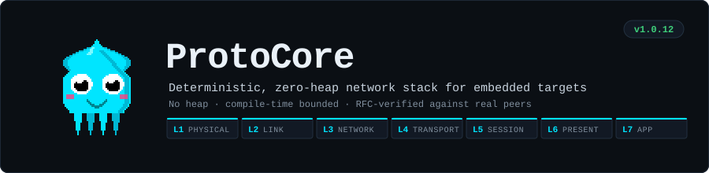
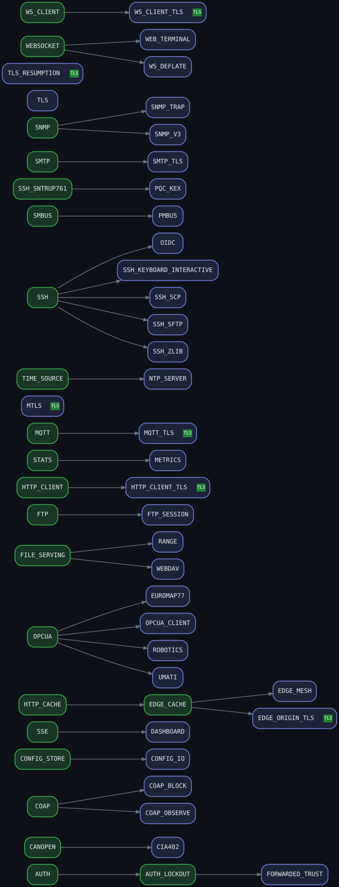

<p align="center">
  
</p>

# ProtoCore (@dstroy0)

[](docs/CHANGELOG.md)
[](LICENSE)
[](https://dstroy0.github.io/ProtoCore/)
[](https://dstroy0.github.io/ProtoCore/features.html)

[](https://github.com/dstroy0/ProtoCore/actions/workflows/esp32-build.yml)
[](https://github.com/dstroy0/ProtoCore/actions/workflows/arduino-build.yml)
[](https://github.com/dstroy0/ProtoCore/actions/workflows/test-report.yml)
[](https://github.com/dstroy0/ProtoCore/actions/workflows/interop-harness.yml)
[](https://github.com/dstroy0/ProtoCore/actions/workflows/codeql.yml)
[](https://sonarcloud.io/summary/new_code?id=ProtoCore)
[](https://github.com/dstroy0/ProtoCore/actions/workflows/pentest.yml)
[](https://github.com/dstroy0/ProtoCore/actions/workflows/format-code.yml)
[](https://github.com/dstroy0/ProtoCore/actions/workflows/markdown-format.yml)
[](https://github.com/dstroy0/ProtoCore/actions/workflows/spellcheck.yml)
[](https://github.com/dstroy0/ProtoCore/actions/workflows/docs.yml)
[](https://github.com/dstroy0/ProtoCore/actions/workflows/feature-tables.yml)
[](https://github.com/dstroy0/ProtoCore/actions/workflows/web-assets.yml)
[](https://github.com/dstroy0/ProtoCore/actions/workflows/changelog.yml)
[](https://github.com/dstroy0/ProtoCore/actions/workflows/release.yml)

A multi-protocol network server for microcontrollers with a fully deterministic memory footprint, RFC 7230 compliant request parsing, and an OSI-layered architecture. It serves HTTP/1.1/2/and 3 over QUIC, HTTPS/TLS/DTLS, SSH (full OpenSSH interop), Telnet, SNMP, and post quantum crypto.

**Supported today:** ESP32, all 13 variants. The core is vendor-neutral C with no vendor idioms; Arm and TI C2000 are in progress, tracked in [docs/ROADMAP.md](docs/ROADMAP.md).

## Active development

> [!WARNING]
>
> 1. **Expect breaking changes**
> 2. **We fix things the right way and put security and correctness first**
> 3. **We do not write backwards-compatibility shims**
> 4. **We only support the latest library, toolchains, and platforms**
> 5. **Releases are version-tagged**
>
> - Pin an exact version if you need stability until we lock the core.
>   **The code is the source of truth**
> - Read [CHANGELOG.md](docs/CHANGELOG.md) before every upgrade.

## Audit status

> [!WARNING]
> **THIS LIBRARY HAS NOT BEEN AUDITED BY A 3RD PARTY**
>
> No third party has reviewed this library. The core is not yet locked; it needs that stability to make
> contribution and collaboration practical, and there has been no time for outside ideas to flow in.
> Current verification state is measured, not claimed:
>
> **YOU ARE THE 3RD PARTY**
>
> - Your contributions are valuable. Please report your findings. If your bug is untracked and genuine you will be credited prominently
>   in the src/ in docs/BUGS.md and any other system it touches, could be architecture, api, whichever subsystem
>   with your preference of credit (name, handle, email, anonymous, your preference).
>
>     [docs/AUDIT.md](docs/AUDIT.md) [docs/STANDARDS.md](docs/STANDARDS.md)

<!-- BEGIN GENERATED PROJECT STATUS (tools/ci_tooling/generate/gen_readme_intro.py) -->

<!-- prettier-ignore-start -->

| | |
| --- | --- |
| Host test suite | **13 tests** pass across 304 native environments |
| Measured coverage | **75.5% line**, **69.2% branch** over 313 instrumented files |
| External audit | **none** - no third party has reviewed this library |

Coverage is measured over all of `src/`, with nothing excluded. Numbers come from `test/coverage.xml` and `test/TEST_REPORT.md`, both regenerated by CI.

<!-- prettier-ignore-end -->

<!-- END GENERATED PROJECT STATUS -->

## Overview

<!-- BEGIN GENERATED API FLOW (tools/ci_tooling/generate/gen_api_flow.py) -->

<!-- prettier-ignore-start -->

> Generated from the public API, `proto_builtins.c`, and `presentation/` by `tools/ci_tooling/generate/gen_api_flow.py` - do not edit by hand. The picture is an SVG (native text labels, so it stays sharp at any zoom and the type is selectable); its mermaid source is [`docs/diagrams/api_flow.mmd`](docs/diagrams/api_flow.mmd).

**How to read it:** follow the arrows. A **request comes in** at the top from a client, travels **down** through the four OSI layers - L4 wire bytes, L5 protocol pick, L6 decode into a request, L7 your routes - your handler runs, and the **response goes back out** along the **green** arrows. Each box shows a plain-English step with the exact function underneath. You only write the two **amber** parts: register your routes (top) and your handler (middle).

The one idea worth taking away: every HTTP version (1.1, 2, 3) is decoded into the *same* request and answered through *one* response seam, so your routes and handlers never care which protocol a client used.

| Color | Layer |
| --- | --- |
| Amber outline | **L4 Transport** - raw bytes on/off the wire |
| Green | **L5 Session** - the two seams that pick the protocol in and frame the reply out |
| Blue | **L6 Presentation** - decrypt + turn bytes into a request |
| Indigo | **L7 Application** - route matching + your handlers |
| Solid amber fill | the parts **you** write |

<a href="docs/diagrams/api_flow.svg" title="Open the request-lifecycle diagram full size">
  
</a>

<!-- prettier-ignore-end -->

<!-- END GENERATED API FLOW -->

## Quick start

<!-- BEGIN GENERATED QUICK START (tools/ci_tooling/generate/gen_readme_intro.py) -->

<!-- prettier-ignore-start -->

> Copied verbatim from [`examples/Foundation/Basic/Basic.ino`](examples/Foundation/Basic/Basic.ino), which CI compiles. If the API changes, that sketch fails to build and this block changes with it.

```cpp
#include "protocore.h"
#include "network_drivers/physical/physical.h"

static const char *SSID = "YOUR_SSID";
static const char *PASSWORD = "YOUR_PASSWORD";


// Every handler takes the connection's slot_id and the parsed request, and
// replies through send_text(). Pass slot_id back so the reply reaches the
// connection that asked.
void handle_root(uint8_t slot_id, HttpReq *req)
{
    send_text(slot_id, 200, "text/plain", "Welcome to ProtoCore!");
}

void setup()
{
    Serial.begin(115200);

    Physical.wifi->init(SSID, PASSWORD);
    while (!Physical.wifi->ready())
    {
        delay(250);
    }

    uint32_t ip = Physical.link->egress_ip(); // library egress IP (network byte order), no Arduino WiFi
    Serial.printf("IP: %u.%u.%u.%u\n", (unsigned)(ip & 0xFF), (unsigned)((ip >> 8) & 0xFF),
                  (unsigned)((ip >> 16) & 0xFF), (unsigned)((ip >> 24) & 0xFF));

    on_http("/", HTTP_GET, handle_root);

    // begin() returns 1 on success and a negative value on failure (listener
    // pool full or lwIP error). -1 is truthy, so test for "< 0", not "!result".
    int32_t result = begin_http(80, NULL);
    if (result < 0)
    {
        Serial.printf("begin() failed (error %d)\n", result);
        return;
    }
    Serial.println("Server started on port 80");
}

void loop()
{
    // Drives the full pipeline each iteration:
    //   1. Timeout sweep (force-closes idle connections)
    //   2. Event queue drain (TCP connect/data/disconnect events)
    //   3. HttpRoute dispatch for completed requests
    //   4. Auto-sends 400 / 413 / 414 / 501 for parser error states
    // No request is processed off this call, so loop() must never block.
    handle();
}
```

Set `SSID` / `PASSWORD`, flash, and open Serial at 115200 for the IP. Full walkthrough: [`examples/Foundation/Basic`](examples/Foundation/Basic/README.md).

<!-- prettier-ignore-end -->

<!-- END GENERATED QUICK START -->

## Installation

Install the **esp32 by Espressif** boards package (3.x), then install this library (Library Manager, or drop it in your `libraries/` folder). The bundled examples build unmodified; each ships a `build_opt.h` that turns on the features it needs.

Optional features are compile-time flags. In the Arduino IDE there is no `build_flags` field, and a `#define` in your `.ino` does **not** reach the library's separately-compiled `.cpp` files, so to enable a feature you place a file named **`build_opt.h`** in the same folder as your sketch (the one file the IDE feeds to every translation unit). The easy way:

1. Open the [interactive configurator](https://dstroy0.github.io/ProtoCore/configurator.html) and pick the features you want (dependencies resolve for you).
2. Switch to the **Arduino build_opt.h** tab and click **Download**.
3. Drop the downloaded `build_opt.h` next to your `.ino` and compile.

PlatformIO users ignore all of this and just use `build_flags` in `platformio.ini` (the configurator's default tab emits that block). ESP-IDF is supported as an arduino-as-ESP-IDF component.

There are **per-variant** (classic, C6, P4, etc.) default values (psram, flash) to allow operation out of the box. Your application may require tuning. Moving the TLS arena and connection pool to psram allows for a stupid amount of concurrent connections for this device class.

## 📚 Documentation

**[Read the Full Documentation Here 📖](https://dstroy0.github.io/ProtoCore/)**

**[Interactive build configurator ⚙️](https://dstroy0.github.io/ProtoCore/configurator.html)** lets you pick the features you need, tune their knobs, and copy out a ready-made `platformio.ini` `build_flags` block (or the `#define`s). Dependencies resolve automatically and only non-default values are emitted. It is generated from `src/protocore_config.h`, so it always matches the library.

The technical reference documentation has been moved to a dedicated landing page to provide a better reading experience. You can also view the local markdown copy at [docs/README.md](docs/README.md). See the [feature reference](docs/FEATURES.md) for every option and the [secure-boot & flash-encryption hardening guide](docs/SECURE_BOOT.md) for production deployment. Wiring a codec to a PLC, inverter, power-grid sensor, or another board? The [hardware hookup & settings guide](docs/HARDWARE_HOOKUP.md) covers the transceivers, ports, and settings.

## Features

**Everything is opt-in.** A build carries the HTTP/1.1 core and nothing else until you name a flag, so the footprint is what you asked for rather than what the library ships with. The map below is live: click a layer to browse that group.

<!-- BEGIN GENERATED FEATURE TABLES (tools/ci_tooling/generate/gen_feature_tables.py) -->

<!-- prettier-ignore-start -->

**256 features**, every one a compile-time `PC_ENABLE_*` flag that is off unless you ask for it. Core HTTP/1.1 parsing, routing, middleware, JSON, templating and chunked responses are always on and are not flags.

<a href="https://dstroy0.github.io/ProtoCore/features.html" title="Browse every feature">
  
</a>

| Layer | Features | For example |
| --- | --- | --- |
| **Foundation** | 17 | Config IO, Config Store, Device ID, DMA Peripheral Ingest, … |
| **Physical & Data Link (L1-L2)** | 31 | ADS1115, BLE GATT, Bus Capture, CC1101, … |
| **Network (L3)** | 6 | Dns Resolver, Happy Eyeballs, IPv6, Link Manager, … |
| **Transport (L4)** | 9 | Accept Throttle, IP Allowlist, Keep-Alive, MTLS, … |
| **Session (L5)** | 5 | SSH, SSH Compression, SSH SCP, SSH SFTP, … |
| **Presentation (L6)** | 18 | Auth, Auth Lockout, CBOR, CloudEvents, … |
| **Application (L7)** | 170 | AD9238, Adaptive mDNS, ADS (Beckhoff), AMQP, … |

**[Browse all of them →](https://dstroy0.github.io/ProtoCore/features.html)** - filterable, grouped by layer, one line each. Full descriptions live in [FEATURES.md](docs/FEATURES.md); both are generated from it, so they cannot drift.

<!-- prettier-ignore-end -->

<!-- END GENERATED FEATURE TABLES -->

## Build-flag dependencies

Most features are independent. A few build on another feature and will not
compile without it; those hard dependencies are enforced at compile time with a
clear `#error` (so an illegal combination fails fast instead of producing a
cryptic linker error). Enable a child flag only together with its parent.

<!-- BEGIN GENERATED FLAG DEPS (tools/ci_tooling/generate/gen_flag_deps.py) -->

<!-- prettier-ignore-start -->

> Generated from the declared `PC_ENABLE_<A>_NEEDS_<B>` symbols in [src/protocore_config.h](src/protocore_config.h) by `tools/ci_tooling/generate/gen_flag_deps.py` - do not edit by hand. The picture is an SVG: every node is a link to that feature's entry and carries a hover tooltip naming what it needs. Graphviz source: [`docs/diagrams/flag_deps.dot`](docs/diagrams/flag_deps.dot).

Each **green** node is a parent feature and each **blue** node a child that needs it (a hard `#error` otherwise) - enable the parent to build the child. A green **`TLS`** badge on a node means that feature also needs `PC_ENABLE_TLS` (shown as a badge rather than an edge so no lines cross). **Hover a flag for what it needs; click it to read the feature.** (Auto-derived flags and PSRAM-class features are listed below the picture rather than drawn as edges, so the graph stays a clean family forest.)

<a href="docs/diagrams/flag_deps.svg" title="Open the build-flag dependency graph full size">
  
</a>

> Not drawn (so the forest stays uncrossed): **`PC_ENABLE_RANGE`** also need `PC_ENABLE_EDGE_CACHE`; **`PC_ENABLE_EDGE_CACHE`** also need `PC_ENABLE_HTTP_CLIENT`.

<details><summary><b>Auto-derived flags</b> - enabling the left flag turns the right one on for you; do not set it yourself.</summary>

| Enabling this... | ...auto-enables |
| --- | --- |
| `PC_ENABLE_EDGE_ORIGIN_TLS` | `PC_ENABLE_CLIENT_TLS` |
| `PC_ENABLE_HTTP_CLIENT_TLS` | `PC_ENABLE_CLIENT_TLS` |
| `PC_ENABLE_MQTT_TLS` | `PC_ENABLE_CLIENT_TLS` |
| `PC_ENABLE_OTA` | `PC_ENABLE_STREAM_BODY` |
| `PC_ENABLE_UPLOAD` | `PC_ENABLE_STREAM_BODY` |
| `PC_ENABLE_WEBDAV` | `PC_ENABLE_STREAM_BODY` |
| `PC_ENABLE_WS_CLIENT_TLS` | `PC_ENABLE_CLIENT_TLS` |
</details>

<details><summary><b>PSRAM-class features</b> - the pool cannot fit internal DRAM; enable `*_IN_PSRAM` or acknowledge with an `*_ACK_DRAM` opt-out.</summary>

| Feature | Gate |
| --- | --- |
| `PC_ENABLE_SSH_ZLIB` | PSRAM pool |
| `PC_ENABLE_TLS` | MAX_TLS_CONNS gt 1 |
</details>

_45 hard dependencies, 2 PSRAM gates, 7 derived flags._

<!-- prettier-ignore-end -->

<!-- END GENERATED FLAG DEPS -->

## Build Footprint

The jump from a bare sketch to a running server is almost entirely the WiFi/lwIP stack, not this library: an empty RTOS/Arduino sketch is already ~228 KB flash / ~21 KB RAM. TLS's larger RAM is the fixed mbedTLS arena (`PC_TLS_ARENA_SIZE`, 48 KB default); an outbound client links no code until a sketch actually calls it.

<!-- BEGIN GENERATED FOOTPRINT BUDGET (tools/ci_tooling/generate/feature_budget.py) -->

<!-- prettier-ignore-start -->

> Autogenerated by `tools/ci_tooling/generate/feature_budget.py` from isolated ESP32 builds - do not edit by hand.

Measured on `esp32dev` (Arduino core). The **default server** (HTTP + WebSocket + SSE + multipart + file serving + Basic auth) is **735 KB flash / 64.6 KB RAM** on a chip with 1,280 KB flash / 320 KB RAM. Everything past that is opt-in and links only what you name.

**[Per-feature build footprints &rarr;](docs/FOOTPRINTS.md)** - 80 features that add measurable flash, each measured from isolated builds as a range: best case (its dependencies are already linked) to worst case (budget with this). Every example's absolute total is there too.

<!-- prettier-ignore-end -->

<!-- END GENERATED FOOTPRINT BUDGET -->

Per-feature examples are under [`examples/`](examples/).

## Compatibility

- **Supported today**: ESP32 - 13 variant profiles (classic, S2, S3, S31, C2, C3, C5, C6, C61,
  H2, H21, H4, P4), each with its own flash / PSRAM defaults under
  [`src/core_setup/board_profiles/esp/`](src/core_setup/board_profiles/esp/).
- **Frameworks**: Arduino Core (2.x and 3.x), PlatformIO, ESP-IDF (as an arduino-as-ESP-IDF component)
- **In progress**: Arm and TI C2000. The core is vendor-neutral C and the HAL selects on variant
  capability rather than on a chip check, so what remains is per-vendor silicon support, tracked
  in [docs/ROADMAP.md](docs/ROADMAP.md). TI C2000 is the hard case: `CHAR_BIT == 16`, so there is
  no 8-bit addressable memory and a byte pointer is not a byte pointer.

### Continuous integration

Fifteen workflows run on every push to `main` - builds for ESP32 and Arduino, the host test suite, the interop harness against real peers, CodeQL and SonarCloud, a pentest pass, three formatting/lint gates, and the four that regenerate what you are reading. Their live status is in the badges at the top of this file; each one links to its own runs, and all of them are in [`.github/workflows/`](.github/workflows/).

## Licensing & Commercial Use

This library is dual-licensed.

**Open Source.** This library is, and will **ALWAYS REMAIN, FULLY OPEN-SOURCE** under the AGPLv3 (or later). We commit to maintaining a fully featured, parity-matched open-source version available to everyone - from hobbyists and educators to professionals - without hiding any non-proprietary (e.g. custom protocols, intellectual property, confidential telemetry configurations, etc.) feature behind a commercial paywall. It will always be free to use under the AGPLv3 (or later) in any environment that complies with the AGPLv3 (or later) terms. See the `LICENSE` file.

**Commercial.** For teams and applications that cannot meet the AGPLv3 copyleft requirements, a commercial license is available. Contact: Douglas Quigg (dstroy0), dquigg123@gmail.com

**Educators.** Teaching with this? We'd love that. **SERIOUSLY**. Squirty is meant to keep children engaged on the docs page. The docs and styling are set up to appeal to them, hobbyists, and anyone who wants to learn but doesn't know how to style things or glue services together. The library documentation is extensive, extremely thorough, and useful to professionals as well as educators as a teaching tool/classroom prop. If sharing your source under the AGPLv3 isn't practical for a classroom or lab, or you have concerns that have stopped you from using copyleft licensed software before, email Douglas Quigg (dstroy0) at dquigg123@gmail.com from your school address and we'll see what we can do. ESP32 boards are cheap and a hands-on HTTP / IoT-edge stack is a great way into embedded networking, so we're glad to look at education-focused requests one by one. We can't promise an exception for every situation, but please ask. (This is just for genuine educational use; for products, see the commercial option above.) I can help you set up a github repo your students can push to that will help you review their submissions, and walk you through setting up flags for your rubric items. We really need to make an effort to get as many people as possible into the profession, looking at how things work, figuring out how they work on a deeper level, and entering the profession, we need their ideas, we need them now. All great discoveries have come from fresh perspective.

---

<p align="center">
  <br>
  <b>Squirty the Injection Squid</b> official library mascot.<br>
  <sub>Copyright &copy; Douglas Quigg (dstroy0). All rights reserved.</sub>
</p>
