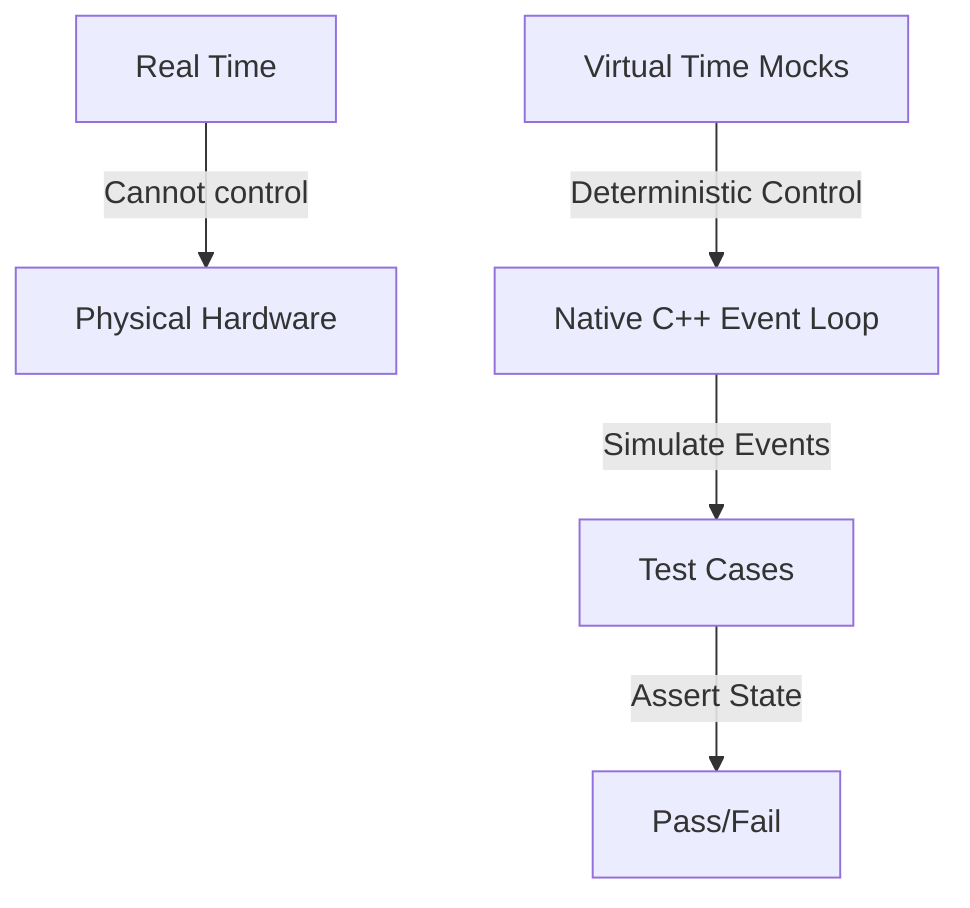

#Test Suite

Welcome to the testing documentation for `ProtoCore`. This repository is designed to be extremely robust, employing **100% hardware-free, deterministic testing**.

Whether you are a beginner looking to understand how C++ testing works or an expert systems engineer designing secure, high-concurrency embedded protocols, this guide explains the architectures, methodologies, and concepts behind our test suite.

---

## 1. Introduction & Core Philosophy

### Why Native Testing?

Traditionally, testing code written for microcontroller frameworks like ESP-IDF or Arduino requires uploading binaries to physical ESP32 chips. This hardware-in-the-loop (HIL) testing has several drawbacks:

- **Slow feedback cycles**: Compiling, flashing, and rebooting microcontrollers takes minutes.
- **Flakiness**: Wireless connections fail, hardware pins float, and components experience wear.
- **Hard-to-reproduce bugs**: Multi-threaded concurrency bugs or network timing jitter cannot be reliably reproduced on physical chips.

`ProtoCore` solves this by executing all test suites **natively** on your development machine (x86/x64 host).

### The Deterministic Asynchronous Model

This server is built on cooperative multitasking. Instead of physical threads, it uses a single-threaded event-driven event loop. Because of this, we can make tests **100% deterministic** through **Time-Travel Mocking**.

Instead of waiting for real-world seconds to elapse to test a connection timeout, the test suite manually increments a virtual clock (`millis()`) and drives the state machine forward manually. This means:

- A 5-second connection timeout can be tested in **less than a millisecond**.
- Execution order is guaranteed to be identical on every single run, eliminating race-condition flakiness.



---

## 2. Test Architecture & Mocking Strategies

To isolate our application code from physical hardware and the operating system's IP stack, we use a custom mocking layer.

### Mocks, Stubs, and Spies

- **Stubs**: Provide canned answers to calls made during the test. For example, our **Filesystem Stub** simulates an SPIFFS/LittleFS system by feeding static file contents from memory arrays instead of reading from a physical hard drive.
- **Mocks**: Objects pre-programmed with expectations that form a specification of the calls they are expected to receive.
- **Virtual Network Taps**: We mock the network stack completely. Instead of binding to real network sockets, we hook the server directly into virtual byte-pumps (ring buffers) that simulate incoming TCP packets.

```
       +---------------------------------------------+
       |                  TEST SUITE                 |
       +----------------------++---------------------+
                              || Simulates network packets
                              \/
       +---------------------------------------------+
       |             VIRTUAL TRANSPORT               |
       |  (mocks sockets, ring buffers, timeouts)    |
       +----------------------++---------------------+
                              || Drives HTTP/SSH bytes
                              \/
       +---------------------------------------------+
       |            CORE WEB SERVER ENGINE           |
       |     (HTTP parser, WebSockets, SSH)          |
       +---------------------------------------------+
```

---

## 3. PlatformIO Test Environments

<!-- BEGIN GENERATED test-environments (edit test/test_matrix.json, run test/gen_test_readme.py) -->

The native test matrix has **454 environments**, one per feature, generated from [test_matrix.json](test_matrix.json) into [platformio.ini](../platformio.ini) by [gen_test_envs.py](gen_test_envs.py). Each compiles a strict per-feature slice of `src/` with its own flags and runs that feature's suite in isolation, so "this feature builds and tests on its own" stays guaranteed.

| Environment | Feature flag(s) | Test suite(s) | Purpose |
| :--- | :--- | :--- | :--- |
| `native_accept_gate` | `PROTOCORE_ENFORCE_HOST_HEADER=0`, `PROTOCORE_ENABLE_ACCEPT_THROTTLE=1`, `PROTOCORE_ENABLE_PER_IP_THROTTLE=1`, `PROTOCORE_ENABLE_IP_ALLOWLIST=1`, `PROTOCORE_ACCEPT_THROTTLE_MAX=3`, `PROTOCORE_ACCEPT_THROTTLE_WINDOW_MS=1000`, `PROTOCORE_PER_IP_THROTTLE_MAX=2`, `PROTOCORE_PER_IP_THROTTLE_WINDOW_MS=1000`, `PROTOCORE_PER_IP_THROTTLE_SLOTS=4`, `PROTOCORE_IP_ALLOWLIST_SLOTS=4` | `unit/integration/transport/test_accept_gate` | Accept-time connection gates with their flags ON (PROTOCORE_ENABLE_ACCEPT_THROTTLE / PER_IP_THROTTLE / IP_ALLOWLIST): the global fixed-window throttle, the per-source-IP bucket table (independent budg... |
| `native_ad9238` | `PROTOCORE_ENABLE_AD9238=1` | `unit/file_conversion/server/peripherals/ad9238/test_ad9238` | AD9238 SPI configuration-port codec (server/peripherals/ad9238): the 16-bit instruction word (R/W + byte-count + 13-bit address) for single-byte register writes/reads, the device-update transfer trans... |
| `native_ads` | `PROTOCORE_ENABLE_ADS=1` | `unit/src/services/fieldbus/ads/test_ads` | Beckhoff ADS / AMS codec (services/fieldbus/ads): the AMS/TCP + AMS-header request builders (little-endian, target-before-source addressing, cmd id + state flags + cbData + invoke id) for Read/Write/R... |
| `native_ads1115` | `PROTOCORE_ENABLE_ADS1115=1` | `unit/src/server/peripherals/ads1115/test_ads1115` | ADS1115 16-bit ADC codec (server/peripherals/ads1115): building the 16-bit config word for a single-shot single-ended reading (channel MUX, gain, data rate, start/mode/comparator bits, with out-of-ran... |
| `native_aesgcm_kat` | default | `unit/src/crypto/aead/test_ssh_aesgcm` | AES-256-GCM (crypto/aead/aesgcm.h) against the NIST CAVP AES-256-GCM known-answer vectors from the SP 800-38D validation set (Keylen 256 / IVlen 96 / Taglen 128): empty message, AAD-only GMAC, one who... |
| `native_amqp` | `PROTOCORE_ENABLE_AMQP=1` | `unit/src/services/iot/amqp/test_amqp` | AMQP 0-9-1 frame codec (services/iot/amqp): the protocol header, the frame + method builders, the heartbeat, and the frame/method parsers (type/channel/size/payload/0xCE). |
| `native_application` | `PROTOCORE_ENABLE_FILE_SERVING=1` | `unit/integration/misc/test_application` | test_application against the native_stack_http stack. |
| `native_arena` | default | `unit/src/mmgr/test_arena` | Unified double-ended server arena (server/core/protocore_arena): first-fit persistent end (bottom, individual free + coalesce + boundary shrink) + bump scratch end (top, mark/release/reset) sharing a ... |
| `native_atc` | `PROTOCORE_ENABLE_ATC=1` | `unit/src/services/machine_tool/atc/test_atc` | ATC field-I/O interop snapshot (services/machine_tool/atc): serialize this device's field-I/O map as {"inputs":[...],"outputs":[...]} JSON for an ATC engine over HTTP, plus the output setter and value... |
| `native_audit_log` | `PROTOCORE_ENABLE_AUDIT_LOG=1` | `unit/src/server/security/audit_log/test_audit_log` | Tamper-evident hash-chained audit log (server/security/audit_log). |
| `native_auth` | `PROTOCORE_ENABLE_AUTH=1` | `unit/integration/http/test_auth` | test_auth against the native_stack_http stack. |
| `native_auth_lockout` | `PROTOCORE_ENABLE_AUTH=1`, `PROTOCORE_ENABLE_AUTH_LOCKOUT=1` | `unit/src/server/security/auth_lockout/test_auth_lockout` | Per-IP brute-force auth lockout (server/security/auth_lockout): exponential-backoff lockout state machine. |
| `native_bacnet` | `PROTOCORE_ENABLE_BACNET=1` | `unit/src/services/fieldbus/bacnet/test_bacnet` | BACnet/IP BVLC + NPDU codec (services/fieldbus/bacnet): the BVLC envelope (type 0x81, function, length) + the NPDU header (version + NPCI control + optional DNET/DADR + hop count) builders and parsers... |
| `native_base64` | default | `unit/src/network_drivers/presentation/codec/base64/test_base64` | test_base64 against the native_stack_l46 stack. |
| `native_base64_scalar` | `PROTOCORE_BASE64_SWAR=0` | `unit/src/network_drivers/presentation/codec/base64/test_base64` | base64 scalar constant-time decode fallback (PROTOCORE_BASE64_SWAR=0): classify one character at a time instead of the default SWAR four-per-word path. |
| `native_bitio` | default | `unit/src/mmgr/test_bitio` | The LSB-first bit writer (mmgr/bitio.h) the DEFLATE encoder and the SSH zlib@openssh.com compressor both write their bitstreams through. |
| `native_ble_gatt` | `PROTOCORE_ENABLE_BLE_GATT=1` | `unit/src/services/radio/ble_gatt/test_ble_gatt` | Bluetooth ATT codec + GATT bridge (services/radio/ble_gatt): build/parse the common ATT PDUs (read/write/notify/error, LE handles) and serialize a GATT characteristic table as JSON for the web stack. |
| `native_ble_gatt_att` | `PROTOCORE_ENABLE_BLE_GATT=1` | `unit/src/services/radio/ble_gatt/test_ble_gatt` | Bluetooth ATT codec and GATT characteristic bridge (services/radio/ble_gatt/ble_gatt.c): the Core Specification Vol 3 Part F section 3.4 PDU layouts and their section 3.4.8 opcodes with little-endian ... |
| `native_bus_capture` | `PROTOCORE_ENABLE_BUS_CAPTURE=1` | `unit/src/server/signaling/test_bus_capture` | CAN listen-only capture framing (server/signaling/bus_capture): can_to_socketcan() building the 16-byte Linux SocketCAN frame (big-endian can_id, EFF/RTR flags, length, data) and the DLT_CAN_SOCKETCAN... |
| `native_bus_wire` | `PROTOCORE_ENABLE_SHT3X=1`, `PROTOCORE_ENABLE_PCA9685=1`, `PROTOCORE_ENABLE_INA219=1`, `PROTOCORE_ENABLE_RTC=1`, `PROTOCORE_ENABLE_SMBUS=1` | `unit/integration/peripherals/test_bus_wire` | End to end from the host harness through the library: a real peripheral driver is called, it goes through the real I2C / SPI bus owner, and the bytes it put on the wire are asserted. |
| `native_bytes` | default | `unit/src/mmgr/test_bytes` | The byte verbs (mmgr/bytes.h): append into a protocore_span, take out of a protocore_cspan, and the offset-passing reads a parser walks a raw payload with. |
| `native_c37118` | `PROTOCORE_ENABLE_C37118=1` | `unit/src/services/energy/c37118/test_c37118` | IEEE C37.118.2 synchrophasor frame codec (services/energy/c37118): CRC-CCITT, the frame builder + Command frame, and the CRC-validating parser (type / ids / timestamp / payload). |
| `native_canopen` | `PROTOCORE_ENABLE_CANOPEN=1` | `unit/src/services/fieldbus/canopen/test_canopen` | CANopen (CiA 301) message codec (services/fieldbus/canopen): NMT, SYNC, heartbeat, EMCY, PDO, and expedited SDO read/write/abort + the COB-ID classifier, over the shared CAN frame (shared/can/can.h). |
| `native_cbor` | `PROTOCORE_ENABLE_CBOR=1` | `unit/src/network_drivers/presentation/codec/cbor/test_cbor` | CBOR (RFC 8949) encoder (network_drivers/presentation/codec/cbor): a pure byte-output codec, host-tested against the RFC 8949 Appendix A vectors. |
| `native_cc1101` | `PROTOCORE_ENABLE_CC1101=1` | `unit/protocols/radio/test_cc1101` | CC1101 sub-GHz radio driver (services/radio/cc1101): the TI SPI header protocol (config registers, command strobes, status registers, TX/RX FIFO) - init/detect, variable-length send, TX-done, set-rx, ... |
| `native_cclink` | `PROTOCORE_ENABLE_CCLINK=1` | `unit/file_conversion/services/fieldbus/cclink/test_cclink` | CC-Link cyclic fieldbus frame codec (services/fieldbus/cclink): the frame ([station][command][bit data][word data][sum]) build + parse and the bit/word process-image accessors. |
| `native_chachapoly_kat` | default | `unit/src/crypto/cipher/test_ssh_chachapoly` | chacha20-poly1305@openssh.com (crypto/aead/chachapoly.h). |
| `native_chunked` | default | `unit/integration/shared/test_chunked` | test_chunked against the native_stack_http stack. |
| `native_cia402` | `PROTOCORE_ENABLE_CIA402=1`, `PROTOCORE_ENABLE_CANOPEN=1` | `unit/src/services/fieldbus/cia402/test_cia402` | CiA 402 / IEC 61800-7-201 drive profile (services/fieldbus/cia402): the Statusword power-state decode (mask/value table), the Controlword commands + enable sequence, Statusword flags, the CANopen SDO ... |
| `native_cip` | `PROTOCORE_ENABLE_CIP=1` | `unit/src/services/fieldbus/cip/test_cip` | CIP message codec (services/fieldbus/cip): the EPATH logical-segment builder, the request builders (Get_Attribute_Single), and the response parser (service / status / data). |
| `native_client` | `PROTOCORE_ENABLE_HTTP_CLIENT=1` | `unit/protocols/transport/test_client` | Outbound TCP client transport (network_drivers/transport/tcp/tcp_client.c), the pooled layer-4 peer of tcp.c used by http_client / mqtt / ws_client / relay / smtp / ssh port-forward (PROTOCORE_NEED_CL... |
| `native_clock` | default | `unit/protocols/protocore_clock/test_clock` | Pluggable monotonic clock (server/clock): default millis(), custom clock divided down to the internal 1000 Hz, plus the microsecond base and latency budgeting. |
| `native_cloudevents` | `PROTOCORE_ENABLE_CLOUDEVENTS=1` | `unit/src/services/iot/cloudevents/test_cloudevents` | CloudEvents v1.0 envelope (services/iot/cloudevents): the structured-JSON builder (over the JSON writer) + the binary-mode ce-* header reader. |
| `native_coap` | `PROTOCORE_ENABLE_COAP=1`, `PROTOCORE_ENABLE_COAP_BLOCK=1`, `PROTOCORE_COAP_BLOCK_SZX_MAX=2`, `PROTOCORE_COAP_BLOCK1_MAX=128` | `unit/protocols/transport/test_coap` | CoAP server (RFC 7252) message codec + resource dispatch. |
| `native_coap_observe` | `PROTOCORE_ENABLE_COAP=1`, `PROTOCORE_ENABLE_COAP_BLOCK=1`, `PROTOCORE_COAP_BLOCK_SZX_MAX=2`, `PROTOCORE_COAP_BLOCK1_MAX=128`, `PROTOCORE_ENABLE_COAP_OBSERVE=1` | `unit/protocols/transport/test_coap` | CoAP with resource observation (RFC 7641) enabled. |
| `native_coaps` | `PROTOCORE_ENABLE_DTLS=1`, `PROTOCORE_ENABLE_COAP=1` | `unit/integration/iot/test_coaps` | CoAP over DTLS (services/iot/coap/coaps, RFC 7252 sec 9): the bridge that drives a DtlsConn handshake and, once established, unwraps each epoch-3 application record, answers it with coap_server_proces... |
| `native_coaps_server` | `PROTOCORE_ENABLE_DTLS=1`, `PROTOCORE_ENABLE_COAP=1` | `unit/integration/iot/test_coaps_server` | CoAP-over-DTLS server front-end (services/iot/coap/coaps_server): the per-peer DtlsConn pool + ingest/poll seam on top of protocore_coaps_process(). |
| `native_codec_base64` | default | `unit/src/network_drivers/presentation/codec/base64/test_base64` | The base64 codec (network_drivers/presentation/codec/base64) against RFC 4648: the seven sec 10 BASE64() vectors verbatim in both directions, the sec 4 Table 1 and sec 5 Table 2 spellings of alphabet ... |
| `native_codec_base64_scalar` | `PROTOCORE_BASE64_SWAR=0` | `unit/src/network_drivers/presentation/codec/base64/test_base64` | The base64 scalar constant-time decode fallback (PROTOCORE_BASE64_SWAR=0): classify one character at a time instead of the default four-per-word SWAR path. |
| `native_codec_cbor` | `PROTOCORE_ENABLE_CBOR=1` | `unit/src/network_drivers/presentation/codec/cbor/test_cbor` | The CBOR codec (network_drivers/presentation/codec/cbor) against RFC 8949. |
| `native_codec_deflate` | `PROTOCORE_ENABLE_WS_DEFLATE=1`, `PROTOCORE_ENABLE_WEBSOCKET=1` | `unit/src/network_drivers/presentation/codec/deflate/test_deflate` | The RFC 1951 DEFLATE compressor (network_drivers/presentation/codec/deflate), the WebSocket permessage-deflate sender. |
| `native_codec_hpack_prim` | `PROTOCORE_ENABLE_HTTP2=1` | `unit/src/network_drivers/presentation/codec/hpack_prim/test_hpack` | The field-coding primitives HPACK and QPACK share (network_drivers/presentation/codec/hpack_prim) against RFC 7541, which RFC 9204 sec 5 hands QPACK verbatim. |
| `native_codec_inflate` | `PROTOCORE_ENABLE_WS_DEFLATE=1`, `PROTOCORE_ENABLE_WEBSOCKET=1` | `unit/src/network_drivers/presentation/codec/inflate/test_inflate` | The RFC 1951 INFLATE core (network_drivers/presentation/codec/inflate), the WebSocket permessage-deflate receiver. |
| `native_codec_rfc1951` | default | `unit/src/network_drivers/presentation/codec/deflate/test_rfc1951` | The RFC 1951 code tables (network_drivers/presentation/codec/deflate/rfc1951): the sec 3.2.5 length and distance tables transcribed from the RFC's own printed rows rather than from the implementation,... |
| `native_codeql` | `PROTOCORE_ENABLE_CSRF=1`, `PROTOCORE_ENABLE_AUTH=1`, `PROTOCORE_ENABLE_AUTH_LOCKOUT=1`, `PROTOCORE_ENABLE_IP_ALLOWLIST=1`, `PROTOCORE_ENABLE_WS_DEFLATE=1`, `PROTOCORE_ENABLE_TIME_SOURCE=1`, `PROTOCORE_ENABLE_CONFIG_STORE=1`, `PROTOCORE_ENABLE_DEVICE_ID=1`, `PROTOCORE_ENABLE_TELEMETRY=1`, `PROTOCORE_ENABLE_DASHBOARD=1`, `PROTOCORE_ENABLE_PARTITION_MONITOR=1`, `PROTOCORE_ENABLE_CBOR=1`, `PROTOCORE_ENABLE_MSGPACK=1`, `PROTOCORE_ENABLE_GPIO_MAP=1`, `PROTOCORE_ENABLE_UDP_TELEMETRY=1`, `PROTOCORE_ENABLE_GUARDRAILS=1`, `PROTOCORE_ENABLE_FAILSAFE=1`, `PROTOCORE_ENABLE_SLEEP_SCHED=1`, `PROTOCORE_ENABLE_WEARLEVEL=1`, `PROTOCORE_ENABLE_NETADAPT=1`, `PROTOCORE_ENABLE_DSHOT=1`, `PROTOCORE_ENABLE_HART=1`, `PROTOCORE_ENABLE_NTS=1`, `PROTOCORE_ENABLE_DDS=1`, `PROTOCORE_ENABLE_XMPP=1`, `PROTOCORE_ENABLE_RAWL2=1`, `PROTOCORE_ENABLE_SPA_ROUTER=1`, `PROTOCORE_ENABLE_GOOSE=1`, `PROTOCORE_ENABLE_MTCONNECT=1`, `PROTOCORE_ENABLE_J2735=1`, `PROTOCORE_ENABLE_NEMA_TS2=1`, `PROTOCORE_ENABLE_SNP=1`, `PROTOCORE_ENABLE_DIRECTNET=1`, `PROTOCORE_ENABLE_SEP2=1`, `PROTOCORE_ENABLE_PROFINET=1`, `PROTOCORE_ENABLE_NTCIP=1`, `PROTOCORE_ENABLE_OPENADR=1`, `PROTOCORE_ENABLE_MMS=1`, `PROTOCORE_ENABLE_CCLINK=1`, `PROTOCORE_ENABLE_POWERLINK=1`, `PROTOCORE_ENABLE_SERCOS=1`, `PROTOCORE_ENABLE_PROFIBUS=1`, `PROTOCORE_ENABLE_LONWORKS=1`, `PROTOCORE_ENABLE_MBPLUS=1`, `PROTOCORE_ENABLE_INTERBUS=1`, `PROTOCORE_ENABLE_ICCP=1`, `PROTOCORE_ENABLE_WAVE=1`, `PROTOCORE_ENABLE_UTMC=1`, `PROTOCORE_ENABLE_OCIT=1`, `PROTOCORE_ENABLE_ATC=1`, `PROTOCORE_ENABLE_SOUTHBOUND=1`, `PROTOCORE_ENABLE_EXC_DECODER=1`, `PROTOCORE_ENABLE_HTTP_DELIVERY=1`, `PROTOCORE_ENABLE_HW_HEALTH=1`, `PROTOCORE_ENABLE_MDNS_ADAPTIVE=1`, `PROTOCORE_ENABLE_SOCKPOOL=1`, `PROTOCORE_ENABLE_PSRAM_POOL=1`, `PROTOCORE_ENABLE_HAPPY_EYEBALLS=1`, `PROTOCORE_ENABLE_WIFI_SNIFFER=1`, `PROTOCORE_ENABLE_LINK_MANAGER=1`, `PROTOCORE_ENABLE_CC1101=1`, `PROTOCORE_ENABLE_FDC2214=1`, `PROTOCORE_ENABLE_LDC1614=1`, `PROTOCORE_ENABLE_VL53L0X=1`, `PROTOCORE_ENABLE_RADIO_SNIFF=1`, `PROTOCORE_ENABLE_BLE_GATT=1`, `PROTOCORE_ENABLE_TLS_POLICY=1`, `PROTOCORE_ENABLE_WISUN=1`, `PROTOCORE_ENABLE_LOGBUF=1`, `PROTOCORE_ENABLE_OTA_ROLLBACK=1`, `PROTOCORE_ENABLE_TOTP=1`, `PROTOCORE_ENABLE_WEBHOOK=1`, `PROTOCORE_ENABLE_RADIO_POWER=1`, `PROTOCORE_ENABLE_AUDIT_LOG=1`, `PROTOCORE_ENABLE_OIDC=1`, `PROTOCORE_ENABLE_MNT=1`, `PROTOCORE_ENABLE_GRAPHQL=1`, `PROTOCORE_ENABLE_ESPNOW=1`, `PROTOCORE_ENABLE_OAUTH2=1`, `PROTOCORE_ENABLE_OPCUA=1`, `PROTOCORE_ENABLE_OPCUA_CLIENT=1`, `PROTOCORE_ENABLE_WEBSOCKET=1`, `PROTOCORE_ENABLE_SSE=1` | `unit/integration/fieldbus/test_dispatch` | CodeQL coverage env: the full app compiled with every new feature flag ON so CodeQL traces the integration paths (CSRF / lockout / allowlist gates, permessage-deflate) AND the new service modules, whi... |
| `native_compliance` | default | `unit/integration/http/test_compliance` | RFC-compliance suite: builds with all enforcement at production defaults (PROTOCORE_ENFORCE_HOST_HEADER=1) and exercises the strict behaviors. |
| `native_concurrency` | `O1`, `pthread` | `unit/integration/transport/test_concurrency` | Concurrency proof for the cross-thread slot fields (protocore_atomic state / rx_head / rx_tail). |
| `native_config_io` | `PROTOCORE_ENABLE_CONFIG_STORE=1`, `PROTOCORE_ENABLE_CONFIG_IO=1` | `unit/src/server/storage/config_io/test_config_io` | Schema-driven config export/restore (server/storage/config_io) over the config store; round-trip host-tested against the in-memory backend. |
| `native_config_store` | `PROTOCORE_ENABLE_CONFIG_STORE=1` | `unit/src/server/storage/config_store/test_config_store` | Typed NVS config store (server/storage/config_store): string/u32/blob round-trips, defaults, capacity, erase/clear - run against the host NVS backend that hal/nvs.h selects off-target (the ESP32 Prefe... |
| `native_control` | `PROTOCORE_ENABLE_CONTROL=1` | `unit/src/services/system/control/test_control` | PID control law (services/system/control): the P/I/D terms, output clamping, anti-windup by conditional integration, derivative-on-measurement (no setpoint kick) + optional low-pass, feed-forward, the... |
| `native_cotp` | `PROTOCORE_ENABLE_COTP=1` | `unit/src/services/fieldbus/cotp/test_cotp` | TPKT (RFC 1006) + COTP X.224 class-0 frame codec (services/fieldbus/cotp): the TPKT envelope, the COTP Data TPDU + Connection Request builders, and the COTP parser. |
| `native_crc` | default | `unit/src/shared/crc/test_crc` | The parameterized Rocksoft/Williams CRC engine (shared/crc). |
| `native_crypto_kat` | `PROTOCORE_ENABLE_HTTP3=1` | `unit/src/crypto/mac/test_crypto_kat` | Data-driven external crypto known-answer tests: HMAC-SHA256/512, AEAD_AES_128_GCM, X25519, and Ed25519 verify from Project Wycheproof (including its adversarial edge cases), plus HKDF-SHA256 Extract (... |
| `native_csrf` | `PROTOCORE_ENABLE_CSRF=1` | `unit/src/server/security/csrf/test_csrf` | Stateless HMAC-signed CSRF token (server/security/csrf): issue/verify with a fixed secret unit-tests on the host (PROTOCORE_ENABLE_CSRF set). |
| `native_ct_eq` | default | `unit/src/crypto/test_ct_eq` | protocore_ct_eq (crypto/ct_eq.h): the one comparator every AEAD tag, MAC, digest and signature check goes through. |
| `native_ct_eq_unit` | default | `unit/src/crypto/test_ct_eq` | The library's one secret-dependent comparator (crypto/ct_eq.h). |
| `native_curve25519_kat` | default | `unit/src/crypto/asymmetric/test_ssh_ed25519` | Curve25519 and Ed25519 (crypto/asymmetric/curve25519.h, ed25519.h): the RFC 7748 sec 5.2 X25519 vectors plus the iterated results after 1 and 1,000 rounds, the RFC 7748 sec 6.1 Diffie-Hellman vector, ... |
| `native_dashboard` | `PROTOCORE_ENABLE_DASHBOARD=1`, `PROTOCORE_ENABLE_SSE=1` | `unit/src/server/web/dashboard/test_dashboard` | Dashboard widget-table JSON serializers (server/web/dashboard core). |
| `native_dbm` | `PROTOCORE_ENABLE_WAL=1`, `PROTOCORE_ENABLE_DBM=1` | `unit/protocols/storage/test_dbm` | Log-structured hash key-value store on the WAL (services/storage/dbm): put/get/delete with an in-RAM open-addressed index and value data appended to the write-ahead log, plus index rebuild by replayin... |
| `native_dds` | `PROTOCORE_ENABLE_DDS=1` | `unit/file_conversion/services/iot/dds/test_dds` | DDS / RTPS framing codec (services/iot/dds): the 20-octet RTPS header (magic/version/vendor/ guidPrefix) and the submessage TLV (id/flags/octetsToNextHeader, endianness flag), build + parse. |
| `native_dds_rtps` | `PROTOCORE_ENABLE_DDS=1` | `unit/file_conversion/services/iot/dds/test_dds` | DDSI-RTPS Message framing codec (services/iot/dds), OMG DDSI-RTPS 2.5 formal/2022-04-01: the sec 9.4.4 20-octet Header (PROTOCOL_RTPS magic, ProtocolVersion, VendorId, GuidPrefix), the sec 9.4.5.1 Sub... |
| `native_defer` | default | `unit/integration/session/test_defer` | test_defer against the native_stack_http stack. |
| `native_deflate` | `PROTOCORE_ENABLE_WS_DEFLATE=1`, `PROTOCORE_ENABLE_WEBSOCKET=1` | `unit/src/network_drivers/presentation/codec/deflate/test_deflate` | RFC 1951 DEFLATE core (the WebSocket permessage-deflate compressor). |
| `native_device_id` | `PROTOCORE_ENABLE_DEVICE_ID=1` | `unit/src/server/signaling/test_device_id` | MAC-derived device UUID (server/signaling/device_id): RFC 4122 v5 from a MAC via SHA-1. |
| `native_devicenet` | `PROTOCORE_ENABLE_DEVICENET=1` | `unit/src/services/fieldbus/devicenet/test_devicenet` | DeviceNet link-adaptation codec (services/fieldbus/devicenet): the 4-group 11-bit CAN id, explicit-message header octet, single-frame explicit messages, and the fragmentation reassembler (CIP over CAN... |
| `native_df1` | `PROTOCORE_ENABLE_DF1=1` | `unit/src/services/fieldbus/df1/test_df1` | Allen-Bradley DF1 full-duplex frame codec (services/fieldbus/df1): BCC + CRC-16/ARC, the frame builder with DLE byte-stuffing, and the validating, un-stuffing parser. |
| `native_diag` | `PROTOCORE_ENABLE_DIAG=1` | `unit/integration/transport/test_diag` | Build-flag reporter (diag() / PROTOCORE_ENABLE_DIAG). |
| `native_diffserv` | `PROTOCORE_ENABLE_DIFFSERV=1` | `unit/integration/transport/test_diffserv` | DiffServ QoS marking (PROTOCORE_ENABLE_DIFFSERV): the DSCP->TOS encode (DSCP << 2, ECN 0), the server-wide and UDP DSCP defaults (set/get, 6-bit mask), the per-connection setter (protocore_conn_set_ds... |
| `native_digest_auth` | `PROTOCORE_ENABLE_AUTH=1` | `unit/integration/http/test_digest_auth` | test_digest_auth against the native_stack_http stack. |
| `native_digest_vectors` | `PROTOCORE_ENABLE_AUTH=1` | `unit/src/crypto/hash/test_digest_vectors` | test_digest_vectors against the native_stack_http stack. |
| `native_directnet` | `PROTOCORE_ENABLE_DIRECTNET=1` | `unit/src/services/fieldbus/directnet/test_directnet` | AutomationDirect DirectNET serial frame codec (services/fieldbus/directnet): the header (SOH + ASCII-hex slave/type/addr/blocks + ETB + LRC) and data (STX + data + ETX + LRC) frames build/parse. |
| `native_dispatch` | default | `unit/integration/fieldbus/test_dispatch` | test_dispatch against the native_stack_http stack. |
| `native_dma` | `PROTOCORE_ENABLE_DMA=1`, `PROTOCORE_DMA_BUF_SIZE=8`, `PROTOCORE_DMA_CHANNELS=2` | `unit/protocols/mmgr/test_dma` | DMA peripheral ingest / egress simulator (mmgr/dma), v5 hardware ingest: an ingress feed surfaces as RX completion events, a full buffer ping-pongs and re-arms, egress DMA is captured, TX is one-in-fl... |
| `native_dmx` | `PROTOCORE_ENABLE_DMX=1` | `unit/src/server/peripherals/dmx/test_dmx` | DMX512 + RDM lighting codec (server/peripherals/dmx): the DMX512 slot packet (build/get) and the RDM (ANSI E1.20) packet build/parse with 48-bit UIDs and the 16-bit additive checksum. |
| `native_dnc` | `PROTOCORE_ENABLE_DNC=1` | `unit/src/services/machine_tool/dnc/test_dnc`, `unit/protocols/machine_tool/test_dnc_stream` | CNC DNC drip-feed (services/machine_tool/dnc): the EIA RS-244 <-> ISO/ASCII tape-code translation (odd-parity EIA table), ISO even parity, G-code block framing with '%' rewind-stop and leader runout, ... |
| `native_dnp3` | `PROTOCORE_ENABLE_DNP3=1` | `unit/src/services/energy/dnp3/test_dnp3` | DNP3 (IEEE 1815) data-link frame codec (services/energy/dnp3): CRC-16/DNP, the frame builder (0x0564 header + CRC'd 16-octet data blocks) and the CRC-validating, de-blocking parser. |
| `native_dns_resolver` | `PROTOCORE_ENABLE_DNS_RESOLVER=1` | `unit/src/network_drivers/transport/udp/test_dns_resolver` | The portable DNS resolver (network_drivers/network/dns/dns_resolver, RFC 1035) on the build where PROTOCORE_HAS_VENDOR_DNS_RESOLVER is 0: the A-record question it writes, the answer it reads back - wa... |
| `native_dns_server` | `PROTOCORE_ENABLE_DNS_SERVER=1` | `unit/protocols/network/test_dns_server` | Authoritative DNS server (network_drivers/network/dns/dns_server): the A-record response builder (QNAME parse, compressed A answer, NXDOMAIN, non-A query, header flags, malformed guards), the built-in... |
| `native_dns_wire` | `PROTOCORE_ENABLE_DNS_SERVER=1` | `unit/src/network_drivers/network/dns/test_dns_wire` | The DNS name on the wire (network_drivers/network/dns/dns_wire, RFC 1035 sec 3.1 / 4.1.4): labels to a dotted string and back, compression pointers followed for an answer and refused for a question, t... |
| `native_dns_wire_codec` | default | `unit/src/network_drivers/network/dns/test_dns_wire` | DNS name codec (network_drivers/network/dns/dns_wire, RFC 1035). |
| `native_docstore` | `PROTOCORE_ENABLE_WAL=1`, `PROTOCORE_ENABLE_DBM=1`, `PROTOCORE_ENABLE_DOCSTORE=1` | `unit/protocols/storage/test_docstore` | Local JSON document store on the WAL (services/storage/docstore): JSON documents addressed by id, stored via dbm on the write-ahead log, plus top-level field queries (find documents whose JSON field e... |
| `native_dshot` | `PROTOCORE_ENABLE_DSHOT=1` | `unit/src/server/peripherals/dshot/test_dshot` | DShot ESC throttle codec (server/peripherals/dshot): the 16-bit frame (11-bit value + telemetry + 4-bit nibble-xor CRC), the bidirectional inverted-CRC variant, decode/validate, and per-rate bit timing. |
| `native_dtls` | `PROTOCORE_ENABLE_DTLS=1` | `unit/src/network_drivers/presentation/security/dtls/test_dtls_record` | DTLS 1.3 record layer (network_drivers/presentation/security/dtls/dtls_record, RFC 9147 sec 4): DTLSPlaintext + DTLSCiphertext protect/unprotect, the unified header, sequence-number encryption (sec 4.... |
| `native_dtls_conn` | `PROTOCORE_ENABLE_DTLS=1`, `PROTOCORE_ENABLE_TLS_RPK=1` | `unit/protocols/tls/test_dtls_conn` | DTLS 1.3 server handshake state machine (network_drivers/presentation/security/dtls/dtls_conn, RFC 9147 sec 5-6): the one-round-trip full handshake (TLS_AES_128_GCM_SHA256 / X25519 / Ed25519) over the... |
| `native_dtls_hs` | `PROTOCORE_ENABLE_DTLS=1` | `unit/protocols/tls/test_dtls_handshake` | DTLS 1.3 handshake framing + reliability (network_drivers/presentation/security/dtls/dtls_handshake, RFC 9147 sec 5 + 7): the 12-byte DTLS handshake header, overlap-tolerant message reassembly, the AC... |
| `native_dtls_tls13` | `PROTOCORE_ENABLE_DTLS=1`, `PROTOCORE_ENABLE_TLS_RPK=1` | `unit/src/network_drivers/presentation/http/http3/test_dtls_tls13` | TLS 1.3 messages the DTLS 1.3 handshake adds to tls13_msg (RFC 8446 sec 4.1.4 / 4.4.1), compiled for the DTLS path (PROTOCORE_ENABLE_DTLS, not HTTP/3): the HelloRetryRequest builder, the cookie extens... |
| `native_dtls_tls13_rfc` | `PROTOCORE_ENABLE_DTLS=1`, `PROTOCORE_ENABLE_TLS_RPK=1` | `unit/src/network_drivers/presentation/http/http3/test_dtls_tls13` | The TLS 1.3 messages the DTLS 1.3 handshake adds to tls13_msg, compiled for the DTLS path: the RFC 8446 sec 4.1.3 HelloRetryRequest random published as 32 hex octets, the sec 4.1.4 HelloRetryRequest b... |
| `native_edge_cache` | `PROTOCORE_ENABLE_HTTP_CACHE=1`, `PROTOCORE_ENABLE_HTTP_CLIENT=1`, `PROTOCORE_ENABLE_EDGE_CACHE=1`, `PROTOCORE_ENABLE_RANGE=1` | `unit/protocols/web/test_edge_fetch` | CDN edge-cache engine (server/web/edge_cache): the pure freshness/validator core (response header-field access, HTTP-date parsing over IMF-fixdate / RFC 850 / asctime, RFC 9111 lifetime + Expires-Date... |
| `native_edge_cache_core` | `PROTOCORE_ENABLE_HTTP_CACHE=1`, `PROTOCORE_ENABLE_EDGE_CACHE=1`, `PROTOCORE_ENABLE_RANGE=1`, `PROTOCORE_ENABLE_HTTP_CLIENT=1` | `unit/file_conversion/server/web/edge_cache/test_edge_cache` | CDN edge-cache pure engine (server/web/edge_cache/edge_cache) plus the shared single-range `Range: bytes=...` parser it serves 206 windows with (network_drivers/application/http_range): the RFC 9110 s... |
| `native_edge_cache_sd` | `PROTOCORE_ENABLE_WAL=1`, `PROTOCORE_ENABLE_DBM=1`, `PROTOCORE_DBM_VAL_MAX=1024`, `PROTOCORE_ENABLE_HTTP_CACHE=1`, `PROTOCORE_ENABLE_HTTP_CLIENT=1`, `PROTOCORE_ENABLE_EDGE_CACHE=1` | `unit/protocols/web/test_edge_cache_sd` | CDN edge-cache L2 SD-persistence tier (server/web/edge_cache/edge_cache_sd): the entry <-> dbm-value serialization roundtrip (all response metadata, Vary variants, binary and max-size bodies), the spi... |
| `native_edge_mesh` | `PROTOCORE_ENABLE_HTTP_CACHE=1`, `PROTOCORE_ENABLE_HTTP_CLIENT=1`, `PROTOCORE_ENABLE_EDGE_CACHE=1`, `PROTOCORE_ENABLE_EDGE_MESH=1` | `unit/protocols/web/test_edge_mesh` | CDN edge-cache mesh sibling-cache codec (server/web/edge_cache/edge_mesh): the request/response wire frames (build + tri-state accumulating parse over partial reads, magic/version/opcode validation), ... |
| `native_endian` | default | `unit/src/mmgr/test_endian` | The fixed-width serializers (mmgr/endian.h): a width moved between an integer and the bytes at a pointer, both orders, 16/32/64. |
| `native_enip` | `PROTOCORE_ENABLE_ENIP=1` | `unit/src/services/fieldbus/enip/test_enip` | EtherNet/IP encapsulation codec (services/fieldbus/enip): the 24-octet header, RegisterSession + SendRRData builders (Common Packet Format), and the SendRRData reply extractor. |
| `native_enocean` | `PROTOCORE_ENABLE_ENOCEAN=1`, `PROTOCORE_ENOCEAN_MAX_DATA=16` | `unit/src/services/radio/enocean/test_enocean` | EnOcean ESP3 serial codec (services/radio/enocean), v5 radio plugin: the CRC-8 (poly 0x07) against known answers, a build -> parse round trip, malformed framing (bad sync / header CRC / data CRC), inc... |
| `native_enocean_esp3` | `PROTOCORE_ENABLE_ENOCEAN=1` | `unit/src/services/radio/enocean/test_enocean` | EnOcean ESP3 serial codec (services/radio/enocean/enocean.c): the CRC-8 the ESP3 specification section 3.3 defines (generator x^8+x^2+x^1+x^0, the catalogue's CRC-8/SMBUS) checked against the table th... |
| `native_esp` | `PROTOCORE_ENABLE_IKEV2=1` | `unit/src/services/system/esp/test_esp` | ESP (RFC 4303) packet transform with AES-256-GCM (RFC 4106) - the IPsec datapath crypto core (services/system/esp): encapsulate a payload into SPI\|Seq\|IV\|AES-GCM(payload\|pad\|padlen\|nexthdr)\|ICV... |
| `native_espnow` | `PROTOCORE_ENABLE_ESPNOW=1` | `unit/src/services/radio/espnow/test_espnow` | ESP-NOW peer messaging (services/radio/espnow) - the envelope codec + peer registry are host-tested here; the esp_now radio binding is ESP32-only. |
| `native_espnow_envelope` | `PROTOCORE_ENABLE_ESPNOW=1` | `unit/src/services/radio/espnow/test_espnow` | ESP-NOW typed envelope and peer registry (services/radio/espnow/espnow.c): the magic/type/length header, exact-length and magic validation on decode, the payload cap derived from Espressif's published... |
| `native_euromap77` | `PROTOCORE_ENABLE_OPCUA=1`, `PROTOCORE_ENABLE_EUROMAP77=1` | `unit/file_conversion/services/machine_tool/euromap77/test_euromap77` | EUROMAP 77 (OPC 40077) IMM_MES_Interface model (services/machine_tool/euromap77) - OPC UA for injection molding machines. |
| `native_exc_decoder` | `PROTOCORE_ENABLE_EXC_DECODER=1` | `unit/src/server/core/test_exc_decoder` | ESP32 panic / exception decoder (server/exc_decoder): parse a captured Guru Meditation dump (cause, register PC + EXCVADDR, backtrace PC:SP frames) into a structured ExcInfo and serialize it as JSON f... |
| `native_failsafe` | `PROTOCORE_ENABLE_FAILSAFE=1` | `unit/src/server/core/test_failsafe` | Software watchdog / deadlock detection + safe-state (server/failsafe): the wrap-safe overdue predicate, the lifeline registry, fire-once-per-episode breach callback, and JSON. |
| `native_fanuc_j519` | `PROTOCORE_ENABLE_FANUC_J519=1` | `unit/file_conversion/services/machine_tool/fanuc_j519/test_fanuc_j519` | FANUC Stream Motion / option J519 UDP codec (services/machine_tool/fanuc_j519): the robot counterpart to FOCAS. |
| `native_fdc2214` | `PROTOCORE_ENABLE_FDC2214=1` | `unit/src/server/peripherals/fdc2214/test_fdc2214` | FDC2114/2214 capacitance-to-digital field sensor (server/peripherals/fdc2214): the 28-bit data combine + error flags, the frequency scale (data/2^28 * fref), and the single-channel config-sequence bui... |
| `native_file_serving` | `PROTOCORE_ENABLE_FILE_SERVING=1` | `unit/integration/filesystem/test_file_serving` | test_file_serving against the native_stack_http stack. |
| `native_fins` | `PROTOCORE_ENABLE_FINS=1` | `unit/src/services/fieldbus/fins/test_fins` | Omron FINS frame codec (services/fieldbus/fins): the command builder + Memory Area Read convenience + the command / response parsers (10-octet header, MRC/SRC, MRES/SRES end code). |
| `native_float_bits` | default | `unit/src/mmgr/test_float_bits` | A double read as the three fields it is (mmgr/float_bits.h): sign at bit 63, exponent at 62..52, mantissa at 51..0, by mask and shift, and merged back from those three. |
| `native_flow_export` | `PROTOCORE_ENABLE_FLOW_EXPORT=1` | `unit/src/services/net/flow_export/test_flow_export` | Flow-record export codec (services/net/flow_export): NetFlow v5 fixed header/record builders + the NetFlow v9 / IPFIX template-then-data cursor (length/count patching, v9 4-octet padding). |
| `native_focas` | `PROTOCORE_ENABLE_FOCAS=1` | `unit/src/services/machine_tool/focas/test_focas` | FANUC FOCAS Ethernet codec (services/machine_tool/focas): the big-endian frame envelope (magic/version/type/length) + open/close handshake, the generic command request (6-octet function selector + fiv... |
| `native_form_params` | default | `unit/integration/transport/test_form_params` | test_form_params against the native_stack_http stack. |
| `native_forward` | `PROTOCORE_ENABLE_FORWARD=1`, `PROTOCORE_PHY_MAX_IFACES=4`, `PROTOCORE_FWD_MAX_RULES=4`, `PROTOCORE_FWD_MAX_ACL=4`, `PROTOCORE_FWD_MAX_ROUTES=4`, `PROTOCORE_FWD_INSPECT=1` | `unit/protocols/net/test_forward` | Interface forwarding plane (network_drivers/network/forward), v5 bridge / router: default-deny, an ALLOW rule forwards, a DENY wins, multi-destination fan-out, no reflection to the source, the per-rul... |
| `native_forwarded_trust` | `PROTOCORE_ENABLE_AUTH=1`, `PROTOCORE_ENABLE_AUTH_LOCKOUT=1`, `PROTOCORE_ENABLE_FORWARDED_TRUST=1` | `unit/src/server/security/forwarded_trust/test_forwarded_trust` | Trusted-reverse-proxy forwarded-client resolver (server/security/forwarded_trust): a Forwarded / X-Forwarded-For client address is honored only when the real TCP peer is a configured trusted-upstream ... |
| `native_frame` | default | `unit/src/mmgr/test_frame` | The declarative frame builder (mmgr/protoframe.h + protoframe.c): the single engine that turns a static protocore_field spec into wire bytes, so the ~160 formatting sites in this library carry a table... |
| `native_ftp` | `PROTOCORE_ENABLE_FTP=1` | `unit/src/services/file_transfer/ftp/test_ftp` | FTP client wire codec (services/file_transfer/ftp, RFC 959 + RFC 2428): the control-command builders (generic verb + PORT + EPRT), the single/multi-line 3-digit reply parser, and the PASV / EPSV data-... |
| `native_gateway` | `PROTOCORE_ENABLE_GATEWAY=1`, `PROTOCORE_GW_MAX_PORTS=4` | `unit/protocols/net/test_gateway` | Radio / wireless gateway bridge (server/net/gateway), v5 southbound-to-northbound: an uplink envelopes a received frame (src address / port / rssi / seq) and publishes it, fail-closed on no sink / unk... |
| `native_gnss_nmea0183` | `PROTOCORE_ENABLE_NMEA0183=1` | `unit/src/services/timing_position/nmea0183/test_nmea0183` | NMEA 0183 sentence codec (services/timing_position/nmea0183): the eight complete worked sentences the gpsd NMEA reference publishes, each accepted and each rejected under every single-character edit, ... |
| `native_gnss_ntrip_caster` | `PROTOCORE_ENABLE_NTRIP_CASTER=1` | `unit/file_conversion/services/timing_position/gnss/test_ntrip_caster` | NTRIP caster protocol codec (services/timing_position/gnss/ntrip_caster): the RFC 9112 sec 2.1 request line and empty-line-terminated header block with every prefix reported incomplete, RFC 9110 sec 5... |
| `native_gnss_rtcm3` | `PROTOCORE_ENABLE_NTRIP_CASTER=1` | `unit/src/services/timing_position/gnss/test_rtcm3` | RTCM 3 framing + station-reference codec (services/timing_position/gnss/rtcm3): the CRC-24Q residue-is-zero identity that pins polynomial, seed, bit order and final XOR at once, the CRC's GF(2) linear... |
| `native_gnss_survey` | `PROTOCORE_ENABLE_NTRIP_CASTER=1`, `PROTOCORE_ENABLE_NMEA0183=1`, `UNITY_INCLUDE_DOUBLE` | `unit/src/services/timing_position/nmea0183/test_gnss_survey` | GNSS survey-in core (services/timing_position/gnss/gnss_survey): the exact WGS84 geodetic<->ECEF transform (matched against pyproj EPSG:4979->EPSG:4978), the shifted-origin position averager with a 3-... |
| `native_gnss_survey_in` | `PROTOCORE_ENABLE_NTRIP_CASTER=1` | `unit/src/services/timing_position/nmea0183/test_gnss_survey` | GNSS survey-in core (services/timing_position/gnss/gnss_survey, suite beside the NMEA sentence codec it folds fixes from): the geodetic-to-ECEF transform reduced at the equator and the pole to WGS84's... |
| `native_goose` | `PROTOCORE_ENABLE_GOOSE=1` | `unit/src/services/energy/goose/test_goose` | IEC 61850 GOOSE publisher codec (services/energy/goose): the BER IECGoosePdu (gocbRef..allData, minimal-length INTEGERs with the positive leading-zero rule) + the GOOSE header + Ethernet frame (ethert... |
| `native_gpib` | `PROTOCORE_ENABLE_GPIB=1` | `unit/src/services/instrumentation/gpib/test_gpib` | GPIB-over-LAN (Prologix-style) controller command codec (services/instrumentation/gpib): the ++ command builders (addr / mode / read / eoi / eos / spoll / clr / trg / ver), the data-line escaping (lea... |
| `native_gpio_map` | `PROTOCORE_ENABLE_GPIO_MAP=1` | `unit/file_conversion/server/signaling/test_gpio_map` | GPIO pin-mapper / browser diag core (server/signaling/gpio_map): direction names, JSON serializer, control-POST parser, output guard - all pure and host-tested. |
| `native_graphql` | `PROTOCORE_ENABLE_GRAPHQL=1` | `unit/src/services/iot/graphql/test_graphql` | GraphQL query subset (services/iot/graphql) - pure parser + executor, host-tested with a demo resolver. |
| `native_graphql_exec` | `PROTOCORE_ENABLE_GRAPHQL=1` | `unit/src/services/iot/graphql/test_graphql` | GraphQL executor (services/iot/graphql), GraphQL spec October 2021 release: the sec 1 Example No. |
| `native_grpcweb` | `PROTOCORE_ENABLE_GRPC_WEB=1` | `unit/src/services/iot/grpcweb/test_grpcweb` | gRPC-Web message framing codec (services/iot/grpcweb): the 5-octet length-prefixed message frame builder + the 0x80 trailers frame (grpc-status / grpc-message) + the frame parser. |
| `native_grpcweb_frame` | `PROTOCORE_ENABLE_GRPC_WEB=1` | `unit/src/services/iot/grpcweb/test_grpcweb` | gRPC-Web framing codec (services/iot/grpcweb), grpc/grpc doc/PROTOCOL-HTTP2.md and doc/PROTOCOL-WEB.md: the Length-Prefixed-Message (Compressed-Flag, 4-byte big-endian Message-Length, Message), the 8t... |
| `native_guardrails` | `PROTOCORE_ENABLE_GUARDRAILS=1` | `unit/src/server/core/guardrails/test_guardrails` | Heap/stack guardrails (server/core/guardrails): threshold evaluator + JSON, host-tested. |
| `native_h2_frame_rfc` | `PROTOCORE_ENABLE_HTTP2=1` | `unit/src/network_drivers/presentation/http/http2/test_h2_frame` | HTTP/2 binary framing (network_drivers/presentation/http/http2/h2_frame, RFC 9113): the 24-octet client connection preface printed in hex by sec 3.4, the sec 4.1 nine-octet frame header field layout a... |
| `native_h2conn` | `PROTOCORE_ENABLE_HTTP2=1` | `unit/protocols/http/test_h2_conn` | HTTP/2 connection engine (network_drivers/presentation/http/http2/h2_conn, RFC 9113): initial SETTINGS on init, preface + client SETTINGS -> SETTINGS ACK, decoding a real HPACK-encoded request into th... |
| `native_h2frame` | `PROTOCORE_ENABLE_HTTP2=1` | `unit/src/network_drivers/presentation/http/http2/test_h2_frame` | HTTP/2 binary framing (network_drivers/presentation/http/http2/h2_frame, RFC 9113): the 9-byte frame header parse/write (24-bit length, reserved-bit masking), SETTINGS build + parse with validation, a... |
| `native_h2server` | `PROTOCORE_ENABLE_HTTP2=1`, `PROTOCORE_ENABLE_TLS=1`, `PROTOCORE_HAS_VENDOR_TLS=1` | `unit/protocols/http/test_h2_server` | HTTP/2 -> request-pipeline bridge (network_drivers/presentation/http/http2/h2_server): the RFC 9113 sec 8.2 / 8.3 validation a request header block must survive before the route dispatcher sees it - t... |
| `native_h3_conn` | `PROTOCORE_ENABLE_HTTP3=1` | `unit/protocols/http/test_h3_conn` | HTTP/3 application engine (network_drivers/presentation/http/http3/h3_conn, RFC 9114): drives h3_conn through the quic_conn callback seam - a QPACK-encoded request on a request stream dispatches the r... |
| `native_h3_e2e` | `PROTOCORE_ENABLE_HTTP3=1` | `unit/integration/http/test_h3_e2e` | End-to-end HTTP/3 capstone (network_drivers/presentation/http/http3): a QUIC client in the test completes the TLS 1.3 handshake against a quic_conn + h3_conn server, sends a real HTTP/3 GET (QPACK HEA... |
| `native_h3_frame_rfc` | `PROTOCORE_ENABLE_HTTP3=1` | `unit/src/network_drivers/presentation/http/http3/test_h3_frame` | HTTP/3 framing (network_drivers/presentation/http/http3/h3_frame, RFC 9114 sec 7): the type+length varint header driven through all four sample varint sequences RFC 9000 Appendix A.1 publishes, the lo... |
| `native_h3_server` | `PROTOCORE_ENABLE_HTTP3=1` | `unit/integration/http/test_h3_server` | HTTP/3 dispatch bridge end-to-end through PC (the full Layer-7 app built with PROTOCORE_ENABLE_HTTP3=1): a QUIC client completes the handshake and sends an HTTP/3 GET, quic_server routes it to the res... |
| `native_h3frame` | `PROTOCORE_ENABLE_HTTP3=1` | `unit/src/network_drivers/presentation/http/http3/test_h3_frame` | HTTP/3 framing (network_drivers/presentation/http/http3/h3_frame, RFC 9114 sec 7): the type+length varint header parse/write (incl. |
| `native_haas_mdc` | `PROTOCORE_ENABLE_HAAS_MDC=1` | `unit/file_conversion/services/machine_tool/haas_mdc/test_haas_mdc` | Haas Machine Data Collection (MDC) Q-command codec (services/machine_tool/haas_mdc): the ?Q query builders (Q100 serial, Q101 software version, Q102 model, Q104 mode, Q300 power-on time, Q500 program ... |
| `native_happy_eyeballs` | `PROTOCORE_ENABLE_HAPPY_EYEBALLS=1` | `unit/src/network_drivers/transport/happy_eyeballs/test_happy_eyeballs` | Dual-stack Happy Eyeballs selection (network_drivers/transport/happy_eyeballs): RFC 6724 destination preference scoring, the candidate-list sort + RFC 8305 address-family interleave, and the Connectio... |
| `native_hart` | `PROTOCORE_ENABLE_HART=1` | `unit/src/services/fieldbus/hart/test_hart` | HART / HART-IP codec (services/fieldbus/hart): the HART command frame (longitudinal XOR checksum, short + long addressing) build/parse and the 8-octet HART-IP message header. |
| `native_hex` | default | `unit/src/shared/hex/test_hex` | Base-16 conversion (shared/hex): the shared digit tables asserted against the ASCII code points, nibble/character lookup both cases, encode/decode round trip, the odd-length and overflow refusals, and... |
| `native_hislip` | `PROTOCORE_ENABLE_HISLIP=1` | `unit/src/services/instrumentation/hislip/test_hislip` | HiSLIP (High-Speed LAN Instrument Protocol, IVI-6.1) message codec (services/instrumentation/hislip): the fixed 16-byte header build/parse (HS prologue + type + control + 32-bit param + 64-bit payload... |
| `native_hmmd` | `PROTOCORE_ENABLE_HMMD=1` | `unit/src/server/peripherals/hmmd/test_hmmd` | Waveshare HMMD 24GHz mmWave micro-motion radar codec (server/peripherals/hmmd): the LD2410-family little-endian framing, the report parse (detection flag, distance, all 16 gate energies), rejecting ma... |
| `native_hostlink` | `PROTOCORE_ENABLE_HOSTLINK=1` | `unit/src/services/fieldbus/hostlink/test_hostlink` | Omron Host Link (C-mode) frame codec (services/fieldbus/hostlink): the FCS (XOR), the ASCII command builder (@UU + header + text + FCS + *CR), and the FCS-validating parser + end-code reader. |
| `native_hotswap` | `PROTOCORE_ENABLE_HOTSWAP=1` | `unit/protocols/storage/test_hotswap` | Removable-storage hot-swap safeties (server/storage/hotswap): the ABSENT/READY/FAULTED state machine - a run of consecutive I/O errors faults a volume while a single one does not, any success resets t... |
| `native_hpack` | `PROTOCORE_ENABLE_HTTP2=1` | `unit/src/network_drivers/presentation/codec/hpack_prim/test_hpack` | HPACK header compression for HTTP/2 (RFC 7541): prefix-integer coding (App C.1), the Huffman string code (App B / C.4.1), the first-request decode with dynamic-table insertion (C.3.1), dynamic-table i... |
| `native_http_client` | `PROTOCORE_ENABLE_HTTP_CLIENT=1` | `unit/src/services/net/http_client/test_http_client` | Outbound HTTP client: URL parser + request builder + response parser. |
| `native_http_date` | default | `unit/src/shared/http_date/test_http_date` | IMF-fixdate formatter (shared/http_date): the RFC 9110 sec 5.6.7 preferred format, its fixed 29-octet width, the case-sensitive US-ASCII day and month names, and the empty-rather-than-partial contract... |
| `native_http_delivery` | `PROTOCORE_ENABLE_HTTP_DELIVERY=1` | `unit/file_conversion/services/file_transfer/http_delivery/test_http_delivery` | HTTP delivery optimizations (services/file_transfer/http_delivery): the RFC 5861 stale-while-revalidate freshness decision + its Cache-Control builder, and the versioned service-worker precache manife... |
| `native_http_parser` | default | `unit/src/network_drivers/presentation/http/http_parser/test_http_parser` | test_http_parser against the native_stack_l46 stack. |
| `native_httpcache` | `PROTOCORE_ENABLE_HTTP_CACHE=1` | `unit/src/network_drivers/presentation/http/httpcache/test_httpcache` | HTTP Cache-Control helpers (network_drivers/presentation/http/httpcache, RFC 9111 + 8246 + 5861): the structured directive builder + first-class origin presets (immutable asset / shared / no-store / r... |
| `native_hw_health` | `PROTOCORE_ENABLE_HW_HEALTH=1` | `unit/src/server/signaling/test_hw_health` | Hardware-health diagnostics (server/signaling/hw_health): power-rail voltage-drop logger (worst droop + sag/brownout counts), SPI-bus CRC audit with hysteretic clock backoff, GPIO short-circuit test (... |
| `native_iccp` | `PROTOCORE_ENABLE_ICCP=1` | `unit/src/services/energy/iccp/test_iccp` | ICCP / TASE.2 (IEC 60870-6) Data_Value codec (services/energy/iccp): the StateQ (state + quality) and RealQ (scaled INTEGER + quality) indication-point BER structures with optional timestamp. |
| `native_iec60870` | `PROTOCORE_ENABLE_IEC60870=1` | `unit/src/services/energy/iec60870/test_iec60870` | IEC 60870-5-101/-104 codec (services/energy/iec60870): the -104 APCI (I/S/U), the ASDU header + 3-octet IOA, and the -101 FT1.2 fixed/variable link frames (sum checksum). |
| `native_iface` | default | `unit/integration/transport/test_iface` | test_iface against the native_stack_http stack. |
| `native_iface_bridge` | `PROTOCORE_ENABLE_IFACE_BRIDGE=1` | `unit/protocols/net/test_iface_bridge` | Interface bridge pure core (server/net/iface_bridge): the user-defined address:port -> bus rule table (register / find / dedup / capacity, keyed by port+proto with the full protocore_ip bind address p... |
| `native_ikev2` | `PROTOCORE_ENABLE_IKEV2=1` | `unit/src/services/security/ikev2/test_ikev2`, `unit/src/services/security/ikev2/test_ikev2_natt` | IKEv2 (RFC 7296) message + payload codec (services/security/ikev2): the 28-octet IKE header, the generic payload chain walker, the SA -> proposal -> transform tree (incl. |
| `native_ikev2_natt_rfc3948` | `PROTOCORE_ENABLE_IKEV2=1` | `unit/src/services/security/ikev2/test_ikev2_natt` | IKEv2 NAT traversal (services/security/ikev2/ikev2_natt.c). |
| `native_ikev2_rfc7296` | `PROTOCORE_ENABLE_IKEV2=1` | `unit/src/services/security/ikev2/test_ikev2` | IKEv2 message and payload codec (services/security/ikev2/ikev2.c). |
| `native_ina219` | `PROTOCORE_ENABLE_INA219=1` | `unit/src/server/peripherals/ina219/test_ina219` | INA219 current/power codec (server/peripherals/ina219): decoding the bus-voltage register (bits [15:3], LSB 4 mV, status bits ignored) and the shunt-voltage register (signed, LSB 10 uV), computing the... |
| `native_inflate` | `PROTOCORE_ENABLE_WS_DEFLATE=1`, `PROTOCORE_ENABLE_WEBSOCKET=1` | `unit/src/network_drivers/presentation/codec/inflate/test_inflate` | RFC 1951 INFLATE core (the WebSocket permessage-deflate decompressor). |
| `native_interbus` | `PROTOCORE_ENABLE_INTERBUS=1` | `unit/src/services/fieldbus/interbus/test_interbus` | INTERBUS summation-frame codec (services/fieldbus/interbus): the summation frame (loopback + per-device 16-bit slices + CRC-16/CCITT FCS) assemble + disassemble. |
| `native_iolink` | `PROTOCORE_ENABLE_IOLINK=1` | `unit/src/services/fieldbus/iolink/test_iolink` | IO-Link (SDCI) data-link message codec (services/fieldbus/iolink): the MC / CKT / CKS control octets and the SDCI checksum (seed 0x52 + the 8->6 compression of IO-Link spec A.1.6), with a hand-compute... |
| `native_ip` | default | `unit/src/shared/ip/test_ip` | IP address core (network_drivers/network/protocore_ip): RFC 4291 IPv4/IPv6 text parsing, RFC 5952 canonical formatting (:: zero-compression, v4-mapped), and scope classification (loopback / link-local... |
| `native_ipsec_db` | `PROTOCORE_ENABLE_IKEV2=1` | `unit/src/services/system/esp/test_ipsec_db` | IPsec Security Policy Database + Security Association Database (RFC 4301, services/system/esp/ipsec_db): ordered first-match-wins SPD policy lookup over source/destination/protocol/port selector range... |
| `native_j1939` | `PROTOCORE_ENABLE_J1939=1`, `UNITY_INCLUDE_DOUBLE` | `unit/src/services/fieldbus/j1939/test_j1939` | SAE J1939 codec (services/fieldbus/j1939): 29-bit id encode/decode (PDU1 + PDU2), single-frame messages, Request PGN, Address Claimed + NAME, and the Transport Protocol (BAM + TP.DT) reassembler, over... |
| `native_j2735` | `PROTOCORE_ENABLE_J2735=1` | `unit/file_conversion/services/transportation/j2735/test_j2735` | SAE J2735 V2X codec (services/transportation/j2735): the ASN.1 UPER bit primitive layer (constrained INTEGER / BOOLEAN / bit fields) and the BSMcore block encode/decode. |
| `native_j2735_uper` | `PROTOCORE_ENABLE_J2735=1` | `unit/file_conversion/services/transportation/j2735/test_j2735` | SAE J2735 V2X codec (services/transportation/j2735): the ASN.1 UPER primitive layer against ITU-T X.691 clause 13 (a constrained whole number is the offset from the lower bound in ceil(log2(range)) bi... |
| `native_json` | default | `unit/src/network_drivers/presentation/codec/json/test_json` | test_json against the native_stack_http stack. |
| `native_json_codec` | default | `unit/src/network_drivers/presentation/codec/json/test_json` | Zero-heap JSON writer and top-level reader (network_drivers/presentation/codec/json, RFC 8259): the sec 13 example object built byte for byte, the sec 7 mandatory escape set, the sec 7 "\uD834\uDD1E" ... |
| `native_jwt` | `PROTOCORE_ENABLE_JWT=1` | `unit/src/services/security/jwt/test_jwt` | JWT (HS256) bearer-auth verification. |
| `native_jwt_rfc7515` | `PROTOCORE_ENABLE_JWT=1` | `unit/src/services/security/jwt/test_jwt` | HS256 JWT verifier (services/security/jwt). |
| `native_keepalive` | `PROTOCORE_ENFORCE_HOST_HEADER=0`, `PROTOCORE_ENABLE_KEEPALIVE=1`, `PROTOCORE_KEEPALIVE_MAX_REQUESTS=3` | `unit/integration/server/test_keepalive` | HTTP/1.1 keep-alive (persistent connections): full server built with PROTOCORE_ENABLE_KEEPALIVE=1; a small per-connection request cap makes the fairness-bound test fast. |
| `native_l1_egress` | default | `unit/src/network_drivers/physical/test_net_egress` | Egress-interface reporting with no L1 backend (network_drivers/physical). |
| `native_l1_iface` | `PROTOCORE_PHY_MAX_IFACES=4` | `unit/src/network_drivers/physical/test_iface` | The layer 1 interface registry (network_drivers/physical, the PhysicalNs iface_* calls): an interface is an id, a kind, and the callback that puts octets on the wire, and one device carries several of... |
| `native_l1_link` | `PROTOCORE_PHYSICAL_HAS_BACKEND=1`, `PROTOCORE_ENABLE_ETHERNET=1`, `PROTOCORE_ENABLE_IPV6=1`, `PROTOCORE_ENABLE_RADIO_POWER=1`, `PROTOCORE_RADIO_WIFI_PS=2` | `unit/src/network_drivers/physical/test_phy` | Layer 1 driven through a real backend: the env declares PROTOCORE_PHYSICAL_HAS_BACKEND=1, so core_setup/hal/host/physical stands in for silicon instead of the no-op stubs in physical.c, and the link c... |
| `native_l1_radio` | `PROTOCORE_ENABLE_RADIO_POWER=1` | `unit/src/network_drivers/physical/test_radio_power` | 802.11 power management with no radio behind it (network_drivers/physical/radio_power, PROTOCORE_ENABLE_RADIO_POWER=1). |
| `native_ld2410` | `PROTOCORE_ENABLE_LD2410=1` | `unit/src/server/peripherals/ld2410/test_ld2410` | LD2410 mmWave radar codec (server/peripherals/ld2410): decoding a basic and an engineering-mode report frame, rejecting malformed frames, the byte-by-byte stream reassembler (resync past noise, split ... |
| `native_ldc1614` | `PROTOCORE_ENABLE_LDC1614=1` | `unit/src/server/peripherals/ldc1614/test_ldc1614` | LDC1614 inductance-to-digital field sensor (server/peripherals/ldc1614): the 28-bit data combine + error flags, the frequency scale (data/2^28 * fref), and the single-channel config-sequence builder. |
| `native_lfs_mock` | `PROTOCORE_ENABLE_MNT=1` | `unit/protocols/storage/test_lfs_mock` | The littlefs-backed protocore_mnt_backend used by the host tests that need a real tree (core_setup/hal/host/lfs_mock.h): round-trip, seek, directory listing, stat, rename/remove, append, and a full vo... |
| `native_link_manager` | `PROTOCORE_ENABLE_LINK_MANAGER=1` | `unit/src/server/signaling/test_link_manager` | Multi-interface egress selection (server/signaling/link_manager): a table of interfaces (kind + priority + up/down) with deterministic best-link-up selection, graceful escalation to a higher-priority ... |
| `native_log` | `PROTOCORE_ENABLE_LOGBUF=1`, `PROTOCORE_LOG_LEVEL=PROTOCORE_LOG_LEVEL_INFO` | `unit/src/shared/log/test_log` | Abstract logging macros (shared/log/log.h) whose disabled levels are discarded by the preprocessor: built at PROTOCORE_LOG_LEVEL_INFO so DEBUG is below the floor. |
| `native_log_frames` | `PROTOCORE_ENABLE_LOGBUF=1`, `PROTOCORE_LOG_LEVEL=PROTOCORE_LOG_LEVEL_INFO` | `unit/src/shared/log/test_log` | Abstract logging macros (shared/log) whose disabled levels are discarded by the preprocessor: built at PROTOCORE_LOG_LEVEL_INFO so DEBUG is below the floor. |
| `native_logbuf` | `PROTOCORE_ENABLE_LOGBUF=1` | `unit/src/server/core/test_logbuf` | Rotating log ring + severity trap (server/logbuf): pure, fully host-tested. |
| `native_lonworks` | `PROTOCORE_ENABLE_LONWORKS=1`, `UNITY_INCLUDE_DOUBLE` | `unit/file_conversion/services/fieldbus/lonworks/test_lonworks` | LonWorks / LON-IP network-variable codec (services/fieldbus/lonworks): the LonTalk NV PDU ([msg-code][14-bit selector][value]) build + parse and the SNVT_temp / SNVT_switch scalar encodings. |
| `native_lora` | `PROTOCORE_ENABLE_LORA=1` | `unit/protocols/radio/test_lora` | LoRa codec + SX127x driver (services/radio/lora), v5 radio plugin: the RadioHead 4-byte header parse/build, and the SX127x register protocol (init / send / tx-done / set-rx / recv) exercised against a... |
| `native_lsv2` | `PROTOCORE_ENABLE_LSV2=1` | `unit/src/services/machine_tool/lsv2/test_lsv2` | Heidenhain LSV/2 telegram codec (services/machine_tool/lsv2): the framer (4-byte big-endian payload-length prefix + 4-char mnemonic + payload), the typed request builders (login A_LG / logout A_LO, nu... |
| `native_lwm2m_tlv` | `PROTOCORE_ENABLE_LWM2M=1` | `unit/src/services/iot/lwm2m/test_lwm2m_tlv` | OMA LwM2M TLV codec (services/iot/lwm2m): the writer (raw + int / bool / string / float value helpers, 8-/16-bit ids, inline / 8-/16-/24-bit lengths) + the cursor reader + integer value decoding. |
| `native_lwm2m_tlv_codec` | `PROTOCORE_ENABLE_LWM2M=1` | `unit/src/services/iot/lwm2m/test_lwm2m_tlv` | OMA LwM2M TLV codec (services/iot/lwm2m), OMA-TS-LightweightM2M_Core-V1_2-20201110-A sec 7.4.5: the Table 7.4.5.-1 Type byte (Identifier type in bits 7-6, 8/16-bit Identifier in bit 5, Length-field wi... |
| `native_marine_nmea2000` | `PROTOCORE_ENABLE_NMEA2000=1` | `unit/src/services/timing_position/nmea2000/test_nmea2000` | NMEA 2000 codec (services/timing_position/nmea2000): the Fast Packet transport (frame count from the 6 + 7n split, the sequence and frame counters packed in the control octet, split and byte-for-byte ... |
| `native_mbplus` | `PROTOCORE_ENABLE_MBPLUS=1` | `unit/src/services/fieldbus/mbplus/test_mbplus` | Modbus Plus HDLC token-bus codec (services/fieldbus/mbplus): the HDLC frame (7E addr ctrl payload CRC-16/X-25 7E) build + validate and the token-rotation ring helper. |
| `native_mbus` | `PROTOCORE_ENABLE_MBUS=1` | `unit/src/services/fieldbus/mbus/test_mbus` | Wired M-Bus (EN 13757-2/-3) frame + data-record codec (services/fieldbus/mbus): the single-character / short / long frame builders and the checksum-validating parser, the DIF/VIF record walk with its ... |
| `native_md_kat` | default | `unit/src/crypto/hash/test_smb_crypto` | MD4, MD5 and HMAC-MD5 (crypto/hash/md.h), the legacy digests NTLM needs. |
| `native_mdns_adaptive` | `PROTOCORE_ENABLE_MDNS_ADAPTIVE=1` | `unit/src/network_drivers/application/mdns_adaptive/test_mdns_adaptive` | Adaptive mDNS beacon scheduling (network_drivers/application/mdns_adaptive): RF-contention backoff/recovery of the announce interval, the TTL/2 continuous-refresher cadence, the announce-due check, an... |
| `native_mdns_service` | `PROTOCORE_ENABLE_MDNS=1` | `unit/src/network_drivers/application/mdns_service/test_mdns_service` | The portable mDNS / DNS-SD responder (network_drivers/application/mdns_service, RFC 6762 / RFC 6763) on the build where PROTOCORE_HAS_VENDOR_MDNS is 0: joining 224.0.0.251:5353 through the UDP listene... |
| `native_melsec` | `PROTOCORE_ENABLE_MELSEC=1` | `unit/src/services/fieldbus/melsec/test_melsec` | Mitsubishi MELSEC MC protocol binary 3E codec (services/fieldbus/melsec): the batch read / batch write request builders (little-endian routing, request data length, command + subcommand, 3-octet head ... |
| `native_membuild` | default | `unit/src/mmgr/test_membuild` | The bounded no-heap builder (mmgr/membuild.h): bump-append into a caller-owned region with ok latching false the first time something would not fit, so the caller tests one flag at the end instead of ... |
| `native_middleware` | default | `unit/integration/transport/test_middleware` | test_middleware against the native_stack_http stack. |
| `native_mlkem_kat` | `PROTOCORE_ENABLE_PQC_KEX=1` | `unit/src/crypto/hash/test_pqc_mlkem` | ML-KEM-768 (crypto/pqc/mlkem.h) against the NIST ACVP FIPS 203 known-answer vectors for KeyGen, Encaps and Decaps, transcribed into mlkem_acvp_kat.h from NIST's published gen-val JSON. |
| `native_mmgr_arena` | default | `unit/src/mmgr/test_arena` | Double-ended arena (mmgr/arena.h): the alignment-pad law a word-at-a-time reader depends on, first-fit reuse and coalescing at the persistent end, bump/mark/release/reset at the scratch end, the float... |
| `native_mmgr_bitio` | default | `unit/src/mmgr/test_bitio` | LSB-first bit writer (mmgr/bitio.h) against RFC 1951: the sec 3.1.1 packing order, the sec 3.2.3 block header, the sec 3.2.6 fixed-Huffman end-of-block code (the empty final block is the octets 03 00)... |
| `native_mmgr_bytes` | default | `unit/src/mmgr/test_bytes` | Byte verbs (mmgr/bytes.h) against RFC 4251 sec 5: the worked uint32 (0x29b7f4aa -> 29 b7 f4 aa), the worked string ("testing" -> 00 00 00 07 ...), and the mpint table, whose leading-zero rule mpint_fi... |
| `native_mmgr_endian` | default | `unit/src/mmgr/test_endian` | Fixed-width serializers (mmgr/endian.h) against RFC 1071 sec 3, whose numerical example prints one octet string and states each of its 16- and 32-bit fields in Normal (network) and Swapped order - the... |
| `native_mmgr_float_bits` | default | `unit/src/mmgr/test_float_bits` | binary64 field reads (mmgr/float_bits.h) against IEEE 754 sec 3.4: the 1/11/52 interchange layout and bias 1023, with every expected word derived from that definition in the comment beside it (1.0 is ... |
| `native_mmgr_frame` | default | `unit/src/mmgr/test_frame` | Declarative frame builder (mmgr/protoframe.h): every field kind rendered as the ISO C11 sec 7.21.6.1 conversion it names, widths that pad but never truncate, and the argument check that compares each ... |
| `native_mmgr_membuild` | default | `unit/src/mmgr/test_membuild` | Bounded builder (mmgr/membuild.h): the zero-padded integer conversions of ISO C11 sec 7.21.6.1 at bases 8, 10 and 16, the XML 1.0 sec 4.6 predefined entities, the RFC 8259 sec 7 JSON string escapes, a... |
| `native_mmgr_plaintext` | default | `unit/src/mmgr/test_plaintext` | Plaintext pool accessor (mmgr/plaintext.h): bump borrow, alignment, the O(1) reset that reuses the base, fail-closed exhaustion, LIFO mark/release, the span form binding the length to the borrow, and ... |
| `native_mmgr_primitives` | default | `unit/src/mmgr/test_primitives` | No-stdlib floating-point renderers (mmgr/membuild.h Sb.g and Sb.fixed) against ISO C11 sec 7.21.6.1. |
| `native_mmgr_protomem` | default | `unit/src/mmgr/test_protomem` | Byte-span operations (mmgr/protomem.h) against ISO C11 sec 7.24: memcmp's unsigned-char ordering (sec 7.24.1 p1, so 0x80 orders above 0x7F), memcpy moving exactly n bytes at every source/destination o... |
| `native_mmgr_protostr` | default | `unit/src/mmgr/test_protostr` | Bounded-run operations (mmgr/protostr.h): POSIX.1-2008 strnlen for the bounded length, ISO C11 sec 7.24.4/7.24.5 for the comparison and search semantics, sec 7.4.1.5/7.4.1.10 for the digit and white-s... |
| `native_mms` | `PROTOCORE_ENABLE_MMS=1` | `unit/src/services/energy/mms/test_mms` | IEC 61850 MMS PDU codec (services/energy/mms): the BER confirmed-request/response Read PDUs (invokeID + read service + named ObjectName), build + parse. |
| `native_mnt` | `PROTOCORE_ENABLE_MNT=1` | `unit/protocols/storage/test_mnt` | Mounted storage (server/storage/mnt) - the backend vtable and its built-in RAM backend, host-tested through that backend (the Arduino FS backend is board-layer and HW-verified). |
| `native_modbus` | `PROTOCORE_ENABLE_MODBUS=1`, `PROTOCORE_ENABLE_MODBUS_RTU=1`, `PROTOCORE_MODBUS_COILS=256`, `PROTOCORE_MODBUS_DISCRETE_INPUTS=256`, `PROTOCORE_MODBUS_HOLDING_REGS=256`, `PROTOCORE_MODBUS_INPUT_REGS=256` | `unit/src/services/fieldbus/modbus/test_modbus` | Modbus TCP slave core + RTU framing (services/fieldbus/modbus): the four-table data model, the MBAP header validation and echo, and the PDU dispatch for function codes 01 02 03 04 05 06 0F 10 16 17 wi... |
| `native_modbus_master` | `PROTOCORE_ENABLE_MODBUS=1`, `PROTOCORE_ENABLE_MODBUS_MASTER=1` | `unit/integration/fieldbus/test_modbus_master` | Modbus master codec + scanner (services/fieldbus/modbus/modbus_master): build read requests, parse responses; host-tested as a round-trip against the slave codec. |
| `native_mpr121` | `PROTOCORE_ENABLE_MPR121=1` | `unit/src/server/peripherals/mpr121/test_mpr121` | MPR121 capacitive-touch codec (server/peripherals/mpr121): decoding the touch-status word into an electrode bitmask (masking proximity / over-current), the per-electrode touched test, the proximity / ... |
| `native_mqtt` | `PROTOCORE_ENABLE_MQTT=1` | `unit/src/services/iot/mqtt/test_mqtt` |  |
| `native_mqtt_codec` | `PROTOCORE_ENABLE_MQTT=1` | `unit/src/services/iot/mqtt/test_mqtt` | MQTT Control Packet codec (services/iot/mqtt), OASIS MQTT 3.1.1: the sec 2.2.3 Table 2.4 Remaining Length boundaries with the octets the table prints, the sec 3.1.2 Figure 3.2 / 3.3 / 3.6 CONNECT Prot... |
| `native_mqtt_sn` | `PROTOCORE_ENABLE_MQTT_SN=1` | `unit/src/services/iot/mqtt/test_mqtt_sn` | MQTT-SN v1.2 wire codec (services/iot/mqtt/mqtt_sn): the zero-heap message builders (CONNECT/REGISTER/PUBLISH/SUBSCRIBE/PINGREQ/DISCONNECT/SEARCHGW) + the Length+MsgType header parser (1- and 3-octet ... |
| `native_mqtt_sn_codec` | `PROTOCORE_ENABLE_MQTT_SN=1` | `unit/src/services/iot/mqtt/test_mqtt_sn` | MQTT-SN v1.2 wire codec (services/iot/mqtt/mqtt_sn.c), MQTT-SN Protocol Specification Version 1.2 (Stanford-Clark and Truong, IBM, 2013): the sec 5.2.1 Length field and its 1-octet / 3-octet boundary ... |
| `native_msgpack` | `PROTOCORE_ENABLE_MSGPACK=1` | `unit/src/network_drivers/presentation/codec/msgpack/test_msgpack` | MessagePack encoder (network_drivers/presentation/codec/msgpack): a pure byte-output codec, host-tested against the spec encodings. |
| `native_msgpack_wire` | `PROTOCORE_ENABLE_MSGPACK=1` | `unit/src/network_drivers/presentation/codec/msgpack/test_msgpack` | MessagePack codec (network_drivers/presentation/codec/msgpack): every family's first byte taken from the specification's own format overview table (positive/negative fixint, uint/int 8-64, fixstr and ... |
| `native_mtconnect` | `PROTOCORE_ENABLE_MTCONNECT=1` | `unit/file_conversion/services/machine_tool/mtconnect/test_mtconnect` | MTConnect agent response codec (services/machine_tool/mtconnect, ANSI/MTC1.4): the incremental MTConnectStreams builder (header + Samples/Events/Condition), the MTConnectDevices probe (device model), ... |
| `native_multipart` | default | `unit/integration/codec/test_multipart` | test_multipart against the native_stack_http stack. |
| `native_nats` | `PROTOCORE_ENABLE_NATS=1` | `unit/src/services/iot/nats/test_nats` | NATS client protocol codec (services/iot/nats): the CONNECT / PUB / SUB / UNSUB / PING / PONG builders + the inbound MSG / INFO / PING / +OK / -ERR parser (subject/sid/reply/payload). |
| `native_nats_proto` | `PROTOCORE_ENABLE_NATS=1` | `unit/src/services/iot/nats/test_nats` | NATS client protocol codec (services/iot/nats), NATS Protocol client reference (docs.nats.io): the published PUB / HPUB / SUB / UNSUB / PING / PONG / CONNECT builder examples reproduced character for ... |
| `native_nema_ts2` | `PROTOCORE_ENABLE_NEMA_TS2=1` | `unit/src/services/transportation/nema_ts2/test_nema_ts2` | NEMA TS 2 SDLC frame codec (services/transportation/nema_ts2): the traffic-cabinet bus frame ([address][control][frame-type][data][CRC-16/X-25]) build + validate. |
| `native_nema_ts2_sdlc` | `PROTOCORE_ENABLE_NEMA_TS2=1` | `unit/src/services/transportation/nema_ts2/test_nema_ts2` | NEMA TS 2 traffic-cabinet SDLC frame codec (services/transportation/nema_ts2): the [address][control][frame-type][data][FCS-16] build and validate. |
| `native_net_egress` | default | `unit/src/network_drivers/physical/test_net_egress` | Egress-interface reporting (network_drivers/physical). |
| `native_netadapt` | `PROTOCORE_ENABLE_NETADAPT=1` | `unit/src/server/net/netadapt/test_netadapt` | Network adaptation decisions (server/net/netadapt): TCP receive-window sizing from the free heap (reserve + quarter-of-spare, clamped) and the DHCP->static-IP fallback trigger. |
| `native_nmea0183` | `PROTOCORE_ENABLE_NMEA0183=1` | `unit/src/services/timing_position/nmea0183/test_nmea0183` | NMEA 0183 sentence codec (services/timing_position/nmea0183): the XOR checksum, sentence build, parse (field splitting, talker/type, checksum validation) against the canonical GGA vector, and the fiel... |
| `native_nmea2000` | `PROTOCORE_ENABLE_NMEA2000=1` | `unit/src/services/timing_position/nmea2000/test_nmea2000` | NMEA 2000 codec (services/timing_position/nmea2000): single-frame messages plus the Fast Packet transport (frame count, build, reassembly), built on the J1939 id codec (implied). |
| `native_nrf24` | `PROTOCORE_ENABLE_NRF24=1`, `PROTOCORE_NRF24_PAYLOAD=8` | `unit/protocols/radio/test_nrf24` | nRF24L01+ driver (services/radio/nrf24), v5 radio plugin: the Nordic SPI command protocol (STATUS shifted out first, W/R_REGISTER, W_TX/R_RX_PAYLOAD, write-1-to-clear) exercised against a mock chip - ... |
| `native_ntcip` | `PROTOCORE_ENABLE_NTCIP=1` | `unit/src/services/transportation/ntcip/test_ntcip` | NTCIP transportation object OIDs (services/transportation/ntcip): the NTCIP 1202 signal-controller + 1203 DMS object roots under 1.3.6.1.4.1.1206.4.2 and the OID builder (root + instance index), for t... |
| `native_ntcip_oid` | `PROTOCORE_ENABLE_NTCIP=1` | `unit/src/services/transportation/ntcip/test_ntcip` | NTCIP transportation-device object OIDs (services/transportation/ntcip): every object root is asserted to sit under 1.3.6.1.4.1.1206.4.2, which is RFC 2578 sec 4's enterprises arc plus the IANA Privat... |
| `native_ntlm_v2` | `PROTOCORE_ENABLE_SMB=1` | `unit/src/network_drivers/application/smb/test_ntlm` | NTLMv2 response computation (network_drivers/application/smb/ntlm, MS-NLMP). |
| `native_ntlmssp` | `PROTOCORE_ENABLE_SMB=1` | `unit/src/network_drivers/application/smb/test_ntlmssp` | NTLMSSP message codec (network_drivers/application/smb/ntlmssp, MS-NLMP 2.2.1). |
| `native_ntp_server` | `PROTOCORE_ENABLE_NTP_SERVER=1`, `PROTOCORE_ENABLE_TIME_SOURCE=1` | `unit/file_conversion/network_drivers/application/ntp_server/test_ntp_server` | NTP/SNTP server (RFC 5905 server mode): the response codec (ntp_server_build_response) - version echo, mode/LI/stratum, origin-timestamp copy, reference/receive/transmit stamps, big-endian encoding, a... |
| `native_ntp_service` | `PROTOCORE_ENABLE_NTP=1` | `unit/src/network_drivers/application/ntp_service/test_ntp_service` | The SNTP client (network_drivers/application/ntp_service, RFC 4330), which is the client on every target: the mode-3 request it puts on the wire, the mode-4 reply it accepts, and the ones it refuses -... |
| `native_ntrip_caster` | `PROTOCORE_ENABLE_NTRIP_CASTER=1` | `unit/file_conversion/services/timing_position/gnss/test_ntrip_caster` | NTRIP caster protocol codec (services/timing_position/gnss/ntrip_caster): rover request parsing (mountpoint, NTRIP 1.0/2.0 version, HTTP Basic auth), the stream-accept / error responses, and the RTCM ... |
| `native_nts` | `PROTOCORE_ENABLE_NTS=1` | `unit/file_conversion/network_drivers/application/nts/test_nts` | Network Time Security codec (network_drivers/application/nts, RFC 8915): the NTS-KE TLV records (build the standard request, parse a response) and the NTS NTP extension-field framing (unique id / cook... |
| `native_nts_ke` | `PROTOCORE_ENABLE_NTS=1` | `unit/file_conversion/network_drivers/application/nts/test_nts` | Network Time Security wire codec (network_drivers/application/nts, RFC 8915). |
| `native_oauth2` | `PROTOCORE_ENABLE_OAUTH2=1` | `unit/src/services/security/oauth2/test_oauth2` | OAuth2 token-endpoint client (services/security/oauth2) - the form-body builder + JSON token-response parser are host-tested (the parser reuses the JSON reader); the HTTP exchange is ESP32-only. |
| `native_oauth2_rfc6749` | `PROTOCORE_ENABLE_OAUTH2=1` | `unit/src/services/security/oauth2/test_oauth2` | OAuth 2.0 token-endpoint client (services/security/oauth2). |
| `native_observability` | `PROTOCORE_ENABLE_OBSERVABILITY=1` | `unit/integration/transport/test_observability` | Transport observability (PROTOCORE_ENABLE_OBSERVABILITY): the protocore_conn_on_event hook, by-reason counters, the live CONN_CLOSING gauge, and that the real lwIP callbacks (recv FIN / error / timeou... |
| `native_ocit` | `PROTOCORE_ENABLE_OCIT=1` | `unit/src/services/transportation/ocit/test_ocit` | OCIT-Outstations message codec (services/transportation/ocit): the object message ([msg-type][object-type][instance][data-type][value]) build + parse and the typed-value accessors. |
| `native_ocit_msg` | `PROTOCORE_ENABLE_OCIT=1` | `unit/src/services/transportation/ocit/test_ocit` | OCIT-Outstations message codec (services/transportation/ocit): the object message [message-type][object-type:2][instance:2][data-type][value] build and parse, with the two 16-bit address fields assert... |
| `native_oidc` | `PROTOCORE_ENABLE_OIDC=1` | `unit/src/services/security/oidc/test_oidc` | OIDC RS256 ID-token verifier (services/security/oidc). |
| `native_oidc_rfc7515` | `PROTOCORE_ENABLE_OIDC=1` | `unit/src/services/security/oidc/test_oidc` | OpenID Connect RS256 ID Token verifier (services/security/oidc). |
| `native_opcua` | `PROTOCORE_ENABLE_OPCUA=1` | `unit/src/services/fieldbus/opcua/test_opcua` | OPC UA Binary server core (services/fieldbus/opcua): the little-endian built-in type codec, NodeId encoding forms, the UACP header + Hello/Acknowledge/Error handshake, the OpenSecureChannel exchange, ... |
| `native_opcua_client` | `PROTOCORE_ENABLE_OPCUA=1`, `PROTOCORE_ENABLE_OPCUA_CLIENT=1` | `unit/integration/fieldbus/test_opcua_client` |  |
| `native_openadr` | `PROTOCORE_ENABLE_OPENADR=1` | `unit/src/services/energy/openadr/test_openadr` | OpenADR 3.0 JSON codec (services/energy/openadr): the event (programID + eventName + interval payloads) and report (VEN reading) JSON documents build, with escaping + a no-stdlib 3-decimal formatter. |
| `native_ota` | `PROTOCORE_ENFORCE_HOST_HEADER=0`, `PROTOCORE_ENABLE_OTA=1` | `unit/integration/http/test_http_ota` | Parser streaming-body hook (OTA) - exercises http_parser with PROTOCORE_ENABLE_OTA=1 using a mock sink (no ESP32 Update dependency). |
| `native_ota_rollback` | `PROTOCORE_ENABLE_OTA_ROLLBACK=1` | `unit/src/server/update/test_ota_rollback` | OTA rollback decision (server/update/ota_rollback): pure decision matrix host-tested; the esp_ota commit/rollback are ESP32-only. |
| `native_p256_kat` | default | `unit/src/crypto/asymmetric/test_ssh_ecdsa` | NIST P-256 for SSH (crypto/asymmetric/ecdsa.h): the RFC 6979 Appendix A.2.5 deterministic ECDSA/SHA-256 vectors (private scalar, public point, and the exact r \|\| s for the messages 'sample' and 'tes... |
| `native_packml` | `PROTOCORE_ENABLE_PACKML=1` | `unit/src/services/machine_tool/packml/test_packml` | PackML / OMAC packaging-machine state model (services/machine_tool/packml), ISA-TR88.00.02: the pure 17-state transition engine (command / state-complete / execute-complete + command validity) and the... |
| `native_partition` | `PROTOCORE_ENABLE_PARTITION_MONITOR=1` | `unit/src/server/storage/partition_monitor/test_partition_monitor` | Flash partition-map monitor (server/storage/partition_monitor core): the kind classifier + JSON serializer host-test here; the esp_partition walk is ESP32-only. |
| `native_path_params` | default | `unit/integration/transport/test_path_params` | test_path_params against the native_stack_http stack. |
| `native_pca9685` | `PROTOCORE_ENABLE_PCA9685=1` | `unit/src/server/peripherals/pca9685/test_pca9685` | PCA9685 PWM/servo codec (server/peripherals/pca9685): the PRESCALE computation from a PWM frequency (with clamping), the per-channel register address, the servo pulse-width -> 12-bit count conversion ... |
| `native_pcap` | default | `unit/src/shared/pcap/test_pcap` | libpcap savefile headers (shared/pcap): the 24-octet global header - magic 0xa1b2c3d4 in file order, version 2.4, snaplen, DLT - and the 16-octet per-record header, each field read back at its own lit... |
| `native_pentest` | `PROTOCORE_ENABLE_MODBUS=1`, `PROTOCORE_ENABLE_MODBUS_MASTER=1`, `PROTOCORE_ENABLE_TOTP=1`, `PROTOCORE_ENABLE_MULTIPART=1`, `PROTOCORE_ENABLE_CBOR=1`, `PROTOCORE_ENABLE_MSGPACK=1`, `PROTOCORE_ENABLE_COAP=1`, `PROTOCORE_ENABLE_COAP_BLOCK=1`, `PROTOCORE_COAP_BLOCK_SZX_MAX=2`, `PROTOCORE_COAP_BLOCK1_MAX=128`, `PROTOCORE_ENABLE_SNMP=1`, `PROTOCORE_ENABLE_SQLITE=1`, `PROTOCORE_ENABLE_REDIS=1`, `PROTOCORE_ENABLE_OPCUA=1`, `PROTOCORE_ENABLE_GRAPHQL=1`, `PROTOCORE_ENABLE_DNS_SERVER=1`, `PROTOCORE_ENABLE_DNP3=1`, `PROTOCORE_ENABLE_STOMP=1`, `PROTOCORE_ENABLE_SMB=1`, `PROTOCORE_ENABLE_DNC=1`, `PROTOCORE_ENABLE_FTP=1`, `PROTOCORE_ENABLE_FINS=1`, `PROTOCORE_ENABLE_MELSEC=1`, `PROTOCORE_ENABLE_CIP=1`, `PROTOCORE_ENABLE_ENIP=1`, `PROTOCORE_ENABLE_DF1=1`, `PROTOCORE_ENABLE_BACNET=1`, `PROTOCORE_ENABLE_COTP=1`, `PROTOCORE_ENABLE_C37118=1`, `PROTOCORE_ENABLE_JWT=1`, `PROTOCORE_ENABLE_DIRECTNET=1`, `PROTOCORE_ENABLE_CCLINK=1`, `PROTOCORE_ENABLE_AMQP=1`, `PROTOCORE_ENABLE_MMS=1`, `PROTOCORE_ENABLE_DDS=1`, `PROTOCORE_ENABLE_WEBDAV=1`, `PROTOCORE_ENABLE_HTTP2=1`, `PROTOCORE_ENABLE_HTTP3=1`, `PROTOCORE_ENABLE_FILE_SERVING=1` | `unit/src/network_drivers/application/smb/test_pentest` | Adversarial / pentest harness - run SEPARATELY (`pio test -e native_pentest`), NOT part of run_tests.sh. |
| `native_phy` | `PROTOCORE_PHYSICAL_HAS_BACKEND=1`, `PROTOCORE_ENABLE_ETHERNET=1`, `PROTOCORE_ENABLE_IPV6=1`, `PROTOCORE_ENABLE_RADIO_POWER=1`, `PROTOCORE_RADIO_WIFI_PS=2` | `unit/src/network_drivers/physical/test_phy` | Layer 1 driven through a REAL backend: the env declares PROTOCORE_PHYSICAL_HAS_BACKEND=1, so and core_setup/hal/host/physical stands in for silicon instead of the no-op stubs in physical.c. |
| `native_phy_iface` | `PROTOCORE_PHY_MAX_IFACES=4` | `unit/src/network_drivers/physical/test_iface` | The layer 1 interface registry (network_drivers/physical, Physical.iface): an interface is an id, a kind and the callback that puts bytes on the wire, and a device carries several of mixed kind. |
| `native_plaintext` | default | `unit/src/mmgr/test_plaintext` | The plaintext pool accessor (mmgr/plaintext): bump-allocate + reset semantics, alignment, and fail-closed exhaustion. |
| `native_pmbus` | `PROTOCORE_ENABLE_SMBUS=1`, `PROTOCORE_ENABLE_PMBUS=1` | `unit/src/server/peripherals/test_pmbus` | PMBus 1.3 numeric encodings (server/peripherals/pmbus): the VOUT_MODE format selector and its 5-bit signed exponent, the LINEAR11 11-bit signed mantissa and 5-bit signed exponent with decode and round... |
| `native_pn532` | `PROTOCORE_ENABLE_PN532=1`, `PROTOCORE_PN532_MAX_DATA=8` | `unit/src/server/peripherals/pn532/test_pn532` | PN532 NFC frame codec (server/peripherals/pn532), v5 radio plugin: the normal-information-frame build/parse against the documented GetFirmwareVersion command + response frames (LEN/LCS + DCS checksums... |
| `native_pool_workers` | `PROTOCORE_WORKER_COUNT=2` | `unit/src/mmgr/test_plaintext`, `unit/src/mmgr/test_secure_pool` | Both pool accessors at PROTOCORE_WORKER_COUNT=2. |
| `native_power_mgmt` | `PROTOCORE_ENABLE_POWER_MGMT=1` | `unit/file_conversion/server/core/test_power_mgmt` | SoC power governor (server/power_mgmt): the pure clock decision from load, die temperature and reset reason - load-based scaling, the thermal hysteresis that stops a part parked at the limit from osci... |
| `native_powerlink` | `PROTOCORE_ENABLE_POWERLINK=1` | `unit/src/services/fieldbus/powerlink/test_powerlink` | Ethernet POWERLINK basic frame codec (services/fieldbus/powerlink): the SoC / PReq / PRes / SoA / ASnd builders over the [messageType][dest][source][payload] frame, the parser, and the node addressing. |
| `native_pqc` | `PROTOCORE_ENABLE_PQC_KEX=1` | `unit/src/crypto/hash/test_pqc_sha3`, `unit/src/crypto/hash/test_pqc_mlkem`, `unit/src/crypto/pqc/test_pqc_sntrup761` | Post-quantum hybrid KEX primitives (network_drivers/presentation/pqc): the Keccak/SHA-3/SHAKE sponge (FIPS 202) and ML-KEM-768 Encaps (FIPS 203) - the responder half of the mlkem768x25519-sha256 (SSH)... |
| `native_preempt_queue` | `PROTOCORE_ENABLE_PREEMPT_QUEUE=1`, `PROTOCORE_PQ_DEPTH=4`, `PROTOCORE_PQ_ITEM_SIZE=16`, `PROTOCORE_ENABLE_DMA=1`, `PROTOCORE_DMA_BUF_SIZE=8`, `PROTOCORE_DMA_CHANNELS=2` | `unit/src/server/core/test_preempt_queue` | Preempting work queue (server/core/preempt_queue), v5 real-time ingest: FIFO order, urgent-to-front, fail-closed when full, high-water, and the hand-off from a post to the lane task's handler. |
| `native_presentation` | default | `unit/integration/presentation/test_presentation` | test_presentation against the native_stack_l46 stack. |
| `native_primitives` | default | `unit/src/mmgr/test_primitives`, `unit/src/shared/crc/test_crc` | Shared no-stdlib primitives (shared): the base-10 protocore_strtol/strtoul/strtof number parsers (numparse.h), the strict RFC 3629 UTF-8 validator (utf8.h), and the parameterized Rocksoft/Williams CRC... |
| `native_profibus` | `PROTOCORE_ENABLE_PROFIBUS=1` | `unit/file_conversion/services/fieldbus/profibus/test_profibus` | PROFIBUS-DP FDL telegram codec (services/fieldbus/profibus): the FT 1.2 SD1 / SD2 / SD3 builders and the validating parser, the FCS (the arithmetic sum of DA + SA + FC + data unit, carries discarded),... |
| `native_profinet` | `PROTOCORE_ENABLE_PROFINET=1` | `unit/src/services/fieldbus/profinet/test_profinet` | PROFINET DCP frame codec (services/fieldbus/profinet): the 12-octet FrameID + DCP header build/parse (ServiceID, ServiceType, Xid, ResponseDelayFactor, DCPDataLength - all big-endian), the option/subo... |
| `native_promisc` | `PROTOCORE_ENABLE_PROMISC=1` | `unit/src/services/radio/promisc/test_promisc` | Wi-Fi promiscuous capture helpers (services/radio/promisc): the pure 802.11 MAC header parser (to/from-DS src/dst/bssid resolution, QoS, WDS 4-address, control frames, malformed rejection) and libpcap... |
| `native_promisc_dot11` | `PROTOCORE_ENABLE_PROMISC=1` | `unit/src/services/radio/promisc/test_promisc` | Wi-Fi promiscuous capture helpers (services/radio/promisc/promisc.c): the IEEE 802.11 MAC header parser against clause 9.2.4.1 Frame Control, the clause 9.3.2 address-field table for all four To DS / ... |
| `native_protobuf` | `PROTOCORE_ENABLE_PROTOBUF=1` | `unit/src/services/iot/protobuf/test_protobuf` | Protocol Buffers wire codec (services/iot/protobuf): the zero-heap streaming writer (varint / ZigZag / fixed32 / fixed64 / length-delimited) + the cursor reader, host-tested against the spec vectors. |
| `native_protobuf_wire` | `PROTOCORE_ENABLE_PROTOBUF=1` | `unit/src/services/iot/protobuf/test_protobuf` | Protocol Buffers wire codec (services/iot/protobuf), Google's Encoding document: the published Test1 (08 96 01), Test2 (12 07 testing) and Test3 (1a 03 08 96 01) worked examples, the Base 128 varint o... |
| `native_protomem` | default | `unit/src/mmgr/test_protomem` | The byte-span walks (mmgr/protomem): copy, move, compare, find, fill, zero, one register-width load or store per step. |
| `native_protostr` | default | `unit/src/mmgr/test_protostr` | The bounded-run walks (mmgr/protostr): len, diff, eq, starts, find, has, copy, the step rungs and the classifiers. |
| `native_prov` | `PROTOCORE_ENABLE_PROVISIONING=1` | `unit/src/server/core/provisioning_service/test_provisioning` | Provisioning form-field parser - the only host-testable part of the captive portal (softAP / lwIP UDP / NVS are ESP32-only and compiled out here). |
| `native_proxy_protocol` | `PROTOCORE_ENABLE_PROXY_PROTOCOL=1` | `unit/file_conversion/network_drivers/transport/proxy_protocol/test_proxy_protocol` | HAProxy PROXY protocol codec (network_drivers/transport/proxy_protocol): the v1 (text) + v2 (binary) TCP/IPv4 header builders and the unified parser (recover the real client IP behind a load balancer). |
| `native_psram_pool` | `PROTOCORE_ENABLE_PSRAM_POOL=1` | `unit/src/mmgr/test_psram_pool` | Buffer placement policy + DMA ping-pong (services/storage/psram_pool): protocore_psram_place picks DRAM vs PSRAM by size / DMA requirement / free-heap headroom (large-cold to PSRAM, small-hot + DMA to... |
| `native_ptp` | `PROTOCORE_ENABLE_PTP=1` | `unit/file_conversion/network_drivers/application/ptp/test_ptp` | PTP / IEEE 1588-2008 (PTPv2) message codec + slave clock math (network_drivers/application/ptp): the 34-octet common header, 10-octet timestamp, Sync/Delay_Req/Follow_Up/Delay_Resp/Announce build+pars... |
| `native_ptp_wire` | `PROTOCORE_ENABLE_PTP=1` | `unit/file_conversion/network_drivers/application/ptp/test_ptp` | PTPv2 message codec and slave clock math (network_drivers/application/ptp). |
| `native_qpack` | `PROTOCORE_ENABLE_HTTP3=1` | `unit/src/network_drivers/presentation/http/http3/test_qpack` | QPACK field-section compression for HTTP/3 (network_drivers/presentation/http/http3/qpack, RFC 9204): the Appendix B.1 worked example (literal field line with a static name reference), the encoder's e... |
| `native_qpack_rfc` | `PROTOCORE_ENABLE_HTTP3=1` | `unit/src/network_drivers/presentation/http/http3/test_qpack` | QPACK field-section compression (network_drivers/presentation/http/http3/qpack, RFC 9204): the Appendix B.1 worked example decoded octet for octet, the sec 4.5.1 field-section prefix, the sec 4.5.2 / ... |
| `native_quic_conn` | `PROTOCORE_ENABLE_HTTP3=1` | `unit/protocols/http/test_quic_conn` | QUIC v1 server connection engine (network_drivers/presentation/http/http3/quic_conn, RFC 9000 / RFC 9001): the test acts as a QUIC client - builds real Initial / Handshake / 1-RTT packets and drives a... |
| `native_quic_crypto` | `PROTOCORE_ENABLE_HTTP3=1` | `unit/src/network_drivers/presentation/http/http3/test_quic_crypto` | QUIC Initial packet crypto (crypto/hkdf + quic_aead + quic_crypto, RFC 9001): HKDF-Expand-Label key derivation, AEAD_AES_128_GCM (software AES-128 + GHASH) and header protection. |
| `native_quic_crypto_rfc` | `PROTOCORE_ENABLE_HTTP3=1` | `unit/src/network_drivers/presentation/http/http3/test_quic_crypto` | QUIC packet protection (network_drivers/presentation/http/http3/quic_crypto, RFC 9001 sec 5): the FIPS 197 Appendix C.1 AES-128 block, GCM Test Case 4, the sec 5.2 Initial salt and every secret RFC 90... |
| `native_quic_frame` | `PROTOCORE_ENABLE_HTTP3=1` | `unit/src/network_drivers/presentation/http/http3/test_quic_frame` | QUIC frame codec (network_drivers/presentation/http/http3/quic_frame, RFC 9000 sec 19): builder/parser round-trips for PADDING/PING/HANDSHAKE_DONE, ACK (single-range + a hand-built multi-range-with-EC... |
| `native_quic_frame_rfc` | `PROTOCORE_ENABLE_HTTP3=1` | `unit/src/network_drivers/presentation/http/http3/test_quic_frame` | QUIC frame coding (network_drivers/presentation/http/http3/quic_frame, RFC 9000 sec 19): the Table 3 type assignments, the single-octet PADDING / PING / HANDSHAKE_DONE frames, the sec 19.3 ACK field o... |
| `native_quic_packet` | `PROTOCORE_ENABLE_HTTP3=1` | `unit/src/network_drivers/presentation/http/http3/test_quic_packet` | QUIC packet header + packet-number codec (network_drivers/presentation/http/http3/quic_packet, RFC 9000 sec 17): the long-header build/parse round-trip, a Version Negotiation packet (Version 0 + suppo... |
| `native_quic_packet_rfc` | `PROTOCORE_ENABLE_HTTP3=1` | `unit/src/network_drivers/presentation/http/http3/test_quic_packet` | QUIC packet headers and packet-number coding (network_drivers/presentation/http/http3/quic_packet, RFC 9000 sec 17): the client Initial, server Initial, Retry and short headers RFC 9001 Appendix A pri... |
| `native_quic_server` | `PROTOCORE_ENABLE_HTTP3=1` | `unit/integration/http/test_quic_server` | HTTP/3 server glue (network_drivers/presentation/http/http3/quic_server): the UDP-facing pool that routes datagrams by Destination Connection ID to a pool of QuicConn + H3Conn engines. |
| `native_quic_tls` | `PROTOCORE_ENABLE_HTTP3=1` | `unit/src/network_drivers/presentation/http/http3/test_quic_tls` | TLS 1.3 server handshake state machine for QUIC (network_drivers/presentation/http/http3/ quic_tls, RFC 9001 / RFC 8446): a full interop round-trip - drive the server with a hand-built ClientHello, ru... |
| `native_quic_tls_pqc` | `PROTOCORE_ENABLE_HTTP3=1`, `PROTOCORE_ENABLE_PQC_KEX=1`, `PROTOCORE_WORKER_TASK_STACK=16384` | `unit/src/network_drivers/presentation/http/http3/test_quic_tls` | TLS 1.3 QUIC handshake with the X25519MLKEM768 post-quantum hybrid group (IANA 0x11ec, PROTOCORE_ENABLE_PQC_KEX=1): drives the server with a hybrid ClientHello, then verifies it as a conforming client... |
| `native_quic_tls_rfc` | `PROTOCORE_ENABLE_HTTP3=1` | `unit/src/network_drivers/presentation/http/http3/test_quic_tls` | The TLS 1.3 server handshake state machine QUIC runs (network_drivers/presentation/http/http3/quic_tls, RFC 9001 / RFC 8446): a full interop round trip in which the test runs the client half - its own... |
| `native_quic_tp` | `PROTOCORE_ENABLE_HTTP3=1` | `unit/src/network_drivers/presentation/http/http3/test_quic_tp` | QUIC transport parameters codec (network_drivers/presentation/http/http3/quic_tp, RFC 9000 sec 18): the sec 18.2 defaults, an encode/parse round-trip over the connection IDs + every varint parameter +... |
| `native_quic_varint` | `PROTOCORE_ENABLE_HTTP3=1` | `unit/src/network_drivers/presentation/http/http3/test_quic_varint` | QUIC variable-length integer codec (network_drivers/presentation/http/http3/quic_varint, RFC 9000 sec 16) - the foundational HTTP/3 primitive: the Appendix A.1 worked examples (1/2/4/8 byte encodings)... |
| `native_radio_power` | `PROTOCORE_ENABLE_RADIO_POWER=1` | `unit/src/network_drivers/physical/test_radio_power` | WiFi radio power controls (network_drivers/physical/radio_power): modem-sleep mode names host-tested; the apply/readback are ESP32-only (esp_wifi). |
| `native_radio_sniff` | `PROTOCORE_ENABLE_RADIO_SNIFF=1` | `unit/src/services/radio/radio_sniff/test_radio_sniff` | Receive-only radio channel sniffer -> pcap (services/radio/radio_sniff): the int->float32 RSSI encode, the pcap global header (DLT 802.15.4 TAP), and the per-frame TAP record (RSSI + channel TLVs + MA... |
| `native_radio_sniff_tap` | `PROTOCORE_ENABLE_RADIO_SNIFF=1` | `unit/src/services/radio/radio_sniff/test_radio_sniff` | Receive-only radio sniffer pcap framing (services/radio/radio_sniff/radio_sniff.c): the IEEE-754 binary32 encoding of an integer dBm RSSI derived from the format definition, and the IEEE 802.15.4 TAP ... |
| `native_radio_thread` | `PROTOCORE_ENABLE_THREAD=1`, `PROTOCORE_THREAD_MAX_DATA=64` | `unit/src/services/radio/thread/test_thread` | Thread spinel / HDLC-lite framing codec (services/radio/thread). |
| `native_radio_wifi_sniffer` | `PROTOCORE_ENABLE_WIFI_SNIFFER=1` | `unit/src/services/radio/wifi_sniffer/test_wifi_sniffer` | 802.11 sniffer core (services/radio/wifi_sniffer). |
| `native_radio_wisun` | `PROTOCORE_ENABLE_WISUN=1` | `unit/src/services/radio/wisun/test_wisun` | Wi-SUN FAN border-router connector (services/radio/wisun). |
| `native_radio_zigbee` | `PROTOCORE_ENABLE_ZIGBEE=1`, `PROTOCORE_ZIGBEE_MAX_DATA=32` | `unit/src/services/radio/zigbee/test_zigbee` | Zigbee EZSP / ASH data-link framing codec (services/radio/zigbee). |
| `native_radio_zwave` | `PROTOCORE_ENABLE_ZWAVE=1`, `PROTOCORE_ZWAVE_MAX_DATA=16` | `unit/src/services/radio/zwave/test_zwave` | Z-Wave Serial API frame codec (services/radio/zwave). |
| `native_range` | `PROTOCORE_ENFORCE_HOST_HEADER=0`, `PROTOCORE_ENABLE_RANGE=1`, `PROTOCORE_ENABLE_FILE_SERVING=1`, `PROTOCORE_ENABLE_KEEPALIVE=1` | `unit/integration/server/test_range` | HTTP Range requests / 206 Partial Content (RFC 7233): full server built with PROTOCORE_ENABLE_RANGE=1, serving a real littlefs volume through the mount seam and reading the responses back off the tcp_... |
| `native_rawl2` | `PROTOCORE_ENABLE_RAWL2=1` | `unit/src/services/fieldbus/rawl2/test_rawl2` | Raw Layer-2 Ethernet frame codec (services/fieldbus/rawl2): the Ethernet II and 802.1Q VLAN-tagged builders, the parser that separates the two framings, the TCI field widths, and the IEEE 802.3 frame ... |
| `native_rawmemcpy` | default | `unit/src/mmgr/test_rawmemcpy` | The raw load (mmgr/rawmemcpy.h): bytes at a pointer read as a wider type in the machine's own order, and the ladder proto_raw_read steps down. |
| `native_rcwl0516` | `PROTOCORE_ENABLE_RCWL0516=1` | `unit/src/server/peripherals/rcwl0516/test_rcwl0516` | RCWL-0516 Doppler presence sensor + the shared one-GPIO presence facade (server/peripherals/rcwl0516): the debounce that swallows comparator chatter, the hold that bridges the module's ~2s retrigger g... |
| `native_redis` | `PROTOCORE_ENABLE_REDIS=1` | `unit/src/services/iot/redis_resp/test_redis_resp` | Redis RESP2/RESP3 codec (services/iot/redis_resp): the zero-heap command encoder + the cursor reply parser (RESP2 simple/error/integer/bulk/array/nil plus RESP3 null/boolean/double/big number/bulk err... |
| `native_redis_resp` | `PROTOCORE_ENABLE_REDIS=1` | `unit/src/services/iot/redis_resp/test_redis_resp` | RESP codec (services/iot/redis_resp), Redis serialization protocol specification: the published LLEN mylist command encoding, and one parse per printed example of Simple strings, Simple errors, Intege... |
| `native_regex` | default | `unit/integration/transport/test_regex` | test_regex against the native_stack_http stack. |
| `native_relay` | `PROTOCORE_ENABLE_RELAY=1` | `unit/protocols/net/test_relay` | TCP relay / DNAT byte pump (server/net/relay): the bidirectional relay engine that publishes an internal host:port through the server. |
| `native_response_headers` | `PROTOCORE_ENABLE_NTP=1` | `unit/integration/application/test_response_headers` | test_response_headers against the native_stack_http stack. |
| `native_rfc1951` | default | `unit/src/network_drivers/presentation/codec/deflate/test_rfc1951` | The RFC 1951 sec 3.2.5 length and distance tables and the sec 3.2.6 fixed-Huffman construction over them, defined once in codec/deflate/rfc1951.c and read by both DEFLATE codecs and both SSH zlib codecs. |
| `native_ring` | default | `unit/src/mmgr/test_ring` | The shared ring primitive (mmgr/ring.h) and its three views: bytes by head/tail, whole messages by segment, and claimable slots by mask. |
| `native_roaming` | `PROTOCORE_ENABLE_ROAMING=1` | `unit/src/mmgr/test_roaming` | Wi-Fi roaming decision layer (network_drivers/network/roaming): the pure policy that fuses the current RSSI, a candidate neighbour list, and an optional 802.11v BTM hint into a roam/stay decision (tar... |
| `native_robotics` | `PROTOCORE_ENABLE_OPCUA=1`, `PROTOCORE_ENABLE_ROBOTICS=1` | `unit/src/services/machine_tool/robotics/test_robotics` | OPC UA for Robotics (OPC 40010-1) MotionDeviceSystem model (services/machine_tool/robotics) - the Browse hierarchy + the Read resolver over a bound RoboticsMotionDeviceSystem, including the parametric... |
| `native_rtc` | `PROTOCORE_ENABLE_RTC=1` | `unit/src/server/peripherals/rtc/test_rtc` | DS1307/DS3231 RTC conversions (server/peripherals/rtc): BCD time registers <-> Unix epoch in 24- and 12-hour encodings, leap years, clock-halt/century bit masks, range validation, and a round-trip ove... |
| `native_rtcm3` | `PROTOCORE_ENABLE_NTRIP_CASTER=1` | `unit/src/services/timing_position/gnss/test_rtcm3` | RTCM 3.x framing + station-reference codec (services/timing_position/gnss/rtcm3), the pure core of the GNSS RTK base / NTRIP caster: the transport frame (0xD3 preamble, 10-bit length, CRC-24Q), MSB-fi... |
| `native_s7comm` | `PROTOCORE_ENABLE_S7COMM=1` | `unit/src/services/fieldbus/s7comm/test_s7comm` | Siemens S7comm PDU codec (services/fieldbus/s7comm): the Setup Communication / Read Var / Write Var job builders with their 12-octet S7-ANY item specs, the header parser (protocol id, ROSCTR, the 10- ... |
| `native_safety_scl` | `PROTOCORE_ENABLE_SAFETY_SCL=1` | `unit/src/services/machine_tool/safety_scl/test_safety_scl` | IEC 61784-3 black-channel Safety Communication Layer primitives (services/machine_tool/safety_scl): the monitoring-counter state machine, the receive watchdog, and the fail-safe latch the four safety ... |
| `native_sb_modbus` | `PROTOCORE_ENABLE_SOUTHBOUND=1`, `PROTOCORE_ENABLE_MODBUS=1`, `PROTOCORE_ENABLE_MODBUS_MASTER=1` | `unit/integration/net/test_sb_modbus` | Modbus-master southbound driver adapter (services/southbound/sb_modbus): binds the transport-agnostic Modbus TCP master codec into the southbound driver framework, so an app reads/writes register poin... |
| `native_scp` | `PROTOCORE_ENABLE_SSH=1`, `PROTOCORE_ENABLE_SSH_SCP=1`, `PROTOCORE_ENABLE_MNT=1` | `unit/src/network_drivers/application/scp/test_scp` | SCP (RCP) protocol wire codec (network_drivers/application/scp): parse an `scp -t/-f <path>` exec command into its sink/source role + target, parse + build the `C<mode> <size> <name>` control line (oc... |
| `native_scp_server` | `PROTOCORE_ENABLE_SSH=1`, `PROTOCORE_SSH_MAX_CHANNELS=3`, `PROTOCORE_ENABLE_MNT=1`, `PROTOCORE_ENABLE_SSH_SCP=1` | - | The SCP server (application/scp/ssh_scp.c): the rcp SINK state machine over an exec "scp -t <path>" channel - ready ack, C<mode> <size> <name> control line, streamed data, end-of-record byte, final ack. |
| `native_scp_wire` | `PROTOCORE_ENABLE_SSH=1`, `PROTOCORE_ENABLE_SSH_SCP=1` | `unit/src/network_drivers/application/scp/test_scp` | SCP (rcp) wire codec (network_drivers/application/scp): the exec-command role parse (-t sink, -f source, bundled flags, the target path) and the C<mode> <size> <name> control line, built and parsed. |
| `native_scpi` | `PROTOCORE_ENABLE_SCPI=1`, `UNITY_INCLUDE_DOUBLE` | `unit/src/services/instrumentation/scpi/test_scpi` | SCPI / IEEE 488.2 instrument-control codec (services/instrumentation/scpi): the command builder (:-hierarchy header + params + terminator), the response parsers (numeric NR1/NR2/NR3, boolean, quoted s... |
| `native_sdi12` | `PROTOCORE_ENABLE_SDI12=1` | `unit/src/server/peripherals/sdi12/test_sdi12` | SDI-12 sensor-bus codec (server/peripherals/sdi12): the command builders, the measurement response parser (atttn), the data-value splitter, and the SDI-12 CRC (compute/encode/verify). |
| `native_secure_pool` | default | `unit/src/mmgr/test_secure_pool` | The secure pool accessor (mmgr/secure): the SAME pool mechanism as the plaintext side (mmgr/arena) instantiated a second time at a disjoint address, so only what differs is covered here - the access a... |
| `native_security_totp` | `PROTOCORE_ENABLE_TOTP=1` | `unit/src/services/security/totp/test_totp` | One-time passwords (services/security/totp): HOTP over HMAC-SHA-1 against the RFC 4226 Appendix D test values (counts 0-9, the 6-digit HOTP column and the published truncated decimals reduced to 8 dig... |
| `native_sen0192` | `PROTOCORE_ENABLE_SEN0192=1` | `unit/src/server/peripherals/sen0192/test_sen0192` | SEN0192 microwave motion sensor presence state machine (server/peripherals/sen0192): presence asserts on an active sample and holds for the configured window after the last active sample, clears after... |
| `native_senml` | `PROTOCORE_ENABLE_SENML=1` | `unit/src/services/iot/senml/test_senml` | SenML (RFC 8428) pack builder (services/iot/senml): the SenML-JSON encoder (over the JSON writer) + the SenML-CBOR encoder (over the CBOR writer, integer labels), integral numbers emitted as integers. |
| `native_senml_pack` | `PROTOCORE_ENABLE_SENML=1` | `unit/src/services/iot/senml/test_senml` | SenML Pack builders and Record resolver (services/iot/senml), RFC 8428: the sec 5.1.1 and sec 5.1.2 JSON Packs reproduced character for character, the sec 4.2 value fields in their sec 5 JSON types, t... |
| `native_sep2` | `PROTOCORE_ENABLE_SEP2=1` | `unit/src/services/energy/sep2/test_sep2` | IEEE 2030.5 (SEP 2.0) resource codec (services/energy/sep2): the DeviceCapability, EndDevice, and DERControl XML documents (urn:ieee:std:2030.5:ns), XML-escaped. |
| `native_sercos` | `PROTOCORE_ENABLE_SERCOS=1` | `unit/file_conversion/services/fieldbus/sercos/test_sercos` | SERCOS III telegram + IDN codec (services/fieldbus/sercos): the IDN encode/decode over its published 16-bit layout (bit 15 S/P, bits 14..12 parameter set, bits 11..0 data block number) exhaustively ro... |
| `native_session` | default | `unit/integration/presentation/test_session` | test_session against the native_stack_l46 stack. |
| `native_sftp_server` | `PROTOCORE_ENABLE_SSH=1`, `PROTOCORE_SSH_MAX_CHANNELS=3`, `PROTOCORE_ENABLE_MNT=1`, `PROTOCORE_ENABLE_SSH_SFTP=1` | - | The SFTP v3 server subsystem (application/sftp/ssh_sftp.c) driven over a real SSH session channel: a subsystem "sftp" CHANNEL_REQUEST tags the channel, SSH_FXP_* requests arrive as CHANNEL_DATA, and r... |
| `native_sftp_wire` | `PROTOCORE_ENABLE_SSH=1`, `PROTOCORE_ENABLE_SSH_SFTP=1` | `unit/src/network_drivers/application/sftp/test_ssh_sftp` | SFTP version 3 wire codec (network_drivers/application/sftp, draft-ietf-secsh-filexfer-02): the sec 3 packet framing whose length field counts the data area and excludes itself, the sec 3 packet type ... |
| `native_sha256_kat` | default | `unit/src/crypto/hash/test_digest_vectors` | SHA-256 (crypto/hash/sha256.h) against the RFC 6234 sec 8.5 SHA256 known-answer vectors: 'abc', the 56-octet message whose padding overflows into a second block, one million 'a' fed as a stream, and a... |
| `native_sha3_kat` | `PROTOCORE_ENABLE_PQC_KEX=1` | `unit/src/crypto/hash/test_pqc_sha3` | Keccak-f[1600] (crypto/hash/sha3.h) against the NIST CAVP FIPS 202 byte-oriented known-answer vectors: SHA3-256, SHA3-512, SHAKE128 and SHAKE256 each at the empty message, a short message, rate-1 octe... |
| `native_sht3x` | `PROTOCORE_ENABLE_SHT3X=1` | `unit/src/server/peripherals/sht3x/test_sht3x` | Sensirion SHT3x temperature/humidity codec (server/peripherals/sht3x): the CRC-8 against the datasheet check value (0xBEEF -> 0x92), the raw-tick -> milli-unit temperature/humidity conversions at the ... |
| `native_sigfox` | `PROTOCORE_ENABLE_SIGFOX=1` | `unit/src/services/radio/sigfox/test_sigfox` | Sigfox modem AT-command codec (services/radio/sigfox), v5 radio plugin: the AT$SF uplink command (uppercase hex encoding of the payload), its bounds (12-byte cap, output cap), and the OK / ERROR / PEN... |
| `native_sigfox_at` | `PROTOCORE_ENABLE_SIGFOX=1` | `unit/src/services/radio/sigfox/test_sigfox` | Sigfox modem AT-command codec (services/radio/sigfox/sigfox.c): the AT$SF uplink command checked against the published AT$SF=496F54456173746572456767 example, uppercase most-significant-nibble-first h... |
| `native_signaling` | default | `unit/src/server/signaling/test_signaling` | Application-layer signaling (server/signaling): the state bucket. |
| `native_simatic` | `PROTOCORE_ENABLE_SIMATIC=1` | `unit/src/services/fieldbus/simatic/test_simatic` | Siemens SIMATIC serial (services/fieldbus/simatic): 3964R block framing (DLE-double + XOR BCC) + the 3964R link state machine (STX/DLE handshake, NAK/QVZ retry, ZVZ timeout, priority arbitration) + RK... |
| `native_sleep_sched` | `PROTOCORE_ENABLE_SLEEP_SCHED=1` | `unit/file_conversion/server/core/test_sleep_sched` | Dynamic sleep-cycle scheduler (server/sleep_sched): the wrap-safe idle->sleep-window decision core with a doubling ramp clamped to a ceiling. |
| `native_smb` | `PROTOCORE_ENABLE_SMB=1` | `unit/src/network_drivers/application/smb/test_smb2`, `unit/src/crypto/hash/test_smb_crypto`, `unit/src/network_drivers/application/smb/test_ntlm`, `unit/src/network_drivers/application/smb/test_ntlmssp`, `unit/src/network_drivers/application/smb/test_spnego`, `unit/integration/smb/test_smb_client` | SMB2 client (network_drivers/application/smb, MS-SMB2 / MS-NLMP): the SMB2 wire codec (transport frame, sync header, NEGOTIATE, SESSION_SETUP, TREE_CONNECT/CREATE/CLOSE/READ/WRITE); the NTLM digests M... |
| `native_smb2_wire` | `PROTOCORE_ENABLE_SMB=1` | `unit/src/network_drivers/application/smb/test_smb2` | SMB2 client wire codec (network_drivers/application/smb/smb2, MS-SMB2). |
| `native_smb_pentest` | `PROTOCORE_ENABLE_SMB=1` | `unit/src/network_drivers/application/smb/test_pentest` | Adversarial harness for the SMB-family parsers that consume untrusted bytes (network_drivers/application/smb: smb2, ntlmssp, spnego) and the bounded string core under them (mmgr/protostr). |
| `native_smbus` | `PROTOCORE_ENABLE_SMBUS=1` | `unit/src/server/peripherals/test_smbus` | SMBus 3.1 Packet Error Code (server/peripherals/smbus): the address byte with its direction bit, the PEC over a write transaction and over a read transaction (which spans both halves and the repeated-... |
| `native_smtp` | `PROTOCORE_ENABLE_SMTP=1` | `unit/protocols/net/test_smtp` | SMTP client (RFC 5321) dialogue engine (services/net/smtp/smtp_run): greeting/EHLO/AUTH LOGIN/MAIL/RCPT/DATA over a send/recv seam, with dot-stuffing + multi-line reply parsing. |
| `native_snmp` | `PROTOCORE_ENABLE_SNMP=1` | `unit/src/services/net/snmp/test_snmp_ber`, `unit/protocols/iot/test_snmp_agent` | SNMP ASN.1 BER codec (the version-agnostic base for the SNMP agent). |
| `native_snmp_ber_x690` | `PROTOCORE_ENABLE_SNMP=1` | `unit/src/services/net/snmp/test_snmp_ber` | SNMP ASN.1 BER codec (services/net/snmp/snmp_ber.c) against ITU-T X.690 clause 8.1 identifier and length octets, 8.3 INTEGER minimal two's complement, 8.7 OCTET STRING, 8.8 NULL and 8.19 OBJECT IDENTI... |
| `native_snmp_notify` | `PROTOCORE_ENABLE_SNMP=1`, `PROTOCORE_ENABLE_SNMP_TRAP=1` | `unit/src/services/net/snmp/test_snmp_trap` | SNMP notification originator (services/net/snmp/snmp_notify.c): the SNMPv2-Trap-PDU and InformRequest-PDU of RFC 3416 section 4.2.6 and 4.2.7 with their two mandatory first variable bindings sysUpTime... |
| `native_snmp_trap` | `PROTOCORE_ENABLE_SNMP=1`, `PROTOCORE_ENABLE_SNMP_TRAP=1` | `unit/src/services/net/snmp/test_snmp_trap` |  |
| `native_snmp_v3` | `PROTOCORE_ENABLE_SNMP=1`, `PROTOCORE_ENABLE_SNMP_V3=1`, `PROTOCORE_ENABLE_SNMP_TRAP=1` | `unit/protocols/iot/test_snmp_v3` | SNMPv3 USM layer: auth (HMAC-SHA-256), privacy (AES-128-CFB), engine discovery, timeliness. |
| `native_snp` | `PROTOCORE_ENABLE_SNP=1` | `unit/src/services/fieldbus/snp/test_snp` | GE Fanuc SNP serial frame codec (services/fieldbus/snp): the Series Ninety Protocol frame ([control][length][data][BCC]) build + validate, the BCC being the Block Check Code of GE Fanuc GFK-0582D p. |
| `native_sntrup761_kat` | `PROTOCORE_ENABLE_PQC_KEX=1` | `unit/src/crypto/pqc/test_pqc_sntrup761` | Streamlined NTRU Prime sntrup761 (crypto/pqc/sntrup761.h). |
| `native_sockpool` | `PROTOCORE_ENABLE_SOCKPOOL=1` | `unit/src/server/net/sockpool/test_sockpool` | Dynamic socket recycling (server/net/sockpool): a fixed LRU connection-slot pool - acquire (free slot, else recycle the least-recently-used and report the evicted id), touch, release, find, and in-use... |
| `native_southbound` | `PROTOCORE_ENABLE_SOUTHBOUND=1` | `unit/protocols/net/test_southbound` | Southbound protocol-driver framework (services/southbound): the bounded driver registry (register / find / clear / count) and the name-dispatched read/write/read_block/write_block facade, including ca... |
| `native_spa_router` | `PROTOCORE_ENABLE_SPA_ROUTER=1` | `unit/src/server/web/spa_router/test_spa_router` | Single-page-app micro-routing (server/web/spa_router): the serve-file / serve-shell / passthrough decision from a request path (extension test + API prefix). |
| `native_span` | default | `unit/src/mmgr/test_span` | The bounded byte region (mmgr/span.h): a pointer and the capacity that belongs to it, bound together. |
| `native_sparkplug` | `PROTOCORE_ENABLE_SPARKPLUG=1` | `unit/src/services/iot/sparkplug/test_sparkplug` | Sparkplug B codec (services/iot/sparkplug): the topic builder + the Metric / Payload protobuf serializers (over the protobuf codec). |
| `native_spnego` | `PROTOCORE_ENABLE_SMB=1` | `unit/src/network_drivers/application/smb/test_spnego` | SPNEGO DER wrapping of the NTLMSSP tokens (network_drivers/application/smb/spnego). |
| `native_sqlite` | `PROTOCORE_ENABLE_SQLITE=1` | `unit/src/services/storage/sqlite/test_sqlite` | SQLite3 on-disk file-format reader (services/storage/sqlite): the 100-byte database header, the b-tree page header, the record varint, and record serial types, parsed by hand. |
| `native_sse` | `PROTOCORE_ENABLE_SSE=1` | `unit/integration/http/test_sse` | test_sse against the native_stack_l46 stack. |
| `native_ssh` | `PROTOCORE_SSH_MAX_CHANNELS=3`, `PROTOCORE_ENABLE_SSH=1`, `PROTOCORE_ENABLE_MNT=1`, `PROTOCORE_ENABLE_SSH_SFTP=1`, `PROTOCORE_ENABLE_SSH_SCP=1` | `unit/src/network_drivers/presentation/ssh/transport/test_extension`, `unit/src/network_drivers/presentation/ssh/transport/test_comp`, `unit/src/network_drivers/presentation/ssh/transport/test_zlib`, `unit/src/network_drivers/presentation/ssh/transport/test_inflate`, `unit/src/network_drivers/presentation/ssh/transport/test_phase_machine`, `unit/src/network_drivers/presentation/ssh/transport/test_transport`, `unit/src/network_drivers/presentation/ssh/test_ssh`, `unit/src/network_drivers/presentation/ssh/client/test_client`, `unit/src/network_drivers/presentation/ssh/app/test_client`, `unit/src/network_drivers/presentation/ssh/server/test_server`, `unit/src/network_drivers/presentation/ssh/network/test_network`, `unit/src/network_drivers/presentation/ssh/auth/test_auth`, `unit/src/network_drivers/presentation/ssh/connection/test_connection`, `unit/src/network_drivers/presentation/ssh/app/test_server` | SSH crypto layer (native software paths only, no mbedtls dependency); channels multiplexed (PROTOCORE_SSH_MAX_CHANNELS=3) to exercise routing; SFTP/SCP subsystem routing on (MNT satisfies the guard - ... |
| `native_ssh_aesgcm` | default | `unit/src/crypto/aead/test_ssh_aesgcm` | AES-256-GCM AEAD for aes256-gcm@openssh.com (RFC 5647) host-tested here: seal/open vs the NIST/McGrew AES-256-GCM Test Case 16 vector, tamper rejection, and the invocation-counter advance. |
| `native_ssh_chachapoly` | default | `unit/src/crypto/cipher/test_ssh_chachapoly` | chacha20-poly1305@openssh.com AEAD (network_drivers/presentation/ssh): ChaCha20 vs RFC 8439 sec 2.3.2 block vector, Poly1305 vs RFC 8439 sec 2.5.2, and the OpenSSH construction (length decode, encrypt... |
| `native_ssh_client` | `PROTOCORE_ENABLE_SSH=1`, `PROTOCORE_ENABLE_SSH_CLIENT=1`, `PROTOCORE_SSH_MAX_CHANNELS=4` | - | SSH client role (ssh/client/client.c) built per file: nothing else in the matrix compiles it. |
| `native_ssh_comp` | `PROTOCORE_ENABLE_SSH=1`, `PROTOCORE_ENABLE_SSH_ZLIB=1`, `PROTOCORE_ENABLE_WS_DEFLATE=1`, `PROTOCORE_ENABLE_WEBSOCKET=1` | - | SSH s2c compression WIRING with the full SSH stack built with PROTOCORE_ENABLE_SSH_ZLIB=1: the compression owner (ssh_comp) + its NEWKEYS / USERAUTH_SUCCESS activation + the packet-layer compress path... |
| `native_ssh_conn` | `PROTOCORE_ENABLE_SSH=1` | `unit/src/network_drivers/presentation/ssh/connection/test_connection` | SSH wired through the real transport/session layers (PROTO_SSH byte-pump) |
| `native_ssh_ecdsa` | default | `unit/src/crypto/asymmetric/test_ssh_ecdsa` | ECDSA P-256 for ecdsa-sha2-nistp256 (RFC 5656) host-tested on the software path: pubkey, deterministic sign, and verify pinned byte-exact to the RFC 6979 A.2.5 (P-256/SHA-256) vectors, plus tamper rej... |
| `native_ssh_ed25519` | default | `unit/src/crypto/asymmetric/test_ssh_ed25519` | Modern SSH crypto KATs (curve25519-sha256 KEX + ssh-ed25519 host key / client auth): SHA-512 (FIPS 180-4), X25519 (RFC 7748), Ed25519 (RFC 8032). |
| `native_ssh_epoch` | `PROTOCORE_SSH_MAX_CHANNELS=3`, `PROTOCORE_ENABLE_SSH=1`, `PROTOCORE_ENABLE_MNT=1`, `PROTOCORE_ENABLE_SSH_SFTP=1`, `PROTOCORE_ENABLE_SSH_SCP=1` | - | The RFC 4253 sec 7.3 key-epoch transitions: a derivation lands in the epoch neither direction reads, each direction moves on its own SSH_MSG_NEWKEYS, and the epoch both have left is released. |
| `native_ssh_flow` | `PROTOCORE_ENABLE_SSH=1` | `unit/src/network_drivers/presentation/ssh/connection/test_connection` | The RFC 4254 sec 5.2 channel window (ssh/connection/connection.c): the send cap is the smaller of the peer's window and its maximum packet size, a send decrements the window, an adjust increments it, ... |
| `native_ssh_forward` | `PROTOCORE_ENABLE_SSH=1`, `PROTOCORE_SSH_PORT_FORWARD=1`, `PROTOCORE_SSH_MAX_CHANNELS=3` | `unit/src/network_drivers/presentation/ssh/connection/test_connection` | The RFC 4254 sec 7 remote-forward owner (ssh/connection/connection.c, ssh -R). |
| `native_ssh_hardened` | `PROTOCORE_ENABLE_SSH=1`, `PROTOCORE_SSH_ALLOW_PASSWORD=0` | - | SSH built with password auth disabled (publickey-only hardening) |
| `native_ssh_inflate` | `PROTOCORE_ENABLE_SSH=1`, `PROTOCORE_ENABLE_SSH_ZLIB=1` | - | SSH client-to-server resumable INFLATE (ssh_inflate): decompresses OpenSSH's per-packet Z_PARTIAL_FLUSH zlib stream across packets with a 32 KB context-takeover window. |
| `native_ssh_kbdint` | `PROTOCORE_ENABLE_SSH=1`, `PROTOCORE_ENABLE_SSH_KEYBOARD_INTERACTIVE=1` | `unit/src/network_drivers/presentation/ssh/auth/test_auth` | SSH keyboard-interactive auth (RFC 4256) built with PROTOCORE_ENABLE_SSH_KEYBOARD_INTERACTIVE=1: the server sends one non-echoed Password prompt (INFO_REQUEST) and verifies the INFO_RESPONSE via the p... |
| `native_ssh_packet` | `PROTOCORE_SSH_MAX_CHANNELS=3`, `PROTOCORE_ENABLE_SSH=1`, `PROTOCORE_ENABLE_MNT=1`, `PROTOCORE_ENABLE_SSH_SFTP=1`, `PROTOCORE_ENABLE_SSH_SCP=1` | - | The RFC 4253 sec 6 binary packet protocol (ssh/transport/transport.c): packet_length, the 4..255 padding and its block-size rule, the 16-byte minimum, the sec 6.4 sequence counter, and the SshDir the ... |
| `native_ssh_pqc` | `PROTOCORE_ENABLE_SSH=1`, `PROTOCORE_SSH_MAX_CHANNELS=3`, `PROTOCORE_ENABLE_PQC_KEX=1` | - | mlkem768x25519-sha256 SSH hybrid KEX (draft-ietf-sshm-mlkem-hybrid-kex) end to end: the full SSH transport built with PROTOCORE_ENABLE_PQC_KEX=1 plus the ML-KEM-768 / SHA-3 core. |
| `native_ssh_sftp` | `PROTOCORE_ENABLE_SSH=1`, `PROTOCORE_ENABLE_SSH_SFTP=1`, `PROTOCORE_ENABLE_MNT=1` | `unit/src/network_drivers/application/sftp/test_ssh_sftp` | SFTP protocol v3 wire codec (network_drivers/application/sftp): the SSH_FXP_* request reader + response builders (VERSION / STATUS / HANDLE / DATA / ATTRS / NAME), the ATTRS blob encode/decode round-t... |
| `native_ssh_zlib` | `PROTOCORE_ENABLE_SSH=1`, `PROTOCORE_ENABLE_SSH_ZLIB=1`, `PROTOCORE_ENABLE_WS_DEFLATE=1`, `PROTOCORE_ENABLE_WEBSOCKET=1` | - | SSH server-to-client streaming compressor (zlib@openssh.com / zlib): a context-takeover DEFLATE stream (persistent sliding window across packets, sync-flush per packet, zlib wrapper). |
| `native_stack_http` | `BODY_BUF_SIZE=512`, `PROTOCORE_ENFORCE_HOST_HEADER=0`, `PROTOCORE_ENABLE_STATS=1`, `PROTOCORE_ENABLE_METRICS=1`, `PROTOCORE_ENABLE_ETAG=1`, `PROTOCORE_ENABLE_WEB_TERMINAL=1`, `PROTOCORE_HTTP_EMIT_DATE=1`, `PROTOCORE_ENABLE_WEBSOCKET=1` | - | Full HTTP/1.1 server stack through Layer 7. |
| `native_stack_l46` | `PROTOCORE_ENFORCE_HOST_HEADER=0` | - | Layers 4-6 stack: transport + session + presentation + the standalone parser, no app layer. |
| `native_statsd` | `PROTOCORE_ENABLE_STATSD=1` | `unit/protocols/transport/test_statsd` | StatsD metrics client (services/iot/statsd): the pure line formatter (name:value\|type, sample rate, DogStatsD tags) plus the count/gauge/timing/set emit helpers, whose sent bytes are captured through... |
| `native_stomp` | `PROTOCORE_ENABLE_STOMP=1` | `unit/src/services/iot/stomp/test_stomp` | STOMP 1.2 frame codec (services/iot/stomp): the zero-heap frame builder (command + escaped headers + NUL body) + the non-mutating parser (command/header slices/body, honoring content-length) + escape/... |
| `native_storage_sqlite` | `PROTOCORE_ENABLE_SQLITE=1` | `unit/src/services/storage/sqlite/test_sqlite` | SQLite3 on-disk file-format reader/writer (services/storage/sqlite): the sec 1.3 database-header offset table, the sec 1.3.2 page-size encoding, the sec 2.1 varint and its 1-9 byte length boundaries, ... |
| `native_sunspec` | `PROTOCORE_ENABLE_SUNSPEC=1` | `unit/src/services/energy/sunspec/test_sunspec` | SunSpec Modbus model codec (services/energy/sunspec): the map writer (marker / model headers / points / end model) + the model-chain walker + typed point readers (u16 / i16 / u32 / i32 / string). |
| `native_swar` | default | `unit/src/mmgr/test_swar` | Lane math (mmgr/swar.h): one 32-bit word as four byte lanes. |
| `native_syslog` | `PROTOCORE_ENABLE_SYSLOG=1` | `unit/protocols/transport/test_syslog` | Syslog client (RFC 5424) line formatter. |
| `native_system_control` | `PROTOCORE_ENABLE_CONTROL=1` | `unit/src/services/system/control/test_control` | PID control law (services/system/control): each term of the parallel form derived by hand from the difference equations control.h states (P, I accumulation, derivative-on-measurement with its low-pass... |
| `native_system_esp` | `PROTOCORE_ENABLE_IKEV2=1` | `unit/src/services/system/esp/test_esp` | ESP packet transform with AES-256-GCM (services/system/esp): the RFC 4303 sec 2 wire layout read field by field off the packet (SPI and Sequence Number in network byte order, the RFC 4106 explicit IV ... |
| `native_system_ipsec_db` | `PROTOCORE_ENABLE_IKEV2=1` | `unit/src/services/system/esp/test_ipsec_db` | IPsec SPD + SAD (services/system/esp/ipsec_db): RFC 4301 sec 4.4.1 ordered first-match policy lookup over overlapping selectors, inclusive address and port ranges compared as whole addresses across IP... |
| `native_tcp` | default | `unit/protocols/transport/test_tcp` | The TCP path a stack drives, run on the host against the pcb driver in core_setup/hal/host. |
| `native_tcp_client` | `PROTOCORE_ENABLE_HTTP_CLIENT=1` | `unit/src/network_drivers/transport/tcp/client/test_tcp_client` | tcp_client.h: the outbound client pool - slot claim, the non-blocking resolve/connect pump, the whole-open timeout bound, the wire ring and its ack-on-consume window reopening (RFC 9293 sec 3.8.6). |
| `native_tcp_conn` | default | `unit/src/network_drivers/transport/tcp/protocol/test_tcp_conn` | tcp_conn.h: the connection pool, its RX ring and the stack callback seam, against RFC 9293 sec 3.6 (close drains before release), 3.6.1 (data after close), 3.8.6 (ack-on-consume window management, SHL... |
| `native_tcp_evt` | default | `unit/src/network_drivers/transport/tcp/test_tcp_evt` | tcp_evt.h: the event type and record every layer above the transport reads - the packed one-byte enum the listener queue storage is sized on, and a round trip through a real platform queue. |
| `native_tcp_listener` | `PROTOCORE_ENABLE_ACCEPT_THROTTLE=1`, `PROTOCORE_ENABLE_PER_IP_THROTTLE=1`, `PROTOCORE_ENABLE_IP_ALLOWLIST=1`, `PROTOCORE_ACCEPT_THROTTLE_MAX=3`, `PROTOCORE_ACCEPT_THROTTLE_WINDOW_MS=1000`, `PROTOCORE_PER_IP_THROTTLE_MAX=2`, `PROTOCORE_PER_IP_THROTTLE_WINDOW_MS=1000`, `PROTOCORE_PER_IP_THROTTLE_SLOTS=4`, `PROTOCORE_IP_ALLOWLIST_SLOTS=4`, `PROTOCORE_ENABLE_DIFFSERV=1` | `unit/src/network_drivers/transport/tcp/protocol/test_tcp_listener` | tcp_listener.h: the accept callback, listener lifecycle, per-listener event queues, and the accept-time gates. |
| `native_tcp_ns` | default | `unit/src/network_drivers/transport/tcp/test_tcp` | tcp.h: the one exported table joining the three halves, and that every member of each half binds to the function its name promises - ConnPool's initializer is positional, so a member inserted in the h... |
| `native_telemetry` | `PROTOCORE_ENABLE_TELEMETRY=1` | `unit/src/services/iot/telemetry/test_telemetry` | Telemetry math (services/iot/telemetry): moving-window stats, rate-of-change, and totalizer. |
| `native_telnet` | `PROTOCORE_ENABLE_TELNET=1` | `unit/integration/session/test_telnet` | Telnet server (RFC 854 IAC negotiation + line editing) wired through the real transport ring buffer; output checked via the tcp_write capture mock. |
| `native_template` | default | `unit/integration/transport/test_template` | test_template against the native_stack_http stack. |
| `native_thread` | `PROTOCORE_ENABLE_THREAD=1`, `PROTOCORE_THREAD_MAX_DATA=64` | `unit/src/services/radio/thread/test_thread` | Thread spinel / HDLC-lite codec (services/radio/thread), v5 radio plugin: the FCS (CRC-16/X-25) against its catalog check value (0x906E), an encode -> decode round trip, the byte-stuffing of reserved ... |
| `native_time_compat` | default | `unit/src/shared/time_compat/test_time_compat` | Reentrant broken-down UTC (shared/time_compat): the seam over gmtime_r / gmtime_s, that it fills the caller's struct rather than a shared static, and the C field conventions (tm_year from 1900, tm_mon... |
| `native_time_fallback` | `PROTOCORE_ENABLE_TIME_SOURCE=1` | `unit/src/services/timing_position/time_source/test_time_source` | Multi-source time fallback matrix (services/timing_position/time_source): ascending-priority query of the registered time sources, first-nonzero-wins fallback, that nothing below the source that answe... |
| `native_time_source` | `PROTOCORE_ENABLE_TIME_SOURCE=1` | `unit/src/services/timing_position/time_source/test_time_source` | Multi-source time fallback matrix (services/timing_position/time_source): priority-ordered query of user time sources with first-valid-wins fallback. |
| `native_tls13_kdf` | `PROTOCORE_ENABLE_HTTP3=1` | `unit/src/network_drivers/tls/key_schedule/test_tls13_kdf` | TLS 1.3 key schedule for the QUIC handshake (network_drivers/tls/tls13_kdf, RFC 8446 sec 7.1 / 4.4.4): Early/Handshake/Master secret Extract chain, client/server handshake + application traffic secret... |
| `native_tls13_msg` | `PROTOCORE_ENABLE_HTTP3=1` | `unit/src/network_drivers/presentation/http/http3/test_tls13_msg` | TLS 1.3 handshake messages for the QUIC handshake (network_drivers/presentation/http/http3/ tls13_msg, RFC 8446 sec 4): ClientHello parse (X25519 key_share + capability flags), and the server flight. |
| `native_tls_conn` | `PROTOCORE_ENABLE_TLS=1`, `PROTOCORE_ENABLE_TLS_RPK=1` | `unit/file_conversion/network_drivers/tls/handshake/test_tls_conn` | TLS 1.3 handshake driver over the stream record layer (network_drivers/tls/tls_conn, RFC 8446 sec 4): the module drives both ends, so the test stands a client and a server up against each other and ru... |
| `native_tls_policy` | `PROTOCORE_ENABLE_TLS_POLICY=1` | `unit/src/server/security/tls_policy/test_tls_policy` | TLS version negotiation + pinned cipher policy (server/security/tls_policy): the server-style version pick (highest supported not above the client's), the version name, cipher selection by server pref... |
| `native_tls_record` | `PROTOCORE_ENABLE_TLS=1` | `unit/src/network_drivers/tls/record/test_tls_record` | TLS 1.3 stream record layer (network_drivers/tls/tls_record, RFC 8446 sec 5), the software arm selected when the vendor ships no TLS stack (PROTOCORE_TLS_SOFTWARE): the 5-byte TLSPlaintext header and ... |
| `native_totp` | `PROTOCORE_ENABLE_TOTP=1` | `unit/src/services/security/totp/test_totp` | TOTP two-factor (services/security/totp): HMAC-SHA1 HOTP/TOTP + base32, host-tested against the RFC 6238 vectors (builds on the software SHA-1). |
| `native_trace_capture` | `PROTOCORE_ENABLE_TRACE_CAPTURE=1`, `PROTOCORE_TC_MAX_WINDOW_SAMPLES=32` | `unit/src/server/signaling/test_trace_capture` | Pre/post-trigger sample-window assembler (server/signaling/trace_capture), v5 high-rate acquisition: a continuously-running pre-trigger ring, trigger() freezing it as the window's pre-trigger half, fe... |
| `native_transport` | default | `unit/integration/transport/test_transport` | test_transport against the native_stack_l46 stack. |
| `native_tsan` | `g`, `O1`, `fsanitize=thread`, `pthread` | `unit/integration/transport/test_concurrency` | Same harness under ThreadSanitizer: proves ZERO data races on the slot fields (the protocore_atomic acquire/release happens-before lets the plain rx_buffer[] writes be read on the other core safely). |
| `native_ubx` | `PROTOCORE_ENABLE_UBX=1` | `unit/src/services/timing_position/ubx/test_ubx` | UBX (u-blox binary GNSS protocol) codec (services/timing_position/ubx): B5 62 framing, 8-bit Fletcher checksum, build/poll/parse, and the streaming NMEA+UBX demultiplexer. |
| `native_ubx_codec` | `PROTOCORE_ENABLE_UBX=1` | `unit/src/services/timing_position/ubx/test_ubx` | u-blox UBX binary protocol codec (services/timing_position/ubx): B5 62 framing, the 8-bit Fletcher checksum over the class..payload span, build / poll / parse, the CFG-MSG and CFG-RATE commands, the N... |
| `native_udp` | default | `unit/integration/transport/test_udp` | The UDP path a stack drives, run on the host against the pcb driver in core_setup/hal/host. |
| `native_udp_telemetry` | `PROTOCORE_ENABLE_UDP_TELEMETRY=1` | `unit/src/services/iot/udp_telemetry/test_udp_telemetry` | UDP telemetry line builder (services/iot/udp_telemetry): InfluxDB line-protocol formatting, host-tested. |
| `native_udp_transport` | default | `unit/integration/transport/test_udp_transport` | UDP transport multicast receive (network_drivers/transport/udp.c): joining an IPv4 multicast group by dotted-quad, rejecting a non-multicast or malformed group, delivering a group datagram to the regi... |
| `native_umati` | `PROTOCORE_ENABLE_OPCUA=1`, `PROTOCORE_ENABLE_UMATI=1` | `unit/src/services/machine_tool/umati/test_umati` | umati / OPC UA for Machine Tools (OPC 40501-1) MachineTool model (services/machine_tool/umati) - the Browse hierarchy + the Read resolver over a bound UmatiMachineTool are host-tested here. |
| `native_upload` | `PROTOCORE_ENFORCE_HOST_HEADER=0`, `PROTOCORE_ENABLE_UPLOAD=1`, `BODY_BUF_SIZE=64` | `unit/integration/server/test_upload` | Streaming file upload: POST body -> FS file via the parser streaming hook. |
| `native_utf8` | default | `unit/src/shared/utf8/test_utf8` | UTF-8 well-formedness (shared/utf8): the RFC 3629 sec 3 shortest-form boundaries, and the sec 10 refusals a lax decoder gets wrong - overlong encodings (C0 AF), surrogates U+D800..U+DFFF, code points ... |
| `native_utmc` | `PROTOCORE_ENABLE_UTMC=1` | `unit/src/services/transportation/utmc/test_utmc` | UTMC common-database codec (services/transportation/utmc): the UTMCRequest (object id) and UTMCResponse (value + quality + timestamp) HTTP/XML documents build + the request-id parse, escaped. |
| `native_utmc_xml` | `PROTOCORE_ENABLE_UTMC=1` | `unit/src/services/transportation/utmc/test_utmc` | UTMC common-database codec (services/transportation/utmc): the UTMCRequest and UTMCResponse documents, the quality flag, and the request-id parse. |
| `native_vl53l0x` | `PROTOCORE_ENABLE_VL53L0X=1` | `unit/src/server/peripherals/vl53l0x/test_vl53l0x` | VL53L0X time-of-flight ranging codec (server/peripherals/vl53l0x): the range byte-pair combine to millimeters, the interrupt-status data-ready decode, and the device range-status validity check. |
| `native_vxi11` | `PROTOCORE_ENABLE_VXI11=1` | `unit/src/services/instrumentation/vxi11/test_vxi11` | VXI-11 (TCP/IP Instrument Protocol) codec over ONC RPC / XDR (services/instrumentation/vxi11): the XDR write/read helpers (4-byte-aligned, big-endian, length-prefixed opaque/string), the ONC-RPC recor... |
| `native_wal` | `PROTOCORE_ENABLE_WAL=1` | `unit/protocols/storage/test_wal`, `unit/protocols/storage/test_wal_store` | Write-ahead store for atomic buffer-to-flash storage (services/storage/wal): CRC32 record framing + crash-recovery replay (the atomicity core), plus the A/B superblock + checkpoint + mount layer over ... |
| `native_wamp` | `PROTOCORE_ENABLE_WAMP=1` | `unit/src/services/iot/wamp/test_wamp` | WAMP messaging codec (services/iot/wamp): the JSON-array message builders (HELLO / SUBSCRIBE / PUBLISH / CALL / REGISTER / YIELD / GOODBYE over JsonWriter) + the positional array parser (type / ids / ... |
| `native_wave` | `PROTOCORE_ENABLE_WAVE=1` | `unit/src/services/transportation/wave/test_wave` | IEEE 1609 WAVE codec (services/transportation/wave): the 1609.3 WSMP header (version + P-encoded PSID + length) build + parse, the PSID p-encoding, and the 1609.2 secured-message envelope header. |
| `native_wave_wsmp` | `PROTOCORE_ENABLE_WAVE=1` | `unit/src/services/transportation/wave/test_wave` | IEEE 1609 WAVE codec (services/transportation/wave): the PSID P-encoding at both ends of all four length classes, the 1609.3 WSMP header build and parse, and the 1609.2 secured-message envelope. |
| `native_wearlevel` | `PROTOCORE_ENABLE_WEARLEVEL=1` | `unit/src/server/storage/test_wearlevel` | Flash wear-leveling slot selector (server/storage/wearlevel): least-worn pick (ties -> lowest index), saturating mark, and the wear-imbalance spread metric. |
| `native_web_terminal` | default | `unit/integration/transport/test_web_terminal` | test_web_terminal against the native_stack_http stack. |
| `native_webdav` | `PROTOCORE_ENABLE_WEBDAV=1`, `PROTOCORE_ENABLE_FILE_SERVING=1` | `unit/src/network_drivers/application/webdav/test_webdav` | WebDAV server core (RFC 4918): method classification, header parsing, XML escaping, and the 207 Multi-Status builder. |
| `native_webdav_handler` | `BODY_BUF_SIZE=512`, `PROTOCORE_ENFORCE_HOST_HEADER=0`, `PROTOCORE_ENABLE_WEBDAV=1`, `PROTOCORE_ENABLE_FILE_SERVING=1`, `PROTOCORE_ENABLE_WEB_TERMINAL=1`, `PROTOCORE_ENABLE_WEBSOCKET=1` | `unit/integration/http/test_webdav_handler` | WebDAV request handler over a directory-capable FS mock (recursive COPY/MOVE/DELETE) |
| `native_webdav_wire` | `PROTOCORE_ENABLE_WEBDAV=1`, `PROTOCORE_ENABLE_FILE_SERVING=1` | `unit/src/network_drivers/application/webdav/test_webdav` | WebDAV wire core (network_drivers/application/webdav, RFC 4918). |
| `native_webhook` | `PROTOCORE_ENABLE_WEBHOOK=1` | `unit/src/services/net/webhook/test_webhook` | Webhook / IFTTT builders (services/net/webhook): IFTTT URL + value1/2/3 JSON payload, host-tested. |
| `native_webhook_json` | `PROTOCORE_ENABLE_WEBHOOK=1` | `unit/src/services/net/webhook/test_webhook` | Outbound webhook builders (services/net/webhook/webhook.c): the RFC 8259 section 4 object grammar and the section 7 escaping of the quotation mark and reverse solidus in the value1/value2/value3 conte... |
| `native_websocket` | default | `unit/integration/http/test_websocket` | test_websocket against the native_stack_l46 stack. |
| `native_wifi_sniffer` | `PROTOCORE_ENABLE_WIFI_SNIFFER=1` | `unit/src/services/radio/wifi_sniffer/test_wifi_sniffer` | 802.11 sniffer / traffic analyzer (services/radio/wifi_sniffer): decode an 802.11 MAC header (frame-control type/subtype + flags, ToDS/FromDS-dependent addresses), tally frames by type, the RSSI-hyste... |
| `native_wisun` | `PROTOCORE_ENABLE_WISUN=1` | `unit/src/services/radio/wisun/test_wisun` | Wi-SUN FAN border-router connector (services/radio/wisun): the CoAP client request builder (RFC 7252 header + Uri-Path options with extended-length + payload) and the FAN node registry (register / fin... |
| `native_workers` | `PROTOCORE_WORKER_COUNT=2` | `unit/integration/transport/test_workers` | Core-partitioning invariant at N=2 (PROTOCORE_WORKER_COUNT=2): each worker reaps only its owned slots (check_timeouts ownership). |
| `native_workers_stack` | `PROTOCORE_WORKER_COUNT=2` | `unit/integration/transport/test_workers` | PROTOCORE_WORKER_COUNT=2 over the stack path, which nothing else compiles: native_tcp is single-worker and takes the other arm of listener_enqueue, so the multi-worker arm - the per-worker queue routi... |
| `native_ws_client` | `PROTOCORE_ENABLE_WS_CLIENT=1` | `unit/src/services/net/ws_client/test_ws_client` |  |
| `native_ws_client_rfc6455` | `PROTOCORE_ENABLE_WS_CLIENT=1` | `unit/src/services/net/ws_client/test_ws_client` | WebSocket client codec (services/net/ws_client/ws_client.c) against RFC 6455: the section 1.3 and 4.2.2 \|Sec-WebSocket-Accept\| worked example, the section 4.1 opening handshake field lines and the 1... |
| `native_ws_deflate` | `PROTOCORE_ENFORCE_HOST_HEADER=0`, `PROTOCORE_ENABLE_WS_DEFLATE=1`, `PROTOCORE_ENABLE_WEBSOCKET=1` | `unit/integration/http/test_websocket` | WebSocket permessage-deflate (RFC 7692) inbound path wired through the real WS stack: handshake negotiation, the RSV1 frame path, and INFLATE delivery (with the table scratch borrowed from the shared ... |
| `native_wycheproof_kat` | `PROTOCORE_ENABLE_HTTP3=1` | `unit/src/crypto/mac/test_crypto_kat` | Data-driven external known-answer tests for the shared crypto primitives: HMAC-SHA256/512, AEAD_AES_128_GCM (crypto/aead/aes128gcm.h), X25519, Ed25519 verify and sign, HKDF-SHA256 Extract and Expand, ... |
| `native_xmpp` | `PROTOCORE_ENABLE_XMPP=1` | `unit/src/services/iot/xmpp/test_xmpp` | XMPP stanza codec (services/iot/xmpp, RFC 6120): XML-escaped stream/message/presence/iq builders and the stanza-name + attribute readers. |
| `native_zigbee` | `PROTOCORE_ENABLE_ZIGBEE=1`, `PROTOCORE_ZIGBEE_MAX_DATA=32` | `unit/src/services/radio/zigbee/test_zigbee` | Zigbee EZSP / ASH framing codec (services/radio/zigbee), v5 radio plugin: the CRC-16/CCITT and the encoded RST frame against their documented values (C0 38 BC 7E), an encode -> decode round trip, the ... |
| `native_zwave` | `PROTOCORE_ENABLE_ZWAVE=1`, `PROTOCORE_ZWAVE_MAX_DATA=16` | `unit/src/services/radio/zwave/test_zwave` | Z-Wave Serial API frame codec (services/radio/zwave), v5 radio plugin: the data-frame build/parse against the documented GetVersion request (01 03 00 15 E9), the XOR checksum, a round trip, malformed ... |

<!-- END GENERATED test-environments -->

> [!NOTE]
> The `native_stack_l46` and `native_stack_http` environments build with `PROTOCORE_ENFORCE_HOST_HEADER=0` because their legacy test suites focus strictly on lower-level parser mechanics. The stricter RFC 7230 §5.4 host header validation is tested independently in `native_compliance`.

> [!IMPORTANT]
> **Compilation Isolation & Feature Flags**:
> Under PlatformIO (and standard Arduino/C++ build systems), library source files (in `src/`) are compiled independently of the main application (the sketch's `.ino` file) as separate translation units.
>
> Consequently, `#define` macros specified inside `.ino` sketch files (e.g., `#define PROTOCORE_ENABLE_PROVISIONING 1`) **do not propagate** to the library's compiled source code. If you define a configuration macro or feature flag in your sketch rather than in the build configuration, the library's `.cpp` files will compile with their default configuration, resulting in linker errors (e.g., undefined symbols) or severe runtime/memory layout mismatches.
>
> To configure the library correctly, all override configuration constants and feature flags (such as [`PROTOCORE_ENABLE_PROVISIONING`](@ref PROTOCORE_ENABLE_PROVISIONING), [`PROTOCORE_ENABLE_SSH`](@ref PROTOCORE_ENABLE_SSH), [`MAX_CONNS`](@ref MAX_CONNS), etc.) **must** be set as compiler build flags in your environment (e.g., `build_flags = -DPROTOCORE_ENABLE_PROVISIONING=1` in `platformio.ini`).

---

## 4. Deep Dive: Key Concepts Tested

### 1. HTTP/1.1 Parser & RFC Compliance

HTTP parsing is notoriously difficult to write safely. A single parsing slip can lead to security vulnerabilities like **HTTP Request Smuggling**. Our parser is tested against:

- **RFC 7230 & 7231**: Ensuring correct interpretation of URI paths, query parameters, header keys, and body limits.
- **Buffer Overflows (413 & 414)**: We verify that when client requests send URIs larger than `URI_BUF_SIZE` (414 URI Too Long) or bodies exceeding [`BODY_BUF_SIZE`](@ref BODY_BUF_SIZE) (413 Payload Too Large), the server safely terminates the connection without corrupting memory.
- **Host Header Enforcement**: In compliance builds, the server rejects any HTTP/1.1 request lacking a `Host` header, or containing duplicate `Host` headers.

### 2. WebSocket Protocols

WebSocket communication begins as an HTTP request and upgrades to a binary frame protocol. The suites test:

- **Sec-WebSocket-Accept**: Verifying the server takes the client's key, appends the RFC 6455 GUID (`258EAFA5-E914-47DA-95CA-C5AB0DC85B11`), hashes it using SHA-1, and Base64-encodes it to complete the handshake.
- **Masking Key Validation**: The protocol requires all client-to-server frames to be masked (XOR-encrypted). The tests send both masked and unmasked frames to ensure the server decodes them properly and rejects illegal unmasked frames.
- **Fragmentation**: Large payloads can be split across multiple frames. We simulate fragmented packets to ensure the server correctly buffers and reconstructs them.

### 3. Cryptography & Known-Answer Tests (KAT)

The native SSH server implementation includes an entire cryptography stack. Cryptography code should never be verified with random data. We use **Known-Answer Test Vectors** directly from NIST and RFC specifications:

- **SHA-256 / HMAC-SHA2-256**: Tested against NIST FIPS 180-4 vectors to guarantee message authentication code integrity.
- **AES-256-CTR**: Block cipher decryption/encryption verified against NIST SP 800-38A standard streams.
- **RSA Signature Verification**: Verified using real-world public-private key signatures generated via external `openssl` binaries.

---

## 5. How to Write and Run Tests

All tests are written using the **Unity** testing framework.

### Running Tests Locally

To run all test suites across all environments:

```bash
pio test -e native_stack_l46 -e native_stack_http -e native_ssh -e native_ssh_hardened -e native_ssh_conn -e native_compliance
```

To run a single specific environment (which is much faster):

```bash
pio test -e native
```

To regenerate the formatted Markdown test report locally:

```bash
bash test/run_tests.sh
```

---

### Running on Windows (PowerShell) and Linux (WSL)

The native suite is host-only, so on Windows it runs directly for almost every
environment. A few tests use POSIX-only seams (`gmtime_r`, ThreadSanitizer, the
`snmpget` interop) that the Windows MinGW toolchain does not provide, so those
build only on Linux. Continuous integration runs on Linux, so a green run under
**WSL (Ubuntu)** is the one that matches CI.

**On Windows (PowerShell) - the everyday path:**

```powershell
#one environment(fast)
pio test -e native_hostlink

#the formatting / lint gates, identical to CI:
clang-format -i src\services\hostlink\hostlink.cpp          # format C/C++ in place
clang-format --dry-run --Werror (git diff --name-only)     # check only (CI gate)
npx prettier@3.9.1 --write --end-of-line auto docs\*.md     # Markdown; --end-of-line auto avoids CRLF false flags
npx cspell --no-progress docs\ROADMAP.md                    # spellcheck (CI gate)
```

> A `git diff`-based `clang-format` check only sees **tracked** files: a brand
> new file is invisible until you `git add` it, so always run `clang-format` on
> any new file explicitly. (This is exactly what let an unformatted new header
> slip past a local check and fail the Code Formatting job in CI.)

**On Linux (WSL Ubuntu) - the CI-parity path:** PlatformIO lives in a venv at
`~/.pio-venv`, and the repo is visible under `/mnt/c/...`, so no copy is needed.

```bash
cd /mnt/c/Users/<you>/.../ProtoCore
export PATH="$HOME/.pio-venv/bin:$PATH"

pio test -e native_tsan        # a Linux-only environment (ThreadSanitizer)
bash test/run_tests.sh         # full suite + regenerates docs/TEST_REPORT.md
```

**Driving WSL from a Windows shell (Git Bash):** calling `wsl.exe` from Git Bash
mangles arguments in two ways worth knowing:

- Git Bash maps `/tmp` to the Windows temp folder and rewrites POSIX paths on the
  command line. Prefix the call with `MSYS_NO_PATHCONV=1` to stop the rewrite.
- Inline scripts with embedded quotes get re-quoted passing through `wsl.exe` and
  can lose variable assignments. The reliable pattern is to pipe the script in on
  **stdin** (stripping carriage returns first) so no fragile quoting survives:

```bash
#run a script file on WSL, robustly, from Git Bash:
tr -d '\r' < scripts/run_native.sh | MSYS_NO_PATHCONV=1 wsl -d Ubuntu -- bash -l
```

To run the whole native suite in **parallel** on WSL (much faster than one serial
`pio test` invocation that builds every environment back to back):

```bash
envs=$(grep -oE '^\[env:native[A-Za-z0-9_]*\]' platformio.ini \
        | sed -E 's/\[env:(.*)\]/\1/' | grep -vE 'codeql')
printf '%s\n' $envs | xargs -P 6 -I{} pio test -e {}
```

---

### Step-by-Step: Writing a New Test Case

Let's walk through creating a test case to verify that the HTTP parser correctly parses a basic `GET` request.

#### Step 1: Open the Test Suite File

If you are testing parser mechanics, open `test/test_http_parser/test_http_parser.cpp`.

#### Step 2: Write the Test Function

Add a test function. Keep it self-contained and descriptive:

```cpp
void test_http_parser_simple_get_request() {
    // 1. Arrange: Initialize your parser state and sample request bytes
    http_parser_t parser;
    http_parser_init(&parser, 0); // Slot ID 0

    const char *request_bytes = "GET /index.html HTTP/1.1\r\nHost: localhost\r\n\r\n";

    // 2. Act: Feed bytes incrementally to simulate packet arrivals
    size_t bytes_fed = http_parser_feed(&parser, request_bytes, strlen(request_bytes));

    // 3. Assert: Verify the state is correct
    TEST_ASSERT_EQUAL(strlen(request_bytes), bytes_fed);
    TEST_ASSERT_EQUAL(PARSE_STATE_COMPLETE, parser.state);
    TEST_ASSERT_EQUAL_STRING("/index.html", parser.path);
    TEST_ASSERT_EQUAL_STRING("GET", parser.method);
}
```

> [!TIP]
> Keep your descriptions inside the function body as a single line comment starting with `//`. The reporting scripts automatically parse these comments to generate documentation strings in the final report!

#### Step 3: Register the Test in `main()`

Scroll to the bottom of the test file where `main()` resides, and register your function using `RUN_TEST`:

```cpp
int main() {
    UNITY_BEGIN();

    // ... other registered tests ...
    RUN_TEST(test_http_parser_simple_get_request);

    return UNITY_END();
}
```

---

## 6. Expert-Level Debugging: Memory Safety & Sanitizers

When developing C++ code natively, we can compile our suites with compilers like `gcc` or `clang` and attach advanced debugging sanitizers that would be impossible to run on an actual ESP32 chip.

### AddressSanitizer (ASan)

If you run into segmentation faults or want to ensure your code has no memory leaks, you can enable AddressSanitizer. In your `platformio.ini` file, add:

```ini
[env:native]
platform = native
build_flags =
    -fsanitize=address,undefined
    -g
```

When you execute `pio test`, your host compiler compiles instrumentation checks around every pointer access. If a buffer overflow or use-after-free occurs, the test runner immediately stops and prints a stack trace pointing directly to the offending line of code.

### Simulating Race Conditions

We test session and socket race conditions by interleaved function calling:

1. Initialize the socket buffer.
2. Feed partial packets.
3. Call an intermediate tick handler (simulating thread preemption).
4. Assert that the buffer holds its state and has not entered an invalid transition.
   This is fully reproducible because there are no actual operating system threads involved.

## 7. Comprehensive Test Directory

<!-- BEGIN GENERATED test-directory (run test/gen_test_readme.py) -->

A thorough directory of all **0 test cases** across **0 suites**. Expand a suite to see its test cases, and a test case to see its objective and assertions.

<!-- END GENERATED test-directory -->
