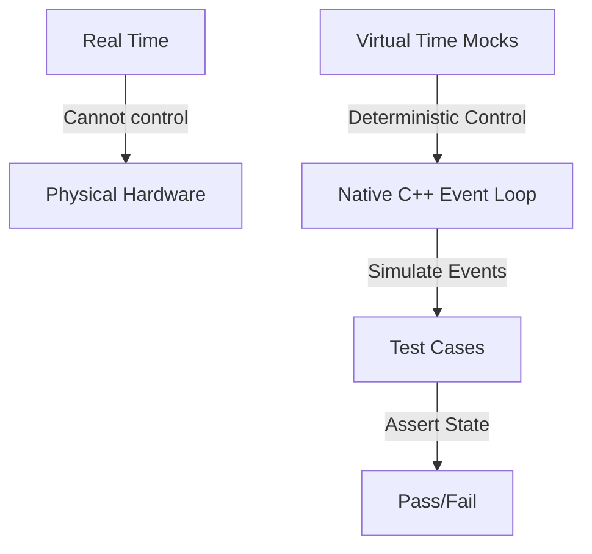

#Test Suite

Welcome to the testing documentation for `ProtoCore`. This repository is designed to be extremely robust, employing **100% hardware-free, deterministic testing**.

Whether you are a beginner looking to understand how C++ testing works or an expert systems engineer designing secure, high-concurrency embedded protocols, this guide explains the architectures, methodologies, and concepts behind our test suite.

---

## 1. Introduction & Core Philosophy

### Why Native Testing?

Traditionally, testing code written for microcontroller frameworks like ESP-IDF or Arduino requires uploading binaries to physical ESP32 chips. This hardware-in-the-loop (HIL) testing has several drawbacks:

- **Slow feedback cycles**: Compiling, flashing, and rebooting microcontrollers takes minutes.
- **Flakiness**: Wireless connections fail, hardware pins float, and components experience wear.
- **Hard-to-reproduce bugs**: Multi-threaded concurrency bugs or network timing jitter cannot be reliably reproduced on physical chips.

`ProtoCore` solves this by executing all test suites **natively** on your development machine (x86/x64 host).

### The Deterministic Asynchronous Model

This server is built on cooperative multitasking. Instead of physical threads, it uses a single-threaded event-driven event loop. Because of this, we can make tests **100% deterministic** through **Time-Travel Mocking**.

Instead of waiting for real-world seconds to elapse to test a connection timeout, the test suite manually increments a virtual clock (`millis()`) and drives the state machine forward manually. This means:

- A 5-second connection timeout can be tested in **less than a millisecond**.
- Execution order is guaranteed to be identical on every single run, eliminating race-condition flakiness.



---

## 2. Test Architecture & Mocking Strategies

To isolate our application code from physical hardware and the operating system's IP stack, we use a custom mocking layer.

### Mocks, Stubs, and Spies

- **Stubs**: Provide canned answers to calls made during the test. For example, our **Filesystem Stub** simulates an SPIFFS/LittleFS system by feeding static file contents from memory arrays instead of reading from a physical hard drive.
- **Mocks**: Objects pre-programmed with expectations that form a specification of the calls they are expected to receive.
- **Virtual Network Taps**: We mock the network stack completely. Instead of binding to real network sockets, we hook the server directly into virtual byte-pumps (ring buffers) that simulate incoming TCP packets.

```
       +---------------------------------------------+
       |                  TEST SUITE                 |
       +----------------------++---------------------+
                              || Simulates network packets
                              \/
       +---------------------------------------------+
       |             VIRTUAL TRANSPORT               |
       |  (mocks sockets, ring buffers, timeouts)    |
       +----------------------++---------------------+
                              || Drives HTTP/SSH bytes
                              \/
       +---------------------------------------------+
       |            CORE WEB SERVER ENGINE           |
       |     (HTTP parser, WebSockets, SSH)          |
       +---------------------------------------------+
```

---

## 3. PlatformIO Test Environments

<!-- BEGIN GENERATED test-environments (edit test/test_matrix.json, run test/harness.py readme gen) -->

The native test matrix has **411 environments**, one per feature, generated from [test_matrix.json](test_matrix.json) into [platformio.ini](../platformio.ini) by [harness.py](harness.py). Each compiles a strict per-feature slice of `src/` with its own flags and runs that feature's suite in isolation, so "this feature builds and tests on its own" stays guaranteed.

| Environment | Feature flag(s) | Test suite(s) | Purpose |
| :--- | :--- | :--- | :--- |
| `native_accept_gate` | `PROTOCORE_ENFORCE_HOST_HEADER=0`, `PROTOCORE_ENABLE_ACCEPT_THROTTLE=1`, `PROTOCORE_ENABLE_PER_IP_THROTTLE=1`, `PROTOCORE_ENABLE_IP_ALLOWLIST=1`, `PROTOCORE_ACCEPT_THROTTLE_MAX=3`, `PROTOCORE_ACCEPT_THROTTLE_WINDOW_MS=1000`, `PROTOCORE_PER_IP_THROTTLE_MAX=2`, `PROTOCORE_PER_IP_THROTTLE_WINDOW_MS=1000`, `PROTOCORE_PER_IP_THROTTLE_SLOTS=4`, `PROTOCORE_IP_ALLOWLIST_SLOTS=4`, `PROTOCORE_HAS_NET_STACK=1` | `unit/integration/transport/test_accept_gate` | Accept-time connection gates with their flags ON (PROTOCORE_ENABLE_ACCEPT_THROTTLE / PER_IP_THROTTLE / IP_ALLOWLIST): the global fixed-window throttle, the per-source-IP bucket table (independent budg... |
| `native_ad9238` | `PROTOCORE_ENABLE_AD9238=1` | `unit/file_conversion/server/peripherals/ad9238/test_ad9238` | AD9238 SPI configuration-port codec (server/peripherals/ad9238): the 16-bit instruction word (R/W + byte-count + 13-bit address) for single-byte register writes/reads, the device-update transfer trans... |
| `native_ads` | `PROTOCORE_ENABLE_ADS=1` | `unit/src/services/fieldbus/ads/test_ads` | Beckhoff ADS / AMS codec (services/fieldbus/ads): the AMS/TCP + AMS-header request builders (little-endian, target-before-source addressing, cmd id + state flags + cbData + invoke id) for Read/Write/R... |
| `native_ads1115` | `PROTOCORE_ENABLE_ADS1115=1` | `unit/src/server/peripherals/ads1115/test_ads1115` | ADS1115 16-bit ADC codec and its I2C binding (server/peripherals/ads1115): building the 16-bit config word for a single-shot single-ended reading (channel MUX, gain, data rate, start/mode/comparator b... |
| `native_aes_block` | default | `unit/src/crypto/cipher/test_aes_block` | The software AES block every software AES mode in the library sits on. |
| `native_aesgcm_kat` | default | `unit/src/crypto/aead/test_ssh_aesgcm` | AES-256-GCM (crypto/aead/aesgcm.h) against the NIST CAVP AES-256-GCM known-answer vectors from the SP 800-38D validation set (Keylen 256 / IVlen 96 / Taglen 128): empty message, AAD-only GMAC, one who... |
| `native_aesgcm_kat_hw` | `PROTOCORE_HAS_HW_AESGCM=1`, `PROTOCORE_HAS_HW_AES=1` | `unit/src/crypto/aead/test_ssh_aesgcm` | The AES-256-GCM CAVP vectors a second time with the accelerator arm selected, answered by the host AES HAL so both arms run natively. |
| `native_amqp` | `PROTOCORE_ENABLE_AMQP=1` | `unit/src/services/iot/amqp/test_amqp` | AMQP 0-9-1 frame codec (services/iot/amqp): the protocol header, the frame + method builders, the heartbeat, and the frame/method parsers (type/channel/size/payload/0xCE). |
| `native_application` | `PROTOCORE_ENABLE_FILE_SERVING=1`, `PROTOCORE_ENABLE_WEBSOCKET=1`, `PROTOCORE_ENABLE_SSE=1` | `unit/integration/misc/test_application` | test_application against the native_stack_http stack. |
| `native_arena` | default | `unit/src/mmgr/test_arena` | Unified double-ended server arena (server/core/protocore_arena): first-fit persistent end (bottom, individual free + coalesce + boundary shrink) + bump scratch end (top, mark/release/reset) sharing a ... |
| `native_atc` | `PROTOCORE_ENABLE_ATC=1` | `unit/src/services/machine_tool/atc/test_atc` | ATC field-I/O interop snapshot (services/machine_tool/atc): serialize this device's field-I/O map as {"inputs":[...],"outputs":[...]} JSON for an ATC engine over HTTP, plus the output setter and value... |
| `native_audit_log` | `PROTOCORE_ENABLE_AUDIT_LOG=1` | `unit/src/server/security/audit_log/test_audit_log` | Tamper-evident hash-chained audit log (server/security/audit_log). |
| `native_auth` | `PROTOCORE_ENABLE_AUTH=1`, `PROTOCORE_ENABLE_WEBSOCKET=1`, `PROTOCORE_ENABLE_SSE=1` | `unit/integration/http/test_auth` | test_auth against the native_stack_http stack. |
| `native_auth_lockout` | `PROTOCORE_ENABLE_AUTH=1`, `PROTOCORE_ENABLE_AUTH_LOCKOUT=1`, `PROTOCORE_ENABLE_WEBSOCKET=1`, `PROTOCORE_ENABLE_SSE=1` | `unit/src/server/security/auth_lockout/test_auth_lockout` | Per-IP brute-force auth lockout (server/security/auth_lockout): exponential-backoff lockout state machine. |
| `native_bacnet` | `PROTOCORE_ENABLE_BACNET=1` | `unit/src/services/fieldbus/bacnet/test_bacnet` | BACnet/IP BVLC + NPDU codec (services/fieldbus/bacnet): the BVLC envelope (type 0x81, function, length) + the NPDU header (version + NPCI control + optional DNET/DADR + hop count) builders and parsers... |
| `native_base64` | default | `unit/src/network_drivers/presentation/codec/base64/test_base64` | test_base64 against the native_stack_l46 stack. |
| `native_bignum_group14` | default | `unit/src/crypto/asymmetric/test_bignum_group14` | The 2048-bit big-integer layer (crypto/asymmetric/bignum.h) on the portable software Montgomery backend. |
| `native_bignum_group14_hw` | `PROTOCORE_HAS_HW_BIGNUM=1`, `PROTOCORE_RSA_MODMUL_HW=1` | `unit/src/crypto/asymmetric/test_bignum_group14` | The same big-integer layer with the accelerated bignum backend selected (PROTOCORE_HAS_HW_BIGNUM), answered by the host arm of the RSA/MPI HAL so both backends of bn_expmod_group14 run natively agains... |
| `native_bitio` | default | `unit/src/mmgr/test_bitio` | The LSB-first bit writer (mmgr/bitio.h) the DEFLATE encoder and the SSH zlib@openssh.com compressor both write their bitstreams through. |
| `native_ble_gatt_att` | `PROTOCORE_ENABLE_BLE_GATT=1` | `unit/src/services/radio/ble_gatt/test_ble_gatt` | Bluetooth ATT codec and GATT characteristic bridge (services/radio/ble_gatt/ble_gatt.c): the Core Specification Vol 3 Part F section 3.4 PDU layouts and their section 3.4.8 opcodes with little-endian ... |
| `native_boot` | default | `unit/core_setup/boot/test_boot` | The reset handler's loops (core_setup/boot): the .data copy, the .bss zero and the stack paint that protocore_platform_stack_free() reads back. |
| `native_bus_capture` | `PROTOCORE_ENABLE_BUS_CAPTURE=1`, `PROTOCORE_HAS_VENDOR_CAN=1` | `unit/src/server/signaling/test_bus_capture` | CAN listen-only capture framing (server/signaling/bus_capture): can_to_socketcan() building the 16-byte Linux SocketCAN frame (big-endian can_id, EFF/RTR flags, length, data) and the DLT_CAN_SOCKETCAN... |
| `native_bus_wire` | `PROTOCORE_ENABLE_SHT3X=1`, `PROTOCORE_ENABLE_PCA9685=1`, `PROTOCORE_ENABLE_INA219=1`, `PROTOCORE_ENABLE_RTC=1`, `PROTOCORE_ENABLE_SMBUS=1` | `unit/integration/peripherals/test_bus_wire` | End to end from the host harness through the library: a real peripheral driver is called, it goes through the real I2C / SPI bus owner, and the bytes it put on the wire are asserted. |
| `native_bytes` | default | `unit/src/mmgr/test_bytes` | The byte verbs (mmgr/bytes.h): append into a protocore_span, take out of a protocore_cspan, and the offset-passing reads a parser walks a raw payload with. |
| `native_c37118` | `PROTOCORE_ENABLE_C37118=1` | `unit/src/services/energy/c37118/test_c37118` | IEEE C37.118.2 synchrophasor frame codec (services/energy/c37118): CRC-CCITT, the frame builder + Command frame, and the CRC-validating parser (type / ids / timestamp / payload). |
| `native_canopen` | `PROTOCORE_ENABLE_CANOPEN=1` | `unit/src/services/fieldbus/canopen/test_canopen` | CANopen (CiA 301) message codec (services/fieldbus/canopen): NMT, SYNC, heartbeat, EMCY, PDO, and expedited SDO read/write/abort + the COB-ID classifier, over the shared CAN frame (shared/can/can.h). |
| `native_cc1101` | `PROTOCORE_ENABLE_CC1101=1` | `unit/protocols/radio/test_cc1101` | CC1101 sub-GHz radio driver (services/radio/cc1101): the TI SPI header protocol (config registers, command strobes, status registers, TX/RX FIFO) - init/detect, variable-length send, TX-done, set-rx, ... |
| `native_cclink` | `PROTOCORE_ENABLE_CCLINK=1` | `unit/file_conversion/services/fieldbus/cclink/test_cclink` | CC-Link cyclic fieldbus frame codec (services/fieldbus/cclink): the frame ([station][command][bit data][word data][sum]) build + parse and the bit/word process-image accessors. |
| `native_chachapoly_kat` | default | `unit/src/crypto/cipher/test_ssh_chachapoly` | chacha20-poly1305@openssh.com (crypto/aead/chachapoly.h). |
| `native_chunked` | `PROTOCORE_ENABLE_WEBSOCKET=1`, `PROTOCORE_ENABLE_SSE=1` | `unit/integration/shared/test_chunked` | test_chunked against the native_stack_http stack. |
| `native_cia402` | `PROTOCORE_ENABLE_CIA402=1`, `PROTOCORE_ENABLE_CANOPEN=1` | `unit/src/services/fieldbus/cia402/test_cia402` | CiA 402 / IEC 61800-7-201 drive profile (services/fieldbus/cia402): the Statusword power-state decode (mask/value table), the Controlword commands + enable sequence, Statusword flags, the CANopen SDO ... |
| `native_cip` | `PROTOCORE_ENABLE_CIP=1` | `unit/src/services/fieldbus/cip/test_cip` | CIP message codec (services/fieldbus/cip): the EPATH logical-segment builder, the request builders (Get_Attribute_Single), and the response parser (service / status / data). |
| `native_client` | `PROTOCORE_ENABLE_HTTP_CLIENT=1`, `PROTOCORE_HAS_NET_STACK=1` | `unit/protocols/transport/test_client` | Outbound TCP client transport (network_drivers/transport/tcp/tcp_client.c), the pooled layer-4 peer of tcp.c used by http_client / mqtt / ws_client / relay / smtp / ssh port-forward (PROTOCORE_NEED_CL... |
| `native_clock` | default | `unit/protocols/protocore_clock/test_clock` | Pluggable monotonic clock (server/clock): default millis(), custom clock divided down to the internal 1000 Hz, plus the microsecond base and latency budgeting. |
| `native_cloudevents` | `PROTOCORE_ENABLE_CLOUDEVENTS=1` | `unit/src/services/iot/cloudevents/test_cloudevents` | CloudEvents v1.0 envelope (services/iot/cloudevents): the structured-JSON builder (over the JSON writer) + the binary-mode ce-* header reader. |
| `native_coap` | `PROTOCORE_ENABLE_COAP=1`, `PROTOCORE_ENABLE_COAP_BLOCK=1`, `PROTOCORE_COAP_BLOCK_SZX_MAX=2`, `PROTOCORE_COAP_BLOCK1_MAX=128`, `PROTOCORE_HAS_NET_STACK=1` | `unit/protocols/transport/test_coap` | CoAP server (RFC 7252) message codec + resource dispatch. |
| `native_coap_observe` | `PROTOCORE_ENABLE_COAP=1`, `PROTOCORE_ENABLE_COAP_BLOCK=1`, `PROTOCORE_COAP_BLOCK_SZX_MAX=2`, `PROTOCORE_COAP_BLOCK1_MAX=128`, `PROTOCORE_ENABLE_COAP_OBSERVE=1`, `PROTOCORE_HAS_NET_STACK=1` | `unit/protocols/transport/test_coap` | CoAP with resource observation (RFC 7641) enabled. |
| `native_coaps` | `PROTOCORE_ENABLE_DTLS=1`, `PROTOCORE_ENABLE_COAP=1`, `PROTOCORE_HAS_NET_STACK=1` | `unit/integration/iot/test_coaps` | CoAP over DTLS (services/iot/coap/coaps, RFC 7252 sec 9): the bridge that drives a DtlsConn handshake and, once established, unwraps each epoch-3 application record, answers it with coap_server_proces... |
| `native_coaps_server` | `PROTOCORE_ENABLE_DTLS=1`, `PROTOCORE_ENABLE_COAP=1`, `PROTOCORE_HAS_NET_STACK=1` | `unit/integration/iot/test_coaps_server` | CoAP-over-DTLS server front-end (services/iot/coap/coaps_server), the PROTOCORE_HAS_NET_STACK arm: the per-peer DtlsConn pool + poll seam on top of protocore_coaps_process(), reached the way the targe... |
| `native_coaps_server_nostack` | `PROTOCORE_ENABLE_DTLS=1`, `PROTOCORE_ENABLE_COAP=1` | `unit/integration/iot/test_coaps_server` | CoAP-over-DTLS server front-end (services/iot/coap/coaps_server), the arm with no network stack: the same suite, driven through the injection seam that arm has instead of a receive path. |
| `native_codec_base64` | default | `unit/src/network_drivers/presentation/codec/base64/test_base64` | The base64 codec (network_drivers/presentation/codec/base64) against RFC 4648: the seven sec 10 BASE64() vectors verbatim in both directions, the sec 4 Table 1 and sec 5 Table 2 spellings of alphabet ... |
| `native_codec_base64_scalar` | `PROTOCORE_BASE64_SWAR=0` | `unit/src/network_drivers/presentation/codec/base64/test_base64` | The base64 scalar constant-time decode fallback (PROTOCORE_BASE64_SWAR=0): classify one character at a time instead of the default four-per-word SWAR path. |
| `native_codec_cbor` | `PROTOCORE_ENABLE_CBOR=1` | `unit/src/network_drivers/presentation/codec/cbor/test_cbor` | The CBOR codec (network_drivers/presentation/codec/cbor) against RFC 8949. |
| `native_codec_deflate` | `PROTOCORE_ENABLE_WS_DEFLATE=1`, `PROTOCORE_ENABLE_WEBSOCKET=1` | `unit/src/network_drivers/presentation/codec/deflate/test_deflate` | The RFC 1951 DEFLATE compressor (network_drivers/presentation/codec/deflate), the WebSocket permessage-deflate sender. |
| `native_codec_hpack_prim` | `PROTOCORE_ENABLE_HTTP2=1` | `unit/src/network_drivers/presentation/codec/hpack_prim/test_hpack` | The field-coding primitives HPACK and QPACK share (network_drivers/presentation/codec/hpack_prim) against RFC 7541, which RFC 9204 sec 5 hands QPACK verbatim. |
| `native_codec_inflate` | `PROTOCORE_ENABLE_WS_DEFLATE=1`, `PROTOCORE_ENABLE_WEBSOCKET=1` | `unit/src/network_drivers/presentation/codec/inflate/test_inflate` | The RFC 1951 INFLATE core (network_drivers/presentation/codec/inflate), the WebSocket permessage-deflate receiver. |
| `native_codec_rfc1951` | default | `unit/src/network_drivers/presentation/codec/deflate/test_rfc1951` | The RFC 1951 code tables (network_drivers/presentation/codec/deflate/rfc1951): the sec 3.2.5 length and distance tables transcribed from the RFC's own printed rows rather than from the implementation,... |
| `native_codeql` | `PROTOCORE_ENABLE_CSRF=1`, `PROTOCORE_ENABLE_AUTH=1`, `PROTOCORE_ENABLE_AUTH_LOCKOUT=1`, `PROTOCORE_ENABLE_IP_ALLOWLIST=1`, `PROTOCORE_ENABLE_WS_DEFLATE=1`, `PROTOCORE_ENABLE_TIME_SOURCE=1`, `PROTOCORE_ENABLE_CONFIG_STORE=1`, `PROTOCORE_ENABLE_DEVICE_ID=1`, `PROTOCORE_ENABLE_TELEMETRY=1`, `PROTOCORE_ENABLE_DASHBOARD=1`, `PROTOCORE_ENABLE_PARTITION_MONITOR=1`, `PROTOCORE_ENABLE_CBOR=1`, `PROTOCORE_ENABLE_MSGPACK=1`, `PROTOCORE_ENABLE_GPIO_MAP=1`, `PROTOCORE_ENABLE_UDP_TELEMETRY=1`, `PROTOCORE_ENABLE_GUARDRAILS=1`, `PROTOCORE_ENABLE_FAILSAFE=1`, `PROTOCORE_ENABLE_SLEEP_SCHED=1`, `PROTOCORE_ENABLE_WEARLEVEL=1`, `PROTOCORE_ENABLE_NETADAPT=1`, `PROTOCORE_ENABLE_DSHOT=1`, `PROTOCORE_ENABLE_HART=1`, `PROTOCORE_ENABLE_NTS=1`, `PROTOCORE_ENABLE_DDS=1`, `PROTOCORE_ENABLE_XMPP=1`, `PROTOCORE_ENABLE_RAWL2=1`, `PROTOCORE_ENABLE_SPA_ROUTER=1`, `PROTOCORE_ENABLE_GOOSE=1`, `PROTOCORE_ENABLE_MTCONNECT=1`, `PROTOCORE_ENABLE_J2735=1`, `PROTOCORE_ENABLE_NEMA_TS2=1`, `PROTOCORE_ENABLE_SNP=1`, `PROTOCORE_ENABLE_DIRECTNET=1`, `PROTOCORE_ENABLE_SEP2=1`, `PROTOCORE_ENABLE_PROFINET=1`, `PROTOCORE_ENABLE_NTCIP=1`, `PROTOCORE_ENABLE_OPENADR=1`, `PROTOCORE_ENABLE_MMS=1`, `PROTOCORE_ENABLE_CCLINK=1`, `PROTOCORE_ENABLE_POWERLINK=1`, `PROTOCORE_ENABLE_SERCOS=1`, `PROTOCORE_ENABLE_PROFIBUS=1`, `PROTOCORE_ENABLE_LONWORKS=1`, `PROTOCORE_ENABLE_MBPLUS=1`, `PROTOCORE_ENABLE_INTERBUS=1`, `PROTOCORE_ENABLE_ICCP=1`, `PROTOCORE_ENABLE_WAVE=1`, `PROTOCORE_ENABLE_UTMC=1`, `PROTOCORE_ENABLE_OCIT=1`, `PROTOCORE_ENABLE_ATC=1`, `PROTOCORE_ENABLE_SOUTHBOUND=1`, `PROTOCORE_ENABLE_EXC_DECODER=1`, `PROTOCORE_ENABLE_HTTP_DELIVERY=1`, `PROTOCORE_ENABLE_HW_HEALTH=1`, `PROTOCORE_ENABLE_MDNS_ADAPTIVE=1`, `PROTOCORE_ENABLE_SOCKPOOL=1`, `PROTOCORE_ENABLE_PSRAM_POOL=1`, `PROTOCORE_ENABLE_HAPPY_EYEBALLS=1`, `PROTOCORE_ENABLE_WIFI_SNIFFER=1`, `PROTOCORE_ENABLE_LINK_MANAGER=1`, `PROTOCORE_ENABLE_CC1101=1`, `PROTOCORE_ENABLE_FDC2214=1`, `PROTOCORE_ENABLE_LDC1614=1`, `PROTOCORE_ENABLE_VL53L0X=1`, `PROTOCORE_ENABLE_RADIO_SNIFF=1`, `PROTOCORE_ENABLE_BLE_GATT=1`, `PROTOCORE_ENABLE_TLS_POLICY=1`, `PROTOCORE_ENABLE_WISUN=1`, `PROTOCORE_ENABLE_LOGBUF=1`, `PROTOCORE_ENABLE_OTA_ROLLBACK=1`, `PROTOCORE_ENABLE_TOTP=1`, `PROTOCORE_ENABLE_WEBHOOK=1`, `PROTOCORE_ENABLE_RADIO_POWER=1`, `PROTOCORE_ENABLE_AUDIT_LOG=1`, `PROTOCORE_ENABLE_OIDC=1`, `PROTOCORE_ENABLE_MNT=1`, `PROTOCORE_ENABLE_GRAPHQL=1`, `PROTOCORE_ENABLE_ESPNOW=1`, `PROTOCORE_ENABLE_OAUTH2=1`, `PROTOCORE_ENABLE_OPCUA=1`, `PROTOCORE_ENABLE_OPCUA_CLIENT=1`, `PROTOCORE_ENABLE_WEBSOCKET=1`, `PROTOCORE_ENABLE_SSE=1`, `PROTOCORE_HAS_NET_STACK=1` | `unit/integration/fieldbus/test_dispatch` | CodeQL coverage env: the full app compiled with every new feature flag ON so CodeQL traces the integration paths (CSRF / lockout / allowlist gates, permessage-deflate) AND the new service modules, whi... |
| `native_compliance` | default | `unit/integration/http/test_compliance` | RFC-compliance suite: builds with all enforcement at production defaults (PROTOCORE_ENFORCE_HOST_HEADER=1) and exercises the strict behaviors. |
| `native_concurrency` | `O1`, `pthread` | `unit/integration/transport/test_concurrency` | Concurrency proof for the cross-thread slot fields (protocore_atomic state / rx_head / rx_tail). |
| `native_config_io` | `PROTOCORE_ENABLE_CONFIG_STORE=1`, `PROTOCORE_ENABLE_CONFIG_IO=1` | `unit/src/server/storage/config_io/test_config_io` | Schema-driven config export/restore (server/storage/config_io) over the config store; round-trip host-tested against the in-memory backend. |
| `native_config_store` | `PROTOCORE_ENABLE_CONFIG_STORE=1` | `unit/src/server/storage/config_store/test_config_store` | Typed NVS config store (server/storage/config_store): string/u32/blob round-trips, defaults, capacity, erase/clear - run against the host NVS backend that hal/nvs.h selects off-target (the ESP32 Prefe... |
| `native_cotp` | `PROTOCORE_ENABLE_COTP=1` | `unit/src/services/fieldbus/cotp/test_cotp` | TPKT (RFC 1006) + COTP X.224 class-0 frame codec (services/fieldbus/cotp): the TPKT envelope, the COTP Data TPDU + Connection Request builders, and the COTP parser. |
| `native_crc` | default | `unit/src/shared/crc/test_crc` | The parameterized Rocksoft/Williams CRC engine (shared/crc). |
| `native_csrf` | `PROTOCORE_ENABLE_CSRF=1` | `unit/src/server/security/csrf/test_csrf` | Stateless HMAC-signed CSRF token (server/security/csrf): issue/verify with a fixed secret unit-tests on the host (PROTOCORE_ENABLE_CSRF set). |
| `native_ct_eq` | default | `unit/src/crypto/test_ct_eq` | protocore_ct_eq (crypto/ct_eq.h): the one comparator every AEAD tag, MAC, digest and signature check goes through. |
| `native_ct_eq_unit` | default | `unit/src/crypto/test_ct_eq` | The library's one secret-dependent comparator (crypto/ct_eq.h). |
| `native_curve25519_kat` | default | `unit/src/crypto/asymmetric/test_ssh_ed25519` | Curve25519 and Ed25519 (crypto/asymmetric/curve25519.h, ed25519.h): the RFC 7748 sec 5.2 X25519 vectors plus the iterated results after 1 and 1,000 rounds, the RFC 7748 sec 6.1 Diffie-Hellman vector, ... |
| `native_curve25519_kat_hw` | `PROTOCORE_RSA_MODMUL_HW=1` | `unit/src/crypto/asymmetric/test_ssh_ed25519` | RFC 7748 and RFC 8032 a second time with the MPI accelerator field layer selected (PROTOCORE_FE25519_MPI_HW), answered by the host RSA/MPI HAL so both field arms run natively. |
| `native_dashboard` | `PROTOCORE_ENABLE_DASHBOARD=1`, `PROTOCORE_ENABLE_SSE=1` | `unit/src/server/web/dashboard/test_dashboard` | Dashboard widget-table JSON serializers (server/web/dashboard core). |
| `native_dbm` | `PROTOCORE_ENABLE_WAL=1`, `PROTOCORE_ENABLE_DBM=1` | `unit/protocols/storage/test_dbm` | Log-structured hash key-value store on the WAL (services/storage/dbm): put/get/delete with an in-RAM open-addressed index and value data appended to the write-ahead log, plus index rebuild by replayin... |
| `native_dds_rtps` | `PROTOCORE_ENABLE_DDS=1` | `unit/file_conversion/services/iot/dds/test_dds` | DDSI-RTPS Message framing codec (services/iot/dds), OMG DDSI-RTPS 2.5 formal/2022-04-01: the sec 9.4.4 20-octet Header (PROTOCOL_RTPS magic, ProtocolVersion, VendorId, GuidPrefix), the sec 9.4.5.1 Sub... |
| `native_defer` | default | `unit/integration/session/test_defer` | test_defer against the native_stack_http stack. |
| `native_der` | default | `unit/src/shared/der/test_der` | ASN.1 DER reader (shared/der): the X.690 canonical subset X.509 is parsed with. |
| `native_device_id` | `PROTOCORE_ENABLE_DEVICE_ID=1`, `PROTOCORE_HAS_VENDOR_MAC=1` | `unit/src/server/signaling/test_device_id` | MAC-derived device UUID (server/signaling/device_id): RFC 4122 v5 from a MAC via SHA-1. |
| `native_devicenet` | `PROTOCORE_ENABLE_DEVICENET=1` | `unit/src/services/fieldbus/devicenet/test_devicenet` | DeviceNet link-adaptation codec (services/fieldbus/devicenet): the 4-group 11-bit CAN id, explicit-message header octet, single-frame explicit messages, and the fragmentation reassembler (CIP over CAN... |
| `native_df1` | `PROTOCORE_ENABLE_DF1=1` | `unit/src/services/fieldbus/df1/test_df1` | Allen-Bradley DF1 full-duplex frame codec (services/fieldbus/df1): BCC + CRC-16/ARC, the frame builder with DLE byte-stuffing, and the validating, un-stuffing parser. |
| `native_diag` | `PROTOCORE_ENABLE_DIAG=1`, `PROTOCORE_ENABLE_WEBSOCKET=1`, `PROTOCORE_ENABLE_SSE=1` | `unit/integration/transport/test_diag` | Build-flag reporter (diag() / PROTOCORE_ENABLE_DIAG). |
| `native_diffserv` | `PROTOCORE_ENABLE_DIFFSERV=1`, `PROTOCORE_HAS_NET_STACK=1` | `unit/integration/transport/test_diffserv` | DiffServ QoS marking (PROTOCORE_ENABLE_DIFFSERV): the DSCP->TOS encode (DSCP << 2, ECN 0), the server-wide and UDP DSCP defaults through the DiffServ entries and through the flat readers the accept pa... |
| `native_digest_auth` | `PROTOCORE_ENABLE_AUTH=1`, `PROTOCORE_ENABLE_WEBSOCKET=1`, `PROTOCORE_ENABLE_SSE=1` | `unit/integration/http/test_digest_auth` | test_digest_auth against the native_stack_http stack. |
| `native_digest_vectors` | `PROTOCORE_ENABLE_AUTH=1` | `unit/src/crypto/hash/test_digest_vectors` | test_digest_vectors against the native_stack_http stack. |
| `native_directnet` | `PROTOCORE_ENABLE_DIRECTNET=1` | `unit/src/services/fieldbus/directnet/test_directnet` | AutomationDirect DirectNET serial frame codec (services/fieldbus/directnet): the header (SOH + ASCII-hex slave/type/addr/blocks + ETB + LRC) and data (STX + data + ETX + LRC) frames build/parse. |
| `native_dispatch` | `PROTOCORE_ENABLE_WEBSOCKET=1`, `PROTOCORE_ENABLE_SSE=1` | `unit/integration/fieldbus/test_dispatch` | test_dispatch against the native_stack_http stack. |
| `native_dma` | `PROTOCORE_ENABLE_DMA=1`, `PROTOCORE_DMA_BUF_SIZE=8`, `PROTOCORE_DMA_CHANNELS=2` | `unit/protocols/mmgr/test_dma` | DMA peripheral ingest / egress simulator (mmgr/dma), v5 hardware ingest: an ingress feed surfaces as RX completion events, a full buffer ping-pongs and re-arms, egress DMA is captured, TX is one-in-fl... |
| `native_dmx` | `PROTOCORE_ENABLE_DMX=1` | `unit/src/server/peripherals/dmx/test_dmx` | DMX512 + RDM lighting codec (server/peripherals/dmx): the DMX512 slot packet (build/get) and the RDM (ANSI E1.20) packet build/parse with 48-bit UIDs and the 16-bit additive checksum. |
| `native_dnc` | `PROTOCORE_ENABLE_DNC=1` | `unit/src/services/machine_tool/dnc/test_dnc`, `unit/protocols/machine_tool/test_dnc_stream` | CNC DNC drip-feed (services/machine_tool/dnc): the EIA RS-244 <-> ISO/ASCII tape-code translation (odd-parity EIA table), ISO even parity, G-code block framing with '%' rewind-stop and leader runout, ... |
| `native_dnp3` | `PROTOCORE_ENABLE_DNP3=1` | `unit/src/services/energy/dnp3/test_dnp3` | DNP3 (IEEE 1815) data-link frame codec (services/energy/dnp3): CRC-16/DNP, the frame builder (0x0564 header + CRC'd 16-octet data blocks) and the CRC-validating, de-blocking parser. |
| `native_dns_resolver` | `PROTOCORE_ENABLE_DNS_RESOLVER=1`, `PROTOCORE_HAS_NET_STACK=1` | `unit/src/network_drivers/transport/udp/test_dns_resolver` | The portable DNS resolver (network_drivers/network/dns/dns_resolver, RFC 1035) on the build where PROTOCORE_HAS_VENDOR_DNS_RESOLVER is 0: the A-record question it writes, the answer it reads back - wa... |
| `native_dns_server` | `PROTOCORE_ENABLE_DNS_SERVER=1`, `PROTOCORE_HAS_NET_STACK=1` | `unit/protocols/network/test_dns_server` | Authoritative DNS server (network_drivers/network/dns/dns_server): the A-record response builder (QNAME parse, compressed A answer, NXDOMAIN, non-A query, header flags, malformed guards), the built-in... |
| `native_dns_wire` | `PROTOCORE_ENABLE_DNS_SERVER=1` | `unit/src/network_drivers/network/dns/test_dns_wire` | The DNS name on the wire (network_drivers/network/dns/dns_wire, RFC 1035 sec 3.1 / 4.1.4): labels to a dotted string and back, compression pointers followed for an answer and refused for a question, t... |
| `native_dns_wire_codec` | default | `unit/src/network_drivers/network/dns/test_dns_wire` | DNS name codec (network_drivers/network/dns/dns_wire, RFC 1035). |
| `native_docstore` | `PROTOCORE_ENABLE_WAL=1`, `PROTOCORE_ENABLE_DBM=1`, `PROTOCORE_ENABLE_DOCSTORE=1` | `unit/protocols/storage/test_docstore` | Local JSON document store on the WAL (services/storage/docstore): JSON documents addressed by id, stored via dbm on the write-ahead log, plus top-level field queries (find documents whose JSON field e... |
| `native_dshot` | `PROTOCORE_ENABLE_DSHOT=1` | `unit/src/server/peripherals/dshot/test_dshot` | DShot ESC throttle codec (server/peripherals/dshot): the 16-bit frame (11-bit value + telemetry + 4-bit nibble-xor CRC), the bidirectional inverted-CRC variant, decode/validate, and per-rate bit timing. |
| `native_dtls` | `PROTOCORE_ENABLE_DTLS=1` | `unit/src/network_drivers/presentation/security/dtls/test_dtls_record` | DTLS 1.3 record layer (network_drivers/presentation/security/dtls/dtls_record, RFC 9147 sec 4): DTLSPlaintext + DTLSCiphertext protect/unprotect, the unified header, sequence-number encryption (sec 4.... |
| `native_dtls_conn` | `PROTOCORE_ENABLE_DTLS=1`, `PROTOCORE_ENABLE_TLS_RPK=1` | `unit/protocols/tls/test_dtls_conn` | DTLS 1.3 server handshake state machine (network_drivers/presentation/security/dtls/dtls_conn, RFC 9147 sec 5-6): the one-round-trip full handshake (TLS_AES_128_GCM_SHA256 / X25519 / Ed25519) over the... |
| `native_dtls_hs` | `PROTOCORE_ENABLE_DTLS=1` | `unit/protocols/tls/test_dtls_handshake` | DTLS 1.3 handshake framing + reliability (network_drivers/presentation/security/dtls/dtls_handshake, RFC 9147 sec 5 + 7): the 12-byte DTLS handshake header, overlap-tolerant message reassembly, the AC... |
| `native_dtls_tls13_rfc` | `PROTOCORE_ENABLE_DTLS=1`, `PROTOCORE_ENABLE_TLS_RPK=1` | `unit/src/network_drivers/presentation/http/http3/test_dtls_tls13` | The TLS 1.3 messages the DTLS 1.3 handshake adds to tls13_msg, compiled for the DTLS path: the RFC 8446 sec 4.1.3 HelloRetryRequest random published as 32 hex octets, the sec 4.1.4 HelloRetryRequest b... |
| `native_edge_cache` | `PROTOCORE_ENABLE_HTTP_CACHE=1`, `PROTOCORE_ENABLE_HTTP_CLIENT=1`, `PROTOCORE_ENABLE_EDGE_CACHE=1`, `PROTOCORE_ENABLE_RANGE=1` | `unit/protocols/web/test_edge_fetch` | CDN edge-cache engine (server/web/edge_cache): the pure freshness/validator core (response header-field access, HTTP-date parsing over IMF-fixdate / RFC 850 / asctime, RFC 9111 lifetime + Expires-Date... |
| `native_edge_cache_core` | `PROTOCORE_ENABLE_HTTP_CACHE=1`, `PROTOCORE_ENABLE_EDGE_CACHE=1`, `PROTOCORE_ENABLE_RANGE=1`, `PROTOCORE_ENABLE_HTTP_CLIENT=1` | `unit/file_conversion/server/web/edge_cache/test_edge_cache` | CDN edge-cache pure engine (server/web/edge_cache/edge_cache) plus the shared single-range `Range: bytes=...` parser it serves 206 windows with (network_drivers/application/http_range): the RFC 9110 s... |
| `native_edge_cache_proxy` | `PROTOCORE_ENABLE_EDGE_CACHE=1`, `PROTOCORE_ENABLE_HTTP_CACHE=1`, `PROTOCORE_ENABLE_HTTP_CLIENT=1` | `unit/src/server/web/edge_cache/test_edge_cache_proxy` |  |
| `native_edge_cache_sd` | `PROTOCORE_ENABLE_WAL=1`, `PROTOCORE_ENABLE_DBM=1`, `PROTOCORE_DBM_VAL_MAX=1024`, `PROTOCORE_ENABLE_HTTP_CACHE=1`, `PROTOCORE_ENABLE_HTTP_CLIENT=1`, `PROTOCORE_ENABLE_EDGE_CACHE=1` | `unit/protocols/web/test_edge_cache_sd` | CDN edge-cache L2 SD-persistence tier (server/web/edge_cache/edge_cache_sd): the entry <-> dbm-value serialization roundtrip (all response metadata, Vary variants, binary and max-size bodies), the spi... |
| `native_edge_mesh` | `PROTOCORE_ENABLE_HTTP_CACHE=1`, `PROTOCORE_ENABLE_HTTP_CLIENT=1`, `PROTOCORE_ENABLE_EDGE_CACHE=1`, `PROTOCORE_ENABLE_EDGE_MESH=1` | `unit/protocols/web/test_edge_mesh` | CDN edge-cache mesh sibling-cache codec (server/web/edge_cache/edge_mesh): the request/response wire frames (build + tri-state accumulating parse over partial reads, magic/version/opcode validation), ... |
| `native_endian` | default | `unit/src/mmgr/test_endian` | The fixed-width serializers (mmgr/endian.h): a width moved between an integer and the bytes at a pointer, both orders, 16/32/64. |
| `native_enip` | `PROTOCORE_ENABLE_ENIP=1` | `unit/src/services/fieldbus/enip/test_enip` | EtherNet/IP encapsulation codec (services/fieldbus/enip): the 24-octet header, RegisterSession + SendRRData builders (Common Packet Format), and the SendRRData reply extractor. |
| `native_enocean` | `PROTOCORE_ENABLE_ENOCEAN=1`, `PROTOCORE_ENOCEAN_MAX_DATA=16` | `unit/src/services/radio/enocean/test_enocean` | EnOcean ESP3 serial codec (services/radio/enocean), v5 radio plugin: the CRC-8 (poly 0x07) against known answers, a build -> parse round trip, malformed framing (bad sync / header CRC / data CRC), inc... |
| `native_enocean_esp3` | `PROTOCORE_ENABLE_ENOCEAN=1` | `unit/src/services/radio/enocean/test_enocean` | EnOcean ESP3 serial codec (services/radio/enocean/enocean.c): the CRC-8 the ESP3 specification section 3.3 defines (generator x^8+x^2+x^1+x^0, the catalogue's CRC-8/SMBUS) checked against the table th... |
| `native_espnow_envelope` | `PROTOCORE_ENABLE_ESPNOW=1` | `unit/src/services/radio/espnow/test_espnow` | ESP-NOW typed envelope and peer registry (services/radio/espnow/espnow.c): the magic/type/length header, exact-length and magic validation on decode, the payload cap derived from Espressif's published... |
| `native_euromap77` | `PROTOCORE_ENABLE_OPCUA=1`, `PROTOCORE_ENABLE_EUROMAP77=1` | `unit/file_conversion/services/opcua/models/euromap77/test_euromap77` | EUROMAP 77 (OPC 40077) IMM_MES_Interface model (services/machine_tool/euromap77) - OPC UA for injection molding machines. |
| `native_exc_decoder` | `PROTOCORE_ENABLE_EXC_DECODER=1` | `unit/src/server/core/test_exc_decoder` | ESP32 panic / exception decoder (server/exc_decoder): parse a captured Guru Meditation dump (cause, register PC + EXCVADDR, backtrace PC:SP frames) into a structured ExcInfo and serialize it as JSON f... |
| `native_failsafe` | `PROTOCORE_ENABLE_FAILSAFE=1` | `unit/src/server/core/test_failsafe` | Software watchdog / deadlock detection + safe-state (server/failsafe): the wrap-safe overdue predicate, the lifeline registry, fire-once-per-episode breach callback, and JSON. |
| `native_fanuc_j519` | `PROTOCORE_ENABLE_FANUC_J519=1` | `unit/file_conversion/services/machine_tool/fanuc_j519/test_fanuc_j519` | FANUC Stream Motion / option J519 UDP codec (services/machine_tool/fanuc_j519): the robot counterpart to FOCAS. |
| `native_fdc2214` | `PROTOCORE_ENABLE_FDC2214=1` | `unit/src/server/peripherals/fdc2214/test_fdc2214` | FDC2114/2214 capacitance-to-digital field sensor (server/peripherals/fdc2214): the 28-bit data combine + error flags, the frequency scale (data/2^28 * fref), and the single-channel config-sequence bui... |
| `native_file_serving` | `PROTOCORE_ENABLE_FILE_SERVING=1`, `PROTOCORE_ENABLE_WEBSOCKET=1`, `PROTOCORE_ENABLE_SSE=1` | `unit/integration/filesystem/test_file_serving` | test_file_serving against the native_stack_http stack. |
| `native_fins` | `PROTOCORE_ENABLE_FINS=1` | `unit/src/services/fieldbus/fins/test_fins` | Omron FINS frame codec (services/fieldbus/fins): the command builder + Memory Area Read convenience + the command / response parsers (10-octet header, MRC/SRC, MRES/SRES end code). |
| `native_float_bits` | default | `unit/src/mmgr/test_float_bits` | A double read as the three fields it is (mmgr/float_bits.h): sign at bit 63, exponent at 62..52, mantissa at 51..0, by mask and shift, and merged back from those three. |
| `native_flow_export` | `PROTOCORE_ENABLE_FLOW_EXPORT=1` | `unit/src/services/net/flow_export/test_flow_export` | Flow-record export codec (services/net/flow_export): NetFlow v5 fixed header/record builders + the NetFlow v9 / IPFIX template-then-data cursor (length/count patching, v9 4-octet padding). |
| `native_focas` | `PROTOCORE_ENABLE_FOCAS=1` | `unit/src/services/machine_tool/focas/test_focas` | FANUC FOCAS Ethernet codec (services/machine_tool/focas): the big-endian frame envelope (magic/version/type/length) + open/close handshake, the generic command request (6-octet function selector + fiv... |
| `native_form_params` | `PROTOCORE_ENABLE_WEBSOCKET=1`, `PROTOCORE_ENABLE_SSE=1` | `unit/integration/transport/test_form_params` | test_form_params against the native_stack_http stack. |
| `native_forward` | `PROTOCORE_ENABLE_FORWARD=1`, `PROTOCORE_PHY_MAX_IFACES=4`, `PROTOCORE_FWD_MAX_RULES=4`, `PROTOCORE_FWD_MAX_ACL=4`, `PROTOCORE_FWD_MAX_ROUTES=4`, `PROTOCORE_FWD_INSPECT=1` | `unit/protocols/net/test_forward` | Interface forwarding plane (network_drivers/network/forward), v5 bridge / router: default-deny, an ALLOW rule forwards, a DENY wins, multi-destination fan-out, no reflection to the source, the per-rul... |
| `native_forwarded_trust` | `PROTOCORE_ENABLE_AUTH=1`, `PROTOCORE_ENABLE_AUTH_LOCKOUT=1`, `PROTOCORE_ENABLE_FORWARDED_TRUST=1` | `unit/src/server/security/forwarded_trust/test_forwarded_trust` | Trusted-reverse-proxy forwarded-client resolver (server/security/forwarded_trust): a Forwarded / X-Forwarded-For client address is honored only when the real TCP peer is a configured trusted-upstream ... |
| `native_frame` | default | `unit/src/mmgr/test_frame` | The declarative frame builder (mmgr/protoframe.h + protoframe.c): the single engine that turns a static protocore_field spec into wire bytes, so the ~160 formatting sites in this library carry a table... |
| `native_ftp` | `PROTOCORE_ENABLE_FTP=1` | `unit/src/services/file_transfer/ftp/test_ftp` | FTP client wire codec (services/file_transfer/ftp, RFC 959 + RFC 2428): the control-command builders (generic verb + PORT + EPRT), the single/multi-line 3-digit reply parser, and the PASV / EPSV data-... |
| `native_gateway` | `PROTOCORE_ENABLE_GATEWAY=1`, `PROTOCORE_GW_MAX_PORTS=4` | `unit/protocols/net/test_gateway` | Radio / wireless gateway bridge (server/net/gateway), v5 southbound-to-northbound: an uplink envelopes a received frame (src address / port / rssi / seq) and publishes it, fail-closed on no sink / unk... |
| `native_gnss_nmea0183` | `PROTOCORE_ENABLE_NMEA0183=1` | `unit/src/services/timing_position/nmea0183/test_nmea0183` | NMEA 0183 sentence codec (services/timing_position/nmea0183): the eight complete worked sentences the gpsd NMEA reference publishes, each accepted and each rejected under every single-character edit, ... |
| `native_gnss_ntrip_caster` | `PROTOCORE_ENABLE_NTRIP_CASTER=1` | `unit/file_conversion/services/timing_position/gnss/test_ntrip_caster` | NTRIP caster protocol codec (services/timing_position/gnss/ntrip_caster): the RFC 9112 sec 2.1 request line and empty-line-terminated header block with every prefix reported incomplete, RFC 9110 sec 5... |
| `native_gnss_rtcm3` | `PROTOCORE_ENABLE_NTRIP_CASTER=1` | `unit/src/services/timing_position/gnss/test_rtcm3` | RTCM 3 framing + station-reference codec (services/timing_position/gnss/rtcm3): the CRC-24Q residue-is-zero identity that pins polynomial, seed, bit order and final XOR at once, the CRC's GF(2) linear... |
| `native_gnss_survey` | `PROTOCORE_ENABLE_NTRIP_CASTER=1`, `PROTOCORE_ENABLE_NMEA0183=1`, `UNITY_INCLUDE_DOUBLE` | `unit/src/services/timing_position/nmea0183/test_gnss_survey` | GNSS survey-in core (services/timing_position/gnss/gnss_survey): the exact WGS84 geodetic<->ECEF transform (matched against pyproj EPSG:4979->EPSG:4978), the shifted-origin position averager with a 3-... |
| `native_gnss_survey_in` | `PROTOCORE_ENABLE_NTRIP_CASTER=1` | `unit/src/services/timing_position/nmea0183/test_gnss_survey` | GNSS survey-in core (services/timing_position/gnss/gnss_survey, suite beside the NMEA sentence codec it folds fixes from): the geodetic-to-ECEF transform reduced at the equator and the pole to WGS84's... |
| `native_goose` | `PROTOCORE_ENABLE_GOOSE=1` | `unit/src/services/energy/goose/test_goose` | IEC 61850 GOOSE publisher codec (services/energy/goose): the BER IECGoosePdu (gocbRef..allData, minimal-length INTEGERs with the positive leading-zero rule) + the GOOSE header + Ethernet frame (ethert... |
| `native_gpib` | `PROTOCORE_ENABLE_GPIB=1` | `unit/src/services/instrumentation/gpib/test_gpib` | GPIB-over-LAN (Prologix-style) controller command codec (services/instrumentation/gpib): the ++ command builders (addr / mode / read / eoi / eos / spoll / clr / trg / ver), the data-line escaping (lea... |
| `native_gpio_map` | `PROTOCORE_ENABLE_GPIO_MAP=1` | `unit/file_conversion/server/signaling/test_gpio_map` | GPIO pin-mapper / browser diag core (server/signaling/gpio_map): direction names, JSON serializer, control-POST parser, output guard - all pure and host-tested. |
| `native_graphql_exec` | `PROTOCORE_ENABLE_GRAPHQL=1` | `unit/src/services/iot/graphql/test_graphql` | GraphQL executor (services/iot/graphql), GraphQL spec October 2021 release: the sec 1 Example No. |
| `native_grpcweb_frame` | `PROTOCORE_ENABLE_GRPC_WEB=1` | `unit/src/services/iot/grpcweb/test_grpcweb` | gRPC-Web framing codec (services/iot/grpcweb), grpc/grpc doc/PROTOCOL-HTTP2.md and doc/PROTOCOL-WEB.md: the Length-Prefixed-Message (Compressed-Flag, 4-byte big-endian Message-Length, Message), the 8t... |
| `native_guardrails` | `PROTOCORE_ENABLE_GUARDRAILS=1` | `unit/src/server/core/guardrails/test_guardrails` | Heap/stack guardrails (server/core/guardrails): threshold evaluator + JSON, host-tested. |
| `native_h2_frame_rfc` | `PROTOCORE_ENABLE_HTTP2=1` | `unit/src/network_drivers/presentation/http/http2/test_h2_frame` | HTTP/2 binary framing (network_drivers/presentation/http/http2/h2_frame, RFC 9113): the 24-octet client connection preface printed in hex by sec 3.4, the sec 4.1 nine-octet frame header field layout a... |
| `native_h2conn` | `PROTOCORE_ENABLE_HTTP2=1` | `unit/protocols/http/test_h2_conn` | HTTP/2 connection engine (network_drivers/presentation/http/http2/h2_conn, RFC 9113): initial SETTINGS on init, preface + client SETTINGS -> SETTINGS ACK, decoding a real HPACK-encoded request into th... |
| `native_h2server` | `PROTOCORE_ENABLE_HTTP2=1`, `PROTOCORE_ENABLE_TLS=1`, `PROTOCORE_HAS_VENDOR_TLS=1` | `unit/protocols/http/test_h2_server` | HTTP/2 -> request-pipeline bridge (network_drivers/presentation/http/http2/h2_server): the RFC 9113 sec 8.2 / 8.3 validation a request header block must survive before the route dispatcher sees it - t... |
| `native_h3_conn` | `PROTOCORE_ENABLE_HTTP3=1` | `unit/protocols/http/test_h3_conn` | HTTP/3 application engine (network_drivers/presentation/http/http3/h3_conn, RFC 9114): drives h3_conn through the quic_conn callback seam - a QPACK-encoded request on a request stream dispatches the r... |
| `native_h3_e2e` | `PROTOCORE_ENABLE_HTTP3=1` | `unit/integration/http/test_h3_e2e` | End-to-end HTTP/3 capstone (network_drivers/presentation/http/http3): a QUIC client in the test completes the TLS 1.3 handshake against a quic_conn + h3_conn server, sends a real HTTP/3 GET (QPACK HEA... |
| `native_h3_frame_rfc` | `PROTOCORE_ENABLE_HTTP3=1` | `unit/src/network_drivers/presentation/http/http3/test_h3_frame` | HTTP/3 framing (network_drivers/presentation/http/http3/h3_frame, RFC 9114 sec 7): the type+length varint header driven through all four sample varint sequences RFC 9000 Appendix A.1 publishes, the lo... |
| `native_h3_server` | `PROTOCORE_ENABLE_HTTP3=1`, `PROTOCORE_HAS_NET_STACK=1` | `unit/integration/http/test_h3_server` | HTTP/3 dispatch bridge end-to-end through PC (the full Layer-7 app built with PROTOCORE_ENABLE_HTTP3=1): a QUIC client completes the handshake and sends an HTTP/3 GET, quic_server routes it to the res... |
| `native_haas_mdc` | `PROTOCORE_ENABLE_HAAS_MDC=1` | `unit/file_conversion/services/machine_tool/haas_mdc/test_haas_mdc` | Haas Machine Data Collection (MDC) Q-command codec (services/machine_tool/haas_mdc): the ?Q query builders (Q100 serial, Q101 software version, Q102 model, Q104 mode, Q300 power-on time, Q500 program ... |
| `native_happy_eyeballs` | `PROTOCORE_ENABLE_HAPPY_EYEBALLS=1` | `unit/src/network_drivers/transport/happy_eyeballs/test_happy_eyeballs` | Dual-stack Happy Eyeballs selection (network_drivers/transport/happy_eyeballs): RFC 6724 destination preference scoring, the candidate-list sort + RFC 8305 address-family interleave, and the Connectio... |
| `native_hart` | `PROTOCORE_ENABLE_HART=1` | `unit/src/services/fieldbus/hart/test_hart` | HART / HART-IP codec (services/fieldbus/hart): the HART command frame (longitudinal XOR checksum, short + long addressing) build/parse and the 8-octet HART-IP message header. |
| `native_hex` | default | `unit/src/shared/hex/test_hex` | Base-16 conversion (shared/hex): the shared digit tables asserted against the ASCII code points, nibble/character lookup both cases, encode/decode round trip, the odd-length and overflow refusals, and... |
| `native_hislip` | `PROTOCORE_ENABLE_HISLIP=1` | `unit/src/services/instrumentation/hislip/test_hislip` | HiSLIP (High-Speed LAN Instrument Protocol, IVI-6.1) message codec (services/instrumentation/hislip): the fixed 16-byte header build/parse (HS prologue + type + control + 32-bit param + 64-bit payload... |
| `native_hmmd` | `PROTOCORE_ENABLE_HMMD=1` | `unit/src/server/peripherals/hmmd/test_hmmd` | Waveshare HMMD 24GHz mmWave micro-motion radar codec (server/peripherals/hmmd): the LD2410-family little-endian framing, the report parse (detection flag, distance, all 16 gate energies), rejecting ma... |
| `native_hostlink` | `PROTOCORE_ENABLE_HOSTLINK=1` | `unit/src/services/fieldbus/hostlink/test_hostlink` | Omron Host Link (C-mode) frame codec (services/fieldbus/hostlink): the FCS (XOR), the ASCII command builder (@UU + header + text + FCS + *CR), and the FCS-validating parser + end-code reader. |
| `native_hotswap` | `PROTOCORE_ENABLE_HOTSWAP=1` | `unit/protocols/storage/test_hotswap` | Removable-storage hot-swap safeties (server/storage/hotswap): the ABSENT/READY/FAULTED state machine - a run of consecutive I/O errors faults a volume while a single one does not, any success resets t... |
| `native_hpack` | `PROTOCORE_ENABLE_HTTP2=1` | `unit/src/network_drivers/presentation/codec/hpack_prim/test_hpack` | HPACK header compression for HTTP/2 (RFC 7541): prefix-integer coding (App C.1), the Huffman string code (App B / C.4.1), the first-request decode with dynamic-table insertion (C.3.1), dynamic-table i... |
| `native_http_client` | `PROTOCORE_ENABLE_HTTP_CLIENT=1` | `unit/src/services/net/http_client/test_http_client` | Outbound HTTP client: URL parser + request builder + response parser. |
| `native_http_client_session` | `PROTOCORE_ENABLE_HTTP_CLIENT=1`, `PROTOCORE_HAS_NET_STACK=1` | - | HTTP client with a net stack: the connection arm and its storage borrow, which the codec env compiles away |
| `native_http_date` | default | `unit/src/shared/http_date/test_http_date` | IMF-fixdate formatter (shared/http_date): the RFC 9110 sec 5.6.7 preferred format, its fixed 29-octet width, the case-sensitive US-ASCII day and month names, and the empty-rather-than-partial contract... |
| `native_http_delivery` | `PROTOCORE_ENABLE_HTTP_DELIVERY=1` | `unit/file_conversion/services/file_transfer/http_delivery/test_http_delivery` | HTTP delivery optimizations (services/file_transfer/http_delivery): the RFC 5861 stale-while-revalidate freshness decision + its Cache-Control builder, and the versioned service-worker precache manife... |
| `native_http_parser` | default | `unit/src/network_drivers/presentation/http/http_parser/test_http_parser` | test_http_parser against the native_stack_l46 stack. |
| `native_httpcache` | `PROTOCORE_ENABLE_HTTP_CACHE=1` | `unit/src/network_drivers/presentation/http/httpcache/test_httpcache` | HTTP Cache-Control helpers (network_drivers/presentation/http/httpcache, RFC 9111 + 8246 + 5861): the structured directive builder + first-class origin presets (immutable asset / shared / no-store / r... |
| `native_hw_health` | `PROTOCORE_ENABLE_HW_HEALTH=1` | `unit/src/server/signaling/test_hw_health` | Hardware-health diagnostics (server/signaling/hw_health): power-rail voltage-drop logger (worst droop + sag/brownout counts), SPI-bus CRC audit with hysteretic clock backoff, GPIO short-circuit test (... |
| `native_iccp` | `PROTOCORE_ENABLE_ICCP=1` | `unit/src/services/energy/iccp/test_iccp` | ICCP / TASE.2 (IEC 60870-6) Data_Value codec (services/energy/iccp): the StateQ (state + quality) and RealQ (scaled INTEGER + quality) indication-point BER structures with optional timestamp. |
| `native_iec60870` | `PROTOCORE_ENABLE_IEC60870=1` | `unit/src/services/energy/iec60870/test_iec60870` | IEC 60870-5-101/-104 codec (services/energy/iec60870): the -104 APCI (I/S/U), the ASDU header + 3-octet IOA, and the -101 FT1.2 fixed/variable link frames (sum checksum). |
| `native_iface` | `PROTOCORE_ENABLE_WEBSOCKET=1`, `PROTOCORE_ENABLE_SSE=1` | `unit/integration/transport/test_iface` | test_iface against the native_stack_http stack. |
| `native_iface_bridge` | `PROTOCORE_ENABLE_IFACE_BRIDGE=1`, `PROTOCORE_ENABLE_WEBSOCKET=1`, `PROTOCORE_ENABLE_SSE=1` | `unit/protocols/net/test_iface_bridge` | Interface bridge pure core (server/net/iface_bridge): the user-defined address:port -> bus rule table (register / find / dedup / capacity, keyed by port+proto with the full protocore_ip bind address p... |
| `native_iface_bridge_hw` | `PROTOCORE_ENABLE_IFACE_BRIDGE=1`, `PROTOCORE_ENABLE_WEBSOCKET=1`, `PROTOCORE_ENABLE_SSE=1` | `unit/src/server/net/iface_bridge/test_iface_bridge_hw` | Interface-bridge glue bind table (server/net/iface_bridge/iface_bridge_hw): publish walking the pure rule table into a listener bind, the null-target and duplicate-port refusals, the table bound, and ... |
| `native_ikev2` | `PROTOCORE_ENABLE_IKEV2=1` | `unit/src/services/security/ikev2/test_ikev2`, `unit/src/services/security/ikev2/test_ikev2_natt` | IKEv2 (RFC 7296) message + payload codec (services/security/ikev2): the 28-octet IKE header, the generic payload chain walker, the SA -> proposal -> transform tree (incl. |
| `native_ikev2_natt_rfc3948` | `PROTOCORE_ENABLE_IKEV2=1` | `unit/src/services/security/ikev2/test_ikev2_natt` | IKEv2 NAT traversal (services/security/ikev2/ikev2_natt.c). |
| `native_ikev2_rfc7296` | `PROTOCORE_ENABLE_IKEV2=1` | `unit/src/services/security/ikev2/test_ikev2` | IKEv2 message and payload codec (services/security/ikev2/ikev2.c). |
| `native_ina219` | `PROTOCORE_ENABLE_INA219=1` | `unit/src/server/peripherals/ina219/test_ina219` | INA219 current / power monitor (server/peripherals/ina219): decoding the bus-voltage register (bits 15:3, LSB 4 mV) and the signed shunt register (LSB 10 uV), computing the calibration register from t... |
| `native_interbus` | `PROTOCORE_ENABLE_INTERBUS=1` | `unit/src/services/fieldbus/interbus/test_interbus` | INTERBUS summation-frame codec (services/fieldbus/interbus): the summation frame (loopback + per-device 16-bit slices + CRC-16/CCITT FCS) assemble + disassemble. |
| `native_iolink` | `PROTOCORE_ENABLE_IOLINK=1` | `unit/src/services/fieldbus/iolink/test_iolink` | IO-Link (SDCI) data-link message codec (services/fieldbus/iolink): the MC / CKT / CKS control octets and the SDCI checksum (seed 0x52 + the 8->6 compression of IO-Link spec A.1.6), with a hand-compute... |
| `native_ip` | default | `unit/src/shared/ip/test_ip` | IP address core (network_drivers/network/protocore_ip): RFC 4291 IPv4/IPv6 text parsing, RFC 5952 canonical formatting (:: zero-compression, v4-mapped), and scope classification (loopback / link-local... |
| `native_j1939` | `PROTOCORE_ENABLE_J1939=1`, `UNITY_INCLUDE_DOUBLE` | `unit/src/services/fieldbus/j1939/test_j1939` | SAE J1939 codec (services/fieldbus/j1939): 29-bit id encode/decode (PDU1 + PDU2), single-frame messages, Request PGN, Address Claimed + NAME, and the Transport Protocol (BAM + TP.DT) reassembler, over... |
| `native_j2735_uper` | `PROTOCORE_ENABLE_J2735=1` | `unit/file_conversion/services/transportation/j2735/test_j2735` | SAE J2735 V2X codec (services/transportation/j2735): the ASN.1 UPER primitive layer against ITU-T X.691 clause 13 (a constrained whole number is the offset from the lower bound in ceil(log2(range)) bi... |
| `native_json` | default | `unit/src/network_drivers/presentation/codec/json/test_json` | test_json against the native_stack_http stack. |
| `native_json_codec` | default | `unit/src/network_drivers/presentation/codec/json/test_json` | Zero-heap JSON writer and top-level reader (network_drivers/presentation/codec/json, RFC 8259): the sec 13 example object built byte for byte, the sec 7 mandatory escape set, the sec 7 "\uD834\uDD1E" ... |
| `native_jwt_rfc7515` | `PROTOCORE_ENABLE_JWT=1` | `unit/src/services/security/jwt/test_jwt` | HS256 JWT verifier (services/security/jwt). |
| `native_keepalive` | `PROTOCORE_ENFORCE_HOST_HEADER=0`, `PROTOCORE_ENABLE_KEEPALIVE=1`, `PROTOCORE_KEEPALIVE_MAX_REQUESTS=3`, `PROTOCORE_ENABLE_WEBSOCKET=1`, `PROTOCORE_ENABLE_SSE=1`, `PROTOCORE_HAS_NET_STACK=1` | `unit/integration/server/test_keepalive` | HTTP/1.1 keep-alive (persistent connections): full server built with PROTOCORE_ENABLE_KEEPALIVE=1; a small per-connection request cap makes the fairness-bound test fast. |
| `native_l1_egress` | `PROTOCORE_ENABLE_IPV6=1`, `PROTOCORE_ENABLE_ETHERNET=1` | `unit/src/network_drivers/physical/test_net_egress` | Egress-interface reporting with no L1 backend (network_drivers/physical). |
| `native_l1_link` | `PROTOCORE_PHYSICAL_HAS_BACKEND=1`, `PROTOCORE_ENABLE_ETHERNET=1`, `PROTOCORE_ENABLE_IPV6=1`, `PROTOCORE_ENABLE_RADIO_POWER=1`, `PROTOCORE_RADIO_WIFI_PS=2` | `unit/src/network_drivers/physical/test_phy` | Layer 1 driven through a real backend: the env declares PROTOCORE_PHYSICAL_HAS_BACKEND=1, so core_setup/hal/host/physical stands in for silicon instead of the no-op stubs in physical.c, and the link c... |
| `native_ld2410` | `PROTOCORE_ENABLE_LD2410=1` | `unit/src/server/peripherals/ld2410/test_ld2410` | LD2410 mmWave radar codec (server/peripherals/ld2410): decoding a basic and an engineering-mode report frame, rejecting malformed frames, the byte-by-byte stream reassembler (resync past noise, split ... |
| `native_ldc1614` | `PROTOCORE_ENABLE_LDC1614=1` | `unit/src/server/peripherals/ldc1614/test_ldc1614` | LDC1614 inductance-to-digital field sensor (server/peripherals/ldc1614): the 28-bit data combine + error flags, the frequency scale (data/2^28 * fref), and the single-channel config-sequence builder. |
| `native_lfs_mock` | `PROTOCORE_ENABLE_MNT=1` | `unit/protocols/storage/test_lfs_mock` | The littlefs-backed protocore_mnt_backend used by the host tests that need a real tree (core_setup/hal/host/lfs_mock.h): round-trip, seek, directory listing, stat, rename/remove, append, and a full vo... |
| `native_link_manager` | `PROTOCORE_ENABLE_LINK_MANAGER=1` | `unit/src/server/signaling/test_link_manager` | Multi-interface egress selection (server/signaling/link_manager): a table of interfaces (kind + priority + up/down) with deterministic best-link-up selection, graceful escalation to a higher-priority ... |
| `native_log_frames` | `PROTOCORE_ENABLE_LOGBUF=1`, `PROTOCORE_LOG_LEVEL=PROTOCORE_LOG_LEVEL_INFO` | `unit/src/shared/log/test_log` | Abstract logging macros (shared/log) whose disabled levels are discarded by the preprocessor: built at PROTOCORE_LOG_LEVEL_INFO so DEBUG is below the floor. |
| `native_logbuf` | `PROTOCORE_ENABLE_LOGBUF=1` | `unit/src/server/core/test_logbuf` | Rotating log ring + severity trap (server/logbuf): pure, fully host-tested. |
| `native_lonworks` | `PROTOCORE_ENABLE_LONWORKS=1`, `UNITY_INCLUDE_DOUBLE` | `unit/file_conversion/services/fieldbus/lonworks/test_lonworks` | LonWorks / LON-IP network-variable codec (services/fieldbus/lonworks): the LonTalk NV PDU ([msg-code][14-bit selector][value]) build + parse and the SNVT_temp / SNVT_switch scalar encodings. |
| `native_lora` | `PROTOCORE_ENABLE_LORA=1` | `unit/protocols/radio/test_lora` | LoRa codec + SX127x driver (services/radio/lora), v5 radio plugin: the RadioHead 4-byte header parse/build, and the SX127x register protocol (init / send / tx-done / set-rx / recv) exercised against a... |
| `native_lsv2` | `PROTOCORE_ENABLE_LSV2=1` | `unit/src/services/machine_tool/lsv2/test_lsv2` | Heidenhain LSV/2 telegram codec (services/machine_tool/lsv2): the framer (4-byte big-endian payload-length prefix + 4-char mnemonic + payload), the typed request builders (login A_LG / logout A_LO, nu... |
| `native_lwm2m_tlv_codec` | `PROTOCORE_ENABLE_LWM2M=1` | `unit/src/services/iot/lwm2m/test_lwm2m_tlv` | OMA LwM2M TLV codec (services/iot/lwm2m), OMA-TS-LightweightM2M_Core-V1_2-20201110-A sec 7.4.5: the Table 7.4.5.-1 Type byte (Identifier type in bits 7-6, 8/16-bit Identifier in bit 5, Length-field wi... |
| `native_marine_nmea2000` | `PROTOCORE_ENABLE_NMEA2000=1` | `unit/src/services/timing_position/nmea2000/test_nmea2000` | NMEA 2000 codec (services/timing_position/nmea2000): the Fast Packet transport (frame count from the 6 + 7n split, the sequence and frame counters packed in the control octet, split and byte-for-byte ... |
| `native_mbplus` | `PROTOCORE_ENABLE_MBPLUS=1` | `unit/src/services/fieldbus/mbplus/test_mbplus` | Modbus Plus HDLC token-bus codec (services/fieldbus/mbplus): the HDLC frame (7E addr ctrl payload CRC-16/X-25 7E) build + validate and the token-rotation ring helper. |
| `native_mbus` | `PROTOCORE_ENABLE_MBUS=1` | `unit/src/services/fieldbus/mbus/test_mbus` | Wired M-Bus (EN 13757-2/-3) frame + data-record codec (services/fieldbus/mbus): the single-character / short / long frame builders and the checksum-validating parser, the DIF/VIF record walk with its ... |
| `native_md_kat` | default | `unit/src/crypto/hash/test_smb_crypto` | MD4, MD5 and HMAC-MD5 (crypto/hash/md.h), the legacy digests NTLM needs. |
| `native_mdns_adaptive` | `PROTOCORE_ENABLE_MDNS_ADAPTIVE=1` | `unit/src/network_drivers/application/mdns_adaptive/test_mdns_adaptive` | Adaptive mDNS beacon scheduling (network_drivers/application/mdns_adaptive): RF-contention backoff/recovery of the announce interval, the TTL/2 continuous-refresher cadence, the announce-due check, an... |
| `native_mdns_service` | `PROTOCORE_ENABLE_MDNS=1`, `PROTOCORE_HAS_NET_STACK=1` | `unit/src/network_drivers/application/mdns_service/test_mdns_service` | The portable mDNS / DNS-SD responder (network_drivers/application/mdns_service, RFC 6762 / RFC 6763) on the build where PROTOCORE_HAS_VENDOR_MDNS is 0: joining 224.0.0.251:5353 through the UDP listene... |
| `native_melsec` | `PROTOCORE_ENABLE_MELSEC=1` | `unit/src/services/fieldbus/melsec/test_melsec` | Mitsubishi MELSEC MC protocol binary 3E codec (services/fieldbus/melsec): the batch read / batch write request builders (little-endian routing, request data length, command + subcommand, 3-octet head ... |
| `native_membuild` | default | `unit/src/mmgr/test_membuild` | The bounded no-heap builder (mmgr/membuild.h): bump-append into a caller-owned region with ok latching false the first time something would not fit, so the caller tests one flag at the end instead of ... |
| `native_middleware` | `PROTOCORE_ENABLE_WEBSOCKET=1`, `PROTOCORE_ENABLE_SSE=1` | `unit/integration/transport/test_middleware` | test_middleware against the native_stack_http stack. |
| `native_mlkem_kat` | `PROTOCORE_ENABLE_PQC_KEX=1` | `unit/src/crypto/hash/test_pqc_mlkem` | ML-KEM-768 (crypto/pqc/mlkem.h) against the NIST ACVP FIPS 203 known-answer vectors for KeyGen, Encaps and Decaps, transcribed into mlkem_acvp_kat.h from NIST's published gen-val JSON. |
| `native_mmgr_bitio` | default | `unit/src/mmgr/test_bitio` | LSB-first bit writer (mmgr/bitio.h) against RFC 1951: the sec 3.1.1 packing order, the sec 3.2.3 block header, the sec 3.2.6 fixed-Huffman end-of-block code (the empty final block is the octets 03 00)... |
| `native_mmgr_bytes` | default | `unit/src/mmgr/test_bytes` | Byte verbs (mmgr/bytes.h) against RFC 4251 sec 5: the worked uint32 (0x29b7f4aa -> 29 b7 f4 aa), the worked string ("testing" -> 00 00 00 07 ...), and the mpint table, whose leading-zero rule mpint_fi... |
| `native_mmgr_endian` | default | `unit/src/mmgr/test_endian` | Fixed-width serializers (mmgr/endian.h) against RFC 1071 sec 3, whose numerical example prints one octet string and states each of its 16- and 32-bit fields in Normal (network) and Swapped order - the... |
| `native_mmgr_float_bits` | default | `unit/src/mmgr/test_float_bits` | binary64 field reads (mmgr/float_bits.h) against IEEE 754 sec 3.4: the 1/11/52 interchange layout and bias 1023, with every expected word derived from that definition in the comment beside it (1.0 is ... |
| `native_mmgr_frame` | default | `unit/src/mmgr/test_frame` | Declarative frame builder (mmgr/protoframe.h): every field kind rendered as the ISO C11 sec 7.21.6.1 conversion it names, widths that pad but never truncate, and the argument check that compares each ... |
| `native_mmgr_membuild` | default | `unit/src/mmgr/test_membuild` | Bounded builder (mmgr/membuild.h): the zero-padded integer conversions of ISO C11 sec 7.21.6.1 at bases 8, 10 and 16, the XML 1.0 sec 4.6 predefined entities, the RFC 8259 sec 7 JSON string escapes, a... |
| `native_mmgr_plaintext` | default | `unit/src/mmgr/test_plaintext` | Plaintext pool accessor (mmgr/plaintext.h): bump borrow, alignment, the O(1) reset that reuses the base, fail-closed exhaustion, LIFO mark/release, the span form binding the length to the borrow, and ... |
| `native_mmgr_primitives` | default | `unit/src/mmgr/test_primitives` | No-stdlib floating-point renderers (mmgr/membuild.h Sb.g and Sb.fixed) against ISO C11 sec 7.21.6.1. |
| `native_mmgr_protomem` | default | `unit/src/mmgr/test_protomem` | Byte-span operations (mmgr/protomem.h) against ISO C11 sec 7.24: memcmp's unsigned-char ordering (sec 7.24.1 p1, so 0x80 orders above 0x7F), memcpy moving exactly n bytes at every source/destination o... |
| `native_mmgr_protostr` | default | `unit/src/mmgr/test_protostr` | Bounded-run operations (mmgr/protostr.h): POSIX.1-2008 strnlen for the bounded length, ISO C11 sec 7.24.4/7.24.5 for the comparison and search semantics, sec 7.4.1.5/7.4.1.10 for the digit and white-s... |
| `native_mms` | `PROTOCORE_ENABLE_MMS=1` | `unit/src/services/energy/mms/test_mms` | IEC 61850 MMS PDU codec (services/energy/mms): the BER confirmed-request/response Read PDUs (invokeID + read service + named ObjectName), build + parse. |
| `native_mnt` | `PROTOCORE_ENABLE_MNT=1` | `unit/protocols/storage/test_mnt` | Mounted storage (server/storage/mnt) - the backend vtable and its built-in RAM backend, host-tested through that backend (the Arduino FS backend is board-layer and HW-verified). |
| `native_modbus` | `PROTOCORE_ENABLE_MODBUS=1`, `PROTOCORE_ENABLE_MODBUS_RTU=1`, `PROTOCORE_MODBUS_COILS=256`, `PROTOCORE_MODBUS_DISCRETE_INPUTS=256`, `PROTOCORE_MODBUS_HOLDING_REGS=256`, `PROTOCORE_MODBUS_INPUT_REGS=256`, `PROTOCORE_HAS_NET_STACK=1` | `unit/src/services/fieldbus/modbus/test_modbus` | Modbus TCP slave core + RTU framing (services/fieldbus/modbus): the four-table data model, the MBAP header validation and echo, and the PDU dispatch for function codes 01 02 03 04 05 06 0F 10 16 17 wi... |
| `native_modbus_master` | `PROTOCORE_ENABLE_MODBUS=1`, `PROTOCORE_ENABLE_MODBUS_MASTER=1`, `PROTOCORE_HAS_NET_STACK=1`, `PROTOCORE_ENABLE_MODBUS_RTU=1` | `unit/integration/fieldbus/test_modbus_master` | Modbus master codec + scanner (services/fieldbus/modbus/modbus_master): build read requests, parse responses; host-tested as a round-trip against the slave codec. |
| `native_mpr121` | `PROTOCORE_ENABLE_MPR121=1` | `unit/src/server/peripherals/mpr121/test_mpr121` | MPR121 12-channel capacitive touch (server/peripherals/mpr121): decoding the two touch-status registers (ELEPROX at D4 and OVCF at D7 sit above the twelve electrodes), the 10-bit filtered-data pair, t... |
| `native_mqtt_codec` | `PROTOCORE_ENABLE_MQTT=1` | `unit/src/services/iot/mqtt/test_mqtt` | MQTT Control Packet codec (services/iot/mqtt), OASIS MQTT 3.1.1: the sec 2.2.3 Table 2.4 Remaining Length boundaries with the octets the table prints, the sec 3.1.2 Figure 3.2 / 3.3 / 3.6 CONNECT Prot... |
| `native_mqtt_session` | `PROTOCORE_ENABLE_MQTT=1`, `PROTOCORE_HAS_NET_STACK=1` | - | MQTT with a net stack: the session arm, its storage borrow and the transport half the codec env compiles away |
| `native_mqtt_sn_codec` | `PROTOCORE_ENABLE_MQTT_SN=1` | `unit/src/services/iot/mqtt/test_mqtt_sn` | MQTT-SN v1.2 wire codec (services/iot/mqtt/mqtt_sn.c), MQTT-SN Protocol Specification Version 1.2 (Stanford-Clark and Truong, IBM, 2013): the sec 5.2.1 Length field and its 1-octet / 3-octet boundary ... |
| `native_msgpack_wire` | `PROTOCORE_ENABLE_MSGPACK=1` | `unit/src/network_drivers/presentation/codec/msgpack/test_msgpack` | MessagePack codec (network_drivers/presentation/codec/msgpack): every family's first byte taken from the specification's own format overview table (positive/negative fixint, uint/int 8-64, fixstr and ... |
| `native_mtconnect` | `PROTOCORE_ENABLE_MTCONNECT=1` | `unit/file_conversion/services/machine_tool/mtconnect/test_mtconnect` | MTConnect agent response codec (services/machine_tool/mtconnect, ANSI/MTC1.4): the incremental MTConnectStreams builder (header + Samples/Events/Condition), the MTConnectDevices probe (device model), ... |
| `native_multipart` | default | `unit/integration/codec/test_multipart` | test_multipart against the native_stack_http stack. |
| `native_nats_proto` | `PROTOCORE_ENABLE_NATS=1` | `unit/src/services/iot/nats/test_nats` | NATS client protocol codec (services/iot/nats), NATS Protocol client reference (docs.nats.io): the published PUB / HPUB / SUB / UNSUB / PING / PONG / CONNECT builder examples reproduced character for ... |
| `native_nema_ts2_sdlc` | `PROTOCORE_ENABLE_NEMA_TS2=1` | `unit/src/services/transportation/nema_ts2/test_nema_ts2` | NEMA TS 2 traffic-cabinet SDLC frame codec (services/transportation/nema_ts2): the [address][control][frame-type][data][FCS-16] build and validate. |
| `native_net_addr` | `PROTOCORE_HAS_NET_STACK=1` | `unit/src/network_drivers/transport/net_addr/test_net_addr` | net_addr: the stack address <-> protocore_ip mapping. |
| `native_net_egress` | `PROTOCORE_ENABLE_IPV6=1`, `PROTOCORE_ENABLE_ETHERNET=1` | `unit/src/network_drivers/physical/test_net_egress` | Egress-interface reporting (network_drivers/physical). |
| `native_netadapt` | `PROTOCORE_ENABLE_NETADAPT=1` | `unit/src/server/net/netadapt/test_netadapt` | Network adaptation decisions (server/net/netadapt): TCP receive-window sizing from the free heap (reserve + quarter-of-spare, clamped) and the DHCP->static-IP fallback trigger. |
| `native_nrf24` | `PROTOCORE_ENABLE_NRF24=1`, `PROTOCORE_NRF24_PAYLOAD=8` | `unit/protocols/radio/test_nrf24` | nRF24L01+ driver (services/radio/nrf24), v5 radio plugin: the Nordic SPI command protocol (STATUS shifted out first, W/R_REGISTER, W_TX/R_RX_PAYLOAD, write-1-to-clear) exercised against a mock chip - ... |
| `native_ntcip_oid` | `PROTOCORE_ENABLE_NTCIP=1` | `unit/src/services/transportation/ntcip/test_ntcip` | NTCIP transportation-device object OIDs (services/transportation/ntcip): every object root is asserted to sit under 1.3.6.1.4.1.1206.4.2, which is RFC 2578 sec 4's enterprises arc plus the IANA Privat... |
| `native_ntlm_v2` | `PROTOCORE_ENABLE_SMB=1` | `unit/src/network_drivers/application/smb/test_ntlm` | NTLMv2 response computation (network_drivers/application/smb/ntlm, MS-NLMP). |
| `native_ntlmssp` | `PROTOCORE_ENABLE_SMB=1` | `unit/src/network_drivers/application/smb/test_ntlmssp` | NTLMSSP message codec (network_drivers/application/smb/ntlmssp, MS-NLMP 2.2.1). |
| `native_ntp_server` | `PROTOCORE_ENABLE_NTP_SERVER=1`, `PROTOCORE_ENABLE_TIME_SOURCE=1`, `PROTOCORE_HAS_NET_STACK=1` | `unit/file_conversion/network_drivers/application/ntp_server/test_ntp_server` | NTP/SNTP server (RFC 5905 server mode): the response codec (ntp_server_build_response) - version echo, mode/LI/stratum, origin-timestamp copy, reference/receive/transmit stamps, big-endian encoding, a... |
| `native_ntp_service` | `PROTOCORE_ENABLE_NTP=1`, `PROTOCORE_HAS_NET_STACK=1` | `unit/src/network_drivers/application/ntp_service/test_ntp_service` | The SNTP client (network_drivers/application/ntp_service, RFC 4330), which is the client on every target: the mode-3 request it puts on the wire, the mode-4 reply it accepts, and the ones it refuses -... |
| `native_nts_ke` | `PROTOCORE_ENABLE_NTS=1` | `unit/file_conversion/network_drivers/application/nts/test_nts` | Network Time Security wire codec (network_drivers/application/nts, RFC 8915). |
| `native_oauth2_exchange` | `PROTOCORE_ENABLE_OAUTH2=1`, `PROTOCORE_ENABLE_HTTP_CLIENT=1` | `unit/src/services/security/oauth2/test_oauth2_exchange` | The oauth2 transport calls: the borrow they carve their request body and reply into, and what they report when the exchange never reached an endpoint. |
| `native_oauth2_rfc6749` | `PROTOCORE_ENABLE_OAUTH2=1` | `unit/src/services/security/oauth2/test_oauth2` | OAuth 2.0 token-endpoint client (services/security/oauth2). |
| `native_oauth2_transport` | `PROTOCORE_ENABLE_HTTP_CLIENT=1`, `PROTOCORE_HAS_NET_STACK=1`, `PROTOCORE_ENABLE_OAUTH2=1` | `unit/src/services/security/oauth2/test_oauth2_transport` | The oauth2 token exchange over a real transport: the RFC 6749 sec 4.1.3 body goes out through http_client, the host peer answers it, and the sec 5.1 parameters come back out of the module's own reply ... |
| `native_observability` | `PROTOCORE_ENABLE_OBSERVABILITY=1`, `PROTOCORE_HAS_NET_STACK=1` | `unit/integration/transport/test_observability` | Transport observability (PROTOCORE_ENABLE_OBSERVABILITY): the protocore_conn_on_event hook, by-reason counters, the live CONN_CLOSING gauge, and that the real lwIP callbacks (recv FIN / error / timeou... |
| `native_ocit_msg` | `PROTOCORE_ENABLE_OCIT=1` | `unit/src/services/transportation/ocit/test_ocit` | OCIT-Outstations message codec (services/transportation/ocit): the object message [message-type][object-type:2][instance:2][data-type][value] build and parse, with the two 16-bit address fields assert... |
| `native_oidc_rfc7515` | `PROTOCORE_ENABLE_OIDC=1` | `unit/src/services/security/oidc/test_oidc` | OpenID Connect RS256 ID Token verifier (services/security/oidc). |
| `native_opcua` | `PROTOCORE_ENABLE_OPCUA=1` | `unit/src/services/opcua/test_opcua` | OPC UA Binary server core (services/fieldbus/opcua): the little-endian built-in type codec, NodeId encoding forms, the UACP header + Hello/Acknowledge/Error handshake, the OpenSecureChannel exchange, ... |
| `native_opcua_client` | `PROTOCORE_ENABLE_OPCUA=1`, `PROTOCORE_ENABLE_OPCUA_CLIENT=1` | `unit/integration/opcua/test_opcua_client` |  |
| `native_openadr` | `PROTOCORE_ENABLE_OPENADR=1` | `unit/src/services/energy/openadr/test_openadr` | OpenADR 3.0 JSON codec (services/energy/openadr): the event (programID + eventName + interval payloads) and report (VEN reading) JSON documents build, with escaping + a no-stdlib 3-decimal formatter. |
| `native_ota` | `PROTOCORE_ENFORCE_HOST_HEADER=0`, `PROTOCORE_ENABLE_OTA=1` | `unit/integration/http/test_http_ota` | Parser streaming-body hook (OTA) - exercises http_parser with PROTOCORE_ENABLE_OTA=1 using a mock sink (no ESP32 Update dependency). |
| `native_ota_rollback` | `PROTOCORE_ENABLE_OTA_ROLLBACK=1`, `PROTOCORE_HAS_VENDOR_OTA=1` | `unit/src/server/update/test_ota_rollback` | OTA rollback decision (server/update/ota_rollback): pure decision matrix host-tested; the esp_ota commit/rollback are ESP32-only. |
| `native_packml` | `PROTOCORE_ENABLE_PACKML=1` | `unit/src/services/machine_tool/packml/test_packml` | PackML / OMAC packaging-machine state model (services/machine_tool/packml), ISA-TR88.00.02: the pure 17-state transition engine (command / state-complete / execute-complete + command validity) and the... |
| `native_partition` | `PROTOCORE_ENABLE_PARTITION_MONITOR=1` | `unit/src/server/storage/partition_monitor/test_partition_monitor` | Flash partition-map monitor (server/storage/partition_monitor core): the kind classifier + JSON serializer host-test here; the esp_partition walk is ESP32-only. |
| `native_partition_ota` | `PROTOCORE_ENABLE_PARTITION_MONITOR=1`, `PROTOCORE_HAS_VENDOR_OTA=1` | `unit/src/server/storage/partition_monitor/test_partition_monitor` | The partition monitor's capability arm: the same suite as native_partition, built with PROTOCORE_HAS_VENDOR_OTA=1 so collect compiles the arm that walks the table through protocore_platform_partition_... |
| `native_path_params` | `PROTOCORE_ENABLE_WEBSOCKET=1`, `PROTOCORE_ENABLE_SSE=1` | `unit/integration/transport/test_path_params` | test_path_params against the native_stack_http stack. |
| `native_pca9685` | `PROTOCORE_ENABLE_PCA9685=1` | `unit/src/server/peripherals/pca9685/test_pca9685` | PCA9685 16-channel 12-bit PWM / servo driver (server/peripherals/pca9685): the PRE_SCALE value for a PWM frequency (Eq 1, hardware minimum 3), the per-channel register base, a servo pulse width as a 1... |
| `native_pcap` | default | `unit/src/shared/pcap/test_pcap` | libpcap savefile headers (shared/pcap): the 24-octet global header - magic 0xa1b2c3d4 in file order, version 2.4, snaplen, DLT - and the 16-octet per-record header, each field read back at its own lit... |
| `native_pentest` | `PROTOCORE_ENABLE_MODBUS=1`, `PROTOCORE_ENABLE_MODBUS_MASTER=1`, `PROTOCORE_ENABLE_TOTP=1`, `PROTOCORE_ENABLE_MULTIPART=1`, `PROTOCORE_ENABLE_CBOR=1`, `PROTOCORE_ENABLE_MSGPACK=1`, `PROTOCORE_ENABLE_COAP=1`, `PROTOCORE_ENABLE_COAP_BLOCK=1`, `PROTOCORE_COAP_BLOCK_SZX_MAX=2`, `PROTOCORE_COAP_BLOCK1_MAX=128`, `PROTOCORE_ENABLE_SNMP=1`, `PROTOCORE_ENABLE_SQLITE=1`, `PROTOCORE_ENABLE_REDIS=1`, `PROTOCORE_ENABLE_OPCUA=1`, `PROTOCORE_ENABLE_GRAPHQL=1`, `PROTOCORE_ENABLE_DNS_SERVER=1`, `PROTOCORE_ENABLE_DNP3=1`, `PROTOCORE_ENABLE_STOMP=1`, `PROTOCORE_ENABLE_SMB=1`, `PROTOCORE_ENABLE_DNC=1`, `PROTOCORE_ENABLE_FTP=1`, `PROTOCORE_ENABLE_FINS=1`, `PROTOCORE_ENABLE_MELSEC=1`, `PROTOCORE_ENABLE_CIP=1`, `PROTOCORE_ENABLE_ENIP=1`, `PROTOCORE_ENABLE_DF1=1`, `PROTOCORE_ENABLE_BACNET=1`, `PROTOCORE_ENABLE_COTP=1`, `PROTOCORE_ENABLE_C37118=1`, `PROTOCORE_ENABLE_JWT=1`, `PROTOCORE_ENABLE_DIRECTNET=1`, `PROTOCORE_ENABLE_CCLINK=1`, `PROTOCORE_ENABLE_AMQP=1`, `PROTOCORE_ENABLE_MMS=1`, `PROTOCORE_ENABLE_DDS=1`, `PROTOCORE_ENABLE_WEBDAV=1`, `PROTOCORE_ENABLE_HTTP2=1`, `PROTOCORE_ENABLE_HTTP3=1`, `PROTOCORE_ENABLE_FILE_SERVING=1`, `PROTOCORE_HAS_NET_STACK=1`, `PROTOCORE_ENABLE_MODBUS_RTU=1` | `unit/src/network_drivers/application/smb/test_pentest` | Adversarial / pentest harness - run SEPARATELY (`python test/harness.py run native_pentest`), NOT part of the default run. |
| `native_phy` | `PROTOCORE_PHYSICAL_HAS_BACKEND=1`, `PROTOCORE_ENABLE_ETHERNET=1`, `PROTOCORE_ENABLE_IPV6=1`, `PROTOCORE_ENABLE_RADIO_POWER=1`, `PROTOCORE_RADIO_WIFI_PS=2` | `unit/src/network_drivers/physical/test_phy` | Layer 1 driven through a REAL backend: the env declares PROTOCORE_PHYSICAL_HAS_BACKEND=1, so and core_setup/hal/host/physical stands in for silicon instead of the no-op stubs in physical.c. |
| `native_phy_iface` | `PROTOCORE_PHY_MAX_IFACES=4`, `PROTOCORE_ENABLE_WEBSOCKET=1`, `PROTOCORE_ENABLE_SSE=1` | `unit/src/network_drivers/physical/test_iface` | The layer 1 interface registry (network_drivers/physical, Physical.iface): an interface is an id, a kind and the callback that puts bytes on the wire, and a device carries several of mixed kind. |
| `native_plaintext` | default | `unit/src/mmgr/test_plaintext` | The plaintext pool accessor (mmgr/plaintext): bump-allocate + reset semantics, alignment, and fail-closed exhaustion. |
| `native_pmbus` | `PROTOCORE_ENABLE_SMBUS=1`, `PROTOCORE_ENABLE_PMBUS=1` | `unit/src/server/peripherals/test_pmbus` | PMBus 1.3 numeric encodings (server/peripherals/pmbus): the VOUT_MODE format selector and its 5-bit signed exponent, the LINEAR11 11-bit signed mantissa and 5-bit signed exponent with decode and round... |
| `native_pn532` | `PROTOCORE_ENABLE_PN532=1`, `PROTOCORE_PN532_MAX_DATA=8` | `unit/src/server/peripherals/pn532/test_pn532` | PN532 NFC frame codec (server/peripherals/pn532), v5 radio plugin: the normal-information-frame build/parse against the documented GetFirmwareVersion command + response frames (LEN/LCS + DCS checksums... |
| `native_pool_workers` | `PROTOCORE_WORKER_COUNT=2` | `unit/src/mmgr/test_plaintext`, `unit/src/mmgr/test_secure_pool` | Both pool accessors at PROTOCORE_WORKER_COUNT=2. |
| `native_power_mgmt` | `PROTOCORE_ENABLE_POWER_MGMT=1`, `PROTOCORE_HAS_VENDOR_PM=1`, `PROTOCORE_HAS_VENDOR_BT=1` | `unit/file_conversion/server/core/test_power_mgmt` | SoC power governor (server/power_mgmt): the pure clock decision from load, die temperature and reset reason - load-based scaling, the thermal hysteresis that stops a part parked at the limit from osci... |
| `native_powerlink` | `PROTOCORE_ENABLE_POWERLINK=1` | `unit/src/services/fieldbus/powerlink/test_powerlink` | Ethernet POWERLINK basic frame codec (services/fieldbus/powerlink): the SoC / PReq / PRes / SoA / ASnd builders over the [messageType][dest][source][payload] frame, the parser, and the node addressing. |
| `native_pqc` | `PROTOCORE_ENABLE_PQC_KEX=1` | `unit/src/crypto/hash/test_pqc_sha3`, `unit/src/crypto/hash/test_pqc_mlkem` | Post-quantum hybrid KEX primitives (network_drivers/presentation/pqc): the Keccak/SHA-3/SHAKE sponge (FIPS 202) and ML-KEM-768 Encaps (FIPS 203) - the responder half of the mlkem768x25519-sha256 (SSH)... |
| `native_preempt_queue` | `PROTOCORE_ENABLE_PREEMPT_QUEUE=1`, `PROTOCORE_PQ_DEPTH=4`, `PROTOCORE_PQ_ITEM_SIZE=16`, `PROTOCORE_ENABLE_DMA=1`, `PROTOCORE_DMA_BUF_SIZE=8`, `PROTOCORE_DMA_CHANNELS=2` | `unit/src/server/core/test_preempt_queue` | Preempting work queue (server/core/preempt_queue), v5 real-time ingest: FIFO order, urgent-to-front, fail-closed when full, high-water, and the hand-off from a post to the lane task's handler. |
| `native_presentation` | default | `unit/integration/presentation/test_presentation` | test_presentation against the native_stack_l46 stack. |
| `native_primitives` | default | `unit/src/mmgr/test_primitives`, `unit/src/shared/crc/test_crc` | Shared no-stdlib primitives (shared): the base-10 protocore_strtol/strtoul/strtof number parsers (numparse.h), the strict RFC 3629 UTF-8 validator (utf8.h), and the parameterized Rocksoft/Williams CRC... |
| `native_profibus` | `PROTOCORE_ENABLE_PROFIBUS=1` | `unit/file_conversion/services/fieldbus/profibus/test_profibus` | PROFIBUS-DP FDL telegram codec (services/fieldbus/profibus): the FT 1.2 SD1 / SD2 / SD3 builders and the validating parser, the FCS (the arithmetic sum of DA + SA + FC + data unit, carries discarded),... |
| `native_profinet` | `PROTOCORE_ENABLE_PROFINET=1` | `unit/src/services/fieldbus/profinet/test_profinet` | PROFINET DCP frame codec (services/fieldbus/profinet): the 12-octet FrameID + DCP header build/parse (ServiceID, ServiceType, Xid, ResponseDelayFactor, DCPDataLength - all big-endian), the option/subo... |
| `native_promisc_dot11` | `PROTOCORE_ENABLE_PROMISC=1`, `PROTOCORE_PHYSICAL_HAS_BACKEND=1`, `PROTOCORE_ENABLE_RADIO_POWER=1` | `unit/src/services/radio/promisc/test_promisc` | Wi-Fi promiscuous capture helpers (services/radio/promisc/promisc.c): the IEEE 802.11 MAC header parser against clause 9.2.4.1 Frame Control, the clause 9.3.2 address-field table for all four To DS / ... |
| `native_protobuf_wire` | `PROTOCORE_ENABLE_PROTOBUF=1` | `unit/src/services/iot/protobuf/test_protobuf` | Protocol Buffers wire codec (services/iot/protobuf), Google's Encoding document: the published Test1 (08 96 01), Test2 (12 07 testing) and Test3 (1a 03 08 96 01) worked examples, the Base 128 varint o... |
| `native_protomem` | default | `unit/src/mmgr/test_protomem` | The byte-span walks (mmgr/protomem): copy, move, compare, find, fill, zero, one register-width load or store per step. |
| `native_protostr` | default | `unit/src/mmgr/test_protostr` | The bounded-run walks (mmgr/protostr): len, diff, eq, starts, find, has, copy, the step rungs and the classifiers. |
| `native_prov` | `PROTOCORE_ENABLE_PROVISIONING=1` | `unit/src/server/core/provisioning_service/test_provisioning` | First-boot WiFi provisioning / captive portal (server/core/provisioning_service): the x-www-form-urlencoded field parser (whole-name matching, + and %XX decoding, bounded output), and the portal itsel... |
| `native_proxy_protocol` | `PROTOCORE_ENABLE_PROXY_PROTOCOL=1` | `unit/file_conversion/network_drivers/transport/proxy_protocol/test_proxy_protocol` | HAProxy PROXY protocol codec (network_drivers/transport/proxy_protocol): the v1 (text) + v2 (binary) TCP/IPv4 header builders and the unified parser (recover the real client IP behind a load balancer). |
| `native_psram_pool` | `PROTOCORE_ENABLE_PSRAM_POOL=1` | `unit/src/mmgr/test_psram_pool` | Buffer placement policy + DMA ping-pong (services/storage/psram_pool): protocore_psram_place picks DRAM vs PSRAM by size / DMA requirement / free-heap headroom (large-cold to PSRAM, small-hot + DMA to... |
| `native_ptp_wire` | `PROTOCORE_ENABLE_PTP=1` | `unit/file_conversion/network_drivers/application/ptp/test_ptp` | PTPv2 message codec and slave clock math (network_drivers/application/ptp). |
| `native_qpack_rfc` | `PROTOCORE_ENABLE_HTTP3=1` | `unit/src/network_drivers/presentation/http/http3/test_qpack` | QPACK field-section compression (network_drivers/presentation/http/http3/qpack, RFC 9204): the Appendix B.1 worked example decoded octet for octet, the sec 4.5.1 field-section prefix, the sec 4.5.2 / ... |
| `native_quic_conn` | `PROTOCORE_ENABLE_HTTP3=1` | `unit/protocols/http/test_quic_conn` | QUIC v1 server connection engine (network_drivers/presentation/http/http3/quic_conn, RFC 9000 / RFC 9001): the test acts as a QUIC client - builds real Initial / Handshake / 1-RTT packets and drives a... |
| `native_quic_crypto_rfc` | `PROTOCORE_ENABLE_HTTP3=1` | `unit/src/network_drivers/presentation/http/http3/test_quic_crypto` | QUIC packet protection (network_drivers/presentation/http/http3/quic_crypto, RFC 9001 sec 5): the FIPS 197 Appendix C.1 AES-128 block, GCM Test Case 4, the sec 5.2 Initial salt and every secret RFC 90... |
| `native_quic_frame_rfc` | `PROTOCORE_ENABLE_HTTP3=1` | `unit/src/network_drivers/presentation/http/http3/test_quic_frame` | QUIC frame coding (network_drivers/presentation/http/http3/quic_frame, RFC 9000 sec 19): the Table 3 type assignments, the single-octet PADDING / PING / HANDSHAKE_DONE frames, the sec 19.3 ACK field o... |
| `native_quic_packet_rfc` | `PROTOCORE_ENABLE_HTTP3=1` | `unit/src/network_drivers/presentation/http/http3/test_quic_packet` | QUIC packet headers and packet-number coding (network_drivers/presentation/http/http3/quic_packet, RFC 9000 sec 17): the client Initial, server Initial, Retry and short headers RFC 9001 Appendix A pri... |
| `native_quic_server` | `PROTOCORE_ENABLE_HTTP3=1`, `PROTOCORE_HAS_NET_STACK=1` | `unit/integration/http/test_quic_server` | HTTP/3 server glue (network_drivers/presentation/http/http3/quic_server): the UDP-facing pool that routes datagrams by Destination Connection ID to a pool of QuicConn + H3Conn engines. |
| `native_quic_tls_pqc` | `PROTOCORE_ENABLE_HTTP3=1`, `PROTOCORE_ENABLE_PQC_KEX=1`, `PROTOCORE_WORKER_TASK_STACK=16384` | `unit/src/network_drivers/presentation/http/http3/test_quic_tls` | TLS 1.3 QUIC handshake with the X25519MLKEM768 post-quantum hybrid group (IANA 0x11ec, PROTOCORE_ENABLE_PQC_KEX=1): drives the server with a hybrid ClientHello, then verifies it as a conforming client... |
| `native_quic_tls_rfc` | `PROTOCORE_ENABLE_HTTP3=1` | `unit/src/network_drivers/presentation/http/http3/test_quic_tls` | The TLS 1.3 server handshake state machine QUIC runs (network_drivers/presentation/http/http3/quic_tls, RFC 9001 / RFC 8446): a full interop round trip in which the test runs the client half - its own... |
| `native_quic_tp` | `PROTOCORE_ENABLE_HTTP3=1` | `unit/src/network_drivers/presentation/http/http3/test_quic_tp` | QUIC transport parameters codec (network_drivers/presentation/http/http3/quic_tp, RFC 9000 sec 18): the sec 18.2 defaults, an encode/parse round-trip over the connection IDs + every varint parameter +... |
| `native_quic_varint` | `PROTOCORE_ENABLE_HTTP3=1` | `unit/src/network_drivers/presentation/http/http3/test_quic_varint` | QUIC variable-length integer codec (network_drivers/presentation/http/http3/quic_varint, RFC 9000 sec 16) - the foundational HTTP/3 primitive: the Appendix A.1 worked examples (1/2/4/8 byte encodings)... |
| `native_radio_power` | `PROTOCORE_ENABLE_RADIO_POWER=1` | `unit/src/network_drivers/physical/test_radio_power` | WiFi radio power controls (network_drivers/physical/radio_power): modem-sleep mode names host-tested; the apply/readback are ESP32-only (esp_wifi). |
| `native_radio_sniff_tap` | `PROTOCORE_ENABLE_RADIO_SNIFF=1` | `unit/src/services/radio/radio_sniff/test_radio_sniff` | Receive-only radio sniffer pcap framing (services/radio/radio_sniff/radio_sniff.c): the IEEE-754 binary32 encoding of an integer dBm RSSI derived from the format definition, and the IEEE 802.15.4 TAP ... |
| `native_radio_thread` | `PROTOCORE_ENABLE_THREAD=1`, `PROTOCORE_THREAD_MAX_DATA=64` | `unit/src/services/radio/thread/test_thread` | Thread spinel / HDLC-lite framing codec (services/radio/thread). |
| `native_radio_wifi_sniffer` | `PROTOCORE_ENABLE_WIFI_SNIFFER=1` | `unit/src/services/radio/wifi_sniffer/test_wifi_sniffer` | 802.11 sniffer core (services/radio/wifi_sniffer). |
| `native_radio_wisun` | `PROTOCORE_ENABLE_WISUN=1` | `unit/src/services/radio/wisun/test_wisun` | Wi-SUN FAN border-router connector (services/radio/wisun). |
| `native_radio_zigbee` | `PROTOCORE_ENABLE_ZIGBEE=1`, `PROTOCORE_ZIGBEE_MAX_DATA=32` | `unit/src/services/radio/zigbee/test_zigbee` | Zigbee EZSP / ASH data-link framing codec (services/radio/zigbee). |
| `native_radio_zwave` | `PROTOCORE_ENABLE_ZWAVE=1`, `PROTOCORE_ZWAVE_MAX_DATA=16` | `unit/src/services/radio/zwave/test_zwave` | Z-Wave Serial API frame codec (services/radio/zwave). |
| `native_range` | `PROTOCORE_ENFORCE_HOST_HEADER=0`, `PROTOCORE_ENABLE_RANGE=1`, `PROTOCORE_ENABLE_FILE_SERVING=1`, `PROTOCORE_ENABLE_KEEPALIVE=1`, `PROTOCORE_ENABLE_WEBSOCKET=1`, `PROTOCORE_ENABLE_SSE=1`, `PROTOCORE_HAS_NET_STACK=1` | `unit/integration/server/test_range` | HTTP Range requests / 206 Partial Content (RFC 7233): full server built with PROTOCORE_ENABLE_RANGE=1, serving a real littlefs volume through the mount seam and reading the responses back off the tcp_... |
| `native_rawl2` | `PROTOCORE_ENABLE_RAWL2=1` | `unit/src/services/fieldbus/rawl2/test_rawl2` | Raw Layer-2 Ethernet frame codec (services/fieldbus/rawl2): the Ethernet II and 802.1Q VLAN-tagged builders, the parser that separates the two framings, the TCI field widths, and the IEEE 802.3 frame ... |
| `native_rawmemcpy` | default | `unit/src/mmgr/test_rawmemcpy` | The raw load (mmgr/rawmemcpy.h): bytes at a pointer read as a wider type in the machine's own order, and the ladder proto_raw_read steps down. |
| `native_rcwl0516` | `PROTOCORE_ENABLE_RCWL0516=1` | `unit/src/server/peripherals/rcwl0516/test_rcwl0516` | RCWL-0516 Doppler presence sensor + the shared one-GPIO presence facade (server/peripherals/rcwl0516): the debounce that swallows comparator chatter, the hold that bridges the module's ~2s retrigger g... |
| `native_redis_resp` | `PROTOCORE_ENABLE_REDIS=1` | `unit/src/services/iot/redis_resp/test_redis_resp` | RESP codec (services/iot/redis_resp), Redis serialization protocol specification: the published LLEN mylist command encoding, and one parse per printed example of Simple strings, Simple errors, Intege... |
| `native_regex` | `PROTOCORE_ENABLE_WEBSOCKET=1`, `PROTOCORE_ENABLE_SSE=1` | `unit/integration/transport/test_regex` | test_regex against the native_stack_http stack. |
| `native_relay` | `PROTOCORE_ENABLE_RELAY=1` | `unit/protocols/net/test_relay` | TCP relay / DNAT byte pump (server/net/relay): the bidirectional relay engine that publishes an internal host:port through the server. |
| `native_relay_listener` | `PROTOCORE_ENABLE_RELAY=1` | `unit/src/server/net/relay/test_relay_listener` | Relay / DNAT listener bind table (server/net/relay/relay_listener): the published front-port binds, the bridge allocator, and the host-length and table-full refusals. |
| `native_response_headers` | `PROTOCORE_ENABLE_NTP=1`, `PROTOCORE_ENABLE_WEBSOCKET=1`, `PROTOCORE_ENABLE_SSE=1`, `PROTOCORE_HAS_NET_STACK=1` | `unit/integration/application/test_response_headers` | test_response_headers against the native_stack_http stack. |
| `native_rfc1951` | default | `unit/src/network_drivers/presentation/codec/deflate/test_rfc1951` | The RFC 1951 sec 3.2.5 length and distance tables and the sec 3.2.6 fixed-Huffman construction over them, defined once in codec/deflate/rfc1951.c and read by both DEFLATE codecs and both SSH zlib codecs. |
| `native_ring` | default | `unit/src/mmgr/test_ring` | The shared ring primitive (mmgr/ring.h) and its three views: bytes by head/tail, whole messages by segment, and claimable slots by mask. |
| `native_roaming` | `PROTOCORE_ENABLE_ROAMING=1` | `unit/src/mmgr/test_roaming` | Wi-Fi roaming decision layer (network_drivers/network/roaming): the pure policy that fuses the current RSSI, a candidate neighbour list, and an optional 802.11v BTM hint into a roam/stay decision (tar... |
| `native_robotics` | `PROTOCORE_ENABLE_OPCUA=1`, `PROTOCORE_ENABLE_ROBOTICS=1` | `unit/src/services/opcua/models/robotics/test_robotics` | OPC UA for Robotics (OPC 40010-1) MotionDeviceSystem model (services/machine_tool/robotics) - the Browse hierarchy + the Read resolver over a bound RoboticsMotionDeviceSystem, including the parametric... |
| `native_rsa_kat` | default | `unit/src/crypto/asymmetric/test_rsa_kat` | RSASSA-PKCS1-v1.5 over RSA-2048 (crypto/asymmetric/rsa.h) on the software modular multiply. |
| `native_rsa_kat_hw` | `PROTOCORE_RSA_MODMUL_HW=1` | `unit/src/crypto/asymmetric/test_rsa_kat` | RSASSA-PKCS1-v1.5 over RSA-2048 a second time with the accelerated modular multiply selected (PROTOCORE_RSA_MODMUL_HW), answered by the host RSA/MPI HAL so both arms of the multiply run natively again... |
| `native_rtc` | `PROTOCORE_ENABLE_RTC=1` | `unit/src/server/peripherals/rtc/test_rtc` | DS1307/DS3231 RTC conversions (server/peripherals/rtc): BCD time registers <-> Unix epoch in 24- and 12-hour encodings, leap years, clock-halt/century bit masks, range validation, and a round-trip ove... |
| `native_s7comm` | `PROTOCORE_ENABLE_S7COMM=1` | `unit/src/services/fieldbus/s7comm/test_s7comm` | Siemens S7comm PDU codec (services/fieldbus/s7comm): the Setup Communication / Read Var / Write Var job builders with their 12-octet S7-ANY item specs, the header parser (protocol id, ROSCTR, the 10- ... |
| `native_safety_scl` | `PROTOCORE_ENABLE_SAFETY_SCL=1` | `unit/src/services/machine_tool/safety_scl/test_safety_scl` | IEC 61784-3 black-channel Safety Communication Layer primitives (services/machine_tool/safety_scl): the monitoring-counter state machine, the receive watchdog, and the fail-safe latch the four safety ... |
| `native_sb_modbus` | `PROTOCORE_ENABLE_SOUTHBOUND=1`, `PROTOCORE_ENABLE_MODBUS=1`, `PROTOCORE_ENABLE_MODBUS_MASTER=1`, `PROTOCORE_HAS_NET_STACK=1`, `PROTOCORE_ENABLE_MODBUS_RTU=1` | `unit/integration/net/test_sb_modbus` | Modbus-master southbound driver adapter (services/southbound/sb_modbus): binds the transport-agnostic Modbus TCP master codec into the southbound driver framework, so an app reads/writes register poin... |
| `native_scp` | `PROTOCORE_ENABLE_SSH=1`, `PROTOCORE_ENABLE_SSH_SCP=1`, `PROTOCORE_ENABLE_MNT=1` | `unit/src/network_drivers/session/scp/test_scp` | SCP (RCP) protocol wire codec (network_drivers/session/scp): parse an `scp -t/-f <path>` exec command into its sink/source role + target, parse + build the `C<mode> <size> <name>` control line (octal ... |
| `native_scp_server` | `PROTOCORE_ENABLE_SSH=1`, `PROTOCORE_SSH_MAX_CHANNELS=3`, `PROTOCORE_ENABLE_MNT=1`, `PROTOCORE_ENABLE_SSH_SCP=1` | - | The SCP server (session/scp/ssh_scp.c): the rcp SINK state machine over an exec "scp -t <path>" channel - ready ack, C<mode> <size> <name> control line, streamed data, end-of-record byte, final ack. |
| `native_scp_wire` | `PROTOCORE_ENABLE_SSH=1`, `PROTOCORE_ENABLE_SSH_SCP=1` | `unit/src/network_drivers/session/scp/test_scp` | SCP (rcp) wire codec (network_drivers/session/scp): the exec-command role parse (-t sink, -f source, bundled flags, the target path) and the C<mode> <size> <name> control line, built and parsed. |
| `native_scpi` | `PROTOCORE_ENABLE_SCPI=1`, `UNITY_INCLUDE_DOUBLE` | `unit/src/services/instrumentation/scpi/test_scpi` | SCPI / IEEE 488.2 instrument-control codec (services/instrumentation/scpi): the command builder (:-hierarchy header + params + terminator), the response parsers (numeric NR1/NR2/NR3, boolean, quoted s... |
| `native_sdi12` | `PROTOCORE_ENABLE_SDI12=1` | `unit/src/server/peripherals/sdi12/test_sdi12` | SDI-12 sensor-bus codec (server/peripherals/sdi12): the command builders, the measurement response parser (atttn), the data-value splitter, and the SDI-12 CRC (compute/encode/verify). |
| `native_secure_pool` | default | `unit/src/mmgr/test_secure_pool` | The secure pool accessor (mmgr/secure): the SAME pool mechanism as the plaintext side (mmgr/arena) instantiated a second time at a disjoint address, so only what differs is covered here - the access a... |
| `native_security_totp` | `PROTOCORE_ENABLE_TOTP=1` | `unit/src/services/security/totp/test_totp` | One-time passwords (services/security/totp): HOTP over HMAC-SHA-1 against the RFC 4226 Appendix D test values (counts 0-9, the 6-digit HOTP column and the published truncated decimals reduced to 8 dig... |
| `native_sen0192` | `PROTOCORE_ENABLE_SEN0192=1` | `unit/src/server/peripherals/sen0192/test_sen0192` | SEN0192 microwave motion sensor presence state machine (server/peripherals/sen0192): presence asserts on an active sample and holds for the configured window after the last active sample, clears after... |
| `native_senml_pack` | `PROTOCORE_ENABLE_SENML=1` | `unit/src/services/iot/senml/test_senml` | SenML Pack builders and Record resolver (services/iot/senml), RFC 8428: the sec 5.1.1 and sec 5.1.2 JSON Packs reproduced character for character, the sec 4.2 value fields in their sec 5 JSON types, t... |
| `native_sep2` | `PROTOCORE_ENABLE_SEP2=1` | `unit/src/services/energy/sep2/test_sep2` | IEEE 2030.5 (SEP 2.0) resource codec (services/energy/sep2): the DeviceCapability, EndDevice, and DERControl XML documents (urn:ieee:std:2030.5:ns), XML-escaped. |
| `native_sercos` | `PROTOCORE_ENABLE_SERCOS=1` | `unit/file_conversion/services/fieldbus/sercos/test_sercos` | SERCOS III telegram + IDN codec (services/fieldbus/sercos): the IDN encode/decode over its published 16-bit layout (bit 15 S/P, bits 14..12 parameter set, bits 11..0 data block number) exhaustively ro... |
| `native_session` | default | `unit/integration/presentation/test_session` | test_session against the native_stack_l46 stack. |
| `native_sftp_server` | `PROTOCORE_ENABLE_SSH=1`, `PROTOCORE_SSH_MAX_CHANNELS=3`, `PROTOCORE_ENABLE_MNT=1`, `PROTOCORE_ENABLE_SSH_SFTP=1` | - | The SFTP v3 server subsystem (application/sftp/ssh_sftp.c) driven over a real SSH session channel: a subsystem "sftp" CHANNEL_REQUEST tags the channel, SSH_FXP_* requests arrive as CHANNEL_DATA, and r... |
| `native_sftp_wire` | `PROTOCORE_ENABLE_SSH=1`, `PROTOCORE_ENABLE_SSH_SFTP=1` | `unit/src/network_drivers/application/sftp/test_ssh_sftp` | SFTP version 3 wire codec (network_drivers/application/sftp, draft-ietf-secsh-filexfer-02): the sec 3 packet framing whose length field counts the data area and excludes itself, the sec 3 packet type ... |
| `native_sha256_kat` | default | `unit/src/crypto/hash/test_digest_vectors` | SHA-256 (crypto/hash/sha256.h) against the RFC 6234 sec 8.5 SHA256 known-answer vectors: 'abc', the 56-octet message whose padding overflows into a second block, one million 'a' fed as a stream, and a... |
| `native_sha256_kat_hw` | `PROTOCORE_HAS_HW_SHA=1` | `unit/src/crypto/hash/test_digest_vectors` | The RFC 6234 SHA-256 vectors a second time with the accelerator arm selected, answered by the host SHA HAL so both arms run natively. |
| `native_sha3_kat` | `PROTOCORE_ENABLE_PQC_KEX=1` | `unit/src/crypto/hash/test_pqc_sha3` | Keccak-f[1600] (crypto/hash/sha3.h) against the NIST CAVP FIPS 202 byte-oriented known-answer vectors: SHA3-256, SHA3-512, SHAKE128 and SHAKE256 each at the empty message, a short message, rate-1 octe... |
| `native_sht3x` | `PROTOCORE_ENABLE_SHT3X=1` | `unit/src/server/peripherals/sht3x/test_sht3x` | Sensirion SHT3x temperature/humidity codec (server/peripherals/sht3x): the CRC-8 against the datasheet check value (0xBEEF -> 0x92), the raw-tick -> milli-unit temperature/humidity conversions at the ... |
| `native_sigfox_at` | `PROTOCORE_ENABLE_SIGFOX=1` | `unit/src/services/radio/sigfox/test_sigfox` | Sigfox modem AT-command codec (services/radio/sigfox/sigfox.c): the AT$SF uplink command checked against the published AT$SF=496F54456173746572456767 example, uppercase most-significant-nibble-first h... |
| `native_signaling` | default | `unit/src/server/signaling/test_signaling` | Application-layer signaling (server/signaling): the state bucket. |
| `native_simatic` | `PROTOCORE_ENABLE_SIMATIC=1` | `unit/src/services/fieldbus/simatic/test_simatic` | Siemens SIMATIC serial (services/fieldbus/simatic): 3964R block framing (DLE-double + XOR BCC) + the 3964R link state machine (STX/DLE handshake, NAK/QVZ retry, ZVZ timeout, priority arbitration) + RK... |
| `native_sleep_sched` | `PROTOCORE_ENABLE_SLEEP_SCHED=1` | `unit/file_conversion/server/core/test_sleep_sched` | Dynamic sleep-cycle scheduler (server/sleep_sched): the wrap-safe idle->sleep-window decision core with a doubling ramp clamped to a ceiling. |
| `native_smb` | `PROTOCORE_ENABLE_SMB=1` | `unit/src/network_drivers/application/smb/test_smb2`, `unit/src/crypto/hash/test_smb_crypto`, `unit/src/network_drivers/application/smb/test_ntlm`, `unit/src/network_drivers/application/smb/test_ntlmssp`, `unit/src/network_drivers/application/smb/test_spnego`, `unit/integration/smb/test_smb_client` | SMB2 client (network_drivers/application/smb, MS-SMB2 / MS-NLMP): the SMB2 wire codec (transport frame, sync header, NEGOTIATE, SESSION_SETUP, TREE_CONNECT/CREATE/CLOSE/READ/WRITE); the NTLM digests M... |
| `native_smb2_wire` | `PROTOCORE_ENABLE_SMB=1` | `unit/src/network_drivers/application/smb/test_smb2` | SMB2 client wire codec (network_drivers/application/smb/smb2, MS-SMB2). |
| `native_smb_pentest` | `PROTOCORE_ENABLE_SMB=1` | `unit/src/network_drivers/application/smb/test_pentest` | Adversarial harness for the SMB-family parsers that consume untrusted bytes (network_drivers/application/smb: smb2, ntlmssp, spnego) and the bounded string core under them (mmgr/protostr). |
| `native_smbus` | `PROTOCORE_ENABLE_SMBUS=1` | `unit/src/server/peripherals/test_smbus` | SMBus 3.1 Packet Error Code (server/peripherals/smbus): the address byte with its direction bit, the PEC over a write transaction and over a read transaction (which spans both halves and the repeated-... |
| `native_smtp` | `PROTOCORE_ENABLE_SMTP=1` | `unit/protocols/net/test_smtp` | SMTP client (RFC 5321) dialogue engine (services/net/smtp/smtp_run): greeting/EHLO/AUTH LOGIN/MAIL/RCPT/DATA over a send/recv seam, with dot-stuffing + multi-line reply parsing. |
| `native_snmp` | `PROTOCORE_ENABLE_SNMP=1`, `PROTOCORE_HAS_NET_STACK=1` | `unit/src/services/net/snmp/test_snmp_ber`, `unit/protocols/iot/test_snmp_agent` | SNMP ASN.1 BER codec (the version-agnostic base for the SNMP agent). |
| `native_snmp_ber_x690` | `PROTOCORE_ENABLE_SNMP=1` | `unit/src/services/net/snmp/test_snmp_ber` | SNMP ASN.1 BER codec (services/net/snmp/snmp_ber.c) against ITU-T X.690 clause 8.1 identifier and length octets, 8.3 INTEGER minimal two's complement, 8.7 OCTET STRING, 8.8 NULL and 8.19 OBJECT IDENTI... |
| `native_snmp_notify` | `PROTOCORE_ENABLE_SNMP=1`, `PROTOCORE_ENABLE_SNMP_TRAP=1` | `unit/src/services/net/snmp/test_snmp_trap` | SNMP notification originator (services/net/snmp/snmp_notify.c): the SNMPv2-Trap-PDU and InformRequest-PDU of RFC 3416 section 4.2.6 and 4.2.7 with their two mandatory first variable bindings sysUpTime... |
| `native_snmp_trap` | `PROTOCORE_ENABLE_SNMP=1`, `PROTOCORE_ENABLE_SNMP_TRAP=1` | `unit/src/services/net/snmp/test_snmp_trap` |  |
| `native_snmp_v3` | `PROTOCORE_ENABLE_SNMP=1`, `PROTOCORE_ENABLE_SNMP_V3=1`, `PROTOCORE_ENABLE_SNMP_TRAP=1`, `PROTOCORE_HAS_NET_STACK=1` | `unit/protocols/iot/test_snmp_v3` | SNMPv3 USM layer: auth (HMAC-SHA-256), privacy (AES-128-CFB), engine discovery, timeliness. |
| `native_snp` | `PROTOCORE_ENABLE_SNP=1` | `unit/src/services/fieldbus/snp/test_snp` | GE Fanuc SNP serial frame codec (services/fieldbus/snp): the Series Ninety Protocol frame ([control][length][data][BCC]) build + validate, the BCC being the Block Check Code of GE Fanuc GFK-0582D p. |
| `native_sntrup761_kat` | `PROTOCORE_ENABLE_PQC_KEX=1` | `unit/src/crypto/pqc/test_pqc_sntrup761` | Streamlined NTRU Prime sntrup761 (crypto/pqc/sntrup761.h). |
| `native_sockpool` | `PROTOCORE_ENABLE_SOCKPOOL=1` | `unit/src/server/net/sockpool/test_sockpool` | Dynamic socket recycling (server/net/sockpool): a fixed LRU connection-slot pool - acquire (free slot, else recycle the least-recently-used and report the evicted id), touch, release, find, and in-use... |
| `native_southbound` | `PROTOCORE_ENABLE_SOUTHBOUND=1` | `unit/protocols/net/test_southbound` | Southbound protocol-driver framework (services/southbound): the bounded driver registry (register / find / clear / count) and the name-dispatched read/write/read_block/write_block facade, including ca... |
| `native_spa_router` | `PROTOCORE_ENABLE_SPA_ROUTER=1` | `unit/src/server/web/spa_router/test_spa_router` | Single-page-app micro-routing (server/web/spa_router): the serve-file / serve-shell / passthrough decision from a request path (extension test + API prefix). |
| `native_span` | default | `unit/src/mmgr/test_span` | The bounded byte region (mmgr/span.h): a pointer and the capacity that belongs to it, bound together. |
| `native_sparkplug` | `PROTOCORE_ENABLE_SPARKPLUG=1` | `unit/src/services/iot/sparkplug/test_sparkplug` | Sparkplug B codec (services/iot/sparkplug): the topic builder + the Metric / Payload protobuf serializers (over the protobuf codec). |
| `native_spnego` | `PROTOCORE_ENABLE_SMB=1` | `unit/src/network_drivers/application/smb/test_spnego` | SPNEGO DER wrapping of the NTLMSSP tokens (network_drivers/application/smb/spnego). |
| `native_sse` | `PROTOCORE_ENABLE_SSE=1`, `PROTOCORE_ENABLE_WEBSOCKET=1` | `unit/integration/http/test_sse` | test_sse against the native_stack_l46 stack. |
| `native_ssh` | `PROTOCORE_SSH_MAX_CHANNELS=3`, `PROTOCORE_ENABLE_SSH=1`, `PROTOCORE_ENABLE_MNT=1`, `PROTOCORE_ENABLE_SSH_SFTP=1`, `PROTOCORE_ENABLE_SSH_SCP=1`, `PROTOCORE_ENABLE_WEBSOCKET=1`, `PROTOCORE_ENABLE_SSE=1`, `PROTOCORE_HAS_NET_STACK=1` | `unit/src/network_drivers/presentation/ssh/transport/test_extension`, `unit/src/network_drivers/presentation/ssh/transport/test_comp`, `unit/src/network_drivers/presentation/ssh/transport/test_zlib`, `unit/src/network_drivers/presentation/ssh/transport/test_inflate`, `unit/src/network_drivers/presentation/ssh/transport/test_phase_machine`, `unit/src/network_drivers/presentation/ssh/transport/test_transport`, `unit/src/network_drivers/presentation/ssh/test_ssh`, `unit/src/network_drivers/presentation/ssh/client/test_client`, `unit/src/network_drivers/presentation/ssh/app/test_client`, `unit/src/network_drivers/presentation/ssh/server/test_server`, `unit/src/network_drivers/presentation/ssh/network/test_network`, `unit/src/network_drivers/presentation/ssh/auth/test_auth`, `unit/src/network_drivers/presentation/ssh/connection/test_connection`, `unit/src/network_drivers/presentation/ssh/app/test_server` | SSH crypto layer (native software paths only, no mbedtls dependency); channels multiplexed (PROTOCORE_SSH_MAX_CHANNELS=3) to exercise routing; SFTP/SCP subsystem routing on (MNT satisfies the guard - ... |
| `native_ssh_client` | `PROTOCORE_ENABLE_SSH=1`, `PROTOCORE_ENABLE_SSH_CLIENT=1`, `PROTOCORE_SSH_MAX_CHANNELS=4` | - | SSH client role (ssh/client/client.c) built per file: nothing else in the matrix compiles it. |
| `native_ssh_comp` | `PROTOCORE_ENABLE_SSH=1`, `PROTOCORE_ENABLE_SSH_ZLIB=1`, `PROTOCORE_ENABLE_WS_DEFLATE=1`, `PROTOCORE_ENABLE_WEBSOCKET=1` | - | SSH s2c compression WIRING with the full SSH stack built with PROTOCORE_ENABLE_SSH_ZLIB=1: the compression owner (ssh_comp) + its NEWKEYS / USERAUTH_SUCCESS activation + the packet-layer compress path... |
| `native_ssh_conn` | `PROTOCORE_ENABLE_SSH=1`, `PROTOCORE_HAS_NET_STACK=1` | `unit/src/network_drivers/presentation/ssh/connection/test_connection` | SSH wired through the real transport/session layers (PROTO_SSH byte-pump) |
| `native_ssh_ecdsa` | default | `unit/src/crypto/asymmetric/test_ssh_ecdsa` | ECDSA P-256 for ecdsa-sha2-nistp256 (RFC 5656) host-tested on the software path: pubkey, deterministic sign, and verify pinned byte-exact to the RFC 6979 A.2.5 (P-256/SHA-256) vectors, plus tamper rej... |
| `native_ssh_ecdsa_hw` | `PROTOCORE_HAS_HW_ECC=1`, `PROTOCORE_RSA_MODMUL_HW=1` | `unit/src/crypto/asymmetric/test_ssh_ecdsa` | RFC 6979 and RFC 5903 a second time with the accelerated curve backend selected (PROTOCORE_HAS_HW_ECC + the MODMULT field layer), answered by the host RSA/MPI HAL so both arms run natively. |
| `native_ssh_flow` | `PROTOCORE_ENABLE_SSH=1`, `PROTOCORE_HAS_NET_STACK=1` | `unit/src/network_drivers/presentation/ssh/connection/test_connection` | The RFC 4254 sec 5.2 channel window (ssh/connection/connection.c): the send cap is the smaller of the peer's window and its maximum packet size, a send decrements the window, an adjust increments it, ... |
| `native_ssh_forward` | `PROTOCORE_ENABLE_SSH=1`, `PROTOCORE_SSH_PORT_FORWARD=1`, `PROTOCORE_SSH_MAX_CHANNELS=3`, `PROTOCORE_HAS_NET_STACK=1` | `unit/src/network_drivers/presentation/ssh/connection/test_connection` | The RFC 4254 sec 7 remote-forward owner (ssh/connection/connection.c, ssh -R). |
| `native_ssh_hardened` | `PROTOCORE_ENABLE_SSH=1`, `PROTOCORE_SSH_ALLOW_PASSWORD=0` | - | SSH built with password auth disabled (publickey-only hardening) |
| `native_ssh_inflate` | `PROTOCORE_ENABLE_SSH=1`, `PROTOCORE_ENABLE_SSH_ZLIB=1` | - | SSH client-to-server resumable INFLATE (ssh_inflate): decompresses OpenSSH's per-packet Z_PARTIAL_FLUSH zlib stream across packets with a 32 KB context-takeover window. |
| `native_ssh_kbdint` | `PROTOCORE_ENABLE_SSH=1`, `PROTOCORE_ENABLE_SSH_KEYBOARD_INTERACTIVE=1`, `PROTOCORE_ENABLE_WEBSOCKET=1`, `PROTOCORE_ENABLE_SSE=1`, `PROTOCORE_HAS_NET_STACK=1` | `unit/src/network_drivers/presentation/ssh/auth/test_auth` | SSH keyboard-interactive auth (RFC 4256) built with PROTOCORE_ENABLE_SSH_KEYBOARD_INTERACTIVE=1: the server sends one non-echoed Password prompt (INFO_REQUEST) and verifies the INFO_RESPONSE via the p... |
| `native_ssh_packet` | `PROTOCORE_SSH_MAX_CHANNELS=3`, `PROTOCORE_ENABLE_SSH=1`, `PROTOCORE_ENABLE_MNT=1`, `PROTOCORE_ENABLE_SSH_SFTP=1`, `PROTOCORE_ENABLE_SSH_SCP=1` | - | The RFC 4253 sec 6 binary packet protocol (ssh/transport/transport.c): packet_length, the 4..255 padding and its block-size rule, the 16-byte minimum, the sec 6.4 sequence counter, and the SshDir the ... |
| `native_ssh_pqc` | `PROTOCORE_ENABLE_SSH=1`, `PROTOCORE_SSH_MAX_CHANNELS=3`, `PROTOCORE_ENABLE_PQC_KEX=1` | - | mlkem768x25519-sha256 SSH hybrid KEX (draft-ietf-sshm-mlkem-hybrid-kex) end to end: the full SSH transport built with PROTOCORE_ENABLE_PQC_KEX=1 plus the ML-KEM-768 / SHA-3 core. |
| `native_ssh_sftp` | `PROTOCORE_ENABLE_SSH=1`, `PROTOCORE_ENABLE_SSH_SFTP=1`, `PROTOCORE_ENABLE_MNT=1` | `unit/src/network_drivers/application/sftp/test_ssh_sftp` | SFTP protocol v3 wire codec (network_drivers/application/sftp): the SSH_FXP_* request reader + response builders (VERSION / STATUS / HANDLE / DATA / ATTRS / NAME), the ATTRS blob encode/decode round-t... |
| `native_ssh_zlib` | `PROTOCORE_ENABLE_SSH=1`, `PROTOCORE_ENABLE_SSH_ZLIB=1`, `PROTOCORE_ENABLE_WS_DEFLATE=1`, `PROTOCORE_ENABLE_WEBSOCKET=1` | - | SSH server-to-client streaming compressor (zlib@openssh.com / zlib): a context-takeover DEFLATE stream (persistent sliding window across packets, sync-flush per packet, zlib wrapper). |
| `native_stack_http` | `BODY_BUF_SIZE=512`, `PROTOCORE_ENFORCE_HOST_HEADER=0`, `PROTOCORE_ENABLE_STATS=1`, `PROTOCORE_ENABLE_METRICS=1`, `PROTOCORE_ENABLE_ETAG=1`, `PROTOCORE_ENABLE_WEB_TERMINAL=1`, `PROTOCORE_HTTP_EMIT_DATE=1`, `PROTOCORE_ENABLE_WEBSOCKET=1` | - | Full HTTP/1.1 server stack through Layer 7. |
| `native_stack_l46` | `PROTOCORE_ENFORCE_HOST_HEADER=0` | - | Layers 4-6 stack: transport + session + presentation + the standalone parser, no app layer. |
| `native_statsd` | `PROTOCORE_ENABLE_STATSD=1`, `PROTOCORE_HAS_NET_STACK=1` | `unit/protocols/transport/test_statsd` | StatsD metrics client (services/iot/statsd): the pure line formatter (name:value\|type, sample rate, DogStatsD tags) plus the count/gauge/timing/set emit helpers, whose sent bytes are captured through... |
| `native_stomp` | `PROTOCORE_ENABLE_STOMP=1` | `unit/src/services/iot/stomp/test_stomp` | STOMP 1.2 frame codec (services/iot/stomp): the zero-heap frame builder (command + escaped headers + NUL body) + the non-mutating parser (command/header slices/body, honoring content-length) + escape/... |
| `native_storage_sqlite` | `PROTOCORE_ENABLE_SQLITE=1` | `unit/src/services/storage/sqlite/test_sqlite` | SQLite3 on-disk file-format reader/writer (services/storage/sqlite): the sec 1.3 database-header offset table, the sec 1.3.2 page-size encoding, the sec 2.1 varint and its 1-9 byte length boundaries, ... |
| `native_sunspec` | `PROTOCORE_ENABLE_SUNSPEC=1` | `unit/src/services/energy/sunspec/test_sunspec` | SunSpec Modbus model codec (services/energy/sunspec): the map writer (marker / model headers / points / end model) + the model-chain walker + typed point readers (u16 / i16 / u32 / i32 / string). |
| `native_swar` | default | `unit/src/mmgr/test_swar` | Lane math (mmgr/swar.h): one 32-bit word as four byte lanes. |
| `native_syslog` | `PROTOCORE_ENABLE_SYSLOG=1`, `PROTOCORE_HAS_NET_STACK=1` | `unit/protocols/transport/test_syslog` | Syslog client (RFC 5424) line formatter. |
| `native_system_control` | `PROTOCORE_ENABLE_CONTROL=1` | `unit/src/services/system/control/test_control` | PID control law (services/system/control): each term of the parallel form derived by hand from the difference equations control.h states (P, I accumulation, derivative-on-measurement with its low-pass... |
| `native_system_esp` | `PROTOCORE_ENABLE_IKEV2=1` | `unit/src/services/system/esp/test_esp` | ESP packet transform with AES-256-GCM (services/system/esp): the RFC 4303 sec 2 wire layout read field by field off the packet (SPI and Sequence Number in network byte order, the RFC 4106 explicit IV ... |
| `native_system_ipsec_db` | `PROTOCORE_ENABLE_IKEV2=1` | `unit/src/services/system/esp/test_ipsec_db` | IPsec SPD + SAD (services/system/esp/ipsec_db): RFC 4301 sec 4.4.1 ordered first-match policy lookup over overlapping selectors, inclusive address and port ranges compared as whole addresses across IP... |
| `native_tcp` | `PROTOCORE_HAS_NET_STACK=1` | `unit/protocols/transport/test_tcp` | The TCP path a stack drives, run on the host against the pcb driver in core_setup/hal/host. |
| `native_tcp_client` | `PROTOCORE_ENABLE_HTTP_CLIENT=1`, `PROTOCORE_HAS_NET_STACK=1` | `unit/src/network_drivers/transport/tcp/client/test_tcp_client` | tcp_client.h: the outbound client pool - slot claim, the non-blocking resolve/connect pump, the whole-open timeout bound, the wire ring and its ack-on-consume window reopening (RFC 9293 sec 3.8.6). |
| `native_tcp_conn` | `PROTOCORE_HAS_NET_STACK=1` | `unit/src/network_drivers/transport/tcp/protocol/test_tcp_conn` | tcp_conn.h: the connection pool, its RX ring and the stack callback seam, against RFC 9293 sec 3.6 (close drains before release), 3.6.1 (data after close), 3.8.6 (ack-on-consume window management, SHL... |
| `native_tcp_evt` | `PROTOCORE_HAS_NET_STACK=1` | `unit/src/network_drivers/transport/tcp/test_tcp_evt` | tcp_evt.h: the event type and record every layer above the transport reads - the packed one-byte enum the listener queue storage is sized on, and a round trip through a real platform queue. |
| `native_tcp_listener` | `PROTOCORE_ENABLE_ACCEPT_THROTTLE=1`, `PROTOCORE_ENABLE_PER_IP_THROTTLE=1`, `PROTOCORE_ENABLE_IP_ALLOWLIST=1`, `PROTOCORE_ACCEPT_THROTTLE_MAX=3`, `PROTOCORE_ACCEPT_THROTTLE_WINDOW_MS=1000`, `PROTOCORE_PER_IP_THROTTLE_MAX=2`, `PROTOCORE_PER_IP_THROTTLE_WINDOW_MS=1000`, `PROTOCORE_PER_IP_THROTTLE_SLOTS=4`, `PROTOCORE_IP_ALLOWLIST_SLOTS=4`, `PROTOCORE_ENABLE_DIFFSERV=1`, `PROTOCORE_HAS_NET_STACK=1` | `unit/src/network_drivers/transport/tcp/protocol/test_tcp_listener` | tcp_listener.h: the accept callback, listener lifecycle, per-listener event queues, and the accept-time gates. |
| `native_tcp_ns` | `PROTOCORE_HAS_NET_STACK=1` | `unit/src/network_drivers/transport/tcp/test_tcp` | tcp.h: the one exported table joining the three halves, and that every member of each half binds to the function its name promises - ConnPool's initializer is positional, so a member inserted in the h... |
| `native_telemetry` | `PROTOCORE_ENABLE_TELEMETRY=1` | `unit/src/services/iot/telemetry/test_telemetry` | Telemetry math (services/iot/telemetry): moving-window stats, rate-of-change, and totalizer. |
| `native_telnet` | `PROTOCORE_ENABLE_TELNET=1`, `PROTOCORE_HAS_NET_STACK=1` | `unit/integration/session/test_telnet` | Telnet server (RFC 854 IAC negotiation + line editing) wired through the real transport ring buffer; output checked via the tcp_write capture mock. |
| `native_template` | `PROTOCORE_ENABLE_WEBSOCKET=1`, `PROTOCORE_ENABLE_SSE=1` | `unit/integration/transport/test_template` | test_template against the native_stack_http stack. |
| `native_time_compat` | default | `unit/src/shared/time_compat/test_time_compat` | Reentrant broken-down UTC (shared/time_compat): the seam over gmtime_r / gmtime_s, that it fills the caller's struct rather than a shared static, and the C field conventions (tm_year from 1900, tm_mon... |
| `native_time_fallback` | `PROTOCORE_ENABLE_TIME_SOURCE=1` | `unit/src/services/timing_position/time_source/test_time_source` | Multi-source time fallback matrix (services/timing_position/time_source): ascending-priority query of the registered time sources, first-nonzero-wins fallback, that nothing below the source that answe... |
| `native_tls13_kdf` | `PROTOCORE_ENABLE_HTTP3=1` | `unit/src/network_drivers/tls/key_schedule/test_tls13_kdf` | TLS 1.3 key schedule for the QUIC handshake (network_drivers/tls/tls13_kdf, RFC 8446 sec 7.1 / 4.4.4): Early/Handshake/Master secret Extract chain, client/server handshake + application traffic secret... |
| `native_tls13_msg` | `PROTOCORE_ENABLE_HTTP3=1` | `unit/src/network_drivers/presentation/http/http3/test_tls13_msg` | TLS 1.3 handshake messages for the QUIC handshake (network_drivers/presentation/http/http3/ tls13_msg, RFC 8446 sec 4): ClientHello parse (X25519 key_share + capability flags), and the server flight. |
| `native_tls_conn` | `PROTOCORE_ENABLE_TLS=1`, `PROTOCORE_ENABLE_TLS_RPK=1` | `unit/file_conversion/network_drivers/tls/handshake/test_tls_conn` | TLS 1.3 handshake driver over the stream record layer (network_drivers/tls/tls_conn, RFC 8446 sec 4): the module drives both ends, so the test stands a client and a server up against each other and ru... |
| `native_tls_policy` | `PROTOCORE_ENABLE_TLS_POLICY=1` | `unit/src/server/security/tls_policy/test_tls_policy` | TLS version negotiation + pinned cipher policy (server/security/tls_policy): the server-style version pick (highest supported not above the client's), the version name, cipher selection by server pref... |
| `native_tls_record` | `PROTOCORE_ENABLE_TLS=1` | `unit/src/network_drivers/tls/record/test_tls_record` | TLS 1.3 stream record layer (network_drivers/tls/tls_record, RFC 8446 sec 5), the software arm selected when the vendor ships no TLS stack (PROTOCORE_TLS_SOFTWARE): the 5-byte TLSPlaintext header and ... |
| `native_tls_seam` | `PROTOCORE_ENABLE_TLS=1`, `PROTOCORE_ENABLE_TLS_RPK=1`, `PROTOCORE_HAS_NET_STACK=1` | `unit/src/network_drivers/tls/test_tls_seam` | The slot-indexed TLS surface (network_drivers/tls/tls.c): the RFC 7250 raw-public-key credential, standing a connection up on a slot, the RFC 8446 sec 5.1 record framing out of the slot's receive ring... |
| `native_trace_capture` | `PROTOCORE_ENABLE_TRACE_CAPTURE=1`, `PROTOCORE_TC_MAX_WINDOW_SAMPLES=32` | `unit/src/server/signaling/test_trace_capture` | Pre/post-trigger sample-window assembler (server/signaling/trace_capture), v5 high-rate acquisition: a continuously-running pre-trigger ring, trigger() freezing it as the window's pre-trigger half, fe... |
| `native_transport` | default | `unit/integration/transport/test_transport` | test_transport against the native_stack_l46 stack. |
| `native_tsan` | `g`, `O1`, `fsanitize=thread`, `pthread` | `unit/integration/transport/test_concurrency` | Same harness under ThreadSanitizer: proves ZERO data races on the slot fields (the protocore_atomic acquire/release happens-before lets the plain rx_buffer[] writes be read on the other core safely). |
| `native_ubx_codec` | `PROTOCORE_ENABLE_UBX=1` | `unit/src/services/timing_position/ubx/test_ubx` | u-blox UBX binary protocol codec (services/timing_position/ubx): B5 62 framing, the 8-bit Fletcher checksum over the class..payload span, build / poll / parse, the CFG-MSG and CFG-RATE commands, the N... |
| `native_udp` | `PROTOCORE_HAS_NET_STACK=1` | `unit/integration/transport/test_udp` | The UDP path a stack drives, run on the host against the pcb driver in core_setup/hal/host. |
| `native_udp_telemetry` | `PROTOCORE_ENABLE_UDP_TELEMETRY=1` | `unit/src/services/iot/udp_telemetry/test_udp_telemetry` | UDP telemetry line builder (services/iot/udp_telemetry): InfluxDB line-protocol formatting, host-tested. |
| `native_udp_transport` | `PROTOCORE_HAS_NET_STACK=1` | `unit/integration/transport/test_udp_transport` | UDP transport multicast receive (network_drivers/transport/udp.c): joining an IPv4 multicast group by dotted-quad, rejecting a non-multicast or malformed group, delivering a group datagram to the regi... |
| `native_umati` | `PROTOCORE_ENABLE_OPCUA=1`, `PROTOCORE_ENABLE_UMATI=1` | `unit/src/services/opcua/models/umati/test_umati` | umati / OPC UA for Machine Tools (OPC 40501-1) MachineTool model (services/machine_tool/umati) - the Browse hierarchy + the Read resolver over a bound UmatiMachineTool are host-tested here. |
| `native_upload` | `PROTOCORE_ENFORCE_HOST_HEADER=0`, `PROTOCORE_ENABLE_UPLOAD=1`, `BODY_BUF_SIZE=64`, `PROTOCORE_ENABLE_WEBSOCKET=1`, `PROTOCORE_ENABLE_SSE=1`, `PROTOCORE_HAS_NET_STACK=1` | `unit/integration/server/test_upload` | Streaming file upload: POST body -> FS file via the parser streaming hook. |
| `native_utf8` | default | `unit/src/shared/utf8/test_utf8` | UTF-8 well-formedness (shared/utf8): the RFC 3629 sec 3 shortest-form boundaries, and the sec 10 refusals a lax decoder gets wrong - overlong encodings (C0 AF), surrogates U+D800..U+DFFF, code points ... |
| `native_utmc_xml` | `PROTOCORE_ENABLE_UTMC=1` | `unit/src/services/transportation/utmc/test_utmc` | UTMC common-database codec (services/transportation/utmc): the UTMCRequest and UTMCResponse documents, the quality flag, and the request-id parse. |
| `native_vl53l0x` | `PROTOCORE_ENABLE_VL53L0X=1` | `unit/src/server/peripherals/vl53l0x/test_vl53l0x` | VL53L0X time-of-flight ranging (server/peripherals/vl53l0x): the 16-bit distance from RESULT_RANGE_STATUS + 10 high octet first, the data-ready bits of RESULT_INTERRUPT_STATUS, the DeviceRangeStatus f... |
| `native_vxi11` | `PROTOCORE_ENABLE_VXI11=1` | `unit/src/services/instrumentation/vxi11/test_vxi11` | VXI-11 (TCP/IP Instrument Protocol) codec over ONC RPC / XDR (services/instrumentation/vxi11): the XDR write/read helpers (4-byte-aligned, big-endian, length-prefixed opaque/string), the ONC-RPC recor... |
| `native_wal` | `PROTOCORE_ENABLE_WAL=1` | `unit/protocols/storage/test_wal`, `unit/protocols/storage/test_wal_store` | Write-ahead store for atomic buffer-to-flash storage (services/storage/wal): CRC32 record framing + crash-recovery replay (the atomicity core), plus the A/B superblock + checkpoint + mount layer over ... |
| `native_wamp` | `PROTOCORE_ENABLE_WAMP=1` | `unit/src/services/iot/wamp/test_wamp` | WAMP messaging codec (services/iot/wamp): the JSON-array message builders (HELLO / SUBSCRIBE / PUBLISH / CALL / REGISTER / YIELD / GOODBYE over JsonWriter) + the positional array parser (type / ids / ... |
| `native_wave_wsmp` | `PROTOCORE_ENABLE_WAVE=1` | `unit/src/services/transportation/wave/test_wave` | IEEE 1609 WAVE codec (services/transportation/wave): the PSID P-encoding at both ends of all four length classes, the 1609.3 WSMP header build and parse, and the 1609.2 secured-message envelope. |
| `native_wearlevel` | `PROTOCORE_ENABLE_WEARLEVEL=1` | `unit/src/server/storage/test_wearlevel` | Flash wear-leveling slot selector (server/storage/wearlevel): least-worn pick (ties -> lowest index), saturating mark, and the wear-imbalance spread metric. |
| `native_web_terminal` | `PROTOCORE_ENABLE_WEBSOCKET=1`, `PROTOCORE_ENABLE_SSE=1` | `unit/integration/transport/test_web_terminal` | test_web_terminal against the native_stack_http stack. |
| `native_webdav_handler` | `BODY_BUF_SIZE=512`, `PROTOCORE_ENFORCE_HOST_HEADER=0`, `PROTOCORE_ENABLE_WEBDAV=1`, `PROTOCORE_ENABLE_FILE_SERVING=1`, `PROTOCORE_ENABLE_WEB_TERMINAL=1`, `PROTOCORE_ENABLE_WEBSOCKET=1`, `PROTOCORE_ENABLE_SSE=1`, `PROTOCORE_HAS_NET_STACK=1` | `unit/integration/http/test_webdav_handler` | WebDAV request handler over a directory-capable FS mock (recursive COPY/MOVE/DELETE) |
| `native_webdav_wire` | `PROTOCORE_ENABLE_WEBDAV=1`, `PROTOCORE_ENABLE_FILE_SERVING=1` | `unit/src/network_drivers/application/webdav/test_webdav` | WebDAV wire core (network_drivers/application/webdav, RFC 4918). |
| `native_webhook_json` | `PROTOCORE_ENABLE_WEBHOOK=1` | `unit/src/services/net/webhook/test_webhook` | Outbound webhook builders (services/net/webhook/webhook.c): the RFC 8259 section 4 object grammar and the section 7 escaping of the quotation mark and reverse solidus in the value1/value2/value3 conte... |
| `native_websocket` | `PROTOCORE_ENABLE_WEBSOCKET=1`, `PROTOCORE_ENABLE_SSE=1` | `unit/integration/http/test_websocket` | test_websocket against the native_stack_l46 stack. |
| `native_workers` | `PROTOCORE_WORKER_COUNT=2`, `PROTOCORE_HAS_NET_STACK=1` | `unit/integration/transport/test_workers` | Core-partitioning invariant at N=2 (PROTOCORE_WORKER_COUNT=2): each worker reaps only its owned slots (check_timeouts ownership). |
| `native_workers_stack` | `PROTOCORE_WORKER_COUNT=2`, `PROTOCORE_HAS_NET_STACK=1` | `unit/integration/transport/test_workers` | PROTOCORE_WORKER_COUNT=2 over the stack path, which nothing else compiles: native_tcp is single-worker and takes the other arm of listener_enqueue, so the multi-worker arm - the per-worker queue routi... |
| `native_ws_client_rfc6455` | `PROTOCORE_ENABLE_WS_CLIENT=1` | `unit/src/services/net/ws_client/test_ws_client` | WebSocket client codec (services/net/ws_client/ws_client.c) against RFC 6455: the section 1.3 and 4.2.2 \|Sec-WebSocket-Accept\| worked example, the section 4.1 opening handshake field lines and the 1... |
| `native_ws_client_session` | `PROTOCORE_ENABLE_WS_CLIENT=1`, `PROTOCORE_HAS_NET_STACK=1` | - | WebSocket client with a net stack: the connection arm and its three rings, which the codec env compiles away |
| `native_ws_deflate` | `PROTOCORE_ENFORCE_HOST_HEADER=0`, `PROTOCORE_ENABLE_WS_DEFLATE=1`, `PROTOCORE_ENABLE_WEBSOCKET=1`, `PROTOCORE_ENABLE_SSE=1`, `PROTOCORE_HAS_NET_STACK=1` | `unit/integration/http/test_websocket` | WebSocket permessage-deflate (RFC 7692) inbound path wired through the real WS stack: handshake negotiation, the RSV1 frame path, and INFLATE delivery (with the table scratch borrowed from the shared ... |
| `native_wycheproof_kat` | `PROTOCORE_ENABLE_HTTP3=1` | `unit/src/crypto/mac/test_crypto_kat` | Data-driven external known-answer tests for the shared crypto primitives: HMAC-SHA256/512, AEAD_AES_128_GCM (crypto/aead/aes128gcm.h), X25519, Ed25519 verify and sign, HKDF-SHA256 Extract and Expand, ... |
| `native_wycheproof_kat_hw` | `PROTOCORE_ENABLE_HTTP3=1`, `PROTOCORE_HAS_HW_SHA=1`, `PROTOCORE_HAS_HW_AES=1`, `PROTOCORE_HAS_HW_AESGCM=1` | `unit/core_setup/hal/host/test_host_sha_hal`, `unit/core_setup/hal/host/test_host_aes_hal`, `unit/src/crypto/mac/test_crypto_kat`, `unit/core_setup/hal/host/test_host_hw_reg` | The crypto KATs a second time with the accelerator arms selected, answered by the host HALs so both arms run natively. |
| `native_x509` | default | `unit/src/crypto/x509/test_x509` | RFC 5280 certificate parsing and RFC 6125 name matching (crypto/x509). |
| `native_xmpp` | `PROTOCORE_ENABLE_XMPP=1` | `unit/src/services/iot/xmpp/test_xmpp` | XMPP stanza codec (services/iot/xmpp, RFC 6120): XML-escaped stream/message/presence/iq builders and the stanza-name + attribute readers. |

<!-- END GENERATED test-environments -->

> [!NOTE]
> The `native_stack_l46` and `native_stack_http` environments build with `PROTOCORE_ENFORCE_HOST_HEADER=0` because their legacy test suites focus strictly on lower-level parser mechanics. The stricter RFC 7230 §5.4 host header validation is tested independently in `native_compliance`.

> [!IMPORTANT]
> **Compilation Isolation & Feature Flags**:
> Under PlatformIO (and standard Arduino/C++ build systems), library source files (in `src/`) are compiled independently of the main application (the sketch's `.ino` file) as separate translation units.
>
> Consequently, `#define` macros specified inside `.ino` sketch files (e.g., `#define PROTOCORE_ENABLE_PROVISIONING 1`) **do not propagate** to the library's compiled source code. If you define a configuration macro or feature flag in your sketch rather than in the build configuration, the library's `.c` files will compile with their default configuration, resulting in linker errors (e.g., undefined symbols) or severe runtime/memory layout mismatches.
>
> To configure the library correctly, all override configuration constants and feature flags (such as [`PROTOCORE_ENABLE_PROVISIONING`](@ref PROTOCORE_ENABLE_PROVISIONING), [`PROTOCORE_ENABLE_SSH`](@ref PROTOCORE_ENABLE_SSH), [`MAX_CONNS`](@ref MAX_CONNS), etc.) **must** be set as compiler build flags in your environment (e.g., `build_flags = -DPROTOCORE_ENABLE_PROVISIONING=1` in `platformio.ini`).

---

## 4. Deep Dive: Key Concepts Tested

### 1. HTTP/1.1 Parser & RFC Compliance

HTTP parsing is notoriously difficult to write safely. A single parsing slip can lead to security vulnerabilities like **HTTP Request Smuggling**. Our parser is tested against:

- **RFC 7230 & 7231**: Ensuring correct interpretation of URI paths, query parameters, header keys, and body limits.
- **Buffer Overflows (413 & 414)**: We verify that when client requests send URIs larger than `URI_BUF_SIZE` (414 URI Too Long) or bodies exceeding [`BODY_BUF_SIZE`](@ref BODY_BUF_SIZE) (413 Payload Too Large), the server safely terminates the connection without corrupting memory.
- **Host Header Enforcement**: In compliance builds, the server rejects any HTTP/1.1 request lacking a `Host` header, or containing duplicate `Host` headers.

### 2. WebSocket Protocols

WebSocket communication begins as an HTTP request and upgrades to a binary frame protocol. The suites test:

- **Sec-WebSocket-Accept**: Verifying the server takes the client's key, appends the RFC 6455 GUID (`258EAFA5-E914-47DA-95CA-C5AB0DC85B11`), hashes it using SHA-1, and Base64-encodes it to complete the handshake.
- **Masking Key Validation**: The protocol requires all client-to-server frames to be masked (XOR-encrypted). The tests send both masked and unmasked frames to ensure the server decodes them properly and rejects illegal unmasked frames.
- **Fragmentation**: Large payloads can be split across multiple frames. We simulate fragmented packets to ensure the server correctly buffers and reconstructs them.

### 3. Cryptography & Known-Answer Tests (KAT)

The native SSH server implementation includes an entire cryptography stack. Cryptography code should never be verified with random data. We use **Known-Answer Test Vectors** directly from NIST and RFC specifications:

- **SHA-256 / HMAC-SHA2-256**: Tested against NIST FIPS 180-4 vectors to guarantee message authentication code integrity.
- **AES-256-CTR**: Block cipher decryption/encryption verified against NIST SP 800-38A standard streams.
- **RSA Signature Verification**: Verified using real-world public-private key signatures generated via external `openssl` binaries.

---

## 5. How to Write and Run Tests

All tests are written using the **Unity** testing framework.

### Running Tests Locally

To run all test suites across all environments:

```bash
python test/harness.py run native_stack_l46 native_stack_http native_ssh native_ssh_hardened native_ssh_conn native_compliance
```

Run it with no env names to build and run every environment the matrix defines.
To run a single specific environment (which is much faster):

```bash
python test/harness.py run native_ssh
```

To regenerate the formatted Markdown test report locally:

```bash
python test/harness.py run --report-out test/TEST_REPORT.md
```

---

### Running on Windows (PowerShell) and Linux (WSL)

The native suite is host-only, so on Windows it runs directly for almost every
environment. A few tests use POSIX-only seams (`gmtime_r`, ThreadSanitizer, the
`snmpget` interop) that the Windows MinGW toolchain does not provide, so those
build only on Linux. Continuous integration runs on Linux, so a green run under
**WSL (Ubuntu)** is the one that matches CI.

**On Windows (PowerShell) - the everyday path:**

```powershell
#one environment(fast)
python test/harness.py run native_hostlink

#the formatting / lint gates, identical to CI:
clang-format -i src\services\fieldbus\hostlink\hostlink.c   # format C in place
clang-format --dry-run --Werror (git diff --name-only)     # check only (CI gate)
npx prettier@3.9.1 --write --end-of-line auto docs\*.md     # Markdown; --end-of-line auto avoids CRLF false flags
npx cspell --no-progress docs\ROADMAP.md                    # spellcheck (CI gate)
```

> A `git diff`-based `clang-format` check only sees **tracked** files: a brand
> new file is invisible until you `git add` it, so always run `clang-format` on
> any new file explicitly. (This is exactly what let an unformatted new header
> slip past a local check and fail the Code Formatting job in CI.)

**On Linux (WSL Ubuntu) - the CI-parity path:** PlatformIO lives in a venv at
`~/.pio-venv`, and the repo is visible under `/mnt/c/...`, so no copy is needed.

```bash
cd /mnt/c/Users/<you>/.../ProtoCore
export PATH="$HOME/.pio-venv/bin:$PATH"

python test/harness.py run native_tsan   # a Linux-only environment (ThreadSanitizer)
python test/harness.py run --report-out test/TEST_REPORT.md   # full suite + regenerates the report
```

**Driving WSL from a Windows shell (Git Bash):** calling `wsl.exe` from Git Bash
mangles arguments in two ways worth knowing:

- Git Bash maps `/tmp` to the Windows temp folder and rewrites POSIX paths on the
  command line. Prefix the call with `MSYS_NO_PATHCONV=1` to stop the rewrite.
- Inline scripts with embedded quotes get re-quoted passing through `wsl.exe` and
  can lose variable assignments. The reliable pattern is to pipe the script in on
  **stdin** (stripping carriage returns first) so no fragile quoting survives:

```bash
#run a script file on WSL, robustly, from Git Bash:
tr -d '\r' < scripts/run_native.sh | MSYS_NO_PATHCONV=1 wsl -d Ubuntu -- bash -l
```

`harness.py run` already builds and runs the whole native suite in **parallel**;
`-j` sets the worker count and defaults to the machine's CPU count:

```bash
python test/harness.py run -j 6
```

---

### Step-by-Step: Writing a New Test Case

Let's walk through creating a test case to verify that the HTTP parser correctly parses a basic `GET` request.

#### Step 1: Open the Test Suite File

If you are testing parser mechanics, open
`test/unit/src/network_drivers/presentation/http/http_parser/test_http_parser/test_http_parser.c`.

#### Step 2: Write the Test Function

Add a test function. Keep it self-contained and descriptive:

```cpp
void test_http_parser_simple_get_request() {
    // 1. Arrange: Initialize your parser state and sample request bytes
    http_parser_t parser;
    http_parser_init(&parser, 0); // Slot ID 0

    const char *request_bytes = "GET /index.html HTTP/1.1\r\nHost: localhost\r\n\r\n";

    // 2. Act: Feed bytes incrementally to simulate packet arrivals
    size_t bytes_fed = http_parser_feed(&parser, request_bytes, strlen(request_bytes));

    // 3. Assert: Verify the state is correct
    TEST_ASSERT_EQUAL(strlen(request_bytes), bytes_fed);
    TEST_ASSERT_EQUAL(PARSE_STATE_COMPLETE, parser.state);
    TEST_ASSERT_EQUAL_STRING("/index.html", parser.path);
    TEST_ASSERT_EQUAL_STRING("GET", parser.method);
}
```

> [!TIP]
> Keep your descriptions inside the function body as a single line comment starting with `//`. The reporting scripts automatically parse these comments to generate documentation strings in the final report!

#### Step 3: Regenerate the Suite Runner

There is nothing to register by hand. A suite `.c` file has no `main()`; each suite
directory holds a `unity_runner.c` marked `/* AUTOGENERATED FILE. DO NOT EDIT. */`
that declares every `test_*` function and calls them from its own `main()`. The
PlatformIO pre-build hook (`test/gen_test_runners.py`) regenerates it on every
build, so adding the function above is enough. To regenerate one by hand:

```bash
python test/harness.py runners gen test/unit/src/network_drivers/presentation/http/http_parser/test_http_parser
```

---

## 6. Expert-Level Debugging: Memory Safety & Sanitizers

When developing C++ code natively, we can compile our suites with compilers like `gcc` or `clang` and attach advanced debugging sanitizers that would be impossible to run on an actual ESP32 chip.

### AddressSanitizer (ASan)

If you run into segmentation faults or want to ensure your code has no memory leaks, you can enable AddressSanitizer. `platformio.ini`'s env block is generated from `test/test_matrix.json`, so the flags go in the matrix entry, not in the `.ini`: add them with `harness.py env add` (or `env update` on an existing env), one `--flags` per flag in the attached form, then regenerate the `.ini`:

```bash
python test/harness.py env update <env> --flags=-g --flags=-O1 --flags=-fsanitize=address,undefined
python test/harness.py env gen
```

`native_tsan` is the in-tree example of the same pattern; its matrix flags are `-g`, `-O1`, `-fsanitize=thread`, `-pthread`. When you execute `python test/harness.py run <env>`, your host compiler compiles instrumentation checks around every pointer access. If a buffer overflow or use-after-free occurs, the test runner immediately stops and prints a stack trace pointing directly to the offending line of code.

### Simulating Race Conditions

We test session and socket race conditions by interleaved function calling:

1. Initialize the socket buffer.
2. Feed partial packets.
3. Call an intermediate tick handler (simulating thread preemption).
4. Assert that the buffer holds its state and has not entered an invalid transition.
   This is fully reproducible because there are no actual operating system threads involved.

## 7. Comprehensive Test Directory

<!-- BEGIN GENERATED test-directory (run test/harness.py readme gen) -->

A thorough directory of all **5497 test cases** across **346 suites**. Expand a suite to see its test cases, and a test case to see its objective and assertions.

<details>
<summary><b>test_accept_gate (19 tests)</b></summary>

  <details style="margin-left: 20px;">
    <summary><b>test_accept_throttle_window</b> &mdash; <i>Accept throttle window</i></summary>

    * **Objective**: Accept throttle window
    * **Assertions**:
      * <code>Assert true (TcpListener.ok)</code>
      * <code>Assert true (TcpListener.ok)</code>
      * <code>Assert true (TcpListener.ok)</code>
      * <code>Assert false (TcpListener.ok)</code>
      * <code>Assert true (TcpListener.ok)</code>
      * <code>Assert true (TcpListener.ok)</code>
  </details>

  <details style="margin-left: 20px;">
    <summary><b>test_accept_throttle_rollover</b> &mdash; <i>Accept throttle rollover</i></summary>

    * **Objective**: Accept throttle rollover
    * **Assertions**:
      * <code>Assert true (TcpListener.ok)</code>
      * <code>Assert true (TcpListener.ok)</code>
      * <code>Assert true (TcpListener.ok)</code>
      * <code>Assert false (TcpListener.ok)</code>
  </details>

  <details style="margin-left: 20px;">
    <summary><b>test_per_ip_independent_budgets</b> &mdash; <i>Per ip independent budgets</i></summary>

    * **Objective**: Per ip independent budgets
    * **Assertions**:
      * <code>Assert true (TcpListener.ok)</code>
      * <code>Assert true (TcpListener.ok)</code>
      * <code>Assert false (TcpListener.ok)</code>
      * <code>Assert true (TcpListener.ok)</code>
      * <code>Assert true (TcpListener.ok)</code>
      * <code>Assert false (TcpListener.ok)</code>
  </details>

  <details style="margin-left: 20px;">
    <summary><b>test_per_ip_v6_distinct_buckets</b> &mdash; <i>Per ip v6 distinct buckets</i></summary>

    * **Objective**: Per ip v6 distinct buckets
    * **Assertions**:
      * <code>Assert true (TcpListener.ok)</code>
      * <code>Assert true (TcpListener.ok)</code>
      * <code>Assert false (TcpListener.ok)</code>
      * <code>Assert true (TcpListener.ok)</code>
      * <code>Assert true (TcpListener.ok)</code>
      * <code>Assert false (TcpListener.ok)</code>
  </details>

  <details style="margin-left: 20px;">
    <summary><b>test_per_ip_window_rollover</b> &mdash; <i>Per ip window rollover</i></summary>

    * **Objective**: Per ip window rollover
    * **Assertions**:
      * <code>Assert true (TcpListener.ok)</code>
      * <code>Assert true (TcpListener.ok)</code>
      * <code>Assert false (TcpListener.ok)</code>
      * <code>Assert true (TcpListener.ok)</code>
  </details>

  <details style="margin-left: 20px;">
    <summary><b>test_per_ip_unspecified_defers</b> &mdash; <i>Per ip unspecified defers</i></summary>

    * **Objective**: Per ip unspecified defers
    * **Assertions**:
      * <code>Assert true (TcpListener.ok)</code>
  </details>

  <details style="margin-left: 20px;">
    <summary><b>test_per_ip_eviction_bounded</b> &mdash; <i>Per ip eviction bounded</i></summary>

    * **Objective**: Per ip eviction bounded
    * **Assertions**:
      * <code>Assert true (TcpListener.ok)</code>
      * <code>Assert true (TcpListener.ok)</code>
  </details>

  <details style="margin-left: 20px;">
    <summary><b>test_ip_allowlist_empty_allows_all</b> &mdash; <i>Ip allowlist empty allows all</i></summary>

    * **Objective**: Ip allowlist empty allows all
    * **Assertions**:
      * <code>Assert true (TcpListener.ok)</code>
  </details>

  <details style="margin-left: 20px;">
    <summary><b>test_ip_allowlist_cidr</b> &mdash; <i>Ip allowlist cidr</i></summary>

    * **Objective**: Ip allowlist cidr
    * **Assertions**:
      * <code>Assert true (TcpListener.ok)</code>
      * <code>Assert true (TcpListener.ok)</code>
      * <code>Assert false (TcpListener.ok)</code>
      * <code>Assert true (TcpListener.ok)</code>
      * <code>Assert true (TcpListener.ok)</code>
      * <code>Assert false (TcpListener.ok)</code>
  </details>

  <details style="margin-left: 20px;">
    <summary><b>test_ip_allowlist_cidr_string</b> &mdash; <i>Ip allowlist cidr string</i></summary>

    * **Objective**: Ip allowlist cidr string
    * **Assertions**:
      * <code>Assert true (TcpListener.ok)</code>
      * <code>Assert true (TcpListener.ok)</code>
      * <code>Assert true (TcpListener.ok)</code>
      * <code>Assert true (TcpListener.ok)</code>
      * <code>Assert true (TcpListener.ok)</code>
      * <code>Assert false (TcpListener.ok)</code>
      * <code>Assert true (TcpListener.ok)</code>
      * <code>Assert false (TcpListener.ok)</code>
      * <code>Assert false (TcpListener.ok)</code>
      * <code>Assert false (TcpListener.ok)</code>
      * <code>Assert false (TcpListener.ok)</code>
      * <code>Assert false (TcpListener.ok)</code>
  </details>

  <details style="margin-left: 20px;">
    <summary><b>test_ip_allowlist_family_isolation</b> &mdash; <i>Ip allowlist family isolation</i></summary>

    * **Objective**: Ip allowlist family isolation
    * **Assertions**:
      * <code>Assert true (TcpListener.ok)</code>
      * <code>Assert false (TcpListener.ok)</code>
  </details>

  <details style="margin-left: 20px;">
    <summary><b>test_ip_allowlist_host_and_zero_prefix</b> &mdash; <i>Ip allowlist host and zero prefix</i></summary>

    * **Objective**: Ip allowlist host and zero prefix
    * **Assertions**:
      * <code>Assert true (TcpListener.ok)</code>
      * <code>Assert true (TcpListener.ok)</code>
      * <code>Assert false (TcpListener.ok)</code>
      * <code>Assert true (TcpListener.ok)</code>
      * <code>Assert true (TcpListener.ok)</code>
  </details>

  <details style="margin-left: 20px;">
    <summary><b>test_ip_allowlist_rejects_bad_and_full</b> &mdash; <i>Ip allowlist rejects bad and full</i></summary>

    * **Objective**: Ip allowlist rejects bad and full
    * **Assertions**:
      * <code>Assert false (TcpListener.ok)</code>
      * <code>Assert true (TcpListener.ok)</code>
      * <code>Assert false (TcpListener.ok)</code>
  </details>

  <details style="margin-left: 20px;">
    <summary><b>test_protocore_register_builtins_installs_http</b> &mdash; <i>Protocore register builtins installs http</i></summary>

    * **Objective**: Protocore register builtins installs http
    * **Assertions**:
      * <code>Assert not null (Protocols.handler)</code>
      * <code>Assert null (Protocols.handler)</code>
  </details>

  <details style="margin-left: 20px;">
    <summary><b>test_clock_default_is_platform_millis</b> &mdash; <i>Clock default is platform millis</i></summary>

    * **Objective**: Clock default is platform millis
    * **Assertions**:
      * <code>TEST_ASSERT_EQUAL_UINT32(4242, clock_ms());</code>
  </details>

  <details style="margin-left: 20px;">
    <summary><b>test_clock_custom_and_revert</b> &mdash; <i>Clock custom and revert</i></summary>

    * **Objective**: Clock custom and revert
    * **Assertions**:
      * <code>TEST_ASSERT_EQUAL_UINT32(1000, clock_ms());</code>
      * <code>TEST_ASSERT_EQUAL_UINT32(2000, clock_ms());</code>
      * <code>TEST_ASSERT_EQUAL_UINT32(777, clock_ms());</code>
  </details>

  <details style="margin-left: 20px;">
    <summary><b>test_accept_cb_global_throttle_rejects_over_budget</b> &mdash; <i>Accept cb global throttle rejects over budget</i></summary>

    * **Objective**: Accept cb global throttle rejects over budget
    * **Assertions**:
      * <code>Assert equal int (PROTOCORE_NET_OK, listener_accept_cb((void *)(uintptr_t)0, &pcb, PROTOCORE_NET_OK))</code>
      * <code>TEST_ASSERT_EQUAL_INT(PROTOCORE_NET_ERR_ABRT,</code>
      * <code>Assert equal int (before_aborts + 1, mock_abort_call_count())</code>
  </details>

  <details style="margin-left: 20px;">
    <summary><b>test_accept_cb_ip_allowlist_allows_when_empty</b> &mdash; <i>Accept cb ip allowlist allows when empty</i></summary>

    * **Objective**: Accept cb ip allowlist allows when empty
    * **Assertions**:
      * <code>Assert equal int (PROTOCORE_NET_OK, listener_accept_cb((void *)(uintptr_t)0, &pcb, PROTOCORE_NET_OK))</code>
      * <code>Assert equal (CONN_ACTIVE, (ConnState)conn_pool[0].state)</code>
  </details>

  <details style="margin-left: 20px;">
    <summary><b>test_accept_cb_ip_allowlist_rejects_once_a_rule_exists</b> &mdash; <i>Accept cb ip allowlist rejects once a rule exists</i></summary>

    * **Objective**: Accept cb ip allowlist rejects once a rule exists
    * **Assertions**:
      * <code>Assert true (TcpListener.ok)</code>
      * <code>Assert equal int (PROTOCORE_NET_ERR_ABRT, listener_accept_cb((void *)(uintptr_t)0, &pcb, PROTOCORE_NET_OK))</code>
      * <code>Assert equal int (before_aborts + 1, mock_abort_call_count())</code>
      * <code>Assert equal (CONN_FREE, (ConnState)conn_pool[0].state)</code>
  </details>

</details>

<details>
<summary><b>test_ad9238 (21 tests)</b></summary>

  <details style="margin-left: 20px;">
    <summary><b>test_an877_instruction_phase_bit_field</b> &mdash; <i>An877 instruction phase bit field</i></summary>

    * **Objective**: An877 instruction phase bit field
    * **Assertions**:
      * <code>TEST_ASSERT_EQUAL_HEX16(0x0000u, word_of(PROTO_FALSE, 0x0000u, 1u));</code>
      * <code>TEST_ASSERT_EQUAL_HEX16(0x8000u, word_of(PROTO_TRUE, 0x0000u, 1u));</code>
      * <code>TEST_ASSERT_EQUAL_HEX16(0x0001u, word_of(PROTO_FALSE, 0x0001u, 1u));</code>
      * <code>TEST_ASSERT_EQUAL_HEX16(0x80FFu, word_of(PROTO_TRUE, 0x00FFu, 1u));</code>
      * <code>TEST_ASSERT_EQUAL_HEX16(0x2000u, word_of(PROTO_FALSE, 0x0000u, 2u));</code>
      * <code>TEST_ASSERT_EQUAL_HEX16(0x4000u, word_of(PROTO_FALSE, 0x0000u, 3u));</code>
      * <code>TEST_ASSERT_EQUAL_HEX16(0x6000u, word_of(PROTO_FALSE, 0x0000u, 4u));</code>
      * <code>TEST_ASSERT_EQUAL_HEX16(0xFFFFu, word_of(PROTO_TRUE, 0x1FFFu, 4u));</code>
  </details>

  <details style="margin-left: 20px;">
    <summary><b>test_an877_word_length_is_w1w0_plus_one</b> &mdash; <i>An877 word length is w1w0 plus one</i></summary>

    * **Objective**: An877 word length is w1w0 plus one
    * **Assertions**:
      * <code>TEST_ASSERT_EQUAL_HEX16((uint16_t)(n - 1u), (uint16_t)((word &gt;&gt; 13) & 0x3u));</code>
      * <code>TEST_ASSERT_EQUAL_HEX16(0x0123u, (uint16_t)(word & 0x1FFFu));</code>
  </details>

  <details style="margin-left: 20px;">
    <summary><b>test_an877_address_field_is_thirteen_bits</b> &mdash; <i>An877 address field is thirteen bits</i></summary>

    * **Objective**: An877 address field is thirteen bits
    * **Assertions**:
      * <code>Assert true (Ad9238.ok)</code>
      * <code>Assert false (Ad9238.ok)</code>
      * <code>Assert false (Ad9238.ok)</code>
      * <code>TEST_ASSERT_EQUAL_size_t(0u, Ad9238.n);</code>
      * <code>TEST_ASSERT_EQUAL_size_t(0u, Ad9238.n);</code>
  </details>

  <details style="margin-left: 20px;">
    <summary><b>test_an877_read_write_bit_is_the_only_difference</b> &mdash; <i>An877 read write bit is the only difference</i></summary>

    * **Objective**: An877 read write bit is the only difference
    * **Assertions**:
      * <code>TEST_ASSERT_EQUAL_HEX16(0x8000u, (uint16_t)(r ^ w));</code>
  </details>

  <details style="margin-left: 20px;">
    <summary><b>test_an877_transfer_register_write</b> &mdash; <i>An877 transfer register write</i></summary>

    * **Objective**: An877 transfer register write
    * **Assertions**:
      * <code>TEST_ASSERT_EQUAL_size_t(3u, Ad9238.n);</code>
      * <code>TEST_ASSERT_EQUAL_HEX8(0x00u, out[0]);</code>
      * <code>TEST_ASSERT_EQUAL_HEX8(0xFFu, out[1]);</code>
      * <code>TEST_ASSERT_EQUAL_HEX8(0x01u, out[2]);</code>
      * <code>TEST_ASSERT_EQUAL_HEX8(0xEEu, out[3]);</code>
      * <code>TEST_ASSERT_EQUAL_HEX16(0x00FFu, (uint16_t)AD9238_REG_DEVICE_UPDATE);</code>
  </details>

  <details style="margin-left: 20px;">
    <summary><b>test_an877_configuration_chip_id_and_grade_addresses</b> &mdash; <i>An877 configuration chip id and grade addresses</i></summary>

    * **Objective**: An877 configuration chip id and grade addresses
    * **Assertions**:
      * <code>TEST_ASSERT_EQUAL_HEX16(0x0000u, (uint16_t)AD9238_REG_CHIP_PORT_CONFIG);</code>
      * <code>TEST_ASSERT_EQUAL_HEX16(0x0001u, (uint16_t)AD9238_REG_CHIP_ID);</code>
      * <code>TEST_ASSERT_EQUAL_HEX16(0x0002u, (uint16_t)AD9238_REG_CHIP_GRADE);</code>
  </details>

  <details style="margin-left: 20px;">
    <summary><b>test_an877_chip_id_read_transaction</b> &mdash; <i>An877 chip id read transaction</i></summary>

    * **Objective**: An877 chip id read transaction
    * **Assertions**:
      * <code>TEST_ASSERT_EQUAL_size_t(2u, Ad9238.n);</code>
      * <code>TEST_ASSERT_EQUAL_HEX8(0x80u, out[0]);</code>
      * <code>TEST_ASSERT_EQUAL_HEX8(0x01u, out[1]);</code>
      * <code>TEST_ASSERT_EQUAL_HEX8(0xEEu, out[2]);</code>
  </details>

  <details style="margin-left: 20px;">
    <summary><b>test_an877_output_mode_write_transaction</b> &mdash; <i>An877 output mode write transaction</i></summary>

    * **Objective**: An877 output mode write transaction
    * **Assertions**:
      * <code>TEST_ASSERT_EQUAL_size_t(3u, Ad9238.n);</code>
      * <code>TEST_ASSERT_EQUAL_HEX8(0x00u, out[0]);</code>
      * <code>TEST_ASSERT_EQUAL_HEX8(0x14u, out[1]);</code>
      * <code>TEST_ASSERT_EQUAL_HEX8(0x01u, out[2]);</code>
      * <code>TEST_ASSERT_EQUAL_HEX8(0xEEu, out[3]);</code>
  </details>

  <details style="margin-left: 20px;">
    <summary><b>test_an877_output_data_format_codes</b> &mdash; <i>An877 output data format codes</i></summary>

    * **Objective**: An877 output data format codes
    * **Assertions**:
      * <code>TEST_ASSERT_EQUAL_HEX8(0x00u, (uint8_t)AD9238_FORMAT_OFFSET_BINARY);</code>
      * <code>TEST_ASSERT_EQUAL_HEX8(0x01u, (uint8_t)AD9238_FORMAT_TWOS_COMPLEMENT);</code>
      * <code>TEST_ASSERT_EQUAL_HEX8(0x02u, (uint8_t)AD9238_FORMAT_GRAY_CODE);</code>
  </details>

  <details style="margin-left: 20px;">
    <summary><b>test_an877_output_test_mode_codes</b> &mdash; <i>An877 output test mode codes</i></summary>

    * **Objective**: An877 output test mode codes
    * **Assertions**:
      * <code>TEST_ASSERT_EQUAL_HEX8(0x00u, (uint8_t)AD9238_TEST_OFF);</code>
      * <code>TEST_ASSERT_EQUAL_HEX8(0x01u, (uint8_t)AD9238_TEST_MIDSCALE_SHORT);</code>
      * <code>TEST_ASSERT_EQUAL_HEX8(0x02u, (uint8_t)AD9238_TEST_POS_FULLSCALE);</code>
      * <code>TEST_ASSERT_EQUAL_HEX8(0x03u, (uint8_t)AD9238_TEST_NEG_FULLSCALE);</code>
      * <code>TEST_ASSERT_EQUAL_HEX8(0x04u, (uint8_t)AD9238_TEST_CHECKERBOARD);</code>
      * <code>TEST_ASSERT_EQUAL_HEX8(0x05u, (uint8_t)AD9238_TEST_PN23);</code>
      * <code>TEST_ASSERT_EQUAL_HEX8(0x06u, (uint8_t)AD9238_TEST_PN9);</code>
      * <code>TEST_ASSERT_EQUAL_HEX8(0x07u, (uint8_t)AD9238_TEST_ONE_ZERO_TOGGLE);</code>
  </details>

  <details style="margin-left: 20px;">
    <summary><b>test_byte_counts_outside_one_to_four_are_refused</b> &mdash; <i>Byte counts outside one to four are refused</i></summary>

    * **Objective**: Byte counts outside one to four are refused
    * **Assertions**:
      * <code>Assert false (Ad9238.ok)</code>
      * <code>Assert false (Ad9238.ok)</code>
      * <code>Assert false (Ad9238.ok)</code>
  </details>

  <details style="margin-left: 20px;">
    <summary><b>test_null_and_undersized_buffers_fail_closed</b> &mdash; <i>Null and undersized buffers fail closed</i></summary>

    * **Objective**: Null and undersized buffers fail closed
    * **Assertions**:
      * <code>Assert false (Ad9238.ok)</code>
      * <code>TEST_ASSERT_EQUAL_size_t(0u, Ad9238.n);</code>
      * <code>TEST_ASSERT_EQUAL_size_t(0u, Ad9238.n);</code>
      * <code>TEST_ASSERT_EQUAL_size_t(0u, Ad9238.n);</code>
      * <code>TEST_ASSERT_EQUAL_size_t(0u, Ad9238.n);</code>
      * <code>TEST_ASSERT_EQUAL_size_t(0u, Ad9238.n);</code>
      * <code>TEST_ASSERT_EQUAL_size_t(0u, Ad9238.n);</code>
  </details>

  <details style="margin-left: 20px;">
    <summary><b>test_named_register_addresses_are_distinct</b> &mdash; <i>Named register addresses are distinct</i></summary>

    * **Objective**: Named register addresses are distinct
    * **Assertions**:
      * <code>Assert true (REG[i] &lt;= 0x1FFFu)</code>
      * <code>TEST_ASSERT_EQUAL_size_t(3u, Ad9238.n);</code>
      * <code>TEST_ASSERT_EQUAL_HEX16(REG[i], (uint16_t)(word & 0x1FFFu));</code>
      * <code>TEST_ASSERT_NOT_EQUAL_HEX16(REG[i], REG[j]);</code>
  </details>

  <details style="margin-left: 20px;">
    <summary><b>test_an877_modes_register_is_0x008</b> &mdash; <i>An877 modes register is 0x008</i></summary>

    * **Objective**: An877 modes register is 0x008
    * **Assertions**:
      * <code>TEST_ASSERT_EQUAL_HEX16(0x0008u, (uint16_t)AD9238_REG_POWER_DOWN);</code>
  </details>

  <details style="margin-left: 20px;">
    <summary><b>test_an877_output_test_modes_register_is_0x00d</b> &mdash; <i>An877 output test modes register is 0x00d</i></summary>

    * **Objective**: An877 output test modes register is 0x00d
    * **Assertions**:
      * <code>TEST_ASSERT_EQUAL_HEX16(0x000Du, (uint16_t)AD9238_REG_TEST_IO);</code>
  </details>

  <details style="margin-left: 20px;">
    <summary><b>test_an877_analog_input_register_is_0x00f</b> &mdash; <i>An877 analog input register is 0x00f</i></summary>

    * **Objective**: An877 analog input register is 0x00f
    * **Assertions**:
      * <code>TEST_ASSERT_EQUAL_HEX16(0x000Fu, (uint16_t)AD9238_REG_ANALOG_INPUT);</code>
  </details>

  <details style="margin-left: 20px;">
    <summary><b>test_an877_offset_adjust_register_is_0x010</b> &mdash; <i>An877 offset adjust register is 0x010</i></summary>

    * **Objective**: An877 offset adjust register is 0x010
    * **Assertions**:
      * <code>TEST_ASSERT_EQUAL_HEX16(0x0010u, (uint16_t)AD9238_REG_OFFSET_ADJUST);</code>
  </details>

  <details style="margin-left: 20px;">
    <summary><b>test_an877_output_mode_register_is_0x014</b> &mdash; <i>An877 output mode register is 0x014</i></summary>

    * **Objective**: An877 output mode register is 0x014
    * **Assertions**:
      * <code>TEST_ASSERT_EQUAL_HEX16(0x0014u, (uint16_t)AD9238_REG_OUTPUT_MODE);</code>
  </details>

  <details style="margin-left: 20px;">
    <summary><b>test_an877_output_delay_adjust_register_is_0x017</b> &mdash; <i>An877 output delay adjust register is 0x017</i></summary>

    * **Objective**: An877 output delay adjust register is 0x017
    * **Assertions**:
      * <code>TEST_ASSERT_EQUAL_HEX16(0x0017u, (uint16_t)AD9238_REG_OUTPUT_DELAY);</code>
  </details>

  <details style="margin-left: 20px;">
    <summary><b>test_an877_reference_adjust_register_is_0x018</b> &mdash; <i>An877 reference adjust register is 0x018</i></summary>

    * **Objective**: An877 reference adjust register is 0x018
    * **Assertions**:
      * <code>TEST_ASSERT_EQUAL_HEX16(0x0018u, (uint16_t)AD9238_REG_VREF);</code>
  </details>

  <details style="margin-left: 20px;">
    <summary><b>test_an877_device_index_register_is_0x004_or_0x005</b> &mdash; <i>An877 device index register is 0x004 or 0x005</i></summary>

    * **Objective**: An877 device index register is 0x004 or 0x005
    * **Assertions**:
      * <code>Assert true message (idx == 0x0004u || idx == 0x0005u, "AN-877 indexes devices at 0x004 / 0x005")</code>
  </details>

</details>

<details>
<summary><b>test_ads (15 tests)</b></summary>

  <details style="margin-left: 20px;">
    <summary><b>test_published_constants</b> &mdash; <i>Command ids are the AMS numbering, 1..9 with no gaps.</i></summary>

    * **Objective**: Command ids are the AMS numbering, 1..9 with no gaps.
    * **Assertions**:
      * <code>TEST_ASSERT_EQUAL_UINT16(48898u, ADS_TCP_PORT);</code>
      * <code>TEST_ASSERT_EQUAL_HEX16(0xBF02u, ADS_TCP_PORT);</code>
      * <code>Assert equal int (6, ADS_AMSTCP_HDR_LEN)</code>
      * <code>Assert equal int (32, ADS_AMS_HDR_LEN)</code>
      * <code>Assert equal int (38, ADS_HDR_LEN)</code>
      * <code>Assert equal int (ADS_AMSTCP_HDR_LEN + ADS_AMS_HDR_LEN, ADS_HDR_LEN)</code>
      * <code>Assert equal int (1, ADS_COMMAND_READ_DEVICE_INFO)</code>
      * <code>Assert equal int (2, ADS_COMMAND_READ)</code>
      * <code>Assert equal int (3, ADS_COMMAND_WRITE)</code>
      * <code>Assert equal int (4, ADS_COMMAND_READ_STATE)</code>
      * <code>Assert equal int (5, ADS_COMMAND_WRITE_CONTROL)</code>
      * <code>Assert equal int (6, ADS_COMMAND_ADD_NOTIFICATION)</code>
      * <code>Assert equal int (7, ADS_COMMAND_DEL_NOTIFICATION)</code>
      * <code>Assert equal int (8, ADS_COMMAND_NOTIFICATION)</code>
      * <code>Assert equal int (9, ADS_COMMAND_READ_WRITE)</code>
      * <code>TEST_ASSERT_EQUAL_HEX16(0x0004u, ADS_STATE_REQUEST);</code>
      * <code>TEST_ASSERT_EQUAL_HEX16(0x0005u, ADS_STATE_REPLY);</code>
      * <code>TEST_ASSERT_EQUAL_HEX16(ADS_STATE_REQUEST | ADS_STATE_RESPONSE, ADS_STATE_REPLY);</code>
  </details>

  <details style="margin-left: 20px;">
    <summary><b>test_ams_header_octet_layout</b> &mdash; <i>Ams header octet layout</i></summary>

    * **Objective**: Ams header octet layout
    * **Assertions**:
      * <code>TEST_ASSERT_EQUAL_size_t((size_t)ADS_HDR_LEN, n);</code>
      * <code>TEST_ASSERT_EQUAL_HEX8_ARRAY(WANT, buf, ADS_HDR_LEN);</code>
      * <code>TEST_ASSERT_EQUAL_HEX8(0xEEu, buf[ADS_HDR_LEN]); // nothing written past the frame</code>
  </details>

  <details style="margin-left: 20px;">
    <summary><b>test_read_request_length_and_payload</b> &mdash; <i>payload: IndexGroup 0xF005, IndexOffset 0x00010001, Length 4, each 32-bit little-endian</i></summary>

    * **Objective**: payload: IndexGroup 0xF005, IndexOffset 0x00010001, Length 4, each 32-bit little-endian
    * **Assertions**:
      * <code>TEST_ASSERT_EQUAL_size_t((size_t)ADS_HDR_LEN + 12u, n);</code>
      * <code>TEST_ASSERT_EQUAL_HEX8_ARRAY(LEN_LE, buf + 2, 4);</code>
      * <code>TEST_ASSERT_EQUAL_HEX8(0x02u, buf[22]); // cmd 2 = Read</code>
      * <code>TEST_ASSERT_EQUAL_HEX8(0x00u, buf[23]);</code>
      * <code>TEST_ASSERT_EQUAL_HEX8_ARRAY(CBDATA_LE, buf + 26, 4);</code>
      * <code>TEST_ASSERT_EQUAL_HEX8_ARRAY(PAYLOAD, buf + ADS_HDR_LEN, 12);</code>
  </details>

  <details style="margin-left: 20px;">
    <summary><b>test_header_round_trip</b> &mdash; <i>Header round trip</i></summary>

    * **Objective**: Header round trip
    * **Assertions**:
      * <code>TEST_ASSERT_EQUAL_size_t((size_t)ADS_HDR_LEN, n);</code>
      * <code>Assert true (Ads.ok)</code>
      * <code>TEST_ASSERT_EQUAL_HEX8_ARRAY(r.target.net_id, h.target.net_id, ADS_NET_ID_LEN);</code>
      * <code>TEST_ASSERT_EQUAL_UINT16(851u, h.target.port);</code>
      * <code>TEST_ASSERT_EQUAL_HEX8_ARRAY(r.source.net_id, h.source.net_id, ADS_NET_ID_LEN);</code>
      * <code>TEST_ASSERT_EQUAL_UINT16(33000u, h.source.port);</code>
      * <code>Assert equal int (ADS_COMMAND_READ_STATE, h.cmd)</code>
      * <code>TEST_ASSERT_EQUAL_HEX16(ADS_STATE_REQUEST, h.state_flags);</code>
      * <code>TEST_ASSERT_EQUAL_UINT32(0u, h.data_len);</code>
      * <code>TEST_ASSERT_EQUAL_UINT32(0u, h.error_code);</code>
      * <code>TEST_ASSERT_EQUAL_HEX32(0x12345678u, h.invoke_id);</code>
      * <code>Assert equal ptr (buf + ADS_HDR_LEN, h.data)</code>
  </details>

  <details style="margin-left: 20px;">
    <summary><b>test_write_frames_the_data_after_the_length</b> &mdash; <i>index group 0x4020 (%M flag memory), offset 0x20, length 3, then the data</i></summary>

    * **Objective**: index group 0x4020 (%M flag memory), offset 0x20, length 3, then the data
    * **Assertions**:
      * <code>TEST_ASSERT_EQUAL_size_t((size_t)ADS_HDR_LEN + 12u + 3u, n);</code>
      * <code>Assert true (Ads.ok)</code>
      * <code>Assert equal int (ADS_COMMAND_WRITE, h.cmd)</code>
      * <code>TEST_ASSERT_EQUAL_UINT32(15u, h.data_len); // 12 + 3</code>
      * <code>TEST_ASSERT_EQUAL_HEX8_ARRAY(PAYLOAD, h.data, 15);</code>
      * <code>TEST_ASSERT_EQUAL_size_t(0u, Ads.n); // len without data</code>
  </details>

  <details style="margin-left: 20px;">
    <summary><b>test_read_write_symbol_by_name</b> &mdash; <i>Read write symbol by name</i></summary>

    * **Objective**: Read write symbol by name
    * **Assertions**:
      * <code>TEST_ASSERT_EQUAL_size_t((size_t)ADS_HDR_LEN + 16u + 8u, n);</code>
      * <code>Assert true (Ads.ok)</code>
      * <code>Assert equal int (ADS_COMMAND_READ_WRITE, h.cmd)</code>
      * <code>TEST_ASSERT_EQUAL_UINT32(24u, h.data_len);</code>
      * <code>TEST_ASSERT_EQUAL_HEX8_ARRAY(PAYLOAD, h.data, 24);</code>
  </details>

  <details style="margin-left: 20px;">
    <summary><b>test_write_control_carries_the_state_pair</b> &mdash; <i>AdsState 5 = Run, DeviceState 0, Length 0, all little-endian</i></summary>

    * **Objective**: AdsState 5 = Run, DeviceState 0, Length 0, all little-endian
    * **Assertions**:
      * <code>TEST_ASSERT_EQUAL_size_t((size_t)ADS_HDR_LEN + 8u, n);</code>
      * <code>Assert true (Ads.ok)</code>
      * <code>Assert equal int (ADS_COMMAND_WRITE_CONTROL, h.cmd)</code>
      * <code>TEST_ASSERT_EQUAL_HEX8_ARRAY(PAYLOAD, h.data, 8);</code>
      * <code>Assert equal int (5, ADS_STATE_RUN)</code>
  </details>

  <details style="margin-left: 20px;">
    <summary><b>test_add_notification_payload_is_forty_octets</b> &mdash; <i>0xF005, offset 0x11, length 2, mode 4 (server on change), max delay 0,</i></summary>

    * **Objective**: 0xF005, offset 0x11, length 2, mode 4 (server on change), max delay 0,
    * **Assertions**:
      * <code>TEST_ASSERT_EQUAL_size_t((size_t)ADS_HDR_LEN + 40u, n);</code>
      * <code>Assert true (Ads.ok)</code>
      * <code>Assert equal int (ADS_COMMAND_ADD_NOTIFICATION, h.cmd)</code>
      * <code>TEST_ASSERT_EQUAL_UINT32(40u, h.data_len);</code>
      * <code>TEST_ASSERT_EQUAL_HEX8_ARRAY(PAYLOAD, h.data, 40);</code>
      * <code>Assert equal int (4, ADS_TRANS_MODE_SERVER_ON_CHANGE)</code>
      * <code>TEST_ASSERT_EQUAL_size_t((size_t)ADS_HDR_LEN + 4u, n);</code>
      * <code>Assert true (Ads.ok)</code>
      * <code>Assert equal int (ADS_COMMAND_DEL_NOTIFICATION, h.cmd)</code>
      * <code>TEST_ASSERT_EQUAL_HEX8_ARRAY(HANDLE, h.data, 4);</code>
  </details>

  <details style="margin-left: 20px;">
    <summary><b>test_parse_read_response</b> &mdash; <i>An error result: ADS error 0x00000706 (invalid index group / symbol not found).</i></summary>

    * **Objective**: An error result: ADS error 0x00000706 (invalid index group / symbol not found).
    * **Assertions**:
      * <code>Assert true (Ads.ok)</code>
      * <code>TEST_ASSERT_EQUAL_UINT32(0u, res.result);</code>
      * <code>TEST_ASSERT_EQUAL_UINT32(4u, res.len);</code>
      * <code>Assert equal ptr (RESP + 8, res.data)</code>
      * <code>TEST_ASSERT_EQUAL_HEX8_ARRAY(RESP + 8, res.data, 4);</code>
      * <code>Assert true (Ads.ok)</code>
      * <code>TEST_ASSERT_EQUAL_HEX32(0x00000706u, res.result);</code>
      * <code>TEST_ASSERT_EQUAL_UINT32(0u, res.len);</code>
      * <code>Assert false (Ads.ok)</code>
      * <code>Assert false (Ads.ok)</code>
  </details>

  <details style="margin-left: 20px;">
    <summary><b>test_parse_read_state_response</b> &mdash; <i>Parse read state response</i></summary>

    * **Objective**: Parse read state response
    * **Assertions**:
      * <code>Assert true (Ads.ok)</code>
      * <code>TEST_ASSERT_EQUAL_UINT32(0u, st.result);</code>
      * <code>TEST_ASSERT_EQUAL_UINT16(ADS_STATE_RUN, st.protocore_ads_state);</code>
      * <code>TEST_ASSERT_EQUAL_UINT16(1u, st.device_state);</code>
      * <code>Assert false (Ads.ok)</code>
      * <code>Assert true (Ads.ok)</code>
      * <code>TEST_ASSERT_EQUAL_UINT32(0u, result);</code>
      * <code>Assert false (Ads.ok)</code>
  </details>

  <details style="margin-left: 20px;">
    <summary><b>test_parse_device_info_terminates_a_full_name</b> &mdash; <i>Parse device info terminates a full name</i></summary>

    * **Objective**: Parse device info terminates a full name
    * **Assertions**:
      * <code>Assert true (Ads.ok)</code>
      * <code>TEST_ASSERT_EQUAL_UINT32(0u, info.result);</code>
      * <code>TEST_ASSERT_EQUAL_UINT8(3u, info.version_major);</code>
      * <code>TEST_ASSERT_EQUAL_UINT8(1u, info.version_minor);</code>
      * <code>TEST_ASSERT_EQUAL_UINT16(4111u, info.version_build);</code>
      * <code>Assert equal string ("TwinCAT3PlcRuntm", info.device_name)</code>
      * <code>TEST_ASSERT_EQUAL_size_t(16u, strlen(info.device_name));</code>
      * <code>Assert false (Ads.ok)</code>
  </details>

  <details style="margin-left: 20px;">
    <summary><b>test_parse_add_notification_response</b> &mdash; <i>Parse add notification response</i></summary>

    * **Objective**: Parse add notification response
    * **Assertions**:
      * <code>Assert true (Ads.ok)</code>
      * <code>TEST_ASSERT_EQUAL_UINT32(0u, result);</code>
      * <code>TEST_ASSERT_EQUAL_HEX32(0x87654321u, handle);</code>
      * <code>Assert false (Ads.ok)</code>
  </details>

  <details style="margin-left: 20px;">
    <summary><b>test_walks_a_notification_stamp</b> &mdash; <i>A sample size that runs off the end aborts the walk instead of reading past the buffer.</i></summary>

    * **Objective**: A sample size that runs off the end aborts the walk instead of reading past the buffer.
    * **Assertions**:
      * <code>Assert true (Ads.ok)</code>
      * <code>TEST_ASSERT_EQUAL_UINT32(2u, g_calls);</code>
      * <code>TEST_ASSERT_EQUAL_UINT32(10u, g_handles[0]);</code>
      * <code>TEST_ASSERT_EQUAL_UINT32(11u, g_handles[1]);</code>
      * <code>TEST_ASSERT_EQUAL_HEX8(0x11u, g_first_sample);</code>
      * <code>TEST_ASSERT_EQUAL_HEX64(0x019DB1DED53E8000ull, g_stamp);</code>
      * <code>Assert false (Ads.ok)</code>
      * <code>TEST_ASSERT_EQUAL_UINT32(0u, g_calls);</code>
      * <code>Assert false (Ads.ok)</code>
  </details>

  <details style="margin-left: 20px;">
    <summary><b>test_malformed_framing_is_refused</b> &mdash; <i>Malformed framing is refused</i></summary>

    * **Objective**: Malformed framing is refused
    * **Assertions**:
      * <code>Assert false (Ads.ok)</code>
      * <code>Assert false (Ads.ok)</code>
      * <code>Assert false (Ads.ok)</code>
      * <code>Assert false (Ads.ok)</code>
      * <code>Assert false (Ads.ok)</code>
      * <code>Assert false (Ads.ok)</code>
      * <code>Assert false (Ads.ok)</code>
  </details>

  <details style="margin-left: 20px;">
    <summary><b>test_builders_refuse_a_short_buffer</b> &mdash; <i>Builders refuse a short buffer</i></summary>

    * **Objective**: Builders refuse a short buffer
    * **Assertions**:
      * <code>TEST_ASSERT_EQUAL_size_t(0u, Ads.n);</code>
      * <code>TEST_ASSERT_EQUAL_size_t(0u, Ads.n);</code>
      * <code>TEST_ASSERT_EQUAL_size_t(0u, Ads.n);</code>
      * <code>TEST_ASSERT_EQUAL_size_t(0u, Ads.n);</code>
  </details>

</details>

<details>
<summary><b>test_ads1115 (27 tests)</b></summary>

  <details style="margin-left: 20px;">
    <summary><b>test_sbas444_reset_value_with_the_mux_moved_to_ain0_gnd</b> &mdash; <i>Sbas444 reset value with the mux moved to ain0 gnd</i></summary>

    * **Objective**: Sbas444 reset value with the mux moved to ain0 gnd
    * **Assertions**:
      * <code>TEST_ASSERT_EQUAL_HEX16(0xC583u, Ads1115.word);</code>
  </details>

  <details style="margin-left: 20px;">
    <summary><b>test_sbas444_mux_encoding_for_each_single_ended_channel</b> &mdash; <i>Sbas444 mux encoding for each single ended channel</i></summary>

    * **Objective**: Sbas444 mux encoding for each single ended channel
    * **Assertions**:
      * <code>TEST_ASSERT_EQUAL_HEX16(WANT[ch], cfg);</code>
      * <code>TEST_ASSERT_EQUAL_HEX16((uint16_t)(0x4u | ch), (uint16_t)((cfg &gt;&gt; 12) & 0x7u));</code>
  </details>

  <details style="margin-left: 20px;">
    <summary><b>test_sbas444_pga_encoding</b> &mdash; <i>Sbas444 pga encoding</i></summary>

    * **Objective**: Sbas444 pga encoding
    * **Assertions**:
      * <code>TEST_ASSERT_EQUAL_HEX16(WANT[g], cfg);</code>
      * <code>TEST_ASSERT_EQUAL_HEX16((uint16_t)g, (uint16_t)((cfg &gt;&gt; 9) & 0x7u));</code>
  </details>

  <details style="margin-left: 20px;">
    <summary><b>test_sbas444_data_rate_encoding</b> &mdash; <i>Sbas444 data rate encoding</i></summary>

    * **Objective**: Sbas444 data rate encoding
    * **Assertions**:
      * <code>TEST_ASSERT_EQUAL_HEX16(WANT[dr], cfg);</code>
      * <code>TEST_ASSERT_EQUAL_HEX16((uint16_t)dr, (uint16_t)((cfg &gt;&gt; 5) & 0x7u));</code>
  </details>

  <details style="margin-left: 20px;">
    <summary><b>test_sbas444_start_single_shot_and_comparator_disabled</b> &mdash; <i>Sbas444 start single shot and comparator disabled</i></summary>

    * **Objective**: Sbas444 start single shot and comparator disabled
    * **Assertions**:
      * <code>TEST_ASSERT_EQUAL_HEX16(0x8000u, (uint16_t)(cfg & 0x8000u)); // OS = 1</code>
      * <code>TEST_ASSERT_EQUAL_HEX16(0x0100u, (uint16_t)(cfg & 0x0100u)); // MODE = 1</code>
      * <code>TEST_ASSERT_EQUAL_HEX16(0x0003u, (uint16_t)(cfg & 0x0003u)); // COMP_QUE = 11</code>
      * <code>TEST_ASSERT_EQUAL_HEX16(0x0000u, (uint16_t)(cfg & 0x001Cu)); // COMP_MODE/POL/LAT = 0</code>
  </details>

  <details style="margin-left: 20px;">
    <summary><b>test_out_of_range_fields_fall_back_to_the_defaults</b> &mdash; <i>Out of range fields fall back to the defaults</i></summary>

    * **Objective**: Out of range fields fall back to the defaults
    * **Assertions**:
      * <code>TEST_ASSERT_EQUAL_HEX16(0xC583u, want);</code>
      * <code>TEST_ASSERT_EQUAL_HEX16(want, Ads1115.word);</code>
      * <code>TEST_ASSERT_EQUAL_HEX16(want, Ads1115.word);</code>
      * <code>TEST_ASSERT_EQUAL_HEX16(want, Ads1115.word);</code>
      * <code>TEST_ASSERT_EQUAL_HEX16(want, Ads1115.word);</code>
      * <code>TEST_ASSERT_EQUAL_HEX16(want, Ads1115.word);</code>
      * <code>TEST_ASSERT_EQUAL_HEX16(want, Ads1115.word);</code>
  </details>

  <details style="margin-left: 20px;">
    <summary><b>test_sbas444_lsb_is_full_scale_over_32768</b> &mdash; <i>Sbas444 lsb is full scale over 32768</i></summary>

    * **Objective**: Sbas444 lsb is full scale over 32768
    * **Assertions**:
      * <code>TEST_ASSERT_EQUAL_INT32(3000, Ads1115.uv);</code>
      * <code>TEST_ASSERT_EQUAL_INT32(1000, Ads1115.uv);</code>
      * <code>TEST_ASSERT_EQUAL_INT32(1000, Ads1115.uv);</code>
      * <code>TEST_ASSERT_EQUAL_INT32(1000, Ads1115.uv);</code>
      * <code>TEST_ASSERT_EQUAL_INT32(1000, Ads1115.uv);</code>
      * <code>TEST_ASSERT_EQUAL_INT32(1000, Ads1115.uv);</code>
  </details>

  <details style="margin-left: 20px;">
    <summary><b>test_sbas444_table4_endpoints</b> &mdash; <i>8000h = -32768: -FS exactly, since -32768 * FS / 32768 = -FS</i></summary>

    * **Objective**: 8000h = -32768: -FS exactly, since -32768 * FS / 32768 = -FS
    * **Assertions**:
      * <code>TEST_ASSERT_EQUAL_INT32(0, Ads1115.uv);</code>
      * <code>TEST_ASSERT_EQUAL_INT32(-FS_UV[g], Ads1115.uv);</code>
      * <code>TEST_ASSERT_EQUAL_INT32((int32_t)(((int64_t)32767 * FS_UV[g]) / 32768), Ads1115.uv);</code>
  </details>

  <details style="margin-left: 20px;">
    <summary><b>test_conversion_is_odd_about_zero</b> &mdash; <i>Conversion is odd about zero</i></summary>

    * **Objective**: Conversion is odd about zero
    * **Assertions**:
      * <code>TEST_ASSERT_EQUAL_INT32(pos, -neg);</code>
  </details>

  <details style="margin-left: 20px;">
    <summary><b>test_lower_gain_reads_a_larger_voltage_for_the_same_code</b> &mdash; <i>The wider range is captured before the narrower one runs: both report through the one</i></summary>

    * **Objective**: The wider range is captured before the narrower one runs: both report through the one
    * **Assertions**:
      * <code>Assert true (wider &gt; narrower)</code>
  </details>

  <details style="margin-left: 20px;">
    <summary><b>test_raw_to_uv_out_of_range_gain_falls_back</b> &mdash; <i>Raw to uv out of range gain falls back</i></summary>

    * **Objective**: Raw to uv out of range gain falls back
    * **Assertions**:
      * <code>TEST_ASSERT_EQUAL_INT32(1000, want);</code>
      * <code>TEST_ASSERT_EQUAL_INT32(want, Ads1115.uv);</code>
      * <code>TEST_ASSERT_EQUAL_INT32(want, Ads1115.uv);</code>
  </details>

  <details style="margin-left: 20px;">
    <summary><b>test_sbas444_register_addresses</b> &mdash; <i>Sbas444 register addresses</i></summary>

    * **Objective**: Sbas444 register addresses
    * **Assertions**:
      * <code>TEST_ASSERT_EQUAL_HEX8(0x00u, ADS1115_REG_CONVERSION);</code>
      * <code>TEST_ASSERT_EQUAL_HEX8(0x01u, ADS1115_REG_CONFIG);</code>
  </details>

  <details style="margin-left: 20px;">
    <summary><b>test_sbas444e_model_reset_values_and_a_persistent_address_pointer</b> &mdash; <i>No pointer this time: 8.1.1 says the part still answers from the register it was left on.</i></summary>

    * **Objective**: No pointer this time: 8.1.1 says the part still answers from the register it was left on.
    * **Assertions**:
      * <code>Assert true (protocore_platform_i2c_write_read(0u, (uint16_t)PROTOCORE_ADS1115_I2C_ADDR, &reg, 1u, r, 2u, 10u))</code>
      * <code>TEST_ASSERT_EQUAL_HEX16(0x8583u, (uint16_t)(((uint16_t)r[0] &lt;&lt; 8) | r[1]));</code>
      * <code>Assert true (protocore_platform_i2c_read(0u, (uint16_t)PROTOCORE_ADS1115_I2C_ADDR, r, 2u, 10u))</code>
      * <code>TEST_ASSERT_EQUAL_HEX16(0x8583u, (uint16_t)(((uint16_t)r[0] &lt;&lt; 8) | r[1]));</code>
      * <code>Assert true (protocore_platform_i2c_write_read(0u, (uint16_t)PROTOCORE_ADS1115_I2C_ADDR, &reg, 1u, r, 2u, 10u))</code>
      * <code>TEST_ASSERT_EQUAL_HEX16(0x8000u, (uint16_t)(((uint16_t)r[0] &lt;&lt; 8) | r[1]));</code>
      * <code>Assert true (protocore_platform_i2c_write_read(0u, (uint16_t)PROTOCORE_ADS1115_I2C_ADDR, &reg, 1u, r, 2u, 10u))</code>
      * <code>TEST_ASSERT_EQUAL_HEX16(0x7FFFu, (uint16_t)(((uint16_t)r[0] &lt;&lt; 8) | r[1]));</code>
      * <code>Assert true (protocore_platform_i2c_write_read(0u, (uint16_t)PROTOCORE_ADS1115_I2C_ADDR, &reg, 1u, r, 2u, 10u))</code>
      * <code>TEST_ASSERT_EQUAL_HEX16(0x0000u, (uint16_t)(((uint16_t)r[0] &lt;&lt; 8) | r[1]));</code>
  </details>

  <details style="margin-left: 20px;">
    <summary><b>test_sbas444e_one_reading_is_a_config_write_then_a_conversion_read</b> &mdash; <i>the config write: pointer 01h, then the word</i></summary>

    * **Objective**: the config write: pointer 01h, then the word
    * **Assertions**:
      * <code>Assert true (Ads1115.ok)</code>
      * <code>TEST_ASSERT_EQUAL_UINT32(2u, protocore_bus_host_log_len);</code>
      * <code>TEST_ASSERT_EQUAL_UINT8(PROTOCORE_BUS_HOST_I2C, protocore_bus_host_log[0].kind);</code>
      * <code>TEST_ASSERT_EQUAL_HEX16(PROTOCORE_ADS1115_I2C_ADDR, protocore_bus_host_log[0].target);</code>
      * <code>TEST_ASSERT_EQUAL_UINT32(3u, protocore_bus_host_log[0].wlen);</code>
      * <code>TEST_ASSERT_EQUAL_UINT32(0u, protocore_bus_host_log[0].rlen);</code>
      * <code>TEST_ASSERT_EQUAL_HEX8(0x01u, tx[protocore_bus_host_log[0].woff]);</code>
      * <code>TEST_ASSERT_EQUAL_HEX8((uint8_t)(want_cfg &gt;&gt; 8), tx[protocore_bus_host_log[0].woff + 1u]);</code>
      * <code>TEST_ASSERT_EQUAL_HEX8((uint8_t)(want_cfg & 0xFFu), tx[protocore_bus_host_log[0].woff + 2u]);</code>
      * <code>TEST_ASSERT_EQUAL_HEX16(PROTOCORE_ADS1115_I2C_ADDR, protocore_bus_host_log[1].target);</code>
      * <code>TEST_ASSERT_EQUAL_UINT32(1u, protocore_bus_host_log[1].wlen);</code>
      * <code>TEST_ASSERT_EQUAL_UINT32(2u, protocore_bus_host_log[1].rlen);</code>
      * <code>TEST_ASSERT_EQUAL_HEX8(0x00u, tx[protocore_bus_host_log[1].woff]);</code>
      * <code>TEST_ASSERT_EQUAL_UINT32(4u, len);</code>
  </details>

  <details style="margin-left: 20px;">
    <summary><b>test_sbas444e_a_reading_is_the_input_divided_by_the_lsb</b> &mdash; <i>Sbas444e a reading is the input divided by the lsb</i></summary>

    * **Objective**: Sbas444e a reading is the input divided by the lsb
    * **Assertions**:
      * <code>Assert true (Ads1115.ok)</code>
      * <code>TEST_ASSERT_EQUAL_INT16(16000, raw);</code>
  </details>

  <details style="margin-left: 20px;">
    <summary><b>test_sbas444e_read_uv_returns_the_applied_voltage</b> &mdash; <i>Sbas444e read uv returns the applied voltage</i></summary>

    * **Objective**: Sbas444e read uv returns the applied voltage
    * **Assertions**:
      * <code>Assert true (Ads1115.ok)</code>
      * <code>TEST_ASSERT_EQUAL_INT32(1000000, uv);</code>
  </details>

  <details style="margin-left: 20px;">
    <summary><b>test_sbas444e_a_negative_input_reads_a_twos_complement_code</b> &mdash; <i>Sbas444e a negative input reads a twos complement code</i></summary>

    * **Objective**: Sbas444e a negative input reads a twos complement code
    * **Assertions**:
      * <code>Assert true (Ads1115.ok)</code>
      * <code>TEST_ASSERT_EQUAL_INT16(-16000, raw);</code>
      * <code>TEST_ASSERT_EQUAL_HEX16(0xC180u, (uint16_t)raw);</code>
      * <code>Assert true (Ads1115.ok)</code>
      * <code>TEST_ASSERT_EQUAL_INT32(-1000000, uv);</code>
  </details>

  <details style="margin-left: 20px;">
    <summary><b>test_sbas444e_an_input_past_full_scale_clips</b> &mdash; <i>Sbas444e an input past full scale clips</i></summary>

    * **Objective**: Sbas444e an input past full scale clips
    * **Assertions**:
      * <code>Assert true (Ads1115.ok)</code>
      * <code>TEST_ASSERT_EQUAL_HEX16(0x7FFFu, (uint16_t)raw);</code>
      * <code>Assert true (Ads1115.ok)</code>
      * <code>TEST_ASSERT_EQUAL_HEX16(0x8000u, (uint16_t)raw);</code>
  </details>

  <details style="margin-left: 20px;">
    <summary><b>test_sbas444e_each_channel_reads_its_own_pin</b> &mdash; <i>Sbas444e each channel reads its own pin</i></summary>

    * **Objective**: Sbas444e each channel reads its own pin
    * **Assertions**:
      * <code>Assert true (Ads1115.ok)</code>
      * <code>TEST_ASSERT_EQUAL_INT16(WANT[ch], raw);</code>
  </details>

  <details style="margin-left: 20px;">
    <summary><b>test_sbas444e_the_gain_selects_the_range_the_part_converts_against</b> &mdash; <i>Sbas444e the gain selects the range the part converts against</i></summary>

    * **Objective**: Sbas444e the gain selects the range the part converts against
    * **Assertions**:
      * <code>Assert true (Ads1115.ok)</code>
      * <code>TEST_ASSERT_EQUAL_INT16((int16_t)((int64_t)128000 * 32768 / FS_UV[g]), raw);</code>
  </details>

  <details style="margin-left: 20px;">
    <summary><b>test_a_second_reading_sees_the_new_input</b> &mdash; <i>A second reading sees the new input</i></summary>

    * **Objective**: A second reading sees the new input
    * **Assertions**:
      * <code>TEST_ASSERT_EQUAL_INT16(1000, raw);</code>
      * <code>TEST_ASSERT_EQUAL_INT16(2000, raw);</code>
  </details>

  <details style="margin-left: 20px;">
    <summary><b>test_a_part_at_another_address_is_not_read</b> &mdash; <i>A part at another address is not read</i></summary>

    * **Objective**: A part at another address is not read
    * **Assertions**:
      * <code>Assert true (Ads1115.ok)</code>
      * <code>TEST_ASSERT_EQUAL_INT16(0, raw);</code>
  </details>

  <details style="margin-left: 20px;">
    <summary><b>test_begin_sends_later_transfers_to_the_address_it_was_given</b> &mdash; <i>and back to the strapped default, so the address is state and not a constant</i></summary>

    * **Objective**: and back to the strapped default, so the address is state and not a constant
    * **Assertions**:
      * <code>Assert true (Ads1115.ok)</code>
      * <code>Assert true (Ads1115.ok)</code>
      * <code>TEST_ASSERT_EQUAL_INT16(16000, raw);</code>
      * <code>TEST_ASSERT_EQUAL_HEX16(0x4Bu, protocore_bus_host_log[protocore_bus_host_log_len - 1u].target);</code>
      * <code>TEST_ASSERT_EQUAL_HEX16(PROTOCORE_ADS1115_I2C_ADDR,</code>
  </details>

  <details style="margin-left: 20px;">
    <summary><b>test_a_refused_config_write_fails_the_reading</b> &mdash; <i>A refused config write fails the reading</i></summary>

    * **Objective**: A refused config write fails the reading
    * **Assertions**:
      * <code>Assert false (Ads1115.ok)</code>
      * <code>TEST_ASSERT_EQUAL_UINT32(0u, protocore_bus_host_log_len); // the refused transfer never ran</code>
  </details>

  <details style="margin-left: 20px;">
    <summary><b>test_a_refused_conversion_read_fails_the_reading</b> &mdash; <i>A refused conversion read fails the reading</i></summary>

    * **Objective**: A refused conversion read fails the reading
    * **Assertions**:
      * <code>Assert false (Ads1115.ok)</code>
  </details>

  <details style="margin-left: 20px;">
    <summary><b>test_read_uv_reports_a_failed_transfer</b> &mdash; <i>Read uv reports a failed transfer</i></summary>

    * **Objective**: Read uv reports a failed transfer
    * **Assertions**:
      * <code>Assert false (Ads1115.ok)</code>
      * <code>TEST_ASSERT_EQUAL_INT32(12345, uv);</code>
  </details>

  <details style="margin-left: 20px;">
    <summary><b>test_read_raw_refuses_a_null_destination</b> &mdash; <i>Read raw refuses a null destination</i></summary>

    * **Objective**: Read raw refuses a null destination
    * **Assertions**:
      * <code>Assert false (Ads1115.ok)</code>
      * <code>TEST_ASSERT_EQUAL_UINT32(0u, protocore_bus_host_log_len);</code>
  </details>

</details>

<details>
<summary><b>test_aes_block (7 tests)</b></summary>

  <details style="margin-left: 20px;">
    <summary><b>test_fips197_c1_aes128</b> &mdash; <i>Fips197 c1 aes128</i></summary>

    * **Objective**: Fips197 c1 aes128
    * **Assertions**:
      * <code>TEST_ASSERT_EQUAL_HEX8_ARRAY(WANT, got, 16);</code>
  </details>

  <details style="margin-left: 20px;">
    <summary><b>test_fips197_c3_aes256</b> &mdash; <i>Fips197 c3 aes256</i></summary>

    * **Objective**: Fips197 c3 aes256
    * **Assertions**:
      * <code>TEST_ASSERT_EQUAL_HEX8_ARRAY(WANT, got, 16);</code>
  </details>

  <details style="margin-left: 20px;">
    <summary><b>test_fips197_a1_key_schedule</b> &mdash; <i>w0..w3 are the key itself, big-endian per word.</i></summary>

    * **Objective**: w0..w3 are the key itself, big-endian per word.
    * **Assertions**:
      * <code>TEST_ASSERT_EQUAL_HEX32(0x2b7e1516u, rk[0]);</code>
      * <code>TEST_ASSERT_EQUAL_HEX32(0x28aed2a6u, rk[1]);</code>
      * <code>TEST_ASSERT_EQUAL_HEX32(0xabf71588u, rk[2]);</code>
      * <code>TEST_ASSERT_EQUAL_HEX32(0x09cf4f3cu, rk[3]);</code>
      * <code>TEST_ASSERT_EQUAL_HEX32(0xd014f9a8u, rk[40]);</code>
      * <code>TEST_ASSERT_EQUAL_HEX32(0xc9ee2589u, rk[41]);</code>
      * <code>TEST_ASSERT_EQUAL_HEX32(0xe13f0cc8u, rk[42]);</code>
      * <code>TEST_ASSERT_EQUAL_HEX32(0xb6630ca6u, rk[43]);</code>
  </details>

  <details style="margin-left: 20px;">
    <summary><b>test_in_and_out_may_alias</b> &mdash; <i>In and out may alias</i></summary>

    * **Objective**: In and out may alias
    * **Assertions**:
      * <code>TEST_ASSERT_EQUAL_HEX8_ARRAY(WANT, buf, 16);</code>
  </details>

  <details style="margin-left: 20px;">
    <summary><b>test_schedule_is_a_function_of_the_key</b> &mdash; <i>Schedule is a function of the key</i></summary>

    * **Objective**: Schedule is a function of the key
    * **Assertions**:
      * <code>TEST_ASSERT_EQUAL_HEX32_ARRAY(a, b, 44);</code>
      * <code>Assert true (memcmp(a, c, sizeof(a)) != 0)</code>
  </details>

  <details style="margin-left: 20px;">
    <summary><b>test_inline_and_namespace_agree</b> &mdash; <i>Inline and namespace agree</i></summary>

    * **Objective**: Inline and namespace agree
    * **Assertions**:
      * <code>TEST_ASSERT_EQUAL_HEX32_ARRAY(rk_inline, rk_ns, 44);</code>
      * <code>TEST_ASSERT_EQUAL_HEX8_ARRAY(via_inline, via_ns, 16);</code>
  </details>

  <details style="margin-left: 20px;">
    <summary><b>test_null_operands_are_refused</b> &mdash; <i>Null operands are refused</i></summary>

    * **Objective**: Null operands are refused
    * **Assertions**:
      * <code>Assert false (AesBlock.ok)</code>
      * <code>Assert false (AesBlock.ok)</code>
      * <code>TEST_ASSERT_EQUAL_HEX8(0x5A, out[i]);</code>
  </details>

</details>

<details>
<summary><b>test_amqp (13 tests)</b></summary>

  <details style="margin-left: 20px;">
    <summary><b>test_amqp091_protocol_header</b> &mdash; <i>eight octets exactly; seven is not a protocol header</i></summary>

    * **Objective**: eight octets exactly; seven is not a protocol header
    * **Assertions**:
      * <code>Assert true (Amqp.ok)</code>
      * <code>Assert equal uint (8u, Amqp.n)</code>
      * <code>TEST_ASSERT_EQUAL_HEX8_ARRAY(WANT, buf, 8);</code>
      * <code>Assert equal memory ("AMQP", buf, 4)</code>
      * <code>Assert true (Amqp.ok)</code>
      * <code>Assert false (Amqp.ok)</code>
      * <code>Assert equal uint (0u, Amqp.n)</code>
      * <code>Assert false (Amqp.ok)</code>
  </details>

  <details style="margin-left: 20px;">
    <summary><b>test_amqp091_frame_constants</b> &mdash; <i>Amqp091 frame constants</i></summary>

    * **Objective**: Amqp091 frame constants
    * **Assertions**:
      * <code>Assert equal uint (1u, AMQP_FRAME_METHOD)</code>
      * <code>Assert equal uint (2u, AMQP_FRAME_HEADER)</code>
      * <code>Assert equal uint (3u, AMQP_FRAME_BODY)</code>
      * <code>Assert equal uint (8u, AMQP_FRAME_HEARTBEAT)</code>
      * <code>TEST_ASSERT_EQUAL_HEX8(0xCE, AMQP_FRAME_END);</code>
      * <code>Assert equal uint (206u, AMQP_FRAME_END)</code>
      * <code>Assert equal uint (8u, AMQP_FRAME_OVERHEAD); // type(1) + channel(2) + size(4) + frame-end(1)</code>
  </details>

  <details style="margin-left: 20px;">
    <summary><b>test_amqp091_frame_layout</b> &mdash; <i>an empty payload frames to the eight octets of overhead alone</i></summary>

    * **Objective**: an empty payload frames to the eight octets of overhead alone
    * **Assertions**:
      * <code>Assert true (Amqp.ok)</code>
      * <code>Assert equal uint (sizeof(WANT), Amqp.n)</code>
      * <code>TEST_ASSERT_EQUAL_HEX8_ARRAY(WANT, buf, sizeof(WANT));</code>
      * <code>Assert true (Amqp.ok)</code>
      * <code>Assert equal uint (8u, Amqp.n)</code>
      * <code>TEST_ASSERT_EQUAL_HEX8_ARRAY(EMPTY, buf, 8);</code>
  </details>

  <details style="margin-left: 20px;">
    <summary><b>test_frame_end_is_checked_before_decoding</b> &mdash; <i>Frame end is checked before decoding</i></summary>

    * **Objective**: Frame end is checked before decoding
    * **Assertions**:
      * <code>Assert true (Amqp.ok)</code>
      * <code>Assert false (Amqp.ok)</code>
      * <code>Assert equal uint (0u, Amqp.consumed)</code>
  </details>

  <details style="margin-left: 20px;">
    <summary><b>test_frame_round_trip_and_consumed</b> &mdash; <i>a second frame right behind it, so the consumed count has something to be wrong about</i></summary>

    * **Objective**: a second frame right behind it, so the consumed count has something to be wrong about
    * **Assertions**:
      * <code>Assert true (Amqp.ok)</code>
      * <code>Assert equal uint (AMQP_FRAME_BODY, Amqp.frame.type)</code>
      * <code>TEST_ASSERT_EQUAL_UINT16(65535u, Amqp.frame.channel);</code>
      * <code>Assert equal uint (sizeof(PAYLOAD), Amqp.payload.len)</code>
      * <code>TEST_ASSERT_EQUAL_HEX8_ARRAY(PAYLOAD, Amqp.payload.data, sizeof(PAYLOAD));</code>
      * <code>Assert equal uint (first, Amqp.consumed)</code>
      * <code>Assert true (Amqp.ok)</code>
      * <code>Assert equal uint (AMQP_FRAME_HEARTBEAT, Amqp.frame.type)</code>
      * <code>Assert equal uint (0u, Amqp.payload.len)</code>
  </details>

  <details style="margin-left: 20px;">
    <summary><b>test_partial_frame_is_not_parsed</b> &mdash; <i>Partial frame is not parsed</i></summary>

    * **Objective**: Partial frame is not parsed
    * **Assertions**:
      * <code>Assert false (Amqp.ok)</code>
      * <code>Assert equal uint (0u, Amqp.consumed)</code>
      * <code>Assert true (Amqp.ok)</code>
      * <code>Assert false (Amqp.ok)</code>
  </details>

  <details style="margin-left: 20px;">
    <summary><b>test_amqp091_method_frame_layout</b> &mdash; <i>Amqp091 method frame layout</i></summary>

    * **Objective**: Amqp091 method frame layout
    * **Assertions**:
      * <code>Assert true (Amqp.ok)</code>
      * <code>Assert equal uint (sizeof(WANT), Amqp.n)</code>
      * <code>TEST_ASSERT_EQUAL_HEX8_ARRAY(WANT, buf, sizeof(WANT));</code>
  </details>

  <details style="margin-left: 20px;">
    <summary><b>test_method_round_trip_over_the_class_table</b> &mdash; <i>scrub the handle so a value that survives is one the parse actually wrote</i></summary>

    * **Objective**: scrub the handle so a value that survives is one the parse actually wrote
    * **Assertions**:
      * <code>Assert true (Amqp.ok)</code>
      * <code>Assert true (Amqp.ok)</code>
      * <code>Assert equal uint (AMQP_FRAME_METHOD, Amqp.frame.type)</code>
      * <code>TEST_ASSERT_EQUAL_UINT16(CASES[i].channel, Amqp.frame.channel);</code>
      * <code>Assert true (Amqp.ok)</code>
      * <code>TEST_ASSERT_EQUAL_UINT16(CASES[i].class_id, Amqp.method.class_id);</code>
      * <code>TEST_ASSERT_EQUAL_UINT16(CASES[i].method_id, Amqp.method.method_id);</code>
      * <code>Assert equal uint (sizeof(ARGS), Amqp.method.args_len)</code>
      * <code>TEST_ASSERT_EQUAL_HEX8_ARRAY(ARGS, Amqp.method.args, sizeof(ARGS));</code>
  </details>

  <details style="margin-left: 20px;">
    <summary><b>test_method_payload_shorter_than_its_indices</b> &mdash; <i>exactly four octets is a method with no arguments</i></summary>

    * **Objective**: exactly four octets is a method with no arguments
    * **Assertions**:
      * <code>Assert false (Amqp.ok)</code>
      * <code>Assert true (Amqp.ok)</code>
      * <code>TEST_ASSERT_EQUAL_UINT16(10u, Amqp.method.class_id);</code>
      * <code>TEST_ASSERT_EQUAL_UINT16(51u, Amqp.method.method_id);</code>
      * <code>Assert equal uint (0u, Amqp.method.args_len)</code>
      * <code>Assert false (Amqp.ok)</code>
  </details>

  <details style="margin-left: 20px;">
    <summary><b>test_amqp091_content_header_layout</b> &mdash; <i>and the whole thing parses back as one frame</i></summary>

    * **Objective**: and the whole thing parses back as one frame
    * **Assertions**:
      * <code>Assert true (Amqp.ok)</code>
      * <code>Assert equal uint (8u + 14u + sizeof(PROPS), Amqp.n)</code>
      * <code>TEST_ASSERT_EQUAL_HEX8(AMQP_FRAME_HEADER, buf[0]);</code>
      * <code>TEST_ASSERT_EQUAL_HEX8_ARRAY(HDR, buf, 7);</code>
      * <code>TEST_ASSERT_EQUAL_HEX8_ARRAY(PAYLOAD_HEAD, buf + 7, 14);</code>
      * <code>TEST_ASSERT_EQUAL_HEX8_ARRAY(PROPS, buf + 21, sizeof(PROPS));</code>
      * <code>TEST_ASSERT_EQUAL_HEX8(AMQP_FRAME_END, buf[Amqp.n - 1]);</code>
      * <code>Assert true (Amqp.ok)</code>
      * <code>Assert equal uint (AMQP_FRAME_HEADER, Amqp.frame.type)</code>
      * <code>Assert equal uint (built, Amqp.consumed)</code>
      * <code>Assert equal uint (built - AMQP_FRAME_OVERHEAD, Amqp.payload.len)</code>
  </details>

  <details style="margin-left: 20px;">
    <summary><b>test_amqp091_heartbeat</b> &mdash; <i>Amqp091 heartbeat</i></summary>

    * **Objective**: Amqp091 heartbeat
    * **Assertions**:
      * <code>Assert true (Amqp.ok)</code>
      * <code>Assert equal uint (8u, Amqp.n)</code>
      * <code>TEST_ASSERT_EQUAL_HEX8_ARRAY(WANT, buf, 8);</code>
      * <code>Assert true (Amqp.ok)</code>
      * <code>Assert equal uint (AMQP_FRAME_HEARTBEAT, Amqp.frame.type)</code>
      * <code>TEST_ASSERT_EQUAL_UINT16(0u, Amqp.frame.channel);</code>
      * <code>Assert equal uint (0u, Amqp.payload.len)</code>
      * <code>Assert false (Amqp.ok)</code>
  </details>

  <details style="margin-left: 20px;">
    <summary><b>test_builds_refuse_a_short_buffer</b> &mdash; <i>Builds refuse a short buffer</i></summary>

    * **Objective**: Builds refuse a short buffer
    * **Assertions**:
      * <code>Assert true (Amqp.ok)</code>
      * <code>Assert equal uint (12u, Amqp.n)</code>
      * <code>Assert false (Amqp.ok)</code>
      * <code>Assert equal uint (0u, Amqp.n)</code>
      * <code>Assert false (Amqp.ok)</code>
      * <code>Assert false (Amqp.ok)</code>
      * <code>Assert true (Amqp.ok)</code>
      * <code>Assert false (Amqp.ok)</code>
      * <code>Assert false (Amqp.ok)</code>
      * <code>Assert true (Amqp.ok)</code>
      * <code>Assert false (Amqp.ok)</code>
      * <code>Assert false (Amqp.ok)</code>
  </details>

  <details style="margin-left: 20px;">
    <summary><b>test_an_oversized_size_field_is_refused</b> &mdash; <i>one octet more than is present is refused just the same</i></summary>

    * **Objective**: one octet more than is present is refused just the same
    * **Assertions**:
      * <code>Assert false (Amqp.ok)</code>
      * <code>Assert equal uint (0u, Amqp.consumed)</code>
      * <code>Assert false (Amqp.ok)</code>
      * <code>Assert true (Amqp.ok)</code>
      * <code>Assert equal uint (16u, Amqp.consumed)</code>
  </details>

</details>

<details>
<summary><b>test_application (100 tests)</b></summary>

  <details style="margin-left: 20px;">
    <summary><b>test_response_headers_that_do_not_fit_are_refused</b> &mdash; <i>Response headers that do not fit are refused</i></summary>

    * **Objective**: Response headers that do not fit are refused
    * **Assertions**:
      * <code>Assert not null (strstr(tcp_captured(), "HTTP/1.1 500"))</code>
      * <code>Assert not null (strstr(tcp_captured(), "Connection: close"))</code>
      * <code>Assert not null (strstr(tcp_captured(), "\\r\\n\\r\\n"))</code>
      * <code>Assert null (strstr(tcp_captured(), "aaaa"))</code>
      * <code>Assert not null (strstr(tcp_captured(), "HTTP/1.1 500"))</code>
      * <code>Assert not null (strstr(tcp_captured(), "\\r\\n\\r\\n"))</code>
  </details>

  <details style="margin-left: 20px;">
    <summary><b>test_restart_and_stop</b> &mdash; <i>Restart and stop</i></summary>

    * **Objective**: Restart and stop
    * **Assertions**:
      * <code>TEST_ASSERT_EQUAL_INT32(PROTOCORE_ERR_NO_LISTENERS, restart(NULL));</code>
      * <code>TEST_ASSERT_EQUAL_INT32(0, listen((uint16_t)9500, PROTO_HTTP));</code>
      * <code>TEST_ASSERT_EQUAL_INT32(PROTOCORE_OK, proto_begin(NULL));</code>
      * <code>TEST_ASSERT_EQUAL_INT32(PROTOCORE_OK, restart(NULL));</code>
  </details>

  <details style="margin-left: 20px;">
    <summary><b>test_route_registration_variants_table_full</b> &mdash; <i>Route registration variants table full</i></summary>

    * **Objective**: Route registration variants table full
    * **Assertions**:
      * <code>Assert false (handler_called)</code>
  </details>

  <details style="margin-left: 20px;">
    <summary><b>test_send_family_slot_and_conn_gone_guards</b> &mdash; <i>Send family slot and conn gone guards</i></summary>

    * **Objective**: Send family slot and conn gone guards
  </details>

  <details style="margin-left: 20px;">
    <summary><b>test_send_binary_body_with_nul</b> &mdash; <i>Send binary body with nul</i></summary>

    * **Objective**: Send binary body with nul
    * **Assertions**:
      * <code>Assert not null (strstr(out, "HTTP/1.1 200 OK"))</code>
      * <code>Assert not null (strstr(out, "Content-Type: application/grpc-web+proto\\r\\n"))</code>
      * <code>Assert not null (strstr(out, "Content-Length: 10\\r\\n"))</code>
      * <code>Assert true (hdr_end &gt; 0)</code>
      * <code>Assert equal uint (sizeof(body), (unsigned)(out_len - hdr_end))</code>
      * <code>Assert equal int (0, memcmp(out + hdr_end, body, sizeof(body)))</code>
  </details>

  <details style="margin-left: 20px;">
    <summary><b>test_redirect_response_and_code_normalization</b> &mdash; <i>Redirect response and code normalization</i></summary>

    * **Objective**: Redirect response and code normalization
    * **Assertions**:
      * <code>Assert not null (strstr(tcp_captured(), "307 Temporary Redirect"))</code>
      * <code>Assert not null (strstr(tcp_captured(), "Location: /new"))</code>
      * <code>Assert not null (strstr(tcp_captured(), "302 Found"))</code>
  </details>

  <details style="margin-left: 20px;">
    <summary><b>test_request_error_paths_te_method_ws</b> &mdash; <i>Request error paths te method ws</i></summary>

    * **Objective**: Request error paths te method ws
    * **Assertions**:
      * <code>Assert not null (strstr(tcp_captured(), "405"))</code>
      * <code>Assert not null (strstr(tcp_captured(), "Allow:"))</code>
      * <code>Assert not null (strstr(tcp_captured(), "400"))</code>
      * <code>Assert not null (strstr(tcp_captured(), "426"))</code>
  </details>

  <details style="margin-left: 20px;">
    <summary><b>test_ws_sse_upgrade_failure_paths</b> &mdash; <i>Ws sse upgrade failure paths</i></summary>

    * **Objective**: Ws sse upgrade failure paths
    * **Assertions**:
      * <code>Assert not null (strstr(tcp_captured(), "400"))</code>
      * <code>Assert not null (strstr(tcp_captured(), "400"))</code>
      * <code>Assert not null (strstr(tcp_captured(), "101"))</code>
  </details>

  <details style="margin-left: 20px;">
    <summary><b>test_sse_upgrade_pool_exhausted</b> &mdash; <i>Sse upgrade pool exhausted</i></summary>

    * **Objective**: Sse upgrade pool exhausted
    * **Assertions**:
      * <code>Assert not null (strstr(tcp_captured(), "text/event-stream"))</code>
  </details>

  <details style="margin-left: 20px;">
    <summary><b>test_handler_reads_body</b> &mdash; <i>Handler reads body</i></summary>

    * **Objective**: Handler reads body
    * **Assertions**:
      * <code>Assert equal string ("hello", g_body_seen)</code>
  </details>

  <details style="margin-left: 20px;">
    <summary><b>test_handler_reads_query_param</b> &mdash; <i>Handler reads query param</i></summary>

    * **Objective**: Handler reads query param
    * **Assertions**:
      * <code>Assert equal string ("42", g_query_seen)</code>
  </details>

  <details style="margin-left: 20px;">
    <summary><b>test_handler_reads_header</b> &mdash; <i>Handler reads header</i></summary>

    * **Objective**: Handler reads header
    * **Assertions**:
      * <code>Assert equal string ("secret", g_header_seen)</code>
  </details>

  <details style="margin-left: 20px;">
    <summary><b>test_wildcard_before_exact_wildcard_wins</b> &mdash; <i>Wildcard before exact wildcard wins</i></summary>

    * **Objective**: Wildcard before exact wildcard wins
    * **Assertions**:
      * <code>Assert equal int (1, g_mark[0])</code>
      * <code>Assert equal int (0, g_mark[1])</code>
  </details>

  <details style="margin-left: 20px;">
    <summary><b>test_fn_on_registers_and_dispatches</b> &mdash; <i>Fn on registers and dispatches</i></summary>

    * **Objective**: Fn on registers and dispatches
    * **Assertions**:
      * <code>Assert true (handler_called)</code>
  </details>

  <details style="margin-left: 20px;">
    <summary><b>test_fn_on_path_copied_null_terminated</b> &mdash; <i>Fn on path copied null terminated</i></summary>

    * **Objective**: Fn on path copied null terminated
  </details>

  <details style="margin-left: 20px;">
    <summary><b>test_fn_on_table_full_extra_routes_dropped</b> &mdash; <i>Fn on table full extra routes dropped</i></summary>

    * **Objective**: Fn on table full extra routes dropped
    * **Assertions**:
      * <code>Assert true (handler_called)</code>
  </details>

  <details style="margin-left: 20px;">
    <summary><b>test_fn_on_same_path_different_methods_are_distinct</b> &mdash; <i>Fn on same path different methods are distinct</i></summary>

    * **Objective**: Fn on same path different methods are distinct
    * **Assertions**:
      * <code>Assert equal int (1, g_mark[0])</code>
      * <code>Assert equal int (0, g_mark[1])</code>
      * <code>Assert equal int (1, g_mark[1])</code>
  </details>

  <details style="margin-left: 20px;">
    <summary><b>test_fn_on_not_found_called_when_no_match</b> &mdash; <i>Fn on not found called when no match</i></summary>

    * **Objective**: Fn on not found called when no match
    * **Assertions**:
      * <code>Assert true (handler_called)</code>
  </details>

  <details style="margin-left: 20px;">
    <summary><b>test_fn_on_not_found_not_called_when_match_exists</b> &mdash; <i>Fn on not found not called when match exists</i></summary>

    * **Objective**: Fn on not found not called when match exists
    * **Assertions**:
      * <code>Assert true (handler_called)</code>
      * <code>Assert equal int (0, g_mark[0])</code>
  </details>

  <details style="margin-left: 20px;">
    <summary><b>test_fn_set_cors_options_preflight_clears_slot</b> &mdash; <i>Fn set cors options preflight clears slot</i></summary>

    * **Objective**: Fn set cors options preflight clears slot
    * **Assertions**:
      * <code>Assert not equal (PARSE_COMPLETE, http_pool[0].parse_state)</code>
  </details>

  <details style="margin-left: 20px;">
    <summary><b>test_fn_set_cors_empty_string_disables</b> &mdash; <i>Fn set cors empty string disables</i></summary>

    * **Objective**: Fn set cors empty string disables
    * **Assertions**:
      * <code>Assert true (handler_called)</code>
  </details>

  <details style="margin-left: 20px;">
    <summary><b>test_wrong_method_does_not_match</b> &mdash; <i>Wrong method does not match</i></summary>

    * **Objective**: Wrong method does not match
    * **Assertions**:
      * <code>Assert false (handler_called)</code>
  </details>

  <details style="margin-left: 20px;">
    <summary><b>test_wrong_path_does_not_match</b> &mdash; <i>Wrong path does not match</i></summary>

    * **Objective**: Wrong path does not match
    * **Assertions**:
      * <code>Assert false (handler_called)</code>
  </details>

  <details style="margin-left: 20px;">
    <summary><b>test_all_http_methods_dispatched</b> &mdash; <i>All http methods dispatched</i></summary>

    * **Objective**: All http methods dispatched
    * **Assertions**:
      * <code>Assert equal message (1, g_mark[i], "method not dispatched")</code>
  </details>

  <details style="margin-left: 20px;">
    <summary><b>test_root_path_matches_exactly</b> &mdash; <i>Root path matches exactly</i></summary>

    * **Objective**: Root path matches exactly
    * **Assertions**:
      * <code>Assert true (handler_called)</code>
  </details>

  <details style="margin-left: 20px;">
    <summary><b>test_root_path_does_not_match_subpath</b> &mdash; <i>Root path does not match subpath</i></summary>

    * **Objective**: Root path does not match subpath
    * **Assertions**:
      * <code>Assert false (handler_called)</code>
  </details>

  <details style="margin-left: 20px;">
    <summary><b>test_wildcard_matches_any_suffix</b> &mdash; <i>Wildcard matches any suffix</i></summary>

    * **Objective**: Wildcard matches any suffix
    * **Assertions**:
      * <code>Assert true (handler_called)</code>
  </details>

  <details style="margin-left: 20px;">
    <summary><b>test_wildcard_does_not_match_unrelated_prefix</b> &mdash; <i>Wildcard does not match unrelated prefix</i></summary>

    * **Objective**: Wildcard does not match unrelated prefix
    * **Assertions**:
      * <code>Assert false (handler_called)</code>
  </details>

  <details style="margin-left: 20px;">
    <summary><b>test_exact_route_wins_when_registered_first</b> &mdash; <i>Exact route wins when registered first</i></summary>

    * **Objective**: Exact route wins when registered first
    * **Assertions**:
      * <code>Assert equal int (1, g_mark[0])</code>
      * <code>Assert false (handler_called)</code>
  </details>

  <details style="margin-left: 20px;">
    <summary><b>test_slot_not_stuck_in_complete_after_handle</b> &mdash; <i>Slot not stuck in complete after handle</i></summary>

    * **Objective**: Slot not stuck in complete after handle
    * **Assertions**:
      * <code>Assert not equal (PARSE_COMPLETE, http_pool[0].parse_state)</code>
  </details>

  <details style="margin-left: 20px;">
    <summary><b>test_parse_error_slot_auto_reset</b> &mdash; <i>Parse error slot auto reset</i></summary>

    * **Objective**: Parse error slot auto reset
    * **Assertions**:
      * <code>Assert equal (PARSE_ERROR, http_pool[0].parse_state)</code>
      * <code>Assert not equal (PARSE_ERROR, http_pool[0].parse_state)</code>
  </details>

  <details style="margin-left: 20px;">
    <summary><b>stress_last_route_dispatched_in_full_table</b> &mdash; <i>Stress - Last route dispatched in full table</i></summary>

    * **Objective**: Stress - Last route dispatched in full table
    * **Assertions**:
      * <code>Assert equal (1, g_mark[0])</code>
  </details>

  <details style="margin-left: 20px;">
    <summary><b>stress_sequential_requests_no_state_leak</b> &mdash; <i>Stress - Sequential requests no state leak</i></summary>

    * **Objective**: Stress - Sequential requests no state leak
    * **Assertions**:
      * <code>Assert equal (50, g_mark[0])</code>
  </details>

  <details style="margin-left: 20px;">
    <summary><b>stress_all_slots_dispatched_simultaneously</b> &mdash; <i>Stress - All slots dispatched simultaneously</i></summary>

    * **Objective**: Stress - All slots dispatched simultaneously
    * **Assertions**:
      * <code>Assert equal message (1, g_mark[i], "slot not dispatched")</code>
  </details>

  <details style="margin-left: 20px;">
    <summary><b>stress_wildcard_matches_many_paths</b> &mdash; <i>Stress - Wildcard matches many paths</i></summary>

    * **Objective**: Stress - Wildcard matches many paths
    * **Assertions**:
      * <code>Assert equal (10, g_mark[0])</code>
  </details>

  <details style="margin-left: 20px;">
    <summary><b>stress_handle_with_no_complete_slots_is_nop</b> &mdash; <i>Stress - Handle with no complete slots is nop</i></summary>

    * **Objective**: Stress - Handle with no complete slots is nop
    * **Assertions**:
      * <code>Assert false (handler_called)</code>
  </details>

  <details style="margin-left: 20px;">
    <summary><b>race_slot_complete_between_handle_calls</b> &mdash; <i>Race - Slot complete between handle calls</i></summary>

    * **Objective**: Race - Slot complete between handle calls
    * **Assertions**:
      * <code>Assert equal int (0, g_mark[0])</code>
      * <code>Assert equal int (1, g_mark[0])</code>
  </details>

  <details style="margin-left: 20px;">
    <summary><b>race_conn_freed_after_parse_complete</b> &mdash; <i>Race - Conn freed after parse complete</i></summary>

    * **Objective**: Race - Conn freed after parse complete
    * **Assertions**:
      * <code>Assert equal (PARSE_COMPLETE, http_pool[0].parse_state)</code>
      * <code>Assert not equal (PARSE_COMPLETE, http_pool[0].parse_state)</code>
  </details>

  <details style="margin-left: 20px;">
    <summary><b>race_double_handle_no_double_dispatch</b> &mdash; <i>Race - Double handle no double dispatch</i></summary>

    * **Objective**: Race - Double handle no double dispatch
    * **Assertions**:
      * <code>Assert equal (1, g_mark[0])</code>
  </details>

  <details style="margin-left: 20px;">
    <summary><b>race_error_and_valid_slot_in_same_handle</b> &mdash; <i>Race - Error and valid slot in same handle</i></summary>

    * **Objective**: Race - Error and valid slot in same handle
    * **Assertions**:
      * <code>Assert equal (PARSE_ERROR, http_pool[0].parse_state)</code>
      * <code>Assert not equal (PARSE_ERROR, http_pool[0].parse_state)</code>
      * <code>Assert equal int (1, g_mark[0])</code>
  </details>

  <details style="margin-left: 20px;">
    <summary><b>race_callback_manually_resets_slot</b> &mdash; <i>Race - Callback manually resets slot</i></summary>

    * **Objective**: Race - Callback manually resets slot
    * **Assertions**:
      * <code>Assert equal int (1, g_mark[0])</code>
      * <code>Assert equal (PARSE_METHOD, http_pool[0].parse_state)</code>
  </details>

  <details style="margin-left: 20px;">
    <summary><b>test_uri_too_long_auto_resets_slot</b> &mdash; <i>Uri too long auto resets slot</i></summary>

    * **Objective**: Uri too long auto resets slot
    * **Assertions**:
      * <code>Assert equal (PARSE_URI_TOO_LONG, http_pool[0].parse_state)</code>
      * <code>Assert not equal (PARSE_URI_TOO_LONG, http_pool[0].parse_state)</code>
  </details>

  <details style="margin-left: 20px;">
    <summary><b>test_transfer_encoding_chunked_is_501</b> &mdash; <i>Transfer encoding chunked is 501</i></summary>

    * **Objective**: Transfer encoding chunked is 501
    * **Assertions**:
      * <code>Assert not equal (PARSE_COMPLETE, http_pool[0].parse_state)</code>
  </details>

  <details style="margin-left: 20px;">
    <summary><b>test_transfer_encoding_identity_is_501</b> &mdash; <i>Transfer encoding identity is 501</i></summary>

    * **Objective**: Transfer encoding identity is 501
    * **Assertions**:
      * <code>Assert not equal (PARSE_COMPLETE, http_pool[0].parse_state)</code>
  </details>

  <details style="margin-left: 20px;">
    <summary><b>test_redirect_emits_location_and_status</b> &mdash; <i>Redirect emits location and status</i></summary>

    * **Objective**: Redirect emits location and status
    * **Assertions**:
      * <code>Assert not null (strstr(out, "HTTP/1.1 301 Moved Permanently"))</code>
      * <code>Assert not null (strstr(out, "Location: /index.html\\r\\n"))</code>
      * <code>Assert not null (strstr(out, "Content-Length: 0\\r\\n"))</code>
      * <code>Assert equal (CONN_FREE, (ConnState)conn_pool[0].state)</code>
  </details>

  <details style="margin-left: 20px;">
    <summary><b>test_redirect_invalid_code_defaults_to_302</b> &mdash; <i>Redirect invalid code defaults to 302</i></summary>

    * **Objective**: Redirect invalid code defaults to 302
    * **Assertions**:
      * <code>Assert not null (strstr(out, "HTTP/1.1 302 Found"))</code>
  </details>

  <details style="margin-left: 20px;">
    <summary><b>test_mime_type_detection</b> &mdash; <i>Mime type detection</i></summary>

    * **Objective**: Mime type detection
    * **Assertions**:
      * <code>Assert equal string ("text/html", mime_type("/index.html"))</code>
      * <code>Assert equal string ("text/css", mime_type("/css/site.css"))</code>
      * <code>Assert equal string ("application/javascript", mime_type("/app.JS"))</code>
      * <code>Assert equal string ("application/json", mime_type("/api/data.json"))</code>
      * <code>Assert equal string ("image/svg+xml", mime_type("logo.svg"))</code>
      * <code>Assert equal string ("image/png", mime_type("a.b.c.png"))</code>
      * <code>Assert equal string ("application/octet-stream", mime_type("/file.unknownext"))</code>
      * <code>Assert equal string ("application/octet-stream", mime_type("/noext"))</code>
      * <code>Assert equal string ("application/octet-stream", mime_type("/dir.with.dot/file"))</code>
      * <code>Assert equal string ("application/octet-stream", mime_type(NULL))</code>
  </details>

  <details style="margin-left: 20px;">
    <summary><b>test_serve_static_file_and_mime</b> &mdash; <i>Serve static file and mime</i></summary>

    * **Objective**: Serve static file and mime
    * **Assertions**:
      * <code>Assert true (lfsm_write_text("/www/style.css", css))</code>
      * <code>Assert not null (strstr(out, "HTTP/1.1 200 OK"))</code>
      * <code>Assert not null (strstr(out, "Content-Type: text/css"))</code>
      * <code>Assert not null (strstr(out, "body{color:red}"))</code>
  </details>

  <details style="margin-left: 20px;">
    <summary><b>test_serve_static_wildcard_and_route_full</b> &mdash; <i>Serve static wildcard and route full</i></summary>

    * **Objective**: Serve static wildcard and route full
    * **Assertions**:
      * <code>Assert true (lfsm_write_text("/www/app.js", js))</code>
      * <code>Assert not null (strstr(out, "HTTP/1.1 200 OK"))</code>
  </details>

  <details style="margin-left: 20px;">
    <summary><b>test_response_header_cookie_guards</b> &mdash; <i>Response header cookie guards</i></summary>

    * **Objective**: Response header cookie guards
    * **Assertions**:
      * <code>Assert not null (strstr(out, "X-Ok: 1"))</code>
      * <code>Assert null (strstr(out, "toobig"))</code>
  </details>

  <details style="margin-left: 20px;">
    <summary><b>test_serve_static_index_fallback</b> &mdash; <i>Serve static index fallback</i></summary>

    * **Objective**: Serve static index fallback
    * **Assertions**:
      * <code>Assert true (lfsm_write_text("/www/index.html", html))</code>
      * <code>Assert not null (strstr(out, "HTTP/1.1 200 OK"))</code>
      * <code>Assert not null (strstr(out, "Content-Type: text/html"))</code>
      * <code>Assert not null (strstr(out, "&lt;h1&gt;home&lt;/h1&gt;"))</code>
  </details>

  <details style="margin-left: 20px;">
    <summary><b>test_serve_static_gzip_when_accepted</b> &mdash; <i>Serve static gzip when accepted</i></summary>

    * **Objective**: Serve static gzip when accepted
    * **Assertions**:
      * <code>Assert true (lfsm_write_file("/www/app.js.gz", gzbody, sizeof(gzbody) - 1))</code>
      * <code>Assert not null (strstr(out, "HTTP/1.1 200 OK"))</code>
      * <code>Assert not null (strstr(out, "Content-Type: application/javascript"))</code>
      * <code>Assert not null (strstr(out, "Content-Encoding: gzip"))</code>
  </details>

  <details style="margin-left: 20px;">
    <summary><b>test_serve_static_no_gzip_when_not_accepted</b> &mdash; <i>Serve static no gzip when not accepted</i></summary>

    * **Objective**: Serve static no gzip when not accepted
    * **Assertions**:
      * <code>Assert true (lfsm_write_text("/www/app.js", js))</code>
      * <code>Assert true (lfsm_write_text("/www/app.js.gz", "GZIPPED"))</code>
      * <code>Assert null (strstr(out, "Content-Encoding: gzip"))</code>
      * <code>Assert not null (strstr(out, "console.log(1)"))</code>
  </details>

  <details style="margin-left: 20px;">
    <summary><b>test_serve_static_traversal_not_leaked</b> &mdash; <i>Serve static traversal not leaked</i></summary>

    * **Objective**: Serve static traversal not leaked
    * **Assertions**:
      * <code>Assert true (lfsm_write_text("/secret", "topsecret"))</code>
      * <code>Assert null (strstr(out, "topsecret"))</code>
  </details>

  <details style="margin-left: 20px;">
    <summary><b>test_serve_static_missing_is_404</b> &mdash; <i>Serve static missing is 404</i></summary>

    * **Objective**: Serve static missing is 404
    * **Assertions**:
      * <code>Assert true (lfsm_write_text("/www/exists.txt", "hi"))</code>
      * <code>Assert not null (strstr(out, "404"))</code>
  </details>

  <details style="margin-left: 20px;">
    <summary><b>test_serve_static_etag_conditional_get</b> &mdash; <i>Serve static etag conditional get</i></summary>

    * **Objective**: Serve static etag conditional get
    * **Assertions**:
      * <code>Assert true (lfsm_write_text_at("/www/page.html", "&lt;html&gt;hi&lt;/html&gt;", 1000))</code>
      * <code>Assert not null (strstr(out1, "HTTP/1.1 200 OK"))</code>
      * <code>Assert not null (etp)</code>
      * <code>Assert not null (strstr(out2, "304 Not Modified"))</code>
      * <code>Assert not null (strstr(out2, etag))</code>
      * <code>Assert null (strstr(out2, "&lt;html&gt;hi&lt;/html&gt;"))</code>
  </details>

  <details style="margin-left: 20px;">
    <summary><b>test_serve_static_inm_star_list_weak</b> &mdash; <i>Serve static inm star list weak</i></summary>

    * **Objective**: Serve static inm star list weak
    * **Assertions**:
      * <code>Assert true (lfsm_write_text_at("/www/page.html", "&lt;html&gt;hi&lt;/html&gt;", 1000))</code>
      * <code>Assert not null (etp)</code>
      * <code>Assert not null (strstr(tcp_captured(), "304 Not Modified"))</code>
      * <code>Assert not null (strstr(tcp_captured(), "304 Not Modified"))</code>
      * <code>Assert not null (strstr(tcp_captured(), "304 Not Modified"))</code>
      * <code>Assert not null (strstr(tcp_captured(), "HTTP/1.1 200 OK"))</code>
      * <code>Assert not null (strstr(tcp_captured(), "HTTP/1.1 200 OK"))</code>
  </details>

  <details style="margin-left: 20px;">
    <summary><b>test_serve_static_last_modified_conditional_get</b> &mdash; <i>Serve static last modified conditional get</i></summary>

    * **Objective**: Serve static last modified conditional get
    * **Assertions**:
      * <code>Assert true (lfsm_write_text_at("/www/page.html", "&lt;html&gt;hi&lt;/html&gt;", 1000))</code>
      * <code>Assert not null (strstr(o, "HTTP/1.1 200 OK"))</code>
      * <code>Assert not null (strstr(o, "Last-Modified: Thu, 01 Jan 1970 00:16:40 GMT\\r\\n"))</code>
      * <code>Assert not null (strstr(o, "304 Not Modified"))</code>
      * <code>Assert null (strstr(o, "&lt;html&gt;hi&lt;/html&gt;"))</code>
      * <code>Assert not null (strstr(o, "HTTP/1.1 200 OK"))</code>
      * <code>Assert not null (strstr(o, "&lt;html&gt;hi&lt;/html&gt;"))</code>
      * <code>Assert not null (strstr(o, "304 Not Modified"))</code>
      * <code>Assert not null (strstr(o, "HTTP/1.1 200 OK"))</code>
      * <code>Assert not null (strstr(o, "&lt;html&gt;hi&lt;/html&gt;"))</code>
  </details>

  <details style="margin-left: 20px;">
    <summary><b>test_serve_static_ims_field_comparisons</b> &mdash; <i>Serve static ims field comparisons</i></summary>

    * **Objective**: Serve static ims field comparisons
    * **Assertions**:
      * <code>Assert true (lfsm_write_text_at("/www/page.html", "&lt;html&gt;hi&lt;/html&gt;", 1000))</code>
      * <code>Assert not null (strstr(o, "304 Not Modified"))</code>
      * <code>Assert null (strstr(o, "&lt;html&gt;hi&lt;/html&gt;"))</code>
      * <code>Assert not null (strstr(o, "HTTP/1.1 200 OK"))</code>
      * <code>Assert not null (strstr(o, "&lt;html&gt;hi&lt;/html&gt;"))</code>
  </details>

  <details style="margin-left: 20px;">
    <summary><b>test_serve_static_no_timestamp</b> &mdash; <i>Serve static no timestamp</i></summary>

    * **Objective**: Serve static no timestamp
    * **Assertions**:
      * <code>Assert true (lfsm_write_text("/www/page.html", "&lt;html&gt;hi&lt;/html&gt;"))</code>
      * <code>Assert not null (strstr(o, "HTTP/1.1 200 OK"))</code>
      * <code>Assert null (strstr(o, "Last-Modified:"))</code>
      * <code>Assert not null (strstr(o, "HTTP/1.1 200 OK"))</code>
      * <code>Assert not null (strstr(o, "&lt;html&gt;hi&lt;/html&gt;"))</code>
  </details>

  <details style="margin-left: 20px;">
    <summary><b>test_serve_static_if_modified_since_malformed</b> &mdash; <i>Serve static if modified since malformed</i></summary>

    * **Objective**: Serve static if modified since malformed
    * **Assertions**:
      * <code>Assert true (lfsm_write_text_at("/www/page.html", "&lt;html&gt;hi&lt;/html&gt;", 1000))</code>
      * <code>Assert not null (strstr(o, "HTTP/1.1 200 OK"))</code>
      * <code>Assert not null (strstr(o, "&lt;html&gt;hi&lt;/html&gt;"))</code>
  </details>

  <details style="margin-left: 20px;">
    <summary><b>test_serve_static_cache_control</b> &mdash; <i>Serve static cache control</i></summary>

    * **Objective**: Serve static cache control
    * **Assertions**:
      * <code>Assert true (lfsm_write_text("/www/style.css", css))</code>
      * <code>Assert not null (strstr(out, "HTTP/1.1 200 OK"))</code>
      * <code>Assert not null (strstr(out, "Cache-Control: max-age=3600"))</code>
      * <code>Assert null (strstr(out, "Cache-Control:"))</code>
  </details>

  <details style="margin-left: 20px;">
    <summary><b>test_request_log_hook_fires</b> &mdash; <i>Request log hook fires</i></summary>

    * **Objective**: Request log hook fires
    * **Assertions**:
      * <code>Assert equal int (1, g_log_calls)</code>
      * <code>Assert equal string ("GET", g_log_method)</code>
      * <code>Assert equal string ("/hi", g_log_path)</code>
      * <code>Assert equal int (200, g_log_status)</code>
      * <code>Assert equal int (5, g_log_bytes)</code>
  </details>

  <details style="margin-left: 20px;">
    <summary><b>test_stats_endpoint_emits_json</b> &mdash; <i>Stats endpoint emits json</i></summary>

    * **Objective**: Stats endpoint emits json
    * **Assertions**:
      * <code>Assert not null (strstr(out, "application/json"))</code>
      * <code>Assert not null (strstr(out, "\\"uptime_ms\\""))</code>
      * <code>Assert not null (strstr(out, "\\"requests\\""))</code>
      * <code>Assert not null (strstr(out, "\\"http_2xx\\""))</code>
      * <code>Assert not null (strstr(out, "\\"http_4xx\\""))</code>
      * <code>Assert not null (strstr(out, "\\"active_conns\\""))</code>
  </details>

  <details style="margin-left: 20px;">
    <summary><b>test_status_text_reason_phrases</b> &mdash; <i>Status text reason phrases</i></summary>

    * **Objective**: Status text reason phrases
    * **Assertions**:
      * <code>Assert not null (strstr(tcp_captured(), want))</code>
  </details>

  <details style="margin-left: 20px;">
    <summary><b>test_allow_header_lists_methods</b> &mdash; <i>Allow header lists methods</i></summary>

    * **Objective**: Allow header lists methods
    * **Assertions**:
      * <code>Assert not null (strstr(out, "405"))</code>
      * <code>Assert not null (strstr(out, "PATCH"))</code>
      * <code>Assert not null (strstr(out, "OPTIONS"))</code>
      * <code>Assert not null (strstr(out, "HEAD"))</code>
      * <code>Assert not null (strstr(out, "PUT"))</code>
  </details>

  <details style="margin-left: 20px;">
    <summary><b>test_listen_and_begin</b> &mdash; <i>Listen and begin</i></summary>

    * **Objective**: Listen and begin
    * **Assertions**:
      * <code>TEST_ASSERT_EQUAL_INT32(PROTOCORE_ERR_NO_LISTENERS, proto_begin(NULL));</code>
      * <code>TEST_ASSERT_EQUAL_INT32(i, listen((uint16_t)(9100 + i), PROTO_HTTP));</code>
      * <code>TEST_ASSERT_EQUAL_INT32(PROTOCORE_ERR_LISTENER_FULL, listen(9999, PROTO_HTTP));</code>
      * <code>TEST_ASSERT_EQUAL_INT32(PROTOCORE_OK, proto_begin(NULL));</code>
  </details>

  <details style="margin-left: 20px;">
    <summary><b>test_begin_port_convenience</b> &mdash; <i>Begin port convenience</i></summary>

    * **Objective**: Begin port convenience
    * **Assertions**:
      * <code>TEST_ASSERT_EQUAL_INT32(PROTOCORE_OK, begin_http((uint16_t)8080, NULL));</code>
      * <code>TEST_ASSERT_EQUAL_INT32(PROTOCORE_ERR_LISTENER_FULL, begin_http((uint16_t)9999, NULL));</code>
  </details>

  <details style="margin-left: 20px;">
    <summary><b>test_ws_send_api</b> &mdash; <i>Ws send api</i></summary>

    * **Objective**: Ws send api
    * **Assertions**:
      * <code>Assert not null (ws)</code>
      * <code>TEST_ASSERT_EQUAL_size_t(0, tcp_captured_len());</code>
      * <code>Assert true (tcp_captured_len() &gt;= 2)</code>
      * <code>TEST_ASSERT_EQUAL_HEX8(0x81, (uint8_t)tcp_captured()[0]);</code>
      * <code>Assert true (tcp_captured_len() &gt;= 2)</code>
      * <code>TEST_ASSERT_EQUAL_HEX8(0x82, (uint8_t)tcp_captured()[0]);</code>
      * <code>TEST_ASSERT_EQUAL_size_t(0, tcp_captured_len());</code>
      * <code>Assert true (tcp_captured_len() &gt;= 2)</code>
      * <code>TEST_ASSERT_EQUAL_HEX8(0x88, (uint8_t)tcp_captured()[0]);</code>
  </details>

  <details style="margin-left: 20px;">
    <summary><b>test_sse_broadcast_after_upgrade_matches_path</b> &mdash; <i>Sse broadcast after upgrade matches path</i></summary>

    * **Objective**: Sse broadcast after upgrade matches path
    * **Assertions**:
      * <code>Assert not null (strstr(out, "text/event-stream"))</code>
      * <code>Assert not null (strstr(out, "data: hello"))</code>
  </details>

  <details style="margin-left: 20px;">
    <summary><b>test_sse_send_api</b> &mdash; <i>Sse send api</i></summary>

    * **Objective**: Sse send api
    * **Assertions**:
      * <code>Assert not null (sse)</code>
      * <code>TEST_ASSERT_EQUAL_size_t(0, tcp_captured_len());</code>
      * <code>Assert not null (strstr(out, "event: msg"))</code>
      * <code>Assert not null (strstr(out, "id: 42"))</code>
      * <code>Assert not null (strstr(out, "data: hi"))</code>
      * <code>TEST_ASSERT_EQUAL_size_t(0, tcp_captured_len());</code>
  </details>

  <details style="margin-left: 20px;">
    <summary><b>test_metrics_emits_prometheus</b> &mdash; <i>Metrics emits prometheus</i></summary>

    * **Objective**: Metrics emits prometheus
    * **Assertions**:
      * <code>Assert not null (strstr(out, "text/plain; version=0.0.4"))</code>
      * <code>Assert not null (strstr(out, "# TYPE protocore_http_requests_total counter"))</code>
      * <code>Assert not null (strstr(out, "protocore_http_responses_total{class=\\"2xx\\"}"))</code>
      * <code>Assert not null (strstr(out, "protocore_free_heap_bytes"))</code>
      * <code>Assert not null (strstr(out, "protocore_uptime_seconds"))</code>
      * <code>Assert not null (body)</code>
      * <code>Assert not null message (sp, "metric sample line has no value separator")</code>
      * <code>Assert true message ((size_t)(sp - ln) + 1 &lt; len, "metric sample line has an empty value")</code>
      * <code>Assert true message (samples &gt;= 11, "expected every metric placeholder to emit a sample")</code>
  </details>

  <details style="margin-left: 20px;">
    <summary><b>test_stats_counters_ignore_sub_200_status</b> &mdash; <i>Stats counters ignore sub 200 status</i></summary>

    * **Objective**: Stats counters ignore sub 200 status
    * **Assertions**:
      * <code>Assert not null (strstr(out, "\\"requests\\":1"))</code>
      * <code>Assert not null (strstr(out, "\\"http_2xx\\":0"))</code>
      * <code>Assert not null (strstr(out, "\\"http_4xx\\":0"))</code>
      * <code>Assert not null (strstr(out, "\\"http_5xx\\":0"))</code>
  </details>

  <details style="margin-left: 20px;">
    <summary><b>test_response_trailer_cors_block_and_null_disable</b> &mdash; <i>Response trailer cors block and null disable</i></summary>

    * **Objective**: Response trailer cors block and null disable
    * **Assertions**:
      * <code>Assert not null (strstr(tcp_captured(), "Access-Control-Allow-Origin: https://a.example\\r\\n"))</code>
      * <code>Assert null (strstr(tcp_captured(), "Access-Control-Allow-Origin"))</code>
  </details>

  <details style="margin-left: 20px;">
    <summary><b>test_cache_control_null_clears_header</b> &mdash; <i>Cache control null clears header</i></summary>

    * **Objective**: Cache control null clears header
    * **Assertions**:
      * <code>Assert true (lfsm_write_text("/www/c.txt", body))</code>
      * <code>Assert not null (strstr(tcp_captured(), "200 OK"))</code>
      * <code>Assert null (strstr(tcp_captured(), "Cache-Control"))</code>
  </details>

  <details style="margin-left: 20px;">
    <summary><b>test_empty_route_pattern_matches_nothing</b> &mdash; <i>Empty route pattern matches nothing</i></summary>

    * **Objective**: Empty route pattern matches nothing
    * **Assertions**:
      * <code>Assert false (handler_called)</code>
      * <code>Assert not null (strstr(tcp_captured(), "404"))</code>
  </details>

  <details style="margin-left: 20px;">
    <summary><b>test_path_param_capture_limits</b> &mdash; <i>Path param capture limits</i></summary>

    * **Objective**: Path param capture limits
    * **Assertions**:
      * <code>Assert true (handler_called)</code>
      * <code>TEST_ASSERT_EQUAL_UINT8(MAX_PATH_PARAMS, g_seen_param_count);</code>
      * <code>Assert equal string ("4", g_seen_params[3].val)</code>
      * <code>Assert true (handler_called)</code>
      * <code>Assert equal uint (QUERY_KEY_LEN - 1, (unsigned)strlen(g_seen_params[0].key))</code>
      * <code>Assert equal uint (QUERY_VAL_LEN - 1, (unsigned)strlen(g_seen_params[0].val))</code>
  </details>

  <details style="margin-left: 20px;">
    <summary><b>test_path_param_segment_mismatches</b> &mdash; <i>Path param segment mismatches</i></summary>

    * **Objective**: Path param segment mismatches
    * **Assertions**:
      * <code>Assert false message (handler_called, misses[i])</code>
      * <code>Assert not null message (strstr(tcp_captured(), "404"), misses[i])</code>
      * <code>Assert true (handler_called)</code>
      * <code>Assert equal string ("v", g_seen_params[0].val)</code>
  </details>

  <details style="margin-left: 20px;">
    <summary><b>test_worker_owner_filter_skips_foreign_slot</b> &mdash; <i>Worker owner filter skips foreign slot</i></summary>

    * **Objective**: Worker owner filter skips foreign slot
    * **Assertions**:
      * <code>Assert false (handler_called)</code>
      * <code>Assert equal (PARSE_COMPLETE, http_pool[1].parse_state)</code>
      * <code>Assert true (handler_called)</code>
  </details>

  <details style="margin-left: 20px;">
    <summary><b>test_slot_poll_requires_registered_handler_with_poll</b> &mdash; <i>Slot poll requires registered handler with poll</i></summary>

    * **Objective**: Slot poll requires registered handler with poll
    * **Assertions**:
      * <code>Assert false (handler_called)</code>
      * <code>Assert false (handler_called)</code>
      * <code>Assert true (handler_called)</code>
  </details>

  <details style="margin-left: 20px;">
    <summary><b>test_entity_too_large_auto_413</b> &mdash; <i>Entity too large auto 413</i></summary>

    * **Objective**: Entity too large auto 413
    * **Assertions**:
      * <code>Assert equal (PARSE_ENTITY_TOO_LARGE, http_pool[0].parse_state)</code>
      * <code>Assert false (handler_called)</code>
      * <code>Assert not null (strstr(tcp_captured(), "413 Payload Too Large"))</code>
  </details>

  <details style="margin-left: 20px;">
    <summary><b>test_allow_header_dedupes_repeated_method</b> &mdash; <i>Allow header dedupes repeated method</i></summary>

    * **Objective**: Allow header dedupes repeated method
    * **Assertions**:
      * <code>Assert not null (strstr(out, "Allow: POST\\r\\n"))</code>
      * <code>Assert null (strstr(out, "POST, POST"))</code>
  </details>

  <details style="margin-left: 20px;">
    <summary><b>test_error_close_head_and_dead_connection</b> &mdash; <i>Error close head and dead connection</i></summary>

    * **Objective**: Error close head and dead connection
    * **Assertions**:
      * <code>Assert not null (strstr(out, "405 Method Not Allowed"))</code>
      * <code>Assert null (strstr(out, "\\r\\n\\r\\nMethod Not Allowed"))</code>
      * <code>TEST_ASSERT_EQUAL_size_t(0, tcp_captured_len());</code>
      * <code>TEST_ASSERT_EQUAL_size_t(0, tcp_captured_len());</code>
  </details>

  <details style="margin-left: 20px;">
    <summary><b>test_transfer_encoding_on_semantic_ingress_is_501</b> &mdash; <i>Transfer encoding on semantic ingress is 501</i></summary>

    * **Objective**: Transfer encoding on semantic ingress is 501
    * **Assertions**:
      * <code>Assert false (handler_called)</code>
      * <code>Assert not null (strstr(tcp_captured(), "501 Not Implemented"))</code>
  </details>

  <details style="margin-left: 20px;">
    <summary><b>test_static_mount_rejects_non_get_methods</b> &mdash; <i>Static mount rejects non get methods</i></summary>

    * **Objective**: Static mount rejects non get methods
    * **Assertions**:
      * <code>Assert true (lfsm_write_text("/www/a.txt", body))</code>
      * <code>Assert not null (strstr(out, "405"))</code>
      * <code>Assert not null (strstr(out, "Allow: GET, HEAD\\r\\n"))</code>
  </details>

  <details style="margin-left: 20px;">
    <summary><b>test_send_null_payload_and_slot_bounds</b> &mdash; <i>Send null payload and slot bounds</i></summary>

    * **Objective**: Send null payload and slot bounds
    * **Assertions**:
      * <code>TEST_ASSERT_EQUAL_size_t(0, tcp_captured_len());</code>
      * <code>Assert not null (strstr(tcp_captured(), "Content-Length: 0\\r\\n"))</code>
  </details>

  <details style="margin-left: 20px;">
    <summary><b>test_send_body_framing_paths</b> &mdash; <i>Send body framing paths</i></summary>

    * **Objective**: Send body framing paths
    * **Assertions**:
      * <code>Assert not null (strstr(tcp_captured(), "Content-Length: 6\\r\\n"))</code>
      * <code>Assert null (strstr(tcp_captured(), "abcdef"))</code>
      * <code>Assert not null (strstr(tcp_captured(), "Content-Length: 0\\r\\n"))</code>
      * <code>Assert not null (strstr(out, want))</code>
      * <code>Assert equal uint (sizeof(big) - 1, (unsigned)strlen(strstr(out, "\\r\\n\\r\\n") + 4))</code>
  </details>

  <details style="margin-left: 20px;">
    <summary><b>test_send_empty_and_redirect_dead_connection_guards</b> &mdash; <i>Send empty and redirect dead connection guards</i></summary>

    * **Objective**: Send empty and redirect dead connection guards
    * **Assertions**:
      * <code>TEST_ASSERT_EQUAL_size_t(0, tcp_captured_len());</code>
      * <code>TEST_ASSERT_EQUAL_size_t(0, tcp_captured_len());</code>
      * <code>Assert equal (PARSE_METHOD, http_pool[0].parse_state)</code>
  </details>

  <details style="margin-left: 20px;">
    <summary><b>test_send_template_placeholder_edges</b> &mdash; <i>Send template placeholder edges</i></summary>

    * **Objective**: Send template placeholder edges
    * **Assertions**:
      * <code>Assert not null (strstr(out, "a{{0123456789012345678901234567890123}}b"))</code>
      * <code>Assert not null (strstr(tcp_captured(), "Content-Length: 0\\r\\n"))</code>
  </details>

  <details style="margin-left: 20px;">
    <summary><b>test_send_chunked_without_source</b> &mdash; <i>Send chunked without source</i></summary>

    * **Objective**: Send chunked without source
    * **Assertions**:
      * <code>Assert not null (strstr(out, "Transfer-Encoding: chunked\\r\\n"))</code>
      * <code>Assert null (strstr(out, "0\\r\\n\\r\\n"))</code>
      * <code>Assert false (protocore_resp_holds_slot(0))</code>
  </details>

  <details style="margin-left: 20px;">
    <summary><b>test_chunked_pump_small_window_and_connection_lost</b> &mdash; <i>Chunked pump small window and connection lost</i></summary>

    * **Objective**: Chunked pump small window and connection lost
    * **Assertions**:
      * <code>Assert not null (strstr(tcp_captured(), "Transfer-Encoding: chunked\\r\\n"))</code>
      * <code>Assert not null (strstr(tcp_captured(), "28\\r\\nqqqq"))</code>
      * <code>Assert false (protocore_resp_holds_slot(0))</code>
      * <code>Assert true (protocore_resp_holds_slot(0))</code>
      * <code>Assert false (protocore_resp_holds_slot(0))</code>
      * <code>Assert null (strstr(tcp_captured(), "qqqq"))</code>
  </details>

  <details style="margin-left: 20px;">
    <summary><b>test_response_header_null_value_empty_attrs_and_overflow</b> &mdash; <i>Response header null value empty attrs and overflow</i></summary>

    * **Objective**: Response header null value empty attrs and overflow
    * **Assertions**:
      * <code>Assert not null (strstr(out, "X-Keep: 1\\r\\n"))</code>
      * <code>Assert not null (strstr(out, "Set-Cookie: sid=abc\\r\\n"))</code>
      * <code>Assert null (strstr(out, "X-Null"))</code>
      * <code>Assert null (strstr(out, "c-null"))</code>
      * <code>Assert null (strstr(out, "X-Too-Big"))</code>
      * <code>Assert null (strstr(out, "ffff"))</code>
  </details>

  <details style="margin-left: 20px;">
    <summary><b>test_mime_type_extension_edges</b> &mdash; <i>Mime type extension edges</i></summary>

    * **Objective**: Mime type extension edges
    * **Assertions**:
      * <code>Assert equal string ("application/octet-stream", mime_type("/file."))</code>
      * <code>Assert equal string ("application/octet-stream", mime_type("/a.7z"))</code>
      * <code>Assert equal string ("application/octet-stream", mime_type("/a.jsx"))</code>
      * <code>Assert equal string ("application/octet-stream", mime_type("/a.h"))</code>
      * <code>Assert equal string ("font/woff2", mime_type("/a.WOFF2"))</code>
  </details>

  <details style="margin-left: 20px;">
    <summary><b>test_ws_upgrade_without_connect_handler</b> &mdash; <i>Ws upgrade without connect handler</i></summary>

    * **Objective**: Ws upgrade without connect handler
    * **Assertions**:
      * <code>Assert not null (strstr(tcp_captured(), "101 Switching Protocols"))</code>
      * <code>Assert not null (Ws.found)</code>
  </details>

  <details style="margin-left: 20px;">
    <summary><b>test_ws_dispatch_without_message_or_close_handler</b> &mdash; <i>Ws dispatch without message or close handler</i></summary>

    * **Objective**: Ws dispatch without message or close handler
    * **Assertions**:
      * <code>Assert not null (ws)</code>
      * <code>Assert not null (Ws.found)</code>
      * <code>Assert not equal (WS_FRAME_READY, ws-&gt;parse_state)</code>
      * <code>Assert null (Ws.found)</code>
  </details>

  <details style="margin-left: 20px;">
    <summary><b>test_ws_upgrade_handshake_gate</b> &mdash; <i>Ws upgrade handshake gate</i></summary>

    * **Objective**: Ws upgrade handshake gate
    * **Assertions**:
      * <code>Assert not null message (strstr(tcp_captured(), "400"), bad[i])</code>
      * <code>Assert not null (strstr(tcp_captured(), "426 Upgrade Required"))</code>
  </details>

  <details style="margin-left: 20px;">
    <summary><b>test_ws_send_api_inactive_error_state_and_dead_slot</b> &mdash; <i>Ws send api inactive error state and dead slot</i></summary>

    * **Objective**: Ws send api inactive error state and dead slot
    * **Assertions**:
      * <code>Assert not null (ws)</code>
      * <code>TEST_ASSERT_EQUAL_size_t(0, tcp_captured_len());</code>
      * <code>TEST_ASSERT_EQUAL_size_t(0, tcp_captured_len());</code>
      * <code>TEST_ASSERT_EQUAL_size_t(0, tcp_captured_len());</code>
  </details>

  <details style="margin-left: 20px;">
    <summary><b>test_upgrade_entry_points_on_dead_slot</b> &mdash; <i>Upgrade entry points on dead slot</i></summary>

    * **Objective**: Upgrade entry points on dead slot
    * **Assertions**:
      * <code>TEST_ASSERT_EQUAL_size_t(0, tcp_captured_len());</code>
      * <code>Assert equal (PARSE_METHOD, http_pool[0].parse_state)</code>
      * <code>Assert false (ws_do_upgrade(0, &http_pool[0], NULL))</code>
      * <code>TEST_ASSERT_EQUAL_size_t(0, tcp_captured_len());</code>
      * <code>Assert false (protocore_sse_do_upgrade(0, &http_pool[0], NULL))</code>
      * <code>TEST_ASSERT_EQUAL_size_t(0, tcp_captured_len());</code>
  </details>

  <details style="margin-left: 20px;">
    <summary><b>test_sse_upgrade_fires_connect_handler</b> &mdash; <i>Sse upgrade fires connect handler</i></summary>

    * **Objective**: Sse upgrade fires connect handler
    * **Assertions**:
      * <code>Assert not null (strstr(tcp_captured(), "text/event-stream"))</code>
      * <code>Assert equal int (1, g_sse_connect_calls)</code>
      * <code>Assert not null (sse_find(0))</code>
      * <code>TEST_ASSERT_EQUAL_UINT8(sse_find(0)-&gt;protocore_sse_id, g_sse_connected_id);</code>
  </details>

  <details style="margin-left: 20px;">
    <summary><b>test_sse_send_on_dead_slot_writes_nothing</b> &mdash; <i>Sse send on dead slot writes nothing</i></summary>

    * **Objective**: Sse send on dead slot writes nothing
    * **Assertions**:
      * <code>Assert not null (sse)</code>
      * <code>TEST_ASSERT_EQUAL_size_t(0, tcp_captured_len());</code>
  </details>

</details>

<details>
<summary><b>test_arena (27 tests)</b></summary>

  <details style="margin-left: 20px;">
    <summary><b>test_persist_alloc_is_aligned_and_inside_the_region</b> &mdash; <i>Persist alloc is aligned and inside the region</i></summary>

    * **Objective**: Persist alloc is aligned and inside the region
    * **Assertions**:
      * <code>Assert not null (p)</code>
      * <code>Assert not null (q)</code>
      * <code>Assert true (aligned(&a, p, PROTOCORE_ARENA_ALIGN))</code>
      * <code>Assert true (aligned(&a, q, PROTOCORE_ARENA_ALIGN))</code>
      * <code>Assert true (inside(p, g_buf, sizeof(g_buf)))</code>
      * <code>Assert true (p + 100 &lt;= q)</code>
  </details>

  <details style="margin-left: 20px;">
    <summary><b>test_persist_alloc_is_zeroed_on_carve_and_on_reuse</b> &mdash; <i>Persist alloc is zeroed on carve and on reuse</i></summary>

    * **Objective**: Persist alloc is zeroed on carve and on reuse
    * **Assertions**:
      * <code>Assert not null (p)</code>
      * <code>TEST_ASSERT_EQUAL_HEX8(0x00u, p[i]);</code>
      * <code>Assert equal ptr (p, q)</code>
      * <code>TEST_ASSERT_EQUAL_HEX8(0x00u, q[i]);</code>
  </details>

  <details style="margin-left: 20px;">
    <summary><b>test_persist_reuses_a_freed_hole</b> &mdash; <i>Persist reuses a freed hole</i></summary>

    * **Objective**: Persist reuses a freed hole
    * **Assertions**:
      * <code>Assert not null (A)</code>
      * <code>Assert not null (C)</code>
      * <code>Assert equal ptr (B, protocore_arena_persist_alloc(&a, 64))</code>
  </details>

  <details style="margin-left: 20px;">
    <summary><b>test_persist_free_coalesces_adjacent_holes</b> &mdash; <i>Persist free coalesces adjacent holes</i></summary>

    * **Objective**: Persist free coalesces adjacent holes
    * **Assertions**:
      * <code>Assert not null (A)</code>
      * <code>Assert equal ptr (B, big)</code>
  </details>

  <details style="margin-left: 20px;">
    <summary><b>test_persist_skips_a_hole_that_is_too_small</b> &mdash; <i>Persist skips a hole that is too small</i></summary>

    * **Objective**: Persist skips a hole that is too small
    * **Assertions**:
      * <code>Assert not null (B)</code>
      * <code>Assert not null (C)</code>
      * <code>Assert true (C &gt; (uint8_t *)B)</code>
  </details>

  <details style="margin-left: 20px;">
    <summary><b>test_persist_free_of_the_top_block_returns_the_middle</b> &mdash; <i>Persist free of the top block returns the middle</i></summary>

    * **Objective**: Persist free of the top block returns the middle
    * **Assertions**:
      * <code>Assert not null (p)</code>
      * <code>Assert true (protocore_arena_free_bytes(&a) &lt; free0)</code>
      * <code>TEST_ASSERT_EQUAL_size_t(free0, protocore_arena_free_bytes(&a));</code>
      * <code>TEST_ASSERT_EQUAL_size_t(0, protocore_arena_persist_used(&a));</code>
  </details>

  <details style="margin-left: 20px;">
    <summary><b>test_persist_size_overflow_fails_closed</b> &mdash; <i>Persist size overflow fails closed</i></summary>

    * **Objective**: Persist size overflow fails closed
    * **Assertions**:
      * <code>Assert not null (protocore_arena_persist_alloc(&a, 250))</code>
      * <code>Assert null (protocore_arena_persist_alloc(&a, huge))</code>
  </details>

  <details style="margin-left: 20px;">
    <summary><b>test_persist_double_free_and_null_free_are_noops</b> &mdash; <i>Persist double free and null free are noops</i></summary>

    * **Objective**: Persist double free and null free are noops
    * **Assertions**:
      * <code>Assert not null (p)</code>
      * <code>TEST_ASSERT_EQUAL_size_t(0, protocore_arena_persist_used(&a));</code>
      * <code>TEST_ASSERT_EQUAL_size_t(0, protocore_arena_persist_used(&a));</code>
      * <code>TEST_ASSERT_EQUAL_size_t(0, protocore_arena_persist_used(&a));</code>
  </details>

  <details style="margin-left: 20px;">
    <summary><b>test_free_bytes_reaches_zero_without_crossing</b> &mdash; <i>Free bytes reaches zero without crossing</i></summary>

    * **Objective**: Free bytes reaches zero without crossing
    * **Assertions**:
      * <code>Assert true (free0 &gt; 0)</code>
      * <code>Assert not null (protocore_arena_persist_alloc(&a, free0))</code>
      * <code>TEST_ASSERT_EQUAL_size_t(0, protocore_arena_free_bytes(&a));</code>
  </details>

  <details style="margin-left: 20px;">
    <summary><b>test_scratch_bumps_down_and_resets</b> &mdash; <i>Scratch bumps down and resets</i></summary>

    * **Objective**: Scratch bumps down and resets
    * **Assertions**:
      * <code>TEST_ASSERT_EQUAL_size_t(0, protocore_arena_scratch_used(&a));</code>
      * <code>Assert not null (p)</code>
      * <code>Assert true (aligned(&a, p, PROTOCORE_ARENA_ALIGN))</code>
      * <code>Assert true (protocore_arena_scratch_used(&a) &gt;= 100)</code>
      * <code>Assert true (q &lt; p)</code>
      * <code>TEST_ASSERT_EQUAL_size_t(0, protocore_arena_scratch_used(&a));</code>
  </details>

  <details style="margin-left: 20px;">
    <summary><b>test_scratch_mark_and_release</b> &mdash; <i>Scratch mark and release</i></summary>

    * **Objective**: Scratch mark and release
    * **Assertions**:
      * <code>Assert not null (protocore_arena_scratch_alloc(&a, 100))</code>
      * <code>Assert not null (protocore_arena_scratch_alloc(&a, 200))</code>
      * <code>Assert not null (protocore_arena_scratch_alloc(&a, 50))</code>
      * <code>Assert true (protocore_arena_scratch_used(&a) &gt; used)</code>
      * <code>TEST_ASSERT_EQUAL_size_t(used, protocore_arena_scratch_used(&a));</code>
  </details>

  <details style="margin-left: 20px;">
    <summary><b>test_scratch_release_rejects_a_mark_outside_the_region</b> &mdash; <i>Scratch release rejects a mark outside the region</i></summary>

    * **Objective**: Scratch release rejects a mark outside the region
    * **Assertions**:
      * <code>Assert not null (protocore_arena_scratch_alloc(&a, 200))</code>
      * <code>TEST_ASSERT_EQUAL_size_t(used, protocore_arena_scratch_used(&a));</code>
      * <code>TEST_ASSERT_EQUAL_size_t(used, protocore_arena_scratch_used(&a));</code>
  </details>

  <details style="margin-left: 20px;">
    <summary><b>test_scratch_alignment_is_clamped_to_what_the_region_guarantees</b> &mdash; <i>Scratch alignment is clamped to what the region guarantees</i></summary>

    * **Objective**: Scratch alignment is clamped to what the region guarantees
    * **Assertions**:
      * <code>Assert not null (p)</code>
      * <code>Assert true (aligned(&a, p, PROTOCORE_ARENA_MAX_ALIGN))</code>
      * <code>Assert not null (low)</code>
      * <code>Assert true (aligned(&a, low, PROTOCORE_ARENA_ALIGN))</code>
      * <code>Assert not null (high)</code>
      * <code>Assert true (aligned(&a, high, PROTOCORE_ARENA_MAX_ALIGN))</code>
  </details>

  <details style="margin-left: 20px;">
    <summary><b>test_the_two_ends_never_overlap</b> &mdash; <i>The two ends never overlap</i></summary>

    * **Objective**: The two ends never overlap
    * **Assertions**:
      * <code>Assert not null (p)</code>
      * <code>Assert not null (s)</code>
      * <code>Assert true (p + 500 &lt;= s)</code>
      * <code>TEST_ASSERT_EQUAL_HEX8(0x11u, p[499]);</code>
      * <code>TEST_ASSERT_EQUAL_HEX8(0x22u, s[0]);</code>
  </details>

  <details style="margin-left: 20px;">
    <summary><b>test_a_request_that_would_cross_fails_closed</b> &mdash; <i>A request that would cross fails closed</i></summary>

    * **Objective**: A request that would cross fails closed
    * **Assertions**:
      * <code>Assert not null (p)</code>
      * <code>Assert not null (s)</code>
      * <code>Assert null (protocore_arena_persist_alloc(&a, 1000))</code>
      * <code>Assert null (protocore_arena_scratch_alloc(&a, 1000))</code>
      * <code>Assert true (p + 1800 &lt;= s)</code>
  </details>

  <details style="margin-left: 20px;">
    <summary><b>test_the_middle_floats_between_the_ends</b> &mdash; <i>The middle floats between the ends</i></summary>

    * **Objective**: The middle floats between the ends
    * **Assertions**:
      * <code>Assert not null (protocore_arena_scratch_alloc(&a, 3000))</code>
      * <code>Assert null (protocore_arena_persist_alloc(&a, 2000))</code>
      * <code>Assert not null (protocore_arena_persist_alloc(&a, 2000))</code>
  </details>

  <details style="margin-left: 20px;">
    <summary><b>test_a_borrow_owns_its_alignment_pad</b> &mdash; <i>A borrow owns its alignment pad</i></summary>

    * **Objective**: A borrow owns its alignment pad
    * **Assertions**:
      * <code>Assert not null (p)</code>
      * <code>Assert not null (next)</code>
      * <code>Assert true (aligned(&a, p, PROTOCORE_ARENA_ALIGN))</code>
      * <code>Assert true (next &gt;= p + padded(SIZES[i]))</code>
      * <code>Assert true (p + padded(SIZES[i]) &lt;= g_buf + sizeof(g_buf))</code>
      * <code>Assert not null (first)</code>
      * <code>Assert not null (s)</code>
      * <code>Assert true (aligned(&a, s, PROTOCORE_ARENA_ALIGN))</code>
      * <code>Assert true (s + padded(SIZES[i]) &lt;= first)</code>
      * <code>Assert true (s &gt;= g_buf)</code>
  </details>

  <details style="margin-left: 20px;">
    <summary><b>test_a_write_over_the_pad_hits_no_neighbour</b> &mdash; <i>A write over the pad hits no neighbour</i></summary>

    * **Objective**: A write over the pad hits no neighbour
    * **Assertions**:
      * <code>Assert not null (p)</code>
      * <code>Assert not null (q)</code>
      * <code>TEST_ASSERT_EQUAL_HEX8(0x5Au, q[i]);</code>
  </details>

  <details style="margin-left: 20px;">
    <summary><b>test_owns_is_an_address_range_test</b> &mdash; <i>Owns is an address range test</i></summary>

    * **Objective**: Owns is an address range test
    * **Assertions**:
      * <code>Assert true (protocore_arena_owns(&a, a.base))</code>
      * <code>Assert true (protocore_arena_owns(&a, a.base + a.size - 1u))</code>
      * <code>Assert false (protocore_arena_owns(&a, a.base + a.size))</code>
      * <code>Assert false (protocore_arena_owns(&a, elsewhere))</code>
  </details>

  <details style="margin-left: 20px;">
    <summary><b>test_a_zero_length_region_refuses_everything</b> &mdash; <i>A zero length region refuses everything</i></summary>

    * **Objective**: A zero length region refuses everything
    * **Assertions**:
      * <code>TEST_ASSERT_EQUAL_size_t(0, protocore_arena_free_bytes(&z));</code>
      * <code>Assert null (protocore_arena_persist_alloc(&z, 16))</code>
      * <code>Assert null (protocore_arena_scratch_alloc(&z, 16))</code>
  </details>

  <details style="margin-left: 20px;">
    <summary><b>test_a_zero_size_request_still_yields_a_pointer</b> &mdash; <i>A zero size request still yields a pointer</i></summary>

    * **Objective**: A zero size request still yields a pointer
    * **Assertions**:
      * <code>Assert not null (p)</code>
      * <code>Assert not null (s)</code>
      * <code>Assert true (p != s)</code>
  </details>

  <details style="margin-left: 20px;">
    <summary><b>test_set_add_limits</b> &mdash; <i>Set add limits</i></summary>

    * **Objective**: Set add limits
    * **Assertions**:
      * <code>Assert false (protocore_arena_set_add(&s, extra, sizeof(extra)))</code>
      * <code>Assert false (protocore_arena_set_add(&t, tiny, sizeof(tiny)))</code>
  </details>

  <details style="margin-left: 20px;">
    <summary><b>test_set_prefers_the_first_region_and_spills_to_the_second</b> &mdash; <i>Set prefers the first region and spills to the second</i></summary>

    * **Objective**: Set prefers the first region and spills to the second
    * **Assertions**:
      * <code>Assert not null (big)</code>
      * <code>Assert true (inside(big, g_r1, sizeof(g_r1)))</code>
      * <code>Assert not null (small)</code>
      * <code>Assert true (inside(small, g_r0, sizeof(g_r0)))</code>
      * <code>Assert true (protocore_arena_set_persist_used(&s) &gt;= 732)</code>
  </details>

  <details style="margin-left: 20px;">
    <summary><b>test_set_free_routes_by_address</b> &mdash; <i>Set free routes by address</i></summary>

    * **Objective**: Set free routes by address
    * **Assertions**:
      * <code>Assert true (inside(in_r1, g_r1, sizeof(g_r1)))</code>
      * <code>TEST_ASSERT_EQUAL_size_t(0, protocore_arena_set_persist_used(&s));</code>
      * <code>TEST_ASSERT_EQUAL_size_t(0, protocore_arena_set_persist_used(&s));</code>
  </details>

  <details style="margin-left: 20px;">
    <summary><b>test_set_mark_release_spans_every_region</b> &mdash; <i>Set mark release spans every region</i></summary>

    * **Objective**: Set mark release spans every region
    * **Assertions**:
      * <code>Assert true (inside(a0, g_r0, sizeof(g_r0)))</code>
      * <code>Assert true (inside(a1, g_r1, sizeof(g_r1)))</code>
      * <code>Assert true (protocore_arena_set_scratch_used(&s) &gt;= 1300)</code>
      * <code>Assert true (protocore_arena_set_scratch_used(&s) &gt;= 400)</code>
      * <code>Assert true (protocore_arena_set_scratch_used(&s) &lt; 900)</code>
      * <code>TEST_ASSERT_EQUAL_size_t(0, protocore_arena_set_scratch_used(&s));</code>
  </details>

  <details style="margin-left: 20px;">
    <summary><b>test_set_release_of_a_mark_taken_before_a_region_joined</b> &mdash; <i>Set release of a mark taken before a region joined</i></summary>

    * **Objective**: Set release of a mark taken before a region joined
    * **Assertions**:
      * <code>Assert true (protocore_arena_set_add(&s, g_r0, sizeof(g_r0)))</code>
      * <code>Assert true (protocore_arena_set_add(&s, g_r1, sizeof(g_r1)))</code>
      * <code>Assert true (inside(p, g_r0, sizeof(g_r0)))</code>
      * <code>TEST_ASSERT_EQUAL_size_t(0, protocore_arena_set_scratch_used(&s));</code>
  </details>

  <details style="margin-left: 20px;">
    <summary><b>test_set_exhaustion_and_free_bytes</b> &mdash; <i>Set exhaustion and free bytes</i></summary>

    * **Objective**: Set exhaustion and free bytes
    * **Assertions**:
      * <code>Assert null (protocore_arena_set_persist_alloc(&s, 100000))</code>
      * <code>Assert null (protocore_arena_set_scratch_alloc(&s, 100000))</code>
      * <code>Assert true (before &gt; 0)</code>
      * <code>Assert not null (protocore_arena_set_persist_alloc(&s, 128))</code>
      * <code>Assert true (protocore_arena_set_free_bytes(&s) &lt; before)</code>
  </details>

</details>

<details>
<summary><b>test_atc (13 tests)</b></summary>

  <details style="margin-left: 20px;">
    <summary><b>test_snapshot_partitions_the_map</b> &mdash; <i>Snapshot partitions the map</i></summary>

    * **Objective**: Snapshot partitions the map
    * **Assertions**:
      * <code>TEST_ASSERT_EQUAL_STRING("{\\"inputs\\":["</code>
      * <code>Assert equal uint (strlen(g_out), n)</code>
  </details>

  <details style="margin-left: 20px;">
    <summary><b>test_snapshot_of_an_empty_map</b> &mdash; <i>Snapshot of an empty map</i></summary>

    * **Objective**: Snapshot of an empty map
    * **Assertions**:
      * <code>Assert equal string ("{\\"inputs\\":[],\\"outputs\\":[]}", g_out)</code>
      * <code>Assert equal uint (strlen(g_out), n)</code>
  </details>

  <details style="margin-left: 20px;">
    <summary><b>test_snapshot_of_one_direction</b> &mdash; <i>Snapshot of one direction</i></summary>

    * **Objective**: Snapshot of one direction
    * **Assertions**:
      * <code>Assert equal string ("{\\"inputs\\":[{\\"name\\":\\"det.1\\",\\"value\\":7}],\\"outputs\\":[]}", g_out)</code>
  </details>

  <details style="margin-left: 20px;">
    <summary><b>test_point_names_are_json_escaped</b> &mdash; <i>Point names are json escaped</i></summary>

    * **Objective**: Point names are json escaped
    * **Assertions**:
      * <code>Assert equal string ("{\\"inputs\\":[{\\"name\\":\\"a\\\\\\"b\\\\\\\\c\\",\\"value\\":0}],\\"outputs\\":[]}", g_out)</code>
  </details>

  <details style="margin-left: 20px;">
    <summary><b>test_value_range</b> &mdash; <i>Value range</i></summary>

    * **Objective**: Value range
    * **Assertions**:
      * <code>Assert equal string (want, g_out)</code>
  </details>

  <details style="margin-left: 20px;">
    <summary><b>test_snapshot_refuses_a_short_buffer</b> &mdash; <i>Snapshot refuses a short buffer</i></summary>

    * **Objective**: Snapshot refuses a short buffer
    * **Assertions**:
      * <code>Assert true (full &gt; 0)</code>
      * <code>Assert equal uint (0u, protocore_atc_snapshot_json(&g_io, small, sizeof(small)))</code>
      * <code>Assert equal uint (0u, protocore_atc_snapshot_json(&g_io, g_out, 0))</code>
      * <code>Assert equal uint (0u, protocore_atc_snapshot_json(&g_io, NULL, sizeof(g_out)))</code>
      * <code>Assert equal uint (0u, protocore_atc_snapshot_json(NULL, g_out, sizeof(g_out)))</code>
  </details>

  <details style="margin-left: 20px;">
    <summary><b>test_snapshot_buffer_boundary</b> &mdash; <i>Snapshot buffer boundary</i></summary>

    * **Objective**: Snapshot buffer boundary
    * **Assertions**:
      * <code>Assert true (full + 1 &lt;= sizeof(exact))</code>
      * <code>Assert equal uint (full, protocore_atc_snapshot_json(&g_io, exact, full + 1))</code>
      * <code>Assert equal uint (0u, protocore_atc_snapshot_json(&g_io, exact, full))</code>
  </details>

  <details style="margin-left: 20px;">
    <summary><b>test_set_output_then_get</b> &mdash; <i>The set is visible in the snapshot the engine reads back.</i></summary>

    * **Objective**: The set is visible in the snapshot the engine reads back.
    * **Assertions**:
      * <code>TEST_ASSERT_EQUAL_UINT8(0u, protocore_atc_get(&g_io, "phase.2.green", &found));</code>
      * <code>Assert true (found)</code>
      * <code>Assert true (protocore_atc_set_output(&g_io, "phase.2.green", 1))</code>
      * <code>TEST_ASSERT_EQUAL_UINT8(1u, protocore_atc_get(&g_io, "phase.2.green", &found));</code>
      * <code>Assert true (found)</code>
      * <code>Assert true (protocore_atc_set_output(&g_io, "phase.2.green", 200))</code>
      * <code>TEST_ASSERT_EQUAL_UINT8(200u, protocore_atc_get(&g_io, "phase.2.green", &found));</code>
      * <code>Assert not null (strstr(g_out, "{\\"name\\":\\"phase.2.green\\",\\"value\\":200}"))</code>
  </details>

  <details style="margin-left: 20px;">
    <summary><b>test_set_output_refuses_an_input</b> &mdash; <i>Set output refuses an input</i></summary>

    * **Objective**: Set output refuses an input
    * **Assertions**:
      * <code>Assert false (protocore_atc_set_output(&g_io, "det.1", 0))</code>
      * <code>TEST_ASSERT_EQUAL_UINT8(1u, protocore_atc_get(&g_io, "det.1", &found)); // unchanged</code>
      * <code>Assert true (found)</code>
  </details>

  <details style="margin-left: 20px;">
    <summary><b>test_unknown_point</b> &mdash; <i>A point whose value really is zero is found.</i></summary>

    * **Objective**: A point whose value really is zero is found.
    * **Assertions**:
      * <code>TEST_ASSERT_EQUAL_UINT8(0u, protocore_atc_get(&g_io, "nope", &found));</code>
      * <code>Assert false (found)</code>
      * <code>Assert false (protocore_atc_set_output(&g_io, "nope", 1))</code>
      * <code>TEST_ASSERT_EQUAL_UINT8(0u, protocore_atc_get(&g_io, "det.2", &found));</code>
      * <code>Assert true (found)</code>
  </details>

  <details style="margin-left: 20px;">
    <summary><b>test_names_match_whole</b> &mdash; <i>Names match whole</i></summary>

    * **Objective**: Names match whole
    * **Assertions**:
      * <code>Assert false (found)</code>
      * <code>Assert false (found)</code>
      * <code>Assert false (found)</code>
  </details>

  <details style="margin-left: 20px;">
    <summary><b>test_get_without_the_found_flag</b> &mdash; <i>Get without the found flag</i></summary>

    * **Objective**: Get without the found flag
    * **Assertions**:
      * <code>TEST_ASSERT_EQUAL_UINT8(1u, protocore_atc_get(&g_io, "det.1", NULL));</code>
      * <code>TEST_ASSERT_EQUAL_UINT8(0u, protocore_atc_get(&g_io, "nope", NULL));</code>
  </details>

  <details style="margin-left: 20px;">
    <summary><b>test_accessors_refuse_missing_arguments</b> &mdash; <i>Accessors refuse missing arguments</i></summary>

    * **Objective**: Accessors refuse missing arguments
    * **Assertions**:
      * <code>TEST_ASSERT_EQUAL_UINT8(0u, protocore_atc_get(NULL, "det.1", &found));</code>
      * <code>Assert false (found)</code>
      * <code>TEST_ASSERT_EQUAL_UINT8(0u, protocore_atc_get(&g_io, NULL, &found));</code>
      * <code>Assert false (found)</code>
      * <code>Assert false (protocore_atc_set_output(NULL, "phase.2.green", 1))</code>
      * <code>Assert false (protocore_atc_set_output(&g_io, NULL, 1))</code>
  </details>

</details>

<details>
<summary><b>test_audit_log (19 tests)</b></summary>

  <details style="margin-left: 20px;">
    <summary><b>test_chain_hash_is_sha256_over_the_documented_fields</b> &mdash; <i>The second record chains the first's hash, not the genesis anchor.</i></summary>

    * **Objective**: The second record chains the first's hash, not the genesis anchor.
    * **Assertions**:
      * <code>TEST_ASSERT_EQUAL_UINT32(1u, AuditLog.ms);</code>
      * <code>Assert not null (e)</code>
      * <code>TEST_ASSERT_EQUAL_UINT32(1u, e-&gt;seq);</code>
      * <code>TEST_ASSERT_EQUAL_UINT32(0x11223344u, e-&gt;ts);</code>
      * <code>Assert equal int (PROTOCORE_AUDIT_AUTH, e-&gt;category)</code>
      * <code>TEST_ASSERT_EQUAL_HEX8_ARRAY(want, e-&gt;hash, PROTOCORE_AUDIT_HASH_LEN);</code>
      * <code>TEST_ASSERT_EQUAL_UINT32(2u, AuditLog.ms);</code>
      * <code>TEST_ASSERT_EQUAL_HEX8_ARRAY(want, f-&gt;hash, PROTOCORE_AUDIT_HASH_LEN);</code>
  </details>

  <details style="margin-left: 20px;">
    <summary><b>test_seq_is_monotonic_from_one</b> &mdash; <i>Seq is monotonic from one</i></summary>

    * **Objective**: Seq is monotonic from one
    * **Assertions**:
      * <code>TEST_ASSERT_EQUAL_UINT32(1u, AuditLog.ms);</code>
      * <code>TEST_ASSERT_EQUAL_UINT32(2u, AuditLog.ms);</code>
      * <code>TEST_ASSERT_EQUAL_UINT32(3u, AuditLog.ms);</code>
      * <code>TEST_ASSERT_EQUAL_UINT16(3u, AuditLog.value);</code>
      * <code>Assert equal string ("login alice", AuditLog.ptr-&gt;msg)</code>
      * <code>Assert equal string ("set http_port=80", AuditLog.ptr-&gt;msg)</code>
      * <code>Assert null (AuditLog.ptr)</code>
      * <code>Assert null (AuditLog.ptr)</code>
  </details>

  <details style="margin-left: 20px;">
    <summary><b>test_untouched_chain_verifies</b> &mdash; <i>Untouched chain verifies</i></summary>

    * **Objective**: Untouched chain verifies
    * **Assertions**:
      * <code>Assert true (AuditLog.ok)</code>
      * <code>TEST_ASSERT_EQUAL_UINT32(999u, broken);</code>
      * <code>Assert true (AuditLog.ok)</code>
  </details>

  <details style="margin-left: 20px;">
    <summary><b>test_empty_log_verifies</b> &mdash; <i>Empty log verifies</i></summary>

    * **Objective**: Empty log verifies
    * **Assertions**:
      * <code>TEST_ASSERT_EQUAL_UINT16(0u, AuditLog.value);</code>
      * <code>Assert true (AuditLog.ok)</code>
  </details>

  <details style="margin-left: 20px;">
    <summary><b>test_every_covered_field_is_tamper_evident</b> &mdash; <i>the message</i></summary>

    * **Objective**: the message
    * **Assertions**:
      * <code>Assert false (AuditLog.ok)</code>
      * <code>TEST_ASSERT_EQUAL_UINT32(4u, broken);</code>
      * <code>Assert true (AuditLog.ok)</code>
      * <code>Assert false (AuditLog.ok)</code>
      * <code>TEST_ASSERT_EQUAL_UINT32(2u, broken);</code>
      * <code>Assert false (AuditLog.ok)</code>
      * <code>TEST_ASSERT_EQUAL_UINT32(3u, broken);</code>
      * <code>Assert false (AuditLog.ok)</code>
      * <code>Assert false (AuditLog.ok)</code>
      * <code>TEST_ASSERT_EQUAL_UINT32(1u, broken);</code>
      * <code>Assert true (AuditLog.ok)</code>
  </details>

  <details style="margin-left: 20px;">
    <summary><b>test_reordering_breaks_the_chain</b> &mdash; <i>Reordering breaks the chain</i></summary>

    * **Objective**: Reordering breaks the chain
    * **Assertions**:
      * <code>Assert false (AuditLog.ok)</code>
  </details>

  <details style="margin-left: 20px;">
    <summary><b>test_identical_messages_hash_differently</b> &mdash; <i>One result member, so the first record is copied out before the second call overwrites it.</i></summary>

    * **Objective**: One result member, so the first record is copied out before the second call overwrites it.
    * **Assertions**:
      * <code>Assert not equal (0, memcmp(first.hash, AuditLog.ptr-&gt;hash, PROTOCORE_AUDIT_HASH_LEN))</code>
  </details>

  <details style="margin-left: 20px;">
    <summary><b>test_the_retained_window_verifies_after_the_ring_wraps</b> &mdash; <i>The retained window verifies after the ring wraps</i></summary>

    * **Objective**: The retained window verifies after the ring wraps
    * **Assertions**:
      * <code>TEST_ASSERT_EQUAL_UINT16((uint16_t)PROTOCORE_AUDIT_LOG_ENTRIES, AuditLog.value);</code>
      * <code>TEST_ASSERT_EQUAL_UINT32((uint32_t)(extra + 1), AuditLog.ptr-&gt;seq);</code>
      * <code>TEST_ASSERT_EQUAL_UINT32((uint32_t)(PROTOCORE_AUDIT_LOG_ENTRIES + extra), AuditLog.ptr-&gt;seq);</code>
      * <code>Assert true (AuditLog.ok)</code>
  </details>

  <details style="margin-left: 20px;">
    <summary><b>test_the_oldest_retained_record_is_still_anchored</b> &mdash; <i>The oldest retained record is still anchored</i></summary>

    * **Objective**: The oldest retained record is still anchored
    * **Assertions**:
      * <code>Assert false (AuditLog.ok)</code>
      * <code>TEST_ASSERT_EQUAL_UINT32(seq, broken);</code>
  </details>

  <details style="margin-left: 20px;">
    <summary><b>test_a_long_message_is_truncated</b> &mdash; <i>a null message is an empty one, not a dereference</i></summary>

    * **Objective**: a null message is an empty one, not a dereference
    * **Assertions**:
      * <code>Assert equal uint (PROTOCORE_AUDIT_MSG_LEN - 1u, (unsigned)strlen(e-&gt;msg))</code>
      * <code>Assert true (AuditLog.ok)</code>
      * <code>Assert equal string ("", AuditLog.ptr-&gt;msg)</code>
      * <code>Assert true (AuditLog.ok)</code>
  </details>

  <details style="margin-left: 20px;">
    <summary><b>test_reset_returns_the_chain_to_genesis</b> &mdash; <i>Reset returns the chain to genesis</i></summary>

    * **Objective**: Reset returns the chain to genesis
    * **Assertions**:
      * <code>TEST_ASSERT_EQUAL_UINT16(0u, AuditLog.value);</code>
      * <code>TEST_ASSERT_EQUAL_UINT32(1u, AuditLog.ms);</code>
      * <code>TEST_ASSERT_EQUAL_HEX8_ARRAY(before, AuditLog.ptr-&gt;hash, PROTOCORE_AUDIT_HASH_LEN);</code>
  </details>

  <details style="margin-left: 20px;">
    <summary><b>test_the_sink_receives_the_complete_record</b> &mdash; <i>The sink receives the complete record</i></summary>

    * **Objective**: The sink receives the complete record
    * **Assertions**:
      * <code>TEST_ASSERT_EQUAL_UINT16(1u, g_sink_calls);</code>
      * <code>TEST_ASSERT_EQUAL_UINT32(1u, g_sink_last.seq);</code>
      * <code>Assert equal string ("reboot", g_sink_last.msg)</code>
      * <code>TEST_ASSERT_EQUAL_HEX8_ARRAY(AuditLog.ptr-&gt;hash, g_sink_last.hash, PROTOCORE_AUDIT_HASH_LEN);</code>
      * <code>TEST_ASSERT_EQUAL_UINT16(1u, g_sink_calls); // detached</code>
  </details>

  <details style="margin-left: 20px;">
    <summary><b>test_category_names</b> &mdash; <i>Category names</i></summary>

    * **Objective**: Category names
    * **Assertions**:
      * <code>Assert equal string ("system", AuditLog.text)</code>
      * <code>Assert equal string ("auth", AuditLog.text)</code>
      * <code>Assert equal string ("auth_fail", AuditLog.text)</code>
      * <code>Assert equal string ("access", AuditLog.text)</code>
      * <code>Assert equal string ("config", AuditLog.text)</code>
      * <code>Assert equal string ("admin", AuditLog.text)</code>
      * <code>Assert equal string ("system", AuditLog.text)</code>
  </details>

  <details style="margin-left: 20px;">
    <summary><b>test_format_renders_one_record</b> &mdash; <i>the hash is 64 hex characters, lowercase</i></summary>

    * **Objective**: the hash is 64 hex characters, lowercase
    * **Assertions**:
      * <code>Assert true (n &gt; 0)</code>
      * <code>Assert equal int (n, (int)strlen(out))</code>
      * <code>Assert equal string len (HEAD, out, sizeof(HEAD) - 1)</code>
      * <code>Assert equal char ('}', out[n - 1])</code>
      * <code>Assert equal char ('"', out[n - 2])</code>
      * <code>Assert not null (h)</code>
      * <code>Assert true ((c &gt;= '0' && c &lt;= '9') || (c &gt;= 'a' && c &lt;= 'f'))</code>
      * <code>Assert equal char ('"', h[PROTOCORE_AUDIT_HASH_LEN * 2])</code>
  </details>

  <details style="margin-left: 20px;">
    <summary><b>test_format_escapes_the_message</b> &mdash; <i>exactly two unescaped quotes surround the message, so the string is still one string</i></summary>

    * **Objective**: exactly two unescaped quotes surround the message, so the string is still one string
    * **Assertions**:
      * <code>Assert true (AuditLog.n &gt; 0)</code>
      * <code>Assert not null (strstr(out, "\\\\\\""))</code>
      * <code>Assert not null (strstr(out, "\\\\\\\\"))</code>
      * <code>Assert not null (strstr(out, "\\\\n"))</code>
      * <code>Assert not null (strstr(out, "\\\\r"))</code>
      * <code>Assert not null (strstr(out, "\\\\t"))</code>
      * <code>Assert not null (strstr(out, "\\\\u0001"))</code>
      * <code>Assert not null (strstr(out, "\\"msg\\":\\"a\\\\\\"b"))</code>
  </details>

  <details style="margin-left: 20px;">
    <summary><b>test_format_fails_closed_at_every_short_capacity</b> &mdash; <i>one octet more than the text is exactly enough, for the NUL</i></summary>

    * **Objective**: one octet more than the text is exactly enough, for the NUL
    * **Assertions**:
      * <code>Assert true (need &gt; 0)</code>
      * <code>Assert equal int (0, AuditLog.n)</code>
      * <code>Assert equal int (need, AuditLog.n)</code>
      * <code>Assert equal int (0, AuditLog.n)</code>
      * <code>Assert equal int (0, AuditLog.n)</code>
  </details>

  <details style="margin-left: 20px;">
    <summary><b>test_dump_reports_integrity</b> &mdash; <i>Dump reports integrity</i></summary>

    * **Objective**: Dump reports integrity
    * **Assertions**:
      * <code>Assert true (n &gt; 0)</code>
      * <code>Assert equal int (n, (int)strlen(out))</code>
      * <code>Assert equal string len (HEAD, out, sizeof(HEAD) - 1)</code>
      * <code>Assert equal char ('}', out[n - 1])</code>
      * <code>Assert equal char (']', out[n - 2])</code>
      * <code>Assert null (strstr(out, "first_broken"))</code>
      * <code>Assert true (n &gt; 0)</code>
      * <code>Assert not null (strstr(out, "\\"intact\\":false"))</code>
      * <code>Assert not null (strstr(out, "\\"first_broken\\":2"))</code>
  </details>

  <details style="margin-left: 20px;">
    <summary><b>test_dump_fails_closed_at_every_short_capacity</b> &mdash; <i>Dump fails closed at every short capacity</i></summary>

    * **Objective**: Dump fails closed at every short capacity
    * **Assertions**:
      * <code>Assert true (need &gt; 0)</code>
      * <code>Assert equal int (0, AuditLog.n)</code>
      * <code>Assert equal int (need, AuditLog.n)</code>
      * <code>Assert equal int (0, AuditLog.n)</code>
  </details>

  <details style="margin-left: 20px;">
    <summary><b>test_dump_of_an_empty_log</b> &mdash; <i>Dump of an empty log</i></summary>

    * **Objective**: Dump of an empty log
    * **Assertions**:
      * <code>Assert true (n &gt; 0)</code>
      * <code>Assert equal string ("{\\"intact\\":true,\\"count\\":0,\\"entries\\":[]}", out)</code>
  </details>

</details>

<details>
<summary><b>test_auth (22 tests)</b></summary>

  <details style="margin-left: 20px;">
    <summary><b>test_unprotected_route_fires_handler</b> &mdash; <i>Unprotected route fires handler</i></summary>

    * **Objective**: Unprotected route fires handler
    * **Assertions**:
      * <code>Assert true (handler_called)</code>
  </details>

  <details style="margin-left: 20px;">
    <summary><b>test_protected_route_no_header_returns_401</b> &mdash; <i>Protected route no header returns 401</i></summary>

    * **Objective**: Protected route no header returns 401
    * **Assertions**:
      * <code>Assert false (handler_called)</code>
      * <code>Assert true (strstr(tcp_captured(), "401 Unauthorized") != NULL)</code>
  </details>

  <details style="margin-left: 20px;">
    <summary><b>test_protected_route_wrong_password_returns_401</b> &mdash; <i>Protected route wrong password returns 401</i></summary>

    * **Objective**: Protected route wrong password returns 401
    * **Assertions**:
      * <code>Assert false (handler_called)</code>
      * <code>Assert true (strstr(tcp_captured(), "401") != NULL)</code>
  </details>

  <details style="margin-left: 20px;">
    <summary><b>test_protected_route_wrong_username_returns_401</b> &mdash; <i>Protected route wrong username returns 401</i></summary>

    * **Objective**: Protected route wrong username returns 401
    * **Assertions**:
      * <code>Assert false (handler_called)</code>
      * <code>Assert true (strstr(tcp_captured(), "401") != NULL)</code>
  </details>

  <details style="margin-left: 20px;">
    <summary><b>test_protected_route_valid_credentials_fires_handler</b> &mdash; <i>Protected route valid credentials fires handler</i></summary>

    * **Objective**: Protected route valid credentials fires handler
    * **Assertions**:
      * <code>Assert true (handler_called)</code>
      * <code>Assert true (strstr(tcp_captured(), "200 OK") != NULL)</code>
  </details>

  <details style="margin-left: 20px;">
    <summary><b>test_401_includes_www_authenticate_header</b> &mdash; <i>401 includes www authenticate header</i></summary>

    * **Objective**: 401 includes www authenticate header
    * **Assertions**:
      * <code>Assert not null (strstr(tcp_captured(), "WWW-Authenticate: Basic realm=\\"MyRealm\\""))</code>
  </details>

  <details style="margin-left: 20px;">
    <summary><b>test_non_basic_scheme_returns_401</b> &mdash; <i>Non basic scheme returns 401</i></summary>

    * **Objective**: Non basic scheme returns 401
    * **Assertions**:
      * <code>Assert false (handler_called)</code>
      * <code>Assert true (strstr(tcp_captured(), "401") != NULL)</code>
  </details>

  <details style="margin-left: 20px;">
    <summary><b>test_credentials_without_colon_returns_401</b> &mdash; <i>Credentials without colon returns 401</i></summary>

    * **Objective**: Credentials without colon returns 401
    * **Assertions**:
      * <code>Assert false (handler_called)</code>
      * <code>Assert true (strstr(tcp_captured(), "401") != NULL)</code>
  </details>

  <details style="margin-left: 20px;">
    <summary><b>test_protected_and_unprotected_routes_coexist</b> &mdash; <i>Protected and unprotected routes coexist</i></summary>

    * **Objective**: Protected and unprotected routes coexist
    * **Assertions**:
      * <code>Assert true (handler_called)</code>
      * <code>Assert false (handler_called)</code>
      * <code>Assert true (strstr(tcp_captured(), "401") != NULL)</code>
  </details>

  <details style="margin-left: 20px;">
    <summary><b>test_auth_route_returns_404_for_wrong_path</b> &mdash; <i>Auth route returns 404 for wrong path</i></summary>

    * **Objective**: Auth route returns 404 for wrong path
    * **Assertions**:
      * <code>Assert false (handler_called)</code>
      * <code>Assert true (strstr(tcp_captured(), "404") != NULL)</code>
  </details>

  <details style="margin-left: 20px;">
    <summary><b>test_auth_checked_per_method</b> &mdash; <i>Auth checked per method</i></summary>

    * **Objective**: Auth checked per method
    * **Assertions**:
      * <code>Assert false (handler_called)</code>
      * <code>Assert not null (strstr(tcp_captured(), "405"))</code>
      * <code>Assert null (strstr(tcp_captured(), "401"))</code>
      * <code>Assert not null (strstr(tcp_captured(), "Allow: POST"))</code>
  </details>

  <details style="margin-left: 20px;">
    <summary><b>test_basic_auth_same_length_wrong_credentials</b> &mdash; <i>Basic auth same length wrong credentials</i></summary>

    * **Objective**: Basic auth same length wrong credentials
    * **Assertions**:
      * <code>Assert false (handler_called)</code>
      * <code>Assert not null (strstr(tcp_captured(), "401"))</code>
      * <code>Assert false (handler_called)</code>
      * <code>Assert not null (strstr(tcp_captured(), "401"))</code>
  </details>

  <details style="margin-left: 20px;">
    <summary><b>test_basic_auth_invalid_base64_rejected</b> &mdash; <i>Basic auth invalid base64 rejected</i></summary>

    * **Objective**: Basic auth invalid base64 rejected
    * **Assertions**:
      * <code>Assert false (handler_called)</code>
      * <code>Assert not null (strstr(tcp_captured(), "401"))</code>
  </details>

  <details style="margin-left: 20px;">
    <summary><b>test_unauth_challenge_cors_and_head</b> &mdash; <i>Unauth challenge cors and head</i></summary>

    * **Objective**: Unauth challenge cors and head
    * **Assertions**:
      * <code>Assert not null (strstr(tcp_captured(), "401"))</code>
      * <code>Assert not null (strstr(tcp_captured(), "Access-Control-Allow-Origin: *\\r\\n"))</code>
      * <code>Assert not null (strstr(out, "401"))</code>
      * <code>Assert not null (strstr(out, "Content-Length: 12\\r\\n"))</code>
      * <code>Assert null (strstr(out, "\\r\\n\\r\\nUnauthorized"))</code>
  </details>

  <details style="margin-left: 20px;">
    <summary><b>test_unauth_challenge_on_dead_connection</b> &mdash; <i>Unauth challenge on dead connection</i></summary>

    * **Objective**: Unauth challenge on dead connection
    * **Assertions**:
      * <code>Assert false (handler_called)</code>
      * <code>TEST_ASSERT_EQUAL_size_t(0, tcp_captured_len());</code>
      * <code>Assert equal (PARSE_METHOD, http_pool[0].parse_state)</code>
  </details>

  <details style="margin-left: 20px;">
    <summary><b>test_digest_field_parser_boundaries</b> &mdash; <i>Digest field parser boundaries</i></summary>

    * **Objective**: Digest field parser boundaries
    * **Assertions**:
      * <code>Assert false (handler_called)</code>
      * <code>Assert not null (strstr(tcp_captured(), "401"))</code>
      * <code>Assert false (handler_called)</code>
      * <code>Assert not null (strstr(tcp_captured(), "401"))</code>
      * <code>Assert false (handler_called)</code>
      * <code>Assert not null (strstr(tcp_captured(), "401"))</code>
  </details>

  <details style="margin-left: 20px;">
    <summary><b>test_digest_token_values_and_truncation</b> &mdash; <i>Digest token values and truncation</i></summary>

    * **Objective**: Digest token values and truncation
    * **Assertions**:
      * <code>Assert false (handler_called)</code>
      * <code>Assert not null (strstr(tcp_captured(), "401"))</code>
      * <code>Assert false (handler_called)</code>
      * <code>Assert not null (strstr(tcp_captured(), "401"))</code>
  </details>

  <details style="margin-left: 20px;">
    <summary><b>test_digest_nonce_shape_and_mac</b> &mdash; <i>Digest nonce shape and mac</i></summary>

    * **Objective**: Digest nonce shape and mac
    * **Assertions**:
      * <code>Assert false message (handler_called, bad_nonces[i])</code>
      * <code>Assert not null message (strstr(tcp_captured(), "401"), bad_nonces[i])</code>
  </details>

  <details style="margin-left: 20px;">
    <summary><b>test_digest_missing_field_rejected</b> &mdash; <i>Digest missing field rejected</i></summary>

    * **Objective**: Digest missing field rejected
    * **Assertions**:
      * <code>Assert false message (handler_called, omit[i])</code>
      * <code>Assert not null message (strstr(tcp_captured(), "401"), omit[i])</code>
  </details>

  <details style="margin-left: 20px;">
    <summary><b>test_digest_uri_includes_query_string</b> &mdash; <i>Digest uri includes query string</i></summary>

    * **Objective**: Digest uri includes query string
    * **Assertions**:
      * <code>Assert true (grab_nonce(tcp_captured(), nonce, sizeof(nonce)))</code>
      * <code>Assert false (handler_called)</code>
      * <code>Assert not null (strstr(tcp_captured(), "401"))</code>
      * <code>Assert true (handler_called)</code>
      * <code>Assert not null (strstr(tcp_captured(), "200 OK"))</code>
  </details>

  <details style="margin-left: 20px;">
    <summary><b>stress_auth_50_valid_requests</b> &mdash; <i>Stress - Auth 50 valid requests</i></summary>

    * **Objective**: Stress - Auth 50 valid requests
    * **Assertions**:
      * <code>Assert true message (handler_called, "handler not called with valid creds")</code>
  </details>

  <details style="margin-left: 20px;">
    <summary><b>stress_auth_50_invalid_requests</b> &mdash; <i>Stress - Auth 50 invalid requests</i></summary>

    * **Objective**: Stress - Auth 50 invalid requests
    * **Assertions**:
      * <code>Assert false message (handler_called, "handler called with bad creds")</code>
  </details>

</details>

<details>
<summary><b>test_auth_lockout (15 tests)</b></summary>

  <details style="margin-left: 20px;">
    <summary><b>test_an_unseen_address_is_not_locked</b> &mdash; <i>An unseen address is not locked</i></summary>

    * **Objective**: An unseen address is not locked
    * **Assertions**:
      * <code>TEST_ASSERT_EQUAL_UINT32(0u, auth_lockout_remaining_ms(&ip, 0u));</code>
      * <code>TEST_ASSERT_EQUAL_UINT32(0u, auth_lockout_remaining_ms(&ip, 1000000u));</code>
  </details>

  <details style="margin-left: 20px;">
    <summary><b>test_below_the_threshold_nothing_locks</b> &mdash; <i>the threshold'th failure is the one that locks</i></summary>

    * **Objective**: the threshold'th failure is the one that locks
    * **Assertions**:
      * <code>TEST_ASSERT_EQUAL_UINT32(0u, auth_lockout_remaining_ms(&ip, 100u));</code>
      * <code>TEST_ASSERT_EQUAL_UINT32((uint32_t)PROTOCORE_AUTH_LOCKOUT_BASE_MS, auth_lockout_remaining_ms(&ip, 100u));</code>
  </details>

  <details style="margin-left: 20px;">
    <summary><b>test_backoff_doubles_then_caps</b> &mdash; <i>Backoff doubles then caps</i></summary>

    * **Objective**: Backoff doubles then caps
    * **Assertions**:
      * <code>TEST_ASSERT_EQUAL_UINT32(want, auth_lockout_remaining_ms(&ip, 0u));</code>
      * <code>TEST_ASSERT_EQUAL_UINT32(want, auth_lockout_remaining_ms(&ip, 0u));</code>
      * <code>TEST_ASSERT_EQUAL_UINT32((uint32_t)PROTOCORE_AUTH_LOCKOUT_MAX_MS, auth_lockout_remaining_ms(&ip, 0u));</code>
  </details>

  <details style="margin-left: 20px;">
    <summary><b>test_the_window_counts_down_and_expires</b> &mdash; <i>The window counts down and expires</i></summary>

    * **Objective**: The window counts down and expires
    * **Assertions**:
      * <code>TEST_ASSERT_EQUAL_UINT32(base, auth_lockout_remaining_ms(&ip, start));</code>
      * <code>TEST_ASSERT_EQUAL_UINT32(base - 1u, auth_lockout_remaining_ms(&ip, start + 1u));</code>
      * <code>TEST_ASSERT_EQUAL_UINT32(1u, auth_lockout_remaining_ms(&ip, start + base - 1u));</code>
      * <code>TEST_ASSERT_EQUAL_UINT32(0u, auth_lockout_remaining_ms(&ip, start + base));</code>
      * <code>TEST_ASSERT_EQUAL_UINT32(0u, auth_lockout_remaining_ms(&ip, start + base + 1u));</code>
  </details>

  <details style="margin-left: 20px;">
    <summary><b>test_a_later_failure_restarts_the_window</b> &mdash; <i>A later failure restarts the window</i></summary>

    * **Objective**: A later failure restarts the window
    * **Assertions**:
      * <code>TEST_ASSERT_EQUAL_UINT32(0u, auth_lockout_remaining_ms(&ip, 1000u + base));</code>
      * <code>TEST_ASSERT_EQUAL_UINT32(base * 2u, auth_lockout_remaining_ms(&ip, 90000u));</code>
      * <code>TEST_ASSERT_EQUAL_UINT32(0u, auth_lockout_remaining_ms(&ip, 90000u + base * 2u));</code>
  </details>

  <details style="margin-left: 20px;">
    <summary><b>test_the_window_survives_the_millisecond_rollover</b> &mdash; <i>start + base has wrapped past zero, so an implementation that compared the two instants</i></summary>

    * **Objective**: start + base has wrapped past zero, so an implementation that compared the two instants
    * **Assertions**:
      * <code>TEST_ASSERT_EQUAL_UINT32(base, auth_lockout_remaining_ms(&ip, start));</code>
      * <code>TEST_ASSERT_EQUAL_UINT32(base / 2u, auth_lockout_remaining_ms(&ip, (uint32_t)(start + base / 2u)));</code>
      * <code>TEST_ASSERT_EQUAL_UINT32(base / 4u, auth_lockout_remaining_ms(&ip, (uint32_t)(start + base - base / 4u)));</code>
      * <code>TEST_ASSERT_EQUAL_UINT32(0u, auth_lockout_remaining_ms(&ip, (uint32_t)(start + base)));</code>
  </details>

  <details style="margin-left: 20px;">
    <summary><b>test_success_clears_the_address</b> &mdash; <i>Success clears the address</i></summary>

    * **Objective**: Success clears the address
    * **Assertions**:
      * <code>Assert true (auth_lockout_remaining_ms(&ip, 0u) &gt; (uint32_t)PROTOCORE_AUTH_LOCKOUT_BASE_MS)</code>
      * <code>TEST_ASSERT_EQUAL_UINT32(0u, auth_lockout_remaining_ms(&ip, 0u));</code>
      * <code>TEST_ASSERT_EQUAL_UINT32((uint32_t)PROTOCORE_AUTH_LOCKOUT_BASE_MS, auth_lockout_remaining_ms(&ip, 0u));</code>
  </details>

  <details style="margin-left: 20px;">
    <summary><b>test_success_from_an_unseen_address_touches_nothing</b> &mdash; <i>Success from an unseen address touches nothing</i></summary>

    * **Objective**: Success from an unseen address touches nothing
    * **Assertions**:
      * <code>TEST_ASSERT_EQUAL_UINT32((uint32_t)PROTOCORE_AUTH_LOCKOUT_BASE_MS, auth_lockout_remaining_ms(&locked, 0u));</code>
  </details>

  <details style="margin-left: 20px;">
    <summary><b>test_addresses_do_not_share_state</b> &mdash; <i>... and a success from one does not release the other</i></summary>

    * **Objective**: ... and a success from one does not release the other
    * **Assertions**:
      * <code>Assert true (auth_lockout_remaining_ms(&a, 0u) &gt; 0u)</code>
      * <code>TEST_ASSERT_EQUAL_UINT32(0u, auth_lockout_remaining_ms(&b, 0u));</code>
      * <code>Assert true (auth_lockout_remaining_ms(&a, 0u) &gt; 0u)</code>
  </details>

  <details style="margin-left: 20px;">
    <summary><b>test_v4_and_v6_are_different_peers</b> &mdash; <i>a v6 address differing in its last octet is a different peer</i></summary>

    * **Objective**: a v6 address differing in its last octet is a different peer
    * **Assertions**:
      * <code>Assert true (auth_lockout_remaining_ms(&four, 0u) &gt; 0u)</code>
      * <code>TEST_ASSERT_EQUAL_UINT32(0u, auth_lockout_remaining_ms(&mapped, 0u));</code>
      * <code>Assert true (auth_lockout_remaining_ms(&six, 0u) &gt; 0u)</code>
      * <code>TEST_ASSERT_EQUAL_UINT32(0u, auth_lockout_remaining_ms(&six2, 0u));</code>
  </details>

  <details style="margin-left: 20px;">
    <summary><b>test_an_unspecified_address_is_never_locked</b> &mdash; <i>and the table is still empty, so a real peer still locks normally</i></summary>

    * **Objective**: and the table is still empty, so a real peer still locks normally
    * **Assertions**:
      * <code>TEST_ASSERT_EQUAL_UINT32(0u, auth_lockout_remaining_ms(&none, 0u));</code>
      * <code>TEST_ASSERT_EQUAL_UINT32(0u, auth_lockout_remaining_ms(&zero4, 0u));</code>
      * <code>TEST_ASSERT_EQUAL_UINT32(0u, auth_lockout_remaining_ms(&zero6, 0u));</code>
      * <code>TEST_ASSERT_EQUAL_UINT32((uint32_t)PROTOCORE_AUTH_LOCKOUT_BASE_MS, auth_lockout_remaining_ms(&real, 0u));</code>
  </details>

  <details style="margin-left: 20px;">
    <summary><b>test_every_slot_holds_its_own_lockout</b> &mdash; <i>Every slot holds its own lockout</i></summary>

    * **Objective**: Every slot holds its own lockout
    * **Assertions**:
      * <code>TEST_ASSERT_EQUAL_UINT32((uint32_t)PROTOCORE_AUTH_LOCKOUT_BASE_MS, auth_lockout_remaining_ms(&ip, 0u));</code>
  </details>

  <details style="margin-left: 20px;">
    <summary><b>test_a_flood_of_new_addresses_does_not_release_a_lockout</b> &mdash; <i>one millisecond into the window, so the remaining time is the base wait less that millisecond</i></summary>

    * **Objective**: one millisecond into the window, so the remaining time is the base wait less that millisecond
    * **Assertions**:
      * <code>TEST_ASSERT_EQUAL_UINT32((uint32_t)PROTOCORE_AUTH_LOCKOUT_BASE_MS, auth_lockout_remaining_ms(&locked, 0u));</code>
      * <code>TEST_ASSERT_EQUAL_UINT32((uint32_t)PROTOCORE_AUTH_LOCKOUT_BASE_MS - 1u, auth_lockout_remaining_ms(&locked, 1u));</code>
  </details>

  <details style="margin-left: 20px;">
    <summary><b>test_reset_releases_every_address</b> &mdash; <i>Reset releases every address</i></summary>

    * **Objective**: Reset releases every address
    * **Assertions**:
      * <code>TEST_ASSERT_EQUAL_UINT32(0u, auth_lockout_remaining_ms(&ip, 0u));</code>
  </details>

  <details style="margin-left: 20px;">
    <summary><b>test_the_configured_bounds</b> &mdash; <i>The configured bounds</i></summary>

    * **Objective**: The configured bounds
    * **Assertions**:
      * <code>Assert true (PROTOCORE_AUTH_LOCKOUT_THRESHOLD &gt;= 1)</code>
      * <code>Assert true (PROTOCORE_AUTH_LOCKOUT_SLOTS &gt;= 1)</code>
      * <code>Assert true (PROTOCORE_AUTH_LOCKOUT_BASE_MS &gt;= 1)</code>
      * <code>Assert true (PROTOCORE_AUTH_LOCKOUT_MAX_MS &gt;= PROTOCORE_AUTH_LOCKOUT_BASE_MS)</code>
  </details>

</details>

<details>
<summary><b>test_bacnet (16 tests)</b></summary>

  <details style="margin-left: 20px;">
    <summary><b>test_published_constants</b> &mdash; <i>The device / object instance is a 22-bit field, so 4194303 is the largest legal one.</i></summary>

    * **Objective**: The device / object instance is a 22-bit field, so 4194303 is the largest legal one.
    * **Assertions**:
      * <code>TEST_ASSERT_EQUAL_HEX8(0x81u, BVLC_TYPE_BIP);</code>
      * <code>Assert equal int (4, BVLC_HEADER_SIZE)</code>
      * <code>TEST_ASSERT_EQUAL_HEX8(0x0Au, BVLC_FUNC_ORIGINAL_UNICAST);</code>
      * <code>TEST_ASSERT_EQUAL_HEX8(0x0Bu, BVLC_FUNC_ORIGINAL_BROADCAST);</code>
      * <code>TEST_ASSERT_EQUAL_HEX8(0x01u, NPDU_VERSION);</code>
      * <code>TEST_ASSERT_EQUAL_HEX8(0x80u, NPCI_NETWORK_MSG);</code>
      * <code>TEST_ASSERT_EQUAL_HEX8(0x20u, NPCI_DEST_PRESENT);</code>
      * <code>TEST_ASSERT_EQUAL_HEX8(0x08u, NPCI_SRC_PRESENT);</code>
      * <code>TEST_ASSERT_EQUAL_HEX8(0x04u, NPCI_EXPECTING_REPLY);</code>
      * <code>TEST_ASSERT_EQUAL_HEX8(0x03u, NPCI_PRIORITY_MASK);</code>
      * <code>TEST_ASSERT_EQUAL_HEX32(0x3FFFFFu, BACNET_MAX_INSTANCE);</code>
      * <code>TEST_ASSERT_EQUAL_UINT32(4194303u, BACNET_MAX_INSTANCE);</code>
  </details>

  <details style="margin-left: 20px;">
    <summary><b>test_global_broadcast_who_is_datagram</b> &mdash; <i>Global broadcast who is datagram</i></summary>

    * **Objective**: Global broadcast who is datagram
    * **Assertions**:
      * <code>TEST_ASSERT_EQUAL_size_t(2u, alen);</code>
      * <code>TEST_ASSERT_EQUAL_size_t(8u, nlen);</code>
      * <code>TEST_ASSERT_EQUAL_size_t(12u, flen);</code>
      * <code>TEST_ASSERT_EQUAL_HEX8_ARRAY(WANT, frame, 12);</code>
  </details>

  <details style="margin-left: 20px;">
    <summary><b>test_bvlc_length_covers_the_whole_bvll</b> &mdash; <i>A datagram longer than the declared BVLL is trimmed to it, not carried whole.</i></summary>

    * **Objective**: A datagram longer than the declared BVLL is trimmed to it, not carried whole.
    * **Assertions**:
      * <code>TEST_ASSERT_EQUAL_size_t(10u, n);</code>
      * <code>TEST_ASSERT_EQUAL_HEX8(0x00u, frame[2]); // 10 = 0x000A, big-endian</code>
      * <code>TEST_ASSERT_EQUAL_HEX8(0x0Au, frame[3]);</code>
      * <code>Assert true (Bacnet.ok)</code>
      * <code>TEST_ASSERT_EQUAL_HEX8(BVLC_FUNC_ORIGINAL_UNICAST, function);</code>
      * <code>TEST_ASSERT_EQUAL_size_t(sizeof(NPDU), slice_len);</code>
      * <code>TEST_ASSERT_EQUAL_HEX8_ARRAY(NPDU, slice, sizeof(NPDU));</code>
      * <code>Assert true (Bacnet.ok)</code>
      * <code>TEST_ASSERT_EQUAL_size_t(sizeof(NPDU), slice_len);</code>
  </details>

  <details style="margin-left: 20px;">
    <summary><b>test_bvlc_refusals</b> &mdash; <i>Bvlc refusals</i></summary>

    * **Objective**: Bvlc refusals
    * **Assertions**:
      * <code>Assert false (Bacnet.ok)</code>
      * <code>Assert false (Bacnet.ok)</code>
      * <code>Assert false (Bacnet.ok)</code>
      * <code>Assert false (Bacnet.ok)</code>
      * <code>Assert false (Bacnet.ok)</code>
      * <code>TEST_ASSERT_EQUAL_size_t(0u, Bacnet.n); // 4+4 &gt; 5</code>
      * <code>TEST_ASSERT_EQUAL_size_t(0u, Bacnet.n);</code>
      * <code>TEST_ASSERT_EQUAL_size_t(0u, Bacnet.n);</code>
  </details>

  <details style="margin-left: 20px;">
    <summary><b>test_npci_control_octet_is_assembled_from_the_bits</b> &mdash; <i>Only the low two bits of the priority argument reach the octet.</i></summary>

    * **Objective**: Only the low two bits of the priority argument reach the octet.
    * **Assertions**:
      * <code>TEST_ASSERT_EQUAL_size_t(4u, n);</code>
      * <code>TEST_ASSERT_EQUAL_HEX8(NPDU_VERSION, buf[0]);</code>
      * <code>TEST_ASSERT_EQUAL_HEX8(0x07u, buf[1]);</code>
      * <code>TEST_ASSERT_EQUAL_HEX8(0x01u, buf[1]);</code>
      * <code>TEST_ASSERT_EQUAL_HEX8(0x00u, buf[1]);</code>
      * <code>TEST_ASSERT_EQUAL_size_t(4u, n);</code>
  </details>

  <details style="margin-left: 20px;">
    <summary><b>test_npdu_with_a_destination_address</b> &mdash; <i>version + control + DNET(2) + DLEN(1) + DADR(1) + hop(1) + APDU(2)</i></summary>

    * **Objective**: version + control + DNET(2) + DLEN(1) + DADR(1) + hop(1) + APDU(2)
    * **Assertions**:
      * <code>TEST_ASSERT_EQUAL_size_t(9u, n);</code>
      * <code>TEST_ASSERT_EQUAL_HEX8_ARRAY(WANT, buf, 9);</code>
      * <code>Assert true (Bacnet.ok)</code>
      * <code>Assert true (info.dest_present)</code>
      * <code>Assert false (info.src_present)</code>
      * <code>Assert false (info.network_message)</code>
      * <code>TEST_ASSERT_EQUAL_HEX16(0x0005u, info.dnet);</code>
      * <code>TEST_ASSERT_EQUAL_UINT8(254u, info.hop_count);</code>
      * <code>TEST_ASSERT_EQUAL_size_t(2u, info.apdu_len);</code>
      * <code>TEST_ASSERT_EQUAL_HEX8_ARRAY(APDU, info.apdu, 2);</code>
  </details>

  <details style="margin-left: 20px;">
    <summary><b>test_hop_count_follows_the_source_fields</b> &mdash; <i>Hop count follows the source fields</i></summary>

    * **Objective**: Hop count follows the source fields
    * **Assertions**:
      * <code>Assert true (Bacnet.ok)</code>
      * <code>Assert true (info.dest_present)</code>
      * <code>Assert true (info.src_present)</code>
      * <code>TEST_ASSERT_EQUAL_HEX16(0x0005u, info.dnet);</code>
      * <code>TEST_ASSERT_EQUAL_HEX16(0x0003u, info.snet);</code>
      * <code>TEST_ASSERT_EQUAL_UINT8(0xFEu, info.hop_count);</code>
      * <code>TEST_ASSERT_EQUAL_size_t(2u, info.apdu_len);</code>
      * <code>TEST_ASSERT_EQUAL_HEX8(0x10u, info.apdu[0]);</code>
      * <code>TEST_ASSERT_EQUAL_HEX8(0x08u, info.apdu[1]);</code>
  </details>

  <details style="margin-left: 20px;">
    <summary><b>test_npdu_refusals</b> &mdash; <i>Npdu refusals</i></summary>

    * **Objective**: Npdu refusals
    * **Assertions**:
      * <code>Assert false (Bacnet.ok)</code>
      * <code>Assert false (Bacnet.ok)</code>
      * <code>Assert false (Bacnet.ok)</code>
      * <code>Assert false (Bacnet.ok)</code>
      * <code>Assert false (Bacnet.ok)</code>
      * <code>Assert false (Bacnet.ok)</code>
      * <code>Assert false (Bacnet.ok)</code>
      * <code>TEST_ASSERT_EQUAL_size_t(0u, Bacnet.n);</code>
      * <code>TEST_ASSERT_EQUAL_size_t(0u, Bacnet.n);</code>
  </details>

  <details style="margin-left: 20px;">
    <summary><b>test_network_layer_message_is_flagged</b> &mdash; <i>Network layer message is flagged</i></summary>

    * **Objective**: Network layer message is flagged
    * **Assertions**:
      * <code>Assert true (Bacnet.ok)</code>
      * <code>Assert true (info.network_message)</code>
      * <code>Assert false (info.dest_present)</code>
      * <code>TEST_ASSERT_EQUAL_size_t(2u, info.apdu_len);</code>
  </details>

  <details style="margin-left: 20px;">
    <summary><b>test_who_is_with_limits_uses_context_tags</b> &mdash; <i>The length field is the octet count, so 4194303 = 0x3FFFFF takes three and the tag reads</i></summary>

    * **Objective**: The length field is the octet count, so 4194303 = 0x3FFFFF takes three and the tag reads
    * **Assertions**:
      * <code>TEST_ASSERT_EQUAL_size_t(6u, n);</code>
      * <code>TEST_ASSERT_EQUAL_HEX8_ARRAY(WANT, buf, 6);</code>
      * <code>TEST_ASSERT_EQUAL_size_t(8u, n);</code>
      * <code>TEST_ASSERT_EQUAL_HEX8_ARRAY(WIDE, buf, 8);</code>
      * <code>TEST_ASSERT_EQUAL_size_t(0u, Bacnet.n);</code>
      * <code>TEST_ASSERT_EQUAL_size_t(0u, Bacnet.n);</code>
      * <code>TEST_ASSERT_EQUAL_size_t(0u, Bacnet.n);</code>
      * <code>TEST_ASSERT_EQUAL_size_t(0u, Bacnet.n);</code>
  </details>

  <details style="margin-left: 20px;">
    <summary><b>test_i_am_object_identifier_packs_type_and_instance</b> &mdash; <i>A vendor id below 256 needs one value octet, so the tag octet drops to 0x21.</i></summary>

    * **Objective**: A vendor id below 256 needs one value octet, so the tag octet drops to 0x21.
    * **Assertions**:
      * <code>TEST_ASSERT_EQUAL_size_t(15u, n);</code>
      * <code>TEST_ASSERT_EQUAL_HEX8_ARRAY(WANT, buf, 15);</code>
      * <code>TEST_ASSERT_EQUAL_size_t(13u, n);</code>
      * <code>TEST_ASSERT_EQUAL_HEX8_ARRAY(SMALL, buf, 13);</code>
      * <code>TEST_ASSERT_EQUAL_size_t(0u, Bacnet.n);</code>
      * <code>TEST_ASSERT_EQUAL_size_t(0u, Bacnet.n); // segmentation is 0..3</code>
      * <code>TEST_ASSERT_EQUAL_size_t(0u, Bacnet.n);</code>
      * <code>TEST_ASSERT_EQUAL_size_t(0u, Bacnet.n);</code>
  </details>

  <details style="margin-left: 20px;">
    <summary><b>test_read_property_request</b> &mdash; <i>Device object (type 8) instance 4194303, the top of the 22-bit field: 0x02000000 \| 0x3FFFFF.</i></summary>

    * **Objective**: Device object (type 8) instance 4194303, the top of the 22-bit field: 0x02000000 \| 0x3FFFFF.
    * **Assertions**:
      * <code>TEST_ASSERT_EQUAL_size_t(11u, n);</code>
      * <code>TEST_ASSERT_EQUAL_HEX8_ARRAY(WANT, buf, 11);</code>
      * <code>Assert equal int (85, BACNET_PROP_PRESENT_VALUE)</code>
      * <code>Assert equal int (12, BACNET_SVC_CONF_READ_PROPERTY)</code>
      * <code>TEST_ASSERT_EQUAL_size_t(11u, n);</code>
      * <code>TEST_ASSERT_EQUAL_HEX8_ARRAY(TOP, buf, 11);</code>
      * <code>TEST_ASSERT_EQUAL_size_t(0u, Bacnet.n);</code>
      * <code>TEST_ASSERT_EQUAL_size_t(0u, Bacnet.n);</code>
      * <code>TEST_ASSERT_EQUAL_size_t(0u, Bacnet.n);</code>
      * <code>TEST_ASSERT_EQUAL_size_t(0u, Bacnet.n);</code>
  </details>

  <details style="margin-left: 20px;">
    <summary><b>test_apdu_header_parse_per_pdu_type</b> &mdash; <i>Apdu header parse per pdu type</i></summary>

    * **Objective**: Apdu header parse per pdu type
    * **Assertions**:
      * <code>Assert true (Bacnet.ok)</code>
      * <code>TEST_ASSERT_EQUAL_UINT8(BACNET_PDU_CONFIRMED_REQUEST, a.pdu_type);</code>
      * <code>Assert true (a.sa)</code>
      * <code>Assert false (a.segmented)</code>
      * <code>TEST_ASSERT_EQUAL_UINT8(42u, a.invoke_id);</code>
      * <code>TEST_ASSERT_EQUAL_UINT8(12u, a.service_choice);</code>
      * <code>TEST_ASSERT_EQUAL_size_t(2u, a.service_data_len);</code>
      * <code>TEST_ASSERT_EQUAL_HEX8(0xAAu, a.service_data[0]);</code>
      * <code>Assert true (Bacnet.ok)</code>
      * <code>TEST_ASSERT_EQUAL_UINT8(BACNET_PDU_UNCONFIRMED_REQUEST, a.pdu_type);</code>
      * <code>TEST_ASSERT_EQUAL_UINT8(BACNET_SVC_UN_WHO_IS, a.service_choice);</code>
      * <code>TEST_ASSERT_EQUAL_size_t(0u, a.service_data_len);</code>
      * <code>Assert null (a.service_data)</code>
      * <code>Assert true (Bacnet.ok)</code>
      * <code>TEST_ASSERT_EQUAL_UINT8(BACNET_PDU_SIMPLE_ACK, a.pdu_type);</code>
      * <code>TEST_ASSERT_EQUAL_UINT8(42u, a.invoke_id);</code>
      * <code>TEST_ASSERT_EQUAL_UINT8(15u, a.service_choice);</code>
      * <code>Assert true (Bacnet.ok)</code>
      * <code>TEST_ASSERT_EQUAL_UINT8(BACNET_PDU_COMPLEX_ACK, a.pdu_type);</code>
      * <code>TEST_ASSERT_EQUAL_UINT8(42u, a.invoke_id);</code>
      * <code>TEST_ASSERT_EQUAL_UINT8(12u, a.service_choice);</code>
      * <code>TEST_ASSERT_EQUAL_size_t(1u, a.service_data_len);</code>
  </details>

  <details style="margin-left: 20px;">
    <summary><b>test_segmented_pdu_skips_the_sequence_and_window</b> &mdash; <i>confirmed request, SEG \| MOR set: flags, max-resp, invoke, sequence, window, choice, data</i></summary>

    * **Objective**: confirmed request, SEG \| MOR set: flags, max-resp, invoke, sequence, window, choice, data
    * **Assertions**:
      * <code>Assert true (Bacnet.ok)</code>
      * <code>Assert true (a.segmented)</code>
      * <code>Assert true (a.more_follows)</code>
      * <code>TEST_ASSERT_EQUAL_UINT8(42u, a.invoke_id);</code>
      * <code>TEST_ASSERT_EQUAL_UINT8(12u, a.service_choice);</code>
      * <code>TEST_ASSERT_EQUAL_size_t(2u, a.service_data_len);</code>
      * <code>Assert true (Bacnet.ok)</code>
      * <code>Assert true (a.segmented)</code>
      * <code>TEST_ASSERT_EQUAL_UINT8(42u, a.invoke_id);</code>
      * <code>TEST_ASSERT_EQUAL_UINT8(12u, a.service_choice);</code>
      * <code>TEST_ASSERT_EQUAL_size_t(0u, a.service_data_len);</code>
      * <code>Assert false (Bacnet.ok)</code>
      * <code>Assert false (Bacnet.ok)</code>
  </details>

  <details style="margin-left: 20px;">
    <summary><b>test_unsupported_pdu_types_and_short_buffers</b> &mdash; <i>Unsupported pdu types and short buffers</i></summary>

    * **Objective**: Unsupported pdu types and short buffers
    * **Assertions**:
      * <code>Assert false (Bacnet.ok)</code>
      * <code>Assert false (Bacnet.ok)</code>
      * <code>Assert false (Bacnet.ok)</code>
      * <code>Assert false (Bacnet.ok)</code>
      * <code>Assert false (Bacnet.ok)</code>
      * <code>Assert false (Bacnet.ok)</code>
      * <code>Assert true (Bacnet.ok)</code>
      * <code>Assert false (Bacnet.ok)</code>
      * <code>Assert false (Bacnet.ok)</code>
      * <code>Assert false (Bacnet.ok)</code>
  </details>

  <details style="margin-left: 20px;">
    <summary><b>test_datagram_round_trip</b> &mdash; <i>Datagram round trip</i></summary>

    * **Objective**: Datagram round trip
    * **Assertions**:
      * <code>Assert true (Bacnet.ok)</code>
      * <code>TEST_ASSERT_EQUAL_HEX8(BVLC_FUNC_ORIGINAL_BROADCAST, function);</code>
      * <code>Assert true (Bacnet.ok)</code>
      * <code>TEST_ASSERT_EQUAL_HEX16(0xFFFFu, info.dnet);</code>
      * <code>TEST_ASSERT_EQUAL_size_t(alen, info.apdu_len);</code>
      * <code>Assert true (Bacnet.ok)</code>
      * <code>TEST_ASSERT_EQUAL_UINT8(BACNET_PDU_UNCONFIRMED_REQUEST, a.pdu_type);</code>
      * <code>TEST_ASSERT_EQUAL_UINT8(BACNET_SVC_UN_WHO_IS, a.service_choice);</code>
      * <code>TEST_ASSERT_EQUAL_size_t(4u, a.service_data_len); // the two context-tagged limits</code>
  </details>

</details>

<details>
<summary><b>test_base64 (10 tests)</b></summary>

  <details style="margin-left: 20px;">
    <summary><b>test_rfc4648_section_10_vectors</b> &mdash; <i>Rfc4648 section 10 vectors</i></summary>

    * **Objective**: Rfc4648 section 10 vectors
  </details>

  <details style="margin-left: 20px;">
    <summary><b>test_rfc4648_alphabets_are_the_two_tables</b> &mdash; <i>Rfc4648 alphabets are the two tables</i></summary>

    * **Objective**: Rfc4648 alphabets are the two tables
    * **Assertions**:
      * <code>Assert equal string ("/+//", std_enc)</code>
      * <code>TEST_ASSERT_EQUAL_size_t(4, n);</code>
      * <code>Assert equal string ("_-__", url_enc)</code>
      * <code>TEST_ASSERT_EQUAL_size_t(3, Base64.url_decode("_-__", 4, out, sizeof(out)));</code>
      * <code>TEST_ASSERT_EQUAL_UINT8_ARRAY(IN, out, 3);</code>
  </details>

  <details style="margin-left: 20px;">
    <summary><b>test_each_alphabet_rejects_the_others_characters</b> &mdash; <i>Each alphabet rejects the others characters</i></summary>

    * **Objective**: Each alphabet rejects the others characters
    * **Assertions**:
      * <code>TEST_ASSERT_EQUAL_size_t(0, Base64.url_decode("/+//", 4, out, sizeof(out)));</code>
      * <code>TEST_ASSERT_EQUAL_size_t(0, Base64.decode("_-__", out, sizeof(out)));</code>
  </details>

  <details style="margin-left: 20px;">
    <summary><b>test_decode_rejects_malformed</b> &mdash; <i>Decode rejects malformed</i></summary>

    * **Objective**: Decode rejects malformed
    * **Assertions**:
      * <code>TEST_ASSERT_EQUAL_size_t(0, Base64.decode("Zm9", out, sizeof(out)));          // not a multiple of 4</code>
      * <code>TEST_ASSERT_EQUAL_size_t(0, Base64.decode("Zm=v", out, sizeof(out)));         // pad before the tail</code>
      * <code>TEST_ASSERT_EQUAL_size_t(0, Base64.decode("Zg=x", out, sizeof(out)));         // lone pad in the 3rd slot</code>
      * <code>TEST_ASSERT_EQUAL_size_t(0, Base64.decode("Zm9vYg==Zm9v", out, sizeof(out))); // padding mid-stream</code>
      * <code>TEST_ASSERT_EQUAL_size_t(0, Base64.decode("Zm9 ", out, sizeof(out)));         // space is not in the alphabet</code>
      * <code>TEST_ASSERT_EQUAL_size_t(0, Base64.decode("Z@9v", out, sizeof(out)));         // nor is '@'</code>
  </details>

  <details style="margin-left: 20px;">
    <summary><b>test_decode_refuses_a_short_destination</b> &mdash; <i>Decode refuses a short destination</i></summary>

    * **Objective**: Decode refuses a short destination
    * **Assertions**:
      * <code>TEST_ASSERT_EQUAL_size_t(0, Base64.decode("Zm9vYmFy", small, sizeof(small)));</code>
      * <code>TEST_ASSERT_EQUAL_size_t(6, Base64.decode("Zm9vYmFy", exact, sizeof(exact)));</code>
      * <code>TEST_ASSERT_EQUAL_UINT8_ARRAY((const uint8_t *)"foobar", exact, 6);</code>
  </details>

  <details style="margin-left: 20px;">
    <summary><b>test_decode_guards_every_octet_of_a_quad</b> &mdash; <i>Decode guards every octet of a quad</i></summary>

    * **Objective**: Decode guards every octet of a quad
    * **Assertions**:
      * <code>TEST_ASSERT_EQUAL_size_t(0, Base64.decode("Zm9v", out, 0)); // refused before the 1st octet</code>
      * <code>TEST_ASSERT_EQUAL_size_t(0, Base64.decode("Zm9v", out, 1)); // refused before the 2nd</code>
      * <code>TEST_ASSERT_EQUAL_size_t(0, Base64.decode("Zm9v", out, 2)); // refused before the 3rd</code>
      * <code>TEST_ASSERT_EQUAL_size_t(3, Base64.decode("Zm9v", out, 3));</code>
  </details>

  <details style="margin-left: 20px;">
    <summary><b>test_url_decode_stops_at_padding</b> &mdash; <i>The unpadded tails sec 3.2 allows: 2 characters carry one octet, 3 carry two.</i></summary>

    * **Objective**: The unpadded tails sec 3.2 allows: 2 characters carry one octet, 3 carry two.
    * **Assertions**:
      * <code>TEST_ASSERT_EQUAL_size_t(3, Base64.url_decode("Zm9v=", 5, out, sizeof(out)));</code>
      * <code>TEST_ASSERT_EQUAL_UINT8_ARRAY((const uint8_t *)"foo", out, 3);</code>
      * <code>TEST_ASSERT_EQUAL_size_t(1, Base64.url_decode("Zg", 2, out, sizeof(out)));</code>
      * <code>TEST_ASSERT_EQUAL_UINT8_ARRAY((const uint8_t *)"f", out, 1);</code>
      * <code>TEST_ASSERT_EQUAL_size_t(2, Base64.url_decode("Zm8", 3, out, sizeof(out)));</code>
      * <code>TEST_ASSERT_EQUAL_UINT8_ARRAY((const uint8_t *)"fo", out, 2);</code>
  </details>

  <details style="margin-left: 20px;">
    <summary><b>test_url_encode_carries_no_padding</b> &mdash; <i>Url encode carries no padding</i></summary>

    * **Objective**: Url encode carries no padding
    * **Assertions**:
      * <code>TEST_ASSERT_EQUAL_size_t(2, Base64.url_encode((const uint8_t *)"f", 1, out));</code>
      * <code>Assert equal string ("Zg", out)</code>
      * <code>TEST_ASSERT_EQUAL_size_t(3, Base64.url_encode((const uint8_t *)"fo", 2, out));</code>
      * <code>Assert equal string ("Zm8", out)</code>
      * <code>TEST_ASSERT_EQUAL_size_t(4, Base64.url_encode((const uint8_t *)"foo", 3, out));</code>
      * <code>Assert equal string ("Zm9v", out)</code>
      * <code>TEST_ASSERT_EQUAL_size_t(0, Base64.url_encode((const uint8_t *)"", 0, out));</code>
      * <code>Assert equal string ("", out)</code>
  </details>

  <details style="margin-left: 20px;">
    <summary><b>test_url_decode_refuses_a_short_destination</b> &mdash; <i>Url decode refuses a short destination</i></summary>

    * **Objective**: Url decode refuses a short destination
    * **Assertions**:
      * <code>TEST_ASSERT_EQUAL_size_t(0, Base64.url_decode("Zm9v", 4, out, 0));</code>
      * <code>TEST_ASSERT_EQUAL_size_t(0, Base64.url_decode("Zm9v", 4, out, 2)); // 3 octets do not fit in 2</code>
  </details>

  <details style="margin-left: 20px;">
    <summary><b>test_round_trip_is_the_identity</b> &mdash; <i>Round trip is the identity</i></summary>

    * **Objective**: Round trip is the identity
    * **Assertions**:
      * <code>TEST_ASSERT_EQUAL_size_t(((len + 2u) / 3u) * 4u, strlen(enc));</code>
      * <code>TEST_ASSERT_EQUAL_size_t(len, Base64.decode(enc, dec, sizeof(dec)));</code>
      * <code>TEST_ASSERT_EQUAL_size_t(len, Base64.url_decode(uenc, ulen, udec, sizeof(udec)));</code>
      * <code>TEST_ASSERT_EQUAL_UINT8_ARRAY(in, dec, len);</code>
      * <code>TEST_ASSERT_EQUAL_UINT8_ARRAY(in, udec, len);</code>
  </details>

</details>

<details>
<summary><b>test_bignum_group14 (10 tests)</b></summary>

  <details style="margin-left: 20px;">
    <summary><b>test_group14_prime_and_generator_match_rfc3526</b> &mdash; <i>Group14 prime and generator match rfc3526</i></summary>

    * **Objective**: Group14 prime and generator match rfc3526
    * **Assertions**:
      * <code>Assert equal uint (BN_BYTES, (unsigned)unhex(RFC3526_GROUP14_P, want))</code>
      * <code>TEST_ASSERT_EQUAL_HEX8_ARRAY(want, got, BN_BYTES);</code>
      * <code>TEST_ASSERT_EQUAL_HEX8(0x00, got[i]);</code>
      * <code>TEST_ASSERT_EQUAL_HEX8(0x02, got[BN_BYTES - 1u]);</code>
  </details>

  <details style="margin-left: 20px;">
    <summary><b>test_from_bytes_and_to_bytes_are_inverses</b> &mdash; <i>From bytes and to bytes are inverses</i></summary>

    * **Objective**: From bytes and to bytes are inverses
    * **Assertions**:
      * <code>TEST_ASSERT_EQUAL_HEX8_ARRAY_MESSAGE(want, got, BN_BYTES, KAT_GROUP14[i].comment);</code>
  </details>

  <details style="margin-left: 20px;">
    <summary><b>test_from_bytes_handles_a_short_and_a_long_source</b> &mdash; <i>From bytes handles a short and a long source</i></summary>

    * **Objective**: From bytes handles a short and a long source
    * **Assertions**:
      * <code>Assert true (Bignum.ok)</code>
      * <code>TEST_ASSERT_EQUAL_HEX8(0x00, got[i]);</code>
      * <code>TEST_ASSERT_EQUAL_HEX8_ARRAY(four, got + BN_BYTES - 4u, 4);</code>
      * <code>Assert true (Bignum.ok)</code>
      * <code>TEST_ASSERT_EQUAL_HEX8(0x5A, got[i]);</code>
  </details>

  <details style="margin-left: 20px;">
    <summary><b>test_cmp_orders_two_values_and_cmp_raw_spans_the_stated_limbs</b> &mdash; <i>over one limb the two agree, because they differ only above it</i></summary>

    * **Objective**: over one limb the two agree, because they differ only above it
    * **Assertions**:
      * <code>Assert true (Bignum.ok)</code>
      * <code>Assert equal int (-1, Bignum.sign)</code>
      * <code>Assert equal int (1, Bignum.sign)</code>
      * <code>Assert equal int (0, Bignum.sign)</code>
      * <code>Assert equal int (-1, Bignum.sign)</code>
  </details>

  <details style="margin-left: 20px;">
    <summary><b>test_is_zero_finds_every_limb_zero</b> &mdash; <i>one bit anywhere in the width is enough to make it non-zero</i></summary>

    * **Objective**: one bit anywhere in the width is enough to make it non-zero
    * **Assertions**:
      * <code>Assert true (Bignum.ok)</code>
      * <code>Assert true (Bignum.zero)</code>
      * <code>Assert true (Bignum.ok)</code>
      * <code>Assert false (Bignum.zero)</code>
  </details>

  <details style="margin-left: 20px;">
    <summary><b>test_dh_validate_accepts_only_values_strictly_between_one_and_p_minus_one</b> &mdash; <i>Dh validate accepts only values strictly between one and p minus one</i></summary>

    * **Objective**: Dh validate accepts only values strictly between one and p minus one
    * **Assertions**:
      * <code>Assert false (Bignum.ok)</code>
      * <code>Assert false (Bignum.ok)</code>
      * <code>Assert true (Bignum.ok)</code>
      * <code>Assert false (Bignum.ok)</code>
      * <code>Assert false (Bignum.ok)</code>
      * <code>Assert true (Bignum.ok)</code>
  </details>

  <details style="margin-left: 20px;">
    <summary><b>test_expmod_group14_matches_the_vectors</b> &mdash; <i>Expmod group14 matches the vectors</i></summary>

    * **Objective**: Expmod group14 matches the vectors
    * **Assertions**:
      * <code>Assert true message (Bignum.ok, v-&gt;comment)</code>
      * <code>TEST_ASSERT_EQUAL_HEX8_ARRAY_MESSAGE(want, got, BN_BYTES, v-&gt;comment);</code>
  </details>

  <details style="margin-left: 20px;">
    <summary><b>test_the_two_diffie_hellman_halves_agree</b> &mdash; <i>The two diffie hellman halves agree</i></summary>

    * **Objective**: The two diffie hellman halves agree
    * **Assertions**:
      * <code>Assert greater or equal uint (2u, (unsigned)n)</code>
      * <code>TEST_ASSERT_EQUAL_HEX8_ARRAY(a, b, BN_BYTES);</code>
  </details>

  <details style="margin-left: 20px;">
    <summary><b>test_every_entry_refuses_a_null_operand</b> &mdash; <i>and a null borrow, which no entry may touch</i></summary>

    * **Objective**: and a null borrow, which no entry may touch
    * **Assertions**:
      * <code>Assert false (Bignum.ok)</code>
      * <code>Assert false (Bignum.ok)</code>
      * <code>Assert false (Bignum.ok)</code>
      * <code>Assert false (Bignum.ok)</code>
      * <code>Assert false (Bignum.ok)</code>
      * <code>Assert false (Bignum.ok)</code>
      * <code>Assert false (Bignum.ok)</code>
      * <code>Assert false (Bignum.ok)</code>
  </details>

  <details style="margin-left: 20px;">
    <summary><b>test_vector_table_is_populated</b> &mdash; <i>Vector table is populated</i></summary>

    * **Objective**: Vector table is populated
    * **Assertions**:
      * <code>Assert greater than uint (0u, (unsigned)ROWS(KAT_GROUP14))</code>
  </details>

</details>

<details>
<summary><b>test_bitio (12 tests)</b></summary>

  <details style="margin-left: 20px;">
    <summary><b>test_rfc1951_empty_fixed_block</b> &mdash; <i>Rfc1951 empty fixed block</i></summary>

    * **Objective**: Rfc1951 empty fixed block
    * **Assertions**:
      * <code>Assert false (w.overflow)</code>
      * <code>TEST_ASSERT_EQUAL_size_t(2, w.cnt);</code>
      * <code>TEST_ASSERT_EQUAL_HEX8(0x03u, s_out[0]);</code>
      * <code>TEST_ASSERT_EQUAL_HEX8(0x00u, s_out[1]);</code>
  </details>

  <details style="margin-left: 20px;">
    <summary><b>test_rfc1951_stored_block_header</b> &mdash; <i>Rfc1951 stored block header</i></summary>

    * **Objective**: Rfc1951 stored block header
    * **Assertions**:
      * <code>Assert false (w.overflow)</code>
      * <code>TEST_ASSERT_EQUAL_size_t(sizeof(WANT), w.cnt);</code>
      * <code>TEST_ASSERT_EQUAL_HEX8_ARRAY(WANT, s_out, sizeof(WANT));</code>
  </details>

  <details style="margin-left: 20px;">
    <summary><b>test_elements_enter_low_bit_first</b> &mdash; <i>Elements enter low bit first</i></summary>

    * **Objective**: Elements enter low bit first
    * **Assertions**:
      * <code>TEST_ASSERT_EQUAL_size_t(1, w.cnt);</code>
      * <code>TEST_ASSERT_EQUAL_HEX8(0x15u, s_out[0]);</code>
  </details>

  <details style="margin-left: 20px;">
    <summary><b>test_put_takes_only_the_low_n_bits</b> &mdash; <i>Put takes only the low n bits</i></summary>

    * **Objective**: Put takes only the low n bits
    * **Assertions**:
      * <code>TEST_ASSERT_EQUAL_size_t(1, w.cnt);</code>
      * <code>TEST_ASSERT_EQUAL_HEX8(0x07u, s_out[0]);</code>
  </details>

  <details style="margin-left: 20px;">
    <summary><b>test_eight_bits_is_exactly_one_byte</b> &mdash; <i>Eight bits is exactly one byte</i></summary>

    * **Objective**: Eight bits is exactly one byte
    * **Assertions**:
      * <code>TEST_ASSERT_EQUAL_size_t(1, w.cnt);</code>
      * <code>TEST_ASSERT_EQUAL_HEX8(0xA5u, s_out[0]);</code>
      * <code>Assert equal int (0, w.nbits)</code>
  </details>

  <details style="margin-left: 20px;">
    <summary><b>test_a_wide_put_spills_every_completed_byte</b> &mdash; <i>A wide put spills every completed byte</i></summary>

    * **Objective**: A wide put spills every completed byte
    * **Assertions**:
      * <code>TEST_ASSERT_EQUAL_size_t(sizeof(WANT), w.cnt);</code>
      * <code>TEST_ASSERT_EQUAL_HEX8_ARRAY(WANT, s_out, sizeof(WANT));</code>
      * <code>Assert equal int (0, w.nbits)</code>
  </details>

  <details style="margin-left: 20px;">
    <summary><b>test_align_pads_the_partial_byte_with_zero</b> &mdash; <i>Align pads the partial byte with zero</i></summary>

    * **Objective**: Align pads the partial byte with zero
    * **Assertions**:
      * <code>TEST_ASSERT_EQUAL_size_t(2, w.cnt);</code>
      * <code>TEST_ASSERT_EQUAL_HEX8(0xFFu, s_out[0]);</code>
      * <code>TEST_ASSERT_EQUAL_HEX8(0x05u, s_out[1]);</code>
      * <code>Assert equal int (0, w.nbits)</code>
  </details>

  <details style="margin-left: 20px;">
    <summary><b>test_align_on_a_boundary_writes_nothing</b> &mdash; <i>Align on a boundary writes nothing</i></summary>

    * **Objective**: Align on a boundary writes nothing
    * **Assertions**:
      * <code>TEST_ASSERT_EQUAL_size_t(1, w.cnt);</code>
      * <code>TEST_ASSERT_EQUAL_size_t(1, w.cnt);</code>
      * <code>Assert false (w.overflow)</code>
  </details>

  <details style="margin-left: 20px;">
    <summary><b>test_exact_fill_is_not_an_overflow</b> &mdash; <i>Exact fill is not an overflow</i></summary>

    * **Objective**: Exact fill is not an overflow
    * **Assertions**:
      * <code>Assert false (w.overflow)</code>
      * <code>TEST_ASSERT_EQUAL_size_t(4, w.cnt);</code>
  </details>

  <details style="margin-left: 20px;">
    <summary><b>test_a_byte_past_cap_latches_and_stores_nothing</b> &mdash; <i>A byte past cap latches and stores nothing</i></summary>

    * **Objective**: A byte past cap latches and stores nothing
    * **Assertions**:
      * <code>Assert true (w.overflow)</code>
      * <code>TEST_ASSERT_EQUAL_size_t(4, w.cnt);</code>
      * <code>TEST_ASSERT_EQUAL_HEX8(0x00u, s_out[4]);</code>
  </details>

  <details style="margin-left: 20px;">
    <summary><b>test_align_with_no_room_latches</b> &mdash; <i>Align with no room latches</i></summary>

    * **Objective**: Align with no room latches
    * **Assertions**:
      * <code>Assert false (w.overflow)</code>
      * <code>Assert true (w.overflow)</code>
      * <code>TEST_ASSERT_EQUAL_size_t(1, w.cnt);</code>
  </details>

  <details style="margin-left: 20px;">
    <summary><b>test_overflow_stays_latched</b> &mdash; <i>Overflow stays latched</i></summary>

    * **Objective**: Overflow stays latched
    * **Assertions**:
      * <code>Assert true (w.overflow)</code>
      * <code>Assert true (w.overflow)</code>
  </details>

</details>

<details>
<summary><b>test_ble_gatt (10 tests)</b></summary>

  <details style="margin-left: 20px;">
    <summary><b>test_core_spec_att_pdu_layout</b> &mdash; <i>Read Request: [0x0A][handle:2]</i></summary>

    * **Objective**: Read Request: [0x0A][handle:2]
    * **Assertions**:
      * <code>TEST_ASSERT_EQUAL_size_t(sizeof(READ_REQ), BleGatt.n);</code>
      * <code>TEST_ASSERT_EQUAL_HEX8_ARRAY(READ_REQ, out, sizeof(READ_REQ));</code>
      * <code>TEST_ASSERT_EQUAL_size_t(sizeof(READ_RSP), BleGatt.n);</code>
      * <code>TEST_ASSERT_EQUAL_HEX8_ARRAY(READ_RSP, out, sizeof(READ_RSP));</code>
      * <code>TEST_ASSERT_EQUAL_size_t(sizeof(WRITE_REQ), BleGatt.n);</code>
      * <code>TEST_ASSERT_EQUAL_HEX8_ARRAY(WRITE_REQ, out, sizeof(WRITE_REQ));</code>
      * <code>TEST_ASSERT_EQUAL_size_t(sizeof(NOTIFY), BleGatt.n);</code>
      * <code>TEST_ASSERT_EQUAL_HEX8_ARRAY(NOTIFY, out, sizeof(NOTIFY));</code>
      * <code>TEST_ASSERT_EQUAL_size_t(sizeof(ERROR_RSP), BleGatt.n);</code>
      * <code>TEST_ASSERT_EQUAL_HEX8_ARRAY(ERROR_RSP, out, sizeof(ERROR_RSP));</code>
  </details>

  <details style="margin-left: 20px;">
    <summary><b>test_core_spec_opcode_values</b> &mdash; <i>Vol 3 Part F sec 3.3.1 splits the opcode into a 6-bit Method with the Command Flag at bit 6</i></summary>

    * **Objective**: Vol 3 Part F sec 3.3.1 splits the opcode into a 6-bit Method with the Command Flag at bit 6
    * **Assertions**:
      * <code>TEST_ASSERT_EQUAL_HEX8(0x01, ATT_OP_ERROR_RSP);</code>
      * <code>TEST_ASSERT_EQUAL_HEX8(0x0A, ATT_OP_READ_REQ);</code>
      * <code>TEST_ASSERT_EQUAL_HEX8(0x0B, ATT_OP_READ_RSP);</code>
      * <code>TEST_ASSERT_EQUAL_HEX8(0x12, ATT_OP_WRITE_REQ);</code>
      * <code>TEST_ASSERT_EQUAL_HEX8(0x13, ATT_OP_WRITE_RSP);</code>
      * <code>TEST_ASSERT_EQUAL_HEX8(0x1B, ATT_OP_HANDLE_VALUE_NTF);</code>
      * <code>TEST_ASSERT_EQUAL_HEX8(0x00, OPS[i] & 0xC0);</code>
  </details>

  <details style="margin-left: 20px;">
    <summary><b>test_core_spec_characteristic_property_bits</b> &mdash; <i>Each names one distinct bit: no two overlap.</i></summary>

    * **Objective**: Each names one distinct bit: no two overlap.
    * **Assertions**:
      * <code>TEST_ASSERT_EQUAL_HEX8(0x02, GATT_PROP_READ);</code>
      * <code>TEST_ASSERT_EQUAL_HEX8(0x04, GATT_PROP_WRITE_NR);</code>
      * <code>TEST_ASSERT_EQUAL_HEX8(0x08, GATT_PROP_WRITE);</code>
      * <code>TEST_ASSERT_EQUAL_HEX8(0x10, GATT_PROP_NOTIFY);</code>
      * <code>TEST_ASSERT_EQUAL_HEX8(0x20, GATT_PROP_INDICATE);</code>
      * <code>TEST_ASSERT_EQUAL_HEX8(0, seen & BITS[i]);</code>
      * <code>TEST_ASSERT_EQUAL_HEX8(0x3E, seen);</code>
  </details>

  <details style="margin-left: 20px;">
    <summary><b>test_build_parse_round_trip</b> &mdash; <i>Build parse round trip</i></summary>

    * **Objective**: Build parse round trip
    * **Assertions**:
      * <code>Assert true (BleGatt.ok)</code>
      * <code>TEST_ASSERT_EQUAL_HEX8(ATT_OP_WRITE_REQ, p.opcode);</code>
      * <code>TEST_ASSERT_EQUAL_HEX16(0x0031, p.handle);</code>
      * <code>TEST_ASSERT_EQUAL_size_t(sizeof(VAL), p.value_len);</code>
      * <code>TEST_ASSERT_EQUAL_HEX8_ARRAY(VAL, p.value, sizeof(VAL));</code>
      * <code>Assert true (BleGatt.ok)</code>
      * <code>TEST_ASSERT_EQUAL_HEX8(ATT_OP_HANDLE_VALUE_NTF, p.opcode);</code>
      * <code>TEST_ASSERT_EQUAL_HEX16(0xABCD, p.handle);</code>
      * <code>Assert true (BleGatt.ok)</code>
      * <code>TEST_ASSERT_EQUAL_HEX16(0xFF01, p.handle);</code>
      * <code>Assert null (p.value)</code>
      * <code>Assert true (BleGatt.ok)</code>
      * <code>TEST_ASSERT_EQUAL_HEX8(ATT_OP_ERROR_RSP, p.opcode);</code>
      * <code>TEST_ASSERT_EQUAL_HEX8(ATT_OP_WRITE_REQ, p.req_op);</code>
      * <code>TEST_ASSERT_EQUAL_HEX16(0x0025, p.handle);</code>
      * <code>TEST_ASSERT_EQUAL_HEX8(0x03, p.error);</code>
      * <code>Assert true (BleGatt.ok)</code>
      * <code>TEST_ASSERT_EQUAL_HEX8(ATT_OP_READ_RSP, p.opcode);</code>
      * <code>TEST_ASSERT_EQUAL_size_t(sizeof(VAL), p.value_len);</code>
  </details>

  <details style="margin-left: 20px;">
    <summary><b>test_parse_refuses_a_truncated_pdu</b> &mdash; <i>Parse refuses a truncated pdu</i></summary>

    * **Objective**: Parse refuses a truncated pdu
    * **Assertions**:
      * <code>Assert false (BleGatt.ok)</code>
      * <code>Assert false (BleGatt.ok)</code>
      * <code>Assert false (BleGatt.ok)</code>
      * <code>Assert false (BleGatt.ok)</code>
      * <code>Assert false (BleGatt.ok)</code>
      * <code>Assert false (BleGatt.ok)</code>
      * <code>Assert false (BleGatt.ok)</code>
  </details>

  <details style="margin-left: 20px;">
    <summary><b>test_parse_value_absent_and_unknown_opcode</b> &mdash; <i>Parse value absent and unknown opcode</i></summary>

    * **Objective**: Parse value absent and unknown opcode
    * **Assertions**:
      * <code>Assert true (BleGatt.ok)</code>
      * <code>TEST_ASSERT_EQUAL_HEX8(ATT_OP_WRITE_RSP, p.opcode);</code>
      * <code>Assert null (p.value)</code>
      * <code>TEST_ASSERT_EQUAL_size_t(0, p.value_len);</code>
      * <code>Assert true (BleGatt.ok)</code>
      * <code>Assert null (p.value)</code>
      * <code>Assert true (BleGatt.ok)</code>
      * <code>TEST_ASSERT_EQUAL_HEX16(0x0031, p.handle);</code>
      * <code>Assert null (p.value)</code>
      * <code>Assert true (BleGatt.ok)</code>
      * <code>TEST_ASSERT_EQUAL_HEX8(0xFF, p.opcode);</code>
      * <code>TEST_ASSERT_EQUAL_HEX16(0x0000, p.handle);</code>
      * <code>Assert null (p.value)</code>
  </details>

  <details style="margin-left: 20px;">
    <summary><b>test_parsed_value_points_into_the_input</b> &mdash; <i>Parsed value points into the input</i></summary>

    * **Objective**: Parsed value points into the input
    * **Assertions**:
      * <code>Assert true (BleGatt.ok)</code>
      * <code>Assert equal ptr (PDU + 3, p.value)</code>
      * <code>TEST_ASSERT_EQUAL_size_t(3, p.value_len);</code>
  </details>

  <details style="margin-left: 20px;">
    <summary><b>test_builders_fail_closed</b> &mdash; <i>A zero-length Attribute Value is legal: Vol 3 Part F sec 3.2.9 allows an attribute value of</i></summary>

    * **Objective**: A zero-length Attribute Value is legal: Vol 3 Part F sec 3.2.9 allows an attribute value of
    * **Assertions**:
      * <code>TEST_ASSERT_EQUAL_size_t(0, BleGatt.n);</code>
      * <code>TEST_ASSERT_EQUAL_size_t(0, BleGatt.n);</code>
      * <code>TEST_ASSERT_EQUAL_size_t(0, BleGatt.n); // needs 1 + 3</code>
      * <code>TEST_ASSERT_EQUAL_size_t(0, BleGatt.n);</code>
      * <code>TEST_ASSERT_EQUAL_size_t(0, BleGatt.n);</code>
      * <code>TEST_ASSERT_EQUAL_size_t(0, BleGatt.n); // needs 3 + 3</code>
      * <code>TEST_ASSERT_EQUAL_size_t(0, BleGatt.n);</code>
      * <code>TEST_ASSERT_EQUAL_size_t(0, BleGatt.n);</code>
      * <code>TEST_ASSERT_EQUAL_size_t(0, BleGatt.n);</code>
      * <code>TEST_ASSERT_EQUAL_size_t(0, BleGatt.n);</code>
      * <code>TEST_ASSERT_EQUAL_size_t(0, BleGatt.n);</code>
      * <code>TEST_ASSERT_EQUAL_size_t(1, BleGatt.n);</code>
      * <code>TEST_ASSERT_EQUAL_HEX8(ATT_OP_READ_RSP, out[0]);</code>
      * <code>TEST_ASSERT_EQUAL_size_t(3, BleGatt.n);</code>
      * <code>TEST_ASSERT_EQUAL_HEX8(ATT_OP_WRITE_REQ, out[0]);</code>
  </details>

  <details style="margin-left: 20px;">
    <summary><b>test_characteristic_table_json</b> &mdash; <i>An empty table is the empty array, not an empty string.</i></summary>

    * **Objective**: An empty table is the empty array, not an empty string.
    * **Assertions**:
      * <code>TEST_ASSERT_EQUAL_STRING(</code>
      * <code>TEST_ASSERT_EQUAL_size_t(strlen(out), n);</code>
      * <code>TEST_ASSERT_EQUAL_size_t(2, BleGatt.n);</code>
      * <code>Assert equal string ("[]", out)</code>
      * <code>Assert true (BleGatt.n &gt; 0)</code>
      * <code>Assert equal string ("[{\\"handle\\":1,\\"uuid\\":\\"0x002a\\",\\"props\\":8}]", out)</code>
  </details>

  <details style="margin-left: 20px;">
    <summary><b>test_characteristic_table_json_fails_closed</b> &mdash; <i>Characteristic table json fails closed</i></summary>

    * **Objective**: Characteristic table json fails closed
    * **Assertions**:
      * <code>TEST_ASSERT_EQUAL_size_t(0, BleGatt.n);</code>
      * <code>TEST_ASSERT_EQUAL_size_t(0, BleGatt.n);</code>
      * <code>TEST_ASSERT_EQUAL_size_t(0, BleGatt.n);</code>
      * <code>TEST_ASSERT_EQUAL_size_t(0, BleGatt.n);</code>
  </details>

</details>

<details>
<summary><b>test_boot (10 tests)</b></summary>

  <details style="margin-left: 20px;">
    <summary><b>test_data_is_copied_word_for_word</b> &mdash; <i>Data is copied word for word</i></summary>

    * **Objective**: Data is copied word for word
    * **Assertions**:
      * <code>TEST_ASSERT_EQUAL_HEX32(0x11110000u + i, s_dst[1u + i]);</code>
      * <code>TEST_ASSERT_EQUAL_HEX32(GUARD, s_dst[0]);</code>
      * <code>TEST_ASSERT_EQUAL_HEX32(GUARD, s_dst[REGION_WORDS + 1u]);</code>
  </details>

  <details style="margin-left: 20px;">
    <summary><b>test_bss_is_zeroed_and_nothing_else</b> &mdash; <i>Bss is zeroed and nothing else</i></summary>

    * **Objective**: Bss is zeroed and nothing else
    * **Assertions**:
      * <code>TEST_ASSERT_EQUAL_HEX32(0u, s_bss[1u + i]);</code>
      * <code>TEST_ASSERT_EQUAL_HEX32(GUARD, s_bss[0]);</code>
      * <code>TEST_ASSERT_EQUAL_HEX32(GUARD, s_bss[REGION_WORDS + 1u]);</code>
  </details>

  <details style="margin-left: 20px;">
    <summary><b>test_a_reset_does_both</b> &mdash; <i>A reset does both</i></summary>

    * **Objective**: A reset does both
    * **Assertions**:
      * <code>TEST_ASSERT_EQUAL_HEX32(0x11110000u, s_dst[1]);</code>
      * <code>TEST_ASSERT_EQUAL_HEX32(0u, s_bss[1]);</code>
      * <code>TEST_ASSERT_EQUAL_HEX32(GUARD, s_dst[0]);</code>
      * <code>TEST_ASSERT_EQUAL_HEX32(GUARD, s_bss[REGION_WORDS + 1u]);</code>
  </details>

  <details style="margin-left: 20px;">
    <summary><b>test_empty_regions_write_nothing</b> &mdash; <i>Empty regions write nothing</i></summary>

    * **Objective**: Empty regions write nothing
    * **Assertions**:
      * <code>TEST_ASSERT_EQUAL_HEX32(GUARD, s_dst[i]);</code>
      * <code>TEST_ASSERT_EQUAL_HEX32(0xDEADBEEFu, s_bss[1]);</code>
  </details>

  <details style="margin-left: 20px;">
    <summary><b>test_null_regions_are_skipped</b> &mdash; <i>Null regions are skipped</i></summary>

    * **Objective**: Null regions are skipped
    * **Assertions**:
      * <code>TEST_ASSERT_EQUAL_HEX32(GUARD, s_dst[1]);</code>
      * <code>TEST_ASSERT_EQUAL_HEX32(0u, s_bss[1]);    // .bss still zeroed</code>
      * <code>TEST_ASSERT_EQUAL_HEX32(GUARD, s_dst[1]); // .data skipped</code>
      * <code>TEST_ASSERT_EQUAL_HEX32(0x11110000u, s_dst[1]); // .data still copied</code>
      * <code>TEST_ASSERT_EQUAL_HEX32(0xDEADBEEFu, s_bss[1]); // .bss skipped</code>
  </details>

  <details style="margin-left: 20px;">
    <summary><b>test_paint_covers_the_region_below_the_frame</b> &mdash; <i>Paint covers the region below the frame</i></summary>

    * **Objective**: Paint covers the region below the frame
    * **Assertions**:
      * <code>TEST_ASSERT_LESS_OR_EQUAL_UINT32(STACK_WORDS, painted);</code>
      * <code>TEST_ASSERT_EQUAL_HEX32(PROTOCORE_BOOT_STACK_PAINT, s_stack[i]);</code>
      * <code>TEST_ASSERT_EQUAL_HEX32(GUARD, s_stack[i]);</code>
  </details>

  <details style="margin-left: 20px;">
    <summary><b>test_unused_counts_the_paint_from_the_low_end</b> &mdash; <i>Unused counts the paint from the low end</i></summary>

    * **Objective**: Unused counts the paint from the low end
    * **Assertions**:
      * <code>TEST_ASSERT_EQUAL_UINT32(STACK_WORDS &lt;&lt; 2, protocore_boot_stack_unused(s_stack, STACK_WORDS));</code>
      * <code>TEST_ASSERT_EQUAL_UINT32(10u &lt;&lt; 2, protocore_boot_stack_unused(s_stack, STACK_WORDS));</code>
      * <code>TEST_ASSERT_EQUAL_UINT32(0u, protocore_boot_stack_unused(s_stack, STACK_WORDS));</code>
  </details>

  <details style="margin-left: 20px;">
    <summary><b>test_an_unpainted_stack_reports_nothing_free</b> &mdash; <i>An unpainted stack reports nothing free</i></summary>

    * **Objective**: An unpainted stack reports nothing free
    * **Assertions**:
      * <code>TEST_ASSERT_EQUAL_UINT32(0u, protocore_boot_stack_unused(s_stack, STACK_WORDS));</code>
  </details>

  <details style="margin-left: 20px;">
    <summary><b>test_paint_and_measure_agree</b> &mdash; <i>Paint and measure agree</i></summary>

    * **Objective**: Paint and measure agree
    * **Assertions**:
      * <code>TEST_ASSERT_EQUAL_UINT32(painted &lt;&lt; 2, protocore_boot_stack_unused(s_stack, STACK_WORDS));</code>
  </details>

  <details style="margin-left: 20px;">
    <summary><b>test_a_null_stack_is_not_a_fault</b> &mdash; <i>A null stack is not a fault</i></summary>

    * **Objective**: A null stack is not a fault
    * **Assertions**:
      * <code>TEST_ASSERT_EQUAL_UINT32(0u, protocore_boot_paint_stack(NULL, STACK_WORDS));</code>
      * <code>TEST_ASSERT_EQUAL_UINT32(0u, protocore_boot_stack_unused(NULL, STACK_WORDS));</code>
  </details>

</details>

<details>
<summary><b>test_bus_capture (13 tests)</b></summary>

  <details style="margin-left: 20px;">
    <summary><b>test_the_socketcan_layout_is_the_published_one</b> &mdash; <i>The socketcan layout is the published one</i></summary>

    * **Objective**: The socketcan layout is the published one
    * **Assertions**:
      * <code>Assert equal uint (PROTOCORE_SOCKETCAN_FRAME_LEN, BusCapture.n)</code>
      * <code>TEST_ASSERT_EQUAL_HEX8_ARRAY(WANT, out, sizeof(WANT));</code>
  </details>

  <details style="margin-left: 20px;">
    <summary><b>test_the_record_is_sixteen_octets</b> &mdash; <i>The record is sixteen octets</i></summary>

    * **Objective**: The record is sixteen octets
    * **Assertions**:
      * <code>Assert equal uint (16u, (unsigned)PROTOCORE_SOCKETCAN_FRAME_LEN)</code>
      * <code>Assert equal uint (227u, (unsigned)PROTOCORE_DLT_CAN_SOCKETCAN)</code>
  </details>

  <details style="margin-left: 20px;">
    <summary><b>test_the_published_flag_bits</b> &mdash; <i>The published flag bits</i></summary>

    * **Objective**: The published flag bits
    * **Assertions**:
      * <code>TEST_ASSERT_EQUAL_HEX32(0x80000000u, PROTOCORE_CAN_EFF_FLAG);</code>
      * <code>TEST_ASSERT_EQUAL_HEX32(0x40000000u, PROTOCORE_CAN_RTR_FLAG);</code>
      * <code>TEST_ASSERT_EQUAL_HEX32(0x20000000u, PROTOCORE_CAN_ERR_FLAG);</code>
  </details>

  <details style="margin-left: 20px;">
    <summary><b>test_the_identifier_width_and_the_extended_flag</b> &mdash; <i>an 11-bit frame carrying a wider id keeps only the 11 bits, and sets no flag</i></summary>

    * **Objective**: an 11-bit frame carrying a wider id keeps only the 11 bits, and sets no flag
    * **Assertions**:
      * <code>Assert equal uint (PROTOCORE_SOCKETCAN_FRAME_LEN, BusCapture.n)</code>
      * <code>TEST_ASSERT_EQUAL_HEX32(0x000007FFu, id_word(out));</code>
      * <code>Assert equal uint (PROTOCORE_SOCKETCAN_FRAME_LEN, BusCapture.n)</code>
      * <code>TEST_ASSERT_EQUAL_HEX32(PROTOCORE_CAN_EFF_FLAG | 0x1FFFFFFFu, id_word(out));</code>
      * <code>Assert equal uint (PROTOCORE_SOCKETCAN_FRAME_LEN, BusCapture.n)</code>
      * <code>TEST_ASSERT_EQUAL_HEX32(0x000007FFu, id_word(out));</code>
      * <code>Assert equal uint (PROTOCORE_SOCKETCAN_FRAME_LEN, BusCapture.n)</code>
      * <code>TEST_ASSERT_EQUAL_HEX32(PROTOCORE_CAN_EFF_FLAG | 0x1FFFFFFFu, id_word(out));</code>
  </details>

  <details style="margin-left: 20px;">
    <summary><b>test_a_remote_frame_sets_its_flag_and_carries_no_data</b> &mdash; <i>both flags together, on an extended remote frame</i></summary>

    * **Objective**: both flags together, on an extended remote frame
    * **Assertions**:
      * <code>Assert equal uint (PROTOCORE_SOCKETCAN_FRAME_LEN, BusCapture.n)</code>
      * <code>TEST_ASSERT_EQUAL_HEX32(PROTOCORE_CAN_RTR_FLAG | 0x100u, id_word(out));</code>
      * <code>TEST_ASSERT_EQUAL_UINT8(8u, out[4]);</code>
      * <code>TEST_ASSERT_EQUAL_HEX8(0x00, out[8 + i]);</code>
      * <code>Assert equal uint (PROTOCORE_SOCKETCAN_FRAME_LEN, BusCapture.n)</code>
      * <code>TEST_ASSERT_EQUAL_HEX32(PROTOCORE_CAN_EFF_FLAG | PROTOCORE_CAN_RTR_FLAG | 0x1ABCDEFu, id_word(out));</code>
  </details>

  <details style="margin-left: 20px;">
    <summary><b>test_the_length_is_clamped_to_eight</b> &mdash; <i>exactly want octets of payload, the rest zero</i></summary>

    * **Objective**: exactly want octets of payload, the rest zero
    * **Assertions**:
      * <code>Assert equal uint (PROTOCORE_SOCKETCAN_FRAME_LEN, BusCapture.n)</code>
      * <code>TEST_ASSERT_EQUAL_UINT8(want, out[4]);</code>
      * <code>TEST_ASSERT_EQUAL_HEX8(i &lt; want ? (uint8_t)(i + 1) : 0x00, out[8 + i]);</code>
  </details>

  <details style="margin-left: 20px;">
    <summary><b>test_the_reserved_octets_are_zeroed</b> &mdash; <i>The reserved octets are zeroed</i></summary>

    * **Objective**: The reserved octets are zeroed
    * **Assertions**:
      * <code>Assert equal uint (PROTOCORE_SOCKETCAN_FRAME_LEN, BusCapture.n)</code>
      * <code>TEST_ASSERT_EQUAL_HEX8(0x00, out[5]);</code>
      * <code>TEST_ASSERT_EQUAL_HEX8(0x00, out[6]);</code>
      * <code>TEST_ASSERT_EQUAL_HEX8(0x00, out[7]);</code>
  </details>

  <details style="margin-left: 20px;">
    <summary><b>test_the_identifier_is_big_endian</b> &mdash; <i>0x0A0B0C0D & 0x1FFFFFFF = 0x0A0B0C0D, with the EFF flag on top</i></summary>

    * **Objective**: 0x0A0B0C0D & 0x1FFFFFFF = 0x0A0B0C0D, with the EFF flag on top
    * **Assertions**:
      * <code>Assert equal uint (PROTOCORE_SOCKETCAN_FRAME_LEN, BusCapture.n)</code>
      * <code>TEST_ASSERT_EQUAL_HEX8(0x8A, out[0]);</code>
      * <code>TEST_ASSERT_EQUAL_HEX8(0x0B, out[1]);</code>
      * <code>TEST_ASSERT_EQUAL_HEX8(0x0C, out[2]);</code>
      * <code>TEST_ASSERT_EQUAL_HEX8(0x0D, out[3]);</code>
  </details>

  <details style="margin-left: 20px;">
    <summary><b>test_a_short_buffer_writes_nothing</b> &mdash; <i>A short buffer writes nothing</i></summary>

    * **Objective**: A short buffer writes nothing
    * **Assertions**:
      * <code>Assert equal uint (0u, BusCapture.n)</code>
      * <code>TEST_ASSERT_EQUAL_HEX8(0xEE, out[i]);</code>
      * <code>Assert equal uint (PROTOCORE_SOCKETCAN_FRAME_LEN, BusCapture.n)</code>
  </details>

  <details style="margin-left: 20px;">
    <summary><b>test_null_arguments_are_refused</b> &mdash; <i>Null arguments are refused</i></summary>

    * **Objective**: Null arguments are refused
    * **Assertions**:
      * <code>Assert equal uint (0u, BusCapture.n)</code>
      * <code>Assert equal uint (0u, BusCapture.n)</code>
  </details>

  <details style="margin-left: 20px;">
    <summary><b>test_the_framer_holds_nothing</b> &mdash; <i>The framer holds nothing</i></summary>

    * **Objective**: The framer holds nothing
    * **Assertions**:
      * <code>TEST_ASSERT_EQUAL_HEX8_ARRAY(a, b, sizeof(a));</code>
  </details>

  <details style="margin-left: 20px;">
    <summary><b>test_every_frame_field_reaches_the_record</b> &mdash; <i>Every frame field reaches the record</i></summary>

    * **Objective**: Every frame field reaches the record
  </details>

  <details style="margin-left: 20px;">
    <summary><b>test_a_capture_with_no_sink_is_refused</b> &mdash; <i>A capture with no sink is refused</i></summary>

    * **Objective**: A capture with no sink is refused
    * **Assertions**:
      * <code>Assert false (BusCapture.ok)</code>
  </details>

</details>

<details>
<summary><b>test_bytes (17 tests)</b></summary>

  <details style="margin-left: 20px;">
    <summary><b>test_rfc4251_uint32_encoding</b> &mdash; <i>The same octets read back, through the cursor form and the offset form.</i></summary>

    * **Objective**: The same octets read back, through the cursor form and the offset form.
    * **Assertions**:
      * <code>TEST_ASSERT_EQUAL_size_t(4, span.len(w));</code>
      * <code>Assert false (w.overflow)</code>
      * <code>TEST_ASSERT_EQUAL_HEX8_ARRAY(WIRE, store, 4);</code>
      * <code>Assert true (bytes.take_be(&r, 4, &v))</code>
      * <code>TEST_ASSERT_EQUAL_HEX64(699921578u, v);</code>
      * <code>Assert true (bytes.rd_u32(WIRE, sizeof(WIRE), &off, &u))</code>
      * <code>TEST_ASSERT_EQUAL_HEX32(699921578u, u);</code>
      * <code>TEST_ASSERT_EQUAL_size_t(4, off);</code>
  </details>

  <details style="margin-left: 20px;">
    <summary><b>test_rfc4251_string_encoding</b> &mdash; <i>Rfc4251 string encoding</i></summary>

    * **Objective**: Rfc4251 string encoding
    * **Assertions**:
      * <code>TEST_ASSERT_EQUAL_size_t(sizeof(WIRE), span.len(w));</code>
      * <code>TEST_ASSERT_EQUAL_HEX8_ARRAY(WIRE, store, sizeof(WIRE));</code>
      * <code>Assert true (bytes.rd_str(WIRE, sizeof(WIRE), &off, &s, &slen))</code>
      * <code>TEST_ASSERT_EQUAL_UINT32(7u, slen);</code>
      * <code>Assert equal ptr (WIRE + 4, s)</code>
      * <code>TEST_ASSERT_EQUAL_size_t(11, off);</code>
  </details>

  <details style="margin-left: 20px;">
    <summary><b>test_rfc4251_mpint_examples</b> &mdash; <i>0: no data at all, so every lane of the destination is zero.</i></summary>

    * **Objective**: 0: no data at all, so every lane of the destination is zero.
    * **Assertions**:
      * <code>Assert true (bytes.mpint_fixed(M0, 0, out, sizeof(out)))</code>
      * <code>TEST_ASSERT_EQUAL_HEX8_ARRAY(ZERO, out, sizeof(out));</code>
      * <code>Assert true (bytes.mpint_fixed(M1, sizeof(M1), out, sizeof(out)))</code>
      * <code>TEST_ASSERT_EQUAL_HEX8_ARRAY(M1, out, sizeof(out));</code>
      * <code>Assert true (bytes.mpint_fixed(M2, sizeof(M2), four, sizeof(four)))</code>
      * <code>TEST_ASSERT_EQUAL_HEX8_ARRAY(W2, four, sizeof(four));</code>
      * <code>Assert true (bytes.mpint_fixed(M3, sizeof(M3), out, sizeof(out)))</code>
      * <code>TEST_ASSERT_EQUAL_HEX8_ARRAY(W3, out, sizeof(out));</code>
  </details>

  <details style="margin-left: 20px;">
    <summary><b>test_mpint_wider_than_the_destination_is_refused</b> &mdash; <i>Only the leading zeros count toward the width: the same bytes behind five zero pad bytes fit.</i></summary>

    * **Objective**: Only the leading zeros count toward the width: the same bytes behind five zero pad bytes fit.
    * **Assertions**:
      * <code>Assert false (bytes.mpint_fixed(M, sizeof(M), four, sizeof(four)))</code>
      * <code>TEST_ASSERT_EQUAL_HEX8(0xAAu, four[0]); // untouched on refusal</code>
      * <code>Assert true (bytes.mpint_fixed(PADDED, sizeof(PADDED), four, sizeof(four)))</code>
      * <code>TEST_ASSERT_EQUAL_HEX8_ARRAY(WANT, four, sizeof(four));</code>
  </details>

  <details style="margin-left: 20px;">
    <summary><b>test_put_writes_and_counts</b> &mdash; <i>Put writes and counts</i></summary>

    * **Objective**: Put writes and counts
    * **Assertions**:
      * <code>TEST_ASSERT_EQUAL_size_t(2, span.len(w));</code>
      * <code>Assert false (w.overflow)</code>
      * <code>TEST_ASSERT_EQUAL_HEX8(0xA5u, store[0]);</code>
      * <code>TEST_ASSERT_EQUAL_HEX8(0x5Au, store[1]);</code>
      * <code>Assert true (span.ok(w))</code>
  </details>

  <details style="margin-left: 20px;">
    <summary><b>test_put_past_cap_reports_the_capacity_needed</b> &mdash; <i>Put past cap reports the capacity needed</i></summary>

    * **Objective**: Put past cap reports the capacity needed
    * **Assertions**:
      * <code>Assert true (w.overflow)</code>
      * <code>TEST_ASSERT_EQUAL_size_t(10, span.len(w));</code>
      * <code>TEST_ASSERT_EQUAL_HEX8(0x13u, store[3]);</code>
      * <code>TEST_ASSERT_EQUAL_HEX8(0x00u, store[4]);</code>
      * <code>TEST_ASSERT_EQUAL_size_t(0, span.room(w));</code>
      * <code>Assert false (span.ok(w))</code>
  </details>

  <details style="margin-left: 20px;">
    <summary><b>test_put_be_writes_most_significant_byte_first</b> &mdash; <i>The low n bytes of the value, in decreasing significance: the tail of the full string.</i></summary>

    * **Objective**: The low n bytes of the value, in decreasing significance: the tail of the full string.
    * **Assertions**:
      * <code>TEST_ASSERT_EQUAL_size_t((size_t)n, span.len(w));</code>
      * <code>TEST_ASSERT_EQUAL_HEX8_ARRAY(FULL + (8 - n), store, (size_t)n);</code>
      * <code>TEST_ASSERT_EQUAL_HEX8(0x00u, store[n]);</code>
  </details>

  <details style="margin-left: 20px;">
    <summary><b>test_put_be_past_cap_counts_its_whole_width</b> &mdash; <i>Put be past cap counts its whole width</i></summary>

    * **Objective**: Put be past cap counts its whole width
    * **Assertions**:
      * <code>Assert true (w.overflow)</code>
      * <code>TEST_ASSERT_EQUAL_size_t(8, span.len(w));</code>
      * <code>TEST_ASSERT_EQUAL_HEX8_ARRAY(HEAD, store, 3);</code>
      * <code>TEST_ASSERT_EQUAL_HEX8(0x00u, store[3]);</code>
  </details>

  <details style="margin-left: 20px;">
    <summary><b>test_raw_stores_whole_or_not_at_all</b> &mdash; <i>Raw stores whole or not at all</i></summary>

    * **Objective**: Raw stores whole or not at all
    * **Assertions**:
      * <code>Assert false (w.overflow)</code>
      * <code>TEST_ASSERT_EQUAL_size_t(4, span.len(w));</code>
      * <code>TEST_ASSERT_EQUAL_HEX8_ARRAY(ABCD, store, 4);</code>
      * <code>Assert true (w.overflow)</code>
      * <code>TEST_ASSERT_EQUAL_size_t(6, span.len(w));</code>
      * <code>TEST_ASSERT_EQUAL_HEX8(0x00u, store[4]); // nothing past the capacity</code>
  </details>

  <details style="margin-left: 20px;">
    <summary><b>test_take_be_advances_by_the_width</b> &mdash; <i>Take be advances by the width</i></summary>

    * **Objective**: Take be advances by the width
    * **Assertions**:
      * <code>Assert true (bytes.take_be(&r, 2, &v))</code>
      * <code>TEST_ASSERT_EQUAL_HEX64(0x0102u, v);</code>
      * <code>TEST_ASSERT_EQUAL_size_t(2, r.pos);</code>
      * <code>Assert true (bytes.take_be(&r, 4, &v))</code>
      * <code>TEST_ASSERT_EQUAL_HEX64(0x03040506u, v);</code>
      * <code>TEST_ASSERT_EQUAL_size_t(6, r.pos);</code>
      * <code>Assert true (bytes.take_be(&r, 2, &v))</code>
      * <code>TEST_ASSERT_EQUAL_HEX64(0x0708u, v);</code>
      * <code>Assert true (span.cok(r))</code>
  </details>

  <details style="margin-left: 20px;">
    <summary><b>test_take_be_at_the_end_and_past_it</b> &mdash; <i>Take be at the end and past it</i></summary>

    * **Objective**: Take be at the end and past it
    * **Assertions**:
      * <code>Assert true (bytes.take_be(&r, 4, &v))</code>
      * <code>TEST_ASSERT_EQUAL_HEX64(0xAABBCCDDu, v);</code>
      * <code>Assert false (r.err)</code>
      * <code>Assert false (bytes.take_be(&r, 1, &v))</code>
      * <code>Assert true (r.err)</code>
      * <code>TEST_ASSERT_EQUAL_size_t(4, r.pos);</code>
  </details>

  <details style="margin-left: 20px;">
    <summary><b>test_take_be_refusal_is_sticky</b> &mdash; <i>Take be refusal is sticky</i></summary>

    * **Objective**: Take be refusal is sticky
    * **Assertions**:
      * <code>Assert false (bytes.take_be(&r, 8, &v))</code>
      * <code>Assert true (r.err)</code>
      * <code>TEST_ASSERT_EQUAL_size_t(0, r.pos);</code>
      * <code>TEST_ASSERT_EQUAL_HEX64(0xDEADBEEFu, v);</code>
      * <code>Assert true (bytes.take_be(&r, 2, &v))</code>
      * <code>TEST_ASSERT_EQUAL_HEX64(0x1122u, v);</code>
      * <code>Assert true (r.err)</code>
  </details>

  <details style="margin-left: 20px;">
    <summary><b>test_take_be_zero_width</b> &mdash; <i>Take be zero width</i></summary>

    * **Objective**: Take be zero width
    * **Assertions**:
      * <code>Assert true (bytes.take_be(&r, 0, &v))</code>
      * <code>TEST_ASSERT_EQUAL_HEX64(0, v);</code>
      * <code>TEST_ASSERT_EQUAL_size_t(0, r.pos);</code>
      * <code>Assert false (r.err)</code>
  </details>

  <details style="margin-left: 20px;">
    <summary><b>test_rd_u32_short_read_is_refused</b> &mdash; <i>Rd u32 short read is refused</i></summary>

    * **Objective**: Rd u32 short read is refused
    * **Assertions**:
      * <code>Assert false (bytes.rd_u32(P, sizeof(P), &off, &v))</code>
      * <code>TEST_ASSERT_EQUAL_size_t(0, off);</code>
      * <code>TEST_ASSERT_EQUAL_HEX32(0xA5A5A5A5u, v);</code>
      * <code>Assert false (bytes.rd_u32(P, sizeof(P), &off, &v))</code>
  </details>

  <details style="margin-left: 20px;">
    <summary><b>test_rd_str_overlong_length_rewinds</b> &mdash; <i>Rd str overlong length rewinds</i></summary>

    * **Objective**: Rd str overlong length rewinds
    * **Assertions**:
      * <code>Assert false (bytes.rd_str(P, sizeof(P), &off, &s, &slen))</code>
      * <code>TEST_ASSERT_EQUAL_size_t(0, off);</code>
      * <code>Assert null (s)</code>
  </details>

  <details style="margin-left: 20px;">
    <summary><b>test_rd_str_full_range_length_cannot_wrap_the_bound</b> &mdash; <i>Rd str full range length cannot wrap the bound</i></summary>

    * **Objective**: Rd str full range length cannot wrap the bound
    * **Assertions**:
      * <code>Assert false (bytes.rd_str(P, sizeof(P), &off, &s, &slen))</code>
      * <code>TEST_ASSERT_EQUAL_size_t(0, off);</code>
      * <code>Assert null (s)</code>
      * <code>Assert false (bytes.rd_str(Q, sizeof(Q), &off, &s, &slen))</code>
      * <code>TEST_ASSERT_EQUAL_size_t(0, off);</code>
  </details>

  <details style="margin-left: 20px;">
    <summary><b>test_rd_str_exact_fit_and_empty_string</b> &mdash; <i>Rd str exact fit and empty string</i></summary>

    * **Objective**: Rd str exact fit and empty string
    * **Assertions**:
      * <code>Assert true (bytes.rd_str(P, sizeof(P), &off, &s, &slen))</code>
      * <code>TEST_ASSERT_EQUAL_UINT32(4u, slen);</code>
      * <code>Assert equal ptr (P + 4, s)</code>
      * <code>TEST_ASSERT_EQUAL_size_t(8, off);</code>
      * <code>Assert true (bytes.rd_str(P, sizeof(P), &off, &s, &slen))</code>
      * <code>TEST_ASSERT_EQUAL_UINT32(0u, slen);</code>
      * <code>TEST_ASSERT_EQUAL_size_t(12, off);</code>
  </details>

</details>

<details>
<summary><b>test_c37118 (12 tests)</b></summary>

  <details style="margin-left: 20px;">
    <summary><b>test_crc_ccitt_published_check_value</b> &mdash; <i>init 0xFFFF, so the empty message is the initial register, not 0.</i></summary>

    * **Objective**: init 0xFFFF, so the empty message is the initial register, not 0.
    * **Assertions**:
      * <code>TEST_ASSERT_EQUAL_HEX16(0x29B1u, protocore_c37118_crc(CHECK, sizeof(CHECK)));</code>
      * <code>TEST_ASSERT_EQUAL_HEX16(0xFFFFu, protocore_c37118_crc(CHECK, 0));</code>
  </details>

  <details style="margin-left: 20px;">
    <summary><b>test_command_frame_field_layout</b> &mdash; <i>CHK covers every octet up to but excluding itself, and is written big-endian.</i></summary>

    * **Objective**: CHK covers every octet up to but excluding itself, and is written big-endian.
    * **Assertions**:
      * <code>Assert equal uint (18u, n); // C37118_MIN_FRAME (16)</code>
      * <code>TEST_ASSERT_EQUAL_HEX8(0xAAu, buf[0]);</code>
      * <code>TEST_ASSERT_EQUAL_HEX8(0x42u, buf[1]); // (C37118_TYPE_CMD &lt;&lt; 4) | C37118_VERSION_2011</code>
      * <code>TEST_ASSERT_EQUAL_HEX8(0x00u, buf[2]); // FRAMESIZE = 18, big-endian</code>
      * <code>TEST_ASSERT_EQUAL_HEX8(0x12u, buf[3]);</code>
      * <code>TEST_ASSERT_EQUAL_HEX8(0x00u, buf[4]); // IDCODE</code>
      * <code>TEST_ASSERT_EQUAL_HEX8(0x07u, buf[5]);</code>
      * <code>TEST_ASSERT_EQUAL_HEX8(0x11u, buf[6]); // SOC</code>
      * <code>TEST_ASSERT_EQUAL_HEX8(0x22u, buf[7]);</code>
      * <code>TEST_ASSERT_EQUAL_HEX8(0x33u, buf[8]);</code>
      * <code>TEST_ASSERT_EQUAL_HEX8(0x44u, buf[9]);</code>
      * <code>TEST_ASSERT_EQUAL_HEX8(0x00u, buf[10]); // FRACSEC</code>
      * <code>TEST_ASSERT_EQUAL_HEX8(0xA0u, buf[11]);</code>
      * <code>TEST_ASSERT_EQUAL_HEX8(0xB0u, buf[12]);</code>
      * <code>TEST_ASSERT_EQUAL_HEX8(0xC0u, buf[13]);</code>
      * <code>TEST_ASSERT_EQUAL_HEX8(0x00u, buf[14]); // DATA: the command word</code>
      * <code>TEST_ASSERT_EQUAL_HEX8(0x02u, buf[15]);</code>
      * <code>TEST_ASSERT_EQUAL_HEX8((uint8_t)(chk &gt;&gt; 8), buf[16]);</code>
      * <code>TEST_ASSERT_EQUAL_HEX8((uint8_t)chk, buf[17]);</code>
  </details>

  <details style="margin-left: 20px;">
    <summary><b>test_frame_round_trip</b> &mdash; <i>The version nibble is carried independently of the type field.</i></summary>

    * **Objective**: The version nibble is carried independently of the type field.
    * **Assertions**:
      * <code>Assert equal uint (16u + sizeof(PAYLOAD), n)</code>
      * <code>Assert true (protocore_c37118_parse_frame(buf, n, &f))</code>
      * <code>TEST_ASSERT_EQUAL_UINT8(TYPES[i], f.type);</code>
      * <code>TEST_ASSERT_EQUAL_UINT8(C37118_VERSION_2011, f.version);</code>
      * <code>TEST_ASSERT_EQUAL_UINT16(n, f.framesize);</code>
      * <code>TEST_ASSERT_EQUAL_HEX16(0xBEEFu, f.idcode);</code>
      * <code>TEST_ASSERT_EQUAL_HEX32(0x5F5E1000u, f.soc);</code>
      * <code>TEST_ASSERT_EQUAL_HEX32(0x00FFFFFFu, f.fracsec);</code>
      * <code>Assert equal uint (sizeof(PAYLOAD), f.data_len)</code>
      * <code>TEST_ASSERT_EQUAL_UINT8_ARRAY(PAYLOAD, f.data, sizeof(PAYLOAD));</code>
      * <code>Assert equal uint (16u, n)</code>
      * <code>Assert true (protocore_c37118_parse_frame(buf, n, &f))</code>
      * <code>TEST_ASSERT_EQUAL_UINT8(C37118_VERSION_2005, f.version);</code>
      * <code>Assert equal uint (0u, f.data_len)</code>
  </details>

  <details style="margin-left: 20px;">
    <summary><b>test_command_word_round_trip</b> &mdash; <i>Command word round trip</i></summary>

    * **Objective**: Command word round trip
    * **Assertions**:
      * <code>Assert true (protocore_c37118_parse_frame(buf, n, &f))</code>
      * <code>TEST_ASSERT_EQUAL_UINT8(C37118_TYPE_CMD, f.type);</code>
      * <code>Assert true (protocore_c37118_parse_command(&f, &got))</code>
      * <code>TEST_ASSERT_EQUAL_HEX16(CMDS[i], got);</code>
      * <code>Assert true (protocore_c37118_parse_frame(data, n, &df))</code>
      * <code>Assert false (protocore_c37118_parse_command(&df, &cmd))</code>
  </details>

  <details style="margin-left: 20px;">
    <summary><b>test_parse_rejects_a_corrupted_frame</b> &mdash; <i>Parse rejects a corrupted frame</i></summary>

    * **Objective**: Parse rejects a corrupted frame
    * **Assertions**:
      * <code>Assert true (protocore_c37118_parse_frame(buf, n, &f))</code>
      * <code>Assert false message (protocore_c37118_parse_frame(buf, n, &f), "flipped octet parsed as valid")</code>
      * <code>Assert true (protocore_c37118_parse_frame(buf, n, &f))</code>
  </details>

  <details style="margin-left: 20px;">
    <summary><b>test_parse_rejects_malformed_framing</b> &mdash; <i>Parse rejects malformed framing</i></summary>

    * **Objective**: Parse rejects malformed framing
    * **Assertions**:
      * <code>Assert false (protocore_c37118_parse_frame(buf, n - 1, &f))</code>
      * <code>Assert false (protocore_c37118_parse_frame(buf, C37118_MIN_FRAME - 1, &f))</code>
      * <code>Assert false (protocore_c37118_parse_frame(NULL, n, &f))</code>
      * <code>Assert false (protocore_c37118_parse_frame(buf, n, NULL))</code>
      * <code>Assert false (protocore_c37118_parse_frame(buf, n, &f))</code>
      * <code>Assert false (protocore_c37118_parse_frame(buf, n, &f))</code>
      * <code>Assert false (protocore_c37118_parse_frame(buf, n, &f))</code>
  </details>

  <details style="margin-left: 20px;">
    <summary><b>test_build_refuses_an_undersized_buffer</b> &mdash; <i>A payload pointer is required whenever a payload length is given.</i></summary>

    * **Objective**: A payload pointer is required whenever a payload length is given.
    * **Assertions**:
      * <code>TEST_ASSERT_EQUAL_UINT(0u, protocore_c37118_build_frame(buf, C37118_MIN_FRAME - 1, C37118_TYPE_DATA,</code>
      * <code>Assert equal uint (0u, protocore_c37118_build_command(buf, 17u, 1u, 0u, 0u, C37118_CMD_DATA_ON))</code>
      * <code>Assert equal uint (0u, protocore_c37118_build_frame(NULL, sizeof(buf)</code>
      * <code>TEST_ASSERT_EQUAL_UINT(</code>
      * <code>Assert equal uint (18u, protocore_c37118_build_command(buf, 18u, 1u, 0u, 0u, C37118_CMD_DATA_ON))</code>
  </details>

  <details style="margin-left: 20px;">
    <summary><b>test_stat_all_zero_is_a_healthy_pmu</b> &mdash; <i>Stat all zero is a healthy pmu</i></summary>

    * **Objective**: Stat all zero is a healthy pmu
    * **Assertions**:
      * <code>Assert true (s.data_valid)</code>
      * <code>Assert false (s.pmu_error)</code>
      * <code>Assert true (s.in_sync)</code>
      * <code>Assert false (s.sorted_by_arrival)</code>
      * <code>Assert false (s.trigger)</code>
      * <code>Assert false (s.config_change)</code>
      * <code>Assert false (s.data_modified)</code>
      * <code>TEST_ASSERT_EQUAL_UINT8(0u, s.time_quality);</code>
      * <code>TEST_ASSERT_EQUAL_UINT8(C37118_UNLOCKED_UNDER_10S, s.unlocked_time);</code>
      * <code>TEST_ASSERT_EQUAL_UINT8(C37118_TRIGGER_MANUAL, s.trigger_reason);</code>
  </details>

  <details style="margin-left: 20px;">
    <summary><b>test_stat_all_ones</b> &mdash; <i>Stat all ones</i></summary>

    * **Objective**: Stat all ones
    * **Assertions**:
      * <code>Assert false (s.data_valid)</code>
      * <code>Assert true (s.pmu_error)</code>
      * <code>Assert false (s.in_sync)</code>
      * <code>Assert true (s.sorted_by_arrival)</code>
      * <code>Assert true (s.trigger)</code>
      * <code>Assert true (s.config_change)</code>
      * <code>Assert true (s.data_modified)</code>
      * <code>TEST_ASSERT_EQUAL_UINT8(7u, s.time_quality);      // bits 8-6</code>
      * <code>TEST_ASSERT_EQUAL_UINT8(3u, s.unlocked_time);     // bits 5-4</code>
      * <code>TEST_ASSERT_EQUAL_UINT8(0x0Fu, s.trigger_reason); // bits 3-0</code>
  </details>

  <details style="margin-left: 20px;">
    <summary><b>test_stat_flags_are_independent</b> &mdash; <i>Stat flags are independent</i></summary>

    * **Objective**: Stat flags are independent
    * **Assertions**:
      * <code>Assert false (s.data_valid)</code>
      * <code>Assert false (s.pmu_error)</code>
      * <code>Assert true (s.in_sync)</code>
      * <code>Assert true (s.data_valid)</code>
      * <code>Assert true (s.pmu_error)</code>
      * <code>Assert false (s.in_sync)</code>
      * <code>Assert true (s.data_valid)</code>
      * <code>Assert true (s.sorted_by_arrival)</code>
      * <code>Assert true (s.trigger)</code>
      * <code>Assert false (s.config_change)</code>
      * <code>Assert true (s.config_change)</code>
      * <code>Assert false (s.trigger)</code>
      * <code>Assert true (s.data_modified)</code>
  </details>

  <details style="margin-left: 20px;">
    <summary><b>test_stat_multi_bit_fields</b> &mdash; <i>All three at once, still separate: quality 3, unlocked over 1000 s, frequency trigger.</i></summary>

    * **Objective**: All three at once, still separate: quality 3, unlocked over 1000 s, frequency trigger.
    * **Assertions**:
      * <code>TEST_ASSERT_EQUAL_UINT8(5u, s.time_quality);</code>
      * <code>TEST_ASSERT_EQUAL_UINT8(0u, s.unlocked_time);</code>
      * <code>TEST_ASSERT_EQUAL_UINT8(0u, s.trigger_reason);</code>
      * <code>TEST_ASSERT_EQUAL_UINT8(C37118_UNLOCKED_100_1000S, s.unlocked_time);</code>
      * <code>TEST_ASSERT_EQUAL_UINT8(0u, s.time_quality);</code>
      * <code>TEST_ASSERT_EQUAL_UINT8(0u, s.trigger_reason);</code>
      * <code>TEST_ASSERT_EQUAL_UINT8(C37118_TRIGGER_DFDT, s.trigger_reason);</code>
      * <code>TEST_ASSERT_EQUAL_UINT8(0u, s.unlocked_time);</code>
      * <code>TEST_ASSERT_EQUAL_UINT8(3u, s.time_quality);</code>
      * <code>TEST_ASSERT_EQUAL_UINT8(C37118_UNLOCKED_OVER_1000S, s.unlocked_time);</code>
      * <code>TEST_ASSERT_EQUAL_UINT8(C37118_TRIGGER_FREQ, s.trigger_reason);</code>
  </details>

  <details style="margin-left: 20px;">
    <summary><b>test_stat_is_refused_outside_a_data_frame</b> &mdash; <i>Stat is refused outside a data frame</i></summary>

    * **Objective**: Stat is refused outside a data frame
    * **Assertions**:
      * <code>Assert true (protocore_c37118_parse_frame(buf, n, &f))</code>
      * <code>Assert false (protocore_c37118_decode_stat(&f, &s))</code>
      * <code>Assert true (protocore_c37118_parse_frame(buf, n, &f))</code>
      * <code>Assert false (protocore_c37118_decode_stat(&f, &s))</code>
      * <code>Assert false (protocore_c37118_decode_stat(NULL, &s))</code>
      * <code>Assert false (protocore_c37118_decode_stat(&f, NULL))</code>
  </details>

</details>

<details>
<summary><b>test_canopen (14 tests)</b></summary>

  <details style="margin-left: 20px;">
    <summary><b>test_predefined_connection_set</b> &mdash; <i>The two masks partition the 11-bit identifier with nothing left over.</i></summary>

    * **Objective**: The two masks partition the 11-bit identifier with nothing left over.
    * **Assertions**:
      * <code>TEST_ASSERT_EQUAL_HEX32(0x000u, CANOPEN_COB_NMT);</code>
      * <code>TEST_ASSERT_EQUAL_HEX32(0x080u, CANOPEN_COB_SYNC);</code>
      * <code>TEST_ASSERT_EQUAL_HEX32(0x080u, CANOPEN_COB_EMCY);</code>
      * <code>TEST_ASSERT_EQUAL_HEX32(0x100u, CANOPEN_COB_TIME);</code>
      * <code>TEST_ASSERT_EQUAL_HEX32(0x180u, CANOPEN_COB_TPDO1);</code>
      * <code>TEST_ASSERT_EQUAL_HEX32(0x200u, CANOPEN_COB_RPDO1);</code>
      * <code>TEST_ASSERT_EQUAL_HEX32(0x280u, CANOPEN_COB_TPDO2);</code>
      * <code>TEST_ASSERT_EQUAL_HEX32(0x300u, CANOPEN_COB_RPDO2);</code>
      * <code>TEST_ASSERT_EQUAL_HEX32(0x380u, CANOPEN_COB_TPDO3);</code>
      * <code>TEST_ASSERT_EQUAL_HEX32(0x400u, CANOPEN_COB_RPDO3);</code>
      * <code>TEST_ASSERT_EQUAL_HEX32(0x480u, CANOPEN_COB_TPDO4);</code>
      * <code>TEST_ASSERT_EQUAL_HEX32(0x500u, CANOPEN_COB_RPDO4);</code>
      * <code>TEST_ASSERT_EQUAL_HEX32(0x580u, CANOPEN_COB_SDO_TX);</code>
      * <code>TEST_ASSERT_EQUAL_HEX32(0x600u, CANOPEN_COB_SDO_RX);</code>
      * <code>TEST_ASSERT_EQUAL_HEX32(0x700u, CANOPEN_COB_HEARTBEAT);</code>
      * <code>TEST_ASSERT_EQUAL_HEX32(0x7FFu, CANOPEN_FUNC_MASK | CANOPEN_NODE_MASK);</code>
      * <code>TEST_ASSERT_EQUAL_HEX32(0u, CANOPEN_FUNC_MASK & CANOPEN_NODE_MASK);</code>
      * <code>TEST_ASSERT_EQUAL_HEX32(0x080u, CANOPEN_COB_RPDO1 - CANOPEN_COB_TPDO1);</code>
      * <code>TEST_ASSERT_EQUAL_HEX32(0x080u, CANOPEN_COB_SDO_RX - CANOPEN_COB_SDO_TX);</code>
  </details>

  <details style="margin-left: 20px;">
    <summary><b>test_expedited_sdo_upload_of_the_identity_vendor_id</b> &mdash; <i>Expedited sdo upload of the identity vendor id</i></summary>

    * **Objective**: Expedited sdo upload of the identity vendor id
    * **Assertions**:
      * <code>Assert true (Canopen.ok)</code>
      * <code>TEST_ASSERT_EQUAL_HEX32(0x605u, req.id);</code>
      * <code>Assert false (req.extended)</code>
      * <code>TEST_ASSERT_EQUAL_UINT8(8u, req.dlc);</code>
      * <code>TEST_ASSERT_EQUAL_HEX8_ARRAY(WANT, req.data, 8);</code>
      * <code>Assert true (Canopen.ok)</code>
      * <code>TEST_ASSERT_EQUAL_HEX16(0x1018u, out.index);</code>
      * <code>TEST_ASSERT_EQUAL_UINT8(1u, out.sub);</code>
      * <code>Assert false (out.is_abort)</code>
      * <code>Assert true (out.is_upload)</code>
      * <code>Assert true (out.expedited)</code>
      * <code>TEST_ASSERT_EQUAL_UINT8(4u, out.len);</code>
      * <code>TEST_ASSERT_EQUAL_HEX8_ARRAY(RESP + 4, out.data, 4);</code>
  </details>

  <details style="margin-left: 20px;">
    <summary><b>test_sdo_expedited_download_encodes_the_unused_octet_count</b> &mdash; <i>The upload response side reads the same n back out.</i></summary>

    * **Objective**: The upload response side reads the same n back out.
    * **Assertions**:
      * <code>Assert true (Canopen.ok)</code>
      * <code>TEST_ASSERT_EQUAL_HEX32(0x600u + 0x7Fu, f.id);</code>
      * <code>TEST_ASSERT_EQUAL_HEX8(CASES[i].cmd, f.data[0]);</code>
      * <code>TEST_ASSERT_EQUAL_HEX8(0x40u, f.data[1]); // 0x6040 little-endian</code>
      * <code>TEST_ASSERT_EQUAL_HEX8(0x60u, f.data[2]);</code>
      * <code>TEST_ASSERT_EQUAL_UINT8(0u, f.data[3]);</code>
      * <code>TEST_ASSERT_EQUAL_HEX8_ARRAY(DATA, f.data + 4, CASES[i].len);</code>
      * <code>Assert true (Canopen.ok)</code>
      * <code>Assert true (out.expedited)</code>
      * <code>TEST_ASSERT_EQUAL_UINT8(len, out.len);</code>
      * <code>Assert false (Canopen.ok)</code>
      * <code>Assert false (Canopen.ok)</code>
      * <code>Assert false (Canopen.ok)</code>
      * <code>Assert false (Canopen.ok)</code>
      * <code>Assert false (Canopen.ok)</code>
  </details>

  <details style="margin-left: 20px;">
    <summary><b>test_sdo_abort_carries_the_code_little_endian</b> &mdash; <i>to_server picks the client -> server COB-ID instead.</i></summary>

    * **Objective**: to_server picks the client -> server COB-ID instead.
    * **Assertions**:
      * <code>Assert true (Canopen.ok)</code>
      * <code>TEST_ASSERT_EQUAL_HEX32(0x583u, f.id);                                           // server -&gt; client</code>
      * <code>TEST_ASSERT_EQUAL_HEX8_ARRAY(WANT, f.data, 8);</code>
      * <code>Assert true (Canopen.ok)</code>
      * <code>Assert true (out.is_abort)</code>
      * <code>TEST_ASSERT_EQUAL_HEX32(CANOPEN_ABORT_NO_SUBINDEX, out.abort_code);</code>
      * <code>TEST_ASSERT_EQUAL_HEX16(0x1018u, out.index);</code>
      * <code>TEST_ASSERT_EQUAL_UINT8(9u, out.sub);</code>
      * <code>TEST_ASSERT_EQUAL_UINT8(0u, out.len);</code>
      * <code>Assert true (Canopen.ok)</code>
      * <code>TEST_ASSERT_EQUAL_HEX32(0x603u, f.id);</code>
      * <code>TEST_ASSERT_EQUAL_HEX8(0x00u, f.data[4]); // 0x06020000</code>
      * <code>TEST_ASSERT_EQUAL_HEX8(0x02u, f.data[6]);</code>
      * <code>TEST_ASSERT_EQUAL_HEX8(0x06u, f.data[7]);</code>
  </details>

  <details style="margin-left: 20px;">
    <summary><b>test_sdo_download_acknowledgement</b> &mdash; <i>A command specifier the server never sends (1 = client download) is refused.</i></summary>

    * **Objective**: A command specifier the server never sends (1 = client download) is refused.
    * **Assertions**:
      * <code>Assert true (Canopen.ok)</code>
      * <code>Assert false (out.is_abort)</code>
      * <code>Assert false (out.is_upload)</code>
      * <code>Assert false (out.expedited)</code>
      * <code>TEST_ASSERT_EQUAL_HEX16(0x6040u, out.index);</code>
      * <code>TEST_ASSERT_EQUAL_UINT8(0u, out.len);</code>
      * <code>Assert false (Canopen.ok)</code>
      * <code>Assert false (Canopen.ok)</code>
      * <code>Assert false (Canopen.ok)</code>
      * <code>Assert false (Canopen.ok)</code>
  </details>

  <details style="margin-left: 20px;">
    <summary><b>test_nmt_node_control</b> &mdash; <i>Nmt node control</i></summary>

    * **Objective**: Nmt node control
    * **Assertions**:
      * <code>Assert true (Canopen.ok)</code>
      * <code>TEST_ASSERT_EQUAL_HEX32(0x000u, f.id);</code>
      * <code>TEST_ASSERT_EQUAL_UINT8(2u, f.dlc);</code>
      * <code>TEST_ASSERT_EQUAL_HEX8(0x01u, f.data[0]);</code>
      * <code>TEST_ASSERT_EQUAL_UINT8(0u, f.data[1]);</code>
      * <code>Assert true (Canopen.ok)</code>
      * <code>TEST_ASSERT_EQUAL_HEX8(0x82u, f.data[0]);</code>
      * <code>TEST_ASSERT_EQUAL_UINT8(42u, f.data[1]);</code>
      * <code>TEST_ASSERT_EQUAL_HEX8(0x01u, CANOPEN_NMT_START);</code>
      * <code>TEST_ASSERT_EQUAL_HEX8(0x02u, CANOPEN_NMT_STOP);</code>
      * <code>TEST_ASSERT_EQUAL_HEX8(0x80u, CANOPEN_NMT_PRE_OP);</code>
      * <code>TEST_ASSERT_EQUAL_HEX8(0x81u, CANOPEN_NMT_RESET_NODE);</code>
      * <code>TEST_ASSERT_EQUAL_HEX8(0x82u, CANOPEN_NMT_RESET_COMM);</code>
      * <code>Assert false (Canopen.ok)</code>
      * <code>Assert false (Canopen.ok)</code>
      * <code>Assert true (Canopen.ok)</code>
      * <code>Assert equal int (CANOPEN_T_NMT, m.type)</code>
      * <code>TEST_ASSERT_EQUAL_UINT8(0u, m.node_id);</code>
  </details>

  <details style="margin-left: 20px;">
    <summary><b>test_sync_and_emcy_share_a_function_code</b> &mdash; <i>0x8130 = the "communication error / bus off" emergency error code</i></summary>

    * **Objective**: 0x8130 = the "communication error / bus off" emergency error code
    * **Assertions**:
      * <code>Assert true (Canopen.ok)</code>
      * <code>TEST_ASSERT_EQUAL_HEX32(0x080u, sync.id);</code>
      * <code>TEST_ASSERT_EQUAL_UINT8(0u, sync.dlc);</code>
      * <code>Assert true (Canopen.ok)</code>
      * <code>Assert equal int (CANOPEN_T_SYNC, m.type)</code>
      * <code>TEST_ASSERT_EQUAL_UINT8(0u, m.node_id);</code>
      * <code>Assert true (Canopen.ok)</code>
      * <code>TEST_ASSERT_EQUAL_HEX32(0x084u, emcy.id);</code>
      * <code>TEST_ASSERT_EQUAL_UINT8(8u, emcy.dlc);</code>
      * <code>TEST_ASSERT_EQUAL_HEX8(0x30u, emcy.data[0]); // error code little-endian</code>
      * <code>TEST_ASSERT_EQUAL_HEX8(0x81u, emcy.data[1]);</code>
      * <code>TEST_ASSERT_EQUAL_HEX8(0x11u, emcy.data[2]); // object 0x1001 error register</code>
      * <code>TEST_ASSERT_EQUAL_HEX8_ARRAY(MSEF, emcy.data + 3, 5);</code>
      * <code>Assert true (Canopen.ok)</code>
      * <code>Assert equal int (CANOPEN_T_EMCY, m.type)</code>
      * <code>TEST_ASSERT_EQUAL_UINT8(4u, m.node_id);</code>
      * <code>Assert true (Canopen.ok)</code>
      * <code>TEST_ASSERT_EQUAL_UINT8(4u, node);</code>
      * <code>TEST_ASSERT_EQUAL_HEX16(0x8130u, code);</code>
      * <code>TEST_ASSERT_EQUAL_HEX8(0x11u, reg);</code>
      * <code>TEST_ASSERT_EQUAL_HEX8_ARRAY(MSEF, got, 5);</code>
      * <code>Assert false (Canopen.ok)</code>
      * <code>Assert false (Canopen.ok)</code>
  </details>

  <details style="margin-left: 20px;">
    <summary><b>test_heartbeat_state_and_toggle_bit</b> &mdash; <i>Boot-up is the state-0 heartbeat a node emits on entering Pre-operational.</i></summary>

    * **Objective**: Boot-up is the state-0 heartbeat a node emits on entering Pre-operational.
    * **Assertions**:
      * <code>Assert true (Canopen.ok)</code>
      * <code>TEST_ASSERT_EQUAL_HEX32(0x77Fu, f.id); // 0x700 + 127</code>
      * <code>TEST_ASSERT_EQUAL_UINT8(1u, f.dlc);</code>
      * <code>TEST_ASSERT_EQUAL_HEX8(0x05u, f.data[0]);</code>
      * <code>Assert true (Canopen.ok)</code>
      * <code>TEST_ASSERT_EQUAL_UINT8(0x7Fu, node);</code>
      * <code>TEST_ASSERT_EQUAL_HEX8(CANOPEN_STATE_OPERATIONAL, state);</code>
      * <code>Assert true (Canopen.ok)</code>
      * <code>TEST_ASSERT_EQUAL_HEX8(CANOPEN_STATE_OPERATIONAL, state);</code>
      * <code>Assert true (Canopen.ok)</code>
      * <code>Assert true (Canopen.ok)</code>
      * <code>TEST_ASSERT_EQUAL_HEX8(0x00u, state);</code>
      * <code>TEST_ASSERT_EQUAL_HEX8(0x00u, CANOPEN_STATE_BOOTUP);</code>
      * <code>TEST_ASSERT_EQUAL_HEX8(0x04u, CANOPEN_STATE_STOPPED);</code>
      * <code>TEST_ASSERT_EQUAL_HEX8(0x05u, CANOPEN_STATE_OPERATIONAL);</code>
      * <code>TEST_ASSERT_EQUAL_HEX8(0x7Fu, CANOPEN_STATE_PRE_OP);</code>
      * <code>Assert false (Canopen.ok)</code>
      * <code>Assert false (Canopen.ok)</code>
      * <code>Assert false (Canopen.ok)</code>
      * <code>Assert false (Canopen.ok)</code>
  </details>

  <details style="margin-left: 20px;">
    <summary><b>test_time_of_day</b> &mdash; <i>The four reserved bits never reach the wire, and never come back off it.</i></summary>

    * **Objective**: The four reserved bits never reach the wire, and never come back off it.
    * **Assertions**:
      * <code>Assert true (Canopen.ok)</code>
      * <code>TEST_ASSERT_EQUAL_HEX32(0x100u, f.id);</code>
      * <code>TEST_ASSERT_EQUAL_UINT8(CANOPEN_TIME_LEN, f.dlc);</code>
      * <code>TEST_ASSERT_EQUAL_HEX8_ARRAY(WANT, f.data, 6);</code>
      * <code>Assert true (Canopen.ok)</code>
      * <code>TEST_ASSERT_EQUAL_UINT32(86399999u, t.ms_since_midnight);</code>
      * <code>TEST_ASSERT_EQUAL_UINT16(5844u, t.days_since_1984);</code>
      * <code>Assert true (Canopen.ok)</code>
      * <code>TEST_ASSERT_EQUAL_HEX8(0x00u, f.data[3]);</code>
      * <code>Assert true (Canopen.ok)</code>
      * <code>TEST_ASSERT_EQUAL_UINT32(1u, t.ms_since_midnight);</code>
      * <code>Assert true (Canopen.ok)</code>
      * <code>TEST_ASSERT_EQUAL_UINT32(1u, t.ms_since_midnight);</code>
      * <code>Assert true (Canopen.ok)</code>
      * <code>Assert equal int (CANOPEN_T_TIME, m.type)</code>
      * <code>Assert false (Canopen.ok)</code>
      * <code>Assert false (Canopen.ok)</code>
  </details>

  <details style="margin-left: 20px;">
    <summary><b>test_pdo_bases_and_classification</b> &mdash; <i>A zero-length PDO is legal.</i></summary>

    * **Objective**: A zero-length PDO is legal.
    * **Assertions**:
      * <code>Assert true (Canopen.ok)</code>
      * <code>TEST_ASSERT_EQUAL_HEX32(TX[n - 1] + 9u, f.id);</code>
      * <code>TEST_ASSERT_EQUAL_UINT8(8u, f.dlc);</code>
      * <code>TEST_ASSERT_EQUAL_HEX8_ARRAY(DATA, f.data, 8);</code>
      * <code>Assert true (Canopen.ok)</code>
      * <code>Assert equal int (CANOPEN_T_TPDO, m.type)</code>
      * <code>TEST_ASSERT_EQUAL_UINT8(n, m.pdo_num);</code>
      * <code>TEST_ASSERT_EQUAL_UINT8(9u, m.node_id);</code>
      * <code>Assert true (Canopen.ok)</code>
      * <code>TEST_ASSERT_EQUAL_HEX32(RX[n - 1] + 9u, f.id);</code>
      * <code>TEST_ASSERT_EQUAL_UINT8(2u, f.dlc);</code>
      * <code>Assert true (Canopen.ok)</code>
      * <code>Assert equal int (CANOPEN_T_RPDO, m.type)</code>
      * <code>TEST_ASSERT_EQUAL_UINT8(n, m.pdo_num);</code>
      * <code>Assert false (Canopen.ok)</code>
      * <code>Assert false (Canopen.ok)</code>
      * <code>Assert false (Canopen.ok)</code>
      * <code>Assert false (Canopen.ok)</code>
      * <code>Assert false (Canopen.ok)</code>
      * <code>Assert true (Canopen.ok)</code>
      * <code>TEST_ASSERT_EQUAL_UINT8(0u, f.dlc);</code>
  </details>

  <details style="margin-left: 20px;">
    <summary><b>test_classifier_rejects_extended_and_unknown</b> &mdash; <i>Classifier rejects extended and unknown</i></summary>

    * **Objective**: Classifier rejects extended and unknown
    * **Assertions**:
      * <code>Assert true (Canopen.ok)</code>
      * <code>Assert false (Canopen.ok)</code>
      * <code>Assert true (Canopen.ok)</code>
      * <code>Assert true (Canopen.ok)</code>
      * <code>Assert equal int (CANOPEN_T_UNKNOWN, m.type)</code>
      * <code>Assert true (Canopen.ok)</code>
      * <code>Assert equal int (CANOPEN_T_UNKNOWN, m.type)</code>
      * <code>Assert false (Canopen.ok)</code>
      * <code>Assert false (Canopen.ok)</code>
  </details>

  <details style="margin-left: 20px;">
    <summary><b>test_segmented_download_initiate</b> &mdash; <i>Segmented download initiate</i></summary>

    * **Objective**: Segmented download initiate
    * **Assertions**:
      * <code>Assert true (Canopen.ok)</code>
      * <code>TEST_ASSERT_EQUAL_HEX32(0x602u, f.id);</code>
      * <code>TEST_ASSERT_EQUAL_HEX8_ARRAY(WANT, f.data, 8);</code>
      * <code>Assert false (Canopen.ok)</code>
  </details>

  <details style="margin-left: 20px;">
    <summary><b>test_segment_command_octet_layout</b> &mdash; <i>An upload segment request is command specifier 3, so it is not a segment frame.</i></summary>

    * **Objective**: An upload segment request is command specifier 3, so it is not a segment frame.
    * **Assertions**:
      * <code>Assert true (Canopen.ok)</code>
      * <code>TEST_ASSERT_EQUAL_HEX8(0x00u, f.data[0]);</code>
      * <code>TEST_ASSERT_EQUAL_HEX8_ARRAY(SEVEN, f.data + 1, 7);</code>
      * <code>Assert true (Canopen.ok)</code>
      * <code>TEST_ASSERT_EQUAL_HEX8(0x10u, f.data[0]);</code>
      * <code>Assert true (Canopen.ok)</code>
      * <code>TEST_ASSERT_EQUAL_HEX8(0x09u, f.data[0]);</code>
      * <code>Assert true (Canopen.ok)</code>
      * <code>Assert false (toggle)</code>
      * <code>Assert true (last)</code>
      * <code>TEST_ASSERT_EQUAL_UINT8(3u, len);</code>
      * <code>TEST_ASSERT_EQUAL_HEX8_ARRAY(SEVEN, data, 3);</code>
      * <code>Assert true (Canopen.ok)</code>
      * <code>TEST_ASSERT_EQUAL_HEX8(0x70u, f.data[0]); // (3 &lt;&lt; 5) | 0x10</code>
      * <code>Assert false (Canopen.ok)</code>
      * <code>Assert true (Canopen.ok)</code>
      * <code>TEST_ASSERT_EQUAL_HEX8(0x60u, f.data[0]);</code>
      * <code>Assert false (Canopen.ok)</code>
      * <code>Assert false (Canopen.ok)</code>
      * <code>Assert false (Canopen.ok)</code>
      * <code>Assert false (Canopen.ok)</code>
  </details>

  <details style="margin-left: 20px;">
    <summary><b>test_segmented_upload_reassembly</b> &mdash; <i>Nothing is accepted after the last segment.</i></summary>

    * **Objective**: Nothing is accepted after the last segment.
    * **Assertions**:
      * <code>Assert false (r.expect_toggle)</code>
      * <code>Assert false (r.done)</code>
      * <code>Assert true (Canopen.ok)</code>
      * <code>Assert true (Canopen.ok)</code>
      * <code>Assert true (Canopen.ok)</code>
      * <code>Assert true (r.done)</code>
      * <code>TEST_ASSERT_EQUAL_size_t(17u, r.len);</code>
      * <code>TEST_ASSERT_EQUAL_HEX8_ARRAY(SRC, buf, 17);</code>
      * <code>Assert false (Canopen.ok)</code>
      * <code>Assert true (Canopen.ok)</code>
      * <code>Assert false (Canopen.ok)</code>
      * <code>TEST_ASSERT_EQUAL_size_t(7u, r.len); // the refused segment did not land</code>
      * <code>TEST_ASSERT_EQUAL_HEX32(0x05030000u, CANOPEN_ABORT_TOGGLE);</code>
      * <code>Assert true (Canopen.ok)</code>
      * <code>Assert false (Canopen.ok)</code>
      * <code>TEST_ASSERT_EQUAL_size_t(7u, r.len);</code>
      * <code>Assert false (Canopen.ok)</code>
  </details>

</details>

<details>
<summary><b>test_cbor (17 tests)</b></summary>

  <details style="margin-left: 20px;">
    <summary><b>test_rfc8949_appendix_a_vectors</b> &mdash; <i>0 \| 0x00</i></summary>

    * **Objective**: 0 \| 0x00
  </details>

  <details style="margin-left: 20px;">
    <summary><b>test_str_n_takes_its_length_from_the_caller</b> &mdash; <i>Str n takes its length from the caller</i></summary>

    * **Objective**: Str n takes its length from the caller
  </details>

  <details style="margin-left: 20px;">
    <summary><b>test_null_string_is_the_empty_text_item</b> &mdash; <i>Null string is the empty text item</i></summary>

    * **Objective**: Null string is the empty text item
  </details>

  <details style="margin-left: 20px;">
    <summary><b>test_put_label_writes_the_cbor_label_number</b> &mdash; <i>Put label writes the cbor label number</i></summary>

    * **Objective**: Put label writes the cbor label number
  </details>

  <details style="margin-left: 20px;">
    <summary><b>test_head_forms_round_trip</b> &mdash; <i>Head forms round trip</i></summary>

    * **Objective**: Head forms round trip
    * **Assertions**:
      * <code>Assert true (span.ok(g_w))</code>
      * <code>Assert equal int (PROTOCORE_CODEC_UINT, Cbor.peek(&r))</code>
      * <code>Assert true (Cbor.get_uint(&r, &v))</code>
      * <code>TEST_ASSERT_EQUAL_UINT64(VALUES[i], v);</code>
      * <code>Assert true (span.cok(r))</code>
  </details>

  <details style="margin-left: 20px;">
    <summary><b>test_negative_integers_round_trip</b> &mdash; <i>Negative integers round trip</i></summary>

    * **Objective**: Negative integers round trip
    * **Assertions**:
      * <code>Assert equal int (PROTOCORE_CODEC_INT, Cbor.peek(&r))</code>
      * <code>Assert true (Cbor.get_int(&r, &v))</code>
      * <code>TEST_ASSERT_EQUAL_INT64(VALUES[i], v);</code>
  </details>

  <details style="margin-left: 20px;">
    <summary><b>test_peek_names_every_item</b> &mdash; <i>0xc0 is tag 0 (sec 3.4), 0xe0 is an unassigned simple value: neither is an item this carries.</i></summary>

    * **Objective**: 0xc0 is tag 0 (sec 3.4), 0xe0 is an unassigned simple value: neither is an item this carries.
    * **Assertions**:
      * <code>Assert equal int (PROTOCORE_CODEC_UINT, Cbor.peek(&r))</code>
      * <code>Assert equal int (PROTOCORE_CODEC_UINT, Cbor.peek(&r))</code>
      * <code>Assert equal int (PROTOCORE_CODEC_INT, Cbor.peek(&r))</code>
      * <code>Assert equal int (PROTOCORE_CODEC_BYTES, Cbor.peek(&r))</code>
      * <code>Assert equal int (PROTOCORE_CODEC_STR, Cbor.peek(&r))</code>
      * <code>Assert equal int (PROTOCORE_CODEC_ARRAY, Cbor.peek(&r))</code>
      * <code>Assert equal int (PROTOCORE_CODEC_MAP, Cbor.peek(&r))</code>
      * <code>Assert equal int (PROTOCORE_CODEC_BOOL, Cbor.peek(&r))</code>
      * <code>Assert equal int (PROTOCORE_CODEC_BOOL, Cbor.peek(&r))</code>
      * <code>Assert equal int (PROTOCORE_CODEC_NULL, Cbor.peek(&r))</code>
      * <code>Assert equal int (PROTOCORE_CODEC_FLOAT, Cbor.peek(&r))</code>
      * <code>Assert equal int (PROTOCORE_CODEC_INVALID, Cbor.peek(&r))</code>
      * <code>Assert equal int (PROTOCORE_CODEC_INVALID, Cbor.peek(&r))</code>
      * <code>Assert equal int (PROTOCORE_CODEC_INVALID, Cbor.peek(&r))</code>
  </details>

  <details style="margin-left: 20px;">
    <summary><b>test_map_round_trips_item_by_item</b> &mdash; <i>Map round trips item by item</i></summary>

    * **Objective**: Map round trips item by item
    * **Assertions**:
      * <code>Assert true (span.ok(g_w))</code>
      * <code>Assert true (Cbor.get_map(&r, &n))</code>
      * <code>TEST_ASSERT_EQUAL_size_t(3, n);</code>
      * <code>Assert true (Cbor.get_str(&r, &k, &kl))</code>
      * <code>TEST_ASSERT_EQUAL_size_t(4, kl);</code>
      * <code>Assert equal memory ("heap", k, 4)</code>
      * <code>Assert true (Cbor.get_uint(&r, &u))</code>
      * <code>TEST_ASSERT_EQUAL_UINT64(42000, u);</code>
      * <code>Assert true (Cbor.get_str(&r, &k, &kl))</code>
      * <code>Assert equal memory ("name", k, 4)</code>
      * <code>Assert true (Cbor.get_str(&r, &s, &sl))</code>
      * <code>TEST_ASSERT_EQUAL_size_t(3, sl);</code>
      * <code>Assert equal memory ("esp", s, 3)</code>
      * <code>Assert true (Cbor.get_str(&r, &k, &kl))</code>
      * <code>Assert equal memory ("on", k, 2)</code>
      * <code>Assert true (Cbor.get_bool(&r, &b))</code>
      * <code>Assert true (b)</code>
      * <code>Assert true (span.cok(r))</code>
      * <code>Assert equal int (PROTOCORE_CODEC_INVALID, Cbor.peek(&r))</code>
  </details>

  <details style="margin-left: 20px;">
    <summary><b>test_byte_string_round_trips</b> &mdash; <i>Byte string round trips</i></summary>

    * **Objective**: Byte string round trips
    * **Assertions**:
      * <code>Assert true (Cbor.get_bytes(&r, &p, &n))</code>
      * <code>TEST_ASSERT_EQUAL_size_t(sizeof(RAW), n);</code>
      * <code>TEST_ASSERT_EQUAL_UINT8_ARRAY(RAW, p, n);</code>
  </details>

  <details style="margin-left: 20px;">
    <summary><b>test_float_forms_read_back</b> &mdash; <i>2.5 as an IEEE 754 double: sign 0, exponent 0x400, mantissa 0x4000000000000.</i></summary>

    * **Objective**: 2.5 as an IEEE 754 double: sign 0, exponent 0x400, mantissa 0x4000000000000.
    * **Assertions**:
      * <code>Assert true (Cbor.get_float(&r, &f))</code>
      * <code>Assert equal float (3.5f, f)</code>
      * <code>Assert equal int (PROTOCORE_CODEC_FLOAT, Cbor.peek(&r))</code>
      * <code>Assert true (Cbor.get_float(&r, &f))</code>
      * <code>Assert equal float (2.5f, f)</code>
  </details>

  <details style="margin-left: 20px;">
    <summary><b>test_overflow_reports_the_size_it_needed</b> &mdash; <i>Overflow reports the size it needed</i></summary>

    * **Objective**: Overflow reports the size it needed
    * **Assertions**:
      * <code>Assert false (span.ok(w))</code>
      * <code>TEST_ASSERT_EQUAL_size_t(5, span.len(w));</code>
  </details>

  <details style="margin-left: 20px;">
    <summary><b>test_reserved_and_indefinite_heads_are_refused</b> &mdash; <i>0x9f is the indefinite-length array head of Table 6's "[_ ]" (0x9fff).</i></summary>

    * **Objective**: 0x9f is the indefinite-length array head of Table 6's "[_ ]" (0x9fff).
    * **Assertions**:
      * <code>Assert false (Cbor.get_uint(&r, &v))</code>
      * <code>Assert false (span.cok(r))</code>
      * <code>Assert false (Cbor.get_array(&r, &n))</code>
      * <code>Assert false (span.cok(r))</code>
  </details>

  <details style="margin-left: 20px;">
    <summary><b>test_type_mismatch_fails_and_marks_the_reader</b> &mdash; <i>Type mismatch fails and marks the reader</i></summary>

    * **Objective**: Type mismatch fails and marks the reader
    * **Assertions**:
      * <code>Assert false (Cbor.get_uint(&r, &v))</code>
      * <code>Assert false (span.cok(r))</code>
      * <code>Assert false (Cbor.get_map(&r, &n))</code>
      * <code>Assert false (span.cok(r))</code>
      * <code>Assert false (Cbor.get_array(&r, &n))</code>
      * <code>Assert false (Cbor.get_null(&r))</code>
      * <code>Assert false (Cbor.get_bool(&r, &b))</code>
      * <code>Assert false (Cbor.get_float(&r, &f))</code>
  </details>

  <details style="margin-left: 20px;">
    <summary><b>test_declared_length_past_the_end_is_refused</b> &mdash; <i>Declared length past the end is refused</i></summary>

    * **Objective**: Declared length past the end is refused
    * **Assertions**:
      * <code>Assert false (Cbor.get_str(&r, &s, &n))</code>
      * <code>Assert false (span.cok(r))</code>
      * <code>Assert false (Cbor.get_bytes(&r, &p, &n))</code>
      * <code>Assert false (span.cok(r))</code>
      * <code>Assert false (Cbor.get_float(&r, &f))</code>
      * <code>Assert false (Cbor.get_float(&r, &f))</code>
  </details>

  <details style="margin-left: 20px;">
    <summary><b>test_the_read_error_is_sticky</b> &mdash; <i>The read error is sticky</i></summary>

    * **Objective**: The read error is sticky
    * **Assertions**:
      * <code>Assert false (Cbor.get_uint(&r, &uv))</code>
      * <code>Assert false (span.cok(r))</code>
      * <code>Assert false (Cbor.get_uint(&r, &uv))</code>
      * <code>Assert false (Cbor.get_int(&r, &iv))</code>
      * <code>Assert false (Cbor.get_bool(&r, &bv))</code>
      * <code>Assert false (Cbor.get_null(&r))</code>
      * <code>Assert false (Cbor.get_float(&r, &fv))</code>
      * <code>Assert false (Cbor.get_str(&r, &s, &n))</code>
      * <code>Assert false (Cbor.get_bytes(&r, &p, &n))</code>
      * <code>Assert false (Cbor.get_array(&r, &n))</code>
      * <code>Assert false (Cbor.get_map(&r, &n))</code>
      * <code>Assert equal int (PROTOCORE_CODEC_INVALID, Cbor.peek(&r))</code>
  </details>

  <details style="margin-left: 20px;">
    <summary><b>test_truncated_item_is_refused</b> &mdash; <i>Truncated item is refused</i></summary>

    * **Objective**: Truncated item is refused
    * **Assertions**:
      * <code>Assert false (Cbor.get_uint(&r, &v))</code>
      * <code>Assert false (span.cok(r))</code>
  </details>

  <details style="margin-left: 20px;">
    <summary><b>test_every_reader_fails_closed_on_an_empty_region</b> &mdash; <i>Every reader fails closed on an empty region</i></summary>

    * **Objective**: Every reader fails closed on an empty region
    * **Assertions**:
      * <code>Assert false (Cbor.get_uint(&r, &uv))</code>
      * <code>Assert false (Cbor.get_int(&r, &iv))</code>
      * <code>Assert false (Cbor.get_bool(&r, &bv))</code>
      * <code>Assert false (Cbor.get_null(&r))</code>
      * <code>Assert false (Cbor.get_float(&r, &fv))</code>
      * <code>Assert false (Cbor.get_str(&r, &s, &n))</code>
      * <code>Assert false (Cbor.get_bytes(&r, &p, &n))</code>
      * <code>Assert false (Cbor.get_array(&r, &n))</code>
      * <code>Assert false (Cbor.get_map(&r, &n))</code>
  </details>

</details>

<details>
<summary><b>test_cc1101 (18 tests)</b></summary>

  <details style="margin-left: 20px;">
    <summary><b>test_init_configures_and_detects</b> &mdash; <i>Init configures and detects</i></summary>

    * **Objective**: Init configures and detects
    * **Assertions**:
      * <code>Assert true (Cc1101.ok)</code>
      * <code>TEST_ASSERT_EQUAL_HEX8(0x30, g.last_strobe);</code>
      * <code>TEST_ASSERT_EQUAL_HEX8(0x29, g.reg[0x00]);</code>
      * <code>TEST_ASSERT_EQUAL_HEX8(0x05, g.reg[0x08]);</code>
      * <code>TEST_ASSERT_EQUAL_UINT8(20, g.reg[0x0A]);</code>
  </details>

  <details style="margin-left: 20px;">
    <summary><b>test_init_fails_when_absent</b> &mdash; <i>Init fails when absent</i></summary>

    * **Objective**: Init fails when absent
    * **Assertions**:
      * <code>Assert false (Cc1101.ok)</code>
      * <code>Assert false (Cc1101.ok)</code>
  </details>

  <details style="margin-left: 20px;">
    <summary><b>test_send_writes_fifo_and_strobes_tx</b> &mdash; <i>Send writes fifo and strobes tx</i></summary>

    * **Objective**: Send writes fifo and strobes tx
    * **Assertions**:
      * <code>Assert true (Cc1101.ok)</code>
      * <code>TEST_ASSERT_EQUAL_UINT8(4, g.txlen);</code>
      * <code>TEST_ASSERT_EQUAL_UINT8(3, g.txfifo[0]);</code>
      * <code>Assert equal memory (data, g.txfifo + 1, 3)</code>
      * <code>TEST_ASSERT_EQUAL_HEX8(0x35, g.last_strobe);</code>
      * <code>TEST_ASSERT_EQUAL_UINT8(2, g.state);</code>
  </details>

  <details style="margin-left: 20px;">
    <summary><b>test_send_rejects_bad_len</b> &mdash; <i>Send rejects bad len</i></summary>

    * **Objective**: Send rejects bad len
    * **Assertions**:
      * <code>Assert false (Cc1101.ok)</code>
      * <code>Assert false (Cc1101.ok)</code>
  </details>

  <details style="margin-left: 20px;">
    <summary><b>test_tx_done</b> &mdash; <i>Tx done</i></summary>

    * **Objective**: Tx done
    * **Assertions**:
      * <code>Assert false (Cc1101.ok)</code>
      * <code>Assert true (Cc1101.ok)</code>
  </details>

  <details style="margin-left: 20px;">
    <summary><b>test_set_rx</b> &mdash; <i>Set rx</i></summary>

    * **Objective**: Set rx
    * **Assertions**:
      * <code>TEST_ASSERT_EQUAL_HEX8(0x34, g.last_strobe);</code>
      * <code>TEST_ASSERT_EQUAL_UINT8(1, g.state);</code>
  </details>

  <details style="margin-left: 20px;">
    <summary><b>test_recv_reads_packet_and_rssi</b> &mdash; <i>Recv reads packet and rssi</i></summary>

    * **Objective**: Recv reads packet and rssi
    * **Assertions**:
      * <code>Assert equal int (3, n)</code>
      * <code>Assert equal memory (payload, buf, 3)</code>
      * <code>TEST_ASSERT_EQUAL_INT16(-34, rssi);</code>
  </details>

  <details style="margin-left: 20px;">
    <summary><b>test_recv_empty</b> &mdash; <i>Recv empty</i></summary>

    * **Objective**: Recv empty
    * **Assertions**:
      * <code>Assert equal int (-1, Cc1101.n)</code>
  </details>

  <details style="margin-left: 20px;">
    <summary><b>test_recv_truncates</b> &mdash; <i>Recv truncates</i></summary>

    * **Objective**: Recv truncates
    * **Assertions**:
      * <code>Assert equal int (2, n)</code>
      * <code>TEST_ASSERT_EQUAL_HEX8(0x60, buf[0]);</code>
      * <code>TEST_ASSERT_EQUAL_HEX8(0x61, buf[1]);</code>
  </details>

  <details style="margin-left: 20px;">
    <summary><b>test_rssi_decode</b> &mdash; <i>Rssi decode</i></summary>

    * **Objective**: Rssi decode
    * **Assertions**:
      * <code>TEST_ASSERT_EQUAL_INT16(-34, Cc1101.value);</code>
      * <code>TEST_ASSERT_EQUAL_INT16(-74, Cc1101.value);</code>
      * <code>TEST_ASSERT_EQUAL_INT16(-138, Cc1101.value);</code>
  </details>

  <details style="margin-left: 20px;">
    <summary><b>test_send_guard_subconditions</b> &mdash; <i>Send guard subconditions</i></summary>

    * **Objective**: Send guard subconditions
    * **Assertions**:
      * <code>Assert false (Cc1101.ok)</code>
      * <code>Assert false (Cc1101.ok)</code>
      * <code>Assert false (Cc1101.ok)</code>
      * <code>Assert false (Cc1101.ok)</code>
      * <code>Assert true (Cc1101.ok)</code>
  </details>

  <details style="margin-left: 20px;">
    <summary><b>test_init_null_args</b> &mdash; <i>Init null args</i></summary>

    * **Objective**: Init null args
    * **Assertions**:
      * <code>Assert false (Cc1101.ok)</code>
      * <code>Assert false (Cc1101.ok)</code>
      * <code>Assert false (Cc1101.ok)</code>
  </details>

  <details style="margin-left: 20px;">
    <summary><b>test_init_no_regs</b> &mdash; <i>Init no regs</i></summary>

    * **Objective**: Init no regs
    * **Assertions**:
      * <code>Assert true (Cc1101.ok)</code>
      * <code>TEST_ASSERT_EQUAL_UINT8(7, g.reg[0x0A]);</code>
  </details>

  <details style="margin-left: 20px;">
    <summary><b>test_tx_done_null_args</b> &mdash; <i>Tx done null args</i></summary>

    * **Objective**: Tx done null args
    * **Assertions**:
      * <code>Assert false (Cc1101.ok)</code>
      * <code>Assert false (Cc1101.ok)</code>
  </details>

  <details style="margin-left: 20px;">
    <summary><b>test_set_rx_null_args</b> &mdash; <i>Set rx null args</i></summary>

    * **Objective**: Set rx null args
    * **Assertions**:
      * <code>TEST_ASSERT_EQUAL_HEX8(0xEE, g.last_strobe);</code>
  </details>

  <details style="margin-left: 20px;">
    <summary><b>test_recv_null_args</b> &mdash; <i>Recv null args</i></summary>

    * **Objective**: Recv null args
    * **Assertions**:
      * <code>Assert equal int (-1, Cc1101.n)</code>
      * <code>Assert equal int (-1, Cc1101.n)</code>
      * <code>Assert equal int (-1, Cc1101.n)</code>
  </details>

  <details style="margin-left: 20px;">
    <summary><b>test_recv_bad_length</b> &mdash; <i>Recv bad length</i></summary>

    * **Objective**: Recv bad length
    * **Assertions**:
      * <code>Assert equal int (-1, Cc1101.n)</code>
      * <code>TEST_ASSERT_EQUAL_HEX8(0x3A, g.last_strobe);</code>
      * <code>Assert equal int (-1, Cc1101.n)</code>
      * <code>TEST_ASSERT_EQUAL_HEX8(0x3A, g.last_strobe);</code>
  </details>

  <details style="margin-left: 20px;">
    <summary><b>test_send_null_spi</b> &mdash; <i>Send null spi</i></summary>

    * **Objective**: Send null spi
    * **Assertions**:
      * <code>Assert false (Cc1101.ok)</code>
  </details>

</details>

<details>
<summary><b>test_cclink (13 tests)</b></summary>

  <details style="margin-left: 20px;">
    <summary><b>test_checksum_is_the_low_byte_of_the_sum</b> &mdash; <i>Checksum is the low byte of the sum</i></summary>

    * **Objective**: Checksum is the low byte of the sum
    * **Assertions**:
      * <code>TEST_ASSERT_EQUAL_HEX8(0x00u, Cclink.value);</code>
      * <code>TEST_ASSERT_EQUAL_HEX8(0x00u, Cclink.value);</code>
      * <code>TEST_ASSERT_EQUAL_HEX8(0xFEu, Cclink.value);</code>
      * <code>TEST_ASSERT_EQUAL_HEX8(0x00u, Cclink.value);</code>
      * <code>TEST_ASSERT_EQUAL_HEX8(0x18u, Cclink.value);</code>
  </details>

  <details style="margin-left: 20px;">
    <summary><b>test_frame_is_the_arguments_in_order_plus_the_checksum</b> &mdash; <i>Frame is the arguments in order plus the checksum</i></summary>

    * **Objective**: Frame is the arguments in order plus the checksum
    * **Assertions**:
      * <code>TEST_ASSERT_EQUAL_size_t(2u + 2u + 4u + 1u, n);</code>
      * <code>TEST_ASSERT_EQUAL_HEX8_ARRAY(WANT, buf, 9);</code>
      * <code>TEST_ASSERT_EQUAL_HEX8(0xEEu, buf[9]);</code>
  </details>

  <details style="margin-left: 20px;">
    <summary><b>test_build_parse_round_trip</b> &mdash; <i>Build parse round trip</i></summary>

    * **Objective**: Build parse round trip
    * **Assertions**:
      * <code>Assert true (Cclink.ok)</code>
      * <code>TEST_ASSERT_EQUAL_UINT8(63u, f.station);</code>
      * <code>TEST_ASSERT_EQUAL_HEX8(CMD_B, f.command);</code>
      * <code>TEST_ASSERT_EQUAL_size_t(6u, f.payload_len);</code>
      * <code>TEST_ASSERT_EQUAL_HEX8_ARRAY(BITS, f.payload, 2);</code>
      * <code>TEST_ASSERT_EQUAL_HEX8_ARRAY(WORDS, f.payload + 2, 4);</code>
      * <code>Assert true (Cclink.ok)</code>
      * <code>TEST_ASSERT_EQUAL_UINT16(0x1234u, Cclink.u16);</code>
      * <code>TEST_ASSERT_EQUAL_UINT16(0x5678u, Cclink.u16);</code>
  </details>

  <details style="margin-left: 20px;">
    <summary><b>test_every_command_octet_survives_the_round_trip</b> &mdash; <i>Every command octet survives the round trip</i></summary>

    * **Objective**: Every command octet survives the round trip
    * **Assertions**:
      * <code>TEST_ASSERT_EQUAL_size_t(3u, n);</code>
      * <code>Assert true (Cclink.ok)</code>
      * <code>TEST_ASSERT_EQUAL_HEX8((uint8_t)cmd, f.command);</code>
  </details>

  <details style="margin-left: 20px;">
    <summary><b>test_command_macros_are_mutually_distinct</b> &mdash; <i>Command macros are mutually distinct</i></summary>

    * **Objective**: Command macros are mutually distinct
    * **Assertions**:
      * <code>Assert not equal (CCLINK_CMD_REFRESH, CCLINK_CMD_POLL)</code>
      * <code>Assert not equal (CCLINK_CMD_REFRESH, CCLINK_CMD_TEST)</code>
      * <code>Assert not equal (CCLINK_CMD_POLL, CCLINK_CMD_TEST)</code>
  </details>

  <details style="margin-left: 20px;">
    <summary><b>test_any_single_octet_change_fails_verification</b> &mdash; <i>Any single octet change fails verification</i></summary>

    * **Objective**: Any single octet change fails verification
    * **Assertions**:
      * <code>TEST_ASSERT_EQUAL_size_t(6u, n);</code>
      * <code>Assert true (Cclink.ok)</code>
      * <code>Assert false message (Cclink.ok, "flipped octet accepted")</code>
  </details>

  <details style="margin-left: 20px;">
    <summary><b>test_bit_addressing_matches_the_documented_index_arithmetic</b> &mdash; <i>Bit addressing matches the documented index arithmetic</i></summary>

    * **Objective**: Bit addressing matches the documented index arithmetic
    * **Assertions**:
      * <code>Assert equal int message (WANT[i], Cclink.ok ? 1 : 0, "bit order")</code>
      * <code>TEST_ASSERT_EQUAL_HEX8(0x01u, bits[1]);</code>
      * <code>Assert true (Cclink.ok)</code>
      * <code>TEST_ASSERT_EQUAL_HEX8(0x81u, bits[1]);</code>
      * <code>TEST_ASSERT_EQUAL_HEX8(0x80u, bits[1]);</code>
      * <code>TEST_ASSERT_EQUAL_HEX8(0xA5u, bits[0]);</code>
  </details>

  <details style="margin-left: 20px;">
    <summary><b>test_bit_accessors_round_trip_over_a_block</b> &mdash; <i>Bit accessors round trip over a block</i></summary>

    * **Objective**: Bit accessors round trip over a block
    * **Assertions**:
      * <code>Assert equal int (want ? 1 : 0, Cclink.ok ? 1 : 0)</code>
      * <code>TEST_ASSERT_EQUAL_HEX8_ARRAY(ZERO, bits, 4);</code>
  </details>

  <details style="margin-left: 20px;">
    <summary><b>test_word_accessor_is_little_endian</b> &mdash; <i>Word accessor is little endian</i></summary>

    * **Objective**: Word accessor is little endian
    * **Assertions**:
      * <code>TEST_ASSERT_EQUAL_HEX16(0x1234u, Cclink.u16);</code>
      * <code>TEST_ASSERT_EQUAL_HEX16(0xFFFFu, Cclink.u16);</code>
      * <code>TEST_ASSERT_EQUAL_HEX16(0x8000u, Cclink.u16);</code>
  </details>

  <details style="margin-left: 20px;">
    <summary><b>test_accessors_refuse_out_of_range</b> &mdash; <i>Accessors refuse out of range</i></summary>

    * **Objective**: Accessors refuse out of range
    * **Assertions**:
      * <code>Assert true (Cclink.ok)</code>
      * <code>Assert false (Cclink.ok)</code>
      * <code>Assert false (Cclink.ok)</code>
      * <code>Assert false (Cclink.ok)</code>
      * <code>TEST_ASSERT_EQUAL_HEX8(0xFFu, bits[0]);</code>
      * <code>TEST_ASSERT_EQUAL_HEX8(0xFFu, bits[1]);</code>
      * <code>TEST_ASSERT_EQUAL_HEX16(0x4433u, Cclink.u16);</code>
      * <code>TEST_ASSERT_EQUAL_HEX16(0u, Cclink.u16);</code>
      * <code>TEST_ASSERT_EQUAL_HEX16(0u, Cclink.u16);</code>
      * <code>TEST_ASSERT_EQUAL_HEX16(0u, Cclink.u16);</code>
  </details>

  <details style="margin-left: 20px;">
    <summary><b>test_build_refusals</b> &mdash; <i>Build refusals</i></summary>

    * **Objective**: Build refusals
    * **Assertions**:
      * <code>TEST_ASSERT_EQUAL_size_t(0u, Cclink.n);</code>
      * <code>TEST_ASSERT_EQUAL_size_t(0u, Cclink.n);</code>
      * <code>TEST_ASSERT_EQUAL_size_t(3u, Cclink.n);</code>
      * <code>TEST_ASSERT_EQUAL_size_t(0u, Cclink.n);</code>
      * <code>TEST_ASSERT_EQUAL_size_t(0u, Cclink.n);</code>
      * <code>TEST_ASSERT_EQUAL_size_t(0u, Cclink.n);</code>
      * <code>TEST_ASSERT_EQUAL_size_t(0u, Cclink.n);</code>
      * <code>TEST_ASSERT_EQUAL_size_t(11u, Cclink.n);</code>
  </details>

  <details style="margin-left: 20px;">
    <summary><b>test_parse_refusals_and_the_empty_payload</b> &mdash; <i>Parse refusals and the empty payload</i></summary>

    * **Objective**: Parse refusals and the empty payload
    * **Assertions**:
      * <code>TEST_ASSERT_EQUAL_size_t(3u, n);</code>
      * <code>Assert true (Cclink.ok)</code>
      * <code>TEST_ASSERT_EQUAL_UINT8(3u, f.station);</code>
      * <code>TEST_ASSERT_EQUAL_HEX8(CMD_B, f.command);</code>
      * <code>TEST_ASSERT_EQUAL_size_t(0u, f.payload_len);</code>
      * <code>Assert null (f.payload)</code>
      * <code>Assert false (Cclink.ok)</code>
      * <code>Assert false (Cclink.ok)</code>
      * <code>Assert false (Cclink.ok)</code>
      * <code>Assert false (Cclink.ok)</code>
  </details>

  <details style="margin-left: 20px;">
    <summary><b>test_bit_only_and_word_only_exchanges</b> &mdash; <i>Bit only and word only exchanges</i></summary>

    * **Objective**: Bit only and word only exchanges
    * **Assertions**:
      * <code>TEST_ASSERT_EQUAL_size_t(2u + 0u + 4u + 1u, n);</code>
      * <code>Assert true (Cclink.ok)</code>
      * <code>TEST_ASSERT_EQUAL_size_t(4u, f.payload_len);</code>
      * <code>TEST_ASSERT_EQUAL_HEX16(0x0201u, Cclink.u16);</code>
      * <code>TEST_ASSERT_EQUAL_size_t(2u + 1u + 0u + 1u, n);</code>
      * <code>Assert true (Cclink.ok)</code>
      * <code>TEST_ASSERT_EQUAL_size_t(1u, f.payload_len);</code>
      * <code>Assert true (Cclink.ok)</code>
      * <code>Assert true (Cclink.ok)</code>
      * <code>Assert false (Cclink.ok)</code>
  </details>

</details>

<details>
<summary><b>test_chunked (15 tests)</b></summary>

  <details style="margin-left: 20px;">
    <summary><b>test_hex_u32_size_line</b> &mdash; <i>Hex u32 size line</i></summary>

    * **Objective**: Hex u32 size line
    * **Assertions**:
      * <code>TEST_ASSERT_EQUAL_size_t(1, (size_t)Hex.u8);</code>
      * <code>TEST_ASSERT_EQUAL_HEX8('0', out[0]);</code>
      * <code>TEST_ASSERT_EQUAL_size_t((size_t)rn, (size_t)Hex.u8);</code>
      * <code>Assert equal memory (ref, out, (size_t)Hex.u8)</code>
  </details>

  <details style="margin-left: 20px;">
    <summary><b>test_chunked_source_overreport_clamped</b> &mdash; <i>Chunked source overreport clamped</i></summary>

    * **Objective**: Chunked source overreport clamped
    * **Assertions**:
      * <code>Assert not null (strstr(r, expect_sz))</code>
      * <code>Assert not null (strstr(r, "0\\r\\n\\r\\n"))</code>
      * <code>Assert equal int (CHUNK_BUF_SIZE, g_log_len)</code>
  </details>

  <details style="margin-left: 20px;">
    <summary><b>test_chunked_backpressure_resumes_across_polls</b> &mdash; <i>Chunked backpressure resumes across polls</i></summary>

    * **Objective**: Chunked backpressure resumes across polls
    * **Assertions**:
      * <code>Assert not null (strstr(r, "Transfer-Encoding: chunked\\r\\n"))</code>
      * <code>Assert null (strstr(r, "hello"))</code>
      * <code>Assert null (strstr(r, "0\\r\\n\\r\\n"))</code>
      * <code>Assert not null (strstr(r, "5\\r\\nhello\\r\\n5\\r\\nworld\\r\\n0\\r\\n\\r\\n"))</code>
  </details>

  <details style="margin-left: 20px;">
    <summary><b>test_headers_announce_chunked_no_content_length</b> &mdash; <i>Headers announce chunked no content length</i></summary>

    * **Objective**: Headers announce chunked no content length
    * **Assertions**:
      * <code>Assert not null (strstr(r, "200 OK"))</code>
      * <code>Assert not null (strstr(r, "Transfer-Encoding: chunked\\r\\n"))</code>
      * <code>Assert null (strstr(r, "Content-Length"))</code>
  </details>

  <details style="margin-left: 20px;">
    <summary><b>test_single_chunk_framing</b> &mdash; <i>Single chunk framing</i></summary>

    * **Objective**: Single chunk framing
    * **Assertions**:
      * <code>Assert not null (strstr(r, "5\\r\\nhello\\r\\n0\\r\\n\\r\\n"))</code>
  </details>

  <details style="margin-left: 20px;">
    <summary><b>test_multiple_chunks_in_order</b> &mdash; <i>Multiple chunks in order</i></summary>

    * **Objective**: Multiple chunks in order
    * **Assertions**:
      * <code>Assert not null (strstr(r, "2\\r\\nab\\r\\n4\\r\\ncdef\\r\\n0\\r\\n\\r\\n"))</code>
  </details>

  <details style="margin-left: 20px;">
    <summary><b>test_printf_chunk</b> &mdash; <i>Printf chunk</i></summary>

    * **Objective**: Printf chunk
    * **Assertions**:
      * <code>Assert not null (strstr(r, "4\\r\\nx=42\\r\\n0\\r\\n\\r\\n"))</code>
  </details>

  <details style="margin-left: 20px;">
    <summary><b>test_single_piece_then_terminator</b> &mdash; <i>Single piece then terminator</i></summary>

    * **Objective**: Single piece then terminator
    * **Assertions**:
      * <code>Assert not null (strstr(r, "2\\r\\nok\\r\\n0\\r\\n\\r\\n"))</code>
  </details>

  <details style="margin-left: 20px;">
    <summary><b>test_empty_body_is_just_terminator</b> &mdash; <i>Empty body is just terminator</i></summary>

    * **Objective**: Empty body is just terminator
    * **Assertions**:
      * <code>Assert not null (body)</code>
      * <code>Assert equal string ("\\r\\n\\r\\n0\\r\\n\\r\\n", body)</code>
  </details>

  <details style="margin-left: 20px;">
    <summary><b>test_large_chunked_body_not_truncated</b> &mdash; <i>Large chunked body not truncated</i></summary>

    * **Objective**: Large chunked body not truncated
    * **Assertions**:
      * <code>Assert not null (strstr(r, "0\\r\\n\\r\\n"))</code>
      * <code>Assert equal int (200, g_log_status)</code>
      * <code>Assert equal int (BIG_TOTAL, g_log_len)</code>
  </details>

  <details style="margin-left: 20px;">
    <summary><b>test_head_sends_headers_only</b> &mdash; <i>Head sends headers only</i></summary>

    * **Objective**: Head sends headers only
    * **Assertions**:
      * <code>Assert not null (strstr(r, "Transfer-Encoding: chunked\\r\\n"))</code>
      * <code>Assert null (strstr(r, "hello"))</code>
      * <code>Assert null (strstr(r, "0\\r\\n\\r\\n"))</code>
  </details>

  <details style="margin-left: 20px;">
    <summary><b>test_custom_header_injected_into_chunked</b> &mdash; <i>Custom header injected into chunked</i></summary>

    * **Objective**: Custom header injected into chunked
    * **Assertions**:
      * <code>Assert not null (strstr(r, "X-Stream: 1\\r\\n"))</code>
      * <code>Assert not null (strstr(r, "5\\r\\nhello\\r\\n"))</code>
  </details>

  <details style="margin-left: 20px;">
    <summary><b>test_log_hook_reports_total_body_length</b> &mdash; <i>Log hook reports total body length</i></summary>

    * **Objective**: Log hook reports total body length
    * **Assertions**:
      * <code>Assert equal int (200, g_log_status)</code>
      * <code>Assert equal int (10, g_log_len)</code>
  </details>

  <details style="margin-left: 20px;">
    <summary><b>test_http10_falls_back_to_close_delimited</b> &mdash; <i>Http10 falls back to close delimited</i></summary>

    * **Objective**: Http10 falls back to close delimited
    * **Assertions**:
      * <code>Assert not null (strstr(r, "200 OK"))</code>
      * <code>Assert null (strstr(r, "Transfer-Encoding"))</code>
      * <code>Assert not null (strstr(r, "Connection: close\\r\\n"))</code>
      * <code>Assert not null (body)</code>
      * <code>Assert equal string ("\\r\\n\\r\\nabcdef", body)</code>
  </details>

  <details style="margin-left: 20px;">
    <summary><b>test_http10_large_body_not_truncated</b> &mdash; <i>Http10 large body not truncated</i></summary>

    * **Objective**: Http10 large body not truncated
    * **Assertions**:
      * <code>Assert null (strstr(tcp_captured(), "Transfer-Encoding"))</code>
      * <code>Assert equal int (200, g_log_status)</code>
      * <code>Assert equal int (BIG_TOTAL, g_log_len)</code>
  </details>

</details>

<details>
<summary><b>test_cia402 (11 tests)</b></summary>

  <details style="margin-left: 20px;">
    <summary><b>test_object_dictionary_indices</b> &mdash; <i>Modes of Operation values; 5 is not assigned, so the run is not contiguous.</i></summary>

    * **Objective**: Modes of Operation values; 5 is not assigned, so the run is not contiguous.
    * **Assertions**:
      * <code>TEST_ASSERT_EQUAL_HEX16(0x603Fu, CIA402_OD_ERROR_CODE);</code>
      * <code>TEST_ASSERT_EQUAL_HEX16(0x6040u, CIA402_OD_CONTROLWORD);</code>
      * <code>TEST_ASSERT_EQUAL_HEX16(0x6041u, CIA402_OD_STATUSWORD);</code>
      * <code>TEST_ASSERT_EQUAL_HEX16(0x605Au, CIA402_OD_QUICK_STOP_OPTION);</code>
      * <code>TEST_ASSERT_EQUAL_HEX16(0x6060u, CIA402_OD_MODES_OF_OPERATION);</code>
      * <code>TEST_ASSERT_EQUAL_HEX16(0x6061u, CIA402_OD_MODES_DISPLAY);</code>
      * <code>TEST_ASSERT_EQUAL_HEX16(0x6064u, CIA402_OD_POSITION_ACTUAL);</code>
      * <code>TEST_ASSERT_EQUAL_HEX16(0x606Cu, CIA402_OD_VELOCITY_ACTUAL);</code>
      * <code>TEST_ASSERT_EQUAL_HEX16(0x6071u, CIA402_OD_TARGET_TORQUE);</code>
      * <code>TEST_ASSERT_EQUAL_HEX16(0x6077u, CIA402_OD_TORQUE_ACTUAL);</code>
      * <code>TEST_ASSERT_EQUAL_HEX16(0x607Au, CIA402_OD_TARGET_POSITION);</code>
      * <code>TEST_ASSERT_EQUAL_HEX16(0x6081u, CIA402_OD_PROFILE_VELOCITY);</code>
      * <code>TEST_ASSERT_EQUAL_HEX16(0x6083u, CIA402_OD_PROFILE_ACCEL);</code>
      * <code>TEST_ASSERT_EQUAL_HEX16(0x6084u, CIA402_OD_PROFILE_DECEL);</code>
      * <code>TEST_ASSERT_EQUAL_HEX16(0x60FFu, CIA402_OD_TARGET_VELOCITY);</code>
      * <code>TEST_ASSERT_EQUAL_HEX16(0x6502u, CIA402_OD_SUPPORTED_MODES);</code>
      * <code>Assert equal int (1, CIA402_MODE_PROFILE_POSITION)</code>
      * <code>Assert equal int (2, CIA402_MODE_VELOCITY)</code>
      * <code>Assert equal int (3, CIA402_MODE_PROFILE_VELOCITY)</code>
      * <code>Assert equal int (4, CIA402_MODE_PROFILE_TORQUE)</code>
      * <code>Assert equal int (6, CIA402_MODE_HOMING)</code>
      * <code>Assert equal int (7, CIA402_MODE_INTERPOLATED_POSITION)</code>
      * <code>Assert equal int (8, CIA402_MODE_CYCLIC_SYNC_POSITION)</code>
      * <code>Assert equal int (9, CIA402_MODE_CYCLIC_SYNC_VELOCITY)</code>
      * <code>Assert equal int (10, CIA402_MODE_CYCLIC_SYNC_TORQUE)</code>
      * <code>TEST_ASSERT_EQUAL_HEX16(0x0001u, CIA402_SW_READY_TO_SWITCH_ON);</code>
      * <code>TEST_ASSERT_EQUAL_HEX16(0x0002u, CIA402_SW_SWITCHED_ON);</code>
      * <code>TEST_ASSERT_EQUAL_HEX16(0x0004u, CIA402_SW_OPERATION_ENABLED);</code>
      * <code>TEST_ASSERT_EQUAL_HEX16(0x0008u, CIA402_SW_FAULT);</code>
      * <code>TEST_ASSERT_EQUAL_HEX16(0x0010u, CIA402_SW_VOLTAGE_ENABLED);</code>
      * <code>TEST_ASSERT_EQUAL_HEX16(0x0020u, CIA402_SW_QUICK_STOP);</code>
      * <code>TEST_ASSERT_EQUAL_HEX16(0x0040u, CIA402_SW_SWITCH_ON_DISABLED);</code>
      * <code>TEST_ASSERT_EQUAL_HEX16(0x0080u, CIA402_SW_WARNING);</code>
      * <code>TEST_ASSERT_EQUAL_HEX16(0x0200u, CIA402_SW_REMOTE);</code>
      * <code>TEST_ASSERT_EQUAL_HEX16(0x0400u, CIA402_SW_TARGET_REACHED);</code>
      * <code>TEST_ASSERT_EQUAL_HEX16(0x0800u, CIA402_SW_INTERNAL_LIMIT);</code>
      * <code>TEST_ASSERT_EQUAL_HEX16(0x0001u, CIA402_CW_SWITCH_ON);</code>
      * <code>TEST_ASSERT_EQUAL_HEX16(0x0002u, CIA402_CW_ENABLE_VOLTAGE);</code>
      * <code>TEST_ASSERT_EQUAL_HEX16(0x0004u, CIA402_CW_QUICK_STOP);</code>
      * <code>TEST_ASSERT_EQUAL_HEX16(0x0008u, CIA402_CW_ENABLE_OPERATION);</code>
      * <code>TEST_ASSERT_EQUAL_HEX16(0x0080u, CIA402_CW_FAULT_RESET);</code>
  </details>

  <details style="margin-left: 20px;">
    <summary><b>test_statusword_mask_value_table</b> &mdash; <i>Statusword mask value table</i></summary>

    * **Objective**: Statusword mask value table
    * **Assertions**:
      * <code>Assert equal int message (ROWS[i].state, Cia402.value, "bare statusword")</code>
      * <code>Assert equal int message (ROWS[i].state, Cia402.value, "don't-care bits set")</code>
  </details>

  <details style="margin-left: 20px;">
    <summary><b>test_bit_five_separates_quick_stop_from_operation_enabled</b> &mdash; <i>The same pair with a realistic upper byte: voltage enabled, remote, target reached.</i></summary>

    * **Objective**: The same pair with a realistic upper byte: voltage enabled, remote, target reached.
    * **Assertions**:
      * <code>Assert equal int (CIA402_STATE_OPERATION_ENABLED, Cia402.value)</code>
      * <code>Assert equal int (CIA402_STATE_QUICK_STOP_ACTIVE, Cia402.value)</code>
      * <code>Assert equal int (CIA402_STATE_OPERATION_ENABLED, Cia402.value)</code>
      * <code>Assert equal int (CIA402_STATE_QUICK_STOP_ACTIVE, Cia402.value)</code>
  </details>

  <details style="margin-left: 20px;">
    <summary><b>test_unmatched_statusword_is_unknown</b> &mdash; <i>Unmatched statusword is unknown</i></summary>

    * **Objective**: Unmatched statusword is unknown
    * **Assertions**:
      * <code>Assert equal int (CIA402_STATE_UNKNOWN, Cia402.value)</code>
      * <code>Assert equal int (CIA402_STATE_UNKNOWN, Cia402.value)</code>
      * <code>Assert equal int (CIA402_STATE_UNKNOWN, Cia402.value)</code>
      * <code>Assert equal int (CIA402_STATE_UNKNOWN, Cia402.value)</code>
  </details>

  <details style="margin-left: 20px;">
    <summary><b>test_statusword_flag_accessors</b> &mdash; <i>Statusword flag accessors</i></summary>

    * **Objective**: Statusword flag accessors
    * **Assertions**:
      * <code>Assert true (protocore_cia402_target_reached(CIA402_SW_TARGET_REACHED))</code>
      * <code>Assert false (protocore_cia402_target_reached((uint16_t)~CIA402_SW_TARGET_REACHED))</code>
      * <code>Assert true (protocore_cia402_has_fault(CIA402_SW_FAULT))</code>
      * <code>Assert false (protocore_cia402_has_fault((uint16_t)~CIA402_SW_FAULT))</code>
      * <code>Assert true (protocore_cia402_warning(CIA402_SW_WARNING))</code>
      * <code>Assert false (protocore_cia402_warning((uint16_t)~CIA402_SW_WARNING))</code>
      * <code>Assert true (protocore_cia402_voltage_enabled(CIA402_SW_VOLTAGE_ENABLED))</code>
      * <code>Assert false (protocore_cia402_voltage_enabled((uint16_t)~CIA402_SW_VOLTAGE_ENABLED))</code>
      * <code>Assert true (protocore_cia402_remote(CIA402_SW_REMOTE))</code>
      * <code>Assert false (protocore_cia402_remote((uint16_t)~CIA402_SW_REMOTE))</code>
      * <code>Assert true (protocore_cia402_internal_limit(CIA402_SW_INTERNAL_LIMIT))</code>
      * <code>Assert false (protocore_cia402_internal_limit((uint16_t)~CIA402_SW_INTERNAL_LIMIT))</code>
  </details>

  <details style="margin-left: 20px;">
    <summary><b>test_controlword_command_table</b> &mdash; <i>Disable Voltage clears the enable-voltage bit; Quick Stop keeps voltage but clears the</i></summary>

    * **Objective**: Disable Voltage clears the enable-voltage bit; Quick Stop keeps voltage but clears the
    * **Assertions**:
      * <code>TEST_ASSERT_EQUAL_HEX16(CIA402_CW_ENABLE_VOLTAGE | CIA402_CW_QUICK_STOP, Cia402.u16);</code>
      * <code>TEST_ASSERT_EQUAL_HEX16(0x0006u, Cia402.u16);</code>
      * <code>TEST_ASSERT_EQUAL_HEX16(CIA402_CW_SWITCH_ON | CIA402_CW_ENABLE_VOLTAGE | CIA402_CW_QUICK_STOP, Cia402.u16);</code>
      * <code>TEST_ASSERT_EQUAL_HEX16(0x0007u, Cia402.u16);</code>
      * <code>TEST_ASSERT_EQUAL_HEX16(0x000Fu, Cia402.u16);</code>
      * <code>TEST_ASSERT_EQUAL_HEX16(</code>
      * <code>TEST_ASSERT_EQUAL_HEX16(0x0000u, Cia402.u16);</code>
      * <code>TEST_ASSERT_EQUAL_HEX16(0x0002u, Cia402.u16);</code>
      * <code>TEST_ASSERT_EQUAL_HEX16(0u, Cia402.u16 & CIA402_CW_QUICK_STOP);</code>
      * <code>TEST_ASSERT_EQUAL_HEX16(0x0007u, Cia402.u16);</code>
      * <code>TEST_ASSERT_EQUAL_HEX16(CIA402_CW_FAULT_RESET, Cia402.u16);</code>
      * <code>TEST_ASSERT_EQUAL_HEX16(0x0080u, Cia402.u16);</code>
  </details>

  <details style="margin-left: 20px;">
    <summary><b>test_enable_sequence_walks_the_state_machine</b> &mdash; <i>A fault must be reset before the sequence can restart.</i></summary>

    * **Objective**: A fault must be reset before the sequence can restart.
    * **Assertions**:
      * <code>TEST_ASSERT_EQUAL_HEX16(0x0006u, Cia402.u16);</code>
      * <code>TEST_ASSERT_EQUAL_HEX16(0x0007u, Cia402.u16);</code>
      * <code>TEST_ASSERT_EQUAL_HEX16(0x000Fu, Cia402.u16);</code>
      * <code>TEST_ASSERT_EQUAL_HEX16(0x000Fu, Cia402.u16);</code>
      * <code>TEST_ASSERT_EQUAL_HEX16(0x000Fu, Cia402.u16);</code>
      * <code>TEST_ASSERT_EQUAL_HEX16(0x0080u, Cia402.u16);</code>
      * <code>TEST_ASSERT_EQUAL_HEX16(0x0080u, Cia402.u16);</code>
      * <code>TEST_ASSERT_EQUAL_HEX16(0x0000u, Cia402.u16);</code>
      * <code>TEST_ASSERT_EQUAL_HEX16(0x0000u, Cia402.u16);</code>
      * <code>TEST_ASSERT_EQUAL_HEX16(WANT[i], Cia402.u16);</code>
  </details>

  <details style="margin-left: 20px;">
    <summary><b>test_sdo_setters_target_the_right_objects</b> &mdash; <i>-1000 as a 32-bit two's complement is 0x100000000 - 1000 = 0xFFFFFC18, little-endian.</i></summary>

    * **Objective**: -1000 as a 32-bit two's complement is 0x100000000 - 1000 = 0xFFFFFC18, little-endian.
    * **Assertions**:
      * <code>Assert true (Cia402.ok)</code>
      * <code>TEST_ASSERT_EQUAL_HEX32(0x605u, f.id);</code>
      * <code>TEST_ASSERT_EQUAL_HEX8_ARRAY(CW, f.data, 8);</code>
      * <code>Assert true (Cia402.ok)</code>
      * <code>TEST_ASSERT_EQUAL_HEX8_ARRAY(MODE, f.data, 8);</code>
      * <code>Assert true (Cia402.ok)</code>
      * <code>TEST_ASSERT_EQUAL_HEX8_ARRAY(POS, f.data, 8);</code>
      * <code>Assert true (Cia402.ok)</code>
      * <code>TEST_ASSERT_EQUAL_HEX8_ARRAY(VEL, f.data, 8);</code>
      * <code>Assert true (Cia402.ok)</code>
      * <code>TEST_ASSERT_EQUAL_HEX8_ARRAY(TRQ, f.data, 8);</code>
      * <code>Assert true (Cia402.ok)</code>
      * <code>TEST_ASSERT_EQUAL_HEX8_ARRAY(RD, f.data, 8);</code>
      * <code>Assert false (Cia402.ok)</code>
      * <code>Assert false (Cia402.ok)</code>
      * <code>Assert false (Cia402.ok)</code>
  </details>

  <details style="margin-left: 20px;">
    <summary><b>test_sdo_get_u16_checks_the_index</b> &mdash; <i>A zero want_index accepts whatever object the reply names.</i></summary>

    * **Objective**: A zero want_index accepts whatever object the reply names.
    * **Assertions**:
      * <code>Assert true (Cia402.ok)</code>
      * <code>TEST_ASSERT_EQUAL_HEX16(0x0637u, value);</code>
      * <code>Assert equal int (CIA402_STATE_OPERATION_ENABLED, Cia402.value)</code>
      * <code>Assert true (Cia402.ok)</code>
      * <code>TEST_ASSERT_EQUAL_HEX16(0x0637u, value);</code>
      * <code>Assert false (Cia402.ok)</code>
      * <code>Assert false (Cia402.ok)</code>
      * <code>Assert true (Canopen.ok)</code>
      * <code>Assert false (Cia402.ok)</code>
      * <code>Assert false (Cia402.ok)</code>
  </details>

  <details style="margin-left: 20px;">
    <summary><b>test_sdo_get_i32_is_signed</b> &mdash; <i>A two-octet reply cannot carry a 32-bit object.</i></summary>

    * **Objective**: A two-octet reply cannot carry a 32-bit object.
    * **Assertions**:
      * <code>Assert true (Cia402.ok)</code>
      * <code>TEST_ASSERT_EQUAL_INT32(-1000, value);</code>
      * <code>Assert true (Cia402.ok)</code>
      * <code>TEST_ASSERT_EQUAL_INT32(-2147483647 - 1, value);</code>
      * <code>Assert false (Cia402.ok)</code>
      * <code>Assert false (Cia402.ok)</code>
      * <code>Assert false (Cia402.ok)</code>
  </details>

  <details style="margin-left: 20px;">
    <summary><b>test_pdo_pack_and_unpack_round_trip</b> &mdash; <i>A real cyclic exchange: Statusword 0x0637 with a position of 2147483647.</i></summary>

    * **Objective**: A real cyclic exchange: Statusword 0x0637 with a position of 2147483647.
    * **Assertions**:
      * <code>TEST_ASSERT_EQUAL_size_t(6u, n);</code>
      * <code>TEST_ASSERT_EQUAL_HEX8_ARRAY(WANT, buf, 6);</code>
      * <code>TEST_ASSERT_EQUAL_HEX8(0xEEu, buf[6]);</code>
      * <code>Assert true (Cia402.ok)</code>
      * <code>TEST_ASSERT_EQUAL_HEX16(0x000Fu, sw);</code>
      * <code>TEST_ASSERT_EQUAL_INT32(-1000, actual);</code>
      * <code>Assert true (Cia402.ok)</code>
      * <code>TEST_ASSERT_EQUAL_HEX16(0x0637u, sw);</code>
      * <code>TEST_ASSERT_EQUAL_INT32(2147483647, actual);</code>
      * <code>Assert equal int (CIA402_STATE_OPERATION_ENABLED, Cia402.value)</code>
      * <code>Assert true (protocore_cia402_target_reached(sw))</code>
      * <code>TEST_ASSERT_EQUAL_size_t(0u, Cia402.n);</code>
      * <code>TEST_ASSERT_EQUAL_size_t(0u, Cia402.n);</code>
      * <code>Assert false (Cia402.ok)</code>
      * <code>Assert false (Cia402.ok)</code>
      * <code>Assert false (Cia402.ok)</code>
      * <code>Assert false (Cia402.ok)</code>
  </details>

</details>

<details>
<summary><b>test_cip (12 tests)</b></summary>

  <details style="margin-left: 20px;">
    <summary><b>test_logical_segment_constants</b> &mdash; <i>Service codes, and the reply bit that turns a service into its response.</i></summary>

    * **Objective**: Service codes, and the reply bit that turns a service into its response.
    * **Assertions**:
      * <code>TEST_ASSERT_EQUAL_HEX8(0x20u, CIP_SEG_LOGICAL);</code>
      * <code>TEST_ASSERT_EQUAL_HEX8(0x00u, CIP_SEG_CLASS);</code>
      * <code>TEST_ASSERT_EQUAL_HEX8(0x04u, CIP_SEG_INSTANCE);</code>
      * <code>TEST_ASSERT_EQUAL_HEX8(0x10u, CIP_SEG_ATTRIBUTE);</code>
      * <code>TEST_ASSERT_EQUAL_HEX8(0x00u, CIP_SEG_8BIT);</code>
      * <code>TEST_ASSERT_EQUAL_HEX8(0x01u, CIP_SEG_16BIT);</code>
      * <code>TEST_ASSERT_EQUAL_HEX8(0x20u, CIP_SEG_LOGICAL | CIP_SEG_CLASS | CIP_SEG_8BIT);</code>
      * <code>TEST_ASSERT_EQUAL_HEX8(0x24u, CIP_SEG_LOGICAL | CIP_SEG_INSTANCE | CIP_SEG_8BIT);</code>
      * <code>TEST_ASSERT_EQUAL_HEX8(0x30u, CIP_SEG_LOGICAL | CIP_SEG_ATTRIBUTE | CIP_SEG_8BIT);</code>
      * <code>TEST_ASSERT_EQUAL_HEX8(0x21u, CIP_SEG_LOGICAL | CIP_SEG_CLASS | CIP_SEG_16BIT);</code>
      * <code>TEST_ASSERT_EQUAL_HEX8(0x25u, CIP_SEG_LOGICAL | CIP_SEG_INSTANCE | CIP_SEG_16BIT);</code>
      * <code>TEST_ASSERT_EQUAL_HEX8(0x31u, CIP_SEG_LOGICAL | CIP_SEG_ATTRIBUTE | CIP_SEG_16BIT);</code>
      * <code>TEST_ASSERT_EQUAL_HEX8(0x01u, CIP_SC_GET_ATTR_ALL);</code>
      * <code>TEST_ASSERT_EQUAL_HEX8(0x03u, CIP_SC_GET_ATTR_LIST);</code>
      * <code>TEST_ASSERT_EQUAL_HEX8(0x04u, CIP_SC_SET_ATTR_LIST);</code>
      * <code>TEST_ASSERT_EQUAL_HEX8(0x0Eu, CIP_SC_GET_ATTR_SINGLE);</code>
      * <code>TEST_ASSERT_EQUAL_HEX8(0x10u, CIP_SC_SET_ATTR_SINGLE);</code>
      * <code>TEST_ASSERT_EQUAL_HEX8(0x80u, CIP_REPLY_FLAG);</code>
      * <code>TEST_ASSERT_EQUAL_HEX8(0x00u, CIP_STATUS_SUCCESS);</code>
  </details>

  <details style="margin-left: 20px;">
    <summary><b>test_identity_vendor_id_request</b> &mdash; <i>Identity vendor id request</i></summary>

    * **Objective**: Identity vendor id request
    * **Assertions**:
      * <code>TEST_ASSERT_EQUAL_size_t(8u, n);</code>
      * <code>TEST_ASSERT_EQUAL_HEX8_ARRAY(WANT, buf, 8);</code>
      * <code>TEST_ASSERT_EQUAL_HEX8(0xEEu, buf[8]);</code>
  </details>

  <details style="margin-left: 20px;">
    <summary><b>test_get_attributes_all_has_no_attribute_segment</b> &mdash; <i>Get attributes all has no attribute segment</i></summary>

    * **Objective**: Get attributes all has no attribute segment
    * **Assertions**:
      * <code>TEST_ASSERT_EQUAL_size_t(6u, n);</code>
      * <code>TEST_ASSERT_EQUAL_HEX8_ARRAY(WANT, buf, 6);</code>
  </details>

  <details style="margin-left: 20px;">
    <summary><b>test_wide_ids_use_the_sixteen_bit_segment_form</b> &mdash; <i>All three wide: 4 octets each.</i></summary>

    * **Objective**: All three wide: 4 octets each.
    * **Assertions**:
      * <code>TEST_ASSERT_EQUAL_size_t(8u, n);</code>
      * <code>TEST_ASSERT_EQUAL_HEX8_ARRAY(WIDE_CLASS, epath, 8);</code>
      * <code>TEST_ASSERT_EQUAL_size_t(12u, n);</code>
      * <code>TEST_ASSERT_EQUAL_HEX8_ARRAY(ALL_WIDE, epath, 12);</code>
      * <code>TEST_ASSERT_EQUAL_size_t(6u, n);</code>
      * <code>TEST_ASSERT_EQUAL_HEX8_ARRAY(BOUNDARY, epath, 6);</code>
  </details>

  <details style="margin-left: 20px;">
    <summary><b>test_epath_is_always_word_aligned</b> &mdash; <i>Epath is always word aligned</i></summary>

    * **Objective**: Epath is always word aligned
    * **Assertions**:
      * <code>Assert true (n != 0u)</code>
      * <code>TEST_ASSERT_EQUAL_size_t(0u, n % 2u);</code>
      * <code>TEST_ASSERT_EQUAL_size_t(2u + n, r);</code>
      * <code>TEST_ASSERT_EQUAL_UINT8((uint8_t)(n / 2u), req[1]); // path size is in words, not octets</code>
  </details>

  <details style="margin-left: 20px;">
    <summary><b>test_set_attribute_single_appends_the_value</b> &mdash; <i>A zero-length value is legal and yields the bare request.</i></summary>

    * **Objective**: A zero-length value is legal and yields the bare request.
    * **Assertions**:
      * <code>TEST_ASSERT_EQUAL_size_t(13u, n);</code>
      * <code>TEST_ASSERT_EQUAL_HEX8_ARRAY(WANT, buf, 13);</code>
      * <code>TEST_ASSERT_EQUAL_size_t(8u, n);</code>
      * <code>TEST_ASSERT_EQUAL_size_t(0u, Cip.n);</code>
  </details>

  <details style="margin-left: 20px;">
    <summary><b>test_parse_successful_response</b> &mdash; <i>Vendor ID 0x004D returned as a UINT, little-endian.</i></summary>

    * **Objective**: Vendor ID 0x004D returned as a UINT, little-endian.
    * **Assertions**:
      * <code>Assert true (Cip.ok)</code>
      * <code>TEST_ASSERT_EQUAL_HEX8(0x8Eu, r.service);</code>
      * <code>TEST_ASSERT_EQUAL_HEX8(CIP_SC_GET_ATTR_SINGLE | CIP_REPLY_FLAG, r.service);</code>
      * <code>TEST_ASSERT_EQUAL_HEX8(CIP_STATUS_SUCCESS, r.general_status);</code>
      * <code>TEST_ASSERT_EQUAL_size_t(2u, r.data_len);</code>
      * <code>Assert equal ptr (RESP + 4, r.data)</code>
      * <code>TEST_ASSERT_EQUAL_HEX16(0x004Du, (uint16_t)(r.data[0] | ((uint16_t)r.data[1] &lt;&lt; 8)));</code>
      * <code>Assert true (Cip.ok)</code>
      * <code>TEST_ASSERT_EQUAL_HEX8(CIP_SC_SET_ATTR_SINGLE | CIP_REPLY_FLAG, r.service);</code>
      * <code>TEST_ASSERT_EQUAL_size_t(0u, r.data_len);</code>
  </details>

  <details style="margin-left: 20px;">
    <summary><b>test_additional_status_is_counted_in_words</b> &mdash; <i>General status 0x1F (vendor specific error) with two words of additional status.</i></summary>

    * **Objective**: General status 0x1F (vendor specific error) with two words of additional status.
    * **Assertions**:
      * <code>Assert true (Cip.ok)</code>
      * <code>TEST_ASSERT_EQUAL_HEX8(0x1Fu, r.general_status);</code>
      * <code>TEST_ASSERT_EQUAL_size_t(2u, r.data_len); // 10 - (4 + 2*2)</code>
      * <code>TEST_ASSERT_EQUAL_HEX8(0xAAu, r.data[0]);</code>
      * <code>TEST_ASSERT_EQUAL_HEX8(0xBBu, r.data[1]);</code>
      * <code>Assert true (Cip.ok)</code>
      * <code>TEST_ASSERT_EQUAL_HEX8(0x05u, r.general_status);</code>
      * <code>TEST_ASSERT_EQUAL_size_t(0u, r.data_len);</code>
      * <code>Assert false (Cip.ok)</code>
  </details>

  <details style="margin-left: 20px;">
    <summary><b>test_response_refusals</b> &mdash; <i>Response refusals</i></summary>

    * **Objective**: Response refusals
    * **Assertions**:
      * <code>Assert true (Cip.ok)</code>
      * <code>Assert false (Cip.ok)</code>
      * <code>Assert false (Cip.ok)</code>
      * <code>Assert false (Cip.ok)</code>
      * <code>Assert false (Cip.ok)</code>
  </details>

  <details style="margin-left: 20px;">
    <summary><b>test_request_refuses_a_misaligned_or_oversized_path</b> &mdash; <i>7 octets of capacity cannot hold the 8-octet request.</i></summary>

    * **Objective**: 7 octets of capacity cannot hold the 8-octet request.
    * **Assertions**:
      * <code>TEST_ASSERT_EQUAL_size_t(8u, Cip.n);</code>
      * <code>TEST_ASSERT_EQUAL_size_t(0u, Cip.n);</code>
      * <code>TEST_ASSERT_EQUAL_size_t(0u, Cip.n);</code>
      * <code>TEST_ASSERT_EQUAL_size_t(0u, Cip.n);</code>
      * <code>TEST_ASSERT_EQUAL_size_t(0u, Cip.n);</code>
      * <code>TEST_ASSERT_EQUAL_size_t(0u, Cip.n);</code>
  </details>

  <details style="margin-left: 20px;">
    <summary><b>test_epath_refuses_a_short_buffer</b> &mdash; <i>Epath refuses a short buffer</i></summary>

    * **Objective**: Epath refuses a short buffer
    * **Assertions**:
      * <code>TEST_ASSERT_EQUAL_size_t(0u, Cip.n); // class needs 2</code>
      * <code>TEST_ASSERT_EQUAL_size_t(0u, Cip.n); // instance needs 2 more</code>
      * <code>TEST_ASSERT_EQUAL_size_t(0u, Cip.n); // attribute needs 2 more</code>
      * <code>TEST_ASSERT_EQUAL_size_t(6u, Cip.n);</code>
      * <code>TEST_ASSERT_EQUAL_size_t(0u, Cip.n); // wide needs 4</code>
      * <code>TEST_ASSERT_EQUAL_size_t(0u, Cip.n);</code>
      * <code>TEST_ASSERT_EQUAL_size_t(0u, Cip.n);</code>
      * <code>TEST_ASSERT_EQUAL_size_t(0u, Cip.n);</code>
  </details>

  <details style="margin-left: 20px;">
    <summary><b>test_service_and_reply_service_differ_only_by_the_reply_bit</b> &mdash; <i>Service and reply service differ only by the reply bit</i></summary>

    * **Objective**: Service and reply service differ only by the reply bit
    * **Assertions**:
      * <code>TEST_ASSERT_EQUAL_size_t(8u, n);</code>
      * <code>Assert true (Cip.ok)</code>
      * <code>TEST_ASSERT_EQUAL_HEX8(req[0], (uint8_t)(r.service & (uint8_t)~CIP_REPLY_FLAG));</code>
      * <code>TEST_ASSERT_EQUAL_HEX8(CIP_REPLY_FLAG, (uint8_t)(r.service & CIP_REPLY_FLAG));</code>
  </details>

</details>

<details>
<summary><b>test_client (8 tests)</b></summary>

  <details style="margin-left: 20px;">
    <summary><b>test_the_dial_resolves_a_literal</b> &mdash; <i>The dial resolves a literal</i></summary>

    * **Objective**: The dial resolves a literal
    * **Assertions**:
      * <code>Assert not null (network.dns)</code>
      * <code>Assert equal ptr (&Resolver, network.dns-&gt;resolver)</code>
      * <code>Assert equal int (PROTOCORE_DNS_READY, Resolver.state)</code>
      * <code>TEST_ASSERT_EQUAL_HEX32(0xC0A8010Au, Resolver.u32);</code>
  </details>

  <details style="margin-left: 20px;">
    <summary><b>test_open_connects_and_reports_the_slot</b> &mdash; <i>Open connects and reports the slot</i></summary>

    * **Objective**: Open connects and reports the slot
    * **Assertions**:
      * <code>Assert equal int (0, cid)</code>
      * <code>Assert true (TcpClient.ok)</code>
      * <code>Assert false (TcpClient.ok)</code>
      * <code>Assert not null (p)</code>
      * <code>TEST_ASSERT_EQUAL_UINT16(80, p-&gt;remote_port);</code>
  </details>

  <details style="margin-left: 20px;">
    <summary><b>test_open_refuses_a_bad_host_and_a_refused_connect</b> &mdash; <i>Open refuses a bad host and a refused connect</i></summary>

    * **Objective**: Open refuses a bad host and a refused connect
    * **Assertions**:
      * <code>Assert true (TcpClient.i32 &lt; 0)</code>
      * <code>Assert true (bad &gt;= 0)</code>
      * <code>Assert false (TcpClient.ok)</code>
      * <code>Assert true (TcpClient.ok)</code>
      * <code>Assert true (refused &gt;= 0)</code>
      * <code>Assert false (TcpClient.ok)</code>
      * <code>Assert true (TcpClient.ok)</code>
      * <code>Assert true (cid &gt;= 0)</code>
      * <code>Assert true (TcpClient.ok)</code>
  </details>

  <details style="margin-left: 20px;">
    <summary><b>test_send_reaches_the_wire</b> &mdash; <i>Send reaches the wire</i></summary>

    * **Objective**: Send reaches the wire
    * **Assertions**:
      * <code>Assert true (cid &gt;= 0)</code>
      * <code>Assert true (TcpClient.ok)</code>
      * <code>TEST_ASSERT_EQUAL_size_t(16, n);</code>
      * <code>Assert equal int (0, memcmp("GET / HTTP/1.1\\r\\n", sent, 16))</code>
      * <code>Assert false (TcpClient.ok)</code>
      * <code>Assert false (TcpClient.ok)</code>
      * <code>TEST_ASSERT_EQUAL_size_t(16, n);</code>
  </details>

  <details style="margin-left: 20px;">
    <summary><b>test_received_bytes_buffer_and_drain</b> &mdash; <i>Received bytes buffer and drain</i></summary>

    * **Objective**: Received bytes buffer and drain
    * **Assertions**:
      * <code>Assert true (cid &gt;= 0)</code>
      * <code>TEST_ASSERT_EQUAL_size_t(0, TcpClient.n);</code>
      * <code>Assert not null (p)</code>
      * <code>Assert equal int (PROTOCORE_NET_OK, protocore_net_host_deliver(p, body, (uint16_t)(sizeof(body) - 1)))</code>
      * <code>TEST_ASSERT_EQUAL_size_t(sizeof(body) - 1, TcpClient.n);</code>
      * <code>TEST_ASSERT_EQUAL_size_t(sizeof(body) - 1, got);</code>
      * <code>Assert equal int (0, memcmp(body, buf, got))</code>
      * <code>TEST_ASSERT_EQUAL_size_t(0, TcpClient.n);</code>
  </details>

  <details style="margin-left: 20px;">
    <summary><b>test_a_peer_fin_closes_the_slot</b> &mdash; <i>A peer fin closes the slot</i></summary>

    * **Objective**: A peer fin closes the slot
    * **Assertions**:
      * <code>Assert true (cid &gt;= 0)</code>
      * <code>Assert false (TcpClient.ok)</code>
      * <code>Assert not null (p)</code>
      * <code>Assert true (TcpClient.ok)</code>
  </details>

  <details style="margin-left: 20px;">
    <summary><b>test_guards_reject_ids_outside_the_pool</b> &mdash; <i>Guards reject ids outside the pool</i></summary>

    * **Objective**: Guards reject ids outside the pool
    * **Assertions**:
      * <code>Assert false (TcpClient.ok)</code>
      * <code>Assert false (TcpClient.ok)</code>
      * <code>Assert true (TcpClient.ok)</code>
      * <code>Assert true (TcpClient.ok)</code>
      * <code>TEST_ASSERT_EQUAL_size_t(0, TcpClient.n);</code>
      * <code>TEST_ASSERT_EQUAL_size_t(0, TcpClient.n);</code>
      * <code>TEST_ASSERT_EQUAL_size_t(0, TcpClient.n);</code>
  </details>

  <details style="margin-left: 20px;">
    <summary><b>test_pool_exhaustion_refuses_a_further_open</b> &mdash; <i>Pool exhaustion refuses a further open</i></summary>

    * **Objective**: Pool exhaustion refuses a further open
    * **Assertions**:
      * <code>Assert true (open_ids[i] &gt;= 0)</code>
      * <code>Assert true (TcpClient.i32 &lt; 0)</code>
      * <code>Assert true (again &gt;= 0)</code>
  </details>

</details>

<details>
<summary><b>test_clock (7 tests)</b></summary>

  <details style="margin-left: 20px;">
    <summary><b>test_default_is_platform_millis</b> &mdash; <i>Default is platform millis</i></summary>

    * **Objective**: Default is platform millis
    * **Assertions**:
      * <code>TEST_ASSERT_EQUAL_UINT32(5000, clock_ms());</code>
      * <code>TEST_ASSERT_EQUAL_UINT32(12345, clock_ms());</code>
  </details>

  <details style="margin-left: 20px;">
    <summary><b>test_custom_clock_divides_to_1000hz</b> &mdash; <i>Custom clock divides to 1000hz</i></summary>

    * **Objective**: Custom clock divides to 1000hz
    * **Assertions**:
      * <code>TEST_ASSERT_EQUAL_UINT32(1000, clock_ms());</code>
      * <code>TEST_ASSERT_EQUAL_UINT32(2000, clock_ms());</code>
      * <code>TEST_ASSERT_EQUAL_UINT32(1000, clock_ms());</code>
  </details>

  <details style="margin-left: 20px;">
    <summary><b>test_sub_khz_source_not_divided</b> &mdash; <i>Sub khz source not divided</i></summary>

    * **Objective**: Sub khz source not divided
    * **Assertions**:
      * <code>TEST_ASSERT_EQUAL_UINT32(1234, clock_ms());</code>
  </details>

  <details style="margin-left: 20px;">
    <summary><b>test_revert_to_default</b> &mdash; <i>Revert to default</i></summary>

    * **Objective**: Revert to default
    * **Assertions**:
      * <code>TEST_ASSERT_EQUAL_UINT32(42, clock_ms());</code>
      * <code>TEST_ASSERT_EQUAL_UINT32(777, clock_ms());</code>
  </details>

  <details style="margin-left: 20px;">
    <summary><b>test_micros_custom_divides_to_1mhz</b> &mdash; <i>Micros custom divides to 1mhz</i></summary>

    * **Objective**: Micros custom divides to 1mhz
    * **Assertions**:
      * <code>TEST_ASSERT_EQUAL_UINT32(1000000u, clock_us());</code>
      * <code>TEST_ASSERT_EQUAL_UINT32(2u, clock_us());</code>
  </details>

  <details style="margin-left: 20px;">
    <summary><b>test_latency_stat_records_and_budgets</b> &mdash; <i>Latency stat records and budgets</i></summary>

    * **Objective**: Latency stat records and budgets
    * **Assertions**:
      * <code>TEST_ASSERT_EQUAL_UINT32(0, protocore_lat_avg_us(&s));</code>
      * <code>TEST_ASSERT_EQUAL_UINT32(3, s.count);</code>
      * <code>TEST_ASSERT_EQUAL_UINT32(10, s.min_us);</code>
      * <code>TEST_ASSERT_EQUAL_UINT32(100, s.max_us);</code>
      * <code>TEST_ASSERT_EQUAL_UINT32((10 + 100 + 20) / 3, protocore_lat_avg_us(&s));</code>
      * <code>TEST_ASSERT_EQUAL_UINT32(1, s.over_budget);</code>
  </details>

  <details style="margin-left: 20px;">
    <summary><b>test_latency_budget_zero_disables</b> &mdash; <i>Latency budget zero disables</i></summary>

    * **Objective**: Latency budget zero disables
    * **Assertions**:
      * <code>TEST_ASSERT_EQUAL_UINT32(1, s.count);</code>
      * <code>TEST_ASSERT_EQUAL_UINT32(0, s.over_budget);</code>
  </details>

</details>

<details>
<summary><b>test_cloudevents (13 tests)</b></summary>

  <details style="margin-left: 20px;">
    <summary><b>test_binary_mode_published_request</b> &mdash; <i>sec 3.1.1: datacontenttype rides in Content-Type, never in a ce- header</i></summary>

    * **Objective**: sec 3.1.1: datacontenttype rides in Content-Type, never in a ce- header
    * **Assertions**:
      * <code>Assert equal int (PARSE_COMPLETE, g_req.parse_state)</code>
      * <code>Assert true (CloudEvents.ok)</code>
      * <code>Assert equal string ("1234-1234-1234", CloudEvents.attr.id)</code>
      * <code>Assert equal string ("/mycontext/subcontext", CloudEvents.attr.source)</code>
      * <code>Assert equal string ("com.example.someevent", CloudEvents.attr.type)</code>
      * <code>Assert equal string ("application/json", CloudEvents.attr.datacontenttype)</code>
      * <code>Assert null (CloudEvents.data.json)</code>
      * <code>Assert null (CloudEvents.data.str)</code>
      * <code>Assert equal uint (0u, CloudEvents.n)</code>
      * <code>Assert equal string ("{}", (const char *)g_req.body)</code>
  </details>

  <details style="margin-left: 20px;">
    <summary><b>test_binary_mode_optional_subject</b> &mdash; <i>Binary mode optional subject</i></summary>

    * **Objective**: Binary mode optional subject
    * **Assertions**:
      * <code>Assert equal int (PARSE_COMPLETE, g_req.parse_state)</code>
      * <code>Assert true (CloudEvents.ok)</code>
      * <code>Assert equal string ("mynewfile.jpg", CloudEvents.attr.subject)</code>
      * <code>Assert true (CloudEvents.ok)</code>
      * <code>Assert null (CloudEvents.attr.subject)</code>
      * <code>Assert null (CloudEvents.attr.datacontenttype)</code>
  </details>

  <details style="margin-left: 20px;">
    <summary><b>test_binary_mode_requires_id_source_and_type</b> &mdash; <i>no message at all clears every attribute rather than leaving the last read's values behind</i></summary>

    * **Objective**: no message at all clears every attribute rather than leaving the last read's values behind
    * **Assertions**:
      * <code>Assert equal int (PARSE_COMPLETE, g_req.parse_state)</code>
      * <code>Assert false message (CloudEvents.ok, MISSING[i])</code>
      * <code>Assert false (CloudEvents.ok)</code>
      * <code>Assert null (CloudEvents.attr.id)</code>
      * <code>Assert null (CloudEvents.attr.source)</code>
      * <code>Assert null (CloudEvents.attr.type)</code>
  </details>

  <details style="margin-left: 20px;">
    <summary><b>test_structured_mode_required_attributes</b> &mdash; <i>Structured mode required attributes</i></summary>

    * **Objective**: Structured mode required attributes
    * **Assertions**:
      * <code>Assert true (CloudEvents.ok)</code>
      * <code>TEST_ASSERT_EQUAL_STRING("{\\"specversion\\":\\"1.0\\","</code>
      * <code>Assert equal uint (strlen(g_out), CloudEvents.n)</code>
      * <code>Assert equal string ("1.0", PROTOCORE_CLOUDEVENTS_SPECVERSION)</code>
  </details>

  <details style="margin-left: 20px;">
    <summary><b>test_structured_mode_media_type</b> &mdash; <i>Structured mode media type</i></summary>

    * **Objective**: Structured mode media type
    * **Assertions**:
      * <code>Assert equal string ("application/cloudevents+json", PROTOCORE_CLOUDEVENTS_MEDIA_TYPE)</code>
  </details>

  <details style="margin-left: 20px;">
    <summary><b>test_structured_mode_json_data</b> &mdash; <i>Structured mode json data</i></summary>

    * **Objective**: Structured mode json data
    * **Assertions**:
      * <code>Assert true (CloudEvents.ok)</code>
      * <code>TEST_ASSERT_EQUAL_STRING("{\\"specversion\\":\\"1.0\\","</code>
  </details>

  <details style="margin-left: 20px;">
    <summary><b>test_structured_mode_string_data</b> &mdash; <i>Structured mode string data</i></summary>

    * **Objective**: Structured mode string data
    * **Assertions**:
      * <code>Assert true (CloudEvents.ok)</code>
      * <code>TEST_ASSERT_EQUAL_STRING("{\\"specversion\\":\\"1.0\\","</code>
  </details>

  <details style="margin-left: 20px;">
    <summary><b>test_structured_mode_stated_datacontenttype</b> &mdash; <i>Structured mode stated datacontenttype</i></summary>

    * **Objective**: Structured mode stated datacontenttype
    * **Assertions**:
      * <code>Assert true (CloudEvents.ok)</code>
      * <code>TEST_ASSERT_EQUAL_STRING("{\\"specversion\\":\\"1.0\\","</code>
  </details>

  <details style="margin-left: 20px;">
    <summary><b>test_structured_mode_optional_attributes</b> &mdash; <i>a datacontenttype with no data at all still describes the (absent) payload</i></summary>

    * **Objective**: a datacontenttype with no data at all still describes the (absent) payload
    * **Assertions**:
      * <code>Assert true (CloudEvents.ok)</code>
      * <code>TEST_ASSERT_EQUAL_STRING("{\\"specversion\\":\\"1.0\\","</code>
      * <code>Assert true (CloudEvents.ok)</code>
      * <code>Assert null (strstr(g_out, "subject"))</code>
      * <code>Assert true (CloudEvents.ok)</code>
      * <code>Assert not null (strstr(g_out, "\\"datacontenttype\\":\\"text/plain\\""))</code>
      * <code>Assert null (strstr(g_out, "\\"data\\":"))</code>
  </details>

  <details style="margin-left: 20px;">
    <summary><b>test_structured_mode_refuses_missing_required</b> &mdash; <i>Structured mode refuses missing required</i></summary>

    * **Objective**: Structured mode refuses missing required
    * **Assertions**:
      * <code>Assert true (CloudEvents.ok)</code>
      * <code>Assert false (CloudEvents.ok)</code>
      * <code>Assert equal uint (0u, CloudEvents.n)</code>
  </details>

  <details style="margin-left: 20px;">
    <summary><b>test_structured_mode_refuses_a_short_buffer</b> &mdash; <i>Structured mode refuses a short buffer</i></summary>

    * **Objective**: Structured mode refuses a short buffer
    * **Assertions**:
      * <code>Assert true (CloudEvents.ok)</code>
      * <code>Assert true (CloudEvents.ok)</code>
      * <code>Assert equal uint (need, CloudEvents.n)</code>
      * <code>Assert false (CloudEvents.ok)</code>
      * <code>Assert equal uint (0u, CloudEvents.n)</code>
      * <code>Assert false (CloudEvents.ok)</code>
      * <code>Assert false (CloudEvents.ok)</code>
  </details>

  <details style="margin-left: 20px;">
    <summary><b>test_attribute_values_are_json_escaped</b> &mdash; <i>Attribute values are json escaped</i></summary>

    * **Objective**: Attribute values are json escaped
    * **Assertions**:
      * <code>Assert true (CloudEvents.ok)</code>
      * <code>TEST_ASSERT_EQUAL_STRING("{\\"specversion\\":\\"1.0\\","</code>
  </details>

  <details style="margin-left: 20px;">
    <summary><b>test_binary_read_feeds_a_structured_build</b> &mdash; <i>Binary read feeds a structured build</i></summary>

    * **Objective**: Binary read feeds a structured build
    * **Assertions**:
      * <code>Assert equal int (PARSE_COMPLETE, g_req.parse_state)</code>
      * <code>Assert true (CloudEvents.ok)</code>
      * <code>Assert true (CloudEvents.ok)</code>
      * <code>TEST_ASSERT_EQUAL_STRING("{\\"specversion\\":\\"1.0\\","</code>
  </details>

</details>

<details>
<summary><b>test_coap (66 tests)</b></summary>

  <details style="margin-left: 20px;">
    <summary><b>test_response_option_capacity_stop</b> &mdash; <i>Response option capacity stop</i></summary>

    * **Objective**: Response option capacity stop
    * **Assertions**:
      * <code>Assert true (n &gt;= 4 && n &lt;= 5)</code>
  </details>

  <details style="margin-left: 20px;">
    <summary><b>test_coap_udp_handler_basic</b> &mdash; <i>Coap udp handler basic</i></summary>

    * **Objective**: Coap udp handler basic
    * **Assertions**:
      * <code>Assert true (sent_len() &gt; 0)</code>
      * <code>Assert equal uint (0, sent_len())</code>
  </details>

  <details style="margin-left: 20px;">
    <summary><b>test_coap_observe_over_udp</b> &mdash; <i>Coap observe over udp</i></summary>

    * **Objective**: Coap observe over udp
    * **Assertions**:
      * <code>Assert true (sent_len() &gt; 0)</code>
      * <code>Assert true (sent_len() &gt; 0)</code>
      * <code>Assert equal uint (0, sent_len())</code>
      * <code>Assert equal uint (0, sent_len())</code>
      * <code>Assert equal uint (0, sent_len())</code>
  </details>

  <details style="margin-left: 20px;">
    <summary><b>test_coap_observe_registry_full</b> &mdash; <i>Coap observe registry full</i></summary>

    * **Objective**: Coap observe registry full
    * **Assertions**:
      * <code>Assert true (sent_len() &gt; 0)</code>
  </details>

  <details style="margin-left: 20px;">
    <summary><b>test_coap_observe_registry_key_fields</b> &mdash; <i>Coap observe registry key fields</i></summary>

    * **Objective**: Coap observe registry key fields
    * **Assertions**:
      * <code>Assert equal int (1, observe_seq_of_last_reply())</code>
      * <code>Assert equal int (2, observe_seq_of_last_reply())</code>
      * <code>Assert equal int (1, observe_seq_of_last_reply())</code>
      * <code>Assert equal int (1, observe_seq_of_last_reply())</code>
      * <code>Assert equal int (1, observe_seq_of_last_reply())</code>
      * <code>Assert true (sent_len() &gt; 0)</code>
      * <code>Assert true (sent_len() &gt; 0)</code>
  </details>

  <details style="margin-left: 20px;">
    <summary><b>test_coap_observe_zero_length_token</b> &mdash; <i>Coap observe zero length token</i></summary>

    * **Objective**: Coap observe zero length token
    * **Assertions**:
      * <code>Assert equal int (1, observe_seq_of_last_reply())</code>
      * <code>Assert equal int (2, observe_seq_of_last_reply())</code>
  </details>

  <details style="margin-left: 20px;">
    <summary><b>test_coap_observe_targeted_removal</b> &mdash; <i>Coap observe targeted removal</i></summary>

    * **Objective**: Coap observe targeted removal
    * **Assertions**:
      * <code>Assert equal int (2, observe_seq_of_last_reply())</code>
      * <code>Assert equal int (2, observe_seq_of_last_reply())</code>
      * <code>Assert equal int (1, observe_seq_of_last_reply())</code>
      * <code>Assert equal int (2, observe_seq_of_last_reply())</code>
  </details>

  <details style="margin-left: 20px;">
    <summary><b>test_coap_notify_clamps_oversized_body</b> &mdash; <i>Coap notify clamps oversized body</i></summary>

    * **Objective**: Coap notify clamps oversized body
    * **Assertions**:
      * <code>Assert true (Coap.ok)</code>
      * <code>Assert true (sent_len() &gt; 0)</code>
      * <code>Assert true (dec(sent_bytes(), sent_len(), &d))</code>
      * <code>Assert equal uint (PROTOCORE_COAP_MAX_PAYLOAD, d.payload_len)</code>
  </details>

  <details style="margin-left: 20px;">
    <summary><b>test_coap_observe_on_discovery_is_not_registered</b> &mdash; <i>Coap observe on discovery is not registered</i></summary>

    * **Objective**: Coap observe on discovery is not registered
    * **Assertions**:
      * <code>Assert true (sent_len() &gt; 0)</code>
      * <code>Assert true (dec(sent_bytes(), sent_len(), &d))</code>
      * <code>Assert equal uint ((uint8_t)COAP_RSP_CONTENT, d.code)</code>
      * <code>Assert equal int (-1, d.observe)</code>
  </details>

  <details style="margin-left: 20px;">
    <summary><b>test_coap_udp_edge_datagrams</b> &mdash; <i>Coap udp edge datagrams</i></summary>

    * **Objective**: Coap udp edge datagrams
    * **Assertions**:
      * <code>Assert equal uint (0, sent_len())</code>
      * <code>Assert true (sent_len() &gt; 0)</code>
      * <code>Assert true (dec(sent_bytes(), sent_len(), &d))</code>
      * <code>Assert equal uint ((uint8_t)COAP_RSP_CREATED, d.code)</code>
      * <code>Assert equal int (-1, d.observe)</code>
      * <code>Assert equal uint (0, sent_len())</code>
  </details>

  <details style="margin-left: 20px;">
    <summary><b>test_non_confirmable_malformed_is_silent</b> &mdash; <i>Non confirmable malformed is silent</i></summary>

    * **Objective**: Non confirmable malformed is silent
    * **Assertions**:
      * <code>Assert equal uint (4, n)</code>
      * <code>TEST_ASSERT_EQUAL_UINT8((uint8_t)COAP_TYPE_RST, (resp[0] &gt;&gt; 4) & 0x03);</code>
      * <code>TEST_ASSERT_EQUAL_UINT8(0, resp[1]);</code>
      * <code>Assert equal uint (0, Coap.n)</code>
      * <code>Assert equal uint (0, Coap.n)</code>
      * <code>Assert equal uint (0, Coap.n)</code>
      * <code>Assert equal uint (0, Coap.n)</code>
  </details>

  <details style="margin-left: 20px;">
    <summary><b>test_response_code_as_request_is_method_not_allowed</b> &mdash; <i>Response code as request is method not allowed</i></summary>

    * **Objective**: Response code as request is method not allowed
    * **Assertions**:
      * <code>Assert true (dec(resp, n, &d))</code>
      * <code>Assert equal uint ((uint8_t)COAP_RSP_METHOD_NOT_ALLOWED, d.code)</code>
      * <code>Assert false (g_called)</code>
  </details>

  <details style="margin-left: 20px;">
    <summary><b>test_block1_ignored_on_get</b> &mdash; <i>Block1 ignored on get</i></summary>

    * **Objective**: Block1 ignored on get
    * **Assertions**:
      * <code>Assert true (dec(resp, n, &d))</code>
      * <code>Assert equal uint ((uint8_t)COAP_RSP_CONTENT, d.code)</code>
      * <code>Assert equal int (-1, d.block1)</code>
      * <code>Assert true (g_called)</code>
  </details>

  <details style="margin-left: 20px;">
    <summary><b>test_block1_block_size_change_is_incomplete</b> &mdash; <i>Block1 block size change is incomplete</i></summary>

    * **Objective**: Block1 block size change is incomplete
    * **Assertions**:
      * <code>Assert true (dec(resp, n, &d))</code>
      * <code>Assert equal uint ((uint8_t)COAP_RSP_CONTINUE, d.code)</code>
      * <code>Assert true (dec(resp, n, &d))</code>
      * <code>Assert equal uint ((uint8_t)COAP_RSP_REQUEST_ENTITY_INCOMPLETE, d.code)</code>
      * <code>Assert false (g_called)</code>
  </details>

  <details style="margin-left: 20px;">
    <summary><b>test_block1_empty_intermediate_block</b> &mdash; <i>Block1 empty intermediate block</i></summary>

    * **Objective**: Block1 empty intermediate block
    * **Assertions**:
      * <code>Assert true (dec(resp, n, &d))</code>
      * <code>Assert equal uint ((uint8_t)COAP_RSP_CONTINUE, d.code)</code>
      * <code>Assert false (g_called)</code>
      * <code>Assert true (dec(resp, n, &d))</code>
      * <code>Assert equal uint ((uint8_t)COAP_RSP_REQUEST_ENTITY_INCOMPLETE, d.code)</code>
  </details>

  <details style="margin-left: 20px;">
    <summary><b>test_error_response_carries_no_observe_or_block2</b> &mdash; <i>Error response carries no observe or block2</i></summary>

    * **Objective**: Error response carries no observe or block2
    * **Assertions**:
      * <code>Assert true (Coap.ok)</code>
      * <code>Assert true (dec(resp, n, &d))</code>
      * <code>Assert equal uint ((uint8_t)COAP_RSP_BAD_REQUEST, d.code)</code>
      * <code>Assert equal int (-1, d.observe)</code>
      * <code>Assert equal int (-1, d.block2)</code>
      * <code>TEST_ASSERT_EQUAL_UINT8_ARRAY(tok, d.token, 2);</code>
  </details>

  <details style="margin-left: 20px;">
    <summary><b>test_block2_offset_at_end_of_representation</b> &mdash; <i>Block2 offset at end of representation</i></summary>

    * **Objective**: Block2 offset at end of representation
    * **Assertions**:
      * <code>Assert true (Coap.ok)</code>
      * <code>Assert true (dec(resp, n, &d))</code>
      * <code>Assert equal uint ((uint8_t)COAP_RSP_CONTENT, d.code)</code>
      * <code>Assert equal uint (0, BLK_M(d.block2))</code>
      * <code>Assert equal uint (64, d.payload_len)</code>
      * <code>Assert true (dec(resp, n, &d))</code>
      * <code>Assert equal uint ((uint8_t)COAP_RSP_BAD_REQUEST, d.code)</code>
  </details>

  <details style="margin-left: 20px;">
    <summary><b>test_block2_on_empty_success_body</b> &mdash; <i>Block2 on empty success body</i></summary>

    * **Objective**: Block2 on empty success body
    * **Assertions**:
      * <code>Assert true (dec(resp, n, &d))</code>
      * <code>Assert equal uint ((uint8_t)COAP_RSP_CREATED, d.code)</code>
      * <code>Assert true (d.block2 &gt;= 0)</code>
      * <code>Assert equal uint (0, BLK_NUM(d.block2))</code>
      * <code>Assert equal uint (0, BLK_M(d.block2))</code>
      * <code>Assert equal uint (0, d.payload_len)</code>
  </details>

  <details style="margin-left: 20px;">
    <summary><b>test_add_resource_limits</b> &mdash; <i>Add resource limits</i></summary>

    * **Objective**: Add resource limits
    * **Assertions**:
      * <code>Assert false (Coap.ok)</code>
      * <code>Assert false (Coap.ok)</code>
      * <code>Assert less than (64, added)</code>
      * <code>Assert false (Coap.ok)</code>
  </details>

  <details style="margin-left: 20px;">
    <summary><b>test_short_and_truncated_token</b> &mdash; <i>Short and truncated token</i></summary>

    * **Objective**: Short and truncated token
    * **Assertions**:
      * <code>Assert equal uint (0, Coap.n)</code>
      * <code>Assert equal uint (4, n)</code>
      * <code>TEST_ASSERT_EQUAL_UINT8((uint8_t)COAP_TYPE_RST, (resp[0] &gt;&gt; 4) & 0x03);</code>
      * <code>TEST_ASSERT_EQUAL_UINT8(0, resp[1]);</code>
  </details>

  <details style="margin-left: 20px;">
    <summary><b>test_malformed_options_bad_request</b> &mdash; <i>Malformed options bad request</i></summary>

    * **Objective**: Malformed options bad request
    * **Assertions**:
      * <code>Assert true (n &gt; 0)</code>
      * <code>Assert equal uint message ((uint8_t)COAP_RSP_BAD_REQUEST, resp[1], cases[i].name)</code>
  </details>

  <details style="margin-left: 20px;">
    <summary><b>test_extended_delta_and_length_ignored</b> &mdash; <i>Extended delta and length ignored</i></summary>

    * **Objective**: Extended delta and length ignored
    * **Assertions**:
      * <code>Assert true (n &gt; 0)</code>
      * <code>Assert equal uint ((uint8_t)COAP_RSP_CONTENT, resp[1])</code>
      * <code>Assert true (n &gt; 0)</code>
      * <code>Assert equal uint ((uint8_t)COAP_RSP_CONTENT, resp[1])</code>
  </details>

  <details style="margin-left: 20px;">
    <summary><b>test_oversized_path_and_query</b> &mdash; <i>Oversized path and query</i></summary>

    * **Objective**: Oversized path and query
    * **Assertions**:
      * <code>Assert true (Coap.n &gt; 0)</code>
      * <code>Assert equal uint ((uint8_t)COAP_RSP_BAD_REQUEST, resp[1])</code>
      * <code>Assert true (Coap.n &gt; 0)</code>
      * <code>Assert equal uint ((uint8_t)COAP_RSP_BAD_REQUEST, resp[1])</code>
  </details>

  <details style="margin-left: 20px;">
    <summary><b>test_block_option_too_wide</b> &mdash; <i>Block option too wide</i></summary>

    * **Objective**: Block option too wide
    * **Assertions**:
      * <code>Assert true (Coap.n &gt; 0)</code>
      * <code>Assert equal uint ((uint8_t)COAP_RSP_BAD_REQUEST, resp[1])</code>
      * <code>Assert true (Coap.n &gt; 0)</code>
      * <code>Assert equal uint ((uint8_t)COAP_RSP_BAD_REQUEST, resp[1])</code>
  </details>

  <details style="margin-left: 20px;">
    <summary><b>test_block1_reserved_szx</b> &mdash; <i>RFC 7959 sec 2.2: a reserved SZX of 7 "MUST lead to a 4.00 Bad Request response code upon</i></summary>

    * **Objective**: RFC 7959 sec 2.2: a reserved SZX of 7 "MUST lead to a 4.00 Bad Request response code upon
    * **Assertions**:
      * <code>Assert true (Coap.n &gt; 0)</code>
      * <code>Assert equal uint ((uint8_t)COAP_RSP_BAD_REQUEST, resp[1])</code>
  </details>

  <details style="margin-left: 20px;">
    <summary><b>test_block1_continue_no_space</b> &mdash; <i>Block1 continue no space</i></summary>

    * **Objective**: Block1 continue no space
    * **Assertions**:
      * <code>Assert equal uint (0, Coap.n)</code>
  </details>

  <details style="margin-left: 20px;">
    <summary><b>test_response_payload_clamped</b> &mdash; <i>Response payload clamped</i></summary>

    * **Objective**: Response payload clamped
    * **Assertions**:
      * <code>Assert true (Coap.ok)</code>
      * <code>Assert true (n &gt; 0)</code>
      * <code>Assert equal uint ((uint8_t)COAP_RSP_CONTENT, resp[1])</code>
  </details>

  <details style="margin-left: 20px;">
    <summary><b>test_response_buffer_too_small</b> &mdash; <i>Response buffer too small</i></summary>

    * **Objective**: Response buffer too small
    * **Assertions**:
      * <code>Assert equal uint (0, Coap.n)</code>
  </details>

  <details style="margin-left: 20px;">
    <summary><b>test_well_known_core_truncates</b> &mdash; <i>Well known core truncates</i></summary>

    * **Objective**: Well known core truncates
    * **Assertions**:
      * <code>Assert true (Coap.ok)</code>
      * <code>Assert true (n &gt; 0)</code>
      * <code>Assert equal uint ((uint8_t)COAP_RSP_CONTENT, resp[1])</code>
  </details>

  <details style="margin-left: 20px;">
    <summary><b>test_observe_large_seq_encoding</b> &mdash; <i>Observe large seq encoding</i></summary>

    * **Objective**: Observe large seq encoding
    * **Assertions**:
      * <code>Assert true (Coap.n &gt; 0)</code>
      * <code>Assert true (Coap.n &gt; 0)</code>
  </details>

  <details style="margin-left: 20px;">
    <summary><b>test_block2_explicit_paging</b> &mdash; <i>Block2 explicit paging</i></summary>

    * **Objective**: Block2 explicit paging
    * **Assertions**:
      * <code>Assert greater than uint (0, n)</code>
      * <code>Assert true (dec(resp, n, &d))</code>
      * <code>Assert equal uint ((uint8_t)COAP_RSP_CONTENT, d.code)</code>
      * <code>Assert true (d.block2 &gt;= 0)</code>
      * <code>Assert equal uint (num, BLK_NUM(d.block2))</code>
      * <code>Assert equal uint (2, BLK_SZX(d.block2))</code>
      * <code>Assert equal uint (expect_more[num], BLK_M(d.block2))</code>
      * <code>TEST_ASSERT_EQUAL_size_t(expect_len[num], d.payload_len);</code>
      * <code>TEST_ASSERT_EQUAL_UINT8(big_expected(num * 64 + i), d.payload[i]);</code>
  </details>

  <details style="margin-left: 20px;">
    <summary><b>test_block2_auto_when_large</b> &mdash; <i>Block2 auto when large</i></summary>

    * **Objective**: Block2 auto when large
    * **Assertions**:
      * <code>Assert true (dec(resp, n, &d))</code>
      * <code>Assert true (d.block2 &gt;= 0)</code>
      * <code>Assert equal uint (0, BLK_NUM(d.block2))</code>
      * <code>Assert equal uint (1, BLK_M(d.block2))</code>
      * <code>Assert equal uint (2, BLK_SZX(d.block2))</code>
      * <code>TEST_ASSERT_EQUAL_size_t(64, d.payload_len);</code>
  </details>

  <details style="margin-left: 20px;">
    <summary><b>test_block2_szx_clamped</b> &mdash; <i>Block2 szx clamped</i></summary>

    * **Objective**: Block2 szx clamped
    * **Assertions**:
      * <code>Assert true (dec(resp, n, &d))</code>
      * <code>Assert equal uint (2, BLK_SZX(d.block2))</code>
      * <code>TEST_ASSERT_EQUAL_size_t(64, d.payload_len);</code>
  </details>

  <details style="margin-left: 20px;">
    <summary><b>test_block2_absent_for_small</b> &mdash; <i>Block2 absent for small</i></summary>

    * **Objective**: Block2 absent for small
    * **Assertions**:
      * <code>Assert true (dec(resp, n, &d))</code>
      * <code>Assert equal int (-1, d.block2)</code>
      * <code>TEST_ASSERT_EQUAL_size_t(2, d.payload_len);</code>
  </details>

  <details style="margin-left: 20px;">
    <summary><b>test_block2_out_of_range</b> &mdash; <i>Block2 out of range</i></summary>

    * **Objective**: Block2 out of range
    * **Assertions**:
      * <code>Assert true (dec(resp, n, &d))</code>
      * <code>Assert equal uint ((uint8_t)COAP_RSP_BAD_REQUEST, d.code)</code>
  </details>

  <details style="margin-left: 20px;">
    <summary><b>test_block2_reserved_szx</b> &mdash; <i>RFC 7959 sec 2.2: "The value 7 for SZX (which would indicate a block size of 2048) is</i></summary>

    * **Objective**: RFC 7959 sec 2.2: "The value 7 for SZX (which would indicate a block size of 2048) is
    * **Assertions**:
      * <code>Assert true (dec(resp, n, &d))</code>
      * <code>Assert equal uint ((uint8_t)COAP_RSP_BAD_REQUEST, d.code)</code>
  </details>

  <details style="margin-left: 20px;">
    <summary><b>test_block1_upload_two_blocks</b> &mdash; <i>Block1 upload two blocks</i></summary>

    * **Objective**: Block1 upload two blocks
    * **Assertions**:
      * <code>Assert true (dec(resp, n, &d))</code>
      * <code>Assert equal uint ((uint8_t)COAP_RSP_CONTINUE, d.code)</code>
      * <code>Assert true (d.block1 &gt;= 0)</code>
      * <code>Assert equal uint (0, BLK_NUM(d.block1))</code>
      * <code>Assert equal uint (1, BLK_M(d.block1))</code>
      * <code>Assert false (g_called)</code>
      * <code>Assert true (dec(resp, n, &d))</code>
      * <code>Assert equal uint ((uint8_t)COAP_RSP_CREATED, d.code)</code>
      * <code>Assert true (d.block1 &gt;= 0)</code>
      * <code>Assert equal uint (1, BLK_NUM(d.block1))</code>
      * <code>Assert equal uint (0, BLK_M(d.block1))</code>
      * <code>Assert true (g_called)</code>
      * <code>Assert equal uint (84, g_payload_len)</code>
      * <code>TEST_ASSERT_EQUAL_UINT8((uint8_t)i, g_payload[i]);</code>
      * <code>TEST_ASSERT_EQUAL_UINT8((uint8_t)(100 + i), g_payload[64 + i]);</code>
  </details>

  <details style="margin-left: 20px;">
    <summary><b>test_block1_out_of_order</b> &mdash; <i>Block1 out of order</i></summary>

    * **Objective**: Block1 out of order
    * **Assertions**:
      * <code>Assert true (dec(resp, n, &d))</code>
      * <code>Assert equal uint ((uint8_t)COAP_RSP_REQUEST_ENTITY_INCOMPLETE, d.code)</code>
  </details>

  <details style="margin-left: 20px;">
    <summary><b>test_block1_too_large</b> &mdash; <i>Block1 too large</i></summary>

    * **Objective**: Block1 too large
    * **Assertions**:
      * <code>Assert true (dec(resp, n, &d))</code>
      * <code>Assert equal uint ((uint8_t)COAP_RSP_CONTINUE, d.code)</code>
      * <code>Assert equal uint ((uint8_t)COAP_RSP_REQUEST_ENTITY_TOO_LARGE, d.code)</code>
      * <code>Assert false (g_called)</code>
  </details>

  <details style="margin-left: 20px;">
    <summary><b>test_observe_option_in_response</b> &mdash; <i>Observe option in response</i></summary>

    * **Objective**: Observe option in response
    * **Assertions**:
      * <code>Assert greater than uint (0, n)</code>
      * <code>Assert true (dec(resp, n, &d))</code>
      * <code>Assert equal uint ((uint8_t)COAP_TYPE_ACK, d.type)</code>
      * <code>Assert equal int (5, d.observe)</code>
      * <code>TEST_ASSERT_EQUAL_UINT16((uint16_t)COAP_CF_TEXT, d.content_format);</code>
      * <code>TEST_ASSERT_EQUAL_size_t(2, d.payload_len);</code>
  </details>

  <details style="margin-left: 20px;">
    <summary><b>test_response_option_overflows_buffer</b> &mdash; <i>Response option overflows buffer</i></summary>

    * **Objective**: Response option overflows buffer
    * **Assertions**:
      * <code>Assert true (dec(resp, n, &d))</code>
      * <code>TEST_ASSERT_EQUAL_UINT16((uint16_t)COAP_CF_NONE, d.content_format);</code>
  </details>

  <details style="margin-left: 20px;">
    <summary><b>test_no_observe_option_when_seq_negative</b> &mdash; <i>No observe option when seq negative</i></summary>

    * **Objective**: No observe option when seq negative
    * **Assertions**:
      * <code>Assert true (dec(resp, n, &d))</code>
      * <code>Assert equal int (-1, d.observe)</code>
  </details>

  <details style="margin-left: 20px;">
    <summary><b>test_get_content</b> &mdash; <i>Get content</i></summary>

    * **Objective**: Get content
    * **Assertions**:
      * <code>Assert greater than uint (0, n)</code>
      * <code>Assert true (dec(resp, n, &d))</code>
      * <code>Assert equal uint (1, d.ver)</code>
      * <code>Assert equal uint ((uint8_t)COAP_TYPE_ACK, d.type)</code>
      * <code>Assert equal uint ((uint8_t)COAP_RSP_CONTENT, d.code)</code>
      * <code>Assert equal uint (0x1234, d.mid)</code>
      * <code>Assert equal uint (4, d.tkl)</code>
      * <code>TEST_ASSERT_EQUAL_UINT8_ARRAY(tok, d.token, 4);</code>
      * <code>Assert equal uint ((uint16_t)COAP_CF_TEXT, d.content_format)</code>
      * <code>Assert equal uint (2, d.payload_len)</code>
      * <code>TEST_ASSERT_EQUAL_UINT8_ARRAY("hi", d.payload, 2);</code>
      * <code>Assert true (g_called)</code>
      * <code>Assert equal uint ((uint8_t)COAP_GET, g_method)</code>
      * <code>Assert equal string ("/temp", g_path)</code>
  </details>

  <details style="margin-left: 20px;">
    <summary><b>test_not_found</b> &mdash; <i>Not found</i></summary>

    * **Objective**: Not found
    * **Assertions**:
      * <code>Assert true (dec(resp, n, &d))</code>
      * <code>Assert equal uint ((uint8_t)COAP_RSP_NOT_FOUND, d.code)</code>
      * <code>Assert equal uint ((uint8_t)COAP_TYPE_ACK, d.type)</code>
      * <code>Assert false (g_called)</code>
  </details>

  <details style="margin-left: 20px;">
    <summary><b>test_method_not_allowed</b> &mdash; <i>Method not allowed</i></summary>

    * **Objective**: Method not allowed
    * **Assertions**:
      * <code>Assert true (dec(resp, n, &d))</code>
      * <code>Assert equal uint ((uint8_t)COAP_RSP_METHOD_NOT_ALLOWED, d.code)</code>
      * <code>Assert false (g_called)</code>
  </details>

  <details style="margin-left: 20px;">
    <summary><b>test_non_request_type</b> &mdash; <i>Non request type</i></summary>

    * **Objective**: Non request type
    * **Assertions**:
      * <code>Assert true (dec(resp, n, &d))</code>
      * <code>Assert equal uint ((uint8_t)COAP_TYPE_NON, d.type)</code>
      * <code>Assert equal uint ((uint8_t)COAP_RSP_CONTENT, d.code)</code>
  </details>

  <details style="margin-left: 20px;">
    <summary><b>test_put_with_payload</b> &mdash; <i>Put with payload</i></summary>

    * **Objective**: Put with payload
    * **Assertions**:
      * <code>Assert true (dec(resp, n, &d))</code>
      * <code>Assert equal uint ((uint8_t)COAP_RSP_CHANGED, d.code)</code>
      * <code>Assert true (g_called)</code>
      * <code>Assert equal uint ((uint8_t)COAP_PUT, g_method)</code>
      * <code>Assert equal uint (2, g_payload_len)</code>
      * <code>TEST_ASSERT_EQUAL_UINT8_ARRAY(body, g_payload, 2);</code>
      * <code>Assert equal uint ((uint16_t)COAP_CF_TEXT, g_cf)</code>
  </details>

  <details style="margin-left: 20px;">
    <summary><b>test_multi_segment_path</b> &mdash; <i>Multi segment path</i></summary>

    * **Objective**: Multi segment path
    * **Assertions**:
      * <code>Assert true (dec(resp, n, &d))</code>
      * <code>Assert equal uint ((uint8_t)COAP_RSP_CONTENT, d.code)</code>
      * <code>Assert equal string ("/a/b", g_path)</code>
  </details>

  <details style="margin-left: 20px;">
    <summary><b>test_uri_query</b> &mdash; <i>Uri query</i></summary>

    * **Objective**: Uri query
    * **Assertions**:
      * <code>Assert true (dec(resp, n, &d))</code>
      * <code>Assert equal uint ((uint8_t)COAP_RSP_CONTENT, d.code)</code>
      * <code>Assert equal string ("x=1&y=2", g_query)</code>
  </details>

  <details style="margin-left: 20px;">
    <summary><b>test_empty_con_ping_rst</b> &mdash; <i>Empty con ping rst</i></summary>

    * **Objective**: Empty con ping rst
    * **Assertions**:
      * <code>Assert true (dec(resp, n, &d))</code>
      * <code>Assert equal uint ((uint8_t)COAP_TYPE_RST, d.type)</code>
      * <code>Assert equal uint (0, d.code)</code>
      * <code>Assert equal uint (0x4242, d.mid)</code>
      * <code>Assert equal uint (0, d.tkl)</code>
  </details>

  <details style="margin-left: 20px;">
    <summary><b>test_bad_version_rst</b> &mdash; <i>Bad version rst</i></summary>

    * **Objective**: Bad version rst
    * **Assertions**:
      * <code>Assert true (dec(resp, n, &d))</code>
      * <code>Assert equal uint ((uint8_t)COAP_TYPE_RST, d.type)</code>
      * <code>Assert equal uint (0x1234, d.mid)</code>
  </details>

  <details style="margin-left: 20px;">
    <summary><b>test_delete</b> &mdash; <i>Delete</i></summary>

    * **Objective**: Delete
    * **Assertions**:
      * <code>Assert true (dec(resp, n, &d))</code>
      * <code>Assert equal uint ((uint8_t)COAP_RSP_DELETED, d.code)</code>
      * <code>Assert equal uint ((uint8_t)COAP_DELETE, g_method)</code>
  </details>

  <details style="margin-left: 20px;">
    <summary><b>test_token_8_bytes</b> &mdash; <i>Token 8 bytes</i></summary>

    * **Objective**: Token 8 bytes
    * **Assertions**:
      * <code>Assert true (dec(resp, n, &d))</code>
      * <code>Assert equal uint (8, d.tkl)</code>
      * <code>TEST_ASSERT_EQUAL_UINT8_ARRAY(tok, d.token, 8);</code>
  </details>

  <details style="margin-left: 20px;">
    <summary><b>test_extended_option_length</b> &mdash; <i>Extended option length</i></summary>

    * **Objective**: Extended option length
    * **Assertions**:
      * <code>Assert true (dec(resp, n, &d))</code>
      * <code>Assert equal uint ((uint8_t)COAP_RSP_CONTENT, d.code)</code>
      * <code>Assert equal string ("/longresourcename12345", g_path)</code>
  </details>

  <details style="margin-left: 20px;">
    <summary><b>test_ack_ignored</b> &mdash; <i>Ack ignored</i></summary>

    * **Objective**: Ack ignored
    * **Assertions**:
      * <code>Assert equal uint (0, n)</code>
  </details>

  <details style="margin-left: 20px;">
    <summary><b>test_root_path</b> &mdash; <i>Root path</i></summary>

    * **Objective**: Root path
    * **Assertions**:
      * <code>Assert true (dec(resp, n, &d))</code>
      * <code>Assert equal uint ((uint8_t)COAP_RSP_CONTENT, d.code)</code>
      * <code>Assert equal string ("/", g_path)</code>
  </details>

  <details style="margin-left: 20px;">
    <summary><b>test_unknown_method_not_allowed</b> &mdash; <i>Unknown method not allowed</i></summary>

    * **Objective**: Unknown method not allowed
    * **Assertions**:
      * <code>Assert true (dec(resp, n, &d))</code>
      * <code>Assert equal uint ((uint8_t)COAP_RSP_METHOD_NOT_ALLOWED, d.code)</code>
  </details>

  <details style="margin-left: 20px;">
    <summary><b>test_unknown_critical_option_bad_option</b> &mdash; <i>Unknown critical option bad option</i></summary>

    * **Objective**: Unknown critical option bad option
    * **Assertions**:
      * <code>Assert true (dec(resp, n, &d))</code>
      * <code>Assert equal uint ((uint8_t)COAP_RSP_BAD_OPTION, d.code)</code>
  </details>

  <details style="margin-left: 20px;">
    <summary><b>test_well_known_core_discovery</b> &mdash; <i>Well known core discovery</i></summary>

    * **Objective**: Well known core discovery
    * **Assertions**:
      * <code>Assert true (dec(resp, n, &d))</code>
      * <code>Assert equal uint ((uint8_t)COAP_RSP_CONTENT, d.code)</code>
      * <code>Assert equal uint ((uint16_t)COAP_CF_LINK, d.content_format)</code>
      * <code>Assert false (g_called)</code>
      * <code>Assert true (d.payload_len &lt; sizeof(body))</code>
      * <code>Assert not null (strstr(body, "&lt;/temp&gt;"))</code>
      * <code>Assert not null (strstr(body, "&lt;/ro&gt;"))</code>
      * <code>Assert not null (strstr(body, "&lt;/a/b&gt;"))</code>
  </details>

  <details style="margin-left: 20px;">
    <summary><b>test_well_known_core_rejects_post</b> &mdash; <i>Well known core rejects post</i></summary>

    * **Objective**: Well known core rejects post
    * **Assertions**:
      * <code>Assert true (dec(resp, n, &d))</code>
      * <code>Assert equal uint ((uint8_t)COAP_RSP_METHOD_NOT_ALLOWED, d.code)</code>
  </details>

  <details style="margin-left: 20px;">
    <summary><b>test_dedup_store_lookup_roundtrip</b> &mdash; <i>Dedup store lookup roundtrip</i></summary>

    * **Objective**: Dedup store lookup roundtrip
    * **Assertions**:
      * <code>Assert true (Coap.bytes != NULL)</code>
      * <code>TEST_ASSERT_EQUAL_size_t(sizeof(r), cl);</code>
      * <code>TEST_ASSERT_EQUAL_HEX8_ARRAY(r, c, cl);</code>
  </details>

  <details style="margin-left: 20px;">
    <summary><b>test_dedup_full_address_keying</b> &mdash; <i>Dedup full address keying</i></summary>

    * **Objective**: Dedup full address keying
    * **Assertions**:
      * <code>Assert false (Coap.bytes != NULL)</code>
      * <code>Assert false (Coap.bytes != NULL)</code>
      * <code>Assert false (Coap.bytes != NULL)</code>
      * <code>Assert true (Coap.bytes != NULL)</code>
  </details>

  <details style="margin-left: 20px;">
    <summary><b>test_dedup_expiry</b> &mdash; <i>Dedup expiry</i></summary>

    * **Objective**: Dedup expiry
    * **Assertions**:
      * <code>Assert true (Coap.bytes != NULL)</code>
      * <code>Assert false (Coap.bytes != NULL)</code>
  </details>

  <details style="margin-left: 20px;">
    <summary><b>test_dedup_too_large_not_cached</b> &mdash; <i>Dedup too large not cached</i></summary>

    * **Objective**: Dedup too large not cached
    * **Assertions**:
      * <code>Assert false (Coap.bytes != NULL)</code>
  </details>

  <details style="margin-left: 20px;">
    <summary><b>test_dedup_eviction_and_update</b> &mdash; <i>Dedup eviction and update</i></summary>

    * **Objective**: Dedup eviction and update
    * **Assertions**:
      * <code>Assert false (Coap.bytes != NULL)</code>
      * <code>Assert true (Coap.bytes != NULL)</code>
      * <code>Assert true (Coap.bytes != NULL)</code>
      * <code>TEST_ASSERT_EQUAL_size_t(sizeof(r2), cl);</code>
      * <code>TEST_ASSERT_EQUAL_HEX8_ARRAY(r2, c, cl);</code>
  </details>

  <details style="margin-left: 20px;">
    <summary><b>test_dedup_handler_replays_without_rerunning</b> &mdash; <i>Dedup handler replays without rerunning</i></summary>

    * **Objective**: Dedup handler replays without rerunning
    * **Assertions**:
      * <code>Assert true (g_called)</code>
      * <code>Assert true (n1 &gt; 0)</code>
      * <code>Assert false (g_called)</code>
      * <code>TEST_ASSERT_EQUAL_size_t(n1, sent_len());</code>
      * <code>TEST_ASSERT_EQUAL_HEX8_ARRAY(saved, sent_bytes(), n1);</code>
      * <code>Assert true (g_called)</code>
  </details>

</details>

<details>
<summary><b>test_compliance (15 tests)</b></summary>

  <details style="margin-left: 20px;">
    <summary><b>test_http11_missing_host_rejected</b> &mdash; <i>Http11 missing host rejected</i></summary>

    * **Objective**: Http11 missing host rejected
    * **Assertions**:
      * <code>Assert equal (PARSE_ERROR, http_pool[0].parse_state)</code>
  </details>

  <details style="margin-left: 20px;">
    <summary><b>test_http11_with_host_ok</b> &mdash; <i>Http11 with host ok</i></summary>

    * **Objective**: Http11 with host ok
    * **Assertions**:
      * <code>Assert equal (PARSE_COMPLETE, http_pool[0].parse_state)</code>
  </details>

  <details style="margin-left: 20px;">
    <summary><b>test_http10_missing_host_ok</b> &mdash; <i>Http10 missing host ok</i></summary>

    * **Objective**: Http10 missing host ok
    * **Assertions**:
      * <code>Assert equal (PARSE_COMPLETE, http_pool[0].parse_state)</code>
  </details>

  <details style="margin-left: 20px;">
    <summary><b>test_duplicate_host_rejected</b> &mdash; <i>Duplicate host rejected</i></summary>

    * **Objective**: Duplicate host rejected
    * **Assertions**:
      * <code>Assert equal (PARSE_ERROR, http_pool[0].parse_state)</code>
  </details>

  <details style="margin-left: 20px;">
    <summary><b>test_duplicate_host_rejected_http10</b> &mdash; <i>Duplicate host rejected http10</i></summary>

    * **Objective**: Duplicate host rejected http10
    * **Assertions**:
      * <code>Assert equal (PARSE_ERROR, http_pool[0].parse_state)</code>
  </details>

  <details style="margin-left: 20px;">
    <summary><b>test_host_beyond_max_headers_still_counted</b> &mdash; <i>Host beyond max headers still counted</i></summary>

    * **Objective**: Host beyond max headers still counted
    * **Assertions**:
      * <code>Assert equal (PARSE_COMPLETE, http_pool[0].parse_state)</code>
  </details>

  <details style="margin-left: 20px;">
    <summary><b>test_duplicate_host_with_one_beyond_cap_rejected</b> &mdash; <i>Duplicate host with one beyond cap rejected</i></summary>

    * **Objective**: Duplicate host with one beyond cap rejected
    * **Assertions**:
      * <code>Assert equal (PARSE_ERROR, http_pool[0].parse_state)</code>
  </details>

  <details style="margin-left: 20px;">
    <summary><b>test_content_length_non_digit_rejected</b> &mdash; <i>Content length non digit rejected</i></summary>

    * **Objective**: Content length non digit rejected
    * **Assertions**:
      * <code>Assert equal (PARSE_ERROR, http_pool[0].parse_state)</code>
  </details>

  <details style="margin-left: 20px;">
    <summary><b>test_content_length_empty_rejected</b> &mdash; <i>Content length empty rejected</i></summary>

    * **Objective**: Content length empty rejected
    * **Assertions**:
      * <code>Assert equal (PARSE_ERROR, http_pool[0].parse_state)</code>
  </details>

  <details style="margin-left: 20px;">
    <summary><b>test_content_length_conflicting_duplicate_rejected</b> &mdash; <i>Content length conflicting duplicate rejected</i></summary>

    * **Objective**: Content length conflicting duplicate rejected
    * **Assertions**:
      * <code>Assert equal (PARSE_ERROR, http_pool[0].parse_state)</code>
  </details>

  <details style="margin-left: 20px;">
    <summary><b>test_content_length_matching_duplicate_ok</b> &mdash; <i>Content length matching duplicate ok</i></summary>

    * **Objective**: Content length matching duplicate ok
    * **Assertions**:
      * <code>Assert equal (PARSE_COMPLETE, http_pool[0].parse_state)</code>
      * <code>Assert equal (3, (int)http_pool[0].content_length)</code>
  </details>

  <details style="margin-left: 20px;">
    <summary><b>test_content_length_valid_body</b> &mdash; <i>Content length valid body</i></summary>

    * **Objective**: Content length valid body
    * **Assertions**:
      * <code>Assert equal (PARSE_COMPLETE, http_pool[0].parse_state)</code>
      * <code>Assert equal (5, (int)http_pool[0].body_len)</code>
      * <code>Assert equal memory ("hello", http_pool[0].body, 5)</code>
  </details>

  <details style="margin-left: 20px;">
    <summary><b>test_transfer_encoding_chunked_rejected</b> &mdash; <i>Transfer encoding chunked rejected</i></summary>

    * **Objective**: Transfer encoding chunked rejected
    * **Assertions**:
      * <code>Assert equal (PARSE_ERROR, http_pool[0].parse_state)</code>
  </details>

  <details style="margin-left: 20px;">
    <summary><b>test_transfer_encoding_with_content_length_rejected</b> &mdash; <i>Transfer encoding with content length rejected</i></summary>

    * **Objective**: Transfer encoding with content length rejected
    * **Assertions**:
      * <code>Assert equal (PARSE_ERROR, http_pool[0].parse_state)</code>
  </details>

  <details style="margin-left: 20px;">
    <summary><b>test_transfer_encoding_case_insensitive_rejected</b> &mdash; <i>Transfer encoding case insensitive rejected</i></summary>

    * **Objective**: Transfer encoding case insensitive rejected
    * **Assertions**:
      * <code>Assert equal (PARSE_ERROR, http_pool[0].parse_state)</code>
  </details>

</details>

<details>
<summary><b>test_concurrency (2 tests)</b></summary>

  <details style="margin-left: 20px;">
    <summary><b>test_spsc_ring_no_race</b> &mdash; <i>Spsc ring no race</i></summary>

    * **Objective**: Spsc ring no race
    * **Assertions**:
      * <code>Assert equal int (0, pthread_create(&producer, NULL, ring_producer, NULL))</code>
      * <code>Assert true message (ok, "SPSC ring delivered corrupted/out-of-order bytes")</code>
      * <code>Assert equal int (COUNT, recv)</code>
  </details>

  <details style="margin-left: 20px;">
    <summary><b>test_state_handoff_no_race</b> &mdash; <i>State handoff no race</i></summary>

    * **Objective**: State handoff no race
    * **Assertions**:
      * <code>Assert equal int (0, pthread_create(&flipper, NULL, state_flipper, NULL))</code>
      * <code>Assert equal int (CONN_FREE, (ConnState)g_slot.state)</code>
  </details>

</details>

<details>
<summary><b>test_config_io (12 tests)</b></summary>

  <details style="margin-left: 20px;">
    <summary><b>test_export_writes_one_key_value_line_per_field</b> &mdash; <i>Export writes one key value line per field</i></summary>

    * **Objective**: Export writes one key value line per field
    * **Assertions**:
      * <code>Assert equal string ("ssid=myssid\\nport=8080\\nname=node1\\n", buf)</code>
      * <code>Assert equal int ((int)strlen(buf), n)</code>
  </details>

  <details style="margin-left: 20px;">
    <summary><b>test_export_carries_every_field_even_when_unset</b> &mdash; <i>Export carries every field even when unset</i></summary>

    * **Objective**: Export carries every field even when unset
    * **Assertions**:
      * <code>Assert equal string ("ssid=\\nport=0\\nname=\\n", buf)</code>
      * <code>Assert equal int ((int)strlen(buf), n)</code>
  </details>

  <details style="margin-left: 20px;">
    <summary><b>test_export_import_round_trip</b> &mdash; <i>Export import round trip</i></summary>

    * **Objective**: Export import round trip
    * **Assertions**:
      * <code>Assert true (n &gt; 0)</code>
      * <code>TEST_ASSERT_EQUAL_UINT32(0u, ConfigStore.ms);</code>
      * <code>Assert equal string ("", get_str("ssid"))</code>
      * <code>Assert equal int (3, ConfigIo.n)</code>
      * <code>Assert equal string ("abc", get_str("ssid"))</code>
      * <code>TEST_ASSERT_EQUAL_UINT32(4294967295u, ConfigStore.ms);</code>
      * <code>Assert equal string ("a=b", get_str("name"))</code>
  </details>

  <details style="margin-left: 20px;">
    <summary><b>test_import_is_idempotent</b> &mdash; <i>Import is idempotent</i></summary>

    * **Objective**: Import is idempotent
    * **Assertions**:
      * <code>Assert equal int (3, ConfigIo.n)</code>
      * <code>Assert equal int (3, ConfigIo.n)</code>
      * <code>Assert equal string (first, second)</code>
  </details>

  <details style="margin-left: 20px;">
    <summary><b>test_import_writes_only_keys_the_schema_declares</b> &mdash; <i>Import writes only keys the schema declares</i></summary>

    * **Objective**: Import writes only keys the schema declares
    * **Assertions**:
      * <code>Assert equal int (2, ConfigIo.n)</code>
      * <code>TEST_ASSERT_EQUAL_UINT32(42u, ConfigStore.ms);</code>
      * <code>Assert equal string ("here", get_str("ssid"))</code>
      * <code>TEST_ASSERT_EQUAL_UINT32(7u, ConfigStore.ms);</code>
  </details>

  <details style="margin-left: 20px;">
    <summary><b>test_import_steps_over_a_keyless_schema_entry</b> &mdash; <i>Import steps over a keyless schema entry</i></summary>

    * **Objective**: Import steps over a keyless schema entry
    * **Assertions**:
      * <code>Assert equal int (1, ConfigIo.n)</code>
      * <code>TEST_ASSERT_EQUAL_UINT32(7u, ConfigStore.ms);</code>
  </details>

  <details style="margin-left: 20px;">
    <summary><b>test_import_rejects_a_field_of_an_unknown_type</b> &mdash; <i>Import rejects a field of an unknown type</i></summary>

    * **Objective**: Import rejects a field of an unknown type
    * **Assertions**:
      * <code>Assert equal int (0, ConfigIo.n)</code>
  </details>

  <details style="margin-left: 20px;">
    <summary><b>test_import_skips_a_line_with_no_separator</b> &mdash; <i>Import skips a line with no separator</i></summary>

    * **Objective**: Import skips a line with no separator
    * **Assertions**:
      * <code>Assert equal int (1, ConfigIo.n)</code>
      * <code>TEST_ASSERT_EQUAL_UINT32(42u, ConfigStore.ms);</code>
  </details>

  <details style="margin-left: 20px;">
    <summary><b>test_import_splits_on_the_first_separator</b> &mdash; <i>Import splits on the first separator</i></summary>

    * **Objective**: Import splits on the first separator
    * **Assertions**:
      * <code>Assert equal int (1, ConfigIo.n)</code>
      * <code>Assert equal string ("a=b=c", get_str("name"))</code>
  </details>

  <details style="margin-left: 20px;">
    <summary><b>test_import_drops_a_line_past_the_store_limits</b> &mdash; <i>Import drops a line past the store limits</i></summary>

    * **Objective**: Import drops a line past the store limits
    * **Assertions**:
      * <code>Assert equal int (0, ConfigIo.n)</code>
      * <code>Assert equal string ("", get_str("ssid"))</code>
  </details>

  <details style="margin-left: 20px;">
    <summary><b>test_export_fails_closed_on_a_short_buffer</b> &mdash; <i>One byte short of the whole blob is still a refusal, not a truncation.</i></summary>

    * **Objective**: One byte short of the whole blob is still a refusal, not a truncation.
    * **Assertions**:
      * <code>Assert equal int (0, ConfigIo.n)</code>
      * <code>Assert equal string ("", buf)</code>
      * <code>Assert true (n &gt; 0)</code>
      * <code>Assert equal int (0, ConfigIo.n)</code>
      * <code>Assert equal string ("", tight)</code>
      * <code>Assert equal int (n, ConfigIo.n)</code>
  </details>

  <details style="margin-left: 20px;">
    <summary><b>test_missing_arguments_are_refused</b> &mdash; <i>Missing arguments are refused</i></summary>

    * **Objective**: Missing arguments are refused
    * **Assertions**:
      * <code>Assert equal int (0, ConfigIo.n)</code>
      * <code>Assert equal int (0, ConfigIo.n)</code>
      * <code>Assert equal int (0, ConfigIo.n)</code>
      * <code>Assert equal int (0, ConfigIo.n)</code>
      * <code>Assert equal int (0, ConfigIo.n)</code>
      * <code>Assert equal char ('z', sentinel[0])</code>
  </details>

</details>

<details>
<summary><b>test_config_store (11 tests)</b></summary>

  <details style="margin-left: 20px;">
    <summary><b>test_string_round_trip</b> &mdash; <i>The returned count is the characters written, so it agrees with the string's own length.</i></summary>

    * **Objective**: The returned count is the characters written, so it agrees with the string's own length.
    * **Assertions**:
      * <code>Assert true (ConfigStore.ok)</code>
      * <code>Assert equal string ("my network", get_str("ssid", "?"))</code>
      * <code>Assert true (ConfigStore.ok)</code>
      * <code>Assert equal string ("other", get_str("ssid", "?"))</code>
      * <code>TEST_ASSERT_EQUAL_size_t(5u, ConfigStore.n);</code>
  </details>

  <details style="margin-left: 20px;">
    <summary><b>test_u32_round_trip</b> &mdash; <i>U32 round trip</i></summary>

    * **Objective**: U32 round trip
    * **Assertions**:
      * <code>Assert true (ConfigStore.ok)</code>
      * <code>TEST_ASSERT_EQUAL_UINT32(0u, ConfigStore.ms);</code>
      * <code>Assert true (ConfigStore.ok)</code>
      * <code>TEST_ASSERT_EQUAL_UINT32(8080u, ConfigStore.ms);</code>
      * <code>Assert true (ConfigStore.ok)</code>
      * <code>TEST_ASSERT_EQUAL_UINT32(4294967295u, ConfigStore.ms);</code>
  </details>

  <details style="margin-left: 20px;">
    <summary><b>test_blob_round_trip</b> &mdash; <i>Blob round trip</i></summary>

    * **Objective**: Blob round trip
    * **Assertions**:
      * <code>Assert true (ConfigStore.ok)</code>
      * <code>TEST_ASSERT_EQUAL_size_t(sizeof(key), ConfigStore.n);</code>
      * <code>Assert equal memory (key, out, sizeof(key))</code>
      * <code>TEST_ASSERT_EQUAL_UINT8(0xAA, out[5]); // nothing written past the blob's length</code>
  </details>

  <details style="margin-left: 20px;">
    <summary><b>test_an_absent_key_reports_the_default</b> &mdash; <i>A null default is the empty string, not a dereference.</i></summary>

    * **Objective**: A null default is the empty string, not a dereference.
    * **Assertions**:
      * <code>Assert equal string ("fallback", get_str("nothere", "fallback"))</code>
      * <code>TEST_ASSERT_EQUAL_UINT32(4242u, ConfigStore.ms);</code>
      * <code>TEST_ASSERT_EQUAL_size_t(0u, ConfigStore.n);</code>
      * <code>Assert equal string ("", get_str("nothere", NULL))</code>
  </details>

  <details style="margin-left: 20px;">
    <summary><b>test_an_overlong_key_is_refused_not_truncated</b> &mdash; <i>Neither over-long key aliased onto the 15-character one, which still holds its own value.</i></summary>

    * **Objective**: Neither over-long key aliased onto the 15-character one, which still holds its own value.
    * **Assertions**:
      * <code>Assert true (ConfigStore.ok)</code>
      * <code>Assert equal string ("fits", get_str("abcdefghijklmno", "?"))</code>
      * <code>Assert false (ConfigStore.ok)</code>
      * <code>Assert false (ConfigStore.ok)</code>
      * <code>Assert false (ConfigStore.ok)</code>
      * <code>Assert equal string ("fits", get_str("abcdefghijklmno", "?"))</code>
      * <code>Assert equal string ("?", get_str("abcdefghijklmnoP", "?"))</code>
      * <code>Assert false (ConfigStore.ok)</code>
  </details>

  <details style="margin-left: 20px;">
    <summary><b>test_namespaces_hold_separate_values_for_one_key</b> &mdash; <i>Clearing one namespace leaves the other untouched.</i></summary>

    * **Objective**: Clearing one namespace leaves the other untouched.
    * **Assertions**:
      * <code>Assert true (ConfigStore.ok)</code>
      * <code>Assert true (ConfigStore.ok)</code>
      * <code>Assert equal string ("gateway", get_str("host", "?"))</code>
      * <code>Assert equal string ("ap", get_str("host", "?"))</code>
      * <code>Assert equal string ("?", get_str("host", "?"))</code>
      * <code>Assert equal string ("gateway", get_str("host", "?"))</code>
  </details>

  <details style="margin-left: 20px;">
    <summary><b>test_erase_drops_one_key_and_clear_drops_them_all</b> &mdash; <i>Erase drops one key and clear drops them all</i></summary>

    * **Objective**: Erase drops one key and clear drops them all
    * **Assertions**:
      * <code>Assert true (ConfigStore.ok)</code>
      * <code>Assert true (ConfigStore.ok)</code>
      * <code>Assert true (ConfigStore.ok)</code>
      * <code>Assert false (ConfigStore.ok)</code>
      * <code>Assert equal string ("?", get_str("a", "?"))</code>
      * <code>Assert equal string ("2", get_str("b", "?"))</code>
      * <code>Assert true (ConfigStore.ok)</code>
      * <code>Assert equal string ("?", get_str("b", "?"))</code>
  </details>

  <details style="margin-left: 20px;">
    <summary><b>test_an_unusable_namespace_is_refused</b> &mdash; <i>The refused open did not leave "t" addressable, so the value is not reachable by accident.</i></summary>

    * **Objective**: The refused open did not leave "t" addressable, so the value is not reachable by accident.
    * **Assertions**:
      * <code>Assert true (ConfigStore.ok)</code>
      * <code>Assert true (ConfigStore.ok)</code>
      * <code>Assert false (ConfigStore.ok)</code>
      * <code>Assert false (ConfigStore.ok)</code>
      * <code>Assert false (ConfigStore.ok)</code>
      * <code>Assert equal string ("?", get_str("k", "?"))</code>
      * <code>Assert true (ConfigStore.ok)</code>
      * <code>Assert equal string ("v", get_str("k", "?"))</code>
  </details>

  <details style="margin-left: 20px;">
    <summary><b>test_a_short_destination_is_bounded_and_terminated</b> &mdash; <i>The default is bounded the same way when the key is absent.</i></summary>

    * **Objective**: The default is bounded the same way when the key is absent.
    * **Assertions**:
      * <code>Assert true (ConfigStore.ok)</code>
      * <code>TEST_ASSERT_EQUAL_size_t(4u, n);</code>
      * <code>Assert equal string ("0123", small)</code>
      * <code>TEST_ASSERT_EQUAL_size_t(4u, n);</code>
      * <code>Assert equal string ("0123", small)</code>
  </details>

  <details style="margin-left: 20px;">
    <summary><b>test_a_read_with_no_room_is_refused</b> &mdash; <i>A read with no room is refused</i></summary>

    * **Objective**: A read with no room is refused
    * **Assertions**:
      * <code>Assert true (ConfigStore.ok)</code>
      * <code>TEST_ASSERT_EQUAL_size_t(0u, ConfigStore.n);</code>
      * <code>Assert equal char ('z', sentinel[0])</code>
      * <code>TEST_ASSERT_EQUAL_size_t(0u, ConfigStore.n);</code>
      * <code>TEST_ASSERT_EQUAL_size_t(0u, ConfigStore.n);</code>
      * <code>TEST_ASSERT_EQUAL_size_t(0u, ConfigStore.n);</code>
      * <code>Assert equal char ('z', sentinel[0])</code>
  </details>

  <details style="margin-left: 20px;">
    <summary><b>test_a_write_with_no_value_is_refused</b> &mdash; <i>A write with no value is refused</i></summary>

    * **Objective**: A write with no value is refused
    * **Assertions**:
      * <code>Assert false (ConfigStore.ok)</code>
      * <code>Assert false (ConfigStore.ok)</code>
      * <code>Assert equal string ("?", get_str("ssid", "?"))</code>
  </details>

</details>

<details>
<summary><b>test_connection (13 tests)</b></summary>

  <details style="margin-left: 20px;">
    <summary><b>test_s5_3_eof_is_byte_plus_recipient_channel</b> &mdash; <i>S5 3 eof is byte plus recipient channel</i></summary>

    * **Objective**: S5 3 eof is byte plus recipient channel
    * **Assertions**:
      * <code>Assert equal int (0, protocore_ssh_sig_build_eof(7, out, sizeof(out), &olen))</code>
      * <code>TEST_ASSERT_EQUAL_size_t(5, olen);</code>
      * <code>Assert equal (SSH_MSG_CHANNEL_EOF, out[0])</code>
      * <code>TEST_ASSERT_EQUAL_UINT32(7, rd_u32(out + 1));</code>
  </details>

  <details style="margin-left: 20px;">
    <summary><b>test_s5_3_close_is_byte_plus_recipient_channel</b> &mdash; <i>S5 3 close is byte plus recipient channel</i></summary>

    * **Objective**: S5 3 close is byte plus recipient channel
    * **Assertions**:
      * <code>Assert equal int (0, protocore_ssh_sig_build_close(7, out, sizeof(out), &olen))</code>
      * <code>TEST_ASSERT_EQUAL_size_t(5, olen);</code>
      * <code>Assert equal (SSH_MSG_CHANNEL_CLOSE, out[0])</code>
      * <code>TEST_ASSERT_EQUAL_UINT32(7, rd_u32(out + 1));</code>
  </details>

  <details style="margin-left: 20px;">
    <summary><b>test_s5_3_builders_refuse_a_short_buffer</b> &mdash; <i>S5 3 builders refuse a short buffer</i></summary>

    * **Objective**: S5 3 builders refuse a short buffer
    * **Assertions**:
      * <code>Assert less than int (0, protocore_ssh_sig_build_eof(7, out, sizeof(out), &olen))</code>
      * <code>Assert less than int (0, protocore_ssh_sig_build_close(7, out, sizeof(out), &olen))</code>
  </details>

  <details style="margin-left: 20px;">
    <summary><b>test_s5_3_build_eof_keeps_the_channel_open_and_latches_eof_sent</b> &mdash; <i>S5 3 build eof keeps the channel open and latches eof sent</i></summary>

    * **Objective**: S5 3 build eof keeps the channel open and latches eof sent
    * **Assertions**:
      * <code>Assert equal int (0, channel_build_eof(0, id, out, &olen, sizeof(out)))</code>
      * <code>TEST_ASSERT_EQUAL_size_t(5, olen);</code>
      * <code>Assert equal (SSH_MSG_CHANNEL_EOF, out[0])</code>
      * <code>TEST_ASSERT_EQUAL_UINT32(5, rd_u32(out + 1));</code>
      * <code>Assert true (ssh_chan[0][id].open)</code>
      * <code>Assert true (ssh_chan[0][id].eof_sent)</code>
  </details>

  <details style="margin-left: 20px;">
    <summary><b>test_s5_3_sending_close_alone_does_not_free_the_channel_number</b> &mdash; <i>S5 3 sending close alone does not free the channel number</i></summary>

    * **Objective**: S5 3 sending close alone does not free the channel number
    * **Assertions**:
      * <code>Assert equal int (0, channel_build_close(0, id, out, &olen, sizeof(out)))</code>
      * <code>TEST_ASSERT_EQUAL_size_t(5, olen);</code>
      * <code>Assert equal (SSH_MSG_CHANNEL_CLOSE, out[0])</code>
      * <code>TEST_ASSERT_EQUAL_UINT32(5, rd_u32(out + 1));</code>
      * <code>Assert true (ssh_chan[0][id].close_sent)</code>
      * <code>Assert false (ssh_chan[0][id].close_received)</code>
      * <code>Assert true (ssh_chan[0][id].open)</code>
  </details>

  <details style="margin-left: 20px;">
    <summary><b>test_s5_3_both_closes_free_the_channel_number</b> &mdash; <i>"a party MUST send back an SSH_MSG_CHANNEL_CLOSE unless it has already sent this message for</i></summary>

    * **Objective**: "a party MUST send back an SSH_MSG_CHANNEL_CLOSE unless it has already sent this message for
    * **Assertions**:
      * <code>Assert equal int (0, channel_build_close(0, id, out, &olen, sizeof(out)))</code>
      * <code>Assert equal int (0, channel_handle_close(0, pkt, sizeof(pkt), out, &olen, sizeof(out)))</code>
      * <code>TEST_ASSERT_EQUAL_size_t(0, olen);</code>
      * <code>Assert false (ssh_chan[0][id].open)</code>
      * <code>Assert equal int ((int)id, chan_alloc(0))</code>
  </details>

  <details style="margin-left: 20px;">
    <summary><b>test_s5_3_inbound_close_is_answered_and_completes_the_close</b> &mdash; <i>S5 3 inbound close is answered and completes the close</i></summary>

    * **Objective**: S5 3 inbound close is answered and completes the close
    * **Assertions**:
      * <code>Assert equal int (0, channel_handle_close(0, pkt, sizeof(pkt), out, &olen, sizeof(out)))</code>
      * <code>TEST_ASSERT_EQUAL_size_t(5, olen);</code>
      * <code>Assert equal (SSH_MSG_CHANNEL_CLOSE, out[0])</code>
      * <code>TEST_ASSERT_EQUAL_UINT32(5, rd_u32(out + 1)); // addressed to the peer's number</code>
      * <code>Assert true (ssh_chan[0][id].close_sent)</code>
      * <code>Assert true (ssh_chan[0][id].close_received)</code>
      * <code>Assert false (ssh_chan[0][id].open)</code>
  </details>

  <details style="margin-left: 20px;">
    <summary><b>test_s5_3_inbound_eof_marks_the_peer_done_and_keeps_the_channel_open</b> &mdash; <i>S5 3 inbound eof marks the peer done and keeps the channel open</i></summary>

    * **Objective**: S5 3 inbound eof marks the peer done and keeps the channel open
    * **Assertions**:
      * <code>Assert equal int (0, channel_handle_eof(0, pkt, sizeof(pkt)))</code>
      * <code>Assert true (ssh_chan[0][id].relay_eof)</code>
      * <code>Assert true (ssh_chan[0][id].open)</code>
      * <code>Assert false (ssh_chan[0][id].eof_sent)</code>
  </details>

  <details style="margin-left: 20px;">
    <summary><b>test_s5_3_inbound_eof_does_not_consume_window_space</b> &mdash; <i>S5 3 inbound eof does not consume window space</i></summary>

    * **Objective**: S5 3 inbound eof does not consume window space
    * **Assertions**:
      * <code>Assert equal int (0, channel_handle_eof(0, pkt, sizeof(pkt)))</code>
      * <code>TEST_ASSERT_EQUAL_UINT32(before, ssh_chan[0][id].flow.local_window);</code>
  </details>

  <details style="margin-left: 20px;">
    <summary><b>test_s5_3_inbound_eof_rejects_a_bad_slot_type_or_length</b> &mdash; <i>S5 3 inbound eof rejects a bad slot type or length</i></summary>

    * **Objective**: S5 3 inbound eof rejects a bad slot type or length
    * **Assertions**:
      * <code>Assert less than int (0, channel_handle_eof(MAX_SSH_CONNS, pkt, sizeof(pkt)))</code>
      * <code>Assert less than int (0, channel_handle_eof(0, pkt, 4))</code>
      * <code>Assert less than int (0, channel_handle_eof(0, pkt, sizeof(pkt)))</code>
  </details>

  <details style="margin-left: 20px;">
    <summary><b>test_s5_3_inbound_eof_on_an_unknown_channel_is_rejected</b> &mdash; <i>S5 3 inbound eof on an unknown channel is rejected</i></summary>

    * **Objective**: S5 3 inbound eof on an unknown channel is rejected
    * **Assertions**:
      * <code>Assert less than int (0, channel_handle_eof(0, pkt, sizeof(pkt)))</code>
  </details>

  <details style="margin-left: 20px;">
    <summary><b>test_s5_3_inbound_close_is_answered_with_close</b> &mdash; <i>S5 3 inbound close is answered with close</i></summary>

    * **Objective**: S5 3 inbound close is answered with close
    * **Assertions**:
      * <code>Assert equal int (0, channel_handle_close(0, pkt, sizeof(pkt), out, &olen, sizeof(out)))</code>
      * <code>TEST_ASSERT_EQUAL_size_t(5, olen);</code>
      * <code>Assert equal (SSH_MSG_CHANNEL_CLOSE, out[0])</code>
      * <code>TEST_ASSERT_EQUAL_UINT32(5, rd_u32(out + 1));</code>
      * <code>Assert false (ssh_chan[0][id].open)</code>
  </details>

  <details style="margin-left: 20px;">
    <summary><b>test_s5_3_close_after_our_eof_is_still_answered_with_close</b> &mdash; <i>S5 3 close after our eof is still answered with close</i></summary>

    * **Objective**: S5 3 close after our eof is still answered with close
    * **Assertions**:
      * <code>Assert equal int (0, channel_build_eof(0, id, eof_out, &eof_len, sizeof(eof_out)))</code>
      * <code>Assert true (ssh_chan[0][id].eof_sent)</code>
      * <code>Assert equal int (0, channel_handle_close(0, pkt, sizeof(pkt), out, &olen, sizeof(out)))</code>
      * <code>TEST_ASSERT_EQUAL_size_t(5, olen);</code>
      * <code>Assert equal (SSH_MSG_CHANNEL_CLOSE, out[0])</code>
      * <code>Assert false (ssh_chan[0][id].open)</code>
  </details>

</details>

<details>
<summary><b>test_control (20 tests)</b></summary>

  <details style="margin-left: 20px;">
    <summary><b>test_proportional_term</b> &mdash; <i>The output tracks the error only: halving it halves the command.</i></summary>

    * **Objective**: The output tracks the error only: halving it halves the command.
    * **Assertions**:
      * <code>Assert true (pid_update(&p, 10.0f, 4.0f, 0.5f) == 12.0f)</code>
      * <code>Assert true (pid_update(&p, 7.0f, 4.0f, 0.5f) == 6.0f)</code>
      * <code>Assert true (pid_update(&p, 4.0f, 4.0f, 0.5f) == 0.0f)</code>
  </details>

  <details style="margin-left: 20px;">
    <summary><b>test_integral_term_accumulates</b> &mdash; <i>An error of the opposite sign unwinds it by the same rule.</i></summary>

    * **Objective**: An error of the opposite sign unwinds it by the same rule.
    * **Assertions**:
      * <code>Assert true (pid_update(&p, 2.0f, 0.0f, 0.25f) == 2.0f)</code>
      * <code>Assert true (pid_update(&p, 2.0f, 0.0f, 0.25f) == 4.0f)</code>
      * <code>Assert true (pid_update(&p, 2.0f, 0.0f, 0.25f) == 6.0f)</code>
      * <code>Assert true (pid_update(&p, -2.0f, 0.0f, 0.25f) == 4.0f)</code>
  </details>

  <details style="margin-left: 20px;">
    <summary><b>test_derivative_acts_on_the_measurement</b> &mdash; <i>A held measurement has no derivative.</i></summary>

    * **Objective**: A held measurement has no derivative.
    * **Assertions**:
      * <code>Assert true (pid_update(&p, 0.0f, 1.0f, 0.5f) == 0.0f)</code>
      * <code>Assert true (pid_update(&p, 0.0f, 3.0f, 0.5f) == -8.0f)</code>
      * <code>Assert true (pid_update(&p, 0.0f, 3.0f, 0.5f) == 0.0f)</code>
      * <code>Assert true (pid_update(&p, 0.0f, 1.0f, 0.5f) == 8.0f)</code>
  </details>

  <details style="margin-left: 20px;">
    <summary><b>test_setpoint_step_produces_no_derivative_kick</b> &mdash; <i>Setpoint step produces no derivative kick</i></summary>

    * **Objective**: Setpoint step produces no derivative kick
    * **Assertions**:
      * <code>Assert true (pid_update(&held, 0.0f, 1.0f, 0.5f) == pid_update(&stepped, 0.0f, 1.0f, 0.5f))</code>
      * <code>Assert true ((b - a) == 16.0f)</code>
  </details>

  <details style="margin-left: 20px;">
    <summary><b>test_derivative_low_pass</b> &mdash; <i>Derivative low pass</i></summary>

    * **Objective**: Derivative low pass
    * **Assertions**:
      * <code>Assert true (pid_update(&p, 0.0f, 0.0f, 0.5f) == 0.0f)</code>
      * <code>Assert true (pid_update(&p, 0.0f, 2.0f, 0.5f) == -2.0f)</code>
      * <code>Assert true (pid_update(&p, 0.0f, 4.0f, 0.5f) == -3.0f)</code>
      * <code>Assert true (pid_update(&p, 0.0f, 6.0f, 0.5f) == -3.5f)</code>
  </details>

  <details style="margin-left: 20px;">
    <summary><b>test_feedforward_term</b> &mdash; <i>Feedforward term</i></summary>

    * **Objective**: Feedforward term
    * **Assertions**:
      * <code>Assert true (pid_update(&p, 2.0f, 0.0f, 1.0f) == 6.0f)</code>
      * <code>Assert true (pid_update(&p, 2.0f, 100.0f, 1.0f) == 6.0f)</code>
  </details>

  <details style="margin-left: 20px;">
    <summary><b>test_output_clamping</b> &mdash; <i>Output clamping</i></summary>

    * **Objective**: Output clamping
    * **Assertions**:
      * <code>Assert true (pid_update(&p, 10.0f, 0.0f, 1.0f) == 1.0f)</code>
      * <code>Assert true (pid_update(&p, -10.0f, 0.0f, 1.0f) == -1.0f)</code>
      * <code>Assert true (pid_update(&p, 0.5f, 0.0f, 1.0f) == 0.5f)</code>
  </details>

  <details style="margin-left: 20px;">
    <summary><b>test_anti_windup_freezes_and_releases</b> &mdash; <i>The same freeze applies at the lower rail with a negative error.</i></summary>

    * **Objective**: The same freeze applies at the lower rail with a negative error.
    * **Assertions**:
      * <code>Assert true (pid_update(&p, 3.0f, 0.0f, 1.0f) == 3.0f)</code>
      * <code>Assert true (p.integ == 3.0f)</code>
      * <code>Assert true (pid_update(&p, 3.0f, 0.0f, 1.0f) == 5.0f)</code>
      * <code>Assert true (p.integ == 3.0f)</code>
      * <code>Assert true (pid_update(&p, -1.0f, 0.0f, 1.0f) == 2.0f)</code>
      * <code>Assert true (p.integ == 2.0f)</code>
      * <code>Assert true (pid_update(&p, -3.0f, 0.0f, 1.0f) == -3.0f)</code>
      * <code>Assert true (pid_update(&p, -3.0f, 0.0f, 1.0f) == -5.0f)</code>
      * <code>Assert true (p.integ == -3.0f)</code>
  </details>

  <details style="margin-left: 20px;">
    <summary><b>test_integral_hard_clamp</b> &mdash; <i>Integral hard clamp</i></summary>

    * **Objective**: Integral hard clamp
    * **Assertions**:
      * <code>Assert true (pid_update(&p, 3.0f, 0.0f, 1.0f) == 2.0f)</code>
      * <code>Assert true (pid_update(&p, 3.0f, 0.0f, 1.0f) == 2.0f)</code>
      * <code>Assert true (p.integ == 2.0f)</code>
      * <code>Assert true (pid_update(&p, -3.0f, 0.0f, 1.0f) == -1.0f); // 2 + (-3)</code>
      * <code>Assert true (pid_update(&p, -3.0f, 0.0f, 1.0f) == -2.0f); // -1 + (-3)</code>
  </details>

  <details style="margin-left: 20px;">
    <summary><b>test_all_four_terms_together</b> &mdash; <i>All four terms together</i></summary>

    * **Objective**: All four terms together
    * **Assertions**:
      * <code>Assert true (pid_update(&p, 8.0f, 0.0f, 0.5f) == 36.0f)</code>
      * <code>Assert true (pid_update(&p, 8.0f, 2.0f, 0.5f) == 40.0f)</code>
  </details>

  <details style="margin-left: 20px;">
    <summary><b>test_non_positive_dt_is_not_a_step</b> &mdash; <i>Non positive dt is not a step</i></summary>

    * **Objective**: Non positive dt is not a step
    * **Assertions**:
      * <code>Assert true (pid_update(&p, 5.0f, 0.0f, 0.0f) == 0.0f)</code>
      * <code>Assert true (pid_update(&p, 5.0f, 0.0f, -1.0f) == 0.0f)</code>
      * <code>Assert true (p.integ == 0.0f)</code>
      * <code>Assert false (p.primed)</code>
      * <code>Assert true (pid_update(NULL, 5.0f, 0.0f, 1.0f) == 0.0f)</code>
  </details>

  <details style="margin-left: 20px;">
    <summary><b>test_fixed_rate_matches_the_variable_rate_law</b> &mdash; <i>Fixed rate matches the variable rate law</i></summary>

    * **Objective**: Fixed rate matches the variable rate law
    * **Assertions**:
      * <code>Assert true (pid_update_fixed(&fixed, 8.0f, 0.0f) == 0.0f)</code>
      * <code>Assert false (fixed.primed)</code>
      * <code>Assert true (fixed.dt == 0.5f)</code>
      * <code>Assert true (fixed.inv_dt == 2.0f)</code>
      * <code>Assert true (fixed.dt == 0.5f)</code>
      * <code>Assert true (pid_update_fixed(&fixed, 8.0f, MEAS[i]) == pid_update(&variable, 8.0f, MEAS[i], 0.5f))</code>
      * <code>Assert true (pid_update_fixed(NULL, 1.0f, 0.0f) == 0.0f)</code>
  </details>

  <details style="margin-left: 20px;">
    <summary><b>test_reset_clears_only_the_runtime_state</b> &mdash; <i>Reset clears only the runtime state</i></summary>

    * **Objective**: Reset clears only the runtime state
    * **Assertions**:
      * <code>Assert true (p.integ != 0.0f)</code>
      * <code>Assert true (p.primed)</code>
      * <code>Assert true (p.integ == 0.0f)</code>
      * <code>Assert true (p.prev_meas == 0.0f)</code>
      * <code>Assert true (p.d_filt == 0.0f)</code>
      * <code>Assert false (p.primed)</code>
      * <code>Assert true (p.kp == 2.0f)</code>
      * <code>Assert true (p.out_max == 100.0f)</code>
      * <code>Assert true (pid_update(&p, 8.0f, 0.0f, 0.5f) == pid_update(&fresh, 8.0f, 0.0f, 0.5f))</code>
  </details>

  <details style="margin-left: 20px;">
    <summary><b>test_init_defaults</b> &mdash; <i>Init defaults</i></summary>

    * **Objective**: Init defaults
    * **Assertions**:
      * <code>Assert true (p.kp == 1.0f)</code>
      * <code>Assert true (p.ki == 2.0f)</code>
      * <code>Assert true (p.kd == 3.0f)</code>
      * <code>Assert true (p.kff == 0.0f)</code>
      * <code>Assert true (p.d_alpha == 0.0f)</code>
      * <code>Assert true (p.out_min == -CONTROL_UNBOUNDED)</code>
      * <code>Assert true (p.out_max == CONTROL_UNBOUNDED)</code>
      * <code>Assert true (p.integ_min == -CONTROL_UNBOUNDED)</code>
      * <code>Assert true (p.integ_max == CONTROL_UNBOUNDED)</code>
      * <code>Assert true (p.dt == 0.0f)</code>
      * <code>Assert false (p.primed)</code>
  </details>

  <details style="margin-left: 20px;">
    <summary><b>test_batched_update_matches_the_single_loop</b> &mdash; <i>A null array is a no-op rather than a write through it.</i></summary>

    * **Objective**: A null array is a no-op rather than a write through it.
    * **Assertions**:
      * <code>Assert true (out[i] == pid_update(&one[i], SP[i], meas[i], 0.25f))</code>
      * <code>Assert true (out[0] == 42.0f)</code>
  </details>

  <details style="margin-left: 20px;">
    <summary><b>test_control_primitives</b> &mdash; <i>Deadband is continuous at the band edge: it returns 0 inside and v shifted toward 0 outside.</i></summary>

    * **Objective**: Deadband is continuous at the band edge: it returns 0 inside and v shifted toward 0 outside.
    * **Assertions**:
      * <code>Assert true (control_clamp(5.0f, -1.0f, 1.0f) == 1.0f)</code>
      * <code>Assert true (control_clamp(-5.0f, -1.0f, 1.0f) == -1.0f)</code>
      * <code>Assert true (control_clamp(0.25f, -1.0f, 1.0f) == 0.25f)</code>
      * <code>Assert true (control_clamp(-1.0f, -1.0f, 1.0f) == -1.0f)</code>
      * <code>Assert true (control_clamp(1.0f, -1.0f, 1.0f) == 1.0f)</code>
      * <code>Assert true (control_deadband(0.5f, 1.0f) == 0.0f)</code>
      * <code>Assert true (control_deadband(-0.5f, 1.0f) == 0.0f)</code>
      * <code>Assert true (control_deadband(1.0f, 1.0f) == 0.0f)</code>
      * <code>Assert true (control_deadband(-1.0f, 1.0f) == 0.0f)</code>
      * <code>Assert true (control_deadband(1.5f, 1.0f) == 0.5f)</code>
      * <code>Assert true (control_deadband(-1.5f, 1.0f) == -0.5f)</code>
      * <code>Assert true (control_slew(10.0f, 0.0f, 2.0f) == 2.0f)</code>
      * <code>Assert true (control_slew(-10.0f, 0.0f, 2.0f) == -2.0f)</code>
      * <code>Assert true (control_slew(1.0f, 0.0f, 2.0f) == 1.0f)</code>
      * <code>Assert true (control_slew(0.0f, 0.0f, 2.0f) == 0.0f)</code>
      * <code>Assert true (control_lpf(0.0f, 8.0f, 0.5f) == 4.0f)</code>
      * <code>Assert true (control_lpf(4.0f, 8.0f, 0.5f) == 6.0f)</code>
      * <code>Assert true (control_lpf(4.0f, 8.0f, 0.0f) == 4.0f)</code>
      * <code>Assert true (control_lpf(4.0f, 8.0f, 1.0f) == 8.0f)</code>
  </details>

  <details style="margin-left: 20px;">
    <summary><b>test_slew_reaches_the_target_without_overshoot</b> &mdash; <i>Slew reaches the target without overshoot</i></summary>

    * **Objective**: Slew reaches the target without overshoot
    * **Assertions**:
      * <code>Assert true (v &lt;= 10.0f)</code>
      * <code>Assert true (v == 10.0f)</code>
      * <code>Assert true (control_slew(10.0f, v, 2.0f) == 10.0f)</code>
  </details>

  <details style="margin-left: 20px;">
    <summary><b>test_log_header_layout</b> &mdash; <i>0.5f is IEEE-754 0x3F000000, so a little-endian float ends with 0x3F.</i></summary>

    * **Objective**: 0.5f is IEEE-754 0x3F000000, so a little-endian float ends with 0x3F.
    * **Assertions**:
      * <code>TEST_ASSERT_EQUAL_UINT32(PID_LOG_HEADER_LEN, (uint32_t)pid_log_header(buf, sizeof(buf), &p, 0.5f));</code>
      * <code>TEST_ASSERT_EQUAL_UINT32(36u, (uint32_t)PID_LOG_HEADER_LEN);</code>
      * <code>Assert equal memory (PID_LOG_MAGIC, buf, 4)</code>
      * <code>TEST_ASSERT_EQUAL_UINT8(PID_LOG_VERSION, buf[4]);</code>
      * <code>TEST_ASSERT_EQUAL_UINT8(1, buf[4]);</code>
      * <code>TEST_ASSERT_EQUAL_UINT8(0, buf[5]); // flags</code>
      * <code>TEST_ASSERT_EQUAL_UINT8(0, buf[6]); // reserved u16</code>
      * <code>TEST_ASSERT_EQUAL_UINT8(0, buf[7]);</code>
      * <code>Assert true (f32le(buf + 8) == 0.5f)</code>
      * <code>Assert true (f32le(buf + 12) == 1.5f)</code>
      * <code>Assert true (f32le(buf + 16) == 0.25f)</code>
      * <code>Assert true (f32le(buf + 20) == 0.125f)</code>
      * <code>Assert true (f32le(buf + 24) == 2.0f)</code>
      * <code>Assert true (f32le(buf + 28) == -8.0f)</code>
      * <code>Assert true (f32le(buf + 32) == 8.0f)</code>
      * <code>TEST_ASSERT_EQUAL_UINT8(0xAA, buf[36]); // nothing written past the header</code>
      * <code>TEST_ASSERT_EQUAL_HEX8(0x00, buf[8]);</code>
      * <code>TEST_ASSERT_EQUAL_HEX8(0x00, buf[9]);</code>
      * <code>TEST_ASSERT_EQUAL_HEX8(0x00, buf[10]);</code>
      * <code>TEST_ASSERT_EQUAL_HEX8(0x3F, buf[11]);</code>
      * <code>TEST_ASSERT_EQUAL_UINT32(0, (uint32_t)pid_log_header(buf, PID_LOG_HEADER_LEN - 1, &p, 0.5f));</code>
      * <code>TEST_ASSERT_EQUAL_UINT8(0xAA, buf[0]);</code>
      * <code>TEST_ASSERT_EQUAL_UINT32(0, (uint32_t)pid_log_header(NULL, sizeof(buf), &p, 0.5f));</code>
      * <code>TEST_ASSERT_EQUAL_UINT32(0, (uint32_t)pid_log_header(buf, sizeof(buf), NULL, 0.5f));</code>
  </details>

  <details style="margin-left: 20px;">
    <summary><b>test_log_record_layout</b> &mdash; <i>Log record layout</i></summary>

    * **Objective**: Log record layout
    * **Assertions**:
      * <code>TEST_ASSERT_EQUAL_UINT32(PID_LOG_RECORD_LEN,</code>
      * <code>TEST_ASSERT_EQUAL_UINT32(16u, (uint32_t)PID_LOG_RECORD_LEN);</code>
      * <code>Assert true (f32le(buf + 0) == 4.0f)</code>
      * <code>Assert true (f32le(buf + 4) == -1.5f)</code>
      * <code>Assert true (f32le(buf + 8) == 2.25f)</code>
      * <code>TEST_ASSERT_EQUAL_HEX32(PID_LOG_STATUS_SATURATED, u32le(buf + 12));</code>
      * <code>TEST_ASSERT_EQUAL_HEX32(0x1u, PID_LOG_STATUS_SATURATED);</code>
      * <code>TEST_ASSERT_EQUAL_UINT8(0xAA, buf[16]);</code>
      * <code>TEST_ASSERT_EQUAL_UINT32(PID_LOG_RECORD_LEN,</code>
      * <code>TEST_ASSERT_EQUAL_HEX32(0u, u32le(buf + 12));</code>
      * <code>TEST_ASSERT_EQUAL_UINT32(0, (uint32_t)pid_log_record(buf, PID_LOG_RECORD_LEN - 1, 0.0f, 0.0f, 0.0f, PROTO_FALSE));</code>
      * <code>TEST_ASSERT_EQUAL_UINT8(0xAA, buf[0]);</code>
      * <code>TEST_ASSERT_EQUAL_UINT32(0, (uint32_t)pid_log_record(NULL, sizeof(buf), 0.0f, 0.0f, 0.0f, PROTO_FALSE));</code>
  </details>

  <details style="margin-left: 20px;">
    <summary><b>test_closed_loop_settles_on_the_setpoint</b> &mdash; <i>A pure proportional loop leaves the offset the I term removes.</i></summary>

    * **Objective**: A pure proportional loop leaves the offset the I term removes.
    * **Assertions**:
      * <code>Assert true (plant_p &lt; setpoint)</code>
      * <code>Assert true (plant_p &gt; 0.0f)</code>
  </details>

</details>

<details>
<summary><b>test_cotp (12 tests)</b></summary>

  <details style="margin-left: 20px;">
    <summary><b>test_published_constants</b> &mdash; <i>Published constants</i></summary>

    * **Objective**: Published constants
    * **Assertions**:
      * <code>TEST_ASSERT_EQUAL_HEX8(0x03u, TPKT_VERSION);</code>
      * <code>Assert equal int (4, TPKT_HEADER_SIZE)</code>
      * <code>TEST_ASSERT_EQUAL_HEX8(0xF0u, COTP_DT);</code>
      * <code>TEST_ASSERT_EQUAL_HEX8(0xE0u, COTP_CR);</code>
      * <code>TEST_ASSERT_EQUAL_HEX8(0xD0u, COTP_CC);</code>
      * <code>TEST_ASSERT_EQUAL_HEX8(0x80u, COTP_DR);</code>
      * <code>TEST_ASSERT_EQUAL_HEX8(0xC0u, COTP_DC);</code>
      * <code>TEST_ASSERT_EQUAL_HEX8(0x70u, COTP_ER);</code>
      * <code>TEST_ASSERT_EQUAL_HEX8(0x80u, COTP_EOT);</code>
      * <code>TEST_ASSERT_EQUAL_HEX8(0xC0u, COTP_PARAM_TPDU_SIZE);</code>
      * <code>Assert equal int (3, COTP_DT_HEADER_LEN)</code>
  </details>

  <details style="margin-left: 20px;">
    <summary><b>test_smallest_tpkt_is_seven_octets</b> &mdash; <i>Smallest tpkt is seven octets</i></summary>

    * **Objective**: Smallest tpkt is seven octets
    * **Assertions**:
      * <code>TEST_ASSERT_EQUAL_size_t(3u, dlen);</code>
      * <code>TEST_ASSERT_EQUAL_size_t(7u, flen);</code>
      * <code>TEST_ASSERT_EQUAL_HEX8_ARRAY(WANT, frame, 7);</code>
      * <code>TEST_ASSERT_EQUAL_HEX8(0xEEu, frame[7]);</code>
  </details>

  <details style="margin-left: 20px;">
    <summary><b>test_tpkt_length_includes_the_header</b> &mdash; <i>Tpkt length includes the header</i></summary>

    * **Objective**: Tpkt length includes the header
    * **Assertions**:
      * <code>TEST_ASSERT_EQUAL_size_t(8u, n);</code>
      * <code>TEST_ASSERT_EQUAL_HEX8(0x00u, frame[2]);</code>
      * <code>TEST_ASSERT_EQUAL_HEX8(0x08u, frame[3]);</code>
      * <code>Assert true (Cotp.ok)</code>
      * <code>TEST_ASSERT_EQUAL_size_t(4u, slice_len);</code>
      * <code>TEST_ASSERT_EQUAL_size_t(8u, consumed);</code>
      * <code>TEST_ASSERT_EQUAL_HEX8_ARRAY(PAYLOAD, slice, 4);</code>
  </details>

  <details style="margin-left: 20px;">
    <summary><b>test_consumed_advances_past_one_packet_in_a_stream</b> &mdash; <i>Consumed advances past one packet in a stream</i></summary>

    * **Objective**: Consumed advances past one packet in a stream
    * **Assertions**:
      * <code>TEST_ASSERT_EQUAL_size_t(7u, n);</code>
      * <code>TEST_ASSERT_EQUAL_size_t(9u, m);</code>
      * <code>Assert true (Cotp.ok)</code>
      * <code>TEST_ASSERT_EQUAL_size_t(7u, consumed); // trimmed to the first packet, not the whole read</code>
      * <code>TEST_ASSERT_EQUAL_size_t(3u, slice_len);</code>
      * <code>Assert true (Cotp.ok)</code>
      * <code>TEST_ASSERT_EQUAL_size_t(9u, consumed);</code>
      * <code>TEST_ASSERT_EQUAL_size_t(5u, slice_len);</code>
      * <code>TEST_ASSERT_EQUAL_HEX8_ARRAY(B, slice, 5);</code>
  </details>

  <details style="margin-left: 20px;">
    <summary><b>test_tpkt_refusals</b> &mdash; <i>Tpkt refusals</i></summary>

    * **Objective**: Tpkt refusals
    * **Assertions**:
      * <code>Assert true (Cotp.ok)</code>
      * <code>Assert false (Cotp.ok)</code>
      * <code>Assert false (Cotp.ok)</code>
      * <code>Assert false (Cotp.ok)</code>
      * <code>Assert false (Cotp.ok)</code>
      * <code>Assert false (Cotp.ok)</code>
      * <code>TEST_ASSERT_EQUAL_size_t(0u, Cotp.n); // 4+5 &gt; 8</code>
      * <code>TEST_ASSERT_EQUAL_size_t(0u, Cotp.n);</code>
      * <code>TEST_ASSERT_EQUAL_size_t(0u, Cotp.n);</code>
  </details>

  <details style="margin-left: 20px;">
    <summary><b>test_data_tpdu_layout</b> &mdash; <i>Without EOT the third octet is 0: this TPDU is not the end of the TSDU.</i></summary>

    * **Objective**: Without EOT the third octet is 0: this TPDU is not the end of the TSDU.
    * **Assertions**:
      * <code>TEST_ASSERT_EQUAL_size_t(7u, n);</code>
      * <code>TEST_ASSERT_EQUAL_HEX8_ARRAY(WANT, buf, 7);</code>
      * <code>Assert true (Cotp.ok)</code>
      * <code>TEST_ASSERT_EQUAL_HEX8(COTP_DT, h.code);</code>
      * <code>Assert true (h.eot)</code>
      * <code>TEST_ASSERT_EQUAL_size_t(4u, h.data_len);</code>
      * <code>TEST_ASSERT_EQUAL_HEX8_ARRAY(DATA, h.data, 4);</code>
      * <code>TEST_ASSERT_EQUAL_HEX8(0x00u, buf[2]);</code>
      * <code>Assert true (Cotp.ok)</code>
      * <code>Assert false (h.eot)</code>
      * <code>TEST_ASSERT_EQUAL_size_t(0u, Cotp.n);</code>
      * <code>TEST_ASSERT_EQUAL_size_t(0u, Cotp.n);</code>
      * <code>TEST_ASSERT_EQUAL_size_t(0u, Cotp.n);</code>
  </details>

  <details style="margin-left: 20px;">
    <summary><b>test_connection_request_layout</b> &mdash; <i>The TPDU-size parameter's value is an exponent: 0x0A means 2^10 = 1024 octets.</i></summary>

    * **Objective**: The TPDU-size parameter's value is an exponent: 0x0A means 2^10 = 1024 octets.
    * **Assertions**:
      * <code>TEST_ASSERT_EQUAL_size_t(10u, n);</code>
      * <code>TEST_ASSERT_EQUAL_HEX8_ARRAY(WANT, buf, 10);</code>
      * <code>TEST_ASSERT_EQUAL_UINT32(1024u, 1u &lt;&lt; buf[9]);</code>
      * <code>Assert true (Cotp.ok)</code>
      * <code>TEST_ASSERT_EQUAL_HEX8(COTP_CR, h.code);</code>
      * <code>TEST_ASSERT_EQUAL_HEX16(0x0000u, h.dst_ref);</code>
      * <code>TEST_ASSERT_EQUAL_HEX16(0x0001u, h.src_ref);</code>
      * <code>TEST_ASSERT_EQUAL_HEX8(0x12u, buf[4]);</code>
      * <code>TEST_ASSERT_EQUAL_HEX8(0x34u, buf[5]);</code>
      * <code>Assert true (Cotp.ok)</code>
      * <code>TEST_ASSERT_EQUAL_HEX16(0x1234u, h.src_ref);</code>
  </details>

  <details style="margin-left: 20px;">
    <summary><b>test_connection_request_with_tsap_parameters</b> &mdash; <i>Parsed back out of the stream.</i></summary>

    * **Objective**: Parsed back out of the stream.
    * **Assertions**:
      * <code>TEST_ASSERT_EQUAL_size_t(18u, n);</code>
      * <code>TEST_ASSERT_EQUAL_HEX8(0x11u, cr[0]); // LI = 17</code>
      * <code>TEST_ASSERT_EQUAL_HEX8_ARRAY(TSAPS, cr + 10, 8);</code>
      * <code>TEST_ASSERT_EQUAL_size_t(22u, flen);</code>
      * <code>TEST_ASSERT_EQUAL_HEX8_ARRAY(WANT, frame, 22);</code>
      * <code>Assert true (Cotp.ok)</code>
      * <code>Assert true (Cotp.ok)</code>
      * <code>TEST_ASSERT_EQUAL_HEX8(COTP_CR, h.code);</code>
      * <code>TEST_ASSERT_EQUAL_HEX16(0x0001u, h.src_ref);</code>
  </details>

  <details style="margin-left: 20px;">
    <summary><b>test_connection_confirm_echoes_the_peer_reference</b> &mdash; <i>A CR's src-ref becomes the CC's dst-ref: the two halves of one connection.</i></summary>

    * **Objective**: A CR's src-ref becomes the CC's dst-ref: the two halves of one connection.
    * **Assertions**:
      * <code>TEST_ASSERT_EQUAL_size_t(10u, n);</code>
      * <code>TEST_ASSERT_EQUAL_HEX8_ARRAY(WANT, buf, 10);</code>
      * <code>Assert true (Cotp.ok)</code>
      * <code>TEST_ASSERT_EQUAL_HEX8(COTP_CC, h.code);</code>
      * <code>TEST_ASSERT_EQUAL_HEX16(0x1234u, h.dst_ref);</code>
      * <code>TEST_ASSERT_EQUAL_HEX16(0xABCDu, h.src_ref);</code>
      * <code>TEST_ASSERT_EQUAL_size_t(10u, Cotp.n);</code>
      * <code>Assert true (Cotp.ok)</code>
      * <code>Assert true (Cotp.ok)</code>
      * <code>TEST_ASSERT_EQUAL_HEX16(req.src_ref, h.dst_ref);</code>
      * <code>TEST_ASSERT_EQUAL_size_t(0u, Cotp.n);</code>
      * <code>TEST_ASSERT_EQUAL_size_t(0u, Cotp.n);</code>
      * <code>TEST_ASSERT_EQUAL_size_t(0u, Cotp.n);</code>
      * <code>TEST_ASSERT_EQUAL_size_t(0u, Cotp.n);</code>
      * <code>TEST_ASSERT_EQUAL_size_t(0u, Cotp.n);</code>
      * <code>TEST_ASSERT_EQUAL_size_t(0u, Cotp.n);</code>
  </details>

  <details style="margin-left: 20px;">
    <summary><b>test_type_is_the_high_nibble</b> &mdash; <i>A credit in the low nibble does not change the type.</i></summary>

    * **Objective**: A credit in the low nibble does not change the type.
    * **Assertions**:
      * <code>Assert true (Cotp.ok)</code>
      * <code>TEST_ASSERT_EQUAL_HEX8(COTP_DR, h.code);</code>
      * <code>TEST_ASSERT_EQUAL_size_t(0u, h.data_len);</code>
      * <code>Assert null (h.data)</code>
      * <code>Assert true (Cotp.ok)</code>
      * <code>TEST_ASSERT_EQUAL_HEX8(COTP_ER, h.code);</code>
      * <code>Assert true (Cotp.ok)</code>
      * <code>TEST_ASSERT_EQUAL_HEX8(COTP_DT, h.code);</code>
      * <code>TEST_ASSERT_EQUAL_size_t(1u, h.data_len);</code>
  </details>

  <details style="margin-left: 20px;">
    <summary><b>test_cotp_refusals</b> &mdash; <i>Cotp refusals</i></summary>

    * **Objective**: Cotp refusals
    * **Assertions**:
      * <code>Assert false (Cotp.ok)</code>
      * <code>Assert false (Cotp.ok)</code>
      * <code>Assert false (Cotp.ok)</code>
      * <code>Assert false (Cotp.ok)</code>
      * <code>Assert false (Cotp.ok)</code>
      * <code>Assert false (Cotp.ok)</code>
      * <code>Assert false (Cotp.ok)</code>
  </details>

  <details style="margin-left: 20px;">
    <summary><b>test_stack_round_trip</b> &mdash; <i>Stack round trip</i></summary>

    * **Objective**: Stack round trip
    * **Assertions**:
      * <code>TEST_ASSERT_EQUAL_size_t(4u + 3u + 10u, flen);</code>
      * <code>Assert true (Cotp.ok)</code>
      * <code>TEST_ASSERT_EQUAL_size_t(flen, consumed);</code>
      * <code>Assert true (Cotp.ok)</code>
      * <code>TEST_ASSERT_EQUAL_HEX8(COTP_DT, h.code);</code>
      * <code>Assert true (h.eot)</code>
      * <code>TEST_ASSERT_EQUAL_size_t(sizeof(S7), h.data_len);</code>
      * <code>TEST_ASSERT_EQUAL_HEX8_ARRAY(S7, h.data, sizeof(S7));</code>
  </details>

</details>

<details>
<summary><b>test_crc (12 tests)</b></summary>

  <details style="margin-left: 20px;">
    <summary><b>test_catalogue_check_values</b> &mdash; <i>Catalogue check values</i></summary>

    * **Objective**: Catalogue check values
    * **Assertions**:
      * <code>TEST_ASSERT_EQUAL_HEX32(0xF4u, check_of(&PROTOCORE_CRC8_SMBUS));</code>
      * <code>TEST_ASSERT_EQUAL_HEX32(0xA1u, check_of(&PROTOCORE_CRC8_MAXIM_DOW));</code>
      * <code>TEST_ASSERT_EQUAL_HEX32(0xF7u, check_of(&PROTOCORE_CRC8_NRSC5));</code>
      * <code>TEST_ASSERT_EQUAL_HEX32(0xBB3Du, check_of(&PROTOCORE_CRC16_ARC));</code>
      * <code>TEST_ASSERT_EQUAL_HEX32(0x4B37u, check_of(&PROTOCORE_CRC16_MODBUS));</code>
      * <code>TEST_ASSERT_EQUAL_HEX32(0x29B1u, check_of(&PROTOCORE_CRC16_IBM_3740));</code>
      * <code>TEST_ASSERT_EQUAL_HEX32(0x31C3u, check_of(&PROTOCORE_CRC16_XMODEM));</code>
      * <code>TEST_ASSERT_EQUAL_HEX32(0x2189u, check_of(&PROTOCORE_CRC16_KERMIT));</code>
      * <code>TEST_ASSERT_EQUAL_HEX32(0x906Eu, check_of(&PROTOCORE_CRC16_X25));</code>
      * <code>TEST_ASSERT_EQUAL_HEX32(0xEA82u, check_of(&PROTOCORE_CRC16_DNP));</code>
      * <code>TEST_ASSERT_EQUAL_HEX32(0x21CF02u, check_of(&PROTOCORE_CRC24_OPENPGP));</code>
      * <code>TEST_ASSERT_EQUAL_HEX32(0xCBF43926u, check_of(&PROTOCORE_CRC32_ISO_HDLC));</code>
      * <code>TEST_ASSERT_EQUAL_HEX32(0xFC891918u, check_of(&PROTOCORE_CRC32_BZIP2));</code>
  </details>

  <details style="margin-left: 20px;">
    <summary><b>test_reflection_flags_actually_apply</b> &mdash; <i>...and so must differing init values on otherwise identical parameters</i></summary>

    * **Objective**: ...and so must differing init values on otherwise identical parameters
    * **Assertions**:
      * <code>Assert not equal (check_of(&PROTOCORE_CRC16_XMODEM), check_of(&PROTOCORE_CRC16_KERMIT))</code>
      * <code>Assert not equal (check_of(&PROTOCORE_CRC32_ISO_HDLC), check_of(&PROTOCORE_CRC32_BZIP2))</code>
      * <code>Assert not equal (check_of(&PROTOCORE_CRC16_ARC), check_of(&PROTOCORE_CRC16_MODBUS))</code>
  </details>

  <details style="margin-left: 20px;">
    <summary><b>test_streaming_matches_the_one_shot</b> &mdash; <i>octet-at-a-time is the same thing taken to the limit</i></summary>

    * **Objective**: octet-at-a-time is the same thing taken to the limit
    * **Assertions**:
      * <code>TEST_ASSERT_EQUAL_HEX32(want, finish(p, c));</code>
      * <code>TEST_ASSERT_EQUAL_HEX32(want, finish(p, c));</code>
  </details>

  <details style="margin-left: 20px;">
    <summary><b>test_the_intermediate_register_is_not_the_crc</b> &mdash; <i>The intermediate register is not the crc</i></summary>

    * **Objective**: The intermediate register is not the crc
    * **Assertions**:
      * <code>Assert not equal (raw, finish(p, raw))</code>
      * <code>TEST_ASSERT_EQUAL_HEX32(check_of(p), finish(p, raw));</code>
  </details>

  <details style="margin-left: 20px;">
    <summary><b>test_single_bit_flip_changes_the_crc</b> &mdash; <i>Single bit flip changes the crc</i></summary>

    * **Objective**: Single bit flip changes the crc
    * **Assertions**:
      * <code>Assert not equal (base, compute(p, buf, sizeof(buf)))</code>
  </details>

  <details style="margin-left: 20px;">
    <summary><b>test_order_sensitivity</b> &mdash; <i>Order sensitivity</i></summary>

    * **Objective**: Order sensitivity
    * **Assertions**:
      * <code>Assert not equal (compute(p, a, 3), compute(p, b, 3))</code>
  </details>

  <details style="margin-left: 20px;">
    <summary><b>test_leading_zeros_are_significant</b> &mdash; <i>Leading zeros are significant</i></summary>

    * **Objective**: Leading zeros are significant
    * **Assertions**:
      * <code>Assert not equal (compute(p, one, 1), compute(p, two, 2))</code>
  </details>

  <details style="margin-left: 20px;">
    <summary><b>test_empty_input_is_the_bare_init</b> &mdash; <i>With no octets folded in, the result is init through the output stage - not an error.</i></summary>

    * **Objective**: With no octets folded in, the result is init through the output stage - not an error.
    * **Assertions**:
      * <code>TEST_ASSERT_EQUAL_HEX32(finish(p, begin(p)), compute(p, CHECK_INPUT, 0));</code>
      * <code>TEST_ASSERT_EQUAL_HEX32(0x00000000u, compute(p, NULL, 0));</code>
  </details>

  <details style="margin-left: 20px;">
    <summary><b>test_width_is_respected</b> &mdash; <i>Every result must fit its declared width - a leaked high bit would corrupt a packed frame.</i></summary>

    * **Objective**: Every result must fit its declared width - a leaked high bit would corrupt a packed frame.
    * **Assertions**:
      * <code>TEST_ASSERT_EQUAL_HEX32(0u, check_of(&PROTOCORE_CRC8_SMBUS) & ~0xFFu);</code>
      * <code>TEST_ASSERT_EQUAL_HEX32(0u, check_of(&PROTOCORE_CRC16_ARC) & ~0xFFFFu);</code>
      * <code>TEST_ASSERT_EQUAL_HEX32(0u, check_of(&PROTOCORE_CRC24_OPENPGP) & ~0xFFFFFFu);</code>
  </details>

  <details style="margin-left: 20px;">
    <summary><b>test_out_of_range_width_is_clamped</b> &mdash; <i>Out of range width is clamped</i></summary>

    * **Objective**: Out of range width is clamped
    * **Assertions**:
      * <code>TEST_ASSERT_EQUAL_HEX32(check_of(&lo8), check_of(&lo4));</code>
      * <code>TEST_ASSERT_EQUAL_HEX32(check_of(&hi32), check_of(&hi40));</code>
  </details>

  <details style="margin-left: 20px;">
    <summary><b>test_engine_matches_the_hand_rolled_implementations</b> &mdash; <i>A spread of lengths, including the empty and single-octet degenerate cases, over a buffer with</i></summary>

    * **Objective**: A spread of lengths, including the empty and single-octet degenerate cases, over a buffer with
    * **Assertions**:
      * <code>TEST_ASSERT_EQUAL_HEX16(ref_x25(buf, n), compute(&PROTOCORE_CRC16_X25, buf, n));</code>
      * <code>TEST_ASSERT_EQUAL_HEX16(ref_ccitt_false(buf, n), compute(&PROTOCORE_CRC16_IBM_3740, buf, n));</code>
      * <code>TEST_ASSERT_EQUAL_HEX16(ref_arc(buf, n), compute(&PROTOCORE_CRC16_ARC, buf, n));</code>
      * <code>TEST_ASSERT_EQUAL_HEX16(ref_modbus(buf, n), compute(&PROTOCORE_CRC16_MODBUS, buf, n));</code>
      * <code>TEST_ASSERT_EQUAL_HEX16(ref_dnp(buf, n), compute(&PROTOCORE_CRC16_DNP, buf, n));</code>
      * <code>TEST_ASSERT_EQUAL_HEX32(ref_crc32(buf, n), compute(&PROTOCORE_CRC32_ISO_HDLC, buf, n));</code>
      * <code>TEST_ASSERT_EQUAL_HEX8(ref_crc8_smbus(buf, n), compute(&PROTOCORE_CRC8_SMBUS, buf, n));</code>
      * <code>TEST_ASSERT_EQUAL_HEX8(ref_sensirion(buf, n), compute(&PROTOCORE_CRC8_NRSC5, buf, n));</code>
  </details>

  <details style="margin-left: 20px;">
    <summary><b>test_null_guards</b> &mdash; <i>Null guards</i></summary>

    * **Objective**: Null guards
    * **Assertions**:
      * <code>TEST_ASSERT_EQUAL_HEX32(0u, begin(NULL));</code>
      * <code>TEST_ASSERT_EQUAL_HEX32(0u, finish(NULL, 0x1234u));</code>
      * <code>TEST_ASSERT_EQUAL_HEX32(0u, compute(NULL, CHECK_INPUT, sizeof(CHECK_INPUT)));</code>
      * <code>TEST_ASSERT_EQUAL_HEX32(start, update(p, start, NULL, 4));</code>
      * <code>TEST_ASSERT_EQUAL_HEX32(start, update(NULL, start, CHECK_INPUT, 4));</code>
  </details>

</details>

<details>
<summary><b>test_crypto_kat (14 tests)</b></summary>

  <details style="margin-left: 20px;">
    <summary><b>test_hmac_sha256</b> &mdash; <i>Hmac sha256</i></summary>

    * **Objective**: Hmac sha256
  </details>

  <details style="margin-left: 20px;">
    <summary><b>test_hmac_sha512</b> &mdash; <i>Hmac sha512</i></summary>

    * **Objective**: Hmac sha512
  </details>

  <details style="margin-left: 20px;">
    <summary><b>test_aes128gcm</b> &mdash; <i>Aes128gcm</i></summary>

    * **Objective**: Aes128gcm
    * **Assertions**:
      * <code>Assert false message (gcm_open(key, iv, alen ? aad : NULL, alen, clen ? ct : NULL, clen, tag, opened)</code>
      * <code>TEST_ASSERT_EQUAL_HEX8_ARRAY_MESSAGE(ct, sealed, clen, v-&gt;ct);</code>
      * <code>TEST_ASSERT_EQUAL_HEX8_ARRAY_MESSAGE(tag, sealed + plen, 16, v-&gt;tag);</code>
      * <code>Assert true message (gcm_open(key, iv, alen ? aad : NULL, alen, sealed, plen, sealed + plen, opened)</code>
      * <code>TEST_ASSERT_EQUAL_HEX8_ARRAY_MESSAGE(pt, opened, plen, v-&gt;msg);</code>
      * <code>Assert false message (gcm_open(key, iv, alen ? aad : NULL, alen, sealed, plen, sealed + plen, opened)</code>
  </details>

  <details style="margin-left: 20px;">
    <summary><b>test_aes128gcm_counter_carry</b> &mdash; <i>Aes128gcm counter carry</i></summary>

    * **Objective**: Aes128gcm counter carry
    * **Assertions**:
      * <code>Assert true (gcm_open(KEY, IV, NULL, 0, sealed, sizeof(pt), sealed + sizeof(pt), opened))</code>
      * <code>TEST_ASSERT_EQUAL_HEX8_ARRAY(pt, opened, sizeof(pt));</code>
      * <code>Assert false (gcm_open(KEY, IV, NULL, 0, sealed, sizeof(pt), sealed + sizeof(pt), opened))</code>
  </details>

  <details style="margin-left: 20px;">
    <summary><b>test_x25519</b> &mdash; <i>X25519</i></summary>

    * **Objective**: X25519
    * **Assertions**:
      * <code>Assert equal uint message (32u, (unsigned)unhex(v-&gt;shared, want), v-&gt;shared)</code>
      * <code>TEST_ASSERT_EQUAL_HEX8_ARRAY_MESSAGE(want, got, 32, v-&gt;shared);</code>
  </details>

  <details style="margin-left: 20px;">
    <summary><b>test_ed25519_verify</b> &mdash; <i>Ed25519 verify</i></summary>

    * **Objective**: Ed25519 verify
    * **Assertions**:
      * <code>Assert equal message (v-&gt;valid ? PROTO_TRUE : PROTO_FALSE, ok, v-&gt;sig)</code>
  </details>

  <details style="margin-left: 20px;">
    <summary><b>test_ed25519_sign</b> &mdash; <i>Ed25519 sign</i></summary>

    * **Objective**: Ed25519 sign
    * **Assertions**:
      * <code>TEST_ASSERT_EQUAL_HEX8_ARRAY_MESSAGE(want_pub, got_pub, 32, v-&gt;pub);</code>
      * <code>TEST_ASSERT_EQUAL_HEX8_ARRAY_MESSAGE(want_sig, got_sig, 64, v-&gt;sig);</code>
  </details>

  <details style="margin-left: 20px;">
    <summary><b>test_hkdf_extract</b> &mdash; <i>Hkdf extract</i></summary>

    * **Objective**: Hkdf extract
    * **Assertions**:
      * <code>TEST_ASSERT_EQUAL_HEX8_ARRAY_MESSAGE(want, got, 32, v-&gt;prk);</code>
  </details>

  <details style="margin-left: 20px;">
    <summary><b>test_hkdf_expand</b> &mdash; <i>Hkdf expand</i></summary>

    * **Objective**: Hkdf expand
    * **Assertions**:
      * <code>TEST_ASSERT_EQUAL_UINT32_MESSAGE(v-&gt;l, (uint32_t)wlen, v-&gt;okm);</code>
      * <code>TEST_ASSERT_EQUAL_HEX8_ARRAY_MESSAGE(want, got, wlen, v-&gt;okm);</code>
  </details>

  <details style="margin-left: 20px;">
    <summary><b>test_hkdf_expand_length_bound</b> &mdash; <i>Hkdf expand length bound</i></summary>

    * **Objective**: Hkdf expand length bound
    * **Assertions**:
      * <code>Assert not equal (0xAA, out[0])</code>
      * <code>TEST_ASSERT_EQUAL_HEX8(0x00, out[i]);</code>
  </details>

  <details style="margin-left: 20px;">
    <summary><b>test_chacha20_block</b> &mdash; <i>Chacha20 block</i></summary>

    * **Objective**: Chacha20 block
    * **Assertions**:
      * <code>TEST_ASSERT_EQUAL_HEX8_ARRAY_MESSAGE(want, got, 64, v-&gt;keystream);</code>
  </details>

  <details style="margin-left: 20px;">
    <summary><b>test_poly1305</b> &mdash; <i>Poly1305</i></summary>

    * **Objective**: Poly1305
    * **Assertions**:
      * <code>TEST_ASSERT_EQUAL_HEX8_ARRAY_MESSAGE(want, got, 16, v-&gt;tag);</code>
  </details>

  <details style="margin-left: 20px;">
    <summary><b>test_a_wiped_gcm_context_keeps_no_key_material</b> &mdash; <i>Key it and seal once, so the schedule and H are really built rather than left zero.</i></summary>

    * **Objective**: Key it and seal once, so the schedule and H are really built rather than left zero.
    * **Assertions**:
      * <code>Assert true (Aes128Gcm.ok)</code>
      * <code>Assert false message (memcmp(&g_gcm_ws[i], KEY, sizeof(KEY))</code>
      * <code>Assert false message (memcmp(tag, tag2, sizeof(tag))</code>
  </details>

  <details style="margin-left: 20px;">
    <summary><b>test_vector_tables_are_populated</b> &mdash; <i>Vector tables are populated</i></summary>

    * **Objective**: Vector tables are populated
    * **Assertions**:
      * <code>Assert greater than uint (0u, (unsigned)ROWS(KAT_HMAC_SHA256))</code>
      * <code>Assert greater than uint (0u, (unsigned)ROWS(KAT_HMAC_SHA512))</code>
      * <code>Assert greater than uint (0u, (unsigned)ROWS(KAT_AES128GCM))</code>
      * <code>Assert greater than uint (0u, (unsigned)ROWS(KAT_X25519))</code>
      * <code>Assert greater than uint (0u, (unsigned)ROWS(KAT_ED25519))</code>
      * <code>Assert greater than uint (0u, (unsigned)ROWS(KAT_ED25519_SIGN))</code>
      * <code>Assert greater than uint (0u, (unsigned)ROWS(KAT_HKDF))</code>
      * <code>Assert greater than uint (0u, (unsigned)ROWS(KAT_CHACHA20))</code>
      * <code>Assert greater than uint (0u, (unsigned)ROWS(KAT_POLY1305))</code>
  </details>

</details>

<details>
<summary><b>test_csrf (15 tests)</b></summary>

  <details style="margin-left: 20px;">
    <summary><b>test_token_is_the_documented_hmac_over_the_nonce</b> &mdash; <i>and the same token, hand-assembled from the two halves, verifies</i></summary>

    * **Objective**: and the same token, hand-assembled from the two halves, verifies
    * **Assertions**:
      * <code>Assert true (Csrf.n &gt; 0)</code>
      * <code>Assert equal string len (want_nonce, token, CSRF_NONCE_BYTES * 2)</code>
      * <code>Assert equal char ('.', token[CSRF_NONCE_BYTES * 2])</code>
      * <code>Assert equal string (want_sig, &token[CSRF_NONCE_BYTES * 2 + 1])</code>
      * <code>Assert true (Csrf.valid)</code>
  </details>

  <details style="margin-left: 20px;">
    <summary><b>test_the_nonce_counter_advances_by_one</b> &mdash; <i>The nonce counter advances by one</i></summary>

    * **Objective**: The nonce counter advances by one
    * **Assertions**:
      * <code>Assert true (Csrf.n &gt; 0)</code>
      * <code>Assert equal string len (want, t, CSRF_NONCE_BYTES * 2)</code>
  </details>

  <details style="margin-left: 20px;">
    <summary><b>test_the_token_shape_is_fixed</b> &mdash; <i>both halves are lowercase hex</i></summary>

    * **Objective**: both halves are lowercase hex
    * **Assertions**:
      * <code>Assert equal int (CSRF_NONCE_BYTES * 2 + 1 + CSRF_SIG_BYTES * 2, n)</code>
      * <code>Assert equal int (n, (int)strlen(t))</code>
      * <code>Assert true (n &lt; CSRF_TOKEN_BUF)</code>
      * <code>Assert not null (dot)</code>
      * <code>Assert equal uint ((unsigned)(CSRF_NONCE_BYTES * 2), (unsigned)(dot - t))</code>
      * <code>Assert null (strchr(dot + 1, '.'))</code>
      * <code>Assert true ((t[i] &gt;= '0' && t[i] &lt;= '9') || (t[i] &gt;= 'a' && t[i] &lt;= 'f'))</code>
  </details>

  <details style="margin-left: 20px;">
    <summary><b>test_issued_tokens_verify</b> &mdash; <i>Issued tokens verify</i></summary>

    * **Objective**: Issued tokens verify
    * **Assertions**:
      * <code>Assert true (Csrf.n &gt; 0)</code>
      * <code>Assert true (Csrf.valid)</code>
  </details>

  <details style="margin-left: 20px;">
    <summary><b>test_successive_tokens_differ</b> &mdash; <i>Successive tokens differ</i></summary>

    * **Objective**: Successive tokens differ
    * **Assertions**:
      * <code>Assert true (Csrf.n &gt; 0)</code>
      * <code>Assert true (Csrf.n &gt; 0)</code>
      * <code>Assert true (strcmp(a, b) != 0)</code>
      * <code>Assert true (Csrf.valid)</code>
      * <code>Assert true (Csrf.valid)</code>
  </details>

  <details style="margin-left: 20px;">
    <summary><b>test_every_signature_character_is_checked</b> &mdash; <i>Every signature character is checked</i></summary>

    * **Objective**: Every signature character is checked
    * **Assertions**:
      * <code>Assert true (Csrf.n &gt; 0)</code>
      * <code>Assert false message (Csrf.valid, tampered)</code>
      * <code>Assert true (Csrf.valid)</code>
  </details>

  <details style="margin-left: 20px;">
    <summary><b>test_every_nonce_character_is_checked</b> &mdash; <i>Every nonce character is checked</i></summary>

    * **Objective**: Every nonce character is checked
    * **Assertions**:
      * <code>Assert true (Csrf.n &gt; 0)</code>
      * <code>Assert false message (Csrf.valid, tampered)</code>
  </details>

  <details style="margin-left: 20px;">
    <summary><b>test_a_token_is_bound_to_its_secret</b> &mdash; <i>the same nonce under the new secret is a different, valid token</i></summary>

    * **Objective**: the same nonce under the new secret is a different, valid token
    * **Assertions**:
      * <code>Assert true (Csrf.n &gt; 0)</code>
      * <code>Assert true (Csrf.valid)</code>
      * <code>Assert false (Csrf.valid)</code>
      * <code>Assert true (Csrf.n &gt; 0)</code>
      * <code>Assert equal string len (t, u, CSRF_NONCE_BYTES * 2)</code>
      * <code>Assert true (strcmp(t, u) != 0)</code>
      * <code>Assert true (Csrf.valid)</code>
  </details>

  <details style="margin-left: 20px;">
    <summary><b>test_the_secret_is_capped_at_thirty_two_octets</b> &mdash; <i>an octet inside the cap does change it</i></summary>

    * **Objective**: an octet inside the cap does change it
    * **Assertions**:
      * <code>Assert true (Csrf.n &gt; 0)</code>
      * <code>Assert true (Csrf.n &gt; 0)</code>
      * <code>Assert equal string (a, b)</code>
      * <code>Assert true (Csrf.n &gt; 0)</code>
      * <code>Assert true (strcmp(a, c) != 0)</code>
  </details>

  <details style="margin-left: 20px;">
    <summary><b>test_no_secret_fails_closed</b> &mdash; <i>a null secret pointer clears the length rather than leaving the previous secret installed</i></summary>

    * **Objective**: a null secret pointer clears the length rather than leaving the previous secret installed
    * **Assertions**:
      * <code>Assert equal int (0, Csrf.n)</code>
      * <code>Assert false (Csrf.valid)</code>
      * <code>Assert equal int (0, Csrf.n)</code>
  </details>

  <details style="margin-left: 20px;">
    <summary><b>test_reset_restarts_the_counter</b> &mdash; <i>Reset restarts the counter</i></summary>

    * **Objective**: Reset restarts the counter
    * **Assertions**:
      * <code>Assert true (Csrf.n &gt; 0)</code>
      * <code>Assert true (Csrf.n &gt; 0)</code>
      * <code>Assert true (strcmp(first, again) != 0)</code>
      * <code>Assert true (Csrf.n &gt; 0)</code>
      * <code>Assert equal string (first, again)</code>
  </details>

  <details style="margin-left: 20px;">
    <summary><b>test_malformed_tokens_are_refused</b> &mdash; <i>Malformed tokens are refused</i></summary>

    * **Objective**: Malformed tokens are refused
    * **Assertions**:
      * <code>Assert false message (Csrf.valid, BAD[i] ? BAD[i] : "(null)")</code>
  </details>

  <details style="margin-left: 20px;">
    <summary><b>test_an_odd_length_nonce_is_refused</b> &mdash; <i>An odd length nonce is refused</i></summary>

    * **Objective**: An odd length nonce is refused
    * **Assertions**:
      * <code>Assert false (Csrf.valid)</code>
  </details>

  <details style="margin-left: 20px;">
    <summary><b>test_issue_refuses_a_short_buffer</b> &mdash; <i>Issue refuses a short buffer</i></summary>

    * **Objective**: Issue refuses a short buffer
    * **Assertions**:
      * <code>Assert equal int (0, Csrf.n)</code>
      * <code>Assert true (Csrf.n &gt; 0)</code>
      * <code>Assert equal int (0, Csrf.n)</code>
  </details>

  <details style="margin-left: 20px;">
    <summary><b>test_verify_holds_no_state</b> &mdash; <i>Verify holds no state</i></summary>

    * **Objective**: Verify holds no state
    * **Assertions**:
      * <code>Assert true (Csrf.n &gt; 0)</code>
      * <code>Assert true (Csrf.valid)</code>
      * <code>Assert false (Csrf.valid)</code>
      * <code>Assert true (Csrf.valid)</code>
      * <code>Assert false (Csrf.valid)</code>
      * <code>Assert true (Csrf.valid)</code>
  </details>

</details>

<details>
<summary><b>test_ct_eq (8 tests)</b></summary>

  <details style="margin-left: 20px;">
    <summary><b>test_identical_buffers_are_equal</b> &mdash; <i>Identical buffers are equal</i></summary>

    * **Objective**: Identical buffers are equal
    * **Assertions**:
      * <code>Assert true (eq(A, b, sizeof(A)))</code>
      * <code>Assert true (CtEq.ok)</code>
  </details>

  <details style="margin-left: 20px;">
    <summary><b>test_a_difference_at_every_position_is_caught</b> &mdash; <i>A difference at every position is caught</i></summary>

    * **Objective**: A difference at every position is caught
    * **Assertions**:
      * <code>Assert false message (eq(a, b, sizeof(a)), "a one-bit change was not caught")</code>
  </details>

  <details style="margin-left: 20px;">
    <summary><b>test_difference_in_the_last_byte</b> &mdash; <i>Difference in the last byte</i></summary>

    * **Objective**: Difference in the last byte
    * **Assertions**:
      * <code>Assert false (eq(a, b, sizeof(a)))</code>
  </details>

  <details style="margin-left: 20px;">
    <summary><b>test_embedded_zero_bytes_do_not_terminate_the_compare</b> &mdash; <i>Embedded zero bytes do not terminate the compare</i></summary>

    * **Objective**: Embedded zero bytes do not terminate the compare
    * **Assertions**:
      * <code>Assert false (eq(a, b, sizeof(a)))</code>
      * <code>Assert true (eq(a, b, sizeof(a)))</code>
  </details>

  <details style="margin-left: 20px;">
    <summary><b>test_zero_length_is_equal</b> &mdash; <i>Zero length is equal</i></summary>

    * **Objective**: Zero length is equal
    * **Assertions**:
      * <code>Assert true (eq(A, B, 0))</code>
  </details>

  <details style="margin-left: 20px;">
    <summary><b>test_same_pointer_is_equal</b> &mdash; <i>Same pointer is equal</i></summary>

    * **Objective**: Same pointer is equal
    * **Assertions**:
      * <code>Assert true (eq(A, A, sizeof(A)))</code>
  </details>

  <details style="margin-left: 20px;">
    <summary><b>test_null_operands_are_refused</b> &mdash; <i>Null operands are refused</i></summary>

    * **Objective**: Null operands are refused
    * **Assertions**:
      * <code>Assert false (CtEq.ok)</code>
      * <code>Assert false (CtEq.equal)</code>
      * <code>Assert false (CtEq.ok)</code>
      * <code>Assert false (CtEq.equal)</code>
  </details>

  <details style="margin-left: 20px;">
    <summary><b>test_inline_and_namespace_agree</b> &mdash; <i>Inline and namespace agree</i></summary>

    * **Objective**: Inline and namespace agree
    * **Assertions**:
      * <code>Assert equal int (protocore_ct_eq(a, b, sizeof(a)) ? 1 : 0, eq(a, b, sizeof(a)) ? 1 : 0)</code>
      * <code>Assert equal int (protocore_ct_eq(a, b, sizeof(a)) ? 1 : 0, eq(a, b, sizeof(a)) ? 1 : 0)</code>
  </details>

</details>

<details>
<summary><b>test_dashboard (13 tests)</b></summary>

  <details style="margin-left: 20px;">
    <summary><b>test_layout_is_an_rfc8259_array_of_objects</b> &mdash; <i>Layout is an rfc8259 array of objects</i></summary>

    * **Objective**: Layout is an rfc8259 array of objects
    * **Assertions**:
      * <code>TEST_ASSERT_EQUAL_STRING("["</code>
      * <code>TEST_ASSERT_EQUAL_INT32((int32_t)strlen(buf), n);</code>
  </details>

  <details style="margin-left: 20px;">
    <summary><b>test_values_is_an_rfc8259_object_of_every_key</b> &mdash; <i>Negative readings keep their sign, which sec 6's number production carries as a leading minus.</i></summary>

    * **Objective**: Negative readings keep their sign, which sec 6's number production carries as a leading minus.
    * **Assertions**:
      * <code>Assert equal string ("{\\"temp\\":0,\\"up\\":0}", values())</code>
      * <code>Assert true (Dashboard.ok)</code>
      * <code>Assert equal string ("{\\"temp\\":23.5,\\"up\\":0}", values())</code>
      * <code>Assert true (Dashboard.ok)</code>
      * <code>Assert equal string ("{\\"temp\\":23.5,\\"up\\":0.25}", values())</code>
      * <code>Assert true (Dashboard.ok)</code>
      * <code>Assert equal string ("{\\"temp\\":-12.5,\\"up\\":0.25}", values())</code>
  </details>

  <details style="margin-left: 20px;">
    <summary><b>test_a_reading_for_an_undeclared_key_is_refused</b> &mdash; <i>A reading for an undeclared key is refused</i></summary>

    * **Objective**: A reading for an undeclared key is refused
    * **Assertions**:
      * <code>Assert false (Dashboard.ok)</code>
      * <code>Assert false (Dashboard.ok)</code>
      * <code>Assert false (Dashboard.ok)</code>
      * <code>Assert equal string ("{\\"temp\\":0,\\"up\\":0}", values())</code>
  </details>

  <details style="margin-left: 20px;">
    <summary><b>test_rebinding_the_table_clears_the_readings</b> &mdash; <i>Rebinding the table clears the readings</i></summary>

    * **Objective**: Rebinding the table clears the readings
    * **Assertions**:
      * <code>Assert true (Dashboard.ok)</code>
      * <code>Assert equal string ("{\\"temp\\":0,\\"up\\":0}", values())</code>
  </details>

  <details style="margin-left: 20px;">
    <summary><b>test_every_widget_style_has_a_name</b> &mdash; <i>Every widget style has a name</i></summary>

    * **Objective**: Every widget style has a name
    * **Assertions**:
      * <code>Assert not null message (strstr(doc, NAMES[i]), NAMES[i])</code>
  </details>

  <details style="margin-left: 20px;">
    <summary><b>test_a_label_is_escaped_per_rfc8259_section_7</b> &mdash; <i>The same key reaches the values document, and is escaped there too.</i></summary>

    * **Objective**: The same key reaches the values document, and is escaped there too.
    * **Assertions**:
      * <code>Assert not null (strstr(doc, "\\"label\\":\\"say \\\\\\"hi\\\\\\"\\""))</code>
      * <code>Assert not null (strstr(doc, "\\"key\\":\\"back\\\\\\\\slash\\""))</code>
      * <code>Assert not null (strstr(doc, "\\"unit\\":\\"\\\\\\"\\""))</code>
      * <code>Assert not null (strstr(values(), "\\"back\\\\\\\\slash\\":0"))</code>
  </details>

  <details style="margin-left: 20px;">
    <summary><b>test_a_control_character_in_a_label_is_escaped</b> &mdash; <i>A control character in a label is escaped</i></summary>

    * **Objective**: A control character in a label is escaped
    * **Assertions**:
      * <code>Assert true message ((unsigned char)*p &gt;= 0x20u, "a control character reached the document raw")</code>
  </details>

  <details style="margin-left: 20px;">
    <summary><b>test_a_control_message_yields_its_key_and_value</b> &mdash; <i>A key beginning with the letters the parser searches for is not mistaken for them.</i></summary>

    * **Objective**: A key beginning with the letters the parser searches for is not mistaken for them.
    * **Assertions**:
      * <code>Assert true (Dashboard.ok)</code>
      * <code>Assert equal string ("temp", key)</code>
      * <code>Assert equal float (42.5f, v)</code>
      * <code>Assert true (Dashboard.ok)</code>
      * <code>Assert equal string ("volts", key)</code>
      * <code>Assert equal float (-3.25f, v)</code>
      * <code>Assert true (Dashboard.ok)</code>
      * <code>Assert equal string ("led", key)</code>
      * <code>Assert equal float (1.0f, v)</code>
      * <code>Assert true (Dashboard.ok)</code>
      * <code>Assert equal string ("led", key)</code>
      * <code>Assert equal float (7.0f, v)</code>
  </details>

  <details style="margin-left: 20px;">
    <summary><b>test_a_malformed_control_message_is_refused</b> &mdash; <i>A key longer than the destination is refused rather than silently shortened into another key.</i></summary>

    * **Objective**: A key longer than the destination is refused rather than silently shortened into another key.
    * **Assertions**:
      * <code>Assert false (Dashboard.ok)</code>
      * <code>Assert false (Dashboard.ok)</code>
      * <code>Assert false (Dashboard.ok)</code>
      * <code>Assert false (Dashboard.ok)</code>
      * <code>Assert false (Dashboard.ok)</code>
      * <code>Assert false (Dashboard.ok)</code>
      * <code>Assert false (Dashboard.ok)</code>
      * <code>Assert equal string ("", small)</code>
      * <code>Assert false (Dashboard.ok)</code>
      * <code>Assert false (Dashboard.ok)</code>
      * <code>Assert false (Dashboard.ok)</code>
      * <code>Assert false (Dashboard.ok)</code>
  </details>

  <details style="margin-left: 20px;">
    <summary><b>test_dispatch_reaches_the_registered_callback</b> &mdash; <i>A malformed message never reaches the callback.</i></summary>

    * **Objective**: A malformed message never reaches the callback.
    * **Assertions**:
      * <code>Assert false (Dashboard.ok)</code>
      * <code>Assert equal int (0, g_calls)</code>
      * <code>Assert true (Dashboard.ok)</code>
      * <code>Assert equal int (1, g_calls)</code>
      * <code>Assert equal string ("temp", g_key)</code>
      * <code>Assert equal float (5.0f, g_value)</code>
      * <code>Assert false (Dashboard.ok)</code>
      * <code>Assert equal int (1, g_calls)</code>
  </details>

  <details style="margin-left: 20px;">
    <summary><b>test_a_table_past_the_widget_limit_is_clamped</b> &mdash; <i>One member per widget means one colon per widget, so counting them counts the widgets.</i></summary>

    * **Objective**: One member per widget means one colon per widget, so counting them counts the widgets.
    * **Assertions**:
      * <code>Assert equal int (PROTOCORE_DASHBOARD_MAX_WIDGETS, colons)</code>
  </details>

  <details style="margin-left: 20px;">
    <summary><b>test_serializing_with_nothing_to_serialize_is_refused</b> &mdash; <i>Serializing with nothing to serialize is refused</i></summary>

    * **Objective**: Serializing with nothing to serialize is refused
    * **Assertions**:
      * <code>TEST_ASSERT_EQUAL_INT32(0, Dashboard.value);</code>
      * <code>TEST_ASSERT_EQUAL_INT32(0, Dashboard.value);</code>
      * <code>TEST_ASSERT_EQUAL_INT32(0, Dashboard.value);</code>
      * <code>TEST_ASSERT_EQUAL_INT32(0, Dashboard.value);</code>
      * <code>Assert equal char ('z', sentinel[0])</code>
      * <code>TEST_ASSERT_EQUAL_INT32(0, Dashboard.value);</code>
      * <code>Assert equal string ("", out)</code>
      * <code>TEST_ASSERT_EQUAL_INT32(0, Dashboard.value);</code>
      * <code>Assert equal string ("", out)</code>
      * <code>Assert false (Dashboard.ok)</code>
  </details>

  <details style="margin-left: 20px;">
    <summary><b>test_a_short_buffer_fails_closed</b> &mdash; <i>One byte short of the whole document: the count fits but the terminator does not.</i></summary>

    * **Objective**: One byte short of the whole document: the count fits but the terminator does not.
    * **Assertions**:
      * <code>Assert true (n &gt; 0)</code>
      * <code>TEST_ASSERT_EQUAL_INT32(0, Dashboard.value);</code>
      * <code>Assert equal string ("", tight)</code>
      * <code>TEST_ASSERT_EQUAL_INT32(n, Dashboard.value);</code>
      * <code>TEST_ASSERT_EQUAL_INT32(0, Dashboard.value);</code>
      * <code>Assert equal string ("", tiny)</code>
      * <code>TEST_ASSERT_EQUAL_INT32(0, Dashboard.value);</code>
      * <code>Assert equal string ("", tiny)</code>
  </details>

</details>

<details>
<summary><b>test_dbm (23 tests)</b></summary>

  <details style="margin-left: 20px;">
    <summary><b>test_put_get_overwrite</b> &mdash; <i>Put get overwrite</i></summary>

    * **Objective**: Put get overwrite
    * **Assertions**:
      * <code>Assert true (put_s("alpha", "one"))</code>
      * <code>Assert true (put_s("beta", "two"))</code>
      * <code>Assert true (get_eq("alpha", "one"))</code>
      * <code>Assert true (get_eq("beta", "two"))</code>
      * <code>TEST_ASSERT_EQUAL_UINT32(2, protocore_dbm_count(&g_db));</code>
      * <code>Assert true (put_s("alpha", "ONE-UPDATED"))</code>
      * <code>Assert true (get_eq("alpha", "ONE-UPDATED"))</code>
      * <code>TEST_ASSERT_EQUAL_UINT32(2, protocore_dbm_count(&g_db));</code>
      * <code>Assert equal int (-1, protocore_dbm_get(&g_db, "missing", 7, b, sizeof(b)))</code>
  </details>

  <details style="margin-left: 20px;">
    <summary><b>test_delete_and_contains</b> &mdash; <i>Delete and contains</i></summary>

    * **Objective**: Delete and contains
    * **Assertions**:
      * <code>Assert true (protocore_dbm_contains(&g_db, "k1", 2))</code>
      * <code>Assert true (protocore_dbm_del(&g_db, "k1", 2))</code>
      * <code>Assert false (protocore_dbm_contains(&g_db, "k1", 2))</code>
      * <code>Assert false (protocore_dbm_del(&g_db, "k1", 2))</code>
      * <code>TEST_ASSERT_EQUAL_UINT32(1, protocore_dbm_count(&g_db));</code>
      * <code>Assert true (put_s("k1", "again"))</code>
      * <code>Assert true (get_eq("k1", "again"))</code>
      * <code>TEST_ASSERT_EQUAL_UINT32(2, protocore_dbm_count(&g_db));</code>
  </details>

  <details style="margin-left: 20px;">
    <summary><b>test_persist_across_reboot_with_checkpoint</b> &mdash; <i>Persist across reboot with checkpoint</i></summary>

    * **Objective**: Persist across reboot with checkpoint
    * **Assertions**:
      * <code>Assert true (protocore_dbm_sync(&g_db))</code>
      * <code>Assert true (reboot())</code>
      * <code>Assert true (get_eq("name", "pc2"))</code>
      * <code>Assert true (get_eq("role", "server"))</code>
      * <code>TEST_ASSERT_EQUAL_UINT32(2, protocore_dbm_count(&g_db));</code>
  </details>

  <details style="margin-left: 20px;">
    <summary><b>test_persist_across_reboot_without_checkpoint</b> &mdash; <i>Persist across reboot without checkpoint</i></summary>

    * **Objective**: Persist across reboot without checkpoint
    * **Assertions**:
      * <code>Assert true (reboot())</code>
      * <code>Assert true (get_eq("a", "1"))</code>
      * <code>Assert true (get_eq("b", "2"))</code>
      * <code>Assert true (get_eq("c", "3"))</code>
      * <code>TEST_ASSERT_EQUAL_UINT32(3, protocore_dbm_count(&g_db));</code>
  </details>

  <details style="margin-left: 20px;">
    <summary><b>test_delete_persists_across_reboot</b> &mdash; <i>Delete persists across reboot</i></summary>

    * **Objective**: Delete persists across reboot
    * **Assertions**:
      * <code>Assert true (protocore_dbm_del(&g_db, "drop", 4))</code>
      * <code>Assert true (protocore_dbm_sync(&g_db))</code>
      * <code>Assert true (reboot())</code>
      * <code>Assert true (protocore_dbm_contains(&g_db, "keep", 4))</code>
      * <code>Assert false (protocore_dbm_contains(&g_db, "drop", 4))</code>
      * <code>TEST_ASSERT_EQUAL_UINT32(1, protocore_dbm_count(&g_db));</code>
  </details>

  <details style="margin-left: 20px;">
    <summary><b>test_many_keys_and_collisions</b> &mdash; <i>Many keys and collisions</i></summary>

    * **Objective**: Many keys and collisions
    * **Assertions**:
      * <code>Assert true (put_s(k, v))</code>
      * <code>TEST_ASSERT_EQUAL_UINT32((uint32_t)N, protocore_dbm_count(&g_db));</code>
      * <code>Assert true (protocore_dbm_sync(&g_db))</code>
      * <code>Assert true (reboot())</code>
      * <code>Assert true (get_eq(k, v))</code>
      * <code>TEST_ASSERT_EQUAL_UINT32((uint32_t)N, protocore_dbm_count(&g_db));</code>
  </details>

  <details style="margin-left: 20px;">
    <summary><b>test_index_full_fails_closed</b> &mdash; <i>Index full fails closed</i></summary>

    * **Objective**: Index full fails closed
    * **Assertions**:
      * <code>Assert true (put_s(k, "x"))</code>
      * <code>TEST_ASSERT_EQUAL_UINT32((uint32_t)PROTOCORE_DBM_SLOTS, protocore_dbm_count(&g_db));</code>
      * <code>Assert false (put_s("overflow-key", "x"))</code>
      * <code>Assert true (put_s("s00000", "updated"))</code>
      * <code>Assert true (get_eq("s00000", "updated"))</code>
  </details>

  <details style="margin-left: 20px;">
    <summary><b>test_bounds_and_empty_value</b> &mdash; <i>Bounds and empty value</i></summary>

    * **Objective**: Bounds and empty value
    * **Assertions**:
      * <code>Assert false (protocore_dbm_put(&g_db, bigk, PROTOCORE_DBM_KEY_MAX + 1, (const uint8_t *)"v", 1))</code>
      * <code>Assert false (protocore_dbm_put(&g_db, "k", 1, bigv, PROTOCORE_DBM_VAL_MAX + 1))</code>
      * <code>Assert true (protocore_dbm_put(&g_db, "empty", 5, NULL, 0))</code>
      * <code>Assert equal int (0, protocore_dbm_get(&g_db, "empty", 5, b, sizeof(b)))</code>
      * <code>Assert true (protocore_dbm_contains(&g_db, "empty", 5))</code>
  </details>

  <details style="margin-left: 20px;">
    <summary><b>test_max_value_roundtrip</b> &mdash; <i>Max value roundtrip</i></summary>

    * **Objective**: Max value roundtrip
    * **Assertions**:
      * <code>Assert true (protocore_dbm_put(&g_db, "big", 3, val, PROTOCORE_DBM_VAL_MAX))</code>
      * <code>Assert true (protocore_dbm_sync(&g_db))</code>
      * <code>Assert true (reboot())</code>
      * <code>Assert equal int (PROTOCORE_DBM_VAL_MAX, protocore_dbm_get(&g_db, "big", 3, out, sizeof(out)))</code>
      * <code>TEST_ASSERT_EQUAL_UINT8_ARRAY(val, out, PROTOCORE_DBM_VAL_MAX);</code>
      * <code>Assert equal int (-1, protocore_dbm_get(&g_db, "big", 3, small, sizeof(small)))</code>
  </details>

  <details style="margin-left: 20px;">
    <summary><b>test_compact_reclaims_space</b> &mdash; <i>Compact reclaims space</i></summary>

    * **Objective**: Compact reclaims space
    * **Assertions**:
      * <code>Assert true (put_s("k1", v))</code>
      * <code>Assert true (protocore_dbm_del(&g_db, "k3", 2))</code>
      * <code>TEST_ASSERT_EQUAL_UINT32(3, protocore_dbm_count(&g_db));</code>
      * <code>Assert true (live &lt; used_before)</code>
      * <code>Assert true (protocore_dbm_compact(&g_db, dst))</code>
      * <code>TEST_ASSERT_EQUAL_UINT32(3, protocore_dbm_count(&g_db));</code>
      * <code>Assert true (get_eq("k1", "k1-value-revision-29"))</code>
      * <code>Assert true (get_eq("k2", "v2"))</code>
      * <code>Assert true (get_eq("k4", "v4"))</code>
      * <code>Assert false (protocore_dbm_contains(&g_db, "k3", 2))</code>
      * <code>Assert true (used_after &lt; used_before)</code>
      * <code>Assert true (used_after &gt;= live)</code>
      * <code>Assert true (put_s("k5", "v5"))</code>
      * <code>Assert true (get_eq("k5", "v5"))</code>
  </details>

  <details style="margin-left: 20px;">
    <summary><b>test_compact_dest_too_small_fails_closed</b> &mdash; <i>Compact dest too small fails closed</i></summary>

    * **Objective**: Compact dest too small fails closed
    * **Assertions**:
      * <code>Assert true (protocore_dbm_put(&g_db, k, (uint16_t)strlen(k), (const uint8_t *)big, sizeof(big)))</code>
      * <code>TEST_ASSERT_EQUAL_UINT32(4, protocore_dbm_count(&g_db));</code>
      * <code>Assert false (protocore_dbm_compact(&g_db, dst))</code>
      * <code>TEST_ASSERT_EQUAL_UINT32(4, protocore_dbm_count(&g_db));</code>
      * <code>Assert equal int (200, protocore_dbm_get(&g_db, "key0", 4, out, sizeof(out)))</code>
      * <code>TEST_ASSERT_EQUAL_UINT8_ARRAY(big, out, 200);</code>
  </details>

  <details style="margin-left: 20px;">
    <summary><b>test_compact_source_read_failure</b> &mdash; <i>Compact source read failure</i></summary>

    * **Objective**: Compact source read failure
    * **Assertions**:
      * <code>Assert false (protocore_dbm_compact(&g_db, dst))</code>
      * <code>TEST_ASSERT_EQUAL_UINT32(2, protocore_dbm_count(&g_db));</code>
      * <code>Assert true (get_eq("a", "one-updated"))</code>
      * <code>Assert true (get_eq("b", "two"))</code>
  </details>

  <details style="margin-left: 20px;">
    <summary><b>test_compact_checkpoint_failure</b> &mdash; <i>Compact checkpoint failure</i></summary>

    * **Objective**: Compact checkpoint failure
    * **Assertions**:
      * <code>Assert false (protocore_dbm_compact(&g_db, dst))</code>
      * <code>TEST_ASSERT_EQUAL_UINT32(2, protocore_dbm_count(&g_db));</code>
      * <code>Assert true (get_eq("x", "10"))</code>
      * <code>Assert true (get_eq("y", "20"))</code>
      * <code>Assert true (protocore_dbm_compact(&g_db, dst2))</code>
      * <code>Assert true (get_eq("x", "10"))</code>
      * <code>Assert true (get_eq("y", "20"))</code>
  </details>

  <details style="margin-left: 20px;">
    <summary><b>test_replay_skips_malformed_records</b> &mdash; <i>Replay skips malformed records</i></summary>

    * **Objective**: Replay skips malformed records
    * **Assertions**:
      * <code>Assert true (put_s("good", "yes"))</code>
      * <code>Assert true (protocore_wal_store_append(&g_wal, stub, sizeof(stub)))</code>
      * <code>Assert true (raw_append(0, 0, 0, NULL, 0))</code>
      * <code>Assert true (raw_append(0, PROTOCORE_DBM_KEY_MAX + 1, 0, NULL, 0))</code>
      * <code>Assert true (raw_append(0, 4, 100, "abcd", 4))</code>
      * <code>Assert true (raw_append(7, 4, 0, "abcd", 4))</code>
      * <code>Assert true (raw_append(1, 5, 0, "ghost", 5))</code>
      * <code>Assert true (protocore_dbm_sync(&g_db))</code>
      * <code>Assert true (reboot())</code>
      * <code>Assert true (get_eq("good", "yes"))</code>
      * <code>TEST_ASSERT_EQUAL_UINT32(1, protocore_dbm_count(&g_db));</code>
      * <code>Assert false (protocore_dbm_contains(&g_db, "abcd", 4))</code>
      * <code>Assert false (protocore_dbm_contains(&g_db, "ghost", 5))</code>
  </details>

  <details style="margin-left: 20px;">
    <summary><b>test_reopen_rejects_a_log_with_more_keys_than_slots</b> &mdash; <i>Reopen rejects a log with more keys than slots</i></summary>

    * **Objective**: Reopen rejects a log with more keys than slots
    * **Assertions**:
      * <code>Assert true (put_s(k, "x"))</code>
      * <code>Assert true (raw_append(0, 5, 0, "extra", 5))</code>
      * <code>Assert true (protocore_dbm_sync(&g_db))</code>
      * <code>Assert true (protocore_wal_store_mount(&g_wal, &g_dev))</code>
      * <code>Assert false (protocore_dbm_open(&g_db, &g_wal))</code>
  </details>

  <details style="margin-left: 20px;">
    <summary><b>test_probe_walks_a_saturated_table_for_an_absent_key</b> &mdash; <i>Probe walks a saturated table for an absent key</i></summary>

    * **Objective**: Probe walks a saturated table for an absent key
    * **Assertions**:
      * <code>Assert true (put_s(k, "x"))</code>
      * <code>Assert false (protocore_dbm_contains(&g_db, "absent", 6))</code>
      * <code>Assert equal int (-1, protocore_dbm_get(&g_db, "absent", 6, b, sizeof(b)))</code>
      * <code>Assert true (get_eq("s00000", "x"))</code>
  </details>

  <details style="margin-left: 20px;">
    <summary><b>test_insert_reuses_a_tombstone_in_a_saturated_table</b> &mdash; <i>Insert reuses a tombstone in a saturated table</i></summary>

    * **Objective**: Insert reuses a tombstone in a saturated table
    * **Assertions**:
      * <code>Assert true (put_s(k, "x"))</code>
      * <code>Assert true (protocore_dbm_del(&g_db, k, (uint16_t)strlen(k)))</code>
      * <code>TEST_ASSERT_EQUAL_UINT32(0, protocore_dbm_count(&g_db));</code>
      * <code>Assert true (put_s("recycled", "v"))</code>
      * <code>Assert true (get_eq("recycled", "v"))</code>
      * <code>TEST_ASSERT_EQUAL_UINT32(1, protocore_dbm_count(&g_db));</code>
  </details>

  <details style="margin-left: 20px;">
    <summary><b>test_hash_collision_slots_are_walked_past</b> &mdash; <i>Hash collision slots are walked past</i></summary>

    * **Objective**: Hash collision slots are walked past
    * **Assertions**:
      * <code>Assert true (put_s(key, "v1"))</code>
      * <code>Assert true (j &gt;= 0)</code>
      * <code>TEST_ASSERT_EQUAL_UINT8(0, g_db.slots[j1].state);</code>
      * <code>TEST_ASSERT_EQUAL_UINT8(0, g_db.slots[j2].state);</code>
      * <code>Assert false (protocore_dbm_contains(&g_db, key, klen))</code>
      * <code>Assert true (put_s(key, "v2"))</code>
      * <code>TEST_ASSERT_EQUAL_UINT8(1, g_db.slots[j2].state);</code>
      * <code>TEST_ASSERT_EQUAL_UINT16(klen + 1, g_db.slots[j].key_len);</code>
      * <code>Assert equal int (0, memcmp(g_db.slots[j1].key, "collide-mE", klen))</code>
      * <code>Assert true (get_eq(key, "v2"))</code>
      * <code>TEST_ASSERT_EQUAL_UINT32(3, protocore_dbm_count(&g_db));</code>
  </details>

  <details style="margin-left: 20px;">
    <summary><b>test_put_rejects_an_empty_key</b> &mdash; <i>Put rejects an empty key</i></summary>

    * **Objective**: Put rejects an empty key
    * **Assertions**:
      * <code>Assert false (protocore_dbm_put(&g_db, "", 0, (const uint8_t *)"v", 1))</code>
      * <code>TEST_ASSERT_EQUAL_UINT32(0, protocore_dbm_count(&g_db));</code>
  </details>

  <details style="margin-left: 20px;">
    <summary><b>test_put_fails_closed_when_the_log_is_full</b> &mdash; <i>Put fails closed when the log is full</i></summary>

    * **Objective**: Put fails closed when the log is full
    * **Assertions**:
      * <code>Assert true (stored &gt; 0)</code>
      * <code>Assert true (stored &lt; 32)</code>
      * <code>TEST_ASSERT_EQUAL_UINT32((uint32_t)stored, protocore_dbm_count(&g_db));</code>
      * <code>Assert false (protocore_dbm_contains(&g_db, k, (uint16_t)strlen(k)))</code>
      * <code>Assert equal int ((long)sizeof(val), protocore_dbm_get(&g_db, "k00", 3, out, sizeof(out)))</code>
      * <code>TEST_ASSERT_EQUAL_UINT8_ARRAY(val, out, sizeof(val));</code>
  </details>

  <details style="margin-left: 20px;">
    <summary><b>test_get_fails_when_the_value_cannot_be_read_back</b> &mdash; <i>Get fails when the value cannot be read back</i></summary>

    * **Objective**: Get fails when the value cannot be read back
    * **Assertions**:
      * <code>Assert true (put_s("v", "payload"))</code>
      * <code>Assert equal int (-1, protocore_dbm_get(&g_db, "v", 1, out, sizeof(out)))</code>
      * <code>Assert true (get_eq("v", "payload"))</code>
  </details>

  <details style="margin-left: 20px;">
    <summary><b>test_iterate_visits_live_keys_and_honours_an_early_stop</b> &mdash; <i>Iterate visits live keys and honours an early stop</i></summary>

    * **Objective**: Iterate visits live keys and honours an early stop
    * **Assertions**:
      * <code>Assert true (protocore_dbm_del(&g_db, "b", 1))</code>
      * <code>TEST_ASSERT_EQUAL_UINT32(2, protocore_dbm_iterate(&g_db, NULL, NULL));</code>
      * <code>TEST_ASSERT_EQUAL_UINT32(2, protocore_dbm_iterate(&g_db, iter_cb, &all));</code>
      * <code>Assert equal int (2, all.seen)</code>
      * <code>TEST_ASSERT_EQUAL_UINT32(1, protocore_dbm_iterate(&g_db, iter_cb, &one));</code>
      * <code>Assert equal int (1, one.seen)</code>
  </details>

  <details style="margin-left: 20px;">
    <summary><b>test_compact_carries_empty_values</b> &mdash; <i>Compact carries empty values</i></summary>

    * **Objective**: Compact carries empty values
    * **Assertions**:
      * <code>Assert true (put_s("a", "1"))</code>
      * <code>Assert true (protocore_dbm_put(&g_db, "empty", 5, NULL, 0))</code>
      * <code>Assert true (protocore_dbm_compact(&g_db, dst))</code>
      * <code>TEST_ASSERT_EQUAL_UINT32(2, protocore_dbm_count(&g_db));</code>
      * <code>Assert true (get_eq("a", "1"))</code>
      * <code>Assert equal int (0, protocore_dbm_get(&g_db, "empty", 5, b, sizeof(b)))</code>
      * <code>Assert true (protocore_dbm_contains(&g_db, "empty", 5))</code>
  </details>

</details>

<details>
<summary><b>test_dds (16 tests)</b></summary>

  <details style="margin-left: 20px;">
    <summary><b>test_header_matches_the_published_layout</b> &mdash; <i>Header matches the published layout</i></summary>

    * **Objective**: Header matches the published layout
    * **Assertions**:
      * <code>Assert equal uint (20u, build_header(buf, sizeof(buf)))</code>
      * <code>Assert equal uint (20u, (unsigned)RTPS_HEADER_LEN)</code>
      * <code>Assert equal uint (12u, (unsigned)RTPS_GUIDPREFIX_LEN)</code>
      * <code>TEST_ASSERT_EQUAL_HEX8('R', buf[0]);</code>
      * <code>TEST_ASSERT_EQUAL_HEX8('T', buf[1]);</code>
      * <code>TEST_ASSERT_EQUAL_HEX8('P', buf[2]);</code>
      * <code>TEST_ASSERT_EQUAL_HEX8('S', buf[3]);</code>
      * <code>TEST_ASSERT_EQUAL_UINT8(2, RTPS_VERSION[0]);</code>
      * <code>TEST_ASSERT_EQUAL_HEX8(RTPS_VERSION[0], buf[4]);</code>
      * <code>TEST_ASSERT_EQUAL_HEX8(RTPS_VERSION[1], buf[5]);</code>
      * <code>TEST_ASSERT_EQUAL_HEX8(VENDOR[0], buf[6]);</code>
      * <code>TEST_ASSERT_EQUAL_HEX8(VENDOR[1], buf[7]);</code>
      * <code>TEST_ASSERT_EQUAL_UINT8_ARRAY(GUID, buf + 8, RTPS_GUIDPREFIX_LEN);</code>
      * <code>TEST_ASSERT_EQUAL_HEX8(0xAA, buf[20]);</code>
  </details>

  <details style="margin-left: 20px;">
    <summary><b>test_header_refuses_a_short_buffer</b> &mdash; <i>Header refuses a short buffer</i></summary>

    * **Objective**: Header refuses a short buffer
    * **Assertions**:
      * <code>Assert equal uint (0u, build_header(buf, RTPS_HEADER_LEN - 1))</code>
      * <code>TEST_ASSERT_EQUAL_HEX8(0x00, buf[0]);</code>
      * <code>Assert equal uint (20u, build_header(buf, RTPS_HEADER_LEN))</code>
      * <code>Assert equal uint (0u, build_header(NULL, RTPS_HEADER_LEN))</code>
  </details>

  <details style="margin-left: 20px;">
    <summary><b>test_submessage_header_is_four_octets_then_contents</b> &mdash; <i>Submessage header is four octets then contents</i></summary>

    * **Objective**: Submessage header is four octets then contents
    * **Assertions**:
      * <code>Assert equal uint (4u + 6u, build_submessage(buf, sizeof(buf), RTPS_SM_DATA, RTPS_FLAG_ENDIAN, BODY, 6))</code>
      * <code>TEST_ASSERT_EQUAL_HEX8(0x15, buf[0]);</code>
      * <code>TEST_ASSERT_EQUAL_HEX8(0x01, buf[1]);</code>
      * <code>TEST_ASSERT_EQUAL_HEX8(0x06, buf[2]);</code>
      * <code>TEST_ASSERT_EQUAL_HEX8(0x00, buf[3]);</code>
      * <code>TEST_ASSERT_EQUAL_UINT8_ARRAY(BODY, buf + 4, 6);</code>
      * <code>TEST_ASSERT_EQUAL_HEX8(0xAA, buf[10]);</code>
  </details>

  <details style="margin-left: 20px;">
    <summary><b>test_octets_to_next_header_follows_the_endianness_flag</b> &mdash; <i>Octets to next header follows the endianness flag</i></summary>

    * **Objective**: Octets to next header follows the endianness flag
    * **Assertions**:
      * <code>TEST_ASSERT_EQUAL_HEX8(0x01, RTPS_FLAG_ENDIAN);</code>
      * <code>Assert equal uint (4u + 0x0102u, build_submessage(big, sizeof(big), RTPS_SM_HEARTBEAT, 0x00, BODY, 0x0102))</code>
      * <code>TEST_ASSERT_EQUAL_HEX8(0x01, big[2]);</code>
      * <code>TEST_ASSERT_EQUAL_HEX8(0x02, big[3]);</code>
      * <code>TEST_ASSERT_EQUAL_UINT(4u + 0x0102u,</code>
      * <code>TEST_ASSERT_EQUAL_HEX8(0x02, little[2]);</code>
      * <code>TEST_ASSERT_EQUAL_HEX8(0x01, little[3]);</code>
      * <code>Assert true (walk(msg, n))</code>
      * <code>Assert equal uint (0x0102u, g_seen[0].contents_len)</code>
      * <code>Assert true (walk(msg, n))</code>
      * <code>Assert equal uint (0x0102u, g_seen[0].contents_len)</code>
  </details>

  <details style="margin-left: 20px;">
    <summary><b>test_parse_walks_every_submessage</b> &mdash; <i>Parse walks every submessage</i></summary>

    * **Objective**: Parse walks every submessage
    * **Assertions**:
      * <code>Assert equal uint (20u + 12u + 8u, n)</code>
      * <code>Assert true (walk(msg, n))</code>
      * <code>Assert equal uint (2u, g_seen_n)</code>
      * <code>TEST_ASSERT_EQUAL_HEX8(RTPS_SM_HEARTBEAT, g_seen[0].id);</code>
      * <code>TEST_ASSERT_EQUAL_HEX8(RTPS_FLAG_ENDIAN, g_seen[0].flags);</code>
      * <code>Assert equal uint (8u, g_seen[0].contents_len)</code>
      * <code>TEST_ASSERT_EQUAL_UINT8_ARRAY(HB, g_seen[0].contents, 8);</code>
      * <code>TEST_ASSERT_EQUAL_HEX8(RTPS_SM_DATA, g_seen[1].id);</code>
      * <code>TEST_ASSERT_EQUAL_HEX8(0x00, g_seen[1].flags);</code>
      * <code>Assert equal uint (4u, g_seen[1].contents_len)</code>
      * <code>TEST_ASSERT_EQUAL_UINT8_ARRAY(DATA, g_seen[1].contents, 4);</code>
      * <code>Assert equal ptr (g_seen, g_seen_arg)</code>
  </details>

  <details style="margin-left: 20px;">
    <summary><b>test_zero_octets_to_next_header_runs_to_the_end</b> &mdash; <i>Zero octets to next header runs to the end</i></summary>

    * **Objective**: Zero octets to next header runs to the end
    * **Assertions**:
      * <code>Assert true (walk(msg, n))</code>
      * <code>Assert equal uint (1u, g_seen_n)</code>
      * <code>TEST_ASSERT_EQUAL_HEX8(RTPS_SM_DATA, g_seen[0].id);</code>
      * <code>Assert equal uint (2u, g_seen[0].contents_len)</code>
      * <code>TEST_ASSERT_EQUAL_HEX8(0x77, g_seen[0].contents[0]);</code>
      * <code>TEST_ASSERT_EQUAL_HEX8(0x88, g_seen[0].contents[1]);</code>
  </details>

  <details style="margin-left: 20px;">
    <summary><b>test_pad_and_info_ts_do_not_swallow_the_rest</b> &mdash; <i>Pad and info ts do not swallow the rest</i></summary>

    * **Objective**: Pad and info ts do not swallow the rest
    * **Assertions**:
      * <code>Assert true (walk(msg, n))</code>
      * <code>Assert equal uint (2u, g_seen_n)</code>
      * <code>TEST_ASSERT_EQUAL_HEX8(KIND[k], g_seen[0].id);</code>
      * <code>Assert equal uint (0u, g_seen[0].contents_len)</code>
      * <code>Assert null (g_seen[0].contents)</code>
      * <code>TEST_ASSERT_EQUAL_HEX8(RTPS_SM_GAP, g_seen[1].id);</code>
      * <code>Assert equal uint (2u, g_seen[1].contents_len)</code>
  </details>

  <details style="margin-left: 20px;">
    <summary><b>test_parse_refuses_a_foreign_protocol</b> &mdash; <i>Parse refuses a foreign protocol</i></summary>

    * **Objective**: Parse refuses a foreign protocol
    * **Assertions**:
      * <code>Assert false (walk(msg, sizeof(msg)))</code>
      * <code>Assert true (walk(msg, sizeof(msg)))</code>
  </details>

  <details style="margin-left: 20px;">
    <summary><b>test_parse_refuses_a_message_short_of_the_header</b> &mdash; <i>Parse refuses a message short of the header</i></summary>

    * **Objective**: Parse refuses a message short of the header
    * **Assertions**:
      * <code>Assert false (walk(msg, len))</code>
      * <code>Assert true (walk(msg, RTPS_HEADER_LEN))</code>
      * <code>Assert equal uint (0u, g_seen_n)</code>
      * <code>Assert false (walk(NULL, RTPS_HEADER_LEN))</code>
  </details>

  <details style="margin-left: 20px;">
    <summary><b>test_parse_refuses_a_larger_major_version</b> &mdash; <i>Parse refuses a larger major version</i></summary>

    * **Objective**: Parse refuses a larger major version
    * **Assertions**:
      * <code>Assert false (walk(msg, sizeof(msg)))</code>
  </details>

  <details style="margin-left: 20px;">
    <summary><b>test_any_minor_protocol_version_is_valid</b> &mdash; <i>Any minor protocol version is valid</i></summary>

    * **Objective**: Any minor protocol version is valid
    * **Assertions**:
      * <code>Assert true (walk(msg, sizeof(msg)))</code>
  </details>

  <details style="margin-left: 20px;">
    <summary><b>test_contents_past_the_end_are_refused</b> &mdash; <i>Contents past the end are refused</i></summary>

    * **Objective**: Contents past the end are refused
    * **Assertions**:
      * <code>Assert false (walk(msg, n))</code>
  </details>

  <details style="margin-left: 20px;">
    <summary><b>test_a_partial_submessage_header_invalidates_the_rest</b> &mdash; <i>A partial submessage header invalidates the rest</i></summary>

    * **Objective**: A partial submessage header invalidates the rest
    * **Assertions**:
      * <code>Assert true (walk(msg, n))</code>
      * <code>Assert equal uint (1u, g_seen_n)</code>
      * <code>TEST_ASSERT_EQUAL_HEX8(RTPS_SM_ACKNACK, g_seen[0].id);</code>
      * <code>Assert false (walk(msg, n))</code>
  </details>

  <details style="margin-left: 20px;">
    <summary><b>test_submessage_kinds_match_the_published_enum</b> &mdash; <i>Submessage kinds match the published enum</i></summary>

    * **Objective**: Submessage kinds match the published enum
    * **Assertions**:
      * <code>TEST_ASSERT_EQUAL_HEX8(0x01, RTPS_SM_PAD);</code>
      * <code>TEST_ASSERT_EQUAL_HEX8(0x06, RTPS_SM_ACKNACK);</code>
      * <code>TEST_ASSERT_EQUAL_HEX8(0x07, RTPS_SM_HEARTBEAT);</code>
      * <code>TEST_ASSERT_EQUAL_HEX8(0x08, RTPS_SM_GAP);</code>
      * <code>TEST_ASSERT_EQUAL_HEX8(0x09, RTPS_SM_INFO_TS);</code>
      * <code>TEST_ASSERT_EQUAL_HEX8(0x0c, RTPS_SM_INFO_SRC);</code>
      * <code>TEST_ASSERT_EQUAL_HEX8(0x0d, RTPS_SM_INFO_REPLY_IP4);</code>
      * <code>TEST_ASSERT_EQUAL_HEX8(0x0e, RTPS_SM_INFO_DST);</code>
      * <code>TEST_ASSERT_EQUAL_HEX8(0x0f, RTPS_SM_INFO_REPLY);</code>
      * <code>TEST_ASSERT_EQUAL_HEX8(0x15, RTPS_SM_DATA);</code>
      * <code>TEST_ASSERT_EQUAL_HEX8(0x16, RTPS_SM_DATA_FRAG);</code>
      * <code>Assert true (walk(msg, n))</code>
      * <code>Assert equal uint (1u, g_seen_n)</code>
      * <code>TEST_ASSERT_EQUAL_HEX8(KIND[i], g_seen[0].id);</code>
      * <code>Assert equal uint (3u, g_seen[0].contents_len)</code>
      * <code>TEST_ASSERT_EQUAL_UINT8_ARRAY(BODY, g_seen[0].contents, 3);</code>
  </details>

  <details style="margin-left: 20px;">
    <summary><b>test_submessage_refuses_a_short_buffer</b> &mdash; <i>Submessage refuses a short buffer</i></summary>

    * **Objective**: Submessage refuses a short buffer
    * **Assertions**:
      * <code>Assert equal uint (0u, build_submessage(buf, 7, RTPS_SM_DATA, 0x00, BODY, 4))</code>
      * <code>TEST_ASSERT_EQUAL_HEX8(0xAA, buf[0]);</code>
      * <code>Assert equal uint (8u, build_submessage(buf, 8, RTPS_SM_DATA, 0x00, BODY, 4))</code>
      * <code>Assert equal uint (0u, build_submessage(buf, sizeof(buf), RTPS_SM_DATA, 0x00, NULL, 4))</code>
      * <code>Assert equal uint (0u, build_submessage(NULL, 64, RTPS_SM_DATA, 0x00, BODY, 4))</code>
  </details>

  <details style="margin-left: 20px;">
    <summary><b>test_parse_without_a_sink_still_validates</b> &mdash; <i>Parse without a sink still validates</i></summary>

    * **Objective**: Parse without a sink still validates
    * **Assertions**:
      * <code>Assert true (Rtps.ok)</code>
      * <code>Assert false (Rtps.ok)</code>
  </details>

</details>

<details>
<summary><b>test_defer (3 tests)</b></summary>

  <details style="margin-left: 20px;">
    <summary><b>test_defer_queues_and_the_drain_runs_it_once</b> &mdash; <i>Defer queues and the drain runs it once</i></summary>

    * **Objective**: Defer queues and the drain runs it once
    * **Assertions**:
      * <code>Assert true (Workers.ok)</code>
      * <code>Assert equal int (0, g_ran)</code>
      * <code>Assert equal int (1, g_ran)</code>
      * <code>Assert equal int (1, g_ran)</code>
  </details>

  <details style="margin-left: 20px;">
    <summary><b>test_server_defer_routes_by_owner</b> &mdash; <i>Server defer routes by owner</i></summary>

    * **Objective**: Server defer routes by owner
    * **Assertions**:
      * <code>Assert true (defer(1, inc, &g_ran))</code>
      * <code>Assert equal int (1, g_ran)</code>
      * <code>Assert false (defer(MAX_CONNS, inc, &g_ran))</code>
  </details>

  <details style="margin-left: 20px;">
    <summary><b>test_defer_null_fn_fails</b> &mdash; <i>Defer null fn fails</i></summary>

    * **Objective**: Defer null fn fails
    * **Assertions**:
      * <code>Assert false (Workers.ok)</code>
      * <code>Assert equal int (0, g_ran)</code>
  </details>

</details>

<details>
<summary><b>test_deflate (16 tests)</b></summary>

  <details style="margin-left: 20px;">
    <summary><b>test_rfc1951_fixed_block_bytes</b> &mdash; <i>"Hi": 'H' is 72 -> 00110000 + 72 = 01111000, 'i' is 105 -> 00110000 + 105 = 10011001.</i></summary>

    * **Objective**: "Hi": 'H' is 72 -> 00110000 + 72 = 01111000, 'i' is 105 -> 00110000 + 105 = 10011001.
    * **Assertions**:
      * <code>TEST_ASSERT_EQUAL_size_t(sizeof(WANT_A), n);</code>
      * <code>TEST_ASSERT_EQUAL_UINT8_ARRAY(WANT_A, g_comp, sizeof(WANT_A));</code>
      * <code>TEST_ASSERT_EQUAL_size_t(sizeof(WANT_HI), n);</code>
      * <code>TEST_ASSERT_EQUAL_UINT8_ARRAY(WANT_HI, g_comp, sizeof(WANT_HI));</code>
      * <code>TEST_ASSERT_EQUAL_size_t(sizeof(WANT_AAAA), n);</code>
      * <code>TEST_ASSERT_EQUAL_UINT8_ARRAY(WANT_AAAA, g_comp, sizeof(WANT_AAAA));</code>
  </details>

  <details style="margin-left: 20px;">
    <summary><b>test_payload_is_a_non_final_fixed_block</b> &mdash; <i>Payload is a non final fixed block</i></summary>

    * **Objective**: Payload is a non final fixed block
    * **Assertions**:
      * <code>Assert true (n &gt; 0)</code>
      * <code>TEST_ASSERT_EQUAL_HEX8(0x00, g_comp[0] & 0x01u); // BFINAL clear</code>
      * <code>TEST_ASSERT_EQUAL_HEX8(0x02, g_comp[0] & 0x06u); // BTYPE = 01, fixed Huffman</code>
  </details>

  <details style="margin-left: 20px;">
    <summary><b>test_marker_is_stripped_from_the_reported_length</b> &mdash; <i>Deflate wrote clen + 4 octets and reported clen; the four past it are the marker itself.</i></summary>

    * **Objective**: Deflate wrote clen + 4 octets and reported clen; the four past it are the marker itself.
    * **Assertions**:
      * <code>TEST_ASSERT_EQUAL_HEX8(0x00, g_comp[clen + 0]);</code>
      * <code>TEST_ASSERT_EQUAL_HEX8(0x00, g_comp[clen + 1]);</code>
      * <code>TEST_ASSERT_EQUAL_HEX8(0xff, g_comp[clen + 2]);</code>
      * <code>TEST_ASSERT_EQUAL_HEX8(0xff, g_comp[clen + 3]);</code>
  </details>

  <details style="margin-left: 20px;">
    <summary><b>test_round_trip_text</b> &mdash; <i>Round trip text</i></summary>

    * **Objective**: Round trip text
  </details>

  <details style="margin-left: 20px;">
    <summary><b>test_round_trip_empty</b> &mdash; <i>Round trip empty</i></summary>

    * **Objective**: Round trip empty
  </details>

  <details style="margin-left: 20px;">
    <summary><b>test_round_trip_single_byte</b> &mdash; <i>Round trip single byte</i></summary>

    * **Objective**: Round trip single byte
  </details>

  <details style="margin-left: 20px;">
    <summary><b>test_round_trip_every_octet_value</b> &mdash; <i>Round trip every octet value</i></summary>

    * **Objective**: Round trip every octet value
  </details>

  <details style="margin-left: 20px;">
    <summary><b>test_repetitive_input_shrinks</b> &mdash; <i>Repetitive input shrinks</i></summary>

    * **Objective**: Repetitive input shrinks
    * **Assertions**:
      * <code>Assert true (clen &lt; sizeof(buf) / 4)</code>
  </details>

  <details style="margin-left: 20px;">
    <summary><b>test_json_frame_shrinks</b> &mdash; <i>Json frame shrinks</i></summary>

    * **Objective**: Json frame shrinks
    * **Assertions**:
      * <code>Assert true (round_trip((const uint8_t *)s, n) &lt; n)</code>
  </details>

  <details style="margin-left: 20px;">
    <summary><b>test_hash_chain_exhaustion_round_trips</b> &mdash; <i>Hash chain exhaustion round trips</i></summary>

    * **Objective**: Hash chain exhaustion round trips
  </details>

  <details style="margin-left: 20px;">
    <summary><b>test_match_past_the_window_is_not_used</b> &mdash; <i>Match past the window is not used</i></summary>

    * **Objective**: Match past the window is not used
  </details>

  <details style="margin-left: 20px;">
    <summary><b>test_longest_match_round_trips</b> &mdash; <i>Longest match round trips</i></summary>

    * **Objective**: Longest match round trips
  </details>

  <details style="margin-left: 20px;">
    <summary><b>test_random_input_round_trips</b> &mdash; <i>Random input round trips</i></summary>

    * **Objective**: Random input round trips
  </details>

  <details style="margin-left: 20px;">
    <summary><b>test_low_entropy_input_round_trips</b> &mdash; <i>Low entropy input round trips</i></summary>

    * **Objective**: Low entropy input round trips
  </details>

  <details style="margin-left: 20px;">
    <summary><b>test_output_overflow_fails_closed</b> &mdash; <i>Output overflow fails closed</i></summary>

    * **Objective**: Output overflow fails closed
    * **Assertions**:
      * <code>TEST_ASSERT_EQUAL_INT(DEFLATE_ERR_OVERFLOW,</code>
  </details>

  <details style="margin-left: 20px;">
    <summary><b>test_scratch_too_small_fails_closed</b> &mdash; <i>Scratch too small fails closed</i></summary>

    * **Objective**: Scratch too small fails closed
    * **Assertions**:
      * <code>Assert equal int (DEFLATE_ERR_SCRATCH, Deflate.raw((const uint8_t *)"anything", 8, g_comp, sizeof(g_comp)</code>
  </details>

</details>

<details>
<summary><b>test_der (32 tests)</b></summary>

  <details style="margin-left: 20px;">
    <summary><b>test_a_short_form_value_reports_its_content_and_successor</b> &mdash; <i>A short form value reports its content and successor</i></summary>

    * **Objective**: A short form value reports its content and successor
    * **Assertions**:
      * <code>Assert true (read_at(v, sizeof(v), 0))</code>
      * <code>TEST_ASSERT_EQUAL_HEX8(PROTOCORE_DER_INTEGER, Der.tlv.tag);</code>
      * <code>Assert equal uint (1, Der.tlv.len)</code>
      * <code>TEST_ASSERT_EQUAL_HEX8(0x2A, Der.tlv.content[0]);</code>
      * <code>Assert equal uint (3, Der.tlv.next)</code>
  </details>

  <details style="margin-left: 20px;">
    <summary><b>test_a_long_form_length_is_read</b> &mdash; <i>A long form length is read</i></summary>

    * **Objective**: A long form length is read
    * **Assertions**:
      * <code>Assert true (read_at(v, sizeof(v), 0))</code>
      * <code>Assert equal uint (200, Der.tlv.len)</code>
      * <code>Assert equal uint (203, Der.tlv.next)</code>
  </details>

  <details style="margin-left: 20px;">
    <summary><b>test_a_long_form_that_fits_the_short_one_is_refused</b> &mdash; <i>A long form that fits the short one is refused</i></summary>

    * **Objective**: A long form that fits the short one is refused
    * **Assertions**:
      * <code>Assert false (read_at(v, sizeof(v), 0))</code>
  </details>

  <details style="margin-left: 20px;">
    <summary><b>test_a_long_form_with_a_leading_zero_is_refused</b> &mdash; <i>A long form with a leading zero is refused</i></summary>

    * **Objective**: A long form with a leading zero is refused
    * **Assertions**:
      * <code>Assert false (read_at(v, sizeof(v), 0))</code>
  </details>

  <details style="margin-left: 20px;">
    <summary><b>test_an_indefinite_length_is_refused</b> &mdash; <i>An indefinite length is refused</i></summary>

    * **Objective**: An indefinite length is refused
    * **Assertions**:
      * <code>Assert false (read_at(v, sizeof(v), 0))</code>
  </details>

  <details style="margin-left: 20px;">
    <summary><b>test_a_length_past_the_buffer_is_refused</b> &mdash; <i>A length past the buffer is refused</i></summary>

    * **Objective**: A length past the buffer is refused
    * **Assertions**:
      * <code>Assert false (read_at(v, sizeof(v), 0))</code>
  </details>

  <details style="margin-left: 20px;">
    <summary><b>test_a_length_that_would_wrap_is_refused</b> &mdash; <i>A length that would wrap is refused</i></summary>

    * **Objective**: A length that would wrap is refused
    * **Assertions**:
      * <code>Assert false (read_at(v, sizeof(v), 0))</code>
  </details>

  <details style="margin-left: 20px;">
    <summary><b>test_a_multi_octet_tag_is_refused</b> &mdash; <i>A multi octet tag is refused</i></summary>

    * **Objective**: A multi octet tag is refused
    * **Assertions**:
      * <code>Assert false (read_at(v, sizeof(v), 0))</code>
  </details>

  <details style="margin-left: 20px;">
    <summary><b>test_an_empty_or_truncated_buffer_is_refused</b> &mdash; <i>An empty or truncated buffer is refused</i></summary>

    * **Objective**: An empty or truncated buffer is refused
    * **Assertions**:
      * <code>Assert false (read_at(v, 0, 0))</code>
      * <code>Assert false (read_at(v, sizeof(v), 0))</code>
      * <code>Assert false (read_at(NULL, 4, 0))</code>
  </details>

  <details style="margin-left: 20px;">
    <summary><b>test_entering_a_sequence_lands_on_its_first_field</b> &mdash; <i>The field after it.</i></summary>

    * **Objective**: The field after it.
    * **Assertions**:
      * <code>Assert true (Der.ok)</code>
      * <code>TEST_ASSERT_EQUAL_HEX8(PROTOCORE_DER_SEQUENCE, Der.tlv.tag); // tbsCertificate</code>
      * <code>Assert equal uint (3, Der.tlv.len)</code>
      * <code>Assert true (read_at(cert, sizeof(cert), Der.tlv.next))</code>
      * <code>TEST_ASSERT_EQUAL_HEX8(PROTOCORE_DER_INTEGER, Der.tlv.tag);</code>
      * <code>TEST_ASSERT_EQUAL_HEX8(0x07, Der.tlv.content[0]);</code>
  </details>

  <details style="margin-left: 20px;">
    <summary><b>test_entering_a_primitive_is_refused</b> &mdash; <i>Entering a primitive is refused</i></summary>

    * **Objective**: Entering a primitive is refused
    * **Assertions**:
      * <code>Assert false (Der.ok)</code>
  </details>

  <details style="margin-left: 20px;">
    <summary><b>test_entering_an_empty_sequence_is_refused</b> &mdash; <i>Entering an empty sequence is refused</i></summary>

    * **Objective**: Entering an empty sequence is refused
    * **Assertions**:
      * <code>Assert false (Der.ok)</code>
  </details>

  <details style="margin-left: 20px;">
    <summary><b>test_a_context_tag_is_entered_like_any_constructed_value</b> &mdash; <i>A context tag is entered like any constructed value</i></summary>

    * **Objective**: A context tag is entered like any constructed value
    * **Assertions**:
      * <code>Assert true (read_at(v, sizeof(v), 0))</code>
      * <code>TEST_ASSERT_EQUAL_HEX8(PROTOCORE_DER_CONTEXT_CONSTRUCTED(0), Der.tlv.tag);</code>
      * <code>Assert true (Der.ok)</code>
      * <code>TEST_ASSERT_EQUAL_HEX8(PROTOCORE_DER_INTEGER, Der.tlv.tag);</code>
      * <code>TEST_ASSERT_EQUAL_HEX8(0x02, Der.tlv.content[0]); // v3</code>
  </details>

  <details style="margin-left: 20px;">
    <summary><b>test_an_integer_reports_its_value</b> &mdash; <i>An integer reports its value</i></summary>

    * **Objective**: An integer reports its value
    * **Assertions**:
      * <code>Assert true (uint_at(zero, sizeof(zero)))</code>
      * <code>TEST_ASSERT_EQUAL_UINT64(0, Der.u64);</code>
      * <code>Assert true (uint_at(v3, sizeof(v3)))</code>
      * <code>TEST_ASSERT_EQUAL_UINT64(2, Der.u64);</code>
      * <code>Assert true (uint_at(big, sizeof(big)))</code>
      * <code>TEST_ASSERT_EQUAL_UINT64(65537, Der.u64);</code>
  </details>

  <details style="margin-left: 20px;">
    <summary><b>test_a_leading_zero_is_read_when_the_value_needs_it</b> &mdash; <i>A leading zero is read when the value needs it</i></summary>

    * **Objective**: A leading zero is read when the value needs it
    * **Assertions**:
      * <code>Assert true (uint_at(v, sizeof(v)))</code>
      * <code>TEST_ASSERT_EQUAL_UINT64(0x80, Der.u64);</code>
  </details>

  <details style="margin-left: 20px;">
    <summary><b>test_a_redundant_leading_zero_is_refused</b> &mdash; <i>A redundant leading zero is refused</i></summary>

    * **Objective**: A redundant leading zero is refused
    * **Assertions**:
      * <code>Assert false (uint_at(v, sizeof(v)))</code>
  </details>

  <details style="margin-left: 20px;">
    <summary><b>test_a_negative_integer_is_refused</b> &mdash; <i>A negative integer is refused</i></summary>

    * **Objective**: A negative integer is refused
    * **Assertions**:
      * <code>Assert false (uint_at(v, sizeof(v)))</code>
  </details>

  <details style="margin-left: 20px;">
    <summary><b>test_an_integer_wider_than_the_value_is_refused</b> &mdash; <i>An integer wider than the value is refused</i></summary>

    * **Objective**: An integer wider than the value is refused
    * **Assertions**:
      * <code>Assert false (uint_at(v, sizeof(v)))</code>
  </details>

  <details style="margin-left: 20px;">
    <summary><b>test_an_empty_integer_is_refused</b> &mdash; <i>An empty integer is refused</i></summary>

    * **Objective**: An empty integer is refused
    * **Assertions**:
      * <code>Assert false (uint_at(v, sizeof(v)))</code>
  </details>

  <details style="margin-left: 20px;">
    <summary><b>test_a_bit_string_yields_its_octets_past_the_unused_count</b> &mdash; <i>A bit string yields its octets past the unused count</i></summary>

    * **Objective**: A bit string yields its octets past the unused count
    * **Assertions**:
      * <code>Assert true (Der.ok)</code>
      * <code>Assert equal uint (3, Der.tlv.len)</code>
      * <code>TEST_ASSERT_EQUAL_HEX8(0xDE, Der.tlv.content[0]);</code>
      * <code>TEST_ASSERT_EQUAL_HEX8(0xBE, Der.tlv.content[2]);</code>
  </details>

  <details style="margin-left: 20px;">
    <summary><b>test_a_bit_string_with_unused_bits_is_refused</b> &mdash; <i>A bit string with unused bits is refused</i></summary>

    * **Objective**: A bit string with unused bits is refused
    * **Assertions**:
      * <code>Assert false (Der.ok)</code>
  </details>

  <details style="margin-left: 20px;">
    <summary><b>test_an_empty_bit_string_is_refused</b> &mdash; <i>An empty bit string is refused</i></summary>

    * **Objective**: An empty bit string is refused
    * **Assertions**:
      * <code>Assert false (Der.ok)</code>
  </details>

  <details style="margin-left: 20px;">
    <summary><b>test_an_oid_matches_only_itself</b> &mdash; <i>An oid matches only itself</i></summary>

    * **Objective**: An oid matches only itself
    * **Assertions**:
      * <code>Assert true (Der.ok)</code>
      * <code>Assert false (Der.ok)</code>
  </details>

  <details style="margin-left: 20px;">
    <summary><b>test_an_oid_prefix_is_not_a_match</b> &mdash; <i>An oid prefix is not a match</i></summary>

    * **Objective**: An oid prefix is not a match
    * **Assertions**:
      * <code>Assert false (Der.ok)</code>
  </details>

  <details style="margin-left: 20px;">
    <summary><b>test_a_value_that_is_not_an_oid_does_not_match_one</b> &mdash; <i>A value that is not an oid does not match one</i></summary>

    * **Objective**: A value that is not an oid does not match one
    * **Assertions**:
      * <code>Assert false (Der.ok)</code>
  </details>

  <details style="margin-left: 20px;">
    <summary><b>test_a_utc_time_below_the_pivot_is_this_century</b> &mdash; <i>A utc time below the pivot is this century</i></summary>

    * **Objective**: A utc time below the pivot is this century
    * **Assertions**:
      * <code>Assert true (time_at(v, sizeof(v)))</code>
      * <code>TEST_ASSERT_EQUAL_UINT64(1787011200ULL, Der.u64); // 2026-08-18T00:00:00Z</code>
  </details>

  <details style="margin-left: 20px;">
    <summary><b>test_a_utc_time_at_or_above_the_pivot_is_last_century</b> &mdash; <i>At the pivot itself: 50 is 1950, which is before the epoch this reports seconds from, so it</i></summary>

    * **Objective**: At the pivot itself: 50 is 1950, which is before the epoch this reports seconds from, so it
    * **Assertions**:
      * <code>Assert true (time_at(v, sizeof(v)))</code>
      * <code>TEST_ASSERT_EQUAL_UINT64(883612800ULL, Der.u64); // 1998-01-01T00:00:00Z</code>
      * <code>Assert false (time_at(pivot, sizeof(pivot)))</code>
  </details>

  <details style="margin-left: 20px;">
    <summary><b>test_a_generalized_time_carries_its_whole_year</b> &mdash; <i>A generalized time carries its whole year</i></summary>

    * **Objective**: A generalized time carries its whole year
    * **Assertions**:
      * <code>Assert true (time_at(v, sizeof(v)))</code>
      * <code>TEST_ASSERT_EQUAL_UINT64(2524608000ULL, Der.u64); // 2050-01-01T00:00:00Z</code>
  </details>

  <details style="margin-left: 20px;">
    <summary><b>test_a_leap_day_is_counted</b> &mdash; <i>A leap day is counted</i></summary>

    * **Objective**: A leap day is counted
    * **Assertions**:
      * <code>Assert true (time_at(v, sizeof(v)))</code>
      * <code>TEST_ASSERT_EQUAL_UINT64(951782400ULL, Der.u64); // 2000-02-29T00:00:00Z</code>
  </details>

  <details style="margin-left: 20px;">
    <summary><b>test_a_time_missing_its_seconds_or_zone_is_refused</b> &mdash; <i>A time missing its seconds or zone is refused</i></summary>

    * **Objective**: A time missing its seconds or zone is refused
    * **Assertions**:
      * <code>Assert false (time_at(no_z, sizeof(no_z)))</code>
      * <code>Assert false (time_at(no_secs, sizeof(no_secs)))</code>
  </details>

  <details style="margin-left: 20px;">
    <summary><b>test_a_time_with_a_non_digit_or_an_impossible_field_is_refused</b> &mdash; <i>A time with a non digit or an impossible field is refused</i></summary>

    * **Objective**: A time with a non digit or an impossible field is refused
    * **Assertions**:
      * <code>Assert false (time_at(letter, sizeof(letter)))</code>
      * <code>Assert false (time_at(month13, sizeof(month13)))</code>
      * <code>Assert false (time_at(hour24, sizeof(hour24)))</code>
      * <code>Assert false (time_at(day0, sizeof(day0)))</code>
  </details>

  <details style="margin-left: 20px;">
    <summary><b>test_a_value_that_is_not_a_time_is_refused</b> &mdash; <i>A value that is not a time is refused</i></summary>

    * **Objective**: A value that is not a time is refused
    * **Assertions**:
      * <code>Assert false (time_at(v, sizeof(v)))</code>
  </details>

</details>

<details>
<summary><b>test_device_id (7 tests)</b></summary>

  <details style="margin-left: 20px;">
    <summary><b>test_rfc9562_published_uuidv5_vector</b> &mdash; <i>the published SHA-1, before the version and variant octets are overwritten</i></summary>

    * **Objective**: the published SHA-1, before the version and variant octets are overwritten
    * **Assertions**:
      * <code>TEST_ASSERT_EQUAL_HEX8_ARRAY(WANT_SHA1, got, sizeof(WANT_SHA1));</code>
      * <code>Assert equal string ("2ed6657d-e927-568b-95e1-2665a8aea6a2", out)</code>
  </details>

  <details style="margin-left: 20px;">
    <summary><b>test_the_uuid_is_uuidv5_of_the_mac_hex</b> &mdash; <i>The uuid is uuidv5 of the mac hex</i></summary>

    * **Objective**: The uuid is uuidv5 of the mac hex
    * **Assertions**:
      * <code>Assert equal string message (want, got, name)</code>
  </details>

  <details style="margin-left: 20px;">
    <summary><b>test_the_version_and_variant_nibbles</b> &mdash; <i>The version and variant nibbles</i></summary>

    * **Objective**: The version and variant nibbles
    * **Assertions**:
      * <code>Assert equal char message ('5', out[14], out)</code>
      * <code>Assert true message (v == '8' || v == '9' || v == 'a' || v == 'b', out)</code>
  </details>

  <details style="margin-left: 20px;">
    <summary><b>test_the_text_form</b> &mdash; <i>The text form</i></summary>

    * **Objective**: The text form
    * **Assertions**:
      * <code>Assert equal uint (36u, (unsigned)strlen(out))</code>
      * <code>Assert equal uint (37u, (unsigned)PROTOCORE_UUID_STR_LEN)</code>
      * <code>Assert equal char ('\\0', out[36])</code>
      * <code>Assert equal char message ('-', out[i], out)</code>
      * <code>Assert true message ((out[i] &gt;= '0' && out[i] &lt;= '9') || (out[i] &gt;= 'a' && out[i] &lt;= 'f'), out)</code>
  </details>

  <details style="margin-left: 20px;">
    <summary><b>test_the_uuid_is_stable_for_a_mac</b> &mdash; <i>The uuid is stable for a mac</i></summary>

    * **Objective**: The uuid is stable for a mac
    * **Assertions**:
      * <code>Assert equal string (first, again)</code>
      * <code>Assert true (strcmp(first, other) != 0)</code>
  </details>

  <details style="margin-left: 20px;">
    <summary><b>test_every_mac_octet_changes_the_uuid</b> &mdash; <i>and a single nibble is enough, so the hex name is not being truncated</i></summary>

    * **Objective**: and a single nibble is enough, so the hex name is not being truncated
    * **Assertions**:
      * <code>Assert true message (strcmp(base, out) != 0, out)</code>
      * <code>Assert true (strcmp(base, out) != 0)</code>
  </details>

  <details style="margin-left: 20px;">
    <summary><b>test_the_name_is_lowercase_hex</b> &mdash; <i>The name is lowercase hex</i></summary>

    * **Objective**: The name is lowercase hex
    * **Assertions**:
      * <code>Assert true (strcmp(lower, upper) != 0)</code>
      * <code>Assert equal string (lower, got)</code>
  </details>

</details>

<details>
<summary><b>test_devicenet (15 tests)</b></summary>

  <details style="margin-left: 20px;">
    <summary><b>test_published_constants</b> &mdash; <i>The type and count fields partition the octet.</i></summary>

    * **Objective**: The type and count fields partition the octet.
    * **Assertions**:
      * <code>TEST_ASSERT_EQUAL_HEX32(0x000u, DEVICENET_G1_BASE);</code>
      * <code>TEST_ASSERT_EQUAL_HEX32(0x400u, DEVICENET_G2_BASE);</code>
      * <code>TEST_ASSERT_EQUAL_HEX32(0x600u, DEVICENET_G3_BASE);</code>
      * <code>TEST_ASSERT_EQUAL_HEX32(0x7C0u, DEVICENET_G4_BASE);</code>
      * <code>TEST_ASSERT_EQUAL_HEX8(0x3Fu, DEVICENET_MAC_MASK); // MAC IDs are 6 bits, 0..63</code>
      * <code>TEST_ASSERT_EQUAL_HEX8(0x80u, DEVICENET_HDR_FRAG);</code>
      * <code>TEST_ASSERT_EQUAL_HEX8(0x40u, DEVICENET_HDR_XID);</code>
      * <code>TEST_ASSERT_EQUAL_HEX8(0x00u, DEVICENET_FRAG_FIRST);</code>
      * <code>TEST_ASSERT_EQUAL_HEX8(0x40u, DEVICENET_FRAG_MIDDLE);</code>
      * <code>TEST_ASSERT_EQUAL_HEX8(0x80u, DEVICENET_FRAG_LAST);</code>
      * <code>TEST_ASSERT_EQUAL_HEX8(0xC0u, DEVICENET_FRAG_ACK);</code>
      * <code>TEST_ASSERT_EQUAL_HEX8(0xC0u, DEVICENET_FRAG_TYPE_MASK);</code>
      * <code>TEST_ASSERT_EQUAL_HEX8(0x3Fu, DEVICENET_FRAG_COUNT_MASK);</code>
      * <code>TEST_ASSERT_EQUAL_HEX8(0xFFu, DEVICENET_FRAG_TYPE_MASK | DEVICENET_FRAG_COUNT_MASK);</code>
      * <code>TEST_ASSERT_EQUAL_HEX8(0x00u, DEVICENET_FRAG_TYPE_MASK & DEVICENET_FRAG_COUNT_MASK);</code>
      * <code>TEST_ASSERT_EQUAL_UINT8(3u, DEVICENET_G2_EXPLICIT_RESPONSE);</code>
      * <code>TEST_ASSERT_EQUAL_UINT8(4u, DEVICENET_G2_UNCONNECTED_EXPLICIT_REQ);</code>
      * <code>TEST_ASSERT_EQUAL_UINT8(5u, DEVICENET_G2_POLL_COMMAND);</code>
      * <code>TEST_ASSERT_EQUAL_UINT8(7u, DEVICENET_G2_DUP_MAC_CHECK);</code>
  </details>

  <details style="margin-left: 20px;">
    <summary><b>test_group_ranges_match_the_identifier_allocation</b> &mdash; <i>Group ranges match the identifier allocation</i></summary>

    * **Objective**: Group ranges match the identifier allocation
    * **Assertions**:
      * <code>Assert true message (Devicenet.ok, "encode refused a legal identifier")</code>
      * <code>TEST_ASSERT_EQUAL_HEX32(EDGES[i].id, id);</code>
      * <code>Assert true (Devicenet.ok)</code>
      * <code>Assert equal int message (EDGES[i].group, out.group, "identifier decoded into the wrong group")</code>
      * <code>TEST_ASSERT_EQUAL_UINT8(EDGES[i].msg_id, out.msg_id);</code>
      * <code>TEST_ASSERT_EQUAL_UINT8(EDGES[i].mac_id, out.mac_id);</code>
  </details>

  <details style="margin-left: 20px;">
    <summary><b>test_group_three_message_id_seven_has_no_identifier</b> &mdash; <i>Group three message id seven has no identifier</i></summary>

    * **Objective**: Group three message id seven has no identifier
    * **Assertions**:
      * <code>Assert true (Devicenet.ok)</code>
      * <code>TEST_ASSERT_EQUAL_HEX32(0x7BFu, id); // the top of Group 3</code>
      * <code>Assert false (Devicenet.ok)</code>
      * <code>Assert false (Devicenet.ok)</code>
  </details>

  <details style="margin-left: 20px;">
    <summary><b>test_identifier_round_trip</b> &mdash; <i>Identifier round trip</i></summary>

    * **Objective**: Identifier round trip
    * **Assertions**:
      * <code>Assert true (Devicenet.ok)</code>
      * <code>Assert true (id &lt;= 0x3FFu)</code>
      * <code>Assert true (Devicenet.ok)</code>
      * <code>Assert equal int (DEVICENET_GROUP_1, out.group)</code>
      * <code>TEST_ASSERT_EQUAL_UINT8((uint8_t)msg, out.msg_id);</code>
      * <code>TEST_ASSERT_EQUAL_UINT8((uint8_t)mac, out.mac_id);</code>
      * <code>Assert true (Devicenet.ok)</code>
      * <code>Assert true (id &gt;= 0x400u && id &lt;= 0x5FFu)</code>
      * <code>Assert true (Devicenet.ok)</code>
      * <code>Assert equal int (DEVICENET_GROUP_2, out.group)</code>
      * <code>TEST_ASSERT_EQUAL_UINT8((uint8_t)msg, out.msg_id);</code>
      * <code>TEST_ASSERT_EQUAL_UINT8((uint8_t)mac, out.mac_id);</code>
      * <code>Assert true (Devicenet.ok)</code>
      * <code>Assert true (id &gt;= 0x600u && id &lt;= 0x7BFu)</code>
      * <code>Assert true (Devicenet.ok)</code>
      * <code>Assert equal int (DEVICENET_GROUP_3, out.group)</code>
      * <code>TEST_ASSERT_EQUAL_UINT8((uint8_t)msg, out.msg_id);</code>
      * <code>TEST_ASSERT_EQUAL_UINT8((uint8_t)mac, out.mac_id);</code>
      * <code>Assert true (Devicenet.ok)</code>
      * <code>Assert true (id &gt;= 0x7C0u && id &lt;= 0x7EFu)</code>
      * <code>Assert true (Devicenet.ok)</code>
      * <code>Assert equal int (DEVICENET_GROUP_4, out.group)</code>
      * <code>TEST_ASSERT_EQUAL_UINT8((uint8_t)msg, out.msg_id);</code>
  </details>

  <details style="margin-left: 20px;">
    <summary><b>test_duplicate_mac_id_check_identifier</b> &mdash; <i>A master's explicit request to slave MAC 5: 0x400 \| (5 << 3) \| 4 = 0x42C.</i></summary>

    * **Objective**: A master's explicit request to slave MAC 5: 0x400 \| (5 << 3) \| 4 = 0x42C.
    * **Assertions**:
      * <code>Assert true (Devicenet.ok)</code>
      * <code>TEST_ASSERT_EQUAL_HEX32(0x407u, id);</code>
      * <code>Assert true (Devicenet.ok)</code>
      * <code>TEST_ASSERT_EQUAL_HEX32(0x5FFu, id);</code>
      * <code>Assert true (Devicenet.ok)</code>
      * <code>TEST_ASSERT_EQUAL_HEX32(0x42Cu, id);</code>
      * <code>Assert true (Devicenet.ok)</code>
      * <code>TEST_ASSERT_EQUAL_HEX32(0x42Bu, id);</code>
  </details>

  <details style="margin-left: 20px;">
    <summary><b>test_invalid_identifiers_and_fields</b> &mdash; <i>Invalid identifiers and fields</i></summary>

    * **Objective**: Invalid identifiers and fields
    * **Assertions**:
      * <code>Assert true (Devicenet.ok)</code>
      * <code>Assert false (Devicenet.ok)</code>
      * <code>Assert false (Devicenet.ok)</code>
      * <code>Assert false (Devicenet.ok)</code>
      * <code>Assert false (Devicenet.ok)</code>
      * <code>Assert false (Devicenet.ok)</code>
      * <code>Assert false (Devicenet.ok)</code>
      * <code>Assert false (Devicenet.ok)</code>
      * <code>Assert false (Devicenet.ok)</code>
      * <code>Assert false (Devicenet.ok)</code>
      * <code>Assert false (Devicenet.ok)</code>
  </details>

  <details style="margin-left: 20px;">
    <summary><b>test_message_header_octet</b> &mdash; <i>A MAC id wider than six bits cannot reach the flag bits.</i></summary>

    * **Objective**: A MAC id wider than six bits cannot reach the flag bits.
    * **Assertions**:
      * <code>TEST_ASSERT_EQUAL_HEX8(0x00u, Devicenet.value);</code>
      * <code>TEST_ASSERT_EQUAL_HEX8(0x05u, Devicenet.value);</code>
      * <code>TEST_ASSERT_EQUAL_HEX8(0x45u, Devicenet.value);</code>
      * <code>TEST_ASSERT_EQUAL_HEX8(0x85u, Devicenet.value);</code>
      * <code>TEST_ASSERT_EQUAL_HEX8(0xC5u, Devicenet.value);</code>
      * <code>TEST_ASSERT_EQUAL_HEX8(0x3Fu, Devicenet.value);</code>
      * <code>TEST_ASSERT_EQUAL_HEX8(0x3Fu, Devicenet.value);</code>
  </details>

  <details style="margin-left: 20px;">
    <summary><b>test_fragmentation_octet</b> &mdash; <i>Neither field can overflow into the other.</i></summary>

    * **Objective**: Neither field can overflow into the other.
    * **Assertions**:
      * <code>TEST_ASSERT_EQUAL_HEX8(0x00u, Devicenet.value);</code>
      * <code>TEST_ASSERT_EQUAL_HEX8(0x41u, Devicenet.value);</code>
      * <code>TEST_ASSERT_EQUAL_HEX8(0x82u, Devicenet.value);</code>
      * <code>TEST_ASSERT_EQUAL_HEX8(0xFFu, Devicenet.value);</code>
      * <code>TEST_ASSERT_EQUAL_HEX8(0x80u, Devicenet.value);</code>
      * <code>TEST_ASSERT_EQUAL_HEX8(0x3Fu, Devicenet.value);</code>
  </details>

  <details style="margin-left: 20px;">
    <summary><b>test_single_frame_explicit_message</b> &mdash; <i>The header octet plus the body must fit the 8-octet CAN payload.</i></summary>

    * **Objective**: The header octet plus the body must fit the 8-octet CAN payload.
    * **Assertions**:
      * <code>Assert true (Devicenet.ok)</code>
      * <code>TEST_ASSERT_EQUAL_HEX32(0x42Cu, f.id);</code>
      * <code>Assert false (f.extended)</code>
      * <code>Assert false (f.rtr)</code>
      * <code>TEST_ASSERT_EQUAL_UINT8(7u, f.dlc);       // 1 header octet + 6 body octets</code>
      * <code>TEST_ASSERT_EQUAL_HEX8(0x05u, f.data[0]); // FRAG clear, XID clear, MAC 5</code>
      * <code>TEST_ASSERT_EQUAL_HEX8_ARRAY(CIP, f.data + 1, 6);</code>
      * <code>Assert true (Devicenet.ok)</code>
      * <code>TEST_ASSERT_EQUAL_UINT8(8u, f.dlc);</code>
      * <code>Assert false (Devicenet.ok)</code>
      * <code>Assert true (Devicenet.ok)</code>
      * <code>TEST_ASSERT_EQUAL_UINT8(1u, f.dlc);</code>
      * <code>Assert false (Devicenet.ok)</code>
      * <code>Assert false (Devicenet.ok)</code>
      * <code>Assert false (Devicenet.ok)</code>
  </details>

  <details style="margin-left: 20px;">
    <summary><b>test_fragment_frame_layout</b> &mdash; <i>Fragment frame layout</i></summary>

    * **Objective**: Fragment frame layout
    * **Assertions**:
      * <code>Assert true (Devicenet.ok)</code>
      * <code>TEST_ASSERT_EQUAL_HEX32(0x42Cu, f.id);</code>
      * <code>TEST_ASSERT_EQUAL_UINT8(8u, f.dlc);</code>
      * <code>TEST_ASSERT_EQUAL_HEX8(0xC5u, f.data[0]); // FRAG | XID | MAC 5</code>
      * <code>TEST_ASSERT_EQUAL_HEX8(0x00u, f.data[1]); // FIRST, count 0</code>
      * <code>TEST_ASSERT_EQUAL_HEX8_ARRAY(SIX, f.data + 2, 6);</code>
      * <code>Assert true (Devicenet.ok)</code>
      * <code>TEST_ASSERT_EQUAL_UINT8(4u, f.dlc);</code>
      * <code>TEST_ASSERT_EQUAL_HEX8(0x85u, f.data[0]); // FRAG set, XID clear</code>
      * <code>TEST_ASSERT_EQUAL_HEX8(0x83u, f.data[1]); // LAST, count 3</code>
      * <code>Assert false (Devicenet.ok)</code>
      * <code>Assert false (Devicenet.ok)</code>
      * <code>Assert false (Devicenet.ok)</code>
      * <code>Assert false (Devicenet.ok)</code>
      * <code>Assert false (Devicenet.ok)</code>
      * <code>Assert false (Devicenet.ok)</code>
  </details>

  <details style="margin-left: 20px;">
    <summary><b>test_unfragmented_message_completes_immediately</b> &mdash; <i>A header octet alone is a complete, empty message.</i></summary>

    * **Objective**: A header octet alone is a complete, empty message.
    * **Assertions**:
      * <code>Assert equal int (DEVICENET_FRAG_COMPLETE, Devicenet.frag)</code>
      * <code>TEST_ASSERT_EQUAL_UINT16(4u, rx.len);</code>
      * <code>TEST_ASSERT_EQUAL_HEX8_ARRAY(BODY + 1, rx.buf, 4);</code>
      * <code>Assert equal int (DEVICENET_FRAG_COMPLETE, Devicenet.frag)</code>
      * <code>TEST_ASSERT_EQUAL_UINT16(0u, rx.len);</code>
      * <code>Assert equal int (DEVICENET_FRAG_IGNORED, Devicenet.frag)</code>
      * <code>Assert equal int (DEVICENET_FRAG_IGNORED, Devicenet.frag)</code>
      * <code>Assert equal int (DEVICENET_FRAG_IGNORED, Devicenet.frag)</code>
  </details>

  <details style="margin-left: 20px;">
    <summary><b>test_fragmented_message_reassembly</b> &mdash; <i>Fragmented message reassembly</i></summary>

    * **Objective**: Fragmented message reassembly
    * **Assertions**:
      * <code>Assert true (Devicenet.ok)</code>
      * <code>Assert equal int (DEVICENET_FRAG_STARTED, Devicenet.frag)</code>
      * <code>Assert true (rx.active)</code>
      * <code>TEST_ASSERT_EQUAL_UINT8(1u, rx.next_count);</code>
      * <code>Assert true (Devicenet.ok)</code>
      * <code>Assert equal int (DEVICENET_FRAG_PROGRESS, Devicenet.frag)</code>
      * <code>TEST_ASSERT_EQUAL_UINT8(2u, rx.next_count);</code>
      * <code>Assert true (Devicenet.ok)</code>
      * <code>Assert equal int (DEVICENET_FRAG_COMPLETE, Devicenet.frag)</code>
      * <code>Assert false (rx.active)</code>
      * <code>TEST_ASSERT_EQUAL_UINT16(14u, rx.len);</code>
      * <code>TEST_ASSERT_EQUAL_HEX8_ARRAY(SRC, rx.buf, 14);</code>
  </details>

  <details style="margin-left: 20px;">
    <summary><b>test_reassembly_refusals</b> &mdash; <i>A middle fragment with no first one is an error.</i></summary>

    * **Objective**: A middle fragment with no first one is an error.
    * **Assertions**:
      * <code>Assert equal int (DEVICENET_FRAG_ERR, Devicenet.frag)</code>
      * <code>TEST_ASSERT_EQUAL_UINT16(0u, rx.len);</code>
      * <code>Assert equal int (DEVICENET_FRAG_ERR, Devicenet.frag)</code>
      * <code>Assert equal int (DEVICENET_FRAG_STARTED, Devicenet.frag)</code>
      * <code>Assert equal int (DEVICENET_FRAG_ERR, Devicenet.frag)</code>
      * <code>Assert false (rx.active)</code>
      * <code>TEST_ASSERT_EQUAL_UINT16(0u, rx.len);</code>
      * <code>Assert equal int (DEVICENET_FRAG_ERR, Devicenet.frag)</code>
      * <code>Assert equal int (DEVICENET_FRAG_STARTED, Devicenet.frag)</code>
      * <code>Assert equal int (DEVICENET_FRAG_IGNORED, Devicenet.frag)</code>
      * <code>TEST_ASSERT_EQUAL_UINT16(6u, rx.len); // unchanged by the acknowledge</code>
      * <code>Assert true (rx.active)</code>
      * <code>Assert equal int (DEVICENET_FRAG_PROGRESS, Devicenet.frag)</code>
      * <code>TEST_ASSERT_EQUAL_UINT16(12u, rx.len);</code>
  </details>

  <details style="margin-left: 20px;">
    <summary><b>test_a_new_first_fragment_restarts_the_message</b> &mdash; <i>A new first fragment restarts the message</i></summary>

    * **Objective**: A new first fragment restarts the message
    * **Assertions**:
      * <code>Assert equal int (DEVICENET_FRAG_STARTED, Devicenet.frag)</code>
      * <code>TEST_ASSERT_EQUAL_UINT16(6u, rx.len);</code>
      * <code>Assert equal int (DEVICENET_FRAG_STARTED, Devicenet.frag)</code>
      * <code>TEST_ASSERT_EQUAL_UINT16(2u, rx.len);</code>
      * <code>TEST_ASSERT_EQUAL_HEX8(0xAAu, rx.buf[0]);</code>
      * <code>Assert equal int (DEVICENET_FRAG_COMPLETE, Devicenet.frag)</code>
      * <code>TEST_ASSERT_EQUAL_UINT16(4u, rx.len);</code>
      * <code>TEST_ASSERT_EQUAL_HEX8_ARRAY(WANT, rx.buf, 4);</code>
  </details>

  <details style="margin-left: 20px;">
    <summary><b>test_fragment_count_wraps_at_sixty_four</b> &mdash; <i>Fragment count wraps at sixty four</i></summary>

    * **Objective**: Fragment count wraps at sixty four
    * **Assertions**:
      * <code>Assert equal int (DEVICENET_FRAG_STARTED, Devicenet.frag)</code>
      * <code>TEST_ASSERT_EQUAL_UINT8(0u, rx.next_count); // (63 + 1) mod 64</code>
      * <code>Assert equal int (DEVICENET_FRAG_PROGRESS, Devicenet.frag)</code>
      * <code>TEST_ASSERT_EQUAL_UINT8(1u, rx.next_count);</code>
      * <code>Assert equal int (DEVICENET_FRAG_COMPLETE, Devicenet.frag)</code>
      * <code>TEST_ASSERT_EQUAL_UINT16(6u, rx.len);</code>
      * <code>TEST_ASSERT_EQUAL_HEX8_ARRAY(WANT, rx.buf, 6);</code>
  </details>

</details>

<details>
<summary><b>test_df1 (12 tests)</b></summary>

  <details style="margin-left: 20px;">
    <summary><b>test_control_characters</b> &mdash; <i>Control characters</i></summary>

    * **Objective**: Control characters
    * **Assertions**:
      * <code>TEST_ASSERT_EQUAL_HEX8(0x10u, DF1_DLE);</code>
      * <code>TEST_ASSERT_EQUAL_HEX8(0x02u, DF1_STX);</code>
      * <code>TEST_ASSERT_EQUAL_HEX8(0x03u, DF1_ETX);</code>
  </details>

  <details style="margin-left: 20px;">
    <summary><b>test_crc_matches_the_published_check_value</b> &mdash; <i>The initial value is zero and there is no final XOR, so an empty message CRCs to zero.</i></summary>

    * **Objective**: The initial value is zero and there is no final XOR, so an empty message CRCs to zero.
    * **Assertions**:
      * <code>TEST_ASSERT_EQUAL_HEX16(0xBB3Du, Df1.u16);</code>
      * <code>TEST_ASSERT_EQUAL_HEX16(0x0000u, Df1.u16);</code>
      * <code>TEST_ASSERT_EQUAL_HEX16(0x0000u, Df1.u16);</code>
  </details>

  <details style="margin-left: 20px;">
    <summary><b>test_bcc_and_data_sum_to_zero</b> &mdash; <i>A sum of zero yields a check of zero, not 0x100.</i></summary>

    * **Objective**: A sum of zero yields a check of zero, not 0x100.
    * **Assertions**:
      * <code>TEST_ASSERT_EQUAL_HEX8(0x9Au, bcc); // 0x100 - 0x66</code>
      * <code>TEST_ASSERT_EQUAL_HEX8(0x00u, (uint8_t)(0x66u + bcc));</code>
      * <code>TEST_ASSERT_EQUAL_HEX8(0x00u, Df1.value);</code>
      * <code>TEST_ASSERT_EQUAL_HEX8(0x00u, Df1.value);</code>
      * <code>TEST_ASSERT_EQUAL_HEX8(0x00u, (uint8_t)(sum + Df1.value));</code>
  </details>

  <details style="margin-left: 20px;">
    <summary><b>test_bcc_frame_layout</b> &mdash; <i>Bcc frame layout</i></summary>

    * **Objective**: Bcc frame layout
    * **Assertions**:
      * <code>TEST_ASSERT_EQUAL_size_t(2u + 12u + 2u + 1u, n);</code>
      * <code>TEST_ASSERT_EQUAL_HEX8_ARRAY(WANT, buf, 17);</code>
      * <code>TEST_ASSERT_EQUAL_HEX8(0xEEu, buf[17]);</code>
      * <code>Assert true (Df1.ok)</code>
      * <code>TEST_ASSERT_EQUAL_size_t(sizeof(DATA), out_len);</code>
      * <code>TEST_ASSERT_EQUAL_HEX8_ARRAY(DATA, out, sizeof(DATA));</code>
  </details>

  <details style="margin-left: 20px;">
    <summary><b>test_crc_frame_covers_the_data_and_the_etx</b> &mdash; <i>The CRC of the data alone is a different value, so a codec that omitted the ETX would differ.</i></summary>

    * **Objective**: The CRC of the data alone is a different value, so a codec that omitted the ETX would differ.
    * **Assertions**:
      * <code>TEST_ASSERT_EQUAL_size_t(2u + 3u + 2u + 2u, n);</code>
      * <code>TEST_ASSERT_EQUAL_HEX8(0x10u, buf[5]);</code>
      * <code>TEST_ASSERT_EQUAL_HEX8(0x03u, buf[6]);</code>
      * <code>TEST_ASSERT_EQUAL_HEX8((uint8_t)(want & 0xFFu), buf[7]); // low byte first</code>
      * <code>TEST_ASSERT_EQUAL_HEX8((uint8_t)(want &gt;&gt; 8), buf[8]);</code>
      * <code>Assert true (want != Df1.u16)</code>
      * <code>Assert true (Df1.ok)</code>
      * <code>TEST_ASSERT_EQUAL_size_t(3u, out_len);</code>
      * <code>TEST_ASSERT_EQUAL_HEX8_ARRAY(DATA, out, 3);</code>
  </details>

  <details style="margin-left: 20px;">
    <summary><b>test_dle_bytes_are_doubled_on_the_wire</b> &mdash; <i>sum = 0x10 + 0x41 + 0x10 = 0x61, so BCC = 0x100 - 0x61 = 0x9F</i></summary>

    * **Objective**: sum = 0x10 + 0x41 + 0x10 = 0x61, so BCC = 0x100 - 0x61 = 0x9F
    * **Assertions**:
      * <code>TEST_ASSERT_EQUAL_size_t(10u, n); // 2 + (3 data + 2 stuffing) + 2 + 1</code>
      * <code>TEST_ASSERT_EQUAL_HEX8_ARRAY(WANT, buf, 10);</code>
      * <code>Assert true (Df1.ok)</code>
      * <code>TEST_ASSERT_EQUAL_size_t(3u, out_len);</code>
      * <code>TEST_ASSERT_EQUAL_HEX8_ARRAY(DATA, out, 3);</code>
      * <code>TEST_ASSERT_EQUAL_HEX8(Df1.value, buf[n - 1]);</code>
      * <code>TEST_ASSERT_EQUAL_size_t(7u, n);</code>
      * <code>Assert true (Df1.ok)</code>
      * <code>TEST_ASSERT_EQUAL_size_t(2u, out_len);</code>
      * <code>TEST_ASSERT_EQUAL_HEX8_ARRAY(WITH_ETX, out, 2);</code>
  </details>

  <details style="margin-left: 20px;">
    <summary><b>test_round_trip_over_every_octet_value</b> &mdash; <i>Round trip over every octet value</i></summary>

    * **Objective**: Round trip over every octet value
    * **Assertions**:
      * <code>TEST_ASSERT_EQUAL_size_t(2u + 256u + 1u + 2u + 1u, n); // one DLE in the range, so one stuffing octet</code>
      * <code>Assert true (Df1.ok)</code>
      * <code>TEST_ASSERT_EQUAL_size_t(sizeof(data), out_len);</code>
      * <code>TEST_ASSERT_EQUAL_HEX8_ARRAY(data, out, sizeof(data));</code>
      * <code>TEST_ASSERT_EQUAL_size_t(2u + 256u + 1u + 2u + 2u, n);</code>
      * <code>Assert true (Df1.ok)</code>
      * <code>TEST_ASSERT_EQUAL_size_t(sizeof(data), out_len);</code>
      * <code>TEST_ASSERT_EQUAL_HEX8_ARRAY(data, out, sizeof(data));</code>
  </details>

  <details style="margin-left: 20px;">
    <summary><b>test_empty_message</b> &mdash; <i>Empty message</i></summary>

    * **Objective**: Empty message
    * **Assertions**:
      * <code>TEST_ASSERT_EQUAL_size_t(5u, n);</code>
      * <code>TEST_ASSERT_EQUAL_HEX8_ARRAY(WANT, buf, 5);</code>
      * <code>Assert true (Df1.ok)</code>
      * <code>TEST_ASSERT_EQUAL_size_t(0u, out_len);</code>
      * <code>TEST_ASSERT_EQUAL_size_t(6u, n);</code>
      * <code>Assert true (Df1.ok)</code>
      * <code>TEST_ASSERT_EQUAL_size_t(0u, out_len);</code>
  </details>

  <details style="margin-left: 20px;">
    <summary><b>test_a_corrupted_frame_fails_its_check</b> &mdash; <i>The same for the CRC form.</i></summary>

    * **Objective**: The same for the CRC form.
    * **Assertions**:
      * <code>TEST_ASSERT_EQUAL_size_t(9u, n);</code>
      * <code>Assert false message (Df1.ok, "corrupted octet accepted")</code>
      * <code>Assert false message (Df1.ok, "corrupted octet accepted")</code>
  </details>

  <details style="margin-left: 20px;">
    <summary><b>test_framing_refusals</b> &mdash; <i>A DLE followed by something that is neither DLE nor ETX is an unexpected control symbol.</i></summary>

    * **Objective**: A DLE followed by something that is neither DLE nor ETX is an unexpected control symbol.
    * **Assertions**:
      * <code>Assert false (Df1.ok)</code>
      * <code>Assert false (Df1.ok)</code>
      * <code>Assert false (Df1.ok)</code>
      * <code>Assert false (Df1.ok)</code>
      * <code>Assert false (Df1.ok)</code>
      * <code>Assert false (Df1.ok)</code>
      * <code>Assert false (Df1.ok)</code>
      * <code>Assert false (Df1.ok)</code>
      * <code>Assert false (Df1.ok)</code>
  </details>

  <details style="margin-left: 20px;">
    <summary><b>test_capacity_refusals</b> &mdash; <i>A doubled DLE takes one octet of the destination, not two.</i></summary>

    * **Objective**: A doubled DLE takes one octet of the destination, not two.
    * **Assertions**:
      * <code>TEST_ASSERT_EQUAL_size_t(9u, n);</code>
      * <code>Assert false (Df1.ok)</code>
      * <code>Assert true (Df1.ok)</code>
      * <code>TEST_ASSERT_EQUAL_size_t(4u, out_len);</code>
      * <code>TEST_ASSERT_EQUAL_size_t(9u, n); // 2 + 4 + 2 + 1</code>
      * <code>Assert true (Df1.ok)</code>
      * <code>TEST_ASSERT_EQUAL_size_t(2u, out_len);</code>
      * <code>Assert false (Df1.ok)</code>
      * <code>TEST_ASSERT_EQUAL_size_t(0u, Df1.n);</code>
      * <code>TEST_ASSERT_EQUAL_size_t(9u, Df1.n);</code>
      * <code>TEST_ASSERT_EQUAL_size_t(0u, Df1.n); // needs 10</code>
      * <code>TEST_ASSERT_EQUAL_size_t(0u, Df1.n);</code>
      * <code>TEST_ASSERT_EQUAL_size_t(0u, Df1.n);</code>
  </details>

  <details style="margin-left: 20px;">
    <summary><b>test_out_len_is_optional</b> &mdash; <i>Out len is optional</i></summary>

    * **Objective**: Out len is optional
    * **Assertions**:
      * <code>Assert true (Df1.ok)</code>
      * <code>TEST_ASSERT_EQUAL_HEX8_ARRAY(DATA, out, 2);</code>
  </details>

</details>

<details>
<summary><b>test_diag (2 tests)</b></summary>

  <details style="margin-left: 20px;">
    <summary><b>test_diag_serves_build_info_json</b> &mdash; <i>Diag serves build info json</i></summary>

    * **Objective**: Diag serves build info json
    * **Assertions**:
      * <code>Assert not null (strstr(resp, "200 OK"))</code>
      * <code>Assert not null (strstr(resp, "application/json"))</code>
      * <code>Assert not null (strstr(resp, "\\"lib\\":\\"ProtoCore\\""))</code>
      * <code>Assert not null (strstr(resp, "\\"features\\""))</code>
      * <code>Assert not null (strstr(resp, "\\"config\\""))</code>
  </details>

  <details style="margin-left: 20px;">
    <summary><b>test_diag_json_braces_balanced</b> &mdash; <i>Diag json braces balanced</i></summary>

    * **Objective**: Diag json braces balanced
    * **Assertions**:
      * <code>Assert equal int (0, depth)</code>
      * <code>Assert equal int (0, min_depth)</code>
  </details>

</details>

<details>
<summary><b>test_digest_auth (11 tests)</b></summary>

  <details style="margin-left: 20px;">
    <summary><b>test_challenge_is_digest_sha256</b> &mdash; <i>Challenge is digest sha256</i></summary>

    * **Objective**: Challenge is digest sha256
    * **Assertions**:
      * <code>Assert false (g_called)</code>
      * <code>Assert not null (strstr(resp, "401"))</code>
      * <code>Assert not null (strstr(resp, "WWW-Authenticate: Digest"))</code>
      * <code>Assert not null (strstr(resp, "algorithm=SHA-256"))</code>
      * <code>Assert not null (strstr(resp, "qop=\\"auth\\""))</code>
      * <code>Assert not null (strstr(resp, "nonce=\\""))</code>
  </details>

  <details style="margin-left: 20px;">
    <summary><b>test_valid_digest_authenticates</b> &mdash; <i>Valid digest authenticates</i></summary>

    * **Objective**: Valid digest authenticates
    * **Assertions**:
      * <code>Assert true (extract_nonce(tcp_captured(), nonce, sizeof(nonce)))</code>
      * <code>Assert true (g_called)</code>
      * <code>Assert not null (strstr(tcp_captured(), "200 OK"))</code>
      * <code>Assert not null (strstr(tcp_captured(), "secret"))</code>
  </details>

  <details style="margin-left: 20px;">
    <summary><b>test_wrong_password_rejected</b> &mdash; <i>Wrong password rejected</i></summary>

    * **Objective**: Wrong password rejected
    * **Assertions**:
      * <code>Assert true (extract_nonce(tcp_captured(), nonce, sizeof(nonce)))</code>
      * <code>Assert false (g_called)</code>
      * <code>Assert not null (strstr(tcp_captured(), "401"))</code>
  </details>

  <details style="margin-left: 20px;">
    <summary><b>test_bad_nonce_rejected</b> &mdash; <i>Bad nonce rejected</i></summary>

    * **Objective**: Bad nonce rejected
    * **Assertions**:
      * <code>Assert false (g_called)</code>
      * <code>Assert not null (strstr(tcp_captured(), "401"))</code>
  </details>

  <details style="margin-left: 20px;">
    <summary><b>test_wrong_username_rejected</b> &mdash; <i>Wrong username rejected</i></summary>

    * **Objective**: Wrong username rejected
    * **Assertions**:
      * <code>Assert true (extract_nonce(tcp_captured(), nonce, sizeof(nonce)))</code>
      * <code>Assert false (g_called)</code>
      * <code>Assert not null (strstr(tcp_captured(), "401"))</code>
  </details>

  <details style="margin-left: 20px;">
    <summary><b>test_wrong_qop_rejected</b> &mdash; <i>Wrong qop rejected</i></summary>

    * **Objective**: Wrong qop rejected
    * **Assertions**:
      * <code>Assert true (extract_nonce(tcp_captured(), nonce, sizeof(nonce)))</code>
      * <code>Assert false (g_called)</code>
      * <code>Assert not null (strstr(tcp_captured(), "401"))</code>
  </details>

  <details style="margin-left: 20px;">
    <summary><b>test_missing_response_field_rejected</b> &mdash; <i>Missing response field rejected</i></summary>

    * **Objective**: Missing response field rejected
    * **Assertions**:
      * <code>Assert true (extract_nonce(tcp_captured(), nonce, sizeof(nonce)))</code>
      * <code>Assert false (g_called)</code>
      * <code>Assert not null (strstr(tcp_captured(), "401"))</code>
  </details>

  <details style="margin-left: 20px;">
    <summary><b>test_basic_scheme_on_digest_route_rejected</b> &mdash; <i>Basic scheme on digest route rejected</i></summary>

    * **Objective**: Basic scheme on digest route rejected
    * **Assertions**:
      * <code>Assert false (g_called)</code>
      * <code>Assert not null (strstr(tcp_captured(), "401"))</code>
  </details>

  <details style="margin-left: 20px;">
    <summary><b>test_uri_mismatch_rejected</b> &mdash; <i>Uri mismatch rejected</i></summary>

    * **Objective**: Uri mismatch rejected
    * **Assertions**:
      * <code>Assert true (extract_nonce(tcp_captured(), nonce, sizeof(nonce)))</code>
      * <code>Assert false (g_called)</code>
      * <code>Assert not null (strstr(tcp_captured(), "401"))</code>
  </details>

  <details style="margin-left: 20px;">
    <summary><b>test_nonce_is_stateless_timestamped</b> &mdash; <i>Nonce is stateless timestamped</i></summary>

    * **Objective**: Nonce is stateless timestamped
    * **Assertions**:
      * <code>Assert true (extract_nonce(tcp_captured(), nonce, sizeof(nonce)))</code>
      * <code>Assert equal uint (41, (unsigned)strlen(nonce))</code>
      * <code>Assert equal char ('.', nonce[8])</code>
      * <code>Assert true (is_hex)</code>
  </details>

  <details style="margin-left: 20px;">
    <summary><b>test_stale_nonce_triggers_transparent_retry</b> &mdash; <i>Stale nonce triggers transparent retry</i></summary>

    * **Objective**: Stale nonce triggers transparent retry
    * **Assertions**:
      * <code>Assert true (extract_nonce(tcp_captured(), nonce, sizeof(nonce)))</code>
      * <code>Assert false (g_called)</code>
      * <code>Assert not null (strstr(chal, "401"))</code>
      * <code>Assert not null (strstr(chal, "stale=true"))</code>
      * <code>Assert true (extract_nonce(chal, nonce2, sizeof(nonce2)))</code>
      * <code>Assert true (g_called)</code>
      * <code>Assert not null (strstr(tcp_captured(), "200 OK"))</code>
  </details>

</details>

<details>
<summary><b>test_digest_vectors (9 tests)</b></summary>

  <details style="margin-left: 20px;">
    <summary><b>test_rfc6234_published_vectors</b> &mdash; <i>TEST4 is 64 octets and is fed 10 times: 640 octets, an exact multiple of the 512-bit block.</i></summary>

    * **Objective**: TEST4 is 64 octets and is fed 10 times: 640 octets, an exact multiple of the 512-bit block.
    * **Assertions**:
      * <code>Assert equal string ("ba7816bf8f01cfea414140de5dae2223b00361a396177a9cb410ff61f20015ad", got)</code>
      * <code>Assert equal string ("248d6a61d20638b8e5c026930c3e6039a33ce45964ff2167f6ecedd419db06c1", got)</code>
      * <code>Assert equal string ("594847328451bdfa85056225462cc1d867d877fb388df0ce35f25ab5562bfbb5", got)</code>
  </details>

  <details style="margin-left: 20px;">
    <summary><b>test_rfc6234_one_million_a</b> &mdash; <i>Rfc6234 one million a</i></summary>

    * **Objective**: Rfc6234 one million a
    * **Assertions**:
      * <code>Assert equal string ("cdc76e5c9914fb9281a1c7e284d73e67f1809a48a497200e046d39ccc7112cd0", got)</code>
  </details>

  <details style="margin-left: 20px;">
    <summary><b>test_empty_message</b> &mdash; <i>Empty message</i></summary>

    * **Objective**: Empty message
    * **Assertions**:
      * <code>Assert equal string ("e3b0c44298fc1c149afbf4c8996fb92427ae41e4649b934ca495991b7852b855", got)</code>
  </details>

  <details style="margin-left: 20px;">
    <summary><b>test_chunk_boundaries_do_not_change_the_digest</b> &mdash; <i>Chunk boundaries do not change the digest</i></summary>

    * **Objective**: Chunk boundaries do not change the digest
    * **Assertions**:
      * <code>Assert equal string message ("248d6a61d20638b8e5c026930c3e6039a33ce45964ff2167f6ecedd419db06c1", got, MSG)</code>
  </details>

  <details style="margin-left: 20px;">
    <summary><b>test_empty_update_is_a_no_op</b> &mdash; <i>Empty update is a no op</i></summary>

    * **Objective**: Empty update is a no op
    * **Assertions**:
      * <code>Assert equal string ("ba7816bf8f01cfea414140de5dae2223b00361a396177a9cb410ff61f20015ad", got)</code>
  </details>

  <details style="margin-left: 20px;">
    <summary><b>test_final_leaves_the_context_running</b> &mdash; <i>Reading it twice in a row must give the same answer.</i></summary>

    * **Objective**: Reading it twice in a row must give the same answer.
    * **Assertions**:
      * <code>Assert equal string ("ba7816bf8f01cfea414140de5dae2223b00361a396177a9cb410ff61f20015ad", got)</code>
      * <code>Assert equal string ("ba7816bf8f01cfea414140de5dae2223b00361a396177a9cb410ff61f20015ad", got)</code>
      * <code>Assert equal string ("248d6a61d20638b8e5c026930c3e6039a33ce45964ff2167f6ecedd419db06c1", got)</code>
  </details>

  <details style="margin-left: 20px;">
    <summary><b>test_one_shot_matches_streaming</b> &mdash; <i>One shot matches streaming</i></summary>

    * **Objective**: One shot matches streaming
    * **Assertions**:
      * <code>TEST_ASSERT_EQUAL_UINT8_ARRAY(one, streamed, PROTOCORE_SHA256_DIGEST_LEN);</code>
  </details>

  <details style="margin-left: 20px;">
    <summary><b>test_distinct_messages_hash_differently</b> &mdash; <i>Distinct messages hash differently</i></summary>

    * **Objective**: Distinct messages hash differently
    * **Assertions**:
      * <code>Assert true (memcmp(a, b, sizeof(a)) != 0)</code>
      * <code>Assert true (memcmp(a, b, sizeof(a)) != 0)</code>
  </details>

  <details style="margin-left: 20px;">
    <summary><b>test_block_length_constants</b> &mdash; <i>64 octets of TEST4 is one whole block; its digest must differ from the 63-octet prefix.</i></summary>

    * **Objective**: 64 octets of TEST4 is one whole block; its digest must differ from the 63-octet prefix.
    * **Assertions**:
      * <code>Assert equal uint (64u, (unsigned)PROTOCORE_SHA256_BLOCK_LEN)</code>
      * <code>Assert equal uint (32u, (unsigned)PROTOCORE_SHA256_DIGEST_LEN)</code>
      * <code>Assert true (memcmp(full, short_, sizeof(full)) != 0)</code>
  </details>

</details>

<details>
<summary><b>test_directnet (10 tests)</b></summary>

  <details style="margin-left: 20px;">
    <summary><b>test_ascii_control_codes</b> &mdash; <i>Ascii control codes</i></summary>

    * **Objective**: Ascii control codes
    * **Assertions**:
      * <code>TEST_ASSERT_EQUAL_HEX8(0x01u, DNET_SOH);</code>
      * <code>TEST_ASSERT_EQUAL_HEX8(0x02u, DNET_STX);</code>
      * <code>TEST_ASSERT_EQUAL_HEX8(0x03u, DNET_ETX);</code>
      * <code>TEST_ASSERT_EQUAL_HEX8(0x04u, DNET_EOT);</code>
      * <code>TEST_ASSERT_EQUAL_HEX8(0x05u, DNET_ENQ);</code>
      * <code>TEST_ASSERT_EQUAL_HEX8(0x06u, DNET_ACK);</code>
      * <code>TEST_ASSERT_EQUAL_HEX8(0x15u, DNET_NAK);</code>
      * <code>TEST_ASSERT_EQUAL_HEX8(0x17u, DNET_ETB);</code>
      * <code>TEST_ASSERT_EQUAL_HEX8((uint8_t)'0', DNET_READ);</code>
      * <code>TEST_ASSERT_EQUAL_HEX8((uint8_t)'8', DNET_WRITE);</code>
  </details>

  <details style="margin-left: 20px;">
    <summary><b>test_lrc_block_xors_to_zero</b> &mdash; <i>An empty span has no octets to fold, so its LRC is the identity element.</i></summary>

    * **Objective**: An empty span has no octets to fold, so its LRC is the identity element.
    * **Assertions**:
      * <code>TEST_ASSERT_EQUAL_HEX8(0x00u, Directnet.value);</code>
      * <code>TEST_ASSERT_EQUAL_HEX8(0x00u, Directnet.value);</code>
  </details>

  <details style="margin-left: 20px;">
    <summary><b>test_header_frame</b> &mdash; <i>Header frame</i></summary>

    * **Objective**: Header frame
    * **Assertions**:
      * <code>TEST_ASSERT_EQUAL_size_t(sizeof(WANT), Directnet.n);</code>
      * <code>TEST_ASSERT_EQUAL_HEX8_ARRAY(WANT, out, sizeof(WANT));</code>
  </details>

  <details style="margin-left: 20px;">
    <summary><b>test_header_hex_digits_are_uppercase</b> &mdash; <i>The whole framed block, LRC included, folds to zero.</i></summary>

    * **Objective**: The whole framed block, LRC included, folds to zero.
    * **Assertions**:
      * <code>TEST_ASSERT_EQUAL_size_t(12u, Directnet.n);</code>
      * <code>TEST_ASSERT_EQUAL_HEX8_ARRAY(BODY, out + 1, sizeof(BODY));</code>
      * <code>TEST_ASSERT_EQUAL_HEX8(0x00u, Directnet.value);</code>
  </details>

  <details style="margin-left: 20px;">
    <summary><b>test_data_frame</b> &mdash; <i>Data frame</i></summary>

    * **Objective**: Data frame
    * **Assertions**:
      * <code>TEST_ASSERT_EQUAL_size_t(sizeof(WANT), Directnet.n);</code>
      * <code>TEST_ASSERT_EQUAL_HEX8_ARRAY(WANT, out, sizeof(WANT));</code>
  </details>

  <details style="margin-left: 20px;">
    <summary><b>test_data_frame_round_trip</b> &mdash; <i>Data frame round trip</i></summary>

    * **Objective**: Data frame round trip
    * **Assertions**:
      * <code>TEST_ASSERT_EQUAL_size_t(n + 3u, len);</code>
      * <code>Assert true (Directnet.ok)</code>
      * <code>TEST_ASSERT_EQUAL_size_t(n, data_len);</code>
      * <code>TEST_ASSERT_EQUAL_HEX8_ARRAY(PAYLOAD, data, n);</code>
      * <code>Assert null (data)</code>
  </details>

  <details style="margin-left: 20px;">
    <summary><b>test_data_parse_optional_outputs</b> &mdash; <i>Data parse optional outputs</i></summary>

    * **Objective**: Data parse optional outputs
    * **Assertions**:
      * <code>Assert true (Directnet.ok)</code>
      * <code>TEST_ASSERT_EQUAL_size_t(4u, data_len);</code>
      * <code>Assert true (Directnet.ok)</code>
      * <code>TEST_ASSERT_EQUAL_HEX8_ARRAY(PAYLOAD, data, 4);</code>
  </details>

  <details style="margin-left: 20px;">
    <summary><b>test_single_octet_corruption_is_refused</b> &mdash; <i>Single octet corruption is refused</i></summary>

    * **Objective**: Single octet corruption is refused
    * **Assertions**:
      * <code>Assert false (Directnet.ok)</code>
  </details>

  <details style="margin-left: 20px;">
    <summary><b>test_data_parse_rejects_bad_framing</b> &mdash; <i>Data parse rejects bad framing</i></summary>

    * **Objective**: Data parse rejects bad framing
    * **Assertions**:
      * <code>Assert false (Directnet.ok)</code>
      * <code>Assert false (Directnet.ok)</code>
      * <code>Assert false (Directnet.ok)</code>
      * <code>Assert false (Directnet.ok)</code>
  </details>

  <details style="margin-left: 20px;">
    <summary><b>test_builders_refuse_a_short_buffer</b> &mdash; <i>Builders refuse a short buffer</i></summary>

    * **Objective**: Builders refuse a short buffer
    * **Assertions**:
      * <code>TEST_ASSERT_EQUAL_size_t(0u, Directnet.n); // needs 12</code>
      * <code>TEST_ASSERT_EQUAL_size_t(12u, Directnet.n);</code>
      * <code>TEST_ASSERT_EQUAL_size_t(0u, Directnet.n);</code>
      * <code>TEST_ASSERT_EQUAL_size_t(0u, Directnet.n); // needs 7</code>
      * <code>TEST_ASSERT_EQUAL_size_t(7u, Directnet.n);</code>
      * <code>TEST_ASSERT_EQUAL_size_t(0u, Directnet.n);</code>
      * <code>TEST_ASSERT_EQUAL_size_t(0u, Directnet.n);</code>
  </details>

</details>

<details>
<summary><b>test_dispatch (15 tests)</b></summary>

  <details style="margin-left: 20px;">
    <summary><b>test_method_mismatch_returns_405</b> &mdash; <i>Method mismatch returns 405</i></summary>

    * **Objective**: Method mismatch returns 405
    * **Assertions**:
      * <code>Assert false (handler_called)</code>
      * <code>Assert not null (strstr(tcp_captured(), "405 Method Not Allowed"))</code>
  </details>

  <details style="margin-left: 20px;">
    <summary><b>test_405_includes_allow_header</b> &mdash; <i>405 includes allow header</i></summary>

    * **Objective**: 405 includes allow header
    * **Assertions**:
      * <code>Assert not null (strstr(tcp_captured(), "Allow: POST"))</code>
  </details>

  <details style="margin-left: 20px;">
    <summary><b>test_405_allow_lists_all_methods_for_path</b> &mdash; <i>405 allow lists all methods for path</i></summary>

    * **Objective**: 405 allow lists all methods for path
    * **Assertions**:
      * <code>Assert not null (strstr(resp, "405"))</code>
      * <code>Assert not null (strstr(resp, "POST"))</code>
      * <code>Assert not null (strstr(resp, "DELETE"))</code>
  </details>

  <details style="margin-left: 20px;">
    <summary><b>test_unknown_path_still_404_not_405</b> &mdash; <i>Unknown path still 404 not 405</i></summary>

    * **Objective**: Unknown path still 404 not 405
    * **Assertions**:
      * <code>Assert not null (strstr(tcp_captured(), "404"))</code>
  </details>

  <details style="margin-left: 20px;">
    <summary><b>test_unknown_method_returns_501</b> &mdash; <i>Unknown method returns 501</i></summary>

    * **Objective**: Unknown method returns 501
    * **Assertions**:
      * <code>Assert false (handler_called)</code>
      * <code>Assert not null (strstr(tcp_captured(), "501 Not Implemented"))</code>
  </details>

  <details style="margin-left: 20px;">
    <summary><b>test_unknown_method_not_treated_as_get</b> &mdash; <i>Unknown method not treated as get</i></summary>

    * **Objective**: Unknown method not treated as get
    * **Assertions**:
      * <code>Assert false (handler_called)</code>
  </details>

  <details style="margin-left: 20px;">
    <summary><b>test_head_runs_get_handler_without_body</b> &mdash; <i>Head runs get handler without body</i></summary>

    * **Objective**: Head runs get handler without body
    * **Assertions**:
      * <code>Assert true (handler_called)</code>
      * <code>Assert not null (strstr(resp, "200 OK"))</code>
      * <code>Assert not null (strstr(resp, "Content-Length: 2"))</code>
      * <code>Assert not null (sep)</code>
      * <code>Assert equal string ("\\r\\n\\r\\n", sep)</code>
  </details>

  <details style="margin-left: 20px;">
    <summary><b>test_get_route_advertises_head_in_allow</b> &mdash; <i>Get route advertises head in allow</i></summary>

    * **Objective**: Get route advertises head in allow
    * **Assertions**:
      * <code>Assert not null (strstr(resp, "405"))</code>
      * <code>Assert not null (strstr(resp, "GET"))</code>
      * <code>Assert not null (strstr(resp, "HEAD"))</code>
  </details>

  <details style="margin-left: 20px;">
    <summary><b>test_head_on_post_only_route_405</b> &mdash; <i>Head on post only route 405</i></summary>

    * **Objective**: Head on post only route 405
    * **Assertions**:
      * <code>Assert false (handler_called)</code>
      * <code>Assert not null (strstr(tcp_captured(), "405"))</code>
  </details>

  <details style="margin-left: 20px;">
    <summary><b>test_http_parse_skips_ws_upgraded_slot</b> &mdash; <i>Http parse skips ws upgraded slot</i></summary>

    * **Objective**: Http parse skips ws upgraded slot
    * **Assertions**:
      * <code>Assert not null (ws)</code>
      * <code>TEST_ASSERT_EQUAL_size_t(tail_before, c-&gt;rx_tail);</code>
  </details>

  <details style="margin-left: 20px;">
    <summary><b>test_correct_method_still_dispatches</b> &mdash; <i>Correct method still dispatches</i></summary>

    * **Objective**: Correct method still dispatches
    * **Assertions**:
      * <code>Assert true (handler_called)</code>
      * <code>Assert not null (strstr(tcp_captured(), "200 OK"))</code>
  </details>

  <details style="margin-left: 20px;">
    <summary><b>test_slowloris_incomplete_request_reaped_past_deadline</b> &mdash; <i>Slowloris incomplete request reaped past deadline</i></summary>

    * **Objective**: Slowloris incomplete request reaped past deadline
    * **Assertions**:
      * <code>Assert not equal (PARSE_COMPLETE, http_pool[0].parse_state)</code>
      * <code>Assert not null (strstr(r, "408 Request Timeout"))</code>
      * <code>Assert not null (strstr(r, "Connection: close\\r\\n"))</code>
      * <code>Assert equal (0, (int)http_req_start_ms[0])</code>
      * <code>Assert false (handler_called)</code>
  </details>

  <details style="margin-left: 20px;">
    <summary><b>test_incomplete_request_survives_before_deadline</b> &mdash; <i>Incomplete request survives before deadline</i></summary>

    * **Objective**: Incomplete request survives before deadline
    * **Assertions**:
      * <code>Assert null (strstr(tcp_captured(), "408"))</code>
      * <code>Assert equal (CONN_ACTIVE, (ConnState)conn_pool[0].state)</code>
      * <code>Assert not equal (0, (int)http_req_start_ms[0])</code>
  </details>

  <details style="margin-left: 20px;">
    <summary><b>test_completed_slow_request_not_reaped</b> &mdash; <i>Completed slow request not reaped</i></summary>

    * **Objective**: Completed slow request not reaped
    * **Assertions**:
      * <code>Assert true (handler_called)</code>
      * <code>Assert equal (0, (int)http_req_start_ms[0])</code>
      * <code>Assert null (strstr(tcp_captured(), "408"))</code>
  </details>

  <details style="margin-left: 20px;">
    <summary><b>test_streaming_body_upload_not_reaped_past_deadline</b> &mdash; <i>Streaming body upload not reaped past deadline</i></summary>

    * **Objective**: Streaming body upload not reaped past deadline
    * **Assertions**:
      * <code>Assert null (strstr(tcp_captured(), "408"))</code>
      * <code>Assert equal (CONN_ACTIVE, (ConnState)conn_pool[0].state)</code>
  </details>

</details>

<details>
<summary><b>test_dma (12 tests)</b></summary>

  <details style="margin-left: 20px;">
    <summary><b>test_open_validates</b> &mdash; <i>Open validates</i></summary>

    * **Objective**: Open validates
    * **Assertions**:
      * <code>Assert false (protocore_dma_open(NULL))</code>
      * <code>Assert false (protocore_dma_open(&c))</code>
      * <code>Assert false (protocore_dma_open(&c))</code>
      * <code>Assert true (open_ch(0, PROTO_FALSE))</code>
      * <code>Assert false (open_ch(0, PROTO_FALSE))</code>
  </details>

  <details style="margin-left: 20px;">
    <summary><b>test_ingress_emits_rx_event</b> &mdash; <i>Ingress emits rx event</i></summary>

    * **Objective**: Ingress emits rx event
    * **Assertions**:
      * <code>Assert true (open_ch(0, PROTO_FALSE))</code>
      * <code>Assert true (protocore_dma_host_feed(0, msg, sizeof(msg)))</code>
      * <code>TEST_ASSERT_EQUAL_size_t(0, g_ev_n);</code>
      * <code>TEST_ASSERT_EQUAL_size_t(1, count_dir(PROTOCORE_DMA_RX));</code>
      * <code>TEST_ASSERT_EQUAL_UINT16(5, g_ev[0].len);</code>
      * <code>TEST_ASSERT_EQUAL_UINT8(0, g_ev[0].channel);</code>
      * <code>Assert equal memory (msg, g_ev[0].data, sizeof(msg))</code>
  </details>

  <details style="margin-left: 20px;">
    <summary><b>test_buffer_fills_then_partial_flush</b> &mdash; <i>Buffer fills then partial flush</i></summary>

    * **Objective**: Buffer fills then partial flush
    * **Assertions**:
      * <code>Assert true (open_ch(0, PROTO_FALSE))</code>
      * <code>Assert true (protocore_dma_host_feed(0, msg, sizeof(msg)))</code>
      * <code>TEST_ASSERT_EQUAL_size_t(2, count_dir(PROTOCORE_DMA_RX));</code>
      * <code>TEST_ASSERT_EQUAL_UINT16(PROTOCORE_DMA_BUF_SIZE, g_ev[0].len);</code>
      * <code>TEST_ASSERT_EQUAL_UINT16(3, g_ev[1].len);</code>
      * <code>TEST_ASSERT_EQUAL_size_t(sizeof(msg), got_n);</code>
      * <code>Assert equal memory (msg, g_rx, sizeof(msg))</code>
  </details>

  <details style="margin-left: 20px;">
    <summary><b>test_ping_pong_flips_buffer</b> &mdash; <i>Ping pong flips buffer</i></summary>

    * **Objective**: Ping pong flips buffer
    * **Assertions**:
      * <code>Assert true (open_ch(0, PROTO_FALSE))</code>
      * <code>Assert true (protocore_dma_host_feed(0, msg, sizeof(msg)))</code>
      * <code>TEST_ASSERT_EQUAL_size_t(2, count_dir(PROTOCORE_DMA_RX));</code>
      * <code>Assert not equal (g_ev[0].ptr, g_ev[1].ptr)</code>
      * <code>TEST_ASSERT_EQUAL_UINT16(0, g_ev[0].seq);</code>
      * <code>TEST_ASSERT_EQUAL_UINT16(1, g_ev[1].seq);</code>
      * <code>Assert equal memory (msg, g_rx, sizeof(msg))</code>
  </details>

  <details style="margin-left: 20px;">
    <summary><b>test_egress_captures_tx</b> &mdash; <i>Egress captures tx</i></summary>

    * **Objective**: Egress captures tx
    * **Assertions**:
      * <code>Assert true (open_ch(0, PROTO_FALSE))</code>
      * <code>Assert true (protocore_dma_tx_submit(0, out, sizeof(out)))</code>
      * <code>TEST_ASSERT_EQUAL_size_t(1, count_dir(PROTOCORE_DMA_TX));</code>
      * <code>TEST_ASSERT_EQUAL_size_t(0, count_dir(PROTOCORE_DMA_RX));</code>
      * <code>TEST_ASSERT_EQUAL_UINT16(4, g_ev[0].len);</code>
      * <code>Assert null (g_ev[0].ptr)</code>
      * <code>TEST_ASSERT_EQUAL_UINT16(4, n);</code>
      * <code>Assert equal memory (out, cap, 4)</code>
  </details>

  <details style="margin-left: 20px;">
    <summary><b>test_tx_one_in_flight_fail_closed</b> &mdash; <i>Tx one in flight fail closed</i></summary>

    * **Objective**: Tx one in flight fail closed
    * **Assertions**:
      * <code>Assert true (open_ch(0, PROTO_FALSE))</code>
      * <code>Assert true (protocore_dma_tx_submit(0, a, sizeof(a)))</code>
      * <code>Assert false (protocore_dma_tx_submit(0, b, sizeof(b)))</code>
      * <code>Assert true (protocore_dma_tx_submit(0, b, sizeof(b)))</code>
      * <code>TEST_ASSERT_EQUAL_size_t(2, count_dir(PROTOCORE_DMA_TX));</code>
  </details>

  <details style="margin-left: 20px;">
    <summary><b>test_tx_rejects_bad_len</b> &mdash; <i>Tx rejects bad len</i></summary>

    * **Objective**: Tx rejects bad len
    * **Assertions**:
      * <code>Assert true (open_ch(0, PROTO_FALSE))</code>
      * <code>Assert false (protocore_dma_tx_submit(0, x, 0))</code>
      * <code>Assert false (protocore_dma_tx_submit(0, big, PROTOCORE_DMA_BUF_SIZE + 1))</code>
      * <code>Assert false (protocore_dma_tx_submit(0, NULL, 4))</code>
  </details>

  <details style="margin-left: 20px;">
    <summary><b>test_loopback_round_trip</b> &mdash; <i>Loopback round trip</i></summary>

    * **Objective**: Loopback round trip
    * **Assertions**:
      * <code>Assert true (open_ch(0, PROTO_TRUE))</code>
      * <code>Assert true (protocore_dma_tx_submit(0, ping, sizeof(ping)))</code>
      * <code>TEST_ASSERT_EQUAL_size_t(1, count_dir(PROTOCORE_DMA_TX));</code>
      * <code>TEST_ASSERT_EQUAL_size_t(1, count_dir(PROTOCORE_DMA_RX));</code>
      * <code>TEST_ASSERT_EQUAL_size_t(sizeof(ping), got_n);</code>
      * <code>Assert equal memory (ping, g_rx, sizeof(ping))</code>
  </details>

  <details style="margin-left: 20px;">
    <summary><b>test_feed_fail_closed_when_full</b> &mdash; <i>Feed fail closed when full</i></summary>

    * **Objective**: Feed fail closed when full
    * **Assertions**:
      * <code>Assert true (open_ch(0, PROTO_FALSE))</code>
      * <code>Assert false (protocore_dma_host_feed(0, big, sizeof(big)))</code>
      * <code>Assert true (protocore_dma_host_feed(0, ok, sizeof(ok)))</code>
  </details>

  <details style="margin-left: 20px;">
    <summary><b>test_closed_channel_is_inert</b> &mdash; <i>Closed channel is inert</i></summary>

    * **Objective**: Closed channel is inert
    * **Assertions**:
      * <code>Assert false (protocore_dma_host_feed(0, x, sizeof(x)))</code>
      * <code>Assert false (protocore_dma_tx_submit(0, x, sizeof(x)))</code>
      * <code>TEST_ASSERT_EQUAL_size_t(0, g_ev_n);</code>
      * <code>Assert true (open_ch(0, PROTO_FALSE))</code>
      * <code>Assert false (protocore_dma_host_feed(0, x, sizeof(x)))</code>
  </details>

  <details style="margin-left: 20px;">
    <summary><b>test_two_channels_independent</b> &mdash; <i>Two channels independent</i></summary>

    * **Objective**: Two channels independent
    * **Assertions**:
      * <code>Assert true (open_ch(0, PROTO_FALSE))</code>
      * <code>Assert true (open_ch(1, PROTO_FALSE))</code>
      * <code>Assert true (protocore_dma_host_feed(0, a, sizeof(a)))</code>
      * <code>Assert true (protocore_dma_host_feed(1, b, sizeof(b)))</code>
      * <code>Assert equal memory (a, g_ev[i].data, sizeof(a))</code>
      * <code>Assert equal memory (b, g_ev[i].data, sizeof(b))</code>
      * <code>TEST_ASSERT_EQUAL_size_t(1, ch0);</code>
      * <code>TEST_ASSERT_EQUAL_size_t(1, ch1);</code>
  </details>

  <details style="margin-left: 20px;">
    <summary><b>test_channel_guard_subconditions</b> &mdash; <i>Channel guard subconditions</i></summary>

    * **Objective**: Channel guard subconditions
    * **Assertions**:
      * <code>Assert false (protocore_dma_host_feed(0, b, sizeof(b)))</code>
      * <code>TEST_ASSERT_EQUAL_UINT16(0, protocore_dma_host_capture(0, b, 4));</code>
      * <code>TEST_ASSERT_EQUAL_UINT16(0, protocore_dma_host_capture(255, b, 4));</code>
      * <code>Assert false (protocore_dma_host_feed(PROTOCORE_DMA_CHANNELS, b, sizeof(b)))</code>
      * <code>Assert false (protocore_dma_host_feed(0, NULL, sizeof(b)))</code>
      * <code>Assert false (protocore_dma_tx_submit(PROTOCORE_DMA_CHANNELS, b, sizeof(b)))</code>
      * <code>TEST_ASSERT_EQUAL_UINT16(0, protocore_dma_host_capture(0, NULL, 4));</code>
  </details>

</details>

<details>
<summary><b>test_dmx (15 tests)</b></summary>

  <details style="margin-left: 20px;">
    <summary><b>test_e120_table_6_6_checksum_example</b> &mdash; <i>6.2.11: the checksum is the additive sum of slots 0 through 24.</i></summary>

    * **Objective**: 6.2.11: the checksum is the additive sum of slots 0 through 24.
    * **Assertions**:
      * <code>TEST_ASSERT_EQUAL_size_t(27u, n);</code>
      * <code>TEST_ASSERT_EQUAL_HEX8_ARRAY(WANT, buf, 27u);</code>
      * <code>TEST_ASSERT_EQUAL_HEX16(0x066Au, Dmx.checksum);</code>
      * <code>Assert true (Dmx.ok)</code>
      * <code>TEST_ASSERT_EQUAL_size_t(27u, consumed);</code>
      * <code>TEST_ASSERT_EQUAL_HEX64(0x123456789ABCULL, g.dest_uid);</code>
      * <code>TEST_ASSERT_EQUAL_HEX64(0xCBA987654321ULL, g.src_uid);</code>
      * <code>TEST_ASSERT_EQUAL_HEX8(0x00u, g.tn);</code>
      * <code>TEST_ASSERT_EQUAL_HEX8(0x01u, g.port_id);</code>
      * <code>TEST_ASSERT_EQUAL_HEX8(0x00u, g.msg_count);</code>
      * <code>TEST_ASSERT_EQUAL_HEX16(0x0000u, g.sub_device);</code>
      * <code>TEST_ASSERT_EQUAL_HEX8(0x20u, g.cc);</code>
      * <code>TEST_ASSERT_EQUAL_HEX16(0x0030u, g.pid);</code>
      * <code>TEST_ASSERT_EQUAL_UINT8(1u, g.pdl);</code>
      * <code>TEST_ASSERT_EQUAL_HEX8(0x04u, g.pdata[0]);</code>
  </details>

  <details style="margin-left: 20px;">
    <summary><b>test_e120_appendix_a_constants</b> &mdash; <i>E120 appendix a constants</i></summary>

    * **Objective**: E120 appendix a constants
    * **Assertions**:
      * <code>TEST_ASSERT_EQUAL_HEX8(0xCCu, RDM_SC);     // SC_RDM</code>
      * <code>TEST_ASSERT_EQUAL_HEX8(0x01u, RDM_SUB_SC); // SC_SUB_MESSAGE</code>
      * <code>TEST_ASSERT_EQUAL_HEX8(0x10u, RDM_CC_DISCOVERY);</code>
      * <code>TEST_ASSERT_EQUAL_HEX8(0x11u, RDM_CC_DISCOVERY_RESPONSE);</code>
      * <code>TEST_ASSERT_EQUAL_HEX8(0x20u, RDM_CC_GET);</code>
      * <code>TEST_ASSERT_EQUAL_HEX8(0x21u, RDM_CC_GET_RESPONSE);</code>
      * <code>TEST_ASSERT_EQUAL_HEX8(0x30u, RDM_CC_SET);</code>
      * <code>TEST_ASSERT_EQUAL_HEX8(0x31u, RDM_CC_SET_RESPONSE);</code>
      * <code>TEST_ASSERT_EQUAL_HEX8(0x00u, RDM_RESPONSE_ACK);</code>
      * <code>TEST_ASSERT_EQUAL_HEX8(0x01u, RDM_RESPONSE_ACK_TIMER);</code>
      * <code>TEST_ASSERT_EQUAL_HEX8(0x02u, RDM_RESPONSE_NACK_REASON);</code>
      * <code>TEST_ASSERT_EQUAL_HEX8(0x03u, RDM_RESPONSE_ACK_OVERFLOW);</code>
      * <code>TEST_ASSERT_EQUAL_HEX16(0x0001u, RDM_PID_DISC_UNIQUE_BRANCH);</code>
      * <code>TEST_ASSERT_EQUAL_HEX16(0x0002u, RDM_PID_DISC_MUTE);</code>
      * <code>TEST_ASSERT_EQUAL_HEX16(0x0003u, RDM_PID_DISC_UN_MUTE);</code>
      * <code>TEST_ASSERT_EQUAL_HEX16(0x0050u, RDM_PID_SUPPORTED_PARAMETERS);</code>
      * <code>TEST_ASSERT_EQUAL_HEX16(0x0060u, RDM_PID_DEVICE_INFO);</code>
      * <code>TEST_ASSERT_EQUAL_HEX16(0x00F0u, RDM_PID_DMX_START_ADDRESS);</code>
      * <code>TEST_ASSERT_EQUAL_HEX16(0x1000u, RDM_PID_IDENTIFY_DEVICE);</code>
  </details>

  <details style="margin-left: 20px;">
    <summary><b>test_e120_message_length_points_at_the_checksum_high_slot</b> &mdash; <i>E120 message length points at the checksum high slot</i></summary>

    * **Objective**: E120 message length points at the checksum high slot
    * **Assertions**:
      * <code>TEST_ASSERT_EQUAL_size_t((size_t)RDM_OVERHEAD + pdl, n);</code>
      * <code>TEST_ASSERT_EQUAL_UINT8((uint8_t)(24u + pdl), buf[2]);</code>
      * <code>TEST_ASSERT_EQUAL_UINT8(pdl, buf[23]);</code>
      * <code>TEST_ASSERT_EQUAL_size_t((size_t)buf[2] + 2u, n);</code>
      * <code>TEST_ASSERT_EQUAL_HEX8((uint8_t)(cs &gt;&gt; 8), buf[buf[2]]);</code>
      * <code>TEST_ASSERT_EQUAL_HEX8((uint8_t)(cs & 0xFFu), buf[buf[2] + 1u]);</code>
      * <code>Assert true (Dmx.ok)</code>
      * <code>TEST_ASSERT_EQUAL_UINT8(pdl, g.pdl);</code>
      * <code>TEST_ASSERT_EQUAL_HEX8_ARRAY(PD, g.pdata, pdl);</code>
      * <code>Assert null (g.pdata)</code>
  </details>

  <details style="margin-left: 20px;">
    <summary><b>test_e120_uid_is_manufacturer_above_device</b> &mdash; <i>E120 uid is manufacturer above device</i></summary>

    * **Objective**: E120 uid is manufacturer above device
    * **Assertions**:
      * <code>TEST_ASSERT_EQUAL_HEX64(0x123456789ABCULL, Dmx.uid);</code>
      * <code>TEST_ASSERT_EQUAL_HEX64(0xFFFFFFFFFFFFULL, Dmx.uid); // BROADCAST_ALL_DEVICES_ID</code>
      * <code>TEST_ASSERT_EQUAL_HEX64(0x7A70FFFFFFFFULL, Dmx.uid); // ALL_DEVICES_ID for 0x7A70</code>
      * <code>TEST_ASSERT_EQUAL_size_t(RDM_OVERHEAD, Dmx.n);</code>
      * <code>TEST_ASSERT_EQUAL_HEX8_ARRAY(DEST, buf + 3, 6u);</code>
      * <code>TEST_ASSERT_EQUAL_HEX8_ARRAY(SRC, buf + 9, 6u);</code>
  </details>

  <details style="margin-left: 20px;">
    <summary><b>test_e120_table_7_1_discovery_response_encoding</b> &mdash; <i>Table 7-1 shows the full seven preamble slots; 7.5 allows 0 to 7.</i></summary>

    * **Objective**: Table 7-1 shows the full seven preamble slots; 7.5 allows 0 to 7.
    * **Assertions**:
      * <code>TEST_ASSERT_EQUAL_size_t(24u, n); // 7 preamble + separator + 12 EUID + 4 ECS</code>
      * <code>TEST_ASSERT_EQUAL_HEX8(0xFEu, buf[i]);</code>
      * <code>TEST_ASSERT_EQUAL_HEX8(0xAAu, buf[7]);</code>
      * <code>TEST_ASSERT_EQUAL_HEX8_ARRAY(EUID_ECS, buf + 8, 16u);</code>
      * <code>TEST_ASSERT_EQUAL_HEX16(0x0864u, sum);</code>
      * <code>TEST_ASSERT_EQUAL_size_t((size_t)pre + 17u, m);</code>
      * <code>TEST_ASSERT_EQUAL_HEX8(0xAAu, buf[pre]);</code>
      * <code>TEST_ASSERT_EQUAL_HEX8_ARRAY(EUID_ECS, buf + pre + 1u, 16u);</code>
  </details>

  <details style="margin-left: 20px;">
    <summary><b>test_e120_table_7_2_discovery_response_decoding</b> &mdash; <i>The Table 7-1 response for 0x123456789ABC, written out rather than rebuilt.</i></summary>

    * **Objective**: The Table 7-1 response for 0x123456789ABC, written out rather than rebuilt.
    * **Assertions**:
      * <code>Assert true (Dmx.ok)</code>
      * <code>TEST_ASSERT_EQUAL_HEX64(0x123456789ABCULL, uid);</code>
      * <code>Assert true (Dmx.ok)</code>
      * <code>TEST_ASSERT_EQUAL_HEX64(0x123456789ABCULL, uid);</code>
      * <code>Assert false message (Dmx.ok, "corrupt EUID accepted")</code>
      * <code>Assert false (Dmx.ok)</code>
      * <code>Assert false (Dmx.ok)</code>
      * <code>Assert false (Dmx.ok)</code>
      * <code>Assert false (Dmx.ok)</code>
  </details>

  <details style="margin-left: 20px;">
    <summary><b>test_discovery_response_round_trips</b> &mdash; <i>Discovery response round trips</i></summary>

    * **Objective**: Discovery response round trips
    * **Assertions**:
      * <code>Assert true (n &gt; 0u)</code>
      * <code>Assert true (Dmx.ok)</code>
      * <code>TEST_ASSERT_EQUAL_HEX64(UID[i], back);</code>
  </details>

  <details style="margin-left: 20px;">
    <summary><b>test_discovery_response_builder_guards</b> &mdash; <i>Discovery response builder guards</i></summary>

    * **Objective**: Discovery response builder guards
    * **Assertions**:
      * <code>TEST_ASSERT_EQUAL_size_t(0u, Dmx.n);</code>
      * <code>TEST_ASSERT_EQUAL_size_t(0u, Dmx.n);</code>
      * <code>TEST_ASSERT_EQUAL_size_t(0u, Dmx.n);</code>
      * <code>TEST_ASSERT_EQUAL_size_t(0u, Dmx.n); // needs 24</code>
      * <code>TEST_ASSERT_EQUAL_size_t(24u, Dmx.n);</code>
  </details>

  <details style="margin-left: 20px;">
    <summary><b>test_e120_device_info_block</b> &mdash; <i>10.6.3: 0xFFFF is the start address of a device that uses no DMX512 slots.</i></summary>

    * **Objective**: 10.6.3: 0xFFFF is the start address of a device that uses no DMX512 slots.
    * **Assertions**:
      * <code>Assert equal int (0x13, PROTOCORE_RDM_DEVICE_INFO_PDL)</code>
      * <code>TEST_ASSERT_EQUAL_size_t(19u, Dmx.n);</code>
      * <code>TEST_ASSERT_EQUAL_HEX8_ARRAY(WANT, pd, 19u);</code>
      * <code>Assert true (Dmx.ok)</code>
      * <code>TEST_ASSERT_EQUAL_UINT8(1u, out.proto_major);</code>
      * <code>TEST_ASSERT_EQUAL_UINT8(0u, out.proto_minor);</code>
      * <code>TEST_ASSERT_EQUAL_HEX16(0x1234u, out.device_model_id);</code>
      * <code>TEST_ASSERT_EQUAL_HEX16(0x0100u, out.product_category);</code>
      * <code>TEST_ASSERT_EQUAL_HEX32(0x0A0B0C0Du, out.software_version_id);</code>
      * <code>TEST_ASSERT_EQUAL_UINT16(3u, out.dmx_footprint);</code>
      * <code>TEST_ASSERT_EQUAL_UINT8(1u, out.current_personality);</code>
      * <code>TEST_ASSERT_EQUAL_UINT8(4u, out.personality_count);</code>
      * <code>TEST_ASSERT_EQUAL_UINT16(100u, out.dmx_start_address);</code>
      * <code>TEST_ASSERT_EQUAL_UINT16(0u, out.sub_device_count);</code>
      * <code>TEST_ASSERT_EQUAL_UINT8(2u, out.sensor_count);</code>
      * <code>TEST_ASSERT_EQUAL_size_t(19u, Dmx.n);</code>
      * <code>TEST_ASSERT_EQUAL_HEX8(0xFFu, pd[14]);</code>
      * <code>TEST_ASSERT_EQUAL_HEX8(0xFFu, pd[15]);</code>
      * <code>TEST_ASSERT_EQUAL_size_t(0u, Dmx.n);</code>
      * <code>TEST_ASSERT_EQUAL_size_t(0u, Dmx.n);</code>
      * <code>TEST_ASSERT_EQUAL_size_t(0u, Dmx.n);</code>
      * <code>Assert false (Dmx.ok)</code>
      * <code>Assert false (Dmx.ok)</code>
      * <code>Assert false (Dmx.ok)</code>
  </details>

  <details style="margin-left: 20px;">
    <summary><b>test_device_info_rides_a_get_response_packet</b> &mdash; <i>Device info rides a get response packet</i></summary>

    * **Objective**: Device info rides a get response packet
    * **Assertions**:
      * <code>TEST_ASSERT_EQUAL_size_t(19u, Dmx.n);</code>
      * <code>TEST_ASSERT_EQUAL_size_t((size_t)RDM_OVERHEAD + 19u, n);</code>
      * <code>TEST_ASSERT_EQUAL_UINT8(43u, buf[2]); // message length 24 + 19</code>
      * <code>Assert true (Dmx.ok)</code>
      * <code>TEST_ASSERT_EQUAL_HEX8(RDM_CC_GET_RESPONSE, g.cc);</code>
      * <code>TEST_ASSERT_EQUAL_HEX8(RDM_RESPONSE_ACK, g.port_id);</code>
      * <code>Assert true (Dmx.ok)</code>
      * <code>TEST_ASSERT_EQUAL_HEX16(0xBEEFu, out.device_model_id);</code>
      * <code>TEST_ASSERT_EQUAL_UINT16(512u, out.dmx_footprint);</code>
  </details>

  <details style="margin-left: 20px;">
    <summary><b>test_e120_parse_discards_malformed_packets</b> &mdash; <i>E120 parse discards malformed packets</i></summary>

    * **Objective**: E120 parse discards malformed packets
    * **Assertions**:
      * <code>Assert false (Dmx.ok)</code>
      * <code>Assert false (Dmx.ok)</code>
      * <code>Assert false (Dmx.ok)</code>
      * <code>Assert false (Dmx.ok)</code>
      * <code>Assert false (Dmx.ok)</code>
      * <code>Assert false (Dmx.ok)</code>
      * <code>Assert false (Dmx.ok)</code>
      * <code>Assert false (Dmx.ok)</code>
      * <code>Assert false (Dmx.ok)</code>
      * <code>Assert false (Dmx.ok)</code>
      * <code>Assert true (Dmx.ok)</code>
  </details>

  <details style="margin-left: 20px;">
    <summary><b>test_rdm_build_guards</b> &mdash; <i>Rdm build guards</i></summary>

    * **Objective**: Rdm build guards
    * **Assertions**:
      * <code>TEST_ASSERT_EQUAL_size_t(0u, Dmx.n);</code>
      * <code>TEST_ASSERT_EQUAL_size_t(0u, Dmx.n);</code>
      * <code>TEST_ASSERT_EQUAL_size_t(0u, Dmx.n);</code>
      * <code>TEST_ASSERT_EQUAL_size_t(0u, Dmx.n);</code>
      * <code>TEST_ASSERT_EQUAL_size_t(RDM_OVERHEAD, Dmx.n);</code>
      * <code>TEST_ASSERT_EQUAL_size_t(0u, Dmx.n);</code>
  </details>

  <details style="margin-left: 20px;">
    <summary><b>test_e111_slot_array</b> &mdash; <i>A start code other than 0x00 is carried through: RDM rides the same wire as SC 0xCC.</i></summary>

    * **Objective**: A start code other than 0x00 is carried through: RDM rides the same wire as SC 0xCC.
    * **Assertions**:
      * <code>TEST_ASSERT_EQUAL_size_t(5u, n);</code>
      * <code>TEST_ASSERT_EQUAL_HEX8(0x00u, buf[0]);</code>
      * <code>TEST_ASSERT_EQUAL_HEX8_ARRAY(CH, buf + 1, 4u);</code>
      * <code>TEST_ASSERT_EQUAL_UINT8(10u, Dmx.u8);</code>
      * <code>TEST_ASSERT_EQUAL_UINT8(20u, Dmx.u8);</code>
      * <code>TEST_ASSERT_EQUAL_UINT8(255u, Dmx.u8);</code>
      * <code>TEST_ASSERT_EQUAL_UINT8(0u, Dmx.u8); // slot 0 is the start code</code>
      * <code>TEST_ASSERT_EQUAL_UINT8(0u, Dmx.u8); // past the packet</code>
      * <code>TEST_ASSERT_EQUAL_size_t(5u, Dmx.n);</code>
      * <code>TEST_ASSERT_EQUAL_HEX8(0xCCu, buf[0]);</code>
  </details>

  <details style="margin-left: 20px;">
    <summary><b>test_e111_universe_is_512_slots</b> &mdash; <i>E111 universe is 512 slots</i></summary>

    * **Objective**: E111 universe is 512 slots
    * **Assertions**:
      * <code>TEST_ASSERT_EQUAL_size_t((size_t)DMX_MAX_CHANNELS + 1u, n);</code>
      * <code>TEST_ASSERT_EQUAL_UINT8(src[0], Dmx.u8);</code>
      * <code>TEST_ASSERT_EQUAL_UINT8(src[DMX_MAX_CHANNELS - 1u], Dmx.u8);</code>
      * <code>TEST_ASSERT_EQUAL_UINT8(0u, Dmx.u8);</code>
      * <code>TEST_ASSERT_EQUAL_size_t(0u, Dmx.n);</code>
  </details>

  <details style="margin-left: 20px;">
    <summary><b>test_dmx_build_guards</b> &mdash; <i>No slots at all is a legal packet: the start code alone.</i></summary>

    * **Objective**: No slots at all is a legal packet: the start code alone.
    * **Assertions**:
      * <code>TEST_ASSERT_EQUAL_size_t(0u, Dmx.n);</code>
      * <code>TEST_ASSERT_EQUAL_size_t(0u, Dmx.n); // needs 5</code>
      * <code>TEST_ASSERT_EQUAL_size_t(0u, Dmx.n);</code>
      * <code>TEST_ASSERT_EQUAL_size_t(1u, Dmx.n);</code>
      * <code>TEST_ASSERT_EQUAL_HEX8(0x00u, buf[0]);</code>
      * <code>TEST_ASSERT_EQUAL_UINT8(0u, Dmx.u8);</code>
      * <code>TEST_ASSERT_EQUAL_UINT8(0u, Dmx.u8);</code>
  </details>

</details>

<details>
<summary><b>test_dnc (23 tests)</b></summary>

  <details style="margin-left: 20px;">
    <summary><b>test_eia_codes_carry_odd_parity</b> &mdash; <i>Eia codes carry odd parity</i></summary>

    * **Objective**: Eia codes carry odd parity
    * **Assertions**:
      * <code>TEST_ASSERT_NOT_EQUAL_UINT8_MESSAGE(0xFF, e, p);</code>
      * <code>Assert equal uint message (1u, popcount8(e) & 1u, p)</code>
  </details>

  <details style="margin-left: 20px;">
    <summary><b>test_eia_letters_and_digits_are_derived</b> &mdash; <i>Eia letters and digits are derived</i></summary>

    * **Objective**: Eia letters and digits are derived
    * **Assertions**:
      * <code>TEST_ASSERT_EQUAL_HEX8(0x20, protocore_dnc_iso_to_eia('0')); // digit 0 is channel 6 alone</code>
      * <code>TEST_ASSERT_EQUAL_HEX8(eia_expected(0x00, d), protocore_dnc_iso_to_eia((char)('0' + d)));</code>
      * <code>TEST_ASSERT_EQUAL_HEX8(eia_expected(0x60, d), protocore_dnc_iso_to_eia((char)('A' + d - 1)));</code>
      * <code>TEST_ASSERT_EQUAL_HEX8(eia_expected(0x40, d), protocore_dnc_iso_to_eia((char)('J' + d - 1)));</code>
      * <code>TEST_ASSERT_EQUAL_HEX8(eia_expected(0x20, d), protocore_dnc_iso_to_eia((char)('S' + d - 2)));</code>
  </details>

  <details style="margin-left: 20px;">
    <summary><b>test_eia_translation_is_a_bijection</b> &mdash; <i>Eia translation is a bijection</i></summary>

    * **Objective**: Eia translation is a bijection
    * **Assertions**:
      * <code>Assert equal char message (*p, protocore_dnc_eia_to_iso(e), p)</code>
      * <code>TEST_ASSERT_NOT_EQUAL_UINT8_MESSAGE(e, protocore_dnc_iso_to_eia(*q), q);</code>
  </details>

  <details style="margin-left: 20px;">
    <summary><b>test_eia_refuses_characters_it_has_no_code_for</b> &mdash; <i>Eia refuses characters it has no code for</i></summary>

    * **Objective**: Eia refuses characters it has no code for
    * **Assertions**:
      * <code>TEST_ASSERT_EQUAL_HEX8_MESSAGE(0xFF, protocore_dnc_iso_to_eia(*p), p);</code>
      * <code>Assert equal char (0, protocore_dnc_eia_to_iso(0x00))</code>
      * <code>Assert equal char (0, protocore_dnc_eia_to_iso(0x7F))</code>
  </details>

  <details style="margin-left: 20px;">
    <summary><b>test_eia_special_codes</b> &mdash; <i>Eia special codes</i></summary>

    * **Objective**: Eia special codes
    * **Assertions**:
      * <code>TEST_ASSERT_EQUAL_HEX8(0x0B, DNC_EIA_EOR);</code>
      * <code>TEST_ASSERT_EQUAL_HEX8(0x80, DNC_EIA_EOB);</code>
      * <code>TEST_ASSERT_EQUAL_HEX8((uint8_t)DNC_EIA_EOR, protocore_dnc_iso_to_eia('%'));</code>
      * <code>Assert equal char ('%', protocore_dnc_eia_to_iso((uint8_t)DNC_EIA_EOR))</code>
  </details>

  <details style="margin-left: 20px;">
    <summary><b>test_iso_parity_is_even</b> &mdash; <i>Bit 7 of the input is ignored, so adding parity twice is the same as adding it once.</i></summary>

    * **Objective**: Bit 7 of the input is ignored, so adding parity twice is the same as adding it once.
    * **Assertions**:
      * <code>TEST_ASSERT_EQUAL_HEX8((uint8_t)c, (uint8_t)(out & 0x7Fu));</code>
      * <code>Assert equal uint (0u, popcount8(out) & 1u)</code>
      * <code>TEST_ASSERT_EQUAL_HEX8(once, protocore_dnc_iso_add_parity(once));</code>
  </details>

  <details style="margin-left: 20px;">
    <summary><b>test_xon_xoff_flow_state</b> &mdash; <i>Repeats are idempotent: two XOFFs still take one XON.</i></summary>

    * **Objective**: Repeats are idempotent: two XOFFs still take one XON.
    * **Assertions**:
      * <code>Assert true (protocore_dnc_flow_can_send(&f))</code>
      * <code>Assert true (protocore_dnc_flow_feed(&f, (uint8_t)DNC_XOFF))</code>
      * <code>Assert false (protocore_dnc_flow_can_send(&f))</code>
      * <code>Assert false (protocore_dnc_flow_feed(&f, 'G'))</code>
      * <code>Assert false (protocore_dnc_flow_can_send(&f))</code>
      * <code>Assert true (protocore_dnc_flow_feed(&f, (uint8_t)DNC_XON))</code>
      * <code>Assert true (protocore_dnc_flow_can_send(&f))</code>
      * <code>Assert true (protocore_dnc_flow_feed(&f, (uint8_t)DNC_XOFF))</code>
      * <code>Assert true (protocore_dnc_flow_feed(&f, (uint8_t)DNC_XOFF))</code>
      * <code>Assert true (protocore_dnc_flow_feed(&f, (uint8_t)DNC_XON))</code>
      * <code>Assert true (protocore_dnc_flow_can_send(&f))</code>
      * <code>TEST_ASSERT_EQUAL_HEX8(0x11, DNC_XON);  // DC1</code>
      * <code>TEST_ASSERT_EQUAL_HEX8(0x13, DNC_XOFF); // DC3</code>
  </details>

  <details style="margin-left: 20px;">
    <summary><b>test_iso_block_framing</b> &mdash; <i>Iso block framing</i></summary>

    * **Objective**: Iso block framing
    * **Assertions**:
      * <code>Assert equal uint (sizeof(LINE) - 1 + 1, n)</code>
      * <code>Assert equal memory (LINE, out, sizeof(LINE) - 1)</code>
      * <code>TEST_ASSERT_EQUAL_HEX8(0x0A, out[n - 1]);</code>
      * <code>Assert equal uint (sizeof(LINE) - 1 + 2, n)</code>
      * <code>TEST_ASSERT_EQUAL_HEX8(0x0D, out[n - 2]);</code>
      * <code>TEST_ASSERT_EQUAL_HEX8(0x0A, out[n - 1]);</code>
  </details>

  <details style="margin-left: 20px;">
    <summary><b>test_iso_block_carries_parity</b> &mdash; <i>CR is 0x0D, three bits, so its parity bit is set; LF is 0x0A, two bits, so it is not.</i></summary>

    * **Objective**: CR is 0x0D, three bits, so its parity bit is set; LF is 0x0A, two bits, so it is not.
    * **Assertions**:
      * <code>Assert equal uint (sizeof(LINE) - 1 + 2, n)</code>
      * <code>Assert equal uint (0u, popcount8(out[i]) & 1u)</code>
      * <code>TEST_ASSERT_EQUAL_HEX8(protocore_dnc_iso_add_parity(out[i]), out[i]);</code>
      * <code>TEST_ASSERT_EQUAL_HEX8(0x8D, out[n - 2]);</code>
      * <code>TEST_ASSERT_EQUAL_HEX8(0x0A, out[n - 1]);</code>
  </details>

  <details style="margin-left: 20px;">
    <summary><b>test_eia_block_framing</b> &mdash; <i>Eia block framing</i></summary>

    * **Objective**: Eia block framing
    * **Assertions**:
      * <code>Assert equal uint (4u, n)</code>
      * <code>TEST_ASSERT_EQUAL_HEX8(protocore_dnc_iso_to_eia('G'), out[0]);</code>
      * <code>TEST_ASSERT_EQUAL_HEX8(protocore_dnc_iso_to_eia('0'), out[1]);</code>
      * <code>TEST_ASSERT_EQUAL_HEX8(protocore_dnc_iso_to_eia('1'), out[2]);</code>
      * <code>TEST_ASSERT_EQUAL_HEX8(0x80, out[3]);</code>
  </details>

  <details style="margin-left: 20px;">
    <summary><b>test_eia_block_fails_closed</b> &mdash; <i>Eia block fails closed</i></summary>

    * **Objective**: Eia block fails closed
    * **Assertions**:
      * <code>Assert equal uint (0u, protocore_dnc_encode_block(&cfg, "G01(comment)", 12, out, sizeof(out)))</code>
      * <code>Assert equal uint (0u, protocore_dnc_encode_block(&cfg, "g01", 3, out, sizeof(out)))</code>
  </details>

  <details style="margin-left: 20px;">
    <summary><b>test_block_refuses_a_short_buffer</b> &mdash; <i>Block refuses a short buffer</i></summary>

    * **Objective**: Block refuses a short buffer
    * **Assertions**:
      * <code>Assert equal uint (4u, protocore_dnc_encode_block(&iso, "G01", 3, out, sizeof(out)))</code>
      * <code>Assert equal uint (0u, protocore_dnc_encode_block(&iso, "G01", 3, out, 3))</code>
      * <code>Assert equal uint (0u, protocore_dnc_encode_block(&iso, "G01", 3, out, 0))</code>
      * <code>Assert equal uint (0u, protocore_dnc_encode_block(&eia, "G01", 3, out, 3))</code>
  </details>

  <details style="margin-left: 20px;">
    <summary><b>test_program_marker</b> &mdash; <i>Program marker</i></summary>

    * **Objective**: Program marker
    * **Assertions**:
      * <code>Assert equal uint (2u, protocore_dnc_encode_marker(&iso, out, sizeof(out)))</code>
      * <code>TEST_ASSERT_EQUAL_HEX8('%', out[0]);</code>
      * <code>TEST_ASSERT_EQUAL_HEX8(0x0A, out[1]);</code>
      * <code>Assert equal uint (2u, protocore_dnc_encode_marker(&iso, out, sizeof(out)))</code>
      * <code>TEST_ASSERT_EQUAL_HEX8(0xA5, out[0]);</code>
      * <code>Assert equal uint (2u, protocore_dnc_encode_marker(&eia, out, sizeof(out)))</code>
      * <code>TEST_ASSERT_EQUAL_HEX8(0x0B, out[0]);</code>
      * <code>TEST_ASSERT_EQUAL_HEX8(0x80, out[1]);</code>
      * <code>Assert equal uint (0u, protocore_dnc_encode_marker(&eia, out, 1))</code>
  </details>

  <details style="margin-left: 20px;">
    <summary><b>test_leader_runout</b> &mdash; <i>Leader runout</i></summary>

    * **Objective**: Leader runout
    * **Assertions**:
      * <code>Assert equal uint (8u, protocore_dnc_encode_leader(&cfg, out, sizeof(out)))</code>
      * <code>TEST_ASSERT_EQUAL_HEX8(0x00, out[i]);</code>
      * <code>TEST_ASSERT_EQUAL_HEX8(0xAA, out[8]); // nothing past the leader was touched</code>
      * <code>Assert equal uint (0u, protocore_dnc_encode_leader(&cfg, out, 7))</code>
      * <code>Assert equal uint (0u, protocore_dnc_encode_leader(&cfg, out, sizeof(out)))</code>
  </details>

  <details style="margin-left: 20px;">
    <summary><b>test_decoder_reports_markers_and_lines</b> &mdash; <i>Decoder reports markers and lines</i></summary>

    * **Objective**: Decoder reports markers and lines
    * **Assertions**:
      * <code>Assert equal int (1, starts)</code>
      * <code>Assert equal int (1, ends)</code>
      * <code>Assert equal int (2, lines)</code>
      * <code>Assert equal string ("N10G01", first)</code>
      * <code>Assert equal string ("N20X5", second)</code>
  </details>

  <details style="margin-left: 20px;">
    <summary><b>test_decoder_skips_runout</b> &mdash; <i>Decoder skips runout</i></summary>

    * **Objective**: Decoder skips runout
    * **Assertions**:
      * <code>Assert equal int (DNC_EV_LINE, last)</code>
      * <code>Assert equal string ("G01", d.line)</code>
      * <code>TEST_ASSERT_EQUAL_UINT16(3u, d.len);</code>
  </details>

  <details style="margin-left: 20px;">
    <summary><b>test_decoder_ignores_a_blank_block</b> &mdash; <i>Decoder ignores a blank block</i></summary>

    * **Objective**: Decoder ignores a blank block
    * **Assertions**:
      * <code>Assert equal int (DNC_EV_NONE, protocore_dnc_decode_feed(&d, '\\n'))</code>
      * <code>Assert equal int (DNC_EV_NONE, protocore_dnc_decode_feed(&d, '\\n'))</code>
  </details>

  <details style="margin-left: 20px;">
    <summary><b>test_decoder_drops_an_overlong_block</b> &mdash; <i>Decoder drops an overlong block</i></summary>

    * **Objective**: Decoder drops an overlong block
    * **Assertions**:
      * <code>Assert equal int (DNC_EV_NONE, protocore_dnc_decode_feed(&d, 'X'))</code>
      * <code>Assert equal int (DNC_EV_OVERFLOW, protocore_dnc_decode_feed(&d, '\\n'))</code>
      * <code>Assert equal int (DNC_EV_NONE, protocore_dnc_decode_feed(&d, 'G'))</code>
      * <code>Assert equal int (DNC_EV_LINE, protocore_dnc_decode_feed(&d, '\\n'))</code>
      * <code>Assert equal string ("G", d.line)</code>
  </details>

  <details style="margin-left: 20px;">
    <summary><b>test_decoder_accepts_a_full_length_block</b> &mdash; <i>Decoder accepts a full length block</i></summary>

    * **Objective**: Decoder accepts a full length block
    * **Assertions**:
      * <code>Assert equal int (DNC_EV_NONE, protocore_dnc_decode_feed(&d, 'X'))</code>
      * <code>Assert equal int (DNC_EV_LINE, protocore_dnc_decode_feed(&d, '\\n'))</code>
      * <code>TEST_ASSERT_EQUAL_UINT16((uint16_t)PROTOCORE_DNC_LINE_MAX, d.len);</code>
  </details>

  <details style="margin-left: 20px;">
    <summary><b>test_decoder_strips_iso_parity</b> &mdash; <i>Decoder strips iso parity</i></summary>

    * **Objective**: Decoder strips iso parity
    * **Assertions**:
      * <code>Assert true (n &gt; 0)</code>
      * <code>Assert equal int (DNC_EV_LINE, last)</code>
      * <code>Assert equal string (LINE, d.line)</code>
  </details>

  <details style="margin-left: 20px;">
    <summary><b>test_program_round_trip</b> &mdash; <i>Program round trip</i></summary>

    * **Objective**: Program round trip
    * **Assertions**:
      * <code>Assert true message (w &gt; 0, PROGRAM[i])</code>
      * <code>Assert true (got &lt; 4)</code>
      * <code>Assert equal string (PROGRAM[got], d.line)</code>
      * <code>Assert equal uint (4u, got)</code>
      * <code>Assert equal int (1, starts)</code>
      * <code>Assert equal int (1, ends)</code>
  </details>

  <details style="margin-left: 20px;">
    <summary><b>test_marker_discards_a_partial_block</b> &mdash; <i>Marker discards a partial block</i></summary>

    * **Objective**: Marker discards a partial block
    * **Assertions**:
      * <code>Assert equal int (DNC_EV_PROG_START, protocore_dnc_decode_feed(&d, '%'))</code>
      * <code>TEST_ASSERT_EQUAL_UINT16(0u, d.len);</code>
      * <code>Assert equal int (DNC_EV_NONE, protocore_dnc_decode_feed(&d, 'X'))</code>
      * <code>Assert equal int (DNC_EV_LINE, protocore_dnc_decode_feed(&d, '\\n'))</code>
      * <code>Assert equal string ("X", d.line)</code>
  </details>

  <details style="margin-left: 20px;">
    <summary><b>test_eia_decoder_does_not_filter_flow_bytes</b> &mdash; <i>Eia decoder does not filter flow bytes</i></summary>

    * **Objective**: Eia decoder does not filter flow bytes
    * **Assertions**:
      * <code>TEST_ASSERT_EQUAL_HEX8(0x13, protocore_dnc_iso_to_eia('3'));</code>
      * <code>Assert equal int (DNC_EV_LINE, protocore_dnc_decode_feed(&d, (uint8_t)DNC_EIA_EOB))</code>
      * <code>Assert equal string ("3", d.line)</code>
  </details>

</details>

<details>
<summary><b>test_dnc_stream (14 tests)</b></summary>

  <details style="margin-left: 20px;">
    <summary><b>test_iso_roundtrip</b> &mdash; <i>Iso roundtrip</i></summary>

    * **Objective**: Iso roundtrip
    * **Assertions**:
      * <code>Assert equal int (DNC_STREAM_OK, dnc_stream(&cfg, prog, strlen(prog), mock_send, mock_recv, &m))</code>
      * <code>Assert equal int (1, m.prog_start)</code>
      * <code>Assert equal int (1, m.prog_end)</code>
      * <code>Assert equal int (3, m.nlines)</code>
      * <code>Assert equal string ("N10 G0 X1 Y2", m.lines[0])</code>
      * <code>Assert equal string ("N20 G1 X3 F100", m.lines[1])</code>
      * <code>Assert equal string ("M30", m.lines[2])</code>
  </details>

  <details style="margin-left: 20px;">
    <summary><b>test_eia_roundtrip</b> &mdash; <i>Eia roundtrip</i></summary>

    * **Objective**: Eia roundtrip
    * **Assertions**:
      * <code>Assert equal int (DNC_STREAM_OK, dnc_stream(&cfg, prog, strlen(prog), mock_send, mock_recv, &m))</code>
      * <code>Assert equal int (1, m.prog_start)</code>
      * <code>Assert equal int (1, m.prog_end)</code>
      * <code>Assert equal int (2, m.nlines)</code>
      * <code>Assert equal string ("N10 G0 X1", m.lines[0])</code>
      * <code>Assert equal string ("N20 M30", m.lines[1])</code>
  </details>

  <details style="margin-left: 20px;">
    <summary><b>test_crlf_and_parity</b> &mdash; <i>Crlf and parity</i></summary>

    * **Objective**: Crlf and parity
    * **Assertions**:
      * <code>Assert equal int (DNC_STREAM_OK, dnc_stream(&cfg, prog, strlen(prog), mock_send, mock_recv, &m))</code>
      * <code>Assert equal int (2, m.nlines)</code>
      * <code>Assert equal string ("G90", m.lines[0])</code>
      * <code>Assert equal string ("G0 X0", m.lines[1])</code>
  </details>

  <details style="margin-left: 20px;">
    <summary><b>test_xoff_pacing</b> &mdash; <i>Xoff pacing</i></summary>

    * **Objective**: Xoff pacing
    * **Assertions**:
      * <code>Assert equal int (DNC_STREAM_OK, dnc_stream(&cfg, prog, strlen(prog), mock_send, mock_recv, &m))</code>
      * <code>Assert true (m.paused_seen)</code>
      * <code>Assert equal int (3, m.nlines)</code>
      * <code>Assert equal string ("N30 M30", m.lines[2])</code>
  </details>

  <details style="margin-left: 20px;">
    <summary><b>test_leader_trailer</b> &mdash; <i>Leader trailer</i></summary>

    * **Objective**: Leader trailer
    * **Assertions**:
      * <code>Assert equal int (DNC_STREAM_OK, dnc_stream(&cfg, prog, plen, mock_send, mock_recv, &m))</code>
      * <code>Assert equal int (1, m.nlines)</code>
      * <code>Assert equal string ("M30", m.lines[0])</code>
      * <code>Assert greater or equal (16u, m.bytes_sent)</code>
  </details>

  <details style="margin-left: 20px;">
    <summary><b>test_empty_program</b> &mdash; <i>Empty program</i></summary>

    * **Objective**: Empty program
    * **Assertions**:
      * <code>Assert equal int (DNC_STREAM_OK, dnc_stream(&cfg, "", 0, mock_send, mock_recv, &m))</code>
      * <code>Assert equal int (1, m.prog_start)</code>
      * <code>Assert equal int (1, m.prog_end)</code>
      * <code>Assert equal int (0, m.nlines)</code>
  </details>

  <details style="margin-left: 20px;">
    <summary><b>test_encode_error</b> &mdash; <i>Encode error</i></summary>

    * **Objective**: Encode error
    * **Assertions**:
      * <code>Assert equal int (DNC_STREAM_ERR_ENCODE, dnc_stream(&cfg, prog, strlen(prog), mock_send, mock_recv, &m))</code>
  </details>

  <details style="margin-left: 20px;">
    <summary><b>test_io_error_and_args</b> &mdash; <i>Io error and args</i></summary>

    * **Objective**: Io error and args
    * **Assertions**:
      * <code>Assert equal int (DNC_STREAM_ERR_IO, dnc_stream(&cfg, "M30", 3, mock_send, mock_recv, &m))</code>
      * <code>Assert equal int (DNC_STREAM_ERR_ARG, dnc_stream(NULL, "M30", 3, mock_send, mock_recv, &m))</code>
      * <code>Assert equal int (DNC_STREAM_ERR_ARG, dnc_stream(&cfg, NULL, 3, mock_send, mock_recv, &m))</code>
  </details>

  <details style="margin-left: 20px;">
    <summary><b>test_null_send_or_recv_rejected</b> &mdash; <i>Null send or recv rejected</i></summary>

    * **Objective**: Null send or recv rejected
    * **Assertions**:
      * <code>Assert equal int (DNC_STREAM_ERR_ARG, dnc_stream(&cfg, "M30", 3, NULL, mock_recv, &m))</code>
      * <code>Assert equal int (DNC_STREAM_ERR_ARG, dnc_stream(&cfg, "M30", 3, mock_send, NULL, &m))</code>
      * <code>Assert equal int (0, m.send_calls)</code>
  </details>

  <details style="margin-left: 20px;">
    <summary><b>test_reverse_channel_error_fails_the_stream</b> &mdash; <i>Reverse channel error fails the stream</i></summary>

    * **Objective**: Reverse channel error fails the stream
    * **Assertions**:
      * <code>Assert equal int (DNC_STREAM_ERR_IO, dnc_stream(&cfg, "M30", 3, mock_send, mock_recv, &m))</code>
      * <code>Assert equal int (0, m.send_calls)</code>
  </details>

  <details style="margin-left: 20px;">
    <summary><b>test_xoff_never_released_gives_up</b> &mdash; <i>Xoff never released gives up</i></summary>

    * **Objective**: Xoff never released gives up
    * **Assertions**:
      * <code>Assert equal int (DNC_STREAM_ERR_IO, dnc_stream(&cfg, "M30", 3, mock_send, mock_recv, &m))</code>
      * <code>Assert true (m.paused_seen)</code>
      * <code>Assert true (m.recv_calls &gt; PROTOCORE_DNC_XOFF_MAX_POLLS)</code>
  </details>

  <details style="margin-left: 20px;">
    <summary><b>test_reverse_channel_error_while_paused</b> &mdash; <i>Reverse channel error while paused</i></summary>

    * **Objective**: Reverse channel error while paused
    * **Assertions**:
      * <code>Assert equal int (DNC_STREAM_ERR_IO, dnc_stream(&cfg, "M30", 3, mock_send, mock_recv, &m))</code>
      * <code>Assert true (m.paused_seen)</code>
      * <code>Assert true (m.recv_calls &lt; PROTOCORE_DNC_XOFF_MAX_POLLS)</code>
  </details>

  <details style="margin-left: 20px;">
    <summary><b>test_send_failure_at_each_stage</b> &mdash; <i>Send failure at each stage</i></summary>

    * **Objective**: Send failure at each stage
    * **Assertions**:
      * <code>Assert equal int (DNC_STREAM_ERR_IO, dnc_stream(&cfg, prog, strlen(prog), mock_send, mock_recv, &leader))</code>
      * <code>Assert equal int (1, leader.send_calls)</code>
      * <code>Assert equal int (DNC_STREAM_ERR_IO, dnc_stream(&cfg, prog, strlen(prog), mock_send, mock_recv, &block))</code>
      * <code>Assert equal int (1, block.prog_start)</code>
      * <code>Assert equal int (0, block.nlines)</code>
      * <code>Assert equal int (DNC_STREAM_ERR_IO, dnc_stream(&cfg, prog, strlen(prog), mock_send, mock_recv, &endmark))</code>
      * <code>Assert equal int (1, endmark.nlines)</code>
      * <code>Assert equal int (0, endmark.prog_end)</code>
      * <code>Assert equal int (DNC_STREAM_ERR_IO, dnc_stream(&cfg, prog, strlen(prog), mock_send, mock_recv, &trailer))</code>
      * <code>Assert equal int (1, trailer.prog_start)</code>
      * <code>Assert equal int (1, trailer.prog_end)</code>
      * <code>Assert equal int (5, trailer.send_calls)</code>
  </details>

  <details style="margin-left: 20px;">
    <summary><b>test_blank_lines_and_crlf_source</b> &mdash; <i>Blank lines and crlf source</i></summary>

    * **Objective**: Blank lines and crlf source
    * **Assertions**:
      * <code>Assert equal int (DNC_STREAM_OK, dnc_stream(&cfg, prog, strlen(prog), mock_send, mock_recv, &m))</code>
      * <code>Assert equal int (3, m.nlines)</code>
      * <code>Assert equal string ("G90", m.lines[0])</code>
      * <code>Assert equal string ("G0 X0", m.lines[1])</code>
      * <code>Assert equal string ("M30", m.lines[2])</code>
  </details>

</details>

<details>
<summary><b>test_dnp3 (22 tests)</b></summary>

  <details style="margin-left: 20px;">
    <summary><b>test_crc16_dnp_published_check_value</b> &mdash; <i>init 0x0000 with a final XOR of 0xFFFF, so the empty message is 0xFFFF.</i></summary>

    * **Objective**: init 0x0000 with a final XOR of 0xFFFF, so the empty message is 0xFFFF.
    * **Assertions**:
      * <code>TEST_ASSERT_EQUAL_HEX16(0xEA82u, protocore_dnp3_crc(CHECK, sizeof(CHECK)));</code>
      * <code>TEST_ASSERT_EQUAL_HEX16(0xFFFFu, protocore_dnp3_crc(CHECK, 0));</code>
  </details>

  <details style="margin-left: 20px;">
    <summary><b>test_header_block_field_layout</b> &mdash; <i>Header block field layout</i></summary>

    * **Objective**: Header block field layout
    * **Assertions**:
      * <code>Assert equal uint (10u, n)</code>
      * <code>TEST_ASSERT_EQUAL_HEX8(0x05u, buf[0]);</code>
      * <code>TEST_ASSERT_EQUAL_HEX8(0x64u, buf[1]);</code>
      * <code>TEST_ASSERT_EQUAL_HEX8(5u, buf[2]); // LEN = DNP3_LEN_OVERHEAD + 0 user octets</code>
      * <code>TEST_ASSERT_EQUAL_HEX8(0xC4u, buf[3]);</code>
      * <code>TEST_ASSERT_EQUAL_HEX8(0x01u, buf[4]); // DEST 0x0001, little-endian</code>
      * <code>TEST_ASSERT_EQUAL_HEX8(0x00u, buf[5]);</code>
      * <code>TEST_ASSERT_EQUAL_HEX8(0xE8u, buf[6]); // SRC 0x03E8, little-endian</code>
      * <code>TEST_ASSERT_EQUAL_HEX8(0x03u, buf[7]);</code>
      * <code>TEST_ASSERT_EQUAL_HEX8((uint8_t)(crc & 0xFFu), buf[8]);</code>
      * <code>TEST_ASSERT_EQUAL_HEX8((uint8_t)(crc &gt;&gt; 8), buf[9]);</code>
  </details>

  <details style="margin-left: 20px;">
    <summary><b>test_user_data_is_carried_in_crc_protected_blocks</b> &mdash; <i>User data is carried in crc protected blocks</i></summary>

    * **Objective**: User data is carried in crc protected blocks
    * **Assertions**:
      * <code>Assert equal uint (31u, n)</code>
      * <code>TEST_ASSERT_EQUAL_HEX8(5u + 17u, buf[2]); // LEN counts the user data</code>
      * <code>TEST_ASSERT_EQUAL_UINT8_ARRAY(data, buf + 10, 16);</code>
      * <code>TEST_ASSERT_EQUAL_HEX8((uint8_t)(c0 & 0xFFu), buf[26]);</code>
      * <code>TEST_ASSERT_EQUAL_HEX8((uint8_t)(c0 &gt;&gt; 8), buf[27]);</code>
      * <code>TEST_ASSERT_EQUAL_HEX8(data[16], buf[28]);</code>
      * <code>TEST_ASSERT_EQUAL_HEX8((uint8_t)(c1 & 0xFFu), buf[29]);</code>
      * <code>TEST_ASSERT_EQUAL_HEX8((uint8_t)(c1 &gt;&gt; 8), buf[30]);</code>
  </details>

  <details style="margin-left: 20px;">
    <summary><b>test_frame_round_trip_across_block_boundaries</b> &mdash; <i>Frame round trip across block boundaries</i></summary>

    * **Objective**: Frame round trip across block boundaries
    * **Assertions**:
      * <code>Assert equal uint (DNP3_HEADER_BLOCK_LEN + len + nblocks * DNP3_CRC_LEN, n)</code>
      * <code>Assert true (protocore_dnp3_parse_frame(buf, n, &f, out, sizeof(out), &got))</code>
      * <code>TEST_ASSERT_EQUAL_UINT8(DNP3_LEN_OVERHEAD + len, f.length);</code>
      * <code>TEST_ASSERT_EQUAL_HEX8(0xC4u, f.control);</code>
      * <code>TEST_ASSERT_EQUAL_HEX16(0x1234u, f.dest);</code>
      * <code>TEST_ASSERT_EQUAL_HEX16(0xABCDu, f.src);</code>
      * <code>Assert equal uint (len, got)</code>
      * <code>TEST_ASSERT_EQUAL_UINT8_ARRAY(data, out, len);</code>
  </details>

  <details style="margin-left: 20px;">
    <summary><b>test_parse_rejects_a_corrupted_block</b> &mdash; <i>Parse rejects a corrupted block</i></summary>

    * **Objective**: Parse rejects a corrupted block
    * **Assertions**:
      * <code>Assert true (protocore_dnp3_parse_frame(buf, n, &f, out, sizeof(out), &got))</code>
      * <code>Assert false message (protocore_dnp3_parse_frame(buf, n, &f, out, sizeof(out), &got)</code>
      * <code>Assert true (protocore_dnp3_parse_frame(buf, n, &f, out, sizeof(out), &got))</code>
  </details>

  <details style="margin-left: 20px;">
    <summary><b>test_parse_rejects_malformed_framing</b> &mdash; <i>Parse rejects malformed framing</i></summary>

    * **Objective**: Parse rejects malformed framing
    * **Assertions**:
      * <code>Assert false (protocore_dnp3_parse_frame(buf, n - 1, &f, out, sizeof(out), &got))</code>
      * <code>Assert false (protocore_dnp3_parse_frame(buf, DNP3_HEADER_BLOCK_LEN - 1, &f, out, sizeof(out), &got))</code>
      * <code>Assert false (protocore_dnp3_parse_frame(NULL, n, &f, out, sizeof(out), &got))</code>
      * <code>Assert false (protocore_dnp3_parse_frame(buf, n, NULL, out, sizeof(out), &got))</code>
      * <code>Assert false (protocore_dnp3_parse_frame(buf, n, &f, out, 3u, &got))</code>
      * <code>Assert false (protocore_dnp3_parse_frame(buf, n, &f, out, sizeof(out), &got))</code>
      * <code>Assert false (protocore_dnp3_parse_frame(buf, n, &f, out, sizeof(out), &got))</code>
      * <code>Assert false (protocore_dnp3_parse_frame(buf, n, &f, out, sizeof(out), &got))</code>
  </details>

  <details style="margin-left: 20px;">
    <summary><b>test_build_refuses_oversized_or_unbuffered_frames</b> &mdash; <i>Build refuses oversized or unbuffered frames</i></summary>

    * **Objective**: Build refuses oversized or unbuffered frames
    * **Assertions**:
      * <code>Assert true (protocore_dnp3_build_frame(buf, sizeof(buf), 0u, 0u, 0u, data, DNP3_MAX_USER_DATA) &gt; 0)</code>
      * <code>Assert equal uint (0u, protocore_dnp3_build_frame(buf, sizeof(buf), 0u, 0u, 0u, data, DNP3_MAX_USER_DATA + 1))</code>
      * <code>Assert equal uint (0u, protocore_dnp3_build_frame(buf, 9u, 0u, 0u, 0u, NULL, 0))</code>
      * <code>Assert equal uint (0u, protocore_dnp3_build_frame(NULL, sizeof(buf), 0u, 0u, 0u, NULL, 0))</code>
      * <code>Assert equal uint (0u, protocore_dnp3_build_frame(buf, sizeof(buf), 0u, 0u, 0u, NULL, 4))</code>
  </details>

  <details style="margin-left: 20px;">
    <summary><b>test_transport_header_bit_layout</b> &mdash; <i>The sequence is 6 bits wide, so a wider value cannot reach the FIR / FIN bits.</i></summary>

    * **Objective**: The sequence is 6 bits wide, so a wider value cannot reach the FIR / FIN bits.
    * **Assertions**:
      * <code>TEST_ASSERT_EQUAL_HEX8(0xC0u, protocore_dnp3_transport_header(PROTO_TRUE, PROTO_TRUE, 0u));</code>
      * <code>TEST_ASSERT_EQUAL_HEX8(0x40u, protocore_dnp3_transport_header(PROTO_TRUE, PROTO_FALSE, 0u));</code>
      * <code>TEST_ASSERT_EQUAL_HEX8(0x80u, protocore_dnp3_transport_header(PROTO_FALSE, PROTO_TRUE, 0u));</code>
      * <code>TEST_ASSERT_EQUAL_HEX8(0x45u, protocore_dnp3_transport_header(PROTO_TRUE, PROTO_FALSE, 5u));</code>
      * <code>TEST_ASSERT_EQUAL_HEX8(0x3Fu, protocore_dnp3_transport_header(PROTO_FALSE, PROTO_FALSE, 63u));</code>
      * <code>TEST_ASSERT_EQUAL_HEX8(0x00u, protocore_dnp3_transport_header(PROTO_FALSE, PROTO_FALSE, 64u));</code>
      * <code>TEST_ASSERT_EQUAL_HEX8(0x3Fu, protocore_dnp3_transport_header(PROTO_FALSE, PROTO_FALSE, 0xFFu));</code>
  </details>

  <details style="margin-left: 20px;">
    <summary><b>test_transport_segment_build</b> &mdash; <i>Transport segment build</i></summary>

    * **Objective**: Transport segment build
    * **Assertions**:
      * <code>TEST_ASSERT_EQUAL_UINT(</code>
      * <code>TEST_ASSERT_EQUAL_HEX8(0xC7u, seg[0]);</code>
      * <code>TEST_ASSERT_EQUAL_UINT8_ARRAY(APP, seg + 1, sizeof(APP));</code>
      * <code>TEST_ASSERT_EQUAL_UINT(</code>
      * <code>Assert equal uint (0u, protocore_dnp3_build_transport_segment(out, sizeof(out)</code>
      * <code>Assert equal uint (0u, protocore_dnp3_build_transport_segment(seg, 3u, PROTO_TRUE, PROTO_TRUE, 0u, APP, 3))</code>
      * <code>TEST_ASSERT_EQUAL_UINT(</code>
  </details>

  <details style="margin-left: 20px;">
    <summary><b>test_transport_reassembles_a_multi_segment_fragment</b> &mdash; <i>A single-frame fragment sets both FIR and FIN and completes on its own.</i></summary>

    * **Objective**: A single-frame fragment sets both FIR and FIN and completes on its own.
    * **Assertions**:
      * <code>Assert equal int (DNP3_TR_PROGRESS, protocore_dnp3_transport_feed(&rx, seg, n))</code>
      * <code>Assert equal int (DNP3_TR_PROGRESS, protocore_dnp3_transport_feed(&rx, seg, n))</code>
      * <code>Assert equal int (DNP3_TR_COMPLETE, protocore_dnp3_transport_feed(&rx, seg, n))</code>
      * <code>Assert equal uint (10u, rx.len)</code>
      * <code>Assert equal memory ("ABCDEFGHIJ", rx.buf, 10)</code>
      * <code>Assert true (rx.done)</code>
      * <code>Assert equal int (DNP3_TR_COMPLETE, protocore_dnp3_transport_feed(&rx, seg, n))</code>
      * <code>Assert equal uint (1u, rx.len)</code>
  </details>

  <details style="margin-left: 20px;">
    <summary><b>test_transport_sequence_wraps_at_sixty_four</b> &mdash; <i>Transport sequence wraps at sixty four</i></summary>

    * **Objective**: Transport sequence wraps at sixty four
    * **Assertions**:
      * <code>Assert equal int (DNP3_TR_PROGRESS, protocore_dnp3_transport_feed(&rx, seg, n))</code>
      * <code>Assert equal int (DNP3_TR_COMPLETE, protocore_dnp3_transport_feed(&rx, seg, n))</code>
      * <code>Assert equal memory ("ABCD", rx.buf, 4)</code>
  </details>

  <details style="margin-left: 20px;">
    <summary><b>test_transport_discards_out_of_sequence_segments</b> &mdash; <i>A fresh FIR restarts the fragment from zero rather than appending to the abandoned one.</i></summary>

    * **Objective**: A fresh FIR restarts the fragment from zero rather than appending to the abandoned one.
    * **Assertions**:
      * <code>Assert equal int (DNP3_TR_IGNORED, protocore_dnp3_transport_feed(&rx, seg, n))</code>
      * <code>Assert equal int (DNP3_TR_PROGRESS, protocore_dnp3_transport_feed(&rx, seg, n))</code>
      * <code>Assert equal int (DNP3_TR_IGNORED, protocore_dnp3_transport_feed(&rx, seg, n))</code>
      * <code>Assert false (rx.active)</code>
      * <code>Assert false (rx.done)</code>
      * <code>Assert equal int (DNP3_TR_COMPLETE, protocore_dnp3_transport_feed(&rx, seg, n))</code>
      * <code>Assert equal uint (1u, rx.len)</code>
      * <code>Assert equal memory ("Z", rx.buf, 1)</code>
      * <code>Assert equal int (DNP3_TR_IGNORED, protocore_dnp3_transport_feed(&rx, seg, 0))</code>
      * <code>Assert equal int (DNP3_TR_IGNORED, protocore_dnp3_transport_feed(&rx, NULL, 4))</code>
  </details>

  <details style="margin-left: 20px;">
    <summary><b>test_transport_overflow_abandons_the_fragment</b> &mdash; <i>Transport overflow abandons the fragment</i></summary>

    * **Objective**: Transport overflow abandons the fragment
    * **Assertions**:
      * <code>Assert equal int (DNP3_TR_PROGRESS, protocore_dnp3_transport_feed(&rx, seg, n))</code>
      * <code>Assert equal int (DNP3_TR_ERROR, protocore_dnp3_transport_feed(&rx, seg, n))</code>
      * <code>Assert false (rx.active)</code>
      * <code>Assert false (rx.done)</code>
      * <code>Assert equal uint (4u, rx.len)</code>
  </details>

  <details style="margin-left: 20px;">
    <summary><b>test_application_control_bit_layout</b> &mdash; <i>The sequence is 4 bits, so it cannot bleed into UNS.</i></summary>

    * **Objective**: The sequence is 4 bits, so it cannot bleed into UNS.
    * **Assertions**:
      * <code>TEST_ASSERT_EQUAL_HEX8(0xC0u, protocore_dnp3_app_control(PROTO_TRUE, PROTO_TRUE, PROTO_FALSE, PROTO_FALSE, 0u));</code>
      * <code>TEST_ASSERT_EQUAL_HEX8(0x20u, protocore_dnp3_app_control(PROTO_FALSE, PROTO_FALSE, PROTO_TRUE, PROTO_FALSE, 0u));</code>
      * <code>TEST_ASSERT_EQUAL_HEX8(0x10u, protocore_dnp3_app_control(PROTO_FALSE, PROTO_FALSE, PROTO_FALSE, PROTO_TRUE, 0u));</code>
      * <code>TEST_ASSERT_EQUAL_HEX8(0xC5u, protocore_dnp3_app_control(PROTO_TRUE, PROTO_TRUE, PROTO_FALSE, PROTO_FALSE, 5u));</code>
      * <code>TEST_ASSERT_EQUAL_HEX8(0x0Fu,</code>
  </details>

  <details style="margin-left: 20px;">
    <summary><b>test_application_request_round_trip</b> &mdash; <i>A bare 2-octet fragment parses with no object data at all.</i></summary>

    * **Objective**: A bare 2-octet fragment parses with no object data at all.
    * **Assertions**:
      * <code>Assert equal uint (2u + sizeof(OBJECTS), n)</code>
      * <code>TEST_ASSERT_EQUAL_HEX8(ac, frag[0]);</code>
      * <code>TEST_ASSERT_EQUAL_HEX8(DNP3_FC_READ, frag[1]);</code>
      * <code>Assert true (protocore_dnp3_parse_app_header(frag, n, &h))</code>
      * <code>Assert true (h.fir)</code>
      * <code>Assert true (h.fin)</code>
      * <code>Assert false (h.con)</code>
      * <code>Assert false (h.uns)</code>
      * <code>TEST_ASSERT_EQUAL_UINT8(3u, h.seq);</code>
      * <code>TEST_ASSERT_EQUAL_HEX8(DNP3_FC_READ, h.fc);</code>
      * <code>Assert false (h.is_response)</code>
      * <code>TEST_ASSERT_EQUAL_HEX16(0u, h.iin); // a request carries no internal indications</code>
      * <code>Assert equal uint (sizeof(OBJECTS), h.obj_len)</code>
      * <code>TEST_ASSERT_EQUAL_UINT8_ARRAY(OBJECTS, h.objects, sizeof(OBJECTS));</code>
      * <code>Assert equal uint (2u, protocore_dnp3_build_app_request(frag, sizeof(frag), ac, DNP3_FC_CONFIRM, NULL, 0))</code>
      * <code>Assert true (protocore_dnp3_parse_app_header(frag, 2u, &h))</code>
      * <code>Assert equal uint (0u, h.obj_len)</code>
      * <code>Assert null (h.objects)</code>
      * <code>Assert false (protocore_dnp3_parse_app_header(frag, 1u, &h))</code>
  </details>

  <details style="margin-left: 20px;">
    <summary><b>test_application_response_carries_internal_indications</b> &mdash; <i>An unsolicited response is the other form that carries IIN.</i></summary>

    * **Objective**: An unsolicited response is the other form that carries IIN.
    * **Assertions**:
      * <code>Assert equal uint (4u + sizeof(OBJECTS), n)</code>
      * <code>TEST_ASSERT_EQUAL_HEX8(0x82u, frag[2]); // IIN1: bit 7 device restart | bit 1 class 1 events</code>
      * <code>TEST_ASSERT_EQUAL_HEX8(0x02u, frag[3]); // IIN2: bit 1 object unknown</code>
      * <code>Assert true (protocore_dnp3_parse_app_header(frag, n, &h))</code>
      * <code>Assert true (h.is_response)</code>
      * <code>TEST_ASSERT_EQUAL_HEX16(iin, h.iin);</code>
      * <code>Assert equal uint (sizeof(OBJECTS), h.obj_len)</code>
      * <code>Assert equal uint (4u, n)</code>
      * <code>Assert true (protocore_dnp3_parse_app_header(frag, n, &h))</code>
      * <code>Assert true (h.is_response)</code>
      * <code>Assert false (protocore_dnp3_parse_app_header(frag, 3u, &h))</code>
  </details>

  <details style="margin-left: 20px;">
    <summary><b>test_object_header_range_picks_the_narrowest_form</b> &mdash; <i>A stop before the start names no objects, and a buffer too small writes nothing.</i></summary>

    * **Objective**: A stop before the start names no objects, and a buffer too small writes nothing.
    * **Assertions**:
      * <code>Assert equal uint (5u, protocore_dnp3_build_object_header_range(buf, sizeof(buf), 1u, 2u, 0u, 9u))</code>
      * <code>TEST_ASSERT_EQUAL_HEX8(1u, buf[0]);</code>
      * <code>TEST_ASSERT_EQUAL_HEX8(2u, buf[1]);</code>
      * <code>TEST_ASSERT_EQUAL_HEX8(DNP3_RANGE_START_STOP_1, buf[2]);</code>
      * <code>TEST_ASSERT_EQUAL_HEX8(0u, buf[3]);</code>
      * <code>TEST_ASSERT_EQUAL_HEX8(9u, buf[4]);</code>
      * <code>Assert true (protocore_dnp3_parse_object_header(buf, 5u, &h))</code>
      * <code>TEST_ASSERT_EQUAL_UINT32(0u, h.start);</code>
      * <code>TEST_ASSERT_EQUAL_UINT32(9u, h.stop);</code>
      * <code>TEST_ASSERT_EQUAL_UINT32(10u, h.count); // stop - start + 1</code>
      * <code>Assert false (h.is_count)</code>
      * <code>TEST_ASSERT_EQUAL_UINT8(0u, h.prefix_code);</code>
      * <code>Assert equal uint (7u, protocore_dnp3_build_object_header_range(buf, sizeof(buf), 30u, 1u, 0u, 0x0100u))</code>
      * <code>TEST_ASSERT_EQUAL_HEX8(DNP3_RANGE_START_STOP_2, buf[2]);</code>
      * <code>TEST_ASSERT_EQUAL_HEX8(0x00u, buf[5]); // stop 0x0100, little-endian</code>
      * <code>TEST_ASSERT_EQUAL_HEX8(0x01u, buf[6]);</code>
      * <code>Assert true (protocore_dnp3_parse_object_header(buf, 7u, &h))</code>
      * <code>TEST_ASSERT_EQUAL_UINT32(0x0100u, h.stop);</code>
      * <code>TEST_ASSERT_EQUAL_UINT32(0x0101u, h.count);</code>
      * <code>Assert equal uint (11u, protocore_dnp3_build_object_header_range(buf, sizeof(buf), 30u, 1u, 1u, 0x00012345u))</code>
      * <code>TEST_ASSERT_EQUAL_HEX8(DNP3_RANGE_START_STOP_4, buf[2]);</code>
      * <code>Assert true (protocore_dnp3_parse_object_header(buf, 11u, &h))</code>
      * <code>TEST_ASSERT_EQUAL_UINT32(1u, h.start);</code>
      * <code>TEST_ASSERT_EQUAL_UINT32(0x00012345u, h.stop);</code>
      * <code>Assert equal uint (0u, protocore_dnp3_build_object_header_range(buf, sizeof(buf), 1u, 2u, 5u, 4u))</code>
      * <code>Assert equal uint (0u, protocore_dnp3_build_object_header_range(buf, 4u, 1u, 2u, 0u, 9u))</code>
      * <code>Assert equal uint (0u, protocore_dnp3_build_object_header_range(NULL, sizeof(buf), 1u, 2u, 0u, 9u))</code>
  </details>

  <details style="margin-left: 20px;">
    <summary><b>test_object_header_all_objects</b> &mdash; <i>Object header all objects</i></summary>

    * **Objective**: Object header all objects
    * **Assertions**:
      * <code>Assert equal uint (3u, protocore_dnp3_build_object_header_all(buf, sizeof(buf), 60u, 2u))</code>
      * <code>TEST_ASSERT_EQUAL_HEX8(60u, buf[0]);</code>
      * <code>TEST_ASSERT_EQUAL_HEX8(2u, buf[1]);</code>
      * <code>TEST_ASSERT_EQUAL_HEX8(DNP3_RANGE_NO_RANGE, buf[2]);</code>
      * <code>Assert true (protocore_dnp3_parse_object_header(buf, 3u, &h))</code>
      * <code>TEST_ASSERT_EQUAL_UINT8(60u, h.group);</code>
      * <code>TEST_ASSERT_EQUAL_UINT8(2u, h.variation);</code>
      * <code>TEST_ASSERT_EQUAL_UINT8(DNP3_RANGE_NO_RANGE, h.range_code);</code>
      * <code>TEST_ASSERT_EQUAL_UINT32(0u, h.count);</code>
      * <code>Assert null (h.objects)</code>
      * <code>Assert equal uint (0u, h.objects_len)</code>
      * <code>Assert equal uint (0u, protocore_dnp3_build_object_header_all(buf, 2u, 60u, 2u))</code>
      * <code>Assert equal uint (0u, protocore_dnp3_build_object_header_all(NULL, sizeof(buf), 60u, 2u))</code>
  </details>

  <details style="margin-left: 20px;">
    <summary><b>test_object_header_count_forms_and_prefix_code</b> &mdash; <i>A truncated range field, and a qualifier form this decoder does not accept, are both refused.</i></summary>

    * **Objective**: A truncated range field, and a qualifier form this decoder does not accept, are both refused.
    * **Assertions**:
      * <code>Assert true (protocore_dnp3_parse_object_header(C1, sizeof(C1), &h))</code>
      * <code>Assert true (h.is_count)</code>
      * <code>TEST_ASSERT_EQUAL_UINT32(3u, h.count);</code>
      * <code>TEST_ASSERT_EQUAL_UINT8(1u, h.prefix_code);</code>
      * <code>TEST_ASSERT_EQUAL_UINT8(DNP3_RANGE_COUNT_1, h.range_code);</code>
      * <code>Assert true (protocore_dnp3_parse_object_header(C2, sizeof(C2), &h))</code>
      * <code>TEST_ASSERT_EQUAL_UINT32(0x1234u, h.count);</code>
      * <code>Assert true (protocore_dnp3_parse_object_header(C4, sizeof(C4), &h))</code>
      * <code>TEST_ASSERT_EQUAL_UINT32(0x12345678u, h.count);</code>
      * <code>Assert false (protocore_dnp3_parse_object_header(C2, 4u, &h))</code>
      * <code>Assert false (protocore_dnp3_parse_object_header(C4, 6u, &h))</code>
      * <code>Assert false (protocore_dnp3_parse_object_header(BAD, sizeof(BAD), &h))</code>
      * <code>Assert false (protocore_dnp3_parse_object_header(C1, 2u, &h))</code>
      * <code>Assert false (protocore_dnp3_parse_object_header(NULL, 4u, &h))</code>
  </details>

  <details style="margin-left: 20px;">
    <summary><b>test_crob_field_layout</b> &mdash; <i>The clear bit is bit 5, and the trip code is 2 in bits 6-7.</i></summary>

    * **Objective**: The clear bit is bit 5, and the trip code is 2 in bits 6-7.
    * **Assertions**:
      * <code>Assert equal uint (DNP3_CROB_LEN, protocore_dnp3_build_crob(buf, sizeof(buf)</code>
      * <code>TEST_ASSERT_EQUAL_HEX8(0x43u, buf[0]); // (1 &lt;&lt; 6) | 0x03</code>
      * <code>TEST_ASSERT_EQUAL_HEX8(1u, buf[1]);</code>
      * <code>TEST_ASSERT_EQUAL_HEX8(0xE8u, buf[2]); // 1000 ms = 0x000003E8, little-endian</code>
      * <code>TEST_ASSERT_EQUAL_HEX8(0x03u, buf[3]);</code>
      * <code>TEST_ASSERT_EQUAL_HEX8(0x00u, buf[4]);</code>
      * <code>TEST_ASSERT_EQUAL_HEX8(0x00u, buf[5]);</code>
      * <code>TEST_ASSERT_EQUAL_HEX8(0x00u, buf[6]);</code>
      * <code>TEST_ASSERT_EQUAL_HEX8(0x00u, buf[7]);</code>
      * <code>TEST_ASSERT_EQUAL_HEX8(0x00u, buf[8]);</code>
      * <code>TEST_ASSERT_EQUAL_HEX8(0x00u, buf[9]);</code>
      * <code>TEST_ASSERT_EQUAL_HEX8(0x00u, buf[10]);</code>
      * <code>TEST_ASSERT_EQUAL_UINT(DNP3_CROB_LEN,</code>
      * <code>TEST_ASSERT_EQUAL_HEX8(0xA1u, buf[0]); // (2 &lt;&lt; 6) | 0x20 | 0x01</code>
      * <code>TEST_ASSERT_EQUAL_HEX8(0x04u, buf[6]); // off-time 0x01020304, little-endian</code>
      * <code>TEST_ASSERT_EQUAL_HEX8(0x03u, buf[7]);</code>
      * <code>TEST_ASSERT_EQUAL_HEX8(0x02u, buf[8]);</code>
      * <code>TEST_ASSERT_EQUAL_HEX8(0x01u, buf[9]);</code>
      * <code>TEST_ASSERT_EQUAL_UINT(</code>
      * <code>Assert equal uint (0u, protocore_dnp3_build_crob(buf, sizeof(buf), 0x10u, 0u, PROTO_FALSE, 0u, 0u, 0u))</code>
      * <code>Assert equal uint (0u, protocore_dnp3_build_crob(buf, sizeof(buf), 0u, 4u, PROTO_FALSE, 0u, 0u, 0u))</code>
      * <code>Assert equal uint (0u, protocore_dnp3_build_crob(NULL, sizeof(buf), 0u, 0u, PROTO_FALSE, 0u, 0u, 0u))</code>
  </details>

  <details style="margin-left: 20px;">
    <summary><b>test_analog_output_block_int32</b> &mdash; <i>Analog output block int32</i></summary>

    * **Objective**: Analog output block int32
    * **Assertions**:
      * <code>Assert equal uint (DNP3_AOB_LEN, protocore_dnp3_build_aob32(buf, sizeof(buf), 1000))</code>
      * <code>TEST_ASSERT_EQUAL_HEX8(0xE8u, buf[0]); // 1000 = 0x000003E8</code>
      * <code>TEST_ASSERT_EQUAL_HEX8(0x03u, buf[1]);</code>
      * <code>TEST_ASSERT_EQUAL_HEX8(0x00u, buf[2]);</code>
      * <code>TEST_ASSERT_EQUAL_HEX8(0x00u, buf[3]);</code>
      * <code>TEST_ASSERT_EQUAL_HEX8(0x00u, buf[4]);</code>
      * <code>Assert equal uint (DNP3_AOB_LEN, protocore_dnp3_build_aob32(buf, sizeof(buf), -1))</code>
      * <code>TEST_ASSERT_EQUAL_HEX8(0xFFu, buf[0]); // two's complement -1 = 0xFFFFFFFF</code>
      * <code>TEST_ASSERT_EQUAL_HEX8(0xFFu, buf[1]);</code>
      * <code>TEST_ASSERT_EQUAL_HEX8(0xFFu, buf[2]);</code>
      * <code>TEST_ASSERT_EQUAL_HEX8(0xFFu, buf[3]);</code>
      * <code>Assert equal uint (DNP3_AOB_LEN, protocore_dnp3_build_aob32(buf, sizeof(buf), -2147483647 - 1))</code>
      * <code>TEST_ASSERT_EQUAL_HEX8(0x00u, buf[0]); // INT32_MIN = 0x80000000</code>
      * <code>TEST_ASSERT_EQUAL_HEX8(0x00u, buf[1]);</code>
      * <code>TEST_ASSERT_EQUAL_HEX8(0x00u, buf[2]);</code>
      * <code>TEST_ASSERT_EQUAL_HEX8(0x80u, buf[3]);</code>
      * <code>Assert equal uint (0u, protocore_dnp3_build_aob32(buf, DNP3_AOB_LEN - 1, 0))</code>
      * <code>Assert equal uint (0u, protocore_dnp3_build_aob32(NULL, sizeof(buf), 0))</code>
  </details>

  <details style="margin-left: 20px;">
    <summary><b>test_analog_output_block_float</b> &mdash; <i>Analog output block float</i></summary>

    * **Objective**: Analog output block float
    * **Assertions**:
      * <code>Assert equal uint (DNP3_AOB_LEN, protocore_dnp3_build_aob_float(buf, sizeof(buf), 1.0f))</code>
      * <code>TEST_ASSERT_EQUAL_HEX8(0x00u, buf[0]);</code>
      * <code>TEST_ASSERT_EQUAL_HEX8(0x00u, buf[1]);</code>
      * <code>TEST_ASSERT_EQUAL_HEX8(0x80u, buf[2]);</code>
      * <code>TEST_ASSERT_EQUAL_HEX8(0x3Fu, buf[3]);</code>
      * <code>TEST_ASSERT_EQUAL_HEX8(0x00u, buf[4]);</code>
      * <code>Assert equal uint (DNP3_AOB_LEN, protocore_dnp3_build_aob_float(buf, sizeof(buf), -2.0f))</code>
      * <code>TEST_ASSERT_EQUAL_HEX8(0x00u, buf[0]);</code>
      * <code>TEST_ASSERT_EQUAL_HEX8(0x00u, buf[1]);</code>
      * <code>TEST_ASSERT_EQUAL_HEX8(0x00u, buf[2]);</code>
      * <code>TEST_ASSERT_EQUAL_HEX8(0xC0u, buf[3]);</code>
      * <code>Assert equal uint (DNP3_AOB_LEN, protocore_dnp3_build_aob_float(buf, sizeof(buf), 0.0f))</code>
      * <code>TEST_ASSERT_EQUAL_HEX8(0x00u, buf[0]);</code>
      * <code>TEST_ASSERT_EQUAL_HEX8(0x00u, buf[3]);</code>
      * <code>Assert equal uint (0u, protocore_dnp3_build_aob_float(buf, DNP3_AOB_LEN - 1, 1.0f))</code>
      * <code>Assert equal uint (0u, protocore_dnp3_build_aob_float(NULL, sizeof(buf), 1.0f))</code>
  </details>

</details>

<details>
<summary><b>test_dns_resolver (18 tests)</b></summary>

  <details style="margin-left: 20px;">
    <summary><b>test_rfc1035_published_qname</b> &mdash; <i>Rfc1035 published qname</i></summary>

    * **Objective**: Rfc1035 published qname
    * **Assertions**:
      * <code>TEST_ASSERT_EQUAL_size_t(12u + sizeof(QNAME) + 4u, n);</code>
      * <code>TEST_ASSERT_EQUAL_UINT8_ARRAY(QNAME, q + 12, sizeof(QNAME));</code>
      * <code>TEST_ASSERT_EQUAL_HEX8(0xBE, q[0]);</code>
      * <code>TEST_ASSERT_EQUAL_HEX8(0xEF, q[1]);</code>
      * <code>TEST_ASSERT_EQUAL_HEX8(0x01, q[2]); // RD, and QR/Opcode/AA/TC clear</code>
      * <code>TEST_ASSERT_EQUAL_HEX8(0x00, q[3]); // RA, Z and RCODE clear</code>
      * <code>TEST_ASSERT_EQUAL_HEX8(0x00, q[4]);</code>
      * <code>TEST_ASSERT_EQUAL_HEX8(0x01, q[5]); // QDCOUNT 1</code>
      * <code>TEST_ASSERT_EQUAL_HEX8(0x00, q[6]);</code>
      * <code>TEST_ASSERT_EQUAL_HEX8(0x00, q[7]); // ANCOUNT 0</code>
      * <code>TEST_ASSERT_EQUAL_HEX8(0x00, q[8]);</code>
      * <code>TEST_ASSERT_EQUAL_HEX8(0x00, q[9]); // NSCOUNT 0</code>
      * <code>TEST_ASSERT_EQUAL_HEX8(0x00, q[10]);</code>
      * <code>TEST_ASSERT_EQUAL_HEX8(0x00, q[11]); // ARCOUNT 0</code>
      * <code>TEST_ASSERT_EQUAL_HEX8(0x00, q[n - 4]);</code>
      * <code>TEST_ASSERT_EQUAL_HEX8(0x01, q[n - 3]); // QTYPE A</code>
      * <code>TEST_ASSERT_EQUAL_HEX8(0x00, q[n - 2]);</code>
      * <code>TEST_ASSERT_EQUAL_HEX8(0x01, q[n - 1]); // QCLASS IN</code>
  </details>

  <details style="margin-left: 20px;">
    <summary><b>test_query_build_refuses_what_does_not_fit</b> &mdash; <i>Query build refuses what does not fit</i></summary>

    * **Objective**: Query build refuses what does not fit
    * **Assertions**:
      * <code>TEST_ASSERT_EQUAL_size_t(0u, query_build(NULL, sizeof(q), 1, "a.com"));</code>
      * <code>TEST_ASSERT_EQUAL_size_t(0u, query_build(q, sizeof(q), 1, NULL));</code>
      * <code>TEST_ASSERT_EQUAL_size_t(0u, query_build(q, 8, 1, "a.com"));  // shorter than the header</code>
      * <code>TEST_ASSERT_EQUAL_size_t(0u, query_build(q, 16, 1, "a.com")); // header fits, the name does not</code>
      * <code>TEST_ASSERT_EQUAL_size_t(0u, query_build(q, 19, 1, "a.com")); // name fits, QTYPE + QCLASS do not</code>
  </details>

  <details style="margin-left: 20px;">
    <summary><b>test_answer_parse_reads_the_a_record</b> &mdash; <i>Answer parse reads the a record</i></summary>

    * **Objective**: Answer parse reads the a record
    * **Assertions**:
      * <code>Assert true (answer_parse(p, n, 0x1234, &ip))</code>
      * <code>TEST_ASSERT_EQUAL_HEX32(IPV4(192, 0, 2, 42), ip);</code>
  </details>

  <details style="margin-left: 20px;">
    <summary><b>test_answer_parse_walks_past_other_types</b> &mdash; <i>Answer parse walks past other types</i></summary>

    * **Objective**: Answer parse walks past other types
    * **Assertions**:
      * <code>Assert true (answer_parse(p, n, 0x1234, &ip))</code>
      * <code>TEST_ASSERT_EQUAL_HEX32(IPV4(192, 0, 2, 7), ip);</code>
  </details>

  <details style="margin-left: 20px;">
    <summary><b>test_answer_parse_requires_the_id_to_match</b> &mdash; <i>Answer parse requires the id to match</i></summary>

    * **Objective**: Answer parse requires the id to match
    * **Assertions**:
      * <code>Assert false (answer_parse(p, n, 0x9999, &ip))</code>
      * <code>TEST_ASSERT_EQUAL_HEX32(0u, ip); // and no address is reported</code>
      * <code>Assert true (answer_parse(p, n, 0x1234, &ip))</code>
  </details>

  <details style="margin-left: 20px;">
    <summary><b>test_answer_parse_requires_a_response_with_rcode_zero</b> &mdash; <i>Answer parse requires a response with rcode zero</i></summary>

    * **Objective**: Answer parse requires a response with rcode zero
    * **Assertions**:
      * <code>Assert false (answer_parse(p, n, 0x1234, &ip))</code>
      * <code>Assert false (answer_parse(p, n, 0x1234, &ip))</code>
  </details>

  <details style="margin-left: 20px;">
    <summary><b>test_answer_parse_requires_an_a_record_in_class_in</b> &mdash; <i>Answer parse requires an a record in class in</i></summary>

    * **Objective**: Answer parse requires an a record in class in
    * **Assertions**:
      * <code>Assert false (answer_parse(p, n, 0x1234, &ip))</code>
      * <code>Assert false (answer_parse(p, n, 0x1234, &ip))</code>
      * <code>Assert false (answer_parse(p, n, 0x1234, &ip))</code>
      * <code>Assert false (answer_parse(p, n, 0x1234, &ip))</code>
  </details>

  <details style="margin-left: 20px;">
    <summary><b>test_answer_parse_refuses_a_truncated_message</b> &mdash; <i>Answer parse refuses a truncated message</i></summary>

    * **Objective**: Answer parse refuses a truncated message
    * **Assertions**:
      * <code>Assert false (answer_parse(p, n - 2, 0x1234, &ip))</code>
      * <code>Assert false (answer_parse(p, 8, 0x1234, &ip))</code>
      * <code>Assert false (answer_parse(NULL, n, 0x1234, &ip))</code>
  </details>

  <details style="margin-left: 20px;">
    <summary><b>test_classify_matches_the_registry</b> &mdash; <i>Classify matches the registry</i></summary>

    * **Objective**: Classify matches the registry
    * **Assertions**:
      * <code>Assert equal int (PROTOCORE_IP_UNSPECIFIED, classify(0u))</code>
      * <code>Assert equal int (PROTOCORE_IP_BROADCAST, classify(0xFFFFFFFFu))</code>
      * <code>Assert equal int (PROTOCORE_IP_LOOPBACK, classify(IPV4(127, 0, 0, 1)))</code>
      * <code>Assert equal int (PROTOCORE_IP_PRIVATE, classify(IPV4(10, 0, 0, 1)))</code>
      * <code>Assert equal int (PROTOCORE_IP_PRIVATE, classify(IPV4(172, 16, 0, 0)))</code>
      * <code>Assert equal int (PROTOCORE_IP_PRIVATE, classify(IPV4(172, 31, 255, 255)))</code>
      * <code>Assert equal int (PROTOCORE_IP_PUBLIC, classify(IPV4(172, 15, 255, 255)))</code>
      * <code>Assert equal int (PROTOCORE_IP_PUBLIC, classify(IPV4(172, 32, 0, 0)))</code>
      * <code>Assert equal int (PROTOCORE_IP_PRIVATE, classify(IPV4(192, 168, 0, 1)))</code>
      * <code>Assert equal int (PROTOCORE_IP_LINKLOCAL, classify(IPV4(169, 254, 1, 1)))</code>
      * <code>Assert equal int (PROTOCORE_IP_MULTICAST, classify(IPV4(224, 0, 0, 0)))</code>
      * <code>Assert equal int (PROTOCORE_IP_MULTICAST, classify(IPV4(239, 255, 255, 255)))</code>
      * <code>Assert equal int (PROTOCORE_IP_PUBLIC, classify(IPV4(223, 255, 255, 255)))</code>
      * <code>Assert equal int (PROTOCORE_IP_PUBLIC, classify(IPV4(240, 0, 0, 1)))</code>
  </details>

  <details style="margin-left: 20px;">
    <summary><b>test_verify_refuses_what_cannot_be_a_remote_host</b> &mdash; <i>Verify refuses what cannot be a remote host</i></summary>

    * **Objective**: Verify refuses what cannot be a remote host
    * **Assertions**:
      * <code>Assert false (verify(0u))</code>
      * <code>Assert false (verify(0xFFFFFFFFu))</code>
      * <code>Assert false (verify(IPV4(127, 0, 0, 1)))</code>
      * <code>Assert false (verify(IPV4(224, 0, 0, 251)))</code>
      * <code>Assert true (verify(IPV4(10, 0, 0, 1)))</code>
      * <code>Assert true (verify(IPV4(169, 254, 1, 1)))</code>
      * <code>Assert true (verify(IPV4(192, 0, 2, 42)))</code>
  </details>

  <details style="margin-left: 20px;">
    <summary><b>test_a_literal_answers_itself</b> &mdash; <i>A literal answers itself</i></summary>

    * **Objective**: A literal answers itself
    * **Assertions**:
      * <code>Assert equal int (PROTOCORE_DNS_READY, resolve("192.168.4.7"))</code>
      * <code>TEST_ASSERT_EQUAL_HEX32(IPV4(192, 168, 4, 7), Resolver.u32);</code>
      * <code>TEST_ASSERT_EQUAL_size_t(0u, protocore_net_host_udp_sent());</code>
      * <code>Assert null (protocore_net_host_udp_pcb(PROTOCORE_DNS_CLIENT_PORT))</code>
      * <code>Assert false (busy())</code>
  </details>

  <details style="margin-left: 20px;">
    <summary><b>test_resolve_refuses_a_null_host</b> &mdash; <i>Resolve refuses a null host</i></summary>

    * **Objective**: Resolve refuses a null host
    * **Assertions**:
      * <code>Assert equal int (PROTOCORE_DNS_FAILED, resolve(NULL))</code>
  </details>

  <details style="margin-left: 20px;">
    <summary><b>test_a_name_puts_one_question_on_the_wire</b> &mdash; <i>A second name asked while that query is out does not put a second question on the wire.</i></summary>

    * **Objective**: A second name asked while that query is out does not put a second question on the wire.
    * **Assertions**:
      * <code>Assert true (set_server("192.0.2.53"))</code>
      * <code>Assert equal int (PROTOCORE_DNS_BUSY, resolve("example.com"))</code>
      * <code>Assert true (busy())</code>
      * <code>TEST_ASSERT_EQUAL_size_t(1u, protocore_net_host_udp_count());</code>
      * <code>TEST_ASSERT_EQUAL_UINT16(53, d-&gt;dst_port);</code>
      * <code>TEST_ASSERT_EQUAL_UINT16(PROTOCORE_DNS_CLIENT_PORT, d-&gt;src_port);</code>
      * <code>TEST_ASSERT_EQUAL_UINT8(192, d-&gt;addr[0]);</code>
      * <code>TEST_ASSERT_EQUAL_UINT8(0, d-&gt;addr[1]);</code>
      * <code>TEST_ASSERT_EQUAL_UINT8(2, d-&gt;addr[2]);</code>
      * <code>TEST_ASSERT_EQUAL_UINT8(53, d-&gt;addr[3]);</code>
      * <code>TEST_ASSERT_EQUAL_HEX8(0x01, d-&gt;data[2]); // RD set</code>
      * <code>TEST_ASSERT_EQUAL_HEX8(0x01, d-&gt;data[5]); // one question</code>
      * <code>Assert equal int (PROTOCORE_DNS_BUSY, resolve("elsewhere.example"))</code>
      * <code>TEST_ASSERT_EQUAL_size_t(1u, protocore_net_host_udp_count());</code>
  </details>

  <details style="margin-left: 20px;">
    <summary><b>test_the_answer_completes_the_resolve</b> &mdash; <i>The answer completes the resolve</i></summary>

    * **Objective**: The answer completes the resolve
    * **Assertions**:
      * <code>Assert equal int (PROTOCORE_DNS_BUSY, resolve("example.com"))</code>
      * <code>Assert equal int (1, protocore_net_host_udp_deliver(PROTOCORE_DNS_CLIENT_PORT, "9.9.9.9", 53, p, (uint16_t)n))</code>
      * <code>Assert equal int (PROTOCORE_DNS_READY, resolve("example.com"))</code>
      * <code>TEST_ASSERT_EQUAL_HEX32(IPV4(192, 0, 2, 42), Resolver.u32);</code>
      * <code>Assert false (busy())</code>
  </details>

  <details style="margin-left: 20px;">
    <summary><b>test_a_foreign_response_does_not_end_the_query</b> &mdash; <i>A foreign response does not end the query</i></summary>

    * **Objective**: A foreign response does not end the query
    * **Assertions**:
      * <code>Assert equal int (PROTOCORE_DNS_BUSY, resolve("example.com"))</code>
      * <code>Assert equal int (PROTOCORE_DNS_BUSY, resolve("example.com"))</code>
      * <code>Assert true (busy())</code>
  </details>

  <details style="margin-left: 20px;">
    <summary><b>test_the_query_ends_at_its_deadline</b> &mdash; <i>The query ends at its deadline</i></summary>

    * **Objective**: The query ends at its deadline
    * **Assertions**:
      * <code>Assert equal int (PROTOCORE_DNS_BUSY, resolve("example.com"))</code>
      * <code>Assert equal int (PROTOCORE_DNS_BUSY, resolve("example.com"))</code>
      * <code>Assert equal int (PROTOCORE_DNS_FAILED, resolve("example.com"))</code>
      * <code>Assert false (busy())</code>
  </details>

  <details style="margin-left: 20px;">
    <summary><b>test_set_server_takes_only_an_address</b> &mdash; <i>Set server takes only an address</i></summary>

    * **Objective**: Set server takes only an address
    * **Assertions**:
      * <code>Assert false (set_server(NULL))</code>
      * <code>Assert false (set_server("not-an-address"))</code>
      * <code>Assert false (set_server("999.1.1.1"))</code>
      * <code>Assert true (set_server("192.0.2.53"))</code>
      * <code>Assert false (set_server("256.0.0.1"))</code>
      * <code>Assert equal int (PROTOCORE_DNS_BUSY, resolve("example.com"))</code>
      * <code>TEST_ASSERT_EQUAL_UINT8(192, d-&gt;addr[0]);</code>
      * <code>TEST_ASSERT_EQUAL_UINT8(53, d-&gt;addr[3]);</code>
  </details>

  <details style="margin-left: 20px;">
    <summary><b>test_resolve_verified_refuses_an_implausible_answer</b> &mdash; <i>Resolve verified refuses an implausible answer</i></summary>

    * **Objective**: Resolve verified refuses an implausible answer
    * **Assertions**:
      * <code>Assert equal int (PROTOCORE_DNS_FAILED, resolve_verified("127.0.0.1"))</code>
      * <code>TEST_ASSERT_EQUAL_HEX32(0u, Resolver.u32);</code>
      * <code>Assert equal int (PROTOCORE_DNS_FAILED, resolve_verified("224.0.0.251"))</code>
      * <code>Assert equal int (PROTOCORE_DNS_READY, resolve_verified("192.0.2.42"))</code>
      * <code>TEST_ASSERT_EQUAL_HEX32(IPV4(192, 0, 2, 42), Resolver.u32);</code>
  </details>

</details>

<details>
<summary><b>test_dns_server (13 tests)</b></summary>

  <details style="margin-left: 20px;">
    <summary><b>test_a_record_answer</b> &mdash; <i>A record answer</i></summary>

    * **Objective**: A record answer
    * **Assertions**:
      * <code>Assert equal uint (qlen + 16, n)</code>
      * <code>TEST_ASSERT_EQUAL_UINT8(0x12, out[0]);</code>
      * <code>TEST_ASSERT_EQUAL_UINT8(0x34, out[1]);</code>
      * <code>Assert true (out[2] & 0x80)</code>
      * <code>Assert true (out[2] & 0x04)</code>
      * <code>Assert true (out[2] & 0x01)</code>
      * <code>TEST_ASSERT_EQUAL_UINT8(0x00, out[3] & 0x0F);</code>
      * <code>TEST_ASSERT_EQUAL_UINT8(0x01, out[5]);</code>
      * <code>TEST_ASSERT_EQUAL_UINT8(0x01, out[7]);</code>
      * <code>TEST_ASSERT_EQUAL_UINT8(0xC0, a[0]);</code>
      * <code>TEST_ASSERT_EQUAL_UINT8(0x0C, a[1]);</code>
      * <code>TEST_ASSERT_EQUAL_UINT8(0x00, a[2]);</code>
      * <code>TEST_ASSERT_EQUAL_UINT8(0x01, a[3]);</code>
      * <code>TEST_ASSERT_EQUAL_UINT8(0x00, a[4]);</code>
      * <code>TEST_ASSERT_EQUAL_UINT8(0x01, a[5]);</code>
      * <code>TEST_ASSERT_EQUAL_UINT8(60, a[9]);</code>
      * <code>TEST_ASSERT_EQUAL_UINT8(0x04, a[11]);</code>
      * <code>TEST_ASSERT_EQUAL_UINT8(192, a[12]);</code>
      * <code>TEST_ASSERT_EQUAL_UINT8(168, a[13]);</code>
      * <code>TEST_ASSERT_EQUAL_UINT8(1, a[14]);</code>
      * <code>TEST_ASSERT_EQUAL_UINT8(5, a[15]);</code>
  </details>

  <details style="margin-left: 20px;">
    <summary><b>test_nxdomain</b> &mdash; <i>Nxdomain</i></summary>

    * **Objective**: Nxdomain
    * **Assertions**:
      * <code>Assert equal uint (qlen, n)</code>
      * <code>TEST_ASSERT_EQUAL_UINT8(0x00, out[7]);</code>
      * <code>TEST_ASSERT_EQUAL_UINT8(0x03, out[3] & 0x0F);</code>
  </details>

  <details style="margin-left: 20px;">
    <summary><b>test_non_a_query_no_error</b> &mdash; <i>Non a query no error</i></summary>

    * **Objective**: Non a query no error
    * **Assertions**:
      * <code>Assert equal uint (qlen, n)</code>
      * <code>TEST_ASSERT_EQUAL_UINT8(0x00, out[7]);</code>
      * <code>TEST_ASSERT_EQUAL_UINT8(0x00, out[3] & 0x0F);</code>
  </details>

  <details style="margin-left: 20px;">
    <summary><b>test_multilabel_name_reaches_resolver</b> &mdash; <i>Multilabel name reaches resolver</i></summary>

    * **Objective**: Multilabel name reaches resolver
    * **Assertions**:
      * <code>Assert equal string ("a.b.c.example", g_seen)</code>
  </details>

  <details style="margin-left: 20px;">
    <summary><b>test_malformed_guards</b> &mdash; <i>Malformed guards</i></summary>

    * **Objective**: Malformed guards
    * **Assertions**:
      * <code>Assert equal uint (0, DnsServer.n)</code>
      * <code>Assert equal uint (0, DnsServer.n)</code>
      * <code>Assert equal uint (0, DnsServer.n)</code>
      * <code>Assert equal uint (0, DnsServer.n)</code>
      * <code>Assert equal uint (0, DnsServer.n)</code>
      * <code>Assert equal uint (0, DnsServer.n)</code>
  </details>

  <details style="margin-left: 20px;">
    <summary><b>test_table_add_lookup_case_insensitive</b> &mdash; <i>Table add lookup case insensitive</i></summary>

    * **Objective**: Table add lookup case insensitive
    * **Assertions**:
      * <code>Assert true (DnsServer.ok)</code>
      * <code>Assert true (DnsServer.ok)</code>
      * <code>TEST_ASSERT_EQUAL_HEX32(0xC0A8010Au, DnsServer.ip);</code>
      * <code>TEST_ASSERT_EQUAL_HEX32(0xC0A8010Au, DnsServer.ip);</code>
      * <code>TEST_ASSERT_EQUAL_HEX32(0xC0A8010Bu, DnsServer.ip);</code>
      * <code>TEST_ASSERT_EQUAL_HEX32(0u, DnsServer.ip);</code>
      * <code>TEST_ASSERT_EQUAL_HEX32(0u, DnsServer.ip);</code>
      * <code>TEST_ASSERT_EQUAL_HEX32(0u, DnsServer.ip);</code>
  </details>

  <details style="margin-left: 20px;">
    <summary><b>test_end_to_end_with_table</b> &mdash; <i>End to end with table</i></summary>

    * **Objective**: End to end with table
    * **Assertions**:
      * <code>Assert equal uint (qlen + 16, n)</code>
      * <code>TEST_ASSERT_EQUAL_UINT8(10, a[12]);</code>
      * <code>TEST_ASSERT_EQUAL_UINT8(0, a[13]);</code>
      * <code>TEST_ASSERT_EQUAL_UINT8(0, a[14]);</code>
      * <code>TEST_ASSERT_EQUAL_UINT8(1, a[15]);</code>
  </details>

  <details style="margin-left: 20px;">
    <summary><b>test_dns_opcode_notimp</b> &mdash; <i>Dns opcode notimp</i></summary>

    * **Objective**: Dns opcode notimp
    * **Assertions**:
      * <code>Assert equal uint (12, n)</code>
      * <code>Assert true (out[2] & 0x80)</code>
      * <code>TEST_ASSERT_EQUAL_UINT8(0x04, out[3] & 0x0F);</code>
      * <code>Assert equal uint (0, DnsServer.n)</code>
  </details>

  <details style="margin-left: 20px;">
    <summary><b>test_dns_truncated_questions</b> &mdash; <i>Dns truncated questions</i></summary>

    * **Objective**: Dns truncated questions
    * **Assertions**:
      * <code>Assert equal uint (0, DnsServer.n)</code>
      * <code>Assert equal uint (0, DnsServer.n)</code>
      * <code>Assert equal uint (0, DnsServer.n)</code>
  </details>

  <details style="margin-left: 20px;">
    <summary><b>test_dns_oversized_name</b> &mdash; <i>Dns oversized name</i></summary>

    * **Objective**: Dns oversized name
    * **Assertions**:
      * <code>Assert equal uint (0, DnsServer.n)</code>
      * <code>Assert equal uint (0, DnsServer.n)</code>
  </details>

  <details style="margin-left: 20px;">
    <summary><b>test_dns_question_exceeds_out_cap</b> &mdash; <i>Dns question exceeds out cap</i></summary>

    * **Objective**: Dns question exceeds out cap
    * **Assertions**:
      * <code>Assert equal uint (0, DnsServer.n)</code>
  </details>

  <details style="margin-left: 20px;">
    <summary><b>test_dns_add_and_lookup_guards</b> &mdash; <i>Dns add and lookup guards</i></summary>

    * **Objective**: Dns add and lookup guards
    * **Assertions**:
      * <code>Assert false (DnsServer.ok)</code>
      * <code>Assert false (DnsServer.ok)</code>
      * <code>Assert false (DnsServer.ok)</code>
      * <code>Assert true (DnsServer.ok)</code>
      * <code>Assert false (DnsServer.ok)</code>
      * <code>TEST_ASSERT_EQUAL_HEX32(0u, DnsServer.ip);</code>
  </details>

  <details style="margin-left: 20px;">
    <summary><b>test_dns_begin_answers_a_query_over_the_wire</b> &mdash; <i>Dns begin answers a query over the wire</i></summary>

    * **Objective**: Dns begin answers a query over the wire
    * **Assertions**:
      * <code>Assert true (DnsServer.ok)</code>
      * <code>Assert true (DnsServer.ok)</code>
      * <code>TEST_ASSERT_EQUAL_size_t(1, protocore_net_host_udp_count());</code>
      * <code>TEST_ASSERT_EQUAL_UINT16(40000, d-&gt;dst_port);</code>
      * <code>TEST_ASSERT_EQUAL_HEX8(0x12, d-&gt;data[0]);</code>
      * <code>TEST_ASSERT_EQUAL_HEX8(0x34, d-&gt;data[1]);</code>
      * <code>TEST_ASSERT_EQUAL_HEX8(0x84, d-&gt;data[2] & 0xFC);</code>
      * <code>TEST_ASSERT_EQUAL_HEX8(0x01, d-&gt;data[7]);</code>
      * <code>TEST_ASSERT_EQUAL_UINT8(192, d-&gt;data[d-&gt;len - 4]);</code>
      * <code>TEST_ASSERT_EQUAL_UINT8(168, d-&gt;data[d-&gt;len - 3]);</code>
      * <code>TEST_ASSERT_EQUAL_UINT8(1, d-&gt;data[d-&gt;len - 2]);</code>
      * <code>TEST_ASSERT_EQUAL_UINT8(1, d-&gt;data[d-&gt;len - 1]);</code>
      * <code>TEST_ASSERT_EQUAL_size_t(1, protocore_net_host_udp_count());</code>
      * <code>TEST_ASSERT_EQUAL_HEX8(0x03, protocore_net_host_udp_at(0)-&gt;data[3] & 0x0F);</code>
      * <code>TEST_ASSERT_EQUAL_HEX8(0x00, protocore_net_host_udp_at(0)-&gt;data[7]);</code>
  </details>

</details>

<details>
<summary><b>test_dns_wire (14 tests)</b></summary>

  <details style="margin-left: 20px;">
    <summary><b>test_rfc1035_worked_message</b> &mdash; <i>Rfc1035 worked message</i></summary>

    * **Objective**: Rfc1035 worked message
    * **Assertions**:
      * <code>Assert true (decode(msg, sizeof(msg), 20, out, sizeof(out), PROTO_TRUE))</code>
      * <code>Assert equal string ("F.ISI.ARPA", out)</code>
      * <code>TEST_ASSERT_EQUAL_size_t(32, DnsWire.next); // the zero octet at 31 ends it</code>
      * <code>Assert true (decode(msg, sizeof(msg), 40, out, sizeof(out), PROTO_TRUE))</code>
      * <code>Assert equal string ("FOO.F.ISI.ARPA", out)</code>
      * <code>TEST_ASSERT_EQUAL_size_t(46, DnsWire.next); // two octets past the pointer, not past what it named</code>
      * <code>Assert true (decode(msg, sizeof(msg), 64, out, sizeof(out), PROTO_TRUE))</code>
      * <code>Assert equal string ("ARPA", out)</code>
      * <code>TEST_ASSERT_EQUAL_size_t(66, DnsWire.next);</code>
      * <code>Assert true (decode(msg, sizeof(msg), 92, out, sizeof(out), PROTO_TRUE))</code>
      * <code>Assert equal string ("", out)</code>
      * <code>TEST_ASSERT_EQUAL_size_t(93, DnsWire.next);</code>
  </details>

  <details style="margin-left: 20px;">
    <summary><b>test_encode_is_length_prefixed_labels_and_a_root_octet</b> &mdash; <i>sec 3.1's own note: the trailing dot writes the same octets, because the root octet is</i></summary>

    * **Objective**: sec 3.1's own note: the trailing dot writes the same octets, because the root octet is
    * **Assertions**:
      * <code>TEST_ASSERT_EQUAL_size_t(sizeof(WANT), encode("www.example.com", out, sizeof(out)));</code>
      * <code>TEST_ASSERT_EQUAL_HEX8_ARRAY(WANT, out, sizeof(WANT));</code>
      * <code>TEST_ASSERT_EQUAL_size_t(sizeof(WANT), encode("www.example.com.", out, sizeof(out)));</code>
      * <code>TEST_ASSERT_EQUAL_HEX8_ARRAY(WANT, out, sizeof(WANT));</code>
      * <code>TEST_ASSERT_EQUAL_size_t(1, encode("", out, sizeof(out)));</code>
      * <code>TEST_ASSERT_EQUAL_HEX8(0, out[0]);</code>
  </details>

  <details style="margin-left: 20px;">
    <summary><b>test_encode_decode_round_trip</b> &mdash; <i>Encode decode round trip</i></summary>

    * **Objective**: Encode decode round trip
    * **Assertions**:
      * <code>Assert true message (n &gt; 0, NAMES[i])</code>
      * <code>Assert true message (decode(wire, n, 0, text, sizeof(text), PROTO_FALSE), NAMES[i])</code>
      * <code>Assert equal string (NAMES[i], text)</code>
      * <code>TEST_ASSERT_EQUAL_size_t(n, DnsWire.next);</code>
  </details>

  <details style="margin-left: 20px;">
    <summary><b>test_label_length_limit</b> &mdash; <i>Label length limit</i></summary>

    * **Objective**: Label length limit
    * **Assertions**:
      * <code>TEST_ASSERT_EQUAL_size_t(65, encode(name, wire, sizeof(wire))); // 1 length + 63 + root</code>
      * <code>TEST_ASSERT_EQUAL_size_t(0, encode(name, wire, sizeof(wire)));</code>
      * <code>Assert false (decode(bad, sizeof(bad), 0, out, sizeof(out), PROTO_FALSE))</code>
      * <code>Assert true (decode(bad, 65, 0, out, sizeof(out), PROTO_FALSE))</code>
      * <code>TEST_ASSERT_EQUAL_size_t(63, strlen(out));</code>
  </details>

  <details style="margin-left: 20px;">
    <summary><b>test_reserved_label_types_are_refused</b> &mdash; <i>Reserved label types are refused</i></summary>

    * **Objective**: Reserved label types are refused
    * **Assertions**:
      * <code>Assert false (decode(TEN, sizeof(TEN), 0, out, sizeof(out), PROTO_TRUE))</code>
      * <code>Assert false (decode(OHONE, sizeof(OHONE), 0, out, sizeof(out), PROTO_TRUE))</code>
  </details>

  <details style="margin-left: 20px;">
    <summary><b>test_pointer_loops_terminate</b> &mdash; <i>A pointer at 0 aimed at 0.</i></summary>

    * **Objective**: A pointer at 0 aimed at 0.
    * **Assertions**:
      * <code>Assert false (decode(SELF, sizeof(SELF), 0, out, sizeof(out), PROTO_TRUE))</code>
      * <code>Assert false (decode(PAIR, sizeof(PAIR), 0, out, sizeof(out), PROTO_TRUE))</code>
      * <code>Assert false (decode(PAIR, sizeof(PAIR), 2, out, sizeof(out), PROTO_TRUE))</code>
      * <code>Assert false (decode(OFF_END, sizeof(OFF_END), 0, out, sizeof(out), PROTO_TRUE))</code>
  </details>

  <details style="margin-left: 20px;">
    <summary><b>test_pointers_are_refused_when_not_allowed</b> &mdash; <i>Offset 20 is pure labels, so it decodes either way.</i></summary>

    * **Objective**: Offset 20 is pure labels, so it decodes either way.
    * **Assertions**:
      * <code>Assert true (decode(msg, sizeof(msg), 20, out, sizeof(out), PROTO_FALSE))</code>
      * <code>Assert equal string ("F.ISI.ARPA", out)</code>
      * <code>Assert false (decode(msg, sizeof(msg), 40, out, sizeof(out), PROTO_FALSE))</code>
      * <code>Assert false (decode(msg, sizeof(msg), 64, out, sizeof(out), PROTO_FALSE))</code>
  </details>

  <details style="margin-left: 20px;">
    <summary><b>test_truncated_names_are_refused</b> &mdash; <i>Starting past the end of the message.</i></summary>

    * **Objective**: Starting past the end of the message.
    * **Assertions**:
      * <code>Assert false (decode(NO_ROOT, sizeof(NO_ROOT), 0, out, sizeof(out), PROTO_FALSE))</code>
      * <code>Assert false (decode(PAST_END, sizeof(PAST_END), 0, out, sizeof(out), PROTO_FALSE))</code>
      * <code>Assert false (decode(LONE_LEN, sizeof(LONE_LEN), 0, out, sizeof(out), PROTO_FALSE))</code>
      * <code>Assert false (decode(HALF_PTR, sizeof(HALF_PTR), 0, out, sizeof(out), PROTO_TRUE))</code>
      * <code>Assert false (decode(OK_NAME, sizeof(OK_NAME), 5, out, sizeof(out), PROTO_FALSE))</code>
  </details>

  <details style="margin-left: 20px;">
    <summary><b>test_output_buffer_bounds</b> &mdash; <i>"abc.de" encodes as 3 a b c 2 d e 0 = 8 octets, and reads back as 6 text octets plus a NUL.</i></summary>

    * **Objective**: "abc.de" encodes as 3 a b c 2 d e 0 = 8 octets, and reads back as 6 text octets plus a NUL.
    * **Assertions**:
      * <code>TEST_ASSERT_EQUAL_size_t(8, n);</code>
      * <code>Assert true (decode(wire, n, 0, exact, sizeof(exact), PROTO_FALSE))</code>
      * <code>Assert equal string ("abc.de", exact)</code>
      * <code>Assert false (decode(wire, n, 0, one_short, sizeof(one_short), PROTO_FALSE))</code>
      * <code>Assert false (decode(wire, n, 0, none, 0, PROTO_FALSE))</code>
      * <code>Assert false (decode(wire, n, 0, NULL, sizeof(none), PROTO_FALSE))</code>
      * <code>Assert false (decode(NULL, n, 0, none, sizeof(none), PROTO_FALSE))</code>
  </details>

  <details style="margin-left: 20px;">
    <summary><b>test_encode_buffer_bounds</b> &mdash; <i>"a.b" encodes as 1 a 1 b 0 = 5 octets, so four octets of room is a refusal.</i></summary>

    * **Objective**: "a.b" encodes as 1 a 1 b 0 = 5 octets, so four octets of room is a refusal.
    * **Assertions**:
      * <code>TEST_ASSERT_EQUAL_size_t(0, encode("a.b", out, 4));</code>
      * <code>TEST_ASSERT_EQUAL_size_t(5, encode("a.b", out, 5));</code>
      * <code>TEST_ASSERT_EQUAL_size_t(0, encode("a.b", NULL, sizeof(out)));</code>
      * <code>TEST_ASSERT_EQUAL_size_t(0, encode(NULL, out, sizeof(out)));</code>
  </details>

  <details style="margin-left: 20px;">
    <summary><b>test_empty_labels_inside_a_name_are_refused</b> &mdash; <i>Empty labels inside a name are refused</i></summary>

    * **Objective**: Empty labels inside a name are refused
    * **Assertions**:
      * <code>TEST_ASSERT_EQUAL_size_t(0, encode("a..b", out, sizeof(out)));</code>
      * <code>TEST_ASSERT_EQUAL_size_t(0, encode(".a", out, sizeof(out)));</code>
      * <code>TEST_ASSERT_EQUAL_size_t(0, encode("a...", out, sizeof(out)));</code>
      * <code>TEST_ASSERT_EQUAL_size_t(0, encode(".", out, sizeof(out)));</code>
  </details>

  <details style="margin-left: 20px;">
    <summary><b>test_case_insensitive_comparison</b> &mdash; <i>Only A-Z folds: the octets either side of the alphabetic ranges keep their identity, so</i></summary>

    * **Objective**: Only A-Z folds: the octets either side of the alphabetic ranges keep their identity, so
    * **Assertions**:
      * <code>Assert true (eq("example.com", "EXAMPLE.COM"))</code>
      * <code>Assert true (eq("ExAmPlE.cOm", "eXaMpLe.CoM"))</code>
      * <code>Assert true (eq("", ""))</code>
      * <code>Assert true (eq("a", "A"))</code>
      * <code>Assert false (eq("example.com", "example.org"))</code>
      * <code>Assert false (eq("example.com", "example.com."))</code>
      * <code>Assert false (eq("example.com", "example.co"))</code>
      * <code>Assert false (eq("example.co", "example.com"))</code>
      * <code>Assert false (eq("", "a"))</code>
      * <code>Assert false (eq("_x", "?x"))</code>
      * <code>Assert true (eq("_http._tcp", "_HTTP._TCP"))</code>
      * <code>Assert false (eq(NULL, "a"))</code>
      * <code>Assert false (eq("a", NULL))</code>
  </details>

  <details style="margin-left: 20px;">
    <summary><b>test_pointer_hop_cap</b> &mdash; <i>Nine pointers, each aimed two octets further on, with a real label after the last.</i></summary>

    * **Objective**: Nine pointers, each aimed two octets further on, with a real label after the last.
    * **Assertions**:
      * <code>Assert equal uint (8u, PROTOCORE_DNS_PTR_HOPS)</code>
      * <code>Assert equal uint (63u, PROTOCORE_DNS_LABEL_MAX)</code>
      * <code>Assert true (decode(msg, sizeof(msg), 2, out, sizeof(out), PROTO_TRUE))</code>
      * <code>Assert equal string ("z", out)</code>
      * <code>TEST_ASSERT_EQUAL_size_t(4, DnsWire.next);</code>
      * <code>Assert false (decode(msg, sizeof(msg), 0, out, sizeof(out), PROTO_TRUE))</code>
  </details>

  <details style="margin-left: 20px;">
    <summary><b>test_failure_reports_zero_progress</b> &mdash; <i>Failure reports zero progress</i></summary>

    * **Objective**: Failure reports zero progress
    * **Assertions**:
      * <code>Assert false (decode(TRUNC, sizeof(TRUNC), 0, out, sizeof(out), PROTO_FALSE))</code>
      * <code>TEST_ASSERT_EQUAL_size_t(0, DnsWire.next);</code>
      * <code>TEST_ASSERT_EQUAL_size_t(0, encode("toolongforthisbuffer", wire, sizeof(wire)));</code>
      * <code>TEST_ASSERT_EQUAL_size_t(0, DnsWire.n);</code>
  </details>

</details>

<details>
<summary><b>test_docstore (8 tests)</b></summary>

  <details style="margin-left: 20px;">
    <summary><b>test_put_get_del</b> &mdash; <i>Put get del</i></summary>

    * **Objective**: Put get del
    * **Assertions**:
      * <code>Assert true (put_doc("u1", "{\\"name\\":\\"alice\\",\\"age\\":30,\\"admin\\":true}"))</code>
      * <code>Assert true (put_doc("u2", "{\\"name\\":\\"bob\\",\\"age\\":25,\\"admin\\":false}"))</code>
      * <code>Assert true (get_eq("u1", "{\\"name\\":\\"alice\\",\\"age\\":30,\\"admin\\":true}"))</code>
      * <code>TEST_ASSERT_EQUAL_UINT32(2, protocore_docstore_count(&g_ds));</code>
      * <code>Assert true (protocore_docstore_del(&g_ds, "u2", 2))</code>
      * <code>Assert false (protocore_docstore_contains(&g_ds, "u2", 2))</code>
      * <code>TEST_ASSERT_EQUAL_UINT32(1, protocore_docstore_count(&g_ds));</code>
      * <code>Assert true (put_doc("u1", "{\\"name\\":\\"alice2\\",\\"age\\":31}"))</code>
      * <code>Assert true (get_eq("u1", "{\\"name\\":\\"alice2\\",\\"age\\":31}"))</code>
  </details>

  <details style="margin-left: 20px;">
    <summary><b>test_find_by_field</b> &mdash; <i>Find by field</i></summary>

    * **Objective**: Find by field
    * **Assertions**:
      * <code>TEST_ASSERT_EQUAL_UINT32(2, m);</code>
      * <code>Assert equal int (2, c.n)</code>
      * <code>Assert true (has_id(&c, "u1"))</code>
      * <code>Assert true (has_id(&c, "u2"))</code>
      * <code>Assert false (has_id(&c, "u3"))</code>
      * <code>TEST_ASSERT_EQUAL_UINT32(2, m);</code>
      * <code>Assert true (has_id(&c2, "u1"))</code>
      * <code>Assert true (has_id(&c2, "u2"))</code>
      * <code>TEST_ASSERT_EQUAL_UINT32(0, m);</code>
      * <code>Assert equal int (0, c3.n)</code>
  </details>

  <details style="margin-left: 20px;">
    <summary><b>test_find_bool</b> &mdash; <i>Find bool</i></summary>

    * **Objective**: Find bool
    * **Assertions**:
      * <code>TEST_ASSERT_EQUAL_UINT32(2, m);</code>
      * <code>Assert true (has_id(&c, "a"))</code>
      * <code>Assert true (has_id(&c, "c"))</code>
  </details>

  <details style="margin-left: 20px;">
    <summary><b>test_persist_and_query_across_reboot</b> &mdash; <i>Persist and query across reboot</i></summary>

    * **Objective**: Persist and query across reboot
    * **Assertions**:
      * <code>Assert true (protocore_docstore_sync(&g_ds))</code>
      * <code>Assert true (reboot())</code>
      * <code>TEST_ASSERT_EQUAL_UINT32(3, protocore_docstore_count(&g_ds));</code>
      * <code>Assert true (get_eq("u2", "{\\"name\\":\\"bob\\",\\"role\\":\\"user\\"}"))</code>
      * <code>TEST_ASSERT_EQUAL_UINT32(2, m);</code>
      * <code>Assert true (has_id(&c, "u1"))</code>
      * <code>Assert true (has_id(&c, "u3"))</code>
  </details>

  <details style="margin-left: 20px;">
    <summary><b>test_find_early_stop</b> &mdash; <i>Find early stop</i></summary>

    * **Objective**: Find early stop
    * **Assertions**:
      * <code>TEST_ASSERT_EQUAL_UINT32(1, m);</code>
      * <code>Assert equal int (1, once.seen)</code>
  </details>

  <details style="margin-left: 20px;">
    <summary><b>test_find_field_absent</b> &mdash; <i>Find field absent</i></summary>

    * **Objective**: Find field absent
    * **Assertions**:
      * <code>TEST_ASSERT_EQUAL_UINT32(1, protocore_docstore_find_str(&g_ds, "name", "x", collect, &cs));</code>
      * <code>Assert true (has_id(&cs, "a"))</code>
      * <code>Assert false (has_id(&cs, "b"))</code>
      * <code>TEST_ASSERT_EQUAL_UINT32(1, protocore_docstore_find_int(&g_ds, "age", 5, collect, &ci));</code>
      * <code>Assert true (has_id(&ci, "a"))</code>
      * <code>TEST_ASSERT_EQUAL_UINT32(1, protocore_docstore_find_bool(&g_ds, "on", PROTO_TRUE, collect, &cb));</code>
      * <code>Assert true (has_id(&cb, "a"))</code>
  </details>

  <details style="margin-left: 20px;">
    <summary><b>test_find_count_only_null_cb</b> &mdash; <i>Find count only null cb</i></summary>

    * **Objective**: Find count only null cb
    * **Assertions**:
      * <code>TEST_ASSERT_EQUAL_UINT32(2, protocore_docstore_find_str(&g_ds, "grp", "x", NULL, NULL));</code>
      * <code>TEST_ASSERT_EQUAL_UINT32(1, protocore_docstore_find_str(&g_ds, "grp", "y", NULL, NULL));</code>
      * <code>TEST_ASSERT_EQUAL_UINT32(0, protocore_docstore_find_str(&g_ds, "grp", "z", NULL, NULL));</code>
  </details>

  <details style="margin-left: 20px;">
    <summary><b>test_find_skips_unreadable_document</b> &mdash; <i>Find skips unreadable document</i></summary>

    * **Objective**: Find skips unreadable document
    * **Assertions**:
      * <code>TEST_ASSERT_EQUAL_UINT32(0, m);</code>
      * <code>Assert equal int (0, c.n)</code>
  </details>

</details>

<details>
<summary><b>test_dshot (11 tests)</b></summary>

  <details style="margin-left: 20px;">
    <summary><b>test_published_crc_over_worked_frames</b> &mdash; <i>value 0, tlm 0: v12 = 0x000, nibbles 0^0^0 = 0 -> frame 0x0000</i></summary>

    * **Objective**: value 0, tlm 0: v12 = 0x000, nibbles 0^0^0 = 0 -> frame 0x0000
    * **Assertions**:
      * <code>TEST_ASSERT_EQUAL_HEX16(CASES[i].want, Dshot.frame);</code>
  </details>

  <details style="margin-left: 20px;">
    <summary><b>test_bidirectional_inverts_only_the_checksum</b> &mdash; <i>value 1000: normal crc A -> inverted 5, so 0x7D0A becomes 0x7D05</i></summary>

    * **Objective**: value 1000: normal crc A -> inverted 5, so 0x7D0A becomes 0x7D05
    * **Assertions**:
      * <code>TEST_ASSERT_EQUAL_HEX16(0x7D05u, Dshot.frame);</code>
      * <code>TEST_ASSERT_EQUAL_HEX16(0x000Fu, Dshot.frame);</code>
      * <code>TEST_ASSERT_EQUAL_HEX16(0xFFF0u, Dshot.frame);</code>
      * <code>TEST_ASSERT_EQUAL_HEX16(0x000Fu, (uint16_t)(normal ^ bidir));</code>
  </details>

  <details style="margin-left: 20px;">
    <summary><b>test_encode_decode_round_trip_over_the_whole_value_domain</b> &mdash; <i>Encode decode round trip over the whole value domain</i></summary>

    * **Objective**: Encode decode round trip over the whole value domain
    * **Assertions**:
      * <code>Assert true (Dshot.ok)</code>
      * <code>TEST_ASSERT_EQUAL_HEX16(v, got_v);</code>
      * <code>Assert equal int (t ? 1 : 0, got_t ? 1 : 0)</code>
  </details>

  <details style="margin-left: 20px;">
    <summary><b>test_every_single_bit_error_is_rejected</b> &mdash; <i>Every single bit error is rejected</i></summary>

    * **Objective**: Every single bit error is rejected
    * **Assertions**:
      * <code>Assert true (Dshot.ok)</code>
      * <code>Assert false message (Dshot.ok, "bit error accepted")</code>
  </details>

  <details style="margin-left: 20px;">
    <summary><b>test_the_two_crc_conventions_do_not_accept_each_other</b> &mdash; <i>The two crc conventions do not accept each other</i></summary>

    * **Objective**: The two crc conventions do not accept each other
    * **Assertions**:
      * <code>Assert false (Dshot.ok)</code>
      * <code>Assert false (Dshot.ok)</code>
  </details>

  <details style="margin-left: 20px;">
    <summary><b>test_values_wider_than_eleven_bits_are_masked</b> &mdash; <i>Each pair is captured a frame at a time: both encodes report through the one namespace, so</i></summary>

    * **Objective**: Each pair is captured a frame at a time: both encodes report through the one namespace, so
    * **Assertions**:
      * <code>TEST_ASSERT_EQUAL_HEX16(inside, Dshot.frame);</code>
  </details>

  <details style="margin-left: 20px;">
    <summary><b>test_published_command_and_throttle_domains</b> &mdash; <i>The encoded frame is captured into a local before the decode: both calls report through</i></summary>

    * **Objective**: The encoded frame is captured into a local before the decode: both calls report through
    * **Assertions**:
      * <code>Assert true (CMD[i] &lt; DSHOT_THROTTLE_MIN)</code>
      * <code>Assert true (Dshot.ok)</code>
      * <code>TEST_ASSERT_EQUAL_HEX16(CMD[i], got);</code>
      * <code>TEST_ASSERT_EQUAL_UINT16(48u, DSHOT_THROTTLE_MIN);</code>
      * <code>TEST_ASSERT_EQUAL_UINT16(2047u, DSHOT_THROTTLE_MAX);</code>
      * <code>TEST_ASSERT_EQUAL_UINT16(2047u, DSHOT_VALUE_MAX);</code>
      * <code>TEST_ASSERT_EQUAL_UINT16(2000u, (uint16_t)(DSHOT_THROTTLE_MAX - DSHOT_THROTTLE_MIN + 1u));</code>
  </details>

  <details style="margin-left: 20px;">
    <summary><b>test_bit_timing_is_three_quarters_and_three_eighths_of_the_period</b> &mdash; <i>T1H is twice T0H to within the integer truncation of a single nanosecond</i></summary>

    * **Objective**: T1H is twice T0H to within the integer truncation of a single nanosecond
    * **Assertions**:
      * <code>TEST_ASSERT_EQUAL_UINT32(RATE[i].period * 3u / 4u, one);</code>
      * <code>TEST_ASSERT_EQUAL_UINT32(RATE[i].period * 3u / 8u, zero);</code>
      * <code>Assert true (one - (2u * zero) &lt;= 1u)</code>
      * <code>Assert true (one &lt; RATE[i].period)</code>
      * <code>TEST_ASSERT_EQUAL_UINT32(5000u, Dshot.ns);</code>
      * <code>TEST_ASSERT_EQUAL_UINT32(2500u, Dshot.ns);</code>
  </details>

  <details style="margin-left: 20px;">
    <summary><b>test_unknown_bit_rates_return_zero</b> &mdash; <i>Unknown bit rates return zero</i></summary>

    * **Objective**: Unknown bit rates return zero
    * **Assertions**:
      * <code>TEST_ASSERT_EQUAL_UINT32(0u, Dshot.ns);</code>
      * <code>TEST_ASSERT_EQUAL_UINT32(0u, Dshot.ns);</code>
      * <code>TEST_ASSERT_EQUAL_UINT32(0u, Dshot.ns);</code>
      * <code>TEST_ASSERT_EQUAL_UINT32(0u, Dshot.ns);</code>
  </details>

  <details style="margin-left: 20px;">
    <summary><b>test_analog_pulse_width_endpoints_and_midpoint</b> &mdash; <i>above the domain the throttle clamps rather than running past the maximum pulse</i></summary>

    * **Objective**: above the domain the throttle clamps rather than running past the maximum pulse
    * **Assertions**:
      * <code>TEST_ASSERT_EQUAL_UINT32(MODE[i].lo_ns, Dshot.ns);</code>
      * <code>TEST_ASSERT_EQUAL_UINT32(MODE[i].hi_ns, Dshot.ns);</code>
      * <code>TEST_ASSERT_EQUAL_UINT32((MODE[i].lo_ns + MODE[i].hi_ns) / 2u, Dshot.ns);</code>
      * <code>TEST_ASSERT_EQUAL_UINT32(MODE[i].hi_ns, Dshot.ns);</code>
      * <code>TEST_ASSERT_EQUAL_UINT32(MODE[i].hi_ns, Dshot.ns);</code>
  </details>

  <details style="margin-left: 20px;">
    <summary><b>test_analog_pulse_width_is_monotone_and_bounded</b> &mdash; <i>Analog pulse width is monotone and bounded</i></summary>

    * **Objective**: Analog pulse width is monotone and bounded
    * **Assertions**:
      * <code>Assert true (ns &gt;= prev)</code>
      * <code>Assert true (ns &gt;= lo && ns &lt;= hi)</code>
  </details>

</details>

<details>
<summary><b>test_dtls_conn (2 tests)</b></summary>

  <details style="margin-left: 20px;">
    <summary><b>test_low_order_keyshare_all_zero_is_refused</b> &mdash; <i>Low order keyshare all zero is refused</i></summary>

    * **Objective**: Low order keyshare all zero is refused
  </details>

  <details style="margin-left: 20px;">
    <summary><b>test_low_order_keyshare_one_is_refused</b> &mdash; <i>Low order keyshare one is refused</i></summary>

    * **Objective**: Low order keyshare one is refused
  </details>

</details>

<details>
<summary><b>test_dtls_record (13 tests)</b></summary>

  <details style="margin-left: 20px;">
    <summary><b>test_rfc9147_4_plaintext_record_layout</b> &mdash; <i>Rfc9147 4 plaintext record layout</i></summary>

    * **Objective**: Rfc9147 4 plaintext record layout
    * **Assertions**:
      * <code>Assert equal uint (PROTOCORE_DTLS_PLAINTEXT_HDR_LEN + sizeof(MSG), n)</code>
      * <code>TEST_ASSERT_EQUAL_HEX8(PROTOCORE_DTLS_CT_HANDSHAKE, g_out[0]);</code>
      * <code>TEST_ASSERT_EQUAL_HEX8(0xFE, g_out[1]); // {254, 253} = DTLS 1.2</code>
      * <code>TEST_ASSERT_EQUAL_HEX8(0xFD, g_out[2]);</code>
      * <code>TEST_ASSERT_EQUAL_HEX8(0x01, g_out[3]); // epoch, big-endian</code>
      * <code>TEST_ASSERT_EQUAL_HEX8(0x02, g_out[4]);</code>
      * <code>TEST_ASSERT_EQUAL_HEX8(0x00, g_out[5]); // uint48 sequence_number, big-endian</code>
      * <code>TEST_ASSERT_EQUAL_HEX8(0x00, g_out[6]);</code>
      * <code>TEST_ASSERT_EQUAL_HEX8(0xAA, g_out[7]);</code>
      * <code>TEST_ASSERT_EQUAL_HEX8(0xBB, g_out[8]);</code>
      * <code>TEST_ASSERT_EQUAL_HEX8(0xCC, g_out[9]);</code>
      * <code>TEST_ASSERT_EQUAL_HEX8(0xDD, g_out[10]);</code>
      * <code>TEST_ASSERT_EQUAL_HEX8(0x00, g_out[11]); // uint16 length</code>
      * <code>TEST_ASSERT_EQUAL_HEX8(sizeof(MSG), g_out[12]);</code>
      * <code>TEST_ASSERT_EQUAL_UINT8_ARRAY(MSG, g_out + PROTOCORE_DTLS_PLAINTEXT_HDR_LEN, sizeof(MSG));</code>
      * <code>Assert equal uint (n, DtlsRecord.plaintext_parse(g_out, n, &view))</code>
      * <code>TEST_ASSERT_EQUAL_HEX8(PROTOCORE_DTLS_CT_HANDSHAKE, view.content_type);</code>
      * <code>TEST_ASSERT_EQUAL_HEX16(0x0102, view.epoch);</code>
      * <code>TEST_ASSERT_EQUAL_UINT64(0x0000AABBCCDDull, view.seq);</code>
      * <code>Assert equal uint (sizeof(MSG), view.frag_len)</code>
      * <code>TEST_ASSERT_EQUAL_UINT8_ARRAY(MSG, view.fragment, sizeof(MSG));</code>
  </details>

  <details style="margin-left: 20px;">
    <summary><b>test_legacy_record_version_is_ignored</b> &mdash; <i>Legacy record version is ignored</i></summary>

    * **Objective**: Legacy record version is ignored
    * **Assertions**:
      * <code>Assert equal uint (n, DtlsRecord.plaintext_parse(g_out, n, &view))</code>
      * <code>Assert equal uint (sizeof(MSG), view.frag_len)</code>
      * <code>Assert equal uint (n, DtlsRecord.plaintext_parse(g_out, n, &view))</code>
  </details>

  <details style="margin-left: 20px;">
    <summary><b>test_plaintext_parse_bounds</b> &mdash; <i>A destination too small writes nothing.</i></summary>

    * **Objective**: A destination too small writes nothing.
    * **Assertions**:
      * <code>Assert equal uint (0u, DtlsRecord.plaintext_parse(g_out, take, &view))</code>
      * <code>Assert equal uint (n, DtlsRecord.plaintext_parse(g_out, n, &view))</code>
      * <code>Assert equal uint (n, DtlsRecord.plaintext_parse(g_out, n + 40, &view))</code>
      * <code>Assert equal uint (0u, DtlsRecord.plaintext_build(PROTOCORE_DTLS_CT_ACK, 0, 1, MSG, sizeof(MSG), g_out, n - 1))</code>
      * <code>Assert equal uint (n, DtlsRecord.plaintext_build(PROTOCORE_DTLS_CT_ACK, 0, 1, MSG, sizeof(MSG), g_out, n))</code>
  </details>

  <details style="margin-left: 20px;">
    <summary><b>test_rfc9147_4_unified_header</b> &mdash; <i>"Length: Identical to the length field in a TLS 1.3 record" - the encrypted_record length.</i></summary>

    * **Objective**: "Length: Identical to the length field in a TLS 1.3 record" - the encrypted_record length.
    * **Assertions**:
      * <code>Assert equal uint (hdr_len + enc_len, n)</code>
      * <code>TEST_ASSERT_EQUAL_HEX8(0x20, g_out[0] & 0xE0); // fixed bits 001</code>
      * <code>TEST_ASSERT_EQUAL_HEX8(0x00, g_out[0] & 0x10); // C clear: no connection id</code>
      * <code>TEST_ASSERT_EQUAL_HEX8(0x08, g_out[0] & 0x08); // S set: 16-bit sequence number</code>
      * <code>TEST_ASSERT_EQUAL_HEX8(0x04, g_out[0] & 0x04); // L set: length present</code>
      * <code>TEST_ASSERT_EQUAL_HEX8(0x03, g_out[0] & 0x03); // E E = epoch 3 & 3</code>
      * <code>Assert equal uint (enc_len, ((size_t)g_out[3] &lt;&lt; 8) | g_out[4])</code>
      * <code>Assert true (DtlsRecord.protect(&e4, 1, PROTOCORE_DTLS_CT_APPLICATION_DATA, MSG, sizeof(MSG)</code>
      * <code>TEST_ASSERT_EQUAL_HEX8(0x00, g_out[0] & 0x03);</code>
  </details>

  <details style="margin-left: 20px;">
    <summary><b>test_rfc9147_4_2_3_sequence_number_encryption</b> &mdash; <i>The header must NOT carry 0x12 0x34: that is the whole point of sec 4.2.3.</i></summary>

    * **Objective**: The header must NOT carry 0x12 0x34: that is the whole point of sec 4.2.3.
    * **Assertions**:
      * <code>Assert true (n &gt; 0)</code>
      * <code>Assert false (g_out[1] == 0x12 && g_out[2] == 0x34)</code>
      * <code>Assert true (DtlsRecord.unprotect(&g_keys, SEQ, g_out, n, pt, sizeof(pt), &info, NULL, 0))</code>
      * <code>TEST_ASSERT_EQUAL_UINT64(SEQ, info.seq);</code>
      * <code>TEST_ASSERT_EQUAL_HEX8(PROTOCORE_DTLS_CT_APPLICATION_DATA, info.content_type);</code>
      * <code>Assert equal uint (sizeof(MSG), info.pt_len)</code>
      * <code>TEST_ASSERT_EQUAL_UINT8_ARRAY(MSG, pt, sizeof(MSG));</code>
      * <code>TEST_ASSERT_EQUAL_HEX16(3, info.epoch);</code>
      * <code>Assert equal uint (n, m)</code>
      * <code>Assert false (other[1] == g_out[1] && other[2] == g_out[2])</code>
  </details>

  <details style="margin-left: 20px;">
    <summary><b>test_rfc9147_4_2_2_sequence_reconstruction</b> &mdash; <i>The receiver expects the next record after the previous one.</i></summary>

    * **Objective**: The receiver expects the next record after the previous one.
    * **Assertions**:
      * <code>Assert true (n &gt; 0)</code>
      * <code>Assert true (DtlsRecord.unprotect(&g_keys, SEQS[i], g_out, n, pt, sizeof(pt), &info, NULL, 0))</code>
      * <code>TEST_ASSERT_EQUAL_UINT64(SEQS[i], info.seq);</code>
      * <code>Assert true (DtlsRecord.unprotect(&g_keys, 0x10000, g_out, n, pt, sizeof(pt), &info, NULL, 0))</code>
      * <code>TEST_ASSERT_EQUAL_UINT64(0x10000ull - 100, info.seq);</code>
  </details>

  <details style="margin-left: 20px;">
    <summary><b>test_a_wrong_sequence_number_fails_deprotection</b> &mdash; <i>An expectation a whole 16-bit window away resolves to a different full number and fails.</i></summary>

    * **Objective**: An expectation a whole 16-bit window away resolves to a different full number and fails.
    * **Assertions**:
      * <code>Assert true (n &gt; 0)</code>
      * <code>Assert false (DtlsRecord.unprotect(&g_keys, 0x30000, g_out, n, pt, sizeof(pt), &info, NULL, 0))</code>
      * <code>Assert true (DtlsRecord.unprotect(&g_keys, 0x10000, g_out, n, pt, sizeof(pt), &info, NULL, 0))</code>
  </details>

  <details style="margin-left: 20px;">
    <summary><b>test_epoch_bits_select_the_keys</b> &mdash; <i>Epoch 7 shares the low two bits with epoch 3, so the header accepts it - and then the AEAD</i></summary>

    * **Objective**: Epoch 7 shares the low two bits with epoch 3, so the header accepts it - and then the AEAD
    * **Assertions**:
      * <code>Assert false (DtlsRecord.unprotect(&other, 7, g_out, n, pt, sizeof(pt), &info, NULL, 0))</code>
      * <code>Assert false (DtlsRecord.unprotect(&e7, 7, g_out, n, pt, sizeof(pt), &info, NULL, 0))</code>
      * <code>Assert true (DtlsRecord.unprotect(&g_keys, 7, g_out, n, pt, sizeof(pt), &info, NULL, 0))</code>
  </details>

  <details style="margin-left: 20px;">
    <summary><b>test_rfc9146_connection_id</b> &mdash; <i>Another endpoint's CID is not ours.</i></summary>

    * **Objective**: Another endpoint's CID is not ours.
    * **Assertions**:
      * <code>Assert equal uint (1 + sizeof(CID) + 2 + 2 + sizeof(MSG) + 1 + PROTOCORE_DTLS_TAG_LEN, n)</code>
      * <code>TEST_ASSERT_EQUAL_HEX8(0x10, g_out[0] & 0x10); // C set</code>
      * <code>TEST_ASSERT_EQUAL_UINT8_ARRAY(CID, g_out + 1, sizeof(CID));</code>
      * <code>Assert true (DtlsRecord.unprotect(&g_keys, 5, g_out, n, pt, sizeof(pt), &info, CID, sizeof(CID)))</code>
      * <code>Assert equal uint (sizeof(MSG), info.pt_len)</code>
      * <code>TEST_ASSERT_EQUAL_UINT8_ARRAY(MSG, pt, sizeof(MSG));</code>
      * <code>Assert false (DtlsRecord.unprotect(&g_keys, 5, g_out, n, pt, sizeof(pt), &info, WRONG_CID, sizeof(WRONG_CID)))</code>
      * <code>Assert false (DtlsRecord.unprotect(&g_keys, 5, g_out, n, pt, sizeof(pt), &info, NULL, 0))</code>
      * <code>Assert false (DtlsRecord.unprotect(&g_keys, 5, g_out, m, pt, sizeof(pt), &info, CID, sizeof(CID)))</code>
      * <code>Assert equal uint (0u, DtlsRecord.protect(&g_keys, 5, PROTOCORE_DTLS_CT_APPLICATION_DATA, MSG, sizeof(MSG)</code>
      * <code>Assert false (DtlsRecord.unprotect(&g_keys, 5, g_out, m, pt, sizeof(pt), &info, big, sizeof(big)))</code>
  </details>

  <details style="margin-left: 20px;">
    <summary><b>test_inner_content_type_and_padding</b> &mdash; <i>Sealing "abc" \|\| 0x17 under an outer type of 0x00 lays down the same inner plaintext a peer</i></summary>

    * **Objective**: Sealing "abc" \|\| 0x17 under an outer type of 0x00 lays down the same inner plaintext a peer
    * **Assertions**:
      * <code>Assert true (n &gt; 0)</code>
      * <code>Assert true (DtlsRecord.unprotect(&g_keys, i, g_out, n, pt, sizeof(pt), &info, NULL, 0))</code>
      * <code>TEST_ASSERT_EQUAL_HEX8(TYPES[i], info.content_type);</code>
      * <code>Assert equal uint (sizeof(MSG), info.pt_len)</code>
      * <code>Assert true (n &gt; 0)</code>
      * <code>Assert true (DtlsRecord.unprotect(&g_keys, 9, g_out, n, pt, sizeof(pt), &info, NULL, 0))</code>
      * <code>TEST_ASSERT_EQUAL_HEX8(PROTOCORE_DTLS_CT_APPLICATION_DATA, info.content_type);</code>
      * <code>Assert equal uint (3u, info.pt_len)</code>
      * <code>TEST_ASSERT_EQUAL_UINT8_ARRAY("abc", pt, 3);</code>
      * <code>Assert true (n &gt; 0)</code>
      * <code>Assert false (DtlsRecord.unprotect(&g_keys, 10, g_out, n, pt, sizeof(pt), &info, NULL, 0))</code>
  </details>

  <details style="margin-left: 20px;">
    <summary><b>test_rfc9147_4_5_2_invalid_records</b> &mdash; <i>"The three high bits of the first byte of the unified header are set to 001."</i></summary>

    * **Objective**: "The three high bits of the first byte of the unified header are set to 001."
    * **Assertions**:
      * <code>Assert true (ok)</code>
      * <code>Assert false (ok)</code>
      * <code>Assert false message (DtlsRecord.unprotect(&g_keys, 11, rec, n, pt, sizeof(pt), &info, NULL, 0)</code>
      * <code>Assert false (DtlsRecord.unprotect(&g_keys, 11, g_out, take, pt, sizeof(pt), &info, NULL, 0))</code>
      * <code>Assert false (DtlsRecord.unprotect(&g_keys, 11, g_out, n, pt, 4, &info, NULL, 0))</code>
      * <code>Assert equal uint (0u, DtlsRecord.protect(&g_keys, 11, PROTOCORE_DTLS_CT_APPLICATION_DATA, MSG, sizeof(MSG)</code>
  </details>

  <details style="margin-left: 20px;">
    <summary><b>test_rfc9147_4_5_1_replay_window</b> &mdash; <i>"The received record counter for an epoch MUST be initialized to zero when that epoch is first</i></summary>

    * **Objective**: "The received record counter for an epoch MUST be initialized to zero when that epoch is first
    * **Assertions**:
      * <code>Assert true (DtlsRecord.replay_check(&w, 0))</code>
      * <code>Assert true (DtlsRecord.replay_check(&w, 1000))</code>
      * <code>Assert false (DtlsRecord.replay_check(&w, 0))</code>
      * <code>Assert true (DtlsRecord.replay_check(&w, 5))</code>
      * <code>Assert false (DtlsRecord.replay_check(&w, 5))</code>
      * <code>Assert true (DtlsRecord.replay_check(&w, 3))</code>
      * <code>Assert false (DtlsRecord.replay_check(&w, 3))</code>
      * <code>Assert false (DtlsRecord.replay_check(&w, 0))</code>
      * <code>Assert true (DtlsRecord.replay_check(&w, 4))</code>
      * <code>Assert false (DtlsRecord.replay_check(&w, 5))</code>
      * <code>Assert true (DtlsRecord.replay_check(&w, 6))</code>
      * <code>Assert false (DtlsRecord.replay_check(&w, 69))</code>
      * <code>Assert false (DtlsRecord.replay_check(&w, 1000))</code>
      * <code>Assert false (DtlsRecord.replay_check(&w, 6))</code>
      * <code>Assert false (DtlsRecord.replay_check(&w, 936))</code>
      * <code>Assert true (DtlsRecord.replay_check(&w, 937))</code>
      * <code>Assert true (DtlsRecord.replay_check(&w, 1001))</code>
      * <code>Assert true (DtlsRecord.replay_check(&w, 0))</code>
      * <code>Assert true (DtlsRecord.replay_check(&w, 1000))</code>
  </details>

  <details style="margin-left: 20px;">
    <summary><b>test_round_trip_over_lengths</b> &mdash; <i>Round trip over lengths</i></summary>

    * **Objective**: Round trip over lengths
    * **Assertions**:
      * <code>Assert true (n &gt; 0)</code>
      * <code>Assert true (DtlsRecord.unprotect(&g_keys, len, g_out, n, pt, sizeof(pt), &info, NULL, 0))</code>
      * <code>Assert equal uint (len, info.pt_len)</code>
      * <code>TEST_ASSERT_EQUAL_HEX8(PROTOCORE_DTLS_CT_APPLICATION_DATA, info.content_type);</code>
      * <code>TEST_ASSERT_EQUAL_UINT8_ARRAY(src, pt, len);</code>
  </details>

</details>

<details>
<summary><b>test_dtls_tls13 (13 tests)</b></summary>

  <details style="margin-left: 20px;">
    <summary><b>test_rfc8446_hello_retry_request_random</b> &mdash; <i>Rfc8446 hello retry request random</i></summary>

    * **Objective**: Rfc8446 hello retry request random
    * **Assertions**:
      * <code>Assert equal memory (HRR, protocore_tls13_hrr_random, 32)</code>
  </details>

  <details style="margin-left: 20px;">
    <summary><b>test_dtls_hello_retry_request_bytes</b> &mdash; <i>Dtls hello retry request bytes</i></summary>

    * **Objective**: Dtls hello retry request bytes
    * **Assertions**:
      * <code>Assert equal uint (66u, n)</code>
      * <code>Assert equal memory (WANT, g_out, 66)</code>
  </details>

  <details style="margin-left: 20px;">
    <summary><b>test_tls_hello_retry_request_codepoints</b> &mdash; <i>no cookie extension this time: 22 - 10 = 12 extension octets, and 4 more of session id</i></summary>

    * **Objective**: no cookie extension this time: 22 - 10 = 12 extension octets, and 4 more of session id
    * **Assertions**:
      * <code>Assert equal uint (66u - 10u + 4u, n)</code>
      * <code>TEST_ASSERT_EQUAL_HEX8(0x03, g_out[4]); // legacy_version 0x0303</code>
      * <code>TEST_ASSERT_EQUAL_HEX8(0x03, g_out[5]);</code>
      * <code>Assert equal memory (protocore_tls13_hrr_random, g_out + 6, 32)</code>
      * <code>TEST_ASSERT_EQUAL_HEX8(0x04, g_out[38]); // session_id length</code>
      * <code>Assert equal memory (SID, g_out + 39, 4)</code>
      * <code>Assert equal memory (TAIL, g_out + n - 14, 14)</code>
  </details>

  <details style="margin-left: 20px;">
    <summary><b>test_rfc8446_message_hash</b> &mdash; <i>Rfc8446 message hash</i></summary>

    * **Objective**: Rfc8446 message hash
    * **Assertions**:
      * <code>Assert equal uint (36u, n)</code>
      * <code>TEST_ASSERT_EQUAL_HEX8(254, g_out[0]);</code>
      * <code>TEST_ASSERT_EQUAL_HEX8(0x00, g_out[1]);</code>
      * <code>TEST_ASSERT_EQUAL_HEX8(0x00, g_out[2]);</code>
      * <code>TEST_ASSERT_EQUAL_HEX8(0x20, g_out[3]);</code>
      * <code>Assert equal memory (ch1, g_out + 4, 32)</code>
  </details>

  <details style="margin-left: 20px;">
    <summary><b>test_rfc8446_empty_encrypted_extensions</b> &mdash; <i>Rfc8446 empty encrypted extensions</i></summary>

    * **Objective**: Rfc8446 empty encrypted extensions
    * **Assertions**:
      * <code>Assert equal uint (6u, n)</code>
      * <code>Assert equal memory (WANT, g_out, 6)</code>
  </details>

  <details style="margin-left: 20px;">
    <summary><b>test_rfc7250_negotiated_server_certificate_type</b> &mdash; <i>Rfc7250 negotiated server certificate type</i></summary>

    * **Objective**: Rfc7250 negotiated server certificate type
    * **Assertions**:
      * <code>Assert equal uint (11u, n)</code>
      * <code>Assert equal memory (WANT, g_out, 11)</code>
      * <code>Assert equal int (2, TLS_CERT_TYPE_RAW_PUBLIC_KEY)</code>
      * <code>Assert equal int (0, TLS_CERT_TYPE_X509)</code>
  </details>

  <details style="margin-left: 20px;">
    <summary><b>test_rfc8410_ed25519_spki</b> &mdash; <i>Rfc8410 ed25519 spki</i></summary>

    * **Objective**: Rfc8410 ed25519 spki
    * **Assertions**:
      * <code>Assert equal uint (44u, (unsigned)PROTOCORE_TLS13_ED25519_SPKI_LEN)</code>
      * <code>Assert equal uint (44u, n)</code>
      * <code>Assert equal memory (RFC8410_SPKI, g_out, 44)</code>
      * <code>Assert equal uint (0u, protocore_tls13_ed25519_spki(g_out, 43, RFC8410_SPKI + 12))</code>
  </details>

  <details style="margin-left: 20px;">
    <summary><b>test_rfc7250_raw_public_key_certificate</b> &mdash; <i>Rfc7250 raw public key certificate</i></summary>

    * **Objective**: Rfc7250 raw public key certificate
    * **Assertions**:
      * <code>Assert equal uint (57u, n)</code>
      * <code>TEST_ASSERT_EQUAL_HEX8(11, g_out[0]); // handshake type certificate</code>
      * <code>TEST_ASSERT_EQUAL_HEX8(0x00, g_out[1]);</code>
      * <code>TEST_ASSERT_EQUAL_HEX8(0x00, g_out[2]);</code>
      * <code>TEST_ASSERT_EQUAL_HEX8(0x35, g_out[3]); // 53 body octets</code>
      * <code>TEST_ASSERT_EQUAL_HEX8(0x00, g_out[4]); // empty certificate_request_context</code>
      * <code>TEST_ASSERT_EQUAL_HEX8(0x00, g_out[5]);</code>
      * <code>TEST_ASSERT_EQUAL_HEX8(0x00, g_out[6]);</code>
      * <code>TEST_ASSERT_EQUAL_HEX8(0x31, g_out[7]); // CertificateList: 49 octets</code>
      * <code>TEST_ASSERT_EQUAL_HEX8(0x00, g_out[8]);</code>
      * <code>TEST_ASSERT_EQUAL_HEX8(0x00, g_out[9]);</code>
      * <code>TEST_ASSERT_EQUAL_HEX8(0x2C, g_out[10]); // cert_data: 44 octets of SubjectPublicKeyInfo</code>
      * <code>TEST_ASSERT_EQUAL_HEX8(0x30, g_out[11]); // the DER SEQUENCE the SPKI opens with</code>
      * <code>Assert equal memory (RFC8410_KEY, g_out + 11 + 12, 32)</code>
      * <code>TEST_ASSERT_EQUAL_HEX8(0x00, g_out[55]); // empty per-entry extensions</code>
      * <code>TEST_ASSERT_EQUAL_HEX8(0x00, g_out[56]);</code>
  </details>

  <details style="margin-left: 20px;">
    <summary><b>test_rfc8446_cookie_extension_is_parsed</b> &mdash; <i>Rfc8446 cookie extension is parsed</i></summary>

    * **Objective**: Rfc8446 cookie extension is parsed
    * **Assertions**:
      * <code>Assert true (protocore_tls13_parse_client_hello(DTLS_CH, sizeof(DTLS_CH), &ch, PROTO_TRUE))</code>
      * <code>Assert equal uint (4u, ch.cookie_len)</code>
      * <code>Assert not null (ch.cookie)</code>
      * <code>Assert equal memory (COOKIE, ch.cookie, 4)</code>
      * <code>Assert true (ch.offers_tls13)</code>
      * <code>Assert true (ch.offers_aes128gcm_sha256)</code>
  </details>

  <details style="margin-left: 20px;">
    <summary><b>test_rfc7250_server_certificate_type_is_parsed</b> &mdash; <i>Rfc7250 server certificate type is parsed</i></summary>

    * **Objective**: Rfc7250 server certificate type is parsed
    * **Assertions**:
      * <code>Assert true (protocore_tls13_parse_client_hello(DTLS_CH, sizeof(DTLS_CH), &ch, PROTO_TRUE))</code>
      * <code>Assert true (ch.has_server_cert_type)</code>
      * <code>Assert true (ch.offers_rpk_server_cert)</code>
      * <code>Assert true (ch.offers_x509_server_cert)</code>
  </details>

  <details style="margin-left: 20px;">
    <summary><b>test_rfc9146_connection_id_is_parsed</b> &mdash; <i>Rfc9146 connection id is parsed</i></summary>

    * **Objective**: Rfc9146 connection id is parsed
    * **Assertions**:
      * <code>Assert true (protocore_tls13_parse_client_hello(DTLS_CH, sizeof(DTLS_CH), &ch, PROTO_TRUE))</code>
      * <code>Assert true (ch.has_conn_id)</code>
      * <code>Assert equal uint (2u, ch.conn_id_len)</code>
      * <code>Assert equal memory (CID, ch.conn_id, 2)</code>
  </details>

  <details style="margin-left: 20px;">
    <summary><b>test_rfc9147_legacy_cookie_must_be_empty</b> &mdash; <i>read as a TLS ClientHello the same octets are malformed too, since no legacy_cookie belongs</i></summary>

    * **Objective**: read as a TLS ClientHello the same octets are malformed too, since no legacy_cookie belongs
    * **Assertions**:
      * <code>Assert false (protocore_tls13_parse_client_hello(bad, sizeof(bad), &ch, PROTO_TRUE))</code>
      * <code>Assert false (protocore_tls13_parse_client_hello(DTLS_CH, sizeof(DTLS_CH), &ch, PROTO_FALSE))</code>
  </details>

  <details style="margin-left: 20px;">
    <summary><b>test_builders_refuse_a_short_destination</b> &mdash; <i>Builders refuse a short destination</i></summary>

    * **Objective**: Builders refuse a short destination
    * **Assertions**:
      * <code>TEST_ASSERT_EQUAL_UINT(0u, protocore_tls13_build_hello_retry_request(g_out, 65, NULL, 0, TLS_GROUP_X25519, COOKIE,</code>
      * <code>Assert equal uint (0u, protocore_tls13_build_encrypted_extensions_empty(g_out, 5, PROTO_FALSE, NULL))</code>
      * <code>Assert equal uint (0u, protocore_tls13_build_message_hash(g_out, 35, ch1))</code>
      * <code>Assert equal uint (0u, protocore_tls13_build_certificate_rpk(g_out, 56, ch1))</code>
  </details>

</details>

<details>
<summary><b>test_edge_cache (30 tests)</b></summary>

  <details style="margin-left: 20px;">
    <summary><b>test_rfc9110_three_spellings_of_one_instant</b> &mdash; <i>Rfc9110 three spellings of one instant</i></summary>

    * **Objective**: Rfc9110 three spellings of one instant
    * **Assertions**:
      * <code>TEST_ASSERT_EQUAL_INT64(NOV6_1994, date_of("Sun, 06 Nov 1994 08:49:37 GMT"));</code>
      * <code>TEST_ASSERT_EQUAL_INT64(NOV6_1994, date_of("Sunday, 06-Nov-94 08:49:37 GMT"));</code>
      * <code>TEST_ASSERT_EQUAL_INT64(NOV6_1994, date_of("Sun Nov  6 08:49:37 1994"));</code>
  </details>

  <details style="margin-left: 20px;">
    <summary><b>test_http_date_anchor_instants</b> &mdash; <i>Http date anchor instants</i></summary>

    * **Objective**: Http date anchor instants
    * **Assertions**:
      * <code>TEST_ASSERT_EQUAL_INT64((int64_t)0, date_of("Thu, 01 Jan 1970 00:00:00 GMT"));</code>
      * <code>TEST_ASSERT_EQUAL_INT64((int64_t)2147483647, date_of("Tue, 19 Jan 2038 03:14:07 GMT"));</code>
      * <code>TEST_ASSERT_EQUAL_INT64((int64_t)951782400, date_of("Tue, 29 Feb 2000 00:00:00 GMT"));</code>
  </details>

  <details style="margin-left: 20px;">
    <summary><b>test_http_date_refuses_text_that_names_no_instant</b> &mdash; <i>Http date refuses text that names no instant</i></summary>

    * **Objective**: Http date refuses text that names no instant
    * **Assertions**:
      * <code>TEST_ASSERT_EQUAL_INT64_MESSAGE((int64_t)-1, date_of(BAD[i]), BAD[i]);</code>
  </details>

  <details style="margin-left: 20px;">
    <summary><b>test_rfc9110_published_range_examples</b> &mdash; <i>Rfc9110 published range examples</i></summary>

    * **Objective**: Rfc9110 published range examples
    * **Assertions**:
      * <code>Assert equal int (1, HttpRange.n)</code>
      * <code>Assert equal uint (0u, s)</code>
      * <code>Assert equal uint (499u, e)</code>
      * <code>Assert equal int (1, HttpRange.n)</code>
      * <code>Assert equal uint (500u, s)</code>
      * <code>Assert equal uint (999u, e)</code>
      * <code>Assert equal int (1, HttpRange.n)</code>
      * <code>Assert equal uint (9500u, s)</code>
      * <code>Assert equal uint (9999u, e)</code>
      * <code>Assert equal int (1, HttpRange.n)</code>
      * <code>Assert equal uint (9500u, s)</code>
      * <code>Assert equal uint (9999u, e)</code>
  </details>

  <details style="margin-left: 20px;">
    <summary><b>test_rfc9110_last_pos_and_suffix_clamping</b> &mdash; <i>The one-byte ends of both forms: first byte, last byte.</i></summary>

    * **Objective**: The one-byte ends of both forms: first byte, last byte.
    * **Assertions**:
      * <code>Assert equal int (1, HttpRange.n)</code>
      * <code>Assert equal uint (0u, s)</code>
      * <code>Assert equal uint (9999u, e)</code>
      * <code>Assert equal int (1, HttpRange.n)</code>
      * <code>Assert equal uint (0u, s)</code>
      * <code>Assert equal uint (9999u, e)</code>
      * <code>Assert equal int (1, HttpRange.n)</code>
      * <code>Assert equal uint (0u, s)</code>
      * <code>Assert equal uint (0u, e)</code>
      * <code>Assert equal int (1, HttpRange.n)</code>
      * <code>Assert equal uint (9999u, s)</code>
      * <code>Assert equal uint (9999u, e)</code>
  </details>

  <details style="margin-left: 20px;">
    <summary><b>test_rfc9110_unsatisfiable_ranges</b> &mdash; <i>Rfc9110 unsatisfiable ranges</i></summary>

    * **Objective**: Rfc9110 unsatisfiable ranges
    * **Assertions**:
      * <code>Assert equal int (-1, HttpRange.n)</code>
      * <code>Assert equal int (-1, HttpRange.n)</code>
      * <code>Assert equal int (-1, HttpRange.n)</code>
  </details>

  <details style="margin-left: 20px;">
    <summary><b>test_rfc9110_an_invalid_int_range_is_never_served</b> &mdash; <i>Rfc9110 an invalid int range is never served</i></summary>

    * **Objective**: Rfc9110 an invalid int range is never served
    * **Assertions**:
      * <code>Assert not equal (1, HttpRange.n)</code>
  </details>

  <details style="margin-left: 20px;">
    <summary><b>test_rfc9110_zero_length_representation</b> &mdash; <i>Rfc9110 zero length representation</i></summary>

    * **Objective**: Rfc9110 zero length representation
    * **Assertions**:
      * <code>Assert equal int (-1, HttpRange.n)</code>
      * <code>Assert not equal (-1, HttpRange.n)</code>
  </details>

  <details style="margin-left: 20px;">
    <summary><b>test_rfc9110_unusable_range_headers_fall_back_to_a_full_response</b> &mdash; <i>Rfc9110 unusable range headers fall back to a full response</i></summary>

    * **Objective**: Rfc9110 unusable range headers fall back to a full response
    * **Assertions**:
      * <code>Assert equal int message (0, HttpRange.n, IGNORED[i])</code>
      * <code>Assert equal int (0, HttpRange.n)</code>
      * <code>Assert equal int (1, HttpRange.n)</code>
      * <code>Assert equal uint (0u, s)</code>
      * <code>Assert equal uint (9u, e)</code>
  </details>

  <details style="margin-left: 20px;">
    <summary><b>test_rfc9110_large_decimal_numerals_do_not_wrap</b> &mdash; <i>Rfc9110 large decimal numerals do not wrap</i></summary>

    * **Objective**: Rfc9110 large decimal numerals do not wrap
    * **Assertions**:
      * <code>Assert equal int (-1, HttpRange.n)</code>
      * <code>Assert equal int (1, HttpRange.n)</code>
      * <code>Assert equal uint (10u, s)</code>
      * <code>Assert equal uint (9999u, e)</code>
  </details>

  <details style="margin-left: 20px;">
    <summary><b>test_rfc9112_field_lookup_is_case_insensitive_and_ows_trimmed</b> &mdash; <i>Rfc9112 field lookup is case insensitive and ows trimmed</i></summary>

    * **Objective**: Rfc9112 field lookup is case insensitive and ows trimmed
    * **Assertions**:
      * <code>Assert true (EdgeCache.ok)</code>
      * <code>Assert equal string ("\\"abc123\\"", out)</code>
      * <code>Assert true (EdgeCache.ok)</code>
      * <code>Assert equal string ("max-age=60", out)</code>
      * <code>Assert true (EdgeCache.ok)</code>
      * <code>Assert equal string ("text/html", out)</code>
      * <code>Assert false (EdgeCache.ok)</code>
  </details>

  <details style="margin-left: 20px;">
    <summary><b>test_field_lookup_refuses_rather_than_truncates</b> &mdash; <i>Field lookup refuses rather than truncates</i></summary>

    * **Objective**: Field lookup refuses rather than truncates
    * **Assertions**:
      * <code>Assert false (EdgeCache.ok)</code>
      * <code>Assert equal string ("", out)</code>
      * <code>Assert false (EdgeCache.ok)</code>
      * <code>Assert equal string ("", tiny)</code>
  </details>

  <details style="margin-left: 20px;">
    <summary><b>test_rfc9111_freshness_lifetime_precedence</b> &mdash; <i>Rfc9111 freshness lifetime precedence</i></summary>

    * **Objective**: Rfc9111 freshness lifetime precedence
    * **Assertions**:
      * <code>TEST_ASSERT_EQUAL_INT32(100, EdgeCache.secs);</code>
      * <code>TEST_ASSERT_EQUAL_INT32(50, EdgeCache.secs);</code>
      * <code>TEST_ASSERT_EQUAL_INT32(600, EdgeCache.secs);</code>
      * <code>TEST_ASSERT_EQUAL_INT32(-1, EdgeCache.secs);</code>
      * <code>TEST_ASSERT_EQUAL_INT32(30, EdgeCache.secs);</code>
      * <code>TEST_ASSERT_EQUAL_INT32(-100, EdgeCache.secs);</code>
  </details>

  <details style="margin-left: 20px;">
    <summary><b>test_rfc9111_heuristic_freshness_is_a_tenth_of_the_interval</b> &mdash; <i>Rfc9111 heuristic freshness is a tenth of the interval</i></summary>

    * **Objective**: Rfc9111 heuristic freshness is a tenth of the interval
    * **Assertions**:
      * <code>TEST_ASSERT_EQUAL_INT32(8640, EdgeCache.secs);</code>
      * <code>TEST_ASSERT_EQUAL_INT32(0, EdgeCache.secs);</code>
      * <code>TEST_ASSERT_EQUAL_INT32(-1, EdgeCache.secs);</code>
      * <code>TEST_ASSERT_EQUAL_INT32(-1, EdgeCache.secs);</code>
      * <code>TEST_ASSERT_EQUAL_INT32(-1, EdgeCache.secs);</code>
      * <code>TEST_ASSERT_EQUAL_INT32(-1, EdgeCache.secs);</code>
  </details>

  <details style="margin-left: 20px;">
    <summary><b>test_rfc9111_corrected_initial_age</b> &mdash; <i>Rfc9111 corrected initial age</i></summary>

    * **Objective**: Rfc9111 corrected initial age
    * **Assertions**:
      * <code>TEST_ASSERT_EQUAL_INT32(40, EdgeCache.secs);</code>
      * <code>TEST_ASSERT_EQUAL_INT32(500, EdgeCache.secs);</code>
      * <code>TEST_ASSERT_EQUAL_INT32(0, EdgeCache.secs);</code>
      * <code>TEST_ASSERT_EQUAL_INT32(77, EdgeCache.secs);</code>
      * <code>TEST_ASSERT_EQUAL_INT32(0, EdgeCache.secs);</code>
  </details>

  <details style="margin-left: 20px;">
    <summary><b>test_rfc9111_current_age_over_a_wrapping_millisecond_clock</b> &mdash; <i>Rfc9111 current age over a wrapping millisecond clock</i></summary>

    * **Objective**: Rfc9111 current age over a wrapping millisecond clock
    * **Assertions**:
      * <code>TEST_ASSERT_EQUAL_INT32(10, EdgeCache.secs);</code>
      * <code>TEST_ASSERT_EQUAL_INT32(35, EdgeCache.secs);</code>
      * <code>TEST_ASSERT_EQUAL_INT32(10, EdgeCache.secs);</code>
  </details>

  <details style="margin-left: 20px;">
    <summary><b>test_rfc9111_fresh_predicate_is_strictly_greater</b> &mdash; <i>Rfc9111 fresh predicate is strictly greater</i></summary>

    * **Objective**: Rfc9111 fresh predicate is strictly greater
    * **Assertions**:
      * <code>Assert true (EdgeCache.ok)</code>
      * <code>Assert false (EdgeCache.ok)</code>
      * <code>Assert false (EdgeCache.ok)</code>
      * <code>Assert false (EdgeCache.ok)</code>
  </details>

  <details style="margin-left: 20px;">
    <summary><b>test_cache_key_is_canonical</b> &mdash; <i>Excluding the query collapses the two queries onto one key, and including it separates them.</i></summary>

    * **Objective**: Excluding the query collapses the two queries onto one key, and including it separates them.
    * **Assertions**:
      * <code>Assert equal uint (strlen(a), n)</code>
      * <code>Assert true (EdgeCache.n &gt; 0)</code>
      * <code>Assert equal string (a, b)</code>
      * <code>Assert true (EdgeCache.n &gt; 0)</code>
      * <code>Assert not equal (0, strcmp(a, b))</code>
      * <code>Assert true (EdgeCache.n &gt; 0)</code>
      * <code>Assert true (EdgeCache.n &gt; 0)</code>
      * <code>Assert not equal (0, strcmp(a, b))</code>
      * <code>Assert true (EdgeCache.n &gt; 0)</code>
      * <code>Assert true (EdgeCache.n &gt; 0)</code>
      * <code>Assert equal string (a, b)</code>
      * <code>Assert true (EdgeCache.n &gt; 0)</code>
      * <code>Assert true (EdgeCache.n &gt; 0)</code>
      * <code>Assert not equal (0, strcmp(a, b))</code>
      * <code>Assert equal uint (0u, EdgeCache.n)</code>
  </details>

  <details style="margin-left: 20px;">
    <summary><b>test_key_digest_matches_the_published_sha256_vector</b> &mdash; <i>Key digest matches the published sha256 vector</i></summary>

    * **Objective**: Key digest matches the published sha256 vector
    * **Assertions**:
      * <code>TEST_ASSERT_EQUAL_UINT8_ARRAY(WANT, got, 32);</code>
  </details>

  <details style="margin-left: 20px;">
    <summary><b>test_rfc9111_vary_secondary_key</b> &mdash; <i>No Vary nominates no field, so every request matches: one key, and it is empty.</i></summary>

    * **Objective**: No Vary nominates no field, so every request matches: one key, and it is empty.
    * **Assertions**:
      * <code>Assert true (EdgeCache.ok)</code>
      * <code>Assert true (EdgeCache.ok)</code>
      * <code>Assert true (EdgeCache.ok)</code>
      * <code>Assert true (EdgeCache.ok)</code>
      * <code>Assert not equal (0, strcmp(gzip, br))</code>
      * <code>Assert not equal (0, strcmp(gzip, absent))</code>
      * <code>Assert not equal (0, strcmp(absent, present_empty))</code>
      * <code>Assert true (EdgeCache.ok)</code>
      * <code>Assert equal string (gzip, spelled)</code>
      * <code>Assert true (EdgeCache.ok)</code>
      * <code>Assert equal string ("", nothing)</code>
      * <code>Assert true (EdgeCache.ok)</code>
      * <code>Assert equal string ("", nothing)</code>
      * <code>Assert false (EdgeCache.ok)</code>
      * <code>Assert true (EdgeCache.ok)</code>
      * <code>Assert true (EdgeCache.ok)</code>
      * <code>Assert not equal (0, strcmp(two, one))</code>
  </details>

  <details style="margin-left: 20px;">
    <summary><b>test_store_alloc_and_lookup</b> &mdash; <i>Store alloc and lookup</i></summary>

    * **Objective**: Store alloc and lookup
    * **Assertions**:
      * <code>Assert not null (a)</code>
      * <code>Assert equal ptr (a, EdgeCache.entry)</code>
      * <code>Assert null (EdgeCache.entry)</code>
      * <code>Assert null (EdgeCache.entry)</code>
      * <code>Assert not null (b)</code>
      * <code>Assert true (a != b)</code>
      * <code>Assert equal ptr (b, EdgeCache.entry)</code>
      * <code>TEST_ASSERT_EQUAL_UINT32(2u, g_store.stats.stores);</code>
      * <code>Assert null (store(huge, ""))</code>
  </details>

  <details style="margin-left: 20px;">
    <summary><b>test_store_evicts_the_least_recently_used_slot</b> &mdash; <i>Store evicts the least recently used slot</i></summary>

    * **Objective**: Store evicts the least recently used slot
    * **Assertions**:
      * <code>Assert not null (store(key, ""))</code>
      * <code>TEST_ASSERT_EQUAL_UINT32(0u, g_store.stats.evictions);</code>
      * <code>Assert not null (EdgeCache.entry)</code>
      * <code>Assert not null (store("/new", ""))</code>
      * <code>TEST_ASSERT_EQUAL_UINT32(1u, g_store.stats.evictions);</code>
      * <code>Assert not null (EdgeCache.entry)</code>
      * <code>Assert null (EdgeCache.entry)</code>
      * <code>Assert not null (EdgeCache.entry)</code>
  </details>

  <details style="margin-left: 20px;">
    <summary><b>test_rfc9111_store_find_resolves_the_vary_variant</b> &mdash; <i>Rfc9111 store find resolves the vary variant</i></summary>

    * **Objective**: Rfc9111 store find resolves the vary variant
    * **Assertions**:
      * <code>Assert true (EdgeCache.ok)</code>
      * <code>Assert not null (g)</code>
      * <code>Assert true (EdgeCache.ok)</code>
      * <code>Assert not null (b)</code>
      * <code>Assert equal ptr (g, EdgeCache.entry)</code>
      * <code>Assert equal ptr (b, EdgeCache.entry)</code>
      * <code>Assert null (EdgeCache.entry)</code>
  </details>

  <details style="margin-left: 20px;">
    <summary><b>test_store_purge_by_key_and_by_path_prefix</b> &mdash; <i>Store purge by key and by path prefix</i></summary>

    * **Objective**: Store purge by key and by path prefix
    * **Assertions**:
      * <code>Assert not null (store("GET\\nexample.com\\n/img/a.png", ""))</code>
      * <code>Assert not null (store("GET\\nexample.com\\n/img/a.png", "gzip"))</code>
      * <code>Assert not null (store("GET\\nexample.com\\n/img/b.png", ""))</code>
      * <code>Assert not null (store("GET\\nexample.com\\n/css/c.css", ""))</code>
      * <code>TEST_ASSERT_EQUAL_UINT32(2u, EdgeCache.count);</code>
      * <code>Assert null (EdgeCache.entry)</code>
      * <code>TEST_ASSERT_EQUAL_UINT32(1u, EdgeCache.count);</code>
      * <code>Assert not null (EdgeCache.entry)</code>
      * <code>TEST_ASSERT_EQUAL_UINT32(3u, g_store.stats.purges);</code>
  </details>

  <details style="margin-left: 20px;">
    <summary><b>test_sweep_drops_only_unrevalidatable_stale_entries</b> &mdash; <i>Sweep drops only unrevalidatable stale entries</i></summary>

    * **Objective**: Sweep drops only unrevalidatable stale entries
    * **Assertions**:
      * <code>Assert true (EdgeCache.ok)</code>
      * <code>Assert false (EdgeCache.ok)</code>
      * <code>Assert true (EdgeCache.ok)</code>
      * <code>Assert false (EdgeCache.ok)</code>
      * <code>TEST_ASSERT_EQUAL_UINT32(1u, EdgeCache.count);</code>
      * <code>Assert null (EdgeCache.entry)</code>
      * <code>Assert not null (EdgeCache.entry)</code>
      * <code>Assert not null (EdgeCache.entry)</code>
  </details>

  <details style="margin-left: 20px;">
    <summary><b>test_rfc9111_storeability</b> &mdash; <i>Rfc9111 storeability</i></summary>

    * **Objective**: Rfc9111 storeability
    * **Assertions**:
      * <code>Assert true (EdgeCache.ok)</code>
      * <code>Assert true (EdgeCache.ok)</code>
      * <code>Assert false (EdgeCache.ok)</code>
      * <code>Assert false (EdgeCache.ok)</code>
      * <code>Assert false (EdgeCache.ok)</code>
      * <code>Assert false (EdgeCache.ok)</code>
      * <code>Assert false (EdgeCache.ok)</code>
      * <code>Assert true (EdgeCache.ok)</code>
      * <code>Assert false (EdgeCache.ok)</code>
  </details>

  <details style="margin-left: 20px;">
    <summary><b>test_rfc9111_conditional_request_carries_the_stored_validators</b> &mdash; <i>A precondition cut in half asks a different question, so a buffer too small emits nothing.</i></summary>

    * **Objective**: A precondition cut in half asks a different question, so a buffer too small emits nothing.
    * **Assertions**:
      * <code>Assert equal uint (0u, EdgeCache.n)</code>
      * <code>Assert true (EdgeCache.n &gt; 0)</code>
      * <code>Assert equal string ("If-None-Match: \\"abc123\\"\\r\\n", out)</code>
      * <code>Assert true (EdgeCache.n &gt; 0)</code>
      * <code>TEST_ASSERT_EQUAL_STRING("If-None-Match: \\"abc123\\"\\r\\n"</code>
      * <code>Assert equal uint (0u, EdgeCache.n)</code>
  </details>

  <details style="margin-left: 20px;">
    <summary><b>test_rfc9111_a_304_freshens_and_keeps_the_stored_content</b> &mdash; <i>Rfc9111 a 304 freshens and keeps the stored content</i></summary>

    * **Objective**: Rfc9111 a 304 freshens and keeps the stored content
    * **Assertions**:
      * <code>Assert false (EdgeCache.ok)</code>
      * <code>Assert equal string ("\\"new\\"", e-&gt;etag)</code>
      * <code>TEST_ASSERT_EQUAL_INT32(120, e-&gt;lifetime_s);</code>
      * <code>TEST_ASSERT_EQUAL_INT64(NOV6_1994, e-&gt;date_epoch);</code>
      * <code>TEST_ASSERT_EQUAL_INT32(0, e-&gt;initial_age);</code>
      * <code>Assert true (EdgeCache.ok)</code>
      * <code>Assert equal uint (3u, e-&gt;body_len)</code>
      * <code>Assert equal char ('a', (char)e-&gt;body[0])</code>
      * <code>TEST_ASSERT_EQUAL_INT32(100, e-&gt;initial_age);</code>
      * <code>Assert true (EdgeCache.ok)</code>
      * <code>Assert false (EdgeCache.ok)</code>
  </details>

  <details style="margin-left: 20px;">
    <summary><b>test_freshness_falls_back_to_the_default_ttl</b> &mdash; <i>Freshness falls back to the default ttl</i></summary>

    * **Objective**: Freshness falls back to the default ttl
    * **Assertions**:
      * <code>TEST_ASSERT_EQUAL_INT32(PROTOCORE_EDGE_DEFAULT_TTL_S, e-&gt;lifetime_s);</code>
      * <code>TEST_ASSERT_EQUAL_INT32(360, e-&gt;lifetime_s);</code>
  </details>

  <details style="margin-left: 20px;">
    <summary><b>test_an_expires_in_the_past_stores_as_stale</b> &mdash; <i>An expires in the past stores as stale</i></summary>

    * **Objective**: An expires in the past stores as stale
    * **Assertions**:
      * <code>TEST_ASSERT_EQUAL_INT32(0, e-&gt;lifetime_s);</code>
      * <code>Assert false (EdgeCache.ok)</code>
      * <code>TEST_ASSERT_EQUAL_INT32(100, e-&gt;lifetime_s);</code>
      * <code>Assert true (EdgeCache.ok)</code>
      * <code>Assert false (EdgeCache.ok)</code>
  </details>

</details>

<details>
<summary><b>test_edge_cache_proxy (8 tests)</b></summary>

  <details style="margin-left: 20px;">
    <summary><b>test_reset_zeroes_every_counter</b> &mdash; <i>Reset zeroes every counter</i></summary>

    * **Objective**: Reset zeroes every counter
    * **Assertions**:
      * <code>TEST_ASSERT_EQUAL_UINT32(0, st.hits);</code>
      * <code>TEST_ASSERT_EQUAL_UINT32(0, st.misses);</code>
      * <code>TEST_ASSERT_EQUAL_UINT32(0, st.revalidations_304);</code>
      * <code>TEST_ASSERT_EQUAL_UINT32(0, st.replaces_200);</code>
      * <code>TEST_ASSERT_EQUAL_UINT32(0, st.stores);</code>
      * <code>TEST_ASSERT_EQUAL_UINT32(0, st.evictions);</code>
      * <code>TEST_ASSERT_EQUAL_UINT32(0, st.purges);</code>
      * <code>TEST_ASSERT_EQUAL_UINT64(0, st.bytes_stored);</code>
  </details>

  <details style="margin-left: 20px;">
    <summary><b>test_a_map_needs_both_a_prefix_and_an_origin</b> &mdash; <i>A map needs both a prefix and an origin</i></summary>

    * **Objective**: A map needs both a prefix and an origin
    * **Assertions**:
      * <code>Assert false (EdgeProxy.ok)</code>
      * <code>Assert false (EdgeProxy.ok)</code>
      * <code>Assert false (EdgeProxy.ok)</code>
  </details>

  <details style="margin-left: 20px;">
    <summary><b>test_a_plain_http_origin_maps</b> &mdash; <i>A plain http origin maps</i></summary>

    * **Objective**: A plain http origin maps
    * **Assertions**:
      * <code>Assert true (EdgeProxy.ok)</code>
  </details>

  <details style="margin-left: 20px;">
    <summary><b>test_the_map_table_is_bounded</b> &mdash; <i>and a reset frees the table again</i></summary>

    * **Objective**: and a reset frees the table again
    * **Assertions**:
      * <code>Assert true (EdgeProxy.ok)</code>
      * <code>Assert false (EdgeProxy.ok)</code>
      * <code>Assert true (EdgeProxy.ok)</code>
  </details>

  <details style="margin-left: 20px;">
    <summary><b>test_an_overlong_prefix_is_refused</b> &mdash; <i>An overlong prefix is refused</i></summary>

    * **Objective**: An overlong prefix is refused
    * **Assertions**:
      * <code>Assert false (EdgeProxy.ok)</code>
  </details>

  <details style="margin-left: 20px;">
    <summary><b>test_a_malformed_origin_is_refused</b> &mdash; <i>A malformed origin is refused</i></summary>

    * **Objective**: A malformed origin is refused
    * **Assertions**:
      * <code>Assert false (EdgeProxy.ok)</code>
      * <code>Assert false (EdgeProxy.ok)</code>
  </details>

  <details style="margin-left: 20px;">
    <summary><b>test_purging_an_empty_store_purges_nothing</b> &mdash; <i>Purging an empty store purges nothing</i></summary>

    * **Objective**: Purging an empty store purges nothing
    * **Assertions**:
      * <code>Assert false (EdgeProxy.ok)</code>
      * <code>TEST_ASSERT_EQUAL_UINT32(0, EdgeProxy.n);</code>
      * <code>TEST_ASSERT_EQUAL_UINT32(0, st.purges);</code>
  </details>

  <details style="margin-left: 20px;">
    <summary><b>test_purge_refuses_a_null_key</b> &mdash; <i>Purge refuses a null key</i></summary>

    * **Objective**: Purge refuses a null key
    * **Assertions**:
      * <code>Assert false (EdgeProxy.ok)</code>
      * <code>TEST_ASSERT_EQUAL_UINT32(0, EdgeProxy.n);</code>
  </details>

</details>

<details>
<summary><b>test_edge_cache_sd (23 tests)</b></summary>

  <details style="margin-left: 20px;">
    <summary><b>test_serialize_roundtrip_all_fields</b> &mdash; <i>Serialize roundtrip all fields</i></summary>

    * **Objective**: Serialize roundtrip all fields
    * **Assertions**:
      * <code>Assert true (n &gt; 0)</code>
      * <code>Assert true (EdgeCacheSd.ok)</code>
      * <code>Assert equal string (in.key, out.key)</code>
      * <code>Assert equal int (in.status, out.status)</code>
      * <code>Assert equal string (in.content_type, out.content_type)</code>
      * <code>Assert equal string (in.etag, out.etag)</code>
      * <code>Assert equal string (in.last_modified, out.last_modified)</code>
      * <code>Assert equal string (in.content_encoding, out.content_encoding)</code>
      * <code>Assert equal string (in.vary_names, out.vary_names)</code>
      * <code>Assert equal string (in.vary_vals, out.vary_vals)</code>
      * <code>TEST_ASSERT_EQUAL_UINT16(in.body_len, out.body_len);</code>
      * <code>TEST_ASSERT_EQUAL_UINT8_ARRAY(in.body, out.body, in.body_len);</code>
      * <code>Assert true (digest_eq(in.digest, out.digest))</code>
  </details>

  <details style="margin-left: 20px;">
    <summary><b>test_serialize_max_body</b> &mdash; <i>Serialize max body</i></summary>

    * **Objective**: Serialize max body
    * **Assertions**:
      * <code>Assert true (n &gt; 0)</code>
      * <code>Assert true (EdgeCacheSd.ok)</code>
      * <code>TEST_ASSERT_EQUAL_UINT16(PROTOCORE_EDGE_BODY_MAX, out.body_len);</code>
      * <code>TEST_ASSERT_EQUAL_UINT8_ARRAY(body, out.body, PROTOCORE_EDGE_BODY_MAX);</code>
  </details>

  <details style="margin-left: 20px;">
    <summary><b>test_serialize_too_small_scratch_fails</b> &mdash; <i>Serialize too small scratch fails</i></summary>

    * **Objective**: Serialize too small scratch fails
    * **Assertions**:
      * <code>Assert equal uint (0, EdgeCacheSd.n)</code>
  </details>

  <details style="margin-left: 20px;">
    <summary><b>test_deserialize_corrupt_fails_closed</b> &mdash; <i>Deserialize corrupt fails closed</i></summary>

    * **Objective**: Deserialize corrupt fails closed
    * **Assertions**:
      * <code>Assert true (n &gt; 0)</code>
      * <code>Assert false (EdgeCacheSd.ok)</code>
      * <code>Assert false (EdgeCacheSd.ok)</code>
      * <code>Assert false (EdgeCacheSd.ok)</code>
  </details>

  <details style="margin-left: 20px;">
    <summary><b>test_put_get_roundtrip</b> &mdash; <i>Put get roundtrip</i></summary>

    * **Objective**: Put get roundtrip
    * **Assertions**:
      * <code>Assert true (EdgeCacheSd.ok)</code>
      * <code>Assert true (EdgeCacheSd.ok)</code>
      * <code>Assert equal string (canon, out.key)</code>
      * <code>Assert equal string ("\\"a1\\"", out.etag)</code>
      * <code>TEST_ASSERT_EQUAL_UINT16(9, out.body_len);</code>
      * <code>TEST_ASSERT_EQUAL_UINT8_ARRAY("payload-A", out.body, 9);</code>
      * <code>Assert false (EdgeCacheSd.ok)</code>
  </details>

  <details style="margin-left: 20px;">
    <summary><b>test_no_validator_not_spilled</b> &mdash; <i>No validator not spilled</i></summary>

    * **Objective**: No validator not spilled
    * **Assertions**:
      * <code>Assert false (EdgeCacheSd.ok)</code>
      * <code>Assert false (EdgeCacheSd.ok)</code>
  </details>

  <details style="margin-left: 20px;">
    <summary><b>test_oversize_body_stays_l1_only</b> &mdash; <i>Oversize body stays l1 only</i></summary>

    * **Objective**: Oversize body stays l1 only
    * **Assertions**:
      * <code>Assert true (serialized &gt; PROTOCORE_DBM_VAL_MAX)</code>
      * <code>Assert false (EdgeCacheSd.ok)</code>
  </details>

  <details style="margin-left: 20px;">
    <summary><b>test_spill_on_evict_and_promote</b> &mdash; <i>Spill on evict and promote</i></summary>

    * **Objective**: Spill on evict and promote
    * **Assertions**:
      * <code>TEST_ASSERT_EQUAL_UINT32(0, g_spills);</code>
      * <code>TEST_ASSERT_EQUAL_UINT32(1, g_spills);</code>
      * <code>Assert true (EdgeCacheSd.ok)</code>
      * <code>Assert equal string (first_canon, out.key)</code>
      * <code>Assert equal string ("\\"e0\\"", out.etag)</code>
      * <code>Assert false (EdgeCacheSd.ok)</code>
  </details>

  <details style="margin-left: 20px;">
    <summary><b>test_transient_entry_not_spilled</b> &mdash; <i>Transient entry not spilled</i></summary>

    * **Objective**: Transient entry not spilled
    * **Assertions**:
      * <code>Assert not null (e)</code>
      * <code>TEST_ASSERT_EQUAL_UINT32(0, g_spills);</code>
  </details>

  <details style="margin-left: 20px;">
    <summary><b>test_survives_reboot</b> &mdash; <i>Survives reboot</i></summary>

    * **Objective**: Survives reboot
    * **Assertions**:
      * <code>Assert true (EdgeCacheSd.ok)</code>
      * <code>Assert true (protocore_dbm_sync(&g_db))</code>
      * <code>Assert true (reboot())</code>
      * <code>Assert true (EdgeCacheSd.ok)</code>
      * <code>Assert equal string (canon, out.key)</code>
      * <code>Assert equal string ("\\"p9\\"", out.etag)</code>
      * <code>Assert equal string ("Wed, 01 Jan 2025 00:00:00 GMT", out.last_modified)</code>
      * <code>TEST_ASSERT_EQUAL_UINT16(10, out.body_len);</code>
      * <code>TEST_ASSERT_EQUAL_UINT8_ARRAY("survive-me", out.body, 10);</code>
  </details>

  <details style="margin-left: 20px;">
    <summary><b>test_del</b> &mdash; <i>Del</i></summary>

    * **Objective**: Del
    * **Assertions**:
      * <code>Assert true (EdgeCacheSd.ok)</code>
      * <code>Assert true (EdgeCacheSd.ok)</code>
      * <code>Assert false (EdgeCacheSd.ok)</code>
      * <code>Assert false (EdgeCacheSd.ok)</code>
  </details>

  <details style="margin-left: 20px;">
    <summary><b>test_purge_prefix</b> &mdash; <i>Purge prefix</i></summary>

    * **Objective**: Purge prefix
    * **Assertions**:
      * <code>TEST_ASSERT_EQUAL_UINT32(2, EdgeCacheSd.count);</code>
      * <code>Assert false (has_path("/cdn/a"))</code>
      * <code>Assert false (has_path("/cdn/b"))</code>
      * <code>Assert true (has_path("/other/c"))</code>
  </details>

  <details style="margin-left: 20px;">
    <summary><b>test_purge_prefix_multipass</b> &mdash; <i>Purge prefix multipass</i></summary>

    * **Objective**: Purge prefix multipass
    * **Assertions**:
      * <code>TEST_ASSERT_EQUAL_UINT32((uint32_t)N, EdgeCacheSd.count);</code>
      * <code>Assert false (has_path(path))</code>
      * <code>Assert true (has_path("/keep/one"))</code>
  </details>

  <details style="margin-left: 20px;">
    <summary><b>test_purge_all</b> &mdash; <i>Purge all</i></summary>

    * **Objective**: Purge all
    * **Assertions**:
      * <code>TEST_ASSERT_EQUAL_UINT32(3, EdgeCacheSd.count);</code>
      * <code>Assert false (has_path("/cdn/a"))</code>
      * <code>Assert false (has_path("/x/y"))</code>
  </details>

  <details style="margin-left: 20px;">
    <summary><b>test_shared_dbm_foreign_value_untouched</b> &mdash; <i>Shared dbm foreign value untouched</i></summary>

    * **Objective**: Shared dbm foreign value untouched
    * **Assertions**:
      * <code>Assert true (protocore_dbm_put(&g_db, (const char *)foreign_key, 32, foreign_val, sizeof(foreign_val)))</code>
      * <code>TEST_ASSERT_EQUAL_UINT32(1, EdgeCacheSd.count);</code>
      * <code>Assert false (has_path("/cdn/mine"))</code>
      * <code>Assert equal int (16, protocore_dbm_get(&g_db, (const char *)foreign_key, 32, out, sizeof(out)))</code>
      * <code>TEST_ASSERT_EQUAL_UINT8_ARRAY(foreign_val, out, 16);</code>
  </details>

  <details style="margin-left: 20px;">
    <summary><b>test_serialize_null_guards_and_every_overflow_point</b> &mdash; <i>Serialize null guards and every overflow point</i></summary>

    * **Objective**: Serialize null guards and every overflow point
    * **Assertions**:
      * <code>Assert equal uint (0, EdgeCacheSd.n)</code>
      * <code>Assert equal uint (0, EdgeCacheSd.n)</code>
      * <code>Assert equal uint (0, EdgeCacheSd.n)</code>
      * <code>Assert true (n &gt; 3)</code>
      * <code>Assert equal uint (0, EdgeCacheSd.n)</code>
      * <code>Assert equal uint (n, EdgeCacheSd.n)</code>
  </details>

  <details style="margin-left: 20px;">
    <summary><b>test_deserialize_null_guards_and_every_truncation</b> &mdash; <i>Deserialize null guards and every truncation</i></summary>

    * **Objective**: Deserialize null guards and every truncation
    * **Assertions**:
      * <code>Assert true (n &gt; 0)</code>
      * <code>Assert false (EdgeCacheSd.ok)</code>
      * <code>Assert false (EdgeCacheSd.ok)</code>
      * <code>Assert false (EdgeCacheSd.ok)</code>
      * <code>Assert true (EdgeCacheSd.ok)</code>
      * <code>Assert equal string (canon, out.key)</code>
  </details>

  <details style="margin-left: 20px;">
    <summary><b>test_deserialize_rejects_field_longer_than_its_slot</b> &mdash; <i>Deserialize rejects field longer than its slot</i></summary>

    * **Objective**: Deserialize rejects field longer than its slot
    * **Assertions**:
      * <code>Assert false (EdgeCacheSd.ok)</code>
  </details>

  <details style="margin-left: 20px;">
    <summary><b>test_deserialize_rejects_oversize_body_length</b> &mdash; <i>Deserialize rejects oversize body length</i></summary>

    * **Objective**: Deserialize rejects oversize body length
    * **Assertions**:
      * <code>Assert true (n &gt; 3)</code>
      * <code>Assert false (EdgeCacheSd.ok)</code>
  </details>

  <details style="margin-left: 20px;">
    <summary><b>test_dbm_api_null_guards</b> &mdash; <i>Dbm api null guards</i></summary>

    * **Objective**: Dbm api null guards
    * **Assertions**:
      * <code>Assert false (EdgeCacheSd.ok)</code>
      * <code>Assert false (EdgeCacheSd.ok)</code>
      * <code>Assert false (EdgeCacheSd.ok)</code>
      * <code>Assert false (EdgeCacheSd.ok)</code>
      * <code>Assert false (EdgeCacheSd.ok)</code>
      * <code>Assert false (EdgeCacheSd.ok)</code>
      * <code>Assert false (EdgeCacheSd.ok)</code>
      * <code>Assert false (EdgeCacheSd.ok)</code>
      * <code>Assert false (EdgeCacheSd.ok)</code>
      * <code>Assert false (EdgeCacheSd.ok)</code>
      * <code>TEST_ASSERT_EQUAL_UINT32(0, EdgeCacheSd.count);</code>
      * <code>TEST_ASSERT_EQUAL_UINT32(0, EdgeCacheSd.count);</code>
      * <code>TEST_ASSERT_EQUAL_UINT32(0, EdgeCacheSd.count);</code>
      * <code>TEST_ASSERT_EQUAL_UINT32(0, EdgeCacheSd.count);</code>
  </details>

  <details style="margin-left: 20px;">
    <summary><b>test_purge_skips_foreign_and_unreadable_records</b> &mdash; <i>Purge skips foreign and unreadable records</i></summary>

    * **Objective**: Purge skips foreign and unreadable records
    * **Assertions**:
      * <code>Assert true (protocore_dbm_put(&g_db, "short-key", 9, (const uint8_t *)"x", 1))</code>
      * <code>Assert true (protocore_dbm_put(&g_db, (const char *)empty_key, 32, NULL, 0))</code>
      * <code>Assert true (protocore_dbm_put(&g_db, (const char *)stub_key, 32, stub, sizeof(stub)))</code>
      * <code>TEST_ASSERT_EQUAL_UINT32(1, EdgeCacheSd.count);</code>
      * <code>Assert equal int (1, protocore_dbm_get(&g_db, "short-key", 9, v, sizeof(v)))</code>
      * <code>Assert equal int (0, protocore_dbm_get(&g_db, (const char *)empty_key, 32, v, sizeof(v)))</code>
      * <code>Assert equal int (2, protocore_dbm_get(&g_db, (const char *)stub_key, 32, v, sizeof(v)))</code>
  </details>

  <details style="margin-left: 20px;">
    <summary><b>test_purge_prefix_skips_key_without_a_path</b> &mdash; <i>Purge prefix skips key without a path</i></summary>

    * **Objective**: Purge prefix skips key without a path
    * **Assertions**:
      * <code>Assert true (EdgeCacheSd.ok)</code>
      * <code>TEST_ASSERT_EQUAL_UINT32(0, EdgeCacheSd.count);</code>
      * <code>Assert true (EdgeCacheSd.ok)</code>
      * <code>Assert true (has_path("/cdn/keepme"))</code>
      * <code>TEST_ASSERT_EQUAL_UINT32(2, EdgeCacheSd.count);</code>
  </details>

  <details style="margin-left: 20px;">
    <summary><b>test_purge_counts_only_the_deletes_that_were_logged</b> &mdash; <i>Purge counts only the deletes that were logged</i></summary>

    * **Objective**: Purge counts only the deletes that were logged
    * **Assertions**:
      * <code>TEST_ASSERT_EQUAL_UINT32(2, before);</code>
      * <code>Assert true (room &gt; leave + PAD_REC_HDR)</code>
      * <code>Assert true (room - leave &gt;= PAD_REC_HDR)</code>
      * <code>Assert equal uint (4, strlen(key))</code>
      * <code>Assert true (protocore_dbm_put(&g_db, key, 4, pad, vlen))</code>
      * <code>TEST_ASSERT_EQUAL_UINT64(leave, room);</code>
      * <code>TEST_ASSERT_EQUAL_UINT32(1, EdgeCacheSd.count);</code>
      * <code>TEST_ASSERT_EQUAL_UINT32(live - 1, protocore_dbm_count(&g_db));</code>
      * <code>Assert true (has_path("/cdn/f0") != has_path("/cdn/f1"))</code>
  </details>

</details>

<details>
<summary><b>test_endian (9 tests)</b></summary>

  <details style="margin-left: 20px;">
    <summary><b>test_rfc1071_normal_order_is_the_big_endian_read</b> &mdash; <i>The whole string as one 64-bit field: the two 32-bit halves in the same order.</i></summary>

    * **Objective**: The whole string as one 64-bit field: the two 32-bit halves in the same order.
    * **Assertions**:
      * <code>TEST_ASSERT_EQUAL_HEX16(0x0001u, endian.rd16be(RFC1071 + 0));</code>
      * <code>TEST_ASSERT_EQUAL_HEX16(0xf203u, endian.rd16be(RFC1071 + 2));</code>
      * <code>TEST_ASSERT_EQUAL_HEX16(0xf4f5u, endian.rd16be(RFC1071 + 4));</code>
      * <code>TEST_ASSERT_EQUAL_HEX16(0xf6f7u, endian.rd16be(RFC1071 + 6));</code>
      * <code>TEST_ASSERT_EQUAL_HEX32(0x0001f203u, endian.rd32be(RFC1071 + 0));</code>
      * <code>TEST_ASSERT_EQUAL_HEX32(0xf4f5f6f7u, endian.rd32be(RFC1071 + 4));</code>
      * <code>TEST_ASSERT_EQUAL_HEX64(0x0001f203f4f5f6f7ull, endian.rd64be(RFC1071));</code>
  </details>

  <details style="margin-left: 20px;">
    <summary><b>test_rfc1071_swapped_order_is_the_little_endian_read</b> &mdash; <i>Rfc1071 swapped order is the little endian read</i></summary>

    * **Objective**: Rfc1071 swapped order is the little endian read
    * **Assertions**:
      * <code>TEST_ASSERT_EQUAL_HEX16(0x0100u, endian.rd16le(RFC1071 + 0));</code>
      * <code>TEST_ASSERT_EQUAL_HEX16(0x03f2u, endian.rd16le(RFC1071 + 2));</code>
      * <code>TEST_ASSERT_EQUAL_HEX16(0xf5f4u, endian.rd16le(RFC1071 + 4));</code>
      * <code>TEST_ASSERT_EQUAL_HEX16(0xf7f6u, endian.rd16le(RFC1071 + 6));</code>
      * <code>TEST_ASSERT_EQUAL_HEX32(0x03f20100u, endian.rd32le(RFC1071 + 0));</code>
      * <code>TEST_ASSERT_EQUAL_HEX32(0xf7f6f5f4u, endian.rd32le(RFC1071 + 4));</code>
      * <code>TEST_ASSERT_EQUAL_HEX64(0xf7f6f5f403f20100ull, endian.rd64le(RFC1071));</code>
  </details>

  <details style="margin-left: 20px;">
    <summary><b>test_rfc4251_uint32_octets</b> &mdash; <i>Rfc4251 uint32 octets</i></summary>

    * **Objective**: Rfc4251 uint32 octets
    * **Assertions**:
      * <code>TEST_ASSERT_EQUAL_size_t(4, endian.wr32be(at(0), 699921578u));</code>
      * <code>TEST_ASSERT_EQUAL_HEX8_ARRAY(WANT, at(0), 4);</code>
      * <code>TEST_ASSERT_EQUAL_HEX32(699921578u, endian.rd32be(at(0)));</code>
  </details>

  <details style="margin-left: 20px;">
    <summary><b>test_uint64_octets_in_decreasing_significance</b> &mdash; <i>Uint64 octets in decreasing significance</i></summary>

    * **Objective**: Uint64 octets in decreasing significance
    * **Assertions**:
      * <code>TEST_ASSERT_EQUAL_size_t(8, endian.wr64be(at(0), 0x0123456789abcdefull));</code>
      * <code>TEST_ASSERT_EQUAL_HEX8_ARRAY(BE, at(0), 8);</code>
      * <code>TEST_ASSERT_EQUAL_size_t(8, endian.wr64le(at(0), 0x0123456789abcdefull));</code>
      * <code>TEST_ASSERT_EQUAL_HEX8_ARRAY(LE, at(0), 8);</code>
  </details>

  <details style="margin-left: 20px;">
    <summary><b>test_writers_return_their_width</b> &mdash; <i>Writers return their width</i></summary>

    * **Objective**: Writers return their width
    * **Assertions**:
      * <code>TEST_ASSERT_EQUAL_size_t(2, endian.wr16be(at(0), 0x1122u));</code>
      * <code>TEST_ASSERT_EQUAL_size_t(4, endian.wr32be(at(0), 0x11223344u));</code>
      * <code>TEST_ASSERT_EQUAL_size_t(8, endian.wr64be(at(0), 0x1122334455667788ull));</code>
      * <code>TEST_ASSERT_EQUAL_size_t(2, endian.wr16le(at(0), 0x1122u));</code>
      * <code>TEST_ASSERT_EQUAL_size_t(4, endian.wr32le(at(0), 0x11223344u));</code>
      * <code>TEST_ASSERT_EQUAL_size_t(8, endian.wr64le(at(0), 0x1122334455667788ull));</code>
  </details>

  <details style="margin-left: 20px;">
    <summary><b>test_adjacent_fields_do_not_overlap</b> &mdash; <i>Adjacent fields do not overlap</i></summary>

    * **Objective**: Adjacent fields do not overlap
    * **Assertions**:
      * <code>TEST_ASSERT_EQUAL_HEX16(0x1122u, endian.rd16be(at(0)));</code>
      * <code>TEST_ASSERT_EQUAL_HEX32(0x33445566u, endian.rd32be(at(2)));</code>
      * <code>TEST_ASSERT_EQUAL_HEX16(0x7788u, endian.rd16be(at(6)));</code>
  </details>

  <details style="margin-left: 20px;">
    <summary><b>test_round_trip_at_every_offset</b> &mdash; <i>Round trip at every offset</i></summary>

    * **Objective**: Round trip at every offset
    * **Assertions**:
      * <code>TEST_ASSERT_EQUAL_HEX16((uint16_t)VALS[v], endian.rd16be(at(off)));</code>
      * <code>TEST_ASSERT_EQUAL_HEX32((uint32_t)VALS[v], endian.rd32be(at(off)));</code>
      * <code>TEST_ASSERT_EQUAL_HEX64(VALS[v], endian.rd64be(at(off)));</code>
      * <code>TEST_ASSERT_EQUAL_HEX16((uint16_t)VALS[v], endian.rd16le(at(off)));</code>
      * <code>TEST_ASSERT_EQUAL_HEX32((uint32_t)VALS[v], endian.rd32le(at(off)));</code>
      * <code>TEST_ASSERT_EQUAL_HEX64(VALS[v], endian.rd64le(at(off)));</code>
  </details>

  <details style="margin-left: 20px;">
    <summary><b>test_big_endian_is_the_byte_reverse_of_little_endian</b> &mdash; <i>Big endian is the byte reverse of little endian</i></summary>

    * **Objective**: Big endian is the byte reverse of little endian
    * **Assertions**:
      * <code>TEST_ASSERT_EQUAL_HEX8(b[i], l[1u - i]);</code>
      * <code>TEST_ASSERT_EQUAL_HEX8(b[i], l[3u - i]);</code>
      * <code>TEST_ASSERT_EQUAL_HEX8(b[i], l[7u - i]);</code>
  </details>

  <details style="margin-left: 20px;">
    <summary><b>test_a_narrow_write_drops_the_bits_above_its_width</b> &mdash; <i>A narrow write drops the bits above its width</i></summary>

    * **Objective**: A narrow write drops the bits above its width
    * **Assertions**:
      * <code>TEST_ASSERT_EQUAL_HEX16(0x5678u, endian.rd16be(at(0)));</code>
      * <code>TEST_ASSERT_EQUAL_HEX32(0x9ABCDEF0u, endian.rd32le(at(0)));</code>
  </details>

</details>

<details>
<summary><b>test_enip (9 tests)</b></summary>

  <details style="margin-left: 20px;">
    <summary><b>test_published_registry_values</b> &mdash; <i>Published registry values</i></summary>

    * **Objective**: Published registry values
    * **Assertions**:
      * <code>TEST_ASSERT_EQUAL_size_t(24u, (size_t)EIP_HEADER_SIZE);</code>
      * <code>TEST_ASSERT_EQUAL_HEX16(0x0004u, EIP_CMD_LIST_SERVICES);</code>
      * <code>TEST_ASSERT_EQUAL_HEX16(0x0063u, EIP_CMD_LIST_IDENTITY);</code>
      * <code>TEST_ASSERT_EQUAL_HEX16(0x0064u, EIP_CMD_LIST_INTERFACES);</code>
      * <code>TEST_ASSERT_EQUAL_HEX16(0x0065u, EIP_CMD_REGISTER_SESSION);</code>
      * <code>TEST_ASSERT_EQUAL_HEX16(0x0066u, EIP_CMD_UNREGISTER_SESSION);</code>
      * <code>TEST_ASSERT_EQUAL_HEX16(0x006Fu, EIP_CMD_SEND_RR_DATA);</code>
      * <code>TEST_ASSERT_EQUAL_HEX16(0x0070u, EIP_CMD_SEND_UNIT_DATA);</code>
      * <code>TEST_ASSERT_EQUAL_HEX32(0x00000000u, EIP_STATUS_SUCCESS);</code>
      * <code>TEST_ASSERT_EQUAL_HEX16(0x0000u, EIP_CPF_NULL);</code>
      * <code>TEST_ASSERT_EQUAL_HEX16(0x000Cu, EIP_CPF_LIST_IDENTITY);</code>
      * <code>TEST_ASSERT_EQUAL_HEX16(0x00A1u, EIP_CPF_CONNECTED_ADDRESS);</code>
      * <code>TEST_ASSERT_EQUAL_HEX16(0x00B1u, EIP_CPF_CONNECTED_DATA);</code>
      * <code>TEST_ASSERT_EQUAL_HEX16(0x00B2u, EIP_CPF_UNCONNECTED_DATA);</code>
  </details>

  <details style="margin-left: 20px;">
    <summary><b>test_register_session_octets</b> &mdash; <i>A null context is the same request with eight zero octets.</i></summary>

    * **Objective**: A null context is the same request with eight zero octets.
    * **Assertions**:
      * <code>TEST_ASSERT_EQUAL_size_t(sizeof(WANT), Enip.n);</code>
      * <code>TEST_ASSERT_EQUAL_HEX8_ARRAY(WANT, buf, sizeof(WANT));</code>
      * <code>TEST_ASSERT_EQUAL_size_t(28u, Enip.n);</code>
      * <code>TEST_ASSERT_EQUAL_HEX8_ARRAY(ZEROS, buf + 12, 8);</code>
  </details>

  <details style="margin-left: 20px;">
    <summary><b>test_headers_without_command_data</b> &mdash; <i>Headers without command data</i></summary>

    * **Objective**: Headers without command data
    * **Assertions**:
      * <code>TEST_ASSERT_EQUAL_size_t(24u, Enip.n);</code>
      * <code>TEST_ASSERT_EQUAL_HEX8_ARRAY(UNREG, buf, sizeof(UNREG)); // command, length 0, handle little-endian</code>
      * <code>TEST_ASSERT_EQUAL_size_t(24u, Enip.n);</code>
      * <code>TEST_ASSERT_EQUAL_HEX8_ARRAY(LISTID, buf, sizeof(LISTID));</code>
  </details>

  <details style="margin-left: 20px;">
    <summary><b>test_send_rr_data_common_packet_format</b> &mdash; <i>The reply extractor walks the same CPF and hands back exactly the CIP octets.</i></summary>

    * **Objective**: The reply extractor walks the same CPF and hands back exactly the CIP octets.
    * **Assertions**:
      * <code>TEST_ASSERT_EQUAL_size_t(sizeof(WANT), n);</code>
      * <code>TEST_ASSERT_EQUAL_HEX8_ARRAY(WANT, buf, sizeof(WANT));</code>
      * <code>Assert true (Enip.ok)</code>
      * <code>TEST_ASSERT_EQUAL_HEX16(EIP_CMD_SEND_RR_DATA, h.command);</code>
      * <code>TEST_ASSERT_EQUAL_HEX32(0x87654321u, h.session_handle);</code>
      * <code>TEST_ASSERT_EQUAL_size_t(20u, data_len);</code>
      * <code>Assert true (Enip.ok)</code>
      * <code>TEST_ASSERT_EQUAL_size_t(sizeof(CIP), cip_len);</code>
      * <code>TEST_ASSERT_EQUAL_HEX8_ARRAY(CIP, cip, sizeof(CIP));</code>
  </details>

  <details style="margin-left: 20px;">
    <summary><b>test_header_round_trip</b> &mdash; <i>Header round trip</i></summary>

    * **Objective**: Header round trip
    * **Assertions**:
      * <code>TEST_ASSERT_EQUAL_size_t(27u, n);</code>
      * <code>Assert true (Enip.ok)</code>
      * <code>TEST_ASSERT_EQUAL_HEX16(h.command, got.command);</code>
      * <code>TEST_ASSERT_EQUAL_UINT16(3u, got.length);</code>
      * <code>TEST_ASSERT_EQUAL_HEX32(h.session_handle, got.session_handle);</code>
      * <code>TEST_ASSERT_EQUAL_HEX32(h.status, got.status);</code>
      * <code>TEST_ASSERT_EQUAL_HEX32(h.options, got.options);</code>
      * <code>TEST_ASSERT_EQUAL_HEX8_ARRAY(CTX, got.sender_context, 8);</code>
      * <code>TEST_ASSERT_EQUAL_size_t(sizeof(DATA), data_len);</code>
      * <code>TEST_ASSERT_EQUAL_HEX8_ARRAY(DATA, data, sizeof(DATA));</code>
  </details>

  <details style="margin-left: 20px;">
    <summary><b>test_parse_refuses_a_truncated_message</b> &mdash; <i>Parse refuses a truncated message</i></summary>

    * **Objective**: Parse refuses a truncated message
    * **Assertions**:
      * <code>TEST_ASSERT_EQUAL_size_t(32u, n);</code>
      * <code>Assert true (Enip.ok)</code>
      * <code>Assert false (Enip.ok)</code>
      * <code>Assert false (Enip.ok)</code>
      * <code>Assert false (Enip.ok)</code>
  </details>

  <details style="margin-left: 20px;">
    <summary><b>test_list_identity_item</b> &mdash; <i>item[2..17] is the 16-octet socket address; left zero, the codec does not reinterpret it.</i></summary>

    * **Objective**: item[2..17] is the 16-octet socket address; left zero, the codec does not reinterpret it.
    * **Assertions**:
      * <code>Assert true (Enip.ok)</code>
      * <code>TEST_ASSERT_EQUAL_HEX16(0x0001u, id.protocol_version);</code>
      * <code>TEST_ASSERT_EQUAL_HEX16(0x0001u, id.vendor_id);</code>
      * <code>TEST_ASSERT_EQUAL_HEX16(0x000Cu, id.device_type);</code>
      * <code>TEST_ASSERT_EQUAL_HEX16(0x1234u, id.product_code);</code>
      * <code>TEST_ASSERT_EQUAL_HEX8(0x02u, id.revision_major);</code>
      * <code>TEST_ASSERT_EQUAL_HEX8(0x05u, id.revision_minor);</code>
      * <code>TEST_ASSERT_EQUAL_HEX16(0x0030u, id.status);</code>
      * <code>TEST_ASSERT_EQUAL_HEX32(0x12345678u, id.serial_number);</code>
      * <code>TEST_ASSERT_EQUAL_UINT8((uint8_t)sizeof(NAME), id.product_name_len);</code>
      * <code>TEST_ASSERT_EQUAL_HEX8_ARRAY(NAME, (const uint8_t *)id.product_name, sizeof(NAME));</code>
      * <code>TEST_ASSERT_EQUAL_HEX8(0x03u, id.state);</code>
      * <code>Assert false (Enip.ok)</code>
  </details>

  <details style="margin-left: 20px;">
    <summary><b>test_cpf_walk_refuses_a_missing_item</b> &mdash; <i>interface handle(4) + timeout(2) + count(2)=1 + a Connected Data item carrying two octets.</i></summary>

    * **Objective**: interface handle(4) + timeout(2) + count(2)=1 + a Connected Data item carrying two octets.
    * **Assertions**:
      * <code>Assert false (Enip.ok)</code>
      * <code>Assert false (Enip.ok)</code>
      * <code>Assert false (Enip.ok)</code>
  </details>

  <details style="margin-left: 20px;">
    <summary><b>test_builders_refuse_a_short_buffer</b> &mdash; <i>Builders refuse a short buffer</i></summary>

    * **Objective**: Builders refuse a short buffer
    * **Assertions**:
      * <code>TEST_ASSERT_EQUAL_size_t(0u, Enip.n);</code>
      * <code>TEST_ASSERT_EQUAL_size_t(28u, Enip.n);</code>
      * <code>TEST_ASSERT_EQUAL_size_t(0u, Enip.n);</code>
      * <code>TEST_ASSERT_EQUAL_size_t(0u, Enip.n);</code>
      * <code>TEST_ASSERT_EQUAL_size_t(44u, Enip.n);</code>
      * <code>TEST_ASSERT_EQUAL_size_t(0u, Enip.n);</code>
      * <code>TEST_ASSERT_EQUAL_size_t(0u, Enip.n);</code>
      * <code>TEST_ASSERT_EQUAL_size_t(0u, Enip.n);</code>
      * <code>TEST_ASSERT_EQUAL_size_t(0u, Enip.n);</code>
  </details>

</details>

<details>
<summary><b>test_enocean (11 tests)</b></summary>

  <details style="margin-left: 20px;">
    <summary><b>test_esp3_crc8_published_table</b> &mdash; <i>The CRC catalogue's published check value for CRC-8/SMBUS: the CRC of the nine ASCII</i></summary>

    * **Objective**: The CRC catalogue's published check value for CRC-8/SMBUS: the CRC of the nine ASCII
    * **Assertions**:
      * <code>TEST_ASSERT_EQUAL_HEX8(TABLE[i].crc, Enocean.value);</code>
      * <code>TEST_ASSERT_EQUAL_HEX8(0xF4, Enocean.value);</code>
      * <code>TEST_ASSERT_EQUAL_HEX8(0x00, Enocean.value);</code>
  </details>

  <details style="margin-left: 20px;">
    <summary><b>test_esp3_published_crc_octets</b> &mdash; <i>Esp3 published crc octets</i></summary>

    * **Objective**: Esp3 published crc octets
    * **Assertions**:
      * <code>TEST_ASSERT_EQUAL_UINT16(sizeof(WANT), n);</code>
      * <code>TEST_ASSERT_EQUAL_HEX8_ARRAY(WANT, out, sizeof(WANT));</code>
  </details>

  <details style="margin-left: 20px;">
    <summary><b>test_esp3_telegram_field_offsets</b> &mdash; <i>Esp3 telegram field offsets</i></summary>

    * **Objective**: Esp3 telegram field offsets
    * **Assertions**:
      * <code>TEST_ASSERT_EQUAL_UINT16(6 + 7 + 3 + 1, n);</code>
      * <code>TEST_ASSERT_EQUAL_HEX8(ESP3_SYNC, out[0]);</code>
      * <code>TEST_ASSERT_EQUAL_HEX8(0x00, out[1]); // DATA length, high octet first</code>
      * <code>TEST_ASSERT_EQUAL_HEX8(0x07, out[2]);</code>
      * <code>TEST_ASSERT_EQUAL_HEX8(0x03, out[3]); // OPTIONAL_DATA length</code>
      * <code>TEST_ASSERT_EQUAL_HEX8(0x01, out[4]); // PACKET type RADIO_ERP1</code>
      * <code>TEST_ASSERT_EQUAL_HEX8(Enocean.value, out[5]);</code>
      * <code>TEST_ASSERT_EQUAL_HEX8_ARRAY(DATA, out + 6, sizeof(DATA));</code>
      * <code>TEST_ASSERT_EQUAL_HEX8_ARRAY(OPT, out + 6 + sizeof(DATA), sizeof(OPT));</code>
      * <code>TEST_ASSERT_EQUAL_HEX8(Enocean.value, out[16]);</code>
  </details>

  <details style="margin-left: 20px;">
    <summary><b>test_esp3_build_parse_round_trip</b> &mdash; <i>Every ESP3 packet type frames the same way; only the type octet differs.</i></summary>

    * **Objective**: Every ESP3 packet type frames the same way; only the type octet differs.
    * **Assertions**:
      * <code>Assert equal int ((int)n, Enocean.n)</code>
      * <code>TEST_ASSERT_EQUAL_HEX8(ESP3_RADIO_ERP1, p.type);</code>
      * <code>TEST_ASSERT_EQUAL_UINT16(sizeof(DATA), p.data_len);</code>
      * <code>TEST_ASSERT_EQUAL_UINT8(sizeof(OPT), p.opt_len);</code>
      * <code>Assert equal ptr (wire + 6, p.data)</code>
      * <code>Assert equal ptr (wire + 6 + sizeof(DATA), p.opt)</code>
      * <code>TEST_ASSERT_EQUAL_HEX8_ARRAY(DATA, p.data, sizeof(DATA));</code>
      * <code>TEST_ASSERT_EQUAL_HEX8_ARRAY(OPT, p.opt, sizeof(OPT));</code>
      * <code>Assert equal int ((int)m, Enocean.n)</code>
      * <code>TEST_ASSERT_EQUAL_HEX8((uint8_t)TYPES[i], (uint8_t)p.type);</code>
  </details>

  <details style="margin-left: 20px;">
    <summary><b>test_esp3_parse_waits_for_the_whole_telegram</b> &mdash; <i>Trailing octets past the telegram are left for the next frame call.</i></summary>

    * **Objective**: Trailing octets past the telegram are left for the next frame call.
    * **Assertions**:
      * <code>Assert equal int message (0, Enocean.n, "partial telegram")</code>
      * <code>Assert equal int ((int)n, Enocean.n)</code>
      * <code>Assert equal int ((int)n, Enocean.n)</code>
      * <code>Assert equal int (0, Enocean.n)</code>
      * <code>Assert equal int (0, Enocean.n)</code>
  </details>

  <details style="margin-left: 20px;">
    <summary><b>test_esp3_resynchronizes_on_a_bad_frame</b> &mdash; <i>Not a sync octet at all.</i></summary>

    * **Objective**: Not a sync octet at all.
    * **Assertions**:
      * <code>Assert equal int (-1, Enocean.n)</code>
      * <code>Assert equal int (-1, Enocean.n)</code>
      * <code>Assert equal int ((int)n, Enocean.n)</code>
      * <code>Assert equal int (-1, Enocean.n)</code>
      * <code>Assert equal int (-1, Enocean.n)</code>
  </details>

  <details style="margin-left: 20px;">
    <summary><b>test_esp3_build_fails_closed</b> &mdash; <i>Esp3 build fails closed</i></summary>

    * **Objective**: Esp3 build fails closed
    * **Assertions**:
      * <code>TEST_ASSERT_EQUAL_UINT16(0, Enocean.u16);</code>
      * <code>TEST_ASSERT_EQUAL_UINT16(0, Enocean.u16); // needs 11</code>
      * <code>TEST_ASSERT_EQUAL_UINT16(11, Enocean.u16);</code>
      * <code>TEST_ASSERT_EQUAL_UINT16(0, Enocean.u16);</code>
  </details>

  <details style="margin-left: 20px;">
    <summary><b>test_erp1_field_layout</b> &mdash; <i>RPS (0xF6, rocker switches) carries one payload octet.</i></summary>

    * **Objective**: RPS (0xF6, rocker switches) carries one payload octet.
    * **Assertions**:
      * <code>Assert true (Enocean.ok)</code>
      * <code>TEST_ASSERT_EQUAL_HEX8(PROTOCORE_ERP_RORG_RPS, e.rorg);</code>
      * <code>TEST_ASSERT_EQUAL_UINT8(1, e.payload_len);</code>
      * <code>Assert equal ptr (RPS + 1, e.payload)</code>
      * <code>TEST_ASSERT_EQUAL_HEX8(0x50, e.payload[0]);</code>
      * <code>TEST_ASSERT_EQUAL_HEX32(0x0029268Cu, e.sender_id); // big-endian, octets 2..5</code>
      * <code>TEST_ASSERT_EQUAL_HEX8(0x30, e.status);</code>
      * <code>Assert true (Enocean.ok)</code>
      * <code>TEST_ASSERT_EQUAL_HEX8(PROTOCORE_ERP_RORG_4BS, e.rorg);</code>
      * <code>TEST_ASSERT_EQUAL_UINT8(4, e.payload_len);</code>
      * <code>TEST_ASSERT_EQUAL_HEX32(0x01825D8Bu, e.sender_id);</code>
      * <code>TEST_ASSERT_EQUAL_HEX8(0x00, e.status);</code>
      * <code>Assert true (Enocean.ok)</code>
      * <code>TEST_ASSERT_EQUAL_HEX8(PROTOCORE_ERP_RORG_VLD, e.rorg);</code>
      * <code>TEST_ASSERT_EQUAL_UINT8(0, e.payload_len);</code>
      * <code>Assert null (e.payload)</code>
      * <code>TEST_ASSERT_EQUAL_HEX32(0x11223344u, e.sender_id);</code>
  </details>

  <details style="margin-left: 20px;">
    <summary><b>test_erp1_round_trip</b> &mdash; <i>Erp1 round trip</i></summary>

    * **Objective**: Erp1 round trip
    * **Assertions**:
      * <code>TEST_ASSERT_EQUAL_UINT16((uint16_t)(1 + plen + 5), n);</code>
      * <code>Assert true (Enocean.ok)</code>
      * <code>TEST_ASSERT_EQUAL_HEX8(RORGS[i], e.rorg);</code>
      * <code>TEST_ASSERT_EQUAL_UINT8(plen, e.payload_len);</code>
      * <code>TEST_ASSERT_EQUAL_HEX32(0xFEDCBA98u, e.sender_id);</code>
      * <code>TEST_ASSERT_EQUAL_HEX8(0x30, e.status);</code>
      * <code>TEST_ASSERT_EQUAL_HEX8_ARRAY(PAYLOAD, e.payload, plen);</code>
  </details>

  <details style="margin-left: 20px;">
    <summary><b>test_erp1_fails_closed</b> &mdash; <i>Erp1 fails closed</i></summary>

    * **Objective**: Erp1 fails closed
    * **Assertions**:
      * <code>Assert false (Enocean.ok)</code>
      * <code>Assert false (Enocean.ok)</code>
      * <code>Assert false (Enocean.ok)</code>
      * <code>TEST_ASSERT_EQUAL_UINT16(0, Enocean.u16);</code>
      * <code>TEST_ASSERT_EQUAL_UINT16(0, Enocean.u16); // length, no payload</code>
      * <code>TEST_ASSERT_EQUAL_UINT16(0, Enocean.u16); // needs 10</code>
      * <code>TEST_ASSERT_EQUAL_UINT16(10, Enocean.u16);</code>
  </details>

  <details style="margin-left: 20px;">
    <summary><b>test_erp1_inside_an_esp3_packet</b> &mdash; <i>Erp1 inside an esp3 packet</i></summary>

    * **Objective**: Erp1 inside an esp3 packet
    * **Assertions**:
      * <code>Assert equal int ((int)wlen, Enocean.n)</code>
      * <code>TEST_ASSERT_EQUAL_HEX8(ESP3_RADIO_ERP1, p.type);</code>
      * <code>Assert true (Enocean.ok)</code>
      * <code>TEST_ASSERT_EQUAL_HEX8(PROTOCORE_ERP_RORG_RPS, e.rorg);</code>
      * <code>TEST_ASSERT_EQUAL_HEX8(0x50, e.payload[0]);</code>
      * <code>TEST_ASSERT_EQUAL_HEX32(0x0029268Cu, e.sender_id);</code>
      * <code>TEST_ASSERT_EQUAL_HEX8(0x30, e.status);</code>
  </details>

</details>

<details>
<summary><b>test_esp (14 tests)</b></summary>

  <details style="margin-left: 20px;">
    <summary><b>test_rfc4303_packet_layout</b> &mdash; <i>sec 2.1 SPI and sec 2.2 Sequence Number are on the wire in network byte order.</i></summary>

    * **Objective**: sec 2.1 SPI and sec 2.2 Sequence Number are on the wire in network byte order.
    * **Assertions**:
      * <code>TEST_ASSERT_EQUAL_UINT32((uint32_t)packet_len_for(plen), (uint32_t)n);</code>
      * <code>TEST_ASSERT_EQUAL_HEX32(0x11223344u, be32(packet));</code>
      * <code>TEST_ASSERT_EQUAL_HEX32(0x00000001u, be32(packet + 4));</code>
      * <code>TEST_ASSERT_EQUAL_HEX8_ARRAY(IV, packet + PROTOCORE_ESP_HDR_LEN, PROTOCORE_ESP_IV_LEN);</code>
      * <code>TEST_ASSERT_EQUAL_UINT32(0, (uint32_t)((n - PROTOCORE_ESP_ICV_LEN) % 4u));</code>
      * <code>Assert true (protocore_esp_gcm_decapsulate(KEY, SALT, packet, n, &spi, &seq, &next_header, &out, &out_len))</code>
      * <code>TEST_ASSERT_EQUAL_HEX32(0x11223344u, spi);</code>
      * <code>TEST_ASSERT_EQUAL_HEX32(0x00000001u, seq);</code>
      * <code>TEST_ASSERT_EQUAL_UINT8(4, next_header);</code>
      * <code>TEST_ASSERT_EQUAL_UINT32((uint32_t)plen, (uint32_t)out_len);</code>
      * <code>TEST_ASSERT_EQUAL_HEX8_ARRAY(payload, out, plen);</code>
      * <code>TEST_ASSERT_EQUAL_UINT8((uint8_t)(k + 1), trailer[k]);</code>
      * <code>TEST_ASSERT_EQUAL_UINT8((uint8_t)pad, trailer[pad]);</code>
      * <code>TEST_ASSERT_EQUAL_UINT8(4, trailer[pad + 1]);</code>
  </details>

  <details style="margin-left: 20px;">
    <summary><b>test_header_fields_round_trip</b> &mdash; <i>Header fields round trip</i></summary>

    * **Objective**: Header fields round trip
    * **Assertions**:
      * <code>TEST_ASSERT_EQUAL_UINT32((uint32_t)packet_len_for(sizeof(PAYLOAD)), (uint32_t)n);</code>
      * <code>TEST_ASSERT_EQUAL_HEX32(SPIS[i], be32(packet));</code>
      * <code>TEST_ASSERT_EQUAL_HEX32(SEQS[i], be32(packet + 4));</code>
      * <code>Assert true (protocore_esp_gcm_decapsulate(KEY, SALT, packet, n, &spi, &seq, &nh, &out, &out_len))</code>
      * <code>TEST_ASSERT_EQUAL_HEX32(SPIS[i], spi);</code>
      * <code>TEST_ASSERT_EQUAL_HEX32(SEQS[i], seq);</code>
      * <code>TEST_ASSERT_EQUAL_UINT8(NEXT[i], nh);</code>
      * <code>TEST_ASSERT_EQUAL_UINT32(5, (uint32_t)out_len);</code>
      * <code>TEST_ASSERT_EQUAL_HEX8_ARRAY(PAYLOAD, out, 5);</code>
  </details>

  <details style="margin-left: 20px;">
    <summary><b>test_every_bit_is_authenticated</b> &mdash; <i>Every bit is authenticated</i></summary>

    * **Objective**: Every bit is authenticated
    * **Assertions**:
      * <code>TEST_ASSERT_GREATER_THAN_UINT32(0, (uint32_t)n);</code>
      * <code>Assert false (protocore_esp_gcm_decapsulate(KEY, SALT, packet, n, &spi, &seq, &nh, &out, &out_len))</code>
  </details>

  <details style="margin-left: 20px;">
    <summary><b>test_a_different_key_or_salt_cannot_open_the_packet</b> &mdash; <i>A different key or salt cannot open the packet</i></summary>

    * **Objective**: A different key or salt cannot open the packet
    * **Assertions**:
      * <code>Assert false (protocore_esp_gcm_decapsulate(other_key, SALT, scratch, n, &spi, &seq, &nh, &out, &out_len))</code>
      * <code>Assert false (protocore_esp_gcm_decapsulate(KEY, other_salt, scratch, n, &spi, &seq, &nh, &out, &out_len))</code>
      * <code>Assert true (protocore_esp_gcm_decapsulate(KEY, SALT, scratch, n, &spi, &seq, &nh, &out, &out_len))</code>
  </details>

  <details style="margin-left: 20px;">
    <summary><b>test_the_iv_selects_the_nonce</b> &mdash; <i>The same IV under the same key and sequence number is deterministic.</i></summary>

    * **Objective**: The same IV under the same key and sequence number is deterministic.
    * **Assertions**:
      * <code>TEST_ASSERT_EQUAL_UINT32((uint32_t)na, (uint32_t)nb);</code>
      * <code>Assert true (memcmp(a + ct, b + ct, na - ct) != 0)</code>
      * <code>TEST_ASSERT_EQUAL_UINT32((uint32_t)na,</code>
      * <code>TEST_ASSERT_EQUAL_HEX8_ARRAY(a, again, na);</code>
  </details>

  <details style="margin-left: 20px;">
    <summary><b>test_header_is_additional_authenticated_data</b> &mdash; <i>Header is additional authenticated data</i></summary>

    * **Objective**: Header is additional authenticated data
    * **Assertions**:
      * <code>Assert false (protocore_esp_gcm_decapsulate(KEY, SALT, packet, n, &spi, &seq, &nh, &out, &out_len))</code>
  </details>

  <details style="margin-left: 20px;">
    <summary><b>test_bounds_are_refused</b> &mdash; <i>Header + IV + ICV with no room for even the Pad Length and Next Header.</i></summary>

    * **Objective**: Header + IV + ICV with no room for even the Pad Length and Next Header.
    * **Assertions**:
      * <code>TEST_ASSERT_EQUAL_UINT32(0, (uint32_t)protocore_esp_gcm_encapsulate(1u, 1u, KEY, SALT, IV, 4, PAYLOAD,</code>
      * <code>TEST_ASSERT_EQUAL_UINT32((uint32_t)want, (uint32_t)protocore_esp_gcm_encapsulate(1u, 1u, KEY, SALT, IV, 4, PAYLOAD,</code>
      * <code>Assert false (protocore_esp_gcm_decapsulate(KEY, SALT, tiny, sizeof(tiny), &spi, &seq, &nh, &out, &out_len))</code>
      * <code>Assert false (protocore_esp_gcm_decapsulate(KEY, SALT, tiny, 0, &spi, &seq, &nh, &out, &out_len))</code>
      * <code>Assert false (protocore_esp_gcm_decapsulate(KEY, SALT, packet, want - 1, &spi, &seq, &nh, &out, &out_len))</code>
  </details>

  <details style="margin-left: 20px;">
    <summary><b>test_replay_rejects_sequence_zero</b> &mdash; <i>Replay rejects sequence zero</i></summary>

    * **Objective**: Replay rejects sequence zero
    * **Assertions**:
      * <code>Assert false (protocore_esp_replay_check(&r, 0u))</code>
      * <code>Assert true (protocore_esp_replay_check(&r, 1u))</code>
      * <code>Assert false (protocore_esp_replay_check(&r, 0u))</code>
  </details>

  <details style="margin-left: 20px;">
    <summary><b>test_replay_rejects_a_duplicate</b> &mdash; <i>Replay rejects a duplicate</i></summary>

    * **Objective**: Replay rejects a duplicate
    * **Assertions**:
      * <code>Assert true (protocore_esp_replay_check(&r, 1u))</code>
      * <code>Assert false (protocore_esp_replay_check(&r, 1u))</code>
      * <code>Assert true (protocore_esp_replay_check(&r, 2u))</code>
      * <code>Assert false (protocore_esp_replay_check(&r, 2u))</code>
      * <code>Assert false (protocore_esp_replay_check(&r, 1u))</code>
  </details>

  <details style="margin-left: 20px;">
    <summary><b>test_replay_accepts_reordering_inside_the_window</b> &mdash; <i>Replay accepts reordering inside the window</i></summary>

    * **Objective**: Replay accepts reordering inside the window
    * **Assertions**:
      * <code>Assert true (protocore_esp_replay_check(&r, 10u))</code>
      * <code>Assert true (protocore_esp_replay_check(&r, 7u))</code>
      * <code>Assert true (protocore_esp_replay_check(&r, 9u))</code>
      * <code>Assert true (protocore_esp_replay_check(&r, 8u))</code>
      * <code>Assert false (protocore_esp_replay_check(&r, 9u))</code>
      * <code>Assert false (protocore_esp_replay_check(&r, 10u))</code>
      * <code>Assert true (protocore_esp_replay_check(&r, 11u))</code>
  </details>

  <details style="margin-left: 20px;">
    <summary><b>test_replay_window_width</b> &mdash; <i>Replay window width</i></summary>

    * **Objective**: Replay window width
    * **Assertions**:
      * <code>Assert true (protocore_esp_replay_check(&r, top))</code>
      * <code>Assert true (protocore_esp_replay_check(&r, top - (PROTOCORE_ESP_REPLAY_WINDOW - 1)))</code>
      * <code>Assert false (protocore_esp_replay_check(&r, top - PROTOCORE_ESP_REPLAY_WINDOW))</code>
      * <code>Assert false (protocore_esp_replay_check(&r, top - PROTOCORE_ESP_REPLAY_WINDOW - 1))</code>
      * <code>Assert false (protocore_esp_replay_check(&r, 1u))</code>
  </details>

  <details style="margin-left: 20px;">
    <summary><b>test_replay_window_advances_cleanly</b> &mdash; <i>Replay window advances cleanly</i></summary>

    * **Objective**: Replay window advances cleanly
    * **Assertions**:
      * <code>Assert true (protocore_esp_replay_check(&r, s))</code>
      * <code>Assert true (protocore_esp_replay_check(&r, 5000u))</code>
      * <code>Assert true (protocore_esp_replay_check(&r, s))</code>
      * <code>Assert false (protocore_esp_replay_check(&r, s))</code>
  </details>

  <details style="margin-left: 20px;">
    <summary><b>test_replay_accepts_a_monotone_stream</b> &mdash; <i>Replay accepts a monotone stream</i></summary>

    * **Objective**: Replay accepts a monotone stream
    * **Assertions**:
      * <code>Assert true (protocore_esp_replay_check(&r, s))</code>
      * <code>Assert false (protocore_esp_replay_check(&r, s))</code>
  </details>

  <details style="margin-left: 20px;">
    <summary><b>test_replay_first_packet_may_be_any_sequence</b> &mdash; <i>Replay first packet may be any sequence</i></summary>

    * **Objective**: Replay first packet may be any sequence
    * **Assertions**:
      * <code>Assert false (r.seen_any)</code>
      * <code>Assert true (protocore_esp_replay_check(&r, 0xFFFFFFFFu))</code>
      * <code>Assert true (r.seen_any)</code>
      * <code>TEST_ASSERT_EQUAL_HEX32(0xFFFFFFFFu, r.highest);</code>
      * <code>Assert false (protocore_esp_replay_check(&r, 0xFFFFFFFFu))</code>
  </details>

</details>

<details>
<summary><b>test_espnow (11 tests)</b></summary>

  <details style="margin-left: 20px;">
    <summary><b>test_envelope_field_layout</b> &mdash; <i>A message with no payload is the header alone.</i></summary>

    * **Objective**: A message with no payload is the header alone.
    * **Assertions**:
      * <code>TEST_ASSERT_EQUAL_size_t(PROTOCORE_ESPNOW_HDR + sizeof(PAYLOAD), n);</code>
      * <code>TEST_ASSERT_EQUAL_HEX8(PROTOCORE_ESPNOW_MAGIC, out[0]);</code>
      * <code>TEST_ASSERT_EQUAL_HEX8(0x42, out[1]);</code>
      * <code>TEST_ASSERT_EQUAL_HEX8(sizeof(PAYLOAD), out[2]);</code>
      * <code>TEST_ASSERT_EQUAL_HEX8_ARRAY(PAYLOAD, out + PROTOCORE_ESPNOW_HDR, sizeof(PAYLOAD));</code>
      * <code>TEST_ASSERT_EQUAL_size_t(PROTOCORE_ESPNOW_HDR, protocore_espnow_encode(0x01, NULL, 0, out, sizeof(out)));</code>
      * <code>TEST_ASSERT_EQUAL_HEX8(0x00, out[2]);</code>
  </details>

  <details style="margin-left: 20px;">
    <summary><b>test_encode_decode_round_trip</b> &mdash; <i>Encode decode round trip</i></summary>

    * **Objective**: Encode decode round trip
    * **Assertions**:
      * <code>TEST_ASSERT_EQUAL_size_t(PROTOCORE_ESPNOW_HDR + len, n);</code>
      * <code>Assert true (protocore_espnow_decode(wire, n, &type, &payload, &plen))</code>
      * <code>TEST_ASSERT_EQUAL_HEX8(0x7F, type);</code>
      * <code>TEST_ASSERT_EQUAL_size_t(len, plen);</code>
      * <code>Assert equal ptr (wire + PROTOCORE_ESPNOW_HDR, payload)</code>
      * <code>TEST_ASSERT_EQUAL_HEX8_ARRAY(PAYLOAD, payload, len);</code>
  </details>

  <details style="margin-left: 20px;">
    <summary><b>test_decode_requires_the_declared_length_exactly</b> &mdash; <i>The declared length itself is what is checked, not the octet count alone.</i></summary>

    * **Objective**: The declared length itself is what is checked, not the octet count alone.
    * **Assertions**:
      * <code>Assert true (protocore_espnow_decode(wire, n, &type, &payload, &plen))</code>
      * <code>Assert false (protocore_espnow_decode(wire, n - 1, &type, &payload, &plen))</code>
      * <code>Assert false (protocore_espnow_decode(wire, n + 1, &type, &payload, &plen))</code>
      * <code>Assert false (protocore_espnow_decode(wire, n, &type, &payload, &plen))</code>
      * <code>Assert false (protocore_espnow_decode(wire, n, &type, &payload, &plen))</code>
  </details>

  <details style="margin-left: 20px;">
    <summary><b>test_decode_requires_the_magic_octet</b> &mdash; <i>Decode requires the magic octet</i></summary>

    * **Objective**: Decode requires the magic octet
    * **Assertions**:
      * <code>Assert true (ok)</code>
      * <code>Assert false (ok)</code>
  </details>

  <details style="margin-left: 20px;">
    <summary><b>test_decode_fails_closed</b> &mdash; <i>Every output is optional: a caller that wants only the verdict passes none of them.</i></summary>

    * **Objective**: Every output is optional: a caller that wants only the verdict passes none of them.
    * **Assertions**:
      * <code>Assert false (protocore_espnow_decode(SHORT, sizeof(SHORT), &type, &payload, &plen))</code>
      * <code>Assert false (protocore_espnow_decode(NULL, 8, &type, &payload, &plen))</code>
      * <code>Assert true (protocore_espnow_decode(OK3, sizeof(OK3), NULL, NULL, NULL))</code>
  </details>

  <details style="margin-left: 20px;">
    <summary><b>test_payload_cap_is_the_radio_limit_less_the_header</b> &mdash; <i>The declared length still fits the one octet that carries it.</i></summary>

    * **Objective**: The declared length still fits the one octet that carries it.
    * **Assertions**:
      * <code>Assert equal int (3, PROTOCORE_ESPNOW_HDR)</code>
      * <code>Assert equal int (250 - PROTOCORE_ESPNOW_HDR, PROTOCORE_ESPNOW_MAX_PAYLOAD)</code>
      * <code>TEST_ASSERT_EQUAL_size_t(250, n);</code>
      * <code>TEST_ASSERT_EQUAL_HEX8(PROTOCORE_ESPNOW_MAX_PAYLOAD, g_frame[2]);</code>
      * <code>TEST_ASSERT_EQUAL_size_t(</code>
  </details>

  <details style="margin-left: 20px;">
    <summary><b>test_encode_fails_closed</b> &mdash; <i>Encode fails closed</i></summary>

    * **Objective**: Encode fails closed
    * **Assertions**:
      * <code>TEST_ASSERT_EQUAL_size_t(0, protocore_espnow_encode(0x01, PAYLOAD, 4, NULL, sizeof(out)));</code>
      * <code>TEST_ASSERT_EQUAL_size_t(0, protocore_espnow_encode(0x01, PAYLOAD, 4, out, 6)); // needs 7</code>
      * <code>TEST_ASSERT_EQUAL_size_t(7, protocore_espnow_encode(0x01, PAYLOAD, 4, out, 7));</code>
  </details>

  <details style="margin-left: 20px;">
    <summary><b>test_peer_registry_membership</b> &mdash; <i>Peer registry membership</i></summary>

    * **Objective**: Peer registry membership
    * **Assertions**:
      * <code>Assert equal int (0, protocore_espnow_peer_count())</code>
      * <code>Assert false (protocore_espnow_peer_has(A))</code>
      * <code>Assert true (protocore_espnow_peer_add(A))</code>
      * <code>Assert true (protocore_espnow_peer_has(A))</code>
      * <code>Assert false (protocore_espnow_peer_has(B))</code>
      * <code>Assert equal int (1, protocore_espnow_peer_count())</code>
      * <code>Assert true (protocore_espnow_peer_add(A))</code>
      * <code>Assert equal int (1, protocore_espnow_peer_count())</code>
      * <code>Assert true (protocore_espnow_peer_add(B))</code>
      * <code>Assert equal int (2, protocore_espnow_peer_count())</code>
      * <code>Assert true (protocore_espnow_peer_remove(A))</code>
      * <code>Assert false (protocore_espnow_peer_has(A))</code>
      * <code>Assert true (protocore_espnow_peer_has(B))</code>
      * <code>Assert false (protocore_espnow_peer_remove(A))</code>
      * <code>Assert equal int (1, protocore_espnow_peer_count())</code>
      * <code>Assert equal int (0, protocore_espnow_peer_count())</code>
      * <code>Assert false (protocore_espnow_peer_has(B))</code>
  </details>

  <details style="margin-left: 20px;">
    <summary><b>test_peer_registry_is_bounded</b> &mdash; <i>Peer registry is bounded</i></summary>

    * **Objective**: Peer registry is bounded
    * **Assertions**:
      * <code>Assert true (protocore_espnow_peer_add(mac))</code>
      * <code>Assert equal int (PROTOCORE_ESPNOW_MAX_PEERS, protocore_espnow_peer_count())</code>
      * <code>Assert false (protocore_espnow_peer_add(mac))</code>
      * <code>Assert true (protocore_espnow_peer_remove(mac))</code>
      * <code>Assert true (protocore_espnow_peer_add(mac))</code>
      * <code>Assert false (protocore_espnow_peer_add(NULL))</code>
  </details>

  <details style="margin-left: 20px;">
    <summary><b>test_broadcast_address_is_all_ones</b> &mdash; <i>Broadcast address is all ones</i></summary>

    * **Objective**: Broadcast address is all ones
    * **Assertions**:
      * <code>TEST_ASSERT_EQUAL_HEX8(0xFF, PROTOCORE_ESPNOW_BROADCAST[i]);</code>
  </details>

  <details style="margin-left: 20px;">
    <summary><b>test_radio_binding_reports_no_radio</b> &mdash; <i>Radio binding reports no radio</i></summary>

    * **Objective**: Radio binding reports no radio
    * **Assertions**:
      * <code>Assert false (protocore_espnow_begin(1, NULL))</code>
      * <code>Assert false (protocore_espnow_send(MAC, 0x01, PAYLOAD, sizeof(PAYLOAD)))</code>
      * <code>Assert false (protocore_espnow_broadcast(0x01, PAYLOAD, sizeof(PAYLOAD)))</code>
      * <code>Assert true (protocore_espnow_add_peer(MAC))</code>
      * <code>Assert true (protocore_espnow_peer_has(MAC))</code>
  </details>

</details>

<details>
<summary><b>test_euromap77 (19 tests)</b></summary>

  <details style="margin-left: 20px;">
    <summary><b>test_the_namespace_uris_are_the_published_model_uris</b> &mdash; <i>The namespace uris are the published model uris</i></summary>

    * **Objective**: The namespace uris are the published model uris
    * **Assertions**:
      * <code>Assert equal string ("http://opcfoundation.org/UA/PlasticsRubber/IMM2MES/", EUROMAP77_NS_URI)</code>
      * <code>Assert equal string ("http://opcfoundation.org/UA/PlasticsRubber/GeneralTypes/", EUROMAP83_NS_URI)</code>
  </details>

  <details style="margin-left: 20px;">
    <summary><b>test_the_two_namespace_uris_differ</b> &mdash; <i>The two namespace uris differ</i></summary>

    * **Objective**: The two namespace uris differ
    * **Assertions**:
      * <code>Assert true (strcmp(EUROMAP77_NS_URI, EUROMAP83_NS_URI) != 0)</code>
  </details>

  <details style="margin-left: 20px;">
    <summary><b>test_the_machine_mode_enumeration_is_the_published_one</b> &mdash; <i>The machine mode enumeration is the published one</i></summary>

    * **Objective**: The machine mode enumeration is the published one
    * **Assertions**:
      * <code>Assert equal int (0, EM_MODE_OTHER)</code>
      * <code>Assert equal int (1, EM_MODE_AUTOMATIC)</code>
      * <code>Assert equal int (2, EM_MODE_SEMI_AUTOMATIC)</code>
      * <code>Assert equal int (3, EM_MODE_MANUAL)</code>
      * <code>Assert equal int (4, EM_MODE_SETUP)</code>
      * <code>Assert equal int (5, EM_MODE_SLEEP)</code>
  </details>

  <details style="margin-left: 20px;">
    <summary><b>test_the_job_status_enumeration_is_the_published_one</b> &mdash; <i>The job status enumeration is the published one</i></summary>

    * **Objective**: The job status enumeration is the published one
    * **Assertions**:
      * <code>Assert equal int (0, EM_JOB_OTHER)</code>
      * <code>Assert equal int (1, EM_JOB_TRANSFERRED_ASSIGNED)</code>
      * <code>Assert equal int (2, EM_JOB_SET_UP_ACTIVE)</code>
      * <code>Assert equal int (3, EM_JOB_SET_UP_INTERRUPTED)</code>
      * <code>Assert equal int (4, EM_JOB_SET_UP_FINISHED)</code>
      * <code>Assert equal int (5, EM_JOB_START_UP_ACTIVE)</code>
      * <code>Assert equal int (6, EM_JOB_IN_PRODUCTION)</code>
      * <code>Assert equal int (7, EM_JOB_INTERRUPTED)</code>
      * <code>Assert equal int (8, EM_JOB_FINISHED)</code>
      * <code>Assert equal int (9, EM_JOB_TEAR_DOWN_ACTIVE)</code>
      * <code>Assert equal int (10, EM_JOB_TEAR_DOWN_INTERRUPTED)</code>
      * <code>Assert equal int (11, EM_JOB_TEAR_DOWN_FINISHED)</code>
  </details>

  <details style="margin-left: 20px;">
    <summary><b>test_the_browse_hierarchy_carries_the_published_browsenames</b> &mdash; <i>The browse hierarchy carries the published browsenames</i></summary>

    * **Objective**: The browse hierarchy carries the published browsenames
    * **Assertions**:
      * <code>TEST_ASSERT_EQUAL_INT32(3, n);</code>
      * <code>Assert not null (child(g_refs, n, "MachineInformation"))</code>
      * <code>Assert not null (child(g_refs, n, "MachineStatus"))</code>
      * <code>Assert not null (child(g_refs, n, "Jobs"))</code>
      * <code>TEST_ASSERT_EQUAL_INT32(2, n);</code>
      * <code>Assert not null (child(g_refs, n, "ActiveJob"))</code>
      * <code>Assert not null (child(g_refs, n, "ActiveJobValues"))</code>
      * <code>TEST_ASSERT_EQUAL_INT32(8, browse(Euromap77.ns, node_at("MachineInformation", NULL)));</code>
      * <code>TEST_ASSERT_EQUAL_INT32(2, browse(Euromap77.ns, node_at("MachineStatus", NULL)));</code>
      * <code>TEST_ASSERT_EQUAL_INT32(8, browse(Euromap77.ns, node_at("Jobs", "ActiveJob")));</code>
      * <code>TEST_ASSERT_EQUAL_INT32(8, browse(Euromap77.ns, node_at("Jobs", "ActiveJobValues")));</code>
  </details>

  <details style="margin-left: 20px;">
    <summary><b>test_the_containers_are_objects_and_the_leaves_are_variables</b> &mdash; <i>The containers are objects and the leaves are variables</i></summary>

    * **Objective**: The containers are objects and the leaves are variables
    * **Assertions**:
      * <code>Assert not null message (r, CONTAINER[i])</code>
      * <code>TEST_ASSERT_EQUAL_UINT32(OPCUA_NODECLASS_OBJECT, r-&gt;node_class);</code>
      * <code>TEST_ASSERT_EQUAL_UINT32(UA_HAS_COMPONENT, r-&gt;ref_type_id);</code>
      * <code>TEST_ASSERT_EQUAL_UINT32(UA_BASE_OBJECT_TYPE, r-&gt;type_def_id);</code>
      * <code>Assert not null message (r, JOB_CONTAINER[i])</code>
      * <code>TEST_ASSERT_EQUAL_UINT32(OPCUA_NODECLASS_OBJECT, r-&gt;node_class);</code>
      * <code>TEST_ASSERT_EQUAL_UINT32(UA_HAS_COMPONENT, r-&gt;ref_type_id);</code>
      * <code>TEST_ASSERT_EQUAL_UINT32_MESSAGE(OPCUA_NODECLASS_VARIABLE, leaf_ref(&LEAF[i])-&gt;node_class, LEAF[i].name);</code>
  </details>

  <details style="margin-left: 20px;">
    <summary><b>test_each_leaf_carries_the_reference_type_the_nodeset_publishes</b> &mdash; <i>Each leaf carries the reference type the nodeset publishes</i></summary>

    * **Objective**: Each leaf carries the reference type the nodeset publishes
    * **Assertions**:
      * <code>TEST_ASSERT_EQUAL_UINT32_MESSAGE(LEAF[i].ref_type, r-&gt;ref_type_id, LEAF[i].name);</code>
      * <code>TEST_ASSERT_EQUAL_UINT32_MESSAGE(LEAF[i].type_def, r-&gt;type_def_id, LEAF[i].name);</code>
  </details>

  <details style="margin-left: 20px;">
    <summary><b>test_each_leaf_serves_the_variant_its_published_datatype_requires</b> &mdash; <i>Each leaf serves the variant its published datatype requires</i></summary>

    * **Objective**: Each leaf serves the variant its published datatype requires
    * **Assertions**:
      * <code>Assert true message (read_value(leaf_ref(&LEAF[i])-&gt;target_id, &v), LEAF[i].name)</code>
      * <code>Assert equal int message (LEAF[i].var_type, v.type, LEAF[i].name)</code>
  </details>

  <details style="margin-left: 20px;">
    <summary><b>test_every_value_comes_from_the_bound_model</b> &mdash; <i>Every value comes from the bound model</i></summary>

    * **Objective**: Every value comes from the bound model
    * **Assertions**:
      * <code>Assert not null message (r, STR[i].name)</code>
      * <code>Assert true message (read_value(r-&gt;target_id, &v), STR[i].name)</code>
      * <code>TEST_ASSERT_EQUAL_INT32_MESSAGE((int32_t)strlen(STR[i].want), v.str_len, STR[i].name);</code>
      * <code>Assert equal memory message (STR[i].want, v.str, (size_t)v.str_len, STR[i].name)</code>
      * <code>Assert not null message (r, U64[i].name)</code>
      * <code>Assert true message (read_value(r-&gt;target_id, &v), U64[i].name)</code>
      * <code>TEST_ASSERT_EQUAL_UINT64_MESSAGE(U64[i].want, v.u64, U64[i].name);</code>
      * <code>Assert not null message (r, F64[i].name)</code>
      * <code>Assert true message (read_value(r-&gt;target_id, &v), F64[i].name)</code>
      * <code>Assert true message (v.f64 == F64[i].want, F64[i].name)</code>
      * <code>Assert true (read_value(child(g_refs, sn, "MachineMode")-&gt;target_id, &v))</code>
      * <code>TEST_ASSERT_EQUAL_INT32((int32_t)EM_MODE_AUTOMATIC, v.i32);</code>
      * <code>Assert true (read_value(child(g_refs, sn, "IsPresent")-&gt;target_id, &v))</code>
      * <code>Assert true (v.b)</code>
      * <code>Assert true (read_value(child(g_refs, an, "NumCavities")-&gt;target_id, &v))</code>
      * <code>TEST_ASSERT_EQUAL_UINT32(4u, v.u32);</code>
      * <code>Assert true (read_value(child(g_refs, vn, "JobStatus")-&gt;target_id, &v))</code>
      * <code>TEST_ASSERT_EQUAL_INT32((int32_t)EM_JOB_IN_PRODUCTION, v.i32);</code>
  </details>

  <details style="margin-left: 20px;">
    <summary><b>test_the_counters_keep_the_full_published_uint64_width</b> &mdash; <i>The counters keep the full published uint64 width</i></summary>

    * **Objective**: The counters keep the full published uint64 width
    * **Assertions**:
      * <code>Assert true (read_value(child(g_refs, vn, "MachineCycleCounter")-&gt;target_id, &v))</code>
      * <code>TEST_ASSERT_EQUAL_UINT64(WIDE[w], v.u64);</code>
      * <code>Assert true (read_value(child(g_refs, an, "NominalParts")-&gt;target_id, &v))</code>
      * <code>TEST_ASSERT_EQUAL_UINT64(WIDE[w], v.u64);</code>
  </details>

  <details style="margin-left: 20px;">
    <summary><b>test_a_read_follows_the_model_without_a_rebind</b> &mdash; <i>A read follows the model without a rebind</i></summary>

    * **Objective**: A read follows the model without a rebind
    * **Assertions**:
      * <code>Assert true (read_value(cycles, &v))</code>
      * <code>TEST_ASSERT_EQUAL_UINT64(1234ull, v.u64);</code>
      * <code>Assert true (read_value(cycles, &v))</code>
      * <code>TEST_ASSERT_EQUAL_UINT64(1235ull, v.u64);</code>
  </details>

  <details style="margin-left: 20px;">
    <summary><b>test_absent_strings_read_as_empty</b> &mdash; <i>Absent strings read as empty</i></summary>

    * **Objective**: Absent strings read as empty
    * **Assertions**:
      * <code>Assert true (read_value(child(g_refs, n, "Model")-&gt;target_id, &v))</code>
      * <code>Assert equal int (OPCUA_VAR_STRING, v.type)</code>
      * <code>TEST_ASSERT_EQUAL_INT32(0, v.str_len);</code>
      * <code>Assert not null (v.str)</code>
      * <code>Assert true (read_value(child(g_refs, an, "JobName")-&gt;target_id, &v))</code>
      * <code>TEST_ASSERT_EQUAL_INT32(0, v.str_len);</code>
      * <code>Assert not null (v.str)</code>
  </details>

  <details style="margin-left: 20px;">
    <summary><b>test_the_interface_name_comes_from_the_bound_model</b> &mdash; <i>The interface name comes from the bound model</i></summary>

    * **Objective**: The interface name comes from the bound model
    * **Assertions**:
      * <code>TEST_ASSERT_EQUAL_INT32(1, browse(0, UA_OBJECTS_FOLDER));</code>
      * <code>Assert equal string ("IMM-250 line 3", g_refs[0].browse_name)</code>
      * <code>Assert equal string (g_refs[0].browse_name, g_refs[0].display_name)</code>
      * <code>TEST_ASSERT_EQUAL_INT32(1, browse(0, UA_OBJECTS_FOLDER));</code>
      * <code>Assert equal string ("IMM_MES_Interface", g_refs[0].browse_name)</code>
  </details>

  <details style="margin-left: 20px;">
    <summary><b>test_the_objects_folder_organizes_the_interface</b> &mdash; <i>The objects folder organizes the interface</i></summary>

    * **Objective**: The objects folder organizes the interface
    * **Assertions**:
      * <code>TEST_ASSERT_EQUAL_INT32(1, browse(0, UA_OBJECTS_FOLDER));</code>
      * <code>TEST_ASSERT_EQUAL_UINT32(UA_ORGANIZES, g_refs[0].ref_type_id);</code>
      * <code>TEST_ASSERT_EQUAL_UINT32(OPCUA_NODECLASS_OBJECT, g_refs[0].node_class);</code>
      * <code>Assert true (g_refs[0].is_forward)</code>
      * <code>Assert equal uint (Euromap77.ns, g_refs[0].target_ns)</code>
  </details>

  <details style="margin-left: 20px;">
    <summary><b>test_every_reference_is_forward_and_in_the_models_namespace</b> &mdash; <i>Every reference is forward and in the models namespace</i></summary>

    * **Objective**: Every reference is forward and in the models namespace
    * **Assertions**:
      * <code>Assert true (n &gt; 0)</code>
      * <code>Assert true (g_refs[i].is_forward)</code>
      * <code>Assert equal uint (Euromap77.ns, g_refs[i].target_ns)</code>
      * <code>Assert equal uint (Euromap77.ns, g_refs[i].browse_name_ns)</code>
      * <code>Assert equal string (g_refs[i].browse_name, g_refs[i].display_name)</code>
  </details>

  <details style="margin-left: 20px;">
    <summary><b>test_reads_outside_the_model_are_refused</b> &mdash; <i>Reads outside the model are refused</i></summary>

    * **Objective**: Reads outside the model are refused
    * **Assertions**:
      * <code>Assert false (em77_read(Euromap77.ns, 1u, OPCUA_ATTR_VALUE, &v))</code>
      * <code>Assert false (em77_read(Euromap77.ns, root, OPCUA_ATTR_VALUE, &v))</code>
      * <code>Assert false (em77_read((uint16_t)(Euromap77.ns + 1u), manufacturer, OPCUA_ATTR_VALUE, &v))</code>
      * <code>Assert false (em77_read(Euromap77.ns, manufacturer, OPCUA_ATTR_VALUE + 1u, &v))</code>
  </details>

  <details style="margin-left: 20px;">
    <summary><b>test_browse_outside_the_model_is_refused</b> &mdash; <i>Browse outside the model is refused</i></summary>

    * **Objective**: Browse outside the model is refused
    * **Assertions**:
      * <code>TEST_ASSERT_EQUAL_INT32(-1, browse(Euromap77.ns, manufacturer));</code>
      * <code>TEST_ASSERT_EQUAL_INT32(-1, browse(Euromap77.ns, 1u));</code>
      * <code>TEST_ASSERT_EQUAL_INT32(-1, browse((uint16_t)(Euromap77.ns + 1u), root));</code>
  </details>

  <details style="margin-left: 20px;">
    <summary><b>test_an_unbound_model_serves_nothing</b> &mdash; <i>An unbound model serves nothing</i></summary>

    * **Objective**: An unbound model serves nothing
    * **Assertions**:
      * <code>Assert false (em77_read(Euromap77.ns, 7101u, OPCUA_ATTR_VALUE, &v))</code>
      * <code>TEST_ASSERT_EQUAL_INT32(-1, browse(0, UA_OBJECTS_FOLDER));</code>
      * <code>TEST_ASSERT_EQUAL_INT32(-1, browse(Euromap77.ns, 7000u));</code>
  </details>

  <details style="margin-left: 20px;">
    <summary><b>test_browse_respects_the_caller_bound</b> &mdash; <i>Browse respects the caller bound</i></summary>

    * **Objective**: Browse respects the caller bound
    * **Assertions**:
      * <code>TEST_ASSERT_EQUAL_INT32(3, n);</code>
      * <code>Assert not null (few[i].browse_name)</code>
      * <code>TEST_ASSERT_EQUAL_INT32(0, em77_browse(Euromap77.ns, info, one, 0u));</code>
      * <code>Assert null (one[0].browse_name)</code>
  </details>

</details>

<details>
<summary><b>test_exc_decoder (13 tests)</b></summary>

  <details style="margin-left: 20px;">
    <summary><b>test_espressif_published_panic</b> &mdash; <i>Espressif published panic</i></summary>

    * **Objective**: Espressif published panic
    * **Assertions**:
      * <code>Assert true (decode(PANIC))</code>
      * <code>Assert equal int (0, g_info.core)</code>
      * <code>Assert equal string ("IllegalInstruction", g_info.cause)</code>
      * <code>TEST_ASSERT_EQUAL_HEX32(0x400e14edu, g_info.pc);</code>
      * <code>Assert true (g_info.has_excvaddr)</code>
      * <code>TEST_ASSERT_EQUAL_HEX32(0u, g_info.excvaddr);</code>
      * <code>TEST_ASSERT_EQUAL_size_t(2u, g_info.frame_count);</code>
      * <code>TEST_ASSERT_EQUAL_HEX32(0x400e14edu, g_info.frames[0].pc);</code>
      * <code>TEST_ASSERT_EQUAL_HEX32(0x3ffb5030u, g_info.frames[0].sp);</code>
      * <code>TEST_ASSERT_EQUAL_HEX32(0x400d0802u, g_info.frames[1].pc);</code>
      * <code>TEST_ASSERT_EQUAL_HEX32(0x3ffb5050u, g_info.frames[1].sp);</code>
  </details>

  <details style="margin-left: 20px;">
    <summary><b>test_json_of_the_published_panic</b> &mdash; <i>Json of the published panic</i></summary>

    * **Objective**: Json of the published panic
    * **Assertions**:
      * <code>Assert true (decode(PANIC))</code>
      * <code>TEST_ASSERT_EQUAL_STRING("{\\"core\\":0,\\"cause\\":\\"IllegalInstruction\\",\\"pc\\":\\"0x400e14ed\\","</code>
      * <code>TEST_ASSERT_EQUAL_size_t(strlen(s), Exc.n);</code>
  </details>

  <details style="margin-left: 20px;">
    <summary><b>test_pc_falls_back_to_the_first_frame</b> &mdash; <i>Pc falls back to the first frame</i></summary>

    * **Objective**: Pc falls back to the first frame
    * **Assertions**:
      * <code>Assert true (decode("Backtrace: 0x400e1111:0x3ffc0000 0x400e2222:0x3ffc0020 |&lt;-CORRUPTED\\n"))</code>
      * <code>Assert equal int (-1, g_info.core)</code>
      * <code>Assert equal string ("", g_info.cause)</code>
      * <code>Assert false (g_info.has_excvaddr)</code>
      * <code>TEST_ASSERT_EQUAL_size_t(2u, g_info.frame_count);</code>
      * <code>TEST_ASSERT_EQUAL_HEX32(0x400e1111u, g_info.pc);</code>
  </details>

  <details style="margin-left: 20px;">
    <summary><b>test_absent_fields_are_omitted_from_the_report</b> &mdash; <i>Absent fields are omitted from the report</i></summary>

    * **Objective**: Absent fields are omitted from the report
    * **Assertions**:
      * <code>Assert true (decode("Backtrace: 0x400e1111:0x3ffc0000\\n"))</code>
      * <code>Assert equal string ("{\\"cause\\":\\"\\",\\"pc\\":\\"0x400e1111\\",\\"backtrace\\":[\\"0x400e1111\\"]}", s)</code>
  </details>

  <details style="margin-left: 20px;">
    <summary><b>test_core_number_is_decimal</b> &mdash; <i>Core number is decimal</i></summary>

    * **Objective**: Core number is decimal
    * **Assertions**:
      * <code>Assert true (decode("Guru Meditation Error: Core 1 panic'ed (LoadProhibited).\\n"))</code>
      * <code>Assert equal int (1, g_info.core)</code>
      * <code>TEST_ASSERT_EQUAL_STRING("{\\"core\\":1,\\"cause\\":\\"LoadProhibited\\",\\"pc\\":\\"0x00000000\\",\\"backtrace\\":[]}",</code>
      * <code>Assert true (decode("Guru Meditation Error: Core 12 panic'ed (LoadProhibited).\\n"))</code>
      * <code>Assert equal int (12, g_info.core)</code>
  </details>

  <details style="margin-left: 20px;">
    <summary><b>test_hex_literals</b> &mdash; <i>Hex literals</i></summary>

    * **Objective**: Hex literals
    * **Assertions**:
      * <code>Assert true (decode("PC      : 0X400dbeef\\n"))</code>
      * <code>TEST_ASSERT_EQUAL_HEX32(0x400dbeefu, g_info.pc);</code>
      * <code>Assert true (decode("PC      : 0x1z\\n"))</code>
      * <code>TEST_ASSERT_EQUAL_HEX32(0x1u, g_info.pc);</code>
      * <code>Assert true (decode("PC      : 0x123456789\\n"))</code>
      * <code>TEST_ASSERT_EQUAL_HEX32(0x12345678u, g_info.pc);</code>
      * <code>Assert false (decode("PC      : 0x\\n"))</code>
      * <code>Assert false (decode("PC      : 01234\\n"))</code>
      * <code>Assert false (decode("PC      : zz\\n"))</code>
      * <code>Assert false (decode("PC 400d1234\\n"))</code>
      * <code>TEST_ASSERT_EQUAL_HEX32(0u, g_info.pc);</code>
  </details>

  <details style="margin-left: 20px;">
    <summary><b>test_a_frame_is_a_pc_colon_sp_pair</b> &mdash; <i>the guide's corruption marker is not a pair, so the frames ahead of it are kept and it is not</i></summary>

    * **Objective**: the guide's corruption marker is not a pair, so the frames ahead of it are kept and it is not
    * **Assertions**:
      * <code>Assert false (decode("Backtrace: 0x400d1234 0x3ffb2200\\n"))</code>
      * <code>TEST_ASSERT_EQUAL_size_t(0u, g_info.frame_count);</code>
      * <code>Assert true (decode("Core 0 panic'ed (BadSP). Backtrace: 0x400d1000:0xZZ\\n"))</code>
      * <code>TEST_ASSERT_EQUAL_size_t(0u, g_info.frame_count);</code>
      * <code>Assert true (decode("Backtrace: 0x400d1000:0x3ffb0000 |&lt;-CORRUPTED\\n"))</code>
      * <code>TEST_ASSERT_EQUAL_size_t(1u, g_info.frame_count);</code>
  </details>

  <details style="margin-left: 20px;">
    <summary><b>test_the_frame_list_stops_at_its_capacity</b> &mdash; <i>The frame list stops at its capacity</i></summary>

    * **Objective**: The frame list stops at its capacity
    * **Assertions**:
      * <code>Assert true (decode(text))</code>
      * <code>TEST_ASSERT_EQUAL_size_t((size_t)PROTOCORE_EXC_MAX_FRAMES, g_info.frame_count);</code>
      * <code>TEST_ASSERT_EQUAL_HEX32(0x400d0000u, g_info.frames[0].pc);</code>
      * <code>TEST_ASSERT_EQUAL_HEX32(0x400d0000u + PROTOCORE_EXC_MAX_FRAMES - 1u,</code>
  </details>

  <details style="margin-left: 20px;">
    <summary><b>test_the_cause_is_bounded</b> &mdash; <i>The cause is bounded</i></summary>

    * **Objective**: The cause is bounded
    * **Assertions**:
      * <code>Assert true (decode("panic'ed (ABCDEFGHIJKLMNOPQRSTUVWXYZ0123456789).\\n"))</code>
      * <code>TEST_ASSERT_EQUAL_size_t(sizeof(g_info.cause) - 1u, strlen(g_info.cause));</code>
      * <code>Assert equal string ("ABCDEFGHIJKLMNOPQRSTUVWXYZ01234", g_info.cause)</code>
      * <code>Assert true (decode("Core 0 panic'ed (Trunc"))</code>
      * <code>Assert equal string ("Trunc", g_info.cause)</code>
  </details>

  <details style="margin-left: 20px;">
    <summary><b>test_json_escapes_the_two_characters_a_string_must</b> &mdash; <i>Json escapes the two characters a string must</i></summary>

    * **Objective**: Json escapes the two characters a string must
    * **Assertions**:
      * <code>Assert true (decode("Guru Meditation Error: Core 0 panic'ed (a\\"b\\\\c)</code>
      * <code>Assert equal string ("a\\"b\\\\c", g_info.cause)</code>
      * <code>TEST_ASSERT_EQUAL_STRING("{\\"core\\":0,\\"cause\\":\\"a\\\\\\"b\\\\\\\\c\\",\\"pc\\":\\"0x400d1234\\","</code>
  </details>

  <details style="margin-left: 20px;">
    <summary><b>test_text_that_is_not_a_dump_is_reported_as_such</b> &mdash; <i>Text that is not a dump is reported as such</i></summary>

    * **Objective**: Text that is not a dump is reported as such
    * **Assertions**:
      * <code>Assert false (decode("nothing to see here\\n"))</code>
      * <code>Assert false (decode(""))</code>
  </details>

  <details style="margin-left: 20px;">
    <summary><b>test_json_fails_closed_on_a_short_buffer</b> &mdash; <i>Json fails closed on a short buffer</i></summary>

    * **Objective**: Json fails closed on a short buffer
    * **Assertions**:
      * <code>Assert true (decode(PANIC))</code>
      * <code>TEST_ASSERT_EQUAL_size_t(0u, Exc.n);</code>
      * <code>Assert equal char ('\\0', g_json[0])</code>
  </details>

  <details style="margin-left: 20px;">
    <summary><b>test_null_arguments_are_refused</b> &mdash; <i>Null arguments are refused</i></summary>

    * **Objective**: Null arguments are refused
    * **Assertions**:
      * <code>Assert false (Exc.ok)</code>
      * <code>Assert false (Exc.ok)</code>
      * <code>TEST_ASSERT_EQUAL_size_t(0u, Exc.n);</code>
      * <code>TEST_ASSERT_EQUAL_size_t(0u, Exc.n);</code>
      * <code>TEST_ASSERT_EQUAL_size_t(0u, Exc.n);</code>
  </details>

</details>

<details>
<summary><b>test_failsafe (13 tests)</b></summary>

  <details style="margin-left: 20px;">
    <summary><b>test_overdue_is_a_wrap_safe_unsigned_delta</b> &mdash; <i>and away from the wrap, the same rule: equal to the deadline is still fed</i></summary>

    * **Objective**: and away from the wrap, the same rule: equal to the deadline is still fed
    * **Assertions**:
      * <code>Assert false (protocore_lifeline_overdue(10u, last, 20u))</code>
      * <code>Assert true (protocore_lifeline_overdue(10u, last, 19u))</code>
      * <code>Assert false (protocore_lifeline_overdue(1100u, 1000u, 100u))</code>
      * <code>Assert true (protocore_lifeline_overdue(1101u, 1000u, 100u))</code>
      * <code>Assert false (protocore_lifeline_overdue(1000u, 1000u, 0u))</code>
  </details>

  <details style="margin-left: 20px;">
    <summary><b>test_a_lifeline_starts_fed</b> &mdash; <i>A lifeline starts fed</i></summary>

    * **Objective**: A lifeline starts fed
    * **Assertions**:
      * <code>Assert equal int (0, id)</code>
      * <code>TEST_ASSERT_EQUAL_HEX32(0u, check(1100u)); // exactly at the deadline</code>
      * <code>TEST_ASSERT_EQUAL_HEX32(1u, check(1101u));</code>
  </details>

  <details style="margin-left: 20px;">
    <summary><b>test_a_feed_moves_the_deadline</b> &mdash; <i>A feed moves the deadline</i></summary>

    * **Objective**: A feed moves the deadline
    * **Assertions**:
      * <code>Assert true (feed(id, 1090u))</code>
      * <code>TEST_ASSERT_EQUAL_HEX32(0u, check(1190u));</code>
      * <code>TEST_ASSERT_EQUAL_HEX32(1u, check(1191u));</code>
  </details>

  <details style="margin-left: 20px;">
    <summary><b>test_the_registry_is_bounded</b> &mdash; <i>The registry is bounded</i></summary>

    * **Objective**: The registry is bounded
    * **Assertions**:
      * <code>Assert equal int (i, add("line", 100u, 0u))</code>
      * <code>Assert equal int (-1, add("one too many", 100u, 0u))</code>
  </details>

  <details style="margin-left: 20px;">
    <summary><b>test_check_reports_one_bit_per_lifeline</b> &mdash; <i>Check reports one bit per lifeline</i></summary>

    * **Objective**: Check reports one bit per lifeline
    * **Assertions**:
      * <code>Assert equal int (0, a)</code>
      * <code>Assert equal int (1, b)</code>
      * <code>Assert equal int (2, c)</code>
      * <code>Assert true (feed(b, 200u))</code>
      * <code>TEST_ASSERT_EQUAL_HEX32((1u &lt;&lt; 0), mask); // only a is past its 100 ms</code>
      * <code>TEST_ASSERT_EQUAL_HEX32(0u, mask & (1u &lt;&lt; 1));</code>
      * <code>TEST_ASSERT_EQUAL_HEX32(0u, mask & (1u &lt;&lt; 2));</code>
  </details>

  <details style="margin-left: 20px;">
    <summary><b>test_a_breach_fires_once_per_episode</b> &mdash; <i>A breach fires once per episode</i></summary>

    * **Objective**: A breach fires once per episode
    * **Assertions**:
      * <code>TEST_ASSERT_EQUAL_HEX32(1u, check(500u));</code>
      * <code>Assert equal int (1, g_fires)</code>
      * <code>Assert equal int (id, g_last_id)</code>
      * <code>Assert equal string ("motor", g_last_name)</code>
      * <code>TEST_ASSERT_EQUAL_HEX32(1u, check(600u)); // still stuck, still reported</code>
      * <code>TEST_ASSERT_EQUAL_HEX32(1u, check(700u));</code>
      * <code>Assert equal int (1, g_fires)</code>
  </details>

  <details style="margin-left: 20px;">
    <summary><b>test_a_feed_rearms_the_callback</b> &mdash; <i>A feed rearms the callback</i></summary>

    * **Objective**: A feed rearms the callback
    * **Assertions**:
      * <code>TEST_ASSERT_EQUAL_HEX32(1u, check(500u));</code>
      * <code>Assert equal int (1, g_fires)</code>
      * <code>Assert true (feed(id, 500u))</code>
      * <code>TEST_ASSERT_EQUAL_HEX32(0u, check(550u));</code>
      * <code>TEST_ASSERT_EQUAL_HEX32(1u, check(1000u));</code>
      * <code>Assert equal int (2, g_fires)</code>
  </details>

  <details style="margin-left: 20px;">
    <summary><b>test_a_feed_names_an_armed_lifeline</b> &mdash; <i>A feed names an armed lifeline</i></summary>

    * **Objective**: A feed names an armed lifeline
    * **Assertions**:
      * <code>Assert true (feed(id, 10u))</code>
      * <code>Assert false (feed(-1, 10u))</code>
      * <code>Assert false (feed(PROTOCORE_FAILSAFE_MAX_LIFELINES, 10u))</code>
      * <code>Assert false (feed(id + 1, 10u))</code>
  </details>

  <details style="margin-left: 20px;">
    <summary><b>test_the_report_is_an_rfc8259_object</b> &mdash; <i>motor: 1260 - 1200 = 60, inside its 100. loop: 1260 - 1000 = 260, past its 50.</i></summary>

    * **Objective**: motor: 1260 - 1200 = 60, inside its 100. loop: 1260 - 1000 = 260, past its 50.
    * **Assertions**:
      * <code>Assert true (feed(motor, 1200u))</code>
      * <code>TEST_ASSERT_EQUAL_STRING("{\\"lifelines\\":["</code>
      * <code>Assert equal int ((int)strlen(g_json), Failsafe.n)</code>
  </details>

  <details style="margin-left: 20px;">
    <summary><b>test_an_empty_registry_still_reports_an_object</b> &mdash; <i>An empty registry still reports an object</i></summary>

    * **Objective**: An empty registry still reports an object
    * **Assertions**:
      * <code>Assert equal string ("{\\"lifelines\\":[]}", report(0u))</code>
  </details>

  <details style="margin-left: 20px;">
    <summary><b>test_the_report_stays_inside_its_buffer</b> &mdash; <i>The report stays inside its buffer</i></summary>

    * **Objective**: The report stays inside its buffer
    * **Assertions**:
      * <code>TEST_ASSERT_LESS_THAN_size_t(sizeof(small), strlen(small));</code>
      * <code>Assert equal int ((int)strlen(small), Failsafe.n)</code>
  </details>

  <details style="margin-left: 20px;">
    <summary><b>test_the_report_refuses_null_and_zero_capacity</b> &mdash; <i>The report refuses null and zero capacity</i></summary>

    * **Objective**: The report refuses null and zero capacity
    * **Assertions**:
      * <code>Assert equal int (0, Failsafe.n)</code>
      * <code>Assert equal int (0, Failsafe.n)</code>
      * <code>Assert equal char ('x', buf[0])</code>
  </details>

  <details style="margin-left: 20px;">
    <summary><b>test_reset_empties_the_registry_and_drops_the_callback</b> &mdash; <i>Reset empties the registry and drops the callback</i></summary>

    * **Objective**: Reset empties the registry and drops the callback
    * **Assertions**:
      * <code>TEST_ASSERT_EQUAL_HEX32(0u, check(100000u));</code>
      * <code>Assert equal int (0, g_fires)</code>
      * <code>Assert false (feed(id, 0u))</code>
      * <code>Assert equal int (0, add("first again", 100u, 0u))</code>
  </details>

</details>

<details>
<summary><b>test_fanuc_j519 (22 tests)</b></summary>

  <details style="margin-left: 20px;">
    <summary><b>test_packet_lengths</b> &mdash; <i>Packet lengths</i></summary>

    * **Objective**: Packet lengths
    * **Assertions**:
      * <code>Assert equal uint (8u, (size_t)PROTOCORE_J519_LEN_START)</code>
      * <code>Assert equal uint (8u, (size_t)PROTOCORE_J519_LEN_STOP)</code>
      * <code>Assert equal uint (8u + 4u + 2u + 4u + 2u + 8u + 36u, (size_t)PROTOCORE_J519_LEN_MOTION)</code>
      * <code>Assert equal uint (8u + 8u, (size_t)PROTOCORE_J519_LEN_REQUEST)</code>
      * <code>Assert equal uint (8u + 4u + 2u + 6u + 4u + 108u, (size_t)PROTOCORE_J519_LEN_STATUS)</code>
      * <code>Assert equal uint (8u + 16u + 80u + 80u, (size_t)PROTOCORE_J519_LEN_ACK)</code>
      * <code>Assert equal uint (64u, (size_t)PROTOCORE_J519_LEN_MOTION)</code>
      * <code>Assert equal uint (132u, (size_t)PROTOCORE_J519_LEN_STATUS)</code>
      * <code>Assert equal uint (184u, (size_t)PROTOCORE_J519_LEN_ACK)</code>
  </details>

  <details style="margin-left: 20px;">
    <summary><b>test_udp_port_and_block_counts</b> &mdash; <i>Udp port and block counts</i></summary>

    * **Objective**: Udp port and block counts
    * **Assertions**:
      * <code>Assert equal int (60015, PROTOCORE_J519_UDP_PORT)</code>
      * <code>Assert equal int (9, PROTOCORE_J519_AXES)</code>
      * <code>Assert equal int (20, PROTOCORE_J519_THRESHOLDS)</code>
  </details>

  <details style="margin-left: 20px;">
    <summary><b>test_packet_type_codes</b> &mdash; <i>Packet type codes</i></summary>

    * **Objective**: Packet type codes
    * **Assertions**:
      * <code>Assert equal int (0, J519_START_OR_STATUS)</code>
      * <code>Assert equal int (1, J519_MOTION)</code>
      * <code>Assert equal int (2, J519_STOP)</code>
      * <code>Assert equal int (3, J519_REQUEST_OR_ACK)</code>
  </details>

  <details style="margin-left: 20px;">
    <summary><b>test_data_style_codes</b> &mdash; <i>Data style codes</i></summary>

    * **Objective**: Data style codes
    * **Assertions**:
      * <code>Assert equal int (0, J519_STYLE_CARTESIAN)</code>
      * <code>Assert equal int (1, J519_STYLE_JOINT)</code>
  </details>

  <details style="margin-left: 20px;">
    <summary><b>test_io_type_codes</b> &mdash; <i>Io type codes</i></summary>

    * **Objective**: Io type codes
    * **Assertions**:
      * <code>Assert equal int (0, J519_IO_NONE)</code>
      * <code>Assert equal int (1, J519_IO_DI)</code>
      * <code>Assert equal int (2, J519_IO_DO)</code>
      * <code>Assert equal int (8, J519_IO_RI)</code>
      * <code>Assert equal int (9, J519_IO_RO)</code>
      * <code>Assert equal int (11, J519_IO_SI)</code>
      * <code>Assert equal int (12, J519_IO_SO)</code>
      * <code>Assert equal int (16, J519_IO_WI)</code>
      * <code>Assert equal int (17, J519_IO_WO)</code>
      * <code>Assert equal int (20, J519_IO_UI)</code>
      * <code>Assert equal int (21, J519_IO_UO)</code>
      * <code>Assert equal int (26, J519_IO_WSI)</code>
      * <code>Assert equal int (27, J519_IO_WSO)</code>
      * <code>Assert equal int (35, J519_IO_F)</code>
      * <code>Assert equal int (36, J519_IO_M)</code>
  </details>

  <details style="margin-left: 20px;">
    <summary><b>test_threshold_type_codes</b> &mdash; <i>Threshold type codes</i></summary>

    * **Objective**: Threshold type codes
    * **Assertions**:
      * <code>Assert equal int (0, J519_THR_VELOCITY)</code>
      * <code>Assert equal int (1, J519_THR_ACCELERATION)</code>
      * <code>Assert equal int (2, J519_THR_JERK)</code>
  </details>

  <details style="margin-left: 20px;">
    <summary><b>test_status_bit_masks</b> &mdash; <i>Status bit masks</i></summary>

    * **Objective**: Status bit masks
    * **Assertions**:
      * <code>TEST_ASSERT_EQUAL_HEX8(1u &lt;&lt; 0, J519_STATUS_READY);</code>
      * <code>TEST_ASSERT_EQUAL_HEX8(1u &lt;&lt; 1, J519_STATUS_CMD_RECEIVED);</code>
      * <code>TEST_ASSERT_EQUAL_HEX8(1u &lt;&lt; 2, J519_STATUS_SYSRDY);</code>
      * <code>TEST_ASSERT_EQUAL_HEX8(1u &lt;&lt; 3, J519_STATUS_IN_MOTION);</code>
      * <code>TEST_ASSERT_EQUAL_HEX8(0x0Fu,</code>
  </details>

  <details style="margin-left: 20px;">
    <summary><b>test_motion_octet_field_offsets</b> &mdash; <i>Motion octet field offsets</i></summary>

    * **Objective**: Motion octet field offsets
    * **Assertions**:
      * <code>Assert equal uint (64u, protocore_j519_build_motion(g_buf, sizeof(g_buf), &cmd))</code>
      * <code>TEST_ASSERT_EQUAL_HEX8(0x5A, g_buf[12]);</code>
      * <code>TEST_ASSERT_EQUAL_HEX8((uint8_t)J519_IO_DI, g_buf[13]);</code>
      * <code>TEST_ASSERT_EQUAL_HEX8((uint8_t)J519_STYLE_JOINT, g_buf[18]);</code>
      * <code>TEST_ASSERT_EQUAL_HEX8((uint8_t)J519_IO_RO, g_buf[19]);</code>
      * <code>TEST_ASSERT_EQUAL_HEX8(0xEE, g_buf[64]);</code>
      * <code>Assert equal uint (64u, protocore_j519_build_motion(g_buf, sizeof(g_buf), &cmd))</code>
      * <code>TEST_ASSERT_EQUAL_HEX8(0x00, g_buf[18]);</code>
  </details>

  <details style="margin-left: 20px;">
    <summary><b>test_status_octet_field_offsets</b> &mdash; <i>Status octet field offsets</i></summary>

    * **Objective**: Status octet field offsets
    * **Assertions**:
      * <code>Assert equal uint (132u, protocore_j519_build_status(g_buf, sizeof(g_buf), &st))</code>
      * <code>TEST_ASSERT_EQUAL_HEX8(J519_STATUS_READY | J519_STATUS_SYSRDY, g_buf[12]);</code>
      * <code>TEST_ASSERT_EQUAL_HEX8((uint8_t)J519_IO_UI, g_buf[13]);</code>
      * <code>TEST_ASSERT_EQUAL_HEX8(0xEE, g_buf[132]);</code>
  </details>

  <details style="margin-left: 20px;">
    <summary><b>test_header_words_are_big_endian</b> &mdash; <i>Header words are big endian</i></summary>

    * **Objective**: Header words are big endian
    * **Assertions**:
      * <code>Assert equal uint (8u, protocore_j519_build_start(g_buf, sizeof(g_buf), 0x04030201u))</code>
      * <code>TEST_ASSERT_EQUAL_HEX8_ARRAY(WANT, g_buf, 8);</code>
      * <code>Assert equal uint (8u, protocore_j519_build_stop(g_buf, sizeof(g_buf), 1u))</code>
      * <code>TEST_ASSERT_EQUAL_HEX8_ARRAY(WANT_STOP, g_buf, 8);</code>
  </details>

  <details style="margin-left: 20px;">
    <summary><b>test_body_integers_are_big_endian</b> &mdash; <i>Body integers are big endian</i></summary>

    * **Objective**: Body integers are big endian
    * **Assertions**:
      * <code>Assert equal uint (64u, protocore_j519_build_motion(g_buf, sizeof(g_buf), &cmd))</code>
      * <code>TEST_ASSERT_EQUAL_HEX8_ARRAY(SEQ, g_buf + 8, 4);</code>
      * <code>TEST_ASSERT_EQUAL_HEX8_ARRAY(RD_IDX, g_buf + 14, 2);</code>
      * <code>Assert equal uint (132u, protocore_j519_build_status(g_buf, sizeof(g_buf), &st))</code>
      * <code>TEST_ASSERT_EQUAL_HEX8_ARRAY(TS, g_buf + 20, 4);</code>
  </details>

  <details style="margin-left: 20px;">
    <summary><b>test_axis_values_are_big_endian_binary32</b> &mdash; <i>Axis values are big endian binary32</i></summary>

    * **Objective**: Axis values are big endian binary32
    * **Assertions**:
      * <code>Assert equal uint (64u, protocore_j519_build_motion(g_buf, sizeof(g_buf), &cmd))</code>
      * <code>TEST_ASSERT_EQUAL_HEX8_ARRAY(ONE_F, g_buf + 28, 4);</code>
      * <code>TEST_ASSERT_EQUAL_HEX8_ARRAY(NINE_F, g_buf + 60, 4);</code>
      * <code>Assert equal uint (132u, protocore_j519_build_status(g_buf, sizeof(g_buf), &st))</code>
      * <code>TEST_ASSERT_EQUAL_HEX8_ARRAY(HUNDRED_F, g_buf + 24, 4);</code>
  </details>

  <details style="margin-left: 20px;">
    <summary><b>test_builders_leave_no_residue</b> &mdash; <i>Builders leave no residue</i></summary>

    * **Objective**: Builders leave no residue
    * **Assertions**:
      * <code>Assert equal uint (64u, protocore_j519_build_motion(g_buf, sizeof(g_buf), &cmd))</code>
      * <code>Assert equal uint (64u, protocore_j519_build_motion(g_alt, sizeof(g_alt), &cmd))</code>
      * <code>TEST_ASSERT_EQUAL_HEX8_ARRAY(g_buf, g_alt, 64);</code>
      * <code>Assert equal uint (132u, protocore_j519_build_status(g_buf, sizeof(g_buf), &st))</code>
      * <code>Assert equal uint (132u, protocore_j519_build_status(g_alt, sizeof(g_alt), &st))</code>
      * <code>TEST_ASSERT_EQUAL_HEX8_ARRAY(g_buf, g_alt, 132);</code>
      * <code>Assert equal uint (184u, protocore_j519_build_ack(g_buf, sizeof(g_buf), &ack))</code>
      * <code>Assert equal uint (184u, protocore_j519_build_ack(g_alt, sizeof(g_alt), &ack))</code>
      * <code>TEST_ASSERT_EQUAL_HEX8_ARRAY(g_buf, g_alt, 184);</code>
  </details>

  <details style="margin-left: 20px;">
    <summary><b>test_motion_round_trip</b> &mdash; <i>Motion round trip</i></summary>

    * **Objective**: Motion round trip
    * **Assertions**:
      * <code>Assert equal uint (64u, protocore_j519_build_motion(g_buf, sizeof(g_buf), &cmd))</code>
      * <code>Assert true (protocore_j519_parse_motion(g_buf, 64u, &back))</code>
      * <code>TEST_ASSERT_EQUAL_UINT32(cmd.version_no, back.version_no);</code>
      * <code>TEST_ASSERT_EQUAL_UINT32(cmd.sequence_no, back.sequence_no);</code>
      * <code>TEST_ASSERT_EQUAL_UINT8(cmd.last_data, back.last_data);</code>
      * <code>TEST_ASSERT_EQUAL_UINT8(cmd.read_io_type, back.read_io_type);</code>
      * <code>TEST_ASSERT_EQUAL_UINT16(cmd.read_io_index, back.read_io_index);</code>
      * <code>TEST_ASSERT_EQUAL_UINT16(cmd.read_io_mask, back.read_io_mask);</code>
      * <code>TEST_ASSERT_EQUAL_UINT8(cmd.data_style, back.data_style);</code>
      * <code>TEST_ASSERT_EQUAL_UINT8(cmd.write_io_type, back.write_io_type);</code>
      * <code>TEST_ASSERT_EQUAL_UINT16(cmd.write_io_index, back.write_io_index);</code>
      * <code>TEST_ASSERT_EQUAL_UINT16(cmd.write_io_mask, back.write_io_mask);</code>
      * <code>TEST_ASSERT_EQUAL_UINT16(cmd.write_io_value, back.write_io_value);</code>
      * <code>Assert equal float (cmd.joint_data[i], back.joint_data[i])</code>
  </details>

  <details style="margin-left: 20px;">
    <summary><b>test_status_round_trip</b> &mdash; <i>Status round trip</i></summary>

    * **Objective**: Status round trip
    * **Assertions**:
      * <code>Assert equal uint (132u, protocore_j519_build_status(g_buf, sizeof(g_buf), &st))</code>
      * <code>Assert true (protocore_j519_parse_status(g_buf, 132u, &back))</code>
      * <code>TEST_ASSERT_EQUAL_UINT32(st.version_no, back.version_no);</code>
      * <code>TEST_ASSERT_EQUAL_UINT32(st.sequence_no, back.sequence_no);</code>
      * <code>TEST_ASSERT_EQUAL_UINT8(st.status, back.status);</code>
      * <code>TEST_ASSERT_EQUAL_UINT8(st.read_io_type, back.read_io_type);</code>
      * <code>TEST_ASSERT_EQUAL_UINT16(st.read_io_index, back.read_io_index);</code>
      * <code>TEST_ASSERT_EQUAL_UINT16(st.read_io_mask, back.read_io_mask);</code>
      * <code>TEST_ASSERT_EQUAL_UINT16(st.read_io_value, back.read_io_value);</code>
      * <code>TEST_ASSERT_EQUAL_UINT32(st.time_stamp, back.time_stamp);</code>
      * <code>Assert equal float (st.cartesian_pose[i], back.cartesian_pose[i])</code>
      * <code>Assert equal float (st.joint_pose[i], back.joint_pose[i])</code>
      * <code>Assert equal float (st.motor_current[i], back.motor_current[i])</code>
  </details>

  <details style="margin-left: 20px;">
    <summary><b>test_request_and_ack_round_trip</b> &mdash; <i>Request and ack round trip</i></summary>

    * **Objective**: Request and ack round trip
    * **Assertions**:
      * <code>Assert equal uint (16u, protocore_j519_build_request(g_buf, sizeof(g_buf), &req))</code>
      * <code>Assert true (protocore_j519_parse_request(g_buf, 16u, &rback))</code>
      * <code>TEST_ASSERT_EQUAL_UINT32(req.version_no, rback.version_no);</code>
      * <code>TEST_ASSERT_EQUAL_UINT32(req.axis_no, rback.axis_no);</code>
      * <code>TEST_ASSERT_EQUAL_UINT32(req.threshold_type, rback.threshold_type);</code>
      * <code>Assert equal uint (184u, protocore_j519_build_ack(g_buf, sizeof(g_buf), &ack))</code>
      * <code>TEST_ASSERT_EQUAL_HEX8(0xEE, g_buf[184]);</code>
      * <code>Assert true (protocore_j519_parse_ack(g_buf, 184u, &aback))</code>
      * <code>TEST_ASSERT_EQUAL_UINT32(ack.axis_no, aback.axis_no);</code>
      * <code>TEST_ASSERT_EQUAL_UINT32(ack.threshold_type, aback.threshold_type);</code>
      * <code>TEST_ASSERT_EQUAL_UINT32(ack.max_cart_speed, aback.max_cart_speed);</code>
      * <code>TEST_ASSERT_EQUAL_HEX32(0xDEADBEEFu, aback.unknown0);</code>
      * <code>Assert equal float (ack.threshold_no_load[i], aback.threshold_no_load[i])</code>
      * <code>Assert equal float (ack.threshold_max_load[i], aback.threshold_max_load[i])</code>
  </details>

  <details style="margin-left: 20px;">
    <summary><b>test_axis_values_survive_the_binary32_packing</b> &mdash; <i>Axis values survive the binary32 packing</i></summary>

    * **Objective**: Axis values survive the binary32 packing
    * **Assertions**:
      * <code>Assert equal uint (64u, protocore_j519_build_motion(g_buf, sizeof(g_buf), &cmd))</code>
      * <code>Assert true (protocore_j519_parse_motion(g_buf, 64u, &back))</code>
      * <code>Assert equal memory (&V[i], &back.joint_data[i], sizeof(float))</code>
  </details>

  <details style="margin-left: 20px;">
    <summary><b>test_length_separates_the_shared_type_codes</b> &mdash; <i>Length separates the shared type codes</i></summary>

    * **Objective**: Length separates the shared type codes
    * **Assertions**:
      * <code>Assert equal uint (132u, protocore_j519_build_status(g_buf, sizeof(g_buf), &st))</code>
      * <code>Assert true (protocore_j519_parse_status(g_buf, 132u, &sback))</code>
      * <code>Assert false (protocore_j519_parse_status(g_buf, 131u, &sback))</code>
      * <code>Assert false (protocore_j519_parse_status(g_buf, 133u, &sback))</code>
      * <code>Assert equal uint (8u, protocore_j519_build_start(g_buf, sizeof(g_buf), 1u))</code>
      * <code>Assert false (protocore_j519_parse_status(g_buf, 8u, &sback))</code>
      * <code>Assert equal uint (184u, protocore_j519_build_ack(g_buf, sizeof(g_buf), &ack))</code>
      * <code>Assert true (protocore_j519_parse_ack(g_buf, 184u, &aback))</code>
      * <code>Assert false (protocore_j519_parse_ack(g_buf, 183u, &aback))</code>
      * <code>Assert equal uint (16u, protocore_j519_build_request(g_buf, sizeof(g_buf), &req))</code>
      * <code>Assert true (protocore_j519_parse_request(g_buf, 16u, &rback))</code>
      * <code>Assert false (protocore_j519_parse_ack(g_buf, 16u, &aback))</code>
  </details>

  <details style="margin-left: 20px;">
    <summary><b>test_parsers_check_the_type_word</b> &mdash; <i>Parsers check the type word</i></summary>

    * **Objective**: Parsers check the type word
    * **Assertions**:
      * <code>Assert equal uint (16u, protocore_j519_build_request(g_buf, sizeof(g_buf), &req))</code>
      * <code>Assert true (protocore_j519_parse_request(g_buf, 16u, &rback))</code>
      * <code>Assert false (protocore_j519_parse_request(g_buf, 16u, &rback))</code>
      * <code>Assert equal uint (64u, protocore_j519_build_motion(g_buf, sizeof(g_buf), &cmd))</code>
      * <code>Assert true (protocore_j519_parse_motion(g_buf, 64u, &mback))</code>
      * <code>Assert equal uint (64u, protocore_j519_build_motion(g_buf, sizeof(g_buf), &cmd))</code>
      * <code>Assert false (protocore_j519_parse_motion(g_buf, 64u, &mback))</code>
  </details>

  <details style="margin-left: 20px;">
    <summary><b>test_peek_needs_a_whole_header</b> &mdash; <i>Peek needs a whole header</i></summary>

    * **Objective**: Peek needs a whole header
    * **Assertions**:
      * <code>Assert equal uint (8u, protocore_j519_build_stop(g_buf, sizeof(g_buf), 7u))</code>
      * <code>Assert false (protocore_j519_peek(g_buf, 7u, NULL, NULL))</code>
      * <code>Assert false (protocore_j519_peek(NULL, 8u, NULL, NULL))</code>
      * <code>Assert true (protocore_j519_peek(g_buf, 8u, &type, &ver))</code>
      * <code>TEST_ASSERT_EQUAL_UINT32((uint32_t)J519_STOP, type);</code>
      * <code>TEST_ASSERT_EQUAL_UINT32(7u, ver);</code>
      * <code>Assert equal uint (8u, protocore_j519_build_start(g_buf, sizeof(g_buf), 1u))</code>
      * <code>Assert true (protocore_j519_peek(g_buf, 8u, &type, &ver))</code>
      * <code>TEST_ASSERT_EQUAL_UINT32((uint32_t)J519_START_OR_STATUS, type);</code>
      * <code>TEST_ASSERT_EQUAL_UINT32(1u, ver);</code>
  </details>

  <details style="margin-left: 20px;">
    <summary><b>test_builders_refuse_a_short_buffer</b> &mdash; <i>Builders refuse a short buffer</i></summary>

    * **Objective**: Builders refuse a short buffer
    * **Assertions**:
      * <code>Assert equal uint (0u, protocore_j519_build_start(g_buf, 7u, 1u))</code>
      * <code>Assert equal uint (0u, protocore_j519_build_stop(g_buf, 7u, 1u))</code>
      * <code>Assert equal uint (0u, protocore_j519_build_motion(g_buf, 63u, &cmd))</code>
      * <code>Assert equal uint (0u, protocore_j519_build_request(g_buf, 15u, &req))</code>
      * <code>Assert equal uint (0u, protocore_j519_build_status(g_buf, 131u, &st))</code>
      * <code>Assert equal uint (0u, protocore_j519_build_ack(g_buf, 183u, &ack))</code>
      * <code>Assert equal uint (0u, protocore_j519_build_start(NULL, 8u, 1u))</code>
      * <code>Assert equal uint (0u, protocore_j519_build_stop(NULL, 8u, 1u))</code>
      * <code>Assert equal uint (0u, protocore_j519_build_motion(g_buf, sizeof(g_buf), NULL))</code>
      * <code>Assert equal uint (0u, protocore_j519_build_status(g_buf, sizeof(g_buf), NULL))</code>
      * <code>Assert equal uint (0u, protocore_j519_build_request(g_buf, sizeof(g_buf), NULL))</code>
      * <code>Assert equal uint (0u, protocore_j519_build_ack(g_buf, sizeof(g_buf), NULL))</code>
  </details>

  <details style="margin-left: 20px;">
    <summary><b>test_parsers_refuse_missing_arguments</b> &mdash; <i>Parsers refuse missing arguments</i></summary>

    * **Objective**: Parsers refuse missing arguments
    * **Assertions**:
      * <code>Assert equal uint (64u, protocore_j519_build_motion(g_buf, sizeof(g_buf), &cmd))</code>
      * <code>Assert false (protocore_j519_parse_motion(g_buf, 64u, NULL))</code>
      * <code>Assert false (protocore_j519_parse_motion(NULL, 64u, &cmd))</code>
      * <code>Assert false (protocore_j519_parse_status(NULL, 132u, &st))</code>
      * <code>Assert false (protocore_j519_parse_request(NULL, 16u, &req))</code>
      * <code>Assert false (protocore_j519_parse_ack(NULL, 184u, &ack))</code>
  </details>

</details>

<details>
<summary><b>test_fdc2214 (19 tests)</b></summary>

  <details style="margin-left: 20px;">
    <summary><b>test_snoscz5_data_register_pair_is_a_28_bit_result</b> &mdash; <i>msb bits 11:0 = 0x123, lsb = 0x4567 -> 0x1234567</i></summary>

    * **Objective**: msb bits 11:0 = 0x123, lsb = 0x4567 -> 0x1234567
    * **Assertions**:
      * <code>TEST_ASSERT_EQUAL_HEX32(0x01234567u, Fdc2214.value);</code>
      * <code>TEST_ASSERT_EQUAL_HEX32(0x01234567u, Fdc2214.value);</code>
      * <code>TEST_ASSERT_EQUAL_HEX32(0x00000000u, Fdc2214.value);</code>
      * <code>TEST_ASSERT_EQUAL_HEX32(0x0FFFFFFFu, Fdc2214.value);</code>
      * <code>TEST_ASSERT_EQUAL_HEX32(0x0FFFFFFFu, Fdc2214.value);</code>
      * <code>TEST_ASSERT_EQUAL_HEX32(0x0000FFFFu, Fdc2214.value);</code>
      * <code>TEST_ASSERT_EQUAL_HEX32(0x0FFF0000u, Fdc2214.value);</code>
  </details>

  <details style="margin-left: 20px;">
    <summary><b>test_data_never_exceeds_twenty_eight_bits</b> &mdash; <i>Data never exceeds twenty eight bits</i></summary>

    * **Objective**: Data never exceeds twenty eight bits
    * **Assertions**:
      * <code>TEST_ASSERT_EQUAL_HEX32(0u, Fdc2214.value & 0xF0000000u);</code>
  </details>

  <details style="margin-left: 20px;">
    <summary><b>test_snoscz5_status_flags_come_from_the_top_nibble</b> &mdash; <i>The flag field and the data field partition the MSB register: neither ever reads the other.</i></summary>

    * **Objective**: The flag field and the data field partition the MSB register: neither ever reads the other.
    * **Assertions**:
      * <code>TEST_ASSERT_EQUAL_HEX8(0x0u, Fdc2214.flags); // full-scale data, no flags</code>
      * <code>TEST_ASSERT_EQUAL_HEX8(0x2u, Fdc2214.flags); // bit 13, ERR_WD</code>
      * <code>TEST_ASSERT_EQUAL_HEX8(0x1u, Fdc2214.flags); // bit 12, ERR_AW</code>
      * <code>TEST_ASSERT_EQUAL_HEX8(0x3u, Fdc2214.flags); // both</code>
      * <code>TEST_ASSERT_EQUAL_HEX8(0xFu, Fdc2214.flags); // every bit above the data</code>
      * <code>TEST_ASSERT_EQUAL_HEX32(m, (uint32_t)((flags &lt;&lt; 12) | data));</code>
  </details>

  <details style="margin-left: 20px;">
    <summary><b>test_snoscz5_sensor_frequency_scales_data_over_two_to_the_28</b> &mdash; <i>the product is formed in 64 bits: full-scale data against a 40 MHz reference does not wrap</i></summary>

    * **Objective**: the product is formed in 64 bits: full-scale data against a 40 MHz reference does not wrap
    * **Assertions**:
      * <code>TEST_ASSERT_EQUAL_UINT64(20000000ULL, Fdc2214.hz);</code>
      * <code>TEST_ASSERT_EQUAL_UINT64(10000000ULL, Fdc2214.hz);</code>
      * <code>TEST_ASSERT_EQUAL_UINT64(268435455ULL, Fdc2214.hz);</code>
      * <code>TEST_ASSERT_EQUAL_UINT64(0ULL, Fdc2214.hz);</code>
      * <code>TEST_ASSERT_EQUAL_UINT64(0ULL, Fdc2214.hz);</code>
      * <code>TEST_ASSERT_EQUAL_UINT64(39999999ULL, Fdc2214.hz);</code>
  </details>

  <details style="margin-left: 20px;">
    <summary><b>test_sensor_frequency_is_monotone_in_the_data</b> &mdash; <i>Sensor frequency is monotone in the data</i></summary>

    * **Objective**: Sensor frequency is monotone in the data
    * **Assertions**:
      * <code>Assert true (f &gt;= prev)</code>
  </details>

  <details style="margin-left: 20px;">
    <summary><b>test_config_sequence_register_order_and_addresses</b> &mdash; <i>CONFIG is the last write of the sequence.</i></summary>

    * **Objective**: CONFIG is the last write of the sequence.
    * **Assertions**:
      * <code>TEST_ASSERT_EQUAL_size_t(21u, n);</code>
      * <code>TEST_ASSERT_EQUAL_size_t(7u * 3u, n);</code>
      * <code>TEST_ASSERT_EQUAL_HEX8(WANT_REG[i], buf[i * 3u]);</code>
      * <code>TEST_ASSERT_EQUAL_HEX8(FDC2214_REG_CONFIG, buf[18]);</code>
      * <code>TEST_ASSERT_EQUAL_HEX8(0x04u, buf[1]);</code>
      * <code>TEST_ASSERT_EQUAL_HEX8(0x80u, buf[2]);</code>
      * <code>TEST_ASSERT_EQUAL_HEX8(0x00u, buf[4]);</code>
      * <code>TEST_ASSERT_EQUAL_HEX8(0x0Au, buf[5]);</code>
      * <code>TEST_ASSERT_EQUAL_size_t(21u, Fdc2214.n);</code>
      * <code>TEST_ASSERT_EQUAL_HEX8(0xBEu, other[1]);</code>
      * <code>TEST_ASSERT_EQUAL_HEX8(0xEFu, other[2]);</code>
      * <code>TEST_ASSERT_EQUAL_HEX8(0xCAu, other[4]);</code>
      * <code>TEST_ASSERT_EQUAL_HEX8(0xFEu, other[5]);</code>
      * <code>TEST_ASSERT_EQUAL_HEX8(buf[i], other[i]);</code>
  </details>

  <details style="margin-left: 20px;">
    <summary><b>test_snoscz5_register_addresses</b> &mdash; <i>Snoscz5 register addresses</i></summary>

    * **Objective**: Snoscz5 register addresses
    * **Assertions**:
      * <code>TEST_ASSERT_EQUAL_HEX8(0x00u, FDC2214_REG_DATA_CH0_MSB);</code>
      * <code>TEST_ASSERT_EQUAL_HEX8(0x01u, FDC2214_REG_DATA_CH0_LSB);</code>
      * <code>TEST_ASSERT_EQUAL_HEX8(0x08u, FDC2214_REG_RCOUNT_CH0);</code>
      * <code>TEST_ASSERT_EQUAL_HEX8(0x10u, FDC2214_REG_SETTLECOUNT_CH0);</code>
      * <code>TEST_ASSERT_EQUAL_HEX8(0x14u, FDC2214_REG_CLOCK_DIVIDERS_CH0);</code>
      * <code>TEST_ASSERT_EQUAL_HEX8(0x18u, FDC2214_REG_STATUS);</code>
      * <code>TEST_ASSERT_EQUAL_HEX8(0x19u, FDC2214_REG_ERROR_CONFIG);</code>
      * <code>TEST_ASSERT_EQUAL_HEX8(0x1Au, FDC2214_REG_CONFIG);</code>
      * <code>TEST_ASSERT_EQUAL_HEX8(0x1Bu, FDC2214_REG_MUX_CONFIG);</code>
      * <code>TEST_ASSERT_EQUAL_HEX8(0x1Eu, FDC2214_REG_DRIVE_CURRENT_CH0);</code>
      * <code>TEST_ASSERT_EQUAL_HEX8(0x7Eu, FDC2214_REG_MANUFACTURER_ID);</code>
      * <code>TEST_ASSERT_EQUAL_HEX8(0x7Fu, FDC2214_REG_DEVICE_ID);</code>
  </details>

  <details style="margin-left: 20px;">
    <summary><b>test_snoscz5_identity_registers</b> &mdash; <i>Snoscz5 identity registers</i></summary>

    * **Objective**: Snoscz5 identity registers
    * **Assertions**:
      * <code>TEST_ASSERT_EQUAL_HEX16(0x5449u, FDC2214_MANUFACTURER_ID);</code>
      * <code>TEST_ASSERT_EQUAL_HEX16(0x3055u, FDC2214_DEVICE_ID);</code>
      * <code>Assert not equal (0x3054u, FDC2214_DEVICE_ID)</code>
  </details>

  <details style="margin-left: 20px;">
    <summary><b>test_config_builder_fails_closed</b> &mdash; <i>Config builder fails closed</i></summary>

    * **Objective**: Config builder fails closed
    * **Assertions**:
      * <code>TEST_ASSERT_EQUAL_size_t(0u, Fdc2214.n);</code>
      * <code>TEST_ASSERT_EQUAL_size_t(0u, Fdc2214.n);</code>
      * <code>TEST_ASSERT_EQUAL_size_t(0u, Fdc2214.n);</code>
      * <code>TEST_ASSERT_EQUAL_size_t(FDC2214_CONFIG_MAX, Fdc2214.n);</code>
  </details>

  <details style="margin-left: 20px;">
    <summary><b>test_snoscz5_model_reset_values</b> &mdash; <i>7.4.1: it powers up in Sleep Mode, waiting to be configured</i></summary>

    * **Objective**: 7.4.1: it powers up in Sleep Mode, waiting to be configured
    * **Assertions**:
      * <code>Assert true (protocore_platform_i2c_write_read(0u, (uint16_t)PROTOCORE_FDC2214_I2C_ADDR, &reg, 1u, r, 2u, 10u))</code>
      * <code>TEST_ASSERT_EQUAL_HEX16(0x3055u, (uint16_t)(((uint16_t)r[0] &lt;&lt; 8) | r[1]));</code>
      * <code>Assert true (protocore_platform_i2c_write_read(0u, (uint16_t)PROTOCORE_FDC2214_I2C_ADDR, &reg, 1u, r, 2u, 10u))</code>
      * <code>TEST_ASSERT_EQUAL_HEX16(0x5449u, (uint16_t)(((uint16_t)r[0] &lt;&lt; 8) | r[1]));</code>
      * <code>Assert true (protocore_platform_i2c_write_read(0u, (uint16_t)PROTOCORE_FDC2214_I2C_ADDR, &reg, 1u, r, 2u, 10u))</code>
      * <code>TEST_ASSERT_EQUAL_HEX16(0x2801u, (uint16_t)(((uint16_t)r[0] &lt;&lt; 8) | r[1]));</code>
      * <code>Assert true (protocore_platform_i2c_write_read(0u, (uint16_t)PROTOCORE_FDC2214_I2C_ADDR, &reg, 1u, r, 2u, 10u))</code>
      * <code>TEST_ASSERT_EQUAL_HEX16(0x0080u, (uint16_t)(((uint16_t)r[0] &lt;&lt; 8) | r[1]));</code>
      * <code>Assert false (protocore_fdc2214_dev_awake(&s_part))</code>
  </details>

  <details style="margin-left: 20px;">
    <summary><b>test_snoscz5_begin_refuses_a_part_that_is_not_an_fdc</b> &mdash; <i>the 12-bit sibling is accepted</i></summary>

    * **Objective**: the 12-bit sibling is accepted
    * **Assertions**:
      * <code>Assert false (Fdc2214.ok)</code>
      * <code>TEST_ASSERT_EQUAL_HEX16(0x0080u, s_part.reg[0x08u]); // RCOUNT untouched: it never configured</code>
      * <code>Assert false (protocore_fdc2214_dev_awake(&s_part))</code>
      * <code>Assert true (Fdc2214.ok)</code>
  </details>

  <details style="margin-left: 20px;">
    <summary><b>test_snoscz5_begin_leaves_the_part_configured_and_converting</b> &mdash; <i>7.6.28 Table 7-38 requires bits 12 and 10 set and bit 8 clear; the written word obeys it</i></summary>

    * **Objective**: 7.6.28 Table 7-38 requires bits 12 and 10 set and bit 8 clear; the written word obeys it
    * **Assertions**:
      * <code>Assert true (Fdc2214.ok)</code>
      * <code>TEST_ASSERT_EQUAL_HEX16(0xFFFFu, s_part.reg[0x08u]); // RCOUNT_CH0</code>
      * <code>TEST_ASSERT_EQUAL_HEX16(0x0400u, s_part.reg[0x10u]); // SETTLECOUNT_CH0</code>
      * <code>TEST_ASSERT_EQUAL_HEX16(0x1001u, s_part.reg[0x14u]); // CLOCK_DIVIDERS_CH0</code>
      * <code>TEST_ASSERT_EQUAL_HEX16(0x8C40u, s_part.reg[0x1Eu]); // DRIVE_CURRENT_CH0</code>
      * <code>TEST_ASSERT_EQUAL_HEX16(0x0000u, s_part.reg[0x19u]); // ERROR_CONFIG</code>
      * <code>TEST_ASSERT_EQUAL_HEX16(0x020Du, s_part.reg[0x1Bu]); // MUX_CONFIG</code>
      * <code>TEST_ASSERT_EQUAL_HEX16(0x1E01u, s_part.reg[0x1Au]); // CONFIG, written last</code>
      * <code>Assert true (protocore_fdc2214_dev_awake(&s_part))</code>
      * <code>TEST_ASSERT_EQUAL_HEX16(0x1400u, (uint16_t)(s_part.reg[0x1Au] & 0x1500u));</code>
  </details>

  <details style="margin-left: 20px;">
    <summary><b>test_snoscz5_a_conversion_reads_back_whole</b> &mdash; <i>Snoscz5 a conversion reads back whole</i></summary>

    * **Objective**: Snoscz5 a conversion reads back whole
    * **Assertions**:
      * <code>Assert true (Fdc2214.ok)</code>
      * <code>TEST_ASSERT_EQUAL_HEX32(APPLIED[i], out);</code>
  </details>

  <details style="margin-left: 20px;">
    <summary><b>test_snoscz5_the_error_flags_do_not_leak_into_the_result</b> &mdash; <i>and the flags are readable where the datasheet puts them</i></summary>

    * **Objective**: and the flags are readable where the datasheet puts them
    * **Assertions**:
      * <code>Assert true (Fdc2214.ok)</code>
      * <code>TEST_ASSERT_EQUAL_HEX32(0x0ABC1234u, out);</code>
      * <code>TEST_ASSERT_EQUAL_HEX8(0x3u, Fdc2214.flags);</code>
  </details>

  <details style="margin-left: 20px;">
    <summary><b>test_snoscz5_the_low_half_is_latched_by_reading_the_high_half</b> &mdash; <i>read the low half on its own: it holds whatever the last high read latched, which is nothing</i></summary>

    * **Objective**: read the low half on its own: it holds whatever the last high read latched, which is nothing
    * **Assertions**:
      * <code>Assert true (protocore_platform_i2c_write_read(0u, (uint16_t)PROTOCORE_FDC2214_I2C_ADDR, &reg, 1u, r, 2u, 10u))</code>
      * <code>TEST_ASSERT_EQUAL_HEX16(0x0000u, (uint16_t)(((uint16_t)r[0] &lt;&lt; 8) | r[1]));</code>
      * <code>Assert true (protocore_platform_i2c_write_read(0u, (uint16_t)PROTOCORE_FDC2214_I2C_ADDR, &reg, 1u, r, 2u, 10u))</code>
      * <code>TEST_ASSERT_EQUAL_HEX16(0x0ABCu, (uint16_t)(((uint16_t)r[0] &lt;&lt; 8) | r[1]));</code>
      * <code>Assert true (protocore_platform_i2c_write_read(0u, (uint16_t)PROTOCORE_FDC2214_I2C_ADDR, &reg, 1u, r, 2u, 10u))</code>
      * <code>TEST_ASSERT_EQUAL_HEX16(0x1234u, (uint16_t)(((uint16_t)r[0] &lt;&lt; 8) | r[1]));</code>
      * <code>Assert true (protocore_platform_i2c_write_read(0u, (uint16_t)PROTOCORE_FDC2214_I2C_ADDR, &reg, 1u, r, 2u, 10u))</code>
      * <code>TEST_ASSERT_EQUAL_HEX16(0x1234u, (uint16_t)(((uint16_t)r[0] &lt;&lt; 8) | r[1]));</code>
  </details>

  <details style="margin-left: 20px;">
    <summary><b>test_snoscz5_nothing_converts_while_the_part_is_asleep</b> &mdash; <i>Snoscz5 nothing converts while the part is asleep</i></summary>

    * **Objective**: Snoscz5 nothing converts while the part is asleep
    * **Assertions**:
      * <code>Assert true (Fdc2214.ok)</code>
      * <code>TEST_ASSERT_EQUAL_HEX32(0u, out);</code>
  </details>

  <details style="margin-left: 20px;">
    <summary><b>test_begin_sends_later_transfers_to_the_address_it_was_given</b> &mdash; <i>Begin sends later transfers to the address it was given</i></summary>

    * **Objective**: Begin sends later transfers to the address it was given
    * **Assertions**:
      * <code>Assert true (Fdc2214.ok)</code>
      * <code>TEST_ASSERT_EQUAL_HEX16(0x2Bu, protocore_bus_host_log[protocore_bus_host_log_len - 1u].target);</code>
      * <code>TEST_ASSERT_EQUAL_HEX16(PROTOCORE_FDC2214_I2C_ADDR,</code>
  </details>

  <details style="margin-left: 20px;">
    <summary><b>test_a_refused_transfer_fails_begin</b> &mdash; <i>A refused transfer fails begin</i></summary>

    * **Objective**: A refused transfer fails begin
    * **Assertions**:
      * <code>Assert false (Fdc2214.ok)</code>
      * <code>Assert false (protocore_fdc2214_dev_awake(&s_part))</code>
  </details>

  <details style="margin-left: 20px;">
    <summary><b>test_read_ch0_refuses_a_null_destination</b> &mdash; <i>Read ch0 refuses a null destination</i></summary>

    * **Objective**: Read ch0 refuses a null destination
    * **Assertions**:
      * <code>Assert false (Fdc2214.ok)</code>
      * <code>TEST_ASSERT_EQUAL_UINT32(0u, protocore_bus_host_log_len);</code>
  </details>

</details>

<details>
<summary><b>test_file_serving (26 tests)</b></summary>

  <details style="margin-left: 20px;">
    <summary><b>test_missing_file_returns_404</b> &mdash; <i>Missing file returns 404</i></summary>

    * **Objective**: Missing file returns 404
    * **Assertions**:
      * <code>Assert true (handler_called)</code>
      * <code>Assert not null (strstr(tcp_captured(), "404"))</code>
  </details>

  <details style="margin-left: 20px;">
    <summary><b>test_existing_file_returns_200</b> &mdash; <i>Existing file returns 200</i></summary>

    * **Objective**: Existing file returns 200
    * **Assertions**:
      * <code>Assert true (handler_called)</code>
      * <code>Assert not null (strstr(tcp_captured(), "200 OK"))</code>
  </details>

  <details style="margin-left: 20px;">
    <summary><b>test_response_includes_content_type_html</b> &mdash; <i>Response includes content type html</i></summary>

    * **Objective**: Response includes content type html
    * **Assertions**:
      * <code>Assert not null (strstr(tcp_captured(), "Content-Type: text/html"))</code>
  </details>

  <details style="margin-left: 20px;">
    <summary><b>test_response_includes_content_type_js</b> &mdash; <i>Response includes content type js</i></summary>

    * **Objective**: Response includes content type js
    * **Assertions**:
      * <code>Assert true (handler_called)</code>
      * <code>Assert not null (strstr(tcp_captured(), "Content-Type: application/javascript"))</code>
  </details>

  <details style="margin-left: 20px;">
    <summary><b>test_content_length_matches_file_size</b> &mdash; <i>Content length matches file size</i></summary>

    * **Objective**: Content length matches file size
    * **Assertions**:
      * <code>Assert not null (strstr(tcp_captured(), expected_cl))</code>
  </details>

  <details style="margin-left: 20px;">
    <summary><b>test_file_body_is_sent</b> &mdash; <i>File body is sent</i></summary>

    * **Objective**: File body is sent
    * **Assertions**:
      * <code>Assert not null (strstr(tcp_captured(), body))</code>
  </details>

  <details style="margin-left: 20px;">
    <summary><b>test_empty_file_returns_200_with_zero_length</b> &mdash; <i>Empty file returns 200 with zero length</i></summary>

    * **Objective**: Empty file returns 200 with zero length
    * **Assertions**:
      * <code>Assert not null (strstr(tcp_captured(), "200 OK"))</code>
      * <code>Assert not null (strstr(tcp_captured(), "Content-Length: 0"))</code>
  </details>

  <details style="margin-left: 20px;">
    <summary><b>test_large_file_body_fully_sent</b> &mdash; <i>Large file body fully sent</i></summary>

    * **Objective**: Large file body fully sent
    * **Assertions**:
      * <code>Assert not null (strstr(tcp_captured(), "200 OK"))</code>
      * <code>Assert not null (strstr(tcp_captured(), expected_cl))</code>
      * <code>Assert not null (body)</code>
      * <code>TEST_ASSERT_EQUAL_size_t(BIG_N, body_len);</code>
      * <code>TEST_ASSERT_EQUAL_UINT8((uint8_t)('A' + (i % 26)), (uint8_t)body[i]);</code>
  </details>

  <details style="margin-left: 20px;">
    <summary><b>test_serve_file_does_not_affect_other_routes</b> &mdash; <i>Serve file does not affect other routes</i></summary>

    * **Objective**: Serve file does not affect other routes
    * **Assertions**:
      * <code>Assert true (other_called)</code>
      * <code>Assert false (handler_called)</code>
  </details>

  <details style="margin-left: 20px;">
    <summary><b>test_multiple_content_types</b> &mdash; <i>Multiple content types</i></summary>

    * **Objective**: Multiple content types
    * **Assertions**:
      * <code>Assert not null message (strstr(tcp_captured(), "200 OK"), "expected 200 OK")</code>
      * <code>Assert not null message (strstr(tcp_captured(), cases[i].ctype), "expected content-type in response")</code>
  </details>

  <details style="margin-left: 20px;">
    <summary><b>test_serve_static_root_join_variants</b> &mdash; <i>Serve static root join variants</i></summary>

    * **Objective**: Serve static root join variants
    * **Assertions**:
      * <code>Assert not null (strstr(tcp_captured(), "200 OK"))</code>
      * <code>Assert not null (strstr(tcp_captured(), "AAA"))</code>
      * <code>Assert not null (strstr(tcp_captured(), "200 OK"))</code>
      * <code>Assert not null (strstr(tcp_captured(), "BBB"))</code>
      * <code>Assert not null (strstr(tcp_captured(), "200 OK"))</code>
      * <code>Assert not null (strstr(tcp_captured(), "CCC"))</code>
  </details>

  <details style="margin-left: 20px;">
    <summary><b>test_serve_static_empty_prefix_mount</b> &mdash; <i>Serve static empty prefix mount</i></summary>

    * **Objective**: Serve static empty prefix mount
    * **Assertions**:
      * <code>Assert not null (strstr(tcp_captured(), "200 OK"))</code>
      * <code>Assert not null (strstr(tcp_captured(), "anything"))</code>
  </details>

  <details style="margin-left: 20px;">
    <summary><b>test_serve_static_directory_and_overlong_path</b> &mdash; <i>Serve static directory and overlong path</i></summary>

    * **Objective**: Serve static directory and overlong path
    * **Assertions**:
      * <code>Assert not null (strstr(tcp_captured(), "200 OK"))</code>
      * <code>Assert not null (strstr(tcp_captured(), "&lt;i&gt;docs&lt;/i&gt;"))</code>
      * <code>Assert not null (strstr(tcp_captured(), "404"))</code>
  </details>

  <details style="margin-left: 20px;">
    <summary><b>test_serve_static_gzip_negotiation_misses</b> &mdash; <i>Serve static gzip negotiation misses</i></summary>

    * **Objective**: Serve static gzip negotiation misses
    * **Assertions**:
      * <code>Assert null (strstr(tcp_captured(), "Content-Encoding: gzip"))</code>
      * <code>Assert not null (strstr(tcp_captured(), "console.log(2)"))</code>
      * <code>Assert null (strstr(tcp_captured(), "Content-Encoding: gzip"))</code>
      * <code>Assert not null (strstr(tcp_captured(), "plain body"))</code>
  </details>

  <details style="margin-left: 20px;">
    <summary><b>test_serve_static_head_and_cors_headers</b> &mdash; <i>Serve static head and cors headers</i></summary>

    * **Objective**: Serve static head and cors headers
    * **Assertions**:
      * <code>Assert not null (strstr(tcp_captured(), "200 OK"))</code>
      * <code>Assert not null (strstr(tcp_captured(), "Content-Length: 17"))</code>
      * <code>Assert not null (strstr(tcp_captured(), "Access-Control-Allow-Origin: *"))</code>
      * <code>Assert null (strstr(tcp_captured(), "&lt;html&gt;body&lt;/html&gt;"))</code>
      * <code>Assert true (n &gt; 4)</code>
      * <code>Assert equal string ("\\r\\n\\r\\n", tcp_captured() + n - 4)</code>
      * <code>Assert not null (strstr(tcp_captured(), "Access-Control-Allow-Origin: *"))</code>
      * <code>Assert not null (strstr(tcp_captured(), "&lt;html&gt;body&lt;/html&gt;"))</code>
  </details>

  <details style="margin-left: 20px;">
    <summary><b>test_serve_static_inm_non_matching_forms</b> &mdash; <i>Serve static inm non matching forms</i></summary>

    * **Objective**: Serve static inm non matching forms
    * **Assertions**:
      * <code>Assert not null (strstr(tcp_captured(), "ETag: \\"f-3e8\\""))</code>
      * <code>Assert not null message (strstr(tcp_captured(), "HTTP/1.1 200 OK"), misses[i])</code>
      * <code>Assert not null (strstr(tcp_captured(), "304 Not Modified"))</code>
  </details>

  <details style="margin-left: 20px;">
    <summary><b>test_file_send_pump_connection_lost_midtransfer</b> &mdash; <i>File send pump connection lost midtransfer</i></summary>

    * **Objective**: File send pump connection lost midtransfer
    * **Assertions**:
      * <code>Assert not null (strstr(tcp_captured(), "200 OK"))</code>
      * <code>Assert true (protocore_file_holds_slot(0))</code>
      * <code>Assert false (protocore_file_holds_slot(0))</code>
      * <code>Assert null (strstr(tcp_captured(), "ZZZZ"))</code>
  </details>

  <details style="margin-left: 20px;">
    <summary><b>test_inm_leading_ows_still_matches</b> &mdash; <i>Inm leading ows still matches</i></summary>

    * **Objective**: Inm leading ows still matches
    * **Assertions**:
      * <code>Assert not null (strstr(tcp_captured(), "304 Not Modified"))</code>
  </details>

  <details style="margin-left: 20px;">
    <summary><b>test_inm_list_separators_reach_later_tag</b> &mdash; <i>Inm list separators reach later tag</i></summary>

    * **Objective**: Inm list separators reach later tag
    * **Assertions**:
      * <code>Assert not null (strstr(tcp_captured(), "304 Not Modified"))</code>
  </details>

  <details style="margin-left: 20px;">
    <summary><b>test_conditional_304_carries_cors_block</b> &mdash; <i>Conditional 304 carries cors block</i></summary>

    * **Objective**: Conditional 304 carries cors block
    * **Assertions**:
      * <code>Assert not null (strstr(out, "304 Not Modified"))</code>
      * <code>Assert not null (strstr(out, "Access-Control-Allow-Origin: *\\r\\n"))</code>
      * <code>Assert not null (strstr(out, "ETag: \\"f-3e8\\""))</code>
      * <code>Assert null (strstr(out, "123456789012345"))</code>
  </details>

  <details style="margin-left: 20px;">
    <summary><b>test_serve_static_overlong_prefix_registers_nothing</b> &mdash; <i>Serve static overlong prefix registers nothing</i></summary>

    * **Objective**: Serve static overlong prefix registers nothing
    * **Assertions**:
      * <code>Assert null (strstr(tcp_captured(), "&lt;i&gt;root&lt;/i&gt;"))</code>
      * <code>Assert not null (strstr(tcp_captured(), "404"))</code>
  </details>

  <details style="margin-left: 20px;">
    <summary><b>test_serve_static_param_mount_shorter_than_pattern</b> &mdash; <i>Serve static param mount shorter than pattern</i></summary>

    * **Objective**: Serve static param mount shorter than pattern
    * **Assertions**:
      * <code>Assert not null (strstr(tcp_captured(), "200 OK"))</code>
      * <code>Assert not null (strstr(tcp_captured(), "&lt;i&gt;idx&lt;/i&gt;"))</code>
  </details>

  <details style="margin-left: 20px;">
    <summary><b>test_serve_static_trailing_slash_root_bare_prefix</b> &mdash; <i>Serve static trailing slash root bare prefix</i></summary>

    * **Objective**: Serve static trailing slash root bare prefix
    * **Assertions**:
      * <code>Assert not null (strstr(tcp_captured(), "200 OK"))</code>
      * <code>Assert not null (strstr(tcp_captured(), "&lt;i&gt;bare&lt;/i&gt;"))</code>
  </details>

  <details style="margin-left: 20px;">
    <summary><b>test_serve_static_joined_path_overflow_is_404</b> &mdash; <i>Serve static joined path overflow is 404</i></summary>

    * **Objective**: Serve static joined path overflow is 404
    * **Assertions**:
      * <code>Assert not null (strstr(tcp_captured(), "404"))</code>
  </details>

  <details style="margin-left: 20px;">
    <summary><b>stress_serve_file_50_requests</b> &mdash; <i>Stress - Serve file 50 requests</i></summary>

    * **Objective**: Stress - Serve file 50 requests
    * **Assertions**:
      * <code>Assert true message (handler_called, "handler not called")</code>
      * <code>Assert not null message (strstr(tcp_captured(), "200 OK"), "not 200")</code>
      * <code>Assert not null message (strstr(tcp_captured(), body), "body missing")</code>
  </details>

  <details style="margin-left: 20px;">
    <summary><b>stress_alternate_missing_and_found</b> &mdash; <i>Stress - Alternate missing and found</i></summary>

    * **Objective**: Stress - Alternate missing and found
    * **Assertions**:
      * <code>Assert not null message (strstr(tcp_captured(), "200"), "expected 200")</code>
      * <code>Assert not null message (strstr(tcp_captured(), "404"), "expected 404")</code>
  </details>

</details>

<details>
<summary><b>test_fins (8 tests)</b></summary>

  <details style="margin-left: 20px;">
    <summary><b>test_published_header_constants</b> &mdash; <i>ICF bit 6 selects command(0) / response(1); bit 7 requests gateway use.</i></summary>

    * **Objective**: ICF bit 6 selects command(0) / response(1); bit 7 requests gateway use.
    * **Assertions**:
      * <code>TEST_ASSERT_EQUAL_size_t(10u, (size_t)FINS_HEADER_SIZE);</code>
      * <code>TEST_ASSERT_EQUAL_HEX8(0x80u, FINS_ICF_COMMAND);</code>
      * <code>TEST_ASSERT_EQUAL_HEX8(0xC0u, FINS_ICF_RESPONSE);</code>
      * <code>TEST_ASSERT_EQUAL_HEX8(0x40u, (uint8_t)(FINS_ICF_RESPONSE ^ FINS_ICF_COMMAND));</code>
      * <code>TEST_ASSERT_EQUAL_HEX8(0x01u, FINS_ICF_NO_RESPONSE);</code>
      * <code>TEST_ASSERT_EQUAL_HEX8(0x01u, FINS_MRC_MEMORY_AREA);</code>
      * <code>TEST_ASSERT_EQUAL_HEX8(0x01u, FINS_SRC_MEMORY_AREA_READ);</code>
      * <code>TEST_ASSERT_EQUAL_HEX8(0x02u, FINS_SRC_MEMORY_AREA_WRITE);</code>
      * <code>TEST_ASSERT_EQUAL_HEX8(0x04u, FINS_MRC_OPERATING_MODE);</code>
      * <code>TEST_ASSERT_EQUAL_HEX8(0x01u, FINS_SRC_RUN);</code>
      * <code>TEST_ASSERT_EQUAL_HEX8(0x02u, FINS_SRC_STOP);</code>
      * <code>TEST_ASSERT_EQUAL_HEX8(0x02u, (uint8_t)FINS_RUN_MODE_MONITOR);</code>
      * <code>TEST_ASSERT_EQUAL_HEX8(0x04u, (uint8_t)FINS_RUN_MODE_RUN);</code>
  </details>

  <details style="margin-left: 20px;">
    <summary><b>test_memory_area_read_octets</b> &mdash; <i>Memory area read octets</i></summary>

    * **Objective**: Memory area read octets
    * **Assertions**:
      * <code>TEST_ASSERT_EQUAL_size_t(sizeof(WANT), n);</code>
      * <code>TEST_ASSERT_EQUAL_HEX8_ARRAY(WANT, buf, sizeof(WANT));</code>
  </details>

  <details style="margin-left: 20px;">
    <summary><b>test_memory_area_write_octets</b> &mdash; <i>Memory area write octets</i></summary>

    * **Objective**: Memory area write octets
    * **Assertions**:
      * <code>TEST_ASSERT_EQUAL_size_t(sizeof(WANT), n);</code>
      * <code>TEST_ASSERT_EQUAL_HEX8_ARRAY(WANT, buf, sizeof(WANT));</code>
  </details>

  <details style="margin-left: 20px;">
    <summary><b>test_operating_mode_commands</b> &mdash; <i>Operating mode commands</i></summary>

    * **Objective**: Operating mode commands
    * **Assertions**:
      * <code>TEST_ASSERT_EQUAL_size_t(15u, Fins.n);</code>
      * <code>TEST_ASSERT_EQUAL_HEX8_ARRAY(RUN, buf + FINS_HEADER_SIZE, sizeof(RUN));</code>
      * <code>TEST_ASSERT_EQUAL_size_t(15u, Fins.n);</code>
      * <code>TEST_ASSERT_EQUAL_HEX8(0x02u, buf[14]);</code>
      * <code>TEST_ASSERT_EQUAL_size_t(12u, Fins.n);</code>
      * <code>TEST_ASSERT_EQUAL_HEX8_ARRAY(STOP, buf + FINS_HEADER_SIZE, sizeof(STOP));</code>
  </details>

  <details style="margin-left: 20px;">
    <summary><b>test_header_round_trip</b> &mdash; <i>Header round trip</i></summary>

    * **Objective**: Header round trip
    * **Assertions**:
      * <code>TEST_ASSERT_EQUAL_size_t(15u, n);</code>
      * <code>Assert true (Fins.ok)</code>
      * <code>TEST_ASSERT_EQUAL_HEX8(h.icf, c.header.icf);</code>
      * <code>TEST_ASSERT_EQUAL_HEX8(h.rsv, c.header.rsv);</code>
      * <code>TEST_ASSERT_EQUAL_HEX8(h.gct, c.header.gct);</code>
      * <code>TEST_ASSERT_EQUAL_HEX8(h.dna, c.header.dna);</code>
      * <code>TEST_ASSERT_EQUAL_HEX8(h.da1, c.header.da1);</code>
      * <code>TEST_ASSERT_EQUAL_HEX8(h.da2, c.header.da2);</code>
      * <code>TEST_ASSERT_EQUAL_HEX8(h.sna, c.header.sna);</code>
      * <code>TEST_ASSERT_EQUAL_HEX8(h.sa1, c.header.sa1);</code>
      * <code>TEST_ASSERT_EQUAL_HEX8(h.sa2, c.header.sa2);</code>
      * <code>TEST_ASSERT_EQUAL_HEX8(h.sid, c.header.sid);</code>
      * <code>TEST_ASSERT_EQUAL_HEX8(0x05u, c.mrc);</code>
      * <code>TEST_ASSERT_EQUAL_HEX8(0x01u, c.src);</code>
      * <code>TEST_ASSERT_EQUAL_size_t(sizeof(PARAMS), c.params_len);</code>
      * <code>TEST_ASSERT_EQUAL_HEX8_ARRAY(PARAMS, c.params, sizeof(PARAMS));</code>
  </details>

  <details style="margin-left: 20px;">
    <summary><b>test_response_end_code</b> &mdash; <i>Response end code</i></summary>

    * **Objective**: Response end code
    * **Assertions**:
      * <code>Assert true (Fins.ok)</code>
      * <code>TEST_ASSERT_EQUAL_HEX8(FINS_ICF_RESPONSE, r.header.icf);</code>
      * <code>TEST_ASSERT_EQUAL_HEX8(0x01u, r.mrc);</code>
      * <code>TEST_ASSERT_EQUAL_HEX8(0x01u, r.src);</code>
      * <code>TEST_ASSERT_EQUAL_HEX8(0x00u, r.mres);</code>
      * <code>TEST_ASSERT_EQUAL_HEX8(0x00u, r.sres);</code>
      * <code>TEST_ASSERT_EQUAL_size_t(2u, r.data_len);</code>
      * <code>TEST_ASSERT_EQUAL_HEX8(0x12u, r.data[0]);</code>
      * <code>TEST_ASSERT_EQUAL_HEX8(0x34u, r.data[1]);</code>
      * <code>Assert true (Fins.ok)</code>
      * <code>TEST_ASSERT_EQUAL_HEX8(0x11u, r.mres);</code>
      * <code>TEST_ASSERT_EQUAL_HEX8(0x01u, r.sres);</code>
      * <code>TEST_ASSERT_EQUAL_size_t(0u, r.data_len);</code>
  </details>

  <details style="margin-left: 20px;">
    <summary><b>test_parsers_refuse_short_frames</b> &mdash; <i>Parsers refuse short frames</i></summary>

    * **Objective**: Parsers refuse short frames
    * **Assertions**:
      * <code>Assert false (Fins.ok)</code>
      * <code>Assert true (Fins.ok)</code>
      * <code>TEST_ASSERT_EQUAL_size_t(0u, c.params_len);</code>
      * <code>Assert false (Fins.ok)</code>
      * <code>Assert false (Fins.ok)</code>
      * <code>Assert false (Fins.ok)</code>
      * <code>Assert true (Fins.ok)</code>
      * <code>TEST_ASSERT_EQUAL_size_t(0u, r.data_len);</code>
      * <code>Assert false (Fins.ok)</code>
      * <code>Assert false (Fins.ok)</code>
  </details>

  <details style="margin-left: 20px;">
    <summary><b>test_builders_refuse_a_short_buffer</b> &mdash; <i>The prefix fits but the write data does not: still 0, not a headerless partial write.</i></summary>

    * **Objective**: The prefix fits but the write data does not: still 0, not a headerless partial write.
    * **Assertions**:
      * <code>TEST_ASSERT_EQUAL_size_t(0u, Fins.n);</code>
      * <code>TEST_ASSERT_EQUAL_size_t(18u, Fins.n);</code>
      * <code>TEST_ASSERT_EQUAL_size_t(0u, Fins.n);</code>
      * <code>TEST_ASSERT_EQUAL_size_t(0u, Fins.n);</code>
      * <code>TEST_ASSERT_EQUAL_size_t(0u, Fins.n);</code>
      * <code>TEST_ASSERT_EQUAL_size_t(0u, Fins.n);</code>
      * <code>TEST_ASSERT_EQUAL_size_t(0u, Fins.n);</code>
      * <code>TEST_ASSERT_EQUAL_size_t(0u, Fins.n);</code>
      * <code>TEST_ASSERT_EQUAL_size_t(0u, Fins.n);</code>
  </details>

</details>

<details>
<summary><b>test_float_bits (11 tests)</b></summary>

  <details style="margin-left: 20px;">
    <summary><b>test_ieee754_binary64_field_layout</b> &mdash; <i>Ieee754 binary64 field layout</i></summary>

    * **Objective**: Ieee754 binary64 field layout
    * **Assertions**:
      * <code>Assert equal uint (8, sizeof(double))</code>
      * <code>TEST_ASSERT_EQUAL_HEX64(0xFFFFFFFFFFFFFFFFull, PROTO_DBL_SIGN_MASK | PROTO_DBL_EXP_MASK | PROTO_DBL_MANT_MASK);</code>
      * <code>TEST_ASSERT_EQUAL_HEX64(0, PROTO_DBL_SIGN_MASK & PROTO_DBL_EXP_MASK);</code>
      * <code>TEST_ASSERT_EQUAL_HEX64(0, PROTO_DBL_SIGN_MASK & PROTO_DBL_MANT_MASK);</code>
      * <code>TEST_ASSERT_EQUAL_HEX64(0, PROTO_DBL_EXP_MASK & PROTO_DBL_MANT_MASK);</code>
      * <code>Assert equal uint (63, PROTO_DBL_SIGN_SHIFT)</code>
      * <code>Assert equal uint (52, PROTO_DBL_MANT_BITS)</code>
      * <code>TEST_ASSERT_EQUAL_HEX64(0x7FFull, PROTO_DBL_EXP_ALL); // 11 bits, all set</code>
      * <code>Assert equal int (1023, PROTO_DBL_BIAS);          // sec 3.3: bias = 2^(w-1)</code>
      * <code>TEST_ASSERT_EQUAL_HEX64(PROTO_DBL_EXP_MASK, PROTO_DBL_EXP_ALL &lt;&lt; PROTO_DBL_MANT_BITS);</code>
      * <code>TEST_ASSERT_EQUAL_HEX64(PROTO_DBL_SIGN_MASK, PROTO_DBL_SIGN_ONE &lt;&lt; PROTO_DBL_SIGN_SHIFT);</code>
  </details>

  <details style="margin-left: 20px;">
    <summary><b>test_ieee754_published_encodings</b> &mdash; <i>The same words, decoded: from_bits is the inverse of the field reads.</i></summary>

    * **Objective**: The same words, decoded: from_bits is the inverse of the field reads.
    * **Assertions**:
      * <code>TEST_ASSERT_EQUAL_HEX64(0x3FF0000000000000ull, split_and_merge(1.0));</code>
      * <code>TEST_ASSERT_EQUAL_HEX64(0x4000000000000000ull, split_and_merge(2.0));</code>
      * <code>TEST_ASSERT_EQUAL_HEX64(0xC000000000000000ull, split_and_merge(-2.0));</code>
      * <code>TEST_ASSERT_EQUAL_HEX64(0x3FE0000000000000ull, split_and_merge(0.5));</code>
      * <code>TEST_ASSERT_EQUAL_HEX64(0x4008000000000000ull, split_and_merge(3.0));</code>
      * <code>Assert true (dbl.from_bits(0x3FF0000000000000ull) == 1.0)</code>
      * <code>Assert true (dbl.from_bits(0x4000000000000000ull) == 2.0)</code>
      * <code>Assert true (dbl.from_bits(0xC000000000000000ull) == -2.0)</code>
      * <code>Assert true (dbl.from_bits(0x3FE0000000000000ull) == 0.5)</code>
      * <code>Assert true (dbl.from_bits(0x4008000000000000ull) == 3.0)</code>
  </details>

  <details style="margin-left: 20px;">
    <summary><b>test_the_two_zeros_differ_only_in_the_sign</b> &mdash; <i>The two zeros differ only in the sign</i></summary>

    * **Objective**: The two zeros differ only in the sign
    * **Assertions**:
      * <code>TEST_ASSERT_EQUAL_HEX64(0, dbl.sign(0.0));</code>
      * <code>TEST_ASSERT_EQUAL_HEX64(0, dbl.exp(0.0));</code>
      * <code>TEST_ASSERT_EQUAL_HEX64(0, dbl.mant(0.0));</code>
      * <code>TEST_ASSERT_EQUAL_HEX64(0x0000000000000000ull, split_and_merge(0.0));</code>
      * <code>TEST_ASSERT_EQUAL_HEX64(1, dbl.sign(-0.0));</code>
      * <code>TEST_ASSERT_EQUAL_HEX64(0, dbl.exp(-0.0));</code>
      * <code>TEST_ASSERT_EQUAL_HEX64(0, dbl.mant(-0.0));</code>
      * <code>TEST_ASSERT_EQUAL_HEX64(0x8000000000000000ull, split_and_merge(-0.0));</code>
  </details>

  <details style="margin-left: 20px;">
    <summary><b>test_infinity_and_nan_share_the_all_ones_exponent</b> &mdash; <i>A NaN payload survives the split even though no comparison could check it.</i></summary>

    * **Objective**: A NaN payload survives the split even though no comparison could check it.
    * **Assertions**:
      * <code>TEST_ASSERT_EQUAL_HEX64(PROTO_DBL_EXP_ALL, dbl.exp(inf));</code>
      * <code>TEST_ASSERT_EQUAL_HEX64(0, dbl.mant(inf));</code>
      * <code>TEST_ASSERT_EQUAL_HEX64(0, dbl.sign(inf));</code>
      * <code>TEST_ASSERT_EQUAL_HEX64(PROTO_DBL_EXP_ALL, dbl.exp(neg_inf));</code>
      * <code>TEST_ASSERT_EQUAL_HEX64(0, dbl.mant(neg_inf));</code>
      * <code>TEST_ASSERT_EQUAL_HEX64(1, dbl.sign(neg_inf));</code>
      * <code>TEST_ASSERT_EQUAL_HEX64(PROTO_DBL_EXP_ALL, dbl.exp(nan_v));</code>
      * <code>TEST_ASSERT_EQUAL_HEX64(1, dbl.mant(nan_v));</code>
      * <code>TEST_ASSERT_EQUAL_HEX64(0x7FF00000DEADBEEFull, split_and_merge(dbl.from_bits(0x7FF00000DEADBEEFull)));</code>
  </details>

  <details style="margin-left: 20px;">
    <summary><b>test_the_subnormal_boundary</b> &mdash; <i>The subnormal boundary</i></summary>

    * **Objective**: The subnormal boundary
    * **Assertions**:
      * <code>TEST_ASSERT_EQUAL_HEX64(0, dbl.exp(tiny));</code>
      * <code>TEST_ASSERT_EQUAL_HEX64(1, dbl.mant(tiny));</code>
      * <code>TEST_ASSERT_EQUAL_HEX64(0x0000000000000001ull, split_and_merge(tiny));</code>
      * <code>TEST_ASSERT_EQUAL_HEX64(0, dbl.exp(biggest_sub));</code>
      * <code>TEST_ASSERT_EQUAL_HEX64(PROTO_DBL_MANT_MASK, dbl.mant(biggest_sub));</code>
      * <code>TEST_ASSERT_EQUAL_HEX64(1, dbl.exp(smallest_normal));</code>
      * <code>TEST_ASSERT_EQUAL_HEX64(0, dbl.mant(smallest_normal));</code>
  </details>

  <details style="margin-left: 20px;">
    <summary><b>test_the_largest_finite_value</b> &mdash; <i>The largest finite value</i></summary>

    * **Objective**: The largest finite value
    * **Assertions**:
      * <code>TEST_ASSERT_EQUAL_HEX64(2046, dbl.exp(big));</code>
      * <code>TEST_ASSERT_EQUAL_HEX64(PROTO_DBL_MANT_MASK, dbl.mant(big));</code>
      * <code>TEST_ASSERT_EQUAL_HEX64(0x7FEFFFFFFFFFFFFFull, split_and_merge(big));</code>
  </details>

  <details style="margin-left: 20px;">
    <summary><b>test_merge_masks_each_field</b> &mdash; <i>Merge masks each field</i></summary>

    * **Objective**: Merge masks each field
    * **Assertions**:
      * <code>TEST_ASSERT_EQUAL_HEX64(clean, dirty);</code>
      * <code>TEST_ASSERT_EQUAL_HEX64(0xC00921F9F01B866Eull, clean); // sign 1, E 0x400, t 0x921F9F01B866E</code>
  </details>

  <details style="margin-left: 20px;">
    <summary><b>test_every_bit_position_survives_the_split</b> &mdash; <i>Every bit position survives the split</i></summary>

    * **Objective**: Every bit position survives the split
    * **Assertions**:
      * <code>TEST_ASSERT_EQUAL_HEX64(bits, split_and_merge(dbl.from_bits(bits)));</code>
  </details>

  <details style="margin-left: 20px;">
    <summary><b>test_the_exponent_field_walks_its_whole_range</b> &mdash; <i>The exponent field walks its whole range</i></summary>

    * **Objective**: The exponent field walks its whole range
    * **Assertions**:
      * <code>TEST_ASSERT_EQUAL_HEX64(s, dbl.sign(v));</code>
      * <code>TEST_ASSERT_EQUAL_HEX64(e, dbl.exp(v));</code>
      * <code>TEST_ASSERT_EQUAL_HEX64(MANTS[m], dbl.mant(v));</code>
      * <code>TEST_ASSERT_EQUAL_HEX64(in, split_and_merge(v));</code>
  </details>

  <details style="margin-left: 20px;">
    <summary><b>test_a_walking_significand_bit_survives</b> &mdash; <i>A walking significand bit survives</i></summary>

    * **Objective**: A walking significand bit survives
    * **Assertions**:
      * <code>TEST_ASSERT_EQUAL_HEX64(cases[c], split_and_merge(dbl.from_bits(cases[c])));</code>
  </details>

  <details style="margin-left: 20px;">
    <summary><b>test_repeating_significand_patterns_survive</b> &mdash; <i>Repeating significand patterns survive</i></summary>

    * **Objective**: Repeating significand patterns survive
    * **Assertions**:
      * <code>TEST_ASSERT_EQUAL_HEX64(in, split_and_merge(dbl.from_bits(in)));</code>
  </details>

</details>

<details>
<summary><b>test_flow_export (13 tests)</b></summary>

  <details style="margin-left: 20px;">
    <summary><b>test_v9_packet_header</b> &mdash; <i>V9 packet header</i></summary>

    * **Objective**: V9 packet header
    * **Assertions**:
      * <code>Assert true (FlowExport.ok)</code>
      * <code>Assert true (FlowExport.ok)</code>
      * <code>Assert true (FlowExport.ok)</code>
      * <code>TEST_ASSERT_EQUAL_HEX8_ARRAY(WANT, g_buf, sizeof(WANT));</code>
      * <code>TEST_ASSERT_EQUAL_size_t(20u + 28u, FlowExport.n);</code>
  </details>

  <details style="margin-left: 20px;">
    <summary><b>test_rfc3954_template_flowset_example</b> &mdash; <i>Rfc3954 template flowset example</i></summary>

    * **Objective**: Rfc3954 template flowset example
    * **Assertions**:
      * <code>Assert true (FlowExport.ok)</code>
      * <code>Assert true (FlowExport.ok)</code>
      * <code>TEST_ASSERT_EQUAL_HEX8_ARRAY(WANT, g_buf + 20, sizeof(WANT));</code>
  </details>

  <details style="margin-left: 20px;">
    <summary><b>test_rfc3954_data_flowset_example</b> &mdash; <i>RFC 3954 sec 5.1 Count = the Template Record plus the three Data Records</i></summary>

    * **Objective**: RFC 3954 sec 5.1 Count = the Template Record plus the three Data Records
    * **Assertions**:
      * <code>Assert true (FlowExport.ok)</code>
      * <code>Assert true (FlowExport.ok)</code>
      * <code>Assert true (FlowExport.ok)</code>
      * <code>TEST_ASSERT_EQUAL_HEX8_ARRAY(HDR, set, sizeof(HDR));</code>
      * <code>TEST_ASSERT_EQUAL_HEX8_ARRAY(REC1, set + 4, sizeof(REC1));</code>
      * <code>TEST_ASSERT_EQUAL_HEX8_ARRAY(REC2, set + 24, sizeof(REC2));</code>
      * <code>TEST_ASSERT_EQUAL_HEX8_ARRAY(REC3, set + 44, sizeof(REC3));</code>
      * <code>TEST_ASSERT_EQUAL_HEX8(0x00, g_buf[2]);</code>
      * <code>TEST_ASSERT_EQUAL_HEX8(0x04, g_buf[3]);</code>
      * <code>TEST_ASSERT_EQUAL_size_t(20u + 28u + 64u, FlowExport.n);</code>
  </details>

  <details style="margin-left: 20px;">
    <summary><b>test_ipfix_message_header_and_template_set_id</b> &mdash; <i>16-octet Message Header, then the 28-octet Template Set</i></summary>

    * **Objective**: 16-octet Message Header, then the 28-octet Template Set
    * **Assertions**:
      * <code>Assert true (FlowExport.ok)</code>
      * <code>Assert true (FlowExport.ok)</code>
      * <code>TEST_ASSERT_EQUAL_size_t(16u + 28u, FlowExport.n);</code>
      * <code>TEST_ASSERT_EQUAL_HEX8_ARRAY(WANT, g_buf, sizeof(WANT));</code>
      * <code>TEST_ASSERT_EQUAL_HEX8(0x00, g_buf[16]); // Set ID 2</code>
      * <code>TEST_ASSERT_EQUAL_HEX8(0x02, g_buf[17]);</code>
      * <code>TEST_ASSERT_EQUAL_HEX8(0x00, g_buf[18]); // Set Length 28, unchanged from the v9 shape</code>
      * <code>TEST_ASSERT_EQUAL_HEX8(0x1C, g_buf[19]);</code>
  </details>

  <details style="margin-left: 20px;">
    <summary><b>test_data_set_id_must_be_256_or_above</b> &mdash; <i>Data set id must be 256 or above</i></summary>

    * **Objective**: Data set id must be 256 or above
    * **Assertions**:
      * <code>Assert false (FlowExport.ok)</code>
      * <code>Assert false (FlowExport.ok)</code>
      * <code>Assert true (FlowExport.ok)</code>
      * <code>Assert true (FlowExport.ok)</code>
  </details>

  <details style="margin-left: 20px;">
    <summary><b>test_v9_data_set_is_padded_to_a_four_octet_boundary</b> &mdash; <i>an already-aligned Set gets no padding</i></summary>

    * **Objective**: an already-aligned Set gets no padding
    * **Assertions**:
      * <code>Assert true (FlowExport.ok)</code>
      * <code>Assert true (FlowExport.ok)</code>
      * <code>TEST_ASSERT_EQUAL_size_t(20u + 8u, FlowExport.n);</code>
      * <code>TEST_ASSERT_EQUAL_HEX8_ARRAY(WANT, g_buf + 20, sizeof(WANT));</code>
      * <code>TEST_ASSERT_EQUAL_size_t(20u + 24u, FlowExport.n);</code>
  </details>

  <details style="margin-left: 20px;">
    <summary><b>test_ipfix_data_set_is_not_padded</b> &mdash; <i>Ipfix data set is not padded</i></summary>

    * **Objective**: Ipfix data set is not padded
    * **Assertions**:
      * <code>Assert true (FlowExport.ok)</code>
      * <code>TEST_ASSERT_EQUAL_size_t(16u + 7u, FlowExport.n);</code>
      * <code>TEST_ASSERT_EQUAL_HEX8(0x00, g_buf[18]); // Set Length 7</code>
      * <code>TEST_ASSERT_EQUAL_HEX8(0x07, g_buf[19]);</code>
      * <code>TEST_ASSERT_EQUAL_HEX8(0x00, g_buf[2]); // IPFIX Length 23 = 16 + 7</code>
      * <code>TEST_ASSERT_EQUAL_HEX8(0x17, g_buf[3]);</code>
  </details>

  <details style="margin-left: 20px;">
    <summary><b>test_an_open_set_is_closed_by_what_follows</b> &mdash; <i>no data_set_end: the template that follows must close it</i></summary>

    * **Objective**: no data_set_end: the template that follows must close it
    * **Assertions**:
      * <code>Assert true (FlowExport.ok)</code>
      * <code>Assert true (FlowExport.ok)</code>
      * <code>TEST_ASSERT_EQUAL_HEX8(0x00, g_buf[22]); // the Data Set's Length was patched to 24</code>
      * <code>TEST_ASSERT_EQUAL_HEX8(0x18, g_buf[23]);</code>
      * <code>TEST_ASSERT_EQUAL_size_t(20u + 24u + 28u, FlowExport.n);</code>
      * <code>Assert true (FlowExport.ok)</code>
      * <code>TEST_ASSERT_EQUAL_HEX8(0x18, g_buf[23]);</code>
      * <code>TEST_ASSERT_EQUAL_size_t(20u + 24u, FlowExport.n);</code>
  </details>

  <details style="margin-left: 20px;">
    <summary><b>test_calls_out_of_order_are_refused</b> &mdash; <i>closing a Set that is not open is refused too</i></summary>

    * **Objective**: closing a Set that is not open is refused too
    * **Assertions**:
      * <code>Assert false (FlowExport.ok)</code>
      * <code>Assert false (FlowExport.ok)</code>
      * <code>Assert false (FlowExport.ok)</code>
      * <code>Assert false (FlowExport.ok)</code>
      * <code>Assert false (FlowExport.ok)</code>
      * <code>Assert true (FlowExport.ok)</code>
      * <code>Assert false (FlowExport.ok)</code>
      * <code>Assert false (FlowExport.ok)</code>
      * <code>Assert false (FlowExport.ok)</code>
  </details>

  <details style="margin-left: 20px;">
    <summary><b>test_overflow_fails_closed</b> &mdash; <i>a header that does not fit either</i></summary>

    * **Objective**: a header that does not fit either
    * **Assertions**:
      * <code>Assert true (FlowExport.ok)</code>
      * <code>Assert false (FlowExport.ok)</code>
      * <code>Assert false (FlowExport.ok)</code>
      * <code>TEST_ASSERT_EQUAL_size_t(0u, FlowExport.n);</code>
      * <code>Assert false (FlowExport.ok)</code>
      * <code>Assert false (FlowExport.ok)</code>
      * <code>TEST_ASSERT_EQUAL_size_t(0u, FlowExport.n);</code>
  </details>

  <details style="margin-left: 20px;">
    <summary><b>test_v5_header_is_twenty_four_octets</b> &mdash; <i>V5 header is twenty four octets</i></summary>

    * **Objective**: V5 header is twenty four octets
    * **Assertions**:
      * <code>Assert true (FlowExport.ok)</code>
      * <code>TEST_ASSERT_EQUAL_size_t((size_t)FLOW_V5_HEADER_SIZE, FlowExport.n);</code>
      * <code>TEST_ASSERT_EQUAL_HEX8_ARRAY(WANT, g_buf, sizeof(WANT));</code>
      * <code>TEST_ASSERT_EQUAL_HEX8(0xAA, g_buf[FLOW_V5_HEADER_SIZE]); // nothing past the header</code>
  </details>

  <details style="margin-left: 20px;">
    <summary><b>test_v5_record_is_forty_eight_octets</b> &mdash; <i>V5 record is forty eight octets</i></summary>

    * **Objective**: V5 record is forty eight octets
    * **Assertions**:
      * <code>Assert true (FlowExport.ok)</code>
      * <code>TEST_ASSERT_EQUAL_size_t((size_t)FLOW_V5_RECORD_SIZE, FlowExport.n);</code>
      * <code>TEST_ASSERT_EQUAL_HEX8_ARRAY(WANT, g_buf, sizeof(WANT));</code>
      * <code>TEST_ASSERT_EQUAL_HEX8(0xAA, g_buf[FLOW_V5_RECORD_SIZE]);</code>
  </details>

  <details style="margin-left: 20px;">
    <summary><b>test_v5_refuses_a_short_span</b> &mdash; <i>V5 refuses a short span</i></summary>

    * **Objective**: V5 refuses a short span
    * **Assertions**:
      * <code>Assert false (FlowExport.ok)</code>
      * <code>TEST_ASSERT_EQUAL_size_t(0u, FlowExport.n);</code>
      * <code>Assert false (FlowExport.ok)</code>
      * <code>TEST_ASSERT_EQUAL_size_t(0u, FlowExport.n);</code>
      * <code>Assert false (FlowExport.ok)</code>
      * <code>Assert false (FlowExport.ok)</code>
      * <code>Assert false (FlowExport.ok)</code>
      * <code>TEST_ASSERT_EQUAL_HEX8(0xAA, g_buf[0]); // untouched throughout</code>
  </details>

</details>

<details>
<summary><b>test_focas (15 tests)</b></summary>

  <details style="margin-left: 20px;">
    <summary><b>test_open_request_is_byte_exact</b> &mdash; <i>Open request is byte exact</i></summary>

    * **Objective**: Open request is byte exact
    * **Assertions**:
      * <code>TEST_ASSERT_EQUAL_size_t(sizeof(WANT), n);</code>
      * <code>TEST_ASSERT_EQUAL_HEX8_ARRAY(WANT, buf, n);</code>
  </details>

  <details style="margin-left: 20px;">
    <summary><b>test_close_request_is_byte_exact</b> &mdash; <i>Close request is byte exact</i></summary>

    * **Objective**: Close request is byte exact
    * **Assertions**:
      * <code>TEST_ASSERT_EQUAL_size_t((size_t)FOCAS_FRAME_HDR_LEN, n);</code>
      * <code>TEST_ASSERT_EQUAL_size_t(sizeof(WANT), n);</code>
      * <code>TEST_ASSERT_EQUAL_HEX8_ARRAY(WANT, buf, n);</code>
  </details>

  <details style="margin-left: 20px;">
    <summary><b>test_sysinfo_request_is_byte_exact</b> &mdash; <i>Sysinfo request is byte exact</i></summary>

    * **Objective**: Sysinfo request is byte exact
    * **Assertions**:
      * <code>TEST_ASSERT_EQUAL_size_t((size_t)FOCAS_FRAME_HDR_LEN + FOCAS_REQ_BODY_LEN, n);</code>
      * <code>TEST_ASSERT_EQUAL_size_t(sizeof(WANT), n);</code>
      * <code>TEST_ASSERT_EQUAL_HEX8_ARRAY(WANT, buf, n);</code>
  </details>

  <details style="margin-left: 20px;">
    <summary><b>test_arguments_are_big_endian_i32</b> &mdash; <i>A negative argument is the two's-complement pattern, not a truncation or an absolute value.</i></summary>

    * **Objective**: A negative argument is the two's-complement pattern, not a truncation or an absolute value.
    * **Assertions**:
      * <code>TEST_ASSERT_EQUAL_size_t(36u, protocore_focas_build_read_param(buf, sizeof(buf), 6510, 6510, 1));</code>
      * <code>TEST_ASSERT_EQUAL_HEX8(0x0E, buf[15]); // c3 = 0x0e, cnc_rdparam</code>
      * <code>TEST_ASSERT_EQUAL_HEX8_ARRAY(WANT_ARGS, buf + 16, sizeof(WANT_ARGS));</code>
      * <code>TEST_ASSERT_EQUAL_size_t(</code>
      * <code>TEST_ASSERT_EQUAL_HEX8_ARRAY(WANT_NEG, buf + 16, sizeof(WANT_NEG));</code>
  </details>

  <details style="margin-left: 20px;">
    <summary><b>test_position_kind_and_axis_are_the_first_two_arguments</b> &mdash; <i>Position kind and axis are the first two arguments</i></summary>

    * **Objective**: Position kind and axis are the first two arguments
    * **Assertions**:
      * <code>TEST_ASSERT_EQUAL_size_t(36u, protocore_focas_build_read_position(buf, sizeof(buf), FOCAS_POS_ABSOLUTE, 2));</code>
      * <code>TEST_ASSERT_EQUAL_HEX8(0x26, buf[15]); // c3 = 0x26</code>
      * <code>TEST_ASSERT_EQUAL_HEX8(0x04, buf[19]); // v1 = FOCAS_POS_ABSOLUTE = 4</code>
      * <code>TEST_ASSERT_EQUAL_HEX8(0x02, buf[23]); // v2 = axis 2</code>
  </details>

  <details style="margin-left: 20px;">
    <summary><b>test_extra_data_extends_the_declared_length</b> &mdash; <i>length field = 26 + 3 = 29 = 0x001D</i></summary>

    * **Objective**: length field = 26 + 3 = 29 = 0x001D
    * **Assertions**:
      * <code>TEST_ASSERT_EQUAL_size_t((size_t)FOCAS_FRAME_HDR_LEN + FOCAS_REQ_BODY_LEN + sizeof(EXTRA), n);</code>
      * <code>TEST_ASSERT_EQUAL_HEX8(0x00, buf[8]);</code>
      * <code>TEST_ASSERT_EQUAL_HEX8(0x1D, buf[9]);</code>
      * <code>TEST_ASSERT_EQUAL_HEX8_ARRAY(EXTRA, buf + FOCAS_FRAME_HDR_LEN + FOCAS_REQ_BODY_LEN, sizeof(EXTRA));</code>
  </details>

  <details style="margin-left: 20px;">
    <summary><b>test_builders_refuse_a_short_buffer</b> &mdash; <i>Builders refuse a short buffer</i></summary>

    * **Objective**: Builders refuse a short buffer
    * **Assertions**:
      * <code>TEST_ASSERT_EQUAL_size_t(0u, protocore_focas_build_open(buf, 11));</code>
      * <code>TEST_ASSERT_EQUAL_size_t(0u, protocore_focas_build_close(buf, FOCAS_FRAME_HDR_LEN - 1));</code>
      * <code>TEST_ASSERT_EQUAL_size_t(0u, protocore_focas_build_sysinfo(buf, 35));</code>
      * <code>TEST_ASSERT_EQUAL_size_t(0u, protocore_focas_build_open(NULL, 64));</code>
      * <code>TEST_ASSERT_EQUAL_HEX8(0x5A, buf[0]); // untouched</code>
  </details>

  <details style="margin-left: 20px;">
    <summary><b>test_built_frames_parse_back</b> &mdash; <i>Built frames parse back</i></summary>

    * **Objective**: Built frames parse back
    * **Assertions**:
      * <code>Assert true (protocore_focas_parse_frame(buf, protocore_focas_build_open(buf, sizeof(buf)), &f))</code>
      * <code>Assert equal int (FOCAS_FRAME_TYPE_OPEN_REQ, f.type)</code>
      * <code>TEST_ASSERT_EQUAL_UINT16(FOCAS_PROTO_VERSION, f.version);</code>
      * <code>TEST_ASSERT_EQUAL_UINT16(2u, f.payload_len);</code>
      * <code>TEST_ASSERT_EQUAL_HEX16(FOCAS_FRAME_DST, (uint16_t)((f.payload[0] &lt;&lt; 8) | f.payload[1]));</code>
      * <code>Assert true (protocore_focas_parse_frame(buf, protocore_focas_build_close(buf, sizeof(buf)), &f))</code>
      * <code>Assert equal int (FOCAS_FRAME_TYPE_CLOSE_REQ, f.type)</code>
      * <code>TEST_ASSERT_EQUAL_UINT16(0u, f.payload_len);</code>
      * <code>Assert true (protocore_focas_parse_frame(buf, protocore_focas_build_read_feedrate(buf, sizeof(buf)), &f))</code>
      * <code>Assert equal int (FOCAS_FRAME_TYPE_COMMAND_REQ, f.type)</code>
      * <code>TEST_ASSERT_EQUAL_UINT16((uint16_t)FOCAS_REQ_BODY_LEN, f.payload_len);</code>
  </details>

  <details style="margin-left: 20px;">
    <summary><b>test_malformed_frames_are_refused</b> &mdash; <i>declare a 3-octet payload but hand over only the 12 octets already written</i></summary>

    * **Objective**: declare a 3-octet payload but hand over only the 12 octets already written
    * **Assertions**:
      * <code>Assert false (protocore_focas_parse_frame(buf, n, &f))</code>
      * <code>Assert true (protocore_focas_parse_frame(buf, n, &f))</code>
      * <code>Assert false (protocore_focas_parse_frame(buf, (size_t)FOCAS_FRAME_HDR_LEN - 1, &f))</code>
      * <code>Assert false (protocore_focas_parse_frame(buf, n, &f))</code>
  </details>

  <details style="margin-left: 20px;">
    <summary><b>test_command_response_decodes_selector_status_and_data</b> &mdash; <i>Command response decodes selector status and data</i></summary>

    * **Objective**: Command response decodes selector status and data
    * **Assertions**:
      * <code>Assert true (protocore_focas_parse_command_frame(FRAME, sizeof(FRAME), &r))</code>
      * <code>TEST_ASSERT_EQUAL_UINT16(1u, r.c1);</code>
      * <code>TEST_ASSERT_EQUAL_UINT16(1u, r.c2);</code>
      * <code>TEST_ASSERT_EQUAL_UINT16(0x1Au, r.c3);</code>
      * <code>TEST_ASSERT_EQUAL_INT16(0, r.status);</code>
      * <code>TEST_ASSERT_EQUAL_UINT16(4u, r.data_len);</code>
      * <code>Assert true (protocore_focas_parse_alarm(r.data, r.data_len, &alarm))</code>
      * <code>TEST_ASSERT_EQUAL_HEX32(0x00000100u, alarm);</code>
  </details>

  <details style="margin-left: 20px;">
    <summary><b>test_status_is_a_signed_return_code</b> &mdash; <i>Status is a signed return code</i></summary>

    * **Objective**: Status is a signed return code
    * **Assertions**:
      * <code>Assert true (protocore_focas_parse_response(payload, sizeof(payload), &r))</code>
      * <code>TEST_ASSERT_EQUAL_INT16(-16, r.status);</code>
      * <code>TEST_ASSERT_EQUAL_UINT16(0u, r.data_len);</code>
  </details>

  <details style="margin-left: 20px;">
    <summary><b>test_response_truncation_and_wrong_type_are_refused</b> &mdash; <i>an open response (0x0102) is a valid frame but not a command response</i></summary>

    * **Objective**: an open response (0x0102) is a valid frame but not a command response
    * **Assertions**:
      * <code>Assert false (protocore_focas_parse_response(payload, sizeof(payload), &r))</code>
      * <code>Assert false (protocore_focas_parse_response(payload, (size_t)FOCAS_RESP_HDR_LEN - 1, &r))</code>
      * <code>Assert true (protocore_focas_parse_frame(buf, n, &f))</code>
      * <code>Assert false (protocore_focas_parse_command_frame(buf, n, &r))</code>
  </details>

  <details style="margin-left: 20px;">
    <summary><b>test_sysinfo_splits_the_fixed_width_ascii_fields</b> &mdash; <i>Sysinfo splits the fixed width ascii fields</i></summary>

    * **Objective**: Sysinfo splits the fixed width ascii fields
    * **Assertions**:
      * <code>Assert true (protocore_focas_parse_sysinfo(DATA, sizeof(DATA), &si))</code>
      * <code>TEST_ASSERT_EQUAL_UINT16(2u, si.add_info);</code>
      * <code>TEST_ASSERT_EQUAL_UINT16(8u, si.max_axis);</code>
      * <code>Assert equal string ("30", si.cnc_type)</code>
      * <code>Assert equal string (" M", si.mt_type)</code>
      * <code>Assert equal string ("F001", si.series)</code>
      * <code>Assert equal string ("0007", si.version)</code>
      * <code>Assert equal string ("03", si.axes)</code>
      * <code>Assert false (protocore_focas_parse_sysinfo(DATA, sizeof(DATA) - 1, &si))</code>
  </details>

  <details style="margin-left: 20px;">
    <summary><b>test_value8_scales_by_base_and_exponent</b> &mdash; <i>data is signed: 0xFFFFFFFF is -1, so -1 / 10^1 = -0.1</i></summary>

    * **Objective**: data is signed: 0xFFFFFFFF is -1, so -1 / 10^1 = -0.1
    * **Assertions**:
      * <code>Assert true (protocore_focas_decode8(DEC, sizeof(DEC), &v))</code>
      * <code>Assert true (v.valid)</code>
      * <code>TEST_ASSERT_EQUAL_INT32(12345, v.data);</code>
      * <code>TEST_ASSERT_EQUAL_UINT8(10u, v.base);</code>
      * <code>TEST_ASSERT_EQUAL_UINT8(3u, v.exp);</code>
      * <code>Assert float within (0.0005f, 12.345f, protocore_focas_value_f(&v))</code>
      * <code>Assert true (protocore_focas_decode8(BIN, sizeof(BIN), &v))</code>
      * <code>Assert float within (0.0005f, 3.0f, protocore_focas_value_f(&v))</code>
      * <code>Assert true (protocore_focas_decode8(NEG, sizeof(NEG), &v))</code>
      * <code>TEST_ASSERT_EQUAL_INT32(-1, v.data);</code>
      * <code>Assert float within (0.0005f, -0.1f, protocore_focas_value_f(&v))</code>
      * <code>Assert true (protocore_focas_decode8(UNIT, sizeof(UNIT), &v))</code>
      * <code>Assert float within (0.0005f, 7.0f, protocore_focas_value_f(&v))</code>
  </details>

  <details style="margin-left: 20px;">
    <summary><b>test_value8_sentinel_and_unknown_base_are_invalid</b> &mdash; <i>fewer than eight octets is not a value at all</i></summary>

    * **Objective**: fewer than eight octets is not a value at all
    * **Assertions**:
      * <code>Assert false (protocore_focas_decode8(SENTINEL, sizeof(SENTINEL), &v))</code>
      * <code>Assert false (v.valid)</code>
      * <code>Assert equal float (0.0f, protocore_focas_value_f(&v))</code>
      * <code>Assert false (protocore_focas_decode8(BASE8, sizeof(BASE8), &v))</code>
      * <code>Assert false (v.valid)</code>
      * <code>Assert false (protocore_focas_decode8(SHORT, sizeof(SHORT), &v))</code>
  </details>

</details>

<details>
<summary><b>test_form_params (5 tests)</b></summary>

  <details style="margin-left: 20px;">
    <summary><b>test_form_fields_parsed</b> &mdash; <i>Form fields parsed</i></summary>

    * **Objective**: Form fields parsed
    * **Assertions**:
      * <code>Assert true (g_found_a)</code>
      * <code>Assert equal string ("bob", g_a)</code>
      * <code>Assert true (g_found_b)</code>
      * <code>Assert equal string ("1", g_b)</code>
  </details>

  <details style="margin-left: 20px;">
    <summary><b>test_form_missing_key_returns_false</b> &mdash; <i>Form missing key returns false</i></summary>

    * **Objective**: Form missing key returns false
    * **Assertions**:
      * <code>Assert false (g_found_missing)</code>
      * <code>Assert equal string ("", g_missing)</code>
  </details>

  <details style="margin-left: 20px;">
    <summary><b>test_form_empty_value</b> &mdash; <i>Form empty value</i></summary>

    * **Objective**: Form empty value
    * **Assertions**:
      * <code>Assert true (g_found_a)</code>
      * <code>Assert equal string ("", g_a)</code>
  </details>

  <details style="margin-left: 20px;">
    <summary><b>test_form_wrong_content_type_ignored</b> &mdash; <i>Form wrong content type ignored</i></summary>

    * **Objective**: Form wrong content type ignored
    * **Assertions**:
      * <code>Assert false (g_found_a)</code>
  </details>

  <details style="margin-left: 20px;">
    <summary><b>test_form_value_truncated_to_buffer</b> &mdash; <i>Form value truncated to buffer</i></summary>

    * **Objective**: Form value truncated to buffer
    * **Assertions**:
      * <code>Assert true (g_found_trunc)</code>
      * <code>Assert equal string ("abc", g_trunc)</code>
  </details>

</details>

<details>
<summary><b>test_forward (33 tests)</b></summary>

  <details style="margin-left: 20px;">
    <summary><b>test_default_deny</b> &mdash; <i>Default deny</i></summary>

    * **Objective**: Default deny
    * **Assertions**:
      * <code>Assert true (add_if(1))</code>
      * <code>Assert true (add_if(2))</code>
      * <code>TEST_ASSERT_EQUAL_UINT8(0, ingress(1, "hi"));</code>
      * <code>TEST_ASSERT_EQUAL_size_t(0, g_cap[2].count);</code>
      * <code>TEST_ASSERT_EQUAL_UINT32(1, stats().frames_in);</code>
      * <code>TEST_ASSERT_EQUAL_UINT32(0, stats().forwarded);</code>
  </details>

  <details style="margin-left: 20px;">
    <summary><b>test_allow_forwards</b> &mdash; <i>Allow forwards</i></summary>

    * **Objective**: Allow forwards
    * **Assertions**:
      * <code>Assert true (Forward.ok)</code>
      * <code>TEST_ASSERT_EQUAL_UINT8(1, ingress(1, "abc"));</code>
      * <code>TEST_ASSERT_EQUAL_size_t(1, g_cap[2].count);</code>
      * <code>TEST_ASSERT_EQUAL_size_t(0, g_cap[1].count);</code>
      * <code>Assert equal memory ("abc", g_cap[2].buf[0], 3)</code>
      * <code>TEST_ASSERT_EQUAL_UINT32(1, stats().forwarded);</code>
  </details>

  <details style="margin-left: 20px;">
    <summary><b>test_no_self_forward</b> &mdash; <i>No self forward</i></summary>

    * **Objective**: No self forward
    * **Assertions**:
      * <code>TEST_ASSERT_EQUAL_UINT8(0, ingress(1, "loop"));</code>
      * <code>TEST_ASSERT_EQUAL_size_t(0, g_cap[1].count);</code>
  </details>

  <details style="margin-left: 20px;">
    <summary><b>test_deny_wins_over_allow</b> &mdash; <i>Deny wins over allow</i></summary>

    * **Objective**: Deny wins over allow
    * **Assertions**:
      * <code>TEST_ASSERT_EQUAL_UINT8(0, ingress(1, "x"));</code>
      * <code>TEST_ASSERT_EQUAL_size_t(0, g_cap[2].count);</code>
      * <code>TEST_ASSERT_EQUAL_UINT32(1, stats().blocked);</code>
  </details>

  <details style="margin-left: 20px;">
    <summary><b>test_multi_destination_fanout</b> &mdash; <i>Multi destination fanout</i></summary>

    * **Objective**: Multi destination fanout
    * **Assertions**:
      * <code>TEST_ASSERT_EQUAL_UINT8(2, ingress(1, "bcast"));</code>
      * <code>TEST_ASSERT_EQUAL_size_t(1, g_cap[2].count);</code>
      * <code>TEST_ASSERT_EQUAL_size_t(1, g_cap[3].count);</code>
  </details>

  <details style="margin-left: 20px;">
    <summary><b>test_rate_cap_drops_then_reopens</b> &mdash; <i>Rate cap drops then reopens</i></summary>

    * **Objective**: Rate cap drops then reopens
    * **Assertions**:
      * <code>TEST_ASSERT_EQUAL_UINT8(1, ingress(1, "a"));</code>
      * <code>TEST_ASSERT_EQUAL_UINT8(1, ingress(1, "b"));</code>
      * <code>TEST_ASSERT_EQUAL_UINT8(0, ingress(1, "c"));</code>
      * <code>TEST_ASSERT_EQUAL_size_t(2, g_cap[2].count);</code>
      * <code>TEST_ASSERT_EQUAL_UINT32(1, stats().rate_dropped);</code>
      * <code>TEST_ASSERT_EQUAL_UINT8(1, ingress(1, "d"));</code>
      * <code>TEST_ASSERT_EQUAL_size_t(3, g_cap[2].count);</code>
  </details>

  <details style="margin-left: 20px;">
    <summary><b>test_send_failure_counted</b> &mdash; <i>Send failure counted</i></summary>

    * **Objective**: Send failure counted
    * **Assertions**:
      * <code>TEST_ASSERT_EQUAL_UINT8(0, ingress(1, "x"));</code>
      * <code>TEST_ASSERT_EQUAL_UINT32(1, stats().send_fail);</code>
      * <code>TEST_ASSERT_EQUAL_UINT32(0, stats().forwarded);</code>
  </details>

  <details style="margin-left: 20px;">
    <summary><b>test_add_if_validation_and_table_full</b> &mdash; <i>Add if validation and table full</i></summary>

    * **Objective**: Add if validation and table full
    * **Assertions**:
      * <code>Assert true (add_if(1))</code>
      * <code>Assert false (add_if(1))</code>
      * <code>Assert false (Physical.ok)</code>
      * <code>Assert true (add_if(2))</code>
      * <code>Assert true (add_if(3))</code>
      * <code>Assert true (add_if(4))</code>
      * <code>Assert false (add_if(5))</code>
  </details>

  <details style="margin-left: 20px;">
    <summary><b>test_add_rule_table_full</b> &mdash; <i>Add rule table full</i></summary>

    * **Objective**: Add rule table full
    * **Assertions**:
      * <code>Assert true (Forward.ok)</code>
      * <code>Assert false (Forward.ok)</code>
  </details>

  <details style="margin-left: 20px;">
    <summary><b>test_unregistered_destination_is_inert</b> &mdash; <i>Unregistered destination is inert</i></summary>

    * **Objective**: Unregistered destination is inert
    * **Assertions**:
      * <code>TEST_ASSERT_EQUAL_UINT8(0, ingress(1, "x"));</code>
  </details>

  <details style="margin-left: 20px;">
    <summary><b>test_rule_with_mismatched_src_is_ignored</b> &mdash; <i>Rule with mismatched src is ignored</i></summary>

    * **Objective**: Rule with mismatched src is ignored
    * **Assertions**:
      * <code>TEST_ASSERT_EQUAL_UINT8(0, ingress(1, "x"));</code>
      * <code>TEST_ASSERT_EQUAL_UINT32(0, stats().forwarded);</code>
  </details>

  <details style="margin-left: 20px;">
    <summary><b>test_duplicate_allow_rule_first_one_governs</b> &mdash; <i>Duplicate allow rule first one governs</i></summary>

    * **Objective**: Duplicate allow rule first one governs
    * **Assertions**:
      * <code>TEST_ASSERT_EQUAL_UINT8(1, ingress(1, "a"));</code>
      * <code>TEST_ASSERT_EQUAL_UINT8(1, ingress(1, "b"));</code>
      * <code>TEST_ASSERT_EQUAL_UINT8(1, ingress(1, "c"));</code>
      * <code>TEST_ASSERT_EQUAL_UINT32(0, stats().rate_dropped);</code>
  </details>

  <details style="margin-left: 20px;">
    <summary><b>test_get_stats_null_pointer_is_noop</b> &mdash; <i>Reading the counters reports them and does not disturb them: the second read agrees.</i></summary>

    * **Objective**: Reading the counters reports them and does not disturb them: the second read agrees.
    * **Assertions**:
      * <code>TEST_ASSERT_EQUAL_UINT32(1, Forward.stats.forwarded);</code>
      * <code>TEST_ASSERT_EQUAL_UINT32(1, stats().forwarded);</code>
  </details>

  <details style="margin-left: 20px;">
    <summary><b>test_acl_deny_by_byte_pattern</b> &mdash; <i>Acl deny by byte pattern</i></summary>

    * **Objective**: Acl deny by byte pattern
    * **Assertions**:
      * <code>Assert true (Forward.ok)</code>
      * <code>TEST_ASSERT_EQUAL_UINT8(1, in1(ok, 3));</code>
      * <code>TEST_ASSERT_EQUAL_UINT8(0, in1(bad, 3));</code>
      * <code>TEST_ASSERT_EQUAL_size_t(1, g_cap[2].count);</code>
      * <code>TEST_ASSERT_EQUAL_UINT32(1, stats().acl_denied);</code>
  </details>

  <details style="margin-left: 20px;">
    <summary><b>test_acl_allowlist_default_deny</b> &mdash; <i>Acl allowlist default deny</i></summary>

    * **Objective**: Acl allowlist default deny
    * **Assertions**:
      * <code>TEST_ASSERT_EQUAL_UINT8(1, in1(good, 2));</code>
      * <code>TEST_ASSERT_EQUAL_UINT8(0, in1(other, 2));</code>
      * <code>TEST_ASSERT_EQUAL_UINT32(1, stats().acl_denied);</code>
  </details>

  <details style="margin-left: 20px;">
    <summary><b>test_acl_first_match_wins</b> &mdash; <i>Acl first match wins</i></summary>

    * **Objective**: Acl first match wins
    * **Assertions**:
      * <code>TEST_ASSERT_EQUAL_UINT8(1, in1(a, 1));</code>
      * <code>TEST_ASSERT_EQUAL_UINT8(0, in1(b, 1));</code>
  </details>

  <details style="margin-left: 20px;">
    <summary><b>test_acl_src_any_content_wildcard</b> &mdash; <i>Acl src any content wildcard</i></summary>

    * **Objective**: Acl src any content wildcard
    * **Assertions**:
      * <code>TEST_ASSERT_EQUAL_UINT8(0, in1(x, 2));</code>
      * <code>TEST_ASSERT_EQUAL_UINT32(1, stats().acl_denied);</code>
  </details>

  <details style="margin-left: 20px;">
    <summary><b>test_acl_entry_src_mismatch_falls_through</b> &mdash; <i>Acl entry src mismatch falls through</i></summary>

    * **Objective**: Acl entry src mismatch falls through
    * **Assertions**:
      * <code>TEST_ASSERT_EQUAL_UINT8(1, in1(frame, 1));</code>
      * <code>TEST_ASSERT_EQUAL_size_t(1, g_cap[2].count);</code>
      * <code>TEST_ASSERT_EQUAL_UINT32(0, stats().acl_denied);</code>
  </details>

  <details style="margin-left: 20px;">
    <summary><b>test_acl_short_frame_skips_entry</b> &mdash; <i>Acl short frame skips entry</i></summary>

    * **Objective**: Acl short frame skips entry
    * **Assertions**:
      * <code>TEST_ASSERT_EQUAL_UINT8(1, in1(shortf, 3));</code>
  </details>

  <details style="margin-left: 20px;">
    <summary><b>test_acl_add_validation_and_table_full</b> &mdash; <i>Acl add validation and table full</i></summary>

    * **Objective**: Acl add validation and table full
    * **Assertions**:
      * <code>Assert false (Forward.ok)</code>
      * <code>Assert true (Forward.ok)</code>
      * <code>Assert false (Forward.ok)</code>
  </details>

  <details style="margin-left: 20px;">
    <summary><b>test_acl_add_null_pointer_validation</b> &mdash; <i>Acl add null pointer validation</i></summary>

    * **Objective**: Acl add null pointer validation
    * **Assertions**:
      * <code>Assert false (Forward.ok)</code>
      * <code>Assert false (Forward.ok)</code>
  </details>

  <details style="margin-left: 20px;">
    <summary><b>test_route_selects_egress_and_falls_through</b> &mdash; <i>Route selects egress and falls through</i></summary>

    * **Objective**: Route selects egress and falls through
    * **Assertions**:
      * <code>Assert true (route_firstbyte(PROTOCORE_FWD_IF_ANY, 'X', 3, 0))</code>
      * <code>TEST_ASSERT_EQUAL_UINT8(1, ingress(1, "Xyz"));</code>
      * <code>TEST_ASSERT_EQUAL_size_t(1, g_cap[3].count);</code>
      * <code>TEST_ASSERT_EQUAL_size_t(0, g_cap[2].count);</code>
      * <code>TEST_ASSERT_EQUAL_UINT32(1, stats().policy_routed);</code>
      * <code>TEST_ASSERT_EQUAL_UINT8(1, ingress(1, "abc"));</code>
      * <code>TEST_ASSERT_EQUAL_size_t(1, g_cap[2].count);</code>
      * <code>TEST_ASSERT_EQUAL_UINT32(1, stats().policy_routed);</code>
  </details>

  <details style="margin-left: 20px;">
    <summary><b>test_route_never_reflects_to_source</b> &mdash; <i>Route never reflects to source</i></summary>

    * **Objective**: Route never reflects to source
    * **Assertions**:
      * <code>TEST_ASSERT_EQUAL_UINT8(0, ingress(1, "Xyz"));</code>
      * <code>TEST_ASSERT_EQUAL_size_t(0, g_cap[1].count);</code>
      * <code>TEST_ASSERT_EQUAL_UINT32(1, stats().policy_routed);</code>
  </details>

  <details style="margin-left: 20px;">
    <summary><b>test_route_unregistered_egress_fail_closed</b> &mdash; <i>Route unregistered egress fail closed</i></summary>

    * **Objective**: Route unregistered egress fail closed
    * **Assertions**:
      * <code>TEST_ASSERT_EQUAL_UINT8(0, ingress(1, "Xyz"));</code>
      * <code>TEST_ASSERT_EQUAL_UINT32(1, stats().policy_routed);</code>
      * <code>TEST_ASSERT_EQUAL_UINT32(1, stats().send_fail);</code>
  </details>

  <details style="margin-left: 20px;">
    <summary><b>test_route_src_specific_filters_by_source</b> &mdash; <i>Route src specific filters by source</i></summary>

    * **Objective**: Route src specific filters by source
    * **Assertions**:
      * <code>Assert true (route_firstbyte(1, 'Y', 3, 0))</code>
      * <code>TEST_ASSERT_EQUAL_UINT8(1, ingress(2, "Yes"));</code>
      * <code>TEST_ASSERT_EQUAL_size_t(1, g_cap[3].count);</code>
      * <code>TEST_ASSERT_EQUAL_UINT32(0, stats().policy_routed);</code>
      * <code>TEST_ASSERT_EQUAL_UINT8(1, ingress(1, "Yz"));</code>
      * <code>TEST_ASSERT_EQUAL_size_t(2, g_cap[3].count);</code>
      * <code>TEST_ASSERT_EQUAL_UINT32(1, stats().policy_routed);</code>
  </details>

  <details style="margin-left: 20px;">
    <summary><b>test_route_send_failure_counted</b> &mdash; <i>Route send failure counted</i></summary>

    * **Objective**: Route send failure counted
    * **Assertions**:
      * <code>Assert true (route_firstbyte(PROTOCORE_FWD_IF_ANY, 'Z', 2, 0))</code>
      * <code>TEST_ASSERT_EQUAL_UINT8(0, ingress(1, "Zzz"));</code>
      * <code>TEST_ASSERT_EQUAL_UINT32(1, stats().policy_routed);</code>
      * <code>TEST_ASSERT_EQUAL_UINT32(1, stats().send_fail);</code>
      * <code>TEST_ASSERT_EQUAL_UINT32(0, stats().forwarded);</code>
  </details>

  <details style="margin-left: 20px;">
    <summary><b>test_route_rate_cap</b> &mdash; <i>Route rate cap</i></summary>

    * **Objective**: Route rate cap
    * **Assertions**:
      * <code>TEST_ASSERT_EQUAL_UINT8(1, ingress(1, "X1"));</code>
      * <code>TEST_ASSERT_EQUAL_UINT8(0, ingress(1, "X2"));</code>
      * <code>TEST_ASSERT_EQUAL_size_t(1, g_cap[2].count);</code>
      * <code>TEST_ASSERT_EQUAL_UINT32(1, stats().rate_dropped);</code>
      * <code>TEST_ASSERT_EQUAL_UINT8(1, ingress(1, "X3"));</code>
      * <code>TEST_ASSERT_EQUAL_size_t(2, g_cap[2].count);</code>
  </details>

  <details style="margin-left: 20px;">
    <summary><b>test_route_default_any_content</b> &mdash; <i>Route default any content</i></summary>

    * **Objective**: Route default any content
    * **Assertions**:
      * <code>Assert true (Forward.ok)</code>
      * <code>TEST_ASSERT_EQUAL_UINT8(1, ingress(1, "anything"));</code>
      * <code>TEST_ASSERT_EQUAL_size_t(1, g_cap[2].count);</code>
  </details>

  <details style="margin-left: 20px;">
    <summary><b>test_route_first_match_wins</b> &mdash; <i>Route first match wins</i></summary>

    * **Objective**: Route first match wins
    * **Assertions**:
      * <code>TEST_ASSERT_EQUAL_UINT8(1, ingress(1, "Xy"));</code>
      * <code>TEST_ASSERT_EQUAL_size_t(1, g_cap[2].count);</code>
      * <code>TEST_ASSERT_EQUAL_size_t(0, g_cap[3].count);</code>
  </details>

  <details style="margin-left: 20px;">
    <summary><b>test_route_add_validation_and_table_full</b> &mdash; <i>Route add validation and table full</i></summary>

    * **Objective**: Route add validation and table full
    * **Assertions**:
      * <code>Assert false (Forward.ok)</code>
      * <code>Assert false (Forward.ok)</code>
      * <code>Assert false (Forward.ok)</code>
      * <code>Assert true (route_firstbyte(PROTOCORE_FWD_IF_ANY, 'A', 2, 0))</code>
      * <code>Assert false (route_firstbyte(PROTOCORE_FWD_IF_ANY, 'A', 2, 0))</code>
  </details>

  <details style="margin-left: 20px;">
    <summary><b>test_inspect_pass_and_drop</b> &mdash; <i>Inspect pass and drop</i></summary>

    * **Objective**: Inspect pass and drop
    * **Assertions**:
      * <code>TEST_ASSERT_EQUAL_UINT8(1, ingress(1, "ok"));</code>
      * <code>TEST_ASSERT_EQUAL_size_t(1, g_cap[2].count);</code>
      * <code>TEST_ASSERT_EQUAL_UINT8(0, ingress(1, "Drop it"));</code>
      * <code>TEST_ASSERT_EQUAL_size_t(1, g_cap[2].count);</code>
      * <code>TEST_ASSERT_EQUAL_UINT32(1, stats().inspect_dropped);</code>
      * <code>Assert equal int (2, g_inspect_calls)</code>
  </details>

  <details style="margin-left: 20px;">
    <summary><b>test_inspect_runs_after_acl</b> &mdash; <i>Inspect runs after acl</i></summary>

    * **Objective**: Inspect runs after acl
    * **Assertions**:
      * <code>TEST_ASSERT_EQUAL_UINT8(0, ingress(1, "Xhi"));</code>
      * <code>Assert equal int (0, g_inspect_calls)</code>
      * <code>TEST_ASSERT_EQUAL_UINT32(1, stats().acl_denied);</code>
  </details>

  <details style="margin-left: 20px;">
    <summary><b>test_inspect_cleared_by_null</b> &mdash; <i>Inspect cleared by null</i></summary>

    * **Objective**: Inspect cleared by null
    * **Assertions**:
      * <code>TEST_ASSERT_EQUAL_UINT8(1, ingress(1, "Drop"));</code>
      * <code>TEST_ASSERT_EQUAL_size_t(1, g_cap[2].count);</code>
      * <code>TEST_ASSERT_EQUAL_UINT32(0, stats().inspect_dropped);</code>
  </details>

</details>

<details>
<summary><b>test_forwarded_trust (15 tests)</b></summary>

  <details style="margin-left: 20px;">
    <summary><b>test_an_empty_table_trusts_nothing</b> &mdash; <i>An empty table trusts nothing</i></summary>

    * **Objective**: An empty table trusts nothing
    * **Assertions**:
      * <code>Assert false (ForwardedTrust.ok)</code>
      * <code>Assert false (ForwardedTrust.ok)</code>
      * <code>Assert true (same(&peer, &out))</code>
  </details>

  <details style="margin-left: 20px;">
    <summary><b>test_a_cidr_covers_its_block_and_nothing_else</b> &mdash; <i>A cidr covers its block and nothing else</i></summary>

    * **Objective**: A cidr covers its block and nothing else
    * **Assertions**:
      * <code>Assert true (ForwardedTrust.ok)</code>
      * <code>Assert true (ForwardedTrust.ok)</code>
      * <code>Assert true (ForwardedTrust.ok)</code>
      * <code>Assert false (ForwardedTrust.ok)</code>
      * <code>Assert false (ForwardedTrust.ok)</code>
  </details>

  <details style="margin-left: 20px;">
    <summary><b>test_a_bare_address_is_a_host_route</b> &mdash; <i>A bare address is a host route</i></summary>

    * **Objective**: A bare address is a host route
    * **Assertions**:
      * <code>Assert true (ForwardedTrust.ok)</code>
      * <code>Assert true (ForwardedTrust.ok)</code>
      * <code>Assert false (ForwardedTrust.ok)</code>
  </details>

  <details style="margin-left: 20px;">
    <summary><b>test_a_v6_cidr_covers_only_v6</b> &mdash; <i>A v6 cidr covers only v6</i></summary>

    * **Objective**: A v6 cidr covers only v6
    * **Assertions**:
      * <code>Assert true (ForwardedTrust.ok)</code>
      * <code>Assert true (ForwardedTrust.ok)</code>
      * <code>Assert false (ForwardedTrust.ok)</code>
      * <code>Assert false (ForwardedTrust.ok)</code>
  </details>

  <details style="margin-left: 20px;">
    <summary><b>test_a_zero_prefix_covers_the_family</b> &mdash; <i>A zero prefix covers the family</i></summary>

    * **Objective**: A zero prefix covers the family
    * **Assertions**:
      * <code>Assert true (ForwardedTrust.ok)</code>
      * <code>Assert true (ForwardedTrust.ok)</code>
      * <code>Assert true (ForwardedTrust.ok)</code>
      * <code>Assert false (ForwardedTrust.ok)</code>
  </details>

  <details style="margin-left: 20px;">
    <summary><b>test_malformed_cidr_text_is_refused</b> &mdash; <i>Malformed cidr text is refused</i></summary>

    * **Objective**: Malformed cidr text is refused
    * **Assertions**:
      * <code>Assert false message (ForwardedTrust.ok, BAD[i] ? BAD[i] : "(null)")</code>
      * <code>Assert false (ForwardedTrust.ok)</code>
  </details>

  <details style="margin-left: 20px;">
    <summary><b>test_the_prefix_width_bound_per_family</b> &mdash; <i>an address with no family is not a network</i></summary>

    * **Objective**: an address with no family is not a network
    * **Assertions**:
      * <code>Assert true (ForwardedTrust.ok)</code>
      * <code>Assert false (ForwardedTrust.ok)</code>
      * <code>Assert true (ForwardedTrust.ok)</code>
      * <code>Assert false (ForwardedTrust.ok)</code>
      * <code>Assert false (ForwardedTrust.ok)</code>
      * <code>Assert false (ForwardedTrust.ok)</code>
  </details>

  <details style="margin-left: 20px;">
    <summary><b>test_the_table_is_bounded</b> &mdash; <i>the rules already installed are untouched</i></summary>

    * **Objective**: the rules already installed are untouched
    * **Assertions**:
      * <code>Assert true (ForwardedTrust.ok)</code>
      * <code>Assert false (ForwardedTrust.ok)</code>
      * <code>Assert false (ForwardedTrust.ok)</code>
      * <code>Assert true (ForwardedTrust.ok)</code>
  </details>

  <details style="margin-left: 20px;">
    <summary><b>test_reset_empties_the_table</b> &mdash; <i>Reset empties the table</i></summary>

    * **Objective**: Reset empties the table
    * **Assertions**:
      * <code>Assert true (ForwardedTrust.ok)</code>
      * <code>Assert true (ForwardedTrust.ok)</code>
      * <code>Assert false (ForwardedTrust.ok)</code>
      * <code>Assert true (ForwardedTrust.ok)</code>
  </details>

  <details style="margin-left: 20px;">
    <summary><b>test_an_untrusted_peer_can_never_forge_a_client_address</b> &mdash; <i>An untrusted peer can never forge a client address</i></summary>

    * **Objective**: An untrusted peer can never forge a client address
    * **Assertions**:
      * <code>Assert true (ForwardedTrust.ok)</code>
      * <code>Assert false message (ForwardedTrust.ok, CLAIMS[i])</code>
      * <code>Assert true message (same(&attacker, &out), CLAIMS[i])</code>
  </details>

  <details style="margin-left: 20px;">
    <summary><b>test_a_trusted_upstream_is_believed</b> &mdash; <i>A trusted upstream is believed</i></summary>

    * **Objective**: A trusted upstream is believed
    * **Assertions**:
      * <code>Assert true (ForwardedTrust.ok)</code>
      * <code>Assert true (ForwardedTrust.ok)</code>
      * <code>Assert true (same(&want4, &out))</code>
      * <code>Assert true (ForwardedTrust.ok)</code>
      * <code>Assert true (same(&want6, &out))</code>
  </details>

  <details style="margin-left: 20px;">
    <summary><b>test_a_trusted_upstream_with_no_usable_client_falls_back</b> &mdash; <i>A trusted upstream with no usable client falls back</i></summary>

    * **Objective**: A trusted upstream with no usable client falls back
    * **Assertions**:
      * <code>Assert true (ForwardedTrust.ok)</code>
      * <code>Assert false message (ForwardedTrust.ok, what)</code>
      * <code>Assert true message (same(&proxy, &out), what)</code>
  </details>

  <details style="margin-left: 20px;">
    <summary><b>test_the_destination_is_always_written</b> &mdash; <i>no peer at all leaves an address that names nothing, not a stale one</i></summary>

    * **Objective**: no peer at all leaves an address that names nothing, not a stale one
    * **Assertions**:
      * <code>Assert true (ForwardedTrust.ok)</code>
      * <code>Assert true (ForwardedTrust.ok)</code>
      * <code>Assert equal int (PROTOCORE_IP_V4, out.family)</code>
      * <code>Assert false (ForwardedTrust.ok)</code>
      * <code>Assert true (same(&direct, &out))</code>
      * <code>Assert false (ForwardedTrust.ok)</code>
      * <code>Assert equal int (PROTOCORE_IP_NONE, out.family)</code>
      * <code>Assert false (ForwardedTrust.ok)</code>
  </details>

  <details style="margin-left: 20px;">
    <summary><b>test_several_upstreams_are_all_trusted</b> &mdash; <i>Several upstreams are all trusted</i></summary>

    * **Objective**: Several upstreams are all trusted
    * **Assertions**:
      * <code>Assert true (PROTOCORE_TRUSTED_PROXY_MAX &gt;= 2)</code>
      * <code>Assert true (ForwardedTrust.ok)</code>
      * <code>Assert true (ForwardedTrust.ok)</code>
      * <code>Assert true (ForwardedTrust.ok)</code>
      * <code>Assert true (ForwardedTrust.ok)</code>
      * <code>Assert false (ForwardedTrust.ok)</code>
      * <code>Assert true (ForwardedTrust.ok)</code>
      * <code>Assert true (same(&want, &out))</code>
  </details>

  <details style="margin-left: 20px;">
    <summary><b>test_a_null_peer_is_not_trusted</b> &mdash; <i>A null peer is not trusted</i></summary>

    * **Objective**: A null peer is not trusted
    * **Assertions**:
      * <code>Assert true (ForwardedTrust.ok)</code>
      * <code>Assert false (ForwardedTrust.ok)</code>
  </details>

</details>

<details>
<summary><b>test_frame (18 tests)</b></summary>

  <details style="margin-left: 20px;">
    <summary><b>test_a_frame_interleaves_its_literals_and_values</b> &mdash; <i>A frame interleaves its literals and values</i></summary>

    * **Objective**: A frame interleaves its literals and values
    * **Assertions**:
      * <code>Assert equal string (WANT, out)</code>
      * <code>TEST_ASSERT_EQUAL_size_t(sizeof(WANT) - 1u, n);</code>
  </details>

  <details style="margin-left: 20px;">
    <summary><b>test_a_literal_only_frame_takes_no_arguments</b> &mdash; <i>A literal only frame takes no arguments</i></summary>

    * **Objective**: A literal only frame takes no arguments
    * **Assertions**:
      * <code>TEST_ASSERT_EQUAL_size_t(12, frame.build(out, sizeof(out), L, NULL, 0));</code>
      * <code>Assert equal string ("no args here", out)</code>
  </details>

  <details style="margin-left: 20px;">
    <summary><b>test_an_empty_spec_yields_an_empty_string</b> &mdash; <i>An empty spec yields an empty string</i></summary>

    * **Objective**: An empty spec yields an empty string
    * **Assertions**:
      * <code>TEST_ASSERT_EQUAL_size_t(0, frame.build(out, sizeof(out), E, NULL, 0));</code>
      * <code>Assert equal string ("", out)</code>
  </details>

  <details style="margin-left: 20px;">
    <summary><b>test_a_null_string_argument_renders_as_empty</b> &mdash; <i>A null string argument renders as empty</i></summary>

    * **Objective**: A null string argument renders as empty
    * **Assertions**:
      * <code>TEST_ASSERT_EQUAL_size_t(2, frame.build(out, sizeof(out), S, (const protocore_fval[]){PROTOCORE_VSTR(NULL)}, 1));</code>
      * <code>Assert equal string ("[]", out)</code>
  </details>

  <details style="margin-left: 20px;">
    <summary><b>test_every_field_kind_renders_its_conversion</b> &mdash; <i>Every field kind renders its conversion</i></summary>

    * **Objective**: Every field kind renders its conversion
    * **Assertions**:
      * <code>Assert equal string ("0000beef|007|-5|12|3.14159|2.50|x|\\"a\\\\\\"b\\"|a&lt;b|0010", out)</code>
  </details>

  <details style="margin-left: 20px;">
    <summary><b>test_a_width_pads_but_never_truncates</b> &mdash; <i>A width pads but never truncates</i></summary>

    * **Objective**: A width pads but never truncates
    * **Assertions**:
      * <code>Assert equal string ("ab,00ab,00042,100,123456", out)</code>
  </details>

  <details style="margin-left: 20px;">
    <summary><b>test_the_float_kinds_follow_the_printf_style_rule</b> &mdash; <i>The float kinds follow the printf style rule</i></summary>

    * **Objective**: The float kinds follow the printf style rule
    * **Assertions**:
      * <code>Assert equal string ("1e+06", out)</code>
      * <code>Assert equal string ("123456", out)</code>
      * <code>Assert equal string ("1e-05", out)</code>
      * <code>Assert equal string ("-0", out)</code>
      * <code>Assert equal string ("3.141592654", out)</code>
      * <code>Assert equal string ("2.67", out)</code>
      * <code>Assert equal string ("0.00", out)</code>
  </details>

  <details style="margin-left: 20px;">
    <summary><b>test_a_fixed_field_above_the_64_bit_range_falls_back</b> &mdash; <i>A fixed field above the 64 bit range falls back</i></summary>

    * **Objective**: A fixed field above the 64 bit range falls back
    * **Assertions**:
      * <code>Assert equal string ("1e+20", out)</code>
      * <code>Assert equal string ("1e+300", out)</code>
  </details>

  <details style="margin-left: 20px;">
    <summary><b>test_a_frame_that_does_not_fit_writes_an_empty_string</b> &mdash; <i>A frame that does not fit writes an empty string</i></summary>

    * **Objective**: A frame that does not fit writes an empty string
    * **Assertions**:
      * <code>TEST_ASSERT_EQUAL_size_t(0, frame.build(tiny, sizeof(tiny), RESP,</code>
      * <code>Assert equal string ("", tiny)</code>
  </details>

  <details style="margin-left: 20px;">
    <summary><b>test_the_capacity_boundary_is_exact</b> &mdash; <i>The capacity boundary is exact</i></summary>

    * **Objective**: The capacity boundary is exact
    * **Assertions**:
      * <code>TEST_ASSERT_EQUAL_size_t(4, frame.build(five, sizeof(five), F, NULL, 0));</code>
      * <code>Assert equal string ("abcd", five)</code>
      * <code>TEST_ASSERT_EQUAL_size_t(0, frame.build(four, sizeof(four), F, NULL, 0));</code>
      * <code>Assert equal string ("", four)</code>
  </details>

  <details style="margin-left: 20px;">
    <summary><b>test_null_arguments_are_refused</b> &mdash; <i>Null arguments are refused</i></summary>

    * **Objective**: Null arguments are refused
    * **Assertions**:
      * <code>TEST_ASSERT_EQUAL_size_t(0, frame.build(NULL, 8, RESP,</code>
      * <code>TEST_ASSERT_EQUAL_size_t(0, frame.build(out, sizeof(out), NULL, NULL, 0));</code>
  </details>

  <details style="margin-left: 20px;">
    <summary><b>test_a_zero_capacity_buffer_is_never_written</b> &mdash; <i>A zero capacity buffer is never written</i></summary>

    * **Objective**: A zero capacity buffer is never written
    * **Assertions**:
      * <code>TEST_ASSERT_EQUAL_size_t(0, frame.build(sentinel, 0, RESP,</code>
      * <code>Assert equal char (0x7F, sentinel[0])</code>
      * <code>TEST_ASSERT_EQUAL_size_t(0, frame.build(sentinel, 0, L, NULL, 0));</code>
      * <code>Assert equal char (0x7F, sentinel[0])</code>
  </details>

  <details style="margin-left: 20px;">
    <summary><b>test_a_value_whose_kind_disagrees_with_the_spec_is_refused</b> &mdash; <i>A value whose kind disagrees with the spec is refused</i></summary>

    * **Objective**: A value whose kind disagrees with the spec is refused
    * **Assertions**:
      * <code>TEST_ASSERT_EQUAL_size_t(0, frame.build(out, sizeof(out), N, (const protocore_fval[]){PROTOCORE_VSTR("7")}, 1));</code>
      * <code>Assert equal string ("", out)</code>
  </details>

  <details style="margin-left: 20px;">
    <summary><b>test_the_argument_count_must_match_the_spec</b> &mdash; <i>The argument count must match the spec</i></summary>

    * **Objective**: The argument count must match the spec
    * **Assertions**:
      * <code>TEST_ASSERT_EQUAL_size_t(0, frame.build(out, sizeof(out), TWO, (const protocore_fval[]){PROTOCORE_VU32(1u)}, 1));</code>
      * <code>Assert equal string ("", out)</code>
      * <code>TEST_ASSERT_EQUAL_size_t(</code>
      * <code>Assert equal string ("", out)</code>
      * <code>TEST_ASSERT_EQUAL_size_t(</code>
      * <code>Assert equal string ("1-2", out)</code>
  </details>

  <details style="margin-left: 20px;">
    <summary><b>test_an_unknown_opcode_is_refused</b> &mdash; <i>An unknown opcode is refused</i></summary>

    * **Objective**: An unknown opcode is refused
    * **Assertions**:
      * <code>TEST_ASSERT_EQUAL_size_t(0, frame.build(out, sizeof(out), BAD, (const protocore_fval[]){{200, {.u32 = 0}}}, 1));</code>
      * <code>Assert equal string ("", out)</code>
  </details>

  <details style="margin-left: 20px;">
    <summary><b>test_append_accumulates_onto_the_existing_contents</b> &mdash; <i>Append accumulates onto the existing contents</i></summary>

    * **Objective**: Append accumulates onto the existing contents
    * **Assertions**:
      * <code>TEST_ASSERT_EQUAL_size_t(8, frame.append(acc, sizeof(acc), HDR,</code>
      * <code>TEST_ASSERT_EQUAL_size_t(16, frame.append(acc, sizeof(acc), HDR,</code>
      * <code>Assert equal string ("X-A: 1\\r\\nX-B: 2\\r\\n", acc)</code>
  </details>

  <details style="margin-left: 20px;">
    <summary><b>test_append_rewinds_the_whole_frame_on_overflow</b> &mdash; <i>Append rewinds the whole frame on overflow</i></summary>

    * **Objective**: Append rewinds the whole frame on overflow
    * **Assertions**:
      * <code>TEST_ASSERT_EQUAL_size_t(</code>
      * <code>Assert equal string ("X-A: 1\\r\\n", small)</code>
  </details>

  <details style="margin-left: 20px;">
    <summary><b>test_append_to_a_full_buffer_changes_nothing</b> &mdash; <i>Append to a full buffer changes nothing</i></summary>

    * **Objective**: Append to a full buffer changes nothing
    * **Assertions**:
      * <code>TEST_ASSERT_EQUAL_size_t(0, frame.append(full, sizeof(full), HDR,</code>
      * <code>Assert equal string ("aaaaaaa", full)</code>
  </details>

</details>

<details>
<summary><b>test_ftp (17 tests)</b></summary>

  <details style="margin-left: 20px;">
    <summary><b>test_rfc959_multiline_reply_example</b> &mdash; <i>Rfc959 multiline reply example</i></summary>

    * **Objective**: Rfc959 multiline reply example
    * **Assertions**:
      * <code>Assert true (protocore_ftp_parse_reply(REPLY, sizeof(REPLY) - 1, &code, &consumed))</code>
      * <code>Assert equal int (123, code)</code>
      * <code>Assert equal uint (sizeof(REPLY) - 1, consumed)</code>
  </details>

  <details style="margin-left: 20px;">
    <summary><b>test_partial_multiline_reply_needs_more</b> &mdash; <i>Partial multiline reply needs more</i></summary>

    * **Objective**: Partial multiline reply needs more
    * **Assertions**:
      * <code>Assert false message (protocore_ftp_parse_reply(REPLY, n, &code, &consumed), REPLY)</code>
  </details>

  <details style="margin-left: 20px;">
    <summary><b>test_single_line_reply_and_pipelining</b> &mdash; <i>Single line reply and pipelining</i></summary>

    * **Objective**: Single line reply and pipelining
    * **Assertions**:
      * <code>Assert true (protocore_ftp_parse_reply(TWO, sizeof(TWO) - 1, &code, &consumed))</code>
      * <code>Assert equal int (220, code)</code>
      * <code>Assert equal uint (19u, consumed)</code>
      * <code>Assert true (protocore_ftp_parse_reply(TWO + consumed, sizeof(TWO) - 1 - consumed, &code, &consumed))</code>
      * <code>Assert equal int (331, code)</code>
  </details>

  <details style="margin-left: 20px;">
    <summary><b>test_malformed_reply_heads_are_refused</b> &mdash; <i>Malformed reply heads are refused</i></summary>

    * **Objective**: Malformed reply heads are refused
    * **Assertions**:
      * <code>Assert false message (protocore_ftp_parse_reply(BAD[i], strlen(BAD[i]), &code, &consumed), BAD[i])</code>
  </details>

  <details style="margin-left: 20px;">
    <summary><b>test_a_different_code_does_not_terminate</b> &mdash; <i>A different code does not terminate</i></summary>

    * **Objective**: A different code does not terminate
    * **Assertions**:
      * <code>Assert false (protocore_ftp_parse_reply(REPLY, sizeof(REPLY) - 1, &code, &consumed))</code>
  </details>

  <details style="margin-left: 20px;">
    <summary><b>test_rfc2428_published_eprt_examples</b> &mdash; <i>Rfc2428 published eprt examples</i></summary>

    * **Objective**: Rfc2428 published eprt examples
    * **Assertions**:
      * <code>Assert equal uint (27u, protocore_ftp_build_eprt(buf, sizeof(buf), "132.235.1.2", PROTO_FALSE, 6275))</code>
      * <code>Assert equal string ("EPRT |1|132.235.1.2|6275|\\r\\n", buf)</code>
      * <code>Assert equal uint (37u, protocore_ftp_build_eprt(buf, sizeof(buf), "1080::8:800:200C:417A", PROTO_TRUE, 5282))</code>
      * <code>Assert equal string ("EPRT |2|1080::8:800:200C:417A|5282|\\r\\n", buf)</code>
  </details>

  <details style="margin-left: 20px;">
    <summary><b>test_port_command_splits_into_eight_bit_fields</b> &mdash; <i>the extremes of both fields, from the same definition</i></summary>

    * **Objective**: the extremes of both fields, from the same definition
    * **Assertions**:
      * <code>Assert equal uint (25u, protocore_ftp_build_port(buf, sizeof(buf), IP, 6275))</code>
      * <code>Assert equal string ("PORT 132,235,1,2,24,131\\r\\n", buf)</code>
      * <code>Assert true (protocore_ftp_build_port(buf, sizeof(buf), ZERO, 0) &gt; 0)</code>
      * <code>Assert equal string ("PORT 0,0,0,0,0,0\\r\\n", buf)</code>
      * <code>Assert true (protocore_ftp_build_port(buf, sizeof(buf), FULL, 65535) &gt; 0)</code>
      * <code>Assert equal string ("PORT 255,255,255,255,255,255\\r\\n", buf)</code>
  </details>

  <details style="margin-left: 20px;">
    <summary><b>test_pasv_tuple_decodes_to_the_same_pair</b> &mdash; <i>Pasv tuple decodes to the same pair</i></summary>

    * **Objective**: Pasv tuple decodes to the same pair
    * **Assertions**:
      * <code>Assert true (protocore_ftp_parse_pasv(REPLY, sizeof(REPLY) - 1, ip, &port))</code>
      * <code>TEST_ASSERT_EQUAL_UINT8(132, ip[0]);</code>
      * <code>TEST_ASSERT_EQUAL_UINT8(235, ip[1]);</code>
      * <code>TEST_ASSERT_EQUAL_UINT8(1, ip[2]);</code>
      * <code>TEST_ASSERT_EQUAL_UINT8(2, ip[3]);</code>
      * <code>TEST_ASSERT_EQUAL_UINT16(6275, port);</code>
  </details>

  <details style="margin-left: 20px;">
    <summary><b>test_pasv_refuses_out_of_range_and_malformed_tuples</b> &mdash; <i>Pasv refuses out of range and malformed tuples</i></summary>

    * **Objective**: Pasv refuses out of range and malformed tuples
    * **Assertions**:
      * <code>Assert false message (protocore_ftp_parse_pasv(BAD[i], strlen(BAD[i]), ip, &port), BAD[i])</code>
  </details>

  <details style="margin-left: 20px;">
    <summary><b>test_rfc2428_published_epsv_example</b> &mdash; <i>Rfc2428 published epsv example</i></summary>

    * **Objective**: Rfc2428 published epsv example
    * **Assertions**:
      * <code>Assert true (protocore_ftp_parse_epsv(REPLY, sizeof(REPLY) - 1, &port))</code>
      * <code>TEST_ASSERT_EQUAL_UINT16(6446, port);</code>
      * <code>Assert true (protocore_ftp_parse_reply(REPLY, sizeof(REPLY) - 1, &code, &consumed))</code>
      * <code>Assert equal int (229, code)</code>
  </details>

  <details style="margin-left: 20px;">
    <summary><b>test_epsv_accepts_any_legal_delimiter</b> &mdash; <i>Epsv accepts any legal delimiter</i></summary>

    * **Objective**: Epsv accepts any legal delimiter
    * **Assertions**:
      * <code>Assert true message (protocore_ftp_parse_epsv(FORMS[i], strlen(FORMS[i]), &port), FORMS[i])</code>
      * <code>TEST_ASSERT_EQUAL_UINT16(6446, port);</code>
  </details>

  <details style="margin-left: 20px;">
    <summary><b>test_epsv_refuses_malformed_replies</b> &mdash; <i>Epsv refuses malformed replies</i></summary>

    * **Objective**: Epsv refuses malformed replies
    * **Assertions**:
      * <code>Assert false message (protocore_ftp_parse_epsv(BAD[i], strlen(BAD[i]), &port), BAD[i])</code>
  </details>

  <details style="margin-left: 20px;">
    <summary><b>test_command_line_form</b> &mdash; <i>an argument may itself contain spaces; sec 5.3 makes the whole tail the argument</i></summary>

    * **Objective**: an argument may itself contain spaces; sec 5.3 makes the whole tail the argument
    * **Assertions**:
      * <code>Assert equal uint (6u, protocore_ftp_build_command(buf, sizeof(buf), "PASV", NULL))</code>
      * <code>Assert equal string ("PASV\\r\\n", buf)</code>
      * <code>Assert equal uint (6u, protocore_ftp_build_command(buf, sizeof(buf), "PASV", ""))</code>
      * <code>Assert equal string ("PASV\\r\\n", buf)</code>
      * <code>Assert equal uint (16u, protocore_ftp_build_command(buf, sizeof(buf), "USER", "anonymous"))</code>
      * <code>Assert equal string ("USER anonymous\\r\\n", buf)</code>
      * <code>Assert true (protocore_ftp_build_command(buf, sizeof(buf), "STOR", "my program.nc") &gt; 0)</code>
      * <code>Assert equal string ("STOR my program.nc\\r\\n", buf)</code>
  </details>

  <details style="margin-left: 20px;">
    <summary><b>test_reply_class_follows_the_first_digit</b> &mdash; <i>a code outside the three-digit range has no class</i></summary>

    * **Objective**: a code outside the three-digit range has no class
    * **Assertions**:
      * <code>Assert equal int (1, protocore_ftp_reply_class(150))</code>
      * <code>Assert equal int (2, protocore_ftp_reply_class(200))</code>
      * <code>Assert equal int (2, protocore_ftp_reply_class(226))</code>
      * <code>Assert equal int (3, protocore_ftp_reply_class(331))</code>
      * <code>Assert equal int (4, protocore_ftp_reply_class(421))</code>
      * <code>Assert equal int (5, protocore_ftp_reply_class(550))</code>
      * <code>Assert true (protocore_ftp_reply_ok(200))</code>
      * <code>Assert true (protocore_ftp_reply_ok(227))</code>
      * <code>Assert true (protocore_ftp_reply_ok(229))</code>
      * <code>Assert false (protocore_ftp_reply_ok(150))</code>
      * <code>Assert false (protocore_ftp_reply_ok(331))</code>
      * <code>Assert false (protocore_ftp_reply_ok(550))</code>
      * <code>Assert equal int (0, protocore_ftp_reply_class(99))</code>
      * <code>Assert equal int (0, protocore_ftp_reply_class(600))</code>
      * <code>Assert equal int (0, protocore_ftp_reply_class(0))</code>
      * <code>Assert equal int (0, protocore_ftp_reply_class(-1))</code>
  </details>

  <details style="margin-left: 20px;">
    <summary><b>test_builders_refuse_a_short_buffer</b> &mdash; <i>Builders refuse a short buffer</i></summary>

    * **Objective**: Builders refuse a short buffer
    * **Assertions**:
      * <code>Assert equal uint (6u, protocore_ftp_build_command(buf, 7, "PASV", NULL))</code>
      * <code>Assert equal uint (0u, protocore_ftp_build_command(buf, 6, "PASV", NULL))</code>
      * <code>Assert equal uint (25u, protocore_ftp_build_port(buf, 26, IP, 6275))</code>
      * <code>Assert equal uint (0u, protocore_ftp_build_port(buf, 25, IP, 6275))</code>
      * <code>Assert equal uint (27u, protocore_ftp_build_eprt(buf, 28, "132.235.1.2", PROTO_FALSE, 6275))</code>
      * <code>Assert equal uint (0u, protocore_ftp_build_eprt(buf, 27, "132.235.1.2", PROTO_FALSE, 6275))</code>
  </details>

  <details style="margin-left: 20px;">
    <summary><b>test_builders_refuse_bad_arguments</b> &mdash; <i>Builders refuse bad arguments</i></summary>

    * **Objective**: Builders refuse bad arguments
    * **Assertions**:
      * <code>Assert equal uint (0u, protocore_ftp_build_command(NULL, 64, "PASV", NULL))</code>
      * <code>Assert equal uint (0u, protocore_ftp_build_command(buf, sizeof(buf), NULL, NULL))</code>
      * <code>Assert equal uint (0u, protocore_ftp_build_command(buf, sizeof(buf), "", NULL))</code>
      * <code>Assert equal uint (0u, protocore_ftp_build_port(NULL, 64, IP, 21))</code>
      * <code>Assert equal uint (0u, protocore_ftp_build_port(buf, sizeof(buf), NULL, 21))</code>
      * <code>Assert equal uint (0u, protocore_ftp_build_eprt(NULL, 64, "10.0.0.1", PROTO_FALSE, 21))</code>
      * <code>Assert equal uint (0u, protocore_ftp_build_eprt(buf, sizeof(buf), NULL, PROTO_FALSE, 21))</code>
      * <code>Assert equal uint (0u, protocore_ftp_build_eprt(buf, sizeof(buf), "", PROTO_FALSE, 21))</code>
  </details>

  <details style="margin-left: 20px;">
    <summary><b>test_parsers_refuse_null_arguments</b> &mdash; <i>Parsers refuse null arguments</i></summary>

    * **Objective**: Parsers refuse null arguments
    * **Assertions**:
      * <code>Assert false (protocore_ftp_parse_reply(NULL, 10, &code, &consumed))</code>
      * <code>Assert false (protocore_ftp_parse_pasv(NULL, 10, ip, &port))</code>
      * <code>Assert false (protocore_ftp_parse_pasv(REPLY, sizeof(REPLY) - 1, NULL, &port))</code>
      * <code>Assert false (protocore_ftp_parse_pasv(REPLY, sizeof(REPLY) - 1, ip, NULL))</code>
      * <code>Assert false (protocore_ftp_parse_epsv(NULL, 10, &port))</code>
      * <code>Assert false (protocore_ftp_parse_epsv(REPLY, sizeof(REPLY) - 1, NULL))</code>
  </details>

</details>

<details>
<summary><b>test_gateway (13 tests)</b></summary>

  <details style="margin-left: 20px;">
    <summary><b>test_uplink_envelopes_and_publishes</b> &mdash; <i>Uplink envelopes and publishes</i></summary>

    * **Objective**: Uplink envelopes and publishes
    * **Assertions**:
      * <code>Assert true (add_port(0, PROTOCORE_GW_LORA, 0, PROTO_FALSE))</code>
      * <code>Assert true (Gateway.ok)</code>
      * <code>TEST_ASSERT_EQUAL_size_t(1, g_up_n);</code>
      * <code>TEST_ASSERT_EQUAL_UINT16(0x42, g_up[0].src_addr);</code>
      * <code>TEST_ASSERT_EQUAL_UINT8(0, g_up[0].port_id);</code>
      * <code>TEST_ASSERT_EQUAL_UINT8(PROTOCORE_GW_LORA, g_up[0].kind);</code>
      * <code>TEST_ASSERT_EQUAL_INT16(-50, g_up[0].rssi);</code>
      * <code>TEST_ASSERT_EQUAL_UINT32(0, g_up[0].seq);</code>
      * <code>Assert equal memory (hi, g_up[0].payload, 2)</code>
      * <code>TEST_ASSERT_EQUAL_UINT32(1, stats().up_published);</code>
  </details>

  <details style="margin-left: 20px;">
    <summary><b>test_uplink_no_sink_drops</b> &mdash; <i>Uplink no sink drops</i></summary>

    * **Objective**: Uplink no sink drops
    * **Assertions**:
      * <code>Assert false (Gateway.ok)</code>
      * <code>TEST_ASSERT_EQUAL_UINT32(1, stats().up_dropped);</code>
      * <code>TEST_ASSERT_EQUAL_UINT32(0, stats().up_published);</code>
  </details>

  <details style="margin-left: 20px;">
    <summary><b>test_uplink_unknown_port_drops</b> &mdash; <i>Uplink unknown port drops</i></summary>

    * **Objective**: Uplink unknown port drops
    * **Assertions**:
      * <code>Assert false (Gateway.ok)</code>
      * <code>TEST_ASSERT_EQUAL_UINT32(1, stats().up_dropped);</code>
      * <code>TEST_ASSERT_EQUAL_size_t(0, g_up_n);</code>
  </details>

  <details style="margin-left: 20px;">
    <summary><b>test_uplink_rate_cap</b> &mdash; <i>Uplink rate cap</i></summary>

    * **Objective**: Uplink rate cap
    * **Assertions**:
      * <code>Assert true (Gateway.ok)</code>
      * <code>Assert true (Gateway.ok)</code>
      * <code>Assert false (Gateway.ok)</code>
      * <code>TEST_ASSERT_EQUAL_size_t(2, g_up_n);</code>
      * <code>TEST_ASSERT_EQUAL_UINT32(1, stats().up_dropped);</code>
      * <code>Assert true (Gateway.ok)</code>
      * <code>TEST_ASSERT_EQUAL_size_t(3, g_up_n);</code>
  </details>

  <details style="margin-left: 20px;">
    <summary><b>test_uplink_sink_refusal_counted</b> &mdash; <i>Uplink sink refusal counted</i></summary>

    * **Objective**: Uplink sink refusal counted
    * **Assertions**:
      * <code>Assert false (Gateway.ok)</code>
      * <code>TEST_ASSERT_EQUAL_UINT32(1, stats().up_dropped);</code>
      * <code>TEST_ASSERT_EQUAL_UINT32(0, stats().up_published);</code>
  </details>

  <details style="margin-left: 20px;">
    <summary><b>test_downlink_transmits</b> &mdash; <i>Downlink transmits</i></summary>

    * **Objective**: Downlink transmits
    * **Assertions**:
      * <code>Assert true (Gateway.ok)</code>
      * <code>TEST_ASSERT_EQUAL_size_t(1, g_down_n);</code>
      * <code>TEST_ASSERT_EQUAL_UINT8(0, g_down[0].port_id);</code>
      * <code>TEST_ASSERT_EQUAL_UINT16(0x10, g_down[0].dst);</code>
      * <code>Assert equal memory (cmd, g_down[0].payload, 3)</code>
      * <code>TEST_ASSERT_EQUAL_UINT32(1, stats().down_sent);</code>
  </details>

  <details style="margin-left: 20px;">
    <summary><b>test_downlink_no_tx_or_unknown_port_drops</b> &mdash; <i>Downlink no tx or unknown port drops</i></summary>

    * **Objective**: Downlink no tx or unknown port drops
    * **Assertions**:
      * <code>Assert false (Gateway.ok)</code>
      * <code>Assert false (Gateway.ok)</code>
      * <code>TEST_ASSERT_EQUAL_UINT32(2, stats().down_dropped);</code>
  </details>

  <details style="margin-left: 20px;">
    <summary><b>test_downlink_tx_refusal_counted</b> &mdash; <i>Downlink tx refusal counted</i></summary>

    * **Objective**: Downlink tx refusal counted
    * **Assertions**:
      * <code>Assert false (Gateway.ok)</code>
      * <code>TEST_ASSERT_EQUAL_UINT32(1, stats().down_dropped);</code>
      * <code>TEST_ASSERT_EQUAL_UINT32(0, stats().down_sent);</code>
  </details>

  <details style="margin-left: 20px;">
    <summary><b>test_topic_format</b> &mdash; <i>Topic format</i></summary>

    * **Objective**: Topic format
    * **Assertions**:
      * <code>Assert equal string ("gw/2/66", buf)</code>
      * <code>TEST_ASSERT_EQUAL_UINT16(7, n);</code>
      * <code>Assert equal string ("lora/2/66", buf)</code>
      * <code>Assert equal string ("gw/2/66", buf)</code>
      * <code>TEST_ASSERT_EQUAL_UINT16(0, Gateway.n);</code>
      * <code>TEST_ASSERT_EQUAL_UINT16(0, Gateway.n);</code>
  </details>

  <details style="margin-left: 20px;">
    <summary><b>test_add_port_validation_and_table_full</b> &mdash; <i>Add port validation and table full</i></summary>

    * **Objective**: Add port validation and table full
    * **Assertions**:
      * <code>Assert false (Gateway.ok)</code>
      * <code>Assert true (add_port(0, PROTOCORE_GW_LORA, 0, PROTO_FALSE))</code>
      * <code>Assert false (add_port(0, PROTOCORE_GW_LORA, 0, PROTO_FALSE))</code>
      * <code>Assert true (add_port(1, PROTOCORE_GW_NRF24, 0, PROTO_FALSE))</code>
      * <code>Assert true (add_port(2, PROTOCORE_GW_ZIGBEE, 0, PROTO_FALSE))</code>
      * <code>Assert true (add_port(3, PROTOCORE_GW_BLE, 0, PROTO_FALSE))</code>
      * <code>Assert false (add_port(4, PROTOCORE_GW_LORA, 0, PROTO_FALSE))</code>
  </details>

  <details style="margin-left: 20px;">
    <summary><b>test_seq_increments_per_uplink</b> &mdash; <i>Seq increments per uplink</i></summary>

    * **Objective**: Seq increments per uplink
    * **Assertions**:
      * <code>TEST_ASSERT_EQUAL_size_t(2, g_up_n);</code>
      * <code>TEST_ASSERT_EQUAL_UINT32(0, g_up[0].seq);</code>
      * <code>TEST_ASSERT_EQUAL_UINT32(1, g_up[1].seq);</code>
  </details>

  <details style="margin-left: 20px;">
    <summary><b>test_topic_zero_and_overflow_steps</b> &mdash; <i>Topic zero and overflow steps</i></summary>

    * **Objective**: Topic zero and overflow steps
    * **Assertions**:
      * <code>Assert true (Gateway.n &gt; 0)</code>
      * <code>TEST_ASSERT_EQUAL_UINT16(0, Gateway.n);</code>
      * <code>TEST_ASSERT_EQUAL_UINT16(0, Gateway.n);</code>
      * <code>TEST_ASSERT_EQUAL_UINT16(0, Gateway.n);</code>
  </details>

  <details style="margin-left: 20px;">
    <summary><b>test_get_stats_null_out_is_noop</b> &mdash; <i>Get stats null out is noop</i></summary>

    * **Objective**: Get stats null out is noop
    * **Assertions**:
      * <code>TEST_ASSERT_EQUAL_UINT32(1, stats().up_published);</code>
  </details>

</details>

<details>
<summary><b>test_gnss_survey (12 tests)</b></summary>

  <details style="margin-left: 20px;">
    <summary><b>test_wgs84_published_axes</b> &mdash; <i>Wgs84 published axes</i></summary>

    * **Objective**: Wgs84 published axes
  </details>

  <details style="margin-left: 20px;">
    <summary><b>test_height_adds_along_the_normal_at_the_axes</b> &mdash; <i>Height adds along the normal at the axes</i></summary>

    * **Objective**: Height adds along the normal at the axes
  </details>

  <details style="margin-left: 20px;">
    <summary><b>test_longitude_only_rotates_about_the_axis</b> &mdash; <i>The northern and southern hemispheres are mirror images across the equator.</i></summary>

    * **Objective**: The northern and southern hemispheres are mirror images across the equator.
    * **Assertions**:
      * <code>Assert true (dabs(ra - rb) &lt; 1.0)</code>
  </details>

  <details style="margin-left: 20px;">
    <summary><b>test_geodetic_ecef_round_trip</b> &mdash; <i>And the other way: ECEF -> geodetic -> ECEF returns the same point.</i></summary>

    * **Objective**: And the other way: ECEF -> geodetic -> ECEF returns the same point.
    * **Assertions**:
      * <code>Assert true (dabs(back.lat_deg - g.lat_deg) &lt; 1e-9)</code>
      * <code>Assert true (dabs(back.lon_deg - g.lon_deg) &lt; 1e-9)</code>
  </details>

  <details style="margin-left: 20px;">
    <summary><b>test_metres_to_tenth_millimetres</b> &mdash; <i>Half rounds away from zero in both directions.</i></summary>

    * **Objective**: Half rounds away from zero in both directions.
    * **Assertions**:
      * <code>TEST_ASSERT_EQUAL_INT64(0ll, protocore_gnss_ecef_m_to_01mm(0.0));</code>
      * <code>TEST_ASSERT_EQUAL_INT64(10000ll, protocore_gnss_ecef_m_to_01mm(1.0));</code>
      * <code>TEST_ASSERT_EQUAL_INT64(-10000ll, protocore_gnss_ecef_m_to_01mm(-1.0));</code>
      * <code>TEST_ASSERT_EQUAL_INT64(1ll, protocore_gnss_ecef_m_to_01mm(0.0001));</code>
      * <code>TEST_ASSERT_EQUAL_INT64(63781370000ll, protocore_gnss_ecef_m_to_01mm(WGS84_A));</code>
      * <code>TEST_ASSERT_EQUAL_INT64(1ll, protocore_gnss_ecef_m_to_01mm(0.00005));</code>
      * <code>TEST_ASSERT_EQUAL_INT64(-1ll, protocore_gnss_ecef_m_to_01mm(-0.00005));</code>
      * <code>TEST_ASSERT_EQUAL_INT64(0ll, protocore_gnss_ecef_m_to_01mm(0.00004));</code>
      * <code>TEST_ASSERT_EQUAL_INT64(0ll, protocore_gnss_ecef_m_to_01mm(-0.00004));</code>
  </details>

  <details style="margin-left: 20px;">
    <summary><b>test_survey_starts_empty</b> &mdash; <i>A single fix has no spread to report.</i></summary>

    * **Objective**: A single fix has no spread to report.
    * **Assertions**:
      * <code>TEST_ASSERT_EQUAL_UINT32(0, protocore_gnss_survey_count(&s));</code>
      * <code>Assert false (protocore_gnss_survey_mean(&s, &mean))</code>
      * <code>Assert true (mean.x == 1.0)</code>
      * <code>Assert true (protocore_gnss_survey_accuracy_m(&s) == 0.0)</code>
      * <code>TEST_ASSERT_EQUAL_UINT32(1, protocore_gnss_survey_count(&s));</code>
      * <code>Assert true (protocore_gnss_survey_mean(&s, &mean))</code>
      * <code>Assert true (protocore_gnss_survey_accuracy_m(&s) == 0.0)</code>
  </details>

  <details style="margin-left: 20px;">
    <summary><b>test_survey_mean_and_spread</b> &mdash; <i>Repeating the identical fix leaves the mean where it is and drives the spread to zero.</i></summary>

    * **Objective**: Repeating the identical fix leaves the mean where it is and drives the spread to zero.
    * **Assertions**:
      * <code>Assert true (protocore_gnss_survey_mean(&s, &mean))</code>
      * <code>TEST_ASSERT_EQUAL_UINT32(64, protocore_gnss_survey_count(&t));</code>
      * <code>Assert true (protocore_gnss_survey_mean(&t, &mean))</code>
  </details>

  <details style="margin-left: 20px;">
    <summary><b>test_survey_averages_a_symmetric_scatter</b> &mdash; <i>Per axis the population variance of -50..50 is sum(k^2)/101 = 85850/101 = 850, and two axes</i></summary>

    * **Objective**: Per axis the population variance of -50..50 is sum(k^2)/101 = 85850/101 = 850, and two axes
    * **Assertions**:
      * <code>TEST_ASSERT_EQUAL_UINT32(101, protocore_gnss_survey_count(&s));</code>
      * <code>Assert true (protocore_gnss_survey_mean(&s, &mean))</code>
  </details>

  <details style="margin-left: 20px;">
    <summary><b>test_survey_completion_gate</b> &mdash; <i>One wild fix widens the spread past a tight limit without changing the count requirement.</i></summary>

    * **Objective**: One wild fix widens the spread past a tight limit without changing the count requirement.
    * **Assertions**:
      * <code>Assert false (protocore_gnss_survey_complete(&s, 1, 100.0))</code>
      * <code>Assert true (protocore_gnss_survey_complete(&s, 10, 0.01))</code>
      * <code>Assert false (protocore_gnss_survey_complete(&s, 11, 0.01))</code>
      * <code>Assert false (protocore_gnss_survey_complete(&s, 10, 0.01))</code>
      * <code>Assert true (protocore_gnss_survey_complete(&s, 10, 100.0))</code>
  </details>

  <details style="margin-left: 20px;">
    <summary><b>test_survey_accepts_geodetic_fixes</b> &mdash; <i>Survey accepts geodetic fixes</i></summary>

    * **Objective**: Survey accepts geodetic fixes
    * **Assertions**:
      * <code>Assert true (protocore_gnss_survey_mean(&s, &mean))</code>
  </details>

  <details style="margin-left: 20px;">
    <summary><b>test_gga_folds_into_a_geodetic_fix</b> &mdash; <i>Gga folds into a geodetic fix</i></summary>

    * **Objective**: Gga folds into a geodetic fix
    * **Assertions**:
      * <code>Assert true (protocore_nmea0183_parse(GGA, strlen(GGA), &m))</code>
      * <code>Assert true (protocore_gnss_gga_to_geodetic(&m, &g))</code>
      * <code>Assert true (dabs(g.lat_deg - 44.0690060) &lt; 2e-5)</code>
      * <code>Assert true (dabs(g.lon_deg - (-121.3143268)) &lt; 2e-5); // -(121 + 18.85961/60)</code>
      * <code>Assert true (protocore_gnss_survey_add_gga(&s, &m))</code>
      * <code>TEST_ASSERT_EQUAL_UINT32(1, protocore_gnss_survey_count(&s));</code>
  </details>

  <details style="margin-left: 20px;">
    <summary><b>test_gga_without_a_fix_is_refused</b> &mdash; <i>Gga without a fix is refused</i></summary>

    * **Objective**: Gga without a fix is refused
    * **Assertions**:
      * <code>TEST_ASSERT_GREATER_THAN_UINT32(</code>
      * <code>Assert true (protocore_nmea0183_parse(buf, strlen(buf), &m))</code>
      * <code>Assert false (protocore_gnss_gga_to_geodetic(&m, &g))</code>
      * <code>Assert false (protocore_gnss_survey_add_gga(&s, &m))</code>
      * <code>TEST_ASSERT_EQUAL_UINT32(0, protocore_gnss_survey_count(&s));</code>
      * <code>Assert true (protocore_nmea0183_parse(RMC, strlen(RMC), &m))</code>
      * <code>Assert false (protocore_gnss_gga_to_geodetic(&m, &g))</code>
      * <code>Assert false (protocore_gnss_survey_add_gga(&s, &m))</code>
  </details>

</details>

<details>
<summary><b>test_goose (10 tests)</b></summary>

  <details style="margin-left: 20px;">
    <summary><b>test_pdu_is_ber_encoded_in_tag_order</b> &mdash; <i>Pdu is ber encoded in tag order</i></summary>

    * **Objective**: Pdu is ber encoded in tag order
    * **Assertions**:
      * <code>Assert equal uint (sizeof(WANT), n)</code>
      * <code>TEST_ASSERT_EQUAL_UINT8_ARRAY(WANT, out, sizeof(WANT));</code>
  </details>

  <details style="margin-left: 20px;">
    <summary><b>test_boolean_true_is_all_ones</b> &mdash; <i>Boolean true is all ones</i></summary>

    * **Objective**: Boolean true is all ones
    * **Assertions**:
      * <code>Assert equal uint (47u, n)</code>
      * <code>TEST_ASSERT_EQUAL_HEX8(0x87u, out[31]);</code>
      * <code>TEST_ASSERT_EQUAL_HEX8(0x01u, out[32]);</code>
      * <code>TEST_ASSERT_EQUAL_HEX8(0xFFu, out[33]);</code>
      * <code>TEST_ASSERT_EQUAL_HEX8(0x89u, out[37]);</code>
      * <code>TEST_ASSERT_EQUAL_HEX8(0x01u, out[38]);</code>
      * <code>TEST_ASSERT_EQUAL_HEX8(0xFFu, out[39]);</code>
  </details>

  <details style="margin-left: 20px;">
    <summary><b>test_integer_contents_are_minimal_and_positive</b> &mdash; <i>stNum 0 is one 0x00 octet, not an empty one.</i></summary>

    * **Objective**: stNum 0 is one 0x00 octet, not an empty one.
    * **Assertions**:
      * <code>Assert true (n &gt; 0u)</code>
      * <code>TEST_ASSERT_EQUAL_HEX8(0x85u, out[25]);</code>
      * <code>TEST_ASSERT_EQUAL_HEX8(0x01u, out[26]);</code>
      * <code>TEST_ASSERT_EQUAL_HEX8(0x00u, out[27]);</code>
      * <code>TEST_ASSERT_EQUAL_HEX8(0x86u, out[28]);</code>
      * <code>TEST_ASSERT_EQUAL_HEX8(0x02u, out[29]);</code>
      * <code>TEST_ASSERT_EQUAL_HEX8(0x00u, out[30]);</code>
      * <code>TEST_ASSERT_EQUAL_HEX8(0x80u, out[31]);</code>
      * <code>Assert true (protocore_goose_parse_frame(frame, f, &rx))</code>
      * <code>TEST_ASSERT_EQUAL_UINT32(0u, rx.st_num);</code>
      * <code>TEST_ASSERT_EQUAL_UINT32(0x80u, rx.sq_num);</code>
      * <code>TEST_ASSERT_EQUAL_UINT32(0x0100u, rx.conf_rev);</code>
  </details>

  <details style="margin-left: 20px;">
    <summary><b>test_long_form_length_boundary</b> &mdash; <i>The allData TLV is 1 tag + 2 length octets + 200 = 203; the other eleven fields are 41 octets,</i></summary>

    * **Objective**: The allData TLV is 1 tag + 2 length octets + 200 = 203; the other eleven fields are 41 octets,
    * **Assertions**:
      * <code>Assert equal uint (247u, n)</code>
      * <code>TEST_ASSERT_EQUAL_HEX8(0x61u, out[0]);</code>
      * <code>TEST_ASSERT_EQUAL_HEX8(0x81u, out[1]);</code>
      * <code>TEST_ASSERT_EQUAL_HEX8(0xF4u, out[2]);</code>
      * <code>TEST_ASSERT_EQUAL_HEX8(0xABu, out[44]);</code>
      * <code>TEST_ASSERT_EQUAL_HEX8(0x81u, out[45]);</code>
      * <code>TEST_ASSERT_EQUAL_HEX8(0xC8u, out[46]);</code>
      * <code>TEST_ASSERT_EQUAL_HEX8(0x5Au, out[47]);</code>
      * <code>Assert equal uint (22u + n, f)</code>
      * <code>Assert true (protocore_goose_parse_frame(frame, f, &rx))</code>
      * <code>Assert equal uint (sizeof(big), rx.all_data_len)</code>
      * <code>TEST_ASSERT_EQUAL_UINT8_ARRAY(big, rx.all_data, sizeof(big));</code>
  </details>

  <details style="margin-left: 20px;">
    <summary><b>test_ethernet_and_goose_header_layout</b> &mdash; <i>Ethernet and goose header layout</i></summary>

    * **Objective**: Ethernet and goose header layout
    * **Assertions**:
      * <code>Assert equal uint (22u + 47u, n)</code>
      * <code>TEST_ASSERT_EQUAL_UINT8_ARRAY(DST, frame, 6);</code>
      * <code>TEST_ASSERT_EQUAL_UINT8_ARRAY(SRC, frame + 6, 6);</code>
      * <code>TEST_ASSERT_EQUAL_HEX8(0x88u, frame[12]);</code>
      * <code>TEST_ASSERT_EQUAL_HEX8(0xB8u, frame[13]);</code>
      * <code>TEST_ASSERT_EQUAL_HEX8(0x30u, frame[14]); // APPID 0x3001, big-endian</code>
      * <code>TEST_ASSERT_EQUAL_HEX8(0x01u, frame[15]);</code>
      * <code>TEST_ASSERT_EQUAL_HEX8(0x00u, frame[16]); // length = 8 + 47 = 55</code>
      * <code>TEST_ASSERT_EQUAL_HEX8(55u, frame[17]);</code>
      * <code>TEST_ASSERT_EQUAL_HEX8(0x00u, frame[18]); // reserved1</code>
      * <code>TEST_ASSERT_EQUAL_HEX8(0x00u, frame[19]);</code>
      * <code>TEST_ASSERT_EQUAL_HEX8(0x00u, frame[20]); // reserved2</code>
      * <code>TEST_ASSERT_EQUAL_HEX8(0x00u, frame[21]);</code>
      * <code>TEST_ASSERT_EQUAL_HEX8(0x61u, frame[22]); // the IECGoosePdu starts here</code>
  </details>

  <details style="margin-left: 20px;">
    <summary><b>test_publish_subscribe_round_trip</b> &mdash; <i>The decoded strings and blobs point into the caller's frame, not into a copy.</i></summary>

    * **Objective**: The decoded strings and blobs point into the caller's frame, not into a copy.
    * **Assertions**:
      * <code>Assert true (n &gt; 22u)</code>
      * <code>Assert true (protocore_goose_parse_frame(frame, n, &rx))</code>
      * <code>TEST_ASSERT_EQUAL_HEX16(0x1234u, rx.appid);</code>
      * <code>Assert equal uint (strlen(g.gocb_ref), rx.gocb_ref_len)</code>
      * <code>Assert equal memory (g.gocb_ref, rx.gocb_ref, rx.gocb_ref_len)</code>
      * <code>Assert equal uint (strlen(g.dat_set), rx.dat_set_len)</code>
      * <code>Assert equal memory (g.dat_set, rx.dat_set, rx.dat_set_len)</code>
      * <code>Assert equal uint (strlen(g.go_id), rx.go_id_len)</code>
      * <code>Assert equal memory (g.go_id, rx.go_id, rx.go_id_len)</code>
      * <code>Assert not null (rx.t)</code>
      * <code>TEST_ASSERT_EQUAL_UINT8_ARRAY(UTC, rx.t, 8);</code>
      * <code>TEST_ASSERT_EQUAL_UINT32(4000u, rx.time_allowed_to_live);</code>
      * <code>TEST_ASSERT_EQUAL_UINT32(0x00010203u, rx.st_num);</code>
      * <code>TEST_ASSERT_EQUAL_UINT32(0x00FFFFFFu, rx.sq_num);</code>
      * <code>Assert true (rx.simulation)</code>
      * <code>TEST_ASSERT_EQUAL_UINT32(7u, rx.conf_rev);</code>
      * <code>Assert false (rx.nds_com)</code>
      * <code>TEST_ASSERT_EQUAL_UINT32(3u, rx.num_entries);</code>
      * <code>Assert equal uint (sizeof(ALL_DATA), rx.all_data_len)</code>
      * <code>TEST_ASSERT_EQUAL_UINT8_ARRAY(ALL_DATA, rx.all_data, sizeof(ALL_DATA));</code>
      * <code>Assert true (rx.gocb_ref &gt; (const char *)frame)</code>
      * <code>Assert true (rx.gocb_ref &lt; (const char *)frame + n)</code>
  </details>

  <details style="margin-left: 20px;">
    <summary><b>test_unknown_pdu_tags_are_skipped</b> &mdash; <i>22 octets of Ethernet + GOOSE header, then 61 0A { 80 01 41, 8F 02 AA BB, 85 01 07 }.</i></summary>

    * **Objective**: 22 octets of Ethernet + GOOSE header, then 61 0A { 80 01 41, 8F 02 AA BB, 85 01 07 }.
    * **Assertions**:
      * <code>Assert true (protocore_goose_parse_frame(FRAME, sizeof(FRAME), &rx))</code>
      * <code>TEST_ASSERT_EQUAL_HEX16(0x4001u, rx.appid);</code>
      * <code>Assert equal uint (1u, rx.gocb_ref_len)</code>
      * <code>Assert equal memory ("A", rx.gocb_ref, 1)</code>
      * <code>TEST_ASSERT_EQUAL_UINT32(7u, rx.st_num);</code>
      * <code>Assert null (rx.dat_set)</code>
      * <code>Assert null (rx.all_data)</code>
  </details>

  <details style="margin-left: 20px;">
    <summary><b>test_parse_rejects_a_frame_that_is_not_a_valid_goose_apdu</b> &mdash; <i>Parse rejects a frame that is not a valid goose apdu</i></summary>

    * **Objective**: Parse rejects a frame that is not a valid goose apdu
    * **Assertions**:
      * <code>Assert true (protocore_goose_parse_frame(frame, n, &rx))</code>
      * <code>Assert false (protocore_goose_parse_frame(frame, 23u, &rx))</code>
      * <code>Assert false (protocore_goose_parse_frame(NULL, n, &rx))</code>
      * <code>Assert false (protocore_goose_parse_frame(frame, n, NULL))</code>
      * <code>Assert false (protocore_goose_parse_frame(frame, n, &rx))</code>
      * <code>Assert false (protocore_goose_parse_frame(frame, n, &rx))</code>
      * <code>Assert false (protocore_goose_parse_frame(frame, n, &rx))</code>
      * <code>Assert true (protocore_goose_parse_frame(frame, n, &rx))</code>
  </details>

  <details style="margin-left: 20px;">
    <summary><b>test_build_refuses_an_undersized_buffer</b> &mdash; <i>Build refuses an undersized buffer</i></summary>

    * **Objective**: Build refuses an undersized buffer
    * **Assertions**:
      * <code>Assert equal uint (47u, pdu)</code>
      * <code>Assert equal uint (0u, protocore_goose_pdu(&g, out, pdu - 1u))</code>
      * <code>Assert equal uint (0u, protocore_goose_pdu(&g, out, 3u))</code>
      * <code>Assert equal uint (0u, protocore_goose_pdu(NULL, out, sizeof(out)))</code>
      * <code>Assert equal uint (0u, protocore_goose_pdu(&g, NULL, sizeof(out)))</code>
      * <code>Assert equal uint (22u + pdu, frame)</code>
      * <code>Assert equal uint (0u, protocore_goose_frame(MAC, MAC, 1u, &g, out, frame - 1u))</code>
      * <code>Assert equal uint (0u, protocore_goose_frame(MAC, MAC, 1u, &g, out, 21u))</code>
      * <code>Assert equal uint (0u, protocore_goose_frame(NULL, MAC, 1u, &g, out, sizeof(out)))</code>
      * <code>Assert equal uint (0u, protocore_goose_frame(MAC, NULL, 1u, &g, out, sizeof(out)))</code>
  </details>

  <details style="margin-left: 20px;">
    <summary><b>test_absent_optional_fields_encode_as_empty</b> &mdash; <i>Content: 2+2+2 (three empty strings) + 4 (ttl 1000) + 10 (t) + 3+3+3+3 (stNum, sqNum, confRev,</i></summary>

    * **Objective**: Content: 2+2+2 (three empty strings) + 4 (ttl 1000) + 10 (t) + 3+3+3+3 (stNum, sqNum, confRev,
    * **Assertions**:
      * <code>Assert equal uint (42u, n)</code>
      * <code>TEST_ASSERT_EQUAL_HEX8(0x61u, out[0]);</code>
      * <code>TEST_ASSERT_EQUAL_HEX8(40u, out[1]);</code>
      * <code>TEST_ASSERT_EQUAL_HEX8(0x80u, out[2]);</code>
      * <code>TEST_ASSERT_EQUAL_HEX8(0x00u, out[3]); // zero-length gocbRef</code>
      * <code>TEST_ASSERT_EQUAL_HEX8(0x82u, out[8]);</code>
      * <code>TEST_ASSERT_EQUAL_HEX8(0x00u, out[9]);</code>
      * <code>TEST_ASSERT_EQUAL_HEX8(0x83u, out[10]);</code>
      * <code>TEST_ASSERT_EQUAL_HEX8(0x00u, out[11]);</code>
      * <code>TEST_ASSERT_EQUAL_HEX8(0x84u, out[12]);</code>
      * <code>TEST_ASSERT_EQUAL_HEX8(0x08u, out[13]); // t is still eight octets</code>
      * <code>TEST_ASSERT_EQUAL_HEX8(0x00u, out[14]);</code>
      * <code>TEST_ASSERT_EQUAL_HEX8(0xABu, out[n - 2]);</code>
      * <code>TEST_ASSERT_EQUAL_HEX8(0x00u, out[n - 1]);</code>
  </details>

</details>

<details>
<summary><b>test_gpib (15 tests)</b></summary>

  <details style="margin-left: 20px;">
    <summary><b>test_prologix_published_escape_example</b> &mdash; <i>Prologix published escape example</i></summary>

    * **Objective**: Prologix published escape example
    * **Assertions**:
      * <code>Assert equal uint (sizeof(WANT), n)</code>
      * <code>TEST_ASSERT_EQUAL_HEX8_ARRAY(WANT, buf, sizeof(WANT));</code>
  </details>

  <details style="margin-left: 20px;">
    <summary><b>test_only_the_four_named_octets_are_escaped</b> &mdash; <i>Only the four named octets are escaped</i></summary>

    * **Objective**: Only the four named octets are escaped
    * **Assertions**:
      * <code>Assert equal uint (named ? 3u : 2u, n)</code>
      * <code>TEST_ASSERT_EQUAL_HEX8(27, buf[0]);</code>
      * <code>TEST_ASSERT_EQUAL_HEX8(src, buf[1]);</code>
      * <code>TEST_ASSERT_EQUAL_HEX8(src, buf[0]);</code>
      * <code>TEST_ASSERT_EQUAL_HEX8('\\n', buf[n - 1]); // the terminator is never escaped</code>
  </details>

  <details style="margin-left: 20px;">
    <summary><b>test_empty_payload_is_a_bare_terminator</b> &mdash; <i>Empty payload is a bare terminator</i></summary>

    * **Objective**: Empty payload is a bare terminator
    * **Assertions**:
      * <code>Assert equal uint (1u, protocore_gpib_build_data(buf, sizeof(buf), NULL, 0))</code>
      * <code>TEST_ASSERT_EQUAL_HEX8('\\n', buf[0]);</code>
  </details>

  <details style="margin-left: 20px;">
    <summary><b>test_addr_command_matches_the_manual</b> &mdash; <i>the ends of the primary range are addressable, one past it is not</i></summary>

    * **Objective**: the ends of the primary range are addressable, one past it is not
    * **Assertions**:
      * <code>Assert equal uint (9u, protocore_gpib_addr(buf, sizeof(buf), 5, -1))</code>
      * <code>Assert equal string ("++addr 5\\n", buf)</code>
      * <code>Assert equal uint (12u, protocore_gpib_addr(buf, sizeof(buf), 9, 96))</code>
      * <code>Assert equal string ("++addr 9 96\\n", buf)</code>
      * <code>Assert true (protocore_gpib_addr(buf, sizeof(buf), 0, -1) &gt; 0)</code>
      * <code>Assert equal string ("++addr 0\\n", buf)</code>
      * <code>Assert true (protocore_gpib_addr(buf, sizeof(buf), 30, -1) &gt; 0)</code>
      * <code>Assert equal string ("++addr 30\\n", buf)</code>
      * <code>Assert equal uint (0u, protocore_gpib_addr(buf, sizeof(buf), 31, -1))</code>
      * <code>Assert equal uint (0u, protocore_gpib_addr(buf, sizeof(buf), 255, -1))</code>
  </details>

  <details style="margin-left: 20px;">
    <summary><b>test_read_command_matches_the_manual</b> &mdash; <i>the <char> field is decimal, so 255 renders as three digits and not as an octet</i></summary>

    * **Objective**: the <char> field is decimal, so 255 renders as three digits and not as an octet
    * **Assertions**:
      * <code>Assert equal uint (7u, protocore_gpib_read(buf, sizeof(buf), UNTIL_TIMEOUT, 0))</code>
      * <code>Assert equal string ("++read\\n", buf)</code>
      * <code>Assert equal uint (11u, protocore_gpib_read(buf, sizeof(buf), UNTIL_EOI, 0))</code>
      * <code>Assert equal string ("++read eoi\\n", buf)</code>
      * <code>Assert equal uint (10u, protocore_gpib_read(buf, sizeof(buf), UNTIL_CHAR, 10))</code>
      * <code>Assert equal string ("++read 10\\n", buf)</code>
      * <code>Assert true (protocore_gpib_read(buf, sizeof(buf), UNTIL_CHAR, 255) &gt; 0)</code>
      * <code>Assert equal string ("++read 255\\n", buf)</code>
  </details>

  <details style="margin-left: 20px;">
    <summary><b>test_spoll_command_matches_the_manual</b> &mdash; <i>a secondary without a primary is not a form the syntax allows, so it is dropped</i></summary>

    * **Objective**: a secondary without a primary is not a form the syntax allows, so it is dropped
    * **Assertions**:
      * <code>Assert equal uint (8u, protocore_gpib_spoll(buf, sizeof(buf), -1, -1))</code>
      * <code>Assert equal string ("++spoll\\n", buf)</code>
      * <code>Assert equal uint (10u, protocore_gpib_spoll(buf, sizeof(buf), 5, -1))</code>
      * <code>Assert equal string ("++spoll 5\\n", buf)</code>
      * <code>Assert equal uint (13u, protocore_gpib_spoll(buf, sizeof(buf), 9, 96))</code>
      * <code>Assert equal string ("++spoll 9 96\\n", buf)</code>
      * <code>Assert true (protocore_gpib_spoll(buf, sizeof(buf), -1, 96) &gt; 0)</code>
      * <code>Assert equal string ("++spoll\\n", buf)</code>
  </details>

  <details style="margin-left: 20px;">
    <summary><b>test_eos_command_matches_the_manual</b> &mdash; <i>Eos command matches the manual</i></summary>

    * **Objective**: Eos command matches the manual
    * **Assertions**:
      * <code>Assert equal int (0, GPIB_EOS_CRLF)</code>
      * <code>Assert equal int (1, GPIB_EOS_CR)</code>
      * <code>Assert equal int (2, GPIB_EOS_LF)</code>
      * <code>Assert equal int (3, GPIB_EOS_PROTOCORE_NONE)</code>
      * <code>Assert equal uint (8u, protocore_gpib_eos(buf, sizeof(buf), GPIB_EOS_CRLF))</code>
      * <code>Assert equal string ("++eos 0\\n", buf)</code>
      * <code>Assert true (protocore_gpib_eos(buf, sizeof(buf), GPIB_EOS_CR) &gt; 0)</code>
      * <code>Assert equal string ("++eos 1\\n", buf)</code>
      * <code>Assert true (protocore_gpib_eos(buf, sizeof(buf), GPIB_EOS_LF) &gt; 0)</code>
      * <code>Assert equal string ("++eos 2\\n", buf)</code>
      * <code>Assert true (protocore_gpib_eos(buf, sizeof(buf), GPIB_EOS_PROTOCORE_NONE) &gt; 0)</code>
      * <code>Assert equal string ("++eos 3\\n", buf)</code>
  </details>

  <details style="margin-left: 20px;">
    <summary><b>test_generic_command_form</b> &mdash; <i>Generic command form</i></summary>

    * **Objective**: Generic command form
    * **Assertions**:
      * <code>Assert equal string (want, buf)</code>
      * <code>Assert equal uint (strlen(CMDS[i]) + 3u, n)</code>
  </details>

  <details style="margin-left: 20px;">
    <summary><b>test_command_versus_data_classification</b> &mdash; <i>a '+' the codec escaped is preceded by ESC, so the line no longer starts with "++"</i></summary>

    * **Objective**: a '+' the codec escaped is preceded by ESC, so the line no longer starts with "++"
    * **Assertions**:
      * <code>Assert true (protocore_gpib_is_command("++ver\\n", 6))</code>
      * <code>Assert true (protocore_gpib_is_command("++", 2))</code>
      * <code>Assert false (protocore_gpib_is_command("+", 1))</code>
      * <code>Assert false (protocore_gpib_is_command("+x+", 3))</code>
      * <code>Assert false (protocore_gpib_is_command("*IDN?\\n", 6))</code>
      * <code>Assert false (protocore_gpib_is_command("", 0))</code>
      * <code>Assert false (protocore_gpib_is_command(NULL, 2))</code>
      * <code>Assert false (protocore_gpib_is_command((const char *)line, n))</code>
  </details>

  <details style="margin-left: 20px;">
    <summary><b>test_decimal_response_parsing</b> &mdash; <i>Decimal response parsing</i></summary>

    * **Objective**: Decimal response parsing
    * **Assertions**:
      * <code>Assert true (protocore_gpib_parse_decimal("0\\r\\n", 3, &v))</code>
      * <code>TEST_ASSERT_EQUAL_UINT32(0u, v);</code>
      * <code>Assert true (protocore_gpib_parse_decimal("1\\n", 2, &v))</code>
      * <code>TEST_ASSERT_EQUAL_UINT32(1u, v);</code>
      * <code>Assert true (protocore_gpib_parse_decimal("  64  \\r\\n", 8, &v))</code>
      * <code>TEST_ASSERT_EQUAL_UINT32(64u, v); // RQS, bit 6 of the status byte</code>
      * <code>Assert true (protocore_gpib_parse_decimal("255", 3, &v))</code>
      * <code>TEST_ASSERT_EQUAL_UINT32(255u, v);</code>
      * <code>Assert false message (protocore_gpib_parse_decimal(BAD[i], strlen(BAD[i]), &v), BAD[i])</code>
      * <code>Assert false (protocore_gpib_parse_decimal(NULL, 3, &v))</code>
  </details>

  <details style="margin-left: 20px;">
    <summary><b>test_addr_response_parsing</b> &mdash; <i>Addr response parsing</i></summary>

    * **Objective**: Addr response parsing
    * **Assertions**:
      * <code>Assert true (protocore_gpib_parse_addr("5\\r\\n", 3, &pad, &sad))</code>
      * <code>TEST_ASSERT_EQUAL_UINT8(5, pad);</code>
      * <code>Assert equal int (-1, sad)</code>
      * <code>Assert true (protocore_gpib_parse_addr("9 96\\r\\n", 6, &pad, &sad))</code>
      * <code>TEST_ASSERT_EQUAL_UINT8(9, pad);</code>
      * <code>Assert equal int (96, sad)</code>
      * <code>Assert true (protocore_gpib_parse_addr("30 126\\n", 7, &pad, &sad))</code>
      * <code>TEST_ASSERT_EQUAL_UINT8(30, pad);</code>
      * <code>Assert equal int (126, sad)</code>
      * <code>Assert false message (protocore_gpib_parse_addr(BAD[i], strlen(BAD[i]), &pad, &sad), BAD[i])</code>
      * <code>Assert false (protocore_gpib_parse_addr(NULL, 3, &pad, &sad))</code>
  </details>

  <details style="margin-left: 20px;">
    <summary><b>test_version_response_parsing</b> &mdash; <i>Version response parsing</i></summary>

    * **Objective**: Version response parsing
    * **Assertions**:
      * <code>Assert true (protocore_gpib_parse_version(RESP, sizeof(RESP) - 1, &ver, &vlen))</code>
      * <code>Assert equal uint (5u, vlen)</code>
      * <code>Assert equal memory ("1.6.6", ver, 5)</code>
      * <code>Assert true (ver &gt;= RESP && ver &lt; RESP + sizeof(RESP))</code>
      * <code>Assert false message (protocore_gpib_parse_version(BAD[i], strlen(BAD[i]), &ver, &vlen), BAD[i])</code>
      * <code>Assert false (protocore_gpib_parse_version(NULL, 8, &ver, &vlen))</code>
  </details>

  <details style="margin-left: 20px;">
    <summary><b>test_published_ports</b> &mdash; <i>Published ports</i></summary>

    * **Objective**: Published ports
    * **Assertions**:
      * <code>Assert equal int (1234, PROTOCORE_GPIB_PORT)</code>
      * <code>Assert equal int (3040, PROTOCORE_GPIB_DISCOVERY_PORT)</code>
  </details>

  <details style="margin-left: 20px;">
    <summary><b>test_builders_refuse_a_short_buffer</b> &mdash; <i>Builders refuse a short buffer</i></summary>

    * **Objective**: Builders refuse a short buffer
    * **Assertions**:
      * <code>Assert equal uint (6u, protocore_gpib_command(buf, 7, "ver"))</code>
      * <code>Assert equal uint (0u, protocore_gpib_command(buf, 6, "ver"))</code>
      * <code>Assert equal uint (0u, protocore_gpib_command(buf, 0, "ver"))</code>
      * <code>Assert equal uint (0u, protocore_gpib_command(NULL, 32, "ver"))</code>
      * <code>Assert equal uint (0u, protocore_gpib_command(buf, 32, NULL))</code>
      * <code>Assert equal uint (9u, protocore_gpib_addr(buf, 10, 5, -1))</code>
      * <code>Assert equal uint (0u, protocore_gpib_addr(buf, 9, 5, -1))</code>
      * <code>Assert equal uint (0u, protocore_gpib_addr(NULL, 32, 5, -1))</code>
      * <code>Assert equal uint (7u, protocore_gpib_read(buf, 8, UNTIL_TIMEOUT, 0))</code>
      * <code>Assert equal uint (0u, protocore_gpib_read(buf, 7, UNTIL_TIMEOUT, 0))</code>
      * <code>Assert equal uint (0u, protocore_gpib_read(NULL, 32, UNTIL_EOI, 0))</code>
      * <code>Assert equal uint (8u, protocore_gpib_spoll(buf, 9, -1, -1))</code>
      * <code>Assert equal uint (0u, protocore_gpib_spoll(buf, 8, -1, -1))</code>
      * <code>Assert equal uint (0u, protocore_gpib_spoll(NULL, 32, -1, -1))</code>
      * <code>Assert equal uint (8u, protocore_gpib_eos(buf, 9, GPIB_EOS_CRLF))</code>
      * <code>Assert equal uint (0u, protocore_gpib_eos(buf, 8, GPIB_EOS_CRLF))</code>
      * <code>Assert equal uint (0u, protocore_gpib_eos(NULL, 32, GPIB_EOS_CRLF))</code>
  </details>

  <details style="margin-left: 20px;">
    <summary><b>test_data_builder_reserves_the_terminator</b> &mdash; <i>an escaped octet needs two, so the same payload length needs more room</i></summary>

    * **Objective**: an escaped octet needs two, so the same payload length needs more room
    * **Assertions**:
      * <code>Assert equal uint (4u, protocore_gpib_build_data(buf, 4, SRC, sizeof(SRC)))</code>
      * <code>Assert equal uint (0u, protocore_gpib_build_data(buf, 3, SRC, sizeof(SRC)))</code>
      * <code>Assert equal uint (5u, protocore_gpib_build_data(buf, 5, ESCAPED, sizeof(ESCAPED)))</code>
      * <code>Assert equal uint (0u, protocore_gpib_build_data(buf, 4, ESCAPED, sizeof(ESCAPED)))</code>
      * <code>Assert equal uint (0u, protocore_gpib_build_data(NULL, 8, SRC, sizeof(SRC)))</code>
      * <code>Assert equal uint (0u, protocore_gpib_build_data(buf, 0, SRC, sizeof(SRC)))</code>
      * <code>Assert equal uint (0u, protocore_gpib_build_data(buf, 8, NULL, 3))</code>
  </details>

</details>

<details>
<summary><b>test_gpio_map (22 tests)</b></summary>

  <details style="margin-left: 20px;">
    <summary><b>test_the_grammar_checker_rejects_malformed_texts</b> &mdash; <i>The grammar checker rejects malformed texts</i></summary>

    * **Objective**: The grammar checker rejects malformed texts
    * **Assertions**:
      * <code>Assert true message (jv_text(GOOD[i]), GOOD[i])</code>
      * <code>Assert false message (jv_text(BAD[i]), BAD[i])</code>
  </details>

  <details style="margin-left: 20px;">
    <summary><b>test_the_report_is_a_json_text</b> &mdash; <i>The report is a json text</i></summary>

    * **Objective**: The report is a json text
    * **Assertions**:
      * <code>Assert true message (jv_text(render(TABLE, n, (uint32_t)sizeof(g_out))), "not a JSON text")</code>
  </details>

  <details style="margin-left: 20px;">
    <summary><b>test_every_pin_is_one_element_in_table_order</b> &mdash; <i>Every pin is one element in table order</i></summary>

    * **Objective**: Every pin is one element in table order
    * **Assertions**:
      * <code>Assert equal int (3, jv_elements(s, beg, fin, 8))</code>
      * <code>Assert true message (jv_has_number(beg[i], fin[i], TABLE[i].pin), TABLE[i].label)</code>
      * <code>Assert true message (jv_has_number(beg[i], fin[i], TABLE[i].level ? 1u : 0u), TABLE[i].label)</code>
      * <code>Assert true message (jv_has_string(beg[i], fin[i], TABLE[i].label), TABLE[i].label)</code>
  </details>

  <details style="margin-left: 20px;">
    <summary><b>test_an_empty_table_is_an_empty_array</b> &mdash; <i>An empty table is an empty array</i></summary>

    * **Objective**: An empty table is an empty array
    * **Assertions**:
      * <code>Assert true (jv_text(s))</code>
      * <code>Assert equal int (0, jv_elements(s, beg, fin, 1))</code>
      * <code>Assert equal int ((int32_t)strlen(s), GpioMap.n)</code>
  </details>

  <details style="margin-left: 20px;">
    <summary><b>test_a_shorter_table_is_the_same_document_with_fewer_elements</b> &mdash; <i>A shorter table is the same document with fewer elements</i></summary>

    * **Objective**: A shorter table is the same document with fewer elements
    * **Assertions**:
      * <code>Assert true message (jv_text(s), "not a JSON text")</code>
      * <code>Assert equal int ((int)n, jv_elements(s, beg, fin, 8))</code>
  </details>

  <details style="margin-left: 20px;">
    <summary><b>test_a_label_cannot_escape_its_string</b> &mdash; <i>A label cannot escape its string</i></summary>

    * **Objective**: A label cannot escape its string
  </details>

  <details style="margin-left: 20px;">
    <summary><b>test_the_reported_level_is_a_flag</b> &mdash; <i>The reported level is a flag</i></summary>

    * **Objective**: The reported level is a flag
    * **Assertions**:
      * <code>Assert equal int (1, jv_elements(s, beg, fin, 2))</code>
      * <code>Assert true (jv_has_number(beg[0], fin[0], 0u))</code>
      * <code>Assert equal int (1, jv_elements(s, beg, fin, 2))</code>
      * <code>Assert true (jv_has_number(beg[0], fin[0], 1u))</code>
      * <code>Assert equal int (1, jv_elements(s, beg, fin, 2))</code>
      * <code>Assert true (jv_has_number(beg[0], fin[0], 1u))</code>
      * <code>Assert false (jv_has_number(beg[0], fin[0], 200u))</code>
  </details>

  <details style="margin-left: 20px;">
    <summary><b>test_the_four_directions_are_told_apart</b> &mdash; <i>The four directions are told apart</i></summary>

    * **Objective**: The four directions are told apart
    * **Assertions**:
      * <code>Assert not null (name[i])</code>
      * <code>Assert true (name[i][0] != '\\0')</code>
      * <code>Assert true message (strcmp(name[i], name[j]) != 0, "two directions share one name")</code>
  </details>

  <details style="margin-left: 20px;">
    <summary><b>test_an_undeclared_direction_is_not_named_as_an_output</b> &mdash; <i>An undeclared direction is not named as an output</i></summary>

    * **Objective**: An undeclared direction is not named as an output
    * **Assertions**:
      * <code>Assert not null (unknown)</code>
      * <code>Assert true (unknown[0] != '\\0')</code>
      * <code>Assert true (strcmp(unknown, out_name) != 0)</code>
  </details>

  <details style="margin-left: 20px;">
    <summary><b>test_the_smallest_buffer_that_holds_the_report</b> &mdash; <i>The smallest buffer that holds the report</i></summary>

    * **Objective**: The smallest buffer that holds the report
    * **Assertions**:
      * <code>Assert true (need &gt; 0)</code>
      * <code>Assert equal int (need, GpioMap.n)</code>
      * <code>Assert equal int (need, (int32_t)strlen(s))</code>
      * <code>Assert true (jv_text(s))</code>
  </details>

  <details style="margin-left: 20px;">
    <summary><b>test_a_report_that_does_not_fit_is_reported_as_such</b> &mdash; <i>A report that does not fit is reported as such</i></summary>

    * **Objective**: A report that does not fit is reported as such
    * **Assertions**:
      * <code>Assert true (need &gt; 0)</code>
      * <code>Assert true message (GpioMap.n &lt; 0, "a report that did not fit must report &lt; 0")</code>
  </details>

  <details style="margin-left: 20px;">
    <summary><b>test_the_serializer_refuses_missing_arguments</b> &mdash; <i>The serializer refuses missing arguments</i></summary>

    * **Objective**: The serializer refuses missing arguments
    * **Assertions**:
      * <code>Assert true (GpioMap.n &lt;= 0)</code>
      * <code>Assert true (GpioMap.n &lt;= 0)</code>
      * <code>Assert equal char ('x', g_out[0])</code>
      * <code>Assert true (GpioMap.n &lt;= 0)</code>
      * <code>Assert equal string ("", g_out)</code>
  </details>

  <details style="margin-left: 20px;">
    <summary><b>test_only_a_declared_output_may_be_driven</b> &mdash; <i>Only a declared output may be driven</i></summary>

    * **Objective**: Only a declared output may be driven
    * **Assertions**:
      * <code>Assert true (is_output(TABLE, 3, 2))</code>
      * <code>Assert false (is_output(TABLE, 3, 4))</code>
      * <code>Assert false (is_output(TABLE, 3, 5))</code>
      * <code>Assert false (is_output(TABLE, 3, 99))</code>
      * <code>Assert false (is_output(TABLE, 3, 0))</code>
      * <code>Assert false (is_output(TABLE, 0, 2))</code>
      * <code>Assert true (is_output(TABLE, 1, 2))</code>
      * <code>Assert false (is_output(NULL, 3, 2))</code>
  </details>

  <details style="margin-left: 20px;">
    <summary><b>test_a_set_request_parses_both_fields</b> &mdash; <i>A set request parses both fields</i></summary>

    * **Objective**: A set request parses both fields
    * **Assertions**:
      * <code>Assert true (parse_set("pin=2&level=1", 13, &pin, &level))</code>
      * <code>TEST_ASSERT_EQUAL_UINT8(2u, pin);</code>
      * <code>TEST_ASSERT_EQUAL_UINT8(1u, level);</code>
      * <code>Assert true (parse_set("level=0&pin=13", 14, &pin, &level))</code>
      * <code>TEST_ASSERT_EQUAL_UINT8(13u, pin);</code>
      * <code>TEST_ASSERT_EQUAL_UINT8(0u, level);</code>
      * <code>Assert true (parse_set("x=9&pin=7&y=1&level=1", 21, &pin, &level))</code>
      * <code>TEST_ASSERT_EQUAL_UINT8(7u, pin);</code>
      * <code>TEST_ASSERT_EQUAL_UINT8(1u, level);</code>
  </details>

  <details style="margin-left: 20px;">
    <summary><b>test_a_field_name_must_start_at_a_pair_boundary</b> &mdash; <i>A field name must start at a pair boundary</i></summary>

    * **Objective**: A field name must start at a pair boundary
    * **Assertions**:
      * <code>Assert false (parse_set("spin=2&level=1", 14, &pin, &level))</code>
      * <code>Assert false (parse_set("mypin=2&level=1", 15, &pin, &level))</code>
      * <code>Assert false (parse_set("pin=2&mylevel=1", 15, &pin, &level))</code>
      * <code>TEST_ASSERT_EQUAL_UINT8(0xAAu, pin);</code>
      * <code>TEST_ASSERT_EQUAL_UINT8(0xAAu, level);</code>
  </details>

  <details style="margin-left: 20px;">
    <summary><b>test_a_pin_the_field_cannot_hold_is_not_delivered_as_another_pin</b> &mdash; <i>A pin the field cannot hold is not delivered as another pin</i></summary>

    * **Objective**: A pin the field cannot hold is not delivered as another pin
    * **Assertions**:
      * <code>Assert true message (!ok || pin != 2u, BODY[i])</code>
  </details>

  <details style="margin-left: 20px;">
    <summary><b>test_the_parsed_level_is_a_flag</b> &mdash; <i>The parsed level is a flag</i></summary>

    * **Objective**: The parsed level is a flag
    * **Assertions**:
      * <code>Assert true (parse_set("pin=1&level=1", 13, &pin, &level))</code>
      * <code>Assert true (parse_set("pin=1&level=200", 15, &pin, &level))</code>
      * <code>TEST_ASSERT_EQUAL_UINT8(on, level);</code>
      * <code>Assert true (parse_set("pin=1&level=0", 13, &pin, &level))</code>
      * <code>Assert true (level != on)</code>
      * <code>TEST_ASSERT_EQUAL_UINT8(0u, level);</code>
  </details>

  <details style="margin-left: 20px;">
    <summary><b>test_an_incomplete_set_request_is_refused</b> &mdash; <i>An incomplete set request is refused</i></summary>

    * **Objective**: An incomplete set request is refused
    * **Assertions**:
      * <code>Assert false message (parse_set(BAD[i], strlen(BAD[i]), &pin, &level), BAD[i])</code>
      * <code>TEST_ASSERT_EQUAL_UINT8(0xAAu, pin);</code>
      * <code>TEST_ASSERT_EQUAL_UINT8(0xAAu, level);</code>
      * <code>Assert false (parse_set(NULL, 13, &pin, &level))</code>
      * <code>Assert false (parse_set("pin=2&level=1", 13, NULL, &level))</code>
      * <code>Assert false (parse_set("pin=2&level=1", 13, &pin, NULL))</code>
  </details>

  <details style="margin-left: 20px;">
    <summary><b>test_the_body_length_bounds_the_parse</b> &mdash; <i>The body length bounds the parse</i></summary>

    * **Objective**: The body length bounds the parse
    * **Assertions**:
      * <code>Assert false (parse_set("pin=2&level=1", 5, &pin, &level))</code>
      * <code>Assert false (parse_set("pin=2&level=1", 12, &pin, &level))</code>
      * <code>Assert true (parse_set("pin=2&level=1", 13, &pin, &level))</code>
  </details>

  <details style="margin-left: 20px;">
    <summary><b>test_each_pin_is_armed_in_its_declared_direction</b> &mdash; <i>Each pin is armed in its declared direction</i></summary>

    * **Objective**: Each pin is armed in its declared direction
    * **Assertions**:
      * <code>TEST_ASSERT_EQUAL_UINT8(PROTOCORE_GPIO_OUT, protocore_gpio_host_mode(20));</code>
      * <code>TEST_ASSERT_EQUAL_UINT8(PROTOCORE_GPIO_IN_PULLUP, protocore_gpio_host_mode(21));</code>
      * <code>TEST_ASSERT_EQUAL_UINT8(PROTOCORE_GPIO_IN_PULLDOWN, protocore_gpio_host_mode(22));</code>
      * <code>TEST_ASSERT_EQUAL_UINT8(PROTOCORE_GPIO_IN, protocore_gpio_host_mode(23));</code>
  </details>

  <details style="margin-left: 20px;">
    <summary><b>test_a_sample_reads_the_seam_back_into_the_table</b> &mdash; <i>A sample reads the seam back into the table</i></summary>

    * **Objective**: A sample reads the seam back into the table
    * **Assertions**:
      * <code>TEST_ASSERT_EQUAL_UINT8(1u, pins[0].level);</code>
      * <code>TEST_ASSERT_EQUAL_UINT8(1u, pins[1].level);</code>
      * <code>TEST_ASSERT_EQUAL_UINT8(0u, pins[0].level);</code>
      * <code>TEST_ASSERT_EQUAL_UINT8(0u, pins[1].level);</code>
      * <code>TEST_ASSERT_EQUAL_UINT8(1u, protocore_gpio_host_level(24));</code>
  </details>

  <details style="margin-left: 20px;">
    <summary><b>test_a_missing_table_is_walked_zero_times</b> &mdash; <i>A missing table is walked zero times</i></summary>

    * **Objective**: A missing table is walked zero times
  </details>

</details>

<details>
<summary><b>test_graphql (18 tests)</b></summary>

  <details style="margin-left: 20px;">
    <summary><b>test_spec_example_3_produces_example_4</b> &mdash; <i>sec 6.4.2 hands the resolver the field, reached here as the dotted path from the root.</i></summary>

    * **Objective**: sec 6.4.2 hands the resolver the field, reached here as the dotted path from the root.
    * **Assertions**:
      * <code>TEST_ASSERT_EQUAL_STRING("{\\"data\\":{\\"user\\":{\\"name\\":\\"Mark Zuckerberg\\"}}}", run("{\\n"</code>
      * <code>Assert true (GraphQL.ok)</code>
      * <code>Assert equal int (PROTOCORE_GQL_OK, GraphQL.result)</code>
      * <code>Assert equal uint (strlen(g_out), GraphQL.n)</code>
      * <code>Assert equal string ("user.name", g_last_path)</code>
  </details>

  <details style="margin-left: 20px;">
    <summary><b>test_query_shorthand_matches_the_long_form</b> &mdash; <i>Query shorthand matches the long form</i></summary>

    * **Objective**: Query shorthand matches the long form
    * **Assertions**:
      * <code>Assert equal string message ("{\\"data\\":{\\"user\\":{\\"name\\":\\"Mark Zuckerberg\\"}}}", run(SPELLING[i])</code>
  </details>

  <details style="margin-left: 20px;">
    <summary><b>test_selection_set_keeps_document_order</b> &mdash; <i>The same three fields written in another order come back in that other order.</i></summary>

    * **Objective**: The same three fields written in another order come back in that other order.
    * **Assertions**:
      * <code>TEST_ASSERT_EQUAL_STRING("{\\"data\\":{\\"id\\":4,\\"firstName\\":\\"Mark\\",\\"lastName\\":\\"Zuckerberg\\"}}",</code>
      * <code>TEST_ASSERT_EQUAL_STRING("{\\"data\\":{\\"lastName\\":\\"Zuckerberg\\",\\"id\\":4,\\"firstName\\":\\"Mark\\"}}",</code>
  </details>

  <details style="margin-left: 20px;">
    <summary><b>test_nested_selection_sets_shape_the_response</b> &mdash; <i>Nested selection sets shape the response</i></summary>

    * **Objective**: Nested selection sets shape the response
    * **Assertions**:
      * <code>TEST_ASSERT_EQUAL_STRING("{\\"data\\":{\\"me\\":{\\"name\\":\\"Mark\\",\\"birthday\\":{\\"month\\":5,\\"day\\":14}}}}",</code>
      * <code>Assert equal string ("me.birthday.day", g_last_path)</code>
  </details>

  <details style="margin-left: 20px;">
    <summary><b>test_arguments_reach_the_leaf_that_needs_them</b> &mdash; <i>Arguments reach the leaf that needs them</i></summary>

    * **Objective**: Arguments reach the leaf that needs them
    * **Assertions**:
      * <code>TEST_ASSERT_EQUAL_STRING("{\\"data\\":{\\"user\\":{\\"id\\":4,\\"name\\":\\"Mark Zuckerberg\\",\\"profilePic\\":4100}}}",</code>
  </details>

  <details style="margin-left: 20px;">
    <summary><b>test_arguments_are_unordered</b> &mdash; <i>Arguments are unordered</i></summary>

    * **Objective**: Arguments are unordered
    * **Assertions**:
      * <code>Assert equal string ("{\\"data\\":{\\"picture\\":2000100}}", run(a))</code>
      * <code>Assert equal string ("{\\"data\\":{\\"picture\\":2000100}}", run(b))</code>
  </details>

  <details style="margin-left: 20px;">
    <summary><b>test_argument_accessors_are_named_and_typed</b> &mdash; <i>Argument accessors are named and typed</i></summary>

    * **Objective**: Argument accessors are named and typed
    * **Assertions**:
      * <code>Assert equal string ("{\\"data\\":{\\"probe\\":null}}", g_out)</code>
      * <code>Assert true (g_probe.int_ok)</code>
      * <code>TEST_ASSERT_EQUAL_INT64(7, g_probe.i);</code>
      * <code>Assert true (g_probe.str_ok)</code>
      * <code>Assert equal string ("kw", g_probe.s)</code>
      * <code>Assert true (g_probe.bool_ok)</code>
      * <code>Assert true (g_probe.b)</code>
      * <code>Assert false (g_probe.wrong_case_ok)</code>
      * <code>Assert false (g_probe.wrong_type_ok)</code>
      * <code>Assert false (g_probe.missing_ok)</code>
  </details>

  <details style="margin-left: 20px;">
    <summary><b>test_no_resolver_completes_every_leaf_as_null</b> &mdash; <i>No resolver completes every leaf as null</i></summary>

    * **Objective**: No resolver completes every leaf as null
    * **Assertions**:
      * <code>Assert true (GraphQL.ok)</code>
      * <code>Assert equal string ("{\\"data\\":{\\"user\\":{\\"name\\":null},\\"id\\":null}}", g_out)</code>
  </details>

  <details style="margin-left: 20px;">
    <summary><b>test_scalar_serialization_forms</b> &mdash; <i>-9007199254740993 is 2^53 + 1 negated: it needs the full 64-bit Int this module carries, and</i></summary>

    * **Objective**: -9007199254740993 is 2^53 + 1 negated: it needs the full 64-bit Int this module carries, and
    * **Assertions**:
      * <code>Assert equal string ("{\\"data\\":{\\"aTrue\\":true,\\"aFalse\\":false}}", run("{ aTrue aFalse }"))</code>
      * <code>Assert equal string ("{\\"data\\":{\\"aNull\\":null}}", run("{ aNull }"))</code>
      * <code>Assert equal string ("{\\"data\\":{\\"anInt\\":-9007199254740993}}", run("{ anInt }"))</code>
      * <code>Assert equal string ("{\\"data\\":{\\"aFloat\\":1.5}}", run("{ aFloat }"))</code>
  </details>

  <details style="margin-left: 20px;">
    <summary><b>test_string_values_are_json_escaped</b> &mdash; <i>String values are json escaped</i></summary>

    * **Objective**: String values are json escaped
    * **Assertions**:
      * <code>Assert equal string ("{\\"data\\":{\\"aString\\":\\"he said \\\\\\"hi\\\\\\"\\\\tand\\\\\\\\left\\\\n\\"}}", run("{ aString }"))</code>
  </details>

  <details style="margin-left: 20px;">
    <summary><b>test_request_error_carries_errors_and_no_data</b> &mdash; <i>The grammar this module declares out of scope: each construct is legal GraphQL but parses as a</i></summary>

    * **Objective**: The grammar this module declares out of scope: each construct is legal GraphQL but parses as a
    * **Assertions**:
      * <code>Assert false message (GraphQL.ok, BAD[i])</code>
      * <code>Assert not equal message (PROTOCORE_GQL_OK, GraphQL.result, BAD[i])</code>
      * <code>Assert null message (strstr(got, "\\"data\\""), BAD[i])</code>
      * <code>Assert not null message (strstr(got, "\\"errors\\""), BAD[i])</code>
      * <code>Assert not null message (strstr(got, "\\"message\\""), BAD[i])</code>
      * <code>Assert false message (GraphQL.ok, OUT[i])</code>
      * <code>Assert equal int message (PROTOCORE_GQL_ERR_PARSE, GraphQL.result, OUT[i])</code>
      * <code>Assert null message (strstr(got, "\\"data\\""), OUT[i])</code>
      * <code>TEST_ASSERT_EQUAL_STRING("{\\"data\\":{\\"id\\":4,\\"firstName\\":\\"Mark\\",\\"lastName\\":\\"Zuckerberg\\"}}",</code>
      * <code>Assert equal string ("{\\"data\\":{\\"picture\\":2000100}}", run("{ picture(width: 200 height: 100) } # tail"))</code>
      * <code>Assert equal string ("{\\"data\\":{\\"id\\":4,\\"unknownField\\":null}}", run("{ id unknownField }"))</code>
      * <code>Assert true (GraphQL.ok)</code>
      * <code>Assert true message (GraphQL.ok, deep)</code>
      * <code>Assert false message (GraphQL.ok, deep)</code>
      * <code>Assert equal int (PROTOCORE_GQL_ERR_LIMIT, GraphQL.result)</code>
      * <code>Assert false (GraphQL.ok)</code>
      * <code>Assert equal int (PROTOCORE_GQL_ERR_LIMIT, GraphQL.result)</code>
      * <code>Assert false (GraphQL.ok)</code>
      * <code>Assert equal int (PROTOCORE_GQL_ERR_OVERFLOW, GraphQL.result)</code>
      * <code>Assert equal uint (0u, GraphQL.n)</code>
      * <code>Assert false (GraphQL.ok)</code>
      * <code>Assert equal int (PROTOCORE_GQL_ERR_PARSE, GraphQL.result)</code>
      * <code>Assert false (GraphQL.ok)</code>
      * <code>Assert false (GraphQL.ok)</code>
      * <code>Assert false (GraphQL.ok)</code>
      * <code>TEST_ASSERT_EQUAL_INT64(0, GraphQL.i64);</code>
      * <code>Assert false (GraphQL.ok)</code>
      * <code>Assert null (GraphQL.text)</code>
      * <code>Assert false (GraphQL.ok)</code>
      * <code>Assert false (GraphQL.b)</code>
  </details>

  <details style="margin-left: 20px;">
    <summary><b>test_out_of_scope_grammar_is_a_request_error</b> &mdash; <i>Out of scope grammar is a request error</i></summary>

    * **Objective**: Out of scope grammar is a request error
    * **Assertions**:
      * <code>Assert false message (GraphQL.ok, OUT[i])</code>
      * <code>Assert equal int message (PROTOCORE_GQL_ERR_PARSE, GraphQL.result, OUT[i])</code>
      * <code>Assert null message (strstr(got, "\\"data\\""), OUT[i])</code>
  </details>

  <details style="margin-left: 20px;">
    <summary><b>test_comments_and_commas_are_ignored</b> &mdash; <i>Comments and commas are ignored</i></summary>

    * **Objective**: Comments and commas are ignored
    * **Assertions**:
      * <code>TEST_ASSERT_EQUAL_STRING("{\\"data\\":{\\"id\\":4,\\"firstName\\":\\"Mark\\",\\"lastName\\":\\"Zuckerberg\\"}}",</code>
      * <code>Assert equal string ("{\\"data\\":{\\"picture\\":2000100}}", run("{ picture(width: 200 height: 100) } # tail"))</code>
  </details>

  <details style="margin-left: 20px;">
    <summary><b>test_unresolved_leaf_completes_as_null</b> &mdash; <i>Unresolved leaf completes as null</i></summary>

    * **Objective**: Unresolved leaf completes as null
    * **Assertions**:
      * <code>Assert equal string ("{\\"data\\":{\\"id\\":4,\\"unknownField\\":null}}", run("{ id unknownField }"))</code>
      * <code>Assert true (GraphQL.ok)</code>
  </details>

  <details style="margin-left: 20px;">
    <summary><b>test_bounds_are_request_errors</b> &mdash; <i>PROTOCORE_GQL_MAX_DEPTH nesting levels parse; one more does not. The root set is level 1.</i></summary>

    * **Objective**: PROTOCORE_GQL_MAX_DEPTH nesting levels parse; one more does not. The root set is level 1.
    * **Assertions**:
      * <code>Assert true message (GraphQL.ok, deep)</code>
      * <code>Assert false message (GraphQL.ok, deep)</code>
      * <code>Assert equal int (PROTOCORE_GQL_ERR_LIMIT, GraphQL.result)</code>
      * <code>Assert false (GraphQL.ok)</code>
      * <code>Assert equal int (PROTOCORE_GQL_ERR_LIMIT, GraphQL.result)</code>
  </details>

  <details style="margin-left: 20px;">
    <summary><b>test_short_buffer_reports_overflow</b> &mdash; <i>Short buffer reports overflow</i></summary>

    * **Objective**: Short buffer reports overflow
    * **Assertions**:
      * <code>Assert false (GraphQL.ok)</code>
      * <code>Assert equal int (PROTOCORE_GQL_ERR_OVERFLOW, GraphQL.result)</code>
      * <code>Assert equal uint (0u, GraphQL.n)</code>
  </details>

  <details style="margin-left: 20px;">
    <summary><b>test_null_inputs_are_refused</b> &mdash; <i>Null inputs are refused</i></summary>

    * **Objective**: Null inputs are refused
    * **Assertions**:
      * <code>Assert false (GraphQL.ok)</code>
      * <code>Assert equal int (PROTOCORE_GQL_ERR_PARSE, GraphQL.result)</code>
      * <code>Assert false (GraphQL.ok)</code>
      * <code>Assert false (GraphQL.ok)</code>
  </details>

  <details style="margin-left: 20px;">
    <summary><b>test_argument_accessor_without_values_reports_absence</b> &mdash; <i>Argument accessor without values reports absence</i></summary>

    * **Objective**: Argument accessor without values reports absence
    * **Assertions**:
      * <code>Assert false (GraphQL.ok)</code>
      * <code>TEST_ASSERT_EQUAL_INT64(0, GraphQL.i64);</code>
      * <code>Assert false (GraphQL.ok)</code>
      * <code>Assert null (GraphQL.text)</code>
      * <code>Assert false (GraphQL.ok)</code>
      * <code>Assert false (GraphQL.b)</code>
  </details>

</details>

<details>
<summary><b>test_grpcweb (13 tests)</b></summary>

  <details style="margin-left: 20px;">
    <summary><b>test_message_length_is_four_octets_big_endian</b> &mdash; <i>The same octets read back give the length again.</i></summary>

    * **Objective**: The same octets read back give the length again.
    * **Assertions**:
      * <code>Assert equal uint (5u, (unsigned)PROTOCORE_GRPCWEB_PREFIX_LEN)</code>
      * <code>Assert equal uint (5u + 258u, frame_message(body, sizeof(body), PROTO_FALSE))</code>
      * <code>Assert true (GrpcWeb.ok)</code>
      * <code>TEST_ASSERT_EQUAL_HEX8(0x00, g_buf[0]); // Compressed-Flag 0</code>
      * <code>TEST_ASSERT_EQUAL_HEX8(0x00, g_buf[1]);</code>
      * <code>TEST_ASSERT_EQUAL_HEX8(0x00, g_buf[2]);</code>
      * <code>TEST_ASSERT_EQUAL_HEX8(0x01, g_buf[3]);</code>
      * <code>TEST_ASSERT_EQUAL_HEX8(0x02, g_buf[4]);</code>
      * <code>TEST_ASSERT_EQUAL_UINT8_ARRAY(body, g_buf + 5, sizeof(body));</code>
      * <code>Assert true (parse(g_buf, 5 + sizeof(body)))</code>
      * <code>Assert equal uint (258u, GrpcWeb.parsed.body_len)</code>
      * <code>Assert equal uint (5u + 258u, GrpcWeb.n)</code>
      * <code>TEST_ASSERT_EQUAL_UINT8_ARRAY(body, GrpcWeb.parsed.body, sizeof(body));</code>
  </details>

  <details style="margin-left: 20px;">
    <summary><b>test_compressed_flag_is_bit_zero_of_the_frame_byte</b> &mdash; <i>Compressed flag is bit zero of the frame byte</i></summary>

    * **Objective**: Compressed flag is bit zero of the frame byte
    * **Assertions**:
      * <code>TEST_ASSERT_EQUAL_HEX8(0x01, PROTOCORE_GRPCWEB_COMPRESSED);</code>
      * <code>Assert equal uint (8u, frame_message(BODY, sizeof(BODY), PROTO_FALSE))</code>
      * <code>TEST_ASSERT_EQUAL_HEX8(0x00, g_buf[0]);</code>
      * <code>Assert true (parse(g_buf, 8))</code>
      * <code>Assert false (GrpcWeb.parsed.compressed)</code>
      * <code>Assert false (GrpcWeb.parsed.trailers)</code>
      * <code>Assert equal uint (8u, frame_message(BODY, sizeof(BODY), PROTO_TRUE))</code>
      * <code>TEST_ASSERT_EQUAL_HEX8(0x01, g_buf[0]);</code>
      * <code>Assert true (parse(g_buf, 8))</code>
      * <code>Assert true (GrpcWeb.parsed.compressed)</code>
      * <code>Assert false (GrpcWeb.parsed.trailers)</code>
  </details>

  <details style="margin-left: 20px;">
    <summary><b>test_msb_of_the_frame_byte_is_the_trailers_bit</b> &mdash; <i>A build stamps the same MSB.</i></summary>

    * **Objective**: A build stamps the same MSB.
    * **Assertions**:
      * <code>TEST_ASSERT_EQUAL_HEX8(0x80, PROTOCORE_GRPCWEB_TRAILERS);</code>
      * <code>Assert true (parse(UNCOMPRESSED_TRAILER, sizeof(UNCOMPRESSED_TRAILER)))</code>
      * <code>Assert true (GrpcWeb.parsed.trailers)</code>
      * <code>Assert false (GrpcWeb.parsed.compressed)</code>
      * <code>TEST_ASSERT_EQUAL_HEX8(0x80, GrpcWeb.parsed.flags);</code>
      * <code>Assert true (parse(COMPRESSED_TRAILER, sizeof(COMPRESSED_TRAILER)))</code>
      * <code>Assert true (GrpcWeb.parsed.trailers)</code>
      * <code>Assert true (GrpcWeb.parsed.compressed)</code>
      * <code>TEST_ASSERT_EQUAL_HEX8(0x81, GrpcWeb.parsed.flags);</code>
      * <code>Assert true (frame_trailers(0, NULL) &gt; 0)</code>
      * <code>TEST_ASSERT_EQUAL_HEX8(0x80, g_buf[0]);</code>
  </details>

  <details style="margin-left: 20px;">
    <summary><b>test_trailer_section_is_lower_case_field_lines</b> &mdash; <i>A null or empty Status-Message omits the whole grpc-message line.</i></summary>

    * **Objective**: A null or empty Status-Message omits the whole grpc-message line.
    * **Assertions**:
      * <code>Assert equal uint (5u + want_len, frame_trailers(0, "ok"))</code>
      * <code>Assert true (GrpcWeb.ok)</code>
      * <code>TEST_ASSERT_EQUAL_HEX8(0x80, g_buf[0]);</code>
      * <code>TEST_ASSERT_EQUAL_HEX8(0x00, g_buf[1]);</code>
      * <code>TEST_ASSERT_EQUAL_HEX8(0x00, g_buf[2]);</code>
      * <code>TEST_ASSERT_EQUAL_HEX8(0x00, g_buf[3]);</code>
      * <code>TEST_ASSERT_EQUAL_HEX8((uint8_t)want_len, g_buf[4]);</code>
      * <code>Assert equal memory (WANT, g_buf + 5, want_len)</code>
      * <code>Assert equal uint (5u + sizeof(ONLY_STATUS) - 1, frame_trailers(5, NULL))</code>
      * <code>Assert equal memory (ONLY_STATUS, g_buf + 5, sizeof(ONLY_STATUS) - 1)</code>
      * <code>Assert equal uint (5u + sizeof(ONLY_STATUS) - 1, frame_trailers(5, ""))</code>
      * <code>Assert equal memory (ONLY_STATUS, g_buf + 5, sizeof(ONLY_STATUS) - 1)</code>
  </details>

  <details style="margin-left: 20px;">
    <summary><b>test_status_round_trips_the_published_code_values</b> &mdash; <i>The gRPC status codes, by name and number, as the project publishes them.</i></summary>

    * **Objective**: The gRPC status codes, by name and number, as the project publishes them.
    * **Assertions**:
      * <code>Assert true (total &gt; 0)</code>
      * <code>Assert true (parse(g_buf, total))</code>
      * <code>Assert true (GrpcWeb.parsed.trailers)</code>
      * <code>Assert true (GrpcWeb.ok)</code>
      * <code>TEST_ASSERT_EQUAL_INT32(CODE[i], GrpcWeb.i32);</code>
      * <code>Assert true (frame_trailers(12, NULL) &gt; 0)</code>
      * <code>Assert equal memory ("grpc-status:12\\r\\n", g_buf + 5, 16)</code>
  </details>

  <details style="margin-left: 20px;">
    <summary><b>test_message_slice_stays_percent_encoded</b> &mdash; <i>The slice points into the caller's octets rather than a copy: "grpc-status:2\r\n" is 15</i></summary>

    * **Objective**: The slice points into the caller's octets rather than a copy: "grpc-status:2\r\n" is 15
    * **Assertions**:
      * <code>Assert true (GrpcWeb.ok)</code>
      * <code>Assert equal uint (11u, GrpcWeb.text_len)</code>
      * <code>Assert equal memory ("not%20found", GrpcWeb.text, 11)</code>
      * <code>Assert equal ptr (SECTION + 28, GrpcWeb.text)</code>
      * <code>Assert true (GrpcWeb.ok)</code>
      * <code>TEST_ASSERT_EQUAL_INT32(2, GrpcWeb.i32);</code>
  </details>

  <details style="margin-left: 20px;">
    <summary><b>test_a_key_inside_a_value_is_not_a_field_name</b> &mdash; <i>A section with no Status at all, and one whose value is not 1*DIGIT.</i></summary>

    * **Objective**: A section with no Status at all, and one whose value is not 1*DIGIT.
    * **Assertions**:
      * <code>Assert false (GrpcWeb.ok)</code>
      * <code>TEST_ASSERT_EQUAL_INT32(0, GrpcWeb.i32);</code>
      * <code>Assert false (GrpcWeb.ok)</code>
      * <code>Assert false (GrpcWeb.ok)</code>
      * <code>Assert false (GrpcWeb.ok)</code>
      * <code>Assert null (GrpcWeb.text)</code>
      * <code>Assert equal uint (0u, GrpcWeb.text_len)</code>
  </details>

  <details style="margin-left: 20px;">
    <summary><b>test_empty_message_is_a_bare_prefix</b> &mdash; <i>Empty message is a bare prefix</i></summary>

    * **Objective**: Empty message is a bare prefix
    * **Assertions**:
      * <code>Assert equal uint (5u, frame_message(NULL, 0, PROTO_FALSE))</code>
      * <code>Assert true (GrpcWeb.ok)</code>
      * <code>TEST_ASSERT_EQUAL_HEX8(0x00, g_buf[0]);</code>
      * <code>TEST_ASSERT_EQUAL_HEX8(0x00, g_buf[4]);</code>
      * <code>Assert true (parse(g_buf, 5))</code>
      * <code>Assert equal uint (0u, GrpcWeb.parsed.body_len)</code>
      * <code>Assert equal uint (5u, GrpcWeb.n)</code>
  </details>

  <details style="margin-left: 20px;">
    <summary><b>test_parse_waits_for_the_whole_message</b> &mdash; <i>Parse waits for the whole message</i></summary>

    * **Objective**: Parse waits for the whole message
    * **Assertions**:
      * <code>Assert equal uint (9u, total)</code>
      * <code>Assert false (parse(g_buf, have))</code>
      * <code>Assert equal uint (0u, GrpcWeb.n)</code>
      * <code>Assert true (parse(g_buf, total))</code>
      * <code>Assert false (parse(NULL, total))</code>
  </details>

  <details style="margin-left: 20px;">
    <summary><b>test_a_stream_walks_frame_by_frame</b> &mdash; <i>A stream walks frame by frame</i></summary>

    * **Objective**: A stream walks frame by frame
    * **Assertions**:
      * <code>Assert true (parse(stream + off, n - off))</code>
      * <code>Assert false (GrpcWeb.parsed.trailers)</code>
      * <code>Assert equal uint (2u, GrpcWeb.parsed.body_len)</code>
      * <code>TEST_ASSERT_EQUAL_UINT8_ARRAY(A, GrpcWeb.parsed.body, 2);</code>
      * <code>Assert true (parse(stream + off, n - off))</code>
      * <code>Assert true (GrpcWeb.parsed.compressed)</code>
      * <code>Assert equal uint (1u, GrpcWeb.parsed.body_len)</code>
      * <code>Assert true (parse(stream + off, n - off))</code>
      * <code>Assert true (GrpcWeb.parsed.trailers)</code>
      * <code>Assert equal uint (n, off)</code>
  </details>

  <details style="margin-left: 20px;">
    <summary><b>test_frame_writes_the_given_frame_byte</b> &mdash; <i>Frame writes the given frame byte</i></summary>

    * **Objective**: Frame writes the given frame byte
    * **Assertions**:
      * <code>Assert true (GrpcWeb.ok)</code>
      * <code>Assert equal uint (6u, GrpcWeb.n)</code>
      * <code>TEST_ASSERT_EQUAL_HEX8(0x81, g_buf[0]);</code>
  </details>

  <details style="margin-left: 20px;">
    <summary><b>test_builders_refuse_a_short_buffer</b> &mdash; <i>A trailers frame that cannot even hold its prefix.</i></summary>

    * **Objective**: A trailers frame that cannot even hold its prefix.
    * **Assertions**:
      * <code>Assert false (GrpcWeb.ok)</code>
      * <code>Assert equal uint (0u, GrpcWeb.n)</code>
      * <code>TEST_ASSERT_EQUAL_HEX8(0xAA, small[0]);</code>
      * <code>Assert false (GrpcWeb.ok)</code>
      * <code>Assert equal uint (0u, GrpcWeb.n)</code>
      * <code>Assert false (GrpcWeb.ok)</code>
      * <code>Assert equal uint (0u, GrpcWeb.n)</code>
      * <code>Assert false (GrpcWeb.ok)</code>
      * <code>Assert false (GrpcWeb.ok)</code>
  </details>

  <details style="margin-left: 20px;">
    <summary><b>test_a_negative_status_is_refused</b> &mdash; <i>A negative status is refused</i></summary>

    * **Objective**: A negative status is refused
    * **Assertions**:
      * <code>Assert equal uint (0u, frame_trailers(-1, NULL))</code>
      * <code>Assert false (GrpcWeb.ok)</code>
  </details>

</details>

<details>
<summary><b>test_guardrails (13 tests)</b></summary>

  <details style="margin-left: 20px;">
    <summary><b>test_the_floor_is_strictly_below</b> &mdash; <i>The floor is strictly below</i></summary>

    * **Objective**: The floor is strictly below
    * **Assertions**:
      * <code>TEST_ASSERT_EQUAL_UINT8(PROTOCORE_BREACH_NONE, eval(HEAP_MIN, 0, FRAG_MIN, STACK_MIN));</code>
      * <code>TEST_ASSERT_EQUAL_UINT8(PROTOCORE_BREACH_HEAP, eval(HEAP_MIN - 1u, 0, FRAG_MIN, STACK_MIN));</code>
      * <code>TEST_ASSERT_EQUAL_UINT8(PROTOCORE_BREACH_FRAG, eval(HEAP_MIN, 0, FRAG_MIN - 1u, STACK_MIN));</code>
      * <code>TEST_ASSERT_EQUAL_UINT8(PROTOCORE_BREACH_STACK, eval(HEAP_MIN, 0, FRAG_MIN, STACK_MIN - 1u));</code>
  </details>

  <details style="margin-left: 20px;">
    <summary><b>test_each_floor_reads_one_field</b> &mdash; <i>Each floor reads one field</i></summary>

    * **Objective**: Each floor reads one field
    * **Assertions**:
      * <code>TEST_ASSERT_EQUAL_UINT8(PROTOCORE_BREACH_HEAP, eval(0, 0, FRAG_MIN, STACK_MIN));</code>
      * <code>TEST_ASSERT_EQUAL_UINT8(PROTOCORE_BREACH_FRAG, eval(HEAP_MIN, 0, 0, STACK_MIN));</code>
      * <code>TEST_ASSERT_EQUAL_UINT8(PROTOCORE_BREACH_STACK, eval(HEAP_MIN, 0, FRAG_MIN, 0));</code>
  </details>

  <details style="margin-left: 20px;">
    <summary><b>test_the_low_water_mark_is_not_a_guardrail</b> &mdash; <i>The low water mark is not a guardrail</i></summary>

    * **Objective**: The low water mark is not a guardrail
    * **Assertions**:
      * <code>TEST_ASSERT_EQUAL_UINT8(PROTOCORE_BREACH_NONE, eval(HEAP_MIN, 0, FRAG_MIN, STACK_MIN));</code>
  </details>

  <details style="margin-left: 20px;">
    <summary><b>test_the_breach_bits_are_disjoint_powers_of_two</b> &mdash; <i>The breach bits are disjoint powers of two</i></summary>

    * **Objective**: The breach bits are disjoint powers of two
    * **Assertions**:
      * <code>TEST_ASSERT_EQUAL_UINT8(0, PROTOCORE_BREACH_NONE);</code>
      * <code>TEST_ASSERT_EQUAL_UINT8(0, PROTOCORE_BREACH_HEAP & PROTOCORE_BREACH_FRAG);</code>
      * <code>TEST_ASSERT_EQUAL_UINT8(0, PROTOCORE_BREACH_HEAP & PROTOCORE_BREACH_STACK);</code>
      * <code>TEST_ASSERT_EQUAL_UINT8(0, PROTOCORE_BREACH_FRAG & PROTOCORE_BREACH_STACK);</code>
      * <code>TEST_ASSERT_EQUAL_UINT8(all, eval(0, 0, 0, 0));</code>
  </details>

  <details style="margin-left: 20px;">
    <summary><b>test_a_null_snapshot_reports_no_breach</b> &mdash; <i>A null snapshot reports no breach</i></summary>

    * **Objective**: A null snapshot reports no breach
    * **Assertions**:
      * <code>TEST_ASSERT_EQUAL_UINT8(PROTOCORE_BREACH_NONE, eval_snapshot(NULL));</code>
  </details>

  <details style="margin-left: 20px;">
    <summary><b>test_json_is_an_rfc8259_object</b> &mdash; <i>Json is an rfc8259 object</i></summary>

    * **Objective**: Json is an rfc8259 object
    * **Assertions**:
      * <code>Assert equal string (WANT, buf)</code>
      * <code>Assert equal int ((int)strlen(buf), n)</code>
  </details>

  <details style="margin-left: 20px;">
    <summary><b>test_json_writes_zero_as_one_digit</b> &mdash; <i>Json writes zero as one digit</i></summary>

    * **Objective**: Json writes zero as one digit
    * **Assertions**:
      * <code>Assert true (json_of(&h, buf, sizeof(buf)) &gt; 0)</code>
      * <code>Assert equal string ("{\\"free_heap\\":0,\\"min_free_heap\\":0,\\"largest_free_block\\":0,\\"stack_free\\":0}", buf)</code>
  </details>

  <details style="margin-left: 20px;">
    <summary><b>test_json_writes_the_full_32_bit_range</b> &mdash; <i>Json writes the full 32 bit range</i></summary>

    * **Objective**: Json writes the full 32 bit range
    * **Assertions**:
      * <code>Assert true (json_of(&h, buf, sizeof(buf)) &gt; 0)</code>
      * <code>TEST_ASSERT_EQUAL_STRING("{\\"free_heap\\":4294967295,\\"min_free_heap\\":4294967295,"</code>
  </details>

  <details style="margin-left: 20px;">
    <summary><b>test_json_boundary_is_the_object_plus_its_terminator</b> &mdash; <i>Json boundary is the object plus its terminator</i></summary>

    * **Objective**: Json boundary is the object plus its terminator
    * **Assertions**:
      * <code>Assert equal int ((int)sizeof(WANT) - 1, json_of(&h, exact, sizeof(exact)))</code>
      * <code>Assert equal string (WANT, exact)</code>
      * <code>Assert equal int (0, json_of(&h, one_short, sizeof(one_short)))</code>
      * <code>Assert equal char ('\\0', one_short[0])</code>
  </details>

  <details style="margin-left: 20px;">
    <summary><b>test_json_refuses_null_and_zero_capacity</b> &mdash; <i>Json refuses null and zero capacity</i></summary>

    * **Objective**: Json refuses null and zero capacity
    * **Assertions**:
      * <code>Assert equal int (0, json_of(&h, NULL, sizeof(buf)))</code>
      * <code>Assert equal int (0, json_of(&h, buf, 0))</code>
      * <code>Assert equal char ('x', buf[0])</code>
      * <code>Assert equal int (0, json_of(NULL, buf, sizeof(buf)))</code>
      * <code>Assert equal string ("", buf)</code>
  </details>

  <details style="margin-left: 20px;">
    <summary><b>test_the_sampler_reports_the_stated_counters</b> &mdash; <i>A snapshot there is nowhere to write is not a crash.</i></summary>

    * **Objective**: A snapshot there is nowhere to write is not a crash.
    * **Assertions**:
      * <code>TEST_ASSERT_EQUAL_UINT32(20000u, h.free_heap);</code>
      * <code>TEST_ASSERT_EQUAL_UINT32(15000u, h.min_free_heap);</code>
      * <code>TEST_ASSERT_EQUAL_UINT32(10000u, h.largest_free_block);</code>
      * <code>TEST_ASSERT_EQUAL_UINT32(2048u, h.stack_free);</code>
  </details>

  <details style="margin-left: 20px;">
    <summary><b>test_check_judges_what_the_sampler_read</b> &mdash; <i>Check judges what the sampler read</i></summary>

    * **Objective**: Check judges what the sampler read
    * **Assertions**:
      * <code>TEST_ASSERT_EQUAL_UINT8(PROTOCORE_BREACH_NONE, Guardrails.breaches);</code>
      * <code>TEST_ASSERT_EQUAL_UINT8(PROTOCORE_BREACH_HEAP | PROTOCORE_BREACH_FRAG | PROTOCORE_BREACH_STACK,</code>
  </details>

  <details style="margin-left: 20px;">
    <summary><b>test_begin_installs_and_replaces_the_callback</b> &mdash; <i>Begin installs and replaces the callback</i></summary>

    * **Objective**: Begin installs and replaces the callback
    * **Assertions**:
      * <code>TEST_ASSERT_EQUAL_UINT8(Guardrails.breaches, g_seen_mask); // the callback saw the mask check reports</code>
      * <code>TEST_ASSERT_EQUAL_UINT32(0u, g_seen_health.free_heap);     // and the snapshot it judged</code>
      * <code>TEST_ASSERT_EQUAL_UINT8(0xFFu, g_seen_mask); // replaced with none: the callback never ran</code>
  </details>

</details>

<details>
<summary><b>test_h2_conn (41 tests)</b></summary>

  <details style="margin-left: 20px;">
    <summary><b>test_init_and_request</b> &mdash; <i>Init and request</i></summary>

    * **Objective**: Init and request
    * **Assertions**:
      * <code>Assert equal int (1, count_frames(cap.out, cap.out_len, H2_SETTINGS, &acks))</code>
      * <code>Assert equal int (0, acks)</code>
      * <code>Assert true ((H2Conn.recv_args.data = g_in, H2Conn.recv_args.len = g_in_len, H2Conn.recv(g_conn), H2Conn.ok))</code>
      * <code>Assert equal int (4, (int)cap.req_headers.n)</code>
      * <code>Assert equal string (":method", cap.req_headers.f[0].name)</code>
      * <code>Assert equal string ("GET", cap.req_headers.f[0].value)</code>
      * <code>Assert equal string (":path", cap.req_headers.f[2].name)</code>
      * <code>Assert equal string ("/", cap.req_headers.f[2].value)</code>
      * <code>Assert equal string (":authority", cap.req_headers.f[3].name)</code>
      * <code>Assert equal string ("example.com", cap.req_headers.f[3].value)</code>
      * <code>Assert equal int (1, (int)cap.headers_end_n)</code>
      * <code>TEST_ASSERT_EQUAL_UINT32(1, cap.headers_end[0]);</code>
      * <code>Assert true (cap.last_end_stream)</code>
      * <code>Assert equal int (1, acks2)</code>
  </details>

  <details style="margin-left: 20px;">
    <summary><b>test_respond_roundtrip</b> &mdash; <i>Respond roundtrip</i></summary>

    * **Objective**: Respond roundtrip
    * **Assertions**:
      * <code>Assert true ((H2Conn.recv_args.data = g_in, H2Conn.recv_args.len = g_in_len, H2Conn.recv(g_conn), H2Conn.ok))</code>
      * <code>TEST_ASSERT_TRUE((H2Conn.respond_args.stream_id = 1, H2Conn.respond_args.status = 200,</code>
      * <code>Assert equal int (1, count_frames(cap.out, cap.out_len, H2_HEADERS, NULL))</code>
      * <code>Assert equal int (1, count_frames(cap.out, cap.out_len, H2_DATA, NULL))</code>
      * <code>Assert true (data_len + h.length &lt; BODY_MAX)</code>
      * <code>Assert equal int (3, (int)rh.n)</code>
      * <code>Assert equal string (":status", rh.f[0].name)</code>
      * <code>Assert equal string ("200", rh.f[0].value)</code>
      * <code>Assert equal string ("content-type", rh.f[1].name)</code>
      * <code>Assert equal string ("text/plain", rh.f[1].value)</code>
      * <code>Assert equal string ("content-length", rh.f[2].name)</code>
      * <code>Assert equal string ("2", rh.f[2].value)</code>
      * <code>Assert equal string ("hi", data)</code>
      * <code>Assert true (data_end)</code>
  </details>

  <details style="margin-left: 20px;">
    <summary><b>test_ping_and_split_recv</b> &mdash; <i>Ping and split recv</i></summary>

    * **Objective**: Ping and split recv
    * **Assertions**:
      * <code>Assert true ((H2Conn.recv_args.data = &g_in[k], H2Conn.recv_args.len = 1, H2Conn.recv(g_conn), H2Conn.ok))</code>
      * <code>Assert equal int (1, count_frames(cap.out, cap.out_len, H2_PING, &acks))</code>
      * <code>Assert equal int (1, acks)</code>
      * <code>Assert equal memory (op, &cap.out[i + 9], 8)</code>
      * <code>Assert true (found)</code>
  </details>

  <details style="margin-left: 20px;">
    <summary><b>test_bad_preface</b> &mdash; <i>Bad preface</i></summary>

    * **Objective**: Bad preface
    * **Assertions**:
      * <code>TEST_ASSERT_FALSE(</code>
  </details>

  <details style="margin-left: 20px;">
    <summary><b>test_h2_headers_padded_priority</b> &mdash; <i>H2 headers padded priority</i></summary>

    * **Objective**: H2 headers padded priority
    * **Assertions**:
      * <code>Assert true (feed_frame(g_conn, H2_HEADERS, flags, 1, g_pl, n))</code>
      * <code>Assert equal int (4, (int)cap.req_headers.n)</code>
      * <code>Assert true (cap.last_end_stream)</code>
  </details>

  <details style="margin-left: 20px;">
    <summary><b>test_h2_headers_pad_overflow</b> &mdash; <i>H2 headers pad overflow</i></summary>

    * **Objective**: H2 headers pad overflow
    * **Assertions**:
      * <code>Assert false (feed_frame(g_conn, H2_HEADERS, H2_FLAG_PADDED | H2_FLAG_END_HEADERS, 1, pl, sizeof pl))</code>
  </details>

  <details style="margin-left: 20px;">
    <summary><b>test_h2_stream_id_must_increase</b> &mdash; <i>H2 stream id must increase</i></summary>

    * **Objective**: H2 stream id must increase
    * **Assertions**:
      * <code>TEST_ASSERT_TRUE(</code>
      * <code>TEST_ASSERT_FALSE(</code>
  </details>

  <details style="margin-left: 20px;">
    <summary><b>test_h2_headers_rfc7541_c31_block</b> &mdash; <i>H2 headers rfc7541 c31 block</i></summary>

    * **Objective**: H2 headers rfc7541 c31 block
    * **Assertions**:
      * <code>TEST_ASSERT_TRUE(</code>
      * <code>Assert equal int (4, (int)cap.req_headers.n)</code>
      * <code>Assert equal string (":method", cap.req_headers.f[0].name)</code>
      * <code>Assert equal string ("GET", cap.req_headers.f[0].value)</code>
      * <code>Assert equal string (":scheme", cap.req_headers.f[1].name)</code>
      * <code>Assert equal string ("http", cap.req_headers.f[1].value)</code>
      * <code>Assert equal string (":path", cap.req_headers.f[2].name)</code>
      * <code>Assert equal string ("/", cap.req_headers.f[2].value)</code>
      * <code>Assert equal string (":authority", cap.req_headers.f[3].name)</code>
      * <code>Assert equal string ("www.example.com", cap.req_headers.f[3].value)</code>
      * <code>TEST_ASSERT_EQUAL_UINT32(57, HPACK_CTX(H2_CONN_CTX(g_conn)-&gt;hdec)-&gt;used);</code>
  </details>

  <details style="margin-left: 20px;">
    <summary><b>test_h2_trailers_on_open_stream</b> &mdash; <i>H2 trailers on open stream</i></summary>

    * **Objective**: H2 trailers on open stream
    * **Assertions**:
      * <code>TEST_ASSERT_TRUE(</code>
      * <code>Assert equal int (0, count_frames(cap.out, cap.out_len, H2_RST_STREAM, NULL))</code>
      * <code>TEST_ASSERT_EQUAL_UINT32((uint32_t)headers_after_request, (uint32_t)cap.req_headers.n);</code>
      * <code>TEST_ASSERT_EQUAL_UINT32((uint32_t)ends_after_request, (uint32_t)cap.headers_end_n);</code>
  </details>

  <details style="margin-left: 20px;">
    <summary><b>test_h2_trailers_without_end_stream_reset_the_stream</b> &mdash; <i>H2 trailers without end stream reset the stream</i></summary>

    * **Objective**: H2 trailers without end stream reset the stream
    * **Assertions**:
      * <code>TEST_ASSERT_TRUE(</code>
      * <code>Assert equal int (1, count_frames(cap.out, cap.out_len, H2_RST_STREAM, NULL))</code>
  </details>

  <details style="margin-left: 20px;">
    <summary><b>test_h2_trailers_reject_pseudo_headers</b> &mdash; <i>H2 trailers reject pseudo headers</i></summary>

    * **Objective**: H2 trailers reject pseudo headers
    * **Assertions**:
      * <code>TEST_ASSERT_TRUE(</code>
      * <code>Assert equal int (1, count_frames(cap.out, cap.out_len, H2_RST_STREAM, NULL))</code>
  </details>

  <details style="margin-left: 20px;">
    <summary><b>test_h2_headers_on_ended_stream_is_a_connection_error</b> &mdash; <i>H2 headers on ended stream is a connection error</i></summary>

    * **Objective**: H2 headers on ended stream is a connection error
    * **Assertions**:
      * <code>TEST_ASSERT_TRUE(</code>
      * <code>TEST_ASSERT_FALSE(</code>
  </details>

  <details style="margin-left: 20px;">
    <summary><b>test_h2_headers_bad_stream_id</b> &mdash; <i>H2 headers bad stream id</i></summary>

    * **Objective**: H2 headers bad stream id
    * **Assertions**:
      * <code>TEST_ASSERT_FALSE(</code>
  </details>

  <details style="margin-left: 20px;">
    <summary><b>test_h2_stream_table_full_rst</b> &mdash; <i>H2 stream table full rst</i></summary>

    * **Objective**: H2 stream table full rst
    * **Assertions**:
      * <code>Assert true ((H2Conn.recv_args.data = hf, H2Conn.recv_args.len = hn, H2Conn.recv(g_conn), H2Conn.ok))</code>
      * <code>Assert true ((H2Conn.recv_args.data = hf, H2Conn.recv_args.len = hn, H2Conn.recv(g_conn), H2Conn.ok))</code>
      * <code>Assert true (count_frames(cap.out, cap.out_len, H2_RST_STREAM, NULL) &gt;= 1)</code>
  </details>

  <details style="margin-left: 20px;">
    <summary><b>test_h2_continuation</b> &mdash; <i>H2 continuation</i></summary>

    * **Objective**: H2 continuation
    * **Assertions**:
      * <code>Assert true (feed_frame(g_conn, H2_HEADERS, 0, 1, block, half))</code>
      * <code>Assert true (feed_frame(g_conn, H2_CONTINUATION, H2_FLAG_END_HEADERS, 1, block + half, blen - half))</code>
      * <code>Assert equal int (4, (int)cap.req_headers.n)</code>
  </details>

  <details style="margin-left: 20px;">
    <summary><b>test_h2_continuation_guards</b> &mdash; <i>H2 continuation guards</i></summary>

    * **Objective**: H2 continuation guards
    * **Assertions**:
      * <code>Assert true (feed_frame(g_conn, H2_HEADERS, 0, 1, block, blen / 2))</code>
      * <code>Assert false (feed_frame(g_conn, H2_CONTINUATION, H2_FLAG_END_HEADERS, 3, x, 4))</code>
      * <code>Assert true (feed_frame(g_conn, H2_HEADERS, 0, 1, block, blen / 2))</code>
      * <code>Assert false (feed_frame(g_conn, H2_DATA, 0, 1, d, 1))</code>
  </details>

  <details style="margin-left: 20px;">
    <summary><b>test_h2_data</b> &mdash; <i>H2 data</i></summary>

    * **Objective**: H2 data
    * **Assertions**:
      * <code>Assert true (feed_frame(g_conn, H2_DATA, H2_FLAG_END_STREAM, 1, body, 5))</code>
      * <code>Assert equal string ("hello", cap.body)</code>
      * <code>Assert true (cap.data_end)</code>
      * <code>Assert equal int (2, count_frames(cap.out, cap.out_len, H2_WINDOW_UPDATE, NULL))</code>
      * <code>Assert true (feed_frame(g_conn, H2_DATA, H2_FLAG_PADDED, 3, padded, sizeof padded))</code>
      * <code>Assert equal string ("xy", cap.body)</code>
      * <code>Assert false (feed_frame(c2, H2_DATA, 0, 0, d, 1))</code>
      * <code>Assert false (feed_frame(c2, H2_DATA, H2_FLAG_PADDED, 1, bad, 2))</code>
  </details>

  <details style="margin-left: 20px;">
    <summary><b>test_h2_window_update</b> &mdash; <i>H2 window update</i></summary>

    * **Objective**: H2 window update
    * **Assertions**:
      * <code>Assert true (feed_frame(g_conn, H2_WINDOW_UPDATE, 0, 0, inc, 4))</code>
      * <code>Assert true (feed_frame(g_conn, H2_WINDOW_UPDATE, 0, 1, inc, 4))</code>
      * <code>Assert false (feed_frame(g_conn, H2_WINDOW_UPDATE, 0, 0, bad, 3))</code>
  </details>

  <details style="margin-left: 20px;">
    <summary><b>test_h2_rst_priority_push</b> &mdash; <i>H2 rst priority push</i></summary>

    * **Objective**: H2 rst priority push
    * **Assertions**:
      * <code>Assert true (feed_frame(g_conn, H2_RST_STREAM, 0, 1, err, 4))</code>
      * <code>Assert true (feed_frame(g_conn, H2_PRIORITY, 0, 3, prio, 5))</code>
      * <code>Assert false (feed_frame(g_conn, H2_PUSH_PROMISE, H2_FLAG_END_HEADERS, 1, pp, 4))</code>
  </details>

  <details style="margin-left: 20px;">
    <summary><b>test_h2_goaway_then_ignore</b> &mdash; <i>H2 goaway then ignore</i></summary>

    * **Objective**: H2 goaway then ignore
    * **Assertions**:
      * <code>Assert true (feed_frame(g_conn, H2_GOAWAY, 0, 0, ga, 8))</code>
      * <code>TEST_ASSERT_TRUE(</code>
  </details>

  <details style="margin-left: 20px;">
    <summary><b>test_h2_settings_ack_and_bad</b> &mdash; <i>H2 settings ack and bad</i></summary>

    * **Objective**: H2 settings ack and bad
    * **Assertions**:
      * <code>Assert true (feed_frame(g_conn, H2_SETTINGS, H2_FLAG_ACK, 0, NULL, 0))</code>
      * <code>Assert false (feed_frame(g_conn, H2_SETTINGS, 0, 0, bad, 3))</code>
  </details>

  <details style="margin-left: 20px;">
    <summary><b>test_h2_ping_bad</b> &mdash; <i>H2 ping bad</i></summary>

    * **Objective**: H2 ping bad
    * **Assertions**:
      * <code>Assert true (feed_frame(g_conn, H2_PING, H2_FLAG_ACK, 0, p8, 8))</code>
      * <code>Assert false (feed_frame(g_conn, H2_PING, 0, 0, p4, 4))</code>
  </details>

  <details style="margin-left: 20px;">
    <summary><b>test_h2_frame_too_big</b> &mdash; <i>H2 frame too big</i></summary>

    * **Objective**: H2 frame too big
    * **Assertions**:
      * <code>Assert false ((H2Conn.recv_args.data = hh, H2Conn.recv_args.len = 9, H2Conn.recv(g_conn), H2Conn.ok))</code>
  </details>

  <details style="margin-left: 20px;">
    <summary><b>test_h2_respond_paths_and_goaway</b> &mdash; <i>H2 respond paths and goaway</i></summary>

    * **Objective**: H2 respond paths and goaway
    * **Assertions**:
      * <code>TEST_ASSERT_FALSE((H2Conn.respond_args.stream_id = 99, H2Conn.respond_args.status = 200,</code>
      * <code>TEST_ASSERT_TRUE((H2Conn.respond_args.stream_id = 1, H2Conn.respond_args.status = 200,</code>
      * <code>Assert true (count_frames(cap.out, cap.out_len, H2_DATA, NULL) &gt;= 3)</code>
      * <code>Assert equal int (1, count_frames(cap.out, cap.out_len, H2_GOAWAY, NULL))</code>
  </details>

  <details style="margin-left: 20px;">
    <summary><b>test_h2_more_guards</b> &mdash; <i>H2 more guards</i></summary>

    * **Objective**: H2 more guards
    * **Assertions**:
      * <code>Assert false (fresh_feed(H2_HEADERS, H2_FLAG_PADDED | H2_FLAG_END_HEADERS, 1, NULL, 0))</code>
      * <code>Assert false (fresh_feed(H2_HEADERS, H2_FLAG_PRIORITY | H2_FLAG_END_HEADERS, 1, p3, 3))</code>
      * <code>Assert false (fresh_feed(H2_HEADERS, H2_FLAG_END_HEADERS, 1, bad_hpack, 4))</code>
      * <code>Assert false (fresh_feed(H2_HEADERS, 0, 1, huge, sizeof huge))</code>
      * <code>Assert false (fresh_feed(H2_DATA, H2_FLAG_PADDED, 1, NULL, 0))</code>
      * <code>Assert false (fresh_feed(H2_DATA, H2_FLAG_PADDED, 1, dpad, 2))</code>
      * <code>Assert true (fresh_feed(0x2A, 0, 1, x, 1))</code>
  </details>

  <details style="margin-left: 20px;">
    <summary><b>test_h2_continuation_more</b> &mdash; <i>H2 continuation more</i></summary>

    * **Objective**: H2 continuation more
    * **Assertions**:
      * <code>Assert true (feed_frame(g_conn, H2_HEADERS, 0, 1, block, t))</code>
      * <code>Assert true (feed_frame(g_conn, H2_CONTINUATION, 0, 1, block + t, t))</code>
      * <code>Assert true (feed_frame(g_conn, H2_CONTINUATION, H2_FLAG_END_HEADERS, 1, block + 2 * t, blen - 2 * t))</code>
      * <code>Assert equal int (4, (int)cap.req_headers.n)</code>
      * <code>Assert true (feed_frame(g_conn, H2_HEADERS, 0, 1, frag, sizeof frag))</code>
      * <code>Assert false (feed_frame(g_conn, H2_CONTINUATION, 0, 1, more, sizeof more))</code>
  </details>

  <details style="margin-left: 20px;">
    <summary><b>test_h2_respond_content_type_too_big</b> &mdash; <i>H2 respond content type too big</i></summary>

    * **Objective**: H2 respond content type too big
    * **Assertions**:
      * <code>TEST_ASSERT_FALSE((H2Conn.respond_args.stream_id = 1, H2Conn.respond_args.status = 200,</code>
  </details>

  <details style="margin-left: 20px;">
    <summary><b>test_h2_null_callbacks</b> &mdash; <i>H2 null callbacks</i></summary>

    * **Objective**: H2 null callbacks
    * **Assertions**:
      * <code>Assert true ((H2Conn.recv_args.data = g_in, H2Conn.recv_args.len = g_in_len, H2Conn.recv(g_conn), H2Conn.ok))</code>
      * <code>TEST_ASSERT_EQUAL_UINT32(1, H2_CONN_CTX(g_conn)-&gt;last_peer_stream);</code>
      * <code>Assert true (feed_frame(g_conn, H2_DATA, H2_FLAG_END_STREAM, 1, body, 3))</code>
  </details>

  <details style="margin-left: 20px;">
    <summary><b>test_h2_headers_stream_zero</b> &mdash; <i>H2 headers stream zero</i></summary>

    * **Objective**: H2 headers stream zero
    * **Assertions**:
      * <code>TEST_ASSERT_FALSE(</code>
  </details>

  <details style="margin-left: 20px;">
    <summary><b>test_h2_continuation_without_headers</b> &mdash; <i>H2 continuation without headers</i></summary>

    * **Objective**: H2 continuation without headers
    * **Assertions**:
      * <code>Assert false (feed_frame(g_conn, H2_CONTINUATION, H2_FLAG_END_HEADERS, 1, x, 4))</code>
  </details>

  <details style="margin-left: 20px;">
    <summary><b>test_h2_idle_stream_frames_are_connection_errors</b> &mdash; <i>H2 idle stream frames are connection errors</i></summary>

    * **Objective**: H2 idle stream frames are connection errors
    * **Assertions**:
      * <code>Assert false (fresh_feed(H2_RST_STREAM, 0, 0, err, 4))</code>
      * <code>Assert false (fresh_feed(H2_RST_STREAM, 0, 7, err, 4))</code>
      * <code>Assert false (fresh_feed(H2_WINDOW_UPDATE, 0, 9, inc, 4))</code>
  </details>

  <details style="margin-left: 20px;">
    <summary><b>test_h2_window_update_on_a_closed_stream_is_ignored</b> &mdash; <i>H2 window update on a closed stream is ignored</i></summary>

    * **Objective**: H2 window update on a closed stream is ignored
    * **Assertions**:
      * <code>Assert true (feed_frame(g_conn, H2_RST_STREAM, 0, 1, err, 4))</code>
      * <code>Assert true (feed_frame(g_conn, H2_WINDOW_UPDATE, 0, 1, inc, 4))</code>
      * <code>TEST_ASSERT_EQUAL_INT32(before, H2_CONN_CTX(g_conn)-&gt;conn_send_window);</code>
  </details>

  <details style="margin-left: 20px;">
    <summary><b>test_h2_frame_size_and_stream_id_rules</b> &mdash; <i>H2 frame size and stream id rules</i></summary>

    * **Objective**: H2 frame size and stream id rules
    * **Assertions**:
      * <code>Assert false (feed_frame(g_conn, H2_RST_STREAM, 0, 1, pad, 3))</code>
      * <code>Assert false (fresh_feed(H2_PRIORITY, 0, 0, pad, 5))</code>
      * <code>Assert true (feed_frame(g_conn, H2_PRIORITY, 0, 1, pad, 4))</code>
      * <code>Assert equal int (1, count_frames(cap.out, cap.out_len, H2_RST_STREAM, NULL))</code>
      * <code>Assert true (feed_frame(g_conn, H2_PRIORITY, 0, 1, pad, 5))</code>
      * <code>Assert false (fresh_feed(H2_GOAWAY, 0, 0, pad, 7))</code>
      * <code>Assert false (fresh_feed(H2_GOAWAY, 0, 1, pad, 8))</code>
      * <code>Assert true (fresh_feed(H2_GOAWAY, 0, 0, pad, 8))</code>
      * <code>Assert false (fresh_feed(H2_SETTINGS, 0, 1, pad, 0))</code>
      * <code>Assert false (fresh_feed(H2_PING, 0, 1, pad, 8))</code>
  </details>

  <details style="margin-left: 20px;">
    <summary><b>test_h2_content_length_must_match_the_data</b> &mdash; <i>H2 content length must match the data</i></summary>

    * **Objective**: H2 content length must match the data
    * **Assertions**:
      * <code>Assert true (feed_frame(g_conn, H2_DATA, H2_FLAG_END_STREAM, 1, (const uint8_t *)"hello", 5))</code>
      * <code>Assert equal int (0, count_frames(cap.out, cap.out_len, H2_RST_STREAM, NULL))</code>
      * <code>Assert equal string ("hello", cap.body)</code>
      * <code>Assert true (feed_frame(g_conn, H2_DATA, H2_FLAG_END_STREAM, 1, (const uint8_t *)"hello", 5))</code>
      * <code>Assert equal int (1, count_frames(cap.out, cap.out_len, H2_RST_STREAM, NULL))</code>
      * <code>TEST_ASSERT_EQUAL_UINT32(0, (uint32_t)cap.body_len);</code>
      * <code>Assert true (feed_frame(g_conn, H2_DATA, 0, 1, (const uint8_t *)"hello", 5))</code>
      * <code>Assert equal int (1, count_frames(cap.out, cap.out_len, H2_RST_STREAM, NULL))</code>
      * <code>TEST_ASSERT_EQUAL_UINT32(0, (uint32_t)cap.body_len);</code>
      * <code>TEST_ASSERT_TRUE(</code>
      * <code>Assert equal int (1, count_frames(cap.out, cap.out_len, H2_RST_STREAM, NULL))</code>
      * <code>Assert true (feed_frame(g_conn, H2_DATA, H2_FLAG_END_STREAM, 1, (const uint8_t *)"hello", 5))</code>
      * <code>Assert equal int (1, count_frames(cap.out, cap.out_len, H2_RST_STREAM, NULL))</code>
      * <code>TEST_ASSERT_EQUAL_UINT32(0, (uint32_t)cap.body_len);</code>
  </details>

  <details style="margin-left: 20px;">
    <summary><b>test_h2_continuation_flood_is_bounded</b> &mdash; <i>H2 continuation flood is bounded</i></summary>

    * **Objective**: H2 continuation flood is bounded
    * **Assertions**:
      * <code>Assert true ((H2Conn.recv_args.data = hf, H2Conn.recv_args.len = hn, H2Conn.recv(g_conn), H2Conn.ok))</code>
      * <code>Assert true (refused)</code>
  </details>

  <details style="margin-left: 20px;">
    <summary><b>test_h2_data_empty_and_unknown_stream</b> &mdash; <i>H2 data empty and unknown stream</i></summary>

    * **Objective**: H2 data empty and unknown stream
    * **Assertions**:
      * <code>Assert true (feed_frame(g_conn, H2_DATA, 0, 1, NULL, 0))</code>
      * <code>Assert equal int (0, count_frames(cap.out, cap.out_len, H2_WINDOW_UPDATE, NULL))</code>
      * <code>Assert equal string ("", cap.body)</code>
      * <code>Assert false (feed_frame(g_conn, H2_DATA, H2_FLAG_END_STREAM, 5, d, 2))</code>
      * <code>Assert equal string ("", cap.body)</code>
      * <code>Assert false (cap.data_end)</code>
  </details>

  <details style="margin-left: 20px;">
    <summary><b>test_h2_data_after_end_stream_resets_the_stream</b> &mdash; <i>H2 data after end stream resets the stream</i></summary>

    * **Objective**: H2 data after end stream resets the stream
    * **Assertions**:
      * <code>Assert true (feed_frame(g_conn, H2_DATA, H2_FLAG_END_STREAM, 1, first, 2))</code>
      * <code>Assert equal string ("hi", cap.body)</code>
      * <code>Assert true (feed_frame(g_conn, H2_DATA, 0, 1, late, 3))</code>
      * <code>Assert equal string ("", cap.body)</code>
      * <code>Assert equal int (1, count_frames(cap.out, cap.out_len, H2_RST_STREAM, NULL))</code>
  </details>

  <details style="margin-left: 20px;">
    <summary><b>test_h2_window_update_zero_and_overflow</b> &mdash; <i>H2 window update zero and overflow</i></summary>

    * **Objective**: H2 window update zero and overflow
    * **Assertions**:
      * <code>Assert true (feed_frame(g_conn, H2_WINDOW_UPDATE, 0, 1, zero, 4))</code>
      * <code>Assert equal int (1, count_frames(cap.out, cap.out_len, H2_RST_STREAM, NULL))</code>
      * <code>Assert false (feed_frame(g_conn, H2_WINDOW_UPDATE, 0, 0, zero, 4))</code>
      * <code>Assert true (feed_frame(g_conn, H2_WINDOW_UPDATE, 0, 1, big, 4))</code>
      * <code>Assert equal int (1, count_frames(cap.out, cap.out_len, H2_RST_STREAM, NULL))</code>
      * <code>Assert false (feed_frame(g_conn, H2_WINDOW_UPDATE, 0, 0, big, 4))</code>
      * <code>TEST_ASSERT_EQUAL_INT32(before, H2_CONN_CTX(g_conn)-&gt;conn_send_window);</code>
  </details>

  <details style="margin-left: 20px;">
    <summary><b>test_h2_continuation_after_stream_freed</b> &mdash; <i>H2 continuation after stream freed</i></summary>

    * **Objective**: H2 continuation after stream freed
    * **Assertions**:
      * <code>Assert true (feed_frame(g_conn, H2_HEADERS, 0, 1, block, half))</code>
      * <code>TEST_ASSERT_TRUE((H2Conn.respond_args.stream_id = 1, H2Conn.respond_args.status = 200,</code>
      * <code>Assert true (feed_frame(g_conn, H2_CONTINUATION, H2_FLAG_END_HEADERS, 1, block + half, blen - half))</code>
      * <code>Assert equal int (4, (int)cap.req_headers.n)</code>
  </details>

  <details style="margin-left: 20px;">
    <summary><b>test_h2_respond_default_chunk_size</b> &mdash; <i>H2 respond default chunk size</i></summary>

    * **Objective**: H2 respond default chunk size
    * **Assertions**:
      * <code>TEST_ASSERT_TRUE((H2Conn.respond_args.stream_id = 1, H2Conn.respond_args.status = 200,</code>
      * <code>Assert equal int (1, count_frames(cap.out, cap.out_len, H2_DATA, NULL))</code>
  </details>

  <details style="margin-left: 20px;">
    <summary><b>test_h2_respond_content_length_no_room</b> &mdash; <i>H2 respond content length no room</i></summary>

    * **Objective**: H2 respond content length no room
    * **Assertions**:
      * <code>TEST_ASSERT_FALSE((H2Conn.respond_args.stream_id = 1, H2Conn.respond_args.status = 200,</code>
      * <code>Assert equal int (0, count_frames(cap.out, cap.out_len, H2_HEADERS, NULL))</code>
      * <code>TEST_ASSERT_TRUE((H2Conn.respond_args.stream_id = 1, H2Conn.respond_args.status = 200,</code>
      * <code>Assert equal int (1, count_frames(cap.out, cap.out_len, H2_HEADERS, NULL))</code>
  </details>

</details>

<details>
<summary><b>test_h2_frame (16 tests)</b></summary>

  <details style="margin-left: 20px;">
    <summary><b>test_rfc9113_preface_octets</b> &mdash; <i>Rfc9113 preface octets</i></summary>

    * **Objective**: Rfc9113 preface octets
    * **Assertions**:
      * <code>Assert equal uint (24u, (unsigned)H2_PREFACE_LEN)</code>
      * <code>Assert equal uint (24u, strlen(H2_PREFACE))</code>
      * <code>Assert equal memory (WANT, H2_PREFACE, 24)</code>
  </details>

  <details style="margin-left: 20px;">
    <summary><b>test_rfc9113_frame_header_layout</b> &mdash; <i>Rfc9113 frame header layout</i></summary>

    * **Objective**: Rfc9113 frame header layout
    * **Assertions**:
      * <code>Assert equal uint (9u, (H2Frame.write_args.buf = g_out, H2Frame.write_args.cap = sizeof(g_out)</code>
      * <code>Assert equal memory (WANT, g_out, 9)</code>
      * <code>Assert true ((H2Frame.parse_args.buf = WANT, H2Frame.parse_args.len = sizeof(WANT), H2Frame.parse_header(NULL)</code>
      * <code>TEST_ASSERT_EQUAL_HEX32(0x010203u, h.length);</code>
      * <code>TEST_ASSERT_EQUAL_HEX8(0x04, h.type);</code>
      * <code>TEST_ASSERT_EQUAL_HEX8(0x05, h.flags);</code>
      * <code>TEST_ASSERT_EQUAL_HEX32(0x06070809u, h.stream_id);</code>
  </details>

  <details style="margin-left: 20px;">
    <summary><b>test_rfc9113_reserved_bit</b> &mdash; <i>Rfc9113 reserved bit</i></summary>

    * **Objective**: Rfc9113 reserved bit
    * **Assertions**:
      * <code>Assert true ((H2Frame.parse_args.buf = WITH_R, H2Frame.parse_args.len = sizeof(WITH_R)</code>
      * <code>TEST_ASSERT_EQUAL_HEX32(1u, h.stream_id);</code>
      * <code>Assert equal uint (9u, (H2Frame.write_args.buf = g_out, H2Frame.write_args.cap = sizeof(g_out)</code>
      * <code>TEST_ASSERT_EQUAL_HEX8(0x00, g_out[5]);</code>
      * <code>TEST_ASSERT_EQUAL_HEX8(0x01, g_out[8]);</code>
  </details>

  <details style="margin-left: 20px;">
    <summary><b>test_rfc9113_length_is_24_bits</b> &mdash; <i>Rfc9113 length is 24 bits</i></summary>

    * **Objective**: Rfc9113 length is 24 bits
    * **Assertions**:
      * <code>Assert equal uint (9u, (H2Frame.write_args.buf = g_out, H2Frame.write_args.cap = sizeof(g_out)</code>
      * <code>TEST_ASSERT_EQUAL_HEX8(0xFF, g_out[0]);</code>
      * <code>TEST_ASSERT_EQUAL_HEX8(0xFF, g_out[1]);</code>
      * <code>TEST_ASSERT_EQUAL_HEX8(0xFF, g_out[2]);</code>
      * <code>Assert equal uint (0u, (H2Frame.write_args.buf = g_out, H2Frame.write_args.cap = sizeof(g_out)</code>
      * <code>TEST_ASSERT_EQUAL_UINT(0u,</code>
      * <code>Assert false ((H2Frame.parse_args.buf = g_out, H2Frame.parse_args.len = 8, H2Frame.parse_header(NULL)</code>
  </details>

  <details style="margin-left: 20px;">
    <summary><b>test_rfc9113_settings_initial_values</b> &mdash; <i>Rfc9113 settings initial values</i></summary>

    * **Objective**: Rfc9113 settings initial values
    * **Assertions**:
      * <code>TEST_ASSERT_EQUAL_UINT32(4096u, s.header_table_size);</code>
      * <code>TEST_ASSERT_EQUAL_UINT32(1u, s.enable_push);</code>
      * <code>TEST_ASSERT_EQUAL_HEX32(0xFFFFFFFFu, s.max_concurrent_streams);</code>
      * <code>TEST_ASSERT_EQUAL_UINT32(65535u, s.initial_window_size);</code>
      * <code>TEST_ASSERT_EQUAL_UINT32(16384u, s.max_frame_size);</code>
      * <code>TEST_ASSERT_EQUAL_HEX32(0xFFFFFFFFu, s.max_header_list_size);</code>
  </details>

  <details style="margin-left: 20px;">
    <summary><b>test_rfc9113_settings_payload_shape</b> &mdash; <i>id 0x1 = 8192, then an unknown id 0xabcd</i></summary>

    * **Objective**: id 0x1 = 8192, then an unknown id 0xabcd
    * **Assertions**:
      * <code>Assert false ((H2Frame.settings_args.payload = ODD, H2Frame.settings_args.len = sizeof(ODD)</code>
      * <code>Assert true ((H2Frame.settings_args.payload = PAY, H2Frame.settings_args.len = sizeof(PAY)</code>
      * <code>TEST_ASSERT_EQUAL_UINT32(8192u, s.header_table_size);</code>
      * <code>TEST_ASSERT_EQUAL_UINT32(1u, s.enable_push); // untouched by the unknown entry</code>
      * <code>TEST_ASSERT_TRUE((H2Frame.settings_args.payload = PAY, H2Frame.settings_args.len = 0, H2Frame.settings_args.s = &s,</code>
  </details>

  <details style="margin-left: 20px;">
    <summary><b>test_rfc9113_settings_bounds</b> &mdash; <i>Rfc9113 settings bounds</i></summary>

    * **Objective**: Rfc9113 settings bounds
    * **Assertions**:
      * <code>TEST_ASSERT_EQUAL_INT(CASES[i].want,</code>
  </details>

  <details style="margin-left: 20px;">
    <summary><b>test_rfc9113_settings_round_trip</b> &mdash; <i>Rfc9113 settings round trip</i></summary>

    * **Objective**: Rfc9113 settings round trip
    * **Assertions**:
      * <code>Assert equal uint (9u + 18u, n)</code>
      * <code>Assert true ((H2Frame.parse_args.buf = g_out, H2Frame.parse_args.len = n, H2Frame.parse_header(NULL)</code>
      * <code>TEST_ASSERT_EQUAL_HEX8(H2_SETTINGS, h.type);</code>
      * <code>TEST_ASSERT_EQUAL_HEX8(0x00, h.flags);</code>
      * <code>TEST_ASSERT_EQUAL_HEX32(0u, h.stream_id);</code>
      * <code>TEST_ASSERT_EQUAL_UINT32(18u, h.length);</code>
      * <code>TEST_ASSERT_TRUE((H2Frame.settings_args.payload = g_out + 9, H2Frame.settings_args.len = h.length,</code>
      * <code>TEST_ASSERT_EQUAL_UINT32(100u, s.max_concurrent_streams);</code>
      * <code>TEST_ASSERT_EQUAL_UINT32(1048576u, s.initial_window_size);</code>
      * <code>TEST_ASSERT_EQUAL_UINT32(16384u, s.max_frame_size);</code>
  </details>

  <details style="margin-left: 20px;">
    <summary><b>test_rfc9113_settings_ack_bytes</b> &mdash; <i>Rfc9113 settings ack bytes</i></summary>

    * **Objective**: Rfc9113 settings ack bytes
    * **Assertions**:
      * <code>Assert equal uint (9u, (H2Frame.ack_args.buf = g_out, H2Frame.ack_args.cap = sizeof(g_out)</code>
      * <code>Assert equal memory (WANT, g_out, 9)</code>
  </details>

  <details style="margin-left: 20px;">
    <summary><b>test_rfc9113_window_update_bytes</b> &mdash; <i>Rfc9113 window update bytes</i></summary>

    * **Objective**: Rfc9113 window update bytes
    * **Assertions**:
      * <code>Assert equal uint (13u, (H2Frame.window_args.buf = g_out, H2Frame.window_args.cap = sizeof(g_out)</code>
      * <code>Assert equal memory (WANT, g_out, 13)</code>
  </details>

  <details style="margin-left: 20px;">
    <summary><b>test_rfc9113_rst_stream_bytes</b> &mdash; <i>Rfc9113 rst stream bytes</i></summary>

    * **Objective**: Rfc9113 rst stream bytes
    * **Assertions**:
      * <code>Assert equal uint (13u, (H2Frame.rst_args.buf = g_out, H2Frame.rst_args.cap = sizeof(g_out)</code>
      * <code>Assert equal memory (WANT, g_out, 13)</code>
      * <code>TEST_ASSERT_EQUAL_HEX32(0x08u, (uint32_t)H2_CANCEL);</code>
  </details>

  <details style="margin-left: 20px;">
    <summary><b>test_rfc9113_goaway_bytes</b> &mdash; <i>Rfc9113 goaway bytes</i></summary>

    * **Objective**: Rfc9113 goaway bytes
    * **Assertions**:
      * <code>TEST_ASSERT_EQUAL_UINT(17u,</code>
      * <code>Assert equal memory (WANT, g_out, 17)</code>
  </details>

  <details style="margin-left: 20px;">
    <summary><b>test_rfc9113_ping_ack_echoes_the_payload</b> &mdash; <i>Rfc9113 ping ack echoes the payload</i></summary>

    * **Objective**: Rfc9113 ping ack echoes the payload
    * **Assertions**:
      * <code>Assert equal uint (17u, (H2Frame.ping_args.buf = g_out, H2Frame.ping_args.cap = sizeof(g_out)</code>
      * <code>Assert equal memory (WANT, g_out, 9)</code>
      * <code>Assert equal memory (OPAQUE, g_out + 9, 8)</code>
  </details>

  <details style="margin-left: 20px;">
    <summary><b>test_rfc9113_headers_and_data</b> &mdash; <i>an empty DATA frame is a header and nothing else</i></summary>

    * **Objective**: an empty DATA frame is a header and nothing else
    * **Assertions**:
      * <code>Assert equal uint (12u, n)</code>
      * <code>Assert true ((H2Frame.parse_args.buf = g_out, H2Frame.parse_args.len = n, H2Frame.parse_header(NULL)</code>
      * <code>TEST_ASSERT_EQUAL_HEX8(H2_HEADERS, h.type);</code>
      * <code>TEST_ASSERT_EQUAL_HEX8(H2_FLAG_END_HEADERS, h.flags);</code>
      * <code>TEST_ASSERT_EQUAL_HEX32(5u, h.stream_id);</code>
      * <code>TEST_ASSERT_EQUAL_UINT32(3u, h.length);</code>
      * <code>Assert equal memory (BLOCK, g_out + 9, 3)</code>
      * <code>Assert true ((H2Frame.parse_args.buf = g_out, H2Frame.parse_args.len = n, H2Frame.parse_header(NULL)</code>
      * <code>TEST_ASSERT_EQUAL_HEX8(H2_FLAG_END_HEADERS | H2_FLAG_END_STREAM, h.flags);</code>
      * <code>Assert equal uint (11u, n)</code>
      * <code>Assert true ((H2Frame.parse_args.buf = g_out, H2Frame.parse_args.len = n, H2Frame.parse_header(NULL)</code>
      * <code>TEST_ASSERT_EQUAL_HEX8(H2_DATA, h.type);</code>
      * <code>TEST_ASSERT_EQUAL_HEX8(H2_FLAG_END_STREAM, h.flags);</code>
      * <code>TEST_ASSERT_EQUAL_UINT32(2u, h.length);</code>
      * <code>Assert equal memory ("hi", g_out + 9, 2)</code>
      * <code>Assert equal uint (9u, n)</code>
  </details>

  <details style="margin-left: 20px;">
    <summary><b>test_builders_refuse_a_short_destination</b> &mdash; <i>Builders refuse a short destination</i></summary>

    * **Objective**: Builders refuse a short destination
    * **Assertions**:
      * <code>TEST_ASSERT_EQUAL_UINT(0u, (H2Frame.build_settings_args.buf = g_out, H2Frame.build_settings_args.cap = 14,</code>
      * <code>TEST_ASSERT_EQUAL_UINT(</code>
      * <code>TEST_ASSERT_EQUAL_UINT(0u, (H2Frame.window_args.buf = g_out, H2Frame.window_args.cap = 12,</code>
      * <code>TEST_ASSERT_EQUAL_UINT(0u, (H2Frame.rst_args.buf = g_out, H2Frame.rst_args.cap = 12, H2Frame.rst_args.stream_id = 1,</code>
      * <code>TEST_ASSERT_EQUAL_UINT(0u, (H2Frame.goaway_args.buf = g_out, H2Frame.goaway_args.cap = 16,</code>
      * <code>TEST_ASSERT_EQUAL_UINT(0u, (H2Frame.ping_args.buf = g_out, H2Frame.ping_args.cap = 16,</code>
      * <code>TEST_ASSERT_EQUAL_UINT(0u,</code>
      * <code>TEST_ASSERT_EQUAL_UINT(0u, (H2Frame.headers_args.buf = g_out, H2Frame.headers_args.cap = 10,</code>
  </details>

  <details style="margin-left: 20px;">
    <summary><b>test_rfc9113_registry_values</b> &mdash; <i>sec 6.5.2 / sec 6.5: the SETTINGS identifiers are 16-bit wire values</i></summary>

    * **Objective**: sec 6.5.2 / sec 6.5: the SETTINGS identifiers are 16-bit wire values
    * **Assertions**:
      * <code>TEST_ASSERT_EQUAL_HEX8(0x00, H2_DATA);</code>
      * <code>TEST_ASSERT_EQUAL_HEX8(0x01, H2_HEADERS);</code>
      * <code>TEST_ASSERT_EQUAL_HEX8(0x02, H2_PRIORITY);</code>
      * <code>TEST_ASSERT_EQUAL_HEX8(0x03, H2_RST_STREAM);</code>
      * <code>TEST_ASSERT_EQUAL_HEX8(0x04, H2_SETTINGS);</code>
      * <code>TEST_ASSERT_EQUAL_HEX8(0x05, H2_PUSH_PROMISE);</code>
      * <code>TEST_ASSERT_EQUAL_HEX8(0x06, H2_PING);</code>
      * <code>TEST_ASSERT_EQUAL_HEX8(0x07, H2_GOAWAY);</code>
      * <code>TEST_ASSERT_EQUAL_HEX8(0x08, H2_WINDOW_UPDATE);</code>
      * <code>TEST_ASSERT_EQUAL_HEX8(0x09, H2_CONTINUATION);</code>
      * <code>TEST_ASSERT_EQUAL_HEX32(0x00u, (uint32_t)H2_NO_ERROR);</code>
      * <code>TEST_ASSERT_EQUAL_HEX32(0x01u, (uint32_t)H2_PROTOCOL_ERROR);</code>
      * <code>TEST_ASSERT_EQUAL_HEX32(0x02u, (uint32_t)H2_INTERNAL_ERROR);</code>
      * <code>TEST_ASSERT_EQUAL_HEX32(0x03u, (uint32_t)H2_FLOW_CONTROL_ERROR);</code>
      * <code>TEST_ASSERT_EQUAL_HEX32(0x04u, (uint32_t)H2_SETTINGS_TIMEOUT);</code>
      * <code>TEST_ASSERT_EQUAL_HEX32(0x05u, (uint32_t)H2_STREAM_CLOSED);</code>
      * <code>TEST_ASSERT_EQUAL_HEX32(0x06u, (uint32_t)H2_FRAME_SIZE_ERROR);</code>
      * <code>TEST_ASSERT_EQUAL_HEX32(0x07u, (uint32_t)H2_REFUSED_STREAM);</code>
      * <code>TEST_ASSERT_EQUAL_HEX32(0x08u, (uint32_t)H2_CANCEL);</code>
      * <code>TEST_ASSERT_EQUAL_HEX32(0x09u, (uint32_t)H2_COMPRESSION_ERROR);</code>
      * <code>TEST_ASSERT_EQUAL_HEX32(0x0au, (uint32_t)H2_CONNECT_ERROR);</code>
      * <code>TEST_ASSERT_EQUAL_HEX32(0x0bu, (uint32_t)H2_ENHANCE_YOUR_CALM);</code>
      * <code>TEST_ASSERT_EQUAL_HEX32(0x0cu, (uint32_t)H2_INADEQUATE_SECURITY);</code>
      * <code>TEST_ASSERT_EQUAL_HEX32(0x0du, (uint32_t)H2_HTTP_1_1_REQUIRED);</code>
      * <code>TEST_ASSERT_EQUAL_HEX16(0x01, H2_SETTINGS_HEADER_TABLE_SIZE);</code>
      * <code>TEST_ASSERT_EQUAL_HEX16(0x02, H2_SETTINGS_ENABLE_PUSH);</code>
      * <code>TEST_ASSERT_EQUAL_HEX16(0x03, H2_SETTINGS_MAX_CONCURRENT_STREAMS);</code>
      * <code>TEST_ASSERT_EQUAL_HEX16(0x04, H2_SETTINGS_INITIAL_WINDOW_SIZE);</code>
      * <code>TEST_ASSERT_EQUAL_HEX16(0x05, H2_SETTINGS_MAX_FRAME_SIZE);</code>
      * <code>TEST_ASSERT_EQUAL_HEX16(0x06, H2_SETTINGS_MAX_HEADER_LIST_SIZE);</code>
  </details>

</details>

<details>
<summary><b>test_h2_server (15 tests)</b></summary>

  <details style="margin-left: 20px;">
    <summary><b>test_h2s_minimal_request_is_accepted</b> &mdash; <i>RFC 9113 sec 5.1.1: a client MUST use odd-numbered stream identifiers and 0 cannot establish a</i></summary>

    * **Objective**: RFC 9113 sec 5.1.1: a client MUST use odd-numbered stream identifiers and 0 cannot establish a
    * **Assertions**:
      * <code>Assert equal string ("GET", http_pool[0].method)</code>
      * <code>Assert equal string ("/", http_pool[0].path)</code>
      * <code>TEST_ASSERT_EQUAL_UINT32(1, http_h2_stream[0]);</code>
  </details>

  <details style="margin-left: 20px;">
    <summary><b>test_h2s_path_query_split</b> &mdash; <i>H2s path query split</i></summary>

    * **Objective**: H2s path query split
    * **Assertions**:
      * <code>Assert equal string ("/api/v1", http_pool[0].path)</code>
      * <code>Assert equal string ("a=1&b=2", http_pool[0].query)</code>
      * <code>TEST_ASSERT_EQUAL_UINT32(7, (uint32_t)http_pool[0].path_idx);</code>
      * <code>TEST_ASSERT_EQUAL_UINT32(7, (uint32_t)http_pool[0].query_idx);</code>
  </details>

  <details style="margin-left: 20px;">
    <summary><b>test_h2s_missing_method_is_malformed</b> &mdash; <i>H2s missing method is malformed</i></summary>

    * **Objective**: H2s missing method is malformed
  </details>

  <details style="margin-left: 20px;">
    <summary><b>test_h2s_missing_scheme_is_malformed</b> &mdash; <i>H2s missing scheme is malformed</i></summary>

    * **Objective**: H2s missing scheme is malformed
  </details>

  <details style="margin-left: 20px;">
    <summary><b>test_h2s_missing_path_is_malformed</b> &mdash; <i>H2s missing path is malformed</i></summary>

    * **Objective**: H2s missing path is malformed
  </details>

  <details style="margin-left: 20px;">
    <summary><b>test_h2s_empty_path_is_malformed</b> &mdash; <i>H2s empty path is malformed</i></summary>

    * **Objective**: H2s empty path is malformed
  </details>

  <details style="margin-left: 20px;">
    <summary><b>test_h2s_duplicate_pseudo_is_malformed</b> &mdash; <i>H2s duplicate pseudo is malformed</i></summary>

    * **Objective**: H2s duplicate pseudo is malformed
  </details>

  <details style="margin-left: 20px;">
    <summary><b>test_h2s_pseudo_after_regular_is_malformed</b> &mdash; <i>H2s pseudo after regular is malformed</i></summary>

    * **Objective**: H2s pseudo after regular is malformed
  </details>

  <details style="margin-left: 20px;">
    <summary><b>test_h2s_unknown_pseudo_is_malformed</b> &mdash; <i>H2s unknown pseudo is malformed</i></summary>

    * **Objective**: H2s unknown pseudo is malformed
  </details>

  <details style="margin-left: 20px;">
    <summary><b>test_h2s_uppercase_name_is_malformed</b> &mdash; <i>H2s uppercase name is malformed</i></summary>

    * **Objective**: H2s uppercase name is malformed
  </details>

  <details style="margin-left: 20px;">
    <summary><b>test_h2s_bad_name_bytes_are_malformed</b> &mdash; <i>H2s bad name bytes are malformed</i></summary>

    * **Objective**: H2s bad name bytes are malformed
  </details>

  <details style="margin-left: 20px;">
    <summary><b>test_h2s_padded_value_is_malformed</b> &mdash; <i>H2s padded value is malformed</i></summary>

    * **Objective**: H2s padded value is malformed
  </details>

  <details style="margin-left: 20px;">
    <summary><b>test_h2s_connection_specific_is_malformed</b> &mdash; <i>H2s connection specific is malformed</i></summary>

    * **Objective**: H2s connection specific is malformed
  </details>

  <details style="margin-left: 20px;">
    <summary><b>test_h2s_te_trailers_only</b> &mdash; <i>H2s te trailers only</i></summary>

    * **Objective**: H2s te trailers only
  </details>

  <details style="margin-left: 20px;">
    <summary><b>test_h2s_mask_clears_between_blocks</b> &mdash; <i>H2s mask clears between blocks</i></summary>

    * **Objective**: H2s mask clears between blocks
  </details>

</details>

<details>
<summary><b>test_h3_conn (23 tests)</b></summary>

  <details style="margin-left: 20px;">
    <summary><b>test_request_dispatch_and_response</b> &mdash; <i>Request dispatch and response</i></summary>

    * **Objective**: Request dispatch and response
    * **Assertions**:
      * <code>Assert not null (g_qc.cb.on_stream_data)</code>
      * <code>Assert equal int (1, g_requests)</code>
      * <code>Assert equal string ("GET", g_method)</code>
      * <code>Assert equal string ("/index.html", g_path)</code>
      * <code>Assert equal string ("example.org", g_auth)</code>
      * <code>Assert equal uint (0, g_body_len)</code>
      * <code>Assert true (H3Conn.ok)</code>
      * <code>Assert not null (st)</code>
      * <code>Assert true (protocore_h3_frame_parse(st-&gt;tx + off, st-&gt;tx_have - off, &fr))</code>
      * <code>Assert equal uint (5, (size_t)fr.length)</code>
      * <code>TEST_ASSERT_EQUAL_UINT8_ARRAY("hello", fp, 5);</code>
      * <code>Assert true (saw_headers)</code>
      * <code>Assert true (saw_data)</code>
      * <code>Assert equal string ("200", e_status)</code>
      * <code>Assert equal string ("text/plain", e_ctype)</code>
  </details>

  <details style="margin-left: 20px;">
    <summary><b>test_h3_pseudo_header_name_variants</b> &mdash; <i>H3 pseudo header name variants</i></summary>

    * **Objective**: H3 pseudo header name variants
    * **Assertions**:
      * <code>Assert equal int (1, g_requests)</code>
      * <code>Assert equal string ("GET", g_method)</code>
      * <code>Assert equal string ("/ok", g_path)</code>
      * <code>Assert equal string ("", g_auth)</code>
  </details>

  <details style="margin-left: 20px;">
    <summary><b>test_h3_request_unknown_frame_and_empty_data</b> &mdash; <i>H3 request unknown frame and empty data</i></summary>

    * **Objective**: H3 request unknown frame and empty data
    * **Assertions**:
      * <code>Assert equal int (1, g_requests)</code>
      * <code>Assert equal string ("POST", g_method)</code>
      * <code>Assert equal uint (4, g_body_len)</code>
      * <code>TEST_ASSERT_EQUAL_UINT8_ARRAY("body", g_body, 4);</code>
  </details>

  <details style="margin-left: 20px;">
    <summary><b>test_h3_control_only_frames_on_a_request_stream</b> &mdash; <i>H3 control only frames on a request stream</i></summary>

    * **Objective**: H3 control only frames on a request stream
    * **Assertions**:
      * <code>Assert equal int (0, g_requests)</code>
      * <code>Assert true (g_qc.close_queued)</code>
      * <code>Assert true (g_qc.close_is_app)</code>
      * <code>TEST_ASSERT_EQUAL_UINT64(H3_FRAME_UNEXPECTED, g_qc.close_error);</code>
  </details>

  <details style="margin-left: 20px;">
    <summary><b>test_h3_error_before_app_keys_falls_back_to_transport</b> &mdash; <i>H3 error before app keys falls back to transport</i></summary>

    * **Objective**: H3 error before app keys falls back to transport
    * **Assertions**:
      * <code>Assert true (g_qc.close_queued)</code>
      * <code>Assert false (g_qc.close_is_app)</code>
      * <code>TEST_ASSERT_EQUAL_UINT64(QUIC_ERR_APPLICATION, g_qc.close_error);</code>
  </details>

  <details style="margin-left: 20px;">
    <summary><b>test_h3_data_before_headers</b> &mdash; <i>H3 data before headers</i></summary>

    * **Objective**: H3 data before headers
    * **Assertions**:
      * <code>Assert equal int (0, g_requests)</code>
      * <code>Assert true (g_qc.close_queued)</code>
      * <code>Assert true (g_qc.close_is_app)</code>
      * <code>TEST_ASSERT_EQUAL_UINT64(H3_FRAME_UNEXPECTED, g_qc.close_error);</code>
  </details>

  <details style="margin-left: 20px;">
    <summary><b>test_h3_second_control_stream</b> &mdash; <i>H3 second control stream</i></summary>

    * **Objective**: H3 second control stream
    * **Assertions**:
      * <code>Assert false (g_qc.close_queued)</code>
      * <code>Assert true (g_qc.close_queued)</code>
      * <code>Assert true (g_qc.close_is_app)</code>
      * <code>TEST_ASSERT_EQUAL_UINT64(H3_STREAM_CREATION_ERROR, g_qc.close_error);</code>
  </details>

  <details style="margin-left: 20px;">
    <summary><b>test_h3_second_settings_frame</b> &mdash; <i>H3 second settings frame</i></summary>

    * **Objective**: H3 second settings frame
    * **Assertions**:
      * <code>Assert false (g_qc.close_queued)</code>
      * <code>Assert true (g_qc.close_queued)</code>
      * <code>Assert true (g_qc.close_is_app)</code>
      * <code>TEST_ASSERT_EQUAL_UINT64(H3_FRAME_UNEXPECTED, g_qc.close_error);</code>
  </details>

  <details style="margin-left: 20px;">
    <summary><b>test_h3_no_request_callback</b> &mdash; <i>H3 no request callback</i></summary>

    * **Objective**: H3 no request callback
    * **Assertions**:
      * <code>Assert equal int (0, g_requests)</code>
      * <code>Assert not null (st)</code>
      * <code>Assert true (st-&gt;have_headers)</code>
      * <code>Assert equal string ("GET", st-&gt;method)</code>
  </details>

  <details style="margin-left: 20px;">
    <summary><b>test_h3_stream_buffer_overflow_clamped</b> &mdash; <i>H3 stream buffer overflow clamped</i></summary>

    * **Objective**: H3 stream buffer overflow clamped
    * **Assertions**:
      * <code>Assert not null (st)</code>
      * <code>Assert equal uint (PROTOCORE_H3_STREAM_BUF, st-&gt;buf_len)</code>
  </details>

  <details style="margin-left: 20px;">
    <summary><b>test_h3_control_stream_frame_guards</b> &mdash; <i>H3 control stream frame guards</i></summary>

    * **Objective**: H3 control stream frame guards
    * **Assertions**:
      * <code>Assert not null (st)</code>
      * <code>TEST_ASSERT_EQUAL_UINT8(H3_ROLE_CONTROL, st-&gt;role);</code>
      * <code>TEST_ASSERT_EQUAL_UINT64(defaults.max_field_section_size, g_h3.peer_settings.max_field_section_size);</code>
      * <code>TEST_ASSERT_EQUAL_UINT64(defaults.max_field_section_size, g_h3b.peer_settings.max_field_section_size);</code>
      * <code>Assert true (g_qc2.close_queued)</code>
      * <code>Assert true (g_qc2.close_is_app)</code>
      * <code>TEST_ASSERT_EQUAL_UINT64(H3_MISSING_SETTINGS, g_qc2.close_error);</code>
      * <code>Assert false (g_qc2.close_queued)</code>
      * <code>Assert not null (sc)</code>
      * <code>Assert equal uint (0, sc-&gt;buf_len)</code>
  </details>

  <details style="margin-left: 20px;">
    <summary><b>test_h3_uni_stream_empty_and_repeat_delivery</b> &mdash; <i>H3 uni stream empty and repeat delivery</i></summary>

    * **Objective**: H3 uni stream empty and repeat delivery
    * **Assertions**:
      * <code>Assert not null (st)</code>
      * <code>Assert false (st-&gt;type_read)</code>
      * <code>Assert equal uint (0, st-&gt;buf_len)</code>
      * <code>Assert true (st-&gt;type_read)</code>
      * <code>TEST_ASSERT_EQUAL_UINT8(H3_ROLE_CONTROL, st-&gt;role);</code>
      * <code>TEST_ASSERT_EQUAL_UINT64(4321, g_h3.peer_settings.max_field_section_size);</code>
  </details>

  <details style="margin-left: 20px;">
    <summary><b>test_h3_respond_no_content_type_empty_body</b> &mdash; <i>H3 respond no content type empty body</i></summary>

    * **Objective**: H3 respond no content type empty body
    * **Assertions**:
      * <code>Assert true (H3Conn.ok)</code>
      * <code>Assert not null (st)</code>
      * <code>Assert true (protocore_h3_frame_parse(st-&gt;tx + off, st-&gt;tx_have - off, &fr))</code>
      * <code>TEST_ASSERT_EQUAL_UINT64(H3_HEADERS, fr.type);</code>
      * <code>Assert equal int (1, frames)</code>
      * <code>Assert equal string ("204", e_status)</code>
      * <code>Assert equal string ("", e_ctype)</code>
  </details>

  <details style="margin-left: 20px;">
    <summary><b>test_post_with_body</b> &mdash; <i>Post with body</i></summary>

    * **Objective**: Post with body
    * **Assertions**:
      * <code>Assert equal int (1, g_requests)</code>
      * <code>Assert equal string ("POST", g_method)</code>
      * <code>Assert equal string ("/submit", g_path)</code>
      * <code>Assert equal uint (6, g_body_len)</code>
      * <code>TEST_ASSERT_EQUAL_UINT8_ARRAY("name=x", g_body, 6);</code>
  </details>

  <details style="margin-left: 20px;">
    <summary><b>test_control_stream_settings_sent</b> &mdash; <i>Control stream settings sent</i></summary>

    * **Objective**: Control stream settings sent
    * **Assertions**:
      * <code>Assert not null (ctrl)</code>
      * <code>Assert true (protocore_quic_varint_decode(ctrl-&gt;tx, ctrl-&gt;tx_have, &type, &c))</code>
      * <code>TEST_ASSERT_EQUAL_UINT64(0x00, type);</code>
      * <code>Assert true (protocore_h3_frame_parse(ctrl-&gt;tx + c, ctrl-&gt;tx_have - c, &fr))</code>
      * <code>TEST_ASSERT_EQUAL_UINT64(H3_SETTINGS, fr.type);</code>
      * <code>Assert not null (find_stream(&g_qc, 7))</code>
      * <code>Assert not null (find_stream(&g_qc, 11))</code>
  </details>

  <details style="margin-left: 20px;">
    <summary><b>test_client_control_stream_settings</b> &mdash; <i>Client control stream settings</i></summary>

    * **Objective**: Client control stream settings
    * **Assertions**:
      * <code>Assert not null (st)</code>
      * <code>TEST_ASSERT_EQUAL_UINT8(H3_ROLE_CONTROL, st-&gt;role);</code>
      * <code>TEST_ASSERT_EQUAL_UINT64(12345, g_h3.peer_settings.max_field_section_size);</code>
  </details>

  <details style="margin-left: 20px;">
    <summary><b>test_client_uni_stream_types</b> &mdash; <i>Client uni stream types</i></summary>

    * **Objective**: Client uni stream types
    * **Assertions**:
      * <code>TEST_ASSERT_EQUAL_UINT8(H3_ROLE_QPACK_ENC, find_h3(&g_h3, 6)-&gt;role);</code>
      * <code>TEST_ASSERT_EQUAL_UINT8(H3_ROLE_QPACK_DEC, find_h3(&g_h3, 10)-&gt;role);</code>
      * <code>TEST_ASSERT_EQUAL_UINT8(H3_ROLE_OTHER_UNI, find_h3(&g_h3, 14)-&gt;role);</code>
  </details>

  <details style="margin-left: 20px;">
    <summary><b>test_handshake_done_idempotent</b> &mdash; <i>Handshake done idempotent</i></summary>

    * **Objective**: Handshake done idempotent
    * **Assertions**:
      * <code>Assert not null (ctrl)</code>
      * <code>Assert equal uint (first, ctrl-&gt;tx_have)</code>
  </details>

  <details style="margin-left: 20px;">
    <summary><b>test_malformed_request_frame</b> &mdash; <i>Malformed request frame</i></summary>

    * **Objective**: Malformed request frame
    * **Assertions**:
      * <code>Assert equal int (0, g_requests)</code>
      * <code>Assert equal int (0, g_requests)</code>
  </details>

  <details style="margin-left: 20px;">
    <summary><b>test_respond_body_too_large</b> &mdash; <i>Respond body too large</i></summary>

    * **Objective**: Respond body too large
    * **Assertions**:
      * <code>Assert false (H3Conn.ok)</code>
  </details>

  <details style="margin-left: 20px;">
    <summary><b>test_stream_pool_full</b> &mdash; <i>Stream pool full</i></summary>

    * **Objective**: Stream pool full
    * **Assertions**:
      * <code>Assert equal int (0, g_requests)</code>
  </details>

  <details style="margin-left: 20px;">
    <summary><b>test_uni_stream_partial_type</b> &mdash; <i>Uni stream partial type</i></summary>

    * **Objective**: Uni stream partial type
    * **Assertions**:
      * <code>Assert false (find_h3(&g_h3, 2)-&gt;type_read)</code>
      * <code>Assert true (find_h3(&g_h3, 2)-&gt;type_read)</code>
      * <code>TEST_ASSERT_EQUAL_UINT8(H3_ROLE_CONTROL, find_h3(&g_h3, 2)-&gt;role);</code>
  </details>

  <details style="margin-left: 20px;">
    <summary><b>test_overlong_field_truncated</b> &mdash; <i>Overlong field truncated</i></summary>

    * **Objective**: Overlong field truncated
    * **Assertions**:
      * <code>Assert equal int (1, g_requests)</code>
      * <code>Assert equal uint (PROTOCORE_H3_METHOD_LEN - 1, strlen(g_method))</code>
  </details>

</details>

<details>
<summary><b>test_h3_e2e (1 tests)</b></summary>

  <details style="margin-left: 20px;">
    <summary><b>test_http3_get_end_to_end</b> &mdash; <i>Drain: send is called until it reports nothing left, so the call is the condition.</i></summary>

    * **Objective**: Drain: send is called until it reports nothing left, so the call is the condition.
    * **Assertions**:
      * <code>Assert true (QuicConn.established)</code>
      * <code>Assert equal string ("GET", g_method)</code>
      * <code>Assert equal string ("/hello", g_path)</code>
      * <code>Assert true (got)</code>
  </details>

</details>

<details>
<summary><b>test_h3_frame (12 tests)</b></summary>

  <details style="margin-left: 20px;">
    <summary><b>test_rfc9000_sample_varints_as_frame_lengths</b> &mdash; <i>Rfc9000 sample varints as frame lengths</i></summary>

    * **Objective**: Rfc9000 sample varints as frame lengths
    * **Assertions**:
      * <code>Assert equal uint (1u + CASES[i].n, n)</code>
      * <code>TEST_ASSERT_EQUAL_HEX8(0x00, g_out[0]);</code>
      * <code>Assert equal memory (CASES[i].bytes, g_out + 1, CASES[i].n)</code>
      * <code>Assert true (protocore_h3_frame_parse(g_out, n, &f))</code>
      * <code>TEST_ASSERT_EQUAL_HEX64(H3_DATA, f.type);</code>
      * <code>TEST_ASSERT_EQUAL_HEX64(CASES[i].length, f.length);</code>
      * <code>Assert equal uint (n, f.header_len)</code>
  </details>

  <details style="margin-left: 20px;">
    <summary><b>test_rfc9000_long_spelling_decodes_but_is_not_emitted</b> &mdash; <i>Rfc9000 long spelling decodes but is not emitted</i></summary>

    * **Objective**: Rfc9000 long spelling decodes but is not emitted
    * **Assertions**:
      * <code>Assert true (protocore_h3_frame_parse(LONG_FORM, sizeof(LONG_FORM), &f))</code>
      * <code>TEST_ASSERT_EQUAL_HEX64(37u, f.length);</code>
      * <code>Assert equal uint (3u, f.header_len)</code>
      * <code>Assert equal uint (2u, protocore_h3_frame_write_header(g_out, sizeof(g_out), H3_DATA, 37))</code>
      * <code>TEST_ASSERT_EQUAL_HEX8(0x25, g_out[1]);</code>
  </details>

  <details style="margin-left: 20px;">
    <summary><b>test_rfc9114_frame_type_registry</b> &mdash; <i>Rfc9114 frame type registry</i></summary>

    * **Objective**: Rfc9114 frame type registry
    * **Assertions**:
      * <code>TEST_ASSERT_EQUAL_HEX64(0x00u, (uint64_t)H3_DATA);</code>
      * <code>TEST_ASSERT_EQUAL_HEX64(0x01u, (uint64_t)H3_HEADERS);</code>
      * <code>TEST_ASSERT_EQUAL_HEX64(0x03u, (uint64_t)H3_CANCEL_PUSH);</code>
      * <code>TEST_ASSERT_EQUAL_HEX64(0x04u, (uint64_t)H3_SETTINGS);</code>
      * <code>TEST_ASSERT_EQUAL_HEX64(0x05u, (uint64_t)H3_PUSH_PROMISE);</code>
      * <code>TEST_ASSERT_EQUAL_HEX64(0x07u, (uint64_t)H3_GOAWAY);</code>
      * <code>TEST_ASSERT_EQUAL_HEX64(0x0du, (uint64_t)H3_MAX_PUSH_ID);</code>
  </details>

  <details style="margin-left: 20px;">
    <summary><b>test_rfc9114_reserved_http2_frame_types</b> &mdash; <i>sec 7.2.8 grease: 0x1f * N + 0x21, here N = 0 and N = 1</i></summary>

    * **Objective**: sec 7.2.8 grease: 0x1f * N + 0x21, here N = 0 and N = 1
    * **Assertions**:
      * <code>Assert true (protocore_h3_frame_type_reserved(RESERVED[i]))</code>
      * <code>Assert false (protocore_h3_frame_type_reserved(ASSIGNED[i]))</code>
      * <code>Assert false (protocore_h3_frame_type_reserved(0x21))</code>
      * <code>Assert false (protocore_h3_frame_type_reserved(0x40))</code>
  </details>

  <details style="margin-left: 20px;">
    <summary><b>test_rfc9114_settings_defaults</b> &mdash; <i>Rfc9114 settings defaults</i></summary>

    * **Objective**: Rfc9114 settings defaults
    * **Assertions**:
      * <code>TEST_ASSERT_EQUAL_HEX64(0u, s.protocore_qpack_max_table_capacity);</code>
      * <code>TEST_ASSERT_EQUAL_HEX64(0xFFFFFFFFFFFFFFFFULL, s.max_field_section_size);</code>
      * <code>TEST_ASSERT_EQUAL_HEX64(0u, s.protocore_qpack_blocked_streams);</code>
      * <code>TEST_ASSERT_EQUAL_HEX64(0x01u, (uint64_t)H3_SETTINGS_QPACK_MAX_TABLE_CAPACITY);</code>
      * <code>TEST_ASSERT_EQUAL_HEX64(0x06u, (uint64_t)H3_SETTINGS_MAX_FIELD_SECTION_SIZE);</code>
      * <code>TEST_ASSERT_EQUAL_HEX64(0x07u, (uint64_t)H3_SETTINGS_QPACK_BLOCKED_STREAMS);</code>
  </details>

  <details style="margin-left: 20px;">
    <summary><b>test_rfc9114_settings_round_trip</b> &mdash; <i>varint widths: 1+2 (id 0x01, 4096) + 1+4 (id 0x06, 16384 exceeds the 14-bit form)</i></summary>

    * **Objective**: varint widths: 1+2 (id 0x01, 4096) + 1+4 (id 0x06, 16384 exceeds the 14-bit form)
    * **Assertions**:
      * <code>Assert equal uint (2u + 13u, n)</code>
      * <code>Assert true (protocore_h3_frame_parse(g_out, n, &f))</code>
      * <code>TEST_ASSERT_EQUAL_HEX64(H3_SETTINGS, f.type);</code>
      * <code>TEST_ASSERT_EQUAL_HEX64(13u, f.length);</code>
      * <code>Assert equal uint (2u, f.header_len)</code>
      * <code>Assert true (protocore_h3_parse_settings(g_out + f.header_len, (size_t)f.length, &s))</code>
      * <code>TEST_ASSERT_EQUAL_HEX64(4096u, s.protocore_qpack_max_table_capacity);</code>
      * <code>TEST_ASSERT_EQUAL_HEX64(16384u, s.max_field_section_size);</code>
      * <code>TEST_ASSERT_EQUAL_HEX64(100u, s.protocore_qpack_blocked_streams);</code>
  </details>

  <details style="margin-left: 20px;">
    <summary><b>test_rfc9114_reserved_settings_identifiers</b> &mdash; <i>an empty SETTINGS payload is legal and changes nothing</i></summary>

    * **Objective**: an empty SETTINGS payload is legal and changes nothing
    * **Assertions**:
      * <code>Assert false (protocore_h3_parse_settings(pay, sizeof(pay), &s))</code>
      * <code>Assert true (protocore_h3_parse_settings(g_out, 0, &s))</code>
      * <code>TEST_ASSERT_EQUAL_HEX64(0xFFFFFFFFFFFFFFFFULL, s.max_field_section_size);</code>
  </details>

  <details style="margin-left: 20px;">
    <summary><b>test_rfc9114_settings_truncated_pair</b> &mdash; <i>Rfc9114 settings truncated pair</i></summary>

    * **Objective**: Rfc9114 settings truncated pair
    * **Assertions**:
      * <code>Assert false (protocore_h3_parse_settings(ODD, sizeof(ODD), &s))</code>
      * <code>Assert false (protocore_h3_parse_settings(SHORT_VAL, sizeof(SHORT_VAL), &s))</code>
  </details>

  <details style="margin-left: 20px;">
    <summary><b>test_rfc9114_data_and_headers_builders</b> &mdash; <i>a zero-length DATA frame is the two header varints and nothing else</i></summary>

    * **Objective**: a zero-length DATA frame is the two header varints and nothing else
    * **Assertions**:
      * <code>Assert equal uint (2u + 5u, n)</code>
      * <code>Assert true (protocore_h3_frame_parse(g_out, n, &f))</code>
      * <code>TEST_ASSERT_EQUAL_HEX64(H3_DATA, f.type);</code>
      * <code>TEST_ASSERT_EQUAL_HEX64(5u, f.length);</code>
      * <code>Assert equal memory (BODY, g_out + f.header_len, 5)</code>
      * <code>Assert equal uint (2u + 5u, n)</code>
      * <code>Assert true (protocore_h3_frame_parse(g_out, n, &f))</code>
      * <code>TEST_ASSERT_EQUAL_HEX64(H3_HEADERS, f.type);</code>
      * <code>TEST_ASSERT_EQUAL_HEX64(5u, f.length);</code>
      * <code>Assert equal uint (2u, n)</code>
      * <code>TEST_ASSERT_EQUAL_HEX8(0x00, g_out[0]);</code>
      * <code>TEST_ASSERT_EQUAL_HEX8(0x00, g_out[1]);</code>
  </details>

  <details style="margin-left: 20px;">
    <summary><b>test_rfc9114_goaway_builder</b> &mdash; <i>Rfc9114 goaway builder</i></summary>

    * **Objective**: Rfc9114 goaway builder
    * **Assertions**:
      * <code>Assert equal uint (2u + 2u, n)</code>
      * <code>TEST_ASSERT_EQUAL_HEX8(0x07, g_out[0]);</code>
      * <code>TEST_ASSERT_EQUAL_HEX8(0x02, g_out[1]); // Length: the stream id encodes to two octets</code>
      * <code>TEST_ASSERT_EQUAL_HEX8(0x7b, g_out[2]);</code>
      * <code>TEST_ASSERT_EQUAL_HEX8(0xbd, g_out[3]);</code>
      * <code>Assert true (protocore_h3_frame_parse(g_out, n, &f))</code>
      * <code>TEST_ASSERT_EQUAL_HEX64(H3_GOAWAY, f.type);</code>
      * <code>TEST_ASSERT_EQUAL_HEX64(2u, f.length);</code>
  </details>

  <details style="margin-left: 20px;">
    <summary><b>test_truncated_header_is_refused</b> &mdash; <i>Truncated header is refused</i></summary>

    * **Objective**: Truncated header is refused
    * **Assertions**:
      * <code>Assert false (protocore_h3_frame_parse(TYPE_ONLY, sizeof(TYPE_ONLY), &f))</code>
      * <code>Assert false (protocore_h3_frame_parse(SHORT_LEN, sizeof(SHORT_LEN), &f))</code>
      * <code>Assert false (protocore_h3_frame_parse(SHORT_TYPE, sizeof(SHORT_TYPE), &f))</code>
      * <code>Assert false (protocore_h3_frame_parse(TYPE_ONLY, 0, &f))</code>
  </details>

  <details style="margin-left: 20px;">
    <summary><b>test_builders_refuse_a_short_destination</b> &mdash; <i>Builders refuse a short destination</i></summary>

    * **Objective**: Builders refuse a short destination
    * **Assertions**:
      * <code>Assert equal uint (0u, protocore_h3_frame_write_header(g_out, 0, H3_DATA, 5))</code>
      * <code>Assert equal uint (0u, protocore_h3_frame_write_header(g_out, 1, H3_DATA, 15293))</code>
      * <code>Assert equal uint (0u, protocore_h3_build_data(g_out, 6, BODY, sizeof(BODY)))</code>
      * <code>Assert equal uint (0u, protocore_h3_build_headers(g_out, 6, BODY, sizeof(BODY)))</code>
      * <code>Assert equal uint (0u, protocore_h3_build_settings(g_out, 4, IDS, VALS, 1))</code>
      * <code>Assert equal uint (0u, protocore_h3_build_goaway(g_out, 2, 15293u))</code>
  </details>

</details>

<details>
<summary><b>test_h3_server (3 tests)</b></summary>

  <details style="margin-left: 20px;">
    <summary><b>test_h3_begin_edges</b> &mdash; <i>H3 begin edges</i></summary>

    * **Objective**: H3 begin edges
    * **Assertions**:
      * <code>TEST_ASSERT_EQUAL_INT32((int32_t)PROTOCORE_ERR_NO_LISTENERS, proto_begin(NULL));</code>
      * <code>TEST_ASSERT_EQUAL_INT32((int32_t)PROTOCORE_OK, begin_http(8080, NULL));</code>
  </details>

  <details style="margin-left: 20px;">
    <summary><b>test_h3_request_served_by_route</b> &mdash; <i>H3 request served by route</i></summary>

    * **Objective**: H3 request served by route
    * **Assertions**:
      * <code>Assert true (protocore_h3_cert(CERT, sizeof(CERT), SERVER_SEED, 443))</code>
      * <code>TEST_ASSERT_EQUAL_INT32(PROTOCORE_OK, proto_begin(NULL));</code>
      * <code>Assert greater than (0, g_out_n)</code>
      * <code>Assert true (protocore_quic_parse_long_header(g_out[0], g_out_len[0], &sh_hdr))</code>
      * <code>Assert true (server_pub_from_sh(sh, shl, server_pub))</code>
      * <code>Assert true (g_handler_ran)</code>
      * <code>Assert true (response_ok(&ap_s))</code>
      * <code>TEST_ASSERT_EQUAL_UINT8(0, http_h3[PROTOCORE_H3_DISPATCH_SLOT]);</code>
  </details>

  <details style="margin-left: 20px;">
    <summary><b>test_h3_dispatch_edges</b> &mdash; <i>H3 dispatch edges</i></summary>

    * **Objective**: H3 dispatch edges
    * **Assertions**:
      * <code>Assert false (protocore_h3_cert(NULL, sizeof(CERT), SERVER_SEED, 443))</code>
      * <code>Assert false (protocore_h3_cert(CERT, 0, SERVER_SEED, 443))</code>
      * <code>Assert false (protocore_h3_cert(CERT, sizeof(CERT), NULL, 443))</code>
      * <code>Assert true (g_handler_ran)</code>
      * <code>Assert true (g_empty_ran)</code>
  </details>

</details>

<details>
<summary><b>test_haas_mdc (21 tests)</b></summary>

  <details style="margin-left: 20px;">
    <summary><b>test_query_numbers_match_the_published_table</b> &mdash; <i>Query numbers match the published table</i></summary>

    * **Objective**: Query numbers match the published table
    * **Assertions**:
      * <code>TEST_ASSERT_EQUAL_UINT16(100u, (uint16_t)HAAS_Q_SERIAL);</code>
      * <code>TEST_ASSERT_EQUAL_UINT16(101u, (uint16_t)HAAS_Q_SOFTWARE);</code>
      * <code>TEST_ASSERT_EQUAL_UINT16(102u, (uint16_t)HAAS_Q_MODEL);</code>
      * <code>TEST_ASSERT_EQUAL_UINT16(104u, (uint16_t)HAAS_Q_MODE);</code>
      * <code>TEST_ASSERT_EQUAL_UINT16(200u, (uint16_t)HAAS_Q_TOOL_CHANGES);</code>
      * <code>TEST_ASSERT_EQUAL_UINT16(201u, (uint16_t)HAAS_Q_TOOL_IN_USE);</code>
      * <code>TEST_ASSERT_EQUAL_UINT16(300u, (uint16_t)HAAS_Q_POWERON_TIME);</code>
      * <code>TEST_ASSERT_EQUAL_UINT16(301u, (uint16_t)HAAS_Q_CUTTING_TIME);</code>
      * <code>TEST_ASSERT_EQUAL_UINT16(303u, (uint16_t)HAAS_Q_LAST_CYCLE);</code>
      * <code>TEST_ASSERT_EQUAL_UINT16(304u, (uint16_t)HAAS_Q_PREV_CYCLE);</code>
      * <code>TEST_ASSERT_EQUAL_UINT16(402u, (uint16_t)HAAS_Q_M30_COUNTER_1);</code>
      * <code>TEST_ASSERT_EQUAL_UINT16(403u, (uint16_t)HAAS_Q_M30_COUNTER_2);</code>
      * <code>TEST_ASSERT_EQUAL_UINT16(500u, (uint16_t)HAAS_Q_PROGRAM_STATUS);</code>
  </details>

  <details style="margin-left: 20px;">
    <summary><b>test_query_line_spells_the_published_command</b> &mdash; <i>Query line spells the published command</i></summary>

    * **Objective**: Query line spells the published command
    * **Assertions**:
      * <code>Assert true (n &gt;= 6u)</code>
      * <code>Assert equal memory ("?Q100", buf, 5u)</code>
      * <code>Assert true (n &gt;= 6u)</code>
      * <code>Assert equal memory ("?Q500", buf, 5u)</code>
      * <code>Assert true (n &gt;= 6u)</code>
      * <code>Assert equal memory ("?Q104", buf, 5u)</code>
  </details>

  <details style="margin-left: 20px;">
    <summary><b>test_macro_read_line_is_q600_space_variable</b> &mdash; <i>Macro read line is q600 space variable</i></summary>

    * **Objective**: Macro read line is q600 space variable
    * **Assertions**:
      * <code>Assert true (n &gt;= 10u)</code>
      * <code>Assert equal memory ("?Q600 100", buf, 9u)</code>
      * <code>Assert true (n &gt;= 8u)</code>
      * <code>Assert equal memory ("?Q600 1", buf, 7u)</code>
  </details>

  <details style="margin-left: 20px;">
    <summary><b>test_query_letters_are_uppercase</b> &mdash; <i>Query letters are uppercase</i></summary>

    * **Objective**: Query letters are uppercase
    * **Assertions**:
      * <code>Assert false (buf[i] &gt;= 'a' && buf[i] &lt;= 'z')</code>
      * <code>Assert false (buf[i] &gt;= 'a' && buf[i] &lt;= 'z')</code>
  </details>

  <details style="margin-left: 20px;">
    <summary><b>test_numbered_query_is_terminated_with_a_new_line</b> &mdash; <i>Numbered query is terminated with a new line</i></summary>

    * **Objective**: Numbered query is terminated with a new line
    * **Assertions**:
      * <code>Assert true (n &gt;= 6u)</code>
      * <code>TEST_ASSERT_EQUAL_HEX8(0x0Au, (uint8_t)buf[n - 1u]);</code>
  </details>

  <details style="margin-left: 20px;">
    <summary><b>test_macro_query_is_terminated_with_a_new_line</b> &mdash; <i>Macro query is terminated with a new line</i></summary>

    * **Objective**: Macro query is terminated with a new line
    * **Assertions**:
      * <code>Assert true (n &gt;= 10u)</code>
      * <code>TEST_ASSERT_EQUAL_HEX8(0x0Au, (uint8_t)buf[n - 1u]);</code>
  </details>

  <details style="margin-left: 20px;">
    <summary><b>test_setting143_frame_bytes</b> &mdash; <i>Setting143 frame bytes</i></summary>

    * **Objective**: Setting143 frame bytes
    * **Assertions**:
      * <code>TEST_ASSERT_EQUAL_HEX8(0x02u, (uint8_t)PROTOCORE_HAAS_MDC_STX);</code>
      * <code>TEST_ASSERT_EQUAL_HEX8(0x17u, (uint8_t)PROTOCORE_HAAS_MDC_ETB);</code>
      * <code>TEST_ASSERT_EQUAL_HEX8(0x3Eu, (uint8_t)PROTOCORE_HAAS_MDC_PROMPT);</code>
  </details>

  <details style="margin-left: 20px;">
    <summary><b>test_published_example_responses_split_on_the_commas</b> &mdash; <i>Published example responses split on the commas</i></summary>

    * **Objective**: Published example responses split on the commas
    * **Assertions**:
      * <code>TEST_ASSERT_EQUAL_UINT8_MESSAGE(2u, r-&gt;n_fields, ROW[i].payload);</code>
      * <code>Assert true message (protocore_haas_mdc_value(r, &p, &l), ROW[i].payload)</code>
  </details>

  <details style="margin-left: 20px;">
    <summary><b>test_q500_published_example</b> &mdash; <i>Q500 published example</i></summary>

    * **Objective**: Q500 published example
    * **Assertions**:
      * <code>TEST_ASSERT_EQUAL_UINT8(5u, r-&gt;n_fields);</code>
      * <code>Assert true (protocore_haas_mdc_parse_status(r, &st))</code>
      * <code>Assert false (st.busy)</code>
      * <code>Assert true (st.parts_valid)</code>
      * <code>TEST_ASSERT_EQUAL_UINT32(380u, st.parts);</code>
      * <code>Assert true (protocore_haas_mdc_parse_status(r, &st))</code>
      * <code>TEST_ASSERT_EQUAL_UINT32(380u, st.parts);</code>
  </details>

  <details style="margin-left: 20px;">
    <summary><b>test_busy_is_status_busy</b> &mdash; <i>Busy is status busy</i></summary>

    * **Objective**: Busy is status busy
    * **Assertions**:
      * <code>Assert true (protocore_haas_mdc_parse_status(r, &st))</code>
      * <code>Assert true (st.busy)</code>
      * <code>Assert null (st.program)</code>
      * <code>Assert false (st.parts_valid)</code>
  </details>

  <details style="margin-left: 20px;">
    <summary><b>test_unknown_is_the_unrecognized_request_reply</b> &mdash; <i>Unknown is the unrecognized request reply</i></summary>

    * **Objective**: Unknown is the unrecognized request reply
    * **Assertions**:
      * <code>Assert true (protocore_haas_mdc_is_error(r))</code>
      * <code>TEST_ASSERT_EQUAL_UINT8(1u, r-&gt;n_fields);</code>
      * <code>Assert false (protocore_haas_mdc_value(r, NULL, NULL))</code>
      * <code>Assert false (protocore_haas_mdc_is_error(framed("SERIAL NUMBER, 1234567")))</code>
      * <code>Assert false (protocore_haas_mdc_is_error(framed("UNKNOWNS, 1")))</code>
  </details>

  <details style="margin-left: 20px;">
    <summary><b>test_ngc_ethernet_response_is_parsed</b> &mdash; <i>Ngc ethernet response is parsed</i></summary>

    * **Objective**: Ngc ethernet response is parsed
    * **Assertions**:
      * <code>Assert true (protocore_haas_mdc_parse(FRAME, sizeof(FRAME) - 1u, &r))</code>
  </details>

  <details style="margin-left: 20px;">
    <summary><b>test_bytes_outside_the_frame_are_ignored</b> &mdash; <i>Bytes outside the frame are ignored</i></summary>

    * **Objective**: Bytes outside the frame are ignored
    * **Assertions**:
      * <code>Assert true (protocore_haas_mdc_parse(FRAME, sizeof(FRAME) - 1u, &r))</code>
      * <code>TEST_ASSERT_EQUAL_UINT8(2u, r.n_fields);</code>
  </details>

  <details style="margin-left: 20px;">
    <summary><b>test_fields_are_trimmed_of_surrounding_spaces</b> &mdash; <i>Fields are trimmed of surrounding spaces</i></summary>

    * **Objective**: Fields are trimmed of surrounding spaces
    * **Assertions**:
      * <code>Assert true (protocore_haas_mdc_parse(FRAME, sizeof(FRAME) - 1u, &r))</code>
  </details>

  <details style="margin-left: 20px;">
    <summary><b>test_incomplete_frame_is_refused</b> &mdash; <i>Incomplete frame is refused</i></summary>

    * **Objective**: Incomplete frame is refused
    * **Assertions**:
      * <code>Assert false (protocore_haas_mdc_parse(NO_ETB, sizeof(NO_ETB) - 1u, &r))</code>
      * <code>Assert false (protocore_haas_mdc_parse(NO_STX, sizeof(NO_STX) - 1u, &r))</code>
      * <code>Assert false (protocore_haas_mdc_parse(NULL, 4u, &r))</code>
  </details>

  <details style="margin-left: 20px;">
    <summary><b>test_q500_refuses_a_non_numeric_parts_field</b> &mdash; <i>Q500 refuses a non numeric parts field</i></summary>

    * **Objective**: Q500 refuses a non numeric parts field
    * **Assertions**:
      * <code>Assert true (protocore_haas_mdc_parse_status(r, &st))</code>
      * <code>Assert false (st.parts_valid)</code>
      * <code>TEST_ASSERT_EQUAL_UINT32(0u, st.parts);</code>
      * <code>Assert false (protocore_haas_mdc_parse_status(framed("SERIAL NUMBER, 1234567"), &st))</code>
  </details>

  <details style="margin-left: 20px;">
    <summary><b>test_macro_row_with_a_variable_number_decodes</b> &mdash; <i>Macro row with a variable number decodes</i></summary>

    * **Objective**: Macro row with a variable number decodes
    * **Assertions**:
      * <code>Assert true (protocore_haas_mdc_parse_macro(r, &var, &value, &value_len))</code>
      * <code>TEST_ASSERT_EQUAL_UINT32(100u, var);</code>
      * <code>Assert false (protocore_haas_mdc_parse_macro(framed("MACRO, ABC, 1.0"), &var, &value, &value_len))</code>
  </details>

  <details style="margin-left: 20px;">
    <summary><b>test_dprnt_line_is_unframed_text</b> &mdash; <i>Dprnt line is unframed text</i></summary>

    * **Objective**: Dprnt line is unframed text
    * **Assertions**:
      * <code>Assert true (protocore_haas_mdc_dprnt_line(LINE, sizeof(LINE) - 1u, &text, &len))</code>
      * <code>Assert false (protocore_haas_mdc_dprnt_line(FRAMED_REPLY, sizeof(FRAMED_REPLY) - 1u, &text, &len))</code>
      * <code>Assert false (protocore_haas_mdc_dprnt_line(EMPTY, sizeof(EMPTY) - 1u, &text, &len))</code>
      * <code>Assert false (protocore_haas_mdc_dprnt_line(LINE, 0u, &text, &len))</code>
  </details>

  <details style="margin-left: 20px;">
    <summary><b>test_dprnt_keeps_interior_spaces</b> &mdash; <i>Dprnt keeps interior spaces</i></summary>

    * **Objective**: Dprnt keeps interior spaces
    * **Assertions**:
      * <code>Assert true (protocore_haas_mdc_dprnt_line(LINE, sizeof(LINE) - 1u, &text, &len))</code>
  </details>

  <details style="margin-left: 20px;">
    <summary><b>test_field_table_is_bounded</b> &mdash; <i>Field table is bounded</i></summary>

    * **Objective**: Field table is bounded
    * **Assertions**:
      * <code>Assert true (protocore_haas_mdc_parse(FRAME, sizeof(FRAME) - 1u, &r))</code>
      * <code>TEST_ASSERT_EQUAL_UINT8((uint8_t)PROTOCORE_HAAS_MDC_MAX_FIELDS, r.n_fields);</code>
      * <code>Assert false (protocore_haas_mdc_field(&r, PROTOCORE_HAAS_MDC_MAX_FIELDS, NULL, NULL))</code>
  </details>

  <details style="margin-left: 20px;">
    <summary><b>test_builders_refuse_a_short_buffer</b> &mdash; <i>Builders refuse a short buffer</i></summary>

    * **Objective**: Builders refuse a short buffer
    * **Assertions**:
      * <code>TEST_ASSERT_EQUAL_size_t(0u, protocore_haas_mdc_build_q(buf, 6, HAAS_Q_SERIAL));</code>
      * <code>TEST_ASSERT_EQUAL_size_t(0u, protocore_haas_mdc_build_var(buf, sizeof(buf), 100));</code>
      * <code>TEST_ASSERT_EQUAL_size_t(0u, protocore_haas_mdc_build_q(NULL, sizeof(buf), HAAS_Q_SERIAL));</code>
      * <code>TEST_ASSERT_EQUAL_size_t(0u, protocore_haas_mdc_build_q(buf, 0, HAAS_Q_SERIAL));</code>
  </details>

</details>

<details>
<summary><b>test_happy_eyeballs (11 tests)</b></summary>

  <details style="margin-left: 20px;">
    <summary><b>test_rfc8305_4_interleaves_families</b> &mdash; <i>Rfc8305 4 interleaves families</i></summary>

    * **Objective**: Rfc8305 4 interleaves families
    * **Assertions**:
      * <code>Assert equal string ("2001:db8::1", at(list, 0))</code>
      * <code>Assert equal string ("198.51.100.1", at(list, 1))</code>
      * <code>Assert equal string ("2001:db8::2", at(list, 2))</code>
      * <code>Assert equal string ("198.51.100.2", at(list, 3))</code>
      * <code>Assert equal string ("2001:db8::3", at(list, 4))</code>
      * <code>Assert equal string ("198.51.100.3", at(list, 5))</code>
  </details>

  <details style="margin-left: 20px;">
    <summary><b>test_rfc8305_4_leading_family_follows_the_first_address</b> &mdash; <i>Only IPv4 candidates: nothing to interleave with, order preserved.</i></summary>

    * **Objective**: Only IPv4 candidates: nothing to interleave with, order preserved.
    * **Assertions**:
      * <code>Assert equal string ("198.51.100.1", at(v4only, 0))</code>
      * <code>Assert equal string ("198.51.100.2", at(v4only, 1))</code>
      * <code>Assert equal string ("198.51.100.3", at(v4only, 2))</code>
      * <code>Assert equal string ("2001:db8::1", at(v6only, 0))</code>
      * <code>Assert equal string ("2001:db8::2", at(v6only, 1))</code>
      * <code>Assert equal string ("2001:db8::3", at(v6only, 2))</code>
      * <code>Assert equal string ("2001:db8::9", at(pair, 0))</code>
      * <code>Assert equal string ("198.51.100.9", at(pair, 1))</code>
  </details>

  <details style="margin-left: 20px;">
    <summary><b>test_interleave_drains_the_shorter_family</b> &mdash; <i>Interleave drains the shorter family</i></summary>

    * **Objective**: Interleave drains the shorter family
    * **Assertions**:
      * <code>Assert equal string ("2001:db8::1", at(list, 0))</code>
      * <code>Assert equal string ("198.51.100.1", at(list, 1))</code>
      * <code>Assert equal string ("2001:db8::2", at(list, 2))</code>
      * <code>Assert equal string ("2001:db8::3", at(list, 3))</code>
      * <code>Assert equal string ("2001:db8::4", at(list, 4))</code>
  </details>

  <details style="margin-left: 20px;">
    <summary><b>test_preference_follows_the_scope_ladder</b> &mdash; <i>The same ladder over IPv4 (RFC 1918 private, RFC 3927 link-local, RFC 1122 loopback).</i></summary>

    * **Objective**: The same ladder over IPv4 (RFC 1918 private, RFC 3927 link-local, RFC 1122 loopback).
    * **Assertions**:
      * <code>Assert true (pref(&global6) &gt; pref(&ula))</code>
      * <code>Assert true (pref(&ula) &gt; pref(&ll6))</code>
      * <code>Assert true (pref(&ll6) &gt; pref(&lo6))</code>
      * <code>Assert true (pref(&lo6) &gt; pref(&mc6))</code>
      * <code>Assert true (pref(&mc6) &gt; pref(&any6))</code>
      * <code>Assert true (pref(&global4) &gt; pref(&priv4))</code>
      * <code>Assert true (pref(&priv4) &gt; pref(&ll4))</code>
      * <code>Assert true (pref(&ll4) &gt; pref(&lo4))</code>
      * <code>Assert true (pref(&global6) &gt; pref(&global4))</code>
      * <code>Assert true (pref(&priv4) &gt; pref(&ll6))</code>
      * <code>Assert equal int (-1, HappyEyeballs.n)</code>
      * <code>Assert equal int (-1, HappyEyeballs.n)</code>
  </details>

  <details style="margin-left: 20px;">
    <summary><b>test_v4_mapped_counts_as_ipv4</b> &mdash; <i>A list of one native v6 and two mapped v4s alternates as if the mapped ones were plain v4.</i></summary>

    * **Objective**: A list of one native v6 and two mapped v4s alternates as if the mapped ones were plain v4.
    * **Assertions**:
      * <code>Assert equal int (pref(&plain4), pref(&mapped))</code>
      * <code>Assert true (pref(&native6) &gt; pref(&mapped))</code>
      * <code>Assert equal string ("2001:db8::1", at(list, 0))</code>
      * <code>Assert equal string ("::ffff:198.51.100.1", at(list, 1))</code>
      * <code>Assert equal string ("::ffff:198.51.100.2", at(list, 2))</code>
  </details>

  <details style="margin-left: 20px;">
    <summary><b>test_equal_preference_keeps_input_order</b> &mdash; <i>Equal preference keeps input order</i></summary>

    * **Objective**: Equal preference keeps input order
    * **Assertions**:
      * <code>Assert equal string ("198.51.100.3", at(list, 0))</code>
      * <code>Assert equal string ("198.51.100.1", at(list, 1))</code>
      * <code>Assert equal string ("198.51.100.4", at(list, 2))</code>
      * <code>Assert equal string ("198.51.100.2", at(list, 3))</code>
  </details>

  <details style="margin-left: 20px;">
    <summary><b>test_scope_beats_family</b> &mdash; <i>Scope beats family</i></summary>

    * **Objective**: Scope beats family
    * **Assertions**:
      * <code>Assert equal string ("198.51.100.1", at(list, 0))</code>
      * <code>Assert equal string ("fe80::1", at(list, 1))</code>
      * <code>Assert equal string ("198.51.100.2", at(list, 2))</code>
      * <code>Assert equal string ("fe80::2", at(list, 3))</code>
  </details>

  <details style="margin-left: 20px;">
    <summary><b>test_rfc8305_5_attempt_delay_gate</b> &mdash; <i>sec 8: "Connection Attempt Delay ... Recommended to be 250 milliseconds."</i></summary>

    * **Objective**: sec 8: "Connection Attempt Delay ... Recommended to be 250 milliseconds."
    * **Assertions**:
      * <code>TEST_ASSERT_EQUAL_UINT32(250u, (uint32_t)PROTOCORE_HE_ATTEMPT_DELAY_MS);</code>
      * <code>Assert false (HappyEyeballs.ok)</code>
      * <code>Assert false (HappyEyeballs.ok)</code>
      * <code>Assert true (HappyEyeballs.ok)</code>
      * <code>Assert true (HappyEyeballs.ok)</code>
      * <code>Assert false (HappyEyeballs.ok)</code>
      * <code>Assert true (HappyEyeballs.ok)</code>
      * <code>Assert false (HappyEyeballs.ok)</code>
      * <code>Assert true (HappyEyeballs.ok)</code>
      * <code>Assert false (HappyEyeballs.ok)</code>
      * <code>Assert true (HappyEyeballs.ok)</code>
      * <code>Assert true (HappyEyeballs.ok)</code>
  </details>

  <details style="margin-left: 20px;">
    <summary><b>test_attempt_gate_survives_the_millis_wrap</b> &mdash; <i>before + 300 wraps past zero to 0x2c; the difference is still 300.</i></summary>

    * **Objective**: before + 300 wraps past zero to 0x2c; the difference is still 300.
    * **Assertions**:
      * <code>Assert false (HappyEyeballs.ok)</code>
      * <code>Assert true (HappyEyeballs.ok)</code>
      * <code>TEST_ASSERT_EQUAL_UINT32(0x2cu, (uint32_t)(before + 300u));</code>
      * <code>Assert true (HappyEyeballs.ok)</code>
      * <code>Assert false (HappyEyeballs.ok)</code>
  </details>

  <details style="margin-left: 20px;">
    <summary><b>test_short_and_null_lists_are_left_alone</b> &mdash; <i>Short and null lists are left alone</i></summary>

    * **Objective**: Short and null lists are left alone
    * **Assertions**:
      * <code>Assert equal int (0, memcmp(&saved, &one, sizeof(one)))</code>
      * <code>Assert equal int (0, memcmp(&saved, &one, sizeof(one)))</code>
  </details>

  <details style="margin-left: 20px;">
    <summary><b>test_oversized_lists_are_sorted_without_interleaving</b> &mdash; <i>Alternate a link-local v6 and a global v4 so the sort has something to do.</i></summary>

    * **Objective**: Alternate a link-local v6 and a global v4 so the sort has something to do.
    * **Assertions**:
      * <code>Assert equal string ("198.51.100.1", at(list, i))</code>
      * <code>Assert equal string ("fe80::1", at(list, i))</code>
  </details>

</details>

<details>
<summary><b>test_hart (10 tests)</b></summary>

  <details style="margin-left: 20px;">
    <summary><b>test_published_delimiter_bits</b> &mdash; <i>The frame type occupies the low three bits, so the long-address bit never collides with it.</i></summary>

    * **Objective**: The frame type occupies the low three bits, so the long-address bit never collides with it.
    * **Assertions**:
      * <code>TEST_ASSERT_EQUAL_HEX8(0x01u, HART_DELIM_BACK); // burst, field device unsolicited</code>
      * <code>TEST_ASSERT_EQUAL_HEX8(0x02u, HART_DELIM_STX);  // master -&gt; field device</code>
      * <code>TEST_ASSERT_EQUAL_HEX8(0x06u, HART_DELIM_ACK);  // field device -&gt; master</code>
      * <code>TEST_ASSERT_EQUAL_HEX8(0x80u, HART_DELIM_LONG_ADDR);</code>
      * <code>TEST_ASSERT_EQUAL_HEX8(0x00u, (uint8_t)(HART_DELIM_LONG_ADDR & 0x07u));</code>
      * <code>TEST_ASSERT_EQUAL_UINT8(0u, HARTIP_MSG_REQUEST);</code>
      * <code>TEST_ASSERT_EQUAL_UINT8(1u, HARTIP_MSG_RESPONSE);</code>
      * <code>TEST_ASSERT_EQUAL_UINT8(2u, HARTIP_MSG_PUBLISH);</code>
      * <code>TEST_ASSERT_EQUAL_UINT8(0u, HARTIP_ID_SESSION_INIT);</code>
      * <code>TEST_ASSERT_EQUAL_UINT8(1u, HARTIP_ID_SESSION_CLOSE);</code>
      * <code>TEST_ASSERT_EQUAL_UINT8(2u, HARTIP_ID_KEEPALIVE);</code>
      * <code>TEST_ASSERT_EQUAL_UINT8(3u, HARTIP_ID_TOKEN_PDU);</code>
      * <code>TEST_ASSERT_EQUAL_size_t(8u, (size_t)HARTIP_HEADER_LEN);</code>
  </details>

  <details style="margin-left: 20px;">
    <summary><b>test_command_zero_frame</b> &mdash; <i>Command zero frame</i></summary>

    * **Objective**: Command zero frame
    * **Assertions**:
      * <code>TEST_ASSERT_EQUAL_size_t(sizeof(WANT), n);</code>
      * <code>TEST_ASSERT_EQUAL_HEX8_ARRAY(WANT, out, sizeof(WANT));</code>
      * <code>Assert true (Hart.ok)</code>
      * <code>TEST_ASSERT_EQUAL_HEX8(0x02u, f.delimiter);</code>
      * <code>TEST_ASSERT_EQUAL_size_t(1u, f.addr_len);</code>
      * <code>TEST_ASSERT_EQUAL_HEX8(0x80u, f.addr[0]);</code>
      * <code>TEST_ASSERT_EQUAL_HEX8(0x00u, f.command);</code>
      * <code>TEST_ASSERT_EQUAL_UINT8(0u, f.byte_count);</code>
      * <code>Assert null (f.data)</code>
  </details>

  <details style="margin-left: 20px;">
    <summary><b>test_checksum_folds_the_frame_to_zero</b> &mdash; <i>delimiter + 5 address + command + byte count + 6 data + check = 15.</i></summary>

    * **Objective**: delimiter + 5 address + command + byte count + 6 data + check = 15.
    * **Assertions**:
      * <code>TEST_ASSERT_EQUAL_size_t(15u, n);</code>
      * <code>TEST_ASSERT_EQUAL_HEX8(0x00u, Hart.value);</code>
      * <code>TEST_ASSERT_EQUAL_HEX8(0x00u, Hart.value);</code>
  </details>

  <details style="margin-left: 20px;">
    <summary><b>test_long_address_is_driven_by_the_delimiter</b> &mdash; <i>Only one and five are legal address widths.</i></summary>

    * **Objective**: Only one and five are legal address widths.
    * **Assertions**:
      * <code>TEST_ASSERT_EQUAL_size_t(11u, n); // 1 + 5 + 1 + 1 + 2 + 1</code>
      * <code>TEST_ASSERT_EQUAL_HEX8(0x82u, out[0]);</code>
      * <code>Assert true (Hart.ok)</code>
      * <code>TEST_ASSERT_EQUAL_size_t(5u, f.addr_len);</code>
      * <code>TEST_ASSERT_EQUAL_HEX8_ARRAY(ADDR5, f.addr, 5);</code>
      * <code>TEST_ASSERT_EQUAL_HEX8(3u, f.command);</code>
      * <code>TEST_ASSERT_EQUAL_UINT8(2u, f.byte_count);</code>
      * <code>TEST_ASSERT_EQUAL_HEX8_ARRAY(DATA, f.data, 2);</code>
      * <code>TEST_ASSERT_EQUAL_size_t(0u, Hart.n);</code>
      * <code>TEST_ASSERT_EQUAL_size_t(0u, Hart.n);</code>
      * <code>TEST_ASSERT_EQUAL_size_t(0u, Hart.n);</code>
  </details>

  <details style="margin-left: 20px;">
    <summary><b>test_frame_round_trip</b> &mdash; <i>Frame round trip</i></summary>

    * **Objective**: Frame round trip
    * **Assertions**:
      * <code>TEST_ASSERT_EQUAL_size_t(n + 5u, len);</code>
      * <code>Assert true (Hart.ok)</code>
      * <code>TEST_ASSERT_EQUAL_UINT8((uint8_t)n, f.byte_count);</code>
      * <code>TEST_ASSERT_EQUAL_size_t(n, f.data_len);</code>
      * <code>TEST_ASSERT_EQUAL_HEX8_ARRAY(DATA, f.data, n);</code>
      * <code>Assert null (f.data)</code>
  </details>

  <details style="margin-left: 20px;">
    <summary><b>test_single_bit_corruption_is_refused</b> &mdash; <i>The byte-count octet re-lengths the frame rather than breaking parity, so it is covered</i></summary>

    * **Objective**: The byte-count octet re-lengths the frame rather than breaking parity, so it is covered
    * **Assertions**:
      * <code>Assert false (Hart.ok)</code>
  </details>

  <details style="margin-left: 20px;">
    <summary><b>test_parse_refuses_a_truncated_frame</b> &mdash; <i>Parse refuses a truncated frame</i></summary>

    * **Objective**: Parse refuses a truncated frame
    * **Assertions**:
      * <code>TEST_ASSERT_EQUAL_size_t(9u, len);</code>
      * <code>Assert true (Hart.ok)</code>
      * <code>Assert false (Hart.ok)</code>
      * <code>Assert false (Hart.ok)</code>
      * <code>Assert false (Hart.ok)</code>
      * <code>Assert false (Hart.ok)</code>
  </details>

  <details style="margin-left: 20px;">
    <summary><b>test_hartip_header_octets</b> &mdash; <i>Hartip header octets</i></summary>

    * **Objective**: Hartip header octets
    * **Assertions**:
      * <code>TEST_ASSERT_EQUAL_size_t(8u, Hart.n);</code>
      * <code>TEST_ASSERT_EQUAL_HEX8_ARRAY(WANT, out, sizeof(WANT));</code>
      * <code>TEST_ASSERT_EQUAL_size_t(0u, Hart.n);</code>
      * <code>TEST_ASSERT_EQUAL_size_t(0u, Hart.n);</code>
  </details>

  <details style="margin-left: 20px;">
    <summary><b>test_hartip_payload_slice</b> &mdash; <i>The sliced payload is itself a valid HART frame.</i></summary>

    * **Objective**: The sliced payload is itself a valid HART frame.
    * **Assertions**:
      * <code>TEST_ASSERT_EQUAL_size_t(8u, Hart.n);</code>
      * <code>Assert true (Hart.ok)</code>
      * <code>TEST_ASSERT_EQUAL_UINT8(1u, h.version);</code>
      * <code>TEST_ASSERT_EQUAL_UINT8(HARTIP_MSG_REQUEST, h.msg_type);</code>
      * <code>TEST_ASSERT_EQUAL_UINT8(HARTIP_ID_TOKEN_PDU, h.msg_id);</code>
      * <code>TEST_ASSERT_EQUAL_UINT8(0u, h.status);</code>
      * <code>TEST_ASSERT_EQUAL_HEX16(1u, h.seq);</code>
      * <code>TEST_ASSERT_EQUAL_UINT16(13u, h.total_len);</code>
      * <code>TEST_ASSERT_EQUAL_size_t(sizeof(PDU), h.payload_len);</code>
      * <code>TEST_ASSERT_EQUAL_HEX8_ARRAY(PDU, h.payload, sizeof(PDU));</code>
      * <code>Assert true (Hart.ok)</code>
      * <code>TEST_ASSERT_EQUAL_HEX8(0x00u, f.command);</code>
  </details>

  <details style="margin-left: 20px;">
    <summary><b>test_hartip_refuses_impossible_byte_counts</b> &mdash; <i>Hartip refuses impossible byte counts</i></summary>

    * **Objective**: Hartip refuses impossible byte counts
    * **Assertions**:
      * <code>Assert false (Hart.ok)</code>
      * <code>Assert true (Hart.ok)</code>
      * <code>TEST_ASSERT_EQUAL_size_t(0u, h.payload_len);</code>
      * <code>Assert null (h.payload)</code>
      * <code>Assert false (Hart.ok)</code>
      * <code>Assert false (Hart.ok)</code>
      * <code>Assert false (Hart.ok)</code>
      * <code>Assert false (Hart.ok)</code>
  </details>

</details>

<details>
<summary><b>test_hex (9 tests)</b></summary>

  <details style="margin-left: 20px;">
    <summary><b>test_digit_tables_are_ascii</b> &mdash; <i>Digit tables are ascii</i></summary>

    * **Objective**: Digit tables are ascii
    * **Assertions**:
      * <code>Assert equal char ((char)(0x30 + v), PROTOCORE_HEX.lower[v])</code>
      * <code>Assert equal char ((char)(0x30 + v), PROTOCORE_HEX.upper[v])</code>
      * <code>Assert equal char ((char)(0x61 + (v - 10)), PROTOCORE_HEX.lower[v])</code>
      * <code>Assert equal char ((char)(0x41 + (v - 10)), PROTOCORE_HEX.upper[v])</code>
  </details>

  <details style="margin-left: 20px;">
    <summary><b>test_digit_of_nibble</b> &mdash; <i>Digit of nibble</i></summary>

    * **Objective**: Digit of nibble
    * **Assertions**:
      * <code>Assert equal char ('a', Hex.ch)</code>
      * <code>Assert equal char ('F', Hex.ch)</code>
  </details>

  <details style="margin-left: 20px;">
    <summary><b>test_digit_masks_to_four_bits</b> &mdash; <i>Digit masks to four bits</i></summary>

    * **Objective**: Digit masks to four bits
    * **Assertions**:
      * <code>Assert equal char ('3', Hex.ch)</code>
  </details>

  <details style="margin-left: 20px;">
    <summary><b>test_val_of_character</b> &mdash; <i>Val of character</i></summary>

    * **Objective**: Val of character
    * **Assertions**:
      * <code>TEST_ASSERT_EQUAL_INT8(WANT[i], Hex.i8);</code>
  </details>

  <details style="margin-left: 20px;">
    <summary><b>test_val_refuses_non_digits</b> &mdash; <i>Val refuses non digits</i></summary>

    * **Objective**: Val refuses non digits
    * **Assertions**:
      * <code>TEST_ASSERT_EQUAL_INT8(-1, Hex.i8);</code>
  </details>

  <details style="margin-left: 20px;">
    <summary><b>test_encode_decode_round_trip</b> &mdash; <i>Encode decode round trip</i></summary>

    * **Objective**: Encode decode round trip
    * **Assertions**:
      * <code>Assert equal string ("00017f80feffa55a", text)</code>
      * <code>TEST_ASSERT_EQUAL_INT32((int32_t)sizeof(IN), Hex.i32);</code>
      * <code>Assert equal memory (IN, back, sizeof(IN))</code>
  </details>

  <details style="margin-left: 20px;">
    <summary><b>test_decode_refuses_odd_length</b> &mdash; <i>Decode refuses odd length</i></summary>

    * **Objective**: Decode refuses odd length
    * **Assertions**:
      * <code>TEST_ASSERT_EQUAL_INT32(-1, Hex.i32);</code>
      * <code>TEST_ASSERT_EQUAL_UINT8(0xEEu, back[0]); // untouched</code>
  </details>

  <details style="margin-left: 20px;">
    <summary><b>test_decode_refuses_overflow</b> &mdash; <i>Decode refuses overflow</i></summary>

    * **Objective**: Decode refuses overflow
    * **Assertions**:
      * <code>TEST_ASSERT_EQUAL_INT32(-1, Hex.i32);</code>
      * <code>TEST_ASSERT_EQUAL_UINT8(0xEEu, back[0]);</code>
  </details>

  <details style="margin-left: 20px;">
    <summary><b>test_u32_is_the_chunk_size_form</b> &mdash; <i>U32 is the chunk size form</i></summary>

    * **Objective**: U32 is the chunk size form
    * **Assertions**:
      * <code>TEST_ASSERT_EQUAL_UINT8(1u, Hex.u8);</code>
      * <code>Assert equal memory ("0", out, 1)</code>
      * <code>TEST_ASSERT_EQUAL_UINT8(2u, Hex.u8);</code>
      * <code>Assert equal memory ("1a", out, 2)</code>
      * <code>TEST_ASSERT_EQUAL_UINT8(8u, Hex.u8);</code>
      * <code>Assert equal memory ("ffffffff", out, 8)</code>
  </details>

</details>

<details>
<summary><b>test_hislip (15 tests)</b></summary>

  <details style="margin-left: 20px;">
    <summary><b>test_ivi61_table2_header_layout</b> &mdash; <i>Ivi61 table2 header layout</i></summary>

    * **Objective**: Ivi61 table2 header layout
    * **Assertions**:
      * <code>Assert equal uint (16u, PROTOCORE_HISLIP_HEADER_LEN)</code>
      * <code>Assert equal uint (16u, n)</code>
      * <code>TEST_ASSERT_EQUAL_HEX8('H', buf[0]); // 'H' in the most significant position</code>
      * <code>TEST_ASSERT_EQUAL_HEX8('S', buf[1]);</code>
      * <code>TEST_ASSERT_EQUAL_HEX8(7, buf[2]);    // DataEnd, Table 4</code>
      * <code>TEST_ASSERT_EQUAL_HEX8(0x5A, buf[3]); // ControlCode</code>
      * <code>TEST_ASSERT_EQUAL_HEX8_ARRAY(PARAM, buf + 4, 4);</code>
      * <code>TEST_ASSERT_EQUAL_HEX8_ARRAY(LEN, buf + 8, 8);</code>
  </details>

  <details style="margin-left: 20px;">
    <summary><b>test_header_round_trip</b> &mdash; <i>Header round trip</i></summary>

    * **Objective**: Header round trip
    * **Assertions**:
      * <code>Assert true (protocore_hislip_parse_header(buf, sizeof(buf), &h))</code>
      * <code>Assert equal int (HISLIP_MSG_ASYNC_STATUS_RESPONSE, h.type)</code>
      * <code>TEST_ASSERT_EQUAL_HEX8(0xFF, h.control);</code>
      * <code>TEST_ASSERT_EQUAL_HEX32(0xFFFFFFFFu, h.parameter);</code>
      * <code>TEST_ASSERT_EQUAL_HEX64(0xFFFFFFFFFFFFFFFFull, h.payload_len);</code>
  </details>

  <details style="margin-left: 20px;">
    <summary><b>test_prologue_is_checked</b> &mdash; <i>Prologue is checked</i></summary>

    * **Objective**: Prologue is checked
    * **Assertions**:
      * <code>Assert true (protocore_hislip_parse_header(buf, sizeof(buf), &h))</code>
      * <code>Assert false (protocore_hislip_parse_header(buf, sizeof(buf), &h))</code>
      * <code>Assert false (protocore_hislip_parse_header(buf, sizeof(buf), &h))</code>
      * <code>Assert true (protocore_hislip_parse_header(buf, sizeof(buf), &h))</code>
      * <code>Assert false (protocore_hislip_parse_header(buf, shorter, &h))</code>
      * <code>Assert false (protocore_hislip_parse_header(NULL, 16, &h))</code>
      * <code>Assert false (protocore_hislip_parse_header(buf, 16, NULL))</code>
  </details>

  <details style="margin-left: 20px;">
    <summary><b>test_ivi61_table4_message_type_values</b> &mdash; <i>Ivi61 table4 message type values</i></summary>

    * **Objective**: Ivi61 table4 message type values
    * **Assertions**:
      * <code>Assert equal int (0, HISLIP_MSG_INITIALIZE)</code>
      * <code>Assert equal int (1, HISLIP_MSG_INITIALIZE_RESPONSE)</code>
      * <code>Assert equal int (2, HISLIP_MSG_FATAL_ERROR)</code>
      * <code>Assert equal int (3, HISLIP_MSG_ERROR)</code>
      * <code>Assert equal int (4, HISLIP_MSG_ASYNC_LOCK)</code>
      * <code>Assert equal int (5, HISLIP_MSG_ASYNC_LOCK_RESPONSE)</code>
      * <code>Assert equal int (6, HISLIP_MSG_DATA)</code>
      * <code>Assert equal int (7, HISLIP_MSG_DATA_END)</code>
      * <code>Assert equal int (8, HISLIP_MSG_DEVICE_CLEAR_COMPLETE)</code>
      * <code>Assert equal int (9, HISLIP_MSG_DEVICE_CLEAR_ACKNOWLEDGE)</code>
      * <code>Assert equal int (10, HISLIP_MSG_ASYNC_REMOTE_LOCAL_CONTROL)</code>
      * <code>Assert equal int (11, HISLIP_MSG_ASYNC_REMOTE_LOCAL_RESPONSE)</code>
      * <code>Assert equal int (12, HISLIP_MSG_TRIGGER)</code>
      * <code>Assert equal int (13, HISLIP_MSG_INTERRUPTED)</code>
      * <code>Assert equal int (14, HISLIP_MSG_ASYNC_INTERRUPTED)</code>
      * <code>Assert equal int (15, HISLIP_MSG_ASYNC_MAX_MSG_SIZE)</code>
      * <code>Assert equal int (16, HISLIP_MSG_ASYNC_MAX_MSG_SIZE_RESPONSE)</code>
      * <code>Assert equal int (17, HISLIP_MSG_ASYNC_INITIALIZE)</code>
      * <code>Assert equal int (18, HISLIP_MSG_ASYNC_INITIALIZE_RESPONSE)</code>
      * <code>Assert equal int (19, HISLIP_MSG_ASYNC_DEVICE_CLEAR)</code>
      * <code>Assert equal int (20, HISLIP_MSG_ASYNC_SERVICE_REQUEST)</code>
      * <code>Assert equal int (21, HISLIP_MSG_ASYNC_STATUS_QUERY)</code>
      * <code>Assert equal int (22, HISLIP_MSG_ASYNC_STATUS_RESPONSE)</code>
      * <code>Assert equal int (23, HISLIP_MSG_ASYNC_DEVICE_CLEAR_ACKNOWLEDGE)</code>
      * <code>Assert equal int (24, HISLIP_MSG_ASYNC_LOCK_INFO)</code>
      * <code>Assert equal int (25, HISLIP_MSG_ASYNC_LOCK_INFO_RESPONSE)</code>
      * <code>Assert equal int (26, HISLIP_MSG_GET_DESCRIPTORS)</code>
      * <code>Assert equal int (27, HISLIP_MSG_GET_DESCRIPTORS_RESPONSE)</code>
      * <code>Assert equal int (28, HISLIP_MSG_START_TLS)</code>
      * <code>Assert equal int (29, HISLIP_MSG_ASYNC_START_TLS)</code>
      * <code>Assert equal int (30, HISLIP_MSG_ASYNC_START_TLS_RESPONSE)</code>
      * <code>Assert equal int (31, HISLIP_MSG_END_TLS)</code>
      * <code>Assert equal int (32, HISLIP_MSG_ASYNC_END_TLS)</code>
      * <code>Assert equal int (33, HISLIP_MSG_ASYNC_END_TLS_RESPONSE)</code>
      * <code>Assert equal int (34, HISLIP_MSG_GET_SASL_MECHANISM_LIST)</code>
      * <code>Assert equal int (35, HISLIP_MSG_GET_SASL_MECHANISM_LIST_RESPONSE)</code>
      * <code>Assert equal int (36, HISLIP_MSG_AUTHENTICATION_START)</code>
      * <code>Assert equal int (37, HISLIP_MSG_AUTHENTICATION_EXCHANGE)</code>
      * <code>Assert equal int (38, HISLIP_MSG_AUTHENTICATION_RESULT)</code>
  </details>

  <details style="margin-left: 20px;">
    <summary><b>test_ivi61_port_assignment</b> &mdash; <i>Ivi61 port assignment</i></summary>

    * **Objective**: Ivi61 port assignment
    * **Assertions**:
      * <code>Assert equal int (4880, PROTOCORE_HISLIP_PORT)</code>
  </details>

  <details style="margin-left: 20px;">
    <summary><b>test_initialize_packs_version_and_vendor</b> &mdash; <i>"may be of zero length": no payload at all is a legal Initialize</i></summary>

    * **Objective**: "may be of zero length": no payload at all is a legal Initialize
    * **Assertions**:
      * <code>Assert equal uint (16u + 7u, n)</code>
      * <code>Assert true (protocore_hislip_parse_header(buf, n, &h))</code>
      * <code>Assert equal int (HISLIP_MSG_INITIALIZE, h.type)</code>
      * <code>TEST_ASSERT_EQUAL_HEX32(0x02005043u, h.parameter);</code>
      * <code>TEST_ASSERT_EQUAL_UINT64(7u, h.payload_len);</code>
      * <code>Assert equal memory ("hislip0", buf + 16, 7)</code>
      * <code>Assert true (protocore_hislip_parse_initialize(buf, n, &init))</code>
      * <code>TEST_ASSERT_EQUAL_HEX16(PROTOCORE_HISLIP_VERSION_2_0, init.protocol_version);</code>
      * <code>TEST_ASSERT_EQUAL_HEX16(0x5043, init.vendor_id);</code>
      * <code>Assert equal uint (7u, init.sub_address_len)</code>
      * <code>Assert equal memory ("hislip0", init.sub_address, 7)</code>
      * <code>Assert equal uint (16u, n)</code>
      * <code>Assert true (protocore_hislip_parse_initialize(buf, n, &init))</code>
      * <code>Assert equal uint (0u, init.sub_address_len)</code>
      * <code>TEST_ASSERT_EQUAL_HEX16(PROTOCORE_HISLIP_VERSION_1_0, init.protocol_version);</code>
  </details>

  <details style="margin-left: 20px;">
    <summary><b>test_version_words</b> &mdash; <i>Version words</i></summary>

    * **Objective**: Version words
    * **Assertions**:
      * <code>TEST_ASSERT_EQUAL_HEX16(0x0100, PROTOCORE_HISLIP_VERSION_1_0);</code>
      * <code>TEST_ASSERT_EQUAL_HEX16(0x0101, PROTOCORE_HISLIP_VERSION_1_1);</code>
      * <code>TEST_ASSERT_EQUAL_HEX16(0x0200, PROTOCORE_HISLIP_VERSION_2_0);</code>
  </details>

  <details style="margin-left: 20px;">
    <summary><b>test_initialize_response_control_bits_and_session</b> &mdash; <i>bit 0 clear is "Prefer Synchronized"; bit 1 set is "encryption mandatory"</i></summary>

    * **Objective**: bit 0 clear is "Prefer Synchronized"; bit 1 set is "encryption mandatory"
    * **Assertions**:
      * <code>Assert equal uint (16u, protocore_hislip_build_initialize_response(buf, sizeof(buf)</code>
      * <code>Assert true (protocore_hislip_parse_initialize_response(buf, 16, &r))</code>
      * <code>TEST_ASSERT_EQUAL_HEX16(PROTOCORE_HISLIP_VERSION_2_0, r.protocol_version);</code>
      * <code>TEST_ASSERT_EQUAL_HEX16(0x1234, r.session_id);</code>
      * <code>Assert true (r.overlap)</code>
      * <code>Assert false (r.encryption_mandatory)</code>
      * <code>Assert true (protocore_hislip_parse_initialize_response(buf, 16, &r))</code>
      * <code>Assert false (r.overlap)</code>
      * <code>Assert true (r.encryption_mandatory)</code>
      * <code>TEST_ASSERT_EQUAL_HEX8(0x01, PROTOCORE_HISLIP_INITRESP_OVERLAP);</code>
      * <code>TEST_ASSERT_EQUAL_HEX8(0x02, PROTOCORE_HISLIP_INITRESP_ENC_MANDATORY);</code>
      * <code>TEST_ASSERT_EQUAL_HEX8(0x04, PROTOCORE_HISLIP_INITRESP_ENC_INITIAL);</code>
  </details>

  <details style="margin-left: 20px;">
    <summary><b>test_typed_parsers_reject_the_wrong_type</b> &mdash; <i>Typed parsers reject the wrong type</i></summary>

    * **Objective**: Typed parsers reject the wrong type
    * **Assertions**:
      * <code>Assert false (protocore_hislip_parse_initialize(buf, 16, &init))</code>
      * <code>Assert false (protocore_hislip_parse_initialize_response(buf, 16, &r))</code>
  </details>

  <details style="margin-left: 20px;">
    <summary><b>test_initialize_refuses_a_short_payload</b> &mdash; <i>Initialize refuses a short payload</i></summary>

    * **Objective**: Initialize refuses a short payload
    * **Assertions**:
      * <code>Assert true (protocore_hislip_parse_initialize(buf, n, &init))</code>
      * <code>Assert false (protocore_hislip_parse_initialize(buf, shorter, &init))</code>
  </details>

  <details style="margin-left: 20px;">
    <summary><b>test_async_initialize_pair</b> &mdash; <i>Async initialize pair</i></summary>

    * **Objective**: Async initialize pair
    * **Assertions**:
      * <code>Assert equal uint (16u, protocore_hislip_build_async_initialize(buf, sizeof(buf), 0xBEEF))</code>
      * <code>Assert true (protocore_hislip_parse_header(buf, 16, &h))</code>
      * <code>Assert equal int (HISLIP_MSG_ASYNC_INITIALIZE, h.type)</code>
      * <code>TEST_ASSERT_EQUAL_HEX32(0x0000BEEFu, h.parameter);</code>
      * <code>TEST_ASSERT_EQUAL_UINT64(0u, h.payload_len);</code>
      * <code>Assert equal uint (16u, protocore_hislip_build_async_initialize_response(buf, sizeof(buf), 0, 0x4B53))</code>
      * <code>Assert true (protocore_hislip_parse_header(buf, 16, &h))</code>
      * <code>Assert equal int (HISLIP_MSG_ASYNC_INITIALIZE_RESPONSE, h.type)</code>
      * <code>TEST_ASSERT_EQUAL_HEX32(0x00004B53u, h.parameter);</code>
  </details>

  <details style="margin-left: 20px;">
    <summary><b>test_data_and_data_end</b> &mdash; <i>an empty payload is legal and the length field says so</i></summary>

    * **Objective**: an empty payload is legal and the length field says so
    * **Assertions**:
      * <code>Assert equal uint (16u + sizeof(SCPI), n)</code>
      * <code>Assert true (protocore_hislip_parse_header(buf, n, &h))</code>
      * <code>Assert equal int (HISLIP_MSG_DATA_END, h.type)</code>
      * <code>TEST_ASSERT_EQUAL_HEX32(0xFFFFFF00u, h.parameter);</code>
      * <code>TEST_ASSERT_EQUAL_UINT64(sizeof(SCPI), h.payload_len);</code>
      * <code>TEST_ASSERT_EQUAL_HEX8_ARRAY(SCPI, buf + 16, sizeof(SCPI));</code>
      * <code>Assert true (protocore_hislip_parse_header(buf, n, &h))</code>
      * <code>Assert equal int (HISLIP_MSG_DATA, h.type)</code>
      * <code>TEST_ASSERT_EQUAL_HEX8(PROTOCORE_HISLIP_DATA_RMT_DELIVERED, h.control);</code>
      * <code>TEST_ASSERT_EQUAL_HEX8(0x01, PROTOCORE_HISLIP_DATA_RMT_DELIVERED);</code>
      * <code>Assert equal uint (16u, n)</code>
      * <code>Assert true (protocore_hislip_parse_header(buf, n, &h))</code>
      * <code>TEST_ASSERT_EQUAL_UINT64(0u, h.payload_len);</code>
  </details>

  <details style="margin-left: 20px;">
    <summary><b>test_message_id_increments_by_two_and_wraps</b> &mdash; <i>sec 6.2 also gives the value used after initialization and device clear: 0xffffff00 - 2</i></summary>

    * **Objective**: sec 6.2 also gives the value used after initialization and device clear: 0xffffff00 - 2
    * **Assertions**:
      * <code>TEST_ASSERT_EQUAL_HEX32(0xFFFFFF00u, PROTOCORE_HISLIP_MESSAGE_ID_INIT);</code>
      * <code>TEST_ASSERT_EQUAL_HEX32(0xFFFFFF00u + (uint32_t)(i * 2), id);</code>
      * <code>TEST_ASSERT_EQUAL_HEX32(0x00000000u, id);</code>
      * <code>TEST_ASSERT_EQUAL_HEX32(0x00000002u, protocore_hislip_next_message_id(id));</code>
      * <code>TEST_ASSERT_EQUAL_HEX32(0xFFFFFEFEu, PROTOCORE_HISLIP_MESSAGE_ID_INIT - 2u);</code>
  </details>

  <details style="margin-left: 20px;">
    <summary><b>test_builders_refuse_a_short_buffer</b> &mdash; <i>Builders refuse a short buffer</i></summary>

    * **Objective**: Builders refuse a short buffer
    * **Assertions**:
      * <code>Assert equal uint (16u, protocore_hislip_build_header(buf, 16, HISLIP_MSG_DATA, 0, 0, 0))</code>
      * <code>Assert equal uint (0u, protocore_hislip_build_header(buf, 15, HISLIP_MSG_DATA, 0, 0, 0))</code>
      * <code>Assert equal uint (0u, protocore_hislip_build_header(NULL, 16, HISLIP_MSG_DATA, 0, 0, 0))</code>
      * <code>Assert equal uint (20u, protocore_hislip_build_data(buf, 20, PROTO_TRUE, 0, 0, P, sizeof(P)))</code>
      * <code>Assert equal uint (0u, protocore_hislip_build_data(buf, 19, PROTO_TRUE, 0, 0, P, sizeof(P)))</code>
      * <code>Assert equal uint (0u, protocore_hislip_build_data(buf, 64, PROTO_TRUE, 0, 0, NULL, 4))</code>
      * <code>Assert equal uint (0u, protocore_hislip_build_data(NULL, 64, PROTO_TRUE, 0, 0, P, sizeof(P)))</code>
      * <code>Assert equal uint (0u, protocore_hislip_build_initialize_response(buf, 15, 0, 0, 0))</code>
      * <code>Assert equal uint (0u, protocore_hislip_build_async_initialize(buf, 15, 0))</code>
      * <code>Assert equal uint (0u, protocore_hislip_build_async_initialize_response(buf, 15, 0, 0))</code>
  </details>

  <details style="margin-left: 20px;">
    <summary><b>test_unknown_message_type_is_carried_through</b> &mdash; <i>Unknown message type is carried through</i></summary>

    * **Objective**: Unknown message type is carried through
    * **Assertions**:
      * <code>Assert true (protocore_hislip_parse_header(buf, sizeof(buf), &h))</code>
      * <code>Assert equal int (200, (int)h.type)</code>
  </details>

</details>

<details>
<summary><b>test_hmmd (15 tests)</b></summary>

  <details style="margin-left: 20px;">
    <summary><b>test_declared_frame_geometry</b> &mdash; <i>Declared frame geometry</i></summary>

    * **Objective**: Declared frame geometry
    * **Assertions**:
      * <code>Assert equal int (16, PROTOCORE_HMMD_GATES)</code>
      * <code>Assert equal int (1 + 2 + 16 * 2, PROTOCORE_HMMD_REPORT_LEN)</code>
      * <code>Assert equal int (4 + 2 + PROTOCORE_HMMD_REPORT_LEN + 4, PROTOCORE_HMMD_FRAME_MAX)</code>
  </details>

  <details style="margin-left: 20px;">
    <summary><b>test_report_fields_round_trip</b> &mdash; <i>The distance is little-endian: swapping its two octets reads a different distance.</i></summary>

    * **Objective**: The distance is little-endian: swapping its two octets reads a different distance.
    * **Assertions**:
      * <code>Assert true (Hmmd.ok)</code>
      * <code>TEST_ASSERT_EQUAL_UINT8(1u, r.detected);</code>
      * <code>TEST_ASSERT_EQUAL_UINT16(0x0123u, r.distance_cm);</code>
      * <code>TEST_ASSERT_EQUAL_UINT16(GATES[i], r.gate_energy[i]);</code>
      * <code>Assert true (Hmmd.ok)</code>
      * <code>TEST_ASSERT_EQUAL_UINT16(0x2301u, r.distance_cm);</code>
  </details>

  <details style="margin-left: 20px;">
    <summary><b>test_detection_flag_is_exactly_one</b> &mdash; <i>no target means no distance, whatever the payload carried</i></summary>

    * **Objective**: no target means no distance, whatever the payload carried
    * **Assertions**:
      * <code>Assert true (Hmmd.ok)</code>
      * <code>TEST_ASSERT_EQUAL_UINT8(1u, r.detected);</code>
      * <code>Assert true (Hmmd.ok)</code>
      * <code>TEST_ASSERT_EQUAL_UINT16(250u, Hmmd.cm);</code>
      * <code>Assert true (Hmmd.ok)</code>
      * <code>TEST_ASSERT_EQUAL_UINT8(0u, r.detected);</code>
      * <code>Assert false (Hmmd.ok)</code>
      * <code>TEST_ASSERT_EQUAL_UINT16(0u, Hmmd.cm);</code>
      * <code>Assert true (Hmmd.ok)</code>
      * <code>TEST_ASSERT_EQUAL_UINT8(0u, r.detected);</code>
      * <code>Assert false (Hmmd.ok)</code>
      * <code>Assert false (Hmmd.ok)</code>
      * <code>TEST_ASSERT_EQUAL_UINT16(0u, Hmmd.cm);</code>
  </details>

  <details style="margin-left: 20px;">
    <summary><b>test_malformed_report_frames_are_refused</b> &mdash; <i>this module emits exactly one report length, so a shorter or longer buffer is not one</i></summary>

    * **Objective**: this module emits exactly one report length, so a shorter or longer buffer is not one
    * **Assertions**:
      * <code>Assert true (Hmmd.ok)</code>
      * <code>Assert false (Hmmd.ok)</code>
      * <code>Assert false (Hmmd.ok)</code>
      * <code>Assert false (Hmmd.ok)</code>
      * <code>Assert false (Hmmd.ok)</code>
      * <code>Assert false (Hmmd.ok)</code>
      * <code>Assert false (Hmmd.ok)</code>
      * <code>Assert false (Hmmd.ok)</code>
      * <code>Assert false (Hmmd.ok)</code>
  </details>

  <details style="margin-left: 20px;">
    <summary><b>test_stream_resyncs_past_noise_and_reports_once</b> &mdash; <i>Stream resyncs past noise and reports once</i></summary>

    * **Objective**: Stream resyncs past noise and reports once
    * **Assertions**:
      * <code>Assert false (Hmmd.ok)</code>
      * <code>Assert false message (Hmmd.ok, "reported before the last octet")</code>
      * <code>Assert true (Hmmd.ok)</code>
      * <code>TEST_ASSERT_EQUAL_UINT16(0x0321u, r.distance_cm);</code>
      * <code>TEST_ASSERT_EQUAL_UINT8(1u, r.detected);</code>
  </details>

  <details style="margin-left: 20px;">
    <summary><b>test_stream_handles_a_partial_header_before_the_real_one</b> &mdash; <i>Stream handles a partial header before the real one</i></summary>

    * **Objective**: Stream handles a partial header before the real one
    * **Assertions**:
      * <code>Assert false (Hmmd.ok)</code>
      * <code>Assert false (Hmmd.ok)</code>
      * <code>Assert true (Hmmd.ok)</code>
      * <code>TEST_ASSERT_EQUAL_UINT16(77u, r.distance_cm);</code>
  </details>

  <details style="margin-left: 20px;">
    <summary><b>test_stream_drops_an_absurd_length_and_recovers</b> &mdash; <i>Stream drops an absurd length and recovers</i></summary>

    * **Objective**: Stream drops an absurd length and recovers
    * **Assertions**:
      * <code>Assert false (Hmmd.ok)</code>
      * <code>TEST_ASSERT_EQUAL_UINT16(0u, s.pos);</code>
      * <code>TEST_ASSERT_EQUAL_UINT8(0u, s.phase);</code>
      * <code>Assert false (Hmmd.ok)</code>
      * <code>Assert true (Hmmd.ok)</code>
      * <code>TEST_ASSERT_EQUAL_UINT16(42u, r.distance_cm);</code>
  </details>

  <details style="margin-left: 20px;">
    <summary><b>test_stream_drops_a_bad_frame_and_keeps_going</b> &mdash; <i>Stream drops a bad frame and keeps going</i></summary>

    * **Objective**: Stream drops a bad frame and keeps going
    * **Assertions**:
      * <code>Assert false (Hmmd.ok)</code>
      * <code>Assert false (Hmmd.ok)</code>
      * <code>Assert true (Hmmd.ok)</code>
      * <code>TEST_ASSERT_EQUAL_UINT16(55u, r.distance_cm);</code>
  </details>

  <details style="margin-left: 20px;">
    <summary><b>test_stream_null_arguments_are_refused</b> &mdash; <i>Stream null arguments are refused</i></summary>

    * **Objective**: Stream null arguments are refused
    * **Assertions**:
      * <code>Assert false (Hmmd.ok)</code>
      * <code>Assert false (Hmmd.ok)</code>
  </details>

  <details style="margin-left: 20px;">
    <summary><b>test_ld2410_v102_published_command_envelope</b> &mdash; <i>2.2.1: word 0x00FF, value 0x0001, so the frame data length is 4</i></summary>

    * **Objective**: 2.2.1: word 0x00FF, value 0x0001, so the frame data length is 4
    * **Assertions**:
      * <code>TEST_ASSERT_EQUAL_size_t(14u, Hmmd.n);</code>
      * <code>TEST_ASSERT_EQUAL_HEX8_ARRAY(OPEN, buf, 14u);</code>
      * <code>TEST_ASSERT_EQUAL_size_t(12u, Hmmd.n);</code>
      * <code>TEST_ASSERT_EQUAL_HEX8_ARRAY(CLOSE, buf, 12u);</code>
  </details>

  <details style="margin-left: 20px;">
    <summary><b>test_named_command_words</b> &mdash; <i>The register selector is passed through verbatim and counts toward the frame data length.</i></summary>

    * **Objective**: The register selector is passed through verbatim and counts toward the frame data length.
    * **Assertions**:
      * <code>TEST_ASSERT_EQUAL_size_t(12u, Hmmd.n);</code>
      * <code>TEST_ASSERT_EQUAL_HEX8_ARRAY(FIRMWARE, buf, 12u);</code>
      * <code>TEST_ASSERT_EQUAL_size_t(12u, Hmmd.n);</code>
      * <code>TEST_ASSERT_EQUAL_HEX8_ARRAY(SERIAL, buf, 12u);</code>
      * <code>TEST_ASSERT_EQUAL_size_t(12u, Hmmd.n);</code>
      * <code>TEST_ASSERT_EQUAL_HEX8_ARRAY(CONFIG, buf, 12u);</code>
      * <code>TEST_ASSERT_EQUAL_size_t(15u, Hmmd.n);</code>
      * <code>TEST_ASSERT_EQUAL_HEX8_ARRAY(REGISTER, buf, 15u);</code>
  </details>

  <details style="margin-left: 20px;">
    <summary><b>test_command_length_field_tracks_the_value</b> &mdash; <i>Command length field tracks the value</i></summary>

    * **Objective**: Command length field tracks the value
    * **Assertions**:
      * <code>TEST_ASSERT_EQUAL_size_t(12u + vlen, n);</code>
      * <code>TEST_ASSERT_EQUAL_HEX8((uint8_t)((2u + vlen) & 0xFFu), buf[4]);</code>
      * <code>TEST_ASSERT_EQUAL_HEX8((uint8_t)((2u + vlen) &gt;&gt; 8), buf[5]);</code>
      * <code>TEST_ASSERT_EQUAL_HEX8(0x34u, buf[6]); // command word, little-endian</code>
      * <code>TEST_ASSERT_EQUAL_HEX8(0x12u, buf[7]);</code>
      * <code>TEST_ASSERT_EQUAL_HEX8_ARRAY(VALUE, buf + 8, vlen);</code>
      * <code>TEST_ASSERT_EQUAL_HEX8_ARRAY(MFR, buf + 8 + vlen, 4u);</code>
  </details>

  <details style="margin-left: 20px;">
    <summary><b>test_command_builder_fails_closed</b> &mdash; <i>Command builder fails closed</i></summary>

    * **Objective**: Command builder fails closed
    * **Assertions**:
      * <code>TEST_ASSERT_EQUAL_size_t(0u, Hmmd.n);</code>
      * <code>TEST_ASSERT_EQUAL_size_t(0u, Hmmd.n); // needs 14</code>
      * <code>TEST_ASSERT_EQUAL_size_t(14u, Hmmd.n);</code>
      * <code>TEST_ASSERT_EQUAL_size_t(0u, Hmmd.n); // no value to copy</code>
      * <code>TEST_ASSERT_EQUAL_size_t(0u, Hmmd.n);</code>
      * <code>TEST_ASSERT_EQUAL_size_t(0u, Hmmd.n);</code>
      * <code>TEST_ASSERT_EQUAL_size_t(0u, Hmmd.n);</code>
      * <code>TEST_ASSERT_EQUAL_size_t(0u, Hmmd.n);</code>
      * <code>TEST_ASSERT_EQUAL_size_t(0u, Hmmd.n);</code>
      * <code>TEST_ASSERT_EQUAL_size_t(0u, Hmmd.n);</code>
  </details>

  <details style="margin-left: 20px;">
    <summary><b>test_ack_decodes_the_command_word_and_payload</b> &mdash; <i>The open command as its own echo: word 0x00FF, two payload octets.</i></summary>

    * **Objective**: The open command as its own echo: word 0x00FF, two payload octets.
    * **Assertions**:
      * <code>TEST_ASSERT_EQUAL_size_t(14u, Hmmd.n);</code>
      * <code>Assert true (Hmmd.ok)</code>
      * <code>TEST_ASSERT_EQUAL_HEX16(0x00FFu, a.command);</code>
      * <code>TEST_ASSERT_EQUAL_size_t(2u, a.payload_len);</code>
      * <code>TEST_ASSERT_EQUAL_HEX8(0x01u, a.payload[0]);</code>
      * <code>TEST_ASSERT_EQUAL_HEX8(0x00u, a.payload[1]);</code>
      * <code>TEST_ASSERT_EQUAL_size_t(12u, Hmmd.n);</code>
      * <code>Assert true (Hmmd.ok)</code>
      * <code>TEST_ASSERT_EQUAL_HEX16(0x00FEu, a.command);</code>
      * <code>TEST_ASSERT_EQUAL_size_t(0u, a.payload_len);</code>
      * <code>Assert null (a.payload)</code>
      * <code>Assert true (Hmmd.ok)</code>
      * <code>Assert true (Hmmd.ok)</code>
      * <code>Assert false (Hmmd.ok)</code>
      * <code>Assert false (Hmmd.ok)</code>
  </details>

  <details style="margin-left: 20px;">
    <summary><b>test_malformed_ack_frames_are_refused</b> &mdash; <i>The report and command envelopes never accept each other's frames.</i></summary>

    * **Objective**: The report and command envelopes never accept each other's frames.
    * **Assertions**:
      * <code>TEST_ASSERT_EQUAL_size_t(14u, Hmmd.n);</code>
      * <code>Assert true (Hmmd.ok)</code>
      * <code>Assert false (Hmmd.ok)</code>
      * <code>Assert false (Hmmd.ok)</code>
      * <code>Assert false (Hmmd.ok)</code>
      * <code>Assert false (Hmmd.ok)</code>
      * <code>Assert false (Hmmd.ok)</code>
      * <code>Assert false (Hmmd.ok)</code>
      * <code>Assert false (Hmmd.ok)</code>
      * <code>Assert false (Hmmd.ok)</code>
      * <code>Assert false (Hmmd.ok)</code>
      * <code>Assert false (Hmmd.ok)</code>
  </details>

</details>

<details>
<summary><b>test_host_aes_hal (7 tests)</b></summary>

  <details style="margin-left: 20px;">
    <summary><b>test_aes128_fips197_c1</b> &mdash; <i>Aes128 fips197 c1</i></summary>

    * **Objective**: Aes128 fips197 c1
    * **Assertions**:
      * <code>TEST_ASSERT_EQUAL_HEX8_ARRAY(WANT, got, 16);</code>
  </details>

  <details style="margin-left: 20px;">
    <summary><b>test_aes192_fips197_c2</b> &mdash; <i>Aes192 fips197 c2</i></summary>

    * **Objective**: Aes192 fips197 c2
    * **Assertions**:
      * <code>TEST_ASSERT_EQUAL_HEX8_ARRAY(WANT, got, 16);</code>
  </details>

  <details style="margin-left: 20px;">
    <summary><b>test_aes256_fips197_c3</b> &mdash; <i>Aes256 fips197 c3</i></summary>

    * **Objective**: Aes256 fips197 c3
    * **Assertions**:
      * <code>TEST_ASSERT_EQUAL_HEX8_ARRAY(WANT, got, 16);</code>
  </details>

  <details style="margin-left: 20px;">
    <summary><b>test_key_persists_across_blocks</b> &mdash; <i>Key persists across blocks</i></summary>

    * **Objective**: Key persists across blocks
    * **Assertions**:
      * <code>TEST_ASSERT_EQUAL_HEX8_ARRAY(a, b, 16);</code>
  </details>

  <details style="margin-left: 20px;">
    <summary><b>test_setkey_replaces_the_bank</b> &mdash; <i>Setkey replaces the bank</i></summary>

    * **Objective**: Setkey replaces the bank
    * **Assertions**:
      * <code>TEST_ASSERT_EQUAL_HEX8_ARRAY(WANT128, got, 16);</code>
  </details>

  <details style="margin-left: 20px;">
    <summary><b>test_in_and_out_may_alias</b> &mdash; <i>In and out may alias</i></summary>

    * **Objective**: In and out may alias
    * **Assertions**:
      * <code>TEST_ASSERT_EQUAL_HEX8_ARRAY(WANT, buf, 16);</code>
  </details>

  <details style="margin-left: 20px;">
    <summary><b>test_bad_key_length_leaves_the_bank_unkeyed</b> &mdash; <i>Bad key length leaves the bank unkeyed</i></summary>

    * **Objective**: Bad key length leaves the bank unkeyed
    * **Assertions**:
      * <code>TEST_ASSERT_EQUAL_HEX8(0x00, got[i]);</code>
  </details>

</details>

<details>
<summary><b>test_host_hw_reg (11 tests)</b></summary>

  <details style="margin-left: 20px;">
    <summary><b>test_unseen_address_reads_zero</b> &mdash; <i>Unseen address reads zero</i></summary>

    * **Objective**: Unseen address reads zero
    * **Assertions**:
      * <code>TEST_ASSERT_EQUAL_HEX32(0u, protocore_hw_reg_host_read(A0));</code>
  </details>

  <details style="margin-left: 20px;">
    <summary><b>test_32_le_is_the_identity</b> &mdash; <i>32 le is the identity</i></summary>

    * **Objective**: 32 le is the identity
    * **Assertions**:
      * <code>TEST_ASSERT_EQUAL_HEX32(0x11223344u, protocore_hw_reg_host_read(A0));</code>
  </details>

  <details style="margin-left: 20px;">
    <summary><b>test_round_trip_at_every_setting</b> &mdash; <i>Round trip at every setting</i></summary>

    * **Objective**: Round trip at every setting
    * **Assertions**:
      * <code>TEST_ASSERT_EQUAL_HEX32(0xdeadbeefu, protocore_hw_reg_host_read(A0));</code>
  </details>

  <details style="margin-left: 20px;">
    <summary><b>test_order_is_observable_at_32</b> &mdash; <i>Order is observable at 32</i></summary>

    * **Objective**: Order is observable at 32
    * **Assertions**:
      * <code>TEST_ASSERT_EQUAL_HEX32(0x44332211u, protocore_hw_reg_host_read(A0));</code>
  </details>

  <details style="margin-left: 20px;">
    <summary><b>test_narrow_bus_reverses_within_its_unit</b> &mdash; <i>Narrow bus reverses within its unit</i></summary>

    * **Objective**: Narrow bus reverses within its unit
    * **Assertions**:
      * <code>TEST_ASSERT_EQUAL_HEX32(0x22114433u, protocore_hw_reg_host_read(A0));</code>
  </details>

  <details style="margin-left: 20px;">
    <summary><b>test_wide_bus_matches_32</b> &mdash; <i>Wide bus matches 32</i></summary>

    * **Objective**: Wide bus matches 32
    * **Assertions**:
      * <code>TEST_ASSERT_EQUAL_HEX32(protocore_hw_reg_host_read(A0), wide);</code>
  </details>

  <details style="margin-left: 20px;">
    <summary><b>test_double_reversal_is_identity</b> &mdash; <i>Double reversal is identity</i></summary>

    * **Objective**: Double reversal is identity
    * **Assertions**:
      * <code>TEST_ASSERT_EQUAL_HEX32(0x0f1e2d3cu, protocore_hw_reg_host_read(A1));</code>
  </details>

  <details style="margin-left: 20px;">
    <summary><b>test_addresses_do_not_alias</b> &mdash; <i>Addresses do not alias</i></summary>

    * **Objective**: Addresses do not alias
    * **Assertions**:
      * <code>TEST_ASSERT_EQUAL_HEX32(0xaaaaaaaau, protocore_hw_reg_host_read(A0));</code>
      * <code>TEST_ASSERT_EQUAL_HEX32(0xbbbbbbbbu, protocore_hw_reg_host_read(A1));</code>
      * <code>TEST_ASSERT_EQUAL_HEX32(0xccccccccu, protocore_hw_reg_host_read(A2));</code>
  </details>

  <details style="margin-left: 20px;">
    <summary><b>test_reset_drops_every_slot</b> &mdash; <i>Reset drops every slot</i></summary>

    * **Objective**: Reset drops every slot
    * **Assertions**:
      * <code>TEST_ASSERT_EQUAL_HEX32(0u, protocore_hw_reg_host_read(A0));</code>
  </details>

  <details style="margin-left: 20px;">
    <summary><b>test_bad_width_leaves_the_setting_standing</b> &mdash; <i>Bad width leaves the setting standing</i></summary>

    * **Objective**: Bad width leaves the setting standing
    * **Assertions**:
      * <code>TEST_ASSERT_EQUAL_HEX32(0x11223344u, protocore_hw_reg_host_read(A0));</code>
  </details>

  <details style="margin-left: 20px;">
    <summary><b>test_macros_reach_the_same_window</b> &mdash; <i>Macros reach the same window</i></summary>

    * **Objective**: Macros reach the same window
    * **Assertions**:
      * <code>TEST_ASSERT_EQUAL_HEX32(0x12345678u, protocore_hw_reg_host_read(A0));</code>
      * <code>TEST_ASSERT_EQUAL_HEX32(0x87654321u, PROTOCORE_HW_RD(A1));</code>
  </details>

</details>

<details>
<summary><b>test_host_sha_hal (7 tests)</b></summary>

  <details style="margin-left: 20px;">
    <summary><b>test_sha1_abc_one_block</b> &mdash; <i>Sha1 abc one block</i></summary>

    * **Objective**: Sha1 abc one block
    * **Assertions**:
      * <code>TEST_ASSERT_EQUAL_HEX8_ARRAY(WANT, got, 20);</code>
  </details>

  <details style="margin-left: 20px;">
    <summary><b>test_sha256_abc_one_block</b> &mdash; <i>Sha256 abc one block</i></summary>

    * **Objective**: Sha256 abc one block
    * **Assertions**:
      * <code>TEST_ASSERT_EQUAL_HEX8_ARRAY(WANT, got, 32);</code>
  </details>

  <details style="margin-left: 20px;">
    <summary><b>test_sha224_abc_one_block</b> &mdash; <i>SHA-224 is SHA-256 under a different IV, truncated to 28 octets.</i></summary>

    * **Objective**: SHA-224 is SHA-256 under a different IV, truncated to 28 octets.
    * **Assertions**:
      * <code>TEST_ASSERT_EQUAL_HEX8_ARRAY(WANT, got, 28);</code>
  </details>

  <details style="margin-left: 20px;">
    <summary><b>test_sha512_abc_one_block</b> &mdash; <i>Sha512 abc one block</i></summary>

    * **Objective**: Sha512 abc one block
    * **Assertions**:
      * <code>TEST_ASSERT_EQUAL_HEX8_ARRAY(WANT, got, 64);</code>
  </details>

  <details style="margin-left: 20px;">
    <summary><b>test_sha384_abc_one_block</b> &mdash; <i>SHA-384 is SHA-512 under a different IV, truncated to 48 octets.</i></summary>

    * **Objective**: SHA-384 is SHA-512 under a different IV, truncated to 48 octets.
    * **Assertions**:
      * <code>TEST_ASSERT_EQUAL_HEX8_ARRAY(WANT, got, 48);</code>
  </details>

  <details style="margin-left: 20px;">
    <summary><b>test_continue_matches_supplied_iv</b> &mdash; <i>Continue matches supplied iv</i></summary>

    * **Objective**: Continue matches supplied iv
    * **Assertions**:
      * <code>TEST_ASSERT_EQUAL_HEX32_ARRAY(a, b, 8);</code>
  </details>

  <details style="margin-left: 20px;">
    <summary><b>test_null_operands_are_refused</b> &mdash; <i>Null operands are refused</i></summary>

    * **Objective**: Null operands are refused
    * **Assertions**:
      * <code>TEST_ASSERT_EQUAL_HEX32(0x5A5A5A5Au, h[i]);</code>
  </details>

</details>

<details>
<summary><b>test_hostlink (10 tests)</b></summary>

  <details style="margin-left: 20px;">
    <summary><b>test_fcs_is_a_running_xor</b> &mdash; <i>'@' ^ '0' ^ '0' = 0x40 ^ 0x30 ^ 0x30 = 0x40</i></summary>

    * **Objective**: '@' ^ '0' ^ '0' = 0x40 ^ 0x30 ^ 0x30 = 0x40
    * **Assertions**:
      * <code>TEST_ASSERT_EQUAL_HEX8(0x00u, Hostlink.value);</code>
      * <code>TEST_ASSERT_EQUAL_HEX8(0x40u, Hostlink.value); // '@' = 0x40</code>
      * <code>TEST_ASSERT_EQUAL_HEX8(0x00u, Hostlink.value); // a pair cancels</code>
      * <code>TEST_ASSERT_EQUAL_HEX8(0x40u, Hostlink.value); // an odd count does not</code>
      * <code>TEST_ASSERT_EQUAL_HEX8(0x40u, Hostlink.value);</code>
  </details>

  <details style="margin-left: 20px;">
    <summary><b>test_read_command_frame</b> &mdash; <i>Read command frame</i></summary>

    * **Objective**: Read command frame
    * **Assertions**:
      * <code>TEST_ASSERT_EQUAL_size_t(17u, n);</code>
      * <code>Assert equal string ("@00RD0000001057*\\r", buf)</code>
      * <code>Assert equal char ('\\0', buf[n])</code>
  </details>

  <details style="margin-left: 20px;">
    <summary><b>test_write_command_frame</b> &mdash; <i>Write command frame</i></summary>

    * **Objective**: Write command frame
    * **Assertions**:
      * <code>TEST_ASSERT_EQUAL_size_t(17u, n);</code>
      * <code>Assert equal string ("@00WR0100ABCD40*\\r", buf)</code>
  </details>

  <details style="margin-left: 20px;">
    <summary><b>test_read_response_words</b> &mdash; <i>Read response words</i></summary>

    * **Objective**: Read response words
    * **Assertions**:
      * <code>Assert true (Hostlink.ok)</code>
      * <code>TEST_ASSERT_EQUAL_UINT8(0u, f.node);</code>
      * <code>Assert equal string ("RD", f.header_code)</code>
      * <code>TEST_ASSERT_EQUAL_size_t(14u, f.text_len); // "00" + three 4-character words</code>
      * <code>Assert true (Hostlink.ok)</code>
      * <code>TEST_ASSERT_EQUAL_HEX8(0x00u, code); // 00 = normal completion</code>
      * <code>Assert true (Hostlink.ok)</code>
      * <code>TEST_ASSERT_EQUAL_HEX16(0x1234u, w);</code>
      * <code>Assert true (Hostlink.ok)</code>
      * <code>TEST_ASSERT_EQUAL_HEX16(0x5678u, w);</code>
      * <code>Assert true (Hostlink.ok)</code>
      * <code>TEST_ASSERT_EQUAL_HEX16(0x9ABCu, w);</code>
      * <code>Assert false (Hostlink.ok)</code>
      * <code>Assert false (Hostlink.ok)</code>
      * <code>Assert false (Hostlink.ok)</code>
  </details>

  <details style="margin-left: 20px;">
    <summary><b>test_build_parse_round_trip</b> &mdash; <i>A node above 99 has no two-digit spelling.</i></summary>

    * **Objective**: A node above 99 has no two-digit spelling.
    * **Assertions**:
      * <code>TEST_ASSERT_EQUAL_size_t(15u, n);</code>
      * <code>Assert equal char ('0' + (node / 10), buf[1])</code>
      * <code>Assert equal char ('0' + (node % 10), buf[2])</code>
      * <code>Assert true (Hostlink.ok)</code>
      * <code>TEST_ASSERT_EQUAL_UINT8(node, f.node);</code>
      * <code>Assert equal string ("RD", f.header_code)</code>
      * <code>TEST_ASSERT_EQUAL_size_t(strlen(TEXT), f.text_len);</code>
      * <code>Assert equal memory (TEXT, f.text, strlen(TEXT))</code>
      * <code>TEST_ASSERT_EQUAL_size_t(0u, Hostlink.n);</code>
  </details>

  <details style="margin-left: 20px;">
    <summary><b>test_fcs_rendering_and_acceptance</b> &mdash; <i>Fcs rendering and acceptance</i></summary>

    * **Objective**: Fcs rendering and acceptance
    * **Assertions**:
      * <code>TEST_ASSERT_EQUAL_size_t(10u, n);</code>
      * <code>Assert equal string ("@00RDx2E*\\r", buf)</code>
      * <code>Assert true (Hostlink.ok)</code>
      * <code>Assert true (Hostlink.ok)</code>
      * <code>TEST_ASSERT_EQUAL_size_t(1u, f.text_len);</code>
      * <code>Assert equal char ('x', f.text[0])</code>
  </details>

  <details style="margin-left: 20px;">
    <summary><b>test_single_character_corruption_is_refused</b> &mdash; <i>Single character corruption is refused</i></summary>

    * **Objective**: Single character corruption is refused
    * **Assertions**:
      * <code>Assert false (Hostlink.ok)</code>
  </details>

  <details style="margin-left: 20px;">
    <summary><b>test_parse_rejects_bad_framing</b> &mdash; <i>Parse rejects bad framing</i></summary>

    * **Objective**: Parse rejects bad framing
    * **Assertions**:
      * <code>Assert false message (Hostlink.ok, BAD[i])</code>
      * <code>Assert false (Hostlink.ok)</code>
      * <code>Assert false (Hostlink.ok)</code>
  </details>

  <details style="margin-left: 20px;">
    <summary><b>test_end_code_guards</b> &mdash; <i>"@00RD" alone: the response has no end code at all.</i></summary>

    * **Objective**: "@00RD" alone: the response has no end code at all.
    * **Assertions**:
      * <code>Assert true (Hostlink.ok)</code>
      * <code>TEST_ASSERT_EQUAL_size_t(0u, f.text_len);</code>
      * <code>Assert false (Hostlink.ok)</code>
      * <code>Assert true (Hostlink.ok)</code>
      * <code>Assert false (Hostlink.ok)</code>
      * <code>Assert false (Hostlink.ok)</code>
      * <code>Assert true (Hostlink.ok)</code>
      * <code>Assert true (Hostlink.ok)</code>
      * <code>TEST_ASSERT_EQUAL_HEX8(0x1Au, code);</code>
  </details>

  <details style="margin-left: 20px;">
    <summary><b>test_builders_refuse_a_short_buffer</b> &mdash; <i>Builders refuse a short buffer</i></summary>

    * **Objective**: Builders refuse a short buffer
    * **Assertions**:
      * <code>TEST_ASSERT_EQUAL_size_t(0u, Hostlink.n); // 17 frame + NUL needs 18</code>
      * <code>TEST_ASSERT_EQUAL_size_t(17u, Hostlink.n);</code>
      * <code>TEST_ASSERT_EQUAL_size_t(0u, Hostlink.n); // address &gt; 9999</code>
      * <code>TEST_ASSERT_EQUAL_size_t(0u, Hostlink.n); // zero words</code>
      * <code>TEST_ASSERT_EQUAL_size_t(0u, Hostlink.n); // count &gt; 9999</code>
      * <code>TEST_ASSERT_EQUAL_size_t(0u, Hostlink.n); // 21 frame + NUL needs 22</code>
      * <code>TEST_ASSERT_EQUAL_size_t(21u, Hostlink.n);</code>
      * <code>TEST_ASSERT_EQUAL_size_t(0u, Hostlink.n);</code>
      * <code>TEST_ASSERT_EQUAL_size_t(0u, Hostlink.n);</code>
      * <code>TEST_ASSERT_EQUAL_size_t(0u, Hostlink.n);</code>
      * <code>TEST_ASSERT_EQUAL_size_t(0u, Hostlink.n);</code>
      * <code>TEST_ASSERT_EQUAL_size_t(0u, Hostlink.n);</code>
      * <code>TEST_ASSERT_EQUAL_size_t(0u, Hostlink.n);</code>
      * <code>TEST_ASSERT_EQUAL_size_t(0u, Hostlink.n); // one header character</code>
      * <code>TEST_ASSERT_EQUAL_size_t(0u, Hostlink.n);</code>
  </details>

</details>

<details>
<summary><b>test_hotswap (31 tests)</b></summary>

  <details style="margin-left: 20px;">
    <summary><b>test_starts_absent_not_ready</b> &mdash; <i>Starts absent not ready</i></summary>

    * **Objective**: Starts absent not ready
    * **Assertions**:
      * <code>Assert equal int ((int)STORAGE_STATE_ABSENT, (int)c.state)</code>
      * <code>TEST_ASSERT_EQUAL_UINT32(0, c.mounts);</code>
      * <code>TEST_ASSERT_EQUAL_UINT32(0, c.faults);</code>
  </details>

  <details style="margin-left: 20px;">
    <summary><b>test_first_probe_is_due_immediately</b> &mdash; <i>First probe is due immediately</i></summary>

    * **Objective**: First probe is due immediately
    * **Assertions**:
      * <code>Assert true (Hotswap.ok)</code>
  </details>

  <details style="margin-left: 20px;">
    <summary><b>test_first_probe_is_due_when_init_time_is_near_zero</b> &mdash; <i>First probe is due when init time is near zero</i></summary>

    * **Objective**: First probe is due when init time is near zero
    * **Assertions**:
      * <code>Assert true (Hotswap.ok)</code>
      * <code>Assert true (Hotswap.ok)</code>
  </details>

  <details style="margin-left: 20px;">
    <summary><b>test_zero_threshold_is_clamped_to_one</b> &mdash; <i>Zero threshold is clamped to one</i></summary>

    * **Objective**: Zero threshold is clamped to one
    * **Assertions**:
      * <code>TEST_ASSERT_EQUAL_UINT8(1, c.fail_threshold);</code>
      * <code>Assert true (Hotswap.ok)</code>
      * <code>Assert equal int ((int)STORAGE_STATE_FAULTED, (int)c.state)</code>
  </details>

  <details style="margin-left: 20px;">
    <summary><b>test_one_failure_does_not_fault_a_healthy_volume</b> &mdash; <i>One failure does not fault a healthy volume</i></summary>

    * **Objective**: One failure does not fault a healthy volume
    * **Assertions**:
      * <code>Assert false (Hotswap.ok)</code>
      * <code>Assert equal int ((int)STORAGE_STATE_READY, (int)c.state)</code>
      * <code>TEST_ASSERT_EQUAL_UINT8(1, c.fail_run);</code>
  </details>

  <details style="margin-left: 20px;">
    <summary><b>test_threshold_run_faults_and_counts</b> &mdash; <i>Threshold run faults and counts</i></summary>

    * **Objective**: Threshold run faults and counts
    * **Assertions**:
      * <code>Assert false (Hotswap.ok)</code>
      * <code>Assert false (Hotswap.ok)</code>
      * <code>Assert true (Hotswap.ok)</code>
      * <code>Assert equal int ((int)STORAGE_STATE_FAULTED, (int)c.state)</code>
      * <code>TEST_ASSERT_EQUAL_UINT32(1, c.faults);</code>
  </details>

  <details style="margin-left: 20px;">
    <summary><b>test_a_success_resets_the_failure_run</b> &mdash; <i>A success resets the failure run</i></summary>

    * **Objective**: A success resets the failure run
    * **Assertions**:
      * <code>TEST_ASSERT_EQUAL_UINT8(0, c.fail_run);</code>
      * <code>Assert false (Hotswap.ok)</code>
      * <code>Assert false (Hotswap.ok)</code>
      * <code>Assert equal int ((int)STORAGE_STATE_READY, (int)c.state)</code>
  </details>

  <details style="margin-left: 20px;">
    <summary><b>test_further_failures_while_faulted_are_ignored</b> &mdash; <i>Further failures while faulted are ignored</i></summary>

    * **Objective**: Further failures while faulted are ignored
    * **Assertions**:
      * <code>TEST_ASSERT_EQUAL_UINT32(1, c.faults);</code>
      * <code>Assert false (Hotswap.ok)</code>
      * <code>Assert false (Hotswap.ok)</code>
      * <code>TEST_ASSERT_EQUAL_UINT32(1, c.faults);</code>
      * <code>Assert equal int ((int)STORAGE_STATE_FAULTED, (int)c.state)</code>
  </details>

  <details style="margin-left: 20px;">
    <summary><b>test_io_while_absent_is_ignored</b> &mdash; <i>Io while absent is ignored</i></summary>

    * **Objective**: Io while absent is ignored
    * **Assertions**:
      * <code>Assert false (Hotswap.ok)</code>
      * <code>Assert equal int ((int)STORAGE_STATE_ABSENT, (int)c.state)</code>
      * <code>TEST_ASSERT_EQUAL_UINT32(0, c.faults);</code>
  </details>

  <details style="margin-left: 20px;">
    <summary><b>test_fail_run_saturates_instead_of_wrapping</b> &mdash; <i>Fail run saturates instead of wrapping</i></summary>

    * **Objective**: Fail run saturates instead of wrapping
    * **Assertions**:
      * <code>Assert equal int ((int)STORAGE_STATE_FAULTED, (int)c.state)</code>
  </details>

  <details style="margin-left: 20px;">
    <summary><b>test_fail_run_at_the_uint8_ceiling_does_not_wrap</b> &mdash; <i>Fail run at the uint8 ceiling does not wrap</i></summary>

    * **Objective**: Fail run at the uint8 ceiling does not wrap
    * **Assertions**:
      * <code>Assert true (Hotswap.ok)</code>
      * <code>TEST_ASSERT_EQUAL_UINT8(0xFF, c.fail_run);</code>
      * <code>Assert equal int ((int)STORAGE_STATE_FAULTED, (int)c.state)</code>
  </details>

  <details style="margin-left: 20px;">
    <summary><b>test_no_probe_while_ready</b> &mdash; <i>No probe while ready</i></summary>

    * **Objective**: No probe while ready
    * **Assertions**:
      * <code>Assert false (Hotswap.ok)</code>
  </details>

  <details style="margin-left: 20px;">
    <summary><b>test_probe_is_rate_limited_while_absent</b> &mdash; <i>Probe is rate limited while absent</i></summary>

    * **Objective**: Probe is rate limited while absent
    * **Assertions**:
      * <code>Assert false (Hotswap.ok)</code>
      * <code>Assert true (Hotswap.ok)</code>
  </details>

  <details style="margin-left: 20px;">
    <summary><b>test_probe_pacing_is_wrapsafe_across_rollover</b> &mdash; <i>Probe pacing is wrapsafe across rollover</i></summary>

    * **Objective**: Probe pacing is wrapsafe across rollover
    * **Assertions**:
      * <code>Assert false (Hotswap.ok)</code>
      * <code>Assert true (Hotswap.ok)</code>
  </details>

  <details style="margin-left: 20px;">
    <summary><b>test_present_but_unmountable_stays_absent</b> &mdash; <i>Present but unmountable stays absent</i></summary>

    * **Objective**: Present but unmountable stays absent
    * **Assertions**:
      * <code>Assert false (Hotswap.ok)</code>
      * <code>Assert equal int ((int)STORAGE_STATE_ABSENT, (int)c.state)</code>
      * <code>TEST_ASSERT_EQUAL_UINT32(0, c.mounts);</code>
  </details>

  <details style="margin-left: 20px;">
    <summary><b>test_mount_counts_only_on_transition</b> &mdash; <i>Mount counts only on transition</i></summary>

    * **Objective**: Mount counts only on transition
    * **Assertions**:
      * <code>Assert true (Hotswap.ok)</code>
      * <code>TEST_ASSERT_EQUAL_UINT32(1, c.mounts);</code>
      * <code>Assert false (Hotswap.ok)</code>
      * <code>TEST_ASSERT_EQUAL_UINT32(1, c.mounts);</code>
  </details>

  <details style="margin-left: 20px;">
    <summary><b>test_full_removal_and_reinsertion_cycle</b> &mdash; <i>Full removal and reinsertion cycle</i></summary>

    * **Objective**: Full removal and reinsertion cycle
    * **Assertions**:
      * <code>TEST_ASSERT_EQUAL_UINT32(1, c.mounts);</code>
      * <code>Assert equal int ((int)STORAGE_STATE_FAULTED, (int)c.state)</code>
      * <code>Assert true (Hotswap.ok)</code>
      * <code>Assert equal int ((int)STORAGE_STATE_ABSENT, (int)c.state)</code>
      * <code>Assert true (Hotswap.ok)</code>
      * <code>Assert true (Hotswap.ok)</code>
      * <code>Assert equal int ((int)STORAGE_STATE_READY, (int)c.state)</code>
      * <code>TEST_ASSERT_EQUAL_UINT32(2, c.mounts);</code>
      * <code>TEST_ASSERT_EQUAL_UINT32(1, c.faults);</code>
      * <code>TEST_ASSERT_EQUAL_UINT8(0, c.fail_run);</code>
      * <code>Assert false (Hotswap.ok)</code>
      * <code>Assert equal int ((int)STORAGE_STATE_READY, (int)c.state)</code>
  </details>

  <details style="margin-left: 20px;">
    <summary><b>test_faulted_volume_can_go_straight_back_to_ready</b> &mdash; <i>Faulted volume can go straight back to ready</i></summary>

    * **Objective**: Faulted volume can go straight back to ready
    * **Assertions**:
      * <code>Assert true (Hotswap.ok)</code>
      * <code>Assert equal int ((int)STORAGE_STATE_READY, (int)c.state)</code>
      * <code>TEST_ASSERT_EQUAL_UINT32(2, c.mounts);</code>
  </details>

  <details style="margin-left: 20px;">
    <summary><b>test_null_core_is_not_a_crash</b> &mdash; <i>Null core is not a crash</i></summary>

    * **Objective**: Null core is not a crash
    * **Assertions**:
      * <code>Assert false (Hotswap.ok)</code>
      * <code>Assert false (Hotswap.ok)</code>
      * <code>Assert false (Hotswap.ok)</code>
  </details>

  <details style="margin-left: 20px;">
    <summary><b>test_state_names</b> &mdash; <i>State names</i></summary>

    * **Objective**: State names
    * **Assertions**:
      * <code>Assert equal string ("absent", Hotswap.text)</code>
      * <code>Assert equal string ("ready", Hotswap.text)</code>
      * <code>Assert equal string ("faulted", Hotswap.text)</code>
  </details>

  <details style="margin-left: 20px;">
    <summary><b>test_json_and_overflow_is_fail_closed</b> &mdash; <i>Json and overflow is fail closed</i></summary>

    * **Objective**: Json and overflow is fail closed
    * **Assertions**:
      * <code>Assert true (n &gt; 0)</code>
      * <code>Assert equal string ("{\\"storage\\":\\"absent\\",\\"mounts\\":0,\\"faults\\":0}", buf)</code>
      * <code>TEST_ASSERT_EQUAL_UINT32(0, Hotswap.n);</code>
      * <code>Assert equal string ("", tiny)</code>
      * <code>TEST_ASSERT_EQUAL_UINT32(0, Hotswap.n);</code>
      * <code>TEST_ASSERT_EQUAL_UINT32(0, Hotswap.n);</code>
  </details>

  <details style="margin-left: 20px;">
    <summary><b>test_binding_poll_before_begin_does_nothing</b> &mdash; <i>Binding poll before begin does nothing</i></summary>

    * **Objective**: Binding poll before begin does nothing
    * **Assertions**:
      * <code>Assert equal int (0, g_mount_calls)</code>
      * <code>Assert equal int (0, g_present_calls)</code>
      * <code>Assert equal int ((int)STORAGE_STATE_ABSENT, (int)Hotswap.value)</code>
      * <code>Assert false (Hotswap.ok)</code>
  </details>

  <details style="margin-left: 20px;">
    <summary><b>test_binding_mounts_on_the_first_poll_and_notifies</b> &mdash; <i>Binding mounts on the first poll and notifies</i></summary>

    * **Objective**: Binding mounts on the first poll and notifies
    * **Assertions**:
      * <code>Assert false (Hotswap.ok)</code>
      * <code>Assert true (Hotswap.ok)</code>
      * <code>Assert equal int ((int)STORAGE_STATE_READY, (int)Hotswap.value)</code>
      * <code>Assert equal int (1, g_present_calls)</code>
      * <code>Assert equal int (1, g_mount_calls)</code>
      * <code>Assert equal int (0, g_unmount_calls)</code>
      * <code>Assert equal ptr (&g_ctx_token, g_seen_ctx)</code>
      * <code>Assert equal int (1, g_event_calls)</code>
      * <code>Assert equal int ((int)STORAGE_STATE_ABSENT, (int)g_event_from)</code>
      * <code>Assert equal int ((int)STORAGE_STATE_READY, (int)g_event_to)</code>
  </details>

  <details style="margin-left: 20px;">
    <summary><b>test_binding_ready_volume_is_never_reprobed</b> &mdash; <i>Binding ready volume is never reprobed</i></summary>

    * **Objective**: Binding ready volume is never reprobed
    * **Assertions**:
      * <code>Assert equal int (0, g_present_calls)</code>
      * <code>Assert equal int (0, g_mount_calls)</code>
      * <code>Assert equal int (0, g_event_calls)</code>
      * <code>Assert true (Hotswap.ok)</code>
  </details>

  <details style="margin-left: 20px;">
    <summary><b>test_binding_io_fault_unmounts_immediately_and_notifies</b> &mdash; <i>Binding io fault unmounts immediately and notifies</i></summary>

    * **Objective**: Binding io fault unmounts immediately and notifies
    * **Assertions**:
      * <code>Assert true (Hotswap.ok)</code>
      * <code>Assert equal int (0, g_unmount_calls)</code>
      * <code>Assert false (Hotswap.ok)</code>
      * <code>Assert equal int ((int)STORAGE_STATE_FAULTED, (int)Hotswap.value)</code>
      * <code>Assert equal int (1, g_unmount_calls)</code>
      * <code>Assert equal int (1, g_event_calls)</code>
      * <code>Assert equal int ((int)STORAGE_STATE_READY, (int)g_event_from)</code>
      * <code>Assert equal int ((int)STORAGE_STATE_FAULTED, (int)g_event_to)</code>
      * <code>Assert equal int (1, g_unmount_calls)</code>
      * <code>Assert equal int (1, g_event_calls)</code>
  </details>

  <details style="margin-left: 20px;">
    <summary><b>test_binding_drops_a_faulted_mount_before_retrying</b> &mdash; <i>Binding drops a faulted mount before retrying</i></summary>

    * **Objective**: Binding drops a faulted mount before retrying
    * **Assertions**:
      * <code>Assert equal int (1, g_unmount_calls)</code>
      * <code>Assert equal int ((int)STORAGE_STATE_FAULTED, (int)Hotswap.value)</code>
      * <code>Assert equal int (2, g_unmount_calls)</code>
      * <code>Assert equal int (1, g_mount_calls)</code>
      * <code>Assert true (Hotswap.ok)</code>
      * <code>Assert equal int ((int)STORAGE_STATE_FAULTED, (int)g_event_from)</code>
      * <code>Assert equal int ((int)STORAGE_STATE_READY, (int)g_event_to)</code>
  </details>

  <details style="margin-left: 20px;">
    <summary><b>test_binding_faults_and_retries_without_an_unmount_callback</b> &mdash; <i>Binding faults and retries without an unmount callback</i></summary>

    * **Objective**: Binding faults and retries without an unmount callback
    * **Assertions**:
      * <code>Assert true (Hotswap.ok)</code>
      * <code>Assert equal int ((int)STORAGE_STATE_FAULTED, (int)Hotswap.value)</code>
      * <code>Assert equal int (0, g_unmount_calls)</code>
      * <code>Assert equal int (1, g_event_calls)</code>
      * <code>Assert equal int (0, g_unmount_calls)</code>
      * <code>Assert equal int (1, g_present_calls)</code>
      * <code>Assert equal int (0, g_mount_calls)</code>
      * <code>Assert equal int ((int)STORAGE_STATE_ABSENT, (int)Hotswap.value)</code>
      * <code>Assert equal int (2, g_event_calls)</code>
      * <code>Assert equal int ((int)STORAGE_STATE_ABSENT, (int)g_event_to)</code>
  </details>

  <details style="margin-left: 20px;">
    <summary><b>test_binding_without_card_detect_lets_the_mount_decide</b> &mdash; <i>Binding without card detect lets the mount decide</i></summary>

    * **Objective**: Binding without card detect lets the mount decide
    * **Assertions**:
      * <code>Assert equal int (0, g_present_calls)</code>
      * <code>Assert equal int (1, g_mount_calls)</code>
      * <code>Assert false (Hotswap.ok)</code>
      * <code>Assert equal int (0, g_event_calls)</code>
      * <code>Assert true (Hotswap.ok)</code>
      * <code>Assert equal int (1, g_event_calls)</code>
      * <code>Assert equal int ((int)STORAGE_STATE_READY, (int)g_event_to)</code>
  </details>

  <details style="margin-left: 20px;">
    <summary><b>test_binding_without_a_mount_callback_never_becomes_ready</b> &mdash; <i>Binding without a mount callback never becomes ready</i></summary>

    * **Objective**: Binding without a mount callback never becomes ready
    * **Assertions**:
      * <code>Assert equal int (1, g_present_calls)</code>
      * <code>Assert equal int (0, g_mount_calls)</code>
      * <code>Assert false (Hotswap.ok)</code>
      * <code>Assert equal int ((int)STORAGE_STATE_ABSENT, (int)Hotswap.value)</code>
  </details>

  <details style="margin-left: 20px;">
    <summary><b>test_binding_event_callback_is_optional</b> &mdash; <i>Binding event callback is optional</i></summary>

    * **Objective**: Binding event callback is optional
    * **Assertions**:
      * <code>Assert true (Hotswap.ok)</code>
      * <code>Assert equal int (0, g_event_calls)</code>
      * <code>Assert equal int ((int)STORAGE_STATE_FAULTED, (int)Hotswap.value)</code>
      * <code>Assert equal int (1, g_unmount_calls)</code>
      * <code>Assert equal int (0, g_event_calls)</code>
  </details>

  <details style="margin-left: 20px;">
    <summary><b>test_binding_poll_reads_the_library_clock</b> &mdash; <i>Binding poll reads the library clock</i></summary>

    * **Objective**: Binding poll reads the library clock
    * **Assertions**:
      * <code>Assert equal int (1, g_present_calls)</code>
      * <code>Assert false (Hotswap.ok)</code>
      * <code>Assert equal int (1, g_present_calls)</code>
      * <code>Assert equal int (2, g_present_calls)</code>
      * <code>Assert true (Hotswap.ok)</code>
      * <code>Assert equal int (1, g_event_calls)</code>
  </details>

</details>

<details>
<summary><b>test_hpack (13 tests)</b></summary>

  <details style="margin-left: 20px;">
    <summary><b>test_rfc7541_c1_integer_examples</b> &mdash; <i>Rfc7541 c1 integer examples</i></summary>

    * **Objective**: Rfc7541 c1 integer examples
    * **Assertions**:
      * <code>TEST_ASSERT_EQUAL_size_t(1, HpackPrim.encode_int(b, sizeof(b), 5, 0, 10));</code>
      * <code>TEST_ASSERT_EQUAL_HEX8(0x0a, b[0]);</code>
      * <code>Assert true (HpackPrim.decode_int(b, 1, 5, &consumed, &v))</code>
      * <code>TEST_ASSERT_EQUAL_UINT32(10, v);</code>
      * <code>TEST_ASSERT_EQUAL_size_t(1, consumed);</code>
      * <code>TEST_ASSERT_EQUAL_size_t(3, HpackPrim.encode_int(b, sizeof(b), 5, 0, 1337));</code>
      * <code>TEST_ASSERT_EQUAL_UINT8_ARRAY(C112, b, 3);</code>
      * <code>Assert true (HpackPrim.decode_int(C112, sizeof(C112), 5, &consumed, &v))</code>
      * <code>TEST_ASSERT_EQUAL_UINT32(1337, v);</code>
      * <code>TEST_ASSERT_EQUAL_size_t(3, consumed);</code>
      * <code>TEST_ASSERT_EQUAL_size_t(1, HpackPrim.encode_int(b, sizeof(b), 8, 0, 42));</code>
      * <code>TEST_ASSERT_EQUAL_HEX8(0x2a, b[0]);</code>
      * <code>Assert true (HpackPrim.decode_int(b, 1, 8, &consumed, &v))</code>
      * <code>TEST_ASSERT_EQUAL_UINT32(42, v);</code>
  </details>

  <details style="margin-left: 20px;">
    <summary><b>test_prefix_flags_are_left_alone</b> &mdash; <i>A dynamic table size update is 001 then a 5-bit prefix integer (sec 6.3).</i></summary>

    * **Objective**: A dynamic table size update is 001 then a 5-bit prefix integer (sec 6.3).
    * **Assertions**:
      * <code>TEST_ASSERT_EQUAL_size_t(1, HpackPrim.encode_int(b, sizeof(b), 5, 0x20, 10));</code>
      * <code>TEST_ASSERT_EQUAL_HEX8(0x2a, b[0]);</code>
      * <code>Assert true (HpackPrim.decode_int(b, 1, 5, &consumed, &v))</code>
      * <code>TEST_ASSERT_EQUAL_UINT32(10, v);</code>
      * <code>TEST_ASSERT_EQUAL_size_t(1, HpackPrim.encode_int(b, sizeof(b), 7, 0x80, 2));</code>
      * <code>TEST_ASSERT_EQUAL_HEX8(0x82, b[0]);</code>
      * <code>Assert true (HpackPrim.decode_int(b, 1, 7, &consumed, &v))</code>
      * <code>TEST_ASSERT_EQUAL_UINT32(2, v);</code>
  </details>

  <details style="margin-left: 20px;">
    <summary><b>test_prefix_int_round_trips_at_every_width</b> &mdash; <i>Prefix int round trips at every width</i></summary>

    * **Objective**: Prefix int round trips at every width
    * **Assertions**:
      * <code>Assert true (n &gt; 0)</code>
      * <code>Assert true (HpackPrim.decode_int(b, n, bits, &consumed, &got))</code>
      * <code>TEST_ASSERT_EQUAL_UINT32(VALUES[i], got);</code>
      * <code>TEST_ASSERT_EQUAL_size_t(n, consumed);</code>
  </details>

  <details style="margin-left: 20px;">
    <summary><b>test_prefix_int_rejects_an_overflowing_encoding</b> &mdash; <i>Four continuations put the fifth octet's payload at bit 28, so its value may not exceed 0x0f.</i></summary>

    * **Objective**: Four continuations put the fifth octet's payload at bit 28, so its value may not exceed 0x0f.
    * **Assertions**:
      * <code>Assert true (HpackPrim.decode_int(LARGEST, sizeof(LARGEST), 5, &consumed, &v))</code>
      * <code>TEST_ASSERT_EQUAL_UINT32(31u + (0x0fu &lt;&lt; 28), v);</code>
      * <code>TEST_ASSERT_EQUAL_size_t(6, consumed);</code>
      * <code>Assert false (HpackPrim.decode_int(JUST_OVER, sizeof(JUST_OVER), 5, &consumed, &v))</code>
      * <code>Assert false (HpackPrim.decode_int(WAY_OVER, sizeof(WAY_OVER), 5, &consumed, &v))</code>
      * <code>Assert false (HpackPrim.decode_int(TOO_LONG, sizeof(TOO_LONG), 5, &consumed, &v))</code>
      * <code>Assert false (HpackPrim.decode_int(UNTERMINATED, sizeof(UNTERMINATED), 5, &consumed, &v))</code>
      * <code>Assert false (HpackPrim.decode_int(NO_CONTINUATION, sizeof(NO_CONTINUATION), 5, &consumed, &v))</code>
      * <code>Assert false (HpackPrim.decode_int(UNTERMINATED, 0, 5, &consumed, &v))</code>
  </details>

  <details style="margin-left: 20px;">
    <summary><b>test_encode_int_refuses_a_short_buffer</b> &mdash; <i>Encode int refuses a short buffer</i></summary>

    * **Objective**: Encode int refuses a short buffer
    * **Assertions**:
      * <code>TEST_ASSERT_EQUAL_size_t(0, HpackPrim.encode_int(b, 0, 5, 0, 10));</code>
      * <code>TEST_ASSERT_EQUAL_size_t(0, HpackPrim.encode_int(b, 1, 5, 0, 1337)); // needs three octets</code>
      * <code>TEST_ASSERT_EQUAL_size_t(0, HpackPrim.encode_int(b, 2, 5, 0, 1337));</code>
      * <code>TEST_ASSERT_EQUAL_size_t(3, HpackPrim.encode_int(b, 3, 5, 0, 1337));</code>
      * <code>TEST_ASSERT_EQUAL_size_t(0, HpackPrim.encode_int(b, 1, 7, 0, 200)); // one continuation, no room</code>
  </details>

  <details style="margin-left: 20px;">
    <summary><b>test_appendix_c_huffman_strings</b> &mdash; <i>C.4.1: :authority www.example.com, prefix 0x8c then twelve octets.</i></summary>

    * **Objective**: C.4.1: :authority www.example.com, prefix 0x8c then twelve octets.
    * **Assertions**:
      * <code>TEST_ASSERT_EQUAL_size_t(CASES[i].n, HpackPrim.huff_len(CASES[i].text, len));</code>
      * <code>TEST_ASSERT_EQUAL_size_t(CASES[i].n, HpackPrim.huff_encode(out, sizeof(out), CASES[i].text, len));</code>
      * <code>TEST_ASSERT_EQUAL_UINT8_ARRAY(CASES[i].want, out, CASES[i].n);</code>
      * <code>Assert true (HpackPrim.huff_decode(CASES[i].want, CASES[i].n, back, sizeof(back), &back_len))</code>
      * <code>TEST_ASSERT_EQUAL_size_t(len, back_len);</code>
      * <code>Assert equal memory (CASES[i].text, back, len)</code>
  </details>

  <details style="margin-left: 20px;">
    <summary><b>test_appendix_b_huffman_table</b> &mdash; <i>Appendix b huffman table</i></summary>

    * **Objective**: Appendix b huffman table
    * **Assertions**:
      * <code>TEST_ASSERT_EQUAL_size_t(octets, HpackPrim.huff_len(&in, 1));</code>
      * <code>TEST_ASSERT_EQUAL_size_t(octets, HpackPrim.huff_encode(out, sizeof(out), &in, 1));</code>
      * <code>TEST_ASSERT_EQUAL_UINT8_ARRAY(want, out, octets);</code>
      * <code>Assert true (HpackPrim.huff_decode(want, octets, back, sizeof(back), &back_len))</code>
      * <code>TEST_ASSERT_EQUAL_size_t(1, back_len);</code>
      * <code>TEST_ASSERT_EQUAL_UINT8((uint8_t)sym, (uint8_t)back[0]);</code>
  </details>

  <details style="margin-left: 20px;">
    <summary><b>test_huffman_decode_rejects_bad_padding_and_eos</b> &mdash; <i>EOS is the 30-bit all-ones code, so four octets of 0xff resolve to it.</i></summary>

    * **Objective**: EOS is the 30-bit all-ones code, so four octets of 0xff resolve to it.
    * **Assertions**:
      * <code>Assert false (HpackPrim.huff_decode(EOS, sizeof(EOS), out, sizeof(out), &out_len))</code>
      * <code>Assert true (HpackPrim.huff_decode(PAD_ONES, sizeof(PAD_ONES), out, sizeof(out), &out_len))</code>
      * <code>TEST_ASSERT_EQUAL_size_t(5, out_len);</code>
      * <code>Assert equal memory ("00000", out, 5)</code>
      * <code>Assert false (HpackPrim.huff_decode(PAD_ZEROS, sizeof(PAD_ZEROS), out, sizeof(out), &out_len))</code>
      * <code>Assert false (HpackPrim.huff_decode(PAD_OCTET, sizeof(PAD_OCTET), out, sizeof(out), &out_len))</code>
      * <code>Assert false (HpackPrim.huff_decode(WWW, sizeof(WWW), tiny, sizeof(tiny), &out_len))</code>
  </details>

  <details style="margin-left: 20px;">
    <summary><b>test_huff_encode_refuses_a_short_buffer</b> &mdash; <i>Huff encode refuses a short buffer</i></summary>

    * **Objective**: Huff encode refuses a short buffer
    * **Assertions**:
      * <code>TEST_ASSERT_EQUAL_size_t(0, HpackPrim.huff_encode(out, 0, "www.example.com", 15));</code>
      * <code>TEST_ASSERT_EQUAL_size_t(0, HpackPrim.huff_encode(out, 11, "www.example.com", 15)); // needs twelve</code>
      * <code>TEST_ASSERT_EQUAL_size_t(12, HpackPrim.huff_encode(out, 12, "www.example.com", 15));</code>
      * <code>TEST_ASSERT_EQUAL_size_t(0, HpackPrim.huff_encode(out, 0, "a", 1)); // no room for the last octet</code>
  </details>

  <details style="margin-left: 20px;">
    <summary><b>test_decode_str_reads_both_forms</b> &mdash; <i>C.3.1's raw form: 0x0f then "www.example.com".</i></summary>

    * **Objective**: C.3.1's raw form: 0x0f then "www.example.com".
    * **Assertions**:
      * <code>Assert true (HpackPrim.decode_str(RAW, sizeof(RAW), &pos, out, sizeof(out), &out_len))</code>
      * <code>TEST_ASSERT_EQUAL_size_t(15, out_len);</code>
      * <code>Assert equal memory ("www.example.com", out, 15)</code>
      * <code>TEST_ASSERT_EQUAL_size_t(sizeof(RAW), pos);</code>
      * <code>Assert true (HpackPrim.decode_str(HUFF, sizeof(HUFF), &pos, out, sizeof(out), &out_len))</code>
      * <code>TEST_ASSERT_EQUAL_size_t(15, out_len);</code>
      * <code>Assert equal memory ("www.example.com", out, 15)</code>
      * <code>TEST_ASSERT_EQUAL_size_t(sizeof(HUFF), pos);</code>
      * <code>Assert true (HpackPrim.decode_str(SEQ, sizeof(SEQ), &pos, out, sizeof(out), &out_len))</code>
      * <code>TEST_ASSERT_EQUAL_size_t(2, out_len);</code>
      * <code>TEST_ASSERT_EQUAL_size_t(3, pos);</code>
      * <code>Assert true (HpackPrim.decode_str(SEQ, sizeof(SEQ), &pos, out, sizeof(out), &out_len))</code>
      * <code>TEST_ASSERT_EQUAL_size_t(1, out_len);</code>
      * <code>Assert equal memory ("c", out, 1)</code>
      * <code>TEST_ASSERT_EQUAL_size_t(5, pos);</code>
      * <code>Assert true (HpackPrim.decode_str(SEQ, sizeof(SEQ), &pos, out, sizeof(out), &out_len))</code>
      * <code>TEST_ASSERT_EQUAL_size_t(0, out_len);</code>
      * <code>TEST_ASSERT_EQUAL_size_t(6, pos);</code>
  </details>

  <details style="margin-left: 20px;">
    <summary><b>test_decode_str_fails_closed</b> &mdash; <i>A length prefix whose continuation never terminates.</i></summary>

    * **Objective**: A length prefix whose continuation never terminates.
    * **Assertions**:
      * <code>Assert false (HpackPrim.decode_str(OVER_BLOCK, sizeof(OVER_BLOCK), &pos, out, sizeof(out), &out_len))</code>
      * <code>Assert false (HpackPrim.decode_str(TEN, sizeof(TEN), &pos, tiny, sizeof(tiny), &out_len))</code>
      * <code>Assert false (HpackPrim.decode_str(ONE, 0, &pos, out, sizeof(out), &out_len))</code>
      * <code>Assert false (HpackPrim.decode_str(BAD_LEN, sizeof(BAD_LEN), &pos, out, sizeof(out), &out_len))</code>
      * <code>Assert false (HpackPrim.decode_str(BAD_PAD, sizeof(BAD_PAD), &pos, out, sizeof(out), &out_len))</code>
  </details>

  <details style="margin-left: 20px;">
    <summary><b>test_encode_str_picks_the_shorter_form</b> &mdash; <i>"www.example.com" is fifteen octets raw and twelve Huffman-coded, so the H bit is set and the</i></summary>

    * **Objective**: "www.example.com" is fifteen octets raw and twelve Huffman-coded, so the H bit is set and the
    * **Assertions**:
      * <code>TEST_ASSERT_EQUAL_size_t(13, n);</code>
      * <code>TEST_ASSERT_EQUAL_HEX8(0x8c, out[0]);</code>
      * <code>Assert true (HpackPrim.decode_str(out, n, &pos, back, sizeof(back), &back_len))</code>
      * <code>TEST_ASSERT_EQUAL_size_t(15, back_len);</code>
      * <code>Assert equal memory ("www.example.com", back, 15)</code>
      * <code>TEST_ASSERT_EQUAL_size_t(3, n);</code>
      * <code>TEST_ASSERT_EQUAL_HEX8(0x02, out[0]); // H clear, length two</code>
      * <code>Assert true (HpackPrim.decode_str(out, n, &pos, back, sizeof(back), &back_len))</code>
      * <code>TEST_ASSERT_EQUAL_size_t(2, back_len);</code>
      * <code>Assert equal memory (WIDE, back, 2)</code>
      * <code>TEST_ASSERT_EQUAL_size_t(1, n);</code>
      * <code>TEST_ASSERT_EQUAL_HEX8(0x00, out[0]);</code>
      * <code>TEST_ASSERT_EQUAL_size_t(0, HpackPrim.encode_str(out, 4, "www.example.com", 15));</code>
      * <code>TEST_ASSERT_EQUAL_size_t(0, HpackPrim.encode_str(out, 0, "x", 1));</code>
  </details>

  <details style="margin-left: 20px;">
    <summary><b>test_encode_str_round_trips_every_octet</b> &mdash; <i>Encode str round trips every octet</i></summary>

    * **Objective**: Encode str round trips every octet
    * **Assertions**:
      * <code>Assert true (n &gt; 0)</code>
      * <code>Assert true (HpackPrim.decode_str(block, n, &pos, back, sizeof(back), &back_len))</code>
      * <code>TEST_ASSERT_EQUAL_size_t(sizeof(in), back_len);</code>
      * <code>Assert equal memory (in, back, sizeof(in))</code>
      * <code>TEST_ASSERT_EQUAL_size_t(n, pos);</code>
  </details>

</details>

<details>
<summary><b>test_http_client (14 tests)</b></summary>

  <details style="margin-left: 20px;">
    <summary><b>test_target_uri_split</b> &mdash; <i>an explicit port overrides the scheme default</i></summary>

    * **Objective**: an explicit port overrides the scheme default
    * **Assertions**:
      * <code>Assert true (split("http://example.com/path"))</code>
      * <code>Assert equal string ("example.com", g_host)</code>
      * <code>Assert equal string ("/path", g_path)</code>
      * <code>TEST_ASSERT_EQUAL_UINT16(80u, HttpClient.target.port);</code>
      * <code>Assert false (HttpClient.target.https)</code>
      * <code>Assert true (split("https://example.com/path"))</code>
      * <code>TEST_ASSERT_EQUAL_UINT16(443u, HttpClient.target.port);</code>
      * <code>Assert true (HttpClient.target.https)</code>
      * <code>Assert true (split("http://example.com:8080/x"))</code>
      * <code>Assert equal string ("example.com", g_host)</code>
      * <code>Assert equal string ("/x", g_path)</code>
      * <code>TEST_ASSERT_EQUAL_UINT16(8080u, HttpClient.target.port);</code>
      * <code>Assert true (split("http://example.com/search?q=a%20b&n=2"))</code>
      * <code>Assert equal string ("/search?q=a%20b&n=2", g_path)</code>
      * <code>Assert true (split("https://example.com"))</code>
      * <code>Assert equal string ("example.com", g_host)</code>
      * <code>Assert equal string ("/", g_path)</code>
      * <code>Assert true (split("http://h:1/"))</code>
      * <code>TEST_ASSERT_EQUAL_UINT16(1u, HttpClient.target.port);</code>
      * <code>Assert true (split("http://h:65535/"))</code>
      * <code>TEST_ASSERT_EQUAL_UINT16(65535u, HttpClient.target.port);</code>
  </details>

  <details style="margin-left: 20px;">
    <summary><b>test_target_uri_refusals</b> &mdash; <i>a host or path longer than the caller's buffer is refused, not truncated</i></summary>

    * **Objective**: a host or path longer than the caller's buffer is refused, not truncated
    * **Assertions**:
      * <code>Assert false message (split(BAD[i]), BAD[i])</code>
      * <code>Assert false (split("http://example.com/x"))</code>
      * <code>Assert false (split("http://example.com/longer"))</code>
      * <code>Assert false (split("http://example.com"))</code>
      * <code>Assert false (split("http://example.com/x"))</code>
      * <code>Assert false (split("http://example.com/x"))</code>
      * <code>Assert false (split(NULL))</code>
  </details>

  <details style="margin-left: 20px;">
    <summary><b>test_get_request_message</b> &mdash; <i>a request with no content declares no Content-Length</i></summary>

    * **Objective**: a request with no content declares no Content-Length
    * **Assertions**:
      * <code>Assert true (split("http://example.com/path?q=1"))</code>
      * <code>TEST_ASSERT_EQUAL_size_t(sizeof(WANT) - 1, HttpClient.n);</code>
      * <code>Assert equal memory (WANT, g_req, HttpClient.n)</code>
      * <code>Assert null (strstr(g_req, "Content-Length"))</code>
  </details>

  <details style="margin-left: 20px;">
    <summary><b>test_host_field_carries_only_a_non_default_port</b> &mdash; <i>443 is not the default for http, so it is carried</i></summary>

    * **Objective**: 443 is not the default for http, so it is carried
    * **Assertions**:
      * <code>Assert true (split("http://example.com:80/x"))</code>
      * <code>Assert not null (strstr(g_req, "Host: example.com\\r\\n"))</code>
      * <code>Assert true (split("https://example.com:443/x"))</code>
      * <code>Assert not null (strstr(g_req, "Host: example.com\\r\\n"))</code>
      * <code>Assert true (split("http://example.com:8080/x"))</code>
      * <code>Assert not null (strstr(g_req, "Host: example.com:8080\\r\\n"))</code>
      * <code>Assert true (split("http://example.com:443/x"))</code>
      * <code>Assert not null (strstr(g_req, "Host: example.com:443\\r\\n"))</code>
  </details>

  <details style="margin-left: 20px;">
    <summary><b>test_post_request_message</b> &mdash; <i>Post request message</i></summary>

    * **Objective**: Post request message
    * **Assertions**:
      * <code>Assert true (split("http://example.com/submit"))</code>
      * <code>TEST_ASSERT_EQUAL_size_t(sizeof(WANT) - 1, HttpClient.n);</code>
      * <code>Assert equal memory (WANT, g_req, HttpClient.n)</code>
  </details>

  <details style="margin-left: 20px;">
    <summary><b>test_post_defaults_the_content_type</b> &mdash; <i>Post defaults the content type</i></summary>

    * **Objective**: Post defaults the content type
    * **Assertions**:
      * <code>Assert true (split("http://example.com/raw"))</code>
      * <code>Assert true (HttpClient.n &gt; 0)</code>
      * <code>Assert not null (strstr(g_req, "Content-Type: application/octet-stream\\r\\n"))</code>
      * <code>Assert not null (strstr(g_req, "Content-Length: 3\\r\\n"))</code>
      * <code>Assert equal memory (BODY, g_req + HttpClient.n - sizeof(BODY), sizeof(BODY))</code>
  </details>

  <details style="margin-left: 20px;">
    <summary><b>test_build_refuses_a_short_buffer</b> &mdash; <i>the field section fits but the content does not: one octet short of header plus body</i></summary>

    * **Objective**: the field section fits but the content does not: one octet short of header plus body
    * **Assertions**:
      * <code>Assert true (split("http://example.com/path"))</code>
      * <code>Assert true (full &gt; 0)</code>
      * <code>TEST_ASSERT_EQUAL_size_t(0u, HttpClient.n);</code>
      * <code>Assert true (post_full &gt; 5)</code>
      * <code>TEST_ASSERT_EQUAL_size_t(0u, HttpClient.n);</code>
      * <code>TEST_ASSERT_EQUAL_size_t(0u, HttpClient.n);</code>
      * <code>TEST_ASSERT_EQUAL_size_t(0u, HttpClient.n);</code>
  </details>

  <details style="margin-left: 20px;">
    <summary><b>test_status_line</b> &mdash; <i>RFC 9110 sec 15: the range is 100..599, at both ends</i></summary>

    * **Objective**: RFC 9110 sec 15: the range is 100..599, at both ends
    * **Assertions**:
      * <code>TEST_ASSERT_EQUAL_INT32(200, HttpClient.status);</code>
      * <code>TEST_ASSERT_EQUAL_INT32(404, HttpClient.status);</code>
      * <code>TEST_ASSERT_EQUAL_INT32(100, HttpClient.status);</code>
      * <code>TEST_ASSERT_EQUAL_INT32(599, HttpClient.status);</code>
      * <code>TEST_ASSERT_EQUAL_INT32(204, HttpClient.status);</code>
      * <code>TEST_ASSERT_EQUAL_INT32(301, HttpClient.status);</code>
  </details>

  <details style="margin-left: 20px;">
    <summary><b>test_malformed_responses_are_refused</b> &mdash; <i>Malformed responses are refused</i></summary>

    * **Objective**: Malformed responses are refused
    * **Assertions**:
      * <code>TEST_ASSERT_EQUAL_INT32_MESSAGE((int32_t)HTTP_CLIENT_ERR_RESPONSE, HttpClient.status, BAD[i]);</code>
      * <code>TEST_ASSERT_EQUAL_size_t(0u, HttpClient.body_len);</code>
      * <code>TEST_ASSERT_EQUAL_INT32((int32_t)HTTP_CLIENT_ERR_RESPONSE, HttpClient.status);</code>
  </details>

  <details style="margin-left: 20px;">
    <summary><b>test_body_framing_follows_the_rfc9112_precedence</b> &mdash; <i>item 6: a valid Content-Length without Transfer-Encoding</i></summary>

    * **Objective**: item 6: a valid Content-Length without Transfer-Encoding
    * **Assertions**:
      * <code>TEST_ASSERT_EQUAL_INT32(200, HttpClient.status);</code>
      * <code>TEST_ASSERT_EQUAL_INT32(200, HttpClient.status);</code>
  </details>

  <details style="margin-left: 20px;">
    <summary><b>test_chunked_must_be_the_final_coding</b> &mdash; <i>and a coding list that ends in chunked is the final coding</i></summary>

    * **Objective**: and a coding list that ends in chunked is the final coding
    * **Assertions**:
      * <code>TEST_ASSERT_EQUAL_INT32(200, HttpClient.status);</code>
  </details>

  <details style="margin-left: 20px;">
    <summary><b>test_a_short_body_is_clamped_to_what_arrived</b> &mdash; <i>a Content-Length of zero frames an empty body even with octets in the buffer</i></summary>

    * **Objective**: a Content-Length of zero frames an empty body even with octets in the buffer
    * **Assertions**:
      * <code>TEST_ASSERT_EQUAL_INT32(200, HttpClient.status);</code>
      * <code>TEST_ASSERT_EQUAL_size_t(0u, HttpClient.body_len);</code>
  </details>

  <details style="margin-left: 20px;">
    <summary><b>test_field_names_are_case_insensitive</b> &mdash; <i>Field names are case insensitive</i></summary>

    * **Objective**: Field names are case insensitive
  </details>

  <details style="margin-left: 20px;">
    <summary><b>test_body_offset_is_past_the_field_section</b> &mdash; <i>Body offset is past the field section</i></summary>

    * **Objective**: Body offset is past the field section
    * **Assertions**:
      * <code>TEST_ASSERT_EQUAL_size_t(strlen(MSG) - 3, HttpClient.body_off);</code>
  </details>

</details>

<details>
<summary><b>test_http_date (10 tests)</b></summary>

  <details style="margin-left: 20px;">
    <summary><b>test_rfc9110_published_example</b> &mdash; <i>Rfc9110 published example</i></summary>

    * **Objective**: Rfc9110 published example
    * **Assertions**:
      * <code>Assert equal string ("Sun, 06 Nov 1994 08:49:37 GMT", fmt((time_t)784111777))</code>
  </details>

  <details style="margin-left: 20px;">
    <summary><b>test_form_is_fixed_width</b> &mdash; <i>Form is fixed width</i></summary>

    * **Objective**: Form is fixed width
    * **Assertions**:
      * <code>Assert equal uint (29u, HttpDate.n)</code>
      * <code>Assert equal uint (29u, HttpDate.n)</code>
      * <code>Assert equal uint (29u, HttpDate.n)</code>
  </details>

  <details style="margin-left: 20px;">
    <summary><b>test_one_second_past_the_epoch</b> &mdash; <i>One second past the epoch</i></summary>

    * **Objective**: One second past the epoch
    * **Assertions**:
      * <code>Assert equal string ("Thu, 01 Jan 1970 00:00:01 GMT", fmt((time_t)1))</code>
  </details>

  <details style="margin-left: 20px;">
    <summary><b>test_signed_32_bit_limit</b> &mdash; <i>Signed 32 bit limit</i></summary>

    * **Objective**: Signed 32 bit limit
    * **Assertions**:
      * <code>Assert equal string ("Tue, 19 Jan 2038 03:14:07 GMT", fmt((time_t)2147483647))</code>
  </details>

  <details style="margin-left: 20px;">
    <summary><b>test_day_names_cycle_from_the_anchor</b> &mdash; <i>Day names cycle from the anchor</i></summary>

    * **Objective**: Day names cycle from the anchor
    * **Assertions**:
      * <code>Assert equal string (DAY[i], got)</code>
  </details>

  <details style="margin-left: 20px;">
    <summary><b>test_leap_day_2000</b> &mdash; <i>Leap day 2000</i></summary>

    * **Objective**: Leap day 2000
    * **Assertions**:
      * <code>Assert equal string ("Tue, 29 Feb 2000 00:00:00 GMT", fmt((time_t)951782400))</code>
      * <code>Assert equal string ("Wed, 01 Mar 2000 00:00:00 GMT", fmt((time_t)(951782400 + 86400)))</code>
  </details>

  <details style="margin-left: 20px;">
    <summary><b>test_epoch_zero_renders_empty</b> &mdash; <i>Epoch zero renders empty</i></summary>

    * **Objective**: Epoch zero renders empty
    * **Assertions**:
      * <code>Assert equal string ("", fmt((time_t)0))</code>
      * <code>Assert equal uint (0u, HttpDate.n)</code>
  </details>

  <details style="margin-left: 20px;">
    <summary><b>test_short_buffer_yields_empty_not_partial</b> &mdash; <i>Short buffer yields empty not partial</i></summary>

    * **Objective**: Short buffer yields empty not partial
    * **Assertions**:
      * <code>Assert equal uint (0u, HttpDate.n)</code>
      * <code>Assert equal char ('\\0', small[0])</code>
  </details>

  <details style="margin-left: 20px;">
    <summary><b>test_null_destination_is_refused</b> &mdash; <i>Null destination is refused</i></summary>

    * **Objective**: Null destination is refused
    * **Assertions**:
      * <code>Assert equal uint (0u, HttpDate.n)</code>
  </details>

  <details style="margin-left: 20px;">
    <summary><b>test_zero_capacity_is_refused</b> &mdash; <i>Zero capacity is refused</i></summary>

    * **Objective**: Zero capacity is refused
    * **Assertions**:
      * <code>Assert equal uint (0u, HttpDate.n)</code>
      * <code>Assert equal char ('x', one[0])</code>
  </details>

</details>

<details>
<summary><b>test_http_delivery (16 tests)</b></summary>

  <details style="margin-left: 20px;">
    <summary><b>test_rfc5861_worked_example</b> &mdash; <i>Rfc5861 worked example</i></summary>

    * **Objective**: Rfc5861 worked example
    * **Assertions**:
      * <code>Assert equal int (DELIVERY_FRESH, protocore_delivery_swr(0, 600, 30))</code>
      * <code>Assert equal int (DELIVERY_FRESH, protocore_delivery_swr(1, 600, 30))</code>
      * <code>Assert equal int (DELIVERY_FRESH, protocore_delivery_swr(599, 600, 30))</code>
      * <code>Assert not equal int (DELIVERY_EXPIRED, protocore_delivery_swr(600, 600, 30))</code>
      * <code>Assert equal int (DELIVERY_STALE_REVALIDATE, protocore_delivery_swr(601, 600, 30))</code>
      * <code>Assert equal int (DELIVERY_STALE_REVALIDATE, protocore_delivery_swr(629, 600, 30))</code>
      * <code>Assert equal int (DELIVERY_STALE_REVALIDATE, protocore_delivery_swr(630, 600, 30))</code>
      * <code>Assert equal int (DELIVERY_EXPIRED, protocore_delivery_swr(631, 600, 30))</code>
      * <code>Assert equal int (DELIVERY_EXPIRED, protocore_delivery_swr(100000, 600, 30))</code>
  </details>

  <details style="margin-left: 20px;">
    <summary><b>test_rfc5861_published_totals</b> &mdash; <i>Rfc5861 published totals</i></summary>

    * **Objective**: Rfc5861 published totals
    * **Assertions**:
      * <code>Assert equal int (DELIVERY_STALE_REVALIDATE, protocore_delivery_swr(1199, 600, 600))</code>
      * <code>Assert equal int (DELIVERY_STALE_REVALIDATE, protocore_delivery_swr(1200, 600, 600))</code>
      * <code>Assert equal int (DELIVERY_EXPIRED, protocore_delivery_swr(1201, 600, 600))</code>
      * <code>Assert equal int (DELIVERY_STALE_REVALIDATE, protocore_delivery_swr(1799, 600, 1200))</code>
      * <code>Assert equal int (DELIVERY_STALE_REVALIDATE, protocore_delivery_swr(1800, 600, 1200))</code>
      * <code>Assert equal int (DELIVERY_EXPIRED, protocore_delivery_swr(1801, 600, 1200))</code>
  </details>

  <details style="margin-left: 20px;">
    <summary><b>test_the_second_past_max_age_is_never_fresh</b> &mdash; <i>The second past max age is never fresh</i></summary>

    * **Objective**: The second past max age is never fresh
    * **Assertions**:
      * <code>Assert equal int (DELIVERY_FRESH, protocore_delivery_swr(m - 1u, m, 10u))</code>
      * <code>Assert not equal int (DELIVERY_FRESH, protocore_delivery_swr(m + 1u, m, 10u))</code>
  </details>

  <details style="margin-left: 20px;">
    <summary><b>test_a_zero_stale_window_has_no_stale_band</b> &mdash; <i>A zero stale window has no stale band</i></summary>

    * **Objective**: A zero stale window has no stale band
    * **Assertions**:
      * <code>Assert equal int (DELIVERY_FRESH, protocore_delivery_swr(599, 600, 0))</code>
      * <code>Assert not equal int (DELIVERY_EXPIRED, protocore_delivery_swr(600, 600, 0))</code>
      * <code>Assert equal int (DELIVERY_EXPIRED, protocore_delivery_swr(601, 600, 0))</code>
      * <code>Assert not equal int (DELIVERY_EXPIRED, protocore_delivery_swr(0, 0, 0))</code>
      * <code>Assert equal int (DELIVERY_EXPIRED, protocore_delivery_swr(1, 0, 0))</code>
  </details>

  <details style="margin-left: 20px;">
    <summary><b>test_verdict_is_monotonic_in_age</b> &mdash; <i>Verdict is monotonic in age</i></summary>

    * **Objective**: Verdict is monotonic in age
    * **Assertions**:
      * <code>Assert true (v &gt;= prev)</code>
      * <code>Assert equal int (DELIVERY_EXPIRED, prev)</code>
  </details>

  <details style="margin-left: 20px;">
    <summary><b>test_the_window_sum_does_not_wrap</b> &mdash; <i>The window sum does not wrap</i></summary>

    * **Objective**: The window sum does not wrap
    * **Assertions**:
      * <code>Assert equal int (DELIVERY_STALE_REVALIDATE, protocore_delivery_swr(huge, huge - 1u, 2u))</code>
      * <code>Assert not equal int (DELIVERY_EXPIRED, protocore_delivery_swr(huge, huge, 1u))</code>
  </details>

  <details style="margin-left: 20px;">
    <summary><b>test_rfc5861_example_cache_control_value</b> &mdash; <i>Rfc5861 example cache control value</i></summary>

    * **Objective**: Rfc5861 example cache control value
    * **Assertions**:
      * <code>Assert true (n &gt; 0)</code>
      * <code>Assert not null (strstr(out, "max-age=600, stale-while-revalidate=30"))</code>
      * <code>Assert equal string ("public, max-age=600, stale-while-revalidate=30", out)</code>
      * <code>Assert equal uint (strlen(out), n)</code>
  </details>

  <details style="margin-left: 20px;">
    <summary><b>test_cache_control_directive_forms</b> &mdash; <i>Cache control directive forms</i></summary>

    * **Objective**: Cache control directive forms
    * **Assertions**:
      * <code>Assert true (protocore_delivery_cache_control(3600, 0, out, sizeof(out)) &gt; 0)</code>
      * <code>Assert equal string ("public, max-age=3600", out)</code>
      * <code>Assert null (strstr(out, "stale-while-revalidate"))</code>
      * <code>Assert true (protocore_delivery_cache_control(0, 0, out, sizeof(out)) &gt; 0)</code>
      * <code>Assert equal string ("public, max-age=0", out)</code>
      * <code>Assert true (protocore_delivery_cache_control(4294967295u, 4294967295u, out, sizeof(out)) &gt; 0)</code>
      * <code>Assert equal string ("public, max-age=4294967295, stale-while-revalidate=4294967295", out)</code>
  </details>

  <details style="margin-left: 20px;">
    <summary><b>test_cache_control_needs_room_for_the_terminator</b> &mdash; <i>Cache control needs room for the terminator</i></summary>

    * **Objective**: Cache control needs room for the terminator
    * **Assertions**:
      * <code>Assert equal uint (46u, need)</code>
      * <code>Assert equal uint (strlen(out), need)</code>
      * <code>Assert equal uint (need, protocore_delivery_cache_control(600, 30, exact, sizeof(exact)))</code>
      * <code>Assert equal string (out, exact)</code>
      * <code>Assert equal uint (0u, protocore_delivery_cache_control(600, 30, tight, sizeof(tight)))</code>
      * <code>Assert equal uint (0u, protocore_delivery_cache_control(600, 30, out, 0))</code>
      * <code>Assert equal uint (0u, protocore_delivery_cache_control(600, 30, NULL, sizeof(out)))</code>
  </details>

  <details style="margin-left: 20px;">
    <summary><b>test_manifest_documented_shape</b> &mdash; <i>Manifest documented shape</i></summary>

    * **Objective**: Manifest documented shape
    * **Assertions**:
      * <code>Assert equal string ("{\\"version\\":\\"v1.2.3\\",\\"precache\\":[\\"/\\",\\"/app.js\\",\\"/app.css\\"]}", out)</code>
      * <code>Assert equal uint (strlen(out), n)</code>
      * <code>Assert true (protocore_delivery_sw_manifest(NULL, 0, "v1", out, sizeof(out)) &gt; 0)</code>
      * <code>Assert equal string ("{\\"version\\":\\"v1\\",\\"precache\\":[]}", out)</code>
  </details>

  <details style="margin-left: 20px;">
    <summary><b>test_manifest_leaves_no_raw_control_character</b> &mdash; <i>Manifest leaves no raw control character</i></summary>

    * **Objective**: Manifest leaves no raw control character
    * **Assertions**:
      * <code>Assert true (n &gt; 0)</code>
      * <code>Assert equal uint (strlen(out), n)</code>
      * <code>Assert true message ((unsigned char)out[i] &gt;= 0x20u, "a raw control octet reached the JSON document")</code>
  </details>

  <details style="margin-left: 20px;">
    <summary><b>test_manifest_escapes_a_character_with_no_short_form</b> &mdash; <i>Manifest escapes a character with no short form</i></summary>

    * **Objective**: Manifest escapes a character with no short form
    * **Assertions**:
      * <code>Assert true (protocore_delivery_sw_manifest(BELL, 1, "v1", out, sizeof(out)) &gt; 0)</code>
      * <code>Assert equal string ("{\\"version\\":\\"v1\\",\\"precache\\":[\\"/\\\\u0007\\"]}", out)</code>
  </details>

  <details style="margin-left: 20px;">
    <summary><b>test_manifest_escapes_quote_solidus_and_control</b> &mdash; <i>Manifest escapes quote solidus and control</i></summary>

    * **Objective**: Manifest escapes quote solidus and control
    * **Assertions**:
      * <code>Assert true (protocore_delivery_sw_manifest(PATHS, 3, "v\\n1", out, sizeof(out)) &gt; 0)</code>
      * <code>Assert equal string ("{\\"version\\":\\"v\\\\n1\\",\\"precache\\":[\\"/a\\\\\\"b\\",\\"/c\\\\\\\\d\\",\\"/e\\\\tf\\"]}", out)</code>
  </details>

  <details style="margin-left: 20px;">
    <summary><b>test_full_precache_list_fits_the_configured_buffer</b> &mdash; <i>Full precache list fits the configured buffer</i></summary>

    * **Objective**: Full precache list fits the configured buffer
    * **Assertions**:
      * <code>Assert true (n &gt; 0)</code>
      * <code>Assert equal uint (strlen(out), n)</code>
      * <code>Assert equal char ('{', out[0])</code>
      * <code>Assert equal char ('}', out[n - 1])</code>
  </details>

  <details style="margin-left: 20px;">
    <summary><b>test_manifest_refuses_rather_than_truncating</b> &mdash; <i>Manifest refuses rather than truncating</i></summary>

    * **Objective**: Manifest refuses rather than truncating
    * **Assertions**:
      * <code>Assert equal uint (0u, protocore_delivery_sw_manifest(PATHS, 3, "v1", out, sizeof(out)))</code>
      * <code>Assert true (need &gt; 0)</code>
      * <code>Assert equal uint (need, protocore_delivery_sw_manifest(PATHS, 3, "v1", exact, need + 1u))</code>
      * <code>Assert equal string (big, exact)</code>
      * <code>Assert equal uint (0u, protocore_delivery_sw_manifest(PATHS, 3, "v1", exact, need))</code>
  </details>

  <details style="margin-left: 20px;">
    <summary><b>test_manifest_refuses_bad_arguments</b> &mdash; <i>Manifest refuses bad arguments</i></summary>

    * **Objective**: Manifest refuses bad arguments
    * **Assertions**:
      * <code>Assert equal uint (0u, protocore_delivery_sw_manifest(PATHS, 1, "v1", NULL, sizeof(out)))</code>
      * <code>Assert equal uint (0u, protocore_delivery_sw_manifest(PATHS, 1, "v1", out, 0))</code>
      * <code>Assert equal uint (0u, protocore_delivery_sw_manifest(NULL, 1, "v1", out, sizeof(out)))</code>
      * <code>Assert true (protocore_delivery_sw_manifest(PATHS, 1, NULL, out, sizeof(out)) &gt; 0)</code>
      * <code>Assert equal string ("{\\"version\\":\\"\\",\\"precache\\":[\\"/a\\"]}", out)</code>
  </details>

</details>

<details>
<summary><b>test_http_ota (6 tests)</b></summary>

  <details style="margin-left: 20px;">
    <summary><b>test_large_body_streams_to_completion</b> &mdash; <i>Large body streams to completion</i></summary>

    * **Objective**: Large body streams to completion
    * **Assertions**:
      * <code>Assert equal (PARSE_COMPLETE, r.parse_state)</code>
      * <code>Assert true (r.body_streaming)</code>
      * <code>Assert equal uint (N, (unsigned)g_total)</code>
      * <code>Assert greater than (1, g_chunks)</code>
      * <code>TEST_ASSERT_EQUAL_UINT8('A' + (i % 26), g_capture[i]);</code>
  </details>

  <details style="margin-left: 20px;">
    <summary><b>test_partial_tail_chunk_is_flushed</b> &mdash; <i>Partial tail chunk is flushed</i></summary>

    * **Objective**: Partial tail chunk is flushed
    * **Assertions**:
      * <code>Assert equal (PARSE_COMPLETE, r.parse_state)</code>
      * <code>Assert equal uint (N, (unsigned)g_total)</code>
      * <code>Assert equal int (2, g_chunks)</code>
  </details>

  <details style="margin-left: 20px;">
    <summary><b>test_stream_begin_without_data_sink_tolerates_null</b> &mdash; <i>Stream begin without data sink tolerates null</i></summary>

    * **Objective**: Stream begin without data sink tolerates null
    * **Assertions**:
      * <code>Assert equal (PARSE_COMPLETE, r.parse_state)</code>
      * <code>Assert true (r.body_streaming)</code>
      * <code>Assert equal uint (0, (unsigned)g_total)</code>
  </details>

  <details style="margin-left: 20px;">
    <summary><b>test_no_hooks_large_body_is_413</b> &mdash; <i>No hooks large body is 413</i></summary>

    * **Objective**: No hooks large body is 413
    * **Assertions**:
      * <code>Assert equal (PARSE_ENTITY_TOO_LARGE, r.parse_state)</code>
  </details>

  <details style="margin-left: 20px;">
    <summary><b>test_nonmatching_path_not_streamed</b> &mdash; <i>Nonmatching path not streamed</i></summary>

    * **Objective**: Nonmatching path not streamed
    * **Assertions**:
      * <code>Assert equal (PARSE_ENTITY_TOO_LARGE, r.parse_state)</code>
      * <code>Assert equal uint (0, (unsigned)g_total)</code>
  </details>

  <details style="margin-left: 20px;">
    <summary><b>test_xff_bracketed_ipv6_overflow</b> &mdash; <i>Xff bracketed ipv6 overflow</i></summary>

    * **Objective**: Xff bracketed ipv6 overflow
    * **Assertions**:
      * <code>Assert false (http_forwarded_client(&r, ip, sizeof(ip), NULL))</code>
      * <code>Assert true (http_forwarded_client(&r2, ip, sizeof(ip), NULL))</code>
      * <code>Assert equal string ("2001:db8::1", ip)</code>
  </details>

</details>

<details>
<summary><b>test_http_parser (17 tests)</b></summary>

  <details style="margin-left: 20px;">
    <summary><b>test_rfc9112_2_1_message_grammar</b> &mdash; <i>The empty line is required. Stopping one CRLF short leaves the parser mid-message.</i></summary>

    * **Objective**: The empty line is required. Stopping one CRLF short leaves the parser mid-message.
    * **Assertions**:
      * <code>Assert equal int (PARSE_COMPLETE, r-&gt;parse_state)</code>
      * <code>Assert equal string ("GET", r-&gt;method)</code>
      * <code>Assert equal string ("/", r-&gt;path)</code>
      * <code>Assert equal int (HTTP_11, r-&gt;version)</code>
      * <code>Assert equal uint (0u, (unsigned)r-&gt;header_count)</code>
      * <code>Assert equal uint (0u, r-&gt;body_len)</code>
      * <code>Assert equal int (PARSE_HEADER_KEY, r-&gt;parse_state)</code>
  </details>

  <details style="margin-left: 20px;">
    <summary><b>test_rfc9112_6_3_body_framing</b> &mdash; <i>Rule 7: "If this is a request message and none of the above are true, then the message body</i></summary>

    * **Objective**: Rule 7: "If this is a request message and none of the above are true, then the message body
    * **Assertions**:
      * <code>Assert equal int (PARSE_COMPLETE, r-&gt;parse_state)</code>
      * <code>Assert equal uint (0u, r-&gt;content_length)</code>
      * <code>Assert equal uint (0u, r-&gt;body_len)</code>
      * <code>Assert equal int (PARSE_COMPLETE, r-&gt;parse_state)</code>
      * <code>Assert equal uint (5u, r-&gt;content_length)</code>
      * <code>Assert equal uint (5u, r-&gt;body_len)</code>
      * <code>Assert equal string ("hello", (const char *)r-&gt;body)</code>
      * <code>Assert equal int (PARSE_BODY, r-&gt;parse_state)</code>
      * <code>Assert equal int (PARSE_ERROR, r-&gt;parse_state)</code>
      * <code>Assert equal int (PARSE_ERROR, r-&gt;parse_state)</code>
      * <code>Assert equal int (PARSE_ERROR, r-&gt;parse_state)</code>
      * <code>Assert equal int (PARSE_COMPLETE, r-&gt;parse_state)</code>
      * <code>Assert equal uint (3u, r-&gt;content_length)</code>
      * <code>Assert equal int (PARSE_ERROR, r-&gt;parse_state)</code>
      * <code>Assert equal int (PARSE_ERROR, r-&gt;parse_state)</code>
      * <code>Assert equal int (PARSE_ERROR, r-&gt;parse_state)</code>
      * <code>Assert equal int (PARSE_ERROR, r-&gt;parse_state)</code>
  </details>

  <details style="margin-left: 20px;">
    <summary><b>test_rfc9112_3_request_line</b> &mdash; <i>The method is stored as sent: "get" is a different token from "GET".</i></summary>

    * **Objective**: The method is stored as sent: "get" is a different token from "GET".
    * **Assertions**:
      * <code>Assert equal int (PARSE_COMPLETE, r-&gt;parse_state)</code>
      * <code>Assert equal string ("DELETE", r-&gt;method)</code>
      * <code>Assert equal string ("/a/b/c", r-&gt;path)</code>
      * <code>Assert equal int (PARSE_COMPLETE, r-&gt;parse_state)</code>
      * <code>Assert equal string ("get", r-&gt;method)</code>
      * <code>Assert equal int (PARSE_ERROR, feed("GE(T / HTTP/1.1\\r\\n\\r\\n")-&gt;parse_state)</code>
      * <code>Assert equal int (PARSE_ERROR, feed("G/T / HTTP/1.1\\r\\n\\r\\n")-&gt;parse_state)</code>
      * <code>Assert equal int (PARSE_COMPLETE, r-&gt;parse_state)</code>
      * <code>Assert equal string ("/search", r-&gt;path)</code>
      * <code>Assert equal string ("q=hello&n=2", r-&gt;query)</code>
      * <code>Assert equal uint (2u, (unsigned)r-&gt;query_count)</code>
      * <code>Assert equal string ("hello", http_get_query(r, "q"))</code>
      * <code>Assert equal string ("2", http_get_query(r, "n"))</code>
      * <code>Assert null (http_get_query(r, "missing"))</code>
      * <code>Assert equal string ("", http_get_query(r, "flag"))</code>
      * <code>Assert equal string ("v", http_get_query(r, "k"))</code>
  </details>

  <details style="margin-left: 20px;">
    <summary><b>test_rfc9112_2_3_version_is_case_sensitive</b> &mdash; <i>Rfc9112 2 3 version is case sensitive</i></summary>

    * **Objective**: Rfc9112 2 3 version is case sensitive
    * **Assertions**:
      * <code>Assert equal int (HTTP_11, feed("GET / HTTP/1.1\\r\\n\\r\\n")-&gt;version)</code>
      * <code>Assert equal int (HTTP_10, feed("GET / HTTP/1.0\\r\\n\\r\\n")-&gt;version)</code>
      * <code>Assert equal int (HTTP_UNKNOWN, feed("GET / http/1.1\\r\\n\\r\\n")-&gt;version)</code>
      * <code>Assert equal int (HTTP_UNKNOWN, feed("GET / HTTP/2.0\\r\\n\\r\\n")-&gt;version)</code>
      * <code>Assert equal int (HTTP_UNKNOWN, feed("GET / HTTP/1.2\\r\\n\\r\\n")-&gt;version)</code>
      * <code>Assert equal int (HTTP_UNKNOWN, feed("GET / GARBAGE\\r\\n\\r\\n")-&gt;version)</code>
  </details>

  <details style="margin-left: 20px;">
    <summary><b>test_rfc9112_5_field_lines</b> &mdash; <i>sec 5.1: "OWS occurring before the first non-whitespace octet of the field line value, or</i></summary>

    * **Objective**: sec 5.1: "OWS occurring before the first non-whitespace octet of the field line value, or
    * **Assertions**:
      * <code>Assert equal int (PARSE_COMPLETE, r-&gt;parse_state)</code>
      * <code>Assert equal uint (3u, (unsigned)r-&gt;header_count)</code>
      * <code>Assert equal string ("example.com", http_get_header(r, "Host"))</code>
      * <code>Assert equal string ("example.com", http_get_header(r, "HOST"))</code>
      * <code>Assert equal string ("example.com", http_get_header(r, "host"))</code>
      * <code>Assert equal string ("abc123", http_get_header(r, "x-trace"))</code>
      * <code>Assert null (http_get_header(r, "X-Absent"))</code>
      * <code>Assert equal string ("one", http_get_header(r, "X-A"))</code>
      * <code>Assert equal string ("two", http_get_header(r, "X-B"))</code>
      * <code>Assert equal string ("three", http_get_header(r, "X-C"))</code>
      * <code>Assert equal int (PARSE_COMPLETE, r-&gt;parse_state)</code>
      * <code>Assert equal string ("", http_get_header(r, "X-Empty"))</code>
  </details>

  <details style="margin-left: 20px;">
    <summary><b>test_rfc9112_5_1_space_before_colon_is_rejected</b> &mdash; <i>RFC 9110 sec 5.6.2: a field name is a token, so a delimiter inside it is malformed too.</i></summary>

    * **Objective**: RFC 9110 sec 5.6.2: a field name is a token, so a delimiter inside it is malformed too.
    * **Assertions**:
      * <code>Assert equal int (PARSE_ERROR, feed("GET / HTTP/1.1\\r\\nHost : a\\r\\n\\r\\n")-&gt;parse_state)</code>
      * <code>Assert equal int (PARSE_ERROR, feed("GET / HTTP/1.1\\r\\nHost\\t: a\\r\\n\\r\\n")-&gt;parse_state)</code>
      * <code>Assert equal int (PARSE_ERROR, feed("GET / HTTP/1.1\\r\\nHo(st: a\\r\\n\\r\\n")-&gt;parse_state)</code>
  </details>

  <details style="margin-left: 20px;">
    <summary><b>test_rfc9112_3_2_duplicate_host_is_rejected</b> &mdash; <i>The count is name-case-insensitive, so a mixed-case second line is still a second Host.</i></summary>

    * **Objective**: The count is name-case-insensitive, so a mixed-case second line is still a second Host.
    * **Assertions**:
      * <code>Assert equal int (PARSE_COMPLETE, r-&gt;parse_state)</code>
      * <code>Assert equal uint (1u, (unsigned)r-&gt;host_count)</code>
      * <code>Assert equal int (PARSE_ERROR, r-&gt;parse_state)</code>
      * <code>Assert equal int (PARSE_ERROR, r-&gt;parse_state)</code>
  </details>

  <details style="margin-left: 20px;">
    <summary><b>test_rfc9112_2_2_requires_crlf</b> &mdash; <i>LF alone terminates nothing, so the message stays unfinished rather than being accepted.</i></summary>

    * **Objective**: LF alone terminates nothing, so the message stays unfinished rather than being accepted.
    * **Assertions**:
      * <code>Assert equal int (PARSE_ERROR, feed("GET / HTTP/1.1\\rX")-&gt;parse_state)</code>
      * <code>Assert equal int (PARSE_ERROR, feed("GET / HTTP/1.1\\r\\nHost: a\\r\\n\\rX")-&gt;parse_state)</code>
      * <code>Assert equal int (PARSE_ERROR, feed("GET / HTTP/1.1\\r\\nHost: a\\r\\rX")-&gt;parse_state)</code>
      * <code>Assert not equal (PARSE_COMPLETE, feed("GET / HTTP/1.1\\nHost: a\\n\\n")-&gt;parse_state)</code>
  </details>

  <details style="margin-left: 20px;">
    <summary><b>test_capacity_limits_get_their_own_terminal_states</b> &mdash; <i>MAX_PATH_LEN-1 path octets fit; one more is 414.</i></summary>

    * **Objective**: MAX_PATH_LEN-1 path octets fit; one more is 414.
    * **Assertions**:
      * <code>Assert equal int (PARSE_COMPLETE, r-&gt;parse_state)</code>
      * <code>Assert equal uint (MAX_PATH_LEN - 1, r-&gt;path_idx)</code>
      * <code>Assert equal int (PARSE_URI_TOO_LONG, r-&gt;parse_state)</code>
      * <code>Assert equal int (PARSE_ENTITY_TOO_LARGE, r-&gt;parse_state)</code>
      * <code>Assert equal int (PARSE_BODY, r-&gt;parse_state)</code>
  </details>

  <details style="margin-left: 20px;">
    <summary><b>test_terminal_states_ignore_further_octets</b> &mdash; <i>Terminal states ignore further octets</i></summary>

    * **Objective**: Terminal states ignore further octets
    * **Assertions**:
      * <code>Assert equal int (PARSE_COMPLETE, r-&gt;parse_state)</code>
      * <code>Assert equal int (PARSE_COMPLETE, r-&gt;parse_state)</code>
      * <code>Assert equal string ("/", r-&gt;path)</code>
      * <code>Assert equal int (PARSE_ERROR, r-&gt;parse_state)</code>
      * <code>Assert equal int (PARSE_ERROR, r-&gt;parse_state)</code>
  </details>

  <details style="margin-left: 20px;">
    <summary><b>test_reset_clears_everything_but_the_slot</b> &mdash; <i>Reset clears everything but the slot</i></summary>

    * **Objective**: Reset clears everything but the slot
    * **Assertions**:
      * <code>Assert equal int (PARSE_COMPLETE, r-&gt;parse_state)</code>
      * <code>Assert equal int (PARSE_METHOD, r-&gt;parse_state)</code>
      * <code>TEST_ASSERT_EQUAL_UINT8(3u, r-&gt;slot_id);</code>
      * <code>Assert equal char ('\\0', r-&gt;method[0])</code>
      * <code>Assert equal char ('\\0', r-&gt;path[0])</code>
      * <code>Assert equal char ('\\0', r-&gt;query[0])</code>
      * <code>Assert equal uint (0u, (unsigned)r-&gt;header_count)</code>
      * <code>Assert equal uint (0u, (unsigned)r-&gt;query_count)</code>
      * <code>Assert equal uint (0u, (unsigned)r-&gt;host_count)</code>
      * <code>Assert equal uint (0u, r-&gt;content_length)</code>
      * <code>Assert equal uint (0u, r-&gt;body_len)</code>
      * <code>Assert equal int (HTTP_UNKNOWN, r-&gt;version)</code>
  </details>

  <details style="margin-left: 20px;">
    <summary><b>test_segmentation_does_not_change_the_parse</b> &mdash; <i>Same octets, but the second context is inspected after every single feed call.</i></summary>

    * **Objective**: Same octets, but the second context is inspected after every single feed call.
    * **Assertions**:
      * <code>Assert equal int (PARSE_COMPLETE, whole-&gt;parse_state)</code>
      * <code>Assert equal int (PARSE_COMPLETE, bit-&gt;parse_state)</code>
      * <code>Assert equal string (whole-&gt;method, bit-&gt;method)</code>
      * <code>Assert equal string (whole-&gt;path, bit-&gt;path)</code>
      * <code>Assert equal string (whole-&gt;query, bit-&gt;query)</code>
      * <code>Assert equal uint (whole-&gt;content_length, bit-&gt;content_length)</code>
      * <code>Assert equal uint (whole-&gt;body_len, bit-&gt;body_len)</code>
      * <code>Assert equal string ((const char *)whole-&gt;body, (const char *)bit-&gt;body)</code>
      * <code>Assert equal uint ((unsigned)whole-&gt;header_count, (unsigned)bit-&gt;header_count)</code>
  </details>

  <details style="margin-left: 20px;">
    <summary><b>test_headers_past_the_cap_still_frame_the_message</b> &mdash; <i>The same for Host: the duplicate is caught even when neither line was stored.</i></summary>

    * **Objective**: The same for Host: the duplicate is caught even when neither line was stored.
    * **Assertions**:
      * <code>Assert equal int (PARSE_COMPLETE, r-&gt;parse_state)</code>
      * <code>Assert equal uint ((unsigned)MAX_HEADERS, (unsigned)r-&gt;header_count)</code>
      * <code>Assert equal uint (2u, r-&gt;content_length)</code>
      * <code>Assert equal string ("hi", (const char *)r-&gt;body)</code>
      * <code>Assert null (http_get_header(r, "Content-Length"))</code>
      * <code>Assert equal int (PARSE_ERROR, r-&gt;parse_state)</code>
  </details>

  <details style="margin-left: 20px;">
    <summary><b>test_rfc6265_cookie_extraction</b> &mdash; <i>Absent, and case-mismatched, both report false and leave an empty string.</i></summary>

    * **Objective**: Absent, and case-mismatched, both report false and leave an empty string.
    * **Assertions**:
      * <code>Assert equal int (PARSE_COMPLETE, r-&gt;parse_state)</code>
      * <code>Assert true (http_get_cookie(r, "sid", out, sizeof(out)))</code>
      * <code>Assert equal string ("abc123", out)</code>
      * <code>Assert true (http_get_cookie(r, "theme", out, sizeof(out)))</code>
      * <code>Assert equal string ("dark", out)</code>
      * <code>Assert false (http_get_cookie(r, "nope", out, sizeof(out)))</code>
      * <code>Assert equal string ("", out)</code>
      * <code>Assert false (http_get_cookie(r, "SID", out, sizeof(out)))</code>
      * <code>Assert true (http_get_cookie(r, "q", out, sizeof(out)))</code>
      * <code>Assert equal string ("quoted value", out)</code>
      * <code>Assert false (http_get_cookie(r, "sess", out, sizeof(out)))</code>
      * <code>Assert true (http_get_cookie(r, "session", out, sizeof(out)))</code>
      * <code>Assert false (http_get_cookie(r, "sid", out, sizeof(out)))</code>
  </details>

  <details style="margin-left: 20px;">
    <summary><b>test_rfc7239_forwarded_client</b> &mdash; <i>sec 4 example: "Forwarded: for=192.0.2.60;proto=http;by=203.0.113.43".</i></summary>

    * **Objective**: sec 4 example: "Forwarded: for=192.0.2.60;proto=http;by=203.0.113.43".
    * **Assertions**:
      * <code>Assert true (http_forwarded_client(r, ip, sizeof(ip), &https))</code>
      * <code>Assert equal string ("192.0.2.60", ip)</code>
      * <code>Assert false (https)</code>
      * <code>Assert true (http_forwarded_client(r, ip, sizeof(ip), &https))</code>
      * <code>Assert equal string ("192.0.2.43", ip)</code>
      * <code>Assert true (http_forwarded_client(r, ip, sizeof(ip), &https))</code>
      * <code>Assert equal string ("2001:db8:cafe::17", ip)</code>
      * <code>Assert true (http_forwarded_client(r, ip, sizeof(ip), &https))</code>
      * <code>Assert true (https)</code>
      * <code>Assert false (http_forwarded_client(r, ip, sizeof(ip), &https))</code>
      * <code>Assert false (http_forwarded_client(r, ip, sizeof(ip), &https))</code>
      * <code>Assert true (http_forwarded_client(r, ip, sizeof(ip), &https))</code>
      * <code>Assert equal string ("203.0.113.7", ip)</code>
      * <code>Assert true (https)</code>
      * <code>Assert true (http_forwarded_client(r, ip, sizeof(ip), &https))</code>
      * <code>Assert equal string ("203.0.113.7", ip)</code>
      * <code>Assert false (http_forwarded_client(r, ip, sizeof(ip), &https))</code>
      * <code>Assert equal string ("", ip)</code>
      * <code>Assert false (http_forwarded_client(r, ip, sizeof(ip), &https))</code>
  </details>

  <details style="margin-left: 20px;">
    <summary><b>test_urlencoded_form_fields</b> &mdash; <i>A field with no value is present with an empty one; a prefix of a field name is not a match.</i></summary>

    * **Objective**: A field with no value is present with an empty one; a prefix of a field name is not a match.
    * **Assertions**:
      * <code>Assert equal int (PARSE_COMPLETE, r-&gt;parse_state)</code>
      * <code>Assert true (http_get_form(r, "user", out, sizeof(out)))</code>
      * <code>Assert equal string ("bob", out)</code>
      * <code>Assert true (http_get_form(r, "pass", out, sizeof(out)))</code>
      * <code>Assert equal string ("s3cr3", out)</code>
      * <code>Assert false (http_get_form(r, "missing", out, sizeof(out)))</code>
      * <code>Assert equal string ("", out)</code>
      * <code>Assert true (http_get_form(r, "flag", out, sizeof(out)))</code>
      * <code>Assert equal string ("", out)</code>
      * <code>Assert false (http_get_form(r, "use", out, sizeof(out)))</code>
      * <code>Assert false (http_get_form(r, "user", out, sizeof(out)))</code>
  </details>

  <details style="margin-left: 20px;">
    <summary><b>test_lookup_helpers_refuse_a_null_destination</b> &mdash; <i>Lookup helpers refuse a null destination</i></summary>

    * **Objective**: Lookup helpers refuse a null destination
    * **Assertions**:
      * <code>Assert false (http_get_cookie(r, "sid", NULL, sizeof(out)))</code>
      * <code>Assert false (http_get_cookie(r, "sid", out, 0))</code>
      * <code>Assert false (http_get_cookie(r, NULL, out, sizeof(out)))</code>
      * <code>Assert false (http_get_form(r, "x", NULL, sizeof(out)))</code>
      * <code>Assert false (http_get_form(r, "x", out, 0))</code>
      * <code>Assert false (http_forwarded_client(r, NULL, sizeof(out), NULL))</code>
      * <code>Assert false (http_forwarded_client(r, out, 0, NULL))</code>
      * <code>Assert null (http_get_param(r, NULL))</code>
      * <code>Assert null (http_get_param(r, "id"))</code>
  </details>

</details>

<details>
<summary><b>test_httpcache (10 tests)</b></summary>

  <details style="margin-left: 20px;">
    <summary><b>test_rfc9111_4_2_1_first_match</b> &mdash; <i>Bullet 1 beats bullet 2, but only when the cache is shared.</i></summary>

    * **Objective**: Bullet 1 beats bullet 2, but only when the cache is shared.
    * **Assertions**:
      * <code>Assert equal int (600, (int)cache_freshness_lifetime(&cc, PROTO_TRUE, 3600))</code>
      * <code>Assert equal int (60, (int)cache_freshness_lifetime(&cc, PROTO_FALSE, 3600))</code>
      * <code>Assert equal int (60, (int)cache_freshness_lifetime(&cc, PROTO_TRUE, 3600))</code>
      * <code>Assert equal int (60, (int)cache_freshness_lifetime(&cc, PROTO_FALSE, 3600))</code>
      * <code>Assert equal int (3600, (int)cache_freshness_lifetime(&cc, PROTO_TRUE, 3600))</code>
      * <code>Assert equal int (-1, (int)cache_freshness_lifetime(&cc, PROTO_TRUE, -1))</code>
      * <code>Assert equal int (-1, (int)cache_freshness_lifetime(&cc, PROTO_FALSE, -1))</code>
      * <code>Assert equal int (0, (int)cache_freshness_lifetime(&cc, PROTO_FALSE, 3600))</code>
      * <code>Assert equal int (0, (int)cache_freshness_lifetime(&cc, PROTO_TRUE, 3600))</code>
  </details>

  <details style="margin-left: 20px;">
    <summary><b>test_init_is_an_empty_directive_set</b> &mdash; <i>Nothing set means nothing to send: 0 rather than an empty header value.</i></summary>

    * **Objective**: Nothing set means nothing to send: 0 rather than an empty header value.
    * **Assertions**:
      * <code>Assert false (cc.cc_public)</code>
      * <code>Assert false (cc.cc_private)</code>
      * <code>Assert false (cc.no_store)</code>
      * <code>Assert false (cc.no_cache)</code>
      * <code>Assert false (cc.no_transform)</code>
      * <code>Assert false (cc.must_revalidate)</code>
      * <code>Assert false (cc.proxy_revalidate)</code>
      * <code>Assert false (cc.must_understand)</code>
      * <code>Assert false (cc.cc_immutable)</code>
      * <code>Assert false (cc.only_if_cached)</code>
      * <code>TEST_ASSERT_EQUAL_INT32(-1, cc.max_age);</code>
      * <code>TEST_ASSERT_EQUAL_INT32(-1, cc.s_maxage);</code>
      * <code>TEST_ASSERT_EQUAL_INT32(-1, cc.stale_while_revalidate);</code>
      * <code>TEST_ASSERT_EQUAL_INT32(-1, cc.stale_if_error);</code>
      * <code>TEST_ASSERT_EQUAL_INT32(-1, cc.max_stale);</code>
      * <code>TEST_ASSERT_EQUAL_INT32(-1, cc.min_fresh);</code>
      * <code>Assert equal uint (0u, cache_control_build(g_buf, sizeof(g_buf), &cc))</code>
  </details>

  <details style="margin-left: 20px;">
    <summary><b>test_build_emits_the_grammar</b> &mdash; <i>The RFC 5861 extensions.</i></summary>

    * **Objective**: The RFC 5861 extensions.
    * **Assertions**:
      * <code>Assert equal string ("no-store", build(&cc))</code>
      * <code>Assert equal string ("public, max-age=31536000, immutable", build(&cc))</code>
      * <code>Assert equal string ("private, no-cache, must-revalidate", build(&cc))</code>
      * <code>Assert equal string ("public, max-age=0", build(&cc))</code>
      * <code>Assert equal string ("proxy-revalidate, no-transform, must-understand", build(&cc))</code>
      * <code>Assert equal string ("max-age=60, stale-while-revalidate=30, stale-if-error=86400", build(&cc))</code>
      * <code>Assert equal string ("only-if-cached, max-stale=10, min-fresh=5", build(&cc))</code>
      * <code>Assert equal string ("max-stale", build(&cc))</code>
  </details>

  <details style="margin-left: 20px;">
    <summary><b>test_build_reports_its_own_length</b> &mdash; <i>Build reports its own length</i></summary>

    * **Objective**: Build reports its own length
    * **Assertions**:
      * <code>Assert equal uint (strlen("public, max-age=31536000, immutable"), n)</code>
      * <code>Assert equal char ('\\0', g_buf[n])</code>
  </details>

  <details style="margin-left: 20px;">
    <summary><b>test_parse_is_tolerant_as_sec_5_2_requires</b> &mdash; <i>sec 5.2.3: a directive a cache does not understand is ignored, not an error.</i></summary>

    * **Objective**: sec 5.2.3: a directive a cache does not understand is ignored, not an error.
    * **Assertions**:
      * <code>Assert true (cache_control_parse(MIXED, sizeof(MIXED) - 1, &cc))</code>
      * <code>Assert true (cc.cc_public)</code>
      * <code>Assert true (cc.cc_immutable)</code>
      * <code>TEST_ASSERT_EQUAL_INT32(600, cc.max_age);</code>
      * <code>Assert true (cache_control_parse(UNKNOWN, sizeof(UNKNOWN) - 1, &cc))</code>
      * <code>TEST_ASSERT_EQUAL_INT32(42, cc.max_age);</code>
      * <code>Assert false (cc.cc_public)</code>
      * <code>Assert false (cache_control_parse(NONE, sizeof(NONE) - 1, &cc))</code>
      * <code>TEST_ASSERT_EQUAL_INT32(-1, cc.max_age);</code>
      * <code>Assert false (cache_control_parse(NULL, 10, &cc))</code>
      * <code>TEST_ASSERT_EQUAL_INT32(-1, cc.max_age);</code>
  </details>

  <details style="margin-left: 20px;">
    <summary><b>test_parse_separates_bare_max_stale_from_valued</b> &mdash; <i>Parse separates bare max stale from valued</i></summary>

    * **Objective**: Parse separates bare max stale from valued
    * **Assertions**:
      * <code>Assert true (cache_control_parse(BARE, sizeof(BARE) - 1, &cc))</code>
      * <code>TEST_ASSERT_EQUAL_INT32(-2, cc.max_stale);</code>
      * <code>Assert true (cache_control_parse(VALUED, sizeof(VALUED) - 1, &cc))</code>
      * <code>TEST_ASSERT_EQUAL_INT32(10, cc.max_stale);</code>
      * <code>Assert true (cache_control_parse(OTHER, sizeof(OTHER) - 1, &cc))</code>
      * <code>TEST_ASSERT_EQUAL_INT32(-1, cc.max_stale);</code>
      * <code>TEST_ASSERT_EQUAL_INT32(5, cc.min_fresh);</code>
  </details>

  <details style="margin-left: 20px;">
    <summary><b>test_delta_seconds_saturates_rather_than_wrapping</b> &mdash; <i>2^31-1 itself survives unchanged, so the clamp is not eating a legal value.</i></summary>

    * **Objective**: 2^31-1 itself survives unchanged, so the clamp is not eating a legal value.
    * **Assertions**:
      * <code>Assert true (cache_control_parse(HUGE, sizeof(HUGE) - 1, &cc))</code>
      * <code>TEST_ASSERT_EQUAL_INT32(2147483647, cc.max_age);</code>
      * <code>Assert true (cache_control_parse(TOP, sizeof(TOP) - 1, &cc))</code>
      * <code>TEST_ASSERT_EQUAL_INT32(2147483647, cc.max_age);</code>
      * <code>Assert true (cache_control_parse(OVER, sizeof(OVER) - 1, &cc))</code>
      * <code>TEST_ASSERT_EQUAL_INT32(2147483647, cc.max_age);</code>
      * <code>Assert true (cache_control_parse(NODIGITS, sizeof(NODIGITS) - 1, &cc))</code>
      * <code>TEST_ASSERT_EQUAL_INT32(-1, cc.max_age);</code>
  </details>

  <details style="margin-left: 20px;">
    <summary><b>test_build_parse_round_trip</b> &mdash; <i>Build parse round trip</i></summary>

    * **Objective**: Build parse round trip
    * **Assertions**:
      * <code>Assert true (n &gt; 0)</code>
      * <code>Assert true (cache_control_parse(g_buf, n, &in))</code>
      * <code>Assert true (in.cc_public)</code>
      * <code>Assert true (in.no_transform)</code>
      * <code>Assert true (in.must_revalidate)</code>
      * <code>Assert true (in.proxy_revalidate)</code>
      * <code>Assert true (in.must_understand)</code>
      * <code>Assert true (in.cc_immutable)</code>
      * <code>TEST_ASSERT_EQUAL_INT32(300, in.max_age);</code>
      * <code>TEST_ASSERT_EQUAL_INT32(900, in.s_maxage);</code>
      * <code>TEST_ASSERT_EQUAL_INT32(60, in.stale_while_revalidate);</code>
      * <code>TEST_ASSERT_EQUAL_INT32(120, in.stale_if_error);</code>
      * <code>Assert false (in.no_store)</code>
      * <code>Assert false (in.cc_private)</code>
  </details>

  <details style="margin-left: 20px;">
    <summary><b>test_presets_match_their_documented_directives</b> &mdash; <i>RFC 8246: "immutable" tells a cache not to revalidate while fresh.</i></summary>

    * **Objective**: RFC 8246: "immutable" tells a cache not to revalidate while fresh.
    * **Assertions**:
      * <code>Assert equal string ("public, max-age=31536000, immutable", build(&cc))</code>
      * <code>Assert equal string ("public, max-age=60, stale-while-revalidate=30", build(&cc))</code>
      * <code>Assert equal string ("public, max-age=60", build(&cc))</code>
      * <code>Assert equal string ("no-store", build(&cc))</code>
      * <code>Assert equal string ("public, max-age=60, s-maxage=600", build(&cc))</code>
      * <code>Assert equal int (600, (int)cache_freshness_lifetime(&cc, PROTO_TRUE, -1))</code>
      * <code>Assert equal int (60, (int)cache_freshness_lifetime(&cc, PROTO_FALSE, -1))</code>
      * <code>Assert false (cc.cc_public)</code>
      * <code>Assert false (cc.cc_immutable)</code>
      * <code>TEST_ASSERT_EQUAL_INT32(-1, cc.max_age);</code>
  </details>

  <details style="margin-left: 20px;">
    <summary><b>test_build_refuses_a_short_buffer</b> &mdash; <i>One octet short of value + NUL is still a refusal; exactly enough is not.</i></summary>

    * **Objective**: One octet short of value + NUL is still a refusal; exactly enough is not.
    * **Assertions**:
      * <code>Assert equal uint (0u, cache_control_build(small, sizeof(small), &cc))</code>
      * <code>Assert equal uint (0u, cache_control_build(exact, want, &cc))</code>
      * <code>Assert equal uint (want, cache_control_build(exact, want + 1, &cc))</code>
      * <code>Assert equal string ("public, max-age=31536000, immutable", exact)</code>
      * <code>Assert equal uint (0u, cache_control_build(NULL, 64, &cc))</code>
      * <code>Assert equal uint (0u, cache_control_build(exact, 0, &cc))</code>
  </details>

</details>

<details>
<summary><b>test_hw_health (14 tests)</b></summary>

  <details style="margin-left: 20px;">
    <summary><b>test_rail_thresholds_are_strictly_below</b> &mdash; <i>Rail thresholds are strictly below</i></summary>

    * **Objective**: Rail thresholds are strictly below
    * **Assertions**:
      * <code>Assert equal int (HW_RAIL_OK, rail_sample(&m, 3300))</code>
      * <code>Assert equal int (HW_RAIL_OK, rail_sample(&m, 3101))</code>
      * <code>Assert equal int (HW_RAIL_OK, rail_sample(&m, 3100))</code>
      * <code>Assert equal int (HW_RAIL_SAG, rail_sample(&m, 3099))</code>
      * <code>Assert equal int (HW_RAIL_SAG, rail_sample(&m, 2900))</code>
      * <code>Assert equal int (HW_RAIL_BROWNOUT, rail_sample(&m, 2899))</code>
  </details>

  <details style="margin-left: 20px;">
    <summary><b>test_rail_min_is_the_worst_droop_and_events_tally</b> &mdash; <i>A reading above nominal never raises the worst droop.</i></summary>

    * **Objective**: A reading above nominal never raises the worst droop.
    * **Assertions**:
      * <code>TEST_ASSERT_EQUAL_UINT32(3300u, m.min_mv);</code>
      * <code>TEST_ASSERT_EQUAL_UINT32(2800u, m.min_mv);</code>
      * <code>TEST_ASSERT_EQUAL_UINT32(1u, m.sag_events);</code>
      * <code>TEST_ASSERT_EQUAL_UINT32(1u, m.brownout_events);</code>
      * <code>TEST_ASSERT_EQUAL_UINT32(2800u, m.min_mv);</code>
  </details>

  <details style="margin-left: 20px;">
    <summary><b>test_rail_json_is_an_rfc8259_object</b> &mdash; <i>A monitor that has seen nothing reports zero as "0", not "" and not "00".</i></summary>

    * **Objective**: A monitor that has seen nothing reports zero as "0", not "" and not "00".
    * **Assertions**:
      * <code>Assert equal string ("{\\"nominal_mv\\":3300,\\"min_mv\\":2800,\\"sag\\":2,\\"brownout\\":1}", buf)</code>
      * <code>TEST_ASSERT_EQUAL_size_t(strlen(buf), n);</code>
      * <code>Assert equal string ("{\\"nominal_mv\\":3300,\\"min_mv\\":3300,\\"sag\\":0,\\"brownout\\":0}", buf)</code>
  </details>

  <details style="margin-left: 20px;">
    <summary><b>test_rail_json_fails_closed_on_a_short_buffer</b> &mdash; <i>Rail json fails closed on a short buffer</i></summary>

    * **Objective**: Rail json fails closed on a short buffer
    * **Assertions**:
      * <code>TEST_ASSERT_EQUAL_size_t(0u, rail_json(&m, tiny, sizeof(tiny)));</code>
      * <code>TEST_ASSERT_EQUAL_size_t(0u, rail_json(&m, tiny, 0));</code>
      * <code>TEST_ASSERT_EQUAL_size_t(0u, rail_json(&m, NULL, sizeof(tiny)));</code>
      * <code>TEST_ASSERT_EQUAL_size_t(0u, rail_json(NULL, tiny, sizeof(tiny)));</code>
  </details>

  <details style="margin-left: 20px;">
    <summary><b>test_spi_halves_only_on_a_full_fail_streak</b> &mdash; <i>Two failures then a success: the run is broken, so a third failure does not halve.</i></summary>

    * **Objective**: Two failures then a success: the run is broken, so a third failure does not halve.
    * **Assertions**:
      * <code>TEST_ASSERT_EQUAL_UINT32(8000000u, spi_result(&s, PROTO_FALSE));</code>
      * <code>TEST_ASSERT_EQUAL_UINT32(8000000u, spi_result(&s, PROTO_FALSE));</code>
      * <code>TEST_ASSERT_EQUAL_UINT32(4000000u, spi_result(&s, PROTO_FALSE));</code>
      * <code>TEST_ASSERT_EQUAL_UINT32(4000000u, spi_result(&s, PROTO_FALSE));</code>
      * <code>TEST_ASSERT_EQUAL_UINT32(4000000u, spi_result(&s, PROTO_FALSE));</code>
      * <code>TEST_ASSERT_EQUAL_UINT32(4000000u, spi_result(&s, PROTO_TRUE));</code>
      * <code>TEST_ASSERT_EQUAL_UINT32(4000000u, spi_result(&s, PROTO_FALSE));</code>
  </details>

  <details style="margin-left: 20px;">
    <summary><b>test_spi_doubles_only_on_a_full_ok_streak</b> &mdash; <i>Spi doubles only on a full ok streak</i></summary>

    * **Objective**: Spi doubles only on a full ok streak
    * **Assertions**:
      * <code>TEST_ASSERT_EQUAL_UINT32(4000000u, spi_result(&s, PROTO_FALSE));</code>
      * <code>TEST_ASSERT_EQUAL_UINT32(4000000u, spi_result(&s, PROTO_TRUE));</code>
      * <code>TEST_ASSERT_EQUAL_UINT32(4000000u, spi_result(&s, PROTO_TRUE));</code>
      * <code>TEST_ASSERT_EQUAL_UINT32(4000000u, spi_result(&s, PROTO_TRUE));</code>
      * <code>TEST_ASSERT_EQUAL_UINT32(8000000u, spi_result(&s, PROTO_TRUE));</code>
  </details>

  <details style="margin-left: 20px;">
    <summary><b>test_spi_clock_stays_between_floor_and_ceiling</b> &mdash; <i>Spi clock stays between floor and ceiling</i></summary>

    * **Objective**: Spi clock stays between floor and ceiling
    * **Assertions**:
      * <code>TEST_ASSERT_EQUAL_UINT32(1000000u, spi_result(&s, PROTO_FALSE));</code>
      * <code>TEST_ASSERT_EQUAL_UINT32(1000000u, spi_result(&s, PROTO_FALSE));</code>
      * <code>TEST_ASSERT_EQUAL_UINT32(2000000u, spi_result(&s, PROTO_TRUE));</code>
      * <code>TEST_ASSERT_EQUAL_UINT32(4000000u, spi_result(&s, PROTO_TRUE));</code>
      * <code>TEST_ASSERT_EQUAL_UINT32(8000000u, spi_result(&s, PROTO_TRUE));</code>
      * <code>TEST_ASSERT_EQUAL_UINT32(8000000u, spi_result(&s, PROTO_TRUE));</code>
  </details>

  <details style="margin-left: 20px;">
    <summary><b>test_spi_init_clamps_the_start_clock_and_defaults_a_zero_trip</b> &mdash; <i>fail_trip 2, so one failure reports the clock without changing it.</i></summary>

    * **Objective**: fail_trip 2, so one failure reports the clock without changing it.
    * **Assertions**:
      * <code>TEST_ASSERT_EQUAL_UINT32(1000000u, spi_result(&below, PROTO_FALSE));</code>
      * <code>TEST_ASSERT_EQUAL_UINT32(8000000u, spi_result(&above, PROTO_FALSE));</code>
      * <code>TEST_ASSERT_EQUAL_UINT32(2000000u, spi_result(&zero, PROTO_FALSE));</code>
      * <code>TEST_ASSERT_EQUAL_UINT32(4000000u, spi_result(&zero, PROTO_TRUE));</code>
  </details>

  <details style="margin-left: 20px;">
    <summary><b>test_spi_doubling_wrap_clamps_to_the_ceiling</b> &mdash; <i>Spi doubling wrap clamps to the ceiling</i></summary>

    * **Objective**: Spi doubling wrap clamps to the ceiling
    * **Assertions**:
      * <code>TEST_ASSERT_EQUAL_HEX32(0xFFFFFFFFu, spi_result(&s, PROTO_TRUE));</code>
  </details>

  <details style="margin-left: 20px;">
    <summary><b>test_gpio_readback_mismatch_names_the_rail</b> &mdash; <i>Gpio readback mismatch names the rail</i></summary>

    * **Objective**: Gpio readback mismatch names the rail
    * **Assertions**:
      * <code>Assert equal int (HW_GPIO_OK, gpio_short(PROTO_TRUE, PROTO_TRUE))</code>
      * <code>Assert equal int (HW_GPIO_OK, gpio_short(PROTO_FALSE, PROTO_FALSE))</code>
      * <code>Assert equal int (HW_GPIO_SHORT_GND, gpio_short(PROTO_TRUE, PROTO_FALSE))</code>
      * <code>Assert equal int (HW_GPIO_SHORT_VCC, gpio_short(PROTO_FALSE, PROTO_TRUE))</code>
  </details>

  <details style="margin-left: 20px;">
    <summary><b>test_cap_tolerance_window_is_inclusive</b> &mdash; <i>Cap tolerance window is inclusive</i></summary>

    * **Objective**: Cap tolerance window is inclusive
    * **Assertions**:
      * <code>Assert equal int (HW_CAP_OK, cap_leak(100, 100, 10))</code>
      * <code>Assert equal int (HW_CAP_OK, cap_leak(90, 100, 10))</code>
      * <code>Assert equal int (HW_CAP_OK, cap_leak(110, 100, 10))</code>
      * <code>Assert equal int (HW_CAP_LEAK, cap_leak(89, 100, 10))</code>
      * <code>Assert equal int (HW_CAP_HIGH_ESR, cap_leak(111, 100, 10))</code>
  </details>

  <details style="margin-left: 20px;">
    <summary><b>test_cap_band_truncates_and_a_zero_expectation_never_judges</b> &mdash; <i>Cap band truncates and a zero expectation never judges</i></summary>

    * **Objective**: Cap band truncates and a zero expectation never judges
    * **Assertions**:
      * <code>Assert equal int (HW_CAP_OK, cap_leak(7, 7, 10))</code>
      * <code>Assert equal int (HW_CAP_LEAK, cap_leak(6, 7, 10))</code>
      * <code>Assert equal int (HW_CAP_HIGH_ESR, cap_leak(8, 7, 10))</code>
      * <code>Assert equal int (HW_CAP_OK, cap_leak(50, 0, 10))</code>
      * <code>Assert equal int (HW_CAP_OK, cap_leak(0, 0, 0))</code>
  </details>

  <details style="margin-left: 20px;">
    <summary><b>test_cap_band_wider_than_expected_clamps_the_low_edge</b> &mdash; <i>Cap band wider than expected clamps the low edge</i></summary>

    * **Objective**: Cap band wider than expected clamps the low edge
    * **Assertions**:
      * <code>Assert equal int (HW_CAP_OK, cap_leak(0, 50, 100))</code>
      * <code>Assert equal int (HW_CAP_OK, cap_leak(100, 50, 100))</code>
      * <code>Assert equal int (HW_CAP_HIGH_ESR, cap_leak(101, 50, 100))</code>
  </details>

  <details style="margin-left: 20px;">
    <summary><b>test_a_missing_monitor_is_refused</b> &mdash; <i>A missing monitor is refused</i></summary>

    * **Objective**: A missing monitor is refused
    * **Assertions**:
      * <code>Assert equal int (HW_RAIL_OK, rail_sample(NULL, 1000))</code>
      * <code>TEST_ASSERT_EQUAL_UINT32(0u, spi_result(NULL, PROTO_TRUE));</code>
  </details>

</details>

<details>
<summary><b>test_iccp (7 tests)</b></summary>

  <details style="margin-left: 20px;">
    <summary><b>test_state_q_ber_layout</b> &mdash; <i>State q ber layout</i></summary>

    * **Objective**: State q ber layout
    * **Assertions**:
      * <code>Assert equal uint (5u, n)</code>
      * <code>TEST_ASSERT_EQUAL_HEX8(0xA2u, out[0]);</code>
      * <code>TEST_ASSERT_EQUAL_HEX8(0x03u, out[1]);</code>
      * <code>TEST_ASSERT_EQUAL_HEX8(0x85u, out[2]);</code>
      * <code>TEST_ASSERT_EQUAL_HEX8(0x01u, out[3]);</code>
      * <code>TEST_ASSERT_EQUAL_HEX8(0x80u, out[4]); // state 2 in bits 7-6, quality 0 in bits 1-0</code>
  </details>

  <details style="margin-left: 20px;">
    <summary><b>test_state_q_carries_an_optional_timestamp</b> &mdash; <i>State q carries an optional timestamp</i></summary>

    * **Objective**: State q carries an optional timestamp
    * **Assertions**:
      * <code>Assert equal uint (11u, n)</code>
      * <code>TEST_ASSERT_EQUAL_HEX8(0xA2u, out[0]);</code>
      * <code>TEST_ASSERT_EQUAL_HEX8(0x09u, out[1]);</code>
      * <code>TEST_ASSERT_EQUAL_HEX8(0x85u, out[2]);</code>
      * <code>TEST_ASSERT_EQUAL_HEX8(0x01u, out[3]);</code>
      * <code>TEST_ASSERT_EQUAL_HEX8(0x42u, out[4]); // state 1 -&gt; 0x40, quality 2 -&gt; 0x02</code>
      * <code>TEST_ASSERT_EQUAL_HEX8(0x17u, out[5]);</code>
      * <code>TEST_ASSERT_EQUAL_HEX8(0x04u, out[6]);</code>
      * <code>TEST_ASSERT_EQUAL_UINT8_ARRAY(TIME, out + 7, 4);</code>
  </details>

  <details style="margin-left: 20px;">
    <summary><b>test_state_and_quality_occupy_separate_fields</b> &mdash; <i>Values wider than the fields are masked, never allowed to spill into the neighbouring bits.</i></summary>

    * **Objective**: Values wider than the fields are masked, never allowed to spill into the neighbouring bits.
    * **Assertions**:
      * <code>Assert equal uint (5u, protocore_iccp_state_q(STATES[s], QUALS[q], NULL, out, sizeof(out)))</code>
      * <code>TEST_ASSERT_EQUAL_HEX8((uint8_t)((STATES[s] &lt;&lt; 6) | QUALS[q]), out[4]);</code>
      * <code>Assert equal uint (5u, protocore_iccp_state_q(0xFFu, 0xFFu, NULL, out, sizeof(out)))</code>
      * <code>TEST_ASSERT_EQUAL_HEX8(0xC3u, out[4]);</code>
  </details>

  <details style="margin-left: 20px;">
    <summary><b>test_real_q_ber_layout</b> &mdash; <i>With a timestamp the 17 TLV follows the quality, inside the same A3.</i></summary>

    * **Objective**: With a timestamp the 17 TLV follows the quality, inside the same A3.
    * **Assertions**:
      * <code>Assert equal uint (9u, n)</code>
      * <code>TEST_ASSERT_EQUAL_HEX8(0xA3u, out[0]);</code>
      * <code>TEST_ASSERT_EQUAL_HEX8(0x07u, out[1]);</code>
      * <code>TEST_ASSERT_EQUAL_HEX8(0x02u, out[2]);</code>
      * <code>TEST_ASSERT_EQUAL_HEX8(0x02u, out[3]);</code>
      * <code>TEST_ASSERT_EQUAL_HEX8(0x30u, out[4]);</code>
      * <code>TEST_ASSERT_EQUAL_HEX8(0x39u, out[5]);</code>
      * <code>TEST_ASSERT_EQUAL_HEX8(0x85u, out[6]);</code>
      * <code>TEST_ASSERT_EQUAL_HEX8(0x01u, out[7]);</code>
      * <code>TEST_ASSERT_EQUAL_HEX8(0x00u, out[8]);</code>
      * <code>Assert equal uint (15u, n)</code>
      * <code>TEST_ASSERT_EQUAL_HEX8(0x0Du, out[1]);</code>
      * <code>TEST_ASSERT_EQUAL_HEX8(0x01u, out[8]); // quality</code>
      * <code>TEST_ASSERT_EQUAL_HEX8(0x17u, out[9]);</code>
      * <code>TEST_ASSERT_EQUAL_HEX8(0x04u, out[10]);</code>
      * <code>TEST_ASSERT_EQUAL_UINT8_ARRAY(TIME, out + 11, 4);</code>
  </details>

  <details style="margin-left: 20px;">
    <summary><b>test_real_q_integer_is_minimal_twos_complement</b> &mdash; <i>A3 + len + (02 + len + content) + (85 01 00)</i></summary>

    * **Objective**: A3 + len + (02 + len + content) + (85 01 00)
    * **Assertions**:
      * <code>Assert equal uint (2u + 2u + CASES[i].len + 3u, n)</code>
      * <code>TEST_ASSERT_EQUAL_HEX8(0x02u, out[2]);</code>
      * <code>TEST_ASSERT_EQUAL_HEX8((uint8_t)CASES[i].len, out[3]);</code>
      * <code>TEST_ASSERT_EQUAL_UINT8_ARRAY(CASES[i].bytes, out + 4, CASES[i].len);</code>
      * <code>TEST_ASSERT_EQUAL_HEX8(0x85u, out[4 + CASES[i].len]);</code>
  </details>

  <details style="margin-left: 20px;">
    <summary><b>test_real_q_quality_is_masked</b> &mdash; <i>milli 1 is one content octet, so the value is 02 01 01 + 85 01 <q> and the quality lands last.</i></summary>

    * **Objective**: milli 1 is one content octet, so the value is 02 01 01 + 85 01 <q> and the quality lands last.
    * **Assertions**:
      * <code>Assert equal uint (8u, protocore_iccp_real_q(1, 0xFCu, NULL, out, sizeof(out)))</code>
      * <code>TEST_ASSERT_EQUAL_HEX8(0x85u, out[5]);</code>
      * <code>TEST_ASSERT_EQUAL_HEX8(0x00u, out[7]);</code>
      * <code>Assert equal uint (8u, protocore_iccp_real_q(1, ICCP_QUAL_NOTVALID, NULL, out, sizeof(out)))</code>
      * <code>TEST_ASSERT_EQUAL_HEX8(0x03u, out[7]);</code>
  </details>

  <details style="margin-left: 20px;">
    <summary><b>test_build_refuses_an_undersized_buffer</b> &mdash; <i>Build refuses an undersized buffer</i></summary>

    * **Objective**: Build refuses an undersized buffer
    * **Assertions**:
      * <code>Assert equal uint (5u, protocore_iccp_state_q(ICCP_STATE_ON, ICCP_QUAL_VALID, NULL, out, 5u))</code>
      * <code>Assert equal uint (0u, protocore_iccp_state_q(ICCP_STATE_ON, ICCP_QUAL_VALID, NULL, out, 4u))</code>
      * <code>Assert equal uint (0u, protocore_iccp_state_q(ICCP_STATE_ON, ICCP_QUAL_VALID, TIME, out, 10u))</code>
      * <code>Assert equal uint (0u, protocore_iccp_state_q(ICCP_STATE_ON, ICCP_QUAL_VALID, NULL, NULL, sizeof(out)))</code>
      * <code>Assert equal uint (9u, protocore_iccp_real_q(12345, ICCP_QUAL_VALID, NULL, out, 9u))</code>
      * <code>Assert equal uint (0u, protocore_iccp_real_q(12345, ICCP_QUAL_VALID, NULL, out, 8u))</code>
      * <code>Assert equal uint (0u, protocore_iccp_real_q(12345, ICCP_QUAL_VALID, TIME, out, 14u))</code>
      * <code>Assert equal uint (0u, protocore_iccp_real_q(12345, ICCP_QUAL_VALID, NULL, NULL, sizeof(out)))</code>
  </details>

</details>

<details>
<summary><b>test_iec60870 (20 tests)</b></summary>

  <details style="margin-left: 20px;">
    <summary><b>test_iec104_i_format_field_layout</b> &mdash; <i>Iec104 i format field layout</i></summary>

    * **Objective**: Iec104 i format field layout
    * **Assertions**:
      * <code>Assert equal uint (IEC104_APCI_LEN + sizeof(ASDU), n)</code>
      * <code>TEST_ASSERT_EQUAL_HEX8(IEC_START_104, buf[0]);</code>
      * <code>TEST_ASSERT_EQUAL_HEX8(4u + 3u, buf[1]);</code>
      * <code>TEST_ASSERT_EQUAL_HEX8(0x02u, buf[2]); // N(S) 1 shifted left one, bit 1 clear</code>
      * <code>TEST_ASSERT_EQUAL_HEX8(0x00u, buf[3]);</code>
      * <code>TEST_ASSERT_EQUAL_HEX8(0x04u, buf[4]); // N(R) 2 shifted left one</code>
      * <code>TEST_ASSERT_EQUAL_HEX8(0x00u, buf[5]);</code>
      * <code>TEST_ASSERT_EQUAL_UINT8_ARRAY(ASDU, buf + 6, sizeof(ASDU));</code>
  </details>

  <details style="margin-left: 20px;">
    <summary><b>test_iec104_sequence_numbers_span_fifteen_bits</b> &mdash; <i>The specific octet pair spelled out above.</i></summary>

    * **Objective**: The specific octet pair spelled out above.
    * **Assertions**:
      * <code>TEST_ASSERT_EQUAL_HEX8((uint8_t)((s &lt;&lt; 1) & 0xFEu), buf[2]);</code>
      * <code>TEST_ASSERT_EQUAL_HEX8((uint8_t)(s &gt;&gt; 7), buf[3]);</code>
      * <code>Assert equal uint (6u, n)</code>
      * <code>Assert true (protocore_iec104_parse(buf, n, &a, &consumed))</code>
      * <code>Assert equal int (IEC104_I, a.format)</code>
      * <code>TEST_ASSERT_EQUAL_UINT16(s, a.ns);</code>
      * <code>TEST_ASSERT_EQUAL_UINT16((uint16_t)(32767u - s), a.nr);</code>
      * <code>Assert equal uint (6u, consumed)</code>
      * <code>Assert null (a.asdu)</code>
      * <code>Assert equal uint (6u, protocore_iec104_build_i(buf, sizeof(buf), 0x1234u, 0u, NULL, 0))</code>
      * <code>TEST_ASSERT_EQUAL_HEX8(0x68u, buf[2]);</code>
      * <code>TEST_ASSERT_EQUAL_HEX8(0x24u, buf[3]);</code>
  </details>

  <details style="margin-left: 20px;">
    <summary><b>test_iec104_s_format</b> &mdash; <i>Iec104 s format</i></summary>

    * **Objective**: Iec104 s format
    * **Assertions**:
      * <code>Assert equal uint (IEC104_APCI_LEN, protocore_iec104_build_s(buf, sizeof(buf), 9u))</code>
      * <code>TEST_ASSERT_EQUAL_HEX8(IEC_START_104, buf[0]);</code>
      * <code>TEST_ASSERT_EQUAL_HEX8(4u, buf[1]);</code>
      * <code>TEST_ASSERT_EQUAL_HEX8(0x01u, buf[2]);</code>
      * <code>TEST_ASSERT_EQUAL_HEX8(0x00u, buf[3]);</code>
      * <code>TEST_ASSERT_EQUAL_HEX8(0x12u, buf[4]); // N(R) 9 shifted left one</code>
      * <code>TEST_ASSERT_EQUAL_HEX8(0x00u, buf[5]);</code>
      * <code>Assert true (protocore_iec104_parse(buf, IEC104_APCI_LEN, &a, NULL))</code>
      * <code>Assert equal int (IEC104_S, a.format)</code>
      * <code>TEST_ASSERT_EQUAL_UINT16(9u, a.nr);</code>
      * <code>Assert null (a.asdu)</code>
  </details>

  <details style="margin-left: 20px;">
    <summary><b>test_iec104_u_format_commands</b> &mdash; <i>Iec104 u format commands</i></summary>

    * **Objective**: Iec104 u format commands
    * **Assertions**:
      * <code>TEST_ASSERT_EQUAL_HEX8(0x03u, (uint8_t)(CMDS[i] & 0x03u)); // the U-format marker bits</code>
      * <code>Assert equal uint (IEC104_APCI_LEN, protocore_iec104_build_u(buf, sizeof(buf), CMDS[i]))</code>
      * <code>TEST_ASSERT_EQUAL_HEX8(4u, buf[1]);</code>
      * <code>TEST_ASSERT_EQUAL_HEX8(CMDS[i], buf[2]);</code>
      * <code>TEST_ASSERT_EQUAL_HEX8(0x00u, buf[3]);</code>
      * <code>TEST_ASSERT_EQUAL_HEX8(0x00u, buf[4]);</code>
      * <code>TEST_ASSERT_EQUAL_HEX8(0x00u, buf[5]);</code>
      * <code>Assert true (protocore_iec104_parse(buf, IEC104_APCI_LEN, &a, NULL))</code>
      * <code>Assert equal int (IEC104_U, a.format)</code>
      * <code>TEST_ASSERT_EQUAL_HEX8(CMDS[i], a.u_cmd);</code>
  </details>

  <details style="margin-left: 20px;">
    <summary><b>test_iec104_parse_rejects_malformed_apdus</b> &mdash; <i>Iec104 parse rejects malformed apdus</i></summary>

    * **Objective**: Iec104 parse rejects malformed apdus
    * **Assertions**:
      * <code>Assert true (protocore_iec104_parse(buf, n, &a, NULL))</code>
      * <code>Assert equal uint (sizeof(ASDU), a.asdu_len)</code>
      * <code>TEST_ASSERT_EQUAL_UINT8_ARRAY(ASDU, a.asdu, sizeof(ASDU));</code>
      * <code>Assert false (protocore_iec104_parse(buf, n - 1u, &a, NULL))</code>
      * <code>Assert false (protocore_iec104_parse(buf, 1u, &a, NULL))</code>
      * <code>Assert false (protocore_iec104_parse(NULL, n, &a, NULL))</code>
      * <code>Assert false (protocore_iec104_parse(buf, n, NULL, NULL))</code>
      * <code>Assert false (protocore_iec104_parse(buf, n, &a, NULL))</code>
      * <code>Assert false (protocore_iec104_parse(buf, n, &a, NULL))</code>
  </details>

  <details style="margin-left: 20px;">
    <summary><b>test_iec104_build_refuses_oversized_or_unbuffered_apdus</b> &mdash; <i>Iec104 build refuses oversized or unbuffered apdus</i></summary>

    * **Objective**: Iec104 build refuses oversized or unbuffered apdus
    * **Assertions**:
      * <code>Assert equal uint (255u, protocore_iec104_build_i(buf, sizeof(buf), 0u, 0u, big, 249u))</code>
      * <code>TEST_ASSERT_EQUAL_HEX8(253u, buf[1]);</code>
      * <code>Assert equal uint (0u, protocore_iec104_build_i(buf, sizeof(buf), 0u, 0u, big, 250u))</code>
      * <code>Assert equal uint (0u, protocore_iec104_build_i(buf, 8u, 0u, 0u, big, 4u))</code>
      * <code>Assert equal uint (0u, protocore_iec104_build_i(NULL, sizeof(buf), 0u, 0u, NULL, 0))</code>
      * <code>Assert equal uint (0u, protocore_iec104_build_i(buf, sizeof(buf), 0u, 0u, NULL, 4u))</code>
      * <code>Assert equal uint (0u, protocore_iec104_build_s(buf, IEC104_APCI_LEN - 1u, 0u))</code>
      * <code>Assert equal uint (0u, protocore_iec104_build_u(buf, IEC104_APCI_LEN - 1u, IEC104_STARTDT_ACT))</code>
  </details>

  <details style="margin-left: 20px;">
    <summary><b>test_asdu_header_field_layout</b> &mdash; <i>The test bit is the other flag sharing that octet, and the count field is 7 bits wide.</i></summary>

    * **Objective**: The test bit is the other flag sharing that octet, and the count field is 7 bits wide.
    * **Assertions**:
      * <code>Assert equal uint (6u, protocore_iec_asdu_build_header(buf, sizeof(buf), &h))</code>
      * <code>TEST_ASSERT_EQUAL_HEX8(13u, buf[0]);   // M_ME_NC_1</code>
      * <code>TEST_ASSERT_EQUAL_HEX8(0x83u, buf[1]); // SQ set | count 3</code>
      * <code>TEST_ASSERT_EQUAL_HEX8(0x47u, buf[2]); // P/N set | cause 7</code>
      * <code>TEST_ASSERT_EQUAL_HEX8(0x11u, buf[3]);</code>
      * <code>TEST_ASSERT_EQUAL_HEX8(0x34u, buf[4]); // common address, little-endian</code>
      * <code>TEST_ASSERT_EQUAL_HEX8(0x12u, buf[5]);</code>
      * <code>Assert true (protocore_iec_asdu_parse_header(buf, 6u, &got, &consumed))</code>
      * <code>Assert equal uint (6u, consumed)</code>
      * <code>TEST_ASSERT_EQUAL_UINT8(h.type_id, got.type_id);</code>
      * <code>Assert true (got.sq)</code>
      * <code>TEST_ASSERT_EQUAL_UINT8(3u, got.count);</code>
      * <code>Assert false (got.test)</code>
      * <code>Assert true (got.negative)</code>
      * <code>TEST_ASSERT_EQUAL_UINT8(IEC_COT_ACT_CON, got.cot);</code>
      * <code>TEST_ASSERT_EQUAL_UINT8(0x11u, got.orig_addr);</code>
      * <code>TEST_ASSERT_EQUAL_HEX16(0x1234u, got.common_addr);</code>
      * <code>Assert equal uint (6u, protocore_iec_asdu_build_header(buf, sizeof(buf), &h))</code>
      * <code>TEST_ASSERT_EQUAL_HEX8(0x7Fu, buf[1]);</code>
      * <code>TEST_ASSERT_EQUAL_HEX8(0x83u, buf[2]);</code>
      * <code>Assert equal uint (0u, protocore_iec_asdu_build_header(buf, 5u, &h))</code>
      * <code>Assert equal uint (0u, protocore_iec_asdu_build_header(NULL, sizeof(buf), &h))</code>
      * <code>Assert equal uint (0u, protocore_iec_asdu_build_header(buf, sizeof(buf), NULL))</code>
      * <code>Assert false (protocore_iec_asdu_parse_header(buf, 5u, &got, NULL))</code>
      * <code>Assert false (protocore_iec_asdu_parse_header(NULL, 6u, &got, NULL))</code>
  </details>

  <details style="margin-left: 20px;">
    <summary><b>test_information_object_address_is_three_octets_little_endian</b> &mdash; <i>The field is three octets wide, so anything above it is dropped rather than overrunning.</i></summary>

    * **Objective**: The field is three octets wide, so anything above it is dropped rather than overrunning.
    * **Assertions**:
      * <code>Assert equal uint (3u, protocore_iec_put_ioa(buf, sizeof(buf), 0x123456u))</code>
      * <code>TEST_ASSERT_EQUAL_HEX8(0x56u, buf[0]);</code>
      * <code>TEST_ASSERT_EQUAL_HEX8(0x34u, buf[1]);</code>
      * <code>TEST_ASSERT_EQUAL_HEX8(0x12u, buf[2]);</code>
      * <code>TEST_ASSERT_EQUAL_HEX32(0x123456u, protocore_iec_get_ioa(buf));</code>
      * <code>Assert equal uint (3u, protocore_iec_put_ioa(buf, sizeof(buf), 0xFFFFFFu))</code>
      * <code>TEST_ASSERT_EQUAL_HEX32(0xFFFFFFu, protocore_iec_get_ioa(buf));</code>
      * <code>Assert equal uint (3u, protocore_iec_put_ioa(buf, sizeof(buf), 0xAB123456u))</code>
      * <code>TEST_ASSERT_EQUAL_HEX32(0x123456u, protocore_iec_get_ioa(buf));</code>
      * <code>Assert equal uint (0u, protocore_iec_put_ioa(buf, 2u, 1u))</code>
      * <code>Assert equal uint (0u, protocore_iec_put_ioa(NULL, sizeof(buf), 1u))</code>
  </details>

  <details style="margin-left: 20px;">
    <summary><b>test_single_point_object</b> &mdash; <i>Single point object</i></summary>

    * **Objective**: Single point object
    * **Assertions**:
      * <code>TEST_ASSERT_EQUAL_UINT(4u,</code>
      * <code>TEST_ASSERT_EQUAL_HEX8(0x64u, buf[0]);</code>
      * <code>TEST_ASSERT_EQUAL_HEX8(0xC1u, buf[3]); // NT | IV | SPI</code>
      * <code>Assert true (protocore_iec_io_parse_sp(buf, 4u, &ioa, &on, &q))</code>
      * <code>TEST_ASSERT_EQUAL_UINT32(100u, ioa);</code>
      * <code>Assert true (on)</code>
      * <code>TEST_ASSERT_EQUAL_HEX8(IEC_QUAL_NT | IEC_QUAL_IV, q);</code>
      * <code>Assert equal uint (4u, protocore_iec_io_build_sp(buf, sizeof(buf), 1u, PROTO_FALSE, 0u))</code>
      * <code>TEST_ASSERT_EQUAL_HEX8(0x00u, buf[3]);</code>
      * <code>Assert true (protocore_iec_io_parse_sp(buf, 4u, NULL, &on, NULL))</code>
      * <code>Assert false (on)</code>
      * <code>Assert equal uint (0u, protocore_iec_io_build_sp(buf, 3u, 1u, PROTO_TRUE, 0u))</code>
      * <code>Assert false (protocore_iec_io_parse_sp(buf, 3u, &ioa, &on, &q))</code>
  </details>

  <details style="margin-left: 20px;">
    <summary><b>test_double_point_object</b> &mdash; <i>Double point object</i></summary>

    * **Objective**: Double point object
    * **Assertions**:
      * <code>Assert equal uint (4u, protocore_iec_io_build_dp(buf, sizeof(buf), 7u, DPI[i], IEC_QUAL_BL))</code>
      * <code>TEST_ASSERT_EQUAL_HEX8((uint8_t)(IEC_QUAL_BL | DPI[i]), buf[3]);</code>
      * <code>Assert true (protocore_iec_io_parse_dp(buf, 4u, &ioa, &got, &q))</code>
      * <code>TEST_ASSERT_EQUAL_UINT32(7u, ioa);</code>
      * <code>TEST_ASSERT_EQUAL_UINT8(DPI[i], got);</code>
      * <code>TEST_ASSERT_EQUAL_HEX8(IEC_QUAL_BL, q);</code>
      * <code>Assert equal uint (0u, protocore_iec_io_build_dp(buf, 3u, 1u, IEC_DP_ON, 0u))</code>
      * <code>Assert false (protocore_iec_io_parse_dp(buf, 3u, NULL, NULL, NULL))</code>
  </details>

  <details style="margin-left: 20px;">
    <summary><b>test_short_float_measured_value</b> &mdash; <i>-2.0 is sign 1, biased exponent 128 (0x80), zero significand: 1 10000000 0000... = 0xC0000000.</i></summary>

    * **Objective**: -2.0 is sign 1, biased exponent 128 (0x80), zero significand: 1 10000000 0000... = 0xC0000000.
    * **Assertions**:
      * <code>Assert equal uint (8u, protocore_iec_io_build_float(buf, sizeof(buf), 0x010203u, 1.0f, IEC_QUAL_OV))</code>
      * <code>TEST_ASSERT_EQUAL_HEX8(0x03u, buf[0]);</code>
      * <code>TEST_ASSERT_EQUAL_HEX8(0x02u, buf[1]);</code>
      * <code>TEST_ASSERT_EQUAL_HEX8(0x01u, buf[2]);</code>
      * <code>TEST_ASSERT_EQUAL_HEX8(0x00u, buf[3]);</code>
      * <code>TEST_ASSERT_EQUAL_HEX8(0x00u, buf[4]);</code>
      * <code>TEST_ASSERT_EQUAL_HEX8(0x80u, buf[5]);</code>
      * <code>TEST_ASSERT_EQUAL_HEX8(0x3Fu, buf[6]);</code>
      * <code>TEST_ASSERT_EQUAL_HEX8(IEC_QUAL_OV, buf[7]);</code>
      * <code>Assert true (protocore_iec_io_parse_float(buf, 8u, &ioa, &v, &qds))</code>
      * <code>TEST_ASSERT_EQUAL_UINT32(0x010203u, ioa);</code>
      * <code>Assert equal float (1.0f, v)</code>
      * <code>TEST_ASSERT_EQUAL_HEX8(IEC_QUAL_OV, qds);</code>
      * <code>Assert equal uint (8u, protocore_iec_io_build_float(buf, sizeof(buf), 0u, -2.0f, 0u))</code>
      * <code>TEST_ASSERT_EQUAL_HEX8(0x00u, buf[3]);</code>
      * <code>TEST_ASSERT_EQUAL_HEX8(0x00u, buf[4]);</code>
      * <code>TEST_ASSERT_EQUAL_HEX8(0x00u, buf[5]);</code>
      * <code>TEST_ASSERT_EQUAL_HEX8(0xC0u, buf[6]);</code>
      * <code>Assert true (protocore_iec_io_parse_float(buf, 8u, NULL, &v, NULL))</code>
      * <code>Assert equal float (-2.0f, v)</code>
      * <code>Assert equal uint (0u, protocore_iec_io_build_float(buf, 7u, 0u, 1.0f, 0u))</code>
      * <code>Assert false (protocore_iec_io_parse_float(buf, 7u, &ioa, &v, &qds))</code>
  </details>

  <details style="margin-left: 20px;">
    <summary><b>test_scaled_measured_value</b> &mdash; <i>Scaled measured value</i></summary>

    * **Objective**: Scaled measured value
    * **Assertions**:
      * <code>Assert equal uint (6u, protocore_iec_io_build_scaled(buf, sizeof(buf), 5u, CASES[i].value, IEC_QUAL_SB))</code>
      * <code>TEST_ASSERT_EQUAL_HEX8(CASES[i].lo, buf[3]);</code>
      * <code>TEST_ASSERT_EQUAL_HEX8(CASES[i].hi, buf[4]);</code>
      * <code>TEST_ASSERT_EQUAL_HEX8(IEC_QUAL_SB, buf[5]);</code>
      * <code>Assert true (protocore_iec_io_parse_scaled(buf, 6u, &ioa, &v, &qds))</code>
      * <code>TEST_ASSERT_EQUAL_UINT32(5u, ioa);</code>
      * <code>TEST_ASSERT_EQUAL_INT16(CASES[i].value, v);</code>
      * <code>TEST_ASSERT_EQUAL_HEX8(IEC_QUAL_SB, qds);</code>
      * <code>Assert equal uint (0u, protocore_iec_io_build_scaled(buf, 5u, 0u, 1, 0u))</code>
      * <code>Assert false (protocore_iec_io_parse_scaled(buf, 5u, NULL, &v, NULL))</code>
  </details>

  <details style="margin-left: 20px;">
    <summary><b>test_normalized_measured_value</b> &mdash; <i>Values beyond the interval clamp to the field rather than wrapping through it.</i></summary>

    * **Objective**: Values beyond the interval clamp to the field rather than wrapping through it.
    * **Assertions**:
      * <code>Assert equal uint (6u, protocore_iec_io_build_normalized(buf, sizeof(buf), 1u, 0.5f, 0u))</code>
      * <code>TEST_ASSERT_EQUAL_HEX8(0x00u, buf[3]); // 0.5 * 32768 = 16384 = 0x4000</code>
      * <code>TEST_ASSERT_EQUAL_HEX8(0x40u, buf[4]);</code>
      * <code>Assert true (protocore_iec_io_parse_normalized(buf, 6u, NULL, &v, NULL))</code>
      * <code>Assert equal float (0.5f, v)</code>
      * <code>Assert equal uint (6u, protocore_iec_io_build_normalized(buf, sizeof(buf), 1u, -1.0f, 0u))</code>
      * <code>TEST_ASSERT_EQUAL_HEX8(0x00u, buf[3]); // -1 * 32768 = -32768 = 0x8000</code>
      * <code>TEST_ASSERT_EQUAL_HEX8(0x80u, buf[4]);</code>
      * <code>Assert true (protocore_iec_io_parse_normalized(buf, 6u, NULL, &v, NULL))</code>
      * <code>Assert equal float (-1.0f, v)</code>
      * <code>Assert equal uint (6u, protocore_iec_io_build_normalized(buf, sizeof(buf), 1u, 1.0f, 0u))</code>
      * <code>TEST_ASSERT_EQUAL_HEX8(0xFFu, buf[3]); // saturated to 32767 = 0x7FFF</code>
      * <code>TEST_ASSERT_EQUAL_HEX8(0x7Fu, buf[4]);</code>
      * <code>Assert true (protocore_iec_io_parse_normalized(buf, 6u, NULL, &v, NULL))</code>
      * <code>Assert equal float (32767.0f / 32768.0f, v)</code>
      * <code>Assert equal uint (6u, protocore_iec_io_build_normalized(buf, sizeof(buf), 1u, -4.0f, 0u))</code>
      * <code>TEST_ASSERT_EQUAL_HEX8(0x00u, buf[3]);</code>
      * <code>TEST_ASSERT_EQUAL_HEX8(0x80u, buf[4]);</code>
      * <code>Assert equal uint (6u, protocore_iec_io_build_normalized(buf, sizeof(buf), 1u, 4.0f, 0u))</code>
      * <code>TEST_ASSERT_EQUAL_HEX8(0xFFu, buf[3]);</code>
      * <code>TEST_ASSERT_EQUAL_HEX8(0x7Fu, buf[4]);</code>
      * <code>Assert equal uint (0u, protocore_iec_io_build_normalized(buf, 5u, 0u, 0.0f, 0u))</code>
      * <code>Assert false (protocore_iec_io_parse_normalized(buf, 5u, NULL, &v, NULL))</code>
  </details>

  <details style="margin-left: 20px;">
    <summary><b>test_integrated_totals_counter</b> &mdash; <i>Integrated totals counter</i></summary>

    * **Objective**: Integrated totals counter
    * **Assertions**:
      * <code>Assert equal uint (8u, protocore_iec_io_build_counter(buf, sizeof(buf), 9u, 1000, notation))</code>
      * <code>TEST_ASSERT_EQUAL_HEX8(0xE8u, buf[3]); // 1000 = 0x000003E8</code>
      * <code>TEST_ASSERT_EQUAL_HEX8(0x03u, buf[4]);</code>
      * <code>TEST_ASSERT_EQUAL_HEX8(0x00u, buf[5]);</code>
      * <code>TEST_ASSERT_EQUAL_HEX8(0x00u, buf[6]);</code>
      * <code>TEST_ASSERT_EQUAL_HEX8(0xA5u, buf[7]); // CY | IV | sequence 5</code>
      * <code>Assert true (protocore_iec_io_parse_counter(buf, 8u, &ioa, &v, &seq))</code>
      * <code>TEST_ASSERT_EQUAL_UINT32(9u, ioa);</code>
      * <code>TEST_ASSERT_EQUAL_INT32(1000, v);</code>
      * <code>TEST_ASSERT_EQUAL_HEX8(notation, seq);</code>
      * <code>TEST_ASSERT_EQUAL_UINT8(5u, (uint8_t)(seq & IEC_BCR_SQ_MASK));</code>
      * <code>Assert true ((seq & IEC_BCR_CY) != 0)</code>
      * <code>Assert true ((seq & IEC_BCR_IV) != 0)</code>
      * <code>Assert true ((seq & IEC_BCR_CA) == 0)</code>
      * <code>Assert equal uint (8u, protocore_iec_io_build_counter(buf, sizeof(buf), 0u, -1, 0u))</code>
      * <code>TEST_ASSERT_EQUAL_HEX8(0xFFu, buf[3]); // two's complement -1</code>
      * <code>TEST_ASSERT_EQUAL_HEX8(0xFFu, buf[6]);</code>
      * <code>Assert true (protocore_iec_io_parse_counter(buf, 8u, NULL, &v, NULL))</code>
      * <code>TEST_ASSERT_EQUAL_INT32(-1, v);</code>
      * <code>Assert equal uint (0u, protocore_iec_io_build_counter(buf, 7u, 0u, 0, 0u))</code>
      * <code>Assert false (protocore_iec_io_parse_counter(buf, 7u, NULL, &v, NULL))</code>
  </details>

  <details style="margin-left: 20px;">
    <summary><b>test_single_command_object</b> &mdash; <i>Single command object</i></summary>

    * **Objective**: Single command object
    * **Assertions**:
      * <code>Assert equal uint (4u, protocore_iec_io_build_sc(buf, sizeof(buf), 3u, PROTO_TRUE, PROTO_TRUE))</code>
      * <code>TEST_ASSERT_EQUAL_HEX8(0x81u, buf[3]);</code>
      * <code>Assert true (protocore_iec_io_parse_sc(buf, 4u, &ioa, &on, &sel))</code>
      * <code>TEST_ASSERT_EQUAL_UINT32(3u, ioa);</code>
      * <code>Assert true (on)</code>
      * <code>Assert true (sel)</code>
      * <code>Assert equal uint (4u, protocore_iec_io_build_sc(buf, sizeof(buf), 3u, PROTO_TRUE, PROTO_FALSE))</code>
      * <code>TEST_ASSERT_EQUAL_HEX8(0x01u, buf[3]);</code>
      * <code>Assert true (protocore_iec_io_parse_sc(buf, 4u, NULL, &on, &sel))</code>
      * <code>Assert true (on)</code>
      * <code>Assert false (sel)</code>
      * <code>Assert equal uint (4u, protocore_iec_io_build_sc(buf, sizeof(buf), 3u, PROTO_FALSE, PROTO_FALSE))</code>
      * <code>TEST_ASSERT_EQUAL_HEX8(0x00u, buf[3]);</code>
      * <code>Assert equal uint (0u, protocore_iec_io_build_sc(buf, 3u, 0u, PROTO_TRUE, PROTO_FALSE))</code>
      * <code>Assert false (protocore_iec_io_parse_sc(buf, 3u, NULL, &on, &sel))</code>
  </details>

  <details style="margin-left: 20px;">
    <summary><b>test_double_command_object</b> &mdash; <i>The qualifier is five bits, so its widest value fills bits 3-7 without reaching S/E.</i></summary>

    * **Objective**: The qualifier is five bits, so its widest value fills bits 3-7 without reaching S/E.
    * **Assertions**:
      * <code>Assert equal uint (4u, protocore_iec_io_build_dc(buf, sizeof(buf), 11u, IEC_DP_ON, 3u, PROTO_TRUE))</code>
      * <code>TEST_ASSERT_EQUAL_HEX8(0x8Eu, buf[3]); // S/E | (3 &lt;&lt; 2) | 2</code>
      * <code>Assert true (protocore_iec_io_parse_dc(buf, 4u, &ioa, &dcs, &qu, &sel))</code>
      * <code>TEST_ASSERT_EQUAL_UINT32(11u, ioa);</code>
      * <code>TEST_ASSERT_EQUAL_UINT8(IEC_DP_ON, dcs);</code>
      * <code>TEST_ASSERT_EQUAL_UINT8(3u, qu);</code>
      * <code>Assert true (sel)</code>
      * <code>Assert equal uint (4u, protocore_iec_io_build_dc(buf, sizeof(buf), 0u, IEC_DP_OFF, 31u, PROTO_FALSE))</code>
      * <code>TEST_ASSERT_EQUAL_HEX8(0x7Du, buf[3]);</code>
      * <code>Assert true (protocore_iec_io_parse_dc(buf, 4u, NULL, &dcs, &qu, &sel))</code>
      * <code>TEST_ASSERT_EQUAL_UINT8(IEC_DP_OFF, dcs);</code>
      * <code>TEST_ASSERT_EQUAL_UINT8(31u, qu);</code>
      * <code>Assert false (sel)</code>
      * <code>Assert equal uint (0u, protocore_iec_io_build_dc(buf, 3u, 0u, IEC_DP_ON, 0u, PROTO_FALSE))</code>
      * <code>Assert false (protocore_iec_io_parse_dc(buf, 3u, NULL, &dcs, &qu, &sel))</code>
  </details>

  <details style="margin-left: 20px;">
    <summary><b>test_ft12_fixed_length_frame</b> &mdash; <i>The sum wraps at 256, which is the only way the check octet can be reached from large fields.</i></summary>

    * **Objective**: The sum wraps at 256, which is the only way the check octet can be reached from large fields.
    * **Assertions**:
      * <code>Assert equal uint (5u, protocore_iec101_build_fixed(buf, sizeof(buf), 0x49u, 0x01u))</code>
      * <code>TEST_ASSERT_EQUAL_HEX8(IEC_START_FIXED, buf[0]);</code>
      * <code>TEST_ASSERT_EQUAL_HEX8(0x49u, buf[1]);</code>
      * <code>TEST_ASSERT_EQUAL_HEX8(0x01u, buf[2]);</code>
      * <code>TEST_ASSERT_EQUAL_HEX8(0x4Au, buf[3]); // 0x49 + 0x01</code>
      * <code>TEST_ASSERT_EQUAL_HEX8(IEC_STOP, buf[4]);</code>
      * <code>Assert true (protocore_iec101_parse(buf, 5u, &f, &consumed))</code>
      * <code>Assert true (f.fixed)</code>
      * <code>TEST_ASSERT_EQUAL_HEX8(0x49u, f.control);</code>
      * <code>TEST_ASSERT_EQUAL_HEX8(0x01u, f.addr);</code>
      * <code>Assert null (f.asdu)</code>
      * <code>Assert equal uint (5u, consumed)</code>
      * <code>Assert equal uint (5u, protocore_iec101_build_fixed(buf, sizeof(buf), 0xFFu, 0x02u))</code>
      * <code>TEST_ASSERT_EQUAL_HEX8(0x01u, buf[3]);</code>
      * <code>Assert true (protocore_iec101_parse(buf, 5u, &f, NULL))</code>
      * <code>Assert equal uint (0u, protocore_iec101_build_fixed(buf, 4u, 0u, 0u))</code>
      * <code>Assert equal uint (0u, protocore_iec101_build_fixed(NULL, sizeof(buf), 0u, 0u))</code>
  </details>

  <details style="margin-left: 20px;">
    <summary><b>test_ft12_variable_length_frame</b> &mdash; <i>An empty ASDU is still a legal variable frame: L is 2 and no ASDU slice is reported.</i></summary>

    * **Objective**: An empty ASDU is still a legal variable frame: L is 2 and no ASDU slice is reported.
    * **Assertions**:
      * <code>Assert equal uint (6u + 2u + sizeof(ASDU), n)</code>
      * <code>TEST_ASSERT_EQUAL_HEX8(IEC_START_104, buf[0]); // the variable frame shares the 0x68 start octet</code>
      * <code>TEST_ASSERT_EQUAL_HEX8(8u, buf[1]);            // L = 2 + 6</code>
      * <code>TEST_ASSERT_EQUAL_HEX8(8u, buf[2]);            // repeated, so a corrupted length is detectable</code>
      * <code>TEST_ASSERT_EQUAL_HEX8(IEC_START_104, buf[3]);</code>
      * <code>TEST_ASSERT_EQUAL_HEX8(0x73u, buf[4]);</code>
      * <code>TEST_ASSERT_EQUAL_HEX8(0x01u, buf[5]);</code>
      * <code>TEST_ASSERT_EQUAL_UINT8_ARRAY(ASDU, buf + 6, sizeof(ASDU));</code>
      * <code>TEST_ASSERT_EQUAL_HEX8(sum8(buf + 4, 8u), buf[12]);</code>
      * <code>TEST_ASSERT_EQUAL_HEX8(IEC_STOP, buf[13]);</code>
      * <code>Assert true (protocore_iec101_parse(buf, n, &f, &consumed))</code>
      * <code>Assert false (f.fixed)</code>
      * <code>TEST_ASSERT_EQUAL_HEX8(0x73u, f.control);</code>
      * <code>TEST_ASSERT_EQUAL_HEX8(0x01u, f.addr);</code>
      * <code>TEST_ASSERT_EQUAL_UINT8(sizeof(ASDU), f.asdu_len);</code>
      * <code>TEST_ASSERT_EQUAL_UINT8_ARRAY(ASDU, f.asdu, sizeof(ASDU));</code>
      * <code>Assert equal uint (n, consumed)</code>
      * <code>Assert equal uint (8u, n)</code>
      * <code>TEST_ASSERT_EQUAL_HEX8(2u, buf[1]);</code>
      * <code>Assert true (protocore_iec101_parse(buf, n, &f, NULL))</code>
      * <code>TEST_ASSERT_EQUAL_UINT8(0u, f.asdu_len);</code>
      * <code>Assert null (f.asdu)</code>
  </details>

  <details style="margin-left: 20px;">
    <summary><b>test_ft12_parse_rejects_corrupted_frames</b> &mdash; <i>A fixed-length frame with a wrong check octet or stop octet is refused the same way.</i></summary>

    * **Objective**: A fixed-length frame with a wrong check octet or stop octet is refused the same way.
    * **Assertions**:
      * <code>Assert true (protocore_iec101_parse(buf, n, &f, NULL))</code>
      * <code>Assert false (protocore_iec101_parse(buf, n, &f, NULL))</code>
      * <code>Assert false (protocore_iec101_parse(buf, n, &f, NULL))</code>
      * <code>Assert false (protocore_iec101_parse(buf, n, &f, NULL))</code>
      * <code>Assert false (protocore_iec101_parse(buf, n, &f, NULL))</code>
      * <code>Assert false (protocore_iec101_parse(buf, n - 1u, &f, NULL))</code>
      * <code>Assert false (protocore_iec101_parse(buf, 0u, &f, NULL))</code>
      * <code>Assert false (protocore_iec101_parse(NULL, n, &f, NULL))</code>
      * <code>Assert false (protocore_iec101_parse(buf, n, NULL, NULL))</code>
      * <code>Assert equal uint (5u, protocore_iec101_build_fixed(buf, sizeof(buf), 0x49u, 0x01u))</code>
      * <code>Assert false (protocore_iec101_parse(buf, 5u, &f, NULL))</code>
      * <code>Assert false (protocore_iec101_parse(buf, 5u, &f, NULL))</code>
      * <code>Assert false (protocore_iec101_parse(buf, 5u, &f, NULL))</code>
  </details>

  <details style="margin-left: 20px;">
    <summary><b>test_ft12_build_refuses_oversized_or_unbuffered_frames</b> &mdash; <i>Ft12 build refuses oversized or unbuffered frames</i></summary>

    * **Objective**: Ft12 build refuses oversized or unbuffered frames
    * **Assertions**:
      * <code>Assert equal uint (261u, protocore_iec101_build_variable(buf, sizeof(buf), 0u, 0u, big, 253u))</code>
      * <code>TEST_ASSERT_EQUAL_HEX8(255u, buf[1]);</code>
      * <code>Assert equal uint (12u, protocore_iec101_build_variable(buf, 12u, 0u, 0u, big, 4u))</code>
      * <code>Assert equal uint (0u, protocore_iec101_build_variable(buf, 11u, 0u, 0u, big, 4u))</code>
      * <code>Assert equal uint (0u, protocore_iec101_build_variable(buf, sizeof(buf), 0u, 0u, big, 254u))</code>
      * <code>Assert equal uint (0u, protocore_iec101_build_variable(NULL, sizeof(buf), 0u, 0u, NULL, 0u))</code>
      * <code>Assert equal uint (0u, protocore_iec101_build_variable(buf, sizeof(buf), 0u, 0u, NULL, 4u))</code>
  </details>

</details>

<details>
<summary><b>test_iface (12 tests)</b></summary>

  <details style="margin-left: 20px;">
    <summary><b>test_empty_registry_reports_nothing</b> &mdash; <i>Empty registry reports nothing</i></summary>

    * **Objective**: Empty registry reports nothing
    * **Assertions**:
      * <code>TEST_ASSERT_EQUAL_UINT8(0, count());</code>
      * <code>Assert false (present(0))</code>
      * <code>Assert equal int (PROTOCORE_IF_ANY, kind_of(0))</code>
      * <code>TEST_ASSERT_EQUAL_INT16(PROTOCORE_IF_NONE, at(0));</code>
  </details>

  <details style="margin-left: 20px;">
    <summary><b>test_add_then_lookup_is_the_identity</b> &mdash; <i>Add then lookup is the identity</i></summary>

    * **Objective**: Add then lookup is the identity
    * **Assertions**:
      * <code>Assert true (add(3, PROTOCORE_IF_ETH, cap_send, NULL))</code>
      * <code>TEST_ASSERT_EQUAL_UINT8(1, count());</code>
      * <code>Assert true (present(3))</code>
      * <code>Assert equal int (PROTOCORE_IF_ETH, kind_of(3))</code>
  </details>

  <details style="margin-left: 20px;">
    <summary><b>test_unregistered_id_reads_as_absent</b> &mdash; <i>Unregistered id reads as absent</i></summary>

    * **Objective**: Unregistered id reads as absent
    * **Assertions**:
      * <code>Assert true (add(1, PROTOCORE_IF_WIFI_STA, cap_send, NULL))</code>
      * <code>Assert false (present(2))</code>
      * <code>Assert equal int (PROTOCORE_IF_ANY, kind_of(2))</code>
  </details>

  <details style="margin-left: 20px;">
    <summary><b>test_duplicate_id_is_refused</b> &mdash; <i>Duplicate id is refused</i></summary>

    * **Objective**: Duplicate id is refused
    * **Assertions**:
      * <code>Assert true (add(1, PROTOCORE_IF_ETH, cap_send, NULL))</code>
      * <code>Assert false (add(1, PROTOCORE_IF_BUS, cap_send, NULL))</code>
      * <code>TEST_ASSERT_EQUAL_UINT8(1, count());</code>
      * <code>Assert equal int (PROTOCORE_IF_ETH, kind_of(1))</code>
  </details>

  <details style="margin-left: 20px;">
    <summary><b>test_null_send_is_refused</b> &mdash; <i>Null send is refused</i></summary>

    * **Objective**: Null send is refused
    * **Assertions**:
      * <code>Assert false (add(1, PROTOCORE_IF_ETH, NULL, NULL))</code>
      * <code>Assert false (present(1))</code>
      * <code>TEST_ASSERT_EQUAL_UINT8(0, count());</code>
  </details>

  <details style="margin-left: 20px;">
    <summary><b>test_table_full_is_fail_closed</b> &mdash; <i>Table full is fail closed</i></summary>

    * **Objective**: Table full is fail closed
    * **Assertions**:
      * <code>Assert true (add(i, PROTOCORE_IF_ETH, cap_send, NULL))</code>
      * <code>Assert false (add((uint8_t)(PROTOCORE_PHY_MAX_IFACES + 1), PROTOCORE_IF_ETH, cap_send, NULL))</code>
      * <code>TEST_ASSERT_EQUAL_UINT8(PROTOCORE_PHY_MAX_IFACES, count());</code>
      * <code>Assert false (present((uint8_t)(PROTOCORE_PHY_MAX_IFACES + 1)))</code>
  </details>

  <details style="margin-left: 20px;">
    <summary><b>test_reset_empties_the_registry</b> &mdash; <i>Reset empties the registry</i></summary>

    * **Objective**: Reset empties the registry
    * **Assertions**:
      * <code>Assert true (add(1, PROTOCORE_IF_ETH, cap_send, NULL))</code>
      * <code>Assert true (add(2, PROTOCORE_IF_BUS, cap_send, NULL))</code>
      * <code>TEST_ASSERT_EQUAL_UINT8(0, count());</code>
      * <code>Assert false (present(1))</code>
      * <code>Assert false (present(2))</code>
      * <code>Assert true (add(1, PROTOCORE_IF_ETH, cap_send, NULL))</code>
  </details>

  <details style="margin-left: 20px;">
    <summary><b>test_send_reaches_only_the_addressed_interface</b> &mdash; <i>Send reaches only the addressed interface</i></summary>

    * **Objective**: Send reaches only the addressed interface
    * **Assertions**:
      * <code>Assert true (add(1, PROTOCORE_IF_ETH, cap_send, &tag_a))</code>
      * <code>Assert true (add(2, PROTOCORE_IF_BUS, cap_send, &tag_b))</code>
      * <code>Assert true (send(2, "xy", 2))</code>
      * <code>TEST_ASSERT_EQUAL_size_t(0, g_cap[1].count);</code>
      * <code>TEST_ASSERT_EQUAL_size_t(1, g_cap[2].count);</code>
      * <code>TEST_ASSERT_EQUAL_UINT8(2, g_cap[2].saw_id[0]);</code>
      * <code>Assert equal ptr (&tag_b, g_cap[2].saw_ctx[0])</code>
      * <code>TEST_ASSERT_EQUAL_UINT16(2, g_cap[2].len[0]);</code>
      * <code>Assert equal memory ("xy", g_cap[2].buf[0], 2)</code>
  </details>

  <details style="margin-left: 20px;">
    <summary><b>test_send_to_an_unregistered_id_fails</b> &mdash; <i>Send to an unregistered id fails</i></summary>

    * **Objective**: Send to an unregistered id fails
    * **Assertions**:
      * <code>Assert true (add(1, PROTOCORE_IF_ETH, cap_send, NULL))</code>
      * <code>Assert false (send(7, "x", 1))</code>
      * <code>TEST_ASSERT_EQUAL_size_t(0, g_cap[7].count);</code>
  </details>

  <details style="margin-left: 20px;">
    <summary><b>test_send_reports_a_refusing_interface</b> &mdash; <i>Send reports a refusing interface</i></summary>

    * **Objective**: Send reports a refusing interface
    * **Assertions**:
      * <code>Assert true (add(1, PROTOCORE_IF_ETH, cap_send, NULL))</code>
      * <code>Assert false (send(1, "x", 1))</code>
  </details>

  <details style="margin-left: 20px;">
    <summary><b>test_at_walks_rows_and_marks_the_empty_ones</b> &mdash; <i>At walks rows and marks the empty ones</i></summary>

    * **Objective**: At walks rows and marks the empty ones
    * **Assertions**:
      * <code>TEST_ASSERT_EQUAL_INT16(PROTOCORE_IF_NONE, at(0));</code>
      * <code>Assert true (add(9, PROTOCORE_IF_ETH, cap_send, NULL))</code>
      * <code>TEST_ASSERT_EQUAL_INT16(9, at(0));</code>
      * <code>TEST_ASSERT_EQUAL_INT16(PROTOCORE_IF_NONE, at(1));</code>
      * <code>TEST_ASSERT_EQUAL_INT16(PROTOCORE_IF_NONE, at((uint8_t)PROTOCORE_PHY_MAX_IFACES));</code>
      * <code>TEST_ASSERT_EQUAL_INT16(PROTOCORE_IF_NONE, at(255));</code>
  </details>

  <details style="margin-left: 20px;">
    <summary><b>test_mixed_kinds_coexist</b> &mdash; <i>Mixed kinds coexist</i></summary>

    * **Objective**: Mixed kinds coexist
    * **Assertions**:
      * <code>Assert true (add(1, PROTOCORE_IF_ETH, cap_send, NULL))</code>
      * <code>Assert true (add(2, PROTOCORE_IF_BUS, cap_send, NULL))</code>
      * <code>Assert true (add(3, PROTOCORE_IF_WIFI_AP, cap_send, NULL))</code>
      * <code>TEST_ASSERT_EQUAL_UINT8(3, count());</code>
      * <code>Assert equal int (PROTOCORE_IF_ETH, kind_of(1))</code>
      * <code>Assert equal int (PROTOCORE_IF_BUS, kind_of(2))</code>
      * <code>Assert equal int (PROTOCORE_IF_WIFI_AP, kind_of(3))</code>
      * <code>Assert true (send(2, "bus", 3))</code>
      * <code>Assert equal memory ("bus", g_cap[2].buf[0], 3)</code>
  </details>

</details>

<details>
<summary><b>test_iface_bridge (11 tests)</b></summary>

  <details style="margin-left: 20px;">
    <summary><b>test_map_and_find</b> &mdash; <i>Map and find</i></summary>

    * **Objective**: Map and find
    * **Assertions**:
      * <code>Assert true (IfaceBridge.ok)</code>
      * <code>TEST_ASSERT_EQUAL_UINT8(1, IfaceBridge.u8);</code>
      * <code>Assert not null (r)</code>
      * <code>Assert equal (BRIDGE_BUS_UART, r-&gt;target.bus)</code>
      * <code>TEST_ASSERT_EQUAL_UINT16(4001, r-&gt;listen_port);</code>
      * <code>Assert equal (PROTOCORE_IP_V4, r-&gt;listen_ip.family)</code>
      * <code>TEST_ASSERT_EQUAL_UINT8(192, r-&gt;listen_ip.bytes[0]);</code>
      * <code>TEST_ASSERT_EQUAL_UINT8(50, r-&gt;listen_ip.bytes[3]);</code>
      * <code>Assert null (IfaceBridge.rule)</code>
      * <code>Assert null (IfaceBridge.rule)</code>
  </details>

  <details style="margin-left: 20px;">
    <summary><b>test_any_interface_and_dedup</b> &mdash; <i>Any interface and dedup</i></summary>

    * **Objective**: Any interface and dedup
    * **Assertions**:
      * <code>Assert true (IfaceBridge.ok)</code>
      * <code>Assert not null (r)</code>
      * <code>Assert equal (PROTOCORE_IP_NONE, r-&gt;listen_ip.family)</code>
      * <code>TEST_ASSERT_EQUAL_UINT16(0x40, r-&gt;target.addr_cs);</code>
      * <code>Assert false (IfaceBridge.ok)</code>
      * <code>Assert true (IfaceBridge.ok)</code>
      * <code>TEST_ASSERT_EQUAL_UINT8(2, IfaceBridge.u8);</code>
  </details>

  <details style="margin-left: 20px;">
    <summary><b>test_bad_address_rejected</b> &mdash; <i>Bad address rejected</i></summary>

    * **Objective**: Bad address rejected
    * **Assertions**:
      * <code>Assert false (IfaceBridge.ok)</code>
      * <code>TEST_ASSERT_EQUAL_UINT8(0, IfaceBridge.u8);</code>
  </details>

  <details style="margin-left: 20px;">
    <summary><b>test_table_full</b> &mdash; <i>Table full</i></summary>

    * **Objective**: Table full
    * **Assertions**:
      * <code>Assert true (IfaceBridge.ok)</code>
      * <code>TEST_ASSERT_EQUAL_UINT8(PROTOCORE_BRIDGE_MAX_RULES, IfaceBridge.u8);</code>
      * <code>Assert false (IfaceBridge.ok)</code>
      * <code>TEST_ASSERT_EQUAL_UINT8(0, IfaceBridge.u8);</code>
  </details>

  <details style="margin-left: 20px;">
    <summary><b>test_txn_roundtrip</b> &mdash; <i>Txn roundtrip</i></summary>

    * **Objective**: Txn roundtrip
    * **Assertions**:
      * <code>TEST_ASSERT_EQUAL_size_t(PROTOCORE_BRIDGE_TXN_HDR + 3, n);</code>
      * <code>TEST_ASSERT_EQUAL_HEX8_ARRAY(expect, frame, n);</code>
      * <code>TEST_ASSERT_EQUAL_size_t(n, used);</code>
      * <code>TEST_ASSERT_EQUAL_UINT16(3, wl);</code>
      * <code>TEST_ASSERT_EQUAL_UINT16(5, rl);</code>
      * <code>TEST_ASSERT_EQUAL_HEX8_ARRAY(wr, wd, 3);</code>
  </details>

  <details style="margin-left: 20px;">
    <summary><b>test_txn_partial_and_readonly</b> &mdash; <i>Txn partial and readonly</i></summary>

    * **Objective**: Txn partial and readonly
    * **Assertions**:
      * <code>TEST_ASSERT_EQUAL_size_t(0, IfaceBridge.n);</code>
      * <code>TEST_ASSERT_EQUAL_size_t(0, IfaceBridge.n);</code>
      * <code>TEST_ASSERT_EQUAL_size_t(PROTOCORE_BRIDGE_TXN_HDR, IfaceBridge.n);</code>
      * <code>TEST_ASSERT_EQUAL_UINT16(0, wl);</code>
      * <code>TEST_ASSERT_EQUAL_UINT16(8, rl);</code>
  </details>

  <details style="margin-left: 20px;">
    <summary><b>test_build_overflow_fails_closed</b> &mdash; <i>Build overflow fails closed</i></summary>

    * **Objective**: Build overflow fails closed
    * **Assertions**:
      * <code>TEST_ASSERT_EQUAL_size_t(0, IfaceBridge.n);</code>
      * <code>TEST_ASSERT_EQUAL_size_t(0, IfaceBridge.n);</code>
  </details>

  <details style="margin-left: 20px;">
    <summary><b>test_null_arg_guards</b> &mdash; <i>Null arg guards</i></summary>

    * **Objective**: Null arg guards
    * **Assertions**:
      * <code>Assert false (IfaceBridge.ok)</code>
      * <code>TEST_ASSERT_EQUAL_UINT8(0, IfaceBridge.u8);</code>
      * <code>Assert false (IfaceBridge.ok)</code>
      * <code>TEST_ASSERT_EQUAL_UINT8(0, IfaceBridge.u8);</code>
  </details>

  <details style="margin-left: 20px;">
    <summary><b>test_map_empty_ip_is_any_interface</b> &mdash; <i>Map empty ip is any interface</i></summary>

    * **Objective**: Map empty ip is any interface
    * **Assertions**:
      * <code>Assert true (IfaceBridge.ok)</code>
      * <code>Assert not null (r)</code>
      * <code>Assert equal (PROTOCORE_IP_NONE, r-&gt;listen_ip.family)</code>
  </details>

  <details style="margin-left: 20px;">
    <summary><b>test_txn_parse_null_outputs</b> &mdash; <i>Txn parse null outputs</i></summary>

    * **Objective**: Txn parse null outputs
    * **Assertions**:
      * <code>TEST_ASSERT_EQUAL_size_t(sizeof(frame), used);</code>
  </details>

  <details style="margin-left: 20px;">
    <summary><b>test_txn_build_edge_cases</b> &mdash; <i>Txn build edge cases</i></summary>

    * **Objective**: Txn build edge cases
    * **Assertions**:
      * <code>TEST_ASSERT_EQUAL_size_t(0, IfaceBridge.n);</code>
      * <code>TEST_ASSERT_EQUAL_size_t(PROTOCORE_BRIDGE_TXN_HDR, n0);</code>
      * <code>TEST_ASSERT_EQUAL_HEX8_ARRAY(expect0, out, n0);</code>
      * <code>TEST_ASSERT_EQUAL_size_t(PROTOCORE_BRIDGE_TXN_HDR + 5, n1);</code>
      * <code>TEST_ASSERT_EQUAL_UINT8(0x00, out[0]);</code>
      * <code>TEST_ASSERT_EQUAL_UINT8(0x05, out[1]);</code>
  </details>

</details>

<details>
<summary><b>test_iface_bridge_hw (8 tests)</b></summary>

  <details style="margin-left: 20px;">
    <summary><b>test_the_borrow_covers_the_context</b> &mdash; <i>The borrow covers the context</i></summary>

    * **Objective**: The borrow covers the context
    * **Assertions**:
      * <code>Assert not null (work)</code>
      * <code>Assert equal ptr (work, protocore_iface_bridge_hw_span())</code>
      * <code>Assert true (sizeof(BridgeGlueCtx) &lt;= PROTOCORE_IFACE_BRIDGE_HW_BORROW)</code>
      * <code>Assert equal ptr (work, (uint8_t *)IFACE_BRIDGE_HW_CTX(work))</code>
  </details>

  <details style="margin-left: 20px;">
    <summary><b>test_publish_walks_the_pure_table</b> &mdash; <i>the pure table holds it</i></summary>

    * **Objective**: the pure table holds it
    * **Assertions**:
      * <code>Assert true (IfaceBridgeHw.ok)</code>
      * <code>TEST_ASSERT_EQUAL_UINT8(1, IfaceBridge.u8);</code>
      * <code>Assert not null (IfaceBridge.rule)</code>
      * <code>Assert true (IFACE_BRIDGE_HW_CTX(work)-&gt;binds[0].active)</code>
      * <code>TEST_ASSERT_EQUAL_UINT8(2, IFACE_BRIDGE_HW_CTX(work)-&gt;binds[0].listener_id);</code>
      * <code>Assert equal ptr (IfaceBridge.rule, IFACE_BRIDGE_HW_CTX(work)-&gt;binds[0].rule)</code>
      * <code>TEST_ASSERT_EQUAL_UINT32(115200u, IFACE_BRIDGE_HW_CTX(work)-&gt;binds[0].rule-&gt;target.rate);</code>
  </details>

  <details style="margin-left: 20px;">
    <summary><b>test_a_null_target_is_refused_and_takes_no_slot</b> &mdash; <i>A null target is refused and takes no slot</i></summary>

    * **Objective**: A null target is refused and takes no slot
    * **Assertions**:
      * <code>Assert false (IfaceBridgeHw.ok)</code>
      * <code>Assert false (IFACE_BRIDGE_HW_CTX(work)-&gt;binds[0].active)</code>
      * <code>TEST_ASSERT_EQUAL_UINT8(0, IfaceBridge.u8);</code>
  </details>

  <details style="margin-left: 20px;">
    <summary><b>test_a_duplicate_port_is_refused</b> &mdash; <i>A duplicate port is refused</i></summary>

    * **Objective**: A duplicate port is refused
    * **Assertions**:
      * <code>Assert true (IfaceBridgeHw.ok)</code>
      * <code>Assert false (IfaceBridgeHw.ok)</code>
      * <code>Assert false (IFACE_BRIDGE_HW_CTX(work)-&gt;binds[1].active)</code>
      * <code>TEST_ASSERT_EQUAL_UINT8(1, IfaceBridge.u8);</code>
  </details>

  <details style="margin-left: 20px;">
    <summary><b>test_the_protocol_is_part_of_the_key</b> &mdash; <i>The protocol is part of the key</i></summary>

    * **Objective**: The protocol is part of the key
    * **Assertions**:
      * <code>Assert true (IfaceBridgeHw.ok)</code>
      * <code>Assert true (IfaceBridgeHw.ok)</code>
      * <code>TEST_ASSERT_EQUAL_UINT8(2, IfaceBridge.u8);</code>
      * <code>Assert true (IFACE_BRIDGE_HW_CTX(work)-&gt;binds[1].active)</code>
  </details>

  <details style="margin-left: 20px;">
    <summary><b>test_the_bind_table_fills_at_its_bound</b> &mdash; <i>The bind table fills at its bound</i></summary>

    * **Objective**: The bind table fills at its bound
    * **Assertions**:
      * <code>Assert true message (IfaceBridgeHw.ok, "a publish inside the bound was refused")</code>
      * <code>Assert false (IfaceBridgeHw.ok)</code>
      * <code>Assert true (IFACE_BRIDGE_HW_CTX(work)-&gt;binds[i].active)</code>
  </details>

  <details style="margin-left: 20px;">
    <summary><b>test_reset_clears_every_bind_and_every_rule</b> &mdash; <i>Reset clears every bind and every rule</i></summary>

    * **Objective**: Reset clears every bind and every rule
    * **Assertions**:
      * <code>Assert true (IFACE_BRIDGE_HW_CTX(work)-&gt;binds[0].active)</code>
      * <code>Assert false (IFACE_BRIDGE_HW_CTX(work)-&gt;binds[i].active)</code>
      * <code>TEST_ASSERT_EQUAL_UINT8(0, IfaceBridge.u8);</code>
  </details>

  <details style="margin-left: 20px;">
    <summary><b>test_the_stream_chunk_is_in_the_borrow</b> &mdash; <i>The stream chunk is in the borrow</i></summary>

    * **Objective**: The stream chunk is in the borrow
    * **Assertions**:
      * <code>TEST_ASSERT_EQUAL_size_t(PROTOCORE_BRIDGE_STREAM_CHUNK, sizeof(IFACE_BRIDGE_HW_CTX(work)-&gt;stream));</code>
      * <code>Assert true (chunk &gt;= work)</code>
      * <code>Assert true (chunk + PROTOCORE_BRIDGE_STREAM_CHUNK &lt;= work + PROTOCORE_IFACE_BRIDGE_HW_BORROW)</code>
  </details>

</details>

<details>
<summary><b>test_ikev2 (19 tests)</b></summary>

  <details style="margin-left: 20px;">
    <summary><b>test_rfc7296_ike_header_layout</b> &mdash; <i>The same octets read back give the same header.</i></summary>

    * **Objective**: The same octets read back give the same header.
    * **Assertions**:
      * <code>Assert equal int (28, PROTOCORE_IKE_HDR_LEN)</code>
      * <code>Assert equal int (8, PROTOCORE_IKE_SPI_LEN)</code>
      * <code>TEST_ASSERT_EQUAL_HEX8(0x20, PROTOCORE_IKE_VERSION);</code>
      * <code>Assert equal int (34, IKE_SA_INIT)</code>
      * <code>Assert equal int (35, IKE_AUTH)</code>
      * <code>Assert equal int (36, IKE_CREATE_CHILD_SA)</code>
      * <code>Assert equal int (37, IKE_INFORMATIONAL)</code>
      * <code>TEST_ASSERT_EQUAL_HEX8(0x08, PROTOCORE_IKE_FLAG_INITIATOR);</code>
      * <code>TEST_ASSERT_EQUAL_HEX8(0x10, PROTOCORE_IKE_FLAG_VERSION);</code>
      * <code>TEST_ASSERT_EQUAL_HEX8(0x20, PROTOCORE_IKE_FLAG_RESPONSE);</code>
      * <code>TEST_ASSERT_EQUAL_size_t(28, Ike.n);</code>
      * <code>TEST_ASSERT_EQUAL_HEX8_ARRAY(WANT, g_out, 28);</code>
      * <code>Assert true (Ike.ok)</code>
      * <code>TEST_ASSERT_EQUAL_HEX8_ARRAY(SPI_I, Ike.hdr.init_spi, 8);</code>
      * <code>TEST_ASSERT_EQUAL_HEX8_ARRAY(SPI_R, Ike.hdr.resp_spi, 8);</code>
      * <code>Assert equal int (IKE_PL_SA, Ike.hdr.next_payload)</code>
      * <code>TEST_ASSERT_EQUAL_HEX8(0x20, Ike.hdr.version);</code>
      * <code>Assert equal int (IKE_SA_INIT, Ike.hdr.exchange)</code>
      * <code>TEST_ASSERT_EQUAL_HEX8(PROTOCORE_IKE_FLAG_INITIATOR, Ike.hdr.flags);</code>
      * <code>TEST_ASSERT_EQUAL_UINT32(0u, Ike.hdr.message_id);</code>
      * <code>TEST_ASSERT_EQUAL_UINT32(300u, Ike.hdr.length);</code>
      * <code>Assert false (Ike.ok)</code>
  </details>

  <details style="margin-left: 20px;">
    <summary><b>test_length_is_patched_in_place</b> &mdash; <i>Length is patched in place</i></summary>

    * **Objective**: Length is patched in place
    * **Assertions**:
      * <code>Assert true (Ike.ok)</code>
      * <code>TEST_ASSERT_EQUAL_HEX8(0xDE, g_out[24]);</code>
      * <code>TEST_ASSERT_EQUAL_HEX8(0xAD, g_out[25]);</code>
      * <code>TEST_ASSERT_EQUAL_HEX8(0xBE, g_out[26]);</code>
      * <code>TEST_ASSERT_EQUAL_HEX8(0xEF, g_out[27]);</code>
      * <code>TEST_ASSERT_EQUAL_HEX8(0x00, g_out[23]); // nothing before the field is touched</code>
      * <code>TEST_ASSERT_EQUAL_HEX8(0x00, g_out[28]); // nor after it</code>
      * <code>Assert false (Ike.ok)</code>
      * <code>Assert false (Ike.ok)</code>
  </details>

  <details style="margin-left: 20px;">
    <summary><b>test_rfc7296_generic_payload_header</b> &mdash; <i>A payload with an empty body is still four octets long.</i></summary>

    * **Objective**: A payload with an empty body is still four octets long.
    * **Assertions**:
      * <code>Assert equal int (4, PROTOCORE_IKE_PAYLOAD_HDR_LEN)</code>
      * <code>TEST_ASSERT_EQUAL_HEX8(0x80, PROTOCORE_IKE_CRITICAL);</code>
      * <code>TEST_ASSERT_EQUAL_size_t(10, Ike.n);  // 4 + 6</code>
      * <code>TEST_ASSERT_EQUAL_HEX8(40, g_out[0]); // Nonce</code>
      * <code>TEST_ASSERT_EQUAL_HEX8(0x00, g_out[1]);</code>
      * <code>TEST_ASSERT_EQUAL_HEX8(0x00, g_out[2]);</code>
      * <code>TEST_ASSERT_EQUAL_HEX8(0x0A, g_out[3]);</code>
      * <code>TEST_ASSERT_EQUAL_HEX8_ARRAY(BODY, g_out + 4, 6);</code>
      * <code>TEST_ASSERT_EQUAL_HEX8(0x80, g_out[1]);</code>
      * <code>TEST_ASSERT_EQUAL_size_t(4, Ike.n);</code>
      * <code>TEST_ASSERT_EQUAL_HEX8(0x04, g_out[3]);</code>
      * <code>TEST_ASSERT_EQUAL_size_t(0, Ike.n);</code>
      * <code>TEST_ASSERT_EQUAL_size_t(0, Ike.n);</code>
      * <code>TEST_ASSERT_EQUAL_size_t(0, Ike.n);</code>
  </details>

  <details style="margin-left: 20px;">
    <summary><b>test_payload_chain_is_walked_forward</b> &mdash; <i>Three payloads: Nonce(8) -> Notify(12) -> Delete(8), chained by their Next Payload fields.</i></summary>

    * **Objective**: Three payloads: Nonce(8) -> Notify(12) -> Delete(8), chained by their Next Payload fields.
    * **Assertions**:
      * <code>Assert true (Ike.ok)</code>
      * <code>Assert equal int (IKE_PL_NONCE, Ike.payload.type)</code>
      * <code>Assert equal int (IKE_PL_NOTIFY, Ike.payload.next_payload)</code>
      * <code>Assert false (Ike.payload.critical)</code>
      * <code>TEST_ASSERT_EQUAL_size_t(4, Ike.payload.body_len); // Payload Length counts the header</code>
      * <code>TEST_ASSERT_EQUAL_HEX8(0x01, Ike.payload.body[0]);</code>
      * <code>Assert true (Ike.ok)</code>
      * <code>Assert equal int (IKE_PL_NOTIFY, Ike.payload.type)</code>
      * <code>Assert equal int (IKE_PL_DELETE, Ike.payload.next_payload)</code>
      * <code>TEST_ASSERT_EQUAL_size_t(8, Ike.payload.body_len);</code>
      * <code>Assert true (Ike.ok)</code>
      * <code>Assert equal int (IKE_PL_DELETE, Ike.payload.type)</code>
      * <code>Assert equal int (IKE_PL_NONE, Ike.payload.next_payload)</code>
      * <code>Assert false (Ike.ok)</code>
  </details>

  <details style="margin-left: 20px;">
    <summary><b>test_payload_chain_rejects_bad_lengths</b> &mdash; <i>A first type of none says the chain is empty before it starts.</i></summary>

    * **Objective**: A first type of none says the chain is empty before it starts.
    * **Assertions**:
      * <code>Assert false (Ike.ok)</code>
      * <code>Assert false (Ike.ok)</code>
      * <code>Assert false (Ike.ok)</code>
      * <code>Assert false (Ike.ok)</code>
  </details>

  <details style="margin-left: 20px;">
    <summary><b>test_rfc7296_sa_proposal_transform_tree</b> &mdash; <i>4 generic header + 8 proposal header + 12 (ENCR with attribute) + 8 (PRF) + 8 (DH) = 40</i></summary>

    * **Objective**: 4 generic header + 8 proposal header + 12 (ENCR with attribute) + 8 (PRF) + 8 (DH) = 40
    * **Assertions**:
      * <code>TEST_ASSERT_EQUAL_size_t(40, Ike.n);</code>
      * <code>TEST_ASSERT_EQUAL_HEX8_ARRAY(WANT, g_out, 40);</code>
      * <code>Assert true (Ike.ok)</code>
      * <code>Assert true (Ike.proposal.last)</code>
      * <code>TEST_ASSERT_EQUAL_UINT8(1, Ike.proposal.proposal_num);</code>
      * <code>Assert equal int (IKE_PROTO_IKE, Ike.proposal.protocol_id)</code>
      * <code>TEST_ASSERT_EQUAL_UINT8(0, Ike.proposal.spi_size);</code>
      * <code>TEST_ASSERT_EQUAL_UINT8(3, Ike.proposal.num_transforms);</code>
      * <code>Assert true (Ike.ok)</code>
      * <code>Assert equal int (IKE_TRANSFORM_ENCR, Ike.transform.type)</code>
      * <code>TEST_ASSERT_EQUAL_UINT16(IKE_ENCR_AES_GCM_16, Ike.transform.id);</code>
      * <code>TEST_ASSERT_EQUAL_INT32(256, Ike.transform.key_length);</code>
      * <code>Assert false (Ike.transform.last)</code>
      * <code>Assert true (Ike.ok)</code>
      * <code>Assert equal int (IKE_TRANSFORM_PRF, Ike.transform.type)</code>
      * <code>TEST_ASSERT_EQUAL_UINT16(IKE_PRF_HMAC_SHA2_256, Ike.transform.id);</code>
      * <code>TEST_ASSERT_EQUAL_INT32(-1, Ike.transform.key_length); // absent, not zero</code>
      * <code>Assert true (Ike.ok)</code>
      * <code>Assert equal int (IKE_TRANSFORM_DH, Ike.transform.type)</code>
      * <code>TEST_ASSERT_EQUAL_UINT16(IKE_DH_CURVE25519, Ike.transform.id);</code>
      * <code>Assert true (Ike.transform.last)</code>
      * <code>Assert false (Ike.ok)</code>
  </details>

  <details style="margin-left: 20px;">
    <summary><b>test_sa_proposal_with_an_spi</b> &mdash; <i>A proposal with no transforms is not a proposal, and an SPI Size with no SPI is not one either.</i></summary>

    * **Objective**: A proposal with no transforms is not a proposal, and an SPI Size with no SPI is not one either.
    * **Assertions**:
      * <code>TEST_ASSERT_EQUAL_size_t(4 + 8 + 4 + 12, Ike.n);</code>
      * <code>TEST_ASSERT_EQUAL_HEX8(3, g_out[9]);  // Protocol ID: ESP</code>
      * <code>TEST_ASSERT_EQUAL_HEX8(4, g_out[10]); // SPI Size</code>
      * <code>TEST_ASSERT_EQUAL_HEX8_ARRAY(ESP_SPI, g_out + 12, 4);</code>
      * <code>Assert true (Ike.ok)</code>
      * <code>TEST_ASSERT_EQUAL_UINT8(4, Ike.proposal.spi_size);</code>
      * <code>TEST_ASSERT_EQUAL_HEX8_ARRAY(ESP_SPI, Ike.proposal.spi, 4);</code>
      * <code>Assert equal int (IKE_PROTO_ESP, Ike.proposal.protocol_id)</code>
      * <code>TEST_ASSERT_EQUAL_size_t(0, Ike.n);</code>
      * <code>TEST_ASSERT_EQUAL_size_t(0, Ike.n);</code>
  </details>

  <details style="margin-left: 20px;">
    <summary><b>test_rfc7296_ke_payload</b> &mdash; <i>A body with no room for the Group Num and RESERVED is not a KE payload.</i></summary>

    * **Objective**: A body with no room for the Group Num and RESERVED is not a KE payload.
    * **Assertions**:
      * <code>TEST_ASSERT_EQUAL_size_t(4 + 4 + 32, Ike.n);</code>
      * <code>TEST_ASSERT_EQUAL_HEX8(40, g_out[0]);   // next = Nonce</code>
      * <code>TEST_ASSERT_EQUAL_HEX8(0x00, g_out[2]); // Payload Length 40</code>
      * <code>TEST_ASSERT_EQUAL_HEX8(0x28, g_out[3]);</code>
      * <code>TEST_ASSERT_EQUAL_HEX8(0x00, g_out[4]); // Group Num 31, big endian</code>
      * <code>TEST_ASSERT_EQUAL_HEX8(0x1F, g_out[5]);</code>
      * <code>TEST_ASSERT_EQUAL_HEX8(0x00, g_out[6]); // RESERVED</code>
      * <code>TEST_ASSERT_EQUAL_HEX8(0x00, g_out[7]);</code>
      * <code>TEST_ASSERT_EQUAL_HEX8_ARRAY(KE_DATA, g_out + 8, 32);</code>
      * <code>Assert true (Ike.ok)</code>
      * <code>TEST_ASSERT_EQUAL_UINT16(IKE_DH_CURVE25519, Ike.ke_ref.dh_group);</code>
      * <code>TEST_ASSERT_EQUAL_size_t(32, Ike.ke_ref.ke_len);</code>
      * <code>TEST_ASSERT_EQUAL_HEX8_ARRAY(KE_DATA, Ike.ke_ref.ke_data, 32);</code>
      * <code>Assert false (Ike.ok)</code>
  </details>

  <details style="margin-left: 20px;">
    <summary><b>test_rfc7296_nonce_id_and_auth_payloads</b> &mdash; <i>ID Type 3 is ID_RFC822_ADDR (sec 3.5), so the Identification Data is the address itself.</i></summary>

    * **Objective**: ID Type 3 is ID_RFC822_ADDR (sec 3.5), so the Identification Data is the address itself.
    * **Assertions**:
      * <code>TEST_ASSERT_EQUAL_size_t(20, Ike.n);</code>
      * <code>TEST_ASSERT_EQUAL_HEX8(0x14, g_out[3]);</code>
      * <code>TEST_ASSERT_EQUAL_HEX8_ARRAY(NONCE, g_out + 4, 16);</code>
      * <code>TEST_ASSERT_EQUAL_size_t(4 + 4 + 15, Ike.n);</code>
      * <code>TEST_ASSERT_EQUAL_HEX8(39, g_out[0]); // next = AUTH</code>
      * <code>TEST_ASSERT_EQUAL_HEX8(0x17, g_out[3]);</code>
      * <code>TEST_ASSERT_EQUAL_HEX8(3, g_out[4]);    // ID Type</code>
      * <code>TEST_ASSERT_EQUAL_HEX8(0x00, g_out[5]); // RESERVED</code>
      * <code>TEST_ASSERT_EQUAL_HEX8(0x00, g_out[6]);</code>
      * <code>TEST_ASSERT_EQUAL_HEX8(0x00, g_out[7]);</code>
      * <code>Assert equal memory (EMAIL, g_out + 8, 15)</code>
      * <code>Assert true (Ike.ok)</code>
      * <code>Assert equal int (IKE_ID_RFC822_ADDR, Ike.id_ref.id_type)</code>
      * <code>TEST_ASSERT_EQUAL_size_t(15, Ike.id_ref.id_len);</code>
      * <code>TEST_ASSERT_EQUAL_size_t(4 + 4 + 32, Ike.n);</code>
      * <code>TEST_ASSERT_EQUAL_HEX8(2, g_out[4]); // Auth Method: PSK</code>
      * <code>TEST_ASSERT_EQUAL_HEX8(0x00, g_out[5]);</code>
      * <code>Assert true (Ike.ok)</code>
      * <code>Assert equal int (IKE_AUTH_PSK, Ike.auth_ref.auth_method)</code>
      * <code>TEST_ASSERT_EQUAL_size_t(32, Ike.auth_ref.auth_len);</code>
      * <code>Assert false (Ike.ok)</code>
      * <code>Assert equal int (IKE_ID_RESERVED, Ike.id_ref.id_type)</code>
      * <code>Assert false (Ike.ok)</code>
      * <code>Assert equal int (IKE_AUTH_RESERVED, Ike.auth_ref.auth_method)</code>
  </details>

  <details style="margin-left: 20px;">
    <summary><b>test_rfc7296_notify_payload</b> &mdash; <i>A Notify concerning no existing SA carries Protocol ID and SPI Size zero and no SPI.</i></summary>

    * **Objective**: A Notify concerning no existing SA carries Protocol ID and SPI Size zero and no SPI.
    * **Assertions**:
      * <code>Assert equal int (16390, PROTOCORE_IKE_N_COOKIE)</code>
      * <code>Assert equal int (16430, PROTOCORE_IKE_N_FRAGMENTATION_SUPPORTED)</code>
      * <code>TEST_ASSERT_EQUAL_size_t(4 + 4 + 4 + 3, Ike.n);</code>
      * <code>TEST_ASSERT_EQUAL_HEX8(0x0F, g_out[3]); // Payload Length 15</code>
      * <code>TEST_ASSERT_EQUAL_HEX8(3, g_out[4]);    // Protocol ID: ESP</code>
      * <code>TEST_ASSERT_EQUAL_HEX8(4, g_out[5]);    // SPI Size</code>
      * <code>TEST_ASSERT_EQUAL_HEX8(0x40, g_out[6]); // 16430 = 0x402E</code>
      * <code>TEST_ASSERT_EQUAL_HEX8(0x2E, g_out[7]);</code>
      * <code>TEST_ASSERT_EQUAL_HEX8_ARRAY(ESP_SPI, g_out + 8, 4);</code>
      * <code>TEST_ASSERT_EQUAL_HEX8_ARRAY(DATA, g_out + 12, 3);</code>
      * <code>Assert true (Ike.ok)</code>
      * <code>Assert equal int (IKE_PROTO_ESP, Ike.notify_ref.protocol_id)</code>
      * <code>TEST_ASSERT_EQUAL_UINT8(4, Ike.notify_ref.spi_size);</code>
      * <code>TEST_ASSERT_EQUAL_UINT16(16430, Ike.notify_ref.notify_type);</code>
      * <code>TEST_ASSERT_EQUAL_HEX8_ARRAY(ESP_SPI, Ike.notify_ref.spi, 4);</code>
      * <code>TEST_ASSERT_EQUAL_size_t(3, Ike.notify_ref.data_len);</code>
      * <code>TEST_ASSERT_EQUAL_HEX8_ARRAY(DATA, Ike.notify_ref.data, 3);</code>
      * <code>TEST_ASSERT_EQUAL_size_t(8, Ike.n);</code>
      * <code>Assert true (Ike.ok)</code>
      * <code>Assert null (Ike.notify_ref.spi)</code>
      * <code>TEST_ASSERT_EQUAL_size_t(0, Ike.notify_ref.data_len);</code>
      * <code>Assert false (Ike.ok)</code>
  </details>

  <details style="margin-left: 20px;">
    <summary><b>test_rfc7296_delete_payload</b> &mdash; <i>Deleting the IKE SA itself names no SPI (sec 3.11).</i></summary>

    * **Objective**: Deleting the IKE SA itself names no SPI (sec 3.11).
    * **Assertions**:
      * <code>TEST_ASSERT_EQUAL_size_t(4 + 4 + 8, Ike.n);</code>
      * <code>TEST_ASSERT_EQUAL_HEX8(0x10, g_out[3]);</code>
      * <code>TEST_ASSERT_EQUAL_HEX8(3, g_out[4]);</code>
      * <code>TEST_ASSERT_EQUAL_HEX8(4, g_out[5]);</code>
      * <code>TEST_ASSERT_EQUAL_HEX8(0x00, g_out[6]); // Num of SPIs is 16 bits, big endian</code>
      * <code>TEST_ASSERT_EQUAL_HEX8(0x02, g_out[7]);</code>
      * <code>TEST_ASSERT_EQUAL_HEX8_ARRAY(SPIS, g_out + 8, 8);</code>
      * <code>Assert true (Ike.ok)</code>
      * <code>Assert equal int (IKE_PROTO_ESP, Ike.delete_ref.protocol_id)</code>
      * <code>TEST_ASSERT_EQUAL_UINT8(4, Ike.delete_ref.spi_size);</code>
      * <code>TEST_ASSERT_EQUAL_UINT16(2, Ike.delete_ref.num_spis);</code>
      * <code>TEST_ASSERT_EQUAL_HEX8_ARRAY(SPIS, Ike.delete_ref.spis, 8);</code>
      * <code>TEST_ASSERT_EQUAL_size_t(8, Ike.n);</code>
      * <code>Assert true (Ike.ok)</code>
      * <code>Assert null (Ike.delete_ref.spis)</code>
      * <code>Assert false (Ike.ok)</code>
  </details>

  <details style="margin-left: 20px;">
    <summary><b>test_rfc7296_traffic_selectors</b> &mdash; <i>A selector whose address halves are not the same length is malformed: the remainder after the</i></summary>

    * **Objective**: A selector whose address halves are not the same length is malformed: the remainder after the
    * **Assertions**:
      * <code>TEST_ASSERT_EQUAL_size_t(4 + 4 + 16 + 40, Ike.n);</code>
      * <code>TEST_ASSERT_EQUAL_HEX8(2, g_out[4]);    // Number of TSs</code>
      * <code>TEST_ASSERT_EQUAL_HEX8(0x00, g_out[5]); // RESERVED</code>
      * <code>TEST_ASSERT_EQUAL_HEX8(7, g_out[8]);    // TS Type: IPv4 address range</code>
      * <code>TEST_ASSERT_EQUAL_HEX8(6, g_out[9]);    // IP Protocol ID: TCP</code>
      * <code>TEST_ASSERT_EQUAL_HEX8(0x00, g_out[10]);</code>
      * <code>TEST_ASSERT_EQUAL_HEX8(0x10, g_out[11]); // Selector Length 16</code>
      * <code>TEST_ASSERT_EQUAL_HEX8(0x00, g_out[12]); // Start Port 0</code>
      * <code>TEST_ASSERT_EQUAL_HEX8(0x00, g_out[13]);</code>
      * <code>TEST_ASSERT_EQUAL_HEX8(0xFF, g_out[14]); // End Port 65535</code>
      * <code>TEST_ASSERT_EQUAL_HEX8(0xFF, g_out[15]);</code>
      * <code>TEST_ASSERT_EQUAL_HEX8_ARRAY(LO4, g_out + 16, 4);</code>
      * <code>TEST_ASSERT_EQUAL_HEX8_ARRAY(HI4, g_out + 20, 4);</code>
      * <code>TEST_ASSERT_EQUAL_HEX8(8, g_out[24]);    // TS Type: IPv6 address range</code>
      * <code>TEST_ASSERT_EQUAL_HEX8(0x28, g_out[27]); // Selector Length 40</code>
      * <code>TEST_ASSERT_EQUAL_UINT8(2, Ike.u8);</code>
      * <code>Assert true (Ike.ok)</code>
      * <code>Assert equal int (IKE_TS_IPV4_ADDR_RANGE, Ike.sel.ts_type)</code>
      * <code>TEST_ASSERT_EQUAL_UINT8(6, Ike.sel.ip_protocol);</code>
      * <code>TEST_ASSERT_EQUAL_UINT16(0, Ike.sel.start_port);</code>
      * <code>TEST_ASSERT_EQUAL_UINT16(65535, Ike.sel.end_port);</code>
      * <code>TEST_ASSERT_EQUAL_size_t(4, Ike.sel.addr_len);</code>
      * <code>TEST_ASSERT_EQUAL_HEX8_ARRAY(LO4, Ike.sel.start_addr, 4);</code>
      * <code>TEST_ASSERT_EQUAL_HEX8_ARRAY(HI4, Ike.sel.end_addr, 4);</code>
      * <code>Assert true (Ike.ok)</code>
      * <code>Assert equal int (IKE_TS_IPV6_ADDR_RANGE, Ike.sel.ts_type)</code>
      * <code>TEST_ASSERT_EQUAL_UINT16(443, Ike.sel.start_port);</code>
      * <code>TEST_ASSERT_EQUAL_size_t(16, Ike.sel.addr_len);</code>
      * <code>TEST_ASSERT_EQUAL_HEX8_ARRAY(HI6, Ike.sel.end_addr, 16);</code>
      * <code>Assert false (Ike.ok)</code>
      * <code>Assert false (Ike.ok)</code>
  </details>

  <details style="margin-left: 20px;">
    <summary><b>test_rfc7296_configuration_payload</b> &mdash; <i>A Length that runs past the attribute area is malformed.</i></summary>

    * **Objective**: A Length that runs past the attribute area is malformed.
    * **Assertions**:
      * <code>TEST_ASSERT_EQUAL_size_t(4 + 4 + 8 + 8 + 4, Ike.n);</code>
      * <code>TEST_ASSERT_EQUAL_HEX8(2, g_out[4]);     // CFG Type: CFG_REPLY</code>
      * <code>TEST_ASSERT_EQUAL_HEX8(0x00, g_out[8]);  // the reserved bit stays clear</code>
      * <code>TEST_ASSERT_EQUAL_HEX8(0x01, g_out[9]);  // Attribute Type 1</code>
      * <code>TEST_ASSERT_EQUAL_HEX8(0x00, g_out[10]); // Length 4</code>
      * <code>TEST_ASSERT_EQUAL_HEX8(0x04, g_out[11]);</code>
      * <code>TEST_ASSERT_EQUAL_HEX8_ARRAY(IP4, g_out + 12, 4);</code>
      * <code>Assert true (Ike.ok)</code>
      * <code>Assert equal int (IKE_CFG_REPLY, Ike.cp_ref.cfg_type)</code>
      * <code>Assert true (Ike.ok)</code>
      * <code>TEST_ASSERT_EQUAL_UINT16(PROTOCORE_IKE_CFG_INTERNAL_IP4_ADDRESS, Ike.attr.type);</code>
      * <code>TEST_ASSERT_EQUAL_UINT16(4, Ike.attr.value_len);</code>
      * <code>TEST_ASSERT_EQUAL_HEX8_ARRAY(IP4, Ike.attr.value, 4);</code>
      * <code>Assert true (Ike.ok)</code>
      * <code>TEST_ASSERT_EQUAL_UINT16(PROTOCORE_IKE_CFG_INTERNAL_IP4_DNS, Ike.attr.type);</code>
      * <code>TEST_ASSERT_EQUAL_HEX8_ARRAY(DNS, Ike.attr.value, 4);</code>
      * <code>Assert true (Ike.ok)</code>
      * <code>TEST_ASSERT_EQUAL_UINT16(PROTOCORE_IKE_CFG_INTERNAL_IP4_NETMASK, Ike.attr.type);</code>
      * <code>TEST_ASSERT_EQUAL_UINT16(0, Ike.attr.value_len);</code>
      * <code>Assert null (Ike.attr.value)</code>
      * <code>Assert false (Ike.ok)</code>
      * <code>Assert false (Ike.ok)</code>
  </details>

  <details style="margin-left: 20px;">
    <summary><b>test_rfc5282_sk_payload_envelope</b> &mdash; <i>The body carves back apart by the lengths the negotiated transform defines.</i></summary>

    * **Objective**: The body carves back apart by the lengths the negotiated transform defines.
    * **Assertions**:
      * <code>Assert equal int (8, PROTOCORE_IKE_GCM_IV_LEN)</code>
      * <code>Assert equal int (16, PROTOCORE_IKE_AEAD_ICV_LEN)</code>
      * <code>Assert equal int (4, PROTOCORE_IKE_GCM_SALT_LEN)</code>
      * <code>Assert equal int (20, IKE_ENCR_AES_GCM_16)</code>
      * <code>TEST_ASSERT_EQUAL_size_t(4 + 8 + 10 + 16, Ike.n);</code>
      * <code>TEST_ASSERT_EQUAL_HEX8(35, g_out[0]);   // next = IDi</code>
      * <code>TEST_ASSERT_EQUAL_HEX8(0x26, g_out[3]); // Payload Length 38</code>
      * <code>TEST_ASSERT_EQUAL_HEX8_ARRAY(IV, g_out + 4, 8);</code>
      * <code>TEST_ASSERT_EQUAL_HEX8_ARRAY(CT, g_out + 12, 10);</code>
      * <code>TEST_ASSERT_EQUAL_HEX8_ARRAY(ICV, g_out + 22, 16);</code>
      * <code>Assert true (Ike.ok)</code>
      * <code>TEST_ASSERT_EQUAL_HEX8_ARRAY(IV, Ike.sk_ref.iv, 8);</code>
      * <code>TEST_ASSERT_EQUAL_size_t(10, Ike.sk_ref.ct_len);</code>
      * <code>TEST_ASSERT_EQUAL_HEX8_ARRAY(CT, Ike.sk_ref.ct, 10);</code>
      * <code>TEST_ASSERT_EQUAL_HEX8_ARRAY(ICV, Ike.sk_ref.icv, 16);</code>
      * <code>Assert false (Ike.ok)</code>
      * <code>Assert true (Ike.ok)</code>
      * <code>TEST_ASSERT_EQUAL_size_t(0, Ike.sk_ref.ct_len);</code>
  </details>

  <details style="margin-left: 20px;">
    <summary><b>test_rfc7748_curve25519_key_exchange</b> &mdash; <i>Alice's private key, a</i></summary>

    * **Objective**: Alice's private key, a
    * **Assertions**:
      * <code>Assert equal int (31, IKE_DH_CURVE25519)</code>
      * <code>Assert equal int (32, PROTOCORE_IKE_X25519_LEN)</code>
      * <code>TEST_ASSERT_EQUAL_size_t(32, Ike.n);</code>
      * <code>TEST_ASSERT_EQUAL_HEX8_ARRAY(A_PUB, pub, 32);</code>
      * <code>TEST_ASSERT_EQUAL_size_t(32, Ike.n);</code>
      * <code>TEST_ASSERT_EQUAL_HEX8_ARRAY(B_PUB, pub, 32);</code>
      * <code>TEST_ASSERT_EQUAL_size_t(32, Ike.n);</code>
      * <code>TEST_ASSERT_EQUAL_HEX8_ARRAY(K, secret, 32);</code>
      * <code>TEST_ASSERT_EQUAL_size_t(32, Ike.n);</code>
      * <code>TEST_ASSERT_EQUAL_HEX8_ARRAY(K, secret, 32);</code>
  </details>

  <details style="margin-left: 20px;">
    <summary><b>test_dh_refuses_other_groups_and_lengths</b> &mdash; <i>Dh refuses other groups and lengths</i></summary>

    * **Objective**: Dh refuses other groups and lengths
    * **Assertions**:
      * <code>TEST_ASSERT_EQUAL_size_t(0, Ike.n);</code>
      * <code>TEST_ASSERT_EQUAL_size_t(0, Ike.n);</code>
      * <code>TEST_ASSERT_EQUAL_size_t(0, Ike.n);</code>
      * <code>TEST_ASSERT_EQUAL_size_t(0, Ike.n);</code>
      * <code>TEST_ASSERT_EQUAL_size_t(0, Ike.n);</code>
      * <code>TEST_ASSERT_EQUAL_size_t(0, Ike.n);</code>
      * <code>TEST_ASSERT_EQUAL_size_t(0, Ike.n);</code>
      * <code>TEST_ASSERT_EQUAL_size_t(0, Ike.n);</code>
      * <code>TEST_ASSERT_EQUAL_size_t(0, Ike.n);</code>
  </details>

  <details style="margin-left: 20px;">
    <summary><b>test_rfc7296_suite_key_lengths</b> &mdash; <i>AES-GCM-256 with no separate integrity transform.</i></summary>

    * **Objective**: AES-GCM-256 with no separate integrity transform.
    * **Assertions**:
      * <code>Assert true (Ike.ok)</code>
      * <code>TEST_ASSERT_EQUAL_size_t(32, lens.sk_d);</code>
      * <code>TEST_ASSERT_EQUAL_size_t(32, lens.sk_p);</code>
      * <code>TEST_ASSERT_EQUAL_size_t(0, lens.sk_a);  // the AEAD carries its own integrity</code>
      * <code>TEST_ASSERT_EQUAL_size_t(36, lens.sk_e); // 32 key octets plus the 4-octet salt</code>
      * <code>Assert true (Ike.ok)</code>
      * <code>TEST_ASSERT_EQUAL_size_t(32, lens.sk_a);</code>
      * <code>TEST_ASSERT_EQUAL_size_t(32, lens.sk_e);</code>
      * <code>Assert true (Ike.ok)</code>
      * <code>TEST_ASSERT_EQUAL_size_t(20, lens.sk_e);</code>
      * <code>Assert false (Ike.ok)</code>
      * <code>Assert false (Ike.ok)</code>
      * <code>Assert false (Ike.ok)</code>
      * <code>Assert false (Ike.ok)</code>
      * <code>Assert false (Ike.ok)</code>
  </details>

  <details style="margin-left: 20px;">
    <summary><b>test_rfc7296_prf_plus_is_one_stream</b> &mdash; <i>The blocks after T1 are not repeats of it: Ti feeds Ti+1.</i></summary>

    * **Objective**: The blocks after T1 are not repeats of it: Ti feeds Ti+1.
    * **Assertions**:
      * <code>Assert true (Ike.ok)</code>
      * <code>Assert true (Ike.ok)</code>
      * <code>TEST_ASSERT_EQUAL_HEX8_ARRAY(short_out, long_out, 32); // T1 is the same block either way</code>
      * <code>Assert true (memcmp(long_out, long_out + 32, 32) != 0)</code>
      * <code>Assert true (memcmp(long_out + 32, long_out + 64, 32) != 0)</code>
      * <code>Assert true (Ike.ok)</code>
      * <code>Assert true (memcmp(short_out, other, 32) != 0)</code>
      * <code>Assert true (Ike.ok)</code>
      * <code>Assert true (memcmp(short_out, other, 32) != 0)</code>
      * <code>Assert false (Ike.ok)</code>
      * <code>Assert false (Ike.ok)</code>
      * <code>Assert false (Ike.ok)</code>
      * <code>Assert false (Ike.ok)</code>
  </details>

  <details style="margin-left: 20px;">
    <summary><b>test_rfc7296_stateless_cookie</b> &mdash; <i>A cookie made for a different initiator, address or nonce does not verify here.</i></summary>

    * **Objective**: A cookie made for a different initiator, address or nonce does not verify here.
    * **Assertions**:
      * <code>Assert equal int (33, PROTOCORE_IKE_COOKIE_LEN)</code>
      * <code>TEST_ASSERT_EQUAL_size_t(33, Ike.n);</code>
      * <code>TEST_ASSERT_EQUAL_HEX8(7, cookie[0]); // VersionIDofSecret leads, so the secret can be rotated</code>
      * <code>Assert true (Ike.ok)</code>
      * <code>Assert false (Ike.ok)</code>
      * <code>Assert false (Ike.ok)</code>
      * <code>Assert true (Ike.ok)</code>
      * <code>TEST_ASSERT_EQUAL_HEX8(6, reversioned[0]); // the same secret, tagged as a different version</code>
      * <code>Assert false (Ike.ok)</code>
      * <code>Assert false (Ike.ok)</code>
      * <code>Assert false (Ike.ok)</code>
      * <code>TEST_ASSERT_EQUAL_size_t(4 + 4 + 33, Ike.n);</code>
      * <code>TEST_ASSERT_EQUAL_HEX8(0x00, g_out[4]); // Protocol ID</code>
      * <code>TEST_ASSERT_EQUAL_HEX8(0x00, g_out[5]); // SPI Size</code>
      * <code>TEST_ASSERT_EQUAL_HEX8(0x40, g_out[6]); // 16390 = 0x4006</code>
      * <code>TEST_ASSERT_EQUAL_HEX8(0x06, g_out[7]);</code>
      * <code>TEST_ASSERT_EQUAL_HEX8_ARRAY(cookie, g_out + 8, 33);</code>
  </details>

</details>

<details>
<summary><b>test_ikev2_natt (7 tests)</b></summary>

  <details style="margin-left: 20px;">
    <summary><b>test_rfc7296_detection_notify_layout</b> &mdash; <i>The destination payload is the same shape with type 16389, over the address sent to.</i></summary>

    * **Objective**: The destination payload is the same shape with type 16389, over the address sent to.
    * **Assertions**:
      * <code>Assert equal int (16388, PROTOCORE_IKE_N_NAT_DETECTION_SOURCE_IP)</code>
      * <code>Assert equal int (16389, PROTOCORE_IKE_N_NAT_DETECTION_DESTINATION_IP)</code>
      * <code>Assert equal int (20, PROTOCORE_IKE_NATD_HASH_LEN)</code>
      * <code>TEST_ASSERT_EQUAL_size_t(20, digest_of(SPI_I, SPI_R, IP4, sizeof(IP4), 500, want_hash));</code>
      * <code>TEST_ASSERT_EQUAL_size_t(28, IkeNatt.n);</code>
      * <code>TEST_ASSERT_EQUAL_HEX8(IKE_PL_NOTIFY, out[0]);</code>
      * <code>TEST_ASSERT_EQUAL_HEX8(0x00, out[1]); // the Critical bit is clear</code>
      * <code>TEST_ASSERT_EQUAL_HEX8(0x00, out[2]); // Payload Length, big endian</code>
      * <code>TEST_ASSERT_EQUAL_HEX8(0x1C, out[3]);</code>
      * <code>TEST_ASSERT_EQUAL_HEX8(0x00, out[4]); // Protocol ID: no SA named</code>
      * <code>TEST_ASSERT_EQUAL_HEX8(0x00, out[5]); // SPI Size</code>
      * <code>TEST_ASSERT_EQUAL_HEX8(0x40, out[6]); // Notify Message Type 16388</code>
      * <code>TEST_ASSERT_EQUAL_HEX8(0x04, out[7]);</code>
      * <code>TEST_ASSERT_EQUAL_HEX8_ARRAY(want_hash, out + 8, 20);</code>
      * <code>TEST_ASSERT_EQUAL_size_t(28, IkeNatt.n);</code>
      * <code>TEST_ASSERT_EQUAL_HEX8(IKE_PL_NONE, out[0]);</code>
      * <code>TEST_ASSERT_EQUAL_HEX8(0x40, out[6]);</code>
      * <code>TEST_ASSERT_EQUAL_HEX8(0x05, out[7]);</code>
      * <code>TEST_ASSERT_EQUAL_HEX8_ARRAY(want_hash, out + 8, 20);</code>
  </details>

  <details style="margin-left: 20px;">
    <summary><b>test_every_digest_input_matters</b> &mdash; <i>A different initiator SPI.</i></summary>

    * **Objective**: A different initiator SPI.
    * **Assertions**:
      * <code>TEST_ASSERT_EQUAL_size_t(20, digest_of(SPI_I, SPI_R, IP4, sizeof(IP4), 500, base));</code>
      * <code>Assert true (memcmp(base, other, 20) != 0)</code>
      * <code>Assert true (memcmp(base, other, 20) != 0)</code>
      * <code>Assert true (memcmp(base, other, 20) != 0)</code>
      * <code>Assert true (memcmp(base, other, 20) != 0)</code>
      * <code>Assert true (memcmp(base, other, 20) != 0)</code>
      * <code>Assert true (memcmp(a, b, 20) != 0)</code>
      * <code>TEST_ASSERT_EQUAL_HEX8_ARRAY(base, other, 20);</code>
  </details>

  <details style="margin-left: 20px;">
    <summary><b>test_address_length_is_four_or_sixteen</b> &mdash; <i>A build over an address it cannot digest emits no payload.</i></summary>

    * **Objective**: A build over an address it cannot digest emits no payload.
    * **Assertions**:
      * <code>TEST_ASSERT_EQUAL_size_t(20, digest_of(SPI_I, SPI_R, IP4, 4, 500, out));</code>
      * <code>TEST_ASSERT_EQUAL_size_t(20, digest_of(SPI_I, SPI_R, IP6, 16, 500, out));</code>
      * <code>TEST_ASSERT_EQUAL_size_t(0, digest_of(SPI_I, SPI_R, IP4, 0, 500, out));</code>
      * <code>TEST_ASSERT_EQUAL_size_t(0, digest_of(SPI_I, SPI_R, IP4, 3, 500, out));</code>
      * <code>TEST_ASSERT_EQUAL_size_t(0, digest_of(SPI_I, SPI_R, IP6, 8, 500, out));</code>
      * <code>TEST_ASSERT_EQUAL_size_t(0, digest_of(SPI_I, SPI_R, IP6, 17, 500, out));</code>
      * <code>TEST_ASSERT_EQUAL_size_t(0, digest_of(NULL, SPI_R, IP4, 4, 500, out));</code>
      * <code>TEST_ASSERT_EQUAL_size_t(0, digest_of(SPI_I, NULL, IP4, 4, 500, out));</code>
      * <code>TEST_ASSERT_EQUAL_size_t(0, digest_of(SPI_I, SPI_R, NULL, 4, 500, out));</code>
      * <code>TEST_ASSERT_EQUAL_size_t(0, IkeNatt.n);</code>
      * <code>TEST_ASSERT_EQUAL_size_t(0, IkeNatt.n);</code>
  </details>

  <details style="margin-left: 20px;">
    <summary><b>test_nat_detection_verdicts</b> &mdash; <i>The observed source is what the peer said it was: no NAT on that axis.</i></summary>

    * **Objective**: The observed source is what the peer said it was: no NAT on that axis.
    * **Assertions**:
      * <code>Assert true (IkeNatt.ok)</code>
      * <code>Assert false (IkeNatt.ok)</code>
      * <code>Assert false (IkeNatt.ok)</code>
      * <code>Assert true (IkeNatt.ok)</code>
      * <code>Assert true (IkeNatt.ok)</code>
      * <code>Assert false (IkeNatt.ok)</code>
      * <code>Assert false (IkeNatt.ok)</code>
      * <code>Assert true (IkeNatt.ok)</code>
  </details>

  <details style="margin-left: 20px;">
    <summary><b>test_built_payload_carries_the_matching_digest</b> &mdash; <i>A buffer too small for the whole payload emits nothing.</i></summary>

    * **Objective**: A buffer too small for the whole payload emits nothing.
    * **Assertions**:
      * <code>TEST_ASSERT_EQUAL_size_t(28, IkeNatt.n);</code>
      * <code>Assert true (IkeNatt.ok)</code>
      * <code>TEST_ASSERT_EQUAL_size_t(0, IkeNatt.n);</code>
      * <code>TEST_ASSERT_EQUAL_size_t(0, IkeNatt.n);</code>
  </details>

  <details style="margin-left: 20px;">
    <summary><b>test_rfc3948_keepalive</b> &mdash; <i>Rfc3948 keepalive</i></summary>

    * **Objective**: Rfc3948 keepalive
    * **Assertions**:
      * <code>TEST_ASSERT_EQUAL_HEX8(0xFF, PROTOCORE_NATT_KEEPALIVE_BYTE);</code>
      * <code>Assert true (IkeNatt.ok)</code>
      * <code>Assert false (IkeNatt.ok)</code>
      * <code>Assert false (IkeNatt.ok)</code>
      * <code>Assert false (IkeNatt.ok)</code>
      * <code>Assert false (IkeNatt.ok)</code>
  </details>

  <details style="margin-left: 20px;">
    <summary><b>test_rfc3948_non_esp_marker</b> &mdash; <i>Marker then an IKE header whose Initiator's SPI leads.</i></summary>

    * **Objective**: Marker then an IKE header whose Initiator's SPI leads.
    * **Assertions**:
      * <code>Assert equal int (4500, PROTOCORE_NATT_PORT)</code>
      * <code>Assert equal int (4, PROTOCORE_NATT_NON_ESP_MARKER_LEN)</code>
      * <code>Assert true (IkeNatt.ok)</code>
      * <code>Assert false (IkeNatt.ok)</code>
      * <code>Assert false (IkeNatt.ok)</code>
      * <code>Assert false (IkeNatt.ok)</code>
      * <code>Assert false (IkeNatt.ok)</code>
  </details>

</details>

<details>
<summary><b>test_ina219 (25 tests)</b></summary>

  <details style="margin-left: 20px;">
    <summary><b>test_sbos448_bus_voltage_register</b> &mdash; <i>one LSB: bit 3 set -> 4 mV</i></summary>

    * **Objective**: one LSB: bit 3 set -> 4 mV
    * **Assertions**:
      * <code>TEST_ASSERT_EQUAL_INT32(0, Ina219.value);</code>
      * <code>TEST_ASSERT_EQUAL_INT32(4, Ina219.value);</code>
      * <code>TEST_ASSERT_EQUAL_INT32(12000, Ina219.value);</code>
      * <code>TEST_ASSERT_EQUAL_INT32(32000, Ina219.value);</code>
      * <code>TEST_ASSERT_EQUAL_INT32(32764, Ina219.value);</code>
  </details>

  <details style="margin-left: 20px;">
    <summary><b>test_sbos448_bus_status_bits_do_not_reach_the_voltage</b> &mdash; <i>Sbos448 bus status bits do not reach the voltage</i></summary>

    * **Objective**: Sbos448 bus status bits do not reach the voltage
    * **Assertions**:
      * <code>TEST_ASSERT_EQUAL_INT32(want, Ina219.value);</code>
      * <code>TEST_ASSERT_EQUAL_INT32(want, Ina219.value);</code>
  </details>

  <details style="margin-left: 20px;">
    <summary><b>test_sbos448_shunt_voltage_register</b> &mdash; <i>320 mV, the full-scale of the /8 PGA range: 320000 uV / 10 = 32000 counts</i></summary>

    * **Objective**: 320 mV, the full-scale of the /8 PGA range: 320000 uV / 10 = 32000 counts
    * **Assertions**:
      * <code>TEST_ASSERT_EQUAL_INT32(0, Ina219.value);</code>
      * <code>TEST_ASSERT_EQUAL_INT32(10, Ina219.value);</code>
      * <code>TEST_ASSERT_EQUAL_INT32(-10, Ina219.value);</code>
      * <code>TEST_ASSERT_EQUAL_INT32(320000, Ina219.value);</code>
      * <code>TEST_ASSERT_EQUAL_INT32(-320000, Ina219.value);</code>
      * <code>TEST_ASSERT_EQUAL_INT32(40000, Ina219.value);</code>
      * <code>TEST_ASSERT_EQUAL_INT32(327670, Ina219.value);</code>
      * <code>TEST_ASSERT_EQUAL_INT32(-327680, Ina219.value);</code>
  </details>

  <details style="margin-left: 20px;">
    <summary><b>test_sbos448_calibration_equation</b> &mdash; <i>Sbos448 calibration equation</i></summary>

    * **Objective**: Sbos448 calibration equation
    * **Assertions**:
      * <code>TEST_ASSERT_EQUAL_HEX16(4096u, Ina219.cal);</code>
      * <code>TEST_ASSERT_EQUAL_HEX16(8192u, Ina219.cal);</code>
      * <code>TEST_ASSERT_EQUAL_HEX16(40960u, Ina219.cal);</code>
      * <code>TEST_ASSERT_EQUAL_HEX16(40960u, Ina219.cal);</code>
      * <code>TEST_ASSERT_EQUAL_HEX16(1024u, Ina219.cal);</code>
      * <code>TEST_ASSERT_EQUAL_HEX16(20480u, Ina219.cal);</code>
  </details>

  <details style="margin-left: 20px;">
    <summary><b>test_calibration_truncates_and_clamps_to_sixteen_bits</b> &mdash; <i>anything at or beyond 65535 saturates rather than wrapping into a small calibration</i></summary>

    * **Objective**: anything at or beyond 65535 saturates rather than wrapping into a small calibration
    * **Assertions**:
      * <code>TEST_ASSERT_EQUAL_HEX16(58514u, Ina219.cal);</code>
      * <code>TEST_ASSERT_EQUAL_HEX16(0xFFFFu, Ina219.cal);</code>
      * <code>TEST_ASSERT_EQUAL_HEX16(0xFFFFu, Ina219.cal);</code>
      * <code>TEST_ASSERT_EQUAL_HEX16(0xFFFFu, Ina219.cal);</code>
      * <code>TEST_ASSERT_EQUAL_HEX16(65431u, Ina219.cal);</code>
  </details>

  <details style="margin-left: 20px;">
    <summary><b>test_calibration_zero_denominator</b> &mdash; <i>Calibration zero denominator</i></summary>

    * **Objective**: Calibration zero denominator
    * **Assertions**:
      * <code>TEST_ASSERT_EQUAL_HEX16(0u, Ina219.cal);</code>
      * <code>TEST_ASSERT_EQUAL_HEX16(0u, Ina219.cal);</code>
      * <code>TEST_ASSERT_EQUAL_HEX16(0u, Ina219.cal);</code>
  </details>

  <details style="margin-left: 20px;">
    <summary><b>test_calibration_falls_as_the_denominator_grows</b> &mdash; <i>The smaller shunt is captured before the larger one runs: both report through the one</i></summary>

    * **Objective**: The smaller shunt is captured before the larger one runs: both report through the one
    * **Assertions**:
      * <code>Assert true (cal &lt;= prev)</code>
      * <code>Assert true (small_shunt &gt; Ina219.cal)</code>
  </details>

  <details style="margin-left: 20px;">
    <summary><b>test_sbos448_current_scaling</b> &mdash; <i>1 A at 100 uA/bit is 10000 counts</i></summary>

    * **Objective**: 1 A at 100 uA/bit is 10000 counts
    * **Assertions**:
      * <code>TEST_ASSERT_EQUAL_INT32(0, Ina219.value);</code>
      * <code>TEST_ASSERT_EQUAL_INT32(100, Ina219.value);</code>
      * <code>TEST_ASSERT_EQUAL_INT32(1000000, Ina219.value);</code>
      * <code>TEST_ASSERT_EQUAL_INT32(-1000000, Ina219.value);</code>
      * <code>TEST_ASSERT_EQUAL_INT32(3276700, Ina219.value);</code>
      * <code>TEST_ASSERT_EQUAL_INT32(-3276800, Ina219.value);</code>
  </details>

  <details style="margin-left: 20px;">
    <summary><b>test_sbos448_power_lsb_is_twenty_times_the_current_lsb</b> &mdash; <i>1 W at a 100 uA current LSB (2 mW power LSB) is 500 counts</i></summary>

    * **Objective**: 1 W at a 100 uA current LSB (2 mW power LSB) is 500 counts
    * **Assertions**:
      * <code>TEST_ASSERT_EQUAL_INT32(0, Ina219.value);</code>
      * <code>TEST_ASSERT_EQUAL_INT32(2000, Ina219.value);</code>
      * <code>TEST_ASSERT_EQUAL_INT32(1000000, Ina219.value);</code>
      * <code>TEST_ASSERT_EQUAL_INT32(20 * current, Ina219.value);</code>
  </details>

  <details style="margin-left: 20px;">
    <summary><b>test_current_and_power_are_odd_about_zero</b> &mdash; <i>Each positive reading is captured before its negative runs: both report through the one</i></summary>

    * **Objective**: Each positive reading is captured before its negative runs: both report through the one
    * **Assertions**:
      * <code>TEST_ASSERT_EQUAL_INT32(-current_pos, Ina219.value);</code>
      * <code>TEST_ASSERT_EQUAL_INT32(-power_pos, Ina219.value);</code>
  </details>

  <details style="margin-left: 20px;">
    <summary><b>test_sbos448_register_addresses</b> &mdash; <i>Sbos448 register addresses</i></summary>

    * **Objective**: Sbos448 register addresses
    * **Assertions**:
      * <code>TEST_ASSERT_EQUAL_HEX8(0x00u, INA219_REG_CONFIG);</code>
      * <code>TEST_ASSERT_EQUAL_HEX8(0x01u, INA219_REG_SHUNT);</code>
      * <code>TEST_ASSERT_EQUAL_HEX8(0x02u, INA219_REG_BUS);</code>
      * <code>TEST_ASSERT_EQUAL_HEX8(0x03u, INA219_REG_POWER);</code>
      * <code>TEST_ASSERT_EQUAL_HEX8(0x04u, INA219_REG_CURRENT);</code>
      * <code>TEST_ASSERT_EQUAL_HEX8(0x05u, INA219_REG_CALIBRATION);</code>
  </details>

  <details style="margin-left: 20px;">
    <summary><b>test_bus_voltage_is_monotone</b> &mdash; <i>Bus voltage is monotone</i></summary>

    * **Objective**: Bus voltage is monotone
    * **Assertions**:
      * <code>Assert true (mv &gt; prev)</code>
      * <code>TEST_ASSERT_EQUAL_INT32(32764, prev);</code>
  </details>

  <details style="margin-left: 20px;">
    <summary><b>test_sbos448g_model_reset_values_and_a_persistent_address_pointer</b> &mdash; <i>no pointer this time: the part still answers from the register it was left on</i></summary>

    * **Objective**: no pointer this time: the part still answers from the register it was left on
    * **Assertions**:
      * <code>Assert true (protocore_platform_i2c_write_read(0u, (uint16_t)PROTOCORE_INA219_I2C_ADDR, &reg, 1u, r, 2u, 10u))</code>
      * <code>TEST_ASSERT_EQUAL_HEX16(0x399Fu, (uint16_t)(((uint16_t)r[0] &lt;&lt; 8) | r[1]));</code>
      * <code>Assert true (protocore_platform_i2c_read(0u, (uint16_t)PROTOCORE_INA219_I2C_ADDR, r, 2u, 10u))</code>
      * <code>TEST_ASSERT_EQUAL_HEX16(0x399Fu, (uint16_t)(((uint16_t)r[0] &lt;&lt; 8) | r[1]));</code>
      * <code>Assert true (protocore_platform_i2c_write_read(0u, (uint16_t)PROTOCORE_INA219_I2C_ADDR, &reg, 1u, r, 2u, 10u))</code>
      * <code>TEST_ASSERT_EQUAL_HEX16(0x0000u, (uint16_t)(((uint16_t)r[0] &lt;&lt; 8) | r[1]));</code>
      * <code>Assert true (protocore_platform_i2c_write_read(0u, (uint16_t)PROTOCORE_INA219_I2C_ADDR, &reg, 1u, r, 2u, 10u))</code>
      * <code>TEST_ASSERT_EQUAL_HEX16(0x0000u, (uint16_t)(((uint16_t)r[0] &lt;&lt; 8) | r[1]));</code>
      * <code>Assert true (protocore_platform_i2c_write_read(0u, (uint16_t)PROTOCORE_INA219_I2C_ADDR, &reg, 1u, r, 2u, 10u))</code>
      * <code>TEST_ASSERT_EQUAL_HEX16(0x0000u, (uint16_t)(((uint16_t)r[0] &lt;&lt; 8) | r[1]));</code>
  </details>

  <details style="margin-left: 20px;">
    <summary><b>test_sbos448g_begin_programs_the_calibration_then_the_config</b> &mdash; <i>the calibration write: pointer 05h, then 4096 big-endian</i></summary>

    * **Objective**: the calibration write: pointer 05h, then 4096 big-endian
    * **Assertions**:
      * <code>Assert true (Ina219.ok)</code>
      * <code>TEST_ASSERT_EQUAL_UINT32(2u, protocore_bus_host_log_len);</code>
      * <code>TEST_ASSERT_EQUAL_HEX16(PROTOCORE_INA219_I2C_ADDR, protocore_bus_host_log[0].target);</code>
      * <code>TEST_ASSERT_EQUAL_UINT32(3u, protocore_bus_host_log[0].wlen);</code>
      * <code>TEST_ASSERT_EQUAL_HEX8(0x05u, tx[protocore_bus_host_log[0].woff]);</code>
      * <code>TEST_ASSERT_EQUAL_HEX8(0x10u, tx[protocore_bus_host_log[0].woff + 1u]);</code>
      * <code>TEST_ASSERT_EQUAL_HEX8(0x00u, tx[protocore_bus_host_log[0].woff + 2u]);</code>
      * <code>TEST_ASSERT_EQUAL_UINT32(3u, protocore_bus_host_log[1].wlen);</code>
      * <code>TEST_ASSERT_EQUAL_HEX8(0x00u, tx[protocore_bus_host_log[1].woff]);</code>
      * <code>TEST_ASSERT_EQUAL_HEX8(0x39u, tx[protocore_bus_host_log[1].woff + 1u]);</code>
      * <code>TEST_ASSERT_EQUAL_HEX8(0x9Fu, tx[protocore_bus_host_log[1].woff + 2u]);</code>
      * <code>TEST_ASSERT_EQUAL_UINT32(6u, len);</code>
  </details>

  <details style="margin-left: 20px;">
    <summary><b>test_sbos448g_the_bus_reading_is_the_applied_voltage</b> &mdash; <i>Sbos448g the bus reading is the applied voltage</i></summary>

    * **Objective**: Sbos448g the bus reading is the applied voltage
    * **Assertions**:
      * <code>Assert true (Ina219.ok)</code>
      * <code>TEST_ASSERT_EQUAL_INT32(12000, mv);</code>
  </details>

  <details style="margin-left: 20px;">
    <summary><b>test_sbos448g_the_shunt_reading_is_the_applied_drop</b> &mdash; <i>Sbos448g the shunt reading is the applied drop</i></summary>

    * **Objective**: Sbos448g the shunt reading is the applied drop
    * **Assertions**:
      * <code>Assert true (Ina219.ok)</code>
      * <code>TEST_ASSERT_EQUAL_INT32(100000, uv);</code>
      * <code>Assert true (Ina219.ok)</code>
      * <code>TEST_ASSERT_EQUAL_INT32(-100000, uv);</code>
  </details>

  <details style="margin-left: 20px;">
    <summary><b>test_sbos448g_a_drop_past_the_pga_range_clips</b> &mdash; <i>Sbos448g a drop past the pga range clips</i></summary>

    * **Objective**: Sbos448g a drop past the pga range clips
    * **Assertions**:
      * <code>Assert true (Ina219.ok)</code>
      * <code>TEST_ASSERT_EQUAL_INT32(320000, uv);</code>
      * <code>Assert true (Ina219.ok)</code>
      * <code>TEST_ASSERT_EQUAL_INT32(-320000, uv);</code>
  </details>

  <details style="margin-left: 20px;">
    <summary><b>test_sbos448g_one_amp_through_the_shunt_reads_one_amp</b> &mdash; <i>Sbos448g one amp through the shunt reads one amp</i></summary>

    * **Objective**: Sbos448g one amp through the shunt reads one amp
    * **Assertions**:
      * <code>Assert true (Ina219.ok)</code>
      * <code>Assert true (Ina219.ok)</code>
      * <code>TEST_ASSERT_EQUAL_INT32(1000000, ua);</code>
      * <code>Assert true (Ina219.ok)</code>
      * <code>TEST_ASSERT_EQUAL_INT32(-1000000, ua);</code>
  </details>

  <details style="margin-left: 20px;">
    <summary><b>test_sbos448g_power_is_the_bus_voltage_times_the_current</b> &mdash; <i>Sbos448g power is the bus voltage times the current</i></summary>

    * **Objective**: Sbos448g power is the bus voltage times the current
    * **Assertions**:
      * <code>Assert true (Ina219.ok)</code>
      * <code>TEST_ASSERT_EQUAL_INT32(12000000, uw);</code>
  </details>

  <details style="margin-left: 20px;">
    <summary><b>test_sbos448g_current_reads_zero_until_the_calibration_is_programmed</b> &mdash; <i>Sbos448g current reads zero until the calibration is programmed</i></summary>

    * **Objective**: Sbos448g current reads zero until the calibration is programmed
    * **Assertions**:
      * <code>Assert true (Ina219.ok)</code>
      * <code>TEST_ASSERT_EQUAL_INT32(0, ua);</code>
      * <code>Assert true (Ina219.ok)</code>
      * <code>TEST_ASSERT_EQUAL_INT32(0, uw);</code>
  </details>

  <details style="margin-left: 20px;">
    <summary><b>test_the_reading_is_independent_of_the_programmed_current_lsb</b> &mdash; <i>The reading is independent of the programmed current lsb</i></summary>

    * **Objective**: The reading is independent of the programmed current lsb
    * **Assertions**:
      * <code>Assert true (Ina219.ok)</code>
      * <code>TEST_ASSERT_EQUAL_INT32(1000000, ua);</code>
  </details>

  <details style="margin-left: 20px;">
    <summary><b>test_begin_sends_later_transfers_to_the_address_it_was_given</b> &mdash; <i>Begin sends later transfers to the address it was given</i></summary>

    * **Objective**: Begin sends later transfers to the address it was given
    * **Assertions**:
      * <code>Assert true (Ina219.ok)</code>
      * <code>TEST_ASSERT_EQUAL_INT32(1000000, ua);</code>
      * <code>TEST_ASSERT_EQUAL_HEX16(0x41u, protocore_bus_host_log[protocore_bus_host_log_len - 1u].target);</code>
      * <code>TEST_ASSERT_EQUAL_HEX16(PROTOCORE_INA219_I2C_ADDR,</code>
  </details>

  <details style="margin-left: 20px;">
    <summary><b>test_a_part_at_another_address_is_not_read</b> &mdash; <i>A part at another address is not read</i></summary>

    * **Objective**: A part at another address is not read
    * **Assertions**:
      * <code>Assert true (Ina219.ok)</code>
      * <code>TEST_ASSERT_EQUAL_INT32(0, mv);</code>
  </details>

  <details style="margin-left: 20px;">
    <summary><b>test_a_refused_transfer_fails_the_reading</b> &mdash; <i>A refused transfer fails the reading</i></summary>

    * **Objective**: A refused transfer fails the reading
    * **Assertions**:
      * <code>Assert false (Ina219.ok)</code>
      * <code>TEST_ASSERT_EQUAL_INT32(12345, mv);</code>
      * <code>TEST_ASSERT_EQUAL_UINT32(0u, protocore_bus_host_log_len);</code>
  </details>

  <details style="margin-left: 20px;">
    <summary><b>test_begin_reports_a_refused_write</b> &mdash; <i>Begin reports a refused write</i></summary>

    * **Objective**: Begin reports a refused write
    * **Assertions**:
      * <code>Assert false (Ina219.ok)</code>
  </details>

</details>

<details>
<summary><b>test_inflate (11 tests)</b></summary>

  <details style="margin-left: 20px;">
    <summary><b>test_rfc1951_hand_built_blocks</b> &mdash; <i>"AB": 'B' is 66, so its code is 00110000 + 66 = 01110010 in bits 11..18.</i></summary>

    * **Objective**: "AB": 'B' is 66, so its code is 00110000 + 66 = 01110010 in bits 11..18.
  </details>

  <details style="margin-left: 20px;">
    <summary><b>test_permessage_deflate_payload_with_the_marker</b> &mdash; <i>Permessage deflate payload with the marker</i></summary>

    * **Objective**: Permessage deflate payload with the marker
  </details>

  <details style="margin-left: 20px;">
    <summary><b>test_dynamic_huffman_block</b> &mdash; <i>sec 3.2.3: BTYPE = 10 is the dynamic form.</i></summary>

    * **Objective**: sec 3.2.3: BTYPE = 10 is the dynamic form.
    * **Assertions**:
      * <code>TEST_ASSERT_EQUAL_HEX8(0x04, DYN_BLOCK[0] & 0x06u);</code>
  </details>

  <details style="margin-left: 20px;">
    <summary><b>test_reserved_block_type_is_refused</b> &mdash; <i>Reserved block type is refused</i></summary>

    * **Objective**: Reserved block type is refused
  </details>

  <details style="margin-left: 20px;">
    <summary><b>test_stored_block_nlen_must_be_the_complement</b> &mdash; <i>A stored block whose LEN claims more octets than the input holds.</i></summary>

    * **Objective**: A stored block whose LEN claims more octets than the input holds.
  </details>

  <details style="margin-left: 20px;">
    <summary><b>test_symbols_that_never_occur_are_refused</b> &mdash; <i>Symbol 286 is 280 + 6, so its 8-bit code is 11000000 + 6 = 11000110 in bits 3..10.</i></summary>

    * **Objective**: Symbol 286 is 280 + 6, so its 8-bit code is 11000000 + 6 = 11000110 in bits 3..10.
  </details>

  <details style="margin-left: 20px;">
    <summary><b>test_distance_before_the_start_of_output_is_refused</b> &mdash; <i>Length code 257 then distance code 1 (distance 2), with nothing produced yet.</i></summary>

    * **Objective**: Length code 257 then distance code 1 (distance 2), with nothing produced yet.
  </details>

  <details style="margin-left: 20px;">
    <summary><b>test_truncated_stream_is_refused</b> &mdash; <i>A dynamic block header cut off inside its HLIT/HDIST/HCLEN counts.</i></summary>

    * **Objective**: A dynamic block header cut off inside its HLIT/HDIST/HCLEN counts.
  </details>

  <details style="margin-left: 20px;">
    <summary><b>test_output_overflow_fails_closed</b> &mdash; <i>A stored block whose octets do not fit either.</i></summary>

    * **Objective**: A stored block whose octets do not fit either.
    * **Assertions**:
      * <code>Assert equal int (INFLATE_ERR_OVERFLOW, Inflate.raw(FIXED_BACKREF, sizeof(FIXED_BACKREF), tiny, sizeof(tiny)</code>
      * <code>Assert equal int (INFLATE_ERR_OVERFLOW, Inflate.raw(STORED_HI, sizeof(STORED_HI), one, sizeof(one)</code>
  </details>

  <details style="margin-left: 20px;">
    <summary><b>test_scratch_too_small_fails_closed</b> &mdash; <i>Scratch too small fails closed</i></summary>

    * **Objective**: Scratch too small fails closed
    * **Assertions**:
      * <code>TEST_ASSERT_EQUAL_INT(INFLATE_ERR_SCRATCH,</code>
  </details>

  <details style="margin-left: 20px;">
    <summary><b>test_two_blocks_concatenate</b> &mdash; <i>Non-final stored "Hi" (BFINAL=0 so the first octet is 0x00), then the final fixed "A".</i></summary>

    * **Objective**: Non-final stored "Hi" (BFINAL=0 so the first octet is 0x00), then the final fixed "A".
  </details>

</details>

<details>
<summary><b>test_interbus (9 tests)</b></summary>

  <details style="margin-left: 20px;">
    <summary><b>test_published_check_value</b> &mdash; <i>init=0xffff, xorout=0x0000: an empty message leaves the seed untouched.</i></summary>

    * **Objective**: init=0xffff, xorout=0x0000: an empty message leaves the seed untouched.
    * **Assertions**:
      * <code>TEST_ASSERT_EQUAL_HEX16(0x29B1u, Interbus.value);</code>
      * <code>TEST_ASSERT_EQUAL_HEX16(0xFFFFu, Interbus.value);</code>
  </details>

  <details style="margin-left: 20px;">
    <summary><b>test_loopback_word</b> &mdash; <i>Loopback word</i></summary>

    * **Objective**: Loopback word
    * **Assertions**:
      * <code>TEST_ASSERT_EQUAL_HEX16(0xFFFFu, (uint16_t)PROTOCORE_INTERBUS_LOOPBACK);</code>
  </details>

  <details style="margin-left: 20px;">
    <summary><b>test_frame_layout</b> &mdash; <i>The trailing FCS is the CRC of everything before it, big-endian.</i></summary>

    * **Objective**: The trailing FCS is the CRC of everything before it, big-endian.
    * **Assertions**:
      * <code>TEST_ASSERT_EQUAL_size_t(8u, n); // 2 + 2*2 + 2</code>
      * <code>TEST_ASSERT_EQUAL_HEX8_ARRAY(HEAD, out, sizeof(HEAD));</code>
      * <code>TEST_ASSERT_EQUAL_HEX8((uint8_t)(fcs &gt;&gt; 8), out[6]);</code>
      * <code>TEST_ASSERT_EQUAL_HEX8((uint8_t)fcs, out[7]);</code>
      * <code>TEST_ASSERT_EQUAL_HEX16(0x0000u, Interbus.value);</code>
  </details>

  <details style="margin-left: 20px;">
    <summary><b>test_zero_word_frame</b> &mdash; <i>Zero word frame</i></summary>

    * **Objective**: Zero word frame
    * **Assertions**:
      * <code>TEST_ASSERT_EQUAL_size_t(4u, n);</code>
      * <code>TEST_ASSERT_EQUAL_HEX8(0xFFu, out[0]);</code>
      * <code>TEST_ASSERT_EQUAL_HEX8(0xFFu, out[1]);</code>
      * <code>TEST_ASSERT_EQUAL_HEX16(0x0000u, Interbus.value);</code>
      * <code>Assert true (Interbus.ok)</code>
      * <code>TEST_ASSERT_EQUAL_size_t(0u, count);</code>
  </details>

  <details style="margin-left: 20px;">
    <summary><b>test_round_trip</b> &mdash; <i>Round trip</i></summary>

    * **Objective**: Round trip
    * **Assertions**:
      * <code>TEST_ASSERT_EQUAL_size_t(4u + n * 2u, len);</code>
      * <code>Assert true (Interbus.ok)</code>
      * <code>TEST_ASSERT_EQUAL_size_t(n, count);</code>
      * <code>TEST_ASSERT_EQUAL_HEX16(WORDS[w], got[w]);</code>
  </details>

  <details style="margin-left: 20px;">
    <summary><b>test_single_bit_corruption_is_refused</b> &mdash; <i>Single bit corruption is refused</i></summary>

    * **Objective**: Single bit corruption is refused
    * **Assertions**:
      * <code>Assert false (Interbus.ok)</code>
  </details>

  <details style="margin-left: 20px;">
    <summary><b>test_open_ring_is_refused</b> &mdash; <i>Open ring is refused</i></summary>

    * **Objective**: Open ring is refused
    * **Assertions**:
      * <code>Assert true (Interbus.ok)</code>
      * <code>Assert false (Interbus.ok)</code>
  </details>

  <details style="margin-left: 20px;">
    <summary><b>test_parse_refuses_malformed_lengths</b> &mdash; <i>Parse refuses malformed lengths</i></summary>

    * **Objective**: Parse refuses malformed lengths
    * **Assertions**:
      * <code>TEST_ASSERT_EQUAL_size_t(8u, len);</code>
      * <code>Assert false (Interbus.ok)</code>
      * <code>Assert false (Interbus.ok)</code>
      * <code>Assert false (Interbus.ok)</code>
      * <code>Assert true (Interbus.ok)</code>
      * <code>Assert false (Interbus.ok)</code>
      * <code>Assert false (Interbus.ok)</code>
      * <code>Assert false (Interbus.ok)</code>
  </details>

  <details style="margin-left: 20px;">
    <summary><b>test_build_refuses_a_short_buffer</b> &mdash; <i>Build refuses a short buffer</i></summary>

    * **Objective**: Build refuses a short buffer
    * **Assertions**:
      * <code>TEST_ASSERT_EQUAL_size_t(0u, Interbus.n);</code>
      * <code>TEST_ASSERT_EQUAL_size_t(8u, Interbus.n);</code>
      * <code>TEST_ASSERT_EQUAL_size_t(0u, Interbus.n);</code>
      * <code>TEST_ASSERT_EQUAL_size_t(0u, Interbus.n);</code>
  </details>

</details>

<details>
<summary><b>test_iolink (9 tests)</b></summary>

  <details style="margin-left: 20px;">
    <summary><b>test_mc_octet_fields</b> &mdash; <i>read, Page channel, address 0: 1 000 0 0000 -> 0x80 \| (1 << 5) = 0xA0</i></summary>

    * **Objective**: read, Page channel, address 0: 1 000 0 0000 -> 0x80 \| (1 << 5) = 0xA0
    * **Assertions**:
      * <code>TEST_ASSERT_EQUAL_HEX8(0x80u, IOL_MC_READ); // bit 7 set = read access</code>
      * <code>TEST_ASSERT_EQUAL_HEX8(0x00u, IOL_MC_WRITE);</code>
      * <code>TEST_ASSERT_EQUAL_UINT8(0u, IOL_CH_PROCESS);</code>
      * <code>TEST_ASSERT_EQUAL_UINT8(1u, IOL_CH_PAGE);</code>
      * <code>TEST_ASSERT_EQUAL_UINT8(2u, IOL_CH_DIAGNOSIS);</code>
      * <code>TEST_ASSERT_EQUAL_UINT8(3u, IOL_CH_ISDU);</code>
      * <code>TEST_ASSERT_EQUAL_HEX8(0xA0u, Iolink.value);</code>
      * <code>TEST_ASSERT_EQUAL_HEX8(0x7Fu, Iolink.value);</code>
      * <code>TEST_ASSERT_EQUAL_HEX8(0x00u, Iolink.value);</code>
      * <code>TEST_ASSERT_EQUAL_HEX8(mc, Iolink.value);</code>
  </details>

  <details style="margin-left: 20px;">
    <summary><b>test_ckt_octet_fields</b> &mdash; <i>The checksum argument is six bits: a wider one never overwrites the type.</i></summary>

    * **Objective**: The checksum argument is six bits: a wider one never overwrites the type.
    * **Assertions**:
      * <code>TEST_ASSERT_EQUAL_HEX8(0xC0u, IOL_CHECK_HIGH_MASK);</code>
      * <code>TEST_ASSERT_EQUAL_HEX8(0x3Fu, IOL_CHECK_SUM_MASK);</code>
      * <code>TEST_ASSERT_EQUAL_UINT8(0u, IOL_MSEQ_TYPE_0);</code>
      * <code>TEST_ASSERT_EQUAL_UINT8(1u, IOL_MSEQ_TYPE_1);</code>
      * <code>TEST_ASSERT_EQUAL_UINT8(2u, IOL_MSEQ_TYPE_2);</code>
      * <code>TEST_ASSERT_EQUAL_HEX8(0x00u, Iolink.value);</code>
      * <code>TEST_ASSERT_EQUAL_HEX8(0x40u, Iolink.value);</code>
      * <code>TEST_ASSERT_EQUAL_HEX8(0x80u, Iolink.value);</code>
      * <code>TEST_ASSERT_EQUAL_HEX8(0x7Fu, Iolink.value);</code>
      * <code>TEST_ASSERT_EQUAL_HEX8(0x40u, Iolink.value);</code>
  </details>

  <details style="margin-left: 20px;">
    <summary><b>test_cks_octet_fields</b> &mdash; <i>Cks octet fields</i></summary>

    * **Objective**: Cks octet fields
    * **Assertions**:
      * <code>TEST_ASSERT_EQUAL_HEX8(0x80u, IOL_CKS_EVENT);</code>
      * <code>TEST_ASSERT_EQUAL_HEX8(0x40u, IOL_CKS_PD_INVALID);</code>
      * <code>TEST_ASSERT_EQUAL_HEX8(0x00u, Iolink.value);</code>
      * <code>TEST_ASSERT_EQUAL_HEX8(0x80u, Iolink.value);</code>
      * <code>TEST_ASSERT_EQUAL_HEX8(0x40u, Iolink.value);</code>
      * <code>TEST_ASSERT_EQUAL_HEX8(0xC0u, Iolink.value);</code>
      * <code>TEST_ASSERT_EQUAL_HEX8(0xFFu, Iolink.value);</code>
  </details>

  <details style="margin-left: 20px;">
    <summary><b>test_type0_read_checksum</b> &mdash; <i>Type0 read checksum</i></summary>

    * **Objective**: Type0 read checksum
    * **Assertions**:
      * <code>TEST_ASSERT_EQUAL_HEX8(0xA0u, msg[0]);</code>
      * <code>TEST_ASSERT_EQUAL_HEX8(0x00u, msg[1]);</code>
      * <code>TEST_ASSERT_EQUAL_HEX8(0x21u, Iolink.value);</code>
      * <code>TEST_ASSERT_EQUAL_HEX8(0x21u, Iolink.value);</code>
      * <code>TEST_ASSERT_EQUAL_HEX8(0x21u, msg[1]);</code>
      * <code>Assert true (Iolink.ok)</code>
  </details>

  <details style="margin-left: 20px;">
    <summary><b>test_type0_write_checksum</b> &mdash; <i>Type0 write checksum</i></summary>

    * **Objective**: Type0 write checksum
    * **Assertions**:
      * <code>TEST_ASSERT_EQUAL_HEX8(0x65u, msg[0]);</code>
      * <code>TEST_ASSERT_EQUAL_HEX8(0x45u, Iolink.value);</code>
      * <code>Assert true (Iolink.ok)</code>
  </details>

  <details style="margin-left: 20px;">
    <summary><b>test_device_reply_checksum</b> &mdash; <i>Finalizing preserved the Event flag rather than overwriting the whole octet.</i></summary>

    * **Objective**: Finalizing preserved the Event flag rather than overwriting the whole octet.
    * **Assertions**:
      * <code>TEST_ASSERT_EQUAL_HEX8(0x80u, msg[1]);</code>
      * <code>TEST_ASSERT_EQUAL_HEX8(0x8Au, Iolink.value);</code>
      * <code>Assert true (Iolink.ok)</code>
      * <code>TEST_ASSERT_EQUAL_HEX8(IOL_CKS_EVENT, (uint8_t)(msg[1] & IOL_CHECK_HIGH_MASK));</code>
  </details>

  <details style="margin-left: 20px;">
    <summary><b>test_finalize_then_verify</b> &mdash; <i>Finalize then verify</i></summary>

    * **Objective**: Finalize then verify
    * **Assertions**:
      * <code>Assert true (Iolink.ok)</code>
      * <code>TEST_ASSERT_EQUAL_HEX8(HIGH[h], (uint8_t)(msg[idx] & IOL_CHECK_HIGH_MASK));</code>
  </details>

  <details style="margin-left: 20px;">
    <summary><b>test_single_bit_corruption_is_refused</b> &mdash; <i>Single bit corruption is refused</i></summary>

    * **Objective**: Single bit corruption is refused
    * **Assertions**:
      * <code>Assert true (Iolink.ok)</code>
      * <code>Assert false (Iolink.ok)</code>
  </details>

  <details style="margin-left: 20px;">
    <summary><b>test_bounds_are_refused</b> &mdash; <i>The message was not touched by the refused calls.</i></summary>

    * **Objective**: The message was not touched by the refused calls.
    * **Assertions**:
      * <code>TEST_ASSERT_EQUAL_HEX8(0x00u, Iolink.value);</code>
      * <code>TEST_ASSERT_EQUAL_HEX8(0x00u, Iolink.value);</code>
      * <code>Assert false (Iolink.ok)</code>
      * <code>Assert false (Iolink.ok)</code>
      * <code>TEST_ASSERT_EQUAL_HEX8(0xA0u, msg[0]);</code>
      * <code>TEST_ASSERT_EQUAL_HEX8(0x00u, msg[1]);</code>
  </details>

</details>

<details>
<summary><b>test_ip (12 tests)</b></summary>

  <details style="margin-left: 20px;">
    <summary><b>test_v4_round_trip</b> &mdash; <i>V4 round trip</i></summary>

    * **Objective**: V4 round trip
  </details>

  <details style="margin-left: 20px;">
    <summary><b>test_rfc5952_canonical_output</b> &mdash; <i>sec 4.1: leading zeros in a field are suppressed</i></summary>

    * **Objective**: sec 4.1: leading zeros in a field are suppressed
    * **Assertions**:
      * <code>Assert true message (parse(CASES[i].in, &ip), CASES[i].in)</code>
      * <code>Assert equal string message (CASES[i].want, format(&ip, out, sizeof(out)), CASES[i].in)</code>
  </details>

  <details style="margin-left: 20px;">
    <summary><b>test_v4_mapped</b> &mdash; <i>a plain v4 address is not a mapped one</i></summary>

    * **Objective**: a plain v4 address is not a mapped one
    * **Assertions**:
      * <code>Assert true (parse("::ffff:10.0.0.1", &ip))</code>
      * <code>Assert equal int (PROTOCORE_IP_V6, ip.family)</code>
      * <code>Assert true (protocore_ip_is_v4_mapped(&ip))</code>
      * <code>Assert equal string ("::ffff:10.0.0.1", format(&ip, out, sizeof(out)))</code>
      * <code>Assert true (parse("10.0.0.1", &v4))</code>
      * <code>Assert false (protocore_ip_is_v4_mapped(&v4))</code>
  </details>

  <details style="margin-left: 20px;">
    <summary><b>test_malformed_text_is_refused</b> &mdash; <i>Malformed text is refused</i></summary>

    * **Objective**: Malformed text is refused
    * **Assertions**:
      * <code>Assert false message (parse(BAD[i], &ip), BAD[i])</code>
  </details>

  <details style="margin-left: 20px;">
    <summary><b>test_constructors_match_the_parser</b> &mdash; <i>Constructors match the parser</i></summary>

    * **Objective**: Constructors match the parser
    * **Assertions**:
      * <code>Assert true (parse("192.168.1.1", &parsed))</code>
      * <code>Assert equal int (PROTOCORE_IP_V4, built.family)</code>
      * <code>Assert true (Ip.ok)</code>
      * <code>Assert true (parse("2001:db8::1", &p6))</code>
      * <code>Assert true (Ip.ok)</code>
  </details>

  <details style="margin-left: 20px;">
    <summary><b>test_to_v4_be</b> &mdash; <i>a v6 address that is not v4-mapped has no v4 form</i></summary>

    * **Objective**: a v6 address that is not v4-mapped has no v4 form
    * **Assertions**:
      * <code>Assert true (parse("1.2.3.4", &ip))</code>
      * <code>TEST_ASSERT_EQUAL_HEX32(0x01020304u, protocore_ip_to_v4_be(&ip));</code>
      * <code>Assert true (parse("::ffff:1.2.3.4", &ip))</code>
      * <code>TEST_ASSERT_EQUAL_HEX32(0x01020304u, protocore_ip_to_v4_be(&ip));</code>
      * <code>Assert true (parse("2001:db8::1", &ip))</code>
      * <code>TEST_ASSERT_EQUAL_HEX32(0u, protocore_ip_to_v4_be(&ip));</code>
  </details>

  <details style="margin-left: 20px;">
    <summary><b>test_equal_separates_families</b> &mdash; <i>Equal separates families</i></summary>

    * **Objective**: Equal separates families
    * **Assertions**:
      * <code>Assert true (parse("0.0.0.0", &a))</code>
      * <code>Assert true (parse("::", &b))</code>
      * <code>Assert false (Ip.ok)</code>
  </details>

  <details style="margin-left: 20px;">
    <summary><b>test_is_unspecified</b> &mdash; <i>Is unspecified</i></summary>

    * **Objective**: Is unspecified
    * **Assertions**:
      * <code>Assert true (parse("0.0.0.0", &ip))</code>
      * <code>Assert true (Ip.ok)</code>
      * <code>Assert true (parse("::", &ip))</code>
      * <code>Assert true (Ip.ok)</code>
      * <code>Assert true (parse("0.0.0.1", &ip))</code>
      * <code>Assert false (Ip.ok)</code>
  </details>

  <details style="margin-left: 20px;">
    <summary><b>test_classify_v4</b> &mdash; <i>172.15 and 172.32 sit either side of the RFC 1918 /12, so they are global</i></summary>

    * **Objective**: 172.15 and 172.32 sit either side of the RFC 1918 /12, so they are global
    * **Assertions**:
      * <code>Assert equal int (PROTOCORE_IP_SCOPE_UNSPECIFIED, scope_of("0.0.0.0"))</code>
      * <code>Assert equal int (PROTOCORE_IP_SCOPE_LOOPBACK, scope_of("127.0.0.1"))</code>
      * <code>Assert equal int (PROTOCORE_IP_SCOPE_LOOPBACK, scope_of("127.255.255.254"))</code>
      * <code>Assert equal int (PROTOCORE_IP_SCOPE_LINK_LOCAL, scope_of("169.254.1.1"))</code>
      * <code>Assert equal int (PROTOCORE_IP_SCOPE_PRIVATE, scope_of("10.0.0.1"))</code>
      * <code>Assert equal int (PROTOCORE_IP_SCOPE_PRIVATE, scope_of("172.16.0.1"))</code>
      * <code>Assert equal int (PROTOCORE_IP_SCOPE_PRIVATE, scope_of("172.31.255.254"))</code>
      * <code>Assert equal int (PROTOCORE_IP_SCOPE_PRIVATE, scope_of("192.168.0.1"))</code>
      * <code>Assert equal int (PROTOCORE_IP_SCOPE_MULTICAST, scope_of("224.0.0.1"))</code>
      * <code>Assert equal int (PROTOCORE_IP_SCOPE_GLOBAL, scope_of("8.8.8.8"))</code>
      * <code>Assert equal int (PROTOCORE_IP_SCOPE_GLOBAL, scope_of("172.15.255.255"))</code>
      * <code>Assert equal int (PROTOCORE_IP_SCOPE_GLOBAL, scope_of("172.32.0.0"))</code>
  </details>

  <details style="margin-left: 20px;">
    <summary><b>test_classify_v6</b> &mdash; <i>Classify v6</i></summary>

    * **Objective**: Classify v6
    * **Assertions**:
      * <code>Assert equal int (PROTOCORE_IP_SCOPE_UNSPECIFIED, scope_of("::"))</code>
      * <code>Assert equal int (PROTOCORE_IP_SCOPE_LOOPBACK, scope_of("::1"))</code>
      * <code>Assert equal int (PROTOCORE_IP_SCOPE_LINK_LOCAL, scope_of("fe80::1"))</code>
      * <code>Assert equal int (PROTOCORE_IP_SCOPE_PRIVATE, scope_of("fc00::1"))</code>
      * <code>Assert equal int (PROTOCORE_IP_SCOPE_PRIVATE, scope_of("fd00::1"))</code>
      * <code>Assert equal int (PROTOCORE_IP_SCOPE_MULTICAST, scope_of("ff02::1"))</code>
      * <code>Assert equal int (PROTOCORE_IP_SCOPE_GLOBAL, scope_of("2001:db8::1"))</code>
  </details>

  <details style="margin-left: 20px;">
    <summary><b>test_prefix_match</b> &mdash; <i>/0 contains everything</i></summary>

    * **Objective**: /0 contains everything
    * **Assertions**:
      * <code>Assert true (parse("192.168.1.0", &net))</code>
      * <code>Assert true (parse("192.168.1.42", &addr))</code>
      * <code>Assert true (Ip.ok)</code>
      * <code>Assert true (parse("192.168.2.42", &addr))</code>
      * <code>Assert false (Ip.ok)</code>
      * <code>Assert true (parse("8.8.8.8", &addr))</code>
      * <code>Assert true (Ip.ok)</code>
  </details>

  <details style="margin-left: 20px;">
    <summary><b>test_format_refuses_a_short_buffer</b> &mdash; <i>Format refuses a short buffer</i></summary>

    * **Objective**: Format refuses a short buffer
    * **Assertions**:
      * <code>Assert true (parse("2001:db8:1:2:3:4:5:6", &ip))</code>
      * <code>Assert equal uint (0u, Ip.n)</code>
  </details>

</details>

<details>
<summary><b>test_ipsec_db (14 tests)</b></summary>

  <details style="margin-left: 20px;">
    <summary><b>test_rfc4301_spd_is_ordered_first_match</b> &mdash; <i>Rfc4301 spd is ordered first match</i></summary>

    * **Objective**: Rfc4301 spd is ordered first match
    * **Assertions**:
      * <code>TEST_ASSERT_EQUAL_UINT32(0, (uint32_t)spd.count);</code>
      * <code>Assert true (protocore_ipsec_spd_add(&spd, &host, IPSEC_ACTION_PROTECT, 0xAAAA1111u))</code>
      * <code>Assert true (protocore_ipsec_spd_add(&spd, &net, IPSEC_ACTION_BYPASS, 0))</code>
      * <code>Assert true (protocore_ipsec_spd_add(&spd, &any, IPSEC_ACTION_DISCARD, 0))</code>
      * <code>TEST_ASSERT_EQUAL_UINT32(3, (uint32_t)spd.count);</code>
      * <code>Assert not null (p)</code>
      * <code>Assert equal int (IPSEC_ACTION_PROTECT, (int)p-&gt;action)</code>
      * <code>TEST_ASSERT_EQUAL_HEX32(0xAAAA1111u, p-&gt;sa_spi);</code>
      * <code>Assert not null (p)</code>
      * <code>Assert equal int (IPSEC_ACTION_BYPASS, (int)p-&gt;action)</code>
      * <code>Assert not null (p)</code>
      * <code>Assert equal int (IPSEC_ACTION_DISCARD, (int)p-&gt;action)</code>
  </details>

  <details style="margin-left: 20px;">
    <summary><b>test_spd_lookup_reports_no_match</b> &mdash; <i>An empty SPD matches nothing at all.</i></summary>

    * **Objective**: An empty SPD matches nothing at all.
    * **Assertions**:
      * <code>Assert true (protocore_ipsec_spd_add(&spd, &s, IPSEC_ACTION_PROTECT, 1))</code>
      * <code>Assert null (protocore_ipsec_spd_lookup(&spd, &flow))</code>
      * <code>Assert null (protocore_ipsec_spd_lookup(&empty, &flow))</code>
  </details>

  <details style="margin-left: 20px;">
    <summary><b>test_selector_ranges_are_inclusive</b> &mdash; <i>Selector ranges are inclusive</i></summary>

    * **Objective**: Selector ranges are inclusive
    * **Assertions**:
      * <code>Assert true (protocore_ipsec_selector_match(&s, &f))</code>
      * <code>Assert true (protocore_ipsec_selector_match(&s, &f))</code>
      * <code>Assert true (protocore_ipsec_selector_match(&s, &f))</code>
      * <code>Assert false (protocore_ipsec_selector_match(&s, &f))</code>
      * <code>Assert false (protocore_ipsec_selector_match(&s, &f))</code>
      * <code>Assert true (protocore_ipsec_selector_match(&s, &f))</code>
      * <code>Assert true (protocore_ipsec_selector_match(&s, &f))</code>
      * <code>Assert false (protocore_ipsec_selector_match(&s, &f))</code>
      * <code>Assert false (protocore_ipsec_selector_match(&s, &f))</code>
      * <code>Assert false (protocore_ipsec_selector_match(&s, &f))</code>
      * <code>Assert false (protocore_ipsec_selector_match(&s, &f))</code>
      * <code>Assert true (protocore_ipsec_selector_match(&s, &f))</code>
  </details>

  <details style="margin-left: 20px;">
    <summary><b>test_selector_compares_whole_addresses_and_families</b> &mdash; <i>An IPv6-length flow cannot match an IPv4 selector.</i></summary>

    * **Objective**: An IPv6-length flow cannot match an IPv4 selector.
    * **Assertions**:
      * <code>Assert true (protocore_ipsec_selector_match(&s, &f))</code>
      * <code>Assert false (protocore_ipsec_selector_match(&s, &f))</code>
      * <code>Assert false (protocore_ipsec_selector_match(&s, &f))</code>
      * <code>Assert false (protocore_ipsec_selector_match(&s, &f6))</code>
      * <code>Assert false (protocore_ipsec_selector_match(&bad, &f8))</code>
  </details>

  <details style="margin-left: 20px;">
    <summary><b>test_selector_matches_ipv6_ranges</b> &mdash; <i>2001:db8:: through 2001:db8::ffff, any destination.</i></summary>

    * **Objective**: 2001:db8:: through 2001:db8::ffff, any destination.
    * **Assertions**:
      * <code>Assert true (protocore_ipsec_selector_match(&s, &f))</code>
      * <code>Assert true (protocore_ipsec_selector_match(&s, &f))</code>
      * <code>Assert false (protocore_ipsec_selector_match(&s, &f))</code>
      * <code>Assert false (protocore_ipsec_selector_match(&s, &f))</code>
  </details>

  <details style="margin-left: 20px;">
    <summary><b>test_spd_is_bounded</b> &mdash; <i>Spd is bounded</i></summary>

    * **Objective**: Spd is bounded
    * **Assertions**:
      * <code>Assert true (protocore_ipsec_spd_add(&spd, &s, IPSEC_ACTION_BYPASS, 0))</code>
      * <code>TEST_ASSERT_EQUAL_UINT32(PROTOCORE_IPSEC_SPD_MAX, (uint32_t)spd.count);</code>
      * <code>Assert false (protocore_ipsec_spd_add(&spd, &s, IPSEC_ACTION_BYPASS, 0))</code>
      * <code>TEST_ASSERT_EQUAL_UINT32(PROTOCORE_IPSEC_SPD_MAX, (uint32_t)spd.count);</code>
  </details>

  <details style="margin-left: 20px;">
    <summary><b>test_selector_from_ikev2_traffic_selectors</b> &mdash; <i>The selector it produced matches traffic inside the negotiated ranges and nothing outside.</i></summary>

    * **Objective**: The selector it produced matches traffic inside the negotiated ranges and nothing outside.
    * **Assertions**:
      * <code>Assert true (protocore_ipsec_selector_from_ts(&s, &tsi, &tsr))</code>
      * <code>TEST_ASSERT_EQUAL_UINT8(4, s.addr_len);</code>
      * <code>TEST_ASSERT_EQUAL_UINT8(6, s.ip_protocol);</code>
      * <code>TEST_ASSERT_EQUAL_HEX8_ARRAY(SRC_LO, s.src_lo, 4);</code>
      * <code>TEST_ASSERT_EQUAL_HEX8_ARRAY(SRC_HI, s.src_hi, 4);</code>
      * <code>TEST_ASSERT_EQUAL_HEX8_ARRAY(DST_LO, s.dst_lo, 4);</code>
      * <code>TEST_ASSERT_EQUAL_HEX8_ARRAY(DST_HI, s.dst_hi, 4);</code>
      * <code>TEST_ASSERT_EQUAL_UINT16(0, s.src_port_lo);</code>
      * <code>TEST_ASSERT_EQUAL_UINT16(65535, s.src_port_hi);</code>
      * <code>TEST_ASSERT_EQUAL_UINT16(443, s.dst_port_lo);</code>
      * <code>TEST_ASSERT_EQUAL_UINT16(443, s.dst_port_hi);</code>
      * <code>Assert true (protocore_ipsec_selector_match(&s, &f))</code>
      * <code>Assert false (protocore_ipsec_selector_match(&s, &f))</code>
      * <code>Assert false (protocore_ipsec_selector_from_ts(&s, &tsi, &tsr))</code>
      * <code>Assert false (protocore_ipsec_selector_from_ts(NULL, &tsi, &tsr))</code>
      * <code>Assert false (protocore_ipsec_selector_from_ts(&s, NULL, &tsr))</code>
      * <code>Assert false (protocore_ipsec_selector_from_ts(&s, &tsi, NULL))</code>
  </details>

  <details style="margin-left: 20px;">
    <summary><b>test_rfc4301_sad_is_keyed_by_spi</b> &mdash; <i>A duplicate SPI is refused: two SAs answering one demux key would be ambiguous.</i></summary>

    * **Objective**: A duplicate SPI is refused: two SAs answering one demux key would be ambiguous.
    * **Assertions**:
      * <code>TEST_ASSERT_EQUAL_UINT32(0, (uint32_t)sad.count);</code>
      * <code>Assert null (protocore_ipsec_sad_find(&sad, 0x1000u))</code>
      * <code>Assert not null (out)</code>
      * <code>TEST_ASSERT_EQUAL_HEX32(0x1000u, out-&gt;spi);</code>
      * <code>Assert false (out-&gt;inbound)</code>
      * <code>Assert true (out-&gt;valid)</code>
      * <code>TEST_ASSERT_EQUAL_UINT32(0, out-&gt;seq); // no packet issued yet</code>
      * <code>TEST_ASSERT_EQUAL_HEX8_ARRAY(SA_KEY, out-&gt;key, PROTOCORE_ESP_KEY_LEN);</code>
      * <code>TEST_ASSERT_EQUAL_HEX8_ARRAY(SA_SALT, out-&gt;salt, PROTOCORE_ESP_SALT_LEN);</code>
      * <code>TEST_ASSERT_EQUAL_HEX8_ARRAY(dst, out-&gt;dst, 4);</code>
      * <code>Assert not null (in)</code>
      * <code>Assert true (in-&gt;inbound)</code>
      * <code>Assert false (in-&gt;replay.seen_any)</code>
      * <code>Assert equal ptr (out, protocore_ipsec_sad_find(&sad, 0x1000u))</code>
      * <code>Assert equal ptr (in, protocore_ipsec_sad_find(&sad, 0x2000u))</code>
      * <code>Assert null (protocore_ipsec_sad_find(&sad, 0x3000u))</code>
      * <code>Assert null (protocore_ipsec_sad_add(&sad, 0x1000u, dst, 4, SA_KEY, SA_SALT, PROTO_TRUE))</code>
      * <code>TEST_ASSERT_EQUAL_UINT32(2, (uint32_t)sad.count);</code>
  </details>

  <details style="margin-left: 20px;">
    <summary><b>test_sad_remove</b> &mdash; <i>The SPI is free again after the delete.</i></summary>

    * **Objective**: The SPI is free again after the delete.
    * **Assertions**:
      * <code>Assert not null (protocore_ipsec_sad_add(&sad, 1u, dst, 4, SA_KEY, SA_SALT, PROTO_FALSE))</code>
      * <code>Assert not null (protocore_ipsec_sad_add(&sad, 2u, dst, 4, SA_KEY, SA_SALT, PROTO_TRUE))</code>
      * <code>Assert true (protocore_ipsec_sad_remove(&sad, 1u))</code>
      * <code>Assert null (protocore_ipsec_sad_find(&sad, 1u))</code>
      * <code>Assert not null (protocore_ipsec_sad_find(&sad, 2u))</code>
      * <code>Assert false (protocore_ipsec_sad_remove(&sad, 1u))</code>
      * <code>Assert false (protocore_ipsec_sad_remove(&sad, 99u))</code>
      * <code>Assert not null (protocore_ipsec_sad_add(&sad, 1u, dst, 4, SA_KEY, SA_SALT, PROTO_TRUE))</code>
      * <code>Assert not null (protocore_ipsec_sad_find(&sad, 1u))</code>
  </details>

  <details style="margin-left: 20px;">
    <summary><b>test_sad_is_bounded</b> &mdash; <i>Every SPI installed is still reachable.</i></summary>

    * **Objective**: Every SPI installed is still reachable.
    * **Assertions**:
      * <code>Assert not null (protocore_ipsec_sad_add(&sad, (uint32_t)(i + 1), dst, 4, SA_KEY, SA_SALT, PROTO_FALSE))</code>
      * <code>Assert null (protocore_ipsec_sad_add(&sad, 0xFFFFu, dst, 4, SA_KEY, SA_SALT, PROTO_FALSE))</code>
      * <code>Assert not null (protocore_ipsec_sad_find(&sad, (uint32_t)(i + 1)))</code>
  </details>

  <details style="margin-left: 20px;">
    <summary><b>test_rfc4303_outbound_sequence_starts_at_one_and_never_cycles</b> &mdash; <i>One short of the wrap issues the last legal number; the next call refuses and the counter is</i></summary>

    * **Objective**: One short of the wrap issues the last legal number; the next call refuses and the counter is
    * **Assertions**:
      * <code>Assert not null (sa)</code>
      * <code>Assert true (protocore_ipsec_sad_next_seq(sa, &seq))</code>
      * <code>TEST_ASSERT_EQUAL_HEX32(1u, seq);</code>
      * <code>Assert true (protocore_ipsec_sad_next_seq(sa, &seq))</code>
      * <code>TEST_ASSERT_EQUAL_HEX32(expect, seq);</code>
      * <code>Assert true (protocore_ipsec_sad_next_seq(sa, &seq))</code>
      * <code>TEST_ASSERT_EQUAL_HEX32(0xFFFFFFFFu, seq);</code>
      * <code>Assert false (protocore_ipsec_sad_next_seq(sa, &seq))</code>
      * <code>TEST_ASSERT_EQUAL_HEX32(0x5A5A5A5Au, seq); // untouched</code>
      * <code>TEST_ASSERT_EQUAL_HEX32(0xFFFFFFFFu, sa-&gt;seq);</code>
      * <code>Assert false (protocore_ipsec_sad_next_seq(sa, &seq))</code>
  </details>

  <details style="margin-left: 20px;">
    <summary><b>test_sequence_numbers_are_per_sa</b> &mdash; <i>Sequence numbers are per sa</i></summary>

    * **Objective**: Sequence numbers are per sa
    * **Assertions**:
      * <code>Assert true (protocore_ipsec_sad_next_seq(a, &sa_seq))</code>
      * <code>TEST_ASSERT_EQUAL_HEX32(i, sa_seq);</code>
      * <code>Assert true (protocore_ipsec_sad_next_seq(b, &sb_seq))</code>
      * <code>TEST_ASSERT_EQUAL_HEX32(1u, sb_seq);</code>
      * <code>TEST_ASSERT_EQUAL_HEX32(5u, a-&gt;seq);</code>
  </details>

  <details style="margin-left: 20px;">
    <summary><b>test_inbound_sa_carries_its_replay_window</b> &mdash; <i>A second inbound SA's window is independent of the first's.</i></summary>

    * **Objective**: A second inbound SA's window is independent of the first's.
    * **Assertions**:
      * <code>Assert not null (sa)</code>
      * <code>Assert true (protocore_esp_replay_check(&sa-&gt;replay, 1u))</code>
      * <code>Assert false (protocore_esp_replay_check(&sa-&gt;replay, 1u))</code>
      * <code>Assert true (protocore_esp_replay_check(&sa-&gt;replay, 2u))</code>
      * <code>Assert not null (other)</code>
      * <code>Assert true (protocore_esp_replay_check(&other-&gt;replay, 1u))</code>
  </details>

  <details style="margin-left: 20px;">
    <summary><b>test_null_arguments_are_refused</b> &mdash; <i>A flow with no address octets cannot be matched against anything.</i></summary>

    * **Objective**: A flow with no address octets cannot be matched against anything.
    * **Assertions**:
      * <code>Assert false (protocore_ipsec_spd_add(NULL, &s, IPSEC_ACTION_BYPASS, 0))</code>
      * <code>Assert false (protocore_ipsec_spd_add(&spd, NULL, IPSEC_ACTION_BYPASS, 0))</code>
      * <code>Assert null (protocore_ipsec_spd_lookup(NULL, NULL))</code>
      * <code>Assert false (protocore_ipsec_selector_match(NULL, NULL))</code>
      * <code>Assert false (protocore_ipsec_selector_match(&s, NULL))</code>
      * <code>Assert null (protocore_ipsec_sad_add(NULL, 1u, dst, 4, SA_KEY, SA_SALT, PROTO_FALSE))</code>
      * <code>Assert null (protocore_ipsec_sad_find(NULL, 1u))</code>
      * <code>Assert false (protocore_ipsec_sad_remove(NULL, 1u))</code>
      * <code>Assert false (protocore_ipsec_sad_next_seq(NULL, &seq))</code>
      * <code>Assert false (protocore_ipsec_selector_match(&s, &f))</code>
  </details>

</details>

<details>
<summary><b>test_j1939 (14 tests)</b></summary>

  <details style="margin-left: 20px;">
    <summary><b>test_published_pgn_registry</b> &mdash; <i>TP.CM control octets (J1939-21 section 5.10).</i></summary>

    * **Objective**: TP.CM control octets (J1939-21 section 5.10).
    * **Assertions**:
      * <code>TEST_ASSERT_EQUAL_HEX32(0x00EC00u, J1939_PGN_TP_CM);         // 60416</code>
      * <code>TEST_ASSERT_EQUAL_HEX32(0x00EB00u, J1939_PGN_TP_DT);         // 60160</code>
      * <code>TEST_ASSERT_EQUAL_HEX32(0x00EE00u, J1939_PGN_ADDRESS_CLAIM); // 60928</code>
      * <code>TEST_ASSERT_EQUAL_HEX32(0x00EA00u, J1939_PGN_REQUEST);       // 59904</code>
      * <code>TEST_ASSERT_EQUAL_HEX32(0x00F004u, J1939_PGN_EEC1);          // 61444</code>
      * <code>TEST_ASSERT_EQUAL_HEX32(0x00FEEEu, J1939_PGN_ET1);           // 65262</code>
      * <code>TEST_ASSERT_EQUAL_HEX32(0x00FEF2u, J1939_PGN_LFE);           // 65266</code>
      * <code>TEST_ASSERT_EQUAL_HEX32(0x00FEF5u, J1939_PGN_AMB);           // 65269</code>
      * <code>TEST_ASSERT_EQUAL_HEX32(0x00FEF6u, J1939_PGN_IC1);           // 65270</code>
      * <code>TEST_ASSERT_EQUAL_HEX32(0x00FEE0u, J1939_PGN_VD);            // 65248</code>
      * <code>TEST_ASSERT_EQUAL_HEX32(0x00FEF1u, J1939_PGN_CCVS);          // 65265</code>
      * <code>TEST_ASSERT_EQUAL_HEX32(0x00FECAu, J1939_PGN_DM1);           // 65226</code>
      * <code>TEST_ASSERT_EQUAL_HEX8(0xFFu, J1939_ADDR_GLOBAL);</code>
      * <code>TEST_ASSERT_EQUAL_HEX8(0xFEu, J1939_ADDR_NULL);</code>
      * <code>TEST_ASSERT_EQUAL_UINT8(240u, J1939_PDU2_THRESHOLD);</code>
      * <code>TEST_ASSERT_EQUAL_UINT8(7u, J1939_TP_DT_LEN);</code>
      * <code>TEST_ASSERT_EQUAL_HEX8(16u, J1939_TP_CM_RTS);</code>
      * <code>TEST_ASSERT_EQUAL_HEX8(17u, J1939_TP_CM_CTS);</code>
      * <code>TEST_ASSERT_EQUAL_HEX8(19u, J1939_TP_CM_EOM_ACK);</code>
      * <code>TEST_ASSERT_EQUAL_HEX8(32u, J1939_TP_CM_BAM);</code>
      * <code>TEST_ASSERT_EQUAL_HEX8(255u, J1939_TP_CM_ABORT);</code>
  </details>

  <details style="margin-left: 20px;">
    <summary><b>test_published_identifiers</b> &mdash; <i>The requested PGN is three octets, little-endian: 0x00F004 -> 04 F0 00.</i></summary>

    * **Objective**: The requested PGN is three octets, little-endian: 0x00F004 -> 04 F0 00.
    * **Assertions**:
      * <code>Assert true (J1939.ok)</code>
      * <code>TEST_ASSERT_EQUAL_HEX32(0x0CF00400u, id);</code>
      * <code>Assert true (J1939.ok)</code>
      * <code>TEST_ASSERT_EQUAL_HEX32(0x18EAFFF9u, f.id);</code>
      * <code>Assert true (f.extended)</code>
      * <code>Assert false (f.rtr)</code>
      * <code>TEST_ASSERT_EQUAL_UINT8(3u, f.dlc);</code>
      * <code>TEST_ASSERT_EQUAL_HEX8(0x04u, f.data[0]);</code>
      * <code>TEST_ASSERT_EQUAL_HEX8(0xF0u, f.data[1]);</code>
      * <code>TEST_ASSERT_EQUAL_HEX8(0x00u, f.data[2]);</code>
      * <code>Assert true (J1939.ok)</code>
      * <code>TEST_ASSERT_EQUAL_HEX32(0x18EEFF80u, f.id);</code>
      * <code>TEST_ASSERT_EQUAL_UINT8(8u, f.dlc);</code>
      * <code>Assert true (J1939.ok)</code>
      * <code>TEST_ASSERT_EQUAL_HEX32(0x1CECFF00u, f.id);</code>
      * <code>Assert true (J1939.ok)</code>
      * <code>TEST_ASSERT_EQUAL_HEX32(0x1CEBFF00u, f.id);</code>
  </details>

  <details style="margin-left: 20px;">
    <summary><b>test_pdu1_and_pdu2_boundary</b> &mdash; <i>PF 0xEF: the last PDU1 format. The PGN's low octet is dropped and the destination takes it.</i></summary>

    * **Objective**: PF 0xEF: the last PDU1 format. The PGN's low octet is dropped and the destination takes it.
    * **Assertions**:
      * <code>Assert true (J1939.ok)</code>
      * <code>Assert true (J1939.ok)</code>
      * <code>Assert true (d.pdu1)</code>
      * <code>TEST_ASSERT_EQUAL_HEX32(0x00EF00u, d.pgn);</code>
      * <code>TEST_ASSERT_EQUAL_HEX8(0x22u, d.da);</code>
      * <code>TEST_ASSERT_EQUAL_HEX8(0x22u, d.ps);</code>
      * <code>TEST_ASSERT_EQUAL_HEX8(0x11u, d.sa);</code>
      * <code>Assert true (J1939.ok)</code>
      * <code>Assert true (J1939.ok)</code>
      * <code>Assert false (d.pdu1)</code>
      * <code>TEST_ASSERT_EQUAL_HEX32(0x00F004u, d.pgn);</code>
      * <code>TEST_ASSERT_EQUAL_HEX8(J1939_ADDR_GLOBAL, d.da);</code>
      * <code>TEST_ASSERT_EQUAL_HEX8(0x04u, d.ps);</code>
      * <code>Assert true (J1939.ok)</code>
      * <code>Assert true (J1939.ok)</code>
      * <code>TEST_ASSERT_EQUAL_HEX32(0x3FF00u, d.pgn);</code>
      * <code>TEST_ASSERT_EQUAL_UINT8(0u, d.priority);</code>
      * <code>Assert false (J1939.ok)</code>
      * <code>Assert false (J1939.ok)</code>
      * <code>Assert false (J1939.ok)</code>
      * <code>Assert false (J1939.ok)</code>
  </details>

  <details style="margin-left: 20px;">
    <summary><b>test_name_bit_layout</b> &mdash; <i>Bit 48 is reserved and no field reaches it.</i></summary>

    * **Objective**: Bit 48 is reserved and no field reaches it.
    * **Assertions**:
      * <code>TEST_ASSERT_EQUAL_HEX64(0x00000000001FFFFFull, J1939.value);</code>
      * <code>TEST_ASSERT_EQUAL_HEX64(0x00000000FFE00000ull, J1939.value);</code>
      * <code>TEST_ASSERT_EQUAL_HEX64(0x0000000700000000ull, J1939.value);</code>
      * <code>TEST_ASSERT_EQUAL_HEX64(0x000000F800000000ull, J1939.value);</code>
      * <code>TEST_ASSERT_EQUAL_HEX64(0x0000FF0000000000ull, J1939.value);</code>
      * <code>TEST_ASSERT_EQUAL_HEX64(0x00FE000000000000ull, J1939.value);</code>
      * <code>TEST_ASSERT_EQUAL_HEX64(0x0F00000000000000ull, J1939.value);</code>
      * <code>TEST_ASSERT_EQUAL_HEX64(0x7000000000000000ull, J1939.value);</code>
      * <code>TEST_ASSERT_EQUAL_HEX64(0x8000000000000000ull, J1939.value);</code>
      * <code>TEST_ASSERT_EQUAL_HEX64(0xFFFEFFFFFFFFFFFFull, J1939.value);</code>
      * <code>Assert true (J1939.ok)</code>
      * <code>TEST_ASSERT_EQUAL_HEX8_ARRAY(LE, f.data, sizeof(LE));</code>
  </details>

  <details style="margin-left: 20px;">
    <summary><b>test_single_frame_padding</b> &mdash; <i>Single frame padding</i></summary>

    * **Objective**: Single frame padding
    * **Assertions**:
      * <code>Assert true (J1939.ok)</code>
      * <code>TEST_ASSERT_EQUAL_UINT8(3u, f.dlc);</code>
      * <code>TEST_ASSERT_EQUAL_HEX8_ARRAY(DATA, f.data, 3);</code>
      * <code>TEST_ASSERT_EQUAL_HEX8(0xFFu, f.data[3]);</code>
      * <code>TEST_ASSERT_EQUAL_HEX8(0xFFu, f.data[7]);</code>
      * <code>Assert false (J1939.ok)</code>
      * <code>Assert false (J1939.ok)</code>
      * <code>Assert false (J1939.ok)</code>
  </details>

  <details style="margin-left: 20px;">
    <summary><b>test_bam_announce</b> &mdash; <i>BAM is for messages the single frame cannot carry: 9 octets up to the reassembly limit.</i></summary>

    * **Objective**: BAM is for messages the single frame cannot carry: 9 octets up to the reassembly limit.
    * **Assertions**:
      * <code>TEST_ASSERT_EQUAL_UINT8(2u, J1939.u8); // 7 + 2</code>
      * <code>TEST_ASSERT_EQUAL_UINT8(2u, J1939.u8); // exactly two full packets</code>
      * <code>TEST_ASSERT_EQUAL_UINT8(3u, J1939.u8);</code>
      * <code>TEST_ASSERT_EQUAL_UINT8(3u, J1939.u8);</code>
      * <code>Assert true (J1939.ok)</code>
      * <code>TEST_ASSERT_EQUAL_HEX8_ARRAY(WANT, f.data, sizeof(WANT));</code>
      * <code>Assert false (J1939.ok)</code>
      * <code>Assert true (J1939.ok)</code>
      * <code>Assert true (J1939.ok)</code>
      * <code>Assert false (J1939.ok)</code>
      * <code>Assert false (J1939.ok)</code>
  </details>

  <details style="margin-left: 20px;">
    <summary><b>test_transport_protocol_reassembly</b> &mdash; <i>Transport protocol reassembly</i></summary>

    * **Objective**: Transport protocol reassembly
    * **Assertions**:
      * <code>Assert true (J1939.ok)</code>
      * <code>Assert equal int (J1939_TP_STARTED, J1939.tp)</code>
      * <code>TEST_ASSERT_EQUAL_UINT16(sizeof(MSG), rx.total_size);</code>
      * <code>TEST_ASSERT_EQUAL_HEX32(J1939_PGN_DM1, rx.pgn);</code>
      * <code>TEST_ASSERT_EQUAL_HEX8(0x20u, rx.sa);</code>
      * <code>Assert true (J1939.ok)</code>
      * <code>TEST_ASSERT_EQUAL_HEX8(seq, f.data[0]);</code>
      * <code>TEST_ASSERT_EQUAL_UINT8(8u, f.dlc); // always eight octets on the wire</code>
      * <code>Assert equal int (sent &lt; sizeof(MSG) ? J1939_TP_PROGRESS : J1939_TP_COMPLETE, r)</code>
      * <code>TEST_ASSERT_EQUAL_UINT16(sizeof(MSG), rx.received);</code>
      * <code>TEST_ASSERT_EQUAL_HEX8_ARRAY(MSG, rx.buf, sizeof(MSG));</code>
  </details>

  <details style="margin-left: 20px;">
    <summary><b>test_transport_protocol_rejects_bad_sequences</b> &mdash; <i>A packet from a different source is ignored, not merged.</i></summary>

    * **Objective**: A packet from a different source is ignored, not merged.
    * **Assertions**:
      * <code>Assert true (J1939.ok)</code>
      * <code>Assert equal int (J1939_TP_STARTED, J1939.tp)</code>
      * <code>Assert true (J1939.ok)</code>
      * <code>Assert equal int (J1939_TP_IGNORED, J1939.tp)</code>
      * <code>Assert true (J1939.ok)</code>
      * <code>Assert equal int (J1939_TP_ERROR, J1939.tp)</code>
      * <code>Assert false (rx.active)</code>
      * <code>Assert true (J1939.ok)</code>
      * <code>Assert equal int (J1939_TP_IGNORED, J1939.tp)</code>
      * <code>Assert true (J1939.ok)</code>
      * <code>Assert equal int (J1939_TP_ERROR, J1939.tp)</code>
      * <code>Assert true (J1939.ok)</code>
      * <code>Assert equal int (J1939_TP_IGNORED, J1939.tp)</code>
      * <code>Assert true (J1939.ok)</code>
      * <code>Assert equal int (J1939_TP_IGNORED, J1939.tp)</code>
      * <code>Assert false (J1939.ok)</code>
      * <code>Assert false (J1939.ok)</code>
      * <code>Assert false (J1939.ok)</code>
      * <code>Assert false (J1939.ok)</code>
  </details>

  <details style="margin-left: 20px;">
    <summary><b>test_decode_eec1</b> &mdash; <i>A 1-octet SPN is valid to 0xFA and a 2-octet one to 0xFAFF; above that is not available.</i></summary>

    * **Objective**: A 1-octet SPN is valid to 0xFA and a 2-octet one to 0xFAFF; above that is not available.
    * **Assertions**:
      * <code>Assert true (J1939.ok)</code>
      * <code>TEST_ASSERT_EQUAL_UINT8(3u, e.torque_mode);</code>
      * <code>TEST_ASSERT_EQUAL_INT16(0, e.drivers_demand_torque_pct); // raw 125 -&gt; 0 %</code>
      * <code>TEST_ASSERT_EQUAL_INT16(125, e.actual_engine_torque_pct);</code>
      * <code>Assert true (e.engine_speed_valid)</code>
      * <code>Assert equal float (1250.0f, e.engine_speed_rpm)</code>
      * <code>Assert true (J1939.ok)</code>
      * <code>TEST_ASSERT_EQUAL_INT16(J1939_TORQUE_NA, e.drivers_demand_torque_pct);</code>
      * <code>TEST_ASSERT_EQUAL_INT16(J1939_TORQUE_NA, e.actual_engine_torque_pct);</code>
      * <code>Assert false (e.engine_speed_valid)</code>
      * <code>Assert false (J1939.ok)</code>
      * <code>Assert false (J1939.ok)</code>
  </details>

  <details style="margin-left: 20px;">
    <summary><b>test_decode_et1</b> &mdash; <i>Decode et1</i></summary>

    * **Objective**: Decode et1
    * **Assertions**:
      * <code>Assert true (J1939.ok)</code>
      * <code>Assert true (t.coolant_valid)</code>
      * <code>Assert equal float (40.0f, t.coolant_temp_c)</code>
      * <code>Assert true (t.fuel_valid)</code>
      * <code>Assert equal float (-40.0f, t.fuel_temp_c)</code>
      * <code>Assert true (t.oil_valid)</code>
      * <code>Assert equal float (20.0f, t.oil_temp_c)</code>
  </details>

  <details style="margin-left: 20px;">
    <summary><b>test_decode_ccvs</b> &mdash; <i>Decode ccvs</i></summary>

    * **Objective**: Decode ccvs
    * **Assertions**:
      * <code>Assert true (J1939.ok)</code>
      * <code>Assert true (c.speed_valid)</code>
      * <code>Assert equal float (25.0f, c.wheel_speed_kmh)</code>
      * <code>TEST_ASSERT_EQUAL_UINT8(1u, c.cruise_active);</code>
  </details>

  <details style="margin-left: 20px;">
    <summary><b>test_decode_vd</b> &mdash; <i>0xFAFFFFFF is still a reading: 4211081215 * 0.125 = 526385151.875 km.</i></summary>

    * **Objective**: 0xFAFFFFFF is still a reading: 4211081215 * 0.125 = 526385151.875 km.
    * **Assertions**:
      * <code>Assert true (J1939.ok)</code>
      * <code>Assert true (v.trip_valid)</code>
      * <code>Assert equal double (1000.0, v.trip_km)</code>
      * <code>Assert false (v.total_valid)</code>
      * <code>Assert true (J1939.ok)</code>
      * <code>Assert true (v.trip_valid)</code>
      * <code>Assert equal double (526385151.875, v.trip_km)</code>
  </details>

  <details style="margin-left: 20px;">
    <summary><b>test_decode_lfe_amb_ic1</b> &mdash; <i>Decode lfe amb ic1</i></summary>

    * **Objective**: Decode lfe amb ic1
    * **Assertions**:
      * <code>Assert true (J1939.ok)</code>
      * <code>Assert true (l.fuel_rate_valid)</code>
      * <code>Assert equal float (50.0f, l.fuel_rate_lph)</code>
      * <code>Assert equal float (1.0f, l.instant_econ_kmpl)</code>
      * <code>Assert equal float (1.0f, l.avg_econ_kmpl)</code>
      * <code>Assert true (l.throttle_valid)</code>
      * <code>Assert equal float (50.0f, l.throttle_pct)</code>
      * <code>Assert true (J1939.ok)</code>
      * <code>Assert true (a.baro_valid)</code>
      * <code>Assert equal float (100.0f, a.baro_kpa)</code>
      * <code>Assert equal float (20.0f, a.cab_temp_c)</code>
      * <code>Assert equal float (20.0f, a.ambient_temp_c)</code>
      * <code>Assert true (a.inlet_temp_valid)</code>
      * <code>Assert equal float (25.0f, a.inlet_temp_c)</code>
      * <code>Assert equal float (20.0f, a.road_temp_c)</code>
      * <code>Assert true (J1939.ok)</code>
      * <code>Assert equal float (100.0f, i.trap_inlet_kpa)</code>
      * <code>Assert true (i.boost_valid)</code>
      * <code>Assert equal float (200.0f, i.boost_kpa)</code>
      * <code>Assert equal float (20.0f, i.intake_temp_c)</code>
      * <code>Assert equal float (200.0f, i.air_inlet_kpa)</code>
      * <code>Assert equal float (1.0f, i.air_filter_kpa)</code>
      * <code>Assert equal float (20.0f, i.exhaust_temp_c)</code>
      * <code>Assert equal float (100.0f, i.coolant_filter_kpa)</code>
  </details>

  <details style="margin-left: 20px;">
    <summary><b>test_decode_dm1</b> &mdash; <i>0x54 = 01 01 01 00: MIL 1, red stop 1, amber 1, protect 0.</i></summary>

    * **Objective**: 0x54 = 01 01 01 00: MIL 1, red stop 1, amber 1, protect 0.
    * **Assertions**:
      * <code>Assert true (J1939.ok)</code>
      * <code>TEST_ASSERT_EQUAL_UINT8(1u, d.mil);</code>
      * <code>TEST_ASSERT_EQUAL_UINT8(1u, d.red_stop);</code>
      * <code>TEST_ASSERT_EQUAL_UINT8(1u, d.amber_warning);</code>
      * <code>TEST_ASSERT_EQUAL_UINT8(0u, d.protect);</code>
      * <code>TEST_ASSERT_EQUAL_UINT8(2u, d.dtc_count);</code>
      * <code>TEST_ASSERT_EQUAL_UINT32(100u, dtc[0].spn);</code>
      * <code>TEST_ASSERT_EQUAL_UINT8(1u, dtc[0].fmi);</code>
      * <code>TEST_ASSERT_EQUAL_UINT8(0u, dtc[0].cm);</code>
      * <code>TEST_ASSERT_EQUAL_UINT8(5u, dtc[0].oc);</code>
      * <code>TEST_ASSERT_EQUAL_UINT32(524287u, dtc[1].spn);</code>
      * <code>TEST_ASSERT_EQUAL_UINT8(3u, dtc[1].fmi);</code>
      * <code>TEST_ASSERT_EQUAL_UINT8(1u, dtc[1].cm);</code>
      * <code>TEST_ASSERT_EQUAL_UINT8(2u, dtc[1].oc);</code>
      * <code>Assert true (J1939.ok)</code>
      * <code>TEST_ASSERT_EQUAL_UINT8(0u, d.dtc_count);</code>
      * <code>Assert true (J1939.ok)</code>
      * <code>TEST_ASSERT_EQUAL_UINT8(0u, d.dtc_count);</code>
      * <code>Assert false (J1939.ok)</code>
      * <code>Assert false (J1939.ok)</code>
      * <code>Assert false (J1939.ok)</code>
      * <code>Assert true (J1939.ok)</code>
      * <code>TEST_ASSERT_EQUAL_UINT8(1u, d.dtc_count);</code>
  </details>

</details>

<details>
<summary><b>test_j2735 (18 tests)</b></summary>

  <details style="margin-left: 20px;">
    <summary><b>test_x691_published_bit_field_size_table</b> &mdash; <i>X691 published bit field size table</i></summary>

    * **Objective**: X691 published bit field size table
    * **Assertions**:
      * <code>Assert equal uint (1u, protocore_uper_cint_bits(0, 1))</code>
      * <code>Assert equal uint (2u, protocore_uper_cint_bits(0, 2))</code>
      * <code>Assert equal uint (2u, protocore_uper_cint_bits(0, 3))</code>
      * <code>Assert equal uint (3u, protocore_uper_cint_bits(0, 4))</code>
      * <code>Assert equal uint (4u, protocore_uper_cint_bits(0, 9))</code>
      * <code>Assert equal uint (5u, protocore_uper_cint_bits(0, 31))</code>
      * <code>Assert equal uint (7u, protocore_uper_cint_bits(0, 127))</code>
  </details>

  <details style="margin-left: 20px;">
    <summary><b>test_x691_a_range_of_one_occupies_no_bits</b> &mdash; <i>X691 a range of one occupies no bits</i></summary>

    * **Objective**: X691 a range of one occupies no bits
    * **Assertions**:
      * <code>Assert equal uint (0u, protocore_uper_cint_bits(5, 5))</code>
      * <code>Assert equal uint (0u, protocore_uper_writer_finish(&w))</code>
      * <code>TEST_ASSERT_EQUAL_INT64((int64_t)42, protocore_uper_get_cint(&r, 42, 42));</code>
  </details>

  <details style="margin-left: 20px;">
    <summary><b>test_x691_widths_of_the_published_element_ranges</b> &mdash; <i>X691 widths of the published element ranges</i></summary>

    * **Objective**: X691 widths of the published element ranges
    * **Assertions**:
      * <code>Assert equal uint (8u, protocore_uper_cint_bits(0, 255))</code>
      * <code>Assert equal uint (4u, protocore_uper_cint_bits(0, 9))</code>
      * <code>Assert equal uint (7u, protocore_uper_cint_bits(0, 127))</code>
      * <code>Assert equal uint (16u, protocore_uper_cint_bits(0, 65535))</code>
      * <code>Assert equal uint (16u, protocore_uper_cint_bits(-4096, 61439))</code>
      * <code>Assert equal uint (13u, protocore_uper_cint_bits(0, 8191))</code>
      * <code>Assert equal uint (15u, protocore_uper_cint_bits(0, 28800))</code>
      * <code>Assert equal uint (16u, protocore_uper_cint_bits(0, 36001))</code>
      * <code>Assert equal uint (12u, protocore_uper_cint_bits(-2048, 2047))</code>
      * <code>Assert equal uint (31u, protocore_uper_cint_bits(-900000000, 900000001))</code>
      * <code>Assert equal uint (32u, protocore_uper_cint_bits(-1800000000, 1800000001))</code>
  </details>

  <details style="margin-left: 20px;">
    <summary><b>test_the_modules_narrowed_bounds_keep_the_published_widths</b> &mdash; <i>The modules narrowed bounds keep the published widths</i></summary>

    * **Objective**: The modules narrowed bounds keep the published widths
    * **Assertions**:
      * <code>Assert equal uint (protocore_uper_cint_bits(0, 36001), protocore_uper_cint_bits(0, 36000))</code>
      * <code>Assert equal uint (protocore_uper_cint_bits(-1800000000, 1800000001)</code>
      * <code>Assert equal uint (16u, protocore_uper_cint_bits(0, 36000))</code>
      * <code>Assert equal uint (32u, protocore_uper_cint_bits(-1799999999, 1800000001))</code>
  </details>

  <details style="margin-left: 20px;">
    <summary><b>test_bits_are_packed_msb_first</b> &mdash; <i>Bits are packed msb first</i></summary>

    * **Objective**: Bits are packed msb first
    * **Assertions**:
      * <code>Assert equal uint (1u, protocore_uper_writer_finish(&w))</code>
      * <code>TEST_ASSERT_EQUAL_HEX8(0x80, buf[0]);</code>
      * <code>Assert equal uint (1u, protocore_uper_writer_finish(&w))</code>
      * <code>TEST_ASSERT_EQUAL_HEX8(0xA0, buf[0]);</code>
      * <code>Assert equal uint (2u, protocore_uper_writer_finish(&w))</code>
      * <code>TEST_ASSERT_EQUAL_HEX8(0xAB, buf[0]);</code>
      * <code>TEST_ASSERT_EQUAL_HEX8(0xC0, buf[1]);</code>
      * <code>Assert equal uint (1u, protocore_uper_writer_finish(&w))</code>
      * <code>TEST_ASSERT_EQUAL_HEX8(0xA0, buf[0]);</code>
  </details>

  <details style="margin-left: 20px;">
    <summary><b>test_cint_is_the_offset_from_the_lower_bound</b> &mdash; <i>Cint is the offset from the lower bound</i></summary>

    * **Objective**: Cint is the offset from the lower bound
    * **Assertions**:
      * <code>Assert equal uint (4u, protocore_uper_writer_finish(&w))</code>
      * <code>TEST_ASSERT_EQUAL_HEX8(0x00, buf[0]);</code>
      * <code>TEST_ASSERT_EQUAL_HEX8(0x00, buf[1]);</code>
      * <code>TEST_ASSERT_EQUAL_HEX8(0x00, buf[2]);</code>
      * <code>TEST_ASSERT_EQUAL_HEX8(0x00, buf[3]);</code>
      * <code>Assert equal uint (4u, protocore_uper_writer_finish(&w))</code>
      * <code>TEST_ASSERT_EQUAL_HEX8(0x6B, buf[0]);</code>
      * <code>TEST_ASSERT_EQUAL_HEX8(0x49, buf[1]);</code>
      * <code>TEST_ASSERT_EQUAL_HEX8(0xD2, buf[2]);</code>
      * <code>TEST_ASSERT_EQUAL_HEX8(0x00, buf[3]);</code>
      * <code>TEST_ASSERT_EQUAL_INT64((int64_t)0, protocore_uper_get_cint(&r, -900000000, 900000001));</code>
  </details>

  <details style="margin-left: 20px;">
    <summary><b>test_bsm_core_bit_layout</b> &mdash; <i>Bsm core bit layout</i></summary>

    * **Objective**: Bsm core bit layout
    * **Assertions**:
      * <code>Assert equal uint (sizeof(WANT), protocore_j2735_bsm_core_encode(&c, out, sizeof(out)))</code>
      * <code>TEST_ASSERT_EQUAL_HEX8_ARRAY(WANT, out, sizeof(WANT));</code>
  </details>

  <details style="margin-left: 20px;">
    <summary><b>test_bsm_core_round_trip_at_the_range_bounds</b> &mdash; <i>Bsm core round trip at the range bounds</i></summary>

    * **Objective**: Bsm core round trip at the range bounds
    * **Assertions**:
      * <code>Assert equal uint (sizeof(out), protocore_j2735_bsm_core_encode(&lo, out, sizeof(out)))</code>
      * <code>Assert true (protocore_j2735_bsm_core_decode(out, sizeof(out), &got))</code>
      * <code>Assert equal uint (sizeof(out), protocore_j2735_bsm_core_encode(&hi, out, sizeof(out)))</code>
      * <code>Assert true (protocore_j2735_bsm_core_decode(out, sizeof(out), &got))</code>
      * <code>Assert equal uint (sizeof(out), protocore_j2735_bsm_core_encode(&mid, out, sizeof(out)))</code>
      * <code>Assert true (protocore_j2735_bsm_core_decode(out, sizeof(out), &got))</code>
  </details>

  <details style="margin-left: 20px;">
    <summary><b>test_bsm_core_bounds</b> &mdash; <i>Bsm core bounds</i></summary>

    * **Objective**: Bsm core bounds
    * **Assertions**:
      * <code>Assert equal uint (0u, protocore_j2735_bsm_core_encode(&c, out, 20))</code>
      * <code>Assert equal uint (21u, protocore_j2735_bsm_core_encode(&c, out, sizeof(out)))</code>
      * <code>Assert false (protocore_j2735_bsm_core_decode(out, 20, &got))</code>
      * <code>Assert equal uint (0u, protocore_j2735_bsm_core_encode(NULL, out, sizeof(out)))</code>
      * <code>Assert equal uint (0u, protocore_j2735_bsm_core_encode(&c, NULL, sizeof(out)))</code>
      * <code>Assert false (protocore_j2735_bsm_core_decode(NULL, sizeof(out), &got))</code>
      * <code>Assert false (protocore_j2735_bsm_core_decode(out, sizeof(out), NULL))</code>
  </details>

  <details style="margin-left: 20px;">
    <summary><b>test_writer_overflow_latches</b> &mdash; <i>Writer overflow latches</i></summary>

    * **Objective**: Writer overflow latches
    * **Assertions**:
      * <code>Assert true (w.ok)</code>
      * <code>Assert false (w.ok)</code>
      * <code>Assert equal uint (0u, protocore_uper_writer_finish(&w))</code>
      * <code>Assert false (w.ok)</code>
      * <code>Assert equal uint (0u, protocore_uper_writer_finish(&w))</code>
  </details>

  <details style="margin-left: 20px;">
    <summary><b>test_reader_refuses_a_read_past_the_end</b> &mdash; <i>Reader refuses a read past the end</i></summary>

    * **Objective**: Reader refuses a read past the end
    * **Assertions**:
      * <code>TEST_ASSERT_EQUAL_HEX32(0xFFu, protocore_uper_get_bits(&r, 8));</code>
      * <code>Assert true (r.ok)</code>
      * <code>TEST_ASSERT_EQUAL_HEX32(0u, protocore_uper_get_bits(&r, 1));</code>
      * <code>Assert false (r.ok)</code>
      * <code>TEST_ASSERT_EQUAL_HEX32(0u, protocore_uper_get_bits(&r, 9));</code>
      * <code>Assert false (r.ok)</code>
  </details>

  <details style="margin-left: 20px;">
    <summary><b>test_spat_round_trip</b> &mdash; <i>Spat round trip</i></summary>

    * **Objective**: Spat round trip
    * **Assertions**:
      * <code>Assert equal uint (7u, protocore_j2735_spat_encode(in, 1, out, sizeof(out)))</code>
      * <code>Assert equal uint ((5u + 3u * 44u + 7u) / 8u, n)</code>
      * <code>Assert true (protocore_j2735_spat_decode(out, n, got, 3, &count))</code>
      * <code>Assert equal uint (3u, count)</code>
      * <code>Assert equal uint (1u, protocore_j2735_spat_encode(in, 0, out, sizeof(out)))</code>
      * <code>Assert true (protocore_j2735_spat_decode(out, 1, got, 3, &count))</code>
      * <code>Assert equal uint (0u, count)</code>
  </details>

  <details style="margin-left: 20px;">
    <summary><b>test_spat_count_bounds</b> &mdash; <i>Spat count bounds</i></summary>

    * **Objective**: Spat count bounds
    * **Assertions**:
      * <code>Assert equal uint (0u, protocore_j2735_spat_encode(in, 32, out, sizeof(out)))</code>
      * <code>Assert equal uint (0u, protocore_j2735_spat_encode(NULL, 1, out, sizeof(out)))</code>
      * <code>Assert equal uint (0u, protocore_j2735_spat_encode(in, 1, NULL, sizeof(out)))</code>
      * <code>Assert equal uint (0u, protocore_j2735_spat_encode(in, 3, out, 17))</code>
      * <code>Assert false (protocore_j2735_spat_decode(out, n, got, 2, &count))</code>
      * <code>Assert false (protocore_j2735_spat_decode(out, 4, got, 3, &count))</code>
  </details>

  <details style="margin-left: 20px;">
    <summary><b>test_map_round_trip</b> &mdash; <i>Map round trip</i></summary>

    * **Objective**: Map round trip
    * **Assertions**:
      * <code>Assert equal uint (11u, protocore_j2735_map_encode(&isect, lanes, 1, out, sizeof(out)))</code>
      * <code>Assert equal uint ((48u + 5u + 2u * 33u + 7u) / 8u, n)</code>
      * <code>Assert true (protocore_j2735_map_decode(out, n, &got_isect, got_lanes, 2, &count))</code>
      * <code>Assert equal uint (2u, count)</code>
      * <code>TEST_ASSERT_EQUAL_HEX16(0xBEEF, got_isect.intersection_id);</code>
      * <code>TEST_ASSERT_EQUAL_HEX16(0x1234, got_isect.ref_lat);</code>
      * <code>TEST_ASSERT_EQUAL_HEX16(0x5678, got_isect.ref_lon);</code>
      * <code>Assert equal uint (7u, protocore_j2735_map_encode(&isect, lanes, 0, out, sizeof(out)))</code>
      * <code>Assert true (protocore_j2735_map_decode(out, 7, &got_isect, got_lanes, 2, &count))</code>
      * <code>Assert equal uint (0u, count)</code>
      * <code>TEST_ASSERT_EQUAL_HEX16(0xBEEF, got_isect.intersection_id);</code>
  </details>

  <details style="margin-left: 20px;">
    <summary><b>test_map_bounds</b> &mdash; <i>Map bounds</i></summary>

    * **Objective**: Map bounds
    * **Assertions**:
      * <code>Assert equal uint (0u, protocore_j2735_map_encode(&isect, lanes, 32, out, sizeof(out)))</code>
      * <code>Assert equal uint (0u, protocore_j2735_map_encode(NULL, lanes, 1, out, sizeof(out)))</code>
      * <code>Assert equal uint (0u, protocore_j2735_map_encode(&isect, NULL, 1, out, sizeof(out)))</code>
      * <code>Assert equal uint (0u, protocore_j2735_map_encode(&isect, lanes, 1, out, 10))</code>
      * <code>Assert false (protocore_j2735_map_decode(out, n, &got_isect, got_lanes, 0, &count))</code>
      * <code>Assert false (protocore_j2735_map_decode(out, 8, &got_isect, got_lanes, 1, &count))</code>
      * <code>Assert false (protocore_j2735_map_decode(NULL, n, &got_isect, got_lanes, 1, &count))</code>
      * <code>Assert false (protocore_j2735_map_decode(out, n, &got_isect, got_lanes, 1, NULL))</code>
  </details>

  <details style="margin-left: 20px;">
    <summary><b>test_movement_phase_state_reds_match_the_published_enumeration</b> &mdash; <i>Movement phase state reds match the published enumeration</i></summary>

    * **Objective**: Movement phase state reds match the published enumeration
    * **Assertions**:
      * <code>Assert equal int message (1, J2735_PHASE_DARK, "ISO/TS 19091 DSRC: dark (1), unavailable is (0)")</code>
      * <code>Assert equal int message (2, J2735_PHASE_STOP_THEN_PROCEED, "ISO/TS 19091 DSRC: stop-Then-Proceed (2)")</code>
      * <code>Assert equal int message (3, J2735_PHASE_STOP_AND_REMAIN, "ISO/TS 19091 DSRC: stop-And-Remain (3)")</code>
  </details>

  <details style="margin-left: 20px;">
    <summary><b>test_movement_phase_state_greens_and_clearances_match_the_published_enumeration</b> &mdash; <i>Movement phase state greens and clearances match the published enumeration</i></summary>

    * **Objective**: Movement phase state greens and clearances match the published enumeration
    * **Assertions**:
      * <code>Assert equal int (5, J2735_PHASE_PERMISSIVE_MOVEMENT_ALLOWED)</code>
      * <code>Assert equal int (6, J2735_PHASE_PROTECTED_MOVEMENT_ALLOWED)</code>
      * <code>Assert equal int (7, J2735_PHASE_PERMISSIVE_CLEARANCE)</code>
      * <code>Assert equal int (8, J2735_PHASE_PROTECTED_CLEARANCE)</code>
      * <code>Assert equal int (9, J2735_PHASE_CAUTION_CONFLICTING_TRAFFIC)</code>
  </details>

  <details style="margin-left: 20px;">
    <summary><b>test_every_movement_phase_index_survives_the_round_trip</b> &mdash; <i>Every movement phase index survives the round trip</i></summary>

    * **Objective**: Every movement phase index survives the round trip
    * **Assertions**:
      * <code>Assert equal uint (4u, protocore_uper_cint_bits(0, 9))</code>
      * <code>Assert equal uint (7u, n)</code>
      * <code>Assert true (protocore_j2735_spat_decode(out, n, got, 1, &count))</code>
      * <code>Assert equal uint (1u, count)</code>
      * <code>TEST_ASSERT_EQUAL_UINT8(idx, got[0].phase);</code>
  </details>

</details>

<details>
<summary><b>test_json (19 tests)</b></summary>

  <details style="margin-left: 20px;">
    <summary><b>test_rfc8259_section_13_example_document</b> &mdash; <i>Rfc8259 section 13 example document</i></summary>

    * **Objective**: Rfc8259 section 13 example document
    * **Assertions**:
      * <code>Assert true (protocore_json_ok(w))</code>
      * <code>TEST_ASSERT_EQUAL_STRING("{\\"Image\\":{\\"Width\\":800,\\"Height\\":600,\\"Title\\":\\"View from 15th Floor\\","</code>
      * <code>Assert equal uint (strlen(protocore_json_c_str(w)), protocore_json_length(w))</code>
  </details>

  <details style="margin-left: 20px;">
    <summary><b>test_rfc8259_mandatory_escapes</b> &mdash; <i>Rfc8259 mandatory escapes</i></summary>

    * **Objective**: Rfc8259 mandatory escapes
    * **Assertions**:
      * <code>Assert true (protocore_json_ok(w))</code>
      * <code>Assert equal string ("{\\"k\\":\\"q\\\\\\"\\\\\\\\\\\\u0001\\\\u001f\\\\b\\\\f\\\\n\\\\r\\\\t/\\"}", protocore_json_c_str(w))</code>
  </details>

  <details style="margin-left: 20px;">
    <summary><b>test_member_name_is_escaped</b> &mdash; <i>Member name is escaped</i></summary>

    * **Objective**: Member name is escaped
    * **Assertions**:
      * <code>Assert equal string ("{\\"a\\\\\\"b\\":1}", protocore_json_c_str(w))</code>
  </details>

  <details style="margin-left: 20px;">
    <summary><b>test_rfc8259_literal_names</b> &mdash; <i>Rfc8259 literal names</i></summary>

    * **Objective**: Rfc8259 literal names
    * **Assertions**:
      * <code>Assert equal string ("[false,null,true]", protocore_json_c_str(w))</code>
  </details>

  <details style="margin-left: 20px;">
    <summary><b>test_rfc8259_g_clef_surrogate</b> &mdash; <i>Rfc8259 g clef surrogate</i></summary>

    * **Objective**: Rfc8259 g clef surrogate
    * **Assertions**:
      * <code>Assert true (get_str("{\\"clef\\":\\"\\\\uD834\\\\uDD1E\\"}", "clef", out, sizeof(out)))</code>
      * <code>Assert equal uint (4u, strlen(out))</code>
      * <code>Assert equal memory (WANT, out, 4)</code>
  </details>

  <details style="margin-left: 20px;">
    <summary><b>test_rfc3629_escape_widths</b> &mdash; <i>Rfc3629 escape widths</i></summary>

    * **Objective**: Rfc3629 escape widths
    * **Assertions**:
      * <code>Assert true (get_str("{\\"k\\":\\"\\\\u005C\\"}", "k", out, sizeof(out)))</code>
      * <code>Assert equal string ("\\\\", out)</code>
      * <code>Assert true (get_str("{\\"k\\":\\"\\\\u00e9\\"}", "k", out, sizeof(out)))</code>
      * <code>Assert equal uint (2u, strlen(out))</code>
      * <code>Assert equal memory ("\\xC3\\xA9", out, 2)</code>
      * <code>Assert true (get_str("{\\"k\\":\\"\\\\u20AC\\"}", "k", out, sizeof(out)))</code>
      * <code>Assert equal uint (3u, strlen(out))</code>
      * <code>Assert equal memory ("\\xE2\\x82\\xAC", out, 3)</code>
  </details>

  <details style="margin-left: 20px;">
    <summary><b>test_rfc8259_unpaired_surrogate</b> &mdash; <i>a high surrogate whose partner is not a low surrogate is unpaired too</i></summary>

    * **Objective**: a high surrogate whose partner is not a low surrogate is unpaired too
    * **Assertions**:
      * <code>Assert true (get_str("{\\"k\\":\\"\\\\uDEAD\\"}", "k", out, sizeof(out)))</code>
      * <code>Assert equal uint (3u, strlen(out))</code>
      * <code>Assert equal memory ("\\xEF\\xBF\\xBD", out, 3)</code>
      * <code>Assert true (get_str("{\\"k\\":\\"\\\\uD834\\\\u0041\\"}", "k", out, sizeof(out)))</code>
      * <code>Assert equal uint (4u, strlen(out))</code>
      * <code>TEST_ASSERT_EQUAL_MEMORY("\\xEF\\xBF\\xBD"</code>
  </details>

  <details style="margin-left: 20px;">
    <summary><b>test_rfc8259_two_character_escapes</b> &mdash; <i>Rfc8259 two character escapes</i></summary>

    * **Objective**: Rfc8259 two character escapes
    * **Assertions**:
      * <code>Assert true (get_str("{\\"k\\":\\"\\\\\\"\\\\\\\\\\\\/\\\\b\\\\f\\\\n\\\\r\\\\t\\"}", "k", out, sizeof(out)))</code>
      * <code>Assert equal string (WANT, out)</code>
  </details>

  <details style="margin-left: 20px;">
    <summary><b>test_reader_matches_only_top_level_members</b> &mdash; <i>Reader matches only top level members</i></summary>

    * **Objective**: Reader matches only top level members
    * **Assertions**:
      * <code>Assert false (Json.get_int(RFC8259_DOC, "Width", &n))</code>
      * <code>Assert equal int (12345, n)</code>
      * <code>Assert false (Json.get_str(RFC8259_DOC, "Url", out, sizeof(out)))</code>
      * <code>Assert false (Json.get_bool(RFC8259_DOC, "Animated", &b))</code>
      * <code>Assert true (b)</code>
      * <code>Assert false (Json.get_str(RFC8259_DOC, "Image", out, sizeof(out)))</code>
  </details>

  <details style="margin-left: 20px;">
    <summary><b>test_reader_skips_insignificant_whitespace</b> &mdash; <i>Reader skips insignificant whitespace</i></summary>

    * **Objective**: Reader skips insignificant whitespace
    * **Assertions**:
      * <code>Assert true (Json.get_str(SPACED, "s", out, sizeof(out)))</code>
      * <code>Assert equal string ("v", out)</code>
      * <code>Assert true (Json.get_int(SPACED, "n", &n))</code>
      * <code>Assert equal int (-7, n)</code>
      * <code>Assert true (Json.get_bool(SPACED, "b", &b))</code>
      * <code>Assert true (b)</code>
  </details>

  <details style="margin-left: 20px;">
    <summary><b>test_write_read_round_trip</b> &mdash; <i>Write read round trip</i></summary>

    * **Objective**: Write read round trip
    * **Assertions**:
      * <code>Assert true (protocore_json_ok(w))</code>
      * <code>Assert true (Json.get_str(doc, "s", out, sizeof(out)))</code>
      * <code>Assert equal string ("a\\"b\\\\c\\nd", out)</code>
      * <code>Assert true (Json.get_int(doc, "n", &n))</code>
      * <code>Assert equal int (-2147483647L, n)</code>
      * <code>Assert true (Json.get_int(doc, "u", &n))</code>
      * <code>Assert equal int (65535L, n)</code>
      * <code>Assert true (Json.get_bool(doc, "b", &b))</code>
      * <code>Assert false (b)</code>
  </details>

  <details style="margin-left: 20px;">
    <summary><b>test_reader_refuses_a_mismatched_type</b> &mdash; <i>Reader refuses a mismatched type</i></summary>

    * **Objective**: Reader refuses a mismatched type
    * **Assertions**:
      * <code>Assert false (Json.get_int("{\\"n\\":\\"42\\"}", "n", &n))</code>
      * <code>Assert false (Json.get_int("{\\"n\\":abc}", "n", &n))</code>
      * <code>Assert false (Json.get_bool("{\\"b\\":\\"true\\"}", "b", &b))</code>
      * <code>Assert false (Json.get_bool("{\\"b\\":1}", "b", &b))</code>
      * <code>Assert false (Json.get_bool("{\\"b\\":truthy}", "b", &b))</code>
  </details>

  <details style="margin-left: 20px;">
    <summary><b>test_reader_guards</b> &mdash; <i>Reader guards</i></summary>

    * **Objective**: Reader guards
    * **Assertions**:
      * <code>Assert false (Json.get_str("{\\"a\\":\\"x\\"}", "b", out, sizeof(out)))</code>
      * <code>Assert false (Json.get_str("[1,2]", "a", out, sizeof(out)))</code>
      * <code>Assert false (Json.get_str(NULL, "a", out, sizeof(out)))</code>
      * <code>Assert false (Json.get_str("{\\"a\\":\\"x\\"}", NULL, out, sizeof(out)))</code>
      * <code>Assert false (Json.get_str("{\\"a\\":\\"x\\"}", "a", NULL, sizeof(out)))</code>
      * <code>Assert false (Json.get_str("{\\"a\\":\\"x\\"}", "a", out, 0))</code>
      * <code>Assert false (Json.get_int("{\\"a\\":1}", "a", NULL))</code>
      * <code>Assert false (Json.get_bool("{\\"a\\":true}", "a", NULL))</code>
      * <code>Assert false (Json.get_str("{\\"a\\" \\"x\\"}", "a", out, sizeof(out)))</code>
      * <code>Assert false (Json.get_int("{}", "a", &n))</code>
      * <code>Assert false (Json.get_bool("", "a", &b))</code>
  </details>

  <details style="margin-left: 20px;">
    <summary><b>test_reader_truncates_to_capacity</b> &mdash; <i>a multi-byte escape is emitted whole or not at all: two bytes do not fit in the one left here</i></summary>

    * **Objective**: a multi-byte escape is emitted whole or not at all: two bytes do not fit in the one left here
    * **Assertions**:
      * <code>Assert true (get_str("{\\"k\\":\\"abcdefgh\\"}", "k", out, sizeof(out)))</code>
      * <code>Assert equal string ("abc", out)</code>
      * <code>Assert true (get_str("{\\"k\\":\\"a\\\\u00e9\\"}", "k", tight, sizeof(tight)))</code>
      * <code>Assert equal string ("a", tight)</code>
  </details>

  <details style="margin-left: 20px;">
    <summary><b>test_writer_overflow_latches_and_terminates</b> &mdash; <i>Writer overflow latches and terminates</i></summary>

    * **Objective**: Writer overflow latches and terminates
    * **Assertions**:
      * <code>Assert false (protocore_json_ok(&w))</code>
      * <code>Assert equal uint (sizeof(small) - 1, strlen(small))</code>
      * <code>Assert true (protocore_json_length(&w) &lt; sizeof(small))</code>
  </details>

  <details style="margin-left: 20px;">
    <summary><b>test_writer_depth_limit</b> &mdash; <i>Writer depth limit</i></summary>

    * **Objective**: Writer depth limit
    * **Assertions**:
      * <code>Assert true (protocore_json_ok(w))</code>
      * <code>Assert false (protocore_json_ok(w))</code>
  </details>

  <details style="margin-left: 20px;">
    <summary><b>test_writer_unbalanced_close</b> &mdash; <i>Writer unbalanced close</i></summary>

    * **Objective**: Writer unbalanced close
    * **Assertions**:
      * <code>Assert true (protocore_json_ok(w))</code>
      * <code>Assert false (protocore_json_ok(w))</code>
  </details>

  <details style="margin-left: 20px;">
    <summary><b>test_writer_without_storage</b> &mdash; <i>Writer without storage</i></summary>

    * **Objective**: Writer without storage
    * **Assertions**:
      * <code>Assert false (protocore_json_ok(&w))</code>
      * <code>Assert equal uint (0u, protocore_json_length(&w))</code>
      * <code>Assert false (protocore_json_ok(&w))</code>
      * <code>Assert equal uint (0u, protocore_json_length(&w))</code>
  </details>

  <details style="margin-left: 20px;">
    <summary><b>test_writer_raw_literal</b> &mdash; <i>Writer raw literal</i></summary>

    * **Objective**: Writer raw literal
    * **Assertions**:
      * <code>Assert true (protocore_json_ok(w))</code>
      * <code>Assert equal string ("{\\"f\\":1.25e-3,\\"arr\\":[1,2],\\"z\\":null}", protocore_json_c_str(w))</code>
  </details>

</details>

<details>
<summary><b>test_jwt (12 tests)</b></summary>

  <details style="margin-left: 20px;">
    <summary><b>test_rfc7515_a1_example</b> &mdash; <i>Rfc7515 a1 example</i></summary>

    * **Objective**: Rfc7515 a1 example
    * **Assertions**:
      * <code>Assert true (verify(RFC7515_A1, RFC7515_A1_KEY, sizeof(RFC7515_A1_KEY)))</code>
  </details>

  <details style="margin-left: 20px;">
    <summary><b>test_wrong_key_is_refused</b> &mdash; <i>Wrong key is refused</i></summary>

    * **Objective**: Wrong key is refused
    * **Assertions**:
      * <code>Assert false (verify(RFC7515_A1, bad, sizeof(bad)))</code>
      * <code>Assert false (verify(RFC7515_A1, RFC7515_A1_KEY, sizeof(RFC7515_A1_KEY) - 1))</code>
      * <code>Assert false (verify(RFC7515_A1, NULL, sizeof(RFC7515_A1_KEY)))</code>
  </details>

  <details style="margin-left: 20px;">
    <summary><b>test_any_altered_character_is_refused</b> &mdash; <i>Any altered character is refused</i></summary>

    * **Objective**: Any altered character is refused
    * **Assertions**:
      * <code>Assert false message (verify(bad, RFC7515_A1_KEY, sizeof(RFC7515_A1_KEY)), bad)</code>
  </details>

  <details style="margin-left: 20px;">
    <summary><b>test_alg_must_name_hs256</b> &mdash; <i>Alg must name hs256</i></summary>

    * **Objective**: Alg must name hs256
    * **Assertions**:
      * <code>Assert false message (verify(token, RFC7515_A1_KEY, sizeof(RFC7515_A1_KEY)), HEADERS[i])</code>
  </details>

  <details style="margin-left: 20px;">
    <summary><b>test_malformed_serializations_are_refused</b> &mdash; <i>A fourth segment is the JWE serialization, not a JWS one.</i></summary>

    * **Objective**: A fourth segment is the JWE serialization, not a JWS one.
    * **Assertions**:
      * <code>Assert false message (verify(BAD[i], RFC7515_A1_KEY, sizeof(RFC7515_A1_KEY)), BAD[i])</code>
      * <code>Assert false (verify(four, RFC7515_A1_KEY, sizeof(RFC7515_A1_KEY)))</code>
      * <code>Assert false (verify(short_sig, RFC7515_A1_KEY, sizeof(RFC7515_A1_KEY)))</code>
      * <code>Assert false (verify(RFC7515_A1, RFC7515_A1_KEY, 0))</code>
      * <code>Assert false (Jwt.ok)</code>
  </details>

  <details style="margin-left: 20px;">
    <summary><b>test_bearer_credentials</b> &mdash; <i>The token that was found is left on the handle.</i></summary>

    * **Objective**: The token that was found is left on the handle.
    * **Assertions**:
      * <code>Assert true message (Jwt.ok, SCHEMES[i])</code>
      * <code>Assert equal string (RFC7515_A1, Jwt.token.jws)</code>
      * <code>Assert false message (Jwt.ok, NOT_BEARER[i])</code>
      * <code>Assert false (Jwt.ok)</code>
  </details>

  <details style="margin-left: 20px;">
    <summary><b>test_rfc7515_a1_claims</b> &mdash; <i>An absent claim is reported, not invented.</i></summary>

    * **Objective**: An absent claim is reported, not invented.
    * **Assertions**:
      * <code>Assert true (Jwt.ok)</code>
      * <code>TEST_ASSERT_EQUAL_INT32(1300819380L, Jwt.num);</code>
      * <code>Assert true (Jwt.ok)</code>
      * <code>Assert equal string ("joe", out)</code>
      * <code>Assert false (Jwt.ok)</code>
      * <code>Assert false (Jwt.ok)</code>
      * <code>Assert equal string ("", out)</code>
      * <code>Assert false (Jwt.ok)</code>
  </details>

  <details style="margin-left: 20px;">
    <summary><b>test_time_claims_window</b> &mdash; <i>now <= 0 states there is no wall clock, so neither claim can be judged.</i></summary>

    * **Objective**: now <= 0 states there is no wall clock, so neither claim can be judged.
    * **Assertions**:
      * <code>Assert true (time_valid(1500000000L, 0));  // inside [nbf, exp)</code>
      * <code>Assert true (time_valid(1000000000L, 0))</code>
      * <code>Assert false (time_valid(999999999L, 0))</code>
      * <code>Assert true (time_valid(999999999L, 1))</code>
      * <code>Assert true (time_valid(1999999999L, 0))</code>
      * <code>Assert false (time_valid(2000000001L, 0))</code>
      * <code>Assert true (time_valid(2000000001L, 1))</code>
      * <code>Assert true (time_valid(0, 0))</code>
      * <code>Assert true (time_valid(-1, 0))</code>
      * <code>Assert true (Jwt.ok)</code>
      * <code>Assert false (Jwt.ok)</code>
  </details>

  <details style="margin-left: 20px;">
    <summary><b>test_verify_mac_at_needs_both</b> &mdash; <i>Verify mac at needs both</i></summary>

    * **Objective**: Verify mac at needs both
    * **Assertions**:
      * <code>Assert true (Jwt.ok)</code>
      * <code>Assert false (Jwt.ok)</code>
      * <code>Assert true (Jwt.ok)</code>
      * <code>Assert false (Jwt.ok)</code>
  </details>

  <details style="margin-left: 20px;">
    <summary><b>test_claim_str_escapes_and_bounds</b> &mdash; <i>A buffer too small for the value reports failure and leaves nothing partial behind.</i></summary>

    * **Objective**: A buffer too small for the value reports failure and leaves nothing partial behind.
    * **Assertions**:
      * <code>Assert true (Jwt.ok)</code>
      * <code>Assert equal string ("a\\"b", out)</code>
      * <code>Assert true (Jwt.ok)</code>
      * <code>Assert equal string ("1234567890", out)</code>
      * <code>Assert false (Jwt.ok)</code>
      * <code>Assert equal string ("", small)</code>
      * <code>Assert false (Jwt.ok)</code>
      * <code>Assert true (Jwt.ok)</code>
      * <code>TEST_ASSERT_EQUAL_INT32(1000000001L, Jwt.num);</code>
  </details>

  <details style="margin-left: 20px;">
    <summary><b>test_scope_matches_whole_tokens</b> &mdash; <i>Scope matches whole tokens</i></summary>

    * **Objective**: Scope matches whole tokens
    * **Assertions**:
      * <code>Assert equal int message (CASES[i].want, Jwt.ok, CASES[i].required)</code>
      * <code>Assert false (Jwt.ok)</code>
      * <code>Assert false (Jwt.ok)</code>
  </details>

  <details style="margin-left: 20px;">
    <summary><b>test_scope_claim_then_check</b> &mdash; <i>Scope claim then check</i></summary>

    * **Objective**: Scope claim then check
    * **Assertions**:
      * <code>Assert true (Jwt.ok)</code>
      * <code>Assert equal string ("read write admin", scope)</code>
      * <code>Assert true (Jwt.ok)</code>
      * <code>Assert false (Jwt.ok)</code>
  </details>

</details>

<details>
<summary><b>test_keepalive (12 tests)</b></summary>

  <details style="margin-left: 20px;">
    <summary><b>test_conn_token_ws_and_bare_keepalive</b> &mdash; <i>Conn token ws and bare keepalive</i></summary>

    * **Objective**: Conn token ws and bare keepalive
    * **Assertions**:
      * <code>Assert not null (strstr(tcp_captured(), "Connection: close"))</code>
      * <code>Assert not null (strstr(tcp_captured(), "Connection: keep-alive"))</code>
      * <code>Assert equal (CONN_ACTIVE, (ConnState)conn_pool[1].state)</code>
  </details>

  <details style="margin-left: 20px;">
    <summary><b>test_conn_token_delimiter_runs_and_trailing_ows</b> &mdash; <i>Conn token delimiter runs and trailing ows</i></summary>

    * **Objective**: Conn token delimiter runs and trailing ows
    * **Assertions**:
      * <code>Assert not null (strstr(tcp_captured(), "Connection: keep-alive"))</code>
      * <code>Assert equal (CONN_ACTIVE, (ConnState)conn_pool[0].state)</code>
      * <code>Assert not null (strstr(tcp_captured(), "Connection: keep-alive"))</code>
      * <code>Assert equal (CONN_ACTIVE, (ConnState)conn_pool[1].state)</code>
      * <code>Assert not null (strstr(tcp_captured(), "Connection: keep-alive"))</code>
      * <code>Assert equal (CONN_ACTIVE, (ConnState)conn_pool[2].state)</code>
  </details>

  <details style="margin-left: 20px;">
    <summary><b>test_http11_default_keeps_alive</b> &mdash; <i>Http11 default keeps alive</i></summary>

    * **Objective**: Http11 default keeps alive
    * **Assertions**:
      * <code>Assert not null (strstr(resp, "200 OK"))</code>
      * <code>Assert not null (strstr(resp, "Connection: keep-alive"))</code>
      * <code>Assert null (strstr(resp, "Connection: close"))</code>
      * <code>Assert equal (CONN_ACTIVE, (ConnState)conn_pool[0].state)</code>
      * <code>Assert not null (conn_pool[0].pcb)</code>
      * <code>Assert equal (PARSE_METHOD, http_pool[0].parse_state)</code>
  </details>

  <details style="margin-left: 20px;">
    <summary><b>test_http11_explicit_close</b> &mdash; <i>Http11 explicit close</i></summary>

    * **Objective**: Http11 explicit close
    * **Assertions**:
      * <code>Assert not null (strstr(resp, "Connection: close"))</code>
      * <code>Assert null (strstr(resp, "keep-alive"))</code>
      * <code>Assert equal (CONN_FREE, (ConnState)conn_pool[0].state)</code>
      * <code>Assert null (conn_pool[0].pcb)</code>
  </details>

  <details style="margin-left: 20px;">
    <summary><b>test_http10_default_closes</b> &mdash; <i>Http10 default closes</i></summary>

    * **Objective**: Http10 default closes
    * **Assertions**:
      * <code>Assert not null (strstr(resp, "Connection: close"))</code>
      * <code>Assert equal (CONN_FREE, (ConnState)conn_pool[0].state)</code>
  </details>

  <details style="margin-left: 20px;">
    <summary><b>test_http10_explicit_keepalive</b> &mdash; <i>Http10 explicit keepalive</i></summary>

    * **Objective**: Http10 explicit keepalive
    * **Assertions**:
      * <code>Assert not null (strstr(resp, "Connection: keep-alive"))</code>
      * <code>Assert equal (CONN_ACTIVE, (ConnState)conn_pool[0].state)</code>
  </details>

  <details style="margin-left: 20px;">
    <summary><b>test_connection_token_list_close</b> &mdash; <i>Connection token list close</i></summary>

    * **Objective**: Connection token list close
    * **Assertions**:
      * <code>Assert not null (strstr(resp, "Connection: close"))</code>
      * <code>Assert equal (CONN_FREE, (ConnState)conn_pool[0].state)</code>
  </details>

  <details style="margin-left: 20px;">
    <summary><b>test_two_sequential_requests_same_slot</b> &mdash; <i>Two sequential requests same slot</i></summary>

    * **Objective**: Two sequential requests same slot
    * **Assertions**:
      * <code>Assert equal (1, handler_calls)</code>
      * <code>Assert equal (CONN_ACTIVE, (ConnState)conn_pool[0].state)</code>
      * <code>Assert equal (2, handler_calls)</code>
      * <code>Assert not null (strstr(tcp_captured(), "200 OK"))</code>
      * <code>Assert equal (CONN_ACTIVE, (ConnState)conn_pool[0].state)</code>
  </details>

  <details style="margin-left: 20px;">
    <summary><b>test_pipelined_requests</b> &mdash; <i>Pipelined requests</i></summary>

    * **Objective**: Pipelined requests
    * **Assertions**:
      * <code>Assert equal (2, handler_calls)</code>
      * <code>Assert equal (CONN_ACTIVE, (ConnState)conn_pool[0].state)</code>
  </details>

  <details style="margin-left: 20px;">
    <summary><b>test_404_still_keeps_alive</b> &mdash; <i>404 still keeps alive</i></summary>

    * **Objective**: 404 still keeps alive
    * **Assertions**:
      * <code>Assert not null (strstr(resp, "404"))</code>
      * <code>Assert not null (strstr(resp, "Connection: keep-alive"))</code>
      * <code>Assert equal (CONN_ACTIVE, (ConnState)conn_pool[0].state)</code>
  </details>

  <details style="margin-left: 20px;">
    <summary><b>test_max_requests_cap_closes</b> &mdash; <i>Max requests cap closes</i></summary>

    * **Objective**: Max requests cap closes
    * **Assertions**:
      * <code>Assert equal (CONN_ACTIVE, (ConnState)conn_pool[0].state)</code>
      * <code>Assert equal (CONN_ACTIVE, (ConnState)conn_pool[0].state)</code>
      * <code>Assert not null (strstr(tcp_captured(), "Connection: close"))</code>
      * <code>Assert equal (CONN_FREE, (ConnState)conn_pool[0].state)</code>
      * <code>Assert equal (3, handler_calls)</code>
  </details>

  <details style="margin-left: 20px;">
    <summary><b>test_fresh_connection_resets_count</b> &mdash; <i>Fresh connection resets count</i></summary>

    * **Objective**: Fresh connection resets count
    * **Assertions**:
      * <code>Assert equal (CONN_FREE, (ConnState)conn_pool[0].state)</code>
      * <code>Assert not null (strstr(tcp_captured(), "Connection: keep-alive"))</code>
      * <code>Assert equal (CONN_ACTIVE, (ConnState)conn_pool[0].state)</code>
  </details>

</details>

<details>
<summary><b>test_ld2410 (14 tests)</b></summary>

  <details style="margin-left: 20px;">
    <summary><b>test_v102_published_report_frames</b> &mdash; <i>no engineering block in a 0x02 frame</i></summary>

    * **Objective**: no engineering block in a 0x02 frame
    * **Assertions**:
      * <code>Assert true (Ld2410.ok)</code>
      * <code>TEST_ASSERT_EQUAL_UINT8(0u, r.engineering);</code>
      * <code>TEST_ASSERT_EQUAL_UINT8(LD2410_STATE_STATIC, r.state); // 0x02, Table 12 "Stationary target"</code>
      * <code>TEST_ASSERT_EQUAL_UINT16(81u, r.moving_cm);            // 0x0051</code>
      * <code>TEST_ASSERT_EQUAL_UINT8(0u, r.moving_energy);</code>
      * <code>TEST_ASSERT_EQUAL_UINT16(0u, r.static_cm);</code>
      * <code>TEST_ASSERT_EQUAL_UINT8(0x3Bu, r.static_energy); // 59</code>
      * <code>TEST_ASSERT_EQUAL_UINT16(0u, r.detect_cm);</code>
      * <code>TEST_ASSERT_EQUAL_UINT8(0u, r.max_moving_gate);</code>
      * <code>TEST_ASSERT_EQUAL_UINT8(0u, r.max_static_gate);</code>
      * <code>TEST_ASSERT_EQUAL_UINT8(0u, r.light);</code>
      * <code>TEST_ASSERT_EQUAL_UINT8(0u, r.out_pin);</code>
      * <code>Assert true (Ld2410.ok)</code>
      * <code>TEST_ASSERT_EQUAL_UINT8(1u, r.engineering);</code>
      * <code>TEST_ASSERT_EQUAL_UINT8(LD2410_STATE_BOTH, r.state); // 0x03</code>
      * <code>TEST_ASSERT_EQUAL_UINT16(30u, r.moving_cm);          // 0x001E</code>
      * <code>TEST_ASSERT_EQUAL_UINT8(0x3Cu, r.moving_energy);     // 60</code>
      * <code>TEST_ASSERT_EQUAL_UINT16(0u, r.static_cm);</code>
      * <code>TEST_ASSERT_EQUAL_UINT8(0x39u, r.static_energy); // 57</code>
      * <code>TEST_ASSERT_EQUAL_UINT16(0u, r.detect_cm);</code>
      * <code>TEST_ASSERT_EQUAL_UINT8(8u, r.max_moving_gate);</code>
      * <code>TEST_ASSERT_EQUAL_UINT8(8u, r.max_static_gate);</code>
      * <code>TEST_ASSERT_EQUAL_HEX8_ARRAY(MOVING, r.moving_gate_energy, LD2410_MAX_GATES);</code>
      * <code>TEST_ASSERT_EQUAL_HEX8_ARRAY(STATIC, r.static_gate_energy, LD2410_MAX_GATES);</code>
      * <code>TEST_ASSERT_EQUAL_UINT8(0x03u, r.light);</code>
      * <code>TEST_ASSERT_EQUAL_UINT8(0x05u, r.out_pin);</code>
      * <code>TEST_ASSERT_EQUAL_UINT8(r.moving_energy, r.moving_gate_energy[0]);</code>
      * <code>TEST_ASSERT_EQUAL_UINT8(r.static_energy, r.static_gate_energy[2]);</code>
  </details>

  <details style="margin-left: 20px;">
    <summary><b>test_v102_frame_lengths</b> &mdash; <i>V102 frame lengths</i></summary>

    * **Objective**: V102 frame lengths
    * **Assertions**:
      * <code>TEST_ASSERT_EQUAL_size_t(4u + 2u + 0x0Du + 4u, sizeof(BASIC));</code>
      * <code>TEST_ASSERT_EQUAL_size_t(4u + 2u + 0x23u + 4u, sizeof(ENGINEERING));</code>
      * <code>TEST_ASSERT_EQUAL_UINT8(0x0Du, BASIC[4]);</code>
      * <code>TEST_ASSERT_EQUAL_UINT8(0x23u, ENGINEERING[4]);</code>
      * <code>Assert true (sizeof(ENGINEERING) &lt;= LD2410_FRAME_MAX)</code>
  </details>

  <details style="margin-left: 20px;">
    <summary><b>test_v102_target_state_drives_presence_and_distance</b> &mdash; <i>Both targets present: the moving one is the one being tracked.</i></summary>

    * **Objective**: Both targets present: the moving one is the one being tracked.
    * **Assertions**:
      * <code>Assert false (Ld2410.ok)</code>
      * <code>TEST_ASSERT_EQUAL_UINT16(0u, Ld2410.cm);</code>
      * <code>Assert true (Ld2410.ok)</code>
      * <code>TEST_ASSERT_EQUAL_UINT16(111u, Ld2410.cm);</code>
      * <code>Assert true (Ld2410.ok)</code>
      * <code>TEST_ASSERT_EQUAL_UINT16(222u, Ld2410.cm);</code>
      * <code>Assert true (Ld2410.ok)</code>
      * <code>TEST_ASSERT_EQUAL_UINT16(111u, Ld2410.cm);</code>
      * <code>Assert false (Ld2410.ok)</code>
      * <code>TEST_ASSERT_EQUAL_UINT16(0u, Ld2410.cm);</code>
  </details>

  <details style="margin-left: 20px;">
    <summary><b>test_malformed_report_frames_are_refused</b> &mdash; <i>Malformed report frames are refused</i></summary>

    * **Objective**: Malformed report frames are refused
    * **Assertions**:
      * <code>Assert false (Ld2410.ok)</code>
      * <code>Assert false (Ld2410.ok)</code>
      * <code>Assert false (Ld2410.ok)</code>
      * <code>Assert false (Ld2410.ok)</code>
      * <code>Assert false (Ld2410.ok)</code>
      * <code>Assert false (Ld2410.ok)</code>
      * <code>Assert false (Ld2410.ok)</code>
      * <code>Assert false (Ld2410.ok)</code>
      * <code>Assert false (Ld2410.ok)</code>
      * <code>Assert false (Ld2410.ok)</code>
      * <code>Assert false (Ld2410.ok)</code>
      * <code>Assert false (Ld2410.ok)</code>
      * <code>Assert false (Ld2410.ok)</code>
  </details>

  <details style="margin-left: 20px;">
    <summary><b>test_stream_resyncs_past_noise_and_reports_once</b> &mdash; <i>The stream is back in sync for the next frame, including a different frame kind.</i></summary>

    * **Objective**: The stream is back in sync for the next frame, including a different frame kind.
    * **Assertions**:
      * <code>Assert false message (Ld2410.ok, "reported before the last octet")</code>
      * <code>Assert true (Ld2410.ok)</code>
      * <code>TEST_ASSERT_EQUAL_UINT16(81u, r.moving_cm);</code>
      * <code>TEST_ASSERT_EQUAL_UINT8(LD2410_STATE_STATIC, r.state);</code>
      * <code>Assert false (Ld2410.ok)</code>
      * <code>Assert true (Ld2410.ok)</code>
      * <code>TEST_ASSERT_EQUAL_UINT8(1u, r.engineering);</code>
      * <code>TEST_ASSERT_EQUAL_UINT16(30u, r.moving_cm);</code>
  </details>

  <details style="margin-left: 20px;">
    <summary><b>test_stream_handles_a_partial_header_before_the_real_one</b> &mdash; <i>Stream handles a partial header before the real one</i></summary>

    * **Objective**: Stream handles a partial header before the real one
    * **Assertions**:
      * <code>Assert false (Ld2410.ok)</code>
      * <code>Assert false (Ld2410.ok)</code>
      * <code>Assert true (Ld2410.ok)</code>
      * <code>TEST_ASSERT_EQUAL_UINT16(81u, r.moving_cm);</code>
  </details>

  <details style="margin-left: 20px;">
    <summary><b>test_stream_drops_an_absurd_length_and_recovers</b> &mdash; <i>Stream drops an absurd length and recovers</i></summary>

    * **Objective**: Stream drops an absurd length and recovers
    * **Assertions**:
      * <code>Assert false (Ld2410.ok)</code>
      * <code>TEST_ASSERT_EQUAL_UINT16(0u, s.pos);</code>
      * <code>TEST_ASSERT_EQUAL_UINT8(0u, s.phase);</code>
      * <code>Assert false (Ld2410.ok)</code>
      * <code>Assert true (Ld2410.ok)</code>
  </details>

  <details style="margin-left: 20px;">
    <summary><b>test_stream_drops_a_bad_frame_and_keeps_going</b> &mdash; <i>Stream drops a bad frame and keeps going</i></summary>

    * **Objective**: Stream drops a bad frame and keeps going
    * **Assertions**:
      * <code>Assert false (Ld2410.ok)</code>
      * <code>Assert false (Ld2410.ok)</code>
      * <code>Assert true (Ld2410.ok)</code>
  </details>

  <details style="margin-left: 20px;">
    <summary><b>test_v102_published_command_frames</b> &mdash; <i>2.2.1 enable configuration: word 0x00FF, value 0x0001</i></summary>

    * **Objective**: 2.2.1 enable configuration: word 0x00FF, value 0x0001
    * **Assertions**:
      * <code>TEST_ASSERT_EQUAL_size_t(14u, Ld2410.n);</code>
      * <code>TEST_ASSERT_EQUAL_HEX8_ARRAY(ENABLE, buf, 14u);</code>
      * <code>TEST_ASSERT_EQUAL_size_t(12u, Ld2410.n);</code>
      * <code>TEST_ASSERT_EQUAL_HEX8_ARRAY(END, buf, 12u);</code>
      * <code>TEST_ASSERT_EQUAL_size_t(12u, Ld2410.n);</code>
      * <code>TEST_ASSERT_EQUAL_HEX8_ARRAY(ENG_ON, buf, 12u);</code>
      * <code>TEST_ASSERT_EQUAL_size_t(12u, Ld2410.n);</code>
      * <code>TEST_ASSERT_EQUAL_HEX8_ARRAY(ENG_OFF, buf, 12u);</code>
      * <code>TEST_ASSERT_EQUAL_size_t(12u, Ld2410.n);</code>
      * <code>TEST_ASSERT_EQUAL_HEX8_ARRAY(RESTART, buf, 12u);</code>
  </details>

  <details style="margin-left: 20px;">
    <summary><b>test_ld2410b_command_frames_follow_the_same_envelope</b> &mdash; <i>Bluetooth on / off: word 0x00A4, value 0x0001 / 0x0000</i></summary>

    * **Objective**: Bluetooth on / off: word 0x00A4, value 0x0001 / 0x0000
    * **Assertions**:
      * <code>TEST_ASSERT_EQUAL_size_t(14u, Ld2410.n);</code>
      * <code>TEST_ASSERT_EQUAL_HEX8_ARRAY(BT_ON, buf, 14u);</code>
      * <code>TEST_ASSERT_EQUAL_size_t(14u, Ld2410.n);</code>
      * <code>TEST_ASSERT_EQUAL_HEX8_ARRAY(BT_OFF, buf, 14u);</code>
      * <code>TEST_ASSERT_EQUAL_size_t(14u, Ld2410.n);</code>
      * <code>TEST_ASSERT_EQUAL_HEX8_ARRAY(MAC, buf, 14u);</code>
      * <code>TEST_ASSERT_EQUAL_size_t(18u, Ld2410.n);</code>
      * <code>TEST_ASSERT_EQUAL_HEX8_ARRAY(PWD, buf, 18u);</code>
      * <code>TEST_ASSERT_EQUAL_size_t(0u, Ld2410.n);</code>
  </details>

  <details style="margin-left: 20px;">
    <summary><b>test_command_encoders_fail_closed</b> &mdash; <i>Command encoders fail closed</i></summary>

    * **Objective**: Command encoders fail closed
    * **Assertions**:
      * <code>TEST_ASSERT_EQUAL_size_t(0u, Ld2410.n);</code>
      * <code>TEST_ASSERT_EQUAL_size_t(0u, Ld2410.n);</code>
      * <code>TEST_ASSERT_EQUAL_size_t(14u, Ld2410.n);</code>
      * <code>TEST_ASSERT_EQUAL_size_t(0u, Ld2410.n);</code>
      * <code>TEST_ASSERT_EQUAL_size_t(12u, Ld2410.n);</code>
      * <code>TEST_ASSERT_EQUAL_size_t(0u, Ld2410.n);</code>
      * <code>TEST_ASSERT_EQUAL_size_t(0u, Ld2410.n);</code>
      * <code>TEST_ASSERT_EQUAL_size_t(0u, Ld2410.n);</code>
      * <code>TEST_ASSERT_EQUAL_size_t(0u, Ld2410.n);</code>
      * <code>TEST_ASSERT_EQUAL_size_t(0u, Ld2410.n);</code>
  </details>

  <details style="margin-left: 20px;">
    <summary><b>test_v102_published_ack_frames</b> &mdash; <i>2.2.1 enable-configuration ACK: status 0, protocol version 0x0001, buffer size 0x0040</i></summary>

    * **Objective**: 2.2.1 enable-configuration ACK: status 0, protocol version 0x0001, buffer size 0x0040
    * **Assertions**:
      * <code>Assert true (Ld2410.ok)</code>
      * <code>TEST_ASSERT_EQUAL_HEX16(0x01FFu, a.command); // 0x00FF | 0x0100</code>
      * <code>TEST_ASSERT_EQUAL_HEX16(0x0000u, a.status);</code>
      * <code>Assert true (Ld2410.ok)</code>
      * <code>TEST_ASSERT_EQUAL_size_t(4u, a.payload_len);</code>
      * <code>TEST_ASSERT_EQUAL_HEX8_ARRAY(PAYLOAD, a.payload, 4u);</code>
      * <code>Assert true (Ld2410.ok)</code>
      * <code>TEST_ASSERT_EQUAL_HEX16(0x01FEu, a.command);</code>
      * <code>TEST_ASSERT_EQUAL_HEX16(0x0000u, a.status);</code>
      * <code>TEST_ASSERT_EQUAL_size_t(0u, a.payload_len);</code>
      * <code>Assert null (a.payload)</code>
      * <code>Assert true (Ld2410.ok)</code>
      * <code>Assert true (Ld2410.ok)</code>
      * <code>TEST_ASSERT_EQUAL_HEX16(0x0001u, a.status);</code>
      * <code>Assert false (Ld2410.ok)</code>
      * <code>Assert false (Ld2410.ok)</code>
  </details>

  <details style="margin-left: 20px;">
    <summary><b>test_get_mac_ack_yields_the_address</b> &mdash; <i>A failed get-MAC, a different command word, and a short payload all yield nothing.</i></summary>

    * **Objective**: A failed get-MAC, a different command word, and a short payload all yield nothing.
    * **Assertions**:
      * <code>Assert true (Ld2410.ok)</code>
      * <code>TEST_ASSERT_EQUAL_HEX16(0x01A5u, a.command);</code>
      * <code>TEST_ASSERT_EQUAL_size_t(6u, a.payload_len);</code>
      * <code>Assert true (Ld2410.ok)</code>
      * <code>TEST_ASSERT_EQUAL_HEX8_ARRAY(WANT, mac, 6u);</code>
      * <code>Assert true (Ld2410.ok)</code>
      * <code>Assert false (Ld2410.ok)</code>
      * <code>Assert true (Ld2410.ok)</code>
      * <code>Assert false (Ld2410.ok)</code>
      * <code>Assert false (Ld2410.ok)</code>
      * <code>Assert false (Ld2410.ok)</code>
  </details>

  <details style="margin-left: 20px;">
    <summary><b>test_malformed_ack_frames_are_refused</b> &mdash; <i>A report frame is not an ACK: the two envelopes never accept each other's frames.</i></summary>

    * **Objective**: A report frame is not an ACK: the two envelopes never accept each other's frames.
    * **Assertions**:
      * <code>Assert false (Ld2410.ok)</code>
      * <code>Assert false (Ld2410.ok)</code>
      * <code>Assert true (Ld2410.ok)</code>
      * <code>Assert false (Ld2410.ok)</code>
      * <code>Assert false (Ld2410.ok)</code>
      * <code>Assert false (Ld2410.ok)</code>
      * <code>Assert false (Ld2410.ok)</code>
      * <code>Assert false (Ld2410.ok)</code>
      * <code>Assert false (Ld2410.ok)</code>
      * <code>Assert false (Ld2410.ok)</code>
  </details>

</details>

<details>
<summary><b>test_ldc1614 (8 tests)</b></summary>

  <details style="margin-left: 20px;">
    <summary><b>test_datasheet_register_map</b> &mdash; <i>Datasheet register map</i></summary>

    * **Objective**: Datasheet register map
    * **Assertions**:
      * <code>TEST_ASSERT_EQUAL_HEX8(0x00, LDC1614_REG_DATA_CH0_MSB);</code>
      * <code>TEST_ASSERT_EQUAL_HEX8(0x01, LDC1614_REG_DATA_CH0_LSB);</code>
      * <code>TEST_ASSERT_EQUAL_HEX8(0x08, LDC1614_REG_RCOUNT_CH0);</code>
      * <code>TEST_ASSERT_EQUAL_HEX8(0x10, LDC1614_REG_SETTLECOUNT_CH0);</code>
      * <code>TEST_ASSERT_EQUAL_HEX8(0x14, LDC1614_REG_CLOCK_DIVIDERS_CH0);</code>
      * <code>TEST_ASSERT_EQUAL_HEX8(0x18, LDC1614_REG_STATUS);</code>
      * <code>TEST_ASSERT_EQUAL_HEX8(0x19, LDC1614_REG_ERROR_CONFIG);</code>
      * <code>TEST_ASSERT_EQUAL_HEX8(0x1A, LDC1614_REG_CONFIG);</code>
      * <code>TEST_ASSERT_EQUAL_HEX8(0x1B, LDC1614_REG_MUX_CONFIG);</code>
      * <code>TEST_ASSERT_EQUAL_HEX8(0x1E, LDC1614_REG_DRIVE_CURRENT_CH0);</code>
      * <code>TEST_ASSERT_EQUAL_HEX8(0x7E, LDC1614_REG_MANUFACTURER_ID);</code>
      * <code>TEST_ASSERT_EQUAL_HEX8(0x7F, LDC1614_REG_DEVICE_ID);</code>
      * <code>TEST_ASSERT_EQUAL_HEX16(0x5449, LDC1614_MANUFACTURER_ID);</code>
      * <code>TEST_ASSERT_EQUAL_HEX16(((uint16_t)'T' &lt;&lt; 8) | (uint16_t)'I', LDC1614_MANUFACTURER_ID);</code>
      * <code>TEST_ASSERT_EQUAL_HEX16(0x3055, LDC1614_DEVICE_ID);</code>
  </details>

  <details style="margin-left: 20px;">
    <summary><b>test_datasheet_register_ids_and_data_layout</b> &mdash; <i>every flag set over a 12-bit field of 0x123: the data is the field alone.</i></summary>

    * **Objective**: every flag set over a 12-bit field of 0x123: the data is the field alone.
    * **Assertions**:
      * <code>TEST_ASSERT_EQUAL_HEX32(0x01234567u, Ldc1614.value);</code>
      * <code>TEST_ASSERT_EQUAL_HEX8(0x0F, Ldc1614.flags);</code>
      * <code>TEST_ASSERT_EQUAL_HEX32(0x01234567u, Ldc1614.value);</code>
      * <code>TEST_ASSERT_EQUAL_HEX8(0x00, Ldc1614.flags);</code>
      * <code>TEST_ASSERT_EQUAL_HEX8(0x08, Ldc1614.flags); // ERR_UR0, bit 15</code>
      * <code>TEST_ASSERT_EQUAL_HEX8(0x04, Ldc1614.flags); // ERR_OR0, bit 14</code>
      * <code>TEST_ASSERT_EQUAL_HEX8(0x02, Ldc1614.flags); // ERR_WD0, bit 13</code>
      * <code>TEST_ASSERT_EQUAL_HEX8(0x01, Ldc1614.flags); // ERR_AE0, bit 12</code>
      * <code>TEST_ASSERT_EQUAL_HEX8(0x00, Ldc1614.flags);</code>
  </details>

  <details style="margin-left: 20px;">
    <summary><b>test_range_sentinels_round_trip</b> &mdash; <i>the flags above a full-scale field do not push the result past 28 bits.</i></summary>

    * **Objective**: the flags above a full-scale field do not push the result past 28 bits.
    * **Assertions**:
      * <code>TEST_ASSERT_EQUAL_HEX32(0x0000000u, Ldc1614.value);</code>
      * <code>TEST_ASSERT_EQUAL_HEX32(0xFFFFFFFu, Ldc1614.value);</code>
      * <code>TEST_ASSERT_EQUAL_HEX32(0xFFFFFFFu, Ldc1614.value);</code>
  </details>

  <details style="margin-left: 20px;">
    <summary><b>test_equation4_sensor_frequency</b> &mdash; <i>under-range data is zero frequency, whatever the reference.</i></summary>

    * **Objective**: under-range data is zero frequency, whatever the reference.
    * **Assertions**:
      * <code>TEST_ASSERT_EQUAL_UINT64(20000000ULL, Ldc1614.hz);</code>
      * <code>TEST_ASSERT_EQUAL_UINT64(10000000ULL, Ldc1614.hz);</code>
      * <code>TEST_ASSERT_EQUAL_UINT64(39999999ULL, Ldc1614.hz);</code>
      * <code>TEST_ASSERT_EQUAL_UINT64(0ULL, Ldc1614.hz);</code>
      * <code>TEST_ASSERT_EQUAL_UINT64(17500000ULL, Ldc1614.hz);</code>
  </details>

  <details style="margin-left: 20px;">
    <summary><b>test_build_config_writes_the_datasheet_registers_in_order</b> &mdash; <i>the two caller-supplied counts land big-endian, the way a 16-bit register write is framed.</i></summary>

    * **Objective**: the two caller-supplied counts land big-endian, the way a 16-bit register write is framed.
    * **Assertions**:
      * <code>TEST_ASSERT_EQUAL_size_t(21, Ldc1614.n);</code>
      * <code>TEST_ASSERT_EQUAL_HEX8(ORDER[i], buf[i * 3]);</code>
      * <code>TEST_ASSERT_EQUAL_HEX8(0xFF, buf[1]);</code>
      * <code>TEST_ASSERT_EQUAL_HEX8(0xFF, buf[2]);</code>
      * <code>TEST_ASSERT_EQUAL_HEX8(0x04, buf[4]);</code>
      * <code>TEST_ASSERT_EQUAL_HEX8(0x00, buf[5]);</code>
  </details>

  <details style="margin-left: 20px;">
    <summary><b>test_build_config_honors_the_reserved_fields</b> &mdash; <i>equation 4 only holds at divider 1, so both dividers are 1: FIN_DIVIDER0 [15:12], FREF [9:0].</i></summary>

    * **Objective**: equation 4 only holds at divider 1, so both dividers are 1: FIN_DIVIDER0 [15:12], FREF [9:0].
    * **Assertions**:
      * <code>TEST_ASSERT_EQUAL_size_t(21, Ldc1614.n);</code>
      * <code>TEST_ASSERT_EQUAL_UINT16(1, (clock_dividers &gt;&gt; 12) & 0x000F);</code>
      * <code>TEST_ASSERT_EQUAL_UINT16(1, clock_dividers & 0x03FF);</code>
      * <code>TEST_ASSERT_EQUAL_UINT16(0, (mux &gt;&gt; 15) & 1u);</code>
      * <code>TEST_ASSERT_EQUAL_HEX16(0x041, (mux &gt;&gt; 3) & 0x03FFu);</code>
      * <code>TEST_ASSERT_EQUAL_UINT16(5, mux & 0x0007u);</code>
      * <code>TEST_ASSERT_EQUAL_UINT16(0, (config &gt;&gt; 14) & 0x0003u);</code>
      * <code>TEST_ASSERT_EQUAL_UINT16(0, (config &gt;&gt; 13) & 1u);</code>
      * <code>TEST_ASSERT_EQUAL_HEX16(0x01, config & 0x003Fu);</code>
  </details>

  <details style="margin-left: 20px;">
    <summary><b>test_build_config_refuses_a_short_buffer</b> &mdash; <i>Build config refuses a short buffer</i></summary>

    * **Objective**: Build config refuses a short buffer
    * **Assertions**:
      * <code>TEST_ASSERT_EQUAL_size_t(0, Ldc1614.n);</code>
      * <code>TEST_ASSERT_EQUAL_HEX8(0xAA, small[0]); // untouched</code>
      * <code>TEST_ASSERT_EQUAL_size_t(0, Ldc1614.n);</code>
  </details>

  <details style="margin-left: 20px;">
    <summary><b>test_build_config_refuses_a_null_buffer</b> &mdash; <i>Build config refuses a null buffer</i></summary>

    * **Objective**: Build config refuses a null buffer
    * **Assertions**:
      * <code>TEST_ASSERT_EQUAL_size_t(0, Ldc1614.n);</code>
  </details>

</details>

<details>
<summary><b>test_lfs_mock (15 tests)</b></summary>

  <details style="margin-left: 20px;">
    <summary><b>test_format_mounts_an_empty_volume</b> &mdash; <i>Format mounts an empty volume</i></summary>

    * **Objective**: Format mounts an empty volume
    * **Assertions**:
      * <code>Assert false (b-&gt;exists("/nothing.txt"))</code>
      * <code>Assert greater or equal int (0, d)</code>
      * <code>Assert false (b-&gt;readdir(d, &st, name, sizeof(name)))</code>
  </details>

  <details style="margin-left: 20px;">
    <summary><b>test_write_then_read_round_trips</b> &mdash; <i>Write then read round trips</i></summary>

    * **Objective**: Write then read round trips
    * **Assertions**:
      * <code>Assert greater or equal int (0, h)</code>
      * <code>Assert equal int ((int)strlen(body), b-&gt;write(h, body, strlen(body)))</code>
      * <code>Assert true (b-&gt;exists("/a.txt"))</code>
      * <code>Assert equal int ((long)strlen(body), b-&gt;size("/a.txt"))</code>
      * <code>Assert greater or equal int (0, h)</code>
      * <code>Assert equal int ((int)strlen(body), b-&gt;read(h, back, sizeof(back)))</code>
      * <code>Assert equal string (body, back)</code>
  </details>

  <details style="margin-left: 20px;">
    <summary><b>test_seek_reads_from_the_offset</b> &mdash; <i>Seek reads from the offset</i></summary>

    * **Objective**: Seek reads from the offset
    * **Assertions**:
      * <code>Assert true (lfsm_write_text("/s.txt", "0123456789"))</code>
      * <code>Assert true (b-&gt;seek(h, 4))</code>
      * <code>Assert equal int (6, b-&gt;read(h, back, sizeof(back)))</code>
      * <code>Assert equal string ("456789", back)</code>
  </details>

  <details style="margin-left: 20px;">
    <summary><b>test_directory_lists_its_children_only</b> &mdash; <i>Directory lists its children only</i></summary>

    * **Objective**: Directory lists its children only
    * **Assertions**:
      * <code>Assert true (b-&gt;mkdir("/d"))</code>
      * <code>Assert true (lfsm_write_text("/d/one.txt", "1"))</code>
      * <code>Assert true (lfsm_write_text("/d/two.txt", "22"))</code>
      * <code>Assert true (b-&gt;mkdir("/d/sub"))</code>
      * <code>Assert greater or equal int (0, d)</code>
      * <code>Assert not equal (0, strcmp(name, "."))</code>
      * <code>Assert not equal (0, strcmp(name, ".."))</code>
      * <code>Assert equal int (2, files)</code>
      * <code>Assert equal int (1, dirs)</code>
  </details>

  <details style="margin-left: 20px;">
    <summary><b>test_stat_tells_a_directory_from_a_file</b> &mdash; <i>Stat tells a directory from a file</i></summary>

    * **Objective**: Stat tells a directory from a file
    * **Assertions**:
      * <code>Assert true (b-&gt;mkdir("/dir"))</code>
      * <code>Assert true (lfsm_write_text("/f.txt", "abc"))</code>
      * <code>Assert true (b-&gt;stat("/dir", &st))</code>
      * <code>Assert true (st.is_dir)</code>
      * <code>TEST_ASSERT_EQUAL_UINT64(0, st.size);</code>
      * <code>Assert true (b-&gt;stat("/f.txt", &st))</code>
      * <code>Assert false (st.is_dir)</code>
      * <code>TEST_ASSERT_EQUAL_UINT64(3, st.size);</code>
      * <code>Assert false (b-&gt;stat("/absent", &st))</code>
  </details>

  <details style="margin-left: 20px;">
    <summary><b>test_rename_and_remove</b> &mdash; <i>Rename and remove</i></summary>

    * **Objective**: Rename and remove
    * **Assertions**:
      * <code>Assert true (lfsm_write_text("/from.txt", "x"))</code>
      * <code>Assert true (b-&gt;rename("/from.txt", "/to.txt"))</code>
      * <code>Assert false (b-&gt;exists("/from.txt"))</code>
      * <code>Assert true (b-&gt;exists("/to.txt"))</code>
      * <code>Assert true (b-&gt;remove("/to.txt"))</code>
      * <code>Assert false (b-&gt;exists("/to.txt"))</code>
  </details>

  <details style="margin-left: 20px;">
    <summary><b>test_append_adds_to_the_end</b> &mdash; <i>Append adds to the end</i></summary>

    * **Objective**: Append adds to the end
    * **Assertions**:
      * <code>Assert true (lfsm_write_text("/ap.txt", "one"))</code>
      * <code>Assert greater or equal int (0, h)</code>
      * <code>Assert equal int (3, b-&gt;write(h, "two", 3))</code>
      * <code>Assert equal int (6, b-&gt;size("/ap.txt"))</code>
  </details>

  <details style="margin-left: 20px;">
    <summary><b>test_open_missing_for_read_fails</b> &mdash; <i>Open missing for read fails</i></summary>

    * **Objective**: Open missing for read fails
    * **Assertions**:
      * <code>Assert equal int (-1, b-&gt;open("/nope.txt", PROTOCORE_MNT_READ))</code>
  </details>

  <details style="margin-left: 20px;">
    <summary><b>test_a_full_volume_refuses_rather_than_pretending</b> &mdash; <i>A full volume refuses rather than pretending</i></summary>

    * **Objective**: A full volume refuses rather than pretending
    * **Assertions**:
      * <code>Assert greater or equal int (0, h)</code>
      * <code>Assert less than int (0, rc)</code>
      * <code>Assert less than int (LFSM_BLOCK_SIZE * LFSM_BLOCK_COUNT * 2, total)</code>
  </details>

  <details style="margin-left: 20px;">
    <summary><b>test_fill_volume_leaves_nothing_creatable</b> &mdash; <i>Fill volume leaves nothing creatable</i></summary>

    * **Objective**: Fill volume leaves nothing creatable
    * **Assertions**:
      * <code>Assert equal int (-1, b-&gt;open("/after_fill.txt", PROTOCORE_MNT_WRITE))</code>
      * <code>Assert false (b-&gt;mkdir("/after_fill_dir"))</code>
  </details>

  <details style="margin-left: 20px;">
    <summary><b>test_fill_leaving_room_still_creates_but_cannot_write</b> &mdash; <i>Fill leaving room still creates but cannot write</i></summary>

    * **Objective**: Fill leaving room still creates but cannot write
    * **Assertions**:
      * <code>Assert greater or equal int (0, h)</code>
      * <code>Assert less than int (8 * (int)sizeof(big), total)</code>
  </details>

  <details style="margin-left: 20px;">
    <summary><b>test_read_one_file_while_writing_another</b> &mdash; <i>Read one file while writing another</i></summary>

    * **Objective**: Read one file while writing another
    * **Assertions**:
      * <code>Assert true (lfsm_write_text("/src.txt", "source-bytes"))</code>
      * <code>Assert greater or equal int (0, r)</code>
      * <code>Assert greater or equal int (0, w)</code>
      * <code>Assert equal int (n, b-&gt;write(w, buf, (size_t)n))</code>
      * <code>Assert equal int (12, b-&gt;size("/dst.txt"))</code>
  </details>

  <details style="margin-left: 20px;">
    <summary><b>test_two_writers_at_once</b> &mdash; <i>Two writers at once</i></summary>

    * **Objective**: Two writers at once
    * **Assertions**:
      * <code>Assert greater or equal int (0, a)</code>
      * <code>Assert greater or equal int (0, c)</code>
      * <code>Assert equal int (4, b-&gt;write(a, "aaaa", 4))</code>
      * <code>Assert equal int (4, b-&gt;write(c, "bbbb", 4))</code>
      * <code>Assert equal int (160, b-&gt;size("/a.bin"))</code>
      * <code>Assert equal int (160, b-&gt;size("/b.bin"))</code>
  </details>

  <details style="margin-left: 20px;">
    <summary><b>test_store_still_answers_after_a_full_fill</b> &mdash; <i>Store still answers after a full fill</i></summary>

    * **Objective**: Store still answers after a full fill
    * **Assertions**:
      * <code>Assert true (lfsm_write_text("/keep.txt", "kept"))</code>
      * <code>Assert greater or equal int (0, h)</code>
      * <code>Assert equal int (4, b-&gt;read(h, buf, sizeof(buf)))</code>
      * <code>Assert true (b-&gt;exists("/keep.txt"))</code>
  </details>

  <details style="margin-left: 20px;">
    <summary><b>test_medium_error_refuses_a_write_and_leaves_the_store_usable</b> &mdash; <i>Medium error refuses a write and leaves the store usable</i></summary>

    * **Objective**: Medium error refuses a write and leaves the store usable
    * **Assertions**:
      * <code>Assert true (lfsm_write_text("/before.txt", "ok"))</code>
      * <code>Assert true (h &lt; 0 || rc &lt; 7)</code>
      * <code>Assert true (b-&gt;exists("/before.txt"))</code>
      * <code>Assert true (lfsm_write_text("/after.txt", "still-here"))</code>
      * <code>Assert equal int (10, b-&gt;size("/after.txt"))</code>
  </details>

</details>

<details>
<summary><b>test_link_manager (8 tests)</b></summary>

  <details style="margin-left: 20px;">
    <summary><b>test_no_interface_up_selects_nothing</b> &mdash; <i>No interface up selects nothing</i></summary>

    * **Objective**: No interface up selects nothing
    * **Assertions**:
      * <code>Assert equal int (-1, active(&g_m))</code>
      * <code>Assert equal int (-1, select_best(&g_m))</code>
  </details>

  <details style="margin-left: 20px;">
    <summary><b>test_selection_is_total_order_over_priority_then_index</b> &mdash; <i>The higher priority sits at the later index: position does not decide.</i></summary>

    * **Objective**: The higher priority sits at the later index: position does not decide.
    * **Assertions**:
      * <code>Assert equal int (1, active(&m))</code>
      * <code>Assert equal int (0, active(&m))</code>
      * <code>Assert equal int (0, active(&m))</code>
      * <code>Assert equal int (0, active(&m))</code>
  </details>

  <details style="margin-left: 20px;">
    <summary><b>test_escalation_and_failover_walk_the_priority_order</b> &mdash; <i>Escalation and failover walk the priority order</i></summary>

    * **Objective**: Escalation and failover walk the priority order
    * **Assertions**:
      * <code>Assert true (set_up(&g_m, 1, PROTO_TRUE))</code>
      * <code>Assert equal int (-1, Link.from)</code>
      * <code>Assert equal int (1, Link.to)</code>
      * <code>Assert true (set_up(&g_m, 0, PROTO_TRUE))</code>
      * <code>Assert equal int (1, Link.from)</code>
      * <code>Assert equal int (0, Link.to)</code>
      * <code>Assert false (set_up(&g_m, 2, PROTO_TRUE))</code>
      * <code>Assert equal int (0, Link.from)</code>
      * <code>Assert equal int (0, Link.to)</code>
      * <code>Assert true (set_up(&g_m, 0, PROTO_FALSE))</code>
      * <code>Assert equal int (0, Link.from)</code>
      * <code>Assert equal int (1, Link.to)</code>
      * <code>Assert true (set_up(&g_m, 1, PROTO_FALSE))</code>
      * <code>Assert equal int (2, Link.to)</code>
      * <code>Assert true (set_up(&g_m, 2, PROTO_FALSE))</code>
      * <code>Assert equal int (-1, Link.to)</code>
      * <code>Assert equal int (-1, active(&g_m))</code>
  </details>

  <details style="margin-left: 20px;">
    <summary><b>test_changed_reports_a_moved_egress_only</b> &mdash; <i>A lower-priority link going up and back down never touches the active one.</i></summary>

    * **Objective**: A lower-priority link going up and back down never touches the active one.
    * **Assertions**:
      * <code>Assert true (set_up(&g_m, 0, PROTO_TRUE))</code>
      * <code>Assert false (set_up(&g_m, 0, PROTO_TRUE))</code>
      * <code>Assert false (set_up(&g_m, 0, PROTO_TRUE))</code>
      * <code>Assert equal int (0, active(&g_m))</code>
      * <code>Assert false (set_up(&g_m, 2, PROTO_TRUE))</code>
      * <code>Assert false (set_up(&g_m, 2, PROTO_FALSE))</code>
      * <code>Assert equal int (0, active(&g_m))</code>
  </details>

  <details style="margin-left: 20px;">
    <summary><b>test_select_does_not_move_the_active_interface</b> &mdash; <i>Select does not move the active interface</i></summary>

    * **Objective**: Select does not move the active interface
    * **Assertions**:
      * <code>Assert equal int (1, select_best(&g_m))</code>
      * <code>Assert equal int (1, select_best(&g_m))</code>
      * <code>Assert equal int (1, active(&g_m))</code>
  </details>

  <details style="margin-left: 20px;">
    <summary><b>test_an_index_past_the_table_changes_nothing</b> &mdash; <i>An index past the table changes nothing</i></summary>

    * **Objective**: An index past the table changes nothing
    * **Assertions**:
      * <code>Assert false (set_up(&g_m, 3, PROTO_TRUE))</code>
      * <code>Assert equal int (1, Link.from)</code>
      * <code>Assert equal int (1, Link.to)</code>
      * <code>Assert equal int (1, active(&g_m))</code>
      * <code>Assert false (set_up(&g_m, (size_t)-1, PROTO_TRUE))</code>
      * <code>Assert equal int (1, active(&g_m))</code>
  </details>

  <details style="margin-left: 20px;">
    <summary><b>test_a_manager_with_no_table_carries_nothing</b> &mdash; <i>A manager with no table carries nothing</i></summary>

    * **Objective**: A manager with no table carries nothing
    * **Assertions**:
      * <code>TEST_ASSERT_EQUAL_size_t(0u, m.n);</code>
      * <code>Assert equal int (-1, select_best(&m))</code>
      * <code>Assert equal int (-1, active(&m))</code>
      * <code>Assert false (set_up(&m, 0, PROTO_TRUE))</code>
      * <code>Assert equal int (-1, Link.from)</code>
      * <code>Assert equal int (-1, Link.to)</code>
  </details>

  <details style="margin-left: 20px;">
    <summary><b>test_a_missing_manager_is_refused</b> &mdash; <i>A missing manager is refused</i></summary>

    * **Objective**: A missing manager is refused
    * **Assertions**:
      * <code>Assert equal int (-1, active(NULL))</code>
      * <code>Assert equal int (-1, select_best(NULL))</code>
      * <code>Assert false (set_up(NULL, 0, PROTO_TRUE))</code>
      * <code>Assert equal int (-1, Link.from)</code>
      * <code>Assert equal int (-1, Link.to)</code>
  </details>

</details>

<details>
<summary><b>test_log (11 tests)</b></summary>

  <details style="margin-left: 20px;">
    <summary><b>test_a_discarded_call_emits_nothing</b> &mdash; <i>A discarded call emits nothing</i></summary>

    * **Objective**: A discarded call emits nothing
    * **Assertions**:
      * <code>Assert equal int (0, g_sink_calls)</code>
      * <code>TEST_ASSERT_EQUAL_UINT16(0u, held());</code>
  </details>

  <details style="margin-left: 20px;">
    <summary><b>test_a_discarded_call_does_not_evaluate_its_arguments</b> &mdash; <i>the same probes on an emitted level ARE evaluated, so the probes themselves work</i></summary>

    * **Objective**: the same probes on an emitted level ARE evaluated, so the probes themselves work
    * **Assertions**:
      * <code>Assert equal int (0, g_evaluated)</code>
      * <code>Assert equal int (0, g_sink_calls)</code>
      * <code>TEST_ASSERT_EQUAL_UINT16(0u, held());</code>
      * <code>Assert equal int (2, g_evaluated)</code>
      * <code>Assert equal int (1, g_sink_calls)</code>
  </details>

  <details style="margin-left: 20px;">
    <summary><b>test_each_level_emits_with_its_own_severity</b> &mdash; <i>Each level emits with its own severity</i></summary>

    * **Objective**: Each level emits with its own severity
    * **Assertions**:
      * <code>Assert equal int (1, g_sink_calls)</code>
      * <code>TEST_ASSERT_EQUAL_UINT8(PROTOCORE_LOG_LEVEL_INFO, g_sink_level);</code>
      * <code>Assert equal int (2, g_sink_calls)</code>
      * <code>TEST_ASSERT_EQUAL_UINT8(PROTOCORE_LOG_LEVEL_WARN, g_sink_level);</code>
      * <code>Assert equal int (3, g_sink_calls)</code>
      * <code>TEST_ASSERT_EQUAL_UINT8(PROTOCORE_LOG_LEVEL_ERROR, g_sink_level);</code>
  </details>

  <details style="margin-left: 20px;">
    <summary><b>test_the_emitted_line_is_the_built_frame</b> &mdash; <i>The emitted line is the built frame</i></summary>

    * **Objective**: The emitted line is the built frame
    * **Assertions**:
      * <code>Assert equal string ("iface eth0 up", g_sink_line)</code>
      * <code>Assert equal string ("rx 4096", g_sink_line)</code>
  </details>

  <details style="margin-left: 20px;">
    <summary><b>test_a_null_string_field_renders_empty</b> &mdash; <i>A null string field renders empty</i></summary>

    * **Objective**: A null string field renders empty
    * **Assertions**:
      * <code>Assert equal int (1, g_sink_calls)</code>
      * <code>Assert equal string ("iface  up", g_sink_line)</code>
  </details>

  <details style="margin-left: 20px;">
    <summary><b>test_an_emitted_line_reaches_the_ring</b> &mdash; <i>An emitted line reaches the ring</i></summary>

    * **Objective**: An emitted line reaches the ring
    * **Assertions**:
      * <code>TEST_ASSERT_EQUAL_UINT16(2u, held());</code>
      * <code>Assert equal string ("I iface eth0 up", line_at(0))</code>
      * <code>Assert equal string ("E iface eth0 up", line_at(1))</code>
  </details>

  <details style="margin-left: 20px;">
    <summary><b>test_the_log_and_ring_severity_scales_agree</b> &mdash; <i>and the scale is ordered low to high, with NONE above every emitting level</i></summary>

    * **Objective**: and the scale is ordered low to high, with NONE above every emitting level
    * **Assertions**:
      * <code>Assert equal int (PROTOCORE_LOG_DEBUG, PROTOCORE_LOG_LEVEL_DEBUG)</code>
      * <code>Assert equal int (PROTOCORE_LOG_INFO, PROTOCORE_LOG_LEVEL_INFO)</code>
      * <code>Assert equal int (PROTOCORE_LOG_WARN, PROTOCORE_LOG_LEVEL_WARN)</code>
      * <code>Assert equal int (PROTOCORE_LOG_ERROR, PROTOCORE_LOG_LEVEL_ERROR)</code>
      * <code>Assert true (PROTOCORE_LOG_LEVEL_DEBUG &lt; PROTOCORE_LOG_LEVEL_INFO)</code>
      * <code>Assert true (PROTOCORE_LOG_LEVEL_INFO &lt; PROTOCORE_LOG_LEVEL_WARN)</code>
      * <code>Assert true (PROTOCORE_LOG_LEVEL_WARN &lt; PROTOCORE_LOG_LEVEL_ERROR)</code>
      * <code>Assert true (PROTOCORE_LOG_LEVEL_ERROR &lt; PROTOCORE_LOG_LEVEL_NONE)</code>
      * <code>Assert equal int (PROTOCORE_LOG_LEVEL_INFO, PROTOCORE_LOG_LEVEL)</code>
  </details>

  <details style="margin-left: 20px;">
    <summary><b>test_clearing_the_sink</b> &mdash; <i>Clearing the sink</i></summary>

    * **Objective**: Clearing the sink
    * **Assertions**:
      * <code>Assert equal int (0, g_sink_calls)</code>
      * <code>TEST_ASSERT_EQUAL_UINT16(1u, held());</code>
      * <code>Assert equal int (1, g_sink_calls)</code>
      * <code>TEST_ASSERT_EQUAL_UINT16(2u, held());</code>
  </details>

  <details style="margin-left: 20px;">
    <summary><b>test_a_null_spec_emits_nothing</b> &mdash; <i>A null spec emits nothing</i></summary>

    * **Objective**: A null spec emits nothing
    * **Assertions**:
      * <code>Assert equal int (0, g_sink_calls)</code>
      * <code>TEST_ASSERT_EQUAL_UINT16(0u, held());</code>
  </details>

  <details style="margin-left: 20px;">
    <summary><b>test_mismatched_values_yield_an_empty_line</b> &mdash; <i>and the wrong arity is refused the same way</i></summary>

    * **Objective**: and the wrong arity is refused the same way
    * **Assertions**:
      * <code>Assert equal int (1, g_sink_calls)</code>
      * <code>Assert equal string ("", g_sink_line)</code>
      * <code>Assert equal int (2, g_sink_calls)</code>
      * <code>Assert equal string ("", g_sink_line)</code>
  </details>

  <details style="margin-left: 20px;">
    <summary><b>test_a_line_that_does_not_fit_is_emitted_empty</b> &mdash; <i>A line that does not fit is emitted empty</i></summary>

    * **Objective**: A line that does not fit is emitted empty
    * **Assertions**:
      * <code>Assert equal int (1, g_sink_calls)</code>
      * <code>Assert equal string ("", g_sink_line)</code>
  </details>

</details>

<details>
<summary><b>test_logbuf (15 tests)</b></summary>

  <details style="margin-left: 20px;">
    <summary><b>test_the_severity_letter_leads_the_line</b> &mdash; <i>The severity letter leads the line</i></summary>

    * **Objective**: The severity letter leads the line
    * **Assertions**:
      * <code>Assert equal string ("D d", at(0))</code>
      * <code>Assert equal string ("I i", at(1))</code>
      * <code>Assert equal string ("W w", at(2))</code>
      * <code>Assert equal string ("E e", at(3))</code>
  </details>

  <details style="margin-left: 20px;">
    <summary><b>test_the_levels_are_ordered</b> &mdash; <i>The levels are ordered</i></summary>

    * **Objective**: The levels are ordered
    * **Assertions**:
      * <code>Assert true (PROTOCORE_LOG_DEBUG &lt; PROTOCORE_LOG_INFO)</code>
      * <code>Assert true (PROTOCORE_LOG_INFO &lt; PROTOCORE_LOG_WARN)</code>
      * <code>Assert true (PROTOCORE_LOG_WARN &lt; PROTOCORE_LOG_ERROR)</code>
  </details>

  <details style="margin-left: 20px;">
    <summary><b>test_lines_come_back_oldest_first</b> &mdash; <i>Lines come back oldest first</i></summary>

    * **Objective**: Lines come back oldest first
    * **Assertions**:
      * <code>TEST_ASSERT_EQUAL_UINT16(0, held());</code>
      * <code>TEST_ASSERT_EQUAL_UINT16(3, held());</code>
      * <code>Assert equal string ("I first", at(0))</code>
      * <code>Assert equal string ("I second", at(1))</code>
      * <code>Assert equal string ("I third", at(2))</code>
  </details>

  <details style="margin-left: 20px;">
    <summary><b>test_the_oldest_is_pruned_on_overflow</b> &mdash; <i>one letter per line, so each is "I <c>" and its own identity</i></summary>

    * **Objective**: one letter per line, so each is "I <c>" and its own identity
    * **Assertions**:
      * <code>TEST_ASSERT_EQUAL_UINT16(PROTOCORE_LOG_LINES, held());</code>
      * <code>Assert equal string (want, at((uint16_t)i))</code>
  </details>

  <details style="margin-left: 20px;">
    <summary><b>test_a_lookup_past_the_end_reports_nothing</b> &mdash; <i>A lookup past the end reports nothing</i></summary>

    * **Objective**: A lookup past the end reports nothing
    * **Assertions**:
      * <code>Assert null (at(0))</code>
      * <code>Assert not null (at(0))</code>
      * <code>Assert null (at(1))</code>
      * <code>Assert null (at(PROTOCORE_LOG_LINES))</code>
  </details>

  <details style="margin-left: 20px;">
    <summary><b>test_a_null_message_renders_the_letter_alone</b> &mdash; <i>A null message renders the letter alone</i></summary>

    * **Objective**: A null message renders the letter alone
    * **Assertions**:
      * <code>TEST_ASSERT_EQUAL_UINT16(1, held());</code>
      * <code>Assert equal string ("E ", at(0))</code>
  </details>

  <details style="margin-left: 20px;">
    <summary><b>test_a_line_that_does_not_fit_is_empty</b> &mdash; <i>A line that does not fit is empty</i></summary>

    * **Objective**: A line that does not fit is empty
    * **Assertions**:
      * <code>TEST_ASSERT_EQUAL_UINT16(1, held());</code>
      * <code>Assert equal string ("", at(0))</code>
  </details>

  <details style="margin-left: 20px;">
    <summary><b>test_dump_joins_the_held_lines_with_a_newline</b> &mdash; <i>Dump joins the held lines with a newline</i></summary>

    * **Objective**: Dump joins the held lines with a newline
    * **Assertions**:
      * <code>Assert equal string ("E a\\nE b\\nE c", dump())</code>
      * <code>Assert equal int (11, Logbuf.n)</code>
      * <code>Assert equal int ((int)strlen(g_out), Logbuf.n)</code>
  </details>

  <details style="margin-left: 20px;">
    <summary><b>test_dump_fails_closed_when_a_line_would_not_fit</b> &mdash; <i>Dump fails closed when a line would not fit</i></summary>

    * **Objective**: Dump fails closed when a line would not fit
    * **Assertions**:
      * <code>Assert equal int (11, dump_into(exact, sizeof(exact)))</code>
      * <code>Assert equal string ("E a\\nE b\\nE c", exact)</code>
      * <code>Assert equal int (0, dump_into(one_short, sizeof(one_short)))</code>
      * <code>Assert equal string ("", one_short)</code>
  </details>

  <details style="margin-left: 20px;">
    <summary><b>test_dump_of_an_empty_ring_is_an_empty_string</b> &mdash; <i>Dump of an empty ring is an empty string</i></summary>

    * **Objective**: Dump of an empty ring is an empty string
    * **Assertions**:
      * <code>Assert equal int (0, dump_into(g_out, sizeof(g_out)))</code>
      * <code>Assert equal string ("", g_out)</code>
  </details>

  <details style="margin-left: 20px;">
    <summary><b>test_dump_refuses_null_and_zero_capacity</b> &mdash; <i>Dump refuses null and zero capacity</i></summary>

    * **Objective**: Dump refuses null and zero capacity
    * **Assertions**:
      * <code>Assert equal int (0, dump_into(NULL, sizeof(buf)))</code>
      * <code>Assert equal int (0, dump_into(buf, 0))</code>
      * <code>Assert equal char ('x', buf[0])</code>
  </details>

  <details style="margin-left: 20px;">
    <summary><b>test_the_trap_fires_at_or_above_its_threshold</b> &mdash; <i>The trap fires at or above its threshold</i></summary>

    * **Objective**: The trap fires at or above its threshold
    * **Assertions**:
      * <code>Assert equal int (0, g_trap_fires)</code>
      * <code>Assert equal int (1, g_trap_fires)</code>
      * <code>TEST_ASSERT_EQUAL_UINT8(PROTOCORE_LOG_WARN, g_trap_level);</code>
      * <code>Assert equal string ("W at the threshold", g_trap_line)</code>
      * <code>Assert equal int (2, g_trap_fires)</code>
      * <code>TEST_ASSERT_EQUAL_UINT8(PROTOCORE_LOG_ERROR, g_trap_level);</code>
      * <code>Assert equal string ("E above it", g_trap_line)</code>
  </details>

  <details style="margin-left: 20px;">
    <summary><b>test_the_trap_sees_the_stored_line</b> &mdash; <i>The trap sees the stored line</i></summary>

    * **Objective**: The trap sees the stored line
    * **Assertions**:
      * <code>Assert equal int (1, g_trap_fires)</code>
      * <code>Assert equal string (at(0), g_trap_line)</code>
  </details>

  <details style="margin-left: 20px;">
    <summary><b>test_the_trap_can_be_turned_off</b> &mdash; <i>The trap can be turned off</i></summary>

    * **Objective**: The trap can be turned off
    * **Assertions**:
      * <code>Assert equal int (0, g_trap_fires)</code>
      * <code>Assert equal int (0, g_trap_fires)</code>
  </details>

  <details style="margin-left: 20px;">
    <summary><b>test_reset_empties_the_ring</b> &mdash; <i>Reset empties the ring</i></summary>

    * **Objective**: Reset empties the ring
    * **Assertions**:
      * <code>TEST_ASSERT_EQUAL_UINT16(0, held());</code>
      * <code>Assert null (at(0))</code>
      * <code>TEST_ASSERT_EQUAL_UINT16(1, held());</code>
      * <code>Assert equal string ("I after", at(0))</code>
  </details>

</details>

<details>
<summary><b>test_lonworks (11 tests)</b></summary>

  <details style="margin-left: 20px;">
    <summary><b>test_lontalk_nv_message_bit_and_selector_width</b> &mdash; <i>Lontalk nv message bit and selector width</i></summary>

    * **Objective**: Lontalk nv message bit and selector width
    * **Assertions**:
      * <code>TEST_ASSERT_EQUAL_HEX8(0x80u, (uint8_t)(LON_MSG_NV_UPDATE & 0x80u));</code>
      * <code>TEST_ASSERT_EQUAL_HEX8(0x80u, (uint8_t)(LON_MSG_NV_POLL & 0x80u));</code>
      * <code>TEST_ASSERT_EQUAL_HEX16(0x3FFFu, LON_NV_SELECTOR_MAX);</code>
  </details>

  <details style="margin-left: 20px;">
    <summary><b>test_lontalk_nv_header_is_two_octets</b> &mdash; <i>Lontalk nv header is two octets</i></summary>

    * **Objective**: Lontalk nv header is two octets
    * **Assertions**:
      * <code>TEST_ASSERT_EQUAL_size_t(2u + sizeof(VALUE), Lonworks.n);</code>
      * <code>TEST_ASSERT_EQUAL_HEX8(0x80u, (uint8_t)(out[0] & 0x80u));</code>
      * <code>TEST_ASSERT_EQUAL_HEX16(0x1234u, (uint16_t)(((uint16_t)(out[0] & 0x3Fu) &lt;&lt; 8) | out[1]));</code>
      * <code>TEST_ASSERT_EQUAL_HEX8_ARRAY(VALUE, out + 2, sizeof(VALUE));</code>
  </details>

  <details style="margin-left: 20px;">
    <summary><b>test_lontalk_parse_reads_the_two_octet_header</b> &mdash; <i>Lontalk parse reads the two octet header</i></summary>

    * **Objective**: Lontalk parse reads the two octet header
    * **Assertions**:
      * <code>Assert true (Lonworks.ok)</code>
      * <code>TEST_ASSERT_EQUAL_HEX16(0x1234u, nv.selector);</code>
      * <code>TEST_ASSERT_EQUAL_size_t(2u, nv.value_len);</code>
      * <code>TEST_ASSERT_EQUAL_HEX8_ARRAY(PDU + 2, nv.value, 2);</code>
  </details>

  <details style="margin-left: 20px;">
    <summary><b>test_lontalk_a_poll_response_is_header_only</b> &mdash; <i>Lontalk a poll response is header only</i></summary>

    * **Objective**: Lontalk a poll response is header only
    * **Assertions**:
      * <code>Assert true (Lonworks.ok)</code>
      * <code>TEST_ASSERT_EQUAL_HEX16(0x1234u, nv.selector);</code>
      * <code>TEST_ASSERT_EQUAL_size_t(0u, nv.value_len);</code>
  </details>

  <details style="margin-left: 20px;">
    <summary><b>test_nv_selector_bounds_and_round_trip</b> &mdash; <i>Nv selector bounds and round trip</i></summary>

    * **Objective**: Nv selector bounds and round trip
    * **Assertions**:
      * <code>TEST_ASSERT_EQUAL_size_t(0u, Lonworks.n);</code>
      * <code>TEST_ASSERT_EQUAL_size_t(0u, Lonworks.n);</code>
      * <code>Assert true (n != 0u)</code>
      * <code>Assert true (Lonworks.ok)</code>
      * <code>TEST_ASSERT_EQUAL_HEX16((uint16_t)s, nv.selector);</code>
  </details>

  <details style="margin-left: 20px;">
    <summary><b>test_nv_value_round_trip</b> &mdash; <i>Nv value round trip</i></summary>

    * **Objective**: Nv value round trip
    * **Assertions**:
      * <code>Assert true (n != 0u)</code>
      * <code>Assert true (Lonworks.ok)</code>
      * <code>TEST_ASSERT_EQUAL_HEX16(0x2AAAu, nv.selector);</code>
      * <code>TEST_ASSERT_EQUAL_size_t(sizeof(VALUE), nv.value_len);</code>
      * <code>TEST_ASSERT_EQUAL_HEX8_ARRAY(VALUE, nv.value, sizeof(VALUE));</code>
  </details>

  <details style="margin-left: 20px;">
    <summary><b>test_snvt_temp_published_scaling</b> &mdash; <i>Snvt temp published scaling</i></summary>

    * **Objective**: Snvt temp published scaling
    * **Assertions**:
      * <code>Assert equal double (-274.0, Lonworks.value)</code>
      * <code>Assert equal double (0.0, Lonworks.value)</code>
      * <code>Assert equal double (6279.5, Lonworks.value)</code>
      * <code>TEST_ASSERT_EQUAL_HEX8_ARRAY(MIN, enc, 2);</code>
      * <code>TEST_ASSERT_EQUAL_HEX8_ARRAY(ZERO_C, enc, 2);</code>
      * <code>TEST_ASSERT_EQUAL_HEX8_ARRAY(MAX, enc, 2);</code>
      * <code>TEST_ASSERT_EQUAL_HEX8(0x0Bu, enc[0]);</code>
      * <code>TEST_ASSERT_EQUAL_HEX8(0x7Cu, enc[1]);</code>
      * <code>TEST_ASSERT_EQUAL_HEX8(0x7Du, enc[1]);</code>
  </details>

  <details style="margin-left: 20px;">
    <summary><b>test_snvt_temp_saturates_at_the_published_bounds</b> &mdash; <i>Snvt temp saturates at the published bounds</i></summary>

    * **Objective**: Snvt temp saturates at the published bounds
    * **Assertions**:
      * <code>TEST_ASSERT_EQUAL_HEX8(0x00u, enc[0]);</code>
      * <code>TEST_ASSERT_EQUAL_HEX8(0x00u, enc[1]);</code>
      * <code>Assert equal double (-274.0, Lonworks.value)</code>
      * <code>TEST_ASSERT_EQUAL_HEX8(0xFFu, enc[0]);</code>
      * <code>TEST_ASSERT_EQUAL_HEX8(0xFFu, enc[1]);</code>
      * <code>Assert equal double (6279.5, Lonworks.value)</code>
      * <code>TEST_ASSERT_EQUAL_HEX8_ARRAY(in, back, 2);</code>
  </details>

  <details style="margin-left: 20px;">
    <summary><b>test_snvt_switch_published_states</b> &mdash; <i>-1 in a signed 8-bit field is 0xFF, the published NULL state.</i></summary>

    * **Objective**: -1 in a signed 8-bit field is 0xFF, the published NULL state.
    * **Assertions**:
      * <code>TEST_ASSERT_EQUAL_HEX8(0x00u, enc[0]);</code>
      * <code>TEST_ASSERT_EQUAL_HEX8(0x00u, enc[1]);</code>
      * <code>TEST_ASSERT_EQUAL_HEX8(0xC8u, enc[0]);</code>
      * <code>TEST_ASSERT_EQUAL_HEX8(0x01u, enc[1]);</code>
      * <code>TEST_ASSERT_EQUAL_HEX8(0x64u, enc[0]);</code>
      * <code>TEST_ASSERT_EQUAL_HEX8(0x01u, enc[0]);</code>
      * <code>Assert equal double (0.5, pct)</code>
      * <code>TEST_ASSERT_EQUAL_HEX8(0x01u, state);</code>
      * <code>TEST_ASSERT_EQUAL_HEX8(0xFFu, enc[1]);</code>
      * <code>TEST_ASSERT_EQUAL_HEX8(0xFFu, state);</code>
      * <code>Assert equal double (100.0, pct)</code>
  </details>

  <details style="margin-left: 20px;">
    <summary><b>test_snvt_switch_clamps_to_the_published_range</b> &mdash; <i>Snvt switch clamps to the published range</i></summary>

    * **Objective**: Snvt switch clamps to the published range
    * **Assertions**:
      * <code>TEST_ASSERT_EQUAL_HEX8(0x00u, enc[0]);</code>
      * <code>TEST_ASSERT_EQUAL_HEX8(0xC8u, enc[0]);</code>
      * <code>TEST_ASSERT_EQUAL_HEX8(0xC8u, enc[0]);</code>
      * <code>TEST_ASSERT_EQUAL_HEX8(in[0], back[0]);</code>
  </details>

  <details style="margin-left: 20px;">
    <summary><b>test_guards</b> &mdash; <i>Guards</i></summary>

    * **Objective**: Guards
    * **Assertions**:
      * <code>Assert true (n != 0u)</code>
      * <code>TEST_ASSERT_EQUAL_size_t(0u, Lonworks.n);</code>
      * <code>TEST_ASSERT_EQUAL_size_t(0u, Lonworks.n);</code>
      * <code>TEST_ASSERT_EQUAL_size_t(0u, Lonworks.n);</code>
      * <code>Assert false (Lonworks.ok)</code>
      * <code>Assert false (Lonworks.ok)</code>
      * <code>Assert false (Lonworks.ok)</code>
  </details>

</details>

<details>
<summary><b>test_lora (19 tests)</b></summary>

  <details style="margin-left: 20px;">
    <summary><b>test_frame_parse_null_guards_and_optional_outs</b> &mdash; <i>Frame parse null guards and optional outs</i></summary>

    * **Objective**: Frame parse null guards and optional outs
    * **Assertions**:
      * <code>Assert false (Lora.ok)</code>
      * <code>Assert false (Lora.ok)</code>
      * <code>Assert true (Lora.ok)</code>
      * <code>TEST_ASSERT_EQUAL_UINT8(0x11, h.to);</code>
      * <code>TEST_ASSERT_EQUAL_UINT8(0x44, h.flags);</code>
      * <code>Assert null (p)</code>
      * <code>TEST_ASSERT_EQUAL_UINT16(0, pl);</code>
  </details>

  <details style="margin-left: 20px;">
    <summary><b>test_frame_build_null_and_size_guards</b> &mdash; <i>Frame build null and size guards</i></summary>

    * **Objective**: Frame build null and size guards
    * **Assertions**:
      * <code>TEST_ASSERT_EQUAL_UINT16(0, Lora.value);</code>
      * <code>TEST_ASSERT_EQUAL_UINT16(0, Lora.value);</code>
      * <code>TEST_ASSERT_EQUAL_UINT16(0, Lora.value);</code>
  </details>

  <details style="margin-left: 20px;">
    <summary><b>test_init_rejects_incomplete_bus</b> &mdash; <i>Init rejects incomplete bus</i></summary>

    * **Objective**: Init rejects incomplete bus
    * **Assertions**:
      * <code>Assert false (Lora.ok)</code>
      * <code>Assert false (Lora.ok)</code>
      * <code>Assert false (Lora.ok)</code>
      * <code>Assert false (Lora.ok)</code>
      * <code>TEST_ASSERT_EQUAL_UINT8(0, g_chip.reg[0x01]);</code>
  </details>

  <details style="margin-left: 20px;">
    <summary><b>test_init_sets_low_data_rate_optimize_at_high_sf</b> &mdash; <i>Init sets low data rate optimize at high sf</i></summary>

    * **Objective**: Init sets low data rate optimize at high sf
    * **Assertions**:
      * <code>Assert true (Lora.ok)</code>
      * <code>TEST_ASSERT_EQUAL_HEX8(0x0C, g_chip.reg[0x26]);</code>
      * <code>Assert true (Lora.ok)</code>
      * <code>TEST_ASSERT_EQUAL_HEX8(0x04, g_chip.reg[0x26]);</code>
  </details>

  <details style="margin-left: 20px;">
    <summary><b>test_driver_entry_points_reject_null_bus</b> &mdash; <i>Driver entry points reject null bus</i></summary>

    * **Objective**: Driver entry points reject null bus
    * **Assertions**:
      * <code>Assert false (Lora.ok)</code>
      * <code>Assert false (Lora.ok)</code>
      * <code>Assert false (Lora.ok)</code>
      * <code>Assert false (Lora.ok)</code>
      * <code>Assert equal int (-1, Lora.n)</code>
      * <code>Assert equal int (-1, Lora.n)</code>
      * <code>TEST_ASSERT_EQUAL_UINT8(0, g_chip.reg[0x01]);</code>
  </details>

  <details style="margin-left: 20px;">
    <summary><b>test_frame_build_then_parse</b> &mdash; <i>Frame build then parse</i></summary>

    * **Objective**: Frame build then parse
    * **Assertions**:
      * <code>TEST_ASSERT_EQUAL_UINT16(7, n);</code>
      * <code>Assert true (Lora.ok)</code>
      * <code>TEST_ASSERT_EQUAL_UINT8(0xAA, out.to);</code>
      * <code>TEST_ASSERT_EQUAL_UINT8(0x02, out.from);</code>
      * <code>TEST_ASSERT_EQUAL_UINT8(0x03, out.id);</code>
      * <code>TEST_ASSERT_EQUAL_UINT16(3, pl);</code>
      * <code>Assert equal memory (pay, p, 3)</code>
  </details>

  <details style="margin-left: 20px;">
    <summary><b>test_frame_parse_rejects_short</b> &mdash; <i>Frame parse rejects short</i></summary>

    * **Objective**: Frame parse rejects short
    * **Assertions**:
      * <code>Assert false (Lora.ok)</code>
  </details>

  <details style="margin-left: 20px;">
    <summary><b>test_frame_build_bounds</b> &mdash; <i>Frame build bounds</i></summary>

    * **Objective**: Frame build bounds
    * **Assertions**:
      * <code>TEST_ASSERT_EQUAL_UINT16(0, Lora.value);</code>
  </details>

  <details style="margin-left: 20px;">
    <summary><b>test_init_verifies_chip_and_lands_in_standby</b> &mdash; <i>Init verifies chip and lands in standby</i></summary>

    * **Objective**: Init verifies chip and lands in standby
    * **Assertions**:
      * <code>Assert true (Lora.ok)</code>
      * <code>TEST_ASSERT_EQUAL_HEX8(0x81, g_chip.reg[0x01]);</code>
      * <code>TEST_ASSERT_EQUAL_HEX8(0x12, g_chip.reg[0x39]);</code>
  </details>

  <details style="margin-left: 20px;">
    <summary><b>test_init_fails_on_wrong_version</b> &mdash; <i>Init fails on wrong version</i></summary>

    * **Objective**: Init fails on wrong version
    * **Assertions**:
      * <code>Assert false (Lora.ok)</code>
  </details>

  <details style="margin-left: 20px;">
    <summary><b>test_init_programs_frequency</b> &mdash; <i>Init programs frequency</i></summary>

    * **Objective**: Init programs frequency
    * **Assertions**:
      * <code>TEST_ASSERT_UINT32_WITHIN(100, 915000000UL, freq);</code>
  </details>

  <details style="margin-left: 20px;">
    <summary><b>test_send_loads_fifo_and_starts_tx</b> &mdash; <i>Send loads fifo and starts tx</i></summary>

    * **Objective**: Send loads fifo and starts tx
    * **Assertions**:
      * <code>Assert true (Lora.ok)</code>
      * <code>TEST_ASSERT_EQUAL_HEX8(0x83, g_chip.reg[0x01]);</code>
      * <code>TEST_ASSERT_EQUAL_UINT8(6, g_chip.reg[0x22]);</code>
      * <code>Assert equal memory (frame, g_chip.fifo, 6)</code>
  </details>

  <details style="margin-left: 20px;">
    <summary><b>test_tx_done_flag</b> &mdash; <i>Tx done flag</i></summary>

    * **Objective**: Tx done flag
    * **Assertions**:
      * <code>Assert false (Lora.ok)</code>
      * <code>Assert true (Lora.ok)</code>
      * <code>TEST_ASSERT_EQUAL_HEX8(0xFF, g_chip.reg[0x12]);</code>
  </details>

  <details style="margin-left: 20px;">
    <summary><b>test_set_rx_enters_continuous</b> &mdash; <i>Set rx enters continuous</i></summary>

    * **Objective**: Set rx enters continuous
    * **Assertions**:
      * <code>TEST_ASSERT_EQUAL_HEX8(0x85, g_chip.reg[0x01]);</code>
  </details>

  <details style="margin-left: 20px;">
    <summary><b>test_recv_reads_frame_and_rssi</b> &mdash; <i>Recv reads frame and rssi</i></summary>

    * **Objective**: Recv reads frame and rssi
    * **Assertions**:
      * <code>Assert equal int (5, n)</code>
      * <code>Assert equal memory (frame, buf, 5)</code>
      * <code>TEST_ASSERT_EQUAL_INT16(-37, rssi);</code>
      * <code>TEST_ASSERT_EQUAL_HEX8(0xFF, g_chip.reg[0x12]);</code>
  </details>

  <details style="margin-left: 20px;">
    <summary><b>test_recv_no_packet</b> &mdash; <i>Recv no packet</i></summary>

    * **Objective**: Recv no packet
    * **Assertions**:
      * <code>Assert equal int (-1, Lora.n)</code>
  </details>

  <details style="margin-left: 20px;">
    <summary><b>test_recv_crc_error_dropped</b> &mdash; <i>Recv crc error dropped</i></summary>

    * **Objective**: Recv crc error dropped
    * **Assertions**:
      * <code>Assert equal int (-1, Lora.n)</code>
      * <code>TEST_ASSERT_EQUAL_HEX8(0xFF, g_chip.reg[0x12]);</code>
  </details>

  <details style="margin-left: 20px;">
    <summary><b>test_recv_truncates_to_cap</b> &mdash; <i>Recv truncates to cap</i></summary>

    * **Objective**: Recv truncates to cap
    * **Assertions**:
      * <code>Assert equal int (4, n)</code>
      * <code>Assert equal memory (frame, buf, 4)</code>
  </details>

  <details style="margin-left: 20px;">
    <summary><b>test_frame_parse_build_guards</b> &mdash; <i>Frame parse build guards</i></summary>

    * **Objective**: Frame parse build guards
    * **Assertions**:
      * <code>Assert false (Lora.ok)</code>
      * <code>TEST_ASSERT_EQUAL_UINT16(0, Lora.value);</code>
  </details>

</details>

<details>
<summary><b>test_lsv2 (12 tests)</b></summary>

  <details style="margin-left: 20px;">
    <summary><b>test_bare_t_ok_is_eight_octets</b> &mdash; <i>Bare t ok is eight octets</i></summary>

    * **Objective**: Bare t ok is eight octets
    * **Assertions**:
      * <code>Assert true (protocore_lsv2_parse(WIRE, sizeof(WIRE), &t, &consumed))</code>
      * <code>TEST_ASSERT_EQUAL_size_t(0u, t.payload_len);</code>
      * <code>Assert null (t.payload)</code>
      * <code>TEST_ASSERT_EQUAL_size_t((size_t)PROTOCORE_LSV2_HEADER_LEN, consumed);</code>
      * <code>Assert true (protocore_lsv2_is_ok(&t))</code>
      * <code>TEST_ASSERT_EQUAL_size_t(sizeof(WIRE), protocore_lsv2_build(buf, sizeof(buf), PROTOCORE_LSV2_RSP_OK, NULL, 0));</code>
      * <code>TEST_ASSERT_EQUAL_HEX8_ARRAY(WIRE, buf, sizeof(WIRE));</code>
  </details>

  <details style="margin-left: 20px;">
    <summary><b>test_length_prefix_counts_only_the_payload</b> &mdash; <i>Length prefix counts only the payload</i></summary>

    * **Objective**: Length prefix counts only the payload
    * **Assertions**:
      * <code>TEST_ASSERT_EQUAL_size_t((size_t)PROTOCORE_LSV2_HEADER_LEN + sizeof(PAYLOAD), n);</code>
      * <code>TEST_ASSERT_EQUAL_HEX8_ARRAY(WANT, buf, sizeof(WANT));</code>
      * <code>Assert true (protocore_lsv2_parse(buf, n, &t, &consumed))</code>
      * <code>TEST_ASSERT_EQUAL_size_t(sizeof(PAYLOAD), t.payload_len);</code>
      * <code>TEST_ASSERT_EQUAL_HEX8_ARRAY(PAYLOAD, t.payload, sizeof(PAYLOAD));</code>
      * <code>TEST_ASSERT_EQUAL_size_t(n, consumed);</code>
  </details>

  <details style="margin-left: 20px;">
    <summary><b>test_login_payload_is_a_nul_terminated_group</b> &mdash; <i>Login payload is a nul terminated group</i></summary>

    * **Objective**: Login payload is a nul terminated group
    * **Assertions**:
      * <code>TEST_ASSERT_EQUAL_size_t(sizeof(WANT), n);</code>
      * <code>TEST_ASSERT_EQUAL_HEX8_ARRAY(WANT, buf, n);</code>
  </details>

  <details style="margin-left: 20px;">
    <summary><b>test_login_appends_the_password_as_a_second_string</b> &mdash; <i>payload = 9 ("PLCDEBUG" + NUL) + 7 ("807667" + NUL) = 16 = 0x10</i></summary>

    * **Objective**: payload = 9 ("PLCDEBUG" + NUL) + 7 ("807667" + NUL) = 16 = 0x10
    * **Assertions**:
      * <code>TEST_ASSERT_EQUAL_size_t(sizeof(WANT), n);</code>
      * <code>TEST_ASSERT_EQUAL_HEX8_ARRAY(WANT, buf, n);</code>
  </details>

  <details style="margin-left: 20px;">
    <summary><b>test_logout_with_and_without_a_group</b> &mdash; <i>an empty string is the same as none</i></summary>

    * **Objective**: an empty string is the same as none
    * **Assertions**:
      * <code>TEST_ASSERT_EQUAL_size_t(sizeof(BARE), protocore_lsv2_build_logout(buf, sizeof(buf), NULL));</code>
      * <code>TEST_ASSERT_EQUAL_HEX8_ARRAY(BARE, buf, sizeof(BARE));</code>
      * <code>TEST_ASSERT_EQUAL_size_t(sizeof(BARE), protocore_lsv2_build_logout(buf, sizeof(buf), ""));</code>
      * <code>TEST_ASSERT_EQUAL_HEX8_ARRAY(BARE, buf, sizeof(BARE));</code>
      * <code>TEST_ASSERT_EQUAL_size_t(sizeof(WITH), protocore_lsv2_build_logout(buf, sizeof(buf), PROTOCORE_LSV2_LOGIN_FILE));</code>
      * <code>TEST_ASSERT_EQUAL_HEX8_ARRAY(WITH, buf, sizeof(WITH));</code>
  </details>

  <details style="margin-left: 20px;">
    <summary><b>test_filename_command_frames_the_name</b> &mdash; <i>Filename command frames the name</i></summary>

    * **Objective**: Filename command frames the name
    * **Assertions**:
      * <code>TEST_ASSERT_EQUAL_size_t(sizeof(WANT), n);</code>
      * <code>TEST_ASSERT_EQUAL_HEX8_ARRAY(WANT, buf, n);</code>
  </details>

  <details style="margin-left: 20px;">
    <summary><b>test_run_info_selector_is_big_endian</b> &mdash; <i>a selector above 255 puts its high octet first</i></summary>

    * **Objective**: a selector above 255 puts its high octet first
    * **Assertions**:
      * <code>TEST_ASSERT_EQUAL_size_t((size_t)PROTOCORE_LSV2_HEADER_LEN + 2,</code>
      * <code>TEST_ASSERT_EQUAL_HEX8_ARRAY(WANT23, buf, sizeof(WANT23));</code>
      * <code>TEST_ASSERT_EQUAL_size_t((size_t)PROTOCORE_LSV2_HEADER_LEN + 2,</code>
      * <code>TEST_ASSERT_EQUAL_HEX8(0x00, buf[8]);</code>
      * <code>TEST_ASSERT_EQUAL_HEX8(0x1A, buf[9]);</code>
      * <code>TEST_ASSERT_EQUAL_size_t((size_t)PROTOCORE_LSV2_HEADER_LEN + 2,</code>
      * <code>TEST_ASSERT_EQUAL_HEX8(0x12, buf[8]);</code>
      * <code>TEST_ASSERT_EQUAL_HEX8(0x34, buf[9]);</code>
  </details>

  <details style="margin-left: 20px;">
    <summary><b>test_stream_reframes_on_the_consumed_count</b> &mdash; <i>Stream reframes on the consumed count</i></summary>

    * **Objective**: Stream reframes on the consumed count
    * **Assertions**:
      * <code>Assert true (protocore_lsv2_parse(wire, total, &t, &consumed))</code>
      * <code>TEST_ASSERT_EQUAL_size_t(first, consumed);</code>
      * <code>Assert true (protocore_lsv2_parse(wire + consumed, total - consumed, &t, &consumed2))</code>
      * <code>TEST_ASSERT_EQUAL_size_t(second, consumed2);</code>
      * <code>TEST_ASSERT_EQUAL_size_t(total, consumed + consumed2);</code>
  </details>

  <details style="margin-left: 20px;">
    <summary><b>test_incomplete_telegram_is_refused</b> &mdash; <i>Incomplete telegram is refused</i></summary>

    * **Objective**: Incomplete telegram is refused
    * **Assertions**:
      * <code>Assert false (protocore_lsv2_parse(buf, n - 1, &t, &consumed))</code>
      * <code>Assert false (protocore_lsv2_parse(buf, (size_t)PROTOCORE_LSV2_HEADER_LEN - 1, &t, &consumed))</code>
      * <code>Assert false (protocore_lsv2_parse(NULL, n, &t, &consumed))</code>
      * <code>TEST_ASSERT_EQUAL_size_t(12345u, consumed); // untouched on refusal</code>
      * <code>Assert true (protocore_lsv2_parse(buf, n, &t, &consumed))</code>
      * <code>TEST_ASSERT_EQUAL_size_t(n, consumed);</code>
  </details>

  <details style="margin-left: 20px;">
    <summary><b>test_error_payload_is_class_then_code</b> &mdash; <i>the transfer error is the same shape</i></summary>

    * **Objective**: the transfer error is the same shape
    * **Assertions**:
      * <code>Assert true (protocore_lsv2_parse(buf, n, &t, NULL))</code>
      * <code>Assert true (protocore_lsv2_is_error(&t))</code>
      * <code>Assert false (protocore_lsv2_is_ok(&t))</code>
      * <code>Assert true (protocore_lsv2_error(&t, &cls, &code))</code>
      * <code>TEST_ASSERT_EQUAL_HEX8(0x03, cls);</code>
      * <code>TEST_ASSERT_EQUAL_HEX8(0x0B, code);</code>
      * <code>Assert true (protocore_lsv2_parse(buf, n, &t, NULL))</code>
      * <code>Assert true (protocore_lsv2_is_error(&t))</code>
      * <code>Assert true (protocore_lsv2_error(&t, &cls, &code))</code>
      * <code>Assert true (protocore_lsv2_parse(buf, n, &t, NULL))</code>
      * <code>Assert true (protocore_lsv2_is_error(&t))</code>
      * <code>Assert false (protocore_lsv2_error(&t, &cls, &code))</code>
  </details>

  <details style="margin-left: 20px;">
    <summary><b>test_response_mnemonics_are_discriminated</b> &mdash; <i>Response mnemonics are discriminated</i></summary>

    * **Objective**: Response mnemonics are discriminated
    * **Assertions**:
      * <code>TEST_ASSERT_TRUE(</code>
      * <code>Assert true (protocore_lsv2_is_ok(&t))</code>
      * <code>Assert false (protocore_lsv2_is_error(&t))</code>
      * <code>Assert true (protocore_lsv2_is(&t, PROTOCORE_LSV2_RSP_OK))</code>
      * <code>Assert false (protocore_lsv2_is(&t, PROTOCORE_LSV2_RSP_FIN))</code>
      * <code>TEST_ASSERT_TRUE(protocore_lsv2_parse(</code>
      * <code>Assert false (protocore_lsv2_is_ok(&t))</code>
      * <code>Assert false (protocore_lsv2_is_error(&t))</code>
      * <code>Assert true (protocore_lsv2_is(&t, PROTOCORE_LSV2_RSP_RUN_INFO))</code>
  </details>

  <details style="margin-left: 20px;">
    <summary><b>test_builders_refuse_a_short_buffer</b> &mdash; <i>"INSPECT" needs 8 payload octets; 7 available past the header</i></summary>

    * **Objective**: "INSPECT" needs 8 payload octets; 7 available past the header
    * **Assertions**:
      * <code>TEST_ASSERT_EQUAL_size_t(0u,</code>
      * <code>TEST_ASSERT_EQUAL_size_t(0u, protocore_lsv2_build(buf, PROTOCORE_LSV2_HEADER_LEN + 3, PROTOCORE_LSV2_CMD_STATUS,</code>
      * <code>TEST_ASSERT_EQUAL_size_t(0u, protocore_lsv2_build(NULL, sizeof(buf), PROTOCORE_LSV2_RSP_OK, NULL, 0));</code>
      * <code>TEST_ASSERT_EQUAL_size_t(0u, protocore_lsv2_build(buf, sizeof(buf), PROTOCORE_LSV2_RSP_OK, NULL, 1)); // no payload</code>
      * <code>TEST_ASSERT_EQUAL_size_t(0u, protocore_lsv2_build_run_info(buf, PROTOCORE_LSV2_HEADER_LEN + 1, LSV2_RI_OVERRIDE));</code>
      * <code>TEST_ASSERT_EQUAL_size_t(</code>
      * <code>TEST_ASSERT_EQUAL_size_t(0u, protocore_lsv2_build_filename(buf, sizeof(buf), PROTOCORE_LSV2_CMD_FILE_LOAD, NULL));</code>
      * <code>TEST_ASSERT_EQUAL_HEX8(0x5A, buf[0]); // header never written on refusal</code>
  </details>

</details>

<details>
<summary><b>test_lwm2m_tlv (11 tests)</b></summary>

  <details style="margin-left: 20px;">
    <summary><b>test_published_device_object_entries</b> &mdash; <i>Manufacturer: 0b11 0 01 000 = 0xC8, ID 0x00, Length 0x14, "Open Mobile Alliance".</i></summary>

    * **Objective**: Manufacturer: 0b11 0 01 000 = 0xC8, ID 0x00, Length 0x14, "Open Mobile Alliance".
    * **Assertions**:
      * <code>Assert true (Lwm2mTlv.ok)</code>
      * <code>Assert equal uint (23u, finish())</code>
      * <code>TEST_ASSERT_EQUAL_MEMORY("\\xC8\\x00\\x14"</code>
      * <code>Assert equal uint (25u, finish())</code>
      * <code>TEST_ASSERT_EQUAL_MEMORY("\\xC8\\x01\\x16"</code>
      * <code>Assert equal uint (12u, finish())</code>
      * <code>TEST_ASSERT_EQUAL_MEMORY("\\xC8\\x02\\x09"</code>
      * <code>Assert equal uint (5u, finish())</code>
      * <code>TEST_ASSERT_EQUAL_MEMORY("\\xC3\\x03"</code>
      * <code>Assert equal uint (6u, finish())</code>
      * <code>Assert equal memory ("\\x41\\x00\\x01\\x41\\x01\\x05", g_buf, 6)</code>
      * <code>Assert equal uint (8u, finish())</code>
      * <code>Assert equal memory ("\\x86\\x06\\x41\\x00\\x01\\x41\\x01\\x05", g_buf, 8)</code>
      * <code>Assert equal uint (8u, finish())</code>
      * <code>Assert equal memory ("\\x42\\x00\\x0E\\xD8\\x42\\x01\\x13\\x88", g_buf, 8)</code>
      * <code>Assert equal uint (11u, finish())</code>
      * <code>Assert equal memory ("\\x88\\x07\\x08\\x42\\x00\\x0E\\xD8\\x42\\x01\\x13\\x88", g_buf, 11)</code>
      * <code>Assert equal uint (6u, finish())</code>
      * <code>Assert equal memory ("\\xC1\\x09\\x64\\xC1\\x0A\\x0F", g_buf, 6)</code>
      * <code>Assert equal uint (6u, finish())</code>
      * <code>Assert equal memory ("\\xC4\\x0D\\x51\\x82\\x42\\x8F", g_buf, 6)</code>
      * <code>Assert equal uint (11u, finish())</code>
      * <code>TEST_ASSERT_EQUAL_MEMORY("\\xC6\\x0E"</code>
  </details>

  <details style="margin-left: 20px;">
    <summary><b>test_published_access_control_payload</b> &mdash; <i>Access Control Object Instance 0: 0b00 0 01 000, ID 0x00, Length 0x0E.</i></summary>

    * **Objective**: Access Control Object Instance 0: 0b00 0 01 000, ID 0x00, Length 0x0E.
    * **Assertions**:
      * <code>Assert equal uint (2u, walk(ACCESS_CONTROL, sizeof(ACCESS_CONTROL), top, 4))</code>
      * <code>Assert equal int (LWM2M_TLV_OBJECT_INSTANCE, top[0].id_type)</code>
      * <code>TEST_ASSERT_EQUAL_UINT16(0x00, top[0].id);</code>
      * <code>Assert equal uint (0x0Eu, top[0].len)</code>
      * <code>Assert equal int (LWM2M_TLV_OBJECT_INSTANCE, top[1].id_type)</code>
      * <code>TEST_ASSERT_EQUAL_UINT16(0x02, top[1].id);</code>
      * <code>Assert equal uint (0x12u, top[1].len)</code>
      * <code>Assert equal uint (4u, walk(inst0, sizeof(inst0), r, 8))</code>
      * <code>Assert equal int (LWM2M_TLV_RESOURCE_WITH_VALUE, r[0].id_type)</code>
      * <code>TEST_ASSERT_EQUAL_UINT16(0x00, r[0].id);</code>
      * <code>TEST_ASSERT_EQUAL_INT64(0x01, as_integer(&r[0]));</code>
      * <code>TEST_ASSERT_EQUAL_UINT16(0x01, r[1].id);</code>
      * <code>TEST_ASSERT_EQUAL_INT64(0x00, as_integer(&r[1]));</code>
      * <code>Assert equal int (LWM2M_TLV_MULTIPLE_RESOURCE, r[2].id_type)</code>
      * <code>TEST_ASSERT_EQUAL_UINT16(0x02, r[2].id);</code>
      * <code>Assert equal uint (3u, r[2].len)</code>
      * <code>Assert equal int (LWM2M_TLV_RESOURCE_WITH_VALUE, r[3].id_type)</code>
      * <code>TEST_ASSERT_EQUAL_UINT16(0x03, r[3].id);</code>
      * <code>TEST_ASSERT_EQUAL_INT64(0x7F, as_integer(&r[3]));</code>
      * <code>Assert equal uint (1u, walk(acl0, sizeof(acl0), ri, 4))</code>
      * <code>Assert equal int (LWM2M_TLV_RESOURCE_INSTANCE, ri[0].id_type)</code>
      * <code>TEST_ASSERT_EQUAL_UINT16(0x7F, ri[0].id); // ACL [127]</code>
      * <code>TEST_ASSERT_EQUAL_INT64(0x07, as_integer(&ri[0]));</code>
      * <code>Assert equal uint (4u, walk(inst2, sizeof(inst2), r, 8))</code>
      * <code>TEST_ASSERT_EQUAL_INT64(0x03, as_integer(&r[0]));</code>
      * <code>TEST_ASSERT_EQUAL_INT64(0x00, as_integer(&r[1]));</code>
      * <code>Assert equal int (LWM2M_TLV_MULTIPLE_RESOURCE, r[2].id_type)</code>
      * <code>Assert equal uint (7u, r[2].len)</code>
      * <code>TEST_ASSERT_EQUAL_INT64(0x7F, as_integer(&r[3]));</code>
      * <code>Assert equal uint (2u, walk(acl2, sizeof(acl2), ri, 4))</code>
      * <code>TEST_ASSERT_EQUAL_UINT16(0x7F, ri[0].id); // ACL [127]</code>
      * <code>TEST_ASSERT_EQUAL_INT64(0x07, as_integer(&ri[0]));</code>
      * <code>TEST_ASSERT_EQUAL_UINT16(0x0136, ri[1].id); // ACL [310], the 16-bit Identifier</code>
      * <code>TEST_ASSERT_EQUAL_INT64(0x01, as_integer(&ri[1]));</code>
  </details>

  <details style="margin-left: 20px;">
    <summary><b>test_sixteen_bit_identifier</b> &mdash; <i>255 still rides in the 8-bit field; 256 is the first that does not.</i></summary>

    * **Objective**: 255 still rides in the 8-bit field; 256 is the first that does not.
    * **Assertions**:
      * <code>TEST_ASSERT_EQUAL_HEX8(0x20, LWM2M_TLV_ID16_FLAG);</code>
      * <code>Assert equal uint (4u, finish())</code>
      * <code>Assert equal memory ("\\x61\\x01\\x36\\x01", g_buf, 4)</code>
      * <code>Assert equal uint (3u, finish())</code>
      * <code>Assert equal memory ("\\x41\\xFF\\x01", g_buf, 3)</code>
      * <code>Assert equal uint (4u, finish())</code>
      * <code>Assert equal memory ("\\x61\\x01\\x00\\x01", g_buf, 4)</code>
  </details>

  <details style="margin-left: 20px;">
    <summary><b>test_length_field_widths</b> &mdash; <i>The Length field is an unsigned integer in network byte order: 256 is 0x01 0x00 over two</i></summary>

    * **Objective**: The Length field is an unsigned integer in network byte order: 256 is 0x01 0x00 over two
    * **Assertions**:
      * <code>TEST_ASSERT_EQUAL_HEX8(0x07, LWM2M_TLV_INLINE_LEN_MASK);</code>
      * <code>Assert equal int (3, LWM2M_TLV_LENTYPE_SHIFT)</code>
      * <code>TEST_ASSERT_EQUAL_HEX8(0x03, LWM2M_TLV_LENTYPE_MASK);</code>
      * <code>Assert true (Lwm2mTlv.ok)</code>
      * <code>Assert equal uint (CASES[i].header + CASES[i].len, finish())</code>
      * <code>TEST_ASSERT_EQUAL_HEX8(CASES[i].type, g_big[0]);</code>
      * <code>TEST_ASSERT_EQUAL_HEX8(0x05, g_big[1]);</code>
      * <code>Assert equal uint (1u, walk(g_big, CASES[i].header + CASES[i].len, e, 2))</code>
      * <code>Assert equal uint (CASES[i].len, e[0].len)</code>
      * <code>Assert equal uint (4u + 256u, finish())</code>
      * <code>TEST_ASSERT_EQUAL_HEX8(0x01, g_big[2]);</code>
      * <code>TEST_ASSERT_EQUAL_HEX8(0x00, g_big[3]);</code>
      * <code>Assert equal uint (5u + 65536u, finish())</code>
      * <code>TEST_ASSERT_EQUAL_HEX8(0x01, g_big[2]);</code>
      * <code>TEST_ASSERT_EQUAL_HEX8(0x00, g_big[3]);</code>
      * <code>TEST_ASSERT_EQUAL_HEX8(0x00, g_big[4]);</code>
  </details>

  <details style="margin-left: 20px;">
    <summary><b>test_integer_takes_the_shortest_signed_width</b> &mdash; <i>A Value of 1, 2 or 4 octets rides in the inline Length (bits 2-0); 8 passes the inline maximum</i></summary>

    * **Objective**: A Value of 1, 2 or 4 octets rides in the inline Length (bits 2-0); 8 passes the inline maximum
    * **Assertions**:
      * <code>Assert equal uint (CASES[i].header + CASES[i].len, finish())</code>
      * <code>TEST_ASSERT_EQUAL_HEX8(CASES[i].type, g_buf[0]);</code>
      * <code>Assert equal uint (1u, walk(g_buf, CASES[i].header + CASES[i].len, e, 2))</code>
      * <code>Assert equal uint (CASES[i].len, e[0].len)</code>
      * <code>TEST_ASSERT_EQUAL_INT64(CASES[i].v, as_integer(&e[0]));</code>
      * <code>Assert equal uint (1u, walk(MINUS_ONE_1, sizeof(MINUS_ONE_1), e, 2))</code>
      * <code>TEST_ASSERT_EQUAL_INT64(-1, as_integer(&e[0]));</code>
      * <code>Assert equal uint (1u, walk(MINUS_ONE_2, sizeof(MINUS_ONE_2), e, 2))</code>
      * <code>TEST_ASSERT_EQUAL_INT64(-1, as_integer(&e[0]));</code>
      * <code>Assert equal uint (1u, walk(MINUS_ONE_4, sizeof(MINUS_ONE_4), e, 2))</code>
      * <code>TEST_ASSERT_EQUAL_INT64(-1, as_integer(&e[0]));</code>
  </details>

  <details style="margin-left: 20px;">
    <summary><b>test_boolean_is_one_octet</b> &mdash; <i>Boolean is one octet</i></summary>

    * **Objective**: Boolean is one octet
    * **Assertions**:
      * <code>Assert equal uint (6u, finish())</code>
      * <code>Assert equal memory ("\\xC1\\x0B\\x01\\xC1\\x0C\\x00", g_buf, 6)</code>
  </details>

  <details style="margin-left: 20px;">
    <summary><b>test_float_is_binary64_in_network_byte_order</b> &mdash; <i>Float is binary64 in network byte order</i></summary>

    * **Objective**: Float is binary64 in network byte order
    * **Assertions**:
      * <code>Assert equal uint (11u, finish())</code>
      * <code>Assert equal memory ("\\xC8\\x01\\x08\\x3F\\xF0\\x00\\x00\\x00\\x00\\x00\\x00", g_buf, 11)</code>
      * <code>Assert equal uint (11u, finish())</code>
      * <code>Assert equal memory ("\\xC8\\x02\\x08\\xC0\\x00\\x00\\x00\\x00\\x00\\x00\\x00", g_buf, 11)</code>
  </details>

  <details style="margin-left: 20px;">
    <summary><b>test_writer_fails_closed</b> &mdash; <i>A later write that would have fit is refused too: the cursor stays poisoned.</i></summary>

    * **Objective**: A later write that would have fit is refused too: the cursor stays poisoned.
    * **Assertions**:
      * <code>Assert true (Lwm2mTlv.ok)</code>
      * <code>Assert false (Lwm2mTlv.ok)</code>
      * <code>Assert false (Lwm2mTlv.ok)</code>
      * <code>Assert false (Lwm2mTlv.ok)</code>
      * <code>Assert equal uint (0u, Lwm2mTlv.n)</code>
      * <code>Assert false (Lwm2mTlv.ok)</code>
      * <code>Assert false (Lwm2mTlv.ok)</code>
      * <code>Assert equal uint (0u, finish())</code>
      * <code>Assert false (Lwm2mTlv.ok)</code>
      * <code>Assert false (Lwm2mTlv.ok)</code>
  </details>

  <details style="margin-left: 20px;">
    <summary><b>test_reader_refuses_a_truncated_entry</b> &mdash; <i>A 16-bit Identifier with only one octet behind it.</i></summary>

    * **Objective**: A 16-bit Identifier with only one octet behind it.
    * **Assertions**:
      * <code>Assert equal uint (1u, walk(GOOD, sizeof(GOOD), e, 2))</code>
      * <code>Assert true (Lwm2mTlv.ok)</code>
      * <code>Assert false message (Lwm2mTlv.ok, "a cut-short entry must not decode")</code>
      * <code>Assert false (Lwm2mTlv.ok)</code>
      * <code>Assert false (Lwm2mTlv.ok)</code>
      * <code>Assert false (Lwm2mTlv.ok)</code>
      * <code>Assert false (Lwm2mTlv.ok)</code>
  </details>

  <details style="margin-left: 20px;">
    <summary><b>test_value_integer_refuses_other_widths</b> &mdash; <i>Value integer refuses other widths</i></summary>

    * **Objective**: Value integer refuses other widths
    * **Assertions**:
      * <code>Assert true (Lwm2mTlv.ok)</code>
      * <code>Assert false (Lwm2mTlv.ok)</code>
      * <code>Assert false (Lwm2mTlv.ok)</code>
  </details>

  <details style="margin-left: 20px;">
    <summary><b>test_write_then_read_round_trip</b> &mdash; <i>Write then read round trip</i></summary>

    * **Objective**: Write then read round trip
    * **Assertions**:
      * <code>Assert true (n &gt; 0)</code>
      * <code>Assert equal uint (3u, walk(g_buf, n, e, 4))</code>
      * <code>Assert equal int (LWM2M_TLV_RESOURCE_WITH_VALUE, e[0].id_type)</code>
      * <code>TEST_ASSERT_EQUAL_UINT16(0x00, e[0].id);</code>
      * <code>TEST_ASSERT_EQUAL_INT64(-12345, as_integer(&e[0]));</code>
      * <code>TEST_ASSERT_EQUAL_UINT16(0x01, e[1].id);</code>
      * <code>Assert equal uint (9u, e[1].len)</code>
      * <code>Assert equal memory ("protocore", e[1].value, 9)</code>
      * <code>Assert equal int (LWM2M_TLV_OBJECT_INSTANCE, e[2].id_type)</code>
      * <code>TEST_ASSERT_EQUAL_UINT16(0x0201, e[2].id);</code>
      * <code>Assert equal uint (3u, e[2].len)</code>
  </details>

</details>

<details>
<summary><b>test_mbplus (9 tests)</b></summary>

  <details style="margin-left: 20px;">
    <summary><b>test_published_check_value</b> &mdash; <i>init=0xffff and xorout=0xffff cancel over an empty message.</i></summary>

    * **Objective**: init=0xffff and xorout=0xffff cancel over an empty message.
    * **Assertions**:
      * <code>TEST_ASSERT_EQUAL_HEX16(0x906Eu, Mbplus.value);</code>
      * <code>TEST_ASSERT_EQUAL_HEX16(0x0000u, Mbplus.value);</code>
  </details>

  <details style="margin-left: 20px;">
    <summary><b>test_published_constants</b> &mdash; <i>Published constants</i></summary>

    * **Objective**: Published constants
    * **Assertions**:
      * <code>TEST_ASSERT_EQUAL_HEX8(0x7Eu, MBPLUS_FLAG); // 0111 1110</code>
      * <code>TEST_ASSERT_EQUAL_UINT8(64u, MBPLUS_MAX_STATION);</code>
      * <code>TEST_ASSERT_EQUAL_HEX8(0x00u, MBPLUS_CTRL_DATA);</code>
      * <code>TEST_ASSERT_EQUAL_HEX8(0x01u, MBPLUS_CTRL_TOKEN);</code>
  </details>

  <details style="margin-left: 20px;">
    <summary><b>test_frame_layout</b> &mdash; <i>Frame layout</i></summary>

    * **Objective**: Frame layout
    * **Assertions**:
      * <code>TEST_ASSERT_EQUAL_size_t(9u, n); // 1 + 1 + 1 + 3 + 2 + 1</code>
      * <code>TEST_ASSERT_EQUAL_HEX8(0x7Eu, out[0]);</code>
      * <code>TEST_ASSERT_EQUAL_HEX8(0x05u, out[1]);</code>
      * <code>TEST_ASSERT_EQUAL_HEX8(0x00u, out[2]);</code>
      * <code>TEST_ASSERT_EQUAL_HEX8_ARRAY(PAYLOAD, out + 3, sizeof(PAYLOAD));</code>
      * <code>TEST_ASSERT_EQUAL_HEX8(0x7Eu, out[8]);</code>
      * <code>TEST_ASSERT_EQUAL_HEX8((uint8_t)crc, out[6]); // low octet first, the HDLC order</code>
      * <code>TEST_ASSERT_EQUAL_HEX8((uint8_t)(crc &gt;&gt; 8), out[7]);</code>
      * <code>Assert true (Mbplus.ok)</code>
      * <code>TEST_ASSERT_EQUAL_HEX8(5u, f.address);</code>
      * <code>TEST_ASSERT_EQUAL_HEX8(MBPLUS_CTRL_DATA, f.control);</code>
      * <code>TEST_ASSERT_EQUAL_size_t(sizeof(PAYLOAD), f.payload_len);</code>
      * <code>TEST_ASSERT_EQUAL_HEX8_ARRAY(PAYLOAD, f.payload, sizeof(PAYLOAD));</code>
  </details>

  <details style="margin-left: 20px;">
    <summary><b>test_token_frame_has_no_payload</b> &mdash; <i>Token frame has no payload</i></summary>

    * **Objective**: Token frame has no payload
    * **Assertions**:
      * <code>TEST_ASSERT_EQUAL_size_t(6u, n);</code>
      * <code>TEST_ASSERT_EQUAL_HEX8(MBPLUS_CTRL_TOKEN, out[2]);</code>
      * <code>Assert true (Mbplus.ok)</code>
      * <code>TEST_ASSERT_EQUAL_HEX8(1u, f.address);</code>
      * <code>TEST_ASSERT_EQUAL_HEX8(MBPLUS_CTRL_TOKEN, f.control);</code>
      * <code>TEST_ASSERT_EQUAL_size_t(0u, f.payload_len);</code>
      * <code>Assert null (f.payload)</code>
  </details>

  <details style="margin-left: 20px;">
    <summary><b>test_round_trip</b> &mdash; <i>Round trip</i></summary>

    * **Objective**: Round trip
    * **Assertions**:
      * <code>TEST_ASSERT_EQUAL_size_t(len + 6u, n);</code>
      * <code>Assert true (Mbplus.ok)</code>
      * <code>TEST_ASSERT_EQUAL_HEX8(addr, f.address);</code>
      * <code>TEST_ASSERT_EQUAL_size_t(len, f.payload_len);</code>
      * <code>TEST_ASSERT_EQUAL_HEX8_ARRAY(PAYLOAD, f.payload, len);</code>
  </details>

  <details style="margin-left: 20px;">
    <summary><b>test_single_bit_corruption_is_refused</b> &mdash; <i>Single bit corruption is refused</i></summary>

    * **Objective**: Single bit corruption is refused
    * **Assertions**:
      * <code>Assert false (Mbplus.ok)</code>
  </details>

  <details style="margin-left: 20px;">
    <summary><b>test_parse_rejects_bad_framing</b> &mdash; <i>Parse rejects bad framing</i></summary>

    * **Objective**: Parse rejects bad framing
    * **Assertions**:
      * <code>Assert true (Mbplus.ok)</code>
      * <code>Assert false (Mbplus.ok)</code>
      * <code>Assert false (Mbplus.ok)</code>
      * <code>Assert false (Mbplus.ok)</code>
      * <code>Assert false (Mbplus.ok)</code>
      * <code>Assert false (Mbplus.ok)</code>
  </details>

  <details style="margin-left: 20px;">
    <summary><b>test_token_ring_rotation</b> &mdash; <i>The wrap itself, and the fail-safe when no station is active.</i></summary>

    * **Objective**: The wrap itself, and the fail-safe when no station is active.
    * **Assertions**:
      * <code>Assert true (at &gt;= 1 && at &lt;= max)</code>
      * <code>TEST_ASSERT_EQUAL_UINT8(0u, seen[at]); // no station twice in one lap</code>
      * <code>TEST_ASSERT_EQUAL_UINT8(start, at); // a full lap returns the token to its start</code>
      * <code>TEST_ASSERT_EQUAL_UINT8(2u, Mbplus.value);</code>
      * <code>TEST_ASSERT_EQUAL_UINT8(1u, Mbplus.value);</code>
      * <code>TEST_ASSERT_EQUAL_UINT8(1u, Mbplus.value);</code>
      * <code>TEST_ASSERT_EQUAL_UINT8(1u, Mbplus.value);</code>
  </details>

  <details style="margin-left: 20px;">
    <summary><b>test_build_refuses_bad_arguments</b> &mdash; <i>Build refuses bad arguments</i></summary>

    * **Objective**: Build refuses bad arguments
    * **Assertions**:
      * <code>TEST_ASSERT_EQUAL_size_t(0u, Mbplus.n);</code>
      * <code>TEST_ASSERT_EQUAL_size_t(8u, Mbplus.n);</code>
      * <code>TEST_ASSERT_EQUAL_size_t(8u, Mbplus.n);</code>
      * <code>TEST_ASSERT_EQUAL_size_t(0u, Mbplus.n);</code>
      * <code>TEST_ASSERT_EQUAL_size_t(0u, Mbplus.n);</code>
      * <code>TEST_ASSERT_EQUAL_size_t(0u, Mbplus.n);</code>
      * <code>TEST_ASSERT_EQUAL_size_t(0u, Mbplus.n);</code>
  </details>

</details>

<details>
<summary><b>test_mbus (18 tests)</b></summary>

  <details style="margin-left: 20px;">
    <summary><b>test_mbdoc_rsp_ud_example</b> &mdash; <i>Record 1: DIF 03 = 24-bit integer, VIF 13 = volume 10^(3-6) m3, i.e. litres.</i></summary>

    * **Objective**: Record 1: DIF 03 = 24-bit integer, VIF 13 = volume 10^(3-6) m3, i.e. litres.
    * **Assertions**:
      * <code>Assert true (Mbus.ok)</code>
      * <code>Assert equal uint (sizeof(RSP_UD), used)</code>
      * <code>Assert equal int (MBUS_FRAME_LONG, f.type)</code>
      * <code>TEST_ASSERT_EQUAL_HEX8(0x08, f.c);</code>
      * <code>TEST_ASSERT_EQUAL_HEX8(0x02, f.a);</code>
      * <code>TEST_ASSERT_EQUAL_HEX8(MBUS_CI_RSP_VARIABLE, f.ci);</code>
      * <code>Assert equal uint (0x1F - 3, f.data_len)</code>
      * <code>Assert true (Mbus.ok)</code>
      * <code>TEST_ASSERT_EQUAL_UINT32(12345678u, h.id);</code>
      * <code>TEST_ASSERT_EQUAL_HEX16(0x4024, h.manufacturer_raw);</code>
      * <code>Assert equal string ("PAD", h.manufacturer)</code>
      * <code>TEST_ASSERT_EQUAL_UINT8(1, h.version);</code>
      * <code>TEST_ASSERT_EQUAL_UINT8(MBUS_MEDIUM_WATER, h.medium);</code>
      * <code>TEST_ASSERT_EQUAL_UINT8(0x55, h.access_no);</code>
      * <code>TEST_ASSERT_EQUAL_UINT8(0x00, h.status);</code>
      * <code>TEST_ASSERT_EQUAL_UINT16(0x0000, h.signature);</code>
      * <code>Assert true (Mbus.ok)</code>
      * <code>TEST_ASSERT_EQUAL_HEX8(0x03, r.dif);</code>
      * <code>TEST_ASSERT_EQUAL_HEX8(MBUS_DIF_INT24, r.coding);</code>
      * <code>TEST_ASSERT_EQUAL_HEX8(0x13, r.vif);</code>
      * <code>TEST_ASSERT_EQUAL_UINT8(3, r.data_len);</code>
      * <code>Assert true (Mbus.ok)</code>
      * <code>TEST_ASSERT_EQUAL_INT64(12565, v);</code>
      * <code>Assert true (Mbus.ok)</code>
      * <code>Assert equal int (MBUS_UNIT_M3, unit)</code>
      * <code>TEST_ASSERT_EQUAL_INT8(-3, exp10);</code>
      * <code>Assert true (Mbus.ok)</code>
      * <code>TEST_ASSERT_EQUAL_HEX8(0xDA, r.dif);</code>
      * <code>TEST_ASSERT_EQUAL_HEX8(MBUS_DIF_BCD4, r.coding);</code>
      * <code>TEST_ASSERT_EQUAL_HEX8(0x3B, r.vif);</code>
      * <code>TEST_ASSERT_EQUAL_UINT8(2, r.data_len);</code>
      * <code>Assert true (Mbus.ok)</code>
      * <code>TEST_ASSERT_EQUAL_INT64(113, v);</code>
      * <code>Assert true (Mbus.ok)</code>
      * <code>Assert equal int (MBUS_UNIT_M3_PER_H, unit)</code>
      * <code>TEST_ASSERT_EQUAL_INT8(-3, exp10);</code>
      * <code>Assert true (Mbus.ok)</code>
      * <code>TEST_ASSERT_EQUAL_HEX8(0x8B, r.dif);</code>
      * <code>TEST_ASSERT_EQUAL_HEX8(MBUS_DIF_BCD6, r.coding);</code>
      * <code>TEST_ASSERT_EQUAL_HEX8(0x04, r.vif);</code>
      * <code>TEST_ASSERT_EQUAL_UINT8(3, r.data_len);</code>
      * <code>Assert true (Mbus.ok)</code>
      * <code>TEST_ASSERT_EQUAL_INT64(21837, v);</code>
      * <code>Assert true (Mbus.ok)</code>
      * <code>Assert equal int (MBUS_UNIT_WH, unit)</code>
      * <code>TEST_ASSERT_EQUAL_INT8(1, exp10);</code>
      * <code>Assert equal uint (body_len, pos)</code>
      * <code>Assert false (Mbus.ok)</code>
  </details>

  <details style="margin-left: 20px;">
    <summary><b>test_single_character_ack</b> &mdash; <i>Single character ack</i></summary>

    * **Objective**: Single character ack
    * **Assertions**:
      * <code>Assert equal uint (1u, Mbus.n)</code>
      * <code>TEST_ASSERT_EQUAL_HEX8(0xE5, buf[0]);</code>
      * <code>Assert true (Mbus.ok)</code>
      * <code>Assert equal int (MBUS_FRAME_ACK, f.type)</code>
      * <code>Assert equal uint (1u, used)</code>
  </details>

  <details style="margin-left: 20px;">
    <summary><b>test_snd_nke_short_frame</b> &mdash; <i>Snd nke short frame</i></summary>

    * **Objective**: Snd nke short frame
    * **Assertions**:
      * <code>Assert equal uint (5u, Mbus.n)</code>
      * <code>TEST_ASSERT_EQUAL_HEX8_ARRAY(WANT, buf, 5);</code>
      * <code>Assert true (Mbus.ok)</code>
      * <code>Assert equal int (MBUS_FRAME_SHORT, f.type)</code>
      * <code>TEST_ASSERT_EQUAL_HEX8(MBUS_C_SND_NKE, f.c);</code>
      * <code>TEST_ASSERT_EQUAL_HEX8(0x05, f.a);</code>
  </details>

  <details style="margin-left: 20px;">
    <summary><b>test_req_ud_fcb_toggles_bit5</b> &mdash; <i>Req ud fcb toggles bit5</i></summary>

    * **Objective**: Req ud fcb toggles bit5
    * **Assertions**:
      * <code>Assert equal uint (5u, Mbus.n)</code>
      * <code>Assert equal uint (5u, Mbus.n)</code>
      * <code>TEST_ASSERT_EQUAL_HEX8(0x5B, a[1]);</code>
      * <code>TEST_ASSERT_EQUAL_HEX8(0x7B, b[1]);</code>
      * <code>TEST_ASSERT_EQUAL_HEX8(0x20, (uint8_t)(a[1] ^ b[1]));</code>
      * <code>Assert equal uint (5u, Mbus.n)</code>
      * <code>Assert equal uint (5u, Mbus.n)</code>
      * <code>TEST_ASSERT_EQUAL_HEX8(0x5A, a[1]);</code>
      * <code>TEST_ASSERT_EQUAL_HEX8(0x7A, b[1]);</code>
  </details>

  <details style="margin-left: 20px;">
    <summary><b>test_control_frame_is_a_long_frame_with_l_three</b> &mdash; <i>Control frame is a long frame with l three</i></summary>

    * **Objective**: Control frame is a long frame with l three
    * **Assertions**:
      * <code>Assert equal uint (9u, n)</code>
      * <code>TEST_ASSERT_EQUAL_HEX8_ARRAY(WANT, buf, 9);</code>
      * <code>Assert true (Mbus.ok)</code>
      * <code>Assert equal int (MBUS_FRAME_LONG, f.type)</code>
      * <code>TEST_ASSERT_EQUAL_UINT8(0, f.data_len);</code>
      * <code>Assert null (f.data)</code>
  </details>

  <details style="margin-left: 20px;">
    <summary><b>test_build_long_reproduces_the_published_telegram</b> &mdash; <i>Build long reproduces the published telegram</i></summary>

    * **Objective**: Build long reproduces the published telegram
    * **Assertions**:
      * <code>Assert equal uint (sizeof(RSP_UD), n)</code>
      * <code>TEST_ASSERT_EQUAL_HEX8_ARRAY(RSP_UD, buf, sizeof(RSP_UD));</code>
  </details>

  <details style="margin-left: 20px;">
    <summary><b>test_parse_refuses_a_damaged_frame</b> &mdash; <i>Parse refuses a damaged frame</i></summary>

    * **Objective**: Parse refuses a damaged frame
    * **Assertions**:
      * <code>Assert false (Mbus.ok)</code>
      * <code>Assert false (Mbus.ok)</code>
      * <code>Assert false (Mbus.ok)</code>
      * <code>Assert false (Mbus.ok)</code>
      * <code>Assert false (Mbus.ok)</code>
  </details>

  <details style="margin-left: 20px;">
    <summary><b>test_parse_refuses_a_truncated_frame</b> &mdash; <i>Parse refuses a truncated frame</i></summary>

    * **Objective**: Parse refuses a truncated frame
    * **Assertions**:
      * <code>Assert false (Mbus.ok)</code>
  </details>

  <details style="margin-left: 20px;">
    <summary><b>test_dif_data_field_lengths</b> &mdash; <i>only the low nibble selects the coding; the function / storage bits above it do not</i></summary>

    * **Objective**: only the low nibble selects the coding; the function / storage bits above it do not
    * **Assertions**:
      * <code>TEST_ASSERT_EQUAL_UINT8(0, Mbus.value);</code>
      * <code>TEST_ASSERT_EQUAL_UINT8(1, Mbus.value);</code>
      * <code>TEST_ASSERT_EQUAL_UINT8(2, Mbus.value);</code>
      * <code>TEST_ASSERT_EQUAL_UINT8(3, Mbus.value);</code>
      * <code>TEST_ASSERT_EQUAL_UINT8(4, Mbus.value);</code>
      * <code>TEST_ASSERT_EQUAL_UINT8(4, Mbus.value);</code>
      * <code>TEST_ASSERT_EQUAL_UINT8(6, Mbus.value);</code>
      * <code>TEST_ASSERT_EQUAL_UINT8(8, Mbus.value);</code>
      * <code>TEST_ASSERT_EQUAL_UINT8(0, Mbus.value);</code>
      * <code>TEST_ASSERT_EQUAL_UINT8(1, Mbus.value);</code>
      * <code>TEST_ASSERT_EQUAL_UINT8(2, Mbus.value);</code>
      * <code>TEST_ASSERT_EQUAL_UINT8(3, Mbus.value);</code>
      * <code>TEST_ASSERT_EQUAL_UINT8(4, Mbus.value);</code>
      * <code>TEST_ASSERT_EQUAL_UINT8(0, Mbus.value);</code>
      * <code>TEST_ASSERT_EQUAL_UINT8(6, Mbus.value);</code>
      * <code>TEST_ASSERT_EQUAL_UINT8(0, Mbus.value);</code>
      * <code>TEST_ASSERT_EQUAL_UINT8(2, Mbus.value);</code>
  </details>

  <details style="margin-left: 20px;">
    <summary><b>test_vif_unit_table</b> &mdash; <i>the extension bit is bit 7 and carries no unit information, so setting it changes nothing</i></summary>

    * **Objective**: the extension bit is bit 7 and carries no unit information, so setting it changes nothing
    * **Assertions**:
      * <code>Assert true (Mbus.ok)</code>
      * <code>Assert equal int (CASES[i].unit, u)</code>
      * <code>TEST_ASSERT_EQUAL_INT8(CASES[i].exp10, e);</code>
      * <code>Assert true (Mbus.ok)</code>
      * <code>Assert equal int (CASES[i].unit, u2)</code>
      * <code>TEST_ASSERT_EQUAL_INT8(CASES[i].exp10, e2);</code>
      * <code>Assert false (Mbus.ok)</code>
      * <code>Assert equal int (MBUS_UNIT_UNKNOWN, u)</code>
  </details>

  <details style="margin-left: 20px;">
    <summary><b>test_bcd_decoding_and_sign</b> &mdash; <i>Bcd decoding and sign</i></summary>

    * **Objective**: Bcd decoding and sign
    * **Assertions**:
      * <code>Assert true (Mbus.ok)</code>
      * <code>TEST_ASSERT_EQUAL_INT64(563412, v);</code>
      * <code>Assert true (Mbus.ok)</code>
      * <code>TEST_ASSERT_EQUAL_INT64(-63412, v);</code>
      * <code>Assert false (Mbus.ok)</code>
  </details>

  <details style="margin-left: 20px;">
    <summary><b>test_integer_decoding_is_little_endian_and_signed</b> &mdash; <i>Integer decoding is little endian and signed</i></summary>

    * **Objective**: Integer decoding is little endian and signed
    * **Assertions**:
      * <code>Assert true (Mbus.ok)</code>
      * <code>TEST_ASSERT_EQUAL_INT64(0x1234, v);</code>
      * <code>Assert true (Mbus.ok)</code>
      * <code>TEST_ASSERT_EQUAL_INT64(-1, v);</code>
      * <code>Assert true (Mbus.ok)</code>
      * <code>TEST_ASSERT_EQUAL_INT64(-32768, v);</code>
      * <code>Assert true (Mbus.ok)</code>
      * <code>TEST_ASSERT_EQUAL_INT64(0x12345678, v);</code>
  </details>

  <details style="margin-left: 20px;">
    <summary><b>test_real32_record</b> &mdash; <i>Real32 record</i></summary>

    * **Objective**: Real32 record
    * **Assertions**:
      * <code>Assert true (Mbus.ok)</code>
      * <code>Assert equal float (1.0f, f)</code>
      * <code>Assert false (Mbus.ok)</code>
      * <code>Assert false (Mbus.ok)</code>
  </details>

  <details style="margin-left: 20px;">
    <summary><b>test_variable_length_record</b> &mdash; <i>Variable length record</i></summary>

    * **Objective**: Variable length record
    * **Assertions**:
      * <code>Assert true (Mbus.ok)</code>
      * <code>TEST_ASSERT_EQUAL_HEX8(MBUS_DIF_VARIABLE, r.coding);</code>
      * <code>TEST_ASSERT_EQUAL_UINT8(4, r.data_len);</code>
      * <code>TEST_ASSERT_EQUAL_HEX8('A', r.data[0]);</code>
      * <code>Assert true (Mbus.ok)</code>
      * <code>TEST_ASSERT_EQUAL_HEX8(MBUS_DIF_INT8, r.coding);</code>
      * <code>Assert true (Mbus.ok)</code>
      * <code>TEST_ASSERT_EQUAL_INT64(42, v);</code>
      * <code>Assert equal uint (sizeof(BODY), pos)</code>
  </details>

  <details style="margin-left: 20px;">
    <summary><b>test_record_walk_refuses_an_overrun</b> &mdash; <i>Record walk refuses an overrun</i></summary>

    * **Objective**: Record walk refuses an overrun
    * **Assertions**:
      * <code>Assert false (Mbus.ok)</code>
      * <code>Assert false (Mbus.ok)</code>
      * <code>Assert false (Mbus.ok)</code>
  </details>

  <details style="margin-left: 20px;">
    <summary><b>test_manufacturer_code_packing</b> &mdash; <i>Manufacturer code packing</i></summary>

    * **Objective**: Manufacturer code packing
    * **Assertions**:
      * <code>Assert true (Mbus.ok)</code>
      * <code>TEST_ASSERT_EQUAL_HEX16(0x0443, h.manufacturer_raw);</code>
      * <code>Assert equal string ("ABC", h.manufacturer)</code>
      * <code>TEST_ASSERT_EQUAL_UINT32(0u, h.id);</code>
  </details>

  <details style="margin-left: 20px;">
    <summary><b>test_var_header_bounds_and_bcd_validation</b> &mdash; <i>Var header bounds and bcd validation</i></summary>

    * **Objective**: Var header bounds and bcd validation
    * **Assertions**:
      * <code>Assert true (Mbus.ok)</code>
      * <code>Assert false (Mbus.ok)</code>
      * <code>Assert false (Mbus.ok)</code>
  </details>

  <details style="margin-left: 20px;">
    <summary><b>test_builders_refuse_a_short_buffer</b> &mdash; <i>MBDOC48 5.2: user data is 0..252 octets, since L is one octet and counts C + A + CI as well</i></summary>

    * **Objective**: MBDOC48 5.2: user data is 0..252 octets, since L is one octet and counts C + A + CI as well
    * **Assertions**:
      * <code>Assert equal uint (0u, Mbus.n)</code>
      * <code>Assert equal uint (0u, Mbus.n)</code>
      * <code>Assert equal uint (0u, Mbus.n)</code>
      * <code>Assert equal uint (261u, Mbus.n)</code>
      * <code>Assert equal uint (0u, Mbus.n)</code>
      * <code>Assert equal uint (0u, Mbus.n)</code>
  </details>

</details>

<details>
<summary><b>test_mdns_adaptive (10 tests)</b></summary>

  <details style="margin-left: 20px;">
    <summary><b>test_the_refresher_is_half_the_rfc6762_record_lifetime</b> &mdash; <i>The refresher is half the rfc6762 record lifetime</i></summary>

    * **Objective**: The refresher is half the rfc6762 record lifetime
    * **Assertions**:
      * <code>TEST_ASSERT_EQUAL_UINT32(60000u, protocore_mdns_refresh_interval(120));</code>
      * <code>TEST_ASSERT_EQUAL_UINT32(2250000u, protocore_mdns_refresh_interval(4500));</code>
      * <code>TEST_ASSERT_EQUAL_UINT32(0u, protocore_mdns_refresh_interval(0));</code>
      * <code>TEST_ASSERT_EQUAL_UINT32(500u, protocore_mdns_refresh_interval(1));</code>
      * <code>TEST_ASSERT_EQUAL_UINT32(4294967000u, protocore_mdns_refresh_interval(8589934));</code>
      * <code>TEST_ASSERT_EQUAL_UINT32(0xFFFFFFFFu, protocore_mdns_refresh_interval(8589935));</code>
      * <code>TEST_ASSERT_EQUAL_UINT32(0xFFFFFFFFu, protocore_mdns_refresh_interval(0xFFFFFFFFu));</code>
  </details>

  <details style="margin-left: 20px;">
    <summary><b>test_init_cannot_produce_a_ceiling_below_the_floor</b> &mdash; <i>Init cannot produce a ceiling below the floor</i></summary>

    * **Objective**: Init cannot produce a ceiling below the floor
    * **Assertions**:
      * <code>TEST_ASSERT_EQUAL_UINT32(60000u, b.base_ms);</code>
      * <code>TEST_ASSERT_EQUAL_UINT32(240000u, b.max_ms);</code>
      * <code>TEST_ASSERT_EQUAL_UINT32(60000u, b.cur_ms); // starts at the nominal cadence</code>
      * <code>TEST_ASSERT_EQUAL_UINT16(40u, b.hi_thresh);</code>
      * <code>TEST_ASSERT_EQUAL_UINT32(60000u, b.max_ms); // the ceiling is raised to the floor</code>
      * <code>TEST_ASSERT_EQUAL_UINT32(60000u, b.cur_ms);</code>
      * <code>TEST_ASSERT_EQUAL_UINT16(1u, b.hi_thresh);</code>
  </details>

  <details style="margin-left: 20px;">
    <summary><b>test_contention_backs_the_interval_off_to_the_ceiling</b> &mdash; <i>A ceiling that is not twice the floor is still exact: the double is clamped, not rounded up.</i></summary>

    * **Objective**: A ceiling that is not twice the floor is still exact: the double is clamped, not rounded up.
    * **Assertions**:
      * <code>TEST_ASSERT_EQUAL_UINT32(2000u, protocore_mdns_beacon_adapt(&b, 40u)); // at the threshold</code>
      * <code>TEST_ASSERT_EQUAL_UINT32(4000u, protocore_mdns_beacon_adapt(&b, 100u));</code>
      * <code>TEST_ASSERT_EQUAL_UINT32(8000u, protocore_mdns_beacon_adapt(&b, 100u));</code>
      * <code>TEST_ASSERT_EQUAL_UINT32(8000u, protocore_mdns_beacon_adapt(&b, 100u)); // held at the ceiling</code>
      * <code>TEST_ASSERT_EQUAL_UINT32(8000u, protocore_mdns_beacon_adapt(&b, 0xFFFFu));</code>
      * <code>TEST_ASSERT_EQUAL_UINT32(1500u, protocore_mdns_beacon_adapt(&b, 1u));</code>
      * <code>TEST_ASSERT_EQUAL_UINT32(0xF0000000u, protocore_mdns_beacon_adapt(&b, 1u));</code>
  </details>

  <details style="margin-left: 20px;">
    <summary><b>test_quiet_air_recovers_the_interval_to_the_floor</b> &mdash; <i>A halving that would land below the floor is clamped to it, not rounded down.</i></summary>

    * **Objective**: A halving that would land below the floor is clamped to it, not rounded down.
    * **Assertions**:
      * <code>TEST_ASSERT_EQUAL_UINT32(8000u, b.cur_ms);</code>
      * <code>TEST_ASSERT_EQUAL_UINT32(4000u, protocore_mdns_beacon_adapt(&b, 0u));</code>
      * <code>TEST_ASSERT_EQUAL_UINT32(2000u, protocore_mdns_beacon_adapt(&b, 0u));</code>
      * <code>TEST_ASSERT_EQUAL_UINT32(1000u, protocore_mdns_beacon_adapt(&b, 0u));</code>
      * <code>TEST_ASSERT_EQUAL_UINT32(1000u, protocore_mdns_beacon_adapt(&b, 0u)); // held at the floor</code>
      * <code>TEST_ASSERT_EQUAL_UINT32(1500u, protocore_mdns_beacon_adapt(&b, 0u));</code>
  </details>

  <details style="margin-left: 20px;">
    <summary><b>test_moderate_contention_holds_the_interval</b> &mdash; <i>Moderate contention holds the interval</i></summary>

    * **Objective**: Moderate contention holds the interval
    * **Assertions**:
      * <code>TEST_ASSERT_EQUAL_UINT32(2000u, protocore_mdns_beacon_adapt(&b, c));</code>
  </details>

  <details style="margin-left: 20px;">
    <summary><b>test_due_is_wrap_safe_across_the_millis_rollover</b> &mdash; <i>The last announce sits 256 ms before the wrap, so the 1000 ms interval expires 744 ms after</i></summary>

    * **Objective**: The last announce sits 256 ms before the wrap, so the 1000 ms interval expires 744 ms after
    * **Assertions**:
      * <code>Assert false (protocore_mdns_beacon_due(&b, 5000u, 5999u))</code>
      * <code>Assert true (protocore_mdns_beacon_due(&b, 5000u, 6000u))</code>
      * <code>Assert true (protocore_mdns_beacon_due(&b, 5000u, 60000u))</code>
      * <code>Assert false (protocore_mdns_beacon_due(&b, last, 0x000002E7u))</code>
      * <code>Assert true (protocore_mdns_beacon_due(&b, last, 0x000002E8u))</code>
  </details>

  <details style="margin-left: 20px;">
    <summary><b>test_a_sleep_that_would_lapse_the_record_announces_first</b> &mdash; <i>200 ms since the last announce: a 799 ms sleep lands short of the interval, an 800 ms sleep</i></summary>

    * **Objective**: 200 ms since the last announce: a 799 ms sleep lands short of the interval, an 800 ms sleep
    * **Assertions**:
      * <code>Assert false (protocore_mdns_beacon_presleep_due(&b, 1000u, 1200u, 799u))</code>
      * <code>Assert true (protocore_mdns_beacon_presleep_due(&b, 1000u, 1200u, 800u))</code>
      * <code>Assert true (protocore_mdns_beacon_presleep_due(&b, 1000u, 1200u, 100000u))</code>
      * <code>Assert false (protocore_mdns_beacon_presleep_due(&b, 1000u, 1200u, 0u))</code>
      * <code>Assert true (protocore_mdns_beacon_presleep_due(&b, 1000u, 2000u, 0u))</code>
      * <code>Assert true (protocore_mdns_beacon_presleep_due(&b, 1000u, 1200u, 0xFFFFFFFFu))</code>
  </details>

  <details style="margin-left: 20px;">
    <summary><b>test_the_sampling_window_reports_the_frames_it_counted</b> &mdash; <i>700 - 500 = 200 frames in the window that just closed.</i></summary>

    * **Objective**: 700 - 500 = 200 frames in the window that just closed.
    * **Assertions**:
      * <code>TEST_ASSERT_EQUAL_UINT32(1000u, w.window_ms);</code>
      * <code>Assert false (protocore_mdns_contention_sample(&w, 700u, 10999u, &got))</code>
      * <code>TEST_ASSERT_EQUAL_UINT16(0xAAAA, got); // untouched while the window is open</code>
      * <code>Assert true (protocore_mdns_contention_sample(&w, 700u, 11000u, &got))</code>
      * <code>TEST_ASSERT_EQUAL_UINT16(200u, got);</code>
      * <code>Assert true (protocore_mdns_contention_sample(&w, 730u, 12000u, &got))</code>
      * <code>TEST_ASSERT_EQUAL_UINT16(30u, got);</code>
      * <code>Assert true (protocore_mdns_contention_sample(&w, 730u + 0x10000u, 13000u, &got))</code>
      * <code>TEST_ASSERT_EQUAL_UINT16(0xFFFFu, got);</code>
      * <code>TEST_ASSERT_EQUAL_UINT32(1000u, w.window_ms);</code>
  </details>

  <details style="margin-left: 20px;">
    <summary><b>test_the_sampling_window_is_wrap_safe</b> &mdash; <i>The frame counter wraps inside the window: 0x20 - 0xFFFFFFF0 = 0x30 frames.</i></summary>

    * **Objective**: The frame counter wraps inside the window: 0x20 - 0xFFFFFFF0 = 0x30 frames.
    * **Assertions**:
      * <code>Assert true (protocore_mdns_contention_sample(&w, 0x20u, 1000u, &got))</code>
      * <code>TEST_ASSERT_EQUAL_UINT16(0x30u, got);</code>
      * <code>Assert false (protocore_mdns_contention_sample(&w, 5u, 0x000002E7u, &got))</code>
      * <code>Assert true (protocore_mdns_contention_sample(&w, 5u, 0x000002E8u, &got))</code>
      * <code>TEST_ASSERT_EQUAL_UINT16(5u, got);</code>
  </details>

  <details style="margin-left: 20px;">
    <summary><b>test_null_handles_are_refused</b> &mdash; <i>Null handles are refused</i></summary>

    * **Objective**: Null handles are refused
    * **Assertions**:
      * <code>TEST_ASSERT_EQUAL_UINT32(0u, protocore_mdns_beacon_adapt(NULL, 100u));</code>
      * <code>Assert false (protocore_mdns_beacon_due(NULL, 0u, 100000u))</code>
      * <code>Assert false (protocore_mdns_beacon_presleep_due(NULL, 0u, 0u, 100000u))</code>
      * <code>Assert false (protocore_mdns_contention_sample(NULL, 100u, 100000u, &got))</code>
      * <code>Assert false (protocore_mdns_contention_sample(&w, 100u, 100000u, NULL))</code>
  </details>

</details>

<details>
<summary><b>test_mdns_service (15 tests)</b></summary>

  <details style="margin-left: 20px;">
    <summary><b>test_begin_joins_the_rfc6762_group</b> &mdash; <i>Begin joins the rfc6762 group</i></summary>

    * **Objective**: Begin joins the rfc6762 group
    * **Assertions**:
      * <code>Assert true (protocore_mdns_begin("myhost", 80))</code>
      * <code>Assert not null (protocore_net_host_udp_pcb(MDNS_PORT))</code>
      * <code>Assert equal string ("224.0.0.251", UdpListener.text)</code>
  </details>

  <details style="margin-left: 20px;">
    <summary><b>test_a_response_carries_the_rfc6762_header_bits</b> &mdash; <i>A response carries the rfc6762 header bits</i></summary>

    * **Objective**: A response carries the rfc6762 header bits
    * **Assertions**:
      * <code>Assert true (protocore_mdns_begin("myhost", 80))</code>
      * <code>TEST_ASSERT_EQUAL_UINT8(0, d-&gt;data[0]); // Query Identifier, both octets</code>
      * <code>TEST_ASSERT_EQUAL_UINT8(0, d-&gt;data[1]);</code>
      * <code>TEST_ASSERT_EQUAL_UINT8(0x80, d-&gt;data[2] & 0x80u); // QR = 1</code>
      * <code>TEST_ASSERT_EQUAL_UINT8(0x04, d-&gt;data[2] & 0x04u); // AA = 1</code>
      * <code>TEST_ASSERT_EQUAL_UINT8(0x00, d-&gt;data[2] & 0x78u); // OPCODE 0 (sec 18.3)</code>
      * <code>TEST_ASSERT_EQUAL_UINT8(0x00, d-&gt;data[2] & 0x02u); // TC = 0 (sec 18.5)</code>
      * <code>TEST_ASSERT_EQUAL_UINT8(0, d-&gt;data[4]);            // QDCOUNT, both octets</code>
      * <code>TEST_ASSERT_EQUAL_UINT8(0, d-&gt;data[5]);</code>
      * <code>Assert true (answer_count(d) &gt;= 1u)</code>
      * <code>TEST_ASSERT_EQUAL_UINT8(224, d-&gt;addr[0]);</code>
      * <code>TEST_ASSERT_EQUAL_UINT8(0, d-&gt;addr[1]);</code>
      * <code>TEST_ASSERT_EQUAL_UINT8(0, d-&gt;addr[2]);</code>
      * <code>TEST_ASSERT_EQUAL_UINT8(251, d-&gt;addr[3]);</code>
      * <code>TEST_ASSERT_EQUAL_UINT16(MDNS_PORT, d-&gt;dst_port);</code>
      * <code>TEST_ASSERT_EQUAL_UINT16(MDNS_PORT, d-&gt;src_port);</code>
  </details>

  <details style="margin-left: 20px;">
    <summary><b>test_the_cache_flush_bit_separates_unique_records_from_shared_ones</b> &mdash; <i>The cache flush bit separates unique records from shared ones</i></summary>

    * **Objective**: The cache flush bit separates unique records from shared ones
    * **Assertions**:
      * <code>Assert true (protocore_mdns_begin("myhost", 80))</code>
      * <code>Assert true (answer_at(response(), 0, &r))</code>
      * <code>TEST_ASSERT_EQUAL_UINT16(T_SRV, r.type);</code>
      * <code>TEST_ASSERT_EQUAL_HEX16(0x8001u, r.cls); // unique: cache-flush set, class IN</code>
      * <code>Assert true (answer_at(response(), 0, &r))</code>
      * <code>TEST_ASSERT_EQUAL_UINT16(T_TXT, r.type);</code>
      * <code>TEST_ASSERT_EQUAL_HEX16(0x8001u, r.cls); // an instance's TXT is unique too</code>
      * <code>Assert true (answer_at(response(), 0, &r))</code>
      * <code>TEST_ASSERT_EQUAL_UINT16(T_PTR, r.type);</code>
      * <code>TEST_ASSERT_EQUAL_HEX16(0x0001u, r.cls); // shared: no cache-flush bit</code>
  </details>

  <details style="margin-left: 20px;">
    <summary><b>test_service_enumeration_lists_the_registered_type</b> &mdash; <i>Service enumeration lists the registered type</i></summary>

    * **Objective**: Service enumeration lists the registered type
    * **Assertions**:
      * <code>Assert true (protocore_mdns_begin("myhost", 80))</code>
      * <code>Assert true (answer_at(response(), 0, &r))</code>
      * <code>Assert equal string ("_services._dns-sd._udp.local", r.owner)</code>
      * <code>TEST_ASSERT_EQUAL_UINT16(T_PTR, r.type);</code>
      * <code>Assert equal string ("_http._tcp.local", target)</code>
  </details>

  <details style="margin-left: 20px;">
    <summary><b>test_the_service_type_points_at_the_instance</b> &mdash; <i>The service type points at the instance</i></summary>

    * **Objective**: The service type points at the instance
    * **Assertions**:
      * <code>Assert true (protocore_mdns_begin("myhost", 80))</code>
      * <code>Assert true (answer_at(response(), 0, &r))</code>
      * <code>Assert equal string ("_http._tcp.local", r.owner)</code>
      * <code>Assert equal string ("myhost._http._tcp.local", target)</code>
  </details>

  <details style="margin-left: 20px;">
    <summary><b>test_the_instance_srv_carries_the_port_and_the_target</b> &mdash; <i>The instance srv carries the port and the target</i></summary>

    * **Objective**: The instance srv carries the port and the target
    * **Assertions**:
      * <code>Assert true (protocore_mdns_begin("myhost", 8080))</code>
      * <code>Assert true (answer_at(response(), 0, &r))</code>
      * <code>TEST_ASSERT_EQUAL_UINT16(T_SRV, r.type);</code>
      * <code>TEST_ASSERT_EQUAL_HEX16(0x8001u, r.cls); // an instance's SRV is a unique record</code>
      * <code>TEST_ASSERT_EQUAL_UINT16(0u, (uint16_t)((r.rdata[0] &lt;&lt; 8) | r.rdata[1]));</code>
      * <code>TEST_ASSERT_EQUAL_UINT16(0u, (uint16_t)((r.rdata[2] &lt;&lt; 8) | r.rdata[3]));</code>
      * <code>TEST_ASSERT_EQUAL_UINT16(8080u, (uint16_t)((r.rdata[4] &lt;&lt; 8) | r.rdata[5]));</code>
      * <code>Assert equal string ("myhost.local", target)</code>
  </details>

  <details style="margin-left: 20px;">
    <summary><b>test_a_txt_record_is_never_zero_length</b> &mdash; <i>A txt record is never zero length</i></summary>

    * **Objective**: A txt record is never zero length
    * **Assertions**:
      * <code>Assert true (protocore_mdns_begin("myhost", 80))</code>
      * <code>Assert true (answer_at(response(), 0, &r))</code>
      * <code>TEST_ASSERT_EQUAL_UINT16(T_TXT, r.type);</code>
      * <code>TEST_ASSERT_EQUAL_UINT16(1u, r.rdlen);</code>
      * <code>TEST_ASSERT_EQUAL_UINT8(0u, r.rdata[0]);</code>
  </details>

  <details style="margin-left: 20px;">
    <summary><b>test_txt_pairs_are_length_prefixed_key_equals_value</b> &mdash; <i>Txt pairs are length prefixed key equals value</i></summary>

    * **Objective**: Txt pairs are length prefixed key equals value
    * **Assertions**:
      * <code>Assert true (protocore_mdns_begin("myhost", 80))</code>
      * <code>Assert true (protocore_mdns_txt("path", "/"))</code>
      * <code>Assert true (protocore_mdns_txt("fw", "1.2.3"))</code>
      * <code>Assert true (answer_at(response(), 0, &r))</code>
      * <code>TEST_ASSERT_EQUAL_UINT16(16u, r.rdlen);</code>
      * <code>TEST_ASSERT_EQUAL_UINT8(6u, r.rdata[0]);</code>
      * <code>Assert equal memory ("path=/", &r.rdata[1], 6)</code>
      * <code>TEST_ASSERT_EQUAL_UINT8(8u, r.rdata[7]);</code>
      * <code>Assert equal memory ("fw=1.2.3", &r.rdata[8], 8)</code>
  </details>

  <details style="margin-left: 20px;">
    <summary><b>test_qtype_any_on_an_instance_answers_srv_and_txt</b> &mdash; <i>Qtype any on an instance answers srv and txt</i></summary>

    * **Objective**: Qtype any on an instance answers srv and txt
    * **Assertions**:
      * <code>Assert true (protocore_mdns_begin("myhost", 80))</code>
      * <code>TEST_ASSERT_EQUAL_UINT16(2u, answer_count(d));</code>
      * <code>Assert true (answer_at(d, 0, &a))</code>
      * <code>Assert true (answer_at(d, 1, &b))</code>
      * <code>TEST_ASSERT_EQUAL_UINT16(T_SRV, a.type);</code>
      * <code>TEST_ASSERT_EQUAL_UINT16(T_TXT, b.type);</code>
  </details>

  <details style="margin-left: 20px;">
    <summary><b>test_an_added_service_is_advertised_beside_the_first</b> &mdash; <i>The first type still answers.</i></summary>

    * **Objective**: The first type still answers.
    * **Assertions**:
      * <code>Assert true (protocore_mdns_begin("myhost", 80))</code>
      * <code>Assert true (protocore_mdns_add_service("_https", "_tcp", 443))</code>
      * <code>Assert true (answer_at(response(), 0, &r))</code>
      * <code>Assert equal string ("_https._tcp.local", r.owner)</code>
      * <code>Assert equal string ("myhost._https._tcp.local", target)</code>
      * <code>Assert true (answer_at(response(), 0, &r))</code>
      * <code>TEST_ASSERT_EQUAL_UINT16(443u, (uint16_t)((r.rdata[4] &lt;&lt; 8) | r.rdata[5]));</code>
      * <code>Assert true (answer_at(response(), 0, &r))</code>
      * <code>Assert equal string ("_http._tcp.local", r.owner)</code>
  </details>

  <details style="margin-left: 20px;">
    <summary><b>test_a_name_this_host_does_not_own_draws_silence</b> &mdash; <i>The A record is the egress address, and there is none on a host with no link up, so the name</i></summary>

    * **Objective**: The A record is the egress address, and there is none on a host with no link up, so the name
    * **Assertions**:
      * <code>Assert true (protocore_mdns_begin("myhost", 80))</code>
      * <code>TEST_ASSERT_EQUAL_size_t(0u, protocore_net_host_udp_sent());</code>
      * <code>TEST_ASSERT_EQUAL_size_t(0u, protocore_net_host_udp_sent());</code>
      * <code>TEST_ASSERT_EQUAL_size_t(0u, protocore_net_host_udp_sent());</code>
  </details>

  <details style="margin-left: 20px;">
    <summary><b>test_a_response_on_the_group_is_not_answered</b> &mdash; <i>A response on the group is not answered</i></summary>

    * **Objective**: A response on the group is not answered
    * **Assertions**:
      * <code>Assert true (protocore_mdns_begin("myhost", 80))</code>
      * <code>TEST_ASSERT_EQUAL_size_t(0u, protocore_net_host_udp_sent());</code>
  </details>

  <details style="margin-left: 20px;">
    <summary><b>test_a_malformed_query_is_dropped</b> &mdash; <i>QDCOUNT 1, then a label claiming five octets with three present.</i></summary>

    * **Objective**: QDCOUNT 1, then a label claiming five octets with three present.
    * **Assertions**:
      * <code>Assert true (protocore_mdns_begin("myhost", 80))</code>
      * <code>TEST_ASSERT_EQUAL_size_t(0u, protocore_net_host_udp_sent());</code>
      * <code>TEST_ASSERT_EQUAL_size_t(0u, protocore_net_host_udp_sent());</code>
  </details>

  <details style="margin-left: 20px;">
    <summary><b>test_the_service_table_fills_and_then_refuses</b> &mdash; <i>The first service still answers, so the refusal did not disturb the table.</i></summary>

    * **Objective**: The first service still answers, so the refusal did not disturb the table.
    * **Assertions**:
      * <code>Assert true (protocore_mdns_begin("myhost", 80))</code>
      * <code>Assert true (protocore_mdns_add_service("_svc", "_tcp", (uint16_t)(1000u + i)))</code>
      * <code>Assert false (protocore_mdns_add_service("_over", "_tcp", 9999))</code>
      * <code>Assert true (answer_at(response(), 0, &r))</code>
      * <code>Assert equal string ("_http._tcp.local", r.owner)</code>
  </details>

  <details style="margin-left: 20px;">
    <summary><b>test_a_missing_name_is_refused</b> &mdash; <i>A missing name is refused</i></summary>

    * **Objective**: A missing name is refused
    * **Assertions**:
      * <code>Assert false (protocore_mdns_begin(NULL, 80))</code>
      * <code>Assert false (protocore_mdns_begin("", 80))</code>
      * <code>Assert true (protocore_mdns_begin("myhost", 80))</code>
      * <code>Assert false (protocore_mdns_txt(NULL, "v"))</code>
      * <code>Assert false (protocore_mdns_txt("k", NULL))</code>
      * <code>Assert false (protocore_mdns_add_service(NULL, "_tcp", 1))</code>
      * <code>Assert false (protocore_mdns_add_service("_x", NULL, 1))</code>
  </details>

</details>

<details>
<summary><b>test_melsec (11 tests)</b></summary>

  <details style="margin-left: 20px;">
    <summary><b>test_mitsubishi_batch_read_example</b> &mdash; <i>Mitsubishi batch read example</i></summary>

    * **Objective**: Mitsubishi batch read example
    * **Assertions**:
      * <code>Assert equal uint (MELSEC_3E_READ_REQ_LEN, n)</code>
      * <code>TEST_ASSERT_EQUAL_HEX8_ARRAY(MITSUBISHI_REQ, buf, MELSEC_3E_READ_REQ_LEN);</code>
      * <code>Assert true (Melsec.ok)</code>
      * <code>TEST_ASSERT_EQUAL_HEX16(MELSEC_ENDCODE_OK, r.end_code);</code>
      * <code>Assert equal uint (4u, r.data_len)</code>
      * <code>TEST_ASSERT_EQUAL_HEX8_ARRAY(MITSUBISHI_RES + MELSEC_3E_RES_DATA_OFFSET, r.data, 4);</code>
  </details>

  <details style="margin-left: 20px;">
    <summary><b>test_head_device_and_device_code_layout</b> &mdash; <i>the head device number field is 24 bits wide, so its top octet carries bits 16..23</i></summary>

    * **Objective**: the head device number field is 24 bits wide, so its top octet carries bits 16..23
    * **Assertions**:
      * <code>Assert equal uint (MELSEC_3E_READ_REQ_LEN, Melsec.n)</code>
      * <code>TEST_ASSERT_EQUAL_HEX8_ARRAY(TAIL, buf + 15, 6);</code>
      * <code>Assert equal uint (MELSEC_3E_READ_REQ_LEN, Melsec.n)</code>
      * <code>TEST_ASSERT_EQUAL_HEX8(0xFF, buf[15]);</code>
      * <code>TEST_ASSERT_EQUAL_HEX8(0xFF, buf[16]);</code>
      * <code>TEST_ASSERT_EQUAL_HEX8(0xFF, buf[17]);</code>
      * <code>Assert equal uint (MELSEC_3E_READ_REQ_LEN, Melsec.n)</code>
      * <code>TEST_ASSERT_EQUAL_HEX8(0x64, buf[15]);</code>
      * <code>TEST_ASSERT_EQUAL_HEX8(0x00, buf[16]);</code>
      * <code>TEST_ASSERT_EQUAL_HEX8(0x00, buf[17]);</code>
  </details>

  <details style="margin-left: 20px;">
    <summary><b>test_device_code_list</b> &mdash; <i>the device code is one octet in the frame, written whatever it is</i></summary>

    * **Objective**: the device code is one octet in the frame, written whatever it is
    * **Assertions**:
      * <code>TEST_ASSERT_EQUAL_HEX8(0xA8, MELSEC_DEV_D);  // data register D</code>
      * <code>TEST_ASSERT_EQUAL_HEX8(0xAF, MELSEC_DEV_R);  // file register R (block switching method)</code>
      * <code>TEST_ASSERT_EQUAL_HEX8(0x90, MELSEC_DEV_M);  // internal relay M</code>
      * <code>TEST_ASSERT_EQUAL_HEX8(0x98, MELSEC_DEV_S);  // step relay S</code>
      * <code>TEST_ASSERT_EQUAL_HEX8(0x9C, MELSEC_DEV_X);  // input X</code>
      * <code>TEST_ASSERT_EQUAL_HEX8(0x9D, MELSEC_DEV_Y);  // output Y</code>
      * <code>TEST_ASSERT_EQUAL_HEX8(0xC2, MELSEC_DEV_TN); // timer current value TN</code>
      * <code>TEST_ASSERT_EQUAL_HEX8(0xC1, MELSEC_DEV_TS); // timer contact TS</code>
      * <code>TEST_ASSERT_EQUAL_HEX8(0xC5, MELSEC_DEV_CN); // counter current value CN</code>
      * <code>TEST_ASSERT_EQUAL_HEX8(0xC4, MELSEC_DEV_CS); // counter contact CS</code>
      * <code>Assert equal uint (MELSEC_3E_READ_REQ_LEN, Melsec.n)</code>
      * <code>TEST_ASSERT_EQUAL_HEX8(CODES[i], buf[18]);</code>
  </details>

  <details style="margin-left: 20px;">
    <summary><b>test_request_data_length_counts_from_the_monitoring_timer</b> &mdash; <i>Request data length counts from the monitoring timer</i></summary>

    * **Objective**: Request data length counts from the monitoring timer
    * **Assertions**:
      * <code>Assert equal uint (MELSEC_3E_READ_REQ_LEN, Melsec.n)</code>
      * <code>TEST_ASSERT_EQUAL_UINT16(MELSEC_3E_READ_REQ_DATA_LEN, declared);</code>
      * <code>Assert equal uint (MELSEC_3E_READ_REQ_LEN, 9u + declared)</code>
  </details>

  <details style="margin-left: 20px;">
    <summary><b>test_batch_write_command_and_length</b> &mdash; <i>the routing prefix and device tail are the same fields the read writes</i></summary>

    * **Objective**: the routing prefix and device tail are the same fields the read writes
    * **Assertions**:
      * <code>Assert equal uint (MELSEC_3E_READ_REQ_LEN + sizeof(DATA), n)</code>
      * <code>TEST_ASSERT_EQUAL_UINT16(MELSEC_3E_READ_REQ_DATA_LEN + sizeof(DATA), (uint16_t)(buf[7] | (buf[8] &lt;&lt; 8)));</code>
      * <code>TEST_ASSERT_EQUAL_HEX8(0x01, buf[11]); // command 1401h, little-endian</code>
      * <code>TEST_ASSERT_EQUAL_HEX8(0x14, buf[12]);</code>
      * <code>TEST_ASSERT_EQUAL_HEX8(0x00, buf[13]); // subcommand 0000h (word units)</code>
      * <code>TEST_ASSERT_EQUAL_HEX8(0x00, buf[14]);</code>
      * <code>TEST_ASSERT_EQUAL_HEX8_ARRAY(DATA, buf + MELSEC_3E_READ_REQ_LEN, sizeof(DATA));</code>
      * <code>Assert equal uint (MELSEC_3E_READ_REQ_LEN, Melsec.n)</code>
      * <code>TEST_ASSERT_EQUAL_HEX8_ARRAY(rd, buf, 7);           // subheader + access route</code>
      * <code>TEST_ASSERT_EQUAL_HEX8_ARRAY(rd + 15, buf + 15, 6); // head device + code + points</code>
  </details>

  <details style="margin-left: 20px;">
    <summary><b>test_write_with_no_data</b> &mdash; <i>Write with no data</i></summary>

    * **Objective**: Write with no data
    * **Assertions**:
      * <code>Assert equal uint (MELSEC_3E_READ_REQ_LEN, n)</code>
      * <code>TEST_ASSERT_EQUAL_UINT16(MELSEC_3E_READ_REQ_DATA_LEN, (uint16_t)(buf[7] | (buf[8] &lt;&lt; 8)));</code>
  </details>

  <details style="margin-left: 20px;">
    <summary><b>test_monitoring_timer_is_little_endian</b> &mdash; <i>Monitoring timer is little endian</i></summary>

    * **Objective**: Monitoring timer is little endian
    * **Assertions**:
      * <code>Assert equal uint (MELSEC_3E_READ_REQ_LEN, Melsec.n)</code>
      * <code>TEST_ASSERT_EQUAL_HEX8(0x34, buf[9]);</code>
      * <code>TEST_ASSERT_EQUAL_HEX8(0x12, buf[10]);</code>
      * <code>Assert equal uint (MELSEC_3E_READ_REQ_LEN, Melsec.n)</code>
      * <code>TEST_ASSERT_EQUAL_HEX8(0x00, buf[9]);</code>
      * <code>TEST_ASSERT_EQUAL_HEX8(0x00, buf[10]);</code>
  </details>

  <details style="margin-left: 20px;">
    <summary><b>test_response_subheader_is_checked</b> &mdash; <i>Response subheader is checked</i></summary>

    * **Objective**: Response subheader is checked
    * **Assertions**:
      * <code>Assert false (Melsec.ok)</code>
      * <code>Assert false (Melsec.ok)</code>
  </details>

  <details style="margin-left: 20px;">
    <summary><b>test_error_end_code_response</b> &mdash; <i>Error end code response</i></summary>

    * **Objective**: Error end code response
    * **Assertions**:
      * <code>Assert true (Melsec.ok)</code>
      * <code>TEST_ASSERT_EQUAL_HEX16(0xC051, r.end_code);</code>
      * <code>Assert equal uint (0u, r.data_len)</code>
  </details>

  <details style="margin-left: 20px;">
    <summary><b>test_response_length_field_is_validated</b> &mdash; <i>a frame shorter than subheader..end code cannot be parsed at all</i></summary>

    * **Objective**: a frame shorter than subheader..end code cannot be parsed at all
    * **Assertions**:
      * <code>Assert false (Melsec.ok)</code>
      * <code>Assert false (Melsec.ok)</code>
      * <code>Assert false (Melsec.ok)</code>
  </details>

  <details style="margin-left: 20px;">
    <summary><b>test_builders_refuse_bad_arguments</b> &mdash; <i>the request-length field is 16 bits, so the write data cannot exceed 0xFFFF minus the fixed 12</i></summary>

    * **Objective**: the request-length field is 16 bits, so the write data cannot exceed 0xFFFF minus the fixed 12
    * **Assertions**:
      * <code>Assert equal uint (0u, Melsec.n)</code>
      * <code>Assert equal uint (0u, Melsec.n)</code>
      * <code>Assert equal uint (0u, Melsec.n)</code>
      * <code>Assert equal uint (0u, Melsec.n)</code>
      * <code>Assert equal uint (0u, Melsec.n)</code>
      * <code>Assert false (Melsec.ok)</code>
      * <code>Assert false (Melsec.ok)</code>
  </details>

</details>

<details>
<summary><b>test_membuild (18 tests)</b></summary>

  <details style="margin-left: 20px;">
    <summary><b>test_put_n_takes_the_length_and_not_a_terminator</b> &mdash; <i>Put n takes the length and not a terminator</i></summary>

    * **Objective**: Put n takes the length and not a terminator
    * **Assertions**:
      * <code>Assert true (b.ok)</code>
      * <code>TEST_ASSERT_EQUAL_size_t(5, Sb.finish(&b));</code>
      * <code>TEST_ASSERT_EQUAL_HEX8_ARRAY("ab\\0cd", g_buf, 5);</code>
  </details>

  <details style="margin-left: 20px;">
    <summary><b>test_lit_takes_the_array_extent</b> &mdash; <i>Lit takes the array extent</i></summary>

    * **Objective**: Lit takes the array extent
    * **Assertions**:
      * <code>TEST_ASSERT_EQUAL_size_t(9, Sb.finish(&b));</code>
      * <code>Assert equal string ("HTTP/1.1 ", g_buf)</code>
  </details>

  <details style="margin-left: 20px;">
    <summary><b>test_put_appends_a_runtime_string</b> &mdash; <i>Put appends a runtime string</i></summary>

    * **Objective**: Put appends a runtime string
    * **Assertions**:
      * <code>TEST_ASSERT_EQUAL_size_t(24, Sb.finish(&b));</code>
      * <code>Assert equal string ("Content-Type: text/plain", g_buf)</code>
  </details>

  <details style="margin-left: 20px;">
    <summary><b>test_ch_appends_one_character</b> &mdash; <i>Ch appends one character</i></summary>

    * **Objective**: Ch appends one character
    * **Assertions**:
      * <code>TEST_ASSERT_EQUAL_size_t(2, Sb.finish(&b));</code>
      * <code>Assert equal string ("x|", g_buf)</code>
  </details>

  <details style="margin-left: 20px;">
    <summary><b>test_an_append_is_all_or_nothing_at_the_exact_boundary</b> &mdash; <i>An append is all or nothing at the exact boundary</i></summary>

    * **Objective**: An append is all or nothing at the exact boundary
    * **Assertions**:
      * <code>Assert true (fit.ok)</code>
      * <code>TEST_ASSERT_EQUAL_size_t(5, Sb.finish(&fit));</code>
      * <code>Assert equal string ("abcde", g_buf)</code>
      * <code>Assert false (over.ok)</code>
      * <code>TEST_ASSERT_EQUAL_size_t(0, over.len); // nothing was written, not a truncated prefix</code>
      * <code>TEST_ASSERT_EQUAL_size_t(0, Sb.finish(&over));</code>
  </details>

  <details style="margin-left: 20px;">
    <summary><b>test_ok_latches_and_every_later_append_is_a_noop</b> &mdash; <i>Ok latches and every later append is a noop</i></summary>

    * **Objective**: Ok latches and every later append is a noop
    * **Assertions**:
      * <code>Assert true (b.ok)</code>
      * <code>Assert false (b.ok)</code>
      * <code>TEST_ASSERT_EQUAL_size_t(before, b.len);</code>
      * <code>TEST_ASSERT_EQUAL_size_t(before, b.len);</code>
      * <code>Assert false (b.ok)</code>
      * <code>TEST_ASSERT_EQUAL_size_t(0, Sb.finish(&b));</code>
  </details>

  <details style="margin-left: 20px;">
    <summary><b>test_zero_capacity_writes_nothing</b> &mdash; <i>Zero capacity writes nothing</i></summary>

    * **Objective**: Zero capacity writes nothing
    * **Assertions**:
      * <code>TEST_ASSERT_EQUAL_size_t(0, Sb.finish(&b));</code>
      * <code>TEST_ASSERT_EQUAL_HEX8(0x7Fu, (uint8_t)sentinel[0]);</code>
  </details>

  <details style="margin-left: 20px;">
    <summary><b>test_put_clip_fills_what_fits_without_latching</b> &mdash; <i>A NULL source appends nothing and still does not latch.</i></summary>

    * **Objective**: A NULL source appends nothing and still does not latch.
    * **Assertions**:
      * <code>Assert true (b.ok)</code>
      * <code>TEST_ASSERT_EQUAL_size_t(5, Sb.finish(&b));</code>
      * <code>Assert equal string ("abcde", g_buf)</code>
      * <code>Assert true (n.ok)</code>
      * <code>TEST_ASSERT_EQUAL_size_t(0, Sb.finish(&n));</code>
  </details>

  <details style="margin-left: 20px;">
    <summary><b>test_u64_clip_right_aligns_or_appends_nothing</b> &mdash; <i>A field that does not fit appends nothing at all, and does not latch.</i></summary>

    * **Objective**: A field that does not fit appends nothing at all, and does not latch.
    * **Assertions**:
      * <code>TEST_ASSERT_EQUAL_size_t(14, Sb.finish(&b));</code>
      * <code>Assert equal string ("   42|123456|0", g_buf)</code>
      * <code>Assert true (t.ok)</code>
      * <code>TEST_ASSERT_EQUAL_size_t(0, Sb.finish(&t));</code>
  </details>

  <details style="margin-left: 20px;">
    <summary><b>test_zero_padded_widths_follow_the_printf_conversions</b> &mdash; <i>Zero padded widths follow the printf conversions</i></summary>

    * **Objective**: Zero padded widths follow the printf conversions
    * **Assertions**:
      * <code>TEST_ASSERT_EQUAL_size_t(26, Sb.finish(&b));</code>
      * <code>Assert equal string ("deadbeef|0005|abc|07|12345", g_buf)</code>
  </details>

  <details style="margin-left: 20px;">
    <summary><b>test_uint_renders_base_8_10_and_16</b> &mdash; <i>Uint renders base 8 10 and 16</i></summary>

    * **Objective**: Uint renders base 8 10 and 16
    * **Assertions**:
      * <code>TEST_ASSERT_EQUAL_size_t(15, Sb.finish(&b));</code>
      * <code>Assert equal string ("ff,255,377,0010", g_buf)</code>
  </details>

  <details style="margin-left: 20px;">
    <summary><b>test_the_full_integer_ranges</b> &mdash; <i>INT64_MIN: taking the magnitude by negating the signed value would overflow, so this is the</i></summary>

    * **Objective**: INT64_MIN: taking the magnitude by negating the signed value would overflow, so this is the
    * **Assertions**:
      * <code>TEST_ASSERT_EQUAL_size_t(12, Sb.finish(&u));</code>
      * <code>Assert equal string ("0,4294967295", g_buf)</code>
      * <code>TEST_ASSERT_EQUAL_size_t(20, Sb.finish(&w));</code>
      * <code>Assert equal string ("18446744073709551615", g_buf)</code>
      * <code>TEST_ASSERT_EQUAL_size_t(46, Sb.finish(&s));</code>
      * <code>Assert equal string ("-4096,-9223372036854775808,9223372036854775807", g_buf)</code>
  </details>

  <details style="margin-left: 20px;">
    <summary><b>test_each_digit_count_at_its_exact_fit</b> &mdash; <i>Each digit count at its exact fit</i></summary>

    * **Objective**: Each digit count at its exact fit
    * **Assertions**:
      * <code>Assert true (fit.ok)</code>
      * <code>TEST_ASSERT_EQUAL_size_t(WIDTH[i], Sb.finish(&fit));</code>
      * <code>Assert false (over.ok)</code>
      * <code>TEST_ASSERT_EQUAL_size_t(0, over.len);</code>
      * <code>TEST_ASSERT_EQUAL_size_t(0, Sb.finish(&over));</code>
  </details>

  <details style="margin-left: 20px;">
    <summary><b>test_xml_writes_the_predefined_entities</b> &mdash; <i>Xml writes the predefined entities</i></summary>

    * **Objective**: Xml writes the predefined entities
    * **Assertions**:
      * <code>TEST_ASSERT_EQUAL_size_t(24, Sb.finish(&b));</code>
      * <code>Assert equal string ("a&amp;b&lt;c&gt;d&quot;e", g_buf)</code>
      * <code>Assert true (n.ok)</code>
      * <code>TEST_ASSERT_EQUAL_size_t(0, Sb.finish(&n));</code>
  </details>

  <details style="margin-left: 20px;">
    <summary><b>test_json_quotes_and_escapes_the_two_required_characters</b> &mdash; <i>A NULL source is the empty JSON string, not a crash and not "null".</i></summary>

    * **Objective**: A NULL source is the empty JSON string, not a crash and not "null".
    * **Assertions**:
      * <code>TEST_ASSERT_EQUAL_size_t(9, Sb.finish(&b));</code>
      * <code>Assert equal string ("\\"a\\\\\\"b\\\\\\\\c\\"", g_buf)</code>
      * <code>TEST_ASSERT_EQUAL_size_t(2, Sb.finish(&n));</code>
      * <code>Assert equal string ("\\"\\"", g_buf)</code>
  </details>

  <details style="margin-left: 20px;">
    <summary><b>test_a_json_escape_that_would_straddle_the_end_fails_closed</b> &mdash; <i>A json escape that would straddle the end fails closed</i></summary>

    * **Objective**: A json escape that would straddle the end fails closed
    * **Assertions**:
      * <code>Assert false (b.ok)</code>
      * <code>TEST_ASSERT_EQUAL_size_t(0, Sb.finish(&b));</code>
  </details>

  <details style="margin-left: 20px;">
    <summary><b>test_sign_bit_reads_the_encoding_not_the_value</b> &mdash; <i>Sign bit reads the encoding not the value</i></summary>

    * **Objective**: Sign bit reads the encoding not the value
    * **Assertions**:
      * <code>Assert true (Sb.sign_bit(-0.0))</code>
      * <code>Assert false (Sb.sign_bit(0.0))</code>
      * <code>Assert true (Sb.sign_bit(-1.0))</code>
      * <code>Assert false (Sb.sign_bit(1.0))</code>
  </details>

  <details style="margin-left: 20px;">
    <summary><b>test_is_inf_and_is_nan_split_the_all_ones_exponent</b> &mdash; <i>0x7FF0000000000000 is +inf and 0x7FF0000000000001 a NaN, built from the field layout.</i></summary>

    * **Objective**: 0x7FF0000000000000 is +inf and 0x7FF0000000000001 a NaN, built from the field layout.
    * **Assertions**:
      * <code>Assert true (Sb.is_inf(inf))</code>
      * <code>Assert true (Sb.is_inf(neg_inf))</code>
      * <code>Assert false (Sb.is_nan(inf))</code>
      * <code>Assert true (Sb.is_nan(nan_v))</code>
      * <code>Assert false (Sb.is_inf(nan_v))</code>
      * <code>Assert false (Sb.is_inf(0.0))</code>
      * <code>Assert false (Sb.is_nan(0.0))</code>
      * <code>Assert false (Sb.is_inf(1.7976931348623157e308))</code>
      * <code>Assert false (Sb.is_nan(1.7976931348623157e308))</code>
  </details>

</details>

<details>
<summary><b>test_middleware (11 tests)</b></summary>

  <details style="margin-left: 20px;">
    <summary><b>test_middleware_runs_then_handler</b> &mdash; <i>Middleware runs then handler</i></summary>

    * **Objective**: Middleware runs then handler
    * **Assertions**:
      * <code>Assert equal int (1, g_log_count)</code>
      * <code>Assert true (g_handler_called)</code>
      * <code>Assert not null (strstr(r, "200 OK"))</code>
  </details>

  <details style="margin-left: 20px;">
    <summary><b>test_middleware_runs_for_unmatched_route</b> &mdash; <i>Middleware runs for unmatched route</i></summary>

    * **Objective**: Middleware runs for unmatched route
    * **Assertions**:
      * <code>Assert equal int (1, g_log_count)</code>
      * <code>Assert false (g_handler_called)</code>
      * <code>Assert not null (strstr(r, "404 Not Found"))</code>
  </details>

  <details style="margin-left: 20px;">
    <summary><b>test_middleware_can_inject_response_header</b> &mdash; <i>Middleware can inject response header</i></summary>

    * **Objective**: Middleware can inject response header
    * **Assertions**:
      * <code>Assert not null (strstr(r, "X-MW: 1\\r\\n"))</code>
      * <code>Assert not null (strstr(r, "200 OK"))</code>
  </details>

  <details style="margin-left: 20px;">
    <summary><b>test_middleware_halt_short_circuits_handler</b> &mdash; <i>Middleware halt short circuits handler</i></summary>

    * **Objective**: Middleware halt short circuits handler
    * **Assertions**:
      * <code>Assert not null (strstr(r, "403 Forbidden"))</code>
      * <code>Assert false (g_handler_called)</code>
  </details>

  <details style="margin-left: 20px;">
    <summary><b>test_middleware_runs_in_registration_order</b> &mdash; <i>Middleware runs in registration order</i></summary>

    * **Objective**: Middleware runs in registration order
    * **Assertions**:
      * <code>Assert equal string ("AB", g_order)</code>
  </details>

  <details style="margin-left: 20px;">
    <summary><b>test_use_respects_capacity_cap</b> &mdash; <i>Use respects capacity cap</i></summary>

    * **Objective**: Use respects capacity cap
    * **Assertions**:
      * <code>Assert equal int (MAX_MIDDLEWARE, g_log_count)</code>
      * <code>Assert true (g_handler_called)</code>
  </details>

  <details style="margin-left: 20px;">
    <summary><b>test_rate_limit_allows_then_rejects</b> &mdash; <i>Rate limit allows then rejects</i></summary>

    * **Objective**: Rate limit allows then rejects
    * **Assertions**:
      * <code>Assert not null (strstr(r1, "200 OK"))</code>
      * <code>Assert not null (strstr(r2, "200 OK"))</code>
      * <code>Assert not null (strstr(r3, "429 Too Many Requests"))</code>
      * <code>Assert not null (strstr(r3, "Retry-After: 1\\r\\n"))</code>
  </details>

  <details style="margin-left: 20px;">
    <summary><b>test_rate_limit_window_resets</b> &mdash; <i>Rate limit window resets</i></summary>

    * **Objective**: Rate limit window resets
    * **Assertions**:
      * <code>Assert not null (strstr(over, "429"))</code>
      * <code>Assert not null (strstr(after, "200 OK"))</code>
  </details>

  <details style="margin-left: 20px;">
    <summary><b>test_rate_limit_disabled_by_default</b> &mdash; <i>Rate limit disabled by default</i></summary>

    * **Objective**: Rate limit disabled by default
    * **Assertions**:
      * <code>Assert not null (strstr(r, "200 OK"))</code>
  </details>

  <details style="margin-left: 20px;">
    <summary><b>test_use_rejects_null_middleware</b> &mdash; <i>Use rejects null middleware</i></summary>

    * **Objective**: Use rejects null middleware
    * **Assertions**:
      * <code>Assert equal int (1, g_log_count)</code>
      * <code>Assert true (g_handler_called)</code>
  </details>

  <details style="margin-left: 20px;">
    <summary><b>test_rate_limit_zero_window_disables</b> &mdash; <i>Rate limit zero window disables</i></summary>

    * **Objective**: Rate limit zero window disables
    * **Assertions**:
      * <code>Assert not null (strstr(r, "200 OK"))</code>
  </details>

</details>

<details>
<summary><b>test_mms (8 tests)</b></summary>

  <details style="margin-left: 20px;">
    <summary><b>test_read_request_ber_nesting</b> &mdash; <i>Read request ber nesting</i></summary>

    * **Objective**: Read request ber nesting
    * **Assertions**:
      * <code>Assert equal uint (sizeof(WANT), n)</code>
      * <code>TEST_ASSERT_EQUAL_UINT8_ARRAY(WANT, out, sizeof(WANT));</code>
  </details>

  <details style="margin-left: 20px;">
    <summary><b>test_read_response_ber_nesting</b> &mdash; <i>An empty AccessResult still produces a well-formed response, two octets shorter.</i></summary>

    * **Objective**: An empty AccessResult still produces a well-formed response, two octets shorter.
    * **Assertions**:
      * <code>Assert equal uint (sizeof(WANT), n)</code>
      * <code>TEST_ASSERT_EQUAL_UINT8_ARRAY(WANT, out, sizeof(WANT));</code>
      * <code>Assert equal uint (9u, n)</code>
      * <code>TEST_ASSERT_EQUAL_HEX8(0xA1u, out[0]);</code>
      * <code>TEST_ASSERT_EQUAL_HEX8(0x07u, out[1]);</code>
      * <code>TEST_ASSERT_EQUAL_HEX8(0xA1u, out[7]);</code>
      * <code>TEST_ASSERT_EQUAL_HEX8(0x00u, out[8]);</code>
  </details>

  <details style="margin-left: 20px;">
    <summary><b>test_invoke_id_integer_is_minimal_and_positive</b> &mdash; <i>The parse reads the same number back out of the wire form.</i></summary>

    * **Objective**: The parse reads the same number back out of the wire form.
    * **Assertions**:
      * <code>Assert equal uint (17u + CASES[i].len, n)</code>
      * <code>TEST_ASSERT_EQUAL_HEX8(0x02u, out[2]);</code>
      * <code>TEST_ASSERT_EQUAL_HEX8((uint8_t)CASES[i].len, out[3]);</code>
      * <code>TEST_ASSERT_EQUAL_UINT8_ARRAY(CASES[i].bytes, out + 4, CASES[i].len);</code>
      * <code>Assert true (protocore_mms_parse(out, n, &p))</code>
      * <code>TEST_ASSERT_EQUAL_UINT32(CASES[i].id, p.invoke_id);</code>
  </details>

  <details style="margin-left: 20px;">
    <summary><b>test_long_form_length_boundary</b> &mdash; <i>One character more than the module's item-name ceiling is refused rather than truncated.</i></summary>

    * **Objective**: One character more than the module's item-name ceiling is refused rather than truncated.
    * **Assertions**:
      * <code>Assert equal uint (152u, n)</code>
      * <code>TEST_ASSERT_EQUAL_HEX8(0xA0u, out[0]);</code>
      * <code>TEST_ASSERT_EQUAL_HEX8(0x81u, out[1]);</code>
      * <code>TEST_ASSERT_EQUAL_HEX8(149u, out[2]);</code>
      * <code>TEST_ASSERT_EQUAL_HEX8(0x02u, out[3]); // the invokeID still follows the outer length</code>
      * <code>TEST_ASSERT_EQUAL_HEX8(0xA4u, out[6]);</code>
      * <code>TEST_ASSERT_EQUAL_HEX8(0x81u, out[7]);</code>
      * <code>TEST_ASSERT_EQUAL_HEX8(143u, out[8]);</code>
      * <code>Assert true (protocore_mms_parse(out, n, &p))</code>
      * <code>TEST_ASSERT_EQUAL_HEX8(MMS_SERVICE_READ, p.service_tag);</code>
      * <code>Assert equal uint (143u, p.service_len)</code>
      * <code>Assert equal uint (0u, protocore_mms_read_request(1u, over, out, sizeof(out)))</code>
  </details>

  <details style="margin-left: 20px;">
    <summary><b>test_parse_reports_the_pdu_header_and_borrows_the_service_body</b> &mdash; <i>Parse reports the pdu header and borrows the service body</i></summary>

    * **Objective**: Parse reports the pdu header and borrows the service body
    * **Assertions**:
      * <code>Assert true (n &gt; 0u)</code>
      * <code>Assert true (protocore_mms_parse(out, n, &p))</code>
      * <code>TEST_ASSERT_EQUAL_HEX8(MMS_PDU_CONFIRMED_REQUEST, p.pdu_tag);</code>
      * <code>TEST_ASSERT_EQUAL_UINT32(7u, p.invoke_id);</code>
      * <code>TEST_ASSERT_EQUAL_HEX8(MMS_SERVICE_READ, p.service_tag);</code>
      * <code>Assert not null (p.service_body)</code>
      * <code>Assert true (p.service_body &gt; out && p.service_body &lt; out + n)</code>
      * <code>Assert equal uint (n - (size_t)(p.service_body - out), p.service_len)</code>
      * <code>Assert true (protocore_mms_parse(out, n, &p))</code>
      * <code>TEST_ASSERT_EQUAL_HEX8(MMS_PDU_CONFIRMED_RESPONSE, p.pdu_tag);</code>
      * <code>TEST_ASSERT_EQUAL_UINT32(7u, p.invoke_id);</code>
      * <code>TEST_ASSERT_EQUAL_HEX8(MMS_SERVICE_READ, p.service_tag);</code>
      * <code>Assert equal uint (5u, p.service_len)</code>
  </details>

  <details style="margin-left: 20px;">
    <summary><b>test_parse_of_a_pdu_with_no_service_element</b> &mdash; <i>The confirmed-error PDU is the third top-level tag the parse accepts.</i></summary>

    * **Objective**: The confirmed-error PDU is the third top-level tag the parse accepts.
    * **Assertions**:
      * <code>Assert true (protocore_mms_parse(BARE, sizeof(BARE), &p))</code>
      * <code>TEST_ASSERT_EQUAL_HEX8(MMS_PDU_CONFIRMED_REQUEST, p.pdu_tag);</code>
      * <code>TEST_ASSERT_EQUAL_UINT32(42u, p.invoke_id);</code>
      * <code>TEST_ASSERT_EQUAL_HEX8(0u, p.service_tag);</code>
      * <code>Assert null (p.service_body)</code>
      * <code>Assert equal uint (0u, p.service_len)</code>
      * <code>Assert true (protocore_mms_parse(ERR, sizeof(ERR), &p))</code>
      * <code>TEST_ASSERT_EQUAL_HEX8(MMS_PDU_CONFIRMED_ERROR, p.pdu_tag);</code>
      * <code>TEST_ASSERT_EQUAL_UINT32(9u, p.invoke_id);</code>
  </details>

  <details style="margin-left: 20px;">
    <summary><b>test_parse_rejects_malformed_pdus</b> &mdash; <i>Parse rejects malformed pdus</i></summary>

    * **Objective**: Parse rejects malformed pdus
    * **Assertions**:
      * <code>Assert false (protocore_mms_parse(NOT_CONFIRMED, sizeof(NOT_CONFIRMED), &p))</code>
      * <code>Assert false (protocore_mms_parse(OUTER_TOO_LONG, sizeof(OUTER_TOO_LONG), &p))</code>
      * <code>Assert false (protocore_mms_parse(NO_INVOKE_ID, sizeof(NO_INVOKE_ID), &p))</code>
      * <code>Assert false (protocore_mms_parse(ID_TOO_WIDE, sizeof(ID_TOO_WIDE), &p))</code>
      * <code>Assert false (protocore_mms_parse(ID_NOT_UNSIGNED32, sizeof(ID_NOT_UNSIGNED32), &p))</code>
      * <code>Assert false (protocore_mms_parse(ID_EMPTY, sizeof(ID_EMPTY), &p))</code>
      * <code>Assert false (protocore_mms_parse(ID_TRUNCATED, sizeof(ID_TRUNCATED), &p))</code>
      * <code>Assert false (protocore_mms_parse(SERVICE_TOO_LONG, sizeof(SERVICE_TOO_LONG), &p))</code>
      * <code>Assert false (protocore_mms_parse(NOT_CONFIRMED, 1u, &p))</code>
      * <code>Assert false (protocore_mms_parse(NULL, 5u, &p))</code>
      * <code>Assert false (protocore_mms_parse(NOT_CONFIRMED, sizeof(NOT_CONFIRMED), NULL))</code>
  </details>

  <details style="margin-left: 20px;">
    <summary><b>test_build_refuses_bad_arguments_and_undersized_buffers</b> &mdash; <i>Build refuses bad arguments and undersized buffers</i></summary>

    * **Objective**: Build refuses bad arguments and undersized buffers
    * **Assertions**:
      * <code>Assert equal uint (18u, protocore_mms_read_request(1u, "A", out, 18u))</code>
      * <code>Assert equal uint (0u, protocore_mms_read_request(1u, "A", out, 17u))</code>
      * <code>Assert equal uint (0u, protocore_mms_read_request(1u, "A", NULL, sizeof(out)))</code>
      * <code>Assert equal uint (0u, protocore_mms_read_request(1u, NULL, out, sizeof(out)))</code>
      * <code>Assert equal uint (12u, protocore_mms_read_response(1u, DATA, sizeof(DATA), out, 12u))</code>
      * <code>Assert equal uint (0u, protocore_mms_read_response(1u, DATA, sizeof(DATA), out, 11u))</code>
      * <code>Assert equal uint (0u, protocore_mms_read_response(1u, DATA, sizeof(DATA), NULL, sizeof(out)))</code>
      * <code>Assert equal uint (0u, protocore_mms_read_response(1u, NULL, 4u, out, sizeof(out)))</code>
  </details>

</details>

<details>
<summary><b>test_mnt (31 tests)</b></summary>

  <details style="margin-left: 20px;">
    <summary><b>test_null_store_is_intentional_and_says_so</b> &mdash; <i>Null store is intentional and says so</i></summary>

    * **Objective**: Null store is intentional and says so
    * **Assertions**:
      * <code>Assert true (r &gt;= 0)</code>
      * <code>Assert false (Fs.ok)</code>
      * <code>TEST_ASSERT_EQUAL_UINT32(PROTOCORE_FS_OK, Fs.bits);</code>
      * <code>Assert false (Fs.ok)</code>
      * <code>Assert true ((Fs.bits & PROTOCORE_FS_STORAGE_EXHAUSTED) != 0)</code>
      * <code>Assert false (Fs.ok)</code>
      * <code>TEST_ASSERT_EQUAL_INT32(-1, Fs.len);</code>
      * <code>Assert true (Fs.ok)</code>
      * <code>Assert true ((Fs.bits & PROTOCORE_FS_STORAGE_EXHAUSTED) != 0)</code>
      * <code>TEST_ASSERT_EQUAL_UINT32(PROTOCORE_FS_OK, Fs.bits);</code>
      * <code>Assert true (Fs.ok)</code>
      * <code>TEST_ASSERT_EQUAL_UINT32(PROTOCORE_FS_OK, Fs.bits);</code>
  </details>

  <details style="margin-left: 20px;">
    <summary><b>test_status_separates_the_reasons</b> &mdash; <i>Status separates the reasons</i></summary>

    * **Objective**: Status separates the reasons
    * **Assertions**:
      * <code>Assert false (Fs.ok)</code>
      * <code>Assert true ((Fs.bits & PROTOCORE_FS_BAD_ROOT) != 0)</code>
      * <code>TEST_ASSERT_EQUAL_UINT32(0u, Fs.bits & PROTOCORE_FS_TRAVERSAL);</code>
      * <code>Assert false (Fs.ok)</code>
      * <code>Assert true ((Fs.bits & PROTOCORE_FS_TRAVERSAL) != 0)</code>
      * <code>TEST_ASSERT_EQUAL_UINT32(0u, Fs.bits & PROTOCORE_FS_BAD_ROOT);</code>
      * <code>Assert false (Fs.ok)</code>
      * <code>Assert true ((Fs.bits & PROTOCORE_FS_STORAGE_EXHAUSTED) != 0)</code>
  </details>

  <details style="margin-left: 20px;">
    <summary><b>test_root_without_trailing_slash</b> &mdash; <i>Root without trailing slash</i></summary>

    * **Objective**: Root without trailing slash
    * **Assertions**:
      * <code>Assert true (gcode &gt;= 0 && bare &gt;= 0 && gcode_slash &gt;= 0)</code>
      * <code>Assert true (Fs.ok)</code>
      * <code>TEST_ASSERT_EQUAL_INT32(2, Fs.len);</code>
      * <code>Assert true (Fs.ok)</code>
      * <code>Assert false (Fs.ok)</code>
      * <code>Assert true (Fs.ok)</code>
  </details>

  <details style="margin-left: 20px;">
    <summary><b>test_leaf_joins_onto_a_directory</b> &mdash; <i>Leaf joins onto a directory</i></summary>

    * **Objective**: Leaf joins onto a directory
    * **Assertions**:
      * <code>Assert true (Fs.ok)</code>
      * <code>Assert true (Fs.ok)</code>
      * <code>Assert true (Fs.ok)</code>
      * <code>TEST_ASSERT_EQUAL_INT32(2, Fs.len);</code>
      * <code>Assert false (Fs.ok)</code>
      * <code>Assert false (Fs.ok)</code>
  </details>

  <details style="margin-left: 20px;">
    <summary><b>test_remove_takes_the_whole_subtree</b> &mdash; <i>Remove takes the whole subtree</i></summary>

    * **Objective**: Remove takes the whole subtree
    * **Assertions**:
      * <code>Assert true (Fs.ok)</code>
      * <code>Assert true (Fs.ok)</code>
      * <code>Assert true (Fs.ok)</code>
      * <code>Assert false (Fs.ok)</code>
      * <code>Assert true (Fs.ok)</code>
      * <code>Assert false (Fs.ok)</code>
      * <code>Assert false (Fs.ok)</code>
      * <code>Assert false (Fs.ok)</code>
  </details>

  <details style="margin-left: 20px;">
    <summary><b>test_remove_file_and_missing_unchanged</b> &mdash; <i>Remove file and missing unchanged</i></summary>

    * **Objective**: Remove file and missing unchanged
    * **Assertions**:
      * <code>Assert true (Fs.ok)</code>
      * <code>Assert true (Fs.ok)</code>
      * <code>Assert false (Fs.ok)</code>
      * <code>Assert false (Fs.ok)</code>
  </details>

  <details style="margin-left: 20px;">
    <summary><b>test_copy_file</b> &mdash; <i>Copy file</i></summary>

    * **Objective**: Copy file
    * **Assertions**:
      * <code>Assert true (Fs.ok)</code>
      * <code>Assert true (Fs.ok)</code>
      * <code>Assert true (Fs.ok)</code>
      * <code>TEST_ASSERT_EQUAL_INT32(7, Fs.len);</code>
      * <code>TEST_ASSERT_EQUAL_INT32(7, n);</code>
      * <code>Assert equal string ("payload", buf)</code>
  </details>

  <details style="margin-left: 20px;">
    <summary><b>test_copy_takes_the_whole_subtree</b> &mdash; <i>Copy takes the whole subtree</i></summary>

    * **Objective**: Copy takes the whole subtree
    * **Assertions**:
      * <code>Assert true (Fs.ok)</code>
      * <code>Assert true (Fs.ok)</code>
      * <code>Assert true (Fs.ok)</code>
      * <code>Assert true (Fs.ok)</code>
      * <code>Assert true (Fs.ok)</code>
      * <code>TEST_ASSERT_EQUAL_INT32(3, n);</code>
      * <code>Assert equal string ("xyz", buf)</code>
      * <code>Assert true (Fs.ok)</code>
  </details>

  <details style="margin-left: 20px;">
    <summary><b>test_tree_ops_refuse_traversal</b> &mdash; <i>Tree ops refuse traversal</i></summary>

    * **Objective**: Tree ops refuse traversal
    * **Assertions**:
      * <code>Assert false (Fs.ok)</code>
      * <code>Assert false (Fs.ok)</code>
      * <code>Assert false (Fs.ok)</code>
  </details>

  <details style="margin-left: 20px;">
    <summary><b>test_unbound_root_fails_closed</b> &mdash; <i>Unbound root fails closed</i></summary>

    * **Objective**: Unbound root fails closed
    * **Assertions**:
      * <code>Assert true (Fs.ok)</code>
      * <code>Assert false (Fs.ok)</code>
      * <code>Assert false (Fs.ok)</code>
      * <code>Assert false (Fs.ok)</code>
      * <code>Assert true (Fs.ok)</code>
  </details>

  <details style="margin-left: 20px;">
    <summary><b>test_write_then_read_file</b> &mdash; <i>Write then read file</i></summary>

    * **Objective**: Write then read file
    * **Assertions**:
      * <code>Assert true (Fs.ok)</code>
      * <code>Assert true (Fs.ok)</code>
      * <code>TEST_ASSERT_EQUAL_INT32((long)strlen(msg), Fs.len);</code>
      * <code>TEST_ASSERT_EQUAL_INT32((long)strlen(msg), n);</code>
      * <code>Assert equal string (msg, buf)</code>
  </details>

  <details style="margin-left: 20px;">
    <summary><b>test_streamed_write_and_read</b> &mdash; <i>Streamed write and read</i></summary>

    * **Objective**: Streamed write and read
    * **Assertions**:
      * <code>Assert true (h &gt;= 0)</code>
      * <code>Assert equal int (3, Fs.i32)</code>
      * <code>Assert equal int (3, Fs.i32)</code>
      * <code>TEST_ASSERT_EQUAL_INT32(6, Fs.len);</code>
      * <code>Assert true (h &gt;= 0)</code>
      * <code>Assert equal int (4, Fs.i32)</code>
      * <code>Assert equal string ("abcd", buf)</code>
      * <code>Assert equal int (2, Fs.i32)</code>
      * <code>Assert equal int (0, Fs.i32)</code>
  </details>

  <details style="margin-left: 20px;">
    <summary><b>test_write_mode_truncates</b> &mdash; <i>Write mode truncates</i></summary>

    * **Objective**: Write mode truncates
    * **Assertions**:
      * <code>TEST_ASSERT_EQUAL_INT32(5, Fs.len);</code>
      * <code>Assert equal string ("short", buf)</code>
  </details>

  <details style="margin-left: 20px;">
    <summary><b>test_append_extends</b> &mdash; <i>Append extends</i></summary>

    * **Objective**: Append extends
    * **Assertions**:
      * <code>Assert true (h &gt;= 0)</code>
      * <code>TEST_ASSERT_EQUAL_INT32(12, Fs.len);</code>
      * <code>Assert equal string ("line1\\nline2\\n", buf)</code>
  </details>

  <details style="margin-left: 20px;">
    <summary><b>test_remove_and_rename</b> &mdash; <i>Remove and rename</i></summary>

    * **Objective**: Remove and rename
    * **Assertions**:
      * <code>Assert true (Fs.ok)</code>
      * <code>Assert false (Fs.ok)</code>
      * <code>Assert true (Fs.ok)</code>
      * <code>Assert equal string ("data", buf)</code>
      * <code>Assert true (Fs.ok)</code>
      * <code>Assert false (Fs.ok)</code>
      * <code>TEST_ASSERT_EQUAL_INT32(-1, Fs.len);</code>
  </details>

  <details style="margin-left: 20px;">
    <summary><b>test_missing_file_fails_closed</b> &mdash; <i>Missing file fails closed</i></summary>

    * **Objective**: Missing file fails closed
    * **Assertions**:
      * <code>Assert false (Fs.ok)</code>
      * <code>TEST_ASSERT_EQUAL_INT32(-1, Fs.len);</code>
      * <code>Assert true (Fs.i32 &lt; 0)</code>
      * <code>TEST_ASSERT_EQUAL_INT32(-1, Fs.len);</code>
      * <code>Assert false (Fs.ok)</code>
      * <code>Assert false (Fs.ok)</code>
  </details>

  <details style="margin-left: 20px;">
    <summary><b>test_read_buffer_too_small_fails_closed</b> &mdash; <i>Read buffer too small fails closed</i></summary>

    * **Objective**: Read buffer too small fails closed
    * **Assertions**:
      * <code>TEST_ASSERT_EQUAL_INT32(-1, Fs.len);</code>
  </details>

  <details style="margin-left: 20px;">
    <summary><b>test_file_full_is_bounded</b> &mdash; <i>File full is bounded</i></summary>

    * **Objective**: File full is bounded
    * **Assertions**:
      * <code>Assert true (h &gt;= 0)</code>
      * <code>TEST_ASSERT_EQUAL_INT32((long)PROTOCORE_MNT_RAM_FILE_SIZE, Fs.len);</code>
      * <code>TEST_ASSERT_EQUAL_UINT32(PROTOCORE_MNT_RAM_FILE_SIZE, (uint32_t)written);</code>
  </details>

  <details style="margin-left: 20px;">
    <summary><b>test_file_pool_exhaustion</b> &mdash; <i>File pool exhaustion</i></summary>

    * **Objective**: File pool exhaustion
    * **Assertions**:
      * <code>Assert true (Fs.ok)</code>
      * <code>Assert false (Fs.ok)</code>
  </details>

  <details style="margin-left: 20px;">
    <summary><b>test_handle_pool_exhaustion</b> &mdash; <i>Handle pool exhaustion</i></summary>

    * **Objective**: Handle pool exhaustion
    * **Assertions**:
      * <code>Assert true (handles[i] &gt;= 0)</code>
      * <code>Assert true (Fs.i32 &lt; 0)</code>
      * <code>Assert true (Fs.i32 &gt;= 0)</code>
  </details>

  <details style="margin-left: 20px;">
    <summary><b>test_unmounted_fails_closed</b> &mdash; <i>Unmounted fails closed</i></summary>

    * **Objective**: Unmounted fails closed
    * **Assertions**:
      * <code>Assert true (Fs.i32 &lt; 0)</code>
      * <code>Assert false (Fs.ok)</code>
      * <code>TEST_ASSERT_EQUAL_INT32(-1, Fs.len);</code>
      * <code>Assert false (Fs.ok)</code>
  </details>

  <details style="margin-left: 20px;">
    <summary><b>test_ram_guard_subconditions</b> &mdash; <i>Ram guard subconditions</i></summary>

    * **Objective**: Ram guard subconditions
    * **Assertions**:
      * <code>Assert equal int (-1, Fs.i32)</code>
      * <code>Assert equal int (-1, Fs.i32)</code>
      * <code>Assert equal int (-1, Fs.i32)</code>
      * <code>Assert equal int (-1, Fs.i32)</code>
      * <code>Assert true (Fs.len &lt; 0)</code>
  </details>

  <details style="margin-left: 20px;">
    <summary><b>test_unmounted_all_entry_points</b> &mdash; <i>Unmounted all entry points</i></summary>

    * **Objective**: Unmounted all entry points
    * **Assertions**:
      * <code>Assert equal int (-1, Fs.i32)</code>
      * <code>Assert equal int (-1, Fs.i32)</code>
      * <code>Assert false (Fs.ok)</code>
      * <code>Assert false (Fs.ok)</code>
      * <code>Assert true (Fs.len &lt; 0)</code>
      * <code>Assert true (Fs.ok)</code>
  </details>

  <details style="margin-left: 20px;">
    <summary><b>test_handle_validity_edges</b> &mdash; <i>Handle validity edges</i></summary>

    * **Objective**: Handle validity edges
    * **Assertions**:
      * <code>Assert equal int (-1, Fs.i32)</code>
      * <code>Assert equal int (-1, Fs.i32)</code>
      * <code>Assert true (Fs.ok)</code>
      * <code>Assert true (h &gt;= 0)</code>
      * <code>Assert equal int (-1, Fs.i32)</code>
      * <code>Assert equal int (-1, Fs.i32)</code>
      * <code>Assert true (Fs.i32 &gt;= 0)</code>
  </details>

  <details style="margin-left: 20px;">
    <summary><b>test_write_to_read_handle_rejected</b> &mdash; <i>Write to read handle rejected</i></summary>

    * **Objective**: Write to read handle rejected
    * **Assertions**:
      * <code>Assert true (Fs.ok)</code>
      * <code>Assert true (h &gt;= 0)</code>
      * <code>Assert equal int (-1, Fs.i32)</code>
      * <code>TEST_ASSERT_EQUAL_INT32(4, Fs.len);</code>
  </details>

  <details style="margin-left: 20px;">
    <summary><b>test_rename_argument_guards</b> &mdash; <i>Rename argument guards</i></summary>

    * **Objective**: Rename argument guards
    * **Assertions**:
      * <code>Assert true (Fs.ok)</code>
      * <code>Assert false (Fs.ok)</code>
      * <code>Assert false (Fs.ok)</code>
      * <code>Assert false (Fs.ok)</code>
      * <code>Assert true (Fs.ok)</code>
      * <code>Assert false (Fs.ok)</code>
  </details>

  <details style="margin-left: 20px;">
    <summary><b>test_rename_overwrites_destination</b> &mdash; <i>Rename overwrites destination</i></summary>

    * **Objective**: Rename overwrites destination
    * **Assertions**:
      * <code>Assert true (Fs.ok)</code>
      * <code>Assert true (Fs.ok)</code>
      * <code>Assert true (Fs.ok)</code>
      * <code>Assert false (Fs.ok)</code>
      * <code>Assert true (Fs.ok)</code>
      * <code>TEST_ASSERT_EQUAL_INT32(3, Fs.len);</code>
      * <code>TEST_ASSERT_EQUAL_INT32(3, n);</code>
      * <code>Assert equal string ("NEW", buf)</code>
  </details>

  <details style="margin-left: 20px;">
    <summary><b>test_read_file_handle_exhaustion</b> &mdash; <i>Read file handle exhaustion</i></summary>

    * **Objective**: Read file handle exhaustion
    * **Assertions**:
      * <code>Assert true (Fs.ok)</code>
      * <code>Assert true (handles[i] &gt;= 0)</code>
      * <code>TEST_ASSERT_EQUAL_INT32(-1, Fs.len);</code>
      * <code>TEST_ASSERT_EQUAL_INT32(10, Fs.len);</code>
  </details>

  <details style="margin-left: 20px;">
    <summary><b>test_write_file_larger_than_capacity</b> &mdash; <i>Write file larger than capacity</i></summary>

    * **Objective**: Write file larger than capacity
    * **Assertions**:
      * <code>Assert false (Fs.ok)</code>
      * <code>TEST_ASSERT_EQUAL_INT32((long)PROTOCORE_MNT_RAM_FILE_SIZE, Fs.len);</code>
  </details>

  <details style="margin-left: 20px;">
    <summary><b>test_zero_progress_backend_terminates</b> &mdash; <i>Zero progress backend terminates</i></summary>

    * **Objective**: Zero progress backend terminates
    * **Assertions**:
      * <code>TEST_ASSERT_EQUAL_INT32(0, Fs.len);</code>
      * <code>Assert false (Fs.ok)</code>
      * <code>Assert true (Fs.ok)</code>
  </details>

  <details style="margin-left: 20px;">
    <summary><b>test_remove_refuses_the_root_itself</b> &mdash; <i>Remove refuses the root itself</i></summary>

    * **Objective**: Remove refuses the root itself
    * **Assertions**:
      * <code>Assert true (Fs.ok)</code>
      * <code>Assert true (Fs.ok)</code>
      * <code>Assert true (Fs.ok)</code>
      * <code>Assert false (Fs.ok)</code>
      * <code>Assert false (Fs.ok)</code>
      * <code>Assert true (Fs.ok)</code>
      * <code>Assert true (Fs.ok)</code>
  </details>

</details>

<details>
<summary><b>test_modbus (14 tests)</b></summary>

  <details style="margin-left: 20px;">
    <summary><b>test_map_published_pdu_examples</b> &mdash; <i>section 6.1, "read discrete outputs 20-38": start 0013h, quantity 0013h. The published</i></summary>

    * **Objective**: section 6.1, "read discrete outputs 20-38": start 0013h, quantity 0013h. The published
    * **Assertions**:
      * <code>Assert equal uint (sizeof(RSP_1), run_pdu(REQ_1, sizeof(REQ_1), &rsp))</code>
      * <code>TEST_ASSERT_EQUAL_HEX8_ARRAY(RSP_1, rsp, sizeof(RSP_1));</code>
      * <code>Assert equal uint (sizeof(RSP_2), run_pdu(REQ_2, sizeof(REQ_2), &rsp))</code>
      * <code>TEST_ASSERT_EQUAL_HEX8_ARRAY(RSP_2, rsp, sizeof(RSP_2));</code>
      * <code>Assert equal uint (sizeof(RSP_3), run_pdu(REQ_3, sizeof(REQ_3), &rsp))</code>
      * <code>TEST_ASSERT_EQUAL_HEX8_ARRAY(RSP_3, rsp, sizeof(RSP_3));</code>
      * <code>Assert equal uint (sizeof(RSP_4), run_pdu(REQ_4, sizeof(REQ_4), &rsp))</code>
      * <code>TEST_ASSERT_EQUAL_HEX8_ARRAY(RSP_4, rsp, sizeof(RSP_4));</code>
      * <code>Assert equal uint (sizeof(REQ_5), run_pdu(REQ_5, sizeof(REQ_5), &rsp))</code>
      * <code>TEST_ASSERT_EQUAL_HEX8_ARRAY(REQ_5, rsp, sizeof(REQ_5));</code>
      * <code>Assert true (Modbus.ok)</code>
      * <code>Assert equal uint (sizeof(REQ_6), run_pdu(REQ_6, sizeof(REQ_6), &rsp))</code>
      * <code>TEST_ASSERT_EQUAL_HEX8_ARRAY(REQ_6, rsp, sizeof(REQ_6));</code>
      * <code>TEST_ASSERT_EQUAL_HEX16(0x0003, Modbus.value);</code>
      * <code>Assert equal uint (sizeof(RSP_15), run_pdu(REQ_15, sizeof(REQ_15), &rsp))</code>
      * <code>TEST_ASSERT_EQUAL_HEX8_ARRAY(RSP_15, rsp, sizeof(RSP_15));</code>
      * <code>Assert equal int (WANT_BITS[i], Modbus.ok ? 1 : 0)</code>
      * <code>Assert equal uint (sizeof(RSP_16), run_pdu(REQ_16, sizeof(REQ_16), &rsp))</code>
      * <code>TEST_ASSERT_EQUAL_HEX8_ARRAY(RSP_16, rsp, sizeof(RSP_16));</code>
      * <code>TEST_ASSERT_EQUAL_HEX16(0x000A, Modbus.value);</code>
      * <code>TEST_ASSERT_EQUAL_HEX16(0x0102, Modbus.value);</code>
      * <code>Assert equal uint (sizeof(RSP_EX), run_pdu(REQ_EX, sizeof(REQ_EX), &rsp))</code>
      * <code>TEST_ASSERT_EQUAL_HEX8_ARRAY(RSP_EX, rsp, sizeof(RSP_EX));</code>
  </details>

  <details style="margin-left: 20px;">
    <summary><b>test_unsupported_function_returns_illegal_function</b> &mdash; <i>Unsupported function returns illegal function</i></summary>

    * **Objective**: Unsupported function returns illegal function
    * **Assertions**:
      * <code>Assert equal uint (2u, run_pdu(pdu, sizeof(pdu), &rsp))</code>
      * <code>TEST_ASSERT_EQUAL_HEX8((uint8_t)(UNSUPPORTED[i] + 0x80), rsp[0]);</code>
      * <code>TEST_ASSERT_EQUAL_HEX8(MODBUS_EX_ILLEGAL_FUNCTION, rsp[1]);</code>
  </details>

  <details style="margin-left: 20px;">
    <summary><b>test_quantity_bounds</b> &mdash; <i>the top of the spec's range is never a data-value problem: it either reads, or it runs</i></summary>

    * **Objective**: the top of the spec's range is never a data-value problem: it either reads, or it runs
    * **Assertions**:
      * <code>Assert equal uint (2u, run_pdu(pdu, sizeof(pdu), &rsp))</code>
      * <code>TEST_ASSERT_EQUAL_HEX8(MODBUS_EX_ILLEGAL_DATA_VALUE, rsp[1]);</code>
      * <code>Assert equal uint (2u, run_pdu(pdu, sizeof(pdu), &rsp))</code>
      * <code>TEST_ASSERT_EQUAL_HEX8(MODBUS_EX_ILLEGAL_DATA_VALUE, rsp[1]);</code>
      * <code>Assert equal uint (2u, n)</code>
      * <code>TEST_ASSERT_EQUAL_HEX8(MODBUS_EX_ILLEGAL_DATA_ADDRESS, rsp[1]);</code>
      * <code>Assert equal uint ((size_t)2 + bytes, n)</code>
      * <code>TEST_ASSERT_EQUAL_HEX8(CASES[i].fc, rsp[0]);</code>
      * <code>TEST_ASSERT_EQUAL_HEX8(bytes, rsp[1]);</code>
  </details>

  <details style="margin-left: 20px;">
    <summary><b>test_address_plus_quantity_boundary</b> &mdash; <i>Address plus quantity boundary</i></summary>

    * **Objective**: Address plus quantity boundary
    * **Assertions**:
      * <code>Assert equal uint (4u, run_pdu(ok, sizeof(ok), &rsp))</code>
      * <code>TEST_ASSERT_EQUAL_HEX8(MODBUS_FC_READ_HOLDING_REGS, rsp[0]);</code>
      * <code>Assert equal uint (2u, run_pdu(over, sizeof(over), &rsp))</code>
      * <code>TEST_ASSERT_EQUAL_HEX8(MODBUS_EX_ILLEGAL_DATA_ADDRESS, rsp[1]);</code>
  </details>

  <details style="margin-left: 20px;">
    <summary><b>test_write_single_coil_value_is_ff00_or_0000</b> &mdash; <i>Write single coil value is ff00 or 0000</i></summary>

    * **Objective**: Write single coil value is ff00 or 0000
    * **Assertions**:
      * <code>Assert equal uint (5u, run_pdu(OFF, sizeof(OFF), &rsp))</code>
      * <code>Assert false (Modbus.ok)</code>
      * <code>Assert equal uint (2u, run_pdu(ILLEGAL, sizeof(ILLEGAL), &rsp))</code>
      * <code>TEST_ASSERT_EQUAL_HEX8(MODBUS_EX_ILLEGAL_DATA_VALUE, rsp[1]);</code>
      * <code>Assert false (Modbus.ok)</code>
  </details>

  <details style="margin-left: 20px;">
    <summary><b>test_write_multiple_byte_count_must_match_quantity</b> &mdash; <i>and the declared byte count must actually be present in the PDU</i></summary>

    * **Objective**: and the declared byte count must actually be present in the PDU
    * **Assertions**:
      * <code>Assert equal uint (2u, run_pdu(COIL_BC_WRONG, sizeof(COIL_BC_WRONG), &rsp))</code>
      * <code>TEST_ASSERT_EQUAL_HEX8(MODBUS_EX_ILLEGAL_DATA_VALUE, rsp[1]);</code>
      * <code>Assert equal uint (2u, run_pdu(REG_BC_WRONG, sizeof(REG_BC_WRONG), &rsp))</code>
      * <code>TEST_ASSERT_EQUAL_HEX8(MODBUS_EX_ILLEGAL_DATA_VALUE, rsp[1]);</code>
      * <code>Assert equal uint (2u, run_pdu(REG_SHORT, sizeof(REG_SHORT), &rsp))</code>
      * <code>TEST_ASSERT_EQUAL_HEX8(MODBUS_EX_ILLEGAL_DATA_VALUE, rsp[1]);</code>
  </details>

  <details style="margin-left: 20px;">
    <summary><b>test_write_multiple_quantity_limits</b> &mdash; <i>Write multiple quantity limits</i></summary>

    * **Objective**: Write multiple quantity limits
    * **Assertions**:
      * <code>Assert equal uint (2u, run_pdu(coils, sizeof(coils), &rsp))</code>
      * <code>TEST_ASSERT_EQUAL_HEX8(MODBUS_EX_ILLEGAL_DATA_VALUE, rsp[1]);</code>
      * <code>Assert equal uint (2u, run_pdu(regs, sizeof(regs), &rsp))</code>
      * <code>TEST_ASSERT_EQUAL_HEX8(MODBUS_EX_ILLEGAL_DATA_VALUE, rsp[1]);</code>
  </details>

  <details style="margin-left: 20px;">
    <summary><b>test_mask_write_register</b> &mdash; <i>Mask write register</i></summary>

    * **Objective**: Mask write register
    * **Assertions**:
      * <code>Assert equal uint (sizeof(REQ), run_pdu(REQ, sizeof(REQ), &rsp))</code>
      * <code>TEST_ASSERT_EQUAL_HEX8_ARRAY(REQ, rsp, sizeof(REQ));</code>
      * <code>TEST_ASSERT_EQUAL_HEX16(0x0017, Modbus.value);</code>
  </details>

  <details style="margin-left: 20px;">
    <summary><b>test_read_write_multiple_registers</b> &mdash; <i>an overlapping transaction reads what the write in the same PDU just placed there</i></summary>

    * **Objective**: an overlapping transaction reads what the write in the same PDU just placed there
    * **Assertions**:
      * <code>Assert equal uint (sizeof(RSP), run_pdu(REQ, sizeof(REQ), &rsp))</code>
      * <code>TEST_ASSERT_EQUAL_HEX8_ARRAY(RSP, rsp, sizeof(RSP));</code>
      * <code>TEST_ASSERT_EQUAL_HEX16(0x00FF, Modbus.value);</code>
      * <code>Assert equal uint (sizeof(WANT), run_pdu(OVERLAP, sizeof(OVERLAP), &rsp))</code>
      * <code>TEST_ASSERT_EQUAL_HEX8_ARRAY(WANT, rsp, sizeof(WANT));</code>
  </details>

  <details style="margin-left: 20px;">
    <summary><b>test_mbap_header_validation</b> &mdash; <i>Read Holding Registers, address 0, one register: MBAP Length 0006h = unit id + a 5-octet PDU.</i></summary>

    * **Objective**: Read Holding Registers, address 0, one register: MBAP Length 0006h = unit id + a 5-octet PDU.
    * **Assertions**:
      * <code>Assert equal uint (11u, Modbus.n)</code>
      * <code>Assert equal uint (0u, Modbus.n)</code>
      * <code>Assert equal uint (0u, Modbus.n)</code>
      * <code>Assert equal uint (0u, Modbus.n)</code>
      * <code>Assert equal uint (0u, Modbus.n)</code>
  </details>

  <details style="margin-left: 20px;">
    <summary><b>test_write_callback_reports_each_write</b> &mdash; <i>a read fires nothing, and a rejected write fires nothing</i></summary>

    * **Objective**: a read fires nothing, and a rejected write fires nothing
    * **Assertions**:
      * <code>Assert equal uint (5u, run_pdu(COIL, sizeof(COIL), NULL))</code>
      * <code>TEST_ASSERT_EQUAL_HEX8(MODBUS_FC_WRITE_SINGLE_COIL, g_cb_fc);</code>
      * <code>TEST_ASSERT_EQUAL_UINT16(9, g_cb_start);</code>
      * <code>TEST_ASSERT_EQUAL_UINT16(1, g_cb_count);</code>
      * <code>Assert equal uint (5u, run_pdu(REGS, sizeof(REGS), NULL))</code>
      * <code>TEST_ASSERT_EQUAL_HEX8(MODBUS_FC_WRITE_MULTIPLE_REGS, g_cb_fc);</code>
      * <code>TEST_ASSERT_EQUAL_UINT16(2, g_cb_start);</code>
      * <code>TEST_ASSERT_EQUAL_UINT16(2, g_cb_count);</code>
      * <code>Assert equal int (2, g_cb_hits)</code>
      * <code>Assert equal uint (4u, run_pdu(READ, sizeof(READ), NULL))</code>
      * <code>Assert equal uint (2u, run_pdu(REJECT, sizeof(REJECT), NULL))</code>
      * <code>Assert equal int (2, g_cb_hits)</code>
  </details>

  <details style="margin-left: 20px;">
    <summary><b>test_data_model_bounds_and_reset</b> &mdash; <i>Data model bounds and reset</i></summary>

    * **Objective**: Data model bounds and reset
    * **Assertions**:
      * <code>Assert false (Modbus.ok)</code>
      * <code>Assert false (Modbus.ok)</code>
      * <code>TEST_ASSERT_EQUAL_HEX16(0, Modbus.value);</code>
      * <code>TEST_ASSERT_EQUAL_HEX16(0, Modbus.value);</code>
      * <code>Assert false (Modbus.ok)</code>
      * <code>TEST_ASSERT_EQUAL_HEX16(0, Modbus.value);</code>
  </details>

  <details style="margin-left: 20px;">
    <summary><b>test_rtu_frame_round_trip</b> &mdash; <i>Rtu frame round trip</i></summary>

    * **Objective**: Rtu frame round trip
    * **Assertions**:
      * <code>Assert equal uint (7u, n)</code>
      * <code>TEST_ASSERT_EQUAL_HEX8(0x11, resp[0]);</code>
      * <code>TEST_ASSERT_EQUAL_HEX8(0x03, resp[1]);</code>
      * <code>TEST_ASSERT_EQUAL_HEX8(0x02, resp[2]);</code>
      * <code>TEST_ASSERT_EQUAL_HEX8(0x12, resp[3]);</code>
      * <code>TEST_ASSERT_EQUAL_HEX8(0x34, resp[4]);</code>
      * <code>TEST_ASSERT_EQUAL_HEX8((uint8_t)(rcrc & 0xFF), resp[n - 2]); // low byte first on the wire</code>
      * <code>TEST_ASSERT_EQUAL_HEX8((uint8_t)(rcrc &gt;&gt; 8), resp[n - 1]);</code>
  </details>

  <details style="margin-left: 20px;">
    <summary><b>test_rtu_crc_address_and_broadcast</b> &mdash; <i>Rtu crc address and broadcast</i></summary>

    * **Objective**: Rtu crc address and broadcast
    * **Assertions**:
      * <code>Assert equal uint (0u, Modbus.n)</code>
      * <code>Assert equal uint (0u, Modbus.n)</code>
      * <code>Assert equal uint (0u, Modbus.n)</code>
      * <code>TEST_ASSERT_EQUAL_HEX16(0xABCD, Modbus.value); // executed all the same</code>
  </details>

</details>

<details>
<summary><b>test_modbus_master (27 tests)</b></summary>

  <details style="margin-left: 20px;">
    <summary><b>test_build_read_bytes</b> &mdash; <i>Build read bytes</i></summary>

    * **Objective**: Build read bytes
    * **Assertions**:
      * <code>TEST_ASSERT_EQUAL_size_t(12, n);</code>
      * <code>TEST_ASSERT_EQUAL_UINT8_ARRAY(expect, adu, 12);</code>
  </details>

  <details style="margin-left: 20px;">
    <summary><b>test_build_rejects_bad_args</b> &mdash; <i>Build rejects bad args</i></summary>

    * **Objective**: Build rejects bad args
    * **Assertions**:
      * <code>TEST_ASSERT_EQUAL_size_t(0, ModbusMaster.n);</code>
      * <code>TEST_ASSERT_EQUAL_size_t(0, ModbusMaster.n);</code>
      * <code>TEST_ASSERT_EQUAL_size_t(0, ModbusMaster.n);</code>
      * <code>TEST_ASSERT_EQUAL_size_t(0, ModbusMaster.n);</code>
  </details>

  <details style="margin-left: 20px;">
    <summary><b>test_round_trip_holding_regs</b> &mdash; <i>Round trip holding regs</i></summary>

    * **Objective**: Round trip holding regs
    * **Assertions**:
      * <code>TEST_ASSERT_EQUAL_size_t(12, rn);</code>
      * <code>Assert true (pn &gt; 0)</code>
      * <code>Assert equal int (2, got)</code>
      * <code>TEST_ASSERT_EQUAL_UINT8(0, ex);</code>
      * <code>TEST_ASSERT_EQUAL_HEX16(0x1234, regs[0]);</code>
      * <code>TEST_ASSERT_EQUAL_HEX16(0xABCD, regs[1]);</code>
  </details>

  <details style="margin-left: 20px;">
    <summary><b>test_round_trip_exception</b> &mdash; <i>Round trip exception</i></summary>

    * **Objective**: Round trip exception
    * **Assertions**:
      * <code>Assert true (pn &gt; 0)</code>
      * <code>Assert equal int (0, got)</code>
      * <code>TEST_ASSERT_EQUAL_UINT8(MODBUS_EX_ILLEGAL_DATA_ADDRESS, ex);</code>
  </details>

  <details style="margin-left: 20px;">
    <summary><b>test_parse_short_frame_fails</b> &mdash; <i>Parse short frame fails</i></summary>

    * **Objective**: Parse short frame fails
    * **Assertions**:
      * <code>Assert equal int (-1, ModbusMaster.i32)</code>
  </details>

  <details style="margin-left: 20px;">
    <summary><b>test_build_null_out_and_input_fc</b> &mdash; <i>Build null out and input fc</i></summary>

    * **Objective**: Build null out and input fc
    * **Assertions**:
      * <code>TEST_ASSERT_EQUAL_size_t(0, ModbusMaster.n);</code>
      * <code>TEST_ASSERT_EQUAL_size_t(12, n);</code>
      * <code>TEST_ASSERT_EQUAL_HEX8(0x04, adu[7]);</code>
  </details>

  <details style="margin-left: 20px;">
    <summary><b>test_parse_null_adu</b> &mdash; <i>Parse null adu</i></summary>

    * **Objective**: Parse null adu
    * **Assertions**:
      * <code>Assert equal int (-1, ModbusMaster.i32)</code>
  </details>

  <details style="margin-left: 20px;">
    <summary><b>test_parse_bad_protocol_id</b> &mdash; <i>Parse bad protocol id</i></summary>

    * **Objective**: Parse bad protocol id
    * **Assertions**:
      * <code>Assert equal int (-1, ModbusMaster.i32)</code>
      * <code>Assert equal int (-1, ModbusMaster.i32)</code>
  </details>

  <details style="margin-left: 20px;">
    <summary><b>test_parse_unexpected_function</b> &mdash; <i>Parse unexpected function</i></summary>

    * **Objective**: Parse unexpected function
    * **Assertions**:
      * <code>Assert equal int (-1, ModbusMaster.i32)</code>
  </details>

  <details style="margin-left: 20px;">
    <summary><b>test_parse_exception_null_out</b> &mdash; <i>Parse exception null out</i></summary>

    * **Objective**: Parse exception null out
    * **Assertions**:
      * <code>Assert equal int (0, ModbusMaster.i32)</code>
  </details>

  <details style="margin-left: 20px;">
    <summary><b>test_parse_bad_byte_count</b> &mdash; <i>Parse bad byte count</i></summary>

    * **Objective**: Parse bad byte count
    * **Assertions**:
      * <code>Assert equal int (-1, ModbusMaster.i32)</code>
      * <code>Assert equal int (-1, ModbusMaster.i32)</code>
  </details>

  <details style="margin-left: 20px;">
    <summary><b>test_parse_max_regs_and_null_out</b> &mdash; <i>Parse max regs and null out</i></summary>

    * **Objective**: Parse max regs and null out
    * **Assertions**:
      * <code>Assert equal int (2, got)</code>
      * <code>TEST_ASSERT_EQUAL_HEX16(0x1122, regs[0]);</code>
      * <code>TEST_ASSERT_EQUAL_HEX16(0x3344, regs[1]);</code>
      * <code>Assert equal int (4, got2)</code>
  </details>

  <details style="margin-left: 20px;">
    <summary><b>test_parse_accepts_input_regs_function</b> &mdash; <i>Parse accepts input regs function</i></summary>

    * **Objective**: Parse accepts input regs function
    * **Assertions**:
      * <code>Assert equal int (1, got)</code>
      * <code>TEST_ASSERT_EQUAL_UINT8(0, ex);</code>
      * <code>TEST_ASSERT_EQUAL_HEX16(0x1234, regs[0]);</code>
  </details>

  <details style="margin-left: 20px;">
    <summary><b>test_build_write_single_bytes</b> &mdash; <i>Build write single bytes</i></summary>

    * **Objective**: Build write single bytes
    * **Assertions**:
      * <code>TEST_ASSERT_EQUAL_size_t(12, n);</code>
      * <code>TEST_ASSERT_EQUAL_UINT8_ARRAY(expect, adu, 12);</code>
  </details>

  <details style="margin-left: 20px;">
    <summary><b>test_round_trip_write_single</b> &mdash; <i>Round trip write single</i></summary>

    * **Objective**: Round trip write single
    * **Assertions**:
      * <code>Assert true (pn &gt; 0)</code>
      * <code>Assert equal int (1, w)</code>
      * <code>TEST_ASSERT_EQUAL_UINT8(0, ex);</code>
      * <code>TEST_ASSERT_EQUAL_HEX16(7, addr);</code>
      * <code>TEST_ASSERT_EQUAL_HEX16(0x5A5A, Modbus.value);</code>
  </details>

  <details style="margin-left: 20px;">
    <summary><b>test_build_write_multiple_bytes</b> &mdash; <i>Build write multiple bytes</i></summary>

    * **Objective**: Build write multiple bytes
    * **Assertions**:
      * <code>TEST_ASSERT_EQUAL_size_t(17, n);</code>
      * <code>TEST_ASSERT_EQUAL_UINT8_ARRAY(expect, adu, 17);</code>
  </details>

  <details style="margin-left: 20px;">
    <summary><b>test_round_trip_write_multiple</b> &mdash; <i>Round trip write multiple</i></summary>

    * **Objective**: Round trip write multiple
    * **Assertions**:
      * <code>Assert true (pn &gt; 0)</code>
      * <code>Assert equal int (3, w)</code>
      * <code>TEST_ASSERT_EQUAL_UINT8(0, ex);</code>
      * <code>TEST_ASSERT_EQUAL_HEX16(30, start);</code>
      * <code>TEST_ASSERT_EQUAL_HEX16(0xDEAD, Modbus.value);</code>
      * <code>TEST_ASSERT_EQUAL_HEX16(0xBEEF, Modbus.value);</code>
      * <code>TEST_ASSERT_EQUAL_HEX16(0xF00D, Modbus.value);</code>
  </details>

  <details style="margin-left: 20px;">
    <summary><b>test_build_write_rejects_bad_args</b> &mdash; <i>Build write rejects bad args</i></summary>

    * **Objective**: Build write rejects bad args
    * **Assertions**:
      * <code>TEST_ASSERT_EQUAL_size_t(0, ModbusMaster.n);</code>
      * <code>TEST_ASSERT_EQUAL_size_t(0, ModbusMaster.n);</code>
      * <code>TEST_ASSERT_EQUAL_size_t(0, ModbusMaster.n);</code>
      * <code>TEST_ASSERT_EQUAL_size_t(0, ModbusMaster.n);</code>
      * <code>TEST_ASSERT_EQUAL_size_t(0, ModbusMaster.n);</code>
      * <code>TEST_ASSERT_EQUAL_size_t(0, ModbusMaster.n);</code>
      * <code>TEST_ASSERT_EQUAL_size_t(0, ModbusMaster.n);</code>
  </details>

  <details style="margin-left: 20px;">
    <summary><b>test_parse_write_response_edges</b> &mdash; <i>Parse write response edges</i></summary>

    * **Objective**: Parse write response edges
    * **Assertions**:
      * <code>Assert equal int (0, ModbusMaster.i32)</code>
      * <code>TEST_ASSERT_EQUAL_UINT8(0x02, ex);</code>
      * <code>TEST_ASSERT_EQUAL_HEX16(0, addr);</code>
      * <code>Assert equal int (-1, ModbusMaster.i32)</code>
      * <code>Assert equal int (-1, ModbusMaster.i32)</code>
      * <code>Assert equal int (-1, ModbusMaster.i32)</code>
      * <code>Assert equal int (-1, ModbusMaster.i32)</code>
  </details>

  <details style="margin-left: 20px;">
    <summary><b>test_round_trip_read_coils</b> &mdash; <i>Round trip read coils</i></summary>

    * **Objective**: Round trip read coils
    * **Assertions**:
      * <code>TEST_ASSERT_EQUAL_size_t(12, rn);</code>
      * <code>TEST_ASSERT_EQUAL_HEX8(0x01, req[7]);</code>
      * <code>Assert true (pn &gt; 0)</code>
      * <code>Assert equal int (10, got)</code>
      * <code>TEST_ASSERT_EQUAL_UINT8(0, ex);</code>
      * <code>TEST_ASSERT_EQUAL_UINT8(1, bits[0]);</code>
      * <code>TEST_ASSERT_EQUAL_UINT8(0, bits[1]);</code>
      * <code>TEST_ASSERT_EQUAL_UINT8(1, bits[2]);</code>
      * <code>TEST_ASSERT_EQUAL_UINT8(1, bits[9]);</code>
      * <code>TEST_ASSERT_EQUAL_UINT8(0, bits[8]);</code>
  </details>

  <details style="margin-left: 20px;">
    <summary><b>test_round_trip_read_discrete_inputs</b> &mdash; <i>Round trip read discrete inputs</i></summary>

    * **Objective**: Round trip read discrete inputs
    * **Assertions**:
      * <code>TEST_ASSERT_EQUAL_HEX8(0x02, req[7]);</code>
      * <code>Assert equal int (6, got)</code>
      * <code>TEST_ASSERT_EQUAL_UINT8(1, bits[3]);</code>
      * <code>TEST_ASSERT_EQUAL_UINT8(1, bits[4]);</code>
      * <code>TEST_ASSERT_EQUAL_UINT8(0, bits[5]);</code>
  </details>

  <details style="margin-left: 20px;">
    <summary><b>test_round_trip_write_single_coil</b> &mdash; <i>Round trip write single coil</i></summary>

    * **Objective**: Round trip write single coil
    * **Assertions**:
      * <code>TEST_ASSERT_EQUAL_size_t(12, rn);</code>
      * <code>TEST_ASSERT_EQUAL_HEX8(0x05, req[7]);</code>
      * <code>TEST_ASSERT_EQUAL_HEX8(0xFF, req[10]);</code>
      * <code>TEST_ASSERT_EQUAL_HEX8(0x00, req[11]);</code>
      * <code>Assert equal int (1, wrote)</code>
      * <code>TEST_ASSERT_EQUAL_UINT8(0, ex);</code>
      * <code>TEST_ASSERT_EQUAL_HEX16(5, addr);</code>
      * <code>Assert true (Modbus.ok)</code>
  </details>

  <details style="margin-left: 20px;">
    <summary><b>test_round_trip_write_multiple_coils</b> &mdash; <i>Round trip write multiple coils</i></summary>

    * **Objective**: Round trip write multiple coils
    * **Assertions**:
      * <code>TEST_ASSERT_EQUAL_size_t(7 + 6 + 2, rn);</code>
      * <code>TEST_ASSERT_EQUAL_HEX8(0x0F, req[7]);</code>
      * <code>TEST_ASSERT_EQUAL_HEX8(2, req[12]);</code>
      * <code>TEST_ASSERT_EQUAL_HEX8(0x55, req[13]);</code>
      * <code>TEST_ASSERT_EQUAL_HEX8(0x0B, req[14]);</code>
      * <code>Assert equal int (12, wrote)</code>
      * <code>TEST_ASSERT_EQUAL_HEX16(0, addr);</code>
      * <code>TEST_ASSERT_EQUAL_UINT8(pattern[a], Modbus.ok ? 1 : 0);</code>
  </details>

  <details style="margin-left: 20px;">
    <summary><b>test_bit_build_and_parse_guards</b> &mdash; <i>Bit build and parse guards</i></summary>

    * **Objective**: Bit build and parse guards
    * **Assertions**:
      * <code>TEST_ASSERT_EQUAL_size_t(0, ModbusMaster.n);</code>
      * <code>TEST_ASSERT_EQUAL_size_t(0, ModbusMaster.n);</code>
      * <code>TEST_ASSERT_EQUAL_size_t(0, ModbusMaster.n);</code>
      * <code>TEST_ASSERT_EQUAL_size_t(0, ModbusMaster.n);</code>
      * <code>TEST_ASSERT_EQUAL_size_t(0, ModbusMaster.n);</code>
      * <code>TEST_ASSERT_EQUAL_size_t(0, ModbusMaster.n);</code>
      * <code>TEST_ASSERT_EQUAL_size_t(0, ModbusMaster.n);</code>
      * <code>TEST_ASSERT_EQUAL_size_t(0, ModbusMaster.n);</code>
      * <code>Assert equal int (-1, ModbusMaster.i32)</code>
      * <code>Assert equal int (0, ModbusMaster.i32)</code>
      * <code>TEST_ASSERT_EQUAL_UINT8(0x02, ex);</code>
  </details>

  <details style="margin-left: 20px;">
    <summary><b>test_round_trip_mask_write</b> &mdash; <i>Round trip mask write</i></summary>

    * **Objective**: Round trip mask write
    * **Assertions**:
      * <code>TEST_ASSERT_EQUAL_size_t(14, rn);</code>
      * <code>TEST_ASSERT_EQUAL_HEX8(0x16, req[7]);</code>
      * <code>Assert equal int (1, r)</code>
      * <code>TEST_ASSERT_EQUAL_UINT8(0, ex);</code>
      * <code>TEST_ASSERT_EQUAL_HEX16(10, addr);</code>
      * <code>TEST_ASSERT_EQUAL_HEX16(0xF0FF, andm);</code>
      * <code>TEST_ASSERT_EQUAL_HEX16(0x0500, orm);</code>
      * <code>TEST_ASSERT_EQUAL_HEX16(0x1534, Modbus.value);</code>
  </details>

  <details style="margin-left: 20px;">
    <summary><b>test_round_trip_read_write_multiple</b> &mdash; <i>Round trip read write multiple</i></summary>

    * **Objective**: Round trip read write multiple
    * **Assertions**:
      * <code>TEST_ASSERT_EQUAL_size_t(7 + 10 + 4, rn);</code>
      * <code>TEST_ASSERT_EQUAL_HEX8(0x17, req[7]);</code>
      * <code>Assert equal int (2, got)</code>
      * <code>TEST_ASSERT_EQUAL_UINT8(0, ex);</code>
      * <code>TEST_ASSERT_EQUAL_HEX16(0xAAAA, regs[0]);</code>
      * <code>TEST_ASSERT_EQUAL_HEX16(0xBBBB, regs[1]);</code>
      * <code>TEST_ASSERT_EQUAL_HEX16(0xBBBB, Modbus.value);</code>
  </details>

  <details style="margin-left: 20px;">
    <summary><b>test_fc16_17_guards</b> &mdash; <i>Fc16 17 guards</i></summary>

    * **Objective**: Fc16 17 guards
    * **Assertions**:
      * <code>TEST_ASSERT_EQUAL_size_t(0, ModbusMaster.n);</code>
      * <code>TEST_ASSERT_EQUAL_size_t(0, ModbusMaster.n);</code>
      * <code>TEST_ASSERT_EQUAL_size_t(0, ModbusMaster.n);</code>
      * <code>TEST_ASSERT_EQUAL_size_t(0, ModbusMaster.n);</code>
      * <code>TEST_ASSERT_EQUAL_size_t(0, ModbusMaster.n);</code>
      * <code>TEST_ASSERT_EQUAL_size_t(0, ModbusMaster.n);</code>
      * <code>TEST_ASSERT_EQUAL_size_t(0, ModbusMaster.n);</code>
      * <code>Assert equal int (0, ModbusMaster.i32)</code>
      * <code>TEST_ASSERT_EQUAL_UINT8(MODBUS_EX_ILLEGAL_DATA_ADDRESS, ex);</code>
      * <code>Assert equal int (-1, ModbusMaster.i32)</code>
      * <code>Assert equal int (-1, ModbusMaster.i32)</code>
  </details>

</details>

<details>
<summary><b>test_mpr121 (21 tests)</b></summary>

  <details style="margin-left: 20px;">
    <summary><b>test_datasheet_status_register_bit_positions</b> &mdash; <i>every electrode, and nothing else in the two registers.</i></summary>

    * **Objective**: every electrode, and nothing else in the two registers.
    * **Assertions**:
      * <code>TEST_ASSERT_EQUAL_HEX16(0x0FFF, Mpr121.value);</code>
      * <code>TEST_ASSERT_EQUAL_HEX16(0x0000, Mpr121.value);</code>
      * <code>TEST_ASSERT_EQUAL_HEX16(0x0001, Mpr121.value); // ELE0</code>
      * <code>TEST_ASSERT_EQUAL_HEX16(0x0080, Mpr121.value); // ELE7</code>
      * <code>TEST_ASSERT_EQUAL_HEX16(0x0100, Mpr121.value); // ELE8</code>
      * <code>TEST_ASSERT_EQUAL_HEX16(0x0800, Mpr121.value); // ELE11</code>
      * <code>TEST_ASSERT_EQUAL_HEX16(0x0000, Mpr121.value);</code>
      * <code>TEST_ASSERT_EQUAL_HEX16(0x0000, Mpr121.value);</code>
      * <code>TEST_ASSERT_EQUAL_HEX16(0x0000, Mpr121.value);</code>
      * <code>TEST_ASSERT_EQUAL_HEX16(0x0000, Mpr121.value);</code>
  </details>

  <details style="margin-left: 20px;">
    <summary><b>test_proximity_and_overcurrent_flags</b> &mdash; <i>section 5.2: an over-current also clears the electrode bits, so both can be read from one byte</i></summary>

    * **Objective**: section 5.2: an over-current also clears the electrode bits, so both can be read from one byte
    * **Assertions**:
      * <code>Assert true (Mpr121.ok)</code>
      * <code>Assert false (Mpr121.ok)</code>
      * <code>Assert false (Mpr121.ok)</code>
      * <code>Assert true (Mpr121.ok)</code>
      * <code>Assert false (Mpr121.ok)</code>
      * <code>Assert true (Mpr121.ok)</code>
      * <code>Assert true (Mpr121.ok)</code>
  </details>

  <details style="margin-left: 20px;">
    <summary><b>test_is_touched_is_bounded_to_twelve_electrodes</b> &mdash; <i>12 and 15 are the proximity and over-current bit positions of the raw status word: not</i></summary>

    * **Objective**: 12 and 15 are the proximity and over-current bit positions of the raw status word: not
    * **Assertions**:
      * <code>Assert true (Mpr121.ok)</code>
      * <code>Assert false (Mpr121.ok)</code>
      * <code>Assert false (Mpr121.ok)</code>
      * <code>Assert false (Mpr121.ok)</code>
      * <code>Assert false (Mpr121.ok)</code>
      * <code>Assert equal int (12, MPR121_ELECTRODES)</code>
  </details>

  <details style="margin-left: 20px;">
    <summary><b>test_filtered_data_is_ten_bits</b> &mdash; <i>anything above bit 9 belongs to no field and is dropped.</i></summary>

    * **Objective**: anything above bit 9 belongs to no field and is dropped.
    * **Assertions**:
      * <code>TEST_ASSERT_EQUAL_UINT16(0x03FF, Mpr121.value);</code>
      * <code>TEST_ASSERT_EQUAL_UINT16(0x0000, Mpr121.value);</code>
      * <code>TEST_ASSERT_EQUAL_UINT16(0x0100, Mpr121.value);</code>
      * <code>TEST_ASSERT_EQUAL_UINT16(0x00AB, Mpr121.value);</code>
      * <code>TEST_ASSERT_EQUAL_UINT16(0x03FF, Mpr121.value);</code>
  </details>

  <details style="margin-left: 20px;">
    <summary><b>test_build_init_writes_the_datasheet_registers</b> &mdash; <i>section 5.13 soft reset, then the ECR written to zero to guarantee Stop Mode.</i></summary>

    * **Objective**: section 5.13 soft reset, then the ECR written to zero to guarantee Stop Mode.
    * **Assertions**:
      * <code>TEST_ASSERT_EQUAL_size_t(MPR121_INIT_MAX, n);</code>
      * <code>TEST_ASSERT_EQUAL_size_t(0, n % 2); // (register, value) pairs</code>
      * <code>TEST_ASSERT_EQUAL_HEX8(0x80, buf[0]);</code>
      * <code>TEST_ASSERT_EQUAL_HEX8(0x63, buf[1]);</code>
      * <code>TEST_ASSERT_EQUAL_HEX8(0x5E, buf[2]);</code>
      * <code>TEST_ASSERT_EQUAL_HEX8(0x00, buf[3]);</code>
      * <code>TEST_ASSERT_EQUAL_HEX8(FILTER[i], buf[4 + i * 2]);</code>
      * <code>TEST_ASSERT_EQUAL_HEX8(0x41 + 2 * e, buf[thr + e * 4]);</code>
      * <code>TEST_ASSERT_EQUAL_HEX8(12, buf[thr + e * 4 + 1]);</code>
      * <code>TEST_ASSERT_EQUAL_HEX8(0x42 + 2 * e, buf[thr + e * 4 + 2]);</code>
      * <code>TEST_ASSERT_EQUAL_HEX8(6, buf[thr + e * 4 + 3]);</code>
      * <code>TEST_ASSERT_EQUAL_HEX8(0x5B, buf[tail]);</code>
      * <code>TEST_ASSERT_EQUAL_HEX8(0x5C, buf[tail + 2]);</code>
      * <code>TEST_ASSERT_EQUAL_HEX8(0x5D, buf[tail + 4]);</code>
      * <code>TEST_ASSERT_EQUAL_HEX8(0x5E, buf[n - 2]);</code>
  </details>

  <details style="margin-left: 20px;">
    <summary><b>test_ecr_encodes_the_datasheet_fields</b> &mdash; <i>Ecr encodes the datasheet fields</i></summary>

    * **Objective**: Ecr encodes the datasheet fields
    * **Assertions**:
      * <code>Assert true (n &gt; 0)</code>
      * <code>TEST_ASSERT_EQUAL_UINT8(0x02, (ecr &gt;&gt; 6) & 0x03u); // CL = b10</code>
      * <code>TEST_ASSERT_EQUAL_UINT8(0x00, (ecr &gt;&gt; 4) & 0x03u); // ELEPROX_EN = b00</code>
      * <code>TEST_ASSERT_EQUAL_UINT8(COUNTS[i], ecr & 0x0Fu);   // ELE_EN</code>
      * <code>Assert true ((ecr & 0x3Fu) != 0)</code>
  </details>

  <details style="margin-left: 20px;">
    <summary><b>test_build_init_length_tracks_the_electrode_count</b> &mdash; <i>Build init length tracks the electrode count</i></summary>

    * **Objective**: Build init length tracks the electrode count
    * **Assertions**:
      * <code>TEST_ASSERT_EQUAL_size_t(n12 - 8 * 4, n4);</code>
  </details>

  <details style="margin-left: 20px;">
    <summary><b>test_build_init_refuses_bad_arguments</b> &mdash; <i>Build init refuses bad arguments</i></summary>

    * **Objective**: Build init refuses bad arguments
    * **Assertions**:
      * <code>TEST_ASSERT_EQUAL_size_t(0, Mpr121.n);</code>
      * <code>TEST_ASSERT_EQUAL_size_t(0, Mpr121.n);</code>
      * <code>TEST_ASSERT_EQUAL_size_t(0, Mpr121.n);</code>
      * <code>TEST_ASSERT_EQUAL_size_t(0, Mpr121.n);</code>
      * <code>TEST_ASSERT_EQUAL_size_t(0, Mpr121.n);</code>
  </details>

  <details style="margin-left: 20px;">
    <summary><b>test_datasheet_model_starts_stopped_and_unconfigured</b> &mdash; <i>Datasheet model starts stopped and unconfigured</i></summary>

    * **Objective**: Datasheet model starts stopped and unconfigured
    * **Assertions**:
      * <code>Assert true (protocore_platform_i2c_write_read(0u, (uint16_t)PROTOCORE_MPR121_I2C_ADDR, &reg, 1u, r, 1u, 10u))</code>
      * <code>TEST_ASSERT_EQUAL_HEX8(0x00u, r[0]);</code>
      * <code>TEST_ASSERT_EQUAL_HEX8(0x00u, s_part.reg[0x5Cu]); // CONFIG1</code>
      * <code>TEST_ASSERT_EQUAL_HEX8(0x00u, s_part.reg[0x2Bu]); // MHDR</code>
  </details>

  <details style="margin-left: 20px;">
    <summary><b>test_datasheet_a_config_write_in_run_mode_is_discarded</b> &mdash; <i>Datasheet a config write in run mode is discarded</i></summary>

    * **Objective**: Datasheet a config write in run mode is discarded
    * **Assertions**:
      * <code>Assert true (protocore_platform_i2c_write(0u, (uint16_t)PROTOCORE_MPR121_I2C_ADDR, run, 2u, 10u))</code>
      * <code>Assert true (protocore_platform_i2c_write(0u, (uint16_t)PROTOCORE_MPR121_I2C_ADDR, mhdr, 2u, 10u))</code>
      * <code>TEST_ASSERT_EQUAL_HEX8(0x00u, s_part.reg[0x2Bu]); // discarded</code>
      * <code>Assert true (protocore_platform_i2c_write(0u, (uint16_t)PROTOCORE_MPR121_I2C_ADDR, stop, 2u, 10u))</code>
      * <code>Assert true (protocore_platform_i2c_write(0u, (uint16_t)PROTOCORE_MPR121_I2C_ADDR, mhdr, 2u, 10u))</code>
      * <code>TEST_ASSERT_EQUAL_HEX8(0x01u, s_part.reg[0x2Bu]); // took, in Stop Mode</code>
  </details>

  <details style="margin-left: 20px;">
    <summary><b>test_datasheet_begin_leaves_every_configuration_register_written</b> &mdash; <i>the rising / falling / touched baseline filter defaults (AN3944)</i></summary>

    * **Objective**: the rising / falling / touched baseline filter defaults (AN3944)
    * **Assertions**:
      * <code>Assert true (Mpr121.ok)</code>
      * <code>TEST_ASSERT_EQUAL_HEX8(0x01u, s_part.reg[0x2Bu]); // MHDR</code>
      * <code>TEST_ASSERT_EQUAL_HEX8(0x01u, s_part.reg[0x2Cu]); // NHDR</code>
      * <code>TEST_ASSERT_EQUAL_HEX8(0x0Eu, s_part.reg[0x2Du]); // NCLR</code>
      * <code>TEST_ASSERT_EQUAL_HEX8(0x00u, s_part.reg[0x2Eu]); // FDLR</code>
      * <code>TEST_ASSERT_EQUAL_HEX8(0x01u, s_part.reg[0x2Fu]); // MHDF</code>
      * <code>TEST_ASSERT_EQUAL_HEX8(0x05u, s_part.reg[0x30u]); // NHDF</code>
      * <code>TEST_ASSERT_EQUAL_HEX8(0x00u, s_part.reg[0x35u]); // FDLT</code>
      * <code>TEST_ASSERT_EQUAL_HEX8(0x00u, s_part.reg[0x5Bu]);</code>
      * <code>TEST_ASSERT_EQUAL_HEX8(0x10u, s_part.reg[0x5Cu]);</code>
      * <code>TEST_ASSERT_EQUAL_HEX8(0x20u, s_part.reg[0x5Du]);</code>
      * <code>TEST_ASSERT_EQUAL_HEX8(PROTOCORE_MPR121_TOUCH_THRESHOLD, s_part.reg[0x41u + 2u * e]);</code>
      * <code>TEST_ASSERT_EQUAL_HEX8(PROTOCORE_MPR121_RELEASE_THRESHOLD, s_part.reg[0x42u + 2u * e]);</code>
      * <code>TEST_ASSERT_EQUAL_HEX8((uint8_t)(0x80u | MPR121_ELECTRODES), s_part.reg[0x5Eu]);</code>
      * <code>Assert true (protocore_mpr121_dev_running(&s_part))</code>
      * <code>TEST_ASSERT_EQUAL_UINT8(12u, protocore_mpr121_dev_enabled(&s_part));</code>
  </details>

  <details style="margin-left: 20px;">
    <summary><b>test_datasheet_a_touch_on_the_pads_reads_back</b> &mdash; <i>one in each status byte at once, so a decoder that drops the high byte fails here</i></summary>

    * **Objective**: one in each status byte at once, so a decoder that drops the high byte fails here
    * **Assertions**:
      * <code>TEST_ASSERT_EQUAL_HEX16(0x0000u, Mpr121.value);</code>
      * <code>TEST_ASSERT_EQUAL_HEX16(0x0001u, Mpr121.value);</code>
      * <code>TEST_ASSERT_EQUAL_HEX16(0x0808u, Mpr121.value);</code>
      * <code>TEST_ASSERT_EQUAL_HEX16(0x0FFFu, Mpr121.value);</code>
  </details>

  <details style="margin-left: 20px;">
    <summary><b>test_datasheet_proximity_and_overcurrent_are_not_electrodes</b> &mdash; <i>and it is visible where the datasheet puts it</i></summary>

    * **Objective**: and it is visible where the datasheet puts it
    * **Assertions**:
      * <code>TEST_ASSERT_EQUAL_HEX16(0x0000u, Mpr121.value);</code>
      * <code>TEST_ASSERT_EQUAL_HEX8(0x10u, (uint8_t)(s_part.reg[0x01u] & 0x10u));</code>
      * <code>TEST_ASSERT_EQUAL_HEX16(0x0000u, Mpr121.value);</code>
  </details>

  <details style="margin-left: 20px;">
    <summary><b>test_datasheet_nothing_is_measured_in_stop_mode</b> &mdash; <i>Datasheet nothing is measured in stop mode</i></summary>

    * **Objective**: Datasheet nothing is measured in stop mode
    * **Assertions**:
      * <code>TEST_ASSERT_EQUAL_HEX16(0x0000u, Mpr121.value);</code>
      * <code>TEST_ASSERT_EQUAL_HEX16(0x0000u, Mpr121.value);</code>
  </details>

  <details style="margin-left: 20px;">
    <summary><b>test_datasheet_filtered_data_is_ten_bits_across_two_registers</b> &mdash; <i>Datasheet filtered data is ten bits across two registers</i></summary>

    * **Objective**: Datasheet filtered data is ten bits across two registers
    * **Assertions**:
      * <code>TEST_ASSERT_EQUAL_HEX16(APPLIED[i], Mpr121.value);</code>
  </details>

  <details style="margin-left: 20px;">
    <summary><b>test_datasheet_each_electrode_reads_its_own_filtered_data</b> &mdash; <i>Datasheet each electrode reads its own filtered data</i></summary>

    * **Objective**: Datasheet each electrode reads its own filtered data
    * **Assertions**:
      * <code>TEST_ASSERT_EQUAL_HEX16((uint16_t)(300u + 17u * e), Mpr121.value);</code>
  </details>

  <details style="margin-left: 20px;">
    <summary><b>test_datasheet_the_soft_reset_returns_the_part_to_its_power_up_state</b> &mdash; <i>and begin() brings it all back</i></summary>

    * **Objective**: and begin() brings it all back
    * **Assertions**:
      * <code>Assert true (protocore_mpr121_dev_running(&s_part))</code>
      * <code>Assert true (protocore_platform_i2c_write(0u, (uint16_t)PROTOCORE_MPR121_I2C_ADDR, rst, 2u, 10u))</code>
      * <code>Assert false (protocore_mpr121_dev_running(&s_part))</code>
      * <code>TEST_ASSERT_EQUAL_HEX8(0x00u, s_part.reg[0x5Cu]); // CONFIG1 back to its initial value</code>
      * <code>TEST_ASSERT_EQUAL_HEX8(0x00u, s_part.reg[0x41u]); // and the thresholds with it</code>
      * <code>Assert true (Mpr121.ok)</code>
      * <code>Assert true (protocore_mpr121_dev_running(&s_part))</code>
      * <code>TEST_ASSERT_EQUAL_HEX8(0x10u, s_part.reg[0x5Cu]);</code>
  </details>

  <details style="margin-left: 20px;">
    <summary><b>test_read_filtered_refuses_an_out_of_range_electrode</b> &mdash; <i>Read filtered refuses an out of range electrode</i></summary>

    * **Objective**: Read filtered refuses an out of range electrode
    * **Assertions**:
      * <code>TEST_ASSERT_EQUAL_HEX16(0x0000u, Mpr121.value);</code>
      * <code>TEST_ASSERT_EQUAL_UINT32(before, protocore_bus_host_log_len);</code>
  </details>

  <details style="margin-left: 20px;">
    <summary><b>test_begin_sends_later_transfers_to_the_address_it_was_given</b> &mdash; <i>Begin sends later transfers to the address it was given</i></summary>

    * **Objective**: Begin sends later transfers to the address it was given
    * **Assertions**:
      * <code>Assert true (Mpr121.ok)</code>
      * <code>Assert true (protocore_mpr121_dev_running(&s_part))</code>
      * <code>TEST_ASSERT_EQUAL_HEX16(0x5Bu, protocore_bus_host_log[protocore_bus_host_log_len - 1u].target);</code>
      * <code>TEST_ASSERT_EQUAL_HEX16(PROTOCORE_MPR121_I2C_ADDR,</code>
  </details>

  <details style="margin-left: 20px;">
    <summary><b>test_a_refused_transfer_fails_begin</b> &mdash; <i>A refused transfer fails begin</i></summary>

    * **Objective**: A refused transfer fails begin
    * **Assertions**:
      * <code>Assert false (Mpr121.ok)</code>
      * <code>Assert false (protocore_mpr121_dev_running(&s_part))</code>
  </details>

  <details style="margin-left: 20px;">
    <summary><b>test_a_refused_read_reports_nothing_touched</b> &mdash; <i>A refused read reports nothing touched</i></summary>

    * **Objective**: A refused read reports nothing touched
    * **Assertions**:
      * <code>TEST_ASSERT_EQUAL_HEX16(0x0000u, Mpr121.value);</code>
  </details>

</details>

<details>
<summary><b>test_mqtt (19 tests)</b></summary>

  <details style="margin-left: 20px;">
    <summary><b>test_table_2_4_remaining_length_boundaries</b> &mdash; <i>Table 2 4 remaining length boundaries</i></summary>

    * **Objective**: Table 2 4 remaining length boundaries
    * **Assertions**:
      * <code>TEST_ASSERT_EQUAL_UINT32(268435455u, PROTOCORE_MQTT_REMAINING_LENGTH_MAX);</code>
      * <code>Assert true (Mqtt.ok)</code>
      * <code>Assert equal uint (TABLE[i].len, Mqtt.n)</code>
      * <code>TEST_ASSERT_EQUAL_UINT8_ARRAY(TABLE[i].octets, g_out, TABLE[i].len);</code>
      * <code>Assert true (Mqtt.ok)</code>
      * <code>TEST_ASSERT_EQUAL_UINT32(TABLE[i].value, Mqtt.packet.remaining_length);</code>
      * <code>Assert equal uint (TABLE[i].len, Mqtt.n)</code>
  </details>

  <details style="margin-left: 20px;">
    <summary><b>test_remaining_length_worked_examples</b> &mdash; <i>Remaining length worked examples</i></summary>

    * **Objective**: Remaining length worked examples
    * **Assertions**:
      * <code>Assert equal uint (1u, Mqtt.n)</code>
      * <code>TEST_ASSERT_EQUAL_HEX8(0x40, g_out[0]);</code>
      * <code>Assert equal uint (2u, Mqtt.n)</code>
      * <code>TEST_ASSERT_EQUAL_UINT8(193, g_out[0]);</code>
      * <code>TEST_ASSERT_EQUAL_UINT8(2, g_out[1]);</code>
  </details>

  <details style="margin-left: 20px;">
    <summary><b>test_remaining_length_bounds</b> &mdash; <i>Four continuation octets: the field would run to a fifth.</i></summary>

    * **Objective**: Four continuation octets: the field would run to a fifth.
    * **Assertions**:
      * <code>Assert false (Mqtt.ok)</code>
      * <code>Assert equal uint (0u, Mqtt.n)</code>
      * <code>Assert false (Mqtt.ok)</code>
      * <code>Assert false (Mqtt.ok)</code>
      * <code>Assert false (Mqtt.ok)</code>
      * <code>Assert false (Mqtt.ok)</code>
      * <code>Assert false (Mqtt.ok)</code>
  </details>

  <details style="margin-left: 20px;">
    <summary><b>test_connect_matches_figure_3_6</b> &mdash; <i>Connect matches figure 3 6</i></summary>

    * **Objective**: Connect matches figure 3 6
    * **Assertions**:
      * <code>Assert true (Mqtt.ok)</code>
      * <code>Assert equal uint (sizeof(WANT), Mqtt.n)</code>
      * <code>TEST_ASSERT_EQUAL_UINT8_ARRAY(WANT, g_out, sizeof(WANT));</code>
      * <code>TEST_ASSERT_EQUAL_HEX8(0x04, PROTOCORE_MQTT_PROTOCOL_LEVEL);</code>
  </details>

  <details style="margin-left: 20px;">
    <summary><b>test_connect_flags_follow_the_fields_present</b> &mdash; <i>Will QoS 2 and Will Retain set, with a Will Topic present this time: bits 4-3 are 10 and bit 5</i></summary>

    * **Objective**: Will QoS 2 and Will Retain set, with a Will Topic present this time: bits 4-3 are 10 and bit 5
    * **Assertions**:
      * <code>Assert true (Mqtt.ok)</code>
      * <code>Assert equal uint (sizeof(WANT), Mqtt.n)</code>
      * <code>TEST_ASSERT_EQUAL_UINT8_ARRAY(WANT, g_out, sizeof(WANT));</code>
      * <code>Assert true (Mqtt.ok)</code>
      * <code>TEST_ASSERT_EQUAL_HEX8(0x34, g_out[9]);</code>
  </details>

  <details style="margin-left: 20px;">
    <summary><b>test_publish_matches_figure_3_11</b> &mdash; <i>Publish matches figure 3 11</i></summary>

    * **Objective**: Publish matches figure 3 11
    * **Assertions**:
      * <code>Assert true (Mqtt.ok)</code>
      * <code>Assert equal uint (sizeof(WANT), Mqtt.n)</code>
      * <code>TEST_ASSERT_EQUAL_UINT8_ARRAY(WANT, g_out, sizeof(WANT));</code>
  </details>

  <details style="margin-left: 20px;">
    <summary><b>test_publish_fixed_header_flags</b> &mdash; <i>A QoS above 2 has no encoding.</i></summary>

    * **Objective**: A QoS above 2 has no encoding.
    * **Assertions**:
      * <code>Assert true (Mqtt.ok)</code>
      * <code>TEST_ASSERT_EQUAL_HEX8(CASES[i].byte1, g_out[0]);</code>
      * <code>Assert equal uint (CASES[i].total, Mqtt.n)</code>
      * <code>Assert false (Mqtt.ok)</code>
  </details>

  <details style="margin-left: 20px;">
    <summary><b>test_publish_refuses_wildcards</b> &mdash; <i>The same filters are accepted by a SUBSCRIBE.</i></summary>

    * **Objective**: The same filters are accepted by a SUBSCRIBE.
    * **Assertions**:
      * <code>Assert false message (Mqtt.ok, BAD[i])</code>
      * <code>Assert true message (Mqtt.ok, BAD[i])</code>
  </details>

  <details style="margin-left: 20px;">
    <summary><b>test_subscribe_matches_figure_3_23</b> &mdash; <i>MQTT-3.8.3-4: the Requested QoS must be 0, 1 or 2.</i></summary>

    * **Objective**: MQTT-3.8.3-4: the Requested QoS must be 0, 1 or 2.
    * **Assertions**:
      * <code>Assert true (Mqtt.ok)</code>
      * <code>Assert equal uint (sizeof(WANT), Mqtt.n)</code>
      * <code>TEST_ASSERT_EQUAL_UINT8_ARRAY(WANT, g_out, sizeof(WANT));</code>
      * <code>Assert false (Mqtt.ok)</code>
  </details>

  <details style="margin-left: 20px;">
    <summary><b>test_unsubscribe_reserved_flags</b> &mdash; <i>Unsubscribe reserved flags</i></summary>

    * **Objective**: Unsubscribe reserved flags
    * **Assertions**:
      * <code>Assert true (Mqtt.ok)</code>
      * <code>Assert equal uint (sizeof(WANT), Mqtt.n)</code>
      * <code>TEST_ASSERT_EQUAL_UINT8_ARRAY(WANT, g_out, sizeof(WANT));</code>
  </details>

  <details style="margin-left: 20px;">
    <summary><b>test_ack_packets_are_four_octets</b> &mdash; <i>Table 2.1: the type values are what the nibble carries.</i></summary>

    * **Objective**: Table 2.1: the type values are what the nibble carries.
    * **Assertions**:
      * <code>Assert true (Mqtt.ok)</code>
      * <code>Assert equal uint (4u, Mqtt.n)</code>
      * <code>TEST_ASSERT_EQUAL_HEX8(CASES[i].byte1, g_out[0]);</code>
      * <code>TEST_ASSERT_EQUAL_HEX8(0x02, g_out[1]);</code>
      * <code>TEST_ASSERT_EQUAL_HEX8(0x12, g_out[2]);</code>
      * <code>TEST_ASSERT_EQUAL_HEX8(0x34, g_out[3]);</code>
      * <code>Assert equal int (1, MQTT_CONNECT)</code>
      * <code>Assert equal int (2, MQTT_CONNACK)</code>
      * <code>Assert equal int (3, MQTT_PUBLISH)</code>
      * <code>Assert equal int (4, MQTT_PUBACK)</code>
      * <code>Assert equal int (5, MQTT_PUBREC)</code>
      * <code>Assert equal int (6, MQTT_PUBREL)</code>
      * <code>Assert equal int (7, MQTT_PUBCOMP)</code>
      * <code>Assert equal int (8, MQTT_SUBSCRIBE)</code>
      * <code>Assert equal int (9, MQTT_SUBACK)</code>
      * <code>Assert equal int (10, MQTT_UNSUBSCRIBE)</code>
      * <code>Assert equal int (11, MQTT_UNSUBACK)</code>
      * <code>Assert equal int (12, MQTT_PINGREQ)</code>
      * <code>Assert equal int (13, MQTT_PINGRESP)</code>
      * <code>Assert equal int (14, MQTT_DISCONNECT)</code>
  </details>

  <details style="margin-left: 20px;">
    <summary><b>test_pingreq_and_disconnect_are_two_octets</b> &mdash; <i>Pingreq and disconnect are two octets</i></summary>

    * **Objective**: Pingreq and disconnect are two octets
    * **Assertions**:
      * <code>Assert true (Mqtt.ok)</code>
      * <code>Assert equal uint (2u, Mqtt.n)</code>
      * <code>TEST_ASSERT_EQUAL_HEX8(0xC0, g_out[0]);</code>
      * <code>TEST_ASSERT_EQUAL_HEX8(0x00, g_out[1]);</code>
      * <code>Assert true (Mqtt.ok)</code>
      * <code>Assert equal uint (2u, Mqtt.n)</code>
      * <code>TEST_ASSERT_EQUAL_HEX8(0xE0, g_out[0]);</code>
      * <code>TEST_ASSERT_EQUAL_HEX8(0x00, g_out[1]);</code>
  </details>

  <details style="margin-left: 20px;">
    <summary><b>test_parse_fixed_header</b> &mdash; <i>One octet is never a whole fixed header.</i></summary>

    * **Objective**: One octet is never a whole fixed header.
    * **Assertions**:
      * <code>Assert true (Mqtt.ok)</code>
      * <code>Assert equal uint (2u, Mqtt.n)</code>
      * <code>Assert equal int (MQTT_PUBLISH, Mqtt.packet.type)</code>
      * <code>TEST_ASSERT_EQUAL_HEX8(0x05, Mqtt.packet.flags); // QoS 2 in bits 2-1, RETAIN in bit 0</code>
      * <code>TEST_ASSERT_EQUAL_UINT32(total - 2u, Mqtt.packet.remaining_length);</code>
      * <code>Assert false (Mqtt.ok)</code>
      * <code>Assert false (Mqtt.ok)</code>
      * <code>Assert true (Mqtt.ok)</code>
      * <code>Assert equal uint (3u, Mqtt.n)</code>
      * <code>TEST_ASSERT_EQUAL_UINT32(128u, Mqtt.packet.remaining_length);</code>
  </details>

  <details style="margin-left: 20px;">
    <summary><b>test_parse_publish_round_trip</b> &mdash; <i>sec 3.3.2.2: at QoS 0 there is no Packet Identifier, so the whole body past the Topic Name is</i></summary>

    * **Objective**: sec 3.3.2.2: at QoS 0 there is no Packet Identifier, so the whole body past the Topic Name is
    * **Assertions**:
      * <code>Assert true (Mqtt.ok)</code>
      * <code>Assert true (Mqtt.ok)</code>
      * <code>Assert true (Mqtt.ok)</code>
      * <code>Assert equal string ("sport/tennis", g_topic)</code>
      * <code>Assert equal uint (12u, Mqtt.message.topic_len)</code>
      * <code>TEST_ASSERT_EQUAL_UINT8(1, Mqtt.message.qos);</code>
      * <code>Assert true (Mqtt.message.retain)</code>
      * <code>Assert true (Mqtt.message.dup)</code>
      * <code>TEST_ASSERT_EQUAL_UINT16(0x0102, Mqtt.packet.packet_id);</code>
      * <code>Assert equal uint (sizeof(PAYLOAD), Mqtt.message.payload_len)</code>
      * <code>TEST_ASSERT_EQUAL_UINT8_ARRAY(PAYLOAD, Mqtt.message.payload, sizeof(PAYLOAD));</code>
      * <code>Assert true (Mqtt.ok)</code>
      * <code>TEST_ASSERT_EQUAL_UINT16(0, Mqtt.packet.packet_id);</code>
      * <code>Assert equal uint (sizeof(PAYLOAD), Mqtt.message.payload_len)</code>
  </details>

  <details style="margin-left: 20px;">
    <summary><b>test_parse_publish_refuses_a_malformed_body</b> &mdash; <i>Both QoS bits set.</i></summary>

    * **Objective**: Both QoS bits set.
    * **Assertions**:
      * <code>Assert false (Mqtt.ok)</code>
      * <code>Assert false (Mqtt.ok)</code>
      * <code>Assert false (Mqtt.ok)</code>
      * <code>Assert false (Mqtt.ok)</code>
      * <code>Assert false (Mqtt.ok)</code>
      * <code>Assert true (Mqtt.ok)</code>
      * <code>Assert equal string ("abc", g_topic)</code>
      * <code>Assert false (Mqtt.ok)</code>
      * <code>Assert false (Mqtt.ok)</code>
  </details>

  <details style="margin-left: 20px;">
    <summary><b>test_parse_connack_table_3_1</b> &mdash; <i>A body shorter than the two octets sec 3.2.2 defines reports -1 rather than a code.</i></summary>

    * **Objective**: A body shorter than the two octets sec 3.2.2 defines reports -1 rather than a code.
    * **Assertions**:
      * <code>Assert true (Mqtt.ok)</code>
      * <code>TEST_ASSERT_EQUAL_INT32(code, Mqtt.i32);</code>
      * <code>Assert false (Mqtt.session_present)</code>
      * <code>Assert true (Mqtt.ok)</code>
      * <code>Assert true (Mqtt.session_present)</code>
      * <code>TEST_ASSERT_EQUAL_INT32(0, Mqtt.i32);</code>
      * <code>Assert false (Mqtt.ok)</code>
      * <code>TEST_ASSERT_EQUAL_INT32(-1, Mqtt.i32);</code>
      * <code>Assert false (Mqtt.session_present)</code>
  </details>

  <details style="margin-left: 20px;">
    <summary><b>test_parse_suback_return_codes</b> &mdash; <i>A SUBACK with no return code at all reports Failure rather than a subscription that took.</i></summary>

    * **Objective**: A SUBACK with no return code at all reports Failure rather than a subscription that took.
    * **Assertions**:
      * <code>TEST_ASSERT_EQUAL_HEX8(0x80, PROTOCORE_MQTT_SUBACK_FAILURE);</code>
      * <code>Assert true (Mqtt.ok)</code>
      * <code>TEST_ASSERT_EQUAL_UINT16(10, Mqtt.packet.packet_id);</code>
      * <code>TEST_ASSERT_EQUAL_HEX8(CODE[i], Mqtt.u8);</code>
      * <code>Assert false (Mqtt.ok)</code>
      * <code>TEST_ASSERT_EQUAL_HEX8(PROTOCORE_MQTT_SUBACK_FAILURE, Mqtt.u8);</code>
  </details>

  <details style="margin-left: 20px;">
    <summary><b>test_parse_ack_packet_identifier</b> &mdash; <i>Parse ack packet identifier</i></summary>

    * **Objective**: Parse ack packet identifier
    * **Assertions**:
      * <code>Assert equal uint (4u, Mqtt.n)</code>
      * <code>Assert true (Mqtt.ok)</code>
      * <code>TEST_ASSERT_EQUAL_UINT16(0xBEEF, Mqtt.packet.packet_id);</code>
      * <code>Assert false (Mqtt.ok)</code>
      * <code>TEST_ASSERT_EQUAL_UINT16(0, Mqtt.packet.packet_id);</code>
  </details>

  <details style="margin-left: 20px;">
    <summary><b>test_builds_refuse_short_buffers</b> &mdash; <i>The body scratch is checked before a single octet of it is used.</i></summary>

    * **Objective**: The body scratch is checked before a single octet of it is used.
    * **Assertions**:
      * <code>Assert false (Mqtt.ok)</code>
      * <code>Assert equal uint (0u, Mqtt.n)</code>
      * <code>Assert false (Mqtt.ok)</code>
      * <code>Assert false (Mqtt.ok)</code>
      * <code>Assert false (Mqtt.ok)</code>
      * <code>Assert false (Mqtt.ok)</code>
      * <code>Assert false (Mqtt.ok)</code>
      * <code>Assert false (Mqtt.ok)</code>
      * <code>Assert false (Mqtt.ok)</code>
      * <code>Assert false (Mqtt.ok)</code>
  </details>

</details>

<details>
<summary><b>test_mqtt_sn (11 tests)</b></summary>

  <details style="margin-left: 20px;">
    <summary><b>test_length_field_switches_at_255</b> &mdash; <i>A PUBLISH is Length + MsgType + Flags + TopicId 2 + MsgId 2 + Data, so the 1-octet form covers</i></summary>

    * **Objective**: A PUBLISH is Length + MsgType + Flags + TopicId 2 + MsgId 2 + Data, so the 1-octet form covers
    * **Assertions**:
      * <code>TEST_ASSERT_EQUAL_HEX8(0x01, MQTTSN_LEN3_PREFIX);</code>
      * <code>Assert true (Mqttsn.ok)</code>
      * <code>Assert equal uint (255u, Mqttsn.n)</code>
      * <code>TEST_ASSERT_EQUAL_HEX8(255, g_out[0]);</code>
      * <code>TEST_ASSERT_EQUAL_HEX8(MQTTSN_PUBLISH, g_out[1]);</code>
      * <code>Assert true (Mqttsn.ok)</code>
      * <code>Assert equal uint (258u, Mqttsn.n)</code>
      * <code>TEST_ASSERT_EQUAL_HEX8(MQTTSN_LEN3_PREFIX, g_out[0]);</code>
      * <code>TEST_ASSERT_EQUAL_HEX8(0x01, g_out[1]);</code>
      * <code>TEST_ASSERT_EQUAL_HEX8(0x02, g_out[2]);</code>
      * <code>TEST_ASSERT_EQUAL_HEX8(MQTTSN_PUBLISH, g_out[3]);</code>
      * <code>TEST_ASSERT_EQUAL_UINT8_ARRAY(data, g_out + 3 + 1 + 1 + 2 + 2, 249);</code>
      * <code>Assert true (parse_header(g_out, 258))</code>
      * <code>Assert equal uint (258u, Mqttsn.n)</code>
      * <code>TEST_ASSERT_EQUAL_HEX8(MQTTSN_PUBLISH, Mqttsn.header.msg_type);</code>
      * <code>Assert equal uint (258u - 4u, Mqttsn.header.variable_len)</code>
      * <code>Assert equal ptr (g_out + 4, Mqttsn.header.variable)</code>
      * <code>Assert false (Mqttsn.ok)</code>
      * <code>Assert equal uint (0u, Mqttsn.n)</code>
  </details>

  <details style="margin-left: 20px;">
    <summary><b>test_flags_octet_bit_positions</b> &mdash; <i>TopicIdType: 0b00 normal, 0b01 pre-defined, 0b10 short topic name (sec 5.3.4).</i></summary>

    * **Objective**: TopicIdType: 0b00 normal, 0b01 pre-defined, 0b10 short topic name (sec 5.3.4).
    * **Assertions**:
      * <code>TEST_ASSERT_EQUAL_HEX8(0x80, MQTTSN_FLAG_DUP);</code>
      * <code>TEST_ASSERT_EQUAL_HEX8(0x60, MQTTSN_FLAG_QOS_MASK);</code>
      * <code>TEST_ASSERT_EQUAL_HEX8(0x10, MQTTSN_FLAG_RETAIN);</code>
      * <code>TEST_ASSERT_EQUAL_HEX8(0x08, MQTTSN_FLAG_WILL);</code>
      * <code>TEST_ASSERT_EQUAL_HEX8(0x04, MQTTSN_FLAG_CLEAN);</code>
      * <code>TEST_ASSERT_EQUAL_HEX8(0x03, MQTTSN_FLAG_TOPICIDTYPE_MASK);</code>
      * <code>TEST_ASSERT_EQUAL_HEX8(0x00, make_flags(PROTO_FALSE, 0, PROTO_FALSE, PROTO_FALSE, PROTO_FALSE, 0));</code>
      * <code>TEST_ASSERT_EQUAL_HEX8(0x80, make_flags(PROTO_TRUE, 0, PROTO_FALSE, PROTO_FALSE, PROTO_FALSE, 0));</code>
      * <code>TEST_ASSERT_EQUAL_HEX8(0x20, make_flags(PROTO_FALSE, 1, PROTO_FALSE, PROTO_FALSE, PROTO_FALSE, 0));</code>
      * <code>TEST_ASSERT_EQUAL_HEX8(0x40, make_flags(PROTO_FALSE, 2, PROTO_FALSE, PROTO_FALSE, PROTO_FALSE, 0));</code>
      * <code>TEST_ASSERT_EQUAL_HEX8(0x60, make_flags(PROTO_FALSE, 3, PROTO_FALSE, PROTO_FALSE, PROTO_FALSE, 0));</code>
      * <code>TEST_ASSERT_EQUAL_HEX8(0x10, make_flags(PROTO_FALSE, 0, PROTO_TRUE, PROTO_FALSE, PROTO_FALSE, 0));</code>
      * <code>TEST_ASSERT_EQUAL_HEX8(0x08, make_flags(PROTO_FALSE, 0, PROTO_FALSE, PROTO_TRUE, PROTO_FALSE, 0));</code>
      * <code>TEST_ASSERT_EQUAL_HEX8(0x04, make_flags(PROTO_FALSE, 0, PROTO_FALSE, PROTO_FALSE, PROTO_TRUE, 0));</code>
      * <code>TEST_ASSERT_EQUAL_HEX8(0x00, MQTTSN_TOPIC_NORMAL);</code>
      * <code>TEST_ASSERT_EQUAL_HEX8(0x01, MQTTSN_TOPIC_PREDEFINED);</code>
      * <code>TEST_ASSERT_EQUAL_HEX8(0x02, MQTTSN_TOPIC_SHORT);</code>
      * <code>TEST_ASSERT_EQUAL_HEX8(0x01,</code>
      * <code>TEST_ASSERT_EQUAL_HEX8(0x02, make_flags(PROTO_FALSE, 0, PROTO_FALSE, PROTO_FALSE, PROTO_FALSE, MQTTSN_TOPIC_SHORT));</code>
      * <code>TEST_ASSERT_EQUAL_HEX8(0xDE, make_flags(PROTO_TRUE, 2, PROTO_TRUE, PROTO_TRUE, PROTO_TRUE, MQTTSN_TOPIC_SHORT));</code>
  </details>

  <details style="margin-left: 20px;">
    <summary><b>test_connect_variable_part</b> &mdash; <i>1 Length + 1 MsgType + 1 Flags + 1 ProtocolId + 2 Duration + 6 ClientId = 12.</i></summary>

    * **Objective**: 1 Length + 1 MsgType + 1 Flags + 1 ProtocolId + 2 Duration + 6 ClientId = 12.
    * **Assertions**:
      * <code>TEST_ASSERT_EQUAL_HEX8(0x01, MQTTSN_PROTOCOL_ID);</code>
      * <code>Assert true (Mqttsn.ok)</code>
      * <code>Assert equal uint (sizeof(WANT), Mqttsn.n)</code>
      * <code>TEST_ASSERT_EQUAL_UINT8_ARRAY(WANT, g_out, sizeof(WANT));</code>
      * <code>Assert true (parse_header(CONNACK, sizeof(CONNACK)))</code>
      * <code>Assert equal uint (3u, Mqttsn.n)</code>
      * <code>TEST_ASSERT_EQUAL_HEX8(MQTTSN_CONNACK, Mqttsn.header.msg_type);</code>
      * <code>Assert equal uint (1u, Mqttsn.header.variable_len)</code>
      * <code>Assert true (Mqttsn.ok)</code>
      * <code>TEST_ASSERT_EQUAL_HEX8(MQTTSN_RC_ACCEPTED, Mqttsn.field.return_code);</code>
  </details>

  <details style="margin-left: 20px;">
    <summary><b>test_register_and_regack</b> &mdash; <i>1 + 1 + 2 + 2 + 14 = 20.</i></summary>

    * **Objective**: 1 + 1 + 2 + 2 + 14 = 20.
    * **Assertions**:
      * <code>Assert true (Mqttsn.ok)</code>
      * <code>Assert equal uint (20u, Mqttsn.n)</code>
      * <code>TEST_ASSERT_EQUAL_HEX8(20, g_out[0]);</code>
      * <code>TEST_ASSERT_EQUAL_HEX8(MQTTSN_REGISTER, g_out[1]);</code>
      * <code>TEST_ASSERT_EQUAL_HEX8(0x00, g_out[2]);</code>
      * <code>TEST_ASSERT_EQUAL_HEX8(0x00, g_out[3]);</code>
      * <code>TEST_ASSERT_EQUAL_HEX8(0x12, g_out[4]);</code>
      * <code>TEST_ASSERT_EQUAL_HEX8(0x34, g_out[5]);</code>
      * <code>Assert equal memory ("sensors/1/temp", g_out + 6, 14)</code>
      * <code>Assert true (parse_header(g_out, 20))</code>
      * <code>TEST_ASSERT_EQUAL_HEX8(MQTTSN_REGISTER, Mqttsn.header.msg_type);</code>
      * <code>Assert true (Mqttsn.ok)</code>
      * <code>TEST_ASSERT_EQUAL_UINT16(0x0000, Mqttsn.topic.topic_id);</code>
      * <code>TEST_ASSERT_EQUAL_UINT16(0x1234, Mqttsn.field.msg_id);</code>
      * <code>Assert equal uint (14u, Mqttsn.topic.topic_name_len)</code>
      * <code>Assert equal memory ("sensors/1/temp", Mqttsn.topic.topic_name, 14)</code>
      * <code>Assert equal ptr (g_out + 6, Mqttsn.topic.topic_name)</code>
      * <code>Assert true (Mqttsn.ok)</code>
      * <code>Assert equal uint (sizeof(REGACK), Mqttsn.n)</code>
      * <code>TEST_ASSERT_EQUAL_UINT8_ARRAY(REGACK, g_out, sizeof(REGACK));</code>
      * <code>Assert true (parse_header(REGACK, sizeof(REGACK)))</code>
      * <code>Assert true (Mqttsn.ok)</code>
      * <code>TEST_ASSERT_EQUAL_UINT16(0x00AB, Mqttsn.topic.topic_id);</code>
      * <code>TEST_ASSERT_EQUAL_UINT16(0x1234, Mqttsn.field.msg_id);</code>
      * <code>TEST_ASSERT_EQUAL_HEX8(MQTTSN_RC_ACCEPTED, Mqttsn.field.return_code);</code>
  </details>

  <details style="margin-left: 20px;">
    <summary><b>test_publish_and_puback</b> &mdash; <i>1 + 1 + 1 + 2 + 2 + 4 = 11.</i></summary>

    * **Objective**: 1 + 1 + 1 + 2 + 2 + 4 = 11.
    * **Assertions**:
      * <code>Assert true (Mqttsn.ok)</code>
      * <code>Assert equal uint (sizeof(WANT), Mqttsn.n)</code>
      * <code>TEST_ASSERT_EQUAL_UINT8_ARRAY(WANT, g_out, sizeof(WANT));</code>
      * <code>Assert true (parse_header(g_out, 11))</code>
      * <code>Assert true (Mqttsn.ok)</code>
      * <code>TEST_ASSERT_EQUAL_HEX8(flags, Mqttsn.flags.octet);</code>
      * <code>TEST_ASSERT_EQUAL_UINT16(0x00AB, Mqttsn.topic.topic_id);</code>
      * <code>TEST_ASSERT_EQUAL_UINT16(0x0007, Mqttsn.field.msg_id);</code>
      * <code>Assert equal uint (4u, Mqttsn.data.data_len)</code>
      * <code>TEST_ASSERT_EQUAL_UINT8_ARRAY(DATA, Mqttsn.data.data, 4);</code>
      * <code>Assert true (Mqttsn.ok)</code>
      * <code>Assert equal uint (7u, Mqttsn.n)</code>
      * <code>Assert true (parse_header(g_out, 7))</code>
      * <code>Assert true (Mqttsn.ok)</code>
      * <code>Assert equal uint (0u, Mqttsn.data.data_len)</code>
      * <code>Assert true (Mqttsn.ok)</code>
      * <code>Assert equal uint (sizeof(PUBACK), Mqttsn.n)</code>
      * <code>TEST_ASSERT_EQUAL_UINT8_ARRAY(PUBACK, g_out, sizeof(PUBACK));</code>
      * <code>Assert true (parse_header(PUBACK, sizeof(PUBACK)))</code>
      * <code>Assert true (Mqttsn.ok)</code>
      * <code>TEST_ASSERT_EQUAL_UINT16(0x00AB, Mqttsn.topic.topic_id);</code>
      * <code>TEST_ASSERT_EQUAL_HEX8(MQTTSN_RC_INVALID_TOPIC_ID, Mqttsn.field.return_code);</code>
  </details>

  <details style="margin-left: 20px;">
    <summary><b>test_subscribe_by_name_and_by_id</b> &mdash; <i>1 + 1 + 1 + 2 + 3 = 8.</i></summary>

    * **Objective**: 1 + 1 + 1 + 2 + 3 = 8.
    * **Assertions**:
      * <code>Assert true (Mqttsn.ok)</code>
      * <code>Assert equal uint (sizeof(WANT_NAME), Mqttsn.n)</code>
      * <code>TEST_ASSERT_EQUAL_UINT8_ARRAY(WANT_NAME, g_out, sizeof(WANT_NAME));</code>
      * <code>Assert true (Mqttsn.ok)</code>
      * <code>Assert equal uint (sizeof(WANT_ID), Mqttsn.n)</code>
      * <code>TEST_ASSERT_EQUAL_UINT8_ARRAY(WANT_ID, g_out, sizeof(WANT_ID));</code>
      * <code>Assert true (parse_header(SUBACK, sizeof(SUBACK)))</code>
      * <code>TEST_ASSERT_EQUAL_HEX8(MQTTSN_SUBACK, Mqttsn.header.msg_type);</code>
      * <code>Assert true (Mqttsn.ok)</code>
      * <code>TEST_ASSERT_EQUAL_HEX8(granted, Mqttsn.flags.octet);</code>
      * <code>TEST_ASSERT_EQUAL_UINT16(0x00AB, Mqttsn.topic.topic_id);</code>
      * <code>TEST_ASSERT_EQUAL_UINT16(0x0002, Mqttsn.field.msg_id);</code>
      * <code>TEST_ASSERT_EQUAL_HEX8(MQTTSN_RC_ACCEPTED, Mqttsn.field.return_code);</code>
  </details>

  <details style="margin-left: 20px;">
    <summary><b>test_pingreq_and_disconnect_optional_fields</b> &mdash; <i>sec 5.4.2: SEARCHGW is Length, MsgType, Radius, and Radius 0x00 broadcasts to all nodes.</i></summary>

    * **Objective**: sec 5.4.2: SEARCHGW is Length, MsgType, Radius, and Radius 0x00 broadcasts to all nodes.
    * **Assertions**:
      * <code>Assert true (Mqttsn.ok)</code>
      * <code>Assert equal uint (2u, Mqttsn.n)</code>
      * <code>TEST_ASSERT_EQUAL_HEX8(2, g_out[0]);</code>
      * <code>TEST_ASSERT_EQUAL_HEX8(MQTTSN_PINGREQ, g_out[1]);</code>
      * <code>Assert true (Mqttsn.ok)</code>
      * <code>Assert equal uint (8u, Mqttsn.n)</code>
      * <code>Assert equal memory ("node-1", g_out + 2, 6)</code>
      * <code>Assert true (Mqttsn.ok)</code>
      * <code>Assert equal uint (2u, Mqttsn.n)</code>
      * <code>TEST_ASSERT_EQUAL_HEX8(MQTTSN_DISCONNECT, g_out[1]);</code>
      * <code>Assert true (Mqttsn.ok)</code>
      * <code>Assert equal uint (sizeof(SLEEP), Mqttsn.n)</code>
      * <code>TEST_ASSERT_EQUAL_UINT8_ARRAY(SLEEP, g_out, sizeof(SLEEP));</code>
      * <code>Assert true (Mqttsn.ok)</code>
      * <code>Assert equal uint (sizeof(SEARCHGW), Mqttsn.n)</code>
      * <code>TEST_ASSERT_EQUAL_UINT8_ARRAY(SEARCHGW, g_out, sizeof(SEARCHGW));</code>
  </details>

  <details style="margin-left: 20px;">
    <summary><b>test_table_3_msgtype_values</b> &mdash; <i>sec 5.3.10 Table 5: the ReturnCode values.</i></summary>

    * **Objective**: sec 5.3.10 Table 5: the ReturnCode values.
    * **Assertions**:
      * <code>TEST_ASSERT_EQUAL_HEX8(0x00, MQTTSN_ADVERTISE);</code>
      * <code>TEST_ASSERT_EQUAL_HEX8(0x01, MQTTSN_SEARCHGW);</code>
      * <code>TEST_ASSERT_EQUAL_HEX8(0x02, MQTTSN_GWINFO);</code>
      * <code>TEST_ASSERT_EQUAL_HEX8(0x04, MQTTSN_CONNECT);</code>
      * <code>TEST_ASSERT_EQUAL_HEX8(0x05, MQTTSN_CONNACK);</code>
      * <code>TEST_ASSERT_EQUAL_HEX8(0x06, MQTTSN_WILLTOPICREQ);</code>
      * <code>TEST_ASSERT_EQUAL_HEX8(0x07, MQTTSN_WILLTOPIC);</code>
      * <code>TEST_ASSERT_EQUAL_HEX8(0x08, MQTTSN_WILLMSGREQ);</code>
      * <code>TEST_ASSERT_EQUAL_HEX8(0x09, MQTTSN_WILLMSG);</code>
      * <code>TEST_ASSERT_EQUAL_HEX8(0x0A, MQTTSN_REGISTER);</code>
      * <code>TEST_ASSERT_EQUAL_HEX8(0x0B, MQTTSN_REGACK);</code>
      * <code>TEST_ASSERT_EQUAL_HEX8(0x0C, MQTTSN_PUBLISH);</code>
      * <code>TEST_ASSERT_EQUAL_HEX8(0x0D, MQTTSN_PUBACK);</code>
      * <code>TEST_ASSERT_EQUAL_HEX8(0x0E, MQTTSN_PUBCOMP);</code>
      * <code>TEST_ASSERT_EQUAL_HEX8(0x0F, MQTTSN_PUBREC);</code>
      * <code>TEST_ASSERT_EQUAL_HEX8(0x10, MQTTSN_PUBREL);</code>
      * <code>TEST_ASSERT_EQUAL_HEX8(0x12, MQTTSN_SUBSCRIBE);</code>
      * <code>TEST_ASSERT_EQUAL_HEX8(0x13, MQTTSN_SUBACK);</code>
      * <code>TEST_ASSERT_EQUAL_HEX8(0x14, MQTTSN_UNSUBSCRIBE);</code>
      * <code>TEST_ASSERT_EQUAL_HEX8(0x15, MQTTSN_UNSUBACK);</code>
      * <code>TEST_ASSERT_EQUAL_HEX8(0x16, MQTTSN_PINGREQ);</code>
      * <code>TEST_ASSERT_EQUAL_HEX8(0x17, MQTTSN_PINGRESP);</code>
      * <code>TEST_ASSERT_EQUAL_HEX8(0x18, MQTTSN_DISCONNECT);</code>
      * <code>TEST_ASSERT_EQUAL_HEX8(0x00, MQTTSN_RC_ACCEPTED);</code>
      * <code>TEST_ASSERT_EQUAL_HEX8(0x01, MQTTSN_RC_CONGESTION);</code>
      * <code>TEST_ASSERT_EQUAL_HEX8(0x02, MQTTSN_RC_INVALID_TOPIC_ID);</code>
      * <code>TEST_ASSERT_EQUAL_HEX8(0x03, MQTTSN_RC_NOT_SUPPORTED);</code>
  </details>

  <details style="margin-left: 20px;">
    <summary><b>test_header_parse_refuses_an_inconsistent_length</b> &mdash; <i>The 3-octet form declaring a total of 2 cannot cover its own three octets plus a MsgType.</i></summary>

    * **Objective**: The 3-octet form declaring a total of 2 cannot cover its own three octets plus a MsgType.
    * **Assertions**:
      * <code>Assert false (parse_header(SHORT_TOTAL, sizeof(SHORT_TOTAL)))</code>
      * <code>Assert false (parse_header(NO_TYPE, sizeof(NO_TYPE)))</code>
      * <code>Assert false (parse_header(NOT_ALL_THERE, sizeof(NOT_ALL_THERE)))</code>
      * <code>Assert false (parse_header(ONE, 1))</code>
      * <code>Assert false (parse_header(NULL, 8))</code>
      * <code>Assert false (parse_header(PARTIAL3, sizeof(PARTIAL3)))</code>
      * <code>Assert true (parse_header(two, 5))</code>
      * <code>TEST_ASSERT_EQUAL_HEX8(MQTTSN_PINGREQ, Mqttsn.header.msg_type);</code>
      * <code>Assert equal uint (2u, Mqttsn.n)</code>
      * <code>Assert true (parse_header(two + 2, 3))</code>
      * <code>TEST_ASSERT_EQUAL_HEX8(MQTTSN_SEARCHGW, Mqttsn.header.msg_type);</code>
      * <code>Assert equal uint (3u, Mqttsn.n)</code>
  </details>

  <details style="margin-left: 20px;">
    <summary><b>test_typed_parsers_refuse_a_short_variable_part</b> &mdash; <i>Typed parsers refuse a short variable part</i></summary>

    * **Objective**: Typed parsers refuse a short variable part
    * **Assertions**:
      * <code>Assert false (Mqttsn.ok)</code>
      * <code>Assert false (Mqttsn.ok)</code>
      * <code>Assert false (Mqttsn.ok)</code>
      * <code>Assert false (Mqttsn.ok)</code>
      * <code>Assert false (Mqttsn.ok)</code>
      * <code>Assert false (Mqttsn.ok)</code>
      * <code>Assert false (Mqttsn.ok)</code>
      * <code>Assert false (Mqttsn.ok)</code>
      * <code>Assert false (Mqttsn.ok)</code>
      * <code>Assert false (Mqttsn.ok)</code>
  </details>

  <details style="margin-left: 20px;">
    <summary><b>test_builders_fail_closed</b> &mdash; <i>Builders fail closed</i></summary>

    * **Objective**: Builders fail closed
    * **Assertions**:
      * <code>Assert false (Mqttsn.ok)</code>
      * <code>Assert equal uint (0u, Mqttsn.n)</code>
      * <code>TEST_ASSERT_EQUAL_HEX8(0xAA, small[0]);</code>
      * <code>Assert false (Mqttsn.ok)</code>
      * <code>Assert false (Mqttsn.ok)</code>
      * <code>Assert false (Mqttsn.ok)</code>
      * <code>Assert false (Mqttsn.ok)</code>
      * <code>Assert false (Mqttsn.ok)</code>
      * <code>Assert false (Mqttsn.ok)</code>
      * <code>Assert false (Mqttsn.ok)</code>
      * <code>Assert false (Mqttsn.ok)</code>
      * <code>Assert false (Mqttsn.ok)</code>
      * <code>Assert false (Mqttsn.ok)</code>
  </details>

</details>

<details>
<summary><b>test_msgpack (15 tests)</b></summary>

  <details style="margin-left: 20px;">
    <summary><b>test_spec_first_byte_table</b> &mdash; <i>positive fixint stores a 7-bit unsigned integer, so 0x7f is its last value</i></summary>

    * **Objective**: positive fixint stores a 7-bit unsigned integer, so 0x7f is its last value
  </details>

  <details style="margin-left: 20px;">
    <summary><b>test_spec_float32</b> &mdash; <i>Spec float32</i></summary>

    * **Objective**: Spec float32
  </details>

  <details style="margin-left: 20px;">
    <summary><b>test_label_is_the_numeric_spelling</b> &mdash; <i>Label is the numeric spelling</i></summary>

    * **Objective**: Label is the numeric spelling
  </details>

  <details style="margin-left: 20px;">
    <summary><b>test_peek_maps_first_byte_to_type</b> &mdash; <i>Peek maps first byte to type</i></summary>

    * **Objective**: Peek maps first byte to type
    * **Assertions**:
      * <code>Assert equal int (CASES[i].t, MsgPack.peek(&r))</code>
      * <code>Assert equal uint (0u, r.pos)</code>
  </details>

  <details style="margin-left: 20px;">
    <summary><b>test_never_used_and_ext_are_invalid</b> &mdash; <i>an empty region has nothing to name either</i></summary>

    * **Objective**: an empty region has nothing to name either
    * **Assertions**:
      * <code>Assert equal int (PROTOCORE_CODEC_INVALID, MsgPack.peek(&r))</code>
      * <code>Assert equal int (PROTOCORE_CODEC_INVALID, MsgPack.peek(&empty))</code>
  </details>

  <details style="margin-left: 20px;">
    <summary><b>test_decode_int_widths</b> &mdash; <i>the int reader also accepts the uint family, since those values are integers too</i></summary>

    * **Objective**: the int reader also accepts the uint family, since those values are integers too
    * **Assertions**:
      * <code>Assert true (MsgPack.get_uint(&r, &u))</code>
      * <code>TEST_ASSERT_EQUAL_UINT64(127u, u);</code>
      * <code>Assert true (MsgPack.get_uint(&r, &u))</code>
      * <code>TEST_ASSERT_EQUAL_UINT64(128u, u);</code>
      * <code>Assert true (MsgPack.get_uint(&r, &u))</code>
      * <code>TEST_ASSERT_EQUAL_UINT64(256u, u);</code>
      * <code>Assert true (MsgPack.get_uint(&r, &u))</code>
      * <code>TEST_ASSERT_EQUAL_UINT64(65536u, u);</code>
      * <code>Assert true (MsgPack.get_uint(&r, &u))</code>
      * <code>TEST_ASSERT_EQUAL_UINT64(4294967296ULL, u);</code>
      * <code>Assert true (MsgPack.get_int(&r, &s))</code>
      * <code>TEST_ASSERT_EQUAL_INT64(-1, s);</code>
      * <code>Assert true (MsgPack.get_int(&r, &s))</code>
      * <code>TEST_ASSERT_EQUAL_INT64(-32, s);</code>
      * <code>Assert true (MsgPack.get_int(&r, &s))</code>
      * <code>TEST_ASSERT_EQUAL_INT64(-128, s);</code>
      * <code>Assert true (MsgPack.get_int(&r, &s))</code>
      * <code>TEST_ASSERT_EQUAL_INT64(-32768, s);</code>
      * <code>Assert true (MsgPack.get_int(&r, &s))</code>
      * <code>TEST_ASSERT_EQUAL_INT64(-2147483648LL, s);</code>
      * <code>Assert true (MsgPack.get_int(&r, &s))</code>
      * <code>TEST_ASSERT_EQUAL_INT64(-2147483649LL, s);</code>
      * <code>Assert true (MsgPack.get_int(&r, &s))</code>
      * <code>TEST_ASSERT_EQUAL_INT64(256, s);</code>
  </details>

  <details style="margin-left: 20px;">
    <summary><b>test_decode_str_and_bin_alias_the_input</b> &mdash; <i>Decode str and bin alias the input</i></summary>

    * **Objective**: Decode str and bin alias the input
    * **Assertions**:
      * <code>Assert true (MsgPack.get_str(&r, &s, &n))</code>
      * <code>Assert equal uint (3u, n)</code>
      * <code>Assert equal ptr (&IN[1], s)</code>
      * <code>Assert equal memory ("abc", s, 3)</code>
      * <code>Assert true (MsgPack.get_bytes(&r, &b, &n))</code>
      * <code>Assert equal uint (2u, n)</code>
      * <code>Assert equal ptr (&IN[6], b)</code>
      * <code>Assert equal uint (sizeof(IN), r.pos)</code>
  </details>

  <details style="margin-left: 20px;">
    <summary><b>test_str_and_bin_families_do_not_cross</b> &mdash; <i>Str and bin families do not cross</i></summary>

    * **Objective**: Str and bin families do not cross
    * **Assertions**:
      * <code>Assert false (MsgPack.get_bytes(&r, &b, &n))</code>
      * <code>Assert false (span.cok(r))</code>
      * <code>Assert false (MsgPack.get_str(&r2, &s, &n))</code>
      * <code>Assert false (span.cok(r2))</code>
  </details>

  <details style="margin-left: 20px;">
    <summary><b>test_decode_nil_bool_float</b> &mdash; <i>float 64: 1.5 is sign 0, biased exponent 1023 = 0x3ff, mantissa 0x8000000000000</i></summary>

    * **Objective**: float 64: 1.5 is sign 0, biased exponent 1023 = 0x3ff, mantissa 0x8000000000000
    * **Assertions**:
      * <code>Assert true (MsgPack.get_null(&r))</code>
      * <code>Assert true (MsgPack.get_bool(&r, &b))</code>
      * <code>Assert false (b)</code>
      * <code>Assert true (MsgPack.get_bool(&r, &b))</code>
      * <code>Assert true (b)</code>
      * <code>Assert true (MsgPack.get_float(&r, &f))</code>
      * <code>Assert equal float (1.0f, f)</code>
      * <code>Assert true (MsgPack.get_float(&r, &f))</code>
      * <code>Assert equal float (1.5f, f)</code>
  </details>

  <details style="margin-left: 20px;">
    <summary><b>test_map_round_trip</b> &mdash; <i>Map round trip</i></summary>

    * **Objective**: Map round trip
    * **Assertions**:
      * <code>Assert true (span.ok(w))</code>
      * <code>Assert equal int (PROTOCORE_CODEC_MAP, MsgPack.peek(&r))</code>
      * <code>Assert true (MsgPack.get_map(&r, &count))</code>
      * <code>Assert equal uint (2u, count)</code>
      * <code>Assert true (MsgPack.get_str(&r, &k, &klen))</code>
      * <code>Assert equal memory ("id", k, 2)</code>
      * <code>Assert true (MsgPack.get_uint(&r, &v))</code>
      * <code>TEST_ASSERT_EQUAL_UINT64(4294967295ULL, v);</code>
      * <code>Assert true (MsgPack.get_str(&r, &k, &klen))</code>
      * <code>Assert equal memory ("on", k, 2)</code>
      * <code>Assert true (MsgPack.get_bool(&r, &on))</code>
      * <code>Assert true (on)</code>
      * <code>Assert true (span.cok(r))</code>
      * <code>Assert equal int (PROTOCORE_CODEC_INVALID, MsgPack.peek(&r))</code>
  </details>

  <details style="margin-left: 20px;">
    <summary><b>test_array_16_round_trip</b> &mdash; <i>Array 16 round trip</i></summary>

    * **Objective**: Array 16 round trip
    * **Assertions**:
      * <code>Assert true (span.ok(w))</code>
      * <code>Assert equal uint (3u + 16u, span.len(w))</code>
      * <code>Assert true (MsgPack.get_array(&r, &count))</code>
      * <code>Assert equal uint (16u, count)</code>
      * <code>Assert true (MsgPack.get_uint(&r, &v))</code>
      * <code>TEST_ASSERT_EQUAL_UINT64(i, v);</code>
  </details>

  <details style="margin-left: 20px;">
    <summary><b>test_truncated_input_fails_closed</b> &mdash; <i>Truncated input fails closed</i></summary>

    * **Objective**: Truncated input fails closed
    * **Assertions**:
      * <code>Assert false (MsgPack.get_str(&r, &s, &n))</code>
      * <code>Assert false (span.cok(r))</code>
      * <code>Assert false (MsgPack.get_bytes(&r, &b, &n))</code>
      * <code>Assert false (MsgPack.get_uint(&r, &u))</code>
      * <code>Assert false (MsgPack.get_array(&r, &count))</code>
      * <code>Assert false (MsgPack.get_str(&r, &s, &n))</code>
  </details>

  <details style="margin-left: 20px;">
    <summary><b>test_error_is_sticky</b> &mdash; <i>Error is sticky</i></summary>

    * **Objective**: Error is sticky
    * **Assertions**:
      * <code>Assert false (MsgPack.get_uint(&r, &u))</code>
      * <code>Assert false (span.cok(r))</code>
      * <code>Assert false (MsgPack.get_bool(&r, &b))</code>
      * <code>Assert true (MsgPack.peek(&r) == PROTOCORE_CODEC_INVALID)</code>
  </details>

  <details style="margin-left: 20px;">
    <summary><b>test_overflow_reports_the_size_needed</b> &mdash; <i>produced() yields nothing once the region overflowed</i></summary>

    * **Objective**: produced() yields nothing once the region overflowed
    * **Assertions**:
      * <code>Assert false (span.ok(w))</code>
      * <code>Assert true (span.has_storage(w))</code>
      * <code>Assert equal uint (11u, span.len(w))</code>
      * <code>Assert equal uint (0u, r.len)</code>
  </details>

  <details style="margin-left: 20px;">
    <summary><b>test_null_string_is_empty</b> &mdash; <i>Null string is empty</i></summary>

    * **Objective**: Null string is empty
  </details>

</details>

<details>
<summary><b>test_mtconnect (22 tests)</b></summary>

  <details style="margin-left: 20px;">
    <summary><b>test_the_xml_checker_rejects_malformed_documents</b> &mdash; <i>The xml checker rejects malformed documents</i></summary>

    * **Objective**: The xml checker rejects malformed documents
    * **Assertions**:
      * <code>Assert true message (xml_wf(GOOD[i]), GOOD[i])</code>
      * <code>Assert false message (xml_wf(BAD[i]), BAD[i])</code>
  </details>

  <details style="margin-left: 20px;">
    <summary><b>test_every_document_is_well_formed_xml</b> &mdash; <i>Every document is well formed xml</i></summary>

    * **Objective**: Every document is well formed xml
    * **Assertions**:
      * <code>Assert true (build_streams() &gt; 0)</code>
      * <code>Assert true message (xml_wf(g_buf), "MTConnectStreams")</code>
      * <code>Assert true (build_devices() &gt; 0)</code>
      * <code>Assert true message (xml_wf(g_buf), "MTConnectDevices")</code>
      * <code>Assert true (build_assets() &gt; 0)</code>
      * <code>Assert true message (xml_wf(g_buf), "MTConnectAssets")</code>
      * <code>Assert true (build_error() &gt; 0)</code>
      * <code>Assert true message (xml_wf(g_buf), "MTConnectError")</code>
      * <code>Assert true (protocore_mtc_sample_query(&b, g_buf, sizeof(g_buf), 7, "VF2", 1000, 10) &gt; 0)</code>
      * <code>Assert true message (xml_wf(g_buf), "sample response")</code>
  </details>

  <details style="margin-left: 20px;">
    <summary><b>test_root_namespaces_are_the_published_target_namespaces</b> &mdash; <i>Root namespaces are the published target namespaces</i></summary>

    * **Objective**: Root namespaces are the published target namespaces
    * **Assertions**:
      * <code>Assert true (build_streams() &gt; 0)</code>
      * <code>Assert equal string ("urn:mtconnect.org:MTConnectStreams:1.4", v)</code>
      * <code>Assert true (build_devices() &gt; 0)</code>
      * <code>Assert equal string ("urn:mtconnect.org:MTConnectDevices:1.4", v)</code>
      * <code>Assert true (build_assets() &gt; 0)</code>
      * <code>Assert equal string ("urn:mtconnect.org:MTConnectAssets:1.4", v)</code>
      * <code>Assert true (build_error() &gt; 0)</code>
      * <code>Assert equal string ("urn:mtconnect.org:MTConnectError:1.4", v)</code>
  </details>

  <details style="margin-left: 20px;">
    <summary><b>test_each_root_is_a_header_followed_by_its_payload</b> &mdash; <i>Each root is a header followed by its payload</i></summary>

    * **Objective**: Each root is a header followed by its payload
    * **Assertions**:
      * <code>Assert true (build_streams() &gt; 0)</code>
      * <code>Assert true (build_devices() &gt; 0)</code>
      * <code>Assert true (build_assets() &gt; 0)</code>
      * <code>Assert true (build_error() &gt; 0)</code>
      * <code>Assert not null message (h, PAYLOAD[i])</code>
      * <code>Assert not null message (p, PAYLOAD[i])</code>
      * <code>Assert true message (h &lt; p, PAYLOAD[i])</code>
      * <code>Assert equal int message (1, count_tag(g_buf, "Header"), PAYLOAD[i])</code>
  </details>

  <details style="margin-left: 20px;">
    <summary><b>test_every_header_carries_the_attributes_its_schema_marks_required</b> &mdash; <i>Every header carries the attributes its schema marks required</i></summary>

    * **Objective**: Every header carries the attributes its schema marks required
    * **Assertions**:
      * <code>Assert true (build_streams() &gt; 0)</code>
      * <code>Assert true (protocore_mtc_sample_query(&b, g_buf, sizeof(g_buf), 7, "VF2", 1000, 10) &gt; 0)</code>
      * <code>Assert true (build_devices() &gt; 0)</code>
      * <code>Assert true (build_assets() &gt; 0)</code>
      * <code>Assert true (build_error() &gt; 0)</code>
      * <code>Assert equal string ("", g_missing)</code>
  </details>

  <details style="margin-left: 20px;">
    <summary><b>test_the_device_stream_carries_name_and_uuid</b> &mdash; <i>The device stream carries name and uuid</i></summary>

    * **Objective**: The device stream carries name and uuid
    * **Assertions**:
      * <code>Assert true (build_streams() &gt; 0)</code>
      * <code>Assert true (protocore_mtc_sample_query(&b, g_buf, sizeof(g_buf), 7, "VF2", 1000, 10) &gt; 0)</code>
      * <code>Assert equal string ("", g_missing)</code>
  </details>

  <details style="margin-left: 20px;">
    <summary><b>test_the_component_stream_carries_component_and_component_id</b> &mdash; <i>The component stream carries component and component id</i></summary>

    * **Objective**: The component stream carries component and component id
    * **Assertions**:
      * <code>Assert true (build_streams() &gt; 0)</code>
      * <code>Assert equal string ("", g_missing)</code>
  </details>

  <details style="margin-left: 20px;">
    <summary><b>test_the_component_stream_groups_each_category_once_and_in_order</b> &mdash; <i>The component stream groups each category once and in order</i></summary>

    * **Objective**: The component stream groups each category once and in order
    * **Assertions**:
      * <code>Assert true (protocore_mtc_streams_end(&s) &gt; 0)</code>
      * <code>Assert true (xml_wf(g_buf))</code>
      * <code>Assert equal int message (1, count_tag(g_buf, "Samples"), "maxOccurs=1 on Samples")</code>
      * <code>Assert equal int message (1, count_tag(g_buf, "Events"), "maxOccurs=1 on Events")</code>
      * <code>Assert equal int message (1, count_tag(g_buf, "Condition"), "maxOccurs=1 on Condition")</code>
      * <code>Assert true message (samples &lt; events, "the sequence puts Samples before Events")</code>
      * <code>Assert true message (events &lt; condition, "the sequence puts Events before Condition")</code>
  </details>

  <details style="margin-left: 20px;">
    <summary><b>test_a_sample_and_an_event_carry_the_required_result_attributes</b> &mdash; <i>A sample and an event carry the required result attributes</i></summary>

    * **Objective**: A sample and an event carry the required result attributes
    * **Assertions**:
      * <code>Assert true (protocore_mtc_streams_end(&s) &gt; 0)</code>
      * <code>Assert equal string ("", g_missing)</code>
      * <code>Assert equal string ("11", v)</code>
      * <code>Assert equal string ("Xabs", v)</code>
      * <code>Assert equal string ("1.5", v)</code>
      * <code>Assert equal string ("ACTIVE", v)</code>
  </details>

  <details style="margin-left: 20px;">
    <summary><b>test_a_condition_is_one_of_the_four_published_states</b> &mdash; <i>No state named: the element still has to be one of the four the schema publishes.</i></summary>

    * **Objective**: No state named: the element still has to be one of the four the schema publishes.
    * **Assertions**:
      * <code>Assert true (protocore_mtc_streams_end(&s) &gt; 0)</code>
      * <code>Assert true (xml_wf(g_buf))</code>
      * <code>Assert equal string ("", g_missing)</code>
      * <code>Assert equal string ("SYSTEM", v)</code>
      * <code>Assert true (protocore_mtc_streams_end(&s) &gt; 0)</code>
      * <code>Assert equal int (1, found)</code>
  </details>

  <details style="margin-left: 20px;">
    <summary><b>test_a_data_item_carries_its_required_attributes_and_a_published_category</b> &mdash; <i>A data item carries its required attributes and a published category</i></summary>

    * **Objective**: A data item carries its required attributes and a published category
    * **Assertions**:
      * <code>Assert true (protocore_mtc_devices_end(&s) &gt; 0)</code>
      * <code>Assert true (xml_wf(g_buf))</code>
      * <code>Assert equal int (3, count_tag(g_buf, "DataItem"))</code>
      * <code>Assert not null (tag)</code>
      * <code>Assert equal string (CATEGORY[i], v)</code>
      * <code>Assert equal string ("", g_missing)</code>
      * <code>Assert null (strstr(g_buf, "name=\\"\\""))</code>
      * <code>Assert null (strstr(g_buf, "units=\\"\\""))</code>
  </details>

  <details style="margin-left: 20px;">
    <summary><b>test_the_probed_device_carries_id_name_and_uuid</b> &mdash; <i>The probed device carries id name and uuid</i></summary>

    * **Objective**: The probed device carries id name and uuid
    * **Assertions**:
      * <code>Assert true (build_devices() &gt; 0)</code>
      * <code>Assert equal string ("", g_missing)</code>
      * <code>Assert equal string ("d1", v)</code>
      * <code>Assert equal string ("uuid-1", v)</code>
  </details>

  <details style="margin-left: 20px;">
    <summary><b>test_markup_characters_in_values_are_escaped</b> &mdash; <i>Markup characters in values are escaped</i></summary>

    * **Objective**: Markup characters in values are escaped
    * **Assertions**:
      * <code>Assert true (protocore_mtc_streams_end(&s) &gt; 0)</code>
      * <code>Assert true message (xml_wf(g_buf), "escaping produced a document that does not parse")</code>
      * <code>Assert equal string (NAME, v)</code>
      * <code>Assert equal string (VALUE, v)</code>
      * <code>Assert true (build_error() &gt; 0)</code>
      * <code>Assert true (xml_wf(g_buf))</code>
      * <code>Assert equal string ("'from' must be &lt;= 99", v)</code>
  </details>

  <details style="margin-left: 20px;">
    <summary><b>test_the_cutting_tool_life_cycle_carries_a_cutter_status</b> &mdash; <i>The cutting tool life cycle carries a cutter status</i></summary>

    * **Objective**: The cutting tool life cycle carries a cutter status
    * **Assertions**:
      * <code>Assert true (build_assets() &gt; 0)</code>
      * <code>Assert true (xml_wf(g_buf))</code>
      * <code>Assert not null message (status, "CuttingToolLifeCycleType requires CutterStatus")</code>
      * <code>Assert true message (status &lt; find_tag_from(g_buf, "ToolLife"), "CutterStatus precedes ToolLife")</code>
  </details>

  <details style="margin-left: 20px;">
    <summary><b>test_tool_life_carries_the_attributes_the_schema_marks_required</b> &mdash; <i>Tool life carries the attributes the schema marks required</i></summary>

    * **Objective**: Tool life carries the attributes the schema marks required
    * **Assertions**:
      * <code>Assert true (build_assets() &gt; 0)</code>
      * <code>Assert equal int (2, count_tag(g_buf, "ToolLife"))</code>
      * <code>Assert not null (tag)</code>
      * <code>Assert equal string ("", g_missing)</code>
  </details>

  <details style="margin-left: 20px;">
    <summary><b>test_the_cutting_tool_reports_its_asset_id_and_life_values</b> &mdash; <i>The cutting tool reports its asset id and life values</i></summary>

    * **Objective**: The cutting tool reports its asset id and life values
    * **Assertions**:
      * <code>Assert true (build_assets() &gt; 0)</code>
      * <code>Assert not null (tool)</code>
      * <code>Assert equal string ("T5", v)</code>
      * <code>Assert equal string ("2026-01-01T00:00:00Z", v)</code>
      * <code>Assert equal string ("37", v)</code>
      * <code>Assert equal string ("MINUTES", v)</code>
      * <code>Assert equal string ("12", v)</code>
  </details>

  <details style="margin-left: 20px;">
    <summary><b>test_overflow_reports_zero_length</b> &mdash; <i>Overflow reports zero length</i></summary>

    * **Objective**: Overflow reports zero length
    * **Assertions**:
      * <code>Assert false (s.ok)</code>
      * <code>TEST_ASSERT_EQUAL_size_t(0u, protocore_mtc_streams_end(&s));</code>
      * <code>Assert false (s.ok)</code>
      * <code>TEST_ASSERT_EQUAL_size_t(0u, protocore_mtc_streams_end(&s));</code>
      * <code>TEST_ASSERT_EQUAL_size_t(0u, protocore_mtc_error(42, "OUT_OF_RANGE", "x", small, 8));</code>
      * <code>TEST_ASSERT_EQUAL_size_t(0u, protocore_mtc_error(42, "OUT_OF_RANGE", "x", NULL, sizeof(small)));</code>
      * <code>Assert true (build_streams() &gt; 0)</code>
      * <code>TEST_ASSERT_EQUAL_size_t(strlen(g_buf), build_streams());</code>
  </details>

  <details style="margin-left: 20px;">
    <summary><b>test_sample_buffer_assigns_monotonic_sequences</b> &mdash; <i>Sample buffer assigns monotonic sequences</i></summary>

    * **Objective**: Sample buffer assigns monotonic sequences
    * **Assertions**:
      * <code>TEST_ASSERT_EQUAL_UINT64(1000u, b.next_seq);</code>
      * <code>TEST_ASSERT_EQUAL_UINT64(1000u, b.first_seq);</code>
      * <code>TEST_ASSERT_EQUAL_UINT32(0u, b.count);</code>
      * <code>TEST_ASSERT_EQUAL_UINT64((uint64_t)(1000 + i), seq);</code>
      * <code>TEST_ASSERT_EQUAL_UINT32(3u, b.count);</code>
      * <code>TEST_ASSERT_EQUAL_UINT64(1003u, b.next_seq);</code>
      * <code>TEST_ASSERT_EQUAL_UINT64(1000u, b.first_seq);</code>
      * <code>TEST_ASSERT_EQUAL_UINT64(1u, b.next_seq);</code>
      * <code>TEST_ASSERT_EQUAL_UINT64(1u, b.first_seq);</code>
  </details>

  <details style="margin-left: 20px;">
    <summary><b>test_sample_buffer_eviction_advances_the_window</b> &mdash; <i>Sample buffer eviction advances the window</i></summary>

    * **Objective**: Sample buffer eviction advances the window
    * **Assertions**:
      * <code>TEST_ASSERT_EQUAL_UINT32((uint32_t)PROTOCORE_MTC_SAMPLE_BUFFER, b.count);</code>
      * <code>TEST_ASSERT_EQUAL_UINT64(1001u, b.first_seq);</code>
      * <code>TEST_ASSERT_EQUAL_UINT64((uint64_t)(1000 + PROTOCORE_MTC_SAMPLE_BUFFER + 1), b.next_seq);</code>
      * <code>TEST_ASSERT_EQUAL_UINT64((uint64_t)b.count, b.next_seq - b.first_seq);</code>
  </details>

  <details style="margin-left: 20px;">
    <summary><b>test_sample_query_replays_the_requested_window</b> &mdash; <i>Sample query replays the requested window</i></summary>

    * **Objective**: Sample query replays the requested window
    * **Assertions**:
      * <code>Assert true (protocore_mtc_sample_query(&b, g_buf, sizeof(g_buf), 7, "VF2", 1000, 10) &gt; 0)</code>
      * <code>Assert equal string ("1000", v)</code>
      * <code>Assert equal string ("1002", v)</code>
      * <code>Assert equal string ("1003", v)</code>
      * <code>Assert equal int (3, count_tag(g_buf, "Position"))</code>
      * <code>Assert equal string ("1000", v)</code>
      * <code>Assert equal string ("1.0", v)</code>
      * <code>Assert true (protocore_mtc_sample_query(&b, g_buf, sizeof(g_buf), 7, "VF2", 1001, 1) &gt; 0)</code>
      * <code>Assert equal string ("1002", v)</code>
      * <code>Assert equal int (1, count_tag(g_buf, "Position"))</code>
      * <code>Assert equal string ("1001", v)</code>
      * <code>Assert equal string ("2.0", v)</code>
  </details>

  <details style="margin-left: 20px;">
    <summary><b>test_sample_query_clamps_a_stale_from</b> &mdash; <i>Sample query clamps a stale from</i></summary>

    * **Objective**: Sample query clamps a stale from
    * **Assertions**:
      * <code>Assert true (protocore_mtc_sample_query(&b, g_buf, sizeof(g_buf), 7, "VF2", 0, 2) &gt; 0)</code>
      * <code>Assert equal string ("1001", v)</code>
      * <code>Assert equal string ("1003", v)</code>
      * <code>Assert equal int (2, count_tag(g_buf, "Execution"))</code>
      * <code>Assert equal string ("1001", v)</code>
  </details>

  <details style="margin-left: 20px;">
    <summary><b>test_sample_query_past_the_newest_returns_no_observations</b> &mdash; <i>Sample query past the newest returns no observations</i></summary>

    * **Objective**: Sample query past the newest returns no observations
    * **Assertions**:
      * <code>Assert true (protocore_mtc_sample_query(&b, g_buf, sizeof(g_buf), 7, "VF2", 1001, 10) &gt; 0)</code>
      * <code>Assert equal string ("1001", v)</code>
      * <code>Assert equal int (0, count_tag(g_buf, "ComponentStream"))</code>
      * <code>Assert equal int (1, count_tag(g_buf, "DeviceStream"))</code>
      * <code>Assert true (xml_wf(g_buf))</code>
      * <code>Assert true (protocore_mtc_sample_query(&b, g_buf, sizeof(g_buf), 7, "VF2", 1000, 10) &gt; 0)</code>
      * <code>Assert equal string ("1000", v)</code>
      * <code>Assert equal string ("999", v)</code>
      * <code>Assert equal string ("1000", v)</code>
  </details>

</details>

<details>
<summary><b>test_multipart (33 tests)</b></summary>

  <details style="margin-left: 20px;">
    <summary><b>test_no_content_type_returns_false</b> &mdash; <i>No content type returns false</i></summary>

    * **Objective**: No content type returns false
    * **Assertions**:
      * <code>Assert false (ok)</code>
  </details>

  <details style="margin-left: 20px;">
    <summary><b>test_no_boundary_in_content_type_returns_false</b> &mdash; <i>No boundary in content type returns false</i></summary>

    * **Objective**: No boundary in content type returns false
    * **Assertions**:
      * <code>Assert false (Multipart.parse(&http_pool[0], &mp))</code>
  </details>

  <details style="margin-left: 20px;">
    <summary><b>test_body_missing_delimiter_returns_false</b> &mdash; <i>Body missing delimiter returns false</i></summary>

    * **Objective**: Body missing delimiter returns false
    * **Assertions**:
      * <code>Assert false (Multipart.parse(req, &mp))</code>
  </details>

  <details style="margin-left: 20px;">
    <summary><b>test_single_text_field_parsed</b> &mdash; <i>Single text field parsed</i></summary>

    * **Objective**: Single text field parsed
    * **Assertions**:
      * <code>Assert true (Multipart.parse(req, &mp))</code>
      * <code>Assert equal int (1, mp.part_count)</code>
      * <code>Assert not null (mp.parts[0].name)</code>
      * <code>Assert equal string ("field1", mp.parts[0].name)</code>
      * <code>Assert equal string ("value1", mp.parts[0].data)</code>
      * <code>Assert equal uint (6, mp.parts[0].data_len)</code>
  </details>

  <details style="margin-left: 20px;">
    <summary><b>test_two_text_fields_parsed</b> &mdash; <i>Two text fields parsed</i></summary>

    * **Objective**: Two text fields parsed
    * **Assertions**:
      * <code>Assert true (Multipart.parse(req, &mp))</code>
      * <code>Assert equal int (2, mp.part_count)</code>
      * <code>Assert equal string ("username", mp.parts[0].name)</code>
      * <code>Assert equal string ("alice", mp.parts[0].data)</code>
      * <code>Assert equal string ("email", mp.parts[1].name)</code>
      * <code>Assert equal string ("alice@example.com", mp.parts[1].data)</code>
  </details>

  <details style="margin-left: 20px;">
    <summary><b>test_three_text_fields_parsed</b> &mdash; <i>Three text fields parsed</i></summary>

    * **Objective**: Three text fields parsed
    * **Assertions**:
      * <code>Assert true (Multipart.parse(req, &mp))</code>
      * <code>Assert equal int (3, mp.part_count)</code>
      * <code>Assert equal string ("AAA", mp.parts[0].data)</code>
      * <code>Assert equal string ("BBB", mp.parts[1].data)</code>
      * <code>Assert equal string ("CCC", mp.parts[2].data)</code>
  </details>

  <details style="margin-left: 20px;">
    <summary><b>test_file_upload_part</b> &mdash; <i>File upload part</i></summary>

    * **Objective**: File upload part
    * **Assertions**:
      * <code>Assert true (Multipart.parse(req, &mp))</code>
      * <code>Assert equal int (1, mp.part_count)</code>
      * <code>Assert not null (mp.parts[0].name)</code>
      * <code>Assert not null (mp.parts[0].filename)</code>
      * <code>Assert not null (mp.parts[0].type)</code>
      * <code>Assert equal string ("file", mp.parts[0].name)</code>
      * <code>Assert equal string ("test.txt", mp.parts[0].filename)</code>
      * <code>Assert equal string ("text/plain", mp.parts[0].type)</code>
      * <code>Assert equal string ("file contents here", mp.parts[0].data)</code>
  </details>

  <details style="margin-left: 20px;">
    <summary><b>test_file_upload_with_text_field</b> &mdash; <i>File upload with text field</i></summary>

    * **Objective**: File upload with text field
    * **Assertions**:
      * <code>Assert true (Multipart.parse(req, &mp))</code>
      * <code>Assert equal int (2, mp.part_count)</code>
      * <code>Assert equal string ("desc", mp.parts[0].name)</code>
      * <code>Assert equal string ("my description", mp.parts[0].data)</code>
      * <code>Assert null (mp.parts[0].filename)</code>
      * <code>Assert equal string ("upload", mp.parts[1].name)</code>
      * <code>Assert equal string ("pic.jpg", mp.parts[1].filename)</code>
      * <code>Assert equal string ("image/jpeg", mp.parts[1].type)</code>
      * <code>Assert equal string ("JPEG_DATA", mp.parts[1].data)</code>
  </details>

  <details style="margin-left: 20px;">
    <summary><b>test_get_field_found</b> &mdash; <i>Get field found</i></summary>

    * **Objective**: Get field found
    * **Assertions**:
      * <code>Assert not null (val)</code>
      * <code>Assert equal string ("abc123", val)</code>
  </details>

  <details style="margin-left: 20px;">
    <summary><b>test_get_field_not_found_returns_null</b> &mdash; <i>Get field not found returns null</i></summary>

    * **Objective**: Get field not found returns null
    * **Assertions**:
      * <code>Assert null (Multipart.get_field(&mp, "notexist"))</code>
  </details>

  <details style="margin-left: 20px;">
    <summary><b>test_get_field_multiple_fields</b> &mdash; <i>Get field multiple fields</i></summary>

    * **Objective**: Get field multiple fields
    * **Assertions**:
      * <code>Assert equal string ("one", Multipart.get_field(&mp, "first"))</code>
      * <code>Assert equal string ("two", Multipart.get_field(&mp, "second"))</code>
      * <code>Assert null (Multipart.get_field(&mp, "third"))</code>
  </details>

  <details style="margin-left: 20px;">
    <summary><b>test_data_len_is_correct</b> &mdash; <i>Data len is correct</i></summary>

    * **Objective**: Data len is correct
    * **Assertions**:
      * <code>Assert true (Multipart.parse(req, &mp))</code>
      * <code>Assert equal uint (strlen(data_str), mp.parts[0].data_len)</code>
  </details>

  <details style="margin-left: 20px;">
    <summary><b>test_max_parts_captured</b> &mdash; <i>Max parts captured</i></summary>

    * **Objective**: Max parts captured
    * **Assertions**:
      * <code>Assert true (Multipart.parse(req, &mp))</code>
      * <code>Assert equal int (MAX_MULTIPART_PARTS, mp.part_count)</code>
  </details>

  <details style="margin-left: 20px;">
    <summary><b>test_empty_field_value</b> &mdash; <i>Empty field value</i></summary>

    * **Objective**: Empty field value
    * **Assertions**:
      * <code>Assert true (Multipart.parse(req, &mp))</code>
      * <code>Assert equal int (1, mp.part_count)</code>
      * <code>Assert equal uint (0, mp.parts[0].data_len)</code>
  </details>

  <details style="margin-left: 20px;">
    <summary><b>test_part_without_filename_has_null_filename</b> &mdash; <i>Part without filename has null filename</i></summary>

    * **Objective**: Part without filename has null filename
    * **Assertions**:
      * <code>Assert null (mp.parts[0].filename)</code>
  </details>

  <details style="margin-left: 20px;">
    <summary><b>test_part_without_content_type_has_null_type</b> &mdash; <i>Part without content type has null type</i></summary>

    * **Objective**: Part without content type has null type
    * **Assertions**:
      * <code>Assert null (mp.parts[0].type)</code>
  </details>

  <details style="margin-left: 20px;">
    <summary><b>test_long_boundary_string</b> &mdash; <i>Long boundary string</i></summary>

    * **Objective**: Long boundary string
    * **Assertions**:
      * <code>Assert true (Multipart.parse(req, &mp))</code>
      * <code>Assert equal string ("long_boundary_test", mp.parts[0].data)</code>
  </details>

  <details style="margin-left: 20px;">
    <summary><b>stress_parse_100_requests</b> &mdash; <i>Stress - Parse 100 requests</i></summary>

    * **Objective**: Stress - Parse 100 requests
    * **Assertions**:
      * <code>Assert true message (Multipart.parse(req, &mp), "parse failed")</code>
      * <code>Assert equal string message (val, mp.parts[0].data, "value mismatch")</code>
  </details>

  <details style="margin-left: 20px;">
    <summary><b>stress_get_field_100_lookups</b> &mdash; <i>Stress - Get field 100 lookups</i></summary>

    * **Objective**: Stress - Get field 100 lookups
    * **Assertions**:
      * <code>Assert not null message (v, "field not found")</code>
      * <code>Assert equal string message ("found_it", v, "wrong value")</code>
      * <code>Assert null message (Multipart.get_field(&mp, "missing"), "expected null")</code>
  </details>

  <details style="margin-left: 20px;">
    <summary><b>test_binary_part_not_truncated</b> &mdash; <i>Binary part not truncated</i></summary>

    * **Objective**: Binary part not truncated
    * **Assertions**:
      * <code>Assert true (Multipart.parse(req, &mp))</code>
      * <code>Assert equal int (1, mp.part_count)</code>
      * <code>TEST_ASSERT_EQUAL_size_t(plen, mp.parts[0].data_len);</code>
      * <code>Assert equal memory (payload, mp.parts[0].data, plen)</code>
      * <code>Assert not null (mp.parts[0].filename)</code>
      * <code>Assert equal string ("a.png", mp.parts[0].filename)</code>
  </details>

  <details style="margin-left: 20px;">
    <summary><b>test_quoted_boundary</b> &mdash; <i>Quoted boundary</i></summary>

    * **Objective**: Quoted boundary
    * **Assertions**:
      * <code>Assert true (Multipart.parse(req, &mp))</code>
      * <code>Assert equal int (1, mp.part_count)</code>
      * <code>Assert equal string ("val", mp.parts[0].data)</code>
  </details>

  <details style="margin-left: 20px;">
    <summary><b>test_empty_boundary_returns_false</b> &mdash; <i>Empty boundary returns false</i></summary>

    * **Objective**: Empty boundary returns false
    * **Assertions**:
      * <code>Assert false (Multipart.parse(req, &mp))</code>
  </details>

  <details style="margin-left: 20px;">
    <summary><b>test_malformed_disposition_values</b> &mdash; <i>Malformed disposition values</i></summary>

    * **Objective**: Malformed disposition values
    * **Assertions**:
      * <code>Assert true (Multipart.parse(r1, &mp))</code>
      * <code>Assert equal int (1, mp.part_count)</code>
      * <code>Assert null (mp.parts[0].name)</code>
      * <code>Assert true (Multipart.parse(r2, &mp))</code>
      * <code>Assert null (mp.parts[0].name)</code>
  </details>

  <details style="margin-left: 20px;">
    <summary><b>test_body_shorter_than_delimiter</b> &mdash; <i>Body shorter than delimiter</i></summary>

    * **Objective**: Body shorter than delimiter
    * **Assertions**:
      * <code>Assert false (Multipart.parse(req, &mp))</code>
  </details>

  <details style="margin-left: 20px;">
    <summary><b>test_truncated_part_fails_closed</b> &mdash; <i>Truncated part fails closed</i></summary>

    * **Objective**: Truncated part fails closed
    * **Assertions**:
      * <code>Assert false (Multipart.parse(r1, &mp))</code>
      * <code>Assert false (Multipart.parse(r2, &mp))</code>
  </details>

  <details style="margin-left: 20px;">
    <summary><b>test_boundary_stops_at_semicolon_or_space</b> &mdash; <i>Boundary stops at semicolon or space</i></summary>

    * **Objective**: Boundary stops at semicolon or space
    * **Assertions**:
      * <code>Assert true (Multipart.parse(r1, &mp))</code>
      * <code>Assert equal string ("v1", mp.parts[0].data)</code>
      * <code>Assert true (Multipart.parse(r2, &mp))</code>
      * <code>Assert equal string ("v2", mp.parts[0].data)</code>
  </details>

  <details style="margin-left: 20px;">
    <summary><b>test_empty_multipart_body_has_no_parts</b> &mdash; <i>Empty multipart body has no parts</i></summary>

    * **Objective**: Empty multipart body has no parts
    * **Assertions**:
      * <code>Assert false (Multipart.parse(req, &mp))</code>
      * <code>Assert equal int (0, mp.part_count)</code>
  </details>

  <details style="margin-left: 20px;">
    <summary><b>test_lone_cr_after_delimiter_fails_closed</b> &mdash; <i>Lone cr after delimiter fails closed</i></summary>

    * **Objective**: Lone cr after delimiter fails closed
    * **Assertions**:
      * <code>Assert false (Multipart.parse(req, &mp))</code>
  </details>

  <details style="margin-left: 20px;">
    <summary><b>test_unrecognized_header_line_yields_null_name</b> &mdash; <i>Unrecognized header line yields null name</i></summary>

    * **Objective**: Unrecognized header line yields null name
    * **Assertions**:
      * <code>Assert true (Multipart.parse(req, &mp))</code>
      * <code>Assert equal int (1, mp.part_count)</code>
      * <code>Assert null (mp.parts[0].name)</code>
      * <code>Assert equal string ("data", mp.parts[0].data)</code>
      * <code>Assert null (Multipart.get_field(&mp, "anything"))</code>
  </details>

  <details style="margin-left: 20px;">
    <summary><b>test_part_data_ends_exactly_at_buffer_end</b> &mdash; <i>Part data ends exactly at buffer end</i></summary>

    * **Objective**: Part data ends exactly at buffer end
    * **Assertions**:
      * <code>Assert false (Multipart.parse(req, &mp))</code>
  </details>

  <details style="margin-left: 20px;">
    <summary><b>test_content_disposition_no_space_after_colon</b> &mdash; <i>Content disposition no space after colon</i></summary>

    * **Objective**: Content disposition no space after colon
    * **Assertions**:
      * <code>Assert true (Multipart.parse(req, &mp))</code>
      * <code>Assert equal string ("f", mp.parts[0].name)</code>
      * <code>Assert equal string ("val", mp.parts[0].data)</code>
  </details>

  <details style="margin-left: 20px;">
    <summary><b>test_delimiter_with_nothing_after_it</b> &mdash; <i>Delimiter with nothing after it</i></summary>

    * **Objective**: Delimiter with nothing after it
    * **Assertions**:
      * <code>Assert false (Multipart.parse(req, &mp))</code>
  </details>

  <details style="margin-left: 20px;">
    <summary><b>test_lone_cr_after_data_delimiter_fails_closed</b> &mdash; <i>Lone cr after data delimiter fails closed</i></summary>

    * **Objective**: Lone cr after data delimiter fails closed
    * **Assertions**:
      * <code>Assert false (Multipart.parse(req, &mp))</code>
  </details>

</details>

<details>
<summary><b>test_nats (13 tests)</b></summary>

  <details style="margin-left: 20px;">
    <summary><b>test_published_pub_examples</b> &mdash; <i>Published pub examples</i></summary>

    * **Objective**: Published pub examples
  </details>

  <details style="margin-left: 20px;">
    <summary><b>test_published_hpub_examples</b> &mdash; <i>"NATS/1.0" 8 + CRLF 2 + "Bar: Baz" 8 + CRLF 2 + CRLF 2 = 22, the count the example prints.</i></summary>

    * **Objective**: "NATS/1.0" 8 + CRLF 2 + "Bar: Baz" 8 + CRLF 2 + CRLF 2 = 22, the count the example prints.
    * **Assertions**:
      * <code>Assert equal uint (22u, sizeof(H1) - 1)</code>
      * <code>Assert equal uint (45u, sizeof(H2) - 1)</code>
  </details>

  <details style="margin-left: 20px;">
    <summary><b>test_published_sub_examples</b> &mdash; <i>Published sub examples</i></summary>

    * **Objective**: Published sub examples
  </details>

  <details style="margin-left: 20px;">
    <summary><b>test_published_unsub_examples</b> &mdash; <i>Published unsub examples</i></summary>

    * **Objective**: Published unsub examples
  </details>

  <details style="margin-left: 20px;">
    <summary><b>test_ping_pong_and_connect</b> &mdash; <i>Ping pong and connect</i></summary>

    * **Objective**: Ping pong and connect
  </details>

  <details style="margin-left: 20px;">
    <summary><b>test_published_msg_examples</b> &mdash; <i>Published msg examples</i></summary>

    * **Objective**: Published msg examples
    * **Assertions**:
      * <code>Assert true (parse(WIRE, sizeof(WIRE) - 1))</code>
      * <code>Assert equal int (NATS_OP_MSG, Nats.msg.op)</code>
      * <code>Assert equal uint (7u, Nats.msg.subject_len)</code>
      * <code>Assert equal memory ("FOO.BAR", Nats.msg.subject, 7)</code>
      * <code>Assert equal uint (1u, Nats.msg.sid_len)</code>
      * <code>Assert equal memory ("9", Nats.msg.sid, 1)</code>
      * <code>Assert null (Nats.msg.reply_to)</code>
      * <code>Assert equal uint (0u, Nats.msg.reply_to_len)</code>
      * <code>Assert equal uint (11u, Nats.msg.payload_len)</code>
      * <code>Assert equal memory ("Hello World", Nats.msg.payload, 11)</code>
      * <code>Assert null (Nats.msg.headers)</code>
      * <code>Assert equal uint (0u, Nats.msg.header_bytes)</code>
      * <code>Assert equal uint (sizeof(WIRE) - 1, Nats.consumed)</code>
      * <code>Assert true (parse(WITH_REPLY, sizeof(WITH_REPLY) - 1))</code>
      * <code>Assert equal int (NATS_OP_MSG, Nats.msg.op)</code>
      * <code>Assert equal uint (11u, Nats.msg.reply_to_len)</code>
      * <code>Assert equal memory ("GREETING.34", Nats.msg.reply_to, 11)</code>
      * <code>Assert equal uint (11u, Nats.msg.payload_len)</code>
      * <code>Assert equal memory ("Hello World", Nats.msg.payload, 11)</code>
      * <code>Assert equal uint (sizeof(WITH_REPLY) - 1, Nats.consumed)</code>
  </details>

  <details style="margin-left: 20px;">
    <summary><b>test_published_hmsg_example</b> &mdash; <i>The same message with the optional reply-to left off.</i></summary>

    * **Objective**: The same message with the optional reply-to left off.
    * **Assertions**:
      * <code>Assert true (parse(WIRE, sizeof(WIRE) - 1))</code>
      * <code>Assert equal int (NATS_OP_MSG, Nats.msg.op)</code>
      * <code>Assert equal memory ("FOO.BAR", Nats.msg.subject, 7)</code>
      * <code>Assert equal memory ("9", Nats.msg.sid, 1)</code>
      * <code>Assert equal uint (6u, Nats.msg.reply_to_len)</code>
      * <code>Assert equal memory ("BAZ.69", Nats.msg.reply_to, 6)</code>
      * <code>Assert equal uint (34u, Nats.msg.header_bytes)</code>
      * <code>Assert equal memory ("NATS/1.0\\r\\nFoodGroup: vegetable\\r\\n\\r\\n", Nats.msg.headers, 34)</code>
      * <code>Assert equal uint (11u, Nats.msg.payload_len)</code>
      * <code>Assert equal memory ("Hello World", Nats.msg.payload, 11)</code>
      * <code>Assert equal uint (sizeof(WIRE) - 1, Nats.consumed)</code>
      * <code>Assert true (parse(NO_REPLY, sizeof(NO_REPLY) - 1))</code>
      * <code>Assert null (Nats.msg.reply_to)</code>
      * <code>Assert equal uint (34u, Nats.msg.header_bytes)</code>
      * <code>Assert equal uint (11u, Nats.msg.payload_len)</code>
  </details>

  <details style="margin-left: 20px;">
    <summary><b>test_control_line_only_operations</b> &mdash; <i>-ERR <error message>: the reference's own answer to an operation the server does not know.</i></summary>

    * **Objective**: -ERR <error message>: the reference's own answer to an operation the server does not know.
    * **Assertions**:
      * <code>Assert true (parse("PING\\r\\n", 6))</code>
      * <code>Assert equal int (NATS_OP_PING, Nats.msg.op)</code>
      * <code>Assert equal uint (6u, Nats.consumed)</code>
      * <code>Assert true (parse("PONG\\r\\n", 6))</code>
      * <code>Assert equal int (NATS_OP_PONG, Nats.msg.op)</code>
      * <code>Assert true (parse("+OK\\r\\n", 5))</code>
      * <code>Assert equal int (NATS_OP_OK, Nats.msg.op)</code>
      * <code>Assert equal uint (5u, Nats.consumed)</code>
      * <code>Assert true (parse(ERR, sizeof(ERR) - 1))</code>
      * <code>Assert equal int (NATS_OP_ERR, Nats.msg.op)</code>
      * <code>Assert equal uint (28u, Nats.msg.arg_len)</code>
      * <code>Assert equal memory ("'Unknown Protocol Operation'", Nats.msg.arg, 28)</code>
      * <code>Assert true (parse(INFO, sizeof(INFO) - 1))</code>
      * <code>Assert equal int (NATS_OP_INFO, Nats.msg.op)</code>
      * <code>Assert equal uint (35u, Nats.msg.arg_len)</code>
      * <code>Assert equal memory ("{\\"server_id\\":\\"x\\",\\"version\\":\\"2.9.0\\"}", Nats.msg.arg, 35)</code>
      * <code>Assert true (parse("FOOBAR baz\\r\\n", 12))</code>
      * <code>Assert equal int (NATS_OP_UNKNOWN, Nats.msg.op)</code>
      * <code>Assert equal uint (12u, Nats.consumed)</code>
  </details>

  <details style="margin-left: 20px;">
    <summary><b>test_repeated_whitespace_is_one_delimiter</b> &mdash; <i>Repeated whitespace is one delimiter</i></summary>

    * **Objective**: Repeated whitespace is one delimiter
    * **Assertions**:
      * <code>Assert true (parse(TABS, sizeof(TABS) - 1))</code>
      * <code>Assert equal int (NATS_OP_MSG, Nats.msg.op)</code>
      * <code>Assert equal uint (7u, Nats.msg.subject_len)</code>
      * <code>Assert equal memory ("FOO.BAR", Nats.msg.subject, 7)</code>
      * <code>Assert equal uint (1u, Nats.msg.sid_len)</code>
      * <code>Assert equal uint (11u, Nats.msg.payload_len)</code>
      * <code>Assert equal memory ("Hello World", Nats.msg.payload, 11)</code>
  </details>

  <details style="margin-left: 20px;">
    <summary><b>test_parse_waits_for_the_whole_operation</b> &mdash; <i>A stream of two operations walks one at a time by the octets each reports.</i></summary>

    * **Objective**: A stream of two operations walks one at a time by the octets each reports.
    * **Assertions**:
      * <code>Assert false message (parse(WIRE, have), WIRE)</code>
      * <code>Assert equal uint (0u, Nats.consumed)</code>
      * <code>Assert true (parse(WIRE, total))</code>
      * <code>Assert equal uint (total, Nats.consumed)</code>
      * <code>Assert true (parse(TWO + off, sizeof(TWO) - 1 - off))</code>
      * <code>Assert equal int (NATS_OP_PING, Nats.msg.op)</code>
      * <code>Assert true (parse(TWO + off, sizeof(TWO) - 1 - off))</code>
      * <code>Assert equal int (NATS_OP_MSG, Nats.msg.op)</code>
      * <code>Assert equal uint (2u, Nats.msg.payload_len)</code>
      * <code>Assert equal memory ("hi", Nats.msg.payload, 2)</code>
      * <code>Assert equal uint (sizeof(TWO) - 1, off)</code>
      * <code>Assert false (parse(NULL, 8))</code>
  </details>

  <details style="margin-left: 20px;">
    <summary><b>test_malformed_control_lines_are_refused</b> &mdash; <i>Malformed control lines are refused</i></summary>

    * **Objective**: Malformed control lines are refused
    * **Assertions**:
      * <code>Assert false message (parse(BAD[i], strlen(BAD[i])), BAD[i])</code>
      * <code>Assert equal uint (0u, Nats.consumed)</code>
  </details>

  <details style="margin-left: 20px;">
    <summary><b>test_builders_fail_closed</b> &mdash; <i>An HPUB with no header section is not an HPUB.</i></summary>

    * **Objective**: An HPUB with no header section is not an HPUB.
    * **Assertions**:
      * <code>Assert false (Nats.ok)</code>
      * <code>Assert equal uint (0u, Nats.n)</code>
      * <code>Assert false (Nats.ok)</code>
      * <code>Assert false (Nats.ok)</code>
      * <code>Assert false (Nats.ok)</code>
      * <code>Assert false (Nats.ok)</code>
      * <code>Assert false (Nats.ok)</code>
      * <code>Assert false (Nats.ok)</code>
      * <code>Assert false (Nats.ok)</code>
  </details>

  <details style="margin-left: 20px;">
    <summary><b>test_byte_counts_render_and_read_as_decimal</b> &mdash; <i>"PUB FOO 1234\r\n" is 14 octets ahead of the payload, and the trailing CR LF is 2 behind it.</i></summary>

    * **Objective**: "PUB FOO 1234\r\n" is 14 octets ahead of the payload, and the trailing CR LF is 2 behind it.
    * **Assertions**:
      * <code>Assert true (Nats.ok)</code>
      * <code>Assert equal uint (14u + 1234u + 2u, Nats.n)</code>
      * <code>Assert equal memory ("PUB FOO 1234\\r\\n", wire, 14)</code>
      * <code>Assert equal memory (payload, wire + 14, sizeof(payload))</code>
      * <code>Assert equal memory ("\\r\\n", wire + 14 + sizeof(payload), 2)</code>
      * <code>Assert true (parse(msg, 16 + sizeof(payload) + 2))</code>
      * <code>Assert equal uint (1234u, Nats.msg.payload_len)</code>
      * <code>Assert equal memory (payload, Nats.msg.payload, sizeof(payload))</code>
      * <code>Assert equal uint (16u + 1234u + 2u, Nats.consumed)</code>
  </details>

</details>

<details>
<summary><b>test_nema_ts2 (9 tests)</b></summary>

  <details style="margin-left: 20px;">
    <summary><b>test_x25_check_value_frames_the_fcs</b> &mdash; <i>and the helper on its own reports the same published check value</i></summary>

    * **Objective**: and the helper on its own reports the same published check value
    * **Assertions**:
      * <code>Assert equal uint (sizeof(WANT), protocore_nema_ts2_build('1', '2', '3', DATA, sizeof(DATA), out, sizeof(out)))</code>
      * <code>TEST_ASSERT_EQUAL_HEX8_ARRAY(WANT, out, sizeof(WANT));</code>
      * <code>TEST_ASSERT_EQUAL_HEX16(0x906Eu, protocore_nema_ts2_crc(WANT, 9));</code>
  </details>

  <details style="margin-left: 20px;">
    <summary><b>test_hdlc_good_fcs_residue</b> &mdash; <i>swapping the two FCS octets destroys the residue, which is what makes the order load bearing</i></summary>

    * **Objective**: swapping the two FCS octets destroys the residue, which is what makes the order load bearing
    * **Assertions**:
      * <code>Assert equal uint (9u, n)</code>
      * <code>TEST_ASSERT_EQUAL_HEX16(0x0F47u, (uint16_t)x25_of(out, n));</code>
      * <code>Assert not equal (0x0F47u, (uint16_t)x25_of(swapped, n))</code>
  </details>

  <details style="margin-left: 20px;">
    <summary><b>test_build_parse_round_trip</b> &mdash; <i>Build parse round trip</i></summary>

    * **Objective**: Build parse round trip
    * **Assertions**:
      * <code>Assert equal uint (3u + sizeof(DATA) + 2u, n)</code>
      * <code>TEST_ASSERT_EQUAL_HEX8(0x03, out[0]);</code>
      * <code>TEST_ASSERT_EQUAL_HEX8(0x13, out[1]);</code>
      * <code>TEST_ASSERT_EQUAL_HEX8(NEMA_TS2_FT_DETECTOR, out[2]);</code>
      * <code>TEST_ASSERT_EQUAL_HEX8_ARRAY(DATA, out + 3, sizeof(DATA));</code>
      * <code>Assert true (protocore_nema_ts2_parse(out, n, &f))</code>
      * <code>TEST_ASSERT_EQUAL_HEX8(0x03, f.address);</code>
      * <code>TEST_ASSERT_EQUAL_HEX8(0x13, f.control);</code>
      * <code>TEST_ASSERT_EQUAL_HEX8(NEMA_TS2_FT_DETECTOR, f.frame_type);</code>
      * <code>Assert equal uint (sizeof(DATA), f.data_len)</code>
      * <code>Assert equal ptr (out + 3, f.data)</code>
      * <code>TEST_ASSERT_EQUAL_HEX8_ARRAY(DATA, f.data, sizeof(DATA));</code>
  </details>

  <details style="margin-left: 20px;">
    <summary><b>test_parse_refuses_any_single_bit_error</b> &mdash; <i>Parse refuses any single bit error</i></summary>

    * **Objective**: Parse refuses any single bit error
    * **Assertions**:
      * <code>Assert equal uint (10u, n)</code>
      * <code>Assert false (protocore_nema_ts2_parse(bad, n, &f))</code>
  </details>

  <details style="margin-left: 20px;">
    <summary><b>test_parse_refuses_short_frames</b> &mdash; <i>Parse refuses short frames</i></summary>

    * **Objective**: Parse refuses short frames
    * **Assertions**:
      * <code>Assert equal uint (5u, n)</code>
      * <code>Assert false (protocore_nema_ts2_parse(out, shorter, &f))</code>
      * <code>Assert false (protocore_nema_ts2_parse(NULL, n, &f))</code>
      * <code>Assert false (protocore_nema_ts2_parse(out, n, NULL))</code>
  </details>

  <details style="margin-left: 20px;">
    <summary><b>test_zero_length_data_frame</b> &mdash; <i>Zero length data frame</i></summary>

    * **Objective**: Zero length data frame
    * **Assertions**:
      * <code>Assert equal uint (5u, n)</code>
      * <code>Assert true (protocore_nema_ts2_parse(out, n, &f))</code>
      * <code>TEST_ASSERT_EQUAL_HEX8(0x02, f.address);</code>
      * <code>TEST_ASSERT_EQUAL_HEX8(0x33, f.control);</code>
      * <code>TEST_ASSERT_EQUAL_HEX8(NEMA_TS2_FT_CMD_MMU, f.frame_type);</code>
      * <code>Assert equal uint (0u, f.data_len)</code>
      * <code>Assert null (f.data)</code>
  </details>

  <details style="margin-left: 20px;">
    <summary><b>test_build_bounds</b> &mdash; <i>Build bounds</i></summary>

    * **Objective**: Build bounds
    * **Assertions**:
      * <code>Assert equal uint (0u, protocore_nema_ts2_build(0, 0, 0, DATA, sizeof(DATA), out, 8))</code>
      * <code>Assert equal uint (9u, protocore_nema_ts2_build(0, 0, 0, DATA, sizeof(DATA), out, 9))</code>
      * <code>Assert equal uint (0u, protocore_nema_ts2_build(0, 0, 0, DATA, sizeof(DATA), NULL, 16))</code>
      * <code>Assert equal uint (0u, protocore_nema_ts2_build(0, 0, 0, NULL, 4, out, sizeof(out)))</code>
      * <code>Assert equal uint (5u, protocore_nema_ts2_build(0, 0, 0, NULL, 0, out, sizeof(out)))</code>
  </details>

  <details style="margin-left: 20px;">
    <summary><b>test_crc_of_an_empty_span</b> &mdash; <i>Crc of an empty span</i></summary>

    * **Objective**: Crc of an empty span
    * **Assertions**:
      * <code>TEST_ASSERT_EQUAL_HEX16(0x0000u, protocore_nema_ts2_crc(NULL, 0));</code>
  </details>

  <details style="margin-left: 20px;">
    <summary><b>test_frame_type_response_offset</b> &mdash; <i>Frame type response offset</i></summary>

    * **Objective**: Frame type response offset
    * **Assertions**:
      * <code>Assert equal int (NEMA_TS2_FT_CMD_LOADSWITCH + 128, NEMA_TS2_FT_STATUS_LOADSWITCH)</code>
      * <code>Assert not equal (NEMA_TS2_FT_CMD_MMU, NEMA_TS2_FT_DETECTOR)</code>
      * <code>Assert not equal (NEMA_TS2_FT_CMD_LOADSWITCH, NEMA_TS2_FT_CMD_MMU)</code>
  </details>

</details>

<details>
<summary><b>test_net_addr (16 tests)</b></summary>

  <details style="margin-left: 20px;">
    <summary><b>test_v4_reads_into_the_library_address_in_network_order</b> &mdash; <i>V4 reads into the library address in network order</i></summary>

    * **Objective**: V4 reads into the library address in network order
    * **Assertions**:
      * <code>TEST_ASSERT_EQUAL_UINT8(PROTOCORE_IP_V4, g_lib.family);</code>
      * <code>TEST_ASSERT_EQUAL_UINT8(192, g_lib.bytes[0]);</code>
      * <code>TEST_ASSERT_EQUAL_UINT8(0, g_lib.bytes[1]);</code>
      * <code>TEST_ASSERT_EQUAL_UINT8(2, g_lib.bytes[2]);</code>
      * <code>TEST_ASSERT_EQUAL_UINT8(13, g_lib.bytes[3]);</code>
  </details>

  <details style="margin-left: 20px;">
    <summary><b>test_v6_reads_into_the_library_address_unchanged</b> &mdash; <i>V6 reads into the library address unchanged</i></summary>

    * **Objective**: V6 reads into the library address unchanged
    * **Assertions**:
      * <code>TEST_ASSERT_EQUAL_UINT8(PROTOCORE_IP_V6, g_lib.family);</code>
      * <code>TEST_ASSERT_EQUAL_UINT8_ARRAY(V6_DOC, g_lib.bytes, 16);</code>
  </details>

  <details style="margin-left: 20px;">
    <summary><b>test_an_untagged_family_reads_as_none</b> &mdash; <i>An untagged family reads as none</i></summary>

    * **Objective**: An untagged family reads as none
    * **Assertions**:
      * <code>TEST_ASSERT_EQUAL_UINT8(PROTOCORE_IP_NONE, g_lib.family);</code>
      * <code>TEST_ASSERT_EQUAL_UINT8(0, g_lib.bytes[0]);</code>
  </details>

  <details style="margin-left: 20px;">
    <summary><b>test_a_null_source_empties_the_destination</b> &mdash; <i>A null source empties the destination</i></summary>

    * **Objective**: A null source empties the destination
    * **Assertions**:
      * <code>TEST_ASSERT_EQUAL_UINT8(PROTOCORE_IP_NONE, g_lib.family);</code>
      * <code>TEST_ASSERT_EQUAL_UINT8(0, g_lib.bytes[0]);</code>
  </details>

  <details style="margin-left: 20px;">
    <summary><b>test_a_null_destination_reads_nothing</b> &mdash; <i>A null destination reads nothing</i></summary>

    * **Objective**: A null destination reads nothing
  </details>

  <details style="margin-left: 20px;">
    <summary><b>test_v4_writes_into_the_stack_address</b> &mdash; <i>V4 writes into the stack address</i></summary>

    * **Objective**: V4 writes into the stack address
    * **Assertions**:
      * <code>Assert true (protocore_net_addr_from_ip(&g_lib, &g_stack))</code>
      * <code>Assert true (protocore_net_ip_is_v4(&g_stack))</code>
      * <code>TEST_ASSERT_EQUAL_UINT8(198, octets[0]);</code>
      * <code>TEST_ASSERT_EQUAL_UINT8(51, octets[1]);</code>
      * <code>TEST_ASSERT_EQUAL_UINT8(100, octets[2]);</code>
      * <code>TEST_ASSERT_EQUAL_UINT8(7, octets[3]);</code>
  </details>

  <details style="margin-left: 20px;">
    <summary><b>test_v6_writes_into_the_stack_address</b> &mdash; <i>A stack built without v6 has nowhere to put the address, and says so.</i></summary>

    * **Objective**: A stack built without v6 has nowhere to put the address, and says so.
    * **Assertions**:
      * <code>Assert true (ok)</code>
      * <code>Assert true (protocore_net_ip_is_v6(&g_stack))</code>
      * <code>TEST_ASSERT_EQUAL_UINT8_ARRAY(V6_DOC, protocore_net_ip6_bytes(&g_stack), 16);</code>
      * <code>Assert false (ok)</code>
  </details>

  <details style="margin-left: 20px;">
    <summary><b>test_an_empty_address_cannot_be_written</b> &mdash; <i>An empty address cannot be written</i></summary>

    * **Objective**: An empty address cannot be written
    * **Assertions**:
      * <code>Assert false (protocore_net_addr_from_ip(&g_lib, &g_stack))</code>
  </details>

  <details style="margin-left: 20px;">
    <summary><b>test_a_null_source_cannot_be_written</b> &mdash; <i>A null source cannot be written</i></summary>

    * **Objective**: A null source cannot be written
    * **Assertions**:
      * <code>Assert false (protocore_net_addr_from_ip(NULL, &g_stack))</code>
  </details>

  <details style="margin-left: 20px;">
    <summary><b>test_a_null_destination_cannot_be_written</b> &mdash; <i>A null destination cannot be written</i></summary>

    * **Objective**: A null destination cannot be written
    * **Assertions**:
      * <code>Assert false (protocore_net_addr_from_ip(&g_lib, NULL))</code>
  </details>

  <details style="margin-left: 20px;">
    <summary><b>test_the_entry_reads_the_operands_off_the_handle</b> &mdash; <i>The entry reads the operands off the handle</i></summary>

    * **Objective**: The entry reads the operands off the handle
    * **Assertions**:
      * <code>TEST_ASSERT_EQUAL_UINT8(PROTOCORE_IP_V4, g_lib.family);</code>
      * <code>TEST_ASSERT_EQUAL_UINT8(203, g_lib.bytes[0]);</code>
      * <code>TEST_ASSERT_EQUAL_UINT8(0, g_lib.bytes[1]);</code>
      * <code>TEST_ASSERT_EQUAL_UINT8(113, g_lib.bytes[2]);</code>
      * <code>TEST_ASSERT_EQUAL_UINT8(42, g_lib.bytes[3]);</code>
  </details>

  <details style="margin-left: 20px;">
    <summary><b>test_the_entry_reports_the_outcome_on_the_handle</b> &mdash; <i>The entry reports the outcome on the handle</i></summary>

    * **Objective**: The entry reports the outcome on the handle
    * **Assertions**:
      * <code>Assert true (NetAddr.ok)</code>
      * <code>Assert true (protocore_net_ip_is_v4(&g_stack))</code>
  </details>

  <details style="margin-left: 20px;">
    <summary><b>test_the_entry_reports_a_refusal_on_the_handle</b> &mdash; <i>The entry reports a refusal on the handle</i></summary>

    * **Objective**: The entry reports a refusal on the handle
    * **Assertions**:
      * <code>Assert false (NetAddr.ok)</code>
  </details>

  <details style="margin-left: 20px;">
    <summary><b>test_each_entry_reaches_the_call_its_name_promises</b> &mdash; <i>Each entry reaches the call its name promises</i></summary>

    * **Objective**: Each entry reaches the call its name promises
    * **Assertions**:
      * <code>TEST_ASSERT_EQUAL_UINT8(PROTOCORE_IP_V4, g_lib.family);</code>
      * <code>Assert true (NetAddr.ok)</code>
      * <code>Assert true (NetAddr.ok)</code>
      * <code>Assert true (protocore_net_ip_is_v4(&other))</code>
  </details>

  <details style="margin-left: 20px;">
    <summary><b>test_a_v4_round_trip_is_the_address_it_started_as</b> &mdash; <i>A v4 round trip is the address it started as</i></summary>

    * **Objective**: A v4 round trip is the address it started as
    * **Assertions**:
      * <code>Assert true (protocore_net_addr_from_ip(&g_lib, &back))</code>
      * <code>TEST_ASSERT_EQUAL_UINT8_ARRAY(g_stack.bytes, back.bytes, 4);</code>
      * <code>TEST_ASSERT_EQUAL_UINT8(g_stack.type, back.type);</code>
  </details>

  <details style="margin-left: 20px;">
    <summary><b>test_a_v6_round_trip_is_the_address_it_started_as</b> &mdash; <i>A v6 round trip is the address it started as</i></summary>

    * **Objective**: A v6 round trip is the address it started as
    * **Assertions**:
      * <code>Assert true (protocore_net_addr_from_ip(&g_lib, &back))</code>
      * <code>TEST_ASSERT_EQUAL_UINT8_ARRAY(V6_DOC, protocore_net_ip6_bytes(&back), 16);</code>
      * <code>Assert true (protocore_net_ip_is_v6(&back))</code>
  </details>

</details>

<details>
<summary><b>test_net_egress (11 tests)</b></summary>

  <details style="margin-left: 20px;">
    <summary><b>test_classify_maps_the_live_route</b> &mdash; <i>The route's address is the station's -> the station carries it.</i></summary>

    * **Objective**: The route's address is the station's -> the station carries it.
    * **Assertions**:
      * <code>Assert equal int (PROTOCORE_IF_WIFI_STA, classify(STA_IP, STA_IP, AP_IP))</code>
      * <code>Assert equal int (PROTOCORE_IF_WIFI_AP, classify(AP_IP, STA_IP, AP_IP))</code>
      * <code>Assert equal int (PROTOCORE_IF_ETH, classify(ETH_IP, STA_IP, AP_IP))</code>
      * <code>Assert equal int (PROTOCORE_IF_ANY, classify(0, STA_IP, AP_IP))</code>
  </details>

  <details style="margin-left: 20px;">
    <summary><b>test_a_down_interface_never_claims_the_route</b> &mdash; <i>softAP up, station up, route matching neither -> still wired.</i></summary>

    * **Objective**: softAP up, station up, route matching neither -> still wired.
    * **Assertions**:
      * <code>Assert equal int (PROTOCORE_IF_ETH, classify(ETH_IP, 0, 0))</code>
      * <code>Assert equal int (PROTOCORE_IF_ETH, classify(ETH_IP, STA_IP, 0))</code>
      * <code>Assert equal int (PROTOCORE_IF_ANY, classify(0, 0, 0))</code>
      * <code>Assert equal int (PROTOCORE_IF_ETH, classify(ETH_IP, STA_IP, IP4(192, 0, 2, 2)))</code>
  </details>

  <details style="margin-left: 20px;">
    <summary><b>test_station_is_compared_before_the_softap</b> &mdash; <i>Station is compared before the softap</i></summary>

    * **Objective**: Station is compared before the softap
    * **Assertions**:
      * <code>Assert equal int (PROTOCORE_IF_WIFI_STA, classify(STA_IP, STA_IP, STA_IP))</code>
  </details>

  <details style="margin-left: 20px;">
    <summary><b>test_egress_follows_the_live_default_route</b> &mdash; <i>Egress follows the live default route</i></summary>

    * **Objective**: Egress follows the live default route
    * **Assertions**:
      * <code>Assert equal int (PROTOCORE_IF_ANY, Physical.if_kind)</code>
      * <code>TEST_ASSERT_EQUAL_UINT32(0, Physical.u32);</code>
      * <code>Assert true (Physical.ok)</code>
      * <code>Assert equal int (PROTOCORE_IF_WIFI_STA, Physical.if_kind)</code>
      * <code>TEST_ASSERT_NOT_EQUAL_UINT32(0, Physical.u32);</code>
  </details>

  <details style="margin-left: 20px;">
    <summary><b>test_a_wired_link_takes_the_route</b> &mdash; <i>A wired link takes the route</i></summary>

    * **Objective**: A wired link takes the route
    * **Assertions**:
      * <code>Assert true (Physical.ok)</code>
      * <code>Assert true (Physical.ok)</code>
      * <code>Assert equal int (PROTOCORE_IF_ETH, Physical.if_kind)</code>
  </details>

  <details style="margin-left: 20px;">
    <summary><b>test_wifi_bring_up_associates_the_station</b> &mdash; <i>Wifi bring up associates the station</i></summary>

    * **Objective**: Wifi bring up associates the station
    * **Assertions**:
      * <code>Assert true (Physical.ok)</code>
      * <code>Assert true (Physical.ok)</code>
      * <code>Assert true (Physical.ok)</code>
      * <code>TEST_ASSERT_EQUAL_UINT8(6, Physical.u8);</code>
      * <code>Assert false (Physical.ok)</code>
  </details>

  <details style="margin-left: 20px;">
    <summary><b>test_ipv6_autoconfigures_a_global_address</b> &mdash; <i>Ipv6 autoconfigures a global address</i></summary>

    * **Objective**: Ipv6 autoconfigures a global address
    * **Assertions**:
      * <code>Assert false (Physical.ok)</code>
      * <code>Assert true (Physical.ok)</code>
      * <code>Assert true (Physical.ok)</code>
      * <code>Assert true (Physical.ok)</code>
      * <code>TEST_ASSERT_EQUAL_UINT8(PROTOCORE_IP_V6, addr.family);</code>
      * <code>Assert false (Physical.ok)</code>
  </details>

  <details style="margin-left: 20px;">
    <summary><b>test_radio_readouts_answer_from_the_link</b> &mdash; <i>Radio readouts answer from the link</i></summary>

    * **Objective**: Radio readouts answer from the link
    * **Assertions**:
      * <code>TEST_ASSERT_EQUAL_UINT32(0, Physical.u32); // no softAP started</code>
      * <code>TEST_ASSERT_NOT_EQUAL_INT8(0, Physical.i8); // associated: a real signal strength</code>
      * <code>TEST_ASSERT_NOT_EQUAL_UINT8(0, Physical.u8);</code>
      * <code>Assert true (Physical.ok)</code>
      * <code>TEST_ASSERT_NOT_EQUAL_UINT32(0, Physical.u32);</code>
  </details>

  <details style="margin-left: 20px;">
    <summary><b>test_mac_readouts_fill_six_octets</b> &mdash; <i>Mac readouts fill six octets</i></summary>

    * **Objective**: Mac readouts fill six octets
    * **Assertions**:
      * <code>Assert true (Physical.ok)</code>
      * <code>Assert true (memcmp(BEFORE, mac, 6) != 0)</code>
      * <code>Assert true (Physical.ok)</code>
      * <code>Assert true (memcmp(BEFORE, mac, 6) != 0)</code>
      * <code>Assert false (Physical.ok)</code>
      * <code>Assert false (Physical.ok)</code>
  </details>

  <details style="margin-left: 20px;">
    <summary><b>test_radio_control_applies_and_reads_back</b> &mdash; <i>Capture with nowhere to deliver is a caller bug, not a mode.</i></summary>

    * **Objective**: Capture with nowhere to deliver is a caller bug, not a mode.
    * **Assertions**:
      * <code>Assert true (protocore_phy_ps_set(PROTOCORE_PHY_PS_MAX_MODEM))</code>
      * <code>TEST_ASSERT_EQUAL_UINT8(PROTOCORE_PHY_PS_MAX_MODEM, protocore_phy_ps_get());</code>
      * <code>Assert true (protocore_phy_ps_set(PROTOCORE_PHY_PS_MIN_MODEM))</code>
      * <code>TEST_ASSERT_EQUAL_UINT8(PROTOCORE_PHY_PS_MIN_MODEM, protocore_phy_ps_get());</code>
      * <code>Assert true (protocore_phy_tx_power_set(11))</code>
      * <code>Assert true (protocore_phy_tx_power_set(-1))</code>
      * <code>Assert false (protocore_phy_monitor_begin(6, NULL))</code>
      * <code>TEST_ASSERT_EQUAL_UINT8(PROTOCORE_PHY_PS_MIN_MODEM, protocore_phy_ps_get());</code>
  </details>

  <details style="margin-left: 20px;">
    <summary><b>test_layer_handle_is_bound</b> &mdash; <i>Layer handle is bound</i></summary>

    * **Objective**: Layer handle is bound
    * **Assertions**:
      * <code>Assert not null (protocore_physical_span())</code>
      * <code>Assert not null (Physical.radio)</code>
  </details>

</details>

<details>
<summary><b>test_netadapt (9 tests)</b></summary>

  <details style="margin-left: 20px;">
    <summary><b>test_window_floor_at_and_below_the_reserve</b> &mdash; <i>one octet of spare: (8001-8000)/4 = 0, below the floor, so still the floor</i></summary>

    * **Objective**: one octet of spare: (8001-8000)/4 = 0, below the floor, so still the floor
    * **Assertions**:
      * <code>TEST_ASSERT_EQUAL_UINT32(1024u, Netadapt.u32);</code>
      * <code>TEST_ASSERT_EQUAL_UINT32(1024u, Netadapt.u32);</code>
      * <code>TEST_ASSERT_EQUAL_UINT32(1024u, Netadapt.u32);</code>
      * <code>TEST_ASSERT_EQUAL_UINT32(1024u, Netadapt.u32);</code>
  </details>

  <details style="margin-left: 20px;">
    <summary><b>test_window_is_a_quarter_of_the_spare_heap</b> &mdash; <i>(40000 - 8000) / 4 = 32000 / 4 = 8000</i></summary>

    * **Objective**: (40000 - 8000) / 4 = 32000 / 4 = 8000
    * **Assertions**:
      * <code>TEST_ASSERT_EQUAL_UINT32(8000u, Netadapt.u32);</code>
      * <code>TEST_ASSERT_EQUAL_UINT32(1024u, Netadapt.u32);</code>
      * <code>TEST_ASSERT_EQUAL_UINT32(1024u, Netadapt.u32);</code>
      * <code>TEST_ASSERT_EQUAL_UINT32(16384u, Netadapt.u32);</code>
      * <code>TEST_ASSERT_EQUAL_UINT32(1024u, Netadapt.u32);</code>
  </details>

  <details style="margin-left: 20px;">
    <summary><b>test_window_clamps_to_the_ceiling</b> &mdash; <i>(73540 - 8000) / 4 = 16385, one above the ceiling</i></summary>

    * **Objective**: (73540 - 8000) / 4 = 16385, one above the ceiling
    * **Assertions**:
      * <code>TEST_ASSERT_EQUAL_UINT32(16384u, Netadapt.u32);</code>
      * <code>TEST_ASSERT_EQUAL_UINT32(16384u, Netadapt.u32);</code>
      * <code>TEST_ASSERT_EQUAL_UINT32(16384u, Netadapt.u32);</code>
  </details>

  <details style="margin-left: 20px;">
    <summary><b>test_window_inverted_bounds_yield_the_floor</b> &mdash; <i>Window inverted bounds yield the floor</i></summary>

    * **Objective**: Window inverted bounds yield the floor
    * **Assertions**:
      * <code>TEST_ASSERT_EQUAL_UINT32(4096u, Netadapt.u32);</code>
      * <code>TEST_ASSERT_EQUAL_UINT32(4096u, Netadapt.u32);</code>
  </details>

  <details style="margin-left: 20px;">
    <summary><b>test_window_stays_inside_the_stated_bounds</b> &mdash; <i>Window stays inside the stated bounds</i></summary>

    * **Objective**: Window stays inside the stated bounds
    * **Assertions**:
      * <code>Assert true message (w &gt;= MIN, "below the floor")</code>
      * <code>Assert true message (w &lt;= MAX, "above the ceiling")</code>
  </details>

  <details style="margin-left: 20px;">
    <summary><b>test_window_never_shrinks_as_the_heap_grows</b> &mdash; <i>Window never shrinks as the heap grows</i></summary>

    * **Objective**: Window never shrinks as the heap grows
    * **Assertions**:
      * <code>Assert true message (w &gt;= prev, "window shrank as the heap grew")</code>
  </details>

  <details style="margin-left: 20px;">
    <summary><b>test_dhcp_fallback_timeout_boundary</b> &mdash; <i>a zero timeout fires immediately</i></summary>

    * **Objective**: a zero timeout fires immediately
    * **Assertions**:
      * <code>Assert false (Netadapt.ok)</code>
      * <code>Assert true (Netadapt.ok)</code>
      * <code>Assert true (Netadapt.ok)</code>
      * <code>Assert true (Netadapt.ok)</code>
  </details>

  <details style="margin-left: 20px;">
    <summary><b>test_dhcp_fallback_attempt_budget</b> &mdash; <i>Dhcp fallback attempt budget</i></summary>

    * **Objective**: Dhcp fallback attempt budget
    * **Assertions**:
      * <code>Assert false (Netadapt.ok)</code>
      * <code>Assert true (Netadapt.ok)</code>
      * <code>Assert true (Netadapt.ok)</code>
      * <code>Assert false (Netadapt.ok)</code>
  </details>

  <details style="margin-left: 20px;">
    <summary><b>test_dhcp_fallback_latches_as_the_counters_advance</b> &mdash; <i>Dhcp fallback latches as the counters advance</i></summary>

    * **Objective**: Dhcp fallback latches as the counters advance
    * **Assertions**:
      * <code>Assert true message (now, "fallback un-triggered as time advanced")</code>
      * <code>Assert true (seen)</code>
      * <code>Assert true message (now, "fallback un-triggered as attempts advanced")</code>
      * <code>Assert true (seen)</code>
  </details>

</details>

<details>
<summary><b>test_nmea0183 (17 tests)</b></summary>

  <details style="margin-left: 20px;">
    <summary><b>test_published_sentence_checksums</b> &mdash; <i>Published sentence checksums</i></summary>

    * **Objective**: Published sentence checksums
    * **Assertions**:
      * <code>Assert true message (parse(PUBLISHED[i], &m), PUBLISHED[i])</code>
      * <code>Assert false message (parse(edit, &m), edit)</code>
  </details>

  <details style="margin-left: 20px;">
    <summary><b>test_checksum_is_the_xor_of_the_body</b> &mdash; <i>$GPZDA,160012.71,11,03,2004,-1,00*7D, folded the same way, lands on 7D.</i></summary>

    * **Objective**: $GPZDA,160012.71,11,03,2004,-1,00*7D, folded the same way, lands on 7D.
    * **Assertions**:
      * <code>TEST_ASSERT_EQUAL_HEX8(0x46, protocore_nmea0183_checksum("INDPT,2.3,0.0", 13));</code>
      * <code>TEST_ASSERT_EQUAL_HEX8(0x7D, protocore_nmea0183_checksum("GPZDA,160012.71,11,03,2004,-1,00", 32));</code>
      * <code>TEST_ASSERT_EQUAL_HEX8(0x00, protocore_nmea0183_checksum("", 0));</code>
      * <code>TEST_ASSERT_EQUAL_HEX8(0x41, protocore_nmea0183_checksum("A", 1));</code>
      * <code>TEST_ASSERT_EQUAL_HEX8(0x00, protocore_nmea0183_checksum("AA", 2));</code>
      * <code>TEST_ASSERT_EQUAL_HEX8(protocore_nmea0183_checksum("AB", 2), protocore_nmea0183_checksum("BA", 2));</code>
  </details>

  <details style="margin-left: 20px;">
    <summary><b>test_build_frames_the_body</b> &mdash; <i>The build of every published sentence's body reproduces that sentence.</i></summary>

    * **Objective**: The build of every published sentence's body reproduces that sentence.
    * **Assertions**:
      * <code>TEST_ASSERT_EQUAL_UINT32((uint32_t)strlen("$INDPT,2.3,0.0*46\\r\\n"), (uint32_t)n);</code>
      * <code>Assert equal string ("$INDPT,2.3,0.0*46\\r\\n", buf)</code>
      * <code>TEST_ASSERT_GREATER_THAN_UINT32(0, (uint32_t)protocore_nmea0183_build(out, sizeof(out), body));</code>
      * <code>Assert equal memory message (PUBLISHED[i], out, strlen(PUBLISHED[i]), PUBLISHED[i])</code>
      * <code>Assert equal char ('\\r', out[strlen(PUBLISHED[i])])</code>
      * <code>Assert equal char ('\\n', out[strlen(PUBLISHED[i]) + 1])</code>
      * <code>TEST_ASSERT_EQUAL_UINT32(0, (uint32_t)protocore_nmea0183_build(buf, 8, "INDPT,2.3,0.0"));</code>
  </details>

  <details style="margin-left: 20px;">
    <summary><b>test_address_splits_into_talker_and_type</b> &mdash; <i>Address splits into talker and type</i></summary>

    * **Objective**: Address splits into talker and type
    * **Assertions**:
      * <code>Assert true (parse(GGA, &m))</code>
      * <code>Assert equal string ("GN", m.talker)</code>
      * <code>Assert equal string ("GGA", m.type)</code>
      * <code>Assert equal memory ("GNGGA", m.fields[0], 5)</code>
      * <code>TEST_ASSERT_EQUAL_UINT8(5, m.field_len[0]);</code>
      * <code>Assert true (parse(DPT, &m))</code>
      * <code>Assert equal string ("IN", m.talker)</code>
      * <code>Assert equal string ("DPT", m.type)</code>
      * <code>TEST_ASSERT_EQUAL_UINT8(3, m.field_count); // address + depth + offset</code>
  </details>

  <details style="margin-left: 20px;">
    <summary><b>test_empty_fields_are_counted</b> &mdash; <i>Empty fields are counted</i></summary>

    * **Objective**: Empty fields are counted
    * **Assertions**:
      * <code>Assert true (parse(GSA, &m))</code>
      * <code>TEST_ASSERT_EQUAL_UINT8(18, m.field_count); // address + 17 data fields</code>
      * <code>TEST_ASSERT_EQUAL_UINT8(0, m.field_len[8]); // the first blank PRN slot</code>
      * <code>TEST_ASSERT_EQUAL_UINT8(4, m.field_len[15]);</code>
      * <code>Assert equal memory ("1.83", m.fields[15], 4)</code>
      * <code>Assert false (protocore_nmea0183_field_int(&m, 8, &v))</code>
      * <code>Assert true (protocore_nmea0183_field_int(&m, 2, &v))</code>
      * <code>TEST_ASSERT_EQUAL_INT32(3, (int32_t)v); // 3D fix</code>
      * <code>Assert true (protocore_nmea0183_field_float(&m, 16, &f))</code>
      * <code>Assert false (protocore_nmea0183_field_float(&m, m.field_count, &f))</code>
  </details>

  <details style="margin-left: 20px;">
    <summary><b>test_framing_is_enforced</b> &mdash; <i>'!' is the AIS-encapsulation delimiter and is accepted; the checksum rule is unchanged.</i></summary>

    * **Objective**: '!' is the AIS-encapsulation delimiter and is accepted; the checksum rule is unchanged.
    * **Assertions**:
      * <code>Assert false (parse("GNGGA,001043.00*47", &m))</code>
      * <code>Assert false (parse("$INDPT,2.3,0.0", &m))</code>
      * <code>Assert false (parse("$INDPT,2.3,0.0*4", &m))</code>
      * <code>Assert false (parse("$INDPT,2.3,0.0*4G", &m))</code>
      * <code>Assert false (parse("$", &m))</code>
      * <code>Assert false (parse("", &m))</code>
      * <code>Assert false (protocore_nmea0183_parse(DPT, strlen(DPT), NULL))</code>
      * <code>Assert false (protocore_nmea0183_parse(NULL, 8, &m))</code>
      * <code>TEST_ASSERT_GREATER_THAN_UINT32(0, (uint32_t)n);</code>
      * <code>Assert true (protocore_nmea0183_parse(ais, n, &m))</code>
      * <code>Assert equal string ("DPT", m.type)</code>
      * <code>Assert true (parse("$INDPT,2.3,0.0*46", &m))</code>
      * <code>Assert true (parse("$GNGLL,4404.14012,N,12118.85993,W,001037.00,A,A*67", &m))</code>
  </details>

  <details style="margin-left: 20px;">
    <summary><b>test_gga_decodes_the_published_fix</b> &mdash; <i>A GGA decoder refuses a sentence that is not a GGA.</i></summary>

    * **Objective**: A GGA decoder refuses a sentence that is not a GGA.
    * **Assertions**:
      * <code>Assert true (parse(GGA, &m))</code>
      * <code>Assert true (protocore_nmea0183_parse_gga(&m, &g))</code>
      * <code>TEST_ASSERT_EQUAL_UINT8(0, g.hour);</code>
      * <code>TEST_ASSERT_EQUAL_UINT8(10, g.minute);</code>
      * <code>TEST_ASSERT_EQUAL_UINT8(1, g.fix_quality);</code>
      * <code>TEST_ASSERT_EQUAL_UINT8(12, g.num_sats);</code>
      * <code>Assert true (parse(RMC, &m))</code>
      * <code>Assert false (protocore_nmea0183_parse_gga(&m, &g))</code>
  </details>

  <details style="margin-left: 20px;">
    <summary><b>test_rmc_decodes_the_published_fix</b> &mdash; <i>Rmc decodes the published fix</i></summary>

    * **Objective**: Rmc decodes the published fix
    * **Assertions**:
      * <code>Assert true (parse(RMC, &m))</code>
      * <code>Assert true (protocore_nmea0183_parse_rmc(&m, &r))</code>
      * <code>Assert true (r.valid)</code>
      * <code>TEST_ASSERT_EQUAL_UINT8(0, r.hour);</code>
      * <code>TEST_ASSERT_EQUAL_UINT8(10, r.minute);</code>
      * <code>TEST_ASSERT_EQUAL_UINT8(10, r.day); // 100117 = 10 Jan 2017</code>
      * <code>TEST_ASSERT_EQUAL_UINT8(1, r.month);</code>
      * <code>TEST_ASSERT_EQUAL_UINT8(17, r.year);</code>
  </details>

  <details style="margin-left: 20px;">
    <summary><b>test_gsv_decodes_the_published_sky_view</b> &mdash; <i>Gsv decodes the published sky view</i></summary>

    * **Objective**: Gsv decodes the published sky view
    * **Assertions**:
      * <code>Assert true (parse(GSV, &m))</code>
      * <code>Assert true (protocore_nmea0183_parse_gsv(&m, &g))</code>
      * <code>TEST_ASSERT_EQUAL_UINT8(3, g.total_msgs);</code>
      * <code>TEST_ASSERT_EQUAL_UINT8(1, g.msg_num);</code>
      * <code>TEST_ASSERT_EQUAL_UINT8(11, g.sats_in_view);</code>
      * <code>TEST_ASSERT_EQUAL_UINT8(4, g.sat_count);</code>
      * <code>TEST_ASSERT_EQUAL_UINT8(3, g.sats[0].prn);</code>
      * <code>TEST_ASSERT_EQUAL_INT16(3, g.sats[0].elev_deg);</code>
      * <code>TEST_ASSERT_EQUAL_INT16(111, g.sats[0].azim_deg);</code>
      * <code>TEST_ASSERT_EQUAL_UINT8(4, g.sats[1].prn);</code>
      * <code>TEST_ASSERT_EQUAL_INT16(15, g.sats[1].elev_deg);</code>
      * <code>TEST_ASSERT_EQUAL_INT16(270, g.sats[1].azim_deg);</code>
      * <code>TEST_ASSERT_EQUAL_UINT8(13, g.sats[3].prn);</code>
      * <code>TEST_ASSERT_EQUAL_INT16(292, g.sats[3].azim_deg);</code>
  </details>

  <details style="margin-left: 20px;">
    <summary><b>test_zda_decodes_the_published_time</b> &mdash; <i>Zda decodes the published time</i></summary>

    * **Objective**: Zda decodes the published time
    * **Assertions**:
      * <code>Assert true (parse(ZDA, &m))</code>
      * <code>Assert true (protocore_nmea0183_parse_zda(&m, &z))</code>
      * <code>TEST_ASSERT_EQUAL_UINT8(16, z.hour);</code>
      * <code>TEST_ASSERT_EQUAL_UINT8(0, z.minute);</code>
      * <code>TEST_ASSERT_EQUAL_UINT8(11, z.day);</code>
      * <code>TEST_ASSERT_EQUAL_UINT8(3, z.month);</code>
      * <code>TEST_ASSERT_EQUAL_UINT16(2004, z.year);</code>
      * <code>TEST_ASSERT_EQUAL_INT8(-1, z.zone_hours);</code>
      * <code>TEST_ASSERT_EQUAL_UINT8(0, z.zone_minutes);</code>
  </details>

  <details style="margin-left: 20px;">
    <summary><b>test_vtg_decodes_the_published_course</b> &mdash; <i>Vtg decodes the published course</i></summary>

    * **Objective**: Vtg decodes the published course
    * **Assertions**:
      * <code>Assert true (parse(VTG, &m))</code>
      * <code>Assert true (protocore_nmea0183_parse_vtg(&m, &v))</code>
      * <code>Assert equal char ('A', v.mode)</code>
  </details>

  <details style="margin-left: 20px;">
    <summary><b>test_gsa_decodes_the_published_fix_set</b> &mdash; <i>Gsa decodes the published fix set</i></summary>

    * **Objective**: Gsa decodes the published fix set
    * **Assertions**:
      * <code>Assert true (parse(GSA, &m))</code>
      * <code>Assert true (protocore_nmea0183_parse_gsa(&m, &g))</code>
      * <code>Assert equal char ('A', g.mode)</code>
      * <code>TEST_ASSERT_EQUAL_UINT8(3, g.fix_type); // 3D</code>
      * <code>TEST_ASSERT_EQUAL_UINT8(5, g.sat_count);</code>
      * <code>TEST_ASSERT_EQUAL_UINT8(80, g.sats[0]);</code>
      * <code>TEST_ASSERT_EQUAL_UINT8(71, g.sats[1]);</code>
      * <code>TEST_ASSERT_EQUAL_UINT8(73, g.sats[2]);</code>
      * <code>TEST_ASSERT_EQUAL_UINT8(79, g.sats[3]);</code>
      * <code>TEST_ASSERT_EQUAL_UINT8(69, g.sats[4]);</code>
  </details>

  <details style="margin-left: 20px;">
    <summary><b>test_gll_decodes_the_published_position</b> &mdash; <i>Gll decodes the published position</i></summary>

    * **Objective**: Gll decodes the published position
    * **Assertions**:
      * <code>Assert true (parse(GLL, &m))</code>
      * <code>Assert true (protocore_nmea0183_parse_gll(&m, &g))</code>
      * <code>TEST_ASSERT_EQUAL_UINT8(0, g.hour);</code>
      * <code>TEST_ASSERT_EQUAL_UINT8(10, g.minute);</code>
      * <code>Assert true (g.valid)</code>
      * <code>Assert equal char ('A', g.mode)</code>
  </details>

  <details style="margin-left: 20px;">
    <summary><b>test_dpt_decodes_the_published_depth</b> &mdash; <i>Dpt decodes the published depth</i></summary>

    * **Objective**: Dpt decodes the published depth
    * **Assertions**:
      * <code>Assert true (parse(DPT, &m))</code>
      * <code>Assert true (protocore_nmea0183_parse_dpt(&m, &d))</code>
      * <code>Assert false (d.has_range)</code>
      * <code>TEST_ASSERT_GREATER_THAN_UINT32(</code>
      * <code>Assert true (protocore_nmea0183_parse(with_range, strlen(with_range), &m))</code>
      * <code>Assert true (protocore_nmea0183_parse_dpt(&m, &d))</code>
      * <code>Assert true (d.has_range)</code>
  </details>

  <details style="margin-left: 20px;">
    <summary><b>test_instrument_sentences_round_trip</b> &mdash; <i>MWV: angle, reference, speed, units, status.</i></summary>

    * **Objective**: MWV: angle, reference, speed, units, status.
    * **Assertions**:
      * <code>TEST_ASSERT_GREATER_THAN_UINT32(0, (uint32_t)protocore_nmea0183_build(buf, sizeof(buf), "WIMWV,214.8,R,0.1,K,A"));</code>
      * <code>Assert true (protocore_nmea0183_parse(buf, strlen(buf), &m))</code>
      * <code>Assert true (protocore_nmea0183_parse_mwv(&m, &w))</code>
      * <code>Assert equal char ('R', w.reference)</code>
      * <code>Assert equal char ('K', w.speed_units)</code>
      * <code>Assert true (w.valid)</code>
      * <code>TEST_ASSERT_GREATER_THAN_UINT32(0, (uint32_t)protocore_nmea0183_build(buf, sizeof(buf), "HCHDG,98.3,2.0,E,3.5,W"));</code>
      * <code>Assert true (protocore_nmea0183_parse(buf, strlen(buf), &m))</code>
      * <code>Assert true (protocore_nmea0183_parse_hdg(&m, &h))</code>
      * <code>TEST_ASSERT_GREATER_THAN_UINT32(</code>
      * <code>Assert true (protocore_nmea0183_parse(buf, strlen(buf), &m))</code>
      * <code>Assert true (protocore_nmea0183_parse_vhw(&m, &v))</code>
      * <code>TEST_ASSERT_GREATER_THAN_UINT32(0, (uint32_t)protocore_nmea0183_build(buf, sizeof(buf), "VWVLW,1234.5,N,12.3,N"));</code>
      * <code>Assert true (protocore_nmea0183_parse(buf, strlen(buf), &m))</code>
      * <code>Assert true (protocore_nmea0183_parse_vlw(&m, &l))</code>
  </details>

  <details style="margin-left: 20px;">
    <summary><b>test_typed_decoders_check_the_sentence_type</b> &mdash; <i>A GGA truncated before its altitude no longer has the fields the decoder needs.</i></summary>

    * **Objective**: A GGA truncated before its altitude no longer has the fields the decoder needs.
    * **Assertions**:
      * <code>Assert true (parse(DPT, &m))</code>
      * <code>Assert false (protocore_nmea0183_parse_gga(&m, &gga))</code>
      * <code>Assert false (protocore_nmea0183_parse_rmc(&m, &rmc))</code>
      * <code>Assert false (protocore_nmea0183_parse_gsv(&m, &gsv))</code>
      * <code>Assert false (protocore_nmea0183_parse_zda(&m, &zda))</code>
      * <code>Assert false (protocore_nmea0183_parse_vtg(&m, &vtg))</code>
      * <code>Assert false (protocore_nmea0183_parse_gsa(&m, &gsa))</code>
      * <code>Assert false (protocore_nmea0183_parse_gll(&m, &gll))</code>
      * <code>Assert false (protocore_nmea0183_parse_mwv(&m, &mwv))</code>
      * <code>Assert false (protocore_nmea0183_parse_hdg(&m, &hdg))</code>
      * <code>Assert false (protocore_nmea0183_parse_vhw(&m, &vhw))</code>
      * <code>Assert false (protocore_nmea0183_parse_vlw(&m, &vlw))</code>
      * <code>TEST_ASSERT_GREATER_THAN_UINT32(0,</code>
      * <code>Assert true (protocore_nmea0183_parse(shortgga, strlen(shortgga), &m))</code>
      * <code>Assert false (protocore_nmea0183_parse_gga(&m, &gga))</code>
  </details>

  <details style="margin-left: 20px;">
    <summary><b>test_hemisphere_letters_set_the_sign</b> &mdash; <i>Hemisphere letters set the sign</i></summary>

    * **Objective**: Hemisphere letters set the sign
    * **Assertions**:
      * <code>TEST_ASSERT_GREATER_THAN_UINT32(</code>
      * <code>Assert true (protocore_nmea0183_parse(buf, strlen(buf), &m))</code>
      * <code>Assert true (protocore_nmea0183_parse_gga(&m, &g))</code>
      * <code>TEST_ASSERT_EQUAL_UINT8(12, g.hour);</code>
      * <code>TEST_ASSERT_EQUAL_UINT8(35, g.minute);</code>
      * <code>TEST_ASSERT_GREATER_THAN_UINT32(</code>
      * <code>Assert true (protocore_nmea0183_parse(buf, strlen(buf), &m))</code>
      * <code>Assert true (protocore_nmea0183_parse_gga(&m, &g))</code>
  </details>

</details>

<details>
<summary><b>test_nmea2000 (16 tests)</b></summary>

  <details style="margin-left: 20px;">
    <summary><b>test_fastpacket_frame_count</b> &mdash; <i>The transport tops out at 223 octets: 6 + 31 * 7 = 223, so exactly 32 frames.</i></summary>

    * **Objective**: The transport tops out at 223 octets: 6 + 31 * 7 = 223, so exactly 32 frames.
    * **Assertions**:
      * <code>TEST_ASSERT_EQUAL_UINT8_MESSAGE(1, protocore_n2k_fastpacket_num_frames(n), "up to six fits one frame");</code>
      * <code>TEST_ASSERT_EQUAL_UINT8(2, protocore_n2k_fastpacket_num_frames(7));</code>
      * <code>TEST_ASSERT_EQUAL_UINT8(2, protocore_n2k_fastpacket_num_frames(13)); // 6 + 7</code>
      * <code>TEST_ASSERT_EQUAL_UINT8(3, protocore_n2k_fastpacket_num_frames(14)); // one octet past two frames</code>
      * <code>TEST_ASSERT_EQUAL_UINT8(3, protocore_n2k_fastpacket_num_frames(20)); // 6 + 7 + 7</code>
      * <code>TEST_ASSERT_EQUAL_UINT8(4, protocore_n2k_fastpacket_num_frames(21));</code>
      * <code>TEST_ASSERT_EQUAL_UINT8(32, protocore_n2k_fastpacket_num_frames(223));</code>
      * <code>TEST_ASSERT_EQUAL_UINT8(want, protocore_n2k_fastpacket_num_frames(n));</code>
  </details>

  <details style="margin-left: 20px;">
    <summary><b>test_fastpacket_split_and_reassemble</b> &mdash; <i>Fastpacket split and reassemble</i></summary>

    * **Objective**: Fastpacket split and reassemble
    * **Assertions**:
      * <code>TEST_ASSERT_TRUE(</code>
      * <code>Assert true (f.extended)</code>
      * <code>TEST_ASSERT_EQUAL_UINT8(seq, (uint8_t)(f.data[0] &gt;&gt; N2K_FP_SEQ_SHIFT));</code>
      * <code>TEST_ASSERT_EQUAL_UINT8(i, (uint8_t)(f.data[0] & N2K_FP_FRAME_MASK));</code>
      * <code>TEST_ASSERT_EQUAL_UINT8((uint8_t)total, f.data[1]);</code>
      * <code>Assert equal int (N2K_FP_STARTED, (int)last)</code>
      * <code>Assert equal int (N2K_FP_PROGRESS, (int)last)</code>
      * <code>Assert equal int (N2K_FP_COMPLETE, (int)last)</code>
      * <code>TEST_ASSERT_EQUAL_UINT16(total, rx.total_len);</code>
      * <code>TEST_ASSERT_EQUAL_UINT16(total, rx.received);</code>
      * <code>TEST_ASSERT_EQUAL_UINT8(seq, rx.seq);</code>
      * <code>TEST_ASSERT_EQUAL_UINT8(0x11, rx.sa);</code>
      * <code>TEST_ASSERT_EQUAL_UINT32(N2K_PGN_ENGINE_DYNAMIC, rx.pgn);</code>
      * <code>TEST_ASSERT_EQUAL_HEX8_ARRAY(body, rx.buf, total);</code>
  </details>

  <details style="margin-left: 20px;">
    <summary><b>test_fastpacket_rejects_out_of_order_and_foreign_frames</b> &mdash; <i>Frame 2 before frame 1 is out of order.</i></summary>

    * **Objective**: Frame 2 before frame 1 is out of order.
    * **Assertions**:
      * <code>Assert true (protocore_n2k_fastpacket_build_frame(&f0, 2, 0, 3, N2K_PGN_ENGINE_DYNAMIC, 5, 0xFF, body, 20))</code>
      * <code>Assert true (protocore_n2k_fastpacket_build_frame(&f1, 2, 1, 3, N2K_PGN_ENGINE_DYNAMIC, 5, 0xFF, body, 20))</code>
      * <code>Assert true (protocore_n2k_fastpacket_build_frame(&f2, 2, 2, 3, N2K_PGN_ENGINE_DYNAMIC, 5, 0xFF, body, 20))</code>
      * <code>Assert equal int (N2K_FP_STARTED, (int)protocore_n2k_fastpacket_feed(&rx, &f0))</code>
      * <code>Assert equal int (N2K_FP_ERR, (int)protocore_n2k_fastpacket_feed(&rx, &f2))</code>
      * <code>Assert true (protocore_n2k_fastpacket_build_frame(&other, 5, 1, 3, N2K_PGN_ENGINE_DYNAMIC, 5, 0xFF, body, 20))</code>
      * <code>Assert equal int (N2K_FP_STARTED, (int)protocore_n2k_fastpacket_feed(&rx, &f0))</code>
      * <code>Assert not equal int (N2K_FP_PROGRESS, (int)protocore_n2k_fastpacket_feed(&rx, &other))</code>
      * <code>Assert not equal int (N2K_FP_PROGRESS, (int)protocore_n2k_fastpacket_feed(&rx, &f1))</code>
      * <code>Assert false (rx.active)</code>
      * <code>Assert equal int (N2K_FP_STARTED, (int)protocore_n2k_fastpacket_feed(&rx, &f0))</code>
      * <code>Assert equal int (N2K_FP_PROGRESS, (int)protocore_n2k_fastpacket_feed(&rx, &f1))</code>
      * <code>Assert equal int (N2K_FP_STARTED, (int)protocore_n2k_fastpacket_feed(&rx, &f0))</code>
      * <code>TEST_ASSERT_EQUAL_UINT16(N2K_FP_F0_DATA, rx.received);</code>
  </details>

  <details style="margin-left: 20px;">
    <summary><b>test_fastpacket_bounds</b> &mdash; <i>Fastpacket bounds</i></summary>

    * **Objective**: Fastpacket bounds
    * **Assertions**:
      * <code>Assert false (protocore_n2k_fastpacket_build_frame(&f, 0, 2, 3, N2K_PGN_ENGINE_DYNAMIC, 1, 0xFF, body, 8))</code>
      * <code>Assert false (protocore_n2k_fastpacket_build_frame(NULL, 0, 0, 3, N2K_PGN_ENGINE_DYNAMIC, 1, 0xFF, body, 8))</code>
      * <code>Assert false (protocore_n2k_fastpacket_build_frame(&f, 0, 0, 3, N2K_PGN_ENGINE_DYNAMIC, 1, 0xFF, NULL, 8))</code>
      * <code>TEST_ASSERT_FALSE(</code>
      * <code>Assert false (rx.active)</code>
      * <code>Assert equal int (N2K_FP_IGNORED, (int)protocore_n2k_fastpacket_feed(&rx, NULL))</code>
  </details>

  <details style="margin-left: 20px;">
    <summary><b>test_single_frame_message</b> &mdash; <i>More than eight octets is not a single frame.</i></summary>

    * **Objective**: More than eight octets is not a single frame.
    * **Assertions**:
      * <code>Assert true (protocore_n2k_build_single(&f, 2, N2K_PGN_POSITION_RAPID, 0x23, 0xFF, DATA, 8))</code>
      * <code>Assert true (f.extended)</code>
      * <code>TEST_ASSERT_EQUAL_UINT8(8, f.dlc);</code>
      * <code>TEST_ASSERT_EQUAL_HEX8_ARRAY(DATA, f.data, 8);</code>
      * <code>TEST_ASSERT_EQUAL_HEX8(0x23, (uint8_t)(f.id & 0xFFu));       // J1939 source address is the low octet</code>
      * <code>TEST_ASSERT_EQUAL_UINT8(2, (uint8_t)((f.id &gt;&gt; 26) & 0x07u)); // priority is the top three bits</code>
      * <code>Assert false (protocore_n2k_build_single(&f, 2, N2K_PGN_POSITION_RAPID, 0x23, 0xFF, TOO_LONG, 9))</code>
      * <code>Assert false (protocore_n2k_build_single(NULL, 2, N2K_PGN_POSITION_RAPID, 0x23, 0xFF, DATA, 8))</code>
  </details>

  <details style="margin-left: 20px;">
    <summary><b>test_position_rapid_update</b> &mdash; <i>The all-ones signed raw is the not-available marker.</i></summary>

    * **Objective**: The all-ones signed raw is the not-available marker.
    * **Assertions**:
      * <code>Assert true (protocore_n2k_decode_position_rapid(p, sizeof(p), &pos))</code>
      * <code>Assert true (pos.valid)</code>
      * <code>Assert true (dabs(pos.lat_deg - 44.0690060) &lt; 1e-7)</code>
      * <code>Assert true (dabs(pos.lon_deg - (-121.3143268)) &lt; 1e-7)</code>
      * <code>Assert true (protocore_n2k_decode_position_rapid(p, sizeof(p), &pos))</code>
      * <code>Assert false (pos.valid)</code>
      * <code>Assert false (protocore_n2k_decode_position_rapid(p, 7, &pos))</code>
  </details>

  <details style="margin-left: 20px;">
    <summary><b>test_cog_sog_rapid_update</b> &mdash; <i>Cog sog rapid update</i></summary>

    * **Objective**: Cog sog rapid update
    * **Assertions**:
      * <code>Assert true (protocore_n2k_decode_cog_sog_rapid(p, sizeof(p), &c))</code>
      * <code>TEST_ASSERT_EQUAL_UINT8(0x2A, c.sid);</code>
      * <code>TEST_ASSERT_EQUAL_UINT8(N2K_COG_REF_TRUE, c.cog_ref);</code>
      * <code>Assert true (c.cog_valid)</code>
      * <code>Assert true (c.sog_valid)</code>
      * <code>Assert true (protocore_n2k_decode_cog_sog_rapid(p, sizeof(p), &c))</code>
      * <code>Assert false (c.cog_valid)</code>
      * <code>Assert false (c.sog_valid)</code>
      * <code>Assert false (protocore_n2k_decode_cog_sog_rapid(p, 5, &c))</code>
  </details>

  <details style="margin-left: 20px;">
    <summary><b>test_engine_rapid_update</b> &mdash; <i>Engine rapid update</i></summary>

    * **Objective**: Engine rapid update
    * **Assertions**:
      * <code>Assert true (protocore_n2k_decode_engine_rapid(p, sizeof(p), &e))</code>
      * <code>TEST_ASSERT_EQUAL_UINT8(1, e.instance);</code>
      * <code>Assert true (e.speed_valid)</code>
      * <code>Assert true (e.boost_valid)</code>
      * <code>Assert true (e.tilt_valid)</code>
      * <code>TEST_ASSERT_EQUAL_INT8(-25, e.tilt_pct);</code>
      * <code>Assert true (protocore_n2k_decode_engine_rapid(p, sizeof(p), &e))</code>
      * <code>Assert false (e.speed_valid)</code>
      * <code>Assert false (protocore_n2k_decode_engine_rapid(p, 5, &e))</code>
  </details>

  <details style="margin-left: 20px;">
    <summary><b>test_wind_data</b> &mdash; <i>Wind data</i></summary>

    * **Objective**: Wind data
    * **Assertions**:
      * <code>Assert true (protocore_n2k_decode_wind_data(p, sizeof(p), &w))</code>
      * <code>TEST_ASSERT_EQUAL_UINT8(7, w.sid);</code>
      * <code>Assert true (w.speed_valid)</code>
      * <code>Assert true (w.angle_valid)</code>
      * <code>TEST_ASSERT_EQUAL_UINT8(N2K_WIND_REF_APPARENT, w.reference);</code>
      * <code>Assert true (protocore_n2k_decode_wind_data(p, sizeof(p), &w))</code>
      * <code>Assert false (w.speed_valid)</code>
      * <code>Assert false (protocore_n2k_decode_wind_data(p, 5, &w))</code>
  </details>

  <details style="margin-left: 20px;">
    <summary><b>test_water_depth</b> &mdash; <i>Water depth</i></summary>

    * **Objective**: Water depth
    * **Assertions**:
      * <code>Assert true (protocore_n2k_decode_water_depth(p, sizeof(p), &d))</code>
      * <code>TEST_ASSERT_EQUAL_UINT8(3, d.sid);</code>
      * <code>Assert true (d.depth_valid)</code>
      * <code>Assert true (absf(d.offset_m) &gt; 0.0f)</code>
      * <code>Assert true (d.offset_m &lt; 0.0f)</code>
      * <code>Assert true (protocore_n2k_decode_water_depth(p, sizeof(p), &d))</code>
      * <code>Assert false (d.depth_valid)</code>
      * <code>Assert false (protocore_n2k_decode_water_depth(p, 6, &d))</code>
  </details>

  <details style="margin-left: 20px;">
    <summary><b>test_vessel_heading</b> &mdash; <i>Vessel heading</i></summary>

    * **Objective**: Vessel heading
    * **Assertions**:
      * <code>Assert true (protocore_n2k_decode_vessel_heading(p, sizeof(p), &h))</code>
      * <code>TEST_ASSERT_EQUAL_UINT8(9, h.sid);</code>
      * <code>Assert true (h.heading_valid)</code>
      * <code>TEST_ASSERT_EQUAL_UINT8(N2K_HEADING_REF_MAGNETIC, h.reference);</code>
      * <code>Assert true (protocore_n2k_decode_vessel_heading(p, sizeof(p), &h))</code>
      * <code>Assert false (h.heading_valid)</code>
      * <code>Assert false (protocore_n2k_decode_vessel_heading(p, 7, &h))</code>
  </details>

  <details style="margin-left: 20px;">
    <summary><b>test_temperature_converts_kelvin_to_celsius</b> &mdash; <i>Temperature converts kelvin to celsius</i></summary>

    * **Objective**: Temperature converts kelvin to celsius
    * **Assertions**:
      * <code>Assert true (protocore_n2k_decode_temperature(p, sizeof(p), &t))</code>
      * <code>TEST_ASSERT_EQUAL_UINT8(1, t.sid);</code>
      * <code>TEST_ASSERT_EQUAL_UINT8(2, t.instance);</code>
      * <code>TEST_ASSERT_EQUAL_UINT8(N2K_TEMP_SRC_SEA, t.source);</code>
      * <code>Assert true (t.actual_valid)</code>
      * <code>Assert true (t.set_valid)</code>
      * <code>Assert true (protocore_n2k_decode_temperature(p, sizeof(p), &t))</code>
      * <code>Assert false (t.actual_valid)</code>
      * <code>Assert false (protocore_n2k_decode_temperature(p, 6, &t))</code>
  </details>

  <details style="margin-left: 20px;">
    <summary><b>test_attitude_angles_are_signed</b> &mdash; <i>Attitude angles are signed</i></summary>

    * **Objective**: Attitude angles are signed
    * **Assertions**:
      * <code>Assert true (protocore_n2k_decode_attitude(p, sizeof(p), &a))</code>
      * <code>TEST_ASSERT_EQUAL_UINT8(4, a.sid);</code>
      * <code>Assert true (a.yaw_valid)</code>
      * <code>Assert true (a.pitch_valid)</code>
      * <code>Assert true (a.roll_valid)</code>
      * <code>Assert false (protocore_n2k_decode_attitude(p, 6, &a))</code>
  </details>

  <details style="margin-left: 20px;">
    <summary><b>test_battery_status</b> &mdash; <i>Battery status</i></summary>

    * **Objective**: Battery status
    * **Assertions**:
      * <code>Assert true (protocore_n2k_decode_battery_status(p, sizeof(p), &b))</code>
      * <code>TEST_ASSERT_EQUAL_UINT8(0, b.instance);</code>
      * <code>Assert true (b.voltage_valid)</code>
      * <code>Assert true (b.current_valid)</code>
      * <code>Assert true (b.temp_valid)</code>
      * <code>TEST_ASSERT_EQUAL_UINT8(6, b.sid);</code>
      * <code>Assert false (protocore_n2k_decode_battery_status(p, 7, &b))</code>
  </details>

  <details style="margin-left: 20px;">
    <summary><b>test_engine_dynamic_rides_the_fast_packet</b> &mdash; <i>26 octets is 6 + 7 + 7 + 6, so four frames.</i></summary>

    * **Objective**: 26 octets is 6 + 7 + 7 + 6, so four frames.
    * **Assertions**:
      * <code>TEST_ASSERT_EQUAL_UINT8(4, protocore_n2k_fastpacket_num_frames((uint16_t)sizeof(body)));</code>
      * <code>TEST_ASSERT_TRUE(protocore_n2k_fastpacket_build_frame(&f, 1, i, 2, N2K_PGN_ENGINE_DYNAMIC, 0x0A, 0xFF, body,</code>
      * <code>Assert equal int (N2K_FP_COMPLETE, (int)last)</code>
      * <code>TEST_ASSERT_EQUAL_HEX8_ARRAY(body, rx.buf, sizeof(body));</code>
      * <code>Assert true (protocore_n2k_decode_engine_dynamic(rx.buf, rx.total_len, &e))</code>
      * <code>TEST_ASSERT_EQUAL_UINT8(0, e.instance);</code>
      * <code>Assert true (e.oil_pressure_valid)</code>
      * <code>Assert false (protocore_n2k_decode_engine_dynamic(rx.buf, 25, &e))</code>
  </details>

  <details style="margin-left: 20px;">
    <summary><b>test_short_payloads_are_refused</b> &mdash; <i>At their documented minimum lengths they all succeed.</i></summary>

    * **Objective**: At their documented minimum lengths they all succeed.
    * **Assertions**:
      * <code>Assert false (protocore_n2k_decode_position_rapid(p, 0, &pos))</code>
      * <code>Assert false (protocore_n2k_decode_cog_sog_rapid(p, 0, &cog))</code>
      * <code>Assert false (protocore_n2k_decode_engine_rapid(p, 0, &eng))</code>
      * <code>Assert false (protocore_n2k_decode_wind_data(p, 0, &wind))</code>
      * <code>Assert false (protocore_n2k_decode_speed(p, 0, &spd))</code>
      * <code>Assert false (protocore_n2k_decode_water_depth(p, 0, &dep))</code>
      * <code>Assert false (protocore_n2k_decode_vessel_heading(p, 0, &hdg))</code>
      * <code>Assert false (protocore_n2k_decode_rudder(p, 0, &rud))</code>
      * <code>Assert false (protocore_n2k_decode_attitude(p, 0, &att))</code>
      * <code>Assert false (protocore_n2k_decode_temperature(p, 0, &tmp))</code>
      * <code>Assert false (protocore_n2k_decode_battery_status(p, 0, &bat))</code>
      * <code>Assert false (protocore_n2k_decode_fluid_level(p, 0, &fl))</code>
      * <code>Assert false (protocore_n2k_decode_actual_pressure(p, 0, &pr))</code>
      * <code>Assert true (protocore_n2k_decode_position_rapid(p, 8, &pos))</code>
      * <code>Assert true (protocore_n2k_decode_cog_sog_rapid(p, 6, &cog))</code>
      * <code>Assert true (protocore_n2k_decode_engine_rapid(p, 6, &eng))</code>
      * <code>Assert true (protocore_n2k_decode_wind_data(p, 6, &wind))</code>
      * <code>Assert true (protocore_n2k_decode_speed(p, 6, &spd))</code>
      * <code>Assert true (protocore_n2k_decode_water_depth(p, 7, &dep))</code>
      * <code>Assert true (protocore_n2k_decode_vessel_heading(p, 8, &hdg))</code>
      * <code>Assert true (protocore_n2k_decode_rudder(p, 6, &rud))</code>
      * <code>Assert true (protocore_n2k_decode_attitude(p, 7, &att))</code>
      * <code>Assert true (protocore_n2k_decode_temperature(p, 7, &tmp))</code>
      * <code>Assert true (protocore_n2k_decode_battery_status(p, 8, &bat))</code>
      * <code>Assert true (protocore_n2k_decode_fluid_level(p, 7, &fl))</code>
      * <code>Assert true (protocore_n2k_decode_actual_pressure(p, 7, &pr))</code>
  </details>

</details>

<details>
<summary><b>test_nrf24 (17 tests)</b></summary>

  <details style="margin-left: 20px;">
    <summary><b>test_init_configures_and_powers_up</b> &mdash; <i>Init configures and powers up</i></summary>

    * **Objective**: Init configures and powers up
    * **Assertions**:
      * <code>Assert true (Nrf24.ok)</code>
      * <code>TEST_ASSERT_EQUAL_HEX8(0x0E, g.reg[0x00]);</code>
      * <code>TEST_ASSERT_EQUAL_UINT8(76, g.reg[0x05]);</code>
      * <code>TEST_ASSERT_EQUAL_HEX8(0x03, g.reg[0x03]);</code>
      * <code>TEST_ASSERT_EQUAL_UINT8(8, g.reg[0x11]);</code>
      * <code>Assert equal memory (ADDR, g.rx_addr_p0, 5)</code>
      * <code>Assert equal memory (ADDR, g.tx_addr, 5)</code>
      * <code>Assert false (g.ce)</code>
  </details>

  <details style="margin-left: 20px;">
    <summary><b>test_init_fails_when_absent</b> &mdash; <i>Init fails when absent</i></summary>

    * **Objective**: Init fails when absent
    * **Assertions**:
      * <code>Assert false (Nrf24.ok)</code>
  </details>

  <details style="margin-left: 20px;">
    <summary><b>test_send_pads_to_width_and_keys_tx</b> &mdash; <i>Send pads to width and keys tx</i></summary>

    * **Objective**: Send pads to width and keys tx
    * **Assertions**:
      * <code>Assert true (Nrf24.ok)</code>
      * <code>TEST_ASSERT_EQUAL_UINT8(8, g.tx_len);</code>
      * <code>Assert equal memory (data, g.tx_payload, 3)</code>
      * <code>TEST_ASSERT_EQUAL_UINT8(0, g.tx_payload[3]);</code>
      * <code>TEST_ASSERT_EQUAL_HEX8(0x0E, g.reg[0x00]);</code>
      * <code>Assert true (g.ce)</code>
  </details>

  <details style="margin-left: 20px;">
    <summary><b>test_send_rejects_oversize</b> &mdash; <i>Send rejects oversize</i></summary>

    * **Objective**: Send rejects oversize
    * **Assertions**:
      * <code>Assert false (Nrf24.ok)</code>
  </details>

  <details style="margin-left: 20px;">
    <summary><b>test_tx_done_flag</b> &mdash; <i>Tx done flag</i></summary>

    * **Objective**: Tx done flag
    * **Assertions**:
      * <code>Assert false (Nrf24.ok)</code>
      * <code>Assert true (Nrf24.ok)</code>
      * <code>Assert false (Nrf24.ok)</code>
  </details>

  <details style="margin-left: 20px;">
    <summary><b>test_set_rx_enters_prx</b> &mdash; <i>Set rx enters prx</i></summary>

    * **Objective**: Set rx enters prx
    * **Assertions**:
      * <code>TEST_ASSERT_EQUAL_HEX8(0x0F, g.reg[0x00]);</code>
      * <code>Assert true (g.ce)</code>
  </details>

  <details style="margin-left: 20px;">
    <summary><b>test_recv_reads_payload_and_pipe</b> &mdash; <i>Recv reads payload and pipe</i></summary>

    * **Objective**: Recv reads payload and pipe
    * **Assertions**:
      * <code>Assert equal int (8, n)</code>
      * <code>TEST_ASSERT_EQUAL_UINT8(2, pipe);</code>
      * <code>Assert equal memory (g.rx_payload, buf, 8)</code>
      * <code>TEST_ASSERT_EQUAL_HEX8(0x00, g.reg[0x07] & 0x40);</code>
  </details>

  <details style="margin-left: 20px;">
    <summary><b>test_recv_no_packet</b> &mdash; <i>Recv no packet</i></summary>

    * **Objective**: Recv no packet
    * **Assertions**:
      * <code>Assert equal int (-1, Nrf24.n)</code>
  </details>

  <details style="margin-left: 20px;">
    <summary><b>test_recv_fifo_empty_pipe</b> &mdash; <i>Recv fifo empty pipe</i></summary>

    * **Objective**: Recv fifo empty pipe
    * **Assertions**:
      * <code>Assert equal int (-1, Nrf24.n)</code>
      * <code>TEST_ASSERT_EQUAL_HEX8(0x00, g.reg[0x07] & 0x40);</code>
  </details>

  <details style="margin-left: 20px;">
    <summary><b>test_recv_truncates_to_cap</b> &mdash; <i>Recv truncates to cap</i></summary>

    * **Objective**: Recv truncates to cap
    * **Assertions**:
      * <code>Assert equal int (4, n)</code>
      * <code>TEST_ASSERT_EQUAL_UINT8(0, pipe);</code>
      * <code>Assert equal memory (g.rx_payload, buf, 4)</code>
  </details>

  <details style="margin-left: 20px;">
    <summary><b>test_data_rate_variants</b> &mdash; <i>Data rate variants</i></summary>

    * **Objective**: Data rate variants
    * **Assertions**:
      * <code>Assert true (Nrf24.ok)</code>
      * <code>Assert true (Nrf24.ok)</code>
  </details>

  <details style="margin-left: 20px;">
    <summary><b>test_init_rejects_null_args</b> &mdash; <i>Init rejects null args</i></summary>

    * **Objective**: Init rejects null args
    * **Assertions**:
      * <code>Assert false (Nrf24.ok)</code>
      * <code>Assert false (Nrf24.ok)</code>
      * <code>Assert false (Nrf24.ok)</code>
      * <code>Assert false (Nrf24.ok)</code>
      * <code>Assert false (Nrf24.ok)</code>
  </details>

  <details style="margin-left: 20px;">
    <summary><b>test_send_rejects_null_args_and_zero_len</b> &mdash; <i>Send rejects null args and zero len</i></summary>

    * **Objective**: Send rejects null args and zero len
    * **Assertions**:
      * <code>Assert false (Nrf24.ok)</code>
      * <code>Assert false (Nrf24.ok)</code>
      * <code>Assert false (Nrf24.ok)</code>
  </details>

  <details style="margin-left: 20px;">
    <summary><b>test_tx_done_null_bus</b> &mdash; <i>Tx done null bus</i></summary>

    * **Objective**: Tx done null bus
    * **Assertions**:
      * <code>Assert false (Nrf24.ok)</code>
  </details>

  <details style="margin-left: 20px;">
    <summary><b>test_set_rx_null_bus_is_noop</b> &mdash; <i>Set rx null bus is noop</i></summary>

    * **Objective**: Set rx null bus is noop
  </details>

  <details style="margin-left: 20px;">
    <summary><b>test_recv_rejects_null_args</b> &mdash; <i>Recv rejects null args</i></summary>

    * **Objective**: Recv rejects null args
    * **Assertions**:
      * <code>Assert equal int (-1, Nrf24.n)</code>
      * <code>Assert equal int (-1, Nrf24.n)</code>
  </details>

  <details style="margin-left: 20px;">
    <summary><b>test_recv_with_null_pipe_out_ok</b> &mdash; <i>Recv with null pipe out ok</i></summary>

    * **Objective**: Recv with null pipe out ok
    * **Assertions**:
      * <code>Assert equal int (8, n)</code>
      * <code>Assert equal memory (g.rx_payload, buf, 8)</code>
      * <code>TEST_ASSERT_EQUAL_HEX8(0x00, g.reg[0x07] & 0x40);</code>
  </details>

</details>

<details>
<summary><b>test_ntcip (8 tests)</b></summary>

  <details style="margin-left: 20px;">
    <summary><b>test_roots_sit_under_the_nema_enterprise_arc</b> &mdash; <i>Roots sit under the nema enterprise arc</i></summary>

    * **Objective**: Roots sit under the nema enterprise arc
  </details>

  <details style="margin-left: 20px;">
    <summary><b>test_device_class_arc_separates_1202_from_1203</b> &mdash; <i>Device class arc separates 1202 from 1203</i></summary>

    * **Objective**: Device class arc separates 1202 from 1203
    * **Assertions**:
      * <code>TEST_ASSERT_EQUAL_UINT32(1u, NTCIP_1202_MAX_PHASES[k]);</code>
      * <code>TEST_ASSERT_EQUAL_UINT32(1u, NTCIP_1202_PHASE_MIN_GREEN[k]);</code>
      * <code>TEST_ASSERT_EQUAL_UINT32(1u, NTCIP_1202_PHASE_STATUS[k]);</code>
      * <code>TEST_ASSERT_EQUAL_UINT32(3u, NTCIP_1203_DMS_MAX_LENGTH[k]);</code>
      * <code>TEST_ASSERT_EQUAL_UINT32(3u, NTCIP_1203_DMS_MESSAGE_MULTI[k]);</code>
  </details>

  <details style="margin-left: 20px;">
    <summary><b>test_every_root_is_distinct</b> &mdash; <i>Every root is distinct</i></summary>

    * **Objective**: Every root is distinct
    * **Assertions**:
      * <code>Assert true (LEN[a] &gt; 0)</code>
      * <code>Assert false (same)</code>
  </details>

  <details style="margin-left: 20px;">
    <summary><b>test_oid_builder_appends_the_instance</b> &mdash; <i>Oid builder appends the instance</i></summary>

    * **Objective**: Oid builder appends the instance
    * **Assertions**:
      * <code>Assert equal uint (NTCIP_1202_PHASE_MIN_GREEN_LEN + 1u, n)</code>
      * <code>TEST_ASSERT_EQUAL_UINT32(NTCIP_1202_PHASE_MIN_GREEN[i], out[i]);</code>
      * <code>TEST_ASSERT_EQUAL_UINT32(4u, out[n - 1]); // phase 4's row in the phase table</code>
  </details>

  <details style="margin-left: 20px;">
    <summary><b>test_oid_builder_scalar_takes_zero</b> &mdash; <i>the same root with a different index is a different OID</i></summary>

    * **Objective**: the same root with a different index is a different OID
    * **Assertions**:
      * <code>Assert equal uint (NTCIP_1202_MAX_PHASES_LEN + 1u, n)</code>
      * <code>TEST_ASSERT_EQUAL_UINT32(0u, out[n - 1]);</code>
      * <code>TEST_ASSERT_EQUAL_UINT(n, protocore_ntcip_oid(NTCIP_1202_MAX_PHASES, NTCIP_1202_MAX_PHASES_LEN, 1, other,</code>
      * <code>TEST_ASSERT_EQUAL_UINT32(1u, other[n - 1]);</code>
      * <code>Assert not equal (out[n - 1], other[n - 1])</code>
  </details>

  <details style="margin-left: 20px;">
    <summary><b>test_oid_builder_refuses_a_short_buffer</b> &mdash; <i>Oid builder refuses a short buffer</i></summary>

    * **Objective**: Oid builder refuses a short buffer
    * **Assertions**:
      * <code>TEST_ASSERT_EQUAL_UINT(</code>
      * <code>TEST_ASSERT_EQUAL_HEX32(0xDEADBEEFu, out[0]);</code>
      * <code>TEST_ASSERT_EQUAL_UINT(</code>
  </details>

  <details style="margin-left: 20px;">
    <summary><b>test_oid_builder_null_guards</b> &mdash; <i>Oid builder null guards</i></summary>

    * **Objective**: Oid builder null guards
    * **Assertions**:
      * <code>Assert equal uint (0u, protocore_ntcip_oid(NULL, 4, 0, out, sizeof(out) / sizeof(out[0])))</code>
      * <code>Assert equal uint (0u, protocore_ntcip_oid(NTCIP_1202_MAX_PHASES, NTCIP_1202_MAX_PHASES_LEN, 0, NULL, 24))</code>
      * <code>Assert equal uint (0u, protocore_ntcip_oid(NTCIP_1202_MAX_PHASES, 0, 0, out, sizeof(out) / sizeof(out[0])))</code>
  </details>

  <details style="margin-left: 20px;">
    <summary><b>test_lengths_are_self_consistent</b> &mdash; <i>a table column carries entry + column arcs below the table node, so it is longer than a scalar</i></summary>

    * **Objective**: a table column carries entry + column arcs below the table node, so it is longer than a scalar
    * **Assertions**:
      * <code>Assert equal uint (12u, NTCIP_1202_MAX_PHASES_LEN)</code>
      * <code>Assert equal uint (13u, NTCIP_1202_PHASE_MIN_GREEN_LEN)</code>
      * <code>Assert equal uint (14u, NTCIP_1202_PHASE_STATUS_LEN)</code>
      * <code>Assert equal uint (12u, NTCIP_1203_DMS_MAX_LENGTH_LEN)</code>
      * <code>Assert equal uint (14u, NTCIP_1203_DMS_MESSAGE_MULTI_LEN)</code>
      * <code>Assert true (NTCIP_1202_PHASE_MIN_GREEN_LEN &gt; NTCIP_1202_MAX_PHASES_LEN)</code>
      * <code>Assert true (NTCIP_1203_DMS_MESSAGE_MULTI_LEN &gt; NTCIP_1203_DMS_MAX_LENGTH_LEN)</code>
  </details>

</details>

<details>
<summary><b>test_ntlm (14 tests)</b></summary>

  <details style="margin-left: 20px;">
    <summary><b>test_msnlmp_ntowfv2_worked_example</b> &mdash; <i>Msnlmp ntowfv2 worked example</i></summary>

    * **Objective**: Msnlmp ntowfv2 worked example
    * **Assertions**:
      * <code>Assert true (Ntlm.ok)</code>
      * <code>TEST_ASSERT_EQUAL_HEX8_ARRAY(WANT, owf, sizeof(WANT));</code>
  </details>

  <details style="margin-left: 20px;">
    <summary><b>test_nt_hash_is_the_published_ntowfv1</b> &mdash; <i>Nt hash is the published ntowfv1</i></summary>

    * **Objective**: Nt hash is the published ntowfv1
    * **Assertions**:
      * <code>TEST_ASSERT_EQUAL_HEX8_ARRAY(WANT, nt_hash, sizeof(WANT));</code>
  </details>

  <details style="margin-left: 20px;">
    <summary><b>test_msnlmp_ntlmv2_response_and_session_base_key</b> &mdash; <i>NTProofStr, MS-NLMP 4.2.4.2.2</i></summary>

    * **Objective**: NTProofStr, MS-NLMP 4.2.4.2.2
    * **Assertions**:
      * <code>Assert true (Ntlm.ok)</code>
      * <code>TEST_ASSERT_EQUAL_size_t(84, n);</code>
      * <code>TEST_ASSERT_EQUAL_HEX8_ARRAY(WANT, out, sizeof(WANT));</code>
      * <code>TEST_ASSERT_EQUAL_HEX8_ARRAY(WANT_KEY, session_key, sizeof(WANT_KEY));</code>
  </details>

  <details style="margin-left: 20px;">
    <summary><b>test_only_the_user_is_uppercased</b> &mdash; <i>The domain is taken as given, so a different spelling is a different key.</i></summary>

    * **Objective**: The domain is taken as given, so a different spelling is a different key.
    * **Assertions**:
      * <code>Assert true (Ntlm.ok)</code>
      * <code>TEST_ASSERT_EQUAL_HEX8_ARRAY(WANT, owf, sizeof(WANT));</code>
      * <code>Assert true (Ntlm.ok)</code>
      * <code>TEST_ASSERT_EQUAL_HEX8_ARRAY(WANT, owf, sizeof(WANT));</code>
      * <code>Assert true (Ntlm.ok)</code>
      * <code>TEST_ASSERT_EQUAL_HEX8_ARRAY(WANT, owf, sizeof(WANT));</code>
      * <code>Assert true (Ntlm.ok)</code>
      * <code>Assert true (memcmp(WANT, lower_domain, 16) != 0)</code>
      * <code>Assert true (Ntlm.ok)</code>
      * <code>Assert true (memcmp(WANT, no_domain, 16) != 0)</code>
  </details>

  <details style="margin-left: 20px;">
    <summary><b>test_nt_hash_is_case_sensitive</b> &mdash; <i>MD4 of the empty string is a fixed value, so an empty password still yields a defined hash</i></summary>

    * **Objective**: MD4 of the empty string is a fixed value, so an empty password still yields a defined hash
    * **Assertions**:
      * <code>Assert true (memcmp(a, b, 16) != 0)</code>
      * <code>Assert true (memcmp(a, empty, 16) != 0)</code>
  </details>

  <details style="margin-left: 20px;">
    <summary><b>test_response_length_is_forty_eight_plus_target_info</b> &mdash; <i>One octet short of the needed room writes nothing.</i></summary>

    * **Objective**: One octet short of the needed room writes nothing.
    * **Assertions**:
      * <code>TEST_ASSERT_EQUAL_size_t(48 + TI_LENS[i], n);</code>
      * <code>TEST_ASSERT_EQUAL_size_t(0, Ntlm.n);</code>
      * <code>TEST_ASSERT_EQUAL_size_t(84, Ntlm.n);</code>
      * <code>TEST_ASSERT_EQUAL_size_t(0, Ntlm.n);</code>
  </details>

  <details style="margin-left: 20px;">
    <summary><b>test_timestamp_is_carried_and_bound_in</b> &mdash; <i>Timestamp is carried and bound in</i></summary>

    * **Objective**: Timestamp is carried and bound in
    * **Assertions**:
      * <code>TEST_ASSERT_EQUAL_size_t(84, Ntlm.n);</code>
      * <code>TEST_ASSERT_EQUAL_HEX8_ARRAY(TIME, out + 24, 8); // 16 NTProofStr + 2 + 6 zeros</code>
      * <code>TEST_ASSERT_EQUAL_size_t(84, Ntlm.n);</code>
      * <code>Assert true (memcmp(out, other, 16) != 0)</code>
  </details>

  <details style="margin-left: 20px;">
    <summary><b>test_server_challenge_is_bound_into_the_proof</b> &mdash; <i>Server challenge is bound into the proof</i></summary>

    * **Objective**: Server challenge is bound into the proof
    * **Assertions**:
      * <code>Assert true (Ntlm.ok)</code>
      * <code>Assert true (memcmp(a, b, 16) != 0)</code>
      * <code>TEST_ASSERT_EQUAL_HEX8_ARRAY(a + 16, b + 16, 68); // temp is identical: only the proof moved</code>
  </details>

  <details style="margin-left: 20px;">
    <summary><b>test_mic_flag_is_inserted_before_the_eol</b> &mdash; <i>The two original pairs are untouched.</i></summary>

    * **Objective**: The two original pairs are untouched.
    * **Assertions**:
      * <code>TEST_ASSERT_EQUAL_size_t(sizeof(TARGET_INFO) + 8, n);</code>
      * <code>TEST_ASSERT_EQUAL_HEX8_ARRAY(TARGET_INFO, out, 32);</code>
      * <code>TEST_ASSERT_EQUAL_HEX8_ARRAY(PAIR, out + 32, sizeof(PAIR));</code>
      * <code>TEST_ASSERT_EQUAL_HEX8_ARRAY(EOL, out + 40, sizeof(EOL));</code>
  </details>

  <details style="margin-left: 20px;">
    <summary><b>test_mic_flag_is_ored_into_an_existing_pair</b> &mdash; <i>Setting it twice is the same list: OR-ing a bit already present changes nothing.</i></summary>

    * **Objective**: Setting it twice is the same list: OR-ing a bit already present changes nothing.
    * **Assertions**:
      * <code>TEST_ASSERT_EQUAL_size_t(sizeof(WITH_FLAGS), n);</code>
      * <code>TEST_ASSERT_EQUAL_HEX8(0x03, out[12]);</code>
      * <code>TEST_ASSERT_EQUAL_HEX8(0x00, out[13]);</code>
      * <code>TEST_ASSERT_EQUAL_HEX8(0x00, out[14]);</code>
      * <code>TEST_ASSERT_EQUAL_HEX8(0x00, out[15]);</code>
      * <code>TEST_ASSERT_EQUAL_size_t(n, m);</code>
      * <code>TEST_ASSERT_EQUAL_HEX8_ARRAY(out, again, n);</code>
  </details>

  <details style="margin-left: 20px;">
    <summary><b>test_mic_flag_changes_the_response_and_fails_closed</b> &mdash; <i>Mic flag changes the response and fails closed</i></summary>

    * **Objective**: Mic flag changes the response and fails closed
    * **Assertions**:
      * <code>Assert true (Ntlm.ok)</code>
      * <code>TEST_ASSERT_EQUAL_size_t(44, fl);</code>
      * <code>Assert true (memcmp(plain_resp, flagged_resp, 16) != 0)</code>
      * <code>TEST_ASSERT_EQUAL_size_t(0, Ntlm.n); // no copy</code>
      * <code>TEST_ASSERT_EQUAL_size_t(0, Ntlm.n); // no pair</code>
      * <code>TEST_ASSERT_EQUAL_size_t(0, Ntlm.n);</code>
      * <code>TEST_ASSERT_EQUAL_size_t(0, Ntlm.n);</code>
  </details>

  <details style="margin-left: 20px;">
    <summary><b>test_mic_matches_the_rfc2202_hmac_md5_vectors</b> &mdash; <i>The same message split differently must give the same digest: the split is not part of it.</i></summary>

    * **Objective**: The same message split differently must give the same digest: the split is not part of it.
    * **Assertions**:
      * <code>TEST_ASSERT_EQUAL_HEX8_ARRAY(WANT1, out, sizeof(WANT1));</code>
      * <code>TEST_ASSERT_EQUAL_HEX8_ARRAY(WANT1, out, sizeof(WANT1));</code>
      * <code>TEST_ASSERT_EQUAL_HEX8_ARRAY(WANT3, out, sizeof(WANT3));</code>
  </details>

  <details style="margin-left: 20px;">
    <summary><b>test_mic_binds_the_key_and_every_message</b> &mdash; <i>Mic binds the key and every message</i></summary>

    * **Objective**: Mic binds the key and every message
    * **Assertions**:
      * <code>Assert true (memcmp(a, b, 16) != 0)</code>
      * <code>Assert true (memcmp(a, b, 16) != 0)</code>
      * <code>Assert true (memcmp(a, b, 16) != 0)</code>
  </details>

  <details style="margin-left: 20px;">
    <summary><b>test_ntowfv2_refuses_an_oversized_name_pair</b> &mdash; <i>Ntowfv2 refuses an oversized name pair</i></summary>

    * **Objective**: Ntowfv2 refuses an oversized name pair
    * **Assertions**:
      * <code>Assert false (Ntlm.ok)</code>
      * <code>Assert true (Ntlm.ok)</code>
      * <code>Assert false (Ntlm.ok)</code>
  </details>

</details>

<details>
<summary><b>test_ntlmssp (9 tests)</b></summary>

  <details style="margin-left: 20px;">
    <summary><b>test_msnlmp_challenge_message</b> &mdash; <i>The blob at offset 68 is the AV_PAIR list of 4.2.4.3: MsvAvNbDomainName "Domain",</i></summary>

    * **Objective**: The blob at offset 68 is the AV_PAIR list of 4.2.4.3: MsvAvNbDomainName "Domain",
    * **Assertions**:
      * <code>Assert true (Ntlmssp.ok)</code>
      * <code>TEST_ASSERT_EQUAL_HEX8_ARRAY(WANT_CHALLENGE, c.server_challenge, sizeof(WANT_CHALLENGE));</code>
      * <code>TEST_ASSERT_EQUAL_HEX32(0xe28a8233u, c.flags);</code>
      * <code>TEST_ASSERT_EQUAL_UINT16(36, c.target_info_len);</code>
      * <code>Assert equal ptr (CHALLENGE + 68, c.target_info)</code>
      * <code>TEST_ASSERT_EQUAL_HEX8_ARRAY(WANT_TI, c.target_info, sizeof(WANT_TI));</code>
  </details>

  <details style="margin-left: 20px;">
    <summary><b>test_negotiate_message_layout</b> &mdash; <i>Negotiate message layout</i></summary>

    * **Objective**: Negotiate message layout
    * **Assertions**:
      * <code>TEST_ASSERT_EQUAL_size_t(32, n);</code>
      * <code>TEST_ASSERT_EQUAL_HEX8_ARRAY("NTLMSSP\\0", buf, 8);</code>
      * <code>TEST_ASSERT_EQUAL_UINT32(1, le32(buf + 8));</code>
      * <code>TEST_ASSERT_EQUAL_HEX32(NTLMSSP_CLIENT_DEFAULT_FLAGS, le32(buf + 12));</code>
      * <code>TEST_ASSERT_EQUAL_UINT16(0, le16(buf + 16));  // DomainName Len</code>
      * <code>TEST_ASSERT_EQUAL_UINT16(0, le16(buf + 18));  // DomainName MaxLen</code>
      * <code>TEST_ASSERT_EQUAL_UINT32(32, le32(buf + 20)); // DomainName BufferOffset</code>
      * <code>TEST_ASSERT_EQUAL_UINT16(0, le16(buf + 24));</code>
      * <code>TEST_ASSERT_EQUAL_UINT16(0, le16(buf + 26));</code>
      * <code>TEST_ASSERT_EQUAL_UINT32(32, le32(buf + 28));</code>
      * <code>TEST_ASSERT_EQUAL_HEX8(0xEE, buf[32]); // nothing past the fixed part</code>
      * <code>TEST_ASSERT_EQUAL_size_t(0, Ntlmssp.n);</code>
      * <code>TEST_ASSERT_EQUAL_size_t(32, Ntlmssp.n);</code>
      * <code>TEST_ASSERT_EQUAL_size_t(0, Ntlmssp.n);</code>
  </details>

  <details style="margin-left: 20px;">
    <summary><b>test_negotiate_flag_bits</b> &mdash; <i>The example server's flags (0xe28a8233) carry Unicode, NTLM, ExtendedSessionSecurity and</i></summary>

    * **Objective**: The example server's flags (0xe28a8233) carry Unicode, NTLM, ExtendedSessionSecurity and
    * **Assertions**:
      * <code>TEST_ASSERT_EQUAL_HEX32(0x00000001u, NTLMSSP_NEGOTIATE_UNICODE);</code>
      * <code>TEST_ASSERT_EQUAL_HEX32(0x00000004u, NTLMSSP_REQUEST_TARGET);</code>
      * <code>TEST_ASSERT_EQUAL_HEX32(0x00000200u, NTLMSSP_NEGOTIATE_NTLM);</code>
      * <code>TEST_ASSERT_EQUAL_HEX32(0x00008000u, NTLMSSP_NEGOTIATE_ALWAYS_SIGN);</code>
      * <code>TEST_ASSERT_EQUAL_HEX32(0x00080000u, NTLMSSP_NEGOTIATE_EXTENDED_SESSIONSECURITY);</code>
      * <code>TEST_ASSERT_EQUAL_HEX32(0x00800000u, NTLMSSP_NEGOTIATE_TARGET_INFO);</code>
      * <code>TEST_ASSERT_EQUAL_HEX32(0x02000000u, NTLMSSP_NEGOTIATE_VERSION);</code>
      * <code>TEST_ASSERT_EQUAL_HEX32(0x20000000u, NTLMSSP_NEGOTIATE_128);</code>
      * <code>TEST_ASSERT_EQUAL_HEX32(0x80000000u, NTLMSSP_NEGOTIATE_56);</code>
      * <code>TEST_ASSERT_EQUAL_HEX32(0x00088205u, NTLMSSP_CLIENT_DEFAULT_FLAGS);</code>
      * <code>Assert true ((SERVER_FLAGS & NTLMSSP_NEGOTIATE_UNICODE) != 0)</code>
      * <code>Assert true ((SERVER_FLAGS & NTLMSSP_NEGOTIATE_NTLM) != 0)</code>
      * <code>Assert true ((SERVER_FLAGS & NTLMSSP_NEGOTIATE_EXTENDED_SESSIONSECURITY) != 0)</code>
      * <code>Assert true ((SERVER_FLAGS & NTLMSSP_NEGOTIATE_TARGET_INFO) != 0)</code>
  </details>

  <details style="margin-left: 20px;">
    <summary><b>test_msnlmp_authenticate_message</b> &mdash; <i>MS-NLMP 4.2.1 Common Values, UTF-16LE: "Domain", "User" and the workstation "COMPUTER".</i></summary>

    * **Objective**: MS-NLMP 4.2.1 Common Values, UTF-16LE: "Domain", "User" and the workstation "COMPUTER".
    * **Assertions**:
      * <code>TEST_ASSERT_EQUAL_size_t(208, n);</code>
      * <code>TEST_ASSERT_EQUAL_HEX8_ARRAY("NTLMSSP\\0", buf, 8);</code>
      * <code>TEST_ASSERT_EQUAL_UINT32(3, le32(buf + 8));</code>
      * <code>TEST_ASSERT_EQUAL_HEX32(0xe2888235u, le32(buf + 60));</code>
      * <code>Assert true (off &gt;= 64)</code>
      * <code>Assert true ((size_t)off + le16(buf + at) &lt;= n)</code>
  </details>

  <details style="margin-left: 20px;">
    <summary><b>test_authenticate_with_mic_reserves_version_and_mic</b> &mdash; <i>88 fixed + 0 LM + 8 NT + 2 "D" + 2 "U" + 0 workstation = 100</i></summary>

    * **Objective**: 88 fixed + 0 LM + 8 NT + 2 "D" + 2 "U" + 0 workstation = 100
    * **Assertions**:
      * <code>TEST_ASSERT_EQUAL_size_t(100, n);</code>
      * <code>Assert true (le32(buf + at + 4) &gt;= 88)</code>
      * <code>Assert equal uint (72u, PROTOCORE_NTLMSSP_MIC_OFFSET)</code>
      * <code>Assert equal uint (16u, PROTOCORE_NTLMSSP_MIC_LEN)</code>
      * <code>TEST_ASSERT_EQUAL_HEX8(0x00, buf[PROTOCORE_NTLMSSP_MIC_OFFSET + i]);</code>
      * <code>Assert true ((le32(buf + 60) & NTLMSSP_NEGOTIATE_VERSION) != 0)</code>
      * <code>TEST_ASSERT_EQUAL_size_t(76, n); // 64 + 8 + 2 + 2</code>
      * <code>Assert true (le32(buf + at + 4) &gt;= 64)</code>
      * <code>Assert true ((le32(buf + 60) & NTLMSSP_NEGOTIATE_VERSION) == 0)</code>
  </details>

  <details style="margin-left: 20px;">
    <summary><b>test_challenge_parse_fails_closed</b> &mdash; <i>Shorter than the fixed fields through TargetInfoFields (48 octets), and short of what the</i></summary>

    * **Objective**: Shorter than the fixed fields through TargetInfoFields (48 octets), and short of what the
    * **Assertions**:
      * <code>Assert false (Ntlmssp.ok)</code>
      * <code>Assert false (Ntlmssp.ok)</code>
      * <code>Assert false (Ntlmssp.ok)</code>
      * <code>Assert false (Ntlmssp.ok)</code>
      * <code>Assert false (Ntlmssp.ok)</code>
      * <code>Assert true (Ntlmssp.ok)</code>
      * <code>Assert false (Ntlmssp.ok)</code>
      * <code>Assert false (Ntlmssp.ok)</code>
      * <code>Assert false (Ntlmssp.ok)</code>
      * <code>Assert false (Ntlmssp.ok)</code>
  </details>

  <details style="margin-left: 20px;">
    <summary><b>test_challenge_without_target_info</b> &mdash; <i>Challenge without target info</i></summary>

    * **Objective**: Challenge without target info
    * **Assertions**:
      * <code>Assert true (Ntlmssp.ok)</code>
      * <code>Assert null (c.target_info)</code>
      * <code>TEST_ASSERT_EQUAL_UINT16(0, c.target_info_len);</code>
      * <code>TEST_ASSERT_EQUAL_HEX8(0xDE, c.server_challenge[0]);</code>
      * <code>TEST_ASSERT_EQUAL_HEX8(0xAD, c.server_challenge[7]);</code>
  </details>

  <details style="margin-left: 20px;">
    <summary><b>test_authenticate_fails_closed</b> &mdash; <i>64 + 8 + 2 + 2 = 76 with no MIC.</i></summary>

    * **Objective**: 64 + 8 + 2 + 2 = 76 with no MIC.
    * **Assertions**:
      * <code>TEST_ASSERT_EQUAL_size_t(0, Ntlmssp.n);</code>
      * <code>TEST_ASSERT_EQUAL_size_t(76, Ntlmssp.n);</code>
      * <code>TEST_ASSERT_EQUAL_size_t(0, Ntlmssp.n);</code>
      * <code>TEST_ASSERT_EQUAL_size_t(0, Ntlmssp.n);</code>
      * <code>TEST_ASSERT_EQUAL_size_t(88, Ntlmssp.n);</code>
  </details>

  <details style="margin-left: 20px;">
    <summary><b>test_absent_identity_fields</b> &mdash; <i>Absent identity fields</i></summary>

    * **Objective**: Absent identity fields
    * **Assertions**:
      * <code>TEST_ASSERT_EQUAL_size_t(64, n);</code>
      * <code>TEST_ASSERT_EQUAL_UINT16(0, le16(buf + at));</code>
      * <code>TEST_ASSERT_EQUAL_UINT16(0, le16(buf + at + 2));</code>
      * <code>TEST_ASSERT_EQUAL_UINT32(64, le32(buf + at + 4));</code>
  </details>

</details>

<details>
<summary><b>test_ntp_server (16 tests)</b></summary>

  <details style="margin-left: 20px;">
    <summary><b>test_rfc5905_header_layout</b> &mdash; <i>Rfc5905 header layout</i></summary>

    * **Objective**: Rfc5905 header layout
    * **Assertions**:
      * <code>Assert equal uint (48u, PROTOCORE_NTP_PACKET_LEN)</code>
      * <code>Assert equal uint (0u, PROTOCORE_NTP_OFF_LI_VN_MODE)</code>
      * <code>Assert equal uint (1u, PROTOCORE_NTP_OFF_STRATUM)</code>
      * <code>Assert equal uint (2u, PROTOCORE_NTP_OFF_POLL)</code>
      * <code>Assert equal uint (3u, PROTOCORE_NTP_OFF_PRECISION)</code>
      * <code>Assert equal uint (4u, PROTOCORE_NTP_OFF_ROOT_DELAY)</code>
      * <code>Assert equal uint (8u, PROTOCORE_NTP_OFF_ROOT_DISP)</code>
      * <code>Assert equal uint (12u, PROTOCORE_NTP_OFF_REFID)</code>
      * <code>Assert equal uint (16u, PROTOCORE_NTP_OFF_REF_SEC)</code>
      * <code>Assert equal uint (20u, PROTOCORE_NTP_OFF_REF_FRAC)</code>
      * <code>Assert equal uint (24u, PROTOCORE_NTP_OFF_ORIGIN_SEC)</code>
      * <code>Assert equal uint (28u, PROTOCORE_NTP_OFF_ORIGIN_FRAC)</code>
      * <code>Assert equal uint (32u, PROTOCORE_NTP_OFF_RX_SEC)</code>
      * <code>Assert equal uint (36u, PROTOCORE_NTP_OFF_RX_FRAC)</code>
      * <code>Assert equal uint (40u, PROTOCORE_NTP_OFF_TX_SEC)</code>
      * <code>Assert equal uint (44u, PROTOCORE_NTP_OFF_TX_FRAC)</code>
      * <code>Assert equal uint (123u, PROTOCORE_NTP_PORT)</code>
      * <code>TEST_ASSERT_EQUAL_HEX32(2208988800u, PROTOCORE_NTP_UNIX_OFFSET);</code>
  </details>

  <details style="margin-left: 20px;">
    <summary><b>test_rfc5905_first_octet_packing</b> &mdash; <i>Rfc5905 first octet packing</i></summary>

    * **Objective**: Rfc5905 first octet packing
    * **Assertions**:
      * <code>TEST_ASSERT_EQUAL_UINT(PROTOCORE_NTP_PACKET_LEN,</code>
      * <code>TEST_ASSERT_EQUAL_HEX8(0x1Cu, out[0]);</code>
      * <code>TEST_ASSERT_EQUAL_UINT(PROTOCORE_NTP_PACKET_LEN,</code>
      * <code>TEST_ASSERT_EQUAL_HEX8(0x24u, out[0]);</code>
  </details>

  <details style="margin-left: 20px;">
    <summary><b>test_rfc4330_version_and_poll_are_copied_intact</b> &mdash; <i>LI 0, VN vn, Mode 3: 0 * 64 + vn * 8 + 3.</i></summary>

    * **Objective**: LI 0, VN vn, Mode 3: 0 * 64 + vn * 8 + 3.
    * **Assertions**:
      * <code>TEST_ASSERT_EQUAL_UINT(</code>
      * <code>TEST_ASSERT_EQUAL_UINT8(vn, vn_of(out[0]));</code>
      * <code>TEST_ASSERT_EQUAL_UINT8(4u, mode_of(out[0]));</code>
      * <code>TEST_ASSERT_EQUAL_UINT8(POLL[i], out[PROTOCORE_NTP_OFF_POLL]);</code>
  </details>

  <details style="margin-left: 20px;">
    <summary><b>test_rfc4330_a_zero_poll_is_copied_intact_too</b> &mdash; <i>Rfc4330 a zero poll is copied intact too</i></summary>

    * **Objective**: Rfc4330 a zero poll is copied intact too
    * **Assertions**:
      * <code>TEST_ASSERT_EQUAL_UINT(PROTOCORE_NTP_PACKET_LEN,</code>
      * <code>TEST_ASSERT_EQUAL_UINT8(0u, out[PROTOCORE_NTP_OFF_POLL]);</code>
  </details>

  <details style="margin-left: 20px;">
    <summary><b>test_rfc4330_precision_lies_in_the_published_range</b> &mdash; <i>Rfc4330 precision lies in the published range</i></summary>

    * **Objective**: Rfc4330 precision lies in the published range
    * **Assertions**:
      * <code>Assert less or equal int (-6, prec)</code>
      * <code>Assert greater or equal int (-20, prec)</code>
  </details>

  <details style="margin-left: 20px;">
    <summary><b>test_rfc4330_a_primary_server_zeroes_delay_and_dispersion</b> &mdash; <i>Rfc4330 a primary server zeroes delay and dispersion</i></summary>

    * **Objective**: Rfc4330 a primary server zeroes delay and dispersion
    * **Assertions**:
      * <code>TEST_ASSERT_EQUAL_HEX32(0u, rd_be32(out + PROTOCORE_NTP_OFF_ROOT_DELAY));</code>
      * <code>TEST_ASSERT_EQUAL_HEX32(0u, rd_be32(out + PROTOCORE_NTP_OFF_ROOT_DISP));</code>
  </details>

  <details style="margin-left: 20px;">
    <summary><b>test_rfc4330_origin_is_the_request_transmit_stamp</b> &mdash; <i>Rfc4330 origin is the request transmit stamp</i></summary>

    * **Objective**: Rfc4330 origin is the request transmit stamp
    * **Assertions**:
      * <code>TEST_ASSERT_EQUAL_HEX8_ARRAY(req + 40, out + 24, 8);</code>
      * <code>TEST_ASSERT_EQUAL_HEX32(0xCAFEF00Du, rd_be32(out + PROTOCORE_NTP_OFF_ORIGIN_SEC));</code>
      * <code>TEST_ASSERT_EQUAL_HEX32(0x0000FFFFu, rd_be32(out + PROTOCORE_NTP_OFF_ORIGIN_FRAC));</code>
  </details>

  <details style="margin-left: 20px;">
    <summary><b>test_rfc5905_stratum_and_reference_id_are_written_verbatim</b> &mdash; <i>Rfc5905 stratum and reference id are written verbatim</i></summary>

    * **Objective**: Rfc5905 stratum and reference id are written verbatim
    * **Assertions**:
      * <code>TEST_ASSERT_EQUAL_UINT8(stratum, out[PROTOCORE_NTP_OFF_STRATUM]);</code>
      * <code>TEST_ASSERT_EQUAL_HEX8('L', out[12]);</code>
      * <code>TEST_ASSERT_EQUAL_HEX8('O', out[13]);</code>
      * <code>TEST_ASSERT_EQUAL_HEX8('C', out[14]);</code>
      * <code>TEST_ASSERT_EQUAL_HEX8('L', out[15]);</code>
      * <code>TEST_ASSERT_EQUAL_HEX32(0x4C4F434Cu, PROTOCORE_NTP_REFID_LOCL);</code>
  </details>

  <details style="margin-left: 20px;">
    <summary><b>test_rfc5905_a_synchronized_reply_carries_no_zero_timestamp</b> &mdash; <i>Figure 31: x.xmt <- clock, the field a client reads the time from.</i></summary>

    * **Objective**: Figure 31: x.xmt <- clock, the field a client reads the time from.
    * **Assertions**:
      * <code>Assert true (li_of(out[0]) != PROTOCORE_NTP_LI_UNSYNC)</code>
      * <code>Assert not equal (0u, rd_be32(out + PROTOCORE_NTP_OFF_REF_SEC))</code>
      * <code>Assert not equal (0u, rd_be32(out + PROTOCORE_NTP_OFF_RX_SEC))</code>
      * <code>Assert not equal (0u, rd_be32(out + PROTOCORE_NTP_OFF_TX_SEC))</code>
      * <code>TEST_ASSERT_LESS_OR_EQUAL_UINT32(rd_be32(out + PROTOCORE_NTP_OFF_RX_SEC), rd_be32(out + PROTOCORE_NTP_OFF_REF_SEC));</code>
      * <code>TEST_ASSERT_LESS_OR_EQUAL_UINT32(rd_be32(out + PROTOCORE_NTP_OFF_TX_SEC), rd_be32(out + PROTOCORE_NTP_OFF_RX_SEC));</code>
      * <code>TEST_ASSERT_EQUAL_HEX32(secs, rd_be32(out + PROTOCORE_NTP_OFF_TX_SEC));</code>
      * <code>TEST_ASSERT_EQUAL_HEX32(frac, rd_be32(out + PROTOCORE_NTP_OFF_TX_FRAC));</code>
  </details>

  <details style="margin-left: 20px;">
    <summary><b>test_a_packet_short_of_the_48_octet_header_is_refused</b> &mdash; <i>A packet short of the 48 octet header is refused</i></summary>

    * **Objective**: A packet short of the 48 octet header is refused
    * **Assertions**:
      * <code>TEST_ASSERT_EQUAL_UINT(0, protocore_ntp_server_build_response(req, PROTOCORE_NTP_PACKET_LEN - 1, 1, 0x4C4F434Cu, 1,</code>
      * <code>TEST_ASSERT_EQUAL_UINT(0, protocore_ntp_server_build_response(req, sizeof req, 1, 0x4C4F434Cu, 1, 1, out,</code>
      * <code>TEST_ASSERT_EQUAL_UINT(</code>
      * <code>TEST_ASSERT_EQUAL_UINT(</code>
      * <code>TEST_ASSERT_EQUAL_UINT(PROTOCORE_NTP_PACKET_LEN,</code>
  </details>

  <details style="margin-left: 20px;">
    <summary><b>test_rfc5905_begin_binds_the_published_port</b> &mdash; <i>Rfc5905 begin binds the published port</i></summary>

    * **Objective**: Rfc5905 begin binds the published port
    * **Assertions**:
      * <code>Assert true (protocore_ntp_server_begin(1, 0x4C4F434Cu))</code>
      * <code>Assert not null (protocore_net_host_udp_pcb(123u))</code>
  </details>

  <details style="margin-left: 20px;">
    <summary><b>test_a_client_request_is_answered_on_the_wire</b> &mdash; <i>A client request is answered on the wire</i></summary>

    * **Objective**: A client request is answered on the wire
    * **Assertions**:
      * <code>TEST_ASSERT_EQUAL_size_t(1u, protocore_net_host_udp_count());</code>
      * <code>Assert not null (d)</code>
      * <code>TEST_ASSERT_EQUAL_UINT16(PROTOCORE_NTP_PACKET_LEN, d-&gt;len);</code>
      * <code>TEST_ASSERT_EQUAL_UINT16(123u, d-&gt;src_port);</code>
      * <code>TEST_ASSERT_EQUAL_UINT16(40000, d-&gt;dst_port);</code>
      * <code>TEST_ASSERT_EQUAL_HEX8(0x24u, d-&gt;data[0]);</code>
      * <code>TEST_ASSERT_EQUAL_UINT8(1u, d-&gt;data[PROTOCORE_NTP_OFF_STRATUM]);</code>
      * <code>TEST_ASSERT_EQUAL_HEX32(0x4C4F434Cu, rd_be32(d-&gt;data + PROTOCORE_NTP_OFF_REFID));</code>
      * <code>TEST_ASSERT_EQUAL_HEX32(0xCAFEF00Du, rd_be32(d-&gt;data + PROTOCORE_NTP_OFF_ORIGIN_SEC));</code>
      * <code>TEST_ASSERT_EQUAL_HEX32(1700000000u + 2208988800u, rd_be32(d-&gt;data + PROTOCORE_NTP_OFF_TX_SEC));</code>
  </details>

  <details style="margin-left: 20px;">
    <summary><b>test_rfc4330_a_non_client_mode_request_is_discarded</b> &mdash; <i>LI 0, VN 4, Mode MODE[i]: 0 * 64 + 4 * 8 + MODE[i] = 32 + MODE[i].</i></summary>

    * **Objective**: LI 0, VN 4, Mode MODE[i]: 0 * 64 + 4 * 8 + MODE[i] = 32 + MODE[i].
    * **Assertions**:
      * <code>TEST_ASSERT_EQUAL_size_t(0u, protocore_net_host_udp_sent());</code>
  </details>

  <details style="margin-left: 20px;">
    <summary><b>test_rfc4330_symmetric_active_is_answered_symmetric_passive</b> &mdash; <i>Rfc4330 symmetric active is answered symmetric passive</i></summary>

    * **Objective**: Rfc4330 symmetric active is answered symmetric passive
    * **Assertions**:
      * <code>TEST_ASSERT_EQUAL_size_t(1u, protocore_net_host_udp_count());</code>
      * <code>Assert not null (d)</code>
      * <code>TEST_ASSERT_EQUAL_UINT8(2u, mode_of(d-&gt;data[0]));</code>
  </details>

  <details style="margin-left: 20px;">
    <summary><b>test_a_server_with_no_clock_puts_no_time_on_the_wire</b> &mdash; <i>A server with no clock puts no time on the wire</i></summary>

    * **Objective**: A server with no clock puts no time on the wire
    * **Assertions**:
      * <code>Assert not null (d)</code>
      * <code>TEST_ASSERT_EQUAL_UINT8(PROTOCORE_NTP_LI_UNSYNC, li_of(d-&gt;data[0]));</code>
      * <code>TEST_ASSERT_EQUAL_HEX32(0u, rd_be32(d-&gt;data + PROTOCORE_NTP_OFF_TX_SEC));</code>
  </details>

  <details style="margin-left: 20px;">
    <summary><b>test_a_runt_datagram_is_dropped</b> &mdash; <i>A runt datagram is dropped</i></summary>

    * **Objective**: A runt datagram is dropped
    * **Assertions**:
      * <code>TEST_ASSERT_EQUAL_size_t(0u, protocore_net_host_udp_sent());</code>
  </details>

</details>

<details>
<summary><b>test_ntp_service (10 tests)</b></summary>

  <details style="margin-left: 20px;">
    <summary><b>test_the_request_is_an_rfc4330_client_packet</b> &mdash; <i>Every octet between the first and the transmit timestamp is zero.</i></summary>

    * **Objective**: Every octet between the first and the transmit timestamp is zero.
    * **Assertions**:
      * <code>TEST_ASSERT_EQUAL_UINT16(PROTOCORE_NTP_PACKET_LEN, d-&gt;len);</code>
      * <code>TEST_ASSERT_EQUAL_UINT16(PROTOCORE_NTP_PORT, d-&gt;dst_port);</code>
      * <code>TEST_ASSERT_EQUAL_UINT16(PROTOCORE_NTP_CLIENT_PORT, d-&gt;src_port);</code>
      * <code>TEST_ASSERT_EQUAL_UINT8(PROTOCORE_NTP_MODE_CLIENT, PROTOCORE_NTP_MODE_OF(d-&gt;data[PROTOCORE_NTP_OFF_LI_VN_MODE]));</code>
      * <code>TEST_ASSERT_EQUAL_UINT8(PROTOCORE_NTP_VERSION, PROTOCORE_NTP_VN_OF(d-&gt;data[PROTOCORE_NTP_OFF_LI_VN_MODE]));</code>
      * <code>TEST_ASSERT_EQUAL_UINT8(PROTOCORE_NTP_LI_NONE, PROTOCORE_NTP_LI_OF(d-&gt;data[PROTOCORE_NTP_OFF_LI_VN_MODE]));</code>
      * <code>TEST_ASSERT_EQUAL_HEX8(0, d-&gt;data[i]);</code>
      * <code>Assert true (cookie_of(d) != 0u)</code>
  </details>

  <details style="margin-left: 20px;">
    <summary><b>test_a_matching_reply_sets_the_clock</b> &mdash; <i>A matching reply sets the clock</i></summary>

    * **Objective**: A matching reply sets the clock
    * **Assertions**:
      * <code>Assert false (protocore_ntp_synced())</code>
      * <code>Assert true (protocore_ntp_synced())</code>
      * <code>TEST_ASSERT_EQUAL_UINT32(GOOD_EPOCH, (uint32_t)protocore_ntp_epoch());</code>
      * <code>TEST_ASSERT_EQUAL_UINT32(GOOD_EPOCH, protocore_ntp_time_source());</code>
  </details>

  <details style="margin-left: 20px;">
    <summary><b>test_a_reply_whose_origin_does_not_echo_the_request_is_ignored</b> &mdash; <i>Off by one in the cookie is still not an answer.</i></summary>

    * **Objective**: Off by one in the cookie is still not an answer.
    * **Assertions**:
      * <code>Assert false (protocore_ntp_synced())</code>
      * <code>Assert false (protocore_ntp_synced())</code>
      * <code>Assert false (protocore_ntp_synced())</code>
      * <code>Assert true (protocore_ntp_synced())</code>
  </details>

  <details style="margin-left: 20px;">
    <summary><b>test_a_packet_that_is_not_a_server_reply_is_ignored</b> &mdash; <i>A packet that is not a server reply is ignored</i></summary>

    * **Objective**: A packet that is not a server reply is ignored
    * **Assertions**:
      * <code>Assert false (protocore_ntp_synced())</code>
      * <code>Assert true (protocore_ntp_synced())</code>
  </details>

  <details style="margin-left: 20px;">
    <summary><b>test_a_kiss_o_death_or_unsynchronized_stratum_is_ignored</b> &mdash; <i>Stratum 1 (a primary reference) and 15 (the last secondary) are both taken.</i></summary>

    * **Objective**: Stratum 1 (a primary reference) and 15 (the last secondary) are both taken.
    * **Assertions**:
      * <code>Assert false (protocore_ntp_synced())</code>
      * <code>Assert false (protocore_ntp_synced())</code>
      * <code>Assert false (protocore_ntp_synced())</code>
      * <code>Assert true (protocore_ntp_synced())</code>
      * <code>Assert true (protocore_ntp_synced())</code>
  </details>

  <details style="margin-left: 20px;">
    <summary><b>test_an_implausible_clock_is_ignored</b> &mdash; <i>All-zero timestamps: RFC 4330 sec 5 says an unsynchronized server sends exactly this.</i></summary>

    * **Objective**: All-zero timestamps: RFC 4330 sec 5 says an unsynchronized server sends exactly this.
    * **Assertions**:
      * <code>Assert false (protocore_ntp_synced())</code>
      * <code>Assert false (protocore_ntp_synced())</code>
      * <code>Assert true (protocore_ntp_synced())</code>
      * <code>TEST_ASSERT_EQUAL_UINT32(1609459201u, (uint32_t)protocore_ntp_epoch());</code>
  </details>

  <details style="margin-left: 20px;">
    <summary><b>test_a_reply_short_of_48_octets_is_ignored</b> &mdash; <i>A reply short of 48 octets is ignored</i></summary>

    * **Objective**: A reply short of 48 octets is ignored
    * **Assertions**:
      * <code>Assert false (protocore_ntp_synced())</code>
  </details>

  <details style="margin-left: 20px;">
    <summary><b>test_the_epoch_advances_off_the_monotonic_clock</b> &mdash; <i>Sub-second ticks do not move the reported second.</i></summary>

    * **Objective**: Sub-second ticks do not move the reported second.
    * **Assertions**:
      * <code>TEST_ASSERT_EQUAL_UINT32(GOOD_EPOCH, (uint32_t)protocore_ntp_epoch());</code>
      * <code>TEST_ASSERT_EQUAL_UINT32(GOOD_EPOCH + 5u, (uint32_t)protocore_ntp_epoch());</code>
      * <code>TEST_ASSERT_EQUAL_UINT32(GOOD_EPOCH + 5u, (uint32_t)protocore_ntp_epoch());</code>
      * <code>TEST_ASSERT_EQUAL_UINT32(GOOD_EPOCH + 6u, (uint32_t)protocore_ntp_epoch());</code>
  </details>

  <details style="margin-left: 20px;">
    <summary><b>test_a_server_name_is_refused</b> &mdash; <i>A server name is refused</i></summary>

    * **Objective**: A server name is refused
    * **Assertions**:
      * <code>Assert false (protocore_ntp_begin(NULL, "pool.ntp.org", NULL))</code>
      * <code>TEST_ASSERT_EQUAL_size_t(0u, protocore_net_host_udp_sent());</code>
      * <code>Assert false (protocore_ntp_begin(NULL, "", NULL))</code>
      * <code>Assert false (protocore_ntp_begin(NULL, "999.1.1.1", NULL))</code>
  </details>

  <details style="margin-left: 20px;">
    <summary><b>test_the_http_date_is_empty_until_synced</b> &mdash; <i>Seeding 0 puts the client back to never-synced.</i></summary>

    * **Objective**: Seeding 0 puts the client back to never-synced.
    * **Assertions**:
      * <code>Assert false (protocore_ntp_synced())</code>
      * <code>TEST_ASSERT_EQUAL_size_t(0u, protocore_ntp_http_date(buf, sizeof buf));</code>
      * <code>Assert true (protocore_ntp_synced())</code>
      * <code>TEST_ASSERT_EQUAL_size_t(29u, protocore_ntp_http_date(buf, sizeof buf));</code>
      * <code>Assert equal string ("Sun, 06 Nov 1994 08:49:37 GMT", buf)</code>
      * <code>Assert false (protocore_ntp_synced())</code>
      * <code>TEST_ASSERT_EQUAL_UINT32(0u, (uint32_t)protocore_ntp_epoch());</code>
      * <code>TEST_ASSERT_EQUAL_UINT32(0u, protocore_ntp_time_source());</code>
      * <code>TEST_ASSERT_EQUAL_size_t(0u, protocore_ntp_http_date(buf, sizeof buf));</code>
  </details>

</details>

<details>
<summary><b>test_ntrip_caster (15 tests)</b></summary>

  <details style="margin-left: 20px;">
    <summary><b>test_rfc9112_header_block_terminates_the_request</b> &mdash; <i>Rfc9112 header block terminates the request</i></summary>

    * **Objective**: Rfc9112 header block terminates the request
    * **Assertions**:
      * <code>Assert false (protocore_ntrip_request_parse(FULL, have, &r))</code>
      * <code>Assert true (protocore_ntrip_request_parse(FULL, n, &r))</code>
      * <code>Assert true (r.complete)</code>
      * <code>Assert true (r.is_get)</code>
      * <code>Assert equal string ("BASE1", r.mountpoint)</code>
      * <code>Assert false (r.want_sourcetable)</code>
      * <code>Assert true (req("GET /BASE1 HTTP/1.0\\nUser-Agent: NTRIP rover\\n\\n", &r))</code>
      * <code>Assert true (r.is_get)</code>
      * <code>Assert equal string ("BASE1", r.mountpoint)</code>
  </details>

  <details style="margin-left: 20px;">
    <summary><b>test_rfc7617_basic_credentials</b> &mdash; <i>No Authorization line is no credentials, not empty ones: an empty span would authenticate as</i></summary>

    * **Objective**: No Authorization line is no credentials, not empty ones: an empty span would authenticate as
    * **Assertions**:
      * <code>Assert true (req(WITH_AUTH, &r))</code>
      * <code>Assert not null (r.auth_b64)</code>
      * <code>TEST_ASSERT_EQUAL_UINT16(28, r.auth_b64_len);</code>
      * <code>Assert equal memory ("QWxhZGRpbjpvcGVuIHNlc2FtZQ==", r.auth_b64, 28)</code>
      * <code>Assert true (req("GET /BASE1 HTTP/1.1\\r\\n\\r\\n", &r))</code>
      * <code>Assert null (r.auth_b64)</code>
      * <code>TEST_ASSERT_EQUAL_UINT16(0, r.auth_b64_len);</code>
  </details>

  <details style="margin-left: 20px;">
    <summary><b>test_rfc9110_header_names_are_case_insensitive</b> &mdash; <i>Rfc9110 header names are case insensitive</i></summary>

    * **Objective**: Rfc9110 header names are case insensitive
    * **Assertions**:
      * <code>TEST_ASSERT_TRUE(req("GET /M1 HTTP/1.1\\r\\nntrip-version: Ntrip/2.0\\r\\n"</code>
      * <code>Assert equal int (NTRIP_V2, (int)r.version)</code>
      * <code>Assert equal memory ("QWxhZGRpbjpvcGVuIHNlc2FtZQ==", r.auth_b64, 28)</code>
  </details>

  <details style="margin-left: 20px;">
    <summary><b>test_the_version_header_discriminates_the_two_revisions</b> &mdash; <i>The version header discriminates the two revisions</i></summary>

    * **Objective**: The version header discriminates the two revisions
    * **Assertions**:
      * <code>Assert true (req("GET /BASE1 HTTP/1.0\\r\\nUser-Agent: NTRIP r\\r\\n\\r\\n", &v1))</code>
      * <code>Assert true (req("GET /BASE1 HTTP/1.1\\r\\nNtrip-Version: Ntrip/2.0\\r\\n\\r\\n", &v2))</code>
      * <code>Assert equal int (NTRIP_V1, (int)v1.version)</code>
      * <code>Assert true (v1.version != v2.version)</code>
  </details>

  <details style="margin-left: 20px;">
    <summary><b>test_ntrip_a_request_without_a_mountpoint_asks_for_the_source_table</b> &mdash; <i>Ntrip a request without a mountpoint asks for the source table</i></summary>

    * **Objective**: Ntrip a request without a mountpoint asks for the source table
    * **Assertions**:
      * <code>Assert true (req("GET / HTTP/1.1\\r\\n\\r\\n", &r))</code>
      * <code>Assert true (r.is_get)</code>
      * <code>Assert true (r.want_sourcetable)</code>
      * <code>Assert equal string ("", r.mountpoint)</code>
      * <code>Assert true (req("GET /BASE1 HTTP/1.1\\r\\n\\r\\n", &r))</code>
      * <code>Assert false (r.want_sourcetable)</code>
      * <code>Assert equal string ("BASE1", r.mountpoint)</code>
  </details>

  <details style="margin-left: 20px;">
    <summary><b>test_non_get_requests_and_the_mountpoint_bound</b> &mdash; <i>Non get requests and the mountpoint bound</i></summary>

    * **Objective**: Non get requests and the mountpoint bound
    * **Assertions**:
      * <code>Assert true (req("POST /BASE1 HTTP/1.1\\r\\n\\r\\n", &r))</code>
      * <code>Assert true (r.complete)</code>
      * <code>Assert false (r.is_get)</code>
      * <code>Assert true (req("SOURCE pass /BASE1\\r\\n\\r\\n", &r))</code>
      * <code>Assert false (r.is_get)</code>
      * <code>Assert true (protocore_ntrip_request_parse(big, o, &r))</code>
      * <code>Assert true (strlen(r.mountpoint) &lt; PROTOCORE_NTRIP_MOUNT_MAX)</code>
  </details>

  <details style="margin-left: 20px;">
    <summary><b>test_stream_response_is_one_complete_message_per_revision</b> &mdash; <i>Stream response is one complete message per revision</i></summary>

    * **Objective**: Stream response is one complete message per revision
    * **Assertions**:
      * <code>TEST_ASSERT_GREATER_THAN_UINT32(0, (uint32_t)n1);</code>
      * <code>TEST_ASSERT_GREATER_THAN_UINT32(0, (uint32_t)n2);</code>
      * <code>Assert not equal (0, strcmp(v1, v2))</code>
      * <code>Assert equal memory ("\\r\\n\\r\\n", v1 + n1 - 4, 4)</code>
      * <code>Assert equal memory ("\\r\\n\\r\\n", v2 + n2 - 4, 4)</code>
      * <code>TEST_ASSERT_EQUAL_UINT32((uint32_t)strlen(v1), (uint32_t)n1);</code>
      * <code>TEST_ASSERT_EQUAL_UINT32((uint32_t)strlen(v2), (uint32_t)n2);</code>
      * <code>TEST_ASSERT_EQUAL_UINT32(0, (uint32_t)protocore_ntrip_build_stream_response(v1, 4, NTRIP_V1));</code>
      * <code>TEST_ASSERT_EQUAL_UINT32(0, (uint32_t)protocore_ntrip_build_stream_response(v2, 8, NTRIP_V2));</code>
  </details>

  <details style="margin-left: 20px;">
    <summary><b>test_a_stream_response_is_not_a_sourcetable_response</b> &mdash; <i>A stream response is not a sourcetable response</i></summary>

    * **Objective**: A stream response is not a sourcetable response
    * **Assertions**:
      * <code>TEST_ASSERT_GREATER_THAN_UINT32(0,</code>
      * <code>TEST_ASSERT_GREATER_THAN_UINT32(0,</code>
      * <code>Assert true (a[0] != '\\0')</code>
      * <code>Assert true (b[0] != '\\0')</code>
      * <code>Assert not equal (0, strcmp(a, b))</code>
  </details>

  <details style="margin-left: 20px;">
    <summary><b>test_rfc9110_error_and_unauthorized_responses</b> &mdash; <i>Rfc9110 error and unauthorized responses</i></summary>

    * **Objective**: Rfc9110 error and unauthorized responses
    * **Assertions**:
      * <code>TEST_ASSERT_GREATER_THAN_UINT32(0, (uint32_t)n);</code>
      * <code>Assert equal memory ("HTTP/1.1 404 ", out, 13)</code>
      * <code>TEST_ASSERT_GREATER_THAN_UINT32(0, (uint32_t)n);</code>
      * <code>Assert equal memory ("HTTP/1.1 401 ", out, 13)</code>
      * <code>Assert not null (strstr(out, "\\r\\nWWW-Authenticate: Basic"))</code>
      * <code>TEST_ASSERT_GREATER_THAN_UINT32(0,</code>
      * <code>TEST_ASSERT_GREATER_THAN_UINT32(</code>
      * <code>Assert not equal (0, strcmp(v1_err, v1_401))</code>
      * <code>TEST_ASSERT_EQUAL_UINT32(0, (uint32_t)protocore_ntrip_build_error_response(out, 4, NTRIP_V2));</code>
      * <code>TEST_ASSERT_EQUAL_UINT32(0, (uint32_t)protocore_ntrip_build_unauthorized_response(out, 4, NTRIP_V2));</code>
  </details>

  <details style="margin-left: 20px;">
    <summary><b>test_str_record_field_positions</b> &mdash; <i>field 12 nmea: "Caster requires NMEA input (1) or not (0)", so the flag is the digit.</i></summary>

    * **Objective**: field 12 nmea: "Caster requires NMEA input (1) or not (0)", so the flag is the digit.
    * **Assertions**:
      * <code>TEST_ASSERT_GREATER_THAN_UINT32(0, (uint32_t)n);</code>
      * <code>TEST_ASSERT_EQUAL_UINT32((uint32_t)strlen(rec), (uint32_t)n);</code>
      * <code>TEST_ASSERT_EQUAL_UINT32(19, fields_in(rec));</code>
      * <code>Assert true (field_is_one_of(rec, 5, CARRIER, 3))</code>
      * <code>Assert true (field_is_one_of(rec, 11, BIT01, 2))</code>
      * <code>Assert true (field_is_one_of(rec, 12, BIT01, 2))</code>
      * <code>Assert true (field_is_one_of(rec, 15, AUTH, 3))</code>
      * <code>Assert true (field_is_one_of(rec, 16, FEE, 2))</code>
      * <code>TEST_ASSERT_GREATER_THAN_UINT32(0, (uint32_t)protocore_ntrip_build_str_record(rec, sizeof(rec), &m));</code>
      * <code>TEST_ASSERT_EQUAL_UINT32(0, (uint32_t)protocore_ntrip_build_str_record(rec, sizeof(rec), &m));</code>
      * <code>TEST_ASSERT_EQUAL_UINT32(0, (uint32_t)protocore_ntrip_build_str_record(rec, 8, &m));</code>
  </details>

  <details style="margin-left: 20px;">
    <summary><b>test_str_record_latitude_and_longitude_carry_two_decimals</b> &mdash; <i>Str record latitude and longitude carry two decimals</i></summary>

    * **Objective**: Str record latitude and longitude carry two decimals
    * **Assertions**:
      * <code>TEST_ASSERT_GREATER_THAN_UINT32(0, (uint32_t)protocore_ntrip_build_str_record(rec, sizeof(rec), &m));</code>
      * <code>TEST_ASSERT_GREATER_THAN_UINT32(0, (uint32_t)protocore_ntrip_build_str_record(rec, sizeof(rec), &m));</code>
      * <code>TEST_ASSERT_GREATER_THAN_UINT32(0, (uint32_t)protocore_ntrip_build_str_record(rec, sizeof(rec), &m));</code>
  </details>

  <details style="margin-left: 20px;">
    <summary><b>test_str_record_unset_fields_keep_the_layout</b> &mdash; <i>Str record unset fields keep the layout</i></summary>

    * **Objective**: Str record unset fields keep the layout
    * **Assertions**:
      * <code>TEST_ASSERT_GREATER_THAN_UINT32(0, (uint32_t)protocore_ntrip_build_str_record(rec, sizeof(rec), &m));</code>
      * <code>TEST_ASSERT_EQUAL_UINT32(19, fields_in(rec));</code>
      * <code>Assert true message (f[0] != '\\0', "format-details")</code>
      * <code>Assert true message (f[0] != '\\0', "nav-system")</code>
  </details>

  <details style="margin-left: 20px;">
    <summary><b>test_ntrip_sourcetable_frames_its_body</b> &mdash; <i>Ntrip sourcetable frames its body</i></summary>

    * **Objective**: Ntrip sourcetable frames its body
    * **Assertions**:
      * <code>TEST_ASSERT_GREATER_THAN_UINT32(0, (uint32_t)n);</code>
      * <code>TEST_ASSERT_EQUAL_UINT32((uint32_t)strlen(out), (uint32_t)n);</code>
      * <code>Assert equal memory ("SOURCETABLE 200 OK\\r\\n", out, 20)</code>
      * <code>Assert equal string ("text/plain", ctype)</code>
      * <code>Assert not null (body)</code>
      * <code>TEST_ASSERT_EQUAL_UINT32((uint32_t)strlen(body), (uint32_t)content_length_of(out));</code>
      * <code>TEST_ASSERT_EQUAL_UINT32(3, records);</code>
      * <code>Assert not null (strstr(body, "STR;BASE1;"))</code>
      * <code>Assert not null (strstr(body, "STR;BASE2;"))</code>
      * <code>Assert not null (strstr(body, "STR;BASE3;"))</code>
      * <code>Assert true (strstr(body, "STR;BASE1;") &lt; strstr(body, "STR;BASE2;"))</code>
      * <code>Assert true (strstr(body, "STR;BASE2;") &lt; strstr(body, "STR;BASE3;"))</code>
      * <code>Assert equal memory ("ENDSOURCETABLE\\r\\n", body + strlen(body) - 16, 16)</code>
      * <code>TEST_ASSERT_GREATER_THAN_UINT32(0, (uint32_t)n);</code>
      * <code>Assert equal memory ("HTTP/1.1 200 ", out, 13)</code>
      * <code>TEST_ASSERT_EQUAL_UINT32((uint32_t)strlen(body), (uint32_t)content_length_of(out));</code>
      * <code>Assert equal memory ("ENDSOURCETABLE\\r\\n", body + strlen(body) - 16, 16)</code>
  </details>

  <details style="margin-left: 20px;">
    <summary><b>test_ntrip_v1_sourcetable_server_field</b> &mdash; <i>Ntrip v1 sourcetable server field</i></summary>

    * **Objective**: Ntrip v1 sourcetable server field
    * **Assertions**:
      * <code>TEST_ASSERT_GREATER_THAN_UINT32(0, (uint32_t)protocore_ntrip_build_sourcetable(out, sizeof(out), NTRIP_V1, &m, 1));</code>
      * <code>Assert not null message (slash, server)</code>
      * <code>Assert true message (slash &gt; server, server)</code>
      * <code>Assert true message (slash[1] != '\\0', server)</code>
  </details>

  <details style="margin-left: 20px;">
    <summary><b>test_ntrip_sourcetable_empty_and_overflow</b> &mdash; <i>Ntrip sourcetable empty and overflow</i></summary>

    * **Objective**: Ntrip sourcetable empty and overflow
    * **Assertions**:
      * <code>TEST_ASSERT_GREATER_THAN_UINT32(0, (uint32_t)n);</code>
      * <code>Assert equal string ("ENDSOURCETABLE\\r\\n", body)</code>
      * <code>TEST_ASSERT_EQUAL_UINT32(16, (uint32_t)content_length_of(out));</code>
      * <code>TEST_ASSERT_EQUAL_UINT32(0, (uint32_t)protocore_ntrip_build_sourcetable(out, 64, NTRIP_V2, mounts, 3));</code>
  </details>

</details>

<details>
<summary><b>test_nts (17 tests)</b></summary>

  <details style="margin-left: 20px;">
    <summary><b>test_ke_length_counts_body_only_ef_counts_whole_field</b> &mdash; <i>Ke length counts body only ef counts whole field</i></summary>

    * **Objective**: Ke length counts body only ef counts whole field
    * **Assertions**:
      * <code>TEST_ASSERT_EQUAL_size_t(6, rn);</code>
      * <code>TEST_ASSERT_EQUAL_UINT16(2, be16(rec + 2));</code>
      * <code>TEST_ASSERT_EQUAL_size_t(8, en);</code>
      * <code>TEST_ASSERT_EQUAL_UINT16(8, be16(ef + 2));</code>
      * <code>TEST_ASSERT_EQUAL_HEX8(0x00, ef[6]);</code>
      * <code>TEST_ASSERT_EQUAL_HEX8(0x00, ef[7]);</code>
  </details>

  <details style="margin-left: 20px;">
    <summary><b>test_ke_record_field_layout</b> &mdash; <i>Ke record field layout</i></summary>

    * **Objective**: Ke record field layout
    * **Assertions**:
      * <code>TEST_ASSERT_EQUAL_size_t(sizeof(WANT), n);</code>
      * <code>TEST_ASSERT_EQUAL_HEX8_ARRAY(WANT, out, n);</code>
      * <code>Assert equal int (1, rec_critical(out))</code>
      * <code>TEST_ASSERT_EQUAL_UINT16(NTS_KE_NEXT_PROTOCOL, rec_type(out));</code>
  </details>

  <details style="margin-left: 20px;">
    <summary><b>test_ke_record_critical_bit_is_separable_from_the_type</b> &mdash; <i>Ke record critical bit is separable from the type</i></summary>

    * **Objective**: Ke record critical bit is separable from the type
    * **Assertions**:
      * <code>TEST_ASSERT_EQUAL_size_t(4, n);</code>
      * <code>Assert equal int (0, rec_critical(out))</code>
      * <code>TEST_ASSERT_EQUAL_UINT16(NTS_KE_AEAD_ALGORITHM, rec_type(out));</code>
      * <code>TEST_ASSERT_EQUAL_UINT16(0, be16(out + 2));</code>
  </details>

  <details style="margin-left: 20px;">
    <summary><b>test_ke_record_type_is_fifteen_bits</b> &mdash; <i>Ke record type is fifteen bits</i></summary>

    * **Objective**: Ke record type is fifteen bits
    * **Assertions**:
      * <code>TEST_ASSERT_EQUAL_size_t(4, Nts.n);</code>
      * <code>Assert equal int (0, rec_critical(out))</code>
      * <code>TEST_ASSERT_EQUAL_UINT16(0x7FFF, rec_type(out));</code>
      * <code>TEST_ASSERT_EQUAL_size_t(4, Nts.n);</code>
      * <code>Assert equal int (1, rec_critical(out))</code>
      * <code>TEST_ASSERT_EQUAL_UINT16(0x7FFF, rec_type(out));</code>
  </details>

  <details style="margin-left: 20px;">
    <summary><b>test_ke_request_is_the_three_records_the_rfc_requires</b> &mdash; <i>Ke request is the three records the rfc requires</i></summary>

    * **Objective**: Ke request is the three records the rfc requires
    * **Assertions**:
      * <code>TEST_ASSERT_EQUAL_size_t(sizeof(WANT), n);</code>
      * <code>TEST_ASSERT_EQUAL_HEX8_ARRAY(WANT, out, n);</code>
  </details>

  <details style="margin-left: 20px;">
    <summary><b>test_ke_parse_recovers_the_request_it_was_built_from</b> &mdash; <i>Ke parse recovers the request it was built from</i></summary>

    * **Objective**: Ke parse recovers the request it was built from
    * **Assertions**:
      * <code>Assert true (Nts.ok)</code>
      * <code>Assert equal int (3, r.count)</code>
      * <code>TEST_ASSERT_EQUAL_UINT16(NTS_KE_NEXT_PROTOCOL, r.type[0]);</code>
      * <code>TEST_ASSERT_EQUAL_UINT16(NTS_KE_AEAD_ALGORITHM, r.type[1]);</code>
      * <code>TEST_ASSERT_EQUAL_UINT16(NTS_KE_END_OF_MESSAGE, r.type[2]);</code>
      * <code>Assert true (r.critical[0])</code>
      * <code>Assert true (r.critical[1])</code>
      * <code>Assert true (r.critical[2])</code>
      * <code>TEST_ASSERT_EQUAL_size_t(2, r.body_len[0]);</code>
      * <code>TEST_ASSERT_EQUAL_size_t(2, r.body_len[1]);</code>
      * <code>TEST_ASSERT_EQUAL_size_t(0, r.body_len[2]);</code>
  </details>

  <details style="margin-left: 20px;">
    <summary><b>test_ke_parse_requires_end_of_message</b> &mdash; <i>Ke parse requires end of message</i></summary>

    * **Objective**: Ke parse requires end of message
    * **Assertions**:
      * <code>Assert false (Nts.ok)</code>
      * <code>Assert false (Nts.ok)</code>
      * <code>Assert true (Nts.ok)</code>
      * <code>Assert false (Nts.ok)</code>
  </details>

  <details style="margin-left: 20px;">
    <summary><b>test_ke_parse_refuses_a_record_after_end_of_message</b> &mdash; <i>Ke parse refuses a record after end of message</i></summary>

    * **Objective**: Ke parse refuses a record after end of message
    * **Assertions**:
      * <code>Assert false (Nts.ok)</code>
      * <code>Assert false (Nts.ok)</code>
      * <code>Assert false (Nts.ok)</code>
  </details>

  <details style="margin-left: 20px;">
    <summary><b>test_rfc7822_length_includes_header_and_padding</b> &mdash; <i>Rfc7822 length includes header and padding</i></summary>

    * **Objective**: Rfc7822 length includes header and padding
    * **Assertions**:
      * <code>TEST_ASSERT_EQUAL_size_t(36, Nts.n);</code>
      * <code>TEST_ASSERT_EQUAL_UINT16(36, be16(out + 2));</code>
      * <code>TEST_ASSERT_EQUAL_size_t(12, Nts.n);</code>
      * <code>TEST_ASSERT_EQUAL_UINT16(12, be16(out + 2));</code>
      * <code>TEST_ASSERT_EQUAL_HEX8_ARRAY(FIVE, out + 4, sizeof(FIVE));</code>
      * <code>TEST_ASSERT_EQUAL_HEX8(0x00, out[9]);</code>
      * <code>TEST_ASSERT_EQUAL_HEX8(0x00, out[10]);</code>
      * <code>TEST_ASSERT_EQUAL_HEX8(0x00, out[11]);</code>
      * <code>TEST_ASSERT_EQUAL_size_t(4, Nts.n);</code>
      * <code>TEST_ASSERT_EQUAL_UINT16(4, be16(out + 2));</code>
  </details>

  <details style="margin-left: 20px;">
    <summary><b>test_every_extension_field_is_word_aligned</b> &mdash; <i>Every extension field is word aligned</i></summary>

    * **Objective**: Every extension field is word aligned
    * **Assertions**:
      * <code>TEST_ASSERT_EQUAL_size_t(0, n & 3u);</code>
      * <code>Assert true (n &gt;= 4 + len)</code>
      * <code>Assert true (n &lt; 4 + len + 4)</code>
      * <code>TEST_ASSERT_EQUAL_UINT16((uint16_t)n, be16(out + 2));</code>
  </details>

  <details style="margin-left: 20px;">
    <summary><b>test_extension_field_types_match_the_registry</b> &mdash; <i>Extension field types match the registry</i></summary>

    * **Objective**: Extension field types match the registry
    * **Assertions**:
      * <code>TEST_ASSERT_EQUAL_UINT16(0x0104, NTS_EF_UNIQUE_IDENTIFIER);</code>
      * <code>TEST_ASSERT_EQUAL_UINT16(0x0204, NTS_EF_COOKIE);</code>
      * <code>TEST_ASSERT_EQUAL_UINT16(0x0304, NTS_EF_COOKIE_PLACEHOLDER);</code>
      * <code>TEST_ASSERT_EQUAL_UINT16(0x0404, NTS_EF_AUTH_AND_ENCRYPTED);</code>
      * <code>TEST_ASSERT_EQUAL_size_t(12, Nts.n);</code>
      * <code>TEST_ASSERT_EQUAL_UINT16(NTS_EF_UNIQUE_IDENTIFIER, be16(out));</code>
      * <code>TEST_ASSERT_EQUAL_size_t(12, Nts.n);</code>
      * <code>TEST_ASSERT_EQUAL_UINT16(NTS_EF_COOKIE, be16(out));</code>
  </details>

  <details style="margin-left: 20px;">
    <summary><b>test_exporter_label_is_the_registered_string</b> &mdash; <i>Exporter label is the registered string</i></summary>

    * **Objective**: Exporter label is the registered string
    * **Assertions**:
      * <code>Assert equal string ("EXPORTER-network-time-security", NTS_EXPORTER_LABEL)</code>
  </details>

  <details style="margin-left: 20px;">
    <summary><b>test_record_type_numbers_match_the_registry</b> &mdash; <i>Record type numbers match the registry</i></summary>

    * **Objective**: Record type numbers match the registry
    * **Assertions**:
      * <code>TEST_ASSERT_EQUAL_UINT16(0, NTS_KE_END_OF_MESSAGE);</code>
      * <code>TEST_ASSERT_EQUAL_UINT16(1, NTS_KE_NEXT_PROTOCOL);</code>
      * <code>TEST_ASSERT_EQUAL_UINT16(2, NTS_KE_ERROR);</code>
      * <code>TEST_ASSERT_EQUAL_UINT16(3, NTS_KE_WARNING);</code>
      * <code>TEST_ASSERT_EQUAL_UINT16(4, NTS_KE_AEAD_ALGORITHM);</code>
      * <code>TEST_ASSERT_EQUAL_UINT16(5, NTS_KE_COOKIE);</code>
      * <code>TEST_ASSERT_EQUAL_UINT16(6, NTS_KE_NTPV4_SERVER);</code>
      * <code>TEST_ASSERT_EQUAL_UINT16(7, NTS_KE_NTPV4_PORT);</code>
      * <code>TEST_ASSERT_EQUAL_UINT16(0x8000, NTS_KE_CRITICAL);</code>
      * <code>TEST_ASSERT_EQUAL_UINT16(0, NTS_NEXT_PROTO_NTPV4);</code>
      * <code>TEST_ASSERT_EQUAL_UINT16(15, NTS_AEAD_AES_SIV_CMAC_256);</code>
  </details>

  <details style="margin-left: 20px;">
    <summary><b>test_ke_record_fails_closed</b> &mdash; <i>Ke record fails closed</i></summary>

    * **Objective**: Ke record fails closed
    * **Assertions**:
      * <code>TEST_ASSERT_EQUAL_size_t(0, Nts.n);</code>
      * <code>TEST_ASSERT_EQUAL_size_t(0, Nts.n);</code>
      * <code>TEST_ASSERT_EQUAL_size_t(0, Nts.n);</code>
      * <code>TEST_ASSERT_EQUAL_size_t(6, Nts.n);</code>
      * <code>TEST_ASSERT_EQUAL_size_t(0, Nts.n);</code>
  </details>

  <details style="margin-left: 20px;">
    <summary><b>test_ke_request_needs_all_sixteen_octets</b> &mdash; <i>Ke request needs all sixteen octets</i></summary>

    * **Objective**: Ke request needs all sixteen octets
    * **Assertions**:
      * <code>TEST_ASSERT_EQUAL_size_t(0, Nts.n);</code>
      * <code>TEST_ASSERT_EQUAL_size_t(0, Nts.n);</code>
      * <code>TEST_ASSERT_EQUAL_size_t(0, Nts.n);</code>
      * <code>TEST_ASSERT_EQUAL_size_t(16, Nts.n);</code>
  </details>

  <details style="margin-left: 20px;">
    <summary><b>test_extension_field_length_bound</b> &mdash; <i>Extension field length bound</i></summary>

    * **Objective**: Extension field length bound
    * **Assertions**:
      * <code>TEST_ASSERT_EQUAL_size_t(0, Nts.n);</code>
      * <code>TEST_ASSERT_EQUAL_size_t(65532, Nts.n);</code>
      * <code>TEST_ASSERT_EQUAL_UINT16(65532, be16(out + 2));</code>
  </details>

  <details style="margin-left: 20px;">
    <summary><b>test_extension_field_fails_closed</b> &mdash; <i>Extension field fails closed</i></summary>

    * **Objective**: Extension field fails closed
    * **Assertions**:
      * <code>TEST_ASSERT_EQUAL_size_t(0, Nts.n);</code>
      * <code>TEST_ASSERT_EQUAL_size_t(0, Nts.n);</code>
      * <code>TEST_ASSERT_EQUAL_size_t(0, Nts.n);</code>
      * <code>TEST_ASSERT_EQUAL_size_t(12, Nts.n);</code>
  </details>

</details>

<details>
<summary><b>test_oauth2 (12 tests)</b></summary>

  <details style="margin-left: 20px;">
    <summary><b>test_rfc6749_413_request_body</b> &mdash; <i>Rfc6749 413 request body</i></summary>

    * **Objective**: Rfc6749 413 request body
    * **Assertions**:
      * <code>Assert equal string (WANT, g_body)</code>
      * <code>TEST_ASSERT_EQUAL_INT32((int32_t)(sizeof(WANT) - 1), n);</code>
  </details>

  <details style="margin-left: 20px;">
    <summary><b>test_client_secret_is_appended_when_set</b> &mdash; <i>Client secret is appended when set</i></summary>

    * **Objective**: Client secret is appended when set
    * **Assertions**:
      * <code>Assert equal string (WANT, g_body)</code>
      * <code>TEST_ASSERT_EQUAL_INT32((int32_t)(sizeof(WANT) - 1), n);</code>
  </details>

  <details style="margin-left: 20px;">
    <summary><b>test_pkce_code_verifier_is_appended_when_set</b> &mdash; <i>Pkce code verifier is appended when set</i></summary>

    * **Objective**: Pkce code verifier is appended when set
    * **Assertions**:
      * <code>Assert equal string (WANT, g_body)</code>
  </details>

  <details style="margin-left: 20px;">
    <summary><b>test_rfc3986_percent_encoding</b> &mdash; <i>Space 0x20, "/" 0x2F, ":" 0x3A, "&" 0x26, "=" 0x3D, "+" 0x2B, "%" 0x25, and DEL 0x7F.</i></summary>

    * **Objective**: Space 0x20, "/" 0x2F, ":" 0x3A, "&" 0x26, "=" 0x3D, "+" 0x2B, "%" 0x25, and DEL 0x7F.
    * **Assertions**:
      * <code>Assert not null (strstr(g_body, "&code=ABCXYZabcxyz0189-._~"))</code>
      * <code>Assert not null (strstr(g_body, "&code=a%20b%2Fc%3Ad%26e%3Df%2Bg%25h%7F"))</code>
      * <code>Assert not null (strstr(g_body, "&code=caf%C3%A9"))</code>
  </details>

  <details style="margin-left: 20px;">
    <summary><b>test_rfc6749_sec6_refresh_body</b> &mdash; <i>A public client sends no secret.</i></summary>

    * **Objective**: A public client sends no secret.
    * **Assertions**:
      * <code>Assert equal string (WANT, g_body)</code>
      * <code>TEST_ASSERT_EQUAL_INT32((int32_t)(sizeof(WANT) - 1), Oauth2.i32);</code>
      * <code>TEST_ASSERT_EQUAL_STRING("grant_type=refresh_token&refresh_token=tGzv3JOkF0XG5Qx2TlKWIA&client_id=s6BhdRkqt3",</code>
  </details>

  <details style="margin-left: 20px;">
    <summary><b>test_build_refuses_incomplete_requests</b> &mdash; <i>Build refuses incomplete requests</i></summary>

    * **Objective**: Build refuses incomplete requests
    * **Assertions**:
      * <code>TEST_ASSERT_EQUAL_INT32(0, build_code(NULL, "https://x/cb", "id", NULL, NULL, sizeof(g_body)));</code>
      * <code>TEST_ASSERT_EQUAL_INT32(0, build_code("c", NULL, "id", NULL, NULL, sizeof(g_body)));</code>
      * <code>TEST_ASSERT_EQUAL_INT32(0, build_code("c", "https://x/cb", NULL, NULL, NULL, sizeof(g_body)));</code>
      * <code>TEST_ASSERT_EQUAL_INT32(0, build_code("c", "https://x/cb", "id", NULL, NULL, 0));</code>
      * <code>TEST_ASSERT_EQUAL_INT32(0, Oauth2.i32);</code>
      * <code>TEST_ASSERT_EQUAL_INT32(0, Oauth2.i32);</code>
  </details>

  <details style="margin-left: 20px;">
    <summary><b>test_build_refuses_a_short_buffer</b> &mdash; <i>Build refuses a short buffer</i></summary>

    * **Objective**: Build refuses a short buffer
    * **Assertions**:
      * <code>Assert true (exact &gt; 0)</code>
      * <code>TEST_ASSERT_EQUAL_INT32(</code>
      * <code>TEST_ASSERT_EQUAL_INT32(exact, build_code("SplxlOBeZQQYbYS6WxSbIA", "https://client.example.com/cb", "s6BhdRkqt3",</code>
  </details>

  <details style="margin-left: 20px;">
    <summary><b>test_rfc6749_51_token_response</b> &mdash; <i>Rfc6749 51 token response</i></summary>

    * **Objective**: Rfc6749 51 token response
    * **Assertions**:
      * <code>Assert true (Oauth2.ok)</code>
      * <code>Assert equal string ("2YotnFZFEjr1zCsicMWpAA", t.access_token)</code>
      * <code>Assert equal string ("example", t.token_type)</code>
      * <code>TEST_ASSERT_EQUAL_INT32(3600L, t.expires_in);</code>
      * <code>Assert equal string ("tGzv3JOkF0XG5Qx2TlKWIA", t.refresh_token)</code>
      * <code>Assert equal string ("", t.id_token)</code>
  </details>

  <details style="margin-left: 20px;">
    <summary><b>test_bearer_response_with_id_token</b> &mdash; <i>Bearer response with id token</i></summary>

    * **Objective**: Bearer response with id token
    * **Assertions**:
      * <code>Assert true (Oauth2.ok)</code>
      * <code>Assert equal string ("mF_9.B5f-4.1JqM", t.access_token)</code>
      * <code>Assert equal string ("Bearer", t.token_type)</code>
      * <code>Assert equal string ("a.b.c", t.id_token)</code>
      * <code>Assert equal string ("", t.refresh_token)</code>
  </details>

  <details style="margin-left: 20px;">
    <summary><b>test_rfc6749_52_error_object_is_not_a_success</b> &mdash; <i>Rfc6749 52 error object is not a success</i></summary>

    * **Objective**: Rfc6749 52 error object is not a success
    * **Assertions**:
      * <code>Assert false message (Oauth2.ok, ERRORS[i])</code>
      * <code>Assert equal string ("", t.access_token)</code>
      * <code>Assert equal string ("", t.refresh_token)</code>
      * <code>TEST_ASSERT_EQUAL_INT32(0L, t.expires_in);</code>
  </details>

  <details style="margin-left: 20px;">
    <summary><b>test_parse_null_arguments</b> &mdash; <i>Parse null arguments</i></summary>

    * **Objective**: Parse null arguments
    * **Assertions**:
      * <code>Assert false (Oauth2.ok)</code>
      * <code>Assert false (Oauth2.ok)</code>
      * <code>Assert false (Oauth2.ok)</code>
  </details>

  <details style="margin-left: 20px;">
    <summary><b>test_code_exchange_then_refresh</b> &mdash; <i>Code exchange then refresh</i></summary>

    * **Objective**: Code exchange then refresh
    * **Assertions**:
      * <code>Assert not null (strstr(g_body, "grant_type=authorization_code"))</code>
      * <code>Assert true (Oauth2.ok)</code>
      * <code>TEST_ASSERT_EQUAL_STRING("grant_type=refresh_token&refresh_token=tGzv3JOkF0XG5Qx2TlKWIA"</code>
  </details>

</details>

<details>
<summary><b>test_oauth2_exchange (8 tests)</b></summary>

  <details style="margin-left: 20px;">
    <summary><b>test_the_span_carves_the_two_exchange_buffers</b> &mdash; <i>The span carves the two exchange buffers</i></summary>

    * **Objective**: The span carves the two exchange buffers
    * **Assertions**:
      * <code>Assert not null (work)</code>
      * <code>Assert equal ptr (work, (uint8_t *)OAUTH2_CTX(work))</code>
      * <code>TEST_ASSERT_EQUAL_size_t(PROTOCORE_OAUTH2_BODY_BUF, sizeof(OAUTH2_CTX(work)-&gt;body));</code>
      * <code>TEST_ASSERT_EQUAL_size_t(PROTOCORE_OAUTH2_RESP_BUF, sizeof(OAUTH2_CTX(work)-&gt;resp));</code>
      * <code>Assert true (sizeof(struct Oauth2Storage) &lt;= PROTOCORE_OAUTH2_BORROW)</code>
  </details>

  <details style="margin-left: 20px;">
    <summary><b>test_the_span_is_taken_once</b> &mdash; <i>The span is taken once</i></summary>

    * **Objective**: The span is taken once
    * **Assertions**:
      * <code>Assert equal ptr (protocore_oauth2_span(), protocore_oauth2_span())</code>
  </details>

  <details style="margin-left: 20px;">
    <summary><b>test_an_exchange_refuses_a_null_borrow</b> &mdash; <i>An exchange refuses a null borrow</i></summary>

    * **Objective**: An exchange refuses a null borrow
    * **Assertions**:
      * <code>TEST_ASSERT_EQUAL_INT32(1234, Oauth2.i32);</code>
      * <code>TEST_ASSERT_EQUAL_INT32(1234, Oauth2.i32);</code>
  </details>

  <details style="margin-left: 20px;">
    <summary><b>test_exchange_code_builds_the_sec413_body_into_its_own_buffer</b> &mdash; <i>Exchange code builds the sec413 body into its own buffer</i></summary>

    * **Objective**: Exchange code builds the sec413 body into its own buffer
    * **Assertions**:
      * <code>Assert equal ptr (OAUTH2_CTX(work)-&gt;body, Oauth2.request.out)</code>
      * <code>TEST_ASSERT_EQUAL_size_t(PROTOCORE_OAUTH2_BODY_BUF, Oauth2.request.cap);</code>
      * <code>Assert equal string (WANT, OAUTH2_CTX(work)-&gt;body)</code>
  </details>

  <details style="margin-left: 20px;">
    <summary><b>test_refresh_builds_the_sec6_body_into_its_own_buffer</b> &mdash; <i>Refresh builds the sec6 body into its own buffer</i></summary>

    * **Objective**: Refresh builds the sec6 body into its own buffer
    * **Assertions**:
      * <code>Assert equal string (WANT, OAUTH2_CTX(work)-&gt;body)</code>
  </details>

  <details style="margin-left: 20px;">
    <summary><b>test_an_unbuildable_grant_reports_err_build</b> &mdash; <i>An unbuildable grant reports err build</i></summary>

    * **Objective**: An unbuildable grant reports err build
    * **Assertions**:
      * <code>TEST_ASSERT_EQUAL_INT32((int32_t)PROTOCORE_OAUTH2_ERR_BUILD, Oauth2.i32);</code>
      * <code>TEST_ASSERT_EQUAL_INT32((int32_t)PROTOCORE_OAUTH2_ERR_BUILD, Oauth2.i32);</code>
  </details>

  <details style="margin-left: 20px;">
    <summary><b>test_an_exchange_that_reaches_no_endpoint_reports_err_transport</b> &mdash; <i>An exchange that reaches no endpoint reports err transport</i></summary>

    * **Objective**: An exchange that reaches no endpoint reports err transport
    * **Assertions**:
      * <code>TEST_ASSERT_EQUAL_INT32((int32_t)PROTOCORE_OAUTH2_ERR_TRANSPORT, Oauth2.i32);</code>
      * <code>Assert false (Oauth2.ok)</code>
      * <code>TEST_ASSERT_EQUAL_INT32((int32_t)PROTOCORE_OAUTH2_ERR_TRANSPORT, Oauth2.i32);</code>
      * <code>Assert false (Oauth2.ok)</code>
  </details>

  <details style="margin-left: 20px;">
    <summary><b>test_the_exchange_posts_the_body_it_built</b> &mdash; <i>The exchange posts the body it built</i></summary>

    * **Objective**: The exchange posts the body it built
    * **Assertions**:
      * <code>Assert equal ptr (OAUTH2_CTX(work)-&gt;body, (const char *)HttpClient.request.body)</code>
      * <code>TEST_ASSERT_EQUAL_size_t(strlen(OAUTH2_CTX(work)-&gt;body), HttpClient.request.body_len);</code>
      * <code>Assert equal string ("application/x-www-form-urlencoded", HttpClient.request.content_type)</code>
      * <code>Assert equal string ("http://10.0.0.5:8080/token", HttpClient.target.url)</code>
  </details>

</details>

<details>
<summary><b>test_oauth2_transport (7 tests)</b></summary>

  <details style="margin-left: 20px;">
    <summary><b>test_the_exchange_posts_the_sec413_body_to_the_endpoint</b> &mdash; <i>The exchange posts the sec413 body to the endpoint</i></summary>

    * **Objective**: The exchange posts the sec413 body to the endpoint
    * **Assertions**:
      * <code>Assert not null (strstr(sent(), "POST /token HTTP/1.1\\r\\n"))</code>
      * <code>Assert not null (strstr(sent(), "Host: 10.0.0.5:8080\\r\\n"))</code>
      * <code>Assert not null (strstr(sent(), "Content-Type: application/x-www-form-urlencoded\\r\\n"))</code>
      * <code>Assert not null (strstr(sent(), WANT))</code>
  </details>

  <details style="margin-left: 20px;">
    <summary><b>test_the_refresh_posts_the_sec6_body</b> &mdash; <i>The refresh posts the sec6 body</i></summary>

    * **Objective**: The refresh posts the sec6 body
    * **Assertions**:
      * <code>Assert not null (strstr(sent()</code>
  </details>

  <details style="margin-left: 20px;">
    <summary><b>test_a_sec51_response_fills_the_tokens</b> &mdash; <i>A sec51 response fills the tokens</i></summary>

    * **Objective**: A sec51 response fills the tokens
    * **Assertions**:
      * <code>Assert true (Oauth2.ok)</code>
      * <code>TEST_ASSERT_EQUAL_INT32(200, Oauth2.i32);</code>
      * <code>Assert equal ptr (OAUTH2_CTX(work)-&gt;resp, Oauth2.response.json)</code>
      * <code>Assert equal string (JSON, OAUTH2_CTX(work)-&gt;resp)</code>
      * <code>Assert equal string ("2YotnFZFEjr1zCsicMWpAA", t.access_token)</code>
      * <code>Assert equal string ("Bearer", t.token_type)</code>
      * <code>Assert equal string ("tGzv3JOkF0XG5Qx2TlKWIA", t.refresh_token)</code>
      * <code>TEST_ASSERT_EQUAL_INT32(3600, (int32_t)t.expires_in);</code>
  </details>

  <details style="margin-left: 20px;">
    <summary><b>test_a_sec52_error_object_keeps_its_status</b> &mdash; <i>A sec52 error object keeps its status</i></summary>

    * **Objective**: A sec52 error object keeps its status
    * **Assertions**:
      * <code>Assert false (Oauth2.ok)</code>
      * <code>TEST_ASSERT_EQUAL_INT32(400, Oauth2.i32);</code>
      * <code>Assert equal string ("{\\"error\\":\\"invalid_grant\\"}", OAUTH2_CTX(work)-&gt;resp)</code>
      * <code>Assert equal string ("", t.access_token)</code>
  </details>

  <details style="margin-left: 20px;">
    <summary><b>test_a_2xx_without_an_access_token_reports_err_response</b> &mdash; <i>A 2xx without an access token reports err response</i></summary>

    * **Objective**: A 2xx without an access token reports err response
    * **Assertions**:
      * <code>Assert false (Oauth2.ok)</code>
      * <code>TEST_ASSERT_EQUAL_INT32((int32_t)PROTOCORE_OAUTH2_ERR_RESPONSE, Oauth2.i32);</code>
  </details>

  <details style="margin-left: 20px;">
    <summary><b>test_an_endpoint_that_never_answers_reports_err_transport</b> &mdash; <i>An endpoint that never answers reports err transport</i></summary>

    * **Objective**: An endpoint that never answers reports err transport
    * **Assertions**:
      * <code>Assert false (Oauth2.ok)</code>
      * <code>TEST_ASSERT_EQUAL_INT32((int32_t)PROTOCORE_OAUTH2_ERR_TRANSPORT, Oauth2.i32);</code>
  </details>

  <details style="margin-left: 20px;">
    <summary><b>test_an_unbuildable_grant_sends_nothing</b> &mdash; <i>An unbuildable grant sends nothing</i></summary>

    * **Objective**: An unbuildable grant sends nothing
    * **Assertions**:
      * <code>TEST_ASSERT_EQUAL_INT32((int32_t)PROTOCORE_OAUTH2_ERR_BUILD, Oauth2.i32);</code>
      * <code>TEST_ASSERT_EQUAL_size_t(0, tcp_captured_len());</code>
  </details>

</details>

<details>
<summary><b>test_observability (23 tests)</b></summary>

  <details style="margin-left: 20px;">
    <summary><b>test_transition_fires_hook_with_args</b> &mdash; <i>Transition fires hook with args</i></summary>

    * **Objective**: Transition fires hook with args
    * **Assertions**:
      * <code>Assert equal (1, g_calls)</code>
      * <code>Assert equal (2, g_slot)</code>
      * <code>Assert equal (CONN_FREE, g_old)</code>
      * <code>Assert equal (CONN_ACTIVE, g_new)</code>
      * <code>Assert equal (PROTOCORE_CONN_R_ACCEPT, g_reason)</code>
  </details>

  <details style="margin-left: 20px;">
    <summary><b>test_each_reason_bumps_its_counter</b> &mdash; <i>Each reason bumps its counter</i></summary>

    * **Objective**: Each reason bumps its counter
    * **Assertions**:
      * <code>TEST_ASSERT_EQUAL_UINT32(1, c.accepts);</code>
      * <code>TEST_ASSERT_EQUAL_UINT32(1, c.closes_remote);</code>
      * <code>TEST_ASSERT_EQUAL_UINT32(1, c.closes_local);</code>
      * <code>TEST_ASSERT_EQUAL_UINT32(1, c.closes_error);</code>
      * <code>TEST_ASSERT_EQUAL_UINT32(1, c.closes_timeout);</code>
      * <code>TEST_ASSERT_EQUAL_UINT32(1, c.closes_abort);</code>
      * <code>TEST_ASSERT_EQUAL_UINT32(1, c.backpressure);</code>
      * <code>TEST_ASSERT_EQUAL_UINT32(1, c.defer_drops);</code>
  </details>

  <details style="margin-left: 20px;">
    <summary><b>test_closing_gauge_is_derived_from_pool</b> &mdash; <i>Closing gauge is derived from pool</i></summary>

    * **Objective**: Closing gauge is derived from pool
    * **Assertions**:
      * <code>TEST_ASSERT_EQUAL_UINT32(0, ConnPool.obs.counters.closing_gauge);</code>
      * <code>TEST_ASSERT_EQUAL_UINT32(1, ConnPool.obs.counters.closing_gauge);</code>
      * <code>TEST_ASSERT_EQUAL_UINT32(2, ConnPool.obs.counters.closing_gauge);</code>
      * <code>TEST_ASSERT_EQUAL_UINT32(0, ConnPool.obs.counters.closing_gauge);</code>
      * <code>TEST_ASSERT_EQUAL_UINT32(0, c.closes_local);</code>
      * <code>TEST_ASSERT_EQUAL_UINT32(0, c.closes_remote);</code>
  </details>

  <details style="margin-left: 20px;">
    <summary><b>test_reset_clears_cumulative_not_derived_gauge</b> &mdash; <i>Reset clears cumulative not derived gauge</i></summary>

    * **Objective**: Reset clears cumulative not derived gauge
    * **Assertions**:
      * <code>TEST_ASSERT_EQUAL_UINT32(0, c.accepts);</code>
      * <code>TEST_ASSERT_EQUAL_UINT32(1, c.closing_gauge);</code>
  </details>

  <details style="margin-left: 20px;">
    <summary><b>test_no_hook_after_unregister</b> &mdash; <i>No hook after unregister</i></summary>

    * **Objective**: No hook after unregister
    * **Assertions**:
      * <code>Assert equal (0, g_calls)</code>
      * <code>TEST_ASSERT_EQUAL_UINT32(1, ConnPool.obs.counters.accepts);</code>
  </details>

  <details style="margin-left: 20px;">
    <summary><b>test_notice_without_hook_still_counts</b> &mdash; <i>Notice without hook still counts</i></summary>

    * **Objective**: Notice without hook still counts
    * **Assertions**:
      * <code>Assert equal (0, g_calls)</code>
      * <code>TEST_ASSERT_EQUAL_UINT32(1, ConnPool.obs.counters.backpressure);</code>
  </details>

  <details style="margin-left: 20px;">
    <summary><b>test_recv_fin_counts_remote_close</b> &mdash; <i>Recv fin counts remote close</i></summary>

    * **Objective**: Recv fin counts remote close
    * **Assertions**:
      * <code>TEST_ASSERT_EQUAL_UINT32(1, ConnPool.obs.counters.closes_remote);</code>
      * <code>Assert equal (PROTOCORE_CONN_R_CLOSE_REMOTE, g_reason)</code>
  </details>

  <details style="margin-left: 20px;">
    <summary><b>test_err_cb_counts_error_close</b> &mdash; <i>Err cb counts error close</i></summary>

    * **Objective**: Err cb counts error close
    * **Assertions**:
      * <code>TEST_ASSERT_EQUAL_UINT32(1, ConnPool.obs.counters.closes_error);</code>
      * <code>Assert equal (PROTOCORE_CONN_R_ERROR, g_reason)</code>
  </details>

  <details style="margin-left: 20px;">
    <summary><b>test_timeout_sweep_counts_timeout</b> &mdash; <i>Timeout sweep counts timeout</i></summary>

    * **Objective**: Timeout sweep counts timeout
    * **Assertions**:
      * <code>Assert equal (CONN_FREE, (ConnState)conn_pool[0].state)</code>
      * <code>TEST_ASSERT_EQUAL_UINT32(1, ConnPool.obs.counters.closes_timeout);</code>
      * <code>Assert equal (PROTOCORE_CONN_R_TIMEOUT, g_reason)</code>
  </details>

  <details style="margin-left: 20px;">
    <summary><b>test_local_close_counts_local</b> &mdash; <i>Local close counts local</i></summary>

    * **Objective**: Local close counts local
    * **Assertions**:
      * <code>TEST_ASSERT_EQUAL_UINT32(1, ConnPool.obs.counters.closes_local);</code>
      * <code>Assert equal (PROTOCORE_CONN_R_CLOSE_LOCAL, g_reason)</code>
      * <code>Assert equal (CONN_FREE, (ConnState)conn_pool[0].state)</code>
      * <code>Assert null (conn_pool[0].pcb)</code>
  </details>

  <details style="margin-left: 20px;">
    <summary><b>test_abort_slot_counts_abort_and_frees</b> &mdash; <i>Abort slot counts abort and frees</i></summary>

    * **Objective**: Abort slot counts abort and frees
    * **Assertions**:
      * <code>TEST_ASSERT_EQUAL_UINT32(1, ConnPool.obs.counters.closes_abort);</code>
      * <code>Assert equal (PROTOCORE_CONN_R_ABORT, g_reason)</code>
      * <code>Assert equal (CONN_FREE, (ConnState)conn_pool[0].state)</code>
      * <code>Assert null (conn_pool[0].pcb)</code>
  </details>

  <details style="margin-left: 20px;">
    <summary><b>test_abort_slot_noop_on_free_slot</b> &mdash; <i>Abort slot noop on free slot</i></summary>

    * **Objective**: Abort slot noop on free slot
    * **Assertions**:
      * <code>TEST_ASSERT_EQUAL_UINT32(0, ConnPool.obs.counters.closes_abort);</code>
      * <code>Assert equal (0, g_calls)</code>
  </details>

  <details style="margin-left: 20px;">
    <summary><b>test_backpressure_counts_when_ring_full</b> &mdash; <i>Backpressure counts when ring full</i></summary>

    * **Objective**: Backpressure counts when ring full
    * **Assertions**:
      * <code>Assert equal (PROTOCORE_NET_ERR_MEM, rc)</code>
      * <code>TEST_ASSERT_EQUAL_UINT32(1, ConnPool.obs.counters.backpressure);</code>
      * <code>Assert equal (PROTOCORE_CONN_R_BACKPRESSURE, g_reason)</code>
  </details>

  <details style="margin-left: 20px;">
    <summary><b>test_begin_close_dwells_then_drains_on_ack</b> &mdash; <i>Begin close dwells then drains on ack</i></summary>

    * **Objective**: Begin close dwells then drains on ack
    * **Assertions**:
      * <code>Assert equal (CONN_CLOSING, (ConnState)conn_pool[0].state)</code>
      * <code>TEST_ASSERT_EQUAL_UINT32(1, c.closes_local);</code>
      * <code>TEST_ASSERT_EQUAL_UINT32(1, c.closing_gauge);</code>
      * <code>Assert equal (PROTOCORE_CONN_R_CLOSE_LOCAL, g_reason)</code>
      * <code>Assert equal (CONN_FREE, (ConnState)conn_pool[0].state)</code>
      * <code>TEST_ASSERT_EQUAL_UINT32(0, c.closing_gauge);</code>
      * <code>Assert equal (PROTOCORE_CONN_R_DRAINED, g_reason)</code>
  </details>

  <details style="margin-left: 20px;">
    <summary><b>test_begin_close_finalizes_immediately_when_already_drained</b> &mdash; <i>Begin close finalizes immediately when already drained</i></summary>

    * **Objective**: Begin close finalizes immediately when already drained
    * **Assertions**:
      * <code>Assert equal (CONN_FREE, (ConnState)conn_pool[0].state)</code>
      * <code>TEST_ASSERT_EQUAL_UINT32(1, c.closes_local);</code>
      * <code>TEST_ASSERT_EQUAL_UINT32(0, c.closing_gauge);</code>
  </details>

  <details style="margin-left: 20px;">
    <summary><b>test_begin_close_noop_if_not_active</b> &mdash; <i>Begin close noop if not active</i></summary>

    * **Objective**: Begin close noop if not active
    * **Assertions**:
      * <code>TEST_ASSERT_EQUAL_UINT32(0, ConnPool.obs.counters.closes_local);</code>
      * <code>TEST_ASSERT_EQUAL_UINT32(0, ConnPool.obs.counters.closing_gauge);</code>
  </details>

  <details style="margin-left: 20px;">
    <summary><b>test_closing_timeout_reaps_stuck_slot</b> &mdash; <i>Closing timeout reaps stuck slot</i></summary>

    * **Objective**: Closing timeout reaps stuck slot
    * **Assertions**:
      * <code>Assert equal (CONN_CLOSING, (ConnState)conn_pool[0].state)</code>
      * <code>Assert equal (CONN_CLOSING, (ConnState)conn_pool[0].state)</code>
      * <code>Assert equal (CONN_FREE, (ConnState)conn_pool[0].state)</code>
      * <code>TEST_ASSERT_EQUAL_UINT32(0, ConnPool.obs.counters.closing_gauge);</code>
  </details>

  <details style="margin-left: 20px;">
    <summary><b>test_recv_during_closing_is_reset_not_processed</b> &mdash; <i>Recv during closing is reset not processed</i></summary>

    * **Objective**: Recv during closing is reset not processed
    * **Assertions**:
      * <code>Assert equal (CONN_CLOSING, (ConnState)conn_pool[0].state)</code>
      * <code>Assert equal (PROTOCORE_NET_ERR_ABRT, rc)</code>
      * <code>Assert equal (CONN_FREE, (ConnState)conn_pool[0].state)</code>
      * <code>Assert equal (PROTOCORE_CONN_R_ABORT, g_reason)</code>
  </details>

  <details style="margin-left: 20px;">
    <summary><b>test_stop_posts_abort_transition_for_each_live_slot</b> &mdash; <i>Stop posts abort transition for each live slot</i></summary>

    * **Objective**: Stop posts abort transition for each live slot
    * **Assertions**:
      * <code>Assert equal (PROTOCORE_CONN_R_ABORT, g_reason)</code>
      * <code>TEST_ASSERT_EQUAL_UINT32(1, ConnPool.obs.counters.closes_abort);</code>
  </details>

  <details style="margin-left: 20px;">
    <summary><b>test_err_cb_during_closing_counts_drained_not_error</b> &mdash; <i>Err cb during closing counts drained not error</i></summary>

    * **Objective**: Err cb during closing counts drained not error
    * **Assertions**:
      * <code>Assert equal (CONN_CLOSING, (ConnState)conn_pool[0].state)</code>
      * <code>Assert equal (CONN_FREE, (ConnState)conn_pool[0].state)</code>
      * <code>Assert null (conn_pool[0].pcb)</code>
      * <code>Assert equal (PROTOCORE_CONN_R_DRAINED, g_reason)</code>
      * <code>TEST_ASSERT_EQUAL_UINT32(0, c.closes_error);</code>
      * <code>TEST_ASSERT_EQUAL_UINT32(0, c.closing_gauge);</code>
  </details>

  <details style="margin-left: 20px;">
    <summary><b>test_enqueue_failure_from_recv_cb_counts_defer_drop</b> &mdash; <i>Enqueue failure from recv cb counts defer drop</i></summary>

    * **Objective**: Enqueue failure from recv cb counts defer drop
    * **Assertions**:
      * <code>Assert equal int (PROTOCORE_NET_OK, lowlevel_recv_cb(&conn_pool[0], &pcb, &p, PROTOCORE_NET_OK))</code>
      * <code>TEST_ASSERT_EQUAL_UINT32(1, ConnPool.obs.counters.defer_drops);</code>
      * <code>Assert equal (PROTOCORE_CONN_R_DEFER_DROP, g_reason)</code>
  </details>

  <details style="margin-left: 20px;">
    <summary><b>test_accept_cb_posts_accept_transition</b> &mdash; <i>Accept cb posts accept transition</i></summary>

    * **Objective**: Accept cb posts accept transition
    * **Assertions**:
      * <code>Assert equal int (PROTOCORE_NET_OK, listener_accept_cb((void *)(uintptr_t)0, &pcb, PROTOCORE_NET_OK))</code>
      * <code>Assert equal (PROTOCORE_CONN_R_ACCEPT, g_reason)</code>
      * <code>TEST_ASSERT_EQUAL_UINT32(1, ConnPool.obs.counters.accepts);</code>
  </details>

  <details style="margin-left: 20px;">
    <summary><b>test_accept_cb_enqueue_failure_posts_defer_drop</b> &mdash; <i>Accept cb enqueue failure posts defer drop</i></summary>

    * **Objective**: Accept cb enqueue failure posts defer drop
    * **Assertions**:
      * <code>Assert equal int (PROTOCORE_NET_OK, listener_accept_cb((void *)(uintptr_t)0, &pcb, PROTOCORE_NET_OK))</code>
      * <code>Assert equal (PROTOCORE_CONN_R_DEFER_DROP, g_reason)</code>
      * <code>TEST_ASSERT_EQUAL_UINT32(1, ConnPool.obs.counters.defer_drops);</code>
      * <code>Assert equal (CONN_ACTIVE, (ConnState)conn_pool[0].state)</code>
  </details>

</details>

<details>
<summary><b>test_ocit (9 tests)</b></summary>

  <details style="margin-left: 20px;">
    <summary><b>test_message_layout_is_big_endian</b> &mdash; <i>Message layout is big endian</i></summary>

    * **Objective**: Message layout is big endian
    * **Assertions**:
      * <code>Assert equal uint (8u, n)</code>
      * <code>TEST_ASSERT_EQUAL_HEX8(OCIT_MSG_SET, out[0]);</code>
      * <code>TEST_ASSERT_EQUAL_HEX8(0x12, out[1]); // object type, high octet first</code>
      * <code>TEST_ASSERT_EQUAL_HEX8(0x34, out[2]);</code>
      * <code>TEST_ASSERT_EQUAL_HEX8(0x00, out[3]); // instance, high octet first</code>
      * <code>TEST_ASSERT_EQUAL_HEX8(0xFF, out[4]);</code>
      * <code>TEST_ASSERT_EQUAL_HEX8(OCIT_TYPE_UINT16, out[5]);</code>
      * <code>TEST_ASSERT_EQUAL_HEX8(0xAB, out[6]);</code>
      * <code>TEST_ASSERT_EQUAL_HEX8(0xCD, out[7]);</code>
  </details>

  <details style="margin-left: 20px;">
    <summary><b>test_set_u16_builds_a_set_message</b> &mdash; <i>Set u16 builds a set message</i></summary>

    * **Objective**: Set u16 builds a set message
    * **Assertions**:
      * <code>Assert equal uint (sizeof(WANT), protocore_ocit_set_u16(0x000A, 0x0003, 0x1234, out, sizeof(out)))</code>
      * <code>TEST_ASSERT_EQUAL_HEX8_ARRAY(WANT, out, sizeof(WANT));</code>
  </details>

  <details style="margin-left: 20px;">
    <summary><b>test_build_parse_round_trip</b> &mdash; <i>Build parse round trip</i></summary>

    * **Objective**: Build parse round trip
    * **Assertions**:
      * <code>Assert equal uint (10u, n)</code>
      * <code>Assert true (protocore_ocit_parse(out, n, &m))</code>
      * <code>TEST_ASSERT_EQUAL_HEX8(OCIT_MSG_REPORT, m.msg_type);</code>
      * <code>TEST_ASSERT_EQUAL_HEX16(0xFFFF, m.object_type);</code>
      * <code>TEST_ASSERT_EQUAL_HEX16(0x8001, m.instance);</code>
      * <code>TEST_ASSERT_EQUAL_HEX8(OCIT_TYPE_UINT32, m.data_type);</code>
      * <code>Assert equal uint (sizeof(VAL), m.value_len)</code>
      * <code>Assert equal ptr (out + 6, m.value)</code>
      * <code>TEST_ASSERT_EQUAL_HEX8_ARRAY(VAL, m.value, sizeof(VAL));</code>
  </details>

  <details style="margin-left: 20px;">
    <summary><b>test_get_carries_no_value</b> &mdash; <i>Get carries no value</i></summary>

    * **Objective**: Get carries no value
    * **Assertions**:
      * <code>Assert equal uint (6u, n)</code>
      * <code>Assert true (protocore_ocit_parse(out, n, &m))</code>
      * <code>TEST_ASSERT_EQUAL_HEX8(OCIT_MSG_GET, m.msg_type);</code>
      * <code>Assert equal uint (0u, m.value_len)</code>
      * <code>Assert null (m.value)</code>
  </details>

  <details style="margin-left: 20px;">
    <summary><b>test_parse_refuses_a_short_message</b> &mdash; <i>Parse refuses a short message</i></summary>

    * **Objective**: Parse refuses a short message
    * **Assertions**:
      * <code>Assert false (protocore_ocit_parse(out, shorter, &m))</code>
      * <code>Assert true (protocore_ocit_parse(out, n, &m))</code>
      * <code>Assert false (protocore_ocit_parse(NULL, n, &m))</code>
      * <code>Assert false (protocore_ocit_parse(out, n, NULL))</code>
  </details>

  <details style="margin-left: 20px;">
    <summary><b>test_value_u16_is_gated_on_the_data_type</b> &mdash; <i>right length, wrong tag</i></summary>

    * **Objective**: right length, wrong tag
    * **Assertions**:
      * <code>TEST_ASSERT_TRUE(protocore_ocit_parse(</code>
      * <code>TEST_ASSERT_EQUAL_HEX16(0x7FFFu, protocore_ocit_value_u16(&m));</code>
      * <code>TEST_ASSERT_TRUE(protocore_ocit_parse(</code>
      * <code>TEST_ASSERT_EQUAL_HEX16(0u, protocore_ocit_value_u16(&m));</code>
      * <code>TEST_ASSERT_TRUE(protocore_ocit_parse(</code>
      * <code>TEST_ASSERT_EQUAL_HEX16(0u, protocore_ocit_value_u16(&m));</code>
      * <code>TEST_ASSERT_TRUE(protocore_ocit_parse(</code>
      * <code>TEST_ASSERT_EQUAL_HEX16(0u, protocore_ocit_value_u16(&m));</code>
      * <code>TEST_ASSERT_EQUAL_HEX16(0u, protocore_ocit_value_u16(NULL));</code>
  </details>

  <details style="margin-left: 20px;">
    <summary><b>test_octet_string_value_takes_the_remainder</b> &mdash; <i>Octet string value takes the remainder</i></summary>

    * **Objective**: Octet string value takes the remainder
    * **Assertions**:
      * <code>Assert equal uint (6u + len, n)</code>
      * <code>Assert true (protocore_ocit_parse(out, n, &m))</code>
      * <code>Assert equal uint (len, m.value_len)</code>
      * <code>TEST_ASSERT_EQUAL_HEX8_ARRAY(val, m.value, len);</code>
  </details>

  <details style="margin-left: 20px;">
    <summary><b>test_build_bounds</b> &mdash; <i>Build bounds</i></summary>

    * **Objective**: Build bounds
    * **Assertions**:
      * <code>Assert equal uint (0u, protocore_ocit_build(OCIT_MSG_SET, 1, 1, OCIT_TYPE_UINT32, VAL, 4, out, 9))</code>
      * <code>Assert equal uint (10u, protocore_ocit_build(OCIT_MSG_SET, 1, 1, OCIT_TYPE_UINT32, VAL, 4, out, 10))</code>
      * <code>Assert equal uint (0u, protocore_ocit_build(OCIT_MSG_SET, 1, 1, OCIT_TYPE_UINT32, VAL, 4, NULL, 16))</code>
      * <code>Assert equal uint (0u, protocore_ocit_build(OCIT_MSG_SET, 1, 1, OCIT_TYPE_UINT32, NULL, 4, out, sizeof(out)))</code>
      * <code>Assert equal uint (0u, protocore_ocit_set_u16(1, 1, 0, out, 7))</code>
      * <code>Assert equal uint (0u, protocore_ocit_build(OCIT_MSG_SET, 1, 1, OCIT_TYPE_UINT32, VAL, 4, out, 0))</code>
  </details>

  <details style="margin-left: 20px;">
    <summary><b>test_codes_are_distinct</b> &mdash; <i>Codes are distinct</i></summary>

    * **Objective**: Codes are distinct
    * **Assertions**:
      * <code>Assert not equal (MSG[a], MSG[b])</code>
      * <code>Assert not equal (TYPE[a], TYPE[b])</code>
  </details>

</details>

<details>
<summary><b>test_oidc (11 tests)</b></summary>

  <details style="margin-left: 20px;">
    <summary><b>test_rfc7515_a2_signature</b> &mdash; <i>Rfc7515 a2 signature</i></summary>

    * **Objective**: Rfc7515 a2 signature
    * **Assertions**:
      * <code>Assert equal int (PROTOCORE_OIDC_OK, verify_a2(RFC7515_A2, "joe", NULL, BEFORE_EXP))</code>
      * <code>TEST_ASSERT_EQUAL_INT64(1300819380LL, Oidc.claims.exp);</code>
  </details>

  <details style="margin-left: 20px;">
    <summary><b>test_jwks_find_loads_the_rsa_key</b> &mdash; <i>The modulus of a 2048-bit key has its top bit set, so the leading octet is not zero.</i></summary>

    * **Objective**: The modulus of a 2048-bit key has its top bit set, so the leading octet is not zero.
    * **Assertions**:
      * <code>Assert true (Oidc.ok)</code>
      * <code>Assert true (Oidc.key.rsa.loaded)</code>
      * <code>TEST_ASSERT_EQUAL_HEX8_ARRAY(E, Oidc.key.rsa.e, 4);</code>
      * <code>Assert true (Oidc.key.rsa.n[0] &gt;= 0x80)</code>
      * <code>Assert false (Oidc.ok)</code>
      * <code>Assert false (Oidc.key.rsa.loaded)</code>
      * <code>Assert true (Oidc.ok)</code>
      * <code>Assert false (Oidc.ok)</code>
      * <code>Assert false (Oidc.ok)</code>
  </details>

  <details style="margin-left: 20px;">
    <summary><b>test_token_kid</b> &mdash; <i>{"alg":"RS256","kid":"2011-04-29"} - the `kid` value RFC 7517 Appendix A.1 uses.</i></summary>

    * **Objective**: {"alg":"RS256","kid":"2011-04-29"} - the `kid` value RFC 7517 Appendix A.1 uses.
    * **Assertions**:
      * <code>Assert false (Oidc.ok)</code>
      * <code>Assert equal string ("", Oidc.text)</code>
      * <code>Assert true (Oidc.ok)</code>
      * <code>Assert equal string ("2011-04-29", Oidc.text)</code>
      * <code>Assert false (Oidc.ok)</code>
  </details>

  <details style="margin-left: 20px;">
    <summary><b>test_verify_resolves_the_key_itself</b> &mdash; <i>A JWK Set that does not carry the key is a key failure, not a signature failure.</i></summary>

    * **Objective**: A JWK Set that does not carry the key is a key failure, not a signature failure.
    * **Assertions**:
      * <code>Assert equal int (PROTOCORE_OIDC_OK, Oidc.result)</code>
      * <code>Assert equal int (PROTOCORE_OIDC_ERR_KEY, Oidc.result)</code>
  </details>

  <details style="margin-left: 20px;">
    <summary><b>test_tampered_token_fails_the_signature</b> &mdash; <i>The last character of the signature segment.</i></summary>

    * **Objective**: The last character of the signature segment.
    * **Assertions**:
      * <code>Assert equal int (PROTOCORE_OIDC_ERR_SIGNATURE, verify_a2(bad, "joe", NULL, BEFORE_EXP))</code>
      * <code>Assert equal int (PROTOCORE_OIDC_ERR_SIGNATURE, verify_a2(bad, "joe", NULL, BEFORE_EXP))</code>
      * <code>Assert true (Oidc.ok)</code>
      * <code>Assert equal int (PROTOCORE_OIDC_ERR_SIGNATURE, Oidc.result)</code>
  </details>

  <details style="margin-left: 20px;">
    <summary><b>test_alg_must_be_rs256</b> &mdash; <i>Alg must be rs256</i></summary>

    * **Objective**: Alg must be rs256
    * **Assertions**:
      * <code>Assert equal int message (PROTOCORE_OIDC_ERR_ALG, verify_a2(token, "joe", NULL, BEFORE_EXP), HEADERS[i])</code>
  </details>

  <details style="margin-left: 20px;">
    <summary><b>test_malformed_tokens</b> &mdash; <i>A token longer than the module accepts is refused on its length alone.</i></summary>

    * **Objective**: A token longer than the module accepts is refused on its length alone.
    * **Assertions**:
      * <code>Assert true message (r == PROTOCORE_OIDC_ERR_FORMAT || r == PROTOCORE_OIDC_ERR_ALG, BAD[i])</code>
      * <code>Assert equal int (PROTOCORE_OIDC_ERR_FORMAT, Oidc.result)</code>
      * <code>Assert equal int (PROTOCORE_OIDC_ERR_FORMAT, Oidc.result)</code>
  </details>

  <details style="margin-left: 20px;">
    <summary><b>test_issuer_must_match</b> &mdash; <i>A null or empty Issuer Identifier states the caller is not checking it.</i></summary>

    * **Objective**: A null or empty Issuer Identifier states the caller is not checking it.
    * **Assertions**:
      * <code>Assert equal int (PROTOCORE_OIDC_OK, verify_a2(RFC7515_A2, "joe", NULL, BEFORE_EXP))</code>
      * <code>Assert equal int (PROTOCORE_OIDC_ERR_ISS, verify_a2(RFC7515_A2, "Joe", NULL, BEFORE_EXP))</code>
      * <code>Assert equal int (PROTOCORE_OIDC_ERR_ISS, verify_a2(RFC7515_A2, "jo", NULL, BEFORE_EXP))</code>
      * <code>Assert equal int (PROTOCORE_OIDC_ERR_ISS, verify_a2(RFC7515_A2, "joel", NULL, BEFORE_EXP))</code>
      * <code>Assert equal int (PROTOCORE_OIDC_ERR_ISS, verify_a2(RFC7515_A2, "https://example.com", NULL, BEFORE_EXP))</code>
      * <code>Assert equal int (PROTOCORE_OIDC_OK, verify_a2(RFC7515_A2, NULL, NULL, BEFORE_EXP))</code>
      * <code>Assert equal int (PROTOCORE_OIDC_OK, verify_a2(RFC7515_A2, "", NULL, BEFORE_EXP))</code>
  </details>

  <details style="margin-left: 20px;">
    <summary><b>test_audience_must_contain_the_client_id</b> &mdash; <i>Audience must contain the client id</i></summary>

    * **Objective**: Audience must contain the client id
    * **Assertions**:
      * <code>Assert equal int (PROTOCORE_OIDC_ERR_AUD, verify_a2(RFC7515_A2, "joe", "client-1", BEFORE_EXP))</code>
      * <code>Assert equal int (PROTOCORE_OIDC_OK, verify_a2(RFC7515_A2, "joe", "", BEFORE_EXP))</code>
  </details>

  <details style="margin-left: 20px;">
    <summary><b>test_expiry</b> &mdash; <i>Expiry</i></summary>

    * **Objective**: Expiry
    * **Assertions**:
      * <code>Assert equal int (PROTOCORE_OIDC_OK, verify_a2(RFC7515_A2, "joe", NULL, 1300819379u))</code>
      * <code>Assert equal int (PROTOCORE_OIDC_ERR_EXPIRED, verify_a2(RFC7515_A2, "joe", NULL, 1300819380u))</code>
      * <code>Assert equal int (PROTOCORE_OIDC_ERR_EXPIRED, verify_a2(RFC7515_A2, "joe", NULL, 1300819381u))</code>
  </details>

  <details style="margin-left: 20px;">
    <summary><b>test_claims_are_cleared_before_each_validation</b> &mdash; <i>Claims are cleared before each validation</i></summary>

    * **Objective**: Claims are cleared before each validation
    * **Assertions**:
      * <code>Assert equal int (PROTOCORE_OIDC_OK, verify_a2(RFC7515_A2, "joe", NULL, BEFORE_EXP))</code>
      * <code>TEST_ASSERT_EQUAL_INT64(1300819380LL, Oidc.claims.exp);</code>
      * <code>Assert equal string ("", Oidc.claims.sub)</code>
      * <code>Assert equal string ("", Oidc.claims.email)</code>
      * <code>TEST_ASSERT_EQUAL_INT64(0LL, Oidc.claims.iat);   // nor an `iat`</code>
      * <code>Assert equal int (PROTOCORE_OIDC_ERR_EXPIRED, verify_a2(RFC7515_A2, "joe", NULL, 1300819381u))</code>
      * <code>TEST_ASSERT_EQUAL_INT64(0LL, Oidc.claims.exp);</code>
      * <code>Assert equal string ("", Oidc.claims.sub)</code>
  </details>

</details>

<details>
<summary><b>test_opcua (25 tests)</b></summary>

  <details style="margin-left: 20px;">
    <summary><b>test_part6_builtin_type_encodings</b> &mdash; <i>sec 5.2.2.2: "All integer types shall be encoded as little-endian values where the least</i></summary>

    * **Objective**: sec 5.2.2.2: "All integer types shall be encoded as little-endian values where the least
    * **Assertions**:
      * <code>Assert equal uint (4u, w.n)</code>
      * <code>TEST_ASSERT_EQUAL_HEX8_ARRAY(INT_EXAMPLE, buf, 4);</code>
      * <code>Assert equal uint (4u, w.n)</code>
      * <code>TEST_ASSERT_EQUAL_HEX8_ARRAY(FLOAT_EXAMPLE, buf, 4);</code>
      * <code>Assert equal uint (10u, w.n)</code>
      * <code>TEST_ASSERT_EQUAL_HEX8_ARRAY(STR_EXAMPLE, buf, 10);</code>
      * <code>Assert equal uint (4u, w.n)</code>
      * <code>TEST_ASSERT_EQUAL_HEX8_ARRAY(NULL_STR, buf, 4);</code>
      * <code>TEST_ASSERT_EQUAL_HEX8(0x01, buf[0]);</code>
      * <code>TEST_ASSERT_EQUAL_HEX8(0x00, buf[1]);</code>
  </details>

  <details style="margin-left: 20px;">
    <summary><b>test_reader_inverts_the_writer</b> &mdash; <i>Reader inverts the writer</i></summary>

    * **Objective**: Reader inverts the writer
    * **Assertions**:
      * <code>Assert true (w.ok)</code>
      * <code>TEST_ASSERT_EQUAL_HEX8(0xFF, protocore_ua_r_u8(&r));</code>
      * <code>TEST_ASSERT_EQUAL_HEX16(0xFEDC, protocore_ua_r_u16(&r));</code>
      * <code>TEST_ASSERT_EQUAL_HEX32(0xFEDCBA98u, protocore_ua_r_u32(&r));</code>
      * <code>Assert true (0xFEDCBA9876543210ull == protocore_ua_r_u64(&r))</code>
      * <code>TEST_ASSERT_EQUAL_INT32(-2147483647 - 1, protocore_ua_r_i32(&r));</code>
      * <code>Assert equal float (3.5f, protocore_ua_r_f32(&r))</code>
      * <code>Assert true (same_double(-1.0e300, protocore_ua_r_f64(&r)))</code>
      * <code>Assert true (protocore_ua_r_bool(&r))</code>
      * <code>Assert false (r.err)</code>
      * <code>Assert equal uint (w.n, r.off)</code>
  </details>

  <details style="margin-left: 20px;">
    <summary><b>test_bounds_latch</b> &mdash; <i>Bounds latch</i></summary>

    * **Objective**: Bounds latch
    * **Assertions**:
      * <code>Assert true (w.ok)</code>
      * <code>Assert false (w.ok)</code>
      * <code>Assert equal uint (2u, w.n)</code>
      * <code>Assert false (w.ok)</code>
      * <code>TEST_ASSERT_EQUAL_HEX16(0x0201, protocore_ua_r_u16(&r));</code>
      * <code>Assert false (r.err)</code>
      * <code>Assert true (r.err)</code>
      * <code>Assert equal uint (2u, r.off)</code>
  </details>

  <details style="margin-left: 20px;">
    <summary><b>test_string_decoding</b> &mdash; <i>String decoding</i></summary>

    * **Objective**: String decoding
    * **Assertions**:
      * <code>Assert true (protocore_ua_r_string(&r, out, sizeof(out), &len))</code>
      * <code>TEST_ASSERT_EQUAL_INT32(7, len);</code>
      * <code>Assert equal string ("opc.tcp", out)</code>
      * <code>Assert true (protocore_ua_r_string(&r, out, sizeof(out), &len))</code>
      * <code>TEST_ASSERT_EQUAL_INT32(-1, len);</code>
      * <code>Assert equal string ("", out)</code>
      * <code>Assert false (protocore_ua_r_string(&r2, tiny, sizeof(tiny), &len))</code>
      * <code>Assert true (r2.err)</code>
  </details>

  <details style="margin-left: 20px;">
    <summary><b>test_nodeid_encoding_forms</b> &mdash; <i>Nodeid encoding forms</i></summary>

    * **Objective**: Nodeid encoding forms
    * **Assertions**:
      * <code>Assert equal uint (2u, w.n)</code>
      * <code>TEST_ASSERT_EQUAL_HEX8(0x00, buf[0]);</code>
      * <code>TEST_ASSERT_EQUAL_HEX8(0xFF, buf[1]);</code>
      * <code>Assert equal uint (4u, w.n)</code>
      * <code>TEST_ASSERT_EQUAL_HEX8(0x01, buf[0]);</code>
      * <code>TEST_ASSERT_EQUAL_HEX8(0x00, buf[1]);</code>
      * <code>TEST_ASSERT_EQUAL_HEX8(0x00, buf[2]); // identifier 0100h, little-endian</code>
      * <code>TEST_ASSERT_EQUAL_HEX8(0x01, buf[3]);</code>
      * <code>Assert equal uint (4u, w.n)</code>
      * <code>TEST_ASSERT_EQUAL_HEX8(0x01, buf[0]);</code>
      * <code>TEST_ASSERT_EQUAL_HEX8(0x02, buf[1]);</code>
      * <code>Assert equal uint (7u, w.n)</code>
      * <code>TEST_ASSERT_EQUAL_HEX8(0x02, buf[0]);</code>
      * <code>TEST_ASSERT_EQUAL_HEX16(300, (uint16_t)(buf[1] | (buf[2] &lt;&lt; 8)));</code>
  </details>

  <details style="margin-left: 20px;">
    <summary><b>test_nodeid_round_trip</b> &mdash; <i>Nodeid round trip</i></summary>

    * **Objective**: Nodeid round trip
    * **Assertions**:
      * <code>Assert true (protocore_ua_r_nodeid(&r, &got))</code>
      * <code>Assert true (got.numeric)</code>
      * <code>TEST_ASSERT_EQUAL_UINT16(CASES[i].ns, got.ns);</code>
      * <code>TEST_ASSERT_EQUAL_UINT32(CASES[i].id, got.id);</code>
      * <code>Assert equal uint (w.n, r.off)</code>
  </details>

  <details style="margin-left: 20px;">
    <summary><b>test_nodeid_non_numeric_forms_are_skipped</b> &mdash; <i>String form: 03, ns, Int32 length, bytes</i></summary>

    * **Objective**: String form: 03, ns, Int32 length, bytes
    * **Assertions**:
      * <code>Assert true (protocore_ua_r_nodeid(&r, &n))</code>
      * <code>Assert false (n.numeric)</code>
      * <code>TEST_ASSERT_EQUAL_UINT16(1, n.ns);</code>
      * <code>TEST_ASSERT_EQUAL_HEX8(0xAA, STR_ID[r.off]); // stopped exactly after the identifier</code>
      * <code>Assert true (protocore_ua_r_nodeid(&r2, &n))</code>
      * <code>Assert false (n.numeric)</code>
      * <code>TEST_ASSERT_EQUAL_HEX8(0xBB, GUID_ID[r2.off]);</code>
      * <code>Assert true (protocore_ua_r_nodeid(&r3, &n))</code>
      * <code>Assert true (n.numeric)</code>
      * <code>TEST_ASSERT_EQUAL_UINT32(7, n.id);</code>
      * <code>TEST_ASSERT_EQUAL_HEX8(0xCC, EXPANDED[r3.off]);</code>
      * <code>Assert false (protocore_ua_r_nodeid(&r4, &n))</code>
  </details>

  <details style="margin-left: 20px;">
    <summary><b>test_datetime_epoch</b> &mdash; <i>one second later is exactly 10^7 ticks later</i></summary>

    * **Objective**: one second later is exactly 10^7 ticks later
    * **Assertions**:
      * <code>Assert true (116444736000000000LL == protocore_opcua_filetime_from_unix(1) - 10000000LL)</code>
      * <code>Assert true (116444736010000000LL == protocore_opcua_filetime_from_unix(1))</code>
      * <code>Assert true (10000000LL == protocore_opcua_filetime_from_unix(2) - protocore_opcua_filetime_from_unix(1))</code>
      * <code>Assert true (0 == protocore_opcua_filetime_from_unix(0))</code>
      * <code>Assert true (0 == protocore_opcua_filetime_from_unix(-1))</code>
  </details>

  <details style="margin-left: 20px;">
    <summary><b>test_uacp_header</b> &mdash; <i>the size field is little-endian like every other integer</i></summary>

    * **Objective**: the size field is little-endian like every other integer
    * **Assertions**:
      * <code>Assert true (protocore_opcua_parse_header(HDR, sizeof(HDR), &h))</code>
      * <code>TEST_ASSERT_EQUAL_HEX8('H', h.type[0]);</code>
      * <code>TEST_ASSERT_EQUAL_HEX8('E', h.type[1]);</code>
      * <code>TEST_ASSERT_EQUAL_HEX8('L', h.type[2]);</code>
      * <code>TEST_ASSERT_EQUAL_HEX8('F', h.chunk);</code>
      * <code>TEST_ASSERT_EQUAL_UINT32(0x38u, h.size);</code>
      * <code>Assert true (protocore_opcua_parse_header(BIG, sizeof(BIG), &h))</code>
      * <code>TEST_ASSERT_EQUAL_HEX8('C', h.chunk);</code>
      * <code>TEST_ASSERT_EQUAL_UINT32(0x04030201u, h.size);</code>
      * <code>Assert false (protocore_opcua_parse_header(HDR, n, &h))</code>
  </details>

  <details style="margin-left: 20px;">
    <summary><b>test_hello_parse</b> &mdash; <i>a MessageSize that disagrees with the octets delivered is not a complete message</i></summary>

    * **Objective**: a MessageSize that disagrees with the octets delivered is not a complete message
    * **Assertions**:
      * <code>Assert true (protocore_opcua_parse_hello(g_msg, n, &hello))</code>
      * <code>TEST_ASSERT_EQUAL_UINT32(0u, hello.protocol_version);</code>
      * <code>TEST_ASSERT_EQUAL_UINT32(65536u, hello.recv_buf_size);</code>
      * <code>TEST_ASSERT_EQUAL_UINT32(65536u, hello.send_buf_size);</code>
      * <code>TEST_ASSERT_EQUAL_UINT32(16777216u, hello.max_msg_size);</code>
      * <code>TEST_ASSERT_EQUAL_UINT32(5000u, hello.max_chunk_count);</code>
      * <code>Assert false (protocore_opcua_parse_hello(g_msg, n - 1, &hello))</code>
      * <code>Assert false (protocore_opcua_parse_hello(g_msg, n, &hello))</code>
      * <code>Assert false (protocore_opcua_parse_hello(g_msg, n, &hello))</code>
  </details>

  <details style="margin-left: 20px;">
    <summary><b>test_ack_negotiation</b> &mdash; <i>a client asking for less than the server can hold gets what it asked for</i></summary>

    * **Objective**: a client asking for less than the server can hold gets what it asked for
    * **Assertions**:
      * <code>Assert equal uint (28u, n)</code>
      * <code>TEST_ASSERT_EQUAL_HEX8('A', out[0]);</code>
      * <code>TEST_ASSERT_EQUAL_HEX8('C', out[1]);</code>
      * <code>TEST_ASSERT_EQUAL_HEX8('K', out[2]);</code>
      * <code>TEST_ASSERT_EQUAL_HEX8('F', out[3]);</code>
      * <code>Assert true (protocore_opcua_parse_header(out, n, &h))</code>
      * <code>TEST_ASSERT_EQUAL_UINT32((uint32_t)n, h.size); // MessageSize includes the header</code>
      * <code>TEST_ASSERT_EQUAL_UINT32(0u, protocore_ua_r_u32(&r));                  // ProtocolVersion</code>
      * <code>TEST_ASSERT_EQUAL_UINT32(PROTOCORE_OPCUA_BUF, protocore_ua_r_u32(&r)); // ReceiveBufferSize, capped</code>
      * <code>TEST_ASSERT_EQUAL_UINT32(PROTOCORE_OPCUA_BUF, protocore_ua_r_u32(&r)); // SendBufferSize, capped</code>
      * <code>TEST_ASSERT_EQUAL_UINT32(PROTOCORE_OPCUA_BUF, protocore_ua_r_u32(&r)); // MaxMessageSize</code>
      * <code>TEST_ASSERT_EQUAL_UINT32(1u, protocore_ua_r_u32(&r));                  // MaxChunkCount</code>
      * <code>Assert false (r.err)</code>
      * <code>Assert equal uint (28u, protocore_opcua_build_ack(&small, out, sizeof(out)))</code>
      * <code>TEST_ASSERT_EQUAL_UINT32(2048u, protocore_ua_r_u32(&r2)); // = the client's SendBufferSize</code>
      * <code>TEST_ASSERT_EQUAL_UINT32(4096u, protocore_ua_r_u32(&r2)); // = the client's ReceiveBufferSize</code>
      * <code>Assert equal uint (0u, protocore_opcua_build_ack(&hello, out, 27))</code>
      * <code>Assert equal uint (0u, protocore_opcua_build_ack(NULL, out, sizeof(out)))</code>
  </details>

  <details style="margin-left: 20px;">
    <summary><b>test_error_message</b> &mdash; <i>a null reason is the null String form, so the message is the header plus two UInt32</i></summary>

    * **Objective**: a null reason is the null String form, so the message is the header plus two UInt32
    * **Assertions**:
      * <code>TEST_ASSERT_EQUAL_HEX32(0x807E0000u, PROTOCORE_OPCUA_BAD_TCP_MESSAGE_TYPE_INVALID);</code>
      * <code>TEST_ASSERT_EQUAL_HEX32(0x80800000u, PROTOCORE_OPCUA_BAD_TCP_MESSAGE_TOO_LARGE);</code>
      * <code>TEST_ASSERT_EQUAL_HEX32(0x80810000u, PROTOCORE_OPCUA_BAD_TCP_NOT_ENOUGH_RESOURCES);</code>
      * <code>TEST_ASSERT_EQUAL_HEX32(0x80820000u, PROTOCORE_OPCUA_BAD_TCP_INTERNAL_ERROR);</code>
      * <code>Assert equal uint (8u + 4u + 4u + 7u, n)</code>
      * <code>TEST_ASSERT_EQUAL_HEX8('E', out[0]);</code>
      * <code>TEST_ASSERT_EQUAL_HEX8('R', out[1]);</code>
      * <code>TEST_ASSERT_EQUAL_HEX8('R', out[2]);</code>
      * <code>TEST_ASSERT_EQUAL_HEX8('F', out[3]);</code>
      * <code>Assert true (protocore_opcua_parse_header(out, n, &h))</code>
      * <code>TEST_ASSERT_EQUAL_UINT32((uint32_t)n, h.size);</code>
      * <code>TEST_ASSERT_EQUAL_HEX32(PROTOCORE_OPCUA_BAD_TCP_MESSAGE_TOO_LARGE, protocore_ua_r_u32(&r));</code>
      * <code>Assert true (protocore_ua_r_string(&r, reason, sizeof(reason), &rl))</code>
      * <code>Assert equal string ("too big", reason)</code>
      * <code>Assert equal uint (16u, n)</code>
      * <code>TEST_ASSERT_EQUAL_HEX8(0xFF, out[12]);</code>
      * <code>TEST_ASSERT_EQUAL_HEX8(0xFF, out[15]);</code>
      * <code>Assert equal uint (0u, protocore_opcua_build_error(0, "x", out, 4))</code>
  </details>

  <details style="margin-left: 20px;">
    <summary><b>test_service_nodeids_match_the_registry</b> &mdash; <i>and the StatusCodes the services return</i></summary>

    * **Objective**: and the StatusCodes the services return
    * **Assertions**:
      * <code>Assert equal int (397, OPCUA_ID_SERVICE_FAULT)</code>
      * <code>Assert equal int (428, OPCUA_ID_GET_ENDPOINTS_REQ)</code>
      * <code>Assert equal int (431, OPCUA_ID_GET_ENDPOINTS_RESP)</code>
      * <code>Assert equal int (446, OPCUA_ID_OPEN_REQ)</code>
      * <code>Assert equal int (449, OPCUA_ID_OPEN_RESP)</code>
      * <code>Assert equal int (461, OPCUA_ID_CREATE_SESSION_REQ)</code>
      * <code>Assert equal int (464, OPCUA_ID_CREATE_SESSION_RESP)</code>
      * <code>Assert equal int (467, OPCUA_ID_ACTIVATE_SESSION_REQ)</code>
      * <code>Assert equal int (470, OPCUA_ID_ACTIVATE_SESSION_RESP)</code>
      * <code>Assert equal int (473, OPCUA_ID_CLOSE_SESSION_REQ)</code>
      * <code>Assert equal int (476, OPCUA_ID_CLOSE_SESSION_RESP)</code>
      * <code>Assert equal int (527, OPCUA_ID_BROWSE_REQ)</code>
      * <code>Assert equal int (530, OPCUA_ID_BROWSE_RESP)</code>
      * <code>Assert equal int (631, OPCUA_ID_READ_REQ)</code>
      * <code>Assert equal int (634, OPCUA_ID_READ_RESP)</code>
      * <code>Assert equal int (673, OPCUA_ID_WRITE_REQ)</code>
      * <code>Assert equal int (676, OPCUA_ID_WRITE_RESP)</code>
      * <code>TEST_ASSERT_EQUAL_HEX32(0x00000000u, OPCUA_STATUS_GOOD);</code>
      * <code>TEST_ASSERT_EQUAL_HEX32(0x80340000u, OPCUA_STATUS_BAD_NODE_ID_UNKNOWN);</code>
      * <code>TEST_ASSERT_EQUAL_HEX32(0x803B0000u, OPCUA_STATUS_BAD_NOT_WRITABLE);</code>
      * <code>TEST_ASSERT_EQUAL_HEX32(0x800B0000u, OPCUA_STATUS_BAD_SERVICE_UNSUPPORTED);</code>
      * <code>Assert equal string ("http://opcfoundation.org/UA/SecurityPolicy#None", OPCUA_POLICY_NONE_URI)</code>
  </details>

  <details style="margin-left: 20px;">
    <summary><b>test_open_secure_channel</b> &mdash; <i>a buffer that cannot hold the whole response writes nothing</i></summary>

    * **Objective**: a buffer that cannot hold the whole response writes nothing
    * **Assertions**:
      * <code>Assert true (protocore_opcua_parse_open(g_msg, n, &req))</code>
      * <code>TEST_ASSERT_EQUAL_UINT32(0u, req.secure_channel_id);</code>
      * <code>TEST_ASSERT_EQUAL_UINT32(51u, req.sequence_number);</code>
      * <code>TEST_ASSERT_EQUAL_UINT32(1u, req.request_id);</code>
      * <code>TEST_ASSERT_EQUAL_UINT32(0xABCDu, req.request_handle);</code>
      * <code>TEST_ASSERT_EQUAL_UINT32(0u, req.security_token_request_type);</code>
      * <code>TEST_ASSERT_EQUAL_UINT32(1u, req.message_security_mode);</code>
      * <code>TEST_ASSERT_EQUAL_UINT32(3600000u, req.requested_lifetime);</code>
      * <code>Assert true (rn &gt; 8)</code>
      * <code>TEST_ASSERT_EQUAL_HEX8('O', out[0]);</code>
      * <code>TEST_ASSERT_EQUAL_HEX8('P', out[1]);</code>
      * <code>TEST_ASSERT_EQUAL_HEX8('N', out[2]);</code>
      * <code>Assert true (protocore_opcua_parse_header(out, rn, &h))</code>
      * <code>TEST_ASSERT_EQUAL_UINT32((uint32_t)rn, h.size); // the size field is patched to the real length</code>
      * <code>TEST_ASSERT_EQUAL_UINT32(0x1234u, protocore_ua_r_u32(&r)); // SecureChannelId</code>
      * <code>Assert true (protocore_ua_r_string(&r, uri, sizeof(uri), &ul))</code>
      * <code>Assert equal string (OPCUA_POLICY_NONE_URI, uri)</code>
      * <code>TEST_ASSERT_EQUAL_INT32(-1, protocore_ua_r_i32(&r));  // SenderCertificate: null</code>
      * <code>TEST_ASSERT_EQUAL_INT32(-1, protocore_ua_r_i32(&r));  // ReceiverCertificateThumbprint: null</code>
      * <code>TEST_ASSERT_EQUAL_UINT32(1u, protocore_ua_r_u32(&r)); // SequenceNumber</code>
      * <code>TEST_ASSERT_EQUAL_UINT32(1u, protocore_ua_r_u32(&r)); // RequestId echoed</code>
      * <code>Assert true (protocore_ua_r_nodeid(&r, &tid))</code>
      * <code>TEST_ASSERT_EQUAL_UINT32((uint32_t)OPCUA_ID_OPEN_RESP, tid.id);</code>
      * <code>Assert true (116444736010000000ULL == protocore_ua_r_u64(&r))</code>
      * <code>TEST_ASSERT_EQUAL_UINT32(0xABCDu, protocore_ua_r_u32(&r));         // RequestHandle echoed</code>
      * <code>TEST_ASSERT_EQUAL_UINT32(OPCUA_STATUS_GOOD, protocore_ua_r_u32(&r));</code>
      * <code>Assert false (r.err)</code>
      * <code>Assert equal uint (0u, protocore_opcua_build_open_response(&req, 1, 1, 1, 0, 1, out, 32))</code>
      * <code>Assert equal uint (0u, protocore_opcua_build_open_response(NULL, 1, 1, 1, 0, 1, out, sizeof(out)))</code>
  </details>

  <details style="margin-left: 20px;">
    <summary><b>test_open_secure_channel_rejects_wrong_frames</b> &mdash; <i>rebuild with a CloseSecureChannel type id instead</i></summary>

    * **Objective**: rebuild with a CloseSecureChannel type id instead
    * **Assertions**:
      * <code>Assert true (protocore_opcua_parse_open(g_msg, n, &req))</code>
      * <code>Assert false (protocore_opcua_parse_open(g_msg, n - 1, &req))</code>
      * <code>Assert false (protocore_opcua_parse_open(g_msg, n, &req))</code>
      * <code>Assert false (protocore_opcua_parse_open(g_msg, n, &req))</code>
  </details>

  <details style="margin-left: 20px;">
    <summary><b>test_msg_envelope</b> &mdash; <i>Msg envelope</i></summary>

    * **Objective**: Msg envelope
    * **Assertions**:
      * <code>Assert true (protocore_opcua_parse_msg(g_msg, n, &m))</code>
      * <code>TEST_ASSERT_EQUAL_UINT32(0x1234u, m.secure_channel_id);</code>
      * <code>TEST_ASSERT_EQUAL_UINT32(0x5678u, m.token_id);</code>
      * <code>TEST_ASSERT_EQUAL_UINT32(7u, m.sequence_number);</code>
      * <code>TEST_ASSERT_EQUAL_UINT32(9u, m.request_id);</code>
      * <code>TEST_ASSERT_EQUAL_UINT32((uint32_t)OPCUA_ID_CREATE_SESSION_REQ, m.type_id);</code>
      * <code>TEST_ASSERT_EQUAL_UINT32(0x0F0Fu, m.request_handle);</code>
      * <code>Assert false (protocore_opcua_parse_msg(g_msg, n - 1, &m))</code>
      * <code>Assert false (protocore_opcua_parse_msg(g_msg, n, &m))</code>
  </details>

  <details style="margin-left: 20px;">
    <summary><b>test_session_responses</b> &mdash; <i>an unknown service draws a ServiceFault carrying BadServiceUnsupported</i></summary>

    * **Objective**: an unknown service draws a ServiceFault carrying BadServiceUnsupported
    * **Assertions**:
      * <code>Assert true (protocore_opcua_parse_msg(g_msg, n, &req))</code>
      * <code>Assert true (protocore_opcua_parse_msg(g_msg, n, &req))</code>
      * <code>Assert true (protocore_opcua_parse_msg(g_msg, n, &req))</code>
      * <code>Assert true (protocore_opcua_parse_msg(g_msg, n, &req))</code>
      * <code>Assert true (protocore_opcua_parse_msg(g_msg, n, &req))</code>
      * <code>Assert equal uint (0u, protocore_opcua_build_service_fault(&req, 0, 1, 0, out, 16))</code>
      * <code>Assert equal uint (0u, protocore_opcua_build_activate_session_response(&req, 1, 0, out, 16))</code>
      * <code>Assert equal uint (0u, protocore_opcua_build_close_session_response(NULL, 1, 0, out, sizeof(out)))</code>
  </details>

  <details style="margin-left: 20px;">
    <summary><b>test_variant_round_trip</b> &mdash; <i>a null Variant is the encoding byte 0 alone</i></summary>

    * **Objective**: a null Variant is the encoding byte 0 alone
    * **Assertions**:
      * <code>TEST_ASSERT_EQUAL_HEX8(1, buf[0]); // the Boolean built-in type id</code>
      * <code>Assert true (protocore_ua_r_variant(&r, &got))</code>
      * <code>Assert equal int (OPCUA_VAR_BOOL, got.type)</code>
      * <code>Assert true (got.b)</code>
      * <code>TEST_ASSERT_EQUAL_HEX8(6, buf[0]);</code>
      * <code>Assert true (protocore_ua_r_variant(&r2, &got))</code>
      * <code>TEST_ASSERT_EQUAL_INT32(-12345, got.i32);</code>
      * <code>TEST_ASSERT_EQUAL_HEX8(11, buf[0]);</code>
      * <code>Assert true (protocore_ua_r_variant(&r3, &got))</code>
      * <code>Assert true (same_double(3.14159265358979, got.f64))</code>
      * <code>TEST_ASSERT_EQUAL_HEX8(12, buf[0]);</code>
      * <code>Assert true (protocore_ua_r_variant(&r4, &got))</code>
      * <code>TEST_ASSERT_EQUAL_INT32(5, got.str_len);</code>
      * <code>Assert equal int (0, memcmp(got.str, "hello", 5))</code>
      * <code>Assert equal uint (1u, w.n)</code>
      * <code>TEST_ASSERT_EQUAL_HEX8(0, buf[0]);</code>
      * <code>Assert false (protocore_ua_r_variant(&r5, &got))</code>
  </details>

  <details style="margin-left: 20px;">
    <summary><b>test_datavalue_mask</b> &mdash; <i>a Bad status sets bit 1 as well</i></summary>

    * **Objective**: a Bad status sets bit 1 as well
    * **Assertions**:
      * <code>TEST_ASSERT_EQUAL_HEX8(0x01, buf[0]);</code>
      * <code>Assert equal uint (6u, w.n)</code>
      * <code>Assert true (protocore_ua_r_datavalue(&r, &got, &status))</code>
      * <code>Assert equal int (OPCUA_VAR_UINT32, got.type)</code>
      * <code>TEST_ASSERT_EQUAL_HEX32(0xDEADBEEFu, got.u32);</code>
      * <code>TEST_ASSERT_EQUAL_HEX32(OPCUA_STATUS_GOOD, status);</code>
      * <code>TEST_ASSERT_EQUAL_HEX8(0x03, buf[0]);</code>
      * <code>Assert true (protocore_ua_r_datavalue(&r2, &got, &status))</code>
      * <code>TEST_ASSERT_EQUAL_HEX32(OPCUA_STATUS_BAD_NODE_ID_UNKNOWN, status);</code>
      * <code>TEST_ASSERT_EQUAL_HEX8(0x02, buf[0]);</code>
      * <code>Assert equal uint (5u, w.n)</code>
      * <code>Assert true (protocore_ua_r_datavalue(&r3, &got, &status))</code>
      * <code>TEST_ASSERT_EQUAL_INT32(42, got.i32);</code>
      * <code>TEST_ASSERT_EQUAL_HEX32(0x80340000u, status);</code>
      * <code>Assert equal uint (sizeof(WITH_STAMPS), r3.off)</code>
  </details>

  <details style="margin-left: 20px;">
    <summary><b>test_read_request_and_response</b> &mdash; <i>the response carries one DataValue per captured node, in request order</i></summary>

    * **Objective**: the response carries one DataValue per captured node, in request order
    * **Assertions**:
      * <code>Assert equal int (13, OPCUA_ATTR_VALUE)</code>
      * <code>Assert true (protocore_opcua_parse_read(g_msg, n, &req))</code>
      * <code>TEST_ASSERT_EQUAL_UINT32((uint32_t)OPCUA_ID_READ_REQ, req.msg.type_id);</code>
      * <code>TEST_ASSERT_EQUAL_UINT32(2u, req.total);</code>
      * <code>TEST_ASSERT_EQUAL_UINT32(2u, req.count);</code>
      * <code>TEST_ASSERT_EQUAL_UINT16(1, req.items[0].ns);</code>
      * <code>TEST_ASSERT_EQUAL_UINT32(100u, req.items[0].id);</code>
      * <code>Assert true (req.items[0].numeric)</code>
      * <code>TEST_ASSERT_EQUAL_UINT32((uint32_t)OPCUA_ATTR_VALUE, req.items[0].attribute);</code>
      * <code>TEST_ASSERT_EQUAL_UINT32(101u, req.items[1].id);</code>
      * <code>Assert true (protocore_ua_r_nodeid(&r, &tid))</code>
      * <code>Assert true (protocore_ua_r_nodeid(&r, &ah))</code>
      * <code>TEST_ASSERT_EQUAL_INT32(2, protocore_ua_r_i32(&r)); // Results array length</code>
      * <code>Assert true (protocore_ua_r_datavalue(&r, &got, &st))</code>
      * <code>Assert equal int (OPCUA_VAR_INT32, got.type)</code>
      * <code>TEST_ASSERT_EQUAL_INT32(7, got.i32);</code>
      * <code>TEST_ASSERT_EQUAL_HEX32(OPCUA_STATUS_GOOD, st);</code>
      * <code>Assert true (protocore_ua_r_datavalue(&r, &got, &st))</code>
      * <code>Assert equal int (OPCUA_VAR_NULL, got.type)</code>
      * <code>TEST_ASSERT_EQUAL_HEX32(OPCUA_STATUS_BAD_NODE_ID_UNKNOWN, st);</code>
      * <code>Assert false (r.err)</code>
  </details>

  <details style="margin-left: 20px;">
    <summary><b>test_read_request_is_clamped</b> &mdash; <i>Read request is clamped</i></summary>

    * **Objective**: Read request is clamped
    * **Assertions**:
      * <code>Assert true (protocore_opcua_parse_read(g_msg, n, &req))</code>
      * <code>TEST_ASSERT_EQUAL_UINT32((uint32_t)(PROTOCORE_OPCUA_READ_MAX + 3), req.total);</code>
      * <code>TEST_ASSERT_EQUAL_UINT32((uint32_t)PROTOCORE_OPCUA_READ_MAX, req.count);</code>
  </details>

  <details style="margin-left: 20px;">
    <summary><b>test_browse_request_and_response</b> &mdash; <i>Part 3 sec 8.30 NodeClass and Part 5 the standard ReferenceType / VariableType NodeIds</i></summary>

    * **Objective**: Part 3 sec 8.30 NodeClass and Part 5 the standard ReferenceType / VariableType NodeIds
    * **Assertions**:
      * <code>Assert equal int (1, OPCUA_NODECLASS_OBJECT)</code>
      * <code>Assert equal int (2, OPCUA_NODECLASS_VARIABLE)</code>
      * <code>Assert equal int (35, OPCUA_REFTYPE_ORGANIZES)</code>
      * <code>Assert equal int (47, OPCUA_REFTYPE_HAS_COMPONENT)</code>
      * <code>Assert equal int (58, OPCUA_TYPEDEF_BASE_OBJECT)</code>
      * <code>Assert equal int (63, OPCUA_TYPEDEF_BASE_DATA_VARIABLE)</code>
      * <code>Assert true (protocore_opcua_parse_browse(g_msg, n, &req))</code>
      * <code>TEST_ASSERT_EQUAL_UINT32((uint32_t)OPCUA_ID_BROWSE_REQ, req.msg.type_id);</code>
      * <code>TEST_ASSERT_EQUAL_UINT32(2u, req.total);</code>
      * <code>TEST_ASSERT_EQUAL_UINT32(85u, req.items[0].id);</code>
      * <code>TEST_ASSERT_EQUAL_UINT32(86u, req.items[1].id);</code>
      * <code>Assert equal uint (0u, protocore_opcua_build_browse_response(&req, browse_handler, 1, 0, out, 24))</code>
  </details>

  <details style="margin-left: 20px;">
    <summary><b>test_write_request_and_response</b> &mdash; <i>the two StatusCodes are the last eight octets before the empty DiagnosticInfos array</i></summary>

    * **Objective**: the two StatusCodes are the last eight octets before the empty DiagnosticInfos array
    * **Assertions**:
      * <code>Assert true (protocore_opcua_parse_write(g_msg, n, &req))</code>
      * <code>TEST_ASSERT_EQUAL_UINT32(2u, req.total);</code>
      * <code>TEST_ASSERT_EQUAL_UINT32(2u, req.count);</code>
      * <code>TEST_ASSERT_EQUAL_UINT32(200u, req.items[0].id);</code>
      * <code>Assert equal int (OPCUA_VAR_INT32, req.items[0].value.type)</code>
      * <code>TEST_ASSERT_EQUAL_INT32(1000, req.items[0].value.i32);</code>
      * <code>TEST_ASSERT_EQUAL_INT32(1001, req.items[1].value.i32);</code>
      * <code>TEST_ASSERT_EQUAL_HEX32(OPCUA_STATUS_BAD_NOT_WRITABLE, (uint32_t)out[rn - 8] | ((uint32_t)out[rn - 7] &lt;&lt; 8) |</code>
  </details>

  <details style="margin-left: 20px;">
    <summary><b>test_resolver_registration</b> &mdash; <i>the endpoint url the server advertises reaches the EndpointDescription encoder</i></summary>

    * **Objective**: the endpoint url the server advertises reaches the EndpointDescription encoder
    * **Assertions**:
      * <code>Assert true (w.ok)</code>
      * <code>Assert true (protocore_ua_r_string(&r, url, sizeof(url), &ul))</code>
      * <code>Assert equal string ("opc.tcp://127.0.0.1:4840", url)</code>
  </details>

  <details style="margin-left: 20px;">
    <summary><b>test_qualifiedname_and_localizedtext</b> &mdash; <i>Qualifiedname and localizedtext</i></summary>

    * **Objective**: Qualifiedname and localizedtext
    * **Assertions**:
      * <code>TEST_ASSERT_EQUAL_UINT16(3, protocore_ua_r_u16(&r));</code>
      * <code>Assert true (protocore_ua_r_string(&r, name, sizeof(name), &nl))</code>
      * <code>Assert equal string ("Name", name)</code>
      * <code>TEST_ASSERT_EQUAL_HEX8(0x02, buf[0]); // Text only</code>
      * <code>Assert true (protocore_ua_r_string(&r2, text, sizeof(text), &nl))</code>
      * <code>Assert equal string ("Temperature", text)</code>
      * <code>TEST_ASSERT_EQUAL_HEX8(0x03, buf[0]); // Locale and Text</code>
  </details>

</details>

<details>
<summary><b>test_opcua_client (31 tests)</b></summary>

  <details style="margin-left: 20px;">
    <summary><b>test_builders_encode_null_strings</b> &mdash; <i>Builders encode null strings</i></summary>

    * **Objective**: Builders encode null strings
    * **Assertions**:
      * <code>Assert true (rn &gt; 0)</code>
      * <code>Assert true (protocore_opcua_parse_hello(req, rn, &hello))</code>
      * <code>Assert equal memory ("\\xFF\\xFF\\xFF\\xFF", req + rn - 4, 4)</code>
      * <code>Assert true (rn &gt; 0)</code>
      * <code>Assert true (protocore_opcua_parse_msg(req, rn, &m))</code>
      * <code>TEST_ASSERT_EQUAL_UINT32(OPCUA_ID_GET_ENDPOINTS_REQ, m.type_id);</code>
      * <code>Assert true (rn &gt; 0)</code>
      * <code>Assert true (protocore_opcua_parse_msg(req, rn, &m))</code>
      * <code>TEST_ASSERT_EQUAL_UINT32(OPCUA_ID_CREATE_SESSION_REQ, m.type_id);</code>
  </details>

  <details style="margin-left: 20px;">
    <summary><b>test_on_ack_header_guards</b> &mdash; <i>On ack header guards</i></summary>

    * **Objective**: On ack header guards
    * **Assertions**:
      * <code>Assert false (protocore_opcua_client_on_ack(tiny, sizeof(tiny), &ai))</code>
      * <code>Assert true (protocore_opcua_client_on_ack(ack, sizeof(ack), &ai))</code>
      * <code>TEST_ASSERT_EQUAL_UINT32(0x11, ai.recv_buf_size);</code>
      * <code>Assert false (protocore_opcua_client_on_ack(ack, sizeof(ack), &ai))</code>
      * <code>Assert false (protocore_opcua_client_on_ack(ack, sizeof(ack), &ai))</code>
      * <code>Assert false (protocore_opcua_client_on_ack(ack, sizeof(ack), &ai))</code>
  </details>

  <details style="margin-left: 20px;">
    <summary><b>test_msg_envelope_guards</b> &mdash; <i>Msg envelope guards</i></summary>

    * **Objective**: Msg envelope guards
    * **Assertions**:
      * <code>TEST_ASSERT_EQUAL_INT32(-1, protocore_opcua_client_on_read(tiny, sizeof(tiny), v, s, 1));</code>
      * <code>Assert true (bad &gt; 0)</code>
      * <code>TEST_ASSERT_EQUAL_INT32(-1, protocore_opcua_client_on_read(resp, bad, v, s, 1));</code>
      * <code>Assert true (sn &gt; 0)</code>
      * <code>TEST_ASSERT_EQUAL_INT32(0, protocore_opcua_client_on_read(resp, sn, v, s, 1));</code>
      * <code>TEST_ASSERT_EQUAL_INT32(-1, protocore_opcua_client_on_read(resp, sn, v, s, 1));</code>
      * <code>Assert true (sn &gt; 0)</code>
      * <code>TEST_ASSERT_EQUAL_INT32(-1, protocore_opcua_client_on_read(resp, sn, v, s, 1));</code>
  </details>

  <details style="margin-left: 20px;">
    <summary><b>test_on_open_envelope_and_result_guards</b> &mdash; <i>On open envelope and result guards</i></summary>

    * **Objective**: On open envelope and result guards
    * **Assertions**:
      * <code>Assert false (protocore_opcua_client_on_open(&c, tiny, sizeof(tiny)))</code>
      * <code>Assert true (n &gt; 0)</code>
      * <code>Assert true (protocore_opcua_client_on_open(&c, buf, n))</code>
      * <code>TEST_ASSERT_EQUAL_UINT32(0x2A, c.channel_id);</code>
      * <code>TEST_ASSERT_EQUAL_UINT32(0x2B, c.token_id);</code>
      * <code>Assert false (protocore_opcua_client_on_open(&c, buf, n))</code>
      * <code>Assert false (protocore_opcua_client_on_open(&c, buf, n))</code>
      * <code>Assert false (protocore_opcua_client_on_open(&c, buf, n))</code>
      * <code>Assert false (protocore_opcua_client_on_open(&c, buf, n))</code>
      * <code>Assert true (n &gt; 0)</code>
      * <code>Assert false (protocore_opcua_client_on_open(&c, buf, n))</code>
  </details>

  <details style="margin-left: 20px;">
    <summary><b>test_on_open_rejects_message_size_mismatch</b> &mdash; <i>On open rejects message size mismatch</i></summary>

    * **Objective**: On open rejects message size mismatch
    * **Assertions**:
      * <code>Assert true (n &gt; 0)</code>
      * <code>Assert true (protocore_opcua_client_on_open(&c, buf, n))</code>
      * <code>Assert false (protocore_opcua_client_on_open(&c, buf, n))</code>
      * <code>TEST_ASSERT_EQUAL_UINT32(0, c.channel_id);</code>
      * <code>TEST_ASSERT_EQUAL_UINT32(0, c.token_id);</code>
  </details>

  <details style="margin-left: 20px;">
    <summary><b>test_parsers_reject_bad_service_result</b> &mdash; <i>Parsers reject bad service result</i></summary>

    * **Objective**: Parsers reject bad service result
    * **Assertions**:
      * <code>Assert true (sn &gt; 0)</code>
      * <code>TEST_ASSERT_EQUAL_INT32(-1, protocore_opcua_client_on_get_endpoints(resp, sn));</code>
      * <code>TEST_ASSERT_EQUAL_INT32(-1, protocore_opcua_client_on_read(resp, sn, v, s, 1));</code>
      * <code>TEST_ASSERT_EQUAL_INT32(-1, protocore_opcua_client_on_write(resp, sn, s, 1));</code>
      * <code>TEST_ASSERT_EQUAL_INT32(-1, protocore_opcua_client_on_browse(resp, sn, refs, 1));</code>
      * <code>Assert false (protocore_opcua_client_on_create_session(&c, resp, sn))</code>
      * <code>TEST_ASSERT_EQUAL_UINT32(0x22, c.session_auth_id);</code>
  </details>

  <details style="margin-left: 20px;">
    <summary><b>test_parsers_reject_truncated_body</b> &mdash; <i>Parsers reject truncated body</i></summary>

    * **Objective**: Parsers reject truncated body
    * **Assertions**:
      * <code>Assert true (sn &gt; 0)</code>
      * <code>TEST_ASSERT_EQUAL_INT32(-1, protocore_opcua_client_on_get_endpoints(resp, sn));</code>
      * <code>TEST_ASSERT_EQUAL_INT32(-1, protocore_opcua_client_on_get_endpoints(resp, sn));</code>
      * <code>Assert false (protocore_opcua_client_on_create_session(&c, resp, sn))</code>
      * <code>TEST_ASSERT_EQUAL_INT32(-1, protocore_opcua_client_on_write(resp, sn, got, 2));</code>
      * <code>TEST_ASSERT_EQUAL_INT32(-1, protocore_opcua_client_on_browse(resp, sn, refs, 2));</code>
  </details>

  <details style="margin-left: 20px;">
    <summary><b>test_on_read_optional_fields_and_limits</b> &mdash; <i>On read optional fields and limits</i></summary>

    * **Objective**: On read optional fields and limits
    * **Assertions**:
      * <code>Assert true (sn &gt; 0)</code>
      * <code>TEST_ASSERT_EQUAL_INT32(4, protocore_opcua_client_on_read(resp, sn, cv, cs, 4));</code>
      * <code>TEST_ASSERT_EQUAL_HEX8(OPCUA_VAR_STRING, cv[0].type);</code>
      * <code>TEST_ASSERT_EQUAL_INT32(-1, cv[0].str_len);</code>
      * <code>Assert null (cv[0].str)</code>
      * <code>TEST_ASSERT_EQUAL_INT32(22, cv[2].i32);</code>
      * <code>TEST_ASSERT_EQUAL_HEX8(OPCUA_VAR_NULL, cv[3].type);</code>
      * <code>TEST_ASSERT_EQUAL_INT32(2, protocore_opcua_client_on_read(resp, sn, cv, cs, 2));</code>
      * <code>TEST_ASSERT_EQUAL_INT32(11, cv[1].i32);</code>
      * <code>TEST_ASSERT_EQUAL_HEX8(OPCUA_VAR_NULL, cv[2].type);</code>
      * <code>TEST_ASSERT_EQUAL_INT32(4, protocore_opcua_client_on_read(resp, sn, NULL, cs, 4));</code>
      * <code>TEST_ASSERT_EQUAL_INT32(4, protocore_opcua_client_on_read(resp, sn, cv, NULL, 4));</code>
  </details>

  <details style="margin-left: 20px;">
    <summary><b>test_on_write_limits_and_null_sink</b> &mdash; <i>On write limits and null sink</i></summary>

    * **Objective**: On write limits and null sink
    * **Assertions**:
      * <code>Assert true (sn &gt; 0)</code>
      * <code>TEST_ASSERT_EQUAL_INT32(3, protocore_opcua_client_on_write(resp, sn, got, 3));</code>
      * <code>TEST_ASSERT_EQUAL_HEX32(OPCUA_STATUS_BAD_NOT_WRITABLE, got[1]);</code>
      * <code>TEST_ASSERT_EQUAL_INT32(2, protocore_opcua_client_on_write(resp, sn, got, 2));</code>
      * <code>TEST_ASSERT_EQUAL_HEX32(0, got[2]);</code>
      * <code>TEST_ASSERT_EQUAL_INT32(3, protocore_opcua_client_on_write(resp, sn, NULL, 3));</code>
  </details>

  <details style="margin-left: 20px;">
    <summary><b>test_on_browse_limits_and_null_sink</b> &mdash; <i>On browse limits and null sink</i></summary>

    * **Objective**: On browse limits and null sink
    * **Assertions**:
      * <code>Assert true (rn &gt; 0)</code>
      * <code>Assert true (protocore_opcua_parse_browse(req, rn, &br))</code>
      * <code>Assert true (sn &gt; 0)</code>
      * <code>TEST_ASSERT_EQUAL_INT32(1, protocore_opcua_client_on_browse(resp, sn, refs, 1));</code>
      * <code>Assert equal string ("Uptime", refs[0].browse_name)</code>
      * <code>TEST_ASSERT_EQUAL_UINT32(0, refs[1].target_id);</code>
      * <code>TEST_ASSERT_EQUAL_INT32(2, protocore_opcua_client_on_browse(resp, sn, NULL, 2));</code>
  </details>

  <details style="margin-left: 20px;">
    <summary><b>test_on_browse_display_name_empty_mask</b> &mdash; <i>On browse display name empty mask</i></summary>

    * **Objective**: On browse display name empty mask
    * **Assertions**:
      * <code>Assert true (b.ok)</code>
      * <code>Assert true (sn &gt; 0)</code>
      * <code>TEST_ASSERT_EQUAL_INT32(1, protocore_opcua_client_on_browse(resp, sn, refs, 2));</code>
      * <code>Assert equal string ("Inv", refs[0].browse_name)</code>
      * <code>Assert false (refs[0].is_forward)</code>
      * <code>TEST_ASSERT_EQUAL_UINT32(9, refs[0].target_id);</code>
      * <code>TEST_ASSERT_EQUAL_UINT16(2, refs[0].target_ns);</code>
      * <code>TEST_ASSERT_EQUAL_UINT32(OPCUA_NODECLASS_OBJECT, refs[0].node_class);</code>
  </details>

  <details style="margin-left: 20px;">
    <summary><b>test_browse_display_name_locale</b> &mdash; <i>Browse display name locale</i></summary>

    * **Objective**: Browse display name locale
    * **Assertions**:
      * <code>Assert true (n &gt; 0)</code>
      * <code>TEST_ASSERT_EQUAL_INT32(1, got);</code>
      * <code>Assert equal string ("Node7", refs[0].browse_name)</code>
      * <code>TEST_ASSERT_EQUAL_UINT32(7, refs[0].target_id);</code>
      * <code>TEST_ASSERT_EQUAL_UINT16(1, refs[0].target_ns);</code>
  </details>

  <details style="margin-left: 20px;">
    <summary><b>test_on_read_all_variant_types</b> &mdash; <i>On read all variant types</i></summary>

    * **Objective**: On read all variant types
    * **Assertions**:
      * <code>Assert true (sn &gt; 0)</code>
      * <code>TEST_ASSERT_EQUAL_INT32(5, n);</code>
      * <code>Assert true (cv[0].b)</code>
      * <code>TEST_ASSERT_EQUAL_INT32(-5, cv[1].i32);</code>
      * <code>Assert equal float (1.5f, cv[2].f32)</code>
      * <code>TEST_ASSERT_EQUAL_INT32(2, cv[3].str_len);</code>
      * <code>Assert equal memory ("hi", cv[3].str, 2)</code>
      * <code>TEST_ASSERT_EQUAL_UINT32(OPCUA_STATUS_BAD_SERVICE_UNSUPPORTED, cs[4]);</code>
  </details>

  <details style="margin-left: 20px;">
    <summary><b>test_client_parsers_reject_fault</b> &mdash; <i>Client parsers reject fault</i></summary>

    * **Objective**: Client parsers reject fault
    * **Assertions**:
      * <code>Assert true (sn &gt; 0)</code>
      * <code>TEST_ASSERT_EQUAL_INT32(-1, protocore_opcua_client_on_get_endpoints(resp, sn));</code>
      * <code>Assert false (protocore_opcua_client_on_create_session(&c, resp, sn))</code>
      * <code>TEST_ASSERT_EQUAL_INT32(-1, protocore_opcua_client_on_write(resp, sn, results, 1));</code>
      * <code>TEST_ASSERT_EQUAL_INT32(-1, protocore_opcua_client_on_browse(resp, sn, refs, 1));</code>
  </details>

  <details style="margin-left: 20px;">
    <summary><b>test_client_parsers_reject_malformed</b> &mdash; <i>Client parsers reject malformed</i></summary>

    * **Objective**: Client parsers reject malformed
    * **Assertions**:
      * <code>Assert false (protocore_opcua_client_on_ack(ack, sizeof(ack), &ai))</code>
      * <code>Assert false (protocore_opcua_client_on_ack(shortack, sizeof(shortack), &ai))</code>
      * <code>Assert false (protocore_opcua_client_on_open(&c, opn, sizeof(opn)))</code>
      * <code>Assert true (sn &gt; 0)</code>
      * <code>TEST_ASSERT_EQUAL_INT32(-1, protocore_opcua_client_on_read(resp, sn, v, s, 1));</code>
      * <code>TEST_ASSERT_EQUAL_INT32(-1, protocore_opcua_client_on_read(resp, sn - 4, v, s, 1));</code>
  </details>

  <details style="margin-left: 20px;">
    <summary><b>test_hello_ack_roundtrip</b> &mdash; <i>Hello ack roundtrip</i></summary>

    * **Objective**: Hello ack roundtrip
    * **Assertions**:
      * <code>Assert true (rn &gt; 0)</code>
      * <code>Assert true (protocore_opcua_parse_hello(req, rn, &hello))</code>
      * <code>TEST_ASSERT_EQUAL_UINT32(PROTOCORE_OPCUA_BUF, hello.recv_buf_size);</code>
      * <code>Assert true (an &gt; 0)</code>
      * <code>Assert true (protocore_opcua_client_on_ack(ack, an, &info))</code>
      * <code>TEST_ASSERT_EQUAL_UINT32(PROTOCORE_OPCUA_BUF, info.recv_buf_size);</code>
      * <code>TEST_ASSERT_EQUAL_UINT32(1, info.max_chunk_count);</code>
  </details>

  <details style="margin-left: 20px;">
    <summary><b>test_open_roundtrip</b> &mdash; <i>Open roundtrip</i></summary>

    * **Objective**: Open roundtrip
    * **Assertions**:
      * <code>Assert true (rn &gt; 0)</code>
      * <code>Assert true (protocore_opcua_parse_open(req, rn, &oc))</code>
      * <code>TEST_ASSERT_EQUAL_UINT32(1, oc.message_security_mode);</code>
      * <code>Assert true (sn &gt; 0)</code>
      * <code>Assert true (protocore_opcua_client_on_open(&c, resp, sn))</code>
      * <code>TEST_ASSERT_EQUAL_UINT32(77, c.channel_id);</code>
      * <code>TEST_ASSERT_EQUAL_UINT32(88, c.token_id);</code>
  </details>

  <details style="margin-left: 20px;">
    <summary><b>test_session_roundtrip</b> &mdash; <i>Session roundtrip</i></summary>

    * **Objective**: Session roundtrip
    * **Assertions**:
      * <code>Assert true (rn &gt; 0)</code>
      * <code>Assert true (protocore_opcua_parse_msg(req, rn, &m))</code>
      * <code>TEST_ASSERT_EQUAL_UINT32(OPCUA_ID_CREATE_SESSION_REQ, m.type_id);</code>
      * <code>Assert true (sn &gt; 0)</code>
      * <code>Assert true (protocore_opcua_client_on_create_session(&c, resp, sn))</code>
      * <code>TEST_ASSERT_EQUAL_UINT32(0x600, c.session_auth_id);</code>
      * <code>TEST_ASSERT_EQUAL_UINT16(1, c.session_auth_ns);</code>
      * <code>Assert true (rn &gt; 0)</code>
      * <code>Assert true (protocore_opcua_parse_msg(req, rn, &m))</code>
      * <code>TEST_ASSERT_EQUAL_UINT32(OPCUA_ID_ACTIVATE_SESSION_REQ, m.type_id);</code>
      * <code>Assert true (sn &gt; 0)</code>
      * <code>Assert true (protocore_opcua_client_on_activate_session(resp, sn))</code>
  </details>

  <details style="margin-left: 20px;">
    <summary><b>test_get_endpoints_roundtrip</b> &mdash; <i>Get endpoints roundtrip</i></summary>

    * **Objective**: Get endpoints roundtrip
    * **Assertions**:
      * <code>Assert true (rn &gt; 0)</code>
      * <code>Assert true (protocore_opcua_parse_msg(req, rn, &m))</code>
      * <code>TEST_ASSERT_EQUAL_UINT32(OPCUA_ID_GET_ENDPOINTS_REQ, m.type_id);</code>
      * <code>Assert true (sn &gt; 0)</code>
      * <code>TEST_ASSERT_EQUAL_INT32(1, ep);</code>
  </details>

  <details style="margin-left: 20px;">
    <summary><b>test_service_fault_rejected_by_parsers</b> &mdash; <i>Service fault rejected by parsers</i></summary>

    * **Objective**: Service fault rejected by parsers
    * **Assertions**:
      * <code>Assert true (sn &gt; 0)</code>
      * <code>TEST_ASSERT_EQUAL_INT32(-1, protocore_opcua_client_on_read(resp, sn, vals, sts, 1));</code>
      * <code>Assert false (protocore_opcua_client_on_activate_session(resp, sn))</code>
  </details>

  <details style="margin-left: 20px;">
    <summary><b>test_read_roundtrip</b> &mdash; <i>Read roundtrip</i></summary>

    * **Objective**: Read roundtrip
    * **Assertions**:
      * <code>Assert true (rn &gt; 0)</code>
      * <code>Assert true (protocore_opcua_parse_read(req, rn, &rr))</code>
      * <code>TEST_ASSERT_EQUAL_UINT32(2, rr.count);</code>
      * <code>TEST_ASSERT_EQUAL_UINT32(1, rr.items[0].id);</code>
      * <code>TEST_ASSERT_EQUAL_UINT32(2, rr.items[1].id);</code>
      * <code>Assert true (sn &gt; 0)</code>
      * <code>TEST_ASSERT_EQUAL_INT32(2, n);</code>
      * <code>TEST_ASSERT_EQUAL_HEX8(OPCUA_VAR_UINT32, cvals[0].type);</code>
      * <code>TEST_ASSERT_EQUAL_UINT32(4242, cvals[0].u32);</code>
      * <code>TEST_ASSERT_EQUAL_HEX8(OPCUA_VAR_DOUBLE, cvals[1].type);</code>
      * <code>Assert true (cvals[1].f64 == 2.5)</code>
      * <code>TEST_ASSERT_EQUAL_UINT32(OPCUA_STATUS_GOOD, csts[0]);</code>
  </details>

  <details style="margin-left: 20px;">
    <summary><b>test_browse_roundtrip</b> &mdash; <i>Browse roundtrip</i></summary>

    * **Objective**: Browse roundtrip
    * **Assertions**:
      * <code>Assert true (rn &gt; 0)</code>
      * <code>Assert true (protocore_opcua_parse_browse(req, rn, &br))</code>
      * <code>TEST_ASSERT_EQUAL_UINT32(1, br.count);</code>
      * <code>TEST_ASSERT_EQUAL_UINT32(85, br.items[0].id);</code>
      * <code>Assert true (sn &gt; 0)</code>
      * <code>TEST_ASSERT_EQUAL_INT32(2, n);</code>
      * <code>Assert equal string ("Uptime", refs[0].browse_name)</code>
      * <code>TEST_ASSERT_EQUAL_UINT32(1, refs[0].target_id);</code>
      * <code>TEST_ASSERT_EQUAL_UINT32(OPCUA_NODECLASS_VARIABLE, refs[0].node_class);</code>
      * <code>Assert equal string ("Temperature", refs[1].browse_name)</code>
      * <code>TEST_ASSERT_EQUAL_UINT32(2, refs[1].target_id);</code>
  </details>

  <details style="margin-left: 20px;">
    <summary><b>test_write_roundtrip</b> &mdash; <i>Write roundtrip</i></summary>

    * **Objective**: Write roundtrip
    * **Assertions**:
      * <code>Assert true (rn &gt; 0)</code>
      * <code>Assert true (protocore_opcua_parse_write(req, rn, &wr))</code>
      * <code>TEST_ASSERT_EQUAL_UINT32(1, wr.count);</code>
      * <code>TEST_ASSERT_EQUAL_UINT32(10, wr.items[0].id);</code>
      * <code>TEST_ASSERT_EQUAL_HEX8(OPCUA_VAR_UINT32, wr.items[0].value.type);</code>
      * <code>TEST_ASSERT_EQUAL_UINT32(4242, wr.items[0].value.u32);</code>
      * <code>Assert true (sn &gt; 0)</code>
      * <code>TEST_ASSERT_EQUAL_INT32(1, nres);</code>
      * <code>TEST_ASSERT_EQUAL_HEX32(OPCUA_STATUS_GOOD, got[0]);</code>
  </details>

  <details style="margin-left: 20px;">
    <summary><b>test_close_session_roundtrip</b> &mdash; <i>Close session roundtrip</i></summary>

    * **Objective**: Close session roundtrip
    * **Assertions**:
      * <code>Assert true (rn &gt; 0)</code>
      * <code>Assert true (protocore_opcua_parse_msg(req, rn, &m))</code>
      * <code>TEST_ASSERT_EQUAL_UINT32(OPCUA_ID_CLOSE_SESSION_REQ, m.type_id);</code>
      * <code>Assert true (sn &gt; 0)</code>
      * <code>Assert true (protocore_opcua_parse_header(resp, sn, &h))</code>
      * <code>Assert equal memory ("MSG", h.type, 3)</code>
  </details>

  <details style="margin-left: 20px;">
    <summary><b>test_close_channel_is_clo</b> &mdash; <i>Close channel is clo</i></summary>

    * **Objective**: Close channel is clo
    * **Assertions**:
      * <code>TEST_ASSERT_EQUAL_size_t(8, rn);</code>
      * <code>Assert true (protocore_opcua_parse_header(req, rn, &h))</code>
      * <code>Assert equal memory ("CLO", h.type, 3)</code>
  </details>

  <details style="margin-left: 20px;">
    <summary><b>test_seq_and_request_id_increment</b> &mdash; <i>Seq and request id increment</i></summary>

    * **Objective**: Seq and request id increment
    * **Assertions**:
      * <code>TEST_ASSERT_EQUAL_UINT32(2, c.seq);</code>
      * <code>TEST_ASSERT_EQUAL_UINT32(2, c.request_id);</code>
      * <code>Assert true (c.request_handle &gt;= 2)</code>
  </details>

  <details style="margin-left: 20px;">
    <summary><b>test_builder_overflow_guard</b> &mdash; <i>Builder overflow guard</i></summary>

    * **Objective**: Builder overflow guard
    * **Assertions**:
      * <code>TEST_ASSERT_EQUAL_size_t(0, protocore_opcua_client_hello("opc.tcp://host:4840", tiny, sizeof(tiny)));</code>
      * <code>TEST_ASSERT_EQUAL_size_t(0, protocore_opcua_client_open(&c, tiny, sizeof(tiny)));</code>
      * <code>TEST_ASSERT_EQUAL_size_t(0, protocore_opcua_client_activate_session(&c, tiny, sizeof(tiny)));</code>
  </details>

  <details style="margin-left: 20px;">
    <summary><b>test_on_read_unknown_variant_rejected</b> &mdash; <i>On read unknown variant rejected</i></summary>

    * **Objective**: On read unknown variant rejected
    * **Assertions**:
      * <code>Assert true (protocore_opcua_parse_read(req, rn, &rr))</code>
      * <code>Assert true (sn &gt; 0)</code>
      * <code>Assert true (type_off &gt; 0)</code>
      * <code>TEST_ASSERT_EQUAL_INT32(-1, protocore_opcua_client_on_read(resp, sn, cv, cs, 1));</code>
  </details>

  <details style="margin-left: 20px;">
    <summary><b>test_response_parsers_reject_negative_count</b> &mdash; <i>Response parsers reject negative count</i></summary>

    * **Objective**: Response parsers reject negative count
    * **Assertions**:
      * <code>Assert true (n &gt; 0)</code>
      * <code>TEST_ASSERT_EQUAL_INT32(-1, protocore_opcua_client_on_read(resp, n, v, s, 1));</code>
      * <code>TEST_ASSERT_EQUAL_INT32(-1, protocore_opcua_client_on_write(resp, n, wr, 1));</code>
      * <code>TEST_ASSERT_EQUAL_INT32(-1, protocore_opcua_client_on_browse(resp, n, refs, 1));</code>
  </details>

  <details style="margin-left: 20px;">
    <summary><b>test_on_open_guards</b> &mdash; <i>On open guards</i></summary>

    * **Objective**: On open guards
    * **Assertions**:
      * <code>Assert false (protocore_opcua_client_on_open(&c, buf, n))</code>
      * <code>Assert false (protocore_opcua_client_on_open(&c, buf, n))</code>
      * <code>Assert false (protocore_opcua_client_on_open(&c, ovf, w.n))</code>
  </details>

  <details style="margin-left: 20px;">
    <summary><b>test_response_header_string_table_skip</b> &mdash; <i>Response header string table skip</i></summary>

    * **Objective**: Response header string table skip
    * **Assertions**:
      * <code>TEST_ASSERT_EQUAL_INT32(0, protocore_opcua_client_on_read(resp, n, v, s, 1));</code>
  </details>

</details>

<details>
<summary><b>test_openadr (7 tests)</b></summary>

  <details style="margin-left: 20px;">
    <summary><b>test_event_document_shape</b> &mdash; <i>Event document shape</i></summary>

    * **Objective**: Event document shape
    * **Assertions**:
      * <code>TEST_ASSERT_EQUAL_STRING("{\\"objectType\\":\\"EVENT\\",\\"programID\\":\\"P1\\",\\"eventName\\":\\"E1\\",\\"intervals\\":["</code>
      * <code>Assert equal uint (strlen(g_out), n)</code>
  </details>

  <details style="margin-left: 20px;">
    <summary><b>test_event_carries_every_interval_in_order</b> &mdash; <i>Two interval objects are separated, never concatenated.</i></summary>

    * **Objective**: Two interval objects are separated, never concatenated.
    * **Assertions**:
      * <code>Assert true (n &gt; 0u)</code>
      * <code>Assert not null (strstr(g_out, "{\\"id\\":0,\\"interval\\":{\\"start\\":1000,\\"duration\\":60}"))</code>
      * <code>Assert not null (strstr(g_out, "{\\"id\\":1,\\"interval\\":{\\"start\\":1001,\\"duration\\":60}"))</code>
      * <code>Assert not null (strstr(g_out, "{\\"id\\":2,\\"interval\\":{\\"start\\":1002,\\"duration\\":60}"))</code>
      * <code>Assert not null (strstr(g_out, "\\"values\\":[0.250]"))</code>
      * <code>Assert not null (strstr(g_out, "}]},{\\"id\\":1"))</code>
      * <code>TEST_ASSERT_EQUAL_STRING("{\\"objectType\\":\\"EVENT\\",\\"programID\\":\\"P\\",\\"eventName\\":\\"E\\",\\"intervals\\":[]}",</code>
      * <code>Assert equal uint (strlen(g_out), n)</code>
      * <code>TEST_ASSERT_EQUAL_STRING("{\\"objectType\\":\\"REPORT\\",\\"programID\\":\\"P1\\",\\"eventID\\":\\"EV-7\\","</code>
      * <code>Assert equal uint (strlen(g_out), n)</code>
      * <code>Assert true (n &gt; 0u)</code>
      * <code>Assert not null (strstr(g_out, "\\"programID\\":\\"a\\\\\\"b\\""))</code>
      * <code>Assert not null (strstr(g_out, "\\"eventID\\":\\"c\\\\\\\\d\\""))</code>
      * <code>Assert not null (strstr(g_out, "\\"resourceName\\":\\"e\\\\tf\\\\rg\\\\nh\\""))</code>
      * <code>Assert true message ((unsigned char)g_out[i] &gt;= 0x20u, "raw control character in JSON output")</code>
      * <code>Assert true (n &gt; 0u)</code>
      * <code>Assert not null (strstr(g_out, "\\"programID\\":\\"\\\\u0001\\\\u001f\\""))</code>
      * <code>Assert true (n &gt; 0u)</code>
      * <code>Assert not null (strstr(g_out, "\\"programID\\":\\"\\""))</code>
      * <code>Assert not null (strstr(g_out, "\\"eventID\\":\\"\\""))</code>
      * <code>Assert not null (strstr(g_out, "\\"resourceName\\":\\"\\""))</code>
      * <code>Assert true (n &gt; 0u)</code>
      * <code>Assert not null message (strstr(g_out, CASES[i].want), CASES[i].want)</code>
      * <code>Assert true (protocore_openadr_report("P", "E", "R", 0.0, 0u, g_out, sizeof(g_out)) &gt; 0u)</code>
      * <code>Assert not null (strstr(g_out, "{\\"start\\":0}"))</code>
      * <code>Assert true (protocore_openadr_report("P", "E", "R", 0.0, 4294967295u, g_out, sizeof(g_out)) &gt; 0u)</code>
      * <code>Assert not null (strstr(g_out, "{\\"start\\":4294967295}"))</code>
      * <code>Assert true (protocore_openadr_event("P", "E", &iv, 1u, g_out, sizeof(g_out)) &gt; 0u)</code>
      * <code>Assert not null (strstr(g_out, "\\"start\\":4294967295,\\"duration\\":4294967295"))</code>
      * <code>Assert true (full &gt; 0u)</code>
      * <code>Assert true (full + 1u &gt; sizeof(small))</code>
      * <code>Assert equal uint (0u, protocore_openadr_event("P1", "E1", &iv, 1u, small, sizeof(small)))</code>
      * <code>Assert equal uint (0u, protocore_openadr_event("P1", "E1", &iv, 1u, g_out, full))</code>
      * <code>Assert equal uint (full, protocore_openadr_event("P1", "E1", &iv, 1u, g_out, full + 1u))</code>
      * <code>Assert equal uint (0u, protocore_openadr_event("P1", "E1", &iv, 1u, g_out, 0u))</code>
      * <code>Assert equal uint (0u, protocore_openadr_event("P1", "E1", &iv, 1u, NULL, sizeof(g_out)))</code>
      * <code>Assert equal uint (0u, protocore_openadr_event("P1", "E1", NULL, 1u, g_out, sizeof(g_out)))</code>
      * <code>Assert true (rep &gt; 0u)</code>
      * <code>Assert equal uint (0u, protocore_openadr_report("P1", "E1", "R", 1.0, 1u, g_out, rep))</code>
      * <code>Assert equal uint (rep, protocore_openadr_report("P1", "E1", "R", 1.0, 1u, g_out, rep + 1u))</code>
      * <code>Assert equal uint (0u, protocore_openadr_report("P1", "E1", "R", 1.0, 1u, NULL, sizeof(g_out)))</code>
  </details>

  <details style="margin-left: 20px;">
    <summary><b>test_report_document_shape</b> &mdash; <i>Report document shape</i></summary>

    * **Objective**: Report document shape
    * **Assertions**:
      * <code>TEST_ASSERT_EQUAL_STRING("{\\"objectType\\":\\"REPORT\\",\\"programID\\":\\"P1\\",\\"eventID\\":\\"EV-7\\","</code>
      * <code>Assert equal uint (strlen(g_out), n)</code>
  </details>

  <details style="margin-left: 20px;">
    <summary><b>test_rfc8259_string_escaping</b> &mdash; <i>No raw control octet survives into the document.</i></summary>

    * **Objective**: No raw control octet survives into the document.
    * **Assertions**:
      * <code>Assert true (n &gt; 0u)</code>
      * <code>Assert not null (strstr(g_out, "\\"programID\\":\\"a\\\\\\"b\\""))</code>
      * <code>Assert not null (strstr(g_out, "\\"eventID\\":\\"c\\\\\\\\d\\""))</code>
      * <code>Assert not null (strstr(g_out, "\\"resourceName\\":\\"e\\\\tf\\\\rg\\\\nh\\""))</code>
      * <code>Assert true message ((unsigned char)g_out[i] &gt;= 0x20u, "raw control character in JSON output")</code>
      * <code>Assert true (n &gt; 0u)</code>
      * <code>Assert not null (strstr(g_out, "\\"programID\\":\\"\\\\u0001\\\\u001f\\""))</code>
      * <code>Assert true (n &gt; 0u)</code>
      * <code>Assert not null (strstr(g_out, "\\"programID\\":\\"\\""))</code>
      * <code>Assert not null (strstr(g_out, "\\"eventID\\":\\"\\""))</code>
      * <code>Assert not null (strstr(g_out, "\\"resourceName\\":\\"\\""))</code>
  </details>

  <details style="margin-left: 20px;">
    <summary><b>test_payload_value_formatting</b> &mdash; <i>Payload value formatting</i></summary>

    * **Objective**: Payload value formatting
    * **Assertions**:
      * <code>Assert true (n &gt; 0u)</code>
      * <code>Assert not null message (strstr(g_out, CASES[i].want), CASES[i].want)</code>
  </details>

  <details style="margin-left: 20px;">
    <summary><b>test_timestamps_are_plain_decimal_integers</b> &mdash; <i>Timestamps are plain decimal integers</i></summary>

    * **Objective**: Timestamps are plain decimal integers
    * **Assertions**:
      * <code>Assert true (protocore_openadr_report("P", "E", "R", 0.0, 0u, g_out, sizeof(g_out)) &gt; 0u)</code>
      * <code>Assert not null (strstr(g_out, "{\\"start\\":0}"))</code>
      * <code>Assert true (protocore_openadr_report("P", "E", "R", 0.0, 4294967295u, g_out, sizeof(g_out)) &gt; 0u)</code>
      * <code>Assert not null (strstr(g_out, "{\\"start\\":4294967295}"))</code>
      * <code>Assert true (protocore_openadr_event("P", "E", &iv, 1u, g_out, sizeof(g_out)) &gt; 0u)</code>
      * <code>Assert not null (strstr(g_out, "\\"start\\":4294967295,\\"duration\\":4294967295"))</code>
  </details>

  <details style="margin-left: 20px;">
    <summary><b>test_overflow_reports_zero</b> &mdash; <i>Overflow reports zero</i></summary>

    * **Objective**: Overflow reports zero
    * **Assertions**:
      * <code>Assert true (full &gt; 0u)</code>
      * <code>Assert true (full + 1u &gt; sizeof(small))</code>
      * <code>Assert equal uint (0u, protocore_openadr_event("P1", "E1", &iv, 1u, small, sizeof(small)))</code>
      * <code>Assert equal uint (0u, protocore_openadr_event("P1", "E1", &iv, 1u, g_out, full))</code>
      * <code>Assert equal uint (full, protocore_openadr_event("P1", "E1", &iv, 1u, g_out, full + 1u))</code>
      * <code>Assert equal uint (0u, protocore_openadr_event("P1", "E1", &iv, 1u, g_out, 0u))</code>
      * <code>Assert equal uint (0u, protocore_openadr_event("P1", "E1", &iv, 1u, NULL, sizeof(g_out)))</code>
      * <code>Assert equal uint (0u, protocore_openadr_event("P1", "E1", NULL, 1u, g_out, sizeof(g_out)))</code>
      * <code>Assert true (rep &gt; 0u)</code>
      * <code>Assert equal uint (0u, protocore_openadr_report("P1", "E1", "R", 1.0, 1u, g_out, rep))</code>
      * <code>Assert equal uint (rep, protocore_openadr_report("P1", "E1", "R", 1.0, 1u, g_out, rep + 1u))</code>
      * <code>Assert equal uint (0u, protocore_openadr_report("P1", "E1", "R", 1.0, 1u, NULL, sizeof(g_out)))</code>
  </details>

</details>

<details>
<summary><b>test_ota_rollback (10 tests)</b></summary>

  <details style="margin-left: 20px;">
    <summary><b>test_a_confirmed_image_commits</b> &mdash; <i>A confirmed image commits</i></summary>

    * **Objective**: A confirmed image commits
    * **Assertions**:
      * <code>Assert equal int (PROTOCORE_OTA_COMMIT, decide(PROTOCORE_OTA_IMG_PENDING_VERIFY, PROTO_TRUE, 0u, 30000u))</code>
      * <code>Assert equal int (PROTOCORE_OTA_COMMIT, decide(PROTOCORE_OTA_IMG_PENDING_VERIFY, PROTO_TRUE, 29999u, 30000u))</code>
  </details>

  <details style="margin-left: 20px;">
    <summary><b>test_the_confirm_window_closes_at_its_own_length</b> &mdash; <i>A window of zero has already closed at boot, so an image that has to confirm and has not</i></summary>

    * **Objective**: A window of zero has already closed at boot, so an image that has to confirm and has not
    * **Assertions**:
      * <code>Assert equal int (PROTOCORE_OTA_WAIT, decide(PROTOCORE_OTA_IMG_PENDING_VERIFY, PROTO_FALSE, 29999u, 30000u))</code>
      * <code>TEST_ASSERT_EQUAL_INT(PROTOCORE_OTA_ROLLBACK,</code>
      * <code>TEST_ASSERT_EQUAL_INT(PROTOCORE_OTA_ROLLBACK,</code>
      * <code>TEST_ASSERT_EQUAL_INT(PROTOCORE_OTA_ROLLBACK,</code>
      * <code>Assert equal int (PROTOCORE_OTA_ROLLBACK, decide(PROTOCORE_OTA_IMG_PENDING_VERIFY, PROTO_FALSE, 0u, 0u))</code>
  </details>

  <details style="margin-left: 20px;">
    <summary><b>test_a_late_confirmation_still_commits</b> &mdash; <i>A late confirmation still commits</i></summary>

    * **Objective**: A late confirmation still commits
    * **Assertions**:
      * <code>Assert equal int (PROTOCORE_OTA_COMMIT, decide(PROTOCORE_OTA_IMG_PENDING_VERIFY, PROTO_TRUE, 60000u, 30000u))</code>
      * <code>Assert equal int (PROTOCORE_OTA_COMMIT, decide(PROTOCORE_OTA_IMG_PENDING_VERIFY, PROTO_TRUE, 5u, 0u))</code>
  </details>

  <details style="margin-left: 20px;">
    <summary><b>test_only_a_pending_image_is_ever_acted_on</b> &mdash; <i>A state outside the defined set is not pending either, so it is left alone as well.</i></summary>

    * **Objective**: A state outside the defined set is not pending either, so it is left alone as well.
    * **Assertions**:
      * <code>Assert equal int (PROTOCORE_OTA_WAIT, decide(SETTLED[i], PROTO_FALSE, 0u, 30000u))</code>
      * <code>Assert equal int (PROTOCORE_OTA_WAIT, decide(SETTLED[i], PROTO_TRUE, 0u, 30000u))</code>
      * <code>Assert equal int (PROTOCORE_OTA_WAIT, decide(SETTLED[i], PROTO_FALSE, 999999u, 30000u))</code>
      * <code>Assert equal int (PROTOCORE_OTA_WAIT, decide(SETTLED[i], PROTO_TRUE, 999999u, 30000u))</code>
      * <code>Assert equal int (PROTOCORE_OTA_WAIT, decide(0x7Fu, PROTO_FALSE, 999999u, 30000u))</code>
  </details>

  <details style="margin-left: 20px;">
    <summary><b>test_the_decision_carries_nothing_between_calls</b> &mdash; <i>The decision carries nothing between calls</i></summary>

    * **Objective**: The decision carries nothing between calls
    * **Assertions**:
      * <code>TEST_ASSERT_EQUAL_INT(PROTOCORE_OTA_ROLLBACK,</code>
      * <code>Assert equal int (PROTOCORE_OTA_WAIT, decide(PROTOCORE_OTA_IMG_PENDING_VERIFY, PROTO_FALSE, 10u, 30000u))</code>
      * <code>Assert equal int (PROTOCORE_OTA_WAIT, decide(PROTOCORE_OTA_IMG_PENDING_VERIFY, PROTO_FALSE, 10u, 30000u))</code>
      * <code>Assert equal int (PROTOCORE_OTA_COMMIT, decide(PROTOCORE_OTA_IMG_PENDING_VERIFY, PROTO_TRUE, 10u, 30000u))</code>
      * <code>Assert equal int (PROTOCORE_OTA_WAIT, decide(PROTOCORE_OTA_IMG_PENDING_VERIFY, PROTO_FALSE, 10u, 30000u))</code>
  </details>

  <details style="margin-left: 20px;">
    <summary><b>test_the_image_states_are_distinct</b> &mdash; <i>The image states are distinct</i></summary>

    * **Objective**: The image states are distinct
    * **Assertions**:
      * <code>TEST_ASSERT_EQUAL_UINT8(0u, PROTOCORE_OTA_IMG_NEW);</code>
      * <code>TEST_ASSERT_EQUAL_UINT8(1u, PROTOCORE_OTA_IMG_PENDING_VERIFY);</code>
      * <code>TEST_ASSERT_EQUAL_UINT8(2u, PROTOCORE_OTA_IMG_VALID);</code>
      * <code>TEST_ASSERT_EQUAL_UINT8(3u, PROTOCORE_OTA_IMG_INVALID);</code>
      * <code>TEST_ASSERT_EQUAL_UINT8(4u, PROTOCORE_OTA_IMG_ABORTED);</code>
      * <code>TEST_ASSERT_EQUAL_UINT8(0xFFu, PROTOCORE_OTA_IMG_UNDEFINED);</code>
  </details>

  <details style="margin-left: 20px;">
    <summary><b>test_the_seam_reports_the_state_the_part_holds</b> &mdash; <i>The seam reports the state the part holds</i></summary>

    * **Objective**: The seam reports the state the part holds
    * **Assertions**:
      * <code>TEST_ASSERT_EQUAL_UINT8(PROTOCORE_OTA_IMG_PENDING_VERIFY, OtaRollback.img_state);</code>
      * <code>TEST_ASSERT_EQUAL_UINT8(PROTOCORE_OTA_IMG_VALID, OtaRollback.img_state);</code>
      * <code>TEST_ASSERT_EQUAL_UINT8(PROTOCORE_OTA_IMG_INVALID, OtaRollback.img_state);</code>
  </details>

  <details style="margin-left: 20px;">
    <summary><b>test_a_tick_commits_a_confirmed_image_through_the_seam</b> &mdash; <i>A tick commits a confirmed image through the seam</i></summary>

    * **Objective**: A tick commits a confirmed image through the seam
    * **Assertions**:
      * <code>Assert equal int (PROTOCORE_OTA_COMMIT, OtaRollback.action)</code>
      * <code>Assert true (protocore_host_img_committed())</code>
      * <code>Assert false (protocore_host_img_rolled_back())</code>
  </details>

  <details style="margin-left: 20px;">
    <summary><b>test_a_tick_rolls_back_an_unconfirmed_image_through_the_seam</b> &mdash; <i>A tick rolls back an unconfirmed image through the seam</i></summary>

    * **Objective**: A tick rolls back an unconfirmed image through the seam
    * **Assertions**:
      * <code>Assert equal int (PROTOCORE_OTA_ROLLBACK, OtaRollback.action)</code>
      * <code>Assert true (protocore_host_img_rolled_back())</code>
      * <code>Assert false (protocore_host_img_committed())</code>
  </details>

  <details style="margin-left: 20px;">
    <summary><b>test_a_tick_leaves_a_settled_image_alone_at_the_seam</b> &mdash; <i>A tick leaves a settled image alone at the seam</i></summary>

    * **Objective**: A tick leaves a settled image alone at the seam
    * **Assertions**:
      * <code>Assert equal int (PROTOCORE_OTA_WAIT, OtaRollback.action)</code>
      * <code>Assert false (protocore_host_img_committed())</code>
      * <code>Assert false (protocore_host_img_rolled_back())</code>
  </details>

</details>

<details>
<summary><b>test_packml (17 tests)</b></summary>

  <details style="margin-left: 20px;">
    <summary><b>test_statecurrent_values_are_the_published_numbers</b> &mdash; <i>Statecurrent values are the published numbers</i></summary>

    * **Objective**: Statecurrent values are the published numbers
    * **Assertions**:
      * <code>Assert equal int (0, PACK_ML_STATE_UNDEFINED)</code>
      * <code>Assert equal int (1, PACK_ML_STATE_CLEARING)</code>
      * <code>Assert equal int (2, PACK_ML_STATE_STOPPED)</code>
      * <code>Assert equal int (3, PACK_ML_STATE_STARTING)</code>
      * <code>Assert equal int (4, PACK_ML_STATE_IDLE)</code>
      * <code>Assert equal int (5, PACK_ML_STATE_SUSPENDED)</code>
      * <code>Assert equal int (6, PACK_ML_STATE_EXECUTE)</code>
      * <code>Assert equal int (7, PACK_ML_STATE_STOPPING)</code>
      * <code>Assert equal int (8, PACK_ML_STATE_ABORTING)</code>
      * <code>Assert equal int (9, PACK_ML_STATE_ABORTED)</code>
      * <code>Assert equal int (10, PACK_ML_STATE_HOLDING)</code>
      * <code>Assert equal int (11, PACK_ML_STATE_HELD)</code>
      * <code>Assert equal int (12, PACK_ML_STATE_UNHOLDING)</code>
      * <code>Assert equal int (13, PACK_ML_STATE_SUSPENDING)</code>
      * <code>Assert equal int (14, PACK_ML_STATE_UNSUSPENDING)</code>
      * <code>Assert equal int (15, PACK_ML_STATE_RESETTING)</code>
      * <code>Assert equal int (16, PACK_ML_STATE_COMPLETING)</code>
      * <code>Assert equal int (17, PACK_ML_STATE_COMPLETE)</code>
  </details>

  <details style="margin-left: 20px;">
    <summary><b>test_control_command_numbers</b> &mdash; <i>Control command numbers</i></summary>

    * **Objective**: Control command numbers
    * **Assertions**:
      * <code>Assert equal int (0, PACK_ML_COMMAND_PROTOCORE_NONE)</code>
      * <code>Assert equal int (1, PACK_ML_COMMAND_RESET)</code>
      * <code>Assert equal int (2, PACK_ML_COMMAND_START)</code>
      * <code>Assert equal int (3, PACK_ML_COMMAND_STOP)</code>
      * <code>Assert equal int (4, PACK_ML_COMMAND_HOLD)</code>
      * <code>Assert equal int (5, PACK_ML_COMMAND_UNHOLD)</code>
      * <code>Assert equal int (6, PACK_ML_COMMAND_SUSPEND)</code>
      * <code>Assert equal int (7, PACK_ML_COMMAND_UNSUSPEND)</code>
      * <code>Assert equal int (8, PACK_ML_COMMAND_ABORT)</code>
      * <code>Assert equal int (9, PACK_ML_COMMAND_CLEAR)</code>
      * <code>Assert equal int (1, PACK_ML_MODE_PRODUCING)</code>
      * <code>Assert equal int (2, PACK_ML_MODE_MAINTENANCE)</code>
      * <code>Assert equal int (3, PACK_ML_MODE_MANUAL)</code>
  </details>

  <details style="margin-left: 20px;">
    <summary><b>test_production_path</b> &mdash; <i>execute_complete only fires from Execute</i></summary>

    * **Objective**: execute_complete only fires from Execute
    * **Assertions**:
      * <code>Assert equal int (PACK_ML_STATE_RESETTING, s)</code>
      * <code>Assert equal int (PACK_ML_STATE_IDLE, s)</code>
      * <code>Assert equal int (PACK_ML_STATE_STARTING, s)</code>
      * <code>Assert equal int (PACK_ML_STATE_EXECUTE, s)</code>
      * <code>Assert equal int (PACK_ML_STATE_COMPLETING, s)</code>
      * <code>Assert equal int (PACK_ML_STATE_COMPLETE, s)</code>
      * <code>Assert equal int (PACK_ML_STATE_RESETTING, s)</code>
      * <code>Assert equal int (PACK_ML_STATE_IDLE, protocore_packml_execute_complete(PACK_ML_STATE_IDLE))</code>
      * <code>Assert equal int (PACK_ML_STATE_HELD, protocore_packml_execute_complete(PACK_ML_STATE_HELD))</code>
  </details>

  <details style="margin-left: 20px;">
    <summary><b>test_hold_branch_returns_to_execute</b> &mdash; <i>Hold branch returns to execute</i></summary>

    * **Objective**: Hold branch returns to execute
    * **Assertions**:
      * <code>Assert equal int (PACK_ML_STATE_HOLDING, s)</code>
      * <code>Assert equal int (PACK_ML_STATE_HELD, s)</code>
      * <code>Assert equal int (PACK_ML_STATE_UNHOLDING, s)</code>
      * <code>Assert equal int (PACK_ML_STATE_EXECUTE, protocore_packml_state_complete(s))</code>
  </details>

  <details style="margin-left: 20px;">
    <summary><b>test_suspend_branch_returns_to_execute</b> &mdash; <i>Suspend branch returns to execute</i></summary>

    * **Objective**: Suspend branch returns to execute
    * **Assertions**:
      * <code>Assert equal int (PACK_ML_STATE_SUSPENDING, s)</code>
      * <code>Assert equal int (PACK_ML_STATE_SUSPENDED, s)</code>
      * <code>Assert equal int (PACK_ML_STATE_UNSUSPENDING, s)</code>
      * <code>Assert equal int (PACK_ML_STATE_EXECUTE, protocore_packml_state_complete(s))</code>
  </details>

  <details style="margin-left: 20px;">
    <summary><b>test_abort_is_legal_everywhere_but_the_abort_branch</b> &mdash; <i>Aborting -SC-> Aborted, and only Clear leaves it: Clearing -SC-> Stopped</i></summary>

    * **Objective**: Aborting -SC-> Aborted, and only Clear leaves it: Clearing -SC-> Stopped
    * **Assertions**:
      * <code>Assert equal int message (s, got, protocore_packml_state_name(s))</code>
      * <code>Assert equal int message (PACK_ML_STATE_ABORTING, got, protocore_packml_state_name(s))</code>
      * <code>Assert equal int (PACK_ML_STATE_ABORTED, protocore_packml_state_complete(PACK_ML_STATE_ABORTING))</code>
      * <code>TEST_ASSERT_EQUAL_INT(PACK_ML_STATE_CLEARING,</code>
      * <code>Assert equal int (PACK_ML_STATE_STOPPED, protocore_packml_state_complete(PACK_ML_STATE_CLEARING))</code>
  </details>

  <details style="margin-left: 20px;">
    <summary><b>test_stop_is_legal_everywhere_but_the_stop_and_abort_branches</b> &mdash; <i>Stop is legal everywhere but the stop and abort branches</i></summary>

    * **Objective**: Stop is legal everywhere but the stop and abort branches
    * **Assertions**:
      * <code>Assert equal int message (want, protocore_packml_command(s, PACK_ML_COMMAND_STOP)</code>
      * <code>Assert equal int (PACK_ML_STATE_STOPPED, protocore_packml_state_complete(PACK_ML_STATE_STOPPING))</code>
  </details>

  <details style="margin-left: 20px;">
    <summary><b>test_clear_and_reset_are_state_specific</b> &mdash; <i>Clear and reset are state specific</i></summary>

    * **Objective**: Clear and reset are state specific
    * **Assertions**:
      * <code>Assert equal int message (want_clear, protocore_packml_command_valid(s, PACK_ML_COMMAND_CLEAR)</code>
      * <code>Assert equal int message (want_reset, protocore_packml_command_valid(s, PACK_ML_COMMAND_RESET)</code>
  </details>

  <details style="margin-left: 20px;">
    <summary><b>test_illegal_commands_leave_the_state_unchanged</b> &mdash; <i>the null command never moves anything</i></summary>

    * **Objective**: the null command never moves anything
    * **Assertions**:
      * <code>Assert equal int message (changed, protocore_packml_command_valid(s, cmd)</code>
      * <code>TEST_ASSERT_EQUAL_INT(PACK_ML_STATE_EXECUTE,</code>
      * <code>Assert equal int (PACK_ML_STATE_HELD, protocore_packml_command(PACK_ML_STATE_HELD, PACK_ML_COMMAND_START))</code>
  </details>

  <details style="margin-left: 20px;">
    <summary><b>test_acting_states_advance_and_wait_states_do_not</b> &mdash; <i>the seven wait states, named: Stopped, Idle, Suspended, Execute, Aborted, Held, Complete</i></summary>

    * **Objective**: the seven wait states, named: Stopped, Idle, Suspended, Execute, Aborted, Held, Complete
    * **Assertions**:
      * <code>Assert not equal int message (s, after, protocore_packml_state_name(s))</code>
      * <code>Assert equal int message (s, after, protocore_packml_state_name(s))</code>
      * <code>Assert false (protocore_packml_is_acting(PACK_ML_STATE_STOPPED))</code>
      * <code>Assert false (protocore_packml_is_acting(PACK_ML_STATE_IDLE))</code>
      * <code>Assert false (protocore_packml_is_acting(PACK_ML_STATE_SUSPENDED))</code>
      * <code>Assert false (protocore_packml_is_acting(PACK_ML_STATE_EXECUTE))</code>
      * <code>Assert false (protocore_packml_is_acting(PACK_ML_STATE_ABORTED))</code>
      * <code>Assert false (protocore_packml_is_acting(PACK_ML_STATE_HELD))</code>
      * <code>Assert false (protocore_packml_is_acting(PACK_ML_STATE_COMPLETE))</code>
      * <code>Assert false (protocore_packml_is_acting(PACK_ML_STATE_UNDEFINED))</code>
  </details>

  <details style="margin-left: 20px;">
    <summary><b>test_names</b> &mdash; <i>Names</i></summary>

    * **Objective**: Names
    * **Assertions**:
      * <code>Assert equal string ("Stopped", protocore_packml_state_name(PACK_ML_STATE_STOPPED))</code>
      * <code>Assert equal string ("Execute", protocore_packml_state_name(PACK_ML_STATE_EXECUTE))</code>
      * <code>Assert equal string ("Unsuspending", protocore_packml_state_name(PACK_ML_STATE_UNSUSPENDING))</code>
      * <code>Assert equal string ("Undefined", protocore_packml_state_name((PackMlState)99))</code>
      * <code>Assert equal string ("Start", protocore_packml_command_name(PACK_ML_COMMAND_START))</code>
      * <code>Assert equal string ("Unsuspend", protocore_packml_command_name(PACK_ML_COMMAND_UNSUSPEND))</code>
      * <code>Assert equal string ("None", protocore_packml_command_name((PackMlCommand)99))</code>
  </details>

  <details style="margin-left: 20px;">
    <summary><b>test_service_initializes_stopped</b> &mdash; <i>Service initializes stopped</i></summary>

    * **Objective**: Service initializes stopped
    * **Assertions**:
      * <code>Assert equal int (PACK_ML_STATE_STOPPED, protocore_packml_svc_state())</code>
      * <code>Assert equal int (PACK_ML_STATE_STOPPED, st.state_current)</code>
      * <code>Assert equal int (PACK_ML_MODE_MAINTENANCE, st.unit_mode_current)</code>
      * <code>TEST_ASSERT_EQUAL_UINT32(0u, st.prod_processed);</code>
      * <code>TEST_ASSERT_EQUAL_UINT32(0u, st.prod_defective);</code>
      * <code>Assert equal float (0.0f, st.mach_speed_actual)</code>
  </details>

  <details style="margin-left: 20px;">
    <summary><b>test_service_follows_the_engine</b> &mdash; <i>State-Complete in a wait state is a no-op</i></summary>

    * **Objective**: State-Complete in a wait state is a no-op
    * **Assertions**:
      * <code>Assert false (protocore_packml_svc_command(PACK_ML_COMMAND_START))</code>
      * <code>Assert equal int (PACK_ML_STATE_STOPPED, protocore_packml_svc_state())</code>
      * <code>Assert true (protocore_packml_svc_command(PACK_ML_COMMAND_RESET))</code>
      * <code>Assert equal int (PACK_ML_STATE_RESETTING, protocore_packml_svc_state())</code>
      * <code>Assert equal int (PACK_ML_STATE_IDLE, protocore_packml_svc_state_complete())</code>
      * <code>Assert true (protocore_packml_svc_command(PACK_ML_COMMAND_START))</code>
      * <code>Assert equal int (PACK_ML_STATE_EXECUTE, protocore_packml_svc_state_complete())</code>
      * <code>Assert equal int (PACK_ML_STATE_EXECUTE, protocore_packml_svc_state_complete())</code>
  </details>

  <details style="margin-left: 20px;">
    <summary><b>test_service_counts_only_while_executing</b> &mdash; <i>ending the run leaves Execute, so a further unit is not counted</i></summary>

    * **Objective**: ending the run leaves Execute, so a further unit is not counted
    * **Assertions**:
      * <code>TEST_ASSERT_EQUAL_UINT32(0u, st.prod_processed);</code>
      * <code>Assert true (protocore_packml_svc_command(PACK_ML_COMMAND_RESET))</code>
      * <code>Assert true (protocore_packml_svc_command(PACK_ML_COMMAND_START))</code>
      * <code>TEST_ASSERT_EQUAL_UINT32(3u, st.prod_processed);</code>
      * <code>TEST_ASSERT_EQUAL_UINT32(1u, st.prod_defective);</code>
      * <code>Assert true (protocore_packml_svc_complete_run())</code>
      * <code>Assert equal int (PACK_ML_STATE_COMPLETING, protocore_packml_svc_state())</code>
      * <code>TEST_ASSERT_EQUAL_UINT32(3u, st.prod_processed);</code>
      * <code>Assert false (protocore_packml_svc_complete_run())</code>
  </details>

  <details style="margin-left: 20px;">
    <summary><b>test_service_mode_change_is_restricted</b> &mdash; <i>Service mode change is restricted</i></summary>

    * **Objective**: Service mode change is restricted
    * **Assertions**:
      * <code>Assert true (protocore_packml_svc_set_mode(PACK_ML_MODE_MANUAL))</code>
      * <code>Assert true (protocore_packml_svc_command(PACK_ML_COMMAND_RESET))</code>
      * <code>Assert false (protocore_packml_svc_set_mode(PACK_ML_MODE_PRODUCING))</code>
      * <code>Assert true (protocore_packml_svc_set_mode(PACK_ML_MODE_PRODUCING))</code>
      * <code>Assert true (protocore_packml_svc_command(PACK_ML_COMMAND_START))</code>
      * <code>Assert false (protocore_packml_svc_set_mode(PACK_ML_MODE_MANUAL))</code>
      * <code>Assert true (protocore_packml_svc_command(PACK_ML_COMMAND_ABORT))</code>
      * <code>Assert equal int (PACK_ML_STATE_ABORTED, protocore_packml_svc_state())</code>
      * <code>Assert true (protocore_packml_svc_set_mode(PACK_ML_MODE_MAINTENANCE))</code>
      * <code>Assert equal int (PACK_ML_MODE_MAINTENANCE, st.unit_mode_current)</code>
  </details>

  <details style="margin-left: 20px;">
    <summary><b>test_service_speed_is_reported_only_while_executing</b> &mdash; <i>Service speed is reported only while executing</i></summary>

    * **Objective**: Service speed is reported only while executing
    * **Assertions**:
      * <code>Assert equal float (0.0f, st.mach_speed_actual)</code>
      * <code>Assert true (protocore_packml_svc_command(PACK_ML_COMMAND_RESET))</code>
      * <code>Assert true (protocore_packml_svc_command(PACK_ML_COMMAND_START))</code>
      * <code>Assert equal float (120.5f, st.mach_speed_actual)</code>
      * <code>Assert true (protocore_packml_svc_command(PACK_ML_COMMAND_HOLD))</code>
      * <code>Assert equal int (PACK_ML_STATE_HELD, st.state_current)</code>
      * <code>Assert equal float (0.0f, st.mach_speed_actual)</code>
  </details>

  <details style="margin-left: 20px;">
    <summary><b>test_service_timers_measure_from_their_own_marks</b> &mdash; <i>Service timers measure from their own marks</i></summary>

    * **Objective**: Service timers measure from their own marks
    * **Assertions**:
      * <code>TEST_ASSERT_EQUAL_UINT32(500u, st.state_current_ms);        // 1500 - 1000</code>
      * <code>TEST_ASSERT_EQUAL_UINT32(500u, st.acc_time_since_reset_ms); // 1500 - 1000</code>
      * <code>Assert true (protocore_packml_svc_command(PACK_ML_COMMAND_RESET))</code>
      * <code>TEST_ASSERT_EQUAL_UINT32(300u, st.state_current_ms);</code>
      * <code>TEST_ASSERT_EQUAL_UINT32(300u, st.acc_time_since_reset_ms);</code>
      * <code>TEST_ASSERT_EQUAL_UINT32(50u, st.state_current_ms);         // 2450 - 2400</code>
      * <code>TEST_ASSERT_EQUAL_UINT32(450u, st.acc_time_since_reset_ms); // 2450 - 2000</code>
  </details>

</details>

<details>
<summary><b>test_partition_monitor (9 tests)</b></summary>

  <details style="margin-left: 20px;">
    <summary><b>test_kind_matches_the_esp_idf_subtype_registry</b> &mdash; <i>Type 0x00 (APP).</i></summary>

    * **Objective**: Type 0x00 (APP).
    * **Assertions**:
      * <code>Assert equal string ("factory", PartitionMonitor.text)</code>
      * <code>Assert equal string ("ota", PartitionMonitor.text)</code>
      * <code>Assert equal string ("ota", PartitionMonitor.text)</code>
      * <code>Assert equal string ("test", PartitionMonitor.text)</code>
      * <code>Assert equal string ("app", PartitionMonitor.text)</code>
      * <code>Assert equal string ("app", PartitionMonitor.text)</code>
      * <code>Assert equal string ("otadata", PartitionMonitor.text)</code>
      * <code>Assert equal string ("phy", PartitionMonitor.text)</code>
      * <code>Assert equal string ("nvs", PartitionMonitor.text)</code>
      * <code>Assert equal string ("coredump", PartitionMonitor.text)</code>
      * <code>Assert equal string ("nvs_keys", PartitionMonitor.text)</code>
      * <code>Assert equal string ("fat", PartitionMonitor.text)</code>
      * <code>Assert equal string ("spiffs", PartitionMonitor.text)</code>
      * <code>Assert equal string ("littlefs", PartitionMonitor.text)</code>
      * <code>Assert equal string ("data", PartitionMonitor.text)</code>
      * <code>Assert equal string ("data", PartitionMonitor.text)</code>
      * <code>Assert equal string ("data", PartitionMonitor.text)</code>
  </details>

  <details style="margin-left: 20px;">
    <summary><b>test_a_non_app_type_is_classified_as_data</b> &mdash; <i>A non app type is classified as data</i></summary>

    * **Objective**: A non app type is classified as data
    * **Assertions**:
      * <code>Assert equal string ("nvs", PartitionMonitor.text)</code>
      * <code>Assert equal string ("data", PartitionMonitor.text)</code>
  </details>

  <details style="margin-left: 20px;">
    <summary><b>test_report_is_an_rfc8259_document</b> &mdash; <i>Report is an rfc8259 document</i></summary>

    * **Objective**: Report is an rfc8259 document
    * **Assertions**:
      * <code>TEST_ASSERT_EQUAL_STRING("{\\"partitions\\":["</code>
      * <code>TEST_ASSERT_EQUAL_INT32((int32_t)strlen(out), n);</code>
  </details>

  <details style="margin-left: 20px;">
    <summary><b>test_an_empty_table_is_still_an_array</b> &mdash; <i>An empty table is still an array</i></summary>

    * **Objective**: An empty table is still an array
    * **Assertions**:
      * <code>Assert equal string ("{\\"partitions\\":[]}", out)</code>
      * <code>TEST_ASSERT_EQUAL_INT32((int32_t)strlen(out), n);</code>
  </details>

  <details style="margin-left: 20px;">
    <summary><b>test_numbers_span_the_whole_32_bit_range</b> &mdash; <i>Numbers span the whole 32 bit range</i></summary>

    * **Objective**: Numbers span the whole 32 bit range
    * **Assertions**:
      * <code>TEST_ASSERT_EQUAL_STRING("{\\"partitions\\":["</code>
  </details>

  <details style="margin-left: 20px;">
    <summary><b>test_a_label_is_escaped_per_rfc8259_section_7</b> &mdash; <i>A label is escaped per rfc8259 section 7</i></summary>

    * **Objective**: A label is escaped per rfc8259 section 7
    * **Assertions**:
      * <code>Assert not null (strstr(out, "\\"label\\":\\"a\\\\\\"b\\\\\\\\c\\""))</code>
  </details>

  <details style="margin-left: 20px;">
    <summary><b>test_a_short_buffer_fails_closed</b> &mdash; <i>One byte short of the whole document, and short enough to fail on the opening frame.</i></summary>

    * **Objective**: One byte short of the whole document, and short enough to fail on the opening frame.
    * **Assertions**:
      * <code>Assert true (n &gt; 0)</code>
      * <code>TEST_ASSERT_EQUAL_INT32(0, PartitionMonitor.n);</code>
      * <code>Assert equal string ("", tight)</code>
      * <code>TEST_ASSERT_EQUAL_INT32(0, PartitionMonitor.n);</code>
      * <code>Assert equal string ("", tiny)</code>
  </details>

  <details style="margin-left: 20px;">
    <summary><b>test_missing_arguments_are_refused</b> &mdash; <i>Missing arguments are refused</i></summary>

    * **Objective**: Missing arguments are refused
    * **Assertions**:
      * <code>TEST_ASSERT_EQUAL_INT32(0, PartitionMonitor.n);</code>
      * <code>TEST_ASSERT_EQUAL_INT32(0, PartitionMonitor.n);</code>
      * <code>Assert equal string ("", out)</code>
      * <code>TEST_ASSERT_EQUAL_INT32(0, PartitionMonitor.n);</code>
      * <code>Assert equal char ('z', sentinel[0])</code>
  </details>

  <details style="margin-left: 20px;">
    <summary><b>test_the_flash_walk_reports_nothing_off_target</b> &mdash; <i>The flash walk reports nothing off target</i></summary>

    * **Objective**: The flash walk reports nothing off target
    * **Assertions**:
      * <code>TEST_ASSERT_EQUAL_UINT8(0, PartitionMonitor.u8);</code>
      * <code>TEST_ASSERT_EQUAL_UINT8(0, PartitionMonitor.u8);</code>
      * <code>TEST_ASSERT_EQUAL_UINT8(0, PartitionMonitor.u8);</code>
  </details>

</details>

<details>
<summary><b>test_path_params (8 tests)</b></summary>

  <details style="margin-left: 20px;">
    <summary><b>test_single_param_captured</b> &mdash; <i>Single param captured</i></summary>

    * **Objective**: Single param captured
    * **Assertions**:
      * <code>Assert true (g_called)</code>
      * <code>Assert true (g_found_a)</code>
      * <code>Assert equal string ("42", g_a)</code>
  </details>

  <details style="margin-left: 20px;">
    <summary><b>test_multiple_params_captured</b> &mdash; <i>Multiple params captured</i></summary>

    * **Objective**: Multiple params captured
    * **Assertions**:
      * <code>Assert true (g_called)</code>
      * <code>Assert equal string ("7", g_a)</code>
      * <code>Assert equal string ("99", g_b)</code>
  </details>

  <details style="margin-left: 20px;">
    <summary><b>test_missing_param_returns_null</b> &mdash; <i>Missing param returns null</i></summary>

    * **Objective**: Missing param returns null
    * **Assertions**:
      * <code>Assert false (g_found_missing)</code>
  </details>

  <details style="margin-left: 20px;">
    <summary><b>test_literal_segment_mismatch_404</b> &mdash; <i>Literal segment mismatch 404</i></summary>

    * **Objective**: Literal segment mismatch 404
    * **Assertions**:
      * <code>Assert false (g_called)</code>
      * <code>Assert not null (strstr(tcp_captured(), "404"))</code>
  </details>

  <details style="margin-left: 20px;">
    <summary><b>test_extra_segment_does_not_match</b> &mdash; <i>Extra segment does not match</i></summary>

    * **Objective**: Extra segment does not match
    * **Assertions**:
      * <code>Assert false (g_called)</code>
      * <code>Assert not null (strstr(tcp_captured(), "404"))</code>
  </details>

  <details style="margin-left: 20px;">
    <summary><b>test_empty_param_value_does_not_match</b> &mdash; <i>Empty param value does not match</i></summary>

    * **Objective**: Empty param value does not match
    * **Assertions**:
      * <code>Assert false (g_called)</code>
      * <code>Assert not null (strstr(tcp_captured(), "404"))</code>
  </details>

  <details style="margin-left: 20px;">
    <summary><b>test_exact_route_still_matches</b> &mdash; <i>Exact route still matches</i></summary>

    * **Objective**: Exact route still matches
    * **Assertions**:
      * <code>Assert true (g_called)</code>
      * <code>Assert not null (strstr(tcp_captured(), "exact"))</code>
  </details>

  <details style="margin-left: 20px;">
    <summary><b>test_param_route_wrong_method_405</b> &mdash; <i>Param route wrong method 405</i></summary>

    * **Objective**: Param route wrong method 405
    * **Assertions**:
      * <code>Assert false (g_called)</code>
      * <code>Assert not null (strstr(tcp_captured(), "405"))</code>
  </details>

</details>

<details>
<summary><b>test_pca9685 (20 tests)</b></summary>

  <details style="margin-left: 20px;">
    <summary><b>test_datasheet_prescale_example</b> &mdash; <i>Datasheet prescale example</i></summary>

    * **Objective**: Datasheet prescale example
    * **Assertions**:
      * <code>TEST_ASSERT_EQUAL_HEX8(0x1E, Pca9685.value);</code>
      * <code>TEST_ASSERT_EQUAL_UINT8(30, Pca9685.value);</code>
  </details>

  <details style="margin-left: 20px;">
    <summary><b>test_equation1_at_other_rates</b> &mdash; <i>Equation1 at other rates</i></summary>

    * **Objective**: Equation1 at other rates
    * **Assertions**:
      * <code>TEST_ASSERT_EQUAL_UINT8(121, Pca9685.value);</code>
      * <code>TEST_ASSERT_EQUAL_UINT8(101, Pca9685.value);</code>
      * <code>TEST_ASSERT_EQUAL_UINT8(5, Pca9685.value);</code>
      * <code>TEST_ASSERT_EQUAL_UINT8(3, Pca9685.value);</code>
  </details>

  <details style="margin-left: 20px;">
    <summary><b>test_prescale_is_clamped_to_the_register_range</b> &mdash; <i>a zero rate has no prescale, so it takes the slowest the register can name.</i></summary>

    * **Objective**: a zero rate has no prescale, so it takes the slowest the register can name.
    * **Assertions**:
      * <code>TEST_ASSERT_EQUAL_UINT8(3, Pca9685.value);</code>
      * <code>TEST_ASSERT_EQUAL_UINT8(3, Pca9685.value);</code>
      * <code>TEST_ASSERT_EQUAL_UINT8(255, Pca9685.value);</code>
      * <code>TEST_ASSERT_EQUAL_UINT8(255, Pca9685.value);</code>
      * <code>TEST_ASSERT_EQUAL_UINT8(255, Pca9685.value);</code>
  </details>

  <details style="margin-left: 20px;">
    <summary><b>test_datasheet_channel_register_addresses</b> &mdash; <i>MODE1 / MODE2 / PRE_SCALE sit where Table 5 and Table 7 put them.</i></summary>

    * **Objective**: MODE1 / MODE2 / PRE_SCALE sit where Table 5 and Table 7 put them.
    * **Assertions**:
      * <code>TEST_ASSERT_EQUAL_HEX8(0x06, Pca9685.value);</code>
      * <code>TEST_ASSERT_EQUAL_HEX8(0x0A, Pca9685.value);</code>
      * <code>TEST_ASSERT_EQUAL_HEX8(0x0E, Pca9685.value);</code>
      * <code>TEST_ASSERT_EQUAL_HEX8(0x42, Pca9685.value);</code>
      * <code>TEST_ASSERT_EQUAL_HEX8(PCA9685_REG_LED0_ON_L, Pca9685.value);</code>
      * <code>TEST_ASSERT_EQUAL_HEX8(0x00, PCA9685_REG_MODE1);</code>
      * <code>TEST_ASSERT_EQUAL_HEX8(0x01, PCA9685_REG_MODE2);</code>
      * <code>TEST_ASSERT_EQUAL_HEX8(0xFE, PCA9685_REG_PRESCALE);</code>
      * <code>TEST_ASSERT_EQUAL_HEX8(0x00, Pca9685.value);</code>
      * <code>TEST_ASSERT_EQUAL_HEX8(0x00, Pca9685.value);</code>
      * <code>Assert equal int (16, PCA9685_CHANNELS)</code>
  </details>

  <details style="margin-left: 20px;">
    <summary><b>test_pulse_width_to_count</b> &mdash; <i>Pulse width to count</i></summary>

    * **Objective**: Pulse width to count
    * **Assertions**:
      * <code>TEST_ASSERT_EQUAL_UINT16(205, Pca9685.count);</code>
      * <code>TEST_ASSERT_EQUAL_UINT16(307, Pca9685.count);</code>
      * <code>TEST_ASSERT_EQUAL_UINT16(410, Pca9685.count);</code>
      * <code>TEST_ASSERT_EQUAL_UINT16(1229, Pca9685.count);</code>
      * <code>TEST_ASSERT_EQUAL_UINT16(0, Pca9685.count);</code>
  </details>

  <details style="margin-left: 20px;">
    <summary><b>test_pulse_width_saturates_at_the_twelve_bit_maximum</b> &mdash; <i>Pulse width saturates at the twelve bit maximum</i></summary>

    * **Objective**: Pulse width saturates at the twelve bit maximum
    * **Assertions**:
      * <code>TEST_ASSERT_EQUAL_UINT16(PCA9685_COUNT_MAX, Pca9685.count);</code>
      * <code>TEST_ASSERT_EQUAL_UINT16(PCA9685_COUNT_MAX, Pca9685.count);</code>
      * <code>TEST_ASSERT_EQUAL_UINT16(4095, PCA9685_COUNT_MAX);</code>
  </details>

  <details style="margin-left: 20px;">
    <summary><b>test_set_pwm_bytes_layout</b> &mdash; <i>ON = 0, OFF = 0x0ABC: the 12-bit count splits into 0xBC low and 0x0A high.</i></summary>

    * **Objective**: ON = 0, OFF = 0x0ABC: the 12-bit count splits into 0xBC low and 0x0A high.
    * **Assertions**:
      * <code>TEST_ASSERT_EQUAL_size_t(5, Pca9685.n);</code>
      * <code>TEST_ASSERT_EQUAL_HEX8(0x06, buf[0]);</code>
      * <code>TEST_ASSERT_EQUAL_HEX8(0x00, buf[1]);</code>
      * <code>TEST_ASSERT_EQUAL_HEX8(0x00, buf[2]);</code>
      * <code>TEST_ASSERT_EQUAL_HEX8(0xBC, buf[3]);</code>
      * <code>TEST_ASSERT_EQUAL_HEX8(0x0A, buf[4]);</code>
      * <code>TEST_ASSERT_EQUAL_size_t(5, Pca9685.n);</code>
      * <code>TEST_ASSERT_EQUAL_HEX8(0x42, buf[0]);</code>
      * <code>TEST_ASSERT_EQUAL_HEX8(0xFF, buf[1]);</code>
      * <code>TEST_ASSERT_EQUAL_HEX8(0x0F, buf[2]);</code>
      * <code>TEST_ASSERT_EQUAL_HEX8(0xFF, buf[3]);</code>
      * <code>TEST_ASSERT_EQUAL_HEX8(0x0F, buf[4]);</code>
  </details>

  <details style="margin-left: 20px;">
    <summary><b>test_full_on_and_full_off_flags</b> &mdash; <i>anything a caller sets above bit 12 belongs to no field and never reaches the reserved bits.</i></summary>

    * **Objective**: anything a caller sets above bit 12 belongs to no field and never reaches the reserved bits.
    * **Assertions**:
      * <code>TEST_ASSERT_EQUAL_HEX16(0x1000, PCA9685_FULL_ON);</code>
      * <code>TEST_ASSERT_EQUAL_HEX16(0x1000, PCA9685_FULL_OFF);</code>
      * <code>TEST_ASSERT_EQUAL_size_t(5, Pca9685.n);</code>
      * <code>TEST_ASSERT_EQUAL_HEX8(0x10, buf[2]); // ON_H bit 4</code>
      * <code>TEST_ASSERT_EQUAL_HEX8(0x00, buf[4]);</code>
      * <code>TEST_ASSERT_EQUAL_size_t(5, Pca9685.n);</code>
      * <code>TEST_ASSERT_EQUAL_HEX8(0x00, buf[2]);</code>
      * <code>TEST_ASSERT_EQUAL_HEX8(0x10, buf[4]); // OFF_H bit 4</code>
      * <code>TEST_ASSERT_EQUAL_size_t(5, Pca9685.n);</code>
      * <code>TEST_ASSERT_EQUAL_HEX8(0x1F, buf[2]);</code>
      * <code>TEST_ASSERT_EQUAL_HEX8(0x1F, buf[4]);</code>
  </details>

  <details style="margin-left: 20px;">
    <summary><b>test_set_pwm_bytes_refuses_bad_arguments</b> &mdash; <i>Set pwm bytes refuses bad arguments</i></summary>

    * **Objective**: Set pwm bytes refuses bad arguments
    * **Assertions**:
      * <code>TEST_ASSERT_EQUAL_size_t(0, Pca9685.n);</code>
      * <code>TEST_ASSERT_EQUAL_size_t(0, Pca9685.n);</code>
      * <code>TEST_ASSERT_EQUAL_HEX8(0xAA, buf[0]); // untouched</code>
      * <code>TEST_ASSERT_EQUAL_size_t(0, Pca9685.n);</code>
      * <code>TEST_ASSERT_EQUAL_size_t(0, Pca9685.n);</code>
  </details>

  <details style="margin-left: 20px;">
    <summary><b>test_rev4_model_reset_values</b> &mdash; <i>Rev4 model reset values</i></summary>

    * **Objective**: Rev4 model reset values
    * **Assertions**:
      * <code>Assert true (protocore_platform_i2c_write_read(0u, (uint16_t)PROTOCORE_PCA9685_I2C_ADDR, &reg, 1u, r, 1u, 10u))</code>
      * <code>TEST_ASSERT_EQUAL_HEX8(0x11u, r[0]); // MODE1: SLEEP and ALLCALL set at power-up</code>
      * <code>Assert true (protocore_platform_i2c_write_read(0u, (uint16_t)PROTOCORE_PCA9685_I2C_ADDR, &reg, 1u, r, 1u, 10u))</code>
      * <code>TEST_ASSERT_EQUAL_HEX8(0x04u, r[0]); // MODE2: OUTDRV totem-pole</code>
      * <code>Assert true (protocore_platform_i2c_write_read(0u, (uint16_t)PROTOCORE_PCA9685_I2C_ADDR, &reg, 1u, r, 1u, 10u))</code>
      * <code>TEST_ASSERT_EQUAL_HEX8(0x1Eu, r[0]); // PRE_SCALE: 200 Hz</code>
  </details>

  <details style="margin-left: 20px;">
    <summary><b>test_rev4_a_prescale_write_while_awake_is_dropped</b> &mdash; <i>asleep, the same write takes</i></summary>

    * **Objective**: asleep, the same write takes
    * **Assertions**:
      * <code>Assert true (protocore_platform_i2c_write(0u, (uint16_t)PROTOCORE_PCA9685_I2C_ADDR, wake, 2u, 10u))</code>
      * <code>Assert true (protocore_platform_i2c_write(0u, (uint16_t)PROTOCORE_PCA9685_I2C_ADDR, pre, 2u, 10u))</code>
      * <code>TEST_ASSERT_EQUAL_HEX8(0x1Eu, s_part.reg[0xFEu]); // still the reset value</code>
      * <code>Assert true (protocore_platform_i2c_write(0u, (uint16_t)PROTOCORE_PCA9685_I2C_ADDR, sleep, 2u, 10u))</code>
      * <code>Assert true (protocore_platform_i2c_write(0u, (uint16_t)PROTOCORE_PCA9685_I2C_ADDR, pre, 2u, 10u))</code>
      * <code>TEST_ASSERT_EQUAL_HEX8(0x79u, s_part.reg[0xFEu]);</code>
  </details>

  <details style="margin-left: 20px;">
    <summary><b>test_rev4_begin_leaves_the_part_at_the_frequency_it_was_given</b> &mdash; <i>Eq 2's own worked form at 50 Hz: round(25e6 / (4096 * 50)) - 1 = 121 = 0x79</i></summary>

    * **Objective**: Eq 2's own worked form at 50 Hz: round(25e6 / (4096 * 50)) - 1 = 121 = 0x79
    * **Assertions**:
      * <code>Assert true (Pca9685.ok)</code>
      * <code>TEST_ASSERT_EQUAL_HEX8(0x79u, s_part.reg[0xFEu]);</code>
      * <code>TEST_ASSERT_EQUAL_UINT32(50u, protocore_pca9685_dev_freq_hz(&s_part));</code>
      * <code>TEST_ASSERT_EQUAL_HEX8(0x00u, (uint8_t)(s_part.reg[0x00u] & 0x10u)); // SLEEP clear</code>
      * <code>TEST_ASSERT_EQUAL_HEX8(0x20u, (uint8_t)(s_part.reg[0x00u] & 0x20u)); // AI set</code>
      * <code>TEST_ASSERT_EQUAL_HEX8(0x04u, s_part.reg[0x01u]);                    // MODE2 OUTDRV</code>
  </details>

  <details style="margin-left: 20px;">
    <summary><b>test_rev4_the_200hz_example_programs_the_reset_prescale</b> &mdash; <i>Rev4 the 200hz example programs the reset prescale</i></summary>

    * **Objective**: Rev4 the 200hz example programs the reset prescale
    * **Assertions**:
      * <code>Assert true (Pca9685.ok)</code>
      * <code>TEST_ASSERT_EQUAL_HEX8(0x1Eu, s_part.reg[0xFEu]);</code>
      * <code>TEST_ASSERT_EQUAL_UINT32(196u, protocore_pca9685_dev_freq_hz(&s_part));</code>
  </details>

  <details style="margin-left: 20px;">
    <summary><b>test_rev4_set_pwm_lands_in_the_channels_own_registers</b> &mdash; <i>and nothing else moved</i></summary>

    * **Objective**: and nothing else moved
    * **Assertions**:
      * <code>Assert true (Pca9685.ok)</code>
      * <code>TEST_ASSERT_EQUAL_UINT16(0u, protocore_pca9685_dev_on(&s_part, 0u));</code>
      * <code>TEST_ASSERT_EQUAL_UINT16(307u, protocore_pca9685_dev_off(&s_part, 0u));</code>
      * <code>TEST_ASSERT_EQUAL_UINT16(0u, protocore_pca9685_dev_off(&s_part, 1u));</code>
  </details>

  <details style="margin-left: 20px;">
    <summary><b>test_rev4_each_channel_has_its_own_registers</b> &mdash; <i>Rev4 each channel has its own registers</i></summary>

    * **Objective**: Rev4 each channel has its own registers
    * **Assertions**:
      * <code>Assert true (Pca9685.ok)</code>
      * <code>TEST_ASSERT_EQUAL_UINT16((uint16_t)(100u + 11u * ch), protocore_pca9685_dev_off(&s_part, ch));</code>
  </details>

  <details style="margin-left: 20px;">
    <summary><b>test_rev4_a_servo_pulse_lands_as_its_fraction_of_the_period</b> &mdash; <i>the ends of a common servo travel, at the same frequency</i></summary>

    * **Objective**: the ends of a common servo travel, at the same frequency
    * **Assertions**:
      * <code>Assert true (Pca9685.ok)</code>
      * <code>TEST_ASSERT_EQUAL_UINT16(0u, protocore_pca9685_dev_on(&s_part, 3u));</code>
      * <code>TEST_ASSERT_EQUAL_UINT16(307u, protocore_pca9685_dev_off(&s_part, 3u));</code>
      * <code>TEST_ASSERT_EQUAL_UINT16(205u, protocore_pca9685_dev_off(&s_part, 3u));</code>
      * <code>TEST_ASSERT_EQUAL_UINT16(410u, protocore_pca9685_dev_off(&s_part, 3u));</code>
  </details>

  <details style="margin-left: 20px;">
    <summary><b>test_a_servo_pulse_follows_the_frequency_begin_programmed</b> &mdash; <i>A servo pulse follows the frequency begin programmed</i></summary>

    * **Objective**: A servo pulse follows the frequency begin programmed
    * **Assertions**:
      * <code>Assert true (Pca9685.ok)</code>
      * <code>TEST_ASSERT_EQUAL_UINT16(1229u, protocore_pca9685_dev_off(&s_part, 0u));</code>
  </details>

  <details style="margin-left: 20px;">
    <summary><b>test_begin_sends_later_transfers_to_the_address_it_was_given</b> &mdash; <i>Begin sends later transfers to the address it was given</i></summary>

    * **Objective**: Begin sends later transfers to the address it was given
    * **Assertions**:
      * <code>Assert true (Pca9685.ok)</code>
      * <code>TEST_ASSERT_EQUAL_HEX8(0x79u, s_part.reg[0xFEu]);</code>
      * <code>TEST_ASSERT_EQUAL_HEX16(0x41u, protocore_bus_host_log[protocore_bus_host_log_len - 1u].target);</code>
      * <code>TEST_ASSERT_EQUAL_HEX16(PROTOCORE_PCA9685_I2C_ADDR,</code>
  </details>

  <details style="margin-left: 20px;">
    <summary><b>test_set_pwm_refuses_an_out_of_range_channel</b> &mdash; <i>Set pwm refuses an out of range channel</i></summary>

    * **Objective**: Set pwm refuses an out of range channel
    * **Assertions**:
      * <code>Assert false (Pca9685.ok)</code>
      * <code>TEST_ASSERT_EQUAL_UINT32(0u, protocore_bus_host_log_len);</code>
  </details>

  <details style="margin-left: 20px;">
    <summary><b>test_a_refused_transfer_fails_begin</b> &mdash; <i>A refused transfer fails begin</i></summary>

    * **Objective**: A refused transfer fails begin
    * **Assertions**:
      * <code>Assert false (Pca9685.ok)</code>
  </details>

</details>

<details>
<summary><b>test_pcap (7 tests)</b></summary>

  <details style="margin-left: 20px;">
    <summary><b>test_global_header_is_24_octets</b> &mdash; <i>Global header is 24 octets</i></summary>

    * **Objective**: Global header is 24 octets
    * **Assertions**:
      * <code>Assert equal uint (24u, Pcap.n)</code>
      * <code>Assert equal uint (24u, (unsigned)PROTOCORE_PCAP_GLOBAL_HDR_LEN)</code>
  </details>

  <details style="margin-left: 20px;">
    <summary><b>test_global_header_fields</b> &mdash; <i>Global header fields</i></summary>

    * **Objective**: Global header fields
    * **Assertions**:
      * <code>TEST_ASSERT_EQUAL_HEX32(0xa1b2c3d4u, le32(out + 0)); // usec timestamps, little-endian</code>
      * <code>TEST_ASSERT_EQUAL_UINT16(2u, le16(out + 4));         // version major</code>
      * <code>TEST_ASSERT_EQUAL_UINT16(4u, le16(out + 6));         // version minor</code>
      * <code>TEST_ASSERT_EQUAL_INT32(0, (int32_t)le32(out + 8));  // thiszone: GMT</code>
      * <code>TEST_ASSERT_EQUAL_UINT32(0u, le32(out + 12));        // sigfigs</code>
      * <code>TEST_ASSERT_EQUAL_UINT32(65535u, le32(out + 16));    // snaplen</code>
      * <code>TEST_ASSERT_EQUAL_UINT32((uint32_t)PROTOCORE_DLT_IEEE802_11, le32(out + 20));</code>
  </details>

  <details style="margin-left: 20px;">
    <summary><b>test_magic_octet_order_declares_little_endian</b> &mdash; <i>Magic octet order declares little endian</i></summary>

    * **Objective**: Magic octet order declares little endian
    * **Assertions**:
      * <code>TEST_ASSERT_EQUAL_HEX8(0xD4u, out[0]);</code>
      * <code>TEST_ASSERT_EQUAL_HEX8(0xC3u, out[1]);</code>
      * <code>TEST_ASSERT_EQUAL_HEX8(0xB2u, out[2]);</code>
      * <code>TEST_ASSERT_EQUAL_HEX8(0xA1u, out[3]);</code>
  </details>

  <details style="margin-left: 20px;">
    <summary><b>test_linktype_reaches_the_file</b> &mdash; <i>Linktype reaches the file</i></summary>

    * **Objective**: Linktype reaches the file
    * **Assertions**:
      * <code>TEST_ASSERT_EQUAL_UINT32(DLT[i], le32(out + 20));</code>
  </details>

  <details style="margin-left: 20px;">
    <summary><b>test_record_header_is_16_octets</b> &mdash; <i>Record header is 16 octets</i></summary>

    * **Objective**: Record header is 16 octets
    * **Assertions**:
      * <code>Assert equal uint (16u, Pcap.n)</code>
      * <code>Assert equal uint (16u, (unsigned)PROTOCORE_PCAP_REC_HDR_LEN)</code>
  </details>

  <details style="margin-left: 20px;">
    <summary><b>test_record_header_fields</b> &mdash; <i>Record header fields</i></summary>

    * **Objective**: Record header fields
    * **Assertions**:
      * <code>TEST_ASSERT_EQUAL_HEX32(0x5A5A5A5Au, le32(out + 0));</code>
      * <code>TEST_ASSERT_EQUAL_UINT32(999999u, le32(out + 4));</code>
      * <code>TEST_ASSERT_EQUAL_UINT32(128u, le32(out + 8));</code>
      * <code>TEST_ASSERT_EQUAL_UINT32(1514u, le32(out + 12));</code>
  </details>

  <details style="margin-left: 20px;">
    <summary><b>test_short_buffers_write_nothing</b> &mdash; <i>Short buffers write nothing</i></summary>

    * **Objective**: Short buffers write nothing
    * **Assertions**:
      * <code>Assert equal uint (0u, Pcap.n)</code>
      * <code>TEST_ASSERT_EQUAL_HEX8(0xEEu, small[0]);</code>
      * <code>Assert equal uint (0u, Pcap.n)</code>
      * <code>TEST_ASSERT_EQUAL_HEX8(0xEEu, rsmall[0]);</code>
  </details>

</details>

<details>
<summary><b>test_pentest (10 tests)</b></summary>

  <details style="margin-left: 20px;">
    <summary><b>test_length_fields_never_reach_past_the_message</b> &mdash; <i>NTLMSSP CHALLENGE: TargetInfoLen at 40, TargetInfoBufferOffset at 44.</i></summary>

    * **Objective**: NTLMSSP CHALLENGE: TargetInfoLen at 40, TargetInfoBufferOffset at 44.
    * **Assertions**:
      * <code>Assert true (c.target_info_len == 0 || c.target_info != NULL)</code>
      * <code>Assert true (c.target_info &gt;= m)</code>
      * <code>Assert true ((size_t)(c.target_info - m) + c.target_info_len &lt;= len)</code>
      * <code>Assert true (c.target_info &gt;= m)</code>
      * <code>Assert true ((size_t)(c.target_info - m) + c.target_info_len &lt;= len)</code>
      * <code>Assert true (r.sec_buf &gt;= neg)</code>
      * <code>Assert true ((size_t)(r.sec_buf - neg) + r.sec_buf_len &lt;= neg_len)</code>
      * <code>TEST_ASSERT_EQUAL_UINT16(0, r.sec_buf_len);</code>
      * <code>Assert not null (tok)</code>
      * <code>Assert true (tok &gt;= der)</code>
      * <code>Assert true ((size_t)(tok - der) + tok_len &lt;= sizeof(BASE))</code>
  </details>

  <details style="margin-left: 20px;">
    <summary><b>test_random_bytes_terminate_and_stay_in_bounds</b> &mdash; <i>Random bytes terminate and stay in bounds</i></summary>

    * **Objective**: Random bytes terminate and stay in bounds
    * **Assertions**:
      * <code>Assert true (c.target_info &gt;= buf)</code>
      * <code>Assert true ((size_t)(c.target_info - buf) + c.target_info_len &lt;= n)</code>
      * <code>Assert true (r.sec_buf &gt;= buf)</code>
      * <code>Assert true ((size_t)(r.sec_buf - buf) + r.sec_buf_len &lt;= n)</code>
      * <code>Assert true (tok &gt;= buf)</code>
      * <code>Assert true ((size_t)(tok - buf) + tok_len &lt;= n)</code>
  </details>

  <details style="margin-left: 20px;">
    <summary><b>test_single_octet_mutations_of_a_valid_challenge</b> &mdash; <i>Single octet mutations of a valid challenge</i></summary>

    * **Objective**: Single octet mutations of a valid challenge
    * **Assertions**:
      * <code>Assert true (Ntlmssp.ok)</code>
      * <code>Assert true (c.target_info &gt;= m)</code>
      * <code>Assert true ((size_t)(c.target_info - m) + c.target_info_len &lt;= len)</code>
  </details>

  <details style="margin-left: 20px;">
    <summary><b>test_truncation_at_every_length</b> &mdash; <i>A SPNEGO token truncated one octet at a time.</i></summary>

    * **Objective**: A SPNEGO token truncated one octet at a time.
    * **Assertions**:
      * <code>Assert true ((size_t)(c.target_info - chal) + c.target_info_len &lt;= n)</code>
      * <code>Assert true (wn &gt; 0)</code>
      * <code>Assert true ((size_t)(tok - wrapped) + tok_len &lt;= n)</code>
      * <code>Assert true (Spnego.ok)</code>
      * <code>TEST_ASSERT_EQUAL_size_t(sizeof(NTLM), tok_len);</code>
      * <code>Assert false (protocore_smb2_parse_header(hdr, n, &h))</code>
      * <code>Assert true (protocore_smb2_parse_header(hdr, 64, &h))</code>
  </details>

  <details style="margin-left: 20px;">
    <summary><b>test_hostile_der_terminates</b> &mdash; <i>A chain of [1] wrappers, each claiming to hold the rest: no responseToken is ever reached.</i></summary>

    * **Objective**: A chain of [1] wrappers, each claiming to hold the rest: no responseToken is ever reached.
    * **Assertions**:
      * <code>Assert true ((size_t)(tok - blob) + tok_len &lt;= depth * 2)</code>
      * <code>Assert true ((size_t)(tok - blob) + tok_len &lt;= 16)</code>
  </details>

  <details style="margin-left: 20px;">
    <summary><b>test_builders_never_write_past_the_capacity</b> &mdash; <i>Builders never write past the capacity</i></summary>

    * **Objective**: Builders never write past the capacity
    * **Assertions**:
      * <code>Assert true (n == 0 || n &lt;= cap)</code>
      * <code>Assert true (n == 0 || n &lt;= cap)</code>
      * <code>Assert true (n == 0 || n &lt;= cap)</code>
      * <code>Assert true (n == 0 || n &lt;= cap)</code>
      * <code>Assert true (n == 0 || n &lt;= cap)</code>
      * <code>Assert true (n == 0 || n &lt;= cap)</code>
      * <code>Assert true (n == 0 || n &lt;= cap)</code>
  </details>

  <details style="margin-left: 20px;">
    <summary><b>test_bounded_string_core_respects_its_caps</b> &mdash; <i>A copy into a smaller destination terminates inside it and reports what it wrote.</i></summary>

    * **Objective**: A copy into a smaller destination terminates inside it and reports what it wrote.
    * **Assertions**:
      * <code>TEST_ASSERT_EQUAL_size_t(sizeof(unterminated), str.len(unterminated, sizeof(unterminated)));</code>
      * <code>TEST_ASSERT_EQUAL_size_t(4, str.len(unterminated, 4));</code>
      * <code>TEST_ASSERT_EQUAL_size_t(0, str.len(unterminated, 0));</code>
      * <code>Assert true (n &lt; cap)</code>
      * <code>TEST_ASSERT_EQUAL_size_t(n, strlen(dst));</code>
      * <code>TEST_ASSERT_EQUAL_HEX8(0x5A, (uint8_t)dst[i]);</code>
      * <code>Assert true (hit &gt;= a)</code>
      * <code>Assert true ((size_t)(hit - a) &lt; sizeof(a))</code>
      * <code>Assert equal int (hit != NULL, str.has(a, cap, needle, sizeof(needle), ci) ? 1 : 0)</code>
      * <code>Assert true (str.eq("abc", "abc", 8, PROTO_FALSE))</code>
      * <code>Assert false (str.eq("abc", "abcd", 8, PROTO_FALSE))</code>
      * <code>Assert false (str.eq("abc", "ABC", 8, PROTO_FALSE))</code>
      * <code>Assert true (str.eq("abc", "ABC", 8, PROTO_TRUE))</code>
      * <code>Assert true (str.eq("ABC", "abc", 8, PROTO_TRUE))</code>
      * <code>Assert true (str.starts("abcdef", "abc", 8, PROTO_FALSE))</code>
      * <code>Assert false (str.starts("abc", "abcdef", 8, PROTO_FALSE))</code>
  </details>

  <details style="margin-left: 20px;">
    <summary><b>test_numeric_parsers_report_where_they_stopped</b> &mdash; <i>Random, NUL-terminated digit soup: the end pointer stays inside the string every time.</i></summary>

    * **Objective**: Random, NUL-terminated digit soup: the end pointer stays inside the string every time.
    * **Assertions**:
      * <code>Assert true message (end &gt;= s && (size_t)(end - s) &lt;= n, s)</code>
      * <code>Assert true message (end &gt;= s && (size_t)(end - s) &lt;= n, s)</code>
      * <code>Assert true message (end &gt;= s && (size_t)(end - s) &lt;= n, s)</code>
      * <code>Assert true message (end &gt;= s && (size_t)(end - s) &lt;= n, s)</code>
      * <code>Assert true (end &gt;= s && (size_t)(end - s) &lt;= strlen(s))</code>
      * <code>Assert true (end &gt;= s && (size_t)(end - s) &lt;= strlen(s))</code>
  </details>

  <details style="margin-left: 20px;">
    <summary><b>test_signature_verification_rejects_every_mutation</b> &mdash; <i>Octets 48..63 are the Signature itself and the rest are covered by the MAC, so no single</i></summary>

    * **Objective**: Octets 48..63 are the Signature itself and the rest are covered by the MAC, so no single
    * **Assertions**:
      * <code>Assert true (protocore_smb2_verify(work, KEY, msg, sizeof(msg)))</code>
      * <code>TEST_ASSERT_EQUAL_HEX8_ARRAY(signed_copy, msg, sizeof(signed_copy));</code>
      * <code>Assert false (protocore_smb2_verify(work, KEY, m, sizeof(m)))</code>
  </details>

  <details style="margin-left: 20px;">
    <summary><b>test_encrypted_blobs_are_rejected_before_any_plaintext_appears</b> &mdash; <i>Octets 0..3 are the ProtocolId the decoder validates, 4..19 the tag, 20..51 the AAD and</i></summary>

    * **Objective**: Octets 0..3 are the ProtocolId the decoder validates, 4..19 the tag, 20..51 the AAD and
    * **Assertions**:
      * <code>TEST_ASSERT_EQUAL_size_t(sizeof(blob), n);</code>
      * <code>TEST_ASSERT_EQUAL_size_t(0, got);</code>
      * <code>TEST_ASSERT_EQUAL_size_t(0, got);</code>
  </details>

</details>

<details>
<summary><b>test_phy (15 tests)</b></summary>

  <details style="margin-left: 20px;">
    <summary><b>test_a_no_link_reports_no_route</b> &mdash; <i>No route means no egress address, even before any interface has one of its own.</i></summary>

    * **Objective**: No route means no egress address, even before any interface has one of its own.
    * **Assertions**:
      * <code>Assert equal int (PROTOCORE_IF_ANY, egress())</code>
      * <code>TEST_ASSERT_EQUAL_UINT32(0, egress_ip());</code>
      * <code>Assert false (Physical.ok)</code>
      * <code>TEST_ASSERT_EQUAL_UINT32(0, Physical.u32);</code>
      * <code>TEST_ASSERT_EQUAL_INT8(0, Physical.i8);</code>
      * <code>TEST_ASSERT_EQUAL_UINT8(0, channel());</code>
      * <code>Assert false (Physical.ok)</code>
      * <code>TEST_ASSERT_EQUAL_HEX8(0xFF, mac[0]);</code>
  </details>

  <details style="margin-left: 20px;">
    <summary><b>test_b_station_bring_up_is_live</b> &mdash; <i>RSSI is a signed dBm reading, negative for any real association.</i></summary>

    * **Objective**: RSSI is a signed dBm reading, negative for any real association.
    * **Assertions**:
      * <code>Assert true (join("protocore-net"))</code>
      * <code>Assert true (Physical.ok)</code>
      * <code>Assert equal int (PROTOCORE_IF_WIFI_STA, egress())</code>
      * <code>TEST_ASSERT_EQUAL_UINT32(STA_IP, egress_ip());</code>
      * <code>Assert true (Physical.i8 &lt; 0)</code>
      * <code>Assert true (ch &gt;= 1u && ch &lt;= 14u)</code>
  </details>

  <details style="margin-left: 20px;">
    <summary><b>test_c_ssid_reads_back</b> &mdash; <i>C ssid reads back</i></summary>

    * **Objective**: C ssid reads back
    * **Assertions**:
      * <code>TEST_ASSERT_EQUAL_size_t(strlen("protocore-net"), n);</code>
      * <code>Assert equal string ("protocore-net", out)</code>
      * <code>Assert equal char ('\\0', out[n])</code>
  </details>

  <details style="margin-left: 20px;">
    <summary><b>test_d_ssid_truncates_to_the_callers_cap</b> &mdash; <i>D ssid truncates to the callers cap</i></summary>

    * **Objective**: D ssid truncates to the callers cap
    * **Assertions**:
      * <code>TEST_ASSERT_EQUAL_size_t(sizeof(small) - 1u, n);</code>
      * <code>Assert equal char ('\\0', small[n])</code>
      * <code>Assert equal memory ("proto", small, 5)</code>
      * <code>TEST_ASSERT_EQUAL_size_t(0, read_ssid(NULL, sizeof(small)));</code>
      * <code>TEST_ASSERT_EQUAL_size_t(0, read_ssid(untouched, 0));</code>
      * <code>Assert equal string ("y", untouched)</code>
  </details>

  <details style="margin-left: 20px;">
    <summary><b>test_e_ssid_is_capped_at_the_802_11_limit</b> &mdash; <i>E ssid is capped at the 802 11 limit</i></summary>

    * **Objective**: E ssid is capped at the 802 11 limit
    * **Assertions**:
      * <code>Assert true (join(LONG_SSID))</code>
      * <code>TEST_ASSERT_EQUAL_size_t(32, n);</code>
      * <code>Assert equal memory (LONG_SSID, out, 32)</code>
      * <code>Assert equal char ('\\0', out[32])</code>
      * <code>Assert true (join("protocore-net"))</code>
  </details>

  <details style="margin-left: 20px;">
    <summary><b>test_f_station_mac_is_locally_administered_unicast</b> &mdash; <i>F station mac is locally administered unicast</i></summary>

    * **Objective**: F station mac is locally administered unicast
    * **Assertions**:
      * <code>Assert true (Physical.ok)</code>
      * <code>TEST_ASSERT_EQUAL_HEX8(0x02, mac[0] & 0x02u);</code>
      * <code>TEST_ASSERT_EQUAL_HEX8(0x00, mac[0] & 0x01u);</code>
      * <code>Assert false (Physical.ok)</code>
  </details>

  <details style="margin-left: 20px;">
    <summary><b>test_g_softap_has_its_own_address</b> &mdash; <i>G softap has its own address</i></summary>

    * **Objective**: G softap has its own address
    * **Assertions**:
      * <code>Assert true (Physical.ok)</code>
      * <code>TEST_ASSERT_EQUAL_UINT32(AP_IP, Physical.u32);</code>
      * <code>Assert equal int (PROTOCORE_IF_WIFI_STA, egress())</code>
      * <code>TEST_ASSERT_EQUAL_UINT32(STA_IP, egress_ip());</code>
  </details>

  <details style="margin-left: 20px;">
    <summary><b>test_h_wired_wins_the_route</b> &mdash; <i>H wired wins the route</i></summary>

    * **Objective**: H wired wins the route
    * **Assertions**:
      * <code>Assert false (Physical.ok); // ready() is not init()</code>
      * <code>Assert true (Physical.ok)</code>
      * <code>Assert true (Physical.ok)</code>
      * <code>Assert equal int (PROTOCORE_IF_ETH, egress())</code>
      * <code>TEST_ASSERT_EQUAL_UINT32(ETH_IP, egress_ip());</code>
      * <code>Assert true (Physical.ok)</code>
  </details>

  <details style="margin-left: 20px;">
    <summary><b>test_i_egress_mac_tracks_the_route</b> &mdash; <i>I egress mac tracks the route</i></summary>

    * **Objective**: I egress mac tracks the route
    * **Assertions**:
      * <code>Assert true (Physical.ok)</code>
      * <code>Assert true (Physical.ok)</code>
      * <code>Assert true (memcmp(sta, out, 6) != 0)</code>
      * <code>TEST_ASSERT_EQUAL_HEX8(0x02, out[0] & 0x02u);</code>
      * <code>TEST_ASSERT_EQUAL_HEX8(0x00, out[0] & 0x01u);</code>
  </details>

  <details style="margin-left: 20px;">
    <summary><b>test_j_ipv6_global_address</b> &mdash; <i>RFC 3849 reserves 2001:db8::/32 for documentation, which is what the backend answers with.</i></summary>

    * **Objective**: RFC 3849 reserves 2001:db8::/32 for documentation, which is what the backend answers with.
    * **Assertions**:
      * <code>Assert false (Physical.ok); // ready() is not init()</code>
      * <code>Assert true (Physical.ok)</code>
      * <code>Assert true (Physical.ok)</code>
      * <code>Assert true (Physical.ok)</code>
      * <code>Assert equal int (PROTOCORE_IP_V6, addr.family)</code>
      * <code>TEST_ASSERT_EQUAL_HEX8(0x20, addr.bytes[0]);</code>
      * <code>TEST_ASSERT_EQUAL_HEX8(0x01, addr.bytes[1]);</code>
      * <code>TEST_ASSERT_EQUAL_HEX8(0x0D, addr.bytes[2]);</code>
      * <code>TEST_ASSERT_EQUAL_HEX8(0xB8, addr.bytes[3]);</code>
      * <code>Assert false (addr.bytes[0] == 0xFEu && (addr.bytes[1] & 0xC0u) == 0x80u)</code>
      * <code>Assert false (Physical.ok)</code>
  </details>

  <details style="margin-left: 20px;">
    <summary><b>test_k_power_save_mode_round_trips</b> &mdash; <i>802.11-2020 11.7.6 selects a transmit power in dBm; a cap may be negative.</i></summary>

    * **Objective**: 802.11-2020 11.7.6 selects a transmit power in dBm; a cap may be negative.
    * **Assertions**:
      * <code>Assert true (ps_set(PROTOCORE_PHY_PS_MAX_MODEM))</code>
      * <code>TEST_ASSERT_EQUAL_UINT8(PROTOCORE_PHY_PS_MAX_MODEM, ps_mode());</code>
      * <code>Assert true (ps_set(PROTOCORE_PHY_PS_MIN_MODEM))</code>
      * <code>TEST_ASSERT_EQUAL_UINT8(PROTOCORE_PHY_PS_MIN_MODEM, ps_mode());</code>
      * <code>Assert true (ps_set(PROTOCORE_PHY_PS_NONE))</code>
      * <code>TEST_ASSERT_EQUAL_UINT8(PROTOCORE_PHY_PS_NONE, ps_mode());</code>
      * <code>Assert true (Physical.radio-&gt;ok)</code>
      * <code>Assert true (Physical.radio-&gt;ok)</code>
  </details>

  <details style="margin-left: 20px;">
    <summary><b>test_l_busy_hold_refcount_gates_doze</b> &mdash; <i>An unbalanced release cannot drive the count negative or change the mode again.</i></summary>

    * **Objective**: An unbalanced release cannot drive the count negative or change the mode again.
    * **Assertions**:
      * <code>Assert true (ps_set(PROTOCORE_PHY_PS_MAX_MODEM))</code>
      * <code>TEST_ASSERT_EQUAL_UINT8(PROTOCORE_PHY_PS_NONE, ps_mode());</code>
      * <code>TEST_ASSERT_EQUAL_UINT8(PROTOCORE_PHY_PS_NONE, ps_mode());</code>
      * <code>TEST_ASSERT_EQUAL_UINT8((uint8_t)PROTOCORE_RADIO_WIFI_PS, ps_mode());</code>
      * <code>TEST_ASSERT_EQUAL_UINT8((uint8_t)before, ps_mode());</code>
  </details>

  <details style="margin-left: 20px;">
    <summary><b>test_m_power_applies_the_configured_mode</b> &mdash; <i>M power applies the configured mode</i></summary>

    * **Objective**: M power applies the configured mode
    * **Assertions**:
      * <code>Assert true (ps_set(PROTOCORE_PHY_PS_MIN_MODEM))</code>
      * <code>TEST_ASSERT_EQUAL_UINT8((uint8_t)PROTOCORE_RADIO_WIFI_PS, ps_mode());</code>
  </details>

  <details style="margin-left: 20px;">
    <summary><b>test_n_monitor_mode_tunes_and_refuses_a_null_sink</b> &mdash; <i>N monitor mode tunes and refuses a null sink</i></summary>

    * **Objective**: N monitor mode tunes and refuses a null sink
    * **Assertions**:
      * <code>Assert false (Physical.radio-&gt;ok)</code>
      * <code>Assert true (Physical.radio-&gt;ok)</code>
      * <code>TEST_ASSERT_EQUAL_UINT8(6, channel());</code>
      * <code>TEST_ASSERT_EQUAL_UINT8(11, channel());</code>
      * <code>TEST_ASSERT_EQUAL_UINT8(11, channel());</code>
      * <code>TEST_ASSERT_EQUAL_UINT8(11, channel()); // ending does not retune</code>
  </details>

  <details style="margin-left: 20px;">
    <summary><b>test_o_power_save_names</b> &mdash; <i>O power save names</i></summary>

    * **Objective**: O power save names
    * **Assertions**:
      * <code>Assert equal string ("none", Physical.radio-&gt;text)</code>
      * <code>Assert equal string ("min_modem", Physical.radio-&gt;text)</code>
      * <code>Assert equal string ("max_modem", Physical.radio-&gt;text)</code>
      * <code>Assert equal string ("none", Physical.radio-&gt;text)</code>
  </details>

</details>

<details>
<summary><b>test_plaintext (19 tests)</b></summary>

  <details style="margin-left: 20px;">
    <summary><b>test_the_high_water_mark_starts_at_zero</b> &mdash; <i>The high water mark starts at zero</i></summary>

    * **Objective**: The high water mark starts at zero
    * **Assertions**:
      * <code>TEST_ASSERT_EQUAL_size_t(0, plain.high_water());</code>
  </details>

  <details style="margin-left: 20px;">
    <summary><b>test_a_borrow_advances_the_usage_report</b> &mdash; <i>A borrow advances the usage report</i></summary>

    * **Objective**: A borrow advances the usage report
    * **Assertions**:
      * <code>TEST_ASSERT_EQUAL_size_t(0, plain.used());</code>
      * <code>Assert not null (p)</code>
      * <code>Assert true (plain.used() &gt;= 16)</code>
  </details>

  <details style="margin-left: 20px;">
    <summary><b>test_two_borrows_never_overlap</b> &mdash; <i>Two borrows never overlap</i></summary>

    * **Objective**: Two borrows never overlap
    * **Assertions**:
      * <code>Assert not null (a)</code>
      * <code>Assert not null (b)</code>
      * <code>Assert true (hi &gt;= lo + 8)</code>
      * <code>Assert true (plain.used() &gt;= 16)</code>
  </details>

  <details style="margin-left: 20px;">
    <summary><b>test_the_requested_alignment_is_honored</b> &mdash; <i>The requested alignment is honored</i></summary>

    * **Objective**: The requested alignment is honored
    * **Assertions**:
      * <code>Assert not null (p8)</code>
      * <code>Assert not null (p16)</code>
      * <code>Assert not null (over)</code>
      * <code>TEST_ASSERT_EQUAL_size_t(0, (uintptr_t)p8 % 8u);</code>
      * <code>TEST_ASSERT_EQUAL_size_t(0, (uintptr_t)p16 % PROTOCORE_ARENA_MAX_ALIGN);</code>
      * <code>TEST_ASSERT_EQUAL_size_t(0, (uintptr_t)over % PROTOCORE_ARENA_MAX_ALIGN);</code>
      * <code>Assert not null (def)</code>
      * <code>TEST_ASSERT_EQUAL_size_t(0, (uintptr_t)def % PROTOCORE_ARENA_ALIGN);</code>
  </details>

  <details style="margin-left: 20px;">
    <summary><b>test_a_zero_size_borrow_is_not_a_failure</b> &mdash; <i>A zero size borrow is not a failure</i></summary>

    * **Objective**: A zero size borrow is not a failure
    * **Assertions**:
      * <code>Assert not null (plain.alloc(0, 1))</code>
  </details>

  <details style="margin-left: 20px;">
    <summary><b>test_the_reset_empties_the_arena_and_reuses_the_base</b> &mdash; <i>The reset empties the arena and reuses the base</i></summary>

    * **Objective**: The reset empties the arena and reuses the base
    * **Assertions**:
      * <code>Assert not null (first)</code>
      * <code>TEST_ASSERT_EQUAL_size_t(0, plain.used());</code>
      * <code>Assert equal ptr (first, plain.alloc(32, 1))</code>
  </details>

  <details style="margin-left: 20px;">
    <summary><b>test_exhaustion_fails_closed_without_moving_the_cursor</b> &mdash; <i>Exhaustion fails closed without moving the cursor</i></summary>

    * **Objective**: Exhaustion fails closed without moving the cursor
    * **Assertions**:
      * <code>Assert not null (plain.alloc(cap, 1))</code>
      * <code>TEST_ASSERT_EQUAL_size_t(cap, plain.used());</code>
      * <code>Assert null (plain.alloc(1, 1))</code>
      * <code>TEST_ASSERT_EQUAL_size_t(cap, plain.used());</code>
      * <code>Assert not null (plain.alloc(1, 1))</code>
  </details>

  <details style="margin-left: 20px;">
    <summary><b>test_a_request_wider_than_the_arena_is_refused</b> &mdash; <i>A request wider than the arena is refused</i></summary>

    * **Objective**: A request wider than the arena is refused
    * **Assertions**:
      * <code>Assert null (plain.alloc(plain.capacity() + 1u, 1))</code>
      * <code>TEST_ASSERT_EQUAL_size_t(0, plain.used());</code>
  </details>

  <details style="margin-left: 20px;">
    <summary><b>test_alignment_padding_cannot_run_past_the_end</b> &mdash; <i>Alignment padding cannot run past the end</i></summary>

    * **Objective**: Alignment padding cannot run past the end
    * **Assertions**:
      * <code>Assert not null (plain.alloc(plain.capacity() - 1u, 1))</code>
      * <code>Assert null (plain.alloc(1, 64))</code>
  </details>

  <details style="margin-left: 20px;">
    <summary><b>test_the_high_water_mark_is_bounded_by_the_arena</b> &mdash; <i>The high water mark is bounded by the arena</i></summary>

    * **Objective**: The high water mark is bounded by the arena
    * **Assertions**:
      * <code>Assert true (plain.high_water() &gt;= plain.used())</code>
      * <code>Assert true (plain.high_water() &lt;= plain.capacity())</code>
  </details>

  <details style="margin-left: 20px;">
    <summary><b>test_a_release_restores_the_usage_at_the_mark</b> &mdash; <i>A release restores the usage at the mark</i></summary>

    * **Objective**: A release restores the usage at the mark
    * **Assertions**:
      * <code>Assert not null (inner)</code>
      * <code>Assert true (plain.used() &gt;= at_mark + 200)</code>
      * <code>TEST_ASSERT_EQUAL_size_t(at_mark, plain.used());</code>
      * <code>Assert equal ptr (inner, plain.alloc(200, 1))</code>
  </details>

  <details style="margin-left: 20px;">
    <summary><b>test_nested_marks_unwind_innermost_first</b> &mdash; <i>Nested marks unwind innermost first</i></summary>

    * **Objective**: Nested marks unwind innermost first
    * **Assertions**:
      * <code>Assert true (plain.used() &gt; after_outer)</code>
      * <code>TEST_ASSERT_EQUAL_size_t(after_outer, plain.used());</code>
      * <code>TEST_ASSERT_EQUAL_size_t(0, plain.used());</code>
  </details>

  <details style="margin-left: 20px;">
    <summary><b>test_repeated_scopes_do_not_accumulate</b> &mdash; <i>Repeated scopes do not accumulate</i></summary>

    * **Objective**: Repeated scopes do not accumulate
    * **Assertions**:
      * <code>Assert not null (p)</code>
      * <code>TEST_ASSERT_EQUAL_size_t(0, plain.used());</code>
  </details>

  <details style="margin-left: 20px;">
    <summary><b>test_the_two_pools_are_disjoint_regions</b> &mdash; <i>The two pools are disjoint regions</i></summary>

    * **Objective**: The two pools are disjoint regions
    * **Assertions**:
      * <code>Assert not null (mine)</code>
      * <code>Assert true (plain.owns(mine))</code>
      * <code>Assert false (protocore_secure_owns(mine))</code>
      * <code>Assert equal int (-1, protocore_secure_slot_of(mine))</code>
      * <code>Assert true (span.ok(secret))</code>
      * <code>Assert false (plain.owns(secret.buf))</code>
      * <code>Assert equal int (-1, plain.slot_of(secret.buf))</code>
      * <code>Assert true (protocore_secure_owns(secret.buf))</code>
      * <code>Assert false (plain.owns(NULL))</code>
      * <code>Assert equal int (-1, plain.slot_of(NULL))</code>
  </details>

  <details style="margin-left: 20px;">
    <summary><b>test_a_borrow_comes_from_the_callers_slot</b> &mdash; <i>A borrow comes from the callers slot</i></summary>

    * **Objective**: A borrow comes from the callers slot
    * **Assertions**:
      * <code>Assert not null (own)</code>
      * <code>Assert equal int (protocore_worker_self(), plain.slot_of(own))</code>
      * <code>Assert true (plain.slot_of(own) &gt;= 0)</code>
      * <code>Assert true (plain.slot_of(own) &lt; PROTOCORE_REG_POOL_SLOTS)</code>
  </details>

  <details style="margin-left: 20px;">
    <summary><b>test_the_span_form_binds_the_length_to_the_borrow</b> &mdash; <i>The span form binds the length to the borrow</i></summary>

    * **Objective**: The span form binds the length to the borrow
    * **Assertions**:
      * <code>Assert true (span.ok(s))</code>
      * <code>TEST_ASSERT_EQUAL_size_t(48, s.cap);</code>
      * <code>TEST_ASSERT_EQUAL_size_t(0, s.pos);</code>
      * <code>Assert true (plain.owns(s.buf))</code>
      * <code>TEST_ASSERT_EQUAL_size_t(0, (uintptr_t)s.buf % 8u);</code>
  </details>

  <details style="margin-left: 20px;">
    <summary><b>test_an_over_budget_span_is_empty_not_null_with_capacity</b> &mdash; <i>An over budget span is empty not null with capacity</i></summary>

    * **Objective**: An over budget span is empty not null with capacity
    * **Assertions**:
      * <code>Assert false (span.ok(too_big))</code>
      * <code>Assert null (too_big.buf)</code>
      * <code>TEST_ASSERT_EQUAL_size_t(0, too_big.cap);</code>
  </details>

  <details style="margin-left: 20px;">
    <summary><b>test_a_persistent_borrow_survives_the_reset</b> &mdash; <i>A transient borrow after the reset does not land on the persistent one.</i></summary>

    * **Objective**: A transient borrow after the reset does not land on the persistent one.
    * **Assertions**:
      * <code>Assert true (span.ok(keep))</code>
      * <code>TEST_ASSERT_EQUAL_size_t(64, keep.cap);</code>
      * <code>TEST_ASSERT_EQUAL_HEX8(0x00u, keep.buf[i]);</code>
      * <code>TEST_ASSERT_EQUAL_size_t(0, plain.used()); // the transient end is empty</code>
      * <code>TEST_ASSERT_EQUAL_HEX8(0x5Au, keep.buf[0]);</code>
      * <code>Assert true (plain.owns(keep.buf))</code>
      * <code>Assert not null (t)</code>
      * <code>Assert true (t &gt;= keep.buf + 64 || t + 64 &lt;= keep.buf)</code>
  </details>

  <details style="margin-left: 20px;">
    <summary><b>test_the_table_names_the_functions_it_claims_to</b> &mdash; <i>The table names the functions it claims to</i></summary>

    * **Objective**: The table names the functions it claims to
    * **Assertions**:
      * <code>Assert equal ptr (protocore_plaintext_alloc, plain.alloc)</code>
      * <code>Assert equal ptr (protocore_plaintext_span, plain.span)</code>
      * <code>Assert equal ptr (protocore_plaintext_persist_span, plain.persist)</code>
      * <code>Assert equal ptr (protocore_plaintext_reset, plain.reset)</code>
      * <code>Assert equal ptr (protocore_plaintext_mark, plain.mark)</code>
      * <code>Assert equal ptr (protocore_plaintext_release, plain.release)</code>
      * <code>Assert equal ptr (protocore_plaintext_used, plain.used)</code>
      * <code>Assert equal ptr (protocore_plaintext_high_water, plain.high_water)</code>
      * <code>Assert equal ptr (protocore_plaintext_capacity, plain.capacity)</code>
      * <code>Assert equal ptr (protocore_plaintext_owns, plain.owns)</code>
      * <code>Assert equal ptr (protocore_plaintext_slot_of, plain.slot_of)</code>
      * <code>Assert equal ptr (&protocore_plaintext_internal, plain.internal)</code>
      * <code>TEST_ASSERT_EQUAL_size_t(PROTOCORE_PLAINTEXT_ARENA_SIZE, plain.capacity());</code>
  </details>

</details>

<details>
<summary><b>test_pmbus (11 tests)</b></summary>

  <details style="margin-left: 20px;">
    <summary><b>test_linear11_field_layout</b> &mdash; <i>the exponent's own two's complement range, at both ends and either side of the sign bit</i></summary>

    * **Objective**: the exponent's own two's complement range, at both ends and either side of the sign bit
    * **Assertions**:
      * <code>TEST_ASSERT_EQUAL_INT16(768, Pmbus.mantissa);</code>
      * <code>TEST_ASSERT_EQUAL_INT8(-6, Pmbus.exp);</code>
      * <code>TEST_ASSERT_EQUAL_INT16(-1, Pmbus.mantissa);</code>
      * <code>TEST_ASSERT_EQUAL_INT8(0, Pmbus.exp);</code>
      * <code>TEST_ASSERT_EQUAL_INT16(-1024, Pmbus.mantissa);</code>
      * <code>TEST_ASSERT_EQUAL_INT16(1023, Pmbus.mantissa);</code>
      * <code>TEST_ASSERT_EQUAL_INT16(0, Pmbus.mantissa); // exponent bits only</code>
      * <code>TEST_ASSERT_EQUAL_INT8(0, Pmbus.exp);</code>
      * <code>TEST_ASSERT_EQUAL_INT8(15, Pmbus.exp); // b01111</code>
      * <code>TEST_ASSERT_EQUAL_INT8(-16, Pmbus.exp); // b10000</code>
      * <code>TEST_ASSERT_EQUAL_INT8(-1, Pmbus.exp); // b11111</code>
  </details>

  <details style="margin-left: 20px;">
    <summary><b>test_linear11_decode</b> &mdash; <i>Linear11 decode</i></summary>

    * **Objective**: Linear11 decode
    * **Assertions**:
      * <code>TEST_ASSERT_EQUAL_INT32(12000000, Pmbus.micro);</code>
      * <code>TEST_ASSERT_EQUAL_INT32(-1000000, Pmbus.micro);</code>
      * <code>TEST_ASSERT_EQUAL_INT32(25000000, Pmbus.micro);</code>
      * <code>TEST_ASSERT_EQUAL_INT32(-40000000, Pmbus.micro);</code>
      * <code>TEST_ASSERT_EQUAL_INT32(250000, Pmbus.micro);</code>
      * <code>TEST_ASSERT_EQUAL_INT32(0, Pmbus.micro);</code>
  </details>

  <details style="margin-left: 20px;">
    <summary><b>test_linear11_out_of_range_is_refused</b> &mdash; <i>Y = 1023 at N = 15 is 1023 * 32768 = 33 521 664, which past the micro scaling is ~3.35e13.</i></summary>

    * **Objective**: Y = 1023 at N = 15 is 1023 * 32768 = 33 521 664, which past the micro scaling is ~3.35e13.
    * **Assertions**:
      * <code>TEST_ASSERT_EQUAL_INT32(PROTOCORE_PMBUS_INVALID, Pmbus.micro);</code>
      * <code>TEST_ASSERT_EQUAL_INT32(PROTOCORE_PMBUS_INVALID, Pmbus.micro);</code>
      * <code>TEST_ASSERT_EQUAL_INT32(2046000000, Pmbus.micro);</code>
  </details>

  <details style="margin-left: 20px;">
    <summary><b>test_linear11_round_trip_keeps_the_mantissa_resolution</b> &mdash; <i>exactly representable values come back exactly: 12 = 768 * 2^-6 is one of them. The encoded</i></summary>

    * **Objective**: exactly representable values come back exactly: 12 = 768 * 2^-6 is one of them. The encoded
    * **Assertions**:
      * <code>Assert true message (err &lt;= mag / 512 + 1, "round trip lost more than the mantissa resolution")</code>
      * <code>TEST_ASSERT_EQUAL_INT32(12000000, Pmbus.micro);</code>
      * <code>TEST_ASSERT_EQUAL_HEX16(0, Pmbus.word);</code>
  </details>

  <details style="margin-left: 20px;">
    <summary><b>test_vout_mode_selector</b> &mdash; <i>Vout mode selector</i></summary>

    * **Objective**: Vout mode selector
    * **Assertions**:
      * <code>TEST_ASSERT_EQUAL_UINT8(PROTOCORE_PMBUS_MODE_LINEAR, Pmbus.kind);</code>
      * <code>TEST_ASSERT_EQUAL_UINT8(PROTOCORE_PMBUS_MODE_LINEAR, Pmbus.kind);</code>
      * <code>TEST_ASSERT_EQUAL_UINT8(PROTOCORE_PMBUS_MODE_VID, Pmbus.kind);</code>
      * <code>TEST_ASSERT_EQUAL_UINT8(PROTOCORE_PMBUS_MODE_DIRECT, Pmbus.kind);</code>
      * <code>TEST_ASSERT_EQUAL_UINT8(PROTOCORE_PMBUS_MODE_IEEE, Pmbus.kind);</code>
      * <code>TEST_ASSERT_EQUAL_UINT8(0, PROTOCORE_PMBUS_MODE_LINEAR);</code>
      * <code>TEST_ASSERT_EQUAL_UINT8(1, PROTOCORE_PMBUS_MODE_VID);</code>
      * <code>TEST_ASSERT_EQUAL_UINT8(2, PROTOCORE_PMBUS_MODE_DIRECT);</code>
      * <code>TEST_ASSERT_EQUAL_UINT8(3, PROTOCORE_PMBUS_MODE_IEEE);</code>
  </details>

  <details style="margin-left: 20px;">
    <summary><b>test_vout_mode_exponent</b> &mdash; <i>the Mode bits above it are not part of the exponent</i></summary>

    * **Objective**: the Mode bits above it are not part of the exponent
    * **Assertions**:
      * <code>TEST_ASSERT_EQUAL_INT8(-9, Pmbus.exp);</code>
      * <code>TEST_ASSERT_EQUAL_INT8(0, Pmbus.exp);</code>
      * <code>TEST_ASSERT_EQUAL_INT8(15, Pmbus.exp); // b01111, the largest positive</code>
      * <code>TEST_ASSERT_EQUAL_INT8(-16, Pmbus.exp); // b10000, the most negative</code>
      * <code>TEST_ASSERT_EQUAL_INT8(-1, Pmbus.exp); // b11111</code>
      * <code>TEST_ASSERT_EQUAL_INT8(-9, Pmbus.exp);</code>
  </details>

  <details style="margin-left: 20px;">
    <summary><b>test_ulinear16_decode</b> &mdash; <i>section 8.1.1 restricts ULINEAR16 to positive values, so the mantissa is unsigned throughout.</i></summary>

    * **Objective**: section 8.1.1 restricts ULINEAR16 to positive values, so the mantissa is unsigned throughout.
    * **Assertions**:
      * <code>TEST_ASSERT_EQUAL_INT32(1199218, Pmbus.micro);</code>
      * <code>TEST_ASSERT_EQUAL_INT32(1000000, Pmbus.micro);</code>
      * <code>TEST_ASSERT_EQUAL_INT32(4000000, Pmbus.micro);</code>
      * <code>TEST_ASSERT_EQUAL_INT32(0, Pmbus.micro);</code>
      * <code>TEST_ASSERT_EQUAL_INT32(127998046, Pmbus.micro);</code>
  </details>

  <details style="margin-left: 20px;">
    <summary><b>test_ulinear16_round_trip</b> &mdash; <i>1.0 V at 2^-9 is exactly mantissa 512</i></summary>

    * **Objective**: 1.0 V at 2^-9 is exactly mantissa 512
    * **Assertions**:
      * <code>Assert true message (err &lt;= 1953, "round trip lost more than one mantissa step")</code>
      * <code>TEST_ASSERT_EQUAL_HEX16(512, Pmbus.word);</code>
  </details>

  <details style="margin-left: 20px;">
    <summary><b>test_direct_format</b> &mdash; <i>Y is two's complement, so a word above 0x7FFF is a negative reading</i></summary>

    * **Objective**: Y is two's complement, so a word above 0x7FFF is a negative reading
    * **Assertions**:
      * <code>TEST_ASSERT_EQUAL_INT32(5000000, Pmbus.micro);</code>
      * <code>TEST_ASSERT_EQUAL_INT32(2000000, Pmbus.micro);</code>
      * <code>TEST_ASSERT_EQUAL_INT32(500000, Pmbus.micro);</code>
      * <code>TEST_ASSERT_EQUAL_INT32(4000000, Pmbus.micro);</code>
      * <code>TEST_ASSERT_EQUAL_INT32(500000000, Pmbus.micro);</code>
      * <code>TEST_ASSERT_EQUAL_INT32(-5000000, Pmbus.micro);</code>
      * <code>TEST_ASSERT_EQUAL_INT32(PROTOCORE_PMBUS_INVALID, Pmbus.micro);</code>
  </details>

  <details style="margin-left: 20px;">
    <summary><b>test_status_byte_bits</b> &mdash; <i>the eight are distinct single bits covering the byte</i></summary>

    * **Objective**: the eight are distinct single bits covering the byte
    * **Assertions**:
      * <code>TEST_ASSERT_EQUAL_HEX8(0x01, PROTOCORE_PMBUS_ST_NONE_ABOVE);</code>
      * <code>TEST_ASSERT_EQUAL_HEX8(0x02, PROTOCORE_PMBUS_ST_CML);</code>
      * <code>TEST_ASSERT_EQUAL_HEX8(0x04, PROTOCORE_PMBUS_ST_TEMPERATURE);</code>
      * <code>TEST_ASSERT_EQUAL_HEX8(0x08, PROTOCORE_PMBUS_ST_VIN_UV);</code>
      * <code>TEST_ASSERT_EQUAL_HEX8(0x10, PROTOCORE_PMBUS_ST_IOUT_OC);</code>
      * <code>TEST_ASSERT_EQUAL_HEX8(0x20, PROTOCORE_PMBUS_ST_VOUT_OV);</code>
      * <code>TEST_ASSERT_EQUAL_HEX8(0x40, PROTOCORE_PMBUS_ST_OFF);</code>
      * <code>TEST_ASSERT_EQUAL_HEX8(0x80, PROTOCORE_PMBUS_ST_BUSY);</code>
      * <code>TEST_ASSERT_EQUAL_HEX8(0xFF, all);</code>
  </details>

  <details style="margin-left: 20px;">
    <summary><b>test_command_codes</b> &mdash; <i>Command codes</i></summary>

    * **Objective**: Command codes
    * **Assertions**:
      * <code>TEST_ASSERT_EQUAL_HEX8(0x00, PROTOCORE_PMBUS_PAGE);</code>
      * <code>TEST_ASSERT_EQUAL_HEX8(0x01, PROTOCORE_PMBUS_OPERATION);</code>
      * <code>TEST_ASSERT_EQUAL_HEX8(0x02, PROTOCORE_PMBUS_ON_OFF_CONFIG);</code>
      * <code>TEST_ASSERT_EQUAL_HEX8(0x03, PROTOCORE_PMBUS_CLEAR_FAULTS);</code>
      * <code>TEST_ASSERT_EQUAL_HEX8(0x19, PROTOCORE_PMBUS_CAPABILITY);</code>
      * <code>TEST_ASSERT_EQUAL_HEX8(0x20, PROTOCORE_PMBUS_VOUT_MODE);</code>
      * <code>TEST_ASSERT_EQUAL_HEX8(0x21, PROTOCORE_PMBUS_VOUT_COMMAND);</code>
      * <code>TEST_ASSERT_EQUAL_HEX8(0x24, PROTOCORE_PMBUS_VOUT_MAX);</code>
      * <code>TEST_ASSERT_EQUAL_HEX8(0x40, PROTOCORE_PMBUS_VOUT_OV_FAULT_LIM);</code>
      * <code>TEST_ASSERT_EQUAL_HEX8(0x46, PROTOCORE_PMBUS_IOUT_OC_FAULT_LIM);</code>
      * <code>TEST_ASSERT_EQUAL_HEX8(0x4F, PROTOCORE_PMBUS_OT_FAULT_LIMIT);</code>
      * <code>TEST_ASSERT_EQUAL_HEX8(0x55, PROTOCORE_PMBUS_VIN_OV_FAULT_LIM);</code>
      * <code>TEST_ASSERT_EQUAL_HEX8(0x78, PROTOCORE_PMBUS_STATUS_BYTE);</code>
      * <code>TEST_ASSERT_EQUAL_HEX8(0x79, PROTOCORE_PMBUS_STATUS_WORD);</code>
      * <code>TEST_ASSERT_EQUAL_HEX8(0x7A, PROTOCORE_PMBUS_STATUS_VOUT);</code>
      * <code>TEST_ASSERT_EQUAL_HEX8(0x7B, PROTOCORE_PMBUS_STATUS_IOUT);</code>
      * <code>TEST_ASSERT_EQUAL_HEX8(0x7C, PROTOCORE_PMBUS_STATUS_INPUT);</code>
      * <code>TEST_ASSERT_EQUAL_HEX8(0x7D, PROTOCORE_PMBUS_STATUS_TEMP);</code>
      * <code>TEST_ASSERT_EQUAL_HEX8(0x7E, PROTOCORE_PMBUS_STATUS_CML);</code>
      * <code>TEST_ASSERT_EQUAL_HEX8(0x88, PROTOCORE_PMBUS_READ_VIN);</code>
      * <code>TEST_ASSERT_EQUAL_HEX8(0x89, PROTOCORE_PMBUS_READ_IIN);</code>
      * <code>TEST_ASSERT_EQUAL_HEX8(0x8B, PROTOCORE_PMBUS_READ_VOUT);</code>
      * <code>TEST_ASSERT_EQUAL_HEX8(0x8C, PROTOCORE_PMBUS_READ_IOUT);</code>
      * <code>TEST_ASSERT_EQUAL_HEX8(0x8D, PROTOCORE_PMBUS_READ_TEMP_1);</code>
      * <code>TEST_ASSERT_EQUAL_HEX8(0x8E, PROTOCORE_PMBUS_READ_TEMP_2);</code>
      * <code>TEST_ASSERT_EQUAL_HEX8(0x90, PROTOCORE_PMBUS_READ_FAN_SPEED_1);</code>
      * <code>TEST_ASSERT_EQUAL_HEX8(0x96, PROTOCORE_PMBUS_READ_POUT);</code>
      * <code>TEST_ASSERT_EQUAL_HEX8(0x97, PROTOCORE_PMBUS_READ_PIN);</code>
      * <code>TEST_ASSERT_EQUAL_HEX8(0x99, PROTOCORE_PMBUS_MFR_ID);</code>
      * <code>TEST_ASSERT_EQUAL_HEX8(0x9A, PROTOCORE_PMBUS_MFR_MODEL);</code>
      * <code>TEST_ASSERT_EQUAL_HEX8(0x9B, PROTOCORE_PMBUS_MFR_REVISION);</code>
  </details>

</details>

<details>
<summary><b>test_pn532 (11 tests)</b></summary>

  <details style="margin-left: 20px;">
    <summary><b>test_um0701_getfirmwareversion_frames</b> &mdash; <i>the command frame, built from its command code alone</i></summary>

    * **Objective**: the command frame, built from its command code alone
    * **Assertions**:
      * <code>TEST_ASSERT_EQUAL_UINT16(sizeof(CMD), Pn532.len);</code>
      * <code>TEST_ASSERT_EQUAL_HEX8_ARRAY(CMD, out, sizeof(CMD));</code>
      * <code>Assert equal int ((int)sizeof(RSP), Pn532.n)</code>
      * <code>TEST_ASSERT_EQUAL_HEX8(PN532_TFI_PN532, tfi);</code>
      * <code>TEST_ASSERT_EQUAL_UINT8(5, pdata_len);</code>
      * <code>TEST_ASSERT_EQUAL_HEX8_ARRAY(WANT, pdata, sizeof(WANT));</code>
      * <code>TEST_ASSERT_EQUAL_UINT16(sizeof(RSP), Pn532.len);</code>
      * <code>TEST_ASSERT_EQUAL_HEX8_ARRAY(RSP, out, sizeof(RSP));</code>
  </details>

  <details style="margin-left: 20px;">
    <summary><b>test_frame_identifiers</b> &mdash; <i>Frame identifiers</i></summary>

    * **Objective**: Frame identifiers
    * **Assertions**:
      * <code>TEST_ASSERT_EQUAL_HEX8(0xD4, PN532_TFI_HOST);</code>
      * <code>TEST_ASSERT_EQUAL_HEX8(0xD5, PN532_TFI_PN532);</code>
  </details>

  <details style="margin-left: 20px;">
    <summary><b>test_ack_frame</b> &mdash; <i>five bytes cannot yet be told apart from the head of a longer frame</i></summary>

    * **Objective**: five bytes cannot yet be told apart from the head of a longer frame
    * **Assertions**:
      * <code>TEST_ASSERT_EQUAL_UINT16(6, Pn532.len);</code>
      * <code>TEST_ASSERT_EQUAL_HEX8_ARRAY(ACK, out, sizeof(ACK));</code>
      * <code>Assert true (Pn532.ok)</code>
      * <code>Assert false (Pn532.ok)</code>
      * <code>Assert false (Pn532.ok)</code>
      * <code>TEST_ASSERT_EQUAL_UINT16(0, Pn532.len);</code>
      * <code>TEST_ASSERT_EQUAL_UINT16(0, Pn532.len);</code>
  </details>

  <details style="margin-left: 20px;">
    <summary><b>test_nack_is_not_an_ack</b> &mdash; <i>nor is it an information frame: LEN + LCS is 0xFF, not 0x00.</i></summary>

    * **Objective**: nor is it an information frame: LEN + LCS is 0xFF, not 0x00.
    * **Assertions**:
      * <code>Assert false (Pn532.ok)</code>
      * <code>Assert equal int (-1, Pn532.n)</code>
  </details>

  <details style="margin-left: 20px;">
    <summary><b>test_ack_is_not_an_information_frame</b> &mdash; <i>Ack is not an information frame</i></summary>

    * **Objective**: Ack is not an information frame
    * **Assertions**:
      * <code>Assert equal int (-1, Pn532.n)</code>
  </details>

  <details style="margin-left: 20px;">
    <summary><b>test_um0701_error_frame</b> &mdash; <i>Um0701 error frame</i></summary>

    * **Objective**: Um0701 error frame
    * **Assertions**:
      * <code>Assert equal int (8, Pn532.n)</code>
      * <code>TEST_ASSERT_EQUAL_HEX8(0x7F, tfi);</code>
      * <code>TEST_ASSERT_EQUAL_UINT8(0, pdata_len);</code>
  </details>

  <details style="margin-left: 20px;">
    <summary><b>test_round_trip</b> &mdash; <i>Round trip</i></summary>

    * **Objective**: Round trip
    * **Assertions**:
      * <code>TEST_ASSERT_EQUAL_UINT16((uint16_t)(8 + len), n);</code>
      * <code>Assert equal int ((int)n, Pn532.n)</code>
      * <code>TEST_ASSERT_EQUAL_HEX8(PN532_TFI_HOST, tfi);</code>
      * <code>TEST_ASSERT_EQUAL_UINT8(len, got);</code>
      * <code>TEST_ASSERT_EQUAL_HEX8_ARRAY(payload, pdata, len);</code>
  </details>

  <details style="margin-left: 20px;">
    <summary><b>test_incomplete_frame_asks_for_more</b> &mdash; <i>index 0..1 of a partial frame is still a legal preamble, so every prefix is "more needed"</i></summary>

    * **Objective**: index 0..1 of a partial frame is still a legal preamble, so every prefix is "more needed"
    * **Assertions**:
      * <code>Assert equal int message (0, Pn532.n, "prefix")</code>
      * <code>Assert equal int (0, Pn532.n)</code>
  </details>

  <details style="margin-left: 20px;">
    <summary><b>test_malformed_frames_are_refused</b> &mdash; <i>LEN 0 has no room for the TFI section 6.2.1.1 requires. LCS keeps the relation.</i></summary>

    * **Objective**: LEN 0 has no room for the TFI section 6.2.1.1 requires. LCS keeps the relation.
    * **Assertions**:
      * <code>Assert equal int (-1, Pn532.n)</code>
      * <code>Assert equal int (-1, Pn532.n)</code>
      * <code>Assert equal int (-1, Pn532.n)</code>
      * <code>Assert equal int (-1, Pn532.n)</code>
      * <code>Assert equal int (-1, Pn532.n)</code>
      * <code>Assert equal int (-1, Pn532.n)</code>
  </details>

  <details style="margin-left: 20px;">
    <summary><b>test_over_length_is_refused</b> &mdash; <i>LEN 20, LCS 0xEC keeps LEN + LCS == 0, so only the length itself is out of range.</i></summary>

    * **Objective**: LEN 20, LCS 0xEC keeps LEN + LCS == 0, so only the length itself is out of range.
    * **Assertions**:
      * <code>Assert equal int (-1, Pn532.n)</code>
      * <code>TEST_ASSERT_EQUAL_UINT16(0, Pn532.len);</code>
  </details>

  <details style="margin-left: 20px;">
    <summary><b>test_build_refuses_bad_arguments</b> &mdash; <i>a null payload with zero length is the empty frame, which is legal</i></summary>

    * **Objective**: a null payload with zero length is the empty frame, which is legal
    * **Assertions**:
      * <code>TEST_ASSERT_EQUAL_UINT16(0, Pn532.len);</code>
      * <code>TEST_ASSERT_EQUAL_UINT16(0, Pn532.len);</code>
      * <code>TEST_ASSERT_EQUAL_HEX8(0xAA, out[0]); // untouched</code>
      * <code>TEST_ASSERT_EQUAL_UINT16(0, Pn532.len);</code>
      * <code>TEST_ASSERT_EQUAL_UINT16(8, Pn532.len);</code>
  </details>

</details>

<details>
<summary><b>test_power_mgmt (22 tests)</b></summary>

  <details style="margin-left: 20px;">
    <summary><b>test_the_throttle_engages_at_the_hot_threshold</b> &mdash; <i>The throttle engages at the hot threshold</i></summary>

    * **Objective**: The throttle engages at the hot threshold
    * **Assertions**:
      * <code>Assert false (decide(100, (int16_t)(CFG.temp_hot_c - 1), PROTO_FALSE, 60000u, PROTO_FALSE).throttled)</code>
      * <code>Assert true (decide(100, CFG.temp_hot_c, PROTO_FALSE, 60000u, PROTO_FALSE).throttled)</code>
      * <code>Assert true (decide(100, (int16_t)(CFG.temp_hot_c + 50), PROTO_FALSE, 60000u, PROTO_FALSE).throttled)</code>
  </details>

  <details style="margin-left: 20px;">
    <summary><b>test_the_throttle_releases_at_the_cool_threshold</b> &mdash; <i>The throttle releases at the cool threshold</i></summary>

    * **Objective**: The throttle releases at the cool threshold
    * **Assertions**:
      * <code>Assert true (decide(100, (int16_t)(CFG.temp_cool_c + 1), PROTO_FALSE, 60000u, PROTO_TRUE).throttled)</code>
      * <code>Assert false (decide(100, CFG.temp_cool_c, PROTO_FALSE, 60000u, PROTO_TRUE).throttled)</code>
      * <code>Assert false (decide(100, (int16_t)(CFG.temp_cool_c - 50), PROTO_FALSE, 60000u, PROTO_TRUE).throttled)</code>
  </details>

  <details style="margin-left: 20px;">
    <summary><b>test_the_band_between_the_thresholds_retains_state</b> &mdash; <i>The band between the thresholds retains state</i></summary>

    * **Objective**: The band between the thresholds retains state
    * **Assertions**:
      * <code>Assert false (decide(100, t, PROTO_FALSE, 60000u, PROTO_FALSE).throttled)</code>
      * <code>Assert true (decide(100, t, PROTO_FALSE, 60000u, PROTO_TRUE).throttled)</code>
  </details>

  <details style="margin-left: 20px;">
    <summary><b>test_a_feedback_ramp_crosses_once_per_direction</b> &mdash; <i>A feedback ramp crosses once per direction</i></summary>

    * **Objective**: A feedback ramp crosses once per direction
    * **Assertions**:
      * <code>Assert true (held)</code>
      * <code>Assert equal int (1, up)</code>
      * <code>Assert false (held)</code>
      * <code>Assert equal int (1, down)</code>
  </details>

  <details style="margin-left: 20px;">
    <summary><b>test_no_sensor_holds_a_throttle_already_held</b> &mdash; <i>No sensor holds a throttle already held</i></summary>

    * **Objective**: No sensor holds a throttle already held
    * **Assertions**:
      * <code>Assert false (decide(100, (int16_t)(INT16_MIN + 1), PROTO_FALSE, 60000u, PROTO_TRUE).throttled)</code>
      * <code>Assert true (decide(100, INT16_MIN, PROTO_FALSE, 60000u, PROTO_TRUE).throttled)</code>
  </details>

  <details style="margin-left: 20px;">
    <summary><b>test_no_sensor_never_engages_a_throttle</b> &mdash; <i>No sensor never engages a throttle</i></summary>

    * **Objective**: No sensor never engages a throttle
    * **Assertions**:
      * <code>Assert false (decide(0, INT16_MIN, PROTO_FALSE, 60000u, PROTO_FALSE).throttled)</code>
      * <code>Assert false (decide(100, INT16_MIN, PROTO_FALSE, 60000u, PROTO_FALSE).throttled)</code>
      * <code>Assert false (decide(255, INT16_MIN, PROTO_TRUE, 0u, PROTO_FALSE).throttled)</code>
  </details>

  <details style="margin-left: 20px;">
    <summary><b>test_the_load_picks_the_rail</b> &mdash; <i>The load picks the rail</i></summary>

    * **Objective**: The load picks the rail
    * **Assertions**:
      * <code>TEST_ASSERT_EQUAL_UINT16(want,</code>
  </details>

  <details style="margin-left: 20px;">
    <summary><b>test_a_load_over_a_hundred_decides_as_a_hundred</b> &mdash; <i>A load over a hundred decides as a hundred</i></summary>

    * **Objective**: A load over a hundred decides as a hundred
    * **Assertions**:
      * <code>TEST_ASSERT_EQUAL_UINT16(at_full.cpu_mhz, p.cpu_mhz);</code>
      * <code>Assert equal int (at_full.throttled, p.throttled)</code>
  </details>

  <details style="margin-left: 20px;">
    <summary><b>test_a_brownout_boot_holds_the_floor_for_its_window</b> &mdash; <i>A brownout boot holds the floor for its window</i></summary>

    * **Objective**: A brownout boot holds the floor for its window
    * **Assertions**:
      * <code>Assert true (decide(100, 25, PROTO_TRUE, 0u, PROTO_FALSE).recovering)</code>
      * <code>Assert true (decide(100, 25, PROTO_TRUE, CFG.recover_ms - 1u, PROTO_FALSE).recovering)</code>
      * <code>Assert false (decide(100, 25, PROTO_TRUE, CFG.recover_ms, PROTO_FALSE).recovering)</code>
      * <code>Assert false (decide(100, 25, PROTO_TRUE, 0xFFFFFFFFu, PROTO_FALSE).recovering)</code>
  </details>

  <details style="margin-left: 20px;">
    <summary><b>test_a_clean_boot_never_recovers</b> &mdash; <i>A clean boot never recovers</i></summary>

    * **Objective**: A clean boot never recovers
    * **Assertions**:
      * <code>Assert false (decide(100, 25, PROTO_FALSE, ms, PROTO_FALSE).recovering)</code>
  </details>

  <details style="margin-left: 20px;">
    <summary><b>test_either_hold_forces_the_floor</b> &mdash; <i>Either hold forces the floor</i></summary>

    * **Objective**: Either hold forces the floor
    * **Assertions**:
      * <code>TEST_ASSERT_EQUAL_UINT16(CFG.mhz_max, decide(100, 25, PROTO_FALSE, 60000u, PROTO_FALSE).cpu_mhz);</code>
      * <code>Assert true (hot.throttled)</code>
      * <code>Assert false (hot.recovering)</code>
      * <code>TEST_ASSERT_EQUAL_UINT16(CFG.mhz_min, hot.cpu_mhz);</code>
      * <code>Assert false (brown.throttled)</code>
      * <code>Assert true (brown.recovering)</code>
      * <code>TEST_ASSERT_EQUAL_UINT16(CFG.mhz_min, brown.cpu_mhz);</code>
      * <code>Assert true (both.throttled)</code>
      * <code>Assert true (both.recovering)</code>
      * <code>TEST_ASSERT_EQUAL_UINT16(CFG.mhz_min, both.cpu_mhz);</code>
  </details>

  <details style="margin-left: 20px;">
    <summary><b>test_the_decision_is_a_pure_function_of_its_arguments</b> &mdash; <i>The decision is a pure function of its arguments</i></summary>

    * **Objective**: The decision is a pure function of its arguments
    * **Assertions**:
      * <code>TEST_ASSERT_EQUAL_UINT16(first.cpu_mhz, again.cpu_mhz);</code>
      * <code>Assert equal int (first.throttled, again.throttled)</code>
      * <code>Assert equal int (first.recovering, again.recovering)</code>
  </details>

  <details style="margin-left: 20px;">
    <summary><b>test_a_null_config_decides_nothing</b> &mdash; <i>A null config decides nothing</i></summary>

    * **Objective**: A null config decides nothing
    * **Assertions**:
      * <code>TEST_ASSERT_EQUAL_UINT16(0u, p.cpu_mhz);</code>
      * <code>Assert false (p.throttled)</code>
      * <code>Assert false (p.recovering)</code>
  </details>

  <details style="margin-left: 20px;">
    <summary><b>test_the_defaults_carry_each_build_flag</b> &mdash; <i>The defaults carry each build flag</i></summary>

    * **Objective**: The defaults carry each build flag
    * **Assertions**:
      * <code>TEST_ASSERT_EQUAL_UINT16(PROTOCORE_POWER_MHZ_MAX, cfg.mhz_max);</code>
      * <code>TEST_ASSERT_EQUAL_UINT16(PROTOCORE_POWER_MHZ_MIN, cfg.mhz_min);</code>
      * <code>TEST_ASSERT_EQUAL_UINT8(PROTOCORE_POWER_BUSY_PCT, cfg.busy_pct);</code>
      * <code>TEST_ASSERT_EQUAL_INT16(PROTOCORE_POWER_TEMP_HOT_C, cfg.temp_hot_c);</code>
      * <code>TEST_ASSERT_EQUAL_INT16(PROTOCORE_POWER_TEMP_COOL_C, cfg.temp_cool_c);</code>
      * <code>TEST_ASSERT_EQUAL_UINT32(PROTOCORE_POWER_RECOVER_MS, cfg.recover_ms);</code>
      * <code>Assert true (cfg.temp_cool_c &lt; cfg.temp_hot_c)</code>
      * <code>Assert true (cfg.mhz_min &lt;= cfg.mhz_max)</code>
      * <code>Assert true (cfg.busy_pct &lt;= 100u)</code>
  </details>

  <details style="margin-left: 20px;">
    <summary><b>test_defaults_refuse_a_null_destination</b> &mdash; <i>Defaults refuse a null destination</i></summary>

    * **Objective**: Defaults refuse a null destination
    * **Assertions**:
      * <code>TEST_ASSERT_EQUAL_UINT16(PROTOCORE_POWER_MHZ_MAX, cfg.mhz_max);</code>
  </details>

  <details style="margin-left: 20px;">
    <summary><b>test_every_report_is_a_json_text</b> &mdash; <i>Every report is a json text</i></summary>

    * **Objective**: Every report is a json text
    * **Assertions**:
      * <code>Assert true message (json_ok(report(&p, TEMP[t], sizeof(g_json))), g_json)</code>
      * <code>Assert equal uint ((unsigned)strlen(g_json), (unsigned)Power.n)</code>
  </details>

  <details style="margin-left: 20px;">
    <summary><b>test_the_flags_use_the_literal_names_the_rfc_publishes</b> &mdash; <i>The flags use the literal names the rfc publishes</i></summary>

    * **Objective**: The flags use the literal names the rfc publishes
    * **Assertions**:
      * <code>Assert true (json_ok(report(&p, 85, sizeof(g_json))))</code>
      * <code>Assert true (has_literal("true"))</code>
      * <code>Assert true (has_literal("false"))</code>
      * <code>Assert true (json_ok(report(&p, 85, sizeof(g_json))))</code>
      * <code>Assert true (has_literal("true"))</code>
      * <code>Assert true (has_literal("false"))</code>
  </details>

  <details style="margin-left: 20px;">
    <summary><b>test_a_reading_survives_the_report</b> &mdash; <i>A reading survives the report</i></summary>

    * **Objective**: A reading survives the report
    * **Assertions**:
      * <code>Assert true (json_ok(report(&p, TEMP[t], sizeof(g_json))))</code>
      * <code>Assert true message (has_number((long)TEMP[t]), g_json)</code>
  </details>

  <details style="margin-left: 20px;">
    <summary><b>test_the_clock_survives_the_report</b> &mdash; <i>The clock survives the report</i></summary>

    * **Objective**: The clock survives the report
    * **Assertions**:
      * <code>Assert true (json_ok(report(&p, 25, sizeof(g_json))))</code>
      * <code>Assert true message (has_number((long)MHZ[m]), g_json)</code>
  </details>

  <details style="margin-left: 20px;">
    <summary><b>test_the_sentinel_is_never_reported_as_a_reading</b> &mdash; <i>The sentinel is never reported as a reading</i></summary>

    * **Objective**: The sentinel is never reported as a reading
    * **Assertions**:
      * <code>Assert true (json_ok(report(&p, INT16_MIN, sizeof(g_json))))</code>
      * <code>Assert true (has_literal("null"))</code>
      * <code>Assert false (has_number(-32768L))</code>
      * <code>Assert true (json_ok(report(&p, (int16_t)(INT16_MIN + 1), sizeof(g_json))))</code>
      * <code>Assert false (has_literal("null"))</code>
      * <code>Assert true (has_number(-32767L))</code>
  </details>

  <details style="margin-left: 20px;">
    <summary><b>test_a_short_buffer_yields_nothing_not_a_prefix</b> &mdash; <i>A short buffer yields nothing not a prefix</i></summary>

    * **Objective**: A short buffer yields nothing not a prefix
    * **Assertions**:
      * <code>Assert true (full &gt; 0u)</code>
      * <code>Assert equal uint (0u, (unsigned)Power.n)</code>
      * <code>Assert equal char ('\\0', g_json[0])</code>
      * <code>Assert equal uint ((unsigned)full, (unsigned)Power.n)</code>
      * <code>Assert true (json_ok(g_json))</code>
  </details>

  <details style="margin-left: 20px;">
    <summary><b>test_the_report_refuses_what_it_cannot_write</b> &mdash; <i>The report refuses what it cannot write</i></summary>

    * **Objective**: The report refuses what it cannot write
    * **Assertions**:
      * <code>Assert equal uint (0u, (unsigned)Power.n)</code>
      * <code>Assert equal uint (0u, (unsigned)Power.n)</code>
      * <code>Assert equal uint (0u, (unsigned)Power.n)</code>
      * <code>Assert equal char ('x', g_json[0])</code>
  </details>

</details>

<details>
<summary><b>test_powerlink (11 tests)</b></summary>

  <details style="margin-left: 20px;">
    <summary><b>test_epsg_message_type_ids</b> &mdash; <i>Epsg message type ids</i></summary>

    * **Objective**: Epsg message type ids
    * **Assertions**:
      * <code>TEST_ASSERT_EQUAL_HEX8(0x01, EPL_MSG_SOC);</code>
      * <code>TEST_ASSERT_EQUAL_HEX8(0x03, EPL_MSG_PREQ);</code>
      * <code>TEST_ASSERT_EQUAL_HEX8(0x04, EPL_MSG_PRES);</code>
      * <code>TEST_ASSERT_EQUAL_HEX8(0x05, EPL_MSG_SOA);</code>
      * <code>TEST_ASSERT_EQUAL_HEX8(0x06, EPL_MSG_ASND);</code>
      * <code>TEST_ASSERT_EQUAL_HEX8(240, EPL_NODE_MN);</code>
      * <code>TEST_ASSERT_EQUAL_HEX8(255, EPL_NODE_BROADCAST);</code>
  </details>

  <details style="margin-left: 20px;">
    <summary><b>test_soc_frame</b> &mdash; <i>Soc frame</i></summary>

    * **Objective**: Soc frame
    * **Assertions**:
      * <code>Assert equal uint (3u, n)</code>
      * <code>TEST_ASSERT_EQUAL_HEX8_ARRAY(WANT, out, 3);</code>
      * <code>Assert true (Powerlink.ok)</code>
      * <code>TEST_ASSERT_EQUAL_HEX8(EPL_MSG_SOC, f.msg_type);</code>
      * <code>TEST_ASSERT_EQUAL_HEX8(EPL_NODE_BROADCAST, f.dest);</code>
      * <code>TEST_ASSERT_EQUAL_HEX8(EPL_NODE_MN, f.source);</code>
      * <code>Assert equal uint (0u, f.payload_len)</code>
      * <code>Assert null (f.payload)</code>
  </details>

  <details style="margin-left: 20px;">
    <summary><b>test_preq_frame</b> &mdash; <i>Preq frame</i></summary>

    * **Objective**: Preq frame
    * **Assertions**:
      * <code>Assert equal uint (3u + sizeof(PDO), n)</code>
      * <code>TEST_ASSERT_EQUAL_HEX8(EPL_MSG_PREQ, out[0]);</code>
      * <code>TEST_ASSERT_EQUAL_HEX8(7, out[1]); // unicast to the CN</code>
      * <code>TEST_ASSERT_EQUAL_HEX8(EPL_NODE_MN, out[2]);</code>
      * <code>TEST_ASSERT_EQUAL_HEX8_ARRAY(PDO, out + 3, sizeof(PDO));</code>
      * <code>Assert true (Powerlink.ok)</code>
      * <code>TEST_ASSERT_EQUAL_HEX8(EPL_MSG_PREQ, f.msg_type);</code>
      * <code>TEST_ASSERT_EQUAL_HEX8(7, f.dest);</code>
      * <code>Assert equal uint (sizeof(PDO), f.payload_len)</code>
      * <code>TEST_ASSERT_EQUAL_HEX8_ARRAY(PDO, f.payload, sizeof(PDO));</code>
      * <code>Assert equal ptr (out + 3, f.payload)</code>
  </details>

  <details style="margin-left: 20px;">
    <summary><b>test_pres_frame</b> &mdash; <i>Pres frame</i></summary>

    * **Objective**: Pres frame
    * **Assertions**:
      * <code>Assert equal uint (5u, n)</code>
      * <code>TEST_ASSERT_EQUAL_HEX8(EPL_MSG_PRES, out[0]);</code>
      * <code>TEST_ASSERT_EQUAL_HEX8(EPL_NODE_BROADCAST, out[1]);</code>
      * <code>TEST_ASSERT_EQUAL_HEX8(7, out[2]);</code>
      * <code>Assert true (Powerlink.ok)</code>
      * <code>TEST_ASSERT_EQUAL_HEX8(7, f.source);</code>
      * <code>TEST_ASSERT_EQUAL_HEX8(EPL_NODE_BROADCAST, f.dest);</code>
  </details>

  <details style="margin-left: 20px;">
    <summary><b>test_soa_frame</b> &mdash; <i>Soa frame</i></summary>

    * **Objective**: Soa frame
    * **Assertions**:
      * <code>Assert equal uint (3u, n)</code>
      * <code>TEST_ASSERT_EQUAL_HEX8_ARRAY(BARE, out, 3);</code>
      * <code>Assert equal uint (6u, n)</code>
      * <code>TEST_ASSERT_EQUAL_HEX8_ARRAY(FIELDS, out + 3, sizeof(FIELDS));</code>
  </details>

  <details style="margin-left: 20px;">
    <summary><b>test_asnd_frame</b> &mdash; <i>Asnd frame</i></summary>

    * **Objective**: Asnd frame
    * **Assertions**:
      * <code>Assert equal uint (6u, n)</code>
      * <code>TEST_ASSERT_EQUAL_HEX8(EPL_MSG_ASND, out[0]);</code>
      * <code>TEST_ASSERT_EQUAL_HEX8(1, out[1]);</code>
      * <code>TEST_ASSERT_EQUAL_HEX8(240, out[2]);</code>
      * <code>TEST_ASSERT_EQUAL_HEX8_ARRAY(SERVICE, out + 3, sizeof(SERVICE));</code>
      * <code>Assert equal uint (6u, n)</code>
      * <code>TEST_ASSERT_EQUAL_HEX8(EPL_NODE_BROADCAST, out[1]);</code>
  </details>

  <details style="margin-left: 20px;">
    <summary><b>test_build_parse_round_trip</b> &mdash; <i>Build parse round trip</i></summary>

    * **Objective**: Build parse round trip
    * **Assertions**:
      * <code>Assert equal uint (3u + len, n)</code>
      * <code>Assert true (Powerlink.ok)</code>
      * <code>TEST_ASSERT_EQUAL_HEX8(TYPES[t], f.msg_type);</code>
      * <code>TEST_ASSERT_EQUAL_HEX8(0x2A, f.dest);</code>
      * <code>TEST_ASSERT_EQUAL_HEX8(0xF0, f.source);</code>
      * <code>Assert equal uint (len, f.payload_len)</code>
      * <code>TEST_ASSERT_EQUAL_HEX8_ARRAY(payload, f.payload, len);</code>
  </details>

  <details style="margin-left: 20px;">
    <summary><b>test_parse_refuses_an_undefined_message_type</b> &mdash; <i>Parse refuses an undefined message type</i></summary>

    * **Objective**: Parse refuses an undefined message type
    * **Assertions**:
      * <code>Assert false message (Powerlink.ok, "undefined message type accepted")</code>
  </details>

  <details style="margin-left: 20px;">
    <summary><b>test_parse_refuses_a_short_frame</b> &mdash; <i>Parse refuses a short frame</i></summary>

    * **Objective**: Parse refuses a short frame
    * **Assertions**:
      * <code>Assert false (Powerlink.ok)</code>
      * <code>Assert true (Powerlink.ok)</code>
      * <code>Assert false (Powerlink.ok)</code>
      * <code>Assert false (Powerlink.ok)</code>
  </details>

  <details style="margin-left: 20px;">
    <summary><b>test_build_refuses_bad_arguments</b> &mdash; <i>the convenience builders inherit the same refusal</i></summary>

    * **Objective**: the convenience builders inherit the same refusal
    * **Assertions**:
      * <code>Assert equal uint (0u, Powerlink.n)</code>
      * <code>Assert equal uint (7u, Powerlink.n)</code>
      * <code>Assert equal uint (0u, Powerlink.n)</code>
      * <code>Assert equal uint (0u, Powerlink.n)</code>
      * <code>Assert equal uint (0u, Powerlink.n)</code>
      * <code>Assert equal uint (0u, Powerlink.n)</code>
      * <code>Assert equal uint (0u, Powerlink.n)</code>
      * <code>Assert equal uint (0u, Powerlink.n)</code>
  </details>

  <details style="margin-left: 20px;">
    <summary><b>test_isochronous_cycle_sequence</b> &mdash; <i>Isochronous cycle sequence</i></summary>

    * **Objective**: Isochronous cycle sequence
    * **Assertions**:
      * <code>Assert equal uint (3u, Powerlink.n)</code>
      * <code>Assert true (Powerlink.ok)</code>
      * <code>TEST_ASSERT_EQUAL_HEX8(EPL_MSG_SOC, f.msg_type);</code>
      * <code>Assert true (Powerlink.ok)</code>
      * <code>TEST_ASSERT_EQUAL_HEX8(EPL_MSG_PREQ, f.msg_type);</code>
      * <code>TEST_ASSERT_EQUAL_HEX8(cn, f.dest);</code>
      * <code>TEST_ASSERT_EQUAL_HEX8(EPL_NODE_MN, f.source);</code>
      * <code>Assert true (Powerlink.ok)</code>
      * <code>TEST_ASSERT_EQUAL_HEX8(EPL_MSG_PRES, f.msg_type);</code>
      * <code>TEST_ASSERT_EQUAL_HEX8(cn, f.source);</code>
      * <code>TEST_ASSERT_EQUAL_HEX8(EPL_NODE_BROADCAST, f.dest);</code>
      * <code>TEST_ASSERT_EQUAL_HEX8((uint8_t)(cn + 100), f.payload[0]);</code>
      * <code>Assert equal uint (3u, Powerlink.n)</code>
      * <code>Assert true (Powerlink.ok)</code>
      * <code>TEST_ASSERT_EQUAL_HEX8(EPL_MSG_SOA, f.msg_type);</code>
  </details>

</details>

<details>
<summary><b>test_pqc_mlkem (9 tests)</b></summary>

  <details style="margin-left: 20px;">
    <summary><b>test_fips203_encoding_sizes</b> &mdash; <i>Fips203 encoding sizes</i></summary>

    * **Objective**: Fips203 encoding sizes
    * **Assertions**:
      * <code>Assert equal uint (1184u, (unsigned)MLKEM768_EK_BYTES)</code>
      * <code>Assert equal uint (2400u, (unsigned)MLKEM768_DK_BYTES)</code>
      * <code>Assert equal uint (1088u, (unsigned)MLKEM768_CT_BYTES)</code>
      * <code>Assert equal uint (32u, (unsigned)MLKEM768_SS_BYTES)</code>
      * <code>Assert equal uint (32u, (unsigned)MLKEM768_MSG_BYTES)</code>
  </details>

  <details style="margin-left: 20px;">
    <summary><b>test_acvp_keygen</b> &mdash; <i>Acvp keygen</i></summary>

    * **Objective**: Acvp keygen
    * **Assertions**:
      * <code>Assert equal uint ((size_t)MLKEM768_EK_BYTES, unhex(ACVP_KEYGEN_EK, g_want_ek))</code>
      * <code>Assert equal uint ((size_t)MLKEM768_DK_BYTES, unhex(ACVP_KEYGEN_DK, g_want_dk))</code>
      * <code>TEST_ASSERT_EQUAL_HEX8_ARRAY(g_want_ek, g_ek, MLKEM768_EK_BYTES);</code>
      * <code>TEST_ASSERT_EQUAL_HEX8_ARRAY(g_want_dk, g_dk, MLKEM768_DK_BYTES);</code>
  </details>

  <details style="margin-left: 20px;">
    <summary><b>test_decapsulation_key_embeds_the_encapsulation_key</b> &mdash; <i>dk = dk_PKE (384k = 1152) \|\| ek (1184) \|\| H(ek) (32) \|\| z (32)</i></summary>

    * **Objective**: dk = dk_PKE (384k = 1152) \|\| ek (1184) \|\| H(ek) (32) \|\| z (32)
    * **Assertions**:
      * <code>TEST_ASSERT_EQUAL_HEX8_ARRAY(g_ek, g_dk + 1152, MLKEM768_EK_BYTES);</code>
      * <code>TEST_ASSERT_EQUAL_HEX8_ARRAY(z, g_dk + MLKEM768_DK_BYTES - 32, 32);</code>
  </details>

  <details style="margin-left: 20px;">
    <summary><b>test_acvp_encaps</b> &mdash; <i>Acvp encaps</i></summary>

    * **Objective**: Acvp encaps
    * **Assertions**:
      * <code>Assert equal uint ((size_t)MLKEM768_EK_BYTES, unhex(ACVP_ENCAPS_EK, g_ek))</code>
      * <code>Assert equal uint ((size_t)MLKEM768_CT_BYTES, unhex(ACVP_ENCAPS_C, g_want_ct))</code>
      * <code>Assert true (mlkem_encaps(g_ek, m, g_ct, g_ss))</code>
      * <code>TEST_ASSERT_EQUAL_HEX8_ARRAY(g_want_ct, g_ct, MLKEM768_CT_BYTES);</code>
      * <code>TEST_ASSERT_EQUAL_HEX8_ARRAY(g_want_ss, g_ss, MLKEM768_SS_BYTES);</code>
  </details>

  <details style="margin-left: 20px;">
    <summary><b>test_acvp_decaps</b> &mdash; <i>Acvp decaps</i></summary>

    * **Objective**: Acvp decaps
    * **Assertions**:
      * <code>Assert equal uint ((size_t)MLKEM768_DK_BYTES, unhex(ACVP_DECAPS_DK, g_dk))</code>
      * <code>Assert equal uint ((size_t)MLKEM768_CT_BYTES, unhex(ACVP_DECAPS_C, g_ct))</code>
      * <code>TEST_ASSERT_EQUAL_HEX8_ARRAY(g_want_ss, g_ss, MLKEM768_SS_BYTES);</code>
  </details>

  <details style="margin-left: 20px;">
    <summary><b>test_encaps_decaps_agree</b> &mdash; <i>Encaps decaps agree</i></summary>

    * **Objective**: Encaps decaps agree
    * **Assertions**:
      * <code>Assert true (mlkem_encaps(g_ek, m, g_ct, g_ss))</code>
      * <code>TEST_ASSERT_EQUAL_HEX8_ARRAY(g_ss, back, MLKEM768_SS_BYTES);</code>
  </details>

  <details style="margin-left: 20px;">
    <summary><b>test_tampered_ciphertext_implicitly_rejects</b> &mdash; <i>Tampered ciphertext implicitly rejects</i></summary>

    * **Objective**: Tampered ciphertext implicitly rejects
    * **Assertions**:
      * <code>Assert true (mlkem_encaps(g_ek, m, g_ct, real))</code>
      * <code>Assert true (memcmp(real, rej1, 32) != 0)</code>
      * <code>TEST_ASSERT_EQUAL_HEX8_ARRAY(rej1, rej2, 32);  // deterministic</code>
      * <code>Assert true (memcmp(real, rej3, 32) != 0)</code>
      * <code>Assert true (memcmp(rej1, rej3, 32) != 0)</code>
      * <code>TEST_ASSERT_EQUAL_HEX8_ARRAY(real, rej1, 32);</code>
  </details>

  <details style="margin-left: 20px;">
    <summary><b>test_encaps_refuses_a_malformed_encapsulation_key</b> &mdash; <i>Encaps refuses a malformed encapsulation key</i></summary>

    * **Objective**: Encaps refuses a malformed encapsulation key
    * **Assertions**:
      * <code>Assert true (mlkem_encaps(g_ek, m, g_ct, g_ss))</code>
      * <code>Assert false (mlkem_encaps(g_ek, m, g_ct, g_ss))</code>
      * <code>TEST_ASSERT_EQUAL_HEX8(0xCC, g_ss[i]); // nothing written on refusal</code>
  </details>

  <details style="margin-left: 20px;">
    <summary><b>test_seeds_determine_the_key_pair</b> &mdash; <i>z only feeds the implicit-reject value, so ek is unchanged and only dk's tail moves.</i></summary>

    * **Objective**: z only feeds the implicit-reject value, so ek is unchanged and only dk's tail moves.
    * **Assertions**:
      * <code>Assert true (memcmp(g_ek, ek2, MLKEM768_EK_BYTES) != 0)</code>
      * <code>TEST_ASSERT_EQUAL_HEX8_ARRAY(g_ek, ek2, MLKEM768_EK_BYTES);</code>
      * <code>Assert true (memcmp(g_dk, dk2, MLKEM768_DK_BYTES) != 0)</code>
  </details>

</details>

<details>
<summary><b>test_pqc_sha3 (10 tests)</b></summary>

  <details style="margin-left: 20px;">
    <summary><b>test_fips202_sha3_256</b> &mdash; <i>Fips202 sha3 256</i></summary>

    * **Objective**: Fips202 sha3 256
    * **Assertions**:
      * <code>TEST_ASSERT_EQUAL_HEX8_ARRAY_MESSAGE(g_want, g_got, 32, S256_MD[i]);</code>
  </details>

  <details style="margin-left: 20px;">
    <summary><b>test_fips202_sha3_256_three_blocks</b> &mdash; <i>Fips202 sha3 256 three blocks</i></summary>

    * **Objective**: Fips202 sha3 256 three blocks
    * **Assertions**:
      * <code>Assert equal uint (273u, n)</code>
      * <code>TEST_ASSERT_EQUAL_HEX8_ARRAY(g_want, g_got, 32);</code>
  </details>

  <details style="margin-left: 20px;">
    <summary><b>test_fips202_sha3_512</b> &mdash; <i>Fips202 sha3 512</i></summary>

    * **Objective**: Fips202 sha3 512
    * **Assertions**:
      * <code>TEST_ASSERT_EQUAL_HEX8_ARRAY_MESSAGE(g_want, g_got, 64, S512_MD[i]);</code>
  </details>

  <details style="margin-left: 20px;">
    <summary><b>test_fips202_shake128</b> &mdash; <i>Fips202 shake128</i></summary>

    * **Objective**: Fips202 shake128
    * **Assertions**:
      * <code>TEST_ASSERT_EQUAL_HEX8_ARRAY_MESSAGE(g_want, g_got, 16, K128_OUT[i]);</code>
  </details>

  <details style="margin-left: 20px;">
    <summary><b>test_fips202_shake256</b> &mdash; <i>Fips202 shake256</i></summary>

    * **Objective**: Fips202 shake256
    * **Assertions**:
      * <code>TEST_ASSERT_EQUAL_HEX8_ARRAY_MESSAGE(g_want, g_got, 32, K256_OUT[i]);</code>
  </details>

  <details style="margin-left: 20px;">
    <summary><b>test_fips202_rates</b> &mdash; <i>Fips202 rates</i></summary>

    * **Objective**: Fips202 rates
    * **Assertions**:
      * <code>Assert equal uint (136u, (unsigned)KECCAK_RATE_SHA3_256)</code>
      * <code>Assert equal uint (72u, (unsigned)KECCAK_RATE_SHA3_512)</code>
      * <code>Assert equal uint (168u, (unsigned)KECCAK_RATE_SHAKE128)</code>
      * <code>Assert equal uint (136u, (unsigned)KECCAK_RATE_SHAKE256)</code>
  </details>

  <details style="margin-left: 20px;">
    <summary><b>test_domain_separation_splits_sha3_from_shake</b> &mdash; <i>Domain separation splits sha3 from shake</i></summary>

    * **Objective**: Domain separation splits sha3 from shake
    * **Assertions**:
      * <code>Assert true (memcmp(sha3, shake, 32) != 0)</code>
  </details>

  <details style="margin-left: 20px;">
    <summary><b>test_incremental_squeeze_matches_one_shot</b> &mdash; <i>Incremental squeeze matches one shot</i></summary>

    * **Objective**: Incremental squeeze matches one shot
    * **Assertions**:
      * <code>TEST_ASSERT_EQUAL_HEX8_ARRAY(whole, split, sizeof(whole));</code>
      * <code>TEST_ASSERT_EQUAL_HEX8_ARRAY(whole, split, sizeof(whole));</code>
  </details>

  <details style="margin-left: 20px;">
    <summary><b>test_shake_output_is_a_prefix_stream</b> &mdash; <i>Shake output is a prefix stream</i></summary>

    * **Objective**: Shake output is a prefix stream
    * **Assertions**:
      * <code>TEST_ASSERT_EQUAL_HEX8_ARRAY(shortr, longr, sizeof(shortr));</code>
      * <code>TEST_ASSERT_EQUAL_HEX8_ARRAY(shortr, longr, sizeof(shortr));</code>
  </details>

  <details style="margin-left: 20px;">
    <summary><b>test_every_message_octet_reaches_the_digest</b> &mdash; <i>Every message octet reaches the digest</i></summary>

    * **Objective**: Every message octet reaches the digest
    * **Assertions**:
      * <code>Assert true (memcmp(base, moved, 32) != 0)</code>
  </details>

</details>

<details>
<summary><b>test_pqc_sntrup761 (7 tests)</b></summary>

  <details style="margin-left: 20px;">
    <summary><b>test_openssh_interop_decaps_vector</b> &mdash; <i>Openssh interop decaps vector</i></summary>

    * **Objective**: Openssh interop decaps vector
    * **Assertions**:
      * <code>TEST_ASSERT_EQUAL_HEX8_ARRAY(KAT_SS, ss, PROTOCORE_SNTRUP761_SS_BYTES);</code>
  </details>

  <details style="margin-left: 20px;">
    <summary><b>test_encoding_sizes_match_the_vector</b> &mdash; <i>Encoding sizes match the vector</i></summary>

    * **Objective**: Encoding sizes match the vector
    * **Assertions**:
      * <code>Assert equal uint ((unsigned)PROTOCORE_SNTRUP761_SK_BYTES, (unsigned)sizeof(KAT_SK))</code>
      * <code>Assert equal uint ((unsigned)PROTOCORE_SNTRUP761_CT_BYTES, (unsigned)sizeof(KAT_CT))</code>
      * <code>Assert equal uint ((unsigned)PROTOCORE_SNTRUP761_SS_BYTES, (unsigned)sizeof(KAT_SS))</code>
  </details>

  <details style="margin-left: 20px;">
    <summary><b>test_round_trip_agrees_over_many_keypairs</b> &mdash; <i>Round trip agrees over many keypairs</i></summary>

    * **Objective**: Round trip agrees over many keypairs
    * **Assertions**:
      * <code>TEST_ASSERT_EQUAL_HEX8_ARRAY(ss_enc, ss_dec, PROTOCORE_SNTRUP761_SS_BYTES);</code>
  </details>

  <details style="margin-left: 20px;">
    <summary><b>test_encaps_is_randomized</b> &mdash; <i>Encaps is randomized</i></summary>

    * **Objective**: Encaps is randomized
    * **Assertions**:
      * <code>Assert true (memcmp(c1, c2, sizeof(c1)) != 0)</code>
      * <code>Assert true (memcmp(s1, s2, sizeof(s1)) != 0)</code>
  </details>

  <details style="margin-left: 20px;">
    <summary><b>test_secret_key_embeds_the_public_key</b> &mdash; <i>...and encapsulating against the embedded copy is the same operation as against pk itself.</i></summary>

    * **Objective**: ...and encapsulating against the embedded copy is the same operation as against pk itself.
    * **Assertions**:
      * <code>TEST_ASSERT_EQUAL_HEX8_ARRAY(pk, sk + PROTOCORE_SNTRUP761_SK_PK_OFFSET, PROTOCORE_SNTRUP761_PK_BYTES);</code>
      * <code>TEST_ASSERT_EQUAL_HEX8_ARRAY(c1, c2, sizeof(c1));</code>
      * <code>TEST_ASSERT_EQUAL_HEX8_ARRAY(s1, s2, sizeof(s1));</code>
  </details>

  <details style="margin-left: 20px;">
    <summary><b>test_tampered_ciphertext_implicitly_rejects</b> &mdash; <i>Tampered ciphertext implicitly rejects</i></summary>

    * **Objective**: Tampered ciphertext implicitly rejects
    * **Assertions**:
      * <code>Assert true (memcmp(good, r1, sizeof(good)) != 0)</code>
      * <code>TEST_ASSERT_EQUAL_HEX8_ARRAY(r1, r2, sizeof(r1)); // deterministic, not random</code>
      * <code>Assert true (memcmp(good, r2, sizeof(good)) != 0)</code>
      * <code>Assert true (memcmp(r1, r2, sizeof(r1)) != 0)</code>
      * <code>TEST_ASSERT_EQUAL_HEX8_ARRAY(good, r1, sizeof(good));</code>
  </details>

  <details style="margin-left: 20px;">
    <summary><b>test_keygen_retries_a_noninvertible_g</b> &mdash; <i>Keygen retries a noninvertible g</i></summary>

    * **Objective**: Keygen retries a noninvertible g
    * **Assertions**:
      * <code>Assert equal int (0, s_force_zero_calls)</code>
      * <code>TEST_ASSERT_EQUAL_HEX8_ARRAY(ss_enc, ss_dec, PROTOCORE_SNTRUP761_SS_BYTES);</code>
  </details>

</details>

<details>
<summary><b>test_preempt_queue (16 tests)</b></summary>

  <details style="margin-left: 20px;">
    <summary><b>test_a_lane_is_fifo</b> &mdash; <i>A lane is fifo</i></summary>

    * **Objective**: A lane is fifo
    * **Assertions**:
      * <code>Assert true (post_user(10))</code>
      * <code>Assert true (post_user(20))</code>
      * <code>Assert true (post_user(30))</code>
      * <code>TEST_ASSERT_EQUAL_size_t(3u, g_user_n);</code>
      * <code>TEST_ASSERT_EQUAL_UINT32(10u, g_user[0].v);</code>
      * <code>TEST_ASSERT_EQUAL_UINT32(20u, g_user[1].v);</code>
      * <code>TEST_ASSERT_EQUAL_UINT32(30u, g_user[2].v);</code>
  </details>

  <details style="margin-left: 20px;">
    <summary><b>test_an_urgent_post_goes_to_the_front</b> &mdash; <i>An urgent post goes to the front</i></summary>

    * **Objective**: An urgent post goes to the front
    * **Assertions**:
      * <code>Assert true (post_user(1))</code>
      * <code>Assert true (post_user(2))</code>
      * <code>Assert true (protocore_pq_post_urgent(&u, 0))</code>
      * <code>TEST_ASSERT_EQUAL_size_t(3u, g_user_n);</code>
      * <code>TEST_ASSERT_EQUAL_UINT32(99u, g_user[0].v);</code>
      * <code>TEST_ASSERT_EQUAL_UINT32(1u, g_user[1].v);</code>
      * <code>TEST_ASSERT_EQUAL_UINT32(2u, g_user[2].v);</code>
  </details>

  <details style="margin-left: 20px;">
    <summary><b>test_a_full_lane_refuses_rather_than_blocks</b> &mdash; <i>A full lane refuses rather than blocks</i></summary>

    * **Objective**: A full lane refuses rather than blocks
    * **Assertions**:
      * <code>Assert true (post_user(i))</code>
      * <code>Assert false (post_user(999))</code>
      * <code>Assert false (protocore_pq_post_urgent(&u, 0))</code>
      * <code>Assert false (protocore_pq_post_from_isr(&u))</code>
      * <code>TEST_ASSERT_EQUAL_size_t((size_t)PROTOCORE_PQ_DEPTH, g_user_n);</code>
      * <code>TEST_ASSERT_EQUAL_UINT32(i, g_user[i].v);</code>
  </details>

  <details style="margin-left: 20px;">
    <summary><b>test_the_high_water_mark_is_the_peak</b> &mdash; <i>The high water mark is the peak</i></summary>

    * **Objective**: The high water mark is the peak
    * **Assertions**:
      * <code>Assert true (post_user(1))</code>
      * <code>Assert true (post_user(2))</code>
      * <code>Assert true (post_user(3))</code>
      * <code>TEST_ASSERT_EQUAL_size_t(3u, lane_high_water(PROTOCORE_PQ_LANE_USER));</code>
      * <code>TEST_ASSERT_EQUAL_size_t(3u, lane_high_water(PROTOCORE_PQ_LANE_USER));   // the peak outlives the drain</code>
      * <code>TEST_ASSERT_EQUAL_size_t(0u, lane_high_water(PROTOCORE_PQ_LANE_DEVICE)); // an untouched lane has none</code>
  </details>

  <details style="margin-left: 20px;">
    <summary><b>test_a_drained_lane_is_reusable</b> &mdash; <i>A drained lane is reusable</i></summary>

    * **Objective**: A drained lane is reusable
    * **Assertions**:
      * <code>Assert true (post_user(i))</code>
      * <code>TEST_ASSERT_EQUAL_size_t((size_t)PROTOCORE_PQ_DEPTH, g_user_n);</code>
      * <code>TEST_ASSERT_EQUAL_size_t(0u, g_user_n);</code>
      * <code>Assert true (post_user(100u + i))</code>
      * <code>TEST_ASSERT_EQUAL_size_t((size_t)PROTOCORE_PQ_DEPTH, g_user_n);</code>
      * <code>TEST_ASSERT_EQUAL_UINT32(100u, g_user[0].v);</code>
  </details>

  <details style="margin-left: 20px;">
    <summary><b>test_lanes_are_isolated</b> &mdash; <i>Lanes are isolated</i></summary>

    * **Objective**: Lanes are isolated
    * **Assertions**:
      * <code>Assert true (lane_start(PROTOCORE_PQ_LANE_DMA, &dma))</code>
      * <code>Assert true (protocore_pq_post(&u, 0))</code>
      * <code>Assert true (lane_post(PROTOCORE_PQ_LANE_DMA, &d))</code>
      * <code>TEST_ASSERT_EQUAL_size_t(0u, g_user_n);</code>
      * <code>TEST_ASSERT_EQUAL_size_t(1u, g_dma_n);</code>
      * <code>TEST_ASSERT_EQUAL_UINT32(22u, g_dma[0].v);</code>
      * <code>TEST_ASSERT_EQUAL_size_t(1u, g_user_n);</code>
      * <code>TEST_ASSERT_EQUAL_UINT32(11u, g_user[0].v);</code>
  </details>

  <details style="margin-left: 20px;">
    <summary><b>test_internal_lanes_outrank_the_user_lane</b> &mdash; <i>Internal lanes outrank the user lane</i></summary>

    * **Objective**: Internal lanes outrank the user lane
    * **Assertions**:
      * <code>TEST_ASSERT_GREATER_THAN_UINT8(lane_rank(PROTOCORE_PQ_LANE_FORWARD), lane_rank(PROTOCORE_PQ_LANE_DMA));</code>
      * <code>TEST_ASSERT_GREATER_THAN_UINT8(lane_rank(PROTOCORE_PQ_LANE_DEVICE), lane_rank(PROTOCORE_PQ_LANE_FORWARD));</code>
      * <code>TEST_ASSERT_GREATER_THAN_UINT8(lane_rank(PROTOCORE_PQ_LANE_USER), lane_rank(PROTOCORE_PQ_LANE_DEVICE));</code>
  </details>

  <details style="margin-left: 20px;">
    <summary><b>test_start_requires_a_handler_and_is_idempotent</b> &mdash; <i>Start requires a handler and is idempotent</i></summary>

    * **Objective**: Start requires a handler and is idempotent
    * **Assertions**:
      * <code>Assert false (protocore_pq_running())</code>
      * <code>Assert false (protocore_pq_start(NULL))</code>
      * <code>Assert false (protocore_pq_start(&no_handler))</code>
      * <code>Assert false (protocore_pq_running())</code>
      * <code>Assert true (protocore_pq_start(&ok))</code>
      * <code>Assert true (protocore_pq_running())</code>
      * <code>Assert false (protocore_pq_start(&ok))</code>
      * <code>Assert true (protocore_pq_running())</code>
  </details>

  <details style="margin-left: 20px;">
    <summary><b>test_stop_is_per_lane</b> &mdash; <i>Stop is per lane</i></summary>

    * **Objective**: Stop is per lane
    * **Assertions**:
      * <code>Assert true (lane_start(PROTOCORE_PQ_LANE_DMA, &dma))</code>
      * <code>Assert true (lane_running(PROTOCORE_PQ_LANE_DMA))</code>
      * <code>Assert true (lane_running(PROTOCORE_PQ_LANE_USER))</code>
      * <code>Assert false (lane_running(PROTOCORE_PQ_LANE_DMA))</code>
      * <code>Assert true (lane_running(PROTOCORE_PQ_LANE_USER))</code>
  </details>

  <details style="margin-left: 20px;">
    <summary><b>test_a_lane_that_never_started_refuses_every_post</b> &mdash; <i>A lane that never started refuses every post</i></summary>

    * **Objective**: A lane that never started refuses every post
    * **Assertions**:
      * <code>Assert false (lane_running(PROTOCORE_PQ_LANE_FORWARD))</code>
      * <code>Assert false (lane_post(PROTOCORE_PQ_LANE_FORWARD, &v))</code>
      * <code>Assert false (lane_post_urgent(PROTOCORE_PQ_LANE_FORWARD, &v))</code>
      * <code>Assert false (lane_post_isr(PROTOCORE_PQ_LANE_FORWARD, &v))</code>
      * <code>TEST_ASSERT_EQUAL_size_t(0u, g_user_n);</code>
      * <code>TEST_ASSERT_EQUAL_size_t(0u, g_dma_n);</code>
  </details>

  <details style="margin-left: 20px;">
    <summary><b>test_a_lane_out_of_range_and_a_null_item_fail_closed</b> &mdash; <i>A lane out of range and a null item fail closed</i></summary>

    * **Objective**: A lane out of range and a null item fail closed
    * **Assertions**:
      * <code>Assert false (lane_start(bad, &cfg))</code>
      * <code>Assert false (lane_post(bad, &v))</code>
      * <code>Assert false (lane_post_urgent(bad, &v))</code>
      * <code>Assert false (lane_post_isr(bad, &v))</code>
      * <code>Assert false (lane_running(bad))</code>
      * <code>TEST_ASSERT_EQUAL_size_t(0u, lane_high_water(bad));</code>
      * <code>Assert false (protocore_pq_post(NULL, 0))</code>
      * <code>Assert false (protocore_pq_post_urgent(NULL, 0))</code>
      * <code>Assert false (protocore_pq_post_from_isr(NULL))</code>
  </details>

  <details style="margin-left: 20px;">
    <summary><b>test_a_dma_completion_is_processed_off_the_interrupt</b> &mdash; <i>A dma completion is processed off the interrupt</i></summary>

    * **Objective**: A dma completion is processed off the interrupt
    * **Assertions**:
      * <code>Assert true (protocore_dma_host_feed(0, rx, (uint16_t)sizeof(rx)))</code>
      * <code>TEST_ASSERT_EQUAL_size_t(1u, g_isr_posted);</code>
      * <code>TEST_ASSERT_EQUAL_size_t(0u, g_dma_n); // the callback itself did no work</code>
      * <code>TEST_ASSERT_EQUAL_size_t(1u, g_dma_n);</code>
      * <code>TEST_ASSERT_EQUAL_UINT8(PROTOCORE_DMA_RX, g_dma[0].dir);</code>
      * <code>TEST_ASSERT_EQUAL_UINT8(0, g_dma[0].channel);</code>
      * <code>TEST_ASSERT_EQUAL_UINT16(sizeof(rx), g_dma[0].len);</code>
      * <code>TEST_ASSERT_EQUAL_UINT8_ARRAY(rx, g_dma[0].data, sizeof(rx));</code>
      * <code>TEST_ASSERT_EQUAL_size_t(0u, g_user_n); // and the user lane never saw it</code>
  </details>

  <details style="margin-left: 20px;">
    <summary><b>test_ping_pong_completions_reach_the_lane_in_order</b> &mdash; <i>Ping pong completions reach the lane in order</i></summary>

    * **Objective**: Ping pong completions reach the lane in order
    * **Assertions**:
      * <code>Assert true (protocore_dma_host_feed(1, rx, (uint16_t)sizeof(rx)))</code>
      * <code>TEST_ASSERT_EQUAL_size_t(2u, g_isr_posted);</code>
      * <code>TEST_ASSERT_EQUAL_size_t(2u, g_dma_n);</code>
      * <code>TEST_ASSERT_EQUAL_UINT16(PROTOCORE_DMA_BUF_SIZE, g_dma[0].len);</code>
      * <code>TEST_ASSERT_EQUAL_UINT16(PROTOCORE_DMA_BUF_SIZE, g_dma[1].len);</code>
      * <code>TEST_ASSERT_EQUAL_UINT8_ARRAY(rx, g_dma[0].data, PROTOCORE_DMA_BUF_SIZE);</code>
      * <code>TEST_ASSERT_EQUAL_UINT8_ARRAY(rx + PROTOCORE_DMA_BUF_SIZE, g_dma[1].data, PROTOCORE_DMA_BUF_SIZE);</code>
      * <code>TEST_ASSERT_EQUAL_UINT32(g_dma[0].v + 1u, g_dma[1].v); // consecutive completions</code>
  </details>

  <details style="margin-left: 20px;">
    <summary><b>test_a_tx_completion_carries_no_bytes</b> &mdash; <i>A tx completion carries no bytes</i></summary>

    * **Objective**: A tx completion carries no bytes
    * **Assertions**:
      * <code>Assert true (protocore_dma_tx_submit(0, tx, (uint16_t)sizeof(tx)))</code>
      * <code>TEST_ASSERT_EQUAL_size_t(1u, g_dma_n);</code>
      * <code>TEST_ASSERT_EQUAL_UINT8(PROTOCORE_DMA_TX, g_dma[0].dir);</code>
      * <code>TEST_ASSERT_EQUAL_UINT16(sizeof(tx), g_dma[0].len);</code>
      * <code>TEST_ASSERT_EQUAL_UINT16(sizeof(tx), protocore_dma_host_capture(0, back, (uint16_t)sizeof(back)));</code>
      * <code>TEST_ASSERT_EQUAL_UINT8_ARRAY(tx, back, sizeof(tx));</code>
  </details>

  <details style="margin-left: 20px;">
    <summary><b>test_loopback_round_trips_through_the_lane</b> &mdash; <i>Loopback round trips through the lane</i></summary>

    * **Objective**: Loopback round trips through the lane
    * **Assertions**:
      * <code>Assert true (protocore_dma_tx_submit(1, tx, (uint16_t)sizeof(tx)))</code>
      * <code>TEST_ASSERT_EQUAL_size_t(2u, g_dma_n);</code>
      * <code>TEST_ASSERT_EQUAL_UINT8(PROTOCORE_DMA_TX, g_dma[0].dir);</code>
      * <code>TEST_ASSERT_EQUAL_UINT8(PROTOCORE_DMA_RX, g_dma[1].dir);</code>
      * <code>TEST_ASSERT_EQUAL_UINT16(sizeof(tx), g_dma[1].len);</code>
      * <code>TEST_ASSERT_EQUAL_UINT8_ARRAY(tx, g_dma[1].data, sizeof(tx));</code>
  </details>

  <details style="margin-left: 20px;">
    <summary><b>test_a_full_lane_drops_the_completion_in_the_isr</b> &mdash; <i>A full lane drops the completion in the isr</i></summary>

    * **Objective**: A full lane drops the completion in the isr
    * **Assertions**:
      * <code>Assert true (protocore_dma_host_feed(0, rx, (uint16_t)sizeof(rx)))</code>
      * <code>TEST_ASSERT_EQUAL_size_t((size_t)PROTOCORE_PQ_DEPTH, g_isr_posted);</code>
      * <code>TEST_ASSERT_EQUAL_size_t(1u, g_isr_dropped);</code>
      * <code>TEST_ASSERT_EQUAL_size_t((size_t)PROTOCORE_PQ_DEPTH, g_dma_n);</code>
      * <code>TEST_ASSERT_EQUAL_size_t((size_t)PROTOCORE_PQ_DEPTH, lane_high_water(PROTOCORE_PQ_LANE_DMA));</code>
  </details>

</details>

<details>
<summary><b>test_presentation (68 tests)</b></summary>

  <details style="margin-left: 20px;">
    <summary><b>test_fn_reset_sets_parse_state_to_method</b> &mdash; <i>Fn reset sets parse state to method</i></summary>

    * **Objective**: Fn reset sets parse state to method
    * **Assertions**:
      * <code>Assert equal (PARSE_METHOD, http_pool[0].parse_state)</code>
  </details>

  <details style="margin-left: 20px;">
    <summary><b>test_fn_reset_sets_slot_id</b> &mdash; <i>Fn reset sets slot id</i></summary>

    * **Objective**: Fn reset sets slot id
    * **Assertions**:
      * <code>Assert equal (2, http_pool[2].slot_id)</code>
  </details>

  <details style="margin-left: 20px;">
    <summary><b>test_fn_reset_clears_method</b> &mdash; <i>Fn reset clears method</i></summary>

    * **Objective**: Fn reset clears method
    * **Assertions**:
      * <code>Assert equal ('\\0', http_pool[0].method[0])</code>
  </details>

  <details style="margin-left: 20px;">
    <summary><b>test_fn_reset_clears_path_and_idx</b> &mdash; <i>Fn reset clears path and idx</i></summary>

    * **Objective**: Fn reset clears path and idx
    * **Assertions**:
      * <code>Assert equal ('\\0', http_pool[0].path[0])</code>
      * <code>Assert equal (0, (int)http_pool[0].path_idx)</code>
  </details>

  <details style="margin-left: 20px;">
    <summary><b>test_fn_reset_clears_query_raw_and_params</b> &mdash; <i>Fn reset clears query raw and params</i></summary>

    * **Objective**: Fn reset clears query raw and params
    * **Assertions**:
      * <code>Assert equal ('\\0', http_pool[0].query[0])</code>
      * <code>Assert equal (0, (int)http_pool[0].query_idx)</code>
      * <code>Assert equal (0, http_pool[0].query_count)</code>
      * <code>Assert equal ('\\0', http_pool[0].query_params[0].key[0])</code>
  </details>

  <details style="margin-left: 20px;">
    <summary><b>test_fn_reset_clears_all_header_slots</b> &mdash; <i>Fn reset clears all header slots</i></summary>

    * **Objective**: Fn reset clears all header slots
    * **Assertions**:
      * <code>Assert equal (0, http_pool[0].header_count)</code>
      * <code>Assert equal ('\\0', http_pool[0].headers[0].key[0])</code>
      * <code>Assert equal ('\\0', http_pool[0].headers[2].val[0])</code>
  </details>

  <details style="margin-left: 20px;">
    <summary><b>test_fn_reset_clears_body_fields</b> &mdash; <i>Fn reset clears body fields</i></summary>

    * **Objective**: Fn reset clears body fields
    * **Assertions**:
      * <code>Assert equal ('\\0', http_pool[0].body[0])</code>
      * <code>Assert equal (0, (int)http_pool[0].body_len)</code>
      * <code>Assert equal (0, (int)http_pool[0].content_length)</code>
      * <code>Assert equal (0, (int)http_pool[0].body_bytes_read)</code>
  </details>

  <details style="margin-left: 20px;">
    <summary><b>test_fn_reset_out_of_range_is_nop</b> &mdash; <i>Fn reset out of range is nop</i></summary>

    * **Objective**: Fn reset out of range is nop
  </details>

  <details style="margin-left: 20px;">
    <summary><b>test_fn_reset_is_idempotent</b> &mdash; <i>Fn reset is idempotent</i></summary>

    * **Objective**: Fn reset is idempotent
    * **Assertions**:
      * <code>Assert equal (PARSE_METHOD, http_pool[0].parse_state)</code>
      * <code>Assert equal (0, http_pool[0].header_count)</code>
      * <code>Assert equal (0, (int)http_pool[0].body_len)</code>
  </details>

  <details style="margin-left: 20px;">
    <summary><b>test_fn_conn_open_out_of_range_is_nop</b> &mdash; <i>Fn conn open out of range is nop</i></summary>

    * **Objective**: Fn conn open out of range is nop
  </details>

  <details style="margin-left: 20px;">
    <summary><b>test_fn_parse_out_of_range_is_nop</b> &mdash; <i>Fn parse out of range is nop</i></summary>

    * **Objective**: Fn parse out of range is nop
  </details>

  <details style="margin-left: 20px;">
    <summary><b>test_fn_parse_is_nop_on_ws_upgraded_slot</b> &mdash; <i>Fn parse is nop on ws upgraded slot</i></summary>

    * **Objective**: Fn parse is nop on ws upgraded slot
    * **Assertions**:
      * <code>Assert not null (Ws.found)</code>
      * <code>Assert equal (PARSE_METHOD, http_pool[0].parse_state)</code>
      * <code>Assert equal (before, protocore_conn_available(0))</code>
  </details>

  <details style="margin-left: 20px;">
    <summary><b>test_fn_poll_trampoline_noop_before_install</b> &mdash; <i>Fn poll trampoline noop before install</i></summary>

    * **Objective**: Fn poll trampoline noop before install
    * **Assertions**:
      * <code>Assert equal (0xFF, s_poll_seen_slot)</code>
  </details>

  <details style="margin-left: 20px;">
    <summary><b>test_fn_poll_trampoline_calls_installed_fn</b> &mdash; <i>Fn poll trampoline calls installed fn</i></summary>

    * **Objective**: Fn poll trampoline calls installed fn
    * **Assertions**:
      * <code>Assert equal (3, s_poll_seen_slot)</code>
  </details>

  <details style="margin-left: 20px;">
    <summary><b>test_fn_get_header_null_when_no_headers</b> &mdash; <i>Fn get header null when no headers</i></summary>

    * **Objective**: Fn get header null when no headers
    * **Assertions**:
      * <code>Assert null (http_get_header(&http_pool[0], "Host"))</code>
  </details>

  <details style="margin-left: 20px;">
    <summary><b>test_fn_get_header_finds_single_header</b> &mdash; <i>Fn get header finds single header</i></summary>

    * **Objective**: Fn get header finds single header
    * **Assertions**:
      * <code>Assert not null (v)</code>
      * <code>Assert equal string ("esp32", v)</code>
  </details>

  <details style="margin-left: 20px;">
    <summary><b>test_fn_get_header_finds_first_of_many</b> &mdash; <i>Fn get header finds first of many</i></summary>

    * **Objective**: Fn get header finds first of many
    * **Assertions**:
      * <code>Assert equal string ("first", http_get_header(&http_pool[0], "A"))</code>
  </details>

  <details style="margin-left: 20px;">
    <summary><b>test_fn_get_header_finds_middle_of_many</b> &mdash; <i>Fn get header finds middle of many</i></summary>

    * **Objective**: Fn get header finds middle of many
    * **Assertions**:
      * <code>Assert equal string ("mid", http_get_header(&http_pool[0], "B"))</code>
  </details>

  <details style="margin-left: 20px;">
    <summary><b>test_fn_get_header_finds_last_of_many</b> &mdash; <i>Fn get header finds last of many</i></summary>

    * **Objective**: Fn get header finds last of many
    * **Assertions**:
      * <code>Assert equal string ("last", http_get_header(&http_pool[0], "C"))</code>
  </details>

  <details style="margin-left: 20px;">
    <summary><b>test_fn_get_header_case_insensitive_lowercase</b> &mdash; <i>Fn get header case insensitive lowercase</i></summary>

    * **Objective**: Fn get header case insensitive lowercase
    * **Assertions**:
      * <code>Assert not null (http_get_header(&http_pool[0], "content-type"))</code>
  </details>

  <details style="margin-left: 20px;">
    <summary><b>test_fn_get_header_case_insensitive_uppercase</b> &mdash; <i>Fn get header case insensitive uppercase</i></summary>

    * **Objective**: Fn get header case insensitive uppercase
    * **Assertions**:
      * <code>Assert not null (http_get_header(&http_pool[0], "CONTENT-TYPE"))</code>
  </details>

  <details style="margin-left: 20px;">
    <summary><b>test_fn_get_header_returns_null_for_absent_key</b> &mdash; <i>Fn get header returns null for absent key</i></summary>

    * **Objective**: Fn get header returns null for absent key
    * **Assertions**:
      * <code>Assert null (http_get_header(&http_pool[0], "Authorization"))</code>
  </details>

  <details style="margin-left: 20px;">
    <summary><b>test_fn_get_header_does_not_bleed_across_slots</b> &mdash; <i>Fn get header does not bleed across slots</i></summary>

    * **Objective**: Fn get header does not bleed across slots
    * **Assertions**:
      * <code>Assert equal string ("alpha", http_get_header(&http_pool[0], "Host"))</code>
      * <code>Assert equal string ("beta", http_get_header(&http_pool[1], "Host"))</code>
  </details>

  <details style="margin-left: 20px;">
    <summary><b>test_fn_get_query_null_when_no_params</b> &mdash; <i>Fn get query null when no params</i></summary>

    * **Objective**: Fn get query null when no params
    * **Assertions**:
      * <code>Assert null (http_get_query(&http_pool[0], "key"))</code>
  </details>

  <details style="margin-left: 20px;">
    <summary><b>test_fn_get_query_finds_single_param</b> &mdash; <i>Fn get query finds single param</i></summary>

    * **Objective**: Fn get query finds single param
    * **Assertions**:
      * <code>Assert not null (v)</code>
      * <code>Assert equal string ("bar", v)</code>
  </details>

  <details style="margin-left: 20px;">
    <summary><b>test_fn_get_query_finds_first_param</b> &mdash; <i>Fn get query finds first param</i></summary>

    * **Objective**: Fn get query finds first param
    * **Assertions**:
      * <code>Assert equal string ("1", http_get_query(&http_pool[0], "a"))</code>
  </details>

  <details style="margin-left: 20px;">
    <summary><b>test_fn_get_query_finds_middle_param</b> &mdash; <i>Fn get query finds middle param</i></summary>

    * **Objective**: Fn get query finds middle param
    * **Assertions**:
      * <code>Assert equal string ("mid", http_get_query(&http_pool[0], "b"))</code>
  </details>

  <details style="margin-left: 20px;">
    <summary><b>test_fn_get_query_finds_last_param</b> &mdash; <i>Fn get query finds last param</i></summary>

    * **Objective**: Fn get query finds last param
    * **Assertions**:
      * <code>Assert equal string ("end", http_get_query(&http_pool[0], "c"))</code>
  </details>

  <details style="margin-left: 20px;">
    <summary><b>test_fn_get_query_returns_null_for_absent_key</b> &mdash; <i>Fn get query returns null for absent key</i></summary>

    * **Objective**: Fn get query returns null for absent key
    * **Assertions**:
      * <code>Assert null (http_get_query(&http_pool[0], "z"))</code>
  </details>

  <details style="margin-left: 20px;">
    <summary><b>test_fn_get_query_empty_value</b> &mdash; <i>Fn get query empty value</i></summary>

    * **Objective**: Fn get query empty value
    * **Assertions**:
      * <code>Assert not null (v)</code>
      * <code>Assert equal string ("", v)</code>
  </details>

  <details style="margin-left: 20px;">
    <summary><b>test_fn_get_query_does_not_bleed_across_slots</b> &mdash; <i>Fn get query does not bleed across slots</i></summary>

    * **Objective**: Fn get query does not bleed across slots
    * **Assertions**:
      * <code>Assert equal string ("slot0", http_get_query(&http_pool[0], "x"))</code>
      * <code>Assert equal string ("slot1", http_get_query(&http_pool[1], "x"))</code>
  </details>

  <details style="margin-left: 20px;">
    <summary><b>test_get_parses_complete</b> &mdash; <i>Get parses complete</i></summary>

    * **Objective**: Get parses complete
    * **Assertions**:
      * <code>Assert equal string ("GET", http_pool[0].method)</code>
      * <code>Assert equal string ("/api/status", http_pool[0].path)</code>
      * <code>Assert equal (PARSE_COMPLETE, http_pool[0].parse_state)</code>
  </details>

  <details style="margin-left: 20px;">
    <summary><b>test_post_body_stored</b> &mdash; <i>Post body stored</i></summary>

    * **Objective**: Post body stored
    * **Assertions**:
      * <code>Assert equal (PARSE_COMPLETE, http_pool[1].parse_state)</code>
      * <code>Assert equal string ("hello", (const char *)http_pool[1].body)</code>
      * <code>Assert equal (5, (int)http_pool[1].body_len)</code>
  </details>

  <details style="margin-left: 20px;">
    <summary><b>test_put_parses_complete</b> &mdash; <i>Put parses complete</i></summary>

    * **Objective**: Put parses complete
    * **Assertions**:
      * <code>Assert equal string ("PUT", http_pool[0].method)</code>
      * <code>Assert equal (PARSE_COMPLETE, http_pool[0].parse_state)</code>
  </details>

  <details style="margin-left: 20px;">
    <summary><b>test_delete_parses_complete</b> &mdash; <i>Delete parses complete</i></summary>

    * **Objective**: Delete parses complete
    * **Assertions**:
      * <code>Assert equal string ("DELETE", http_pool[0].method)</code>
      * <code>Assert equal (PARSE_COMPLETE, http_pool[0].parse_state)</code>
  </details>

  <details style="margin-left: 20px;">
    <summary><b>test_patch_parses_complete</b> &mdash; <i>Patch parses complete</i></summary>

    * **Objective**: Patch parses complete
    * **Assertions**:
      * <code>Assert equal string ("PATCH", http_pool[0].method)</code>
      * <code>Assert equal (PARSE_COMPLETE, http_pool[0].parse_state)</code>
  </details>

  <details style="margin-left: 20px;">
    <summary><b>test_head_parses_complete</b> &mdash; <i>Head parses complete</i></summary>

    * **Objective**: Head parses complete
    * **Assertions**:
      * <code>Assert equal string ("HEAD", http_pool[0].method)</code>
      * <code>Assert equal (PARSE_COMPLETE, http_pool[0].parse_state)</code>
  </details>

  <details style="margin-left: 20px;">
    <summary><b>test_query_single_param</b> &mdash; <i>Query single param</i></summary>

    * **Objective**: Query single param
    * **Assertions**:
      * <code>Assert equal (1, http_pool[0].query_count)</code>
      * <code>Assert equal string ("key", http_pool[0].query_params[0].key)</code>
      * <code>Assert equal string ("val", http_pool[0].query_params[0].val)</code>
  </details>

  <details style="margin-left: 20px;">
    <summary><b>test_query_multiple_params</b> &mdash; <i>Query multiple params</i></summary>

    * **Objective**: Query multiple params
    * **Assertions**:
      * <code>Assert equal (3, http_pool[0].query_count)</code>
  </details>

  <details style="margin-left: 20px;">
    <summary><b>test_body_null_terminated</b> &mdash; <i>Body null terminated</i></summary>

    * **Objective**: Body null terminated
    * **Assertions**:
      * <code>Assert equal ('\\0', http_pool[0].body[3])</code>
  </details>

  <details style="margin-left: 20px;">
    <summary><b>test_body_over_buf_size_is_413</b> &mdash; <i>Body over buf size is 413</i></summary>

    * **Objective**: Body over buf size is 413
    * **Assertions**:
      * <code>Assert equal (PARSE_ENTITY_TOO_LARGE, http_pool[0].parse_state)</code>
      * <code>Assert equal (0, (int)http_pool[0].body_len)</code>
  </details>

  <details style="margin-left: 20px;">
    <summary><b>test_overflow_method_sets_error</b> &mdash; <i>Overflow method sets error</i></summary>

    * **Objective**: Overflow method sets error
    * **Assertions**:
      * <code>Assert equal (PARSE_ERROR, http_pool[3].parse_state)</code>
  </details>

  <details style="margin-left: 20px;">
    <summary><b>test_overflow_path_sets_414</b> &mdash; <i>Overflow path sets 414</i></summary>

    * **Objective**: Overflow path sets 414
    * **Assertions**:
      * <code>Assert equal (PARSE_URI_TOO_LONG, http_pool[0].parse_state)</code>
  </details>

  <details style="margin-left: 20px;">
    <summary><b>test_bad_lf_after_cr_sets_error</b> &mdash; <i>Bad lf after cr sets error</i></summary>

    * **Objective**: Bad lf after cr sets error
    * **Assertions**:
      * <code>Assert equal (PARSE_ERROR, http_pool[0].parse_state)</code>
  </details>

  <details style="margin-left: 20px;">
    <summary><b>test_headers_beyond_max_are_dropped</b> &mdash; <i>Headers beyond max are dropped</i></summary>

    * **Objective**: Headers beyond max are dropped
    * **Assertions**:
      * <code>Assert equal (MAX_HEADERS, http_pool[0].header_count)</code>
  </details>

  <details style="margin-left: 20px;">
    <summary><b>test_query_params_beyond_max_are_dropped</b> &mdash; <i>Query params beyond max are dropped</i></summary>

    * **Objective**: Query params beyond max are dropped
    * **Assertions**:
      * <code>Assert equal (MAX_QUERY_PARAMS, http_pool[0].query_count)</code>
  </details>

  <details style="margin-left: 20px;">
    <summary><b>test_incremental_two_pushes_completes</b> &mdash; <i>Incremental two pushes completes</i></summary>

    * **Objective**: Incremental two pushes completes
    * **Assertions**:
      * <code>Assert not equal (PARSE_COMPLETE, http_pool[0].parse_state)</code>
      * <code>Assert equal (PARSE_COMPLETE, http_pool[0].parse_state)</code>
  </details>

  <details style="margin-left: 20px;">
    <summary><b>test_body_starting_with_newline_stored</b> &mdash; <i>Body starting with newline stored</i></summary>

    * **Objective**: Body starting with newline stored
    * **Assertions**:
      * <code>Assert equal (PARSE_COMPLETE, http_pool[0].parse_state)</code>
      * <code>Assert equal (5, (int)http_pool[0].body_len)</code>
      * <code>Assert equal ('\\n', (char)http_pool[0].body[0])</code>
      * <code>Assert equal string ("\\nabcd", (const char *)http_pool[0].body)</code>
  </details>

  <details style="margin-left: 20px;">
    <summary><b>test_put_body_stored</b> &mdash; <i>Put body stored</i></summary>

    * **Objective**: Put body stored
    * **Assertions**:
      * <code>Assert equal (PARSE_COMPLETE, http_pool[0].parse_state)</code>
      * <code>Assert equal string ("PUT", http_pool[0].method)</code>
      * <code>Assert equal (7, (int)http_pool[0].body_len)</code>
      * <code>Assert equal string ("updated", (const char *)http_pool[0].body)</code>
  </details>

  <details style="margin-left: 20px;">
    <summary><b>test_content_length_header_stored_in_headers_array</b> &mdash; <i>Content length header stored in headers array</i></summary>

    * **Objective**: Content length header stored in headers array
    * **Assertions**:
      * <code>Assert equal (PARSE_COMPLETE, http_pool[0].parse_state)</code>
      * <code>Assert equal (3, (int)http_pool[0].content_length)</code>
      * <code>Assert not null (cl)</code>
      * <code>Assert equal string ("3", cl)</code>
  </details>

  <details style="margin-left: 20px;">
    <summary><b>stress_parse_reset_100_cycles</b> &mdash; <i>Stress - Parse reset 100 cycles</i></summary>

    * **Objective**: Stress - Parse reset 100 cycles
    * **Assertions**:
      * <code>Assert equal message (PARSE_COMPLETE, http_pool[0].parse_state, "unexpected parse state mid-cycle")</code>
      * <code>Assert equal message (PARSE_METHOD, http_pool[0].parse_state, "state not reset")</code>
      * <code>Assert equal message (0, http_pool[0].header_count, "headers not reset")</code>
      * <code>Assert equal message ('\\0', http_pool[0].method[0], "method not reset")</code>
  </details>

  <details style="margin-left: 20px;">
    <summary><b>stress_all_slots_parse_simultaneously</b> &mdash; <i>Stress - All slots parse simultaneously</i></summary>

    * **Objective**: Stress - All slots parse simultaneously
    * **Assertions**:
      * <code>Assert equal (PARSE_COMPLETE, http_pool[0].parse_state)</code>
      * <code>Assert equal string ("GET", http_pool[0].method)</code>
      * <code>Assert equal string ("/zero", http_pool[0].path)</code>
      * <code>Assert equal (PARSE_COMPLETE, http_pool[1].parse_state)</code>
      * <code>Assert equal string ("POST", http_pool[1].method)</code>
      * <code>Assert equal string ("abc", (const char *)http_pool[1].body)</code>
      * <code>Assert equal (PARSE_COMPLETE, http_pool[2].parse_state)</code>
      * <code>Assert equal string ("PUT", http_pool[2].method)</code>
      * <code>Assert equal (PARSE_COMPLETE, http_pool[3].parse_state)</code>
      * <code>Assert equal string ("DELETE", http_pool[3].method)</code>
      * <code>Assert equal string ("/three", http_pool[3].path)</code>
  </details>

  <details style="margin-left: 20px;">
    <summary><b>stress_method_at_max_7_chars_no_error</b> &mdash; <i>Stress - Method at max 7 chars no error</i></summary>

    * **Objective**: Stress - Method at max 7 chars no error
    * **Assertions**:
      * <code>Assert equal string ("OPTIONS", http_pool[0].method)</code>
      * <code>Assert not equal (PARSE_ERROR, http_pool[0].parse_state)</code>
  </details>

  <details style="margin-left: 20px;">
    <summary><b>stress_path_at_exact_limit_no_error</b> &mdash; <i>Stress - Path at exact limit no error</i></summary>

    * **Objective**: Stress - Path at exact limit no error
    * **Assertions**:
      * <code>Assert not equal (PARSE_ERROR, http_pool[0].parse_state)</code>
      * <code>Assert equal (MAX_PATH_LEN - 1, (int)strlen(http_pool[0].path))</code>
  </details>

  <details style="margin-left: 20px;">
    <summary><b>stress_body_exactly_buf_size_all_stored</b> &mdash; <i>Stress - Body exactly buf size all stored</i></summary>

    * **Objective**: Stress - Body exactly buf size all stored
    * **Assertions**:
      * <code>Assert equal (PARSE_COMPLETE, http_pool[0].parse_state)</code>
      * <code>Assert equal (BODY_BUF_SIZE, (int)http_pool[0].body_len)</code>
      * <code>Assert equal ('\\0', http_pool[0].body[BODY_BUF_SIZE])</code>
      * <code>Assert equal ('A', http_pool[0].body[0])</code>
      * <code>Assert equal ('Z', http_pool[0].body[25])</code>
      * <code>Assert equal ('A', http_pool[0].body[26])</code>
  </details>

  <details style="margin-left: 20px;">
    <summary><b>stress_exactly_max_headers_all_stored</b> &mdash; <i>Stress - Exactly max headers all stored</i></summary>

    * **Objective**: Stress - Exactly max headers all stored
    * **Assertions**:
      * <code>Assert equal (MAX_HEADERS, http_pool[0].header_count)</code>
      * <code>Assert equal (PARSE_COMPLETE, http_pool[0].parse_state)</code>
      * <code>Assert equal string ("H8", http_pool[0].headers[7].key)</code>
      * <code>Assert equal string ("v8", http_pool[0].headers[7].val)</code>
  </details>

  <details style="margin-left: 20px;">
    <summary><b>stress_exactly_max_query_params_all_stored</b> &mdash; <i>Stress - Exactly max query params all stored</i></summary>

    * **Objective**: Stress - Exactly max query params all stored
    * **Assertions**:
      * <code>Assert equal (MAX_QUERY_PARAMS, http_pool[0].query_count)</code>
      * <code>Assert equal (PARSE_COMPLETE, http_pool[0].parse_state)</code>
      * <code>Assert equal string ("h", http_pool[0].query_params[MAX_QUERY_PARAMS - 1].key)</code>
      * <code>Assert equal string ("8", http_pool[0].query_params[MAX_QUERY_PARAMS - 1].val)</code>
  </details>

  <details style="margin-left: 20px;">
    <summary><b>stress_incremental_byte_by_byte_no_error</b> &mdash; <i>Stress - Incremental byte by byte no error</i></summary>

    * **Objective**: Stress - Incremental byte by byte no error
    * **Assertions**:
      * <code>TEST_ASSERT_NOT_EQUAL_MESSAGE(PARSE_ERROR, http_pool[0].parse_state,</code>
      * <code>Assert equal (PARSE_COMPLETE, http_pool[0].parse_state)</code>
  </details>

  <details style="margin-left: 20px;">
    <summary><b>stress_sequential_requests_no_state_leak</b> &mdash; <i>Stress - Sequential requests no state leak</i></summary>

    * **Objective**: Stress - Sequential requests no state leak
    * **Assertions**:
      * <code>Assert equal (PARSE_COMPLETE, http_pool[0].parse_state)</code>
      * <code>Assert equal string ("GET", http_pool[0].method)</code>
      * <code>Assert equal (0, http_pool[0].header_count)</code>
      * <code>Assert equal (PARSE_COMPLETE, http_pool[0].parse_state)</code>
      * <code>Assert equal string ("POST", http_pool[0].method)</code>
      * <code>Assert equal string ("hi", (const char *)http_pool[0].body)</code>
  </details>

  <details style="margin-left: 20px;">
    <summary><b>race_interleaved_producer_consumer_ring_buffer</b> &mdash; <i>Race - Interleaved producer consumer ring buffer</i></summary>

    * **Objective**: Race - Interleaved producer consumer ring buffer
    * **Assertions**:
      * <code>Assert equal ((uint8_t)i, s-&gt;rx_buffer[s-&gt;rx_tail])</code>
      * <code>Assert equal ((uint8_t)i, s-&gt;rx_buffer[s-&gt;rx_tail])</code>
      * <code>Assert equal (s-&gt;rx_head, s-&gt;rx_tail)</code>
  </details>

  <details style="margin-left: 20px;">
    <summary><b>race_ring_buffer_full_prevents_write</b> &mdash; <i>Race - Ring buffer full prevents write</i></summary>

    * **Objective**: Race - Ring buffer full prevents write
    * **Assertions**:
      * <code>Assert equal (s-&gt;rx_tail, (s-&gt;rx_head + 1) % RX_BUF_SIZE)</code>
      * <code>Assert equal (RX_BUF_SIZE - 1, written)</code>
  </details>

  <details style="margin-left: 20px;">
    <summary><b>race_aba_slot_reuse_fresh_timestamp</b> &mdash; <i>Race - Aba slot reuse fresh timestamp</i></summary>

    * **Objective**: Race - Aba slot reuse fresh timestamp
    * **Assertions**:
      * <code>Assert equal (CONN_FREE, (ConnState)conn_pool[0].state)</code>
      * <code>Assert equal (CONN_ACTIVE, (ConnState)conn_pool[0].state)</code>
  </details>

  <details style="margin-left: 20px;">
    <summary><b>race_double_free_is_nop</b> &mdash; <i>Race - Double free is nop</i></summary>

    * **Objective**: Race - Double free is nop
    * **Assertions**:
      * <code>Assert equal (CONN_FREE, (ConnState)conn_pool[0].state)</code>
  </details>

  <details style="margin-left: 20px;">
    <summary><b>race_concurrent_slot_parse_isolation</b> &mdash; <i>Race - Concurrent slot parse isolation</i></summary>

    * **Objective**: Race - Concurrent slot parse isolation
    * **Assertions**:
      * <code>Assert equal (PARSE_COMPLETE, http_pool[0].parse_state)</code>
      * <code>Assert not equal (PARSE_COMPLETE, http_pool[1].parse_state)</code>
      * <code>Assert not equal (PARSE_ERROR, http_pool[1].parse_state)</code>
      * <code>Assert equal (PARSE_COMPLETE, http_pool[1].parse_state)</code>
      * <code>Assert equal string ("POST", http_pool[1].method)</code>
  </details>

  <details style="margin-left: 20px;">
    <summary><b>race_reset_during_parse_header_val</b> &mdash; <i>Race - Reset during parse header val</i></summary>

    * **Objective**: Race - Reset during parse header val
    * **Assertions**:
      * <code>Assert equal (PARSE_HEADER_VAL, http_pool[0].parse_state)</code>
      * <code>Assert equal (PARSE_METHOD, http_pool[0].parse_state)</code>
      * <code>Assert equal (0, http_pool[0].header_count)</code>
      * <code>Assert equal ('\\0', http_pool[0].method[0])</code>
  </details>

  <details style="margin-left: 20px;">
    <summary><b>race_reset_during_parse_query</b> &mdash; <i>Race - Reset during parse query</i></summary>

    * **Objective**: Race - Reset during parse query
    * **Assertions**:
      * <code>Assert equal (PARSE_QUERY, http_pool[0].parse_state)</code>
      * <code>Assert equal (PARSE_METHOD, http_pool[0].parse_state)</code>
      * <code>Assert equal (0, (int)http_pool[0].query_idx)</code>
      * <code>Assert equal (0, http_pool[0].query_count)</code>
  </details>

  <details style="margin-left: 20px;">
    <summary><b>race_reset_during_parse_body</b> &mdash; <i>Race - Reset during parse body</i></summary>

    * **Objective**: Race - Reset during parse body
    * **Assertions**:
      * <code>Assert equal (PARSE_BODY, http_pool[0].parse_state)</code>
      * <code>Assert equal (PARSE_METHOD, http_pool[0].parse_state)</code>
      * <code>Assert equal (0, (int)http_pool[0].body_len)</code>
      * <code>Assert equal (0, (int)http_pool[0].body_bytes_read)</code>
      * <code>Assert equal ('\\0', http_pool[0].body[0])</code>
  </details>

  <details style="margin-left: 20px;">
    <summary><b>race_parse_after_complete_is_nop</b> &mdash; <i>Race - Parse after complete is nop</i></summary>

    * **Objective**: Race - Parse after complete is nop
    * **Assertions**:
      * <code>Assert equal (PARSE_COMPLETE, http_pool[0].parse_state)</code>
      * <code>Assert equal (PARSE_COMPLETE, http_pool[0].parse_state)</code>
      * <code>Assert equal string ("GET", http_pool[0].method)</code>
  </details>

</details>

<details>
<summary><b>test_primitives (14 tests)</b></summary>

  <details style="margin-left: 20px;">
    <summary><b>test_c11_g_selects_the_style_by_the_exponent</b> &mdash; <i>C11 g selects the style by the exponent</i></summary>

    * **Objective**: C11 g selects the style by the exponent
    * **Assertions**:
      * <code>Assert equal string ("1e+06", g_of(1e6, 6))</code>
      * <code>Assert equal string ("123456", g_of(123456.0, 6))</code>
      * <code>Assert equal string ("1", g_of(1.0, 6))</code>
      * <code>Assert equal string ("0.5", g_of(0.5, 6))</code>
      * <code>Assert equal string ("0.0001", g_of(0.0001, 6))</code>
      * <code>Assert equal string ("1e-05", g_of(0.00001, 6))</code>
      * <code>Assert equal string ("1e-06", g_of(1e-6, 6))</code>
  </details>

  <details style="margin-left: 20px;">
    <summary><b>test_g_threshold_moves_with_the_precision</b> &mdash; <i>A precision of zero is taken as 1, so it renders the same as P = 1.</i></summary>

    * **Objective**: A precision of zero is taken as 1, so it renders the same as P = 1.
    * **Assertions**:
      * <code>Assert equal string ("1e+02", g_of(100.0, 1))</code>
      * <code>Assert equal string ("1", g_of(1.0, 1))</code>
      * <code>Assert equal string ("0.5", g_of(0.5, 1))</code>
      * <code>Assert equal string ("1e+02", g_of(100.0, 0))</code>
  </details>

  <details style="margin-left: 20px;">
    <summary><b>test_g_rounds_to_the_significant_digits</b> &mdash; <i>G rounds to the significant digits</i></summary>

    * **Objective**: G rounds to the significant digits
    * **Assertions**:
      * <code>Assert equal string ("1.23457e+06", g_of(1234567.0, 6))</code>
      * <code>Assert equal string ("6.02214e+23", g_of(6.02214076e23, 6))</code>
      * <code>Assert equal string ("3.14159", g_of(3.14159265358979, 6))</code>
      * <code>Assert equal string ("3.141592654", g_of(3.14159265358979, 10))</code>
  </details>

  <details style="margin-left: 20px;">
    <summary><b>test_g_strips_trailing_zeros_and_a_bare_point</b> &mdash; <i>G strips trailing zeros and a bare point</i></summary>

    * **Objective**: G strips trailing zeros and a bare point
    * **Assertions**:
      * <code>Assert equal string ("100", g_of(100.0, 6))</code>
      * <code>Assert equal string ("1e+20", g_of(1e20, 10))</code>
      * <code>Assert equal string ("0.1", g_of(0.1, 6))</code>
      * <code>Assert equal string ("0.3", g_of(0.3, 6))</code>
      * <code>Assert equal string ("1234567", g_of(1234567.0, 10))</code>
  </details>

  <details style="margin-left: 20px;">
    <summary><b>test_g_exponent_carries_a_sign_and_two_digits</b> &mdash; <i>G exponent carries a sign and two digits</i></summary>

    * **Objective**: G exponent carries a sign and two digits
    * **Assertions**:
      * <code>Assert equal string ("1e+06", g_of(1e6, 6))</code>
      * <code>Assert equal string ("1e-05", g_of(1e-5, 6))</code>
      * <code>Assert equal string ("1e+300", g_of(1e300, 6))</code>
      * <code>Assert equal string ("1e-300", g_of(1e-300, 6))</code>
  </details>

  <details style="margin-left: 20px;">
    <summary><b>test_g_renders_the_sign_from_the_encoding</b> &mdash; <i>G renders the sign from the encoding</i></summary>

    * **Objective**: G renders the sign from the encoding
    * **Assertions**:
      * <code>Assert equal string ("0", g_of(0.0, 6))</code>
      * <code>Assert equal string ("-0", g_of(-0.0, 6))</code>
      * <code>Assert equal string ("-1", g_of(-1.0, 6))</code>
      * <code>Assert equal string ("-3.14159", g_of(-3.14159265358979, 6))</code>
  </details>

  <details style="margin-left: 20px;">
    <summary><b>test_c11_f_rounds_the_stored_binary_value</b> &mdash; <i>C11 f rounds the stored binary value</i></summary>

    * **Objective**: C11 f rounds the stored binary value
    * **Assertions**:
      * <code>Assert equal string ("2.67", f_of(2.675, 2))</code>
      * <code>Assert equal string ("0.1", f_of(0.05, 1))</code>
      * <code>Assert equal string ("100.00", f_of(99.995, 2))</code>
      * <code>Assert equal string ("1234.57", f_of(1234.5678, 2))</code>
  </details>

  <details style="margin-left: 20px;">
    <summary><b>test_an_exact_midpoint_rounds_to_the_even_digit</b> &mdash; <i>An exact midpoint rounds to the even digit</i></summary>

    * **Objective**: An exact midpoint rounds to the even digit
    * **Assertions**:
      * <code>Assert equal string ("1.062", f_of(1.0625, 3))</code>
      * <code>Assert equal string ("1.188", f_of(1.1875, 3))</code>
  </details>

  <details style="margin-left: 20px;">
    <summary><b>test_f_emits_exactly_the_requested_decimals</b> &mdash; <i>F emits exactly the requested decimals</i></summary>

    * **Objective**: F emits exactly the requested decimals
    * **Assertions**:
      * <code>Assert equal string ("1", f_of(1.0, 0))</code>
      * <code>Assert equal string ("1.0", f_of(1.0, 1))</code>
      * <code>Assert equal string ("1.00", f_of(1.0, 2))</code>
      * <code>Assert equal string ("1.0000", f_of(1.0, 4))</code>
      * <code>Assert equal string ("0", f_of(0.0, 0))</code>
      * <code>Assert equal string ("0.000", f_of(0.0, 3))</code>
      * <code>Assert equal string ("-1.5", f_of(-1.5, 1))</code>
      * <code>Assert equal string ("1000000", f_of(1e6, 0))</code>
      * <code>Assert equal string ("-0.00", f_of(-0.0, 2))</code>
  </details>

  <details style="margin-left: 20px;">
    <summary><b>test_f_always_leads_with_a_digit</b> &mdash; <i>F always leads with a digit</i></summary>

    * **Objective**: F always leads with a digit
    * **Assertions**:
      * <code>Assert equal string ("0.50", f_of(0.5, 2))</code>
      * <code>Assert equal string ("0.0625", f_of(0.0625, 4))</code>
      * <code>Assert equal string ("-0.25", f_of(-0.25, 2))</code>
  </details>

  <details style="margin-left: 20px;">
    <summary><b>test_f_above_the_64_bit_range_falls_back_to_the_g_form</b> &mdash; <i>Just below the boundary it is still an exact expansion: 2^63 is 9223372036854775808.</i></summary>

    * **Objective**: Just below the boundary it is still an exact expansion: 2^63 is 9223372036854775808.
    * **Assertions**:
      * <code>Assert equal string ("1e+20", f_of(1e20, 2))</code>
      * <code>Assert equal string ("1e+300", f_of(1e300, 2))</code>
      * <code>Assert equal string ("9223372036854775808", f_of(9223372036854775808.0, 0))</code>
  </details>

  <details style="margin-left: 20px;">
    <summary><b>test_non_finite_values_are_named</b> &mdash; <i>Non finite values are named</i></summary>

    * **Objective**: Non finite values are named
    * **Assertions**:
      * <code>Assert equal string ("inf", g_of(inf, 6))</code>
      * <code>Assert equal string ("-inf", g_of(neg_inf, 6))</code>
      * <code>Assert equal string ("nan", g_of(nan_v, 6))</code>
      * <code>Assert equal string ("inf", f_of(inf, 2))</code>
      * <code>Assert equal string ("-inf", f_of(neg_inf, 2))</code>
      * <code>Assert equal string ("nan", f_of(nan_v, 2))</code>
  </details>

  <details style="margin-left: 20px;">
    <summary><b>test_a_number_that_does_not_fit_latches</b> &mdash; <i>A number that does not fit latches</i></summary>

    * **Objective**: A number that does not fit latches
    * **Assertions**:
      * <code>Assert false (b.ok)</code>
      * <code>TEST_ASSERT_EQUAL_size_t(0, Sb.finish(&b));</code>
      * <code>Assert false (f.ok)</code>
      * <code>TEST_ASSERT_EQUAL_size_t(0, Sb.finish(&f));</code>
  </details>

  <details style="margin-left: 20px;">
    <summary><b>test_the_decimal_count_is_clamped</b> &mdash; <i>0.5 is exact, so every decimal past the first is a zero however many are asked for.</i></summary>

    * **Objective**: 0.5 is exact, so every decimal past the first is a zero however many are asked for.
    * **Assertions**:
      * <code>Assert equal string ("0.500000000000000000", f_of(0.5, 18))</code>
      * <code>Assert equal string ("0.500000000000000000", f_of(0.5, 25))</code>
  </details>

</details>

<details>
<summary><b>test_profibus (13 tests)</b></summary>

  <details style="margin-left: 20px;">
    <summary><b>test_delimiters_and_their_hamming_distance</b> &mdash; <i>Delimiters and their hamming distance</i></summary>

    * **Objective**: Delimiters and their hamming distance
    * **Assertions**:
      * <code>TEST_ASSERT_EQUAL_HEX8(0x10, PB_SD1);</code>
      * <code>TEST_ASSERT_EQUAL_HEX8(0x68, PB_SD2);</code>
      * <code>TEST_ASSERT_EQUAL_HEX8(0xA2, PB_SD3);</code>
      * <code>TEST_ASSERT_EQUAL_HEX8(0xDC, PB_SD4);</code>
      * <code>TEST_ASSERT_EQUAL_HEX8(0x16, PB_ED);</code>
      * <code>Assert true message (popcount8((uint8_t)(SD[i] ^ SD[j]))</code>
  </details>

  <details style="margin-left: 20px;">
    <summary><b>test_frame_control_function_codes</b> &mdash; <i>Frame control function codes</i></summary>

    * **Objective**: Frame control function codes
    * **Assertions**:
      * <code>TEST_ASSERT_EQUAL_HEX8(0x00, (uint8_t)(REQUESTS[i] & 0x80u));</code>
      * <code>TEST_ASSERT_EQUAL_HEX8(0x40, (uint8_t)(REQUESTS[i] & 0x40u));</code>
      * <code>TEST_ASSERT_EQUAL_HEX8(0x09, (uint8_t)(PB_FC_REQUEST_FDL_STATUS & 0x0Fu));</code>
      * <code>TEST_ASSERT_EQUAL_HEX8(0x0C, (uint8_t)(PB_FC_SRD_LOW & 0x0Fu));</code>
      * <code>TEST_ASSERT_EQUAL_HEX8(0x0D, (uint8_t)(PB_FC_SRD_HIGH & 0x0Fu));</code>
  </details>

  <details style="margin-left: 20px;">
    <summary><b>test_fcs_is_the_arithmetic_sum_with_carries_discarded</b> &mdash; <i>Fcs is the arithmetic sum with carries discarded</i></summary>

    * **Objective**: Fcs is the arithmetic sum with carries discarded
    * **Assertions**:
      * <code>TEST_ASSERT_EQUAL_HEX8(0x4E, Profibus.value);</code>
      * <code>TEST_ASSERT_EQUAL_HEX8(0x00, Profibus.value);</code>
      * <code>TEST_ASSERT_EQUAL_HEX8(0x01, Profibus.value);</code>
      * <code>TEST_ASSERT_EQUAL_HEX8(0x00, Profibus.value);</code>
  </details>

  <details style="margin-left: 20px;">
    <summary><b>test_sd1_telegram</b> &mdash; <i>Sd1 telegram</i></summary>

    * **Objective**: Sd1 telegram
    * **Assertions**:
      * <code>Assert equal uint (6u, Profibus.n)</code>
      * <code>TEST_ASSERT_EQUAL_HEX8_ARRAY(WANT, out, sizeof(WANT));</code>
      * <code>Assert true (Profibus.ok)</code>
      * <code>TEST_ASSERT_EQUAL_HEX8(PB_SD1, t.sd);</code>
      * <code>TEST_ASSERT_EQUAL_HEX8(0x03, t.da);</code>
      * <code>TEST_ASSERT_EQUAL_HEX8(0x02, t.sa);</code>
      * <code>TEST_ASSERT_EQUAL_HEX8(0x49, t.fc);</code>
      * <code>Assert equal uint (0u, t.data_len)</code>
      * <code>Assert null (t.data)</code>
  </details>

  <details style="margin-left: 20px;">
    <summary><b>test_sd2_telegram</b> &mdash; <i>Sd2 telegram</i></summary>

    * **Objective**: Sd2 telegram
    * **Assertions**:
      * <code>Assert equal uint (13u, Profibus.n)</code>
      * <code>TEST_ASSERT_EQUAL_HEX8_ARRAY(WANT, out, sizeof(WANT));</code>
      * <code>Assert true (Profibus.ok)</code>
      * <code>TEST_ASSERT_EQUAL_HEX8(PB_SD2, t.sd);</code>
      * <code>TEST_ASSERT_EQUAL_HEX8(0x05, t.da);</code>
      * <code>TEST_ASSERT_EQUAL_HEX8(0x02, t.sa);</code>
      * <code>TEST_ASSERT_EQUAL_HEX8(0x6C, t.fc);</code>
      * <code>Assert equal uint (sizeof(PDU), t.data_len)</code>
      * <code>TEST_ASSERT_EQUAL_HEX8_ARRAY(PDU, t.data, sizeof(PDU));</code>
  </details>

  <details style="margin-left: 20px;">
    <summary><b>test_sd3_telegram</b> &mdash; <i>Sd3 telegram</i></summary>

    * **Objective**: Sd3 telegram
    * **Assertions**:
      * <code>Assert equal uint (14u, Profibus.n)</code>
      * <code>TEST_ASSERT_EQUAL_HEX8_ARRAY(WANT, out, sizeof(WANT));</code>
      * <code>Assert true (Profibus.ok)</code>
      * <code>TEST_ASSERT_EQUAL_HEX8(PB_SD3, t.sd);</code>
      * <code>TEST_ASSERT_EQUAL_HEX8(0x05, t.da);</code>
      * <code>TEST_ASSERT_EQUAL_HEX8(0x02, t.sa);</code>
      * <code>TEST_ASSERT_EQUAL_HEX8(0x7D, t.fc);</code>
      * <code>Assert equal uint (8u, t.data_len)</code>
      * <code>TEST_ASSERT_EQUAL_HEX8_ARRAY(EIGHT, t.data, 8);</code>
  </details>

  <details style="margin-left: 20px;">
    <summary><b>test_frame_control_macros_build_the_derived_telegrams</b> &mdash; <i>Frame control macros build the derived telegrams</i></summary>

    * **Objective**: Frame control macros build the derived telegrams
    * **Assertions**:
      * <code>Assert equal uint (6u, Profibus.n)</code>
      * <code>Assert equal uint (6u, Profibus.n)</code>
      * <code>TEST_ASSERT_EQUAL_HEX8_ARRAY(a, b, 6);</code>
      * <code>Assert equal uint (13u, Profibus.n)</code>
      * <code>Assert equal uint (13u, Profibus.n)</code>
      * <code>TEST_ASSERT_EQUAL_HEX8_ARRAY(a, b, 13);</code>
      * <code>Assert equal uint (14u, Profibus.n)</code>
      * <code>Assert equal uint (14u, Profibus.n)</code>
      * <code>TEST_ASSERT_EQUAL_HEX8_ARRAY(a, b, 14);</code>
  </details>

  <details style="margin-left: 20px;">
    <summary><b>test_sd2_length_field_across_the_range</b> &mdash; <i>Sd2 length field across the range</i></summary>

    * **Objective**: Sd2 length field across the range
    * **Assertions**:
      * <code>Assert equal uint (9u + dl, n)</code>
      * <code>TEST_ASSERT_EQUAL_HEX8((uint8_t)(3 + dl), out[1]);</code>
      * <code>TEST_ASSERT_EQUAL_HEX8(out[1], out[2]);</code>
      * <code>TEST_ASSERT_EQUAL_HEX8(PB_SD2, out[3]);</code>
      * <code>Assert true (Profibus.ok)</code>
      * <code>Assert equal uint (dl, t.data_len)</code>
      * <code>TEST_ASSERT_EQUAL_HEX8_ARRAY(data, t.data, dl);</code>
      * <code>Assert equal uint (255u, Profibus.n)</code>
      * <code>Assert equal uint (0u, Profibus.n)</code>
  </details>

  <details style="margin-left: 20px;">
    <summary><b>test_sd2_length_field_minimum_is_four</b> &mdash; <i>SD2 LE=3 LEr=3 SD2 DA=0x7F SA=0x02 FC=0x49, FCS = 127 + 2 + 73 = 202 = 0xCA, ED.</i></summary>

    * **Objective**: SD2 LE=3 LEr=3 SD2 DA=0x7F SA=0x02 FC=0x49, FCS = 127 + 2 + 73 = 202 = 0xCA, ED.
    * **Assertions**:
      * <code>Assert equal uint (0u, Profibus.n)</code>
      * <code>Assert false (Profibus.ok)</code>
  </details>

  <details style="margin-left: 20px;">
    <summary><b>test_parse_refuses_a_malformed_frame</b> &mdash; <i>Parse refuses a malformed frame</i></summary>

    * **Objective**: Parse refuses a malformed frame
    * **Assertions**:
      * <code>Assert false (Profibus.ok)</code>
      * <code>Assert false (Profibus.ok)</code>
      * <code>Assert false (Profibus.ok)</code>
      * <code>Assert false (Profibus.ok)</code>
  </details>

  <details style="margin-left: 20px;">
    <summary><b>test_parse_refuses_a_truncated_telegram</b> &mdash; <i>Parse refuses a truncated telegram</i></summary>

    * **Objective**: Parse refuses a truncated telegram
    * **Assertions**:
      * <code>Assert false (Profibus.ok)</code>
      * <code>Assert false (Profibus.ok)</code>
      * <code>Assert false (Profibus.ok)</code>
      * <code>Assert false (Profibus.ok)</code>
  </details>

  <details style="margin-left: 20px;">
    <summary><b>test_builders_refuse_a_short_buffer</b> &mdash; <i>Builders refuse a short buffer</i></summary>

    * **Objective**: Builders refuse a short buffer
    * **Assertions**:
      * <code>Assert equal uint (0u, Profibus.n)</code>
      * <code>Assert equal uint (0u, Profibus.n)</code>
      * <code>Assert equal uint (0u, Profibus.n)</code>
      * <code>Assert equal uint (0u, Profibus.n)</code>
      * <code>Assert equal uint (0u, Profibus.n)</code>
      * <code>Assert equal uint (0u, Profibus.n)</code>
  </details>

  <details style="margin-left: 20px;">
    <summary><b>test_address_octets_round_trip</b> &mdash; <i>Address octets round trip</i></summary>

    * **Objective**: Address octets round trip
    * **Assertions**:
      * <code>Assert equal uint (6u, n)</code>
      * <code>Assert true (Profibus.ok)</code>
      * <code>TEST_ASSERT_EQUAL_HEX8((uint8_t)da, t.da);</code>
      * <code>TEST_ASSERT_EQUAL_HEX8((uint8_t)(255 - da), t.sa);</code>
  </details>

</details>

<details>
<summary><b>test_profinet (8 tests)</b></summary>

  <details style="margin-left: 20px;">
    <summary><b>test_dcp_constants</b> &mdash; <i>Dcp constants</i></summary>

    * **Objective**: Dcp constants
    * **Assertions**:
      * <code>TEST_ASSERT_EQUAL_HEX16(0xFEFC, PN_FRAMEID_DCP_HELLO);</code>
      * <code>TEST_ASSERT_EQUAL_HEX16(0xFEFD, PN_FRAMEID_DCP_GETSET);</code>
      * <code>TEST_ASSERT_EQUAL_HEX16(0xFEFE, PN_FRAMEID_DCP_IDENT_REQ);</code>
      * <code>TEST_ASSERT_EQUAL_HEX16(0xFEFF, PN_FRAMEID_DCP_IDENT_RES);</code>
      * <code>TEST_ASSERT_EQUAL_HEX8(0x03, PN_DCP_SERVICE_GET);</code>
      * <code>TEST_ASSERT_EQUAL_HEX8(0x04, PN_DCP_SERVICE_SET);</code>
      * <code>TEST_ASSERT_EQUAL_HEX8(0x05, PN_DCP_SERVICE_IDENTIFY);</code>
      * <code>TEST_ASSERT_EQUAL_HEX8(0x00, PN_DCP_TYPE_REQUEST);</code>
      * <code>TEST_ASSERT_EQUAL_HEX8(0x01, PN_DCP_TYPE_RESPONSE_SUCCESS);</code>
      * <code>TEST_ASSERT_EQUAL_HEX8(0x01, PN_DCP_OPT_IP);</code>
      * <code>TEST_ASSERT_EQUAL_HEX8(0x02, PN_DCP_SUB_IP_PARAM);</code>
      * <code>TEST_ASSERT_EQUAL_HEX8(0x02, PN_DCP_OPT_DEVICE);</code>
      * <code>TEST_ASSERT_EQUAL_HEX8(0x02, PN_DCP_SUB_DEV_NAME_OF_STATION);</code>
      * <code>TEST_ASSERT_EQUAL_HEX8(0x03, PN_DCP_SUB_DEV_ID);</code>
      * <code>TEST_ASSERT_EQUAL_HEX8(0xFF, PN_DCP_OPT_ALL);</code>
      * <code>TEST_ASSERT_EQUAL_HEX8(0xFF, PN_DCP_SUB_ALL);</code>
      * <code>Assert equal int (12, PN_DCP_HDR_LEN); // FrameID(2)</code>
  </details>

  <details style="margin-left: 20px;">
    <summary><b>test_dcp_header_layout</b> &mdash; <i>Dcp header layout</i></summary>

    * **Objective**: Dcp header layout
    * **Assertions**:
      * <code>Assert equal uint (PN_DCP_HDR_LEN, n)</code>
      * <code>TEST_ASSERT_EQUAL_HEX8_ARRAY(WANT, out, PN_DCP_HDR_LEN);</code>
      * <code>Assert true (Profinet.ok)</code>
      * <code>TEST_ASSERT_EQUAL_HEX16(PN_FRAMEID_DCP_IDENT_REQ, h.frame_id);</code>
      * <code>TEST_ASSERT_EQUAL_HEX8(PN_DCP_SERVICE_IDENTIFY, h.service_id);</code>
      * <code>TEST_ASSERT_EQUAL_HEX8(PN_DCP_TYPE_REQUEST, h.service_type);</code>
      * <code>TEST_ASSERT_EQUAL_HEX32(0x11223344u, h.xid);</code>
      * <code>TEST_ASSERT_EQUAL_UINT16(0x0001, h.response_delay);</code>
      * <code>TEST_ASSERT_EQUAL_UINT16(0x0008, h.data_length);</code>
  </details>

  <details style="margin-left: 20px;">
    <summary><b>test_dcp_header_field_widths</b> &mdash; <i>Dcp header field widths</i></summary>

    * **Objective**: Dcp header field widths
    * **Assertions**:
      * <code>Assert equal uint (PN_DCP_HDR_LEN, Profinet.n)</code>
      * <code>Assert true (Profinet.ok)</code>
      * <code>TEST_ASSERT_EQUAL_HEX16(0xFFFF, h.frame_id);</code>
      * <code>TEST_ASSERT_EQUAL_HEX8(0xFF, h.service_id);</code>
      * <code>TEST_ASSERT_EQUAL_HEX8(0xFF, h.service_type);</code>
      * <code>TEST_ASSERT_EQUAL_HEX32(0xFFFFFFFFu, h.xid);</code>
      * <code>TEST_ASSERT_EQUAL_UINT16(0xFFFF, h.response_delay);</code>
      * <code>TEST_ASSERT_EQUAL_UINT16(0xFFFF, h.data_length);</code>
      * <code>Assert equal uint (PN_DCP_HDR_LEN, Profinet.n)</code>
      * <code>Assert true (Profinet.ok)</code>
      * <code>TEST_ASSERT_EQUAL_HEX32(0u, h.xid);</code>
      * <code>TEST_ASSERT_EQUAL_UINT16(0, h.data_length);</code>
  </details>

  <details style="margin-left: 20px;">
    <summary><b>test_dcp_block_layout_and_padding</b> &mdash; <i>"et200sp" is seven octets, so the block declares 7 and occupies 4 + 7 + 1 = 12</i></summary>

    * **Objective**: "et200sp" is seven octets, so the block declares 7 and occupies 4 + 7 + 1 = 12
    * **Assertions**:
      * <code>Assert equal uint (12u, n)</code>
      * <code>TEST_ASSERT_EQUAL_HEX8_ARRAY(WANT, out, 12);</code>
      * <code>Assert equal uint (16u, n)</code>
      * <code>TEST_ASSERT_EQUAL_HEX8(PN_DCP_OPT_IP, out[0]);</code>
      * <code>TEST_ASSERT_EQUAL_HEX8(PN_DCP_SUB_IP_PARAM, out[1]);</code>
      * <code>TEST_ASSERT_EQUAL_HEX8(0x00, out[2]);</code>
      * <code>TEST_ASSERT_EQUAL_HEX8(0x0C, out[3]);</code>
      * <code>TEST_ASSERT_EQUAL_HEX8_ARRAY(IPPARAM, out + 4, sizeof(IPPARAM));</code>
      * <code>Assert equal uint (4u, n)</code>
      * <code>TEST_ASSERT_EQUAL_HEX8_ARRAY(ALL, out, 4);</code>
  </details>

  <details style="margin-left: 20px;">
    <summary><b>test_dcp_walk_steps_over_the_pad</b> &mdash; <i>Dcp walk steps over the pad</i></summary>

    * **Objective**: Dcp walk steps over the pad
    * **Assertions**:
      * <code>Assert equal uint (8u + 10u + 16u, off)</code>
      * <code>Assert true (Profinet.ok)</code>
      * <code>Assert equal int (3, g_walk.n)</code>
      * <code>TEST_ASSERT_EQUAL_HEX8(PN_DCP_OPT_DEVICE, g_walk.option[0]);</code>
      * <code>TEST_ASSERT_EQUAL_HEX8(PN_DCP_SUB_DEV_NAME_OF_STATION, g_walk.suboption[0]);</code>
      * <code>Assert equal uint (4u, g_walk.len[0])</code>
      * <code>TEST_ASSERT_EQUAL_HEX8('p', g_walk.first[0]);</code>
      * <code>TEST_ASSERT_EQUAL_HEX8(PN_DCP_SUB_DEV_ID, g_walk.suboption[1]);</code>
      * <code>Assert equal uint (5u, g_walk.len[1])</code>
      * <code>TEST_ASSERT_EQUAL_HEX8(0x01, g_walk.first[1]);</code>
      * <code>TEST_ASSERT_EQUAL_HEX8(PN_DCP_OPT_IP, g_walk.option[2]);</code>
      * <code>Assert equal uint (12u, g_walk.len[2])</code>
      * <code>TEST_ASSERT_EQUAL_HEX8(10, g_walk.first[2]);</code>
  </details>

  <details style="margin-left: 20px;">
    <summary><b>test_identify_response_frame</b> &mdash; <i>Identify response frame</i></summary>

    * **Objective**: Identify response frame
    * **Assertions**:
      * <code>Assert equal uint (PN_DCP_HDR_LEN, hlen)</code>
      * <code>Assert true (Profinet.ok)</code>
      * <code>TEST_ASSERT_EQUAL_HEX16(PN_FRAMEID_DCP_IDENT_RES, h.frame_id);</code>
      * <code>TEST_ASSERT_EQUAL_HEX8(PN_DCP_TYPE_RESPONSE_SUCCESS, h.service_type);</code>
      * <code>TEST_ASSERT_EQUAL_HEX32(0x12345678u, h.xid);</code>
      * <code>TEST_ASSERT_EQUAL_UINT16(0, h.response_delay); // zero on a response</code>
      * <code>TEST_ASSERT_EQUAL_UINT16((uint16_t)blen, h.data_length);</code>
      * <code>Assert equal uint (hlen + h.data_length, hlen + blen)</code>
      * <code>Assert true (Profinet.ok)</code>
      * <code>Assert equal int (2, g_walk.n)</code>
      * <code>Assert equal uint (7u, g_walk.len[0])</code>
      * <code>Assert equal uint (12u, g_walk.len[1])</code>
  </details>

  <details style="margin-left: 20px;">
    <summary><b>test_dcp_walk_refuses_an_overrun</b> &mdash; <i>a trailing fragment shorter than a block header is simply the end of the blocks</i></summary>

    * **Objective**: a trailing fragment shorter than a block header is simply the end of the blocks
    * **Assertions**:
      * <code>Assert false (Profinet.ok)</code>
      * <code>Assert true (Profinet.ok)</code>
      * <code>Assert equal int (1, g_walk.n)</code>
      * <code>Assert true (Profinet.ok)</code>
      * <code>Assert false (Profinet.ok)</code>
  </details>

  <details style="margin-left: 20px;">
    <summary><b>test_bounds_refusals</b> &mdash; <i>Bounds refusals</i></summary>

    * **Objective**: Bounds refusals
    * **Assertions**:
      * <code>Assert equal uint (0u, Profinet.n)</code>
      * <code>Assert equal uint (0u, Profinet.n)</code>
      * <code>Assert equal uint (0u, Profinet.n)</code>
      * <code>Assert equal uint (8u, Profinet.n)</code>
      * <code>Assert equal uint (0u, Profinet.n)</code>
      * <code>Assert equal uint (0u, Profinet.n)</code>
      * <code>Assert false (Profinet.ok)</code>
      * <code>Assert true (Profinet.ok)</code>
      * <code>Assert false (Profinet.ok)</code>
      * <code>Assert false (Profinet.ok)</code>
  </details>

</details>

<details>
<summary><b>test_promisc (12 tests)</b></summary>

  <details style="margin-left: 20px;">
    <summary><b>test_ieee80211_address_fields_by_ds_bits</b> &mdash; <i>To DS 0, From DS 0 (IBSS or management): A1 = DA, A2 = SA, A3 = BSSID.</i></summary>

    * **Objective**: To DS 0, From DS 0 (IBSS or management): A1 = DA, A2 = SA, A3 = BSSID.
    * **Assertions**:
      * <code>Assert true (Promisc.ok)</code>
      * <code>Assert equal ptr (f + 4, w.dst)</code>
      * <code>Assert equal ptr (f + 10, w.src)</code>
      * <code>Assert equal ptr (f + 16, w.bssid)</code>
      * <code>Assert true (Promisc.ok)</code>
      * <code>Assert false (w.to_ds)</code>
      * <code>Assert true (w.from_ds)</code>
      * <code>Assert equal ptr (f + 4, w.dst)</code>
      * <code>Assert equal ptr (f + 10, w.bssid)</code>
      * <code>Assert equal ptr (f + 16, w.src)</code>
      * <code>Assert true (Promisc.ok)</code>
      * <code>Assert true (w.to_ds)</code>
      * <code>Assert false (w.from_ds)</code>
      * <code>Assert equal ptr (f + 4, w.bssid)</code>
      * <code>Assert equal ptr (f + 10, w.src)</code>
      * <code>Assert equal ptr (f + 16, w.dst)</code>
      * <code>Assert true (Promisc.ok)</code>
      * <code>TEST_ASSERT_EQUAL_UINT16(30, w.hdr_len);</code>
      * <code>Assert equal ptr (f + 16, w.dst)</code>
      * <code>Assert equal ptr (f + 24, w.src)</code>
      * <code>Assert null (w.bssid)</code>
  </details>

  <details style="margin-left: 20px;">
    <summary><b>test_ieee80211_frame_control_type_and_subtype</b> &mdash; <i>The Protocol Version bits are octet 0 bits 0-1 and belong to neither field.</i></summary>

    * **Objective**: The Protocol Version bits are octet 0 bits 0-1 and belong to neither field.
    * **Assertions**:
      * <code>Assert true (Promisc.ok)</code>
      * <code>Assert equal int (WIFI_FT_MGMT, w.type)</code>
      * <code>TEST_ASSERT_EQUAL_UINT8(8, w.subtype);</code>
      * <code>Assert true (Promisc.ok)</code>
      * <code>Assert equal int (WIFI_FT_DATA, w.type)</code>
      * <code>TEST_ASSERT_EQUAL_UINT8(0, w.subtype);</code>
      * <code>Assert true (Promisc.ok)</code>
      * <code>Assert equal int (WIFI_FT_MGMT, w.type)</code>
      * <code>TEST_ASSERT_EQUAL_UINT8(11, w.subtype);</code>
      * <code>Assert true (Promisc.ok)</code>
      * <code>Assert equal int (WIFI_FT_EXT, w.type)</code>
      * <code>Assert true (Promisc.ok)</code>
      * <code>Assert equal int (WIFI_FT_MGMT, w.type)</code>
      * <code>TEST_ASSERT_EQUAL_UINT8(8, w.subtype);</code>
  </details>

  <details style="margin-left: 20px;">
    <summary><b>test_ieee80211_sequence_number</b> &mdash; <i>Field value 0x1237: fragment 7, sequence number 0x123.</i></summary>

    * **Objective**: Field value 0x1237: fragment 7, sequence number 0x123.
    * **Assertions**:
      * <code>Assert true (Promisc.ok)</code>
      * <code>TEST_ASSERT_EQUAL_HEX16(0x123, w.seq);</code>
      * <code>Assert true (Promisc.ok)</code>
      * <code>TEST_ASSERT_EQUAL_HEX16(0xFFF, w.seq);</code>
      * <code>Assert true (Promisc.ok)</code>
      * <code>TEST_ASSERT_EQUAL_HEX16(0, w.seq);</code>
  </details>

  <details style="margin-left: 20px;">
    <summary><b>test_ieee80211_header_length</b> &mdash; <i>Management frames carry no QoS Control even at a Subtype with bit 3 set.</i></summary>

    * **Objective**: Management frames carry no QoS Control even at a Subtype with bit 3 set.
    * **Assertions**:
      * <code>Assert true (Promisc.ok)</code>
      * <code>TEST_ASSERT_EQUAL_UINT16(24, w.hdr_len);</code>
      * <code>Assert false (w.is_qos)</code>
      * <code>Assert true (Promisc.ok)</code>
      * <code>Assert true (w.is_qos)</code>
      * <code>TEST_ASSERT_EQUAL_UINT16(26, w.hdr_len);</code>
      * <code>Assert true (Promisc.ok)</code>
      * <code>TEST_ASSERT_EQUAL_UINT16(30, w.hdr_len);</code>
      * <code>Assert true (Promisc.ok)</code>
      * <code>TEST_ASSERT_EQUAL_UINT16(32, w.hdr_len);</code>
      * <code>Assert true (Promisc.ok)</code>
      * <code>Assert false (w.is_qos)</code>
  </details>

  <details style="margin-left: 20px;">
    <summary><b>test_ieee80211_control_frame</b> &mdash; <i>Ieee80211 control frame</i></summary>

    * **Objective**: Ieee80211 control frame
    * **Assertions**:
      * <code>Assert true (Promisc.ok)</code>
      * <code>Assert equal int (WIFI_FT_CTRL, w.type)</code>
      * <code>TEST_ASSERT_EQUAL_UINT8(13, w.subtype);</code>
      * <code>TEST_ASSERT_EQUAL_UINT16(10, w.hdr_len);</code>
      * <code>Assert equal ptr (f + 4, w.dst)</code>
      * <code>Assert null (w.src)</code>
      * <code>Assert null (w.bssid)</code>
  </details>

  <details style="margin-left: 20px;">
    <summary><b>test_ieee80211_protected_frame_bit</b> &mdash; <i>Ieee80211 protected frame bit</i></summary>

    * **Objective**: Ieee80211 protected frame bit
    * **Assertions**:
      * <code>Assert true (Promisc.ok)</code>
      * <code>Assert true (w.protected_frame)</code>
      * <code>Assert true (Promisc.ok)</code>
      * <code>Assert false (w.protected_frame)</code>
  </details>

  <details style="margin-left: 20px;">
    <summary><b>test_parse_refuses_a_short_frame</b> &mdash; <i>Parse refuses a short frame</i></summary>

    * **Objective**: Parse refuses a short frame
    * **Assertions**:
      * <code>Assert false (Promisc.ok)</code>
      * <code>Assert false (Promisc.ok)</code>
      * <code>Assert false (Promisc.ok)</code>
      * <code>Assert false (Promisc.ok)</code>
      * <code>Assert false (Promisc.ok)</code>
      * <code>Assert false (Promisc.ok)</code>
  </details>

  <details style="margin-left: 20px;">
    <summary><b>test_pcap_global_header_declares_ieee80211</b> &mdash; <i>Pcap global header declares ieee80211</i></summary>

    * **Objective**: Pcap global header declares ieee80211
    * **Assertions**:
      * <code>TEST_ASSERT_EQUAL_size_t(PROTOCORE_PCAP_GLOBAL_HDR_LEN, Pcap.n);</code>
      * <code>TEST_ASSERT_EQUAL_HEX8_ARRAY(WANT, out, sizeof(WANT));</code>
      * <code>Assert equal int (105, PROTOCORE_DLT_IEEE802_11)</code>
  </details>

  <details style="margin-left: 20px;">
    <summary><b>test_pcap_record_header</b> &mdash; <i>Pcap record header</i></summary>

    * **Objective**: Pcap record header
    * **Assertions**:
      * <code>TEST_ASSERT_EQUAL_size_t(PROTOCORE_PCAP_REC_HDR_LEN, Pcap.n);</code>
      * <code>TEST_ASSERT_EQUAL_HEX8_ARRAY(WANT, out, sizeof(WANT));</code>
  </details>

  <details style="margin-left: 20px;">
    <summary><b>test_pcap_headers_fail_closed</b> &mdash; <i>Pcap headers fail closed</i></summary>

    * **Objective**: Pcap headers fail closed
    * **Assertions**:
      * <code>TEST_ASSERT_EQUAL_size_t(0, Pcap.n);</code>
      * <code>TEST_ASSERT_EQUAL_size_t(0, Pcap.n);</code>
      * <code>TEST_ASSERT_EQUAL_size_t(0, Pcap.n);</code>
  </details>

  <details style="margin-left: 20px;">
    <summary><b>test_capture_refuses_a_null_sink</b> &mdash; <i>Capture refuses a null sink</i></summary>

    * **Objective**: Capture refuses a null sink
    * **Assertions**:
      * <code>Assert false (Promisc.ok)</code>
  </details>

  <details style="margin-left: 20px;">
    <summary><b>test_capture_delivers_frames_through_the_radio</b> &mdash; <i>A retune is what the next frame arrives on; 0 means "whatever the radio is tuned to".</i></summary>

    * **Objective**: A retune is what the next frame arrives on; 0 means "whatever the radio is tuned to".
    * **Assertions**:
      * <code>Assert true (Promisc.ok)</code>
      * <code>Assert true (protocore_phy_mock_deliver(beacon, (uint16_t)sizeof(beacon), -42, 6))</code>
      * <code>Assert equal uint (1, g_seen_count)</code>
      * <code>TEST_ASSERT_EQUAL_UINT16(sizeof(beacon), g_seen_len);</code>
      * <code>TEST_ASSERT_EQUAL_INT8(-42, g_seen_rssi);</code>
      * <code>TEST_ASSERT_EQUAL_UINT8(6, g_seen_channel);</code>
      * <code>Assert true (protocore_phy_mock_deliver(beacon, (uint16_t)sizeof(beacon), -55, 0))</code>
      * <code>Assert equal uint (2, g_seen_count)</code>
      * <code>TEST_ASSERT_EQUAL_UINT8(11, g_seen_channel);</code>
      * <code>Assert false (protocore_phy_mock_deliver(beacon, (uint16_t)sizeof(beacon), -55, 11))</code>
      * <code>Assert equal uint (2, g_seen_count)</code>
  </details>

</details>

<details>
<summary><b>test_protobuf (12 tests)</b></summary>

  <details style="margin-left: 20px;">
    <summary><b>test_encoding_document_worked_examples</b> &mdash; <i>"Message Structure": `message Test1 { optional int32 a = 1; }` with a = 150 is `08 96 01`.</i></summary>

    * **Objective**: "Message Structure": `message Test1 { optional int32 a = 1; }` with a = 150 is `08 96 01`.
    * **Assertions**:
      * <code>Assert true (Protobuf.ok)</code>
      * <code>Assert equal uint (sizeof(TEST1), writer_finish(0))</code>
      * <code>TEST_ASSERT_EQUAL_UINT8_ARRAY(TEST1, g_buf, sizeof(TEST1));</code>
      * <code>Assert true (read_record(0))</code>
      * <code>TEST_ASSERT_EQUAL_UINT32(1u, Protobuf.record.field_number);</code>
      * <code>TEST_ASSERT_EQUAL_UINT8(PROTOCORE_PROTOBUF_WT_VARINT, Protobuf.record.wire_type);</code>
      * <code>TEST_ASSERT_EQUAL_UINT64(150u, Protobuf.record.value);</code>
      * <code>Assert equal uint (sizeof(TEST1), Protobuf.n)</code>
      * <code>Assert false (read_record(0))</code>
      * <code>Assert true (Protobuf.ok)</code>
      * <code>Assert equal uint (sizeof(TEST2), writer_finish(0))</code>
      * <code>TEST_ASSERT_EQUAL_UINT8_ARRAY(TEST2, g_buf, sizeof(TEST2));</code>
      * <code>Assert true (read_record(0))</code>
      * <code>TEST_ASSERT_EQUAL_UINT32(2u, Protobuf.record.field_number);</code>
      * <code>TEST_ASSERT_EQUAL_UINT8(PROTOCORE_PROTOBUF_WT_LEN, Protobuf.record.wire_type);</code>
      * <code>Assert equal uint (7u, Protobuf.record.len)</code>
      * <code>Assert equal memory ("testing", Protobuf.record.data, 7)</code>
      * <code>Assert equal ptr (TEST2 + 2, Protobuf.record.data)</code>
      * <code>Assert equal uint (3u, inner_len)</code>
      * <code>Assert true (Protobuf.ok)</code>
      * <code>Assert equal uint (sizeof(TEST3), writer_finish(0))</code>
      * <code>TEST_ASSERT_EQUAL_UINT8_ARRAY(TEST3, g_buf, sizeof(TEST3));</code>
      * <code>Assert true (read_record(0))</code>
      * <code>TEST_ASSERT_EQUAL_UINT32(3u, Protobuf.record.field_number);</code>
      * <code>Assert equal uint (3u, Protobuf.record.len)</code>
      * <code>Assert true (read_record(1))</code>
      * <code>TEST_ASSERT_EQUAL_UINT32(1u, Protobuf.record.field_number);</code>
      * <code>TEST_ASSERT_EQUAL_UINT64(150u, Protobuf.record.value);</code>
  </details>

  <details style="margin-left: 20px;">
    <summary><b>test_base_128_varint</b> &mdash; <i>Base 128 varint</i></summary>

    * **Objective**: Base 128 varint
    * **Assertions**:
      * <code>Assert true (Protobuf.ok)</code>
      * <code>Assert equal uint (CASES[i].len, writer_finish(0))</code>
      * <code>TEST_ASSERT_EQUAL_UINT8_ARRAY(CASES[i].octets, g_buf, CASES[i].len);</code>
      * <code>Assert true (Protobuf.ok)</code>
      * <code>TEST_ASSERT_EQUAL_UINT64(CASES[i].v, Protobuf.u64);</code>
      * <code>Assert equal uint (CASES[i].len, Protobuf.n)</code>
      * <code>Assert equal int (10, PROTOCORE_PROTOBUF_VARINT_MAX)</code>
  </details>

  <details style="margin-left: 20px;">
    <summary><b>test_tag_formula_and_wire_type_ids</b> &mdash; <i>Tag formula and wire type ids</i></summary>

    * **Objective**: Tag formula and wire type ids
    * **Assertions**:
      * <code>Assert equal int (0, PROTOCORE_PROTOBUF_WT_VARINT)</code>
      * <code>Assert equal int (1, PROTOCORE_PROTOBUF_WT_I64)</code>
      * <code>Assert equal int (2, PROTOCORE_PROTOBUF_WT_LEN)</code>
      * <code>Assert equal int (3, PROTOCORE_PROTOBUF_WT_SGROUP)</code>
      * <code>Assert equal int (4, PROTOCORE_PROTOBUF_WT_EGROUP)</code>
      * <code>Assert equal int (5, PROTOCORE_PROTOBUF_WT_I32)</code>
      * <code>Assert true (Protobuf.ok)</code>
      * <code>Assert equal uint (CASES[i].len, writer_finish(0))</code>
      * <code>TEST_ASSERT_EQUAL_UINT8_ARRAY(CASES[i].octets, g_buf, CASES[i].len);</code>
  </details>

  <details style="margin-left: 20px;">
    <summary><b>test_zigzag_table</b> &mdash; <i>The encoder writes the ZigZag varint behind a tag; the bare varint is what the table names.</i></summary>

    * **Objective**: The encoder writes the ZigZag varint behind a tag; the bare varint is what the table names.
    * **Assertions**:
      * <code>Assert true (Protobuf.ok)</code>
      * <code>Assert equal uint (1u + bare, writer_finish(0))</code>
      * <code>TEST_ASSERT_EQUAL_HEX8(0x08, g_inner[0]);</code>
      * <code>TEST_ASSERT_EQUAL_UINT8_ARRAY(g_buf, g_inner + 1, bare);</code>
      * <code>Assert true (Protobuf.ok)</code>
      * <code>TEST_ASSERT_EQUAL_INT64(TABLE[i].signed_value, Protobuf.i64);</code>
      * <code>Assert true (Protobuf.ok)</code>
      * <code>TEST_ASSERT_EQUAL_INT32(TABLE32[i].signed_value, Protobuf.i32);</code>
  </details>

  <details style="margin-left: 20px;">
    <summary><b>test_int64_is_two_s_complement_and_sint64_is_zigzag</b> &mdash; <i>-1 as a uint64 is 0xFFFFFFFFFFFFFFFF, ten varint octets behind a one-octet tag.</i></summary>

    * **Objective**: -1 as a uint64 is 0xFFFFFFFFFFFFFFFF, ten varint octets behind a one-octet tag.
    * **Assertions**:
      * <code>Assert equal uint (11u, writer_finish(0))</code>
      * <code>TEST_ASSERT_EQUAL_HEX8(0x08, g_buf[0]);</code>
      * <code>TEST_ASSERT_EQUAL_UINT8_ARRAY(MINUS_ONE, g_buf + 1, 10);</code>
      * <code>Assert equal uint (2u, writer_finish(0))</code>
      * <code>TEST_ASSERT_EQUAL_HEX8(0x08, g_buf[0]);</code>
      * <code>TEST_ASSERT_EQUAL_HEX8(0x01, g_buf[1]);</code>
  </details>

  <details style="margin-left: 20px;">
    <summary><b>test_fixed_width_and_bool_payloads</b> &mdash; <i>fixed32 of 0x01020304 is `0d 04 03 02 01`: tag (1<<3)\|5, then four little-endian octets.</i></summary>

    * **Objective**: fixed32 of 0x01020304 is `0d 04 03 02 01`: tag (1<<3)\|5, then four little-endian octets.
    * **Assertions**:
      * <code>Assert equal uint (4u, writer_finish(0))</code>
      * <code>TEST_ASSERT_EQUAL_UINT8_ARRAY(BOOLS, g_buf, 4);</code>
      * <code>Assert equal uint (5u, writer_finish(0))</code>
      * <code>TEST_ASSERT_EQUAL_UINT8_ARRAY(F32, g_buf, 5);</code>
      * <code>Assert true (read_record(0))</code>
      * <code>TEST_ASSERT_EQUAL_UINT8(PROTOCORE_PROTOBUF_WT_I32, Protobuf.record.wire_type);</code>
      * <code>TEST_ASSERT_EQUAL_UINT64(0x01020304u, Protobuf.record.value);</code>
      * <code>Assert equal uint (9u, writer_finish(0))</code>
      * <code>TEST_ASSERT_EQUAL_UINT8_ARRAY(F64, g_buf, 9);</code>
      * <code>Assert true (read_record(0))</code>
      * <code>TEST_ASSERT_EQUAL_UINT8(PROTOCORE_PROTOBUF_WT_I64, Protobuf.record.wire_type);</code>
      * <code>TEST_ASSERT_EQUAL_UINT64(0x0102030405060708ull, Protobuf.record.value);</code>
  </details>

  <details style="margin-left: 20px;">
    <summary><b>test_float_and_double_bit_patterns</b> &mdash; <i>The two bit readers name the same values back, compared as bit patterns so the check is exact.</i></summary>

    * **Objective**: The two bit readers name the same values back, compared as bit patterns so the check is exact.
    * **Assertions**:
      * <code>Assert equal uint (5u, writer_finish(0))</code>
      * <code>TEST_ASSERT_EQUAL_UINT8_ARRAY(ONE_F, g_buf, 5);</code>
      * <code>Assert equal uint (9u, writer_finish(0))</code>
      * <code>TEST_ASSERT_EQUAL_UINT8_ARRAY(ONE_D, g_buf, 9);</code>
      * <code>Assert true (Protobuf.ok)</code>
      * <code>TEST_ASSERT_EQUAL_HEX32(0x3F800000u, f32_bits);</code>
      * <code>Assert true (Protobuf.ok)</code>
      * <code>TEST_ASSERT_EQUAL_HEX64(0x3FF0000000000000ull, f64_bits);</code>
  </details>

  <details style="margin-left: 20px;">
    <summary><b>test_packed_repeated_field</b> &mdash; <i>Each element's varint, from the Base 128 definition:</i></summary>

    * **Objective**: Each element's varint, from the Base 128 definition:
    * **Assertions**:
      * <code>Assert equal uint (6u, packed)</code>
      * <code>TEST_ASSERT_EQUAL_UINT8_ARRAY(ELEMENTS, g_inner, 6);</code>
      * <code>Assert equal uint (8u, writer_finish(0))</code>
      * <code>TEST_ASSERT_EQUAL_UINT8_ARRAY(PACKED, g_buf, 8);</code>
      * <code>Assert true (read_record(0))</code>
      * <code>TEST_ASSERT_EQUAL_UINT32(4u, Protobuf.record.field_number);</code>
      * <code>Assert equal uint (6u, Protobuf.record.len)</code>
      * <code>Assert true (Protobuf.ok)</code>
      * <code>TEST_ASSERT_EQUAL_UINT64(WANT[i], Protobuf.u64);</code>
  </details>

  <details style="margin-left: 20px;">
    <summary><b>test_group_and_unassigned_wire_types_are_refused</b> &mdash; <i>Group and unassigned wire types are refused</i></summary>

    * **Objective**: Group and unassigned wire types are refused
    * **Assertions**:
      * <code>Assert false (read_record(0))</code>
  </details>

  <details style="margin-left: 20px;">
    <summary><b>test_truncated_records_are_refused</b> &mdash; <i>A LEN record claiming five octets with three behind it.</i></summary>

    * **Objective**: A LEN record claiming five octets with three behind it.
    * **Assertions**:
      * <code>Assert false (read_record(0))</code>
      * <code>Assert false (read_record(0))</code>
      * <code>Assert false (read_record(0))</code>
      * <code>Assert false (read_record(0))</code>
      * <code>Assert false (Protobuf.ok)</code>
      * <code>Assert false (Protobuf.ok)</code>
      * <code>Assert false (read_record(0))</code>
  </details>

  <details style="margin-left: 20px;">
    <summary><b>test_writer_fails_closed</b> &mdash; <i>A row with no buffer starts poisoned.</i></summary>

    * **Objective**: A row with no buffer starts poisoned.
    * **Assertions**:
      * <code>Assert true (Protobuf.ok)</code>
      * <code>Assert true (Protobuf.ok)</code>
      * <code>Assert false (Protobuf.ok)</code>
      * <code>Assert false (Protobuf.ok)</code>
      * <code>Assert equal uint (0u, writer_finish(0))</code>
      * <code>Assert false (Protobuf.ok)</code>
      * <code>Assert equal uint (0u, writer_finish(0))</code>
      * <code>Assert false (Protobuf.ok)</code>
      * <code>Assert false (Protobuf.ok)</code>
      * <code>Assert equal uint (0u, writer_finish(0))</code>
      * <code>Assert false (Protobuf.ok)</code>
      * <code>Assert false (Protobuf.ok)</code>
  </details>

  <details style="margin-left: 20px;">
    <summary><b>test_a_message_walks_record_by_record</b> &mdash; <i>An open seated past the start begins at that offset, clamped to the length.</i></summary>

    * **Objective**: An open seated past the start begins at that offset, clamped to the length.
    * **Assertions**:
      * <code>Assert equal uint (3u + 9u + 2u, total)</code>
      * <code>Assert true (read_record(0))</code>
      * <code>TEST_ASSERT_EQUAL_UINT32(1u, Protobuf.record.field_number);</code>
      * <code>TEST_ASSERT_EQUAL_UINT64(150u, Protobuf.record.value);</code>
      * <code>Assert equal uint (3u, Protobuf.n)</code>
      * <code>Assert true (read_record(0))</code>
      * <code>TEST_ASSERT_EQUAL_UINT32(2u, Protobuf.record.field_number);</code>
      * <code>Assert equal memory ("testing", Protobuf.record.data, 7)</code>
      * <code>Assert equal uint (12u, Protobuf.n)</code>
      * <code>Assert true (read_record(0))</code>
      * <code>TEST_ASSERT_EQUAL_UINT32(3u, Protobuf.record.field_number);</code>
      * <code>TEST_ASSERT_EQUAL_UINT64(1u, Protobuf.record.value);</code>
      * <code>Assert equal uint (total, Protobuf.n)</code>
      * <code>Assert false (read_record(0))</code>
      * <code>Assert true (Protobuf.ok)</code>
      * <code>Assert equal uint (3u, Protobuf.n)</code>
      * <code>Assert true (read_record(0))</code>
      * <code>TEST_ASSERT_EQUAL_UINT32(2u, Protobuf.record.field_number);</code>
      * <code>Assert equal uint (total, Protobuf.n)</code>
      * <code>Assert false (read_record(0))</code>
  </details>

</details>

<details>
<summary><b>test_protomem (15 tests)</b></summary>

  <details style="margin-left: 20px;">
    <summary><b>test_c11_cmp_orders_bytes_as_unsigned</b> &mdash; <i>C11 cmp orders bytes as unsigned</i></summary>

    * **Objective**: C11 cmp orders bytes as unsigned
    * **Assertions**:
      * <code>Assert true (mem.cmp(HIGH, LOW, 1) &gt; 0)</code>
      * <code>Assert true (mem.cmp(LOW, HIGH, 1) &lt; 0)</code>
      * <code>Assert true (mem.cmp(A, B, 4) &gt; 0)</code>
      * <code>Assert true (mem.cmp(B, A, 4) &lt; 0)</code>
      * <code>Assert equal int (0, mem.cmp(A, B, 2))</code>
  </details>

  <details style="margin-left: 20px;">
    <summary><b>test_cmp_of_equal_and_of_zero_length</b> &mdash; <i>Cmp of equal and of zero length</i></summary>

    * **Objective**: Cmp of equal and of zero length
    * **Assertions**:
      * <code>Assert equal int (0, mem.cmp(A, B, 8))</code>
      * <code>Assert equal int (0, mem.cmp(A, B, 0))</code>
      * <code>Assert equal int (0, mem.cmp(A, C, 7))</code>
      * <code>Assert true (mem.cmp(A, C, 8) &lt; 0)</code>
  </details>

  <details style="margin-left: 20px;">
    <summary><b>test_cmp_does_not_stop_at_a_nul</b> &mdash; <i>Cmp does not stop at a nul</i></summary>

    * **Objective**: Cmp does not stop at a nul
    * **Assertions**:
      * <code>Assert equal int (0, mem.cmp(A, B, 5))</code>
      * <code>Assert true (mem.cmp(A, B, 6) &lt; 0)</code>
  </details>

  <details style="margin-left: 20px;">
    <summary><b>test_cpy_moves_exactly_n_bytes</b> &mdash; <i>Cpy moves exactly n bytes</i></summary>

    * **Objective**: Cpy moves exactly n bytes
    * **Assertions**:
      * <code>TEST_ASSERT_EQUAL_HEX8_ARRAY(SRC, at(4), sizeof(SRC));</code>
  </details>

  <details style="margin-left: 20px;">
    <summary><b>test_cpy_at_every_offset_pair</b> &mdash; <i>Cpy at every offset pair</i></summary>

    * **Objective**: Cpy at every offset pair
    * **Assertions**:
      * <code>TEST_ASSERT_EQUAL_HEX8(src[so + i], at(d)[i]);</code>
  </details>

  <details style="margin-left: 20px;">
    <summary><b>test_cpy_of_zero_bytes_writes_nothing</b> &mdash; <i>Cpy of zero bytes writes nothing</i></summary>

    * **Objective**: Cpy of zero bytes writes nothing
  </details>

  <details style="margin-left: 20px;">
    <summary><b>test_move_is_correct_under_overlap_in_both_directions</b> &mdash; <i>destination above the source</i></summary>

    * **Objective**: destination above the source
    * **Assertions**:
      * <code>TEST_ASSERT_EQUAL_HEX8_ARRAY(PATTERN, at(shift), sizeof(PATTERN));</code>
      * <code>TEST_ASSERT_EQUAL_HEX8_ARRAY(PATTERN, at(0), sizeof(PATTERN));</code>
  </details>

  <details style="margin-left: 20px;">
    <summary><b>test_move_onto_itself_changes_nothing</b> &mdash; <i>Move onto itself changes nothing</i></summary>

    * **Objective**: Move onto itself changes nothing
    * **Assertions**:
      * <code>TEST_ASSERT_EQUAL_HEX8_ARRAY(PATTERN, at(2), sizeof(PATTERN));</code>
  </details>

  <details style="margin-left: 20px;">
    <summary><b>test_move_without_overlap</b> &mdash; <i>Move without overlap</i></summary>

    * **Objective**: Move without overlap
    * **Assertions**:
      * <code>TEST_ASSERT_EQUAL_HEX8_ARRAY(PATTERN, at(32), sizeof(PATTERN));</code>
  </details>

  <details style="margin-left: 20px;">
    <summary><b>test_chr_finds_the_first_occurrence</b> &mdash; <i>Chr finds the first occurrence</i></summary>

    * **Objective**: Chr finds the first occurrence
    * **Assertions**:
      * <code>Assert equal ptr (P + 1, mem.chr(P, sizeof(P), 'b'))</code>
      * <code>Assert equal ptr (P + 0, mem.chr(P, sizeof(P), 'a'))</code>
      * <code>Assert equal ptr (P + 7, mem.chr(P, sizeof(P), 'd'))</code>
      * <code>Assert null (mem.chr(P, sizeof(P), 'z'))</code>
      * <code>Assert null (mem.chr(P, 0, 'a'))</code>
      * <code>Assert null (mem.chr(P, 1, 'b'))</code>
  </details>

  <details style="margin-left: 20px;">
    <summary><b>test_chr_does_not_stop_at_a_nul</b> &mdash; <i>Chr does not stop at a nul</i></summary>

    * **Objective**: Chr does not stop at a nul
    * **Assertions**:
      * <code>Assert equal ptr (P + 4, mem.chr(P, sizeof(P), 'c'))</code>
      * <code>Assert equal ptr (P + 1, mem.chr(P, sizeof(P), 0x00))</code>
  </details>

  <details style="margin-left: 20px;">
    <summary><b>test_chr_finds_a_high_byte</b> &mdash; <i>Chr finds a high byte</i></summary>

    * **Objective**: Chr finds a high byte
    * **Assertions**:
      * <code>Assert equal ptr (P + 2, mem.chr(P, sizeof(P), 0x80))</code>
      * <code>Assert equal ptr (P + 3, mem.chr(P, sizeof(P), 0xFF))</code>
  </details>

  <details style="margin-left: 20px;">
    <summary><b>test_set_fills_exactly_n_bytes</b> &mdash; <i>Set fills exactly n bytes</i></summary>

    * **Objective**: Set fills exactly n bytes
    * **Assertions**:
      * <code>TEST_ASSERT_EQUAL_HEX8(0x5Au, at(d)[i]);</code>
  </details>

  <details style="margin-left: 20px;">
    <summary><b>test_set_writes_a_byte_not_a_word</b> &mdash; <i>Set writes a byte not a word</i></summary>

    * **Objective**: Set writes a byte not a word
    * **Assertions**:
      * <code>TEST_ASSERT_EQUAL_HEX8(0xFFu, at(0)[i]);</code>
  </details>

  <details style="margin-left: 20px;">
    <summary><b>test_zero_clears_exactly_n_bytes</b> &mdash; <i>Zero clears exactly n bytes</i></summary>

    * **Objective**: Zero clears exactly n bytes
    * **Assertions**:
      * <code>TEST_ASSERT_EQUAL_HEX8(0x00u, at(d)[i]);</code>
  </details>

</details>

<details>
<summary><b>test_protostr (22 tests)</b></summary>

  <details style="margin-left: 20px;">
    <summary><b>test_len_is_the_bounded_strnlen</b> &mdash; <i>Len is the bounded strnlen</i></summary>

    * **Objective**: Len is the bounded strnlen
    * **Assertions**:
      * <code>TEST_ASSERT_EQUAL_size_t(0, str.len("", 8));</code>
      * <code>TEST_ASSERT_EQUAL_size_t(5, str.len("hello", 8));</code>
      * <code>TEST_ASSERT_EQUAL_size_t(5, str.len("hello", 5)); // the NUL sits exactly at the bound</code>
      * <code>TEST_ASSERT_EQUAL_size_t(3, str.len("hello", 3)); // no NUL within the bound</code>
      * <code>TEST_ASSERT_EQUAL_size_t(0, str.len("hello", 0));</code>
  </details>

  <details style="margin-left: 20px;">
    <summary><b>test_len_stops_at_the_terminator_whatever_the_cap</b> &mdash; <i>Len stops at the terminator whatever the cap</i></summary>

    * **Objective**: Len stops at the terminator whatever the cap
    * **Assertions**:
      * <code>TEST_ASSERT_EQUAL_size_t(5, str.len(SHORT, 0xFFFFu));</code>
      * <code>TEST_ASSERT_EQUAL_size_t(5, str.len(SHORT, (size_t)-1));</code>
  </details>

  <details style="margin-left: 20px;">
    <summary><b>test_len_at_every_length</b> &mdash; <i>Len at every length</i></summary>

    * **Objective**: Len at every length
    * **Assertions**:
      * <code>TEST_ASSERT_EQUAL_size_t(n, str.len(s, sizeof(s)));</code>
  </details>

  <details style="margin-left: 20px;">
    <summary><b>test_diff_names_the_first_differing_index</b> &mdash; <i>Diff names the first differing index</i></summary>

    * **Objective**: Diff names the first differing index
    * **Assertions**:
      * <code>TEST_ASSERT_EQUAL_size_t(0, str.diff("abc", "xbc", 3, PROTO_FALSE));</code>
      * <code>TEST_ASSERT_EQUAL_size_t(1, str.diff("abc", "axc", 3, PROTO_FALSE));</code>
      * <code>TEST_ASSERT_EQUAL_size_t(2, str.diff("abc", "abx", 3, PROTO_FALSE));</code>
      * <code>TEST_ASSERT_EQUAL_size_t(3, str.diff("abc", "abc", 3, PROTO_FALSE));</code>
      * <code>TEST_ASSERT_EQUAL_size_t(0, str.diff("abc", "abc", 0, PROTO_FALSE));</code>
  </details>

  <details style="margin-left: 20px;">
    <summary><b>test_diff_at_every_position</b> &mdash; <i>Diff at every position</i></summary>

    * **Objective**: Diff at every position
    * **Assertions**:
      * <code>TEST_ASSERT_EQUAL_size_t(i, str.diff(a, b, sizeof(a), PROTO_FALSE));</code>
  </details>

  <details style="margin-left: 20px;">
    <summary><b>test_eq_requires_the_terminator_before_the_difference</b> &mdash; <i>Eq requires the terminator before the difference</i></summary>

    * **Objective**: Eq requires the terminator before the difference
    * **Assertions**:
      * <code>Assert true (str.eq("token", "token", 16, PROTO_FALSE))</code>
      * <code>Assert true (str.eq("", "", 16, PROTO_FALSE))</code>
      * <code>Assert false (str.eq("token", "tokens", 16, PROTO_FALSE))</code>
      * <code>Assert false (str.eq("tokens", "token", 16, PROTO_FALSE))</code>
      * <code>Assert false (str.eq("token", "toKen", 16, PROTO_FALSE))</code>
      * <code>Assert true (str.eq("token", "toKen", 16, PROTO_TRUE))</code>
  </details>

  <details style="margin-left: 20px;">
    <summary><b>test_starts_reads_the_tie_as_a_match</b> &mdash; <i>Starts reads the tie as a match</i></summary>

    * **Objective**: Starts reads the tie as a match
    * **Assertions**:
      * <code>Assert true (str.starts("Content-Length: 42", "Content-", 32, PROTO_FALSE))</code>
      * <code>Assert true (str.starts("abc", "abc", 8, PROTO_FALSE))</code>
      * <code>Assert true (str.starts("abc", "", 8, PROTO_FALSE))</code>
      * <code>Assert false (str.starts("abc", "abcd", 8, PROTO_FALSE))</code>
      * <code>Assert false (str.starts("abc", "b", 8, PROTO_FALSE))</code>
      * <code>Assert true (str.starts("CONTENT-length: 1", "content-", 32, PROTO_TRUE))</code>
  </details>

  <details style="margin-left: 20px;">
    <summary><b>test_ci_folds_only_ascii_letters</b> &mdash; <i>Every letter, both cases, does fold.</i></summary>

    * **Objective**: Every letter, both cases, does fold.
    * **Assertions**:
      * <code>Assert false message (str.eq(PAIRS[i][0], PAIRS[i][1], 4, PROTO_TRUE), PAIRS[i][0])</code>
      * <code>Assert false message (str.starts(PAIRS[i][0], PAIRS[i][1], 4, PROTO_TRUE), PAIRS[i][0])</code>
      * <code>Assert true (str.eq(lower, upper, 4, PROTO_TRUE))</code>
      * <code>Assert false (str.eq(lower, upper, 4, PROTO_FALSE))</code>
      * <code>Assert true (str.eq("0123456789", "0123456789", 16, PROTO_TRUE))</code>
      * <code>Assert false (str.eq("0", "1", 4, PROTO_TRUE))</code>
  </details>

  <details style="margin-left: 20px;">
    <summary><b>test_ci_over_a_run_longer_than_a_word</b> &mdash; <i>Ci over a run longer than a word</i></summary>

    * **Objective**: Ci over a run longer than a word
    * **Assertions**:
      * <code>Assert true (str.eq("Sec-WebSocket-Accept", "sec-websocket-accept", 32, PROTO_TRUE))</code>
      * <code>Assert false (str.eq("Sec-WebSocket-Accept", "sec-websocket-accepT!", 32, PROTO_TRUE))</code>
      * <code>Assert true (str.starts("Sec-WebSocket-Accept: x", "SEC-WEBSOCKET-", 32, PROTO_TRUE))</code>
  </details>

  <details style="margin-left: 20px;">
    <summary><b>test_find_returns_the_first_occurrence</b> &mdash; <i>Repeated anchor bytes: the first full match wins, not the first anchor.</i></summary>

    * **Objective**: Repeated anchor bytes: the first full match wins, not the first anchor.
    * **Assertions**:
      * <code>Assert equal ptr (HAY + 0, str.find(HAY, sizeof(HAY), "the", 4, PROTO_FALSE))</code>
      * <code>Assert equal ptr (HAY + 4, str.find(HAY, sizeof(HAY), "quick", 6, PROTO_FALSE))</code>
      * <code>Assert equal ptr (HAY + 16, str.find(HAY, sizeof(HAY), "fox", 4, PROTO_FALSE))</code>
      * <code>Assert equal ptr (HAY + 0, str.find(HAY, sizeof(HAY), "", 1, PROTO_FALSE))</code>
      * <code>Assert null (str.find(HAY, sizeof(HAY), "cat", 4, PROTO_FALSE))</code>
      * <code>Assert equal ptr (REP + 4, str.find(REP, sizeof(REP), "abc", 4, PROTO_FALSE))</code>
  </details>

  <details style="margin-left: 20px;">
    <summary><b>test_find_does_not_read_past_the_terminator</b> &mdash; <i>Find does not read past the terminator</i></summary>

    * **Objective**: Find does not read past the terminator
    * **Assertions**:
      * <code>Assert null (str.find(HAY, sizeof(HAY), "def", 4, PROTO_FALSE))</code>
      * <code>Assert equal ptr (HAY + 0, str.find(HAY, sizeof(HAY), "abc", 4, PROTO_FALSE))</code>
  </details>

  <details style="margin-left: 20px;">
    <summary><b>test_find_is_bounded_by_read_cap</b> &mdash; <i>Find is bounded by read cap</i></summary>

    * **Objective**: Find is bounded by read cap
    * **Assertions**:
      * <code>Assert null (str.find(HAY, 8, "XY", 3, PROTO_FALSE))</code>
      * <code>Assert equal ptr (HAY + 8, str.find(HAY, sizeof(HAY), "XY", 3, PROTO_FALSE))</code>
  </details>

  <details style="margin-left: 20px;">
    <summary><b>test_has_agrees_with_find</b> &mdash; <i>Has agrees with find</i></summary>

    * **Objective**: Has agrees with find
    * **Assertions**:
      * <code>Assert true (str.has(HAY, sizeof(HAY), "Upgrade", 8, PROTO_FALSE))</code>
      * <code>Assert false (str.has(HAY, sizeof(HAY), "upgrade", 8, PROTO_FALSE))</code>
      * <code>Assert true (str.has(HAY, sizeof(HAY), "upgrade", 8, PROTO_TRUE))</code>
      * <code>Assert false (str.has(HAY, sizeof(HAY), "close", 6, PROTO_TRUE))</code>
  </details>

  <details style="margin-left: 20px;">
    <summary><b>test_copy_always_terminates_within_the_destination</b> &mdash; <i>An exact fit: seven bytes plus the NUL.</i></summary>

    * **Objective**: An exact fit: seven bytes plus the NUL.
    * **Assertions**:
      * <code>TEST_ASSERT_EQUAL_size_t(3, str.copy(dst, "abc", sizeof(dst)));</code>
      * <code>Assert equal string ("abc", dst)</code>
      * <code>TEST_ASSERT_EQUAL_HEX8(0x7Fu, (uint8_t)dst[4]); // nothing past the terminator</code>
      * <code>TEST_ASSERT_EQUAL_size_t(7, str.copy(dst, "abcdefg", sizeof(dst)));</code>
      * <code>Assert equal string ("abcdefg", dst)</code>
      * <code>TEST_ASSERT_EQUAL_size_t(7, str.copy(dst, "abcdefgh", sizeof(dst)));</code>
      * <code>Assert equal string ("abcdefg", dst)</code>
      * <code>Assert equal char ('\\0', dst[7])</code>
  </details>

  <details style="margin-left: 20px;">
    <summary><b>test_copy_with_zero_capacity_writes_nothing</b> &mdash; <i>A capacity of one holds the terminator and nothing else.</i></summary>

    * **Objective**: A capacity of one holds the terminator and nothing else.
    * **Assertions**:
      * <code>TEST_ASSERT_EQUAL_size_t(0, str.copy(dst, "abc", 0));</code>
      * <code>TEST_ASSERT_EQUAL_HEX8(0x7Fu, (uint8_t)dst[0]);</code>
      * <code>TEST_ASSERT_EQUAL_HEX8(0x7Fu, (uint8_t)dst[1]);</code>
      * <code>TEST_ASSERT_EQUAL_size_t(0, str.copy(dst, "abc", 1));</code>
      * <code>Assert equal char ('\\0', dst[0])</code>
      * <code>TEST_ASSERT_EQUAL_HEX8(0x7Fu, (uint8_t)dst[1]);</code>
  </details>

  <details style="margin-left: 20px;">
    <summary><b>test_ws_is_the_c11_white_space_set</b> &mdash; <i>Ws is the c11 white space set</i></summary>

    * **Objective**: Ws is the c11 white space set
    * **Assertions**:
      * <code>Assert true (str.ws(WS[i]))</code>
      * <code>Assert equal int ((int)want, (int)str.ws((char)c))</code>
  </details>

  <details style="margin-left: 20px;">
    <summary><b>test_digit_is_the_ten_decimal_digits</b> &mdash; <i>Digit is the ten decimal digits</i></summary>

    * **Objective**: Digit is the ten decimal digits
    * **Assertions**:
      * <code>Assert equal int ((int)want, (int)str.digit((char)c))</code>
  </details>

  <details style="margin-left: 20px;">
    <summary><b>test_to_long_follows_the_strtol_endptr_contract</b> &mdash; <i>A sign with no digits after it is also an empty subject sequence.</i></summary>

    * **Objective**: A sign with no digits after it is also an empty subject sequence.
    * **Assertions**:
      * <code>Assert equal int (-42, (int)str.to_long(S, &end))</code>
      * <code>Assert equal ptr (S + 5, end)</code>
      * <code>Assert equal int (7, (int)str.to_long("+7", NULL))</code>
      * <code>Assert equal int (0, (int)str.to_long("0", NULL))</code>
      * <code>Assert equal int (0, (int)str.to_long(BAD, &e2))</code>
      * <code>Assert equal ptr (BAD, e2)</code>
      * <code>Assert equal int (0, (int)str.to_long(SIGN, &e3))</code>
      * <code>Assert equal ptr (SIGN, e3)</code>
      * <code>Assert equal int (42, (int)str.to_long(" \\f\\n\\r\\t\\v42", NULL))</code>
  </details>

  <details style="margin-left: 20px;">
    <summary><b>test_to_ulong_takes_plus_and_not_minus</b> &mdash; <i>To ulong takes plus and not minus</i></summary>

    * **Objective**: To ulong takes plus and not minus
    * **Assertions**:
      * <code>TEST_ASSERT_EQUAL_UINT32(123u, (uint32_t)str.to_ulong(S, &end));</code>
      * <code>Assert equal ptr (S + 6, end)</code>
      * <code>TEST_ASSERT_EQUAL_UINT32(0u, (uint32_t)str.to_ulong(NEG, &e2));</code>
      * <code>Assert equal ptr (NEG, e2)</code>
      * <code>TEST_ASSERT_EQUAL_UINT32(9u, (uint32_t)str.to_ulong("9", NULL));</code>
  </details>

  <details style="margin-left: 20px;">
    <summary><b>test_to_double_parses_the_strtod_subject_sequence</b> &mdash; <i>Values whose decimal digits are each a dyadic fraction, so the parse is exact and the</i></summary>

    * **Objective**: Values whose decimal digits are each a dyadic fraction, so the parse is exact and the
    * **Assertions**:
      * <code>Assert true (str.to_double("0", NULL) == 0.0)</code>
      * <code>Assert true (str.to_double("1", NULL) == 1.0)</code>
      * <code>Assert true (str.to_double("-2.5", NULL) == -2.5)</code>
      * <code>Assert true (str.to_double("+0.5", NULL) == 0.5)</code>
      * <code>Assert true (str.to_double("1.5e3", &end) == 1500.0)</code>
      * <code>Assert true (str.to_double("1.5E+3", NULL) == 1500.0)</code>
      * <code>Assert true (str.to_double("4e-2", NULL) == 4.0 / 100.0)</code>
      * <code>Assert true (str.to_double(TRAIL, &end) == 3.5)</code>
      * <code>Assert equal ptr (TRAIL + 5, end)</code>
      * <code>Assert true (str.to_double(BAD, &e2) == 0.0)</code>
      * <code>Assert equal ptr (BAD, e2)</code>
  </details>

  <details style="margin-left: 20px;">
    <summary><b>test_to_double_clamps_a_runaway_exponent</b> &mdash; <i>To double clamps a runaway exponent</i></summary>

    * **Objective**: To double clamps a runaway exponent
    * **Assertions**:
      * <code>Assert true (str.to_double("1e5000", NULL) &gt; 1e300)</code>
      * <code>Assert true (str.to_double("1e-5000", NULL) &lt; 1e-300)</code>
  </details>

  <details style="margin-left: 20px;">
    <summary><b>test_to_float_narrows_a_double_parse</b> &mdash; <i>To float narrows a double parse</i></summary>

    * **Objective**: To float narrows a double parse
    * **Assertions**:
      * <code>Assert true (str.to_float("0.5", NULL) == 0.5f)</code>
      * <code>Assert true (str.to_float("-1.5", NULL) == -1.5f)</code>
      * <code>Assert float within (0.0001f, 3.14f, str.to_float("  3.14", NULL))</code>
      * <code>Assert float within (0.0001f, 0.0125f, str.to_float("1.25E-2", NULL))</code>
      * <code>Assert true (str.to_float(BAD, &e) == 0.0f)</code>
      * <code>Assert equal ptr (BAD, e)</code>
  </details>

</details>

<details>
<summary><b>test_provisioning (17 tests)</b></summary>

  <details style="margin-left: 20px;">
    <summary><b>test_the_specs_own_worked_escapes</b> &mdash; <i>The specs own worked escapes</i></summary>

    * **Objective**: The specs own worked escapes
    * **Assertions**:
      * <code>Assert equal string ("a b", field("ssid=a%20b", "ssid"))</code>
      * <code>Assert equal string ("a\\r\\nb", field("note=a%0D%0Ab", "note"))</code>
  </details>

  <details style="margin-left: 20px;">
    <summary><b>test_plus_decodes_to_a_space</b> &mdash; <i>Plus decodes to a space</i></summary>

    * **Objective**: Plus decodes to a space
    * **Assertions**:
      * <code>Assert equal string ("My AP", field("ssid=My+AP", "ssid"))</code>
      * <code>Assert equal string ("   ", field("ssid=+++", "ssid"))</code>
  </details>

  <details style="margin-left: 20px;">
    <summary><b>test_a_triplet_is_the_octets_numeric_value</b> &mdash; <i>A triplet is the octets numeric value</i></summary>

    * **Objective**: A triplet is the octets numeric value
    * **Assertions**:
      * <code>Assert equal string ("A", field("k=%41", "k"))</code>
      * <code>Assert equal string ("~", field("k=%7E", "k"))</code>
      * <code>Assert equal string ("%", field("k=%25", "k"))</code>
      * <code>Assert equal string ("&", field("k=%26", "k"))</code>
      * <code>Assert equal string ("=", field("k=%3D", "k"))</code>
      * <code>Assert equal string ("+", field("k=%2B", "k"))</code>
      * <code>Assert equal string ("p@ss!", field("k=p%40ss%21", "k"))</code>
  </details>

  <details style="margin-left: 20px;">
    <summary><b>test_hex_digit_case_is_equivalent</b> &mdash; <i>Hex digit case is equivalent</i></summary>

    * **Objective**: Hex digit case is equivalent
    * **Assertions**:
      * <code>Assert equal string ("/", field("k=%2F", "k"))</code>
      * <code>Assert equal string ("/", field("k=%2f", "k"))</code>
      * <code>Assert equal string ("\\xEF", field("k=%eF", "k"))</code>
  </details>

  <details style="margin-left: 20px;">
    <summary><b>test_pairs_are_separated_by_ampersand</b> &mdash; <i>Pairs are separated by ampersand</i></summary>

    * **Objective**: Pairs are separated by ampersand
    * **Assertions**:
      * <code>Assert equal string ("MyAP", field(BODY, "ssid"))</code>
      * <code>Assert equal string ("secret", field(BODY, "psk"))</code>
      * <code>Assert equal string ("6", field(BODY, "chan"))</code>
  </details>

  <details style="margin-left: 20px;">
    <summary><b>test_an_empty_value_is_still_a_present_field</b> &mdash; <i>An empty value is still a present field</i></summary>

    * **Objective**: An empty value is still a present field
    * **Assertions**:
      * <code>Assert true (Prov.ok)</code>
      * <code>Assert equal string ("", v)</code>
      * <code>Assert false (Prov.ok)</code>
      * <code>Assert equal string ("", v)</code>
  </details>

  <details style="margin-left: 20px;">
    <summary><b>test_a_name_matches_only_a_whole_field</b> &mdash; <i>A name matches only a whole field</i></summary>

    * **Objective**: A name matches only a whole field
    * **Assertions**:
      * <code>Assert equal string ("right", field("myssid=wrong&ssid=right", "ssid"))</code>
      * <code>Assert equal string ("right", field("ssidx=wrong&ssid=right", "ssid"))</code>
      * <code>Assert equal string ("right", field("xssid=wrong&ssid=right", "ssid"))</code>
  </details>

  <details style="margin-left: 20px;">
    <summary><b>test_an_incomplete_triplet_is_not_decoded</b> &mdash; <i>An incomplete triplet is not decoded</i></summary>

    * **Objective**: An incomplete triplet is not decoded
    * **Assertions**:
      * <code>Assert equal string ("a%zzb", field("k=a%zzb", "k"))</code>
      * <code>Assert equal string ("a%4zb", field("k=a%4zb", "k"))</code>
      * <code>Assert equal string ("a%4", field("k=a%4", "k"))</code>
      * <code>Assert equal string ("a%", field("k=a%", "k"))</code>
  </details>

  <details style="margin-left: 20px;">
    <summary><b>test_the_value_is_bounded_and_terminated</b> &mdash; <i>The value is bounded and terminated</i></summary>

    * **Objective**: The value is bounded and terminated
    * **Assertions**:
      * <code>Assert true (Prov.ok)</code>
      * <code>Assert equal string ("abc", v)</code>
      * <code>TEST_ASSERT_EQUAL_size_t(3u, strlen(v));</code>
      * <code>Assert true (Prov.ok)</code>
      * <code>Assert equal string ("", one)</code>
  </details>

  <details style="margin-left: 20px;">
    <summary><b>test_null_arguments_and_zero_capacity_are_refused</b> &mdash; <i>Null arguments and zero capacity are refused</i></summary>

    * **Objective**: Null arguments and zero capacity are refused
    * **Assertions**:
      * <code>Assert false (Prov.ok)</code>
      * <code>Assert equal string ("", v)</code>
      * <code>Assert false (Prov.ok)</code>
      * <code>Assert false (Prov.ok)</code>
      * <code>Assert false (Prov.ok)</code>
      * <code>Assert equal char ('x', v[0])</code>
  </details>

  <details style="margin-left: 20px;">
    <summary><b>test_an_empty_credential_store_reports_nothing</b> &mdash; <i>An empty credential store reports nothing</i></summary>

    * **Objective**: An empty credential store reports nothing
    * **Assertions**:
      * <code>Assert false (Prov.ok)</code>
      * <code>Assert equal string ("", ssid)</code>
      * <code>Assert equal string ("", psk)</code>
  </details>

  <details style="margin-left: 20px;">
    <summary><b>test_load_writes_only_the_destinations_it_was_given</b> &mdash; <i>Load writes only the destinations it was given</i></summary>

    * **Objective**: Load writes only the destinations it was given
    * **Assertions**:
      * <code>Assert false (Prov.ok)</code>
      * <code>Assert equal string ("y", psk)</code>
      * <code>Assert false (Prov.ok)</code>
      * <code>Assert equal string ("z", ssid)</code>
  </details>

  <details style="margin-left: 20px;">
    <summary><b>test_saved_credentials_load_back</b> &mdash; <i>Saved credentials load back</i></summary>

    * **Objective**: Saved credentials load back
    * **Assertions**:
      * <code>Assert true (protocore_nvs_put_str(PROTOCORE_PROV_NVS_NAMESPACE, PROTOCORE_PROV_KEY_SSID, "some-network"))</code>
      * <code>Assert true (protocore_nvs_put_str(PROTOCORE_PROV_NVS_NAMESPACE, PROTOCORE_PROV_KEY_PSK, "a secret"))</code>
      * <code>Assert true (Prov.ok)</code>
      * <code>Assert equal string ("some-network", ssid)</code>
      * <code>Assert equal string ("a secret", psk)</code>
  </details>

  <details style="margin-left: 20px;">
    <summary><b>test_an_ssid_without_a_passphrase_still_loads</b> &mdash; <i>An ssid without a passphrase still loads</i></summary>

    * **Objective**: An ssid without a passphrase still loads
    * **Assertions**:
      * <code>Assert true (protocore_nvs_put_str(PROTOCORE_PROV_NVS_NAMESPACE, PROTOCORE_PROV_KEY_SSID, "open-ap"))</code>
      * <code>Assert true (Prov.ok)</code>
      * <code>Assert equal string ("open-ap", ssid)</code>
      * <code>Assert equal string ("", psk)</code>
  </details>

  <details style="margin-left: 20px;">
    <summary><b>test_clear_takes_the_credentials_away</b> &mdash; <i>Clear takes the credentials away</i></summary>

    * **Objective**: Clear takes the credentials away
    * **Assertions**:
      * <code>Assert true (protocore_nvs_put_str(PROTOCORE_PROV_NVS_NAMESPACE, PROTOCORE_PROV_KEY_SSID, "some-network"))</code>
      * <code>Assert true (Prov.ok)</code>
      * <code>Assert false (Prov.ok)</code>
      * <code>Assert equal string ("", ssid)</code>
  </details>

  <details style="margin-left: 20px;">
    <summary><b>test_begin_raises_the_softap_under_the_name_it_was_given</b> &mdash; <i>Begin raises the softap under the name it was given</i></summary>

    * **Objective**: Begin raises the softap under the name it was given
    * **Assertions**:
      * <code>Assert equal string ("ProtoCore-Setup", Physical.wifi.ssid)</code>
      * <code>Assert null (Physical.wifi.password)</code>
  </details>

  <details style="margin-left: 20px;">
    <summary><b>test_begin_binds_the_catch_all_dns_on_port_53</b> &mdash; <i>Begin binds the catch all dns on port 53</i></summary>

    * **Objective**: Begin binds the catch all dns on port 53
    * **Assertions**:
      * <code>TEST_ASSERT_EQUAL_UINT16(53, UdpListener.port);</code>
      * <code>Assert not null (UdpListener.bind.handler)</code>
      * <code>Assert null (UdpListener.bind.group_ip)</code>
  </details>

</details>

<details>
<summary><b>test_proxy_protocol (22 tests)</b></summary>

  <details style="margin-left: 20px;">
    <summary><b>test_v1_published_example_line</b> &mdash; <i>V1 published example line</i></summary>

    * **Objective**: V1 published example line
    * **Assertions**:
      * <code>Assert equal string ("PROXY TCP4 192.168.0.1 192.168.0.11 56324 443\\r\\n", buf)</code>
      * <code>TEST_ASSERT_EQUAL_size_t(strlen(buf), n);</code>
      * <code>Assert true (ProxyProtocol.ok)</code>
      * <code>TEST_ASSERT_EQUAL_UINT8(1, info.version);</code>
      * <code>Assert true (info.has_addr)</code>
      * <code>TEST_ASSERT_EQUAL_HEX32(SRC, info.src_addr);</code>
      * <code>TEST_ASSERT_EQUAL_HEX32(DST, info.dst_addr);</code>
      * <code>TEST_ASSERT_EQUAL_UINT16(56324, info.src_port);</code>
      * <code>TEST_ASSERT_EQUAL_UINT16(443, info.dst_port);</code>
      * <code>TEST_ASSERT_EQUAL_size_t(n, consumed);</code>
  </details>

  <details style="margin-left: 20px;">
    <summary><b>test_v1_widest_tcp4_line_is_56_octets</b> &mdash; <i>V1 widest tcp4 line is 56 octets</i></summary>

    * **Objective**: V1 widest tcp4 line is 56 octets
    * **Assertions**:
      * <code>Assert equal string ("PROXY TCP4 255.255.255.255 255.255.255.255 65535 65535\\r\\n", buf)</code>
      * <code>TEST_ASSERT_EQUAL_size_t(56u, n);</code>
  </details>

  <details style="margin-left: 20px;">
    <summary><b>test_v1_unknown_short_form_is_15_octets</b> &mdash; <i>V1 unknown short form is 15 octets</i></summary>

    * **Objective**: V1 unknown short form is 15 octets
    * **Assertions**:
      * <code>Assert true (parse_line("PROXY UNKNOWN\\r\\n", &info, &consumed))</code>
      * <code>TEST_ASSERT_EQUAL_UINT8(1, info.version);</code>
      * <code>Assert false (info.has_addr)</code>
      * <code>TEST_ASSERT_EQUAL_size_t(15u, consumed);</code>
  </details>

  <details style="margin-left: 20px;">
    <summary><b>test_v1_unknown_ignores_everything_before_the_crlf</b> &mdash; <i>V1 unknown ignores everything before the crlf</i></summary>

    * **Objective**: V1 unknown ignores everything before the crlf
    * **Assertions**:
      * <code>Assert true (parse_line(raw, &info, &consumed))</code>
      * <code>TEST_ASSERT_EQUAL_UINT8(1, info.version);</code>
      * <code>Assert false (info.has_addr)</code>
      * <code>TEST_ASSERT_EQUAL_size_t(strlen(raw), consumed);</code>
  </details>

  <details style="margin-left: 20px;">
    <summary><b>test_v1_requires_a_complete_crlf</b> &mdash; <i>V1 requires a complete crlf</i></summary>

    * **Objective**: V1 requires a complete crlf
    * **Assertions**:
      * <code>Assert true (line_is_refused("PROXY TCP4 192.168.0.1 192.168.0.11 56324 443\\n"))</code>
      * <code>Assert true (line_is_refused("PROXY TCP4 192.168.0.1 192.168.0.11 56324 443\\r"))</code>
      * <code>Assert true (line_is_refused("PROXY UNKNOWN\\n"))</code>
      * <code>Assert true (line_is_refused("PROXY UNKNOWN\\r"))</code>
  </details>

  <details style="margin-left: 20px;">
    <summary><b>test_v1_line_is_bounded_at_107_octets</b> &mdash; <i>V1 line is bounded at 107 octets</i></summary>

    * **Objective**: V1 line is bounded at 107 octets
    * **Assertions**:
      * <code>Assert true (ProxyProtocol.ok)</code>
      * <code>TEST_ASSERT_EQUAL_size_t(107u, consumed);</code>
      * <code>Assert false (ProxyProtocol.ok)</code>
  </details>

  <details style="margin-left: 20px;">
    <summary><b>test_v1_fields_outside_the_published_ranges_are_discarded</b> &mdash; <i>V1 fields outside the published ranges are discarded</i></summary>

    * **Objective**: V1 fields outside the published ranges are discarded
    * **Assertions**:
      * <code>Assert true (line_is_refused("PROXY TCP4 256.0.0.1 10.0.0.1 1 2\\r\\n"))</code>
      * <code>Assert true (line_is_refused("PROXY TCP4 10.0.0.1 256.0.0.1 1 2\\r\\n"))</code>
      * <code>Assert true (line_is_refused("PROXY TCP4 1.2.3 10.0.0.1 1 2\\r\\n"))</code>
      * <code>Assert true (line_is_refused("PROXY TCP4 1.2.3.4.5 10.0.0.1 1 2\\r\\n"))</code>
      * <code>Assert true (line_is_refused("PROXY TCP4 1.2.3.4x 10.0.0.1 1 2\\r\\n"))</code>
      * <code>Assert true (line_is_refused("PROXY TCP4 10.0.0.1 10.0.0.1 65536 2\\r\\n"))</code>
      * <code>Assert true (line_is_refused("PROXY TCP4 10.0.0.1 10.0.0.1 1 65536\\r\\n"))</code>
      * <code>Assert true (line_is_refused("PROXY TCP4 10.0.0.1 10.0.0.1 8x 2\\r\\n"))</code>
  </details>

  <details style="margin-left: 20px;">
    <summary><b>test_v1_heading_zeroes_are_discarded</b> &mdash; <i>V1 heading zeroes are discarded</i></summary>

    * **Objective**: V1 heading zeroes are discarded
    * **Assertions**:
      * <code>Assert true (line_is_refused("PROXY TCP4 010.0.0.1 10.0.0.1 1 2\\r\\n"))</code>
      * <code>Assert true (line_is_refused("PROXY TCP4 10.0.0.1 10.00.0.1 1 2\\r\\n"))</code>
      * <code>Assert true (line_is_refused("PROXY TCP4 10.0.0.1 10.0.0.1 0443 2\\r\\n"))</code>
      * <code>Assert true (line_is_refused("PROXY TCP4 10.0.0.1 10.0.0.1 1 080\\r\\n"))</code>
      * <code>Assert true (parse_line("PROXY TCP4 0.0.0.0 0.0.0.0 0 0\\r\\n", &info, &consumed))</code>
      * <code>Assert true (info.has_addr)</code>
  </details>

  <details style="margin-left: 20px;">
    <summary><b>test_v1_an_unlisted_family_token_is_discarded</b> &mdash; <i>V1 an unlisted family token is discarded</i></summary>

    * **Objective**: V1 an unlisted family token is discarded
    * **Assertions**:
      * <code>Assert true (line_is_refused("PROXY TCP 1.2.3.4 5.6.7.8 1 2\\r\\n"))</code>
      * <code>Assert true (line_is_refused("PROXY WXYZ 1.2.3.4 5.6.7.8 1 2\\r\\n"))</code>
      * <code>Assert true (line_is_refused("PROXY tcp4 1.2.3.4 5.6.7.8 1 2\\r\\n"))</code>
      * <code>Assert true (line_is_refused("PROXY unknown\\r\\n"))</code>
  </details>

  <details style="margin-left: 20px;">
    <summary><b>test_v1_tcp6_is_allowed_but_carries_no_ipv4</b> &mdash; <i>V1 tcp6 is allowed but carries no ipv4</i></summary>

    * **Objective**: V1 tcp6 is allowed but carries no ipv4
    * **Assertions**:
      * <code>Assert true (parse_line(raw, &info, &consumed))</code>
      * <code>TEST_ASSERT_EQUAL_UINT8(1, info.version);</code>
      * <code>Assert false (info.has_addr)</code>
      * <code>TEST_ASSERT_EQUAL_size_t(strlen(raw), consumed);</code>
  </details>

  <details style="margin-left: 20px;">
    <summary><b>test_v1_the_published_range_endpoints_decode</b> &mdash; <i>V1 the published range endpoints decode</i></summary>

    * **Objective**: V1 the published range endpoints decode
    * **Assertions**:
      * <code>Assert true (parse_line("PROXY TCP4 0.0.0.0 255.255.255.255 0 65535\\r\\n", &info, &consumed))</code>
      * <code>Assert true (info.has_addr)</code>
      * <code>TEST_ASSERT_EQUAL_HEX32(0x00000000u, info.src_addr);</code>
      * <code>TEST_ASSERT_EQUAL_HEX32(0xFFFFFFFFu, info.dst_addr);</code>
      * <code>TEST_ASSERT_EQUAL_UINT16(0, info.src_port);</code>
      * <code>TEST_ASSERT_EQUAL_UINT16(65535, info.dst_port);</code>
  </details>

  <details style="margin-left: 20px;">
    <summary><b>test_v2_published_layout</b> &mdash; <i>V2 published layout</i></summary>

    * **Objective**: V2 published layout
    * **Assertions**:
      * <code>TEST_ASSERT_EQUAL_size_t(28u, n);</code>
      * <code>TEST_ASSERT_EQUAL_HEX8_ARRAY(want, buf, sizeof(want));</code>
  </details>

  <details style="margin-left: 20px;">
    <summary><b>test_v2_round_trip</b> &mdash; <i>V2 round trip</i></summary>

    * **Objective**: V2 round trip
    * **Assertions**:
      * <code>Assert true (ProxyProtocol.ok)</code>
      * <code>TEST_ASSERT_EQUAL_UINT8(2, info.version);</code>
      * <code>Assert true (info.has_addr)</code>
      * <code>TEST_ASSERT_EQUAL_HEX32(SRC, info.src_addr);</code>
      * <code>TEST_ASSERT_EQUAL_HEX32(DST, info.dst_addr);</code>
      * <code>TEST_ASSERT_EQUAL_UINT16(56324, info.src_port);</code>
      * <code>TEST_ASSERT_EQUAL_UINT16(443, info.dst_port);</code>
      * <code>TEST_ASSERT_EQUAL_size_t(28u, consumed);</code>
  </details>

  <details style="margin-left: 20px;">
    <summary><b>test_v2_local_command_yields_no_address</b> &mdash; <i>V2 local command yields no address</i></summary>

    * **Objective**: V2 local command yields no address
    * **Assertions**:
      * <code>TEST_ASSERT_EQUAL_size_t(16u, n);</code>
      * <code>Assert true (ProxyProtocol.ok)</code>
      * <code>TEST_ASSERT_EQUAL_UINT8(2, info.version);</code>
      * <code>Assert false (info.has_addr)</code>
      * <code>TEST_ASSERT_EQUAL_size_t(16u, consumed);</code>
      * <code>TEST_ASSERT_EQUAL_size_t(28u, n);</code>
      * <code>Assert true (ProxyProtocol.ok)</code>
      * <code>Assert false (info.has_addr)</code>
      * <code>TEST_ASSERT_EQUAL_size_t(28u, consumed);</code>
  </details>

  <details style="margin-left: 20px;">
    <summary><b>test_v2_a_valid_combination_it_does_not_implement_is_skipped</b> &mdash; <i>V2 a valid combination it does not implement is skipped</i></summary>

    * **Objective**: V2 a valid combination it does not implement is skipped
    * **Assertions**:
      * <code>TEST_ASSERT_EQUAL_size_t(52u, n);</code>
      * <code>Assert true (ProxyProtocol.ok)</code>
      * <code>TEST_ASSERT_EQUAL_UINT8(2, info.version);</code>
      * <code>Assert false (info.has_addr)</code>
      * <code>TEST_ASSERT_EQUAL_size_t(52u, consumed);</code>
  </details>

  <details style="margin-left: 20px;">
    <summary><b>test_v2_only_version_2_is_accepted</b> &mdash; <i>V2 only version 2 is accepted</i></summary>

    * **Objective**: V2 only version 2 is accepted
    * **Assertions**:
      * <code>Assert true (ProxyProtocol.ok)</code>
      * <code>Assert false (ProxyProtocol.ok)</code>
  </details>

  <details style="margin-left: 20px;">
    <summary><b>test_v2_an_unassigned_command_is_dropped</b> &mdash; <i>V2 an unassigned command is dropped</i></summary>

    * **Objective**: V2 an unassigned command is dropped
    * **Assertions**:
      * <code>Assert false (ProxyProtocol.ok)</code>
  </details>

  <details style="margin-left: 20px;">
    <summary><b>test_v2_an_unassigned_address_family_is_rejected</b> &mdash; <i>V2 an unassigned address family is rejected</i></summary>

    * **Objective**: V2 an unassigned address family is rejected
    * **Assertions**:
      * <code>Assert false (ProxyProtocol.ok)</code>
      * <code>Assert false (ProxyProtocol.ok)</code>
  </details>

  <details style="margin-left: 20px;">
    <summary><b>test_partial_headers_are_refused</b> &mdash; <i>Partial headers are refused</i></summary>

    * **Objective**: Partial headers are refused
    * **Assertions**:
      * <code>Assert false (ProxyProtocol.ok)</code>
      * <code>Assert false (ProxyProtocol.ok)</code>
      * <code>Assert true (ProxyProtocol.ok)</code>
  </details>

  <details style="margin-left: 20px;">
    <summary><b>test_a_stream_without_a_proxy_header_is_refused</b> &mdash; <i>A stream without a proxy header is refused</i></summary>

    * **Objective**: A stream without a proxy header is refused
    * **Assertions**:
      * <code>Assert false (ProxyProtocol.ok)</code>
      * <code>Assert false (ProxyProtocol.ok)</code>
  </details>

  <details style="margin-left: 20px;">
    <summary><b>test_builders_fail_closed_on_a_short_buffer</b> &mdash; <i>Builders fail closed on a short buffer</i></summary>

    * **Objective**: Builders fail closed on a short buffer
    * **Assertions**:
      * <code>TEST_ASSERT_EQUAL_size_t(0u, ProxyProtocol.n);</code>
      * <code>TEST_ASSERT_EQUAL_size_t(0u, ProxyProtocol.n);</code>
  </details>

  <details style="margin-left: 20px;">
    <summary><b>test_null_arguments_are_refused</b> &mdash; <i>Null arguments are refused</i></summary>

    * **Objective**: Null arguments are refused
    * **Assertions**:
      * <code>Assert false (ProxyProtocol.ok)</code>
      * <code>Assert false (ProxyProtocol.ok)</code>
      * <code>Assert false (ProxyProtocol.ok)</code>
      * <code>TEST_ASSERT_EQUAL_size_t(0u, ProxyProtocol.n);</code>
      * <code>TEST_ASSERT_EQUAL_size_t(0u, ProxyProtocol.n);</code>
  </details>

</details>

<details>
<summary><b>test_psram_pool (7 tests)</b></summary>

  <details style="margin-left: 20px;">
    <summary><b>test_dram_reserve_is_never_spent</b> &mdash; <i>A reserve of 0 places the whole free heap and nothing past it.</i></summary>

    * **Objective**: A reserve of 0 places the whole free heap and nothing past it.
    * **Assertions**:
      * <code>Assert equal int (PLACE_DRAM, protocore_psram_place(100, PROTO_FALSE, 1100, 0, 4096, 1000))</code>
      * <code>Assert equal int (PLACE_FAIL, protocore_psram_place(101, PROTO_FALSE, 1100, 0, 4096, 1000))</code>
      * <code>Assert equal int (PLACE_FAIL, protocore_psram_place(SIZE_MAX, PROTO_FALSE, 1100, 0, 4096, 1000))</code>
      * <code>Assert equal int (PLACE_FAIL, protocore_psram_place(SIZE_MAX, PROTO_TRUE, 1100, 0, 4096, 1000))</code>
      * <code>Assert equal int (PLACE_DRAM, protocore_psram_place(1100, PROTO_FALSE, 1100, 0, 4096, 0))</code>
      * <code>Assert equal int (PLACE_FAIL, protocore_psram_place(1101, PROTO_FALSE, 1100, 0, 4096, 0))</code>
  </details>

  <details style="margin-left: 20px;">
    <summary><b>test_a_zero_size_request_is_refused</b> &mdash; <i>A zero size request is refused</i></summary>

    * **Objective**: A zero size request is refused
    * **Assertions**:
      * <code>Assert equal int (PLACE_FAIL, protocore_psram_place(0, PROTO_FALSE, 120000, 2000000, 4096, 32768))</code>
      * <code>Assert equal int (PLACE_FAIL, protocore_psram_place(0, PROTO_TRUE, 120000, 2000000, 4096, 32768))</code>
      * <code>Assert equal int (PLACE_FAIL, protocore_psram_place(0, PROTO_FALSE, 0, 0, 0, 0))</code>
  </details>

  <details style="margin-left: 20px;">
    <summary><b>test_dma_required_never_leaves_dram</b> &mdash; <i>8192 is at/above the threshold, which without the DMA requirement would prefer PSRAM.</i></summary>

    * **Objective**: 8192 is at/above the threshold, which without the DMA requirement would prefer PSRAM.
    * **Assertions**:
      * <code>Assert equal int (PLACE_PSRAM, protocore_psram_place(8192, PROTO_FALSE, 120000, 2000000, 4096, 32768))</code>
      * <code>Assert equal int (PLACE_DRAM, protocore_psram_place(8192, PROTO_TRUE, 120000, 2000000, 4096, 32768))</code>
      * <code>Assert equal int (PLACE_FAIL, protocore_psram_place(8192, PROTO_TRUE, 40000, 2000000, 4096, 32768))</code>
  </details>

  <details style="margin-left: 20px;">
    <summary><b>test_at_or_above_the_threshold_prefers_psram</b> &mdash; <i>No PSRAM: the large buffer falls back to DRAM while the reserve still fits.</i></summary>

    * **Objective**: No PSRAM: the large buffer falls back to DRAM while the reserve still fits.
    * **Assertions**:
      * <code>Assert equal int (PLACE_DRAM, protocore_psram_place(4095, PROTO_FALSE, 120000, 2000000, 4096, 32768))</code>
      * <code>Assert equal int (PLACE_PSRAM, protocore_psram_place(4096, PROTO_FALSE, 120000, 2000000, 4096, 32768))</code>
      * <code>Assert equal int (PLACE_DRAM, protocore_psram_place(65536, PROTO_FALSE, 120000, 0, 4096, 32768))</code>
      * <code>Assert equal int (PLACE_FAIL, protocore_psram_place(65536, PROTO_FALSE, 80000, 0, 4096, 32768))</code>
  </details>

  <details style="margin-left: 20px;">
    <summary><b>test_below_the_threshold_prefers_dram</b> &mdash; <i>512 + 32768 > 33000, so the reserve rules DRAM out and PSRAM takes it.</i></summary>

    * **Objective**: 512 + 32768 > 33000, so the reserve rules DRAM out and PSRAM takes it.
    * **Assertions**:
      * <code>Assert equal int (PLACE_DRAM, protocore_psram_place(512, PROTO_FALSE, 120000, 2000000, 4096, 32768))</code>
      * <code>Assert equal int (PLACE_PSRAM, protocore_psram_place(512, PROTO_FALSE, 33000, 2000000, 4096, 32768))</code>
      * <code>Assert equal int (PLACE_FAIL, protocore_psram_place(512, PROTO_FALSE, 33000, 100, 4096, 32768))</code>
  </details>

  <details style="margin-left: 20px;">
    <summary><b>test_pingpong_roles_are_always_opposite</b> &mdash; <i>The swap reports the new fill index, and it is the buffer DMA was draining.</i></summary>

    * **Objective**: The swap reports the new fill index, and it is the buffer DMA was draining.
    * **Assertions**:
      * <code>TEST_ASSERT_EQUAL_UINT8(0, protocore_pingpong_fill_index(&pp));</code>
      * <code>TEST_ASSERT_EQUAL_UINT8(1, protocore_pingpong_drain_index(&pp));</code>
      * <code>Assert true (fill &lt; 2u)</code>
      * <code>Assert true (drain &lt; 2u)</code>
      * <code>Assert true (fill != drain)</code>
      * <code>TEST_ASSERT_EQUAL_UINT8(drain, protocore_pingpong_swap(&pp));</code>
      * <code>TEST_ASSERT_EQUAL_UINT8(drain, protocore_pingpong_fill_index(&pp));</code>
      * <code>TEST_ASSERT_EQUAL_UINT8(fill, protocore_pingpong_drain_index(&pp));</code>
      * <code>TEST_ASSERT_EQUAL_UINT8(0, protocore_pingpong_fill_index(&pp));</code>
  </details>

  <details style="margin-left: 20px;">
    <summary><b>test_pingpong_accessors_refuse_a_null_handle</b> &mdash; <i>Pingpong accessors refuse a null handle</i></summary>

    * **Objective**: Pingpong accessors refuse a null handle
    * **Assertions**:
      * <code>TEST_ASSERT_EQUAL_UINT8(0, protocore_pingpong_fill_index(NULL));</code>
      * <code>TEST_ASSERT_EQUAL_UINT8(1, protocore_pingpong_drain_index(NULL));</code>
      * <code>TEST_ASSERT_EQUAL_UINT8(0, protocore_pingpong_swap(NULL));</code>
  </details>

</details>

<details>
<summary><b>test_ptp (22 tests)</b></summary>

  <details style="margin-left: 20px;">
    <summary><b>test_timestamp_published_example</b> &mdash; <i>6.4.3.4 struct Timestamp {UInteger48 seconds; UInteger32 nanoseconds;}, written per 6.4.4.5</i></summary>

    * **Objective**: 6.4.3.4 struct Timestamp {UInteger48 seconds; UInteger32 nanoseconds;}, written per 6.4.4.5
    * **Assertions**:
      * <code>TEST_ASSERT_EQUAL_UINT64(0x000000000002ULL, ts.seconds);</code>
      * <code>TEST_ASSERT_EQUAL_UINT32(0x00000001U, ts.nanoseconds);</code>
      * <code>TEST_ASSERT_EQUAL_INT64(2000000001LL, protocore_ptp_ts_to_ns(&ts));</code>
      * <code>TEST_ASSERT_EQUAL_HEX8_ARRAY(WANT, w, sizeof(WANT));</code>
  </details>

  <details style="margin-left: 20px;">
    <summary><b>test_timestamp_octet_layout</b> &mdash; <i>The widest value each member holds: 2^48-1 seconds and 10^9-1 nanoseconds.</i></summary>

    * **Objective**: The widest value each member holds: 2^48-1 seconds and 10^9-1 nanoseconds.
    * **Assertions**:
      * <code>TEST_ASSERT_EQUAL_size_t(10, (size_t)PROTOCORE_PTP_TS_LEN);</code>
      * <code>TEST_ASSERT_EQUAL_HEX8_ARRAY(WANT, w, sizeof(WANT));</code>
      * <code>TEST_ASSERT_EQUAL_UINT64(0x010203040506ULL, back.seconds);</code>
      * <code>TEST_ASSERT_EQUAL_UINT32(0x0708090AU, back.nanoseconds);</code>
      * <code>TEST_ASSERT_EQUAL_UINT64(0xFFFFFFFFFFFFULL, back.seconds);</code>
      * <code>TEST_ASSERT_EQUAL_UINT32(999999999U, back.nanoseconds);</code>
  </details>

  <details style="margin-left: 20px;">
    <summary><b>test_nanosecond_conversion_is_exact_and_carries_at_one_second</b> &mdash; <i>1500000000 ns = 1 * 10^9 + 500000000.</i></summary>

    * **Objective**: 1500000000 ns = 1 * 10^9 + 500000000.
    * **Assertions**:
      * <code>Assert true (ts.nanoseconds &lt; 1000000000U)</code>
      * <code>TEST_ASSERT_EQUAL_INT64(NS[i], protocore_ptp_ts_to_ns(&ts));</code>
      * <code>TEST_ASSERT_EQUAL_UINT64(1, ts.seconds);</code>
      * <code>TEST_ASSERT_EQUAL_UINT32(500000000U, ts.nanoseconds);</code>
  </details>

  <details style="margin-left: 20px;">
    <summary><b>test_a_negative_instant_still_yields_a_well_formed_timestamp</b> &mdash; <i>A negative instant still yields a well formed timestamp</i></summary>

    * **Objective**: A negative instant still yields a well formed timestamp
    * **Assertions**:
      * <code>Assert true (ts.nanoseconds &lt; 1000000000U)</code>
      * <code>Assert true (ts.nanoseconds &lt; 1000000000U)</code>
      * <code>Assert true (ts.nanoseconds &lt; 1000000000U)</code>
  </details>

  <details style="margin-left: 20px;">
    <summary><b>test_correction_field_published_example</b> &mdash; <i>Table 10-7 puts correctionField at offset 8, 8 octets, most significant octet first (6.4.4.4).</i></summary>

    * **Objective**: Table 10-7 puts correctionField at offset 8, 8 octets, most significant octet first (6.4.4.4).
    * **Assertions**:
      * <code>TEST_ASSERT_EQUAL_INT64(163840LL, h.correction);</code>
      * <code>TEST_ASSERT_EQUAL_size_t(PROTOCORE_PTP_HEADER_LEN, protocore_ptp_build_header(buf, sizeof(buf), &h, 0));</code>
      * <code>TEST_ASSERT_EQUAL_HEX8_ARRAY(WANT, buf + 8, 8);</code>
      * <code>Assert true (protocore_ptp_parse_header(buf, sizeof(buf), &back))</code>
      * <code>TEST_ASSERT_EQUAL_INT64(0x0000000000028000LL, back.correction);</code>
      * <code>TEST_ASSERT_EQUAL_size_t(PROTOCORE_PTP_HEADER_LEN, protocore_ptp_build_header(buf, sizeof(buf), &h, 0));</code>
      * <code>TEST_ASSERT_EQUAL_HEX8_ARRAY(WANT_NEG, buf + 8, 8);</code>
      * <code>Assert true (protocore_ptp_parse_header(buf, sizeof(buf), &back))</code>
      * <code>TEST_ASSERT_EQUAL_INT64(-163840LL, back.correction);</code>
  </details>

  <details style="margin-left: 20px;">
    <summary><b>test_common_header_field_offsets</b> &mdash; <i>6.4.4.4: "one octet contains multiple fields ... the bit positions within the octet ... shall</i></summary>

    * **Objective**: 6.4.4.4: "one octet contains multiple fields ... the bit positions within the octet ... shall
    * **Assertions**:
      * <code>TEST_ASSERT_EQUAL_size_t(34, (size_t)PROTOCORE_PTP_HEADER_LEN);</code>
      * <code>TEST_ASSERT_EQUAL_size_t(PROTOCORE_PTP_HEADER_LEN, protocore_ptp_build_header(buf, sizeof(buf), &h, 30));</code>
      * <code>TEST_ASSERT_EQUAL_HEX8(0x1B, buf[0]);</code>
      * <code>TEST_ASSERT_EQUAL_HEX8(0x02, buf[1]);</code>
      * <code>TEST_ASSERT_EQUAL_UINT16(64, be16(buf + 2));</code>
      * <code>TEST_ASSERT_EQUAL_HEX8(0x2A, buf[4]);</code>
      * <code>TEST_ASSERT_EQUAL_HEX8(0x00, buf[5]);</code>
      * <code>TEST_ASSERT_EQUAL_UINT16(0x0208, be16(buf + 6));</code>
      * <code>TEST_ASSERT_EQUAL_HEX8(0x00, buf[i]);</code>
      * <code>TEST_ASSERT_EQUAL_HEX8_ARRAY(CLOCK_ID, buf + 20, 8);</code>
      * <code>TEST_ASSERT_EQUAL_UINT16(0x0003, be16(buf + 28));</code>
      * <code>TEST_ASSERT_EQUAL_UINT16(0x1234, be16(buf + 30));</code>
      * <code>TEST_ASSERT_EQUAL_HEX8(0x05, buf[32]);</code>
      * <code>TEST_ASSERT_EQUAL_HEX8(0xFD, buf[33]);</code>
  </details>

  <details style="margin-left: 20px;">
    <summary><b>test_header_round_trip</b> &mdash; <i>Header round trip</i></summary>

    * **Objective**: Header round trip
    * **Assertions**:
      * <code>TEST_ASSERT_EQUAL_size_t(PROTOCORE_PTP_HEADER_LEN, protocore_ptp_build_header(buf, sizeof(buf), &h, 20));</code>
      * <code>Assert true (protocore_ptp_parse_header(buf, sizeof(buf), &g))</code>
      * <code>TEST_ASSERT_EQUAL_UINT8(PROTOCORE_PTP_DELAY_RESP, g.message_type);</code>
      * <code>TEST_ASSERT_EQUAL_UINT8(0xF, g.transport_specific);</code>
      * <code>TEST_ASSERT_EQUAL_UINT8(2, g.version);</code>
      * <code>TEST_ASSERT_EQUAL_UINT16(54, g.message_length); // 34 + 20</code>
      * <code>TEST_ASSERT_EQUAL_UINT8(17, g.domain);</code>
      * <code>TEST_ASSERT_EQUAL_HEX16(0xBEEF, g.flags);</code>
      * <code>TEST_ASSERT_EQUAL_INT64(-1, g.correction);</code>
      * <code>TEST_ASSERT_EQUAL_HEX8_ARRAY(CLOCK_ID, g.clock_identity, 8);</code>
      * <code>TEST_ASSERT_EQUAL_UINT16(0xFFFF, g.port_number);</code>
      * <code>TEST_ASSERT_EQUAL_UINT16(0xFFFF, g.sequence_id);</code>
      * <code>TEST_ASSERT_EQUAL_HEX8(0x03, g.control);</code>
      * <code>TEST_ASSERT_EQUAL_INT8(-128, g.log_interval);</code>
  </details>

  <details style="margin-left: 20px;">
    <summary><b>test_message_type_values</b> &mdash; <i>Message type values</i></summary>

    * **Objective**: Message type values
    * **Assertions**:
      * <code>TEST_ASSERT_EQUAL_UINT8(0x0, PROTOCORE_PTP_SYNC);</code>
      * <code>TEST_ASSERT_EQUAL_UINT8(0x2, PROTOCORE_PTP_PDELAY_REQ);</code>
      * <code>TEST_ASSERT_EQUAL_UINT8(0x3, PROTOCORE_PTP_PDELAY_RESP);</code>
      * <code>TEST_ASSERT_EQUAL_UINT8(0x8, PROTOCORE_PTP_FOLLOW_UP);</code>
      * <code>TEST_ASSERT_EQUAL_UINT8(0xA, PROTOCORE_PTP_PDELAY_RESP_FOLLOW_UP);</code>
      * <code>TEST_ASSERT_EQUAL_UINT8(0xB, PROTOCORE_PTP_ANNOUNCE);</code>
  </details>

  <details style="margin-left: 20px;">
    <summary><b>test_event_and_general_message_classes</b> &mdash; <i>No two enumerators share a number, so a parsed low nibble names one message.</i></summary>

    * **Objective**: No two enumerators share a number, so a parsed low nibble names one message.
    * **Assertions**:
      * <code>TEST_ASSERT_EQUAL_UINT8(0, PROTOCORE_PTP_SYNC & 0x8);</code>
      * <code>TEST_ASSERT_EQUAL_UINT8(0, PROTOCORE_PTP_DELAY_REQ & 0x8);</code>
      * <code>TEST_ASSERT_EQUAL_UINT8(0, PROTOCORE_PTP_PDELAY_REQ & 0x8);</code>
      * <code>TEST_ASSERT_EQUAL_UINT8(0, PROTOCORE_PTP_PDELAY_RESP & 0x8);</code>
      * <code>TEST_ASSERT_EQUAL_UINT8(8, PROTOCORE_PTP_FOLLOW_UP & 0x8);</code>
      * <code>TEST_ASSERT_EQUAL_UINT8(8, PROTOCORE_PTP_DELAY_RESP & 0x8);</code>
      * <code>TEST_ASSERT_EQUAL_UINT8(8, PROTOCORE_PTP_PDELAY_RESP_FOLLOW_UP & 0x8);</code>
      * <code>TEST_ASSERT_EQUAL_UINT8(8, PROTOCORE_PTP_ANNOUNCE & 0x8);</code>
      * <code>Assert true (ALL[i] &lt; 0x10)</code>
      * <code>TEST_ASSERT_NOT_EQUAL_UINT8(ALL[i], ALL[j]);</code>
  </details>

  <details style="margin-left: 20px;">
    <summary><b>test_message_lengths</b> &mdash; <i>Message lengths</i></summary>

    * **Objective**: Message lengths
    * **Assertions**:
      * <code>TEST_ASSERT_EQUAL_size_t(44, protocore_ptp_build_sync(buf, sizeof(buf), &h, &ts));</code>
      * <code>TEST_ASSERT_EQUAL_UINT16(44, be16(buf + 2));</code>
      * <code>TEST_ASSERT_EQUAL_size_t(44, protocore_ptp_build_follow_up(buf, sizeof(buf), &h, &ts));</code>
      * <code>TEST_ASSERT_EQUAL_UINT16(44, be16(buf + 2));</code>
      * <code>TEST_ASSERT_EQUAL_size_t(54, protocore_ptp_build_pdelay_req(buf, sizeof(buf), &h, &ts));</code>
      * <code>TEST_ASSERT_EQUAL_UINT16(54, be16(buf + 2));</code>
      * <code>TEST_ASSERT_EQUAL_size_t(54, protocore_ptp_build_pdelay_resp(buf, sizeof(buf), &h, &ts, REQ_ID, 7));</code>
      * <code>TEST_ASSERT_EQUAL_UINT16(54, be16(buf + 2));</code>
      * <code>TEST_ASSERT_EQUAL_size_t(54, protocore_ptp_build_pdelay_resp_follow_up(buf, sizeof(buf), &h, &ts, REQ_ID, 7));</code>
      * <code>TEST_ASSERT_EQUAL_UINT16(54, be16(buf + 2));</code>
      * <code>TEST_ASSERT_EQUAL_size_t(64, protocore_ptp_build_announce(buf, sizeof(buf), &h, &a));</code>
      * <code>TEST_ASSERT_EQUAL_UINT16(64, be16(buf + 2));</code>
      * <code>TEST_ASSERT_EQUAL_size_t(sync_len, protocore_ptp_build_delay_req(buf, sizeof(buf), &h, &ts));</code>
      * <code>TEST_ASSERT_EQUAL_UINT16((uint16_t)sync_len, be16(buf + 2));</code>
      * <code>TEST_ASSERT_EQUAL_size_t(presp_len, protocore_ptp_build_delay_resp(buf, sizeof(buf), &h, &ts, REQ_ID, 7));</code>
      * <code>TEST_ASSERT_EQUAL_UINT16((uint16_t)presp_len, be16(buf + 2));</code>
  </details>

  <details style="margin-left: 20px;">
    <summary><b>test_timestamp_message_build_and_parse</b> &mdash; <i>An Announce is not one of the three, so the single-timestamp parse must refuse it.</i></summary>

    * **Objective**: An Announce is not one of the three, so the single-timestamp parse must refuse it.
    * **Assertions**:
      * <code>TEST_ASSERT_EQUAL_size_t(44, n);</code>
      * <code>TEST_ASSERT_EQUAL_UINT8(CASES[i].type, buf[0] & 0x0F);</code>
      * <code>TEST_ASSERT_EQUAL_UINT64(ts.seconds, on_wire.seconds);</code>
      * <code>TEST_ASSERT_EQUAL_UINT32(ts.nanoseconds, on_wire.nanoseconds);</code>
      * <code>Assert true (protocore_ptp_parse_timestamp_msg(buf, n, &g, &got))</code>
      * <code>TEST_ASSERT_EQUAL_UINT8(CASES[i].type, g.message_type);</code>
      * <code>TEST_ASSERT_EQUAL_UINT64(ts.seconds, got.seconds);</code>
      * <code>TEST_ASSERT_EQUAL_UINT32(ts.nanoseconds, got.nanoseconds);</code>
      * <code>Assert false (protocore_ptp_parse_timestamp_msg(buf, n, &g, &got))</code>
  </details>

  <details style="margin-left: 20px;">
    <summary><b>test_delay_resp_body</b> &mdash; <i>Delay resp body</i></summary>

    * **Objective**: Delay resp body
    * **Assertions**:
      * <code>TEST_ASSERT_EQUAL_size_t(54, n);</code>
      * <code>TEST_ASSERT_EQUAL_HEX8_ARRAY(REQ_ID, buf + 44, 8);</code>
      * <code>TEST_ASSERT_EQUAL_UINT16(0x0007, be16(buf + 52));</code>
      * <code>Assert true (protocore_ptp_parse_delay_resp(buf, n, &g, &out))</code>
      * <code>TEST_ASSERT_EQUAL_UINT8(PROTOCORE_PTP_DELAY_RESP, g.message_type);</code>
      * <code>TEST_ASSERT_EQUAL_UINT64(1000, out.receive.seconds);</code>
      * <code>TEST_ASSERT_EQUAL_UINT32(250000000U, out.receive.nanoseconds);</code>
      * <code>TEST_ASSERT_EQUAL_HEX8_ARRAY(REQ_ID, out.req_clock_id, 8);</code>
      * <code>TEST_ASSERT_EQUAL_UINT16(0x0007, out.req_port);</code>
      * <code>Assert false (protocore_ptp_parse_delay_resp(buf, sn, &g, &out))</code>
  </details>

  <details style="margin-left: 20px;">
    <summary><b>test_peer_delay_messages</b> &mdash; <i>0x3 and 0xA are different messages, so neither parse accepts the other's frame.</i></summary>

    * **Objective**: 0x3 and 0xA are different messages, so neither parse accepts the other's frame.
    * **Assertions**:
      * <code>TEST_ASSERT_EQUAL_size_t(54, n);</code>
      * <code>TEST_ASSERT_EQUAL_UINT8(PROTOCORE_PTP_PDELAY_REQ, buf[0] & 0x0F);</code>
      * <code>TEST_ASSERT_EQUAL_HEX8(0x00, buf[i]);</code>
      * <code>Assert true (protocore_ptp_parse_pdelay_req(buf, n, &g, &got))</code>
      * <code>TEST_ASSERT_EQUAL_UINT8(PROTOCORE_PTP_PDELAY_REQ, g.message_type);</code>
      * <code>TEST_ASSERT_EQUAL_size_t(54, n);</code>
      * <code>TEST_ASSERT_EQUAL_UINT8(PROTOCORE_PTP_PDELAY_RESP, buf[0] & 0x0F);</code>
      * <code>TEST_ASSERT_EQUAL_HEX8_ARRAY(REQ_ID, buf + 44, 8);</code>
      * <code>TEST_ASSERT_EQUAL_UINT16(0x0042, be16(buf + 52));</code>
      * <code>Assert true (protocore_ptp_parse_pdelay_resp(buf, n, &g, &pr))</code>
      * <code>TEST_ASSERT_EQUAL_UINT64(5, pr.timestamp.seconds);</code>
      * <code>TEST_ASSERT_EQUAL_UINT32(6, pr.timestamp.nanoseconds);</code>
      * <code>TEST_ASSERT_EQUAL_HEX8_ARRAY(REQ_ID, pr.req_clock_id, 8);</code>
      * <code>TEST_ASSERT_EQUAL_UINT16(0x0042, pr.req_port);</code>
      * <code>Assert false (protocore_ptp_parse_pdelay_resp_follow_up(buf, n, &g, &pr))</code>
      * <code>TEST_ASSERT_EQUAL_size_t(54, n);</code>
      * <code>TEST_ASSERT_EQUAL_UINT8(PROTOCORE_PTP_PDELAY_RESP_FOLLOW_UP, buf[0] & 0x0F);</code>
      * <code>Assert true (protocore_ptp_parse_pdelay_resp_follow_up(buf, n, &g, &pr))</code>
      * <code>TEST_ASSERT_EQUAL_UINT64(7, pr.timestamp.seconds);</code>
      * <code>TEST_ASSERT_EQUAL_UINT32(8, pr.timestamp.nanoseconds);</code>
      * <code>Assert false (protocore_ptp_parse_pdelay_resp(buf, n, &g, &pr))</code>
  </details>

  <details style="margin-left: 20px;">
    <summary><b>test_pdelay_req_frame_is_fifty_four_octets</b> &mdash; <i>Pdelay req frame is fifty four octets</i></summary>

    * **Objective**: Pdelay req frame is fifty four octets
    * **Assertions**:
      * <code>TEST_ASSERT_EQUAL_size_t(54, n);</code>
      * <code>Assert true (protocore_ptp_parse_pdelay_req(buf, 54, &g, &got))</code>
      * <code>Assert false (protocore_ptp_parse_pdelay_req(buf, len, &g, &got))</code>
  </details>

  <details style="margin-left: 20px;">
    <summary><b>test_announce_body_offsets</b> &mdash; <i>Announce body offsets</i></summary>

    * **Objective**: Announce body offsets
    * **Assertions**:
      * <code>TEST_ASSERT_EQUAL_size_t(64, n);</code>
      * <code>TEST_ASSERT_EQUAL_UINT8(PROTOCORE_PTP_ANNOUNCE, buf[0] & 0x0F);</code>
      * <code>TEST_ASSERT_EQUAL_UINT16(37, be16(buf + 44));</code>
      * <code>TEST_ASSERT_EQUAL_HEX8(0x00, buf[46]);</code>
      * <code>TEST_ASSERT_EQUAL_HEX8(128, buf[47]);</code>
      * <code>TEST_ASSERT_EQUAL_HEX8(6, buf[48]);</code>
      * <code>TEST_ASSERT_EQUAL_HEX8(0x21, buf[49]);</code>
      * <code>TEST_ASSERT_EQUAL_UINT16(0x436A, be16(buf + 50));</code>
      * <code>TEST_ASSERT_EQUAL_HEX8(128, buf[52]);</code>
      * <code>TEST_ASSERT_EQUAL_HEX8_ARRAY(REQ_ID, buf + 53, 8);</code>
      * <code>TEST_ASSERT_EQUAL_UINT16(3, be16(buf + 61));</code>
      * <code>TEST_ASSERT_EQUAL_HEX8(0x20, buf[63]);</code>
      * <code>Assert true (protocore_ptp_parse_announce(buf, n, &g, &got))</code>
      * <code>TEST_ASSERT_EQUAL_UINT64(0x0000AABBCCDDULL, got.origin.seconds);</code>
      * <code>TEST_ASSERT_EQUAL_UINT32(0x11223344U, got.origin.nanoseconds);</code>
      * <code>TEST_ASSERT_EQUAL_INT16(37, got.utc_offset);</code>
      * <code>TEST_ASSERT_EQUAL_UINT8(128, got.gm_priority1);</code>
      * <code>TEST_ASSERT_EQUAL_UINT8(6, got.gm_clock_class);</code>
      * <code>TEST_ASSERT_EQUAL_UINT8(0x21, got.gm_clock_accuracy);</code>
      * <code>TEST_ASSERT_EQUAL_UINT16(0x436A, got.gm_variance);</code>
      * <code>TEST_ASSERT_EQUAL_UINT8(128, got.gm_priority2);</code>
      * <code>TEST_ASSERT_EQUAL_HEX8_ARRAY(REQ_ID, got.gm_identity, 8);</code>
      * <code>TEST_ASSERT_EQUAL_UINT16(3, got.steps_removed);</code>
      * <code>TEST_ASSERT_EQUAL_UINT8(0x20, got.time_source);</code>
  </details>

  <details style="margin-left: 20px;">
    <summary><b>test_announce_utc_offset_is_signed</b> &mdash; <i>Announce utc offset is signed</i></summary>

    * **Objective**: Announce utc offset is signed
    * **Assertions**:
      * <code>TEST_ASSERT_EQUAL_HEX8(0xFF, buf[44]);</code>
      * <code>TEST_ASSERT_EQUAL_HEX8(0xFF, buf[45]);</code>
      * <code>Assert true (protocore_ptp_parse_announce(buf, n, &g, &got))</code>
      * <code>TEST_ASSERT_EQUAL_INT16(-1, got.utc_offset);</code>
  </details>

  <details style="margin-left: 20px;">
    <summary><b>test_builders_stamp_version_two</b> &mdash; <i>Builders stamp version two</i></summary>

    * **Objective**: Builders stamp version two
    * **Assertions**:
      * <code>TEST_ASSERT_EQUAL_size_t(44, protocore_ptp_build_sync(buf, sizeof(buf), &h, &ts));</code>
      * <code>TEST_ASSERT_EQUAL_HEX8(0x02, buf[1] & 0x0F);</code>
      * <code>TEST_ASSERT_EQUAL_size_t(44, protocore_ptp_build_delay_req(buf, sizeof(buf), &h, &ts));</code>
      * <code>TEST_ASSERT_EQUAL_HEX8(0x02, buf[1] & 0x0F);</code>
      * <code>TEST_ASSERT_EQUAL_size_t(44, protocore_ptp_build_follow_up(buf, sizeof(buf), &h, &ts));</code>
      * <code>TEST_ASSERT_EQUAL_HEX8(0x02, buf[1] & 0x0F);</code>
      * <code>TEST_ASSERT_EQUAL_size_t(54, protocore_ptp_build_delay_resp(buf, sizeof(buf), &h, &ts, REQ_ID, 1));</code>
      * <code>TEST_ASSERT_EQUAL_HEX8(0x02, buf[1] & 0x0F);</code>
      * <code>TEST_ASSERT_EQUAL_size_t(54, protocore_ptp_build_pdelay_req(buf, sizeof(buf), &h, &ts));</code>
      * <code>TEST_ASSERT_EQUAL_HEX8(0x02, buf[1] & 0x0F);</code>
      * <code>TEST_ASSERT_EQUAL_size_t(54, protocore_ptp_build_pdelay_resp(buf, sizeof(buf), &h, &ts, REQ_ID, 1));</code>
      * <code>TEST_ASSERT_EQUAL_HEX8(0x02, buf[1] & 0x0F);</code>
      * <code>TEST_ASSERT_EQUAL_size_t(54, protocore_ptp_build_pdelay_resp_follow_up(buf, sizeof(buf), &h, &ts, REQ_ID, 1));</code>
      * <code>TEST_ASSERT_EQUAL_HEX8(0x02, buf[1] & 0x0F);</code>
      * <code>TEST_ASSERT_EQUAL_size_t(64, protocore_ptp_build_announce(buf, sizeof(buf), &h, &a));</code>
      * <code>TEST_ASSERT_EQUAL_HEX8(0x02, buf[1] & 0x0F);</code>
  </details>

  <details style="margin-left: 20px;">
    <summary><b>test_offset_and_delay_from_the_four_timestamps</b> &mdash; <i>Offset and delay from the four timestamps</i></summary>

    * **Objective**: Offset and delay from the four timestamps
    * **Assertions**:
      * <code>TEST_ASSERT_EQUAL_INT64(CASES[i].o, s.offset_ns);</code>
      * <code>TEST_ASSERT_EQUAL_INT64(CASES[i].d, s.delay_ns);</code>
  </details>

  <details style="margin-left: 20px;">
    <summary><b>test_offset_and_delay_worked_example</b> &mdash; <i>Offset and delay worked example</i></summary>

    * **Objective**: Offset and delay worked example
    * **Assertions**:
      * <code>TEST_ASSERT_EQUAL_INT64(1234000LL, s.offset_ns);</code>
      * <code>TEST_ASSERT_EQUAL_INT64(5000LL, s.delay_ns);</code>
  </details>

  <details style="margin-left: 20px;">
    <summary><b>test_peer_link_delay_is_independent_of_the_peer_offset</b> &mdash; <i>Peer link delay is independent of the peer offset</i></summary>

    * **Objective**: Peer link delay is independent of the peer offset
    * **Assertions**:
      * <code>TEST_ASSERT_EQUAL_INT64(d, protocore_ptp_compute_link_delay(t1, t1 + d + o1, t3, t3 + d - o1));</code>
      * <code>TEST_ASSERT_EQUAL_INT64(d, protocore_ptp_compute_link_delay(t1, t1 + d + o2, t3, t3 + d - o2));</code>
      * <code>TEST_ASSERT_EQUAL_INT64(d, protocore_ptp_compute_link_delay(t1, t1 + d, t3, t3 + d));</code>
  </details>

  <details style="margin-left: 20px;">
    <summary><b>test_short_buffers_are_refused</b> &mdash; <i>Short buffers are refused</i></summary>

    * **Objective**: Short buffers are refused
    * **Assertions**:
      * <code>TEST_ASSERT_EQUAL_size_t(0, protocore_ptp_build_header(buf, 33, &h, 0));</code>
      * <code>TEST_ASSERT_EQUAL_size_t(0, protocore_ptp_build_header(NULL, sizeof(buf), &h, 0));</code>
      * <code>TEST_ASSERT_EQUAL_size_t(0, protocore_ptp_build_header(buf, sizeof(buf), NULL, 0));</code>
      * <code>TEST_ASSERT_EQUAL_size_t(0, protocore_ptp_build_sync(buf, 43, &h, &ts));</code>
      * <code>TEST_ASSERT_EQUAL_size_t(0, protocore_ptp_build_delay_req(buf, 43, &h, &ts));</code>
      * <code>TEST_ASSERT_EQUAL_size_t(0, protocore_ptp_build_follow_up(buf, 43, &h, &ts));</code>
      * <code>TEST_ASSERT_EQUAL_size_t(0, protocore_ptp_build_delay_resp(buf, 53, &h, &ts, REQ_ID, 1));</code>
      * <code>TEST_ASSERT_EQUAL_size_t(0, protocore_ptp_build_delay_resp(buf, sizeof(buf), &h, &ts, NULL, 1));</code>
      * <code>TEST_ASSERT_EQUAL_size_t(0, protocore_ptp_build_pdelay_req(buf, 53, &h, &ts));</code>
      * <code>TEST_ASSERT_EQUAL_size_t(0, protocore_ptp_build_pdelay_resp(buf, 53, &h, &ts, REQ_ID, 1));</code>
      * <code>TEST_ASSERT_EQUAL_size_t(0, protocore_ptp_build_pdelay_resp_follow_up(buf, 53, &h, &ts, REQ_ID, 1));</code>
      * <code>TEST_ASSERT_EQUAL_size_t(0, protocore_ptp_build_announce(buf, 63, &h, &a));</code>
      * <code>Assert false (protocore_ptp_parse_header(buf, 33, &g))</code>
      * <code>Assert false (protocore_ptp_parse_header(NULL, 34, &g))</code>
      * <code>Assert false (protocore_ptp_parse_timestamp_msg(buf, n - 1, &g, &got))</code>
      * <code>Assert false (protocore_ptp_parse_delay_resp(buf, n - 1, &g, &dr))</code>
      * <code>Assert false (protocore_ptp_parse_announce(buf, n - 1, &g, &an))</code>
      * <code>Assert false (protocore_ptp_parse_pdelay_resp(buf, n - 1, &g, &pr))</code>
      * <code>Assert false (protocore_ptp_parse_pdelay_resp_follow_up(buf, n - 1, &g, &pr))</code>
  </details>

  <details style="margin-left: 20px;">
    <summary><b>test_transport_ports</b> &mdash; <i>Transport ports</i></summary>

    * **Objective**: Transport ports
    * **Assertions**:
      * <code>TEST_ASSERT_EQUAL_UINT16(319, PROTOCORE_PTP_EVENT_PORT);</code>
      * <code>TEST_ASSERT_EQUAL_UINT16(320, PROTOCORE_PTP_GENERAL_PORT);</code>
  </details>

</details>

<details>
<summary><b>test_qpack (13 tests)</b></summary>

  <details style="margin-left: 20px;">
    <summary><b>test_rfc9204_b1_worked_example</b> &mdash; <i>Rfc9204 b1 worked example</i></summary>

    * **Objective**: Rfc9204 b1 worked example
    * **Assertions**:
      * <code>Assert true (decode(B1, sizeof(B1)))</code>
      * <code>Assert equal uint (1u, g_sink.n)</code>
      * <code>Assert equal string (":path", g_sink.f[0].name)</code>
      * <code>Assert equal string ("/index.html", g_sink.f[0].value)</code>
  </details>

  <details style="margin-left: 20px;">
    <summary><b>test_rfc9204_field_section_prefix</b> &mdash; <i>Rfc9204 field section prefix</i></summary>

    * **Objective**: Rfc9204 field section prefix
    * **Assertions**:
      * <code>Assert equal uint (2u, protocore_qpack_encode_prefix(g_out, sizeof(g_out)))</code>
      * <code>Assert equal memory (EMPTY_SECTION, g_out, 2)</code>
      * <code>Assert equal uint (0u, protocore_qpack_encode_prefix(g_out, 1))</code>
      * <code>Assert true (decode(EMPTY_SECTION, sizeof(EMPTY_SECTION)))</code>
      * <code>Assert equal uint (0u, g_sink.n)</code>
      * <code>Assert false (decode(NONZERO_RIC, sizeof(NONZERO_RIC)))</code>
  </details>

  <details style="margin-left: 20px;">
    <summary><b>test_rfc9204_indexed_field_line</b> &mdash; <i>Appendix A index 63 is :status 100, and 63 is the largest value a 6-bit prefix can hold, so</i></summary>

    * **Objective**: Appendix A index 63 is :status 100, and 63 is the largest value a 6-bit prefix can hold, so
    * **Assertions**:
      * <code>Assert equal uint (3u, n)</code>
      * <code>TEST_ASSERT_EQUAL_HEX8(CASES[i].first, g_out[2]);</code>
      * <code>Assert true (decode(g_out, n))</code>
      * <code>Assert equal uint (1u, g_sink.n)</code>
      * <code>Assert equal string (CASES[i].name, g_sink.f[0].name)</code>
      * <code>Assert equal string (CASES[i].value, g_sink.f[0].value)</code>
      * <code>Assert equal uint (4u, encode_one(":status", "100"))</code>
      * <code>TEST_ASSERT_EQUAL_HEX8(0xFF, g_out[2]);</code>
      * <code>TEST_ASSERT_EQUAL_HEX8(0x00, g_out[3]);</code>
      * <code>Assert true (decode(g_out, 4))</code>
      * <code>Assert equal string (":status", g_sink.f[0].name)</code>
      * <code>Assert equal string ("100", g_sink.f[0].value)</code>
  </details>

  <details style="margin-left: 20px;">
    <summary><b>test_rfc9204_appendix_a_static_table</b> &mdash; <i>Rfc9204 appendix a static table</i></summary>

    * **Objective**: Rfc9204 appendix a static table
    * **Assertions**:
      * <code>Assert true (decode(BLOCK, sizeof(BLOCK)))</code>
      * <code>Assert equal uint (6u, g_sink.n)</code>
      * <code>Assert equal string (":authority", g_sink.f[0].name)</code>
      * <code>Assert equal string ("", g_sink.f[0].value)</code>
      * <code>Assert equal string (":path", g_sink.f[1].name)</code>
      * <code>Assert equal string ("/", g_sink.f[1].value)</code>
      * <code>Assert equal string (":method", g_sink.f[2].name)</code>
      * <code>Assert equal string ("GET", g_sink.f[2].value)</code>
      * <code>Assert equal string (":scheme", g_sink.f[3].name)</code>
      * <code>Assert equal string ("https", g_sink.f[3].value)</code>
      * <code>Assert equal string (":status", g_sink.f[4].name)</code>
      * <code>Assert equal string ("200", g_sink.f[4].value)</code>
      * <code>Assert equal string ("x-frame-options", g_sink.f[5].name)</code>
      * <code>Assert equal string ("sameorigin", g_sink.f[5].value)</code>
  </details>

  <details style="margin-left: 20px;">
    <summary><b>test_rfc9204_literal_with_name_reference</b> &mdash; <i>Appendix A index 12 is location, so 0x50 \| 12 = 0x5C</i></summary>

    * **Objective**: Appendix A index 12 is location, so 0x50 \| 12 = 0x5C
    * **Assertions**:
      * <code>Assert true (n &gt; 4u)</code>
      * <code>TEST_ASSERT_EQUAL_HEX8(0x51, g_out[2]);</code>
      * <code>Assert true (decode(g_out, n))</code>
      * <code>Assert equal uint (1u, g_sink.n)</code>
      * <code>Assert equal string (":path", g_sink.f[0].name)</code>
      * <code>Assert equal string ("/index.html", g_sink.f[0].value)</code>
      * <code>TEST_ASSERT_EQUAL_HEX8(0x5C, g_out[2]);</code>
      * <code>Assert true (decode(g_out, n))</code>
      * <code>Assert equal string ("location", g_sink.f[0].name)</code>
      * <code>Assert equal string ("https://example.com/x", g_sink.f[0].value)</code>
      * <code>TEST_ASSERT_EQUAL_HEX8(0x5F, g_out[2]);</code>
      * <code>TEST_ASSERT_EQUAL_HEX8(0x4D, g_out[3]);</code>
      * <code>Assert true (decode(g_out, n))</code>
      * <code>Assert equal string ("server", g_sink.f[0].name)</code>
      * <code>Assert equal string ("ProtoCore", g_sink.f[0].value)</code>
  </details>

  <details style="margin-left: 20px;">
    <summary><b>test_rfc9204_literal_with_literal_name</b> &mdash; <i>an empty value is a zero-length string literal, not an absent field</i></summary>

    * **Objective**: an empty value is a zero-length string literal, not an absent field
    * **Assertions**:
      * <code>TEST_ASSERT_EQUAL_HEX8(0x20, (uint8_t)(g_out[2] & 0xE0));</code>
      * <code>Assert true (decode(g_out, n))</code>
      * <code>Assert equal uint (1u, g_sink.n)</code>
      * <code>Assert equal string ("x-protocore-trace", g_sink.f[0].name)</code>
      * <code>Assert equal string ("abc123", g_sink.f[0].value)</code>
      * <code>Assert true (decode(g_out, n))</code>
      * <code>Assert equal string ("x-empty", g_sink.f[0].name)</code>
      * <code>Assert equal string ("", g_sink.f[0].value)</code>
  </details>

  <details style="margin-left: 20px;">
    <summary><b>test_field_section_round_trip</b> &mdash; <i>Field section round trip</i></summary>

    * **Objective**: Field section round trip
    * **Assertions**:
      * <code>Assert equal uint (2u, o)</code>
      * <code>Assert true (h &gt; 0)</code>
      * <code>Assert true (decode(g_out, o))</code>
      * <code>Assert equal uint (4u, g_sink.n)</code>
      * <code>Assert equal string (FIELDS[i].name, g_sink.f[i].name)</code>
      * <code>Assert equal string (FIELDS[i].value, g_sink.f[i].value)</code>
  </details>

  <details style="margin-left: 20px;">
    <summary><b>test_dynamic_table_references_are_refused</b> &mdash; <i>Dynamic table references are refused</i></summary>

    * **Objective**: Dynamic table references are refused
    * **Assertions**:
      * <code>Assert false (decode(INDEXED_DYNAMIC, sizeof(INDEXED_DYNAMIC)))</code>
      * <code>Assert false (decode(NAMEREF_DYNAMIC, sizeof(NAMEREF_DYNAMIC)))</code>
      * <code>Assert false (decode(INDEXED_POST_BASE, sizeof(INDEXED_POST_BASE)))</code>
      * <code>Assert false (decode(NAMEREF_POST_BASE, sizeof(NAMEREF_POST_BASE)))</code>
  </details>

  <details style="margin-left: 20px;">
    <summary><b>test_static_index_out_of_range_is_refused</b> &mdash; <i>6-bit prefix: 63 in the prefix plus 36 in the continuation octet</i></summary>

    * **Objective**: 6-bit prefix: 63 in the prefix plus 36 in the continuation octet
    * **Assertions**:
      * <code>Assert false (decode(INDEXED_99, sizeof(INDEXED_99)))</code>
      * <code>Assert false (decode(NAMEREF_99, sizeof(NAMEREF_99)))</code>
  </details>

  <details style="margin-left: 20px;">
    <summary><b>test_truncated_block_is_refused</b> &mdash; <i>Truncated block is refused</i></summary>

    * **Objective**: Truncated block is refused
    * **Assertions**:
      * <code>Assert false (decode(B1, 0))</code>
      * <code>Assert false (decode(B1, 1))</code>
      * <code>Assert false (decode(B1, 4))</code>
      * <code>Assert false (decode(B1, 14))</code>
  </details>

  <details style="margin-left: 20px;">
    <summary><b>test_scratch_bound_is_respected</b> &mdash; <i>Scratch bound is respected</i></summary>

    * **Objective**: Scratch bound is respected
    * **Assertions**:
      * <code>Assert false (protocore_qpack_decode(B1, sizeof(B1), tiny, sizeof(tiny), collect, &g_sink))</code>
  </details>

  <details style="margin-left: 20px;">
    <summary><b>test_emit_refusal_aborts_the_decode</b> &mdash; <i>Emit refusal aborts the decode</i></summary>

    * **Objective**: Emit refusal aborts the decode
    * **Assertions**:
      * <code>Assert false (protocore_qpack_decode(B1, sizeof(B1), g_scratch, sizeof(g_scratch), refuse, NULL))</code>
  </details>

  <details style="margin-left: 20px;">
    <summary><b>test_encoder_refuses_a_short_destination</b> &mdash; <i>Encoder refuses a short destination</i></summary>

    * **Objective**: Encoder refuses a short destination
    * **Assertions**:
      * <code>Assert equal uint (0u, protocore_qpack_encode_header(g_out, 0, ":method", 7, "GET", 3))</code>
      * <code>Assert equal uint (0u, protocore_qpack_encode_header(g_out, 1, ":path", 5, "/index.html", 11))</code>
      * <code>Assert equal uint (0u, protocore_qpack_encode_header(g_out, 2, "x-protocore-trace", 17, "abc123", 6))</code>
  </details>

</details>

<details>
<summary><b>test_quic_conn (52 tests)</b></summary>

  <details style="margin-left: 20px;">
    <summary><b>test_full_handshake_and_stream</b> &mdash; <i>Full handshake and stream</i></summary>

    * **Objective**: Full handshake and stream
    * **Assertions**:
      * <code>Assert true (QuicConn.ok)</code>
      * <code>Assert true (sl &gt; 0)</code>
      * <code>TEST_ASSERT_EQUAL_UINT8(QUIC_LP_INITIAL, type);</code>
      * <code>TEST_ASSERT_EQUAL_UINT8(TLS_HS_SERVER_HELLO, sh[0]);</code>
      * <code>TEST_ASSERT_EQUAL_UINT8(QUIC_LP_HANDSHAKE, hstype);</code>
      * <code>TEST_ASSERT_EQUAL_UINT8(TLS_HS_ENCRYPTED_EXTENSIONS, hsflight[0]);</code>
      * <code>Assert true (QuicConn.ok)</code>
      * <code>Assert true (QuicConn.established)</code>
      * <code>Assert true (g_hs_done)</code>
      * <code>Assert true (sl &gt; 0)</code>
      * <code>Assert not equal (SIZE_MAX, p2)</code>
      * <code>Assert true (saw_hs_done)</code>
      * <code>Assert true (QuicConn.ok)</code>
      * <code>TEST_ASSERT_EQUAL_UINT64(0, g_stream_id);</code>
      * <code>Assert equal uint (3, g_stream_len)</code>
      * <code>TEST_ASSERT_EQUAL_UINT8_ARRAY("GET", g_stream_data, 3);</code>
      * <code>Assert true (g_stream_fin)</code>
      * <code>Assert true (sl &gt; 0)</code>
      * <code>Assert not equal (SIZE_MAX, p2)</code>
      * <code>Assert equal uint (2, (size_t)f.stream.length)</code>
      * <code>TEST_ASSERT_EQUAL_UINT8_ARRAY("OK", f.stream.data, 2);</code>
      * <code>Assert true (got_resp)</code>
      * <code>Assert true (sl &gt; 0)</code>
      * <code>Assert not equal (SIZE_MAX, p2)</code>
      * <code>Assert true (resent)</code>
  </details>

  <details style="margin-left: 20px;">
    <summary><b>test_quic_conn_null_callbacks</b> &mdash; <i>Quic conn null callbacks</i></summary>

    * **Objective**: Quic conn null callbacks
    * **Assertions**:
      * <code>Assert null (g_qc.cb.on_stream_data)</code>
      * <code>Assert null (g_qc.cb.on_handshake_done)</code>
      * <code>Assert true (QuicConn.ok)</code>
      * <code>Assert equal uint (0, g_stream_len)</code>
      * <code>Assert false (QuicConn.closed)</code>
      * <code>Assert true (QuicConn.established)</code>
      * <code>Assert false (g_hs_done)</code>
  </details>

  <details style="margin-left: 20px;">
    <summary><b>test_quic_conn_stream_duplicate_and_stale_fin</b> &mdash; <i>Quic conn stream duplicate and stale fin</i></summary>

    * **Objective**: Quic conn stream duplicate and stale fin
    * **Assertions**:
      * <code>Assert true (QuicConn.ok)</code>
      * <code>Assert equal uint (4, g_stream_len)</code>
      * <code>Assert true (QuicConn.ok)</code>
      * <code>Assert equal uint (4, g_stream_len)</code>
      * <code>Assert true (QuicConn.ok)</code>
      * <code>Assert false (g_stream_fin)</code>
      * <code>Assert true (QuicConn.ok)</code>
      * <code>Assert true (g_stream_fin)</code>
      * <code>Assert true (QuicConn.ok)</code>
      * <code>Assert false (g_stream_fin)</code>
  </details>

  <details style="margin-left: 20px;">
    <summary><b>test_quic_conn_frame_dispatch_variants</b> &mdash; <i>Quic conn frame dispatch variants</i></summary>

    * **Objective**: Quic conn frame dispatch variants
    * **Assertions**:
      * <code>Assert true (QuicConn.ok)</code>
      * <code>TEST_ASSERT_EQUAL_INT64(5, g_qc.space[QUIC_ENC_INITIAL].largest_acked);</code>
      * <code>Assert false (g_qc.space[QUIC_ENC_INITIAL].ack_eliciting_rx)</code>
      * <code>Assert true (QuicConn.ok)</code>
      * <code>TEST_ASSERT_EQUAL_INT64(5, g_qc.space[QUIC_ENC_INITIAL].largest_acked);</code>
      * <code>Assert true (QuicConn.ok)</code>
      * <code>Assert true (QuicConn.closed)</code>
      * <code>Assert false (g_qc.space[QUIC_ENC_INITIAL].ack_eliciting_rx)</code>
      * <code>Assert true (QuicConn.ok)</code>
      * <code>Assert false (QuicConn.closed)</code>
      * <code>Assert equal uint (0, g_stream_len)</code>
  </details>

  <details style="margin-left: 20px;">
    <summary><b>test_quic_recv_zero_version</b> &mdash; <i>Quic recv zero version</i></summary>

    * **Objective**: Quic recv zero version
    * **Assertions**:
      * <code>Assert false (QuicConn.ok)</code>
  </details>

  <details style="margin-left: 20px;">
    <summary><b>test_quic_recv_older_packet_number</b> &mdash; <i>Quic recv older packet number</i></summary>

    * **Objective**: Quic recv older packet number
    * **Assertions**:
      * <code>Assert true (QuicConn.ok)</code>
      * <code>TEST_ASSERT_EQUAL_UINT64(5, g_qc.space[QUIC_ENC_INITIAL].largest_rx);</code>
      * <code>Assert true (QuicConn.ok)</code>
      * <code>TEST_ASSERT_EQUAL_UINT64(5, g_qc.space[QUIC_ENC_INITIAL].largest_rx);</code>
  </details>

  <details style="margin-left: 20px;">
    <summary><b>test_quic_recv_short_header_decrypt_failure</b> &mdash; <i>Quic recv short header decrypt failure</i></summary>

    * **Objective**: Quic recv short header decrypt failure
    * **Assertions**:
      * <code>Assert false (QuicConn.ok)</code>
      * <code>Assert false (QuicConn.closed)</code>
  </details>

  <details style="margin-left: 20px;">
    <summary><b>test_quic_conn_crypto_after_handshake_done</b> &mdash; <i>Quic conn crypto after handshake done</i></summary>

    * **Objective**: Quic conn crypto after handshake done
    * **Assertions**:
      * <code>Assert true (g_qc.handshake_done_sent)</code>
      * <code>Assert false (g_qc.handshake_done_queued)</code>
      * <code>Assert true (QuicConn.ok)</code>
      * <code>TEST_ASSERT_EQUAL_UINT8(QTLS_DONE, g_qc.tls.state);</code>
      * <code>Assert false (g_qc.handshake_done_queued)</code>
      * <code>Assert false (QuicConn.closed)</code>
      * <code>Assert true (off &gt; 0)</code>
      * <code>Assert true (QuicConn.ok)</code>
      * <code>TEST_ASSERT_EQUAL_UINT64(off + sizeof(frag), g_qc.space[QUIC_ENC_HANDSHAKE].crypto_rx_off);</code>
      * <code>Assert true (g_qc.handshake_done_queued)</code>
      * <code>Assert false (g_qc.handshake_done_sent)</code>
      * <code>Assert false (g_hs_done)</code>
  </details>

  <details style="margin-left: 20px;">
    <summary><b>test_quic_conn_close_after_peer_close</b> &mdash; <i>Quic conn close after peer close</i></summary>

    * **Objective**: Quic conn close after peer close
    * **Assertions**:
      * <code>Assert true (g_qc.closed)</code>
      * <code>Assert true (g_qc.draining)</code>
      * <code>Assert false (g_qc.close_queued)</code>
      * <code>Assert equal uint (0, QuicConn.n)</code>
  </details>

  <details style="margin-left: 20px;">
    <summary><b>test_quic_conn_close_queued_then_peer_close</b> &mdash; <i>Quic conn close queued then peer close</i></summary>

    * **Objective**: Quic conn close queued then peer close
    * **Assertions**:
      * <code>Assert equal uint (0, QuicConn.n)</code>
      * <code>Assert true (g_qc.close_queued)</code>
      * <code>Assert true (g_qc.draining)</code>
      * <code>Assert true (QuicConn.n &gt; 0)</code>
      * <code>Assert true (g_qc.close_sent)</code>
      * <code>Assert equal uint (0, QuicConn.n)</code>
  </details>

  <details style="margin-left: 20px;">
    <summary><b>test_quic_conn_close_send_no_room</b> &mdash; <i>Quic conn close send no room</i></summary>

    * **Objective**: Quic conn close send no room
    * **Assertions**:
      * <code>Assert equal uint (0, QuicConn.n)</code>
      * <code>Assert false (g_qc.close_sent)</code>
      * <code>Assert false (g_qc.closed)</code>
      * <code>Assert true (QuicConn.n &gt; 0)</code>
      * <code>Assert true (g_qc.close_sent)</code>
  </details>

  <details style="margin-left: 20px;">
    <summary><b>test_quic_conn_close_level_out_of_range</b> &mdash; <i>Quic conn close level out of range</i></summary>

    * **Objective**: Quic conn close level out of range
    * **Assertions**:
      * <code>Assert true (QuicConn.n &gt; 0)</code>
      * <code>Assert true (QuicConn.closed)</code>
  </details>

  <details style="margin-left: 20px;">
    <summary><b>test_quic_conn_highest_sealed_level_fallback</b> &mdash; <i>Quic conn highest sealed level fallback</i></summary>

    * **Objective**: Quic conn highest sealed level fallback
    * **Assertions**:
      * <code>Assert true (g_qc.close_queued)</code>
      * <code>TEST_ASSERT_EQUAL_UINT8(QUIC_ENC_INITIAL, g_qc.close_level);</code>
  </details>

  <details style="margin-left: 20px;">
    <summary><b>test_quic_conn_crypto_flight_fragmented</b> &mdash; <i>Quic conn crypto flight fragmented</i></summary>

    * **Objective**: Quic conn crypto flight fragmented
    * **Assertions**:
      * <code>Assert true (QuicConn.ok)</code>
      * <code>TEST_ASSERT_EQUAL_UINT8(QTLS_WAIT_FINISHED, g_qc.tls.state);</code>
      * <code>Assert true (hs_flight_len &gt; PROTOCORE_QUIC_MAX_DATAGRAM)</code>
      * <code>Assert true (first &gt; 0)</code>
      * <code>Assert true (sent_after_first &gt; 0)</code>
      * <code>Assert true (sent_after_first &lt; hs_flight_len)</code>
      * <code>Assert true (QuicConn.n &gt; 0)</code>
      * <code>TEST_ASSERT_EQUAL_UINT64(hs_flight_len, total);</code>
  </details>

  <details style="margin-left: 20px;">
    <summary><b>test_quic_conn_stream_tx_partitioning</b> &mdash; <i>Quic conn stream tx partitioning</i></summary>

    * **Objective**: Quic conn stream tx partitioning
    * **Assertions**:
      * <code>Assert true (QuicConn.ok)</code>
      * <code>Assert equal uint (sizeof(big), queued)</code>
      * <code>Assert not null (st)</code>
      * <code>Assert true (st-&gt;tx_sent &gt; 0)</code>
      * <code>Assert true (st-&gt;tx_sent &lt; st-&gt;tx_have)</code>
      * <code>TEST_ASSERT_EQUAL_UINT64(st-&gt;tx_sent, st-&gt;tx_off);</code>
      * <code>Assert false (st-&gt;tx_fin_sent)</code>
      * <code>Assert true (QuicConn.n &gt; 0)</code>
      * <code>Assert equal uint (st-&gt;tx_have, st-&gt;tx_sent)</code>
      * <code>Assert true (st-&gt;tx_fin_sent)</code>
      * <code>Assert equal uint (2, QuicConn.n)</code>
      * <code>Assert true (QuicConn.n &gt; 0)</code>
      * <code>Assert equal uint (before + 2, st-&gt;tx_sent)</code>
      * <code>Assert true (st-&gt;tx_fin_sent)</code>
  </details>

  <details style="margin-left: 20px;">
    <summary><b>test_quic_conn_stream_tx_datagram_full</b> &mdash; <i>Quic conn stream tx datagram full</i></summary>

    * **Objective**: Quic conn stream tx datagram full
    * **Assertions**:
      * <code>Assert equal uint (sizeof(payload), QuicConn.n)</code>
      * <code>Assert true (untouched &gt; 0)</code>
      * <code>Assert true (partial &gt; 0)</code>
      * <code>Assert equal uint (g_qc.streams[j].tx_have, g_qc.streams[j].tx_sent)</code>
      * <code>Assert equal uint (0, QuicConn.n)</code>
  </details>

  <details style="margin-left: 20px;">
    <summary><b>test_quic_conn_stream_fin_only</b> &mdash; <i>Quic conn stream fin only</i></summary>

    * **Objective**: Quic conn stream fin only
    * **Assertions**:
      * <code>Assert equal uint (4, QuicConn.n)</code>
      * <code>Assert true (QuicConn.n &gt; 0)</code>
      * <code>Assert not null (st)</code>
      * <code>Assert equal uint (st-&gt;tx_have, st-&gt;tx_sent)</code>
      * <code>Assert false (st-&gt;tx_fin_sent)</code>
      * <code>Assert equal uint (0, QuicConn.n)</code>
      * <code>Assert true (st-&gt;tx_fin)</code>
      * <code>Assert true (n &gt; 0)</code>
      * <code>Assert true (st-&gt;tx_fin_sent)</code>
      * <code>Assert not equal (SIZE_MAX, pt)</code>
      * <code>Assert true (got &gt; 0)</code>
      * <code>Assert true (f.type &gt;= QUIC_FT_STREAM)</code>
      * <code>TEST_ASSERT_EQUAL_UINT64(0, f.stream.length);</code>
      * <code>Assert true (f.stream.fin)</code>
      * <code>Assert equal uint (0, QuicConn.n)</code>
  </details>

  <details style="margin-left: 20px;">
    <summary><b>test_quic_conn_stream_send_clamped</b> &mdash; <i>Quic conn stream send clamped</i></summary>

    * **Objective**: Quic conn stream send clamped
    * **Assertions**:
      * <code>Assert equal uint (PROTOCORE_QUIC_STREAM_TX, took)</code>
      * <code>Assert not null (st)</code>
      * <code>Assert equal uint (PROTOCORE_QUIC_STREAM_TX, st-&gt;tx_have)</code>
      * <code>Assert false (st-&gt;tx_fin)</code>
  </details>

  <details style="margin-left: 20px;">
    <summary><b>test_quic_conn_stream_send_sentinel_id</b> &mdash; <i>Quic conn stream send sentinel id</i></summary>

    * **Objective**: Quic conn stream send sentinel id
    * **Assertions**:
      * <code>Assert equal uint (2, QuicConn.n)</code>
      * <code>TEST_ASSERT_EQUAL_UINT64(UINT64_MAX, g_qc.streams[i].id);</code>
      * <code>Assert equal uint (0, QuicConn.n)</code>
  </details>

  <details style="margin-left: 20px;">
    <summary><b>test_quic_conn_pto_backoff_ceiling</b> &mdash; <i>Quic conn pto backoff ceiling</i></summary>

    * **Objective**: Quic conn pto backoff ceiling
    * **Assertions**:
      * <code>Assert true (QuicConn.n &gt; 0)</code>
      * <code>Assert true (g_qc.pto_armed)</code>
      * <code>TEST_ASSERT_EQUAL_UINT8(8, g_qc.pto_count);</code>
      * <code>Assert true (g_qc.pto_armed)</code>
      * <code>TEST_ASSERT_EQUAL_UINT32(2097152000u, g_qc.pto_deadline_ms);</code>
  </details>

  <details style="margin-left: 20px;">
    <summary><b>test_quic_conn_ack_owed_without_rx</b> &mdash; <i>Quic conn ack owed without rx</i></summary>

    * **Objective**: Quic conn ack owed without rx
    * **Assertions**:
      * <code>Assert equal uint (0, QuicConn.n)</code>
      * <code>Assert equal uint (0, QuicConn.n)</code>
      * <code>Assert true (g_qc.space[QUIC_ENC_APP].ack_eliciting_rx)</code>
  </details>

  <details style="margin-left: 20px;">
    <summary><b>test_quic_conn_close_level_without_keys</b> &mdash; <i>Quic conn close level without keys</i></summary>

    * **Objective**: Quic conn close level without keys
    * **Assertions**:
      * <code>Assert true (QuicConn.ok)</code>
      * <code>TEST_ASSERT_EQUAL_UINT8(QTLS_START, g_qc.tls.state);</code>
      * <code>Assert true (g_qc.close_queued)</code>
      * <code>Assert false (g_qc.space[QUIC_ENC_APP].discarded)</code>
      * <code>Assert true (n &gt; 0)</code>
      * <code>Assert true (QuicConn.closed)</code>
      * <code>TEST_ASSERT_EQUAL_UINT8(QUIC_LP_INITIAL, type);</code>
      * <code>Assert not equal (SIZE_MAX, pt)</code>
      * <code>Assert true (has_frame(plain, pt, QUIC_FT_CONNECTION_CLOSE))</code>
  </details>

  <details style="margin-left: 20px;">
    <summary><b>test_quic_conn_is_closed_draining_only</b> &mdash; <i>Quic conn is closed draining only</i></summary>

    * **Objective**: Quic conn is closed draining only
    * **Assertions**:
      * <code>Assert false (QuicConn.closed)</code>
      * <code>Assert false (g_qc.closed)</code>
      * <code>Assert true (QuicConn.closed)</code>
  </details>

  <details style="margin-left: 20px;">
    <summary><b>test_quic_conn_pto_outstanding_per_space</b> &mdash; <i>Quic conn pto outstanding per space</i></summary>

    * **Objective**: Quic conn pto outstanding per space
    * **Assertions**:
      * <code>Assert true (g_qc.pto_armed)</code>
      * <code>TEST_ASSERT_EQUAL_UINT32(1000 + PROTOCORE_QUIC_PTO_MS, g_qc.pto_deadline_ms);</code>
      * <code>Assert false (g_qc.pto_armed)</code>
      * <code>TEST_ASSERT_EQUAL_UINT8(0, g_qc.pto_count);</code>
      * <code>Assert false (g_qc.pto_armed)</code>
  </details>

  <details style="margin-left: 20px;">
    <summary><b>test_quic_conn_pto_disarms_when_all_acked</b> &mdash; <i>Quic conn pto disarms when all acked</i></summary>

    * **Objective**: Quic conn pto disarms when all acked
    * **Assertions**:
      * <code>Assert true (g_qc.pto_armed)</code>
      * <code>Assert true (QuicConn.ok)</code>
      * <code>TEST_ASSERT_EQUAL_INT64(0, g_qc.space[QUIC_ENC_APP].largest_acked);</code>
      * <code>Assert false (g_qc.pto_armed)</code>
      * <code>TEST_ASSERT_EQUAL_UINT8(0, g_qc.pto_count);</code>
      * <code>Assert false (QuicConn.closed)</code>
  </details>

  <details style="margin-left: 20px;">
    <summary><b>test_quic_conn_pto_requeues_handshake_done_once</b> &mdash; <i>Quic conn pto requeues handshake done once</i></summary>

    * **Objective**: Quic conn pto requeues handshake done once
    * **Assertions**:
      * <code>Assert true (g_qc.handshake_done_sent)</code>
      * <code>Assert true (g_qc.handshake_done_queued)</code>
      * <code>Assert false (g_qc.handshake_done_sent)</code>
      * <code>Assert true (g_qc.handshake_done_queued)</code>
      * <code>Assert false (g_qc.handshake_done_sent)</code>
  </details>

  <details style="margin-left: 20px;">
    <summary><b>test_pto_retransmits_flight</b> &mdash; <i>Pto retransmits flight</i></summary>

    * **Objective**: Pto retransmits flight
    * **Assertions**:
      * <code>Assert true (QuicConn.ok)</code>
      * <code>Assert true (QuicConn.n &gt; 0)</code>
      * <code>Assert equal uint (0, QuicConn.n)</code>
      * <code>Assert equal uint (0, QuicConn.n)</code>
      * <code>Assert true (sl2 &gt; 0)</code>
      * <code>TEST_ASSERT_EQUAL_UINT8(QUIC_LP_INITIAL, type);</code>
      * <code>Assert true (sh_len &gt; 0)</code>
      * <code>TEST_ASSERT_EQUAL_UINT8(TLS_HS_SERVER_HELLO, sh[0]);</code>
      * <code>Assert false (g_qc.pto_armed)</code>
      * <code>Assert equal uint (0, QuicConn.n)</code>
  </details>

  <details style="margin-left: 20px;">
    <summary><b>test_connection_close_api</b> &mdash; <i>Connection close api</i></summary>

    * **Objective**: Connection close api
    * **Assertions**:
      * <code>Assert true (QuicConn.n &gt; 0)</code>
      * <code>Assert true (QuicConn.closed)</code>
      * <code>Assert equal uint (0, QuicConn.n)</code>
  </details>

  <details style="margin-left: 20px;">
    <summary><b>test_connection_close_on_malformed_frame</b> &mdash; <i>Connection close on malformed frame</i></summary>

    * **Objective**: Connection close on malformed frame
    * **Assertions**:
      * <code>Assert true (sl &gt; 0)</code>
      * <code>Assert true (cl &gt; 0)</code>
      * <code>Assert not equal (SIZE_MAX, cpt)</code>
      * <code>TEST_ASSERT_EQUAL_UINT64(QUIC_ERR_FRAME_ENCODING, f.close.error_code);</code>
      * <code>Assert true (saw)</code>
      * <code>Assert true (QuicConn.closed)</code>
      * <code>Assert equal uint (0, QuicConn.n)</code>
  </details>

  <details style="margin-left: 20px;">
    <summary><b>test_quic_send_amplification_limited</b> &mdash; <i>Quic send amplification limited</i></summary>

    * **Objective**: Quic send amplification limited
    * **Assertions**:
      * <code>Assert equal uint (0, QuicConn.n)</code>
  </details>

  <details style="margin-left: 20px;">
    <summary><b>test_quic_crypto_out_of_order_and_dup</b> &mdash; <i>Quic crypto out of order and dup</i></summary>

    * **Objective**: Quic crypto out of order and dup
    * **Assertions**:
      * <code>Assert true (QuicConn.ok)</code>
      * <code>Assert false (QuicConn.closed)</code>
      * <code>Assert true (QuicConn.ok)</code>
      * <code>Assert true (QuicConn.ok)</code>
  </details>

  <details style="margin-left: 20px;">
    <summary><b>test_quic_timeout_when_closed</b> &mdash; <i>Quic timeout when closed</i></summary>

    * **Objective**: Quic timeout when closed
    * **Assertions**:
      * <code>Assert true (QuicConn.closed)</code>
  </details>

  <details style="margin-left: 20px;">
    <summary><b>test_quic_stream_send_table_full</b> &mdash; <i>Quic stream send table full</i></summary>

    * **Objective**: Quic stream send table full
    * **Assertions**:
      * <code>Assert equal uint (2, QuicConn.n)</code>
      * <code>Assert equal uint (0, QuicConn.n)</code>
  </details>

  <details style="margin-left: 20px;">
    <summary><b>test_quic_recv_connection_close</b> &mdash; <i>Quic recv connection close</i></summary>

    * **Objective**: Quic recv connection close
    * **Assertions**:
      * <code>Assert true (QuicConn.closed)</code>
      * <code>Assert false (QuicConn.ok)</code>
  </details>

  <details style="margin-left: 20px;">
    <summary><b>test_quic_recv_ping_and_max_data</b> &mdash; <i>Quic recv ping and max data</i></summary>

    * **Objective**: Quic recv ping and max data
    * **Assertions**:
      * <code>Assert true (QuicConn.ok)</code>
      * <code>Assert false (QuicConn.closed)</code>
  </details>

  <details style="margin-left: 20px;">
    <summary><b>test_quic_recv_bad_version</b> &mdash; <i>Quic recv bad version</i></summary>

    * **Objective**: Quic recv bad version
    * **Assertions**:
      * <code>Assert false (QuicConn.ok)</code>
  </details>

  <details style="margin-left: 20px;">
    <summary><b>test_quic_recv_unsupported_long_type</b> &mdash; <i>Quic recv unsupported long type</i></summary>

    * **Objective**: Quic recv unsupported long type
    * **Assertions**:
      * <code>Assert false (QuicConn.ok)</code>
  </details>

  <details style="margin-left: 20px;">
    <summary><b>test_quic_recv_short_before_app_keys</b> &mdash; <i>Quic recv short before app keys</i></summary>

    * **Objective**: Quic recv short before app keys
    * **Assertions**:
      * <code>Assert false (QuicConn.ok)</code>
  </details>

  <details style="margin-left: 20px;">
    <summary><b>test_quic_recv_short_too_short</b> &mdash; <i>Quic recv short too short</i></summary>

    * **Objective**: Quic recv short too short
    * **Assertions**:
      * <code>Assert false (QuicConn.ok)</code>
  </details>

  <details style="margin-left: 20px;">
    <summary><b>test_quic_recv_unprotect_failure</b> &mdash; <i>Quic recv unprotect failure</i></summary>

    * **Objective**: Quic recv unprotect failure
    * **Assertions**:
      * <code>Assert false (QuicConn.closed)</code>
      * <code>Assert false (QuicConn.established)</code>
  </details>

  <details style="margin-left: 20px;">
    <summary><b>test_quic_recv_truncated_long_header</b> &mdash; <i>Quic recv truncated long header</i></summary>

    * **Objective**: Quic recv truncated long header
    * **Assertions**:
      * <code>Assert false (QuicConn.ok)</code>
  </details>

  <details style="margin-left: 20px;">
    <summary><b>test_quic_recv_malformed_initial_headers</b> &mdash; <i>Quic recv malformed initial headers</i></summary>

    * **Objective**: Quic recv malformed initial headers
    * **Assertions**:
      * <code>Assert false (QuicConn.ok)</code>
      * <code>Assert false (QuicConn.ok)</code>
      * <code>Assert false (QuicConn.ok)</code>
      * <code>Assert false (QuicConn.ok)</code>
      * <code>Assert false (QuicConn.ok)</code>
  </details>

  <details style="margin-left: 20px;">
    <summary><b>test_quic_recv_handshake_done_frame</b> &mdash; <i>Quic recv handshake done frame</i></summary>

    * **Objective**: Quic recv handshake done frame
    * **Assertions**:
      * <code>Assert true (QuicConn.ok)</code>
      * <code>Assert false (QuicConn.closed)</code>
  </details>

  <details style="margin-left: 20px;">
    <summary><b>test_quic_conn_stream_frames</b> &mdash; <i>Quic conn stream frames</i></summary>

    * **Objective**: Quic conn stream frames
    * **Assertions**:
      * <code>Assert equal uint (0, g_stream_len)</code>
      * <code>Assert true (g_stream_fin)</code>
      * <code>Assert true (QuicConn.ok)</code>
  </details>

  <details style="margin-left: 20px;">
    <summary><b>test_quic_conn_crypto_window_clamp</b> &mdash; <i>Quic conn crypto window clamp</i></summary>

    * **Objective**: Quic conn crypto window clamp
    * **Assertions**:
      * <code>Assert true (QuicConn.ok)</code>
      * <code>Assert false (QuicConn.closed)</code>
      * <code>Assert false (QuicConn.closed)</code>
  </details>

  <details style="margin-left: 20px;">
    <summary><b>test_quic_conn_crypto_error_close</b> &mdash; <i>Quic conn crypto error close</i></summary>

    * **Objective**: Quic conn crypto error close
    * **Assertions**:
      * <code>Assert true (QuicConn.n &gt; 0)</code>
  </details>

  <details style="margin-left: 20px;">
    <summary><b>test_quic_conn_no_keys_build</b> &mdash; <i>Quic conn no keys build</i></summary>

    * **Objective**: Quic conn no keys build
    * **Assertions**:
      * <code>Assert true (QuicConn.ok)</code>
      * <code>Assert false (QuicConn.closed)</code>
  </details>

  <details style="margin-left: 20px;">
    <summary><b>test_quic_conn_pto_not_yet</b> &mdash; <i>Quic conn pto not yet</i></summary>

    * **Objective**: Quic conn pto not yet
    * **Assertions**:
      * <code>Assert true (QuicConn.n &gt; 0)</code>
      * <code>Assert false (QuicConn.closed)</code>
  </details>

  <details style="margin-left: 20px;">
    <summary><b>test_quic_conn_send_tiny_cap</b> &mdash; <i>Quic conn send tiny cap</i></summary>

    * **Objective**: Quic conn send tiny cap
  </details>

  <details style="margin-left: 20px;">
    <summary><b>test_quic_conn_stream_nothing_to_send</b> &mdash; <i>Quic conn stream nothing to send</i></summary>

    * **Objective**: Quic conn stream nothing to send
    * **Assertions**:
      * <code>Assert equal uint (2, QuicConn.n)</code>
      * <code>Assert true (QuicConn.n &gt; 0)</code>
      * <code>Assert false (QuicConn.closed)</code>
  </details>

  <details style="margin-left: 20px;">
    <summary><b>test_quic_conn_short_header_tiny_cap</b> &mdash; <i>Quic conn short header tiny cap</i></summary>

    * **Objective**: Quic conn short header tiny cap
    * **Assertions**:
      * <code>Assert false (QuicConn.closed)</code>
  </details>

  <details style="margin-left: 20px;">
    <summary><b>test_quic_conn_close_level_fallback</b> &mdash; <i>Quic conn close level fallback</i></summary>

    * **Objective**: Quic conn close level fallback
    * **Assertions**:
      * <code>Assert true (QuicConn.n &gt; 0)</code>
      * <code>Assert true (QuicConn.closed)</code>
  </details>

</details>

<details>
<summary><b>test_quic_crypto (10 tests)</b></summary>

  <details style="margin-left: 20px;">
    <summary><b>test_fips197_aes128_block</b> &mdash; <i>Fips197 aes128 block</i></summary>

    * **Objective**: Fips197 aes128 block
    * **Assertions**:
      * <code>Assert true (span.ok(w))</code>
      * <code>Assert equal memory (want, out, 16)</code>
  </details>

  <details style="margin-left: 20px;">
    <summary><b>test_gcm_test_case_4</b> &mdash; <i>one flipped ciphertext bit must fail the tag check, and nothing may be written on failure</i></summary>

    * **Objective**: one flipped ciphertext bit must fail the tag check, and nothing may be written on failure
    * **Assertions**:
      * <code>Assert equal memory (want_ct, sealed, 60)</code>
      * <code>Assert equal memory (want_tag, sealed + 60, 16)</code>
      * <code>Assert true (Aes128Gcm.ok)</code>
      * <code>Assert equal memory (pt, opened, 60)</code>
      * <code>Assert false (Aes128Gcm.ok)</code>
      * <code>Assert false (Aes128Gcm.ok)</code>
  </details>

  <details style="margin-left: 20px;">
    <summary><b>test_rfc9001_a1_initial_secret_chain</b> &mdash; <i>Rfc9001 a1 initial secret chain</i></summary>

    * **Objective**: Rfc9001 a1 initial secret chain
    * **Assertions**:
      * <code>Assert equal memory (want_initial, initial, 32)</code>
      * <code>Assert equal memory (want_client, client, 32)</code>
      * <code>Assert equal memory (want_server, server, 32)</code>
  </details>

  <details style="margin-left: 20px;">
    <summary><b>test_rfc9001_a1_packet_keys</b> &mdash; <i>Rfc9001 a1 packet keys</i></summary>

    * **Objective**: Rfc9001 a1 packet keys
    * **Assertions**:
      * <code>Assert equal memory (civ, s.client.iv, 12)</code>
      * <code>Assert equal memory (siv, s.server.iv, 12)</code>
  </details>

  <details style="margin-left: 20px;">
    <summary><b>test_rfc9001_a3_server_initial</b> &mdash; <i>the header's Length field is 0x4075, a 2-octet varint holding 117 = 2 packet-number octets +</i></summary>

    * **Objective**: the header's Length field is 0x4075, a 2-octet varint holding 117 = 2 packet-number octets +
    * **Assertions**:
      * <code>Assert equal uint (135u, want_len)</code>
      * <code>Assert equal uint (20u, hdr_len)</code>
      * <code>Assert equal uint (99u, frames_len)</code>
      * <code>Assert equal uint (135u, n)</code>
      * <code>Assert equal memory (want, g_pkt, 135)</code>
      * <code>Assert equal uint (99u, pt)</code>
      * <code>TEST_ASSERT_EQUAL_HEX64(1u, pn);</code>
      * <code>Assert equal memory (frames, g_plain, 99)</code>
  </details>

  <details style="margin-left: 20px;">
    <summary><b>test_rfc9001_a2_client_initial</b> &mdash; <i>Length 0x449e = 1182 = 4 packet-number octets + 1162 payload + 16 tag, so pn_offset is 18</i></summary>

    * **Objective**: Length 0x449e = 1182 = 4 packet-number octets + 1162 payload + 16 tag, so pn_offset is 18
    * **Assertions**:
      * <code>Assert equal uint (22u, hdr_len)</code>
      * <code>Assert equal uint (245u, crypto_len)</code>
      * <code>Assert equal uint (1200u, n)</code>
      * <code>Assert equal memory (want_hdr, g_pkt, 22)</code>
      * <code>Assert equal memory (want_sample, g_pkt + 22, 16)</code>
      * <code>Assert equal uint (1162u, pt)</code>
      * <code>TEST_ASSERT_EQUAL_HEX64(2u, pn);</code>
      * <code>Assert equal memory (frame, g_plain, 245)</code>
      * <code>TEST_ASSERT_EQUAL_HEX8(0x00, g_plain[i]);</code>
  </details>

  <details style="margin-left: 20px;">
    <summary><b>test_rfc9001_a4_retry_integrity_tag</b> &mdash; <i>the ODCID is authenticated, so a Retry rebound to a different original connection fails</i></summary>

    * **Objective**: the ODCID is authenticated, so a Retry rebound to a different original connection fails
    * **Assertions**:
      * <code>Assert equal uint (36u, retry_len)</code>
      * <code>Assert equal memory (retry + retry_len - 16, tag, 16)</code>
      * <code>Assert true (memcmp(tag, tag2, 16) != 0)</code>
  </details>

  <details style="margin-left: 20px;">
    <summary><b>test_tampered_packet_fails_authentication</b> &mdash; <i>a flipped octet in the connection ID, which is associated data</i></summary>

    * **Objective**: a flipped octet in the connection ID, which is associated data
    * **Assertions**:
      * <code>Assert equal uint (135u, want_len)</code>
      * <code>Assert equal uint ((size_t)</code>
      * <code>Assert equal uint ((size_t)</code>
      * <code>Assert equal uint ((size_t)</code>
  </details>

  <details style="margin-left: 20px;">
    <summary><b>test_parameter_bounds</b> &mdash; <i>18 + 2 + 8 + 16 = 44 octets needed</i></summary>

    * **Objective**: 18 + 2 + 8 + 16 = 44 octets needed
    * **Assertions**:
      * <code>Assert equal uint (0u, protocore_quic_packet_protect(g_pkt, sizeof(g_pkt), 18, 0, 1, 8, &s.server, PROTO_TRUE))</code>
      * <code>Assert equal uint (0u, protocore_quic_packet_protect(g_pkt, sizeof(g_pkt), 18, 5, 1, 8, &s.server, PROTO_TRUE))</code>
      * <code>Assert equal uint (0u, protocore_quic_packet_protect(g_pkt, 43, 18, 2, 1, 8, &s.server, PROTO_TRUE))</code>
      * <code>Assert equal uint (44u, protocore_quic_packet_protect(g_pkt, 44, 18, 2, 1, 8, &s.server, PROTO_TRUE))</code>
      * <code>Assert equal uint ((size_t)</code>
  </details>

  <details style="margin-left: 20px;">
    <summary><b>test_short_header_round_trip</b> &mdash; <i>0x42: short form, Fixed Bit, 3-octet packet number; then a 4-octet connection id</i></summary>

    * **Objective**: 0x42: short form, Fixed Bit, 3-octet packet number; then a 4-octet connection id
    * **Assertions**:
      * <code>Assert equal uint (8u + 16u + 16u, n)</code>
      * <code>Assert true (g_pkt[0] != 0x42)</code>
      * <code>Assert equal uint (16u, pt)</code>
      * <code>TEST_ASSERT_EQUAL_HEX64(0x2700bff4ULL, pn);</code>
      * <code>Assert equal memory (payload, g_plain, sizeof(payload))</code>
      * <code>TEST_ASSERT_EQUAL_HEX8(0x42, g_pkt[0]); // and unmasked again</code>
  </details>

</details>

<details>
<summary><b>test_quic_frame (13 tests)</b></summary>

  <details style="margin-left: 20px;">
    <summary><b>test_rfc9000_frame_type_table</b> &mdash; <i>sec 19.8: the STREAM type bits</i></summary>

    * **Objective**: sec 19.8: the STREAM type bits
    * **Assertions**:
      * <code>TEST_ASSERT_EQUAL_HEX8(0x00, QUIC_FT_PADDING);</code>
      * <code>TEST_ASSERT_EQUAL_HEX8(0x01, QUIC_FT_PING);</code>
      * <code>TEST_ASSERT_EQUAL_HEX8(0x02, QUIC_FT_ACK);</code>
      * <code>TEST_ASSERT_EQUAL_HEX8(0x03, QUIC_FT_ACK_ECN);</code>
      * <code>TEST_ASSERT_EQUAL_HEX8(0x04, QUIC_FT_RESET_STREAM);</code>
      * <code>TEST_ASSERT_EQUAL_HEX8(0x05, QUIC_FT_STOP_SENDING);</code>
      * <code>TEST_ASSERT_EQUAL_HEX8(0x06, QUIC_FT_CRYPTO);</code>
      * <code>TEST_ASSERT_EQUAL_HEX8(0x07, QUIC_FT_NEW_TOKEN);</code>
      * <code>TEST_ASSERT_EQUAL_HEX8(0x08, QUIC_FT_STREAM);</code>
      * <code>TEST_ASSERT_EQUAL_HEX8(0x10, QUIC_FT_MAX_DATA);</code>
      * <code>TEST_ASSERT_EQUAL_HEX8(0x11, QUIC_FT_MAX_STREAM_DATA);</code>
      * <code>TEST_ASSERT_EQUAL_HEX8(0x12, QUIC_FT_MAX_STREAMS_BIDI);</code>
      * <code>TEST_ASSERT_EQUAL_HEX8(0x13, QUIC_FT_MAX_STREAMS_UNI);</code>
      * <code>TEST_ASSERT_EQUAL_HEX8(0x14, QUIC_FT_DATA_BLOCKED);</code>
      * <code>TEST_ASSERT_EQUAL_HEX8(0x15, QUIC_FT_STREAM_DATA_BLOCKED);</code>
      * <code>TEST_ASSERT_EQUAL_HEX8(0x16, QUIC_FT_STREAMS_BLOCKED_BIDI);</code>
      * <code>TEST_ASSERT_EQUAL_HEX8(0x17, QUIC_FT_STREAMS_BLOCKED_UNI);</code>
      * <code>TEST_ASSERT_EQUAL_HEX8(0x18, QUIC_FT_NEW_CONNECTION_ID);</code>
      * <code>TEST_ASSERT_EQUAL_HEX8(0x19, QUIC_FT_RETIRE_CONNECTION_ID);</code>
      * <code>TEST_ASSERT_EQUAL_HEX8(0x1a, QUIC_FT_PATH_CHALLENGE);</code>
      * <code>TEST_ASSERT_EQUAL_HEX8(0x1b, QUIC_FT_PATH_RESPONSE);</code>
      * <code>TEST_ASSERT_EQUAL_HEX8(0x1c, QUIC_FT_CONNECTION_CLOSE);</code>
      * <code>TEST_ASSERT_EQUAL_HEX8(0x1d, QUIC_FT_CONNECTION_CLOSE_APP);</code>
      * <code>TEST_ASSERT_EQUAL_HEX8(0x1e, QUIC_FT_HANDSHAKE_DONE);</code>
      * <code>TEST_ASSERT_EQUAL_HEX8(0x01, QUIC_STREAM_FIN);</code>
      * <code>TEST_ASSERT_EQUAL_HEX8(0x02, QUIC_STREAM_LEN);</code>
      * <code>TEST_ASSERT_EQUAL_HEX8(0x04, QUIC_STREAM_OFF);</code>
  </details>

  <details style="margin-left: 20px;">
    <summary><b>test_rfc9000_single_octet_frames</b> &mdash; <i>sec 19.1: PADDING has no semantic value; n of them are n zero octets, each parsed on its own</i></summary>

    * **Objective**: sec 19.1: PADDING has no semantic value; n of them are n zero octets, each parsed on its own
    * **Assertions**:
      * <code>Assert equal uint (1u, protocore_quic_build_ping(g_out, sizeof(g_out)))</code>
      * <code>TEST_ASSERT_EQUAL_HEX8(0x01, g_out[0]);</code>
      * <code>Assert equal uint (1u, protocore_quic_frame_parse(g_out, 1, &f))</code>
      * <code>TEST_ASSERT_EQUAL_HEX64(QUIC_FT_PING, f.type);</code>
      * <code>Assert equal uint (1u, protocore_quic_build_handshake_done(g_out, sizeof(g_out)))</code>
      * <code>TEST_ASSERT_EQUAL_HEX8(0x1e, g_out[0]);</code>
      * <code>Assert equal uint (1u, protocore_quic_frame_parse(g_out, 1, &f))</code>
      * <code>TEST_ASSERT_EQUAL_HEX64(QUIC_FT_HANDSHAKE_DONE, f.type);</code>
      * <code>Assert equal uint (5u, protocore_quic_build_padding(g_out, sizeof(g_out), 5))</code>
      * <code>Assert equal memory (ZEROS, g_out, 5)</code>
      * <code>Assert equal uint (1u, protocore_quic_frame_parse(g_out, 5, &f))</code>
      * <code>TEST_ASSERT_EQUAL_HEX64(QUIC_FT_PADDING, f.type);</code>
  </details>

  <details style="margin-left: 20px;">
    <summary><b>test_rfc9000_ack_frame_fields</b> &mdash; <i>Rfc9000 ack frame fields</i></summary>

    * **Objective**: Rfc9000 ack frame fields
    * **Assertions**:
      * <code>Assert equal uint (6u, protocore_quic_build_ack(g_out, sizeof(g_out), 15293u, 37u, 1u))</code>
      * <code>Assert equal memory (WANT, g_out, 6)</code>
      * <code>Assert equal uint (6u, protocore_quic_frame_parse(WANT, sizeof(WANT), &f))</code>
      * <code>TEST_ASSERT_EQUAL_HEX64(QUIC_FT_ACK, f.type);</code>
      * <code>TEST_ASSERT_EQUAL_HEX64(15293u, f.ack.largest);</code>
      * <code>TEST_ASSERT_EQUAL_HEX64(37u, f.ack.delay);</code>
      * <code>TEST_ASSERT_EQUAL_HEX64(0u, f.ack.range_count);</code>
      * <code>TEST_ASSERT_EQUAL_HEX64(1u, f.ack.first_range);</code>
  </details>

  <details style="margin-left: 20px;">
    <summary><b>test_rfc9000_ack_ranges_and_ecn_are_consumed</b> &mdash; <i>largest 10, delay 0, range count 2, first range 1, then (gap, len) twice</i></summary>

    * **Objective**: largest 10, delay 0, range count 2, first range 1, then (gap, len) twice
    * **Assertions**:
      * <code>Assert equal uint (9u, protocore_quic_frame_parse(WITH_RANGES, sizeof(WITH_RANGES), &f))</code>
      * <code>TEST_ASSERT_EQUAL_HEX64(2u, f.ack.range_count);</code>
      * <code>TEST_ASSERT_EQUAL_HEX64(1u, f.ack.first_range);</code>
      * <code>Assert equal uint (8u, protocore_quic_frame_parse(WITH_ECN, sizeof(WITH_ECN), &f))</code>
      * <code>TEST_ASSERT_EQUAL_HEX64(QUIC_FT_ACK_ECN, f.type);</code>
      * <code>TEST_ASSERT_EQUAL_HEX64(10u, f.ack.largest);</code>
      * <code>Assert equal uint (5u, protocore_quic_frame_parse(NO_ECN, sizeof(NO_ECN), &f))</code>
  </details>

  <details style="margin-left: 20px;">
    <summary><b>test_rfc9000_crypto_frame</b> &mdash; <i>Rfc9000 crypto frame</i></summary>

    * **Objective**: Rfc9000 crypto frame
    * **Assertions**:
      * <code>Assert equal uint (7u, protocore_quic_build_crypto(g_out, sizeof(g_out), 15293u, DATA, sizeof(DATA)))</code>
      * <code>Assert equal memory (WANT, g_out, 7)</code>
      * <code>Assert equal uint (7u, protocore_quic_frame_parse(WANT, sizeof(WANT), &f))</code>
      * <code>TEST_ASSERT_EQUAL_HEX64(QUIC_FT_CRYPTO, f.type);</code>
      * <code>TEST_ASSERT_EQUAL_HEX64(15293u, f.crypto.offset);</code>
      * <code>TEST_ASSERT_EQUAL_HEX64(3u, f.crypto.length);</code>
      * <code>Assert equal ptr (&WANT[4], f.crypto.data)</code>
  </details>

  <details style="margin-left: 20px;">
    <summary><b>test_rfc9000_stream_frame_type_bits</b> &mdash; <i>LEN only: 0x08 \| 0x02 = 0x0a, then id, length, data</i></summary>

    * **Objective**: LEN only: 0x08 \| 0x02 = 0x0a, then id, length, data
    * **Assertions**:
      * <code>TEST_ASSERT_EQUAL_UINT(</code>
      * <code>Assert equal memory (LEN_ONLY, g_out, 5)</code>
      * <code>Assert equal uint (5u, protocore_quic_frame_parse(LEN_ONLY, sizeof(LEN_ONLY), &f))</code>
      * <code>TEST_ASSERT_EQUAL_HEX64(0x0au, f.type);</code>
      * <code>TEST_ASSERT_EQUAL_HEX64(4u, f.stream.id);</code>
      * <code>TEST_ASSERT_EQUAL_HEX64(0u, f.stream.offset);</code>
      * <code>TEST_ASSERT_EQUAL_HEX64(2u, f.stream.length);</code>
      * <code>TEST_ASSERT_EQUAL_HEX8(0, f.stream.fin);</code>
      * <code>Assert equal memory ("hi", f.stream.data, 2)</code>
      * <code>TEST_ASSERT_EQUAL_UINT(</code>
      * <code>Assert equal memory (ALL_BITS, g_out, 6)</code>
      * <code>Assert equal uint (6u, protocore_quic_frame_parse(ALL_BITS, sizeof(ALL_BITS), &f))</code>
      * <code>TEST_ASSERT_EQUAL_HEX64(0x0fu, f.type);</code>
      * <code>TEST_ASSERT_EQUAL_HEX64(8u, f.stream.offset);</code>
      * <code>TEST_ASSERT_EQUAL_HEX64(2u, f.stream.length);</code>
      * <code>TEST_ASSERT_EQUAL_HEX8(1, f.stream.fin);</code>
      * <code>Assert equal uint (5u, protocore_quic_frame_parse(NO_LEN, sizeof(NO_LEN), &f))</code>
      * <code>TEST_ASSERT_EQUAL_HEX64(4u, f.stream.id);</code>
      * <code>TEST_ASSERT_EQUAL_HEX64(0u, f.stream.offset);</code>
      * <code>TEST_ASSERT_EQUAL_HEX64(3u, f.stream.length);</code>
      * <code>TEST_ASSERT_EQUAL_HEX8(0, f.stream.fin);</code>
      * <code>Assert equal memory ("abc", f.stream.data, 3)</code>
      * <code>Assert equal uint (2u, protocore_quic_frame_parse(FIN_ONLY, sizeof(FIN_ONLY), &f))</code>
      * <code>TEST_ASSERT_EQUAL_HEX64(0u, f.stream.length);</code>
      * <code>TEST_ASSERT_EQUAL_HEX8(1, f.stream.fin);</code>
  </details>

  <details style="margin-left: 20px;">
    <summary><b>test_rfc9000_max_data</b> &mdash; <i>Rfc9000 max data</i></summary>

    * **Objective**: Rfc9000 max data
    * **Assertions**:
      * <code>Assert equal uint (5u, protocore_quic_build_max_data(g_out, sizeof(g_out), 1048576u))</code>
      * <code>Assert equal memory (WANT, g_out, 5)</code>
      * <code>Assert equal uint (5u, protocore_quic_frame_parse(WANT, sizeof(WANT), &f))</code>
      * <code>TEST_ASSERT_EQUAL_HEX64(QUIC_FT_MAX_DATA, f.type);</code>
      * <code>TEST_ASSERT_EQUAL_HEX64(1048576u, f.max_data.max);</code>
  </details>

  <details style="margin-left: 20px;">
    <summary><b>test_rfc9000_connection_close_variants</b> &mdash; <i>transport variant: 0x1c, error PROTOCOL_VIOLATION (0x0a), triggering frame type CRYPTO (0x06)</i></summary>

    * **Objective**: transport variant: 0x1c, error PROTOCOL_VIOLATION (0x0a), triggering frame type CRYPTO (0x06)
    * **Assertions**:
      * <code>TEST_ASSERT_EQUAL_UINT(6u,</code>
      * <code>Assert equal memory (TRANSPORT, g_out, 6)</code>
      * <code>Assert equal uint (6u, protocore_quic_frame_parse(TRANSPORT, sizeof(TRANSPORT), &f))</code>
      * <code>TEST_ASSERT_EQUAL_HEX64(QUIC_FT_CONNECTION_CLOSE, f.type);</code>
      * <code>TEST_ASSERT_EQUAL_HEX8(0, f.close.app);</code>
      * <code>TEST_ASSERT_EQUAL_HEX64(0x0au, f.close.error_code);</code>
      * <code>TEST_ASSERT_EQUAL_HEX64(0x06u, f.close.frame_type);</code>
      * <code>TEST_ASSERT_EQUAL_HEX64(2u, f.close.reason_len);</code>
      * <code>Assert equal memory ("no", f.close.reason, 2)</code>
      * <code>TEST_ASSERT_EQUAL_UINT(</code>
      * <code>Assert equal memory (APP, g_out, 4)</code>
      * <code>Assert equal uint (4u, protocore_quic_frame_parse(APP, sizeof(APP), &f))</code>
      * <code>TEST_ASSERT_EQUAL_HEX64(QUIC_FT_CONNECTION_CLOSE_APP, f.type);</code>
      * <code>TEST_ASSERT_EQUAL_HEX8(1, f.close.app);</code>
      * <code>TEST_ASSERT_EQUAL_HEX64(0x0100u, f.close.error_code);</code>
      * <code>TEST_ASSERT_EQUAL_HEX64(0u, f.close.frame_type);</code>
      * <code>TEST_ASSERT_EQUAL_HEX64(0u, f.close.reason_len);</code>
  </details>

  <details style="margin-left: 20px;">
    <summary><b>test_rfc9000_transport_error_codes</b> &mdash; <i>RFC 9001 sec 4.8: a TLS alert travels as 0x0100 + the alert description</i></summary>

    * **Objective**: RFC 9001 sec 4.8: a TLS alert travels as 0x0100 + the alert description
    * **Assertions**:
      * <code>TEST_ASSERT_EQUAL_HEX64(0x00u, (uint64_t)QUIC_ERR_NO_ERROR);</code>
      * <code>TEST_ASSERT_EQUAL_HEX64(0x01u, (uint64_t)QUIC_ERR_INTERNAL);</code>
      * <code>TEST_ASSERT_EQUAL_HEX64(0x03u, (uint64_t)QUIC_ERR_FLOW_CONTROL);</code>
      * <code>TEST_ASSERT_EQUAL_HEX64(0x04u, (uint64_t)QUIC_ERR_STREAM_LIMIT);</code>
      * <code>TEST_ASSERT_EQUAL_HEX64(0x07u, (uint64_t)QUIC_ERR_FRAME_ENCODING);</code>
      * <code>TEST_ASSERT_EQUAL_HEX64(0x0au, (uint64_t)QUIC_ERR_PROTOCOL_VIOLATION);</code>
      * <code>TEST_ASSERT_EQUAL_HEX64(0x0cu, (uint64_t)QUIC_ERR_APPLICATION);</code>
      * <code>TEST_ASSERT_EQUAL_HEX64(0x0100u, (uint64_t)QUIC_ERR_CRYPTO_BASE);</code>
  </details>

  <details style="margin-left: 20px;">
    <summary><b>test_rfc9000_unhandled_frames_consume_their_shape</b> &mdash; <i>19.4 RESET_STREAM: Stream ID, Application Error Code, Final Size</i></summary>

    * **Objective**: 19.4 RESET_STREAM: Stream ID, Application Error Code, Final Size
    * **Assertions**:
      * <code>Assert equal uint (CASES[i].len, protocore_quic_frame_parse(CASES[i].buf, CASES[i].len, &f))</code>
      * <code>TEST_ASSERT_EQUAL_HEX64(CASES[i].type, f.type);</code>
  </details>

  <details style="margin-left: 20px;">
    <summary><b>test_rfc9000_fixed_width_frames</b> &mdash; <i>Rfc9000 fixed width frames</i></summary>

    * **Objective**: Rfc9000 fixed width frames
    * **Assertions**:
      * <code>Assert equal uint (24u, protocore_quic_frame_parse(buf, sizeof(buf), &f))</code>
      * <code>TEST_ASSERT_EQUAL_HEX64(QUIC_FT_NEW_CONNECTION_ID, f.type);</code>
      * <code>Assert equal uint (9u, protocore_quic_frame_parse(path, sizeof(path), &f))</code>
      * <code>TEST_ASSERT_EQUAL_HEX64(QUIC_FT_PATH_CHALLENGE, f.type);</code>
      * <code>Assert equal uint (9u, protocore_quic_frame_parse(path, sizeof(path), &f))</code>
      * <code>TEST_ASSERT_EQUAL_HEX64(QUIC_FT_PATH_RESPONSE, f.type);</code>
  </details>

  <details style="margin-left: 20px;">
    <summary><b>test_truncated_frames_are_refused</b> &mdash; <i>Truncated frames are refused</i></summary>

    * **Objective**: Truncated frames are refused
    * **Assertions**:
      * <code>Assert equal uint (0u, protocore_quic_frame_parse(BAD[i].buf, BAD[i].len, &f))</code>
      * <code>Assert equal uint (0u, protocore_quic_frame_parse(g_out, 0, &f))</code>
  </details>

  <details style="margin-left: 20px;">
    <summary><b>test_builders_refuse_a_short_destination</b> &mdash; <i>Builders refuse a short destination</i></summary>

    * **Objective**: Builders refuse a short destination
    * **Assertions**:
      * <code>Assert equal uint (0u, protocore_quic_build_ping(g_out, 0))</code>
      * <code>Assert equal uint (0u, protocore_quic_build_handshake_done(g_out, 0))</code>
      * <code>Assert equal uint (0u, protocore_quic_build_padding(g_out, 4, 5))</code>
      * <code>Assert equal uint (0u, protocore_quic_build_ack(g_out, 3, 15293u, 37u, 1u))</code>
      * <code>Assert equal uint (0u, protocore_quic_build_crypto(g_out, 4, 0, DATA, sizeof(DATA)))</code>
      * <code>Assert equal uint (0u, protocore_quic_build_stream(g_out, 4, 4u, 0, DATA, sizeof(DATA), PROTO_FALSE))</code>
      * <code>Assert equal uint (0u, protocore_quic_build_max_data(g_out, 1, 1048576u))</code>
      * <code>Assert equal uint (0u, protocore_quic_build_connection_close(g_out, 3, PROTO_FALSE, 0, 0, "reason", 6))</code>
  </details>

</details>

<details>
<summary><b>test_quic_packet (10 tests)</b></summary>

  <details style="margin-left: 20px;">
    <summary><b>test_rfc9001_published_headers</b> &mdash; <i>A.2 client Initial: 0xc3 = long form, Fixed Bit, type 0x00, and 0b11 in the packet-number</i></summary>

    * **Objective**: A.2 client Initial: 0xc3 = long form, Fixed Bit, type 0x00, and 0b11 in the packet-number
    * **Assertions**:
      * <code>Assert true (protocore_quic_is_long_header(A2_CLIENT_INITIAL[0]))</code>
      * <code>Assert true (protocore_quic_parse_long_header(A2_CLIENT_INITIAL, sizeof(A2_CLIENT_INITIAL), &h))</code>
      * <code>TEST_ASSERT_EQUAL_HEX8(0xc3, h.first);</code>
      * <code>TEST_ASSERT_EQUAL_HEX8(QUIC_LP_INITIAL, h.type);</code>
      * <code>TEST_ASSERT_EQUAL_HEX32(QUIC_VERSION_1, h.version);</code>
      * <code>TEST_ASSERT_EQUAL_UINT8(8, h.dcid_len);</code>
      * <code>Assert equal memory (A2_CLIENT_INITIAL + 6, h.dcid, 8)</code>
      * <code>TEST_ASSERT_EQUAL_UINT8(0, h.scid_len);</code>
      * <code>Assert equal uint (15u, h.hdr_len)</code>
      * <code>TEST_ASSERT_EQUAL_UINT8(4, (h.first & 0x03) + 1);</code>
      * <code>Assert true (protocore_quic_parse_long_header(A3_SERVER_INITIAL, sizeof(A3_SERVER_INITIAL), &h))</code>
      * <code>TEST_ASSERT_EQUAL_HEX8(0xc1, h.first);</code>
      * <code>TEST_ASSERT_EQUAL_HEX8(QUIC_LP_INITIAL, h.type);</code>
      * <code>TEST_ASSERT_EQUAL_UINT8(0, h.dcid_len);</code>
      * <code>TEST_ASSERT_EQUAL_UINT8(8, h.scid_len);</code>
      * <code>Assert equal memory (A3_SERVER_INITIAL + 7, h.scid, 8)</code>
      * <code>Assert equal uint (15u, h.hdr_len)</code>
      * <code>TEST_ASSERT_EQUAL_UINT8(2, (h.first & 0x03) + 1);</code>
      * <code>Assert true (protocore_quic_parse_long_header(A4_RETRY, sizeof(A4_RETRY), &h))</code>
      * <code>TEST_ASSERT_EQUAL_HEX8(QUIC_LP_RETRY, h.type);</code>
      * <code>TEST_ASSERT_EQUAL_HEX32(QUIC_VERSION_1, h.version);</code>
      * <code>TEST_ASSERT_EQUAL_UINT8(0, h.dcid_len);</code>
      * <code>TEST_ASSERT_EQUAL_UINT8(8, h.scid_len);</code>
      * <code>Assert equal uint (15u, h.hdr_len)</code>
  </details>

  <details style="margin-left: 20px;">
    <summary><b>test_build_reproduces_the_published_headers</b> &mdash; <i>Build reproduces the published headers</i></summary>

    * **Objective**: Build reproduces the published headers
    * **Assertions**:
      * <code>Assert equal uint (15u, protocore_quic_build_long_header(g_out, sizeof(g_out)</code>
      * <code>Assert equal memory (A2_CLIENT_INITIAL, g_out, 15)</code>
      * <code>Assert equal uint (15u, protocore_quic_build_long_header(g_out, sizeof(g_out)</code>
      * <code>Assert equal memory (A3_SERVER_INITIAL, g_out, 15)</code>
  </details>

  <details style="margin-left: 20px;">
    <summary><b>test_rfc9000_long_packet_types</b> &mdash; <i>Rfc9000 long packet types</i></summary>

    * **Objective**: Rfc9000 long packet types
    * **Assertions**:
      * <code>TEST_ASSERT_EQUAL_HEX8(0x00, QUIC_LP_INITIAL);</code>
      * <code>TEST_ASSERT_EQUAL_HEX8(0x01, QUIC_LP_0RTT);</code>
      * <code>TEST_ASSERT_EQUAL_HEX8(0x02, QUIC_LP_HANDSHAKE);</code>
      * <code>TEST_ASSERT_EQUAL_HEX8(0x03, QUIC_LP_RETRY);</code>
      * <code>TEST_ASSERT_EQUAL_HEX32(0x00000001u, QUIC_VERSION_1);</code>
      * <code>Assert equal uint (7u, n)</code>
      * <code>TEST_ASSERT_EQUAL_HEX8((uint8_t)(0xC0 | (TYPES[i] &lt;&lt; 4)), g_out[0]);</code>
      * <code>Assert true (protocore_quic_parse_long_header(g_out, n, &h))</code>
      * <code>TEST_ASSERT_EQUAL_HEX8(TYPES[i], h.type);</code>
  </details>

  <details style="margin-left: 20px;">
    <summary><b>test_rfc9000_fixed_bit_is_required</b> &mdash; <i>Rfc9000 fixed bit is required</i></summary>

    * **Objective**: Rfc9000 fixed bit is required
    * **Assertions**:
      * <code>Assert false (protocore_quic_parse_long_header(buf, sizeof(buf), &h))</code>
      * <code>Assert true (protocore_quic_parse_short_header(sh, sizeof(sh), 0, &s))</code>
      * <code>Assert false (protocore_quic_parse_short_header(sh, sizeof(sh), 0, &s))</code>
      * <code>Assert false (protocore_quic_parse_short_header(sh, sizeof(sh), 0, &s))</code>
  </details>

  <details style="margin-left: 20px;">
    <summary><b>test_rfc9001_short_header</b> &mdash; <i>the spin and key-phase bits, each read off its own mask (0x20 and 0x04)</i></summary>

    * **Objective**: the spin and key-phase bits, each read off its own mask (0x20 and 0x04)
    * **Assertions**:
      * <code>Assert false (protocore_quic_is_long_header(A5[0]))</code>
      * <code>Assert true (protocore_quic_parse_short_header(A5, sizeof(A5), 0, &s))</code>
      * <code>TEST_ASSERT_EQUAL_HEX8(0x42, s.first);</code>
      * <code>TEST_ASSERT_EQUAL_UINT8(0, s.spin);</code>
      * <code>TEST_ASSERT_EQUAL_UINT8(0, s.key_phase);</code>
      * <code>TEST_ASSERT_EQUAL_UINT8(3, s.pn_len);</code>
      * <code>TEST_ASSERT_EQUAL_UINT8(0, s.dcid_len);</code>
      * <code>Assert equal uint (1u, s.hdr_len)</code>
      * <code>Assert true (protocore_quic_parse_short_header(SPUN, sizeof(SPUN), 4, &s))</code>
      * <code>TEST_ASSERT_EQUAL_UINT8(1, s.spin);</code>
      * <code>TEST_ASSERT_EQUAL_UINT8(1, s.key_phase);</code>
      * <code>TEST_ASSERT_EQUAL_UINT8(1, s.pn_len);</code>
      * <code>TEST_ASSERT_EQUAL_UINT8(4, s.dcid_len);</code>
      * <code>Assert equal memory (SPUN + 1, s.dcid, 4)</code>
      * <code>Assert equal uint (5u, s.hdr_len)</code>
  </details>

  <details style="margin-left: 20px;">
    <summary><b>test_rfc9000_version_negotiation</b> &mdash; <i>Version 0 is what marks it, and it is the one long header exempt from the Fixed Bit rule</i></summary>

    * **Objective**: Version 0 is what marks it, and it is the one long header exempt from the Fixed Bit rule
    * **Assertions**:
      * <code>Assert equal uint (19u, n)</code>
      * <code>Assert equal memory (WANT, g_out, 19)</code>
      * <code>Assert true (protocore_quic_parse_long_header(g_out, n, &h))</code>
      * <code>TEST_ASSERT_EQUAL_HEX32(0u, h.version);</code>
      * <code>TEST_ASSERT_EQUAL_UINT8(2, h.dcid_len);</code>
      * <code>TEST_ASSERT_EQUAL_UINT8(2, h.scid_len);</code>
      * <code>Assert equal uint (11u, h.hdr_len)</code>
      * <code>Assert true (protocore_quic_parse_long_header(g_out, n, &h))</code>
  </details>

  <details style="margin-left: 20px;">
    <summary><b>test_rfc9000_a2_packet_number_length</b> &mdash; <i>A.2's encode step is "truncate to the num_bytes least significant bytes", big-endian</i></summary>

    * **Objective**: A.2's encode step is "truncate to the num_bytes least significant bytes", big-endian
    * **Assertions**:
      * <code>TEST_ASSERT_EQUAL_UINT8(2, protocore_quic_pn_length(0xac5c02u, (int64_t)0xabe8b3));</code>
      * <code>TEST_ASSERT_EQUAL_UINT8(3, protocore_quic_pn_length(0xace8feu, (int64_t)0xabe8b3));</code>
      * <code>Assert equal uint (2u, protocore_quic_pn_encode(g_out, sizeof(g_out), 0xac5c02u, (int64_t)0xabe8b3))</code>
      * <code>TEST_ASSERT_EQUAL_HEX8(0x5c, g_out[0]);</code>
      * <code>TEST_ASSERT_EQUAL_HEX8(0x02, g_out[1]);</code>
      * <code>Assert equal uint (3u, protocore_quic_pn_encode(g_out, sizeof(g_out), 0xace8feu, (int64_t)0xabe8b3))</code>
      * <code>TEST_ASSERT_EQUAL_HEX8(0xac, g_out[0]);</code>
      * <code>TEST_ASSERT_EQUAL_HEX8(0xe8, g_out[1]);</code>
      * <code>TEST_ASSERT_EQUAL_HEX8(0xfe, g_out[2]);</code>
      * <code>TEST_ASSERT_EQUAL_UINT8(1, protocore_quic_pn_length(0u, -1));</code>
      * <code>TEST_ASSERT_EQUAL_UINT8(1, protocore_quic_pn_length(126u, -1)); // 2 * 127 = 254 fits in 8 bits</code>
      * <code>TEST_ASSERT_EQUAL_UINT8(2, protocore_quic_pn_length(128u, -1)); // 2 * 129 = 258 does not</code>
      * <code>TEST_ASSERT_EQUAL_UINT8(4, protocore_quic_pn_length(1u &lt;&lt; 24, -1));</code>
      * <code>Assert equal uint (0u, protocore_quic_pn_encode(g_out, 1, 0xac5c02u, (int64_t)0xabe8b3))</code>
  </details>

  <details style="margin-left: 20px;">
    <summary><b>test_rfc9000_a3_packet_number_decode</b> &mdash; <i>RFC 9001 A.5 states a packet number of 654360564 (0x2700bff4) encoded on 3 octets as 0x00bff4,</i></summary>

    * **Objective**: RFC 9001 A.5 states a packet number of 654360564 (0x2700bff4) encoded on 3 octets as 0x00bff4,
    * **Assertions**:
      * <code>TEST_ASSERT_EQUAL_HEX64(0xa82f9b32ULL, protocore_quic_pn_decode(0xa82f30eaULL, 0x9b32ULL, 16));</code>
      * <code>TEST_ASSERT_EQUAL_HEX64(0x2700bff4ULL, protocore_quic_pn_decode(0x2700bff3ULL, 0x00bff4ULL, 24));</code>
      * <code>TEST_ASSERT_EQUAL_HEX64(0x300ULL, protocore_quic_pn_decode(0x27fULL, 0x00ULL, 8));</code>
      * <code>TEST_ASSERT_EQUAL_HEX64(0x2ffULL, protocore_quic_pn_decode(0x300ULL, 0xffULL, 8));</code>
  </details>

  <details style="margin-left: 20px;">
    <summary><b>test_connection_id_bounds</b> &mdash; <i>pn_len is 1..4 (sec 17.2: the field holds length - 1 in two bits)</i></summary>

    * **Objective**: pn_len is 1..4 (sec 17.2: the field holds length - 1 in two bits)
    * **Assertions**:
      * <code>Assert equal uint (20u, (unsigned)QUIC_MAX_CID_LEN)</code>
      * <code>Assert equal uint (0u, protocore_quic_build_long_header(g_out, sizeof(g_out)</code>
      * <code>Assert equal uint (0u, protocore_quic_build_long_header(g_out, sizeof(g_out)</code>
      * <code>Assert equal uint (0u, protocore_quic_build_long_header(g_out, sizeof(g_out)</code>
      * <code>Assert equal uint (0u, protocore_quic_build_long_header(g_out, sizeof(g_out)</code>
      * <code>TEST_ASSERT_EQUAL_UINT(</code>
      * <code>Assert false (protocore_quic_parse_long_header(OVERLONG_DCID, sizeof(OVERLONG_DCID), &h))</code>
      * <code>TEST_ASSERT_EQUAL_UINT(0u,</code>
      * <code>Assert equal uint (0u, protocore_quic_build_version_negotiation(g_out, 6, NONE, 0, NONE, 0, NULL, 0))</code>
  </details>

  <details style="margin-left: 20px;">
    <summary><b>test_truncated_headers_are_refused</b> &mdash; <i>Truncated headers are refused</i></summary>

    * **Objective**: Truncated headers are refused
    * **Assertions**:
      * <code>Assert false (protocore_quic_parse_long_header(A2_CLIENT_INITIAL, 6, &h))</code>
      * <code>Assert false (protocore_quic_parse_long_header(A2_CLIENT_INITIAL, 10, &h))</code>
      * <code>Assert false (protocore_quic_parse_long_header(A2_CLIENT_INITIAL, 14, &h))</code>
      * <code>Assert false (protocore_quic_parse_short_header(SHORT_ONE, sizeof(SHORT_ONE), 4, &s))</code>
      * <code>Assert false (protocore_quic_parse_short_header(SHORT_ONE, sizeof(SHORT_ONE), 21, &s))</code>
  </details>

</details>

<details>
<summary><b>test_quic_server (12 tests)</b></summary>

  <details style="margin-left: 20px;">
    <summary><b>test_quic_server_http3_get</b> &mdash; <i>Quic server http3 get</i></summary>

    * **Objective**: Quic server http3 get
    * **Assertions**:
      * <code>Assert true (QuicServer.ok)</code>
      * <code>TEST_ASSERT_EQUAL_UINT8(1, QuicServer.u8);</code>
      * <code>Assert greater than (0, g_out_n)</code>
      * <code>Assert equal string ("GET", g_method)</code>
      * <code>Assert equal string ("/hello", g_path)</code>
      * <code>Assert true (response_ok(&ap_s))</code>
      * <code>TEST_ASSERT_EQUAL_UINT8(0, QuicServer.u8);</code>
  </details>

  <details style="margin-left: 20px;">
    <summary><b>test_idle_connection_reaped</b> &mdash; <i>Idle connection reaped</i></summary>

    * **Objective**: Idle connection reaped
    * **Assertions**:
      * <code>Assert true (QuicServer.ok)</code>
      * <code>TEST_ASSERT_EQUAL_UINT8(1, QuicServer.u8);</code>
      * <code>TEST_ASSERT_EQUAL_UINT8(1, QuicServer.u8);</code>
      * <code>TEST_ASSERT_EQUAL_UINT8(0, QuicServer.u8);</code>
  </details>

  <details style="margin-left: 20px;">
    <summary><b>test_quic_server_input_guards</b> &mdash; <i>Quic server input guards</i></summary>

    * **Objective**: Quic server input guards
    * **Assertions**:
      * <code>Assert false (QuicServer.ok)</code>
      * <code>Assert false (QuicServer.ok)</code>
      * <code>Assert true (QuicServer.ok)</code>
      * <code>TEST_ASSERT_EQUAL_UINT8(0, QuicServer.u8);</code>
      * <code>Assert equal int (0, (int)protocore_net_host_udp_sent())</code>
      * <code>Assert false (QuicServer.ok)</code>
      * <code>TEST_ASSERT_EQUAL_UINT8(0, QuicServer.u8);</code>
  </details>

  <details style="margin-left: 20px;">
    <summary><b>test_ingest_ring_drops_past_capacity</b> &mdash; <i>Ingest ring drops past capacity</i></summary>

    * **Objective**: Ingest ring drops past capacity
    * **Assertions**:
      * <code>Assert true (QuicServer.ok)</code>
      * <code>TEST_ASSERT_EQUAL_UINT8(2, QuicServer.u8);</code>
      * <code>Assert true (QuicServer.ok)</code>
      * <code>TEST_ASSERT_EQUAL_UINT8(1, QuicServer.u8);</code>
  </details>

  <details style="margin-left: 20px;">
    <summary><b>test_quic_server_pool_full</b> &mdash; <i>Quic server pool full</i></summary>

    * **Objective**: Quic server pool full
    * **Assertions**:
      * <code>Assert true (QuicServer.ok)</code>
      * <code>TEST_ASSERT_EQUAL_UINT8(PROTOCORE_QUIC_MAX_CONNS, QuicServer.u8);</code>
  </details>

  <details style="margin-left: 20px;">
    <summary><b>test_quic_server_replies_to_the_captured_peer</b> &mdash; <i>Quic server replies to the captured peer</i></summary>

    * **Objective**: Quic server replies to the captured peer
    * **Assertions**:
      * <code>Assert true (QuicServer.ok)</code>
      * <code>TEST_ASSERT_EQUAL_UINT8(1, QuicServer.u8);</code>
      * <code>Assert greater than (0, (int)protocore_net_host_udp_count())</code>
      * <code>TEST_ASSERT_EQUAL_UINT8(PROTOCORE_NET_TYPE_V4, d-&gt;type);</code>
      * <code>TEST_ASSERT_EQUAL_UINT8(255, d-&gt;addr[0]);</code>
      * <code>TEST_ASSERT_EQUAL_UINT8(255, d-&gt;addr[3]);</code>
      * <code>TEST_ASSERT_EQUAL_UINT16(40009, d-&gt;dst_port);</code>
      * <code>TEST_ASSERT_EQUAL_UINT16(H3_PORT, d-&gt;src_port);</code>
  </details>

  <details style="margin-left: 20px;">
    <summary><b>test_quic_server_unrenderable_peer_dropped</b> &mdash; <i>Quic server unrenderable peer dropped</i></summary>

    * **Objective**: Quic server unrenderable peer dropped
    * **Assertions**:
      * <code>Assert true (QuicServer.ok)</code>
      * <code>TEST_ASSERT_EQUAL_UINT8(0, QuicServer.u8);</code>
      * <code>Assert equal int (0, (int)protocore_net_host_udp_sent())</code>
  </details>

  <details style="margin-left: 20px;">
    <summary><b>test_quic_server_begin_default_port</b> &mdash; <i>Quic server begin default port</i></summary>

    * **Objective**: Quic server begin default port
    * **Assertions**:
      * <code>Assert true (QuicServer.ok)</code>
      * <code>Assert not null (protocore_net_host_udp_pcb(PROTOCORE_HTTP3_PORT))</code>
  </details>

  <details style="margin-left: 20px;">
    <summary><b>test_quic_server_respond_unknown_id_with_active_conn</b> &mdash; <i>Quic server respond unknown id with active conn</i></summary>

    * **Objective**: Quic server respond unknown id with active conn
    * **Assertions**:
      * <code>Assert true (QuicServer.ok)</code>
      * <code>TEST_ASSERT_EQUAL_UINT8(1, QuicServer.u8);</code>
      * <code>Assert false (QuicServer.ok)</code>
  </details>

  <details style="margin-left: 20px;">
    <summary><b>test_quic_server_route_header_edges</b> &mdash; <i>Quic server route header edges</i></summary>

    * **Objective**: Quic server route header edges
    * **Assertions**:
      * <code>Assert true (QuicServer.ok)</code>
      * <code>TEST_ASSERT_EQUAL_UINT8(1, QuicServer.u8);</code>
      * <code>TEST_ASSERT_EQUAL_UINT8(1, QuicServer.u8);</code>
      * <code>TEST_ASSERT_EQUAL_UINT8(1, QuicServer.u8);</code>
  </details>

  <details style="margin-left: 20px;">
    <summary><b>test_quic_server_close_reaped_before_idle</b> &mdash; <i>Quic server close reaped before idle</i></summary>

    * **Objective**: Quic server close reaped before idle
    * **Assertions**:
      * <code>Assert true (QuicServer.ok)</code>
      * <code>TEST_ASSERT_EQUAL_UINT8(1, QuicServer.u8);</code>
      * <code>TEST_ASSERT_EQUAL_UINT8(0, QuicServer.u8);</code>
  </details>

  <details style="margin-left: 20px;">
    <summary><b>test_quic_server_on_request_null</b> &mdash; <i>Quic server on request null</i></summary>

    * **Objective**: Quic server on request null
    * **Assertions**:
      * <code>Assert true (QuicServer.ok)</code>
      * <code>TEST_ASSERT_EQUAL_UINT8(1, QuicServer.u8);</code>
      * <code>Assert greater than (0, g_out_n)</code>
      * <code>Assert equal string ("", g_method)</code>
      * <code>TEST_ASSERT_EQUAL_UINT8(1, QuicServer.u8);</code>
  </details>

</details>

<details>
<summary><b>test_quic_tls (9 tests)</b></summary>

  <details style="margin-left: 20px;">
    <summary><b>test_rfc8446_server_flight_order</b> &mdash; <i>sec 4.4.4: verify_data is Hash.length octets, 32 for SHA-256</i></summary>

    * **Objective**: sec 4.4.4: verify_data is Hash.length octets, 32 for SHA-256
    * **Assertions**:
      * <code>Assert equal uint (g_ch_len, feed_client_hello(&CH_FULL))</code>
      * <code>Assert equal int (QTLS_WAIT_FINISHED, g_qt.state)</code>
      * <code>Assert true (n &gt; 4)</code>
      * <code>TEST_ASSERT_EQUAL_HEX8(TLS_HS_SERVER_HELLO, initial[0]);</code>
      * <code>Assert equal uint (n, msg_len(initial))</code>
      * <code>Assert true (off + 4 &lt;= n)</code>
      * <code>TEST_ASSERT_EQUAL_HEX8(ORDER[i], hs[off]);</code>
      * <code>Assert true (off &lt;= n)</code>
      * <code>Assert equal uint (n, off)</code>
      * <code>Assert equal uint (4u + 32u, msg_len(hs + off - 36))</code>
      * <code>Assert null (protocore_quic_tls_keys(&g_qt, QUIC_ENC_INITIAL, PROTO_TRUE))</code>
      * <code>Assert not null (protocore_quic_tls_keys(&g_qt, QUIC_ENC_HANDSHAKE, PROTO_TRUE))</code>
      * <code>Assert not null (protocore_quic_tls_keys(&g_qt, QUIC_ENC_HANDSHAKE, PROTO_FALSE))</code>
      * <code>Assert not null (protocore_quic_tls_keys(&g_qt, QUIC_ENC_APP, PROTO_TRUE))</code>
      * <code>Assert not null (protocore_quic_tls_keys(&g_qt, QUIC_ENC_APP, PROTO_FALSE))</code>
  </details>

  <details style="margin-left: 20px;">
    <summary><b>test_rfc8446_server_hello_fields</b> &mdash; <i>the share is the public half of the configured ephemeral private key</i></summary>

    * **Objective**: the share is the public half of the configured ephemeral private key
    * **Assertions**:
      * <code>Assert equal uint (g_ch_len, feed_client_hello(&CH_FULL))</code>
      * <code>Assert equal uint (90u, n)</code>
      * <code>TEST_ASSERT_EQUAL_HEX8(0x03, sh[4]); // legacy_version 0x0303</code>
      * <code>TEST_ASSERT_EQUAL_HEX8(0x03, sh[5]);</code>
      * <code>Assert equal memory (g_cfg.random, sh + 6, 32)</code>
      * <code>TEST_ASSERT_EQUAL_HEX8(0x00, sh[38]); // legacy_session_id_echo: the client sent none</code>
      * <code>TEST_ASSERT_EQUAL_HEX8(0x13, sh[39]); // TLS_AES_128_GCM_SHA256</code>
      * <code>TEST_ASSERT_EQUAL_HEX8(0x01, sh[40]);</code>
      * <code>TEST_ASSERT_EQUAL_HEX8(0x00, sh[41]); // legacy_compression_method</code>
      * <code>Assert equal memory (KS_HDR, sh + 44, 8)</code>
      * <code>Assert equal memory (SV, sh + SH_SHARE_OFFSET + 32, 6)</code>
      * <code>Assert equal memory (want_pub, sh + SH_SHARE_OFFSET, 32)</code>
  </details>

  <details style="margin-left: 20px;">
    <summary><b>test_handshake_interop_round_trip</b> &mdash; <i>the client's (EC)DHE secret, from its own private key and the server's share</i></summary>

    * **Objective**: the client's (EC)DHE secret, from its own private key and the server's share
    * **Assertions**:
      * <code>Assert equal uint (g_ch_len, feed_client_hello(&CH_FULL))</code>
      * <code>Assert equal int (QTLS_WAIT_FINISHED, g_qt.state)</code>
      * <code>Assert true (Tls13Ks.ok)</code>
      * <code>Assert equal memory (protocore_quic_tls_keys(&g_qt, QUIC_ENC_HANDSHAKE, PROTO_FALSE)-&gt;iv, mine.iv, 12)</code>
      * <code>Assert equal memory (protocore_quic_tls_keys(&g_qt, QUIC_ENC_HANDSHAKE, PROTO_TRUE)-&gt;iv, mine.iv, 12)</code>
      * <code>TEST_ASSERT_EQUAL_HEX8(TLS_HS_FINISHED, hs[fin_at]);</code>
      * <code>Assert equal uint (4u + 32u, msg_len(hs + fin_at))</code>
      * <code>Assert equal memory (verify, hs + fin_at + 4, 32)</code>
      * <code>Assert equal memory (protocore_quic_tls_keys(&g_qt, QUIC_ENC_APP, PROTO_FALSE)-&gt;iv, mine.iv, 12)</code>
      * <code>Assert equal memory (protocore_quic_tls_keys(&g_qt, QUIC_ENC_APP, PROTO_TRUE)-&gt;iv, mine.iv, 12)</code>
      * <code>Assert equal uint (sizeof(cfin), protocore_quic_tls_recv_crypto(&g_qt, QUIC_ENC_HANDSHAKE, cfin, sizeof(cfin)))</code>
      * <code>Assert equal int (QTLS_DONE, g_qt.state)</code>
      * <code>Assert true (g_qt.complete)</code>
      * <code>Assert equal int (QTLS_FAILED, g_qt.state)</code>
      * <code>TEST_ASSERT_EQUAL_UINT8(51, g_qt.alert); // decrypt_error, RFC 8446 sec 6.2</code>
  </details>

  <details style="margin-left: 20px;">
    <summary><b>test_rfc9001_peer_transport_parameters</b> &mdash; <i>RFC 9000 sec 18.2 defaults for what the client did not send</i></summary>

    * **Objective**: RFC 9000 sec 18.2 defaults for what the client did not send
    * **Assertions**:
      * <code>Assert equal uint (g_ch_len, feed_client_hello(&CH_FULL))</code>
      * <code>Assert not null (p)</code>
      * <code>TEST_ASSERT_EQUAL_UINT64(1048576u, p-&gt;initial_max_data);</code>
      * <code>TEST_ASSERT_EQUAL_UINT64(8u, p-&gt;initial_max_streams_bidi);</code>
      * <code>TEST_ASSERT_EQUAL_UINT64(3u, p-&gt;ack_delay_exponent);</code>
      * <code>TEST_ASSERT_EQUAL_UINT64(25u, p-&gt;max_ack_delay);</code>
      * <code>TEST_ASSERT_EQUAL_UINT64(2u, p-&gt;active_connection_id_limit);</code>
  </details>

  <details style="margin-left: 20px;">
    <summary><b>test_negotiation_failures</b> &mdash; <i>Negotiation failures</i></summary>

    * **Objective**: Negotiation failures
    * **Assertions**:
      * <code>Assert equal int message (QTLS_FAILED, g_qt.state, WHY[i])</code>
      * <code>TEST_ASSERT_EQUAL_UINT8_MESSAGE(CASES[i].alert, g_qt.alert, WHY[i]);</code>
      * <code>Assert equal uint message (0u, n, WHY[i])</code>
  </details>

  <details style="margin-left: 20px;">
    <summary><b>test_rfc9001_missing_transport_parameters</b> &mdash; <i>Rfc9001 missing transport parameters</i></summary>

    * **Objective**: Rfc9001 missing transport parameters
    * **Assertions**:
      * <code>Assert equal int (QTLS_FAILED, g_qt.state)</code>
      * <code>TEST_ASSERT_EQUAL_UINT8(109, g_qt.alert); // missing_extension</code>
  </details>

  <details style="margin-left: 20px;">
    <summary><b>test_partial_crypto_is_not_consumed</b> &mdash; <i>Partial crypto is not consumed</i></summary>

    * **Objective**: Partial crypto is not consumed
    * **Assertions**:
      * <code>Assert equal uint (0u, protocore_quic_tls_recv_crypto(&g_qt, QUIC_ENC_INITIAL, g_ch, 3))</code>
      * <code>Assert equal uint (0u, protocore_quic_tls_recv_crypto(&g_qt, QUIC_ENC_INITIAL, g_ch, g_ch_len - 1))</code>
      * <code>Assert equal int (QTLS_START, g_qt.state)</code>
      * <code>Assert equal uint (g_ch_len, protocore_quic_tls_recv_crypto(&g_qt, QUIC_ENC_INITIAL, g_ch, g_ch_len))</code>
      * <code>Assert equal int (QTLS_WAIT_FINISHED, g_qt.state)</code>
  </details>

  <details style="margin-left: 20px;">
    <summary><b>test_message_at_the_wrong_level_or_state</b> &mdash; <i>Message at the wrong level or state</i></summary>

    * **Objective**: Message at the wrong level or state
    * **Assertions**:
      * <code>Assert equal int (QTLS_FAILED, g_qt.state)</code>
      * <code>TEST_ASSERT_EQUAL_UINT8(10, g_qt.alert); // unexpected_message</code>
      * <code>Assert equal uint (g_ch_len, feed_client_hello(&CH_FULL))</code>
      * <code>Assert equal int (QTLS_FAILED, g_qt.state)</code>
      * <code>TEST_ASSERT_EQUAL_UINT8(10, g_qt.alert);</code>
  </details>

  <details style="margin-left: 20px;">
    <summary><b>test_malformed_client_hello</b> &mdash; <i>and once failed, later bytes are drained rather than reprocessed</i></summary>

    * **Objective**: and once failed, later bytes are drained rather than reprocessed
    * **Assertions**:
      * <code>Assert equal uint (8u, protocore_quic_tls_recv_crypto(&g_qt, QUIC_ENC_INITIAL, TRUNCATED, sizeof(TRUNCATED)))</code>
      * <code>Assert equal int (QTLS_FAILED, g_qt.state)</code>
      * <code>TEST_ASSERT_EQUAL_UINT8(50, g_qt.alert); // decode_error</code>
      * <code>Assert equal uint (4u, protocore_quic_tls_recv_crypto(&g_qt, QUIC_ENC_INITIAL, TRUNCATED, 4))</code>
  </details>

</details>

<details>
<summary><b>test_quic_tp (10 tests)</b></summary>

  <details style="margin-left: 20px;">
    <summary><b>test_rfc9000_18_2_defaults</b> &mdash; <i>An empty parameter string leaves every default in place: nothing present, nothing overridden.</i></summary>

    * **Objective**: An empty parameter string leaves every default in place: nothing present, nothing overridden.
    * **Assertions**:
      * <code>TEST_ASSERT_EQUAL_UINT64(0u, tp.max_idle_timeout);</code>
      * <code>TEST_ASSERT_EQUAL_UINT64(65527u, tp.max_udp_payload_size);</code>
      * <code>TEST_ASSERT_EQUAL_UINT64(0u, tp.initial_max_data);</code>
      * <code>TEST_ASSERT_EQUAL_UINT64(0u, tp.initial_max_sd_bidi_local);</code>
      * <code>TEST_ASSERT_EQUAL_UINT64(0u, tp.initial_max_sd_bidi_remote);</code>
      * <code>TEST_ASSERT_EQUAL_UINT64(0u, tp.initial_max_sd_uni);</code>
      * <code>TEST_ASSERT_EQUAL_UINT64(0u, tp.initial_max_streams_bidi);</code>
      * <code>TEST_ASSERT_EQUAL_UINT64(0u, tp.initial_max_streams_uni);</code>
      * <code>TEST_ASSERT_EQUAL_UINT64(3u, tp.ack_delay_exponent);</code>
      * <code>TEST_ASSERT_EQUAL_UINT64(25u, tp.max_ack_delay);</code>
      * <code>TEST_ASSERT_EQUAL_UINT64(2u, tp.active_connection_id_limit);</code>
      * <code>Assert false (tp.disable_active_migration)</code>
      * <code>Assert false (tp.has_original_dcid)</code>
      * <code>Assert false (tp.has_initial_scid)</code>
      * <code>Assert false (tp.has_retry_scid)</code>
      * <code>Assert true (protocore_quic_tp_parse(NULL, 0, &parsed))</code>
      * <code>TEST_ASSERT_EQUAL_UINT64(65527u, parsed.max_udp_payload_size);</code>
      * <code>TEST_ASSERT_EQUAL_UINT64(3u, parsed.ack_delay_exponent);</code>
      * <code>TEST_ASSERT_EQUAL_UINT64(25u, parsed.max_ack_delay);</code>
      * <code>TEST_ASSERT_EQUAL_UINT64(2u, parsed.active_connection_id_limit);</code>
  </details>

  <details style="margin-left: 20px;">
    <summary><b>test_hand_built_wire_string</b> &mdash; <i>Nothing named in the string keeps its sec 18.2 default.</i></summary>

    * **Objective**: Nothing named in the string keeps its sec 18.2 default.
    * **Assertions**:
      * <code>Assert true (protocore_quic_tp_parse(WIRE, sizeof(WIRE), &tp))</code>
      * <code>TEST_ASSERT_EQUAL_UINT64(10000u, tp.max_idle_timeout);</code>
      * <code>TEST_ASSERT_EQUAL_UINT64(1472u, tp.max_udp_payload_size);</code>
      * <code>TEST_ASSERT_EQUAL_UINT64(65536u, tp.initial_max_data);</code>
      * <code>TEST_ASSERT_EQUAL_UINT64(0u, tp.ack_delay_exponent);</code>
      * <code>TEST_ASSERT_EQUAL_UINT64(10u, tp.max_ack_delay);</code>
      * <code>Assert true (tp.disable_active_migration)</code>
      * <code>TEST_ASSERT_EQUAL_UINT64(4u, tp.active_connection_id_limit);</code>
      * <code>Assert true (tp.has_initial_scid)</code>
      * <code>TEST_ASSERT_EQUAL_UINT8(4u, tp.initial_scid_len);</code>
      * <code>TEST_ASSERT_EQUAL_UINT8_ARRAY(SCID, tp.initial_scid, 4);</code>
      * <code>TEST_ASSERT_EQUAL_UINT64(0u, tp.initial_max_streams_bidi);</code>
      * <code>Assert false (tp.has_original_dcid)</code>
      * <code>Assert false (tp.has_retry_scid)</code>
  </details>

  <details style="margin-left: 20px;">
    <summary><b>test_encode_parse_round_trip</b> &mdash; <i>sec 17.2: "In QUIC version 1, this value MUST NOT exceed 20 bytes."</i></summary>

    * **Objective**: sec 17.2: "In QUIC version 1, this value MUST NOT exceed 20 bytes."
    * **Assertions**:
      * <code>Assert true (n &gt; 0)</code>
      * <code>Assert true (protocore_quic_tp_parse(wire, n, &in))</code>
      * <code>Assert true (in.has_original_dcid)</code>
      * <code>TEST_ASSERT_EQUAL_UINT8(8u, in.original_dcid_len);</code>
      * <code>TEST_ASSERT_EQUAL_UINT8_ARRAY(out.original_dcid, in.original_dcid, 8);</code>
      * <code>Assert true (in.has_initial_scid)</code>
      * <code>TEST_ASSERT_EQUAL_UINT8(QUIC_MAX_CID_LEN, in.initial_scid_len);</code>
      * <code>TEST_ASSERT_EQUAL_UINT8_ARRAY(out.initial_scid, in.initial_scid, QUIC_MAX_CID_LEN);</code>
      * <code>Assert true (in.has_retry_scid)</code>
      * <code>TEST_ASSERT_EQUAL_UINT8(1u, in.retry_scid_len);</code>
      * <code>TEST_ASSERT_EQUAL_HEX8(0x5a, in.retry_scid[0]);</code>
      * <code>TEST_ASSERT_EQUAL_UINT64(30000u, in.max_idle_timeout);</code>
      * <code>TEST_ASSERT_EQUAL_UINT64(1200u, in.max_udp_payload_size);</code>
      * <code>TEST_ASSERT_EQUAL_UINT64(1048576u, in.initial_max_data);</code>
      * <code>TEST_ASSERT_EQUAL_UINT64(262144u, in.initial_max_sd_bidi_local);</code>
      * <code>TEST_ASSERT_EQUAL_UINT64(131072u, in.initial_max_sd_bidi_remote);</code>
      * <code>TEST_ASSERT_EQUAL_UINT64(65536u, in.initial_max_sd_uni);</code>
      * <code>TEST_ASSERT_EQUAL_UINT64(100u, in.initial_max_streams_bidi);</code>
      * <code>TEST_ASSERT_EQUAL_UINT64(3u, in.initial_max_streams_uni);</code>
      * <code>TEST_ASSERT_EQUAL_UINT64(8u, in.active_connection_id_limit);</code>
      * <code>Assert true (in.disable_active_migration)</code>
  </details>

  <details style="margin-left: 20px;">
    <summary><b>test_migration_flag_is_absent_when_clear</b> &mdash; <i>Migration flag is absent when clear</i></summary>

    * **Objective**: Migration flag is absent when clear
    * **Assertions**:
      * <code>Assert true (n &gt; 0)</code>
      * <code>Assert true (protocore_quic_tp_parse(wire, n, &in))</code>
      * <code>Assert false (in.disable_active_migration)</code>
  </details>

  <details style="margin-left: 20px;">
    <summary><b>test_reserved_ids_are_ignored</b> &mdash; <i>Reserved ids are ignored</i></summary>

    * **Objective**: Reserved ids are ignored
    * **Assertions**:
      * <code>Assert true (protocore_quic_tp_parse(WIRE, sizeof(WIRE), &tp))</code>
      * <code>TEST_ASSERT_EQUAL_UINT64(10u, tp.max_ack_delay);</code>
      * <code>TEST_ASSERT_EQUAL_UINT64(2u, tp.active_connection_id_limit);</code>
  </details>

  <details style="margin-left: 20px;">
    <summary><b>test_out_of_range_values_are_rejected</b> &mdash; <i>"Values above 20 are invalid" (ack_delay_exponent).</i></summary>

    * **Objective**: "Values above 20 are invalid" (ack_delay_exponent).
    * **Assertions**:
      * <code>Assert true (protocore_quic_tp_parse(EXP20, sizeof(EXP20), &tp))</code>
      * <code>TEST_ASSERT_EQUAL_UINT64(20u, tp.ack_delay_exponent);</code>
      * <code>Assert false (protocore_quic_tp_parse(EXP21, sizeof(EXP21), &tp))</code>
      * <code>Assert true (protocore_quic_tp_parse(DELAY_MAX, sizeof(DELAY_MAX), &tp))</code>
      * <code>TEST_ASSERT_EQUAL_UINT64(16383u, tp.max_ack_delay);</code>
      * <code>Assert false (protocore_quic_tp_parse(DELAY_OVER, sizeof(DELAY_OVER), &tp))</code>
      * <code>Assert true (protocore_quic_tp_parse(MPS_1200, sizeof(MPS_1200), &tp))</code>
      * <code>TEST_ASSERT_EQUAL_UINT64(1200u, tp.max_udp_payload_size);</code>
      * <code>Assert false (protocore_quic_tp_parse(MPS_1199, sizeof(MPS_1199), &tp))</code>
      * <code>Assert true (protocore_quic_tp_parse(CID_2, sizeof(CID_2), &tp))</code>
      * <code>Assert false (protocore_quic_tp_parse(CID_1, sizeof(CID_1), &tp))</code>
      * <code>Assert false (protocore_quic_tp_parse(CID_0, sizeof(CID_0), &tp))</code>
      * <code>Assert true (protocore_quic_tp_parse(MIG_OK, sizeof(MIG_OK), &tp))</code>
      * <code>Assert false (protocore_quic_tp_parse(MIG_BAD, sizeof(MIG_BAD), &tp))</code>
  </details>

  <details style="margin-left: 20px;">
    <summary><b>test_oversized_connection_id_is_rejected</b> &mdash; <i>A zero-length connection ID is legal: sec 18.2 speaks of "an endpoint [that] issues a</i></summary>

    * **Objective**: A zero-length connection ID is legal: sec 18.2 speaks of "an endpoint [that] issues a
    * **Assertions**:
      * <code>Assert true (protocore_quic_tp_parse(wire, 2 + QUIC_MAX_CID_LEN, &tp))</code>
      * <code>TEST_ASSERT_EQUAL_UINT8(QUIC_MAX_CID_LEN, tp.initial_scid_len);</code>
      * <code>Assert false (protocore_quic_tp_parse(wire, 3 + QUIC_MAX_CID_LEN, &tp))</code>
      * <code>Assert true (protocore_quic_tp_parse(ZERO, sizeof(ZERO), &tp))</code>
      * <code>Assert true (tp.has_initial_scid)</code>
      * <code>TEST_ASSERT_EQUAL_UINT8(0u, tp.initial_scid_len);</code>
  </details>

  <details style="margin-left: 20px;">
    <summary><b>test_duplicate_parameter_is_rejected</b> &mdash; <i>Duplicate parameter is rejected</i></summary>

    * **Objective**: Duplicate parameter is rejected
    * **Assertions**:
      * <code>Assert false (protocore_quic_tp_parse(DUP, sizeof(DUP), &tp))</code>
      * <code>Assert false (protocore_quic_tp_parse(DUP_CID, sizeof(DUP_CID), &tp))</code>
  </details>

  <details style="margin-left: 20px;">
    <summary><b>test_malformed_encoding_is_rejected</b> &mdash; <i>Length says 4, only 2 octets follow.</i></summary>

    * **Objective**: Length says 4, only 2 octets follow.
    * **Assertions**:
      * <code>Assert false (protocore_quic_tp_parse(OVERRUN, sizeof(OVERRUN), &tp))</code>
      * <code>Assert false (protocore_quic_tp_parse(NO_LEN, sizeof(NO_LEN), &tp))</code>
      * <code>Assert false (protocore_quic_tp_parse(SHORT_VALUE, sizeof(SHORT_VALUE), &tp))</code>
      * <code>Assert false (protocore_quic_tp_parse(EMPTY_VALUE, sizeof(EMPTY_VALUE), &tp))</code>
  </details>

  <details style="margin-left: 20px;">
    <summary><b>test_encode_refuses_a_short_buffer</b> &mdash; <i>One octet short of what it needs is still a refusal; exactly enough is not.</i></summary>

    * **Objective**: One octet short of what it needs is still a refusal; exactly enough is not.
    * **Assertions**:
      * <code>Assert true (n &gt; 0)</code>
      * <code>Assert equal uint (0u, protocore_quic_tp_encode(&tp, small, sizeof(small)))</code>
      * <code>Assert equal uint (0u, protocore_quic_tp_encode(&tp, exact, n - 1))</code>
      * <code>Assert equal uint (n, protocore_quic_tp_encode(&tp, exact, n))</code>
  </details>

</details>

<details>
<summary><b>test_quic_varint (8 tests)</b></summary>

  <details style="margin-left: 20px;">
    <summary><b>test_rfc9000_appendix_a1_vectors</b> &mdash; <i>Rfc9000 appendix a1 vectors</i></summary>

    * **Objective**: Rfc9000 appendix a1 vectors
  </details>

  <details style="margin-left: 20px;">
    <summary><b>test_non_minimal_encoding_decodes</b> &mdash; <i>The encoder still emits the shortest form for the same value.</i></summary>

    * **Objective**: The encoder still emits the shortest form for the same value.
    * **Assertions**:
      * <code>Assert true (protocore_quic_varint_decode(NM, sizeof(NM), &v, &consumed))</code>
      * <code>Assert equal uint (2u, consumed)</code>
      * <code>TEST_ASSERT_EQUAL_UINT64(37u, v);</code>
      * <code>Assert equal uint (1u, protocore_quic_varint_encode(out, sizeof(out), 37u))</code>
      * <code>TEST_ASSERT_EQUAL_HEX8(0x25, out[0]);</code>
  </details>

  <details style="margin-left: 20px;">
    <summary><b>test_table4_length_boundaries</b> &mdash; <i>2^62-1 is the top of the last row, and QUIC_VARINT_MAX must be that same number.</i></summary>

    * **Objective**: 2^62-1 is the top of the last row, and QUIC_VARINT_MAX must be that same number.
    * **Assertions**:
      * <code>Assert equal uint (1u, protocore_quic_varint_len(0u))</code>
      * <code>Assert equal uint (1u, protocore_quic_varint_len(63u))</code>
      * <code>Assert equal uint (2u, protocore_quic_varint_len(64u))</code>
      * <code>Assert equal uint (2u, protocore_quic_varint_len(16383u))</code>
      * <code>Assert equal uint (4u, protocore_quic_varint_len(16384u))</code>
      * <code>Assert equal uint (4u, protocore_quic_varint_len(1073741823u))</code>
      * <code>Assert equal uint (8u, protocore_quic_varint_len(1073741824u))</code>
      * <code>Assert equal uint (8u, protocore_quic_varint_len(4611686018427387903ull))</code>
      * <code>TEST_ASSERT_EQUAL_UINT64(4611686018427387903ull, (uint64_t)QUIC_VARINT_MAX);</code>
  </details>

  <details style="margin-left: 20px;">
    <summary><b>test_boundary_encodings_carry_their_prefix</b> &mdash; <i>Boundary encodings carry their prefix</i></summary>

    * **Objective**: Boundary encodings carry their prefix
    * **Assertions**:
      * <code>Assert equal uint (1u, protocore_quic_varint_encode(out, sizeof(out), 63u))</code>
      * <code>TEST_ASSERT_EQUAL_HEX8(0x3f, out[0]); // 00 111111</code>
      * <code>Assert equal uint (2u, protocore_quic_varint_encode(out, sizeof(out), 64u))</code>
      * <code>TEST_ASSERT_EQUAL_UINT8_ARRAY(WANT64, out, 2);</code>
      * <code>Assert equal uint (2u, protocore_quic_varint_encode(out, sizeof(out), 16383u))</code>
      * <code>TEST_ASSERT_EQUAL_UINT8_ARRAY(WANT16383, out, 2);</code>
      * <code>Assert equal uint (4u, protocore_quic_varint_encode(out, sizeof(out), 16384u))</code>
      * <code>TEST_ASSERT_EQUAL_UINT8_ARRAY(WANT16384, out, 4);</code>
      * <code>Assert equal uint (8u, protocore_quic_varint_encode(out, sizeof(out), QUIC_VARINT_MAX))</code>
      * <code>TEST_ASSERT_EQUAL_UINT8_ARRAY(WANTMAX, out, 8);</code>
  </details>

  <details style="margin-left: 20px;">
    <summary><b>test_above_the_62_bit_range_is_refused</b> &mdash; <i>Above the 62 bit range is refused</i></summary>

    * **Objective**: Above the 62 bit range is refused
    * **Assertions**:
      * <code>Assert equal uint (0u, protocore_quic_varint_len(QUIC_VARINT_MAX + 1u))</code>
      * <code>Assert equal uint (0u, protocore_quic_varint_len(0xFFFFFFFFFFFFFFFFull))</code>
      * <code>Assert equal uint (0u, protocore_quic_varint_encode(out, sizeof(out), QUIC_VARINT_MAX + 1u))</code>
  </details>

  <details style="margin-left: 20px;">
    <summary><b>test_encode_refuses_a_short_buffer</b> &mdash; <i>cap exactly equal to the encoding length is enough.</i></summary>

    * **Objective**: cap exactly equal to the encoding length is enough.
    * **Assertions**:
      * <code>Assert equal uint (0u, protocore_quic_varint_encode(out, 1, 16384u))</code>
      * <code>TEST_ASSERT_EQUAL_HEX8(0xAA, out[0]);</code>
      * <code>Assert equal uint (0u, protocore_quic_varint_encode(out, 3, 16384u))</code>
      * <code>Assert equal uint (0u, protocore_quic_varint_encode(out, 7, QUIC_VARINT_MAX))</code>
      * <code>Assert equal uint (0u, protocore_quic_varint_encode(out, 0, 0u))</code>
      * <code>Assert equal uint (4u, protocore_quic_varint_encode(out, 4, 16384u))</code>
  </details>

  <details style="margin-left: 20px;">
    <summary><b>test_decode_refuses_a_truncated_input</b> &mdash; <i>Decode refuses a truncated input</i></summary>

    * **Objective**: Decode refuses a truncated input
    * **Assertions**:
      * <code>Assert false (protocore_quic_varint_decode(TRUNC4, sizeof(TRUNC4), &v, &consumed))</code>
      * <code>Assert false (protocore_quic_varint_decode(TRUNC8, sizeof(TRUNC8), &v, &consumed))</code>
      * <code>Assert false (protocore_quic_varint_decode(TRUNC2, sizeof(TRUNC2), &v, &consumed))</code>
      * <code>Assert false (protocore_quic_varint_decode(TRUNC2, 0, &v, &consumed))</code>
  </details>

  <details style="margin-left: 20px;">
    <summary><b>test_round_trip_over_every_length_class</b> &mdash; <i>Round trip over every length class</i></summary>

    * **Objective**: Round trip over every length class
    * **Assertions**:
      * <code>Assert true (n == 1u || n == 2u || n == 4u || n == 8u)</code>
      * <code>Assert true (protocore_quic_varint_decode(buf, n, &v, &consumed))</code>
      * <code>Assert equal uint (n, consumed)</code>
      * <code>TEST_ASSERT_EQUAL_UINT64(VALUES[i], v);</code>
  </details>

</details>

<details>
<summary><b>test_radio_power (7 tests)</b></summary>

  <details style="margin-left: 20px;">
    <summary><b>test_ps_names_are_the_layers_own</b> &mdash; <i>Ps names are the layers own</i></summary>

    * **Objective**: Ps names are the layers own
    * **Assertions**:
      * <code>Assert equal string ("none", ps_name(PROTOCORE_PHY_PS_NONE))</code>
      * <code>Assert equal string ("min_modem", ps_name(PROTOCORE_PHY_PS_MIN_MODEM))</code>
      * <code>Assert equal string ("max_modem", ps_name(PROTOCORE_PHY_PS_MAX_MODEM))</code>
      * <code>Assert equal string ("none", ps_name((protocore_phy_ps)99))</code>
  </details>

  <details style="margin-left: 20px;">
    <summary><b>test_ps_name_does_not_apply_the_mode</b> &mdash; <i>Ps name does not apply the mode</i></summary>

    * **Objective**: Ps name does not apply the mode
    * **Assertions**:
      * <code>TEST_ASSERT_EQUAL_UINT8(PROTOCORE_PHY_PS_NONE, ps_mode());</code>
  </details>

  <details style="margin-left: 20px;">
    <summary><b>test_apply_sets_the_mode_and_reads_it_back</b> &mdash; <i>802.11-2020 11.7.6 selects a transmit power in dBm; the backend takes both signs.</i></summary>

    * **Objective**: 802.11-2020 11.7.6 selects a transmit power in dBm; the backend takes both signs.
    * **Assertions**:
      * <code>Assert true (Radio.ok)</code>
      * <code>TEST_ASSERT_EQUAL_UINT8(PROTOCORE_PHY_PS_MAX_MODEM, ps_mode());</code>
      * <code>Assert true (Radio.ok)</code>
      * <code>TEST_ASSERT_EQUAL_UINT8(PROTOCORE_PHY_PS_MIN_MODEM, ps_mode());</code>
      * <code>Assert true (Radio.ok)</code>
      * <code>TEST_ASSERT_EQUAL_UINT8(PROTOCORE_PHY_PS_NONE, ps_mode());</code>
      * <code>Assert true (Radio.ok)</code>
      * <code>Assert true (Radio.ok)</code>
  </details>

  <details style="margin-left: 20px;">
    <summary><b>test_monitor_arms_and_refuses_a_null_sink</b> &mdash; <i>Monitor arms and refuses a null sink</i></summary>

    * **Objective**: Monitor arms and refuses a null sink
    * **Assertions**:
      * <code>Assert false (Radio.ok)</code>
      * <code>Assert true (Radio.ok)</code>
  </details>

  <details style="margin-left: 20px;">
    <summary><b>test_power_applies_the_configured_mode</b> &mdash; <i>Power applies the configured mode</i></summary>

    * **Objective**: Power applies the configured mode
    * **Assertions**:
      * <code>TEST_ASSERT_EQUAL_UINT8(PROTOCORE_PHY_PS_MAX_MODEM, ps_mode());</code>
      * <code>TEST_ASSERT_EQUAL_UINT8((uint8_t)PROTOCORE_RADIO_WIFI_PS, ps_mode());</code>
  </details>

  <details style="margin-left: 20px;">
    <summary><b>test_busy_hold_forces_active_and_release_restores</b> &mdash; <i>Nested: the inner release is not the last one, so the mode stays active.</i></summary>

    * **Objective**: Nested: the inner release is not the last one, so the mode stays active.
    * **Assertions**:
      * <code>TEST_ASSERT_EQUAL_UINT8(PROTOCORE_PHY_PS_NONE, ps_mode()); // active for the transfer</code>
      * <code>TEST_ASSERT_EQUAL_UINT8(PROTOCORE_PHY_PS_NONE, ps_mode());</code>
      * <code>TEST_ASSERT_EQUAL_UINT8((uint8_t)PROTOCORE_RADIO_WIFI_PS, ps_mode()); // last holder: configured back</code>
      * <code>TEST_ASSERT_EQUAL_UINT8((uint8_t)PROTOCORE_RADIO_WIFI_PS, ps_mode());</code>
  </details>

  <details style="margin-left: 20px;">
    <summary><b>test_the_borrow_is_carved</b> &mdash; <i>The borrow is carved</i></summary>

    * **Objective**: The borrow is carved
    * **Assertions**:
      * <code>Assert not null (protocore_radio_power_span())</code>
  </details>

</details>

<details>
<summary><b>test_radio_sniff (7 tests)</b></summary>

  <details style="margin-left: 20px;">
    <summary><b>test_ieee754_binary32_rss_encoding</b> &mdash; <i>1 = 1.0 * 2^0 -> exponent field 127 = 0x7F, significand 0</i></summary>

    * **Objective**: 1 = 1.0 * 2^0 -> exponent field 127 = 0x7F, significand 0
    * **Assertions**:
      * <code>TEST_ASSERT_EQUAL_HEX32(0x3F800000u, RadioSniff.u32);</code>
      * <code>TEST_ASSERT_EQUAL_HEX32(0xBF800000u, RadioSniff.u32); // the same, sign set</code>
      * <code>TEST_ASSERT_EQUAL_HEX32(0x40000000u, RadioSniff.u32);</code>
      * <code>TEST_ASSERT_EQUAL_HEX32(0xC2200000u, RadioSniff.u32);</code>
      * <code>TEST_ASSERT_EQUAL_HEX32(0xC3000000u, RadioSniff.u32);</code>
      * <code>TEST_ASSERT_EQUAL_HEX32(0x42C80000u, RadioSniff.u32);</code>
      * <code>TEST_ASSERT_EQUAL_HEX32(0x00000000u, RadioSniff.u32);</code>
  </details>

  <details style="margin-left: 20px;">
    <summary><b>test_ieee754_binary32_wide_magnitude</b> &mdash; <i>2^24 = 1.0 * 2^24 -> exponent field 151 = 0x97, significand 0</i></summary>

    * **Objective**: 2^24 = 1.0 * 2^24 -> exponent field 151 = 0x97, significand 0
    * **Assertions**:
      * <code>TEST_ASSERT_EQUAL_HEX32(0x4B800000u, RadioSniff.u32);</code>
      * <code>TEST_ASSERT_EQUAL_HEX32(0x4E800000u, RadioSniff.u32);</code>
      * <code>TEST_ASSERT_EQUAL_HEX32(0xCF000000u, RadioSniff.u32);</code>
  </details>

  <details style="margin-left: 20px;">
    <summary><b>test_pcap_global_header_declares_the_tap_link_type</b> &mdash; <i>Pcap global header declares the tap link type</i></summary>

    * **Objective**: Pcap global header declares the tap link type
    * **Assertions**:
      * <code>TEST_ASSERT_EQUAL_size_t(PROTOCORE_PCAP_GLOBAL_HDR_LEN, RadioSniff.n);</code>
      * <code>TEST_ASSERT_EQUAL_HEX8_ARRAY(WANT, out, sizeof(WANT));</code>
      * <code>Assert equal int (283, PROTOCORE_DLT_IEEE802_15_4_TAP)</code>
      * <code>TEST_ASSERT_EQUAL_size_t(0, RadioSniff.n);</code>
      * <code>TEST_ASSERT_EQUAL_size_t(0, RadioSniff.n);</code>
  </details>

  <details style="margin-left: 20px;">
    <summary><b>test_tap_record_layout</b> &mdash; <i>pcap record header: seconds, microseconds, captured length, wire length</i></summary>

    * **Objective**: pcap record header: seconds, microseconds, captured length, wire length
    * **Assertions**:
      * <code>TEST_ASSERT_EQUAL_size_t(PROTOCORE_PCAP_REC_HDR_LEN + RADIO_SNIFF_TAP_LEN + sizeof(FRAME), n);</code>
      * <code>Assert equal int (20, RADIO_SNIFF_TAP_LEN)</code>
      * <code>TEST_ASSERT_EQUAL_HEX8_ARRAY(WANT, out, sizeof(WANT));</code>
      * <code>TEST_ASSERT_EQUAL_HEX8(0xEE, out[sizeof(WANT)]); // nothing written past the record</code>
  </details>

  <details style="margin-left: 20px;">
    <summary><b>test_tap_record_lengths_track_the_frame</b> &mdash; <i>caplen is a little-endian 32-bit field at offset 8 of the record header.</i></summary>

    * **Objective**: caplen is a little-endian 32-bit field at offset 8 of the record header.
    * **Assertions**:
      * <code>TEST_ASSERT_EQUAL_size_t(PROTOCORE_PCAP_REC_HDR_LEN + RADIO_SNIFF_TAP_LEN + flen, n);</code>
      * <code>TEST_ASSERT_EQUAL_UINT32((uint32_t)(RADIO_SNIFF_TAP_LEN + flen), caplen);</code>
      * <code>TEST_ASSERT_EQUAL_HEX8(RADIO_SNIFF_TAP_LEN, out[PROTOCORE_PCAP_REC_HDR_LEN + 2]);</code>
      * <code>TEST_ASSERT_EQUAL_HEX8(0x00, out[PROTOCORE_PCAP_REC_HDR_LEN + 3]);</code>
      * <code>TEST_ASSERT_EQUAL_HEX8_ARRAY(frame, out + PROTOCORE_PCAP_REC_HDR_LEN + RADIO_SNIFF_TAP_LEN, flen);</code>
  </details>

  <details style="margin-left: 20px;">
    <summary><b>test_tap_channel_assignment_is_sixteen_bits</b> &mdash; <i>Channel 26, the top of the 2.4 GHz O-QPSK page 0 range.</i></summary>

    * **Objective**: Channel 26, the top of the 2.4 GHz O-QPSK page 0 range.
    * **Assertions**:
      * <code>Assert true (RadioSniff.n &gt; 0)</code>
      * <code>TEST_ASSERT_EQUAL_HEX8(26, out[base]);</code>
      * <code>TEST_ASSERT_EQUAL_HEX8(0, out[base + 1]);</code>
      * <code>TEST_ASSERT_EQUAL_HEX8(0, out[base + 2]); // channel page 0</code>
      * <code>Assert true (RadioSniff.n &gt; 0)</code>
      * <code>TEST_ASSERT_EQUAL_HEX8(0x23, out[base]);</code>
      * <code>TEST_ASSERT_EQUAL_HEX8(0x01, out[base + 1]);</code>
  </details>

  <details style="margin-left: 20px;">
    <summary><b>test_tap_record_fails_closed</b> &mdash; <i>Tap record fails closed</i></summary>

    * **Objective**: Tap record fails closed
    * **Assertions**:
      * <code>TEST_ASSERT_EQUAL_size_t(need, RadioSniff.n);</code>
      * <code>TEST_ASSERT_EQUAL_size_t(0, RadioSniff.n);</code>
      * <code>TEST_ASSERT_EQUAL_size_t(0, RadioSniff.n);</code>
      * <code>TEST_ASSERT_EQUAL_size_t(0, RadioSniff.n);</code>
      * <code>TEST_ASSERT_EQUAL_size_t(0, RadioSniff.n);</code>
  </details>

</details>

<details>
<summary><b>test_range (21 tests)</b></summary>

  <details style="margin-left: 20px;">
    <summary><b>test_unsatisfiable_range_416_carries_cors</b> &mdash; <i>Unsatisfiable range 416 carries cors</i></summary>

    * **Objective**: Unsatisfiable range 416 carries cors
    * **Assertions**:
      * <code>Assert not null (strstr(out, "416 Range Not Satisfiable"))</code>
      * <code>Assert not null (strstr(out, "Content-Range: bytes */20\\r\\n"))</code>
      * <code>Assert not null (strstr(out, "Access-Control-Allow-Origin: *\\r\\n"))</code>
  </details>

  <details style="margin-left: 20px;">
    <summary><b>test_file_send_backpressure_resumes_across_polls</b> &mdash; <i>File send backpressure resumes across polls</i></summary>

    * **Objective**: File send backpressure resumes across polls
    * **Assertions**:
      * <code>Assert not null (strstr(r, "200 OK"))</code>
      * <code>Assert not null (strstr(r, "Content-Length: 20"))</code>
      * <code>Assert equal uint (0, body_len())</code>
      * <code>Assert equal uint (20, body_len())</code>
      * <code>Assert equal memory (FILE_DATA, body_ptr(), 20)</code>
  </details>

  <details style="margin-left: 20px;">
    <summary><b>test_file_send_write_fails_then_retries</b> &mdash; <i>File send write fails then retries</i></summary>

    * **Objective**: File send write fails then retries
    * **Assertions**:
      * <code>Assert not null (strstr(r, "200 OK"))</code>
      * <code>Assert not null (strstr(r, "Content-Length: 20"))</code>
      * <code>Assert equal uint (0, body_len())</code>
      * <code>Assert equal uint (20, body_len())</code>
      * <code>Assert equal memory (FILE_DATA, body_ptr(), 20)</code>
  </details>

  <details style="margin-left: 20px;">
    <summary><b>test_file_send_short_read_stops</b> &mdash; <i>File send short read stops</i></summary>

    * **Objective**: File send short read stops
    * **Assertions**:
      * <code>Assert not null (strstr(r, "200 OK"))</code>
      * <code>Assert not null (strstr(r, "Content-Length: 20"))</code>
      * <code>Assert equal uint (8, body_len())</code>
      * <code>Assert equal memory (FILE_DATA, body_ptr(), 8)</code>
  </details>

  <details style="margin-left: 20px;">
    <summary><b>test_range_trailing_garbage_ignored</b> &mdash; <i>Range trailing garbage ignored</i></summary>

    * **Objective**: Range trailing garbage ignored
    * **Assertions**:
      * <code>Assert not null (strstr(r, "200 OK"))</code>
      * <code>Assert null (strstr(r, "206"))</code>
      * <code>Assert equal uint (20, body_len())</code>
  </details>

  <details style="margin-left: 20px;">
    <summary><b>test_range_start_after_end_unsatisfiable</b> &mdash; <i>Range start after end unsatisfiable</i></summary>

    * **Objective**: Range start after end unsatisfiable
    * **Assertions**:
      * <code>Assert not null (strstr(r, "416 Range Not Satisfiable"))</code>
      * <code>Assert null (strstr(r, "206"))</code>
  </details>

  <details style="margin-left: 20px;">
    <summary><b>test_range_suffix_on_empty_file</b> &mdash; <i>Range suffix on empty file</i></summary>

    * **Objective**: Range suffix on empty file
    * **Assertions**:
      * <code>Assert true (lfsm_write_text("/data.bin", ""))</code>
      * <code>Assert null (strstr(r, "416 Range Not Satisfiable"))</code>
      * <code>Assert null (strstr(r, "206"))</code>
      * <code>Assert not null (strstr(r, "200 OK"))</code>
  </details>

  <details style="margin-left: 20px;">
    <summary><b>test_serve_file_connection_gone</b> &mdash; <i>Serve file connection gone</i></summary>

    * **Objective**: Serve file connection gone
    * **Assertions**:
      * <code>Assert equal uint (0, tcp_captured_len())</code>
      * <code>Assert null (strstr(tcp_captured(), "200 OK"))</code>
  </details>

  <details style="margin-left: 20px;">
    <summary><b>test_no_range_full_200</b> &mdash; <i>No range full 200</i></summary>

    * **Objective**: No range full 200
    * **Assertions**:
      * <code>Assert not null (strstr(r, "200 OK"))</code>
      * <code>Assert not null (strstr(r, "Accept-Ranges: bytes"))</code>
      * <code>Assert not null (strstr(r, "Content-Length: 20"))</code>
      * <code>Assert not null (strstr(r, "Connection: keep-alive"))</code>
      * <code>Assert null (strstr(r, "Content-Range"))</code>
      * <code>Assert equal uint (20, body_len())</code>
      * <code>Assert equal memory (FILE_DATA, body_ptr(), 20)</code>
  </details>

  <details style="margin-left: 20px;">
    <summary><b>test_range_prefix</b> &mdash; <i>Range prefix</i></summary>

    * **Objective**: Range prefix
    * **Assertions**:
      * <code>Assert not null (strstr(r, "206 Partial Content"))</code>
      * <code>Assert not null (strstr(r, "Content-Range: bytes 0-3/20"))</code>
      * <code>Assert not null (strstr(r, "Content-Length: 4"))</code>
      * <code>Assert equal uint (4, body_len())</code>
      * <code>Assert equal memory ("0123", body_ptr(), 4)</code>
  </details>

  <details style="margin-left: 20px;">
    <summary><b>test_range_open_ended</b> &mdash; <i>Range open ended</i></summary>

    * **Objective**: Range open ended
    * **Assertions**:
      * <code>Assert not null (strstr(r, "206 Partial Content"))</code>
      * <code>Assert not null (strstr(r, "Content-Range: bytes 5-19/20"))</code>
      * <code>Assert not null (strstr(r, "Content-Length: 15"))</code>
      * <code>Assert equal uint (15, body_len())</code>
      * <code>Assert equal memory ("56789ABCDEFGHIJ", body_ptr(), 15)</code>
  </details>

  <details style="margin-left: 20px;">
    <summary><b>test_range_suffix</b> &mdash; <i>Range suffix</i></summary>

    * **Objective**: Range suffix
    * **Assertions**:
      * <code>Assert not null (strstr(r, "206 Partial Content"))</code>
      * <code>Assert not null (strstr(r, "Content-Range: bytes 16-19/20"))</code>
      * <code>Assert equal uint (4, body_len())</code>
      * <code>Assert equal memory ("GHIJ", body_ptr(), 4)</code>
  </details>

  <details style="margin-left: 20px;">
    <summary><b>test_range_single_byte</b> &mdash; <i>Range single byte</i></summary>

    * **Objective**: Range single byte
    * **Assertions**:
      * <code>Assert not null (strstr(tcp_captured(), "Content-Range: bytes 2-2/20"))</code>
      * <code>Assert equal uint (1, body_len())</code>
      * <code>Assert equal memory ("2", body_ptr(), 1)</code>
  </details>

  <details style="margin-left: 20px;">
    <summary><b>test_range_clamped_to_eof</b> &mdash; <i>Range clamped to eof</i></summary>

    * **Objective**: Range clamped to eof
    * **Assertions**:
      * <code>Assert not null (strstr(tcp_captured(), "206 Partial Content"))</code>
      * <code>Assert not null (strstr(tcp_captured(), "Content-Range: bytes 10-19/20"))</code>
      * <code>Assert equal uint (10, body_len())</code>
      * <code>Assert equal memory ("ABCDEFGHIJ", body_ptr(), 10)</code>
  </details>

  <details style="margin-left: 20px;">
    <summary><b>test_range_unsatisfiable_416</b> &mdash; <i>Range unsatisfiable 416</i></summary>

    * **Objective**: Range unsatisfiable 416
    * **Assertions**:
      * <code>Assert not null (strstr(r, "416 Range Not Satisfiable"))</code>
      * <code>Assert not null (strstr(r, "Content-Range: bytes */20"))</code>
      * <code>Assert null (strstr(r, "206"))</code>
  </details>

  <details style="margin-left: 20px;">
    <summary><b>test_malformed_range_ignored</b> &mdash; <i>Malformed range ignored</i></summary>

    * **Objective**: Malformed range ignored
    * **Assertions**:
      * <code>Assert not null (strstr(r, "200 OK"))</code>
      * <code>Assert equal uint (20, body_len())</code>
  </details>

  <details style="margin-left: 20px;">
    <summary><b>test_range_overflow_start_unsatisfiable</b> &mdash; <i>Range overflow start unsatisfiable</i></summary>

    * **Objective**: Range overflow start unsatisfiable
    * **Assertions**:
      * <code>Assert not null (strstr(r, "416 Range Not Satisfiable"))</code>
      * <code>Assert null (strstr(r, "206"))</code>
  </details>

  <details style="margin-left: 20px;">
    <summary><b>test_range_overflow_end_clamps</b> &mdash; <i>Range overflow end clamps</i></summary>

    * **Objective**: Range overflow end clamps
    * **Assertions**:
      * <code>Assert not null (strstr(r, "206 Partial Content"))</code>
      * <code>Assert not null (strstr(r, "Content-Range: bytes 0-19/20"))</code>
  </details>

  <details style="margin-left: 20px;">
    <summary><b>test_range_suffix_zero_unsatisfiable</b> &mdash; <i>Range suffix zero unsatisfiable</i></summary>

    * **Objective**: Range suffix zero unsatisfiable
    * **Assertions**:
      * <code>Assert not null (strstr(r, "416 Range Not Satisfiable"))</code>
      * <code>Assert null (strstr(r, "206"))</code>
  </details>

  <details style="margin-left: 20px;">
    <summary><b>test_multirange_falls_back_to_200</b> &mdash; <i>Multirange falls back to 200</i></summary>

    * **Objective**: Multirange falls back to 200
    * **Assertions**:
      * <code>Assert not null (strstr(r, "200 OK"))</code>
      * <code>Assert null (strstr(r, "206"))</code>
      * <code>Assert equal uint (20, body_len())</code>
  </details>

  <details style="margin-left: 20px;">
    <summary><b>test_head_with_range_no_body</b> &mdash; <i>Head with range no body</i></summary>

    * **Objective**: Head with range no body
    * **Assertions**:
      * <code>Assert not null (strstr(r, "206 Partial Content"))</code>
      * <code>Assert not null (strstr(r, "Content-Range: bytes 0-3/20"))</code>
      * <code>Assert not null (strstr(r, "Content-Length: 4"))</code>
      * <code>Assert equal uint (0, body_len())</code>
  </details>

</details>

<details>
<summary><b>test_rawl2 (9 tests)</b></summary>

  <details style="margin-left: 20px;">
    <summary><b>test_ethertype_registry</b> &mdash; <i>Ethertype registry</i></summary>

    * **Objective**: Ethertype registry
    * **Assertions**:
      * <code>TEST_ASSERT_EQUAL_HEX16(0x0800, ETHERTYPE_IPV4);      // Xerox, IPv4 (RFC 894)</code>
      * <code>TEST_ASSERT_EQUAL_HEX16(0x0806, ETHERTYPE_ARP);       // Symbolics, Address Resolution Protocol (RFC 826)</code>
      * <code>TEST_ASSERT_EQUAL_HEX16(0x8100, ETH_TPID_8021Q);      // IEEE 802.1 Chair, Customer VLAN Tag (C-TAG)</code>
      * <code>TEST_ASSERT_EQUAL_HEX16(0x8892, ETHERTYPE_PROFINET);  // PROFIBUS International</code>
      * <code>TEST_ASSERT_EQUAL_HEX16(0x88B8, ETHERTYPE_GOOSE);     // IEC TC57, IEC 61850</code>
      * <code>TEST_ASSERT_EQUAL_HEX16(0x88AB, ETHERTYPE_POWERLINK); // B&R Industrial Automation, ETHERNET Powerlink</code>
      * <code>Assert equal int (6, ETH_ALEN)</code>
      * <code>Assert equal int (14, ETH_HDR_LEN);      // dst(6) + src(6) + type(2)</code>
      * <code>Assert equal int (18, ETH_VLAN_HDR_LEN)</code>
  </details>

  <details style="margin-left: 20px;">
    <summary><b>test_ethernet_ii_header_layout</b> &mdash; <i>Ethernet ii header layout</i></summary>

    * **Objective**: Ethernet ii header layout
    * **Assertions**:
      * <code>Assert equal uint (ETH_HDR_LEN + sizeof(PAYLOAD), n)</code>
      * <code>TEST_ASSERT_EQUAL_HEX8_ARRAY(DST, out, ETH_ALEN);</code>
      * <code>TEST_ASSERT_EQUAL_HEX8_ARRAY(SRC, out + ETH_ALEN, ETH_ALEN);</code>
      * <code>TEST_ASSERT_EQUAL_HEX8(0x08, out[12]); // big-endian on the wire</code>
      * <code>TEST_ASSERT_EQUAL_HEX8(0x00, out[13]);</code>
      * <code>TEST_ASSERT_EQUAL_HEX8_ARRAY(PAYLOAD, out + ETH_HDR_LEN, sizeof(PAYLOAD));</code>
      * <code>Assert true (Rawl2.ok)</code>
      * <code>Assert false (f.vlan)</code>
      * <code>TEST_ASSERT_EQUAL_HEX16(ETHERTYPE_IPV4, f.ethertype);</code>
      * <code>TEST_ASSERT_EQUAL_HEX8_ARRAY(DST, f.dst, ETH_ALEN);</code>
      * <code>TEST_ASSERT_EQUAL_HEX8_ARRAY(SRC, f.src, ETH_ALEN);</code>
      * <code>Assert equal uint (sizeof(PAYLOAD), f.payload_len)</code>
      * <code>Assert equal ptr (out + ETH_HDR_LEN, f.payload)</code>
  </details>

  <details style="margin-left: 20px;">
    <summary><b>test_8021q_tag_layout</b> &mdash; <i>PCP 6 = 110b, DEI 1, VID ABCh -> 1101 1010 1011 1100 = DABC</i></summary>

    * **Objective**: PCP 6 = 110b, DEI 1, VID ABCh -> 1101 1010 1011 1100 = DABC
    * **Assertions**:
      * <code>Assert equal uint (ETH_VLAN_HDR_LEN + sizeof(PAYLOAD), n)</code>
      * <code>TEST_ASSERT_EQUAL_HEX8(0x81, out[12]);</code>
      * <code>TEST_ASSERT_EQUAL_HEX8(0x00, out[13]);</code>
      * <code>TEST_ASSERT_EQUAL_HEX8(0xDA, out[14]);</code>
      * <code>TEST_ASSERT_EQUAL_HEX8(0xBC, out[15]);</code>
      * <code>TEST_ASSERT_EQUAL_HEX8(0x88, out[16]);</code>
      * <code>TEST_ASSERT_EQUAL_HEX8(0x92, out[17]);</code>
      * <code>Assert true (Rawl2.ok)</code>
      * <code>Assert true (f.vlan)</code>
      * <code>TEST_ASSERT_EQUAL_UINT8(6, f.pcp);</code>
      * <code>TEST_ASSERT_EQUAL_UINT16(0x0ABC, f.vid);</code>
      * <code>TEST_ASSERT_EQUAL_HEX16(ETHERTYPE_PROFINET, f.ethertype);</code>
      * <code>Assert equal uint (sizeof(PAYLOAD), f.payload_len)</code>
      * <code>TEST_ASSERT_EQUAL_HEX8_ARRAY(PAYLOAD, f.payload, sizeof(PAYLOAD));</code>
  </details>

  <details style="margin-left: 20px;">
    <summary><b>test_vlan_tci_field_widths</b> &mdash; <i>the DEI is bit 12 of the TCI and belongs to neither the PCP nor the VID</i></summary>

    * **Objective**: the DEI is bit 12 of the TCI and belongs to neither the PCP nor the VID
    * **Assertions**:
      * <code>Assert equal uint (ETH_VLAN_HDR_LEN, Rawl2.n)</code>
      * <code>Assert true (Rawl2.ok)</code>
      * <code>TEST_ASSERT_EQUAL_UINT8(pcp, f.pcp);</code>
      * <code>TEST_ASSERT_EQUAL_UINT16(0x0FFF, f.vid);</code>
      * <code>Assert equal uint (ETH_VLAN_HDR_LEN, Rawl2.n)</code>
      * <code>Assert true (Rawl2.ok)</code>
      * <code>TEST_ASSERT_EQUAL_UINT16(VIDS[i], f.vid);</code>
      * <code>TEST_ASSERT_EQUAL_UINT8(0, f.pcp);</code>
      * <code>Assert equal uint (ETH_VLAN_HDR_LEN, Rawl2.n)</code>
      * <code>TEST_ASSERT_EQUAL_HEX8(0x10, out[14]);</code>
      * <code>TEST_ASSERT_EQUAL_HEX8(0x00, out[15]);</code>
  </details>

  <details style="margin-left: 20px;">
    <summary><b>test_tagged_and_untagged_stay_distinct</b> &mdash; <i>Tagged and untagged stay distinct</i></summary>

    * **Objective**: Tagged and untagged stay distinct
    * **Assertions**:
      * <code>Assert equal uint (tn, pn + 4)</code>
      * <code>Assert true (Rawl2.ok)</code>
      * <code>Assert true (Rawl2.ok)</code>
      * <code>Assert false (a.vlan)</code>
      * <code>Assert true (b.vlan)</code>
      * <code>TEST_ASSERT_EQUAL_HEX16(TYPES[i], a.ethertype);</code>
      * <code>TEST_ASSERT_EQUAL_HEX16(TYPES[i], b.ethertype);</code>
      * <code>Assert equal uint (a.payload_len, b.payload_len)</code>
      * <code>Assert equal int (0, memcmp(a.payload, b.payload, a.payload_len))</code>
  </details>

  <details style="margin-left: 20px;">
    <summary><b>test_fcs_published_check_value</b> &mdash; <i>the empty message: init FFFFFFFF with no octets folded in, then the final XOR of FFFFFFFF</i></summary>

    * **Objective**: the empty message: init FFFFFFFF with no octets folded in, then the final XOR of FFFFFFFF
    * **Assertions**:
      * <code>TEST_ASSERT_EQUAL_HEX32(0xCBF43926u, Rawl2.u32);</code>
      * <code>TEST_ASSERT_EQUAL_HEX32(0x00000000u, Rawl2.u32);</code>
      * <code>Assert true (Rawl2.u32 != 0xCBF43926u)</code>
  </details>

  <details style="margin-left: 20px;">
    <summary><b>test_parse_refuses_a_short_frame</b> &mdash; <i>Parse refuses a short frame</i></summary>

    * **Objective**: Parse refuses a short frame
    * **Assertions**:
      * <code>Assert equal uint (ETH_HDR_LEN, n)</code>
      * <code>Assert false (Rawl2.ok)</code>
      * <code>Assert true (Rawl2.ok)</code>
      * <code>Assert equal uint (0u, f.payload_len)</code>
      * <code>Assert equal uint (ETH_VLAN_HDR_LEN, n)</code>
      * <code>Assert false (Rawl2.ok)</code>
      * <code>Assert true (Rawl2.ok)</code>
      * <code>Assert false (Rawl2.ok)</code>
      * <code>Assert false (Rawl2.ok)</code>
  </details>

  <details style="margin-left: 20px;">
    <summary><b>test_build_refuses_bad_arguments</b> &mdash; <i>Build refuses bad arguments</i></summary>

    * **Objective**: Build refuses bad arguments
    * **Assertions**:
      * <code>Assert equal uint (0u, Rawl2.n)</code>
      * <code>Assert equal uint (0u, Rawl2.n)</code>
      * <code>Assert equal uint (0u, Rawl2.n)</code>
      * <code>Assert equal uint (0u, Rawl2.n)</code>
      * <code>Assert equal uint (0u, Rawl2.n)</code>
      * <code>Assert equal uint (0u, Rawl2.n)</code>
      * <code>Assert equal uint (0u, Rawl2.n)</code>
      * <code>Assert equal uint (0u, Rawl2.n)</code>
  </details>

  <details style="margin-left: 20px;">
    <summary><b>test_payload_round_trip</b> &mdash; <i>Payload round trip</i></summary>

    * **Objective**: Payload round trip
    * **Assertions**:
      * <code>Assert equal uint (ETH_HDR_LEN + len, n)</code>
      * <code>Assert true (Rawl2.ok)</code>
      * <code>Assert equal uint (len, f.payload_len)</code>
      * <code>TEST_ASSERT_EQUAL_HEX8_ARRAY(payload, f.payload, len);</code>
      * <code>Assert equal uint (ETH_VLAN_HDR_LEN + len, n)</code>
      * <code>Assert true (Rawl2.ok)</code>
      * <code>Assert equal uint (len, f.payload_len)</code>
      * <code>TEST_ASSERT_EQUAL_HEX8_ARRAY(payload, f.payload, len);</code>
  </details>

</details>

<details>
<summary><b>test_rawmemcpy (8 tests)</b></summary>

  <details style="margin-left: 20px;">
    <summary><b>test_word_rung_follows_the_declared_register_width</b> &mdash; <i>One of the three rungs the file is built from, and never wider than the declared register.</i></summary>

    * **Objective**: One of the three rungs the file is built from, and never wider than the declared register.
    * **Assertions**:
      * <code>Assert equal uint (PROTO_RAW_WORD * 8u, (unsigned)PROTO_MV_BITS)</code>
      * <code>Assert equal uint (PROTO_RAW_WORD, sizeof(proto_mv_word))</code>
      * <code>Assert true (PROTO_RAW_WORD == 2 || PROTO_RAW_WORD == 4 || PROTO_RAW_WORD == 8)</code>
      * <code>Assert true ((size_t)PROTO_RAW_WORD * 8u &lt;= (size_t)PROTO_WORD_BITS)</code>
  </details>

  <details style="margin-left: 20px;">
    <summary><b>test_scalar_rungs_match_a_byte_loop</b> &mdash; <i>Scalar rungs match a byte loop</i></summary>

    * **Objective**: Scalar rungs match a byte loop
    * **Assertions**:
      * <code>TEST_ASSERT_EQUAL_HEX16((uint16_t)assemble(&g_src[off], 2), raw.u16(&g_src[off]));</code>
      * <code>TEST_ASSERT_EQUAL_HEX32((uint32_t)assemble(&g_src[off], 4), raw.u32(&g_src[off]));</code>
      * <code>TEST_ASSERT_EQUAL_HEX64(assemble(&g_src[off], 8), raw.u64(&g_src[off]));</code>
  </details>

  <details style="margin-left: 20px;">
    <summary><b>test_load_selects_a_rung_and_refuses_every_other_width</b> &mdash; <i>Load selects a rung and refuses every other width</i></summary>

    * **Objective**: Load selects a rung and refuses every other width
    * **Assertions**:
      * <code>TEST_ASSERT_EQUAL_HEX64((uint64_t)g_src[off], raw.load(&g_src[off], 1));</code>
      * <code>TEST_ASSERT_EQUAL_HEX64(assemble(&g_src[off], 2), raw.load(&g_src[off], 2));</code>
      * <code>TEST_ASSERT_EQUAL_HEX64(assemble(&g_src[off], 4), raw.load(&g_src[off], 4));</code>
      * <code>TEST_ASSERT_EQUAL_HEX64(assemble(&g_src[off], 8), raw.load(&g_src[off], 8));</code>
      * <code>TEST_ASSERT_EQUAL_HEX64(0u, raw.load(g_src, NOT_A_RUNG[i]));</code>
  </details>

  <details style="margin-left: 20px;">
    <summary><b>test_put_round_trips_and_stays_inside_its_width</b> &mdash; <i>Nothing below the store either.</i></summary>

    * **Objective**: Nothing below the store either.
    * **Assertions**:
      * <code>TEST_ASSERT_EQUAL_HEX16((uint16_t)V, raw.u16(&g_dst[off]));</code>
      * <code>TEST_ASSERT_EQUAL_HEX8(0xA5, g_dst[off + 2]);</code>
      * <code>TEST_ASSERT_EQUAL_HEX32((uint32_t)V, raw.u32(&g_dst[off]));</code>
      * <code>TEST_ASSERT_EQUAL_HEX8(0xA5, g_dst[off + 4]);</code>
      * <code>TEST_ASSERT_EQUAL_HEX64(V, raw.u64(&g_dst[off]));</code>
      * <code>TEST_ASSERT_EQUAL_HEX8(0xA5, g_dst[off + 8]);</code>
      * <code>TEST_ASSERT_EQUAL_HEX8(0xA5, g_dst[off - 1]);</code>
  </details>

  <details style="margin-left: 20px;">
    <summary><b>test_aligned_rungs_agree_with_the_unaligned_ones</b> &mdash; <i>The mover's own rung is the aligned load and store at PROTO_RAW_WORD.</i></summary>

    * **Objective**: The mover's own rung is the aligned load and store at PROTO_RAW_WORD.
    * **Assertions**:
      * <code>TEST_ASSERT_EQUAL_HEX64((uint64_t)g_src[off], raw.al_load(&g_src[off], 1));</code>
      * <code>TEST_ASSERT_EQUAL_HEX64(raw.load(&g_src[off], 2), raw.al_load(&g_src[off], 2));</code>
      * <code>TEST_ASSERT_EQUAL_HEX64(raw.load(&g_src[off], 4), raw.al_load(&g_src[off], 4));</code>
      * <code>TEST_ASSERT_EQUAL_HEX64(raw.load(&g_src[off], 8), raw.al_load(&g_src[off], 8));</code>
      * <code>TEST_ASSERT_EQUAL_HEX64(0u, raw.al_load(&g_src[off], 3));</code>
      * <code>TEST_ASSERT_EQUAL_HEX16(0xBEEFu, raw.u16(&g_dst[0]));</code>
      * <code>TEST_ASSERT_EQUAL_HEX32(0xDEADBEEFu, raw.u32(&g_dst[4]));</code>
      * <code>TEST_ASSERT_EQUAL_HEX64(0x0123456789ABCDEFull, raw.u64(&g_dst[8]));</code>
      * <code>TEST_ASSERT_EQUAL_HEX64((uint64_t)(proto_mv_word)0x0123456789ABCDEFull, (uint64_t)raw.mv_load(&g_dst[0]));</code>
      * <code>TEST_ASSERT_EQUAL_HEX8(0xA5, g_dst[PROTO_RAW_WORD]);</code>
  </details>

  <details style="margin-left: 20px;">
    <summary><b>test_read_moves_every_offset_pair_and_length</b> &mdash; <i>Read moves every offset pair and length</i></summary>

    * **Objective**: Read moves every offset pair and length
    * **Assertions**:
      * <code>TEST_ASSERT_EQUAL_HEX8(g_src[so + i], g_dst[dof + i]);</code>
      * <code>TEST_ASSERT_EQUAL_HEX8(0xA5, g_dst[i]);</code>
      * <code>TEST_ASSERT_EQUAL_HEX8(0xA5, g_dst[i]);</code>
  </details>

  <details style="margin-left: 20px;">
    <summary><b>test_read_carries_an_overlaid_header_struct</b> &mdash; <i>Read carries an overlaid header struct</i></summary>

    * **Objective**: Read carries an overlaid header struct
    * **Assertions**:
      * <code>TEST_ASSERT_EQUAL_HEX32((uint32_t)assemble(&g_src[off], 4), h.id);</code>
      * <code>TEST_ASSERT_EQUAL_HEX16((uint16_t)assemble(&g_src[off + 4], 2), h.len);</code>
  </details>

  <details style="margin-left: 20px;">
    <summary><b>test_the_table_is_wired_to_the_named_rungs</b> &mdash; <i>The table is wired to the named rungs</i></summary>

    * **Objective**: The table is wired to the named rungs
    * **Assertions**:
      * <code>Assert equal ptr (proto_raw_u16, raw.u16)</code>
      * <code>Assert equal ptr (proto_raw_u32, raw.u32)</code>
      * <code>Assert equal ptr (proto_raw_u64, raw.u64)</code>
      * <code>Assert equal ptr (proto_raw_load, raw.load)</code>
      * <code>Assert equal ptr (proto_raw_put_u16, raw.put_u16)</code>
      * <code>Assert equal ptr (proto_raw_put_u32, raw.put_u32)</code>
      * <code>Assert equal ptr (proto_raw_put_u64, raw.put_u64)</code>
      * <code>Assert equal ptr (proto_al_load, raw.al_load)</code>
      * <code>Assert equal ptr (proto_al_put_u16, raw.al_put_u16)</code>
      * <code>Assert equal ptr (proto_al_put_u32, raw.al_put_u32)</code>
      * <code>Assert equal ptr (proto_al_put_u64, raw.al_put_u64)</code>
      * <code>Assert equal ptr (proto_mv_load, raw.mv_load)</code>
      * <code>Assert equal ptr (proto_mv_put, raw.mv_put)</code>
      * <code>Assert equal ptr (proto_raw_read, raw.read)</code>
  </details>

</details>

<details>
<summary><b>test_rcwl0516 (12 tests)</b></summary>

  <details style="margin-left: 20px;">
    <summary><b>test_fresh_core_is_absent</b> &mdash; <i>Fresh core is absent</i></summary>

    * **Objective**: Fresh core is absent
    * **Assertions**:
      * <code>Assert false (protocore_presence_core_get(&g_core))</code>
      * <code>Assert false (protocore_presence_take_event(&g_core))</code>
      * <code>TEST_ASSERT_EQUAL_UINT32(DEBOUNCE, g_core.debounce_ms);</code>
      * <code>TEST_ASSERT_EQUAL_UINT32(HOLD, g_core.hold_ms);</code>
      * <code>TEST_ASSERT_EQUAL_UINT8(0, g_core.raw);</code>
      * <code>TEST_ASSERT_EQUAL_UINT8(0, g_core.stable);</code>
  </details>

  <details style="margin-left: 20px;">
    <summary><b>test_a_level_is_believed_only_after_the_debounce</b> &mdash; <i>A level is believed only after the debounce</i></summary>

    * **Objective**: A level is believed only after the debounce
    * **Assertions**:
      * <code>Assert false (feed(PROTO_TRUE, 0))</code>
      * <code>Assert false (feed(PROTO_TRUE, 1))</code>
      * <code>Assert false (feed(PROTO_TRUE, DEBOUNCE - 1))</code>
      * <code>Assert true (feed(PROTO_TRUE, DEBOUNCE))</code>
      * <code>Assert true (protocore_presence_core_get(&g_core))</code>
  </details>

  <details style="margin-left: 20px;">
    <summary><b>test_chatter_below_the_debounce_is_swallowed</b> &mdash; <i>Chatter below the debounce is swallowed</i></summary>

    * **Objective**: Chatter below the debounce is swallowed
    * **Assertions**:
      * <code>Assert false (feed(((t / step) % 2u) == 0u ? PROTO_TRUE : PROTO_FALSE, t))</code>
      * <code>Assert false (protocore_presence_core_get(&g_core))</code>
      * <code>Assert false (protocore_presence_take_event(&g_core))</code>
  </details>

  <details style="margin-left: 20px;">
    <summary><b>test_hold_bridges_the_retrigger_gap</b> &mdash; <i>OUT drops, and is sampled LOW across a gap well inside the hold</i></summary>

    * **Objective**: OUT drops, and is sampled LOW across a gap well inside the hold
    * **Assertions**:
      * <code>Assert false (feed(PROTO_TRUE, 0))</code>
      * <code>Assert true (feed(PROTO_TRUE, DEBOUNCE))</code>
      * <code>Assert true (protocore_presence_take_event(&g_core))</code>
      * <code>Assert true message (feed(PROTO_FALSE, t), "presence dropped inside the hold")</code>
      * <code>Assert true (feed(PROTO_TRUE, 1600))</code>
      * <code>Assert true (feed(PROTO_TRUE, 1700))</code>
      * <code>Assert false (protocore_presence_take_event(&g_core))</code>
  </details>

  <details style="margin-left: 20px;">
    <summary><b>test_presence_clears_exactly_one_hold_after_the_last_high</b> &mdash; <i>Presence clears exactly one hold after the last high</i></summary>

    * **Objective**: Presence clears exactly one hold after the last high
    * **Assertions**:
      * <code>Assert false (feed(PROTO_TRUE, 0))</code>
      * <code>Assert true (feed(PROTO_TRUE, DEBOUNCE))</code>
      * <code>Assert true (protocore_presence_take_event(&g_core))</code>
      * <code>Assert true (feed(PROTO_FALSE, 100))</code>
      * <code>TEST_ASSERT_EQUAL_UINT32(100, g_core.last_high_ms);</code>
      * <code>Assert true (feed(PROTO_FALSE, 150))</code>
      * <code>TEST_ASSERT_EQUAL_UINT8(0, g_core.stable);</code>
      * <code>Assert true (feed(PROTO_FALSE, 100 + HOLD - 1))</code>
      * <code>Assert false (protocore_presence_take_event(&g_core))</code>
      * <code>Assert false (feed(PROTO_FALSE, 100 + HOLD))</code>
      * <code>Assert false (protocore_presence_core_get(&g_core))</code>
      * <code>Assert true (protocore_presence_take_event(&g_core))</code>
  </details>

  <details style="margin-left: 20px;">
    <summary><b>test_event_is_taken_once_per_edge</b> &mdash; <i>polling on while present raises no new event</i></summary>

    * **Objective**: polling on while present raises no new event
    * **Assertions**:
      * <code>Assert false (protocore_presence_take_event(&g_core))</code>
      * <code>Assert false (feed(PROTO_TRUE, 0))</code>
      * <code>Assert true (feed(PROTO_TRUE, DEBOUNCE))</code>
      * <code>Assert true (protocore_presence_take_event(&g_core))</code>
      * <code>Assert false (protocore_presence_take_event(&g_core))</code>
      * <code>Assert true (feed(PROTO_TRUE, 200))</code>
      * <code>Assert true (feed(PROTO_TRUE, 300))</code>
      * <code>Assert false (protocore_presence_take_event(&g_core))</code>
      * <code>Assert true (feed(PROTO_FALSE, 400))</code>
      * <code>Assert true (feed(PROTO_FALSE, 450))</code>
      * <code>Assert false (feed(PROTO_FALSE, 400 + HOLD))</code>
      * <code>Assert true (protocore_presence_take_event(&g_core))</code>
      * <code>Assert false (protocore_presence_take_event(&g_core))</code>
  </details>

  <details style="margin-left: 20px;">
    <summary><b>test_zero_debounce_and_zero_hold_follow_the_level</b> &mdash; <i>Zero debounce and zero hold follow the level</i></summary>

    * **Objective**: Zero debounce and zero hold follow the level
    * **Assertions**:
      * <code>Assert true (feed(PROTO_TRUE, 0))</code>
      * <code>Assert true (protocore_presence_core_get(&g_core))</code>
      * <code>Assert false (feed(PROTO_FALSE, 1))</code>
      * <code>Assert false (protocore_presence_core_get(&g_core))</code>
      * <code>Assert true (feed(PROTO_TRUE, 2))</code>
      * <code>Assert false (feed(PROTO_FALSE, 3))</code>
  </details>

  <details style="margin-left: 20px;">
    <summary><b>test_zero_hold_still_debounces</b> &mdash; <i>the LOW is not believed until it too has outlasted the debounce; then presence goes at once</i></summary>

    * **Objective**: the LOW is not believed until it too has outlasted the debounce; then presence goes at once
    * **Assertions**:
      * <code>Assert false (feed(PROTO_TRUE, 0))</code>
      * <code>Assert false (feed(PROTO_TRUE, DEBOUNCE - 1))</code>
      * <code>Assert true (feed(PROTO_TRUE, DEBOUNCE))</code>
      * <code>Assert true (feed(PROTO_FALSE, 100))</code>
      * <code>Assert false (feed(PROTO_FALSE, 150))</code>
  </details>

  <details style="margin-left: 20px;">
    <summary><b>test_timing_survives_the_millis_rollover</b> &mdash; <i>Timing survives the millis rollover</i></summary>

    * **Objective**: Timing survives the millis rollover
    * **Assertions**:
      * <code>Assert false (feed(PROTO_TRUE, t0))</code>
      * <code>Assert false (feed(PROTO_TRUE, t0 + DEBOUNCE - 1))</code>
      * <code>Assert true (feed(PROTO_TRUE, t0 + DEBOUNCE))</code>
      * <code>Assert true (feed(PROTO_FALSE, high))</code>
      * <code>Assert true (feed(PROTO_FALSE, high + HOLD - 1))</code>
      * <code>Assert false (feed(PROTO_FALSE, high + HOLD))</code>
  </details>

  <details style="margin-left: 20px;">
    <summary><b>test_rcwl0516_defaults</b> &mdash; <i>Rcwl0516 defaults</i></summary>

    * **Objective**: Rcwl0516 defaults
    * **Assertions**:
      * <code>TEST_ASSERT_EQUAL_UINT32(PROTOCORE_RCWL0516_DEBOUNCE_MS, g_core.debounce_ms);</code>
      * <code>TEST_ASSERT_EQUAL_UINT32(PROTOCORE_RCWL0516_HOLD_MS, g_core.hold_ms);</code>
      * <code>TEST_ASSERT_EQUAL_UINT32(2000, PROTOCORE_RCWL0516_HOLD_MS);</code>
      * <code>TEST_ASSERT_EQUAL_UINT32(50, PROTOCORE_RCWL0516_DEBOUNCE_MS);</code>
      * <code>Assert false (protocore_presence_core_get(&g_core))</code>
  </details>

  <details style="margin-left: 20px;">
    <summary><b>test_repeated_timestamps_are_harmless</b> &mdash; <i>Repeated timestamps are harmless</i></summary>

    * **Objective**: Repeated timestamps are harmless
    * **Assertions**:
      * <code>Assert false (feed(PROTO_TRUE, 0))</code>
      * <code>Assert true (feed(PROTO_TRUE, DEBOUNCE))</code>
      * <code>Assert true (feed(PROTO_TRUE, DEBOUNCE))</code>
      * <code>Assert true (protocore_presence_core_get(&g_core))</code>
  </details>

  <details style="margin-left: 20px;">
    <summary><b>test_null_core_is_refused</b> &mdash; <i>Null core is refused</i></summary>

    * **Objective**: Null core is refused
    * **Assertions**:
      * <code>Assert false (protocore_presence_core_update(NULL, PROTO_TRUE, 0))</code>
      * <code>Assert false (protocore_presence_core_get(NULL))</code>
      * <code>Assert false (protocore_presence_take_event(NULL))</code>
  </details>

</details>

<details>
<summary><b>test_redis_resp (14 tests)</b></summary>

  <details style="margin-left: 20px;">
    <summary><b>test_sending_commands_to_a_redis_server</b> &mdash; <i>The server's reply to it, the Integers example `:48293\r\n`.</i></summary>

    * **Objective**: The server's reply to it, the Integers example `:48293\r\n`.
    * **Assertions**:
      * <code>Assert equal uint (sizeof(WANT) - 1, encode(ARGV, 2, NULL))</code>
      * <code>Assert true (Resp.ok)</code>
      * <code>Assert equal string (WANT, g_out)</code>
      * <code>Assert true (parse_z(":48293\\r\\n"))</code>
      * <code>Assert equal int (RESP_INTEGER, Resp.reply.type)</code>
      * <code>TEST_ASSERT_EQUAL_INT64(48293, Resp.reply.ival);</code>
      * <code>Assert equal uint (8u, Resp.n)</code>
  </details>

  <details style="margin-left: 20px;">
    <summary><b>test_binary_safe_arguments</b> &mdash; <i>A zero-length argument is `$0\r\n\r\n`, the empty bulk string of the specification.</i></summary>

    * **Objective**: A zero-length argument is `$0\r\n\r\n`, the empty bulk string of the specification.
    * **Assertions**:
      * <code>Assert equal uint (sizeof(WANT) - 1, encode(ARGV, 3, LENS))</code>
      * <code>Assert true (Resp.ok)</code>
      * <code>Assert equal memory (WANT, g_out, sizeof(WANT) - 1)</code>
      * <code>Assert equal uint (20u, encode(EMPTY, 2, NULL))</code>
      * <code>Assert equal string ("*2\\r\\n$4\\r\\nECHO\\r\\n$0\\r\\n\\r\\n", g_out)</code>
  </details>

  <details style="margin-left: 20px;">
    <summary><b>test_simple_strings_and_errors</b> &mdash; <i>The message is the line less the leading '-' and the trailing CRLF, so three of the octets the</i></summary>

    * **Objective**: The message is the line less the leading '-' and the trailing CRLF, so three of the octets the
    * **Assertions**:
      * <code>Assert true (parse_z("+OK\\r\\n"))</code>
      * <code>Assert equal int (RESP_SIMPLE_STRING, Resp.reply.type)</code>
      * <code>Assert equal uint (2u, Resp.reply.str_len)</code>
      * <code>Assert equal memory ("OK", Resp.reply.str, 2)</code>
      * <code>Assert equal uint (5u, Resp.n)</code>
      * <code>Assert true (parse_z("-Error message\\r\\n"))</code>
      * <code>Assert equal int (RESP_SIMPLE_ERROR, Resp.reply.type)</code>
      * <code>Assert equal uint (13u, Resp.reply.str_len)</code>
      * <code>Assert equal memory ("Error message", Resp.reply.str, 13)</code>
      * <code>Assert true (parse_z("-ERR unknown command 'asdf'\\r\\n"))</code>
      * <code>Assert equal int (RESP_SIMPLE_ERROR, Resp.reply.type)</code>
      * <code>Assert equal uint (26u, Resp.reply.str_len)</code>
      * <code>Assert equal memory ("ERR unknown command 'asdf'", Resp.reply.str, 26)</code>
      * <code>Assert true (parse(WRONGTYPE, sizeof(WRONGTYPE) - 1))</code>
      * <code>Assert equal uint (sizeof(WRONGTYPE) - 4, Resp.reply.str_len)</code>
      * <code>Assert equal memory ("WRONGTYPE Operation", Resp.reply.str, 19)</code>
  </details>

  <details style="margin-left: 20px;">
    <summary><b>test_integers</b> &mdash; <i>A value that is not a base-10 run is refused rather than read as zero.</i></summary>

    * **Objective**: A value that is not a base-10 run is refused rather than read as zero.
    * **Assertions**:
      * <code>Assert true message (parse_z(CASES[i].wire), CASES[i].wire)</code>
      * <code>Assert equal int (RESP_INTEGER, Resp.reply.type)</code>
      * <code>TEST_ASSERT_EQUAL_INT64_MESSAGE(CASES[i].value, Resp.reply.ival, CASES[i].wire);</code>
      * <code>Assert equal uint (strlen(CASES[i].wire), Resp.n)</code>
      * <code>Assert false (parse_z(":12x\\r\\n"))</code>
      * <code>Assert false (parse_z(":\\r\\n"))</code>
  </details>

  <details style="margin-left: 20px;">
    <summary><b>test_bulk_strings</b> &mdash; <i>Bulk strings are binary safe: a CRLF inside the body is data, and the length is what ends it.</i></summary>

    * **Objective**: Bulk strings are binary safe: a CRLF inside the body is data, and the length is what ends it.
    * **Assertions**:
      * <code>Assert true (parse_z("$5\\r\\nhello\\r\\n"))</code>
      * <code>Assert equal int (RESP_BULK_STRING, Resp.reply.type)</code>
      * <code>Assert equal uint (5u, Resp.reply.str_len)</code>
      * <code>Assert equal memory ("hello", Resp.reply.str, 5)</code>
      * <code>Assert equal uint (11u, Resp.n)</code>
      * <code>Assert true (parse_z("$0\\r\\n\\r\\n"))</code>
      * <code>Assert equal int (RESP_BULK_STRING, Resp.reply.type)</code>
      * <code>Assert equal uint (0u, Resp.reply.str_len)</code>
      * <code>Assert equal uint (6u, Resp.n)</code>
      * <code>Assert true (parse_z("$-1\\r\\n"))</code>
      * <code>Assert equal int (RESP_NULL, Resp.reply.type)</code>
      * <code>Assert equal uint (5u, Resp.n)</code>
      * <code>Assert true (parse(EMBEDDED, sizeof(EMBEDDED) - 1))</code>
      * <code>Assert equal int (RESP_BULK_STRING, Resp.reply.type)</code>
      * <code>Assert equal uint (4u, Resp.reply.str_len)</code>
      * <code>Assert equal memory ("a\\r\\nb", Resp.reply.str, 4)</code>
      * <code>Assert equal uint (sizeof(EMBEDDED) - 1, Resp.n)</code>
      * <code>Assert false (parse_z("$5\\r\\nhelloXX"))</code>
      * <code>Assert false (parse_z("$5\\r\\nhel\\r\\n"))</code>
      * <code>Assert false (parse_z("$-2\\r\\n"))</code>
  </details>

  <details style="margin-left: 20px;">
    <summary><b>test_arrays_walk_element_by_element</b> &mdash; <i>The Null array is the length -1 exactly; no other negative count has an encoding.</i></summary>

    * **Objective**: The Null array is the length -1 exactly; no other negative count has an encoding.
    * **Assertions**:
      * <code>Assert true (parse_z("*0\\r\\n"))</code>
      * <code>Assert equal int (RESP_ARRAY, Resp.reply.type)</code>
      * <code>TEST_ASSERT_EQUAL_INT64(0, Resp.reply.count);</code>
      * <code>Assert equal uint (4u, Resp.n)</code>
      * <code>Assert true (parse_z("*-1\\r\\n"))</code>
      * <code>Assert equal int (RESP_NULL, Resp.reply.type)</code>
      * <code>Assert equal uint (5u, Resp.n)</code>
      * <code>Assert false (parse_z("*-2\\r\\n"))</code>
      * <code>Assert true (parse(TWO + off, sizeof(TWO) - 1 - off))</code>
      * <code>Assert equal int (RESP_ARRAY, Resp.reply.type)</code>
      * <code>TEST_ASSERT_EQUAL_INT64(2, Resp.reply.count);</code>
      * <code>Assert true (parse(TWO + off, sizeof(TWO) - 1 - off))</code>
      * <code>Assert equal memory ("hello", Resp.reply.str, 5)</code>
      * <code>Assert true (parse(TWO + off, sizeof(TWO) - 1 - off))</code>
      * <code>Assert equal memory ("world", Resp.reply.str, 5)</code>
      * <code>Assert equal uint (sizeof(TWO) - 1, off)</code>
      * <code>Assert true (parse(THREE, sizeof(THREE) - 1))</code>
      * <code>TEST_ASSERT_EQUAL_INT64(3, Resp.reply.count);</code>
      * <code>Assert true (parse(THREE + off, sizeof(THREE) - 1 - off))</code>
      * <code>Assert equal int (RESP_INTEGER, Resp.reply.type)</code>
      * <code>TEST_ASSERT_EQUAL_INT64(want, Resp.reply.ival);</code>
      * <code>Assert equal uint (sizeof(THREE) - 1, off)</code>
      * <code>Assert true (parse(NESTED, sizeof(NESTED) - 1))</code>
      * <code>TEST_ASSERT_EQUAL_INT64(2, Resp.reply.count);</code>
      * <code>Assert true (parse(NESTED + off, sizeof(NESTED) - 1 - off))</code>
      * <code>Assert equal int (RESP_ARRAY, Resp.reply.type)</code>
      * <code>TEST_ASSERT_EQUAL_INT64(3, Resp.reply.count);</code>
      * <code>Assert true (parse(NESTED + off, sizeof(NESTED) - 1 - off))</code>
      * <code>Assert true (parse(NESTED + off, sizeof(NESTED) - 1 - off))</code>
      * <code>Assert equal int (RESP_ARRAY, Resp.reply.type)</code>
      * <code>TEST_ASSERT_EQUAL_INT64(2, Resp.reply.count);</code>
      * <code>Assert true (parse(NESTED + off, sizeof(NESTED) - 1 - off))</code>
      * <code>Assert equal int (RESP_SIMPLE_STRING, Resp.reply.type)</code>
      * <code>Assert equal memory ("Hello", Resp.reply.str, 5)</code>
      * <code>Assert true (parse(NESTED + off, sizeof(NESTED) - 1 - off))</code>
      * <code>Assert equal int (RESP_SIMPLE_ERROR, Resp.reply.type)</code>
      * <code>Assert equal memory ("World", Resp.reply.str, 5)</code>
      * <code>Assert equal uint (sizeof(NESTED) - 1, off)</code>
      * <code>Assert true (parse(WITH_NULL, sizeof(WITH_NULL) - 1))</code>
      * <code>Assert true (parse(WITH_NULL + off, sizeof(WITH_NULL) - 1 - off))</code>
      * <code>Assert equal int (RESP_BULK_STRING, Resp.reply.type)</code>
      * <code>Assert true (parse(WITH_NULL + off, sizeof(WITH_NULL) - 1 - off))</code>
      * <code>Assert equal int (RESP_NULL, Resp.reply.type)</code>
      * <code>Assert true (parse(WITH_NULL + off, sizeof(WITH_NULL) - 1 - off))</code>
      * <code>Assert equal memory ("world", Resp.reply.str, 5)</code>
      * <code>Assert equal uint (sizeof(WITH_NULL) - 1, off)</code>
  </details>

  <details style="margin-left: 20px;">
    <summary><b>test_resp3_simple_types</b> &mdash; <i>Only 't' and 'f' are Booleans.</i></summary>

    * **Objective**: Only 't' and 'f' are Booleans.
    * **Assertions**:
      * <code>Assert true (parse_z("_\\r\\n"))</code>
      * <code>Assert equal int (RESP_NULL, Resp.reply.type)</code>
      * <code>Assert equal uint (3u, Resp.n)</code>
      * <code>Assert true (parse_z("#t\\r\\n"))</code>
      * <code>Assert equal int (RESP_BOOLEAN, Resp.reply.type)</code>
      * <code>TEST_ASSERT_EQUAL_INT64(1, Resp.reply.ival);</code>
      * <code>Assert true (parse_z("#f\\r\\n"))</code>
      * <code>Assert equal int (RESP_BOOLEAN, Resp.reply.type)</code>
      * <code>TEST_ASSERT_EQUAL_INT64(0, Resp.reply.ival);</code>
      * <code>Assert false (parse_z("#x\\r\\n"))</code>
      * <code>Assert false (parse_z("#true\\r\\n"))</code>
      * <code>Assert true (parse(BIG, sizeof(BIG) - 1))</code>
      * <code>Assert equal int (RESP_BIG_NUMBER, Resp.reply.type)</code>
      * <code>Assert equal uint (43u, Resp.reply.str_len)</code>
      * <code>Assert equal memory ("3492890328409238509324850943850943825024385", Resp.reply.str, 43)</code>
      * <code>Assert true (parse_z(",1.23\\r\\n"))</code>
      * <code>Assert equal int (RESP_DOUBLE, Resp.reply.type)</code>
      * <code>Assert equal uint (4u, Resp.reply.str_len)</code>
      * <code>Assert equal memory ("1.23", Resp.reply.str, 4)</code>
      * <code>Assert true (parse_z(",10\\r\\n"))</code>
      * <code>Assert equal int (RESP_DOUBLE, Resp.reply.type)</code>
      * <code>Assert true (parse_z(",1.5e3\\r\\n"))</code>
      * <code>Assert true (parse_z(",-2.5E-2\\r\\n"))</code>
      * <code>Assert true (parse_z(",inf\\r\\n"))</code>
      * <code>Assert true (Resp.reply.dval &gt; 1e308)</code>
      * <code>Assert true (parse_z(",-inf\\r\\n"))</code>
      * <code>Assert true (Resp.reply.dval &lt; -1e308)</code>
      * <code>Assert true (parse_z(",nan\\r\\n"))</code>
      * <code>Assert true (Resp.reply.dval != Resp.reply.dval)</code>
  </details>

  <details style="margin-left: 20px;">
    <summary><b>test_bulk_errors_and_verbatim_strings</b> &mdash; <i>"Exactly three (3) bytes represent the data's encoding", then the colon separator.</i></summary>

    * **Objective**: "Exactly three (3) bytes represent the data's encoding", then the colon separator.
    * **Assertions**:
      * <code>Assert true (parse_z("!21\\r\\nSYNTAX invalid syntax\\r\\n"))</code>
      * <code>Assert equal int (RESP_BULK_ERROR, Resp.reply.type)</code>
      * <code>Assert equal uint (21u, Resp.reply.str_len)</code>
      * <code>Assert equal memory ("SYNTAX invalid syntax", Resp.reply.str, 21)</code>
      * <code>Assert equal uint (28u, Resp.n)</code>
      * <code>Assert true (parse_z("=15\\r\\ntxt:Some string\\r\\n"))</code>
      * <code>Assert equal int (RESP_VERBATIM_STRING, Resp.reply.type)</code>
      * <code>Assert equal uint (15u, Resp.reply.str_len)</code>
      * <code>Assert equal memory ("txt:Some string", Resp.reply.str, 15)</code>
      * <code>Assert equal memory ("txt", Resp.reply.str, 3)</code>
      * <code>Assert equal char (':', Resp.reply.str[3])</code>
      * <code>Assert equal uint (22u, Resp.n)</code>
      * <code>Assert false (parse_z("!-1\\r\\n"))</code>
      * <code>Assert false (parse_z("=-1\\r\\n"))</code>
  </details>

  <details style="margin-left: 20px;">
    <summary><b>test_maps_report_two_children_per_entry</b> &mdash; <i>Maps report two children per entry</i></summary>

    * **Objective**: Maps report two children per entry
    * **Assertions**:
      * <code>Assert true (parse(MAP, sizeof(MAP) - 1))</code>
      * <code>Assert equal int (RESP_MAP, Resp.reply.type)</code>
      * <code>TEST_ASSERT_EQUAL_INT64(4, Resp.reply.count);</code>
      * <code>Assert true (parse(MAP + off, sizeof(MAP) - 1 - off))</code>
      * <code>Assert equal memory ("first", Resp.reply.str, 5)</code>
      * <code>Assert true (parse(MAP + off, sizeof(MAP) - 1 - off))</code>
      * <code>TEST_ASSERT_EQUAL_INT64(1, Resp.reply.ival);</code>
      * <code>Assert true (parse(MAP + off, sizeof(MAP) - 1 - off))</code>
      * <code>Assert equal memory ("second", Resp.reply.str, 6)</code>
      * <code>Assert true (parse(MAP + off, sizeof(MAP) - 1 - off))</code>
      * <code>TEST_ASSERT_EQUAL_INT64(2, Resp.reply.ival);</code>
      * <code>Assert equal uint (sizeof(MAP) - 1, off)</code>
      * <code>Assert true (parse_z("%0\\r\\n"))</code>
      * <code>Assert equal int (RESP_MAP, Resp.reply.type)</code>
      * <code>TEST_ASSERT_EQUAL_INT64(0, Resp.reply.count);</code>
      * <code>Assert false (parse_z("%-1\\r\\n"))</code>
  </details>

  <details style="margin-left: 20px;">
    <summary><b>test_sets_and_pushes</b> &mdash; <i>Sets and pushes</i></summary>

    * **Objective**: Sets and pushes
    * **Assertions**:
      * <code>Assert true (parse(SET, sizeof(SET) - 1))</code>
      * <code>Assert equal int (RESP_SET, Resp.reply.type)</code>
      * <code>TEST_ASSERT_EQUAL_INT64(3, Resp.reply.count);</code>
      * <code>Assert true (parse(SET + off, sizeof(SET) - 1 - off))</code>
      * <code>Assert equal memory ("orange", Resp.reply.str, 6)</code>
      * <code>Assert true (parse(SET + off, sizeof(SET) - 1 - off))</code>
      * <code>Assert equal memory ("apple", Resp.reply.str, 5)</code>
      * <code>Assert true (parse(SET + off, sizeof(SET) - 1 - off))</code>
      * <code>Assert equal int (RESP_BOOLEAN, Resp.reply.type)</code>
      * <code>Assert equal uint (sizeof(SET) - 1, off)</code>
      * <code>Assert true (parse(PUSH, sizeof(PUSH) - 1))</code>
      * <code>Assert equal int (RESP_PUSH, Resp.reply.type)</code>
      * <code>TEST_ASSERT_EQUAL_INT64(4, Resp.reply.count);</code>
      * <code>Assert true (parse(PUSH + off, sizeof(PUSH) - 1 - off))</code>
      * <code>Assert equal int (RESP_SIMPLE_STRING, Resp.reply.type)</code>
      * <code>Assert equal uint (sizeof(PUSH) - 1, off)</code>
  </details>

  <details style="margin-left: 20px;">
    <summary><b>test_unknown_first_bytes_are_refused</b> &mdash; <i>Unknown first bytes are refused</i></summary>

    * **Objective**: Unknown first bytes are refused
    * **Assertions**:
      * <code>Assert false (parse_z("|1\\r\\n+key-popularity\\r\\n"))</code>
      * <code>Assert false message (parse_z(BAD[i]), BAD[i])</code>
      * <code>Assert equal uint (0u, Resp.n)</code>
  </details>

  <details style="margin-left: 20px;">
    <summary><b>test_parse_waits_for_the_whole_value</b> &mdash; <i>A header line with no CRLF yet is not a value either.</i></summary>

    * **Objective**: A header line with no CRLF yet is not a value either.
    * **Assertions**:
      * <code>Assert false message (parse(WIRE, have), WIRE)</code>
      * <code>Assert equal uint (0u, Resp.n)</code>
      * <code>Assert true (parse(WIRE, total))</code>
      * <code>Assert equal uint (total, Resp.n)</code>
      * <code>Assert false (parse_z("+PARTIAL"))</code>
      * <code>Assert false (parse(NULL, 8))</code>
  </details>

  <details style="margin-left: 20px;">
    <summary><b>test_encode_fails_closed</b> &mdash; <i>An argument array with a hole in it is refused.</i></summary>

    * **Objective**: An argument array with a hole in it is refused.
    * **Assertions**:
      * <code>Assert false (Resp.ok)</code>
      * <code>Assert equal uint (0u, Resp.n)</code>
      * <code>Assert equal uint (0u, encode(HOLE, 2, NULL))</code>
      * <code>Assert false (Resp.ok)</code>
      * <code>Assert equal uint (0u, encode(ARGV, 0, NULL))</code>
      * <code>Assert false (Resp.ok)</code>
      * <code>Assert equal uint (0u, encode(NULL, 2, NULL))</code>
      * <code>Assert false (Resp.ok)</code>
      * <code>Assert false (Resp.ok)</code>
      * <code>Assert false (Resp.ok)</code>
  </details>

  <details style="margin-left: 20px;">
    <summary><b>test_multi_argument_command</b> &mdash; <i>The encoded command reads back as an Array header of five bulk strings.</i></summary>

    * **Objective**: The encoded command reads back as an Array header of five bulk strings.
    * **Assertions**:
      * <code>Assert equal uint (sizeof(WANT) - 1, encode(ARGV, 5, NULL))</code>
      * <code>Assert equal string (WANT, g_out)</code>
      * <code>Assert true (parse(g_out + off, sizeof(WANT) - 1 - off))</code>
      * <code>Assert equal int (RESP_ARRAY, Resp.reply.type)</code>
      * <code>TEST_ASSERT_EQUAL_INT64(5, Resp.reply.count);</code>
      * <code>Assert true (parse(g_out + off, sizeof(WANT) - 1 - off))</code>
      * <code>Assert equal int (RESP_BULK_STRING, Resp.reply.type)</code>
      * <code>Assert equal uint (strlen(ARGV[i]), Resp.reply.str_len)</code>
      * <code>Assert equal memory (ARGV[i], Resp.reply.str, strlen(ARGV[i]))</code>
      * <code>Assert equal uint (sizeof(WANT) - 1, off)</code>
  </details>

</details>

<details>
<summary><b>test_regex (24 tests)</b></summary>

  <details style="margin-left: 20px;">
    <summary><b>test_numeric_class_plus</b> &mdash; <i>Numeric class plus</i></summary>

    * **Objective**: Numeric class plus
    * **Assertions**:
      * <code>Assert true (hit("GET", "/sensor/42"))</code>
      * <code>Assert true (hit("GET", "/sensor/7"))</code>
      * <code>Assert false (hit("GET", "/sensor/abc"))</code>
      * <code>Assert false (hit("GET", "/sensor/"))</code>
      * <code>Assert false (hit("GET", "/sensor/4a"))</code>
  </details>

  <details style="margin-left: 20px;">
    <summary><b>test_dot_star_matches_rest</b> &mdash; <i>Dot star matches rest</i></summary>

    * **Objective**: Dot star matches rest
    * **Assertions**:
      * <code>Assert true (hit("GET", "/files/"))</code>
      * <code>Assert true (hit("GET", "/files/a"))</code>
      * <code>Assert true (hit("GET", "/files/deep/a/b"))</code>
      * <code>Assert false (hit("GET", "/other"))</code>
  </details>

  <details style="margin-left: 20px;">
    <summary><b>test_escaped_dot_extension</b> &mdash; <i>Escaped dot extension</i></summary>

    * **Objective**: Escaped dot extension
    * **Assertions**:
      * <code>Assert true (hit("GET", "/img/cat.png"))</code>
      * <code>Assert false (hit("GET", "/img/cat.jpg"))</code>
      * <code>Assert false (hit("GET", "/img/.png"))</code>
  </details>

  <details style="margin-left: 20px;">
    <summary><b>test_optional_quantifier</b> &mdash; <i>Optional quantifier</i></summary>

    * **Objective**: Optional quantifier
    * **Assertions**:
      * <code>Assert true (hit("GET", "/color"))</code>
      * <code>Assert true (hit("GET", "/colour"))</code>
      * <code>Assert false (hit("GET", "/colouur"))</code>
  </details>

  <details style="margin-left: 20px;">
    <summary><b>test_range_class_only</b> &mdash; <i>Range class only</i></summary>

    * **Objective**: Range class only
    * **Assertions**:
      * <code>Assert true (hit("GET", "/abc"))</code>
      * <code>Assert false (hit("GET", "/ABC"))</code>
      * <code>Assert false (hit("GET", "/a1"))</code>
  </details>

  <details style="margin-left: 20px;">
    <summary><b>test_negated_class</b> &mdash; <i>Negated class</i></summary>

    * **Objective**: Negated class
    * **Assertions**:
      * <code>Assert true (hit("GET", "/xabc"))</code>
      * <code>Assert false (hit("GET", "/x/"))</code>
  </details>

  <details style="margin-left: 20px;">
    <summary><b>test_anchored_full_match</b> &mdash; <i>Anchored full match</i></summary>

    * **Objective**: Anchored full match
    * **Assertions**:
      * <code>Assert true (hit("GET", "/api/v1"))</code>
      * <code>Assert true (hit("GET", "/api/v2"))</code>
      * <code>Assert false (hit("GET", "/api/v3"))</code>
      * <code>Assert false (hit("GET", "/api/v12"))</code>
      * <code>Assert false (hit("GET", "/api/v1/x"))</code>
  </details>

  <details style="margin-left: 20px;">
    <summary><b>test_method_still_enforced</b> &mdash; <i>Method still enforced</i></summary>

    * **Objective**: Method still enforced
    * **Assertions**:
      * <code>Assert false (hit("POST", "/sensor/42"))</code>
      * <code>Assert not null (strstr(tcp_captured(), "405"))</code>
  </details>

  <details style="margin-left: 20px;">
    <summary><b>test_pathological_pattern_terminates_no_match</b> &mdash; <i>Pathological pattern terminates no match</i></summary>

    * **Objective**: Pathological pattern terminates no match
    * **Assertions**:
      * <code>Assert false (hit("GET", "/aaaaaaaaaaaaaaaaaaaaaaaac"))</code>
  </details>

  <details style="margin-left: 20px;">
    <summary><b>test_escape_class_digit</b> &mdash; <i>Escape class digit</i></summary>

    * **Objective**: Escape class digit
    * **Assertions**:
      * <code>Assert true (hit("GET", "/d/42"))</code>
      * <code>Assert false (hit("GET", "/d/x"))</code>
      * <code>Assert true (hit("GET", "/D/abc"))</code>
      * <code>Assert false (hit("GET", "/D/123"))</code>
  </details>

  <details style="margin-left: 20px;">
    <summary><b>test_escape_class_word</b> &mdash; <i>Escape class word</i></summary>

    * **Objective**: Escape class word
    * **Assertions**:
      * <code>Assert true (hit("GET", "/w/ab_9"))</code>
      * <code>Assert false (hit("GET", "/w/--"))</code>
      * <code>Assert true (hit("GET", "/W/---"))</code>
      * <code>Assert false (hit("GET", "/W/abc"))</code>
  </details>

  <details style="margin-left: 20px;">
    <summary><b>test_escape_class_space</b> &mdash; <i>Escape class space</i></summary>

    * **Objective**: Escape class space
    * **Assertions**:
      * <code>Assert true (hit("GET", "/s/abc"))</code>
      * <code>Assert false (hit("GET", "/z/qx"))</code>
  </details>

  <details style="margin-left: 20px;">
    <summary><b>test_class_escaped_members</b> &mdash; <i>Class escaped members</i></summary>

    * **Objective**: Class escaped members
    * **Assertions**:
      * <code>Assert true (hit("GET", "/c/..."))</code>
      * <code>Assert false (hit("GET", "/c/x"))</code>
      * <code>Assert true (hit("GET", "/r/507"))</code>
      * <code>Assert false (hit("GET", "/r/9a"))</code>
  </details>

  <details style="margin-left: 20px;">
    <summary><b>test_trailing_backslash_atom</b> &mdash; <i>Trailing backslash atom</i></summary>

    * **Objective**: Trailing backslash atom
    * **Assertions**:
      * <code>Assert true (regex_match("a", "a"))</code>
      * <code>Assert false (regex_match("a\\\\", "a"))</code>
      * <code>Assert false (regex_match("a\\\\", "ab"))</code>
  </details>

  <details style="margin-left: 20px;">
    <summary><b>test_class_leading_bracket_is_literal</b> &mdash; <i>Class leading bracket is literal</i></summary>

    * **Objective**: Class leading bracket is literal
    * **Assertions**:
      * <code>Assert true (regex_match("[]]", "]"))</code>
      * <code>Assert false (regex_match("[]]", "x"))</code>
      * <code>Assert true (regex_match("[^]]", "x"))</code>
      * <code>Assert false (regex_match("[^]]", "]"))</code>
  </details>

  <details style="margin-left: 20px;">
    <summary><b>test_class_unterminated_fails_closed</b> &mdash; <i>Class unterminated fails closed</i></summary>

    * **Objective**: Class unterminated fails closed
    * **Assertions**:
      * <code>Assert true (regex_match("[abc", "a"))</code>
      * <code>Assert true (regex_match("[abc", "b"))</code>
      * <code>Assert false (regex_match("[abc", "c"))</code>
      * <code>Assert false (regex_match("[abc", "x"))</code>
  </details>

  <details style="margin-left: 20px;">
    <summary><b>test_class_trailing_backslash_in_body</b> &mdash; <i>Class trailing backslash in body</i></summary>

    * **Objective**: Class trailing backslash in body
    * **Assertions**:
      * <code>Assert true (regex_match("[a\\\\", "a"))</code>
      * <code>Assert false (regex_match("[a\\\\", "\\\\"))</code>
  </details>

  <details style="margin-left: 20px;">
    <summary><b>test_class_escaped_bound_at_end</b> &mdash; <i>Class escaped bound at end</i></summary>

    * **Objective**: Class escaped bound at end
    * **Assertions**:
      * <code>Assert true (regex_match("[a\\\\]", "a"))</code>
      * <code>Assert true (regex_match("[a\\\\]", "\\\\"))</code>
      * <code>Assert false (regex_match("[a\\\\]", "b"))</code>
  </details>

  <details style="margin-left: 20px;">
    <summary><b>test_empty_class_matches_nothing</b> &mdash; <i>Empty class matches nothing</i></summary>

    * **Objective**: Empty class matches nothing
    * **Assertions**:
      * <code>Assert false (regex_match("[]", "x"))</code>
      * <code>Assert false (regex_match("[]", "]"))</code>
      * <code>Assert false (regex_match("[]", ""))</code>
  </details>

  <details style="margin-left: 20px;">
    <summary><b>test_class_trailing_dash_is_literal</b> &mdash; <i>Class trailing dash is literal</i></summary>

    * **Objective**: Class trailing dash is literal
    * **Assertions**:
      * <code>Assert true (regex_match("[a-]+", "a-a"))</code>
      * <code>Assert true (regex_match("[a-]+", "-"))</code>
      * <code>Assert false (regex_match("[a-]+", "b"))</code>
  </details>

  <details style="margin-left: 20px;">
    <summary><b>test_class_two_ranges</b> &mdash; <i>Class two ranges</i></summary>

    * **Objective**: Class two ranges
    * **Assertions**:
      * <code>Assert true (regex_match("[a-z0-9]+", "a1"))</code>
      * <code>Assert true (regex_match("[a-z0-9]+", "9z"))</code>
      * <code>Assert false (regex_match("[a-z0-9]+", "-"))</code>
  </details>

  <details style="margin-left: 20px;">
    <summary><b>test_escape_class_digit_low_edge</b> &mdash; <i>Escape class digit low edge</i></summary>

    * **Objective**: Escape class digit low edge
    * **Assertions**:
      * <code>Assert false (regex_match("\\\\d", "-"))</code>
      * <code>Assert false (regex_match("\\\\d", "x"))</code>
      * <code>Assert true (regex_match("\\\\D", "-"))</code>
      * <code>Assert true (regex_match("\\\\d", "5"))</code>
      * <code>Assert false (regex_match("\\\\D", "5"))</code>
  </details>

  <details style="margin-left: 20px;">
    <summary><b>test_escape_class_word_edges</b> &mdash; <i>Escape class word edges</i></summary>

    * **Objective**: Escape class word edges
    * **Assertions**:
      * <code>Assert true (regex_match("\\\\w", "A"))</code>
      * <code>Assert true (regex_match("\\\\w", "9"))</code>
      * <code>Assert true (regex_match("\\\\w", "_"))</code>
      * <code>Assert false (regex_match("\\\\w", "~"))</code>
      * <code>Assert false (regex_match("\\\\w", "-"))</code>
      * <code>Assert false (regex_match("\\\\W", "A"))</code>
      * <code>Assert false (regex_match("\\\\W", "9"))</code>
      * <code>Assert false (regex_match("\\\\W", "_"))</code>
      * <code>Assert true (regex_match("\\\\W", "~"))</code>
      * <code>Assert true (regex_match("\\\\W", "-"))</code>
  </details>

  <details style="margin-left: 20px;">
    <summary><b>test_escape_class_space_direct</b> &mdash; <i>Escape class space direct</i></summary>

    * **Objective**: Escape class space direct
    * **Assertions**:
      * <code>Assert true (regex_match("\\\\s", " "))</code>
      * <code>Assert true (regex_match("\\\\s", "\\t"))</code>
      * <code>Assert false (regex_match("\\\\s", "q"))</code>
      * <code>Assert false (regex_match("\\\\S", " "))</code>
      * <code>Assert false (regex_match("\\\\S", "\\t"))</code>
      * <code>Assert true (regex_match("\\\\S", "q"))</code>
  </details>

</details>

<details>
<summary><b>test_relay (12 tests)</b></summary>

  <details style="margin-left: 20px;">
    <summary><b>test_bidirectional</b> &mdash; <i>Bidirectional</i></summary>

    * **Objective**: Bidirectional
    * **Assertions**:
      * <code>Assert equal int (PROTOCORE_RELAY_DONE, run_relay(&r, 64))</code>
      * <code>TEST_ASSERT_EQUAL_size_t(17, b.out_len);</code>
      * <code>Assert equal memory ("hello from client", b.out, 17)</code>
      * <code>TEST_ASSERT_EQUAL_size_t(14, a.out_len);</code>
      * <code>Assert equal memory ("hi from origin", a.out, 14)</code>
      * <code>TEST_ASSERT_EQUAL_UINT32(17, r.bytes_a2b);</code>
      * <code>TEST_ASSERT_EQUAL_UINT32(14, r.bytes_b2a);</code>
  </details>

  <details style="margin-left: 20px;">
    <summary><b>test_backpressure</b> &mdash; <i>Backpressure</i></summary>

    * **Objective**: Backpressure
    * **Assertions**:
      * <code>Assert equal int (PROTOCORE_RELAY_DONE, run_relay(&r, 1000))</code>
      * <code>TEST_ASSERT_EQUAL_size_t(1000, b.out_len);</code>
      * <code>Assert equal memory (data, b.out, 1000)</code>
  </details>

  <details style="margin-left: 20px;">
    <summary><b>test_half_close_shutdown</b> &mdash; <i>Half close shutdown</i></summary>

    * **Objective**: Half close shutdown
    * **Assertions**:
      * <code>Assert true (r.b_shut_sent)</code>
      * <code>Assert true (b.shutdown_called)</code>
      * <code>Assert false (r.b2a_done)</code>
      * <code>Assert equal int (PROTOCORE_RELAY_RUNNING, st)</code>
      * <code>Assert equal int (PROTOCORE_RELAY_DONE, run_relay(&r, 64))</code>
      * <code>Assert equal memory ("req", b.out, 3)</code>
      * <code>TEST_ASSERT_EQUAL_size_t(800, a.out_len);</code>
      * <code>Assert equal memory (resp, a.out, 800)</code>
      * <code>Assert true (a.shutdown_called)</code>
  </details>

  <details style="margin-left: 20px;">
    <summary><b>test_send_error</b> &mdash; <i>Send error</i></summary>

    * **Objective**: Send error
    * **Assertions**:
      * <code>Assert equal int (PROTOCORE_RELAY_ERROR, st)</code>
  </details>

  <details style="margin-left: 20px;">
    <summary><b>test_one_way_idle_then_close</b> &mdash; <i>One way idle then close</i></summary>

    * **Objective**: One way idle then close
    * **Assertions**:
      * <code>Assert equal int (PROTOCORE_RELAY_DONE, run_relay(&r, 32))</code>
      * <code>TEST_ASSERT_EQUAL_size_t(18, b.out_len);</code>
      * <code>TEST_ASSERT_EQUAL_size_t(0, a.out_len);</code>
  </details>

  <details style="margin-left: 20px;">
    <summary><b>test_note_eof_out_of_band</b> &mdash; <i>Note eof out of band</i></summary>

    * **Objective**: Note eof out of band
    * **Assertions**:
      * <code>Assert equal int (PROTOCORE_RELAY_RUNNING, Relay.status)</code>
      * <code>Assert equal memory ("hello", b.out, 5)</code>
      * <code>Assert equal memory ("world", a.out, 5)</code>
      * <code>Assert equal int (PROTOCORE_RELAY_DONE, run_relay(&r, 8))</code>
      * <code>Assert true (a.shutdown_called)</code>
      * <code>Assert true (b.shutdown_called)</code>
  </details>

  <details style="margin-left: 20px;">
    <summary><b>test_zero_length_read_no_progress</b> &mdash; <i>Zero length read no progress</i></summary>

    * **Objective**: Zero length read no progress
    * **Assertions**:
      * <code>Assert equal int (PROTOCORE_RELAY_RUNNING, Relay.status)</code>
      * <code>TEST_ASSERT_EQUAL_UINT32(0, r.bytes_a2b);</code>
      * <code>TEST_ASSERT_EQUAL_UINT32(0, r.bytes_b2a);</code>
      * <code>TEST_ASSERT_EQUAL_size_t(0, a.out_len);</code>
      * <code>TEST_ASSERT_EQUAL_size_t(0, b.out_len);</code>
      * <code>Assert equal int (PROTOCORE_RELAY_DONE, run_relay(&r, 8))</code>
  </details>

  <details style="margin-left: 20px;">
    <summary><b>test_flush_send_error</b> &mdash; <i>Flush send error</i></summary>

    * **Objective**: Flush send error
    * **Assertions**:
      * <code>Assert equal int (PROTOCORE_RELAY_RUNNING, Relay.status)</code>
      * <code>Assert true (r.a2b_off &lt; r.a2b_len)</code>
      * <code>Assert equal int (PROTOCORE_RELAY_ERROR, Relay.status)</code>
  </details>

  <details style="margin-left: 20px;">
    <summary><b>test_send_error_reverse_direction</b> &mdash; <i>Send error reverse direction</i></summary>

    * **Objective**: Send error reverse direction
    * **Assertions**:
      * <code>Assert equal int (PROTOCORE_RELAY_ERROR, Relay.status)</code>
  </details>

  <details style="margin-left: 20px;">
    <summary><b>test_null_argument_guards</b> &mdash; <i>Null argument guards</i></summary>

    * **Objective**: Null argument guards
    * **Assertions**:
      * <code>Assert equal int (PROTOCORE_RELAY_ERROR, Relay.status)</code>
  </details>

  <details style="margin-left: 20px;">
    <summary><b>test_shutdown_null_seam</b> &mdash; <i>Shutdown null seam</i></summary>

    * **Objective**: Shutdown null seam
    * **Assertions**:
      * <code>Assert equal int (PROTOCORE_RELAY_DONE, run_relay(&r, 16))</code>
      * <code>Assert false (r.b_shut_sent)</code>
      * <code>Assert false (b.shutdown_called)</code>
      * <code>Assert true (r.a_shut_sent)</code>
      * <code>Assert true (a.shutdown_called)</code>
  </details>

  <details style="margin-left: 20px;">
    <summary><b>test_note_eof_with_backlog_pending</b> &mdash; <i>Note eof with backlog pending</i></summary>

    * **Objective**: Note eof with backlog pending
    * **Assertions**:
      * <code>Assert equal int (PROTOCORE_RELAY_RUNNING, Relay.status)</code>
      * <code>TEST_ASSERT_EQUAL_size_t(5, r.a2b_off);</code>
      * <code>TEST_ASSERT_EQUAL_size_t(20, r.a2b_len);</code>
      * <code>Assert false (r.a2b_done)</code>
      * <code>Assert equal int (PROTOCORE_RELAY_DONE, run_relay(&r, 16))</code>
      * <code>TEST_ASSERT_EQUAL_size_t(20, b.out_len);</code>
      * <code>Assert equal memory (data, b.out, 20)</code>
  </details>

</details>

<details>
<summary><b>test_relay_listener (10 tests)</b></summary>

  <details style="margin-left: 20px;">
    <summary><b>test_the_borrow_covers_the_context</b> &mdash; <i>The borrow covers the context</i></summary>

    * **Objective**: The borrow covers the context
    * **Assertions**:
      * <code>Assert not null (work)</code>
      * <code>Assert equal ptr (work, protocore_relay_listener_span())</code>
      * <code>Assert true (sizeof(RelayListenerCtx) &lt;= PROTOCORE_RELAY_LISTENER_BORROW)</code>
      * <code>Assert equal ptr (work, (uint8_t *)RELAY_LISTENER_CTX(work))</code>
  </details>

  <details style="margin-left: 20px;">
    <summary><b>test_publish_binds_a_listener_to_an_origin</b> &mdash; <i>Publish binds a listener to an origin</i></summary>

    * **Objective**: Publish binds a listener to an origin
    * **Assertions**:
      * <code>Assert true (RelayListener.ok)</code>
      * <code>Assert not null (b)</code>
      * <code>Assert true (b-&gt;active)</code>
      * <code>TEST_ASSERT_EQUAL_UINT8(3, b-&gt;listener_id);</code>
      * <code>TEST_ASSERT_EQUAL_UINT16(80, b-&gt;port);</code>
      * <code>Assert equal string ("192.168.1.60", b-&gt;host)</code>
  </details>

  <details style="margin-left: 20px;">
    <summary><b>test_lookup_of_an_unpublished_listener_finds_nothing</b> &mdash; <i>Lookup of an unpublished listener finds nothing</i></summary>

    * **Objective**: Lookup of an unpublished listener finds nothing
    * **Assertions**:
      * <code>Assert null (bind_by_listener(work, 7))</code>
      * <code>Assert not null (bind_by_listener(work, 3))</code>
      * <code>Assert null (bind_by_listener(work, 4))</code>
  </details>

  <details style="margin-left: 20px;">
    <summary><b>test_a_bad_origin_host_is_refused_and_takes_no_slot</b> &mdash; <i>A bad origin host is refused and takes no slot</i></summary>

    * **Objective**: A bad origin host is refused and takes no slot
    * **Assertions**:
      * <code>Assert false (RelayListener.ok)</code>
      * <code>Assert false (RelayListener.ok)</code>
      * <code>Assert false (RelayListener.ok)</code>
      * <code>Assert null (bind_by_listener(work, 1))</code>
  </details>

  <details style="margin-left: 20px;">
    <summary><b>test_the_host_length_boundary</b> &mdash; <i>The host length boundary</i></summary>

    * **Objective**: The host length boundary
    * **Assertions**:
      * <code>Assert false (RelayListener.ok)</code>
      * <code>Assert true (RelayListener.ok)</code>
      * <code>Assert equal string (host, bind_by_listener(work, 1)-&gt;host)</code>
  </details>

  <details style="margin-left: 20px;">
    <summary><b>test_the_table_fills_at_its_bound_and_then_refuses</b> &mdash; <i>The table fills at its bound and then refuses</i></summary>

    * **Objective**: The table fills at its bound and then refuses
    * **Assertions**:
      * <code>Assert true message (RelayListener.ok, "a bind inside the bound was refused")</code>
      * <code>Assert false (RelayListener.ok)</code>
      * <code>Assert null (bind_by_listener(work, 99))</code>
      * <code>Assert not null (bind_by_listener(work, (uint8_t)i))</code>
  </details>

  <details style="margin-left: 20px;">
    <summary><b>test_reset_returns_the_table_to_empty</b> &mdash; <i>Reset returns the table to empty</i></summary>

    * **Objective**: Reset returns the table to empty
    * **Assertions**:
      * <code>Assert null (bind_by_listener(work, (uint8_t)i))</code>
      * <code>Assert false (RELAY_LISTENER_CTX(work)-&gt;bridges[i].active)</code>
      * <code>Assert equal int (0, bridge_find_free(work))</code>
  </details>

  <details style="margin-left: 20px;">
    <summary><b>test_the_bridge_allocator_hands_out_each_slot_once</b> &mdash; <i>The bridge allocator hands out each slot once</i></summary>

    * **Objective**: The bridge allocator hands out each slot once
    * **Assertions**:
      * <code>Assert equal int message (i, idx, "a free bridge slot was handed out twice")</code>
      * <code>Assert equal int (-1, bridge_find_free(work))</code>
      * <code>Assert equal int (2, bridge_find_free(work))</code>
  </details>

  <details style="margin-left: 20px;">
    <summary><b>test_a_bridge_is_found_by_its_connection_slot</b> &mdash; <i>A bridge is found by its connection slot</i></summary>

    * **Objective**: A bridge is found by its connection slot
    * **Assertions**:
      * <code>Assert null (bridge_by_conn(work, 5))</code>
      * <code>Assert not null (br)</code>
      * <code>Assert equal ptr (&RELAY_LISTENER_CTX(work)-&gt;bridges[1], br)</code>
      * <code>Assert null (bridge_by_conn(work, 5))</code>
  </details>

  <details style="margin-left: 20px;">
    <summary><b>test_each_publish_takes_its_own_slot</b> &mdash; <i>the lookup answers with the first match, so the earlier bind is the live one</i></summary>

    * **Objective**: the lookup answers with the first match, so the earlier bind is the live one
    * **Assertions**:
      * <code>Assert true (RelayListener.ok)</code>
      * <code>Assert true (RelayListener.ok)</code>
      * <code>Assert true (RELAY_LISTENER_CTX(work)-&gt;binds[0].active)</code>
      * <code>Assert true (RELAY_LISTENER_CTX(work)-&gt;binds[1].active)</code>
      * <code>Assert equal ptr (&RELAY_LISTENER_CTX(work)-&gt;binds[0], bind_by_listener(work, 2))</code>
  </details>

</details>

<details>
<summary><b>test_response_headers (12 tests)</b></summary>

  <details style="margin-left: 20px;">
    <summary><b>test_ntp_host_seam_accessors</b> &mdash; <i>Ntp host seam accessors</i></summary>

    * **Objective**: Ntp host seam accessors
    * **Assertions**:
      * <code>Assert false (protocore_ntp_begin("UTC0", "a.pool.ntp.org", "b.pool.ntp.org"))</code>
      * <code>Assert false (protocore_ntp_synced())</code>
      * <code>Assert equal int (0, (long)protocore_ntp_epoch())</code>
      * <code>TEST_ASSERT_EQUAL_UINT32(0, protocore_ntp_time_source());</code>
      * <code>Assert true (protocore_ntp_synced())</code>
      * <code>Assert equal int (784111777, (long)protocore_ntp_epoch())</code>
      * <code>TEST_ASSERT_EQUAL_UINT32(784111777, protocore_ntp_time_source());</code>
      * <code>Assert equal uint (0, protocore_ntp_http_date(NULL, sizeof(buf)))</code>
      * <code>Assert equal uint (0, protocore_ntp_http_date(buf, 0))</code>
      * <code>Assert true (protocore_ntp_http_date(buf, sizeof(buf)) &gt; 0)</code>
      * <code>Assert equal string ("Sun, 06 Nov 1994 08:49:37 GMT", buf)</code>
      * <code>Assert equal uint (0, protocore_ntp_http_date(buf, sizeof(buf)))</code>
      * <code>Assert equal char ('\\0', buf[0])</code>
  </details>

  <details style="margin-left: 20px;">
    <summary><b>test_date_header_emitted_when_time_set</b> &mdash; <i>Date header emitted when time set</i></summary>

    * **Objective**: Date header emitted when time set
    * **Assertions**:
      * <code>Assert not null (strstr(tcp_captured(), "Date: Sun, 06 Nov 1994 08:49:37 GMT\\r\\n"))</code>
  </details>

  <details style="margin-left: 20px;">
    <summary><b>test_date_header_omitted_when_clockless</b> &mdash; <i>Date header omitted when clockless</i></summary>

    * **Objective**: Date header omitted when clockless
    * **Assertions**:
      * <code>Assert not null (strstr(tcp_captured(), "200 OK"))</code>
      * <code>Assert null (strstr(tcp_captured(), "Date:"))</code>
  </details>

  <details style="margin-left: 20px;">
    <summary><b>test_single_custom_header_present</b> &mdash; <i>Single custom header present</i></summary>

    * **Objective**: Single custom header present
    * **Assertions**:
      * <code>Assert not null (strstr(tcp_captured(), "X-Custom: hello\\r\\n"))</code>
      * <code>Assert not null (strstr(tcp_captured(), "200 OK"))</code>
  </details>

  <details style="margin-left: 20px;">
    <summary><b>test_multiple_custom_headers_present</b> &mdash; <i>Multiple custom headers present</i></summary>

    * **Objective**: Multiple custom headers present
    * **Assertions**:
      * <code>Assert not null (strstr(tcp_captured(), "X-One: 1\\r\\n"))</code>
      * <code>Assert not null (strstr(tcp_captured(), "X-Two: 2\\r\\n"))</code>
  </details>

  <details style="margin-left: 20px;">
    <summary><b>test_set_cookie_basic</b> &mdash; <i>Set cookie basic</i></summary>

    * **Objective**: Set cookie basic
    * **Assertions**:
      * <code>Assert not null (strstr(tcp_captured(), "Set-Cookie: session=abc123\\r\\n"))</code>
  </details>

  <details style="margin-left: 20px;">
    <summary><b>test_set_cookie_with_attrs</b> &mdash; <i>Set cookie with attrs</i></summary>

    * **Objective**: Set cookie with attrs
    * **Assertions**:
      * <code>Assert not null (strstr(tcp_captured(), "Set-Cookie: session=abc123; Path=/; HttpOnly; Max-Age=3600\\r\\n"))</code>
  </details>

  <details style="margin-left: 20px;">
    <summary><b>test_custom_header_on_send_empty</b> &mdash; <i>Custom header on send empty</i></summary>

    * **Objective**: Custom header on send empty
    * **Assertions**:
      * <code>Assert not null (strstr(tcp_captured(), "204"))</code>
      * <code>Assert not null (strstr(tcp_captured(), "X-Empty: yes\\r\\n"))</code>
  </details>

  <details style="margin-left: 20px;">
    <summary><b>test_custom_header_on_redirect</b> &mdash; <i>Custom header on redirect</i></summary>

    * **Objective**: Custom header on redirect
    * **Assertions**:
      * <code>Assert not null (strstr(tcp_captured(), "Location: /elsewhere\\r\\n"))</code>
      * <code>Assert not null (strstr(tcp_captured(), "X-Redir: yes\\r\\n"))</code>
  </details>

  <details style="margin-left: 20px;">
    <summary><b>test_headers_do_not_leak_across_requests</b> &mdash; <i>Headers do not leak across requests</i></summary>

    * **Objective**: Headers do not leak across requests
    * **Assertions**:
      * <code>Assert not null (strstr(tcp_captured(), "X-Custom: hello\\r\\n"))</code>
      * <code>Assert null (strstr(tcp_captured(), "X-Custom"))</code>
      * <code>Assert not null (strstr(tcp_captured(), "200 OK"))</code>
  </details>

  <details style="margin-left: 20px;">
    <summary><b>test_clear_response_headers</b> &mdash; <i>Clear response headers</i></summary>

    * **Objective**: Clear response headers
    * **Assertions**:
      * <code>Assert null (strstr(tcp_captured(), "X-Gone"))</code>
      * <code>Assert not null (strstr(tcp_captured(), "200 OK"))</code>
  </details>

  <details style="margin-left: 20px;">
    <summary><b>test_oversized_header_dropped_whole</b> &mdash; <i>Oversized header dropped whole</i></summary>

    * **Objective**: Oversized header dropped whole
    * **Assertions**:
      * <code>Assert null (strstr(tcp_captured(), "X-Big"))</code>
      * <code>Assert not null (strstr(tcp_captured(), "X-Small: ok\\r\\n"))</code>
  </details>

</details>

<details>
<summary><b>test_rfc1951 (13 tests)</b></summary>

  <details style="margin-left: 20px;">
    <summary><b>test_length_table_matches_rfc</b> &mdash; <i>Length table matches rfc</i></summary>

    * **Objective**: Length table matches rfc
    * **Assertions**:
      * <code>TEST_ASSERT_EQUAL_INT16(RFC_LEN_BASE[i], r-&gt;len_base[i]);</code>
      * <code>TEST_ASSERT_EQUAL_INT16(RFC_LEN_EXTRA[i], r-&gt;len_extra[i]);</code>
  </details>

  <details style="margin-left: 20px;">
    <summary><b>test_distance_table_matches_rfc</b> &mdash; <i>Distance table matches rfc</i></summary>

    * **Objective**: Distance table matches rfc
    * **Assertions**:
      * <code>TEST_ASSERT_EQUAL_INT16(RFC_DIST_BASE[i], r-&gt;dist_base[i]);</code>
      * <code>TEST_ASSERT_EQUAL_INT16(RFC_DIST_EXTRA[i], r-&gt;dist_extra[i]);</code>
  </details>

  <details style="margin-left: 20px;">
    <summary><b>test_length_spans_are_contiguous</b> &mdash; <i>Length spans are contiguous</i></summary>

    * **Objective**: Length spans are contiguous
    * **Assertions**:
      * <code>TEST_ASSERT_EQUAL_INT16(r-&gt;len_base[i] + span, r-&gt;len_base[i + 1]);</code>
      * <code>TEST_ASSERT_EQUAL_INT16(258, r-&gt;len_base[28]);</code>
  </details>

  <details style="margin-left: 20px;">
    <summary><b>test_distance_spans_are_contiguous</b> &mdash; <i>Code 29's printed range is 24577-32768, so its last value is base + 2^extra - 1.</i></summary>

    * **Objective**: Code 29's printed range is 24577-32768, so its last value is base + 2^extra - 1.
    * **Assertions**:
      * <code>TEST_ASSERT_EQUAL_INT16(r-&gt;dist_base[i] + span, r-&gt;dist_base[i + 1]);</code>
      * <code>TEST_ASSERT_EQUAL_INT32(32768, r-&gt;dist_base[29] + (1 &lt;&lt; r-&gt;dist_extra[29]) - 1);</code>
  </details>

  <details style="margin-left: 20px;">
    <summary><b>test_namespace_is_one_instance</b> &mdash; <i>Namespace is one instance</i></summary>

    * **Objective**: Namespace is one instance
    * **Assertions**:
      * <code>Assert equal ptr (protocore_rfc1951(), protocore_rfc1951())</code>
      * <code>Assert equal ptr (RFC1951-&gt;len_base, protocore_rfc1951()-&gt;len_base)</code>
  </details>

  <details style="margin-left: 20px;">
    <summary><b>test_build_fixed_lengths_match_rfc</b> &mdash; <i>Build fixed lengths match rfc</i></summary>

    * **Objective**: Build fixed lengths match rfc
    * **Assertions**:
      * <code>TEST_ASSERT_EQUAL_UINT8(8, ll_len[s]);</code>
      * <code>TEST_ASSERT_EQUAL_UINT8(9, ll_len[s]);</code>
      * <code>TEST_ASSERT_EQUAL_UINT8(7, ll_len[s]);</code>
      * <code>TEST_ASSERT_EQUAL_UINT8(8, ll_len[s]);</code>
      * <code>TEST_ASSERT_EQUAL_UINT8(5, d_len[s]);</code>
  </details>

  <details style="margin-left: 20px;">
    <summary><b>test_build_fixed_codes_are_the_rfc_codes_reversed</b> &mdash; <i>The whole 0-143 run is consecutive from 00110000, which is what "canonical" means here.</i></summary>

    * **Objective**: The whole 0-143 run is consecutive from 00110000, which is what "canonical" means here.
    * **Assertions**:
      * <code>TEST_ASSERT_EQUAL_UINT16(protocore_rfc1951_reverse_bits(0x30, 8), ll_code[0]);    // 00110000</code>
      * <code>TEST_ASSERT_EQUAL_UINT16(protocore_rfc1951_reverse_bits(0xBF, 8), ll_code[143]);  // 10111111</code>
      * <code>TEST_ASSERT_EQUAL_UINT16(protocore_rfc1951_reverse_bits(0x190, 9), ll_code[144]); // 110010000</code>
      * <code>TEST_ASSERT_EQUAL_UINT16(protocore_rfc1951_reverse_bits(0x1FF, 9), ll_code[255]); // 111111111</code>
      * <code>TEST_ASSERT_EQUAL_UINT16(protocore_rfc1951_reverse_bits(0x00, 7), ll_code[256]);  // 0000000</code>
      * <code>TEST_ASSERT_EQUAL_UINT16(protocore_rfc1951_reverse_bits(0x17, 7), ll_code[279]);  // 0010111</code>
      * <code>TEST_ASSERT_EQUAL_UINT16(protocore_rfc1951_reverse_bits(0xC0, 8), ll_code[280]);  // 11000000</code>
      * <code>TEST_ASSERT_EQUAL_UINT16(protocore_rfc1951_reverse_bits(0xC7, 8), ll_code[287]);  // 11000111</code>
      * <code>TEST_ASSERT_EQUAL_UINT16(protocore_rfc1951_reverse_bits((uint16_t)(0x30 + s), 8), ll_code[s]);</code>
      * <code>TEST_ASSERT_EQUAL_UINT16(protocore_rfc1951_reverse_bits((uint16_t)s, 5), d_code[s]);</code>
  </details>

  <details style="margin-left: 20px;">
    <summary><b>test_reverse_bits_is_its_own_inverse</b> &mdash; <i>Reverse bits is its own inverse</i></summary>

    * **Objective**: Reverse bits is its own inverse
    * **Assertions**:
      * <code>TEST_ASSERT_EQUAL_UINT16(0x0C, protocore_rfc1951_reverse_bits(0x30, 8)); // 00110000 -&gt; 00001100</code>
      * <code>TEST_ASSERT_EQUAL_UINT16(0x30, protocore_rfc1951_reverse_bits(0x0C, 8));</code>
      * <code>TEST_ASSERT_EQUAL_UINT16(0x01, protocore_rfc1951_reverse_bits(0x10, 5)); // 10000 -&gt; 00001</code>
      * <code>TEST_ASSERT_EQUAL_UINT16(0x00, protocore_rfc1951_reverse_bits(0x00, 7));</code>
      * <code>TEST_ASSERT_EQUAL_UINT16(v, protocore_rfc1951_reverse_bits(protocore_rfc1951_reverse_bits(v, 8), 8));</code>
  </details>

  <details style="margin-left: 20px;">
    <summary><b>test_emit_literal_puts_the_code_on_the_wire</b> &mdash; <i>Emit literal puts the code on the wire</i></summary>

    * **Objective**: Emit literal puts the code on the wire
    * **Assertions**:
      * <code>Assert false (w.overflow)</code>
      * <code>TEST_ASSERT_EQUAL_size_t(1, w.cnt);</code>
      * <code>TEST_ASSERT_EQUAL_HEX8(0x8E, out[0]);</code>
  </details>

  <details style="margin-left: 20px;">
    <summary><b>test_emit_match_selects_the_code_for_the_span</b> &mdash; <i>Emit match selects the code for the span</i></summary>

    * **Objective**: Emit match selects the code for the span
    * **Assertions**:
      * <code>Assert false (w.overflow)</code>
      * <code>TEST_ASSERT_EQUAL_size_t(2, w.cnt);</code>
      * <code>TEST_ASSERT_EQUAL_HEX8(0x40, out[0]);</code>
      * <code>TEST_ASSERT_EQUAL_HEX8(0x00, out[1]);</code>
  </details>

  <details style="margin-left: 20px;">
    <summary><b>test_emit_match_uses_the_single_length_code_for_258</b> &mdash; <i>Symbol 285 is 280 + 5, so its 8-bit code is 11000000 + 5 = 11000101; then the 5-bit distance</i></summary>

    * **Objective**: Symbol 285 is 280 + 5, so its 8-bit code is 11000000 + 5 = 11000101; then the 5-bit distance
    * **Assertions**:
      * <code>Assert false (w.overflow)</code>
      * <code>TEST_ASSERT_EQUAL_size_t(2, w.cnt);</code>
      * <code>TEST_ASSERT_EQUAL_UINT16(protocore_rfc1951_reverse_bits(0xC5, 8), ll_code[285]);</code>
  </details>

  <details style="margin-left: 20px;">
    <summary><b>test_emit_match_writes_the_offset_in_the_extra_bits</b> &mdash; <i>The table itself says which code a span belongs to, which is what the emitter walks.</i></summary>

    * **Objective**: The table itself says which code a span belongs to, which is what the emitter walks.
    * **Assertions**:
      * <code>TEST_ASSERT_EQUAL_INT16(11, r-&gt;len_base[8]); // code 257 + 8 = 265</code>
      * <code>TEST_ASSERT_EQUAL_INT16(1, r-&gt;len_extra[8]);</code>
      * <code>TEST_ASSERT_EQUAL_INT16(5, r-&gt;dist_base[4]); // distance code 4</code>
      * <code>TEST_ASSERT_EQUAL_INT16(1, r-&gt;dist_extra[4]);</code>
      * <code>Assert false (w.overflow)</code>
      * <code>TEST_ASSERT_EQUAL_size_t(2, w.cnt);</code>
  </details>

  <details style="margin-left: 20px;">
    <summary><b>test_emit_past_the_buffer_latches_overflow</b> &mdash; <i>Emit past the buffer latches overflow</i></summary>

    * **Objective**: Emit past the buffer latches overflow
    * **Assertions**:
      * <code>Assert true (w.overflow)</code>
      * <code>TEST_ASSERT_EQUAL_size_t(0, w.cnt);</code>
      * <code>TEST_ASSERT_EQUAL_HEX8(0x00, out[0]);</code>
  </details>

</details>

<details>
<summary><b>test_ring (13 tests)</b></summary>

  <details style="margin-left: 20px;">
    <summary><b>test_wrap_is_the_modulo_a_power_of_two_capacity_defines</b> &mdash; <i>Wrap is the modulo a power of two capacity defines</i></summary>

    * **Objective**: Wrap is the modulo a power of two capacity defines
    * **Assertions**:
      * <code>Assert true (PROTOCORE_RING_POW2(cap))</code>
      * <code>TEST_ASSERT_EQUAL_size_t(i % cap, PROTOCORE_RING_WRAP(i, cap));</code>
      * <code>Assert false (PROTOCORE_RING_POW2(NOT_POW2[k]))</code>
  </details>

  <details style="margin-left: 20px;">
    <summary><b>test_available_and_free_partition_the_ring</b> &mdash; <i>Never more than cap-1 bytes can be written, so a producer cannot make head meet tail.</i></summary>

    * **Objective**: Never more than cap-1 bytes can be written, so a producer cannot make head meet tail.
    * **Assertions**:
      * <code>TEST_ASSERT_EQUAL_size_t(used, avail);</code>
      * <code>TEST_ASSERT_EQUAL_size_t(CAP - 1u, avail + room);</code>
      * <code>TEST_ASSERT_EQUAL_size_t(0u, protocore_ring_available(&head, &tail, CAP));</code>
      * <code>TEST_ASSERT_EQUAL_size_t(CAP - 1u, protocore_ring_free(&head, &tail, CAP));</code>
  </details>

  <details style="margin-left: 20px;">
    <summary><b>test_read_byte_pops_in_fifo_order_and_reports_empty</b> &mdash; <i>Read byte pops in fifo order and reports empty</i></summary>

    * **Objective**: Read byte pops in fifo order and reports empty
    * **Assertions**:
      * <code>Assert false (protocore_ring_read_byte(g_buf, CAP, &head, &tail, &out))</code>
      * <code>TEST_ASSERT_EQUAL_HEX8(0xFF, out); // untouched on the empty ring</code>
      * <code>Assert true (protocore_ring_read_byte(g_buf, CAP, &head, &tail, &out))</code>
      * <code>TEST_ASSERT_EQUAL_HEX8(MSG[i], out);</code>
      * <code>Assert false (protocore_ring_read_byte(g_buf, CAP, &head, &tail, &out))</code>
      * <code>TEST_ASSERT_EQUAL_size_t(0u, protocore_ring_available(&head, &tail, CAP));</code>
  </details>

  <details style="margin-left: 20px;">
    <summary><b>test_read_takes_what_is_asked_for_and_advances_the_tail</b> &mdash; <i>Asking for more than is there yields what is there, and no more.</i></summary>

    * **Objective**: Asking for more than is there yields what is there, and no more.
    * **Assertions**:
      * <code>TEST_ASSERT_EQUAL_size_t(3u, protocore_ring_read(g_buf, CAP, &head, &tail, got, 3));</code>
      * <code>TEST_ASSERT_EQUAL_HEX8_ARRAY(MSG, got, 3);</code>
      * <code>TEST_ASSERT_EQUAL_HEX8(0xA5, got[3]); // nothing written past what was asked for</code>
      * <code>TEST_ASSERT_EQUAL_size_t(5u, protocore_ring_available(&head, &tail, CAP));</code>
      * <code>TEST_ASSERT_EQUAL_size_t(5u, protocore_ring_read(g_buf, CAP, &head, &tail, got, sizeof got));</code>
      * <code>TEST_ASSERT_EQUAL_HEX8_ARRAY(&MSG[3], got, 5);</code>
      * <code>TEST_ASSERT_EQUAL_size_t(0u, protocore_ring_available(&head, &tail, CAP));</code>
      * <code>TEST_ASSERT_EQUAL_size_t(0u, protocore_ring_read(g_buf, CAP, &head, &tail, got, sizeof got));</code>
  </details>

  <details style="margin-left: 20px;">
    <summary><b>test_peek_does_not_consume_and_consume_advances</b> &mdash; <i>The same peek again, and one from an offset: a header read then the body behind it.</i></summary>

    * **Objective**: The same peek again, and one from an offset: a header read then the body behind it.
    * **Assertions**:
      * <code>TEST_ASSERT_EQUAL_HEX8_ARRAY(MSG, got, sizeof MSG);</code>
      * <code>TEST_ASSERT_EQUAL_size_t(sizeof MSG, protocore_ring_available(&head, &tail, CAP));</code>
      * <code>TEST_ASSERT_EQUAL_HEX8_ARRAY(MSG, got, sizeof MSG);</code>
      * <code>TEST_ASSERT_EQUAL_HEX8_ARRAY(&MSG[4], got, 2);</code>
      * <code>TEST_ASSERT_EQUAL_size_t(2u, protocore_ring_available(&head, &tail, CAP));</code>
      * <code>TEST_ASSERT_EQUAL_HEX8_ARRAY(&MSG[4], got, 2);</code>
  </details>

  <details style="margin-left: 20px;">
    <summary><b>test_a_span_across_the_wrap_reads_back_whole</b> &mdash; <i>Start the fill 12 bytes in, so 4 bytes land before the end and 6 after the wrap.</i></summary>

    * **Objective**: Start the fill 12 bytes in, so 4 bytes land before the end and 6 after the wrap.
    * **Assertions**:
      * <code>Assert true (protocore_ring_free(&head, &tail, CAP) &gt;= sizeof MSG)</code>
      * <code>TEST_ASSERT_EQUAL_size_t(PROTOCORE_RING_WRAP(start + sizeof MSG, CAP), (size_t)head);</code>
      * <code>TEST_ASSERT_EQUAL_size_t(sizeof MSG, protocore_ring_available(&head, &tail, CAP));</code>
      * <code>TEST_ASSERT_EQUAL_HEX8_ARRAY(MSG, got, sizeof MSG);</code>
      * <code>TEST_ASSERT_EQUAL_size_t(sizeof MSG, protocore_ring_read(g_buf, CAP, &head, &tail, got, sizeof got));</code>
      * <code>TEST_ASSERT_EQUAL_HEX8_ARRAY(MSG, got, sizeof MSG);</code>
  </details>

  <details style="margin-left: 20px;">
    <summary><b>test_a_segment_is_invisible_until_it_is_published</b> &mdash; <i>A segment is invisible until it is published</i></summary>

    * **Objective**: A segment is invisible until it is published
    * **Assertions**:
      * <code>Assert false (protocore_seg_front(&claim, &rel, SEGS, &idx))</code>
      * <code>Assert true (protocore_seg_next(&claim, &rel, SEGS, &idx))</code>
      * <code>TEST_ASSERT_EQUAL_size_t(0u, idx);</code>
      * <code>Assert false (protocore_seg_front(&claim, &rel, SEGS, &idx))</code>
      * <code>TEST_ASSERT_EQUAL_size_t(0u, protocore_seg_inflight(&claim, &rel));</code>
      * <code>TEST_ASSERT_EQUAL_size_t(1u, protocore_seg_inflight(&claim, &rel));</code>
      * <code>Assert true (protocore_seg_front(&claim, &rel, SEGS, &idx))</code>
      * <code>TEST_ASSERT_EQUAL_size_t(0u, idx);</code>
      * <code>TEST_ASSERT_EQUAL_HEX8(0x5A, protocore_seg_at(g_segs, SEG_SIZE, idx)[0]);</code>
      * <code>TEST_ASSERT_EQUAL_HEX8(0x5A, protocore_seg_at(g_segs, SEG_SIZE, idx)[SEG_SIZE - 1]);</code>
  </details>

  <details style="margin-left: 20px;">
    <summary><b>test_segments_release_in_order_and_a_full_ring_refuses</b> &mdash; <i>The indices keep counting; the segment they name is the count masked by nsegs, so the ring</i></summary>

    * **Objective**: The indices keep counting; the segment they name is the count masked by nsegs, so the ring
    * **Assertions**:
      * <code>Assert true (protocore_seg_next(&claim, &rel, SEGS, &idx))</code>
      * <code>TEST_ASSERT_EQUAL_size_t(i, idx);</code>
      * <code>TEST_ASSERT_EQUAL_size_t(SEGS, protocore_seg_inflight(&claim, &rel));</code>
      * <code>Assert false (protocore_seg_next(&claim, &rel, SEGS, &idx))</code>
      * <code>Assert true (protocore_seg_front(&claim, &rel, SEGS, &idx))</code>
      * <code>TEST_ASSERT_EQUAL_size_t(i, idx);</code>
      * <code>TEST_ASSERT_EQUAL_HEX8((uint8_t)(0x10 + i), protocore_seg_at(g_segs, SEG_SIZE, idx)[0]);</code>
      * <code>Assert false (protocore_seg_front(&claim, &rel, SEGS, &idx))</code>
      * <code>Assert true (protocore_seg_next(&claim, &rel, SEGS, &idx))</code>
      * <code>TEST_ASSERT_EQUAL_size_t(0u, idx);</code>
  </details>

  <details style="margin-left: 20px;">
    <summary><b>test_slot_take_is_won_by_exactly_one_caller</b> &mdash; <i>Slot take is won by exactly one caller</i></summary>

    * **Objective**: Slot take is won by exactly one caller
    * **Assertions**:
      * <code>Assert true (protocore_slot_take(&held, 3))</code>
      * <code>Assert false (protocore_slot_take(&held, 3))</code>
      * <code>Assert true (protocore_slot_take(&held, 4))</code>
      * <code>Assert true (protocore_slot_take(&held, 3))</code>
      * <code>Assert false (protocore_slot_take(&held, 4))</code>
  </details>

  <details style="margin-left: 20px;">
    <summary><b>test_a_losing_hold_cannot_redirect_the_keepout</b> &mdash; <i>A losing hold cannot redirect the keepout</i></summary>

    * **Objective**: A losing hold cannot redirect the keepout
    * **Assertions**:
      * <code>Assert true (protocore_slot_hold(&held, keepout, 2, WINNER, sizeof WINNER))</code>
      * <code>Assert false (protocore_slot_hold(&held, keepout, 2, LOSER, sizeof LOSER))</code>
      * <code>Assert equal ptr (WINNER, k-&gt;buf)</code>
      * <code>TEST_ASSERT_EQUAL_size_t(sizeof WINNER, k-&gt;len);</code>
      * <code>TEST_ASSERT_EQUAL_size_t(0u, k-&gt;pos);</code>
      * <code>Assert false (k-&gt;err)</code>
  </details>

  <details style="margin-left: 20px;">
    <summary><b>test_ready_is_marked_minus_held_within_the_count</b> &mdash; <i>With the count raised to reach it, slot 5 is ready too.</i></summary>

    * **Objective**: With the count raised to reach it, slot 5 is ready too.
    * **Assertions**:
      * <code>TEST_ASSERT_EQUAL_HEX32(0x03u, protocore_slot_ready(&mask, &held, 4));</code>
      * <code>Assert true (protocore_slot_take(&held, 0))</code>
      * <code>TEST_ASSERT_EQUAL_HEX32(0x02u, protocore_slot_ready(&mask, &held, 4));</code>
      * <code>TEST_ASSERT_EQUAL_HEX32(0x01u, protocore_slot_ready(&mask, &held, 4));</code>
      * <code>TEST_ASSERT_EQUAL_HEX32(0x21u, protocore_slot_ready(&mask, &held, 8));</code>
  </details>

  <details style="margin-left: 20px;">
    <summary><b>test_slot_next_is_the_lowest_set_and_minus_one_when_empty</b> &mdash; <i>With every higher bit set as well, the answer is still the lowest.</i></summary>

    * **Objective**: With every higher bit set as well, the answer is still the lowest.
    * **Assertions**:
      * <code>TEST_ASSERT_EQUAL_INT32(-1, protocore_slot_next(0u));</code>
      * <code>TEST_ASSERT_EQUAL_INT32(i, protocore_slot_next(1u &lt;&lt; i));</code>
      * <code>TEST_ASSERT_EQUAL_INT32(i, protocore_slot_next(0xFFFFFFFFu &lt;&lt; i));</code>
      * <code>TEST_ASSERT_EQUAL_INT32(2, protocore_slot_next(0x84u));</code>
  </details>

  <details style="margin-left: 20px;">
    <summary><b>test_an_out_of_range_slot_names_nothing</b> &mdash; <i>The count-to-mask side of the same bound: a count at or past the width is every slot.</i></summary>

    * **Objective**: The count-to-mask side of the same bound: a count at or past the width is every slot.
    * **Assertions**:
      * <code>TEST_ASSERT_EQUAL_HEX32(0u, protocore_slot_bit(PROTOCORE_RING_SLOTS_MAX));</code>
      * <code>TEST_ASSERT_EQUAL_HEX32(0u, protocore_slot_bit(PROTOCORE_RING_SLOTS_MAX + 100u));</code>
      * <code>TEST_ASSERT_EQUAL_HEX32(0x80000000u, protocore_slot_bit(PROTOCORE_RING_SLOTS_MAX - 1u));</code>
      * <code>Assert false (protocore_slot_take(&held, PROTOCORE_RING_SLOTS_MAX))</code>
      * <code>TEST_ASSERT_EQUAL_HEX32(0u, (uint32_t)held); // and nothing was set trying</code>
      * <code>TEST_ASSERT_EQUAL_HEX32(0x0Fu, protocore_slot_all(4));</code>
      * <code>TEST_ASSERT_EQUAL_HEX32(0x7FFFFFFFu, protocore_slot_all(PROTOCORE_RING_SLOTS_MAX - 1u));</code>
      * <code>TEST_ASSERT_EQUAL_HEX32(0xFFFFFFFFu, protocore_slot_all(PROTOCORE_RING_SLOTS_MAX));</code>
      * <code>TEST_ASSERT_EQUAL_HEX32(0xFFFFFFFFu, protocore_slot_all(PROTOCORE_RING_SLOTS_MAX + 1u));</code>
      * <code>TEST_ASSERT_EQUAL_HEX32(0u, protocore_slot_all(0));</code>
  </details>

</details>

<details>
<summary><b>test_roaming (13 tests)</b></summary>

  <details style="margin-left: 20px;">
    <summary><b>test_a_neighbor_report_yields_bssid_and_channel</b> &mdash; <i>A neighbor report yields bssid and channel</i></summary>

    * **Objective**: A neighbor report yields bssid and channel
    * **Assertions**:
      * <code>TEST_ASSERT_EQUAL_UINT8(2, Roam.n);</code>
      * <code>TEST_ASSERT_EQUAL_HEX8_ARRAY(AP_A, out[0].bssid, 6);</code>
      * <code>TEST_ASSERT_EQUAL_UINT8(6, out[0].channel);</code>
      * <code>TEST_ASSERT_EQUAL_INT8(PROTOCORE_ROAM_RSSI_UNKNOWN, out[0].rssi_dbm);</code>
      * <code>TEST_ASSERT_EQUAL_HEX8_ARRAY(AP_B, out[1].bssid, 6);</code>
      * <code>TEST_ASSERT_EQUAL_UINT8(36, out[1].channel);</code>
      * <code>TEST_ASSERT_EQUAL_INT8(PROTOCORE_ROAM_RSSI_UNKNOWN, out[1].rssi_dbm);</code>
  </details>

  <details style="margin-left: 20px;">
    <summary><b>test_other_element_ids_are_stepped_over</b> &mdash; <i>Other element ids are stepped over</i></summary>

    * **Objective**: Other element ids are stepped over
    * **Assertions**:
      * <code>TEST_ASSERT_EQUAL_UINT8(2, Roam.n);</code>
      * <code>TEST_ASSERT_EQUAL_HEX8_ARRAY(AP_A, out[0].bssid, 6);</code>
      * <code>TEST_ASSERT_EQUAL_UINT8(11, out[0].channel);</code>
      * <code>TEST_ASSERT_EQUAL_HEX8_ARRAY(AP_B, out[1].bssid, 6);</code>
      * <code>TEST_ASSERT_EQUAL_UINT8(149, out[1].channel);</code>
  </details>

  <details style="margin-left: 20px;">
    <summary><b>test_a_truncated_or_short_element_yields_no_candidate</b> &mdash; <i>Element 52 with a 12-octet body: one short of BSSID + BSSID Information + Operating Class +</i></summary>

    * **Objective**: Element 52 with a 12-octet body: one short of BSSID + BSSID Information + Operating Class +
    * **Assertions**:
      * <code>TEST_ASSERT_EQUAL_UINT8(1, Roam.n);</code>
      * <code>TEST_ASSERT_EQUAL_HEX8_ARRAY(AP_A, out[0].bssid, 6);</code>
      * <code>TEST_ASSERT_EQUAL_UINT8(0, Roam.n);</code>
      * <code>TEST_ASSERT_EQUAL_UINT8(0, Roam.n);</code>
      * <code>TEST_ASSERT_EQUAL_UINT8(0, Roam.n);</code>
      * <code>TEST_ASSERT_EQUAL_UINT8(0, Roam.n);</code>
  </details>

  <details style="margin-left: 20px;">
    <summary><b>test_the_decode_stops_at_the_output_bound</b> &mdash; <i>The decode stops at the output bound</i></summary>

    * **Objective**: The decode stops at the output bound
    * **Assertions**:
      * <code>TEST_ASSERT_EQUAL_UINT8(1, Roam.n);</code>
      * <code>TEST_ASSERT_EQUAL_HEX8_ARRAY(AP_A, out[0].bssid, 6);</code>
      * <code>TEST_ASSERT_EQUAL_UINT8(0, out[1].bssid[0]); // the second entry was never written</code>
      * <code>TEST_ASSERT_EQUAL_UINT8(0, Roam.n);</code>
  </details>

  <details style="margin-left: 20px;">
    <summary><b>test_a_btm_request_decodes_its_request_mode</b> &mdash; <i>Bit 1 (Abridged) is not bit 2, so it does not read as an imminent disassociation.</i></summary>

    * **Objective**: Bit 1 (Abridged) is not bit 2, so it does not read as an imminent disassociation.
    * **Assertions**:
      * <code>Assert true (Roam.ok)</code>
      * <code>Assert true (Roam.hint.present)</code>
      * <code>Assert true (Roam.hint.disassoc_imminent)</code>
      * <code>Assert false (Roam.hint.has_preferred)</code>
      * <code>Assert true (Roam.ok)</code>
      * <code>Assert true (Roam.hint.present)</code>
      * <code>Assert false (Roam.hint.disassoc_imminent)</code>
  </details>

  <details style="margin-left: 20px;">
    <summary><b>test_a_frame_that_is_not_a_btm_request_is_refused</b> &mdash; <i>A frame that is not a btm request is refused</i></summary>

    * **Objective**: A frame that is not a btm request is refused
    * **Assertions**:
      * <code>Assert true (Roam.ok)</code>
      * <code>Assert false (Roam.ok)</code>
      * <code>Assert false (Roam.hint.present)</code>
      * <code>Assert false (Roam.hint.disassoc_imminent)</code>
      * <code>Assert false (Roam.ok)</code>
      * <code>Assert false (Roam.ok)</code>
      * <code>Assert false (Roam.ok)</code>
  </details>

  <details style="margin-left: 20px;">
    <summary><b>test_a_btm_request_carries_its_preferred_candidate_past_the_optional_fields</b> &mdash; <i>BSS Termination Duration subelement: Subelement ID 4 \| Length 10 \| TSF(8) \| Duration(2).</i></summary>

    * **Objective**: BSS Termination Duration subelement: Subelement ID 4 \| Length 10 \| TSF(8) \| Duration(2).
    * **Assertions**:
      * <code>Assert true (Roam.ok)</code>
      * <code>Assert true (Roam.hint.present)</code>
      * <code>Assert true (Roam.hint.has_preferred)</code>
      * <code>TEST_ASSERT_EQUAL_HEX8_ARRAY(AP_B, Roam.hint.preferred_bssid, 6);</code>
      * <code>Assert true (Roam.ok)</code>
      * <code>Assert false (Roam.hint.has_preferred)</code>
  </details>

  <details style="margin-left: 20px;">
    <summary><b>test_disassociation_imminent_overrides_the_signal</b> &mdash; <i>The link is strong (-40) and the preferred candidate is the weaker of the two: it still wins.</i></summary>

    * **Objective**: The link is strong (-40) and the preferred candidate is the weaker of the two: it still wins.
    * **Assertions**:
      * <code>Assert true (Roam.decision.roam)</code>
      * <code>Assert equal int (PROTOCORE_ROAM_BTM_IMMINENT, Roam.decision.reason)</code>
      * <code>TEST_ASSERT_EQUAL_HEX8_ARRAY(AP_A, Roam.decision.target_bssid, 6);</code>
      * <code>TEST_ASSERT_EQUAL_UINT8(6, Roam.decision.target_channel);</code>
      * <code>Assert true (Roam.decision.roam)</code>
      * <code>Assert equal int (PROTOCORE_ROAM_BTM_IMMINENT, Roam.decision.reason)</code>
      * <code>TEST_ASSERT_EQUAL_HEX8_ARRAY(AP_B, Roam.decision.target_bssid, 6);</code>
      * <code>TEST_ASSERT_EQUAL_UINT8(44, Roam.decision.target_channel);</code>
      * <code>Assert false (Roam.decision.roam)</code>
      * <code>Assert equal int (PROTOCORE_ROAM_NONE, Roam.decision.reason)</code>
  </details>

  <details style="margin-left: 20px;">
    <summary><b>test_a_suggested_candidate_is_taken_only_when_it_is_no_weaker</b> &mdash; <i>A preferred BSSID that is not in the candidate list names nothing to move to.</i></summary>

    * **Objective**: A preferred BSSID that is not in the candidate list names nothing to move to.
    * **Assertions**:
      * <code>Assert true (Roam.decision.roam)</code>
      * <code>Assert equal int (PROTOCORE_ROAM_BTM_SUGGESTED, Roam.decision.reason)</code>
      * <code>TEST_ASSERT_EQUAL_HEX8_ARRAY(AP_A, Roam.decision.target_bssid, 6);</code>
      * <code>Assert false (Roam.decision.roam)</code>
      * <code>Assert equal int (PROTOCORE_ROAM_NONE, Roam.decision.reason)</code>
      * <code>Assert false (Roam.decision.roam)</code>
  </details>

  <details style="margin-left: 20px;">
    <summary><b>test_the_signal_transition_needs_the_threshold_and_the_margin</b> &mdash; <i>Serving one dB above the threshold: no transition however strong the candidate.</i></summary>

    * **Objective**: Serving one dB above the threshold: no transition however strong the candidate.
    * **Assertions**:
      * <code>Assert false (Roam.decision.roam)</code>
      * <code>Assert true (Roam.decision.roam)</code>
      * <code>Assert equal int (PROTOCORE_ROAM_LOW_RSSI, Roam.decision.reason)</code>
      * <code>TEST_ASSERT_EQUAL_HEX8_ARRAY(AP_A, Roam.decision.target_bssid, 6);</code>
      * <code>TEST_ASSERT_EQUAL_UINT8(36, Roam.decision.target_channel);</code>
      * <code>Assert false (Roam.decision.roam)</code>
      * <code>Assert equal int (PROTOCORE_ROAM_NONE, Roam.decision.reason)</code>
  </details>

  <details style="margin-left: 20px;">
    <summary><b>test_a_null_policy_takes_the_built_in_thresholds</b> &mdash; <i>A null policy takes the built in thresholds</i></summary>

    * **Objective**: A null policy takes the built in thresholds
    * **Assertions**:
      * <code>Assert true (Roam.decision.roam)</code>
      * <code>Assert equal int (PROTOCORE_ROAM_LOW_RSSI, Roam.decision.reason)</code>
      * <code>Assert false (Roam.decision.roam)</code>
      * <code>Assert false (Roam.decision.roam)</code>
  </details>

  <details style="margin-left: 20px;">
    <summary><b>test_the_serving_bss_is_never_the_target</b> &mdash; <i>With only ourselves in the list there is nothing to move to.</i></summary>

    * **Objective**: With only ourselves in the list there is nothing to move to.
    * **Assertions**:
      * <code>Assert true (Roam.decision.roam)</code>
      * <code>TEST_ASSERT_EQUAL_HEX8_ARRAY(AP_A, Roam.decision.target_bssid, 6);</code>
      * <code>Assert false (Roam.decision.roam)</code>
      * <code>Assert equal int (PROTOCORE_ROAM_NONE, Roam.decision.reason)</code>
  </details>

  <details style="margin-left: 20px;">
    <summary><b>test_no_serving_bssid_stays_and_clears_the_verdict</b> &mdash; <i>A candidate count with no list behind it is the same refusal.</i></summary>

    * **Objective**: A candidate count with no list behind it is the same refusal.
    * **Assertions**:
      * <code>Assert true (Roam.decision.roam)</code>
      * <code>Assert false (Roam.decision.roam)</code>
      * <code>Assert equal int (PROTOCORE_ROAM_NONE, Roam.decision.reason)</code>
      * <code>TEST_ASSERT_EQUAL_HEX8_ARRAY(ZERO, Roam.decision.target_bssid, 6);</code>
      * <code>TEST_ASSERT_EQUAL_UINT8(0, Roam.decision.target_channel);</code>
      * <code>Assert false (Roam.decision.roam)</code>
  </details>

</details>

<details>
<summary><b>test_robotics (15 tests)</b></summary>

  <details style="margin-left: 20px;">
    <summary><b>test_objects_folder_organizes_the_motion_device_system</b> &mdash; <i>Objects folder organizes the motion device system</i></summary>

    * **Objective**: Objects folder organizes the motion device system
    * **Assertions**:
      * <code>TEST_ASSERT_EQUAL_INT32(1, robotics_browse(0, 85, g_ref, REF_MAX));</code>
      * <code>TEST_ASSERT_EQUAL_UINT32(OPCUA_REFTYPE_ORGANIZES, g_ref[0].ref_type_id);</code>
      * <code>Assert true (g_ref[0].is_forward)</code>
      * <code>TEST_ASSERT_EQUAL_UINT32(OPCUA_NODECLASS_OBJECT, g_ref[0].node_class);</code>
      * <code>TEST_ASSERT_EQUAL_UINT32(OPCUA_TYPEDEF_BASE_OBJECT, g_ref[0].type_def_id);</code>
      * <code>TEST_ASSERT_EQUAL_UINT16(model_ns(), g_ref[0].target_ns);</code>
      * <code>Assert equal string ("Cell-1", g_ref[0].browse_name)</code>
      * <code>TEST_ASSERT_EQUAL_INT32(1, robotics_browse(0, 85, g_ref, REF_MAX));</code>
      * <code>Assert equal string ("MotionDeviceSystem", g_ref[0].browse_name)</code>
  </details>

  <details style="margin-left: 20px;">
    <summary><b>test_motion_device_system_components</b> &mdash; <i>Opc.Ua.Robotics.NodeSet2.xml types all three FolderType (61), not BaseObjectType (58):</i></summary>

    * **Objective**: Opc.Ua.Robotics.NodeSet2.xml types all three FolderType (61), not BaseObjectType (58):
    * **Assertions**:
      * <code>Assert equal string ("MotionDevices", g_ref[0].browse_name)</code>
      * <code>Assert equal string ("Controllers", g_ref[1].browse_name)</code>
      * <code>Assert equal string ("SafetyStates", g_ref[2].browse_name)</code>
      * <code>TEST_ASSERT_EQUAL_UINT32(OPCUA_NODECLASS_OBJECT, g_ref[i].node_class);</code>
      * <code>TEST_ASSERT_EQUAL_UINT32(OPCUA_TYPEDEF_FOLDER, g_ref[i].type_def_id);</code>
  </details>

  <details style="margin-left: 20px;">
    <summary><b>test_folders_organize_their_members</b> &mdash; <i>Folders organize their members</i></summary>

    * **Objective**: Folders organize their members
    * **Assertions**:
      * <code>Assert equal string ("MotionDevice", g_ref[0].browse_name)</code>
      * <code>TEST_ASSERT_EQUAL_UINT32(OPCUA_REFTYPE_ORGANIZES, g_ref[0].ref_type_id);</code>
      * <code>Assert equal string ("Controller", g_ref[0].browse_name)</code>
      * <code>TEST_ASSERT_EQUAL_UINT32(OPCUA_REFTYPE_ORGANIZES, g_ref[0].ref_type_id);</code>
      * <code>Assert equal string ("SafetyState", g_ref[0].browse_name)</code>
      * <code>TEST_ASSERT_EQUAL_UINT32(OPCUA_REFTYPE_ORGANIZES, g_ref[0].ref_type_id);</code>
  </details>

  <details style="margin-left: 20px;">
    <summary><b>test_motion_device_identity</b> &mdash; <i>MotionDeviceType reaches every nameplate leaf by HasProperty (46) to a PropertyType (68) node,</i></summary>

    * **Objective**: MotionDeviceType reaches every nameplate leaf by HasProperty (46) to a PropertyType (68) node,
    * **Assertions**:
      * <code>Assert equal string (NAMES[i], g_ref[i].browse_name)</code>
      * <code>TEST_ASSERT_EQUAL_UINT32(OPCUA_NODECLASS_VARIABLE, g_ref[i].node_class);</code>
      * <code>TEST_ASSERT_EQUAL_UINT32(OPCUA_REFTYPE_HAS_PROPERTY, g_ref[i].ref_type_id);</code>
      * <code>TEST_ASSERT_EQUAL_UINT32(OPCUA_TYPEDEF_PROPERTY, g_ref[i].type_def_id);</code>
      * <code>TEST_ASSERT_EQUAL_UINT32(OPCUA_NODECLASS_OBJECT, g_ref[5].node_class);</code>
      * <code>TEST_ASSERT_EQUAL_UINT32(OPCUA_NODECLASS_OBJECT, g_ref[6].node_class);</code>
      * <code>Assert equal string ("Acme Robotics", read_ok(g_ref[0].target_id).str)</code>
      * <code>Assert equal string ("AR-6", read_ok(g_ref[1].target_id).str)</code>
      * <code>Assert equal string ("PC-6", read_ok(g_ref[2].target_id).str)</code>
      * <code>Assert equal string ("SN-6", read_ok(g_ref[3].target_id).str)</code>
      * <code>Assert equal int (OPCUA_VAR_INT32, cat.type)</code>
      * <code>TEST_ASSERT_EQUAL_INT32((int32_t)ROBOTICS_CAT_ARTICULATED_ROBOT, cat.i32);</code>
  </details>

  <details style="margin-left: 20px;">
    <summary><b>test_parameter_set_values</b> &mdash; <i>Parameter set values</i></summary>

    * **Objective**: Parameter set values
    * **Assertions**:
      * <code>Assert equal string ("OnPath", g_ref[0].browse_name)</code>
      * <code>Assert equal string ("InControl", g_ref[1].browse_name)</code>
      * <code>Assert equal string ("SpeedOverride", g_ref[2].browse_name)</code>
      * <code>Assert equal int (OPCUA_VAR_BOOL, on_path.type)</code>
      * <code>Assert true (on_path.b)</code>
      * <code>Assert true (read_ok(g_ref[1].target_id).b)</code>
      * <code>Assert equal int (OPCUA_VAR_DOUBLE, so.type)</code>
  </details>

  <details style="margin-left: 20px;">
    <summary><b>test_axes_folder_follows_the_bound_axis_count</b> &mdash; <i>widen the machine and the folder widens with it, up to the build's axis cap</i></summary>

    * **Objective**: widen the machine and the folder widens with it, up to the build's axis cap
    * **Assertions**:
      * <code>Assert equal string ("Axis_1", g_ref[0].browse_name)</code>
      * <code>Assert equal string ("Axis_2", g_ref[1].browse_name)</code>
      * <code>Assert equal string ("Axis_3", g_ref[2].browse_name)</code>
      * <code>TEST_ASSERT_EQUAL_UINT32(OPCUA_REFTYPE_ORGANIZES, g_ref[0].ref_type_id);</code>
      * <code>Assert equal string ("Axis_1", g_ref[0].browse_name)</code>
  </details>

  <details style="margin-left: 20px;">
    <summary><b>test_axis_variables_read_their_own_axis</b> &mdash; <i>Axis variables read their own axis</i></summary>

    * **Objective**: Axis variables read their own axis
    * **Assertions**:
      * <code>Assert equal string ("ActualPosition", g_ref[0].browse_name)</code>
      * <code>Assert equal string ("ActualSpeed", g_ref[1].browse_name)</code>
      * <code>Assert equal string ("ActualAcceleration", g_ref[2].browse_name)</code>
      * <code>Assert equal string ("MotionProfile", g_ref[3].browse_name)</code>
      * <code>Assert equal int (OPCUA_VAR_DOUBLE, pos.type)</code>
      * <code>Assert equal int (OPCUA_VAR_INT32, profile.type)</code>
      * <code>TEST_ASSERT_EQUAL_INT32((int32_t)ROBOTICS_PROFILE_ROTARY, profile.i32);</code>
  </details>

  <details style="margin-left: 20px;">
    <summary><b>test_axis_beyond_the_bound_count_is_absent</b> &mdash; <i>and a sub-id past the four axis variables is not one either</i></summary>

    * **Objective**: and a sub-id past the four axis variables is not one either
    * **Assertions**:
      * <code>Assert true (robotics_read(model_ns(), axis3 + 1u, OPCUA_ATTR_VALUE, &v))</code>
      * <code>Assert false (robotics_read(model_ns(), axis4 + 1u, OPCUA_ATTR_VALUE, &v))</code>
      * <code>TEST_ASSERT_EQUAL_INT32(-1, robotics_browse(model_ns(), axis4, g_ref, REF_MAX));</code>
      * <code>Assert false (robotics_read(model_ns(), axis3 + 5u, OPCUA_ATTR_VALUE, &v))</code>
  </details>

  <details style="margin-left: 20px;">
    <summary><b>test_controller_and_software</b> &mdash; <i>Controller and software</i></summary>

    * **Objective**: Controller and software
    * **Assertions**:
      * <code>Assert equal string ("Manufacturer", g_ref[0].browse_name)</code>
      * <code>Assert equal string ("Model", g_ref[1].browse_name)</code>
      * <code>Assert equal string ("ProductCode", g_ref[2].browse_name)</code>
      * <code>Assert equal string ("SerialNumber", g_ref[3].browse_name)</code>
      * <code>Assert equal string ("Software", g_ref[4].browse_name)</code>
      * <code>TEST_ASSERT_EQUAL_UINT32(OPCUA_NODECLASS_OBJECT, g_ref[4].node_class);</code>
      * <code>Assert equal string ("Acme Control", read_ok(g_ref[0].target_id).str)</code>
      * <code>Assert equal string ("CSN-1", read_ok(g_ref[3].target_id).str)</code>
      * <code>Assert equal string ("Manufacturer", g_ref[0].browse_name)</code>
      * <code>Assert equal string ("Model", g_ref[1].browse_name)</code>
      * <code>Assert equal string ("SoftwareRevision", g_ref[2].browse_name)</code>
      * <code>Assert equal string ("Acme Software", read_ok(g_ref[0].target_id).str)</code>
      * <code>Assert equal string ("RobotOS", read_ok(g_ref[1].target_id).str)</code>
      * <code>Assert equal string ("3.4.5", read_ok(g_ref[2].target_id).str)</code>
  </details>

  <details style="margin-left: 20px;">
    <summary><b>test_safety_state</b> &mdash; <i>Safety state</i></summary>

    * **Objective**: Safety state
    * **Assertions**:
      * <code>Assert equal string ("ParameterSet", g_ref[0].browse_name)</code>
      * <code>Assert equal string ("OperationalMode", g_ref[0].browse_name)</code>
      * <code>Assert equal string ("EmergencyStop", g_ref[1].browse_name)</code>
      * <code>Assert equal string ("ProtectiveStop", g_ref[2].browse_name)</code>
      * <code>Assert equal int (OPCUA_VAR_INT32, mode.type)</code>
      * <code>TEST_ASSERT_EQUAL_INT32((int32_t)ROBOTICS_MODE_AUTOMATIC, mode.i32);</code>
      * <code>Assert equal int (OPCUA_VAR_BOOL, estop.type)</code>
      * <code>Assert false (estop.b)</code>
      * <code>Assert true (read_ok(g_ref[2].target_id).b)</code>
  </details>

  <details style="margin-left: 20px;">
    <summary><b>test_null_strings_read_as_empty</b> &mdash; <i>Null strings read as empty</i></summary>

    * **Objective**: Null strings read as empty
    * **Assertions**:
      * <code>Assert equal int (OPCUA_VAR_STRING, v.type)</code>
      * <code>Assert not null (v.str)</code>
      * <code>Assert equal string ("", v.str)</code>
      * <code>TEST_ASSERT_EQUAL_INT32(0, v.str_len);</code>
  </details>

  <details style="margin-left: 20px;">
    <summary><b>test_reads_outside_the_model_are_refused</b> &mdash; <i>Reads outside the model are refused</i></summary>

    * **Objective**: Reads outside the model are refused
    * **Assertions**:
      * <code>Assert false (robotics_read(model_ns(), 1u, OPCUA_ATTR_VALUE, &v))</code>
      * <code>Assert false (robotics_read(model_ns(), r, OPCUA_ATTR_VALUE, &v))</code>
      * <code>Assert false (robotics_read((uint16_t)(model_ns() + 1), manufacturer, OPCUA_ATTR_VALUE, &v))</code>
      * <code>Assert false (robotics_read(model_ns(), manufacturer, OPCUA_ATTR_VALUE + 1u, &v))</code>
      * <code>TEST_ASSERT_EQUAL_INT32(-1, robotics_browse(model_ns(), manufacturer, g_ref, REF_MAX));</code>
      * <code>TEST_ASSERT_EQUAL_INT32(-1, robotics_browse(model_ns(), 1u, g_ref, REF_MAX));</code>
      * <code>TEST_ASSERT_EQUAL_INT32(-1, robotics_browse((uint16_t)(model_ns() + 1), r, g_ref, REF_MAX));</code>
  </details>

  <details style="margin-left: 20px;">
    <summary><b>test_nothing_is_served_before_bind</b> &mdash; <i>Nothing is served before bind</i></summary>

    * **Objective**: Nothing is served before bind
    * **Assertions**:
      * <code>TEST_ASSERT_EQUAL_INT32(-1, robotics_browse(0, 85, g_ref, REF_MAX));</code>
      * <code>TEST_ASSERT_EQUAL_INT32(-1, robotics_browse(model_ns(), r, g_ref, REF_MAX));</code>
      * <code>Assert false (robotics_read(model_ns(), manufacturer, OPCUA_ATTR_VALUE, &v))</code>
  </details>

  <details style="margin-left: 20px;">
    <summary><b>test_browse_respects_the_reference_cap</b> &mdash; <i>Browse respects the reference cap</i></summary>

    * **Objective**: Browse respects the reference cap
    * **Assertions**:
      * <code>TEST_ASSERT_EQUAL_INT32(2, robotics_browse(model_ns(), r, g_ref, 2));</code>
      * <code>Assert equal string ("MotionDevices", g_ref[0].browse_name)</code>
      * <code>Assert equal string ("Controllers", g_ref[1].browse_name)</code>
      * <code>TEST_ASSERT_EQUAL_INT32(0, robotics_browse(model_ns(), r, g_ref, 0));</code>
  </details>

  <details style="margin-left: 20px;">
    <summary><b>test_every_reference_resolves</b> &mdash; <i>Every reference resolves</i></summary>

    * **Objective**: Every reference resolves
    * **Assertions**:
      * <code>Assert true (n &gt; 0)</code>
      * <code>Assert true message (robotics_read(model_ns(), kids[i].target_id, OPCUA_ATTR_VALUE, &v)</code>
      * <code>Assert true (tail &lt; 64)</code>
      * <code>TEST_ASSERT_EQUAL_UINT32(30u, variables);</code>
  </details>

</details>

<details>
<summary><b>test_rsa_kat (10 tests)</b></summary>

  <details style="margin-left: 20px;">
    <summary><b>test_rsa_verify_sha256_wycheproof</b> &mdash; <i>Rsa verify sha256 wycheproof</i></summary>

    * **Objective**: Rsa verify sha256 wycheproof
  </details>

  <details style="margin-left: 20px;">
    <summary><b>test_rsa_verify_sha512_wycheproof</b> &mdash; <i>Rsa verify sha512 wycheproof</i></summary>

    * **Objective**: Rsa verify sha512 wycheproof
  </details>

  <details style="margin-left: 20px;">
    <summary><b>test_rsa_verify_rejects_the_wrong_digest</b> &mdash; <i>Rsa verify rejects the wrong digest</i></summary>

    * **Objective**: Rsa verify rejects the wrong digest
    * **Assertions**:
      * <code>Assert true (verify_row(v, PROTOCORE_RSA_HASH_SHA256, msg, msg_len))</code>
      * <code>Assert false (verify_row(v, PROTOCORE_RSA_HASH_SHA512, msg, msg_len))</code>
      * <code>Assert greater than uint (0u, (unsigned)checked)</code>
  </details>

  <details style="margin-left: 20px;">
    <summary><b>test_rsa_verify_rejects_a_tampered_message</b> &mdash; <i>Rsa verify rejects a tampered message</i></summary>

    * **Objective**: Rsa verify rejects a tampered message
    * **Assertions**:
      * <code>Assert false message (verify_row(v, PROTOCORE_RSA_HASH_SHA256, msg, msg_len), v-&gt;sig)</code>
      * <code>Assert greater than uint (0u, (unsigned)checked)</code>
  </details>

  <details style="margin-left: 20px;">
    <summary><b>test_rsa_verify_rejects_a_signature_at_or_above_the_modulus</b> &mdash; <i>sig += n, big-endian. A sum that carries out of the buffer is no longer congruent to sig</i></summary>

    * **Objective**: sig += n, big-endian. A sum that carries out of the buffer is no longer congruent to sig
    * **Assertions**:
      * <code>Assert false message (Rsa.ok, v-&gt;sig)</code>
      * <code>Assert greater than uint (0u, (unsigned)checked)</code>
  </details>

  <details style="margin-left: 20px;">
    <summary><b>test_rsa_verify_refuses_a_short_signature_and_null_operands</b> &mdash; <i>Rsa verify refuses a short signature and null operands</i></summary>

    * **Objective**: Rsa verify refuses a short signature and null operands
    * **Assertions**:
      * <code>Assert false (Rsa.ok)</code>
      * <code>Assert false (Rsa.ok)</code>
      * <code>Assert false (Rsa.ok)</code>
      * <code>Assert false (Rsa.ok)</code>
      * <code>Assert false (Rsa.ok)</code>
      * <code>Assert false (Rsa.ok)</code>
  </details>

  <details style="margin-left: 20px;">
    <summary><b>test_rsa_sign_matches_openssl</b> &mdash; <i>Rsa sign matches openssl</i></summary>

    * **Objective**: Rsa sign matches openssl
    * **Assertions**:
      * <code>Assert true message (Rsa.ok, v-&gt;hash)</code>
      * <code>TEST_ASSERT_EQUAL_HEX8_ARRAY_MESSAGE(want, got, PROTOCORE_RSA_KEY_BYTES, v-&gt;sig);</code>
  </details>

  <details style="margin-left: 20px;">
    <summary><b>test_rsa_sign_then_verify_round_trips</b> &mdash; <i>and one flipped signature octet must break it</i></summary>

    * **Objective**: and one flipped signature octet must break it
    * **Assertions**:
      * <code>Assert true (Rsa.ok)</code>
      * <code>Assert true (Rsa.ok)</code>
      * <code>Assert false (Rsa.ok)</code>
  </details>

  <details style="margin-left: 20px;">
    <summary><b>test_rsa_sign_refuses_null_operands</b> &mdash; <i>Rsa sign refuses null operands</i></summary>

    * **Objective**: Rsa sign refuses null operands
    * **Assertions**:
      * <code>Assert false (Rsa.ok)</code>
      * <code>Assert false (Rsa.ok)</code>
      * <code>Assert false (Rsa.ok)</code>
      * <code>Assert false (Rsa.ok)</code>
  </details>

  <details style="margin-left: 20px;">
    <summary><b>test_vector_tables_are_populated</b> &mdash; <i>and both outcomes are represented, so neither branch of run_verify is dead</i></summary>

    * **Objective**: and both outcomes are represented, so neither branch of run_verify is dead
    * **Assertions**:
      * <code>Assert greater than uint (0u, (unsigned)ROWS(KAT_RSA_SHA256))</code>
      * <code>Assert greater than uint (0u, (unsigned)ROWS(KAT_RSA_SHA512))</code>
      * <code>Assert greater than uint (0u, (unsigned)ROWS(KAT_RSA_SIGN))</code>
      * <code>Assert greater than uint (0u, (unsigned)valid)</code>
      * <code>Assert greater than uint (0u, (unsigned)invalid)</code>
  </details>

</details>

<details>
<summary><b>test_rtc (8 tests)</b></summary>

  <details style="margin-left: 20px;">
    <summary><b>test_y2k_and_leap_days</b> &mdash; <i>2016 is a plain divisible-by-four leap year.</i></summary>

    * **Objective**: 2016 is a plain divisible-by-four leap year.
    * **Assertions**:
      * <code>TEST_ASSERT_EQUAL_UINT32(946684800u, epoch_of(2000, 1, 1, 0, 0, 0));</code>
      * <code>TEST_ASSERT_EQUAL_UINT32(951782400u, epoch_of(2000, 2, 29, 0, 0, 0));</code>
      * <code>TEST_ASSERT_EQUAL_UINT32(951782400u + 86400u, epoch_of(2000, 3, 1, 0, 0, 0));</code>
      * <code>TEST_ASSERT_EQUAL_UINT32(1456704000u, epoch_of(2016, 2, 29, 0, 0, 0));</code>
      * <code>TEST_ASSERT_EQUAL_UINT32(1456704000u + 86400u, epoch_of(2016, 3, 1, 0, 0, 0));</code>
      * <code>TEST_ASSERT_EQUAL_UINT32(1483228800u, epoch_of(2017, 1, 1, 0, 0, 0));</code>
      * <code>TEST_ASSERT_EQUAL_UINT32(1488326400u, epoch_of(2017, 3, 1, 0, 0, 0));</code>
      * <code>TEST_ASSERT_EQUAL_UINT32(1488326400u - 86400u, epoch_of(2017, 2, 28, 0, 0, 0));</code>
  </details>

  <details style="margin-left: 20px;">
    <summary><b>test_time_of_day_adds_to_the_date</b> &mdash; <i>Time of day adds to the date</i></summary>

    * **Objective**: Time of day adds to the date
    * **Assertions**:
      * <code>TEST_ASSERT_EQUAL_UINT32(946684800u + 45296u, epoch_of(2000, 1, 1, 12, 34, 56));</code>
      * <code>TEST_ASSERT_EQUAL_UINT32(946684800u + 86399u, epoch_of(2000, 1, 1, 23, 59, 59));</code>
      * <code>TEST_ASSERT_EQUAL_UINT32(946684800u + 86400u, epoch_of(2000, 1, 2, 0, 0, 0));</code>
  </details>

  <details style="margin-left: 20px;">
    <summary><b>test_twelve_hour_encoding</b> &mdash; <i>Twelve hour encoding</i></summary>

    * **Objective**: Twelve hour encoding
    * **Assertions**:
      * <code>Assert true (Rtc.ok)</code>
      * <code>TEST_ASSERT_EQUAL_UINT32(946684800u + (uint32_t)CASES[i].hour24 * 3600u, got);</code>
  </details>

  <details style="margin-left: 20px;">
    <summary><b>test_clock_halt_and_century_bits_are_masked</b> &mdash; <i>Clock halt and century bits are masked</i></summary>

    * **Objective**: Clock halt and century bits are masked
    * **Assertions**:
      * <code>Assert true (Rtc.ok)</code>
      * <code>Assert true (Rtc.ok)</code>
      * <code>TEST_ASSERT_EQUAL_UINT32(plain, flagged);</code>
  </details>

  <details style="margin-left: 20px;">
    <summary><b>test_out_of_range_fields_are_refused</b> &mdash; <i>an all-zero read, which is what an absent or never-set part looks like</i></summary>

    * **Objective**: an all-zero read, which is what an absent or never-set part looks like
    * **Assertions**:
      * <code>Assert false (Rtc.ok)</code>
      * <code>Assert false (Rtc.ok)</code>
      * <code>Assert false (Rtc.ok)</code>
      * <code>Assert false (Rtc.ok)</code>
      * <code>Assert false (Rtc.ok)</code>
      * <code>Assert false (Rtc.ok)</code>
      * <code>Assert false (Rtc.ok)</code>
      * <code>Assert false (Rtc.ok)</code>
      * <code>Assert false (Rtc.ok)</code>
      * <code>Assert false (Rtc.ok)</code>
      * <code>Assert false (Rtc.ok)</code>
      * <code>Assert false (Rtc.ok)</code>
  </details>

  <details style="margin-left: 20px;">
    <summary><b>test_epoch_to_regs_is_bcd_and_24_hour</b> &mdash; <i>946684800 + 45296 is 2000-01-01 12:34:56 (see test_time_of_day_adds_to_the_date)</i></summary>

    * **Objective**: 946684800 + 45296 is 2000-01-01 12:34:56 (see test_time_of_day_adds_to_the_date)
    * **Assertions**:
      * <code>TEST_ASSERT_EQUAL_HEX8(0x56, r[0]);</code>
      * <code>TEST_ASSERT_EQUAL_HEX8(0x34, r[1]);</code>
      * <code>TEST_ASSERT_EQUAL_HEX8(0x12, r[2]);</code>
      * <code>TEST_ASSERT_EQUAL_HEX8(0x01, r[4]);</code>
      * <code>TEST_ASSERT_EQUAL_HEX8(0x01, r[5]);</code>
      * <code>TEST_ASSERT_EQUAL_HEX8(0x00, r[6]);</code>
      * <code>TEST_ASSERT_EQUAL_UINT8(0, r[2] & 0x40); // bit 6 clear: 24-hour mode</code>
      * <code>TEST_ASSERT_EQUAL_UINT8(0, r[5] & 0x80); // century bit clear</code>
      * <code>TEST_ASSERT_EQUAL_HEX8(0x23, r[2]);</code>
      * <code>TEST_ASSERT_EQUAL_UINT8(0, r[2] & 0x40);</code>
  </details>

  <details style="margin-left: 20px;">
    <summary><b>test_day_of_week_from_the_epoch</b> &mdash; <i>2000-01-01 was a Saturday: 10957 days after a Thursday, 10957 mod 7 = 2, Thu + 2 = Sat = 6.</i></summary>

    * **Objective**: 2000-01-01 was a Saturday: 10957 days after a Thursday, 10957 mod 7 = 2, Thu + 2 = Sat = 6.
    * **Assertions**:
      * <code>TEST_ASSERT_EQUAL_UINT8(WANT[i], r[3]);</code>
      * <code>TEST_ASSERT_EQUAL_UINT8(6, r[3]);</code>
  </details>

  <details style="margin-left: 20px;">
    <summary><b>test_round_trip_over_the_register_range</b> &mdash; <i>100 years of seconds stepped by a value that is coprime with a day, an hour and a minute, so</i></summary>

    * **Objective**: 100 years of seconds stepped by a value that is coprime with a day, an hour and a minute, so
    * **Assertions**:
      * <code>Assert true (Rtc.ok)</code>
      * <code>TEST_ASSERT_EQUAL_UINT32(e, back);</code>
      * <code>TEST_ASSERT_EQUAL_UINT32(4102444799u, epoch_of(2099, 12, 31, 23, 59, 59));</code>
  </details>

</details>

<details>
<summary><b>test_rtcm3 (14 tests)</b></summary>

  <details style="margin-left: 20px;">
    <summary><b>test_crc24q_residue_is_zero</b> &mdash; <i>Crc24q residue is zero</i></summary>

    * **Objective**: Crc24q residue is zero
    * **Assertions**:
      * <code>TEST_ASSERT_EQUAL_UINT32((uint32_t)(RTCM3_HDR_LEN + LENGTHS[i] + RTCM3_CRC_LEN), (uint32_t)n);</code>
      * <code>TEST_ASSERT_EQUAL_HEX32(0u, protocore_rtcm3_crc24q(frame, n));</code>
  </details>

  <details style="margin-left: 20px;">
    <summary><b>test_crc24q_is_linear_with_a_zero_seed</b> &mdash; <i>The result never spills past 24 bits.</i></summary>

    * **Objective**: The result never spills past 24 bits.
    * **Assertions**:
      * <code>TEST_ASSERT_EQUAL_HEX32(0u, protocore_rtcm3_crc24q(ZEROS, 0));</code>
      * <code>TEST_ASSERT_EQUAL_HEX32(0u, protocore_rtcm3_crc24q(ZEROS, 1));</code>
      * <code>TEST_ASSERT_EQUAL_HEX32(0u, protocore_rtcm3_crc24q(ZEROS, 16));</code>
      * <code>TEST_ASSERT_EQUAL_HEX32(ca ^ cb, protocore_rtcm3_crc24q(x, 16));</code>
      * <code>TEST_ASSERT_EQUAL_HEX32(0u, ca & 0xFF000000u);</code>
  </details>

  <details style="margin-left: 20px;">
    <summary><b>test_frame_header_layout</b> &mdash; <i>1023 is the widest a 10-bit length can name; one more does not fit the field.</i></summary>

    * **Objective**: 1023 is the widest a 10-bit length can name; one more does not fit the field.
    * **Assertions**:
      * <code>TEST_ASSERT_EQUAL_UINT32((uint32_t)(RTCM3_HDR_LEN + LENGTHS[i] + RTCM3_CRC_LEN), (uint32_t)n);</code>
      * <code>TEST_ASSERT_EQUAL_HEX8(RTCM3_PREAMBLE, frame[0]);</code>
      * <code>TEST_ASSERT_EQUAL_HEX8(0x00, frame[1] & 0xFC); // the six reserved bits</code>
      * <code>TEST_ASSERT_EQUAL_UINT16(LENGTHS[i], declared);</code>
      * <code>TEST_ASSERT_EQUAL_HEX32(0u, protocore_rtcm3_crc24q(frame, n));</code>
      * <code>TEST_ASSERT_EQUAL_UINT32(0, (uint32_t)protocore_rtcm3_frame_build(out, sizeof(out), big, RTCM3_MAX_PAYLOAD + 1));</code>
      * <code>TEST_ASSERT_EQUAL_UINT32(</code>
  </details>

  <details style="margin-left: 20px;">
    <summary><b>test_frame_parse_round_trip</b> &mdash; <i>Extra bytes after the frame belong to the next one and are not consumed.</i></summary>

    * **Objective**: Extra bytes after the frame belong to the next one and are not consumed.
    * **Assertions**:
      * <code>TEST_ASSERT_EQUAL_UINT32((uint32_t)n, (uint32_t)protocore_rtcm3_frame_parse(frame, n, &f));</code>
      * <code>Assert true (f.crc_ok)</code>
      * <code>TEST_ASSERT_EQUAL_UINT16(1005, f.msg_type);</code>
      * <code>TEST_ASSERT_EQUAL_UINT16(sizeof(payload), f.payload_len);</code>
      * <code>TEST_ASSERT_EQUAL_HEX8_ARRAY(payload, f.payload, sizeof(payload));</code>
      * <code>Assert equal ptr (frame + RTCM3_HDR_LEN, f.payload)</code>
      * <code>TEST_ASSERT_EQUAL_UINT32((uint32_t)n, (uint32_t)protocore_rtcm3_frame_parse(stream, n + 2, &f));</code>
  </details>

  <details style="margin-left: 20px;">
    <summary><b>test_frame_parse_waits_for_the_whole_frame</b> &mdash; <i>Frame parse waits for the whole frame</i></summary>

    * **Objective**: Frame parse waits for the whole frame
    * **Assertions**:
      * <code>TEST_ASSERT_EQUAL_UINT32(0, (uint32_t)protocore_rtcm3_frame_parse(frame, have, &f));</code>
      * <code>TEST_ASSERT_EQUAL_UINT32((uint32_t)n, (uint32_t)protocore_rtcm3_frame_parse(frame, n, &f));</code>
  </details>

  <details style="margin-left: 20px;">
    <summary><b>test_frame_parse_reports_a_bad_crc</b> &mdash; <i>Frame parse reports a bad crc</i></summary>

    * **Objective**: Frame parse reports a bad crc
    * **Assertions**:
      * <code>TEST_ASSERT_EQUAL_UINT32((uint32_t)n, (uint32_t)protocore_rtcm3_frame_parse(frame, n, &f));</code>
      * <code>Assert false (f.crc_ok)</code>
  </details>

  <details style="margin-left: 20px;">
    <summary><b>test_sync_finds_the_next_preamble</b> &mdash; <i>Sync finds the next preamble</i></summary>

    * **Objective**: Sync finds the next preamble
    * **Assertions**:
      * <code>TEST_ASSERT_EQUAL_UINT32(3, (uint32_t)protocore_rtcm3_sync(NOISE, sizeof(NOISE)));</code>
      * <code>TEST_ASSERT_EQUAL_UINT32(0, (uint32_t)protocore_rtcm3_sync(NOISE + 3, 3));</code>
      * <code>TEST_ASSERT_EQUAL_UINT32(4, (uint32_t)protocore_rtcm3_sync(NONE, sizeof(NONE)));</code>
      * <code>TEST_ASSERT_EQUAL_UINT32(0, (uint32_t)protocore_rtcm3_sync(NONE, 0));</code>
  </details>

  <details style="margin-left: 20px;">
    <summary><b>test_bit_writer_is_msb_first</b> &mdash; <i>The next field continues in the same octet: four more bits of 0b1010 fill the low nibble.</i></summary>

    * **Objective**: The next field continues in the same octet: four more bits of 0b1010 fill the low nibble.
    * **Assertions**:
      * <code>TEST_ASSERT_EQUAL_HEX8(0x3E, buf[0]);</code>
      * <code>TEST_ASSERT_EQUAL_HEX8(0xD0, buf[1]);</code>
      * <code>Assert true (w.ok)</code>
      * <code>TEST_ASSERT_EQUAL_UINT32(12, (uint32_t)w.pos);</code>
      * <code>TEST_ASSERT_EQUAL_HEX8(0xDA, buf[1]);</code>
      * <code>TEST_ASSERT_EQUAL_UINT32(16, (uint32_t)w.pos);</code>
      * <code>TEST_ASSERT_EQUAL_UINT64(1005u, protocore_rtcm_br_u(buf, &pos, 12));</code>
      * <code>TEST_ASSERT_EQUAL_UINT32(12, (uint32_t)pos);</code>
      * <code>TEST_ASSERT_EQUAL_UINT64(0x0Au, protocore_rtcm_br_u(buf, &pos, 4));</code>
      * <code>TEST_ASSERT_EQUAL_HEX8(0x80, buf[0]);</code>
      * <code>TEST_ASSERT_EQUAL_HEX8(0xFF, buf[i]);</code>
      * <code>TEST_ASSERT_EQUAL_HEX64(0xFFFFFFFFFFFFFFFFull, protocore_rtcm_br_u(buf, &pos, 64));</code>
      * <code>Assert true (w.ok)</code>
      * <code>Assert false (w.ok)</code>
  </details>

  <details style="margin-left: 20px;">
    <summary><b>test_bit_cursor_signed_fields</b> &mdash; <i>-1 in a 38-bit field is 38 set bits: the first four octets are 0xFF and the next six bits are</i></summary>

    * **Objective**: -1 in a 38-bit field is 38 set bits: the first four octets are 0xFF and the next six bits are
    * **Assertions**:
      * <code>Assert true (w.ok)</code>
      * <code>TEST_ASSERT_EQUAL_INT64(VALUES[i], protocore_rtcm_br_s(buf, &pos, WIDTHS[i]));</code>
      * <code>TEST_ASSERT_EQUAL_UINT32(WIDTHS[i], (uint32_t)pos);</code>
      * <code>TEST_ASSERT_EQUAL_HEX8(0xFF, buf[0]);</code>
      * <code>TEST_ASSERT_EQUAL_HEX8(0xFF, buf[1]);</code>
      * <code>TEST_ASSERT_EQUAL_HEX8(0xFF, buf[2]);</code>
      * <code>TEST_ASSERT_EQUAL_HEX8(0xFF, buf[3]);</code>
      * <code>TEST_ASSERT_EQUAL_HEX8(0xFC, buf[4]);</code>
  </details>

  <details style="margin-left: 20px;">
    <summary><b>test_message_1005_field_offsets</b> &mdash; <i>Message 1005 field offsets</i></summary>

    * **Objective**: Message 1005 field offsets
    * **Assertions**:
      * <code>TEST_ASSERT_EQUAL_UINT32((uint32_t)(RTCM3_HDR_LEN + 19 + RTCM3_CRC_LEN), (uint32_t)n);</code>
      * <code>TEST_ASSERT_EQUAL_UINT32((uint32_t)n, (uint32_t)protocore_rtcm3_frame_parse(frame, n, &f));</code>
      * <code>Assert true (f.crc_ok)</code>
      * <code>TEST_ASSERT_EQUAL_UINT16(1005, f.msg_type);</code>
      * <code>TEST_ASSERT_EQUAL_UINT16(19, f.payload_len); // 152 bits</code>
      * <code>TEST_ASSERT_EQUAL_UINT64(1005u, protocore_rtcm_br_u(f.payload, &pos, 12));   // DF002</code>
      * <code>TEST_ASSERT_EQUAL_UINT64(station, protocore_rtcm_br_u(f.payload, &pos, 12)); // DF003</code>
      * <code>TEST_ASSERT_EQUAL_INT64(x, protocore_rtcm_br_s(f.payload, &pos, 38)); // DF025</code>
      * <code>TEST_ASSERT_EQUAL_UINT32(72, (uint32_t)pos);</code>
      * <code>TEST_ASSERT_EQUAL_INT64(y, protocore_rtcm_br_s(f.payload, &pos, 38)); // DF026</code>
      * <code>TEST_ASSERT_EQUAL_UINT32(112, (uint32_t)pos);</code>
      * <code>TEST_ASSERT_EQUAL_INT64(z, protocore_rtcm_br_s(f.payload, &pos, 38)); // DF027</code>
      * <code>TEST_ASSERT_EQUAL_UINT32(152, (uint32_t)pos);</code>
      * <code>Assert true (protocore_rtcm3_parse_1005(f.payload, f.payload_len, &arp))</code>
      * <code>TEST_ASSERT_EQUAL_UINT16(station, arp.station_id);</code>
      * <code>TEST_ASSERT_EQUAL_INT64(x, arp.ecef_x_01mm);</code>
      * <code>TEST_ASSERT_EQUAL_INT64(y, arp.ecef_y_01mm);</code>
      * <code>TEST_ASSERT_EQUAL_INT64(z, arp.ecef_z_01mm);</code>
      * <code>Assert false (arp.has_height)</code>
      * <code>TEST_ASSERT_EQUAL_UINT16(0, arp.antenna_height_01mm);</code>
  </details>

  <details style="margin-left: 20px;">
    <summary><b>test_message_1006_adds_the_antenna_height</b> &mdash; <i>Message 1006 adds the antenna height</i></summary>

    * **Objective**: Message 1006 adds the antenna height
    * **Assertions**:
      * <code>TEST_ASSERT_EQUAL_UINT32((uint32_t)(RTCM3_HDR_LEN + 21 + RTCM3_CRC_LEN), (uint32_t)n);</code>
      * <code>TEST_ASSERT_EQUAL_UINT32((uint32_t)n, (uint32_t)protocore_rtcm3_frame_parse(frame, n, &f));</code>
      * <code>Assert true (f.crc_ok)</code>
      * <code>TEST_ASSERT_EQUAL_UINT16(1006, f.msg_type);</code>
      * <code>TEST_ASSERT_EQUAL_UINT16(21, f.payload_len); // 168 bits</code>
      * <code>TEST_ASSERT_EQUAL_UINT64(height, protocore_rtcm_br_u(f.payload, &pos, 16)); // DF028</code>
      * <code>TEST_ASSERT_EQUAL_UINT32(168, (uint32_t)pos);</code>
      * <code>Assert true (protocore_rtcm3_parse_1005(f.payload, f.payload_len, &arp))</code>
      * <code>TEST_ASSERT_EQUAL_UINT16(7, arp.station_id);</code>
      * <code>TEST_ASSERT_EQUAL_INT64(1ll, arp.ecef_x_01mm);</code>
      * <code>TEST_ASSERT_EQUAL_INT64(-1ll, arp.ecef_y_01mm);</code>
      * <code>TEST_ASSERT_EQUAL_INT64(0ll, arp.ecef_z_01mm);</code>
      * <code>Assert true (arp.has_height)</code>
      * <code>TEST_ASSERT_EQUAL_UINT16(height, arp.antenna_height_01mm);</code>
  </details>

  <details style="margin-left: 20px;">
    <summary><b>test_ecef_coordinates_span_the_38_bit_range</b> &mdash; <i>Ecef coordinates span the 38 bit range</i></summary>

    * **Objective**: Ecef coordinates span the 38 bit range
    * **Assertions**:
      * <code>TEST_ASSERT_GREATER_THAN_UINT32(0, (uint32_t)n);</code>
      * <code>TEST_ASSERT_EQUAL_UINT32((uint32_t)n, (uint32_t)protocore_rtcm3_frame_parse(frame, n, &f));</code>
      * <code>Assert true (f.crc_ok)</code>
      * <code>Assert true (protocore_rtcm3_parse_1005(f.payload, f.payload_len, &arp))</code>
      * <code>TEST_ASSERT_EQUAL_UINT16(4095, arp.station_id); // the widest a 12-bit DF003 names</code>
      * <code>TEST_ASSERT_EQUAL_INT64(CASES[i], arp.ecef_x_01mm);</code>
      * <code>TEST_ASSERT_EQUAL_INT64(-CASES[i] - 1, arp.ecef_y_01mm);</code>
      * <code>TEST_ASSERT_EQUAL_INT64(CASES[i], arp.ecef_z_01mm);</code>
  </details>

  <details style="margin-left: 20px;">
    <summary><b>test_parse_1005_rejects_what_it_is_not</b> &mdash; <i>Rewrite DF002 to 1004 and it is no longer a 1005: 1004 = 0x3EC.</i></summary>

    * **Objective**: Rewrite DF002 to 1004 and it is no longer a 1005: 1004 = 0x3EC.
    * **Assertions**:
      * <code>TEST_ASSERT_EQUAL_UINT32((uint32_t)n, (uint32_t)protocore_rtcm3_frame_parse(frame, n, &f));</code>
      * <code>Assert true (protocore_rtcm3_parse_1005(payload, 19, &arp))</code>
      * <code>Assert false (protocore_rtcm3_parse_1005(payload, 18, &arp))</code>
      * <code>Assert false (protocore_rtcm3_parse_1005(payload, 0, &arp))</code>
      * <code>Assert false (protocore_rtcm3_parse_1005(payload, 19, &arp))</code>
  </details>

  <details style="margin-left: 20px;">
    <summary><b>test_build_capacity_is_respected</b> &mdash; <i>Build capacity is respected</i></summary>

    * **Objective**: Build capacity is respected
    * **Assertions**:
      * <code>TEST_ASSERT_EQUAL_UINT32(0, (uint32_t)protocore_rtcm3_build_1005(out, want_1005 - 1, 1, 0, 0, 0));</code>
      * <code>TEST_ASSERT_EQUAL_UINT32((uint32_t)want_1005, (uint32_t)protocore_rtcm3_build_1005(out, want_1005, 1, 0, 0, 0));</code>
      * <code>TEST_ASSERT_EQUAL_UINT32(0, (uint32_t)protocore_rtcm3_build_1006(out, want_1006 - 1, 1, 0, 0, 0, 0));</code>
      * <code>TEST_ASSERT_EQUAL_UINT32((uint32_t)want_1006, (uint32_t)protocore_rtcm3_build_1006(out, want_1006, 1, 0, 0, 0, 0));</code>
  </details>

</details>

<details>
<summary><b>test_s7comm (11 tests)</b></summary>

  <details style="margin-left: 20px;">
    <summary><b>test_dissector_constants</b> &mdash; <i>Dissector constants</i></summary>

    * **Objective**: Dissector constants
    * **Assertions**:
      * <code>TEST_ASSERT_EQUAL_HEX8(0x32, S7_PROTOCOL_ID);</code>
      * <code>TEST_ASSERT_EQUAL_HEX8(0x01, S7_ROSCTR_JOB);</code>
      * <code>TEST_ASSERT_EQUAL_HEX8(0x02, S7_ROSCTR_ACK);</code>
      * <code>TEST_ASSERT_EQUAL_HEX8(0x03, S7_ROSCTR_ACK_DATA);</code>
      * <code>TEST_ASSERT_EQUAL_HEX8(0x07, S7_ROSCTR_USERDATA);</code>
      * <code>TEST_ASSERT_EQUAL_HEX8(0xF0, S7_FUNC_SETUP_COMM);</code>
      * <code>TEST_ASSERT_EQUAL_HEX8(0x04, S7_FUNC_READ_VAR);</code>
      * <code>TEST_ASSERT_EQUAL_HEX8(0x05, S7_FUNC_WRITE_VAR);</code>
      * <code>TEST_ASSERT_EQUAL_HEX8(0x81, S7_AREA_INPUTS);</code>
      * <code>TEST_ASSERT_EQUAL_HEX8(0x82, S7_AREA_OUTPUTS);</code>
      * <code>TEST_ASSERT_EQUAL_HEX8(0x83, S7_AREA_FLAGS);</code>
      * <code>TEST_ASSERT_EQUAL_HEX8(0x84, S7_AREA_DB);</code>
      * <code>TEST_ASSERT_EQUAL_HEX8(28, S7_AREA_COUNTER);</code>
      * <code>TEST_ASSERT_EQUAL_HEX8(29, S7_AREA_TIMER);</code>
      * <code>Assert equal int (1, S7_TS_BIT)</code>
      * <code>Assert equal int (2, S7_TS_BYTE)</code>
      * <code>Assert equal int (3, S7_TS_CHAR)</code>
      * <code>Assert equal int (4, S7_TS_WORD)</code>
      * <code>Assert equal int (5, S7_TS_INT)</code>
      * <code>Assert equal int (6, S7_TS_DWORD)</code>
      * <code>Assert equal int (7, S7_TS_DINT)</code>
      * <code>Assert equal int (8, S7_TS_REAL)</code>
      * <code>Assert equal int (0, S7_DTS_NULL)</code>
      * <code>Assert equal int (3, S7_DTS_BIT)</code>
      * <code>Assert equal int (4, S7_DTS_BYTE)</code>
      * <code>Assert equal int (5, S7_DTS_INT)</code>
      * <code>Assert equal int (6, S7_DTS_DINT)</code>
      * <code>Assert equal int (7, S7_DTS_REAL)</code>
      * <code>Assert equal int (9, S7_DTS_OCTET)</code>
      * <code>TEST_ASSERT_EQUAL_HEX8(0x10, S7_SYNTAX_S7ANY);</code>
      * <code>TEST_ASSERT_EQUAL_HEX8(0xFF, S7_RET_OK);</code>
  </details>

  <details style="margin-left: 20px;">
    <summary><b>test_setup_communication_job</b> &mdash; <i>Setup communication job</i></summary>

    * **Objective**: Setup communication job
    * **Assertions**:
      * <code>Assert equal uint (18u, n)</code>
      * <code>TEST_ASSERT_EQUAL_HEX8_ARRAY(WANT, buf, 18);</code>
      * <code>Assert true (S7comm.ok)</code>
      * <code>TEST_ASSERT_EQUAL_HEX8(S7_ROSCTR_JOB, h.rosctr);</code>
      * <code>TEST_ASSERT_EQUAL_HEX16(0x0400, h.pdu_ref);</code>
      * <code>TEST_ASSERT_EQUAL_UINT16(8, h.param_len);</code>
      * <code>TEST_ASSERT_EQUAL_UINT16(0, h.data_len);</code>
      * <code>Assert equal uint (10u, h.header_len)</code>
      * <code>Assert equal ptr (buf + 10, h.param)</code>
  </details>

  <details style="margin-left: 20px;">
    <summary><b>test_read_request_s7any_item</b> &mdash; <i>Read request s7any item</i></summary>

    * **Objective**: Read request s7any item
    * **Assertions**:
      * <code>Assert equal uint (10u + 2u + 12u, n)</code>
      * <code>TEST_ASSERT_EQUAL_HEX8_ARRAY(WANT, buf, 24);</code>
      * <code>Assert true (S7comm.ok)</code>
      * <code>TEST_ASSERT_EQUAL_UINT16(14, h.param_len);</code>
      * <code>TEST_ASSERT_EQUAL_HEX8(S7_FUNC_READ_VAR, h.param[0]);</code>
      * <code>TEST_ASSERT_EQUAL_HEX8(1, h.param[1]);</code>
  </details>

  <details style="margin-left: 20px;">
    <summary><b>test_read_request_multiple_items</b> &mdash; <i>Read request multiple items</i></summary>

    * **Objective**: Read request multiple items
    * **Assertions**:
      * <code>Assert equal uint (10u + 2u + 36u, n)</code>
      * <code>Assert true (S7comm.ok)</code>
      * <code>TEST_ASSERT_EQUAL_UINT16(38, h.param_len);</code>
      * <code>TEST_ASSERT_EQUAL_HEX8(3, h.param[1]);</code>
      * <code>TEST_ASSERT_EQUAL_HEX8(0x12, spec[0]);</code>
      * <code>TEST_ASSERT_EQUAL_HEX8(0x0A, spec[1]);</code>
      * <code>TEST_ASSERT_EQUAL_HEX8(S7_SYNTAX_S7ANY, spec[2]);</code>
      * <code>TEST_ASSERT_EQUAL_HEX8(ITEMS[i].transport_size, spec[3]);</code>
      * <code>TEST_ASSERT_EQUAL_UINT16(ITEMS[i].count, (uint16_t)((spec[4] &lt;&lt; 8) | spec[5]));</code>
      * <code>TEST_ASSERT_EQUAL_UINT16(ITEMS[i].db_number, (uint16_t)((spec[6] &lt;&lt; 8) | spec[7]));</code>
      * <code>TEST_ASSERT_EQUAL_HEX8(ITEMS[i].area, spec[8]);</code>
      * <code>TEST_ASSERT_EQUAL_HEX32(ITEMS[i].byte_address * 8u, bitaddr);</code>
  </details>

  <details style="margin-left: 20px;">
    <summary><b>test_read_response_item_length_rule</b> &mdash; <i>one BYTE item of four octets: length 4 * 8 = 32 bits</i></summary>

    * **Objective**: one BYTE item of four octets: length 4 * 8 = 32 bits
    * **Assertions**:
      * <code>Assert true (S7comm.ok)</code>
      * <code>TEST_ASSERT_EQUAL_HEX8(S7_RET_OK, it.return_code);</code>
      * <code>TEST_ASSERT_EQUAL_HEX8(S7_DTS_BYTE, it.transport_size);</code>
      * <code>Assert equal uint (4u, it.data_len)</code>
      * <code>TEST_ASSERT_EQUAL_HEX8(0x11, it.data[0]);</code>
      * <code>Assert equal uint (sizeof(BITS_LEN), off)</code>
      * <code>Assert true (S7comm.ok)</code>
      * <code>TEST_ASSERT_EQUAL_HEX8(S7_DTS_BIT, it.transport_size);</code>
      * <code>Assert equal uint (1u, it.data_len)</code>
      * <code>TEST_ASSERT_EQUAL_HEX8(0x01, it.data[0]);</code>
      * <code>Assert true (S7comm.ok)</code>
      * <code>TEST_ASSERT_EQUAL_HEX8(S7_DTS_REAL, it.transport_size);</code>
      * <code>Assert equal uint (4u, it.data_len)</code>
      * <code>Assert true (S7comm.ok)</code>
      * <code>TEST_ASSERT_EQUAL_HEX8(S7_DTS_OCTET, it.transport_size);</code>
      * <code>Assert equal uint (3u, it.data_len)</code>
      * <code>TEST_ASSERT_EQUAL_HEX8('a', it.data[0]);</code>
  </details>

  <details style="margin-left: 20px;">
    <summary><b>test_read_response_even_padding</b> &mdash; <i>an odd-length LAST item carries no pad, so the section ends exactly on its value</i></summary>

    * **Objective**: an odd-length LAST item carries no pad, so the section ends exactly on its value
    * **Assertions**:
      * <code>Assert true (S7comm.ok)</code>
      * <code>Assert equal uint (1u, it.data_len)</code>
      * <code>TEST_ASSERT_EQUAL_HEX8(0xAA, it.data[0]);</code>
      * <code>Assert equal uint (6u, off)</code>
      * <code>Assert true (S7comm.ok)</code>
      * <code>Assert equal uint (2u, it.data_len)</code>
      * <code>TEST_ASSERT_EQUAL_HEX8(0xBB, it.data[0]);</code>
      * <code>TEST_ASSERT_EQUAL_HEX8(0xCC, it.data[1]);</code>
      * <code>Assert equal uint (sizeof(TWO_ITEMS), off)</code>
      * <code>Assert false (S7comm.ok)</code>
      * <code>Assert true (S7comm.ok)</code>
      * <code>Assert equal uint (sizeof(LAST_ODD), off)</code>
      * <code>Assert false (S7comm.ok)</code>
  </details>

  <details style="margin-left: 20px;">
    <summary><b>test_write_request_round_trips_the_length_rule</b> &mdash; <i>parameter 2 + 24, data (4 + 1 + 1 pad) + (4 + 4) = 14, header 10</i></summary>

    * **Objective**: parameter 2 + 24, data (4 + 1 + 1 pad) + (4 + 4) = 14, header 10
    * **Assertions**:
      * <code>Assert equal uint (10u + 26u + 14u, n)</code>
      * <code>Assert true (S7comm.ok)</code>
      * <code>TEST_ASSERT_EQUAL_UINT16(26, h.param_len);</code>
      * <code>TEST_ASSERT_EQUAL_UINT16(14, h.data_len);</code>
      * <code>TEST_ASSERT_EQUAL_HEX8(S7_FUNC_WRITE_VAR, h.param[0]);</code>
      * <code>TEST_ASSERT_EQUAL_HEX8(2, h.param[1]);</code>
      * <code>TEST_ASSERT_EQUAL_HEX8(0x00, h.data[0]); // return code, reserved in a request</code>
      * <code>TEST_ASSERT_EQUAL_HEX8(S7_DTS_BYTE, h.data[1]);</code>
      * <code>TEST_ASSERT_EQUAL_UINT16(8, (uint16_t)((h.data[2] &lt;&lt; 8) | h.data[3]));</code>
      * <code>TEST_ASSERT_EQUAL_HEX8(S7_DTS_REAL, h.data[7]);</code>
      * <code>TEST_ASSERT_EQUAL_UINT16(4, (uint16_t)((h.data[8] &lt;&lt; 8) | h.data[9]));</code>
      * <code>Assert true (S7comm.ok)</code>
      * <code>Assert equal uint (1u, it.data_len)</code>
      * <code>TEST_ASSERT_EQUAL_HEX8(0xAA, it.data[0]);</code>
      * <code>Assert true (S7comm.ok)</code>
      * <code>Assert equal uint (4u, it.data_len)</code>
      * <code>TEST_ASSERT_EQUAL_HEX8_ARRAY(V2, it.data, 4);</code>
      * <code>Assert equal uint (h.data_len, off)</code>
      * <code>Assert equal uint (10u + 26u, S7comm.n)</code>
      * <code>TEST_ASSERT_EQUAL_HEX8_ARRAY(rd + 12, buf + 12, 24);</code>
  </details>

  <details style="margin-left: 20px;">
    <summary><b>test_response_header_carries_the_error_code</b> &mdash; <i>a plain Ack response is the other 12-octet ROSCTR</i></summary>

    * **Objective**: a plain Ack response is the other 12-octet ROSCTR
    * **Assertions**:
      * <code>Assert true (S7comm.ok)</code>
      * <code>TEST_ASSERT_EQUAL_HEX8(S7_ROSCTR_ACK_DATA, h.rosctr);</code>
      * <code>Assert equal uint (12u, h.header_len)</code>
      * <code>TEST_ASSERT_EQUAL_UINT16(2, h.param_len);</code>
      * <code>TEST_ASSERT_EQUAL_UINT16(5, h.data_len);</code>
      * <code>TEST_ASSERT_EQUAL_HEX8(0x00, h.error_class);</code>
      * <code>TEST_ASSERT_EQUAL_HEX8(0x00, h.error_code);</code>
      * <code>Assert equal ptr (ACK_DATA + 12, h.param)</code>
      * <code>Assert equal ptr (ACK_DATA + 14, h.data)</code>
      * <code>TEST_ASSERT_EQUAL_HEX8(S7_FUNC_READ_VAR, h.param[0]);</code>
      * <code>Assert true (S7comm.ok)</code>
      * <code>TEST_ASSERT_EQUAL_HEX8(0xAA, it.data[0]);</code>
      * <code>Assert true (S7comm.ok)</code>
      * <code>Assert equal uint (12u, h.header_len)</code>
      * <code>TEST_ASSERT_EQUAL_HEX8(0x81, h.error_class);</code>
      * <code>TEST_ASSERT_EQUAL_HEX8(0x04, h.error_code);</code>
  </details>

  <details style="margin-left: 20px;">
    <summary><b>test_header_validation</b> &mdash; <i>an Ack_Data truncated inside its own error code</i></summary>

    * **Objective**: an Ack_Data truncated inside its own error code
    * **Assertions**:
      * <code>Assert equal uint (18u, S7comm.n)</code>
      * <code>Assert true (S7comm.ok)</code>
      * <code>Assert false (S7comm.ok)</code>
      * <code>Assert false (S7comm.ok)</code>
      * <code>Assert false (S7comm.ok)</code>
      * <code>Assert false (S7comm.ok)</code>
      * <code>Assert false (S7comm.ok)</code>
      * <code>Assert false (S7comm.ok)</code>
      * <code>Assert false (S7comm.ok)</code>
  </details>

  <details style="margin-left: 20px;">
    <summary><b>test_read_item_refuses_an_overrun</b> &mdash; <i>Read item refuses an overrun</i></summary>

    * **Objective**: Read item refuses an overrun
    * **Assertions**:
      * <code>Assert false (S7comm.ok)</code>
      * <code>Assert false (S7comm.ok)</code>
      * <code>Assert false (S7comm.ok)</code>
      * <code>Assert false (S7comm.ok)</code>
      * <code>Assert false (S7comm.ok)</code>
      * <code>Assert false (S7comm.ok)</code>
  </details>

  <details style="margin-left: 20px;">
    <summary><b>test_builders_refuse_bad_arguments</b> &mdash; <i>Builders refuse bad arguments</i></summary>

    * **Objective**: Builders refuse bad arguments
    * **Assertions**:
      * <code>Assert equal uint (0u, S7comm.n)</code>
      * <code>Assert equal uint (0u, S7comm.n)</code>
      * <code>Assert equal uint (0u, S7comm.n)</code>
      * <code>Assert equal uint (0u, S7comm.n)</code>
      * <code>Assert equal uint (0u, S7comm.n)</code>
      * <code>Assert equal uint (0u, S7comm.n)</code>
      * <code>Assert equal uint (0u, S7comm.n)</code>
      * <code>Assert equal uint (30u, S7comm.n)</code>
      * <code>Assert equal uint (0u, S7comm.n)</code>
      * <code>Assert equal uint (0u, S7comm.n)</code>
      * <code>Assert equal uint (0u, S7comm.n)</code>
  </details>

</details>

<details>
<summary><b>test_safety_scl (14 tests)</b></summary>

  <details style="margin-left: 20px;">
    <summary><b>test_init_starts_in_init_with_no_fault</b> &mdash; <i>Init starts in init with no fault</i></summary>

    * **Objective**: Init starts in init with no fault
    * **Assertions**:
      * <code>Assert equal int (SCL_STATE_INIT, protocore_scl_state(&c))</code>
      * <code>Assert equal int (SCL_FAULT_PROTOCORE_NONE, protocore_scl_fault(&c))</code>
      * <code>Assert true (protocore_scl_ok(&c))</code>
      * <code>TEST_ASSERT_EQUAL_UINT32(0u, c.accepted);</code>
      * <code>TEST_ASSERT_EQUAL_UINT32(0u, c.rejected);</code>
      * <code>TEST_ASSERT_EQUAL_UINT32(1u, c.expected);</code>
  </details>

  <details style="margin-left: 20px;">
    <summary><b>test_first_valid_frame_runs_the_connection</b> &mdash; <i>and the run continues, one counter at a time</i></summary>

    * **Objective**: and the run continues, one counter at a time
    * **Assertions**:
      * <code>Assert true (protocore_scl_on_frame(&c, PROTO_TRUE, 1, 1010))</code>
      * <code>Assert equal int (SCL_STATE_RUNNING, protocore_scl_state(&c))</code>
      * <code>TEST_ASSERT_EQUAL_UINT32(1u, c.accepted);</code>
      * <code>TEST_ASSERT_EQUAL_UINT32(2u, c.expected);</code>
      * <code>TEST_ASSERT_EQUAL_UINT32(1010u, c.last_ok_ms);</code>
      * <code>Assert true (protocore_scl_on_frame(&c, PROTO_TRUE, 2, 1020))</code>
      * <code>Assert true (protocore_scl_on_frame(&c, PROTO_TRUE, 3, 1030))</code>
      * <code>TEST_ASSERT_EQUAL_UINT32(3u, c.accepted);</code>
      * <code>TEST_ASSERT_EQUAL_UINT32(0u, c.rejected);</code>
  </details>

  <details style="margin-left: 20px;">
    <summary><b>test_every_black_channel_failure_is_detected</b> &mdash; <i>corruption: the profile's CRC rejected the frame</i></summary>

    * **Objective**: corruption: the profile's CRC rejected the frame
    * **Assertions**:
      * <code>Assert true (protocore_scl_on_frame(&c, PROTO_TRUE, 1, 1010))</code>
      * <code>Assert false (protocore_scl_on_frame(&c, PROTO_FALSE, 2, 1020))</code>
      * <code>Assert equal int (SCL_FAULT_SIGNATURE, protocore_scl_fault(&c))</code>
      * <code>Assert true (protocore_scl_on_frame(&c, PROTO_TRUE, 1, 1010))</code>
      * <code>Assert false (protocore_scl_on_frame(&c, PROTO_TRUE, 3, 1020))</code>
      * <code>Assert equal int (SCL_FAULT_COUNTER, protocore_scl_fault(&c))</code>
      * <code>Assert true (protocore_scl_on_frame(&c, PROTO_TRUE, 1, 1010))</code>
      * <code>Assert false (protocore_scl_on_frame(&c, PROTO_TRUE, 1, 1020))</code>
      * <code>Assert equal int (SCL_FAULT_COUNTER, protocore_scl_fault(&c))</code>
      * <code>Assert true (protocore_scl_on_frame(&c, PROTO_TRUE, 1, 1010))</code>
      * <code>Assert true (protocore_scl_on_frame(&c, PROTO_TRUE, 2, 1020))</code>
      * <code>Assert false (protocore_scl_on_frame(&c, PROTO_TRUE, 2, 1030))</code>
      * <code>Assert equal int (SCL_FAULT_COUNTER, protocore_scl_fault(&c))</code>
      * <code>Assert true (protocore_scl_on_frame(&c, PROTO_TRUE, 1, 1010))</code>
      * <code>Assert false (protocore_scl_on_frame(&c, PROTO_TRUE, 0x1234, 1020))</code>
      * <code>Assert equal int (SCL_FAULT_COUNTER, protocore_scl_fault(&c))</code>
      * <code>Assert true (protocore_scl_on_frame(&c, PROTO_TRUE, 1, 1010))</code>
      * <code>Assert false (protocore_scl_poll(&c, 1110))</code>
      * <code>Assert equal int (SCL_FAULT_TIMEOUT, protocore_scl_fault(&c))</code>
  </details>

  <details style="margin-left: 20px;">
    <summary><b>test_corruption_is_diagnosed_before_the_counter</b> &mdash; <i>Corruption is diagnosed before the counter</i></summary>

    * **Objective**: Corruption is diagnosed before the counter
    * **Assertions**:
      * <code>Assert true (protocore_scl_on_frame(&c, PROTO_TRUE, 1, 1010))</code>
      * <code>Assert false (protocore_scl_on_frame(&c, PROTO_FALSE, 99, 1020))</code>
      * <code>Assert equal int (SCL_FAULT_SIGNATURE, protocore_scl_fault(&c))</code>
  </details>

  <details style="margin-left: 20px;">
    <summary><b>test_failsafe_never_self_heals</b> &mdash; <i>the frame that should have arrived, arriving correctly, is still refused</i></summary>

    * **Objective**: the frame that should have arrived, arriving correctly, is still refused
    * **Assertions**:
      * <code>Assert true (protocore_scl_on_frame(&c, PROTO_TRUE, 1, 1010))</code>
      * <code>Assert false (protocore_scl_on_frame(&c, PROTO_FALSE, 2, 1020))</code>
      * <code>Assert equal int (SCL_STATE_FAILSAFE, protocore_scl_state(&c))</code>
      * <code>Assert false (protocore_scl_ok(&c))</code>
      * <code>Assert false (protocore_scl_on_frame(&c, PROTO_TRUE, 2, 1030))</code>
      * <code>Assert equal int (SCL_STATE_FAILSAFE, protocore_scl_state(&c))</code>
      * <code>Assert equal int (SCL_FAULT_SIGNATURE, protocore_scl_fault(&c))</code>
      * <code>TEST_ASSERT_EQUAL_UINT32(1u, c.accepted);</code>
      * <code>TEST_ASSERT_EQUAL_UINT32(2u, c.rejected);</code>
      * <code>Assert false (protocore_scl_poll(&c, 1040))</code>
      * <code>Assert equal int (SCL_FAULT_SIGNATURE, protocore_scl_fault(&c))</code>
  </details>

  <details style="margin-left: 20px;">
    <summary><b>test_watchdog_fires_at_the_limit</b> &mdash; <i>an accepted frame restarts the interval</i></summary>

    * **Objective**: an accepted frame restarts the interval
    * **Assertions**:
      * <code>Assert true (protocore_scl_on_frame(&c, PROTO_TRUE, 1, 1000))</code>
      * <code>Assert true (protocore_scl_poll(&c, 1099))</code>
      * <code>Assert equal int (SCL_STATE_RUNNING, protocore_scl_state(&c))</code>
      * <code>Assert false (protocore_scl_poll(&c, 1100))</code>
      * <code>Assert equal int (SCL_FAULT_TIMEOUT, protocore_scl_fault(&c))</code>
      * <code>Assert true (protocore_scl_on_frame(&c, PROTO_TRUE, 1, 1000))</code>
      * <code>Assert true (protocore_scl_poll(&c, 1090))</code>
      * <code>Assert true (protocore_scl_on_frame(&c, PROTO_TRUE, 2, 1090))</code>
      * <code>Assert true (protocore_scl_poll(&c, 1189))</code>
      * <code>Assert false (protocore_scl_poll(&c, 1190))</code>
  </details>

  <details style="margin-left: 20px;">
    <summary><b>test_watchdog_does_not_run_before_the_first_frame</b> &mdash; <i>Watchdog does not run before the first frame</i></summary>

    * **Objective**: Watchdog does not run before the first frame
    * **Assertions**:
      * <code>Assert true (protocore_scl_poll(&c, 1100))</code>
      * <code>Assert true (protocore_scl_poll(&c, 100000))</code>
      * <code>Assert equal int (SCL_STATE_INIT, protocore_scl_state(&c))</code>
      * <code>Assert equal int (SCL_FAULT_PROTOCORE_NONE, protocore_scl_fault(&c))</code>
  </details>

  <details style="margin-left: 20px;">
    <summary><b>test_zero_watchdog_disables_the_check</b> &mdash; <i>Zero watchdog disables the check</i></summary>

    * **Objective**: Zero watchdog disables the check
    * **Assertions**:
      * <code>Assert true (protocore_scl_on_frame(&c, PROTO_TRUE, 1, 1000))</code>
      * <code>Assert true (protocore_scl_poll(&c, 0xFFFFFFFFu))</code>
      * <code>Assert equal int (SCL_STATE_RUNNING, protocore_scl_state(&c))</code>
  </details>

  <details style="margin-left: 20px;">
    <summary><b>test_watchdog_is_rollover_safe</b> &mdash; <i>last frame at 16 ms before the wrap, polled 16 ms after it: 32 ms elapsed, inside a 100 ms</i></summary>

    * **Objective**: last frame at 16 ms before the wrap, polled 16 ms after it: 32 ms elapsed, inside a 100 ms
    * **Assertions**:
      * <code>Assert true (protocore_scl_on_frame(&c, PROTO_TRUE, 1, 0xFFFFFFF0u))</code>
      * <code>Assert true (protocore_scl_poll(&c, 0x00000010u)); // (0x10 - 0xFFFFFFF0)</code>
      * <code>Assert equal int (SCL_STATE_RUNNING, protocore_scl_state(&c))</code>
      * <code>Assert false (protocore_scl_poll(&c, 0x00000060u))</code>
      * <code>Assert equal int (SCL_FAULT_TIMEOUT, protocore_scl_fault(&c))</code>
  </details>

  <details style="margin-left: 20px;">
    <summary><b>test_counter_wraps_at_the_modulus</b> &mdash; <i>the sender's own sequence over one cycle</i></summary>

    * **Objective**: the sender's own sequence over one cycle
    * **Assertions**:
      * <code>Assert true message (protocore_scl_on_frame(&c, PROTO_TRUE, sender, i), "wrapped counter refused")</code>
      * <code>TEST_ASSERT_EQUAL_UINT32(9u, c.accepted);</code>
      * <code>TEST_ASSERT_EQUAL_UINT32(0u, c.rejected);</code>
      * <code>Assert equal int (SCL_STATE_RUNNING, protocore_scl_state(&c))</code>
      * <code>TEST_ASSERT_EQUAL_UINT32(1u, protocore_scl_next_counter(0, 4));</code>
      * <code>TEST_ASSERT_EQUAL_UINT32(2u, protocore_scl_next_counter(1, 4));</code>
      * <code>TEST_ASSERT_EQUAL_UINT32(3u, protocore_scl_next_counter(2, 4));</code>
      * <code>TEST_ASSERT_EQUAL_UINT32(0u, protocore_scl_next_counter(3, 4));</code>
      * <code>TEST_ASSERT_EQUAL_UINT32(1u, protocore_scl_next_counter(0, 0));</code>
      * <code>TEST_ASSERT_EQUAL_UINT32(0u, protocore_scl_next_counter(0xFFFFFFFFu, 0));</code>
      * <code>TEST_ASSERT_EQUAL_UINT32(2u, c.expected);</code>
      * <code>Assert true (protocore_scl_on_frame(&c, PROTO_TRUE, 6, 0))</code>
  </details>

  <details style="margin-left: 20px;">
    <summary><b>test_a_narrow_counter_still_catches_a_skip</b> &mdash; <i>A narrow counter still catches a skip</i></summary>

    * **Objective**: A narrow counter still catches a skip
    * **Assertions**:
      * <code>Assert true (protocore_scl_on_frame(&c, PROTO_TRUE, 0, 0))</code>
      * <code>Assert false (protocore_scl_on_frame(&c, PROTO_TRUE, 2, 1))</code>
      * <code>Assert equal int (SCL_FAULT_COUNTER, protocore_scl_fault(&c))</code>
  </details>

  <details style="margin-left: 20px;">
    <summary><b>test_reset_re_establishes_and_keeps_the_tallies</b> &mdash; <i>the re-established connection runs again, and its watchdog measures from the reset</i></summary>

    * **Objective**: the re-established connection runs again, and its watchdog measures from the reset
    * **Assertions**:
      * <code>Assert true (protocore_scl_on_frame(&c, PROTO_TRUE, 1, 1010))</code>
      * <code>Assert false (protocore_scl_on_frame(&c, PROTO_TRUE, 7, 1020))</code>
      * <code>TEST_ASSERT_EQUAL_UINT32(1u, c.accepted);</code>
      * <code>TEST_ASSERT_EQUAL_UINT32(1u, c.rejected);</code>
      * <code>Assert equal int (SCL_STATE_INIT, protocore_scl_state(&c))</code>
      * <code>Assert equal int (SCL_FAULT_PROTOCORE_NONE, protocore_scl_fault(&c))</code>
      * <code>Assert true (protocore_scl_ok(&c))</code>
      * <code>TEST_ASSERT_EQUAL_UINT32(50u, c.expected);</code>
      * <code>TEST_ASSERT_EQUAL_UINT32(1u, c.accepted); // preserved</code>
      * <code>TEST_ASSERT_EQUAL_UINT32(1u, c.rejected); // preserved</code>
      * <code>Assert true (protocore_scl_poll(&c, 100000))</code>
      * <code>Assert true (protocore_scl_on_frame(&c, PROTO_TRUE, 50, 2010))</code>
      * <code>Assert equal int (SCL_STATE_RUNNING, protocore_scl_state(&c))</code>
      * <code>TEST_ASSERT_EQUAL_UINT32(2u, c.accepted);</code>
  </details>

  <details style="margin-left: 20px;">
    <summary><b>test_a_null_connection_is_not_usable</b> &mdash; <i>A null connection is not usable</i></summary>

    * **Objective**: A null connection is not usable
    * **Assertions**:
      * <code>Assert false (protocore_scl_ok(NULL))</code>
      * <code>Assert equal int (SCL_STATE_FAILSAFE, protocore_scl_state(NULL))</code>
      * <code>Assert equal int (SCL_FAULT_PROTOCORE_NONE, protocore_scl_fault(NULL))</code>
      * <code>Assert false (protocore_scl_on_frame(NULL, PROTO_TRUE, 1, 0))</code>
      * <code>Assert false (protocore_scl_poll(NULL, 0))</code>
  </details>

  <details style="margin-left: 20px;">
    <summary><b>test_reset_honours_the_counter_modulus</b> &mdash; <i>Reset honours the counter modulus</i></summary>

    * **Objective**: Reset honours the counter modulus
    * **Assertions**:
      * <code>Assert false (protocore_scl_on_frame(&c, PROTO_FALSE, 0, 0))</code>
      * <code>TEST_ASSERT_EQUAL_UINT32(1u, c.expected); // 9 mod 4</code>
      * <code>Assert true (protocore_scl_on_frame(&c, PROTO_TRUE, 9, 110))</code>
  </details>

</details>

<details>
<summary><b>test_sb_modbus (12 tests)</b></summary>

  <details style="margin-left: 20px;">
    <summary><b>test_read_single_holding</b> &mdash; <i>Read single holding</i></summary>

    * **Objective**: Read single holding
    * **Assertions**:
      * <code>Assert equal int (SB_OK, sbm_init(&g_ctx, loopback_txn, NULL, MODBUS_FC_READ_HOLDING_REGS, 1))</code>
      * <code>Assert equal int (SB_OK, sbm_driver(&g_drv, "plc", &g_ctx))</code>
      * <code>Assert equal int (SB_OK, sb_add(&g_drv))</code>
      * <code>Assert equal int (SB_OK, sb_read("plc", 10, &v))</code>
      * <code>TEST_ASSERT_EQUAL_INT32(0xBEEF, v);</code>
  </details>

  <details style="margin-left: 20px;">
    <summary><b>test_read_block_matrix</b> &mdash; <i>Read block matrix</i></summary>

    * **Objective**: Read block matrix
    * **Assertions**:
      * <code>Assert equal int (4, sb_read_block("plc", 20, vals, 4))</code>
      * <code>TEST_ASSERT_EQUAL_INT32(0x1000, vals[0]);</code>
      * <code>TEST_ASSERT_EQUAL_INT32(0x1001, vals[1]);</code>
      * <code>TEST_ASSERT_EQUAL_INT32(0x1002, vals[2]);</code>
      * <code>TEST_ASSERT_EQUAL_INT32(0x1003, vals[3]);</code>
  </details>

  <details style="margin-left: 20px;">
    <summary><b>test_read_input_registers</b> &mdash; <i>Read input registers</i></summary>

    * **Objective**: Read input registers
    * **Assertions**:
      * <code>Assert equal int (SB_OK, sb_read("sensor", 5, &v))</code>
      * <code>TEST_ASSERT_EQUAL_INT32(0x0777, v);</code>
  </details>

  <details style="margin-left: 20px;">
    <summary><b>test_modbus_exception_surfaces</b> &mdash; <i>Modbus exception surfaces</i></summary>

    * **Objective**: Modbus exception surfaces
    * **Assertions**:
      * <code>Assert equal int (PROTOCORE_SB_MODBUS_EXCEPTION, sb_read("plc", 60000, &v))</code>
      * <code>TEST_ASSERT_EQUAL_UINT8(MODBUS_EX_ILLEGAL_DATA_ADDRESS, g_ctx.last_exception);</code>
      * <code>TEST_ASSERT_EQUAL_INT32(123, v);</code>
  </details>

  <details style="margin-left: 20px;">
    <summary><b>test_transport_error_propagates</b> &mdash; <i>Transport error propagates</i></summary>

    * **Objective**: Transport error propagates
    * **Assertions**:
      * <code>Assert equal int (-42, sb_read("plc", 0, &v))</code>
      * <code>Assert equal int (-42, sb_read_block("plc", 0, blk, 2))</code>
  </details>

  <details style="margin-left: 20px;">
    <summary><b>test_write_single_round_trip</b> &mdash; <i>Write single round trip</i></summary>

    * **Objective**: Write single round trip
    * **Assertions**:
      * <code>Assert equal int (SB_OK, sb_write("plc", 8, 0x4242))</code>
      * <code>TEST_ASSERT_EQUAL_HEX16(0x4242, Modbus.value);</code>
      * <code>Assert equal int (SB_OK, sb_read("plc", 8, &v))</code>
      * <code>TEST_ASSERT_EQUAL_INT32(0x4242, v);</code>
  </details>

  <details style="margin-left: 20px;">
    <summary><b>test_write_block_round_trip</b> &mdash; <i>Write block round trip</i></summary>

    * **Objective**: Write block round trip
    * **Assertions**:
      * <code>Assert equal int (3, sb_write_block("plc", 40, in, 3))</code>
      * <code>Assert equal int (3, sb_read_block("plc", 40, back, 3))</code>
      * <code>TEST_ASSERT_EQUAL_INT32(0x0A0A, back[0]);</code>
      * <code>TEST_ASSERT_EQUAL_INT32(0x0B0B, back[1]);</code>
      * <code>TEST_ASSERT_EQUAL_INT32(0x0C0C, back[2]);</code>
  </details>

  <details style="margin-left: 20px;">
    <summary><b>test_input_registers_read_only</b> &mdash; <i>Input registers read only</i></summary>

    * **Objective**: Input registers read only
    * **Assertions**:
      * <code>Assert null (g_drv.write)</code>
      * <code>Assert null (g_drv.write_block)</code>
      * <code>Assert equal int (SB_ERR_UNSUPPORTED, sb_write("sensor", 0, 1))</code>
      * <code>Assert equal int (SB_ERR_UNSUPPORTED, sb_write_block("sensor", 0, in, 2))</code>
  </details>

  <details style="margin-left: 20px;">
    <summary><b>test_write_bounds</b> &mdash; <i>Write bounds</i></summary>

    * **Objective**: Write bounds
    * **Assertions**:
      * <code>Assert equal int (SB_ERR_ARG, sb_write("plc", 0, 0x10000))</code>
      * <code>Assert equal int (SB_ERR_ARG, sb_write("plc", 0, -1))</code>
      * <code>Assert equal int (SB_ERR_ARG, sb_write_block("plc", 0, big, 124))</code>
      * <code>Assert equal int (SB_ERR_ARG, sb_write_block("plc", 0, bad, 2))</code>
  </details>

  <details style="margin-left: 20px;">
    <summary><b>test_init_rejects_bad_args</b> &mdash; <i>Init rejects bad args</i></summary>

    * **Objective**: Init rejects bad args
    * **Assertions**:
      * <code>Assert equal int (SB_ERR_ARG, sbm_init(&g_ctx, NULL, NULL, MODBUS_FC_READ_HOLDING_REGS, 1))</code>
      * <code>Assert equal int (SB_ERR_ARG, sbm_init(&g_ctx, loopback_txn, NULL, MODBUS_FC_WRITE_SINGLE_REG, 1))</code>
      * <code>Assert equal int (SB_ERR_ARG, sbm_init(NULL, loopback_txn, NULL, MODBUS_FC_READ_HOLDING_REGS, 1))</code>
  </details>

  <details style="margin-left: 20px;">
    <summary><b>test_read_bounds</b> &mdash; <i>Read bounds</i></summary>

    * **Objective**: Read bounds
    * **Assertions**:
      * <code>Assert equal int (SB_ERR_ARG, sb_read("plc", 0x10000, &v))</code>
      * <code>Assert equal int (SB_ERR_ARG, sb_read_block("plc", 0, blk, 126))</code>
      * <code>Assert equal int (SB_ERR_ARG, sb_read_block("plc", 0xFFFF, blk, 2))</code>
  </details>

  <details style="margin-left: 20px;">
    <summary><b>test_txid_increments</b> &mdash; <i>Txid increments</i></summary>

    * **Objective**: Txid increments
    * **Assertions**:
      * <code>TEST_ASSERT_EQUAL_UINT16(0, g_ctx.txid);</code>
      * <code>TEST_ASSERT_EQUAL_UINT16(1, g_ctx.txid);</code>
      * <code>TEST_ASSERT_EQUAL_UINT16(2, g_ctx.txid);</code>
  </details>

</details>

<details>
<summary><b>test_scp (16 tests)</b></summary>

  <details style="margin-left: 20px;">
    <summary><b>test_mode_is_the_posix_permission_word_in_octal</b> &mdash; <i>Mode is the posix permission word in octal</i></summary>

    * **Objective**: Mode is the posix permission word in octal
    * **Assertions**:
      * <code>Assert true (parse_cline("C0644 0 f\\n", &mode, &size, name, sizeof(name)))</code>
      * <code>TEST_ASSERT_EQUAL_UINT32(420u, mode);</code>
      * <code>Assert true (parse_cline("C0755 0 f\\n", &mode, &size, name, sizeof(name)))</code>
      * <code>TEST_ASSERT_EQUAL_UINT32(493u, mode);</code>
      * <code>Assert true (parse_cline("C0000 0 f\\n", &mode, &size, name, sizeof(name)))</code>
      * <code>TEST_ASSERT_EQUAL_UINT32(0u, mode);</code>
      * <code>Assert true (parse_cline("C0777 0 f\\n", &mode, &size, name, sizeof(name)))</code>
      * <code>TEST_ASSERT_EQUAL_UINT32(511u, mode); // 0777 = 7*64 + 7*8 + 7</code>
      * <code>TEST_ASSERT_EQUAL_size_t(strlen("C0644 0 f\\n"), Scp.n);</code>
      * <code>Assert equal string ("C0644 0 f\\n", out)</code>
      * <code>TEST_ASSERT_EQUAL_size_t(strlen("C0755 0 f\\n"), Scp.n);</code>
      * <code>Assert equal string ("C0755 0 f\\n", out)</code>
  </details>

  <details style="margin-left: 20px;">
    <summary><b>test_mode_rejects_non_octal_digits</b> &mdash; <i>Mode rejects non octal digits</i></summary>

    * **Objective**: Mode rejects non octal digits
    * **Assertions**:
      * <code>Assert false (parse_cline("C0648 10 n\\n", &mode, &size, name, sizeof(name)))</code>
      * <code>Assert false (parse_cline("C0649 10 n\\n", &mode, &size, name, sizeof(name)))</code>
      * <code>Assert false (parse_cline("Cxyz 10 n\\n", &mode, &size, name, sizeof(name)))</code>
      * <code>Assert false (parse_cline("C 10 n\\n", &mode, &size, name, sizeof(name)))</code>
  </details>

  <details style="margin-left: 20px;">
    <summary><b>test_control_line_round_trip</b> &mdash; <i>Control line round trip</i></summary>

    * **Objective**: Control line round trip
    * **Assertions**:
      * <code>TEST_ASSERT_EQUAL_size_t(strlen(CASES[i].line), n);</code>
      * <code>Assert equal string (CASES[i].line, out)</code>
      * <code>Assert true (Scp.ok)</code>
      * <code>TEST_ASSERT_EQUAL_UINT32(CASES[i].mode, mode);</code>
      * <code>TEST_ASSERT_EQUAL_UINT64(CASES[i].size, size);</code>
      * <code>Assert equal string (CASES[i].name, name)</code>
  </details>

  <details style="margin-left: 20px;">
    <summary><b>test_build_masks_the_file_type_bits</b> &mdash; <i>The setuid bit is inside the twelve, so it survives as a fifth-column-free 4-digit mode.</i></summary>

    * **Objective**: The setuid bit is inside the twelve, so it survives as a fifth-column-free 4-digit mode.
    * **Assertions**:
      * <code>TEST_ASSERT_EQUAL_size_t(strlen("C0644 1 f\\n"), Scp.n);</code>
      * <code>Assert equal string ("C0644 1 f\\n", out)</code>
      * <code>TEST_ASSERT_EQUAL_size_t(strlen("C4755 1 f\\n"), Scp.n);</code>
      * <code>Assert equal string ("C4755 1 f\\n", out)</code>
  </details>

  <details style="margin-left: 20px;">
    <summary><b>test_only_c_records_are_file_records</b> &mdash; <i>Only c records are file records</i></summary>

    * **Objective**: Only c records are file records
    * **Assertions**:
      * <code>Assert false (parse_cline("D0755 0 dir\\n", &mode, &size, name, sizeof(name)))</code>
      * <code>Assert false (parse_cline("E\\n", &mode, &size, name, sizeof(name)))</code>
      * <code>Assert false (parse_cline("T1234567890 0 1234567890 0\\n", &mode, &size, name, sizeof(name)))</code>
      * <code>Assert false (parse_cline("c0644 1 f\\n", &mode, &size, name, sizeof(name)))</code>
  </details>

  <details style="margin-left: 20px;">
    <summary><b>test_truncated_records_are_refused</b> &mdash; <i>Truncated records are refused</i></summary>

    * **Objective**: Truncated records are refused
    * **Assertions**:
      * <code>Assert false (parse_cline("C0644", &mode, &size, name, sizeof(name)))</code>
      * <code>Assert false (parse_cline("C0644 ", &mode, &size, name, sizeof(name)))</code>
      * <code>Assert false (parse_cline("C0644 123", &mode, &size, name, sizeof(name)))</code>
      * <code>Assert false (parse_cline("C0644 123 ", &mode, &size, name, sizeof(name)))</code>
      * <code>Assert false (parse_cline("C0644 10 \\n", &mode, &size, name, sizeof(name)))</code>
      * <code>Assert false (parse_cline("C0644 12x name\\n", &mode, &size, name, sizeof(name)))</code>
      * <code>Assert false (parse_cline("C0644  10 n\\n", &mode, &size, name, sizeof(name)))</code>
      * <code>Assert false (Scp.ok)</code>
      * <code>Assert false (Scp.ok)</code>
  </details>

  <details style="margin-left: 20px;">
    <summary><b>test_name_ends_at_the_newline_or_the_length</b> &mdash; <i>An embedded NUL terminates the name the same way a newline does.</i></summary>

    * **Objective**: An embedded NUL terminates the name the same way a newline does.
    * **Assertions**:
      * <code>Assert true (parse_cline("C0644 7 a b c\\n", &mode, &size, name, sizeof(name)))</code>
      * <code>Assert equal string ("a b c", name)</code>
      * <code>TEST_ASSERT_EQUAL_UINT64(7, size);</code>
      * <code>Assert true (parse_cline("C0644 7 a b c", &mode, &size, name, sizeof(name)))</code>
      * <code>Assert equal string ("a b c", name)</code>
      * <code>Assert true (Scp.ok)</code>
      * <code>Assert equal string ("abc", name)</code>
  </details>

  <details style="margin-left: 20px;">
    <summary><b>test_name_too_long_is_refused_not_truncated</b> &mdash; <i>Exactly one short of the buffer fits; the buffer's worth does not (the NUL needs a byte).</i></summary>

    * **Objective**: Exactly one short of the buffer fits; the buffer's worth does not (the NUL needs a byte).
    * **Assertions**:
      * <code>Assert false (parse_cline("C0644 10 longname\\n", &mode, &size, small, sizeof(small)))</code>
      * <code>Assert equal char ('Z', small[0])</code>
      * <code>Assert true (parse_cline("C0644 10 abc\\n", &mode, &size, four, sizeof(four)))</code>
      * <code>Assert equal string ("abc", four)</code>
      * <code>Assert false (parse_cline("C0644 10 abcd\\n", &mode, &size, four, sizeof(four)))</code>
  </details>

  <details style="margin-left: 20px;">
    <summary><b>test_mode_and_size_outputs_are_optional</b> &mdash; <i>Mode and size outputs are optional</i></summary>

    * **Objective**: Mode and size outputs are optional
    * **Assertions**:
      * <code>Assert true (parse_cline("C0644 10 n\\n", NULL, NULL, name, sizeof(name)))</code>
      * <code>Assert equal string ("n", name)</code>
  </details>

  <details style="margin-left: 20px;">
    <summary><b>test_build_refuses_a_short_buffer</b> &mdash; <i>"C0644 1 f\n" is 10 octets, so 10 leaves no room for the NUL and 11 does.</i></summary>

    * **Objective**: "C0644 1 f\n" is 10 octets, so 10 leaves no room for the NUL and 11 does.
    * **Assertions**:
      * <code>TEST_ASSERT_EQUAL_size_t(0, Scp.n);</code>
      * <code>TEST_ASSERT_EQUAL_size_t(0, Scp.n);</code>
      * <code>TEST_ASSERT_EQUAL_size_t(10, Scp.n);</code>
      * <code>Assert equal string ("C0644 1 f\\n", exact)</code>
  </details>

  <details style="margin-left: 20px;">
    <summary><b>test_role_flag_selects_sink_or_source</b> &mdash; <i>The other flags scp sends (-v verbose, -r recursive, -p preserve, -d directory) are accepted</i></summary>

    * **Objective**: The other flags scp sends (-v verbose, -r recursive, -p preserve, -d directory) are accepted
    * **Assertions**:
      * <code>Assert equal int (SCP_MODE_SINK, parse_cmd("scp -t /gcode/prog.nc", path, sizeof(path)))</code>
      * <code>Assert equal string ("/gcode/prog.nc", path)</code>
      * <code>Assert equal int (SCP_MODE_SOURCE, parse_cmd("scp -f /a/b.txt", path, sizeof(path)))</code>
      * <code>Assert equal string ("/a/b.txt", path)</code>
      * <code>Assert equal int (SCP_MODE_SOURCE, parse_cmd("scp -v -p -f /a/b.txt", path, sizeof(path)))</code>
      * <code>Assert equal string ("/a/b.txt", path)</code>
      * <code>Assert equal int (SCP_MODE_SINK, parse_cmd("scp -r -d -t /dir", path, sizeof(path)))</code>
      * <code>Assert equal string ("/dir", path)</code>
      * <code>Assert equal int (SCP_MODE_SINK, parse_cmd("scp -vrt /dir", path, sizeof(path)))</code>
      * <code>Assert equal string ("/dir", path)</code>
      * <code>Assert equal int (SCP_MODE_SOURCE, parse_cmd("scp -pf /dir", path, sizeof(path)))</code>
      * <code>Assert equal string ("/dir", path)</code>
  </details>

  <details style="margin-left: 20px;">
    <summary><b>test_command_without_a_role_is_invalid</b> &mdash; <i>Command without a role is invalid</i></summary>

    * **Objective**: Command without a role is invalid
    * **Assertions**:
      * <code>Assert equal int (SCP_MODE_INVALID, parse_cmd("scp /x", path, sizeof(path)))</code>
      * <code>Assert equal int (SCP_MODE_INVALID, parse_cmd("scp -v /x", path, sizeof(path)))</code>
      * <code>Assert equal int (SCP_MODE_INVALID, parse_cmd("", path, sizeof(path)))</code>
      * <code>Assert equal int (SCP_MODE_INVALID, parse_cmd("   ", path, sizeof(path)))</code>
      * <code>Assert equal int (SCP_MODE_INVALID, parse_cmd("-t", path, sizeof(path)))</code>
      * <code>Assert equal int (SCP_MODE_INVALID, parse_cmd("-f -v -r", path, sizeof(path)))</code>
  </details>

  <details style="margin-left: 20px;">
    <summary><b>test_command_tokenizing</b> &mdash; <i>Command tokenizing</i></summary>

    * **Objective**: Command tokenizing
    * **Assertions**:
      * <code>Assert equal int (SCP_MODE_SINK, parse_cmd("scp   -t    /x   ", path, sizeof(path)))</code>
      * <code>Assert equal string ("/x", path)</code>
      * <code>Assert equal int (SCP_MODE_SINK, parse_cmd("scp -t a", path, sizeof(path)))</code>
      * <code>Assert equal string ("a", path)</code>
      * <code>Assert equal int (SCP_MODE_SINK, parse_cmd("scp -t -", path, sizeof(path)))</code>
      * <code>Assert equal string ("-", path)</code>
  </details>

  <details style="margin-left: 20px;">
    <summary><b>test_path_too_long_is_refused</b> &mdash; <i>Path too long is refused</i></summary>

    * **Objective**: Path too long is refused
    * **Assertions**:
      * <code>Assert equal int (SCP_MODE_INVALID, parse_cmd("scp -t /long/path", small, sizeof(small)))</code>
      * <code>Assert equal char ('Z', small[0])</code>
      * <code>Assert equal int (SCP_MODE_SINK, parse_cmd("scp -t abc", small, sizeof(small)))</code>
      * <code>Assert equal string ("abc", small)</code>
      * <code>Assert equal int (SCP_MODE_INVALID, parse_cmd("scp -t abcd", small, sizeof(small)))</code>
  </details>

  <details style="margin-left: 20px;">
    <summary><b>test_command_null_arguments_are_refused</b> &mdash; <i>Command null arguments are refused</i></summary>

    * **Objective**: Command null arguments are refused
    * **Assertions**:
      * <code>Assert equal int (SCP_MODE_INVALID, Scp.value)</code>
      * <code>Assert equal int (SCP_MODE_INVALID, Scp.value)</code>
      * <code>Assert equal int (SCP_MODE_INVALID, Scp.value)</code>
  </details>

  <details style="margin-left: 20px;">
    <summary><b>test_ack_octets</b> &mdash; <i>Ack octets</i></summary>

    * **Objective**: Ack octets
    * **Assertions**:
      * <code>TEST_ASSERT_EQUAL_UINT8(0, PROTOCORE_SCP_ACK_OK);</code>
      * <code>TEST_ASSERT_EQUAL_UINT8(1, PROTOCORE_SCP_ACK_WARN);</code>
      * <code>TEST_ASSERT_EQUAL_UINT8(2, PROTOCORE_SCP_ACK_ERROR);</code>
  </details>

</details>

<details>
<summary><b>test_scpi (24 tests)</b></summary>

  <details style="margin-left: 20px;">
    <summary><b>test_scpi99_exact_short_or_long_form_only</b> &mdash; <i>Scpi99 exact short or long form only</i></summary>

    * **Objective**: Scpi99 exact short or long form only
    * **Assertions**:
      * <code>Assert true message (protocore_scpi_match(ACCEPT[i], strlen(ACCEPT[i]), "SYSTem:ERRor?"), ACCEPT[i])</code>
      * <code>Assert false message (protocore_scpi_match(REJECT[i], strlen(REJECT[i]), "SYSTem:ERRor?"), REJECT[i])</code>
  </details>

  <details style="margin-left: 20px;">
    <summary><b>test_query_marker_and_depth_must_agree</b> &mdash; <i>Query marker and depth must agree</i></summary>

    * **Objective**: Query marker and depth must agree
    * **Assertions**:
      * <code>Assert false (protocore_scpi_match("SYST:ERR", 8, "SYSTem:ERRor?"))</code>
      * <code>Assert false (protocore_scpi_match("SYST:ERR?", 9, "SYSTem:ERRor"))</code>
      * <code>Assert true (protocore_scpi_match("SOUR:VOLT", 9, "SOURce:VOLTage"))</code>
      * <code>Assert false (protocore_scpi_match("SOUR", 4, "SOURce:VOLTage"))</code>
      * <code>Assert false (protocore_scpi_match("SOUR:VOLT:LEV", 13, "SOURce:VOLTage"))</code>
      * <code>Assert true (protocore_scpi_match("SOUR:VOLT:LEV:IMM:AMPL", 22, "SOURce:VOLTage:LEVel:IMMediate:AMPLitude"))</code>
  </details>

  <details style="margin-left: 20px;">
    <summary><b>test_numeric_suffix_defaults_to_one</b> &mdash; <i>Numeric suffix defaults to one</i></summary>

    * **Objective**: Numeric suffix defaults to one
    * **Assertions**:
      * <code>Assert true (protocore_scpi_match("OUTP", 4, "OUTPut1"))</code>
      * <code>Assert true (protocore_scpi_match("OUTP1", 5, "OUTPut"))</code>
      * <code>Assert true (protocore_scpi_match("OUTPUT1", 7, "OUTPut1"))</code>
      * <code>Assert false (protocore_scpi_match("OUTP2", 5, "OUTPut1"))</code>
      * <code>Assert false (protocore_scpi_match("OUTP2", 5, "OUTPut"))</code>
      * <code>Assert true (protocore_scpi_match("OUTP2", 5, "OUTPut2"))</code>
      * <code>Assert true (protocore_scpi_match("SENS3:VOLT", 10, "SENSe3:VOLTage"))</code>
      * <code>Assert false (protocore_scpi_match("SENS3:VOLT", 10, "SENSe4:VOLTage"))</code>
  </details>

  <details style="margin-left: 20px;">
    <summary><b>test_leading_colon_and_parameters_are_ignored</b> &mdash; <i>Leading colon and parameters are ignored</i></summary>

    * **Objective**: Leading colon and parameters are ignored
    * **Assertions**:
      * <code>Assert true (protocore_scpi_match(":SYST:ERR?", 10, "SYSTem:ERRor?"))</code>
      * <code>Assert true (protocore_scpi_match("SOUR:VOLT 1.5", 13, "SOURce:VOLTage"))</code>
      * <code>Assert true (protocore_scpi_match(":SOUR:VOLT 1.5,2.5", 18, "SOURce:VOLTage"))</code>
  </details>

  <details style="margin-left: 20px;">
    <summary><b>test_common_commands</b> &mdash; <i>Common commands</i></summary>

    * **Objective**: Common commands
    * **Assertions**:
      * <code>Assert equal string ("*CLS", protocore_scpi_common(SCPI_CLS))</code>
      * <code>Assert equal string ("*ESE", protocore_scpi_common(SCPI_ESE))</code>
      * <code>Assert equal string ("*ESE?", protocore_scpi_common(SCPI_ESE_Q))</code>
      * <code>Assert equal string ("*ESR?", protocore_scpi_common(SCPI_ESR_Q))</code>
      * <code>Assert equal string ("*IDN?", protocore_scpi_common(SCPI_IDN_Q))</code>
      * <code>Assert equal string ("*OPC", protocore_scpi_common(SCPI_OPC))</code>
      * <code>Assert equal string ("*OPC?", protocore_scpi_common(SCPI_OPC_Q))</code>
      * <code>Assert equal string ("*RST", protocore_scpi_common(SCPI_RST))</code>
      * <code>Assert equal string ("*SRE", protocore_scpi_common(SCPI_SRE))</code>
      * <code>Assert equal string ("*SRE?", protocore_scpi_common(SCPI_SRE_Q))</code>
      * <code>Assert equal string ("*STB?", protocore_scpi_common(SCPI_STB_Q))</code>
      * <code>Assert equal string ("*TST?", protocore_scpi_common(SCPI_TST_Q))</code>
      * <code>Assert equal string ("*WAI", protocore_scpi_common(SCPI_WAI))</code>
      * <code>Assert true (protocore_scpi_match("*IDN?", 5, "*IDN?"))</code>
      * <code>Assert true (protocore_scpi_match("*idn?", 5, "*IDN?"))</code>
      * <code>Assert false (protocore_scpi_match("*IDN", 4, "*IDN?"))</code>
      * <code>Assert false (protocore_scpi_match("*ESR?", 5, "*ESE?"))</code>
  </details>

  <details style="margin-left: 20px;">
    <summary><b>test_command_line_form</b> &mdash; <i>Command line form</i></summary>

    * **Objective**: Command line form
    * **Assertions**:
      * <code>Assert equal uint (5u, protocore_scpi_build(buf, sizeof(buf), "*RST", NULL, 0))</code>
      * <code>Assert equal string ("*RST\\n", buf)</code>
      * <code>Assert equal uint (18u, protocore_scpi_build(buf, sizeof(buf), "SOUR:VOLT:LEV", ONE, 1))</code>
      * <code>Assert equal string ("SOUR:VOLT:LEV 1.5\\n", buf)</code>
      * <code>Assert true (protocore_scpi_build(buf, sizeof(buf), "APPL", THREE, 3) &gt; 0)</code>
      * <code>Assert equal string ("APPL 1.5,MAX,DEF\\n", buf)</code>
  </details>

  <details style="margin-left: 20px;">
    <summary><b>test_build_refuses_bad_arguments</b> &mdash; <i>Build refuses bad arguments</i></summary>

    * **Objective**: Build refuses bad arguments
    * **Assertions**:
      * <code>Assert equal uint (5u, protocore_scpi_build(buf, 6, "*RST", NULL, 0))</code>
      * <code>Assert equal uint (0u, protocore_scpi_build(buf, 5, "*RST", NULL, 0))</code>
      * <code>Assert equal uint (0u, protocore_scpi_build(NULL, 64, "*RST", NULL, 0))</code>
      * <code>Assert equal uint (0u, protocore_scpi_build(buf, 64, NULL, NULL, 0))</code>
      * <code>Assert equal uint (0u, protocore_scpi_build(buf, 64, "", NULL, 0))</code>
      * <code>Assert equal uint (0u, protocore_scpi_build(buf, 64, "*RST", NULL, 1))</code>
      * <code>Assert equal uint (0u, protocore_scpi_build(buf, 64, "SOUR", NULLARG, 1))</code>
      * <code>Assert equal uint (0u, protocore_scpi_build(buf, 9, "SOUR:VOLT", ONE, 1))</code>
  </details>

  <details style="margin-left: 20px;">
    <summary><b>test_numeric_response_forms</b> &mdash; <i>Numeric response forms</i></summary>

    * **Objective**: Numeric response forms
    * **Assertions**:
      * <code>Assert true message (protocore_scpi_parse_number(CASES[i].s, strlen(CASES[i].s), &v), CASES[i].s)</code>
      * <code>Assert double within message (1e-9, CASES[i].want, v, CASES[i].s)</code>
  </details>

  <details style="margin-left: 20px;">
    <summary><b>test_scpi99_special_numeric_values</b> &mdash; <i>Scpi99 special numeric values</i></summary>

    * **Objective**: Scpi99 special numeric values
    * **Assertions**:
      * <code>Assert true (protocore_scpi_parse_number("9.9E37", 6, &inf))</code>
      * <code>Assert true (protocore_scpi_parse_number("-9.9E37", 7, &ninf))</code>
      * <code>Assert true (protocore_scpi_parse_number("9.91E37", 7, &nan))</code>
      * <code>Assert double within (1e30, 9.9e37, inf)</code>
      * <code>Assert double within (1e30, -9.9e37, ninf)</code>
      * <code>Assert double within (1e30, 9.91e37, nan)</code>
      * <code>Assert true (nan &gt; inf)</code>
  </details>

  <details style="margin-left: 20px;">
    <summary><b>test_malformed_numbers_are_refused</b> &mdash; <i>Malformed numbers are refused</i></summary>

    * **Objective**: Malformed numbers are refused
    * **Assertions**:
      * <code>Assert false message (protocore_scpi_parse_number(BAD[i], strlen(BAD[i]), &v), BAD[i])</code>
      * <code>Assert false (protocore_scpi_parse_number(NULL, 3, &v))</code>
      * <code>Assert false (protocore_scpi_parse_number("1", 1, NULL))</code>
  </details>

  <details style="margin-left: 20px;">
    <summary><b>test_real_format_round_trips</b> &mdash; <i>Real format round trips</i></summary>

    * **Objective**: Real format round trips
    * **Assertions**:
      * <code>Assert true (n &gt; 0)</code>
      * <code>Assert true message (protocore_scpi_parse_number(buf, n, &back), buf)</code>
      * <code>Assert double within message (tol + 1e-12, VALUES[i], back, buf)</code>
      * <code>Assert equal uint (0u, protocore_scpi_fmt_real(NULL, 32, 1.0))</code>
      * <code>Assert equal uint (0u, protocore_scpi_fmt_real(tiny, 0, 1.0))</code>
  </details>

  <details style="margin-left: 20px;">
    <summary><b>test_boolean_responses</b> &mdash; <i>Boolean responses</i></summary>

    * **Objective**: Boolean responses
    * **Assertions**:
      * <code>Assert true (protocore_scpi_parse_bool("1", 1, &b))</code>
      * <code>Assert true (b)</code>
      * <code>Assert true (protocore_scpi_parse_bool("0", 1, &b))</code>
      * <code>Assert false (b)</code>
      * <code>Assert true (protocore_scpi_parse_bool("ON", 2, &b))</code>
      * <code>Assert true (b)</code>
      * <code>Assert true (protocore_scpi_parse_bool("off", 3, &b))</code>
      * <code>Assert false (b)</code>
      * <code>Assert true (protocore_scpi_parse_bool("On", 2, &b))</code>
      * <code>Assert true (b)</code>
      * <code>Assert false message (protocore_scpi_parse_bool(BAD[i], strlen(BAD[i]), &b), BAD[i])</code>
      * <code>Assert false (protocore_scpi_parse_bool(NULL, 1, &b))</code>
      * <code>Assert false (protocore_scpi_parse_bool("1", 1, NULL))</code>
  </details>

  <details style="margin-left: 20px;">
    <summary><b>test_string_responses</b> &mdash; <i>a doubled quote inside collapses to one</i></summary>

    * **Objective**: a doubled quote inside collapses to one
    * **Assertions**:
      * <code>Assert equal uint (5u, protocore_scpi_parse_string("\\"HELLO\\"", 7, out, sizeof(out)))</code>
      * <code>Assert equal string ("HELLO", out)</code>
      * <code>Assert equal uint (5u, protocore_scpi_parse_string("'HELLO'", 7, out, sizeof(out)))</code>
      * <code>Assert equal string ("HELLO", out)</code>
      * <code>Assert equal uint (3u, protocore_scpi_parse_string("\\"A\\"\\"B\\"", 6, out, sizeof(out)))</code>
      * <code>Assert equal string ("A\\"B", out)</code>
      * <code>Assert equal uint (3u, protocore_scpi_parse_string("\\"A'B\\"", 5, out, sizeof(out)))</code>
      * <code>Assert equal string ("A'B", out)</code>
      * <code>Assert equal uint (0u, protocore_scpi_parse_string("\\"\\"", 2, out, sizeof(out)))</code>
      * <code>Assert equal string ("", out)</code>
      * <code>Assert equal uint message (0u, protocore_scpi_parse_string(BAD[i], strlen(BAD[i]), out, sizeof(out))</code>
      * <code>Assert equal uint (0u, protocore_scpi_parse_string("\\"HELLO\\"", 7, small, sizeof(small)))</code>
      * <code>Assert equal uint (0u, protocore_scpi_parse_string(NULL, 7, out, sizeof(out)))</code>
      * <code>Assert equal uint (0u, protocore_scpi_parse_string("\\"A\\"", 3, NULL, 4))</code>
  </details>

  <details style="margin-left: 20px;">
    <summary><b>test_ieee4882_definite_length_block</b> &mdash; <i>a block carrying binary octets, which is the whole point of the form</i></summary>

    * **Objective**: a block carrying binary octets, which is the whole point of the form
    * **Assertions**:
      * <code>Assert true (protocore_scpi_parse_block(BLOCK, sizeof(BLOCK) - 1, &data, &dlen, &consumed))</code>
      * <code>Assert equal uint (10u, dlen)</code>
      * <code>Assert equal uint (14u, consumed)</code>
      * <code>Assert equal memory ("ABCDEFGHIJ", data, 10)</code>
      * <code>Assert true (protocore_scpi_parse_block(WIDE, sizeof(WIDE) - 1, &data, &dlen, &consumed))</code>
      * <code>Assert equal uint (10u, dlen)</code>
      * <code>Assert equal uint (20u, consumed)</code>
      * <code>Assert equal memory ("ABCDEFGHIJ", data, 10)</code>
      * <code>Assert true (protocore_scpi_parse_block(BIN, sizeof(BIN), &data, &dlen, &consumed))</code>
      * <code>Assert equal uint (4u, dlen)</code>
      * <code>TEST_ASSERT_EQUAL_HEX8(0x00, data[0]);</code>
      * <code>TEST_ASSERT_EQUAL_HEX8(0xFF, data[1]);</code>
      * <code>Assert true (protocore_scpi_parse_block(TRAIL, sizeof(TRAIL) - 1, &data, &dlen, &consumed))</code>
      * <code>Assert equal uint (2u, dlen)</code>
      * <code>Assert equal uint (5u, consumed)</code>
  </details>

  <details style="margin-left: 20px;">
    <summary><b>test_ieee4882_indefinite_length_block</b> &mdash; <i>without the terminator the block is not yet complete</i></summary>

    * **Objective**: without the terminator the block is not yet complete
    * **Assertions**:
      * <code>Assert true (protocore_scpi_parse_block(BLOCK, sizeof(BLOCK) - 1, &data, &dlen, &consumed))</code>
      * <code>Assert equal uint (5u, dlen)</code>
      * <code>Assert equal uint (8u, consumed)</code>
      * <code>Assert equal memory ("ABCDE", data, 5)</code>
      * <code>Assert false (protocore_scpi_parse_block(BLOCK, sizeof(BLOCK) - 2, &data, &dlen, &consumed))</code>
  </details>

  <details style="margin-left: 20px;">
    <summary><b>test_block_refuses_malformed_and_truncated</b> &mdash; <i>Block refuses malformed and truncated</i></summary>

    * **Objective**: Block refuses malformed and truncated
    * **Assertions**:
      * <code>Assert false (protocore_scpi_parse_block(GOOD, shorter, &data, &dlen, &consumed))</code>
      * <code>Assert false (protocore_scpi_parse_block(BAD[i], BAD_LEN[i], &data, &dlen, &consumed))</code>
      * <code>Assert false (protocore_scpi_parse_block(NULL, 4, &data, &dlen, &consumed))</code>
      * <code>Assert false (protocore_scpi_parse_block(GOOD, 14, NULL, &dlen, &consumed))</code>
      * <code>Assert false (protocore_scpi_parse_block(GOOD, 14, &data, NULL, &consumed))</code>
      * <code>Assert false (protocore_scpi_parse_block(GOOD, 14, &data, &dlen, NULL))</code>
  </details>

  <details style="margin-left: 20px;">
    <summary><b>test_ieee4882_register_bit_positions</b> &mdash; <i>Ieee4882 register bit positions</i></summary>

    * **Objective**: Ieee4882 register bit positions
    * **Assertions**:
      * <code>TEST_ASSERT_EQUAL_HEX8(0x01, SCPI_ESR_OPC); // bit 0 Operation Complete</code>
      * <code>TEST_ASSERT_EQUAL_HEX8(0x02, SCPI_ESR_RQC); // bit 1 Request Control</code>
      * <code>TEST_ASSERT_EQUAL_HEX8(0x04, SCPI_ESR_QYE); // bit 2 Query Error</code>
      * <code>TEST_ASSERT_EQUAL_HEX8(0x08, SCPI_ESR_DDE); // bit 3 Device-Dependent Error</code>
      * <code>TEST_ASSERT_EQUAL_HEX8(0x10, SCPI_ESR_EXE); // bit 4 Execution Error</code>
      * <code>TEST_ASSERT_EQUAL_HEX8(0x20, SCPI_ESR_CME); // bit 5 Command Error</code>
      * <code>TEST_ASSERT_EQUAL_HEX8(0x40, SCPI_ESR_URQ); // bit 6 User Request</code>
      * <code>TEST_ASSERT_EQUAL_HEX8(0x80, SCPI_ESR_PON); // bit 7 Power On</code>
      * <code>TEST_ASSERT_EQUAL_HEX8(0x04, SCPI_STB_EAV); // bit 2 error/event queue not empty</code>
      * <code>TEST_ASSERT_EQUAL_HEX8(0x08, SCPI_STB_QSB); // bit 3 QUEStionable summary</code>
      * <code>TEST_ASSERT_EQUAL_HEX8(0x10, SCPI_STB_MAV); // bit 4 Message Available</code>
      * <code>TEST_ASSERT_EQUAL_HEX8(0x20, SCPI_STB_ESB); // bit 5 Standard Event summary</code>
      * <code>TEST_ASSERT_EQUAL_HEX8(0x40, SCPI_STB_MSS); // bit 6 Master Summary Status</code>
      * <code>TEST_ASSERT_EQUAL_HEX8(0x80, SCPI_STB_OSB); // bit 7 OPERation summary</code>
      * <code>Assert equal int (5025, PROTOCORE_SCPI_PORT)</code>
  </details>

  <details style="margin-left: 20px;">
    <summary><b>test_scpi99_error_class_sets_its_esr_bit</b> &mdash; <i>sec 21.8: "The value, zero, is also reserved to indicate that no error or event has occurred"</i></summary>

    * **Objective**: sec 21.8: "The value, zero, is also reserved to indicate that no error or event has occurred"
    * **Assertions**:
      * <code>TEST_ASSERT_EQUAL_HEX8(CASES[i].bit, s.esr);</code>
      * <code>TEST_ASSERT_EQUAL_HEX8(0, s.esr);</code>
      * <code>TEST_ASSERT_EQUAL_UINT8(0, s.count);</code>
  </details>

  <details style="margin-left: 20px;">
    <summary><b>test_scpi99_error_queue_is_fifo_and_empties_to_no_error</b> &mdash; <i>Scpi99 error queue is fifo and empties to no error</i></summary>

    * **Objective**: Scpi99 error queue is fifo and empties to no error
    * **Assertions**:
      * <code>Assert false (protocore_scpi_pop_error(&s, &e))</code>
      * <code>TEST_ASSERT_EQUAL_INT16(0, e.number);</code>
      * <code>Assert equal string ("No error", e.msg)</code>
      * <code>TEST_ASSERT_EQUAL_UINT8(2, s.count);</code>
      * <code>Assert true (protocore_scpi_pop_error(&s, &e))</code>
      * <code>TEST_ASSERT_EQUAL_INT16(-113, e.number);</code>
      * <code>Assert true (protocore_scpi_pop_error(&s, &e))</code>
      * <code>TEST_ASSERT_EQUAL_INT16(-222, e.number);</code>
      * <code>Assert false (protocore_scpi_pop_error(&s, &e))</code>
      * <code>TEST_ASSERT_EQUAL_INT16(0, e.number);</code>
      * <code>Assert equal string ("No error", e.msg)</code>
  </details>

  <details style="margin-left: 20px;">
    <summary><b>test_scpi99_queue_overflow_rule</b> &mdash; <i>the least recent entries survive in order</i></summary>

    * **Objective**: the least recent entries survive in order
    * **Assertions**:
      * <code>TEST_ASSERT_EQUAL_UINT8(PROTOCORE_SCPI_ERR_QUEUE, s.count);</code>
      * <code>TEST_ASSERT_EQUAL_UINT8(PROTOCORE_SCPI_ERR_QUEUE, s.count);</code>
      * <code>Assert true (protocore_scpi_pop_error(&s, &e))</code>
      * <code>TEST_ASSERT_EQUAL_INT16((int16_t)(-100 - i), e.number);</code>
      * <code>Assert true (protocore_scpi_pop_error(&s, &e))</code>
      * <code>TEST_ASSERT_EQUAL_INT16(-350, e.number);</code>
      * <code>Assert equal string ("Queue overflow", e.msg)</code>
      * <code>Assert false (protocore_scpi_pop_error(&s, &e))</code>
  </details>

  <details style="margin-left: 20px;">
    <summary><b>test_scpi99_standard_error_messages</b> &mdash; <i>a device-specific (positive) number has no standard text</i></summary>

    * **Objective**: a device-specific (positive) number has no standard text
    * **Assertions**:
      * <code>Assert equal string ("No error", protocore_scpi_std_error(0))</code>
      * <code>Assert equal string ("Command error", protocore_scpi_std_error(-100))</code>
      * <code>Assert equal string ("Syntax error", protocore_scpi_std_error(-102))</code>
      * <code>Assert equal string ("Undefined header", protocore_scpi_std_error(-113))</code>
      * <code>Assert equal string ("Execution error", protocore_scpi_std_error(-200))</code>
      * <code>Assert equal string ("Data out of range", protocore_scpi_std_error(-222))</code>
      * <code>Assert equal string ("Device-specific error", protocore_scpi_std_error(-300))</code>
      * <code>Assert equal string ("Queue overflow", protocore_scpi_std_error(-350))</code>
      * <code>Assert equal string ("Query error", protocore_scpi_std_error(-400))</code>
      * <code>Assert equal string ("Query UNTERMINATED", protocore_scpi_std_error(-420))</code>
      * <code>Assert equal string ("", protocore_scpi_std_error(42))</code>
      * <code>Assert equal string ("", protocore_scpi_std_error(-101 - 1000))</code>
  </details>

  <details style="margin-left: 20px;">
    <summary><b>test_status_byte_summary_bits</b> &mdash; <i>a queued error raises EAV, and popping it lowers it again</i></summary>

    * **Objective**: a queued error raises EAV, and popping it lowers it again
    * **Assertions**:
      * <code>TEST_ASSERT_EQUAL_HEX8(0, protocore_scpi_stb(&s));</code>
      * <code>TEST_ASSERT_EQUAL_HEX8(SCPI_STB_EAV, protocore_scpi_stb(&s));</code>
      * <code>TEST_ASSERT_EQUAL_HEX8(0, protocore_scpi_stb(&s));</code>
      * <code>TEST_ASSERT_EQUAL_HEX8(0, protocore_scpi_stb(&s));</code>
      * <code>TEST_ASSERT_EQUAL_HEX8(SCPI_STB_ESB, protocore_scpi_stb(&s));</code>
      * <code>TEST_ASSERT_EQUAL_HEX8(SCPI_STB_ESB | SCPI_STB_MSS, protocore_scpi_stb(&s));</code>
      * <code>TEST_ASSERT_EQUAL_HEX8(SCPI_STB_MAV, protocore_scpi_stb(&s));</code>
      * <code>TEST_ASSERT_EQUAL_HEX8(SCPI_STB_QSB | SCPI_STB_MAV | SCPI_STB_OSB, protocore_scpi_stb(&s));</code>
      * <code>TEST_ASSERT_EQUAL_HEX8(0, protocore_scpi_stb(NULL));</code>
  </details>

  <details style="margin-left: 20px;">
    <summary><b>test_cls_clears_events_not_enables</b> &mdash; <i>status_init is the power-on state: everything clear</i></summary>

    * **Objective**: status_init is the power-on state: everything clear
    * **Assertions**:
      * <code>TEST_ASSERT_EQUAL_HEX8(0, s.esr);</code>
      * <code>TEST_ASSERT_EQUAL_UINT8(0, s.count);</code>
      * <code>TEST_ASSERT_EQUAL_HEX8(0xFF, s.ese);</code>
      * <code>TEST_ASSERT_EQUAL_HEX8(0xFF, s.sre);</code>
      * <code>Assert false (protocore_scpi_pop_error(&s, &e))</code>
      * <code>TEST_ASSERT_EQUAL_HEX8(0, s.esr);</code>
      * <code>TEST_ASSERT_EQUAL_HEX8(0, s.ese);</code>
      * <code>TEST_ASSERT_EQUAL_HEX8(0, s.sre);</code>
      * <code>TEST_ASSERT_EQUAL_UINT8(0, s.count);</code>
  </details>

  <details style="margin-left: 20px;">
    <summary><b>test_status_calls_tolerate_null</b> &mdash; <i>Status calls tolerate null</i></summary>

    * **Objective**: Status calls tolerate null
    * **Assertions**:
      * <code>Assert true (protocore_scpi_pop_error(&s, &e))</code>
      * <code>Assert equal string ("my own text", e.msg)</code>
      * <code>Assert false (protocore_scpi_pop_error(NULL, &e))</code>
      * <code>TEST_ASSERT_EQUAL_INT16(0, e.number);</code>
      * <code>Assert false (protocore_scpi_pop_error(&s, NULL))</code>
      * <code>Assert false (protocore_scpi_match(NULL, 4, "*IDN?"))</code>
      * <code>Assert false (protocore_scpi_match("*IDN?", 5, NULL))</code>
  </details>

</details>

<details>
<summary><b>test_sdi12 (14 tests)</b></summary>

  <details style="margin-left: 20px;">
    <summary><b>test_spec_crc_vectors</b> &mdash; <i>and the encoder reproduces those same three octets from the data before them</i></summary>

    * **Objective**: and the encoder reproduces those same three octets from the data before them
    * **Assertions**:
      * <code>Assert true message (Sdi12.ok, CASES[i])</code>
      * <code>Assert equal char array (CASES[i] + n - SDI12_CRC_CHARS, enc, SDI12_CRC_CHARS)</code>
  </details>

  <details style="margin-left: 20px;">
    <summary><b>test_crc16_arc_check_value</b> &mdash; <i>Crc16 arc check value</i></summary>

    * **Objective**: Crc16 arc check value
    * **Assertions**:
      * <code>TEST_ASSERT_EQUAL_HEX16(0xBB3D, Sdi12.crc);</code>
      * <code>TEST_ASSERT_EQUAL_HEX16(0xA001, SDI12_CRC_POLY);</code>
      * <code>Assert equal int (3, SDI12_CRC_CHARS)</code>
      * <code>Assert equal char ('K', enc[0])</code>
      * <code>Assert equal char ('l', enc[1])</code>
      * <code>Assert equal char ('}', enc[2])</code>
  </details>

  <details style="margin-left: 20px;">
    <summary><b>test_crc_encoding_is_always_printable</b> &mdash; <i>and the three fields are the CRC's own bits, per the published algorithm</i></summary>

    * **Objective**: and the three fields are the CRC's own bits, per the published algorithm
    * **Assertions**:
      * <code>Assert true ((uint8_t)enc[c] &gt;= 0x40 && (uint8_t)enc[c] &lt;= 0x7F)</code>
      * <code>TEST_ASSERT_EQUAL_HEX8(0x40 | (CRCS[i] &gt;&gt; 12), (uint8_t)enc[0]);</code>
      * <code>TEST_ASSERT_EQUAL_HEX8(0x40 | ((CRCS[i] &gt;&gt; 6) & 0x3F), (uint8_t)enc[1]);</code>
      * <code>TEST_ASSERT_EQUAL_HEX8(0x40 | (CRCS[i] & 0x3F), (uint8_t)enc[2]);</code>
  </details>

  <details style="margin-left: 20px;">
    <summary><b>test_corrupt_data_fails_the_crc</b> &mdash; <i>section 4.4.12.2 puts the CRC before the <CR><LF>, which the check trims</i></summary>

    * **Objective**: section 4.4.12.2 puts the CRC before the <CR><LF>, which the check trims
    * **Assertions**:
      * <code>Assert true (Sdi12.ok)</code>
      * <code>Assert true (Sdi12.ok)</code>
      * <code>Assert false (Sdi12.ok)</code>
      * <code>Assert false (Sdi12.ok)</code>
      * <code>Assert false (Sdi12.ok)</code>
      * <code>Assert false (Sdi12.ok)</code>
      * <code>Assert false (Sdi12.ok)</code>
  </details>

  <details style="margin-left: 20px;">
    <summary><b>test_spec_command_set</b> &mdash; <i>section 4.4.3: '?' is the wild card address used with the acknowledge active command</i></summary>

    * **Objective**: section 4.4.3: '?' is the wild card address used with the acknowledge active command
    * **Assertions**:
      * <code>TEST_ASSERT_EQUAL_size_t(2, Sdi12.n);</code>
      * <code>Assert equal string ("0!", buf)</code>
      * <code>Assert equal string ("1!", buf)</code>
      * <code>TEST_ASSERT_EQUAL_size_t(3, Sdi12.n);</code>
      * <code>Assert equal string ("0I!", buf)</code>
      * <code>Assert equal string ("0M!", buf)</code>
      * <code>Assert equal string ("0MC!", buf)</code>
      * <code>Assert equal string ("1C!", buf)</code>
      * <code>Assert equal string ("1CC!", buf)</code>
      * <code>Assert equal string ("7V!", buf)</code>
      * <code>Assert equal string ("0A5!", buf)</code>
      * <code>TEST_ASSERT_EQUAL_size_t(2, Sdi12.n);</code>
      * <code>Assert equal string ("?!", buf)</code>
  </details>

  <details style="margin-left: 20px;">
    <summary><b>test_spec_indexed_commands</b> &mdash; <i>section 4.4.8: the send data commands stop at D9</i></summary>

    * **Objective**: section 4.4.8: the send data commands stop at D9
    * **Assertions**:
      * <code>TEST_ASSERT_EQUAL_size_t(4, Sdi12.n);</code>
      * <code>Assert equal string (want, buf)</code>
      * <code>TEST_ASSERT_EQUAL_size_t(0, Sdi12.n);</code>
      * <code>Assert equal string ("0M1!", buf)</code>
      * <code>Assert equal string ("3M9!", buf)</code>
      * <code>Assert equal string ("1MC2!", buf)</code>
      * <code>Assert equal string ("0C1!", buf)</code>
      * <code>Assert equal string ("2CC4!", buf)</code>
      * <code>Assert equal string ("0R0!", buf)</code>
      * <code>Assert equal string ("2R5!", buf)</code>
      * <code>Assert equal string ("1RC3!", buf)</code>
      * <code>TEST_ASSERT_EQUAL_size_t(0, Sdi12.n);</code>
      * <code>TEST_ASSERT_EQUAL_size_t(0, Sdi12.n);</code>
      * <code>TEST_ASSERT_EQUAL_size_t(0, Sdi12.n);</code>
      * <code>TEST_ASSERT_EQUAL_size_t(0, Sdi12.n);</code>
      * <code>TEST_ASSERT_EQUAL_size_t(0, Sdi12.n);</code>
  </details>

  <details style="margin-left: 20px;">
    <summary><b>test_spec_measurement_responses</b> &mdash; <i>Spec measurement responses</i></summary>

    * **Objective**: Spec measurement responses
    * **Assertions**:
      * <code>Assert true message (Sdi12.ok, CASES[i].resp)</code>
      * <code>Assert equal char (CASES[i].addr, addr)</code>
      * <code>TEST_ASSERT_EQUAL_UINT16(CASES[i].ready, ready);</code>
      * <code>TEST_ASSERT_EQUAL_UINT8(CASES[i].values, n);</code>
  </details>

  <details style="margin-left: 20px;">
    <summary><b>test_spec_concurrent_response_has_two_count_digits</b> &mdash; <i>and the ttt field keeps its full three-digit range</i></summary>

    * **Objective**: and the ttt field keeps its full three-digit range
    * **Assertions**:
      * <code>Assert true (Sdi12.ok)</code>
      * <code>Assert equal char ('0', addr)</code>
      * <code>TEST_ASSERT_EQUAL_UINT16(13, ready);</code>
      * <code>TEST_ASSERT_EQUAL_UINT8(20, n);</code>
      * <code>Assert true (Sdi12.ok)</code>
      * <code>TEST_ASSERT_EQUAL_UINT16(999, ready);</code>
      * <code>TEST_ASSERT_EQUAL_UINT8(1, n);</code>
  </details>

  <details style="margin-left: 20px;">
    <summary><b>test_measurement_response_edges</b> &mdash; <i>Measurement response edges</i></summary>

    * **Objective**: Measurement response edges
    * **Assertions**:
      * <code>Assert true (Sdi12.ok)</code>
      * <code>Assert false (Sdi12.ok)</code>
      * <code>Assert false (Sdi12.ok)</code>
      * <code>Assert false (Sdi12.ok)</code>
      * <code>Assert false (Sdi12.ok)</code>
  </details>

  <details style="margin-left: 20px;">
    <summary><b>test_spec_data_responses</b> &mdash; <i>4.4.8.2 / 4.4.8.4 a: one value</i></summary>

    * **Objective**: 4.4.8.2 / 4.4.8.4 a: one value
    * **Assertions**:
      * <code>Assert true (Sdi12.ok)</code>
      * <code>TEST_ASSERT_EQUAL_size_t(1, n);</code>
      * <code>Assert float within (0.0001f, 3.14f, v[0])</code>
      * <code>Assert true (Sdi12.ok)</code>
      * <code>TEST_ASSERT_EQUAL_size_t(3, n);</code>
      * <code>Assert float within (0.0001f, 3.14f, v[0])</code>
      * <code>Assert float within (0.0001f, 2.718f, v[1])</code>
      * <code>Assert float within (0.0001f, 1.414f, v[2])</code>
      * <code>Assert true (Sdi12.ok)</code>
      * <code>TEST_ASSERT_EQUAL_size_t(6, n);</code>
      * <code>Assert float within (0.0001f, 1.11f, v[0])</code>
      * <code>Assert float within (0.0001f, 6.66f, v[5])</code>
      * <code>Assert true (Sdi12.ok)</code>
      * <code>TEST_ASSERT_EQUAL_size_t(3, n);</code>
      * <code>Assert float within (0.0001f, 3.14f, v[0])</code>
      * <code>Assert float within (0.0001f, -2.5f, v[1])</code>
      * <code>Assert float within (0.0001f, 0.001f, v[2])</code>
  </details>

  <details style="margin-left: 20px;">
    <summary><b>test_values_ignore_the_appended_crc</b> &mdash; <i>Values ignore the appended crc</i></summary>

    * **Objective**: Values ignore the appended crc
    * **Assertions**:
      * <code>Assert true (Sdi12.ok)</code>
      * <code>TEST_ASSERT_EQUAL_size_t(3, n);</code>
      * <code>Assert float within (0.0001f, 1.414f, v[2])</code>
  </details>

  <details style="margin-left: 20px;">
    <summary><b>test_values_are_bounded</b> &mdash; <i>a sign with no digits after it is not a value</i></summary>

    * **Objective**: a sign with no digits after it is not a value
    * **Assertions**:
      * <code>Assert true (Sdi12.ok)</code>
      * <code>TEST_ASSERT_EQUAL_size_t(2, n);</code>
      * <code>Assert float within (0.0001f, 1.0f, v[0])</code>
      * <code>Assert float within (0.0001f, 2.0f, v[1])</code>
      * <code>Assert true (Sdi12.ok)</code>
      * <code>TEST_ASSERT_EQUAL_size_t(1, n);</code>
      * <code>Assert true (Sdi12.ok)</code>
      * <code>TEST_ASSERT_EQUAL_size_t(0, n);</code>
      * <code>Assert false (Sdi12.ok)</code>
      * <code>Assert false (Sdi12.ok)</code>
      * <code>Assert false (Sdi12.ok)</code>
      * <code>Assert true (Sdi12.ok)</code>
      * <code>TEST_ASSERT_EQUAL_size_t(1, n);</code>
      * <code>Assert float within (0.0001f, 2.5f, v[0])</code>
  </details>

  <details style="margin-left: 20px;">
    <summary><b>test_spec_identify_field_widths</b> &mdash; <i>vendor and model space-padded to their widths, the way the spec pads short values</i></summary>

    * **Objective**: vendor and model space-padded to their widths, the way the spec pads short values
    * **Assertions**:
      * <code>TEST_ASSERT_EQUAL_size_t(20, strlen(resp));</code>
      * <code>Assert true (Sdi12.ok)</code>
      * <code>Assert equal char ('0', id.addr)</code>
      * <code>Assert equal string ("13", id.sdi_version)</code>
      * <code>Assert equal string ("ACMEINC ", id.vendor)</code>
      * <code>Assert equal string ("SNS100", id.model)</code>
      * <code>Assert equal string ("1.0", id.sensor_version)</code>
      * <code>Assert true (Sdi12.ok)</code>
      * <code>Assert equal char ('1', id.addr)</code>
      * <code>Assert equal string ("14", id.sdi_version)</code>
      * <code>Assert equal string ("MYVENDOR", id.vendor)</code>
      * <code>Assert equal string ("MODEL9", id.model)</code>
      * <code>Assert equal string ("2.5", id.sensor_version)</code>
      * <code>Assert false (Sdi12.ok)</code>
      * <code>Assert false (Sdi12.ok)</code>
      * <code>Assert false (Sdi12.ok)</code>
  </details>

  <details style="margin-left: 20px;">
    <summary><b>test_build_refuses_a_short_buffer</b> &mdash; <i>Build refuses a short buffer</i></summary>

    * **Objective**: Build refuses a short buffer
    * **Assertions**:
      * <code>TEST_ASSERT_EQUAL_size_t(0, Sdi12.n);</code>
      * <code>TEST_ASSERT_EQUAL_size_t(0, Sdi12.n);</code>
      * <code>TEST_ASSERT_EQUAL_size_t(0, Sdi12.n); // "0M!" plus the NUL needs 4</code>
      * <code>Assert equal char ('x', buf[0])</code>
      * <code>TEST_ASSERT_EQUAL_size_t(3, Sdi12.n);</code>
      * <code>Assert equal string ("0M!", buf)</code>
  </details>

</details>

<details>
<summary><b>test_secure_pool (12 tests)</b></summary>

  <details style="margin-left: 20px;">
    <summary><b>test_release_wipes_before_the_bytes_are_available_again</b> &mdash; <i>Release wipes before the bytes are available again</i></summary>

    * **Objective**: Release wipes before the bytes are available again
    * **Assertions**:
      * <code>Assert true (protocore_span_ok(first))</code>
      * <code>TEST_ASSERT_EQUAL_HEX8(0, key[i]);</code>
      * <code>Assert true (protocore_span_ok(second))</code>
      * <code>Assert equal ptr (key, second.buf)</code>
      * <code>TEST_ASSERT_EQUAL_HEX8(0, second.buf[i]);</code>
  </details>

  <details style="margin-left: 20px;">
    <summary><b>test_reset_wipes_every_live_borrow</b> &mdash; <i>Reset wipes every live borrow</i></summary>

    * **Objective**: Reset wipes every live borrow
    * **Assertions**:
      * <code>Assert true (protocore_span_ok(a))</code>
      * <code>Assert true (protocore_span_ok(b))</code>
      * <code>TEST_ASSERT_EQUAL_HEX8(0, pa[i]);</code>
      * <code>TEST_ASSERT_EQUAL_HEX8(0, pb[i]);</code>
      * <code>TEST_ASSERT_EQUAL_size_t(0, protocore_secure_used());</code>
  </details>

  <details style="margin-left: 20px;">
    <summary><b>test_a_scope_guard_wipes_on_every_exit_path</b> &mdash; <i>A scope guard wipes on every exit path</i></summary>

    * **Objective**: A scope guard wipes on every exit path
    * **Assertions**:
      * <code>Assert true (protocore_span_ok(s))</code>
      * <code>TEST_ASSERT_EQUAL_HEX8(0, seen[trip][i]);</code>
  </details>

  <details style="margin-left: 20px;">
    <summary><b>test_nested_scopes_reclaim_lifo</b> &mdash; <i>Nested scopes reclaim lifo</i></summary>

    * **Objective**: Nested scopes reclaim lifo
    * **Assertions**:
      * <code>Assert true (protocore_span_ok(a))</code>
      * <code>Assert true (protocore_span_ok(b))</code>
      * <code>Assert true (protocore_secure_used() &gt; after_a)</code>
      * <code>TEST_ASSERT_EQUAL_size_t(after_a, protocore_secure_used());</code>
      * <code>TEST_ASSERT_EQUAL_HEX8(0x77, a.buf[i]); // the outer borrow was not touched</code>
  </details>

  <details style="margin-left: 20px;">
    <summary><b>test_the_two_pools_are_disjoint_regions</b> &mdash; <i>The borrowing slot is the calling worker's own.</i></summary>

    * **Objective**: The borrowing slot is the calling worker's own.
    * **Assertions**:
      * <code>Assert true (protocore_span_ok(s))</code>
      * <code>Assert true (protocore_secure_owns(s.buf))</code>
      * <code>Assert false (protocore_plaintext_owns(s.buf))</code>
      * <code>Assert equal int (-1, protocore_plaintext_slot_of(s.buf))</code>
      * <code>Assert true (protocore_span_ok(open))</code>
      * <code>Assert true (protocore_plaintext_owns(open.buf))</code>
      * <code>Assert false (protocore_secure_owns(open.buf))</code>
      * <code>Assert equal int (-1, protocore_secure_slot_of(open.buf))</code>
      * <code>Assert equal int (0, protocore_secure_slot_of(s.buf))</code>
  </details>

  <details style="margin-left: 20px;">
    <summary><b>test_a_pointer_from_neither_pool_belongs_to_neither</b> &mdash; <i>A pointer from neither pool belongs to neither</i></summary>

    * **Objective**: A pointer from neither pool belongs to neither
    * **Assertions**:
      * <code>Assert false (protocore_secure_owns(g_outside))</code>
      * <code>Assert false (protocore_plaintext_owns(g_outside))</code>
      * <code>Assert equal int (-1, protocore_secure_slot_of(g_outside))</code>
      * <code>Assert equal int (-1, protocore_plaintext_slot_of(g_outside))</code>
      * <code>Assert false (protocore_secure_owns(code))</code>
      * <code>Assert false (protocore_plaintext_owns(code))</code>
      * <code>Assert false (protocore_secure_owns(NULL))</code>
      * <code>Assert false (protocore_plaintext_owns(NULL))</code>
      * <code>Assert equal int (-1, protocore_secure_slot_of(NULL))</code>
  </details>

  <details style="margin-left: 20px;">
    <summary><b>test_one_past_the_pool_is_not_owned</b> &mdash; <i>One past the pool is not owned</i></summary>

    * **Objective**: One past the pool is not owned
    * **Assertions**:
      * <code>Assert true (protocore_span_ok(s))</code>
      * <code>Assert false (protocore_secure_owns(end))</code>
      * <code>Assert equal int (-1, protocore_secure_slot_of(end))</code>
  </details>

  <details style="margin-left: 20px;">
    <summary><b>test_a_persistent_borrow_outlives_every_release</b> &mdash; <i>A persistent borrow outlives every release</i></summary>

    * **Objective**: A persistent borrow outlives every release
    * **Assertions**:
      * <code>Assert true (protocore_span_ok(table))</code>
      * <code>TEST_ASSERT_EQUAL_HEX8(0, table.buf[i]); // handed back zeroed</code>
      * <code>Assert true (protocore_span_ok(scratch))</code>
      * <code>Assert true (protocore_secure_owns(scratch.buf))</code>
      * <code>TEST_ASSERT_EQUAL_HEX8(0x3B, table.buf[i]);</code>
      * <code>Assert true (protocore_secure_owns(table.buf))</code>
  </details>

  <details style="margin-left: 20px;">
    <summary><b>test_high_water_records_peak_demand</b> &mdash; <i>High water records peak demand</i></summary>

    * **Objective**: High water records peak demand
    * **Assertions**:
      * <code>Assert true (protocore_span_ok(s))</code>
      * <code>Assert true (protocore_secure_high_water() &gt;= 128)</code>
      * <code>Assert true (protocore_secure_high_water() &gt;= 128)</code>
      * <code>TEST_ASSERT_EQUAL_size_t(0, protocore_secure_used());</code>
  </details>

  <details style="margin-left: 20px;">
    <summary><b>test_an_over_budget_borrow_fails_closed</b> &mdash; <i>An over budget borrow fails closed</i></summary>

    * **Objective**: An over budget borrow fails closed
    * **Assertions**:
      * <code>Assert null (protocore_secure_alloc(protocore_secure_capacity() * 4u, 8))</code>
      * <code>TEST_ASSERT_EQUAL_size_t(before, protocore_secure_used());</code>
      * <code>Assert false (protocore_span_ok(s))</code>
      * <code>Assert null (s.buf)</code>
      * <code>TEST_ASSERT_EQUAL_size_t(0, s.cap);</code>
      * <code>TEST_ASSERT_EQUAL_size_t(before, protocore_secure_used());</code>
      * <code>TEST_ASSERT_EQUAL_size_t(PROTOCORE_SECURE_ARENA_SIZE, protocore_secure_capacity());</code>
  </details>

  <details style="margin-left: 20px;">
    <summary><b>test_the_table_is_wired_to_the_named_functions</b> &mdash; <i>The table is wired to the named functions</i></summary>

    * **Objective**: The table is wired to the named functions
    * **Assertions**:
      * <code>Assert equal ptr (protocore_secure_alloc, secure.alloc)</code>
      * <code>Assert equal ptr (protocore_secure_span, secure.span)</code>
      * <code>Assert equal ptr (protocore_secure_persist_span, secure.persist_span)</code>
      * <code>Assert equal ptr (protocore_secure_reset, secure.reset)</code>
      * <code>Assert equal ptr (protocore_secure_mark, secure.mark)</code>
      * <code>Assert equal ptr (protocore_secure_release, secure.release)</code>
      * <code>Assert equal ptr (protocore_secure_used, secure.used)</code>
      * <code>Assert equal ptr (protocore_secure_high_water, secure.high_water)</code>
      * <code>Assert equal ptr (protocore_secure_capacity, secure.capacity)</code>
      * <code>Assert equal ptr (protocore_secure_owns, secure.owns)</code>
      * <code>Assert equal ptr (protocore_secure_slot_of, secure.slot_of)</code>
      * <code>Assert equal ptr (&protocore_secure_state, secure.internal)</code>
  </details>

  <details style="margin-left: 20px;">
    <summary><b>test_the_pool_works_through_the_table</b> &mdash; <i>The pool works through the table</i></summary>

    * **Objective**: The pool works through the table
    * **Assertions**:
      * <code>TEST_ASSERT_EQUAL_size_t(0, secure.used());</code>
      * <code>Assert true (protocore_span_ok(s))</code>
      * <code>TEST_ASSERT_EQUAL_size_t(32, s.cap);</code>
      * <code>TEST_ASSERT_EQUAL_size_t(0, (size_t)((uintptr_t)s.buf % 8u));</code>
      * <code>Assert true (secure.owns(s.buf))</code>
      * <code>Assert true (secure.slot_of(s.buf) &gt;= 0)</code>
      * <code>Assert true (secure.slot_of(s.buf) &lt; PROTOCORE_SEC_POOL_SLOTS)</code>
      * <code>TEST_ASSERT_EQUAL_size_t(0, secure.used());</code>
      * <code>TEST_ASSERT_EQUAL_HEX8(0, key[i]);</code>
      * <code>Assert false (secure.owns(NULL))</code>
  </details>

</details>

<details>
<summary><b>test_sen0192 (10 tests)</b></summary>

  <details style="margin-left: 20px;">
    <summary><b>test_fresh_tracker_is_absent</b> &mdash; <i>and a tick before any sample cannot assert or clear anything</i></summary>

    * **Objective**: and a tick before any sample cannot assert or clear anything
    * **Assertions**:
      * <code>Assert false (protocore_sen0192_motion_present(&g_m))</code>
      * <code>TEST_ASSERT_EQUAL_UINT32(0, protocore_sen0192_motion_events(&g_m));</code>
      * <code>TEST_ASSERT_EQUAL_UINT32(HOLD, g_m.hold_ms);</code>
      * <code>Assert false (protocore_sen0192_motion_tick(&g_m, 100000))</code>
      * <code>Assert false (protocore_sen0192_motion_present(&g_m))</code>
      * <code>TEST_ASSERT_EQUAL_UINT32(0, protocore_sen0192_motion_events(&g_m));</code>
  </details>

  <details style="margin-left: 20px;">
    <summary><b>test_first_active_sample_is_the_only_edge</b> &mdash; <i>First active sample is the only edge</i></summary>

    * **Objective**: First active sample is the only edge
    * **Assertions**:
      * <code>Assert true (protocore_sen0192_motion_update(&g_m, PROTO_TRUE, 1000))</code>
      * <code>Assert true (protocore_sen0192_motion_present(&g_m))</code>
      * <code>TEST_ASSERT_EQUAL_UINT32(1, protocore_sen0192_motion_events(&g_m));</code>
      * <code>Assert false (protocore_sen0192_motion_update(&g_m, PROTO_TRUE, 1100))</code>
      * <code>Assert false (protocore_sen0192_motion_update(&g_m, PROTO_TRUE, 1200))</code>
      * <code>Assert true (protocore_sen0192_motion_present(&g_m))</code>
      * <code>TEST_ASSERT_EQUAL_UINT32(1, protocore_sen0192_motion_events(&g_m));</code>
  </details>

  <details style="margin-left: 20px;">
    <summary><b>test_presence_is_held_then_clears_at_the_window</b> &mdash; <i>an inactive sample ages presence out the same way a bare tick does</i></summary>

    * **Objective**: an inactive sample ages presence out the same way a bare tick does
    * **Assertions**:
      * <code>Assert true (protocore_sen0192_motion_update(&g_m, PROTO_TRUE, 1000))</code>
      * <code>Assert true (protocore_sen0192_motion_tick(&g_m, 1000 + HOLD - 1))</code>
      * <code>Assert true (protocore_sen0192_motion_tick(&g_m, 1000 + HOLD))</code>
      * <code>Assert false (protocore_sen0192_motion_tick(&g_m, 1000 + HOLD + 1))</code>
      * <code>Assert false (protocore_sen0192_motion_present(&g_m))</code>
      * <code>Assert true (protocore_sen0192_motion_update(&g_m, PROTO_TRUE, 1000))</code>
      * <code>Assert false (protocore_sen0192_motion_update(&g_m, PROTO_FALSE, 1000 + HOLD))</code>
      * <code>Assert true (protocore_sen0192_motion_present(&g_m))</code>
      * <code>Assert false (protocore_sen0192_motion_update(&g_m, PROTO_FALSE, 1000 + HOLD + 1))</code>
      * <code>Assert false (protocore_sen0192_motion_present(&g_m))</code>
  </details>

  <details style="margin-left: 20px;">
    <summary><b>test_active_samples_extend_one_span</b> &mdash; <i>and the window still runs from the last of them</i></summary>

    * **Objective**: and the window still runs from the last of them
    * **Assertions**:
      * <code>Assert true (protocore_sen0192_motion_update(&g_m, PROTO_TRUE, 0))</code>
      * <code>Assert false (protocore_sen0192_motion_update(&g_m, PROTO_TRUE, t))</code>
      * <code>Assert true (protocore_sen0192_motion_present(&g_m))</code>
      * <code>TEST_ASSERT_EQUAL_UINT32(1, protocore_sen0192_motion_events(&g_m));</code>
      * <code>Assert true (protocore_sen0192_motion_tick(&g_m, 15000 + HOLD))</code>
      * <code>Assert false (protocore_sen0192_motion_tick(&g_m, 15000 + HOLD + 1))</code>
  </details>

  <details style="margin-left: 20px;">
    <summary><b>test_events_count_arrivals</b> &mdash; <i>Events count arrivals</i></summary>

    * **Objective**: Events count arrivals
    * **Assertions**:
      * <code>Assert true (protocore_sen0192_motion_update(&g_m, PROTO_TRUE, base))</code>
      * <code>TEST_ASSERT_EQUAL_UINT32(k + 1, protocore_sen0192_motion_events(&g_m));</code>
      * <code>Assert false (protocore_sen0192_motion_tick(&g_m, base + HOLD + 1))</code>
  </details>

  <details style="margin-left: 20px;">
    <summary><b>test_polarity_selects_the_active_level</b> &mdash; <i>Polarity selects the active level</i></summary>

    * **Objective**: Polarity selects the active level
    * **Assertions**:
      * <code>Assert false (protocore_sen0192_motion_update(&g_m, PROTO_TRUE, 0))</code>
      * <code>Assert false (protocore_sen0192_motion_present(&g_m))</code>
      * <code>TEST_ASSERT_EQUAL_UINT32(0, protocore_sen0192_motion_events(&g_m));</code>
      * <code>Assert true (protocore_sen0192_motion_update(&g_m, PROTO_FALSE, 100))</code>
      * <code>Assert true (protocore_sen0192_motion_present(&g_m))</code>
      * <code>TEST_ASSERT_EQUAL_UINT32(1, protocore_sen0192_motion_events(&g_m));</code>
      * <code>Assert false (protocore_sen0192_motion_update(&g_m, PROTO_TRUE, 100 + HOLD + 1))</code>
      * <code>Assert false (protocore_sen0192_motion_present(&g_m))</code>
  </details>

  <details style="margin-left: 20px;">
    <summary><b>test_active_age</b> &mdash; <i>an inactive sample does not reset it</i></summary>

    * **Objective**: an inactive sample does not reset it
    * **Assertions**:
      * <code>TEST_ASSERT_EQUAL_UINT32(0, protocore_sen0192_motion_active_age_ms(&g_m, 500000));</code>
      * <code>TEST_ASSERT_EQUAL_UINT32(0, protocore_sen0192_motion_active_age_ms(&g_m, 1000));</code>
      * <code>TEST_ASSERT_EQUAL_UINT32(750, protocore_sen0192_motion_active_age_ms(&g_m, 1750));</code>
      * <code>TEST_ASSERT_EQUAL_UINT32(900, protocore_sen0192_motion_active_age_ms(&g_m, 1900));</code>
  </details>

  <details style="margin-left: 20px;">
    <summary><b>test_timing_survives_the_millis_rollover</b> &mdash; <i>Timing survives the millis rollover</i></summary>

    * **Objective**: Timing survives the millis rollover
    * **Assertions**:
      * <code>Assert true (protocore_sen0192_motion_update(&g_m, PROTO_TRUE, t0))</code>
      * <code>TEST_ASSERT_EQUAL_UINT32(HOLD, protocore_sen0192_motion_active_age_ms(&g_m, t0 + HOLD));</code>
      * <code>Assert true (protocore_sen0192_motion_tick(&g_m, t0 + HOLD))</code>
      * <code>Assert false (protocore_sen0192_motion_tick(&g_m, t0 + HOLD + 1))</code>
  </details>

  <details style="margin-left: 20px;">
    <summary><b>test_zero_hold_clears_on_the_next_tick</b> &mdash; <i>Zero hold clears on the next tick</i></summary>

    * **Objective**: Zero hold clears on the next tick
    * **Assertions**:
      * <code>Assert true (protocore_sen0192_motion_update(&g_m, PROTO_TRUE, 1000))</code>
      * <code>Assert true (protocore_sen0192_motion_tick(&g_m, 1000))</code>
      * <code>Assert false (protocore_sen0192_motion_tick(&g_m, 1001))</code>
  </details>

  <details style="margin-left: 20px;">
    <summary><b>test_repeated_timestamps_are_harmless</b> &mdash; <i>Repeated timestamps are harmless</i></summary>

    * **Objective**: Repeated timestamps are harmless
    * **Assertions**:
      * <code>Assert true (protocore_sen0192_motion_update(&g_m, PROTO_TRUE, 5000))</code>
      * <code>Assert false (protocore_sen0192_motion_update(&g_m, PROTO_TRUE, 5000))</code>
      * <code>Assert true (protocore_sen0192_motion_tick(&g_m, 5000))</code>
      * <code>Assert true (protocore_sen0192_motion_present(&g_m))</code>
      * <code>TEST_ASSERT_EQUAL_UINT32(1, protocore_sen0192_motion_events(&g_m));</code>
  </details>

</details>

<details>
<summary><b>test_senml (11 tests)</b></summary>

  <details style="margin-left: 20px;">
    <summary><b>test_rfc8428_section_5_1_1_example</b> &mdash; <i>Rfc8428 section 5 1 1 example</i></summary>

    * **Objective**: Rfc8428 section 5 1 1 example
    * **Assertions**:
      * <code>Assert equal uint (sizeof(WANT) - 1, json_build(PACK, 1, sizeof(g_json)))</code>
      * <code>Assert true (Senml.ok)</code>
      * <code>Assert equal string (WANT, g_json)</code>
  </details>

  <details style="margin-left: 20px;">
    <summary><b>test_rfc8428_section_5_1_2_example</b> &mdash; <i>Rfc8428 section 5 1 2 example</i></summary>

    * **Objective**: Rfc8428 section 5 1 2 example
    * **Assertions**:
      * <code>Assert equal uint (sizeof(WANT) - 1, json_build(PACK, 2, sizeof(g_json)))</code>
      * <code>Assert true (Senml.ok)</code>
      * <code>Assert equal string (WANT, g_json)</code>
  </details>

  <details style="margin-left: 20px;">
    <summary><b>test_integral_numbers_are_written_as_integers</b> &mdash; <i>Integral numbers are written as integers</i></summary>

    * **Objective**: Integral numbers are written as integers
    * **Assertions**:
      * <code>Assert true (json_build(PACK, 2, sizeof(g_json)) &gt; 0)</code>
      * <code>Assert equal string ("[{\\"n\\":\\"a\\",\\"v\\":20},{\\"n\\":\\"b\\",\\"v\\":-1,\\"t\\":1276020076}]", g_json)</code>
  </details>

  <details style="margin-left: 20px;">
    <summary><b>test_the_three_value_fields</b> &mdash; <i>An empty Pack is the empty array, which is still a well-formed sec 3 Pack.</i></summary>

    * **Objective**: An empty Pack is the empty array, which is still a well-formed sec 3 Pack.
    * **Assertions**:
      * <code>Assert true (json_build(PACK, 4, sizeof(g_json)) &gt; 0)</code>
      * <code>TEST_ASSERT_EQUAL_STRING("[{\\"n\\":\\"s\\",\\"vs\\":\\"hi\\"},{\\"n\\":\\"t\\",\\"vb\\":true},{\\"n\\":\\"f\\",\\"vb\\":false},"</code>
      * <code>Assert equal uint (2u, json_build(PACK, 0, sizeof(g_json)))</code>
      * <code>Assert equal string ("[]", g_json)</code>
  </details>

  <details style="margin-left: 20px;">
    <summary><b>test_cbor_table_4_integer_map_keys</b> &mdash; <i>array(1), map(6), then the six label / value pairs in the module's field order.</i></summary>

    * **Objective**: array(1), map(6), then the six label / value pairs in the module's field order.
    * **Assertions**:
      * <code>Assert equal uint (sizeof(WANT), binary_build(PACK, 1, sizeof(g_bin)))</code>
      * <code>Assert true (Senml.ok)</code>
      * <code>TEST_ASSERT_EQUAL_UINT8_ARRAY(WANT, g_bin, sizeof(WANT));</code>
      * <code>Assert equal uint (sizeof(WANT_VALUES), binary_build(VALUES, 2, sizeof(g_bin)))</code>
      * <code>TEST_ASSERT_EQUAL_UINT8_ARRAY(WANT_VALUES, g_bin, sizeof(WANT_VALUES));</code>
  </details>

  <details style="margin-left: 20px;">
    <summary><b>test_cbor_non_integral_number_is_a_float</b> &mdash; <i>Cbor non integral number is a float</i></summary>

    * **Objective**: Cbor non integral number is a float
    * **Assertions**:
      * <code>Assert equal uint (sizeof(WANT), binary_build(PACK, 1, sizeof(g_bin)))</code>
      * <code>TEST_ASSERT_EQUAL_UINT8_ARRAY(WANT, g_bin, sizeof(WANT));</code>
  </details>

  <details style="margin-left: 20px;">
    <summary><b>test_resolve_folds_base_name_and_base_time</b> &mdash; <i>The Base Name and Base Time carry forward to the Records after the one that stated them.</i></summary>

    * **Objective**: The Base Name and Base Time carry forward to the Records after the one that stated them.
    * **Assertions**:
      * <code>Assert equal uint (3u, resolve(PACK, 3))</code>
      * <code>Assert true (Senml.ok)</code>
      * <code>Assert equal string ("urn:dev:ow:10e2073a0108006:voltage", g_resolved[0].name)</code>
      * <code>Assert true (g_resolved[0].has_time)</code>
      * <code>Assert equal string ("V", g_resolved[0].unit)</code>
      * <code>Assert equal int (SENML_VALUE_NUMBER, g_resolved[0].value_kind)</code>
      * <code>Assert equal string ("urn:dev:ow:10e2073a0108006:current", g_resolved[1].name)</code>
      * <code>Assert equal string ("urn:dev:ow:10e2073a0108006:current", g_resolved[2].name)</code>
  </details>

  <details style="margin-left: 20px;">
    <summary><b>test_resolve_overrides_and_absent_time</b> &mdash; <i>A resolve stops at the room the caller lent, and reports how many Records it filled.</i></summary>

    * **Objective**: A resolve stops at the room the caller lent, and reports how many Records it filled.
    * **Assertions**:
      * <code>Assert equal uint (4u, resolve(PACK, 4))</code>
      * <code>Assert equal string ("a", g_resolved[0].name)</code>
      * <code>Assert false (g_resolved[0].has_time)</code>
      * <code>Assert equal string ("x/b", g_resolved[1].name)</code>
      * <code>Assert false (g_resolved[1].has_time)</code>
      * <code>Assert equal string ("y/c", g_resolved[2].name)</code>
      * <code>Assert true (g_resolved[2].has_time)</code>
      * <code>Assert equal string ("y/d", g_resolved[3].name)</code>
      * <code>Assert true (Senml.ok)</code>
      * <code>Assert equal uint (2u, Senml.n)</code>
  </details>

  <details style="margin-left: 20px;">
    <summary><b>test_resolve_refuses_to_truncate_a_name</b> &mdash; <i>Resolve refuses to truncate a name</i></summary>

    * **Objective**: Resolve refuses to truncate a name
    * **Assertions**:
      * <code>Assert equal uint (1u, resolve(PACK, 1))</code>
      * <code>Assert equal string ("", g_resolved[0].name)</code>
  </details>

  <details style="margin-left: 20px;">
    <summary><b>test_builders_report_zero_on_a_short_buffer</b> &mdash; <i>Builders report zero on a short buffer</i></summary>

    * **Objective**: Builders report zero on a short buffer
    * **Assertions**:
      * <code>Assert true (whole &gt; 0)</code>
      * <code>Assert equal uint message (0u, json_build(PACK, 1, cap), "a short buffer must report 0")</code>
      * <code>Assert false (Senml.ok)</code>
      * <code>Assert equal uint (whole, json_build(PACK, 1, whole + 1))</code>
      * <code>Assert true (bin_whole &gt; 0)</code>
      * <code>Assert equal uint message (0u, binary_build(PACK, 1, cap), "a short buffer must report 0")</code>
      * <code>Assert false (Senml.ok)</code>
      * <code>Assert equal uint (bin_whole, binary_build(PACK, 1, bin_whole))</code>
  </details>

  <details style="margin-left: 20px;">
    <summary><b>test_missing_arguments_are_refused</b> &mdash; <i>Missing arguments are refused</i></summary>

    * **Objective**: Missing arguments are refused
    * **Assertions**:
      * <code>Assert false (Senml.ok)</code>
      * <code>Assert equal uint (0u, Senml.n)</code>
      * <code>Assert false (Senml.ok)</code>
      * <code>Assert false (Senml.ok)</code>
      * <code>Assert false (Senml.ok)</code>
      * <code>Assert false (Senml.ok)</code>
      * <code>Assert false (Senml.ok)</code>
  </details>

</details>

<details>
<summary><b>test_sep2 (6 tests)</b></summary>

  <details style="margin-left: 20px;">
    <summary><b>test_device_capability_document</b> &mdash; <i>Device capability document</i></summary>

    * **Objective**: Device capability document
    * **Assertions**:
      * <code>TEST_ASSERT_EQUAL_STRING(DECL "&lt;DeviceCapability" NS " pollRate=\\"900\\"&gt;"</code>
      * <code>Assert equal uint (strlen(g_out), n)</code>
      * <code>Assert not null (strstr(g_out, "urn:ieee:std:2030.5:ns"))</code>
  </details>

  <details style="margin-left: 20px;">
    <summary><b>test_end_device_document</b> &mdash; <i>2^36 - 1 above and 0 here bracket the range the identifier is defined over.</i></summary>

    * **Objective**: 2^36 - 1 above and 0 here bracket the range the identifier is defined over.
    * **Assertions**:
      * <code>TEST_ASSERT_EQUAL_STRING(DECL "&lt;EndDevice" NS " href=\\"/edev/1\\"&gt;"</code>
      * <code>Assert equal uint (strlen(g_out), n)</code>
      * <code>Assert true (protocore_sep2_end_device(0u, "00", "/edev/0", g_out, sizeof(g_out)) &gt; 0u)</code>
      * <code>Assert not null (strstr(g_out, "&lt;sFDI&gt;0&lt;/sFDI&gt;"))</code>
  </details>

  <details style="margin-left: 20px;">
    <summary><b>test_der_control_document</b> &mdash; <i>The interval spans the full 32-bit epoch range the fields are defined over.</i></summary>

    * **Objective**: The interval spans the full 32-bit epoch range the fields are defined over.
    * **Assertions**:
      * <code>TEST_ASSERT_EQUAL_STRING(DECL "&lt;DERControl" NS "&gt;"</code>
      * <code>Assert equal uint (strlen(g_out), n)</code>
      * <code>Assert true (protocore_sep2_der_control("M", 0u, 0u, 0, g_out, sizeof(g_out)) &gt; 0u)</code>
      * <code>Assert not null (strstr(g_out, "&lt;opModFixedW&gt;0&lt;/opModFixedW&gt;"))</code>
      * <code>Assert true (protocore_sep2_der_control("M", 0u, 0u, 2147483647, g_out, sizeof(g_out)) &gt; 0u)</code>
      * <code>Assert not null (strstr(g_out, "&lt;opModFixedW&gt;2147483647&lt;/opModFixedW&gt;"))</code>
      * <code>Assert true (protocore_sep2_der_control("M", 0u, 0u, -2147483647 - 1, g_out, sizeof(g_out)) &gt; 0u)</code>
      * <code>Assert not null (strstr(g_out, "&lt;opModFixedW&gt;-2147483648&lt;/opModFixedW&gt;"))</code>
      * <code>Assert true (protocore_sep2_der_control("M", 4294967295u, 4294967295u, 0, g_out, sizeof(g_out)) &gt; 0u)</code>
      * <code>Assert not null (strstr(g_out, "&lt;start&gt;4294967295&lt;/start&gt;&lt;duration&gt;4294967295&lt;/duration&gt;"))</code>
  </details>

  <details style="margin-left: 20px;">
    <summary><b>test_xml_special_characters_are_escaped</b> &mdash; <i>No literal '&' or '<' survives from the caller's text into the document body.</i></summary>

    * **Objective**: No literal '&' or '<' survives from the caller's text into the document body.
    * **Assertions**:
      * <code>Assert true (n &gt; 0u)</code>
      * <code>Assert not null (strstr(g_out, "&lt;EndDeviceListLink href=\\"/a&amp;b\\"/&gt;"))</code>
      * <code>Assert not null (strstr(g_out, "&lt;DERProgramListLink href=\\"/c&lt;d&gt;e&quot;f\\"/&gt;"))</code>
      * <code>Assert true (n &gt; 0u)</code>
      * <code>Assert not null (strstr(g_out, "&lt;mRID&gt;A&amp;B&lt;C&gt;&lt;/mRID&gt;"))</code>
      * <code>Assert true (n &gt; 0u)</code>
      * <code>Assert not null (strstr(g_out, "href=\\"/edev/&quot;1&quot;\\""))</code>
      * <code>Assert not null (strstr(g_out, "&lt;lFDI&gt;x&amp;y&lt;/lFDI&gt;"))</code>
      * <code>Assert true message (strncmp(g_out + i, "&amp;", 5) == 0 || strncmp(g_out + i, "&lt;", 4)</code>
  </details>

  <details style="margin-left: 20px;">
    <summary><b>test_null_strings_render_as_empty</b> &mdash; <i>Null strings render as empty</i></summary>

    * **Objective**: Null strings render as empty
    * **Assertions**:
      * <code>Assert true (protocore_sep2_device_capability(60u, NULL, NULL, g_out, sizeof(g_out)) &gt; 0u)</code>
      * <code>Assert not null (strstr(g_out, "&lt;EndDeviceListLink href=\\"\\"/&gt;"))</code>
      * <code>Assert not null (strstr(g_out, "&lt;DERProgramListLink href=\\"\\"/&gt;"))</code>
      * <code>Assert true (protocore_sep2_end_device(1u, NULL, NULL, g_out, sizeof(g_out)) &gt; 0u)</code>
      * <code>Assert not null (strstr(g_out, "href=\\"\\""))</code>
      * <code>Assert not null (strstr(g_out, "&lt;lFDI&gt;&lt;/lFDI&gt;"))</code>
      * <code>Assert true (protocore_sep2_der_control(NULL, 0u, 0u, 0, g_out, sizeof(g_out)) &gt; 0u)</code>
      * <code>Assert not null (strstr(g_out, "&lt;mRID&gt;&lt;/mRID&gt;"))</code>
  </details>

  <details style="margin-left: 20px;">
    <summary><b>test_overflow_reports_zero</b> &mdash; <i>Overflow reports zero</i></summary>

    * **Objective**: Overflow reports zero
    * **Assertions**:
      * <code>Assert true (full &gt; 0u)</code>
      * <code>Assert equal uint (full, protocore_sep2_device_capability(900u, "/edev", "/derp", g_out, full + 1u))</code>
      * <code>Assert equal uint (0u, protocore_sep2_device_capability(900u, "/edev", "/derp", g_out, full))</code>
      * <code>Assert equal uint (0u, protocore_sep2_device_capability(900u, "/edev", "/derp", g_out, 0u))</code>
      * <code>Assert equal uint (0u, protocore_sep2_device_capability(900u, "/edev", "/derp", NULL, sizeof(g_out)))</code>
      * <code>Assert true (ed &gt; 0u)</code>
      * <code>Assert equal uint (0u, protocore_sep2_end_device(1u, "AB", "/edev/1", g_out, ed))</code>
      * <code>Assert equal uint (0u, protocore_sep2_end_device(1u, "AB", "/edev/1", NULL, sizeof(g_out)))</code>
      * <code>Assert true (dc &gt; 0u)</code>
      * <code>Assert equal uint (0u, protocore_sep2_der_control("M", 1u, 2u, 3, g_out, dc))</code>
      * <code>Assert equal uint (0u, protocore_sep2_der_control("M", 1u, 2u, 3, NULL, sizeof(g_out)))</code>
  </details>

</details>

<details>
<summary><b>test_sercos (13 tests)</b></summary>

  <details style="margin-left: 20px;">
    <summary><b>test_idn_symbolic_names</b> &mdash; <i>Idn symbolic names</i></summary>

    * **Objective**: Idn symbolic names
    * **Assertions**:
      * <code>TEST_ASSERT_EQUAL_HEX16(CASES[i].idn, got);</code>
      * <code>Assert equal int (CASES[i].product ? 1 : 0, p ? 1 : 0)</code>
      * <code>TEST_ASSERT_EQUAL_UINT8(CASES[i].set, s);</code>
      * <code>TEST_ASSERT_EQUAL_UINT16(CASES[i].block, b);</code>
  </details>

  <details style="margin-left: 20px;">
    <summary><b>test_idn_fields_are_disjoint_and_tile_the_word</b> &mdash; <i>Idn fields are disjoint and tile the word</i></summary>

    * **Objective**: Idn fields are disjoint and tile the word
    * **Assertions**:
      * <code>TEST_ASSERT_EQUAL_HEX16(0x8000, sp);</code>
      * <code>TEST_ASSERT_EQUAL_HEX16(0x7000, ps);</code>
      * <code>TEST_ASSERT_EQUAL_HEX16(0x0FFF, dbn);</code>
      * <code>TEST_ASSERT_EQUAL_HEX16(0x0000, sp & ps);</code>
      * <code>TEST_ASSERT_EQUAL_HEX16(0x0000, sp & dbn);</code>
      * <code>TEST_ASSERT_EQUAL_HEX16(0x0000, ps & dbn);</code>
      * <code>TEST_ASSERT_EQUAL_HEX16(0xFFFF, (uint16_t)(sp | ps | dbn));</code>
  </details>

  <details style="margin-left: 20px;">
    <summary><b>test_an_over_wide_argument_stays_in_its_own_field</b> &mdash; <i>An over wide argument stays in its own field</i></summary>

    * **Objective**: An over wide argument stays in its own field
    * **Assertions**:
      * <code>TEST_ASSERT_EQUAL_HEX16(0x0000, (uint16_t)(v & 0x8000));</code>
      * <code>TEST_ASSERT_EQUAL_HEX16(0x0ABC, (uint16_t)(v & 0x0FFF));</code>
      * <code>TEST_ASSERT_EQUAL_HEX16(0x8000, (uint16_t)(v & 0x8000));</code>
      * <code>TEST_ASSERT_EQUAL_HEX16(0x5000, (uint16_t)(v & 0x7000));</code>
  </details>

  <details style="margin-left: 20px;">
    <summary><b>test_idn_round_trip_over_every_word</b> &mdash; <i>Idn round trip over every word</i></summary>

    * **Objective**: Idn round trip over every word
    * **Assertions**:
      * <code>TEST_ASSERT_EQUAL_HEX16((uint16_t)v, Sercos.value);</code>
  </details>

  <details style="margin-left: 20px;">
    <summary><b>test_idn_parse_accepts_null_outputs</b> &mdash; <i>Idn parse accepts null outputs</i></summary>

    * **Objective**: Idn parse accepts null outputs
    * **Assertions**:
      * <code>TEST_ASSERT_EQUAL_UINT8(1, s);</code>
      * <code>TEST_ASSERT_EQUAL_UINT16(100, b);</code>
      * <code>Assert true (p)</code>
      * <code>TEST_ASSERT_EQUAL_UINT16(100, b);</code>
      * <code>Assert true (p)</code>
      * <code>TEST_ASSERT_EQUAL_UINT8(1, s);</code>
  </details>

  <details style="margin-left: 20px;">
    <summary><b>test_a_telegram_is_a_fixed_header_plus_its_payload</b> &mdash; <i>A telegram is a fixed header plus its payload</i></summary>

    * **Objective**: A telegram is a fixed header plus its payload
    * **Assertions**:
      * <code>Assert true (hdr &gt; 0)</code>
      * <code>Assert equal uint (hdr + len, n)</code>
      * <code>Assert true (Sercos.ok)</code>
      * <code>Assert equal uint (len, s.data_len)</code>
  </details>

  <details style="margin-left: 20px;">
    <summary><b>test_telegram_round_trip</b> &mdash; <i>Telegram round trip</i></summary>

    * **Objective**: Telegram round trip
    * **Assertions**:
      * <code>Assert true (Sercos.ok)</code>
      * <code>TEST_ASSERT_EQUAL_HEX8(TYPES[t], s.type);</code>
      * <code>TEST_ASSERT_EQUAL_HEX8(0x04, s.phase);</code>
      * <code>TEST_ASSERT_EQUAL_HEX16(0xBEEF, s.cycle);</code>
      * <code>Assert equal uint (len, s.data_len)</code>
      * <code>TEST_ASSERT_EQUAL_HEX8_ARRAY(pdo, s.data, len);</code>
      * <code>Assert equal ptr (out + hdr, s.data)</code>
      * <code>Assert null (s.data)</code>
  </details>

  <details style="margin-left: 20px;">
    <summary><b>test_the_two_telegram_types_are_distinct</b> &mdash; <i>The two telegram types are distinct</i></summary>

    * **Objective**: The two telegram types are distinct
    * **Assertions**:
      * <code>TEST_ASSERT_NOT_EQUAL_UINT8(SERCOS_TEL_MDT, SERCOS_TEL_AT);</code>
      * <code>Assert equal uint (n, Sercos.n)</code>
      * <code>Assert true (memcmp(mdt, at, n) != 0)</code>
      * <code>Assert true (Sercos.ok)</code>
      * <code>TEST_ASSERT_EQUAL_HEX8(SERCOS_TEL_MDT, s.type);</code>
      * <code>Assert true (Sercos.ok)</code>
      * <code>TEST_ASSERT_EQUAL_HEX8(SERCOS_TEL_AT, s.type);</code>
  </details>

  <details style="margin-left: 20px;">
    <summary><b>test_cycle_count_carries_every_sixteen_bit_value</b> &mdash; <i>Cycle count carries every sixteen bit value</i></summary>

    * **Objective**: Cycle count carries every sixteen bit value
    * **Assertions**:
      * <code>Assert true (Sercos.ok)</code>
      * <code>TEST_ASSERT_EQUAL_HEX16((uint16_t)c, s.cycle);</code>
  </details>

  <details style="margin-left: 20px;">
    <summary><b>test_phase_octet_carries_every_value</b> &mdash; <i>Phase octet carries every value</i></summary>

    * **Objective**: Phase octet carries every value
    * **Assertions**:
      * <code>Assert true (Sercos.ok)</code>
      * <code>TEST_ASSERT_EQUAL_HEX8((uint8_t)p, s.phase);</code>
  </details>

  <details style="margin-left: 20px;">
    <summary><b>test_only_the_two_defined_types_are_accepted</b> &mdash; <i>Only the two defined types are accepted</i></summary>

    * **Objective**: Only the two defined types are accepted
    * **Assertions**:
      * <code>Assert equal uint (hdr, n)</code>
      * <code>Assert true (Sercos.ok)</code>
      * <code>Assert equal uint (0u, n)</code>
      * <code>Assert false (Sercos.ok)</code>
  </details>

  <details style="margin-left: 20px;">
    <summary><b>test_bounds_refusals</b> &mdash; <i>Bounds refusals</i></summary>

    * **Objective**: Bounds refusals
    * **Assertions**:
      * <code>Assert false (Sercos.ok)</code>
      * <code>Assert true (Sercos.ok)</code>
      * <code>Assert false (Sercos.ok)</code>
      * <code>Assert false (Sercos.ok)</code>
      * <code>Assert equal uint (0u, Sercos.n)</code>
      * <code>Assert equal uint (hdr + sizeof(PDO), Sercos.n)</code>
      * <code>Assert equal uint (0u, Sercos.n)</code>
      * <code>Assert equal uint (0u, Sercos.n)</code>
  </details>

  <details style="margin-left: 20px;">
    <summary><b>test_mdt_at_exchange</b> &mdash; <i>Mdt at exchange</i></summary>

    * **Objective**: Mdt at exchange
    * **Assertions**:
      * <code>TEST_ASSERT_EQUAL_HEX16(0x002F, Sercos.value);</code>
      * <code>TEST_ASSERT_EQUAL_HEX16(0x0033, Sercos.value);</code>
      * <code>Assert true (Sercos.ok)</code>
      * <code>TEST_ASSERT_EQUAL_HEX8(SERCOS_TEL_MDT, s.type);</code>
      * <code>TEST_ASSERT_EQUAL_HEX8(4, s.phase);</code>
      * <code>TEST_ASSERT_EQUAL_HEX16(1, s.cycle);</code>
      * <code>Assert equal uint (sizeof(SETPOINT), s.data_len)</code>
      * <code>TEST_ASSERT_EQUAL_HEX8_ARRAY(SETPOINT, s.data, sizeof(SETPOINT));</code>
      * <code>Assert true (Sercos.ok)</code>
      * <code>TEST_ASSERT_EQUAL_HEX8(SERCOS_TEL_AT, s.type);</code>
      * <code>TEST_ASSERT_EQUAL_HEX16(1, s.cycle);</code>
      * <code>Assert equal uint (sizeof(FEEDBACK), s.data_len)</code>
      * <code>TEST_ASSERT_EQUAL_HEX8_ARRAY(FEEDBACK, s.data, sizeof(FEEDBACK));</code>
  </details>

</details>

<details>
<summary><b>test_session (29 tests)</b></summary>

  <details style="margin-left: 20px;">
    <summary><b>test_empty_queue_does_not_crash</b> &mdash; <i>Empty queue does not crash</i></summary>

    * **Objective**: Empty queue does not crash
  </details>

  <details style="margin-left: 20px;">
    <summary><b>test_pool_initializes_to_parse_method</b> &mdash; <i>Pool initializes to parse method</i></summary>

    * **Objective**: Pool initializes to parse method
    * **Assertions**:
      * <code>Assert equal (PARSE_METHOD, http_pool[i].parse_state)</code>
  </details>

  <details style="margin-left: 20px;">
    <summary><b>test_reset_clears_mid_parse_state</b> &mdash; <i>Reset clears mid parse state</i></summary>

    * **Objective**: Reset clears mid parse state
    * **Assertions**:
      * <code>Assert equal (PARSE_METHOD, http_pool[0].parse_state)</code>
      * <code>Assert equal (0, http_pool[0].header_count)</code>
  </details>

  <details style="margin-left: 20px;">
    <summary><b>test_tick_fires_check_timeouts_stale_slot_freed</b> &mdash; <i>Tick fires check timeouts stale slot freed</i></summary>

    * **Objective**: Tick fires check timeouts stale slot freed
    * **Assertions**:
      * <code>Assert equal (CONN_FREE, (ConnState)conn_pool[0].state)</code>
  </details>

  <details style="margin-left: 20px;">
    <summary><b>test_tick_does_not_free_fresh_connection</b> &mdash; <i>Tick does not free fresh connection</i></summary>

    * **Objective**: Tick does not free fresh connection
    * **Assertions**:
      * <code>Assert equal (CONN_ACTIVE, (ConnState)conn_pool[0].state)</code>
  </details>

  <details style="margin-left: 20px;">
    <summary><b>test_fn_tick_timeout_before_event_drain_ordering</b> &mdash; <i>Fn tick timeout before event drain ordering</i></summary>

    * **Objective**: Fn tick timeout before event drain ordering
    * **Assertions**:
      * <code>Assert equal (CONN_FREE, (ConnState)conn_pool[1].state)</code>
      * <code>Assert equal (CONN_FREE, (ConnState)conn_pool[1].state)</code>
  </details>

  <details style="margin-left: 20px;">
    <summary><b>test_fn_tick_only_active_slots_expire</b> &mdash; <i>Fn tick only active slots expire</i></summary>

    * **Objective**: Fn tick only active slots expire
    * **Assertions**:
      * <code>Assert equal (CONN_FREE, (ConnState)conn_pool[0].state)</code>
      * <code>Assert equal (CONN_FREE, (ConnState)conn_pool[1].state)</code>
      * <code>Assert equal (CONN_FREE, (ConnState)conn_pool[2].state)</code>
      * <code>Assert equal (CONN_ACTIVE, (ConnState)conn_pool[3].state)</code>
  </details>

  <details style="margin-left: 20px;">
    <summary><b>test_stress_1000_idle_ticks_stable</b> &mdash; <i>Stress 1000 idle ticks stable</i></summary>

    * **Objective**: Stress 1000 idle ticks stable
    * **Assertions**:
      * <code>Assert equal (CONN_ACTIVE, (ConnState)conn_pool[i].state)</code>
  </details>

  <details style="margin-left: 20px;">
    <summary><b>test_stress_timeout_all_slots_10_cycles</b> &mdash; <i>Stress timeout all slots 10 cycles</i></summary>

    * **Objective**: Stress timeout all slots 10 cycles
    * **Assertions**:
      * <code>Assert equal (CONN_FREE, (ConnState)conn_pool[i].state)</code>
  </details>

  <details style="margin-left: 20px;">
    <summary><b>test_stress_mixed_fresh_stale_slots_many_ticks</b> &mdash; <i>Stress mixed fresh stale slots many ticks</i></summary>

    * **Objective**: Stress mixed fresh stale slots many ticks
    * **Assertions**:
      * <code>Assert equal (CONN_FREE, (ConnState)conn_pool[0].state)</code>
      * <code>Assert equal (CONN_FREE, (ConnState)conn_pool[1].state)</code>
      * <code>Assert equal (CONN_ACTIVE, (ConnState)conn_pool[2].state)</code>
      * <code>Assert equal (CONN_ACTIVE, (ConnState)conn_pool[3].state)</code>
  </details>

  <details style="margin-left: 20px;">
    <summary><b>test_evt_connect_calls_http_reset</b> &mdash; <i>Evt connect calls http reset</i></summary>

    * **Objective**: Evt connect calls http reset
    * **Assertions**:
      * <code>Assert equal (PARSE_METHOD, http_pool[1].parse_state)</code>
      * <code>Assert equal (0, http_pool[1].header_count)</code>
  </details>

  <details style="margin-left: 20px;">
    <summary><b>test_evt_disconnect_calls_http_reset</b> &mdash; <i>Evt disconnect calls http reset</i></summary>

    * **Objective**: Evt disconnect calls http reset
    * **Assertions**:
      * <code>Assert equal (PARSE_METHOD, http_pool[0].parse_state)</code>
      * <code>Assert equal (0, http_pool[0].header_count)</code>
  </details>

  <details style="margin-left: 20px;">
    <summary><b>test_evt_error_calls_http_reset</b> &mdash; <i>Evt error calls http reset</i></summary>

    * **Objective**: Evt error calls http reset
    * **Assertions**:
      * <code>Assert equal (PARSE_METHOD, http_pool[2].parse_state)</code>
  </details>

  <details style="margin-left: 20px;">
    <summary><b>test_evt_data_calls_http_parse</b> &mdash; <i>Evt data calls http parse</i></summary>

    * **Objective**: Evt data calls http parse
    * **Assertions**:
      * <code>Assert equal (PARSE_COMPLETE, http_pool[0].parse_state)</code>
      * <code>Assert equal string ("GET", http_pool[0].method)</code>
      * <code>Assert equal string ("/evt", http_pool[0].path)</code>
  </details>

  <details style="margin-left: 20px;">
    <summary><b>test_multiple_events_drained_in_one_tick</b> &mdash; <i>Multiple events drained in one tick</i></summary>

    * **Objective**: Multiple events drained in one tick
    * **Assertions**:
      * <code>Assert equal (PARSE_METHOD, http_pool[0].parse_state)</code>
      * <code>Assert equal (PARSE_COMPLETE, http_pool[1].parse_state)</code>
      * <code>Assert equal (PARSE_METHOD, http_pool[2].parse_state)</code>
  </details>

  <details style="margin-left: 20px;">
    <summary><b>test_protocore_register_out_of_range_is_nop</b> &mdash; <i>Protocore register out of range is nop</i></summary>

    * **Objective**: Protocore register out of range is nop
  </details>

  <details style="margin-left: 20px;">
    <summary><b>test_protocore_get_out_of_range_returns_null</b> &mdash; <i>Protocore get out of range returns null</i></summary>

    * **Objective**: Protocore get out of range returns null
    * **Assertions**:
      * <code>Assert null (Protocols.handler)</code>
  </details>

  <details style="margin-left: 20px;">
    <summary><b>test_the_bootstrapping_lookup_still_answers_for_the_protocol_asked_for</b> &mdash; <i>PROTO_HTTP's entry is the sentinel the bootstrap keys on, so clearing it puts the registry</i></summary>

    * **Objective**: PROTO_HTTP's entry is the sentinel the bootstrap keys on, so clearing it puts the registry
    * **Assertions**:
      * <code>Assert equal ptr (&mine, Protocols.handler)</code>
      * <code>TEST_ASSERT_EQUAL_UINT32((uint32_t)asked, (uint32_t)Protocols.proto);</code>
      * <code>Assert not null (Protocols.handler)</code>
  </details>

  <details style="margin-left: 20px;">
    <summary><b>test_dispatch_drops_unregistered_protocol_event</b> &mdash; <i>Dispatch drops unregistered protocol event</i></summary>

    * **Objective**: Dispatch drops unregistered protocol event
    * **Assertions**:
      * <code>Assert equal (PARSE_COMPLETE, http_pool[0].parse_state)</code>
  </details>

  <details style="margin-left: 20px;">
    <summary><b>test_dispatch_skips_null_callback_fields</b> &mdash; <i>Dispatch skips null callback fields</i></summary>

    * **Objective**: Dispatch skips null callback fields
    * **Assertions**:
      * <code>Assert equal (PARSE_COMPLETE, http_pool[0].parse_state)</code>
      * <code>Assert equal (PARSE_COMPLETE, http_pool[0].parse_state)</code>
      * <code>Assert equal (PARSE_COMPLETE, http_pool[0].parse_state)</code>
  </details>

  <details style="margin-left: 20px;">
    <summary><b>test_dispatch_ignores_unknown_evt_type</b> &mdash; <i>Dispatch ignores unknown evt type</i></summary>

    * **Objective**: Dispatch ignores unknown evt type
    * **Assertions**:
      * <code>Assert equal (PARSE_COMPLETE, http_pool[0].parse_state)</code>
  </details>

  <details style="margin-left: 20px;">
    <summary><b>test_tick_skips_active_listener_with_null_queue</b> &mdash; <i>Tick skips active listener with null queue</i></summary>

    * **Objective**: Tick skips active listener with null queue
  </details>

  <details style="margin-left: 20px;">
    <summary><b>test_race_external_free_between_ticks</b> &mdash; <i>Race external free between ticks</i></summary>

    * **Objective**: Race external free between ticks
    * **Assertions**:
      * <code>Assert equal (CONN_FREE, (ConnState)conn_pool[0].state)</code>
      * <code>Assert equal (CONN_FREE, (ConnState)conn_pool[0].state)</code>
  </details>

  <details style="margin-left: 20px;">
    <summary><b>test_race_activity_update_saves_slot_from_timeout</b> &mdash; <i>Race activity update saves slot from timeout</i></summary>

    * **Objective**: Race activity update saves slot from timeout
    * **Assertions**:
      * <code>Assert equal (CONN_ACTIVE, (ConnState)conn_pool[0].state)</code>
      * <code>Assert equal (CONN_ACTIVE, (ConnState)conn_pool[0].state)</code>
  </details>

  <details style="margin-left: 20px;">
    <summary><b>test_race_all_expire_then_idle_tick</b> &mdash; <i>Race all expire then idle tick</i></summary>

    * **Objective**: Race all expire then idle tick
    * **Assertions**:
      * <code>Assert equal (CONN_FREE, (ConnState)conn_pool[i].state)</code>
      * <code>Assert equal (CONN_FREE, (ConnState)conn_pool[i].state)</code>
  </details>

  <details style="margin-left: 20px;">
    <summary><b>test_race_millis_wraparound_no_spurious_timeout</b> &mdash; <i>Race millis wraparound no spurious timeout</i></summary>

    * **Objective**: Race millis wraparound no spurious timeout
    * **Assertions**:
      * <code>Assert equal (CONN_ACTIVE, (ConnState)conn_pool[0].state)</code>
  </details>

  <details style="margin-left: 20px;">
    <summary><b>test_first_data_event_arms_the_request_deadline</b> &mdash; <i>First data event arms the request deadline</i></summary>

    * **Objective**: First data event arms the request deadline
    * **Assertions**:
      * <code>TEST_ASSERT_EQUAL_UINT32(4242, http_req_start_ms[0]);</code>
  </details>

  <details style="margin-left: 20px;">
    <summary><b>test_a_request_already_under_way_keeps_its_arm</b> &mdash; <i>A live connection, the way one carrying a second segment is. server_tick sweeps BEFORE it</i></summary>

    * **Objective**: A live connection, the way one carrying a second segment is. server_tick sweeps BEFORE it
    * **Assertions**:
      * <code>TEST_ASSERT_EQUAL_UINT32(4242, http_req_start_ms[0]);</code>
  </details>

  <details style="margin-left: 20px;">
    <summary><b>test_a_zero_stamp_still_reads_as_armed</b> &mdash; <i>A zero stamp still reads as armed</i></summary>

    * **Objective**: A zero stamp still reads as armed
    * **Assertions**:
      * <code>TEST_ASSERT_EQUAL_UINT32(1, http_req_start_ms[0]);</code>
  </details>

</details>

<details>
<summary><b>test_sht3x (7 tests)</b></summary>

  <details style="margin-left: 20px;">
    <summary><b>test_datasheet_crc_check_value</b> &mdash; <i>the CRC covers exactly the two data bytes, so a different pair gives a different check byte</i></summary>

    * **Objective**: the CRC covers exactly the two data bytes, so a different pair gives a different check byte
    * **Assertions**:
      * <code>TEST_ASSERT_EQUAL_HEX8(0x92, Sht3x.crc);</code>
      * <code>Assert not equal (0x92, Sht3x.crc)</code>
      * <code>Assert not equal (0x92, Sht3x.crc)</code>
      * <code>Assert not equal (0x00, Sht3x.crc)</code>
  </details>

  <details style="margin-left: 20px;">
    <summary><b>test_datasheet_temperature_formula</b> &mdash; <i>Datasheet temperature formula</i></summary>

    * **Objective**: Datasheet temperature formula
    * **Assertions**:
      * <code>TEST_ASSERT_EQUAL_INT32(-45000, Sht3x.milli);</code>
      * <code>TEST_ASSERT_EQUAL_INT32(-10000, Sht3x.milli);</code>
      * <code>TEST_ASSERT_EQUAL_INT32(25000, Sht3x.milli);</code>
      * <code>TEST_ASSERT_EQUAL_INT32(60000, Sht3x.milli);</code>
      * <code>TEST_ASSERT_EQUAL_INT32(130000, Sht3x.milli);</code>
  </details>

  <details style="margin-left: 20px;">
    <summary><b>test_datasheet_humidity_formula</b> &mdash; <i>Datasheet humidity formula</i></summary>

    * **Objective**: Datasheet humidity formula
    * **Assertions**:
      * <code>TEST_ASSERT_EQUAL_INT32(0, Sht3x.milli);</code>
      * <code>TEST_ASSERT_EQUAL_INT32(20000, Sht3x.milli);</code>
      * <code>TEST_ASSERT_EQUAL_INT32(40000, Sht3x.milli);</code>
      * <code>TEST_ASSERT_EQUAL_INT32(60000, Sht3x.milli);</code>
      * <code>TEST_ASSERT_EQUAL_INT32(100000, Sht3x.milli);</code>
  </details>

  <details style="margin-left: 20px;">
    <summary><b>test_conversions_stay_inside_the_sensor_range</b> &mdash; <i>Conversions stay inside the sensor range</i></summary>

    * **Objective**: Conversions stay inside the sensor range
    * **Assertions**:
      * <code>Assert true (t &gt;= prev_t)</code>
      * <code>Assert true (h &gt;= prev_h)</code>
      * <code>Assert true (t &gt;= -45000 && t &lt;= 130000)</code>
      * <code>Assert true (h &gt;= 0 && h &lt;= 100000)</code>
  </details>

  <details style="margin-left: 20px;">
    <summary><b>test_six_byte_response</b> &mdash; <i>either output is optional; the CRCs are still checked</i></summary>

    * **Objective**: either output is optional; the CRCs are still checked
    * **Assertions**:
      * <code>Assert true (Sht3x.ok)</code>
      * <code>TEST_ASSERT_EQUAL_INT32(85523, t);</code>
      * <code>TEST_ASSERT_EQUAL_INT32(74584, h);</code>
      * <code>Assert true (Sht3x.ok)</code>
      * <code>TEST_ASSERT_EQUAL_INT32(74584, h);</code>
      * <code>Assert true (Sht3x.ok)</code>
      * <code>TEST_ASSERT_EQUAL_INT32(85523, t);</code>
      * <code>Assert true (Sht3x.ok)</code>
  </details>

  <details style="margin-left: 20px;">
    <summary><b>test_corrupt_response_is_refused</b> &mdash; <i>nothing was written through on the refusal</i></summary>

    * **Objective**: nothing was written through on the refusal
    * **Assertions**:
      * <code>Assert false (Sht3x.ok)</code>
      * <code>TEST_ASSERT_EQUAL_INT32(0x5A5A5A, t);</code>
      * <code>TEST_ASSERT_EQUAL_INT32(0x5A5A5A, h);</code>
      * <code>Assert false (Sht3x.ok)</code>
  </details>

  <details style="margin-left: 20px;">
    <summary><b>test_datasheet_command_codes</b> &mdash; <i>Table 9, single shot with clock stretching disabled: high 0x2400, medium 0x240B, low 0x2416</i></summary>

    * **Objective**: Table 9, single shot with clock stretching disabled: high 0x2400, medium 0x240B, low 0x2416
    * **Assertions**:
      * <code>TEST_ASSERT_EQUAL_HEX16(0x2400, SHT3X_CMD_SINGLE_HIGH);</code>
      * <code>TEST_ASSERT_EQUAL_HEX16(0x240B, SHT3X_CMD_SINGLE_MED);</code>
      * <code>TEST_ASSERT_EQUAL_HEX16(0x2416, SHT3X_CMD_SINGLE_LOW);</code>
      * <code>TEST_ASSERT_EQUAL_HEX16(0x30A2, SHT3X_CMD_SOFT_RESET);</code>
      * <code>TEST_ASSERT_EQUAL_HEX16(0xF32D, SHT3X_CMD_READ_STATUS);</code>
      * <code>TEST_ASSERT_EQUAL_HEX16(0x306D, SHT3X_CMD_HEATER_ON);</code>
      * <code>TEST_ASSERT_EQUAL_HEX16(0x3066, SHT3X_CMD_HEATER_OFF);</code>
  </details>

</details>

<details>
<summary><b>test_sigfox (6 tests)</b></summary>

  <details style="margin-left: 20px;">
    <summary><b>test_sigfox_published_uplink_example</b> &mdash; <i>"AT$SF=" is 6, the hex is 2 per octet, and the command ends CR LF; the NUL is past the count.</i></summary>

    * **Objective**: "AT$SF=" is 6, the hex is 2 per octet, and the command ends CR LF; the NUL is past the count.
    * **Assertions**:
      * <code>Assert equal string ("AT$SF=496F54456173746572456767\\r\\n", out)</code>
      * <code>TEST_ASSERT_EQUAL_UINT16(6 + 24 + 2, n);</code>
      * <code>TEST_ASSERT_EQUAL_UINT16((uint16_t)strlen(out), n);</code>
      * <code>Assert equal char ('\\0', out[n])</code>
  </details>

  <details style="margin-left: 20px;">
    <summary><b>test_hex_is_uppercase_and_msb_nibble_first</b> &mdash; <i>0x0A and 0xB3 separate the two nibbles and cover both halves of the digit alphabet.</i></summary>

    * **Objective**: 0x0A and 0xB3 separate the two nibbles and cover both halves of the digit alphabet.
    * **Assertions**:
      * <code>Assert equal string ("AT$SF=0AB3\\r\\n", out)</code>
      * <code>Assert equal string ("AT$SF=0123456789ABCDEF\\r\\n", out)</code>
      * <code>Assert equal string ("AT$SF=00FF\\r\\n", out)</code>
  </details>

  <details style="margin-left: 20px;">
    <summary><b>test_payload_cap_is_twelve_octets</b> &mdash; <i>A zero-length uplink is not a message either: AT$SF= carries no payload to send.</i></summary>

    * **Objective**: A zero-length uplink is not a message either: AT$SF= carries no payload to send.
    * **Assertions**:
      * <code>Assert equal int (12, PROTOCORE_SIGFOX_MAX_PAYLOAD)</code>
      * <code>TEST_ASSERT_EQUAL_UINT16(6 + 24 + 2, Sigfox.value);</code>
      * <code>TEST_ASSERT_EQUAL_UINT16(0, Sigfox.value);</code>
      * <code>TEST_ASSERT_EQUAL_UINT16(0, Sigfox.value);</code>
  </details>

  <details style="margin-left: 20px;">
    <summary><b>test_build_fails_closed</b> &mdash; <i>Build fails closed</i></summary>

    * **Objective**: Build fails closed
    * **Assertions**:
      * <code>TEST_ASSERT_EQUAL_UINT16(need - 1, Sigfox.value);</code>
      * <code>Assert equal string ("AT$SF=DEADBEEF\\r\\n", out)</code>
      * <code>TEST_ASSERT_EQUAL_UINT16(0, Sigfox.value);</code>
      * <code>TEST_ASSERT_EQUAL_UINT16(0, Sigfox.value);</code>
      * <code>TEST_ASSERT_EQUAL_UINT16(0, Sigfox.value);</code>
  </details>

  <details style="margin-left: 20px;">
    <summary><b>test_response_classification</b> &mdash; <i>The command echo the modem sends back first is not an answer.</i></summary>

    * **Objective**: The command echo the modem sends back first is not an answer.
    * **Assertions**:
      * <code>Assert equal int (SIGFOX_OK, Sigfox.status)</code>
      * <code>Assert equal int (SIGFOX_OK, Sigfox.status)</code>
      * <code>Assert equal int (SIGFOX_ERROR, Sigfox.status)</code>
      * <code>Assert equal int (SIGFOX_ERROR, Sigfox.status)</code>
      * <code>Assert equal int (SIGFOX_PENDING, Sigfox.status)</code>
      * <code>Assert equal int (SIGFOX_PENDING, Sigfox.status)</code>
      * <code>Assert equal int (SIGFOX_ERROR, Sigfox.status)</code>
  </details>

  <details style="margin-left: 20px;">
    <summary><b>test_response_respects_the_stated_length</b> &mdash; <i>Response respects the stated length</i></summary>

    * **Objective**: Response respects the stated length
    * **Assertions**:
      * <code>Assert equal int (SIGFOX_PENDING, Sigfox.status)</code>
      * <code>Assert equal int (SIGFOX_ERROR, Sigfox.status)</code>
      * <code>Assert equal int (SIGFOX_PENDING, Sigfox.status)</code>
      * <code>Assert equal int (SIGFOX_OK, Sigfox.status)</code>
      * <code>Assert equal int (SIGFOX_PENDING, Sigfox.status)</code>
      * <code>Assert equal int (SIGFOX_PENDING, Sigfox.status)</code>
  </details>

</details>

<details>
<summary><b>test_signaling (9 tests)</b></summary>

  <details style="margin-left: 20px;">
    <summary><b>test_rfc9110_first_digit_selects_the_class</b> &mdash; <i>Rfc9110 first digit selects the class</i></summary>

    * **Objective**: Rfc9110 first digit selects the class
    * **Assertions**:
      * <code>TEST_ASSERT_EQUAL_UINT32(8u, s.requests_total);</code>
      * <code>TEST_ASSERT_EQUAL_UINT32(2u, s.responses_2xx);</code>
      * <code>TEST_ASSERT_EQUAL_UINT32(2u, s.responses_4xx);</code>
      * <code>TEST_ASSERT_EQUAL_UINT32(2u, s.responses_5xx);</code>
  </details>

  <details style="margin-left: 20px;">
    <summary><b>test_class_ranges_are_a_hundred_wide</b> &mdash; <i>Class ranges are a hundred wide</i></summary>

    * **Objective**: Class ranges are a hundred wide
    * **Assertions**:
      * <code>TEST_ASSERT_EQUAL_UINT32(2u, s.responses_2xx);</code>
      * <code>TEST_ASSERT_EQUAL_UINT32(2u, s.responses_4xx);</code>
      * <code>TEST_ASSERT_EQUAL_UINT32(1u, s.responses_5xx);</code>
      * <code>TEST_ASSERT_EQUAL_UINT32(2u, s.requests_total);</code>
      * <code>TEST_ASSERT_EQUAL_UINT32(0u, s.responses_2xx);</code>
      * <code>TEST_ASSERT_EQUAL_UINT32(0u, s.responses_4xx);</code>
      * <code>TEST_ASSERT_EQUAL_UINT32(0u, s.responses_5xx);</code>
  </details>

  <details style="margin-left: 20px;">
    <summary><b>test_put_tick_replaces_rather_than_accumulates</b> &mdash; <i>Put tick replaces rather than accumulates</i></summary>

    * **Objective**: Put tick replaces rather than accumulates
    * **Assertions**:
      * <code>TEST_ASSERT_EQUAL_UINT32(1234u, s.uptime_ms);</code>
      * <code>TEST_ASSERT_EQUAL_UINT32(0x0Bu, s.conns_active);</code>
      * <code>TEST_ASSERT_EQUAL_UINT32(0x05u, s.listeners_up);</code>
      * <code>TEST_ASSERT_EQUAL_UINT32(9999u, s.uptime_ms);</code>
      * <code>TEST_ASSERT_EQUAL_UINT32(0u, s.conns_active);</code>
      * <code>TEST_ASSERT_EQUAL_UINT32(0u, s.listeners_up);</code>
  </details>

  <details style="margin-left: 20px;">
    <summary><b>test_masks_carry_identity_as_well_as_count</b> &mdash; <i>Every slot and every listener at once, which is what the header's static_asserts bound.</i></summary>

    * **Objective**: Every slot and every listener at once, which is what the header's static_asserts bound.
    * **Assertions**:
      * <code>Assert equal int (4, __builtin_popcount(s.conns_active))</code>
      * <code>Assert equal int (2, __builtin_popcount(s.listeners_up))</code>
      * <code>Assert true ((s.conns_active & (1u &lt;&lt; 0)) != 0u)</code>
      * <code>Assert true ((s.conns_active & (1u &lt;&lt; 1)) != 0u)</code>
      * <code>Assert false ((s.conns_active & (1u &lt;&lt; 2)) != 0u)</code>
      * <code>Assert true ((s.conns_active & (1u &lt;&lt; 4)) != 0u)</code>
      * <code>Assert true ((s.conns_active & (1u &lt;&lt; 7)) != 0u)</code>
      * <code>Assert true ((s.listeners_up & (1u &lt;&lt; 0)) != 0u)</code>
      * <code>Assert false ((s.listeners_up & (1u &lt;&lt; 1)) != 0u)</code>
      * <code>Assert true ((s.listeners_up & (1u &lt;&lt; 2)) != 0u)</code>
      * <code>Assert equal int (32, __builtin_popcount(s.conns_active))</code>
      * <code>Assert equal int (32, __builtin_popcount(s.listeners_up))</code>
  </details>

  <details style="margin-left: 20px;">
    <summary><b>test_know_hands_back_a_copy_not_a_window</b> &mdash; <i>Know hands back a copy not a window</i></summary>

    * **Objective**: Know hands back a copy not a window
    * **Assertions**:
      * <code>TEST_ASSERT_EQUAL_UINT32(7u, taken.uptime_ms);</code>
      * <code>TEST_ASSERT_EQUAL_UINT32(1u, taken.conns_active);</code>
      * <code>TEST_ASSERT_EQUAL_UINT32(1u, taken.listeners_up);</code>
      * <code>TEST_ASSERT_EQUAL_UINT32(0u, taken.requests_total);</code>
  </details>

  <details style="margin-left: 20px;">
    <summary><b>test_reset_empties_every_field</b> &mdash; <i>Reset empties every field</i></summary>

    * **Objective**: Reset empties every field
    * **Assertions**:
      * <code>TEST_ASSERT_EQUAL_UINT32(0u, s.uptime_ms);</code>
      * <code>TEST_ASSERT_EQUAL_UINT32(0u, s.requests_total);</code>
      * <code>TEST_ASSERT_EQUAL_UINT32(0u, s.responses_2xx);</code>
      * <code>TEST_ASSERT_EQUAL_UINT32(0u, s.responses_4xx);</code>
      * <code>TEST_ASSERT_EQUAL_UINT32(0u, s.responses_5xx);</code>
      * <code>TEST_ASSERT_EQUAL_UINT32(0u, s.conns_active);</code>
      * <code>TEST_ASSERT_EQUAL_UINT32(0u, s.listeners_up);</code>
  </details>

  <details style="margin-left: 20px;">
    <summary><b>test_a_read_with_no_destination_is_refused</b> &mdash; <i>A read with no destination is refused</i></summary>

    * **Objective**: A read with no destination is refused
    * **Assertions**:
      * <code>TEST_ASSERT_EQUAL_UINT32(5u, s.uptime_ms);</code>
  </details>

  <details style="margin-left: 20px;">
    <summary><b>test_kill_forwards_the_slot_unfiltered</b> &mdash; <i>Kill forwards the slot unfiltered</i></summary>

    * **Objective**: Kill forwards the slot unfiltered
    * **Assertions**:
      * <code>Assert equal int (1, g_close_calls)</code>
      * <code>TEST_ASSERT_EQUAL_UINT8(3, g_close_slot);</code>
      * <code>Assert equal int (2, g_close_calls)</code>
      * <code>TEST_ASSERT_EQUAL_UINT8(0, g_close_slot);</code>
      * <code>Assert equal int (3, g_close_calls)</code>
      * <code>TEST_ASSERT_EQUAL_UINT8(200, g_close_slot);</code>
  </details>

  <details style="margin-left: 20px;">
    <summary><b>test_kill_deposits_nothing</b> &mdash; <i>Kill deposits nothing</i></summary>

    * **Objective**: Kill deposits nothing
    * **Assertions**:
      * <code>TEST_ASSERT_EQUAL_UINT32(before.uptime_ms, after.uptime_ms);</code>
      * <code>TEST_ASSERT_EQUAL_UINT32(before.requests_total, after.requests_total);</code>
      * <code>TEST_ASSERT_EQUAL_UINT32(before.conns_active, after.conns_active);</code>
  </details>

</details>

<details>
<summary><b>test_simatic (24 tests)</b></summary>

  <details style="margin-left: 20px;">
    <summary><b>test_bcc_covers_stuffed_data_and_terminator</b> &mdash; <i>the same value reached through the exported checksum over the checked range</i></summary>

    * **Objective**: the same value reached through the exported checksum over the checked range
    * **Assertions**:
      * <code>Assert equal uint (sizeof(WANT), n)</code>
      * <code>TEST_ASSERT_EQUAL_HEX8_ARRAY(WANT, buf, sizeof(WANT));</code>
      * <code>TEST_ASSERT_EQUAL_HEX8(0x10, Simatic.value);</code>
  </details>

  <details style="margin-left: 20px;">
    <summary><b>test_doubled_dle_is_checksum_neutral</b> &mdash; <i>Doubled dle is checksum neutral</i></summary>

    * **Objective**: Doubled dle is checksum neutral
    * **Assertions**:
      * <code>TEST_ASSERT_EQUAL_HEX8(0x00, Simatic.value);</code>
      * <code>TEST_ASSERT_EQUAL_HEX8(0x00, Simatic.value); // empty range: the zero seed</code>
  </details>

  <details style="margin-left: 20px;">
    <summary><b>test_block_without_bcc_ends_at_dle_etx</b> &mdash; <i>Block without bcc ends at dle etx</i></summary>

    * **Objective**: Block without bcc ends at dle etx
    * **Assertions**:
      * <code>Assert equal uint (sizeof(WANT), n)</code>
      * <code>TEST_ASSERT_EQUAL_HEX8_ARRAY(WANT, buf, sizeof(WANT));</code>
  </details>

  <details style="margin-left: 20px;">
    <summary><b>test_block_round_trip_is_transparent</b> &mdash; <i>Block round trip is transparent</i></summary>

    * **Objective**: Block round trip is transparent
    * **Assertions**:
      * <code>Assert not equal (0, n)</code>
      * <code>Assert true (Simatic.ok)</code>
      * <code>Assert equal uint (6u, olen)</code>
      * <code>TEST_ASSERT_EQUAL_HEX8_ARRAY(PAYLOADS[i], out, 6);</code>
  </details>

  <details style="margin-left: 20px;">
    <summary><b>test_single_bit_flip_changes_the_bcc</b> &mdash; <i>Single bit flip changes the bcc</i></summary>

    * **Objective**: Single bit flip changes the bcc
    * **Assertions**:
      * <code>Assert not equal (good, Simatic.value)</code>
  </details>

  <details style="margin-left: 20px;">
    <summary><b>test_parse_refuses_a_wrong_bcc</b> &mdash; <i>Parse refuses a wrong bcc</i></summary>

    * **Objective**: Parse refuses a wrong bcc
    * **Assertions**:
      * <code>Assert true (Simatic.ok)</code>
      * <code>Assert false (Simatic.ok)</code>
  </details>

  <details style="margin-left: 20px;">
    <summary><b>test_parse_refuses_bad_framing</b> &mdash; <i>Parse refuses bad framing</i></summary>

    * **Objective**: Parse refuses bad framing
    * **Assertions**:
      * <code>Assert false (Simatic.ok)</code>
      * <code>Assert false (Simatic.ok)</code>
      * <code>Assert false (Simatic.ok)</code>
      * <code>Assert false (Simatic.ok)</code>
  </details>

  <details style="margin-left: 20px;">
    <summary><b>test_bounds_are_refusals_not_truncations</b> &mdash; <i>exactly the room the block needs, then one byte short of it</i></summary>

    * **Objective**: exactly the room the block needs, then one byte short of it
    * **Assertions**:
      * <code>Assert false (Simatic.ok)</code>
      * <code>Assert equal uint (7u, Simatic.n)</code>
      * <code>Assert equal uint (0u, Simatic.n)</code>
      * <code>Assert equal uint (0u, Simatic.n)</code>
      * <code>Assert equal uint (0u, Simatic.n)</code>
      * <code>Assert false (Simatic.ok)</code>
      * <code>Assert false (Simatic.ok)</code>
      * <code>Assert false (Simatic.ok)</code>
  </details>

  <details style="margin-left: 20px;">
    <summary><b>test_send_handshake_order</b> &mdash; <i>Send handshake order</i></summary>

    * **Objective**: Send handshake order
    * **Assertions**:
      * <code>Assert true (Simatic.ok)</code>
      * <code>Assert equal uint (1u, g_tx_n)</code>
      * <code>TEST_ASSERT_EQUAL_HEX8(SIMATIC_STX, g_tx[0]);</code>
      * <code>Assert false (Simatic.ok)</code>
      * <code>Assert equal uint (sizeof(WANT), g_tx_n)</code>
      * <code>TEST_ASSERT_EQUAL_HEX8_ARRAY(WANT, g_tx, sizeof(WANT));</code>
      * <code>Assert true (Simatic.ok)</code>
  </details>

  <details style="margin-left: 20px;">
    <summary><b>test_receive_acks_and_delivers</b> &mdash; <i>Receive acks and delivers</i></summary>

    * **Objective**: Receive acks and delivers
    * **Assertions**:
      * <code>Assert equal uint (1u, g_tx_n)</code>
      * <code>TEST_ASSERT_EQUAL_HEX8(SIMATIC_DLE, g_tx[0]); // ready</code>
      * <code>Assert equal uint (2u, g_tx_n)</code>
      * <code>TEST_ASSERT_EQUAL_HEX8(SIMATIC_DLE, g_tx[1]); // block acknowledged</code>
      * <code>Assert equal int (1, g_rx_calls)</code>
      * <code>Assert equal uint (sizeof(DATA), g_rx_n)</code>
      * <code>TEST_ASSERT_EQUAL_HEX8_ARRAY(DATA, g_rx, sizeof(DATA));</code>
      * <code>Assert true (Simatic.ok)</code>
  </details>

  <details style="margin-left: 20px;">
    <summary><b>test_receive_naks_a_bad_bcc</b> &mdash; <i>Receive naks a bad bcc</i></summary>

    * **Objective**: Receive naks a bad bcc
    * **Assertions**:
      * <code>Assert equal uint (2u, g_tx_n)</code>
      * <code>TEST_ASSERT_EQUAL_HEX8(SIMATIC_NAK, g_tx[1]);</code>
      * <code>Assert equal int (0, g_rx_calls)</code>
      * <code>Assert true (Simatic.ok)</code>
  </details>

  <details style="margin-left: 20px;">
    <summary><b>test_priority_arbitration_on_an_stx_collision</b> &mdash; <i>Priority arbitration on an stx collision</i></summary>

    * **Objective**: Priority arbitration on an stx collision
    * **Assertions**:
      * <code>Assert true (Simatic.ok)</code>
      * <code>Assert equal uint (2u, g_tx_n)</code>
      * <code>TEST_ASSERT_EQUAL_HEX8(SIMATIC_DLE, g_tx[1]); // yielded: answered ready</code>
      * <code>Assert true (Simatic.ok)</code>
      * <code>Assert equal uint (1u, g_tx_n)</code>
  </details>

  <details style="margin-left: 20px;">
    <summary><b>test_block_nak_retries_are_bounded</b> &mdash; <i>Block nak retries are bounded</i></summary>

    * **Objective**: Block nak retries are bounded
    * **Assertions**:
      * <code>Assert true (Simatic.ok)</code>
      * <code>Assert true (Simatic.ok)</code>
      * <code>Assert equal int (SIMATIC_MAX_BLOCK_RETRY, stx_count)</code>
  </details>

  <details style="margin-left: 20px;">
    <summary><b>test_qvz_timeout_retries_then_gives_up</b> &mdash; <i>Qvz timeout retries then gives up</i></summary>

    * **Objective**: Qvz timeout retries then gives up
    * **Assertions**:
      * <code>Assert true (Simatic.ok)</code>
      * <code>Assert equal uint (1u, g_tx_n)</code>
      * <code>Assert true (Simatic.ok)</code>
      * <code>Assert equal uint ((size_t)SIMATIC_MAX_CONN_RETRY, g_tx_n)</code>
  </details>

  <details style="margin-left: 20px;">
    <summary><b>test_zvz_inter_character_timeout_naks</b> &mdash; <i>Zvz inter character timeout naks</i></summary>

    * **Objective**: Zvz inter character timeout naks
    * **Assertions**:
      * <code>Assert false (Simatic.ok)</code>
      * <code>TEST_ASSERT_EQUAL_HEX8(SIMATIC_NAK, g_tx[g_tx_n - 1]);</code>
      * <code>Assert true (Simatic.ok)</code>
      * <code>Assert equal int (0, g_rx_calls)</code>
  </details>

  <details style="margin-left: 20px;">
    <summary><b>test_send_refuses_when_busy_or_unframeable</b> &mdash; <i>Send refuses when busy or unframeable</i></summary>

    * **Objective**: Send refuses when busy or unframeable
    * **Assertions**:
      * <code>Assert true (Simatic.ok)</code>
      * <code>Assert false (Simatic.ok)</code>
      * <code>Assert false (Simatic.ok)</code>
  </details>

  <details style="margin-left: 20px;">
    <summary><b>test_init_is_idle_and_null_callbacks_are_safe</b> &mdash; <i>Init is idle and null callbacks are safe</i></summary>

    * **Objective**: Init is idle and null callbacks are safe
    * **Assertions**:
      * <code>Assert true (Simatic.ok)</code>
      * <code>Assert true (Simatic.ok)</code>
      * <code>Assert true (Simatic.ok)</code>
      * <code>Assert equal uint (0u, g_tx_n)</code>
  </details>

  <details style="margin-left: 20px;">
    <summary><b>test_tick_while_idle_does_nothing</b> &mdash; <i>Tick while idle does nothing</i></summary>

    * **Objective**: Tick while idle does nothing
    * **Assertions**:
      * <code>Assert true (Simatic.ok)</code>
      * <code>Assert equal uint (0u, g_tx_n)</code>
  </details>

  <details style="margin-left: 20px;">
    <summary><b>test_rk512_words_are_big_endian</b> &mdash; <i>Rk512 words are big endian</i></summary>

    * **Objective**: Rk512 words are big endian
    * **Assertions**:
      * <code>Assert equal uint (12u, n)</code>
      * <code>TEST_ASSERT_EQUAL_HEX8(0x01, buf[4]); // addr high</code>
      * <code>TEST_ASSERT_EQUAL_HEX8(0x02, buf[5]); // addr low</code>
      * <code>TEST_ASSERT_EQUAL_HEX8(0x00, buf[6]); // count high</code>
      * <code>TEST_ASSERT_EQUAL_HEX8(0x02, buf[7]); // count low</code>
      * <code>TEST_ASSERT_EQUAL_HEX8(0x12, buf[8]);</code>
      * <code>TEST_ASSERT_EQUAL_HEX8(0x34, buf[9]);</code>
      * <code>TEST_ASSERT_EQUAL_HEX8(0xAB, buf[10]);</code>
      * <code>TEST_ASSERT_EQUAL_HEX8(0xCD, buf[11]);</code>
  </details>

  <details style="margin-left: 20px;">
    <summary><b>test_rk512_header_round_trip</b> &mdash; <i>Rk512 header round trip</i></summary>

    * **Objective**: Rk512 header round trip
    * **Assertions**:
      * <code>Assert equal uint (8u, n)</code>
      * <code>Assert true (Simatic.ok)</code>
      * <code>Assert equal int (RK512_CMD_FETCH, h.cmd)</code>
      * <code>Assert equal int (AREAS[i], h.area)</code>
      * <code>TEST_ASSERT_EQUAL_UINT8((uint8_t)i, h.dbnr);</code>
      * <code>TEST_ASSERT_EQUAL_HEX16(0xBEEF, h.addr);</code>
      * <code>TEST_ASSERT_EQUAL_HEX16(0x00FF, h.count);</code>
      * <code>Assert true (Simatic.ok)</code>
      * <code>Assert equal int (RK512_CMD_SEND, h.cmd)</code>
      * <code>TEST_ASSERT_EQUAL_UINT16(1u, h.count);</code>
  </details>

  <details style="margin-left: 20px;">
    <summary><b>test_rk512_reaction_carries_status_and_data</b> &mdash; <i>a non-zero status is a big-endian word like every other</i></summary>

    * **Objective**: a non-zero status is a big-endian word like every other
    * **Assertions**:
      * <code>Assert equal uint (3u, Simatic.n)</code>
      * <code>Assert true (Simatic.ok)</code>
      * <code>TEST_ASSERT_EQUAL_HEX16(0x0000, status);</code>
      * <code>Assert null (data)</code>
      * <code>Assert equal uint (0u, dlen)</code>
      * <code>Assert equal uint (3u, Simatic.n)</code>
      * <code>TEST_ASSERT_EQUAL_HEX8(0x12, buf[1]);</code>
      * <code>TEST_ASSERT_EQUAL_HEX8(0x34, buf[2]);</code>
      * <code>Assert true (Simatic.ok)</code>
      * <code>TEST_ASSERT_EQUAL_HEX16(0x1234, status);</code>
      * <code>Assert equal uint (2u, dlen)</code>
      * <code>TEST_ASSERT_EQUAL_HEX8(0xAA, data[0]);</code>
      * <code>TEST_ASSERT_EQUAL_HEX8(0xBB, data[1]);</code>
  </details>

  <details style="margin-left: 20px;">
    <summary><b>test_rk512_parsers_fail_closed</b> &mdash; <i>Rk512 parsers fail closed</i></summary>

    * **Objective**: Rk512 parsers fail closed
    * **Assertions**:
      * <code>Assert false (Simatic.ok)</code>
      * <code>Assert false (Simatic.ok)</code>
      * <code>Assert false (Simatic.ok)</code>
      * <code>Assert false (Simatic.ok)</code>
      * <code>Assert false (Simatic.ok)</code>
      * <code>Assert false (Simatic.ok)</code>
      * <code>Assert false (Simatic.ok)</code>
      * <code>Assert false (Simatic.ok)</code>
  </details>

  <details style="margin-left: 20px;">
    <summary><b>test_rk512_builders_refuse_a_short_buffer</b> &mdash; <i>Rk512 builders refuse a short buffer</i></summary>

    * **Objective**: Rk512 builders refuse a short buffer
    * **Assertions**:
      * <code>Assert equal uint (12u, Simatic.n)</code>
      * <code>Assert equal uint (0u, Simatic.n)</code>
      * <code>Assert equal uint (0u, Simatic.n)</code>
      * <code>Assert equal uint (0u, Simatic.n)</code>
      * <code>Assert equal uint (8u, Simatic.n)</code>
      * <code>Assert equal uint (0u, Simatic.n)</code>
      * <code>Assert equal uint (0u, Simatic.n)</code>
      * <code>Assert equal uint (3u, Simatic.n)</code>
      * <code>Assert equal uint (0u, Simatic.n)</code>
      * <code>Assert equal uint (0u, Simatic.n)</code>
  </details>

  <details style="margin-left: 20px;">
    <summary><b>test_rk512_telegram_survives_3964r_framing</b> &mdash; <i>Rk512 telegram survives 3964r framing</i></summary>

    * **Objective**: Rk512 telegram survives 3964r framing
    * **Assertions**:
      * <code>Assert equal uint (12u, tn)</code>
      * <code>Assert not equal (0, bn)</code>
      * <code>Assert true (Simatic.ok)</code>
      * <code>Assert equal uint (tn, olen)</code>
      * <code>TEST_ASSERT_EQUAL_HEX8_ARRAY(tel, out, tn);</code>
      * <code>Assert true (Simatic.ok)</code>
      * <code>TEST_ASSERT_EQUAL_HEX16(0x0010, h.addr);</code>
      * <code>TEST_ASSERT_EQUAL_HEX16(2, h.count);</code>
  </details>

</details>

<details>
<summary><b>test_sleep_sched (11 tests)</b></summary>

  <details style="margin-left: 20px;">
    <summary><b>test_stays_awake_until_the_idle_threshold</b> &mdash; <i>Stays awake until the idle threshold</i></summary>

    * **Objective**: Stays awake until the idle threshold
    * **Assertions**:
      * <code>TEST_ASSERT_EQUAL_UINT32(0u, after_idle(0u));</code>
      * <code>TEST_ASSERT_EQUAL_UINT32(0u, after_idle(999u));</code>
      * <code>TEST_ASSERT_EQUAL_UINT32(CFG.min_ms, after_idle(1000u));</code>
  </details>

  <details style="margin-left: 20px;">
    <summary><b>test_the_window_doubles_every_ramp</b> &mdash; <i>The window doubles every ramp</i></summary>

    * **Objective**: The window doubles every ramp
    * **Assertions**:
      * <code>TEST_ASSERT_EQUAL_UINT32(100u, after_idle(1000u));</code>
      * <code>TEST_ASSERT_EQUAL_UINT32(100u, after_idle(1499u));</code>
      * <code>TEST_ASSERT_EQUAL_UINT32(200u, after_idle(1500u));</code>
      * <code>TEST_ASSERT_EQUAL_UINT32(400u, after_idle(2000u));</code>
      * <code>TEST_ASSERT_EQUAL_UINT32(800u, after_idle(2500u));</code>
      * <code>TEST_ASSERT_EQUAL_UINT32(1600u, after_idle(3000u));</code>
      * <code>TEST_ASSERT_EQUAL_UINT32(1600u, after_idle(3500u));</code>
  </details>

  <details style="margin-left: 20px;">
    <summary><b>test_the_ceiling_clamps_off_the_doubling_grid</b> &mdash; <i>The ceiling clamps off the doubling grid</i></summary>

    * **Objective**: The ceiling clamps off the doubling grid
    * **Assertions**:
      * <code>TEST_ASSERT_EQUAL_UINT32(100u, window(&odd_ceiling, 0u, 0u));</code>
      * <code>TEST_ASSERT_EQUAL_UINT32(200u, window(&odd_ceiling, 500u, 0u));</code>
      * <code>TEST_ASSERT_EQUAL_UINT32(250u, window(&odd_ceiling, 1000u, 0u));</code>
      * <code>TEST_ASSERT_EQUAL_UINT32(250u, window(&odd_ceiling, 9000u, 0u));</code>
  </details>

  <details style="margin-left: 20px;">
    <summary><b>test_the_window_never_leaves_its_bounds</b> &mdash; <i>The window never leaves its bounds</i></summary>

    * **Objective**: The window never leaves its bounds
    * **Assertions**:
      * <code>TEST_ASSERT_GREATER_OR_EQUAL_UINT32(CFG.min_ms, ms);</code>
      * <code>TEST_ASSERT_LESS_OR_EQUAL_UINT32(CFG.max_ms, ms);</code>
      * <code>TEST_ASSERT_EQUAL_UINT32(CFG.max_ms, after_idle(0xFFFFFF00u));</code>
  </details>

  <details style="margin-left: 20px;">
    <summary><b>test_the_doubling_clamps_instead_of_overflowing</b> &mdash; <i>The doubling clamps instead of overflowing</i></summary>

    * **Objective**: The doubling clamps instead of overflowing
    * **Assertions**:
      * <code>TEST_ASSERT_EQUAL_UINT32(0x40000000u, window(&wide, 0u, 0u));</code>
      * <code>TEST_ASSERT_EQUAL_UINT32(0x80000000u, window(&wide, 1u, 0u));</code>
      * <code>TEST_ASSERT_EQUAL_UINT32(0xFFFFFFFFu, window(&wide, 2u, 0u));</code>
      * <code>TEST_ASSERT_EQUAL_UINT32(0xFFFFFFFFu, window(&wide, 100u, 0u));</code>
  </details>

  <details style="margin-left: 20px;">
    <summary><b>test_the_window_is_monotonic_in_the_idle_streak</b> &mdash; <i>The window is monotonic in the idle streak</i></summary>

    * **Objective**: The window is monotonic in the idle streak
    * **Assertions**:
      * <code>TEST_ASSERT_GREATER_OR_EQUAL_UINT32(prev, ms);</code>
  </details>

  <details style="margin-left: 20px;">
    <summary><b>test_no_ramp_goes_straight_to_the_ceiling</b> &mdash; <i>No ramp goes straight to the ceiling</i></summary>

    * **Objective**: No ramp goes straight to the ceiling
    * **Assertions**:
      * <code>TEST_ASSERT_EQUAL_UINT32(0u, window(&no_ramp, 999u, 0u));</code>
      * <code>TEST_ASSERT_EQUAL_UINT32(1600u, window(&no_ramp, 1000u, 0u));</code>
      * <code>TEST_ASSERT_EQUAL_UINT32(1600u, window(&no_ramp, 100000u, 0u));</code>
  </details>

  <details style="margin-left: 20px;">
    <summary><b>test_a_ceiling_below_the_floor_clamps_to_the_floor</b> &mdash; <i>A ceiling below the floor clamps to the floor</i></summary>

    * **Objective**: A ceiling below the floor clamps to the floor
    * **Assertions**:
      * <code>TEST_ASSERT_EQUAL_UINT32(500u, window(&inverted, 0u, 0u));</code>
      * <code>TEST_ASSERT_EQUAL_UINT32(500u, window(&inverted, 100000u, 0u));</code>
      * <code>TEST_ASSERT_EQUAL_UINT32(500u, window(&inverted_no_ramp, 0u, 0u));</code>
      * <code>TEST_ASSERT_EQUAL_UINT32(500u, window(&inverted_no_ramp, 100000u, 0u));</code>
  </details>

  <details style="margin-left: 20px;">
    <summary><b>test_the_idle_streak_is_wrap_safe</b> &mdash; <i>The idle streak is wrap safe</i></summary>

    * **Objective**: The idle streak is wrap safe
    * **Assertions**:
      * <code>TEST_ASSERT_EQUAL_UINT32(200u, window(&CFG, 500u, 0xFFFFFC18u));</code>
      * <code>TEST_ASSERT_EQUAL_UINT32(0u, window(&CFG, 0xFFFFFFFFu, 0xFFFFFC18u));</code>
  </details>

  <details style="margin-left: 20px;">
    <summary><b>test_a_null_config_stays_awake</b> &mdash; <i>A null config stays awake</i></summary>

    * **Objective**: A null config stays awake
    * **Assertions**:
      * <code>TEST_ASSERT_EQUAL_UINT32(0u, window(NULL, 100000u, 0u));</code>
      * <code>TEST_ASSERT_EQUAL_UINT32(0u, window(NULL, 0u, 0u));</code>
  </details>

  <details style="margin-left: 20px;">
    <summary><b>test_a_zero_floor_stays_inside_its_bounds</b> &mdash; <i>A zero floor stays inside its bounds</i></summary>

    * **Objective**: A zero floor stays inside its bounds
    * **Assertions**:
      * <code>TEST_ASSERT_LESS_OR_EQUAL_UINT32(zero_min.max_ms, ms);</code>
      * <code>TEST_ASSERT_GREATER_OR_EQUAL_UINT32(prev, ms);</code>
      * <code>TEST_ASSERT_LESS_OR_EQUAL_UINT32(zero_min.max_ms, window(&zero_min, 0xFFFFFF00u, 0u));</code>
  </details>

</details>

<details>
<summary><b>test_smb2 (12 tests)</b></summary>

  <details style="margin-left: 20px;">
    <summary><b>test_msnlmp_smb2_header_layout</b> &mdash; <i>Msnlmp smb2 header layout</i></summary>

    * **Objective**: Msnlmp smb2 header layout
    * **Assertions**:
      * <code>Assert equal int (64, PROTOCORE_SMB2_HEADER_SIZE)</code>
      * <code>TEST_ASSERT_EQUAL_size_t(64,</code>
      * <code>TEST_ASSERT_EQUAL_HEX8_ARRAY(PROTOCOL_ID, buf, 4);</code>
      * <code>TEST_ASSERT_EQUAL_HEX32(0x424D53FEu, le32(buf)); // the same four octets read as a little-endian u32</code>
      * <code>TEST_ASSERT_EQUAL_UINT16(64, le16(buf + 4));</code>
      * <code>TEST_ASSERT_EQUAL_UINT16(0, le16(buf + 6)); // CreditCharge, unused by this client</code>
      * <code>TEST_ASSERT_EQUAL_UINT32(0, le32(buf + 8)); // Status, set to 0 in a request</code>
      * <code>TEST_ASSERT_EQUAL_UINT16(SMB2_TREE_CONNECT, le16(buf + 12));</code>
      * <code>TEST_ASSERT_EQUAL_UINT16(0x0100, le16(buf + 14));</code>
      * <code>TEST_ASSERT_EQUAL_UINT32(0, le32(buf + 16)); // Flags: SERVER_TO_REDIR MUST NOT be set on a request</code>
      * <code>TEST_ASSERT_EQUAL_UINT32(0, le32(buf + 20)); // NextCommand: not a compounded request</code>
      * <code>TEST_ASSERT_EQUAL_HEX64(0x0123456789ABCDEFull, le64(buf + 24));</code>
      * <code>TEST_ASSERT_EQUAL_UINT32(0, le32(buf + 32)); // Reserved</code>
      * <code>TEST_ASSERT_EQUAL_HEX32(0x11223344u, le32(buf + 36));</code>
      * <code>TEST_ASSERT_EQUAL_HEX64(0xFEDCBA9876543210ull, le64(buf + 40));</code>
      * <code>TEST_ASSERT_EQUAL_HEX8(0x00, buf[i]); // "If the message is not signed, this field MUST be 0."</code>
      * <code>Assert true (protocore_smb2_parse_header(buf, sizeof(buf), &h))</code>
      * <code>Assert equal int (SMB2_TREE_CONNECT, h.command)</code>
      * <code>TEST_ASSERT_EQUAL_UINT32(0, h.status);</code>
      * <code>TEST_ASSERT_EQUAL_UINT32(0, h.flags);</code>
      * <code>TEST_ASSERT_EQUAL_HEX64(0x0123456789ABCDEFull, h.message_id);</code>
      * <code>TEST_ASSERT_EQUAL_HEX32(0x11223344u, h.tree_id);</code>
      * <code>TEST_ASSERT_EQUAL_HEX64(0xFEDCBA9876543210ull, h.session_id);</code>
      * <code>TEST_ASSERT_EQUAL_UINT16(0x0100, h.credit_response);</code>
  </details>

  <details style="margin-left: 20px;">
    <summary><b>test_header_parse_fails_closed</b> &mdash; <i>Header parse fails closed</i></summary>

    * **Objective**: Header parse fails closed
    * **Assertions**:
      * <code>TEST_ASSERT_EQUAL_size_t(64, protocore_smb2_build_header(buf, sizeof(buf), SMB2_NEGOTIATE, 1, 0, 0, 0));</code>
      * <code>Assert true (protocore_smb2_parse_header(buf, sizeof(buf), &h))</code>
      * <code>Assert false (protocore_smb2_parse_header(buf, 63, &h))</code>
      * <code>Assert false (protocore_smb2_parse_header(bad, sizeof(bad), &h))</code>
      * <code>Assert false (protocore_smb2_parse_header(bad, sizeof(bad), &h))</code>
      * <code>Assert false (protocore_smb2_parse_header(bad, sizeof(bad), &h))</code>
      * <code>Assert false (protocore_smb2_parse_header(NULL, 64, &h))</code>
      * <code>Assert false (protocore_smb2_parse_header(buf, 64, NULL))</code>
      * <code>TEST_ASSERT_EQUAL_size_t(0, protocore_smb2_build_header(buf, 63, SMB2_NEGOTIATE, 1, 0, 0, 0));</code>
      * <code>TEST_ASSERT_EQUAL_size_t(0, protocore_smb2_build_header(NULL, 64, SMB2_NEGOTIATE, 1, 0, 0, 0));</code>
  </details>

  <details style="margin-left: 20px;">
    <summary><b>test_protocol_constants</b> &mdash; <i>MS-ERREF sec 2.3.1 status codes the SESSION_SETUP exchange turns on.</i></summary>

    * **Objective**: MS-ERREF sec 2.3.1 status codes the SESSION_SETUP exchange turns on.
    * **Assertions**:
      * <code>TEST_ASSERT_EQUAL_UINT16(0x0000, SMB2_NEGOTIATE);</code>
      * <code>TEST_ASSERT_EQUAL_UINT16(0x0001, SMB2_SESSION_SETUP);</code>
      * <code>TEST_ASSERT_EQUAL_UINT16(0x0002, SMB2_LOGOFF);</code>
      * <code>TEST_ASSERT_EQUAL_UINT16(0x0003, SMB2_TREE_CONNECT);</code>
      * <code>TEST_ASSERT_EQUAL_UINT16(0x0004, SMB2_TREE_DISCONNECT);</code>
      * <code>TEST_ASSERT_EQUAL_UINT16(0x0005, SMB2_CREATE);</code>
      * <code>TEST_ASSERT_EQUAL_UINT16(0x0006, SMB2_CLOSE);</code>
      * <code>TEST_ASSERT_EQUAL_UINT16(0x0008, SMB2_READ);</code>
      * <code>TEST_ASSERT_EQUAL_UINT16(0x0009, SMB2_WRITE);</code>
      * <code>TEST_ASSERT_EQUAL_UINT16(0x0202, SMB2_DIALECT_0202);</code>
      * <code>TEST_ASSERT_EQUAL_UINT16(0x0210, SMB2_DIALECT_0210);</code>
      * <code>TEST_ASSERT_EQUAL_UINT16(0x0300, SMB2_DIALECT_0300);</code>
      * <code>TEST_ASSERT_EQUAL_UINT16(0x0302, SMB2_DIALECT_0302);</code>
      * <code>TEST_ASSERT_EQUAL_UINT16(0x0311, SMB2_DIALECT_0311);</code>
      * <code>TEST_ASSERT_EQUAL_HEX32(0x00000001u, SMB2_FLAGS_SERVER_TO_REDIR);</code>
      * <code>TEST_ASSERT_EQUAL_HEX32(0x00000008u, SMB2_FLAGS_SIGNED);</code>
      * <code>TEST_ASSERT_EQUAL_UINT16(0x0001, SMB2_NEGOTIATE_SIGNING_ENABLED);</code>
      * <code>TEST_ASSERT_EQUAL_UINT16(0x0002, SMB2_NEGOTIATE_SIGNING_REQUIRED);</code>
      * <code>TEST_ASSERT_EQUAL_UINT16(0x0001, SMB2_SESSION_FLAG_IS_GUEST);</code>
      * <code>TEST_ASSERT_EQUAL_UINT16(0x0002, SMB2_SESSION_FLAG_IS_NULL);</code>
      * <code>TEST_ASSERT_EQUAL_UINT16(0x0004, SMB2_SESSION_FLAG_ENCRYPT_DATA);</code>
      * <code>TEST_ASSERT_EQUAL_UINT8(0x01, SMB2_SHARE_TYPE_DISK);</code>
      * <code>TEST_ASSERT_EQUAL_UINT8(0x02, SMB2_SHARE_TYPE_PIPE);</code>
      * <code>TEST_ASSERT_EQUAL_UINT8(0x03, SMB2_SHARE_TYPE_PRINT);</code>
      * <code>TEST_ASSERT_EQUAL_UINT16(0x0001, SMB2_PREAUTH_INTEGRITY_CAPABILITIES);</code>
      * <code>TEST_ASSERT_EQUAL_UINT16(0x0002, SMB2_ENCRYPTION_CAPABILITIES);</code>
      * <code>TEST_ASSERT_EQUAL_UINT16(0x0008, SMB2_SIGNING_CAPABILITIES);</code>
      * <code>TEST_ASSERT_EQUAL_UINT16(0x0001, SMB2_PREAUTH_INTEGRITY_SHA512);</code>
      * <code>TEST_ASSERT_EQUAL_UINT16(0x0000, SMB2_SIGNING_HMAC_SHA256);</code>
      * <code>TEST_ASSERT_EQUAL_UINT16(0x0001, SMB2_SIGNING_AES_CMAC);</code>
      * <code>TEST_ASSERT_EQUAL_UINT16(0x0002, SMB2_SIGNING_AES_GMAC);</code>
      * <code>TEST_ASSERT_EQUAL_UINT16(0x0001, SMB2_ENCRYPTION_AES128_CCM);</code>
      * <code>TEST_ASSERT_EQUAL_UINT16(0x0002, SMB2_ENCRYPTION_AES128_GCM);</code>
      * <code>TEST_ASSERT_EQUAL_UINT16(0x0003, SMB2_ENCRYPTION_AES256_CCM);</code>
      * <code>TEST_ASSERT_EQUAL_UINT16(0x0004, SMB2_ENCRYPTION_AES256_GCM);</code>
      * <code>TEST_ASSERT_EQUAL_HEX32(0x00000040u, SMB2_GLOBAL_CAP_ENCRYPTION);</code>
      * <code>TEST_ASSERT_EQUAL_HEX32(0x00000000u, SMB2_STATUS_SUCCESS);</code>
      * <code>TEST_ASSERT_EQUAL_HEX32(0xC0000016u, SMB2_STATUS_MORE_PROCESSING_REQUIRED);</code>
      * <code>TEST_ASSERT_EQUAL_HEX32(0xC0000011u, SMB2_STATUS_END_OF_FILE);</code>
  </details>

  <details style="margin-left: 20px;">
    <summary><b>test_direct_tcp_transport_framing</b> &mdash; <i>The three length octets are big-endian, so a value using all three is unambiguous.</i></summary>

    * **Objective**: The three length octets are big-endian, so a value using all three is unambiguous.
    * **Assertions**:
      * <code>TEST_ASSERT_EQUAL_size_t(9, n);</code>
      * <code>TEST_ASSERT_EQUAL_HEX8_ARRAY(WANT, out, sizeof(WANT));</code>
      * <code>TEST_ASSERT_EQUAL_UINT32(5, protocore_smb2_transport_len(out, n));</code>
      * <code>TEST_ASSERT_EQUAL_UINT32(0x123456u, protocore_smb2_transport_len(BIG, sizeof(BIG)));</code>
      * <code>TEST_ASSERT_EQUAL_UINT32(0, protocore_smb2_transport_len(BAD, sizeof(BAD)));</code>
      * <code>TEST_ASSERT_EQUAL_UINT32(0, protocore_smb2_transport_len(out, 3));</code>
      * <code>TEST_ASSERT_EQUAL_UINT32(0, protocore_smb2_transport_len(NULL, 4));</code>
      * <code>TEST_ASSERT_EQUAL_size_t(0, protocore_smb2_transport_frame(out, sizeof(out), MSG, 0x01000000u));</code>
      * <code>TEST_ASSERT_EQUAL_size_t(0, protocore_smb2_transport_frame(out, 8, MSG, sizeof(MSG)));</code>
      * <code>TEST_ASSERT_EQUAL_size_t(9, protocore_smb2_transport_frame(out, 9, MSG, sizeof(MSG)));</code>
      * <code>TEST_ASSERT_EQUAL_size_t(0, protocore_smb2_transport_frame(NULL, 16, MSG, sizeof(MSG)));</code>
      * <code>TEST_ASSERT_EQUAL_size_t(0, protocore_smb2_transport_frame(out, 16, NULL, sizeof(MSG)));</code>
  </details>

  <details style="margin-left: 20px;">
    <summary><b>test_negotiate_request_body</b> &mdash; <i>The header in front of it is a NEGOTIATE with no session and no tree, per sec 2.2.1.2.</i></summary>

    * **Objective**: The header in front of it is a NEGOTIATE with no session and no tree, per sec 2.2.1.2.
    * **Assertions**:
      * <code>TEST_ASSERT_EQUAL_size_t(108, n);</code>
      * <code>TEST_ASSERT_EQUAL_UINT16(36, le16(b + 0));</code>
      * <code>TEST_ASSERT_EQUAL_UINT16(4, le16(b + 2));</code>
      * <code>TEST_ASSERT_EQUAL_UINT16(SMB2_NEGOTIATE_SIGNING_ENABLED, le16(b + 4));</code>
      * <code>TEST_ASSERT_EQUAL_UINT16(0, le16(b + 6)); // Reserved</code>
      * <code>TEST_ASSERT_EQUAL_HEX8_ARRAY(GUID, b + 12, 16);</code>
      * <code>TEST_ASSERT_EQUAL_UINT16(SMB2_DIALECT_0202, le16(b + 36));</code>
      * <code>TEST_ASSERT_EQUAL_UINT16(SMB2_DIALECT_0210, le16(b + 38));</code>
      * <code>TEST_ASSERT_EQUAL_UINT16(SMB2_DIALECT_0300, le16(b + 40));</code>
      * <code>TEST_ASSERT_EQUAL_UINT16(SMB2_DIALECT_0302, le16(b + 42));</code>
      * <code>Assert true (protocore_smb2_parse_header(buf, n, &h))</code>
      * <code>Assert equal int (SMB2_NEGOTIATE, h.command)</code>
      * <code>TEST_ASSERT_EQUAL_HEX64(0, h.session_id);</code>
      * <code>TEST_ASSERT_EQUAL_HEX32(0, h.tree_id);</code>
      * <code>TEST_ASSERT_EQUAL_size_t(0, protocore_smb2_build_negotiate(buf, 107, GUID, 0));</code>
      * <code>TEST_ASSERT_EQUAL_size_t(108, protocore_smb2_build_negotiate(buf, 108, GUID, 0));</code>
      * <code>TEST_ASSERT_EQUAL_size_t(0, protocore_smb2_build_negotiate(buf, sizeof(buf), NULL, 0));</code>
      * <code>TEST_ASSERT_EQUAL_size_t(0, protocore_smb2_build_negotiate(NULL, sizeof(buf), GUID, 0));</code>
  </details>

  <details style="margin-left: 20px;">
    <summary><b>test_negotiate_response_parse</b> &mdash; <i>A StructureSize other than 65 is not a NEGOTIATE response body.</i></summary>

    * **Objective**: A StructureSize other than 65 is not a NEGOTIATE response body.
    * **Assertions**:
      * <code>TEST_ASSERT_EQUAL_size_t(64, protocore_smb2_build_header(msg, sizeof(msg), SMB2_NEGOTIATE, 1, 0, 0, 0));</code>
      * <code>Assert true (protocore_smb2_parse_negotiate_response(msg, sec_off + sizeof(SEC_BUF), &r))</code>
      * <code>TEST_ASSERT_EQUAL_UINT16(SMB2_NEGOTIATE_SIGNING_ENABLED, r.security_mode);</code>
      * <code>TEST_ASSERT_EQUAL_UINT16(SMB2_DIALECT_0311, r.dialect);</code>
      * <code>TEST_ASSERT_EQUAL_HEX8_ARRAY(SERVER_GUID, r.server_guid, 16);</code>
      * <code>TEST_ASSERT_EQUAL_HEX32(SMB2_GLOBAL_CAP_ENCRYPTION, r.capabilities);</code>
      * <code>TEST_ASSERT_EQUAL_HEX32(0x00100000u, r.max_transact);</code>
      * <code>TEST_ASSERT_EQUAL_HEX32(0x00100000u, r.max_read);</code>
      * <code>TEST_ASSERT_EQUAL_HEX32(0x00100000u, r.max_write);</code>
      * <code>TEST_ASSERT_EQUAL_UINT16(sizeof(SEC_BUF), r.sec_buf_len);</code>
      * <code>Assert equal ptr (msg + sec_off, r.sec_buf)</code>
      * <code>Assert false (protocore_smb2_parse_negotiate_response(msg, sec_off + sizeof(SEC_BUF), &r))</code>
      * <code>Assert false (protocore_smb2_parse_negotiate_response(msg, sec_off + sizeof(SEC_BUF), &r))</code>
      * <code>Assert false (protocore_smb2_parse_negotiate_response(msg, sec_off + sizeof(SEC_BUF), &r))</code>
      * <code>Assert false (protocore_smb2_parse_negotiate_response(msg, 64, &r))</code>
      * <code>Assert false (protocore_smb2_parse_negotiate_response(NULL, 128, &r))</code>
      * <code>Assert false (protocore_smb2_parse_negotiate_response(msg, 128, NULL))</code>
  </details>

  <details style="margin-left: 20px;">
    <summary><b>test_signing_round_trip_and_tamper_detection</b> &mdash; <i>Verification leaves the message as it found it, so a caller can hand it on.</i></summary>

    * **Objective**: Verification leaves the message as it found it, so a caller can hand it on.
    * **Assertions**:
      * <code>Assert true ((le32(msg + 16) & SMB2_FLAGS_SIGNED) != 0)</code>
      * <code>Assert true (memcmp(msg + 48, plain + 48, 16) != 0)</code>
      * <code>Assert true (protocore_smb2_verify(g_work, KEY, msg, sizeof(msg)))</code>
      * <code>Assert true (protocore_smb2_verify(g_work, KEY, msg, sizeof(msg)))</code>
      * <code>TEST_ASSERT_EQUAL_HEX8_ARRAY(after, msg, sizeof(after));</code>
      * <code>Assert false (protocore_smb2_verify(g_work, KEY, msg, sizeof(msg)))</code>
      * <code>Assert true (protocore_smb2_verify(g_work, KEY, msg, sizeof(msg)))</code>
      * <code>Assert false (protocore_smb2_verify(g_work, KEY, msg, sizeof(msg)))</code>
      * <code>Assert false (protocore_smb2_verify(g_work, KEY, msg, sizeof(msg)))</code>
      * <code>Assert false (protocore_smb2_verify(g_work, other_key, msg, sizeof(msg)))</code>
      * <code>TEST_ASSERT_EQUAL_HEX8(0x5A, stub[i]);</code>
      * <code>Assert false (protocore_smb2_verify(g_work, KEY, stub, sizeof(stub)))</code>
  </details>

  <details style="margin-left: 20px;">
    <summary><b>test_cmac_signing_is_a_distinct_algorithm</b> &mdash; <i>Cmac signing is a distinct algorithm</i></summary>

    * **Objective**: Cmac signing is a distinct algorithm
    * **Assertions**:
      * <code>Assert true ((le32(msg + 16) & SMB2_FLAGS_SIGNED) != 0)</code>
      * <code>Assert true (protocore_smb2_verify_cmac(g_work, KEY, msg, sizeof(msg)))</code>
      * <code>Assert false (protocore_smb2_verify(g_work, KEY, msg, sizeof(msg)))</code>
      * <code>Assert false (protocore_smb2_verify_cmac(g_work, KEY, msg, sizeof(msg)))</code>
      * <code>Assert true (protocore_smb2_verify_cmac(g_work, KEY, msg, sizeof(msg)))</code>
  </details>

  <details style="margin-left: 20px;">
    <summary><b>test_transform_header_constants</b> &mdash; <i>4 + 16 + 16 + 4 + 2 + 2 + 8 = 52, the sum sec 2.2.41 lists.</i></summary>

    * **Objective**: 4 + 16 + 16 + 4 + 2 + 2 + 8 = 52, the sum sec 2.2.41 lists.
    * **Assertions**:
      * <code>Assert equal int (52, PROTOCORE_SMB2_TRANSFORM_HDR_LEN)</code>
      * <code>TEST_ASSERT_EQUAL_HEX32(0x424D53FDu, PROTOCORE_SMB2_TRANSFORM_PROTOCOL_ID);</code>
      * <code>Assert equal int (16, PROTOCORE_SMB2_NONCE_FIELD_LEN)</code>
      * <code>Assert equal int (12, PROTOCORE_SMB2_GCM_NONCE_LEN)</code>
      * <code>Assert equal int (11, PROTOCORE_SMB2_CCM_NONCE_LEN)</code>
      * <code>Assert equal int (32, PROTOCORE_SMB2_MAX_CIPHER_KEY_LEN)</code>
      * <code>Assert equal int (52, 4 + 16 + 16 + 4 + 2 + 2 + 8)</code>
      * <code>TEST_ASSERT_EQUAL_size_t(16, protocore_smb2_cipher_key_len(SMB2_ENCRYPTION_AES128_CCM));</code>
      * <code>TEST_ASSERT_EQUAL_size_t(16, protocore_smb2_cipher_key_len(SMB2_ENCRYPTION_AES128_GCM));</code>
      * <code>TEST_ASSERT_EQUAL_size_t(32, protocore_smb2_cipher_key_len(SMB2_ENCRYPTION_AES256_CCM));</code>
      * <code>TEST_ASSERT_EQUAL_size_t(32, protocore_smb2_cipher_key_len(SMB2_ENCRYPTION_AES256_GCM));</code>
      * <code>TEST_ASSERT_EQUAL_size_t(0, protocore_smb2_cipher_key_len(0x0000));</code>
      * <code>TEST_ASSERT_EQUAL_size_t(0, protocore_smb2_cipher_key_len(0x0005));</code>
      * <code>TEST_ASSERT_EQUAL_size_t(11, protocore_smb2_cipher_nonce_len(SMB2_ENCRYPTION_AES128_CCM));</code>
      * <code>TEST_ASSERT_EQUAL_size_t(12, protocore_smb2_cipher_nonce_len(SMB2_ENCRYPTION_AES128_GCM));</code>
      * <code>TEST_ASSERT_EQUAL_size_t(11, protocore_smb2_cipher_nonce_len(SMB2_ENCRYPTION_AES256_CCM));</code>
      * <code>TEST_ASSERT_EQUAL_size_t(12, protocore_smb2_cipher_nonce_len(SMB2_ENCRYPTION_AES256_GCM));</code>
      * <code>TEST_ASSERT_EQUAL_size_t(0, protocore_smb2_cipher_nonce_len(0x0000));</code>
  </details>

  <details style="margin-left: 20px;">
    <summary><b>test_transform_round_trip_for_every_cipher</b> &mdash; <i>The header sec 2.2.41 describes, at its own offsets.</i></summary>

    * **Objective**: The header sec 2.2.41 describes, at its own offsets.
    * **Assertions**:
      * <code>TEST_ASSERT_EQUAL_size_t(PROTOCORE_SMB2_TRANSFORM_HDR_LEN + sizeof(msg), n);</code>
      * <code>TEST_ASSERT_EQUAL_HEX32(PROTOCORE_SMB2_TRANSFORM_PROTOCOL_ID, le32(blob));</code>
      * <code>TEST_ASSERT_EQUAL_HEX8_ARRAY(nonce, blob + 20, PROTOCORE_SMB2_NONCE_FIELD_LEN);</code>
      * <code>TEST_ASSERT_EQUAL_UINT32(sizeof(msg), le32(blob + 36));</code>
      * <code>TEST_ASSERT_EQUAL_UINT16(0x0001, le16(blob + 42)); // Flags: Encrypted</code>
      * <code>TEST_ASSERT_EQUAL_HEX64(0x0102030405060708ull, le64(blob + 44));</code>
      * <code>Assert true (memcmp(blob + PROTOCORE_SMB2_TRANSFORM_HDR_LEN, msg, sizeof(msg)) != 0)</code>
      * <code>TEST_ASSERT_EQUAL_size_t(sizeof(msg), m);</code>
      * <code>TEST_ASSERT_EQUAL_HEX8_ARRAY(msg, back, sizeof(msg));</code>
      * <code>TEST_ASSERT_EQUAL_size_t(0, protocore_smb2_decrypt(cipher, key, blob, n, back, sizeof(back)));</code>
      * <code>TEST_ASSERT_EQUAL_size_t(0, protocore_smb2_decrypt(cipher, key, blob, n, back, sizeof(back)));</code>
      * <code>TEST_ASSERT_EQUAL_size_t(0, protocore_smb2_decrypt(cipher, key, blob, n, back, sizeof(back)));</code>
      * <code>TEST_ASSERT_EQUAL_size_t(0, protocore_smb2_decrypt(cipher, key, blob, n, back, sizeof(back)));</code>
      * <code>TEST_ASSERT_EQUAL_size_t(0, protocore_smb2_decrypt(CIPHERS[(c + 1) % 4], key, blob, n, back, sizeof(back)));</code>
      * <code>TEST_ASSERT_EQUAL_size_t(m, protocore_smb2_decrypt(cipher, key, blob, n, back, sizeof(back)));</code>
  </details>

  <details style="margin-left: 20px;">
    <summary><b>test_transform_fails_closed</b> &mdash; <i>Transform fails closed</i></summary>

    * **Objective**: Transform fails closed
    * **Assertions**:
      * <code>TEST_ASSERT_EQUAL_size_t(0, protocore_smb2_encrypt(0x0099, key, nonce, 0, msg, sizeof(msg), blob, sizeof(blob)));</code>
      * <code>TEST_ASSERT_EQUAL_size_t(</code>
      * <code>TEST_ASSERT_EQUAL_size_t(0, protocore_smb2_encrypt(SMB2_ENCRYPTION_AES128_GCM, key, nonce, 0, msg, sizeof(msg),</code>
      * <code>TEST_ASSERT_EQUAL_size_t(PROTOCORE_SMB2_TRANSFORM_HDR_LEN + sizeof(msg), n);</code>
      * <code>TEST_ASSERT_EQUAL_size_t(0, protocore_smb2_decrypt(0x0099, key, blob, n, back, sizeof(back)));</code>
      * <code>TEST_ASSERT_EQUAL_size_t(0, protocore_smb2_decrypt(SMB2_ENCRYPTION_AES128_GCM, key, blob,</code>
      * <code>TEST_ASSERT_EQUAL_size_t(0, protocore_smb2_decrypt(SMB2_ENCRYPTION_AES128_GCM, key, NULL, n, back, sizeof(back)));</code>
      * <code>TEST_ASSERT_EQUAL_size_t(0,</code>
      * <code>TEST_ASSERT_EQUAL_size_t(sizeof(msg),</code>
  </details>

  <details style="margin-left: 20px;">
    <summary><b>test_key_derivation_separates_its_outputs</b> &mdash; <i>3.1.1 requires the preauth hash: without it there is nothing to bind the key to.</i></summary>

    * **Objective**: 3.1.1 requires the preauth hash: without it there is nothing to bind the key to.
    * **Assertions**:
      * <code>Assert true (protocore_smb3_derive_signing_key(SESSION_KEY, SMB2_DIALECT_0311, preauth, sign_311))</code>
      * <code>Assert true (protocore_smb3_derive_signing_key(SESSION_KEY, SMB2_DIALECT_0300, NULL, sign_300))</code>
      * <code>Assert true (memcmp(sign_311, sign_300, 16) != 0)</code>
      * <code>Assert false (protocore_smb3_derive_signing_key(SESSION_KEY, SMB2_DIALECT_0311, NULL, tmp))</code>
      * <code>Assert false (protocore_smb3_derive_signing_key(NULL, SMB2_DIALECT_0300, NULL, tmp))</code>
      * <code>Assert true (protocore_smb3_derive_signing_key(SESSION_KEY, SMB2_DIALECT_0311, other_preauth, tmp))</code>
      * <code>Assert true (memcmp(sign_311, tmp, 16) != 0)</code>
      * <code>Assert true (protocore_smb3_derive_encryption_keys(SESSION_KEY, SMB2_DIALECT_0311, preauth, 16, c2s, s2c))</code>
      * <code>Assert true (memcmp(c2s, s2c, 16) != 0)</code>
      * <code>Assert true (memcmp(c2s, sign_311, 16) != 0)</code>
      * <code>Assert true (memcmp(s2c, sign_311, 16) != 0)</code>
      * <code>TEST_ASSERT_TRUE(</code>
      * <code>Assert true (memcmp(c2s, c2s256, 16) != 0)</code>
      * <code>Assert false (protocore_smb3_derive_encryption_keys(SESSION_KEY, SMB2_DIALECT_0311, NULL, 16, c2s, s2c))</code>
      * <code>Assert false (protocore_smb3_derive_encryption_keys(SESSION_KEY, SMB2_DIALECT_0311, preauth, 24, c2s, s2c))</code>
      * <code>Assert false (protocore_smb3_derive_encryption_keys(NULL, SMB2_DIALECT_0300, NULL, 16, c2s, s2c))</code>
  </details>

</details>

<details>
<summary><b>test_smb_client (76 tests)</b></summary>

  <details style="margin-left: 20px;">
    <summary><b>test_open_close_success</b> &mdash; <i>Open close success</i></summary>

    * **Objective**: Open close success
    * **Assertions**:
      * <code>Assert equal int (SMB_OK, smb_open(&cfg, &h, mock_send, mock_recv, &m))</code>
      * <code>TEST_ASSERT_EQUAL_HEX64(m.session_id, h.session_id);</code>
      * <code>TEST_ASSERT_EQUAL_HEX32(m.tree_id, h.tree_id);</code>
      * <code>Assert equal memory (m.file_id, h.file_id, 16)</code>
      * <code>TEST_ASSERT_EQUAL_HEX64(4096, h.file_size);</code>
      * <code>TEST_ASSERT_EQUAL_UINT64(5, h.next_message_id);</code>
      * <code>Assert equal int (5, m.req_count)</code>
      * <code>Assert equal int (SMB_OK, smb_close(&h, mock_send, mock_recv, &m))</code>
      * <code>TEST_ASSERT_EQUAL_UINT64(6, h.next_message_id);</code>
      * <code>Assert equal int (6, m.req_count)</code>
  </details>

  <details style="margin-left: 20px;">
    <summary><b>test_auth_failure</b> &mdash; <i>Auth failure</i></summary>

    * **Objective**: Auth failure
    * **Assertions**:
      * <code>Assert equal int (SMB_ERR_AUTH, smb_open(&cfg, &h, mock_send, mock_recv, &m))</code>
  </details>

  <details style="margin-left: 20px;">
    <summary><b>test_bad_share</b> &mdash; <i>Bad share</i></summary>

    * **Objective**: Bad share
    * **Assertions**:
      * <code>Assert equal int (SMB_ERR_PROTOCOL, smb_open(&cfg, &h, mock_send, mock_recv, &m))</code>
  </details>

  <details style="margin-left: 20px;">
    <summary><b>test_create_not_found</b> &mdash; <i>Create not found</i></summary>

    * **Objective**: Create not found
    * **Assertions**:
      * <code>Assert equal int (SMB_ERR_PROTOCOL, smb_open(&cfg, &h, mock_send, mock_recv, &m))</code>
  </details>

  <details style="margin-left: 20px;">
    <summary><b>test_io_error</b> &mdash; <i>Io error</i></summary>

    * **Objective**: Io error
    * **Assertions**:
      * <code>Assert equal int (SMB_ERR_IO, smb_open(&cfg, &h, mock_send, mock_recv, &m))</code>
  </details>

  <details style="margin-left: 20px;">
    <summary><b>test_arg_validation</b> &mdash; <i>Arg validation</i></summary>

    * **Objective**: Arg validation
    * **Assertions**:
      * <code>Assert equal int (SMB_ERR_ARG, smb_open(&cfg, &h, mock_send, mock_recv, &m))</code>
      * <code>Assert equal int (SMB_ERR_ARG, smb_open(&cfg, &h, mock_send, mock_recv, &m))</code>
  </details>

  <details style="margin-left: 20px;">
    <summary><b>test_read_file</b> &mdash; <i>Read file</i></summary>

    * **Objective**: Read file
    * **Assertions**:
      * <code>Assert equal int (SMB_OK, open_ok(&m, &cfg, &h))</code>
      * <code>Assert equal int (SMB_OK, smb_read(&h, 0, buf, 2000, &got, mock_send, mock_recv, &m))</code>
      * <code>TEST_ASSERT_EQUAL_UINT32(2000, got);</code>
      * <code>Assert equal memory (m.file_data, buf, 2000)</code>
  </details>

  <details style="margin-left: 20px;">
    <summary><b>test_read_past_eof</b> &mdash; <i>Read past eof</i></summary>

    * **Objective**: Read past eof
    * **Assertions**:
      * <code>Assert equal int (SMB_OK, open_ok(&m, &cfg, &h))</code>
      * <code>Assert equal int (SMB_OK, smb_read(&h, 0, buf, sizeof(buf), &got, mock_send, mock_recv, &m))</code>
      * <code>TEST_ASSERT_EQUAL_UINT32(100, got);</code>
      * <code>Assert equal memory (m.file_data, buf, 100)</code>
  </details>

  <details style="margin-left: 20px;">
    <summary><b>test_write_file</b> &mdash; <i>Write file</i></summary>

    * **Objective**: Write file
    * **Assertions**:
      * <code>Assert equal int (SMB_OK, open_ok(&m, &cfg, &h))</code>
      * <code>Assert equal int (SMB_OK, smb_write(&h, 0, data, sizeof(data), &wrote, mock_send, mock_recv, &m))</code>
      * <code>TEST_ASSERT_EQUAL_UINT32(2000, wrote);</code>
      * <code>TEST_ASSERT_EQUAL_size_t(2000, m.file_data_len);</code>
      * <code>Assert equal memory (data, m.file_data, 2000)</code>
      * <code>TEST_ASSERT_EQUAL_HEX64(2000, h.file_size);</code>
  </details>

  <details style="margin-left: 20px;">
    <summary><b>test_write_then_read_roundtrip</b> &mdash; <i>Write then read roundtrip</i></summary>

    * **Objective**: Write then read roundtrip
    * **Assertions**:
      * <code>Assert equal int (SMB_OK, open_ok(&m, &cfg, &h))</code>
      * <code>Assert equal int (SMB_OK, smb_write(&h, 0, data, sizeof(data), &wrote, mock_send, mock_recv, &m))</code>
      * <code>Assert equal int (SMB_OK, smb_read(&h, 0, back, sizeof(back), &got, mock_send, mock_recv, &m))</code>
      * <code>TEST_ASSERT_EQUAL_UINT32(1500, got);</code>
      * <code>Assert equal memory (data, back, 1500)</code>
  </details>

  <details style="margin-left: 20px;">
    <summary><b>test_negotiate_malformed</b> &mdash; <i>Negotiate malformed</i></summary>

    * **Objective**: Negotiate malformed
    * **Assertions**:
      * <code>Assert equal int (SMB_ERR_PROTOCOL, smb_open(&cfg, &h, mock_send, mock_recv, &m))</code>
  </details>

  <details style="margin-left: 20px;">
    <summary><b>test_negotiate_dropped</b> &mdash; <i>Negotiate dropped</i></summary>

    * **Objective**: Negotiate dropped
    * **Assertions**:
      * <code>Assert equal int (SMB_ERR_IO, smb_open(&cfg, &h, mock_send, mock_recv, &m))</code>
  </details>

  <details style="margin-left: 20px;">
    <summary><b>test_session1_bad_header</b> &mdash; <i>Session1 bad header</i></summary>

    * **Objective**: Session1 bad header
    * **Assertions**:
      * <code>Assert equal int (SMB_ERR_AUTH, smb_open(&cfg, &h, mock_send, mock_recv, &m))</code>
  </details>

  <details style="margin-left: 20px;">
    <summary><b>test_session1_wrong_status</b> &mdash; <i>Session1 wrong status</i></summary>

    * **Objective**: Session1 wrong status
    * **Assertions**:
      * <code>Assert equal int (SMB_ERR_AUTH, smb_open(&cfg, &h, mock_send, mock_recv, &m))</code>
  </details>

  <details style="margin-left: 20px;">
    <summary><b>test_session1_bad_body</b> &mdash; <i>Session1 bad body</i></summary>

    * **Objective**: Session1 bad body
    * **Assertions**:
      * <code>Assert equal int (SMB_ERR_PROTOCOL, smb_open(&cfg, &h, mock_send, mock_recv, &m))</code>
  </details>

  <details style="margin-left: 20px;">
    <summary><b>test_session1_no_secbuf</b> &mdash; <i>Session1 no secbuf</i></summary>

    * **Objective**: Session1 no secbuf
    * **Assertions**:
      * <code>Assert equal int (SMB_ERR_PROTOCOL, smb_open(&cfg, &h, mock_send, mock_recv, &m))</code>
  </details>

  <details style="margin-left: 20px;">
    <summary><b>test_session1_bad_spnego</b> &mdash; <i>Session1 bad spnego</i></summary>

    * **Objective**: Session1 bad spnego
    * **Assertions**:
      * <code>Assert equal int (SMB_ERR_PROTOCOL, smb_open(&cfg, &h, mock_send, mock_recv, &m))</code>
  </details>

  <details style="margin-left: 20px;">
    <summary><b>test_session1_bad_ntlmssp</b> &mdash; <i>Session1 bad ntlmssp</i></summary>

    * **Objective**: Session1 bad ntlmssp
    * **Assertions**:
      * <code>Assert equal int (SMB_ERR_PROTOCOL, smb_open(&cfg, &h, mock_send, mock_recv, &m))</code>
  </details>

  <details style="margin-left: 20px;">
    <summary><b>test_session2_dropped</b> &mdash; <i>Session2 dropped</i></summary>

    * **Objective**: Session2 dropped
    * **Assertions**:
      * <code>Assert equal int (SMB_ERR_IO, smb_open(&cfg, &h, mock_send, mock_recv, &m))</code>
  </details>

  <details style="margin-left: 20px;">
    <summary><b>test_session2_bad_header</b> &mdash; <i>Session2 bad header</i></summary>

    * **Objective**: Session2 bad header
    * **Assertions**:
      * <code>Assert equal int (SMB_ERR_PROTOCOL, smb_open(&cfg, &h, mock_send, mock_recv, &m))</code>
  </details>

  <details style="margin-left: 20px;">
    <summary><b>test_tree_dropped</b> &mdash; <i>Tree dropped</i></summary>

    * **Objective**: Tree dropped
    * **Assertions**:
      * <code>Assert equal int (SMB_ERR_IO, smb_open(&cfg, &h, mock_send, mock_recv, &m))</code>
  </details>

  <details style="margin-left: 20px;">
    <summary><b>test_tree_bad_body</b> &mdash; <i>Tree bad body</i></summary>

    * **Objective**: Tree bad body
    * **Assertions**:
      * <code>Assert equal int (SMB_ERR_PROTOCOL, smb_open(&cfg, &h, mock_send, mock_recv, &m))</code>
  </details>

  <details style="margin-left: 20px;">
    <summary><b>test_create_dropped</b> &mdash; <i>Create dropped</i></summary>

    * **Objective**: Create dropped
    * **Assertions**:
      * <code>Assert equal int (SMB_ERR_IO, smb_open(&cfg, &h, mock_send, mock_recv, &m))</code>
  </details>

  <details style="margin-left: 20px;">
    <summary><b>test_create_bad_body</b> &mdash; <i>Create bad body</i></summary>

    * **Objective**: Create bad body
    * **Assertions**:
      * <code>Assert equal int (SMB_ERR_PROTOCOL, smb_open(&cfg, &h, mock_send, mock_recv, &m))</code>
  </details>

  <details style="margin-left: 20px;">
    <summary><b>test_long_share_overflow</b> &mdash; <i>Long share overflow</i></summary>

    * **Objective**: Long share overflow
    * **Assertions**:
      * <code>Assert equal int (SMB_ERR_OVERFLOW, smb_open(&cfg, &h, mock_send, mock_recv, &m))</code>
  </details>

  <details style="margin-left: 20px;">
    <summary><b>test_long_path_overflow</b> &mdash; <i>Long path overflow</i></summary>

    * **Objective**: Long path overflow
    * **Assertions**:
      * <code>Assert equal int (SMB_ERR_OVERFLOW, smb_open(&cfg, &h, mock_send, mock_recv, &m))</code>
  </details>

  <details style="margin-left: 20px;">
    <summary><b>test_long_user_overflow</b> &mdash; <i>Long user overflow</i></summary>

    * **Objective**: Long user overflow
    * **Assertions**:
      * <code>Assert equal int (SMB_ERR_OVERFLOW, smb_open(&cfg, &h, mock_send, mock_recv, &m))</code>
  </details>

  <details style="margin-left: 20px;">
    <summary><b>test_challenge_ti_ntlmv2_overflow</b> &mdash; <i>Challenge ti ntlmv2 overflow</i></summary>

    * **Objective**: Challenge ti ntlmv2 overflow
    * **Assertions**:
      * <code>Assert equal int (SMB_ERR_OVERFLOW, smb_open(&cfg, &h, mock_send, mock_recv, &m))</code>
  </details>

  <details style="margin-left: 20px;">
    <summary><b>test_challenge_ti_authenticate_overflow</b> &mdash; <i>Challenge ti authenticate overflow</i></summary>

    * **Objective**: Challenge ti authenticate overflow
    * **Assertions**:
      * <code>Assert equal int (SMB_ERR_OVERFLOW, smb_open(&cfg, &h, mock_send, mock_recv, &m))</code>
  </details>

  <details style="margin-left: 20px;">
    <summary><b>test_challenge_ti_spnego_overflow</b> &mdash; <i>Challenge ti spnego overflow</i></summary>

    * **Objective**: Challenge ti spnego overflow
    * **Assertions**:
      * <code>Assert equal int (SMB_ERR_OVERFLOW, smb_open(&cfg, &h, mock_send, mock_recv, &m))</code>
  </details>

  <details style="margin-left: 20px;">
    <summary><b>test_av_eol_only</b> &mdash; <i>Av eol only</i></summary>

    * **Objective**: Av eol only
    * **Assertions**:
      * <code>Assert equal int (SMB_OK, smb_open(&cfg, &h, mock_send, mock_recv, &m))</code>
  </details>

  <details style="margin-left: 20px;">
    <summary><b>test_av_skip_then_find</b> &mdash; <i>Av skip then find</i></summary>

    * **Objective**: Av skip then find
    * **Assertions**:
      * <code>Assert equal int (SMB_OK, smb_open(&cfg, &h, mock_send, mock_recv, &m))</code>
  </details>

  <details style="margin-left: 20px;">
    <summary><b>test_av_truncated_timestamp</b> &mdash; <i>Av truncated timestamp</i></summary>

    * **Objective**: Av truncated timestamp
    * **Assertions**:
      * <code>Assert equal int (SMB_OK, smb_open(&cfg, &h, mock_send, mock_recv, &m))</code>
  </details>

  <details style="margin-left: 20px;">
    <summary><b>test_read_arg</b> &mdash; <i>Read arg</i></summary>

    * **Objective**: Read arg
    * **Assertions**:
      * <code>Assert equal int (SMB_ERR_ARG, smb_read(&h, 0, NULL, sizeof(buf), &got, canned_send, canned_recv, &cn))</code>
      * <code>Assert equal int (SMB_ERR_ARG, smb_read(&h, 0, buf, sizeof(buf), NULL, canned_send, canned_recv, &cn))</code>
      * <code>Assert equal int (SMB_ERR_ARG, smb_read(NULL, 0, buf, sizeof(buf), &got, canned_send, canned_recv, &cn))</code>
  </details>

  <details style="margin-left: 20px;">
    <summary><b>test_read_send_io</b> &mdash; <i>Read send io</i></summary>

    * **Objective**: Read send io
    * **Assertions**:
      * <code>Assert equal int (SMB_ERR_IO, smb_read(&h, 0, buf, sizeof(buf), &got, canned_send, canned_recv, &cn))</code>
  </details>

  <details style="margin-left: 20px;">
    <summary><b>test_read_recv_io</b> &mdash; <i>Read recv io</i></summary>

    * **Objective**: Read recv io
    * **Assertions**:
      * <code>Assert equal int (SMB_ERR_IO, smb_read(&h, 0, buf, sizeof(buf), &got, canned_send, canned_recv, &cn))</code>
  </details>

  <details style="margin-left: 20px;">
    <summary><b>test_read_bad_header</b> &mdash; <i>Read bad header</i></summary>

    * **Objective**: Read bad header
    * **Assertions**:
      * <code>Assert equal int (SMB_ERR_PROTOCOL, smb_read(&h, 0, buf, sizeof(buf), &got, canned_send, canned_recv, &cn))</code>
  </details>

  <details style="margin-left: 20px;">
    <summary><b>test_read_status_error</b> &mdash; <i>Read status error</i></summary>

    * **Objective**: Read status error
    * **Assertions**:
      * <code>Assert equal int (SMB_ERR_PROTOCOL, smb_read(&h, 0, buf, sizeof(buf), &got, canned_send, canned_recv, &cn))</code>
  </details>

  <details style="margin-left: 20px;">
    <summary><b>test_read_bad_body</b> &mdash; <i>Read bad body</i></summary>

    * **Objective**: Read bad body
    * **Assertions**:
      * <code>Assert equal int (SMB_ERR_PROTOCOL, smb_read(&h, 0, buf, sizeof(buf), &got, canned_send, canned_recv, &cn))</code>
  </details>

  <details style="margin-left: 20px;">
    <summary><b>test_read_data_too_long</b> &mdash; <i>Read data too long</i></summary>

    * **Objective**: Read data too long
    * **Assertions**:
      * <code>Assert equal int (SMB_ERR_PROTOCOL, smb_read(&h, 0, buf, sizeof(buf), &got, canned_send, canned_recv, &cn))</code>
  </details>

  <details style="margin-left: 20px;">
    <summary><b>test_read_zero_data</b> &mdash; <i>Read zero data</i></summary>

    * **Objective**: Read zero data
    * **Assertions**:
      * <code>Assert equal int (SMB_OK, smb_read(&h, 0, buf, sizeof(buf), &got, canned_send, canned_recv, &cn))</code>
      * <code>TEST_ASSERT_EQUAL_UINT32(0, got);</code>
  </details>

  <details style="margin-left: 20px;">
    <summary><b>test_write_arg</b> &mdash; <i>Write arg</i></summary>

    * **Objective**: Write arg
    * **Assertions**:
      * <code>Assert equal int (SMB_ERR_ARG, smb_write(&h, 0, NULL, sizeof(data), &wrote, canned_send, canned_recv, &cn))</code>
      * <code>Assert equal int (SMB_ERR_ARG, smb_write(&h, 0, data, sizeof(data), NULL, canned_send, canned_recv, &cn))</code>
      * <code>Assert equal int (SMB_ERR_ARG, smb_write(NULL, 0, data, sizeof(data), &wrote, canned_send, canned_recv, &cn))</code>
  </details>

  <details style="margin-left: 20px;">
    <summary><b>test_write_send_io</b> &mdash; <i>Write send io</i></summary>

    * **Objective**: Write send io
    * **Assertions**:
      * <code>Assert equal int (SMB_ERR_IO, smb_write(&h, 0, data, sizeof(data), &wrote, canned_send, canned_recv, &cn))</code>
  </details>

  <details style="margin-left: 20px;">
    <summary><b>test_write_recv_io</b> &mdash; <i>Write recv io</i></summary>

    * **Objective**: Write recv io
    * **Assertions**:
      * <code>Assert equal int (SMB_ERR_IO, smb_write(&h, 0, data, sizeof(data), &wrote, canned_send, canned_recv, &cn))</code>
  </details>

  <details style="margin-left: 20px;">
    <summary><b>test_write_recv_overflow</b> &mdash; <i>Write recv overflow</i></summary>

    * **Objective**: Write recv overflow
    * **Assertions**:
      * <code>TEST_ASSERT_EQUAL_INT(SMB_ERR_OVERFLOW,</code>
  </details>

  <details style="margin-left: 20px;">
    <summary><b>test_write_bad_header</b> &mdash; <i>Write bad header</i></summary>

    * **Objective**: Write bad header
    * **Assertions**:
      * <code>TEST_ASSERT_EQUAL_INT(SMB_ERR_PROTOCOL,</code>
  </details>

  <details style="margin-left: 20px;">
    <summary><b>test_write_status_error</b> &mdash; <i>Write status error</i></summary>

    * **Objective**: Write status error
    * **Assertions**:
      * <code>TEST_ASSERT_EQUAL_INT(SMB_ERR_PROTOCOL,</code>
  </details>

  <details style="margin-left: 20px;">
    <summary><b>test_write_bad_body</b> &mdash; <i>Write bad body</i></summary>

    * **Objective**: Write bad body
    * **Assertions**:
      * <code>TEST_ASSERT_EQUAL_INT(SMB_ERR_PROTOCOL,</code>
  </details>

  <details style="margin-left: 20px;">
    <summary><b>test_write_zero_count</b> &mdash; <i>Write zero count</i></summary>

    * **Objective**: Write zero count
    * **Assertions**:
      * <code>TEST_ASSERT_EQUAL_INT(SMB_ERR_PROTOCOL,</code>
  </details>

  <details style="margin-left: 20px;">
    <summary><b>test_write_count_too_big</b> &mdash; <i>Write count too big</i></summary>

    * **Objective**: Write count too big
    * **Assertions**:
      * <code>TEST_ASSERT_EQUAL_INT(SMB_ERR_PROTOCOL,</code>
  </details>

  <details style="margin-left: 20px;">
    <summary><b>test_close_arg</b> &mdash; <i>Close arg</i></summary>

    * **Objective**: Close arg
    * **Assertions**:
      * <code>Assert equal int (SMB_ERR_ARG, smb_close(NULL, canned_send, canned_recv, &cn))</code>
      * <code>Assert equal int (SMB_ERR_ARG, smb_close(&h, NULL, canned_recv, &cn))</code>
      * <code>Assert equal int (SMB_ERR_ARG, smb_close(&h, canned_send, NULL, &cn))</code>
  </details>

  <details style="margin-left: 20px;">
    <summary><b>test_close_send_io</b> &mdash; <i>Close send io</i></summary>

    * **Objective**: Close send io
    * **Assertions**:
      * <code>Assert equal int (SMB_ERR_IO, smb_close(&h, canned_send, canned_recv, &cn))</code>
  </details>

  <details style="margin-left: 20px;">
    <summary><b>test_close_recv_overflow</b> &mdash; <i>Close recv overflow</i></summary>

    * **Objective**: Close recv overflow
    * **Assertions**:
      * <code>Assert equal int (SMB_ERR_OVERFLOW, smb_close(&h, canned_send, canned_recv, &cn))</code>
  </details>

  <details style="margin-left: 20px;">
    <summary><b>test_close_recv_zero_len</b> &mdash; <i>Close recv zero len</i></summary>

    * **Objective**: Close recv zero len
    * **Assertions**:
      * <code>Assert equal int (SMB_ERR_IO, smb_close(&h, canned_send, canned_recv, &cn))</code>
  </details>

  <details style="margin-left: 20px;">
    <summary><b>test_close_recv_trunc_body</b> &mdash; <i>Close recv trunc body</i></summary>

    * **Objective**: Close recv trunc body
    * **Assertions**:
      * <code>Assert equal int (SMB_ERR_IO, smb_close(&h, canned_send, canned_recv, &cn))</code>
  </details>

  <details style="margin-left: 20px;">
    <summary><b>test_close_bad_header</b> &mdash; <i>Close bad header</i></summary>

    * **Objective**: Close bad header
    * **Assertions**:
      * <code>Assert equal int (SMB_ERR_PROTOCOL, smb_close(&h, canned_send, canned_recv, &cn))</code>
  </details>

  <details style="margin-left: 20px;">
    <summary><b>test_close_status_error</b> &mdash; <i>Close status error</i></summary>

    * **Objective**: Close status error
    * **Assertions**:
      * <code>Assert equal int (SMB_ERR_PROTOCOL, smb_close(&h, canned_send, canned_recv, &cn))</code>
  </details>

  <details style="margin-left: 20px;">
    <summary><b>test_close_bad_body</b> &mdash; <i>Close bad body</i></summary>

    * **Objective**: Close bad body
    * **Assertions**:
      * <code>Assert equal int (SMB_ERR_PROTOCOL, smb_close(&h, canned_send, canned_recv, &cn))</code>
  </details>

  <details style="margin-left: 20px;">
    <summary><b>test_open_arg_remaining_nulls</b> &mdash; <i>Open arg remaining nulls</i></summary>

    * **Objective**: Open arg remaining nulls
    * **Assertions**:
      * <code>Assert equal int (SMB_ERR_ARG, smb_open(NULL, &h, mock_send, mock_recv, &m))</code>
      * <code>Assert equal int (SMB_ERR_ARG, smb_open(&cfg, NULL, mock_send, mock_recv, &m))</code>
      * <code>Assert equal int (SMB_ERR_ARG, smb_open(&cfg, &h, NULL, mock_recv, &m))</code>
      * <code>Assert equal int (SMB_ERR_ARG, smb_open(&cfg, &h, mock_send, NULL, &m))</code>
      * <code>Assert equal int (SMB_ERR_ARG, smb_open(&cfg, &h, mock_send, mock_recv, &m))</code>
      * <code>Assert equal int (SMB_ERR_ARG, smb_open(&cfg, &h, mock_send, mock_recv, &m))</code>
      * <code>Assert equal int (0, m.req_count)</code>
  </details>

  <details style="margin-left: 20px;">
    <summary><b>test_open_null_domain</b> &mdash; <i>Open null domain</i></summary>

    * **Objective**: Open null domain
    * **Assertions**:
      * <code>Assert equal int (SMB_OK, smb_open(&cfg, &h, mock_send, mock_recv, &m))</code>
      * <code>TEST_ASSERT_EQUAL_HEX64(m.session_id, h.session_id);</code>
      * <code>TEST_ASSERT_EQUAL_HEX32(m.tree_id, h.tree_id);</code>
  </details>

  <details style="margin-left: 20px;">
    <summary><b>test_tree_bad_header</b> &mdash; <i>Tree bad header</i></summary>

    * **Objective**: Tree bad header
    * **Assertions**:
      * <code>Assert equal int (SMB_ERR_PROTOCOL, smb_open(&cfg, &h, mock_send, mock_recv, &m))</code>
  </details>

  <details style="margin-left: 20px;">
    <summary><b>test_create_bad_header</b> &mdash; <i>Create bad header</i></summary>

    * **Objective**: Create bad header
    * **Assertions**:
      * <code>Assert equal int (SMB_ERR_PROTOCOL, smb_open(&cfg, &h, mock_send, mock_recv, &m))</code>
  </details>

  <details style="margin-left: 20px;">
    <summary><b>test_read_write_null_seam</b> &mdash; <i>Read write null seam</i></summary>

    * **Objective**: Read write null seam
    * **Assertions**:
      * <code>Assert equal int (SMB_ERR_ARG, smb_read(&h, 0, buf, sizeof(buf), &n, NULL, canned_recv, &cn))</code>
      * <code>Assert equal int (SMB_ERR_ARG, smb_read(&h, 0, buf, sizeof(buf), &n, canned_send, NULL, &cn))</code>
      * <code>Assert equal int (SMB_ERR_ARG, smb_write(&h, 0, buf, sizeof(buf), &n, NULL, canned_recv, &cn))</code>
      * <code>Assert equal int (SMB_ERR_ARG, smb_write(&h, 0, buf, sizeof(buf), &n, canned_send, NULL, &cn))</code>
  </details>

  <details style="margin-left: 20px;">
    <summary><b>test_read_recv_overflow</b> &mdash; <i>Read recv overflow</i></summary>

    * **Objective**: Read recv overflow
    * **Assertions**:
      * <code>Assert equal int (SMB_ERR_OVERFLOW, smb_read(&h, 0, buf, sizeof(buf), &got, canned_send, canned_recv, &cn))</code>
  </details>

  <details style="margin-left: 20px;">
    <summary><b>test_read_eof_status</b> &mdash; <i>Read eof status</i></summary>

    * **Objective**: Read eof status
    * **Assertions**:
      * <code>Assert equal int (SMB_OK, smb_read(&h, 0, buf, sizeof(buf), &got, canned_send, canned_recv, &cn))</code>
      * <code>TEST_ASSERT_EQUAL_UINT32(0, got);</code>
      * <code>TEST_ASSERT_EQUAL_UINT64(6, h.next_message_id);</code>
  </details>

  <details style="margin-left: 20px;">
    <summary><b>test_write_no_extend</b> &mdash; <i>Write no extend</i></summary>

    * **Objective**: Write no extend
    * **Assertions**:
      * <code>Assert equal int (SMB_OK, smb_write(&h, 0, data, sizeof(data), &wrote, canned_send, canned_recv, &cn))</code>
      * <code>TEST_ASSERT_EQUAL_UINT32(16, wrote);</code>
      * <code>TEST_ASSERT_EQUAL_HEX64(4096, h.file_size);</code>
  </details>

  <details style="margin-left: 20px;">
    <summary><b>test_close_bad_transport_prefix</b> &mdash; <i>Close bad transport prefix</i></summary>

    * **Objective**: Close bad transport prefix
    * **Assertions**:
      * <code>Assert equal int (SMB_ERR_IO, smb_close(&h, canned_send, canned_recv, &cn))</code>
  </details>

  <details style="margin-left: 20px;">
    <summary><b>test_signed_session_roundtrip</b> &mdash; <i>Signed session roundtrip</i></summary>

    * **Objective**: Signed session roundtrip
    * **Assertions**:
      * <code>Assert equal int (SMB_OK, smb_open(&cfg, &h, mock_send, mock_recv, &m))</code>
      * <code>Assert true (h.signing_active)</code>
      * <code>Assert true (m.signing)</code>
      * <code>Assert equal int (SMB_OK, smb_read(&h, 0, buf, sizeof(buf), &got, mock_send, mock_recv, &m))</code>
      * <code>TEST_ASSERT_EQUAL_UINT32(1200, got);</code>
      * <code>Assert equal memory (m.file_data, buf, 1200)</code>
      * <code>Assert equal int (SMB_OK, smb_write(&h, 0, wr, sizeof(wr), &wrote, mock_send, mock_recv, &m))</code>
      * <code>TEST_ASSERT_EQUAL_UINT32(500, wrote);</code>
      * <code>Assert equal memory (wr, m.file_data, 500)</code>
      * <code>Assert equal int (SMB_OK, smb_close(&h, mock_send, mock_recv, &m))</code>
      * <code>Assert equal int (0, m.bad_req_sigs)</code>
  </details>

  <details style="margin-left: 20px;">
    <summary><b>test_signed_response_tampered</b> &mdash; <i>Signed response tampered</i></summary>

    * **Objective**: Signed response tampered
    * **Assertions**:
      * <code>Assert equal int (SMB_OK, smb_open(&cfg, &h, mock_send, mock_recv, &m))</code>
      * <code>Assert equal int (SMB_ERR_PROTOCOL, smb_read(&h, 0, buf, sizeof(buf), &got, mock_send, mock_recv, &m))</code>
  </details>

  <details style="margin-left: 20px;">
    <summary><b>test_unsigned_session_when_not_required</b> &mdash; <i>Unsigned session when not required</i></summary>

    * **Objective**: Unsigned session when not required
    * **Assertions**:
      * <code>Assert equal int (SMB_OK, smb_open(&cfg, &h, mock_send, mock_recv, &m))</code>
      * <code>Assert false (h.signing_active)</code>
      * <code>Assert equal int (0, m.bad_req_sigs)</code>
  </details>

  <details style="margin-left: 20px;">
    <summary><b>test_open_signed_311_roundtrip</b> &mdash; <i>Open signed 311 roundtrip</i></summary>

    * **Objective**: Open signed 311 roundtrip
    * **Assertions**:
      * <code>Assert equal int (SMB_OK, smb_open(&cfg, &h, mock_send, mock_recv, &m))</code>
      * <code>Assert true (h.signing_active)</code>
      * <code>Assert equal int (SMB2_SIGN_ALGO_AES_CMAC, h.signing_algo)</code>
      * <code>Assert true (m.signing)</code>
      * <code>Assert equal int (SMB2_SIGN_ALGO_AES_CMAC, m.sign_algo)</code>
      * <code>Assert equal int (SMB_OK, smb_read(&h, 0, buf, sizeof(buf), &got, mock_send, mock_recv, &m))</code>
      * <code>TEST_ASSERT_EQUAL_UINT32(1400, got);</code>
      * <code>Assert equal memory (m.file_data, buf, 1400)</code>
      * <code>Assert equal int (SMB_OK, smb_write(&h, 0, wr, sizeof(wr), &wrote, mock_send, mock_recv, &m))</code>
      * <code>TEST_ASSERT_EQUAL_UINT32(700, wrote);</code>
      * <code>Assert equal memory (wr, m.file_data, 700)</code>
      * <code>Assert equal int (SMB_OK, smb_close(&h, mock_send, mock_recv, &m))</code>
      * <code>Assert equal int (0, m.bad_req_sigs)</code>
  </details>

  <details style="margin-left: 20px;">
    <summary><b>test_signed_311_response_tampered</b> &mdash; <i>Signed 311 response tampered</i></summary>

    * **Objective**: Signed 311 response tampered
    * **Assertions**:
      * <code>Assert equal int (SMB_OK, smb_open(&cfg, &h, mock_send, mock_recv, &m))</code>
      * <code>Assert equal int (SMB2_SIGN_ALGO_AES_CMAC, h.signing_algo)</code>
      * <code>Assert equal int (SMB_ERR_PROTOCOL, smb_read(&h, 0, buf, sizeof(buf), &got, mock_send, mock_recv, &m))</code>
  </details>

  <details style="margin-left: 20px;">
    <summary><b>test_open_encrypted_311_roundtrip</b> &mdash; <i>Open encrypted 311 roundtrip</i></summary>

    * **Objective**: Open encrypted 311 roundtrip
    * **Assertions**:
      * <code>Assert equal int (SMB_OK, smb_open(&cfg, &h, mock_send, mock_recv, &m))</code>
      * <code>Assert true (h.encrypt_active)</code>
      * <code>Assert equal int (0, m.bad_req_sigs)</code>
      * <code>Assert equal int (SMB_OK, smb_write(&h, 0, data, sizeof(data), &wr, mock_send, mock_recv, &m))</code>
      * <code>TEST_ASSERT_EQUAL_UINT32(sizeof(data), wr);</code>
      * <code>Assert equal int (SMB_OK, smb_read(&h, 0, buf, sizeof(data), &got, mock_send, mock_recv, &m))</code>
      * <code>TEST_ASSERT_EQUAL_UINT32(sizeof(data), got);</code>
      * <code>Assert equal memory (data, buf, sizeof(data))</code>
      * <code>Assert equal int (SMB_OK, smb_close(&h, mock_send, mock_recv, &m))</code>
      * <code>Assert equal int (0, m.bad_req_sigs)</code>
  </details>

  <details style="margin-left: 20px;">
    <summary><b>test_open_encrypted_all_ciphers</b> &mdash; <i>Open encrypted all ciphers</i></summary>

    * **Objective**: Open encrypted all ciphers
    * **Assertions**:
      * <code>Assert equal int message (SMB_OK, smb_open(&cfg, &h, mock_send, mock_recv, &m), cmsg)</code>
      * <code>Assert true (h.encrypt_active)</code>
      * <code>TEST_ASSERT_EQUAL_UINT16(ciphers[ci], h.enc_cipher);</code>
      * <code>Assert equal int (0, m.bad_req_sigs)</code>
      * <code>Assert equal int (SMB_OK, smb_write(&h, 0, data, sizeof(data), &wr, mock_send, mock_recv, &m))</code>
      * <code>TEST_ASSERT_EQUAL_UINT32(sizeof(data), wr);</code>
      * <code>Assert equal int (SMB_OK, smb_read(&h, 0, buf, sizeof(data), &got, mock_send, mock_recv, &m))</code>
      * <code>TEST_ASSERT_EQUAL_UINT32(sizeof(data), got);</code>
      * <code>Assert equal memory (data, buf, sizeof(data))</code>
      * <code>Assert equal int (SMB_OK, smb_close(&h, mock_send, mock_recv, &m))</code>
  </details>

  <details style="margin-left: 20px;">
    <summary><b>test_open_encrypted_share_requires_client_force</b> &mdash; <i>Open encrypted share requires client force</i></summary>

    * **Objective**: Open encrypted share requires client force
    * **Assertions**:
      * <code>Assert equal int (SMB_ERR_PROTOCOL, smb_open(&cfg, &h, mock_send, mock_recv, &m))</code>
      * <code>Assert equal int (SMB_OK, smb_open(&ecfg, &h, mock_send, mock_recv, &m))</code>
      * <code>Assert true (h.encrypt_active)</code>
      * <code>Assert equal int (SMB_OK, smb_read(&h, 0, buf, 60, &got, mock_send, mock_recv, &m))</code>
      * <code>TEST_ASSERT_EQUAL_UINT32(60, got);</code>
      * <code>Assert equal memory (m.file_data, buf, 60)</code>
      * <code>Assert equal int (SMB_OK, smb_close(&h, mock_send, mock_recv, &m))</code>
  </details>

  <details style="margin-left: 20px;">
    <summary><b>test_encrypted_response_tampered</b> &mdash; <i>Encrypted response tampered</i></summary>

    * **Objective**: Encrypted response tampered
    * **Assertions**:
      * <code>Assert equal int (SMB_OK, smb_open(&cfg, &h, mock_send, mock_recv, &m))</code>
      * <code>Assert true (h.encrypt_active)</code>
      * <code>Assert equal int (SMB_ERR_PROTOCOL, smb_read(&h, 0, buf, 100, &got, mock_send, mock_recv, &m))</code>
  </details>

</details>

<details>
<summary><b>test_smb_crypto (7 tests)</b></summary>

  <details style="margin-left: 20px;">
    <summary><b>test_rfc1321_md5_suite</b> &mdash; <i>Rfc1321 md5 suite</i></summary>

    * **Objective**: Rfc1321 md5 suite
    * **Assertions**:
      * <code>Assert equal string message (WANT[i], got, SUITE[i])</code>
  </details>

  <details style="margin-left: 20px;">
    <summary><b>test_rfc1320_md4_suite</b> &mdash; <i>Rfc1320 md4 suite</i></summary>

    * **Objective**: Rfc1320 md4 suite
    * **Assertions**:
      * <code>Assert equal string message (WANT[i], got, SUITE[i])</code>
  </details>

  <details style="margin-left: 20px;">
    <summary><b>test_rfc2202_hmac_md5_cases</b> &mdash; <i>case 1: key 0x0b x16, data "Hi There"</i></summary>

    * **Objective**: case 1: key 0x0b x16, data "Hi There"
    * **Assertions**:
      * <code>Assert equal string ("9294727a3638bb1c13f48ef8158bfc9d", got)</code>
      * <code>Assert equal string ("750c783e6ab0b503eaa86e310a5db738", got)</code>
      * <code>Assert equal string ("56be34521d144c88dbb8c733f0e8b3f6", got)</code>
      * <code>Assert equal string ("697eaf0aca3a3aea3a75164746ffaa79", got)</code>
      * <code>Assert equal string ("56461ef2342edc00f9bab995690efd4c", got)</code>
      * <code>Assert equal string ("6b1ab7fe4bd7bf8f0b62e6ce61b9d0cd", got)</code>
      * <code>Assert equal uint (73u, (unsigned)(sizeof(MSG7) - 1))</code>
      * <code>Assert equal string ("6f630fad67cda0ee1fb1f562db3aa53e", got)</code>
  </details>

  <details style="margin-left: 20px;">
    <summary><b>test_long_key_is_its_own_digest</b> &mdash; <i>Long key is its own digest</i></summary>

    * **Objective**: Long key is its own digest
    * **Assertions**:
      * <code>TEST_ASSERT_EQUAL_HEX8_ARRAY(a, b, 16);</code>
  </details>

  <details style="margin-left: 20px;">
    <summary><b>test_streaming_matches_one_shot</b> &mdash; <i>Streaming matches one shot</i></summary>

    * **Objective**: Streaming matches one shot
    * **Assertions**:
      * <code>TEST_ASSERT_EQUAL_HEX8_ARRAY(want5, got, 16);</code>
      * <code>TEST_ASSERT_EQUAL_HEX8_ARRAY(want4, got, 16);</code>
  </details>

  <details style="margin-left: 20px;">
    <summary><b>test_md4_and_md5_are_distinct</b> &mdash; <i>Md4 and md5 are distinct</i></summary>

    * **Objective**: Md4 and md5 are distinct
    * **Assertions**:
      * <code>Assert true message (memcmp(a, b, 16) != 0, SUITE[i])</code>
      * <code>Assert equal string ("900150983cd24fb0d6963f7d28e17f72", hex)</code>
  </details>

  <details style="margin-left: 20px;">
    <summary><b>test_block_boundary_lengths</b> &mdash; <i>Block boundary lengths</i></summary>

    * **Objective**: Block boundary lengths
    * **Assertions**:
      * <code>Assert true (memcmp(d55, d56, 16) != 0)</code>
      * <code>Assert true (memcmp(d63, d64, 16) != 0)</code>
      * <code>Assert true (memcmp(d56, d64, 16) != 0)</code>
  </details>

</details>

<details>
<summary><b>test_smbus (30 tests)</b></summary>

  <details style="margin-left: 20px;">
    <summary><b>test_addr_octet_carries_the_direction_bit</b> &mdash; <i>The address is 7 bits, so bit 7 of the argument is dropped rather than shifted into bit 8.</i></summary>

    * **Objective**: The address is 7 bits, so bit 7 of the argument is dropped rather than shifted into bit 8.
    * **Assertions**:
      * <code>TEST_ASSERT_EQUAL_HEX8(0x50, Smbus.value);</code>
      * <code>TEST_ASSERT_EQUAL_HEX8(0x51, Smbus.value);</code>
      * <code>TEST_ASSERT_EQUAL_HEX8(0x00, Smbus.value);</code>
      * <code>TEST_ASSERT_EQUAL_HEX8(0xFF, Smbus.value);</code>
      * <code>TEST_ASSERT_EQUAL_HEX8(0x50, Smbus.value);</code>
  </details>

  <details style="margin-left: 20px;">
    <summary><b>test_pec_is_crc8_of_the_address_octet</b> &mdash; <i>Pec is crc8 of the address octet</i></summary>

    * **Objective**: Pec is crc8 of the address octet
    * **Assertions**:
      * <code>TEST_ASSERT_EQUAL_HEX8(0xAB, Smbus.value);</code>
  </details>

  <details style="margin-left: 20px;">
    <summary><b>test_pec_write_covers_address_then_payload</b> &mdash; <i>Pec write covers address then payload</i></summary>

    * **Objective**: Pec write covers address then payload
    * **Assertions**:
      * <code>TEST_ASSERT_EQUAL_HEX8(crc8_smbus(seq, sizeof(seq)), Smbus.value);</code>
  </details>

  <details style="margin-left: 20px;">
    <summary><b>test_pec_read_spans_both_halves_and_the_repeated_start</b> &mdash; <i>Pec read spans both halves and the repeated start</i></summary>

    * **Objective**: Pec read spans both halves and the repeated start
    * **Assertions**:
      * <code>TEST_ASSERT_EQUAL_HEX8(crc8_smbus(seq, sizeof(seq)), Smbus.value);</code>
  </details>

  <details style="margin-left: 20px;">
    <summary><b>test_pec_read_without_a_command</b> &mdash; <i>Pec read without a command</i></summary>

    * **Objective**: Pec read without a command
    * **Assertions**:
      * <code>TEST_ASSERT_EQUAL_HEX8(crc8_smbus(seq, sizeof(seq)), Smbus.value);</code>
  </details>

  <details style="margin-left: 20px;">
    <summary><b>test_pec_binds_to_the_address</b> &mdash; <i>The first address is captured before the second runs: both report through the one namespace,</i></summary>

    * **Objective**: The first address is captured before the second runs: both report through the one namespace,
    * **Assertions**:
      * <code>Assert not equal (at_2a, Smbus.value)</code>
  </details>

  <details style="margin-left: 20px;">
    <summary><b>test_pec_binds_to_the_direction</b> &mdash; <i>The write direction is captured before the read runs: both report through the one namespace.</i></summary>

    * **Objective**: The write direction is captured before the read runs: both report through the one namespace.
    * **Assertions**:
      * <code>Assert not equal (written, Smbus.value)</code>
  </details>

  <details style="margin-left: 20px;">
    <summary><b>test_pec_empty_payload_still_covers_the_address</b> &mdash; <i>Pec empty payload still covers the address</i></summary>

    * **Objective**: Pec empty payload still covers the address
    * **Assertions**:
      * <code>TEST_ASSERT_EQUAL_HEX8(0xAB, Smbus.value);</code>
      * <code>TEST_ASSERT_EQUAL_HEX8(0xAB, Smbus.value);</code>
  </details>

  <details style="margin-left: 20px;">
    <summary><b>test_pec_holds_nothing_between_transactions</b> &mdash; <i>Pec holds nothing between transactions</i></summary>

    * **Objective**: Pec holds nothing between transactions
    * **Assertions**:
      * <code>TEST_ASSERT_EQUAL_HEX8(first, Smbus.value);</code>
  </details>

  <details style="margin-left: 20px;">
    <summary><b>test_pec_flag_round_trips</b> &mdash; <i>Pec flag round trips</i></summary>

    * **Objective**: Pec flag round trips
    * **Assertions**:
      * <code>Assert false (Smbus.ok)</code>
      * <code>Assert true (Smbus.ok)</code>
      * <code>Assert false (Smbus.ok)</code>
  </details>

  <details style="margin-left: 20px;">
    <summary><b>test_write_shapes_put_their_own_octets_on_the_wire</b> &mdash; <i>Write shapes put their own octets on the wire</i></summary>

    * **Objective**: Write shapes put their own octets on the wire
    * **Assertions**:
      * <code>Assert true (Smbus.ok)</code>
      * <code>TEST_ASSERT_EQUAL_UINT32(1u, n);</code>
      * <code>TEST_ASSERT_EQUAL_HEX8(0x5A, tx[0]);</code>
      * <code>Assert true (Smbus.ok)</code>
      * <code>TEST_ASSERT_EQUAL_UINT32(2u, n);</code>
      * <code>TEST_ASSERT_EQUAL_HEX8(0x10, tx[0]);</code>
      * <code>TEST_ASSERT_EQUAL_HEX8(0x5A, tx[1]);</code>
      * <code>Assert true (Smbus.ok)</code>
      * <code>TEST_ASSERT_EQUAL_UINT32(3u, n);</code>
      * <code>TEST_ASSERT_EQUAL_HEX8(0x20, tx[0]);</code>
      * <code>TEST_ASSERT_EQUAL_HEX8(0xEF, tx[1]); // sec 6.5.7: low octet first</code>
      * <code>TEST_ASSERT_EQUAL_HEX8(0xBE, tx[2]);</code>
  </details>

  <details style="margin-left: 20px;">
    <summary><b>test_pec_octet_is_appended_to_a_write</b> &mdash; <i>Pec octet is appended to a write</i></summary>

    * **Objective**: Pec octet is appended to a write
    * **Assertions**:
      * <code>Assert true (Smbus.ok)</code>
      * <code>TEST_ASSERT_EQUAL_UINT32(3u, n);</code>
      * <code>TEST_ASSERT_EQUAL_HEX8(crc8_smbus(seq, sizeof(seq)), tx[2]);</code>
  </details>

  <details style="margin-left: 20px;">
    <summary><b>test_block_write_counts_the_payload</b> &mdash; <i>Block write counts the payload</i></summary>

    * **Objective**: Block write counts the payload
    * **Assertions**:
      * <code>Assert true (Smbus.ok)</code>
      * <code>TEST_ASSERT_EQUAL_UINT32(2u + sizeof(payload), n);</code>
      * <code>TEST_ASSERT_EQUAL_HEX8(0x30, tx[0]);</code>
      * <code>TEST_ASSERT_EQUAL_HEX8((uint8_t)sizeof(payload), tx[1]);</code>
      * <code>TEST_ASSERT_EQUAL_HEX8_ARRAY(payload, &tx[2], sizeof(payload));</code>
  </details>

  <details style="margin-left: 20px;">
    <summary><b>test_block_write_refuses_over_the_protocol_cap</b> &mdash; <i>A zero-length block and a null payload are refused the same way.</i></summary>

    * **Objective**: A zero-length block and a null payload are refused the same way.
    * **Assertions**:
      * <code>Assert equal uint (32u, (unsigned)PROTOCORE_SMBUS_BLOCK_MAX)</code>
      * <code>Assert false (Smbus.ok)</code>
      * <code>TEST_ASSERT_EQUAL_UINT32(0u, n);</code>
      * <code>Assert false (Smbus.ok)</code>
      * <code>Assert false (Smbus.ok)</code>
      * <code>TEST_ASSERT_EQUAL_UINT32(0u, n);</code>
  </details>

  <details style="margin-left: 20px;">
    <summary><b>test_read_shapes_take_their_octets_back</b> &mdash; <i>Read shapes take their octets back</i></summary>

    * **Objective**: Read shapes take their octets back
    * **Assertions**:
      * <code>Assert true (Smbus.ok)</code>
      * <code>TEST_ASSERT_EQUAL_HEX8(0x7E, b);</code>
      * <code>Assert true (Smbus.ok)</code>
      * <code>TEST_ASSERT_EQUAL_HEX16(0xBEEF, w); // low octet arrived first</code>
  </details>

  <details style="margin-left: 20px;">
    <summary><b>test_reads_refuse_a_null_destination</b> &mdash; <i>Reads refuse a null destination</i></summary>

    * **Objective**: Reads refuse a null destination
    * **Assertions**:
      * <code>Assert false (Smbus.ok)</code>
      * <code>Assert false (Smbus.ok)</code>
      * <code>Assert false (Smbus.ok)</code>
      * <code>Assert false (Smbus.ok)</code>
      * <code>Assert false (Smbus.ok)</code>
      * <code>Assert false (Smbus.ok)</code>
  </details>

  <details style="margin-left: 20px;">
    <summary><b>test_block_read_refuses_a_count_over_the_capacity</b> &mdash; <i>Block read refuses a count over the capacity</i></summary>

    * **Objective**: Block read refuses a count over the capacity
    * **Assertions**:
      * <code>Assert false (Smbus.ok)</code>
      * <code>Assert equal uint (0u, (unsigned)len)</code>
  </details>

  <details style="margin-left: 20px;">
    <summary><b>test_block_read_refuses_a_zero_count</b> &mdash; <i>Block read refuses a zero count</i></summary>

    * **Objective**: Block read refuses a zero count
    * **Assertions**:
      * <code>Assert false (Smbus.ok)</code>
      * <code>Assert equal uint (0u, (unsigned)len)</code>
  </details>

  <details style="margin-left: 20px;">
    <summary><b>test_process_call_exchanges_a_word</b> &mdash; <i>6.5.6: the slave answers with a word it computed, not the one it was sent.</i></summary>

    * **Objective**: 6.5.6: the slave answers with a word it computed, not the one it was sent.
    * **Assertions**:
      * <code>Assert true (Smbus.ok)</code>
      * <code>TEST_ASSERT_EQUAL_HEX16(0x1234, out);</code>
      * <code>TEST_ASSERT_EQUAL_HEX16(0xBEEF, s_part.reg[TEST_SMBUS_PROCESS_CMD]); // and it got what was sent</code>
      * <code>TEST_ASSERT_EQUAL_UINT32(3u, n);</code>
      * <code>TEST_ASSERT_EQUAL_HEX8(0x50, tx[0]);</code>
      * <code>TEST_ASSERT_EQUAL_HEX8(0xEF, tx[1]);</code>
      * <code>TEST_ASSERT_EQUAL_HEX8(0xBE, tx[2]);</code>
  </details>

  <details style="margin-left: 20px;">
    <summary><b>test_a_slave_that_does_not_acknowledge_fails_the_shape</b> &mdash; <i>A slave that does not acknowledge fails the shape</i></summary>

    * **Objective**: A slave that does not acknowledge fails the shape
    * **Assertions**:
      * <code>Assert false (Smbus.ok)</code>
      * <code>Assert false (Smbus.ok)</code>
      * <code>TEST_ASSERT_EQUAL_HEX8(0xEE, b); // untouched</code>
  </details>

  <details style="margin-left: 20px;">
    <summary><b>test_a_wrong_pec_on_a_read_is_rejected</b> &mdash; <i>The slave supplies a corrupted checksum, which is the line noise 6.4 exists to catch.</i></summary>

    * **Objective**: The slave supplies a corrupted checksum, which is the line noise 6.4 exists to catch.
    * **Assertions**:
      * <code>Assert false (Smbus.ok)</code>
      * <code>Assert true (Smbus.ok)</code>
      * <code>TEST_ASSERT_EQUAL_HEX8(0x7E, b);</code>
  </details>

  <details style="margin-left: 20px;">
    <summary><b>test_a_byte_round_trips_through_a_command_code</b> &mdash; <i>A byte round trips through a command code</i></summary>

    * **Objective**: A byte round trips through a command code
    * **Assertions**:
      * <code>Assert true (Smbus.ok)</code>
      * <code>Assert true (Smbus.ok)</code>
      * <code>TEST_ASSERT_EQUAL_HEX8(0xA5u, got);</code>
  </details>

  <details style="margin-left: 20px;">
    <summary><b>test_a_word_round_trips_low_octet_first</b> &mdash; <i>A word round trips low octet first</i></summary>

    * **Objective**: A word round trips low octet first
    * **Assertions**:
      * <code>Assert true (Smbus.ok)</code>
      * <code>TEST_ASSERT_EQUAL_HEX16(0x1234u, s_part.reg[0x11u]);</code>
      * <code>Assert true (Smbus.ok)</code>
      * <code>TEST_ASSERT_EQUAL_HEX16(0x1234u, got);</code>
  </details>

  <details style="margin-left: 20px;">
    <summary><b>test_a_block_round_trips_with_its_count</b> &mdash; <i>A block round trips with its count</i></summary>

    * **Objective**: A block round trips with its count
    * **Assertions**:
      * <code>Assert true (Smbus.ok)</code>
      * <code>TEST_ASSERT_EQUAL_UINT8(5u, s_part.block_len);</code>
      * <code>Assert true (Smbus.ok)</code>
      * <code>TEST_ASSERT_EQUAL_size_t(sizeof(payload), len);</code>
      * <code>TEST_ASSERT_EQUAL_HEX8_ARRAY(payload, got, sizeof(payload));</code>
  </details>

  <details style="margin-left: 20px;">
    <summary><b>test_smbus31_the_pec_spans_the_address_octets</b> &mdash; <i>Smbus31 the pec spans the address octets</i></summary>

    * **Objective**: Smbus31 the pec spans the address octets
    * **Assertions**:
      * <code>Assert true (Smbus.ok)</code>
      * <code>TEST_ASSERT_EQUAL_UINT8(0u, s_part.rejected); // the slave agreed with the driver's checksum</code>
      * <code>TEST_ASSERT_EQUAL_HEX16(0x5Au, s_part.reg[0x20u]);</code>
  </details>

  <details style="margin-left: 20px;">
    <summary><b>test_smbus31_a_read_verifies_the_pec_the_slave_supplied</b> &mdash; <i>Smbus31 a read verifies the pec the slave supplied</i></summary>

    * **Objective**: Smbus31 a read verifies the pec the slave supplied
    * **Assertions**:
      * <code>Assert true (Smbus.ok)</code>
      * <code>TEST_ASSERT_EQUAL_HEX8(0x77u, got);</code>
  </details>

  <details style="margin-left: 20px;">
    <summary><b>test_smbus31_a_wrong_pec_is_not_processed</b> &mdash; <i>Smbus31 a wrong pec is not processed</i></summary>

    * **Objective**: Smbus31 a wrong pec is not processed
    * **Assertions**:
      * <code>TEST_ASSERT_EQUAL_UINT8(1u, s_part.rejected);</code>
      * <code>TEST_ASSERT_EQUAL_HEX16(0x0000u, s_part.reg[0x22u]); // refused, so nothing landed</code>
  </details>

  <details style="margin-left: 20px;">
    <summary><b>test_smbus31_a_word_and_a_block_round_trip_with_the_pec_on</b> &mdash; <i>Smbus31 a word and a block round trip with the pec on</i></summary>

    * **Objective**: Smbus31 a word and a block round trip with the pec on
    * **Assertions**:
      * <code>Assert true (Smbus.ok)</code>
      * <code>Assert true (Smbus.ok)</code>
      * <code>TEST_ASSERT_EQUAL_HEX16(0xCAFEu, word);</code>
      * <code>Assert true (Smbus.ok)</code>
      * <code>TEST_ASSERT_EQUAL_UINT8(0u, s_part.rejected);</code>
      * <code>Assert true (Smbus.ok)</code>
      * <code>TEST_ASSERT_EQUAL_size_t(sizeof(payload), len);</code>
      * <code>TEST_ASSERT_EQUAL_HEX8_ARRAY(payload, got, sizeof(payload));</code>
  </details>

  <details style="margin-left: 20px;">
    <summary><b>test_smbus31_two_slaves_keep_their_own_command_codes</b> &mdash; <i>Smbus31 two slaves keep their own command codes</i></summary>

    * **Objective**: Smbus31 two slaves keep their own command codes
    * **Assertions**:
      * <code>Assert true (Smbus.ok)</code>
      * <code>TEST_ASSERT_EQUAL_HEX8(0x11u, got);</code>
      * <code>Assert true (Smbus.ok)</code>
      * <code>TEST_ASSERT_EQUAL_HEX8(0x22u, got);</code>
  </details>

  <details style="margin-left: 20px;">
    <summary><b>test_a_refused_transfer_fails_the_write</b> &mdash; <i>A refused transfer fails the write</i></summary>

    * **Objective**: A refused transfer fails the write
    * **Assertions**:
      * <code>Assert false (Smbus.ok)</code>
      * <code>TEST_ASSERT_EQUAL_HEX16(0x0000u, s_part.reg[0x31u]);</code>
  </details>

</details>

<details>
<summary><b>test_smtp (39 tests)</b></summary>

  <details style="margin-left: 20px;">
    <summary><b>test_reply_parser_skips_malformed_lines</b> &mdash; <i>Reply parser skips malformed lines</i></summary>

    * **Objective**: Reply parser skips malformed lines
    * **Assertions**:
      * <code>Assert equal int (SMTP_OK, smtp_run(&c, &msg, mock_send, mock_recv, NULL, &m))</code>
  </details>

  <details style="margin-left: 20px;">
    <summary><b>test_reply_bare_three_digit_line_is_final</b> &mdash; <i>Reply bare three digit line is final</i></summary>

    * **Objective**: Reply bare three digit line is final
    * **Assertions**:
      * <code>Assert equal int (SMTP_OK, smtp_run(&c, &msg, mock_send, mock_recv, NULL, &m))</code>
  </details>

  <details style="margin-left: 20px;">
    <summary><b>test_ehlo_capability_scan_edges</b> &mdash; <i>Ehlo capability scan edges</i></summary>

    * **Objective**: Ehlo capability scan edges
    * **Assertions**:
      * <code>Assert equal int (SMTP_OK, smtp_run(&c, &msg, mock_send, mock_recv, mock_starttls, &m))</code>
      * <code>Assert equal int (1, m.upgrades)</code>
  </details>

  <details style="margin-left: 20px;">
    <summary><b>test_null_optional_fields</b> &mdash; <i>A caller that names no Domain gets SMTP_DEFAULT_CLIENT_NAME (RFC 5321 sec 4.1.1.1).</i></summary>

    * **Objective**: A caller that names no Domain gets SMTP_DEFAULT_CLIENT_NAME (RFC 5321 sec 4.1.1.1).
    * **Assertions**:
      * <code>Assert equal int (SMTP_OK, smtp_run(&c, &msg, mock_send, mock_recv, NULL, &m))</code>
      * <code>Assert true (SENT(m, "EHLO protocore\\r\\n"))</code>
      * <code>Assert true (SENT(m, "Subject: \\r\\n"))</code>
      * <code>Assert true (SENT(m, "\\r\\n\\r\\n.\\r\\n"))</code>
  </details>

  <details style="margin-left: 20px;">
    <summary><b>test_null_password_sends_empty_secret</b> &mdash; <i>Null password sends empty secret</i></summary>

    * **Objective**: Null password sends empty secret
    * **Assertions**:
      * <code>Assert equal int (SMTP_OK, smtp_run(&c, &msg, mock_send, mock_recv, NULL, &m))</code>
      * <code>Assert true (SENT(m, "dXNlcg==\\r\\n"))</code>
      * <code>Assert false (SENT(m, "AUTH LOGIN\\r\\n\\r\\n"))</code>
  </details>

  <details style="margin-left: 20px;">
    <summary><b>test_empty_user_skips_auth</b> &mdash; <i>Empty user skips auth</i></summary>

    * **Objective**: Empty user skips auth
    * **Assertions**:
      * <code>Assert equal int (SMTP_OK, smtp_run(&c, &msg, mock_send, mock_recv, NULL, &m))</code>
      * <code>Assert false (SENT(m, "AUTH"))</code>
  </details>

  <details style="margin-left: 20px;">
    <summary><b>test_arg_validation_rejects_each_missing_field</b> &mdash; <i>Arg validation rejects each missing field</i></summary>

    * **Objective**: Arg validation rejects each missing field
    * **Assertions**:
      * <code>Assert equal int (SMTP_ERR_ARG, smtp_run(NULL, &msg, mock_send, mock_recv, NULL, &m))</code>
      * <code>Assert equal int (SMTP_ERR_ARG, smtp_run(&c, NULL, mock_send, mock_recv, NULL, &m))</code>
      * <code>Assert equal int (SMTP_ERR_ARG, smtp_run(&c, &msg, NULL, mock_recv, NULL, &m))</code>
      * <code>Assert equal int (SMTP_ERR_ARG, smtp_run(&c, &msg, mock_send, NULL, NULL, &m))</code>
      * <code>Assert equal int (SMTP_ERR_ARG, smtp_run(&nohost, &msg, mock_send, mock_recv, NULL, &m))</code>
      * <code>Assert equal int (SMTP_ERR_ARG, smtp_run(&nofrom, &msg, mock_send, mock_recv, NULL, &m))</code>
      * <code>Assert equal int (SMTP_ERR_ARG, smtp_run(&c, &noto, mock_send, mock_recv, NULL, &m))</code>
      * <code>Assert equal int (SMTP_ERR_ARG, smtp_run(&c, &emptyto, mock_send, mock_recv, NULL, &m))</code>
      * <code>TEST_ASSERT_EQUAL_size_t(0, m.sent_len);</code>
  </details>

  <details style="margin-left: 20px;">
    <summary><b>test_rcpt_251_is_accepted</b> &mdash; <i>Rcpt 251 is accepted</i></summary>

    * **Objective**: Rcpt 251 is accepted
    * **Assertions**:
      * <code>Assert equal int (SMTP_OK, smtp_run(&c, &msg, mock_send, mock_recv, NULL, &m))</code>
  </details>

  <details style="margin-left: 20px;">
    <summary><b>test_command_helper_send_failure</b> &mdash; <i>Command helper send failure</i></summary>

    * **Objective**: Command helper send failure
    * **Assertions**:
      * <code>Assert equal int (SMTP_ERR_IO, smtp_run(&c, &msg, mock_send, mock_recv, NULL, &m))</code>
  </details>

  <details style="margin-left: 20px;">
    <summary><b>test_happy_path_no_auth</b> &mdash; <i>Happy path no auth</i></summary>

    * **Objective**: Happy path no auth
    * **Assertions**:
      * <code>Assert equal int (SMTP_OK, smtp_run(&c, &msg, mock_send, mock_recv, NULL, &m))</code>
      * <code>Assert true (SENT(m, "EHLO esp32\\r\\n"))</code>
      * <code>Assert true (SENT(m, "MAIL FROM:&lt;device@example.net&gt;\\r\\n"))</code>
      * <code>Assert true (SENT(m, "RCPT TO:&lt;ops@example.net&gt;\\r\\n"))</code>
      * <code>Assert true (SENT(m, "DATA\\r\\n"))</code>
      * <code>Assert true (SENT(m, "QUIT\\r\\n"))</code>
      * <code>Assert true (SENT(m, "Subject: Alert\\r\\n"))</code>
      * <code>Assert true (SENT(m, "To: &lt;ops@example.net&gt;\\r\\n"))</code>
      * <code>Assert true (SENT(m, "sensor tripped\\r\\n"))</code>
      * <code>Assert true (SENT(m, "\\r\\n.\\r\\n"))</code>
      * <code>Assert false (SENT(m, "AUTH"))</code>
  </details>

  <details style="margin-left: 20px;">
    <summary><b>test_auth_login</b> &mdash; <i>Auth login</i></summary>

    * **Objective**: Auth login
    * **Assertions**:
      * <code>Assert equal int (SMTP_OK, smtp_run(&c, &msg, mock_send, mock_recv, NULL, &m))</code>
      * <code>Assert true (SENT(m, "AUTH LOGIN\\r\\n"))</code>
      * <code>Assert true (SENT(m, "dXNlcg==\\r\\n"))</code>
      * <code>Assert true (SENT(m, "cGFzcw==\\r\\n"))</code>
  </details>

  <details style="margin-left: 20px;">
    <summary><b>test_auth_rejected</b> &mdash; <i>Auth rejected</i></summary>

    * **Objective**: Auth rejected
    * **Assertions**:
      * <code>Assert equal int (SMTP_ERR_AUTH, smtp_run(&c, &msg, mock_send, mock_recv, NULL, &m))</code>
  </details>

  <details style="margin-left: 20px;">
    <summary><b>test_greeting_not_ready</b> &mdash; <i>Greeting not ready</i></summary>

    * **Objective**: Greeting not ready
    * **Assertions**:
      * <code>Assert equal int (SMTP_ERR_PROTOCOL, smtp_run(&c, &msg, mock_send, mock_recv, NULL, &m))</code>
  </details>

  <details style="margin-left: 20px;">
    <summary><b>test_rcpt_rejected</b> &mdash; <i>Rcpt rejected</i></summary>

    * **Objective**: Rcpt rejected
    * **Assertions**:
      * <code>Assert equal int (SMTP_ERR_PROTOCOL, smtp_run(&c, &msg, mock_send, mock_recv, NULL, &m))</code>
  </details>

  <details style="margin-left: 20px;">
    <summary><b>test_data_refused</b> &mdash; <i>Data refused</i></summary>

    * **Objective**: Data refused
    * **Assertions**:
      * <code>Assert equal int (SMTP_ERR_PROTOCOL, smtp_run(&c, &msg, mock_send, mock_recv, NULL, &m))</code>
  </details>

  <details style="margin-left: 20px;">
    <summary><b>test_dot_stuffing</b> &mdash; <i>Dot stuffing</i></summary>

    * **Objective**: Dot stuffing
    * **Assertions**:
      * <code>Assert equal int (SMTP_OK, smtp_run(&c, &msg, mock_send, mock_recv, NULL, &m))</code>
      * <code>Assert true (SENT(m, "..hidden\\r\\n"))</code>
      * <code>Assert true (SENT(m, "...two dots\\r\\n"))</code>
      * <code>Assert true (SENT(m, "last\\r\\n.\\r\\n"))</code>
  </details>

  <details style="margin-left: 20px;">
    <summary><b>test_multiline_reply_and_lf_body</b> &mdash; <i>Multiline reply and lf body</i></summary>

    * **Objective**: Multiline reply and lf body
    * **Assertions**:
      * <code>Assert equal int (SMTP_OK, smtp_run(&c, &msg, mock_send, mock_recv, NULL, &m))</code>
      * <code>Assert true (SENT(m, "a\\r\\nb\\r\\n"))</code>
  </details>

  <details style="margin-left: 20px;">
    <summary><b>test_partial_reads_dribble</b> &mdash; <i>Partial reads dribble</i></summary>

    * **Objective**: Partial reads dribble
    * **Assertions**:
      * <code>Assert equal int (SMTP_OK, smtp_run(&c, &msg, mock_send, mock_recv, NULL, &m))</code>
  </details>

  <details style="margin-left: 20px;">
    <summary><b>test_missing_required_arg</b> &mdash; <i>Missing required arg</i></summary>

    * **Objective**: Missing required arg
    * **Assertions**:
      * <code>Assert equal int (SMTP_ERR_ARG, smtp_run(&c, &msg, mock_send, mock_recv, NULL, &m))</code>
  </details>

  <details style="margin-left: 20px;">
    <summary><b>test_io_error_when_server_hangs</b> &mdash; <i>Io error when server hangs</i></summary>

    * **Objective**: Io error when server hangs
    * **Assertions**:
      * <code>Assert equal int (SMTP_ERR_IO, smtp_run(&c, &msg, mock_send, mock_recv, NULL, &m))</code>
  </details>

  <details style="margin-left: 20px;">
    <summary><b>test_reply_buffer_overflow</b> &mdash; <i>Reply buffer overflow</i></summary>

    * **Objective**: Reply buffer overflow
    * **Assertions**:
      * <code>Assert equal int (SMTP_ERR_IO, DIALOGUE(base_cfg(), base_msg(), huge))</code>
  </details>

  <details style="margin-left: 20px;">
    <summary><b>test_command_send_fails</b> &mdash; <i>Command send fails</i></summary>

    * **Objective**: Command send fails
    * **Assertions**:
      * <code>Assert equal int (SMTP_ERR_IO, smtp_run(&c, &msg, mock_send, mock_recv, NULL, &m))</code>
  </details>

  <details style="margin-left: 20px;">
    <summary><b>test_body_send_fails</b> &mdash; <i>Body send fails</i></summary>

    * **Objective**: Body send fails
    * **Assertions**:
      * <code>Assert equal int (SMTP_ERR_IO, smtp_run(&c, &msg, mock_send, mock_recv, NULL, &m))</code>
  </details>

  <details style="margin-left: 20px;">
    <summary><b>test_auth_secret_too_long</b> &mdash; <i>Auth secret too long</i></summary>

    * **Objective**: Auth secret too long
    * **Assertions**:
      * <code>Assert equal int (SMTP_ERR_OVERFLOW, DIALOGUE(c, base_msg(), "220 ESMTP\\r\\n", "250 OK\\r\\n", "334 x\\r\\n"))</code>
  </details>

  <details style="margin-left: 20px;">
    <summary><b>test_io_error_at_each_step</b> &mdash; <i>Io error at each step</i></summary>

    * **Objective**: Io error at each step
    * **Assertions**:
      * <code>Assert equal int (SMTP_ERR_IO, DIALOGUE(c, msg, "220 x\\r\\n"))</code>
      * <code>Assert equal int (SMTP_ERR_IO, DIALOGUE(c, msg, "220 x\\r\\n", "250 OK\\r\\n"))</code>
      * <code>Assert equal int (SMTP_ERR_IO, DIALOGUE(cu, msg, "220 x\\r\\n", "250 OK\\r\\n"))</code>
      * <code>Assert equal int (SMTP_ERR_IO, DIALOGUE(cu, msg, "220 x\\r\\n", "250 OK\\r\\n", "334 a\\r\\n", "334 b\\r\\n"))</code>
      * <code>Assert equal int (SMTP_ERR_IO, DIALOGUE(c, msg, "220 x\\r\\n", "250 OK\\r\\n", "250 Ok\\r\\n"))</code>
      * <code>Assert equal int (SMTP_ERR_IO, DIALOGUE(c, msg, "220 x\\r\\n", "250 OK\\r\\n", "250 Ok\\r\\n", "250 Ok\\r\\n"))</code>
      * <code>TEST_ASSERT_EQUAL_INT(SMTP_ERR_IO,</code>
  </details>

  <details style="margin-left: 20px;">
    <summary><b>test_protocol_error_at_each_step</b> &mdash; <i>Protocol error at each step</i></summary>

    * **Objective**: Protocol error at each step
    * **Assertions**:
      * <code>Assert equal int (SMTP_ERR_PROTOCOL, DIALOGUE(c, msg, "220 x\\r\\n", "500 no ehlo\\r\\n"))</code>
      * <code>Assert equal int (SMTP_ERR_AUTH, DIALOGUE(cu, msg, "220 x\\r\\n", "250 OK\\r\\n", "500 no auth\\r\\n"))</code>
      * <code>Assert equal int (SMTP_ERR_AUTH, DIALOGUE(cu, msg, "220 x\\r\\n", "250 OK\\r\\n", "334 a\\r\\n", "500 bad user\\r\\n"))</code>
      * <code>Assert equal int (SMTP_ERR_PROTOCOL, DIALOGUE(c, msg, "220 x\\r\\n", "250 OK\\r\\n", "550 denied\\r\\n"))</code>
      * <code>TEST_ASSERT_EQUAL_INT(SMTP_ERR_PROTOCOL, DIALOGUE(c, msg, "220 x\\r\\n", "250 OK\\r\\n", "250 Ok\\r\\n", "250 Ok\\r\\n",</code>
  </details>

  <details style="margin-left: 20px;">
    <summary><b>test_command_line_overflows</b> &mdash; <i>Command line overflows</i></summary>

    * **Objective**: Command line overflows
    * **Assertions**:
      * <code>Assert equal int (SMTP_ERR_OVERFLOW, DIALOGUE(ch, base_msg(), "220 x\\r\\n"))</code>
      * <code>Assert equal int (SMTP_ERR_OVERFLOW, DIALOGUE(cf, base_msg(), "220 x\\r\\n", "250 OK\\r\\n"))</code>
      * <code>Assert equal int (SMTP_ERR_OVERFLOW, DIALOGUE(base_cfg(), mt, "220 x\\r\\n", "250 OK\\r\\n", "250 Ok\\r\\n"))</code>
  </details>

  <details style="margin-left: 20px;">
    <summary><b>test_message_header_overflow</b> &mdash; <i>Message header overflow</i></summary>

    * **Objective**: Message header overflow
    * **Assertions**:
      * <code>Assert equal int (SMTP_ERR_OVERFLOW, DIALOGUE(base_cfg()</code>
  </details>

  <details style="margin-left: 20px;">
    <summary><b>test_cr_in_body_dropped</b> &mdash; <i>Cr in body dropped</i></summary>

    * **Objective**: Cr in body dropped
    * **Assertions**:
      * <code>Assert equal int (SMTP_OK, smtp_run(&c, &msg, mock_send, mock_recv, NULL, &m))</code>
      * <code>Assert true (SENT(m, "x\\r\\ny\\r\\n"))</code>
  </details>

  <details style="margin-left: 20px;">
    <summary><b>test_build_message_boundary_overflows</b> &mdash; <i>Build message boundary overflows</i></summary>

    * **Objective**: Build message boundary overflows
    * **Assertions**:
      * <code>Assert true (L + sl &lt; sizeof body)</code>
      * <code>Assert not equal (SMTP_OK, r)</code>
      * <code>Assert true (saw_overflow)</code>
  </details>

  <details style="margin-left: 20px;">
    <summary><b>test_host_smtp_send_stub</b> &mdash; <i>Host smtp send stub</i></summary>

    * **Objective**: Host smtp send stub
    * **Assertions**:
      * <code>Assert equal int (SMTP_ERR_CONNECT, smtp_send(&c, &msg))</code>
  </details>

  <details style="margin-left: 20px;">
    <summary><b>test_starttls_upgrades_and_reissues_ehlo</b> &mdash; <i>Starttls upgrades and reissues ehlo</i></summary>

    * **Objective**: Starttls upgrades and reissues ehlo
    * **Assertions**:
      * <code>Assert equal int (SMTP_OK, smtp_run(&c, &msg, mock_send, mock_recv, mock_starttls, &m))</code>
      * <code>Assert equal int (1, m.upgrades)</code>
      * <code>Assert true (SENT(m, "STARTTLS\\r\\n"))</code>
      * <code>Assert not null (first)</code>
      * <code>Assert not null (strstr(first + 1, "EHLO"))</code>
      * <code>Assert true (strstr(m.sent, "STARTTLS\\r\\n") &lt; strstr(m.sent, "MAIL FROM"))</code>
  </details>

  <details style="margin-left: 20px;">
    <summary><b>test_starttls_not_advertised_fails_before_auth</b> &mdash; <i>Starttls not advertised fails before auth</i></summary>

    * **Objective**: Starttls not advertised fails before auth
    * **Assertions**:
      * <code>Assert equal int (SMTP_ERR_NO_STARTTLS, smtp_run(&c, &msg, mock_send, mock_recv, mock_starttls, &m))</code>
      * <code>Assert equal int (0, m.upgrades)</code>
      * <code>Assert false (SENT(m, "AUTH"))</code>
      * <code>Assert false (SENT(m, "aHVudGVyMg=="))</code>
      * <code>Assert false (SENT(m, "MAIL FROM"))</code>
  </details>

  <details style="margin-left: 20px;">
    <summary><b>test_starttls_partial_keyword_is_not_a_match</b> &mdash; <i>Starttls partial keyword is not a match</i></summary>

    * **Objective**: Starttls partial keyword is not a match
    * **Assertions**:
      * <code>Assert equal int (SMTP_ERR_NO_STARTTLS, smtp_run(&c, &msg, mock_send, mock_recv, mock_starttls, &m))</code>
  </details>

  <details style="margin-left: 20px;">
    <summary><b>test_starttls_capability_match_is_case_insensitive</b> &mdash; <i>Starttls capability match is case insensitive</i></summary>

    * **Objective**: Starttls capability match is case insensitive
    * **Assertions**:
      * <code>Assert equal int (SMTP_OK, smtp_run(&c, &msg, mock_send, mock_recv, mock_starttls, &m))</code>
      * <code>Assert equal int (1, m.upgrades)</code>
  </details>

  <details style="margin-left: 20px;">
    <summary><b>test_starttls_server_refuses_the_upgrade</b> &mdash; <i>Starttls server refuses the upgrade</i></summary>

    * **Objective**: Starttls server refuses the upgrade
    * **Assertions**:
      * <code>Assert equal int (SMTP_ERR_TLS, smtp_run(&c, &msg, mock_send, mock_recv, mock_starttls, &m))</code>
      * <code>Assert equal int (0, m.upgrades)</code>
  </details>

  <details style="margin-left: 20px;">
    <summary><b>test_starttls_handshake_failure_aborts</b> &mdash; <i>Starttls handshake failure aborts</i></summary>

    * **Objective**: Starttls handshake failure aborts
    * **Assertions**:
      * <code>Assert equal int (SMTP_ERR_TLS, smtp_run(&c, &msg, mock_send, mock_recv, mock_starttls, &m))</code>
      * <code>Assert equal int (1, m.upgrades)</code>
      * <code>Assert false (SENT(m, "MAIL FROM"))</code>
  </details>

  <details style="margin-left: 20px;">
    <summary><b>test_starttls_without_an_upgrade_callback_is_an_arg_error</b> &mdash; <i>Starttls without an upgrade callback is an arg error</i></summary>

    * **Objective**: Starttls without an upgrade callback is an arg error
    * **Assertions**:
      * <code>Assert equal int (SMTP_ERR_ARG, smtp_run(&c, &msg, mock_send, mock_recv, NULL, &m))</code>
  </details>

  <details style="margin-left: 20px;">
    <summary><b>test_plain_ignores_an_advertised_starttls</b> &mdash; <i>Plain ignores an advertised starttls</i></summary>

    * **Objective**: Plain ignores an advertised starttls
    * **Assertions**:
      * <code>Assert equal int (SMTP_OK, smtp_run(&c, &msg, mock_send, mock_recv, mock_starttls, &m))</code>
      * <code>Assert equal int (0, m.upgrades)</code>
      * <code>Assert false (SENT(m, "STARTTLS\\r\\n"))</code>
  </details>

</details>

<details>
<summary><b>test_snmp_agent (41 tests)</b></summary>

  <details style="margin-left: 20px;">
    <summary><b>test_init_community_defaults</b> &mdash; <i>Init community defaults</i></summary>

    * **Objective**: Init community defaults
    * **Assertions**:
      * <code>Assert true (n &gt; 0)</code>
      * <code>Assert true (parse_resp(resp, n, &rv))</code>
      * <code>Assert equal string (SYSDESCR_VAL, rv.str)</code>
  </details>

  <details style="margin-left: 20px;">
    <summary><b>test_empty_rw_community_clears_write</b> &mdash; <i>Empty rw community clears write</i></summary>

    * **Objective**: Empty rw community clears write
    * **Assertions**:
      * <code>Assert true (parse_resp(resp, n, &rv))</code>
      * <code>Assert equal int ((int)SNMP_ERR_NO_ACCESS, rv.err_status)</code>
      * <code>Assert false (g_set_called)</code>
  </details>

  <details style="margin-left: 20px;">
    <summary><b>test_add_string_null_value</b> &mdash; <i>Add string null value</i></summary>

    * **Objective**: Add string null value
    * **Assertions**:
      * <code>Assert true (snmp_add_string(OID_NULLSTR, 9, NULL, NULL))</code>
      * <code>Assert true (parse_resp(resp, n, &rv))</code>
      * <code>TEST_ASSERT_EQUAL_HEX8((uint8_t)SNMP_TAG_BER_OCTET_STRING, rv.val_tag);</code>
      * <code>TEST_ASSERT_EQUAL_size_t(0, rv.str_len);</code>
  </details>

  <details style="margin-left: 20px;">
    <summary><b>test_registration_table_limits</b> &mdash; <i>Registration table limits</i></summary>

    * **Objective**: Registration table limits
    * **Assertions**:
      * <code>Assert false (snmp_add_integer(toolong, SNMP_MAX_OID_LEN + 1, 1, NULL))</code>
      * <code>Assert true (snmp_add_integer(oid, 9, (long)i, NULL))</code>
      * <code>Assert false (snmp_add_integer(oid, 9, 1, NULL))</code>
      * <code>Assert false (snmp_add_string(oid, 9, "x", NULL))</code>
      * <code>Assert false (snmp_add_dynamic(oid, 9, (uint8_t)SNMP_TAG_SNMP_COUNTER32, ctr_getter))</code>
      * <code>Assert true (parse_resp(resp, n, &rv))</code>
      * <code>TEST_ASSERT_EQUAL_HEX8((uint8_t)SNMP_TAG_SNMP_NO_SUCH_OBJECT, rv.val_tag);</code>
  </details>

  <details style="margin-left: 20px;">
    <summary><b>test_getnext_picks_smallest_out_of_order</b> &mdash; <i>Getnext picks smallest out of order</i></summary>

    * **Objective**: Getnext picks smallest out of order
    * **Assertions**:
      * <code>Assert true (snmp_add_integer(OID_EARLY, 9, 1234, NULL))</code>
      * <code>Assert true (parse_resp(resp, n, &rv))</code>
      * <code>Assert equal uint (9, rv.oid_len)</code>
      * <code>TEST_ASSERT_EQUAL_UINT32(0u, rv.oid[7]);</code>
      * <code>Assert equal int (1234, rv.ival)</code>
  </details>

  <details style="margin-left: 20px;">
    <summary><b>test_set_v1_error_variants</b> &mdash; <i>Set v1 error variants</i></summary>

    * **Objective**: Set v1 error variants
    * **Assertions**:
      * <code>Assert true (parse_resp(resp, n, &rv))</code>
      * <code>Assert equal int ((int)SNMP_ERR_READ_ONLY, rv.err_status)</code>
      * <code>Assert true (parse_resp(resp, n, &rv))</code>
      * <code>Assert equal int ((int)SNMP_ERR_BAD_VALUE, rv.err_status)</code>
      * <code>Assert true (parse_resp(resp, n, &rv))</code>
      * <code>Assert equal int ((int)SNMP_ERR_NO_SUCH_NAME, rv.err_status)</code>
      * <code>Assert equal int (1, rv.err_index)</code>
  </details>

  <details style="margin-left: 20px;">
    <summary><b>test_get_failing_getter_is_nosuchinstance</b> &mdash; <i>Get failing getter is nosuchinstance</i></summary>

    * **Objective**: Get failing getter is nosuchinstance
    * **Assertions**:
      * <code>Assert true (snmp_add_dynamic(OID_FAIL, 9, (uint8_t)SNMP_TAG_SNMP_COUNTER32, failing_getter))</code>
      * <code>Assert true (parse_resp(resp, n, &rv))</code>
      * <code>Assert equal int ((int)SNMP_ERR_NO_ERROR, rv.err_status)</code>
      * <code>TEST_ASSERT_EQUAL_HEX8((uint8_t)SNMP_TAG_SNMP_NO_SUCH_INSTANCE, rv.val_tag);</code>
      * <code>Assert equal uint (9, rv.oid_len)</code>
      * <code>TEST_ASSERT_EQUAL_UINT32(7u, rv.oid[7]);</code>
  </details>

  <details style="margin-left: 20px;">
    <summary><b>test_get_short_oid_is_nosuchobject</b> &mdash; <i>Get short oid is nosuchobject</i></summary>

    * **Objective**: Get short oid is nosuchobject
    * **Assertions**:
      * <code>Assert true (parse_resp(resp, n, &rv))</code>
      * <code>TEST_ASSERT_EQUAL_HEX8((uint8_t)SNMP_TAG_SNMP_NO_SUCH_OBJECT, rv.val_tag);</code>
  </details>

  <details style="margin-left: 20px;">
    <summary><b>test_getbulk_saturates_varbind_table</b> &mdash; <i>Getbulk saturates varbind table</i></summary>

    * **Objective**: Getbulk saturates varbind table
    * **Assertions**:
      * <code>Assert true (rl &gt; 0)</code>
      * <code>Assert true (n &gt; 0)</code>
      * <code>Assert true (parse_resp(resp, n, &rv))</code>
      * <code>Assert equal int ((int)SNMP_ERR_NO_ERROR, rv.err_status)</code>
      * <code>Assert equal uint (SNMP_MAX_VARBINDS, rv.nvb)</code>
  </details>

  <details style="margin-left: 20px;">
    <summary><b>test_dispatch_truncated_pdu_fields</b> &mdash; <i>Dispatch truncated pdu fields</i></summary>

    * **Objective**: Dispatch truncated pdu fields
    * **Assertions**:
      * <code>TEST_ASSERT_EQUAL_size_t(0, snmp_dispatch_pdu(pdus[i], lens[i], PROTO_FALSE, PROTO_TRUE, out, sizeof(out)));</code>
  </details>

  <details style="margin-left: 20px;">
    <summary><b>test_dispatch_empty_varbind_list_tiny_buffer</b> &mdash; <i>Dispatch empty varbind list tiny buffer</i></summary>

    * **Objective**: Dispatch empty varbind list tiny buffer
    * **Assertions**:
      * <code>Assert true (e.ok)</code>
      * <code>Assert true (snmp_dispatch_pdu(pdu, e.len, PROTO_FALSE, PROTO_TRUE, big, sizeof(big)) &gt; 0)</code>
      * <code>TEST_ASSERT_EQUAL_size_t(0, snmp_dispatch_pdu(pdu, e.len, PROTO_FALSE, PROTO_TRUE, tiny, sizeof(tiny)));</code>
  </details>

  <details style="margin-left: 20px;">
    <summary><b>test_message_truncated_before_community</b> &mdash; <i>Message truncated before community</i></summary>

    * **Objective**: Message truncated before community
    * **Assertions**:
      * <code>TEST_ASSERT_EQUAL_size_t(0, snmp_process(lone_tag, sizeof(lone_tag), resp, sizeof(resp)));</code>
      * <code>TEST_ASSERT_EQUAL_size_t(0, snmp_process(no_community, sizeof(no_community), resp, sizeof(resp)));</code>
  </details>

  <details style="margin-left: 20px;">
    <summary><b>test_udp_handler_drops_unanswerable</b> &mdash; <i>Udp handler drops unanswerable</i></summary>

    * **Objective**: Udp handler drops unanswerable
    * **Assertions**:
      * <code>TEST_ASSERT_EQUAL_size_t(0, protocore_net_host_udp_count());</code>
  </details>

  <details style="margin-left: 20px;">
    <summary><b>test_registration_and_rw_edges</b> &mdash; <i>Registration and rw edges</i></summary>

    * **Objective**: Registration and rw edges
    * **Assertions**:
      * <code>Assert false (snmp_add_string(shortoid, 1, "x", NULL))</code>
      * <code>Assert false (snmp_add_integer(shortoid, 1, 5, NULL))</code>
      * <code>Assert false (snmp_add_dynamic(shortoid, 1, (uint8_t)SNMP_TAG_BER_INTEGER, NULL))</code>
      * <code>Assert true (parse_resp(resp, n, &rv))</code>
      * <code>Assert equal int ((int)SNMP_ERR_NO_ACCESS, rv.err_status)</code>
  </details>

  <details style="margin-left: 20px;">
    <summary><b>test_ipaddress_value_encodes</b> &mdash; <i>Ipaddress value encodes</i></summary>

    * **Objective**: Ipaddress value encodes
    * **Assertions**:
      * <code>Assert true (snmp_add_dynamic(OID_IP, 9, (uint8_t)SNMP_TAG_SNMP_IPADDRESS, ip_getter))</code>
      * <code>Assert true (parse_resp(resp, n, &rv))</code>
      * <code>TEST_ASSERT_EQUAL_HEX8((uint8_t)SNMP_TAG_SNMP_IPADDRESS, rv.val_tag);</code>
      * <code>TEST_ASSERT_EQUAL_size_t(4, rv.str_len);</code>
      * <code>Assert equal memory (want, rv.str, 4)</code>
  </details>

  <details style="margin-left: 20px;">
    <summary><b>test_set_wrong_type_and_unknown</b> &mdash; <i>Set wrong type and unknown</i></summary>

    * **Objective**: Set wrong type and unknown
    * **Assertions**:
      * <code>Assert true (parse_resp(resp, n, &rv))</code>
      * <code>Assert equal int ((int)SNMP_ERR_WRONG_TYPE, rv.err_status)</code>
      * <code>Assert true (parse_resp(resp, n, &rv))</code>
      * <code>Assert equal int ((int)SNMP_ERR_NO_SUCH_NAME, rv.err_status)</code>
  </details>

  <details style="margin-left: 20px;">
    <summary><b>test_getbulk_variants</b> &mdash; <i>Getbulk variants</i></summary>

    * **Objective**: Getbulk variants
    * **Assertions**:
      * <code>Assert true (parse_resp(resp, n, &rv))</code>
      * <code>Assert equal int ((int)SNMP_ERR_NO_ERROR, rv.err_status)</code>
      * <code>Assert greater than (0, (int)rv.nvb)</code>
      * <code>Assert equal uint (0, snmp_process(req, rl, resp, sizeof(resp)))</code>
      * <code>Assert true (parse_resp(resp, n, &rv))</code>
      * <code>TEST_ASSERT_EQUAL_HEX8((uint8_t)SNMP_TAG_SNMP_END_OF_MIB_VIEW, rv.val_tag);</code>
  </details>

  <details style="margin-left: 20px;">
    <summary><b>test_dispatch_value_types_and_malformed</b> &mdash; <i>Dispatch value types and malformed</i></summary>

    * **Objective**: Dispatch value types and malformed
    * **Assertions**:
      * <code>Assert true (snmp_dispatch_pdu(pdu, g, PROTO_FALSE, PROTO_TRUE, out, sizeof(out)) &gt; 0)</code>
      * <code>Assert true (snmp_dispatch_pdu(pdu, o, PROTO_FALSE, PROTO_TRUE, out, sizeof(out)) &gt; 0)</code>
      * <code>Assert equal uint (0, snmp_dispatch_pdu(pdu, t, PROTO_FALSE, PROTO_TRUE, out, sizeof(out)))</code>
      * <code>Assert true (snmp_dispatch_pdu(pdu, full, PROTO_FALSE, PROTO_TRUE, out, sizeof(out)) &gt; 0)</code>
      * <code>Assert equal uint (0, snmp_dispatch_pdu(pdu, l, PROTO_FALSE, PROTO_TRUE, out, sizeof(out)))</code>
  </details>

  <details style="margin-left: 20px;">
    <summary><b>test_get_string_v2c</b> &mdash; <i>Get string v2c</i></summary>

    * **Objective**: Get string v2c
    * **Assertions**:
      * <code>Assert true (rl &gt; 0)</code>
      * <code>Assert true (n &gt; 0)</code>
      * <code>Assert true (parse_resp(resp, n, &rv))</code>
      * <code>TEST_ASSERT_EQUAL_HEX8((uint8_t)SNMP_TAG_SNMP_PDU_RESPONSE, rv.pdu_tag);</code>
      * <code>Assert equal int (111, rv.request_id)</code>
      * <code>Assert equal int ((int)SNMP_ERR_NO_ERROR, rv.err_status)</code>
      * <code>TEST_ASSERT_EQUAL_HEX8((uint8_t)SNMP_TAG_BER_OCTET_STRING, rv.val_tag);</code>
      * <code>Assert equal string (SYSDESCR_VAL, rv.str)</code>
  </details>

  <details style="margin-left: 20px;">
    <summary><b>test_get_unknown_v2c_exception</b> &mdash; <i>Get unknown v2c exception</i></summary>

    * **Objective**: Get unknown v2c exception
    * **Assertions**:
      * <code>Assert true (parse_resp(resp, n, &rv))</code>
      * <code>Assert equal int ((int)SNMP_ERR_NO_ERROR, rv.err_status)</code>
      * <code>TEST_ASSERT_EQUAL_HEX8((uint8_t)SNMP_TAG_SNMP_NO_SUCH_OBJECT, rv.val_tag);</code>
  </details>

  <details style="margin-left: 20px;">
    <summary><b>test_get_bad_instance_v2c_nosuchinstance</b> &mdash; <i>Get bad instance v2c nosuchinstance</i></summary>

    * **Objective**: Get bad instance v2c nosuchinstance
    * **Assertions**:
      * <code>Assert true (parse_resp(resp, n, &rv))</code>
      * <code>Assert equal int ((int)SNMP_ERR_NO_ERROR, rv.err_status)</code>
      * <code>TEST_ASSERT_EQUAL_HEX8((uint8_t)SNMP_TAG_SNMP_NO_SUCH_INSTANCE, rv.val_tag);</code>
  </details>

  <details style="margin-left: 20px;">
    <summary><b>test_get_unknown_v1_error</b> &mdash; <i>Get unknown v1 error</i></summary>

    * **Objective**: Get unknown v1 error
    * **Assertions**:
      * <code>Assert true (parse_resp(resp, n, &rv))</code>
      * <code>Assert equal int ((int)SNMP_ERR_NO_SUCH_NAME, rv.err_status)</code>
      * <code>Assert equal int (1, rv.err_index)</code>
  </details>

  <details style="margin-left: 20px;">
    <summary><b>test_getnext_walks_to_first</b> &mdash; <i>Getnext walks to first</i></summary>

    * **Objective**: Getnext walks to first
    * **Assertions**:
      * <code>Assert true (parse_resp(resp, n, &rv))</code>
      * <code>Assert equal int ((int)SNMP_ERR_NO_ERROR, rv.err_status)</code>
      * <code>TEST_ASSERT_EQUAL_HEX8((uint8_t)SNMP_TAG_BER_OCTET_STRING, rv.val_tag);</code>
      * <code>Assert equal uint (9, rv.oid_len)</code>
      * <code>TEST_ASSERT_EQUAL_UINT32(1u, rv.oid[7]);</code>
      * <code>Assert equal string (SYSDESCR_VAL, rv.str)</code>
  </details>

  <details style="margin-left: 20px;">
    <summary><b>test_getnext_past_end_endofmibview</b> &mdash; <i>Getnext past end endofmibview</i></summary>

    * **Objective**: Getnext past end endofmibview
    * **Assertions**:
      * <code>Assert true (parse_resp(resp, n, &rv))</code>
      * <code>Assert equal int ((int)SNMP_ERR_NO_ERROR, rv.err_status)</code>
      * <code>TEST_ASSERT_EQUAL_HEX8((uint8_t)SNMP_TAG_SNMP_END_OF_MIB_VIEW, rv.val_tag);</code>
  </details>

  <details style="margin-left: 20px;">
    <summary><b>test_set_without_rw_community_denied</b> &mdash; <i>Set without rw community denied</i></summary>

    * **Objective**: Set without rw community denied
    * **Assertions**:
      * <code>Assert true (parse_resp(resp, n, &rv))</code>
      * <code>Assert equal int ((int)SNMP_ERR_NO_ACCESS, rv.err_status)</code>
      * <code>Assert false (g_set_called)</code>
  </details>

  <details style="margin-left: 20px;">
    <summary><b>test_set_with_rw_community_invokes_setter</b> &mdash; <i>Set with rw community invokes setter</i></summary>

    * **Objective**: Set with rw community invokes setter
    * **Assertions**:
      * <code>Assert true (parse_resp(resp, n, &rv))</code>
      * <code>Assert equal int ((int)SNMP_ERR_NO_ERROR, rv.err_status)</code>
      * <code>Assert true (g_set_called)</code>
      * <code>Assert equal int (99, g_set_value)</code>
  </details>

  <details style="margin-left: 20px;">
    <summary><b>test_set_readonly_not_writable</b> &mdash; <i>Set readonly not writable</i></summary>

    * **Objective**: Set readonly not writable
    * **Assertions**:
      * <code>Assert true (parse_resp(resp, n, &rv))</code>
      * <code>Assert equal int ((int)SNMP_ERR_NOT_WRITABLE, rv.err_status)</code>
  </details>

  <details style="margin-left: 20px;">
    <summary><b>test_getbulk_returns_multiple</b> &mdash; <i>Getbulk returns multiple</i></summary>

    * **Objective**: Getbulk returns multiple
    * **Assertions**:
      * <code>Assert true (parse_resp(resp, n, &rv))</code>
      * <code>Assert equal int ((int)SNMP_ERR_NO_ERROR, rv.err_status)</code>
      * <code>Assert equal uint (3, rv.nvb)</code>
      * <code>TEST_ASSERT_EQUAL_HEX8((uint8_t)SNMP_TAG_BER_OCTET_STRING, rv.val_tag);</code>
  </details>

  <details style="margin-left: 20px;">
    <summary><b>test_dynamic_counter_value</b> &mdash; <i>Dynamic counter value</i></summary>

    * **Objective**: Dynamic counter value
    * **Assertions**:
      * <code>Assert true (parse_resp(resp, n, &rv))</code>
      * <code>TEST_ASSERT_EQUAL_HEX8((uint8_t)SNMP_TAG_SNMP_COUNTER32, rv.val_tag);</code>
      * <code>TEST_ASSERT_EQUAL_UINT32(12345u, rv.uval);</code>
  </details>

  <details style="margin-left: 20px;">
    <summary><b>test_uptime_is_timeticks</b> &mdash; <i>Uptime is timeticks</i></summary>

    * **Objective**: Uptime is timeticks
    * **Assertions**:
      * <code>Assert true (parse_resp(resp, n, &rv))</code>
      * <code>TEST_ASSERT_EQUAL_HEX8((uint8_t)SNMP_TAG_SNMP_TIMETICKS, rv.val_tag);</code>
  </details>

  <details style="margin-left: 20px;">
    <summary><b>test_unknown_community_no_response</b> &mdash; <i>Unknown community no response</i></summary>

    * **Objective**: Unknown community no response
    * **Assertions**:
      * <code>Assert equal uint (0, n)</code>
  </details>

  <details style="margin-left: 20px;">
    <summary><b>test_v3_message_dropped</b> &mdash; <i>V3 message dropped</i></summary>

    * **Objective**: V3 message dropped
    * **Assertions**:
      * <code>Assert equal uint (0, n)</code>
  </details>

  <details style="margin-left: 20px;">
    <summary><b>test_getbulk_repeaters_and_end</b> &mdash; <i>Getbulk repeaters and end</i></summary>

    * **Objective**: Getbulk repeaters and end
    * **Assertions**:
      * <code>Assert true (n &gt; 0)</code>
      * <code>Assert true (parse_resp(resp, n, &rv))</code>
      * <code>Assert true (rv.nvb &gt;= 1)</code>
      * <code>Assert true (snmp_process(req, rl, resp, sizeof(resp)) &gt; 0)</code>
  </details>

  <details style="margin-left: 20px;">
    <summary><b>test_getbulk_nonrep_clamp_and_v1_reject</b> &mdash; <i>Getbulk nonrep clamp and v1 reject</i></summary>

    * **Objective**: Getbulk nonrep clamp and v1 reject
    * **Assertions**:
      * <code>Assert true (snmp_process(req, rl, resp, sizeof(resp)) &gt; 0)</code>
      * <code>TEST_ASSERT_EQUAL_size_t(0, snmp_process(req, rl, resp, sizeof(resp)));</code>
  </details>

  <details style="margin-left: 20px;">
    <summary><b>test_response_too_big_reencodes</b> &mdash; <i>Response too big reencodes</i></summary>

    * **Objective**: Response too big reencodes
    * **Assertions**:
      * <code>Assert true (parse_resp(resp, n, &rv))</code>
      * <code>Assert equal int ((int)SNMP_ERR_TOO_BIG, rv.err_status)</code>
  </details>

  <details style="margin-left: 20px;">
    <summary><b>test_version_and_community_guards</b> &mdash; <i>Version and community guards</i></summary>

    * **Objective**: Version and community guards
    * **Assertions**:
      * <code>TEST_ASSERT_EQUAL_size_t(0, snmp_process(req, rl, resp, sizeof(resp)));</code>
      * <code>TEST_ASSERT_EQUAL_size_t(0, snmp_process(req, rl, resp, sizeof(resp)));</code>
      * <code>TEST_ASSERT_EQUAL_size_t(0, snmp_process(req, rl, resp, sizeof(resp)));</code>
  </details>

  <details style="margin-left: 20px;">
    <summary><b>test_dispatch_malformed_pdu</b> &mdash; <i>Dispatch malformed pdu</i></summary>

    * **Objective**: Dispatch malformed pdu
    * **Assertions**:
      * <code>TEST_ASSERT_EQUAL_size_t(0, snmp_dispatch_pdu(junk, sizeof(junk), PROTO_FALSE, PROTO_TRUE, resp, sizeof(resp)));</code>
      * <code>TEST_ASSERT_EQUAL_size_t(0, snmp_dispatch_pdu(bare, sizeof(bare), PROTO_FALSE, PROTO_TRUE, resp, sizeof(resp)));</code>
  </details>

  <details style="margin-left: 20px;">
    <summary><b>test_udp_handler_via_inject</b> &mdash; <i>Udp handler via inject</i></summary>

    * **Objective**: Udp handler via inject
    * **Assertions**:
      * <code>TEST_ASSERT_EQUAL_size_t(1, protocore_net_host_udp_count());</code>
      * <code>Assert true (protocore_net_host_udp_at(0)-&gt;len &gt; 0)</code>
      * <code>TEST_ASSERT_EQUAL_UINT16(40000, protocore_net_host_udp_at(0)-&gt;dst_port);</code>
  </details>

  <details style="margin-left: 20px;">
    <summary><b>test_malformed_message_guards</b> &mdash; <i>Malformed message guards</i></summary>

    * **Objective**: Malformed message guards
    * **Assertions**:
      * <code>TEST_ASSERT_EQUAL_size_t(0, snmp_process(not_seq, sizeof(not_seq), resp, sizeof(resp)));</code>
      * <code>TEST_ASSERT_EQUAL_size_t(0, snmp_process(empty_seq, sizeof(empty_seq), resp, sizeof(resp)));</code>
      * <code>TEST_ASSERT_EQUAL_size_t(0, snmp_process(bad_comm, sizeof(bad_comm), resp, sizeof(resp)));</code>
  </details>

  <details style="margin-left: 20px;">
    <summary><b>test_snmp_dispatch_varbind_guards</b> &mdash; <i>Snmp dispatch varbind guards</i></summary>

    * **Objective**: Snmp dispatch varbind guards
    * **Assertions**:
      * <code>Assert true (n &gt; 0)</code>
      * <code>TEST_ASSERT_EQUAL_size_t(0, snmp_dispatch_pdu(pdu, n, PROTO_FALSE, PROTO_TRUE, resp, sizeof(resp)));</code>
      * <code>Assert true (n &gt; 0)</code>
      * <code>Assert true (snmp_dispatch_pdu(pdu, n, PROTO_FALSE, PROTO_TRUE, resp, sizeof(resp)) &gt; 0)</code>
      * <code>Assert true (snmp_dispatch_pdu(pdu, n, PROTO_FALSE, PROTO_TRUE, tiny, sizeof(tiny)) &gt; 0)</code>
  </details>

  <details style="margin-left: 20px;">
    <summary><b>test_snmp_oid_cmp_request_longer</b> &mdash; <i>Snmp oid cmp request longer</i></summary>

    * **Objective**: Snmp oid cmp request longer
    * **Assertions**:
      * <code>Assert true (rl &gt; 0)</code>
      * <code>Assert true (snmp_process(req, rl, resp, sizeof(resp)) &gt; 0)</code>
  </details>

</details>

<details>
<summary><b>test_snmp_ber (19 tests)</b></summary>

  <details style="margin-left: 20px;">
    <summary><b>test_x690_integer_minimal_octets</b> &mdash; <i>0 needs one content octet: 8.3.1 forbids a zero-length value.</i></summary>

    * **Objective**: 0 needs one content octet: 8.3.1 forbids a zero-length value.
  </details>

  <details style="margin-left: 20px;">
    <summary><b>test_x690_object_identifier_first_subidentifier</b> &mdash; <i>The decoder must split the multi-octet first subidentifier back into arc0 and arc1.</i></summary>

    * **Objective**: The decoder must split the multi-octet first subidentifier back into arc0 and arc1.
    * **Assertions**:
      * <code>Assert true (g_enc.ok)</code>
      * <code>TEST_ASSERT_EQUAL_size_t(sizeof(WANT), g_enc.len);</code>
      * <code>TEST_ASSERT_EQUAL_HEX8_ARRAY(WANT, buf, sizeof(WANT));</code>
      * <code>Assert true (read_oid(arcs, SNMP_MAX_OID_LEN))</code>
      * <code>TEST_ASSERT_EQUAL_size_t(3, SnmpBer.n);</code>
      * <code>TEST_ASSERT_EQUAL_UINT32(2u, arcs[0]);</code>
      * <code>TEST_ASSERT_EQUAL_UINT32(100u, arcs[1]);</code>
      * <code>TEST_ASSERT_EQUAL_UINT32(3u, arcs[2]);</code>
  </details>

  <details style="margin-left: 20px;">
    <summary><b>test_rfc3418_sysname_instance_oid</b> &mdash; <i>Rfc3418 sysname instance oid</i></summary>

    * **Objective**: Rfc3418 sysname instance oid
    * **Assertions**:
      * <code>Assert true (g_enc.ok)</code>
      * <code>TEST_ASSERT_EQUAL_size_t(sizeof(WANT), g_enc.len);</code>
      * <code>TEST_ASSERT_EQUAL_HEX8_ARRAY(WANT, buf, sizeof(WANT));</code>
  </details>

  <details style="margin-left: 20px;">
    <summary><b>test_x690_multi_octet_subidentifier</b> &mdash; <i>X690 multi octet subidentifier</i></summary>

    * **Objective**: X690 multi octet subidentifier
    * **Assertions**:
      * <code>Assert true (g_enc.ok)</code>
      * <code>TEST_ASSERT_EQUAL_size_t(sizeof(WANT), g_enc.len);</code>
      * <code>TEST_ASSERT_EQUAL_HEX8_ARRAY(WANT, buf, sizeof(WANT));</code>
      * <code>Assert true (read_oid(arcs, SNMP_MAX_OID_LEN))</code>
      * <code>TEST_ASSERT_EQUAL_size_t(sizeof(ARCS) / sizeof(ARCS[0]), SnmpBer.n);</code>
      * <code>TEST_ASSERT_EQUAL_UINT32(ARCS[i], arcs[i]);</code>
  </details>

  <details style="margin-left: 20px;">
    <summary><b>test_rfc2578_application_types_stay_non_negative</b> &mdash; <i>Counter32 0x80000000: top bit set -> 41 05 00 80 00 00 00</i></summary>

    * **Objective**: Counter32 0x80000000: top bit set -> 41 05 00 80 00 00 00
    * **Assertions**:
      * <code>Assert true (g_enc.ok)</code>
      * <code>TEST_ASSERT_EQUAL_size_t(sizeof(C32), g_enc.len);</code>
      * <code>TEST_ASSERT_EQUAL_HEX8_ARRAY(C32, buf, sizeof(C32));</code>
      * <code>Assert true (g_enc.ok)</code>
      * <code>TEST_ASSERT_EQUAL_size_t(sizeof(G32), g_enc.len);</code>
      * <code>TEST_ASSERT_EQUAL_HEX8_ARRAY(G32, buf, sizeof(G32));</code>
      * <code>Assert true (g_enc.ok)</code>
      * <code>TEST_ASSERT_EQUAL_size_t(sizeof(T0), g_enc.len);</code>
      * <code>TEST_ASSERT_EQUAL_HEX8_ARRAY(T0, buf, sizeof(T0));</code>
      * <code>TEST_ASSERT_EQUAL_HEX8_ARRAY(T127, buf, sizeof(T127));</code>
  </details>

  <details style="margin-left: 20px;">
    <summary><b>test_x690_octet_string_and_null</b> &mdash; <i>X690 octet string and null</i></summary>

    * **Objective**: X690 octet string and null
    * **Assertions**:
      * <code>Assert true (g_enc.ok)</code>
      * <code>TEST_ASSERT_EQUAL_size_t(sizeof(WANT), g_enc.len);</code>
      * <code>TEST_ASSERT_EQUAL_HEX8_ARRAY(WANT, buf, sizeof(WANT));</code>
      * <code>TEST_ASSERT_EQUAL_size_t(sizeof(NUL), g_enc.len);</code>
      * <code>TEST_ASSERT_EQUAL_HEX8_ARRAY(NUL, buf, sizeof(NUL));</code>
  </details>

  <details style="margin-left: 20px;">
    <summary><b>test_x690_long_form_length</b> &mdash; <i>X690 long form length</i></summary>

    * **Objective**: X690 long form length
    * **Assertions**:
      * <code>Assert true (g_enc.ok)</code>
      * <code>TEST_ASSERT_EQUAL_size_t(1 + 2 + 200, g_enc.len);</code>
      * <code>TEST_ASSERT_EQUAL_HEX8(0x81, buf[1]);</code>
      * <code>TEST_ASSERT_EQUAL_HEX8(0xC8, buf[2]);</code>
      * <code>Assert true (read_header())</code>
      * <code>TEST_ASSERT_EQUAL_HEX8((uint8_t)SNMP_TAG_BER_OCTET_STRING, SnmpBer.tag);</code>
      * <code>TEST_ASSERT_EQUAL_size_t(200, SnmpBer.vlen);</code>
  </details>

  <details style="margin-left: 20px;">
    <summary><b>test_rfc3417_definite_long_sequence</b> &mdash; <i>And it reads back as one SEQUENCE holding those two values.</i></summary>

    * **Objective**: And it reads back as one SEQUENCE holding those two values.
    * **Assertions**:
      * <code>Assert true (g_enc.ok)</code>
      * <code>TEST_ASSERT_EQUAL_size_t(sizeof(WANT), g_enc.len);</code>
      * <code>TEST_ASSERT_EQUAL_HEX8_ARRAY(WANT, buf, sizeof(WANT));</code>
      * <code>Assert true (read_header())</code>
      * <code>TEST_ASSERT_EQUAL_HEX8((uint8_t)SNMP_TAG_BER_SEQUENCE, SnmpBer.tag);</code>
      * <code>TEST_ASSERT_EQUAL_size_t(11, SnmpBer.vlen);</code>
      * <code>Assert true (read_integer())</code>
      * <code>Assert equal int (1, SnmpBer.ival)</code>
      * <code>Assert true (read_header())</code>
      * <code>TEST_ASSERT_EQUAL_HEX8((uint8_t)SNMP_TAG_BER_OCTET_STRING, SnmpBer.tag);</code>
      * <code>TEST_ASSERT_EQUAL_size_t(6, SnmpBer.vlen);</code>
      * <code>Assert equal memory ("public", g_dec.buf + g_dec.pos, 6)</code>
  </details>

  <details style="margin-left: 20px;">
    <summary><b>test_put_raw_appends_verbatim</b> &mdash; <i>Put raw appends verbatim</i></summary>

    * **Objective**: Put raw appends verbatim
    * **Assertions**:
      * <code>Assert true (g_enc.ok)</code>
      * <code>TEST_ASSERT_EQUAL_size_t(sizeof(PRE), g_enc.len);</code>
      * <code>TEST_ASSERT_EQUAL_HEX8_ARRAY(PRE, buf, sizeof(PRE));</code>
  </details>

  <details style="margin-left: 20px;">
    <summary><b>test_rfc3417_indefinite_length_is_refused</b> &mdash; <i>Rfc3417 indefinite length is refused</i></summary>

    * **Objective**: Rfc3417 indefinite length is refused
    * **Assertions**:
      * <code>Assert false (read_header())</code>
      * <code>Assert false (g_dec.ok)</code>
  </details>

  <details style="margin-left: 20px;">
    <summary><b>test_decoder_refuses_a_length_past_the_buffer</b> &mdash; <i>short form: claims 10 content octets, 2 present</i></summary>

    * **Objective**: short form: claims 10 content octets, 2 present
    * **Assertions**:
      * <code>Assert false (read_header())</code>
      * <code>Assert false (read_header())</code>
      * <code>Assert false (read_header())</code>
      * <code>Assert false (read_header())</code>
      * <code>Assert false (read_header())</code>
  </details>

  <details style="margin-left: 20px;">
    <summary><b>test_read_integer_refuses_malformed</b> &mdash; <i>Read integer refuses malformed</i></summary>

    * **Objective**: Read integer refuses malformed
    * **Assertions**:
      * <code>Assert false (read_integer())</code>
      * <code>Assert equal int (12345, SnmpBer.ival)</code>
      * <code>Assert false (read_integer())</code>
      * <code>Assert false (read_integer())</code>
  </details>

  <details style="margin-left: 20px;">
    <summary><b>test_read_integer_sign_extends</b> &mdash; <i>0x00 0x80 is +128, not -128: the sign octet is what separates them.</i></summary>

    * **Objective**: 0x00 0x80 is +128, not -128: the sign octet is what separates them.
    * **Assertions**:
      * <code>Assert true (read_integer())</code>
      * <code>Assert equal int (-1, SnmpBer.ival)</code>
      * <code>Assert true (read_integer())</code>
      * <code>Assert equal int (-256, SnmpBer.ival)</code>
      * <code>Assert true (read_integer())</code>
      * <code>Assert equal int (128, SnmpBer.ival)</code>
  </details>

  <details style="margin-left: 20px;">
    <summary><b>test_encoder_fails_closed</b> &mdash; <i>Encoder fails closed</i></summary>

    * **Objective**: Encoder fails closed
    * **Assertions**:
      * <code>Assert false (g_enc.ok)</code>
      * <code>Assert false (g_enc.ok)</code>
      * <code>Assert false (g_enc.ok)</code>
      * <code>TEST_ASSERT_EQUAL_size_t(0, g_enc.len);</code>
      * <code>Assert false (g_enc.ok)</code>
      * <code>TEST_ASSERT_EQUAL_size_t(0, g_enc.len);</code>
  </details>

  <details style="margin-left: 20px;">
    <summary><b>test_put_oid_bounds</b> &mdash; <i>Put oid bounds</i></summary>

    * **Objective**: Put oid bounds
    * **Assertions**:
      * <code>Assert false (g_enc.ok)</code>
      * <code>Assert false (g_enc.ok)</code>
  </details>

  <details style="margin-left: 20px;">
    <summary><b>test_read_oid_bounds</b> &mdash; <i>Read oid bounds</i></summary>

    * **Objective**: Read oid bounds
    * **Assertions**:
      * <code>Assert false (read_oid(arcs, 8))</code>
      * <code>Assert false (read_oid(arcs, 8))</code>
      * <code>Assert false (read_oid(arcs, 1))</code>
      * <code>Assert false (read_oid(arcs, 2))</code>
      * <code>Assert true (read_oid(arcs, 4))</code>
      * <code>TEST_ASSERT_EQUAL_size_t(4, SnmpBer.n);</code>
  </details>

  <details style="margin-left: 20px;">
    <summary><b>test_skip_bounds</b> &mdash; <i>Skip bounds</i></summary>

    * **Objective**: Skip bounds
    * **Assertions**:
      * <code>Assert true (skip(3))</code>
      * <code>TEST_ASSERT_EQUAL_size_t(3, g_dec.pos);</code>
      * <code>Assert true (skip(5))</code>
      * <code>TEST_ASSERT_EQUAL_size_t(8, g_dec.pos);</code>
      * <code>Assert false (skip(1))</code>
      * <code>Assert false (g_dec.ok)</code>
      * <code>Assert false (skip(0))</code>
  </details>

  <details style="margin-left: 20px;">
    <summary><b>test_failed_decoder_stays_failed</b> &mdash; <i>Failed decoder stays failed</i></summary>

    * **Objective**: Failed decoder stays failed
    * **Assertions**:
      * <code>Assert false (g_dec.ok)</code>
      * <code>Assert false (read_header())</code>
      * <code>TEST_ASSERT_EQUAL_size_t(0, g_dec.pos);</code>
  </details>

  <details style="margin-left: 20px;">
    <summary><b>test_seq_end_refuses_over_65535_octets</b> &mdash; <i>Seq end refuses over 65535 octets</i></summary>

    * **Objective**: Seq end refuses over 65535 octets
    * **Assertions**:
      * <code>Assert true (g_enc.ok)</code>
      * <code>Assert false (g_enc.ok)</code>
      * <code>Assert false (SnmpBer.ok)</code>
  </details>

</details>

<details>
<summary><b>test_snmp_trap (12 tests)</b></summary>

  <details style="margin-left: 20px;">
    <summary><b>test_rfc3416_trap_variable_bindings</b> &mdash; <i>binding 1: sysUpTime.0 with a TimeTicks value</i></summary>

    * **Objective**: binding 1: sysUpTime.0 with a TimeTicks value
    * **Assertions**:
      * <code>Assert true (SnmpNotify.ok)</code>
      * <code>Assert true (n &gt; 0)</code>
      * <code>TEST_ASSERT_EQUAL_HEX8((uint8_t)SNMP_TAG_SNMP_PDU_TRAPV2, pdu_tag);</code>
      * <code>Assert true (read_header())</code>
      * <code>TEST_ASSERT_EQUAL_HEX8((uint8_t)SNMP_TAG_BER_SEQUENCE, SnmpBer.tag);</code>
      * <code>Assert true (read_header())</code>
      * <code>TEST_ASSERT_EQUAL_HEX8((uint8_t)SNMP_TAG_SNMP_TIMETICKS, SnmpBer.tag);</code>
      * <code>Assert true (read_header())</code>
      * <code>TEST_ASSERT_EQUAL_HEX8((uint8_t)SNMP_TAG_BER_SEQUENCE, SnmpBer.tag);</code>
      * <code>Assert true (read_header())</code>
      * <code>TEST_ASSERT_EQUAL_HEX8((uint8_t)SNMP_TAG_BER_SEQUENCE, SnmpBer.tag);</code>
      * <code>Assert true (read_header())</code>
      * <code>TEST_ASSERT_EQUAL_HEX8((uint8_t)SNMP_TAG_SNMP_GAUGE32, SnmpBer.tag);</code>
  </details>

  <details style="margin-left: 20px;">
    <summary><b>test_sysuptime_value_is_the_caller_uptime</b> &mdash; <i>Sysuptime value is the caller uptime</i></summary>

    * **Objective**: Sysuptime value is the caller uptime
    * **Assertions**:
      * <code>Assert true (n &gt; 0)</code>
      * <code>Assert true (read_header())</code>
      * <code>Assert true (read_header())</code>
      * <code>TEST_ASSERT_EQUAL_HEX8((uint8_t)SNMP_TAG_SNMP_TIMETICKS, SnmpBer.tag);</code>
      * <code>TEST_ASSERT_EQUAL_size_t(5, SnmpBer.vlen);</code>
      * <code>TEST_ASSERT_EQUAL_HEX8_ARRAY(WANT, g_dec.buf + g_dec.pos, 5);</code>
  </details>

  <details style="margin-left: 20px;">
    <summary><b>test_rfc3416_pdu_tags</b> &mdash; <i>Rfc3416 pdu tags</i></summary>

    * **Objective**: Rfc3416 pdu tags
    * **Assertions**:
      * <code>Assert true (n &gt; 0)</code>
      * <code>TEST_ASSERT_EQUAL_HEX8(0xA7, walk_to_varbinds(msg, n, "public"));</code>
      * <code>Assert true (n &gt; 0)</code>
      * <code>TEST_ASSERT_EQUAL_HEX8(0xA6, walk_to_varbinds(msg, n, "public"));</code>
  </details>

  <details style="margin-left: 20px;">
    <summary><b>test_request_id_is_the_callers</b> &mdash; <i>Request id is the callers</i></summary>

    * **Objective**: Request id is the callers
    * **Assertions**:
      * <code>Assert true (n &gt; 0)</code>
      * <code>Assert true (read_header())</code>
      * <code>Assert true (read_integer())</code>
      * <code>Assert true (read_header())</code>
      * <code>Assert true (read_header())</code>
      * <code>Assert true (read_integer())</code>
      * <code>Assert equal int (305419896, SnmpBer.ival)</code>
  </details>

  <details style="margin-left: 20px;">
    <summary><b>test_rfc1901_message_wrapper</b> &mdash; <i>Rfc1901 message wrapper</i></summary>

    * **Objective**: Rfc1901 message wrapper
    * **Assertions**:
      * <code>Assert true (n &gt; 0)</code>
      * <code>TEST_ASSERT_EQUAL_HEX8(0x30, msg[0]);</code>
  </details>

  <details style="margin-left: 20px;">
    <summary><b>test_rfc2578_varbind_value_tags</b> &mdash; <i>Rfc2578 varbind value tags</i></summary>

    * **Objective**: Rfc2578 varbind value tags
    * **Assertions**:
      * <code>Assert true (SnmpNotify.ok)</code>
      * <code>Assert true (read_header())</code>
      * <code>Assert true (read_header())</code>
      * <code>TEST_ASSERT_EQUAL_HEX8((uint8_t)SNMP_TAG_BER_SEQUENCE, SnmpBer.tag);</code>
      * <code>Assert true (read_header())</code>
      * <code>TEST_ASSERT_EQUAL_HEX8(WANT[i], SnmpBer.tag);</code>
  </details>

  <details style="margin-left: 20px;">
    <summary><b>test_rfc2578_ipaddress_is_four_octets</b> &mdash; <i>Rfc2578 ipaddress is four octets</i></summary>

    * **Objective**: Rfc2578 ipaddress is four octets
    * **Assertions**:
      * <code>Assert true (read_header())</code>
      * <code>Assert true (read_header())</code>
      * <code>Assert true (read_header())</code>
      * <code>TEST_ASSERT_EQUAL_HEX8((uint8_t)SNMP_TAG_SNMP_IPADDRESS, SnmpBer.tag);</code>
      * <code>TEST_ASSERT_EQUAL_size_t(4, SnmpBer.vlen);</code>
      * <code>TEST_ASSERT_EQUAL_HEX8_ARRAY(IPV4, g_dec.buf + g_dec.pos, 4);</code>
  </details>

  <details style="margin-left: 20px;">
    <summary><b>test_build_pdu_appends_to_an_open_encoder</b> &mdash; <i>Build pdu appends to an open encoder</i></summary>

    * **Objective**: Build pdu appends to an open encoder
    * **Assertions**:
      * <code>Assert true (SnmpNotify.ok)</code>
      * <code>TEST_ASSERT_EQUAL_HEX8((uint8_t)SNMP_TAG_SNMP_PDU_TRAPV2, buf[0]);</code>
      * <code>Assert true (read_header())</code>
      * <code>TEST_ASSERT_EQUAL_HEX8((uint8_t)SNMP_TAG_SNMP_PDU_TRAPV2, SnmpBer.tag);</code>
      * <code>Assert true (read_integer())</code>
      * <code>Assert equal int (3, SnmpBer.ival)</code>
      * <code>Assert true (read_integer())</code>
      * <code>Assert true (read_integer())</code>
      * <code>Assert true (read_header())</code>
      * <code>Assert true (read_header())</code>
  </details>

  <details style="margin-left: 20px;">
    <summary><b>test_short_buffer_writes_nothing</b> &mdash; <i>Short buffer writes nothing</i></summary>

    * **Objective**: Short buffer writes nothing
    * **Assertions**:
      * <code>TEST_ASSERT_EQUAL_size_t(0, n);</code>
      * <code>Assert false (SnmpNotify.ok)</code>
  </details>

  <details style="margin-left: 20px;">
    <summary><b>test_unknown_varbind_type_fails_closed</b> &mdash; <i>Unknown varbind type fails closed</i></summary>

    * **Objective**: Unknown varbind type fails closed
    * **Assertions**:
      * <code>TEST_ASSERT_EQUAL_size_t(0, n);</code>
      * <code>Assert false (SnmpNotify.ok)</code>
  </details>

  <details style="margin-left: 20px;">
    <summary><b>test_missing_arguments_are_refused</b> &mdash; <i>build_pdu with no open encoder is the same refusal.</i></summary>

    * **Objective**: build_pdu with no open encoder is the same refusal.
    * **Assertions**:
      * <code>TEST_ASSERT_EQUAL_size_t(0, build(NULL, sizeof(msg), (uint8_t)SNMP_TAG_SNMP_PDU_TRAPV2, 1, 1, NULL, 0, "public"));</code>
      * <code>TEST_ASSERT_EQUAL_size_t(0, build(msg, sizeof(msg), (uint8_t)SNMP_TAG_SNMP_PDU_TRAPV2, 1, 1, NULL, 0, NULL));</code>
      * <code>TEST_ASSERT_EQUAL_size_t(0, SnmpNotify.n);</code>
      * <code>Assert false (SnmpNotify.ok)</code>
      * <code>Assert false (SnmpNotify.ok)</code>
  </details>

  <details style="margin-left: 20px;">
    <summary><b>test_sends_report_no_transport</b> &mdash; <i>Sends report no transport</i></summary>

    * **Objective**: Sends report no transport
    * **Assertions**:
      * <code>Assert false (SnmpNotify.ok)</code>
      * <code>TEST_ASSERT_EQUAL_size_t(0, SnmpNotify.n);</code>
      * <code>Assert false (SnmpNotify.ok)</code>
      * <code>TEST_ASSERT_EQUAL_size_t(0, SnmpNotify.n);</code>
  </details>

</details>

<details>
<summary><b>test_snmp_v3 (32 tests)</b></summary>

  <details style="margin-left: 20px;">
    <summary><b>test_v3_trap_reports_transport_failure</b> &mdash; <i>V3 trap reports transport failure</i></summary>

    * **Objective**: V3 trap reports transport failure
    * **Assertions**:
      * <code>Assert false (snmp_trap_v3("not.an.address", 162, trap_oid, 9, NULL, 0))</code>
      * <code>Assert false (snmp_trap_v3(NULL, 162, trap_oid, 9, NULL, 0))</code>
      * <code>Assert false (snmp_trap_v3("192.168.1.1", 162, trap_oid, 9, NULL, 0))</code>
      * <code>TEST_ASSERT_EQUAL_size_t(0, protocore_net_host_udp_count());</code>
      * <code>Assert true (snmp_trap_v3("192.168.1.1", 162, trap_oid, 9, NULL, 0))</code>
      * <code>TEST_ASSERT_EQUAL_size_t(1, protocore_net_host_udp_count());</code>
      * <code>TEST_ASSERT_EQUAL_UINT16(162, protocore_net_host_udp_at(0)-&gt;dst_port);</code>
  </details>

  <details style="margin-left: 20px;">
    <summary><b>test_v3_truncated_fields_fail_closed</b> &mdash; <i>V3 truncated fields fail closed</i></summary>

    * **Objective**: V3 truncated fields fail closed
    * **Assertions**:
      * <code>Assert true (e.ok)</code>
      * <code>Assert equal uint (0, snmp_v3_process(req, e.len, resp, sizeof(resp)))</code>
      * <code>Assert true (fl &gt; 0)</code>
      * <code>Assert equal uint (0, snmp_v3_process(req, fl, resp, sizeof(resp)))</code>
      * <code>Assert true (sl &gt; 0)</code>
      * <code>Assert true (n &gt; 0)</code>
      * <code>Assert equal uint (0, snmp_v3_process(req, n, resp, sizeof(resp)))</code>
  </details>

  <details style="margin-left: 20px;">
    <summary><b>test_v3_outer_tag_and_empty_flags</b> &mdash; <i>V3 outer tag and empty flags</i></summary>

    * **Objective**: V3 outer tag and empty flags
    * **Assertions**:
      * <code>Assert equal uint (0, snmp_v3_process(not_seq, sizeof(not_seq), resp, sizeof(resp)))</code>
      * <code>Assert true (e.ok)</code>
      * <code>Assert equal uint (0, snmp_v3_process(req, e.len, resp, sizeof(resp)))</code>
  </details>

  <details style="margin-left: 20px;">
    <summary><b>test_v3_scoped_truncated_headers</b> &mdash; <i>V3 scoped truncated headers</i></summary>

    * **Objective**: V3 scoped truncated headers
    * **Assertions**:
      * <code>Assert true (rl &gt; 0)</code>
      * <code>Assert equal uint (0, snmp_v3_process(req, rl, resp, sizeof(resp)))</code>
  </details>

  <details style="margin-left: 20px;">
    <summary><b>test_v3_same_length_wrong_engine_id</b> &mdash; <i>V3 same length wrong engine id</i></summary>

    * **Objective**: V3 same length wrong engine id
    * **Assertions**:
      * <code>Assert true (v.engine_id_len &lt;= sizeof(wrong))</code>
      * <code>Assert true (n &gt; 0)</code>
      * <code>Assert true (parse_v3(resp, n, NULL, &r))</code>
      * <code>TEST_ASSERT_EQUAL_HEX8((uint8_t)SNMP_TAG_SNMP_PDU_REPORT, r.pdu_tag);</code>
      * <code>TEST_ASSERT_EQUAL_UINT32(4u, r.oid[9]);</code>
  </details>

  <details style="margin-left: 20px;">
    <summary><b>test_v3_unknown_user_variants</b> &mdash; <i>V3 unknown user variants</i></summary>

    * **Objective**: V3 unknown user variants
    * **Assertions**:
      * <code>Assert true (rl &gt; 0)</code>
      * <code>Assert true (n &gt; 0)</code>
      * <code>Assert true (parse_v3(resp, n, NULL, &r))</code>
      * <code>TEST_ASSERT_EQUAL_HEX8((uint8_t)SNMP_TAG_SNMP_PDU_REPORT, r.pdu_tag);</code>
      * <code>TEST_ASSERT_EQUAL_UINT32(3u, r.oid[9]);</code>
  </details>

  <details style="margin-left: 20px;">
    <summary><b>test_v3_oversized_message_is_wrong_digest</b> &mdash; <i>V3 oversized message is wrong digest</i></summary>

    * **Objective**: V3 oversized message is wrong digest
    * **Assertions**:
      * <code>Assert true (rl &gt; SNMP_MSG_BUF_SIZE)</code>
      * <code>Assert true (n &gt; 0)</code>
      * <code>Assert true (parse_v3(resp, n, NULL, &r))</code>
      * <code>TEST_ASSERT_EQUAL_HEX8((uint8_t)SNMP_TAG_SNMP_PDU_REPORT, r.pdu_tag);</code>
      * <code>TEST_ASSERT_EQUAL_UINT32(5u, r.oid[9]);</code>
  </details>

  <details style="margin-left: 20px;">
    <summary><b>test_v3_boots_mismatch_not_in_time</b> &mdash; <i>V3 boots mismatch not in time</i></summary>

    * **Objective**: V3 boots mismatch not in time
    * **Assertions**:
      * <code>Assert true (n &gt; 0)</code>
      * <code>Assert true (parse_v3(resp, n, NULL, &r))</code>
      * <code>TEST_ASSERT_EQUAL_HEX8((uint8_t)SNMP_TAG_SNMP_PDU_REPORT, r.pdu_tag);</code>
      * <code>TEST_ASSERT_EQUAL_UINT32(2u, r.oid[9]);</code>
      * <code>TEST_ASSERT_EQUAL_UINT8(0x01, r.flags & 0x03);</code>
  </details>

  <details style="margin-left: 20px;">
    <summary><b>test_v3_privacy_parameter_edges</b> &mdash; <i>V3 privacy parameter edges</i></summary>

    * **Objective**: V3 privacy parameter edges
    * **Assertions**:
      * <code>Assert true (rl &gt; 0)</code>
      * <code>Assert true (n &gt; 0)</code>
      * <code>Assert true (parse_v3(resp, n, NULL, &r))</code>
      * <code>TEST_ASSERT_EQUAL_HEX8((uint8_t)SNMP_TAG_SNMP_PDU_REPORT, r.pdu_tag);</code>
      * <code>TEST_ASSERT_EQUAL_UINT32(6u, r.oid[9]);</code>
      * <code>Assert true (rl &gt; 0)</code>
      * <code>Assert equal uint (0, snmp_v3_process(req, rl, resp, sizeof(resp)))</code>
  </details>

  <details style="margin-left: 20px;">
    <summary><b>test_v3_init_length_guards_and_null_user</b> &mdash; <i>V3 init length guards and null user</i></summary>

    * **Objective**: V3 init length guards and null user
    * **Assertions**:
      * <code>Assert equal uint (before.engine_id_len, after.engine_id_len)</code>
      * <code>TEST_ASSERT_EQUAL_HEX8_ARRAY(before.engine_id, after.engine_id, before.engine_id_len);</code>
      * <code>Assert equal uint (before.engine_id_len, after.engine_id_len)</code>
      * <code>TEST_ASSERT_EQUAL_HEX8_ARRAY(before.engine_id, after.engine_id, before.engine_id_len);</code>
      * <code>Assert true (n &gt; 0)</code>
      * <code>Assert true (parse_v3(resp, n, NULL, &r))</code>
      * <code>TEST_ASSERT_EQUAL_HEX8((uint8_t)SNMP_TAG_SNMP_PDU_REPORT, r.pdu_tag);</code>
      * <code>TEST_ASSERT_EQUAL_UINT32(3u, r.oid[9]);</code>
  </details>

  <details style="margin-left: 20px;">
    <summary><b>test_v3_response_scopedpdu_overflow</b> &mdash; <i>V3 response scopedpdu overflow</i></summary>

    * **Objective**: V3 response scopedpdu overflow
    * **Assertions**:
      * <code>Assert true (snmp_add_dynamic(big_oid, 9, (uint8_t)SNMP_TAG_BER_OCTET_STRING, big_getter))</code>
      * <code>Assert true (rl &gt; 0)</code>
      * <code>Assert true (saw_overflow)</code>
      * <code>Assert true (saw_ok)</code>
  </details>

  <details style="margin-left: 20px;">
    <summary><b>test_v3_field_tag_corruption</b> &mdash; <i>V3 field tag corruption</i></summary>

    * **Objective**: V3 field tag corruption
    * **Assertions**:
      * <code>Assert true (full &gt; 0)</code>
      * <code>Assert equal uint (0, snmp_v3_process(bad, full, resp, sizeof(resp)))</code>
  </details>

  <details style="margin-left: 20px;">
    <summary><b>test_v3_scoped_parse_rejections</b> &mdash; <i>V3 scoped parse rejections</i></summary>

    * **Objective**: V3 scoped parse rejections
    * **Assertions**:
      * <code>Assert true (rl &gt; 0)</code>
      * <code>Assert equal uint (0, snmp_v3_process(req, rl, resp, sizeof(resp)))</code>
  </details>

  <details style="margin-left: 20px;">
    <summary><b>test_v3_discovery_malformed_scoped</b> &mdash; <i>V3 discovery malformed scoped</i></summary>

    * **Objective**: V3 discovery malformed scoped
    * **Assertions**:
      * <code>Assert true (rl &gt; 0)</code>
      * <code>Assert true (snmp_v3_process(req, rl, resp, sizeof(resp)) &gt; 0)</code>
  </details>

  <details style="margin-left: 20px;">
    <summary><b>test_v3_auth_edge_rejections</b> &mdash; <i>V3 auth edge rejections</i></summary>

    * **Objective**: V3 auth edge rejections
    * **Assertions**:
      * <code>Assert true (rl &gt; 0)</code>
      * <code>Assert true (n &gt; 0)</code>
      * <code>Assert true (parse_v3(resp, n, NULL, &r))</code>
      * <code>TEST_ASSERT_EQUAL_HEX8((uint8_t)SNMP_TAG_SNMP_PDU_REPORT, r.pdu_tag);</code>
      * <code>TEST_ASSERT_EQUAL_UINT32(5u, r.oid[9]);</code>
      * <code>Assert true (rl &gt; 0)</code>
      * <code>Assert equal uint (0, snmp_v3_process(req, rl, resp, sizeof(resp)))</code>
  </details>

  <details style="margin-left: 20px;">
    <summary><b>test_v3_message_structure_rejections</b> &mdash; <i>V3 message structure rejections</i></summary>

    * **Objective**: V3 message structure rejections
    * **Assertions**:
      * <code>Assert true (full &gt; 0)</code>
      * <code>Assert equal uint (0, snmp_v3_process(req, full, resp, sizeof(resp)))</code>
      * <code>Assert equal uint (0, snmp_v3_process(req, L, resp, sizeof(resp)))</code>
      * <code>Assert equal uint (0, snmp_v3_process(req, pl, resp, sizeof(resp)))</code>
  </details>

  <details style="margin-left: 20px;">
    <summary><b>test_v3_init_and_boots_accessors</b> &mdash; <i>V3 init and boots accessors</i></summary>

    * **Objective**: V3 init and boots accessors
    * **Assertions**:
      * <code>TEST_ASSERT_EQUAL_UINT32(0xABCD, snmp_v3_get_boots());</code>
  </details>

  <details style="margin-left: 20px;">
    <summary><b>test_v3_discovery_variants</b> &mdash; <i>V3 discovery variants</i></summary>

    * **Objective**: V3 discovery variants
    * **Assertions**:
      * <code>Assert true (snmp_v3_process(req, rl, resp, sizeof(resp)) &gt; 0)</code>
      * <code>Assert equal uint (0, snmp_v3_process(req, rl, resp, 20))</code>
  </details>

  <details style="margin-left: 20px;">
    <summary><b>test_v3_priv_not_configured</b> &mdash; <i>V3 priv not configured</i></summary>

    * **Objective**: V3 priv not configured
    * **Assertions**:
      * <code>Assert true (n &gt; 0)</code>
      * <code>Assert true (parse_v3(resp, n, NULL, &r))</code>
      * <code>TEST_ASSERT_EQUAL_HEX8((uint8_t)SNMP_TAG_SNMP_PDU_REPORT, r.pdu_tag);</code>
  </details>

  <details style="margin-left: 20px;">
    <summary><b>test_v3_notify_paths</b> &mdash; <i>V3 notify paths</i></summary>

    * **Objective**: V3 notify paths
    * **Assertions**:
      * <code>Assert false (snmp_trap_v3("192.168.1.1", 162, trap_oid, 9, NULL, 0))</code>
      * <code>Assert true (snmp_trap_v3("192.168.1.1", 162, trap_oid, 9, NULL, 0))</code>
      * <code>Assert true (udp_cap_len() &gt; 0)</code>
  </details>

  <details style="margin-left: 20px;">
    <summary><b>test_v3_notify_overflow_guards</b> &mdash; <i>V3 notify overflow guards</i></summary>

    * **Objective**: V3 notify overflow guards
    * **Assertions**:
      * <code>Assert true (snmp_trap_v3("192.168.1.1", 162, trap_oid, 9, &vb, 1))</code>
      * <code>Assert false (snmp_trap_v3("192.168.1.1", 162, trap_oid, 9, &vb, 1))</code>
  </details>

  <details style="margin-left: 20px;">
    <summary><b>test_localize_key_sha256_vector</b> &mdash; <i>Localize key sha256 vector</i></summary>

    * **Objective**: Localize key sha256 vector
    * **Assertions**:
      * <code>TEST_ASSERT_EQUAL_HEX8_ARRAY(expect, key, 32);</code>
  </details>

  <details style="margin-left: 20px;">
    <summary><b>test_localize_key_empty_password</b> &mdash; <i>Localize key empty password</i></summary>

    * **Objective**: Localize key empty password
    * **Assertions**:
      * <code>TEST_ASSERT_EQUAL_HEX8_ARRAY(zero, key, SNMP_USM_KEY_LEN);</code>
      * <code>TEST_ASSERT_EQUAL_HEX8_ARRAY(zero, key, SNMP_USM_KEY_LEN);</code>
  </details>

  <details style="margin-left: 20px;">
    <summary><b>test_aes128_fips197_vector</b> &mdash; <i>Aes128 fips197 vector</i></summary>

    * **Objective**: Aes128 fips197 vector
    * **Assertions**:
      * <code>TEST_ASSERT_EQUAL_HEX8_ARRAY(expect, out, 16);</code>
  </details>

  <details style="margin-left: 20px;">
    <summary><b>test_aes_cfb_roundtrip_partial_block</b> &mdash; <i>Aes cfb roundtrip partial block</i></summary>

    * **Objective**: Aes cfb roundtrip partial block
    * **Assertions**:
      * <code>Assert equal memory (msg, pt, n)</code>
      * <code>Assert true (memcmp(msg, ct, n) != 0)</code>
  </details>

  <details style="margin-left: 20px;">
    <summary><b>test_discovery_reports_engine_id</b> &mdash; <i>Discovery reports engine id</i></summary>

    * **Objective**: Discovery reports engine id
    * **Assertions**:
      * <code>TEST_ASSERT_EQUAL_HEX8((uint8_t)SNMP_TAG_SNMP_PDU_REPORT, v.pdu_tag);</code>
      * <code>Assert true (v.engine_id_len &gt;= 5)</code>
      * <code>Assert equal uint (11, v.oid_len)</code>
      * <code>TEST_ASSERT_EQUAL_UINT32(15u, v.oid[6]);</code>
      * <code>TEST_ASSERT_EQUAL_UINT32(4u, v.oid[9]);</code>
  </details>

  <details style="margin-left: 20px;">
    <summary><b>test_authnopriv_get</b> &mdash; <i>Authnopriv get</i></summary>

    * **Objective**: Authnopriv get
    * **Assertions**:
      * <code>Assert true (n &gt; 0)</code>
      * <code>Assert true (parse_v3(resp, n, NULL, &v))</code>
      * <code>TEST_ASSERT_EQUAL_HEX8((uint8_t)SNMP_TAG_SNMP_PDU_RESPONSE, v.pdu_tag);</code>
      * <code>Assert equal int (42, v.request_id)</code>
      * <code>Assert equal int ((int)SNMP_ERR_NO_ERROR, v.err_status)</code>
      * <code>TEST_ASSERT_EQUAL_HEX8((uint8_t)SNMP_TAG_BER_OCTET_STRING, v.val_tag);</code>
      * <code>Assert equal string (SYSDESCR_VAL, v.str)</code>
      * <code>TEST_ASSERT_EQUAL_UINT8(0x01, v.flags & 0x03);</code>
  </details>

  <details style="margin-left: 20px;">
    <summary><b>test_authpriv_get</b> &mdash; <i>Authpriv get</i></summary>

    * **Objective**: Authpriv get
    * **Assertions**:
      * <code>Assert true (n &gt; 0)</code>
      * <code>Assert true (parse_v3(resp, n, privkey, &v))</code>
      * <code>TEST_ASSERT_EQUAL_HEX8((uint8_t)SNMP_TAG_SNMP_PDU_RESPONSE, v.pdu_tag);</code>
      * <code>Assert equal int (77, v.request_id)</code>
      * <code>Assert equal string (SYSDESCR_VAL, v.str)</code>
      * <code>TEST_ASSERT_EQUAL_UINT8(0x03, v.flags & 0x03);</code>
  </details>

  <details style="margin-left: 20px;">
    <summary><b>test_wrong_auth_password_reports_wrong_digest</b> &mdash; <i>Wrong auth password reports wrong digest</i></summary>

    * **Objective**: Wrong auth password reports wrong digest
    * **Assertions**:
      * <code>Assert true (n &gt; 0)</code>
      * <code>Assert true (parse_v3(resp, n, NULL, &v))</code>
      * <code>TEST_ASSERT_EQUAL_HEX8((uint8_t)SNMP_TAG_SNMP_PDU_REPORT, v.pdu_tag);</code>
      * <code>TEST_ASSERT_EQUAL_UINT32(5u, v.oid[9]);</code>
  </details>

  <details style="margin-left: 20px;">
    <summary><b>test_unknown_user_reports</b> &mdash; <i>Unknown user reports</i></summary>

    * **Objective**: Unknown user reports
    * **Assertions**:
      * <code>Assert true (n &gt; 0)</code>
      * <code>Assert true (parse_v3(resp, n, NULL, &v))</code>
      * <code>TEST_ASSERT_EQUAL_HEX8((uint8_t)SNMP_TAG_SNMP_PDU_REPORT, v.pdu_tag);</code>
      * <code>TEST_ASSERT_EQUAL_UINT32(3u, v.oid[9]);</code>
  </details>

  <details style="margin-left: 20px;">
    <summary><b>test_not_in_time_window_reports</b> &mdash; <i>Not in time window reports</i></summary>

    * **Objective**: Not in time window reports
    * **Assertions**:
      * <code>Assert true (n &gt; 0)</code>
      * <code>Assert true (parse_v3(resp, n, NULL, &v))</code>
      * <code>TEST_ASSERT_EQUAL_HEX8((uint8_t)SNMP_TAG_SNMP_PDU_REPORT, v.pdu_tag);</code>
      * <code>TEST_ASSERT_EQUAL_UINT32(2u, v.oid[9]);</code>
      * <code>TEST_ASSERT_EQUAL_UINT8(0x01, v.flags & 0x03);</code>
  </details>

  <details style="margin-left: 20px;">
    <summary><b>test_inform_v3_builds_informrequest</b> &mdash; <i>Inform v3 builds informrequest</i></summary>

    * **Objective**: Inform v3 builds informrequest
    * **Assertions**:
      * <code>Assert true (ok)</code>
      * <code>Assert not null (d)</code>
      * <code>Assert greater than (0, (int)n)</code>
      * <code>TEST_ASSERT_EQUAL_HEX8(0x30, d[0]);</code>
      * <code>Assert true (d[off] == 0x02 && d[off + 1] == 0x01 && d[off + 2] == 0x03)</code>
      * <code>Assert true (find_inform_with_reqid(d, n, reqid))</code>
  </details>

</details>

<details>
<summary><b>test_snp (12 tests)</b></summary>

  <details style="margin-left: 20px;">
    <summary><b>test_published_x_attach_block_check_codes</b> &mdash; <i>Published x attach block check codes</i></summary>

    * **Objective**: Published x attach block check codes
    * **Assertions**:
      * <code>TEST_ASSERT_EQUAL_HEX8(0xB2, Snp.value);</code>
      * <code>TEST_ASSERT_EQUAL_HEX8(0xA2, Snp.value);</code>
      * <code>TEST_ASSERT_EQUAL_HEX8(0x79, Snp.value);</code>
  </details>

  <details style="margin-left: 20px;">
    <summary><b>test_rotate_wraps_the_top_bit_into_the_bottom</b> &mdash; <i>'A' 'B' 'C', stepped through the same algorithm:</i></summary>

    * **Objective**: 'A' 'B' 'C', stepped through the same algorithm:
    * **Assertions**:
      * <code>TEST_ASSERT_EQUAL_HEX8(0x01, Snp.value);</code>
      * <code>TEST_ASSERT_EQUAL_HEX8(0x85, Snp.value);</code>
  </details>

  <details style="margin-left: 20px;">
    <summary><b>test_empty_range_is_the_seed</b> &mdash; <i>Empty range is the seed</i></summary>

    * **Objective**: Empty range is the seed
    * **Assertions**:
      * <code>TEST_ASSERT_EQUAL_HEX8(0x00, Snp.value);</code>
  </details>

  <details style="margin-left: 20px;">
    <summary><b>test_byte_order_changes_the_code</b> &mdash; <i>One result member, so the first code is taken into a local before the second call lands.</i></summary>

    * **Objective**: One result member, so the first code is taken into a local before the second call lands.
    * **Assertions**:
      * <code>Assert not equal (code_a, Snp.value)</code>
  </details>

  <details style="margin-left: 20px;">
    <summary><b>test_control_characters_match_table_7_1</b> &mdash; <i>Control characters match table 7 1</i></summary>

    * **Objective**: Control characters match table 7 1
    * **Assertions**:
      * <code>TEST_ASSERT_EQUAL_HEX8(0x05, SNP_ENQ);</code>
      * <code>TEST_ASSERT_EQUAL_HEX8(0x06, SNP_ACK);</code>
      * <code>TEST_ASSERT_EQUAL_HEX8(0x15, SNP_NAK);</code>
      * <code>TEST_ASSERT_EQUAL_HEX8(0x01, SNP_SOH);</code>
      * <code>TEST_ASSERT_EQUAL_HEX8(0x04, SNP_EOT);</code>
  </details>

  <details style="margin-left: 20px;">
    <summary><b>test_frame_layout</b> &mdash; <i>Frame layout</i></summary>

    * **Objective**: Frame layout
    * **Assertions**:
      * <code>Assert equal uint (2u + sizeof(DATA) + 1u, n)</code>
      * <code>TEST_ASSERT_EQUAL_HEX8(SNP_SOH, out[0]);</code>
      * <code>TEST_ASSERT_EQUAL_HEX8(3, out[1]);</code>
      * <code>TEST_ASSERT_EQUAL_HEX8_ARRAY(DATA, out + 2, sizeof(DATA));</code>
      * <code>TEST_ASSERT_EQUAL_HEX8(Snp.value, out[5]);</code>
  </details>

  <details style="margin-left: 20px;">
    <summary><b>test_round_trip</b> &mdash; <i>Round trip</i></summary>

    * **Objective**: Round trip
    * **Assertions**:
      * <code>Assert equal uint (LENS[k] + 3u, n)</code>
      * <code>Assert true (Snp.ok)</code>
      * <code>TEST_ASSERT_EQUAL_HEX8(SNP_ENQ, f.control);</code>
      * <code>Assert equal uint (LENS[k], f.data_len)</code>
      * <code>TEST_ASSERT_EQUAL_HEX8_ARRAY(data, f.data, LENS[k]);</code>
      * <code>Assert null (f.data)</code>
  </details>

  <details style="margin-left: 20px;">
    <summary><b>test_any_single_bit_flip_is_refused</b> &mdash; <i>Any single bit flip is refused</i></summary>

    * **Objective**: Any single bit flip is refused
    * **Assertions**:
      * <code>Assert false (Snp.ok)</code>
  </details>

  <details style="margin-left: 20px;">
    <summary><b>test_truncation_is_refused</b> &mdash; <i>Truncation is refused</i></summary>

    * **Objective**: Truncation is refused
    * **Assertions**:
      * <code>Assert false (Snp.ok)</code>
      * <code>Assert true (Snp.ok)</code>
  </details>

  <details style="margin-left: 20px;">
    <summary><b>test_trailing_bytes_are_ignored</b> &mdash; <i>Trailing bytes are ignored</i></summary>

    * **Objective**: Trailing bytes are ignored
    * **Assertions**:
      * <code>Assert true (Snp.ok)</code>
      * <code>Assert equal uint (sizeof(DATA), f.data_len)</code>
  </details>

  <details style="margin-left: 20px;">
    <summary><b>test_builder_refuses_bad_arguments</b> &mdash; <i>Builder refuses bad arguments</i></summary>

    * **Objective**: Builder refuses bad arguments
    * **Assertions**:
      * <code>Assert equal uint (6u, Snp.n)</code>
      * <code>Assert equal uint (0u, Snp.n)</code>
      * <code>Assert equal uint (0u, Snp.n)</code>
      * <code>Assert equal uint (0u, Snp.n)</code>
      * <code>Assert equal uint (0u, Snp.n)</code>
  </details>

  <details style="margin-left: 20px;">
    <summary><b>test_parser_refuses_bad_arguments</b> &mdash; <i>Parser refuses bad arguments</i></summary>

    * **Objective**: Parser refuses bad arguments
    * **Assertions**:
      * <code>Assert equal uint (3u, n)</code>
      * <code>Assert false (Snp.ok)</code>
      * <code>Assert false (Snp.ok)</code>
      * <code>Assert false (Snp.ok)</code>
  </details>

</details>

<details>
<summary><b>test_sockpool (12 tests)</b></summary>

  <details style="margin-left: 20px;">
    <summary><b>test_init_leaves_every_slot_free</b> &mdash; <i>Init leaves every slot free</i></summary>

    * **Objective**: Init leaves every slot free
    * **Assertions**:
      * <code>TEST_ASSERT_EQUAL_size_t(0u, Sockpool.n);</code>
      * <code>Assert false (g_slots[i].in_use)</code>
      * <code>TEST_ASSERT_EQUAL_UINT32(0u, g_slots[i].id);</code>
      * <code>TEST_ASSERT_EQUAL_UINT32(0u, g_slots[i].last_used);</code>
  </details>

  <details style="margin-left: 20px;">
    <summary><b>test_acquire_takes_free_slots_first</b> &mdash; <i>Acquire takes free slots first</i></summary>

    * **Objective**: Acquire takes free slots first
    * **Assertions**:
      * <code>Assert equal int (SOCK_ACQ_FREE, Sockpool.acq)</code>
      * <code>TEST_ASSERT_EQUAL_size_t(i, idx);</code>
      * <code>TEST_ASSERT_EQUAL_UINT32(0xFFFFFFFFu, evicted); // untouched: nothing was evicted</code>
      * <code>TEST_ASSERT_EQUAL_size_t(i + 1u, Sockpool.n);</code>
  </details>

  <details style="margin-left: 20px;">
    <summary><b>test_saturated_pool_evicts_in_last_used_order</b> &mdash; <i>A scripted mix of refreshes and new connections, driving the LRU choice around the table.</i></summary>

    * **Objective**: A scripted mix of refreshes and new connections, driving the LRU choice around the table.
    * **Assertions**:
      * <code>Assert equal int (SOCK_ACQ_RECYCLED, Sockpool.acq)</code>
      * <code>TEST_ASSERT_EQUAL_size_t(want, idx);</code>
      * <code>TEST_ASSERT_EQUAL_UINT32(want_id, evicted);</code>
      * <code>TEST_ASSERT_EQUAL_UINT32(STEP[s].new_id, g_slots[idx].id);</code>
      * <code>TEST_ASSERT_EQUAL_UINT32(STEP[s].tick + 1u, g_slots[idx].last_used);</code>
      * <code>TEST_ASSERT_EQUAL_size_t(POOL_N, Sockpool.n); // a recycle never grows the pool</code>
  </details>

  <details style="margin-left: 20px;">
    <summary><b>test_touch_refreshes_the_lru_position</b> &mdash; <i>Touch refreshes the lru position</i></summary>

    * **Objective**: Touch refreshes the lru position
    * **Assertions**:
      * <code>Assert equal int (SOCK_ACQ_RECYCLED, Sockpool.acq)</code>
      * <code>TEST_ASSERT_EQUAL_size_t(1u, idx); // slot 1, tick 11, is now the oldest</code>
      * <code>TEST_ASSERT_EQUAL_UINT32(101u, evicted);</code>
  </details>

  <details style="margin-left: 20px;">
    <summary><b>test_touch_of_a_free_slot_is_ignored</b> &mdash; <i>Touch of a free slot is ignored</i></summary>

    * **Objective**: Touch of a free slot is ignored
    * **Assertions**:
      * <code>TEST_ASSERT_EQUAL_UINT32(0u, g_slots[0].last_used);</code>
      * <code>Assert false (g_slots[0].in_use)</code>
      * <code>TEST_ASSERT_EQUAL_size_t(0u, Sockpool.n);</code>
  </details>

  <details style="margin-left: 20px;">
    <summary><b>test_release_returns_a_slot_to_the_free_list</b> &mdash; <i>Release returns a slot to the free list</i></summary>

    * **Objective**: Release returns a slot to the free list
    * **Assertions**:
      * <code>Assert true (Sockpool.ok)</code>
      * <code>TEST_ASSERT_EQUAL_size_t(POOL_N - 1u, Sockpool.n);</code>
      * <code>Assert equal int (SOCK_ACQ_FREE, Sockpool.acq)</code>
      * <code>TEST_ASSERT_EQUAL_size_t(2u, idx);</code>
      * <code>TEST_ASSERT_EQUAL_size_t(POOL_N, Sockpool.n);</code>
  </details>

  <details style="margin-left: 20px;">
    <summary><b>test_release_refuses_a_free_or_out_of_range_slot</b> &mdash; <i>Release refuses a free or out of range slot</i></summary>

    * **Objective**: Release refuses a free or out of range slot
    * **Assertions**:
      * <code>Assert true (Sockpool.ok)</code>
      * <code>Assert false (Sockpool.ok)</code>
      * <code>Assert false (Sockpool.ok)</code>
      * <code>Assert false (Sockpool.ok)</code>
      * <code>TEST_ASSERT_EQUAL_size_t(POOL_N - 1u, Sockpool.n);</code>
  </details>

  <details style="margin-left: 20px;">
    <summary><b>test_find_tracks_the_live_ids</b> &mdash; <i>Find tracks the live ids</i></summary>

    * **Objective**: Find tracks the live ids
    * **Assertions**:
      * <code>Assert true (Sockpool.ok)</code>
      * <code>TEST_ASSERT_EQUAL_size_t((size_t)i, idx);</code>
      * <code>Assert false (Sockpool.ok)</code>
      * <code>Assert true (Sockpool.ok)</code>
      * <code>Assert false (Sockpool.ok)</code>
      * <code>Assert true (Sockpool.ok)</code>
  </details>

  <details style="margin-left: 20px;">
    <summary><b>test_find_follows_a_recycle</b> &mdash; <i>Find follows a recycle</i></summary>

    * **Objective**: Find follows a recycle
    * **Assertions**:
      * <code>Assert equal int (SOCK_ACQ_RECYCLED, Sockpool.acq)</code>
      * <code>Assert true (Sockpool.ok)</code>
      * <code>TEST_ASSERT_EQUAL_size_t(idx, found);</code>
      * <code>Assert false (Sockpool.ok)</code>
  </details>

  <details style="margin-left: 20px;">
    <summary><b>test_out_parameters_are_optional</b> &mdash; <i>Out parameters are optional</i></summary>

    * **Objective**: Out parameters are optional
    * **Assertions**:
      * <code>Assert equal int (SOCK_ACQ_RECYCLED, Sockpool.acq)</code>
      * <code>Assert true (Sockpool.ok)</code>
  </details>

  <details style="margin-left: 20px;">
    <summary><b>test_a_pool_with_no_slots_fails_closed</b> &mdash; <i>A pool with no slots fails closed</i></summary>

    * **Objective**: A pool with no slots fails closed
    * **Assertions**:
      * <code>TEST_ASSERT_EQUAL_size_t(0u, empty.n);</code>
      * <code>Assert equal int (SOCK_ACQ_FAIL, Sockpool.acq)</code>
      * <code>TEST_ASSERT_EQUAL_size_t(0u, Sockpool.n);</code>
      * <code>Assert false (Sockpool.ok)</code>
      * <code>Assert equal int (SOCK_ACQ_FAIL, Sockpool.acq)</code>
      * <code>Assert equal int (SOCK_ACQ_FAIL, Sockpool.acq)</code>
      * <code>TEST_ASSERT_EQUAL_size_t(0u, Sockpool.n);</code>
      * <code>Assert false (Sockpool.ok)</code>
  </details>

  <details style="margin-left: 20px;">
    <summary><b>test_in_use_never_exceeds_the_table</b> &mdash; <i>In use never exceeds the table</i></summary>

    * **Objective**: In use never exceeds the table
    * **Assertions**:
      * <code>Assert true (Sockpool.n &lt;= (size_t)POOL_N)</code>
  </details>

</details>

<details>
<summary><b>test_southbound (10 tests)</b></summary>

  <details style="margin-left: 20px;">
    <summary><b>test_register_and_find</b> &mdash; <i>Register and find</i></summary>

    * **Objective**: Register and find
    * **Assertions**:
      * <code>Assert equal int (SB_OK, sb_add(&g_full))</code>
      * <code>TEST_ASSERT_EQUAL_size_t(1, sb_count());</code>
      * <code>Assert equal ptr (&g_full, sb_find("fake"))</code>
      * <code>Assert null (sb_find("nope"))</code>
      * <code>Assert equal int (SB_ERR_DUP, sb_add(&g_full))</code>
      * <code>Assert equal int (SB_ERR_ARG, sb_add(NULL))</code>
      * <code>Assert equal int (SB_ERR_ARG, sb_add(&noname))</code>
  </details>

  <details style="margin-left: 20px;">
    <summary><b>test_read_write_dispatch</b> &mdash; <i>Read write dispatch</i></summary>

    * **Objective**: Read write dispatch
    * **Assertions**:
      * <code>Assert equal int (SB_OK, sb_read("fake", 3, &v))</code>
      * <code>TEST_ASSERT_EQUAL_INT32(30, v);</code>
      * <code>Assert equal int (SB_OK, sb_write("fake", 3, 999))</code>
      * <code>Assert equal int (SB_OK, sb_read("fake", 3, &v))</code>
      * <code>TEST_ASSERT_EQUAL_INT32(999, v);</code>
      * <code>Assert equal int (SB_ERR_NOT_FOUND, sb_read("x", 0, &v))</code>
      * <code>Assert equal int (SB_ERR_NOT_FOUND, sb_write("x", 0, 0))</code>
      * <code>Assert equal int (SB_ERR_ARG, sb_read("fake", 0, NULL))</code>
      * <code>Assert equal int (-42, sb_read("fake", 0, &v))</code>
  </details>

  <details style="margin-left: 20px;">
    <summary><b>test_block_atomic</b> &mdash; <i>Block atomic</i></summary>

    * **Objective**: Block atomic
    * **Assertions**:
      * <code>Assert equal int (4, sb_read_block("fake", 2, out, 4))</code>
      * <code>TEST_ASSERT_EQUAL_INT32(20, out[0]);</code>
      * <code>TEST_ASSERT_EQUAL_INT32(50, out[3]);</code>
      * <code>Assert equal int (3, sb_write_block("fake", 5, in, 3))</code>
      * <code>TEST_ASSERT_EQUAL_INT32(8, v);</code>
      * <code>Assert equal int (SB_ERR_ARG, sb_read_block("fake", 0, out, 0))</code>
      * <code>Assert equal int (SB_ERR_ARG, sb_write_block("fake", 0, NULL, 3))</code>
  </details>

  <details style="margin-left: 20px;">
    <summary><b>test_unsupported_capability</b> &mdash; <i>Unsupported capability</i></summary>

    * **Objective**: Unsupported capability
    * **Assertions**:
      * <code>Assert equal int (SB_OK, sb_read("ro", 0, &v))</code>
      * <code>Assert equal int (SB_ERR_UNSUPPORTED, sb_write("ro", 0, 1))</code>
      * <code>Assert equal int (SB_ERR_UNSUPPORTED, sb_read_block("ro", 0, out, 2))</code>
      * <code>Assert equal int (SB_ERR_UNSUPPORTED, sb_write_block("ro", 0, out, 2))</code>
  </details>

  <details style="margin-left: 20px;">
    <summary><b>test_registry_full</b> &mdash; <i>Registry full</i></summary>

    * **Objective**: Registry full
    * **Assertions**:
      * <code>Assert equal int (SB_ERR_FULL, sb_add(&drv[i]))</code>
      * <code>TEST_ASSERT_EQUAL_size_t(8, sb_count());</code>
      * <code>Assert equal int (8, registered)</code>
  </details>

  <details style="margin-left: 20px;">
    <summary><b>test_dispatch_not_found_guards</b> &mdash; <i>Dispatch not found guards</i></summary>

    * **Objective**: Dispatch not found guards
    * **Assertions**:
      * <code>Assert null (sb_find("nope"))</code>
      * <code>Assert equal int (SB_ERR_NOT_FOUND, sb_read("nope", 0, &v))</code>
      * <code>Assert equal int (SB_ERR_NOT_FOUND, sb_write("nope", 0, 42))</code>
  </details>

  <details style="margin-left: 20px;">
    <summary><b>test_find_null_name</b> &mdash; <i>Find null name</i></summary>

    * **Objective**: Find null name
    * **Assertions**:
      * <code>Assert null (sb_find(NULL))</code>
  </details>

  <details style="margin-left: 20px;">
    <summary><b>test_read_missing_capability</b> &mdash; <i>Read missing capability</i></summary>

    * **Objective**: Read missing capability
    * **Assertions**:
      * <code>Assert equal int (SB_OK, sb_add(&wo))</code>
      * <code>Assert equal int (SB_ERR_UNSUPPORTED, sb_read("wo", 0, &v))</code>
  </details>

  <details style="margin-left: 20px;">
    <summary><b>test_find_skips_driver_mutated_name_null</b> &mdash; <i>Find skips driver mutated name null</i></summary>

    * **Objective**: Find skips driver mutated name null
    * **Assertions**:
      * <code>Assert equal int (SB_OK, sb_add(&mutable_drv))</code>
      * <code>Assert null (sb_find("mutable"))</code>
  </details>

  <details style="margin-left: 20px;">
    <summary><b>test_block_not_found_and_arg_edges</b> &mdash; <i>Block not found and arg edges</i></summary>

    * **Objective**: Block not found and arg edges
    * **Assertions**:
      * <code>Assert equal int (SB_ERR_NOT_FOUND, sb_read_block("nope", 0, out, 2))</code>
      * <code>Assert equal int (SB_ERR_NOT_FOUND, sb_write_block("nope", 0, in, 2))</code>
      * <code>Assert equal int (SB_ERR_ARG, sb_read_block("fake", 0, NULL, 2))</code>
      * <code>Assert equal int (SB_ERR_ARG, sb_write_block("fake", 0, in, 0))</code>
  </details>

</details>

<details>
<summary><b>test_spa_router (11 tests)</b></summary>

  <details style="margin-left: 20px;">
    <summary><b>test_extension_lives_in_the_last_segment</b> &mdash; <i>Extension lives in the last segment</i></summary>

    * **Objective**: Extension lives in the last segment
    * **Assertions**:
      * <code>Assert true message (SpaRouter.ok, HAS[i])</code>
      * <code>Assert false message (SpaRouter.ok, HAS_NOT[i])</code>
      * <code>Assert false (SpaRouter.ok)</code>
  </details>

  <details style="margin-left: 20px;">
    <summary><b>test_root_serves_the_shell</b> &mdash; <i>Root serves the shell</i></summary>

    * **Objective**: Root serves the shell
    * **Assertions**:
      * <code>Assert equal int (PROTOCORE_SPA_SERVE_SHELL, SpaRouter.action)</code>
      * <code>Assert equal int (PROTOCORE_SPA_SERVE_SHELL, SpaRouter.action)</code>
      * <code>Assert equal int (PROTOCORE_SPA_SERVE_SHELL, SpaRouter.action)</code>
  </details>

  <details style="margin-left: 20px;">
    <summary><b>test_api_prefix_passes_through</b> &mdash; <i>A path that only shares a leading substring with the prefix is not under it.</i></summary>

    * **Objective**: A path that only shares a leading substring with the prefix is not under it.
    * **Assertions**:
      * <code>Assert equal int (PROTOCORE_SPA_PASSTHROUGH, SpaRouter.action)</code>
      * <code>Assert equal int (PROTOCORE_SPA_PASSTHROUGH, SpaRouter.action)</code>
      * <code>Assert equal int (PROTOCORE_SPA_PASSTHROUGH, SpaRouter.action)</code>
      * <code>Assert equal int (PROTOCORE_SPA_SERVE_SHELL, SpaRouter.action)</code>
      * <code>Assert equal int (PROTOCORE_SPA_SERVE_SHELL, SpaRouter.action)</code>
      * <code>Assert equal int (PROTOCORE_SPA_SERVE_SHELL, SpaRouter.action)</code>
  </details>

  <details style="margin-left: 20px;">
    <summary><b>test_client_routes_get_the_shell_and_assets_get_the_file</b> &mdash; <i>Client routes get the shell and assets get the file</i></summary>

    * **Objective**: Client routes get the shell and assets get the file
    * **Assertions**:
      * <code>Assert equal int (PROTOCORE_SPA_SERVE_SHELL, SpaRouter.action)</code>
      * <code>Assert equal int (PROTOCORE_SPA_SERVE_SHELL, SpaRouter.action)</code>
      * <code>Assert equal int (PROTOCORE_SPA_SERVE_FILE, SpaRouter.action)</code>
      * <code>Assert equal int (PROTOCORE_SPA_SERVE_FILE, SpaRouter.action)</code>
  </details>

  <details style="margin-left: 20px;">
    <summary><b>test_route_ex_matches_plain_route_when_healthy</b> &mdash; <i>The plain decision is captured before the extended one runs: both report through</i></summary>

    * **Objective**: The plain decision is captured before the extended one runs: both report through
    * **Assertions**:
      * <code>Assert equal int message (plain, SpaRouter.action, PATHS[i])</code>
      * <code>Assert equal int (PROTOCORE_SPA_SERVE_SHELL, SpaRouter.action)</code>
  </details>

  <details style="margin-left: 20px;">
    <summary><b>test_only_the_shell_decision_degrades</b> &mdash; <i>Only the shell decision degrades</i></summary>

    * **Objective**: Only the shell decision degrades
    * **Assertions**:
      * <code>Assert equal int (PROTOCORE_SPA_SERVE_FALLBACK, SpaRouter.action)</code>
      * <code>Assert equal int (PROTOCORE_SPA_SERVE_FALLBACK, SpaRouter.action)</code>
      * <code>Assert equal int (PROTOCORE_SPA_SERVE_FILE, SpaRouter.action)</code>
      * <code>Assert equal int (PROTOCORE_SPA_PASSTHROUGH, SpaRouter.action)</code>
  </details>

  <details style="margin-left: 20px;">
    <summary><b>test_stream_output_is_chunk_size_independent</b> &mdash; <i>Stream output is chunk size independent</i></summary>

    * **Objective**: Stream output is chunk size independent
    * **Assertions**:
      * <code>Assert equal string ("&lt;html&gt;&lt;body&gt;&lt;div id=status&gt;RUN&lt;/div&gt;&lt;/body&gt;&lt;/html&gt;", whole)</code>
      * <code>Assert equal uint (strlen("&lt;html&gt;&lt;body&gt;&lt;div id=status&gt;RUN&lt;/div&gt;&lt;/body&gt;&lt;/html&gt;"), n)</code>
      * <code>Assert equal uint (n, m)</code>
      * <code>Assert equal string (whole, got)</code>
  </details>

  <details style="margin-left: 20px;">
    <summary><b>test_predicates_run_as_the_stream_reaches_them</b> &mdash; <i>Emit the first fragment, flip the flag, then continue: the second fragment is now included.</i></summary>

    * **Objective**: Emit the first fragment, flip the flag, then continue: the second fragment is now included.
    * **Assertions**:
      * <code>Assert equal uint (4u, drain(FRAGS, 2, &flag, 64, off, sizeof(off)))</code>
      * <code>Assert equal string ("AAAA", off)</code>
      * <code>Assert equal uint (4u, n)</code>
      * <code>Assert equal uint (4u, m)</code>
      * <code>Assert equal memory ("BBBB", buf, 4)</code>
      * <code>Assert true (SpaRouter.ok)</code>
  </details>

  <details style="margin-left: 20px;">
    <summary><b>test_empty_and_all_skipped_streams_finish_immediately</b> &mdash; <i>Empty and all skipped streams finish immediately</i></summary>

    * **Objective**: Empty and all skipped streams finish immediately
    * **Assertions**:
      * <code>Assert true (SpaRouter.ok)</code>
      * <code>Assert equal uint (0u, SpaRouter.n)</code>
      * <code>Assert true (SpaRouter.ok)</code>
      * <code>Assert false (SpaRouter.ok)</code>
      * <code>Assert equal uint (0u, SpaRouter.n)</code>
      * <code>Assert true (SpaRouter.ok)</code>
  </details>

  <details style="margin-left: 20px;">
    <summary><b>test_null_fragment_body_is_skipped</b> &mdash; <i>Null fragment body is skipped</i></summary>

    * **Objective**: Null fragment body is skipped
    * **Assertions**:
      * <code>Assert equal uint (4u, drain(FRAGS, 2, NULL, 32, got, sizeof(got)))</code>
      * <code>Assert equal string ("BBBB", got)</code>
  </details>

  <details style="margin-left: 20px;">
    <summary><b>test_stream_refuses_bad_arguments</b> &mdash; <i>Stream refuses bad arguments</i></summary>

    * **Objective**: Stream refuses bad arguments
    * **Assertions**:
      * <code>Assert equal uint (0u, SpaRouter.n)</code>
      * <code>Assert equal uint (0u, SpaRouter.n)</code>
      * <code>Assert equal char ('x', buf[0])</code>
      * <code>Assert equal uint (0u, SpaRouter.n)</code>
      * <code>Assert true (SpaRouter.ok)</code>
  </details>

</details>

<details>
<summary><b>test_span (10 tests)</b></summary>

  <details style="margin-left: 20px;">
    <summary><b>test_the_capacity_is_the_constant_it_was_bound_with</b> &mdash; <i>The capacity is the constant it was bound with</i></summary>

    * **Objective**: The capacity is the constant it was bound with
    * **Assertions**:
      * <code>Assert equal ptr (g_small, s.buf)</code>
      * <code>TEST_ASSERT_EQUAL_size_t(SMALL_N, s.cap);</code>
      * <code>TEST_ASSERT_EQUAL_size_t(0u, s.pos);</code>
      * <code>Assert false (s.overflow)</code>
      * <code>Assert true (span.ok(s))</code>
      * <code>TEST_ASSERT_EQUAL_size_t(SMALL_N, span.room(s));</code>
      * <code>Assert equal ptr (g_big, b.buf)</code>
      * <code>TEST_ASSERT_EQUAL_size_t(BIG_N, b.cap);</code>
      * <code>Assert equal ptr (g_big, c.buf)</code>
      * <code>TEST_ASSERT_EQUAL_size_t(BIG_N, c.len);</code>
      * <code>Assert true (span.cok(c))</code>
  </details>

  <details style="margin-left: 20px;">
    <summary><b>test_an_empty_region_cannot_carry_a_live_capacity</b> &mdash; <i>A write into the empty region stores nothing and dereferences nothing.</i></summary>

    * **Objective**: A write into the empty region stores nothing and dereferences nothing.
    * **Assertions**:
      * <code>Assert null (no_buf.buf)</code>
      * <code>TEST_ASSERT_EQUAL_size_t(0u, no_buf.cap);</code>
      * <code>Assert false (span.ok(no_buf))</code>
      * <code>Assert false (span.has_storage(no_buf))</code>
      * <code>TEST_ASSERT_EQUAL_size_t(0u, span.room(no_buf));</code>
      * <code>Assert null (no_cap.buf)</code>
      * <code>TEST_ASSERT_EQUAL_size_t(0u, no_cap.cap);</code>
      * <code>Assert false (span.ok(no_cap))</code>
      * <code>Assert null (cno_buf.buf)</code>
      * <code>TEST_ASSERT_EQUAL_size_t(0u, cno_buf.len);</code>
      * <code>Assert false (span.cok(cno_buf))</code>
      * <code>Assert null (cno_len.buf)</code>
      * <code>TEST_ASSERT_EQUAL_size_t(0u, cno_len.len);</code>
      * <code>Assert false (span.cok(cno_len))</code>
      * <code>Assert null (no_buf.buf)</code>
      * <code>Assert true (no_buf.overflow)</code>
  </details>

  <details style="margin-left: 20px;">
    <summary><b>test_pos_reports_the_capacity_the_payload_needed</b> &mdash; <i>Five more than it holds: nothing is stored, the flag latches, and pos names the size wanted.</i></summary>

    * **Objective**: Five more than it holds: nothing is stored, the flag latches, and pos names the size wanted.
    * **Assertions**:
      * <code>Assert true (span.ok(s))</code>
      * <code>TEST_ASSERT_EQUAL_size_t(SMALL_N, span.len(s));</code>
      * <code>TEST_ASSERT_EQUAL_size_t(0u, span.room(s));</code>
      * <code>TEST_ASSERT_EQUAL_HEX8(0x40, g_small[0]);</code>
      * <code>TEST_ASSERT_EQUAL_HEX8(0x40 + SMALL_N - 1, g_small[SMALL_N - 1]);</code>
      * <code>Assert true (s.overflow)</code>
      * <code>Assert false (span.ok(s))</code>
      * <code>Assert true (span.has_storage(s))</code>
      * <code>TEST_ASSERT_EQUAL_size_t(SMALL_N + 5u, span.len(s));</code>
      * <code>TEST_ASSERT_EQUAL_size_t(0u, span.room(s));</code>
      * <code>TEST_ASSERT_EQUAL_HEX8(0x40 + SMALL_N - 1, g_small[SMALL_N - 1]); // not written past</code>
  </details>

  <details style="margin-left: 20px;">
    <summary><b>test_reset_rewinds_and_clears_the_overflow</b> &mdash; <i>Reset rewinds and clears the overflow</i></summary>

    * **Objective**: Reset rewinds and clears the overflow
    * **Assertions**:
      * <code>Assert true (s.overflow)</code>
      * <code>TEST_ASSERT_EQUAL_size_t(0u, s.pos);</code>
      * <code>Assert false (s.overflow)</code>
      * <code>Assert true (span.ok(s))</code>
      * <code>Assert equal ptr (g_small, s.buf)</code>
      * <code>TEST_ASSERT_EQUAL_size_t(SMALL_N, s.cap);</code>
      * <code>TEST_ASSERT_EQUAL_size_t(SMALL_N, span.room(s));</code>
  </details>

  <details style="margin-left: 20px;">
    <summary><b>test_after_clamps_rather_than_pointing_past_the_allocation</b> &mdash; <i>After clamps rather than pointing past the allocation</i></summary>

    * **Objective**: After clamps rather than pointing past the allocation
    * **Assertions**:
      * <code>Assert equal ptr (&g_small[3], tail.buf)</code>
      * <code>TEST_ASSERT_EQUAL_size_t(SMALL_N - 3u, tail.cap);</code>
      * <code>TEST_ASSERT_EQUAL_size_t(0u, tail.pos); // a fresh cursor over the tail</code>
      * <code>Assert null (at_end.buf)</code>
      * <code>TEST_ASSERT_EQUAL_size_t(0u, at_end.cap);</code>
      * <code>Assert null (past.buf)</code>
      * <code>TEST_ASSERT_EQUAL_size_t(0u, past.cap);</code>
      * <code>Assert null (from_empty.buf)</code>
  </details>

  <details style="margin-left: 20px;">
    <summary><b>test_first_clamps_to_what_the_parent_holds</b> &mdash; <i>First clamps to what the parent holds</i></summary>

    * **Objective**: First clamps to what the parent holds
    * **Assertions**:
      * <code>Assert equal ptr (g_small, head.buf)</code>
      * <code>TEST_ASSERT_EQUAL_size_t(3u, head.cap);</code>
      * <code>TEST_ASSERT_EQUAL_size_t(SMALL_N, whole.cap);</code>
      * <code>TEST_ASSERT_EQUAL_size_t(SMALL_N, asked_too_much.cap); // clamped, not granted</code>
      * <code>Assert null (none.buf)</code>
      * <code>TEST_ASSERT_EQUAL_size_t(0u, none.cap);</code>
  </details>

  <details style="margin-left: 20px;">
    <summary><b>test_produced_is_the_cursor_and_is_empty_after_an_overflow</b> &mdash; <i>Nothing produced yet is an empty view, not a view of the whole capacity.</i></summary>

    * **Objective**: Nothing produced yet is an empty view, not a view of the whole capacity.
    * **Assertions**:
      * <code>Assert equal ptr (g_small, out.buf)</code>
      * <code>TEST_ASSERT_EQUAL_size_t(3u, out.len);</code>
      * <code>Assert true (span.cok(out))</code>
      * <code>Assert null (empty.buf)</code>
      * <code>TEST_ASSERT_EQUAL_size_t(0u, empty.len);</code>
      * <code>Assert true (s.overflow)</code>
      * <code>Assert null (after_overflow.buf)</code>
      * <code>TEST_ASSERT_EQUAL_size_t(0u, after_overflow.len);</code>
  </details>

  <details style="margin-left: 20px;">
    <summary><b>test_read_clamps_to_the_capacity</b> &mdash; <i>Read clamps to the capacity</i></summary>

    * **Objective**: Read clamps to the capacity
    * **Assertions**:
      * <code>Assert equal ptr (g_small, part.buf)</code>
      * <code>TEST_ASSERT_EQUAL_size_t(4u, part.len);</code>
      * <code>TEST_ASSERT_EQUAL_size_t(SMALL_N, too_much.len);</code>
      * <code>Assert null (of_empty.buf)</code>
      * <code>TEST_ASSERT_EQUAL_size_t(0u, of_empty.len);</code>
  </details>

  <details style="margin-left: 20px;">
    <summary><b>test_the_region_round_trips_through_the_paired_verbs</b> &mdash; <i>Past the end sets the sticky err and leaves the cursor where it was.</i></summary>

    * **Objective**: Past the end sets the sticky err and leaves the cursor where it was.
    * **Assertions**:
      * <code>Assert true (span.ok(w))</code>
      * <code>TEST_ASSERT_EQUAL_size_t(12u, span.len(w));</code>
      * <code>TEST_ASSERT_EQUAL_size_t(12u, r.len);</code>
      * <code>Assert true (bytes.take_be(&r, 8, &v))</code>
      * <code>TEST_ASSERT_EQUAL_HEX64(0x0102030405060708ull, v);</code>
      * <code>Assert true (bytes.take_be(&r, 4, &v))</code>
      * <code>TEST_ASSERT_EQUAL_HEX64(0xA1B2C3D4ull, v);</code>
      * <code>Assert false (bytes.take_be(&r, 1, &v))</code>
      * <code>TEST_ASSERT_EQUAL_size_t(at, r.pos);</code>
      * <code>Assert true (r.err)</code>
      * <code>Assert false (span.cok(r))</code>
  </details>

  <details style="margin-left: 20px;">
    <summary><b>test_the_table_is_wired_to_the_named_accessors</b> &mdash; <i>The table is wired to the named accessors</i></summary>

    * **Objective**: The table is wired to the named accessors
    * **Assertions**:
      * <code>Assert equal ptr (protocore_span_from, span.from)</code>
      * <code>Assert equal ptr (protocore_span_ok, span.ok)</code>
      * <code>Assert equal ptr (protocore_span_has_storage, span.has_storage)</code>
      * <code>Assert equal ptr (protocore_span_len, span.len)</code>
      * <code>Assert equal ptr (protocore_span_room, span.room)</code>
      * <code>Assert equal ptr (protocore_span_reset, span.reset)</code>
      * <code>Assert equal ptr (protocore_span_after, span.after)</code>
      * <code>Assert equal ptr (protocore_span_first, span.first)</code>
      * <code>Assert equal ptr (protocore_span_produced, span.produced)</code>
      * <code>Assert equal ptr (protocore_span_read, span.read)</code>
      * <code>Assert equal ptr (protocore_cspan_from, span.cfrom)</code>
      * <code>Assert equal ptr (protocore_cspan_ok, span.cok)</code>
  </details>

</details>

<details>
<summary><b>test_sparkplug (18 tests)</b></summary>

  <details style="margin-left: 20px;">
    <summary><b>test_topic_namespace</b> &mdash; <i>sec 4.1.5: the optional device_id element is the fifth level, so a Device topic carries it.</i></summary>

    * **Objective**: sec 4.1.5: the optional device_id element is the fifth level, so a Device topic carries it.
    * **Assertions**:
      * <code>Assert equal string ("spBv1.0/Group1/NBIRTH/EdgeNode1", topic("Group1", SPB_MSG_NBIRTH, "EdgeNode1", NULL))</code>
      * <code>Assert true (Sparkplug.ok)</code>
      * <code>Assert equal uint (strlen("spBv1.0/Group1/NBIRTH/EdgeNode1"), Sparkplug.n)</code>
      * <code>TEST_ASSERT_EQUAL_STRING("spBv1.0/Group1/DBIRTH/EdgeNode1/Device1",</code>
      * <code>Assert true (Sparkplug.ok)</code>
  </details>

  <details style="margin-left: 20px;">
    <summary><b>test_topic_every_message_type</b> &mdash; <i>"spBv1.0/G/" is 10 octets, then the type, then "/N".</i></summary>

    * **Objective**: "spBv1.0/G/" is 10 octets, then the type, then "/N".
    * **Assertions**:
      * <code>Assert true message (Sparkplug.ok, TYPE[i])</code>
      * <code>Assert equal memory message (TYPE[i], t + 10, len, TYPE[i])</code>
      * <code>Assert equal char message ('/', t[10 + len], TYPE[i])</code>
      * <code>Assert equal uint message (10u + len + 2u, Sparkplug.n, TYPE[i])</code>
  </details>

  <details style="margin-left: 20px;">
    <summary><b>test_topic_refuses_a_missing_element</b> &mdash; <i>Topic refuses a missing element</i></summary>

    * **Objective**: Topic refuses a missing element
    * **Assertions**:
      * <code>Assert false (Sparkplug.ok)</code>
      * <code>Assert equal uint (0u, Sparkplug.n)</code>
      * <code>Assert false (Sparkplug.ok)</code>
      * <code>Assert false (Sparkplug.ok)</code>
  </details>

  <details style="margin-left: 20px;">
    <summary><b>test_topic_refuses_a_short_buffer</b> &mdash; <i>Topic refuses a short buffer</i></summary>

    * **Objective**: Topic refuses a short buffer
    * **Assertions**:
      * <code>Assert false (Sparkplug.ok)</code>
      * <code>Assert equal uint (0u, Sparkplug.n)</code>
  </details>

  <details style="margin-left: 20px;">
    <summary><b>test_metric_wire_octets</b> &mdash; <i>Metric wire octets</i></summary>

    * **Objective**: Metric wire octets
    * **Assertions**:
      * <code>Assert equal uint (sizeof(WANT), encode_metric(&m))</code>
      * <code>Assert true (Sparkplug.ok)</code>
      * <code>TEST_ASSERT_EQUAL_HEX8_ARRAY(WANT, g_out, sizeof(WANT));</code>
  </details>

  <details style="margin-left: 20px;">
    <summary><b>test_metric_alias_varint</b> &mdash; <i>Metric alias varint</i></summary>

    * **Objective**: Metric alias varint
    * **Assertions**:
      * <code>Assert equal uint (sizeof(WANT), encode_metric(&m))</code>
      * <code>TEST_ASSERT_EQUAL_HEX8_ARRAY(WANT, g_out, sizeof(WANT));</code>
  </details>

  <details style="margin-left: 20px;">
    <summary><b>test_metric_string_value</b> &mdash; <i>Metric string value</i></summary>

    * **Objective**: Metric string value
    * **Assertions**:
      * <code>Assert equal uint (sizeof(WANT), encode_metric(&m))</code>
      * <code>TEST_ASSERT_EQUAL_HEX8_ARRAY(WANT, g_out, sizeof(WANT));</code>
  </details>

  <details style="margin-left: 20px;">
    <summary><b>test_metric_float_and_double_payloads</b> &mdash; <i>Metric float and double payloads</i></summary>

    * **Objective**: Metric float and double payloads
    * **Assertions**:
      * <code>Assert equal uint (sizeof(WANT_F), encode_metric(&f))</code>
      * <code>TEST_ASSERT_EQUAL_HEX8_ARRAY(WANT_F, g_out, sizeof(WANT_F));</code>
      * <code>Assert equal uint (sizeof(WANT_D), encode_metric(&d))</code>
      * <code>TEST_ASSERT_EQUAL_HEX8_ARRAY(WANT_D, g_out, sizeof(WANT_D));</code>
  </details>

  <details style="margin-left: 20px;">
    <summary><b>test_metric_boolean_payload</b> &mdash; <i>Metric boolean payload</i></summary>

    * **Objective**: Metric boolean payload
    * **Assertions**:
      * <code>Assert equal uint (sizeof(WANT_T), encode_metric(&m))</code>
      * <code>TEST_ASSERT_EQUAL_HEX8_ARRAY(WANT_T, g_out, sizeof(WANT_T));</code>
      * <code>Assert equal uint (sizeof(WANT_F), encode_metric(&m))</code>
      * <code>TEST_ASSERT_EQUAL_HEX8_ARRAY(WANT_F, g_out, sizeof(WANT_F));</code>
  </details>

  <details style="margin-left: 20px;">
    <summary><b>test_payload_wire_octets</b> &mdash; <i>Payload wire octets</i></summary>

    * **Objective**: Payload wire octets
    * **Assertions**:
      * <code>Assert true (Sparkplug.ok)</code>
      * <code>Assert equal uint (sizeof(WANT), Sparkplug.n)</code>
      * <code>TEST_ASSERT_EQUAL_HEX8_ARRAY(WANT, g_out, sizeof(WANT));</code>
  </details>

  <details style="margin-left: 20px;">
    <summary><b>test_payload_round_trip</b> &mdash; <i>metric 0</i></summary>

    * **Objective**: metric 0
    * **Assertions**:
      * <code>Assert true (Sparkplug.ok)</code>
      * <code>Assert true (Sparkplug.ok)</code>
      * <code>Assert true (Sparkplug.header.has_timestamp)</code>
      * <code>TEST_ASSERT_EQUAL_UINT64(1700000000000ull, Sparkplug.header.timestamp);</code>
      * <code>Assert true (Sparkplug.header.has_seq)</code>
      * <code>TEST_ASSERT_EQUAL_UINT64(255u, Sparkplug.header.seq);</code>
      * <code>Assert true (Sparkplug.ok)</code>
      * <code>Assert true (Sparkplug.ok)</code>
      * <code>Assert equal uint (1u, Sparkplug.metric.name_len)</code>
      * <code>Assert equal char ('a', Sparkplug.metric.name[0])</code>
      * <code>TEST_ASSERT_EQUAL_UINT32(SPB_DT_INT32, Sparkplug.metric.datatype);</code>
      * <code>Assert true (Sparkplug.metric.has_value)</code>
      * <code>Assert equal int (SPB_M_INT, Sparkplug.metric.kind)</code>
      * <code>TEST_ASSERT_EQUAL_UINT32(7u, Sparkplug.metric.int_value);</code>
      * <code>Assert true (Sparkplug.ok)</code>
      * <code>Assert true (Sparkplug.ok)</code>
      * <code>Assert true (Sparkplug.metric.has_alias)</code>
      * <code>TEST_ASSERT_EQUAL_UINT64(9u, Sparkplug.metric.alias);</code>
      * <code>Assert equal int (SPB_M_STRING, Sparkplug.metric.kind)</code>
      * <code>Assert equal uint (2u, Sparkplug.metric.string_value_len)</code>
      * <code>Assert equal memory ("hi", Sparkplug.metric.string_value, 2)</code>
      * <code>Assert false (Sparkplug.ok)</code>
      * <code>Assert null (Sparkplug.metric_bytes)</code>
  </details>

  <details style="margin-left: 20px;">
    <summary><b>test_decoded_strings_point_into_the_source</b> &mdash; <i>Decoded strings point into the source</i></summary>

    * **Objective**: Decoded strings point into the source
    * **Assertions**:
      * <code>Assert true (Sparkplug.ok)</code>
      * <code>Assert true (Sparkplug.metric.name &gt;= (const char *)g_out)</code>
      * <code>Assert true (Sparkplug.metric.name + Sparkplug.metric.name_len &lt;= (const char *)g_out + len)</code>
  </details>

  <details style="margin-left: 20px;">
    <summary><b>test_parse_reports_absent_header_fields</b> &mdash; <i>Parse reports absent header fields</i></summary>

    * **Objective**: Parse reports absent header fields
    * **Assertions**:
      * <code>Assert true (Sparkplug.ok)</code>
      * <code>Assert false (Sparkplug.header.has_timestamp)</code>
      * <code>Assert false (Sparkplug.header.has_seq)</code>
      * <code>TEST_ASSERT_EQUAL_UINT64(0u, Sparkplug.header.timestamp);</code>
  </details>

  <details style="margin-left: 20px;">
    <summary><b>test_parse_rejects_a_truncated_varint</b> &mdash; <i>Parse rejects a truncated varint</i></summary>

    * **Objective**: Parse rejects a truncated varint
    * **Assertions**:
      * <code>Assert false (Sparkplug.ok)</code>
  </details>

  <details style="margin-left: 20px;">
    <summary><b>test_next_metric_rejects_an_overlong_length</b> &mdash; <i>Next metric rejects an overlong length</i></summary>

    * **Objective**: Next metric rejects an overlong length
    * **Assertions**:
      * <code>Assert false (Sparkplug.ok)</code>
      * <code>Assert equal uint (0u, Sparkplug.metric_len)</code>
  </details>

  <details style="margin-left: 20px;">
    <summary><b>test_build_refuses_a_short_buffer</b> &mdash; <i>Build refuses a short buffer</i></summary>

    * **Objective**: Build refuses a short buffer
    * **Assertions**:
      * <code>Assert false (Sparkplug.ok)</code>
      * <code>Assert equal uint (0u, Sparkplug.n)</code>
  </details>

  <details style="margin-left: 20px;">
    <summary><b>test_build_refuses_a_null_buffer</b> &mdash; <i>Build refuses a null buffer</i></summary>

    * **Objective**: Build refuses a null buffer
    * **Assertions**:
      * <code>Assert false (Sparkplug.ok)</code>
      * <code>Assert equal uint (0u, Sparkplug.n)</code>
      * <code>Assert false (Sparkplug.ok)</code>
      * <code>Assert equal uint (0u, Sparkplug.n)</code>
  </details>

  <details style="margin-left: 20px;">
    <summary><b>test_payload_with_no_metrics</b> &mdash; <i>Payload with no metrics</i></summary>

    * **Objective**: Payload with no metrics
    * **Assertions**:
      * <code>Assert true (Sparkplug.ok)</code>
      * <code>Assert equal uint (sizeof(WANT), Sparkplug.n)</code>
      * <code>TEST_ASSERT_EQUAL_HEX8_ARRAY(WANT, g_out, sizeof(WANT));</code>
  </details>

</details>

<details>
<summary><b>test_spnego (8 tests)</b></summary>

  <details style="margin-left: 20px;">
    <summary><b>test_first_token_is_an_rfc2743_initial_context_token</b> &mdash; <i>First token is an rfc2743 initial context token</i></summary>

    * **Objective**: First token is an rfc2743 initial context token
    * **Assertions**:
      * <code>TEST_ASSERT_EQUAL_size_t(38, n);</code>
      * <code>TEST_ASSERT_EQUAL_HEX8_ARRAY(WANT, out, sizeof(WANT));</code>
  </details>

  <details style="margin-left: 20px;">
    <summary><b>test_second_token_is_a_bare_neg_token_resp</b> &mdash; <i>No InitialContextToken framing: the first octet is the [1] tag, not [APPLICATION 0].</i></summary>

    * **Objective**: No InitialContextToken framing: the first octet is the [1] tag, not [APPLICATION 0].
    * **Assertions**:
      * <code>TEST_ASSERT_EQUAL_size_t(12, n);</code>
      * <code>TEST_ASSERT_EQUAL_HEX8_ARRAY(WANT, out, sizeof(WANT));</code>
      * <code>TEST_ASSERT_EQUAL_HEX8(0xa1, out[0]);</code>
  </details>

  <details style="margin-left: 20px;">
    <summary><b>test_response_token_is_found_after_negstate_and_supportedmech</b> &mdash; <i>SEQUENCE content: [0] negState 5 + [1] supportedMech 14 + [2] responseToken 10 = 29 octets,</i></summary>

    * **Objective**: SEQUENCE content: [0] negState 5 + [1] supportedMech 14 + [2] responseToken 10 = 29 octets,
    * **Assertions**:
      * <code>Assert true (Spnego.ok)</code>
      * <code>TEST_ASSERT_EQUAL_size_t(sizeof(NTLM), tok_len);</code>
      * <code>TEST_ASSERT_EQUAL_HEX8_ARRAY(NTLM, tok, sizeof(NTLM));</code>
      * <code>Assert equal ptr (BLOB + 27, tok)</code>
  </details>

  <details style="margin-left: 20px;">
    <summary><b>test_wrap_then_parse_round_trip</b> &mdash; <i>Wrap then parse round trip</i></summary>

    * **Objective**: Wrap then parse round trip
    * **Assertions**:
      * <code>Assert true (n &gt; len)</code>
      * <code>Assert true (Spnego.ok)</code>
      * <code>TEST_ASSERT_EQUAL_size_t(len, tok_len);</code>
      * <code>TEST_ASSERT_EQUAL_HEX8_ARRAY(ntlm, tok, len);</code>
  </details>

  <details style="margin-left: 20px;">
    <summary><b>test_der_length_forms</b> &mdash; <i>127-octet token: OCTET STRING 04 7f <127> = 129; [2] a2 81 81 <129> = 132;</i></summary>

    * **Objective**: 127-octet token: OCTET STRING 04 7f <127> = 129; [2] a2 81 81 <129> = 132;
    * **Assertions**:
      * <code>TEST_ASSERT_EQUAL_size_t(138, n);</code>
      * <code>TEST_ASSERT_EQUAL_HEX8(0xa1, out[0]);</code>
      * <code>TEST_ASSERT_EQUAL_HEX8(0x81, out[1]);</code>
      * <code>TEST_ASSERT_EQUAL_HEX8(135, out[2]);</code>
      * <code>TEST_ASSERT_EQUAL_size_t(316, n);</code>
      * <code>TEST_ASSERT_EQUAL_HEX8(0xa1, out[0]);</code>
      * <code>TEST_ASSERT_EQUAL_HEX8(0x82, out[1]);</code>
      * <code>TEST_ASSERT_EQUAL_HEX8(0x01, out[2]);</code>
      * <code>TEST_ASSERT_EQUAL_HEX8(0x38, out[3]);</code>
      * <code>TEST_ASSERT_EQUAL_size_t(9, n); // 04 01 &lt;1&gt; = 3, a2 03 = 5, 30 05 = 7, a1 07 = 9</code>
      * <code>TEST_ASSERT_EQUAL_HEX8(0x07, out[1]);</code>
  </details>

  <details style="margin-left: 20px;">
    <summary><b>test_parse_response_fails_closed</b> &mdash; <i>Wrong outer tag: an InitialContextToken where a NegTokenResp belongs.</i></summary>

    * **Objective**: Wrong outer tag: an InitialContextToken where a NegTokenResp belongs.
    * **Assertions**:
      * <code>Assert false (Spnego.ok)</code>
      * <code>Assert false (Spnego.ok)</code>
      * <code>Assert false (Spnego.ok)</code>
      * <code>Assert false (Spnego.ok)</code>
      * <code>Assert false (Spnego.ok)</code>
      * <code>Assert false (Spnego.ok)</code>
      * <code>Assert false (Spnego.ok)</code>
      * <code>Assert false (Spnego.ok)</code>
      * <code>Assert false (Spnego.ok)</code>
      * <code>Assert false (Spnego.ok)</code>
      * <code>Assert false (Spnego.ok)</code>
      * <code>Assert false (Spnego.ok)</code>
      * <code>Assert false (Spnego.ok)</code>
      * <code>TEST_ASSERT_EQUAL_size_t(12345, tok_len);</code>
  </details>

  <details style="margin-left: 20px;">
    <summary><b>test_wrappers_fail_closed</b> &mdash; <i>Wrappers fail closed</i></summary>

    * **Objective**: Wrappers fail closed
    * **Assertions**:
      * <code>TEST_ASSERT_EQUAL_size_t(0, Spnego.n);</code>
      * <code>TEST_ASSERT_EQUAL_size_t(38, Spnego.n);</code>
      * <code>TEST_ASSERT_EQUAL_size_t(0, Spnego.n);</code>
      * <code>TEST_ASSERT_EQUAL_size_t(0, Spnego.n);</code>
      * <code>TEST_ASSERT_EQUAL_size_t(0, Spnego.n);</code>
      * <code>TEST_ASSERT_EQUAL_size_t(12, Spnego.n);</code>
      * <code>TEST_ASSERT_EQUAL_size_t(0, Spnego.n);</code>
      * <code>TEST_ASSERT_EQUAL_size_t(0, Spnego.n);</code>
  </details>

  <details style="margin-left: 20px;">
    <summary><b>test_both_oids_appear_in_the_first_token</b> &mdash; <i>Both oids appear in the first token</i></summary>

    * **Objective**: Both oids appear in the first token
    * **Assertions**:
      * <code>TEST_ASSERT_EQUAL_size_t(36, n);</code>
      * <code>TEST_ASSERT_EQUAL_HEX8_ARRAY(SPNEGO_OID_TLV, out + 2, sizeof(SPNEGO_OID_TLV));</code>
      * <code>TEST_ASSERT_EQUAL_HEX8_ARRAY(NTLM_OID_TLV, out + 18, sizeof(NTLM_OID_TLV));</code>
  </details>

</details>

<details>
<summary><b>test_sqlite (24 tests)</b></summary>

  <details style="margin-left: 20px;">
    <summary><b>test_fileformat_magic_header_string</b> &mdash; <i>A buffer shorter than the 100-byte header cannot carry one.</i></summary>

    * **Objective**: A buffer shorter than the 100-byte header cannot carry one.
    * **Assertions**:
      * <code>TEST_ASSERT_EQUAL_HEX8_ARRAY(MAGIC, DB_MULTIPAGE, 16);</code>
      * <code>TEST_ASSERT_EQUAL_HEX8_ARRAY(MAGIC, OVF_PAGE1, 16);</code>
      * <code>Assert true (protocore_sqlite_parse_db_header(bad, sizeof(bad), &h))</code>
      * <code>Assert false (protocore_sqlite_parse_db_header(bad, sizeof(bad), &h))</code>
      * <code>Assert false (protocore_sqlite_parse_db_header(bad, sizeof(bad), &h))</code>
      * <code>Assert false (protocore_sqlite_parse_db_header(DB_MULTIPAGE, 99, &h))</code>
      * <code>Assert false (protocore_sqlite_parse_db_header(DB_MULTIPAGE, 0, &h))</code>
  </details>

  <details style="margin-left: 20px;">
    <summary><b>test_fileformat_database_header_offsets</b> &mdash; <i>sec 1.3 also fixes what several of those values may be: the page size is what the fixture was</i></summary>

    * **Objective**: sec 1.3 also fixes what several of those values may be: the page size is what the fixture was
    * **Assertions**:
      * <code>Assert true (protocore_sqlite_parse_db_header(DB_MULTIPAGE, DB_MP_PAGE_SIZE, &h))</code>
      * <code>TEST_ASSERT_EQUAL_UINT32(be16(DB_MULTIPAGE, 16), h.page_size); // offset 16, 2 bytes</code>
      * <code>TEST_ASSERT_EQUAL_UINT8(DB_MULTIPAGE[18], h.write_version);    // offset 18, 1 byte</code>
      * <code>TEST_ASSERT_EQUAL_UINT8(DB_MULTIPAGE[19], h.read_version);     // offset 19, 1 byte</code>
      * <code>TEST_ASSERT_EQUAL_UINT8(DB_MULTIPAGE[20], h.reserved_per_page);</code>
      * <code>TEST_ASSERT_EQUAL_UINT32(be32(DB_MULTIPAGE, 24), h.file_change_counter);</code>
      * <code>TEST_ASSERT_EQUAL_UINT32(be32(DB_MULTIPAGE, 28), h.page_count);</code>
      * <code>TEST_ASSERT_EQUAL_UINT32(be32(DB_MULTIPAGE, 32), h.freelist_first);</code>
      * <code>TEST_ASSERT_EQUAL_UINT32(be32(DB_MULTIPAGE, 36), h.freelist_count);</code>
      * <code>TEST_ASSERT_EQUAL_UINT32(be32(DB_MULTIPAGE, 40), h.schema_cookie);</code>
      * <code>TEST_ASSERT_EQUAL_UINT32(be32(DB_MULTIPAGE, 44), h.schema_format);</code>
      * <code>TEST_ASSERT_EQUAL_UINT32(be32(DB_MULTIPAGE, 56), h.text_encoding);</code>
      * <code>TEST_ASSERT_EQUAL_UINT32(be32(DB_MULTIPAGE, 60), h.user_version);</code>
      * <code>TEST_ASSERT_EQUAL_UINT32(be32(DB_MULTIPAGE, 68), h.application_id);</code>
      * <code>TEST_ASSERT_EQUAL_UINT32(be32(DB_MULTIPAGE, 96), h.protocore_sqlite_version);</code>
      * <code>TEST_ASSERT_EQUAL_UINT32(DB_MP_PAGE_SIZE, h.page_size);</code>
      * <code>TEST_ASSERT_EQUAL_UINT32(1u, h.text_encoding);</code>
      * <code>Assert true (h.schema_format &gt;= 1u && h.schema_format &lt;= 4u)</code>
      * <code>TEST_ASSERT_EQUAL_UINT8(64, DB_MULTIPAGE[21]);</code>
      * <code>TEST_ASSERT_EQUAL_UINT8(32, DB_MULTIPAGE[22]);</code>
      * <code>TEST_ASSERT_EQUAL_UINT8(32, DB_MULTIPAGE[23]);</code>
  </details>

  <details style="margin-left: 20px;">
    <summary><b>test_fileformat_page_size_encoding</b> &mdash; <i>Fileformat page size encoding</i></summary>

    * **Objective**: Fileformat page size encoding
    * **Assertions**:
      * <code>Assert true (protocore_sqlite_parse_db_header(hdr, sizeof(hdr), &h))</code>
      * <code>TEST_ASSERT_EQUAL_UINT32(VALID[i], h.page_size);</code>
      * <code>Assert true (protocore_sqlite_parse_db_header(hdr, sizeof(hdr), &h))</code>
      * <code>TEST_ASSERT_EQUAL_UINT32(65536u, h.page_size);</code>
      * <code>Assert false (protocore_sqlite_parse_db_header(hdr, sizeof(hdr), &h))</code>
  </details>

  <details style="margin-left: 20px;">
    <summary><b>test_fileformat_varint_decoding</b> &mdash; <i>The ninth byte contributes all eight of its bits, so eight 0x7f septets plus 0xff is 2^64-1.</i></summary>

    * **Objective**: The ninth byte contributes all eight of its bits, so eight 0x7f septets plus 0xff is 2^64-1.
    * **Assertions**:
      * <code>TEST_ASSERT_EQUAL_UINT32_MESSAGE((uint32_t)CASES[i].len,</code>
      * <code>TEST_ASSERT_EQUAL_UINT64_MESSAGE(CASES[i].value, v, CASES[i].how);</code>
      * <code>TEST_ASSERT_EQUAL_UINT32(0, (uint32_t)protocore_sqlite_varint_decode(TRUNC, 1, &v));</code>
      * <code>TEST_ASSERT_EQUAL_UINT32(0, (uint32_t)protocore_sqlite_varint_decode(TRUNC, 3, &v));</code>
      * <code>TEST_ASSERT_EQUAL_UINT32(0, (uint32_t)protocore_sqlite_varint_decode(TRUNC, 0, &v));</code>
  </details>

  <details style="margin-left: 20px;">
    <summary><b>test_fileformat_varint_length_boundaries</b> &mdash; <i>A buffer one byte short of the encoding is refused rather than written into.</i></summary>

    * **Objective**: A buffer one byte short of the encoding is refused rather than written into.
    * **Assertions**:
      * <code>TEST_ASSERT_EQUAL_UINT32((uint32_t)CASES[i].len, (uint32_t)n);</code>
      * <code>TEST_ASSERT_EQUAL_UINT32((uint32_t)n, (uint32_t)protocore_sqlite_varint_decode(enc, n, &back));</code>
      * <code>TEST_ASSERT_EQUAL_UINT64(CASES[i].value, back);</code>
      * <code>TEST_ASSERT_EQUAL_UINT32(0, (uint32_t)protocore_sqlite_varint_encode(CASES[i].value, enc, n - 1));</code>
  </details>

  <details style="margin-left: 20px;">
    <summary><b>test_fileformat_serial_type_content_sizes</b> &mdash; <i>N >= 12 and even: a BLOB of (N-12)/2 bytes. N >= 13 and odd: TEXT of (N-13)/2.</i></summary>

    * **Objective**: N >= 12 and even: a BLOB of (N-12)/2 bytes. N >= 13 and odd: TEXT of (N-13)/2.
    * **Assertions**:
      * <code>TEST_ASSERT_EQUAL_UINT64(0ull, protocore_sqlite_serial_type_size(0));  // NULL</code>
      * <code>TEST_ASSERT_EQUAL_UINT64(1ull, protocore_sqlite_serial_type_size(1));  // 8-bit int</code>
      * <code>TEST_ASSERT_EQUAL_UINT64(2ull, protocore_sqlite_serial_type_size(2));  // 16-bit</code>
      * <code>TEST_ASSERT_EQUAL_UINT64(3ull, protocore_sqlite_serial_type_size(3));  // 24-bit</code>
      * <code>TEST_ASSERT_EQUAL_UINT64(4ull, protocore_sqlite_serial_type_size(4));  // 32-bit</code>
      * <code>TEST_ASSERT_EQUAL_UINT64(6ull, protocore_sqlite_serial_type_size(5));  // 48-bit</code>
      * <code>TEST_ASSERT_EQUAL_UINT64(8ull, protocore_sqlite_serial_type_size(6));  // 64-bit</code>
      * <code>TEST_ASSERT_EQUAL_UINT64(8ull, protocore_sqlite_serial_type_size(7));  // IEEE 754 double</code>
      * <code>TEST_ASSERT_EQUAL_UINT64(0ull, protocore_sqlite_serial_type_size(8));  // the constant 0</code>
      * <code>TEST_ASSERT_EQUAL_UINT64(0ull, protocore_sqlite_serial_type_size(9));  // the constant 1</code>
      * <code>TEST_ASSERT_EQUAL_UINT64(0ull, protocore_sqlite_serial_type_size(10)); // reserved</code>
      * <code>TEST_ASSERT_EQUAL_UINT64(0ull, protocore_sqlite_serial_type_size(11)); // reserved</code>
      * <code>TEST_ASSERT_EQUAL_UINT64(0ull, protocore_sqlite_serial_type_size(12));</code>
      * <code>TEST_ASSERT_EQUAL_UINT64(0ull, protocore_sqlite_serial_type_size(13));</code>
      * <code>TEST_ASSERT_EQUAL_UINT64(1ull, protocore_sqlite_serial_type_size(14));</code>
      * <code>TEST_ASSERT_EQUAL_UINT64(1ull, protocore_sqlite_serial_type_size(15));</code>
      * <code>TEST_ASSERT_EQUAL_UINT64(494ull, protocore_sqlite_serial_type_size(1000)); // (1000-12)/2</code>
      * <code>TEST_ASSERT_EQUAL_UINT64(494ull, protocore_sqlite_serial_type_size(1001)); // (1001-13)/2</code>
  </details>

  <details style="margin-left: 20px;">
    <summary><b>test_fileformat_btree_page_header_offsets</b> &mdash; <i>The overflow fixture's table root is an interior table page: 12-byte header with the</i></summary>

    * **Objective**: The overflow fixture's table root is an interior table page: 12-byte header with the
    * **Assertions**:
      * <code>Assert true (protocore_sqlite_parse_btree_header(DB_MULTIPAGE, DB_MP_PAGE_SIZE, 100, &b))</code>
      * <code>TEST_ASSERT_EQUAL_UINT8(DB_MULTIPAGE[100], b.type);</code>
      * <code>TEST_ASSERT_EQUAL_UINT8(SQLITE_BTREE_LEAF_TABLE, b.type);</code>
      * <code>TEST_ASSERT_EQUAL_UINT16(be16(DB_MULTIPAGE, 101), b.first_freeblock);</code>
      * <code>TEST_ASSERT_EQUAL_UINT16(be16(DB_MULTIPAGE, 103), b.cell_count);</code>
      * <code>TEST_ASSERT_EQUAL_UINT32(be16(DB_MULTIPAGE, 105), b.cell_content_start);</code>
      * <code>TEST_ASSERT_EQUAL_UINT8(DB_MULTIPAGE[107], b.frag_free_bytes);</code>
      * <code>TEST_ASSERT_EQUAL_UINT8(8, b.header_size); // a leaf header is 8 bytes</code>
      * <code>TEST_ASSERT_EQUAL_UINT32(0, b.right_most_page);</code>
      * <code>Assert true (protocore_sqlite_parse_btree_header(OVF_PAGES[OVF_ROOTPAGE - 1], OVF_PAGE_SIZE, 0, &r))</code>
      * <code>TEST_ASSERT_EQUAL_UINT8(SQLITE_BTREE_INTERIOR_TABLE, r.type);</code>
      * <code>TEST_ASSERT_EQUAL_UINT8(12, r.header_size);</code>
      * <code>TEST_ASSERT_EQUAL_UINT32(be32(OVF_PAGES[OVF_ROOTPAGE - 1], 8), r.right_most_page);</code>
      * <code>TEST_ASSERT_GREATER_THAN_UINT32(0, r.right_most_page);</code>
  </details>

  <details style="margin-left: 20px;">
    <summary><b>test_fileformat_btree_page_type_domain</b> &mdash; <i>An interior page needs 12 bytes of header; 11 is short.</i></summary>

    * **Objective**: An interior page needs 12 bytes of header; 11 is short.
    * **Assertions**:
      * <code>Assert equal int ((int)want, (int)protocore_sqlite_parse_btree_header(page, sizeof(page), 0, &b))</code>
      * <code>Assert false (protocore_sqlite_parse_btree_header(page, 11, 0, &b))</code>
      * <code>Assert true (protocore_sqlite_parse_btree_header(page, 12, 0, &b))</code>
      * <code>Assert false (protocore_sqlite_parse_btree_header(page, 7, 0, &b))</code>
      * <code>Assert true (protocore_sqlite_parse_btree_header(page, 8, 0, &b))</code>
  </details>

  <details style="margin-left: 20px;">
    <summary><b>test_fileformat_cell_content_start_zero_means_65536</b> &mdash; <i>Fileformat cell content start zero means 65536</i></summary>

    * **Objective**: Fileformat cell content start zero means 65536
    * **Assertions**:
      * <code>Assert true (protocore_sqlite_parse_btree_header(page, sizeof(page), 0, &b))</code>
      * <code>TEST_ASSERT_EQUAL_UINT32(65536u, b.cell_content_start);</code>
  </details>

  <details style="margin-left: 20px;">
    <summary><b>test_fileformat_cell_pointer_array</b> &mdash; <i>An index at or past the cell count names no cell.</i></summary>

    * **Objective**: An index at or past the cell count names no cell.
    * **Assertions**:
      * <code>Assert true (protocore_sqlite_parse_btree_header(DB_MULTIPAGE, DB_MP_PAGE_SIZE, 100, &b))</code>
      * <code>TEST_ASSERT_EQUAL_UINT32(want, protocore_sqlite_cell_pointer(DB_MULTIPAGE, DB_MP_PAGE_SIZE, &b, 100, i));</code>
      * <code>TEST_ASSERT_EQUAL_UINT32(0, protocore_sqlite_cell_pointer(DB_MULTIPAGE, DB_MP_PAGE_SIZE, &b, 100, b.cell_count));</code>
      * <code>TEST_ASSERT_EQUAL_UINT32(0, protocore_sqlite_cell_pointer(DB_MULTIPAGE, 100 + b.header_size + 1, &b, 100, 0));</code>
  </details>

  <details style="margin-left: 20px;">
    <summary><b>test_fileformat_schema_row</b> &mdash; <i>Fileformat schema row</i></summary>

    * **Objective**: Fileformat schema row
    * **Assertions**:
      * <code>TEST_ASSERT_EQUAL_UINT32(2u, schema_rootpage(DB_MULTIPAGE, DB_MP_PAGE_SIZE, "t"));</code>
      * <code>TEST_ASSERT_EQUAL_UINT32((uint32_t)OVF_ROOTPAGE, schema_rootpage(OVF_PAGE1, OVF_PAGE_SIZE, "big"));</code>
  </details>

  <details style="margin-left: 20px;">
    <summary><b>test_fileformat_column_int_is_signextended_big_endian</b> &mdash; <i>The most negative 8-bit value, and the sign bit at each width boundary.</i></summary>

    * **Objective**: The most negative 8-bit value, and the sign bit at each width boundary.
    * **Assertions**:
      * <code>TEST_ASSERT_EQUAL_INT64(-1, protocore_sqlite_column_int(1, NEG1, 1));</code>
      * <code>TEST_ASSERT_EQUAL_INT64(-1, protocore_sqlite_column_int(2, NEG1, 2));</code>
      * <code>TEST_ASSERT_EQUAL_INT64(-1, protocore_sqlite_column_int(3, NEG1, 3));</code>
      * <code>TEST_ASSERT_EQUAL_INT64(-1, protocore_sqlite_column_int(4, NEG1, 4));</code>
      * <code>TEST_ASSERT_EQUAL_INT64(-1, protocore_sqlite_column_int(5, NEG1, 6));</code>
      * <code>TEST_ASSERT_EQUAL_INT64(-1, protocore_sqlite_column_int(6, NEG1, 8));</code>
      * <code>TEST_ASSERT_EQUAL_INT64(0x02, protocore_sqlite_column_int(1, POS + 7, 1));</code>
      * <code>TEST_ASSERT_EQUAL_INT64(0x0102, protocore_sqlite_column_int(2, POS + 6, 2));</code>
      * <code>TEST_ASSERT_EQUAL_INT64(0x0102, protocore_sqlite_column_int(3, POS + 5, 3));</code>
      * <code>TEST_ASSERT_EQUAL_INT64(0x0102, protocore_sqlite_column_int(6, POS, 8));</code>
      * <code>TEST_ASSERT_EQUAL_INT64(-128, protocore_sqlite_column_int(1, MIN8, 1));</code>
      * <code>TEST_ASSERT_EQUAL_INT64(-32768, protocore_sqlite_column_int(2, MIN16, 2));</code>
      * <code>TEST_ASSERT_EQUAL_INT64(-8388608, protocore_sqlite_column_int(3, MIN24, 3));</code>
      * <code>TEST_ASSERT_EQUAL_INT64(0, protocore_sqlite_column_int(8, NULL, 0));</code>
      * <code>TEST_ASSERT_EQUAL_INT64(1, protocore_sqlite_column_int(9, NULL, 0));</code>
      * <code>TEST_ASSERT_EQUAL_INT64(0, protocore_sqlite_column_int(0, NULL, 0)); // NULL</code>
  </details>

  <details style="margin-left: 20px;">
    <summary><b>test_fileformat_column_float_is_big_endian_ieee754</b> &mdash; <i>A value that is not eight bytes is not a serial-type-7 value.</i></summary>

    * **Objective**: A value that is not eight bytes is not a serial-type-7 value.
    * **Assertions**:
      * <code>Assert true (protocore_sqlite_column_float(ONE, 8) == 1.0)</code>
      * <code>Assert true (protocore_sqlite_column_float(MINUS_TWO, 8) == -2.0)</code>
      * <code>Assert true (protocore_sqlite_column_float(ZERO, 8) == 0.0)</code>
      * <code>Assert true (protocore_sqlite_column_float(ONE, 7) == 0.0)</code>
      * <code>Assert true (protocore_sqlite_column_float(ONE, 0) == 0.0)</code>
  </details>

  <details style="margin-left: 20px;">
    <summary><b>test_table_cursor_walks_every_row_in_rowid_order</b> &mdash; <i>Table cursor walks every row in rowid order</i></summary>

    * **Objective**: Table cursor walks every row in rowid order
    * **Assertions**:
      * <code>Assert true (protocore_sqlite_table_cursor_begin(&c, mem_read, &db, DB_MP_PAGE_SIZE, 0, root, leaf, work))</code>
      * <code>TEST_ASSERT_GREATER_THAN_UINT64(prev, rowid); // strictly ascending rowids</code>
      * <code>Assert true (protocore_sqlite_record_next(&row, &st, &val, &vlen))</code>
      * <code>TEST_ASSERT_EQUAL_INT64((int64_t)rowid, protocore_sqlite_column_int(st, val, vlen));</code>
      * <code>Assert true (protocore_sqlite_record_next(&row, &st, &val, &vlen))</code>
      * <code>Assert true (st &gt;= 13 && (st % 2) == 1)</code>
      * <code>TEST_ASSERT_EQUAL_UINT32((uint32_t)((st - 13) / 2), vlen);</code>
      * <code>Assert equal memory ("row", val, 3)</code>
      * <code>TEST_ASSERT_EQUAL_UINT32(DB_MP_ROWS, seen);</code>
      * <code>TEST_ASSERT_EQUAL_UINT64((uint64_t)DB_MP_ROWS, prev);</code>
  </details>

  <details style="margin-left: 20px;">
    <summary><b>test_overflow_chain_reassembly</b> &mdash; <i>Overflow chain reassembly</i></summary>

    * **Objective**: Overflow chain reassembly
    * **Assertions**:
      * <code>TEST_ASSERT_TRUE(</code>
      * <code>TEST_ASSERT_LESS_THAN_UINT32(3, i);</code>
      * <code>TEST_ASSERT_EQUAL_UINT64((uint64_t)(i + 1), rowid);</code>
      * <code>Assert true (protocore_sqlite_record_next(&row, &st, &val, &vlen))</code>
      * <code>TEST_ASSERT_EQUAL_INT64((int64_t)rowid, protocore_sqlite_column_int(st, val, vlen));</code>
      * <code>Assert true (protocore_sqlite_record_next(&row, &st, &val, &vlen))</code>
      * <code>TEST_ASSERT_EQUAL_UINT64((uint64_t)(13 + 2 * WANT[i].len), st);</code>
      * <code>TEST_ASSERT_EQUAL_UINT32(WANT[i].len, vlen);</code>
      * <code>Assert equal char (WANT[i].fill, (char)val[k])</code>
      * <code>Assert equal memory (OVF_ROW1, val, vlen)</code>
      * <code>TEST_ASSERT_EQUAL_UINT32(3, i);</code>
  </details>

  <details style="margin-left: 20px;">
    <summary><b>test_overflow_without_a_buffer_yields_the_prefix</b> &mdash; <i>Overflow without a buffer yields the prefix</i></summary>

    * **Objective**: Overflow without a buffer yields the prefix
    * **Assertions**:
      * <code>TEST_ASSERT_TRUE(</code>
      * <code>Assert true (protocore_sqlite_record_next(&row, &st, &val, &vlen))</code>
      * <code>Assert true (saw_truncated)</code>
  </details>

  <details style="margin-left: 20px;">
    <summary><b>test_table_cursor_refuses_an_unreadable_root</b> &mdash; <i>Table cursor refuses an unreadable root</i></summary>

    * **Objective**: Table cursor refuses an unreadable root
    * **Assertions**:
      * <code>Assert false (protocore_sqlite_table_cursor_begin(&c, mem_read, &db, DB_MP_PAGE_SIZE, 0, 999, leaf, work))</code>
  </details>

  <details style="margin-left: 20px;">
    <summary><b>test_table_cursor_walks_the_schema_table_on_page_one</b> &mdash; <i>Table cursor walks the schema table on page one</i></summary>

    * **Objective**: Table cursor walks the schema table on page one
    * **Assertions**:
      * <code>Assert true (protocore_sqlite_table_cursor_begin(&c, mem_read, &db, DB_MP_PAGE_SIZE, 0, 1, leaf, work))</code>
      * <code>Assert true (protocore_sqlite_record_next(&row, &st, &val, &vlen))</code>
      * <code>Assert equal memory ("table", val, 5)</code>
      * <code>TEST_ASSERT_EQUAL_UINT32(1, rows);</code>
  </details>

  <details style="margin-left: 20px;">
    <summary><b>test_encode_record_round_trip</b> &mdash; <i>-2.0 is sign 1, exponent 1024, zero mantissa: 0xC000000000000000, stored big-endian.</i></summary>

    * **Objective**: -2.0 is sign 1, exponent 1024, zero mantissa: 0xC000000000000000, stored big-endian.
    * **Assertions**:
      * <code>TEST_ASSERT_GREATER_THAN_UINT32(0, n);</code>
      * <code>Assert true (protocore_sqlite_record_begin(&c, rec, n))</code>
      * <code>Assert true (protocore_sqlite_record_next(&c, &st, &val, &vlen))</code>
      * <code>TEST_ASSERT_EQUAL_UINT64(0ull, st); // NULL</code>
      * <code>TEST_ASSERT_EQUAL_UINT32(0, vlen);</code>
      * <code>Assert true (protocore_sqlite_record_next(&c, &st, &val, &vlen))</code>
      * <code>TEST_ASSERT_EQUAL_UINT64(1ull, st); // -1 fits an 8-bit twos-complement int</code>
      * <code>TEST_ASSERT_EQUAL_INT64(-1, protocore_sqlite_column_int(st, val, vlen));</code>
      * <code>Assert true (protocore_sqlite_record_next(&c, &st, &val, &vlen))</code>
      * <code>TEST_ASSERT_EQUAL_UINT64(9ull, st); // the constant 1, zero content bytes</code>
      * <code>TEST_ASSERT_EQUAL_UINT32(0, vlen);</code>
      * <code>TEST_ASSERT_EQUAL_INT64(1, protocore_sqlite_column_int(st, val, vlen));</code>
      * <code>Assert true (protocore_sqlite_record_next(&c, &st, &val, &vlen))</code>
      * <code>TEST_ASSERT_EQUAL_UINT64(7ull, st); // IEEE 754 double</code>
      * <code>TEST_ASSERT_EQUAL_UINT32(8, vlen);</code>
      * <code>Assert true (protocore_sqlite_column_float(val, vlen) == -2.0)</code>
      * <code>TEST_ASSERT_EQUAL_HEX8_ARRAY(MINUS_TWO_BE, val, 8);</code>
      * <code>Assert true (protocore_sqlite_record_next(&c, &st, &val, &vlen))</code>
      * <code>TEST_ASSERT_EQUAL_UINT64((uint64_t)(13 + 2 * 5), st);</code>
      * <code>Assert equal memory ("hello", val, 5)</code>
      * <code>Assert true (protocore_sqlite_record_next(&c, &st, &val, &vlen))</code>
      * <code>TEST_ASSERT_EQUAL_UINT64((uint64_t)(12 + 2 * 3), st);</code>
      * <code>TEST_ASSERT_EQUAL_HEX8_ARRAY(BLOB, val, 3);</code>
      * <code>Assert false (protocore_sqlite_record_next(&c, &st, &val, &vlen))</code>
  </details>

  <details style="margin-left: 20px;">
    <summary><b>test_encode_record_picks_the_narrowest_integer_type</b> &mdash; <i>Encode record picks the narrowest integer type</i></summary>

    * **Objective**: Encode record picks the narrowest integer type
    * **Assertions**:
      * <code>TEST_ASSERT_GREATER_THAN_UINT32(0, n);</code>
      * <code>Assert true (protocore_sqlite_record_begin(&c, rec, n))</code>
      * <code>Assert true (protocore_sqlite_record_next(&c, &st, &val, &vlen))</code>
      * <code>TEST_ASSERT_EQUAL_UINT64(CASES[i].st, st);</code>
      * <code>TEST_ASSERT_EQUAL_UINT64(protocore_sqlite_serial_type_size(st), (uint64_t)vlen);</code>
      * <code>TEST_ASSERT_EQUAL_INT64(CASES[i].v, protocore_sqlite_column_int(st, val, vlen));</code>
  </details>

  <details style="margin-left: 20px;">
    <summary><b>test_build_table_db_writes_a_readable_file</b> &mdash; <i>Build table db writes a readable file</i></summary>

    * **Objective**: Build table db writes a readable file
    * **Assertions**:
      * <code>TEST_ASSERT_EQUAL_UINT32(2u * 1024u, n);</code>
      * <code>Assert true (protocore_sqlite_parse_db_header(image, n, &h))</code>
      * <code>TEST_ASSERT_EQUAL_UINT32(1024u, h.page_size);</code>
      * <code>TEST_ASSERT_EQUAL_UINT32(be16(image, 16), h.page_size);</code>
      * <code>TEST_ASSERT_EQUAL_UINT32(2u, h.page_count);</code>
      * <code>TEST_ASSERT_EQUAL_UINT32(1u, h.text_encoding); // UTF-8</code>
      * <code>TEST_ASSERT_EQUAL_UINT32(2u, schema_rootpage(image, 1024, "t"));</code>
      * <code>Assert true (protocore_sqlite_table_cursor_begin(&c, mem_read, &db, 1024, 0, 2, leaf, work))</code>
      * <code>Assert true (protocore_sqlite_table_cursor_next(&c, &rowid, &row))</code>
      * <code>TEST_ASSERT_EQUAL_UINT64(1ull, rowid);</code>
      * <code>Assert true (protocore_sqlite_record_next(&row, &st, &val, &vlen))</code>
      * <code>TEST_ASSERT_EQUAL_INT64(42, protocore_sqlite_column_int(st, val, vlen));</code>
      * <code>Assert true (protocore_sqlite_record_next(&row, &st, &val, &vlen))</code>
      * <code>Assert equal memory ("hello", val, 5)</code>
      * <code>Assert true (protocore_sqlite_record_next(&row, &st, &val, &vlen))</code>
      * <code>TEST_ASSERT_EQUAL_UINT64((uint64_t)(12 + 2 * 4), st);</code>
      * <code>TEST_ASSERT_EQUAL_HEX8_ARRAY(B, val, 4);</code>
      * <code>Assert true (protocore_sqlite_table_cursor_next(&c, &rowid, &row))</code>
      * <code>TEST_ASSERT_EQUAL_UINT64(2ull, rowid);</code>
      * <code>Assert true (protocore_sqlite_record_next(&row, &st, &val, &vlen))</code>
      * <code>TEST_ASSERT_EQUAL_INT64(-7, protocore_sqlite_column_int(st, val, vlen));</code>
      * <code>Assert false (protocore_sqlite_table_cursor_next(&c, &rowid, &row))</code>
  </details>

  <details style="margin-left: 20px;">
    <summary><b>test_build_table_db_fails_closed</b> &mdash; <i>One 512-byte leaf page cannot hold a row far larger than itself.</i></summary>

    * **Objective**: One 512-byte leaf page cannot hold a row far larger than itself.
    * **Assertions**:
      * <code>TEST_ASSERT_EQUAL_UINT32(0, protocore_sqlite_build_table_db(512, "t", "CREATE TABLE t(a)", &row, 1, image, 1023));</code>
      * <code>TEST_ASSERT_EQUAL_UINT32(</code>
      * <code>TEST_ASSERT_EQUAL_UINT32(</code>
      * <code>TEST_ASSERT_EQUAL_UINT32(0, protocore_sqlite_build_table_db(512, "t", NULL, &row, 1, image, sizeof(image)));</code>
      * <code>TEST_ASSERT_EQUAL_UINT32(</code>
      * <code>TEST_ASSERT_EQUAL_UINT32(</code>
  </details>

  <details style="margin-left: 20px;">
    <summary><b>test_record_cursor_refuses_a_malformed_record</b> &mdash; <i>Header size 2 (itself plus one serial type), a TEXT column of 5 bytes, but no value bytes.</i></summary>

    * **Objective**: Header size 2 (itself plus one serial type), a TEXT column of 5 bytes, but no value bytes.
    * **Assertions**:
      * <code>Assert false (protocore_sqlite_record_begin(&c, HDR_TOO_BIG, sizeof(HDR_TOO_BIG)))</code>
      * <code>Assert false (protocore_sqlite_record_begin(&c, EMPTY, sizeof(EMPTY)))</code>
      * <code>Assert false (protocore_sqlite_record_begin(&c, HDR_TOO_BIG, 0))</code>
      * <code>Assert true (protocore_sqlite_record_begin(&c, SHORT_VALUE, sizeof(SHORT_VALUE)))</code>
      * <code>Assert false (protocore_sqlite_record_next(&c, &st, &val, &vlen))</code>
  </details>

  <details style="margin-left: 20px;">
    <summary><b>test_leaf_cell_refuses_a_truncated_cell</b> &mdash; <i>A payload length far larger than the page, at the very end of it.</i></summary>

    * **Objective**: A payload length far larger than the page, at the very end of it.
    * **Assertions**:
      * <code>Assert false (protocore_sqlite_parse_table_leaf_cell(page, sizeof(page), 512, 0, 510, &cell))</code>
      * <code>Assert false (protocore_sqlite_parse_table_leaf_cell(page, sizeof(page), 512, 0, 512, &cell))</code>
      * <code>Assert false (protocore_sqlite_parse_table_leaf_cell(page, sizeof(page), 512, 0, 4096, &cell))</code>
  </details>

</details>

<details>
<summary><b>test_sse (50 tests)</b></summary>

  <details style="margin-left: 20px;">
    <summary><b>test_sse_pool_size</b> &mdash; <i>Sse pool size</i></summary>

    * **Objective**: Sse pool size
    * **Assertions**:
      * <code>Assert equal (2, MAX_SSE_CONNS)</code>
  </details>

  <details style="margin-left: 20px;">
    <summary><b>test_sse_ids_match_indices_after_init</b> &mdash; <i>Sse ids match indices after init</i></summary>

    * **Objective**: Sse ids match indices after init
    * **Assertions**:
      * <code>Assert equal (i, (int)protocore_sse_pool[i].protocore_sse_id)</code>
  </details>

  <details style="margin-left: 20px;">
    <summary><b>test_sse_all_inactive_after_init</b> &mdash; <i>Sse all inactive after init</i></summary>

    * **Objective**: Sse all inactive after init
    * **Assertions**:
      * <code>Assert false (protocore_sse_pool[i].active)</code>
  </details>

  <details style="margin-left: 20px;">
    <summary><b>test_sse_path_empty_after_init</b> &mdash; <i>Sse path empty after init</i></summary>

    * **Objective**: Sse path empty after init
    * **Assertions**:
      * <code>Assert equal ('\\0', protocore_sse_pool[i].path[0])</code>
  </details>

  <details style="margin-left: 20px;">
    <summary><b>test_sse_alloc_returns_non_null</b> &mdash; <i>Sse alloc returns non null</i></summary>

    * **Objective**: Sse alloc returns non null
    * **Assertions**:
      * <code>Assert not null (sse_alloc(0, "/events"))</code>
  </details>

  <details style="margin-left: 20px;">
    <summary><b>test_sse_alloc_sets_active</b> &mdash; <i>Sse alloc sets active</i></summary>

    * **Objective**: Sse alloc sets active
    * **Assertions**:
      * <code>Assert true (sse-&gt;active)</code>
  </details>

  <details style="margin-left: 20px;">
    <summary><b>test_sse_alloc_sets_slot_id</b> &mdash; <i>Sse alloc sets slot id</i></summary>

    * **Objective**: Sse alloc sets slot id
    * **Assertions**:
      * <code>Assert equal (0, (int)sse-&gt;slot_id)</code>
  </details>

  <details style="margin-left: 20px;">
    <summary><b>test_sse_alloc_stores_path</b> &mdash; <i>Sse alloc stores path</i></summary>

    * **Objective**: Sse alloc stores path
    * **Assertions**:
      * <code>Assert equal string ("/sensors", sse-&gt;path)</code>
  </details>

  <details style="margin-left: 20px;">
    <summary><b>test_sse_alloc_stores_different_paths_per_slot</b> &mdash; <i>Sse alloc stores different paths per slot</i></summary>

    * **Objective**: Sse alloc stores different paths per slot
    * **Assertions**:
      * <code>Assert equal string ("/events", s0-&gt;path)</code>
      * <code>Assert equal string ("/metrics", s1-&gt;path)</code>
  </details>

  <details style="margin-left: 20px;">
    <summary><b>test_sse_alloc_path_truncated_to_max</b> &mdash; <i>Sse alloc path truncated to max</i></summary>

    * **Objective**: Sse alloc path truncated to max
    * **Assertions**:
      * <code>Assert not null (sse)</code>
      * <code>Assert equal (MAX_PATH_LEN - 1, (int)strlen(sse-&gt;path))</code>
      * <code>Assert equal ('\\0', sse-&gt;path[MAX_PATH_LEN - 1])</code>
  </details>

  <details style="margin-left: 20px;">
    <summary><b>test_sse_alloc_pool_full_returns_null</b> &mdash; <i>Sse alloc pool full returns null</i></summary>

    * **Objective**: Sse alloc pool full returns null
    * **Assertions**:
      * <code>Assert not null (sse_alloc(0, "/a"))</code>
      * <code>Assert not null (sse_alloc(1, "/b"))</code>
      * <code>Assert null (sse_alloc(2, "/c"))</code>
  </details>

  <details style="margin-left: 20px;">
    <summary><b>test_sse_alloc_sse_id_is_pool_index</b> &mdash; <i>Sse alloc sse id is pool index</i></summary>

    * **Objective**: Sse alloc sse id is pool index
    * **Assertions**:
      * <code>Assert equal (0, (int)s0-&gt;protocore_sse_id)</code>
      * <code>Assert equal (1, (int)s1-&gt;protocore_sse_id)</code>
  </details>

  <details style="margin-left: 20px;">
    <summary><b>test_sse_find_returns_correct_conn</b> &mdash; <i>Sse find returns correct conn</i></summary>

    * **Objective**: Sse find returns correct conn
    * **Assertions**:
      * <code>Assert not null (found)</code>
      * <code>Assert equal ptr (allocated, found)</code>
  </details>

  <details style="margin-left: 20px;">
    <summary><b>test_sse_find_returns_null_when_empty</b> &mdash; <i>Sse find returns null when empty</i></summary>

    * **Objective**: Sse find returns null when empty
    * **Assertions**:
      * <code>Assert null (sse_find(0))</code>
  </details>

  <details style="margin-left: 20px;">
    <summary><b>test_sse_find_returns_null_for_different_slot</b> &mdash; <i>Sse find returns null for different slot</i></summary>

    * **Objective**: Sse find returns null for different slot
    * **Assertions**:
      * <code>Assert null (sse_find(1))</code>
  </details>

  <details style="margin-left: 20px;">
    <summary><b>test_sse_find_after_both_slots_allocated</b> &mdash; <i>Sse find after both slots allocated</i></summary>

    * **Objective**: Sse find after both slots allocated
    * **Assertions**:
      * <code>Assert not null (sse_find(0))</code>
      * <code>Assert not null (sse_find(1))</code>
  </details>

  <details style="margin-left: 20px;">
    <summary><b>test_sse_find_checks_slot_id_not_sse_id</b> &mdash; <i>Sse find checks slot id not sse id</i></summary>

    * **Objective**: Sse find checks slot id not sse id
    * **Assertions**:
      * <code>Assert null (sse_find(0))</code>
      * <code>Assert not null (sse_find(3))</code>
      * <code>Assert equal ptr (sse, sse_find(3))</code>
  </details>

  <details style="margin-left: 20px;">
    <summary><b>test_sse_free_deactivates_slot</b> &mdash; <i>Sse free deactivates slot</i></summary>

    * **Objective**: Sse free deactivates slot
    * **Assertions**:
      * <code>Assert false (protocore_sse_pool[0].active)</code>
  </details>

  <details style="margin-left: 20px;">
    <summary><b>test_sse_free_restores_sse_id</b> &mdash; <i>Sse free restores sse id</i></summary>

    * **Objective**: Sse free restores sse id
    * **Assertions**:
      * <code>Assert equal (0, (int)protocore_sse_pool[0].protocore_sse_id)</code>
  </details>

  <details style="margin-left: 20px;">
    <summary><b>test_sse_free_makes_slot_findable_as_null</b> &mdash; <i>Sse free makes slot findable as null</i></summary>

    * **Objective**: Sse free makes slot findable as null
    * **Assertions**:
      * <code>Assert null (sse_find(0))</code>
  </details>

  <details style="margin-left: 20px;">
    <summary><b>test_sse_free_clears_path</b> &mdash; <i>Sse free clears path</i></summary>

    * **Objective**: Sse free clears path
    * **Assertions**:
      * <code>Assert equal ('\\0', protocore_sse_pool[0].path[0])</code>
  </details>

  <details style="margin-left: 20px;">
    <summary><b>test_sse_free_nop_on_unallocated</b> &mdash; <i>Sse free nop on unallocated</i></summary>

    * **Objective**: Sse free nop on unallocated
    * **Assertions**:
      * <code>Assert false (protocore_sse_pool[0].active)</code>
      * <code>Assert false (protocore_sse_pool[1].active)</code>
  </details>

  <details style="margin-left: 20px;">
    <summary><b>test_sse_alloc_after_free_succeeds</b> &mdash; <i>Sse alloc after free succeeds</i></summary>

    * **Objective**: Sse alloc after free succeeds
    * **Assertions**:
      * <code>Assert not null (sse)</code>
      * <code>Assert true (sse-&gt;active)</code>
      * <code>Assert equal string ("/new", sse-&gt;path)</code>
  </details>

  <details style="margin-left: 20px;">
    <summary><b>test_sse_free_only_frees_matching_slot</b> &mdash; <i>Sse free only frees matching slot</i></summary>

    * **Objective**: Sse free only frees matching slot
    * **Assertions**:
      * <code>Assert false (protocore_sse_pool[0].active)</code>
      * <code>Assert true (protocore_sse_pool[1].active)</code>
      * <code>Assert equal string ("/b", protocore_sse_pool[1].path)</code>
  </details>

  <details style="margin-left: 20px;">
    <summary><b>test_sse_write_null_data_returns_false</b> &mdash; <i>Sse write null data returns false</i></summary>

    * **Objective**: Sse write null data returns false
    * **Assertions**:
      * <code>Assert false (sse_write(sse, NULL, NULL, NULL))</code>
  </details>

  <details style="margin-left: 20px;">
    <summary><b>test_sse_write_returns_false_when_conn_not_active</b> &mdash; <i>Sse write returns false when conn not active</i></summary>

    * **Objective**: Sse write returns false when conn not active
    * **Assertions**:
      * <code>Assert false (sse_write(sse, "hello", NULL, NULL))</code>
  </details>

  <details style="margin-left: 20px;">
    <summary><b>test_sse_write_returns_false_when_pcb_null</b> &mdash; <i>Sse write returns false when pcb null</i></summary>

    * **Objective**: Sse write returns false when pcb null
    * **Assertions**:
      * <code>Assert false (sse_write(sse, "data", NULL, NULL))</code>
  </details>

  <details style="margin-left: 20px;">
    <summary><b>test_sse_write_data_only_returns_true</b> &mdash; <i>Sse write data only returns true</i></summary>

    * **Objective**: Sse write data only returns true
    * **Assertions**:
      * <code>Assert true (sse_write(sse, "hello", NULL, NULL))</code>
  </details>

  <details style="margin-left: 20px;">
    <summary><b>test_sse_write_with_event_returns_true</b> &mdash; <i>Sse write with event returns true</i></summary>

    * **Objective**: Sse write with event returns true
    * **Assertions**:
      * <code>Assert true (sse_write(sse, "payload", "update", NULL))</code>
  </details>

  <details style="margin-left: 20px;">
    <summary><b>test_sse_write_with_id_returns_true</b> &mdash; <i>Sse write with id returns true</i></summary>

    * **Objective**: Sse write with id returns true
    * **Assertions**:
      * <code>Assert true (sse_write(sse, "payload", NULL, "42"))</code>
  </details>

  <details style="margin-left: 20px;">
    <summary><b>test_sse_write_with_all_fields_returns_true</b> &mdash; <i>Sse write with all fields returns true</i></summary>

    * **Objective**: Sse write with all fields returns true
    * **Assertions**:
      * <code>Assert true (sse_write(sse, "body", "status", "1"))</code>
  </details>

  <details style="margin-left: 20px;">
    <summary><b>test_sse_write_does_not_affect_other_slots</b> &mdash; <i>Sse write does not affect other slots</i></summary>

    * **Objective**: Sse write does not affect other slots
    * **Assertions**:
      * <code>Assert true (s1-&gt;active)</code>
      * <code>Assert equal string ("/b", s1-&gt;path)</code>
      * <code>Assert equal (1, (int)s1-&gt;slot_id)</code>
  </details>

  <details style="margin-left: 20px;">
    <summary><b>test_http_conn_open_releases_stale_sse_binding</b> &mdash; <i>Http conn open releases stale sse binding</i></summary>

    * **Objective**: Http conn open releases stale sse binding
    * **Assertions**:
      * <code>Assert not null (sse_find(0))</code>
      * <code>Assert null (sse_find(0))</code>
  </details>

  <details style="margin-left: 20px;">
    <summary><b>test_http_conn_open_leaves_other_slot_sse_binding</b> &mdash; <i>Http conn open leaves other slot sse binding</i></summary>

    * **Objective**: Http conn open leaves other slot sse binding
    * **Assertions**:
      * <code>Assert null (sse_find(0))</code>
      * <code>Assert not null (sse_find(1))</code>
  </details>

  <details style="margin-left: 20px;">
    <summary><b>test_sse_format_data_only</b> &mdash; <i>Sse format data only</i></summary>

    * **Objective**: Sse format data only
    * **Assertions**:
      * <code>Assert equal string ("data: hello\\n\\n", buf)</code>
      * <code>Assert equal ((int)strlen("data: hello\\n\\n"), n)</code>
  </details>

  <details style="margin-left: 20px;">
    <summary><b>test_sse_format_event_and_data</b> &mdash; <i>Sse format event and data</i></summary>

    * **Objective**: Sse format event and data
    * **Assertions**:
      * <code>Assert equal string ("event: update\\ndata: payload\\n\\n", buf)</code>
      * <code>Assert equal ((int)strlen("event: update\\ndata: payload\\n\\n"), n)</code>
  </details>

  <details style="margin-left: 20px;">
    <summary><b>test_sse_format_id_and_data</b> &mdash; <i>Sse format id and data</i></summary>

    * **Objective**: Sse format id and data
    * **Assertions**:
      * <code>Assert equal string ("id: 42\\ndata: payload\\n\\n", buf)</code>
      * <code>Assert equal ((int)strlen("id: 42\\ndata: payload\\n\\n"), n)</code>
  </details>

  <details style="margin-left: 20px;">
    <summary><b>test_sse_format_all_fields_ordering</b> &mdash; <i>Sse format all fields ordering</i></summary>

    * **Objective**: Sse format all fields ordering
    * **Assertions**:
      * <code>Assert equal string ("event: status\\nid: 1\\ndata: body\\n\\n", buf)</code>
      * <code>Assert equal ((int)strlen("event: status\\nid: 1\\ndata: body\\n\\n"), n)</code>
  </details>

  <details style="margin-left: 20px;">
    <summary><b>test_sse_format_null_data_returns_zero</b> &mdash; <i>Sse format null data returns zero</i></summary>

    * **Objective**: Sse format null data returns zero
    * **Assertions**:
      * <code>Assert equal (0, sse_format(buf, sizeof(buf), NULL, "x", "1"))</code>
  </details>

  <details style="margin-left: 20px;">
    <summary><b>test_sse_format_overflow_returns_zero</b> &mdash; <i>Sse format overflow returns zero</i></summary>

    * **Objective**: Sse format overflow returns zero
    * **Assertions**:
      * <code>Assert equal (0, sse_format(buf, sizeof(buf), "a-long-payload-value", "an-event", "99"))</code>
  </details>

  <details style="margin-left: 20px;">
    <summary><b>test_sse_format_zero_size_returns_zero</b> &mdash; <i>Sse format zero size returns zero</i></summary>

    * **Objective**: Sse format zero size returns zero
    * **Assertions**:
      * <code>Assert equal (0, sse_format(buf, 0, "data", NULL, NULL))</code>
  </details>

  <details style="margin-left: 20px;">
    <summary><b>test_sse_format_event_prefix_itself_overflows</b> &mdash; <i>Sse format event prefix itself overflows</i></summary>

    * **Objective**: Sse format event prefix itself overflows
    * **Assertions**:
      * <code>Assert equal (0, sse_format(buf, sizeof(buf), "y", "x", NULL))</code>
  </details>

  <details style="margin-left: 20px;">
    <summary><b>test_sse_format_event_newline_overflows</b> &mdash; <i>Sse format event newline overflows</i></summary>

    * **Objective**: Sse format event newline overflows
    * **Assertions**:
      * <code>Assert equal (0, sse_format(buf, sizeof(buf), "unused", "ab", NULL))</code>
  </details>

  <details style="margin-left: 20px;">
    <summary><b>test_sse_format_id_block_failure_arms</b> &mdash; <i>Sse format id block failure arms</i></summary>

    * **Objective**: Sse format id block failure arms
    * **Assertions**:
      * <code>Assert equal (0, sse_format(a, sizeof(a), "d", NULL, "z"))</code>
      * <code>Assert equal (0, sse_format(b, sizeof(b), "d", NULL, "XYZ"))</code>
      * <code>Assert equal (0, sse_format(c, sizeof(c), "d", NULL, "XY"))</code>
  </details>

  <details style="margin-left: 20px;">
    <summary><b>test_sse_format_data_block_failure_arms</b> &mdash; <i>Sse format data block failure arms</i></summary>

    * **Objective**: Sse format data block failure arms
    * **Assertions**:
      * <code>Assert equal (0, sse_format(a, sizeof(a), "abcdef", NULL, NULL))</code>
      * <code>Assert equal (0, sse_format(b, sizeof(b), "abcdef", NULL, NULL))</code>
      * <code>Assert equal (0, sse_format(c, sizeof(c), "ab", NULL, NULL))</code>
  </details>

  <details style="margin-left: 20px;">
    <summary><b>stress_sse_alloc_free_100_cycles</b> &mdash; <i>Stress - Sse alloc free 100 cycles</i></summary>

    * **Objective**: Stress - Sse alloc free 100 cycles
    * **Assertions**:
      * <code>Assert not null message (sse, "alloc failed")</code>
      * <code>Assert true message (sse-&gt;active, "not active")</code>
      * <code>Assert equal string message ("/events", sse-&gt;path, "path wrong")</code>
      * <code>Assert false message (protocore_sse_pool[0].active, "still active after free")</code>
  </details>

  <details style="margin-left: 20px;">
    <summary><b>stress_sse_alloc_free_both_slots_alternating</b> &mdash; <i>Stress - Sse alloc free both slots alternating</i></summary>

    * **Objective**: Stress - Sse alloc free both slots alternating
    * **Assertions**:
      * <code>Assert not null (s0)</code>
      * <code>Assert not null (s1)</code>
      * <code>Assert null (sse_alloc(2, "/c"))</code>
      * <code>Assert not null (s1b)</code>
      * <code>Assert equal string ("/new", s1b-&gt;path)</code>
  </details>

  <details style="margin-left: 20px;">
    <summary><b>stress_sse_write_100_calls</b> &mdash; <i>Stress - Sse write 100 calls</i></summary>

    * **Objective**: Stress - Sse write 100 calls
    * **Assertions**:
      * <code>Assert true message (ok, "write failed")</code>
      * <code>Assert true (sse-&gt;active)</code>
      * <code>Assert equal (0, (int)sse-&gt;slot_id)</code>
  </details>

  <details style="margin-left: 20px;">
    <summary><b>stress_sse_find_with_full_pool</b> &mdash; <i>Stress - Sse find with full pool</i></summary>

    * **Objective**: Stress - Sse find with full pool
    * **Assertions**:
      * <code>Assert equal ptr (s0, sse_find(0))</code>
      * <code>Assert equal ptr (s1, sse_find(1))</code>
      * <code>Assert null (sse_find(2))</code>
      * <code>Assert null (sse_find(3))</code>
  </details>

  <details style="margin-left: 20px;">
    <summary><b>stress_sse_write_slot_isolation</b> &mdash; <i>Stress - Sse write slot isolation</i></summary>

    * **Objective**: Stress - Sse write slot isolation
    * **Assertions**:
      * <code>Assert equal string ("/metrics", s1-&gt;path)</code>
      * <code>Assert true (s1-&gt;active)</code>
      * <code>Assert equal (1, (int)s1-&gt;slot_id)</code>
      * <code>Assert equal (1, (int)s1-&gt;protocore_sse_id)</code>
  </details>

</details>

<details>
<summary><b>test_ssh_aesgcm (11 tests)</b></summary>

  <details style="margin-left: 20px;">
    <summary><b>test_cavp_empty_plaintext_and_aad</b> &mdash; <i>Cavp empty plaintext and aad</i></summary>

    * **Objective**: Cavp empty plaintext and aad
  </details>

  <details style="margin-left: 20px;">
    <summary><b>test_cavp_aad_only_gmac</b> &mdash; <i>Cavp aad only gmac</i></summary>

    * **Objective**: Cavp aad only gmac
  </details>

  <details style="margin-left: 20px;">
    <summary><b>test_cavp_one_block</b> &mdash; <i>Cavp one block</i></summary>

    * **Objective**: Cavp one block
  </details>

  <details style="margin-left: 20px;">
    <summary><b>test_cavp_partial_final_block</b> &mdash; <i>Cavp partial final block</i></summary>

    * **Objective**: Cavp partial final block
  </details>

  <details style="margin-left: 20px;">
    <summary><b>test_open_refuses_every_tampered_input</b> &mdash; <i>Open refuses every tampered input</i></summary>

    * **Objective**: Open refuses every tampered input
    * **Assertions**:
      * <code>Assert false (gcm_open(key, iv, aad, aadn, ct, ptn, bad_tag, got))</code>
      * <code>Assert false (gcm_open(key, iv, aad, aadn, bad_ct, ptn, tag, got))</code>
      * <code>Assert false (gcm_open(key, iv, bad_aad, aadn, ct, ptn, tag, got))</code>
      * <code>Assert false (gcm_open(key, bad_iv, aad, aadn, ct, ptn, tag, got))</code>
      * <code>Assert true (gcm_open(key, iv, aad, aadn, ct, ptn, tag, got))</code>
      * <code>TEST_ASSERT_EQUAL_UINT8_ARRAY(pt, got, ptn);</code>
  </details>

  <details style="margin-left: 20px;">
    <summary><b>test_aad_and_plaintext_are_not_interchangeable</b> &mdash; <i>Aad and plaintext are not interchangeable</i></summary>

    * **Objective**: Aad and plaintext are not interchangeable
    * **Assertions**:
      * <code>Assert true (memcmp(tag, got_tag, 16) != 0)</code>
  </details>

  <details style="margin-left: 20px;">
    <summary><b>test_rfc5647_invocation_counter_carries</b> &mdash; <i>Rfc5647 invocation counter carries</i></summary>

    * **Objective**: Rfc5647 invocation counter carries
    * **Assertions**:
      * <code>TEST_ASSERT_EQUAL_UINT8_ARRAY(want, iv, 12);</code>
  </details>

  <details style="margin-left: 20px;">
    <summary><b>test_rfc5647_invocation_counter_steps</b> &mdash; <i>Rfc5647 invocation counter steps</i></summary>

    * **Objective**: Rfc5647 invocation counter steps
    * **Assertions**:
      * <code>TEST_ASSERT_EQUAL_UINT8_ARRAY(want, iv, 12);</code>
  </details>

  <details style="margin-left: 20px;">
    <summary><b>test_stepped_nonce_changes_the_record</b> &mdash; <i>Stepped nonce changes the record</i></summary>

    * **Objective**: Stepped nonce changes the record
    * **Assertions**:
      * <code>Assert true (memcmp(p0, p1, 32) != 0)</code>
      * <code>Assert true (gcm_open(key, dec_iv, aad, 4, p0, 16, p0 + 16, r))</code>
      * <code>TEST_ASSERT_EQUAL_UINT8_ARRAY(msg, r, 16);</code>
      * <code>Assert true (gcm_open(key, dec_iv, aad, 4, p1, 16, p1 + 16, r))</code>
      * <code>TEST_ASSERT_EQUAL_UINT8_ARRAY(msg, r, 16);</code>
      * <code>Assert false (gcm_open(key, iv, aad, 4, p1, 16, p1 + 16, r))</code>
  </details>

  <details style="margin-left: 20px;">
    <summary><b>test_gctr_counter_byte_carry</b> &mdash; <i>Gctr counter byte carry</i></summary>

    * **Objective**: Gctr counter byte carry
    * **Assertions**:
      * <code>Assert true (gcm_open(key, iv, NULL, 0, out, sizeof(pt), out + sizeof(pt), rt))</code>
      * <code>TEST_ASSERT_EQUAL_UINT8_ARRAY(pt, rt, sizeof(pt));</code>
  </details>

  <details style="margin-left: 20px;">
    <summary><b>test_seal_in_place</b> &mdash; <i>Seal in place</i></summary>

    * **Objective**: Seal in place
    * **Assertions**:
      * <code>TEST_ASSERT_EQUAL_UINT8_ARRAY(ct, inplace, ptn);</code>
      * <code>TEST_ASSERT_EQUAL_UINT8_ARRAY(tag, inplace_tag, 16);</code>
      * <code>Assert true (gcm_open(key, iv, aad, aadn, inplace, ptn, inplace_tag, inplace))</code>
      * <code>TEST_ASSERT_EQUAL_UINT8_ARRAY(pt, inplace, ptn);</code>
  </details>

</details>

<details>
<summary><b>test_ssh_chachapoly (8 tests)</b></summary>

  <details style="margin-left: 20px;">
    <summary><b>test_rfc8439_keystream_is_applied_as_openssh_splits_it</b> &mdash; <i>The same keystream read back the other way: the length field decodes on its own.</i></summary>

    * **Objective**: The same keystream read back the other way: the length field decodes on its own.
    * **Assertions**:
      * <code>TEST_ASSERT_EQUAL_UINT8_ARRAY(want, ct, 9);</code>
      * <code>TEST_ASSERT_EQUAL_UINT32(5u, cp_get_length(key, 0, ct));</code>
      * <code>Assert true (cp_decrypt(key, 0, rt, ct, 5))</code>
      * <code>TEST_ASSERT_EQUAL_UINT8_ARRAY(pt, rt, sizeof(pt));</code>
  </details>

  <details style="margin-left: 20px;">
    <summary><b>test_the_two_keys_are_not_interchangeable</b> &mdash; <i>The two keys are not interchangeable</i></summary>

    * **Objective**: The two keys are not interchangeable
    * **Assertions**:
      * <code>TEST_ASSERT_EQUAL_UINT8_ARRAY(want, ct, 9);</code>
      * <code>TEST_ASSERT_EQUAL_UINT32(5u, cp_get_length(key, 0, ct));</code>
  </details>

  <details style="margin-left: 20px;">
    <summary><b>test_sequence_number_is_the_nonce</b> &mdash; <i>Sequence number is the nonce</i></summary>

    * **Objective**: Sequence number is the nonce
    * **Assertions**:
      * <code>Assert true (memcmp(c0, c1, sizeof(c0)) != 0)</code>
      * <code>TEST_ASSERT_EQUAL_UINT32(5u, cp_get_length(key, 0, c0));</code>
      * <code>TEST_ASSERT_EQUAL_UINT32(5u, cp_get_length(key, 1, c1));</code>
      * <code>Assert true (cp_get_length(key, 1, c0) != 5u)</code>
  </details>

  <details style="margin-left: 20px;">
    <summary><b>test_multi_block_payload_round_trip</b> &mdash; <i>Multi block payload round trip</i></summary>

    * **Objective**: Multi block payload round trip
    * **Assertions**:
      * <code>Assert true (memcmp(ct + 4, pt + 4, n) != 0)</code>
      * <code>TEST_ASSERT_EQUAL_UINT32(n, cp_get_length(key, 42, ct));</code>
      * <code>Assert true (cp_decrypt(key, 42, rt, ct, n))</code>
      * <code>TEST_ASSERT_EQUAL_UINT8_ARRAY(pt, rt, 4 + n);</code>
  </details>

  <details style="margin-left: 20px;">
    <summary><b>test_decrypt_refuses_every_tampered_field</b> &mdash; <i>Decrypt refuses every tampered field</i></summary>

    * **Objective**: Decrypt refuses every tampered field
    * **Assertions**:
      * <code>Assert false (cp_decrypt(key, 0, rt, ct, n))</code>
      * <code>Assert false (cp_decrypt(key, 0, rt, ct, n))</code>
      * <code>Assert false (cp_decrypt(key, 0, rt, ct, n))</code>
      * <code>Assert false (cp_decrypt(key, 1, rt, ct, n))</code>
      * <code>TEST_ASSERT_EQUAL_UINT8(0xCC, rt[i]); // no refusal wrote plaintext</code>
      * <code>Assert true (cp_decrypt(key, 0, rt, ct, n))</code>
      * <code>TEST_ASSERT_EQUAL_UINT8_ARRAY(pt, rt, sizeof(pt));</code>
  </details>

  <details style="margin-left: 20px;">
    <summary><b>test_empty_payload</b> &mdash; <i>Empty payload</i></summary>

    * **Objective**: Empty payload
    * **Assertions**:
      * <code>TEST_ASSERT_EQUAL_UINT32(0u, cp_get_length(key, 7, ct));</code>
      * <code>Assert true (cp_decrypt(key, 7, rt, ct, 0))</code>
      * <code>TEST_ASSERT_EQUAL_UINT8_ARRAY(pt, rt, 4);</code>
      * <code>Assert false (cp_decrypt(key, 7, rt, ct, 0))</code>
  </details>

  <details style="margin-left: 20px;">
    <summary><b>test_in_place_encrypt_and_decrypt</b> &mdash; <i>In place encrypt and decrypt</i></summary>

    * **Objective**: In place encrypt and decrypt
    * **Assertions**:
      * <code>TEST_ASSERT_EQUAL_UINT8_ARRAY(sep, buf, 4 + n + 16);</code>
      * <code>Assert true (cp_decrypt(key, 9, buf, buf, n))</code>
      * <code>TEST_ASSERT_EQUAL_UINT8_ARRAY(pt, buf, 4 + n);</code>
  </details>

  <details style="margin-left: 20px;">
    <summary><b>test_length_is_readable_before_the_body</b> &mdash; <i>Length is readable before the body</i></summary>

    * **Objective**: Length is readable before the body
    * **Assertions**:
      * <code>TEST_ASSERT_EQUAL_UINT32(LENGTHS[i], cp_get_length(key, 5, enc_len));</code>
  </details>

</details>

<details>
<summary><b>test_ssh_ecdsa (14 tests)</b></summary>

  <details style="margin-left: 20px;">
    <summary><b>test_rfc6979_public_point</b> &mdash; <i>Rfc6979 public point</i></summary>

    * **Objective**: Rfc6979 public point
    * **Assertions**:
      * <code>Assert true (ec_pubkey(pub, priv))</code>
      * <code>TEST_ASSERT_EQUAL_UINT8(0x04, pub[0]);</code>
      * <code>TEST_ASSERT_EQUAL_UINT8_ARRAY(want, pub + 1, 32);</code>
      * <code>TEST_ASSERT_EQUAL_UINT8_ARRAY(want, pub + 33, 32);</code>
  </details>

  <details style="margin-left: 20px;">
    <summary><b>test_rfc6979_deterministic_signatures</b> &mdash; <i>Rfc6979 deterministic signatures</i></summary>

    * **Objective**: Rfc6979 deterministic signatures
    * **Assertions**:
      * <code>Assert true (ec_sign(sig, g_work, (const uint8_t *)"sample", 6, priv))</code>
      * <code>TEST_ASSERT_EQUAL_UINT8_ARRAY(want, sig, 64);</code>
      * <code>Assert true (ec_sign(sig, g_work, (const uint8_t *)"test", 4, priv))</code>
      * <code>TEST_ASSERT_EQUAL_UINT8_ARRAY(want, sig, 64);</code>
  </details>

  <details style="margin-left: 20px;">
    <summary><b>test_rfc6979_signatures_verify</b> &mdash; <i>Rfc6979 signatures verify</i></summary>

    * **Objective**: Rfc6979 signatures verify
    * **Assertions**:
      * <code>Assert true (ec_pubkey(pub, priv))</code>
      * <code>Assert true (ec_verify(pub, g_work, (const uint8_t *)"sample", 6, sig))</code>
      * <code>Assert true (ec_verify(pub, g_work, (const uint8_t *)"test", 4, sig))</code>
  </details>

  <details style="margin-left: 20px;">
    <summary><b>test_verify_binds_signature_to_message</b> &mdash; <i>Verify binds signature to message</i></summary>

    * **Objective**: Verify binds signature to message
    * **Assertions**:
      * <code>Assert true (ec_pubkey(pub, priv))</code>
      * <code>Assert false (ec_verify(pub, g_work, (const uint8_t *)"sample", 6, sig))</code>
      * <code>Assert false (ec_verify(pub, g_work, (const uint8_t *)"test", 4, sig))</code>
  </details>

  <details style="margin-left: 20px;">
    <summary><b>test_verify_refuses_tampering</b> &mdash; <i>Verify refuses tampering</i></summary>

    * **Objective**: Verify refuses tampering
    * **Assertions**:
      * <code>Assert true (ec_pubkey(pub, priv))</code>
      * <code>Assert false (ec_verify(pub, g_work, (const uint8_t *)"sample", 6, bad))</code>
      * <code>Assert false (ec_verify(pub, g_work, (const uint8_t *)"sample", 6, bad))</code>
      * <code>Assert false (ec_verify(badpub, g_work, (const uint8_t *)"sample", 6, sig))</code>
  </details>

  <details style="margin-left: 20px;">
    <summary><b>test_verify_refuses_a_non_uncompressed_point</b> &mdash; <i>Verify refuses a non uncompressed point</i></summary>

    * **Objective**: Verify refuses a non uncompressed point
    * **Assertions**:
      * <code>Assert true (ec_pubkey(pub, priv))</code>
      * <code>Assert false (ec_verify(pub, g_work, (const uint8_t *)"sample", 6, sig))</code>
      * <code>Assert false (ec_verify(pub, g_work, (const uint8_t *)"sample", 6, sig))</code>
  </details>

  <details style="margin-left: 20px;">
    <summary><b>test_verify_refuses_an_out_of_field_coordinate</b> &mdash; <i>Verify refuses an out of field coordinate</i></summary>

    * **Objective**: Verify refuses an out of field coordinate
    * **Assertions**:
      * <code>Assert true (ec_pubkey(pub, priv))</code>
      * <code>Assert false (ec_verify(bad, g_work, (const uint8_t *)"sample", 6, sig))</code>
      * <code>Assert false (ec_verify(bad, g_work, (const uint8_t *)"sample", 6, sig))</code>
  </details>

  <details style="margin-left: 20px;">
    <summary><b>test_verify_refuses_r_or_s_outside_one_to_n_minus_one</b> &mdash; <i>Verify refuses r or s outside one to n minus one</i></summary>

    * **Objective**: Verify refuses r or s outside one to n minus one
    * **Assertions**:
      * <code>Assert true (ec_pubkey(pub, priv))</code>
      * <code>Assert false (ec_verify(pub, g_work, (const uint8_t *)"sample", 6, bad))</code>
      * <code>Assert false (ec_verify(pub, g_work, (const uint8_t *)"sample", 6, bad))</code>
      * <code>Assert false (ec_verify(pub, g_work, (const uint8_t *)"sample", 6, bad))</code>
      * <code>Assert false (ec_verify(pub, g_work, (const uint8_t *)"sample", 6, bad))</code>
  </details>

  <details style="margin-left: 20px;">
    <summary><b>test_private_scalar_bounds_are_enforced</b> &mdash; <i>Private scalar bounds are enforced</i></summary>

    * **Objective**: Private scalar bounds are enforced
    * **Assertions**:
      * <code>Assert false (ec_pubkey(pub, priv))</code>
      * <code>Assert false (ec_sign(sig, g_work, (const uint8_t *)"x", 1, priv))</code>
      * <code>Assert false (ec_ecdh(shared, peer, priv))</code>
      * <code>Assert false (ec_pubkey(pub, priv))</code>
      * <code>Assert false (ec_sign(sig, g_work, (const uint8_t *)"x", 1, priv))</code>
      * <code>Assert false (ec_ecdh(shared, peer, priv))</code>
      * <code>Assert false (ec_pubkey(pub, priv))</code>
      * <code>Assert false (ec_sign(sig, g_work, (const uint8_t *)"x", 1, priv))</code>
      * <code>Assert false (ec_ecdh(shared, peer, priv))</code>
  </details>

  <details style="margin-left: 20px;">
    <summary><b>test_rfc5903_public_points</b> &mdash; <i>Rfc5903 public points</i></summary>

    * **Objective**: Rfc5903 public points
    * **Assertions**:
      * <code>Assert true (ec_pubkey(pub, priv))</code>
      * <code>TEST_ASSERT_EQUAL_UINT8_ARRAY(want, pub + 1, 32);</code>
      * <code>TEST_ASSERT_EQUAL_UINT8_ARRAY(want, pub + 33, 32);</code>
      * <code>Assert true (ec_pubkey(pub, priv))</code>
      * <code>TEST_ASSERT_EQUAL_UINT8_ARRAY(want, pub + 1, 32);</code>
      * <code>TEST_ASSERT_EQUAL_UINT8_ARRAY(want, pub + 33, 32);</code>
  </details>

  <details style="margin-left: 20px;">
    <summary><b>test_rfc5903_shared_secret</b> &mdash; <i>Rfc5903 shared secret</i></summary>

    * **Objective**: Rfc5903 shared secret
    * **Assertions**:
      * <code>Assert true (ec_ecdh(got, rpub, ipriv))</code>
      * <code>TEST_ASSERT_EQUAL_UINT8_ARRAY(want, got, 32);</code>
      * <code>Assert true (ec_ecdh(got, ipub, rpriv))</code>
      * <code>TEST_ASSERT_EQUAL_UINT8_ARRAY(want, got, 32);</code>
  </details>

  <details style="margin-left: 20px;">
    <summary><b>test_ecdh_refuses_an_invalid_peer_point</b> &mdash; <i>Ecdh refuses an invalid peer point</i></summary>

    * **Objective**: Ecdh refuses an invalid peer point
    * **Assertions**:
      * <code>Assert false (ec_ecdh(out, bad, priv))</code>
      * <code>Assert false (ec_ecdh(out, bad, priv))</code>
      * <code>Assert false (ec_ecdh(out, bad, priv))</code>
  </details>

  <details style="margin-left: 20px;">
    <summary><b>test_sign_verify_round_trip_over_many_keys</b> &mdash; <i>Sign verify round trip over many keys</i></summary>

    * **Objective**: Sign verify round trip over many keys
    * **Assertions**:
      * <code>Assert true (ec_pubkey(pub, priv))</code>
      * <code>Assert true (ec_sign(sig, g_work, msg, mlen, priv))</code>
      * <code>Assert true (ec_verify(pub, g_work, msg, mlen, sig))</code>
      * <code>Assert false (ec_verify(pub, g_work, msg, mlen, sig))</code>
  </details>

  <details style="margin-left: 20px;">
    <summary><b>test_ecdh_agrees_for_derived_keys</b> &mdash; <i>Ecdh agrees for derived keys</i></summary>

    * **Objective**: Ecdh agrees for derived keys
    * **Assertions**:
      * <code>Assert true (ec_pubkey(apub, a))</code>
      * <code>Assert true (ec_pubkey(bpub, b))</code>
      * <code>Assert true (ec_ecdh(s1, bpub, a))</code>
      * <code>Assert true (ec_ecdh(s2, apub, b))</code>
      * <code>TEST_ASSERT_EQUAL_UINT8_ARRAY(s1, s2, 32);</code>
  </details>

</details>

<details>
<summary><b>test_ssh_ed25519 (14 tests)</b></summary>

  <details style="margin-left: 20px;">
    <summary><b>test_rfc7748_scalar_multiplication</b> &mdash; <i>Rfc7748 scalar multiplication</i></summary>

    * **Objective**: Rfc7748 scalar multiplication
    * **Assertions**:
      * <code>TEST_ASSERT_EQUAL_UINT8_ARRAY(want, k, 32);</code>
      * <code>TEST_ASSERT_EQUAL_UINT8_ARRAY(want, k, 32);</code>
  </details>

  <details style="margin-left: 20px;">
    <summary><b>test_rfc7748_diffie_hellman_vector</b> &mdash; <i>Rfc7748 diffie hellman vector</i></summary>

    * **Objective**: Rfc7748 diffie hellman vector
    * **Assertions**:
      * <code>TEST_ASSERT_EQUAL_UINT8_ARRAY(want, apub, 32);</code>
      * <code>TEST_ASSERT_EQUAL_UINT8_ARRAY(want, bpub, 32);</code>
      * <code>TEST_ASSERT_EQUAL_UINT8_ARRAY(want, got, 32);</code>
      * <code>TEST_ASSERT_EQUAL_UINT8_ARRAY(want, got, 32);</code>
  </details>

  <details style="margin-left: 20px;">
    <summary><b>test_rfc7748_high_bit_of_u_is_masked</b> &mdash; <i>Rfc7748 high bit of u is masked</i></summary>

    * **Objective**: Rfc7748 high bit of u is masked
    * **Assertions**:
      * <code>TEST_ASSERT_EQUAL_UINT8_ARRAY(from_clear, from_set, 32);</code>
  </details>

  <details style="margin-left: 20px;">
    <summary><b>test_small_order_points_yield_zero</b> &mdash; <i>Small order points yield zero</i></summary>

    * **Objective**: Small order points yield zero
    * **Assertions**:
      * <code>TEST_ASSERT_EQUAL_UINT8_ARRAY(ZERO, out, 32);</code>
      * <code>TEST_ASSERT_EQUAL_UINT8_ARRAY(ZERO, out, 32);</code>
  </details>

  <details style="margin-left: 20px;">
    <summary><b>test_rfc8032_signature_vectors</b> &mdash; <i>Rfc8032 signature vectors</i></summary>

    * **Objective**: Rfc8032 signature vectors
  </details>

  <details style="margin-left: 20px;">
    <summary><b>test_verify_refuses_tampering</b> &mdash; <i>The empty message is a different message from a one-octet one, even for the same key.</i></summary>

    * **Objective**: The empty message is a different message from a one-octet one, even for the same key.
    * **Assertions**:
      * <code>Assert true (ed_verify(g_work, pub, msg, 2, sig))</code>
      * <code>Assert false (ed_verify(g_work, pub, msg, 2, bad))</code>
      * <code>Assert false (ed_verify(g_work, pub, msg, 2, bad))</code>
      * <code>Assert false (ed_verify(g_work, pub, badmsg, 2, sig))</code>
      * <code>Assert false (ed_verify(g_work, badpub, msg, 2, sig))</code>
      * <code>Assert false (ed_verify(g_work, pub, msg, 1, sig))</code>
  </details>

  <details style="margin-left: 20px;">
    <summary><b>test_verify_refuses_non_canonical_s</b> &mdash; <i>L = 2^252 + 27742317777372353535851937790883648493, little-endian, from RFC 8032 sec 5.1.</i></summary>

    * **Objective**: L = 2^252 + 27742317777372353535851937790883648493, little-endian, from RFC 8032 sec 5.1.
    * **Assertions**:
      * <code>Assert false (ed_verify(g_work, pub, msg, 2, bad))</code>
      * <code>Assert false (ed_verify(g_work, pub, msg, 2, bad))</code>
  </details>

  <details style="margin-left: 20px;">
    <summary><b>test_verify_refuses_an_undecodable_public_key</b> &mdash; <i>Verify refuses an undecodable public key</i></summary>

    * **Objective**: Verify refuses an undecodable public key
    * **Assertions**:
      * <code>Assert false (ed_verify(g_work, cand, msg, 2, sig))</code>
  </details>

  <details style="margin-left: 20px;">
    <summary><b>test_signing_is_deterministic_and_round_trips</b> &mdash; <i>Signing is deterministic and round trips</i></summary>

    * **Objective**: Signing is deterministic and round trips
    * **Assertions**:
      * <code>TEST_ASSERT_EQUAL_UINT8_ARRAY(s1, s2, 64);</code>
      * <code>Assert true (ed_verify(g_work, pub, msg, sizeof(msg), s1))</code>
  </details>

  <details style="margin-left: 20px;">
    <summary><b>test_gf_pack_unpack_round_trip</b> &mdash; <i>Gf pack unpack round trip</i></summary>

    * **Objective**: Gf pack unpack round trip
    * **Assertions**:
      * <code>TEST_ASSERT_EQUAL_UINT8_ARRAY(in, out, 32);</code>
      * <code>TEST_ASSERT_EQUAL_UINT8_ARRAY(in, out, 32);</code>
  </details>

  <details style="margin-left: 20px;">
    <summary><b>test_gf_multiplication_identities</b> &mdash; <i>Gf multiplication identities</i></summary>

    * **Objective**: Gf multiplication identities
    * **Assertions**:
      * <code>TEST_ASSERT_EQUAL_UINT8_ARRAY(p2, p1, 32);</code>
      * <code>TEST_ASSERT_EQUAL_UINT8_ARRAY(enc, p1, 32);</code>
      * <code>TEST_ASSERT_EQUAL_UINT8_ARRAY(p2, p1, 32);</code>
  </details>

  <details style="margin-left: 20px;">
    <summary><b>test_gf_add_sub_and_inverse</b> &mdash; <i>Gf add sub and inverse</i></summary>

    * **Objective**: Gf add sub and inverse
    * **Assertions**:
      * <code>TEST_ASSERT_EQUAL_UINT8_ARRAY(want, p, 32);</code>
      * <code>TEST_ASSERT_EQUAL_UINT8_ARRAY(want, p, 32);</code>
  </details>

  <details style="margin-left: 20px;">
    <summary><b>test_gf_cswap</b> &mdash; <i>Gf cswap</i></summary>

    * **Objective**: Gf cswap
    * **Assertions**:
      * <code>TEST_ASSERT_EQUAL_UINT8_ARRAY(a0, pa, 32);</code>
      * <code>TEST_ASSERT_EQUAL_UINT8_ARRAY(b0, pb, 32);</code>
      * <code>TEST_ASSERT_EQUAL_UINT8_ARRAY(b0, pa, 32);</code>
      * <code>TEST_ASSERT_EQUAL_UINT8_ARRAY(a0, pb, 32);</code>
      * <code>Assert true (memcmp(a0, b0, 32) != 0)</code>
  </details>

  <details style="margin-left: 20px;">
    <summary><b>test_gf_pack_reduces_to_canonical</b> &mdash; <i>p = 2^255 - 19, little-endian: ed ff ... ff 7f</i></summary>

    * **Objective**: p = 2^255 - 19, little-endian: ed ff ... ff 7f
    * **Assertions**:
      * <code>TEST_ASSERT_EQUAL_UINT8_ARRAY(want, out, 32);</code>
      * <code>TEST_ASSERT_EQUAL_UINT8_ARRAY(p_le, out, 32);</code>
  </details>

</details>

<details>
<summary><b>test_ssh_sftp (17 tests)</b></summary>

  <details style="margin-left: 20px;">
    <summary><b>test_packet_length_excludes_the_length_field</b> &mdash; <i>Stated the other way: the length field is always the total minus the four it sits in.</i></summary>

    * **Objective**: Stated the other way: the length field is always the total minus the four it sits in.
    * **Assertions**:
      * <code>TEST_ASSERT_EQUAL_size_t(9, n);</code>
      * <code>TEST_ASSERT_EQUAL_HEX8_ARRAY(WANT, out, sizeof(WANT));</code>
      * <code>TEST_ASSERT_EQUAL_UINT32((uint32_t)(n - 4), Sftp.u32);</code>
  </details>

  <details style="margin-left: 20px;">
    <summary><b>test_protocol_constants</b> &mdash; <i>Protocol constants</i></summary>

    * **Objective**: Protocol constants
    * **Assertions**:
      * <code>TEST_ASSERT_EQUAL_UINT32(3, PROTOCORE_SFTP_VERSION);</code>
      * <code>TEST_ASSERT_EQUAL_UINT8(1, PROTOCORE_SSH_FXP_INIT);</code>
      * <code>TEST_ASSERT_EQUAL_UINT8(2, PROTOCORE_SSH_FXP_VERSION);</code>
      * <code>TEST_ASSERT_EQUAL_UINT8(3, PROTOCORE_SSH_FXP_OPEN);</code>
      * <code>TEST_ASSERT_EQUAL_UINT8(4, PROTOCORE_SSH_FXP_CLOSE);</code>
      * <code>TEST_ASSERT_EQUAL_UINT8(5, PROTOCORE_SSH_FXP_READ);</code>
      * <code>TEST_ASSERT_EQUAL_UINT8(6, PROTOCORE_SSH_FXP_WRITE);</code>
      * <code>TEST_ASSERT_EQUAL_UINT8(7, PROTOCORE_SSH_FXP_LSTAT);</code>
      * <code>TEST_ASSERT_EQUAL_UINT8(8, PROTOCORE_SSH_FXP_FSTAT);</code>
      * <code>TEST_ASSERT_EQUAL_UINT8(9, PROTOCORE_SSH_FXP_SETSTAT);</code>
      * <code>TEST_ASSERT_EQUAL_UINT8(10, PROTOCORE_SSH_FXP_FSETSTAT);</code>
      * <code>TEST_ASSERT_EQUAL_UINT8(11, PROTOCORE_SSH_FXP_OPENDIR);</code>
      * <code>TEST_ASSERT_EQUAL_UINT8(12, PROTOCORE_SSH_FXP_READDIR);</code>
      * <code>TEST_ASSERT_EQUAL_UINT8(13, PROTOCORE_SSH_FXP_REMOVE);</code>
      * <code>TEST_ASSERT_EQUAL_UINT8(14, PROTOCORE_SSH_FXP_MKDIR);</code>
      * <code>TEST_ASSERT_EQUAL_UINT8(15, PROTOCORE_SSH_FXP_RMDIR);</code>
      * <code>TEST_ASSERT_EQUAL_UINT8(16, PROTOCORE_SSH_FXP_REALPATH);</code>
      * <code>TEST_ASSERT_EQUAL_UINT8(17, PROTOCORE_SSH_FXP_STAT);</code>
      * <code>TEST_ASSERT_EQUAL_UINT8(18, PROTOCORE_SSH_FXP_RENAME);</code>
      * <code>TEST_ASSERT_EQUAL_UINT8(101, PROTOCORE_SSH_FXP_STATUS);</code>
      * <code>TEST_ASSERT_EQUAL_UINT8(102, PROTOCORE_SSH_FXP_HANDLE);</code>
      * <code>TEST_ASSERT_EQUAL_UINT8(103, PROTOCORE_SSH_FXP_DATA);</code>
      * <code>TEST_ASSERT_EQUAL_UINT8(104, PROTOCORE_SSH_FXP_NAME);</code>
      * <code>TEST_ASSERT_EQUAL_UINT8(105, PROTOCORE_SSH_FXP_ATTRS);</code>
      * <code>TEST_ASSERT_EQUAL_UINT32(0, PROTOCORE_SSH_FX_OK);</code>
      * <code>TEST_ASSERT_EQUAL_UINT32(1, PROTOCORE_SSH_FX_EOF);</code>
      * <code>TEST_ASSERT_EQUAL_UINT32(2, PROTOCORE_SSH_FX_NO_SUCH_FILE);</code>
      * <code>TEST_ASSERT_EQUAL_UINT32(3, PROTOCORE_SSH_FX_PERMISSION_DENIED);</code>
      * <code>TEST_ASSERT_EQUAL_UINT32(4, PROTOCORE_SSH_FX_FAILURE);</code>
      * <code>TEST_ASSERT_EQUAL_UINT32(5, PROTOCORE_SSH_FX_BAD_MESSAGE);</code>
      * <code>TEST_ASSERT_EQUAL_UINT32(8, PROTOCORE_SSH_FX_OP_UNSUPPORTED);</code>
      * <code>TEST_ASSERT_EQUAL_HEX32(0x00000001u, PROTOCORE_SSH_FILEXFER_ATTR_SIZE);</code>
      * <code>TEST_ASSERT_EQUAL_HEX32(0x00000002u, PROTOCORE_SSH_FILEXFER_ATTR_UIDGID);</code>
      * <code>TEST_ASSERT_EQUAL_HEX32(0x00000004u, PROTOCORE_SSH_FILEXFER_ATTR_PERMS);</code>
      * <code>TEST_ASSERT_EQUAL_HEX32(0x00000008u, PROTOCORE_SSH_FILEXFER_ATTR_ACMODTIME);</code>
      * <code>TEST_ASSERT_EQUAL_HEX32(0x80000000u, PROTOCORE_SSH_FILEXFER_ATTR_EXTENDED);</code>
      * <code>TEST_ASSERT_EQUAL_HEX32(0x00000001u, PROTOCORE_SSH_FXF_READ);</code>
      * <code>TEST_ASSERT_EQUAL_HEX32(0x00000002u, PROTOCORE_SSH_FXF_WRITE);</code>
      * <code>TEST_ASSERT_EQUAL_HEX32(0x00000004u, PROTOCORE_SSH_FXF_APPEND);</code>
      * <code>TEST_ASSERT_EQUAL_HEX32(0x00000008u, PROTOCORE_SSH_FXF_CREAT);</code>
      * <code>TEST_ASSERT_EQUAL_HEX32(0x00000010u, PROTOCORE_SSH_FXF_TRUNC);</code>
      * <code>TEST_ASSERT_EQUAL_HEX32(0x00000020u, PROTOCORE_SSH_FXF_EXCL);</code>
  </details>

  <details style="margin-left: 20px;">
    <summary><b>test_status_response_layout</b> &mdash; <i>A null message is still a present, zero-length string: the language tag must follow it.</i></summary>

    * **Objective**: A null message is still a present, zero-length string: the language tag must follow it.
    * **Assertions**:
      * <code>TEST_ASSERT_EQUAL_size_t(sizeof(WANT), n);</code>
      * <code>TEST_ASSERT_EQUAL_HEX8_ARRAY(WANT, out, n);</code>
      * <code>TEST_ASSERT_EQUAL_size_t(sizeof(WANT_EMPTY), n);</code>
      * <code>TEST_ASSERT_EQUAL_HEX8_ARRAY(WANT_EMPTY, out, n);</code>
  </details>

  <details style="margin-left: 20px;">
    <summary><b>test_handle_and_data_responses</b> &mdash; <i>A zero-length DATA string is the legal way to say "nothing read", not an omitted field.</i></summary>

    * **Objective**: A zero-length DATA string is the legal way to say "nothing read", not an omitted field.
    * **Assertions**:
      * <code>TEST_ASSERT_EQUAL_size_t(sizeof(WANT_H), n);</code>
      * <code>TEST_ASSERT_EQUAL_HEX8_ARRAY(WANT_H, out, n);</code>
      * <code>TEST_ASSERT_EQUAL_size_t(sizeof(WANT_D), n);</code>
      * <code>TEST_ASSERT_EQUAL_HEX8_ARRAY(WANT_D, out, n);</code>
      * <code>TEST_ASSERT_EQUAL_size_t(13, n); // 4 length + 1 type + 4 id + 4 string count</code>
  </details>

  <details style="margin-left: 20px;">
    <summary><b>test_attrs_field_order_and_presence</b> &mdash; <i>With no flags set the blob is the flag word alone.</i></summary>

    * **Objective**: With no flags set the blob is the flag word alone.
    * **Assertions**:
      * <code>TEST_ASSERT_EQUAL_size_t(sizeof(WANT), n);</code>
      * <code>TEST_ASSERT_EQUAL_HEX8_ARRAY(WANT, out, n);</code>
      * <code>TEST_ASSERT_EQUAL_size_t(13, n); // 4 length + 1 type + 4 id + 4 flags</code>
  </details>

  <details style="margin-left: 20px;">
    <summary><b>test_attrs_round_trip</b> &mdash; <i>The whole blob was consumed: no field was skipped and none was read twice.</i></summary>

    * **Objective**: The whole blob was consumed: no field was skipped and none was read twice.
    * **Assertions**:
      * <code>Assert true (n &gt; 4)</code>
      * <code>Assert true (Sftp.ok)</code>
      * <code>TEST_ASSERT_EQUAL_HEX32(FLAGS[i], got.flags);</code>
      * <code>TEST_ASSERT_EQUAL_UINT64((FLAGS[i] & PROTOCORE_SSH_FILEXFER_ATTR_SIZE) ? a.size : 0, got.size);</code>
      * <code>TEST_ASSERT_EQUAL_HEX32((FLAGS[i] & PROTOCORE_SSH_FILEXFER_ATTR_PERMS) ? a.permissions : 0, got.permissions);</code>
      * <code>TEST_ASSERT_EQUAL_HEX32((FLAGS[i] & PROTOCORE_SSH_FILEXFER_ATTR_ACMODTIME) ? a.atime : 0, got.atime);</code>
      * <code>TEST_ASSERT_EQUAL_HEX32((FLAGS[i] & PROTOCORE_SSH_FILEXFER_ATTR_ACMODTIME) ? a.mtime : 0, got.mtime);</code>
      * <code>TEST_ASSERT_EQUAL_size_t(n - 4, r.off);</code>
  </details>

  <details style="margin-left: 20px;">
    <summary><b>test_attrs_skips_extended_fields</b> &mdash; <i>Attrs skips extended fields</i></summary>

    * **Objective**: Attrs skips extended fields
    * **Assertions**:
      * <code>Assert true (Sftp.ok)</code>
      * <code>TEST_ASSERT_EQUAL_HEX32(0x80000001u, a.flags);</code>
      * <code>TEST_ASSERT_EQUAL_UINT64(42, a.size);</code>
      * <code>TEST_ASSERT_EQUAL_HEX8(0xC0, Sftp.value);</code>
      * <code>TEST_ASSERT_EQUAL_HEX8(0xDE, Sftp.value);</code>
      * <code>Assert true (r.ok)</code>
  </details>

  <details style="margin-left: 20px;">
    <summary><b>test_name_response_layout</b> &mdash; <i>Name response layout</i></summary>

    * **Objective**: Name response layout
    * **Assertions**:
      * <code>Assert true (n &gt; 0)</code>
      * <code>TEST_ASSERT_EQUAL_UINT32((uint32_t)(n - 4), Sftp.u32);</code>
      * <code>TEST_ASSERT_EQUAL_UINT8(PROTOCORE_SSH_FXP_NAME, Sftp.value);</code>
      * <code>TEST_ASSERT_EQUAL_UINT32(9, Sftp.u32);</code>
      * <code>TEST_ASSERT_EQUAL_UINT32(1, Sftp.u32);</code>
      * <code>Assert true (Sftp.ok)</code>
      * <code>TEST_ASSERT_EQUAL_UINT32(1, sl);</code>
      * <code>TEST_ASSERT_EQUAL_HEX8('/', s[0]);</code>
      * <code>Assert true (Sftp.ok)</code>
      * <code>TEST_ASSERT_EQUAL_UINT32(strlen("drwxr-xr-x 1 0 0 0 Jan 1 1970 /"), sl);</code>
      * <code>Assert true (Sftp.ok)</code>
      * <code>TEST_ASSERT_EQUAL_HEX32(PROTOCORE_SSH_FILEXFER_ATTR_PERMS, got.flags);</code>
      * <code>TEST_ASSERT_EQUAL_HEX32(0040755u, got.permissions);</code>
      * <code>TEST_ASSERT_EQUAL_size_t(n, r.off); // the packet ends exactly where its length said</code>
  </details>

  <details style="margin-left: 20px;">
    <summary><b>test_frame_length</b> &mdash; <i>Frame length</i></summary>

    * **Objective**: Frame length
    * **Assertions**:
      * <code>TEST_ASSERT_EQUAL_size_t(0, Sftp.n);</code>
      * <code>TEST_ASSERT_EQUAL_size_t(0, Sftp.n);</code>
      * <code>TEST_ASSERT_EQUAL_size_t(9, Sftp.n); // the prefix alone is enough</code>
      * <code>TEST_ASSERT_EQUAL_size_t(9, Sftp.n);</code>
      * <code>TEST_ASSERT_EQUAL_size_t(9, Sftp.n); // exactly the limit</code>
      * <code>TEST_ASSERT_EQUAL_size_t((size_t)-1, Sftp.n); // one short</code>
      * <code>TEST_ASSERT_EQUAL_size_t((size_t)-1, Sftp.n);</code>
      * <code>TEST_ASSERT_EQUAL_size_t((size_t)-1, Sftp.n);</code>
  </details>

  <details style="margin-left: 20px;">
    <summary><b>test_reader_stays_failed_after_a_short_read</b> &mdash; <i>A u64 that needs eight octets from a seven-octet buffer fails without consuming any.</i></summary>

    * **Objective**: A u64 that needs eight octets from a seven-octet buffer fails without consuming any.
    * **Assertions**:
      * <code>TEST_ASSERT_EQUAL_HEX8(0x01, Sftp.value);</code>
      * <code>Assert true (r.ok)</code>
      * <code>TEST_ASSERT_EQUAL_UINT32(0, Sftp.u32); // only 2 octets left</code>
      * <code>Assert false (r.ok)</code>
      * <code>TEST_ASSERT_EQUAL_HEX8(0, Sftp.value); // the remaining octet is not handed out</code>
      * <code>TEST_ASSERT_EQUAL_UINT64(0, Sftp.u64);</code>
      * <code>Assert false (r.ok)</code>
      * <code>TEST_ASSERT_EQUAL_UINT64(0, Sftp.u64);</code>
      * <code>Assert false (r.ok)</code>
  </details>

  <details style="margin-left: 20px;">
    <summary><b>test_reader_refuses_a_string_longer_than_the_payload</b> &mdash; <i>A zero-length string is legal and consumes only its count.</i></summary>

    * **Objective**: A zero-length string is legal and consumes only its count.
    * **Assertions**:
      * <code>Assert false (Sftp.ok)</code>
      * <code>Assert false (r.ok)</code>
      * <code>Assert true (Sftp.ok)</code>
      * <code>TEST_ASSERT_EQUAL_UINT32(0, sl);</code>
      * <code>TEST_ASSERT_EQUAL_HEX8(0xC0, Sftp.value);</code>
      * <code>Assert false (Sftp.ok)</code>
  </details>

  <details style="margin-left: 20px;">
    <summary><b>test_writer_overflow_is_final</b> &mdash; <i>A buffer too small even for the length prefix fails at init.</i></summary>

    * **Objective**: A buffer too small even for the length prefix fails at init.
    * **Assertions**:
      * <code>Assert false (w.ovf)</code>
      * <code>Assert true (w.ovf)</code>
      * <code>TEST_ASSERT_EQUAL_size_t(0, Sftp.n);</code>
      * <code>Assert true (w.ovf)</code>
      * <code>TEST_ASSERT_EQUAL_size_t(0, Sftp.n);</code>
      * <code>TEST_ASSERT_EQUAL_size_t(0, Sftp.n);</code>
      * <code>TEST_ASSERT_EQUAL_size_t(9, Sftp.n);</code>
      * <code>TEST_ASSERT_EQUAL_size_t(0, Sftp.n);</code>
      * <code>TEST_ASSERT_EQUAL_size_t(0, Sftp.n);</code>
  </details>

  <details style="margin-left: 20px;">
    <summary><b>test_patch_u32_backfills_a_reserved_count</b> &mdash; <i>A patch aimed past the buffer writes nothing.</i></summary>

    * **Objective**: A patch aimed past the buffer writes nothing.
    * **Assertions**:
      * <code>TEST_ASSERT_EQUAL_UINT32((uint32_t)(n - 4), Sftp.u32);</code>
      * <code>TEST_ASSERT_EQUAL_UINT8(PROTOCORE_SSH_FXP_NAME, Sftp.value);</code>
      * <code>TEST_ASSERT_EQUAL_UINT32(42, Sftp.u32);</code>
      * <code>TEST_ASSERT_EQUAL_UINT32(1, Sftp.u32);</code>
      * <code>Assert true (Sftp.ok)</code>
      * <code>TEST_ASSERT_EQUAL_UINT32(2, sl);</code>
      * <code>TEST_ASSERT_EQUAL_HEX8(0x5A, guard[5]);</code>
      * <code>TEST_ASSERT_EQUAL_HEX8(0x5A, guard[7]);</code>
  </details>

  <details style="margin-left: 20px;">
    <summary><b>test_longname_permission_column</b> &mdash; <i>Longname permission column</i></summary>

    * **Objective**: Longname permission column
    * **Assertions**:
      * <code>Assert true (n &gt; 10)</code>
      * <code>Assert equal string len (CASES[i].want, out, 10)</code>
      * <code>Assert equal char (' ', out[10])</code>
  </details>

  <details style="margin-left: 20px;">
    <summary><b>test_longname_ignores_the_file_type_bits</b> &mdash; <i>Longname ignores the file type bits</i></summary>

    * **Objective**: Longname ignores the file type bits
    * **Assertions**:
      * <code>Assert equal string len ("-rw-r--r--", reg, 10)</code>
      * <code>Assert equal string len ("drwxr-xr-x", dir, 10)</code>
      * <code>TEST_ASSERT_EQUAL_UINT32(0040000u, PROTOCORE_SFTP_S_IFDIR);</code>
      * <code>TEST_ASSERT_EQUAL_UINT32(0100000u, PROTOCORE_SFTP_S_IFREG);</code>
  </details>

  <details style="margin-left: 20px;">
    <summary><b>test_longname_carries_the_size_and_ends_with_the_name</b> &mdash; <i>Longname carries the size and ends with the name</i></summary>

    * **Objective**: Longname carries the size and ends with the name
    * **Assertions**:
      * <code>TEST_ASSERT_EQUAL_size_t(strlen(out), n);</code>
      * <code>Assert not null (strstr(out, " 348911 "))</code>
      * <code>Assert equal string ("t-filexfer", out + n - strlen("t-filexfer"))</code>
      * <code>Assert equal char (' ', out[n - strlen("t-filexfer") - 1])</code>
  </details>

  <details style="margin-left: 20px;">
    <summary><b>test_longname_clips_to_the_buffer</b> &mdash; <i>Longname clips to the buffer</i></summary>

    * **Objective**: Longname clips to the buffer
    * **Assertions**:
      * <code>Assert true (n &lt; sizeof(out))</code>
      * <code>TEST_ASSERT_EQUAL_size_t(strlen(out), n);</code>
      * <code>Assert equal string len ("-rw-r--", out, n &lt; 7 ? n : 7)</code>
  </details>

</details>

<details>
<summary><b>test_statsd (15 tests)</b></summary>

  <details style="margin-left: 20px;">
    <summary><b>test_format_types</b> &mdash; <i>Format types</i></summary>

    * **Objective**: Format types
    * **Assertions**:
      * <code>Assert true (Statsd.n)</code>
      * <code>Assert equal string ("api.hits:1|c", out)</code>
      * <code>Assert equal string ("temp:42|g", out)</code>
      * <code>Assert equal string ("req.latency:120|ms", out)</code>
      * <code>Assert equal string ("users:u42|s", out)</code>
  </details>

  <details style="margin-left: 20px;">
    <summary><b>test_format_sample_rate</b> &mdash; <i>Format sample rate</i></summary>

    * **Objective**: Format sample rate
    * **Assertions**:
      * <code>Assert equal string ("x:1|c|@0.1", out)</code>
      * <code>Assert equal string ("x:1|c|@0.5", out)</code>
      * <code>Assert equal string ("x:1|c|@0.01", out)</code>
      * <code>Assert equal string ("x:1|c", out)</code>
  </details>

  <details style="margin-left: 20px;">
    <summary><b>test_format_tags_and_both</b> &mdash; <i>Format tags and both</i></summary>

    * **Objective**: Format tags and both
    * **Assertions**:
      * <code>Assert equal string ("x:1|c|#env:prod,host:a", out)</code>
      * <code>Assert equal string ("x:1|c|@0.1|#env:prod", out)</code>
  </details>

  <details style="margin-left: 20px;">
    <summary><b>test_format_guards</b> &mdash; <i>Format guards</i></summary>

    * **Objective**: Format guards
    * **Assertions**:
      * <code>Assert equal uint (0, Statsd.n)</code>
      * <code>Assert equal uint (0, Statsd.n)</code>
      * <code>Assert equal uint (0, Statsd.n)</code>
      * <code>Assert equal uint (0, Statsd.n)</code>
      * <code>Assert equal uint (0, Statsd.n)</code>
  </details>

  <details style="margin-left: 20px;">
    <summary><b>test_emit_counter_and_negative</b> &mdash; <i>Emit counter and negative</i></summary>

    * **Objective**: Emit counter and negative
    * **Assertions**:
      * <code>Assert equal string ("api.hits:3|c", captured())</code>
      * <code>Assert equal string ("api.hits:-4|c", captured())</code>
  </details>

  <details style="margin-left: 20px;">
    <summary><b>test_emit_gauge_and_delta</b> &mdash; <i>Emit gauge and delta</i></summary>

    * **Objective**: Emit gauge and delta
    * **Assertions**:
      * <code>Assert equal string ("heap.free:200000|g", captured())</code>
      * <code>Assert equal string ("conns:+5|g", captured())</code>
      * <code>Assert equal string ("conns:-2|g", captured())</code>
  </details>

  <details style="margin-left: 20px;">
    <summary><b>test_emit_timing_set_sampled</b> &mdash; <i>Emit timing set sampled</i></summary>

    * **Objective**: Emit timing set sampled
    * **Assertions**:
      * <code>Assert equal string ("db.query:120|ms", captured())</code>
      * <code>Assert equal string ("uniques:device-7|s", captured())</code>
      * <code>Assert equal string ("rare:1|c|@0.25", captured())</code>
  </details>

  <details style="margin-left: 20px;">
    <summary><b>test_emit_global_tags</b> &mdash; <i>Emit global tags</i></summary>

    * **Objective**: Emit global tags
    * **Assertions**:
      * <code>Assert equal string ("x:1|c|#env:prod,region:us", captured())</code>
  </details>

  <details style="margin-left: 20px;">
    <summary><b>test_emit_noop_until_begin</b> &mdash; <i>Emit noop until begin</i></summary>

    * **Objective**: Emit noop until begin
    * **Assertions**:
      * <code>Assert equal uint (0, udp_cap_len())</code>
  </details>

  <details style="margin-left: 20px;">
    <summary><b>test_rate_clamp_and_stage_overflow</b> &mdash; <i>Rate clamp and stage overflow</i></summary>

    * **Objective**: Rate clamp and stage overflow
    * **Assertions**:
      * <code>Assert true (Statsd.n &gt; 0)</code>
      * <code>Assert true (Statsd.n &gt; 0)</code>
      * <code>TEST_ASSERT_EQUAL_size_t(0, Statsd.n);</code>
      * <code>TEST_ASSERT_EQUAL_size_t(0, Statsd.n);</code>
      * <code>TEST_ASSERT_EQUAL_size_t(0, Statsd.n);</code>
      * <code>TEST_ASSERT_EQUAL_size_t(0, Statsd.n);</code>
  </details>

  <details style="margin-left: 20px;">
    <summary><b>test_format_guard_null_out_and_zero_cap</b> &mdash; <i>Format guard null out and zero cap</i></summary>

    * **Objective**: Format guard null out and zero cap
    * **Assertions**:
      * <code>TEST_ASSERT_EQUAL_size_t(0, Statsd.n);</code>
      * <code>TEST_ASSERT_EQUAL_size_t(0, Statsd.n);</code>
  </details>

  <details style="margin-left: 20px;">
    <summary><b>test_format_append_chain_overflow_points</b> &mdash; <i>Format append chain overflow points</i></summary>

    * **Objective**: Format append chain overflow points
    * **Assertions**:
      * <code>TEST_ASSERT_EQUAL_size_t(0, Statsd.n);</code>
      * <code>TEST_ASSERT_EQUAL_size_t(0, Statsd.n);</code>
      * <code>TEST_ASSERT_EQUAL_size_t(0, Statsd.n);</code>
      * <code>TEST_ASSERT_EQUAL_size_t(0, Statsd.n);</code>
      * <code>TEST_ASSERT_EQUAL_size_t(0, Statsd.n);</code>
      * <code>TEST_ASSERT_EQUAL_size_t(0, Statsd.n);</code>
  </details>

  <details style="margin-left: 20px;">
    <summary><b>test_format_rate_zero_and_empty_tags</b> &mdash; <i>Format rate zero and empty tags</i></summary>

    * **Objective**: Format rate zero and empty tags
    * **Assertions**:
      * <code>Assert equal string ("x:1|c", out)</code>
      * <code>Assert equal string ("x:1|c", out)</code>
  </details>

  <details style="margin-left: 20px;">
    <summary><b>test_emit_zero_value_and_set_null_member</b> &mdash; <i>Emit zero value and set null member</i></summary>

    * **Objective**: Emit zero value and set null member
    * **Assertions**:
      * <code>Assert equal string ("db.zero:0|ms", captured())</code>
      * <code>Assert equal string ("uniques:|s", captured())</code>
  </details>

  <details style="margin-left: 20px;">
    <summary><b>test_emit_overlong_name_is_noop</b> &mdash; <i>Emit overlong name is noop</i></summary>

    * **Objective**: Emit overlong name is noop
    * **Assertions**:
      * <code>Assert equal uint (0, udp_cap_len())</code>
  </details>

</details>

<details>
<summary><b>test_stomp (21 tests)</b></summary>

  <details style="margin-left: 20px;">
    <summary><b>test_published_error_frame</b> &mdash; <i>sizeof carries the terminating NUL, which is the frame's own NULL octet (sec 9).</i></summary>

    * **Objective**: sizeof carries the terminating NUL, which is the frame's own NULL octet (sec 9).
    * **Assertions**:
      * <code>Assert true (parse(FRAME, sizeof(FRAME)))</code>
      * <code>Assert equal uint (5u, g_frame.command_len)</code>
      * <code>Assert equal memory ("ERROR", g_frame.command, 5)</code>
      * <code>Assert equal uint (4u, g_frame.header_count)</code>
      * <code>Assert equal uint (170u, g_frame.body_len)</code>
      * <code>Assert equal memory ("The message:", g_frame.body, 12)</code>
      * <code>Assert equal memory ("for message propagation.\\n", g_frame.body + 170 - 25, 25)</code>
      * <code>Assert equal uint (sizeof(FRAME), Stomp.consumed)</code>
      * <code>Assert not null (v)</code>
      * <code>Assert equal uint (3u, n)</code>
      * <code>Assert equal memory ("170", v, 3)</code>
  </details>

  <details style="margin-left: 20px;">
    <summary><b>test_published_send_frame</b> &mdash; <i>Published send frame</i></summary>

    * **Objective**: Published send frame
    * **Assertions**:
      * <code>Assert true (parse(FRAME, sizeof(FRAME)))</code>
      * <code>Assert equal memory ("SEND", g_frame.command, 4)</code>
      * <code>Assert equal uint (4u, g_frame.command_len)</code>
      * <code>Assert equal uint (2u, g_frame.header_count)</code>
      * <code>Assert equal uint (13u, g_frame.body_len)</code>
      * <code>Assert equal memory ("hello queue a", g_frame.body, 13)</code>
      * <code>Assert equal uint (8u, n)</code>
      * <code>Assert equal memory ("/queue/a", v, 8)</code>
      * <code>Assert equal uint (13u, n)</code>
      * <code>Assert equal memory ("message-12345", v, 13)</code>
  </details>

  <details style="margin-left: 20px;">
    <summary><b>test_repeated_header_first_entry_wins</b> &mdash; <i>Repeated header first entry wins</i></summary>

    * **Objective**: Repeated header first entry wins
    * **Assertions**:
      * <code>Assert true (parse(FRAME, sizeof(FRAME)))</code>
      * <code>Assert equal uint (2u, g_frame.header_count)</code>
      * <code>Assert equal uint (0u, g_frame.body_len)</code>
      * <code>Assert equal uint (5u, n)</code>
      * <code>Assert equal memory ("World", v, 5)</code>
  </details>

  <details style="margin-left: 20px;">
    <summary><b>test_published_connect_frame</b> &mdash; <i>Published connect frame</i></summary>

    * **Objective**: Published connect frame
    * **Assertions**:
      * <code>Assert true (parse(FRAME, sizeof(FRAME)))</code>
      * <code>Assert equal memory ("CONNECT", g_frame.command, 7)</code>
      * <code>Assert equal uint (2u, g_frame.header_count)</code>
      * <code>Assert equal uint (0u, g_frame.body_len)</code>
      * <code>Assert equal memory ("1.2", header("accept-version", &n), 3)</code>
      * <code>Assert equal uint (3u, n)</code>
  </details>

  <details style="margin-left: 20px;">
    <summary><b>test_build_emits_the_published_send_frame</b> &mdash; <i>Build emits the published send frame</i></summary>

    * **Objective**: Build emits the published send frame
    * **Assertions**:
      * <code>Assert true (Stomp.ok)</code>
      * <code>Assert equal uint (sizeof(WANT), Stomp.n)</code>
      * <code>Assert equal memory (WANT, g_out, sizeof(WANT))</code>
  </details>

  <details style="margin-left: 20px;">
    <summary><b>test_build_minimal_frame</b> &mdash; <i>Build minimal frame</i></summary>

    * **Objective**: Build minimal frame
    * **Assertions**:
      * <code>Assert true (Stomp.ok)</code>
      * <code>Assert equal uint (sizeof(WANT), Stomp.n)</code>
      * <code>Assert equal memory (WANT, g_out, sizeof(WANT))</code>
  </details>

  <details style="margin-left: 20px;">
    <summary><b>test_build_escapes_a_header</b> &mdash; <i>Build escapes a header</i></summary>

    * **Objective**: Build escapes a header
    * **Assertions**:
      * <code>Assert true (Stomp.ok)</code>
      * <code>Assert equal uint (sizeof(WANT), Stomp.n)</code>
      * <code>Assert equal memory (WANT, g_out, sizeof(WANT))</code>
  </details>

  <details style="margin-left: 20px;">
    <summary><b>test_unescape_the_four_transformations</b> &mdash; <i>Unescape the four transformations</i></summary>

    * **Objective**: Unescape the four transformations
    * **Assertions**:
      * <code>Assert true (Stomp.ok)</code>
      * <code>Assert equal uint (sizeof(WANT), Stomp.n)</code>
      * <code>Assert equal memory (WANT, g_out, sizeof(WANT))</code>
  </details>

  <details style="margin-left: 20px;">
    <summary><b>test_unescape_rejects_an_undefined_escape</b> &mdash; <i>Unescape rejects an undefined escape</i></summary>

    * **Objective**: Unescape rejects an undefined escape
    * **Assertions**:
      * <code>Assert false (Stomp.ok)</code>
      * <code>Assert equal uint (0u, Stomp.n)</code>
      * <code>Assert false (Stomp.ok)</code>
  </details>

  <details style="margin-left: 20px;">
    <summary><b>test_eol_accepts_an_optional_cr</b> &mdash; <i>Eol accepts an optional cr</i></summary>

    * **Objective**: Eol accepts an optional cr
    * **Assertions**:
      * <code>Assert true (parse(FRAME, sizeof(FRAME)))</code>
      * <code>Assert equal uint (4u, g_frame.command_len)</code>
      * <code>Assert equal memory ("SEND", g_frame.command, 4)</code>
      * <code>Assert equal uint (1u, g_frame.header_count)</code>
      * <code>Assert equal uint (8u, g_frame.headers[0].value_len)</code>
      * <code>Assert equal memory ("/queue/a", g_frame.headers[0].value, 8)</code>
      * <code>Assert equal uint (2u, g_frame.body_len)</code>
  </details>

  <details style="margin-left: 20px;">
    <summary><b>test_leading_eols_are_consumed</b> &mdash; <i>Leading eols are consumed</i></summary>

    * **Objective**: Leading eols are consumed
    * **Assertions**:
      * <code>Assert true (parse(FRAME, sizeof(FRAME)))</code>
      * <code>Assert equal uint (4u, g_frame.command_len)</code>
      * <code>Assert equal memory ("SEND", g_frame.command, 4)</code>
      * <code>Assert equal uint (0u, g_frame.body_len)</code>
      * <code>Assert equal uint (sizeof(FRAME), Stomp.consumed)</code>
  </details>

  <details style="margin-left: 20px;">
    <summary><b>test_content_length_reads_null_octets</b> &mdash; <i>Content length reads null octets</i></summary>

    * **Objective**: Content length reads null octets
    * **Assertions**:
      * <code>Assert true (parse(FRAME, sizeof(FRAME)))</code>
      * <code>Assert equal uint (3u, g_frame.body_len)</code>
      * <code>Assert equal memory ("a\\0b", g_frame.body, 3)</code>
      * <code>Assert equal uint (sizeof(FRAME), Stomp.consumed)</code>
  </details>

  <details style="margin-left: 20px;">
    <summary><b>test_content_length_must_land_on_the_null</b> &mdash; <i>Content length must land on the null</i></summary>

    * **Objective**: Content length must land on the null
    * **Assertions**:
      * <code>Assert false (parse(FRAME, sizeof(FRAME)))</code>
      * <code>Assert false (parse(BAD_DIGITS, sizeof(BAD_DIGITS)))</code>
  </details>

  <details style="margin-left: 20px;">
    <summary><b>test_incomplete_frame_is_refused</b> &mdash; <i>Incomplete frame is refused</i></summary>

    * **Objective**: Incomplete frame is refused
    * **Assertions**:
      * <code>Assert false (parse(PARTIAL, sizeof(PARTIAL) - 1))</code>
      * <code>Assert equal uint (0u, Stomp.consumed)</code>
      * <code>Assert false (parse(NO_HEADER_EOL, sizeof(NO_HEADER_EOL) - 1))</code>
      * <code>Assert false (parse("", 0))</code>
  </details>

  <details style="margin-left: 20px;">
    <summary><b>test_header_without_a_colon_is_refused</b> &mdash; <i>Header without a colon is refused</i></summary>

    * **Objective**: Header without a colon is refused
    * **Assertions**:
      * <code>Assert false (parse(FRAME, sizeof(FRAME)))</code>
  </details>

  <details style="margin-left: 20px;">
    <summary><b>test_only_eols_is_not_a_frame</b> &mdash; <i>Only eols is not a frame</i></summary>

    * **Objective**: Only eols is not a frame
    * **Assertions**:
      * <code>Assert false (parse(BEAT, sizeof(BEAT) - 1))</code>
      * <code>Assert equal uint (0u, Stomp.consumed)</code>
  </details>

  <details style="margin-left: 20px;">
    <summary><b>test_header_lookup_misses</b> &mdash; <i>Header lookup misses</i></summary>

    * **Objective**: Header lookup misses
    * **Assertions**:
      * <code>Assert true (parse(FRAME, sizeof(FRAME)))</code>
      * <code>Assert null (header("receipt", &n))</code>
      * <code>Assert equal uint (0u, n)</code>
  </details>

  <details style="margin-left: 20px;">
    <summary><b>test_build_refuses_a_short_buffer</b> &mdash; <i>Build refuses a short buffer</i></summary>

    * **Objective**: Build refuses a short buffer
    * **Assertions**:
      * <code>Assert false (Stomp.ok)</code>
      * <code>Assert equal uint (0u, Stomp.n)</code>
  </details>

  <details style="margin-left: 20px;">
    <summary><b>test_build_refuses_missing_arguments</b> &mdash; <i>Build refuses missing arguments</i></summary>

    * **Objective**: Build refuses missing arguments
    * **Assertions**:
      * <code>Assert false (Stomp.ok)</code>
      * <code>Assert false (Stomp.ok)</code>
      * <code>Assert false (Stomp.ok)</code>
  </details>

  <details style="margin-left: 20px;">
    <summary><b>test_parse_slices_the_source</b> &mdash; <i>Parse slices the source</i></summary>

    * **Objective**: Parse slices the source
    * **Assertions**:
      * <code>Assert true (parse(FRAME, sizeof(FRAME)))</code>
      * <code>Assert true (g_frame.command &gt;= FRAME && g_frame.command &lt; FRAME + sizeof(FRAME))</code>
      * <code>Assert true (g_frame.headers[0].name &gt;= FRAME && g_frame.headers[0].name &lt; FRAME + sizeof(FRAME))</code>
      * <code>Assert true (g_frame.body &gt;= FRAME && g_frame.body &lt; FRAME + sizeof(FRAME))</code>
  </details>

  <details style="margin-left: 20px;">
    <summary><b>test_build_parse_round_trip</b> &mdash; <i>Build parse round trip</i></summary>

    * **Objective**: Build parse round trip
    * **Assertions**:
      * <code>Assert true (Stomp.ok)</code>
      * <code>Assert true (parse(g_out, n))</code>
      * <code>Assert equal uint (9u, g_frame.command_len)</code>
      * <code>Assert equal memory ("SUBSCRIBE", g_frame.command, 9)</code>
      * <code>Assert equal uint (3u, g_frame.header_count)</code>
      * <code>Assert equal uint (n, Stomp.consumed)</code>
      * <code>Assert not null (v)</code>
      * <code>Assert equal uint (strlen(VALUES[i]), len)</code>
      * <code>Assert equal memory (VALUES[i], v, len)</code>
  </details>

</details>

<details>
<summary><b>test_sunspec (12 tests)</b></summary>

  <details style="margin-left: 20px;">
    <summary><b>test_sunspec_identifier_is_the_ascii_marker</b> &mdash; <i>"Suns" differs from "SunS" in one bit of one octet and is not the identifier.</i></summary>

    * **Objective**: "Suns" differs from "SunS" in one bit of one octet and is not the identifier.
    * **Assertions**:
      * <code>TEST_ASSERT_EQUAL_HEX32(0x53756E53u, SUNSPEC_MARKER);</code>
      * <code>Assert true (protocore_sunspec_check_marker(MARKER, sizeof(MARKER)))</code>
      * <code>Assert false (protocore_sunspec_check_marker(NEAR, sizeof(NEAR)))</code>
      * <code>Assert false (protocore_sunspec_check_marker(MARKER, 3))</code>
      * <code>Assert false (protocore_sunspec_check_marker(NULL, 4))</code>
  </details>

  <details style="margin-left: 20px;">
    <summary><b>test_begin_positions_past_the_two_marker_registers</b> &mdash; <i>Begin positions past the two marker registers</i></summary>

    * **Objective**: Begin positions past the two marker registers
    * **Assertions**:
      * <code>Assert true (protocore_sunspec_begin(MAP, sizeof(MAP), &off))</code>
      * <code>TEST_ASSERT_EQUAL_size_t(4u, off);</code>
      * <code>Assert false (protocore_sunspec_begin(NOT_A_MAP, sizeof(NOT_A_MAP), &off))</code>
      * <code>Assert false (protocore_sunspec_begin(MAP, sizeof(MAP), NULL))</code>
  </details>

  <details style="margin-left: 20px;">
    <summary><b>test_walks_the_model_chain_to_the_end_model</b> &mdash; <i>0xFFFF terminates the chain; the cursor is left on the end model rather than advanced past it.</i></summary>

    * **Objective**: 0xFFFF terminates the chain; the cursor is left on the end model rather than advanced past it.
    * **Assertions**:
      * <code>Assert true (protocore_sunspec_begin(MAP, sizeof(MAP), &off))</code>
      * <code>Assert true (protocore_sunspec_next_model(MAP, sizeof(MAP), &off, &m))</code>
      * <code>TEST_ASSERT_EQUAL_UINT16(SUNSPEC_COMMON_MODEL, m.id);</code>
      * <code>TEST_ASSERT_EQUAL_UINT16(2u, m.length);</code>
      * <code>TEST_ASSERT_EQUAL_size_t(4u, m.body_len); // length * 2 octets</code>
      * <code>Assert equal ptr (MAP + 8, m.body)</code>
      * <code>TEST_ASSERT_EQUAL_size_t(12u, off);       // models are contiguous: next header follows the body</code>
      * <code>Assert true (protocore_sunspec_next_model(MAP, sizeof(MAP), &off, &m))</code>
      * <code>TEST_ASSERT_EQUAL_UINT16(103u, m.id);</code>
      * <code>TEST_ASSERT_EQUAL_UINT16(1u, m.length);</code>
      * <code>TEST_ASSERT_EQUAL_size_t(2u, m.body_len);</code>
      * <code>TEST_ASSERT_EQUAL_size_t(18u, off);</code>
      * <code>Assert false (protocore_sunspec_next_model(MAP, sizeof(MAP), &off, &m))</code>
      * <code>TEST_ASSERT_EQUAL_size_t(18u, off);</code>
      * <code>TEST_ASSERT_EQUAL_HEX16(SUNSPEC_END_MODEL, 0xFFFFu);</code>
  </details>

  <details style="margin-left: 20px;">
    <summary><b>test_truncated_body_is_refused</b> &mdash; <i>A header cut in half is refused too.</i></summary>

    * **Objective**: A header cut in half is refused too.
    * **Assertions**:
      * <code>Assert true (protocore_sunspec_begin(SHORT, sizeof(SHORT), &off))</code>
      * <code>Assert false (protocore_sunspec_next_model(SHORT, sizeof(SHORT), &off, &m))</code>
      * <code>Assert true (protocore_sunspec_begin(STUB, sizeof(STUB), &off))</code>
      * <code>Assert false (protocore_sunspec_next_model(STUB, sizeof(STUB), &off, &m))</code>
  </details>

  <details style="margin-left: 20px;">
    <summary><b>test_typed_point_readers_are_big_endian</b> &mdash; <i>registers 2..3 = 0x000186A0 = 100000</i></summary>

    * **Objective**: registers 2..3 = 0x000186A0 = 100000
    * **Assertions**:
      * <code>TEST_ASSERT_EQUAL_HEX16(0x1234u, protocore_sunspec_u16(BODY, 0));</code>
      * <code>TEST_ASSERT_EQUAL_HEX16(0xFFFEu, protocore_sunspec_u16(BODY, 1));</code>
      * <code>TEST_ASSERT_EQUAL_INT16(0x1234, protocore_sunspec_i16(BODY, 0));</code>
      * <code>TEST_ASSERT_EQUAL_INT16(-2, protocore_sunspec_i16(BODY, 1));</code>
      * <code>TEST_ASSERT_EQUAL_HEX32(0x000186A0u, protocore_sunspec_u32(BODY, 2));</code>
      * <code>TEST_ASSERT_EQUAL_INT32(100000, protocore_sunspec_i32(BODY, 2));</code>
      * <code>TEST_ASSERT_EQUAL_HEX32(0x1234FFFEu, protocore_sunspec_u32(BODY, 0));</code>
      * <code>TEST_ASSERT_EQUAL_INT32(-2, protocore_sunspec_i32(NEG, 0));</code>
  </details>

  <details style="margin-left: 20px;">
    <summary><b>test_string_point_stops_at_the_nul_padding</b> &mdash; <i>A field with no padding: all 4 octets are content.</i></summary>

    * **Objective**: A field with no padding: all 4 octets are content.
    * **Assertions**:
      * <code>Assert true (protocore_sunspec_string(BODY, 0, 4, out, sizeof(out)))</code>
      * <code>Assert equal string ("ACME", out)</code>
      * <code>Assert true (protocore_sunspec_string(FULL, 0, 2, out, sizeof(out)))</code>
      * <code>Assert equal string ("ABCD", out)</code>
      * <code>Assert true (protocore_sunspec_string(FULL, 0, 2, small, sizeof(small)))</code>
      * <code>Assert equal string ("AB", small)</code>
      * <code>Assert false (protocore_sunspec_string(FULL, 0, 2, out, 0))</code>
      * <code>Assert false (protocore_sunspec_string(NULL, 0, 2, out, sizeof(out)))</code>
      * <code>Assert false (protocore_sunspec_string(FULL, 0, 2, NULL, sizeof(out)))</code>
  </details>

  <details style="margin-left: 20px;">
    <summary><b>test_writer_and_walker_round_trip</b> &mdash; <i>The identifier the writer laid down is the ASCII one.</i></summary>

    * **Objective**: The identifier the writer laid down is the ASCII one.
    * **Assertions**:
      * <code>Assert true (protocore_sunspec_write_marker(&w))</code>
      * <code>Assert true (protocore_sunspec_write_model_header(&w, SUNSPEC_COMMON_MODEL, 5))</code>
      * <code>Assert true (protocore_sunspec_write_string(&w, "ACME", 2))</code>
      * <code>Assert true (protocore_sunspec_write_i16(&w, -3))</code>
      * <code>Assert true (protocore_sunspec_write_u32(&w, 0x000186A0u))</code>
      * <code>Assert true (protocore_sunspec_write_end_model(&w))</code>
      * <code>TEST_ASSERT_EQUAL_size_t(4u + (4u + 10u) + 4u, n);</code>
      * <code>TEST_ASSERT_EQUAL_UINT8((uint8_t)'S', buf[0]);</code>
      * <code>TEST_ASSERT_EQUAL_UINT8((uint8_t)'u', buf[1]);</code>
      * <code>TEST_ASSERT_EQUAL_UINT8((uint8_t)'n', buf[2]);</code>
      * <code>TEST_ASSERT_EQUAL_UINT8((uint8_t)'S', buf[3]);</code>
      * <code>Assert true (protocore_sunspec_begin(buf, n, &off))</code>
      * <code>Assert true (protocore_sunspec_next_model(buf, n, &off, &m))</code>
      * <code>TEST_ASSERT_EQUAL_UINT16(SUNSPEC_COMMON_MODEL, m.id);</code>
      * <code>TEST_ASSERT_EQUAL_UINT16(5u, m.length);</code>
      * <code>Assert true (protocore_sunspec_string(m.body, 0, 2, name, sizeof(name)))</code>
      * <code>Assert equal string ("ACME", name)</code>
      * <code>TEST_ASSERT_EQUAL_INT16(-3, protocore_sunspec_i16(m.body, 2));</code>
      * <code>TEST_ASSERT_EQUAL_HEX32(0x000186A0u, protocore_sunspec_u32(m.body, 3));</code>
      * <code>Assert false (protocore_sunspec_next_model(buf, n, &off, &m))</code>
  </details>

  <details style="margin-left: 20px;">
    <summary><b>test_end_model_is_two_registers</b> &mdash; <i>End model is two registers</i></summary>

    * **Objective**: End model is two registers
    * **Assertions**:
      * <code>Assert true (protocore_sunspec_write_end_model(&w))</code>
      * <code>TEST_ASSERT_EQUAL_size_t(4u, protocore_sunspec_writer_finish(&w));</code>
      * <code>TEST_ASSERT_EQUAL_HEX8(0xFFu, buf[0]);</code>
      * <code>TEST_ASSERT_EQUAL_HEX8(0xFFu, buf[1]);</code>
      * <code>TEST_ASSERT_EQUAL_HEX8(0x00u, buf[2]);</code>
      * <code>TEST_ASSERT_EQUAL_HEX8(0x00u, buf[3]);</code>
  </details>

  <details style="margin-left: 20px;">
    <summary><b>test_write_string_is_clamped_to_the_field</b> &mdash; <i>Write string is clamped to the field</i></summary>

    * **Objective**: Write string is clamped to the field
    * **Assertions**:
      * <code>Assert true (protocore_sunspec_write_string(&w, "ABCDEFGH", 2))</code>
      * <code>TEST_ASSERT_EQUAL_size_t(4u, protocore_sunspec_writer_finish(&w));</code>
      * <code>TEST_ASSERT_EQUAL_UINT8((uint8_t)'A', buf[0]);</code>
      * <code>TEST_ASSERT_EQUAL_UINT8((uint8_t)'D', buf[3]);</code>
      * <code>Assert false (protocore_sunspec_write_string(&w, NULL, 2))</code>
  </details>

  <details style="margin-left: 20px;">
    <summary><b>test_overflow_latches_and_finish_reports_zero</b> &mdash; <i>A string that does not fit latches the same way.</i></summary>

    * **Objective**: A string that does not fit latches the same way.
    * **Assertions**:
      * <code>Assert true (protocore_sunspec_write_marker(&w))</code>
      * <code>Assert false (protocore_sunspec_write_u16(&w, 1))</code>
      * <code>Assert false (protocore_sunspec_write_u16(&w, 1))</code>
      * <code>TEST_ASSERT_EQUAL_size_t(0u, protocore_sunspec_writer_finish(&w));</code>
      * <code>Assert false (protocore_sunspec_write_string(&w, "ABCDEF", 3))</code>
      * <code>TEST_ASSERT_EQUAL_size_t(0u, protocore_sunspec_writer_finish(&w));</code>
  </details>

  <details style="margin-left: 20px;">
    <summary><b>test_signed_points_round_trip_at_the_extremes</b> &mdash; <i>-32768 is 0x8000 big-endian: the sign octet leads.</i></summary>

    * **Objective**: -32768 is 0x8000 big-endian: the sign octet leads.
    * **Assertions**:
      * <code>Assert true (protocore_sunspec_write_i16(&w, -32768))</code>
      * <code>Assert true (protocore_sunspec_write_i16(&w, 32767))</code>
      * <code>Assert true (protocore_sunspec_write_i32(&w, -2147483647 - 1))</code>
      * <code>Assert true (protocore_sunspec_write_i32(&w, 2147483647))</code>
      * <code>TEST_ASSERT_EQUAL_size_t(12u, protocore_sunspec_writer_finish(&w));</code>
      * <code>TEST_ASSERT_EQUAL_INT16(-32768, protocore_sunspec_i16(buf, 0));</code>
      * <code>TEST_ASSERT_EQUAL_INT16(32767, protocore_sunspec_i16(buf, 1));</code>
      * <code>TEST_ASSERT_EQUAL_INT32(-2147483647 - 1, protocore_sunspec_i32(buf, 2));</code>
      * <code>TEST_ASSERT_EQUAL_INT32(2147483647, protocore_sunspec_i32(buf, 4));</code>
      * <code>TEST_ASSERT_EQUAL_HEX8(0x80u, buf[0]);</code>
      * <code>TEST_ASSERT_EQUAL_HEX8(0x00u, buf[1]);</code>
  </details>

  <details style="margin-left: 20px;">
    <summary><b>test_next_model_guards</b> &mdash; <i>A model may legally declare length 0: header only, empty body, cursor advances by 4.</i></summary>

    * **Objective**: A model may legally declare length 0: header only, empty body, cursor advances by 4.
    * **Assertions**:
      * <code>Assert false (protocore_sunspec_next_model(NULL, 8, &off, &m))</code>
      * <code>Assert false (protocore_sunspec_next_model(MAP, sizeof(MAP), NULL, &m))</code>
      * <code>Assert false (protocore_sunspec_next_model(MAP, sizeof(MAP), &off, NULL))</code>
      * <code>Assert true (protocore_sunspec_begin(EMPTY, sizeof(EMPTY), &off))</code>
      * <code>Assert true (protocore_sunspec_next_model(EMPTY, sizeof(EMPTY), &off, &m))</code>
      * <code>TEST_ASSERT_EQUAL_UINT16(12u, m.id);</code>
      * <code>TEST_ASSERT_EQUAL_size_t(0u, m.body_len);</code>
      * <code>TEST_ASSERT_EQUAL_size_t(8u, off);</code>
      * <code>Assert false (protocore_sunspec_next_model(EMPTY, sizeof(EMPTY), &off, &m))</code>
  </details>

</details>

<details>
<summary><b>test_swar (11 tests)</b></summary>

  <details style="margin-left: 20px;">
    <summary><b>test_the_lane_constants_derive_from_the_carrier_width</b> &mdash; <i>The lane constants derive from the carrier width</i></summary>

    * **Objective**: The lane constants derive from the carrier width
    * **Assertions**:
      * <code>Assert equal uint (PROTO_SWAR_BITS, (unsigned)(sizeof(protocore_swar_word) * 8u))</code>
      * <code>TEST_ASSERT_EQUAL_size_t((size_t)(PROTO_SWAR_BITS / 8u), LANES);</code>
      * <code>TEST_ASSERT_EQUAL_HEX8(0x01, ones[i]);</code>
      * <code>TEST_ASSERT_EQUAL_HEX8(0x80, high[i]);</code>
      * <code>TEST_ASSERT_EQUAL_HEX8(0x7F, low7[i]);</code>
      * <code>Assert true ((protocore_swar_word)(h | l) == (protocore_swar_word) ~(protocore_swar_word)0)</code>
      * <code>Assert true ((protocore_swar_word)(h & l) == 0)</code>
  </details>

  <details style="margin-left: 20px;">
    <summary><b>test_has_zero_is_exact_in_every_lane</b> &mdash; <i>The regression the exact form exists for: a zero lane next to a lane holding 0x01. A borrow</i></summary>

    * **Objective**: The regression the exact form exists for: a zero lane next to a lane holding 0x01. A borrow
    * **Assertions**:
      * <code>Assert true (swar.has_zero(from_lanes(lanes)) == guard_of(set))</code>
      * <code>Assert true (swar.has_zero(from_lanes(lanes)) == guard_of(set))</code>
      * <code>Assert true (swar.has_zero(broadcast(0x00)) == PROTOCORE_SWAR_HIGH)</code>
      * <code>Assert true (swar.has_zero(broadcast(0xFF)) == 0)</code>
      * <code>Assert true (swar.has_zero(broadcast(0x80)) == 0)</code>
      * <code>Assert true (swar.has_zero(broadcast(0x01)) == 0)</code>
  </details>

  <details style="margin-left: 20px;">
    <summary><b>test_zero_lane_is_the_first_in_address_order</b> &mdash; <i>With two zero lanes the answer is the earlier address, not the other one.</i></summary>

    * **Objective**: With two zero lanes the answer is the earlier address, not the other one.
    * **Assertions**:
      * <code>Assert true (m != 0)</code>
      * <code>TEST_ASSERT_EQUAL_size_t(at, swar.zero_lane(m));</code>
      * <code>TEST_ASSERT_EQUAL_size_t(a, swar.zero_lane(swar.has_zero(swar.load(buf))));</code>
  </details>

  <details style="margin-left: 20px;">
    <summary><b>test_eq_matches_equality_on_every_byte</b> &mdash; <i>Eq matches equality on every byte</i></summary>

    * **Objective**: Eq matches equality on every byte
    * **Assertions**:
      * <code>Assert true (got == want)</code>
  </details>

  <details style="margin-left: 20px;">
    <summary><b>test_eq_ci_matches_the_scalar_rule_on_every_byte</b> &mdash; <i>The named pairs, stated rather than left implicit in the sweep above.</i></summary>

    * **Objective**: The named pairs, stated rather than left implicit in the sweep above.
    * **Assertions**:
      * <code>Assert true (got == want)</code>
      * <code>Assert true (swar.eq(broadcast('A'), 'a', PROTO_TRUE) == PROTOCORE_SWAR_HIGH)</code>
      * <code>Assert true (swar.eq(broadcast('a'), 'A', PROTO_TRUE) == PROTOCORE_SWAR_HIGH)</code>
      * <code>Assert true (swar.eq(broadcast('A'), 'a', PROTO_FALSE) == 0)</code>
      * <code>Assert true (swar.eq(broadcast(0x30), 0x10, PROTO_TRUE) == 0)</code>
      * <code>Assert true (swar.eq(broadcast(0x40), 0x60, PROTO_TRUE) == 0)</code>
      * <code>Assert true (swar.eq(broadcast(0xDB), 0xFB, PROTO_TRUE) == 0)</code>
  </details>

  <details style="margin-left: 20px;">
    <summary><b>test_the_lane_tests_are_independent_across_lanes</b> &mdash; <i>The syndrome is zero in exactly the lanes that match, so ORing two exact masks answers for two</i></summary>

    * **Objective**: The syndrome is zero in exactly the lanes that match, so ORing two exact masks answers for two
    * **Assertions**:
      * <code>Assert true (swar.eq(w, 'a', PROTO_FALSE) == guard_of(set))</code>
      * <code>Assert true (swar.eq(w, 'a', PROTO_TRUE) == guard_of(set))</code>
      * <code>Assert true (swar.xor_(w, w, PROTO_FALSE) == 0)</code>
      * <code>Assert true (swar.xor_(w, broadcast('a'), PROTO_FALSE) == (protocore_swar_word)(w ^ broadcast('a')))</code>
      * <code>Assert true (swar.has_zero(swar.xor_(w, broadcast('a'), PROTO_TRUE)) == swar.eq(w, 'a', PROTO_TRUE))</code>
  </details>

  <details style="margin-left: 20px;">
    <summary><b>test_ge_and_le_match_the_scalar_compares_on_seven_bit_lanes</b> &mdash; <i>The window the base64 decoder classifies with: A-Z selected and nothing else, per lane.</i></summary>

    * **Objective**: The window the base64 decoder classifies with: A-Z selected and nothing else, per lane.
    * **Assertions**:
      * <code>Assert true (swar.ge(w, (protocore_swar_word)v) == ((a &gt;= v) ? PROTOCORE_SWAR_HIGH : 0))</code>
      * <code>Assert true (swar.le(w, (protocore_swar_word)v) == ((a &lt;= v) ? PROTOCORE_SWAR_HIGH : 0))</code>
      * <code>Assert true ((swar.ge(w, 'A') & swar.le(w, 'Z')) == guard_of(set))</code>
  </details>

  <details style="margin-left: 20px;">
    <summary><b>test_spread_widens_a_guard_mask_without_carrying</b> &mdash; <i>Spread widens a guard mask without carrying</i></summary>

    * **Objective**: Spread widens a guard mask without carrying
    * **Assertions**:
      * <code>Assert true (swar.spread(guard_of(set)) == full_of(set))</code>
      * <code>Assert true (swar.spread(guard_of(set)) == full_of(set))</code>
      * <code>Assert true (swar.spread(0) == 0)</code>
      * <code>Assert true (swar.spread(PROTOCORE_SWAR_HIGH) == (protocore_swar_word) ~(protocore_swar_word)0)</code>
  </details>

  <details style="margin-left: 20px;">
    <summary><b>test_sub7_is_the_lane_local_subtraction</b> &mdash; <i>(0x80 \| a) - lo, keeping the low seven bits: the guard bit absorbs the borrow.</i></summary>

    * **Objective**: (0x80 \| a) - lo, keeping the low seven bits: the guard bit absorbs the borrow.
    * **Assertions**:
      * <code>TEST_ASSERT_EQUAL_HEX8(want, out[i]);</code>
  </details>

  <details style="margin-left: 20px;">
    <summary><b>test_the_two_loads_agree_where_both_are_legal</b> &mdash; <i>Whatever the alignment, the unaligned load reads the bytes that are there.</i></summary>

    * **Objective**: Whatever the alignment, the unaligned load reads the bytes that are there.
    * **Assertions**:
      * <code>Assert true (swar.load(&buf[off]) == swar.load_al(&buf[off]))</code>
      * <code>Assert true (swar.load(&buf[off]) == from_lanes(lanes))</code>
  </details>

  <details style="margin-left: 20px;">
    <summary><b>test_the_table_is_wired_to_the_named_lane_tests</b> &mdash; <i>The table is wired to the named lane tests</i></summary>

    * **Objective**: The table is wired to the named lane tests
    * **Assertions**:
      * <code>Assert equal ptr (protocore_swar_ge, swar.ge)</code>
      * <code>Assert equal ptr (protocore_swar_le, swar.le)</code>
      * <code>Assert equal ptr (protocore_swar_spread, swar.spread)</code>
      * <code>Assert equal ptr (protocore_swar_sub7, swar.sub7)</code>
      * <code>Assert equal ptr (protocore_swar_has_zero, swar.has_zero)</code>
      * <code>Assert equal ptr (protocore_swar_eq_sel, swar.eq)</code>
      * <code>Assert equal ptr (protocore_swar_xor_sel, swar.xor_)</code>
      * <code>Assert equal ptr (protocore_swar_zero_lane, swar.zero_lane)</code>
      * <code>Assert equal ptr (protocore_swar_load, swar.load)</code>
      * <code>Assert equal ptr (protocore_swar_load_al, swar.load_al)</code>
  </details>

</details>

<details>
<summary><b>test_syslog (14 tests)</b></summary>

  <details style="margin-left: 20px;">
    <summary><b>test_pri_local0_info</b> &mdash; <i>Pri local0 info</i></summary>

    * **Objective**: Pri local0 info
    * **Assertions**:
      * <code>Assert greater than uint (0, n)</code>
      * <code>Assert equal string ("&lt;134&gt;1 - esp32 app - - - hello", buf)</code>
  </details>

  <details style="margin-left: 20px;">
    <summary><b>test_pri_computation_varies</b> &mdash; <i>Pri computation varies</i></summary>

    * **Objective**: Pri computation varies
    * **Assertions**:
      * <code>Assert equal string ("&lt;27&gt;1 - h a - - - m", buf)</code>
      * <code>Assert equal string ("&lt;184&gt;1 - h a - - - m", buf)</code>
  </details>

  <details style="margin-left: 20px;">
    <summary><b>test_nilvalue_for_empty_fields</b> &mdash; <i>Nilvalue for empty fields</i></summary>

    * **Objective**: Nilvalue for empty fields
    * **Assertions**:
      * <code>Assert equal string ("&lt;15&gt;1 - - - - - - msg", buf)</code>
  </details>

  <details style="margin-left: 20px;">
    <summary><b>test_empty_message_ok</b> &mdash; <i>Empty message ok</i></summary>

    * **Objective**: Empty message ok
    * **Assertions**:
      * <code>Assert greater than uint (0, n)</code>
      * <code>Assert equal string ("&lt;133&gt;1 - h a - - - ", buf)</code>
  </details>

  <details style="margin-left: 20px;">
    <summary><b>test_overflow_returns_zero</b> &mdash; <i>Overflow returns zero</i></summary>

    * **Objective**: Overflow returns zero
    * **Assertions**:
      * <code>Assert equal uint (0, n)</code>
  </details>

  <details style="margin-left: 20px;">
    <summary><b>test_length_matches_strlen</b> &mdash; <i>Length matches strlen</i></summary>

    * **Objective**: Length matches strlen
    * **Assertions**:
      * <code>Assert equal uint (strlen(buf), n)</code>
  </details>

  <details style="margin-left: 20px;">
    <summary><b>test_init_and_log_captured</b> &mdash; <i>Init and log captured</i></summary>

    * **Objective**: Init and log captured
    * **Assertions**:
      * <code>Assert true (Syslog.ok)</code>
      * <code>Assert equal uint (strlen(expect), udp_cap_len())</code>
      * <code>Assert equal memory (expect, udp_cap(), udp_cap_len())</code>
  </details>

  <details style="margin-left: 20px;">
    <summary><b>test_log_not_ready_when_no_server</b> &mdash; <i>Log not ready when no server</i></summary>

    * **Objective**: Log not ready when no server
    * **Assertions**:
      * <code>Assert false (Syslog.ok)</code>
      * <code>Assert equal uint (0, udp_cap_len())</code>
  </details>

  <details style="margin-left: 20px;">
    <summary><b>test_format_null_and_pri_clamp</b> &mdash; <i>Format null and pri clamp</i></summary>

    * **Objective**: Format null and pri clamp
    * **Assertions**:
      * <code>TEST_ASSERT_EQUAL_UINT(</code>
      * <code>Assert equal uint (0, Syslog.n)</code>
      * <code>Assert equal string ("&lt;191&gt;1 - h a - - - m", buf)</code>
  </details>

  <details style="margin-left: 20px;">
    <summary><b>test_init_truncates_long_fields</b> &mdash; <i>Init truncates long fields</i></summary>

    * **Objective**: Init truncates long fields
    * **Assertions**:
      * <code>Assert true (Syslog.ok)</code>
      * <code>Assert equal uint ((size_t)(PROTOCORE_SYSLOG_FIELD_MAX - 1), hcount)</code>
  </details>

  <details style="margin-left: 20px;">
    <summary><b>test_init_empty_server_ip_not_ready</b> &mdash; <i>Init empty server ip not ready</i></summary>

    * **Objective**: Init empty server ip not ready
    * **Assertions**:
      * <code>Assert false (Syslog.ok)</code>
      * <code>Assert equal uint (0, udp_cap_len())</code>
  </details>

  <details style="margin-left: 20px;">
    <summary><b>test_format_hostname_empty_appname_null</b> &mdash; <i>Format hostname empty appname null</i></summary>

    * **Objective**: Format hostname empty appname null
    * **Assertions**:
      * <code>Assert greater than uint (0, n)</code>
      * <code>Assert equal string ("&lt;12&gt;1 - - - - - - msg2", buf)</code>
  </details>

  <details style="margin-left: 20px;">
    <summary><b>test_format_append_boundaries</b> &mdash; <i>Format append boundaries</i></summary>

    * **Objective**: Format append boundaries
    * **Assertions**:
      * <code>Assert equal uint (0, n)</code>
      * <code>Assert greater than uint (0, n)</code>
      * <code>Assert equal string ("&lt;8&gt;1 - h a - - - m", buf)</code>
  </details>

  <details style="margin-left: 20px;">
    <summary><b>test_log_overflow_when_ready</b> &mdash; <i>Log overflow when ready</i></summary>

    * **Objective**: Log overflow when ready
    * **Assertions**:
      * <code>Assert false (Syslog.ok)</code>
      * <code>Assert equal uint (0, udp_cap_len())</code>
  </details>

</details>

<details>
<summary><b>test_tcp (24 tests)</b></summary>

  <details style="margin-left: 20px;">
    <summary><b>test_each_half_points_at_the_module_that_owns_it</b> &mdash; <i>Each half points at the module that owns it</i></summary>

    * **Objective**: Each half points at the module that owns it
    * **Assertions**:
      * <code>Assert equal ptr (&ConnPool, Tcp.conn)</code>
      * <code>Assert equal ptr (&TcpListener, Tcp.listener)</code>
      * <code>Assert equal ptr (&TcpClient, Tcp.client)</code>
  </details>

  <details style="margin-left: 20px;">
    <summary><b>test_no_member_of_the_pool_half_is_unbound</b> &mdash; <i>No member of the pool half is unbound</i></summary>

    * **Objective**: No member of the pool half is unbound
    * **Assertions**:
      * <code>Assert not null (Tcp.conn-&gt;alloc_free)</code>
      * <code>Assert not null (Tcp.conn-&gt;sndbuf)</code>
      * <code>Assert not null (Tcp.conn-&gt;init)</code>
      * <code>Assert not null (Tcp.conn-&gt;stop)</code>
      * <code>Assert not null (Tcp.conn-&gt;check_timeouts)</code>
      * <code>Assert not null (Tcp.conn-&gt;timeout_ms)</code>
      * <code>Assert not null (Tcp.conn-&gt;set_state)</code>
      * <code>Assert not null (Tcp.conn-&gt;send)</code>
      * <code>Assert not null (Tcp.conn-&gt;send_flush)</code>
      * <code>Assert not null (Tcp.conn-&gt;flush)</code>
      * <code>Assert not null (Tcp.conn-&gt;touch_active)</code>
      * <code>Assert not null (Tcp.conn-&gt;ack_consumed)</code>
      * <code>Assert not null (Tcp.conn-&gt;active_count)</code>
      * <code>Assert not null (Tcp.conn-&gt;raw_send)</code>
      * <code>Assert not null (Tcp.conn-&gt;close)</code>
      * <code>Assert not null (Tcp.conn-&gt;begin_close)</code>
      * <code>Assert not null (Tcp.conn-&gt;abort_slot)</code>
      * <code>Assert not null (Tcp.conn-&gt;remote_ip)</code>
      * <code>Assert not null (Tcp.conn-&gt;remote_addr)</code>
  </details>

  <details style="margin-left: 20px;">
    <summary><b>test_no_member_of_the_listener_half_is_unbound</b> &mdash; <i>No member of the listener half is unbound</i></summary>

    * **Objective**: No member of the listener half is unbound
    * **Assertions**:
      * <code>Assert not null (Tcp.listener-&gt;stop)</code>
      * <code>Assert not null (Tcp.listener-&gt;stop_all)</code>
      * <code>Assert not null (Tcp.listener-&gt;stop_dynamic)</code>
      * <code>Assert not null (Tcp.listener-&gt;add)</code>
      * <code>Assert not null (Tcp.listener-&gt;add_dynamic)</code>
      * <code>Assert not null (Tcp.listener-&gt;enqueue)</code>
      * <code>Assert not null (Tcp.listener-&gt;set_dscp)</code>
      * <code>Assert not null (Tcp.listener-&gt;accept_allowed)</code>
      * <code>Assert not null (Tcp.listener-&gt;accept_throttle_reset)</code>
      * <code>Assert not null (Tcp.listener-&gt;accept_allowed_ip)</code>
      * <code>Assert not null (Tcp.listener-&gt;per_ip_throttle_reset)</code>
      * <code>Assert not null (Tcp.listener-&gt;ip_allow_add)</code>
      * <code>Assert not null (Tcp.listener-&gt;ip_allow_add_cidr)</code>
      * <code>Assert not null (Tcp.listener-&gt;ip_allowed)</code>
      * <code>Assert not null (Tcp.listener-&gt;ip_allowlist_reset)</code>
  </details>

  <details style="margin-left: 20px;">
    <summary><b>test_the_seam_below_the_pool_owns_the_raw_control_block_calls</b> &mdash; <i>The seam below the pool owns the raw control block calls</i></summary>

    * **Objective**: The seam below the pool owns the raw control block calls
    * **Assertions**:
      * <code>Assert not null (TcpLower.detach)</code>
      * <code>Assert not null (TcpLower.abort)</code>
      * <code>Assert not null (TcpLower.marshal)</code>
      * <code>Assert not null (TcpLower.set_ttl)</code>
      * <code>Assert not null (TcpLower.apply_ttl)</code>
  </details>

  <details style="margin-left: 20px;">
    <summary><b>test_alloc_free_reports_a_slot_index</b> &mdash; <i>Alloc free reports a slot index</i></summary>

    * **Objective**: Alloc free reports a slot index
    * **Assertions**:
      * <code>TEST_ASSERT_EQUAL_INT32(0, ConnPool.i32);</code>
      * <code>TEST_ASSERT_EQUAL_INT32(1, ConnPool.i32); // moves on, so it is the allocator</code>
  </details>

  <details style="margin-left: 20px;">
    <summary><b>test_set_state_writes_the_state_it_is_given</b> &mdash; <i>Set state writes the state it is given</i></summary>

    * **Objective**: Set state writes the state it is given
    * **Assertions**:
      * <code>Assert equal (CONN_CLOSING, (ConnState)conn_pool[3].state)</code>
      * <code>Assert equal (CONN_FREE, (ConnState)conn_pool[3].state)</code>
  </details>

  <details style="margin-left: 20px;">
    <summary><b>test_timeout_ms_reports_what_init_was_configured_with</b> &mdash; <i>Timeout ms reports what init was configured with</i></summary>

    * **Objective**: Timeout ms reports what init was configured with
    * **Assertions**:
      * <code>TEST_ASSERT_EQUAL_UINT32(4242, ConnPool.u32); // init and timeout_ms are not swapped</code>
  </details>

  <details style="margin-left: 20px;">
    <summary><b>test_active_count_counts_and_stop_clears</b> &mdash; <i>Active count counts and stop clears</i></summary>

    * **Objective**: Active count counts and stop clears
    * **Assertions**:
      * <code>TEST_ASSERT_EQUAL_UINT8(2, ConnPool.u8);</code>
      * <code>TEST_ASSERT_EQUAL_UINT8(0, ConnPool.u8);</code>
  </details>

  <details style="margin-left: 20px;">
    <summary><b>test_sndbuf_reports_the_room_the_stack_offers</b> &mdash; <i>Sndbuf reports the room the stack offers</i></summary>

    * **Objective**: Sndbuf reports the room the stack offers
    * **Assertions**:
      * <code>TEST_ASSERT_EQUAL_UINT16(1234, ConnPool.u16);</code>
  </details>

  <details style="margin-left: 20px;">
    <summary><b>test_send_and_send_flush_both_reach_the_wire</b> &mdash; <i>Send and send flush both reach the wire</i></summary>

    * **Objective**: Send and send flush both reach the wire
    * **Assertions**:
      * <code>Assert true (ConnPool.ok)</code>
      * <code>Assert equal uint (before + 2, protocore_net_host_tx_len)</code>
      * <code>Assert true (ConnPool.ok)</code>
      * <code>Assert equal uint (before + 4, protocore_net_host_tx_len)</code>
      * <code>TEST_ASSERT_EQUAL_UINT8_ARRAY("ABCD", protocore_net_host_tx + before, 4);</code>
  </details>

  <details style="margin-left: 20px;">
    <summary><b>test_raw_send_writes_to_a_control_block_with_no_slot</b> &mdash; <i>Raw send writes to a control block with no slot</i></summary>

    * **Objective**: Raw send writes to a control block with no slot
    * **Assertions**:
      * <code>Assert true (ConnPool.ok)</code>
      * <code>Assert equal uint (before + 3, protocore_net_host_tx_len)</code>
  </details>

  <details style="margin-left: 20px;">
    <summary><b>test_flush_is_accepted_on_a_live_slot</b> &mdash; <i>Flush is accepted on a live slot</i></summary>

    * **Objective**: Flush is accepted on a live slot
    * **Assertions**:
      * <code>Assert equal (CONN_ACTIVE, (ConnState)conn_pool[0].state)</code>
  </details>

  <details style="margin-left: 20px;">
    <summary><b>test_touch_active_moves_the_idle_stamp</b> &mdash; <i>Touch active moves the idle stamp</i></summary>

    * **Objective**: Touch active moves the idle stamp
    * **Assertions**:
      * <code>TEST_ASSERT_EQUAL_UINT32(777, conn_pool[0].last_activity_ms);</code>
  </details>

  <details style="margin-left: 20px;">
    <summary><b>test_close_frees_the_slot_and_abort_slot_resets_it</b> &mdash; <i>Close frees the slot and abort slot resets it</i></summary>

    * **Objective**: Close frees the slot and abort slot resets it
    * **Assertions**:
      * <code>Assert equal (CONN_FREE, (ConnState)conn_pool[0].state)</code>
      * <code>Assert equal (CONN_FREE, (ConnState)conn_pool[1].state)</code>
      * <code>Assert equal int (aborts_before + 1, mock_abort_call_count())</code>
  </details>

  <details style="margin-left: 20px;">
    <summary><b>test_begin_close_takes_the_slot_into_the_drain_dwell</b> &mdash; <i>Begin close takes the slot into the drain dwell</i></summary>

    * **Objective**: Begin close takes the slot into the drain dwell
    * **Assertions**:
      * <code>Assert equal (CONN_CLOSING, (ConnState)conn_pool[0].state); // not close()</code>
  </details>

  <details style="margin-left: 20px;">
    <summary><b>test_check_timeouts_reaps_a_stale_slot</b> &mdash; <i>Check timeouts reaps a stale slot</i></summary>

    * **Objective**: Check timeouts reaps a stale slot
    * **Assertions**:
      * <code>Assert equal (CONN_FREE, (ConnState)conn_pool[0].state)</code>
  </details>

  <details style="margin-left: 20px;">
    <summary><b>test_ack_consumed_reopens_the_window</b> &mdash; <i>Ack consumed reopens the window</i></summary>

    * **Objective**: Ack consumed reopens the window
    * **Assertions**:
      * <code>TEST_ASSERT_EQUAL_UINT16(16, mock_recved_last());</code>
  </details>

  <details style="margin-left: 20px;">
    <summary><b>test_detach_and_abort_act_on_a_bare_control_block</b> &mdash; <i>Detach and abort act on a bare control block</i></summary>

    * **Objective**: Detach and abort act on a bare control block
    * **Assertions**:
      * <code>Assert null (bare.arg)</code>
      * <code>Assert equal int (aborts_before + 1, mock_abort_call_count())</code>
  </details>

  <details style="margin-left: 20px;">
    <summary><b>test_set_ttl_takes_a_code_point_and_refuses_zero</b> &mdash; <i>Set ttl takes a code point and refuses zero</i></summary>

    * **Objective**: Set ttl takes a code point and refuses zero
    * **Assertions**:
      * <code>Assert false (TcpLower.ok)</code>
      * <code>Assert true (TcpLower.ok)</code>
      * <code>TEST_ASSERT_EQUAL_UINT8(32, g_pcb.ttl);</code>
  </details>

  <details style="margin-left: 20px;">
    <summary><b>test_remote_ip_and_remote_addr_report_the_peer</b> &mdash; <i>Remote ip and remote addr report the peer</i></summary>

    * **Objective**: Remote ip and remote addr report the peer
    * **Assertions**:
      * <code>Assert not equal (0, ConnPool.u32)</code>
      * <code>Assert true (ConnPool.ok)</code>
      * <code>TEST_ASSERT_EQUAL_UINT8(PROTOCORE_IP_V4, out.family);</code>
      * <code>TEST_ASSERT_EQUAL_UINT8(198, out.bytes[0]);</code>
      * <code>TEST_ASSERT_EQUAL_UINT8(51, out.bytes[1]);</code>
      * <code>TEST_ASSERT_EQUAL_UINT8(100, out.bytes[2]);</code>
      * <code>TEST_ASSERT_EQUAL_UINT8(3, out.bytes[3]);</code>
  </details>

  <details style="margin-left: 20px;">
    <summary><b>test_add_binds_a_port_and_stop_takes_it_down</b> &mdash; <i>Add binds a port and stop takes it down</i></summary>

    * **Objective**: Add binds a port and stop takes it down
    * **Assertions**:
      * <code>TEST_ASSERT_EQUAL_INT32(1, TcpListener.i32);</code>
      * <code>TEST_ASSERT_EQUAL_UINT16(8081, listener_pool[1].port);</code>
      * <code>Assert false (listener_pool[1].active)</code>
  </details>

  <details style="margin-left: 20px;">
    <summary><b>test_add_dynamic_and_stop_dynamic_are_their_own_pair</b> &mdash; <i>Add dynamic and stop dynamic are their own pair</i></summary>

    * **Objective**: Add dynamic and stop dynamic are their own pair
    * **Assertions**:
      * <code>TEST_ASSERT_EQUAL_INT32(1, TcpListener.i32);</code>
      * <code>Assert false (listener_pool[2].tls)</code>
      * <code>Assert false (listener_pool[2].active)</code>
      * <code>Assert true (listener_pool[0].active)</code>
  </details>

  <details style="margin-left: 20px;">
    <summary><b>test_set_dscp_installs_a_code_point_on_the_port_it_names</b> &mdash; <i>Set dscp installs a code point on the port it names</i></summary>

    * **Objective**: Set dscp installs a code point on the port it names
    * **Assertions**:
      * <code>Assert true (TcpListener.ok)</code>
      * <code>TEST_ASSERT_EQUAL_UINT8(46, listener_pool[0].dscp);</code>
      * <code>Assert false (TcpListener.ok)</code>
  </details>

  <details style="margin-left: 20px;">
    <summary><b>test_stop_all_takes_every_listener_down</b> &mdash; <i>Stop all takes every listener down</i></summary>

    * **Objective**: Stop all takes every listener down
    * **Assertions**:
      * <code>Assert false (listener_pool[0].active)</code>
      * <code>Assert false (listener_pool[1].active)</code>
  </details>

</details>

<details>
<summary><b>test_tcp_client (25 tests)</b></summary>

  <details style="margin-left: 20px;">
    <summary><b>test_open_to_a_literal_address_connects_without_a_query</b> &mdash; <i>Open to a literal address connects without a query</i></summary>

    * **Objective**: Open to a literal address connects without a query
    * **Assertions**:
      * <code>Assert true (cid &gt;= 0)</code>
      * <code>Assert true (TcpClient.ok)</code>
      * <code>Assert false (TcpClient.ok)</code>
      * <code>Assert not null (pcb)</code>
      * <code>TEST_ASSERT_EQUAL_UINT16(8080, pcb-&gt;remote_port);</code>
  </details>

  <details style="margin-left: 20px;">
    <summary><b>test_open_rejects_a_null_host</b> &mdash; <i>Open rejects a null host</i></summary>

    * **Objective**: Open rejects a null host
    * **Assertions**:
      * <code>Assert equal int (-2, TcpClient.i32)</code>
  </details>

  <details style="margin-left: 20px;">
    <summary><b>test_open_reports_a_full_pool</b> &mdash; <i>Open reports a full pool</i></summary>

    * **Objective**: Open reports a full pool
    * **Assertions**:
      * <code>Assert true (TcpClient.i32 &gt;= 0)</code>
      * <code>Assert equal int (-1, TcpClient.i32)</code>
  </details>

  <details style="margin-left: 20px;">
    <summary><b>test_slots_are_distinct_and_returned_on_close</b> &mdash; <i>Slots are distinct and returned on close</i></summary>

    * **Objective**: Slots are distinct and returned on close
    * **Assertions**:
      * <code>Assert true (a &gt;= 0)</code>
      * <code>Assert true (b &gt;= 0)</code>
      * <code>Assert not equal (a, b)</code>
      * <code>Assert equal int (-1, TcpClient.i32)</code>
      * <code>Assert equal int (a, c)</code>
  </details>

  <details style="margin-left: 20px;">
    <summary><b>test_open_closes_the_slot_when_no_control_block_is_available</b> &mdash; <i>Open closes the slot when no control block is available</i></summary>

    * **Objective**: Open closes the slot when no control block is available
    * **Assertions**:
      * <code>Assert true (cid &gt;= 0)</code>
      * <code>Assert true (TcpClient.ok)</code>
      * <code>Assert false (TcpClient.ok)</code>
  </details>

  <details style="margin-left: 20px;">
    <summary><b>test_a_refused_connect_closes_the_slot</b> &mdash; <i>A refused connect closes the slot</i></summary>

    * **Objective**: A refused connect closes the slot
    * **Assertions**:
      * <code>Assert true (cid &gt;= 0)</code>
      * <code>Assert true (TcpClient.ok)</code>
      * <code>Assert false (TcpClient.ok)</code>
  </details>

  <details style="margin-left: 20px;">
    <summary><b>test_the_open_timeout_bounds_the_name_lookup</b> &mdash; <i>The open timeout bounds the name lookup</i></summary>

    * **Objective**: The open timeout bounds the name lookup
    * **Assertions**:
      * <code>Assert true (cid &gt;= 0)</code>
      * <code>Assert false (TcpClient.ok)</code>
      * <code>Assert false (TcpClient.ok)</code>
      * <code>Assert false (TcpClient.ok)</code>
      * <code>Assert true (TcpClient.ok)</code>
      * <code>Assert false (TcpClient.ok)</code>
  </details>

  <details style="margin-left: 20px;">
    <summary><b>test_an_unknown_connection_id_is_inert</b> &mdash; <i>An unknown connection id is inert</i></summary>

    * **Objective**: An unknown connection id is inert
    * **Assertions**:
      * <code>Assert true (TcpClient.ok)</code>
      * <code>Assert false (TcpClient.ok)</code>
      * <code>Assert false (TcpClient.ok)</code>
      * <code>Assert equal uint (0, TcpClient.n)</code>
      * <code>Assert equal uint (0, TcpClient.n)</code>
  </details>

  <details style="margin-left: 20px;">
    <summary><b>test_an_unopened_slot_reports_no_connection</b> &mdash; <i>An unopened slot reports no connection</i></summary>

    * **Objective**: An unopened slot reports no connection
    * **Assertions**:
      * <code>Assert false (TcpClient.ok)</code>
      * <code>Assert false (TcpClient.ok)</code>
  </details>

  <details style="margin-left: 20px;">
    <summary><b>test_send_reaches_the_wire</b> &mdash; <i>Send reaches the wire</i></summary>

    * **Objective**: Send reaches the wire
    * **Assertions**:
      * <code>Assert true (TcpClient.ok)</code>
      * <code>Assert equal uint (before + 4, protocore_net_host_tx_len)</code>
      * <code>TEST_ASSERT_EQUAL_UINT8_ARRAY("PING", protocore_net_host_tx + before, 4);</code>
  </details>

  <details style="margin-left: 20px;">
    <summary><b>test_send_is_refused_once_the_connection_is_gone</b> &mdash; <i>Send is refused once the connection is gone</i></summary>

    * **Objective**: Send is refused once the connection is gone
    * **Assertions**:
      * <code>Assert not null (pcb)</code>
      * <code>Assert true (TcpClient.ok)</code>
      * <code>Assert false (TcpClient.ok)</code>
  </details>

  <details style="margin-left: 20px;">
    <summary><b>test_send_reports_a_full_send_buffer</b> &mdash; <i>Send reports a full send buffer</i></summary>

    * **Objective**: Send reports a full send buffer
    * **Assertions**:
      * <code>Assert false (TcpClient.ok)</code>
  </details>

  <details style="margin-left: 20px;">
    <summary><b>test_delivered_bytes_are_readable_in_order</b> &mdash; <i>Delivered bytes are readable in order</i></summary>

    * **Objective**: Delivered bytes are readable in order
    * **Assertions**:
      * <code>Assert not null (pcb)</code>
      * <code>Assert equal (PROTOCORE_NET_OK, deliver(pcb, 0, 128))</code>
      * <code>Assert equal uint (128, TcpClient.n)</code>
      * <code>Assert equal uint (128, TcpClient.n)</code>
      * <code>TEST_ASSERT_EQUAL_UINT8_ARRAY(g_payload, got, 128);</code>
      * <code>Assert equal uint (0, TcpClient.n)</code>
  </details>

  <details style="margin-left: 20px;">
    <summary><b>test_arrival_alone_reopens_no_window</b> &mdash; <i>Arrival alone reopens no window</i></summary>

    * **Objective**: Arrival alone reopens no window
    * **Assertions**:
      * <code>Assert equal int (0, mock_recved_call_count())</code>
      * <code>Assert equal uint (64, TcpClient.n)</code>
  </details>

  <details style="margin-left: 20px;">
    <summary><b>test_the_window_reopens_by_exactly_what_was_read</b> &mdash; <i>The window reopens by exactly what was read</i></summary>

    * **Objective**: The window reopens by exactly what was read
    * **Assertions**:
      * <code>Assert equal uint (70, TcpClient.n)</code>
      * <code>Assert equal int (1, mock_recved_call_count())</code>
      * <code>TEST_ASSERT_EQUAL_UINT16(70, mock_recved_last());</code>
      * <code>Assert equal uint (130, TcpClient.n)</code>
      * <code>Assert equal uint (200, drained)</code>
      * <code>TEST_ASSERT_EQUAL_UINT32(200, mock_recved_total()); // reopened == consumed, exactly</code>
  </details>

  <details style="margin-left: 20px;">
    <summary><b>test_an_empty_read_reopens_no_window</b> &mdash; <i>An empty read reopens no window</i></summary>

    * **Objective**: An empty read reopens no window
    * **Assertions**:
      * <code>Assert equal uint (0, TcpClient.n)</code>
      * <code>Assert equal int (0, mock_recved_call_count())</code>
  </details>

  <details style="margin-left: 20px;">
    <summary><b>test_a_segment_that_will_not_fit_is_refused_whole</b> &mdash; <i>Fill the ring to one byte short of its usable capacity.</i></summary>

    * **Objective**: Fill the ring to one byte short of its usable capacity.
    * **Assertions**:
      * <code>Assert equal (PROTOCORE_NET_OK, deliver(pcb, 0, (uint16_t)sizeof(g_payload)))</code>
      * <code>Assert equal (PROTOCORE_NET_ERR_MEM, deliver(pcb, 0, (uint16_t)(room + 1)))</code>
      * <code>Assert equal uint (filled, TcpClient.n)</code>
  </details>

  <details style="margin-left: 20px;">
    <summary><b>test_a_multi_buffer_segment_is_reassembled_in_order</b> &mdash; <i>A multi buffer segment is reassembled in order</i></summary>

    * **Objective**: A multi buffer segment is reassembled in order
    * **Assertions**:
      * <code>Assert equal (PROTOCORE_NET_OK, pcb-&gt;on_recv(pcb-&gt;arg, pcb, &head, PROTOCORE_NET_OK))</code>
      * <code>Assert equal uint (90, TcpClient.n)</code>
      * <code>TEST_ASSERT_EQUAL_UINT8_ARRAY(g_payload, got, 90);</code>
  </details>

  <details style="margin-left: 20px;">
    <summary><b>test_a_short_read_leaves_the_remainder_queued</b> &mdash; <i>A short read leaves the remainder queued</i></summary>

    * **Objective**: A short read leaves the remainder queued
    * **Assertions**:
      * <code>Assert equal uint (40, TcpClient.n)</code>
      * <code>TEST_ASSERT_EQUAL_UINT8_ARRAY(g_payload, got, 40);</code>
      * <code>Assert equal uint (60, TcpClient.n)</code>
      * <code>Assert equal uint (40, TcpClient.n)</code>
      * <code>TEST_ASSERT_EQUAL_UINT8_ARRAY(&g_payload[40], got, 40);</code>
  </details>

  <details style="margin-left: 20px;">
    <summary><b>test_a_peer_fin_closes_the_slot</b> &mdash; <i>A peer fin closes the slot</i></summary>

    * **Objective**: A peer fin closes the slot
    * **Assertions**:
      * <code>Assert false (TcpClient.ok)</code>
      * <code>Assert equal (PROTOCORE_NET_OK, pcb-&gt;on_recv(pcb-&gt;arg, pcb, NULL, PROTOCORE_NET_OK))</code>
      * <code>Assert true (TcpClient.ok)</code>
      * <code>Assert false (TcpClient.ok)</code>
  </details>

  <details style="margin-left: 20px;">
    <summary><b>test_the_error_callback_drops_the_control_block_without_reusing_it</b> &mdash; <i>Closing afterwards is safe: there is no control block left to act on.</i></summary>

    * **Objective**: Closing afterwards is safe: there is no control block left to act on.
    * **Assertions**:
      * <code>Assert true (TcpClient.ok)</code>
      * <code>Assert equal int (aborts_before, mock_abort_call_count())</code>
  </details>

  <details style="margin-left: 20px;">
    <summary><b>test_close_unwires_the_stack_callbacks</b> &mdash; <i>Close unwires the stack callbacks</i></summary>

    * **Objective**: Close unwires the stack callbacks
    * **Assertions**:
      * <code>Assert not null (pcb-&gt;on_recv)</code>
      * <code>Assert null (pcb-&gt;on_recv)</code>
      * <code>Assert null (pcb-&gt;on_err)</code>
      * <code>Assert null (pcb-&gt;arg)</code>
  </details>

  <details style="margin-left: 20px;">
    <summary><b>test_close_falls_back_to_a_reset</b> &mdash; <i>Close falls back to a reset</i></summary>

    * **Objective**: Close falls back to a reset
    * **Assertions**:
      * <code>Assert equal int (aborts_before + 1, mock_abort_call_count())</code>
  </details>

  <details style="margin-left: 20px;">
    <summary><b>test_close_is_idempotent</b> &mdash; <i>Close is idempotent</i></summary>

    * **Objective**: Close is idempotent
    * **Assertions**:
      * <code>Assert equal int (aborts_before, mock_abort_call_count())</code>
  </details>

  <details style="margin-left: 20px;">
    <summary><b>test_a_reopened_slot_starts_clean</b> &mdash; <i>A reopened slot starts clean</i></summary>

    * **Objective**: A reopened slot starts clean
    * **Assertions**:
      * <code>Assert true (TcpClient.ok)</code>
      * <code>Assert equal int (cid, again)</code>
      * <code>Assert equal uint (0, TcpClient.n)</code>
      * <code>Assert false (TcpClient.ok)</code>
  </details>

</details>

<details>
<summary><b>test_tcp_conn (59 tests)</b></summary>

  <details style="margin-left: 20px;">
    <summary><b>test_recv_does_not_reopen_the_window_on_copy</b> &mdash; <i>Recv does not reopen the window on copy</i></summary>

    * **Objective**: Recv does not reopen the window on copy
    * **Assertions**:
      * <code>Assert equal (PROTOCORE_NET_OK, deliver(0, 0, 64))</code>
      * <code>Assert equal uint (64, ConnPool.n)</code>
      * <code>Assert equal int (0, mock_recved_call_count())</code>
      * <code>TEST_ASSERT_EQUAL_UINT32(0, mock_recved_total());</code>
  </details>

  <details style="margin-left: 20px;">
    <summary><b>test_window_reopens_by_exactly_the_bytes_consumed</b> &mdash; <i>Bytes still unread stay charged against the window.</i></summary>

    * **Objective**: Bytes still unread stay charged against the window.
    * **Assertions**:
      * <code>Assert equal uint (80, ConnPool.n)</code>
      * <code>Assert equal int (1, mock_recved_call_count())</code>
      * <code>TEST_ASSERT_EQUAL_UINT16(80, mock_recved_last());</code>
      * <code>TEST_ASSERT_EQUAL_UINT32(80, mock_recved_total());</code>
      * <code>Assert equal uint (120, ConnPool.n)</code>
  </details>

  <details style="margin-left: 20px;">
    <summary><b>test_ack_with_nothing_consumed_issues_no_window_update</b> &mdash; <i>Ack with nothing consumed issues no window update</i></summary>

    * **Objective**: Ack with nothing consumed issues no window update
    * **Assertions**:
      * <code>Assert equal int (1, mock_recved_call_count())</code>
      * <code>Assert equal int (1, mock_recved_call_count())</code>
      * <code>TEST_ASSERT_EQUAL_UINT32(32, mock_recved_total());</code>
  </details>

  <details style="margin-left: 20px;">
    <summary><b>test_reopened_window_never_exceeds_bytes_consumed</b> &mdash; <i>Unread bytes plus the space handed back never exceeds the buffer.</i></summary>

    * **Objective**: Unread bytes plus the space handed back never exceeds the buffer.
    * **Assertions**:
      * <code>TEST_ASSERT_EQUAL_UINT32(consumed_total, mock_recved_total());</code>
      * <code>Assert true (ConnPool.n &lt;= RING_USABLE)</code>
  </details>

  <details style="margin-left: 20px;">
    <summary><b>test_ack_at_maximum_occupancy_reports_the_whole_ring</b> &mdash; <i>Ack at maximum occupancy reports the whole ring</i></summary>

    * **Objective**: Ack at maximum occupancy reports the whole ring
    * **Assertions**:
      * <code>Assert equal (PROTOCORE_NET_OK, deliver(0, 0, (uint16_t)RING_USABLE))</code>
      * <code>Assert equal uint (RING_USABLE, ConnPool.n)</code>
      * <code>Assert equal uint (RING_USABLE, ConnPool.n)</code>
      * <code>TEST_ASSERT_EQUAL_UINT16((uint16_t)RING_USABLE, mock_recved_last());</code>
      * <code>Assert equal uint (0, ConnPool.n)</code>
  </details>

  <details style="margin-left: 20px;">
    <summary><b>test_ack_is_correct_across_the_ring_wrap</b> &mdash; <i>Push the cursors close to the wrap point and drain, so the next segment straddles it.</i></summary>

    * **Objective**: Push the cursors close to the wrap point and drain, so the next segment straddles it.
    * **Assertions**:
      * <code>Assert equal uint (64, ConnPool.n)</code>
      * <code>Assert equal uint (64, ConnPool.n)</code>
      * <code>TEST_ASSERT_EQUAL_UINT16(64, mock_recved_last());</code>
      * <code>TEST_ASSERT_EQUAL_UINT8_ARRAY(g_payload, buf, 64);</code>
  </details>

  <details style="margin-left: 20px;">
    <summary><b>test_oversized_segment_is_refused_whole_and_opens_no_window</b> &mdash; <i>Oversized segment is refused whole and opens no window</i></summary>

    * **Objective**: Oversized segment is refused whole and opens no window
    * **Assertions**:
      * <code>Assert equal (PROTOCORE_NET_ERR_MEM, deliver(0, 0, 64))</code>
      * <code>Assert equal uint (occupancy, ConnPool.n)</code>
      * <code>Assert equal int (0, mock_recved_call_count())</code>
  </details>

  <details style="margin-left: 20px;">
    <summary><b>test_refused_segment_does_not_refresh_the_idle_timer</b> &mdash; <i>Refused segment does not refresh the idle timer</i></summary>

    * **Objective**: Refused segment does not refresh the idle timer
    * **Assertions**:
      * <code>TEST_ASSERT_EQUAL_UINT32(1000, conn_pool[0].last_activity_ms);</code>
      * <code>Assert equal (PROTOCORE_NET_ERR_MEM, deliver(0, 0, 64))</code>
      * <code>TEST_ASSERT_EQUAL_UINT32(1000, conn_pool[0].last_activity_ms); // unchanged</code>
  </details>

  <details style="margin-left: 20px;">
    <summary><b>test_accepted_segment_refreshes_the_idle_timer</b> &mdash; <i>Accepted segment refreshes the idle timer</i></summary>

    * **Objective**: Accepted segment refreshes the idle timer
    * **Assertions**:
      * <code>TEST_ASSERT_EQUAL_UINT32(1000, conn_pool[0].last_activity_ms);</code>
      * <code>TEST_ASSERT_EQUAL_UINT32(2500, conn_pool[0].last_activity_ms);</code>
  </details>

  <details style="margin-left: 20px;">
    <summary><b>test_ack_consumed_is_inert_off_the_active_state</b> &mdash; <i>Ack consumed is inert off the active state</i></summary>

    * **Objective**: Ack consumed is inert off the active state
    * **Assertions**:
      * <code>Assert equal int (0, mock_recved_call_count())</code>
      * <code>Assert equal int (0, mock_recved_call_count())</code>
  </details>

  <details style="margin-left: 20px;">
    <summary><b>test_ack_consumed_rejects_an_out_of_range_slot</b> &mdash; <i>Ack consumed rejects an out of range slot</i></summary>

    * **Objective**: Ack consumed rejects an out of range slot
    * **Assertions**:
      * <code>Assert equal int (0, mock_recved_call_count())</code>
  </details>

  <details style="margin-left: 20px;">
    <summary><b>test_close_dwells_while_the_peer_still_owes_an_ack</b> &mdash; <i>Peer acks the last of it; the sent callback finalizes.</i></summary>

    * **Objective**: Peer acks the last of it; the sent callback finalizes.
    * **Assertions**:
      * <code>Assert equal (CONN_CLOSING, (ConnState)conn_pool[0].state)</code>
      * <code>Assert not null (conn_pool[0].pcb)</code>
      * <code>Assert equal (CONN_FREE, (ConnState)conn_pool[0].state)</code>
      * <code>Assert null (conn_pool[0].pcb)</code>
  </details>

  <details style="margin-left: 20px;">
    <summary><b>test_close_with_a_drained_queue_releases_immediately</b> &mdash; <i>Close with a drained queue releases immediately</i></summary>

    * **Objective**: Close with a drained queue releases immediately
    * **Assertions**:
      * <code>Assert equal (CONN_FREE, (ConnState)conn_pool[0].state)</code>
  </details>

  <details style="margin-left: 20px;">
    <summary><b>test_sent_callback_does_not_release_a_slot_that_is_still_draining</b> &mdash; <i>Sent callback does not release a slot that is still draining</i></summary>

    * **Objective**: Sent callback does not release a slot that is still draining
    * **Assertions**:
      * <code>Assert equal (CONN_CLOSING, (ConnState)conn_pool[0].state)</code>
      * <code>Assert equal (CONN_CLOSING, (ConnState)conn_pool[0].state)</code>
  </details>

  <details style="margin-left: 20px;">
    <summary><b>test_dwell_expiry_aborts_the_connection</b> &mdash; <i>Dwell expiry aborts the connection</i></summary>

    * **Objective**: Dwell expiry aborts the connection
    * **Assertions**:
      * <code>Assert equal (CONN_CLOSING, (ConnState)conn_pool[0].state)</code>
      * <code>Assert equal (CONN_FREE, (ConnState)conn_pool[0].state)</code>
      * <code>Assert null (conn_pool[0].pcb)</code>
      * <code>Assert equal int (aborts_before + 1, mock_abort_call_count())</code>
  </details>

  <details style="margin-left: 20px;">
    <summary><b>test_dwell_is_not_reaped_before_its_deadline</b> &mdash; <i>Dwell is not reaped before its deadline</i></summary>

    * **Objective**: Dwell is not reaped before its deadline
    * **Assertions**:
      * <code>Assert equal (CONN_CLOSING, (ConnState)conn_pool[0].state)</code>
  </details>

  <details style="margin-left: 20px;">
    <summary><b>test_begin_close_is_a_no_op_off_the_active_state</b> &mdash; <i>Begin close is a no op off the active state</i></summary>

    * **Objective**: Begin close is a no op off the active state
    * **Assertions**:
      * <code>Assert equal (CONN_FREE, (ConnState)conn_pool[0].state)</code>
  </details>

  <details style="margin-left: 20px;">
    <summary><b>test_data_after_close_resets_the_connection</b> &mdash; <i>Data after close resets the connection</i></summary>

    * **Objective**: Data after close resets the connection
    * **Assertions**:
      * <code>Assert equal (CONN_CLOSING, (ConnState)conn_pool[0].state)</code>
      * <code>Assert equal (PROTOCORE_NET_ERR_ABRT, deliver(0, 0, 48))</code>
      * <code>Assert equal int (aborts_before + 1, mock_abort_call_count())</code>
      * <code>Assert equal int (0, mock_recved_call_count())</code>
      * <code>Assert equal uint (0, ConnPool.n)</code>
      * <code>Assert equal (CONN_FREE, (ConnState)conn_pool[0].state)</code>
      * <code>Assert null (conn_pool[0].pcb)</code>
  </details>

  <details style="margin-left: 20px;">
    <summary><b>test_a_zero_length_segment_during_the_dwell_does_not_reset</b> &mdash; <i>A zero length segment during the dwell does not reset</i></summary>

    * **Objective**: A zero length segment during the dwell does not reset
    * **Assertions**:
      * <code>Assert equal (PROTOCORE_NET_OK, deliver(0, 0, 0))</code>
      * <code>Assert equal int (aborts_before, mock_abort_call_count())</code>
      * <code>Assert equal (CONN_CLOSING, (ConnState)conn_pool[0].state)</code>
  </details>

  <details style="margin-left: 20px;">
    <summary><b>test_peer_fin_during_the_dwell_leaves_the_slot_closing</b> &mdash; <i>Peer fin during the dwell leaves the slot closing</i></summary>

    * **Objective**: Peer fin during the dwell leaves the slot closing
    * **Assertions**:
      * <code>Assert equal (PROTOCORE_NET_OK, lowlevel_recv_cb(&conn_pool[0], &g_pcb, NULL, PROTOCORE_NET_OK))</code>
      * <code>Assert equal (CONN_CLOSING, (ConnState)conn_pool[0].state)</code>
      * <code>Assert equal int (0, drain_events(evts, 4))</code>
  </details>

  <details style="margin-left: 20px;">
    <summary><b>test_remote_fin_reports_a_normal_close</b> &mdash; <i>Remote fin reports a normal close</i></summary>

    * **Objective**: Remote fin reports a normal close
    * **Assertions**:
      * <code>Assert equal (PROTOCORE_NET_OK, lowlevel_recv_cb(&conn_pool[0], &g_pcb, NULL, PROTOCORE_NET_OK))</code>
      * <code>Assert equal int (1, drain_events(evts, 4))</code>
      * <code>Assert equal (EVT_DISCONNECT, evts[0].type)</code>
      * <code>TEST_ASSERT_EQUAL_UINT8(0, evts[0].slot_id);</code>
      * <code>Assert equal (CONN_FREE, (ConnState)conn_pool[0].state)</code>
  </details>

  <details style="margin-left: 20px;">
    <summary><b>test_stack_error_reports_an_abort</b> &mdash; <i>Stack error reports an abort</i></summary>

    * **Objective**: Stack error reports an abort
    * **Assertions**:
      * <code>Assert equal int (1, drain_events(evts, 4))</code>
      * <code>Assert equal (EVT_ERROR, evts[0].type)</code>
      * <code>Assert equal (CONN_FREE, (ConnState)conn_pool[0].state)</code>
      * <code>Assert null (conn_pool[0].pcb)</code>
  </details>

  <details style="margin-left: 20px;">
    <summary><b>test_normal_close_and_abort_are_distinct_signals</b> &mdash; <i>Normal close and abort are distinct signals</i></summary>

    * **Objective**: Normal close and abort are distinct signals
    * **Assertions**:
      * <code>Assert not equal (EVT_DISCONNECT, EVT_ERROR)</code>
  </details>

  <details style="margin-left: 20px;">
    <summary><b>test_error_callback_does_not_touch_the_freed_control_block</b> &mdash; <i>Error callback does not touch the freed control block</i></summary>

    * **Objective**: Error callback does not touch the freed control block
    * **Assertions**:
      * <code>Assert equal int (aborts_before, mock_abort_call_count())</code>
      * <code>Assert null (conn_pool[0].pcb)</code>
  </details>

  <details style="margin-left: 20px;">
    <summary><b>test_error_during_the_dwell_posts_no_further_event</b> &mdash; <i>Error during the dwell posts no further event</i></summary>

    * **Objective**: Error during the dwell posts no further event
    * **Assertions**:
      * <code>Assert equal (CONN_FREE, (ConnState)conn_pool[0].state)</code>
      * <code>Assert equal int (0, drain_events(evts, 4))</code>
  </details>

  <details style="margin-left: 20px;">
    <summary><b>test_callbacks_tolerate_a_null_slot_argument</b> &mdash; <i>Callbacks tolerate a null slot argument</i></summary>

    * **Objective**: Callbacks tolerate a null slot argument
    * **Assertions**:
      * <code>Assert equal (PROTOCORE_NET_ERR_VAL, lowlevel_recv_cb(NULL, &g_pcb, NULL, PROTOCORE_NET_OK))</code>
      * <code>Assert equal (PROTOCORE_NET_OK, lowlevel_sent_cb(NULL, &g_pcb, 0))</code>
  </details>

  <details style="margin-left: 20px;">
    <summary><b>test_recv_on_a_free_slot_is_refused</b> &mdash; <i>Recv on a free slot is refused</i></summary>

    * **Objective**: Recv on a free slot is refused
    * **Assertions**:
      * <code>Assert equal (PROTOCORE_NET_ERR_VAL, deliver(0, 0, 16))</code>
      * <code>Assert equal uint (0, ConnPool.n)</code>
  </details>

  <details style="margin-left: 20px;">
    <summary><b>test_idle_timeout_aborts_the_connection_and_signals_an_error</b> &mdash; <i>Idle timeout aborts the connection and signals an error</i></summary>

    * **Objective**: Idle timeout aborts the connection and signals an error
    * **Assertions**:
      * <code>Assert equal (CONN_FREE, (ConnState)conn_pool[0].state)</code>
      * <code>Assert null (conn_pool[0].pcb)</code>
      * <code>Assert equal int (aborts_before + 1, mock_abort_call_count())</code>
      * <code>Assert equal int (1, drain_events(evts, 4))</code>
      * <code>Assert equal (EVT_ERROR, evts[0].type)</code>
  </details>

  <details style="margin-left: 20px;">
    <summary><b>test_idle_timeout_does_not_fire_before_its_deadline</b> &mdash; <i>Idle timeout does not fire before its deadline</i></summary>

    * **Objective**: Idle timeout does not fire before its deadline
    * **Assertions**:
      * <code>Assert equal (CONN_ACTIVE, (ConnState)conn_pool[0].state)</code>
  </details>

  <details style="margin-left: 20px;">
    <summary><b>test_idle_timeout_survives_the_millisecond_counter_wrap</b> &mdash; <i>Idle timeout survives the millisecond counter wrap</i></summary>

    * **Objective**: Idle timeout survives the millisecond counter wrap
    * **Assertions**:
      * <code>Assert equal (CONN_FREE, (ConnState)conn_pool[0].state)</code>
  </details>

  <details style="margin-left: 20px;">
    <summary><b>test_sweep_skips_slots_owned_by_another_worker</b> &mdash; <i>Sweep skips slots owned by another worker</i></summary>

    * **Objective**: Sweep skips slots owned by another worker
    * **Assertions**:
      * <code>Assert equal (CONN_ACTIVE, (ConnState)conn_pool[0].state)</code>
  </details>

  <details style="margin-left: 20px;">
    <summary><b>test_touch_active_defers_the_sweep_for_a_streaming_response</b> &mdash; <i>Touch active defers the sweep for a streaming response</i></summary>

    * **Objective**: Touch active defers the sweep for a streaming response
    * **Assertions**:
      * <code>Assert equal (CONN_ACTIVE, (ConnState)conn_pool[0].state)</code>
  </details>

  <details style="margin-left: 20px;">
    <summary><b>test_touch_active_is_bounded_and_state_guarded</b> &mdash; <i>Touch active is bounded and state guarded</i></summary>

    * **Objective**: Touch active is bounded and state guarded
    * **Assertions**:
      * <code>TEST_ASSERT_EQUAL_UINT32(7, conn_pool[0].last_activity_ms); // only CONN_ACTIVE is refreshed</code>
  </details>

  <details style="margin-left: 20px;">
    <summary><b>test_allocator_takes_the_lowest_free_slot</b> &mdash; <i>Allocator takes the lowest free slot</i></summary>

    * **Objective**: Allocator takes the lowest free slot
    * **Assertions**:
      * <code>TEST_ASSERT_EQUAL_INT32(0, ConnPool.i32);</code>
      * <code>TEST_ASSERT_EQUAL_INT32(1, ConnPool.i32);</code>
      * <code>TEST_ASSERT_EQUAL_INT32(0, ConnPool.i32);</code>
  </details>

  <details style="margin-left: 20px;">
    <summary><b>test_a_held_slot_is_not_allocatable_though_it_reads_free</b> &mdash; <i>A held slot is not allocatable though it reads free</i></summary>

    * **Objective**: A held slot is not allocatable though it reads free
    * **Assertions**:
      * <code>Assert equal (CONN_FREE, (ConnState)conn_pool[0].state)</code>
      * <code>TEST_ASSERT_EQUAL_INT32(1, ConnPool.i32);          // ...but not handed out</code>
      * <code>TEST_ASSERT_EQUAL_INT32(0, ConnPool.i32);</code>
  </details>

  <details style="margin-left: 20px;">
    <summary><b>test_allocator_reports_exhaustion_when_every_slot_is_taken</b> &mdash; <i>Allocator reports exhaustion when every slot is taken</i></summary>

    * **Objective**: Allocator reports exhaustion when every slot is taken
    * **Assertions**:
      * <code>TEST_ASSERT_EQUAL_INT32(-1, ConnPool.i32);</code>
  </details>

  <details style="margin-left: 20px;">
    <summary><b>test_free_bitmap_tracks_every_state_write</b> &mdash; <i>Free bitmap tracks every state write</i></summary>

    * **Objective**: Free bitmap tracks every state write
    * **Assertions**:
      * <code>Assert equal (is_free, free_bit)</code>
  </details>

  <details style="margin-left: 20px;">
    <summary><b>test_set_state_ignores_a_slot_past_the_pool</b> &mdash; <i>Set state ignores a slot past the pool</i></summary>

    * **Objective**: Set state ignores a slot past the pool
    * **Assertions**:
      * <code>TEST_ASSERT_EQUAL_INT32(0, ConnPool.i32); // pool untouched</code>
  </details>

  <details style="margin-left: 20px;">
    <summary><b>test_active_count_counts_only_live_slots</b> &mdash; <i>Active count counts only live slots</i></summary>

    * **Objective**: Active count counts only live slots
    * **Assertions**:
      * <code>TEST_ASSERT_EQUAL_UINT8(0, ConnPool.u8);</code>
      * <code>TEST_ASSERT_EQUAL_UINT8(2, ConnPool.u8);</code>
  </details>

  <details style="margin-left: 20px;">
    <summary><b>test_active_predicate_requires_both_the_state_and_a_control_block</b> &mdash; <i>Active predicate requires both the state and a control block</i></summary>

    * **Objective**: Active predicate requires both the state and a control block
    * **Assertions**:
      * <code>Assert true (ConnPool.ok)</code>
      * <code>Assert false (ConnPool.ok)</code>
      * <code>Assert false (ConnPool.ok)</code>
  </details>

  <details style="margin-left: 20px;">
    <summary><b>test_init_leaves_every_slot_free_and_indexed</b> &mdash; <i>Init leaves every slot free and indexed</i></summary>

    * **Objective**: Init leaves every slot free and indexed
    * **Assertions**:
      * <code>Assert equal (CONN_FREE, (ConnState)conn_pool[i].state)</code>
      * <code>Assert null (conn_pool[i].pcb)</code>
      * <code>TEST_ASSERT_EQUAL_UINT8(i, conn_pool[i].id);</code>
      * <code>Assert equal uint (0, ConnPool.n)</code>
      * <code>TEST_ASSERT_EQUAL_UINT32(0, conn_pool[i].last_activity_ms);</code>
  </details>

  <details style="margin-left: 20px;">
    <summary><b>test_init_takes_the_idle_bound_it_is_given</b> &mdash; <i>Init takes the idle bound it is given</i></summary>

    * **Objective**: Init takes the idle bound it is given
    * **Assertions**:
      * <code>TEST_ASSERT_EQUAL_UINT32(12345, ConnPool.u32);</code>
      * <code>TEST_ASSERT_EQUAL_UINT32(CONN_TIMEOUT_MS, ConnPool.u32);</code>
  </details>

  <details style="margin-left: 20px;">
    <summary><b>test_stop_resets_live_slots_and_leaves_the_pool_free</b> &mdash; <i>Stop resets live slots and leaves the pool free</i></summary>

    * **Objective**: Stop resets live slots and leaves the pool free
    * **Assertions**:
      * <code>Assert equal int (aborts_before + 2, mock_abort_call_count())</code>
      * <code>Assert equal (CONN_FREE, (ConnState)conn_pool[i].state)</code>
      * <code>Assert null (conn_pool[i].pcb)</code>
  </details>

  <details style="margin-left: 20px;">
    <summary><b>test_send_on_a_torn_down_slot_is_refused</b> &mdash; <i>Send on a torn down slot is refused</i></summary>

    * **Objective**: Send on a torn down slot is refused
    * **Assertions**:
      * <code>Assert false (ConnPool.ok)</code>
      * <code>Assert false (ConnPool.ok)</code>
  </details>

  <details style="margin-left: 20px;">
    <summary><b>test_send_writes_through_to_the_wire</b> &mdash; <i>Send writes through to the wire</i></summary>

    * **Objective**: Send writes through to the wire
    * **Assertions**:
      * <code>Assert true (ConnPool.ok)</code>
      * <code>Assert equal uint (before + 5, protocore_net_host_tx_len)</code>
      * <code>TEST_ASSERT_EQUAL_UINT8_ARRAY("HELLO", protocore_net_host_tx + before, 5);</code>
  </details>

  <details style="margin-left: 20px;">
    <summary><b>test_raw_send_rejects_a_null_control_block</b> &mdash; <i>Raw send rejects a null control block</i></summary>

    * **Objective**: Raw send rejects a null control block
    * **Assertions**:
      * <code>Assert false (ConnPool.ok)</code>
  </details>

  <details style="margin-left: 20px;">
    <summary><b>test_sndbuf_reports_zero_without_a_control_block</b> &mdash; <i>Sndbuf reports zero without a control block</i></summary>

    * **Objective**: Sndbuf reports zero without a control block
    * **Assertions**:
      * <code>TEST_ASSERT_EQUAL_UINT16(4096, ConnPool.u16);</code>
      * <code>TEST_ASSERT_EQUAL_UINT16(0, ConnPool.u16);</code>
  </details>

  <details style="margin-left: 20px;">
    <summary><b>test_close_frees_the_slot_before_handing_the_pcb_to_the_stack</b> &mdash; <i>Close frees the slot before handing the pcb to the stack</i></summary>

    * **Objective**: Close frees the slot before handing the pcb to the stack
    * **Assertions**:
      * <code>Assert equal (CONN_FREE, (ConnState)conn_pool[0].state)</code>
      * <code>Assert null (conn_pool[0].pcb)</code>
  </details>

  <details style="margin-left: 20px;">
    <summary><b>test_close_falls_back_to_a_reset_when_the_fin_cannot_be_queued</b> &mdash; <i>Close falls back to a reset when the fin cannot be queued</i></summary>

    * **Objective**: Close falls back to a reset when the fin cannot be queued
    * **Assertions**:
      * <code>Assert equal int (aborts_before + 1, mock_abort_call_count())</code>
  </details>

  <details style="margin-left: 20px;">
    <summary><b>test_close_and_abort_slot_ignore_out_of_range_and_empty_slots</b> &mdash; <i>Close and abort slot ignore out of range and empty slots</i></summary>

    * **Objective**: Close and abort slot ignore out of range and empty slots
    * **Assertions**:
      * <code>Assert equal int (aborts_before, mock_abort_call_count())</code>
  </details>

  <details style="margin-left: 20px;">
    <summary><b>test_abort_slot_resets_the_connection_and_frees_the_slot</b> &mdash; <i>Abort slot resets the connection and frees the slot</i></summary>

    * **Objective**: Abort slot resets the connection and frees the slot
    * **Assertions**:
      * <code>Assert equal int (aborts_before + 1, mock_abort_call_count())</code>
      * <code>Assert equal (CONN_FREE, (ConnState)conn_pool[0].state)</code>
      * <code>Assert null (conn_pool[0].pcb)</code>
  </details>

  <details style="margin-left: 20px;">
    <summary><b>test_remote_address_is_reported_only_for_a_live_connection</b> &mdash; <i>Remote address is reported only for a live connection</i></summary>

    * **Objective**: Remote address is reported only for a live connection
    * **Assertions**:
      * <code>Assert true (ConnPool.ok)</code>
      * <code>Assert equal (PROTOCORE_IP_V4, out.family)</code>
      * <code>Assert not equal (0, ConnPool.u32)</code>
      * <code>Assert false (ConnPool.ok)</code>
      * <code>Assert equal (PROTOCORE_IP_NONE, out.family)</code>
      * <code>TEST_ASSERT_EQUAL_UINT32(0, ConnPool.u32);</code>
  </details>

  <details style="margin-left: 20px;">
    <summary><b>test_remote_address_rejects_a_null_output_and_a_bad_slot</b> &mdash; <i>Remote address rejects a null output and a bad slot</i></summary>

    * **Objective**: Remote address rejects a null output and a bad slot
    * **Assertions**:
      * <code>Assert false (ConnPool.ok)</code>
      * <code>Assert false (ConnPool.ok)</code>
      * <code>Assert equal (PROTOCORE_IP_NONE, out.family)</code>
      * <code>TEST_ASSERT_EQUAL_UINT32(0, ConnPool.u32);</code>
  </details>

  <details style="margin-left: 20px;">
    <summary><b>test_peek_reads_without_consuming</b> &mdash; <i>Peek reads without consuming</i></summary>

    * **Objective**: Peek reads without consuming
    * **Assertions**:
      * <code>TEST_ASSERT_EQUAL_UINT8_ARRAY(&g_payload[4], look, 8);</code>
      * <code>Assert equal uint (32, ConnPool.n)</code>
      * <code>Assert equal uint (28, ConnPool.n)</code>
      * <code>Assert true (ConnPool.ok)</code>
      * <code>TEST_ASSERT_EQUAL_UINT8(g_payload[4], ConnPool.u8); // the byte is a result member now</code>
  </details>

  <details style="margin-left: 20px;">
    <summary><b>test_read_byte_reports_an_empty_ring</b> &mdash; <i>Read byte reports an empty ring</i></summary>

    * **Objective**: Read byte reports an empty ring
    * **Assertions**:
      * <code>Assert false (ConnPool.ok)</code>
      * <code>TEST_ASSERT_EQUAL_UINT8(0xAA, ConnPool.u8); // left untouched</code>
  </details>

  <details style="margin-left: 20px;">
    <summary><b>test_a_multi_buffer_segment_is_reassembled_in_order</b> &mdash; <i>A multi buffer segment is reassembled in order</i></summary>

    * **Objective**: A multi buffer segment is reassembled in order
    * **Assertions**:
      * <code>Assert equal (PROTOCORE_NET_OK, lowlevel_recv_cb(&conn_pool[0], &g_pcb, &head, PROTOCORE_NET_OK))</code>
      * <code>Assert equal uint (100, ConnPool.n)</code>
      * <code>Assert equal uint (100, ConnPool.n)</code>
      * <code>TEST_ASSERT_EQUAL_UINT8_ARRAY(g_payload, got, 100);</code>
  </details>

  <details style="margin-left: 20px;">
    <summary><b>test_zero_length_segment_posts_no_event</b> &mdash; <i>Zero length segment posts no event</i></summary>

    * **Objective**: Zero length segment posts no event
    * **Assertions**:
      * <code>Assert equal (PROTOCORE_NET_OK, deliver(0, 0, 0))</code>
      * <code>Assert equal int (0, drain_events(evts, 8))</code>
  </details>

  <details style="margin-left: 20px;">
    <summary><b>test_accepted_data_posts_its_length</b> &mdash; <i>Accepted data posts its length</i></summary>

    * **Objective**: Accepted data posts its length
    * **Assertions**:
      * <code>Assert equal int (1, drain_events(evts, 8))</code>
      * <code>Assert equal (EVT_DATA, evts[0].type)</code>
      * <code>TEST_ASSERT_EQUAL_UINT8(0, evts[0].slot_id);</code>
      * <code>Assert equal uint (77, evts[0].data_len)</code>
  </details>

  <details style="margin-left: 20px;">
    <summary><b>test_a_refused_segment_still_wakes_the_reader</b> &mdash; <i>A refused segment still wakes the reader</i></summary>

    * **Objective**: A refused segment still wakes the reader
    * **Assertions**:
      * <code>Assert equal (PROTOCORE_NET_ERR_MEM, deliver(0, 0, 64))</code>
      * <code>Assert equal int (1, drain_events(evts, 8))</code>
      * <code>Assert equal (EVT_DATA, evts[0].type)</code>
      * <code>Assert equal uint (0, evts[0].data_len)</code>
  </details>

</details>

<details>
<summary><b>test_tcp_evt (13 tests)</b></summary>

  <details style="margin-left: 20px;">
    <summary><b>test_the_event_type_is_one_byte</b> &mdash; <i>The event type is one byte</i></summary>

    * **Objective**: The event type is one byte
    * **Assertions**:
      * <code>Assert equal uint (1, sizeof(EvtType))</code>
  </details>

  <details style="margin-left: 20px;">
    <summary><b>test_the_four_event_kinds_are_distinct</b> &mdash; <i>The four event kinds are distinct</i></summary>

    * **Objective**: The four event kinds are distinct
    * **Assertions**:
      * <code>Assert not equal (all[i], all[j])</code>
  </details>

  <details style="margin-left: 20px;">
    <summary><b>test_every_event_kind_fits_one_byte</b> &mdash; <i>Every event kind fits one byte</i></summary>

    * **Objective**: Every event kind fits one byte
    * **Assertions**:
      * <code>Assert true ((unsigned)EVT_CONNECT &lt;= 0xFFu)</code>
      * <code>Assert true ((unsigned)EVT_DATA &lt;= 0xFFu)</code>
      * <code>Assert true ((unsigned)EVT_DISCONNECT &lt;= 0xFFu)</code>
      * <code>Assert true ((unsigned)EVT_ERROR &lt;= 0xFFu)</code>
  </details>

  <details style="margin-left: 20px;">
    <summary><b>test_a_normal_close_and_an_abort_are_different_kinds</b> &mdash; <i>A normal close and an abort are different kinds</i></summary>

    * **Objective**: A normal close and an abort are different kinds
    * **Assertions**:
      * <code>Assert not equal (EVT_DISCONNECT, EVT_ERROR)</code>
  </details>

  <details style="margin-left: 20px;">
    <summary><b>test_the_slot_field_can_name_every_pool_slot</b> &mdash; <i>The slot field can name every pool slot</i></summary>

    * **Objective**: The slot field can name every pool slot
    * **Assertions**:
      * <code>Assert true (CONN_POOL_SLOTS &lt;= 0x100)</code>
      * <code>TEST_ASSERT_EQUAL_UINT8(CONN_POOL_SLOTS - 1, e.slot_id);</code>
  </details>

  <details style="margin-left: 20px;">
    <summary><b>test_the_length_field_holds_a_full_ring</b> &mdash; <i>The length field holds a full ring</i></summary>

    * **Objective**: The length field holds a full ring
    * **Assertions**:
      * <code>Assert equal uint (RX_BUF_SIZE, e.data_len)</code>
  </details>

  <details style="margin-left: 20px;">
    <summary><b>test_the_fields_are_independent</b> &mdash; <i>The fields are independent</i></summary>

    * **Objective**: The fields are independent
    * **Assertions**:
      * <code>Assert equal (EVT_DATA, e.type)</code>
      * <code>TEST_ASSERT_EQUAL_UINT8(5, e.slot_id);</code>
      * <code>Assert equal uint (1234, e.data_len)</code>
  </details>

  <details style="margin-left: 20px;">
    <summary><b>test_a_listener_reserves_storage_for_the_depth_it_claims</b> &mdash; <i>A listener reserves storage for the depth it claims</i></summary>

    * **Objective**: A listener reserves storage for the depth it claims
    * **Assertions**:
      * <code>Assert equal uint (EVT_QUEUE_DEPTH * sizeof(TcpEvt), sizeof(listener_pool[0]._queue_storage))</code>
      * <code>Assert true (sizeof(listener_pool[0]._queue_storage) &gt;= EVT_QUEUE_DEPTH * sizeof(TcpEvt))</code>
  </details>

  <details style="margin-left: 20px;">
    <summary><b>test_the_queue_depth_covers_a_burst_from_every_slot</b> &mdash; <i>The queue depth covers a burst from every slot</i></summary>

    * **Objective**: The queue depth covers a burst from every slot
    * **Assertions**:
      * <code>Assert true (EVT_QUEUE_DEPTH &gt;= MAX_CONNS * 4)</code>
  </details>

  <details style="margin-left: 20px;">
    <summary><b>test_a_record_survives_a_round_trip_through_a_queue</b> &mdash; <i>A record survives a round trip through a queue</i></summary>

    * **Objective**: A record survives a round trip through a queue
    * **Assertions**:
      * <code>Assert equal (PROTOCORE_PLATFORM_OK, protocore_platform_queue_send(g_queue, &sent, 0))</code>
      * <code>Assert equal (PROTOCORE_PLATFORM_OK, protocore_platform_queue_recv(g_queue, &got, 0))</code>
      * <code>Assert equal (EVT_DATA, got.type)</code>
      * <code>TEST_ASSERT_EQUAL_UINT8(3, got.slot_id);</code>
      * <code>Assert equal uint (4096, got.data_len)</code>
  </details>

  <details style="margin-left: 20px;">
    <summary><b>test_records_are_drained_in_the_order_they_were_posted</b> &mdash; <i>Records are drained in the order they were posted</i></summary>

    * **Objective**: Records are drained in the order they were posted
    * **Assertions**:
      * <code>Assert equal (PROTOCORE_PLATFORM_OK, protocore_platform_queue_send(g_queue, &in[i], 0))</code>
      * <code>Assert equal (PROTOCORE_PLATFORM_OK, protocore_platform_queue_recv(g_queue, &got, 0))</code>
      * <code>Assert equal (in[i].type, got.type)</code>
      * <code>TEST_ASSERT_EQUAL_UINT8(in[i].slot_id, got.slot_id);</code>
      * <code>Assert equal uint (in[i].data_len, got.data_len)</code>
  </details>

  <details style="margin-left: 20px;">
    <summary><b>test_every_event_kind_survives_the_queue</b> &mdash; <i>Every event kind survives the queue</i></summary>

    * **Objective**: Every event kind survives the queue
    * **Assertions**:
      * <code>Assert equal (PROTOCORE_PLATFORM_OK, protocore_platform_queue_send(g_queue, &sent, 0))</code>
      * <code>Assert equal (PROTOCORE_PLATFORM_OK, protocore_platform_queue_recv(g_queue, &got, 0))</code>
      * <code>Assert equal (kinds[i], got.type)</code>
      * <code>TEST_ASSERT_EQUAL_UINT8((uint8_t)i, got.slot_id);</code>
      * <code>Assert equal uint ((size_t)i * 100, got.data_len)</code>
  </details>

  <details style="margin-left: 20px;">
    <summary><b>test_an_empty_queue_yields_nothing</b> &mdash; <i>An empty queue yields nothing</i></summary>

    * **Objective**: An empty queue yields nothing
    * **Assertions**:
      * <code>Assert not equal (PROTOCORE_PLATFORM_OK, protocore_platform_queue_recv(g_queue, &got, 0))</code>
      * <code>TEST_ASSERT_EQUAL_UINT8(0xAB, got.slot_id); // untouched</code>
  </details>

</details>

<details>
<summary><b>test_tcp_listener (52 tests)</b></summary>

  <details style="margin-left: 20px;">
    <summary><b>test_accept_claims_a_slot_and_wires_the_connection</b> &mdash; <i>The request deadline is not armed here and is not the transport's: it lives in</i></summary>

    * **Objective**: The request deadline is not armed here and is not the transport's: it lives in
    * **Assertions**:
      * <code>Assert equal (PROTOCORE_NET_OK, accept_on(0, &g_newpcb))</code>
      * <code>Assert equal (CONN_ACTIVE, (ConnState)conn_pool[0].state)</code>
      * <code>Assert equal ptr (&g_newpcb, conn_pool[0].pcb)</code>
      * <code>TEST_ASSERT_EQUAL_UINT8(0, conn_pool[0].listener_id);</code>
      * <code>Assert equal (PROTO_HTTP, conn_pool[0].proto)</code>
      * <code>TEST_ASSERT_EQUAL_UINT32(4321, conn_pool[0].last_activity_ms);</code>
      * <code>Assert equal uint (0, ConnPool.n)</code>
      * <code>Assert equal ptr (&conn_pool[0], g_newpcb.arg)</code>
      * <code>Assert not null (g_newpcb.on_recv)</code>
      * <code>Assert not null (g_newpcb.on_sent)</code>
      * <code>Assert not null (g_newpcb.on_err)</code>
  </details>

  <details style="margin-left: 20px;">
    <summary><b>test_accept_resets_the_ring_of_a_reused_slot</b> &mdash; <i>Accept resets the ring of a reused slot</i></summary>

    * **Objective**: Accept resets the ring of a reused slot
    * **Assertions**:
      * <code>Assert equal (PROTOCORE_NET_OK, accept_on(0, &g_newpcb))</code>
      * <code>Assert equal uint (0, ConnPool.n)</code>
      * <code>Assert equal uint (0, conn_pool[0].rx_acked)</code>
  </details>

  <details style="margin-left: 20px;">
    <summary><b>test_accept_posts_a_connect_event</b> &mdash; <i>Accept posts a connect event</i></summary>

    * **Objective**: Accept posts a connect event
    * **Assertions**:
      * <code>Assert equal (PROTOCORE_NET_OK, accept_on(0, &g_newpcb))</code>
      * <code>Assert equal int (1, drain_events(0, evts, 4))</code>
      * <code>Assert equal (EVT_CONNECT, evts[0].type)</code>
      * <code>TEST_ASSERT_EQUAL_UINT8(0, evts[0].slot_id);</code>
      * <code>Assert equal uint (0, evts[0].data_len)</code>
  </details>

  <details style="margin-left: 20px;">
    <summary><b>test_successive_accepts_take_distinct_slots</b> &mdash; <i>Successive accepts take distinct slots</i></summary>

    * **Objective**: Successive accepts take distinct slots
    * **Assertions**:
      * <code>Assert equal (PROTOCORE_NET_OK, accept_on(0, &g_newpcb))</code>
      * <code>Assert equal (PROTOCORE_NET_OK, accept_on(0, &second))</code>
      * <code>Assert equal (CONN_ACTIVE, (ConnState)conn_pool[0].state)</code>
      * <code>Assert equal (CONN_ACTIVE, (ConnState)conn_pool[1].state)</code>
      * <code>Assert equal ptr (&g_newpcb, conn_pool[0].pcb)</code>
      * <code>Assert equal ptr (&second, conn_pool[1].pcb)</code>
  </details>

  <details style="margin-left: 20px;">
    <summary><b>test_accept_resets_the_connection_when_the_pool_is_full</b> &mdash; <i>Accept resets the connection when the pool is full</i></summary>

    * **Objective**: Accept resets the connection when the pool is full
    * **Assertions**:
      * <code>Assert equal (PROTOCORE_NET_ERR_ABRT, accept_on(0, &g_newpcb))</code>
      * <code>Assert equal int (aborts_before + 1, mock_abort_call_count())</code>
  </details>

  <details style="margin-left: 20px;">
    <summary><b>test_accept_rejects_a_failed_handshake_or_a_null_control_block</b> &mdash; <i>Accept rejects a failed handshake or a null control block</i></summary>

    * **Objective**: Accept rejects a failed handshake or a null control block
    * **Assertions**:
      * <code>Assert equal (PROTOCORE_NET_ERR_VAL, listener_accept_cb((void *)0, NULL, PROTOCORE_NET_OK))</code>
      * <code>Assert equal (PROTOCORE_NET_ERR_VAL, listener_accept_cb((void *)0, &g_newpcb, PROTOCORE_NET_ERR_ABRT))</code>
      * <code>Assert equal (CONN_FREE, (ConnState)conn_pool[0].state)</code>
  </details>

  <details style="margin-left: 20px;">
    <summary><b>test_accept_rejects_a_listener_index_past_the_pool</b> &mdash; <i>Accept rejects a listener index past the pool</i></summary>

    * **Objective**: Accept rejects a listener index past the pool
    * **Assertions**:
      * <code>Assert equal (PROTOCORE_NET_ERR_VAL, accept_on(MAX_LISTENERS, &g_newpcb))</code>
      * <code>Assert equal (PROTOCORE_NET_ERR_VAL, accept_on((uint8_t)(MAX_LISTENERS + 3), &g_newpcb))</code>
      * <code>Assert equal (CONN_FREE, (ConnState)conn_pool[0].state)</code>
  </details>

  <details style="margin-left: 20px;">
    <summary><b>test_accept_tags_the_ingress_interface</b> &mdash; <i>Accept tags the ingress interface</i></summary>

    * **Objective**: Accept tags the ingress interface
    * **Assertions**:
      * <code>Assert equal (PROTOCORE_NET_OK, accept_on(0, &g_newpcb))</code>
      * <code>Assert equal (PROTOCORE_IF_WIFI_AP, ConnPool.if_kind)</code>
  </details>

  <details style="margin-left: 20px;">
    <summary><b>test_accept_tags_a_station_connection_when_no_access_point_matches</b> &mdash; <i>Accept tags a station connection when no access point matches</i></summary>

    * **Objective**: Accept tags a station connection when no access point matches
    * **Assertions**:
      * <code>Assert equal (PROTOCORE_NET_OK, accept_on(0, &g_newpcb))</code>
      * <code>Assert equal (PROTOCORE_IF_WIFI_STA, ConnPool.if_kind)</code>
  </details>

  <details style="margin-left: 20px;">
    <summary><b>test_each_listener_stamps_its_own_protocol</b> &mdash; <i>Each listener stamps its own protocol</i></summary>

    * **Objective**: Each listener stamps its own protocol
    * **Assertions**:
      * <code>Assert equal (PROTOCORE_NET_OK, accept_on(0, &g_newpcb))</code>
      * <code>Assert equal (PROTOCORE_NET_OK, accept_on(1, &second))</code>
      * <code>Assert equal (PROTO_HTTP, conn_pool[0].proto)</code>
      * <code>TEST_ASSERT_EQUAL_UINT8(0, conn_pool[0].listener_id);</code>
      * <code>Assert equal (PROTO_TELNET, conn_pool[1].proto)</code>
      * <code>TEST_ASSERT_EQUAL_UINT8(1, conn_pool[1].listener_id);</code>
  </details>

  <details style="margin-left: 20px;">
    <summary><b>test_accept_survives_a_full_event_queue</b> &mdash; <i>Accept survives a full event queue</i></summary>

    * **Objective**: Accept survives a full event queue
    * **Assertions**:
      * <code>Assert equal (PROTOCORE_NET_OK, accept_on(0, &g_newpcb))</code>
      * <code>Assert equal (CONN_ACTIVE, (ConnState)conn_pool[0].state)</code>
      * <code>Assert equal ptr (&g_newpcb, conn_pool[0].pcb)</code>
  </details>

  <details style="margin-left: 20px;">
    <summary><b>test_a_listener_dscp_marks_the_connections_it_accepts</b> &mdash; <i>A listener dscp marks the connections it accepts</i></summary>

    * **Objective**: A listener dscp marks the connections it accepts
    * **Assertions**:
      * <code>Assert true (TcpListener.ok)</code>
      * <code>Assert equal (PROTOCORE_NET_OK, accept_on(0, &g_newpcb))</code>
      * <code>TEST_ASSERT_EQUAL_UINT8((uint8_t)(PROTOCORE_DSCP_EF &lt;&lt; 2), g_newpcb.tos);</code>
      * <code>TEST_ASSERT_EQUAL_UINT8(0, g_newpcb.tos & 0x03); // the two unused bits stay clear</code>
  </details>

  <details style="margin-left: 20px;">
    <summary><b>test_a_listener_dscp_is_masked_to_six_bits</b> &mdash; <i>A listener dscp is masked to six bits</i></summary>

    * **Objective**: A listener dscp is masked to six bits
    * **Assertions**:
      * <code>Assert true (TcpListener.ok)</code>
      * <code>Assert equal (PROTOCORE_NET_OK, accept_on(0, &g_newpcb))</code>
      * <code>TEST_ASSERT_EQUAL_UINT8((uint8_t)((0x7E & 0x3F) &lt;&lt; 2), g_newpcb.tos);</code>
  </details>

  <details style="margin-left: 20px;">
    <summary><b>test_setting_a_dscp_on_an_unbound_port_reports_failure</b> &mdash; <i>Setting a dscp on an unbound port reports failure</i></summary>

    * **Objective**: Setting a dscp on an unbound port reports failure
    * **Assertions**:
      * <code>Assert false (TcpListener.ok)</code>
  </details>

  <details style="margin-left: 20px;">
    <summary><b>test_an_unmarked_listener_leaves_the_ds_field_clear</b> &mdash; <i>An unmarked listener leaves the ds field clear</i></summary>

    * **Objective**: An unmarked listener leaves the ds field clear
    * **Assertions**:
      * <code>Assert equal (PROTOCORE_NET_OK, accept_on(0, &g_newpcb))</code>
      * <code>TEST_ASSERT_EQUAL_UINT8(0, g_newpcb.tos);</code>
  </details>

  <details style="margin-left: 20px;">
    <summary><b>test_the_global_throttle_spends_and_refills_its_window</b> &mdash; <i>The global throttle spends and refills its window</i></summary>

    * **Objective**: The global throttle spends and refills its window
    * **Assertions**:
      * <code>Assert true (TcpListener.ok)</code>
      * <code>Assert false (TcpListener.ok)</code>
      * <code>Assert true (TcpListener.ok)</code>
  </details>

  <details style="margin-left: 20px;">
    <summary><b>test_the_global_throttle_survives_the_counter_wrap</b> &mdash; <i>The global throttle survives the counter wrap</i></summary>

    * **Objective**: The global throttle survives the counter wrap
    * **Assertions**:
      * <code>Assert true (TcpListener.ok)</code>
      * <code>Assert false (TcpListener.ok)</code>
      * <code>Assert true (TcpListener.ok)</code>
  </details>

  <details style="margin-left: 20px;">
    <summary><b>test_an_accept_over_the_global_budget_is_reset</b> &mdash; <i>An accept over the global budget is reset</i></summary>

    * **Objective**: An accept over the global budget is reset
    * **Assertions**:
      * <code>Assert true (TcpListener.ok)</code>
      * <code>Assert equal (PROTOCORE_NET_ERR_ABRT, accept_on(0, &g_newpcb))</code>
      * <code>Assert equal int (aborts_before + 1, mock_abort_call_count())</code>
      * <code>Assert equal (CONN_FREE, (ConnState)conn_pool[0].state)</code>
  </details>

  <details style="margin-left: 20px;">
    <summary><b>test_each_address_has_its_own_budget</b> &mdash; <i>Each address has its own budget</i></summary>

    * **Objective**: Each address has its own budget
    * **Assertions**:
      * <code>Assert true (TcpListener.ok)</code>
      * <code>Assert false (TcpListener.ok)</code>
      * <code>Assert true (TcpListener.ok)</code>
  </details>

  <details style="margin-left: 20px;">
    <summary><b>test_an_address_family_does_not_share_a_bucket</b> &mdash; <i>An address family does not share a bucket</i></summary>

    * **Objective**: An address family does not share a bucket
    * **Assertions**:
      * <code>Assert true (TcpListener.ok)</code>
      * <code>Assert false (TcpListener.ok)</code>
      * <code>Assert true (TcpListener.ok)</code>
  </details>

  <details style="margin-left: 20px;">
    <summary><b>test_an_unspecified_address_defers_to_the_global_throttle</b> &mdash; <i>An unspecified address defers to the global throttle</i></summary>

    * **Objective**: An unspecified address defers to the global throttle
    * **Assertions**:
      * <code>Assert true (TcpListener.ok)</code>
  </details>

  <details style="margin-left: 20px;">
    <summary><b>test_the_bucket_table_is_bounded_and_evicts</b> &mdash; <i>The bucket table is bounded and evicts</i></summary>

    * **Objective**: The bucket table is bounded and evicts
    * **Assertions**:
      * <code>Assert true (TcpListener.ok)</code>
  </details>

  <details style="margin-left: 20px;">
    <summary><b>test_a_per_address_window_refills</b> &mdash; <i>A per address window refills</i></summary>

    * **Objective**: A per address window refills
    * **Assertions**:
      * <code>Assert true (TcpListener.ok)</code>
      * <code>Assert false (TcpListener.ok)</code>
      * <code>Assert true (TcpListener.ok)</code>
  </details>

  <details style="margin-left: 20px;">
    <summary><b>test_an_empty_allowlist_admits_everything</b> &mdash; <i>An empty allowlist admits everything</i></summary>

    * **Objective**: An empty allowlist admits everything
    * **Assertions**:
      * <code>Assert true (TcpListener.ok)</code>
  </details>

  <details style="margin-left: 20px;">
    <summary><b>test_a_prefix_matches_on_its_network_bits_alone</b> &mdash; <i>A prefix matches on its network bits alone</i></summary>

    * **Objective**: A prefix matches on its network bits alone
    * **Assertions**:
      * <code>Assert true (TcpListener.ok)</code>
      * <code>Assert true (TcpListener.ok)</code>
      * <code>Assert false (TcpListener.ok)</code>
  </details>

  <details style="margin-left: 20px;">
    <summary><b>test_host_bits_in_a_rule_are_ignored</b> &mdash; <i>Host bits in a rule are ignored</i></summary>

    * **Objective**: Host bits in a rule are ignored
    * **Assertions**:
      * <code>Assert true (TcpListener.ok)</code>
      * <code>Assert true (TcpListener.ok)</code>
  </details>

  <details style="margin-left: 20px;">
    <summary><b>test_a_zero_length_prefix_matches_every_address</b> &mdash; <i>A zero length prefix matches every address</i></summary>

    * **Objective**: A zero length prefix matches every address
    * **Assertions**:
      * <code>Assert true (TcpListener.ok)</code>
      * <code>Assert true (TcpListener.ok)</code>
  </details>

  <details style="margin-left: 20px;">
    <summary><b>test_a_full_length_prefix_matches_one_host</b> &mdash; <i>A full length prefix matches one host</i></summary>

    * **Objective**: A full length prefix matches one host
    * **Assertions**:
      * <code>Assert true (TcpListener.ok)</code>
      * <code>Assert true (TcpListener.ok)</code>
      * <code>Assert false (TcpListener.ok)</code>
  </details>

  <details style="margin-left: 20px;">
    <summary><b>test_a_rule_never_matches_across_families</b> &mdash; <i>A rule never matches across families</i></summary>

    * **Objective**: A rule never matches across families
    * **Assertions**:
      * <code>Assert true (TcpListener.ok)</code>
      * <code>Assert false (TcpListener.ok)</code>
  </details>

  <details style="margin-left: 20px;">
    <summary><b>test_any_matching_rule_admits_the_address</b> &mdash; <i>Any matching rule admits the address</i></summary>

    * **Objective**: Any matching rule admits the address
    * **Assertions**:
      * <code>Assert true (TcpListener.ok)</code>
      * <code>Assert true (TcpListener.ok)</code>
      * <code>Assert true (TcpListener.ok)</code>
      * <code>Assert true (TcpListener.ok)</code>
      * <code>Assert false (TcpListener.ok)</code>
  </details>

  <details style="margin-left: 20px;">
    <summary><b>test_a_cidr_string_parses_its_address_and_prefix</b> &mdash; <i>A cidr string parses its address and prefix</i></summary>

    * **Objective**: A cidr string parses its address and prefix
    * **Assertions**:
      * <code>Assert true (TcpListener.ok)</code>
      * <code>Assert true (TcpListener.ok)</code>
      * <code>Assert false (TcpListener.ok)</code>
  </details>

  <details style="margin-left: 20px;">
    <summary><b>test_a_bare_address_is_a_host_route</b> &mdash; <i>A bare address is a host route</i></summary>

    * **Objective**: A bare address is a host route
    * **Assertions**:
      * <code>Assert true (TcpListener.ok)</code>
      * <code>Assert true (TcpListener.ok)</code>
      * <code>Assert false (TcpListener.ok)</code>
  </details>

  <details style="margin-left: 20px;">
    <summary><b>test_a_prefix_wider_than_the_family_is_rejected</b> &mdash; <i>A prefix wider than the family is rejected</i></summary>

    * **Objective**: A prefix wider than the family is rejected
    * **Assertions**:
      * <code>Assert false (TcpListener.ok)</code>
      * <code>Assert false (TcpListener.ok)</code>
      * <code>Assert false (TcpListener.ok)</code>
  </details>

  <details style="margin-left: 20px;">
    <summary><b>test_malformed_rules_are_rejected</b> &mdash; <i>Malformed rules are rejected</i></summary>

    * **Objective**: Malformed rules are rejected
    * **Assertions**:
      * <code>Assert false (TcpListener.ok)</code>
      * <code>Assert false (TcpListener.ok)</code>
      * <code>Assert false (TcpListener.ok)</code>
      * <code>Assert false (TcpListener.ok)</code>
      * <code>Assert false (TcpListener.ok)</code>
      * <code>Assert false (TcpListener.ok)</code>
  </details>

  <details style="margin-left: 20px;">
    <summary><b>test_the_rule_table_is_bounded</b> &mdash; <i>The rule table is bounded</i></summary>

    * **Objective**: The rule table is bounded
    * **Assertions**:
      * <code>Assert true (TcpListener.ok)</code>
      * <code>Assert false (TcpListener.ok)</code>
  </details>

  <details style="margin-left: 20px;">
    <summary><b>test_an_address_outside_the_allowlist_is_reset_at_accept</b> &mdash; <i>An address outside the allowlist is reset at accept</i></summary>

    * **Objective**: An address outside the allowlist is reset at accept
    * **Assertions**:
      * <code>Assert true (TcpListener.ok)</code>
      * <code>Assert equal (PROTOCORE_NET_ERR_ABRT, accept_on(0, &g_newpcb))</code>
      * <code>Assert equal int (aborts_before + 1, mock_abort_call_count())</code>
      * <code>Assert equal (CONN_FREE, (ConnState)conn_pool[0].state)</code>
  </details>

  <details style="margin-left: 20px;">
    <summary><b>test_add_binds_a_port_and_creates_its_queue</b> &mdash; <i>Add binds a port and creates its queue</i></summary>

    * **Objective**: Add binds a port and creates its queue
    * **Assertions**:
      * <code>TEST_ASSERT_EQUAL_INT32(1, TcpListener.i32);</code>
      * <code>Assert true (listener_pool[1].active)</code>
      * <code>Assert not null (listener_pool[1].queue)</code>
      * <code>Assert not null (listener_pool[1].listen_pcb)</code>
      * <code>TEST_ASSERT_EQUAL_UINT16(8080, listener_pool[1].port);</code>
  </details>

  <details style="margin-left: 20px;">
    <summary><b>test_add_rejects_an_index_past_the_pool</b> &mdash; <i>Add rejects an index past the pool</i></summary>

    * **Objective**: Add rejects an index past the pool
    * **Assertions**:
      * <code>TEST_ASSERT_EQUAL_INT32(-1, TcpListener.i32);</code>
      * <code>TEST_ASSERT_EQUAL_INT32(-1, TcpListener.i32);</code>
  </details>

  <details style="margin-left: 20px;">
    <summary><b>test_stop_deactivates_the_listener_and_releases_its_queue</b> &mdash; <i>Stop deactivates the listener and releases its queue</i></summary>

    * **Objective**: Stop deactivates the listener and releases its queue
    * **Assertions**:
      * <code>Assert true (listener_pool[0].active)</code>
      * <code>Assert false (listener_pool[0].active)</code>
      * <code>Assert null (listener_pool[0].queue)</code>
      * <code>Assert null (listener_pool[0].listen_pcb)</code>
  </details>

  <details style="margin-left: 20px;">
    <summary><b>test_stop_tolerates_an_index_past_the_pool_and_an_inactive_row</b> &mdash; <i>Stop tolerates an index past the pool and an inactive row</i></summary>

    * **Objective**: Stop tolerates an index past the pool and an inactive row
  </details>

  <details style="margin-left: 20px;">
    <summary><b>test_stop_all_clears_every_listener</b> &mdash; <i>Stop all clears every listener</i></summary>

    * **Objective**: Stop all clears every listener
    * **Assertions**:
      * <code>Assert false (listener_pool[i].active)</code>
      * <code>Assert null (listener_pool[i].queue)</code>
  </details>

  <details style="margin-left: 20px;">
    <summary><b>test_add_replaces_an_active_listener</b> &mdash; <i>Add replaces an active listener</i></summary>

    * **Objective**: Add replaces an active listener
    * **Assertions**:
      * <code>TEST_ASSERT_EQUAL_INT32(1, TcpListener.i32);</code>
      * <code>Assert true (listener_pool[0].active)</code>
      * <code>TEST_ASSERT_EQUAL_UINT16(9090, listener_pool[0].port);</code>
  </details>

  <details style="margin-left: 20px;">
    <summary><b>test_add_unwinds_when_the_queue_cannot_be_created</b> &mdash; <i>Add unwinds when the queue cannot be created</i></summary>

    * **Objective**: Add unwinds when the queue cannot be created
    * **Assertions**:
      * <code>TEST_ASSERT_EQUAL_INT32(-1, TcpListener.i32);</code>
      * <code>Assert false (listener_pool[1].active)</code>
  </details>

  <details style="margin-left: 20px;">
    <summary><b>test_add_unwinds_and_releases_its_queue_when_the_bind_fails</b> &mdash; <i>Add unwinds and releases its queue when the bind fails</i></summary>

    * **Objective**: Add unwinds and releases its queue when the bind fails
    * **Assertions**:
      * <code>TEST_ASSERT_EQUAL_INT32(-1, TcpListener.i32);</code>
      * <code>Assert false (listener_pool[1].active)</code>
      * <code>Assert null (listener_pool[1].queue)</code>
  </details>

  <details style="margin-left: 20px;">
    <summary><b>test_add_unwinds_when_the_control_block_pool_is_spent</b> &mdash; <i>Add unwinds when the control block pool is spent</i></summary>

    * **Objective**: Add unwinds when the control block pool is spent
    * **Assertions**:
      * <code>TEST_ASSERT_EQUAL_INT32(-1, TcpListener.i32);</code>
      * <code>Assert false (listener_pool[1].active)</code>
      * <code>Assert null (listener_pool[1].queue)</code>
  </details>

  <details style="margin-left: 20px;">
    <summary><b>test_add_unwinds_when_the_listen_call_fails</b> &mdash; <i>Add unwinds when the listen call fails</i></summary>

    * **Objective**: Add unwinds when the listen call fails
    * **Assertions**:
      * <code>TEST_ASSERT_EQUAL_INT32(-1, TcpListener.i32);</code>
      * <code>Assert false (listener_pool[1].active)</code>
  </details>

  <details style="margin-left: 20px;">
    <summary><b>test_a_dynamic_listener_binds_and_stops</b> &mdash; <i>A dynamic listener binds and stops</i></summary>

    * **Objective**: A dynamic listener binds and stops
    * **Assertions**:
      * <code>TEST_ASSERT_EQUAL_INT32(1, TcpListener.i32);</code>
      * <code>Assert true (listener_pool[1].active)</code>
      * <code>Assert false (listener_pool[1].tls)</code>
      * <code>Assert false (listener_pool[1].active)</code>
      * <code>Assert null (listener_pool[1].queue)</code>
  </details>

  <details style="margin-left: 20px;">
    <summary><b>test_enqueue_delivers_an_event_to_the_listener_queue</b> &mdash; <i>Enqueue delivers an event to the listener queue</i></summary>

    * **Objective**: Enqueue delivers an event to the listener queue
    * **Assertions**:
      * <code>Assert true (TcpListener.ok)</code>
      * <code>Assert equal int (1, drain_events(0, got, 2))</code>
      * <code>Assert equal (EVT_DATA, got[0].type)</code>
      * <code>Assert equal uint (42, got[0].data_len)</code>
  </details>

  <details style="margin-left: 20px;">
    <summary><b>test_enqueue_rejects_a_null_event_and_a_slot_past_the_pool</b> &mdash; <i>Enqueue rejects a null event and a slot past the pool</i></summary>

    * **Objective**: Enqueue rejects a null event and a slot past the pool
    * **Assertions**:
      * <code>Assert false (TcpListener.ok)</code>
      * <code>Assert false (TcpListener.ok)</code>
  </details>

  <details style="margin-left: 20px;">
    <summary><b>test_enqueue_rejects_an_unknown_or_inactive_listener</b> &mdash; <i>Enqueue rejects an unknown or inactive listener</i></summary>

    * **Objective**: Enqueue rejects an unknown or inactive listener
    * **Assertions**:
      * <code>Assert false (TcpListener.ok)</code>
      * <code>Assert false (TcpListener.ok)</code>
  </details>

  <details style="margin-left: 20px;">
    <summary><b>test_enqueue_reports_a_full_queue</b> &mdash; <i>Enqueue reports a full queue</i></summary>

    * **Objective**: Enqueue reports a full queue
    * **Assertions**:
      * <code>Assert false (TcpListener.ok)</code>
      * <code>Assert true (TcpListener.ok)</code>
  </details>

  <details style="margin-left: 20px;">
    <summary><b>test_each_listener_owns_its_own_queue</b> &mdash; <i>Each listener owns its own queue</i></summary>

    * **Objective**: Each listener owns its own queue
    * **Assertions**:
      * <code>Assert true (TcpListener.ok)</code>
      * <code>Assert equal int (0, drain_events(1, got, 2))</code>
      * <code>Assert equal int (1, drain_events(0, got, 2))</code>
  </details>

</details>

<details>
<summary><b>test_telemetry (20 tests)</b></summary>

  <details style="margin-left: 20px;">
    <summary><b>test_window_mean_variance_stddev</b> &mdash; <i>Window mean variance stddev</i></summary>

    * **Objective**: Window mean variance stddev
    * **Assertions**:
      * <code>Assert true (Telemetry.ok)</code>
      * <code>TEST_ASSERT_EQUAL_UINT16(8u, Telemetry.u16);</code>
      * <code>Assert true (Telemetry.ok)</code>
      * <code>Assert equal float (5.0f, Telemetry.f32)</code>
      * <code>Assert equal float (4.0f, Telemetry.f32)</code>
      * <code>Assert equal float (2.0f, Telemetry.f32)</code>
      * <code>Assert equal float (2.0f, Telemetry.f32)</code>
      * <code>Assert equal float (9.0f, Telemetry.f32)</code>
  </details>

  <details style="margin-left: 20px;">
    <summary><b>test_window_evicts_the_oldest_sample</b> &mdash; <i>Window evicts the oldest sample</i></summary>

    * **Objective**: Window evicts the oldest sample
    * **Assertions**:
      * <code>Assert equal float (2.5f, Telemetry.f32); // (1+2+3+4)</code>
      * <code>TEST_ASSERT_EQUAL_UINT16(4u, Telemetry.u16);</code>
      * <code>Assert equal float (3.5f, Telemetry.f32)</code>
      * <code>Assert equal float (2.0f, Telemetry.f32)</code>
      * <code>Assert equal float (5.0f, Telemetry.f32)</code>
  </details>

  <details style="margin-left: 20px;">
    <summary><b>test_window_count_stops_at_capacity</b> &mdash; <i>Window count stops at capacity</i></summary>

    * **Objective**: Window count stops at capacity
    * **Assertions**:
      * <code>TEST_ASSERT_EQUAL_UINT16(want, Telemetry.u16);</code>
  </details>

  <details style="margin-left: 20px;">
    <summary><b>test_window_variance_of_a_constant_is_zero</b> &mdash; <i>Window variance of a constant is zero</i></summary>

    * **Objective**: Window variance of a constant is zero
    * **Assertions**:
      * <code>Assert true (Telemetry.ok)</code>
      * <code>Assert equal float (0.0f, Telemetry.f32)</code>
      * <code>Assert equal float (0.0f, Telemetry.f32)</code>
  </details>

  <details style="margin-left: 20px;">
    <summary><b>test_window_of_one_sample</b> &mdash; <i>Window of one sample</i></summary>

    * **Objective**: Window of one sample
    * **Assertions**:
      * <code>Assert equal float (-3.5f, Telemetry.f32)</code>
      * <code>Assert equal float (0.0f, Telemetry.f32)</code>
      * <code>Assert equal float (-3.5f, Telemetry.f32)</code>
      * <code>Assert equal float (-3.5f, Telemetry.f32)</code>
  </details>

  <details style="margin-left: 20px;">
    <summary><b>test_window_statistics_need_a_sample</b> &mdash; <i>Window statistics need a sample</i></summary>

    * **Objective**: Window statistics need a sample
    * **Assertions**:
      * <code>Assert true (Telemetry.ok)</code>
      * <code>TEST_ASSERT_EQUAL_UINT16(0u, Telemetry.u16);</code>
      * <code>Assert false (Telemetry.ok)</code>
      * <code>Assert false (Telemetry.ok)</code>
      * <code>Assert false (Telemetry.ok)</code>
      * <code>Assert false (Telemetry.ok)</code>
      * <code>Assert false (Telemetry.ok)</code>
  </details>

  <details style="margin-left: 20px;">
    <summary><b>test_window_init_empties_the_window</b> &mdash; <i>Window init empties the window</i></summary>

    * **Objective**: Window init empties the window
    * **Assertions**:
      * <code>TEST_ASSERT_EQUAL_UINT16(0u, Telemetry.u16);</code>
      * <code>Assert equal float (1.0f, Telemetry.f32)</code>
  </details>

  <details style="margin-left: 20px;">
    <summary><b>test_window_push_needs_bound_storage</b> &mdash; <i>Window push needs bound storage</i></summary>

    * **Objective**: Window push needs bound storage
    * **Assertions**:
      * <code>Assert false (Telemetry.ok)</code>
      * <code>Assert false (Telemetry.ok)</code>
  </details>

  <details style="margin-left: 20px;">
    <summary><b>test_rate_is_the_first_difference_per_second</b> &mdash; <i>Rate is the first difference per second</i></summary>

    * **Objective**: Rate is the first difference per second
    * **Assertions**:
      * <code>Assert true (Telemetry.ok)</code>
      * <code>Assert equal float (0.0f, rate(10.0f, 1000u))</code>
      * <code>Assert equal float (10.0f, rate(20.0f, 2000u))</code>
      * <code>Assert equal float (0.0f, rate(20.0f, 2500u))</code>
      * <code>Assert equal float (-5.0f, rate(15.0f, 3500u))</code>
  </details>

  <details style="margin-left: 20px;">
    <summary><b>test_rate_scales_a_sub_second_interval</b> &mdash; <i>Rate scales a sub second interval</i></summary>

    * **Objective**: Rate scales a sub second interval
    * **Assertions**:
      * <code>Assert equal float (20.0f, rate(5.0f, 250u))</code>
  </details>

  <details style="margin-left: 20px;">
    <summary><b>test_rate_of_a_zero_interval_is_zero</b> &mdash; <i>Rate of a zero interval is zero</i></summary>

    * **Objective**: Rate of a zero interval is zero
    * **Assertions**:
      * <code>Assert equal float (0.0f, rate(9.0f, 5000u))</code>
  </details>

  <details style="margin-left: 20px;">
    <summary><b>test_rate_across_a_counter_rollover</b> &mdash; <i>Rate across a counter rollover</i></summary>

    * **Objective**: Rate across a counter rollover
    * **Assertions**:
      * <code>Assert equal float (10.0f, rate(110.0f, 500u))</code>
  </details>

  <details style="margin-left: 20px;">
    <summary><b>test_rate_init_drops_the_prior_sample</b> &mdash; <i>Rate init drops the prior sample</i></summary>

    * **Objective**: Rate init drops the prior sample
    * **Assertions**:
      * <code>Assert equal float (0.0f, rate(50.0f, 2000u))</code>
      * <code>Assert equal float (0.0f, rate(50.0f, 3000u))</code>
  </details>

  <details style="margin-left: 20px;">
    <summary><b>test_totalizer_is_the_trapezoidal_integral</b> &mdash; <i>The first sample only seeds an endpoint, so nothing is integrated yet.</i></summary>

    * **Objective**: The first sample only seeds an endpoint, so nothing is integrated yet.
    * **Assertions**:
      * <code>Assert true (Telemetry.ok)</code>
      * <code>Assert equal float (0.0f, (float)integrate(0.0f, 0u))</code>
      * <code>Assert equal float (5.0f, (float)integrate(10.0f, 1000u))</code>
      * <code>Assert equal float (15.0f, (float)integrate(10.0f, 2000u))</code>
      * <code>Assert true (Telemetry.ok)</code>
      * <code>Assert equal float (15.0f, (float)Telemetry.f64)</code>
  </details>

  <details style="margin-left: 20px;">
    <summary><b>test_totalizer_of_a_constant_rate</b> &mdash; <i>Totalizer of a constant rate</i></summary>

    * **Objective**: Totalizer of a constant rate
    * **Assertions**:
      * <code>Assert equal float (1000.0f, (float)Telemetry.f64)</code>
  </details>

  <details style="margin-left: 20px;">
    <summary><b>test_totalizer_integrates_a_negative_rate</b> &mdash; <i>Totalizer integrates a negative rate</i></summary>

    * **Objective**: Totalizer integrates a negative rate
    * **Assertions**:
      * <code>Assert equal float (5.0f, (float)integrate(10.0f, 1000u))</code>
      * <code>Assert equal float (5.0f, (float)integrate(-10.0f, 2000u))</code>
      * <code>Assert equal float (0.0f, (float)integrate(0.0f, 3000u))</code>
  </details>

  <details style="margin-left: 20px;">
    <summary><b>test_totalizer_reset</b> &mdash; <i>Totalizer reset</i></summary>

    * **Objective**: Totalizer reset
    * **Assertions**:
      * <code>Assert true (Telemetry.ok)</code>
      * <code>Assert equal float (0.0f, (float)Telemetry.f64)</code>
      * <code>Assert equal float (0.0f, (float)integrate(10.0f, 9000u))</code>
      * <code>Assert equal float (10.0f, (float)integrate(10.0f, 10000u))</code>
  </details>

  <details style="margin-left: 20px;">
    <summary><b>test_totalizer_across_a_counter_rollover</b> &mdash; <i>Totalizer across a counter rollover</i></summary>

    * **Objective**: Totalizer across a counter rollover
    * **Assertions**:
      * <code>Assert equal float (10.0f, (float)integrate(10.0f, 500u))</code>
  </details>

  <details style="margin-left: 20px;">
    <summary><b>test_calls_refuse_a_null_accumulator</b> &mdash; <i>Calls refuse a null accumulator</i></summary>

    * **Objective**: Calls refuse a null accumulator
    * **Assertions**:
      * <code>Assert false (Telemetry.ok)</code>
      * <code>Assert false (Telemetry.ok)</code>
      * <code>Assert false (Telemetry.ok)</code>
      * <code>TEST_ASSERT_EQUAL_UINT16(0u, Telemetry.u16);</code>
      * <code>Assert false (Telemetry.ok)</code>
      * <code>Assert false (Telemetry.ok)</code>
      * <code>Assert equal float (0.0f, Telemetry.f32)</code>
      * <code>Assert false (Telemetry.ok)</code>
      * <code>Assert false (Telemetry.ok)</code>
      * <code>Assert false (Telemetry.ok)</code>
  </details>

  <details style="margin-left: 20px;">
    <summary><b>test_two_windows_are_independent</b> &mdash; <i>Two windows are independent</i></summary>

    * **Objective**: Two windows are independent
    * **Assertions**:
      * <code>Assert equal float (1.0f, Telemetry.f32)</code>
      * <code>Assert equal float (15.0f, Telemetry.f32)</code>
  </details>

</details>

<details>
<summary><b>test_telnet (24 tests)</b></summary>

  <details style="margin-left: 20px;">
    <summary><b>test_accept_negotiates_echo_and_sga</b> &mdash; <i>Accept negotiates echo and sga</i></summary>

    * **Objective**: Accept negotiates echo and sga
    * **Assertions**:
      * <code>Assert equal uint (sizeof(neg) + sizeof(greet) - 1, tcp_captured_len())</code>
      * <code>TEST_ASSERT_EQUAL_HEX8_ARRAY(neg, out, sizeof(neg));</code>
      * <code>Assert equal memory (greet, out + sizeof(neg), sizeof(greet) - 1)</code>
      * <code>TEST_ASSERT_EQUAL_UINT8(1, Telnet.client_count());</code>
  </details>

  <details style="margin-left: 20px;">
    <summary><b>test_line_echoed_and_dispatched</b> &mdash; <i>Line echoed and dispatched</i></summary>

    * **Objective**: Line echoed and dispatched
    * **Assertions**:
      * <code>Assert equal string ("hello", g_last_cmd)</code>
      * <code>Assert equal int (1, g_cmd_count)</code>
      * <code>Assert not null (strstr(out, "hello"))</code>
  </details>

  <details style="margin-left: 20px;">
    <summary><b>test_backspace_first_line</b> &mdash; <i>Backspace first line</i></summary>

    * **Objective**: Backspace first line
    * **Assertions**:
      * <code>Assert equal string ("a", g_last_cmd)</code>
  </details>

  <details style="margin-left: 20px;">
    <summary><b>test_iac_will_gets_dont</b> &mdash; <i>Iac will gets dont</i></summary>

    * **Objective**: Iac will gets dont
    * **Assertions**:
      * <code>Assert equal uint (3, tcp_captured_len())</code>
      * <code>TEST_ASSERT_EQUAL_HEX8_ARRAY(expect, out, 3);</code>
  </details>

  <details style="margin-left: 20px;">
    <summary><b>test_iac_do_unsupported_gets_wont</b> &mdash; <i>Iac do unsupported gets wont</i></summary>

    * **Objective**: Iac do unsupported gets wont
    * **Assertions**:
      * <code>Assert equal uint (3, tcp_captured_len())</code>
      * <code>TEST_ASSERT_EQUAL_HEX8_ARRAY(expect, out, 3);</code>
  </details>

  <details style="margin-left: 20px;">
    <summary><b>test_iac_do_echo_is_silent</b> &mdash; <i>Iac do echo is silent</i></summary>

    * **Objective**: Iac do echo is silent
    * **Assertions**:
      * <code>Assert equal uint (0, tcp_captured_len())</code>
  </details>

  <details style="margin-left: 20px;">
    <summary><b>test_iac_stripped_from_data</b> &mdash; <i>Iac stripped from data</i></summary>

    * **Objective**: Iac stripped from data
    * **Assertions**:
      * <code>Assert equal string ("ab", g_last_cmd)</code>
  </details>

  <details style="margin-left: 20px;">
    <summary><b>test_print_broadcast</b> &mdash; <i>Print broadcast</i></summary>

    * **Objective**: Print broadcast
    * **Assertions**:
      * <code>Assert not null (strstr(out, "hi there"))</code>
      * <code>Assert not null (strstr(out, "\\r\\n"))</code>
  </details>

  <details style="margin-left: 20px;">
    <summary><b>test_unknown_slot_is_noop</b> &mdash; <i>Unknown slot is noop</i></summary>

    * **Objective**: Unknown slot is noop
    * **Assertions**:
      * <code>Assert equal uint (0, tcp_captured_len())</code>
      * <code>TEST_ASSERT_EQUAL_UINT8(1, Telnet.client_count());</code>
  </details>

  <details style="margin-left: 20px;">
    <summary><b>test_cr_and_control_ignored</b> &mdash; <i>Cr and control ignored</i></summary>

    * **Objective**: Cr and control ignored
    * **Assertions**:
      * <code>Assert equal string ("ab", g_last_cmd)</code>
  </details>

  <details style="margin-left: 20px;">
    <summary><b>test_cr_nul_dispatches_line</b> &mdash; <i>Cr nul dispatches line</i></summary>

    * **Objective**: Cr nul dispatches line
    * **Assertions**:
      * <code>Assert equal string ("hi", g_last_cmd)</code>
  </details>

  <details style="margin-left: 20px;">
    <summary><b>test_iac_escaped_literal</b> &mdash; <i>Iac escaped literal</i></summary>

    * **Objective**: Iac escaped literal
    * **Assertions**:
      * <code>TEST_ASSERT_EQUAL_UINT8('x', (uint8_t)g_last_cmd[0]);</code>
      * <code>TEST_ASSERT_EQUAL_HEX8(0xFF, (uint8_t)g_last_cmd[1]);</code>
      * <code>TEST_ASSERT_EQUAL_UINT8(0, (uint8_t)g_last_cmd[2]);</code>
  </details>

  <details style="margin-left: 20px;">
    <summary><b>test_subnegotiation_consumed</b> &mdash; <i>Subnegotiation consumed</i></summary>

    * **Objective**: Subnegotiation consumed
    * **Assertions**:
      * <code>Assert equal string ("hi", g_last_cmd)</code>
  </details>

  <details style="margin-left: 20px;">
    <summary><b>test_subnegotiation_bare_se_does_not_inject</b> &mdash; <i>Subnegotiation bare se does not inject</i></summary>

    * **Objective**: Subnegotiation bare se does not inject
    * **Assertions**:
      * <code>Assert equal string ("hi", g_last_cmd)</code>
  </details>

  <details style="margin-left: 20px;">
    <summary><b>test_accept_no_capacity</b> &mdash; <i>Accept no capacity</i></summary>

    * **Objective**: Accept no capacity
    * **Assertions**:
      * <code>TEST_ASSERT_EQUAL_UINT8(MAX_TELNET_CONNS, Telnet.client_count());</code>
      * <code>TEST_ASSERT_EQUAL_UINT8(MAX_TELNET_CONNS, Telnet.client_count());</code>
  </details>

  <details style="margin-left: 20px;">
    <summary><b>test_output_escaping_and_printf</b> &mdash; <i>Output escaping and printf</i></summary>

    * **Objective**: Output escaping and printf
    * **Assertions**:
      * <code>Assert equal uint (4, tcp_captured_len())</code>
      * <code>TEST_ASSERT_EQUAL_HEX8_ARRAY(expect, out, 4);</code>
      * <code>Assert not null (strstr(tcp_captured(), "n=7"))</code>
  </details>

  <details style="margin-left: 20px;">
    <summary><b>test_inactive_conn_sends_nothing</b> &mdash; <i>Inactive conn sends nothing</i></summary>

    * **Objective**: Inactive conn sends nothing
    * **Assertions**:
      * <code>Assert equal uint (0, tcp_captured_len())</code>
      * <code>Assert equal string ("x", g_last_cmd)</code>
  </details>

  <details style="margin-left: 20px;">
    <summary><b>test_iac_wont_and_dont_are_silent</b> &mdash; <i>Iac wont and dont are silent</i></summary>

    * **Objective**: Iac wont and dont are silent
    * **Assertions**:
      * <code>Assert equal uint (0, tcp_captured_len())</code>
      * <code>Assert equal uint (0, tcp_captured_len())</code>
  </details>

  <details style="margin-left: 20px;">
    <summary><b>test_iac_do_sga_is_silent</b> &mdash; <i>Iac do sga is silent</i></summary>

    * **Objective**: Iac do sga is silent
    * **Assertions**:
      * <code>Assert equal uint (0, tcp_captured_len())</code>
  </details>

  <details style="margin-left: 20px;">
    <summary><b>test_line_no_cmd_cb_is_noop</b> &mdash; <i>Line no cmd cb is noop</i></summary>

    * **Objective**: Line no cmd cb is noop
    * **Assertions**:
      * <code>Assert equal int (0, g_cmd_count)</code>
      * <code>Assert not null (strstr(tcp_captured(), "&gt; "))</code>
  </details>

  <details style="margin-left: 20px;">
    <summary><b>test_backspace_del_and_empty_noop</b> &mdash; <i>Backspace del and empty noop</i></summary>

    * **Objective**: Backspace del and empty noop
    * **Assertions**:
      * <code>Assert equal string ("", g_last_cmd)</code>
  </details>

  <details style="margin-left: 20px;">
    <summary><b>test_line_buffer_overflow_truncates</b> &mdash; <i>Line buffer overflow truncates</i></summary>

    * **Objective**: Line buffer overflow truncates
    * **Assertions**:
      * <code>Assert equal uint (TELNET_BUF_SIZE - 1, strlen(g_last_cmd))</code>
  </details>

  <details style="margin-left: 20px;">
    <summary><b>test_print_println_null_and_printf_empty</b> &mdash; <i>Print println null and printf empty</i></summary>

    * **Objective**: Print println null and printf empty
    * **Assertions**:
      * <code>Assert equal uint (0, tcp_captured_len())</code>
      * <code>Assert equal uint (0, tcp_captured_len())</code>
      * <code>Assert equal string ("\\r\\n", tcp_captured())</code>
      * <code>Assert equal uint (0, tcp_captured_len())</code>
  </details>

  <details style="margin-left: 20px;">
    <summary><b>test_protocore_handler_accessor</b> &mdash; <i>Protocore handler accessor</i></summary>

    * **Objective**: Protocore handler accessor
    * **Assertions**:
      * <code>Assert not null (h)</code>
      * <code>Assert true ((void *)h-&gt;on_accept == (void *)Telnet.accept)</code>
      * <code>Assert true ((void *)h-&gt;on_data == (void *)Telnet.rx)</code>
      * <code>Assert true ((void *)h-&gt;on_close == (void *)Telnet.close)</code>
      * <code>Assert null (h-&gt;on_poll)</code>
  </details>

</details>

<details>
<summary><b>test_template (6 tests)</b></summary>

  <details style="margin-left: 20px;">
    <summary><b>test_basic_substitution</b> &mdash; <i>Basic substitution</i></summary>

    * **Objective**: Basic substitution
    * **Assertions**:
      * <code>Assert not null (strstr(r, "Hello World!"))</code>
      * <code>Assert not null (strstr(r, "Content-Length: 12"))</code>
  </details>

  <details style="margin-left: 20px;">
    <summary><b>test_multiple_placeholders</b> &mdash; <i>Multiple placeholders</i></summary>

    * **Objective**: Multiple placeholders
    * **Assertions**:
      * <code>Assert not null (strstr(r, "1+2"))</code>
      * <code>Assert not null (strstr(r, "Content-Length: 3"))</code>
  </details>

  <details style="margin-left: 20px;">
    <summary><b>test_unknown_placeholder_is_empty</b> &mdash; <i>Unknown placeholder is empty</i></summary>

    * **Objective**: Unknown placeholder is empty
    * **Assertions**:
      * <code>Assert not null (strstr(r, "\\r\\n\\r\\nab"))</code>
      * <code>Assert null (strstr(r, "zzz"))</code>
      * <code>Assert not null (strstr(r, "Content-Length: 2"))</code>
  </details>

  <details style="margin-left: 20px;">
    <summary><b>test_unterminated_placeholder_is_literal</b> &mdash; <i>Unterminated placeholder is literal</i></summary>

    * **Objective**: Unterminated placeholder is literal
    * **Assertions**:
      * <code>Assert not null (strstr(r, "a {{ b"))</code>
      * <code>Assert not null (strstr(r, "Content-Length: 6"))</code>
      * <code>Assert not null (strstr(r, "\\r\\n\\r\\nxy"))</code>
      * <code>Assert not null (strstr(r, "Content-Length: 2"))</code>
      * <code>Assert not null (strstr(r, "Content-Length: 12"))</code>
      * <code>Assert null (strstr(r, "Hello World!"))</code>
  </details>

  <details style="margin-left: 20px;">
    <summary><b>test_null_resolver_empties_all</b> &mdash; <i>Null resolver empties all</i></summary>

    * **Objective**: Null resolver empties all
    * **Assertions**:
      * <code>Assert not null (strstr(r, "\\r\\n\\r\\nxy"))</code>
      * <code>Assert not null (strstr(r, "Content-Length: 2"))</code>
  </details>

  <details style="margin-left: 20px;">
    <summary><b>test_head_suppresses_body_keeps_length</b> &mdash; <i>Head suppresses body keeps length</i></summary>

    * **Objective**: Head suppresses body keeps length
    * **Assertions**:
      * <code>Assert not null (strstr(r, "Content-Length: 12"))</code>
      * <code>Assert null (strstr(r, "Hello World!"))</code>
  </details>

</details>

<details>
<summary><b>test_thread (19 tests)</b></summary>

  <details style="margin-left: 20px;">
    <summary><b>test_x25_catalog_check_value</b> &mdash; <i>X25 catalog check value</i></summary>

    * **Objective**: X25 catalog check value
    * **Assertions**:
      * <code>TEST_ASSERT_EQUAL_HEX16(0x906Eu, Thread.value);</code>
  </details>

  <details style="margin-left: 20px;">
    <summary><b>test_rfc1662_good_fcs_residue</b> &mdash; <i>Rfc1662 good fcs residue</i></summary>

    * **Objective**: Rfc1662 good fcs residue
    * **Assertions**:
      * <code>TEST_ASSERT_EQUAL_HEX16(0x0F47u, Thread.value);</code>
  </details>

  <details style="margin-left: 20px;">
    <summary><b>test_rfc1662_escape_table</b> &mdash; <i>Rfc1662 escape table</i></summary>

    * **Objective**: Rfc1662 escape table
    * **Assertions**:
      * <code>Assert true (n &gt; 8)</code>
      * <code>Assert equal memory (WANT, out, 8)</code>
      * <code>TEST_ASSERT_EQUAL_HEX8(HDLC_FLAG, out[n - 1]); // the delimiter is never stuffed</code>
      * <code>Assert true (out[i] != HDLC_FLAG)</code>
  </details>

  <details style="margin-left: 20px;">
    <summary><b>test_frame_round_trip</b> &mdash; <i>Frame round trip</i></summary>

    * **Objective**: Frame round trip
    * **Assertions**:
      * <code>Assert true (n &gt; 0)</code>
      * <code>Assert equal int ((int)n, Thread.n)</code>
      * <code>TEST_ASSERT_EQUAL_UINT16(sizeof(PAYLOAD), back_len);</code>
      * <code>Assert equal memory (PAYLOAD, back, sizeof(PAYLOAD))</code>
  </details>

  <details style="margin-left: 20px;">
    <summary><b>test_decode_rejects_a_corrupted_frame</b> &mdash; <i>Decode rejects a corrupted frame</i></summary>

    * **Objective**: Decode rejects a corrupted frame
    * **Assertions**:
      * <code>Assert true (n &gt; 0)</code>
      * <code>Assert equal int (-1, Thread.n)</code>
  </details>

  <details style="margin-left: 20px;">
    <summary><b>test_decode_framing_faults</b> &mdash; <i>A payload that does not fit the caller's buffer is refused rather than truncated into it.</i></summary>

    * **Objective**: A payload that does not fit the caller's buffer is refused rather than truncated into it.
    * **Assertions**:
      * <code>Assert equal int (0, Thread.n)</code>
      * <code>Assert equal int (-1, Thread.n)</code>
      * <code>Assert equal int (-1, Thread.n)</code>
      * <code>Assert equal int (-1, Thread.n)</code>
  </details>

  <details style="margin-left: 20px;">
    <summary><b>test_encode_bounds</b> &mdash; <i>The frame is all-or-nothing: one octet short of the exact length writes nothing.</i></summary>

    * **Objective**: The frame is all-or-nothing: one octet short of the exact length writes nothing.
    * **Assertions**:
      * <code>TEST_ASSERT_EQUAL_UINT16(0, Thread.value);</code>
      * <code>Assert true (exact &gt;= 7); // 4 payload + FCS(2)</code>
      * <code>TEST_ASSERT_EQUAL_UINT16(0, Thread.value);</code>
      * <code>TEST_ASSERT_EQUAL_UINT16(exact, Thread.value);</code>
  </details>

  <details style="margin-left: 20px;">
    <summary><b>test_spinel_packed_uint_vectors</b> &mdash; <i>Spinel packed uint vectors</i></summary>

    * **Objective**: Spinel packed uint vectors
    * **Assertions**:
      * <code>TEST_ASSERT_EQUAL_UINT8(CASES[i].len, Thread.u8);</code>
      * <code>TEST_ASSERT_EQUAL_HEX8_ARRAY(CASES[i].bytes, out, CASES[i].len);</code>
      * <code>Assert equal int (CASES[i].len, Thread.n)</code>
      * <code>TEST_ASSERT_EQUAL_UINT32(CASES[i].value, back);</code>
  </details>

  <details style="margin-left: 20px;">
    <summary><b>test_spinel_packed_uint_faults</b> &mdash; <i>A four-byte buffer cannot hold the five-byte encoding of a 32-bit value.</i></summary>

    * **Objective**: A four-byte buffer cannot hold the five-byte encoding of a 32-bit value.
    * **Assertions**:
      * <code>Assert equal int (0, Thread.n)</code>
      * <code>Assert equal int (-1, Thread.n)</code>
      * <code>TEST_ASSERT_EQUAL_UINT8(0, Thread.u8);</code>
  </details>

  <details style="margin-left: 20px;">
    <summary><b>test_spinel_header_bit_layout</b> &mdash; <i>Interface 0, transaction 1: 0b10 000 1 -> 0x81.</i></summary>

    * **Objective**: Interface 0, transaction 1: 0b10 000 1 -> 0x81.
    * **Assertions**:
      * <code>TEST_ASSERT_EQUAL_UINT8(2, (uint8_t)(h &gt;&gt; 6)); // FLG == 0b10</code>
      * <code>TEST_ASSERT_EQUAL_UINT8(iid, protocore_spinel_header_iid(h));</code>
      * <code>TEST_ASSERT_EQUAL_UINT8(tid, protocore_spinel_header_tid(h));</code>
      * <code>TEST_ASSERT_EQUAL_HEX8(0x81, protocore_spinel_header(0, 1));</code>
      * <code>TEST_ASSERT_EQUAL_HEX8(0xAF, protocore_spinel_header(2, 15));</code>
  </details>

  <details style="margin-left: 20px;">
    <summary><b>test_spinel_command_build_and_parse</b> &mdash; <i>Setting the PAN id: the property is 0x36, still one packed octet, and the value is the</i></summary>

    * **Objective**: Setting the PAN id: the property is 0x36, still one packed octet, and the value is the
    * **Assertions**:
      * <code>TEST_ASSERT_EQUAL_UINT16(3, n);</code>
      * <code>Assert equal memory (WANT, out, 3)</code>
      * <code>Assert equal int (3, Thread.n)</code>
      * <code>TEST_ASSERT_EQUAL_HEX8(0x81, header);</code>
      * <code>TEST_ASSERT_EQUAL_UINT32(SPINEL_CMD_PROP_VALUE_GET, cmd);</code>
      * <code>TEST_ASSERT_EQUAL_UINT32(SPINEL_PROP_PROTOCOL_VERSION, prop);</code>
      * <code>TEST_ASSERT_EQUAL_UINT16(0, value_len);</code>
      * <code>TEST_ASSERT_EQUAL_UINT16(5, m); // header + cmd(1) + prop(1) + value(2)</code>
      * <code>Assert equal int (3, Thread.n)</code>
      * <code>TEST_ASSERT_EQUAL_UINT32(SPINEL_PROP_MAC_15_4_PANID, prop);</code>
      * <code>TEST_ASSERT_EQUAL_UINT16(2, value_len);</code>
      * <code>TEST_ASSERT_EQUAL_HEX8(0x34, value[0]);</code>
      * <code>TEST_ASSERT_EQUAL_UINT16(5, k); // header + cmd(1) + prop(2) + value(1)</code>
      * <code>TEST_ASSERT_EQUAL_HEX8(0x80, out[2]);</code>
      * <code>TEST_ASSERT_EQUAL_HEX8(0x02, out[3]);</code>
      * <code>Assert equal int (4, Thread.n)</code>
      * <code>TEST_ASSERT_EQUAL_UINT32(0x100u, prop);</code>
      * <code>TEST_ASSERT_EQUAL_UINT16(1, value_len);</code>
      * <code>TEST_ASSERT_EQUAL_HEX8(0xAA, value[0]);</code>
  </details>

  <details style="margin-left: 20px;">
    <summary><b>test_spinel_command_through_hdlc</b> &mdash; <i>Spinel command through hdlc</i></summary>

    * **Objective**: Spinel command through hdlc
    * **Assertions**:
      * <code>TEST_ASSERT_EQUAL_UINT16(4, clen);</code>
      * <code>Assert true (flen &gt; 0)</code>
      * <code>Assert equal int ((int)flen, Thread.n)</code>
      * <code>Assert true (Thread.n &gt; 0)</code>
      * <code>TEST_ASSERT_EQUAL_UINT32(SPINEL_CMD_PROP_VALUE_SET, cmd);</code>
      * <code>TEST_ASSERT_EQUAL_UINT32(SPINEL_PROP_PHY_CHAN, prop);</code>
      * <code>TEST_ASSERT_EQUAL_UINT16(1, value_len);</code>
      * <code>TEST_ASSERT_EQUAL_HEX8(0x0B, value[0]); // 802.15.4 channel 11</code>
  </details>

  <details style="margin-left: 20px;">
    <summary><b>test_spinel_value_wire_layout</b> &mdash; <i>Spinel value wire layout</i></summary>

    * **Objective**: Spinel value wire layout
    * **Assertions**:
      * <code>TEST_ASSERT_EQUAL_UINT16(9, Thread.value);</code>
      * <code>Assert equal memory (WANT, buf, 9)</code>
      * <code>Assert true (Thread.ok)</code>
      * <code>Assert true (Thread.ok)</code>
      * <code>Assert true (Thread.ok)</code>
      * <code>Assert true (Thread.ok)</code>
      * <code>TEST_ASSERT_EQUAL_HEX16(0x1234, u16);</code>
      * <code>TEST_ASSERT_EQUAL_HEX32(0x89ABCDEFu, u32);</code>
      * <code>TEST_ASSERT_EQUAL_INT8(-1, i8);</code>
      * <code>TEST_ASSERT_EQUAL_INT16(-2, i16);</code>
      * <code>Assert true (Thread.ok)</code>
  </details>

  <details style="margin-left: 20px;">
    <summary><b>test_spinel_value_round_trip</b> &mdash; <i>Spinel value round trip</i></summary>

    * **Objective**: Spinel value round trip
    * **Assertions**:
      * <code>Assert true (n &gt; 0)</code>
      * <code>Assert true (Thread.ok)</code>
      * <code>Assert true (Thread.ok)</code>
      * <code>Assert true (Thread.ok)</code>
      * <code>Assert true (Thread.ok)</code>
      * <code>Assert true (Thread.ok)</code>
      * <code>Assert true (Thread.ok)</code>
      * <code>Assert true (Thread.ok)</code>
      * <code>Assert true (b)</code>
      * <code>TEST_ASSERT_EQUAL_UINT32(1337u, packed);</code>
      * <code>Assert equal memory (EUI, eui, 8)</code>
      * <code>Assert equal memory (LL, ip6, 16)</code>
      * <code>TEST_ASSERT_EQUAL_UINT16(10, slen);</code>
      * <code>Assert equal memory ("OPENTHREAD", s, 10)</code>
      * <code>TEST_ASSERT_EQUAL_UINT16(sizeof(RAW), d1len);</code>
      * <code>Assert equal memory (RAW, d1, sizeof(RAW))</code>
      * <code>TEST_ASSERT_EQUAL_UINT16(sizeof(RAW), d2len);</code>
      * <code>Assert equal memory (RAW, d2, sizeof(RAW))</code>
      * <code>Assert true (Thread.ok)</code>
  </details>

  <details style="margin-left: 20px;">
    <summary><b>test_spinel_cursor_bounds_latch</b> &mdash; <i>A value with no NUL is not a UTF8 field.</i></summary>

    * **Objective**: A value with no NUL is not a UTF8 field.
    * **Assertions**:
      * <code>Assert false (Thread.ok)</code>
      * <code>Assert false (Thread.ok)</code>
      * <code>Assert false (Thread.ok)</code>
      * <code>Assert false (Thread.ok)</code>
      * <code>Assert false (Thread.ok)</code>
      * <code>Assert false (Thread.ok)</code>
      * <code>Assert true (Thread.ok)</code>
      * <code>Assert false (Thread.ok)</code>
      * <code>TEST_ASSERT_EQUAL_UINT16(0, Thread.value);</code>
  </details>

  <details style="margin-left: 20px;">
    <summary><b>test_spinel_property_registry</b> &mdash; <i>Spinel property registry</i></summary>

    * **Objective**: Spinel property registry
    * **Assertions**:
      * <code>Assert not null (e)</code>
      * <code>Assert equal string ("NCP_VERSION", e-&gt;name)</code>
      * <code>Assert equal char ('U', e-&gt;type)</code>
      * <code>Assert not null (e)</code>
      * <code>Assert equal char ('6', e-&gt;type)</code>
      * <code>Assert null (Thread.ptr)</code>
      * <code>Assert equal string ("UNKNOWN", Thread.text)</code>
      * <code>Assert equal string ("LAST_STATUS", Thread.text)</code>
  </details>

  <details style="margin-left: 20px;">
    <summary><b>test_spinel_status_names</b> &mdash; <i>Spinel status names</i></summary>

    * **Objective**: Spinel status names
    * **Assertions**:
      * <code>Assert equal string ("OK", Thread.text)</code>
      * <code>Assert equal string ("PARSE_ERROR", Thread.text)</code>
      * <code>Assert equal string ("EMPTY", Thread.text)</code>
      * <code>Assert equal int (112, SPINEL_STATUS_RESET_POWER_ON)</code>
      * <code>Assert equal int (128, SPINEL_STATUS_RESET_END)</code>
      * <code>Assert equal string ("RESET", Thread.text)</code>
      * <code>Assert equal string ("RESET", Thread.text)</code>
      * <code>Assert equal string ("RESET", Thread.text)</code>
      * <code>Assert equal string ("UNKNOWN", Thread.text)</code>
      * <code>Assert equal string ("UNKNOWN", Thread.text)</code>
  </details>

  <details style="margin-left: 20px;">
    <summary><b>test_spinel_last_status_decode</b> &mdash; <i>Spinel last status decode</i></summary>

    * **Objective**: Spinel last status decode
    * **Assertions**:
      * <code>TEST_ASSERT_EQUAL_UINT8(1, vlen); // 112 &lt; 128, so one byte</code>
      * <code>Assert equal int ((int)flen, Thread.n)</code>
      * <code>Assert true (Thread.n &gt; 0)</code>
      * <code>TEST_ASSERT_EQUAL_UINT32(SPINEL_CMD_PROP_VALUE_IS, cmd);</code>
      * <code>TEST_ASSERT_EQUAL_UINT32(SPINEL_PROP_LAST_STATUS, prop);</code>
      * <code>Assert true (Thread.ok)</code>
      * <code>TEST_ASSERT_EQUAL_UINT32(SPINEL_STATUS_RESET_POWER_ON, status);</code>
      * <code>Assert equal string ("RESET", Thread.text)</code>
  </details>

  <details style="margin-left: 20px;">
    <summary><b>test_null_arguments_are_refused</b> &mdash; <i>Null arguments are refused</i></summary>

    * **Objective**: Null arguments are refused
    * **Assertions**:
      * <code>TEST_ASSERT_EQUAL_UINT8(0, Thread.u8);</code>
      * <code>Assert equal int (0, Thread.n)</code>
      * <code>TEST_ASSERT_EQUAL_UINT16(0, Thread.value);</code>
      * <code>TEST_ASSERT_EQUAL_UINT16(0, Thread.value);</code>
      * <code>Assert equal int (0, Thread.n)</code>
      * <code>TEST_ASSERT_EQUAL_UINT16(0, Thread.value);</code>
      * <code>Assert equal int (-1, Thread.n)</code>
      * <code>Assert equal int (-1, Thread.n)</code>
  </details>

</details>

<details>
<summary><b>test_time_compat (7 tests)</b></summary>

  <details style="margin-left: 20px;">
    <summary><b>test_epoch_zero_is_the_definition</b> &mdash; <i>Epoch zero is the definition</i></summary>

    * **Objective**: Epoch zero is the definition
    * **Assertions**:
      * <code>Assert not null (conv((time_t)0, &t))</code>
      * <code>Assert equal int (70, t.tm_year)</code>
      * <code>Assert equal int (0, t.tm_mon)</code>
      * <code>Assert equal int (1, t.tm_mday)</code>
      * <code>Assert equal int (0, t.tm_hour)</code>
      * <code>Assert equal int (0, t.tm_min)</code>
      * <code>Assert equal int (0, t.tm_sec)</code>
      * <code>Assert equal int (4, t.tm_wday)</code>
      * <code>Assert equal int (0, t.tm_yday)</code>
  </details>

  <details style="margin-left: 20px;">
    <summary><b>test_fills_caller_storage</b> &mdash; <i>Fills caller storage</i></summary>

    * **Objective**: Fills caller storage
    * **Assertions**:
      * <code>Assert equal ptr (&a, ra)</code>
      * <code>Assert equal ptr (&b, rb)</code>
      * <code>Assert not equal (a.tm_mday, b.tm_mday)</code>
      * <code>Assert equal int (1, a.tm_mday)</code>
      * <code>Assert equal int (2, b.tm_mday)</code>
  </details>

  <details style="margin-left: 20px;">
    <summary><b>test_one_day_advances_one_date</b> &mdash; <i>One day advances one date</i></summary>

    * **Objective**: One day advances one date
    * **Assertions**:
      * <code>Assert not null (conv((time_t)86400, &t))</code>
      * <code>Assert equal int (70, t.tm_year)</code>
      * <code>Assert equal int (0, t.tm_mon)</code>
      * <code>Assert equal int (2, t.tm_mday)</code>
      * <code>Assert equal int (5, t.tm_wday)</code>
      * <code>Assert equal int (1, t.tm_yday)</code>
  </details>

  <details style="margin-left: 20px;">
    <summary><b>test_end_of_first_day</b> &mdash; <i>End of first day</i></summary>

    * **Objective**: End of first day
    * **Assertions**:
      * <code>Assert not null (conv((time_t)86399, &t))</code>
      * <code>Assert equal int (1, t.tm_mday)</code>
      * <code>Assert equal int (23, t.tm_hour)</code>
      * <code>Assert equal int (59, t.tm_min)</code>
      * <code>Assert equal int (59, t.tm_sec)</code>
  </details>

  <details style="margin-left: 20px;">
    <summary><b>test_signed_32_bit_limit</b> &mdash; <i>Signed 32 bit limit</i></summary>

    * **Objective**: Signed 32 bit limit
    * **Assertions**:
      * <code>Assert not null (conv((time_t)2147483647, &t))</code>
      * <code>Assert equal int (138, t.tm_year)</code>
      * <code>Assert equal int (0, t.tm_mon)</code>
      * <code>Assert equal int (19, t.tm_mday)</code>
      * <code>Assert equal int (3, t.tm_hour)</code>
      * <code>Assert equal int (14, t.tm_min)</code>
      * <code>Assert equal int (7, t.tm_sec)</code>
      * <code>Assert equal int (2, t.tm_wday)</code>
  </details>

  <details style="margin-left: 20px;">
    <summary><b>test_leap_day_2000</b> &mdash; <i>Leap day 2000</i></summary>

    * **Objective**: Leap day 2000
    * **Assertions**:
      * <code>Assert not null (conv((time_t)(11016 * 86400), &t))</code>
      * <code>Assert equal int (100, t.tm_year)</code>
      * <code>Assert equal int (1, t.tm_mon)</code>
      * <code>Assert equal int (29, t.tm_mday)</code>
      * <code>Assert equal int (59, t.tm_yday)</code>
  </details>

  <details style="margin-left: 20px;">
    <summary><b>test_null_destination_is_refused</b> &mdash; <i>Null destination is refused</i></summary>

    * **Objective**: Null destination is refused
    * **Assertions**:
      * <code>Assert null (conv((time_t)0, NULL))</code>
  </details>

</details>

<details>
<summary><b>test_time_source (11 tests)</b></summary>

  <details style="margin-left: 20px;">
    <summary><b>test_rfc9110_date_from_the_active_source</b> &mdash; <i>Rfc9110 date from the active source</i></summary>

    * **Objective**: Rfc9110 date from the active source
    * **Assertions**:
      * <code>Assert true (protocore_time_source_add("gnss", 0, src_a))</code>
      * <code>Assert equal uint (29u, protocore_time_http_date(out, sizeof(out)))</code>
      * <code>Assert equal string ("Sun, 06 Nov 1994 08:49:37 GMT", out)</code>
  </details>

  <details style="margin-left: 20px;">
    <summary><b>test_lowest_priority_value_is_queried_first</b> &mdash; <i>Lowest priority value is queried first</i></summary>

    * **Objective**: Lowest priority value is queried first
    * **Assertions**:
      * <code>Assert true (protocore_time_source_add("rtc", 9, src_a))</code>
      * <code>Assert true (protocore_time_source_add("gnss", 1, src_b))</code>
      * <code>TEST_ASSERT_EQUAL_UINT32(2000u, protocore_time_now());</code>
  </details>

  <details style="margin-left: 20px;">
    <summary><b>test_a_source_with_no_time_falls_through</b> &mdash; <i>A source with no time falls through</i></summary>

    * **Objective**: A source with no time falls through
    * **Assertions**:
      * <code>Assert true (protocore_time_source_add("gnss", 0, src_a))</code>
      * <code>Assert true (protocore_time_source_add("ntp", 1, src_b))</code>
      * <code>Assert true (protocore_time_source_add("rtc", 2, src_c))</code>
      * <code>TEST_ASSERT_EQUAL_UINT32(4242u, protocore_time_now());</code>
      * <code>Assert equal int (1, g_calls_a)</code>
      * <code>Assert equal int (1, g_calls_b)</code>
      * <code>Assert equal int (1, g_calls_c)</code>
  </details>

  <details style="margin-left: 20px;">
    <summary><b>test_an_answer_stops_the_scan</b> &mdash; <i>An answer stops the scan</i></summary>

    * **Objective**: An answer stops the scan
    * **Assertions**:
      * <code>Assert true (protocore_time_source_add("rtc", 5, src_c))</code>
      * <code>Assert true (protocore_time_source_add("ntp", 3, src_b))</code>
      * <code>Assert true (protocore_time_source_add("gnss", 1, src_a))</code>
      * <code>TEST_ASSERT_EQUAL_UINT32(7u, protocore_time_now());</code>
      * <code>Assert equal int (1, g_calls_a)</code>
      * <code>Assert equal int (0, g_calls_b)</code>
      * <code>Assert equal int (0, g_calls_c)</code>
  </details>

  <details style="margin-left: 20px;">
    <summary><b>test_active_names_the_source_that_answered</b> &mdash; <i>the GNSS regains its fix and takes the query back</i></summary>

    * **Objective**: the GNSS regains its fix and takes the query back
    * **Assertions**:
      * <code>Assert true (protocore_time_source_add("gnss", 0, src_a))</code>
      * <code>Assert true (protocore_time_source_add("rtc", 1, src_b))</code>
      * <code>TEST_ASSERT_EQUAL_UINT32(555u, protocore_time_now());</code>
      * <code>Assert not null (protocore_time_source_active())</code>
      * <code>Assert equal string ("rtc", protocore_time_source_active())</code>
      * <code>TEST_ASSERT_EQUAL_UINT32(111u, protocore_time_now());</code>
      * <code>Assert equal string ("gnss", protocore_time_source_active())</code>
  </details>

  <details style="margin-left: 20px;">
    <summary><b>test_no_valid_time_reports_zero_and_clears_active</b> &mdash; <i>No valid time reports zero and clears active</i></summary>

    * **Objective**: No valid time reports zero and clears active
    * **Assertions**:
      * <code>Assert true (protocore_time_source_add("gnss", 0, src_a))</code>
      * <code>TEST_ASSERT_EQUAL_UINT32(99u, protocore_time_now());</code>
      * <code>Assert equal string ("gnss", protocore_time_source_active())</code>
      * <code>TEST_ASSERT_EQUAL_UINT32(0u, protocore_time_now());</code>
      * <code>Assert null (protocore_time_source_active())</code>
  </details>

  <details style="margin-left: 20px;">
    <summary><b>test_empty_registry_and_null_callback</b> &mdash; <i>Empty registry and null callback</i></summary>

    * **Objective**: Empty registry and null callback
    * **Assertions**:
      * <code>TEST_ASSERT_EQUAL_UINT32(0u, protocore_time_now());</code>
      * <code>Assert null (protocore_time_source_active())</code>
      * <code>Assert false (protocore_time_source_add("bad", 0, NULL))</code>
      * <code>TEST_ASSERT_EQUAL_UINT32(0u, protocore_time_now());</code>
  </details>

  <details style="margin-left: 20px;">
    <summary><b>test_registry_is_bounded</b> &mdash; <i>Registry is bounded</i></summary>

    * **Objective**: Registry is bounded
    * **Assertions**:
      * <code>Assert true (protocore_time_source_add("fill", (uint8_t)i, src_a))</code>
      * <code>Assert false (protocore_time_source_add("overflow", 200, src_b))</code>
      * <code>TEST_ASSERT_EQUAL_UINT32(0u, protocore_time_now()); // the refused source is not consulted</code>
      * <code>Assert equal int (0, g_calls_b)</code>
  </details>

  <details style="margin-left: 20px;">
    <summary><b>test_reset_clears_the_registry</b> &mdash; <i>and the freed slot takes a registration again</i></summary>

    * **Objective**: and the freed slot takes a registration again
    * **Assertions**:
      * <code>Assert true (protocore_time_source_add("gnss", 0, src_a))</code>
      * <code>TEST_ASSERT_EQUAL_UINT32(321u, protocore_time_now());</code>
      * <code>TEST_ASSERT_EQUAL_UINT32(0u, protocore_time_now());</code>
      * <code>Assert null (protocore_time_source_active())</code>
      * <code>Assert true (protocore_time_source_add("gnss", 0, src_a))</code>
      * <code>TEST_ASSERT_EQUAL_UINT32(321u, protocore_time_now());</code>
  </details>

  <details style="margin-left: 20px;">
    <summary><b>test_http_date_is_empty_with_no_valid_time</b> &mdash; <i>Http date is empty with no valid time</i></summary>

    * **Objective**: Http date is empty with no valid time
    * **Assertions**:
      * <code>Assert true (protocore_time_source_add("gnss", 0, src_a))</code>
      * <code>Assert equal uint (0u, protocore_time_http_date(out, sizeof(out)))</code>
      * <code>Assert equal char ('\\0', out[0])</code>
  </details>

  <details style="margin-left: 20px;">
    <summary><b>test_http_date_refuses_a_short_buffer</b> &mdash; <i>Http date refuses a short buffer</i></summary>

    * **Objective**: Http date refuses a short buffer
    * **Assertions**:
      * <code>Assert true (protocore_time_source_add("gnss", 0, src_a))</code>
      * <code>Assert equal uint (0u, protocore_time_http_date(small, sizeof(small)))</code>
      * <code>Assert equal char ('\\0', small[0])</code>
  </details>

</details>

<details>
<summary><b>test_tls13_kdf (9 tests)</b></summary>

  <details style="margin-left: 20px;">
    <summary><b>test_transcript_hashes_match_the_trace</b> &mdash; <i>Hashing only the ClientHello is a different transcript, so the anchors above are not vacuous.</i></summary>

    * **Objective**: Hashing only the ClientHello is a different transcript, so the anchors above are not vacuous.
    * **Assertions**:
      * <code>TEST_ASSERT_EQUAL_UINT8_ARRAY(RFC8448_CH_SH_HASH, h, 32);</code>
      * <code>TEST_ASSERT_EQUAL_UINT8_ARRAY(RFC8448_CH_SFIN_HASH, h, 32);</code>
      * <code>Assert not equal (0, memcmp(ch, RFC8448_CH_SH_HASH, 32))</code>
  </details>

  <details style="margin-left: 20px;">
    <summary><b>test_rfc8448_secret_chain</b> &mdash; <i>The empty-transcript hash the "derived" steps take is SHA-256("").</i></summary>

    * **Objective**: The empty-transcript hash the "derived" steps take is SHA-256("").
    * **Assertions**:
      * <code>Assert true (Tls13Ks.ok)</code>
      * <code>TEST_ASSERT_EQUAL_UINT8_ARRAY(RFC8448_EARLY, g_ks.s + TLS13_KS_EARLY, 32);</code>
      * <code>TEST_ASSERT_EQUAL_UINT8_ARRAY(RFC8448_DERIVED_EARLY, g_ks.s + TLS13_KS_DERIVED, 32);</code>
      * <code>TEST_ASSERT_EQUAL_UINT8_ARRAY(RFC8448_HANDSHAKE, g_ks.s + TLS13_KS_HANDSHAKE, 32);</code>
      * <code>TEST_ASSERT_EQUAL_UINT8_ARRAY(RFC8448_C_HS, g_ks.s + TLS13_KS_CLIENT_HS, 32);</code>
      * <code>TEST_ASSERT_EQUAL_UINT8_ARRAY(RFC8448_S_HS, g_ks.s + TLS13_KS_SERVER_HS, 32);</code>
      * <code>TEST_ASSERT_EQUAL_UINT8_ARRAY(EMPTY, g_ks.s + TLS13_KS_EMPTY_HASH, 32);</code>
      * <code>TEST_ASSERT_EQUAL_UINT8_ARRAY(RFC8448_DERIVED_HS, g_ks.s + TLS13_KS_DERIVED, 32);</code>
      * <code>TEST_ASSERT_EQUAL_UINT8_ARRAY(RFC8448_MASTER, g_ks.s + TLS13_KS_MASTER, 32);</code>
      * <code>TEST_ASSERT_EQUAL_UINT8_ARRAY(RFC8448_C_AP, g_ks.s + TLS13_KS_CLIENT_AP, 32);</code>
      * <code>TEST_ASSERT_EQUAL_UINT8_ARRAY(RFC8448_S_AP, g_ks.s + TLS13_KS_SERVER_AP, 32);</code>
  </details>

  <details style="margin-left: 20px;">
    <summary><b>test_rfc8446_4_4_4_finished_mac</b> &mdash; <i>The trace's own Finished message carries exactly that verify_data behind its 4-byte header.</i></summary>

    * **Objective**: The trace's own Finished message carries exactly that verify_data behind its 4-byte header.
    * **Assertions**:
      * <code>TEST_ASSERT_EQUAL_UINT8_ARRAY(RFC8448_FINISHED_KEY, g_ks.s + TLS13_KS_FINISHED_KEY, 32);</code>
      * <code>TEST_ASSERT_EQUAL_UINT8_ARRAY(RFC8448_SERVER_VERIFY, verify, 32);</code>
      * <code>TEST_ASSERT_EQUAL_UINT8_ARRAY(RFC8448_SERVER_VERIFY, RFC8448_FLIGHT + CV_END + 4, 32);</code>
      * <code>Assert not equal (0, memcmp(other, RFC8448_SERVER_VERIFY, 32))</code>
  </details>

  <details style="margin-left: 20px;">
    <summary><b>test_rfc8446_7_3_traffic_key_expansion</b> &mdash; <i>Rfc8446 7 3 traffic key expansion</i></summary>

    * **Objective**: Rfc8446 7 3 traffic key expansion
    * **Assertions**:
      * <code>TEST_ASSERT_EQUAL_UINT8_ARRAY(RFC8448_S_HS_KEY, key, sizeof(key));</code>
      * <code>TEST_ASSERT_EQUAL_UINT8_ARRAY(RFC8448_S_HS_IV, iv, sizeof(iv));</code>
  </details>

  <details style="margin-left: 20px;">
    <summary><b>test_derive_secret_matches_the_trace</b> &mdash; <i>A label differing in one octet gives an unrelated secret: that is what the label is for.</i></summary>

    * **Objective**: A label differing in one octet gives an unrelated secret: that is what the label is for.
    * **Assertions**:
      * <code>TEST_ASSERT_EQUAL_UINT8_ARRAY(RFC8448_C_HS, out, 32);</code>
      * <code>TEST_ASSERT_EQUAL_UINT8_ARRAY(RFC8448_S_HS, out, 32);</code>
      * <code>Assert not equal (0, memcmp(out, RFC8448_S_HS, 32))</code>
  </details>

  <details style="margin-left: 20px;">
    <summary><b>test_dtls_prefix_separates_the_schedules</b> &mdash; <i>The early secret is an Extract with no label at all, so the two variants share it.</i></summary>

    * **Objective**: The early secret is an Extract with no label at all, so the two variants share it.
    * **Assertions**:
      * <code>Assert equal string ("tls13 ", TLS13_KDF.label_prefix)</code>
      * <code>Assert equal string ("dtls13", DTLS13_KDF.label_prefix)</code>
      * <code>TEST_ASSERT_EQUAL_UINT8_ARRAY(RFC8448_S_HS, tls_out, 32);</code>
      * <code>Assert not equal (0, memcmp(dtls_out, tls_out, 32))</code>
      * <code>TEST_ASSERT_EQUAL_UINT8_ARRAY(RFC8448_EARLY, g_ks.s + TLS13_KS_EARLY, 32);</code>
  </details>

  <details style="margin-left: 20px;">
    <summary><b>test_a_different_ecdhe_gives_a_different_handshake_secret</b> &mdash; <i>The early secret is upstream of the (EC)DHE, so it is unchanged.</i></summary>

    * **Objective**: The early secret is upstream of the (EC)DHE, so it is unchanged.
    * **Assertions**:
      * <code>Assert not equal (0, memcmp(g_ks.s + TLS13_KS_HANDSHAKE, RFC8448_HANDSHAKE, 32))</code>
      * <code>Assert not equal (0, memcmp(g_ks.s + TLS13_KS_CLIENT_HS, RFC8448_C_HS, 32))</code>
      * <code>Assert not equal (0, memcmp(g_ks.s + TLS13_KS_SERVER_HS, RFC8448_S_HS, 32))</code>
      * <code>TEST_ASSERT_EQUAL_UINT8_ARRAY(RFC8448_EARLY, g_ks.s + TLS13_KS_EARLY, 32);</code>
  </details>

  <details style="margin-left: 20px;">
    <summary><b>test_client_and_server_secrets_differ_at_every_level</b> &mdash; <i>Client and server secrets differ at every level</i></summary>

    * **Objective**: Client and server secrets differ at every level
    * **Assertions**:
      * <code>Assert not equal (0, memcmp(g_ks.s + TLS13_KS_CLIENT_HS, g_ks.s + TLS13_KS_SERVER_HS, 32))</code>
      * <code>Assert not equal (0, memcmp(g_ks.s + TLS13_KS_CLIENT_AP, g_ks.s + TLS13_KS_SERVER_AP, 32))</code>
      * <code>Assert not equal (0, memcmp(g_ks.s + TLS13_KS_CLIENT_HS, g_ks.s + TLS13_KS_CLIENT_AP, 32))</code>
      * <code>Assert not equal (0, memcmp(g_ks.s + TLS13_KS_HANDSHAKE, g_ks.s + TLS13_KS_MASTER, 32))</code>
  </details>

  <details style="margin-left: 20px;">
    <summary><b>test_a_null_borrow_is_refused</b> &mdash; <i>A null borrow is refused</i></summary>

    * **Objective**: A null borrow is refused
    * **Assertions**:
      * <code>Assert false (Tls13Ks.ok)</code>
      * <code>Assert null (g_ks.s)</code>
      * <code>TEST_ASSERT_EQUAL_HEX8(0x5a, out[i]); // nothing was written</code>
  </details>

</details>

<details>
<summary><b>test_tls13_msg (13 tests)</b></summary>

  <details style="margin-left: 20px;">
    <summary><b>test_rfc8448_server_hello_bytes</b> &mdash; <i>Rfc8448 server hello bytes</i></summary>

    * **Objective**: Rfc8448 server hello bytes
    * **Assertions**:
      * <code>Assert equal uint (sizeof(RFC8448_SERVER_HELLO), n)</code>
      * <code>TEST_ASSERT_EQUAL_UINT8_ARRAY(RFC8448_SERVER_HELLO, out, sizeof(RFC8448_SERVER_HELLO));</code>
  </details>

  <details style="margin-left: 20px;">
    <summary><b>test_server_hello_echoes_the_session_id</b> &mdash; <i>Handshake header: msg_type then a 24-bit length of everything after it.</i></summary>

    * **Objective**: Handshake header: msg_type then a 24-bit length of everything after it.
    * **Assertions**:
      * <code>Assert equal uint (sizeof(RFC8448_SERVER_HELLO) + sizeof(SID), n)</code>
      * <code>TEST_ASSERT_EQUAL_HEX8(TLS_HS_SERVER_HELLO, out[0]);</code>
      * <code>TEST_ASSERT_EQUAL_UINT32((uint32_t)(n - 4), hs_len);</code>
      * <code>TEST_ASSERT_EQUAL_UINT8(sizeof(SID), out[4 + 2 + 32]);</code>
      * <code>TEST_ASSERT_EQUAL_UINT8_ARRAY(SID, out + 4 + 2 + 32 + 1, sizeof(SID));</code>
  </details>

  <details style="margin-left: 20px;">
    <summary><b>test_rfc8448_client_hello_parse</b> &mdash; <i>Rfc8448 client hello parse</i></summary>

    * **Objective**: Rfc8448 client hello parse
    * **Assertions**:
      * <code>TEST_ASSERT_TRUE(</code>
      * <code>TEST_ASSERT_EQUAL_UINT8(0u, ch.session_id_len);</code>
      * <code>Assert true (ch.offers_aes128gcm_sha256)</code>
      * <code>Assert true (ch.offers_tls13)</code>
      * <code>Assert true (ch.offers_x25519)</code>
      * <code>Assert true (ch.has_key_share)</code>
      * <code>TEST_ASSERT_EQUAL_UINT8_ARRAY(RFC8448_CLIENT_SHARE, ch.client_x25519, 32);</code>
      * <code>Assert false (ch.offers_ed25519)</code>
      * <code>Assert false (ch.offers_h3_alpn)</code>
      * <code>Assert null (ch.protocore_quic_tp)</code>
      * <code>Assert false (ch.has_server_cert_type)</code>
      * <code>Assert false (ch.has_conn_id)</code>
      * <code>Assert not null (ch.sni)</code>
      * <code>Assert equal uint (6u, ch.sni_len)</code>
      * <code>TEST_ASSERT_EQUAL_UINT8_ARRAY("server", ch.sni, 6);</code>
  </details>

  <details style="margin-left: 20px;">
    <summary><b>test_malformed_client_hello_is_refused</b> &mdash; <i>Wrong handshake type.</i></summary>

    * **Objective**: Wrong handshake type.
    * **Assertions**:
      * <code>Assert false (protocore_tls13_parse_client_hello(buf, sizeof(buf), &ch, PROTO_FALSE))</code>
      * <code>Assert false (protocore_tls13_parse_client_hello(buf, sizeof(buf), &ch, PROTO_FALSE))</code>
      * <code>Assert false (protocore_tls13_parse_client_hello(buf, sizeof(buf), &ch, PROTO_FALSE))</code>
      * <code>Assert false (protocore_tls13_parse_client_hello(buf, sizeof(buf), &ch, PROTO_FALSE))</code>
      * <code>Assert false (protocore_tls13_parse_client_hello(RFC8448_CLIENT_HELLO, 0, &ch, PROTO_FALSE))</code>
      * <code>Assert false (protocore_tls13_parse_client_hello(RFC8448_CLIENT_HELLO, 4, &ch, PROTO_FALSE))</code>
      * <code>Assert false (protocore_tls13_parse_client_hello(buf, sizeof(buf), &ch, PROTO_FALSE))</code>
  </details>

  <details style="margin-left: 20px;">
    <summary><b>test_rfc8446_4_4_3_signed_content</b> &mdash; <i>sec 4.4.3: "The context string for a client signature is 'TLS 1.3, client CertificateVerify'",</i></summary>

    * **Objective**: sec 4.4.3: "The context string for a client signature is 'TLS 1.3, client CertificateVerify'",
    * **Assertions**:
      * <code>Assert equal uint (sizeof(WANT), n)</code>
      * <code>TEST_ASSERT_EQUAL_UINT8_ARRAY(WANT, out, sizeof(WANT));</code>
      * <code>Assert equal uint (sizeof(WANT), protocore_tls13_cert_verify_content(cli, sizeof(cli), HASH, PROTO_FALSE))</code>
      * <code>Assert not equal (0, memcmp(cli, out, sizeof(WANT)))</code>
      * <code>TEST_ASSERT_EQUAL_UINT8_ARRAY(WANT, cli, 64);             // the pad is the same</code>
      * <code>TEST_ASSERT_EQUAL_UINT8_ARRAY(WANT + 97, cli + 97, 33);   // separator + hash are the same</code>
      * <code>TEST_ASSERT_EQUAL_UINT8_ARRAY("client", cli + 64 + 9, 6); // only the role word differs</code>
      * <code>Assert equal uint (0u, protocore_tls13_cert_verify_content(out, sizeof(WANT) - 1, HASH, PROTO_TRUE))</code>
  </details>

  <details style="margin-left: 20px;">
    <summary><b>test_cert_verify_signature_round_trip</b> &mdash; <i>The signature is over that content and nothing else: a different transcript hash does not</i></summary>

    * **Objective**: The signature is over that content and nothing else: a different transcript hash does not
    * **Assertions**:
      * <code>Assert equal uint (4u + 2u + 2u + (size_t)PROTOCORE_ED25519_SIG_LEN, n)</code>
      * <code>TEST_ASSERT_EQUAL_HEX8(TLS_HS_CERTIFICATE_VERIFY, msg[0]);</code>
      * <code>TEST_ASSERT_EQUAL_UINT32((uint32_t)(n - 4), hs_len);</code>
      * <code>TEST_ASSERT_EQUAL_HEX16(TLS_SIG_ED25519, (uint16_t)((msg[4] &lt;&lt; 8) | msg[5]));</code>
      * <code>TEST_ASSERT_EQUAL_HEX16(PROTOCORE_ED25519_SIG_LEN, (uint16_t)((msg[6] &lt;&lt; 8) | msg[7]));</code>
      * <code>Assert true (Ed25519.ok)</code>
      * <code>Assert false (Ed25519.ok)</code>
  </details>

  <details style="margin-left: 20px;">
    <summary><b>test_rfc8446_4_4_2_certificate_layout</b> &mdash; <i>4 header + 1 context + 3 list length + 3 cert length + 5 cert + 2 extensions.</i></summary>

    * **Objective**: 4 header + 1 context + 3 list length + 3 cert length + 5 cert + 2 extensions.
    * **Assertions**:
      * <code>Assert equal uint (4u + 1u + 3u + 3u + sizeof(DER) + 2u, n)</code>
      * <code>TEST_ASSERT_EQUAL_HEX8(TLS_HS_CERTIFICATE, out[0]);</code>
      * <code>TEST_ASSERT_EQUAL_UINT32((uint32_t)(n - 4), ((uint32_t)out[1] &lt;&lt; 16) | ((uint32_t)out[2] &lt;&lt; 8) | out[3]);</code>
      * <code>TEST_ASSERT_EQUAL_UINT8(0u, out[4]); // empty certificate_request_context</code>
      * <code>TEST_ASSERT_EQUAL_UINT32((uint32_t)(3 + sizeof(DER) + 2), list_len);</code>
      * <code>TEST_ASSERT_EQUAL_UINT32((uint32_t)sizeof(DER), cert_len);</code>
      * <code>TEST_ASSERT_EQUAL_UINT8_ARRAY(DER, out + 11, sizeof(DER));</code>
      * <code>TEST_ASSERT_EQUAL_HEX16(0, (uint16_t)((out[11 + sizeof(DER)] &lt;&lt; 8) | out[12 + sizeof(DER)]));</code>
  </details>

  <details style="margin-left: 20px;">
    <summary><b>test_rfc8446_4_4_4_finished</b> &mdash; <i>Rfc8446 4 4 4 finished</i></summary>

    * **Objective**: Rfc8446 4 4 4 finished
    * **Assertions**:
      * <code>Assert equal uint (4u + 32u, n)</code>
      * <code>TEST_ASSERT_EQUAL_HEX8(TLS_HS_FINISHED, out[0]);</code>
      * <code>TEST_ASSERT_EQUAL_UINT32(32u, ((uint32_t)out[1] &lt;&lt; 16) | ((uint32_t)out[2] &lt;&lt; 8) | out[3]);</code>
      * <code>TEST_ASSERT_EQUAL_UINT8_ARRAY(VD, out + 4, 32);</code>
  </details>

  <details style="margin-left: 20px;">
    <summary><b>test_rfc8446_4_4_1_message_hash</b> &mdash; <i>Rfc8446 4 4 1 message hash</i></summary>

    * **Objective**: Rfc8446 4 4 1 message hash
    * **Assertions**:
      * <code>Assert equal uint (36u, n)</code>
      * <code>TEST_ASSERT_EQUAL_HEX8(254, out[0]);</code>
      * <code>TEST_ASSERT_EQUAL_HEX8(0x00, out[1]);</code>
      * <code>TEST_ASSERT_EQUAL_HEX8(0x00, out[2]);</code>
      * <code>TEST_ASSERT_EQUAL_HEX8(32, out[3]);</code>
      * <code>TEST_ASSERT_EQUAL_UINT8_ARRAY(CH1, out + 4, 32);</code>
  </details>

  <details style="margin-left: 20px;">
    <summary><b>test_rfc8446_4_1_3_hello_retry_request</b> &mdash; <i>A cookie wider than a 16-bit extension body can name is refused rather than truncated.</i></summary>

    * **Objective**: A cookie wider than a 16-bit extension body can name is refused rather than truncated.
    * **Assertions**:
      * <code>TEST_ASSERT_EQUAL_UINT8_ARRAY(HRR_RANDOM, protocore_tls13_hrr_random, 32);</code>
      * <code>Assert true (n &gt; 0)</code>
      * <code>TEST_ASSERT_EQUAL_HEX8(TLS_HS_SERVER_HELLO, out[0]); // sec 4.1.4: it IS a ServerHello on the wire</code>
      * <code>TEST_ASSERT_EQUAL_UINT32((uint32_t)(n - 4), ((uint32_t)out[1] &lt;&lt; 16) | ((uint32_t)out[2] &lt;&lt; 8) | out[3]);</code>
      * <code>TEST_ASSERT_EQUAL_HEX16(0x0303, (uint16_t)((out[4] &lt;&lt; 8) | out[5]));</code>
      * <code>TEST_ASSERT_EQUAL_UINT8_ARRAY(HRR_RANDOM, out + 6, 32);</code>
      * <code>TEST_ASSERT_EQUAL_UINT8(0u, out[38]); // legacy_session_id_echo</code>
      * <code>TEST_ASSERT_EQUAL_HEX16(PROTOCORE_TLS_SUITE_AES_128_GCM_SHA256, (uint16_t)((out[39] &lt;&lt; 8) | out[40]));</code>
      * <code>TEST_ASSERT_EQUAL_UINT8(0u, out[41]); // legacy_compression_method</code>
      * <code>Assert equal uint (0u, protocore_tls13_build_hello_retry_request(out, sizeof(out)</code>
  </details>

  <details style="margin-left: 20px;">
    <summary><b>test_encrypted_extensions_carries_alpn_and_transport_params</b> &mdash; <i>4 header + 2 extensions length + (4 + 5) ALPN + (4 + 6) transport params.</i></summary>

    * **Objective**: 4 header + 2 extensions length + (4 + 5) ALPN + (4 + 6) transport params.
    * **Assertions**:
      * <code>Assert equal uint (4u + 2u + 9u + 4u + sizeof(TP), n)</code>
      * <code>TEST_ASSERT_EQUAL_HEX8(TLS_HS_ENCRYPTED_EXTENSIONS, out[0]);</code>
      * <code>TEST_ASSERT_EQUAL_UINT32((uint32_t)(n - 4), ((uint32_t)out[1] &lt;&lt; 16) | ((uint32_t)out[2] &lt;&lt; 8) | out[3]);</code>
      * <code>TEST_ASSERT_EQUAL_HEX16((uint16_t)(n - 6), (uint16_t)((out[4] &lt;&lt; 8) | out[5]));</code>
      * <code>TEST_ASSERT_EQUAL_HEX16(0x0010, (uint16_t)((out[6] &lt;&lt; 8) | out[7]));</code>
      * <code>TEST_ASSERT_EQUAL_HEX16(5, (uint16_t)((out[8] &lt;&lt; 8) | out[9]));</code>
      * <code>TEST_ASSERT_EQUAL_HEX16(3, (uint16_t)((out[10] &lt;&lt; 8) | out[11]));</code>
      * <code>TEST_ASSERT_EQUAL_UINT8(2u, out[12]);</code>
      * <code>TEST_ASSERT_EQUAL_UINT8_ARRAY("h3", out + 13, 2);</code>
      * <code>TEST_ASSERT_EQUAL_HEX16(TLS_EXT_QUIC_TRANSPORT_PARAMS, (uint16_t)((out[15] &lt;&lt; 8) | out[16]));</code>
      * <code>TEST_ASSERT_EQUAL_HEX16((uint16_t)sizeof(TP), (uint16_t)((out[17] &lt;&lt; 8) | out[18]));</code>
      * <code>TEST_ASSERT_EQUAL_UINT8_ARRAY(TP, out + 19, sizeof(TP));</code>
      * <code>Assert equal uint (6u, m)</code>
      * <code>TEST_ASSERT_EQUAL_HEX8(TLS_HS_ENCRYPTED_EXTENSIONS, out[0]);</code>
      * <code>TEST_ASSERT_EQUAL_UINT32(2u, ((uint32_t)out[1] &lt;&lt; 16) | ((uint32_t)out[2] &lt;&lt; 8) | out[3]);</code>
      * <code>TEST_ASSERT_EQUAL_HEX16(0, (uint16_t)((out[4] &lt;&lt; 8) | out[5]));</code>
  </details>

  <details style="margin-left: 20px;">
    <summary><b>test_quic_client_hello_extensions</b> &mdash; <i>Offering the x25519 group is not the same as sending a share for it: this message has no</i></summary>

    * **Objective**: Offering the x25519 group is not the same as sending a share for it: this message has no
    * **Assertions**:
      * <code>Assert true (protocore_tls13_parse_client_hello(CH, sizeof(CH), &ch, PROTO_FALSE))</code>
      * <code>Assert true (ch.offers_tls13)</code>
      * <code>Assert true (ch.offers_aes128gcm_sha256)</code>
      * <code>Assert true (ch.offers_x25519)</code>
      * <code>Assert true (ch.offers_ed25519)</code>
      * <code>Assert true (ch.offers_h3_alpn)</code>
      * <code>Assert true (ch.has_server_cert_type)</code>
      * <code>Assert true (ch.offers_x509_server_cert)</code>
      * <code>Assert not null (ch.protocore_quic_tp)</code>
      * <code>Assert equal uint (3u, ch.protocore_quic_tp_len)</code>
      * <code>TEST_ASSERT_EQUAL_HEX8(0x0b, ch.protocore_quic_tp[0]);</code>
      * <code>Assert false (ch.has_key_share)</code>
  </details>

  <details style="margin-left: 20px;">
    <summary><b>test_builders_refuse_a_short_buffer</b> &mdash; <i>Exactly the message's own length is enough.</i></summary>

    * **Objective**: Exactly the message's own length is enough.
    * **Assertions**:
      * <code>Assert equal uint (0u, protocore_tls13_build_server_hello(small, sizeof(small)</code>
      * <code>Assert equal uint (0u, protocore_tls13_build_finished(small, sizeof(small), vd))</code>
      * <code>Assert equal uint (0u, protocore_tls13_build_certificate(small, sizeof(small), der, sizeof(der)))</code>
      * <code>Assert equal uint (0u, protocore_tls13_build_message_hash(small, sizeof(small), vd))</code>
      * <code>TEST_ASSERT_EQUAL_UINT(</code>
      * <code>Assert equal uint (0u, protocore_tls13_build_cert_verify(g_work, small, sizeof(small), vd, vd))</code>
      * <code>Assert equal uint (0u, protocore_tls13_build_hello_retry_request(small, sizeof(small)</code>
      * <code>Assert equal uint (36u, protocore_tls13_build_finished(exact, 36, vd))</code>
      * <code>Assert equal uint (0u, protocore_tls13_build_finished(exact, 35, vd))</code>
  </details>

</details>

<details>
<summary><b>test_tls_conn (11 tests)</b></summary>

  <details style="margin-left: 20px;">
    <summary><b>test_rfc8446_cert_verify_content_worked_example</b> &mdash; <i>Same section: the client's context string differs by one word, so the two contents must not</i></summary>

    * **Objective**: Same section: the client's context string differs by one word, so the two contents must not
    * **Assertions**:
      * <code>Assert equal uint (130u, protocore_tls13_cert_verify_content(out, sizeof(out), hash, PROTO_TRUE))</code>
      * <code>TEST_ASSERT_EQUAL_UINT8_ARRAY(want, out, 130);</code>
      * <code>Assert equal uint (130u, protocore_tls13_cert_verify_content(out, sizeof(out), hash, PROTO_FALSE))</code>
      * <code>TEST_ASSERT_EQUAL_UINT8_ARRAY(want, out, 130);</code>
  </details>

  <details style="margin-left: 20px;">
    <summary><b>test_full_handshake_on_rfc8448_key_material</b> &mdash; <i>The two published pairs: base(priv) is the public half each document prints.</i></summary>

    * **Objective**: The two published pairs: base(priv) is the public half each document prints.
    * **Assertions**:
      * <code>TEST_ASSERT_EQUAL_UINT8_ARRAY(CLIENT_X25519_PUB, scratch, 32);</code>
      * <code>TEST_ASSERT_EQUAL_UINT8_ARRAY(SERVER_X25519_PUB, scratch, 32);</code>
      * <code>TEST_ASSERT_EQUAL_UINT8_ARRAY(SERVER_ED_PUB, scratch, 32);</code>
      * <code>Assert true message (wrote &gt; 0, "the server owed a flight")</code>
      * <code>TEST_ASSERT_EQUAL_HEX8(PROTOCORE_TLS_CT_HANDSHAKE, g_srv_out[0]);</code>
      * <code>TEST_ASSERT_EQUAL_HEX16(0x0303, be16(g_srv_out + 1));</code>
      * <code>Assert true (off &gt; 0)</code>
      * <code>TEST_ASSERT_EQUAL_UINT8(PROTOCORE_TLS_CT_HANDSHAKE, view.content_type);</code>
      * <code>TEST_ASSERT_EQUAL_HEX8(TLS_HS_SERVER_HELLO, sh[0]);</code>
      * <code>Assert equal uint (view.frag_len, 4u + be24(sh + 1))</code>
      * <code>TEST_ASSERT_EQUAL_HEX16(0x0303, be16(sh + 4));</code>
      * <code>TEST_ASSERT_EQUAL_UINT8_ARRAY(SERVER_RANDOM, sh + 6, 32);</code>
      * <code>TEST_ASSERT_EQUAL_UINT8(0u, sh[38]);</code>
      * <code>TEST_ASSERT_EQUAL_HEX16(PROTOCORE_TLS_SUITE_AES_128_GCM_SHA256, be16(sh + 39));</code>
      * <code>TEST_ASSERT_EQUAL_UINT8(0u, sh[41]);</code>
      * <code>Assert equal uint (view.frag_len, 44u + sh_ext_len)</code>
      * <code>Assert true (ext_carries(sh_ext, sh_ext_len, 0x002b, TLS13, sizeof(TLS13)))</code>
      * <code>TEST_ASSERT_EQUAL_HEX16(0x0033, be16(sh_ext));</code>
      * <code>Assert equal uint (36u, (size_t)be16(sh_ext + 2))</code>
      * <code>TEST_ASSERT_EQUAL_HEX16(TLS_GROUP_X25519, be16(sh_ext + 4));</code>
      * <code>Assert equal uint (32u, (size_t)be16(sh_ext + 6))</code>
      * <code>TEST_ASSERT_EQUAL_UINT8_ARRAY(SERVER_X25519_PUB, server_share, 32);</code>
      * <code>TEST_ASSERT_EQUAL_UINT8_ARRAY(RFC8448_ECDHE, ecdhe, 32);</code>
      * <code>Assert true (Tls13Ks.ok)</code>
      * <code>Assert true (off + whole &lt;= (size_t)wrote)</code>
      * <code>TEST_ASSERT_EQUAL_HEX8(PROTOCORE_TLS_CT_APPLICATION_DATA, g_srv_out[off]);</code>
      * <code>TEST_ASSERT_EQUAL_HEX16(0x0303, be16(g_srv_out + off + 1));</code>
      * <code>Assert true message (TlsRecord.ok, "the client could not open a server handshake record")</code>
      * <code>TEST_ASSERT_EQUAL_UINT8(PROTOCORE_TLS_CT_HANDSHAKE, info.content_type);</code>
      * <code>Assert equal uint (info.pt_len, 4u + body_len)</code>
      * <code>Assert true (seen &lt; sizeof(FLIGHT))</code>
      * <code>TEST_ASSERT_EQUAL_HEX8(FLIGHT[seen], msg[0]);</code>
      * <code>TEST_ASSERT_EQUAL_UINT8(0u, msg[4]);</code>
      * <code>Assert equal uint ((size_t)PROTOCORE_TLS13_ED25519_SPKI_LEN, be24(msg + 8))</code>
      * <code>TEST_ASSERT_EQUAL_UINT8_ARRAY(SPKI_PREFIX, msg + 11, sizeof(SPKI_PREFIX));</code>
      * <code>TEST_ASSERT_EQUAL_UINT8_ARRAY(SERVER_ED_PUB, peer_pub, 32);</code>
      * <code>TEST_ASSERT_EQUAL_HEX16(TLS_SIG_ED25519, be16(msg + 4));</code>
      * <code>Assert equal uint (64u, (size_t)be16(msg + 6))</code>
      * <code>Assert equal uint ((size_t)PROTOCORE_ED25519_SIG_LEN, (size_t)be16(msg + 6))</code>
      * <code>Assert equal uint (32u, body_len)</code>
      * <code>TEST_ASSERT_EQUAL_UINT8_ARRAY(expect, msg + 4, 32);</code>
      * <code>Assert equal uint (sizeof(FLIGHT), seen)</code>
      * <code>Assert equal uint (130u, clen)</code>
      * <code>Assert true message (Ed25519.ok, "the server's CertificateVerify did not verify under the key it presented")</code>
      * <code>Assert true (rec_len &gt; 0)</code>
      * <code>Assert equal int (0, feed(rec, rec_len))</code>
      * <code>Assert true message (server_established(), "the handshake did not complete")</code>
      * <code>TEST_ASSERT_EQUAL_UINT8(0u, server_alert());</code>
      * <code>Assert true (app_len &gt; 0)</code>
      * <code>Assert true message (TlsRecord.ok, "the client could not open the server's application record")</code>
      * <code>Assert equal uint (sizeof(SERVER_MSG), info.pt_len)</code>
      * <code>TEST_ASSERT_EQUAL_UINT8_ARRAY(SERVER_MSG, pt, sizeof(SERVER_MSG));</code>
      * <code>Assert true (rec_len &gt; 0)</code>
      * <code>Assert true message (TlsConnection.ok, "the server could not open the client's application record")</code>
      * <code>Assert equal uint (sizeof(CLIENT_MSG), got)</code>
      * <code>TEST_ASSERT_EQUAL_UINT8_ARRAY(CLIENT_MSG, pt, sizeof(CLIENT_MSG));</code>
  </details>

  <details style="margin-left: 20px;">
    <summary><b>test_no_overlapping_parameters_is_a_handshake_failure</b> &mdash; <i>No overlapping parameters is a handshake failure</i></summary>

    * **Objective**: No overlapping parameters is a handshake failure
    * **Assertions**:
      * <code>Assert equal int message (-1, feed_plaintext(PROTOCORE_TLS_CT_HANDSHAKE, ch, ch_len, rec, sizeof(rec))</code>
      * <code>Assert true message (a == ALERT_HANDSHAKE_FAILURE || a == ALERT_INSUFFICIENT_SECURITY, CASES[i].why)</code>
      * <code>Assert false (server_established())</code>
  </details>

  <details style="margin-left: 20px;">
    <summary><b>test_a_missing_key_share_owes_a_hello_retry_request</b> &mdash; <i>A missing key share owes a hello retry request</i></summary>

    * **Objective**: A missing key share owes a hello retry request
    * **Assertions**:
      * <code>Assert true message (wrote &gt; 0, "RFC 8446 sec 4.1.1 MUST: a missing key_share owes a HelloRetryRequest")</code>
      * <code>Assert true (TlsRecord.n &gt; 0)</code>
      * <code>TEST_ASSERT_EQUAL_UINT8(PROTOCORE_TLS_CT_HANDSHAKE, view.content_type);</code>
      * <code>TEST_ASSERT_EQUAL_HEX8(TLS_HS_SERVER_HELLO, view.fragment[0]);</code>
      * <code>TEST_ASSERT_EQUAL_UINT8_ARRAY(HRR_RANDOM, view.fragment + 6, 32);</code>
  </details>

  <details style="margin-left: 20px;">
    <summary><b>test_a_length_past_the_message_boundary_is_a_decode_error</b> &mdash; <i>A length past the message boundary is a decode error</i></summary>

    * **Objective**: A length past the message boundary is a decode error
    * **Assertions**:
      * <code>Assert equal int (-1, feed_plaintext(PROTOCORE_TLS_CT_HANDSHAKE, ch, ch_len, rec, sizeof(rec)))</code>
      * <code>TEST_ASSERT_EQUAL_UINT8(ALERT_DECODE_ERROR, server_alert());</code>
      * <code>Assert equal int (-1, feed(SHORT_RECORD, sizeof(SHORT_RECORD)))</code>
      * <code>TEST_ASSERT_EQUAL_UINT8(ALERT_DECODE_ERROR, server_alert());</code>
  </details>

  <details style="margin-left: 20px;">
    <summary><b>test_a_message_in_the_wrong_order_is_unexpected_message</b> &mdash; <i>A message in the wrong order is unexpected message</i></summary>

    * **Objective**: A message in the wrong order is unexpected message
    * **Assertions**:
      * <code>Assert equal int (-1, feed_plaintext(PROTOCORE_TLS_CT_HANDSHAKE, fin, sizeof(fin), rec, sizeof(rec)))</code>
      * <code>TEST_ASSERT_EQUAL_UINT8(ALERT_UNEXPECTED_MESSAGE, server_alert());</code>
      * <code>TEST_ASSERT_EQUAL_INT(</code>
      * <code>TEST_ASSERT_EQUAL_UINT8(ALERT_UNEXPECTED_MESSAGE, server_alert());</code>
  </details>

  <details style="margin-left: 20px;">
    <summary><b>test_a_middlebox_change_cipher_spec_is_dropped</b> &mdash; <i>A middlebox change cipher spec is dropped</i></summary>

    * **Objective**: A middlebox change cipher spec is dropped
    * **Assertions**:
      * <code>Assert true (feed_plaintext(PROTOCORE_TLS_CT_HANDSHAKE, ch, ch_len, rec, sizeof(rec)) &gt; 0)</code>
      * <code>Assert equal int (0, feed_plaintext(PROTOCORE_TLS_CT_CHANGE_CIPHER_SPEC, CCS, sizeof(CCS), rec, sizeof(rec)))</code>
      * <code>TEST_ASSERT_EQUAL_UINT8(0u, server_alert());</code>
      * <code>Assert false (server_established())</code>
  </details>

  <details style="margin-left: 20px;">
    <summary><b>test_a_wrong_client_finished_is_decrypt_error</b> &mdash; <i>A wrong client finished is decrypt error</i></summary>

    * **Objective**: A wrong client finished is decrypt error
    * **Assertions**:
      * <code>Assert true (wrote &gt; 0)</code>
      * <code>TEST_ASSERT_EQUAL_UINT8_ARRAY(SERVER_X25519_PUB, server_share, 32);</code>
      * <code>Assert equal int (-1, feed(rec, TlsRecord.n))</code>
      * <code>TEST_ASSERT_EQUAL_UINT8(ALERT_DECRYPT_ERROR, server_alert());</code>
      * <code>Assert false (server_established())</code>
  </details>

  <details style="margin-left: 20px;">
    <summary><b>test_application_data_needs_the_handshake</b> &mdash; <i>Application data needs the handshake</i></summary>

    * **Objective**: Application data needs the handshake
    * **Assertions**:
      * <code>Assert equal uint (0u, TlsConnection.n)</code>
      * <code>Assert false (TlsConnection.ok)</code>
      * <code>Assert false (server_established())</code>
  </details>

  <details style="margin-left: 20px;">
    <summary><b>test_a_failed_connection_stays_failed</b> &mdash; <i>A failed connection stays failed</i></summary>

    * **Objective**: A failed connection stays failed
    * **Assertions**:
      * <code>Assert equal int (-1, feed(SHORT_RECORD, sizeof(SHORT_RECORD)))</code>
      * <code>TEST_ASSERT_EQUAL_UINT8(ALERT_DECODE_ERROR, server_alert());</code>
      * <code>Assert equal int (-1, feed(SHORT_RECORD, sizeof(SHORT_RECORD)))</code>
      * <code>TEST_ASSERT_EQUAL_UINT8(ALERT_DECODE_ERROR, server_alert());</code>
      * <code>Assert false (server_established())</code>
  </details>

  <details style="margin-left: 20px;">
    <summary><b>test_the_client_role_refuses</b> &mdash; <i>The client role refuses</i></summary>

    * **Objective**: The client role refuses
    * **Assertions**:
      * <code>Assert true (TlsConnection.ok)</code>
      * <code>Assert equal uint (0u, TlsConnection.n)</code>
      * <code>TEST_ASSERT_EQUAL_UINT8(ALERT_INTERNAL_ERROR, server_alert());</code>
      * <code>Assert false (server_established())</code>
  </details>

</details>

<details>
<summary><b>test_tls_policy (14 tests)</b></summary>

  <details style="margin-left: 20px;">
    <summary><b>test_the_published_version_words</b> &mdash; <i>The published version words</i></summary>

    * **Objective**: The published version words
    * **Assertions**:
      * <code>TEST_ASSERT_EQUAL_HEX16(0x0303, TLS_VERSION_1_2);</code>
      * <code>TEST_ASSERT_EQUAL_HEX16(0x0304, TLS_VERSION_1_3);</code>
      * <code>Assert true (TLS_VERSION_1_3 &gt; TLS_VERSION_1_2)</code>
  </details>

  <details style="margin-left: 20px;">
    <summary><b>test_negotiation_picks_the_highest_common_version</b> &mdash; <i>both peers can do 1.3</i></summary>

    * **Objective**: both peers can do 1.3
    * **Assertions**:
      * <code>TEST_ASSERT_EQUAL_HEX16(TLS_VERSION_1_3, TlsPolicy.version);</code>
      * <code>TEST_ASSERT_EQUAL_HEX16(TLS_VERSION_1_2, TlsPolicy.version);</code>
      * <code>TEST_ASSERT_EQUAL_HEX16(TLS_VERSION_1_3, TlsPolicy.version);</code>
      * <code>TEST_ASSERT_EQUAL_HEX16(TLS_VERSION_1_2, TlsPolicy.version);</code>
  </details>

  <details style="margin-left: 20px;">
    <summary><b>test_a_future_client_gets_the_server_ceiling</b> &mdash; <i>A future client gets the server ceiling</i></summary>

    * **Objective**: A future client gets the server ceiling
    * **Assertions**:
      * <code>TEST_ASSERT_EQUAL_HEX16(TLS_VERSION_1_3, TlsPolicy.version);</code>
      * <code>TEST_ASSERT_EQUAL_HEX16(TLS_VERSION_1_2, TlsPolicy.version);</code>
  </details>

  <details style="margin-left: 20px;">
    <summary><b>test_a_client_below_the_floor_is_refused</b> &mdash; <i>a 1.2 client against a 1.3-only server has no overlap either</i></summary>

    * **Objective**: a 1.2 client against a 1.3-only server has no overlap either
    * **Assertions**:
      * <code>TEST_ASSERT_EQUAL_HEX16(0, TlsPolicy.version);</code>
      * <code>TEST_ASSERT_EQUAL_HEX16(0, TlsPolicy.version);</code>
      * <code>TEST_ASSERT_EQUAL_HEX16(0, TlsPolicy.version);</code>
      * <code>TEST_ASSERT_EQUAL_HEX16(0, TlsPolicy.version);</code>
      * <code>TEST_ASSERT_EQUAL_HEX16(0, TlsPolicy.version);</code>
  </details>

  <details style="margin-left: 20px;">
    <summary><b>test_an_inverted_server_range_negotiates_nothing</b> &mdash; <i>An inverted server range negotiates nothing</i></summary>

    * **Objective**: An inverted server range negotiates nothing
    * **Assertions**:
      * <code>TEST_ASSERT_EQUAL_HEX16(0, TlsPolicy.version);</code>
      * <code>TEST_ASSERT_EQUAL_HEX16(0, TlsPolicy.version);</code>
  </details>

  <details style="margin-left: 20px;">
    <summary><b>test_the_negotiated_version_is_always_inside_both_ranges</b> &mdash; <i>The negotiated version is always inside both ranges</i></summary>

    * **Objective**: The negotiated version is always inside both ranges
    * **Assertions**:
      * <code>Assert true (got &gt;= lo)</code>
      * <code>Assert true (got &lt;= hi)</code>
      * <code>Assert true (got &lt;= client)</code>
  </details>

  <details style="margin-left: 20px;">
    <summary><b>test_version_names</b> &mdash; <i>Version names</i></summary>

    * **Objective**: Version names
    * **Assertions**:
      * <code>Assert equal string ("TLS 1.2", TlsPolicy.text)</code>
      * <code>Assert equal string ("TLS 1.3", TlsPolicy.text)</code>
      * <code>Assert equal string ("unknown", TlsPolicy.text)</code>
      * <code>Assert equal string ("unknown", TlsPolicy.text)</code>
      * <code>Assert equal string ("unknown", TlsPolicy.text)</code>
      * <code>Assert equal string ("unknown", TlsPolicy.text)</code>
  </details>

  <details style="margin-left: 20px;">
    <summary><b>test_selection_follows_server_preference_not_client_order</b> &mdash; <i>the client's own order is ignored: the server's first pinned suite wins both times</i></summary>

    * **Objective**: the client's own order is ignored: the server's first pinned suite wins both times
    * **Assertions**:
      * <code>TEST_ASSERT_EQUAL_HEX16(0x1301, TlsPolicy.suite);</code>
      * <code>TEST_ASSERT_EQUAL_HEX16(0x1301, TlsPolicy.suite);</code>
      * <code>TEST_ASSERT_EQUAL_HEX16(0xC02F, TlsPolicy.suite);</code>
      * <code>TEST_ASSERT_EQUAL_HEX16(0xCCA8, TlsPolicy.suite);</code>
  </details>

  <details style="margin-left: 20px;">
    <summary><b>test_no_overlap_selects_nothing</b> &mdash; <i>an empty list on either side is no overlap</i></summary>

    * **Objective**: an empty list on either side is no overlap
    * **Assertions**:
      * <code>TEST_ASSERT_EQUAL_HEX16(0, TlsPolicy.suite);</code>
      * <code>TEST_ASSERT_EQUAL_HEX16(0, TlsPolicy.suite);</code>
      * <code>TEST_ASSERT_EQUAL_HEX16(0, TlsPolicy.suite);</code>
  </details>

  <details style="margin-left: 20px;">
    <summary><b>test_selection_refuses_a_null_list</b> &mdash; <i>Selection refuses a null list</i></summary>

    * **Objective**: Selection refuses a null list
    * **Assertions**:
      * <code>TEST_ASSERT_EQUAL_HEX16(0, TlsPolicy.suite);</code>
      * <code>TEST_ASSERT_EQUAL_HEX16(0, TlsPolicy.suite);</code>
      * <code>TEST_ASSERT_EQUAL_HEX16(0, TlsPolicy.suite);</code>
  </details>

  <details style="margin-left: 20px;">
    <summary><b>test_a_selected_suite_was_always_both_pinned_and_offered</b> &mdash; <i>A selected suite was always both pinned and offered</i></summary>

    * **Objective**: A selected suite was always both pinned and offered
    * **Assertions**:
      * <code>Assert equal uint (0u, (unsigned)(cm & sm))</code>
      * <code>Assert true (in_client)</code>
      * <code>Assert true (in_server)</code>
  </details>

  <details style="margin-left: 20px;">
    <summary><b>test_the_aead_suites</b> &mdash; <i>The aead suites</i></summary>

    * **Objective**: The aead suites
    * **Assertions**:
      * <code>Assert true (TlsPolicy.aead)</code>
      * <code>Assert true (TlsPolicy.aead)</code>
      * <code>Assert true (TlsPolicy.aead)</code>
      * <code>Assert true (TlsPolicy.aead)</code>
      * <code>Assert true (TlsPolicy.aead)</code>
      * <code>Assert true (TlsPolicy.aead)</code>
      * <code>Assert true (TlsPolicy.aead)</code>
      * <code>Assert true (TlsPolicy.aead)</code>
      * <code>Assert true (TlsPolicy.aead)</code>
  </details>

  <details style="margin-left: 20px;">
    <summary><b>test_the_non_aead_suites</b> &mdash; <i>a code point next to a pinned one is not pinned by proximity</i></summary>

    * **Objective**: a code point next to a pinned one is not pinned by proximity
    * **Assertions**:
      * <code>Assert false (TlsPolicy.aead)</code>
      * <code>Assert false (TlsPolicy.aead)</code>
      * <code>Assert false (TlsPolicy.aead)</code>
      * <code>Assert false (TlsPolicy.aead)</code>
      * <code>Assert false (TlsPolicy.aead)</code>
      * <code>Assert false (TlsPolicy.aead)</code>
      * <code>Assert false (TlsPolicy.aead)</code>
      * <code>Assert false (TlsPolicy.aead)</code>
      * <code>Assert false (TlsPolicy.aead)</code>
      * <code>Assert false (TlsPolicy.aead)</code>
      * <code>Assert false (TlsPolicy.aead)</code>
      * <code>Assert false (TlsPolicy.aead)</code>
  </details>

  <details style="margin-left: 20px;">
    <summary><b>test_an_aead_only_pin_can_only_select_aead</b> &mdash; <i>An aead only pin can only select aead</i></summary>

    * **Objective**: An aead only pin can only select aead
    * **Assertions**:
      * <code>TEST_ASSERT_EQUAL_HEX16(0x1303, got); // the first pinned suite the client offered</code>
      * <code>Assert true (TlsPolicy.aead)</code>
  </details>

</details>

<details>
<summary><b>test_tls_record (12 tests)</b></summary>

  <details style="margin-left: 20px;">
    <summary><b>test_rfc8448_protected_records</b> &mdash; <i>Record 0 under the client handshake key: the Finished message.</i></summary>

    * **Objective**: Record 0 under the client handshake key: the Finished message.
    * **Assertions**:
      * <code>Assert true (g_keys.ready)</code>
      * <code>TEST_ASSERT_EQUAL_UINT8_ARRAY(C_HS_IV, g_keys.iv, sizeof(C_HS_IV));</code>
      * <code>TEST_ASSERT_EQUAL_UINT64(0u, g_keys.seq);</code>
      * <code>Assert equal uint (sizeof(CLIENT_FINISHED_RECORD), n)</code>
      * <code>TEST_ASSERT_EQUAL_UINT8_ARRAY(CLIENT_FINISHED_RECORD, g_out, sizeof(CLIENT_FINISHED_RECORD));</code>
      * <code>TEST_ASSERT_EQUAL_UINT64(1u, g_keys.seq);</code>
      * <code>Assert true (g_keys.ready)</code>
      * <code>TEST_ASSERT_EQUAL_UINT8_ARRAY(C_AP_IV, g_keys.iv, sizeof(C_AP_IV));</code>
      * <code>Assert equal uint (sizeof(APP_RECORD), n)</code>
      * <code>TEST_ASSERT_EQUAL_UINT8_ARRAY(APP_RECORD, g_out, sizeof(APP_RECORD));</code>
      * <code>TEST_ASSERT_EQUAL_UINT64(1u, g_keys.seq);</code>
      * <code>Assert equal uint (sizeof(ALERT_RECORD), n)</code>
      * <code>TEST_ASSERT_EQUAL_UINT8_ARRAY(ALERT_RECORD, g_out, sizeof(ALERT_RECORD));</code>
      * <code>TEST_ASSERT_EQUAL_UINT64(2u, g_keys.seq);</code>
  </details>

  <details style="margin-left: 20px;">
    <summary><b>test_rfc8448_records_open_again</b> &mdash; <i>Opening the same record again is a different sequence number, so it no longer verifies: this</i></summary>

    * **Objective**: Opening the same record again is a different sequence number, so it no longer verifies: this
    * **Assertions**:
      * <code>Assert true (unprotect(CLIENT_FINISHED_RECORD, sizeof(CLIENT_FINISHED_RECORD), pt, sizeof(pt), &info))</code>
      * <code>TEST_ASSERT_EQUAL_UINT8(PROTOCORE_TLS_CT_HANDSHAKE, info.content_type);</code>
      * <code>Assert equal uint (sizeof(CLIENT_FINISHED), info.pt_len)</code>
      * <code>TEST_ASSERT_EQUAL_UINT8_ARRAY(CLIENT_FINISHED, pt, sizeof(CLIENT_FINISHED));</code>
      * <code>TEST_ASSERT_EQUAL_UINT64(1u, g_keys.seq);</code>
      * <code>Assert true (unprotect(APP_RECORD, sizeof(APP_RECORD), pt, sizeof(pt), &info))</code>
      * <code>TEST_ASSERT_EQUAL_UINT8(PROTOCORE_TLS_CT_APPLICATION_DATA, info.content_type);</code>
      * <code>Assert equal uint (sizeof(APP_PAYLOAD), info.pt_len)</code>
      * <code>TEST_ASSERT_EQUAL_UINT8_ARRAY(APP_PAYLOAD, pt, sizeof(APP_PAYLOAD));</code>
      * <code>Assert true (unprotect(ALERT_RECORD, sizeof(ALERT_RECORD), pt, sizeof(pt), &info))</code>
      * <code>TEST_ASSERT_EQUAL_UINT8(PROTOCORE_TLS_CT_ALERT, info.content_type);</code>
      * <code>Assert equal uint (sizeof(ALERT_PAYLOAD), info.pt_len)</code>
      * <code>TEST_ASSERT_EQUAL_UINT8_ARRAY(ALERT_PAYLOAD, pt, sizeof(ALERT_PAYLOAD));</code>
      * <code>TEST_ASSERT_EQUAL_UINT64(2u, g_keys.seq);</code>
      * <code>Assert false (unprotect(ALERT_RECORD, sizeof(ALERT_RECORD), pt, sizeof(pt), &info))</code>
      * <code>TEST_ASSERT_EQUAL_UINT64(2u, g_keys.seq); // a failed open does not advance the count</code>
  </details>

  <details style="margin-left: 20px;">
    <summary><b>test_rfc8446_5_1_plaintext_record</b> &mdash; <i>Rfc8446 5 1 plaintext record</i></summary>

    * **Objective**: Rfc8446 5 1 plaintext record
    * **Assertions**:
      * <code>Assert equal uint (sizeof(SH_RECORD), TlsRecord.n)</code>
      * <code>TEST_ASSERT_EQUAL_UINT8_ARRAY(SH_RECORD, g_out, sizeof(SH_RECORD));</code>
      * <code>Assert equal uint (sizeof(SH_RECORD), TlsRecord.n)</code>
      * <code>TEST_ASSERT_EQUAL_UINT8(PROTOCORE_TLS_CT_HANDSHAKE, view.content_type);</code>
      * <code>Assert equal uint (90u, view.frag_len)</code>
      * <code>TEST_ASSERT_EQUAL_HEX8(0x02, view.fragment[0]); // the ServerHello handshake type</code>
  </details>

  <details style="margin-left: 20px;">
    <summary><b>test_plaintext_parse_waits_for_the_whole_record</b> &mdash; <i>Extra bytes after the record belong to the next one: the parse reports only its own length.</i></summary>

    * **Objective**: Extra bytes after the record belong to the next one: the parse reports only its own length.
    * **Assertions**:
      * <code>Assert equal uint (0u, TlsRecord.n)</code>
      * <code>Assert equal uint (sizeof(SH_RECORD), TlsRecord.n)</code>
  </details>

  <details style="margin-left: 20px;">
    <summary><b>test_plaintext_build_bounds</b> &mdash; <i>A destination one octet short writes nothing.</i></summary>

    * **Objective**: A destination one octet short writes nothing.
    * **Assertions**:
      * <code>Assert equal uint ((size_t)PROTOCORE_TLS_PLAINTEXT_HDR_LEN, TlsRecord.n)</code>
      * <code>TEST_ASSERT_EQUAL_HEX8(PROTOCORE_TLS_CT_APPLICATION_DATA, g_out[0]);</code>
      * <code>TEST_ASSERT_EQUAL_HEX8(0x03, g_out[1]);</code>
      * <code>TEST_ASSERT_EQUAL_HEX8(0x03, g_out[2]);</code>
      * <code>TEST_ASSERT_EQUAL_HEX8(0x00, g_out[3]);</code>
      * <code>TEST_ASSERT_EQUAL_HEX8(0x00, g_out[4]);</code>
      * <code>Assert equal uint (0u, TlsRecord.n)</code>
      * <code>Assert equal uint (PROTOCORE_TLS_PLAINTEXT_HDR_LEN + sizeof(APP_PAYLOAD), TlsRecord.n)</code>
      * <code>Assert equal uint (0u, TlsRecord.n)</code>
  </details>

  <details style="margin-left: 20px;">
    <summary><b>test_rfc8446_5_2_outer_type_is_always_application_data</b> &mdash; <i>The sealed body reveals nothing of the real type in the clear.</i></summary>

    * **Objective**: The sealed body reveals nothing of the real type in the clear.
    * **Assertions**:
      * <code>Assert equal uint (PROTOCORE_TLS_PLAINTEXT_HDR_LEN + sizeof(MSG) + 1 + PROTOCORE_TLS_TAG_LEN, n)</code>
      * <code>TEST_ASSERT_EQUAL_HEX8(PROTOCORE_TLS_CT_APPLICATION_DATA, g_out[0]);</code>
      * <code>TEST_ASSERT_EQUAL_HEX8(0x03, g_out[1]);</code>
      * <code>TEST_ASSERT_EQUAL_HEX8(0x03, g_out[2]);</code>
      * <code>Assert equal uint (n - PROTOCORE_TLS_PLAINTEXT_HDR_LEN, ((size_t)g_out[3] &lt;&lt; 8) | g_out[4])</code>
      * <code>Assert not equal (0, memcmp(g_out + PROTOCORE_TLS_PLAINTEXT_HDR_LEN, MSG, sizeof(MSG)))</code>
  </details>

  <details style="margin-left: 20px;">
    <summary><b>test_rfc8446_5_2_padding_is_stripped</b> &mdash; <i>Sealing "abc" \|\| 0x17 with an outer content type of 0x00 lays down the inner plaintext</i></summary>

    * **Objective**: Sealing "abc" \|\| 0x17 with an outer content type of 0x00 lays down the inner plaintext
    * **Assertions**:
      * <code>Assert true (n &gt; 0)</code>
      * <code>Assert true (unprotect(rec, n, pt, sizeof(pt), &info))</code>
      * <code>TEST_ASSERT_EQUAL_UINT8(PROTOCORE_TLS_CT_APPLICATION_DATA, info.content_type);</code>
      * <code>Assert equal uint (3u, info.pt_len)</code>
      * <code>TEST_ASSERT_EQUAL_UINT8_ARRAY("abc", pt, 3);</code>
  </details>

  <details style="margin-left: 20px;">
    <summary><b>test_rfc8446_5_4_zero_length_inner_content</b> &mdash; <i>application_data may be zero length: that is how a sender pads the stream.</i></summary>

    * **Objective**: application_data may be zero length: that is how a sender pads the stream.
    * **Assertions**:
      * <code>Assert equal uint (0u, protect(PROTOCORE_TLS_CT_HANDSHAKE, NULL, 0, sizeof(g_out)))</code>
      * <code>Assert equal uint (0u, protect(PROTOCORE_TLS_CT_ALERT, NULL, 0, sizeof(g_out)))</code>
      * <code>TEST_ASSERT_EQUAL_UINT64(0u, g_keys.seq); // a refused record does not consume a sequence number</code>
      * <code>Assert equal uint (PROTOCORE_TLS_PLAINTEXT_HDR_LEN + 1 + PROTOCORE_TLS_TAG_LEN, n)</code>
      * <code>Assert true (unprotect(rec, n, pt, sizeof(pt), &info))</code>
      * <code>TEST_ASSERT_EQUAL_UINT8(PROTOCORE_TLS_CT_APPLICATION_DATA, info.content_type);</code>
      * <code>Assert equal uint (0u, info.pt_len)</code>
      * <code>Assert true (n &gt; 0)</code>
      * <code>Assert false (unprotect(rec, n, pt, sizeof(pt), &info))</code>
      * <code>TEST_ASSERT_EQUAL_UINT64(0u, g_keys.seq);</code>
  </details>

  <details style="margin-left: 20px;">
    <summary><b>test_a_tampered_record_is_refused</b> &mdash; <i>A tampered record is refused</i></summary>

    * **Objective**: A tampered record is refused
    * **Assertions**:
      * <code>Assert false message (unprotect(rec, sizeof(rec), pt, sizeof(pt), &info), "a flipped bit must not verify")</code>
      * <code>TEST_ASSERT_EQUAL_UINT64(0u, g_keys.seq);</code>
  </details>

  <details style="margin-left: 20px;">
    <summary><b>test_malformed_ciphertext_is_refused</b> &mdash; <i>Fewer bytes than the header.</i></summary>

    * **Objective**: Fewer bytes than the header.
    * **Assertions**:
      * <code>Assert false (unprotect(APP_RECORD, PROTOCORE_TLS_PLAINTEXT_HDR_LEN - 1, pt, sizeof(pt), &info))</code>
      * <code>Assert false (unprotect(APP_RECORD, sizeof(APP_RECORD) - 1, pt, sizeof(pt), &info))</code>
      * <code>Assert false (unprotect(TAG_ONLY, sizeof(TAG_ONLY), pt, sizeof(pt), &info))</code>
      * <code>Assert false (unprotect(APP_RECORD, sizeof(APP_RECORD), pt, 4, &info))</code>
      * <code>TEST_ASSERT_EQUAL_UINT64(0u, g_keys.seq);</code>
      * <code>TEST_ASSERT_EQUAL_UINT(</code>
      * <code>Assert equal uint (sizeof(APP_RECORD)</code>
  </details>

  <details style="margin-left: 20px;">
    <summary><b>test_unkeyed_direction_fails_closed</b> &mdash; <i>Wiping a keyed direction returns it to that state, and resets the counter (sec 5.3).</i></summary>

    * **Objective**: Wiping a keyed direction returns it to that state, and resets the counter (sec 5.3).
    * **Assertions**:
      * <code>Assert false (g_keys.ready)</code>
      * <code>TEST_ASSERT_EQUAL_UINT(0u,</code>
      * <code>Assert false (unprotect(APP_RECORD, sizeof(APP_RECORD), pt, sizeof(pt), &info))</code>
      * <code>Assert true (g_keys.ready)</code>
      * <code>TEST_ASSERT_EQUAL_UINT64(1u, g_keys.seq);</code>
      * <code>Assert false (g_keys.ready)</code>
      * <code>TEST_ASSERT_EQUAL_UINT64(0u, g_keys.seq);</code>
      * <code>TEST_ASSERT_EQUAL_HEX8(0x00, g_keys.iv[i]);</code>
      * <code>TEST_ASSERT_EQUAL_UINT(0u,</code>
  </details>

  <details style="margin-left: 20px;">
    <summary><b>test_rederiving_restarts_the_sequence</b> &mdash; <i>Rederiving restarts the sequence</i></summary>

    * **Objective**: Rederiving restarts the sequence
    * **Assertions**:
      * <code>Assert not equal (0, memcmp(saved, g_out, first))</code>
      * <code>TEST_ASSERT_EQUAL_UINT64(0u, g_keys.seq);</code>
      * <code>Assert equal uint (first, again)</code>
      * <code>TEST_ASSERT_EQUAL_UINT8_ARRAY(saved, g_out, first);</code>
  </details>

</details>

<details>
<summary><b>test_tls_seam (13 tests)</b></summary>

  <details style="margin-left: 20px;">
    <summary><b>test_the_credential_is_a_raw_ed25519_keypair</b> &mdash; <i>The credential is a raw ed25519 keypair</i></summary>

    * **Objective**: The credential is a raw ed25519 keypair
    * **Assertions**:
      * <code>Assert true (protocore_tls_global_init(SERVER_ED_PUB, 32, SERVER_ED_SEED, 32))</code>
      * <code>Assert true (protocore_tls_ready())</code>
  </details>

  <details style="margin-left: 20px;">
    <summary><b>test_a_credential_of_the_wrong_shape_is_refused</b> &mdash; <i>A credential of the wrong shape is refused</i></summary>

    * **Objective**: A credential of the wrong shape is refused
    * **Assertions**:
      * <code>Assert false (protocore_tls_global_init(NULL, 32, SERVER_ED_SEED, 32))</code>
      * <code>Assert false (protocore_tls_global_init(SERVER_ED_PUB, 32, NULL, 32))</code>
      * <code>Assert false (protocore_tls_global_init(SERVER_ED_PUB, 31, SERVER_ED_SEED, 32))</code>
      * <code>Assert false (protocore_tls_global_init(SERVER_ED_PUB, 32, SERVER_ED_SEED, 16))</code>
  </details>

  <details style="margin-left: 20px;">
    <summary><b>test_a_connection_needs_a_credential_first</b> &mdash; <i>The suite's other cases install one; this asserts the guard, not the absence.</i></summary>

    * **Objective**: The suite's other cases install one; this asserts the guard, not the absence.
    * **Assertions**:
      * <code>Assert true (protocore_tls_global_init(SERVER_ED_PUB, 32, SERVER_ED_SEED, 32))</code>
      * <code>Assert true (protocore_tls_conn_begin(0))</code>
  </details>

  <details style="margin-left: 20px;">
    <summary><b>test_begin_binds_the_slot_and_leaves_it_unestablished</b> &mdash; <i>Begin binds the slot and leaves it unestablished</i></summary>

    * **Objective**: Begin binds the slot and leaves it unestablished
    * **Assertions**:
      * <code>Assert true (protocore_tls_global_init(SERVER_ED_PUB, 32, SERVER_ED_SEED, 32))</code>
      * <code>Assert true (protocore_tls_conn_begin(0))</code>
      * <code>Assert not null (protocore_tls_conn_at(0))</code>
      * <code>Assert false (protocore_tls_established(0))</code>
  </details>

  <details style="margin-left: 20px;">
    <summary><b>test_a_slot_outside_the_pool_is_refused</b> &mdash; <i>A slot outside the pool is refused</i></summary>

    * **Objective**: A slot outside the pool is refused
    * **Assertions**:
      * <code>Assert false (protocore_tls_conn_begin(MAX_CONNS))</code>
      * <code>Assert false (protocore_tls_established(MAX_CONNS))</code>
      * <code>Assert null (protocore_tls_conn_at(MAX_CONNS))</code>
      * <code>Assert true (protocore_tls_read(MAX_CONNS, buf, sizeof(buf)) &lt; 0)</code>
      * <code>Assert true (protocore_tls_write(MAX_CONNS, "x", 1) &lt; 0)</code>
  </details>

  <details style="margin-left: 20px;">
    <summary><b>test_a_partial_record_is_left_in_the_ring</b> &mdash; <i>A header claiming 64 octets, with only 8 of them delivered.</i></summary>

    * **Objective**: A header claiming 64 octets, with only 8 of them delivered.
    * **Assertions**:
      * <code>Assert true (protocore_tls_global_init(SERVER_ED_PUB, 32, SERVER_ED_SEED, 32))</code>
      * <code>Assert true (protocore_tls_conn_begin(0))</code>
      * <code>Assert equal int (0, protocore_tls_handshake(0))</code>
      * <code>Assert equal uint (13, ConnPool.n)</code>
  </details>

  <details style="margin-left: 20px;">
    <summary><b>test_less_than_a_header_consumes_nothing</b> &mdash; <i>Less than a header consumes nothing</i></summary>

    * **Objective**: Less than a header consumes nothing
    * **Assertions**:
      * <code>Assert true (protocore_tls_global_init(SERVER_ED_PUB, 32, SERVER_ED_SEED, 32))</code>
      * <code>Assert true (protocore_tls_conn_begin(0))</code>
      * <code>Assert equal int (0, protocore_tls_handshake(0))</code>
      * <code>Assert equal uint (2, ConnPool.n)</code>
  </details>

  <details style="margin-left: 20px;">
    <summary><b>test_an_over_long_fragment_is_not_framed</b> &mdash; <i>An over long fragment is not framed</i></summary>

    * **Objective**: An over long fragment is not framed
    * **Assertions**:
      * <code>Assert true (protocore_tls_global_init(SERVER_ED_PUB, 32, SERVER_ED_SEED, 32))</code>
      * <code>Assert true (protocore_tls_conn_begin(0))</code>
      * <code>Assert equal int (0, protocore_tls_handshake(0))</code>
  </details>

  <details style="margin-left: 20px;">
    <summary><b>test_a_malformed_record_fails_the_connection</b> &mdash; <i>A complete handshake record whose body is not a ClientHello.</i></summary>

    * **Objective**: A complete handshake record whose body is not a ClientHello.
    * **Assertions**:
      * <code>Assert true (protocore_tls_global_init(SERVER_ED_PUB, 32, SERVER_ED_SEED, 32))</code>
      * <code>Assert true (protocore_tls_conn_begin(0))</code>
      * <code>Assert true (protocore_tls_handshake(0) &lt; 0)</code>
      * <code>Assert false (protocore_tls_established(0))</code>
      * <code>Assert not null (c)</code>
      * <code>Assert not equal (0, c-&gt;alert)</code>
  </details>

  <details style="margin-left: 20px;">
    <summary><b>test_a_write_before_the_handshake_is_refused</b> &mdash; <i>A write before the handshake is refused</i></summary>

    * **Objective**: A write before the handshake is refused
    * **Assertions**:
      * <code>Assert true (protocore_tls_global_init(SERVER_ED_PUB, 32, SERVER_ED_SEED, 32))</code>
      * <code>Assert true (protocore_tls_conn_begin(0))</code>
      * <code>Assert true (protocore_tls_write(0, "hello", 5) &lt; 0)</code>
      * <code>Assert equal uint (before, protocore_net_host_tx_len)</code>
  </details>

  <details style="margin-left: 20px;">
    <summary><b>test_a_read_with_nothing_buffered_reports_nothing</b> &mdash; <i>A read with nothing buffered reports nothing</i></summary>

    * **Objective**: A read with nothing buffered reports nothing
    * **Assertions**:
      * <code>Assert true (protocore_tls_global_init(SERVER_ED_PUB, 32, SERVER_ED_SEED, 32))</code>
      * <code>Assert true (protocore_tls_conn_begin(0))</code>
      * <code>Assert equal int (0, protocore_tls_read(0, buf, sizeof(buf)))</code>
  </details>

  <details style="margin-left: 20px;">
    <summary><b>test_free_wipes_the_key_generations</b> &mdash; <i>What this layer can see: the write IV and the record nonce are gone, the generation is not</i></summary>

    * **Objective**: What this layer can see: the write IV and the record nonce are gone, the generation is not
    * **Assertions**:
      * <code>Assert true (protocore_tls_global_init(SERVER_ED_PUB, 32, SERVER_ED_SEED, 32))</code>
      * <code>Assert true (protocore_tls_conn_begin(0))</code>
      * <code>Assert not null (c)</code>
      * <code>TEST_ASSERT_EQUAL_UINT8(0, any_set(c-&gt;ap_tx.iv, sizeof(c-&gt;ap_tx.iv)));</code>
      * <code>TEST_ASSERT_EQUAL_UINT8(0, any_set(c-&gt;ap_tx.nonce, sizeof(c-&gt;ap_tx.nonce)));</code>
      * <code>Assert false (c-&gt;ap_tx.ready)</code>
      * <code>TEST_ASSERT_EQUAL_UINT64(0, c-&gt;ap_tx.seq);</code>
      * <code>TEST_ASSERT_EQUAL_UINT8(0, any_set(c-&gt;hs_rx.iv, sizeof(c-&gt;hs_rx.iv)));</code>
      * <code>Assert false (c-&gt;hs_rx.ready)</code>
      * <code>Assert false (protocore_tls_established(0))</code>
  </details>

  <details style="margin-left: 20px;">
    <summary><b>test_a_slot_stands_up_again_after_a_free</b> &mdash; <i>A slot stands up again after a free</i></summary>

    * **Objective**: A slot stands up again after a free
    * **Assertions**:
      * <code>Assert true (protocore_tls_global_init(SERVER_ED_PUB, 32, SERVER_ED_SEED, 32))</code>
      * <code>Assert true (protocore_tls_conn_begin(0))</code>
      * <code>Assert true (protocore_tls_conn_begin(0))</code>
      * <code>Assert false (protocore_tls_established(0))</code>
  </details>

</details>

<details>
<summary><b>test_totp (17 tests)</b></summary>

  <details style="margin-left: 20px;">
    <summary><b>test_rfc4226_hotp_test_values</b> &mdash; <i>Rfc4226 hotp test values</i></summary>

    * **Objective**: Rfc4226 hotp test values
    * **Assertions**:
      * <code>TEST_ASSERT_EQUAL_UINT32(HOTP[c], hotp_of(c, 6));</code>
  </details>

  <details style="margin-left: 20px;">
    <summary><b>test_rfc4226_truncated_values_at_eight_digits</b> &mdash; <i>Rfc4226 truncated values at eight digits</i></summary>

    * **Objective**: Rfc4226 truncated values at eight digits
    * **Assertions**:
      * <code>TEST_ASSERT_EQUAL_UINT32(EIGHT[c], hotp_of(c, 8));</code>
  </details>

  <details style="margin-left: 20px;">
    <summary><b>test_digit_reduction_is_one_truncation</b> &mdash; <i>Digit reduction is one truncation</i></summary>

    * **Objective**: Digit reduction is one truncation
    * **Assertions**:
      * <code>TEST_ASSERT_EQUAL_UINT32(hotp_of(c, 8) % 1000000u, hotp_of(c, 6));</code>
      * <code>TEST_ASSERT_EQUAL_UINT32(hotp_of(c, 8) % 10000u, hotp_of(c, 4));</code>
  </details>

  <details style="margin-left: 20px;">
    <summary><b>test_digit_zero_takes_the_minimum</b> &mdash; <i>Digit zero takes the minimum</i></summary>

    * **Objective**: Digit zero takes the minimum
    * **Assertions**:
      * <code>TEST_ASSERT_EQUAL_UINT32(hotp_of(0, 6), hotp_of(0, 0));</code>
      * <code>TEST_ASSERT_EQUAL_UINT32(755224u, hotp_of(0, 0));</code>
  </details>

  <details style="margin-left: 20px;">
    <summary><b>test_rfc6238_totp_test_vectors</b> &mdash; <i>Rfc6238 totp test vectors</i></summary>

    * **Objective**: Rfc6238 totp test vectors
    * **Assertions**:
      * <code>TEST_ASSERT_EQUAL_UINT32(CASES[i].totp, totp_of(CASES[i].seconds, 0, 30, 8));</code>
  </details>

  <details style="margin-left: 20px;">
    <summary><b>test_rfc6238_time_step_matches_the_published_t</b> &mdash; <i>Rfc6238 time step matches the published t</i></summary>

    * **Objective**: Rfc6238 time step matches the published t
    * **Assertions**:
      * <code>TEST_ASSERT_EQUAL_UINT32(hotp_of(CASES[i].t, 8), totp_of(CASES[i].seconds, 0, 30, 8));</code>
  </details>

  <details style="margin-left: 20px;">
    <summary><b>test_time_step_default_x</b> &mdash; <i>Time step default x</i></summary>

    * **Objective**: Time step default x
    * **Assertions**:
      * <code>TEST_ASSERT_EQUAL_UINT32(totp_of(1111111109ull, 0, 30, 8), totp_of(1111111109ull, 0, 0, 8));</code>
  </details>

  <details style="margin-left: 20px;">
    <summary><b>test_time_step_floors_within_a_step</b> &mdash; <i>T0 shifts the origin: (t - T0) / X, so t = T0 + 59 is step 1 exactly as t = 59 is with T0 = 0.</i></summary>

    * **Objective**: T0 shifts the origin: (t - T0) / X, so t = T0 + 59 is step 1 exactly as t = 59 is with T0 = 0.
    * **Assertions**:
      * <code>TEST_ASSERT_EQUAL_UINT32(step_a, totp_of(s, 0, 30, 8));</code>
      * <code>TEST_ASSERT_NOT_EQUAL_UINT32(step_a, totp_of(1111111140ull, 0, 30, 8));</code>
      * <code>TEST_ASSERT_EQUAL_UINT32(totp_of(59ull, 0, 30, 8), totp_of(1000000059ull, 1000000000ull, 30, 8));</code>
      * <code>TEST_ASSERT_EQUAL_UINT32(hotp_of(0, 8), totp_of(10ull, 1000ull, 30, 8));</code>
  </details>

  <details style="margin-left: 20px;">
    <summary><b>test_time_step_honors_x</b> &mdash; <i>At X = 60 the step is floor(t / 60), which HOTP at that counter must reproduce.</i></summary>

    * **Objective**: At X = 60 the step is floor(t / 60), which HOTP at that counter must reproduce.
    * **Assertions**:
      * <code>TEST_ASSERT_NOT_EQUAL_UINT32(totp_of(1111111109ull, 0, 30, 8), totp_of(1111111109ull, 0, 60, 8));</code>
      * <code>TEST_ASSERT_EQUAL_UINT32(hotp_of(1111111109ull / 60ull, 8), totp_of(1111111109ull, 0, 60, 8));</code>
  </details>

  <details style="margin-left: 20px;">
    <summary><b>test_rfc6238_drift_window</b> &mdash; <i>1111111140 is T = 0x23523EE, two steps past 0x23523EC, so it needs a window of two.</i></summary>

    * **Objective**: 1111111140 is T = 0x23523EE, two steps past 0x23523EC, so it needs a window of two.
    * **Assertions**:
      * <code>Assert true (verify_at(1111111109ull, 7081804u, 0))</code>
      * <code>Assert false (verify_at(1111111109ull, 14050471u, 0))</code>
      * <code>Assert true (verify_at(1111111109ull, 14050471u, 1))</code>
      * <code>Assert true (verify_at(1111111111ull, 7081804u, 1))</code>
      * <code>Assert false (verify_at(1111111140ull, 7081804u, 1))</code>
      * <code>Assert true (verify_at(1111111140ull, 7081804u, 2))</code>
  </details>

  <details style="margin-left: 20px;">
    <summary><b>test_verify_refuses_what_it_should</b> &mdash; <i>Verify refuses what it should</i></summary>

    * **Objective**: Verify refuses what it should
    * **Assertions**:
      * <code>Assert false (verify_at(1111111109ull, 7081804u, -1))</code>
      * <code>Assert false (verify_at(1111111109ull, 0u, 5))</code>
      * <code>Assert false (verify_at(1111111109ull, 99999999u, 5))</code>
  </details>

  <details style="margin-left: 20px;">
    <summary><b>test_verify_window_clamps_at_the_epoch</b> &mdash; <i>Verify window clamps at the epoch</i></summary>

    * **Objective**: Verify window clamps at the epoch
    * **Assertions**:
      * <code>Assert true (verify_at(0ull, hotp_of(0, 8), 5))</code>
      * <code>Assert true (verify_at(59ull, 94287082u, 5))</code>
  </details>

  <details style="margin-left: 20px;">
    <summary><b>test_rfc4648_base32_test_vectors</b> &mdash; <i>Rfc4648 base32 test vectors</i></summary>

    * **Objective**: Rfc4648 base32 test vectors
    * **Assertions**:
      * <code>TEST_ASSERT_EQUAL_INT32_MESSAGE(CASES[i].n, b32(CASES[i].b32, out, sizeof(out)), CASES[i].b32);</code>
      * <code>Assert equal memory message (CASES[i].plain, out, (size_t)CASES[i].n, CASES[i].b32)</code>
  </details>

  <details style="margin-left: 20px;">
    <summary><b>test_base32_accepts_the_provisioning_spellings</b> &mdash; <i>Base32 accepts the provisioning spellings</i></summary>

    * **Objective**: Base32 accepts the provisioning spellings
    * **Assertions**:
      * <code>TEST_ASSERT_EQUAL_INT32(6, b32("MZXW6YTBOI======", upper, sizeof(upper)));</code>
      * <code>TEST_ASSERT_EQUAL_INT32(6, b32("mzxw6ytboi", lower, sizeof(lower)));</code>
      * <code>TEST_ASSERT_EQUAL_INT32(6, b32("MZXW-6YTB OI", spaced, sizeof(spaced)));</code>
      * <code>Assert equal memory (upper, lower, 6)</code>
      * <code>Assert equal memory (upper, spaced, 6)</code>
  </details>

  <details style="margin-left: 20px;">
    <summary><b>test_base32_refuses_bad_input</b> &mdash; <i>Base32 refuses bad input</i></summary>

    * **Objective**: Base32 refuses bad input
    * **Assertions**:
      * <code>TEST_ASSERT_EQUAL_INT32(-1, b32("MZXW6YT!", out, sizeof(out)));  // '!' is not in the alphabet</code>
      * <code>TEST_ASSERT_EQUAL_INT32(-1, b32("MZXW6YT1", out, sizeof(out)));  // '1' is excluded from base32</code>
      * <code>TEST_ASSERT_EQUAL_INT32(-1, b32("MZXW6YTB0", out, sizeof(out))); // '0' likewise</code>
      * <code>TEST_ASSERT_EQUAL_INT32(-1, b32(NULL, out, sizeof(out)));</code>
      * <code>TEST_ASSERT_EQUAL_INT32(-1, b32("MZXW6YTBOI======", NULL, sizeof(out)));</code>
      * <code>TEST_ASSERT_EQUAL_INT32(-1, b32("MZXW6YTBOI======", out, 3)); // 6 bytes into 3</code>
  </details>

  <details style="margin-left: 20px;">
    <summary><b>test_long_key_is_hashed_to_the_block</b> &mdash; <i>65 bytes takes the hashed path, 64 the padded one, so the two OTPs must differ.</i></summary>

    * **Objective**: 65 bytes takes the hashed path, 64 the padded one, so the two OTPs must differ.
    * **Assertions**:
      * <code>TEST_ASSERT_NOT_EQUAL_UINT32(from_long, Totp.u32);</code>
      * <code>TEST_ASSERT_EQUAL_UINT32(from_long, Totp.u32);</code>
  </details>

  <details style="margin-left: 20px;">
    <summary><b>test_counter_is_a_full_64_bit_moving_factor</b> &mdash; <i>20000000000 seconds at X = 30 is step 0x27BC86AA, past 2^31 in seconds but not in steps.</i></summary>

    * **Objective**: 20000000000 seconds at X = 30 is step 0x27BC86AA, past 2^31 in seconds but not in steps.
    * **Assertions**:
      * <code>TEST_ASSERT_NOT_EQUAL_UINT32(hotp_of(0, 8), hotp_of(0x100000000ull, 8));</code>
      * <code>TEST_ASSERT_NOT_EQUAL_UINT32(hotp_of(1, 8), hotp_of(0x100000001ull, 8));</code>
      * <code>TEST_ASSERT_EQUAL_UINT32(65353130u, hotp_of(0x27BC86AAull, 8));</code>
  </details>

</details>

<details>
<summary><b>test_trace_capture (11 tests)</b></summary>

  <details style="margin-left: 20px;">
    <summary><b>test_window_is_the_pre_roll_then_the_post_trigger_samples</b> &mdash; <i>Window is the pre roll then the post trigger samples</i></summary>

    * **Objective**: Window is the pre roll then the post trigger samples
    * **Assertions**:
      * <code>Assert true (begin(4, 4, NULL))</code>
      * <code>TEST_ASSERT_EQUAL_UINT16(6, feed(before, 6));</code>
      * <code>Assert false (capturing())</code>
      * <code>Assert true (trigger())</code>
      * <code>Assert true (capturing())</code>
      * <code>TEST_ASSERT_EQUAL_UINT16(4, feed(after, 4));</code>
      * <code>Assert false (capturing())</code>
      * <code>TEST_ASSERT_EQUAL_size_t(1u, g_windows);</code>
      * <code>TEST_ASSERT_EQUAL_UINT16(8, g_n_samples[0]);</code>
      * <code>TEST_ASSERT_EQUAL_UINT16(4, g_pre[0]);</code>
      * <code>TEST_ASSERT_EQUAL_UINT32(0u, g_trace_id[0]);</code>
      * <code>TEST_ASSERT_EQUAL_UINT16(want[i], g_samples[0][i]);</code>
      * <code>TEST_ASSERT_EQUAL_UINT32(1u, st.windows_completed);</code>
      * <code>TEST_ASSERT_EQUAL_UINT32(0u, st.triggers_dropped);</code>
      * <code>TEST_ASSERT_EQUAL_UINT32(0u, st.samples_dropped);</code>
  </details>

  <details style="margin-left: 20px;">
    <summary><b>test_a_partly_filled_pre_roll_still_reads_oldest_first</b> &mdash; <i>A partly filled pre roll still reads oldest first</i></summary>

    * **Objective**: A partly filled pre roll still reads oldest first
    * **Assertions**:
      * <code>Assert true (begin(4, 2, NULL))</code>
      * <code>TEST_ASSERT_EQUAL_UINT16(2, feed(before, 2));</code>
      * <code>Assert true (trigger())</code>
      * <code>TEST_ASSERT_EQUAL_UINT16(2, feed(after, 2));</code>
      * <code>TEST_ASSERT_EQUAL_size_t(1u, g_windows);</code>
      * <code>TEST_ASSERT_EQUAL_UINT16(6, g_n_samples[0]);</code>
      * <code>TEST_ASSERT_EQUAL_UINT16(0, g_samples[0][0]);</code>
      * <code>TEST_ASSERT_EQUAL_UINT16(0, g_samples[0][1]);</code>
      * <code>TEST_ASSERT_EQUAL_UINT16(77, g_samples[0][2]);</code>
      * <code>TEST_ASSERT_EQUAL_UINT16(88, g_samples[0][3]);</code>
      * <code>TEST_ASSERT_EQUAL_UINT16(1, g_samples[0][4]);</code>
      * <code>TEST_ASSERT_EQUAL_UINT16(2, g_samples[0][5]);</code>
  </details>

  <details style="margin-left: 20px;">
    <summary><b>test_a_second_trigger_is_refused_and_counted</b> &mdash; <i>A second trigger is refused and counted</i></summary>

    * **Objective**: A second trigger is refused and counted
    * **Assertions**:
      * <code>Assert true (begin(2, 4, NULL))</code>
      * <code>Assert true (trigger())</code>
      * <code>Assert false (trigger())</code>
      * <code>Assert false (trigger())</code>
      * <code>TEST_ASSERT_EQUAL_UINT32(2u, st.triggers_dropped);</code>
      * <code>TEST_ASSERT_EQUAL_size_t(0u, g_windows); // still filling</code>
      * <code>TEST_ASSERT_EQUAL_size_t(1u, g_windows);</code>
      * <code>TEST_ASSERT_EQUAL_UINT16(9, g_samples[0][0]);</code>
      * <code>TEST_ASSERT_EQUAL_UINT16(8, g_samples[0][1]);</code>
      * <code>TEST_ASSERT_EQUAL_UINT16(1, g_samples[0][2]);</code>
      * <code>TEST_ASSERT_EQUAL_UINT16(4, g_samples[0][5]);</code>
  </details>

  <details style="margin-left: 20px;">
    <summary><b>test_trace_id_counts_completed_windows</b> &mdash; <i>Trace id counts completed windows</i></summary>

    * **Objective**: Trace id counts completed windows
    * **Assertions**:
      * <code>Assert true (begin(1, 1, NULL))</code>
      * <code>Assert true (trigger())</code>
      * <code>TEST_ASSERT_EQUAL_size_t(3u, g_windows);</code>
      * <code>TEST_ASSERT_EQUAL_UINT32(i, g_trace_id[i]);</code>
      * <code>TEST_ASSERT_EQUAL_UINT16((uint16_t)(100 + i), g_samples[i][0]);</code>
      * <code>TEST_ASSERT_EQUAL_UINT16((uint16_t)(200 + i), g_samples[i][1]);</code>
      * <code>TEST_ASSERT_EQUAL_UINT32(3u, st.windows_completed);</code>
  </details>

  <details style="margin-left: 20px;">
    <summary><b>test_arming_is_refused_when_it_cannot_be_honored</b> &mdash; <i>The split's sum is what has to fit, so a legal half plus an illegal one is still refused.</i></summary>

    * **Objective**: The split's sum is what has to fit, so a legal half plus an illegal one is still refused.
    * **Assertions**:
      * <code>Assert false (TraceCapture.ok)</code>
      * <code>Assert false (TraceCapture.ok)</code>
      * <code>Assert false (begin(0, 0, NULL))</code>
      * <code>Assert false (begin(0, PROTOCORE_TC_MAX_WINDOW_SAMPLES + 1, NULL))</code>
      * <code>Assert false (begin(PROTOCORE_TC_MAX_WINDOW_SAMPLES, 1, NULL))</code>
      * <code>Assert true (begin(PROTOCORE_TC_MAX_WINDOW_SAMPLES / 2, PROTOCORE_TC_MAX_WINDOW_SAMPLES / 2, NULL))</code>
  </details>

  <details style="margin-left: 20px;">
    <summary><b>test_samples_with_nothing_armed_are_counted_dropped</b> &mdash; <i>Samples with nothing armed are counted dropped</i></summary>

    * **Objective**: Samples with nothing armed are counted dropped
    * **Assertions**:
      * <code>TEST_ASSERT_EQUAL_UINT16(0, feed(s, 3));</code>
      * <code>TEST_ASSERT_EQUAL_UINT32(3u, stats().samples_dropped);</code>
      * <code>Assert true (begin(2, 2, NULL))</code>
      * <code>TEST_ASSERT_EQUAL_UINT16(0, feed(NULL, 5));</code>
      * <code>TEST_ASSERT_EQUAL_UINT32(5u, stats().samples_dropped);</code>
      * <code>TEST_ASSERT_EQUAL_UINT16(0, feed(s, 3));</code>
      * <code>TEST_ASSERT_EQUAL_UINT32(8u, stats().samples_dropped);</code>
      * <code>Assert false (trigger())</code>
      * <code>Assert false (capturing())</code>
  </details>

  <details style="margin-left: 20px;">
    <summary><b>test_arming_clears_the_previous_capture</b> &mdash; <i>The pre-roll starts empty, so a trigger straight after arming reads zeros, not stale samples.</i></summary>

    * **Objective**: The pre-roll starts empty, so a trigger straight after arming reads zeros, not stale samples.
    * **Assertions**:
      * <code>TEST_ASSERT_EQUAL_UINT32(3u, stats().samples_dropped);</code>
      * <code>Assert true (begin(2, 2, NULL))</code>
      * <code>TEST_ASSERT_EQUAL_UINT32(0u, st.samples_dropped);</code>
      * <code>TEST_ASSERT_EQUAL_UINT32(0u, st.windows_completed);</code>
      * <code>TEST_ASSERT_EQUAL_UINT32(0u, st.triggers_dropped);</code>
      * <code>Assert true (trigger())</code>
      * <code>TEST_ASSERT_EQUAL_size_t(1u, g_windows);</code>
      * <code>TEST_ASSERT_EQUAL_UINT16(0, g_samples[0][0]);</code>
      * <code>TEST_ASSERT_EQUAL_UINT16(0, g_samples[0][1]);</code>
  </details>

  <details style="margin-left: 20px;">
    <summary><b>test_a_capture_with_no_pre_roll_is_all_post_trigger</b> &mdash; <i>A capture with no pre roll is all post trigger</i></summary>

    * **Objective**: A capture with no pre roll is all post trigger
    * **Assertions**:
      * <code>Assert true (begin(0, 3, NULL))</code>
      * <code>Assert true (trigger())</code>
      * <code>TEST_ASSERT_EQUAL_UINT16(3, feed(after, 3));</code>
      * <code>TEST_ASSERT_EQUAL_size_t(1u, g_windows);</code>
      * <code>TEST_ASSERT_EQUAL_UINT16(0, g_pre[0]);</code>
      * <code>TEST_ASSERT_EQUAL_UINT16(3, g_n_samples[0]);</code>
      * <code>TEST_ASSERT_EQUAL_UINT16(7, g_samples[0][0]);</code>
      * <code>TEST_ASSERT_EQUAL_UINT16(8, g_samples[0][1]);</code>
      * <code>TEST_ASSERT_EQUAL_UINT16(9, g_samples[0][2]);</code>
  </details>

  <details style="margin-left: 20px;">
    <summary><b>test_a_capture_with_no_post_trigger_never_completes</b> &mdash; <i>A capture with no post trigger never completes</i></summary>

    * **Objective**: A capture with no post trigger never completes
    * **Assertions**:
      * <code>Assert true (begin(3, 0, NULL))</code>
      * <code>Assert true (trigger())</code>
      * <code>Assert true (capturing())</code>
      * <code>TEST_ASSERT_EQUAL_UINT16(2, feed(more, 2));</code>
      * <code>Assert true (capturing())</code>
      * <code>TEST_ASSERT_EQUAL_size_t(0u, g_windows);</code>
  </details>

  <details style="margin-left: 20px;">
    <summary><b>test_the_sink_gets_the_context_it_was_armed_with</b> &mdash; <i>The sink gets the context it was armed with</i></summary>

    * **Objective**: The sink gets the context it was armed with
    * **Assertions**:
      * <code>Assert true (begin(0, 1, &marker))</code>
      * <code>Assert true (trigger())</code>
      * <code>TEST_ASSERT_EQUAL_size_t(1u, g_windows);</code>
      * <code>Assert equal ptr (&marker, g_ctx_seen)</code>
  </details>

  <details style="margin-left: 20px;">
    <summary><b>test_a_stats_read_with_no_destination_is_refused</b> &mdash; <i>A stats read with no destination is refused</i></summary>

    * **Objective**: A stats read with no destination is refused
    * **Assertions**:
      * <code>TEST_ASSERT_EQUAL_UINT32(2u, stats().samples_dropped);</code>
  </details>

</details>

<details>
<summary><b>test_transport (84 tests)</b></summary>

  <details style="margin-left: 20px;">
    <summary><b>test_pool_capacity_default_is_eight</b> &mdash; <i>Pool capacity default is eight</i></summary>

    * **Objective**: Pool capacity default is eight
    * **Assertions**:
      * <code>Assert equal (8, MAX_CONNS)</code>
  </details>

  <details style="margin-left: 20px;">
    <summary><b>test_rx_buffer_size_is_one_kb</b> &mdash; <i>Rx buffer size is one kb</i></summary>

    * **Objective**: Rx buffer size is one kb
    * **Assertions**:
      * <code>Assert equal (1024, RX_BUF_SIZE)</code>
  </details>

  <details style="margin-left: 20px;">
    <summary><b>test_timeout_constant_is_5000ms</b> &mdash; <i>Timeout constant is 5000ms</i></summary>

    * **Objective**: Timeout constant is 5000ms
    * **Assertions**:
      * <code>Assert equal (5000, CONN_TIMEOUT_MS)</code>
  </details>

  <details style="margin-left: 20px;">
    <summary><b>test_all_slots_free_after_init</b> &mdash; <i>All slots free after init</i></summary>

    * **Objective**: All slots free after init
    * **Assertions**:
      * <code>Assert equal (CONN_FREE, (ConnState)conn_pool[i].state)</code>
  </details>

  <details style="margin-left: 20px;">
    <summary><b>test_all_pcbs_null_after_init</b> &mdash; <i>All pcbs null after init</i></summary>

    * **Objective**: All pcbs null after init
    * **Assertions**:
      * <code>Assert null (conn_pool[i].pcb)</code>
  </details>

  <details style="margin-left: 20px;">
    <summary><b>test_all_ring_buffers_empty_after_init</b> &mdash; <i>All ring buffers empty after init</i></summary>

    * **Objective**: All ring buffers empty after init
    * **Assertions**:
      * <code>Assert equal (conn_pool[i].rx_head, conn_pool[i].rx_tail)</code>
  </details>

  <details style="margin-left: 20px;">
    <summary><b>test_slot_ids_match_indices</b> &mdash; <i>Slot ids match indices</i></summary>

    * **Objective**: Slot ids match indices
    * **Assertions**:
      * <code>Assert equal (i, conn_pool[i].id)</code>
  </details>

  <details style="margin-left: 20px;">
    <summary><b>test_freeslot_bitmask_alloc</b> &mdash; <i>Freeslot bitmask alloc</i></summary>

    * **Objective**: Freeslot bitmask alloc
    * **Assertions**:
      * <code>TEST_ASSERT_EQUAL_INT32(0, ConnPool.i32);</code>
      * <code>TEST_ASSERT_EQUAL_INT32(1, ConnPool.i32);</code>
      * <code>TEST_ASSERT_EQUAL_INT32(-1, ConnPool.i32);</code>
      * <code>TEST_ASSERT_EQUAL_INT32(3, ConnPool.i32);</code>
      * <code>TEST_ASSERT_EQUAL_INT32(1, ConnPool.i32);</code>
      * <code>TEST_ASSERT_EQUAL_INT32(3, ConnPool.i32);</code>
  </details>

  <details style="margin-left: 20px;">
    <summary><b>test_ring_empty_when_head_equals_tail</b> &mdash; <i>Ring empty when head equals tail</i></summary>

    * **Objective**: Ring empty when head equals tail
    * **Assertions**:
      * <code>Assert equal (s.rx_head, s.rx_tail)</code>
  </details>

  <details style="margin-left: 20px;">
    <summary><b>test_ring_wrap_at_boundary</b> &mdash; <i>Ring wrap at boundary</i></summary>

    * **Objective**: Ring wrap at boundary
    * **Assertions**:
      * <code>Assert equal (0, (int)next)</code>
  </details>

  <details style="margin-left: 20px;">
    <summary><b>test_ring_full_sentinel_one_slot_reserved</b> &mdash; <i>Ring full sentinel one slot reserved</i></summary>

    * **Objective**: Ring full sentinel one slot reserved
    * **Assertions**:
      * <code>Assert equal (tail, (head + 1) % RX_BUF_SIZE)</code>
  </details>

  <details style="margin-left: 20px;">
    <summary><b>test_ring_can_store_size_minus_one_bytes</b> &mdash; <i>Ring can store size minus one bytes</i></summary>

    * **Objective**: Ring can store size minus one bytes
    * **Assertions**:
      * <code>Assert equal (RX_BUF_SIZE - 1, (int)count)</code>
  </details>

  <details style="margin-left: 20px;">
    <summary><b>test_event_types_are_distinct</b> &mdash; <i>Event types are distinct</i></summary>

    * **Objective**: Event types are distinct
    * **Assertions**:
      * <code>Assert not equal ((int)EVT_CONNECT, (int)EVT_DATA)</code>
      * <code>Assert not equal ((int)EVT_DATA, (int)EVT_DISCONNECT)</code>
      * <code>Assert not equal ((int)EVT_DISCONNECT, (int)EVT_ERROR)</code>
      * <code>Assert not equal ((int)EVT_CONNECT, (int)EVT_ERROR)</code>
  </details>

  <details style="margin-left: 20px;">
    <summary><b>test_timeout_does_not_fire_on_free_slot</b> &mdash; <i>Timeout does not fire on free slot</i></summary>

    * **Objective**: Timeout does not fire on free slot
    * **Assertions**:
      * <code>Assert equal (CONN_FREE, (ConnState)conn_pool[0].state)</code>
  </details>

  <details style="margin-left: 20px;">
    <summary><b>test_timeout_does_not_fire_before_deadline</b> &mdash; <i>Timeout does not fire before deadline</i></summary>

    * **Objective**: Timeout does not fire before deadline
    * **Assertions**:
      * <code>Assert equal (CONN_ACTIVE, (ConnState)conn_pool[0].state)</code>
  </details>

  <details style="margin-left: 20px;">
    <summary><b>test_timeout_fires_at_deadline</b> &mdash; <i>Timeout fires at deadline</i></summary>

    * **Objective**: Timeout fires at deadline
    * **Assertions**:
      * <code>Assert equal (CONN_FREE, (ConnState)conn_pool[0].state)</code>
      * <code>Assert null (conn_pool[0].pcb)</code>
  </details>

  <details style="margin-left: 20px;">
    <summary><b>test_timeout_fires_only_on_stale_slots</b> &mdash; <i>Timeout fires only on stale slots</i></summary>

    * **Objective**: Timeout fires only on stale slots
    * **Assertions**:
      * <code>Assert equal (CONN_FREE, (ConnState)conn_pool[0].state)</code>
      * <code>Assert equal (CONN_ACTIVE, (ConnState)conn_pool[1].state)</code>
  </details>

  <details style="margin-left: 20px;">
    <summary><b>test_active_send_not_reaped</b> &mdash; <i>Active send not reaped</i></summary>

    * **Objective**: Active send not reaped
    * **Assertions**:
      * <code>Assert equal (CONN_ACTIVE, (ConnState)conn_pool[0].state)</code>
      * <code>Assert equal (CONN_FREE, (ConnState)conn_pool[1].state)</code>
  </details>

  <details style="margin-left: 20px;">
    <summary><b>test_pool_init_applies_custom_config</b> &mdash; <i>Pool init applies custom config</i></summary>

    * **Objective**: Pool init applies custom config
    * **Assertions**:
      * <code>TEST_ASSERT_EQUAL_UINT32(12345, ConnPool.u32);</code>
  </details>

  <details style="margin-left: 20px;">
    <summary><b>test_init_succeeds_on_native</b> &mdash; <i>Init succeeds on native</i></summary>

    * **Objective**: Init succeeds on native
    * **Assertions**:
      * <code>Assert equal (1, ok)</code>
  </details>

  <details style="margin-left: 20px;">
    <summary><b>test_listener_add_bounds_and_lwip_failure_paths</b> &mdash; <i>Listener add bounds and lwip failure paths</i></summary>

    * **Objective**: Listener add bounds and lwip failure paths
    * **Assertions**:
      * <code>TEST_ASSERT_EQUAL_INT32(-1, TcpListener.i32);</code>
      * <code>TEST_ASSERT_EQUAL_INT32(-1, TcpListener.i32);</code>
      * <code>TEST_ASSERT_EQUAL_INT32(-1, TcpListener.i32);</code>
      * <code>TEST_ASSERT_EQUAL_INT32(-1, TcpListener.i32);</code>
      * <code>Assert equal int (before + 1, mock_abort_call_count())</code>
      * <code>TEST_ASSERT_EQUAL_INT32(-1, TcpListener.i32);</code>
      * <code>TEST_ASSERT_EQUAL_INT32(1, TcpListener.i32);</code>
  </details>

  <details style="margin-left: 20px;">
    <summary><b>test_listener_stop_rejects_out_of_range_idx</b> &mdash; <i>Listener stop rejects out of range idx</i></summary>

    * **Objective**: Listener stop rejects out of range idx
  </details>

  <details style="margin-left: 20px;">
    <summary><b>test_listener_stop_and_stop_dynamic_tolerate_a_missing_queue</b> &mdash; <i>Listener stop and stop dynamic tolerate a missing queue</i></summary>

    * **Objective**: Listener stop and stop dynamic tolerate a missing queue
    * **Assertions**:
      * <code>Assert false (listener_pool[0].active)</code>
      * <code>TEST_ASSERT_EQUAL_INT32(1, TcpListener.i32);</code>
      * <code>Assert false (listener_pool[1].active)</code>
  </details>

  <details style="margin-left: 20px;">
    <summary><b>test_all_last_activity_ms_zero_after_init</b> &mdash; <i>All last activity ms zero after init</i></summary>

    * **Objective**: All last activity ms zero after init
    * **Assertions**:
      * <code>Assert equal (0, (int)conn_pool[i].last_activity_ms)</code>
  </details>

  <details style="margin-left: 20px;">
    <summary><b>test_queue_not_null_after_init</b> &mdash; <i>Queue not null after init</i></summary>

    * **Objective**: Queue not null after init
    * **Assertions**:
      * <code>Assert not null (listener_pool[0].queue)</code>
  </details>

  <details style="margin-left: 20px;">
    <summary><b>stress_ring_buffer_fill_drain_integrity</b> &mdash; <i>Stress - Ring buffer fill drain integrity</i></summary>

    * **Objective**: Stress - Ring buffer fill drain integrity
    * **Assertions**:
      * <code>Assert equal (RX_BUF_SIZE - 1, (int)((s-&gt;rx_head - s-&gt;rx_tail + RX_BUF_SIZE) % RX_BUF_SIZE))</code>
      * <code>Assert equal message (expected, actual, "ring buffer byte mismatch")</code>
      * <code>Assert equal (s-&gt;rx_head, s-&gt;rx_tail)</code>
  </details>

  <details style="margin-left: 20px;">
    <summary><b>stress_ring_buffer_multi_cycle_no_corruption</b> &mdash; <i>Stress - Ring buffer multi cycle no corruption</i></summary>

    * **Objective**: Stress - Ring buffer multi cycle no corruption
    * **Assertions**:
      * <code>Assert not equal message (next, s-&gt;rx_tail, "ring full during stress write")</code>
      * <code>Assert equal message (read_val, s-&gt;rx_buffer[s-&gt;rx_tail], "ring corrupt on drain")</code>
      * <code>Assert equal (s-&gt;rx_head, s-&gt;rx_tail)</code>
  </details>

  <details style="margin-left: 20px;">
    <summary><b>stress_all_slots_timeout_simultaneously</b> &mdash; <i>Stress - All slots timeout simultaneously</i></summary>

    * **Objective**: Stress - All slots timeout simultaneously
    * **Assertions**:
      * <code>Assert equal (CONN_FREE, (ConnState)conn_pool[i].state)</code>
      * <code>Assert null (conn_pool[i].pcb)</code>
      * <code>Assert equal (i, conn_pool[i].id)</code>
  </details>

  <details style="margin-left: 20px;">
    <summary><b>stress_timeout_arm_recover_cycle</b> &mdash; <i>Stress - Timeout arm recover cycle</i></summary>

    * **Objective**: Stress - Timeout arm recover cycle
    * **Assertions**:
      * <code>Assert equal (CONN_FREE, (ConnState)conn_pool[i].state)</code>
  </details>

  <details style="margin-left: 20px;">
    <summary><b>stress_check_timeouts_high_call_rate</b> &mdash; <i>Stress - Check timeouts high call rate</i></summary>

    * **Objective**: Stress - Check timeouts high call rate
    * **Assertions**:
      * <code>Assert equal (CONN_FREE, (ConnState)conn_pool[0].state)</code>
      * <code>Assert equal (CONN_FREE, (ConnState)conn_pool[1].state)</code>
      * <code>Assert equal (CONN_ACTIVE, (ConnState)conn_pool[2].state)</code>
      * <code>Assert equal (CONN_FREE, (ConnState)conn_pool[3].state)</code>
  </details>

  <details style="margin-left: 20px;">
    <summary><b>stress_ring_buffer_byte_by_byte_fill_and_drain</b> &mdash; <i>Stress - Ring buffer byte by byte fill and drain</i></summary>

    * **Objective**: Stress - Ring buffer byte by byte fill and drain
    * **Assertions**:
      * <code>Assert equal (RX_BUF_SIZE - 1, written)</code>
      * <code>Assert equal ((uint8_t)(read & 0xFF), s-&gt;rx_buffer[s-&gt;rx_tail])</code>
      * <code>Assert equal (written, read)</code>
  </details>

  <details style="margin-left: 20px;">
    <summary><b>test_accept_throttle_blocks_over_budget</b> &mdash; <i>Accept throttle blocks over budget</i></summary>

    * **Objective**: Accept throttle blocks over budget
    * **Assertions**:
      * <code>Assert true (TcpListener.ok)</code>
      * <code>Assert false (TcpListener.ok)</code>
  </details>

  <details style="margin-left: 20px;">
    <summary><b>test_accept_throttle_window_refills</b> &mdash; <i>Accept throttle window refills</i></summary>

    * **Objective**: Accept throttle window refills
    * **Assertions**:
      * <code>Assert true (TcpListener.ok)</code>
      * <code>Assert false (TcpListener.ok)</code>
      * <code>Assert true (TcpListener.ok)</code>
  </details>

  <details style="margin-left: 20px;">
    <summary><b>test_accept_throttle_handles_rollover</b> &mdash; <i>Accept throttle handles rollover</i></summary>

    * **Objective**: Accept throttle handles rollover
    * **Assertions**:
      * <code>Assert true (TcpListener.ok)</code>
      * <code>Assert true (TcpListener.ok)</code>
  </details>

  <details style="margin-left: 20px;">
    <summary><b>test_per_ip_throttle_blocks_over_budget</b> &mdash; <i>Per ip throttle blocks over budget</i></summary>

    * **Objective**: Per ip throttle blocks over budget
    * **Assertions**:
      * <code>Assert true (TcpListener.ok)</code>
      * <code>Assert false (TcpListener.ok)</code>
  </details>

  <details style="margin-left: 20px;">
    <summary><b>test_per_ip_throttle_isolates_addresses</b> &mdash; <i>Per ip throttle isolates addresses</i></summary>

    * **Objective**: Per ip throttle isolates addresses
    * **Assertions**:
      * <code>Assert true (TcpListener.ok)</code>
      * <code>Assert false (TcpListener.ok)</code>
      * <code>Assert true (TcpListener.ok)</code>
  </details>

  <details style="margin-left: 20px;">
    <summary><b>test_per_ip_throttle_window_refills</b> &mdash; <i>Per ip throttle window refills</i></summary>

    * **Objective**: Per ip throttle window refills
    * **Assertions**:
      * <code>Assert true (TcpListener.ok)</code>
      * <code>Assert false (TcpListener.ok)</code>
      * <code>Assert true (TcpListener.ok)</code>
  </details>

  <details style="margin-left: 20px;">
    <summary><b>test_per_ip_throttle_evicts_when_full</b> &mdash; <i>Per ip throttle evicts when full</i></summary>

    * **Objective**: Per ip throttle evicts when full
    * **Assertions**:
      * <code>Assert true (TcpListener.ok)</code>
      * <code>Assert true (TcpListener.ok)</code>
  </details>

  <details style="margin-left: 20px;">
    <summary><b>test_per_ip_throttle_zero_ip_always_allowed</b> &mdash; <i>Per ip throttle zero ip always allowed</i></summary>

    * **Objective**: Per ip throttle zero ip always allowed
    * **Assertions**:
      * <code>Assert true (TcpListener.ok)</code>
  </details>

  <details style="margin-left: 20px;">
    <summary><b>test_per_ip_throttle_v6_distinct</b> &mdash; <i>Per ip throttle v6 distinct</i></summary>

    * **Objective**: Per ip throttle v6 distinct
    * **Assertions**:
      * <code>Assert true (Ip.ok)</code>
      * <code>Assert true (Ip.ok)</code>
      * <code>Assert true (TcpListener.ok)</code>
      * <code>Assert false (TcpListener.ok)</code>
      * <code>Assert true (TcpListener.ok)</code>
  </details>

  <details style="margin-left: 20px;">
    <summary><b>test_per_ip_throttle_handles_rollover</b> &mdash; <i>Per ip throttle handles rollover</i></summary>

    * **Objective**: Per ip throttle handles rollover
    * **Assertions**:
      * <code>Assert true (TcpListener.ok)</code>
      * <code>Assert true (TcpListener.ok)</code>
  </details>

  <details style="margin-left: 20px;">
    <summary><b>test_per_ip_throttle_scans_expired_and_lru_across_a_full_table</b> &mdash; <i>Per ip throttle scans expired and lru across a full table</i></summary>

    * **Objective**: Per ip throttle scans expired and lru across a full table
    * **Assertions**:
      * <code>Assert true (TcpListener.ok)</code>
      * <code>Assert true (TcpListener.ok)</code>
  </details>

  <details style="margin-left: 20px;">
    <summary><b>test_ip_allowlist_empty_allows_all</b> &mdash; <i>Ip allowlist empty allows all</i></summary>

    * **Objective**: Ip allowlist empty allows all
    * **Assertions**:
      * <code>Assert true (TcpListener.ok)</code>
      * <code>Assert true (TcpListener.ok)</code>
      * <code>Assert true (TcpListener.ok)</code>
  </details>

  <details style="margin-left: 20px;">
    <summary><b>test_ip_allowlist_host_match</b> &mdash; <i>Ip allowlist host match</i></summary>

    * **Objective**: Ip allowlist host match
    * **Assertions**:
      * <code>Assert true (TcpListener.ok)</code>
      * <code>Assert true (TcpListener.ok)</code>
      * <code>Assert false (TcpListener.ok)</code>
      * <code>Assert false (TcpListener.ok)</code>
  </details>

  <details style="margin-left: 20px;">
    <summary><b>test_ip_allowlist_cidr_match</b> &mdash; <i>Ip allowlist cidr match</i></summary>

    * **Objective**: Ip allowlist cidr match
    * **Assertions**:
      * <code>Assert true (TcpListener.ok)</code>
      * <code>Assert true (TcpListener.ok)</code>
      * <code>Assert true (TcpListener.ok)</code>
      * <code>Assert false (TcpListener.ok)</code>
  </details>

  <details style="margin-left: 20px;">
    <summary><b>test_ip_allowlist_masks_host_bits</b> &mdash; <i>Ip allowlist masks host bits</i></summary>

    * **Objective**: Ip allowlist masks host bits
    * **Assertions**:
      * <code>Assert true (TcpListener.ok)</code>
      * <code>Assert true (TcpListener.ok)</code>
      * <code>Assert true (TcpListener.ok)</code>
  </details>

  <details style="margin-left: 20px;">
    <summary><b>test_ip_allowlist_multiple_rules</b> &mdash; <i>Ip allowlist multiple rules</i></summary>

    * **Objective**: Ip allowlist multiple rules
    * **Assertions**:
      * <code>Assert true (TcpListener.ok)</code>
      * <code>Assert true (TcpListener.ok)</code>
      * <code>Assert true (TcpListener.ok)</code>
      * <code>Assert true (TcpListener.ok)</code>
      * <code>Assert false (TcpListener.ok)</code>
  </details>

  <details style="margin-left: 20px;">
    <summary><b>test_ip_allowlist_zero_prefix_matches_all</b> &mdash; <i>Ip allowlist zero prefix matches all</i></summary>

    * **Objective**: Ip allowlist zero prefix matches all
    * **Assertions**:
      * <code>Assert true (TcpListener.ok)</code>
      * <code>Assert true (TcpListener.ok)</code>
      * <code>Assert true (TcpListener.ok)</code>
  </details>

  <details style="margin-left: 20px;">
    <summary><b>test_ip_allowlist_v6_cidr</b> &mdash; <i>Ip allowlist v6 cidr</i></summary>

    * **Objective**: Ip allowlist v6 cidr
    * **Assertions**:
      * <code>Assert true (TcpListener.ok)</code>
      * <code>Assert true (Ip.ok)</code>
      * <code>Assert true (Ip.ok)</code>
      * <code>Assert true (TcpListener.ok)</code>
      * <code>Assert false (TcpListener.ok)</code>
      * <code>Assert false (TcpListener.ok)</code>
  </details>

  <details style="margin-left: 20px;">
    <summary><b>test_ip_allowlist_rejects_bad_prefix</b> &mdash; <i>Ip allowlist rejects bad prefix</i></summary>

    * **Objective**: Ip allowlist rejects bad prefix
    * **Assertions**:
      * <code>Assert false (TcpListener.ok)</code>
  </details>

  <details style="margin-left: 20px;">
    <summary><b>test_ip_allowlist_table_full</b> &mdash; <i>Ip allowlist table full</i></summary>

    * **Objective**: Ip allowlist table full
    * **Assertions**:
      * <code>Assert true (TcpListener.ok)</code>
      * <code>Assert false (TcpListener.ok)</code>
  </details>

  <details style="margin-left: 20px;">
    <summary><b>test_ip_allowlist_rejects_null_args</b> &mdash; <i>Ip allowlist rejects null args</i></summary>

    * **Objective**: Ip allowlist rejects null args
    * **Assertions**:
      * <code>Assert false (TcpListener.ok)</code>
      * <code>Assert false (TcpListener.ok)</code>
      * <code>Assert false (TcpListener.ok)</code>
  </details>

  <details style="margin-left: 20px;">
    <summary><b>test_ip_allowlist_rejects_overlong_address_text</b> &mdash; <i>Ip allowlist rejects overlong address text</i></summary>

    * **Objective**: Ip allowlist rejects overlong address text
    * **Assertions**:
      * <code>Assert false (TcpListener.ok)</code>
  </details>

  <details style="margin-left: 20px;">
    <summary><b>test_ip_allowlist_rejects_non_digit_prefix</b> &mdash; <i>Ip allowlist rejects non digit prefix</i></summary>

    * **Objective**: Ip allowlist rejects non digit prefix
    * **Assertions**:
      * <code>Assert false (TcpListener.ok)</code>
      * <code>Assert false (TcpListener.ok)</code>
  </details>

  <details style="margin-left: 20px;">
    <summary><b>test_enqueue_rejects_out_of_range_listener_id</b> &mdash; <i>Enqueue rejects out of range listener id</i></summary>

    * **Objective**: Enqueue rejects out of range listener id
    * **Assertions**:
      * <code>Assert false (TcpListener.ok)</code>
      * <code>Assert false (TcpListener.ok)</code>
      * <code>Assert false (TcpListener.ok)</code>
  </details>

  <details style="margin-left: 20px;">
    <summary><b>test_dynamic_listener_lifecycle</b> &mdash; <i>Dynamic listener lifecycle</i></summary>

    * **Objective**: Dynamic listener lifecycle
    * **Assertions**:
      * <code>TEST_ASSERT_EQUAL_INT32(-1, TcpListener.i32);</code>
      * <code>TEST_ASSERT_EQUAL_INT32(-1, TcpListener.i32);</code>
      * <code>TEST_ASSERT_EQUAL_INT32(1, TcpListener.i32);</code>
      * <code>Assert true (listener_pool[1].active)</code>
      * <code>Assert false (listener_pool[1].tls)</code>
      * <code>Assert not null (listener_pool[1].queue)</code>
      * <code>Assert not null (listener_pool[1].listen_pcb)</code>
      * <code>TEST_ASSERT_EQUAL_INT32(1, TcpListener.i32);</code>
      * <code>TEST_ASSERT_EQUAL_UINT16(3333, listener_pool[1].port);</code>
      * <code>Assert false (listener_pool[1].active)</code>
      * <code>Assert null (listener_pool[1].queue)</code>
      * <code>Assert null (listener_pool[1].listen_pcb)</code>
      * <code>Assert false (listener_pool[1].active)</code>
  </details>

  <details style="margin-left: 20px;">
    <summary><b>test_bounds_guards_reject_out_of_range_slots</b> &mdash; <i>Bounds guards reject out of range slots</i></summary>

    * **Objective**: Bounds guards reject out of range slots
    * **Assertions**:
      * <code>TEST_ASSERT_EQUAL_INT32(before, ConnPool.i32);</code>
      * <code>Assert equal (CONN_ACTIVE, (ConnState)conn_pool[0].state)</code>
  </details>

  <details style="margin-left: 20px;">
    <summary><b>test_null_pcb_slots_are_safe_no_ops</b> &mdash; <i>Null pcb slots are safe no ops</i></summary>

    * **Objective**: Null pcb slots are safe no ops
    * **Assertions**:
      * <code>TEST_ASSERT_EQUAL_UINT16(0, ConnPool.u16);</code>
      * <code>TEST_ASSERT_EQUAL_UINT16(MOCK_SNDBUF_DEFAULT, ConnPool.u16);</code>
  </details>

  <details style="margin-left: 20px;">
    <summary><b>test_ack_consumed_bounds_inactive_and_real_advance</b> &mdash; <i>Ack consumed bounds inactive and real advance</i></summary>

    * **Objective**: Ack consumed bounds inactive and real advance
    * **Assertions**:
      * <code>Assert equal (0u, (size_t)conn_pool[0].rx_acked)</code>
      * <code>Assert equal (5u, (size_t)conn_pool[0].rx_acked)</code>
      * <code>Assert equal (5u, (size_t)conn_pool[0].rx_acked)</code>
  </details>

  <details style="margin-left: 20px;">
    <summary><b>test_send_flush_success_and_write_failure</b> &mdash; <i>Send flush success and write failure</i></summary>

    * **Objective**: Send flush success and write failure
    * **Assertions**:
      * <code>Assert true (ConnPool.ok)</code>
      * <code>Assert false (ConnPool.ok)</code>
  </details>

  <details style="margin-left: 20px;">
    <summary><b>test_raw_send_null_success_and_failure</b> &mdash; <i>Raw send null success and failure</i></summary>

    * **Objective**: Raw send null success and failure
    * **Assertions**:
      * <code>Assert false (ConnPool.ok)</code>
      * <code>Assert false (ConnPool.ok)</code>
      * <code>Assert true (ConnPool.ok)</code>
      * <code>Assert false (ConnPool.ok)</code>
  </details>

  <details style="margin-left: 20px;">
    <summary><b>test_close_falls_back_to_abort_on_tcp_close_failure</b> &mdash; <i>Close falls back to abort on tcp close failure</i></summary>

    * **Objective**: Close falls back to abort on tcp close failure
    * **Assertions**:
      * <code>Assert equal int (before + 1, mock_abort_call_count())</code>
      * <code>Assert equal (CONN_FREE, (ConnState)conn_pool[0].state)</code>
      * <code>Assert equal int (before, mock_abort_call_count())</code>
  </details>

  <details style="margin-left: 20px;">
    <summary><b>test_begin_close_finalizes_immediately_with_and_without_a_pcb</b> &mdash; <i>Begin close finalizes immediately with and without a pcb</i></summary>

    * **Objective**: Begin close finalizes immediately with and without a pcb
    * **Assertions**:
      * <code>Assert equal (CONN_FREE, (ConnState)conn_pool[1].state)</code>
      * <code>Assert equal (CONN_FREE, (ConnState)conn_pool[2].state)</code>
      * <code>Assert equal int (before, mock_abort_call_count())</code>
      * <code>Assert equal int (before + 1, mock_abort_call_count())</code>
  </details>

  <details style="margin-left: 20px;">
    <summary><b>test_remote_addr_accessors_host_stub</b> &mdash; <i>Remote addr accessors host stub</i></summary>

    * **Objective**: Remote addr accessors host stub
    * **Assertions**:
      * <code>TEST_ASSERT_EQUAL_UINT32(0, ConnPool.u32);</code>
      * <code>Assert false (ConnPool.ok)</code>
      * <code>Assert equal int ((int)PROTOCORE_IP_NONE, (int)out.family)</code>
      * <code>Assert false (ConnPool.ok)</code>
  </details>

  <details style="margin-left: 20px;">
    <summary><b>test_stop_aborts_live_slots_and_skips_the_rest</b> &mdash; <i>Stop aborts live slots and skips the rest</i></summary>

    * **Objective**: Stop aborts live slots and skips the rest
    * **Assertions**:
      * <code>Assert equal int (before + 2, mock_abort_call_count())</code>
      * <code>Assert equal (CONN_FREE, (ConnState)conn_pool[i].state)</code>
      * <code>Assert null (conn_pool[i].pcb)</code>
  </details>

  <details style="margin-left: 20px;">
    <summary><b>test_check_timeouts_reaps_stale_closing_slots</b> &mdash; <i>Check timeouts reaps stale closing slots</i></summary>

    * **Objective**: Check timeouts reaps stale closing slots
    * **Assertions**:
      * <code>Assert equal (CONN_CLOSING, (ConnState)conn_pool[0].state)</code>
      * <code>Assert equal (CONN_CLOSING, (ConnState)conn_pool[1].state)</code>
      * <code>Assert equal (CONN_FREE, (ConnState)conn_pool[0].state)</code>
      * <code>Assert null (conn_pool[0].pcb)</code>
      * <code>Assert equal (CONN_FREE, (ConnState)conn_pool[1].state)</code>
      * <code>Assert equal int (before + 1, mock_abort_call_count())</code>
  </details>

  <details style="margin-left: 20px;">
    <summary><b>test_check_timeouts_detaches_and_aborts_a_real_pcb</b> &mdash; <i>Check timeouts detaches and aborts a real pcb</i></summary>

    * **Objective**: Check timeouts detaches and aborts a real pcb
    * **Assertions**:
      * <code>Assert equal (CONN_FREE, (ConnState)conn_pool[0].state)</code>
      * <code>Assert null (conn_pool[0].pcb)</code>
      * <code>Assert equal int (before + 1, mock_abort_call_count())</code>
  </details>

  <details style="margin-left: 20px;">
    <summary><b>test_touch_active_bounds_and_state_guard</b> &mdash; <i>Touch active bounds and state guard</i></summary>

    * **Objective**: Touch active bounds and state guard
    * **Assertions**:
      * <code>TEST_ASSERT_EQUAL_UINT32(111, conn_pool[0].last_activity_ms);</code>
  </details>

  <details style="margin-left: 20px;">
    <summary><b>test_recv_cb_null_arg_and_closing_reset</b> &mdash; <i>Recv cb null arg and closing reset</i></summary>

    * **Objective**: Recv cb null arg and closing reset
    * **Assertions**:
      * <code>Assert equal int (PROTOCORE_NET_ERR_VAL, lowlevel_recv_cb(NULL, &fake, NULL, PROTOCORE_NET_OK))</code>
      * <code>Assert equal int (PROTOCORE_NET_OK, lowlevel_recv_cb(&conn_pool[0], &fake, NULL, PROTOCORE_NET_OK))</code>
      * <code>Assert equal (CONN_CLOSING, (ConnState)conn_pool[0].state)</code>
      * <code>Assert equal int (PROTOCORE_NET_ERR_ABRT, lowlevel_recv_cb(&conn_pool[0], &fake, &seg, PROTOCORE_NET_OK))</code>
      * <code>Assert equal (CONN_FREE, (ConnState)conn_pool[0].state)</code>
      * <code>Assert null (conn_pool[0].pcb)</code>
      * <code>Assert equal int (before + 1, mock_abort_call_count())</code>
  </details>

  <details style="margin-left: 20px;">
    <summary><b>test_recv_cb_fin_close_falls_back_to_abort_on_tcp_close_failure</b> &mdash; <i>Recv cb fin close falls back to abort on tcp close failure</i></summary>

    * **Objective**: Recv cb fin close falls back to abort on tcp close failure
    * **Assertions**:
      * <code>Assert equal int (PROTOCORE_NET_OK, lowlevel_recv_cb(&conn_pool[0], &fake, NULL, PROTOCORE_NET_OK))</code>
      * <code>Assert equal int (before + 1, mock_abort_call_count())</code>
      * <code>Assert equal (CONN_FREE, (ConnState)conn_pool[0].state)</code>
      * <code>Assert null (conn_pool[0].pcb)</code>
  </details>

  <details style="margin-left: 20px;">
    <summary><b>test_recv_cb_fin_close_ordinary_path_does_not_abort</b> &mdash; <i>Recv cb fin close ordinary path does not abort</i></summary>

    * **Objective**: Recv cb fin close ordinary path does not abort
    * **Assertions**:
      * <code>Assert equal int (PROTOCORE_NET_OK, lowlevel_recv_cb(&conn_pool[0], &fake, NULL, PROTOCORE_NET_OK))</code>
      * <code>Assert equal int (before, mock_abort_call_count())</code>
      * <code>Assert equal (CONN_FREE, (ConnState)conn_pool[0].state)</code>
  </details>

  <details style="margin-left: 20px;">
    <summary><b>test_recv_cb_rejects_non_active_slot</b> &mdash; <i>Recv cb rejects non active slot</i></summary>

    * **Objective**: Recv cb rejects non active slot
    * **Assertions**:
      * <code>Assert equal int (PROTOCORE_NET_ERR_VAL, lowlevel_recv_cb(&conn_pool[0], &fake, NULL, PROTOCORE_NET_OK))</code>
  </details>

  <details style="margin-left: 20px;">
    <summary><b>test_recv_cb_refuses_a_segment_that_does_not_fit</b> &mdash; <i>Recv cb refuses a segment that does not fit</i></summary>

    * **Objective**: Recv cb refuses a segment that does not fit
    * **Assertions**:
      * <code>Assert equal int (PROTOCORE_NET_ERR_MEM, lowlevel_recv_cb(&conn_pool[0], &fake, &seg, PROTOCORE_NET_OK))</code>
      * <code>TEST_ASSERT_EQUAL_UINT32(5, conn_pool[0].last_activity_ms);</code>
  </details>

  <details style="margin-left: 20px;">
    <summary><b>test_recv_cb_accepts_and_copies_a_two_pbuf_segment</b> &mdash; <i>Recv cb accepts and copies a two pbuf segment</i></summary>

    * **Objective**: Recv cb accepts and copies a two pbuf segment
    * **Assertions**:
      * <code>Assert equal int (PROTOCORE_NET_OK, lowlevel_recv_cb(&conn_pool[0], &fake, &seg1, PROTOCORE_NET_OK))</code>
      * <code>TEST_ASSERT_EQUAL_UINT32(4242, conn_pool[0].last_activity_ms);</code>
      * <code>Assert equal (5u, (size_t)conn_pool[0].rx_head)</code>
      * <code>Assert equal int (0, memcmp("abcde", got, 5))</code>
      * <code>Assert equal int (PROTOCORE_NET_OK, lowlevel_recv_cb(&conn_pool[0], &fake, &seg3, PROTOCORE_NET_OK))</code>
  </details>

  <details style="margin-left: 20px;">
    <summary><b>test_recv_cb_zero_clock_and_zero_length_segment_edge_cases</b> &mdash; <i>Recv cb zero clock and zero length segment edge cases</i></summary>

    * **Objective**: Recv cb zero clock and zero length segment edge cases
    * **Assertions**:
      * <code>Assert equal int (PROTOCORE_NET_OK, lowlevel_recv_cb(&conn_pool[0], &fake, &seg, PROTOCORE_NET_OK))</code>
      * <code>Assert equal int (PROTOCORE_NET_OK, lowlevel_recv_cb(&conn_pool[0], &fake, &empty_seg, PROTOCORE_NET_OK))</code>
      * <code>Assert equal (1u, (size_t)conn_pool[0].rx_head)</code>
  </details>

  <details style="margin-left: 20px;">
    <summary><b>test_sent_cb_null_active_and_closing</b> &mdash; <i>Sent cb null active and closing</i></summary>

    * **Objective**: Sent cb null active and closing
    * **Assertions**:
      * <code>Assert equal int (PROTOCORE_NET_OK, lowlevel_sent_cb(NULL, NULL, 0))</code>
      * <code>Assert equal int (PROTOCORE_NET_OK, lowlevel_sent_cb(&conn_pool[0], &fake, 10))</code>
      * <code>TEST_ASSERT_EQUAL_UINT32(777, conn_pool[0].last_activity_ms);</code>
      * <code>Assert equal (CONN_ACTIVE, (ConnState)conn_pool[0].state)</code>
      * <code>Assert equal int (PROTOCORE_NET_OK, lowlevel_sent_cb(&conn_pool[1], &fake, 0))</code>
      * <code>Assert equal (CONN_FREE, (ConnState)conn_pool[1].state)</code>
  </details>

  <details style="margin-left: 20px;">
    <summary><b>test_err_cb_null_active_and_closing</b> &mdash; <i>Err cb null active and closing</i></summary>

    * **Objective**: Err cb null active and closing
    * **Assertions**:
      * <code>Assert equal (CONN_FREE, (ConnState)conn_pool[0].state)</code>
      * <code>Assert null (conn_pool[0].pcb)</code>
      * <code>Assert equal (CONN_FREE, (ConnState)conn_pool[1].state)</code>
      * <code>Assert null (conn_pool[1].pcb)</code>
  </details>

  <details style="margin-left: 20px;">
    <summary><b>test_accept_cb_rejects_error_and_null_pcb</b> &mdash; <i>Accept cb rejects error and null pcb</i></summary>

    * **Objective**: Accept cb rejects error and null pcb
    * **Assertions**:
      * <code>TEST_ASSERT_EQUAL_INT(PROTOCORE_NET_ERR_VAL,</code>
      * <code>TEST_ASSERT_EQUAL_INT32(before, ConnPool.i32);</code>
      * <code>Assert equal int (PROTOCORE_NET_ERR_VAL, listener_accept_cb((void *)(uintptr_t)0, NULL, PROTOCORE_NET_OK))</code>
      * <code>TEST_ASSERT_EQUAL_INT32(before, ConnPool.i32);</code>
  </details>

  <details style="margin-left: 20px;">
    <summary><b>test_accept_cb_rejects_out_of_range_listener_idx</b> &mdash; <i>Accept cb rejects out of range listener idx</i></summary>

    * **Objective**: Accept cb rejects out of range listener idx
    * **Assertions**:
      * <code>TEST_ASSERT_EQUAL_INT(PROTOCORE_NET_ERR_VAL,</code>
      * <code>Assert equal int (before_aborts, mock_abort_call_count())</code>
  </details>

  <details style="margin-left: 20px;">
    <summary><b>test_accept_cb_rejects_when_pool_full</b> &mdash; <i>Accept cb rejects when pool full</i></summary>

    * **Objective**: Accept cb rejects when pool full
    * **Assertions**:
      * <code>TEST_ASSERT_EQUAL_INT32(-1, ConnPool.i32);</code>
      * <code>Assert equal int (PROTOCORE_NET_ERR_ABRT, listener_accept_cb((void *)(uintptr_t)0, &fake, PROTOCORE_NET_OK))</code>
      * <code>Assert equal int (before_aborts + 1, mock_abort_call_count())</code>
  </details>

  <details style="margin-left: 20px;">
    <summary><b>test_accept_cb_claims_slot_and_wires_connection</b> &mdash; <i>Accept cb claims slot and wires connection</i></summary>

    * **Objective**: Accept cb claims slot and wires connection
    * **Assertions**:
      * <code>Assert equal int (PROTOCORE_NET_OK, listener_accept_cb((void *)(uintptr_t)0, &fake, PROTOCORE_NET_OK))</code>
      * <code>Assert equal (CONN_ACTIVE, (ConnState)c-&gt;state)</code>
      * <code>Assert equal ptr (&fake, c-&gt;pcb)</code>
      * <code>TEST_ASSERT_EQUAL_UINT32(9001, c-&gt;last_activity_ms);</code>
      * <code>TEST_ASSERT_EQUAL_UINT32(0, http_req_start_ms[c-&gt;id]);</code>
      * <code>Assert equal (0u, (size_t)c-&gt;rx_head)</code>
      * <code>Assert equal (0u, (size_t)c-&gt;rx_tail)</code>
      * <code>TEST_ASSERT_EQUAL_UINT8(0, c-&gt;listener_id);</code>
      * <code>Assert equal int ((int)PROTO_HTTP, (int)c-&gt;proto)</code>
      * <code>TEST_ASSERT_EQUAL_UINT32(0, protocore_ap_ip);</code>
      * <code>Assert equal int ((int)PROTOCORE_IF_WIFI_STA, (int)c-&gt;iface)</code>
      * <code>TEST_ASSERT_EQUAL_UINT8(0, c-&gt;tls);</code>
  </details>

  <details style="margin-left: 20px;">
    <summary><b>test_accept_cb_classifies_the_ap_interface</b> &mdash; <i>Accept cb classifies the ap interface</i></summary>

    * **Objective**: Accept cb classifies the ap interface
    * **Assertions**:
      * <code>Assert equal int (PROTOCORE_NET_OK, listener_accept_cb((void *)(uintptr_t)0, &fake, PROTOCORE_NET_OK))</code>
      * <code>Assert equal int ((int)PROTOCORE_IF_WIFI_AP, (int)conn_pool[0].iface)</code>
  </details>

  <details style="margin-left: 20px;">
    <summary><b>test_accept_cb_second_accept_claims_a_different_slot</b> &mdash; <i>Accept cb second accept claims a different slot</i></summary>

    * **Objective**: Accept cb second accept claims a different slot
    * **Assertions**:
      * <code>Assert equal int (PROTOCORE_NET_OK, listener_accept_cb((void *)(uintptr_t)0, &fake1, PROTOCORE_NET_OK))</code>
      * <code>Assert equal int (PROTOCORE_NET_OK, listener_accept_cb((void *)(uintptr_t)0, &fake2, PROTOCORE_NET_OK))</code>
      * <code>Assert equal ptr (&fake1, conn_pool[0].pcb)</code>
      * <code>Assert equal ptr (&fake2, conn_pool[1].pcb)</code>
  </details>

  <details style="margin-left: 20px;">
    <summary><b>test_accept_cb_survives_a_failed_enqueue</b> &mdash; <i>Accept cb survives a failed enqueue</i></summary>

    * **Objective**: Accept cb survives a failed enqueue
    * **Assertions**:
      * <code>Assert equal int (PROTOCORE_NET_OK, listener_accept_cb((void *)(uintptr_t)0, &fake, PROTOCORE_NET_OK))</code>
      * <code>Assert equal (CONN_ACTIVE, (ConnState)conn_pool[0].state)</code>
      * <code>Assert equal ptr (&fake, conn_pool[0].pcb)</code>
  </details>

</details>

<details>
<summary><b>test_ubx (18 tests)</b></summary>

  <details style="margin-left: 20px;">
    <summary><b>test_published_poll_frames</b> &mdash; <i>Published poll frames</i></summary>

    * **Objective**: Published poll frames
    * **Assertions**:
      * <code>Assert equal uint (sizeof(MON_VER), protocore_ubx_build_poll(buf, sizeof(buf), 0x0A, 0x04))</code>
      * <code>TEST_ASSERT_EQUAL_HEX8_ARRAY(MON_VER, buf, sizeof(MON_VER));</code>
      * <code>Assert equal uint (sizeof(CFG_PRT), protocore_ubx_build_poll(buf, sizeof(buf), 0x06, 0x00))</code>
      * <code>TEST_ASSERT_EQUAL_HEX8_ARRAY(CFG_PRT, buf, sizeof(CFG_PRT));</code>
  </details>

  <details style="margin-left: 20px;">
    <summary><b>test_fletcher_checksum_over_the_published_span</b> &mdash; <i>An empty span leaves both accumulators at their zero start.</i></summary>

    * **Objective**: An empty span leaves both accumulators at their zero start.
    * **Assertions**:
      * <code>TEST_ASSERT_EQUAL_HEX8(0x0E, a);</code>
      * <code>TEST_ASSERT_EQUAL_HEX8(0x34, b);</code>
      * <code>TEST_ASSERT_EQUAL_HEX8(0x00, a);</code>
      * <code>TEST_ASSERT_EQUAL_HEX8(0x00, b);</code>
  </details>

  <details style="margin-left: 20px;">
    <summary><b>test_published_cfg_frames</b> &mdash; <i>Published cfg frames</i></summary>

    * **Objective**: Published cfg frames
    * **Assertions**:
      * <code>Assert equal uint (14u, protocore_ubx_build_cfg_rate(buf, sizeof(buf), 1000, 1, PROTOCORE_UBX_TIME_REF_GPS))</code>
      * <code>TEST_ASSERT_EQUAL_HEX8_ARRAY(CFG_RATE_1HZ, buf, sizeof(CFG_RATE_1HZ));</code>
      * <code>TEST_ASSERT_EQUAL_UINT(</code>
      * <code>TEST_ASSERT_EQUAL_HEX8_ARRAY(CFG_MSG_PVT, buf, sizeof(CFG_MSG_PVT));</code>
  </details>

  <details style="margin-left: 20px;">
    <summary><b>test_length_field_is_little_endian</b> &mdash; <i>Length field is little endian</i></summary>

    * **Objective**: Length field is little endian
    * **Assertions**:
      * <code>Assert equal uint (8u + sizeof(payload), n)</code>
      * <code>TEST_ASSERT_EQUAL_HEX8(PROTOCORE_UBX_SYNC1, buf[0]);</code>
      * <code>TEST_ASSERT_EQUAL_HEX8(PROTOCORE_UBX_SYNC2, buf[1]);</code>
      * <code>TEST_ASSERT_EQUAL_HEX8(0x01, buf[2]);</code>
      * <code>TEST_ASSERT_EQUAL_HEX8(0x07, buf[3]);</code>
      * <code>TEST_ASSERT_EQUAL_HEX8(0x02, buf[4]); // 258 = 0x0102, low octet first</code>
      * <code>TEST_ASSERT_EQUAL_HEX8(0x01, buf[5]);</code>
  </details>

  <details style="margin-left: 20px;">
    <summary><b>test_build_parse_round_trip</b> &mdash; <i>Build parse round trip</i></summary>

    * **Objective**: Build parse round trip
    * **Assertions**:
      * <code>Assert equal uint (13u, n)</code>
      * <code>Assert true (protocore_ubx_parse(buf, n, &m))</code>
      * <code>TEST_ASSERT_EQUAL_HEX8(0x13, m.cls);</code>
      * <code>TEST_ASSERT_EQUAL_HEX8(0x40, m.id);</code>
      * <code>TEST_ASSERT_EQUAL_UINT16(sizeof(PL), m.len);</code>
      * <code>TEST_ASSERT_EQUAL_HEX8_ARRAY(PL, m.payload, sizeof(PL));</code>
      * <code>Assert equal ptr (buf + 6, m.payload)</code>
  </details>

  <details style="margin-left: 20px;">
    <summary><b>test_parse_refuses_a_corrupted_frame</b> &mdash; <i>Parse refuses a corrupted frame</i></summary>

    * **Objective**: Parse refuses a corrupted frame
    * **Assertions**:
      * <code>Assert equal uint (sizeof(good), n)</code>
      * <code>Assert false (protocore_ubx_parse(bad, n, &m))</code>
  </details>

  <details style="margin-left: 20px;">
    <summary><b>test_parse_refuses_malformed_input</b> &mdash; <i>Parse refuses malformed input</i></summary>

    * **Objective**: Parse refuses malformed input
    * **Assertions**:
      * <code>Assert false (protocore_ubx_parse(buf, shorter, &m))</code>
      * <code>Assert false (protocore_ubx_parse(NULL, n, &m))</code>
      * <code>Assert false (protocore_ubx_parse(buf, n, NULL))</code>
  </details>

  <details style="margin-left: 20px;">
    <summary><b>test_build_bounds</b> &mdash; <i>Build bounds</i></summary>

    * **Objective**: Build bounds
    * **Assertions**:
      * <code>Assert equal uint (0u, protocore_ubx_build(buf, sizeof(buf), 0x0A, 0x04, PL, sizeof(PL)))</code>
      * <code>Assert equal uint (0u, protocore_ubx_build(NULL, 16, 0x0A, 0x04, PL, sizeof(PL)))</code>
      * <code>Assert equal uint (0u, protocore_ubx_build(buf, sizeof(buf), 0x0A, 0x04, NULL, 4))</code>
      * <code>Assert equal uint (8u, protocore_ubx_build(buf, sizeof(buf), 0x0A, 0x04, NULL, 0))</code>
  </details>

  <details style="margin-left: 20px;">
    <summary><b>test_ack_helper</b> &mdash; <i>Ack helper</i></summary>

    * **Objective**: Ack helper
    * **Assertions**:
      * <code>Assert equal int (1, protocore_ubx_ack(&m, &acked_cls, &acked_id))</code>
      * <code>TEST_ASSERT_EQUAL_HEX8(PROTOCORE_UBX_CLASS_CFG, acked_cls);</code>
      * <code>TEST_ASSERT_EQUAL_HEX8(PROTOCORE_UBX_CFG_MSG, acked_id);</code>
      * <code>Assert equal int (0, protocore_ubx_ack(&m, &acked_cls, &acked_id))</code>
      * <code>Assert equal int (-1, protocore_ubx_ack(&m, NULL, NULL))</code>
      * <code>Assert equal int (-1, protocore_ubx_ack(&m, NULL, NULL))</code>
      * <code>Assert equal int (-1, protocore_ubx_ack(&m, NULL, NULL))</code>
  </details>

  <details style="margin-left: 20px;">
    <summary><b>test_little_endian_readers</b> &mdash; <i>Little endian readers</i></summary>

    * **Objective**: Little endian readers
    * **Assertions**:
      * <code>TEST_ASSERT_EQUAL_HEX16(0x1234u, protocore_ubx_u16(P, 0));</code>
      * <code>TEST_ASSERT_EQUAL_HEX16(0xFFFFu, protocore_ubx_u16(P, 2));</code>
      * <code>TEST_ASSERT_EQUAL_INT16(-1, protocore_ubx_i16(P, 2));</code>
      * <code>TEST_ASSERT_EQUAL_HEX32(0x12345678u, protocore_ubx_u32(P, 4));</code>
      * <code>TEST_ASSERT_EQUAL_HEX32(0xFFFF1234u, protocore_ubx_u32(P, 0));</code>
      * <code>TEST_ASSERT_EQUAL_INT32(-60876, protocore_ubx_i32(P, 0)); // 0xFFFF1234 = -(0x10000 - 0x1234) = -60876</code>
  </details>

  <details style="margin-left: 20px;">
    <summary><b>test_nav_pvt_published_field_offsets</b> &mdash; <i>The wrong class, the wrong id, or a payload shorter than the published length is refused.</i></summary>

    * **Objective**: The wrong class, the wrong id, or a payload shorter than the published length is refused.
    * **Assertions**:
      * <code>Assert true (protocore_ubx_parse_nav_pvt(&m, &pvt))</code>
      * <code>TEST_ASSERT_EQUAL_UINT32(432000000u, pvt.itow_ms);</code>
      * <code>TEST_ASSERT_EQUAL_UINT16(2026u, pvt.year);</code>
      * <code>TEST_ASSERT_EQUAL_UINT8(8, pvt.month);</code>
      * <code>TEST_ASSERT_EQUAL_UINT8(13, pvt.day);</code>
      * <code>TEST_ASSERT_EQUAL_UINT8(23, pvt.hour);</code>
      * <code>TEST_ASSERT_EQUAL_UINT8(45, pvt.minute);</code>
      * <code>TEST_ASSERT_EQUAL_UINT8(59, pvt.second);</code>
      * <code>TEST_ASSERT_EQUAL_HEX8(0x07, pvt.valid);</code>
      * <code>TEST_ASSERT_EQUAL_UINT32(25000000u, pvt.time_acc_ns);</code>
      * <code>TEST_ASSERT_EQUAL_INT32(-500000, pvt.nano);</code>
      * <code>TEST_ASSERT_EQUAL_UINT8(PROTOCORE_UBX_FIX_3D, pvt.fix_type);</code>
      * <code>TEST_ASSERT_EQUAL_HEX8(PROTOCORE_UBX_PVT_FIX_OK, pvt.flags & PROTOCORE_UBX_PVT_FIX_OK);</code>
      * <code>TEST_ASSERT_EQUAL_UINT8(11, pvt.num_sv);</code>
      * <code>TEST_ASSERT_EQUAL_INT32(-1224194000, pvt.lon_1e7);</code>
      * <code>TEST_ASSERT_EQUAL_INT32(377749000, pvt.lat_1e7);</code>
      * <code>TEST_ASSERT_EQUAL_INT32(-12345, pvt.height_mm);</code>
      * <code>TEST_ASSERT_EQUAL_INT32(16000, pvt.hmsl_mm);</code>
      * <code>TEST_ASSERT_EQUAL_UINT32(3500u, pvt.h_acc_mm);</code>
      * <code>TEST_ASSERT_EQUAL_UINT32(5100u, pvt.v_acc_mm);</code>
      * <code>TEST_ASSERT_EQUAL_INT32(-100, pvt.vel_n_mm_s);</code>
      * <code>TEST_ASSERT_EQUAL_INT32(200, pvt.vel_e_mm_s);</code>
      * <code>TEST_ASSERT_EQUAL_INT32(-300, pvt.vel_d_mm_s);</code>
      * <code>TEST_ASSERT_EQUAL_INT32(224, pvt.gspeed_mm_s);</code>
      * <code>TEST_ASSERT_EQUAL_INT32(-4500000, pvt.head_mot_1e5);</code>
      * <code>TEST_ASSERT_EQUAL_UINT32(77u, pvt.s_acc_mm_s);</code>
      * <code>TEST_ASSERT_EQUAL_UINT32(1500000u, pvt.head_acc_1e5);</code>
      * <code>TEST_ASSERT_EQUAL_UINT16(145u, pvt.pdop_1e2);</code>
      * <code>Assert false (protocore_ubx_parse_nav_pvt(&m, &pvt))</code>
      * <code>Assert false (protocore_ubx_parse_nav_pvt(&m, &pvt))</code>
      * <code>Assert false (protocore_ubx_parse_nav_pvt(&m, &pvt))</code>
  </details>

  <details style="margin-left: 20px;">
    <summary><b>test_nav_timeutc_published_field_offsets</b> &mdash; <i>Without the UTC-valid bit the leap seconds are unresolved, so the convenience flag is false.</i></summary>

    * **Objective**: Without the UTC-valid bit the leap seconds are unresolved, so the convenience flag is false.
    * **Assertions**:
      * <code>Assert true (protocore_ubx_parse_nav_timeutc(&m, &t))</code>
      * <code>TEST_ASSERT_EQUAL_UINT32(86400000u, t.itow_ms);</code>
      * <code>TEST_ASSERT_EQUAL_UINT32(30u, t.time_acc_ns);</code>
      * <code>TEST_ASSERT_EQUAL_INT32(-999999999, t.nano);</code>
      * <code>TEST_ASSERT_EQUAL_UINT16(2026u, t.year);</code>
      * <code>TEST_ASSERT_EQUAL_UINT8(12, t.month);</code>
      * <code>TEST_ASSERT_EQUAL_UINT8(31, t.day);</code>
      * <code>TEST_ASSERT_EQUAL_UINT8(23, t.hour);</code>
      * <code>TEST_ASSERT_EQUAL_UINT8(59, t.minute);</code>
      * <code>TEST_ASSERT_EQUAL_UINT8(60, t.second);</code>
      * <code>Assert true (t.utc_valid)</code>
      * <code>Assert true (protocore_ubx_parse_nav_timeutc(&m, &t))</code>
      * <code>Assert false (t.utc_valid)</code>
      * <code>Assert false (protocore_ubx_parse_nav_timeutc(&m, &t))</code>
  </details>

  <details style="margin-left: 20px;">
    <summary><b>test_nav_sat_header_and_blocks</b> &mdash; <i>Past the declared block count, and a declared length that cannot hold numSvs blocks.</i></summary>

    * **Objective**: Past the declared block count, and a declared length that cannot hold numSvs blocks.
    * **Assertions**:
      * <code>Assert true (protocore_ubx_parse_nav_sat(&m, &hdr))</code>
      * <code>TEST_ASSERT_EQUAL_UINT32(100u, hdr.itow_ms);</code>
      * <code>TEST_ASSERT_EQUAL_UINT8(1, hdr.version);</code>
      * <code>TEST_ASSERT_EQUAL_UINT8(2, hdr.num_svs);</code>
      * <code>Assert true (protocore_ubx_nav_sat_get(&m, 0, &sat))</code>
      * <code>TEST_ASSERT_EQUAL_UINT8(0, sat.gnss_id);</code>
      * <code>TEST_ASSERT_EQUAL_UINT8(31, sat.sv_id);</code>
      * <code>TEST_ASSERT_EQUAL_UINT8(44, sat.cno_dbhz);</code>
      * <code>TEST_ASSERT_EQUAL_INT8(-15, sat.elev_deg);</code>
      * <code>TEST_ASSERT_EQUAL_INT16(350, sat.azim_deg);</code>
      * <code>TEST_ASSERT_EQUAL_INT16(-7, sat.pr_res_01m);</code>
      * <code>TEST_ASSERT_EQUAL_HEX32(PROTOCORE_UBX_SAT_USED, sat.flags & PROTOCORE_UBX_SAT_USED);</code>
      * <code>TEST_ASSERT_EQUAL_UINT32(4u, sat.flags & PROTOCORE_UBX_SAT_QUALITY_MASK);</code>
      * <code>Assert true (protocore_ubx_nav_sat_get(&m, 1, &sat))</code>
      * <code>TEST_ASSERT_EQUAL_UINT8(6, sat.gnss_id);</code>
      * <code>TEST_ASSERT_EQUAL_INT8(90, sat.elev_deg);</code>
      * <code>TEST_ASSERT_EQUAL_UINT32(0u, sat.flags & PROTOCORE_UBX_SAT_USED);</code>
      * <code>Assert false (protocore_ubx_nav_sat_get(&m, 2, &sat))</code>
      * <code>Assert false (protocore_ubx_parse_nav_sat(&m, &hdr))</code>
  </details>

  <details style="margin-left: 20px;">
    <summary><b>test_stream_separates_nmea_from_ubx</b> &mdash; <i>and the demux is back to hunting, so the next stray octet passes through</i></summary>

    * **Objective**: and the demux is back to hunting, so the next stray octet passes through
    * **Assertions**:
      * <code>Assert equal int (PROTOCORE_UBX_PASSTHROUGH, protocore_ubx_stream_feed(&st, (uint8_t)NMEA[i], &out, &pass))</code>
      * <code>TEST_ASSERT_EQUAL_HEX8((uint8_t)NMEA[i], pass);</code>
      * <code>Assert equal int (PROTOCORE_UBX_NONE, protocore_ubx_stream_feed(&st, frame[i], &out, &pass))</code>
      * <code>Assert equal int (PROTOCORE_UBX_FRAME, protocore_ubx_stream_feed(&st, frame[n - 1], &out, &pass))</code>
      * <code>TEST_ASSERT_EQUAL_HEX8(0x01, out.cls);</code>
      * <code>TEST_ASSERT_EQUAL_HEX8(0x07, out.id);</code>
      * <code>TEST_ASSERT_EQUAL_UINT16(sizeof(PL), out.len);</code>
      * <code>TEST_ASSERT_EQUAL_HEX8_ARRAY(PL, out.payload, sizeof(PL));</code>
      * <code>Assert equal int (PROTOCORE_UBX_PASSTHROUGH, protocore_ubx_stream_feed(&st, 'A', &out, &pass))</code>
      * <code>TEST_ASSERT_EQUAL_HEX8('A', pass);</code>
  </details>

  <details style="margin-left: 20px;">
    <summary><b>test_stream_doubled_sync1_still_opens_a_frame</b> &mdash; <i>Stream doubled sync1 still opens a frame</i></summary>

    * **Objective**: Stream doubled sync1 still opens a frame
    * **Assertions**:
      * <code>Assert equal int (PROTOCORE_UBX_NONE, protocore_ubx_stream_feed(&st, PROTOCORE_UBX_SYNC1, &out, &pass))</code>
      * <code>Assert equal int (PROTOCORE_UBX_NONE, protocore_ubx_stream_feed(&st, frame[i], &out, &pass))</code>
      * <code>Assert equal int (PROTOCORE_UBX_FRAME, protocore_ubx_stream_feed(&st, frame[n - 1], &out, &pass))</code>
      * <code>TEST_ASSERT_EQUAL_HEX8(0x05, out.cls);</code>
  </details>

  <details style="margin-left: 20px;">
    <summary><b>test_stream_discards_a_bad_checksum</b> &mdash; <i>Stream discards a bad checksum</i></summary>

    * **Objective**: Stream discards a bad checksum
    * **Assertions**:
      * <code>Assert equal int (PROTOCORE_UBX_NONE, protocore_ubx_stream_feed(&st, frame[i], &out, &pass))</code>
      * <code>Assert equal int (PROTOCORE_UBX_PASSTHROUGH, protocore_ubx_stream_feed(&st, 'Z', &out, &pass))</code>
      * <code>TEST_ASSERT_EQUAL_HEX8('Z', pass);</code>
  </details>

  <details style="margin-left: 20px;">
    <summary><b>test_stream_skips_an_over_long_frame</b> &mdash; <i>payload + the two checksum octets are discarded; only the last one reports the overflow</i></summary>

    * **Objective**: payload + the two checksum octets are discarded; only the last one reports the overflow
    * **Assertions**:
      * <code>Assert equal int (PROTOCORE_UBX_NONE, protocore_ubx_stream_feed(&st, PROTOCORE_UBX_SYNC1, &out, &pass))</code>
      * <code>Assert equal int (PROTOCORE_UBX_NONE, protocore_ubx_stream_feed(&st, PROTOCORE_UBX_SYNC2, &out, &pass))</code>
      * <code>Assert equal int (PROTOCORE_UBX_NONE, protocore_ubx_stream_feed(&st, 0x01, &out, &pass))</code>
      * <code>Assert equal int (PROTOCORE_UBX_NONE, protocore_ubx_stream_feed(&st, 0x07, &out, &pass))</code>
      * <code>Assert equal int (PROTOCORE_UBX_NONE, protocore_ubx_stream_feed(&st, (uint8_t)too_long, &out, &pass))</code>
      * <code>Assert equal int (PROTOCORE_UBX_NONE, protocore_ubx_stream_feed(&st, (uint8_t)(too_long &gt;&gt; 8), &out, &pass))</code>
      * <code>Assert equal int (PROTOCORE_UBX_NONE, protocore_ubx_stream_feed(&st, 0x5A, &out, &pass))</code>
      * <code>Assert equal int (PROTOCORE_UBX_OVERFLOW, protocore_ubx_stream_feed(&st, 0x5A, &out, &pass))</code>
      * <code>Assert equal int (PROTOCORE_UBX_PASSTHROUGH, protocore_ubx_stream_feed(&st, 'Q', &out, &pass))</code>
      * <code>TEST_ASSERT_EQUAL_HEX8('Q', pass);</code>
  </details>

  <details style="margin-left: 20px;">
    <summary><b>test_stream_accepts_a_zero_length_frame</b> &mdash; <i>Stream accepts a zero length frame</i></summary>

    * **Objective**: Stream accepts a zero length frame
    * **Assertions**:
      * <code>Assert equal uint (8u, n)</code>
      * <code>Assert equal int (PROTOCORE_UBX_NONE, protocore_ubx_stream_feed(&st, frame[i], &out, &pass))</code>
      * <code>Assert equal int (PROTOCORE_UBX_FRAME, protocore_ubx_stream_feed(&st, frame[n - 1], &out, &pass))</code>
      * <code>TEST_ASSERT_EQUAL_UINT16(0u, out.len);</code>
      * <code>TEST_ASSERT_EQUAL_HEX8(0x0A, out.cls);</code>
      * <code>TEST_ASSERT_EQUAL_HEX8(0x04, out.id);</code>
  </details>

</details>

<details>
<summary><b>test_udp (10 tests)</b></summary>

  <details style="margin-left: 20px;">
    <summary><b>test_listener_delivers_in_order_with_boundaries</b> &mdash; <i>Listener delivers in order with boundaries</i></summary>

    * **Objective**: Listener delivers in order with boundaries
    * **Assertions**:
      * <code>Assert equal int (2, g_calls)</code>
      * <code>Assert equal uint (3, g_len[0])</code>
      * <code>Assert equal memory (a, g_buf[0], 3)</code>
      * <code>Assert equal uint (5, g_len[1])</code>
      * <code>Assert equal memory (b, g_buf[1], 5)</code>
      * <code>TEST_ASSERT_EQUAL_UINT16(1234, g_peer_port[0]);</code>
      * <code>TEST_ASSERT_EQUAL_UINT16(4321, g_peer_port[1]);</code>
      * <code>Assert equal string ("10.0.0.5", g_peer_ip[0])</code>
      * <code>Assert equal string ("10.0.0.6", g_peer_ip[1])</code>
      * <code>Assert equal int (0, g_calls)</code>
  </details>

  <details style="margin-left: 20px;">
    <summary><b>test_listener_peer_carries_v6</b> &mdash; <i>Listener peer carries v6</i></summary>

    * **Objective**: Listener peer carries v6
    * **Assertions**:
      * <code>Assert not null (p)</code>
      * <code>Assert true (Ip.ok)</code>
      * <code>Assert equal int (1, g_calls)</code>
      * <code>TEST_ASSERT_EQUAL_UINT16(7777, g_peer_port[0]);</code>
      * <code>Assert equal string ("2001:db8::dead:beef", g_peer_ip[0])</code>
  </details>

  <details style="margin-left: 20px;">
    <summary><b>test_listener_sends_from_a_bound_port</b> &mdash; <i>Listener sends from a bound port</i></summary>

    * **Objective**: Listener sends from a bound port
    * **Assertions**:
      * <code>Assert true (UdpListener.ok)</code>
      * <code>Assert equal uint (i, protocore_net_host_udp_sent())</code>
      * <code>Assert false (UdpListener.ok)</code>
      * <code>Assert equal uint (8, protocore_net_host_udp_sent())</code>
  </details>

  <details style="margin-left: 20px;">
    <summary><b>test_client_refuses_a_malformed_address_without_sending</b> &mdash; <i>Client refuses a malformed address without sending</i></summary>

    * **Objective**: Client refuses a malformed address without sending
    * **Assertions**:
      * <code>Assert false (UdpClient.ok)</code>
      * <code>Assert false (UdpClient.ok)</code>
      * <code>Assert equal uint (0, protocore_net_host_udp_sent())</code>
  </details>

  <details style="margin-left: 20px;">
    <summary><b>test_client_sends_both_families</b> &mdash; <i>Client sends both families</i></summary>

    * **Objective**: Client sends both families
    * **Assertions**:
      * <code>Assert true (UdpClient.ok)</code>
      * <code>Assert true (UdpClient.ok)</code>
      * <code>Assert equal uint (2, protocore_net_host_udp_count())</code>
      * <code>TEST_ASSERT_EQUAL_UINT8(PROTOCORE_NET_TYPE_V4, protocore_net_host_udp_at(0)-&gt;type);</code>
      * <code>TEST_ASSERT_EQUAL_UINT8(PROTOCORE_NET_TYPE_V6, protocore_net_host_udp_at(1)-&gt;type);</code>
  </details>

  <details style="margin-left: 20px;">
    <summary><b>test_a_spent_pbuf_pool_drops_the_datagram</b> &mdash; <i>A spent pbuf pool drops the datagram</i></summary>

    * **Objective**: A spent pbuf pool drops the datagram
    * **Assertions**:
      * <code>Assert false (UdpClient.ok)</code>
      * <code>Assert equal uint (0, protocore_net_host_udp_sent())</code>
      * <code>Assert true (UdpClient.ok)</code>
      * <code>Assert equal uint (1, protocore_net_host_udp_sent())</code>
  </details>

  <details style="margin-left: 20px;">
    <summary><b>test_every_send_returns_its_pbuf</b> &mdash; <i>Every send returns its pbuf</i></summary>

    * **Objective**: Every send returns its pbuf
    * **Assertions**:
      * <code>Assert true (UdpClient.ok)</code>
      * <code>Assert equal uint (PROTOCORE_NET_HOST_PBUFS * 3, protocore_net_host_udp_sent())</code>
      * <code>Assert not null (protocore_net_pbuf_alloc(PROTOCORE_NET_PBUF_TRANSPORT, 8, PROTOCORE_NET_PBUF_RAM))</code>
  </details>

  <details style="margin-left: 20px;">
    <summary><b>test_capture_renders_a_v4_datagram</b> &mdash; <i>Capture renders a v4 datagram</i></summary>

    * **Objective**: Capture renders a v4 datagram
    * **Assertions**:
      * <code>Assert true (UdpClient.ok)</code>
      * <code>Assert equal uint (1, protocore_net_host_udp_count())</code>
      * <code>Assert equal uint (PROTOCORE_PCAP_GLOBAL_HDR_LEN + PROTOCORE_PCAP_REC_HDR_LEN + 20 + 8 + 64, n)</code>
      * <code>TEST_ASSERT_EQUAL_HEX8(PROTOCORE_DLT_RAW, g_pcap[20]);</code>
      * <code>TEST_ASSERT_EQUAL_HEX8(0x45, ip[0]);</code>
      * <code>TEST_ASSERT_EQUAL_UINT16(20 + 8 + 64, (ip[2] &lt;&lt; 8) | ip[3]);</code>
      * <code>TEST_ASSERT_EQUAL_HEX8(PROTOCORE_NET_PCAP_TTL, ip[8]);</code>
      * <code>TEST_ASSERT_EQUAL_HEX8(PROTOCORE_NET_PCAP_PROTO_UDP, ip[9]);</code>
      * <code>TEST_ASSERT_EQUAL_HEX8(10, ip[16]);</code>
      * <code>TEST_ASSERT_EQUAL_HEX8(9, ip[19]);</code>
      * <code>TEST_ASSERT_EQUAL_HEX16(0, protocore_net_pcap_fold(protocore_net_pcap_sum(0, ip, 20)));</code>
      * <code>TEST_ASSERT_EQUAL_UINT16(9999, (udp[2] &lt;&lt; 8) | udp[3]);</code>
      * <code>TEST_ASSERT_EQUAL_UINT16(8 + 64, (udp[4] &lt;&lt; 8) | udp[5]);</code>
      * <code>Assert equal memory (pay, udp + 8, 64)</code>
  </details>

  <details style="margin-left: 20px;">
    <summary><b>test_capture_renders_a_v6_datagram</b> &mdash; <i>Capture renders a v6 datagram</i></summary>

    * **Objective**: Capture renders a v6 datagram
    * **Assertions**:
      * <code>Assert true (UdpClient.ok)</code>
      * <code>Assert equal uint (PROTOCORE_PCAP_GLOBAL_HDR_LEN + PROTOCORE_PCAP_REC_HDR_LEN + 40 + 8 + 17, n)</code>
      * <code>TEST_ASSERT_EQUAL_HEX8(0x60, ip[0] & 0xF0);</code>
      * <code>TEST_ASSERT_EQUAL_UINT16(8 + 17, (ip[4] &lt;&lt; 8) | ip[5]);</code>
      * <code>TEST_ASSERT_EQUAL_HEX8(PROTOCORE_NET_PCAP_PROTO_UDP, ip[6]);</code>
      * <code>TEST_ASSERT_EQUAL_HEX8(PROTOCORE_NET_PCAP_TTL, ip[7]);</code>
      * <code>TEST_ASSERT_EQUAL_HEX8(0x20, ip[24]);</code>
      * <code>TEST_ASSERT_EQUAL_HEX8(0x01, ip[24 + 15]);</code>
      * <code>TEST_ASSERT_EQUAL_UINT16(5353, (udp[2] &lt;&lt; 8) | udp[3]);</code>
      * <code>Assert true (((udp[6] &lt;&lt; 8) | udp[7]) != 0)</code>
      * <code>Assert equal memory (pay, udp + 8, 17)</code>
  </details>

  <details style="margin-left: 20px;">
    <summary><b>test_capture_refuses_a_buffer_that_cannot_hold_it</b> &mdash; <i>Capture refuses a buffer that cannot hold it</i></summary>

    * **Objective**: Capture refuses a buffer that cannot hold it
    * **Assertions**:
      * <code>Assert true (UdpClient.ok)</code>
      * <code>Assert equal uint (0, protocore_net_pcap_render(g_pcap, PROTOCORE_PCAP_GLOBAL_HDR_LEN))</code>
      * <code>Assert equal uint (0, protocore_net_pcap_render(g_pcap, 8))</code>
  </details>

</details>

<details>
<summary><b>test_udp_telemetry (17 tests)</b></summary>

  <details style="margin-left: 20px;">
    <summary><b>test_published_point</b> &mdash; <i>Published point</i></summary>

    * **Objective**: Published point
    * **Assertions**:
      * <code>Assert true (UdpTelemetry.ok)</code>
      * <code>Assert false (UdpTelemetry.overflow)</code>
      * <code>Assert equal string (WANT, g_line)</code>
      * <code>Assert equal uint (strlen(WANT), UdpTelemetry.n)</code>
  </details>

  <details style="margin-left: 20px;">
    <summary><b>test_published_tag_escaping</b> &mdash; <i>Published tag escaping</i></summary>

    * **Objective**: Published tag escaping
    * **Assertions**:
      * <code>Assert true (UdpTelemetry.ok)</code>
      * <code>Assert equal string (WANT, g_line)</code>
  </details>

  <details style="margin-left: 20px;">
    <summary><b>test_tag_escapes_comma_and_equals</b> &mdash; <i>Tag escapes comma and equals</i></summary>

    * **Objective**: Tag escapes comma and equals
    * **Assertions**:
      * <code>Assert true (UdpTelemetry.ok)</code>
      * <code>Assert equal string (WANT, g_line)</code>
  </details>

  <details style="margin-left: 20px;">
    <summary><b>test_published_integer_fields</b> &mdash; <i>Published integer fields</i></summary>

    * **Objective**: Published integer fields
    * **Assertions**:
      * <code>Assert equal string ("myMeasurement fieldKey=1i", g_line)</code>
      * <code>Assert equal string ("myMeasurement fieldKey=12485903i", g_line)</code>
      * <code>Assert equal string ("myMeasurement fieldKey=-12485903i", g_line)</code>
      * <code>Assert equal string ("m v=-9223372036854775808i", g_line)</code>
      * <code>Assert equal string ("m v=9223372036854775807i", g_line)</code>
  </details>

  <details style="margin-left: 20px;">
    <summary><b>test_published_unsigned_fields</b> &mdash; <i>Published unsigned fields</i></summary>

    * **Objective**: Published unsigned fields
    * **Assertions**:
      * <code>Assert equal string ("myMeasurement fieldKey=1u", g_line)</code>
      * <code>Assert equal string ("myMeasurement fieldKey=12485903u", g_line)</code>
      * <code>Assert equal string ("m v=0u", g_line)</code>
      * <code>Assert equal string ("m v=18446744073709551615u", g_line)</code>
  </details>

  <details style="margin-left: 20px;">
    <summary><b>test_published_float_field</b> &mdash; <i>Published float field</i></summary>

    * **Objective**: Published float field
    * **Assertions**:
      * <code>Assert equal string ("myMeasurement fieldKey=1.0", g_line)</code>
      * <code>Assert equal string ("m v=-1.500", g_line)</code>
  </details>

  <details style="margin-left: 20px;">
    <summary><b>test_field_set_separators</b> &mdash; <i>Exactly two unescaped spaces in the finished line.</i></summary>

    * **Objective**: Exactly two unescaped spaces in the finished line.
    * **Assertions**:
      * <code>Assert true (UdpTelemetry.ok)</code>
      * <code>Assert equal string (WANT, g_line)</code>
      * <code>Assert equal int (2, spaces)</code>
  </details>

  <details style="margin-left: 20px;">
    <summary><b>test_a_point_needs_a_field</b> &mdash; <i>A point needs a field</i></summary>

    * **Objective**: A point needs a field
    * **Assertions**:
      * <code>Assert false (UdpTelemetry.ok)</code>
      * <code>Assert false (UdpTelemetry.overflow)</code>
      * <code>Assert false (UdpTelemetry.ok)</code>
      * <code>Assert true (UdpTelemetry.ok)</code>
  </details>

  <details style="margin-left: 20px;">
    <summary><b>test_tag_after_a_field_is_refused</b> &mdash; <i>Tag after a field is refused</i></summary>

    * **Objective**: Tag after a field is refused
    * **Assertions**:
      * <code>Assert true (UdpTelemetry.ok)</code>
      * <code>Assert false (UdpTelemetry.ok)</code>
      * <code>Assert true (UdpTelemetry.overflow)</code>
      * <code>Assert equal string ("m a=1i", g_line)</code>
  </details>

  <details style="margin-left: 20px;">
    <summary><b>test_timestamp_before_any_field_is_refused</b> &mdash; <i>Timestamp before any field is refused</i></summary>

    * **Objective**: Timestamp before any field is refused
    * **Assertions**:
      * <code>Assert false (UdpTelemetry.ok)</code>
      * <code>Assert true (UdpTelemetry.overflow)</code>
      * <code>Assert equal string ("m,t=v", g_line)</code>
  </details>

  <details style="margin-left: 20px;">
    <summary><b>test_overflow_latches</b> &mdash; <i>Overflow latches</i></summary>

    * **Objective**: Overflow latches
    * **Assertions**:
      * <code>Assert false (UdpTelemetry.overflow)</code>
      * <code>Assert true (UdpTelemetry.overflow)</code>
      * <code>Assert false (UdpTelemetry.ok)</code>
      * <code>Assert true (UdpTelemetry.overflow)</code>
      * <code>Assert equal uint (stuck, UdpTelemetry.n)</code>
  </details>

  <details style="margin-left: 20px;">
    <summary><b>test_measurement_reopens_the_line</b> &mdash; <i>Measurement reopens the line</i></summary>

    * **Objective**: Measurement reopens the line
    * **Assertions**:
      * <code>Assert true (UdpTelemetry.overflow)</code>
      * <code>Assert false (UdpTelemetry.overflow)</code>
      * <code>Assert true (UdpTelemetry.ok)</code>
      * <code>Assert equal string ("m a=1i", g_line)</code>
  </details>

  <details style="margin-left: 20px;">
    <summary><b>test_length_excludes_the_terminator</b> &mdash; <i>Length excludes the terminator</i></summary>

    * **Objective**: Length excludes the terminator
    * **Assertions**:
      * <code>Assert equal uint (6u, UdpTelemetry.n)</code>
      * <code>Assert equal char ('\\0', g_line[UdpTelemetry.n])</code>
  </details>

  <details style="margin-left: 20px;">
    <summary><b>test_null_buffer_is_refused</b> &mdash; <i>Null buffer is refused</i></summary>

    * **Objective**: Null buffer is refused
    * **Assertions**:
      * <code>Assert true (UdpTelemetry.overflow)</code>
      * <code>Assert false (UdpTelemetry.ok)</code>
      * <code>Assert false (UdpTelemetry.ok)</code>
  </details>

  <details style="margin-left: 20px;">
    <summary><b>test_null_measurement_opens_an_empty_line</b> &mdash; <i>Null measurement opens an empty line</i></summary>

    * **Objective**: Null measurement opens an empty line
    * **Assertions**:
      * <code>Assert true (UdpTelemetry.ok)</code>
      * <code>Assert equal string (" a=1i", g_line)</code>
  </details>

  <details style="margin-left: 20px;">
    <summary><b>test_send_refuses_without_a_network_stack</b> &mdash; <i>Send refuses without a network stack</i></summary>

    * **Objective**: Send refuses without a network stack
    * **Assertions**:
      * <code>Assert false (UdpTelemetry.ok)</code>
      * <code>Assert true (UdpTelemetry.ok)</code>
      * <code>Assert false (UdpTelemetry.ok)</code>
      * <code>Assert false (UdpTelemetry.ok)</code>
  </details>

  <details style="margin-left: 20px;">
    <summary><b>test_write_refuses_an_incomplete_line</b> &mdash; <i>Write refuses an incomplete line</i></summary>

    * **Objective**: Write refuses an incomplete line
    * **Assertions**:
      * <code>Assert false (UdpTelemetry.ok)</code>
  </details>

</details>

<details>
<summary><b>test_udp_transport (22 tests)</b></summary>

  <details style="margin-left: 20px;">
    <summary><b>test_join_records_the_group</b> &mdash; <i>Join records the group</i></summary>

    * **Objective**: Join records the group
    * **Assertions**:
      * <code>Assert true (UdpListener.ok)</code>
      * <code>Assert equal string ("224.0.0.251", UdpListener.text)</code>
      * <code>Assert null (UdpListener.text)</code>
  </details>

  <details style="margin-left: 20px;">
    <summary><b>test_group_datagram_reaches_the_handler</b> &mdash; <i>Group datagram reaches the handler</i></summary>

    * **Objective**: Group datagram reaches the handler
    * **Assertions**:
      * <code>Assert true (UdpListener.ok)</code>
      * <code>Assert equal int (1, g_calls)</code>
      * <code>Assert equal uint (17, (unsigned)g_last_len)</code>
      * <code>Assert equal ptr (&marker, g_ctx_seen)</code>
      * <code>Assert equal string ("192.168.1.77", g_src_ip)</code>
      * <code>TEST_ASSERT_EQUAL_UINT16(5353, g_src_port);</code>
  </details>

  <details style="margin-left: 20px;">
    <summary><b>test_counts_repeated_announcements</b> &mdash; <i>Counts repeated announcements</i></summary>

    * **Objective**: Counts repeated announcements
    * **Assertions**:
      * <code>Assert true (UdpListener.ok)</code>
      * <code>Assert equal int (12, g_calls)</code>
  </details>

  <details style="margin-left: 20px;">
    <summary><b>test_rejects_non_multicast_group</b> &mdash; <i>Rejects non multicast group</i></summary>

    * **Objective**: Rejects non multicast group
    * **Assertions**:
      * <code>Assert false (UdpListener.ok)</code>
      * <code>Assert false (UdpListener.ok)</code>
      * <code>Assert false (UdpListener.ok)</code>
      * <code>Assert null (UdpListener.text)</code>
  </details>

  <details style="margin-left: 20px;">
    <summary><b>test_accepts_group_range_edges</b> &mdash; <i>Accepts group range edges</i></summary>

    * **Objective**: Accepts group range edges
    * **Assertions**:
      * <code>Assert true (UdpListener.ok)</code>
      * <code>Assert true (UdpListener.ok)</code>
      * <code>Assert true (UdpListener.ok)</code>
      * <code>Assert equal string ("239.255.255.250", UdpListener.text)</code>
  </details>

  <details style="margin-left: 20px;">
    <summary><b>test_rejects_malformed_group</b> &mdash; <i>Rejects malformed group</i></summary>

    * **Objective**: Rejects malformed group
    * **Assertions**:
      * <code>Assert false (UdpListener.ok)</code>
      * <code>Assert false (UdpListener.ok)</code>
      * <code>Assert false (UdpListener.ok)</code>
      * <code>Assert false (UdpListener.ok)</code>
      * <code>Assert false (UdpListener.ok)</code>
      * <code>Assert false (UdpListener.ok)</code>
      * <code>Assert false (UdpListener.ok)</code>
      * <code>Assert false (UdpListener.ok)</code>
      * <code>Assert null (UdpListener.text)</code>
  </details>

  <details style="margin-left: 20px;">
    <summary><b>test_leave_releases_the_slot</b> &mdash; <i>Leave releases the slot</i></summary>

    * **Objective**: Leave releases the slot
    * **Assertions**:
      * <code>Assert true (UdpListener.ok)</code>
      * <code>Assert true (UdpListener.ok)</code>
      * <code>Assert null (UdpListener.text)</code>
      * <code>Assert false (UdpListener.ok)</code>
      * <code>Assert false (UdpListener.ok)</code>
      * <code>Assert equal int (0, g_calls)</code>
  </details>

  <details style="margin-left: 20px;">
    <summary><b>test_leave_ignores_a_plain_listener</b> &mdash; <i>Leave ignores a plain listener</i></summary>

    * **Objective**: Leave ignores a plain listener
    * **Assertions**:
      * <code>Assert true (UdpListener.ok)</code>
      * <code>Assert false (UdpListener.ok)</code>
      * <code>Assert equal int (1, g_calls)</code>
  </details>

  <details style="margin-left: 20px;">
    <summary><b>test_listen_rebinds_existing_port</b> &mdash; <i>Listen rebinds existing port</i></summary>

    * **Objective**: Listen rebinds existing port
    * **Assertions**:
      * <code>Assert true (UdpListener.ok)</code>
      * <code>Assert true (UdpListener.ok)</code>
      * <code>Assert equal int (1, g_calls)</code>
      * <code>Assert equal ptr (&marker2, g_ctx_seen)</code>
      * <code>Assert true (UdpListener.ok)</code>
  </details>

  <details style="margin-left: 20px;">
    <summary><b>test_listen_refuses_a_third_port_when_the_pool_is_full</b> &mdash; <i>Listen refuses a third port when the pool is full</i></summary>

    * **Objective**: Listen refuses a third port when the pool is full
    * **Assertions**:
      * <code>Assert true (UdpListener.ok)</code>
      * <code>Assert true (UdpListener.ok)</code>
      * <code>Assert false (UdpListener.ok)</code>
      * <code>Assert equal int (2, g_calls)</code>
      * <code>Assert equal int (2, g_calls)</code>
  </details>

  <details style="margin-left: 20px;">
    <summary><b>test_multicast_group_too_long_for_buffer_rejected</b> &mdash; <i>Multicast group too long for buffer rejected</i></summary>

    * **Objective**: Multicast group too long for buffer rejected
    * **Assertions**:
      * <code>Assert true (n &gt;= 16)</code>
      * <code>Assert false (UdpListener.ok)</code>
      * <code>Assert null (UdpListener.text)</code>
  </details>

  <details style="margin-left: 20px;">
    <summary><b>test_multicast_join_finds_slot_past_an_unrelated_listener</b> &mdash; <i>Multicast join finds slot past an unrelated listener</i></summary>

    * **Objective**: Multicast join finds slot past an unrelated listener
    * **Assertions**:
      * <code>Assert true (UdpListener.ok)</code>
      * <code>Assert true (UdpListener.ok)</code>
      * <code>Assert equal string ("239.255.255.250", UdpListener.text)</code>
  </details>

  <details style="margin-left: 20px;">
    <summary><b>test_multicast_rejoin_scans_past_a_freed_lower_slot</b> &mdash; <i>Multicast rejoin scans past a freed lower slot</i></summary>

    * **Objective**: Multicast rejoin scans past a freed lower slot
    * **Assertions**:
      * <code>Assert true (UdpListener.ok)</code>
      * <code>Assert true (UdpListener.ok)</code>
      * <code>Assert true (UdpListener.ok)</code>
      * <code>Assert true (UdpListener.ok)</code>
      * <code>Assert equal string ("239.255.255.250", UdpListener.text)</code>
  </details>

  <details style="margin-left: 20px;">
    <summary><b>test_peer_addr_rejects_null_peer</b> &mdash; <i>Peer addr rejects null peer</i></summary>

    * **Objective**: Peer addr rejects null peer
    * **Assertions**:
      * <code>Assert false (UdpListener.ok)</code>
  </details>

  <details style="margin-left: 20px;">
    <summary><b>test_peer_addr_copies_and_tolerates_null_outparams</b> &mdash; <i>Peer addr copies and tolerates null outparams</i></summary>

    * **Objective**: Peer addr copies and tolerates null outparams
    * **Assertions**:
      * <code>Assert true (UdpListener.ok)</code>
      * <code>Assert equal string ("203.0.113.9", g_src_ip)</code>
      * <code>TEST_ASSERT_EQUAL_UINT16(4242, g_src_port);</code>
  </details>

  <details style="margin-left: 20px;">
    <summary><b>test_send_paths_are_captured</b> &mdash; <i>Send paths are captured</i></summary>

    * **Objective**: Send paths are captured
    * **Assertions**:
      * <code>Assert true (UdpListener.ok)</code>
      * <code>Assert equal int (1, g_calls)</code>
      * <code>Assert equal uint (5, (unsigned)sent_len())</code>
      * <code>Assert equal int (0, memcmp("reply", sent_bytes(), 5))</code>
      * <code>TEST_ASSERT_EQUAL_UINT16(5683, protocore_net_host_udp_at(protocore_net_host_udp_count() - 1)-&gt;dst_port);</code>
      * <code>Assert true (UdpClient.ok)</code>
      * <code>Assert equal uint (7, (unsigned)sent_len())</code>
      * <code>TEST_ASSERT_EQUAL_UINT16(514, protocore_net_host_udp_at(protocore_net_host_udp_count() - 1)-&gt;dst_port);</code>
      * <code>Assert true (UdpListener.ok)</code>
      * <code>Assert equal uint (6, (unsigned)sent_len())</code>
      * <code>Assert equal int (0, memcmp("notify", sent_bytes(), 6))</code>
  </details>

  <details style="margin-left: 20px;">
    <summary><b>test_a_refused_send_reports_the_refusal</b> &mdash; <i>A refused send reports the refusal</i></summary>

    * **Objective**: A refused send reports the refusal
    * **Assertions**:
      * <code>Assert true (UdpListener.ok)</code>
      * <code>Assert false (UdpListener.ok)</code>
      * <code>TEST_ASSERT_EQUAL_size_t(0, protocore_net_host_udp_count());</code>
      * <code>Assert true (UdpListener.ok)</code>
      * <code>Assert equal uint (1, (unsigned)sent_len())</code>
      * <code>TEST_ASSERT_EQUAL_UINT8('y', sent_bytes()[0]);</code>
  </details>

  <details style="margin-left: 20px;">
    <summary><b>test_send_rejects_null_zero_and_oversized_payload</b> &mdash; <i>Send rejects null zero and oversized payload</i></summary>

    * **Objective**: Send rejects null zero and oversized payload
    * **Assertions**:
      * <code>Assert true (UdpListener.ok)</code>
      * <code>Assert false (UdpListener.ok)</code>
      * <code>Assert false (UdpListener.ok)</code>
      * <code>Assert false (UdpListener.ok)</code>
      * <code>Assert false (UdpListener.ok)</code>
      * <code>TEST_ASSERT_EQUAL_size_t(0, protocore_net_host_udp_count());</code>
  </details>

  <details style="margin-left: 20px;">
    <summary><b>test_inject_skips_a_listener_with_no_handler</b> &mdash; <i>Inject skips a listener with no handler</i></summary>

    * **Objective**: Inject skips a listener with no handler
    * **Assertions**:
      * <code>Assert true (UdpListener.ok)</code>
      * <code>Assert equal int (0, g_calls)</code>
  </details>

  <details style="margin-left: 20px;">
    <summary><b>test_an_untagged_source_address_carries_no_address</b> &mdash; <i>An untagged source address carries no address</i></summary>

    * **Objective**: An untagged source address carries no address
    * **Assertions**:
      * <code>Assert true (UdpListener.ok)</code>
      * <code>Assert equal int (1, g_calls)</code>
      * <code>Assert equal string ("", g_src_ip)</code>
  </details>

  <details style="margin-left: 20px;">
    <summary><b>test_multicast_lookup_skips_a_different_multicast_group</b> &mdash; <i>Multicast lookup skips a different multicast group</i></summary>

    * **Objective**: Multicast lookup skips a different multicast group
    * **Assertions**:
      * <code>Assert true (UdpListener.ok)</code>
      * <code>Assert true (UdpListener.ok)</code>
      * <code>Assert equal string ("239.255.255.250", UdpListener.text)</code>
      * <code>Assert true (UdpListener.ok)</code>
      * <code>Assert null (UdpListener.text)</code>
      * <code>Assert equal string ("224.0.0.251", UdpListener.text)</code>
  </details>

  <details style="margin-left: 20px;">
    <summary><b>test_peer_addr_refuses_a_buffer_it_cannot_fill_and_allows_a_null_port_out</b> &mdash; <i>Peer addr refuses a buffer it cannot fill and allows a null port out</i></summary>

    * **Objective**: Peer addr refuses a buffer it cannot fill and allows a null port out
    * **Assertions**:
      * <code>Assert true (UdpListener.ok)</code>
      * <code>Assert false (g_edge_had_ip_out)</code>
      * <code>Assert true (g_edge_had_port_out)</code>
      * <code>Assert equal string ("198.51.100.5", g_edge_ip)</code>
  </details>

</details>

<details>
<summary><b>test_umati (11 tests)</b></summary>

  <details style="margin-left: 20px;">
    <summary><b>test_objects_folder_organizes_the_machine_tool</b> &mdash; <i>an unnamed machine still browses, under the type's own name</i></summary>

    * **Objective**: an unnamed machine still browses, under the type's own name
    * **Assertions**:
      * <code>TEST_ASSERT_EQUAL_INT32(1, umati_browse(0, 85, g_ref, REF_MAX));</code>
      * <code>TEST_ASSERT_EQUAL_UINT32(OPCUA_REFTYPE_ORGANIZES, g_ref[0].ref_type_id);</code>
      * <code>Assert true (g_ref[0].is_forward)</code>
      * <code>TEST_ASSERT_EQUAL_UINT32(OPCUA_NODECLASS_OBJECT, g_ref[0].node_class);</code>
      * <code>TEST_ASSERT_EQUAL_UINT32(OPCUA_TYPEDEF_BASE_OBJECT, g_ref[0].type_def_id);</code>
      * <code>Assert equal string ("VMC-1", g_ref[0].browse_name)</code>
      * <code>TEST_ASSERT_EQUAL_UINT16(model_ns(), g_ref[0].target_ns);</code>
      * <code>TEST_ASSERT_EQUAL_INT32(1, umati_browse(0, 85, g_ref, REF_MAX));</code>
      * <code>Assert equal string ("MachineTool", g_ref[0].browse_name)</code>
  </details>

  <details style="margin-left: 20px;">
    <summary><b>test_machine_tool_components</b> &mdash; <i>Identification is an add-in (Part 3), which is how Machinery and MachineTool both attach</i></summary>

    * **Objective**: Identification is an add-in (Part 3), which is how Machinery and MachineTool both attach
    * **Assertions**:
      * <code>TEST_ASSERT_EQUAL_INT32(1, umati_browse(0, 85, g_ref, REF_MAX));</code>
      * <code>Assert equal string ("Identification", g_ref[0].browse_name)</code>
      * <code>Assert equal string ("Monitoring", g_ref[1].browse_name)</code>
      * <code>Assert equal string ("Production", g_ref[2].browse_name)</code>
      * <code>Assert equal string ("Notification", g_ref[3].browse_name)</code>
      * <code>TEST_ASSERT_EQUAL_UINT32(OPCUA_NODECLASS_OBJECT, g_ref[i].node_class);</code>
      * <code>TEST_ASSERT_EQUAL_UINT32(i == 0 ? OPCUA_REFTYPE_HAS_ADDIN : OPCUA_REFTYPE_HAS_COMPONENT, g_ref[i].ref_type_id);</code>
      * <code>TEST_ASSERT_EQUAL_UINT16(model_ns(), g_ref[i].type_def_ns);</code>
      * <code>TEST_ASSERT_NOT_EQUAL_UINT32(OPCUA_TYPEDEF_BASE_OBJECT, g_ref[i].type_def_id);</code>
  </details>

  <details style="margin-left: 20px;">
    <summary><b>test_identification_variables</b> &mdash; <i>and each one reads back the bound value, in the type OPC UA carries it as</i></summary>

    * **Objective**: and each one reads back the bound value, in the type OPC UA carries it as
    * **Assertions**:
      * <code>Assert equal int (OPCUA_VAR_STRING, read_ok(g_ref[0].target_id).type)</code>
      * <code>Assert equal string ("Acme", read_ok(g_ref[0].target_id).str)</code>
      * <code>Assert equal string ("VMC-500", read_ok(g_ref[1].target_id).str)</code>
      * <code>Assert equal string ("SN-42", read_ok(g_ref[2].target_id).str)</code>
      * <code>Assert equal int (OPCUA_VAR_UINT32, year.type)</code>
      * <code>TEST_ASSERT_EQUAL_UINT32(2024u, year.u32);</code>
      * <code>Assert equal string ("2.1.0", read_ok(g_ref[4].target_id).str)</code>
      * <code>Assert equal string ("urn:acme:vmc:42", read_ok(g_ref[5].target_id).str)</code>
  </details>

  <details style="margin-left: 20px;">
    <summary><b>test_monitoring_sub_objects</b> &mdash; <i>Monitoring/MachineTool: OperationMode (Int32) and PowerOnDuration (Double)</i></summary>

    * **Objective**: Monitoring/MachineTool: OperationMode (Int32) and PowerOnDuration (Double)
    * **Assertions**:
      * <code>Assert equal string (NAMES[i], g_ref[i].browse_name)</code>
      * <code>TEST_ASSERT_EQUAL_UINT32(OPCUA_NODECLASS_OBJECT, g_ref[i].node_class);</code>
      * <code>Assert equal string ("OperationMode", g_ref[0].browse_name)</code>
      * <code>Assert equal string ("PowerOnDuration", g_ref[1].browse_name)</code>
      * <code>Assert equal int (OPCUA_VAR_INT32, mode.type)</code>
      * <code>TEST_ASSERT_EQUAL_INT32((int32_t)UMATI_OP_AUTOMATIC, mode.i32);</code>
      * <code>Assert equal int (OPCUA_VAR_DOUBLE, pod.type)</code>
      * <code>Assert equal string ("ChannelState", g_ref[0].browse_name)</code>
      * <code>Assert equal string ("FeedOverride", g_ref[1].browse_name)</code>
      * <code>Assert equal string ("RapidOverride", g_ref[2].browse_name)</code>
      * <code>Assert equal string ("ActiveProgram", g_ref[3].browse_name)</code>
      * <code>TEST_ASSERT_EQUAL_INT32((int32_t)UMATI_CH_RUNNING, read_ok(g_ref[0].target_id).i32);</code>
      * <code>Assert equal string ("O1234.NC", read_ok(g_ref[3].target_id).str)</code>
      * <code>Assert equal string ("RotationSpeed", g_ref[0].browse_name)</code>
      * <code>Assert equal string ("Override", g_ref[1].browse_name)</code>
      * <code>Assert equal string ("IsRotating", g_ref[2].browse_name)</code>
      * <code>Assert equal int (OPCUA_VAR_BOOL, rot.type)</code>
      * <code>Assert true (rot.b)</code>
  </details>

  <details style="margin-left: 20px;">
    <summary><b>test_axes_expose_one_position_each</b> &mdash; <i>Axes expose one position each</i></summary>

    * **Objective**: Axes expose one position each
    * **Assertions**:
      * <code>Assert equal string ("ActualPosition", g_ref[0].browse_name)</code>
      * <code>TEST_ASSERT_EQUAL_UINT32(OPCUA_NODECLASS_VARIABLE, g_ref[0].node_class);</code>
      * <code>Assert equal int (OPCUA_VAR_DOUBLE, p.type)</code>
  </details>

  <details style="margin-left: 20px;">
    <summary><b>test_production_and_notification</b> &mdash; <i>ProductionType holds two Objects, not two values: ActiveProgram is a</i></summary>

    * **Objective**: ProductionType holds two Objects, not two values: ActiveProgram is a
    * **Assertions**:
      * <code>Assert equal string ("ActiveProgram", g_ref[0].browse_name)</code>
      * <code>TEST_ASSERT_EQUAL_UINT32(OPCUA_NODECLASS_OBJECT, g_ref[0].node_class);</code>
      * <code>Assert equal string ("Statistics", g_ref[1].browse_name)</code>
      * <code>TEST_ASSERT_EQUAL_UINT32(OPCUA_NODECLASS_OBJECT, g_ref[1].node_class);</code>
      * <code>Assert equal string ("Name", g_ref[0].browse_name)</code>
      * <code>TEST_ASSERT_EQUAL_UINT32(OPCUA_REFTYPE_HAS_PROPERTY, g_ref[0].ref_type_id);</code>
      * <code>Assert equal string ("O1234.NC", read_ok(g_ref[0].target_id).str)</code>
      * <code>Assert equal string ("PartsProducedInLifetime", g_ref[0].browse_name)</code>
      * <code>Assert equal int (OPCUA_VAR_UINT32, parts.type)</code>
      * <code>TEST_ASSERT_EQUAL_UINT32(77u, parts.u32);</code>
      * <code>Assert equal string ("ActiveMessage", g_ref[0].browse_name)</code>
      * <code>Assert equal string ("Severity", g_ref[1].browse_name)</code>
      * <code>Assert equal string ("Tool life low", read_ok(g_ref[0].target_id).str)</code>
      * <code>TEST_ASSERT_EQUAL_UINT32(500u, read_ok(g_ref[1].target_id).u32);</code>
  </details>

  <details style="margin-left: 20px;">
    <summary><b>test_null_strings_read_as_empty</b> &mdash; <i>Null strings read as empty</i></summary>

    * **Objective**: Null strings read as empty
    * **Assertions**:
      * <code>Assert equal int (OPCUA_VAR_STRING, v.type)</code>
      * <code>Assert not null (v.str)</code>
      * <code>Assert equal string ("", v.str)</code>
      * <code>TEST_ASSERT_EQUAL_INT32(0, v.str_len);</code>
  </details>

  <details style="margin-left: 20px;">
    <summary><b>test_reads_outside_the_model_are_refused</b> &mdash; <i>a leaf Variable has no children, and an unknown node is not in the model</i></summary>

    * **Objective**: a leaf Variable has no children, and an unknown node is not in the model
    * **Assertions**:
      * <code>Assert false (umati_read(model_ns(), 1u, OPCUA_ATTR_VALUE, &v))</code>
      * <code>Assert false (umati_read(model_ns(), root, OPCUA_ATTR_VALUE, &v))</code>
      * <code>Assert false (umati_read((uint16_t)(model_ns() + 1), root + 101u, OPCUA_ATTR_VALUE, &v))</code>
      * <code>Assert false (umati_read(model_ns(), root + 101u, OPCUA_ATTR_VALUE + 1u, &v))</code>
      * <code>TEST_ASSERT_EQUAL_INT32(-1, umati_browse(model_ns(), root + 101u, g_ref, REF_MAX));</code>
      * <code>TEST_ASSERT_EQUAL_INT32(-1, umati_browse(model_ns(), 1u, g_ref, REF_MAX));</code>
      * <code>TEST_ASSERT_EQUAL_INT32(-1, umati_browse((uint16_t)(model_ns() + 1), root, g_ref, REF_MAX));</code>
  </details>

  <details style="margin-left: 20px;">
    <summary><b>test_nothing_is_served_before_bind</b> &mdash; <i>Nothing is served before bind</i></summary>

    * **Objective**: Nothing is served before bind
    * **Assertions**:
      * <code>TEST_ASSERT_EQUAL_INT32(-1, umati_browse(0, 85, g_ref, REF_MAX));</code>
      * <code>TEST_ASSERT_EQUAL_INT32(-1, umati_browse(model_ns(), root, g_ref, REF_MAX));</code>
      * <code>Assert false (umati_read(model_ns(), root + 101u, OPCUA_ATTR_VALUE, &v))</code>
  </details>

  <details style="margin-left: 20px;">
    <summary><b>test_browse_respects_the_reference_cap</b> &mdash; <i>Browse respects the reference cap</i></summary>

    * **Objective**: Browse respects the reference cap
    * **Assertions**:
      * <code>TEST_ASSERT_EQUAL_INT32(2, umati_browse(model_ns(), root, g_ref, 2));</code>
      * <code>Assert equal string ("Identification", g_ref[0].browse_name)</code>
      * <code>Assert equal string ("Monitoring", g_ref[1].browse_name)</code>
      * <code>TEST_ASSERT_EQUAL_INT32(0, umati_browse(model_ns(), root, g_ref, 0));</code>
  </details>

  <details style="margin-left: 20px;">
    <summary><b>test_every_reference_resolves</b> &mdash; <i>6 Identification + 2 Monitoring/MachineTool + 4 Channel + 3 Spindle + 3 axes + 2 Production</i></summary>

    * **Objective**: 6 Identification + 2 Monitoring/MachineTool + 4 Channel + 3 Spindle + 3 axes + 2 Production
    * **Assertions**:
      * <code>TEST_ASSERT_EQUAL_INT32(1, umati_browse(0, 85, g_ref, REF_MAX));</code>
      * <code>Assert true (n &gt; 0)</code>
      * <code>Assert true message (umati_read(model_ns(), kids[i].target_id, OPCUA_ATTR_VALUE, &v)</code>
      * <code>Assert true (tail &lt; 64)</code>
      * <code>TEST_ASSERT_EQUAL_UINT32(22u, variables);</code>
  </details>

</details>

<details>
<summary><b>test_upload (8 tests)</b></summary>

  <details style="margin-left: 20px;">
    <summary><b>test_upload_streams_body_to_file</b> &mdash; <i>Upload streams body to file</i></summary>

    * **Objective**: Upload streams body to file
    * **Assertions**:
      * <code>Assert equal uint (blen, mock_mnt_written())</code>
      * <code>Assert equal memory (body, mock_mnt_wdata(), blen)</code>
      * <code>Assert equal uint (blen, protocore_upload_last_size())</code>
      * <code>Assert not null (strstr(out, "200 OK"))</code>
      * <code>Assert not null (strstr(out, expect))</code>
  </details>

  <details style="margin-left: 20px;">
    <summary><b>test_small_body_single_chunk</b> &mdash; <i>Small body single chunk</i></summary>

    * **Objective**: Small body single chunk
    * **Assertions**:
      * <code>Assert equal uint (4, mock_mnt_written())</code>
      * <code>Assert equal memory ("tiny", mock_mnt_wdata(), 4)</code>
      * <code>Assert not null (strstr(tcp_captured(), "200 OK"))</code>
  </details>

  <details style="margin-left: 20px;">
    <summary><b>test_empty_body_not_streamed</b> &mdash; <i>Empty body not streamed</i></summary>

    * **Objective**: Empty body not streamed
    * **Assertions**:
      * <code>Assert equal uint (0, mock_mnt_written())</code>
      * <code>Assert not null (strstr(tcp_captured(), "400"))</code>
  </details>

  <details style="margin-left: 20px;">
    <summary><b>test_non_post_body_rejected_by_begin</b> &mdash; <i>Non post body rejected by begin</i></summary>

    * **Objective**: Non post body rejected by begin
    * **Assertions**:
      * <code>Assert equal uint (0, mock_mnt_written())</code>
  </details>

  <details style="margin-left: 20px;">
    <summary><b>test_wrong_path_rejected_by_begin</b> &mdash; <i>Wrong path rejected by begin</i></summary>

    * **Objective**: Wrong path rejected by begin
    * **Assertions**:
      * <code>Assert equal uint (0, mock_mnt_written())</code>
  </details>

  <details style="margin-left: 20px;">
    <summary><b>test_open_failure_replies_500</b> &mdash; <i>Open failure replies 500</i></summary>

    * **Objective**: Open failure replies 500
    * **Assertions**:
      * <code>Assert equal uint (0, mock_mnt_written())</code>
      * <code>Assert not null (strstr(out, "500"))</code>
      * <code>Assert not null (strstr(out, "upload failed"))</code>
  </details>

  <details style="margin-left: 20px;">
    <summary><b>test_null_dest_replies_500</b> &mdash; <i>Null dest replies 500</i></summary>

    * **Objective**: Null dest replies 500
    * **Assertions**:
      * <code>Assert equal uint (0, mock_mnt_written())</code>
      * <code>Assert not null (strstr(tcp_captured(), "500"))</code>
  </details>

  <details style="margin-left: 20px;">
    <summary><b>test_write_failure_replies_500</b> &mdash; <i>Write failure replies 500</i></summary>

    * **Objective**: Write failure replies 500
    * **Assertions**:
      * <code>Assert equal uint (0, protocore_upload_last_size())</code>
      * <code>Assert not null (strstr(out, "500"))</code>
      * <code>Assert not null (strstr(out, "upload failed"))</code>
  </details>

</details>

<details>
<summary><b>test_utf8 (9 tests)</b></summary>

  <details style="margin-left: 20px;">
    <summary><b>test_shortest_form_boundaries_are_accepted</b> &mdash; <i>Shortest form boundaries are accepted</i></summary>

    * **Objective**: Shortest form boundaries are accepted
    * **Assertions**:
      * <code>Assert true (ok_of("\\x00", 1))</code>
      * <code>Assert true (ok_of("\\xC2\\x80", 2))</code>
      * <code>Assert true (ok_of("\\xE0\\xA0\\x80", 3))</code>
      * <code>Assert true (ok_of("\\xF0\\x90\\x80\\x80", 4))</code>
  </details>

  <details style="margin-left: 20px;">
    <summary><b>test_upper_boundaries_are_accepted</b> &mdash; <i>Upper boundaries are accepted</i></summary>

    * **Objective**: Upper boundaries are accepted
    * **Assertions**:
      * <code>Assert true (ok_of("\\x7F", 1))</code>
      * <code>Assert true (ok_of("\\xDF\\xBF", 2))</code>
      * <code>Assert true (ok_of("\\xEF\\xBF\\xBF", 3))</code>
      * <code>Assert true (ok_of("\\xF4\\x8F\\xBF\\xBF", 4))</code>
  </details>

  <details style="margin-left: 20px;">
    <summary><b>test_overlong_forms_are_refused</b> &mdash; <i>Overlong forms are refused</i></summary>

    * **Objective**: Overlong forms are refused
    * **Assertions**:
      * <code>Assert false (ok_of("\\xC0\\xAF", 2))</code>
      * <code>Assert false (ok_of("\\xC1\\xBF", 2))</code>
      * <code>Assert false (ok_of("\\xE0\\x80\\xAF", 3))</code>
      * <code>Assert false (ok_of("\\xE0\\x9F\\xBF", 3))</code>
      * <code>Assert false (ok_of("\\xF0\\x80\\x80\\xAF", 4))</code>
      * <code>Assert false (ok_of("\\xF0\\x8F\\xBF\\xBF", 4))</code>
  </details>

  <details style="margin-left: 20px;">
    <summary><b>test_surrogates_are_refused</b> &mdash; <i>Surrogates are refused</i></summary>

    * **Objective**: Surrogates are refused
    * **Assertions**:
      * <code>Assert false (ok_of("\\xED\\xA0\\x80", 3))</code>
      * <code>Assert false (ok_of("\\xED\\xBF\\xBF", 3))</code>
      * <code>Assert true (ok_of("\\xED\\x9F\\xBF", 3))</code>
      * <code>Assert true (ok_of("\\xEE\\x80\\x80", 3))</code>
  </details>

  <details style="margin-left: 20px;">
    <summary><b>test_above_max_code_point_is_refused</b> &mdash; <i>Above max code point is refused</i></summary>

    * **Objective**: Above max code point is refused
    * **Assertions**:
      * <code>Assert false (ok_of("\\xF4\\x90\\x80\\x80", 4))</code>
      * <code>Assert false (ok_of("\\xF5\\x80\\x80\\x80", 4))</code>
      * <code>Assert false (ok_of("\\xFF", 1))</code>
  </details>

  <details style="margin-left: 20px;">
    <summary><b>test_stray_and_truncated_sequences_are_refused</b> &mdash; <i>Stray and truncated sequences are refused</i></summary>

    * **Objective**: Stray and truncated sequences are refused
    * **Assertions**:
      * <code>Assert false (ok_of("\\x80", 1))</code>
      * <code>Assert false (ok_of("\\xBF", 1))</code>
      * <code>Assert false (ok_of("\\xC2", 1))</code>
      * <code>Assert false (ok_of("\\xE0\\xA0", 2))</code>
      * <code>Assert false (ok_of("\\xF0\\x90\\x80", 3))</code>
      * <code>Assert false (ok_of("\\xC2\\x41", 2))</code>
  </details>

  <details style="margin-left: 20px;">
    <summary><b>test_mixed_text_is_accepted</b> &mdash; <i>Mixed text is accepted</i></summary>

    * **Objective**: Mixed text is accepted
    * **Assertions**:
      * <code>Assert true (ok_of(S, sizeof(S) - 1))</code>
  </details>

  <details style="margin-left: 20px;">
    <summary><b>test_length_bounds_the_walk</b> &mdash; <i>Length bounds the walk</i></summary>

    * **Objective**: Length bounds the walk
    * **Assertions**:
      * <code>Assert true (ok_of(S, 1))</code>
      * <code>Assert false (ok_of(S, 2))</code>
      * <code>Assert true (ok_of(S, 3))</code>
  </details>

  <details style="margin-left: 20px;">
    <summary><b>test_empty_run_is_valid</b> &mdash; <i>Empty run is valid</i></summary>

    * **Objective**: Empty run is valid
    * **Assertions**:
      * <code>Assert true (ok_of("", 0))</code>
  </details>

</details>

<details>
<summary><b>test_utmc (11 tests)</b></summary>

  <details style="margin-left: 20px;">
    <summary><b>test_request_document</b> &mdash; <i>Request document</i></summary>

    * **Objective**: Request document
    * **Assertions**:
      * <code>Assert equal uint (sizeof(WANT) - 1u, protocore_utmc_request("D1234", out, sizeof(out)))</code>
      * <code>Assert equal string (WANT, out)</code>
  </details>

  <details style="margin-left: 20px;">
    <summary><b>test_response_document</b> &mdash; <i>Response document</i></summary>

    * **Objective**: Response document
    * **Assertions**:
      * <code>Assert equal uint (sizeof(WANT)</code>
      * <code>Assert equal string (WANT, out)</code>
  </details>

  <details style="margin-left: 20px;">
    <summary><b>test_attribute_values_use_the_xml_predefined_entities</b> &mdash; <i>the value and timestamp attributes go through the same escaper</i></summary>

    * **Objective**: the value and timestamp attributes go through the same escaper
    * **Assertions**:
      * <code>Assert equal uint (sizeof(WANT) - 1u, protocore_utmc_request("a&b&lt;c&gt;d\\"e'f", out, sizeof(out)))</code>
      * <code>Assert equal string (WANT, out)</code>
      * <code>Assert equal uint (sizeof(WANT_R)</code>
      * <code>Assert equal string (WANT_R, out)</code>
  </details>

  <details style="margin-left: 20px;">
    <summary><b>test_quality_flag_renders_as_a_decimal</b> &mdash; <i>Quality flag renders as a decimal</i></summary>

    * **Objective**: Quality flag renders as a decimal
    * **Assertions**:
      * <code>Assert true (protocore_utmc_response("o", "v", Q[i], "t", out, sizeof(out)) &gt; 0)</code>
      * <code>Assert not null message (strstr(out, WANT[i]), WANT[i])</code>
      * <code>Assert not equal (UTMC_QUALITY_GOOD, UTMC_QUALITY_SUSPECT)</code>
      * <code>Assert not equal (UTMC_QUALITY_SUSPECT, UTMC_QUALITY_ABSENT)</code>
  </details>

  <details style="margin-left: 20px;">
    <summary><b>test_request_round_trip</b> &mdash; <i>Request round trip</i></summary>

    * **Objective**: Request round trip
    * **Assertions**:
      * <code>Assert true (n &gt; 0)</code>
      * <code>Assert equal uint (strlen(IDS[i]), protocore_utmc_parse_request(doc, n, id, sizeof(id)))</code>
      * <code>Assert equal string (IDS[i], id)</code>
  </details>

  <details style="margin-left: 20px;">
    <summary><b>test_parse_returns_the_raw_attribute_text</b> &mdash; <i>Parse returns the raw attribute text</i></summary>

    * **Objective**: Parse returns the raw attribute text
    * **Assertions**:
      * <code>Assert equal uint (7u, protocore_utmc_parse_request(DOC, sizeof(DOC) - 1u, id, sizeof(id)))</code>
      * <code>Assert equal string ("a&amp;b", id)</code>
  </details>

  <details style="margin-left: 20px;">
    <summary><b>test_parse_accepts_an_empty_id</b> &mdash; <i>Parse accepts an empty id</i></summary>

    * **Objective**: Parse accepts an empty id
    * **Assertions**:
      * <code>Assert equal uint (0u, protocore_utmc_parse_request(DOC, sizeof(DOC) - 1u, id, sizeof(id)))</code>
      * <code>Assert equal char ('\\0', id[0])</code>
  </details>

  <details style="margin-left: 20px;">
    <summary><b>test_parse_refuses_malformed_documents</b> &mdash; <i>Parse refuses malformed documents</i></summary>

    * **Objective**: Parse refuses malformed documents
    * **Assertions**:
      * <code>Assert equal uint (0u, protocore_utmc_parse_request(NO_ID, sizeof(NO_ID) - 1u, id, sizeof(id)))</code>
      * <code>Assert equal uint (0u, protocore_utmc_parse_request(UNTERMINATED, sizeof(UNTERMINATED) - 1u, id, sizeof(id)))</code>
      * <code>Assert equal uint (0u, protocore_utmc_parse_request(NULL, 10, id, sizeof(id)))</code>
      * <code>Assert equal uint (0u, protocore_utmc_parse_request(NO_ID, sizeof(NO_ID) - 1u, NULL, sizeof(id)))</code>
      * <code>Assert equal uint (0u, protocore_utmc_parse_request(NO_ID, sizeof(NO_ID) - 1u, id, 0))</code>
  </details>

  <details style="margin-left: 20px;">
    <summary><b>test_parse_refuses_an_oversized_id</b> &mdash; <i>Parse refuses an oversized id</i></summary>

    * **Objective**: Parse refuses an oversized id
    * **Assertions**:
      * <code>Assert equal uint (5u, protocore_utmc_parse_request(DOC, sizeof(DOC) - 1u, id, sizeof(id)))</code>
      * <code>Assert equal string ("D1234", id)</code>
      * <code>Assert equal uint (0u, protocore_utmc_parse_request(DOC, sizeof(DOC) - 1u, id, 5u))</code>
  </details>

  <details style="margin-left: 20px;">
    <summary><b>test_build_overflow_is_refused_whole</b> &mdash; <i>Build overflow is refused whole</i></summary>

    * **Objective**: Build overflow is refused whole
    * **Assertions**:
      * <code>Assert equal uint (need, protocore_utmc_request("D1", out, need + 1u))</code>
      * <code>Assert equal uint (0u, protocore_utmc_request("D1", out, need))</code>
      * <code>Assert equal uint (0u, protocore_utmc_request("D1", out, 0))</code>
      * <code>Assert equal uint (0u, protocore_utmc_request("D1", NULL, sizeof(out)))</code>
      * <code>Assert equal uint (0u, protocore_utmc_response("o", "v", UTMC_QUALITY_GOOD, "t", out, 16))</code>
      * <code>Assert equal uint (0u, protocore_utmc_response("o", "v", UTMC_QUALITY_GOOD, "t", NULL, sizeof(out)))</code>
  </details>

  <details style="margin-left: 20px;">
    <summary><b>test_null_text_renders_empty</b> &mdash; <i>Null text renders empty</i></summary>

    * **Objective**: Null text renders empty
    * **Assertions**:
      * <code>Assert equal uint (sizeof(WANT) - 1u, protocore_utmc_request(NULL, out, sizeof(out)))</code>
      * <code>Assert equal string (WANT, out)</code>
  </details>

</details>

<details>
<summary><b>test_vl53l0x (22 tests)</b></summary>

  <details style="margin-left: 20px;">
    <summary><b>test_range_is_the_big_endian_register_pair</b> &mdash; <i>0x04D2 = 4*256 + 13*16 + 2 = 1024 + 208 + 2 = 1234 mm</i></summary>

    * **Objective**: 0x04D2 = 4*256 + 13*16 + 2 = 1024 + 208 + 2 = 1234 mm
    * **Assertions**:
      * <code>TEST_ASSERT_EQUAL_UINT16(0u, Vl53l0x.mm);</code>
      * <code>TEST_ASSERT_EQUAL_UINT16(1234u, Vl53l0x.mm);</code>
      * <code>TEST_ASSERT_EQUAL_UINT16(0xD204u, Vl53l0x.mm);</code>
      * <code>TEST_ASSERT_EQUAL_UINT16(8190u, Vl53l0x.mm);</code>
      * <code>TEST_ASSERT_EQUAL_UINT16(65535u, Vl53l0x.mm);</code>
  </details>

  <details style="margin-left: 20px;">
    <summary><b>test_range_octets_never_overlap</b> &mdash; <i>Range octets never overlap</i></summary>

    * **Objective**: Range octets never overlap
    * **Assertions**:
      * <code>TEST_ASSERT_EQUAL_UINT8((uint8_t)hi, (uint8_t)(mm &gt;&gt; 8));</code>
      * <code>TEST_ASSERT_EQUAL_UINT8((uint8_t)lo, (uint8_t)(mm & 0xFFu));</code>
  </details>

  <details style="margin-left: 20px;">
    <summary><b>test_data_ready_is_the_low_three_interrupt_bits</b> &mdash; <i>bits 3 and up on their own are not a data-ready report</i></summary>

    * **Objective**: bits 3 and up on their own are not a data-ready report
    * **Assertions**:
      * <code>Assert false (Vl53l0x.ok)</code>
      * <code>Assert true (Vl53l0x.ok)</code>
      * <code>Assert true (Vl53l0x.ok)</code>
      * <code>Assert true (Vl53l0x.ok)</code>
      * <code>Assert true (Vl53l0x.ok)</code>
      * <code>Assert false (Vl53l0x.ok)</code>
      * <code>Assert false (Vl53l0x.ok)</code>
      * <code>Assert false (Vl53l0x.ok)</code>
      * <code>Assert true (Vl53l0x.ok)</code>
  </details>

  <details style="margin-left: 20px;">
    <summary><b>test_range_status_is_bits_6_to_3</b> &mdash; <i>the field sits in bits 6:3; bits 7, 2, 1 and 0 belong to other fields and must not leak in</i></summary>

    * **Objective**: the field sits in bits 6:3; bits 7, 2, 1 and 0 belong to other fields and must not leak in
    * **Assertions**:
      * <code>TEST_ASSERT_EQUAL_UINT8(11u, (uint8_t)VL53L0X_RANGE_VALID);</code>
      * <code>TEST_ASSERT_EQUAL_UINT8((uint8_t)code, Vl53l0x.status);</code>
      * <code>Assert true (Vl53l0x.ok)</code>
      * <code>Assert false (Vl53l0x.ok)</code>
  </details>

  <details style="margin-left: 20px;">
    <summary><b>test_named_status_codes</b> &mdash; <i>a zero register is not a valid measurement, which is the fail-closed case that matters: a</i></summary>

    * **Objective**: a zero register is not a valid measurement, which is the fail-closed case that matters: a
    * **Assertions**:
      * <code>TEST_ASSERT_EQUAL_UINT8(11u, Vl53l0x.status); // good ranging</code>
      * <code>Assert true (Vl53l0x.ok)</code>
      * <code>TEST_ASSERT_EQUAL_UINT8(1u, Vl53l0x.status); // VCSEL continuity fail</code>
      * <code>Assert false (Vl53l0x.ok)</code>
      * <code>TEST_ASSERT_EQUAL_UINT8(4u, Vl53l0x.status); // signal fail</code>
      * <code>Assert false (Vl53l0x.ok)</code>
      * <code>TEST_ASSERT_EQUAL_UINT8(6u, Vl53l0x.status); // phase fail</code>
      * <code>Assert false (Vl53l0x.ok)</code>
      * <code>TEST_ASSERT_EQUAL_UINT8(8u, Vl53l0x.status); // min range fail</code>
      * <code>Assert false (Vl53l0x.ok)</code>
      * <code>Assert false (Vl53l0x.ok)</code>
  </details>

  <details style="margin-left: 20px;">
    <summary><b>test_register_map</b> &mdash; <i>Register map</i></summary>

    * **Objective**: Register map
    * **Assertions**:
      * <code>TEST_ASSERT_EQUAL_HEX8(0x00, VL53L0X_REG_SYSRANGE_START);</code>
      * <code>TEST_ASSERT_EQUAL_HEX8(0x0B, VL53L0X_REG_SYSTEM_INTERRUPT_CLEAR);</code>
      * <code>TEST_ASSERT_EQUAL_HEX8(0x13, VL53L0X_REG_RESULT_INTERRUPT_STATUS);</code>
      * <code>TEST_ASSERT_EQUAL_HEX8(0x14, VL53L0X_REG_RESULT_RANGE_STATUS);</code>
      * <code>TEST_ASSERT_EQUAL_HEX8(0xC0, VL53L0X_REG_IDENTIFICATION_MODEL_ID);</code>
      * <code>TEST_ASSERT_EQUAL_HEX8(0xEE, VL53L0X_MODEL_ID);</code>
  </details>

  <details style="margin-left: 20px;">
    <summary><b>test_begin_refuses_a_wrong_model_id</b> &mdash; <i>the only octet that went out is the model-id register address, no SYSRANGE_START behind it</i></summary>

    * **Objective**: the only octet that went out is the model-id register address, no SYSRANGE_START behind it
    * **Assertions**:
      * <code>Assert false (Vl53l0x.ok)</code>
      * <code>TEST_ASSERT_EQUAL_UINT32(1u, n);</code>
      * <code>TEST_ASSERT_EQUAL_HEX8(VL53L0X_REG_IDENTIFICATION_MODEL_ID, tx[0]);</code>
  </details>

  <details style="margin-left: 20px;">
    <summary><b>test_begin_arms_continuous_ranging</b> &mdash; <i>Begin arms continuous ranging</i></summary>

    * **Objective**: Begin arms continuous ranging
    * **Assertions**:
      * <code>Assert true (Vl53l0x.ok)</code>
      * <code>TEST_ASSERT_EQUAL_UINT32(3u, n);</code>
      * <code>TEST_ASSERT_EQUAL_HEX8(VL53L0X_REG_IDENTIFICATION_MODEL_ID, tx[0]);</code>
      * <code>TEST_ASSERT_EQUAL_HEX8(VL53L0X_REG_SYSRANGE_START, tx[1]);</code>
      * <code>TEST_ASSERT_EQUAL_HEX8(0x02, tx[2]);</code>
  </details>

  <details style="margin-left: 20px;">
    <summary><b>test_read_refuses_when_no_measurement_is_ready</b> &mdash; <i>Read refuses when no measurement is ready</i></summary>

    * **Objective**: Read refuses when no measurement is ready
    * **Assertions**:
      * <code>Assert false (Vl53l0x.ok)</code>
      * <code>TEST_ASSERT_EQUAL_UINT16(0xFFFF, mm); // untouched</code>
      * <code>TEST_ASSERT_EQUAL_UINT32(1u, n);</code>
      * <code>TEST_ASSERT_EQUAL_HEX8(VL53L0X_REG_RESULT_INTERRUPT_STATUS, tx[0]);</code>
  </details>

  <details style="margin-left: 20px;">
    <summary><b>test_read_takes_the_distance_from_offset_ten</b> &mdash; <i>Read takes the distance from offset ten</i></summary>

    * **Objective**: Read takes the distance from offset ten
    * **Assertions**:
      * <code>Assert true (Vl53l0x.ok)</code>
      * <code>TEST_ASSERT_EQUAL_UINT16(1234u, mm);</code>
      * <code>TEST_ASSERT_EQUAL_UINT32(4u, n);</code>
      * <code>TEST_ASSERT_EQUAL_HEX8(VL53L0X_REG_RESULT_INTERRUPT_STATUS, tx[0]);</code>
      * <code>TEST_ASSERT_EQUAL_HEX8(VL53L0X_REG_RESULT_RANGE_STATUS, tx[1]);</code>
      * <code>TEST_ASSERT_EQUAL_HEX8(VL53L0X_REG_SYSTEM_INTERRUPT_CLEAR, tx[2]);</code>
      * <code>TEST_ASSERT_EQUAL_HEX8(0x01, tx[3]);</code>
  </details>

  <details style="margin-left: 20px;">
    <summary><b>test_read_refuses_an_invalid_status</b> &mdash; <i>Read refuses an invalid status</i></summary>

    * **Objective**: Read refuses an invalid status
    * **Assertions**:
      * <code>Assert false (Vl53l0x.ok)</code>
  </details>

  <details style="margin-left: 20px;">
    <summary><b>test_read_refuses_a_null_destination</b> &mdash; <i>Read refuses a null destination</i></summary>

    * **Objective**: Read refuses a null destination
    * **Assertions**:
      * <code>Assert false (Vl53l0x.ok)</code>
  </details>

  <details style="margin-left: 20px;">
    <summary><b>test_ds11555_model_reference_registers</b> &mdash; <i>Ds11555 model reference registers</i></summary>

    * **Objective**: Ds11555 model reference registers
    * **Assertions**:
      * <code>Assert true (protocore_platform_i2c_write_read(0u, (uint16_t)PROTOCORE_VL53L0X_I2C_ADDR, &reg, 1u, r, 3u, 10u))</code>
      * <code>TEST_ASSERT_EQUAL_HEX8(0xEEu, r[0]); // IDENTIFICATION_MODEL_ID</code>
      * <code>TEST_ASSERT_EQUAL_HEX8(0xAAu, r[1]); // and the two beside it, read in ascending order</code>
      * <code>TEST_ASSERT_EQUAL_HEX8(0x10u, r[2]);</code>
  </details>

  <details style="margin-left: 20px;">
    <summary><b>test_begin_refuses_a_part_that_is_not_a_vl53l0x</b> &mdash; <i>Begin refuses a part that is not a vl53l0x</i></summary>

    * **Objective**: Begin refuses a part that is not a vl53l0x
    * **Assertions**:
      * <code>Assert false (Vl53l0x.ok)</code>
      * <code>TEST_ASSERT_EQUAL_UINT8(0u, s_part.ranging);</code>
  </details>

  <details style="margin-left: 20px;">
    <summary><b>test_begin_starts_continuous_back_to_back_ranging</b> &mdash; <i>Begin starts continuous back to back ranging</i></summary>

    * **Objective**: Begin starts continuous back to back ranging
    * **Assertions**:
      * <code>Assert true (Vl53l0x.ok)</code>
      * <code>TEST_ASSERT_EQUAL_HEX8(0x02u, s_part.reg[0x00u]);</code>
      * <code>TEST_ASSERT_EQUAL_UINT8(1u, s_part.ranging);</code>
  </details>

  <details style="margin-left: 20px;">
    <summary><b>test_a_distance_in_front_of_the_sensor_reads_back</b> &mdash; <i>A distance in front of the sensor reads back</i></summary>

    * **Objective**: A distance in front of the sensor reads back
    * **Assertions**:
      * <code>Assert true (Vl53l0x.ok)</code>
      * <code>TEST_ASSERT_EQUAL_UINT16(APPLIED[i], mm);</code>
  </details>

  <details style="margin-left: 20px;">
    <summary><b>test_only_rangecomplete_reports_a_valid_reading</b> &mdash; <i>Only rangecomplete reports a valid reading</i></summary>

    * **Objective**: Only rangecomplete reports a valid reading
    * **Assertions**:
      * <code>Assert true (Vl53l0x.ok)</code>
      * <code>Assert false (Vl53l0x.ok)</code>
      * <code>TEST_ASSERT_EQUAL_UINT16(1234u, mm); // the distance is reported either way</code>
  </details>

  <details style="margin-left: 20px;">
    <summary><b>test_the_interrupt_is_cleared_so_a_reading_is_not_served_twice</b> &mdash; <i>nothing new has been measured, so the next read finds nothing ready</i></summary>

    * **Objective**: nothing new has been measured, so the next read finds nothing ready
    * **Assertions**:
      * <code>Assert true (Vl53l0x.ok)</code>
      * <code>TEST_ASSERT_EQUAL_UINT16(500u, mm);</code>
      * <code>TEST_ASSERT_EQUAL_HEX8(0x00u, s_part.reg[0x13u]); // the interrupt was acknowledged</code>
      * <code>Assert false (Vl53l0x.ok)</code>
      * <code>TEST_ASSERT_EQUAL_UINT16(0xFFFFu, mm); // and it left the caller's millimetres alone</code>
      * <code>Assert true (Vl53l0x.ok)</code>
      * <code>TEST_ASSERT_EQUAL_UINT16(600u, mm);</code>
  </details>

  <details style="margin-left: 20px;">
    <summary><b>test_nothing_is_measured_before_ranging_starts</b> &mdash; <i>Nothing is measured before ranging starts</i></summary>

    * **Objective**: Nothing is measured before ranging starts
    * **Assertions**:
      * <code>Assert false (Vl53l0x.ok)</code>
      * <code>TEST_ASSERT_EQUAL_UINT16(0xFFFFu, mm);</code>
  </details>

  <details style="margin-left: 20px;">
    <summary><b>test_begin_sends_later_transfers_to_the_address_it_was_given</b> &mdash; <i>Begin sends later transfers to the address it was given</i></summary>

    * **Objective**: Begin sends later transfers to the address it was given
    * **Assertions**:
      * <code>Assert true (Vl53l0x.ok)</code>
      * <code>TEST_ASSERT_EQUAL_HEX16(0x30u, protocore_bus_host_log[protocore_bus_host_log_len - 1u].target);</code>
      * <code>TEST_ASSERT_EQUAL_HEX16(PROTOCORE_VL53L0X_I2C_ADDR,</code>
  </details>

  <details style="margin-left: 20px;">
    <summary><b>test_a_refused_transfer_fails_begin</b> &mdash; <i>A refused transfer fails begin</i></summary>

    * **Objective**: A refused transfer fails begin
    * **Assertions**:
      * <code>Assert false (Vl53l0x.ok)</code>
      * <code>TEST_ASSERT_EQUAL_UINT8(0u, s_part.ranging);</code>
  </details>

  <details style="margin-left: 20px;">
    <summary><b>test_a_refused_result_read_fails_the_reading</b> &mdash; <i>A refused result read fails the reading</i></summary>

    * **Objective**: A refused result read fails the reading
    * **Assertions**:
      * <code>Assert false (Vl53l0x.ok)</code>
      * <code>TEST_ASSERT_EQUAL_UINT16(4321u, mm);</code>
  </details>

</details>

<details>
<summary><b>test_vxi11 (17 tests)</b></summary>

  <details style="margin-left: 20px;">
    <summary><b>test_destroy_link_call_is_byte_exact</b> &mdash; <i>Destroy link call is byte exact</i></summary>

    * **Objective**: Destroy link call is byte exact
    * **Assertions**:
      * <code>Assert equal uint (sizeof(WANT), n)</code>
      * <code>TEST_ASSERT_EQUAL_HEX8_ARRAY(WANT, buf, sizeof(WANT));</code>
  </details>

  <details style="margin-left: 20px;">
    <summary><b>test_rfc1833_getport_call_is_byte_exact</b> &mdash; <i>Rfc1833 getport call is byte exact</i></summary>

    * **Objective**: Rfc1833 getport call is byte exact
    * **Assertions**:
      * <code>Assert equal uint (sizeof(WANT), n)</code>
      * <code>TEST_ASSERT_EQUAL_HEX8_ARRAY(WANT, buf, sizeof(WANT));</code>
      * <code>TEST_ASSERT_EQUAL_HEX32(0x0607AFu, PROTOCORE_VXI11_CORE_PROG);</code>
      * <code>Assert equal uint (1u, PROTOCORE_VXI11_CORE_VERS)</code>
      * <code>Assert equal uint (100000u, PROTOCORE_RPC_PMAP_PROG)</code>
      * <code>Assert equal uint (2u, PROTOCORE_RPC_PMAP_VERS)</code>
      * <code>Assert equal uint (111u, PROTOCORE_RPC_PMAP_PORT)</code>
      * <code>Assert equal uint (3u, PROTOCORE_RPC_PMAP_GETPORT)</code>
      * <code>Assert equal uint (6u, PROTOCORE_RPC_PROTO_TCP)</code>
  </details>

  <details style="margin-left: 20px;">
    <summary><b>test_rfc5531_record_marking</b> &mdash; <i>the largest length the 31-bit field can name</i></summary>

    * **Objective**: the largest length the 31-bit field can name
    * **Assertions**:
      * <code>Assert equal uint (4u, protocore_rpc_record_mark(buf, sizeof(buf), 0x2C))</code>
      * <code>TEST_ASSERT_EQUAL_HEX8_ARRAY(WANT, buf, 4);</code>
      * <code>Assert true (protocore_rpc_parse_record_mark(buf, 4, &last, &frag))</code>
      * <code>Assert true (last)</code>
      * <code>TEST_ASSERT_EQUAL_UINT32(0x2Cu, frag);</code>
      * <code>Assert equal uint (4u, protocore_rpc_record_mark(buf, sizeof(buf), 0x7FFFFFFFu))</code>
      * <code>Assert true (protocore_rpc_parse_record_mark(buf, 4, &last, &frag))</code>
      * <code>TEST_ASSERT_EQUAL_UINT32(0x7FFFFFFFu, frag);</code>
      * <code>Assert equal uint (0u, protocore_rpc_record_mark(buf, sizeof(buf), 0x80000000u))</code>
      * <code>Assert true (protocore_rpc_parse_record_mark(NOT_LAST, 4, &last, &frag))</code>
      * <code>Assert false (last)</code>
      * <code>TEST_ASSERT_EQUAL_UINT32(256u, frag);</code>
      * <code>Assert equal uint (0u, protocore_rpc_record_mark(NULL, 4, 4))</code>
      * <code>Assert equal uint (0u, protocore_rpc_record_mark(buf, 3, 4))</code>
      * <code>Assert false (protocore_rpc_parse_record_mark(buf, 3, &last, &frag))</code>
      * <code>Assert false (protocore_rpc_parse_record_mark(NULL, 4, &last, &frag))</code>
  </details>

  <details style="margin-left: 20px;">
    <summary><b>test_create_link_call_pads_the_device_string</b> &mdash; <i>Create link call pads the device string</i></summary>

    * **Objective**: Create link call pads the device string
    * **Assertions**:
      * <code>Assert equal uint (sizeof(WANT), n)</code>
      * <code>TEST_ASSERT_EQUAL_HEX8_ARRAY(WANT, buf, sizeof(WANT));</code>
  </details>

  <details style="margin-left: 20px;">
    <summary><b>test_device_write_parameter_order</b> &mdash; <i>the proc word says device_write = 11</i></summary>

    * **Objective**: the proc word says device_write = 11
    * **Assertions**:
      * <code>Assert equal uint (72u, n)</code>
      * <code>TEST_ASSERT_EQUAL_HEX8_ARRAY(LID, buf + o, 4);</code>
      * <code>TEST_ASSERT_EQUAL_HEX8_ARRAY(IO_TMO, buf + o + 4, 4);</code>
      * <code>TEST_ASSERT_EQUAL_HEX8_ARRAY(LOCK_TMO, buf + o + 8, 4);</code>
      * <code>TEST_ASSERT_EQUAL_HEX8_ARRAY(FLAGS, buf + o + 12, 4);</code>
      * <code>TEST_ASSERT_EQUAL_HEX8_ARRAY(DATA, buf + o + 16, 12);</code>
      * <code>TEST_ASSERT_EQUAL_HEX8_ARRAY(PROC, buf + 24, 4);</code>
      * <code>Assert equal uint (0u, protocore_vxi11_build_device_write(buf, sizeof(buf), 3, 7, 0, 0, 0, NULL, 4))</code>
  </details>

  <details style="margin-left: 20px;">
    <summary><b>test_device_read_parameter_order</b> &mdash; <i>Device read parameter order</i></summary>

    * **Objective**: Device read parameter order
    * **Assertions**:
      * <code>Assert equal uint (44u + 24u, n)</code>
      * <code>TEST_ASSERT_EQUAL_HEX8_ARRAY(PARAMS, buf + 44, 24);</code>
      * <code>TEST_ASSERT_EQUAL_HEX8_ARRAY(PROC, buf + 24, 4);</code>
  </details>

  <details style="margin-left: 20px;">
    <summary><b>test_generic_parms_calls_share_a_layout</b> &mdash; <i>Generic parms calls share a layout</i></summary>

    * **Objective**: Generic parms calls share a layout
    * **Assertions**:
      * <code>Assert equal uint (60u, n)</code>
      * <code>TEST_ASSERT_EQUAL_HEX8(CASES[i].proc, buf[27]);</code>
      * <code>TEST_ASSERT_EQUAL_HEX8_ARRAY(PARAMS, buf + 44, 16);</code>
  </details>

  <details style="margin-left: 20px;">
    <summary><b>test_rfc5531_accepted_reply_header</b> &mdash; <i>MSG_DENIED (reply_stat 1) is not an accepted reply</i></summary>

    * **Objective**: MSG_DENIED (reply_stat 1) is not an accepted reply
    * **Assertions**:
      * <code>Assert equal uint (24u, o)</code>
      * <code>Assert true (protocore_rpc_parse_reply(rpc, o, &xid, &astat, &off))</code>
      * <code>TEST_ASSERT_EQUAL_HEX32(0xDEADBEEFu, xid);</code>
      * <code>TEST_ASSERT_EQUAL_UINT32(0u, astat);</code>
      * <code>Assert equal uint (24u, off)</code>
      * <code>Assert false (protocore_rpc_parse_reply(rpc, o, &xid, &astat, &off))</code>
      * <code>Assert false (protocore_rpc_parse_reply(rpc, o, &xid, &astat, &off))</code>
      * <code>Assert true (protocore_rpc_parse_reply(rpc, o, &xid, &astat, &off))</code>
      * <code>Assert false (protocore_rpc_parse_reply(rpc, shorter, &xid, &astat, &off))</code>
      * <code>Assert false (protocore_rpc_parse_reply(NULL, o, &xid, &astat, &off))</code>
  </details>

  <details style="margin-left: 20px;">
    <summary><b>test_a_non_success_accept_stat_yields_no_results</b> &mdash; <i>A non success accept stat yields no results</i></summary>

    * **Objective**: A non success accept stat yields no results
    * **Assertions**:
      * <code>Assert false (protocore_vxi11_parse_create_link_resp(rpc, o, &cl))</code>
      * <code>Assert false (protocore_vxi11_parse_write_resp(rpc, o, &wr))</code>
      * <code>Assert false (protocore_vxi11_parse_read_resp(rpc, o, &rd))</code>
      * <code>Assert false (protocore_vxi11_parse_readstb_resp(rpc, o, &stb))</code>
      * <code>Assert false (protocore_vxi11_parse_error_resp(rpc, o, &err))</code>
      * <code>Assert false (protocore_vxi11_parse_getport_resp(rpc, o, &port))</code>
  </details>

  <details style="margin-left: 20px;">
    <summary><b>test_getport_reply</b> &mdash; <i>Getport reply</i></summary>

    * **Objective**: Getport reply
    * **Assertions**:
      * <code>Assert true (protocore_vxi11_parse_getport_resp(rpc, o, &port))</code>
      * <code>TEST_ASSERT_EQUAL_UINT32(9009u, port);</code>
      * <code>Assert true (protocore_vxi11_parse_getport_resp(rpc, o, &port))</code>
      * <code>TEST_ASSERT_EQUAL_UINT32(0u, port); // not registered</code>
      * <code>Assert false (protocore_vxi11_parse_getport_resp(rpc, o - 1, &port))</code>
  </details>

  <details style="margin-left: 20px;">
    <summary><b>test_create_link_reply</b> &mdash; <i>Create link reply</i></summary>

    * **Objective**: Create link reply
    * **Assertions**:
      * <code>Assert true (protocore_vxi11_parse_create_link_resp(rpc, o, &r))</code>
      * <code>TEST_ASSERT_EQUAL_INT32(0, r.error);</code>
      * <code>TEST_ASSERT_EQUAL_INT32(42, r.lid);</code>
      * <code>TEST_ASSERT_EQUAL_UINT32(703u, r.abort_port);</code>
      * <code>TEST_ASSERT_EQUAL_UINT32(1048576u, r.max_recv_size);</code>
      * <code>Assert false (protocore_vxi11_parse_create_link_resp(rpc, shorter, &r))</code>
      * <code>Assert false (protocore_vxi11_parse_create_link_resp(rpc, o, NULL))</code>
  </details>

  <details style="margin-left: 20px;">
    <summary><b>test_device_read_reply</b> &mdash; <i>an opaque whose count runs past the buffer is refused rather than pointed at</i></summary>

    * **Objective**: an opaque whose count runs past the buffer is refused rather than pointed at
    * **Assertions**:
      * <code>Assert true (protocore_vxi11_parse_read_resp(rpc, o, &r))</code>
      * <code>TEST_ASSERT_EQUAL_INT32(0, r.error);</code>
      * <code>TEST_ASSERT_EQUAL_INT32(6, r.reason);</code>
      * <code>Assert equal uint (5u, r.data_len)</code>
      * <code>Assert equal memory ("1.234", r.data, 5)</code>
      * <code>TEST_ASSERT_EQUAL_HEX32(0x01u, PROTOCORE_VXI11_REASON_REQCNT);</code>
      * <code>TEST_ASSERT_EQUAL_HEX32(0x02u, PROTOCORE_VXI11_REASON_CHR);</code>
      * <code>TEST_ASSERT_EQUAL_HEX32(0x04u, PROTOCORE_VXI11_REASON_END);</code>
      * <code>Assert false (protocore_vxi11_parse_read_resp(rpc, o, &r))</code>
  </details>

  <details style="margin-left: 20px;">
    <summary><b>test_write_and_readstb_replies</b> &mdash; <i>Write and readstb replies</i></summary>

    * **Objective**: Write and readstb replies
    * **Assertions**:
      * <code>Assert true (protocore_vxi11_parse_write_resp(rpc, o, &w))</code>
      * <code>TEST_ASSERT_EQUAL_INT32(0, w.error);</code>
      * <code>TEST_ASSERT_EQUAL_UINT32(6u, w.size);</code>
      * <code>Assert true (protocore_vxi11_parse_readstb_resp(rpc, o, &s))</code>
      * <code>TEST_ASSERT_EQUAL_HEX8(0x40, s.stb);</code>
  </details>

  <details style="margin-left: 20px;">
    <summary><b>test_bare_device_error_reply</b> &mdash; <i>Bare device error reply</i></summary>

    * **Objective**: Bare device error reply
    * **Assertions**:
      * <code>Assert true (protocore_vxi11_parse_error_resp(rpc, o, &err))</code>
      * <code>TEST_ASSERT_EQUAL_INT32(4, err);</code>
      * <code>Assert false (protocore_vxi11_parse_error_resp(rpc, o - 1, &err))</code>
  </details>

  <details style="margin-left: 20px;">
    <summary><b>test_error_codes_have_distinct_descriptions</b> &mdash; <i>a code with no entry still returns a usable string, never null</i></summary>

    * **Objective**: a code with no entry still returns a usable string, never null
    * **Assertions**:
      * <code>TEST_ASSERT_EQUAL_INT32(0, PROTOCORE_VXI11_ERR_NONE);</code>
      * <code>TEST_ASSERT_EQUAL_INT32(1, PROTOCORE_VXI11_ERR_SYNTAX);</code>
      * <code>TEST_ASSERT_EQUAL_INT32(3, PROTOCORE_VXI11_ERR_NOT_ACCESSIBLE);</code>
      * <code>TEST_ASSERT_EQUAL_INT32(4, PROTOCORE_VXI11_ERR_INVALID_LINK);</code>
      * <code>TEST_ASSERT_EQUAL_INT32(5, PROTOCORE_VXI11_ERR_PARAMETER);</code>
      * <code>TEST_ASSERT_EQUAL_INT32(12, PROTOCORE_VXI11_ERR_NO_LOCK);</code>
      * <code>TEST_ASSERT_EQUAL_INT32(15, PROTOCORE_VXI11_ERR_IO_TIMEOUT);</code>
      * <code>TEST_ASSERT_EQUAL_INT32(17, PROTOCORE_VXI11_ERR_IO_ERROR);</code>
      * <code>TEST_ASSERT_EQUAL_INT32(23, PROTOCORE_VXI11_ERR_ABORT);</code>
      * <code>Assert not null (a)</code>
      * <code>Assert true (a[0] != '\\0')</code>
      * <code>Assert true (strcmp(a, protocore_vxi11_error_str(CODES[j])) != 0)</code>
      * <code>Assert equal string ("unknown error", protocore_vxi11_error_str(9999))</code>
  </details>

  <details style="margin-left: 20px;">
    <summary><b>test_device_flags_bits</b> &mdash; <i>Device flags bits</i></summary>

    * **Objective**: Device flags bits
    * **Assertions**:
      * <code>TEST_ASSERT_EQUAL_HEX32(0x01u, PROTOCORE_VXI11_FLAG_WAITLOCK);</code>
      * <code>TEST_ASSERT_EQUAL_HEX32(0x08u, PROTOCORE_VXI11_FLAG_END);</code>
      * <code>TEST_ASSERT_EQUAL_HEX32(0x80u, PROTOCORE_VXI11_FLAG_TERMCHRSET);</code>
  </details>

  <details style="margin-left: 20px;">
    <summary><b>test_builders_refuse_a_short_buffer</b> &mdash; <i>44 header + 16 parameter words + (4 count + 3 data + 1 XDR pad) = 68</i></summary>

    * **Objective**: 44 header + 16 parameter words + (4 count + 3 data + 1 XDR pad) = 68
    * **Assertions**:
      * <code>Assert equal uint (48u, protocore_vxi11_build_destroy_link(buf, 48, 1, 1))</code>
      * <code>Assert equal uint (0u, protocore_vxi11_build_destroy_link(buf, 47, 1, 1))</code>
      * <code>Assert equal uint (0u, protocore_vxi11_build_destroy_link(NULL, 48, 1, 1))</code>
      * <code>Assert equal uint (60u, protocore_vxi11_build_getport(buf, 60, 1, 1, 1, 6))</code>
      * <code>Assert equal uint (0u, protocore_vxi11_build_getport(buf, 59, 1, 1, 1, 6))</code>
      * <code>Assert equal uint (68u, protocore_vxi11_build_create_link(buf, 68, 1, 1, PROTO_FALSE, 0, "inst0"))</code>
      * <code>Assert equal uint (0u, protocore_vxi11_build_create_link(buf, 67, 1, 1, PROTO_FALSE, 0, "inst0"))</code>
      * <code>Assert equal uint (68u, protocore_vxi11_build_device_write(buf, 68, 1, 1, 0, 0, 0, D, sizeof(D)))</code>
      * <code>Assert equal uint (0u, protocore_vxi11_build_device_write(buf, 67, 1, 1, 0, 0, 0, D, sizeof(D)))</code>
      * <code>Assert equal uint (68u, protocore_vxi11_build_device_read(buf, 68, 1, 1, 0, 0, 0, 0, 0))</code>
      * <code>Assert equal uint (0u, protocore_vxi11_build_device_read(buf, 67, 1, 1, 0, 0, 0, 0, 0))</code>
      * <code>Assert equal uint (60u, protocore_vxi11_build_device_readstb(buf, 60, 1, 1, 0, 0, 0))</code>
      * <code>Assert equal uint (0u, protocore_vxi11_build_device_readstb(buf, 59, 1, 1, 0, 0, 0))</code>
      * <code>Assert equal uint (0u, protocore_vxi11_build_device_trigger(buf, 59, 1, 1, 0, 0, 0))</code>
      * <code>Assert equal uint (0u, protocore_vxi11_build_device_clear(buf, 59, 1, 1, 0, 0, 0))</code>
  </details>

</details>

<details>
<summary><b>test_wal (8 tests)</b></summary>

  <details style="margin-left: 20px;">
    <summary><b>test_crc32_known_vector</b> &mdash; <i>Crc32 known vector</i></summary>

    * **Objective**: Crc32 known vector
    * **Assertions**:
      * <code>TEST_ASSERT_EQUAL_HEX32(0xCBF43926u, protocore_wal_crc32((const uint8_t *)"123456789", 9));</code>
      * <code>TEST_ASSERT_EQUAL_HEX32(0x00000000u, protocore_wal_crc32((const uint8_t *)"", 0));</code>
  </details>

  <details style="margin-left: 20px;">
    <summary><b>test_encode_replay_roundtrip</b> &mdash; <i>Encode replay roundtrip</i></summary>

    * **Objective**: Encode replay roundtrip
    * **Assertions**:
      * <code>TEST_ASSERT_EQUAL_size_t((size_t)(WAL_RECORD_HEADER * 3 + 5 + 13 + 1), off);</code>
      * <code>TEST_ASSERT_EQUAL_size_t(off, durable);</code>
      * <code>Assert equal int (3, c.n)</code>
      * <code>TEST_ASSERT_EQUAL_UINT64(10, c.seq[0]);</code>
      * <code>TEST_ASSERT_EQUAL_UINT64(12, c.seq[2]);</code>
      * <code>TEST_ASSERT_EQUAL_UINT32(13, c.len[1]);</code>
      * <code>TEST_ASSERT_EQUAL_UINT8('a', c.first[0]);</code>
      * <code>TEST_ASSERT_EQUAL_UINT8('b', c.first[1]);</code>
  </details>

  <details style="margin-left: 20px;">
    <summary><b>test_replay_recovers_to_last_good_on_corrupt_tail</b> &mdash; <i>Replay recovers to last good on corrupt tail</i></summary>

    * **Objective**: Replay recovers to last good on corrupt tail
    * **Assertions**:
      * <code>TEST_ASSERT_EQUAL_size_t(r0 + r1, durable);</code>
      * <code>Assert equal int (2, c.n)</code>
      * <code>TEST_ASSERT_EQUAL_UINT64(2, c.seq[1]);</code>
  </details>

  <details style="margin-left: 20px;">
    <summary><b>test_replay_stops_on_truncated_tail</b> &mdash; <i>Replay stops on truncated tail</i></summary>

    * **Objective**: Replay stops on truncated tail
    * **Assertions**:
      * <code>TEST_ASSERT_EQUAL_size_t(r0, durable);</code>
      * <code>Assert equal int (1, c.n)</code>
      * <code>TEST_ASSERT_EQUAL_UINT64(1, c.seq[0]);</code>
  </details>

  <details style="margin-left: 20px;">
    <summary><b>test_encode_capacity_and_empty_payload</b> &mdash; <i>Encode capacity and empty payload</i></summary>

    * **Objective**: Encode capacity and empty payload
    * **Assertions**:
      * <code>TEST_ASSERT_EQUAL_size_t((size_t)WAL_RECORD_HEADER + 3,</code>
      * <code>TEST_ASSERT_EQUAL_size_t(0, protocore_wal_record_encode(small, sizeof(small), 1, (const uint8_t *)"abcd", 4));</code>
      * <code>TEST_ASSERT_EQUAL_size_t((size_t)WAL_RECORD_HEADER, n);</code>
      * <code>TEST_ASSERT_EQUAL_size_t(n, protocore_wal_replay(log, n, collect, &c));</code>
      * <code>Assert equal int (1, c.n)</code>
      * <code>TEST_ASSERT_EQUAL_UINT64(99, c.seq[0]);</code>
      * <code>TEST_ASSERT_EQUAL_UINT32(0, c.len[0]);</code>
  </details>

  <details style="margin-left: 20px;">
    <summary><b>test_replay_empty_and_garbage</b> &mdash; <i>Replay empty and garbage</i></summary>

    * **Objective**: Replay empty and garbage
    * **Assertions**:
      * <code>TEST_ASSERT_EQUAL_size_t(0, protocore_wal_replay(NULL, 0, collect, &c));</code>
      * <code>TEST_ASSERT_EQUAL_size_t(0, protocore_wal_replay(junk, sizeof(junk), collect, &c));</code>
      * <code>Assert equal int (0, c.n)</code>
  </details>

  <details style="margin-left: 20px;">
    <summary><b>test_encode_null_out_fails</b> &mdash; <i>Encode null out fails</i></summary>

    * **Objective**: Encode null out fails
    * **Assertions**:
      * <code>TEST_ASSERT_EQUAL_size_t(0, protocore_wal_record_encode(NULL, 64, 1, (const uint8_t *)"x", 1));</code>
  </details>

  <details style="margin-left: 20px;">
    <summary><b>test_replay_null_callback</b> &mdash; <i>Replay null callback</i></summary>

    * **Objective**: Replay null callback
    * **Assertions**:
      * <code>TEST_ASSERT_EQUAL_size_t(total, protocore_wal_replay(log, total, NULL, NULL));</code>
  </details>

</details>

<details>
<summary><b>test_wal_store (35 tests)</b></summary>

  <details style="margin-left: 20px;">
    <summary><b>test_format_then_mount_empty</b> &mdash; <i>Format then mount empty</i></summary>

    * **Objective**: Format then mount empty
    * **Assertions**:
      * <code>Assert true (protocore_wal_store_format(&s, &dev))</code>
      * <code>TEST_ASSERT_EQUAL_UINT64(0, protocore_wal_store_used(&s));</code>
      * <code>TEST_ASSERT_EQUAL_UINT64(0, protocore_wal_store_committed(&s));</code>
      * <code>Assert true (protocore_wal_store_mount(&m, &dev))</code>
      * <code>TEST_ASSERT_EQUAL_UINT64(0, protocore_wal_store_used(&m));</code>
      * <code>TEST_ASSERT_EQUAL_UINT64(0, protocore_wal_store_committed(&m));</code>
  </details>

  <details style="margin-left: 20px;">
    <summary><b>test_mount_unformatted_fails</b> &mdash; <i>Mount unformatted fails</i></summary>

    * **Objective**: Mount unformatted fails
    * **Assertions**:
      * <code>Assert false (protocore_wal_store_mount(&m, &dev))</code>
  </details>

  <details style="margin-left: 20px;">
    <summary><b>test_append_without_checkpoint_recovers_via_tail</b> &mdash; <i>Append without checkpoint recovers via tail</i></summary>

    * **Objective**: Append without checkpoint recovers via tail
    * **Assertions**:
      * <code>Assert true (protocore_wal_store_format(&s, &dev))</code>
      * <code>Assert true (protocore_wal_store_append(&s, (const uint8_t *)"alpha", 5))</code>
      * <code>Assert true (protocore_wal_store_append(&s, (const uint8_t *)"bravo", 5))</code>
      * <code>Assert true (protocore_wal_store_append(&s, (const uint8_t *)"c", 1))</code>
      * <code>TEST_ASSERT_EQUAL_UINT64(expect, protocore_wal_store_used(&s));</code>
      * <code>Assert true (protocore_wal_store_mount(&m, &dev))</code>
      * <code>TEST_ASSERT_EQUAL_UINT64(expect, protocore_wal_store_used(&m));</code>
      * <code>TEST_ASSERT_EQUAL_UINT64(0, protocore_wal_store_committed(&m));</code>
  </details>

  <details style="margin-left: 20px;">
    <summary><b>test_checkpoint_commits_then_tail</b> &mdash; <i>Checkpoint commits then tail</i></summary>

    * **Objective**: Checkpoint commits then tail
    * **Assertions**:
      * <code>Assert true (protocore_wal_store_format(&s, &dev))</code>
      * <code>Assert true (protocore_wal_store_append(&s, (const uint8_t *)"one", 3))</code>
      * <code>Assert true (protocore_wal_store_append(&s, (const uint8_t *)"two", 3))</code>
      * <code>Assert true (protocore_wal_store_checkpoint(&s))</code>
      * <code>TEST_ASSERT_EQUAL_UINT64(committed, protocore_wal_store_committed(&s));</code>
      * <code>Assert true (protocore_wal_store_append(&s, (const uint8_t *)"three", 5))</code>
      * <code>Assert true (protocore_wal_store_mount(&m, &dev))</code>
      * <code>TEST_ASSERT_EQUAL_UINT64(committed, protocore_wal_store_committed(&m));</code>
      * <code>TEST_ASSERT_EQUAL_UINT64(committed + REC + 5, protocore_wal_store_used(&m));</code>
  </details>

  <details style="margin-left: 20px;">
    <summary><b>test_torn_tail_recovers_to_last_good</b> &mdash; <i>Torn tail recovers to last good</i></summary>

    * **Objective**: Torn tail recovers to last good
    * **Assertions**:
      * <code>Assert true (protocore_wal_store_format(&s, &dev))</code>
      * <code>Assert true (protocore_wal_store_append(&s, (const uint8_t *)"one", 3))</code>
      * <code>Assert true (protocore_wal_store_append(&s, (const uint8_t *)"two", 3))</code>
      * <code>Assert true (protocore_wal_store_checkpoint(&s))</code>
      * <code>Assert true (protocore_wal_store_append(&s, (const uint8_t *)"three", 5))</code>
      * <code>Assert true (protocore_wal_store_mount(&m, &dev))</code>
      * <code>TEST_ASSERT_EQUAL_UINT64(good, protocore_wal_store_used(&m));</code>
  </details>

  <details style="margin-left: 20px;">
    <summary><b>test_ab_superblock_fallback</b> &mdash; <i>Ab superblock fallback</i></summary>

    * **Objective**: Ab superblock fallback
    * **Assertions**:
      * <code>Assert true (protocore_wal_store_format(&s, &dev))</code>
      * <code>Assert true (protocore_wal_store_append(&s, (const uint8_t *)"one", 3))</code>
      * <code>Assert true (protocore_wal_store_checkpoint(&s))</code>
      * <code>Assert true (protocore_wal_store_append(&s, (const uint8_t *)"two", 3))</code>
      * <code>Assert true (protocore_wal_store_checkpoint(&s))</code>
      * <code>Assert equal int (0, s.ab)</code>
      * <code>Assert true (protocore_wal_store_mount(&m, &dev))</code>
      * <code>TEST_ASSERT_EQUAL_UINT64(REC + 3, protocore_wal_store_committed(&m));</code>
      * <code>TEST_ASSERT_EQUAL_UINT64(committed, protocore_wal_store_used(&m));</code>
  </details>

  <details style="margin-left: 20px;">
    <summary><b>test_append_full_fails_closed</b> &mdash; <i>Append full fails closed</i></summary>

    * **Objective**: Append full fails closed
    * **Assertions**:
      * <code>Assert true (protocore_wal_store_format(&s, &dev))</code>
      * <code>TEST_ASSERT_EQUAL_UINT64(100, protocore_wal_store_capacity(&s));</code>
      * <code>Assert equal int (5, ok)</code>
      * <code>Assert true (protocore_wal_store_used(&s) &lt;= protocore_wal_store_capacity(&s))</code>
      * <code>Assert true (protocore_wal_store_mount(&m, &dev))</code>
      * <code>TEST_ASSERT_EQUAL_UINT64(5 * REC, protocore_wal_store_used(&m));</code>
  </details>

  <details style="margin-left: 20px;">
    <summary><b>test_format_and_mount_too_small</b> &mdash; <i>Format and mount too small</i></summary>

    * **Objective**: Format and mount too small
    * **Assertions**:
      * <code>Assert false (protocore_wal_store_format(&s, &dev))</code>
      * <code>Assert false (protocore_wal_store_format(&s, NULL))</code>
      * <code>Assert false (protocore_wal_store_mount(&s, &dev))</code>
      * <code>Assert false (protocore_wal_store_mount(&s, NULL))</code>
  </details>

  <details style="margin-left: 20px;">
    <summary><b>test_format_write_b_unwired_fails</b> &mdash; <i>Format write b unwired fails</i></summary>

    * **Objective**: Format write b unwired fails
    * **Assertions**:
      * <code>Assert false (protocore_wal_store_format(&s, &dev))</code>
  </details>

  <details style="margin-left: 20px;">
    <summary><b>test_format_write_super_a_fails</b> &mdash; <i>Format write super a fails</i></summary>

    * **Objective**: Format write super a fails
    * **Assertions**:
      * <code>Assert false (protocore_wal_store_format(&s, &dev))</code>
  </details>

  <details style="margin-left: 20px;">
    <summary><b>test_null_sync_still_commits</b> &mdash; <i>Null sync still commits</i></summary>

    * **Objective**: Null sync still commits
    * **Assertions**:
      * <code>Assert true (protocore_wal_store_format(&s, &dev))</code>
      * <code>Assert true (protocore_wal_store_append(&s, (const uint8_t *)"one", 3))</code>
      * <code>Assert true (protocore_wal_store_checkpoint(&s))</code>
      * <code>TEST_ASSERT_EQUAL_UINT64(REC + 3, protocore_wal_store_committed(&s));</code>
      * <code>Assert true (protocore_wal_store_mount(&m, &dev))</code>
      * <code>TEST_ASSERT_EQUAL_UINT64(REC + 3, protocore_wal_store_committed(&m));</code>
  </details>

  <details style="margin-left: 20px;">
    <summary><b>test_mount_read_unwired_fails</b> &mdash; <i>Mount read unwired fails</i></summary>

    * **Objective**: Mount read unwired fails
    * **Assertions**:
      * <code>Assert true (protocore_wal_store_format(&s, &dev))</code>
      * <code>Assert false (protocore_wal_store_mount(&m, &bad))</code>
  </details>

  <details style="margin-left: 20px;">
    <summary><b>test_mount_super_crc_mismatch</b> &mdash; <i>Mount super crc mismatch</i></summary>

    * **Objective**: Mount super crc mismatch
    * **Assertions**:
      * <code>Assert true (protocore_wal_store_format(&s, &dev))</code>
      * <code>Assert false (protocore_wal_store_mount(&m, &dev))</code>
  </details>

  <details style="margin-left: 20px;">
    <summary><b>test_mount_head_past_capacity_rejected</b> &mdash; <i>Mount head past capacity rejected</i></summary>

    * **Objective**: Mount head past capacity rejected
    * **Assertions**:
      * <code>Assert true (protocore_wal_store_format(&s, &bigdev))</code>
      * <code>Assert true (protocore_wal_store_append(&s, blob, sizeof(blob)))</code>
      * <code>Assert true (protocore_wal_store_checkpoint(&s))</code>
      * <code>Assert true (protocore_wal_store_mount(&m, &smalldev))</code>
      * <code>TEST_ASSERT_EQUAL_UINT64(0, protocore_wal_store_committed(&m));</code>
  </details>

  <details style="margin-left: 20px;">
    <summary><b>test_replay_truncated_len_stops</b> &mdash; <i>Replay truncated len stops</i></summary>

    * **Objective**: Replay truncated len stops
    * **Assertions**:
      * <code>Assert true (protocore_wal_store_format(&s, &dev))</code>
      * <code>Assert true (protocore_wal_store_append(&s, (const uint8_t *)"x", 1))</code>
      * <code>Assert true (protocore_wal_store_mount(&m, &dev))</code>
      * <code>TEST_ASSERT_EQUAL_UINT64(0, protocore_wal_store_used(&m));</code>
  </details>

  <details style="margin-left: 20px;">
    <summary><b>test_replay_header_read_fails</b> &mdash; <i>Replay header read fails</i></summary>

    * **Objective**: Replay header read fails
    * **Assertions**:
      * <code>Assert true (protocore_wal_store_format(&s, &dev))</code>
      * <code>Assert true (protocore_wal_store_mount(&m, &dev))</code>
      * <code>TEST_ASSERT_EQUAL_UINT64(0, protocore_wal_store_used(&m));</code>
  </details>

  <details style="margin-left: 20px;">
    <summary><b>test_replay_payload_read_fails</b> &mdash; <i>Replay payload read fails</i></summary>

    * **Objective**: Replay payload read fails
    * **Assertions**:
      * <code>Assert true (protocore_wal_store_format(&s, &dev))</code>
      * <code>Assert true (protocore_wal_store_append(&s, (const uint8_t *)"hello", 5))</code>
      * <code>Assert true (protocore_wal_store_mount(&m, &dev))</code>
      * <code>TEST_ASSERT_EQUAL_UINT64(0, protocore_wal_store_used(&m));</code>
  </details>

  <details style="margin-left: 20px;">
    <summary><b>test_append_header_write_fails</b> &mdash; <i>Append header write fails</i></summary>

    * **Objective**: Append header write fails
    * **Assertions**:
      * <code>Assert true (protocore_wal_store_format(&s, &dev))</code>
      * <code>Assert false (protocore_wal_store_append(&s, (const uint8_t *)"x", 1))</code>
  </details>

  <details style="margin-left: 20px;">
    <summary><b>test_append_payload_write_fails</b> &mdash; <i>Append payload write fails</i></summary>

    * **Objective**: Append payload write fails
    * **Assertions**:
      * <code>Assert true (protocore_wal_store_format(&s, &dev))</code>
      * <code>Assert false (protocore_wal_store_append(&s, (const uint8_t *)"hello", 5))</code>
  </details>

  <details style="margin-left: 20px;">
    <summary><b>test_checkpoint_super_write_fails</b> &mdash; <i>Checkpoint super write fails</i></summary>

    * **Objective**: Checkpoint super write fails
    * **Assertions**:
      * <code>Assert true (protocore_wal_store_format(&s, &dev))</code>
      * <code>Assert false (protocore_wal_store_checkpoint(&s))</code>
  </details>

  <details style="margin-left: 20px;">
    <summary><b>test_checkpoint_second_sync_fails</b> &mdash; <i>Checkpoint second sync fails</i></summary>

    * **Objective**: Checkpoint second sync fails
    * **Assertions**:
      * <code>Assert true (protocore_wal_store_format(&s, &dev))</code>
      * <code>Assert false (protocore_wal_store_checkpoint(&s))</code>
  </details>

  <details style="margin-left: 20px;">
    <summary><b>test_scan_reads_records</b> &mdash; <i>Scan reads records</i></summary>

    * **Objective**: Scan reads records
    * **Assertions**:
      * <code>Assert true (protocore_wal_store_format(&s, &dev))</code>
      * <code>Assert true (protocore_wal_store_append(&s, (const uint8_t *)"alpha", 5))</code>
      * <code>Assert true (protocore_wal_store_append(&s, (const uint8_t *)"bravo", 5))</code>
      * <code>Assert equal uint (2, protocore_wal_store_scan(&s, scan_cb, NULL, scratch, sizeof(scratch)))</code>
      * <code>Assert equal int (2, g_scan_count)</code>
      * <code>TEST_ASSERT_EQUAL_UINT64(0, g_scan_seq[0]);</code>
      * <code>TEST_ASSERT_EQUAL_UINT64(1, g_scan_seq[1]);</code>
      * <code>TEST_ASSERT_EQUAL_UINT32(5, g_scan_len[0]);</code>
  </details>

  <details style="margin-left: 20px;">
    <summary><b>test_scan_null_callback_counts</b> &mdash; <i>Scan null callback counts</i></summary>

    * **Objective**: Scan null callback counts
    * **Assertions**:
      * <code>Assert true (protocore_wal_store_format(&s, &dev))</code>
      * <code>Assert true (protocore_wal_store_append(&s, (const uint8_t *)"one", 3))</code>
      * <code>Assert true (protocore_wal_store_append(&s, (const uint8_t *)"two", 3))</code>
      * <code>Assert equal uint (2, protocore_wal_store_scan(&s, NULL, NULL, scratch, sizeof(scratch)))</code>
  </details>

  <details style="margin-left: 20px;">
    <summary><b>test_scan_scratch_too_small</b> &mdash; <i>Scan scratch too small</i></summary>

    * **Objective**: Scan scratch too small
    * **Assertions**:
      * <code>Assert true (protocore_wal_store_format(&s, &dev))</code>
      * <code>Assert true (protocore_wal_store_append(&s, (const uint8_t *)"x", 1))</code>
      * <code>Assert equal uint (0, protocore_wal_store_scan(&s, scan_cb, NULL, scratch, WAL_RECORD_HEADER - 1))</code>
  </details>

  <details style="margin-left: 20px;">
    <summary><b>test_scan_header_read_fails</b> &mdash; <i>Scan header read fails</i></summary>

    * **Objective**: Scan header read fails
    * **Assertions**:
      * <code>Assert true (protocore_wal_store_format(&s, &dev))</code>
      * <code>Assert true (protocore_wal_store_append(&s, (const uint8_t *)"x", 1))</code>
      * <code>Assert equal uint (0, protocore_wal_store_scan(&s, scan_cb, NULL, scratch, sizeof(scratch)))</code>
      * <code>Assert equal int (0, g_scan_count)</code>
  </details>

  <details style="margin-left: 20px;">
    <summary><b>test_scan_full_read_fails</b> &mdash; <i>Scan full read fails</i></summary>

    * **Objective**: Scan full read fails
    * **Assertions**:
      * <code>Assert true (protocore_wal_store_format(&s, &dev))</code>
      * <code>Assert true (protocore_wal_store_append(&s, (const uint8_t *)"hi", 2))</code>
      * <code>Assert equal uint (0, protocore_wal_store_scan(&s, scan_cb, NULL, scratch, sizeof(scratch)))</code>
  </details>

  <details style="margin-left: 20px;">
    <summary><b>test_scan_bad_magic_stops</b> &mdash; <i>Scan bad magic stops</i></summary>

    * **Objective**: Scan bad magic stops
    * **Assertions**:
      * <code>Assert true (protocore_wal_store_format(&s, &dev))</code>
      * <code>Assert true (protocore_wal_store_append(&s, (const uint8_t *)"x", 1))</code>
      * <code>Assert equal uint (0, protocore_wal_store_scan(&s, scan_cb, NULL, scratch, sizeof(scratch)))</code>
  </details>

  <details style="margin-left: 20px;">
    <summary><b>test_scan_crc_mismatch_stops</b> &mdash; <i>Scan crc mismatch stops</i></summary>

    * **Objective**: Scan crc mismatch stops
    * **Assertions**:
      * <code>Assert true (protocore_wal_store_format(&s, &dev))</code>
      * <code>Assert true (protocore_wal_store_append(&s, (const uint8_t *)"hello", 5))</code>
      * <code>Assert equal uint (0, protocore_wal_store_scan(&s, scan_cb, NULL, scratch, sizeof(scratch)))</code>
  </details>

  <details style="margin-left: 20px;">
    <summary><b>test_pread_in_and_out_of_range</b> &mdash; <i>Pread in and out of range</i></summary>

    * **Objective**: Pread in and out of range
    * **Assertions**:
      * <code>Assert true (protocore_wal_store_format(&s, &dev))</code>
      * <code>Assert true (protocore_wal_store_append(&s, (const uint8_t *)"hello", 5))</code>
      * <code>Assert true (protocore_wal_store_pread(&s, WAL_RECORD_HEADER, buf, 5))</code>
      * <code>Assert equal memory ("hello", buf, 5)</code>
      * <code>Assert false (protocore_wal_store_pread(&s, protocore_wal_store_capacity(&s) - 2, buf, 5))</code>
  </details>

  <details style="margin-left: 20px;">
    <summary><b>test_mount_picks_newer_generation_a</b> &mdash; <i>Mount picks newer generation a</i></summary>

    * **Objective**: Mount picks newer generation a
    * **Assertions**:
      * <code>Assert true (protocore_wal_store_format(&s, &dev))</code>
      * <code>Assert true (protocore_wal_store_append(&s, (const uint8_t *)"one", 3))</code>
      * <code>Assert true (protocore_wal_store_checkpoint(&s))</code>
      * <code>Assert true (protocore_wal_store_append(&s, (const uint8_t *)"two", 3))</code>
      * <code>Assert true (protocore_wal_store_checkpoint(&s))</code>
      * <code>Assert equal int (0, s.ab)</code>
      * <code>Assert true (protocore_wal_store_mount(&m, &dev))</code>
      * <code>Assert equal int (0, m.ab)</code>
      * <code>TEST_ASSERT_EQUAL_UINT64(committed, protocore_wal_store_committed(&m));</code>
  </details>

  <details style="margin-left: 20px;">
    <summary><b>test_replay_tail_seq_not_bumped_when_not_newer</b> &mdash; <i>Replay tail seq not bumped when not newer</i></summary>

    * **Objective**: Replay tail seq not bumped when not newer
    * **Assertions**:
      * <code>Assert true (protocore_wal_store_format(&s, &dev))</code>
      * <code>Assert true (protocore_wal_store_mount(&m, &dev))</code>
      * <code>TEST_ASSERT_EQUAL_UINT64(n0 + n1, protocore_wal_store_used(&m));</code>
      * <code>TEST_ASSERT_EQUAL_UINT64(6, m.next_seq);</code>
  </details>

  <details style="margin-left: 20px;">
    <summary><b>test_format_sync_fails</b> &mdash; <i>Format sync fails</i></summary>

    * **Objective**: Format sync fails
    * **Assertions**:
      * <code>Assert false (protocore_wal_store_format(&s, &dev))</code>
  </details>

  <details style="margin-left: 20px;">
    <summary><b>test_checkpoint_first_sync_fails</b> &mdash; <i>Checkpoint first sync fails</i></summary>

    * **Objective**: Checkpoint first sync fails
    * **Assertions**:
      * <code>Assert true (protocore_wal_store_format(&s, &dev))</code>
      * <code>Assert false (protocore_wal_store_checkpoint(&s))</code>
  </details>

  <details style="margin-left: 20px;">
    <summary><b>test_scan_stops_on_length_overrun</b> &mdash; <i>Scan stops on length overrun</i></summary>

    * **Objective**: Scan stops on length overrun
    * **Assertions**:
      * <code>Assert true (protocore_wal_store_format(&s, &dev))</code>
      * <code>Assert true (protocore_wal_store_append(&s, (const uint8_t *)"hi", 2))</code>
      * <code>Assert equal uint (0, protocore_wal_store_scan(&s, scan_cb, NULL, scratch, sizeof(scratch)))</code>
      * <code>Assert equal int (0, g_scan_count)</code>
  </details>

  <details style="margin-left: 20px;">
    <summary><b>test_scan_stops_when_record_exceeds_scratch</b> &mdash; <i>Scan stops when record exceeds scratch</i></summary>

    * **Objective**: Scan stops when record exceeds scratch
    * **Assertions**:
      * <code>Assert true (protocore_wal_store_format(&s, &dev))</code>
      * <code>Assert true (protocore_wal_store_append(&s, (const uint8_t *)"hello world!", 12))</code>
      * <code>Assert equal uint (0, protocore_wal_store_scan(&s, scan_cb, NULL, scratch, sizeof(scratch)))</code>
      * <code>Assert equal int (0, g_scan_count)</code>
  </details>

</details>

<details>
<summary><b>test_wamp (23 tests)</b></summary>

  <details style="margin-left: 20px;">
    <summary><b>test_published_subscribe</b> &mdash; <i>Published subscribe</i></summary>

    * **Objective**: Published subscribe
    * **Assertions**:
      * <code>Assert true (Wamp.ok)</code>
      * <code>Assert equal string ("[32,713845233,{},\\"com.myapp.mytopic1\\"]", g_buf)</code>
      * <code>Assert equal uint (strlen(g_buf), Wamp.n)</code>
  </details>

  <details style="margin-left: 20px;">
    <summary><b>test_published_hello</b> &mdash; <i>Published hello</i></summary>

    * **Objective**: Published hello
    * **Assertions**:
      * <code>Assert true (Wamp.ok)</code>
      * <code>Assert equal string ("[1,\\"somerealm\\",{\\"roles\\":{\\"publisher\\":{},\\"subscriber\\":{}}}]", g_buf)</code>
      * <code>Assert equal string ("[1,\\"somerealm\\",{}]", g_buf)</code>
  </details>

  <details style="margin-left: 20px;">
    <summary><b>test_published_goodbye</b> &mdash; <i>Published goodbye</i></summary>

    * **Objective**: Published goodbye
    * **Assertions**:
      * <code>Assert true (Wamp.ok)</code>
      * <code>Assert equal string ("[6,{},\\"wamp.close.goodbye_and_out\\"]", g_buf)</code>
      * <code>TEST_ASSERT_EQUAL_STRING("[6,{\\"message\\":\\"The host is shutting down now.\\"},"</code>
  </details>

  <details style="margin-left: 20px;">
    <summary><b>test_published_unsubscribe</b> &mdash; <i>Published unsubscribe</i></summary>

    * **Objective**: Published unsubscribe
    * **Assertions**:
      * <code>Assert true (Wamp.ok)</code>
      * <code>Assert equal string ("[34,85346237,5512315355]", g_buf)</code>
  </details>

  <details style="margin-left: 20px;">
    <summary><b>test_published_publish</b> &mdash; <i>Published publish</i></summary>

    * **Objective**: Published publish
    * **Assertions**:
      * <code>Assert true (Wamp.ok)</code>
      * <code>Assert equal string ("[16,239714735,{},\\"com.myapp.mytopic1\\"]", g_buf)</code>
      * <code>Assert equal string ("[16,239714735,{},\\"com.myapp.mytopic1\\",[\\"Hello, world!\\"]]", g_buf)</code>
      * <code>TEST_ASSERT_EQUAL_STRING("[16,239714735,{},\\"com.myapp.mytopic1\\",[],"</code>
  </details>

  <details style="margin-left: 20px;">
    <summary><b>test_published_call</b> &mdash; <i>Published call</i></summary>

    * **Objective**: Published call
    * **Assertions**:
      * <code>Assert true (Wamp.ok)</code>
      * <code>Assert equal string ("[48,7814135,{},\\"com.myapp.ping\\"]", g_buf)</code>
      * <code>Assert equal string ("[48,7814135,{},\\"com.myapp.add2\\",[23,7]]", g_buf)</code>
  </details>

  <details style="margin-left: 20px;">
    <summary><b>test_published_register_and_unregister</b> &mdash; <i>Published register and unregister</i></summary>

    * **Objective**: Published register and unregister
    * **Assertions**:
      * <code>Assert true (Wamp.ok)</code>
      * <code>Assert equal string ("[64,25349185,{},\\"com.myapp.myprocedure1\\"]", g_buf)</code>
      * <code>Assert true (Wamp.ok)</code>
      * <code>Assert equal string ("[66,788923562,2103333224]", g_buf)</code>
  </details>

  <details style="margin-left: 20px;">
    <summary><b>test_published_yield</b> &mdash; <i>Published yield</i></summary>

    * **Objective**: Published yield
    * **Assertions**:
      * <code>Assert true (Wamp.ok)</code>
      * <code>Assert equal string ("[70,6131533,{}]", g_buf)</code>
      * <code>Assert equal string ("[70,6131533,{},[30]]", g_buf)</code>
      * <code>Assert equal string ("[70,6131533,{},[],{\\"userid\\":123,\\"karma\\":10}]", g_buf)</code>
  </details>

  <details style="margin-left: 20px;">
    <summary><b>test_options_dict_is_carried</b> &mdash; <i>Options dict is carried</i></summary>

    * **Objective**: Options dict is carried
    * **Assertions**:
      * <code>Assert equal string ("[16,1,{\\"acknowledge\\":true},\\"com.myapp.t\\"]", g_buf)</code>
  </details>

  <details style="margin-left: 20px;">
    <summary><b>test_id_range</b> &mdash; <i>Id range</i></summary>

    * **Objective**: Id range
    * **Assertions**:
      * <code>Assert true (Wamp.ok)</code>
      * <code>Assert equal string ("[34,1,9007199254740992]", g_buf)</code>
      * <code>Assert equal string ("[34,0,0]", g_buf)</code>
  </details>

  <details style="margin-left: 20px;">
    <summary><b>test_uri_is_written_as_a_json_string</b> &mdash; <i>Uri is written as a json string</i></summary>

    * **Objective**: Uri is written as a json string
    * **Assertions**:
      * <code>Assert true (Wamp.ok)</code>
      * <code>Assert equal string ("[1,\\"a\\\\\\"b\\",{}]", g_buf)</code>
  </details>

  <details style="margin-left: 20px;">
    <summary><b>test_build_refuses_a_missing_uri</b> &mdash; <i>Build refuses a missing uri</i></summary>

    * **Objective**: Build refuses a missing uri
    * **Assertions**:
      * <code>Assert false (Wamp.ok)</code>
      * <code>Assert equal uint (0u, Wamp.n)</code>
      * <code>Assert false (Wamp.ok)</code>
      * <code>Assert false (Wamp.ok)</code>
      * <code>Assert false (Wamp.ok)</code>
  </details>

  <details style="margin-left: 20px;">
    <summary><b>test_build_refuses_a_short_buffer</b> &mdash; <i>Build refuses a short buffer</i></summary>

    * **Objective**: Build refuses a short buffer
    * **Assertions**:
      * <code>Assert false (Wamp.ok)</code>
      * <code>Assert equal uint (0u, Wamp.n)</code>
      * <code>Assert false (Wamp.ok)</code>
  </details>

  <details style="margin-left: 20px;">
    <summary><b>test_read_message_type</b> &mdash; <i>Read message type</i></summary>

    * **Objective**: Read message type
    * **Assertions**:
      * <code>Assert true (Wamp.ok)</code>
      * <code>TEST_ASSERT_EQUAL_INT32(WAMP_SUBSCRIBE, Wamp.i32);</code>
      * <code>TEST_ASSERT_EQUAL_INT32(WAMP_WELCOME, Wamp.i32);</code>
      * <code>TEST_ASSERT_EQUAL_INT32(WAMP_ERROR, Wamp.i32);</code>
  </details>

  <details style="margin-left: 20px;">
    <summary><b>test_read_ids_by_position</b> &mdash; <i>Read ids by position</i></summary>

    * **Objective**: Read ids by position
    * **Assertions**:
      * <code>Assert true (Wamp.ok)</code>
      * <code>TEST_ASSERT_EQUAL_UINT64(713845233ull, Wamp.u64);</code>
      * <code>Assert true (Wamp.ok)</code>
      * <code>TEST_ASSERT_EQUAL_UINT64(5512315355ull, Wamp.u64);</code>
  </details>

  <details style="margin-left: 20px;">
    <summary><b>test_read_across_nested_elements</b> &mdash; <i>Read across nested elements</i></summary>

    * **Objective**: Read across nested elements
    * **Assertions**:
      * <code>TEST_ASSERT_EQUAL_INT32(WAMP_EVENT, Wamp.i32);</code>
      * <code>Assert true (Wamp.ok)</code>
      * <code>TEST_ASSERT_EQUAL_UINT64(4429313566ull, Wamp.u64);</code>
      * <code>Assert true (Wamp.ok)</code>
      * <code>Assert equal uint (strlen("{\\"color\\": \\"orange\\", \\"sizes\\": [23, 42, 7]}"), Wamp.n)</code>
      * <code>Assert equal memory ("{\\"color\\": \\"orange\\", \\"sizes\\": [23, 42, 7]}", Wamp.text, Wamp.n)</code>
  </details>

  <details style="margin-left: 20px;">
    <summary><b>test_read_uri</b> &mdash; <i>Read uri</i></summary>

    * **Objective**: Read uri
    * **Assertions**:
      * <code>Assert true (Wamp.ok)</code>
      * <code>Assert equal string ("com.myapp.mytopic1", g_uri)</code>
      * <code>Assert true (Wamp.ok)</code>
      * <code>Assert equal string ("wamp.error.not_authorized", g_uri)</code>
  </details>

  <details style="margin-left: 20px;">
    <summary><b>test_element_slices_the_message</b> &mdash; <i>Element slices the message</i></summary>

    * **Objective**: Element slices the message
    * **Assertions**:
      * <code>Assert true (Wamp.ok)</code>
      * <code>Assert equal uint (2u, Wamp.n)</code>
      * <code>Assert equal memory ("{}", Wamp.text, 2)</code>
      * <code>Assert true (Wamp.text &gt;= MSG && Wamp.text &lt; MSG + sizeof(MSG))</code>
  </details>

  <details style="margin-left: 20px;">
    <summary><b>test_read_past_the_end</b> &mdash; <i>Read past the end</i></summary>

    * **Objective**: Read past the end
    * **Assertions**:
      * <code>Assert false (Wamp.ok)</code>
      * <code>Assert null (Wamp.text)</code>
      * <code>Assert equal uint (0u, Wamp.n)</code>
      * <code>Assert false (Wamp.ok)</code>
  </details>

  <details style="margin-left: 20px;">
    <summary><b>test_reads_refuse_the_wrong_element_kind</b> &mdash; <i>Reads refuse the wrong element kind</i></summary>

    * **Objective**: Reads refuse the wrong element kind
    * **Assertions**:
      * <code>Assert false (Wamp.ok)</code>
      * <code>Assert false (Wamp.ok)</code>
      * <code>Assert false (Wamp.ok)</code>
  </details>

  <details style="margin-left: 20px;">
    <summary><b>test_get_uri_refuses_a_short_destination</b> &mdash; <i>Get uri refuses a short destination</i></summary>

    * **Objective**: Get uri refuses a short destination
    * **Assertions**:
      * <code>Assert false (Wamp.ok)</code>
      * <code>Assert false (Wamp.ok)</code>
  </details>

  <details style="margin-left: 20px;">
    <summary><b>test_read_refuses_a_non_list</b> &mdash; <i>Read refuses a non list</i></summary>

    * **Objective**: Read refuses a non list
    * **Assertions**:
      * <code>Assert false (Wamp.ok)</code>
      * <code>Assert false (Wamp.ok)</code>
      * <code>Assert false (Wamp.ok)</code>
      * <code>Assert false (Wamp.ok)</code>
  </details>

  <details style="margin-left: 20px;">
    <summary><b>test_build_then_read_round_trip</b> &mdash; <i>Build then read round trip</i></summary>

    * **Objective**: Build then read round trip
    * **Assertions**:
      * <code>Assert true (Wamp.ok)</code>
      * <code>TEST_ASSERT_EQUAL_INT32(WAMP_REGISTER, Wamp.i32);</code>
      * <code>TEST_ASSERT_EQUAL_UINT64(25349185ull, Wamp.u64);</code>
      * <code>Assert true (Wamp.ok)</code>
      * <code>Assert equal string ("com.myapp.myprocedure1", g_uri)</code>
  </details>

</details>

<details>
<summary><b>test_wave (13 tests)</b></summary>

  <details style="margin-left: 20px;">
    <summary><b>test_psid_p_encoding_boundaries</b> &mdash; <i>Psid p encoding boundaries</i></summary>

    * **Objective**: Psid p encoding boundaries
    * **Assertions**:
      * <code>Assert equal uint (CASES[i].n, protocore_wave_encode_psid(CASES[i].psid, out, sizeof(out)))</code>
      * <code>TEST_ASSERT_EQUAL_HEX8_ARRAY(CASES[i].want, out, CASES[i].n);</code>
  </details>

  <details style="margin-left: 20px;">
    <summary><b>test_psid_round_trip_over_every_accepted_value</b> &mdash; <i>Psid round trip over every accepted value</i></summary>

    * **Objective**: Psid round trip over every accepted value
    * **Assertions**:
      * <code>Assert equal uint message (n, protocore_wave_decode_psid(buf, n, &got), "decode length")</code>
      * <code>TEST_ASSERT_EQUAL_HEX32(PSID[i], got);</code>
  </details>

  <details style="margin-left: 20px;">
    <summary><b>test_psid_decode_refuses_malformed_input</b> &mdash; <i>Psid decode refuses malformed input</i></summary>

    * **Objective**: Psid decode refuses malformed input
    * **Assertions**:
      * <code>Assert equal uint (0u, protocore_wave_decode_psid(TWO, 1, &psid))</code>
      * <code>Assert equal uint (0u, protocore_wave_decode_psid(THREE, 2, &psid))</code>
      * <code>Assert equal uint (0u, protocore_wave_decode_psid(FOUR, 3, &psid))</code>
      * <code>Assert equal uint (0u, protocore_wave_decode_psid(NO_CLASS, 4, &psid))</code>
      * <code>Assert equal uint (0u, protocore_wave_decode_psid(TWO, 0, &psid))</code>
      * <code>Assert equal uint (0u, protocore_wave_decode_psid(NULL, 2, &psid))</code>
      * <code>Assert equal uint (0u, protocore_wave_decode_psid(TWO, 2, NULL))</code>
  </details>

  <details style="margin-left: 20px;">
    <summary><b>test_psid_encode_bounds</b> &mdash; <i>Psid encode bounds</i></summary>

    * **Objective**: Psid encode bounds
    * **Assertions**:
      * <code>Assert equal uint (0u, protocore_wave_encode_psid(0x7Fu, out, 0))</code>
      * <code>Assert equal uint (0u, protocore_wave_encode_psid(0x80u, out, 1))</code>
      * <code>Assert equal uint (0u, protocore_wave_encode_psid(0x4000u, out, 2))</code>
      * <code>Assert equal uint (0u, protocore_wave_encode_psid(0x200000u, out, 3))</code>
      * <code>Assert equal uint (4u, protocore_wave_encode_psid(0x200000u, out, 4))</code>
  </details>

  <details style="margin-left: 20px;">
    <summary><b>test_wsmp_frame_layout</b> &mdash; <i>a three-octet PSID pushes the length octet out by two, and nothing else moves</i></summary>

    * **Objective**: a three-octet PSID pushes the length octet out by two, and nothing else moves
    * **Assertions**:
      * <code>Assert equal uint (sizeof(WANT), protocore_wsmp_build(WAVE_PSID_BSM, PL, sizeof(PL), out, sizeof(out)))</code>
      * <code>TEST_ASSERT_EQUAL_HEX8_ARRAY(WANT, out, sizeof(WANT));</code>
      * <code>Assert equal uint (sizeof(WANT_SPAT), protocore_wsmp_build(WAVE_PSID_SPAT, PL, sizeof(PL), out, sizeof(out)))</code>
      * <code>TEST_ASSERT_EQUAL_HEX8_ARRAY(WANT_SPAT, out, sizeof(WANT_SPAT));</code>
  </details>

  <details style="margin-left: 20px;">
    <summary><b>test_wsmp_round_trip</b> &mdash; <i>Wsmp round trip</i></summary>

    * **Objective**: Wsmp round trip
    * **Assertions**:
      * <code>Assert true (n &gt; 0)</code>
      * <code>Assert true (protocore_wsmp_parse(out, n, &f))</code>
      * <code>TEST_ASSERT_EQUAL_HEX32(PSID[p], f.psid);</code>
      * <code>Assert equal uint (len, f.payload_len)</code>
      * <code>TEST_ASSERT_EQUAL_HEX8_ARRAY(payload, f.payload, len);</code>
      * <code>Assert null (f.payload)</code>
  </details>

  <details style="margin-left: 20px;">
    <summary><b>test_wsmp_parse_checks_the_version</b> &mdash; <i>the high nibble is a subtype and is not checked, so only the low nibble may fail it</i></summary>

    * **Objective**: the high nibble is a subtype and is not checked, so only the low nibble may fail it
    * **Assertions**:
      * <code>Assert true (protocore_wsmp_parse(out, n, &f))</code>
      * <code>Assert true (protocore_wsmp_parse(out, n, &f))</code>
      * <code>Assert false (protocore_wsmp_parse(out, n, &f))</code>
  </details>

  <details style="margin-left: 20px;">
    <summary><b>test_wsmp_parse_refuses_truncation</b> &mdash; <i>a declared length longer than what is present</i></summary>

    * **Objective**: a declared length longer than what is present
    * **Assertions**:
      * <code>Assert equal uint (9u, n)</code>
      * <code>Assert false (protocore_wsmp_parse(out, shorter, &f))</code>
      * <code>Assert false (protocore_wsmp_parse(NULL, n, &f))</code>
      * <code>Assert false (protocore_wsmp_parse(out, n, NULL))</code>
      * <code>Assert false (protocore_wsmp_parse(out, n, &f))</code>
  </details>

  <details style="margin-left: 20px;">
    <summary><b>test_wsmp_payload_length_is_one_octet</b> &mdash; <i>Wsmp payload length is one octet</i></summary>

    * **Objective**: Wsmp payload length is one octet
    * **Assertions**:
      * <code>Assert true (protocore_wsmp_build(WAVE_PSID_BSM, payload, 255, out, sizeof(out)) &gt; 0)</code>
      * <code>Assert equal uint (0u, protocore_wsmp_build(WAVE_PSID_BSM, payload, 256, out, sizeof(out)))</code>
  </details>

  <details style="margin-left: 20px;">
    <summary><b>test_wsmp_build_bounds</b> &mdash; <i>Wsmp build bounds</i></summary>

    * **Objective**: Wsmp build bounds
    * **Assertions**:
      * <code>Assert equal uint (0u, protocore_wsmp_build(WAVE_PSID_BSM, PL, sizeof(PL), out, 0))</code>
      * <code>Assert equal uint (0u, protocore_wsmp_build(WAVE_PSID_BSM, PL, sizeof(PL), out, 6))</code>
      * <code>Assert equal uint (7u, protocore_wsmp_build(WAVE_PSID_BSM, PL, sizeof(PL), out, 7))</code>
      * <code>Assert equal uint (0u, protocore_wsmp_build(WAVE_PSID_BSM, PL, sizeof(PL), NULL, sizeof(out)))</code>
      * <code>Assert equal uint (0u, protocore_wsmp_build(WAVE_PSID_BSM, NULL, 4, out, sizeof(out)))</code>
      * <code>Assert equal uint (3u, protocore_wsmp_build(WAVE_PSID_BSM, NULL, 0, out, sizeof(out)))</code>
  </details>

  <details style="margin-left: 20px;">
    <summary><b>test_1609dot2_envelope</b> &mdash; <i>the unsecured content type differs, so a peer can tell a signed frame from an unsigned one</i></summary>

    * **Objective**: the unsecured content type differs, so a peer can tell a signed frame from an unsigned one
    * **Assertions**:
      * <code>Assert equal uint (sizeof(WANT)</code>
      * <code>TEST_ASSERT_EQUAL_HEX8_ARRAY(WANT, out, sizeof(WANT));</code>
      * <code>Assert equal uint (5u, protocore_wave_1609dot2_wrap(WAVE_16092_UNSECURED, PL, sizeof(PL), out, sizeof(out)))</code>
      * <code>TEST_ASSERT_EQUAL_HEX8(WAVE_16092_UNSECURED, out[1]);</code>
      * <code>Assert not equal (WAVE_16092_UNSECURED, WAVE_16092_SIGNED)</code>
      * <code>Assert equal uint (2u, protocore_wave_1609dot2_wrap(WAVE_16092_UNSECURED, NULL, 0, out, sizeof(out)))</code>
      * <code>TEST_ASSERT_EQUAL_HEX8(WAVE_16092_VERSION, out[0]);</code>
  </details>

  <details style="margin-left: 20px;">
    <summary><b>test_1609dot2_bounds</b> &mdash; <i>1609dot2 bounds</i></summary>

    * **Objective**: 1609dot2 bounds
    * **Assertions**:
      * <code>Assert equal uint (0u, protocore_wave_1609dot2_wrap(WAVE_16092_SIGNED, PL, sizeof(PL), out, 4))</code>
      * <code>Assert equal uint (5u, protocore_wave_1609dot2_wrap(WAVE_16092_SIGNED, PL, sizeof(PL), out, 5))</code>
      * <code>Assert equal uint (0u, protocore_wave_1609dot2_wrap(WAVE_16092_SIGNED, PL, sizeof(PL), NULL, sizeof(out)))</code>
      * <code>Assert equal uint (0u, protocore_wave_1609dot2_wrap(WAVE_16092_SIGNED, NULL, 3, out, sizeof(out)))</code>
  </details>

  <details style="margin-left: 20px;">
    <summary><b>test_wsmp_carries_a_1609dot2_envelope</b> &mdash; <i>Wsmp carries a 1609dot2 envelope</i></summary>

    * **Objective**: Wsmp carries a 1609dot2 envelope
    * **Assertions**:
      * <code>Assert equal uint (6u, s)</code>
      * <code>Assert equal uint (3u + s, n)</code>
      * <code>Assert true (protocore_wsmp_parse(frame, n, &f))</code>
      * <code>TEST_ASSERT_EQUAL_HEX32(WAVE_PSID_BSM, f.psid);</code>
      * <code>Assert equal uint (s, f.payload_len)</code>
      * <code>TEST_ASSERT_EQUAL_HEX8_ARRAY(secured, f.payload, s);</code>
      * <code>TEST_ASSERT_EQUAL_HEX8(WAVE_16092_VERSION, f.payload[0]);</code>
      * <code>TEST_ASSERT_EQUAL_HEX8(WAVE_16092_SIGNED, f.payload[1]);</code>
  </details>

</details>

<details>
<summary><b>test_wearlevel (9 tests)</b></summary>

  <details style="margin-left: 20px;">
    <summary><b>test_pick_then_mark_levels_the_region_exactly</b> &mdash; <i>Pick then mark levels the region exactly</i></summary>

    * **Objective**: Pick then mark levels the region exactly
    * **Assertions**:
      * <code>TEST_ASSERT_EQUAL_UINT32(500u, counts[i]);</code>
      * <code>TEST_ASSERT_EQUAL_UINT32(0u, imbalance(counts, 8));</code>
  </details>

  <details style="margin-left: 20px;">
    <summary><b>test_an_uneven_region_converges_to_level</b> &mdash; <i>An uneven region converges to level</i></summary>

    * **Objective**: An uneven region converges to level
    * **Assertions**:
      * <code>TEST_ASSERT_EQUAL_UINT32(8u, counts[0]);</code>
      * <code>TEST_ASSERT_EQUAL_UINT32(8u, counts[1]);</code>
      * <code>TEST_ASSERT_EQUAL_UINT32(8u, counts[2]);</code>
      * <code>TEST_ASSERT_EQUAL_UINT32(0u, imbalance(counts, 3));</code>
  </details>

  <details style="margin-left: 20px;">
    <summary><b>test_pick_is_the_least_worn_slot_and_ties_go_low</b> &mdash; <i>Pick is the least worn slot and ties go low</i></summary>

    * **Objective**: Pick is the least worn slot and ties go low
    * **Assertions**:
      * <code>TEST_ASSERT_EQUAL_size_t(0u, pick(only_one, 1));</code>
      * <code>TEST_ASSERT_EQUAL_size_t(3u, pick(last_is_lowest, 4));</code>
      * <code>TEST_ASSERT_EQUAL_size_t(0u, pick(first_is_lowest, 4));</code>
      * <code>TEST_ASSERT_EQUAL_size_t(2u, pick(middle_is_lowest, 5));</code>
      * <code>TEST_ASSERT_EQUAL_size_t(0u, pick(all_tied, 4));</code>
      * <code>TEST_ASSERT_EQUAL_size_t(1u, pick(two_tied_low, 4));</code>
  </details>

  <details style="margin-left: 20px;">
    <summary><b>test_pick_does_not_change_the_table</b> &mdash; <i>Pick does not change the table</i></summary>

    * **Objective**: Pick does not change the table
    * **Assertions**:
      * <code>TEST_ASSERT_EQUAL_size_t(1u, pick(counts, 3));</code>
      * <code>TEST_ASSERT_EQUAL_size_t(1u, pick(counts, 3));</code>
      * <code>TEST_ASSERT_EQUAL_UINT32(4u, counts[0]);</code>
      * <code>TEST_ASSERT_EQUAL_UINT32(1u, counts[1]);</code>
      * <code>TEST_ASSERT_EQUAL_UINT32(9u, counts[2]);</code>
  </details>

  <details style="margin-left: 20px;">
    <summary><b>test_mark_bumps_exactly_one_slot</b> &mdash; <i>Mark bumps exactly one slot</i></summary>

    * **Objective**: Mark bumps exactly one slot
    * **Assertions**:
      * <code>TEST_ASSERT_EQUAL_UINT32(0u, counts[0]);</code>
      * <code>TEST_ASSERT_EQUAL_UINT32(1u, counts[1]);</code>
      * <code>TEST_ASSERT_EQUAL_UINT32(0u, counts[2]);</code>
      * <code>TEST_ASSERT_EQUAL_UINT32(2u, counts[1]);</code>
  </details>

  <details style="margin-left: 20px;">
    <summary><b>test_a_saturated_count_never_wraps</b> &mdash; <i>The saturated slot is still the most worn, so the pick stays on the other one.</i></summary>

    * **Objective**: The saturated slot is still the most worn, so the pick stays on the other one.
    * **Assertions**:
      * <code>TEST_ASSERT_EQUAL_HEX32(0xFFFFFFFFu, counts[0]);</code>
      * <code>TEST_ASSERT_EQUAL_HEX32(0xFFFFFFFFu, counts[0]);</code>
      * <code>TEST_ASSERT_EQUAL_HEX32(0xFFFFFFFFu, counts[0]);</code>
      * <code>TEST_ASSERT_EQUAL_size_t(1u, pick(counts, 2));</code>
  </details>

  <details style="margin-left: 20px;">
    <summary><b>test_a_mark_past_the_table_bumps_nothing</b> &mdash; <i>A mark past the table bumps nothing</i></summary>

    * **Objective**: A mark past the table bumps nothing
    * **Assertions**:
      * <code>TEST_ASSERT_EQUAL_UINT32(0u, counts[0]);</code>
      * <code>TEST_ASSERT_EQUAL_UINT32(0u, counts[1]);</code>
  </details>

  <details style="margin-left: 20px;">
    <summary><b>test_imbalance_is_the_high_water_mark_less_the_low</b> &mdash; <i>A single slot has nothing to be out of balance with.</i></summary>

    * **Objective**: A single slot has nothing to be out of balance with.
    * **Assertions**:
      * <code>TEST_ASSERT_EQUAL_UINT32(0u, imbalance(counts, 4));</code>
      * <code>TEST_ASSERT_EQUAL_UINT32(3u, imbalance(counts, 4));</code>
      * <code>TEST_ASSERT_EQUAL_UINT32(9u, imbalance(counts, 4));</code>
      * <code>TEST_ASSERT_EQUAL_UINT32(0u, imbalance(counts, 1));</code>
      * <code>TEST_ASSERT_EQUAL_HEX32(0xFFFFFFFFu, imbalance(extremes, 2));</code>
  </details>

  <details style="margin-left: 20px;">
    <summary><b>test_an_absent_table_is_refused</b> &mdash; <i>An absent table is refused</i></summary>

    * **Objective**: An absent table is refused
    * **Assertions**:
      * <code>TEST_ASSERT_EQUAL_size_t(0u, pick(NULL, 4));</code>
      * <code>TEST_ASSERT_EQUAL_size_t(0u, pick(counts, 0));</code>
      * <code>TEST_ASSERT_EQUAL_UINT32(0u, imbalance(NULL, 4));</code>
      * <code>TEST_ASSERT_EQUAL_UINT32(0u, imbalance(counts, 0));</code>
  </details>

</details>

<details>
<summary><b>test_web_terminal (15 tests)</b></summary>

  <details style="margin-left: 20px;">
    <summary><b>test_api_inert_before_begin</b> &mdash; <i>Api inert before begin</i></summary>

    * **Objective**: Api inert before begin
    * **Assertions**:
      * <code>Assert equal uint (0, WebTerminal.value)</code>
      * <code>TEST_ASSERT_EQUAL_size_t(0, strlen(tcp_captured()));</code>
  </details>

  <details style="margin-left: 20px;">
    <summary><b>test_serves_terminal_page</b> &mdash; <i>Serves terminal page</i></summary>

    * **Objective**: Serves terminal page
    * **Assertions**:
      * <code>Assert not null (strstr(r, "200 OK"))</code>
      * <code>Assert not null (strstr(r, "text/html"))</code>
      * <code>Assert not null (strstr(r, "PC Terminal"))</code>
      * <code>Assert not null (strstr(r, "#080c08"))</code>
  </details>

  <details style="margin-left: 20px;">
    <summary><b>test_ws_upgrade_tracks_client</b> &mdash; <i>Ws upgrade tracks client</i></summary>

    * **Objective**: Ws upgrade tracks client
    * **Assertions**:
      * <code>Assert equal uint (0, WebTerminal.value)</code>
      * <code>Assert not equal (0xFF, wid)</code>
      * <code>Assert not null (strstr(r, "101 Switching Protocols"))</code>
      * <code>Assert equal uint (1, WebTerminal.value)</code>
  </details>

  <details style="margin-left: 20px;">
    <summary><b>test_ws_upgrade_requires_connection_token</b> &mdash; <i>Ws upgrade requires connection token</i></summary>

    * **Objective**: Ws upgrade requires connection token
    * **Assertions**:
      * <code>Assert null (Ws.found)</code>
      * <code>Assert not null (strstr(tcp_captured(), "400"))</code>
  </details>

  <details style="margin-left: 20px;">
    <summary><b>test_ws_upgrade_rejects_bad_key_length</b> &mdash; <i>Ws upgrade rejects bad key length</i></summary>

    * **Objective**: Ws upgrade rejects bad key length
    * **Assertions**:
      * <code>Assert null (Ws.found)</code>
      * <code>Assert not null (strstr(tcp_captured(), "400"))</code>
  </details>

  <details style="margin-left: 20px;">
    <summary><b>test_command_delivered_to_callback</b> &mdash; <i>Command delivered to callback</i></summary>

    * **Objective**: Command delivered to callback
    * **Assertions**:
      * <code>Assert equal string ("reboot", g_cmd)</code>
      * <code>Assert equal uint (wid, g_cmd_client)</code>
  </details>

  <details style="margin-left: 20px;">
    <summary><b>test_broadcast_reaches_client</b> &mdash; <i>Broadcast reaches client</i></summary>

    * **Objective**: Broadcast reaches client
    * **Assertions**:
      * <code>Assert not null (strstr(r, "hello browser"))</code>
  </details>

  <details style="margin-left: 20px;">
    <summary><b>test_printf_broadcast</b> &mdash; <i>Printf broadcast</i></summary>

    * **Objective**: Printf broadcast
    * **Assertions**:
      * <code>Assert not null (strstr(tcp_captured(), "count=7"))</code>
  </details>

  <details style="margin-left: 20px;">
    <summary><b>test_no_broadcast_without_clients</b> &mdash; <i>No broadcast without clients</i></summary>

    * **Objective**: No broadcast without clients
    * **Assertions**:
      * <code>Assert equal uint (0, WebTerminal.value)</code>
      * <code>Assert null (strstr(tcp_captured(), "nobody home"))</code>
  </details>

  <details style="margin-left: 20px;">
    <summary><b>test_close_clears_client</b> &mdash; <i>Close clears client</i></summary>

    * **Objective**: Close clears client
    * **Assertions**:
      * <code>Assert equal uint (1, WebTerminal.value)</code>
      * <code>Assert equal uint (0, WebTerminal.value)</code>
  </details>

  <details style="margin-left: 20px;">
    <summary><b>test_println_appends_newline</b> &mdash; <i>Println appends newline</i></summary>

    * **Objective**: Println appends newline
    * **Assertions**:
      * <code>Assert not null (strstr(tcp_captured(), "line one\\n"))</code>
      * <code>Assert true (n &gt; 0)</code>
      * <code>TEST_ASSERT_EQUAL_HEX8('\\n', (uint8_t)r[n - 1]);</code>
  </details>

  <details style="margin-left: 20px;">
    <summary><b>test_print_null_is_ignored</b> &mdash; <i>Print null is ignored</i></summary>

    * **Objective**: Print null is ignored
    * **Assertions**:
      * <code>TEST_ASSERT_EQUAL_size_t(0, strlen(tcp_captured()));</code>
  </details>

  <details style="margin-left: 20px;">
    <summary><b>test_begin_defaults_path_when_missing</b> &mdash; <i>Begin defaults path when missing</i></summary>

    * **Objective**: Begin defaults path when missing
    * **Assertions**:
      * <code>Assert not null (strstr(get_path(0, "/terminal"), "PC Terminal"))</code>
      * <code>Assert not null (strstr(get_path(1, "/terminal"), "PC Terminal"))</code>
  </details>

  <details style="margin-left: 20px;">
    <summary><b>test_message_without_callback</b> &mdash; <i>Message without callback</i></summary>

    * **Objective**: Message without callback
    * **Assertions**:
      * <code>Assert equal string ("", g_cmd)</code>
  </details>

  <details style="margin-left: 20px;">
    <summary><b>test_stale_client_slot_is_skipped</b> &mdash; <i>Stale client slot is skipped</i></summary>

    * **Objective**: Stale client slot is skipped
    * **Assertions**:
      * <code>Assert equal uint (1, WebTerminal.value)</code>
      * <code>Assert not null (ws)</code>
      * <code>Assert equal uint (0, WebTerminal.value)</code>
      * <code>Assert null (strstr(tcp_captured(), "ghost"))</code>
  </details>

</details>

<details>
<summary><b>test_webdav (16 tests)</b></summary>

  <details style="margin-left: 20px;">
    <summary><b>test_rfc4918_lock_compatibility_table</b> &mdash; <i>Row "None".</i></summary>

    * **Objective**: Row "None".
    * **Assertions**:
      * <code>Assert not null (Webdav.ptr)</code>
      * <code>Assert not null (Webdav.ptr)</code>
      * <code>Assert not null (Webdav.ptr)</code>
      * <code>Assert not null (Webdav.ptr)</code>
      * <code>Assert null (Webdav.ptr)</code>
      * <code>Assert not null (Webdav.ptr)</code>
      * <code>Assert null (Webdav.ptr)</code>
      * <code>Assert null (Webdav.ptr)</code>
  </details>

  <details style="margin-left: 20px;">
    <summary><b>test_lock_scope_follows_depth_and_segment_boundaries</b> &mdash; <i>A Depth-0 lock reaches no further than itself.</i></summary>

    * **Objective**: A Depth-0 lock reaches no further than itself.
    * **Assertions**:
      * <code>Assert not null (Webdav.ptr)</code>
      * <code>Assert null (Webdav.ptr)</code>
      * <code>Assert null (Webdav.ptr)</code>
      * <code>Assert not null (Webdav.ptr)</code>
      * <code>Assert not null (Webdav.ptr)</code>
      * <code>Assert not null (Webdav.ptr)</code>
      * <code>Assert not null (Webdav.ptr)</code>
      * <code>Assert not null (Webdav.ptr)</code>
      * <code>Assert null (Webdav.ptr)</code>
      * <code>Assert not null (Webdav.ptr)</code>
      * <code>Assert null (Webdav.ptr)</code>
  </details>

  <details style="margin-left: 20px;">
    <summary><b>test_lock_paths_normalize_the_trailing_slash</b> &mdash; <i>The root keeps its single slash rather than normalizing to nothing.</i></summary>

    * **Objective**: The root keeps its single slash rather than normalizing to nothing.
    * **Assertions**:
      * <code>Assert not null (Webdav.ptr)</code>
      * <code>Assert not null (Webdav.ptr)</code>
      * <code>Assert not null (Webdav.ptr)</code>
      * <code>Assert null (Webdav.ptr)</code>
      * <code>Assert not null (Webdav.ptr)</code>
      * <code>Assert not null (Webdav.ptr)</code>
  </details>

  <details style="margin-left: 20px;">
    <summary><b>test_write_needs_the_covering_lock_token</b> &mdash; <i>A Depth-infinity lock gates its whole subtree the same way.</i></summary>

    * **Objective**: A Depth-infinity lock gates its whole subtree the same way.
    * **Assertions**:
      * <code>Assert true (Webdav.ok)</code>
      * <code>Assert not null (Webdav.ptr)</code>
      * <code>Assert false (Webdav.ok)</code>
      * <code>Assert false (Webdav.ok)</code>
      * <code>Assert true (Webdav.ok)</code>
      * <code>Assert true (Webdav.ok)</code>
      * <code>Assert not null (Webdav.ptr)</code>
      * <code>Assert false (Webdav.ok)</code>
      * <code>Assert true (Webdav.ok)</code>
      * <code>Assert true (Webdav.ok)</code>
      * <code>Assert true (Webdav.ok)</code>
      * <code>Assert false (Webdav.ok)</code>
  </details>

  <details style="margin-left: 20px;">
    <summary><b>test_lock_timeout_and_refresh</b> &mdash; <i>A refresh moves the expiry, so the second the lock would have died passes harmlessly.</i></summary>

    * **Objective**: A refresh moves the expiry, so the second the lock would have died passes harmlessly.
    * **Assertions**:
      * <code>Assert not null (Webdav.ptr)</code>
      * <code>TEST_ASSERT_EQUAL_size_t(0, Webdav.n); // not yet</code>
      * <code>Assert not null (Webdav.ptr)</code>
      * <code>Assert not null (l)</code>
      * <code>TEST_ASSERT_EQUAL_UINT32(200, l-&gt;expiry_s);</code>
      * <code>TEST_ASSERT_EQUAL_size_t(0, Webdav.n);</code>
      * <code>Assert not null (Webdav.ptr)</code>
      * <code>TEST_ASSERT_EQUAL_size_t(1, Webdav.n); // the expiry second itself</code>
      * <code>Assert null (Webdav.ptr)</code>
      * <code>Assert null (Webdav.ptr)</code>
      * <code>Assert not null (Webdav.ptr)</code>
      * <code>TEST_ASSERT_EQUAL_size_t(0, Webdav.n);</code>
      * <code>Assert not null (Webdav.ptr)</code>
  </details>

  <details style="margin-left: 20px;">
    <summary><b>test_lock_table_is_bounded</b> &mdash; <i>Freeing one slot makes room again.</i></summary>

    * **Objective**: Freeing one slot makes room again.
    * **Assertions**:
      * <code>Assert not null (Webdav.ptr)</code>
      * <code>Assert null (Webdav.ptr)</code>
      * <code>Assert true (Webdav.ok)</code>
      * <code>Assert not null (Webdav.ptr)</code>
  </details>

  <details style="margin-left: 20px;">
    <summary><b>test_lock_oversized_path_and_token_are_refused</b> &mdash; <i>Lock oversized path and token are refused</i></summary>

    * **Objective**: Lock oversized path and token are refused
    * **Assertions**:
      * <code>Assert null (Webdav.ptr)</code>
      * <code>Assert null (Webdav.ptr)</code>
      * <code>Assert null (Webdav.ptr)</code>
      * <code>Assert null (Webdav.ptr)</code>
      * <code>Assert null (Webdav.ptr)</code>
      * <code>Assert null (Webdav.ptr)</code>
      * <code>Assert null (Webdav.ptr)</code>
      * <code>Assert false (Webdav.ok)</code>
      * <code>Assert false (Webdav.ok)</code>
      * <code>TEST_ASSERT_EQUAL_size_t(0, Webdav.n);</code>
  </details>

  <details style="margin-left: 20px;">
    <summary><b>test_if_header_state_token</b> &mdash; <i>"Not" prefixes the condition; the first Coded-URL is still the token the list names.</i></summary>

    * **Objective**: "Not" prefixes the condition; the first Coded-URL is still the token the list names.
    * **Assertions**:
      * <code>Assert true (Webdav.ok)</code>
      * <code>Assert equal string ("urn:uuid:181d4fae-7d8c-11d0-a765-00a0c91e6bf2", out)</code>
      * <code>Assert true (Webdav.ok)</code>
      * <code>Assert equal string ("urn:uuid:181d4fae-7d8c-11d0-a765-00a0c91e6bf2", out)</code>
      * <code>Assert true (Webdav.ok)</code>
      * <code>Assert equal string ("opaquelocktoken:abc-pc", out)</code>
      * <code>Assert false (Webdav.ok)</code>
      * <code>Assert false (Webdav.ok)</code>
      * <code>Assert false (Webdav.ok)</code>
      * <code>Assert false (Webdav.ok)</code>
      * <code>Assert false (Webdav.ok)</code>
      * <code>Assert false (Webdav.ok)</code>
      * <code>Assert false (Webdav.ok)</code>
  </details>

  <details style="margin-left: 20px;">
    <summary><b>test_depth_header</b> &mdash; <i>Depth header</i></summary>

    * **Objective**: Depth header
    * **Assertions**:
      * <code>Assert equal int (0, Webdav.i32)</code>
      * <code>Assert equal int (1, Webdav.i32)</code>
      * <code>Assert equal int (PROTOCORE_DAV_DEPTH_INFINITY, Webdav.i32)</code>
      * <code>Assert equal int (0x7fffffff, PROTOCORE_DAV_DEPTH_INFINITY)</code>
      * <code>Assert equal int (7, Webdav.i32)</code>
      * <code>Assert equal int (7, Webdav.i32)</code>
      * <code>Assert equal int (7, Webdav.i32)</code>
      * <code>Assert equal int (7, Webdav.i32)</code>
      * <code>Assert equal int (7, Webdav.i32)</code>
  </details>

  <details style="margin-left: 20px;">
    <summary><b>test_method_classification</b> &mdash; <i>RFC 9110 sec 9.1 makes the method token case-sensitive, so a lowercase spelling is a</i></summary>

    * **Objective**: RFC 9110 sec 9.1 makes the method token case-sensitive, so a lowercase spelling is a
    * **Assertions**:
      * <code>Assert equal int message (CASES[i].want, Webdav.value, CASES[i].name)</code>
      * <code>Assert equal int (DAV_M_UNSUPPORTED, Webdav.value)</code>
  </details>

  <details style="margin-left: 20px;">
    <summary><b>test_xml_escape</b> &mdash; <i>A closing tag smuggled into an href cannot survive the escape.</i></summary>

    * **Objective**: A closing tag smuggled into an href cannot survive the escape.
    * **Assertions**:
      * <code>TEST_ASSERT_EQUAL_size_t(strlen("&amp;&lt;&gt;&quot;&apos;"), Webdav.n);</code>
      * <code>Assert equal string ("&amp;&lt;&gt;&quot;&apos;", out)</code>
      * <code>TEST_ASSERT_EQUAL_size_t(strlen("/a b/c.txt"), Webdav.n);</code>
      * <code>Assert equal string ("/a b/c.txt", out)</code>
      * <code>TEST_ASSERT_EQUAL_size_t(0, Webdav.n);</code>
      * <code>Assert equal string ("", out)</code>
      * <code>Assert null (strstr(out, "&lt;"))</code>
      * <code>Assert null (strstr(out, "&gt;"))</code>
      * <code>Assert true (n &lt; sizeof(small))</code>
      * <code>TEST_ASSERT_EQUAL_size_t(strlen(small), n);</code>
      * <code>TEST_ASSERT_EQUAL_size_t(0, Webdav.n);</code>
  </details>

  <details style="margin-left: 20px;">
    <summary><b>test_destination_header_path</b> &mdash; <i>RFC 3986 sec 2.1: %20 is a space, and the hex digits are case-insensitive.</i></summary>

    * **Objective**: RFC 3986 sec 2.1: %20 is a space, and the hex digits are case-insensitive.
    * **Assertions**:
      * <code>Assert true (Webdav.ok)</code>
      * <code>Assert equal string ("/p/q", out)</code>
      * <code>Assert true (Webdav.ok)</code>
      * <code>Assert equal string ("/p/q", out)</code>
      * <code>Assert true (Webdav.ok)</code>
      * <code>Assert equal string ("/p/q", out)</code>
      * <code>Assert true (Webdav.ok)</code>
      * <code>Assert equal string ("/a b/c/d", out)</code>
      * <code>Assert true (Webdav.ok)</code>
      * <code>Assert equal string ("/a/b", out)</code>
      * <code>Assert false (Webdav.ok)</code>
      * <code>Assert false (Webdav.ok)</code>
      * <code>Assert false (Webdav.ok)</code>
      * <code>Assert false (Webdav.ok)</code>
      * <code>Assert false (Webdav.ok)</code>
      * <code>Assert false (Webdav.ok)</code>
      * <code>Assert true (Webdav.ok)</code>
      * <code>Assert equal string ("/ab", tiny)</code>
      * <code>Assert false (Webdav.ok)</code>
      * <code>Assert false (Webdav.ok)</code>
      * <code>Assert false (Webdav.ok)</code>
  </details>

  <details style="margin-left: 20px;">
    <summary><b>test_multistatus_document_shape</b> &mdash; <i>A file entry has no collection marker; a collection has no content length.</i></summary>

    * **Objective**: A file entry has no collection marker; a collection has no content length.
    * **Assertions**:
      * <code>Assert true (len &gt; 0)</code>
      * <code>Assert not null (strstr(buf, "&lt;?xml version=\\"1.0\\" encoding=\\"utf-8\\"?&gt;"))</code>
      * <code>Assert not null (strstr(buf, "&lt;D:multistatus xmlns:D=\\"DAV:\\"&gt;"))</code>
      * <code>Assert not null (strstr(buf, "&lt;D:href&gt;/dir/&lt;/D:href&gt;"))</code>
      * <code>Assert not null (strstr(buf, "&lt;D:collection/&gt;"))</code>
      * <code>Assert not null (strstr(buf, "&lt;D:href&gt;/dir/f.txt&lt;/D:href&gt;"))</code>
      * <code>Assert not null (strstr(buf, "&lt;D:getcontentlength&gt;1234&lt;/D:getcontentlength&gt;"))</code>
      * <code>Assert not null (strstr(buf, "&lt;D:getcontenttype&gt;text/plain&lt;/D:getcontenttype&gt;"))</code>
      * <code>Assert not null (strstr(buf, "&lt;D:getlastmodified&gt;Sun, 06 Nov 1994 08:49:37 GMT&lt;/D:getlastmodified&gt;"))</code>
      * <code>Assert not null (strstr(buf, "&lt;D:status&gt;HTTP/1.1 200 OK&lt;/D:status&gt;"))</code>
      * <code>Assert null (strstr(file_entry, "&lt;D:collection/&gt;"))</code>
      * <code>TEST_ASSERT_EQUAL_size_t(strlen(buf), len);</code>
      * <code>Assert not null (strstr(buf, "&lt;/D:multistatus&gt;"))</code>
      * <code>Assert not null (strstr(buf, "&lt;D:href&gt;/a&amp;b&lt;c&gt;&lt;/D:href&gt;"))</code>
  </details>

  <details style="margin-left: 20px;">
    <summary><b>test_multistatus_entry_is_atomic</b> &mdash; <i>The same is true of begin and end against a buffer that cannot hold them.</i></summary>

    * **Objective**: The same is true of begin and end against a buffer that cannot hold them.
    * **Assertions**:
      * <code>TEST_ASSERT_EQUAL_size_t(before, after);</code>
      * <code>TEST_ASSERT_EQUAL_size_t(strlen(buf), after);</code>
      * <code>Assert null (strstr(buf, "&lt;D:response&gt;"))</code>
      * <code>TEST_ASSERT_EQUAL_size_t(0, Webdav.n);</code>
      * <code>TEST_ASSERT_EQUAL_size_t(0, Webdav.n);</code>
  </details>

  <details style="margin-left: 20px;">
    <summary><b>test_proppatch_multistatus_echoes_the_requested_properties</b> &mdash; <i>The wrappers are not properties and must not be echoed as ones.</i></summary>

    * **Objective**: The wrappers are not properties and must not be echoed as ones.
    * **Assertions**:
      * <code>Assert true (n &gt; 0)</code>
      * <code>TEST_ASSERT_EQUAL_size_t(strlen(buf), n);</code>
      * <code>Assert not null (strstr(buf, "&lt;D:multistatus xmlns:D=\\"DAV:\\"&gt;"))</code>
      * <code>Assert not null (strstr(buf, "&lt;D:href&gt;/bar.html&lt;/D:href&gt;"))</code>
      * <code>Assert not null (strstr(buf, "&lt;Z:Authors/&gt;"))</code>
      * <code>Assert not null (strstr(buf, "&lt;Z:Copyright-Owner/&gt;"))</code>
      * <code>Assert not null (strstr(buf, "&lt;D:status&gt;HTTP/1.1 403 Forbidden&lt;/D:status&gt;"))</code>
      * <code>Assert null (strstr(buf, "&lt;D:propertyupdate"))</code>
      * <code>Assert null (strstr(buf, "&lt;D:set"))</code>
      * <code>Assert null (strstr(buf, "&lt;D:remove"))</code>
      * <code>Assert null (strstr(buf, "Jim Whitehead"))</code>
  </details>

  <details style="margin-left: 20px;">
    <summary><b>test_proppatch_does_not_echo_injected_markup</b> &mdash; <i>An empty body still produces a well-formed document with no properties in it.</i></summary>

    * **Objective**: An empty body still produces a well-formed document with no properties in it.
    * **Assertions**:
      * <code>Assert true (n &gt; 0)</code>
      * <code>Assert null (strstr(buf, "&lt;b\\""))</code>
      * <code>Assert true (n &gt; 0)</code>
      * <code>Assert null (strstr(buf, "never-closed"))</code>
      * <code>Assert not null (strstr(buf, "&lt;D:status&gt;HTTP/1.1 403 Forbidden&lt;/D:status&gt;"))</code>
      * <code>Assert true (n &gt; 0)</code>
      * <code>Assert not null (strstr(buf, "&lt;/D:multistatus&gt;"))</code>
      * <code>TEST_ASSERT_EQUAL_size_t(0, Webdav.n);</code>
      * <code>Assert equal string ("", tiny)</code>
  </details>

</details>

<details>
<summary><b>test_webdav_handler (43 tests)</b></summary>

  <details style="margin-left: 20px;">
    <summary><b>test_protocore_fs_join_seam</b> &mdash; <i>Protocore fs join seam</i></summary>

    * **Objective**: Protocore fs join seam
    * **Assertions**:
      * <code>Assert true (protocore_fs_join("/a/", "/b", "", out, sizeof(out)))</code>
      * <code>Assert equal string ("/a/b", out)</code>
      * <code>Assert true (protocore_fs_join("/a/", "b", "", out, sizeof(out)))</code>
      * <code>Assert equal string ("/a/b", out)</code>
      * <code>Assert true (protocore_fs_join("/", "/b", "", out, sizeof(out)))</code>
      * <code>Assert equal string ("/b", out)</code>
      * <code>Assert false (protocore_fs_join("/abc/", "def", "", out, 4))</code>
  </details>

  <details style="margin-left: 20px;">
    <summary><b>test_protocore_fs_resolve_traversal_and_root_edge</b> &mdash; <i>Protocore fs resolve traversal and root edge</i></summary>

    * **Objective**: Protocore fs resolve traversal and root edge
    * **Assertions**:
      * <code>Assert equal int (-1, protocore_fs_resolve("/root/", "/a/../b", "", out, sizeof(out)))</code>
      * <code>Assert equal int (0, protocore_fs_resolve("/", "/", "", out, sizeof(out)))</code>
      * <code>Assert equal string ("/", out)</code>
      * <code>Assert equal int (0, protocore_fs_resolve("/a/", "/", "", out, sizeof(out)))</code>
      * <code>Assert equal string ("/a", out)</code>
      * <code>Assert equal int (0, protocore_fs_resolve("/a/", "/b", "", out, sizeof(out)))</code>
      * <code>Assert equal string ("/a/b", out)</code>
      * <code>Assert equal int (-2, protocore_fs_resolve("/abc/", "def", "", out, 4))</code>
  </details>

  <details style="margin-left: 20px;">
    <summary><b>test_webdav_status_text_table</b> &mdash; <i>A code the table has no phrase for reads "Unknown" rather than an empty string, so a response</i></summary>

    * **Objective**: A code the table has no phrase for reads "Unknown" rather than an empty string, so a response
    * **Assertions**:
      * <code>Assert equal string (expect[i].phrase, Http.text)</code>
      * <code>Assert equal string ("Unknown", Http.text)</code>
  </details>

  <details style="margin-left: 20px;">
    <summary><b>test_webdav_join_root_slash_with_empty_subpath</b> &mdash; <i>Webdav join root slash with empty subpath</i></summary>

    * **Objective**: Webdav join root slash with empty subpath
    * **Assertions**:
      * <code>Assert true (protocore_resp_status(405))</code>
      * <code>Assert true (protocore_resp_status(200))</code>
      * <code>Assert not null (strstr(tcp_captured(), "hi"))</code>
  </details>

  <details style="margin-left: 20px;">
    <summary><b>test_put_stream_error_latches_for_later_chunks</b> &mdash; <i>Put stream error latches for later chunks</i></summary>

    * **Objective**: Put stream error latches for later chunks
    * **Assertions**:
      * <code>Assert true (protocore_resp_status(507))</code>
      * <code>TEST_ASSERT_LESS_OR_EQUAL_UINT64((uint64_t)(LFSM_BLOCK_SIZE * LFSM_BLOCK_COUNT), hst.size);</code>
      * <code>TEST_ASSERT_LESS_THAN_UINT64((uint64_t)sizeof(big), hst.size);</code>
  </details>

  <details style="margin-left: 20px;">
    <summary><b>test_webdav_join_root_variants</b> &mdash; <i>Webdav join root variants</i></summary>

    * **Objective**: Webdav join root variants
    * **Assertions**:
      * <code>Assert true (protocore_resp_status(200))</code>
      * <code>Assert not null (strstr(tcp_captured(), "hi"))</code>
      * <code>Assert true (protocore_resp_status(200))</code>
      * <code>Assert not null (strstr(tcp_captured(), "yo"))</code>
      * <code>Assert true (protocore_resp_status(405))</code>
      * <code>Assert true (protocore_resp_status(200))</code>
      * <code>Assert not null (strstr(tcp_captured(), "nn"))</code>
  </details>

  <details style="margin-left: 20px;">
    <summary><b>test_webdav_dav_empty_prefix_mount</b> &mdash; <i>Webdav dav empty prefix mount</i></summary>

    * **Objective**: Webdav dav empty prefix mount
    * **Assertions**:
      * <code>Assert true (protocore_resp_status(200))</code>
      * <code>Assert not null (strstr(tcp_captured(), "ee"))</code>
  </details>

  <details style="margin-left: 20px;">
    <summary><b>test_webdav_method_dispatch_edges</b> &mdash; <i>Webdav method dispatch edges</i></summary>

    * **Objective**: Webdav method dispatch edges
    * **Assertions**:
      * <code>Assert true (protocore_resp_status(200))</code>
      * <code>Assert not null (strstr(tcp_captured(), "Content-Length: 5"))</code>
      * <code>Assert null (strstr(tcp_captured(), "alpha"))</code>
      * <code>Assert true (protocore_resp_status(405))</code>
      * <code>Assert not null (strstr(tcp_captured(), "Allow:"))</code>
      * <code>Assert true (protocore_resp_status(204))</code>
      * <code>Assert true (protocore_resp_status(409))</code>
      * <code>Assert false (tree_has("/dav/mv"))</code>
      * <code>Assert true (protocore_resp_status(409))</code>
  </details>

  <details style="margin-left: 20px;">
    <summary><b>test_webdav_copy_header_edges</b> &mdash; <i>Webdav copy header edges</i></summary>

    * **Objective**: Webdav copy header edges
    * **Assertions**:
      * <code>Assert true (protocore_resp_status(400))</code>
      * <code>Assert true (protocore_resp_status(412))</code>
      * <code>Assert true (protocore_resp_status(204))</code>
      * <code>Assert true (tree_content_eq("/dav/dst2/a.txt", "alpha"))</code>
      * <code>Assert true (protocore_resp_status(201))</code>
      * <code>Assert true (tree_content_eq("/dav/deep1/sub/c.txt", "charlie"))</code>
  </details>

  <details style="margin-left: 20px;">
    <summary><b>test_webdav_copy_dest_joins_to_root</b> &mdash; <i>Webdav copy dest joins to root</i></summary>

    * **Objective**: Webdav copy dest joins to root
    * **Assertions**:
      * <code>Assert true (protocore_resp_status(409))</code>
      * <code>Assert true (tree_has("/src.txt"))</code>
  </details>

  <details style="margin-left: 20px;">
    <summary><b>test_webdav_propfind_file_and_trailing_slash</b> &mdash; <i>Webdav propfind file and trailing slash</i></summary>

    * **Objective**: Webdav propfind file and trailing slash
    * **Assertions**:
      * <code>Assert true (protocore_resp_status(207))</code>
      * <code>Assert not null (strstr(r, "getcontentlength"))</code>
      * <code>Assert not null (strstr(r, "getcontenttype"))</code>
      * <code>Assert null (strstr(r, "&lt;D:collection/&gt;"))</code>
      * <code>Assert true (protocore_resp_status(207))</code>
      * <code>Assert not null (strstr(r, "&lt;D:href&gt;/dav/col/&lt;/D:href&gt;"))</code>
      * <code>Assert not null (strstr(r, "/dav/col/m.txt"))</code>
  </details>

  <details style="margin-left: 20px;">
    <summary><b>test_webdav_route_scan_skips_non_dav_routes</b> &mdash; <i>Webdav route scan skips non dav routes</i></summary>

    * **Objective**: Webdav route scan skips non dav routes
    * **Assertions**:
      * <code>Assert true (protocore_resp_status(200))</code>
      * <code>Assert not null (strstr(tcp_captured(), "plain"))</code>
      * <code>Assert true (protocore_resp_status(405))</code>
  </details>

  <details style="margin-left: 20px;">
    <summary><b>test_webdav_stream_put_abort_without_open</b> &mdash; <i>Webdav stream put abort without open</i></summary>

    * **Objective**: Webdav stream put abort without open
    * **Assertions**:
      * <code>Assert false (tree_has("/dav/never.txt"))</code>
      * <code>Assert false (tree_has("/dav/never.txt"))</code>
  </details>

  <details style="margin-left: 20px;">
    <summary><b>test_webdav_status_on_dead_connection</b> &mdash; <i>Webdav status on dead connection</i></summary>

    * **Objective**: Webdav status on dead connection
    * **Assertions**:
      * <code>TEST_ASSERT_EQUAL_size_t(0, tcp_captured_len());</code>
  </details>

  <details style="margin-left: 20px;">
    <summary><b>test_webdav_get_put_dest_edges</b> &mdash; <i>Webdav get put dest edges</i></summary>

    * **Objective**: Webdav get put dest edges
    * **Assertions**:
      * <code>Assert true (protocore_resp_status(404))</code>
      * <code>Assert true (protocore_resp_status(404))</code>
      * <code>Assert true (protocore_resp_status(405))</code>
      * <code>Assert true (protocore_resp_status(201))</code>
      * <code>Assert true (tree_has("/dav/g.txt"))</code>
      * <code>Assert true (protocore_resp_status(409))</code>
  </details>

  <details style="margin-left: 20px;">
    <summary><b>test_webdav_copy_dest_path_too_long_414</b> &mdash; <i>Webdav copy dest path too long 414</i></summary>

    * **Objective**: Webdav copy dest path too long 414
    * **Assertions**:
      * <code>Assert true (protocore_resp_status(414))</code>
  </details>

  <details style="margin-left: 20px;">
    <summary><b>test_webdav_recursive_open_failure</b> &mdash; <i>Webdav recursive open failure</i></summary>

    * **Objective**: Webdav recursive open failure
    * **Assertions**:
      * <code>Assert true (protocore_resp_status(403))</code>
      * <code>Assert true (tree_has("/dav/locked.txt"))</code>
      * <code>Assert true (protocore_resp_status(409))</code>
  </details>

  <details style="margin-left: 20px;">
    <summary><b>test_webdav_source_path_too_long_414</b> &mdash; <i>Webdav source path too long 414</i></summary>

    * **Objective**: Webdav source path too long 414
    * **Assertions**:
      * <code>Assert true (protocore_resp_status(414))</code>
  </details>

  <details style="margin-left: 20px;">
    <summary><b>test_webdav_dav_wildcard_and_route_full</b> &mdash; <i>Webdav dav wildcard and route full</i></summary>

    * **Objective**: Webdav dav wildcard and route full
    * **Assertions**:
      * <code>Assert true (protocore_resp_status(200))</code>
      * <code>Assert true (protocore_resp_status(404))</code>
  </details>

  <details style="margin-left: 20px;">
    <summary><b>test_webdav_error_paths</b> &mdash; <i>Webdav error paths</i></summary>

    * **Objective**: Webdav error paths
    * **Assertions**:
      * <code>Assert true (protocore_resp_status(404))</code>
      * <code>Assert true (protocore_resp_status(400))</code>
      * <code>Assert true (protocore_resp_status(502))</code>
      * <code>Assert true (protocore_resp_status(403))</code>
      * <code>Assert true (protocore_resp_status(404))</code>
      * <code>Assert true (protocore_resp_status(204))</code>
      * <code>Assert true (protocore_resp_status(404))</code>
      * <code>Assert true (protocore_resp_status(403))</code>
  </details>

  <details style="margin-left: 20px;">
    <summary><b>test_webdav_deep_tree_rejected</b> &mdash; <i>Webdav deep tree rejected</i></summary>

    * **Objective**: Webdav deep tree rejected
    * **Assertions**:
      * <code>Assert true (protocore_resp_status(403))</code>
      * <code>Assert true (tree_has("/dav/deep"))</code>
      * <code>Assert true (protocore_resp_status(409))</code>
  </details>

  <details style="margin-left: 20px;">
    <summary><b>test_webdav_propfind_limit_and_proppatch</b> &mdash; <i>Webdav propfind limit and proppatch</i></summary>

    * **Objective**: Webdav propfind limit and proppatch
    * **Assertions**:
      * <code>Assert true (protocore_resp_status(207))</code>
      * <code>Assert true (protocore_resp_status(207))</code>
      * <code>Assert true (protocore_resp_status(404))</code>
  </details>

  <details style="margin-left: 20px;">
    <summary><b>test_webdav_copy_fs_table_full</b> &mdash; <i>Webdav copy fs table full</i></summary>

    * **Objective**: Webdav copy fs table full
    * **Assertions**:
      * <code>Assert true (protocore_resp_status(409))</code>
      * <code>Assert true (protocore_resp_status(409))</code>
  </details>

  <details style="margin-left: 20px;">
    <summary><b>test_copy_collection_recursive</b> &mdash; <i>Copy collection recursive</i></summary>

    * **Objective**: Copy collection recursive
    * **Assertions**:
      * <code>Assert true (protocore_resp_status(201))</code>
      * <code>Assert true (tree_is_dir("/dav/dst"))</code>
      * <code>Assert true (tree_content_eq("/dav/dst/a.txt", "alpha"))</code>
      * <code>Assert true (tree_content_eq("/dav/dst/b.txt", "bravo"))</code>
      * <code>Assert true (tree_is_dir("/dav/dst/sub"))</code>
      * <code>Assert true (tree_content_eq("/dav/dst/sub/c.txt", "charlie"))</code>
      * <code>Assert true (tree_content_eq("/dav/src/a.txt", "alpha"))</code>
  </details>

  <details style="margin-left: 20px;">
    <summary><b>test_copy_collection_depth0_shallow</b> &mdash; <i>Copy collection depth0 shallow</i></summary>

    * **Objective**: Copy collection depth0 shallow
    * **Assertions**:
      * <code>Assert true (protocore_resp_status(201))</code>
      * <code>Assert true (tree_is_dir("/dav/shallow"))</code>
      * <code>Assert false (tree_has("/dav/shallow/a.txt"))</code>
      * <code>Assert false (tree_has("/dav/shallow/sub"))</code>
  </details>

  <details style="margin-left: 20px;">
    <summary><b>test_copy_overwrite_semantics</b> &mdash; <i>Copy overwrite semantics</i></summary>

    * **Objective**: Copy overwrite semantics
    * **Assertions**:
      * <code>Assert true (protocore_resp_status(204))</code>
      * <code>Assert false (tree_has("/dav/dst/stale.txt"))</code>
      * <code>Assert true (tree_content_eq("/dav/dst/a.txt", "alpha"))</code>
      * <code>Assert true (protocore_resp_status(412))</code>
  </details>

  <details style="margin-left: 20px;">
    <summary><b>test_move_collection_recursive</b> &mdash; <i>Move collection recursive</i></summary>

    * **Objective**: Move collection recursive
    * **Assertions**:
      * <code>Assert true (protocore_resp_status(201))</code>
      * <code>Assert true (tree_content_eq("/dav/moved/sub/c.txt", "charlie"))</code>
      * <code>Assert false (tree_has("/dav/src"))</code>
      * <code>Assert false (tree_has("/dav/src/sub/c.txt"))</code>
  </details>

  <details style="margin-left: 20px;">
    <summary><b>test_delete_collection_recursive</b> &mdash; <i>Delete collection recursive</i></summary>

    * **Objective**: Delete collection recursive
    * **Assertions**:
      * <code>Assert true (protocore_resp_status(204))</code>
      * <code>Assert false (tree_has("/dav/src"))</code>
      * <code>Assert false (tree_has("/dav/src/a.txt"))</code>
      * <code>Assert false (tree_has("/dav/src/sub/c.txt"))</code>
  </details>

  <details style="margin-left: 20px;">
    <summary><b>test_propfind_depth0_collection_only</b> &mdash; <i>Propfind depth0 collection only</i></summary>

    * **Objective**: Propfind depth0 collection only
    * **Assertions**:
      * <code>Assert true (protocore_resp_status(207))</code>
      * <code>Assert not null (strstr(r, "/dav/src"))</code>
      * <code>Assert null (strstr(r, "a.txt"))</code>
  </details>

  <details style="margin-left: 20px;">
    <summary><b>test_propfind_depth1_lists_members</b> &mdash; <i>Propfind depth1 lists members</i></summary>

    * **Objective**: Propfind depth1 lists members
    * **Assertions**:
      * <code>Assert true (protocore_resp_status(207))</code>
      * <code>Assert not null (strstr(r, "a.txt"))</code>
      * <code>Assert not null (strstr(r, "b.txt"))</code>
      * <code>Assert not null (strstr(r, "sub"))</code>
  </details>

  <details style="margin-left: 20px;">
    <summary><b>test_mkcol_create_and_conflict</b> &mdash; <i>Mkcol create and conflict</i></summary>

    * **Objective**: Mkcol create and conflict
    * **Assertions**:
      * <code>Assert true (protocore_resp_status(201))</code>
      * <code>Assert true (tree_is_dir("/dav/newdir"))</code>
      * <code>Assert true (protocore_resp_status(405))</code>
  </details>

  <details style="margin-left: 20px;">
    <summary><b>test_delete_single_file</b> &mdash; <i>Delete single file</i></summary>

    * **Objective**: Delete single file
    * **Assertions**:
      * <code>Assert true (protocore_resp_status(204))</code>
      * <code>Assert false (tree_has("/dav/src/a.txt"))</code>
      * <code>Assert true (tree_content_eq("/dav/src/b.txt", "bravo"))</code>
  </details>

  <details style="margin-left: 20px;">
    <summary><b>test_options_advertises_dav</b> &mdash; <i>Options advertises dav</i></summary>

    * **Objective**: Options advertises dav
    * **Assertions**:
      * <code>Assert true (protocore_resp_status(200) || protocore_resp_status(204))</code>
      * <code>Assert not null (strstr(r, "DAV:"))</code>
      * <code>Assert not null (strstr(r, "PROPFIND"))</code>
  </details>

  <details style="margin-left: 20px;">
    <summary><b>test_get_file_through_mount</b> &mdash; <i>Get file through mount</i></summary>

    * **Objective**: Get file through mount
    * **Assertions**:
      * <code>Assert true (protocore_resp_status(200))</code>
      * <code>Assert not null (strstr(r, "alpha"))</code>
  </details>

  <details style="margin-left: 20px;">
    <summary><b>test_put_stream_create</b> &mdash; <i>Put stream create</i></summary>

    * **Objective**: Put stream create
    * **Assertions**:
      * <code>Assert true (protocore_resp_status(201))</code>
      * <code>Assert true (tree_content_eq("/dav/up.txt", "hello world"))</code>
  </details>

  <details style="margin-left: 20px;">
    <summary><b>test_put_stream_overwrite</b> &mdash; <i>Put stream overwrite</i></summary>

    * **Objective**: Put stream overwrite
    * **Assertions**:
      * <code>Assert true (protocore_resp_status(204))</code>
      * <code>Assert true (tree_content_eq("/dav/up.txt", "new"))</code>
  </details>

  <details style="margin-left: 20px;">
    <summary><b>test_put_empty_buffered</b> &mdash; <i>Put empty buffered</i></summary>

    * **Objective**: Put empty buffered
    * **Assertions**:
      * <code>Assert true (protocore_resp_status(201))</code>
      * <code>Assert true (tree_has("/dav/empty.txt"))</code>
  </details>

  <details style="margin-left: 20px;">
    <summary><b>test_put_stream_write_fails_507</b> &mdash; <i>Put stream write fails 507</i></summary>

    * **Objective**: Put stream write fails 507
    * **Assertions**:
      * <code>Assert true (protocore_resp_status(507))</code>
  </details>

  <details style="margin-left: 20px;">
    <summary><b>test_put_stream_open_fails_409</b> &mdash; <i>Put stream open fails 409</i></summary>

    * **Objective**: Put stream open fails 409
    * **Assertions**:
      * <code>Assert true (protocore_resp_status(409))</code>
  </details>

  <details style="margin-left: 20px;">
    <summary><b>test_put_stream_traversal_403</b> &mdash; <i>Put stream traversal 403</i></summary>

    * **Objective**: Put stream traversal 403
    * **Assertions**:
      * <code>Assert true (protocore_resp_status(403))</code>
  </details>

  <details style="margin-left: 20px;">
    <summary><b>test_put_stream_begin_declines</b> &mdash; <i>Put stream begin declines</i></summary>

    * **Objective**: Put stream begin declines
    * **Assertions**:
      * <code>Assert true (protocore_resp_status(404))</code>
  </details>

  <details style="margin-left: 20px;">
    <summary><b>test_put_stream_abort</b> &mdash; <i>Put stream abort</i></summary>

    * **Objective**: Put stream abort
    * **Assertions**:
      * <code>Assert true (tree_has("/dav/ab.txt"))</code>
      * <code>Assert true (tree_has("/dav/ab.txt"))</code>
  </details>

  <details style="margin-left: 20px;">
    <summary><b>test_lock_enforcement</b> &mdash; <i>Lock enforcement</i></summary>

    * **Objective**: Lock enforcement
    * **Assertions**:
      * <code>Assert true (protocore_resp_status(200))</code>
      * <code>Assert true (extract_lock_token(tcp_captured(), token, sizeof(token)))</code>
      * <code>Assert true (protocore_resp_status(423))</code>
      * <code>Assert true (tree_content_eq("/dav/src/a.txt", "alpha"))</code>
      * <code>Assert true (protocore_resp_status(409))</code>
      * <code>Assert true (protocore_resp_status(204))</code>
      * <code>Assert true (tree_content_eq("/dav/src/a.txt", "updated"))</code>
      * <code>Assert true (protocore_resp_status(204))</code>
      * <code>Assert true (protocore_resp_status(204))</code>
      * <code>Assert true (tree_content_eq("/dav/src/a.txt", "free"))</code>
  </details>

</details>

<details>
<summary><b>test_webhook (11 tests)</b></summary>

  <details style="margin-left: 20px;">
    <summary><b>test_target_uri_carries_event_then_key_as_segments</b> &mdash; <i>Swapping the two values swaps the two segments and nothing else: neither is baked in.</i></summary>

    * **Objective**: Swapping the two values swaps the two segments and nothing else: neither is baked in.
    * **Assertions**:
      * <code>Assert equal string ("https://maker.ifttt.com/trigger/button_pressed/with/key/abc123", g_out)</code>
      * <code>Assert equal int ((int)strlen(g_out), n)</code>
      * <code>Assert equal int (0, strncmp(g_out, "https://", 8))</code>
      * <code>Assert equal string ("https://maker.ifttt.com/trigger/abc123/with/key/button_pressed", g_out)</code>
  </details>

  <details style="margin-left: 20px;">
    <summary><b>test_rfc8259_object_grammar</b> &mdash; <i>Rfc8259 object grammar</i></summary>

    * **Objective**: Rfc8259 object grammar
    * **Assertions**:
      * <code>Assert equal string ("{\\"value1\\":\\"a\\",\\"value2\\":\\"b\\",\\"value3\\":\\"c\\"}", g_out)</code>
  </details>

  <details style="margin-left: 20px;">
    <summary><b>test_absent_values_omit_their_member</b> &mdash; <i>Absent values omit their member</i></summary>

    * **Objective**: Absent values omit their member
    * **Assertions**:
      * <code>Assert equal string ("{\\"value1\\":\\"only1\\"}", g_out)</code>
      * <code>Assert equal string ("{\\"value2\\":\\"mid\\"}", g_out)</code>
      * <code>Assert equal string ("{\\"value3\\":\\"last\\"}", g_out)</code>
      * <code>Assert equal string ("{\\"value1\\":\\"a\\",\\"value3\\":\\"c\\"}", g_out)</code>
      * <code>Assert equal string ("{}", g_out)</code>
  </details>

  <details style="margin-left: 20px;">
    <summary><b>test_rfc8259_escapes_quote_and_reverse_solidus</b> &mdash; <i>A lone reverse solidus at the end of a value still doubles: the escape is per octet.</i></summary>

    * **Objective**: A lone reverse solidus at the end of a value still doubles: the escape is per octet.
    * **Assertions**:
      * <code>Assert equal string ("{\\"value1\\":\\"he said \\\\\\"hi\\\\\\"\\",\\"value2\\":\\"a\\\\\\\\b\\"}", g_out)</code>
      * <code>Assert equal string ("{\\"value1\\":\\"trail\\\\\\\\\\"}", g_out)</code>
      * <code>Assert equal string ("{\\"value1\\":\\"\\\\\\"\\"}", g_out)</code>
      * <code>Assert equal int ((int)strlen(g_out), n)</code>
  </details>

  <details style="margin-left: 20px;">
    <summary><b>test_overflow_writes_nothing</b> &mdash; <i>An escape that would land one octet past the end fails the same way, mid-value.</i></summary>

    * **Objective**: An escape that would land one octet past the end fails the same way, mid-value.
    * **Assertions**:
      * <code>Assert equal int (0, build_url("event", "key", small, sizeof(small)))</code>
      * <code>Assert equal string ("", small)</code>
      * <code>Assert equal int (0, build_payload("aaaa", "bbbb", "cccc", small, sizeof(small)))</code>
      * <code>Assert equal string ("", small)</code>
      * <code>Assert equal int (0, build_payload("aaaaaaaaaa", NULL, NULL, sixteen, sizeof(sixteen)))</code>
      * <code>Assert equal string ("", sixteen)</code>
      * <code>Assert equal int (0, build_payload("aaa\\"", NULL, NULL, sixteen, sizeof(sixteen)))</code>
      * <code>Assert equal string ("", sixteen)</code>
  </details>

  <details style="margin-left: 20px;">
    <summary><b>test_exact_capacity_boundary</b> &mdash; <i>Exact capacity boundary</i></summary>

    * **Objective**: Exact capacity boundary
    * **Assertions**:
      * <code>Assert equal int (2, build_payload(NULL, NULL, NULL, buf, 3))</code>
      * <code>Assert equal string ("{}", buf)</code>
      * <code>Assert equal int (0, build_payload(NULL, NULL, NULL, buf, 2))</code>
      * <code>Assert equal string ("", buf)</code>
  </details>

  <details style="margin-left: 20px;">
    <summary><b>test_every_field_fails_closed</b> &mdash; <i>"{\"value1\":\"a\"" is 13 octets, so at cap 14 the value-separator before value2 is what</i></summary>

    * **Objective**: "{\"value1\":\"a\"" is 13 octets, so at cap 14 the value-separator before value2 is what
    * **Assertions**:
      * <code>Assert equal int (0, build_payload("y", NULL, NULL, buf, CAPS[i]))</code>
      * <code>Assert equal string ("", buf)</code>
      * <code>Assert equal int (0, build_payload("a", "b", NULL, buf, 14))</code>
      * <code>Assert equal string ("", buf)</code>
      * <code>Assert equal int (0, build_url(NULL, "k", buf, sizeof(buf)))</code>
      * <code>Assert equal string ("", buf)</code>
      * <code>Assert equal int (0, build_url("e", NULL, buf, sizeof(buf)))</code>
      * <code>Assert equal string ("", buf)</code>
      * <code>Assert equal int (0, build_url("e", "k", NULL, 64))</code>
      * <code>Assert equal int (0, build_url("e", "k", buf, 0))</code>
      * <code>Assert equal int (0, build_payload("a", NULL, NULL, NULL, 64))</code>
      * <code>Assert equal int (0, build_payload("a", NULL, NULL, buf, 0))</code>
      * <code>Assert equal int (-1, Webhook.i32)</code>
      * <code>Assert true (Webhook.i32 &lt; 0)</code>
      * <code>Assert equal int (-1, Webhook.i32)</code>
      * <code>Assert equal int (-1, Webhook.i32)</code>
      * <code>Assert equal int (0, Webhook.n)</code>
      * <code>Assert equal int (-1, Webhook.i32)</code>
      * <code>Assert equal int (0, Webhook.n)</code>
      * <code>Assert true (Webhook.i32 &lt; 0)</code>
      * <code>Assert true (Webhook.i32 &lt; 0)</code>
  </details>

  <details style="margin-left: 20px;">
    <summary><b>test_builder_argument_guards</b> &mdash; <i>Builder argument guards</i></summary>

    * **Objective**: Builder argument guards
    * **Assertions**:
      * <code>Assert equal int (0, build_url(NULL, "k", buf, sizeof(buf)))</code>
      * <code>Assert equal string ("", buf)</code>
      * <code>Assert equal int (0, build_url("e", NULL, buf, sizeof(buf)))</code>
      * <code>Assert equal string ("", buf)</code>
      * <code>Assert equal int (0, build_url("e", "k", NULL, 64))</code>
      * <code>Assert equal int (0, build_url("e", "k", buf, 0))</code>
      * <code>Assert equal int (0, build_payload("a", NULL, NULL, NULL, 64))</code>
      * <code>Assert equal int (0, build_payload("a", NULL, NULL, buf, 0))</code>
  </details>

  <details style="margin-left: 20px;">
    <summary><b>test_post_reports_no_transport</b> &mdash; <i>Post reports no transport</i></summary>

    * **Objective**: Post reports no transport
    * **Assertions**:
      * <code>Assert equal int (-1, Webhook.i32)</code>
      * <code>Assert true (Webhook.i32 &lt; 0)</code>
  </details>

  <details style="margin-left: 20px;">
    <summary><b>test_trigger_builds_then_posts</b> &mdash; <i>Trigger builds then posts</i></summary>

    * **Objective**: Trigger builds then posts
    * **Assertions**:
      * <code>Assert equal int (-1, Webhook.i32)</code>
      * <code>Assert equal int (-1, Webhook.i32)</code>
      * <code>Assert equal int (0, Webhook.n)</code>
      * <code>Assert equal int (-1, Webhook.i32)</code>
      * <code>Assert equal int (0, Webhook.n)</code>
  </details>

  <details style="margin-left: 20px;">
    <summary><b>test_post_argument_guards</b> &mdash; <i>Post argument guards</i></summary>

    * **Objective**: Post argument guards
    * **Assertions**:
      * <code>Assert true (Webhook.i32 &lt; 0)</code>
      * <code>Assert true (Webhook.i32 &lt; 0)</code>
  </details>

</details>

<details>
<summary><b>test_websocket (96 tests)</b></summary>

  <details style="margin-left: 20px;">
    <summary><b>test_sha1_empty_string</b> &mdash; <i>Sha1 empty string</i></summary>

    * **Objective**: Sha1 empty string
    * **Assertions**:
      * <code>Assert equal memory (expected, digest, PROTOCORE_SHA1_DIGEST_LEN)</code>
  </details>

  <details style="margin-left: 20px;">
    <summary><b>test_sha1_abc</b> &mdash; <i>Sha1 abc</i></summary>

    * **Objective**: Sha1 abc
    * **Assertions**:
      * <code>Assert equal memory (expected, digest, PROTOCORE_SHA1_DIGEST_LEN)</code>
  </details>

  <details style="margin-left: 20px;">
    <summary><b>test_sha1_rfc6455_handshake_key</b> &mdash; <i>Sha1 rfc6455 handshake key</i></summary>

    * **Objective**: Sha1 rfc6455 handshake key
    * **Assertions**:
      * <code>Assert equal memory (expected, digest, PROTOCORE_SHA1_DIGEST_LEN)</code>
  </details>

  <details style="margin-left: 20px;">
    <summary><b>test_sha1_different_inputs_different_digests</b> &mdash; <i>Sha1 different inputs different digests</i></summary>

    * **Objective**: Sha1 different inputs different digests
    * **Assertions**:
      * <code>Assert not equal (0, memcmp(d1, d2, PROTOCORE_SHA1_DIGEST_LEN))</code>
  </details>

  <details style="margin-left: 20px;">
    <summary><b>test_base64_encode_one_byte</b> &mdash; <i>Base64 encode one byte</i></summary>

    * **Objective**: Base64 encode one byte
    * **Assertions**:
      * <code>Assert equal string ("TQ==", out)</code>
  </details>

  <details style="margin-left: 20px;">
    <summary><b>test_base64_encode_two_bytes</b> &mdash; <i>Base64 encode two bytes</i></summary>

    * **Objective**: Base64 encode two bytes
    * **Assertions**:
      * <code>Assert equal string ("TWE=", out)</code>
  </details>

  <details style="margin-left: 20px;">
    <summary><b>test_base64_encode_three_bytes</b> &mdash; <i>Base64 encode three bytes</i></summary>

    * **Objective**: Base64 encode three bytes
    * **Assertions**:
      * <code>Assert equal string ("TWFu", out)</code>
  </details>

  <details style="margin-left: 20px;">
    <summary><b>test_base64_encode_ws_accept_key</b> &mdash; <i>Base64 encode ws accept key</i></summary>

    * **Objective**: Base64 encode ws accept key
    * **Assertions**:
      * <code>Assert equal string ("s3pPLMBiTxaQ9kYGzzhZRbK+xOo=", out)</code>
  </details>

  <details style="margin-left: 20px;">
    <summary><b>test_base64_decode_one_byte</b> &mdash; <i>Base64 decode one byte</i></summary>

    * **Objective**: Base64 decode one byte
    * **Assertions**:
      * <code>Assert equal (1, (int)n)</code>
      * <code>Assert equal (0x4D, (int)dst[0])</code>
  </details>

  <details style="margin-left: 20px;">
    <summary><b>test_base64_decode_two_bytes</b> &mdash; <i>Base64 decode two bytes</i></summary>

    * **Objective**: Base64 decode two bytes
    * **Assertions**:
      * <code>Assert equal (2, (int)n)</code>
      * <code>Assert equal (0x4D, (int)dst[0])</code>
      * <code>Assert equal (0x61, (int)dst[1])</code>
  </details>

  <details style="margin-left: 20px;">
    <summary><b>test_base64_decode_three_bytes</b> &mdash; <i>Base64 decode three bytes</i></summary>

    * **Objective**: Base64 decode three bytes
    * **Assertions**:
      * <code>Assert equal (3, (int)n)</code>
      * <code>Assert equal (0x4D, (int)dst[0])</code>
      * <code>Assert equal (0x61, (int)dst[1])</code>
      * <code>Assert equal (0x6E, (int)dst[2])</code>
  </details>

  <details style="margin-left: 20px;">
    <summary><b>test_base64_decode_ws_accept_key</b> &mdash; <i>Base64 decode ws accept key</i></summary>

    * **Objective**: Base64 decode ws accept key
    * **Assertions**:
      * <code>Assert equal (PROTOCORE_SHA1_DIGEST_LEN, (int)n)</code>
      * <code>Assert equal memory (expected, dst, PROTOCORE_SHA1_DIGEST_LEN)</code>
  </details>

  <details style="margin-left: 20px;">
    <summary><b>test_base64_decode_rejects_misplaced_padding</b> &mdash; <i>Base64 decode rejects misplaced padding</i></summary>

    * **Objective**: Base64 decode rejects misplaced padding
    * **Assertions**:
      * <code>Assert equal (0, (int)Base64.decode("A=BC", dst, sizeof(dst)))</code>
      * <code>Assert equal (0, (int)Base64.decode("AB=C", dst, sizeof(dst)))</code>
      * <code>Assert equal (0, (int)Base64.decode("=BCD", dst, sizeof(dst)))</code>
      * <code>Assert equal (0, (int)Base64.decode("TWE=TWFu", dst, sizeof(dst)))</code>
      * <code>Assert equal (0, (int)Base64.decode("TWF", dst, sizeof(dst)))</code>
      * <code>Assert equal (1, (int)Base64.decode("TQ==", dst, sizeof(dst)))</code>
      * <code>Assert equal (2, (int)Base64.decode("TWE=", dst, sizeof(dst)))</code>
  </details>

  <details style="margin-left: 20px;">
    <summary><b>test_base64_decode_respects_capacity</b> &mdash; <i>Base64 decode respects capacity</i></summary>

    * **Objective**: Base64 decode respects capacity
    * **Assertions**:
      * <code>Assert equal (0, (int)n)</code>
      * <code>Assert equal (3, (int)Base64.decode("TWFu", dst3, sizeof(dst3)))</code>
  </details>

  <details style="margin-left: 20px;">
    <summary><b>test_base64_round_trip</b> &mdash; <i>Base64 round trip</i></summary>

    * **Objective**: Base64 round trip
    * **Assertions**:
      * <code>Assert equal ((int)sizeof(src), (int)n)</code>
      * <code>Assert equal memory (src, decoded, sizeof(src))</code>
  </details>

  <details style="margin-left: 20px;">
    <summary><b>test_ws_pool_size</b> &mdash; <i>Ws pool size</i></summary>

    * **Objective**: Ws pool size
    * **Assertions**:
      * <code>Assert equal (2, MAX_WS_CONNS)</code>
  </details>

  <details style="margin-left: 20px;">
    <summary><b>test_ws_ids_match_indices_after_init</b> &mdash; <i>Ws ids match indices after init</i></summary>

    * **Objective**: Ws ids match indices after init
    * **Assertions**:
      * <code>Assert equal (i, (int)ws_pool[i].ws_id)</code>
  </details>

  <details style="margin-left: 20px;">
    <summary><b>test_ws_all_inactive_after_init</b> &mdash; <i>Ws all inactive after init</i></summary>

    * **Objective**: Ws all inactive after init
    * **Assertions**:
      * <code>Assert false (ws_pool[i].active)</code>
  </details>

  <details style="margin-left: 20px;">
    <summary><b>test_ws_alloc_returns_non_null</b> &mdash; <i>Ws alloc returns non null</i></summary>

    * **Objective**: Ws alloc returns non null
    * **Assertions**:
      * <code>Assert not null (Ws.found)</code>
  </details>

  <details style="margin-left: 20px;">
    <summary><b>test_ws_alloc_sets_active</b> &mdash; <i>Ws alloc sets active</i></summary>

    * **Objective**: Ws alloc sets active
    * **Assertions**:
      * <code>Assert true (ws-&gt;active)</code>
  </details>

  <details style="margin-left: 20px;">
    <summary><b>test_ws_alloc_sets_slot_id</b> &mdash; <i>Ws alloc sets slot id</i></summary>

    * **Objective**: Ws alloc sets slot id
    * **Assertions**:
      * <code>Assert equal (0, (int)ws-&gt;slot_id)</code>
  </details>

  <details style="margin-left: 20px;">
    <summary><b>test_ws_alloc_sets_parse_state_header1</b> &mdash; <i>Ws alloc sets parse state header1</i></summary>

    * **Objective**: Ws alloc sets parse state header1
    * **Assertions**:
      * <code>Assert equal (WS_HEADER1, ws-&gt;parse_state)</code>
  </details>

  <details style="margin-left: 20px;">
    <summary><b>test_ws_alloc_pool_full_returns_null</b> &mdash; <i>Ws alloc pool full returns null</i></summary>

    * **Objective**: Ws alloc pool full returns null
    * **Assertions**:
      * <code>Assert not null (Ws.found)</code>
      * <code>Assert not null (Ws.found)</code>
      * <code>Assert null (Ws.found)</code>
  </details>

  <details style="margin-left: 20px;">
    <summary><b>test_ws_active_reflects_pool_state</b> &mdash; <i>Ws active reflects pool state</i></summary>

    * **Objective**: Ws active reflects pool state
    * **Assertions**:
      * <code>Assert false (Ws.ok)</code>
      * <code>Assert true (Ws.ok)</code>
      * <code>Assert false (Ws.ok)</code>
  </details>

  <details style="margin-left: 20px;">
    <summary><b>test_ws_payload_returns_buf_or_null</b> &mdash; <i>Ws payload returns buf or null</i></summary>

    * **Objective**: Ws payload returns buf or null
    * **Assertions**:
      * <code>Assert null (Ws.text)</code>
      * <code>Assert equal ptr ((const char *)ws-&gt;buf, Ws.text)</code>
      * <code>Assert null (Ws.text)</code>
  </details>

  <details style="margin-left: 20px;">
    <summary><b>test_ws_find_returns_correct_conn</b> &mdash; <i>Ws find returns correct conn</i></summary>

    * **Objective**: Ws find returns correct conn
    * **Assertions**:
      * <code>Assert not null (found)</code>
      * <code>Assert equal ptr (allocated, found)</code>
  </details>

  <details style="margin-left: 20px;">
    <summary><b>test_ws_find_returns_null_when_empty</b> &mdash; <i>Ws find returns null when empty</i></summary>

    * **Objective**: Ws find returns null when empty
    * **Assertions**:
      * <code>Assert null (Ws.found)</code>
  </details>

  <details style="margin-left: 20px;">
    <summary><b>test_ws_find_returns_null_for_different_slot</b> &mdash; <i>Ws find returns null for different slot</i></summary>

    * **Objective**: Ws find returns null for different slot
    * **Assertions**:
      * <code>Assert null (Ws.found)</code>
  </details>

  <details style="margin-left: 20px;">
    <summary><b>test_ws_find_after_both_slots_allocated</b> &mdash; <i>Ws find after both slots allocated</i></summary>

    * **Objective**: Ws find after both slots allocated
    * **Assertions**:
      * <code>Assert not null (Ws.found)</code>
      * <code>Assert not null (Ws.found)</code>
  </details>

  <details style="margin-left: 20px;">
    <summary><b>test_ws_free_deactivates_slot</b> &mdash; <i>Ws free deactivates slot</i></summary>

    * **Objective**: Ws free deactivates slot
    * **Assertions**:
      * <code>Assert false (ws_pool[0].active)</code>
  </details>

  <details style="margin-left: 20px;">
    <summary><b>test_ws_free_restores_ws_id</b> &mdash; <i>Ws free restores ws id</i></summary>

    * **Objective**: Ws free restores ws id
    * **Assertions**:
      * <code>Assert equal (0, (int)ws_pool[0].ws_id)</code>
  </details>

  <details style="margin-left: 20px;">
    <summary><b>test_ws_free_makes_slot_findable_as_null</b> &mdash; <i>Ws free makes slot findable as null</i></summary>

    * **Objective**: Ws free makes slot findable as null
    * **Assertions**:
      * <code>Assert null (Ws.found)</code>
  </details>

  <details style="margin-left: 20px;">
    <summary><b>test_ws_free_nop_on_unallocated</b> &mdash; <i>Ws free nop on unallocated</i></summary>

    * **Objective**: Ws free nop on unallocated
    * **Assertions**:
      * <code>Assert false (ws_pool[0].active)</code>
      * <code>Assert false (ws_pool[1].active)</code>
  </details>

  <details style="margin-left: 20px;">
    <summary><b>test_ws_free_skips_active_slot_with_different_id</b> &mdash; <i>Ws free skips active slot with different id</i></summary>

    * **Objective**: Ws free skips active slot with different id
    * **Assertions**:
      * <code>Assert true (ws_pool[0].active)</code>
      * <code>Assert null (Ws.found)</code>
  </details>

  <details style="margin-left: 20px;">
    <summary><b>test_ws_alloc_after_free_succeeds</b> &mdash; <i>Ws alloc after free succeeds</i></summary>

    * **Objective**: Ws alloc after free succeeds
    * **Assertions**:
      * <code>Assert not null (ws)</code>
      * <code>Assert true (ws-&gt;active)</code>
      * <code>Assert equal (0, (int)ws-&gt;slot_id)</code>
  </details>

  <details style="margin-left: 20px;">
    <summary><b>test_ws_parse_text_frame_sets_ready</b> &mdash; <i>Ws parse text frame sets ready</i></summary>

    * **Objective**: Ws parse text frame sets ready
    * **Assertions**:
      * <code>Assert equal (WS_FRAME_READY, ws-&gt;parse_state)</code>
  </details>

  <details style="margin-left: 20px;">
    <summary><b>test_ws_parse_payload_stored_correctly</b> &mdash; <i>Ws parse payload stored correctly</i></summary>

    * **Objective**: Ws parse payload stored correctly
    * **Assertions**:
      * <code>Assert equal (WS_FRAME_READY, ws-&gt;parse_state)</code>
      * <code>Assert equal (5, (int)ws-&gt;payload_len)</code>
      * <code>Assert equal string ("Hello", (const char *)ws-&gt;buf)</code>
  </details>

  <details style="margin-left: 20px;">
    <summary><b>test_ws_parse_binary_frame_sets_ready</b> &mdash; <i>Ws parse binary frame sets ready</i></summary>

    * **Objective**: Ws parse binary frame sets ready
    * **Assertions**:
      * <code>Assert equal (WS_FRAME_READY, ws-&gt;parse_state)</code>
      * <code>Assert equal (WS_OP_BINARY, ws-&gt;opcode)</code>
      * <code>Assert equal (3, (int)ws-&gt;payload_len)</code>
      * <code>Assert equal (0x01, (int)ws-&gt;buf[0])</code>
      * <code>Assert equal (0x02, (int)ws-&gt;buf[1])</code>
      * <code>Assert equal (0x03, (int)ws-&gt;buf[2])</code>
  </details>

  <details style="margin-left: 20px;">
    <summary><b>test_ws_parse_zero_length_unmasked_frame</b> &mdash; <i>Ws parse zero length unmasked frame</i></summary>

    * **Objective**: Ws parse zero length unmasked frame
    * **Assertions**:
      * <code>Assert equal (WS_ERROR, ws-&gt;parse_state)</code>
  </details>

  <details style="margin-left: 20px;">
    <summary><b>test_ws_parse_zero_length_masked_frame</b> &mdash; <i>Ws parse zero length masked frame</i></summary>

    * **Objective**: Ws parse zero length masked frame
    * **Assertions**:
      * <code>Assert equal (WS_FRAME_READY, ws-&gt;parse_state)</code>
      * <code>Assert equal (0, (int)ws-&gt;payload_len)</code>
  </details>

  <details style="margin-left: 20px;">
    <summary><b>test_ws_reject_unmasked_data_frame</b> &mdash; <i>Ws reject unmasked data frame</i></summary>

    * **Objective**: Ws reject unmasked data frame
    * **Assertions**:
      * <code>Assert equal (WS_ERROR, ws-&gt;parse_state)</code>
  </details>

  <details style="margin-left: 20px;">
    <summary><b>test_ws_reject_reserved_opcode</b> &mdash; <i>Ws reject reserved opcode</i></summary>

    * **Objective**: Ws reject reserved opcode
    * **Assertions**:
      * <code>Assert equal (WS_ERROR, ws-&gt;parse_state)</code>
  </details>

  <details style="margin-left: 20px;">
    <summary><b>test_ws_reject_fragmented_control_frame</b> &mdash; <i>Ws reject fragmented control frame</i></summary>

    * **Objective**: Ws reject fragmented control frame
    * **Assertions**:
      * <code>Assert equal (WS_ERROR, ws-&gt;parse_state)</code>
  </details>

  <details style="margin-left: 20px;">
    <summary><b>test_ws_reject_oversized_control_frame</b> &mdash; <i>Ws reject oversized control frame</i></summary>

    * **Objective**: Ws reject oversized control frame
    * **Assertions**:
      * <code>Assert equal (WS_ERROR, ws-&gt;parse_state)</code>
  </details>

  <details style="margin-left: 20px;">
    <summary><b>test_ws_parse_16bit_length_frame</b> &mdash; <i>Ws parse 16bit length frame</i></summary>

    * **Objective**: Ws parse 16bit length frame
    * **Assertions**:
      * <code>Assert equal (WS_FRAME_READY, ws-&gt;parse_state)</code>
      * <code>Assert equal (130, (int)ws-&gt;payload_len)</code>
      * <code>Assert equal (0, (int)ws-&gt;buf[0])</code>
      * <code>Assert equal (129 & 0xFF, (int)ws-&gt;buf[129])</code>
  </details>

  <details style="margin-left: 20px;">
    <summary><b>test_ws_parse_rsv1_set_closes_protocol</b> &mdash; <i>Ws parse rsv1 set closes protocol</i></summary>

    * **Objective**: Ws parse rsv1 set closes protocol
    * **Assertions**:
      * <code>Assert equal (WS_ERROR, ws-&gt;parse_state)</code>
  </details>

  <details style="margin-left: 20px;">
    <summary><b>test_ws_parse_rsv2_set_closes_protocol</b> &mdash; <i>Ws parse rsv2 set closes protocol</i></summary>

    * **Objective**: Ws parse rsv2 set closes protocol
    * **Assertions**:
      * <code>Assert equal (WS_ERROR, ws-&gt;parse_state)</code>
  </details>

  <details style="margin-left: 20px;">
    <summary><b>test_ws_parse_rsv3_set_closes_protocol</b> &mdash; <i>Ws parse rsv3 set closes protocol</i></summary>

    * **Objective**: Ws parse rsv3 set closes protocol
    * **Assertions**:
      * <code>Assert equal (WS_ERROR, ws-&gt;parse_state)</code>
  </details>

  <details style="margin-left: 20px;">
    <summary><b>test_ws_parse_64bit_length_closes_too_big</b> &mdash; <i>Ws parse 64bit length closes too big</i></summary>

    * **Objective**: Ws parse 64bit length closes too big
    * **Assertions**:
      * <code>Assert equal (WS_ERROR, ws-&gt;parse_state)</code>
  </details>

  <details style="margin-left: 20px;">
    <summary><b>test_ws_parse_oversized_16bit_length_closes_too_big</b> &mdash; <i>Ws parse oversized 16bit length closes too big</i></summary>

    * **Objective**: Ws parse oversized 16bit length closes too big
    * **Assertions**:
      * <code>Assert equal (WS_ERROR, ws-&gt;parse_state)</code>
  </details>

  <details style="margin-left: 20px;">
    <summary><b>test_ws_fragment_start_waits_for_continuation</b> &mdash; <i>Ws fragment start waits for continuation</i></summary>

    * **Objective**: Ws fragment start waits for continuation
    * **Assertions**:
      * <code>Assert not equal (WS_FRAME_READY, ws-&gt;parse_state)</code>
      * <code>Assert not equal (WS_ERROR, ws-&gt;parse_state)</code>
      * <code>Assert true (ws-&gt;fragmenting)</code>
  </details>

  <details style="margin-left: 20px;">
    <summary><b>test_ws_fragmented_message_reassembled</b> &mdash; <i>Ws fragmented message reassembled</i></summary>

    * **Objective**: Ws fragmented message reassembled
    * **Assertions**:
      * <code>Assert true (ws-&gt;fragmenting)</code>
      * <code>Assert equal (WS_FRAME_READY, ws-&gt;parse_state)</code>
      * <code>Assert equal (WS_OP_TEXT, ws-&gt;opcode)</code>
      * <code>Assert equal (5, (int)ws-&gt;payload_len)</code>
      * <code>Assert equal memory ("Hello", ws-&gt;buf, 5)</code>
  </details>

  <details style="margin-left: 20px;">
    <summary><b>test_ws_control_frame_interleaved_in_fragments</b> &mdash; <i>Ws control frame interleaved in fragments</i></summary>

    * **Objective**: Ws control frame interleaved in fragments
    * **Assertions**:
      * <code>Assert equal (WS_FRAME_READY, ws-&gt;parse_state)</code>
      * <code>Assert equal (WS_OP_TEXT, ws-&gt;opcode)</code>
      * <code>Assert equal (5, (int)ws-&gt;payload_len)</code>
      * <code>Assert equal memory ("Hello", ws-&gt;buf, 5)</code>
  </details>

  <details style="margin-left: 20px;">
    <summary><b>test_ws_fragment_accumulation_overflow_rejected</b> &mdash; <i>Ws fragment accumulation overflow rejected</i></summary>

    * **Objective**: Ws fragment accumulation overflow rejected
    * **Assertions**:
      * <code>Assert true (ws-&gt;fragmenting)</code>
      * <code>Assert not equal (WS_ERROR, ws-&gt;parse_state)</code>
      * <code>Assert equal (WS_ERROR, ws-&gt;parse_state)</code>
  </details>

  <details style="margin-left: 20px;">
    <summary><b>test_ws_continuation_without_start_rejected</b> &mdash; <i>Ws continuation without start rejected</i></summary>

    * **Objective**: Ws continuation without start rejected
    * **Assertions**:
      * <code>Assert equal (WS_ERROR, ws-&gt;parse_state)</code>
  </details>

  <details style="margin-left: 20px;">
    <summary><b>test_ws_new_data_frame_during_fragmentation_rejected</b> &mdash; <i>Ws new data frame during fragmentation rejected</i></summary>

    * **Objective**: Ws new data frame during fragmentation rejected
    * **Assertions**:
      * <code>Assert equal (WS_ERROR, ws-&gt;parse_state)</code>
  </details>

  <details style="margin-left: 20px;">
    <summary><b>test_ws_parse_ping_auto_pong_resets_frame</b> &mdash; <i>Ws parse ping auto pong resets frame</i></summary>

    * **Objective**: Ws parse ping auto pong resets frame
    * **Assertions**:
      * <code>Assert equal (WS_HEADER1, ws-&gt;parse_state)</code>
  </details>

  <details style="margin-left: 20px;">
    <summary><b>test_ws_parse_pong_silently_ignored</b> &mdash; <i>Ws parse pong silently ignored</i></summary>

    * **Objective**: Ws parse pong silently ignored
    * **Assertions**:
      * <code>Assert equal (WS_HEADER1, ws-&gt;parse_state)</code>
  </details>

  <details style="margin-left: 20px;">
    <summary><b>test_ws_parse_close_marks_ws_closed</b> &mdash; <i>Ws parse close marks ws closed</i></summary>

    * **Objective**: Ws parse close marks ws closed
    * **Assertions**:
      * <code>Assert equal (WS_CLOSED, ws-&gt;parse_state)</code>
  </details>

  <details style="margin-left: 20px;">
    <summary><b>test_ws_parse_stops_at_frame_ready</b> &mdash; <i>Ws parse stops at frame ready</i></summary>

    * **Objective**: Ws parse stops at frame ready
    * **Assertions**:
      * <code>Assert equal (WS_FRAME_READY, ws-&gt;parse_state)</code>
  </details>

  <details style="margin-left: 20px;">
    <summary><b>test_ws_parse_stops_after_close</b> &mdash; <i>Ws parse stops after close</i></summary>

    * **Objective**: Ws parse stops after close
    * **Assertions**:
      * <code>Assert equal (WS_CLOSED, ws-&gt;parse_state)</code>
  </details>

  <details style="margin-left: 20px;">
    <summary><b>test_ws_reset_frame_clears_fields</b> &mdash; <i>Ws reset frame clears fields</i></summary>

    * **Objective**: Ws reset frame clears fields
    * **Assertions**:
      * <code>Assert equal (WS_HEADER1, ws-&gt;parse_state)</code>
      * <code>Assert equal (0, (int)ws-&gt;payload_len)</code>
      * <code>Assert equal (0, (int)ws-&gt;payload_idx)</code>
      * <code>Assert false (ws-&gt;fin)</code>
      * <code>Assert false (ws-&gt;masked)</code>
      * <code>Assert equal (0, (int)ws-&gt;mask_key[0])</code>
      * <code>Assert equal ('\\0', (char)ws-&gt;buf[0])</code>
  </details>

  <details style="margin-left: 20px;">
    <summary><b>test_ws_feed_byte_unknown_parse_state_is_nop</b> &mdash; <i>Ws feed byte unknown parse state is nop</i></summary>

    * **Objective**: Ws feed byte unknown parse state is nop
    * **Assertions**:
      * <code>Assert equal ((WsParseState)99, ws-&gt;parse_state)</code>
      * <code>Assert equal (0, (int)ws-&gt;payload_idx)</code>
  </details>

  <details style="margin-left: 20px;">
    <summary><b>test_ws_payload_ctl_buf_capacity_guard_direct</b> &mdash; <i>Ws payload ctl buf capacity guard direct</i></summary>

    * **Objective**: Ws payload ctl buf capacity guard direct
    * **Assertions**:
      * <code>Assert equal (sizeof(ws-&gt;ctl_buf), (size_t)ws-&gt;payload_idx)</code>
      * <code>Assert equal ('\\0', (char)ws-&gt;ctl_buf[sizeof(ws-&gt;ctl_buf) - 1])</code>
  </details>

  <details style="margin-left: 20px;">
    <summary><b>test_ws_payload_data_buf_capacity_guard_direct</b> &mdash; <i>Ws payload data buf capacity guard direct</i></summary>

    * **Objective**: Ws payload data buf capacity guard direct
    * **Assertions**:
      * <code>Assert equal (1, (int)ws-&gt;payload_idx)</code>
      * <code>Assert equal ('\\0', (char)ws-&gt;buf[WS_FRAME_SIZE])</code>
  </details>

  <details style="margin-left: 20px;">
    <summary><b>test_ws_parse_mask_applied_correctly</b> &mdash; <i>Ws parse mask applied correctly</i></summary>

    * **Objective**: Ws parse mask applied correctly
    * **Assertions**:
      * <code>Assert equal (WS_FRAME_READY, ws-&gt;parse_state)</code>
      * <code>Assert equal ('H', (char)ws-&gt;buf[0])</code>
  </details>

  <details style="margin-left: 20px;">
    <summary><b>test_ws_text_invalid_utf8_rejected</b> &mdash; <i>Ws text invalid utf8 rejected</i></summary>

    * **Objective**: Ws text invalid utf8 rejected
    * **Assertions**:
      * <code>Assert equal (WS_ERROR, ws-&gt;parse_state)</code>
  </details>

  <details style="margin-left: 20px;">
    <summary><b>test_ws_text_valid_utf8_accepted</b> &mdash; <i>Ws text valid utf8 accepted</i></summary>

    * **Objective**: Ws text valid utf8 accepted
    * **Assertions**:
      * <code>Assert equal (WS_FRAME_READY, ws-&gt;parse_state)</code>
      * <code>Assert equal ((int)sizeof(ok), (int)ws-&gt;payload_len)</code>
  </details>

  <details style="margin-left: 20px;">
    <summary><b>test_ws_binary_arbitrary_bytes_accepted</b> &mdash; <i>Ws binary arbitrary bytes accepted</i></summary>

    * **Objective**: Ws binary arbitrary bytes accepted
    * **Assertions**:
      * <code>Assert equal (WS_FRAME_READY, ws-&gt;parse_state)</code>
  </details>

  <details style="margin-left: 20px;">
    <summary><b>test_ws_permessage_deflate_inbound</b> &mdash; <i>Ws permessage deflate inbound</i></summary>

    * **Objective**: Ws permessage deflate inbound
    * **Assertions**:
      * <code>Assert not null (ws)</code>
      * <code>Assert equal (WS_FRAME_READY, ws-&gt;parse_state)</code>
      * <code>TEST_ASSERT_EQUAL_size_t(13, ws-&gt;msg_len);</code>
      * <code>Assert equal string ("Hello, World!", (const char *)ws-&gt;buf)</code>
  </details>

  <details style="margin-left: 20px;">
    <summary><b>test_ws_rsv1_without_negotiation_closes</b> &mdash; <i>Ws rsv1 without negotiation closes</i></summary>

    * **Objective**: Ws rsv1 without negotiation closes
    * **Assertions**:
      * <code>Assert not null (ws)</code>
      * <code>Assert equal (WS_ERROR, ws-&gt;parse_state)</code>
  </details>

  <details style="margin-left: 20px;">
    <summary><b>test_ws_permessage_deflate_outbound</b> &mdash; <i>Ws permessage deflate outbound</i></summary>

    * **Objective**: Ws permessage deflate outbound
    * **Assertions**:
      * <code>Assert not null (ws)</code>
      * <code>Assert true (Ws.ok)</code>
      * <code>Assert true (sent_len &gt;= 2)</code>
      * <code>TEST_ASSERT_EQUAL_UINT8(0x80 | 0x40 | (uint8_t)WS_OP_TEXT, sent[0]);</code>
      * <code>Assert true (plen &lt; mlen)</code>
      * <code>TEST_ASSERT_EQUAL_size_t(hdr + plen, sent_len);</code>
      * <code>Assert true (plen + 4 &lt;= sizeof(comp))</code>
      * <code>Assert equal int (INFLATE_OK, rc)</code>
      * <code>TEST_ASSERT_EQUAL_size_t(mlen, out_len);</code>
      * <code>Assert equal memory (msg, out, mlen)</code>
  </details>

  <details style="margin-left: 20px;">
    <summary><b>test_ws_deflate_inflate_error_closes</b> &mdash; <i>Ws deflate inflate error closes</i></summary>

    * **Objective**: Ws deflate inflate error closes
    * **Assertions**:
      * <code>Assert not null (ws)</code>
      * <code>Assert equal (WS_ERROR, ws-&gt;parse_state)</code>
  </details>

  <details style="margin-left: 20px;">
    <summary><b>test_ws_outbound_incompressible_not_flagged</b> &mdash; <i>Ws outbound incompressible not flagged</i></summary>

    * **Objective**: Ws outbound incompressible not flagged
    * **Assertions**:
      * <code>Assert not null (ws)</code>
      * <code>Assert true (Ws.ok)</code>
      * <code>TEST_ASSERT_EQUAL_UINT8(0x80 | (uint8_t)WS_OP_TEXT, sent[0]);</code>
      * <code>TEST_ASSERT_EQUAL_UINT8(1, sent[1] & 0x7F);</code>
      * <code>TEST_ASSERT_EQUAL_UINT8('x', sent[2]);</code>
      * <code>Assert true (Ws.ok)</code>
      * <code>TEST_ASSERT_EQUAL_UINT8(0x80 | (uint8_t)WS_OP_PONG, sent[0]);</code>
  </details>

  <details style="margin-left: 20px;">
    <summary><b>test_ws_permessage_deflate_inflate_overflow_closes</b> &mdash; <i>Ws permessage deflate inflate overflow closes</i></summary>

    * **Objective**: Ws permessage deflate inflate overflow closes
    * **Assertions**:
      * <code>Assert not null (ws)</code>
      * <code>Assert equal (WS_ERROR, ws-&gt;parse_state)</code>
  </details>

  <details style="margin-left: 20px;">
    <summary><b>test_ws_permessage_deflate_scratch_exhausted_closes</b> &mdash; <i>Ws permessage deflate scratch exhausted closes</i></summary>

    * **Objective**: Ws permessage deflate scratch exhausted closes
    * **Assertions**:
      * <code>Assert not null (ws)</code>
      * <code>Assert not null (hog)</code>
      * <code>Assert equal (WS_ERROR, ws-&gt;parse_state)</code>
  </details>

  <details style="margin-left: 20px;">
    <summary><b>test_ws_permessage_deflate_partial_scratch_failures</b> &mdash; <i>Ws permessage deflate partial scratch failures</i></summary>

    * **Objective**: Ws permessage deflate partial scratch failures
  </details>

  <details style="margin-left: 20px;">
    <summary><b>test_ws_pmd_negotiated_uncompressed_frame_accepted</b> &mdash; <i>Ws pmd negotiated uncompressed frame accepted</i></summary>

    * **Objective**: Ws pmd negotiated uncompressed frame accepted
    * **Assertions**:
      * <code>Assert not null (ws)</code>
      * <code>Assert equal (WS_FRAME_READY, ws-&gt;parse_state)</code>
      * <code>Assert false (ws-&gt;msg_compressed)</code>
      * <code>Assert equal string ("plain", (const char *)ws-&gt;buf)</code>
  </details>

  <details style="margin-left: 20px;">
    <summary><b>test_ws_outbound_binary_and_scratch_starved</b> &mdash; <i>Ws outbound binary and scratch starved</i></summary>

    * **Objective**: Ws outbound binary and scratch starved
    * **Assertions**:
      * <code>Assert not null (ws)</code>
      * <code>Assert true (Ws.ok)</code>
      * <code>TEST_ASSERT_EQUAL_UINT8(0x80 | 0x40 | (uint8_t)WS_OP_BINARY, s[0]);</code>
      * <code>Assert not null (hog)</code>
      * <code>Assert true (Ws.ok)</code>
      * <code>TEST_ASSERT_EQUAL_UINT8(0x80 | (uint8_t)WS_OP_BINARY, s[0]);</code>
      * <code>Assert not null (hog)</code>
      * <code>Assert true (Ws.ok)</code>
      * <code>TEST_ASSERT_EQUAL_UINT8(0x80 | (uint8_t)WS_OP_BINARY, s[0]);</code>
  </details>

  <details style="margin-left: 20px;">
    <summary><b>test_ws_outbound_pmd_zero_len_and_control</b> &mdash; <i>Ws outbound pmd zero len and control</i></summary>

    * **Objective**: Ws outbound pmd zero len and control
    * **Assertions**:
      * <code>Assert not null (ws)</code>
      * <code>Assert true (Ws.ok)</code>
      * <code>Assert true (Ws.ok)</code>
  </details>

  <details style="margin-left: 20px;">
    <summary><b>test_ws_pmd_continuation_with_rsv1_rejected</b> &mdash; <i>Ws pmd continuation with rsv1 rejected</i></summary>

    * **Objective**: Ws pmd continuation with rsv1 rejected
    * **Assertions**:
      * <code>Assert not null (ws)</code>
      * <code>Assert true (ws-&gt;fragmenting)</code>
      * <code>Assert equal (WS_ERROR, ws-&gt;parse_state)</code>
  </details>

  <details style="margin-left: 20px;">
    <summary><b>test_ws_outbound_fragmentation</b> &mdash; <i>Ws outbound fragmentation</i></summary>

    * **Objective**: Ws outbound fragmentation
    * **Assertions**:
      * <code>Assert not null (ws)</code>
      * <code>Assert true (Ws.ok)</code>
      * <code>TEST_ASSERT_EQUAL_size_t(3 * 2 + 10, tcp_captured_len());</code>
      * <code>TEST_ASSERT_EQUAL_UINT8(WS_OP_BINARY, s[0]);</code>
      * <code>TEST_ASSERT_EQUAL_UINT8(4, s[1]);</code>
      * <code>TEST_ASSERT_EQUAL_UINT8(1, s[2]);</code>
      * <code>TEST_ASSERT_EQUAL_UINT8(WS_OP_CONTINUATION, s[6]);</code>
      * <code>TEST_ASSERT_EQUAL_UINT8(4, s[7]);</code>
      * <code>TEST_ASSERT_EQUAL_UINT8(5, s[8]);</code>
      * <code>TEST_ASSERT_EQUAL_UINT8(0x80 | (uint8_t)WS_OP_CONTINUATION, s[12]);</code>
      * <code>TEST_ASSERT_EQUAL_UINT8(2, s[13]);</code>
      * <code>TEST_ASSERT_EQUAL_UINT8(9, s[14]);</code>
      * <code>TEST_ASSERT_EQUAL_UINT8(10, s[15]);</code>
      * <code>Assert true (Ws.ok)</code>
      * <code>TEST_ASSERT_EQUAL_UINT8(0x80 | (uint8_t)WS_OP_BINARY, s[0]);</code>
      * <code>TEST_ASSERT_EQUAL_UINT8(10, s[1]);</code>
  </details>

  <details style="margin-left: 20px;">
    <summary><b>stress_ws_parse_reset_100_cycles</b> &mdash; <i>Stress - Ws parse reset 100 cycles</i></summary>

    * **Objective**: Stress - Ws parse reset 100 cycles
    * **Assertions**:
      * <code>Assert not null message (ws, "alloc failed")</code>
      * <code>Assert equal message (WS_FRAME_READY, ws-&gt;parse_state, "not FRAME_READY")</code>
      * <code>Assert equal string message (text, (const char *)ws-&gt;buf, "payload mismatch")</code>
  </details>

  <details style="margin-left: 20px;">
    <summary><b>stress_ws_alloc_free_pool_cycle</b> &mdash; <i>Stress - Ws alloc free pool cycle</i></summary>

    * **Objective**: Stress - Ws alloc free pool cycle
    * **Assertions**:
      * <code>Assert not null (w0)</code>
      * <code>Assert not null (w1)</code>
      * <code>Assert null (Ws.found)</code>
      * <code>Assert not null (w0b)</code>
      * <code>Assert equal (0, (int)w0b-&gt;slot_id)</code>
      * <code>Assert false (ws_pool[0].active)</code>
      * <code>Assert false (ws_pool[1].active)</code>
  </details>

  <details style="margin-left: 20px;">
    <summary><b>stress_ws_parse_incremental_byte_by_byte</b> &mdash; <i>Stress - Ws parse incremental byte by byte</i></summary>

    * **Objective**: Stress - Ws parse incremental byte by byte
    * **Assertions**:
      * <code>Assert not equal message (WS_ERROR, ws-&gt;parse_state, "WS_ERROR during valid incremental parse")</code>
      * <code>Assert equal (WS_FRAME_READY, ws-&gt;parse_state)</code>
      * <code>Assert equal string (text, (const char *)ws-&gt;buf)</code>
  </details>

  <details style="margin-left: 20px;">
    <summary><b>stress_ws_parse_max_payload</b> &mdash; <i>Stress - Ws parse max payload</i></summary>

    * **Objective**: Stress - Ws parse max payload
    * **Assertions**:
      * <code>Assert equal (WS_FRAME_READY, ws-&gt;parse_state)</code>
      * <code>Assert equal ((int)WS_FRAME_SIZE, (int)ws-&gt;payload_len)</code>
      * <code>Assert equal (0, (int)ws-&gt;buf[0])</code>
      * <code>Assert equal ((int)((WS_FRAME_SIZE - 1) & 0xFF), (int)ws-&gt;buf[WS_FRAME_SIZE - 1])</code>
      * <code>Assert equal ('\\0', (char)ws-&gt;buf[WS_FRAME_SIZE])</code>
  </details>

  <details style="margin-left: 20px;">
    <summary><b>stress_ws_parse_two_consecutive_frames</b> &mdash; <i>Stress - Ws parse two consecutive frames</i></summary>

    * **Objective**: Stress - Ws parse two consecutive frames
    * **Assertions**:
      * <code>Assert equal (WS_FRAME_READY, ws-&gt;parse_state)</code>
      * <code>Assert equal string (t1, (const char *)ws-&gt;buf)</code>
      * <code>Assert equal (WS_FRAME_READY, ws-&gt;parse_state)</code>
      * <code>Assert equal string (t2, (const char *)ws-&gt;buf)</code>
  </details>

  <details style="margin-left: 20px;">
    <summary><b>test_ws_send_frame_paths_and_parse_guard</b> &mdash; <i>Ws send frame paths and parse guard</i></summary>

    * **Objective**: Ws send frame paths and parse guard
    * **Assertions**:
      * <code>Assert true (Ws.ok)</code>
      * <code>TEST_ASSERT_EQUAL_UINT8(126, sent[1]);</code>
      * <code>TEST_ASSERT_EQUAL_UINT8(0, sent[2]);</code>
      * <code>TEST_ASSERT_EQUAL_UINT8(200, sent[3]);</code>
      * <code>Assert true (Ws.ok)</code>
      * <code>Assert true (tcp_captured_len() &gt; 200)</code>
      * <code>Assert false (Ws.ok)</code>
  </details>

  <details style="margin-left: 20px;">
    <summary><b>test_ws_send_frame_header_write_failure</b> &mdash; <i>Ws send frame header write failure</i></summary>

    * **Objective**: Ws send frame header write failure
    * **Assertions**:
      * <code>Assert false (Ws.ok)</code>
  </details>

  <details style="margin-left: 20px;">
    <summary><b>test_ws_send_frame_payload_write_failure</b> &mdash; <i>Ws send frame payload write failure</i></summary>

    * **Objective**: Ws send frame payload write failure
    * **Assertions**:
      * <code>Assert false (Ws.ok)</code>
  </details>

  <details style="margin-left: 20px;">
    <summary><b>test_ws_send_frame_zero_length_payload</b> &mdash; <i>Ws send frame zero length payload</i></summary>

    * **Objective**: Ws send frame zero length payload
    * **Assertions**:
      * <code>Assert true (Ws.ok)</code>
      * <code>TEST_ASSERT_EQUAL_size_t(2, tcp_captured_len());</code>
  </details>

  <details style="margin-left: 20px;">
    <summary><b>test_ws_send_frame_null_payload_with_nonzero_length</b> &mdash; <i>Ws send frame null payload with nonzero length</i></summary>

    * **Objective**: Ws send frame null payload with nonzero length
    * **Assertions**:
      * <code>Assert true (Ws.ok)</code>
      * <code>TEST_ASSERT_EQUAL_size_t(2, tcp_captured_len());</code>
  </details>

  <details style="margin-left: 20px;">
    <summary><b>test_ws_send_frame_fits_within_frag_size_single_frame</b> &mdash; <i>Ws send frame fits within frag size single frame</i></summary>

    * **Objective**: Ws send frame fits within frag size single frame
    * **Assertions**:
      * <code>Assert true (Ws.ok)</code>
      * <code>TEST_ASSERT_EQUAL_UINT8(0x80 | (uint8_t)WS_OP_BINARY, s[0]);</code>
      * <code>TEST_ASSERT_EQUAL_UINT8(10, s[1]);</code>
  </details>

  <details style="margin-left: 20px;">
    <summary><b>test_ws_send_frame_fragmentation_mid_send_failure</b> &mdash; <i>Ws send frame fragmentation mid send failure</i></summary>

    * **Objective**: Ws send frame fragmentation mid send failure
    * **Assertions**:
      * <code>Assert false (Ws.ok)</code>
  </details>

  <details style="margin-left: 20px;">
    <summary><b>test_ws_close_when_conn_inactive_skips_flush</b> &mdash; <i>Ws close when conn inactive skips flush</i></summary>

    * **Objective**: Ws close when conn inactive skips flush
    * **Assertions**:
      * <code>Assert equal (WS_CLOSED, ws-&gt;parse_state)</code>
  </details>

  <details style="margin-left: 20px;">
    <summary><b>test_ws_ping_flush_skipped_when_conn_inactive</b> &mdash; <i>Ws ping flush skipped when conn inactive</i></summary>

    * **Objective**: Ws ping flush skipped when conn inactive
    * **Assertions**:
      * <code>Assert equal (WS_HEADER1, ws-&gt;parse_state)</code>
  </details>

</details>

<details>
<summary><b>test_wifi_sniffer (14 tests)</b></summary>

  <details style="margin-left: 20px;">
    <summary><b>test_beacon_mac_header</b> &mdash; <i>Beacon mac header</i></summary>

    * **Objective**: Beacon mac header
    * **Assertions**:
      * <code>Assert true (protocore_wifi_parse(BEACON, sizeof(BEACON), &f))</code>
      * <code>TEST_ASSERT_EQUAL_UINT8(0, f.version);</code>
      * <code>TEST_ASSERT_EQUAL_UINT8(WIFI_TYPE_MGMT, f.type);</code>
      * <code>TEST_ASSERT_EQUAL_UINT8(8, f.subtype);</code>
      * <code>Assert false (f.to_ds)</code>
      * <code>Assert false (f.from_ds)</code>
      * <code>Assert false (f.retry)</code>
      * <code>Assert false (f.protected_frame)</code>
      * <code>TEST_ASSERT_EQUAL_UINT8(3, f.naddr);</code>
      * <code>Assert equal memory (BEACON + 4, f.addr1, 6)</code>
      * <code>Assert equal memory (BEACON + 10, f.addr2, 6)</code>
      * <code>Assert equal memory (BEACON + 16, f.addr3, 6)</code>
  </details>

  <details style="margin-left: 20px;">
    <summary><b>test_frame_control_type_field</b> &mdash; <i>Frame control type field</i></summary>

    * **Objective**: Frame control type field
    * **Assertions**:
      * <code>Assert true (protocore_wifi_parse(frame, sizeof(frame), &f))</code>
      * <code>TEST_ASSERT_EQUAL_UINT8(WANT[t], f.type);</code>
      * <code>TEST_ASSERT_EQUAL_UINT8(0, f.subtype);</code>
      * <code>TEST_ASSERT_EQUAL_UINT8(0, f.version);</code>
  </details>

  <details style="margin-left: 20px;">
    <summary><b>test_frame_control_version_and_subtype</b> &mdash; <i>Frame control version and subtype</i></summary>

    * **Objective**: Frame control version and subtype
    * **Assertions**:
      * <code>Assert true (protocore_wifi_parse(frame, sizeof(frame), &f))</code>
      * <code>TEST_ASSERT_EQUAL_UINT8(v, f.version);</code>
      * <code>TEST_ASSERT_EQUAL_UINT8(WIFI_TYPE_DATA, f.type);</code>
      * <code>TEST_ASSERT_EQUAL_UINT8(sub, f.subtype);</code>
  </details>

  <details style="margin-left: 20px;">
    <summary><b>test_frame_control_flag_bit_positions</b> &mdash; <i>Frame control flag bit positions</i></summary>

    * **Objective**: Frame control flag bit positions
    * **Assertions**:
      * <code>Assert true (protocore_wifi_parse(frame, sizeof(frame), &f))</code>
      * <code>Assert equal int (CASES[i].to_ds, f.to_ds)</code>
      * <code>Assert equal int (CASES[i].from_ds, f.from_ds)</code>
      * <code>Assert equal int (CASES[i].retry, f.retry)</code>
      * <code>Assert equal int (CASES[i].prot, f.protected_frame)</code>
  </details>

  <details style="margin-left: 20px;">
    <summary><b>test_truncated_capture_reports_how_many_addresses_it_held</b> &mdash; <i>Truncated capture reports how many addresses it held</i></summary>

    * **Objective**: Truncated capture reports how many addresses it held
    * **Assertions**:
      * <code>Assert false (protocore_wifi_parse(BEACON, len, &f))</code>
      * <code>Assert true (protocore_wifi_parse(BEACON, 10, &f))</code>
      * <code>TEST_ASSERT_EQUAL_UINT8(1, f.naddr);</code>
      * <code>Assert equal memory (BEACON + 4, f.addr1, 6)</code>
      * <code>Assert equal memory (ZERO6, f.addr2, 6)</code>
      * <code>Assert equal memory (ZERO6, f.addr3, 6)</code>
      * <code>Assert true (protocore_wifi_parse(BEACON, 15, &f))</code>
      * <code>TEST_ASSERT_EQUAL_UINT8(1, f.naddr);</code>
      * <code>Assert true (protocore_wifi_parse(BEACON, 16, &f))</code>
      * <code>TEST_ASSERT_EQUAL_UINT8(2, f.naddr);</code>
      * <code>Assert equal memory (BEACON + 10, f.addr2, 6)</code>
      * <code>Assert equal memory (ZERO6, f.addr3, 6)</code>
      * <code>Assert true (protocore_wifi_parse(BEACON, 23, &f))</code>
      * <code>TEST_ASSERT_EQUAL_UINT8(2, f.naddr);</code>
      * <code>Assert true (protocore_wifi_parse(BEACON, 24, &f))</code>
      * <code>TEST_ASSERT_EQUAL_UINT8(3, f.naddr);</code>
  </details>

  <details style="margin-left: 20px;">
    <summary><b>test_parse_null_arguments</b> &mdash; <i>Parse null arguments</i></summary>

    * **Objective**: Parse null arguments
    * **Assertions**:
      * <code>Assert false (protocore_wifi_parse(NULL, 24, &f))</code>
      * <code>Assert false (protocore_wifi_parse(BEACON, 24, NULL))</code>
  </details>

  <details style="margin-left: 20px;">
    <summary><b>test_stats_tally</b> &mdash; <i>Stats tally</i></summary>

    * **Objective**: Stats tally
    * **Assertions**:
      * <code>TEST_ASSERT_EQUAL_UINT32(0, s.total);</code>
      * <code>Assert true (protocore_wifi_parse(frame, sizeof(frame), &f))</code>
      * <code>TEST_ASSERT_EQUAL_UINT32(2, s.mgmt);</code>
      * <code>TEST_ASSERT_EQUAL_UINT32(1, s.ctrl);</code>
      * <code>TEST_ASSERT_EQUAL_UINT32(2, s.data);</code>
      * <code>TEST_ASSERT_EQUAL_UINT32(1, s.other); // Extension falls outside the three named buckets</code>
      * <code>TEST_ASSERT_EQUAL_UINT32(6, s.total);</code>
      * <code>TEST_ASSERT_EQUAL_UINT32(s.mgmt + s.ctrl + s.data + s.other, s.total);</code>
      * <code>TEST_ASSERT_EQUAL_UINT32(0, s.total);</code>
      * <code>TEST_ASSERT_EQUAL_UINT32(0, s.total);</code>
  </details>

  <details style="margin-left: 20px;">
    <summary><b>test_roam_needs_to_clear_the_hysteresis</b> &mdash; <i>Zero hysteresis roams on any improvement at all.</i></summary>

    * **Objective**: Zero hysteresis roams on any improvement at all.
    * **Assertions**:
      * <code>Assert false (protocore_wifi_should_roam(-70, -75, 5))</code>
      * <code>Assert false (protocore_wifi_should_roam(-70, -70, 5))</code>
      * <code>Assert false (protocore_wifi_should_roam(-70, -66, 5))</code>
      * <code>Assert false (protocore_wifi_should_roam(-70, -65, 5))</code>
      * <code>Assert true (protocore_wifi_should_roam(-70, -64, 5))</code>
      * <code>Assert true (protocore_wifi_should_roam(-70, -69, 0))</code>
      * <code>Assert false (protocore_wifi_should_roam(-70, -70, 0))</code>
      * <code>Assert true (protocore_wifi_should_roam(-128, 127, 254))</code>
      * <code>Assert false (protocore_wifi_should_roam(-128, 127, 255))</code>
      * <code>Assert false (protocore_wifi_should_roam(127, -128, 0))</code>
  </details>

  <details style="margin-left: 20px;">
    <summary><b>test_scan_walks_the_range_and_wraps</b> &mdash; <i>A single-channel sweep re-selects the same channel and counts a sweep every hop.</i></summary>

    * **Objective**: A single-channel sweep re-selects the same channel and counts a sweep every hop.
    * **Assertions**:
      * <code>TEST_ASSERT_EQUAL_UINT8(1, s.chan_first);</code>
      * <code>TEST_ASSERT_EQUAL_UINT8(3, s.chan_last);</code>
      * <code>TEST_ASSERT_EQUAL_UINT8(1, s.channel);</code>
      * <code>TEST_ASSERT_EQUAL_UINT32(0, s.sweeps);</code>
      * <code>TEST_ASSERT_EQUAL_UINT8(2, protocore_wifi_scan_next(&s, 1100));</code>
      * <code>TEST_ASSERT_EQUAL_UINT32(0, s.sweeps);</code>
      * <code>TEST_ASSERT_EQUAL_UINT8(3, protocore_wifi_scan_next(&s, 1200));</code>
      * <code>TEST_ASSERT_EQUAL_UINT32(0, s.sweeps);</code>
      * <code>TEST_ASSERT_EQUAL_UINT8(1, protocore_wifi_scan_next(&s, 1300)); // wrap</code>
      * <code>TEST_ASSERT_EQUAL_UINT32(1, s.sweeps);</code>
      * <code>TEST_ASSERT_EQUAL_UINT32(1300, s.last_hop_ms);</code>
      * <code>TEST_ASSERT_EQUAL_UINT8(6, protocore_wifi_scan_next(&one, 50));</code>
      * <code>TEST_ASSERT_EQUAL_UINT32(1, one.sweeps);</code>
      * <code>TEST_ASSERT_EQUAL_UINT8(0, protocore_wifi_scan_next(NULL, 0));</code>
  </details>

  <details style="margin-left: 20px;">
    <summary><b>test_scan_init_clamps_the_range</b> &mdash; <i>Scan init clamps the range</i></summary>

    * **Objective**: Scan init clamps the range
    * **Assertions**:
      * <code>TEST_ASSERT_EQUAL_UINT8(1, s.chan_first);</code>
      * <code>TEST_ASSERT_EQUAL_UINT8(14, s.chan_last);</code>
      * <code>TEST_ASSERT_EQUAL_UINT8(11, s.chan_first);</code>
      * <code>TEST_ASSERT_EQUAL_UINT8(11, s.chan_last); // last is pulled up to first, never below it</code>
      * <code>TEST_ASSERT_EQUAL_UINT8(11, s.channel);</code>
  </details>

  <details style="margin-left: 20px;">
    <summary><b>test_scan_due_is_rollover_safe</b> &mdash; <i>The dwell starts 100 ms before the counter wraps and ends 20 ms after it.</i></summary>

    * **Objective**: The dwell starts 100 ms before the counter wraps and ends 20 ms after it.
    * **Assertions**:
      * <code>Assert false (protocore_wifi_scan_due(&s, 1000))</code>
      * <code>Assert false (protocore_wifi_scan_due(&s, 1119))</code>
      * <code>Assert true (protocore_wifi_scan_due(&s, 1120))</code>
      * <code>Assert true (protocore_wifi_scan_due(&s, 5000))</code>
      * <code>Assert false (protocore_wifi_scan_due(&s, 0xFFFFFFFFu))</code>
      * <code>Assert false (protocore_wifi_scan_due(&s, 0x00000013u))</code>
      * <code>Assert true (protocore_wifi_scan_due(&s, 0x00000014u))</code>
      * <code>Assert false (protocore_wifi_scan_due(NULL, 0))</code>
  </details>

  <details style="margin-left: 20px;">
    <summary><b>test_survey_keeps_the_strongest_per_channel</b> &mdash; <i>Channels outside [first, first + count) are dropped, not folded into a neighbor.</i></summary>

    * **Objective**: Channels outside [first, first + count) are dropped, not folded into a neighbor.
    * **Assertions**:
      * <code>TEST_ASSERT_EQUAL_UINT8(1, s.first);</code>
      * <code>TEST_ASSERT_EQUAL_UINT8(3, s.count);</code>
      * <code>Assert not null (e)</code>
      * <code>TEST_ASSERT_EQUAL_INT8(PROTOCORE_WIFI_RSSI_NONE, e-&gt;best_rssi);</code>
      * <code>TEST_ASSERT_EQUAL_UINT32(0, e-&gt;frames);</code>
      * <code>Assert true (protocore_wifi_parse(weak, 24, &fw))</code>
      * <code>Assert true (protocore_wifi_parse(strong, 24, &fs))</code>
      * <code>TEST_ASSERT_EQUAL_UINT32(3, e-&gt;frames);</code>
      * <code>TEST_ASSERT_EQUAL_INT8(-60, e-&gt;best_rssi);</code>
      * <code>Assert equal memory (WANT_BSSID, e-&gt;best_bssid, 6)</code>
      * <code>Assert null (protocore_wifi_survey_get(&s, 4))</code>
      * <code>Assert null (protocore_wifi_survey_get(&s, 0))</code>
      * <code>TEST_ASSERT_EQUAL_UINT32(3, protocore_wifi_survey_get(&s, 1)-&gt;frames);</code>
      * <code>TEST_ASSERT_EQUAL_UINT32(0, protocore_wifi_survey_get(&s, 3)-&gt;frames);</code>
      * <code>TEST_ASSERT_EQUAL_UINT8(PROTOCORE_WIFI_SNIFFER_MAX_CHANNELS, s.count);</code>
  </details>

  <details style="margin-left: 20px;">
    <summary><b>test_survey_best_excludes_the_current_channel</b> &mdash; <i>The candidate feeds the roam decision: 6 clears 3 by 10 dB, so a 5 dB hysteresis roams.</i></summary>

    * **Objective**: The candidate feeds the roam decision: 6 clears 3 by 10 dB, so a 5 dB hysteresis roams.
    * **Assertions**:
      * <code>Assert false (protocore_wifi_survey_best(&s, 0, &channel, &rssi))</code>
      * <code>TEST_ASSERT_EQUAL_UINT8(0xFF, channel); // untouched when nothing was heard</code>
      * <code>Assert true (protocore_wifi_parse(frame, sizeof(frame), &f))</code>
      * <code>Assert true (protocore_wifi_survey_best(&s, 0, &channel, &rssi))</code>
      * <code>TEST_ASSERT_EQUAL_UINT8(6, channel);</code>
      * <code>TEST_ASSERT_EQUAL_INT8(-55, rssi);</code>
      * <code>Assert true (protocore_wifi_survey_best(&s, 6, &channel, &rssi))</code>
      * <code>TEST_ASSERT_EQUAL_UINT8(3, channel);</code>
      * <code>TEST_ASSERT_EQUAL_INT8(-65, rssi);</code>
      * <code>Assert true (protocore_wifi_should_roam(-65, -55, 5))</code>
      * <code>Assert false (protocore_wifi_survey_best(NULL, 0, &channel, &rssi))</code>
      * <code>Assert true (protocore_wifi_survey_best(&s, 0, NULL, NULL))</code>
  </details>

  <details style="margin-left: 20px;">
    <summary><b>test_null_state_is_refused</b> &mdash; <i>Null state is refused</i></summary>

    * **Objective**: Null state is refused
    * **Assertions**:
      * <code>Assert null (protocore_wifi_survey_get(NULL, 1))</code>
  </details>

</details>

<details>
<summary><b>test_wisun (11 tests)</b></summary>

  <details style="margin-left: 20px;">
    <summary><b>test_rfc7252_figure_16_request</b> &mdash; <i>Rfc7252 figure 16 request</i></summary>

    * **Objective**: Rfc7252 figure 16 request
    * **Assertions**:
      * <code>TEST_ASSERT_EQUAL_size_t(16, n);</code>
      * <code>TEST_ASSERT_EQUAL_HEX8_ARRAY(WANT, out, 16);</code>
  </details>

  <details style="margin-left: 20px;">
    <summary><b>test_leading_slash_is_not_a_segment</b> &mdash; <i>Leading slash is not a segment</i></summary>

    * **Objective**: Leading slash is not a segment
    * **Assertions**:
      * <code>TEST_ASSERT_EQUAL_size_t(b, a);</code>
      * <code>TEST_ASSERT_EQUAL_HEX8_ARRAY(without, with, a);</code>
  </details>

  <details style="margin-left: 20px;">
    <summary><b>test_type_field_selects_confirmable_or_not</b> &mdash; <i>The method code is the second octet: 0.01 GET is 1, 0.03 PUT is 3.</i></summary>

    * **Objective**: The method code is the second octet: 0.01 GET is 1, 0.03 PUT is 3.
    * **Assertions**:
      * <code>TEST_ASSERT_EQUAL_size_t(4, Wisun.n);</code>
      * <code>TEST_ASSERT_EQUAL_HEX8(0x40, out[0]);</code>
      * <code>TEST_ASSERT_EQUAL_size_t(4, Wisun.n);</code>
      * <code>TEST_ASSERT_EQUAL_HEX8(0x50, out[0]);</code>
      * <code>TEST_ASSERT_EQUAL_HEX8(0x01, WISUN_COAP_GET);</code>
      * <code>TEST_ASSERT_EQUAL_HEX8(0x03, WISUN_COAP_PUT);</code>
      * <code>TEST_ASSERT_EQUAL_size_t(4, Wisun.n);</code>
      * <code>TEST_ASSERT_EQUAL_HEX8(0x03, out[1]);</code>
      * <code>TEST_ASSERT_EQUAL_HEX8(0xAB, out[2]); // Message ID is network byte order</code>
      * <code>TEST_ASSERT_EQUAL_HEX8(0xCD, out[3]);</code>
  </details>

  <details style="margin-left: 20px;">
    <summary><b>test_token_length_and_placement</b> &mdash; <i>TKL 9-15 are reserved and MUST NOT be sent.</i></summary>

    * **Objective**: TKL 9-15 are reserved and MUST NOT be sent.
    * **Assertions**:
      * <code>TEST_ASSERT_EQUAL_size_t(4 + 4 + 1 + 4, n); // header + token + option header + "temp"</code>
      * <code>TEST_ASSERT_EQUAL_HEX8(0x44, out[0]);       // Ver 1, CON, TKL 4</code>
      * <code>TEST_ASSERT_EQUAL_HEX8_ARRAY(TOKEN, out + 4, 4);</code>
      * <code>TEST_ASSERT_EQUAL_HEX8(0xB4, out[8]); // delta 11, length 4</code>
      * <code>Assert equal memory ("temp", out + 9, 4)</code>
      * <code>TEST_ASSERT_EQUAL_size_t(0, Wisun.n);</code>
      * <code>TEST_ASSERT_EQUAL_size_t(0, Wisun.n);</code>
  </details>

  <details style="margin-left: 20px;">
    <summary><b>test_each_path_segment_is_its_own_option</b> &mdash; <i>Three segments: one option each, the last two at delta 0.</i></summary>

    * **Objective**: Three segments: one option each, the last two at delta 0.
    * **Assertions**:
      * <code>TEST_ASSERT_EQUAL_size_t(4 + 8 + 5, n);</code>
      * <code>TEST_ASSERT_EQUAL_HEX8_ARRAY(WANT, out, 16);</code>
      * <code>TEST_ASSERT_EQUAL_HEX8('p', out[16]);</code>
      * <code>TEST_ASSERT_EQUAL_size_t(4 + 2 + 2 + 2, m);</code>
      * <code>TEST_ASSERT_EQUAL_HEX8(0xB1, out[4]);</code>
      * <code>TEST_ASSERT_EQUAL_HEX8('a', out[5]);</code>
      * <code>TEST_ASSERT_EQUAL_HEX8(0x01, out[6]);</code>
      * <code>TEST_ASSERT_EQUAL_HEX8('b', out[7]);</code>
      * <code>TEST_ASSERT_EQUAL_HEX8(0x01, out[8]);</code>
      * <code>TEST_ASSERT_EQUAL_HEX8('c', out[9]);</code>
  </details>

  <details style="margin-left: 20px;">
    <summary><b>test_option_length_extension</b> &mdash; <i>A 12-octet segment is the widest that still fits the nibble.</i></summary>

    * **Objective**: A 12-octet segment is the widest that still fits the nibble.
    * **Assertions**:
      * <code>TEST_ASSERT_EQUAL_size_t(4 + 1 + 12, n);</code>
      * <code>TEST_ASSERT_EQUAL_HEX8(0xBC, out[4]); // delta 11, length 12, no extension</code>
      * <code>TEST_ASSERT_EQUAL_size_t(4 + 2 + 13, n);</code>
      * <code>TEST_ASSERT_EQUAL_HEX8(0xBD, out[4]);</code>
      * <code>TEST_ASSERT_EQUAL_HEX8(0x00, out[5]);</code>
      * <code>Assert equal memory (SEG13, out + 6, 13)</code>
      * <code>TEST_ASSERT_EQUAL_size_t(4 + 2 + 20, n);</code>
      * <code>TEST_ASSERT_EQUAL_HEX8(0xBD, out[4]);</code>
      * <code>TEST_ASSERT_EQUAL_HEX8(0x07, out[5]);</code>
  </details>

  <details style="margin-left: 20px;">
    <summary><b>test_payload_marker</b> &mdash; <i>Payload marker</i></summary>

    * **Objective**: Payload marker
    * **Assertions**:
      * <code>TEST_ASSERT_EQUAL_size_t(4 + 5 + 1 + 6, n);</code>
      * <code>TEST_ASSERT_EQUAL_HEX8(0xFF, out[9]);</code>
      * <code>TEST_ASSERT_EQUAL_HEX8_ARRAY(BODY, out + 10, 6);</code>
      * <code>TEST_ASSERT_EQUAL_size_t(9, m); // header + option, no marker</code>
      * <code>TEST_ASSERT_EQUAL_size_t(0, Wisun.n);</code>
  </details>

  <details style="margin-left: 20px;">
    <summary><b>test_build_refuses_a_short_buffer</b> &mdash; <i>Build refuses a short buffer</i></summary>

    * **Objective**: Build refuses a short buffer
    * **Assertions**:
      * <code>TEST_ASSERT_EQUAL_size_t(16, exact);</code>
      * <code>TEST_ASSERT_EQUAL_size_t(0, Wisun.n);</code>
      * <code>TEST_ASSERT_EQUAL_size_t(exact, Wisun.n);</code>
      * <code>TEST_ASSERT_EQUAL_size_t(0, Wisun.n);</code>
  </details>

  <details style="margin-left: 20px;">
    <summary><b>test_node_registry</b> &mdash; <i>The same address again is the same entry, with a fresh last_seen.</i></summary>

    * **Objective**: The same address again is the same entry, with a fresh last_seen.
    * **Assertions**:
      * <code>TEST_ASSERT_EQUAL_size_t(0, fan.count);</code>
      * <code>TEST_ASSERT_EQUAL_size_t(3, fan.cap);</code>
      * <code>TEST_ASSERT_EQUAL_size_t(0, Wisun.n);</code>
      * <code>Assert equal int (0, Wisun.i32)</code>
      * <code>Assert equal int (1, Wisun.i32)</code>
      * <code>TEST_ASSERT_EQUAL_size_t(2, fan.count);</code>
      * <code>Assert equal int (0, Wisun.i32)</code>
      * <code>TEST_ASSERT_EQUAL_size_t(2, fan.count);</code>
      * <code>TEST_ASSERT_EQUAL_UINT32(300, storage[0].last_seen);</code>
      * <code>TEST_ASSERT_EQUAL_UINT32(200, storage[1].last_seen);</code>
      * <code>Assert true (Wisun.ok)</code>
      * <code>TEST_ASSERT_EQUAL_size_t(1, idx);</code>
      * <code>Assert false (Wisun.ok)</code>
      * <code>TEST_ASSERT_EQUAL_size_t(1, idx); // untouched on a miss</code>
      * <code>Assert equal int (2, Wisun.i32)</code>
      * <code>TEST_ASSERT_EQUAL_size_t(3, Wisun.n);</code>
      * <code>Assert equal int (-1, Wisun.i32)</code>
      * <code>TEST_ASSERT_EQUAL_size_t(3, fan.count);</code>
      * <code>Assert true (Ip.ok)</code>
      * <code>Assert false (Wisun.ok)</code>
  </details>

  <details style="margin-left: 20px;">
    <summary><b>test_registry_without_storage</b> &mdash; <i>A null border router zeroes the field rather than leaving whatever was on the stack.</i></summary>

    * **Objective**: A null border router zeroes the field rather than leaving whatever was on the stack.
    * **Assertions**:
      * <code>TEST_ASSERT_EQUAL_size_t(0, fan.cap);</code>
      * <code>Assert equal int (-1, Wisun.i32)</code>
      * <code>Assert false (Wisun.ok)</code>
      * <code>TEST_ASSERT_EQUAL_size_t(0, Wisun.n);</code>
      * <code>Assert true (Ip.ok)</code>
      * <code>Assert equal int (-1, Wisun.i32)</code>
      * <code>Assert equal int (-1, Wisun.i32)</code>
      * <code>Assert false (Wisun.ok)</code>
      * <code>TEST_ASSERT_EQUAL_size_t(0, Wisun.n);</code>
  </details>

  <details style="margin-left: 20px;">
    <summary><b>test_nodes_json</b> &mdash; <i>A buffer that cannot hold the whole document reports 0 rather than truncated JSON.</i></summary>

    * **Objective**: A buffer that cannot hold the whole document reports 0 rather than truncated JSON.
    * **Assertions**:
      * <code>TEST_ASSERT_EQUAL_size_t(2, Wisun.n);</code>
      * <code>Assert equal string ("[]", out)</code>
      * <code>Assert equal int (0, Wisun.i32)</code>
      * <code>Assert equal int (1, Wisun.i32)</code>
      * <code>TEST_ASSERT_EQUAL_STRING("[{\\"addr\\":\\"fd00::a\\",\\"joined\\":true},{\\"addr\\":\\"2001:db8::1\\",\\"joined\\":true}]",</code>
      * <code>TEST_ASSERT_EQUAL_size_t(strlen(out), n);</code>
      * <code>TEST_ASSERT_EQUAL_size_t(0, Wisun.n);</code>
      * <code>TEST_ASSERT_EQUAL_size_t(0, Wisun.n);</code>
      * <code>TEST_ASSERT_EQUAL_size_t(0, Wisun.n);</code>
      * <code>TEST_ASSERT_EQUAL_size_t(0, Wisun.n);</code>
  </details>

</details>

<details>
<summary><b>test_workers (10 tests)</b></summary>

  <details style="margin-left: 20px;">
    <summary><b>test_worker_count_is_two</b> &mdash; <i>Worker count is two</i></summary>

    * **Objective**: Worker count is two
    * **Assertions**:
      * <code>Assert equal int (2, protocore_worker_count())</code>
  </details>

  <details style="margin-left: 20px;">
    <summary><b>test_check_timeouts_reaps_only_owned_slots</b> &mdash; <i>Check timeouts reaps only owned slots</i></summary>

    * **Objective**: Check timeouts reaps only owned slots
    * **Assertions**:
      * <code>Assert equal int (CONN_FREE, (ConnState)conn_pool[0].state)</code>
      * <code>Assert equal int (CONN_ACTIVE, (ConnState)conn_pool[1].state)</code>
      * <code>Assert equal int (CONN_FREE, (ConnState)conn_pool[1].state)</code>
  </details>

  <details style="margin-left: 20px;">
    <summary><b>test_pool_init_defaults_owner_zero</b> &mdash; <i>Pool init defaults owner zero</i></summary>

    * **Objective**: Pool init defaults owner zero
    * **Assertions**:
      * <code>TEST_ASSERT_EQUAL_UINT8(0, conn_pool[i].owner);</code>
  </details>

  <details style="margin-left: 20px;">
    <summary><b>test_worker_self_id_roundtrip</b> &mdash; <i>Worker self id roundtrip</i></summary>

    * **Objective**: Worker self id roundtrip
    * **Assertions**:
      * <code>Assert equal int (1, protocore_worker_self())</code>
      * <code>Assert equal int (0, protocore_worker_self())</code>
  </details>

  <details style="margin-left: 20px;">
    <summary><b>test_worker_lifecycle_raises_and_lowers_the_run_flag</b> &mdash; <i>Worker lifecycle raises and lowers the run flag</i></summary>

    * **Objective**: Worker lifecycle raises and lowers the run flag
    * **Assertions**:
      * <code>Assert false (Workers.ok)</code>
      * <code>Assert true (Workers.ok)</code>
      * <code>Assert true (Workers.ok)</code>
      * <code>Assert false (Workers.ok)</code>
      * <code>Assert false (Workers.ok)</code>
  </details>

  <details style="margin-left: 20px;">
    <summary><b>test_listener_worker_queues_init_and_lookup</b> &mdash; <i>Listener worker queues init and lookup</i></summary>

    * **Objective**: Listener worker queues init and lookup
    * **Assertions**:
      * <code>Assert not null (TcpListener.queue)</code>
      * <code>Assert not null (TcpListener.queue)</code>
      * <code>Assert null (TcpListener.queue)</code>
      * <code>Assert null (TcpListener.queue)</code>
      * <code>Assert not null (TcpListener.queue)</code>
  </details>

  <details style="margin-left: 20px;">
    <summary><b>test_enqueue_routes_by_slot_owner_and_rejects_bad_owner</b> &mdash; <i>Enqueue routes by slot owner and rejects bad owner</i></summary>

    * **Objective**: Enqueue routes by slot owner and rejects bad owner
    * **Assertions**:
      * <code>Assert true (TcpListener.ok)</code>
      * <code>Assert false (TcpListener.ok)</code>
      * <code>Assert false (TcpListener.ok)</code>
  </details>

  <details style="margin-left: 20px;">
    <summary><b>test_accept_cb_round_robins_slot_owner</b> &mdash; <i>Accept cb round robins slot owner</i></summary>

    * **Objective**: Accept cb round robins slot owner
    * **Assertions**:
      * <code>TEST_ASSERT_EQUAL_INT32(1, TcpListener.i32);</code>
      * <code>Assert equal int (PROTOCORE_NET_OK, listener_accept_cb((void *)(uintptr_t)0, &pcb1, PROTOCORE_NET_OK))</code>
      * <code>Assert equal int (PROTOCORE_NET_OK, listener_accept_cb((void *)(uintptr_t)0, &pcb2, PROTOCORE_NET_OK))</code>
      * <code>Assert equal int (PROTOCORE_NET_OK, listener_accept_cb((void *)(uintptr_t)0, &pcb3, PROTOCORE_NET_OK))</code>
      * <code>Assert true (conn_pool[0].owner &lt;= 1)</code>
      * <code>Assert true (conn_pool[1].owner &lt;= 1)</code>
      * <code>Assert true (conn_pool[2].owner &lt;= 1)</code>
      * <code>Assert not equal (conn_pool[0].owner, conn_pool[1].owner)</code>
      * <code>TEST_ASSERT_EQUAL_UINT8(conn_pool[0].owner, conn_pool[2].owner);</code>
  </details>

  <details style="margin-left: 20px;">
    <summary><b>test_dynamic_listener_creates_worker_queues</b> &mdash; <i>Dynamic listener creates worker queues</i></summary>

    * **Objective**: Dynamic listener creates worker queues
    * **Assertions**:
      * <code>TEST_ASSERT_EQUAL_INT32(1, TcpListener.i32);</code>
      * <code>Assert not null (TcpListener.queue)</code>
      * <code>Assert not null (TcpListener.queue)</code>
  </details>

  <details style="margin-left: 20px;">
    <summary><b>test_defer_queues_and_run_deferred_runs_it</b> &mdash; <i>Defer queues and run deferred runs it</i></summary>

    * **Objective**: Defer queues and run deferred runs it
    * **Assertions**:
      * <code>Assert false (Workers.ok)</code>
      * <code>Assert false (Workers.ok)</code>
      * <code>Assert false (Workers.ok)</code>
      * <code>Assert true (Workers.ok)</code>
      * <code>Assert equal int (0, flag)</code>
      * <code>Assert equal int (42, flag)</code>
      * <code>Assert equal int (0, flag)</code>
  </details>

</details>

<details>
<summary><b>test_ws_client (19 tests)</b></summary>

  <details style="margin-left: 20px;">
    <summary><b>test_rfc6455_accept_for_the_published_key</b> &mdash; <i>28 base64 characters: SHA-1 is 20 octets and RFC 4648 sec 4 encodes 20 octets as 28,</i></summary>

    * **Objective**: 28 base64 characters: SHA-1 is 20 octets and RFC 4648 sec 4 encodes 20 octets as 28,
    * **Assertions**:
      * <code>TEST_ASSERT_EQUAL_STRING("s3pPLMBiTxaQ9kYGzzhZRbK+xOo=",</code>
      * <code>TEST_ASSERT_EQUAL_size_t(28, strlen(g_accept));</code>
      * <code>Assert equal char ('=', g_accept[27])</code>
      * <code>TEST_ASSERT_EQUAL_size_t(28, strlen(other));</code>
      * <code>Assert true (strcmp(other, "s3pPLMBiTxaQ9kYGzzhZRbK+xOo=") != 0)</code>
  </details>

  <details style="margin-left: 20px;">
    <summary><b>test_rfc6455_opening_handshake_fields</b> &mdash; <i>The empty line is the last thing in the request.</i></summary>

    * **Objective**: The empty line is the last thing in the request.
    * **Assertions**:
      * <code>Assert true (n &gt; 0)</code>
      * <code>Assert equal int (0, strncmp(s, "GET /chat HTTP/1.1\\r\\n", 20))</code>
      * <code>Assert not null (strstr(s, "\\r\\nHost: example.com\\r\\n"))</code>
      * <code>Assert not null (strstr(s, "\\r\\nUpgrade: websocket\\r\\n"))</code>
      * <code>Assert not null (strstr(s, "\\r\\nConnection: Upgrade\\r\\n"))</code>
      * <code>Assert not null (strstr(s, "\\r\\nSec-WebSocket-Key: dGhlIHNhbXBsZSBub25jZQ==\\r\\n"))</code>
      * <code>Assert not null (strstr(s, "\\r\\nSec-WebSocket-Version: 13\\r\\n\\r\\n"))</code>
      * <code>Assert equal int (0, strcmp(s + n - 4, "\\r\\n\\r\\n"))</code>
  </details>

  <details style="margin-left: 20px;">
    <summary><b>test_subprotocol_is_offered_only_when_named</b> &mdash; <i>Subprotocol is offered only when named</i></summary>

    * **Objective**: Subprotocol is offered only when named
    * **Assertions**:
      * <code>Assert true (n &gt; 0)</code>
      * <code>Assert not null (strstr((const char *)buf, "\\r\\nSec-WebSocket-Protocol: wamp.2.json\\r\\n"))</code>
      * <code>Assert null (strstr((const char *)buf, "Sec-WebSocket-Protocol"))</code>
      * <code>Assert null (strstr((const char *)buf, "Sec-WebSocket-Protocol"))</code>
  </details>

  <details style="margin-left: 20px;">
    <summary><b>test_rfc6455_server_handshake_is_verified</b> &mdash; <i>One character different: same length, so only the comparison itself separates them.</i></summary>

    * **Objective**: One character different: same length, so only the comparison itself separates them.
    * **Assertions**:
      * <code>Assert true (check_response(GOOD, "s3pPLMBiTxaQ9kYGzzhZRbK+xOo="))</code>
      * <code>Assert false (check_response(WRONG, "s3pPLMBiTxaQ9kYGzzhZRbK+xOo="))</code>
      * <code>Assert false (check_response(SHORT, "s3pPLMBiTxaQ9kYGzzhZRbK+xOo="))</code>
      * <code>Assert false (check_response("HTTP/1.1 400 Bad Request\\r\\n\\r\\n", "s3pPLMBiTxaQ9kYGzzhZRbK+xOo="))</code>
      * <code>Assert false (check_response("HTTP/1.0 100 Continue\\r\\n\\r\\n", "s3pPLMBiTxaQ9kYGzzhZRbK+xOo="))</code>
      * <code>Assert false (check_response("HTTP/1.1 101 OK\\r\\nUpgrade: websocket\\r\\n\\r\\n", "s3pPLMBiTxaQ9kYGzzhZRbK+xOo="))</code>
      * <code>Assert true (check_response(TABBED, "s3pPLMBiTxaQ9kYGzzhZRbK+xOo="))</code>
      * <code>Assert true (check_response(PREFIX, "s3pPLMBiTxaQ9kYGzzhZRbK+xOo="))</code>
  </details>

  <details style="margin-left: 20px;">
    <summary><b>test_rfc6455_masked_text_frame</b> &mdash; <i>Rfc6455 masked text frame</i></summary>

    * **Objective**: Rfc6455 masked text frame
    * **Assertions**:
      * <code>TEST_ASSERT_EQUAL_size_t(sizeof(WANT), n);</code>
      * <code>TEST_ASSERT_EQUAL_HEX8_ARRAY(WANT, buf, sizeof(WANT));</code>
  </details>

  <details style="margin-left: 20px;">
    <summary><b>test_rfc6455_parse_unmasked_text_frame</b> &mdash; <i>Rfc6455 parse unmasked text frame</i></summary>

    * **Objective**: Rfc6455 parse unmasked text frame
    * **Assertions**:
      * <code>Assert true (parse_frame(FRAME, sizeof(FRAME)))</code>
      * <code>TEST_ASSERT_EQUAL_HEX8((uint8_t)WSC_OP_TEXT, WsClient.frame.opcode);</code>
      * <code>Assert true (WsClient.frame.fin)</code>
      * <code>TEST_ASSERT_EQUAL_size_t(2, WsClient.frame.payload_off);</code>
      * <code>TEST_ASSERT_EQUAL_size_t(5, WsClient.frame.payload_len);</code>
      * <code>TEST_ASSERT_EQUAL_size_t(7, WsClient.frame.consumed);</code>
      * <code>Assert equal memory ("Hello", FRAME + WsClient.frame.payload_off, 5)</code>
  </details>

  <details style="margin-left: 20px;">
    <summary><b>test_rfc6455_fragmented_message</b> &mdash; <i>Rfc6455 fragmented message</i></summary>

    * **Objective**: Rfc6455 fragmented message
    * **Assertions**:
      * <code>Assert true (parse_frame(FIRST, sizeof(FIRST)))</code>
      * <code>TEST_ASSERT_EQUAL_HEX8((uint8_t)WSC_OP_TEXT, WsClient.frame.opcode);</code>
      * <code>Assert false (WsClient.frame.fin)</code>
      * <code>TEST_ASSERT_EQUAL_size_t(3, WsClient.frame.payload_len);</code>
      * <code>TEST_ASSERT_EQUAL_size_t(5, WsClient.frame.consumed);</code>
      * <code>Assert true (parse_frame(LAST, sizeof(LAST)))</code>
      * <code>TEST_ASSERT_EQUAL_HEX8((uint8_t)WSC_OP_CONT, WsClient.frame.opcode);</code>
      * <code>Assert true (WsClient.frame.fin)</code>
      * <code>TEST_ASSERT_EQUAL_size_t(2, WsClient.frame.payload_len);</code>
      * <code>TEST_ASSERT_EQUAL_size_t(4, WsClient.frame.consumed);</code>
  </details>

  <details style="margin-left: 20px;">
    <summary><b>test_rfc6455_control_frames</b> &mdash; <i>The masked Pong the RFC pairs with it is exactly what this end builds for opcode 0xA.</i></summary>

    * **Objective**: The masked Pong the RFC pairs with it is exactly what this end builds for opcode 0xA.
    * **Assertions**:
      * <code>Assert true (parse_frame(PING, sizeof(PING)))</code>
      * <code>TEST_ASSERT_EQUAL_HEX8((uint8_t)WSC_OP_PING, WsClient.frame.opcode);</code>
      * <code>Assert true (WsClient.frame.fin)</code>
      * <code>TEST_ASSERT_EQUAL_size_t(sizeof(PONG), n);</code>
      * <code>TEST_ASSERT_EQUAL_HEX8_ARRAY(PONG, buf, sizeof(PONG));</code>
      * <code>TEST_ASSERT_EQUAL_size_t(6, c); // 2 header octets and the 4-octet Masking-key</code>
      * <code>TEST_ASSERT_EQUAL_HEX8(0x88, buf[0]);</code>
      * <code>TEST_ASSERT_EQUAL_HEX8(0x80, buf[1]);</code>
  </details>

  <details style="margin-left: 20px;">
    <summary><b>test_rfc6455_payload_length_forms</b> &mdash; <i>125 octets: the last length that fits the 7-bit field.</i></summary>

    * **Objective**: 125 octets: the last length that fits the 7-bit field.
    * **Assertions**:
      * <code>TEST_ASSERT_EQUAL_size_t(2 + 4 + 125, n);</code>
      * <code>TEST_ASSERT_EQUAL_HEX8(0x82, buf[0]);</code>
      * <code>TEST_ASSERT_EQUAL_HEX8(0x80 | 125, buf[1]);</code>
      * <code>TEST_ASSERT_EQUAL_size_t(2 + 2 + 4 + 126, n);</code>
      * <code>TEST_ASSERT_EQUAL_HEX8(0x80 | 126, buf[1]);</code>
      * <code>TEST_ASSERT_EQUAL_HEX8(0x00, buf[2]);</code>
      * <code>TEST_ASSERT_EQUAL_HEX8(126, buf[3]);</code>
  </details>

  <details style="margin-left: 20px;">
    <summary><b>test_rfc6455_256_octet_frame</b> &mdash; <i>The RFC's own unmasked form parses to the same 256 octets, four into the frame.</i></summary>

    * **Objective**: The RFC's own unmasked form parses to the same 256 octets, four into the frame.
    * **Assertions**:
      * <code>TEST_ASSERT_EQUAL_size_t(2 + 2 + 4 + 256, n);</code>
      * <code>TEST_ASSERT_EQUAL_HEX8(0x82, out[0]);</code>
      * <code>TEST_ASSERT_EQUAL_HEX8(0xFE, out[1]);</code>
      * <code>TEST_ASSERT_EQUAL_HEX8(0x01, out[2]);</code>
      * <code>TEST_ASSERT_EQUAL_HEX8(0x00, out[3]);</code>
      * <code>Assert true (parse_frame(server, sizeof(server)))</code>
      * <code>TEST_ASSERT_EQUAL_size_t(4, WsClient.frame.payload_off);</code>
      * <code>TEST_ASSERT_EQUAL_size_t(256, WsClient.frame.payload_len);</code>
      * <code>TEST_ASSERT_EQUAL_size_t(260, WsClient.frame.consumed);</code>
  </details>

  <details style="margin-left: 20px;">
    <summary><b>test_rfc6455_64kib_frame</b> &mdash; <i>Read back the server's unmasked form of the same message.</i></summary>

    * **Objective**: Read back the server's unmasked form of the same message.
    * **Assertions**:
      * <code>TEST_ASSERT_EQUAL_size_t(2 + 8 + 4 + 65536, n);</code>
      * <code>TEST_ASSERT_EQUAL_HEX8(0x82, g_out64k[0]);</code>
      * <code>TEST_ASSERT_EQUAL_HEX8(0xFF, g_out64k[1]); // MASK set, Payload len 127</code>
      * <code>TEST_ASSERT_EQUAL_HEX8_ARRAY(LEN64, g_out64k + 2, 8);</code>
      * <code>Assert true (parse_frame(g_out64k, 10 + 65536))</code>
      * <code>TEST_ASSERT_EQUAL_size_t(10, WsClient.frame.payload_off);</code>
      * <code>TEST_ASSERT_EQUAL_size_t(65536, WsClient.frame.payload_len);</code>
      * <code>TEST_ASSERT_EQUAL_size_t(65546, WsClient.frame.consumed);</code>
  </details>

  <details style="margin-left: 20px;">
    <summary><b>test_parse_refuses_an_incomplete_frame</b> &mdash; <i>Parse refuses an incomplete frame</i></summary>

    * **Objective**: Parse refuses an incomplete frame
    * **Assertions**:
      * <code>Assert false (parse_frame(SHORT, sizeof(SHORT)))</code>
      * <code>Assert false (parse_frame(ONE, sizeof(ONE)))</code>
      * <code>Assert false (parse_frame(NULL, 2))</code>
      * <code>Assert false (parse_frame(NO_LEN16, sizeof(NO_LEN16)))</code>
      * <code>Assert false (parse_frame(NO_LEN64, sizeof(NO_LEN64)))</code>
      * <code>Assert false (parse_frame(LEN64_NO_BODY, sizeof(LEN64_NO_BODY)))</code>
  </details>

  <details style="margin-left: 20px;">
    <summary><b>test_parse_refuses_an_oversized_payload_length</b> &mdash; <i>Parse refuses an oversized payload length</i></summary>

    * **Objective**: Parse refuses an oversized payload length
    * **Assertions**:
      * <code>Assert false (parse_frame(HUGE, sizeof(HUGE)))</code>
  </details>

  <details style="margin-left: 20px;">
    <summary><b>test_parse_stays_aligned_past_a_masking_key</b> &mdash; <i>Parse stays aligned past a masking key</i></summary>

    * **Objective**: Parse stays aligned past a masking key
    * **Assertions**:
      * <code>Assert true (parse_frame(MASKED, sizeof(MASKED)))</code>
      * <code>TEST_ASSERT_EQUAL_size_t(6, WsClient.frame.payload_off);</code>
      * <code>TEST_ASSERT_EQUAL_size_t(2, WsClient.frame.payload_len);</code>
      * <code>TEST_ASSERT_EQUAL_size_t(8, WsClient.frame.consumed);</code>
  </details>

  <details style="margin-left: 20px;">
    <summary><b>test_build_frame_fails_closed</b> &mdash; <i>Exactly enough room is enough: 2 header octets, the key, and the data.</i></summary>

    * **Objective**: Exactly enough room is enough: 2 header octets, the key, and the data.
    * **Assertions**:
      * <code>TEST_ASSERT_EQUAL_size_t(0, build_frame(NULL, sizeof(buf), (uint8_t)WSC_OP_TEXT, (const uint8_t *)"x", 1, MASK));</code>
      * <code>TEST_ASSERT_EQUAL_size_t(0, build_frame(buf, sizeof(buf), (uint8_t)WSC_OP_TEXT, (const uint8_t *)"x", 1, NULL));</code>
      * <code>TEST_ASSERT_EQUAL_size_t(0, build_frame(buf, 4, (uint8_t)WSC_OP_TEXT, (const uint8_t *)"hello", 5, MASK));</code>
      * <code>TEST_ASSERT_EQUAL_size_t(11, build_frame(buf, 11, (uint8_t)WSC_OP_TEXT, (const uint8_t *)"hello", 5, MASK));</code>
  </details>

  <details style="margin-left: 20px;">
    <summary><b>test_accept_for_key_fails_closed</b> &mdash; <i>Accept for key fails closed</i></summary>

    * **Objective**: Accept for key fails closed
    * **Assertions**:
      * <code>Assert equal string ("", accept_for(NULL, out, sizeof(out)))</code>
      * <code>Assert equal string ("", accept_for("dGhlIHNhbXBsZSBub25jZQ==", small, sizeof(small)))</code>
      * <code>Assert equal string ("", accept_for(long_key, out, sizeof(out)))</code>
  </details>

  <details style="margin-left: 20px;">
    <summary><b>test_build_handshake_fails_closed</b> &mdash; <i>Build handshake fails closed</i></summary>

    * **Objective**: Build handshake fails closed
    * **Assertions**:
      * <code>TEST_ASSERT_EQUAL_size_t(0, build_handshake(NULL, sizeof(out), "h", "/", "k", NULL));</code>
      * <code>TEST_ASSERT_EQUAL_size_t(0, build_handshake(out, sizeof(out), NULL, "/", "k", NULL));</code>
      * <code>TEST_ASSERT_EQUAL_size_t(0, build_handshake(out, sizeof(out), "h", NULL, "k", NULL));</code>
      * <code>TEST_ASSERT_EQUAL_size_t(0, build_handshake(out, sizeof(out), "h", "/", NULL, NULL));</code>
      * <code>TEST_ASSERT_EQUAL_size_t(0, build_handshake(out, 10, "host", "/path", "key", NULL));</code>
  </details>

  <details style="margin-left: 20px;">
    <summary><b>test_check_server_handshake_fails_closed</b> &mdash; <i>Check server handshake fails closed</i></summary>

    * **Objective**: Check server handshake fails closed
    * **Assertions**:
      * <code>Assert false (WsClient.ok)</code>
      * <code>Assert false (check_response("abcd", "acc"))</code>
      * <code>Assert false (check_response("HTTP/1.1 101 Switching", "acc"))</code>
      * <code>Assert false (check_response("HTTP/1.1 101 x\\r\\n\\r\\n", NULL))</code>
      * <code>Assert false (check_response("HTTP/1.1 101 Switching Protocols\\r\\nSec-WebSocket-Accept:   ", "x"))</code>
  </details>

  <details style="margin-left: 20px;">
    <summary><b>test_transport_reports_no_connection</b> &mdash; <i>Transport reports no connection</i></summary>

    * **Objective**: Transport reports no connection
    * **Assertions**:
      * <code>Assert false (WsClient.ok)</code>
      * <code>Assert false (WsClient.ok)</code>
      * <code>Assert false (WsClient.ok)</code>
      * <code>Assert false (WsClient.ok)</code>
      * <code>Assert false (WsClient.ok)</code>
  </details>

</details>

<details>
<summary><b>test_x509 (16 tests)</b></summary>

  <details style="margin-left: 20px;">
    <summary><b>test_an_ed25519_leaf_reads_as_openssl_wrote_it</b> &mdash; <i>-set_serial 4919 == 0x1337, and sec 4.1.2.2 keeps it as it was encoded.</i></summary>

    * **Objective**: -set_serial 4919 == 0x1337, and sec 4.1.2.2 keeps it as it was encoded.
    * **Assertions**:
      * <code>Assert true (parse(X509_ED25519_DER, sizeof(X509_ED25519_DER)))</code>
      * <code>TEST_ASSERT_EQUAL_UINT8(2, X509.cert.version); // v3</code>
      * <code>Assert equal (PROTOCORE_X509_SIG_ED25519, X509.cert.sig_alg)</code>
      * <code>Assert equal (PROTOCORE_X509_KEY_ED25519, X509.cert.key_alg)</code>
      * <code>Assert equal uint (2, X509.cert.serial.len)</code>
      * <code>TEST_ASSERT_EQUAL_HEX8(0x13, X509.cert.serial.p[0]);</code>
      * <code>TEST_ASSERT_EQUAL_HEX8(0x37, X509.cert.serial.p[1]);</code>
      * <code>TEST_ASSERT_EQUAL_UINT64(X509_ED25519_NOT_BEFORE, X509.cert.not_before);</code>
      * <code>TEST_ASSERT_EQUAL_UINT64(X509_ED25519_NOT_AFTER, X509.cert.not_after);</code>
      * <code>Assert equal uint (32, X509.cert.key.len)</code>
      * <code>Assert equal uint (64, X509.cert.sig.len)</code>
      * <code>Assert not null (X509.cert.tbs.p)</code>
      * <code>TEST_ASSERT_EQUAL_HEX8(0x30, X509.cert.tbs.p[0]);</code>
      * <code>Assert true (X509.cert.tbs.len &lt; sizeof(X509_ED25519_DER))</code>
  </details>

  <details style="margin-left: 20px;">
    <summary><b>test_a_p256_leaf_reports_its_curve</b> &mdash; <i>RFC 5480 sec 2.2: an uncompressed P-256 point is 0x04 then two 32-octet coordinates.</i></summary>

    * **Objective**: RFC 5480 sec 2.2: an uncompressed P-256 point is 0x04 then two 32-octet coordinates.
    * **Assertions**:
      * <code>Assert true (parse(X509_P256_DER, sizeof(X509_P256_DER)))</code>
      * <code>Assert equal (PROTOCORE_X509_KEY_EC_P256, X509.cert.key_alg)</code>
      * <code>Assert equal (PROTOCORE_X509_SIG_ED25519, X509.cert.sig_alg)</code>
      * <code>Assert equal uint (65, X509.cert.key.len)</code>
      * <code>TEST_ASSERT_EQUAL_HEX8(0x04, X509.cert.key.p[0]);</code>
  </details>

  <details style="margin-left: 20px;">
    <summary><b>test_an_rsa_leaf_reads_its_key</b> &mdash; <i>A 2048-bit RSAPublicKey SEQUENCE is a little over 256 octets once the modulus and exponent</i></summary>

    * **Objective**: A 2048-bit RSAPublicKey SEQUENCE is a little over 256 octets once the modulus and exponent
    * **Assertions**:
      * <code>Assert true (parse(X509_RSA_DER, sizeof(X509_RSA_DER)))</code>
      * <code>Assert equal (PROTOCORE_X509_KEY_RSA, X509.cert.key_alg)</code>
      * <code>Assert true (X509.cert.key.len &gt; 256)</code>
      * <code>TEST_ASSERT_EQUAL_HEX8(0x30, X509.cert.key.p[0]); // RFC 8017 A.1.1: RSAPublicKey ::= SEQUENCE</code>
  </details>

  <details style="margin-left: 20px;">
    <summary><b>test_a_ca_reports_its_constraints_and_usage</b> &mdash; <i>It was not given digitalSignature, so it must not report one.</i></summary>

    * **Objective**: It was not given digitalSignature, so it must not report one.
    * **Assertions**:
      * <code>Assert true (parse(X509_CA_DER, sizeof(X509_CA_DER)))</code>
      * <code>Assert true (X509.cert.has_bc)</code>
      * <code>Assert true (X509.cert.is_ca)</code>
      * <code>Assert true (X509.cert.has_path_len)</code>
      * <code>TEST_ASSERT_EQUAL_UINT32(1, X509.cert.path_len); // pathlen:1</code>
      * <code>Assert true (X509.cert.has_ku)</code>
      * <code>Assert true ((X509.cert.key_usage & PROTOCORE_X509_KU_KEY_CERT_SIGN) != 0)</code>
      * <code>Assert true ((X509.cert.key_usage & PROTOCORE_X509_KU_CRL_SIGN) != 0)</code>
      * <code>Assert false ((X509.cert.key_usage & PROTOCORE_X509_KU_DIGITAL_SIGNATURE) != 0)</code>
  </details>

  <details style="margin-left: 20px;">
    <summary><b>test_a_leaf_is_not_a_ca</b> &mdash; <i>A leaf is not a ca</i></summary>

    * **Objective**: A leaf is not a ca
    * **Assertions**:
      * <code>Assert true (parse(X509_ED25519_DER, sizeof(X509_ED25519_DER)))</code>
      * <code>Assert false (X509.cert.is_ca)</code>
  </details>

  <details style="margin-left: 20px;">
    <summary><b>test_the_leaf_issuer_is_the_ca_subject_byte_for_byte</b> &mdash; <i>The leaf issuer is the ca subject byte for byte</i></summary>

    * **Objective**: The leaf issuer is the ca subject byte for byte
    * **Assertions**:
      * <code>Assert true (parse(X509_ED25519_DER, sizeof(X509_ED25519_DER)))</code>
      * <code>Assert true (issuer_len &lt;= sizeof(issuer))</code>
      * <code>Assert true (parse(X509_CA_DER, sizeof(X509_CA_DER)))</code>
      * <code>Assert equal uint (issuer_len, X509.cert.subject.len)</code>
      * <code>Assert equal int (0, memcmp(issuer, X509.cert.subject.p, issuer_len))</code>
  </details>

  <details style="margin-left: 20px;">
    <summary><b>test_nothing_and_rubbish_are_refused</b> &mdash; <i>Nothing and rubbish are refused</i></summary>

    * **Objective**: Nothing and rubbish are refused
    * **Assertions**:
      * <code>Assert false (parse(NULL, 10))</code>
      * <code>Assert false (parse(X509_ED25519_DER, 0))</code>
      * <code>Assert false (parse(junk, sizeof(junk)))</code>
  </details>

  <details style="margin-left: 20px;">
    <summary><b>test_a_truncated_certificate_is_refused</b> &mdash; <i>A truncated certificate is refused</i></summary>

    * **Objective**: A truncated certificate is refused
    * **Assertions**:
      * <code>Assert false message (parse(X509_ED25519_DER, cut), "a truncated certificate parsed")</code>
  </details>

  <details style="margin-left: 20px;">
    <summary><b>test_a_flipped_length_octet_does_not_run_off_the_buffer</b> &mdash; <i>No assertion on the verdict: a parse may legitimately still succeed. What must hold is</i></summary>

    * **Objective**: No assertion on the verdict: a parse may legitimately still succeed. What must hold is
    * **Assertions**:
      * <code>Assert true (X509.cert.tbs.p &gt;= buf)</code>
      * <code>Assert true (X509.cert.tbs.p + X509.cert.tbs.len &lt;= buf + sizeof(buf))</code>
      * <code>Assert true (X509.cert.key.p + X509.cert.key.len &lt;= buf + sizeof(buf))</code>
      * <code>Assert true (X509.cert.sig.p + X509.cert.sig.len &lt;= buf + sizeof(buf))</code>
  </details>

  <details style="margin-left: 20px;">
    <summary><b>test_an_exact_dns_name_matches</b> &mdash; <i>An exact dns name matches</i></summary>

    * **Objective**: An exact dns name matches
    * **Assertions**:
      * <code>Assert true (parse(X509_ED25519_DER, sizeof(X509_ED25519_DER)))</code>
      * <code>Assert true (matches("leaf.example.com"))</code>
      * <code>Assert true (matches("other.example.net"))</code>
  </details>

  <details style="margin-left: 20px;">
    <summary><b>test_a_name_matches_regardless_of_case_or_a_trailing_dot</b> &mdash; <i>A name matches regardless of case or a trailing dot</i></summary>

    * **Objective**: A name matches regardless of case or a trailing dot
    * **Assertions**:
      * <code>Assert true (parse(X509_ED25519_DER, sizeof(X509_ED25519_DER)))</code>
      * <code>Assert true (matches("LEAF.Example.COM"))</code>
      * <code>Assert true (matches("leaf.example.com."))</code>
  </details>

  <details style="margin-left: 20px;">
    <summary><b>test_a_name_that_is_not_in_the_list_does_not_match</b> &mdash; <i>A name that is not in the list does not match</i></summary>

    * **Objective**: A name that is not in the list does not match
    * **Assertions**:
      * <code>Assert true (parse(X509_ED25519_DER, sizeof(X509_ED25519_DER)))</code>
      * <code>Assert false (matches("evil.example.com"))</code>
      * <code>Assert false (matches("example.com"))</code>
      * <code>Assert false (matches(""))</code>
  </details>

  <details style="margin-left: 20px;">
    <summary><b>test_a_wildcard_matches_one_label</b> &mdash; <i>A wildcard matches one label</i></summary>

    * **Objective**: A wildcard matches one label
    * **Assertions**:
      * <code>Assert true (parse(X509_ED25519_DER, sizeof(X509_ED25519_DER)))</code>
      * <code>Assert true (matches("a.wild.example.com"))</code>
      * <code>Assert true (matches("anything.wild.example.com"))</code>
  </details>

  <details style="margin-left: 20px;">
    <summary><b>test_a_wildcard_does_not_span_a_dot_or_match_the_bare_domain</b> &mdash; <i>A wildcard does not span a dot or match the bare domain</i></summary>

    * **Objective**: A wildcard does not span a dot or match the bare domain
    * **Assertions**:
      * <code>Assert true (parse(X509_ED25519_DER, sizeof(X509_ED25519_DER)))</code>
      * <code>Assert false (matches("a.b.wild.example.com"))</code>
      * <code>Assert false (matches("wild.example.com"))</code>
  </details>

  <details style="margin-left: 20px;">
    <summary><b>test_a_certificate_without_a_san_matches_nothing</b> &mdash; <i>A certificate without a san matches nothing</i></summary>

    * **Objective**: A certificate without a san matches nothing
    * **Assertions**:
      * <code>Assert true (parse(X509_CA_DER, sizeof(X509_CA_DER)))</code>
      * <code>Assert false (matches("Test Root CA"))</code>
      * <code>Assert false (matches("test.root.ca"))</code>
  </details>

  <details style="margin-left: 20px;">
    <summary><b>test_a_match_needs_both_a_certificate_and_a_name</b> &mdash; <i>A match needs both a certificate and a name</i></summary>

    * **Objective**: A match needs both a certificate and a name
    * **Assertions**:
      * <code>Assert true (parse(X509_ED25519_DER, sizeof(X509_ED25519_DER)))</code>
      * <code>Assert false (X509.ok)</code>
      * <code>Assert false (X509.ok)</code>
  </details>

</details>

<details>
<summary><b>test_x509_verify (16 tests)</b></summary>

  <details style="margin-left: 20px;">
    <summary><b>test_an_ed25519_link_verifies</b> &mdash; <i>An ed25519 link verifies</i></summary>

    * **Objective**: An ed25519 link verifies
    * **Assertions**:
      * <code>Assert true (load(&g_leaf, X509_ED25519_DER, sizeof(X509_ED25519_DER)))</code>
      * <code>Assert true (load(&g_ca, X509_CA_ED25519_DER, sizeof(X509_CA_ED25519_DER)))</code>
      * <code>Assert equal (PROTOCORE_X509_SIG_ED25519, g_leaf.sig_alg)</code>
      * <code>Assert equal (PROTOCORE_X509_OK, link_of(&g_leaf, &g_ca, inside()))</code>
  </details>

  <details style="margin-left: 20px;">
    <summary><b>test_an_ecdsa_p256_link_verifies</b> &mdash; <i>RFC 3279 sec 2.2.3 encodes the signature as SEQUENCE { r, s }, and the verifier takes r \|\| s</i></summary>

    * **Objective**: RFC 3279 sec 2.2.3 encodes the signature as SEQUENCE { r, s }, and the verifier takes r \|\| s
    * **Assertions**:
      * <code>Assert true (load(&g_leaf, X509_P256_DER, sizeof(X509_P256_DER)))</code>
      * <code>Assert true (load(&g_ca, X509_CA_P256_DER, sizeof(X509_CA_P256_DER)))</code>
      * <code>Assert equal (PROTOCORE_X509_SIG_ECDSA_SHA256, g_leaf.sig_alg)</code>
      * <code>Assert equal (PROTOCORE_X509_OK, link_of(&g_leaf, &g_ca, inside()))</code>
  </details>

  <details style="margin-left: 20px;">
    <summary><b>test_an_rsa_link_verifies</b> &mdash; <i>RFC 8017 A.1.1 encodes the key as SEQUENCE { modulus, publicExponent }, and the verifier</i></summary>

    * **Objective**: RFC 8017 A.1.1 encodes the key as SEQUENCE { modulus, publicExponent }, and the verifier
    * **Assertions**:
      * <code>Assert true (load(&g_leaf, X509_RSA_DER, sizeof(X509_RSA_DER)))</code>
      * <code>Assert true (load(&g_ca, X509_CA_RSA_DER, sizeof(X509_CA_RSA_DER)))</code>
      * <code>Assert equal (PROTOCORE_X509_SIG_RSA_SHA256, g_leaf.sig_alg)</code>
      * <code>Assert equal (PROTOCORE_X509_OK, link_of(&g_leaf, &g_ca, inside()))</code>
  </details>

  <details style="margin-left: 20px;">
    <summary><b>test_a_flipped_signature_bit_fails_wherever_it_is</b> &mdash; <i>The signature is a view into der, so the flip lands in the buffer the check reads.</i></summary>

    * **Objective**: The signature is a view into der, so the flip lands in the buffer the check reads.
    * **Assertions**:
      * <code>Assert true (load(&g_ca, X509_CA_ED25519_DER, sizeof(X509_CA_ED25519_DER)))</code>
      * <code>Assert true (load(&g_leaf, der, sizeof(der)))</code>
      * <code>Assert equal message (PROTOCORE_X509_ERR_BAD_SIGNATURE, link_of(&g_leaf, &g_ca, inside())</code>
  </details>

  <details style="margin-left: 20px;">
    <summary><b>test_a_flipped_body_bit_fails</b> &mdash; <i>Re-parse so the view matches the mutated bytes, then check.</i></summary>

    * **Objective**: Re-parse so the view matches the mutated bytes, then check.
    * **Assertions**:
      * <code>Assert true (load(&g_ca, X509_CA_ED25519_DER, sizeof(X509_CA_ED25519_DER)))</code>
      * <code>Assert equal message (PROTOCORE_X509_ERR_BAD_SIGNATURE, link_of(&g_leaf, &g_ca, inside())</code>
  </details>

  <details style="margin-left: 20px;">
    <summary><b>test_another_cas_key_does_not_verify_the_leaf</b> &mdash; <i>A different Ed25519 CA: the p256 and rsa CAs are different keys, but of other algorithms, so</i></summary>

    * **Objective**: A different Ed25519 CA: the p256 and rsa CAs are different keys, but of other algorithms, so
    * **Assertions**:
      * <code>Assert true (load(&g_leaf, X509_ED25519_DER, sizeof(X509_ED25519_DER)))</code>
      * <code>Assert true (load(&other, X509_CA_ED25519_DER, sizeof(X509_CA_ED25519_DER)))</code>
      * <code>Assert false (X509Verify.ok)</code>
      * <code>Assert equal (PROTOCORE_X509_ERR_BAD_SIGNATURE, X509Verify.status)</code>
  </details>

  <details style="margin-left: 20px;">
    <summary><b>test_an_issuer_key_of_the_wrong_algorithm_is_refused</b> &mdash; <i>An issuer key of the wrong algorithm is refused</i></summary>

    * **Objective**: An issuer key of the wrong algorithm is refused
    * **Assertions**:
      * <code>Assert true (load(&g_leaf, X509_ED25519_DER, sizeof(X509_ED25519_DER)))</code>
      * <code>Assert true (load(&g_ca, X509_CA_RSA_DER, sizeof(X509_CA_RSA_DER)))</code>
      * <code>Assert false (X509Verify.ok)</code>
      * <code>Assert equal (PROTOCORE_X509_ERR_KEY_MALFORMED, X509Verify.status)</code>
  </details>

  <details style="margin-left: 20px;">
    <summary><b>test_a_certificate_is_valid_inside_its_window_and_at_both_ends</b> &mdash; <i>sec 4.1.2.5 makes notBefore and notAfter the first and last instant it is valid, so both ends</i></summary>

    * **Objective**: sec 4.1.2.5 makes notBefore and notAfter the first and last instant it is valid, so both ends
    * **Assertions**:
      * <code>Assert true (load(&g_leaf, X509_ED25519_DER, sizeof(X509_ED25519_DER)))</code>
      * <code>Assert true (X509Verify.ok)</code>
      * <code>Assert true (X509Verify.ok)</code>
  </details>

  <details style="margin-left: 20px;">
    <summary><b>test_a_certificate_before_its_window_and_after_it_are_told_apart</b> &mdash; <i>A certificate before its window and after it are told apart</i></summary>

    * **Objective**: A certificate before its window and after it are told apart
    * **Assertions**:
      * <code>Assert true (load(&g_leaf, X509_ED25519_DER, sizeof(X509_ED25519_DER)))</code>
      * <code>Assert false (X509Verify.ok)</code>
      * <code>Assert equal (PROTOCORE_X509_ERR_NOT_YET_VALID, X509Verify.status)</code>
      * <code>Assert false (X509Verify.ok)</code>
      * <code>Assert equal (PROTOCORE_X509_ERR_EXPIRED, X509Verify.status)</code>
  </details>

  <details style="margin-left: 20px;">
    <summary><b>test_an_expired_certificate_fails_the_whole_link</b> &mdash; <i>An expired certificate fails the whole link</i></summary>

    * **Objective**: An expired certificate fails the whole link
    * **Assertions**:
      * <code>Assert true (load(&g_leaf, X509_ED25519_DER, sizeof(X509_ED25519_DER)))</code>
      * <code>Assert true (load(&g_ca, X509_CA_ED25519_DER, sizeof(X509_CA_ED25519_DER)))</code>
      * <code>Assert equal (PROTOCORE_X509_ERR_EXPIRED, link_of(&g_leaf, &g_ca, g_leaf.not_after + 1u))</code>
  </details>

  <details style="margin-left: 20px;">
    <summary><b>test_an_issuer_that_did_not_issue_it_is_refused</b> &mdash; <i>An issuer that did not issue it is refused</i></summary>

    * **Objective**: An issuer that did not issue it is refused
    * **Assertions**:
      * <code>Assert true (load(&g_leaf, X509_ED25519_DER, sizeof(X509_ED25519_DER)))</code>
      * <code>Assert true (load(&stranger, X509_P256_DER, sizeof(X509_P256_DER)))</code>
      * <code>Assert equal (PROTOCORE_X509_ERR_ISSUER_NAME, link_of(&g_leaf, &stranger, inside()))</code>
  </details>

  <details style="margin-left: 20px;">
    <summary><b>test_a_leaf_may_not_sign</b> &mdash; <i>A leaf may not sign</i></summary>

    * **Objective**: A leaf may not sign
    * **Assertions**:
      * <code>Assert true (load(&g_leaf, X509_ED25519_DER, sizeof(X509_ED25519_DER)))</code>
      * <code>Assert false (X509Verify.ok)</code>
      * <code>Assert equal (PROTOCORE_X509_ERR_NOT_A_CA, X509Verify.status)</code>
  </details>

  <details style="margin-left: 20px;">
    <summary><b>test_a_ca_may_sign</b> &mdash; <i>A ca may sign</i></summary>

    * **Objective**: A ca may sign
    * **Assertions**:
      * <code>Assert true (load(&g_ca, X509_CA_ED25519_DER, sizeof(X509_CA_ED25519_DER)))</code>
      * <code>Assert true (X509Verify.ok)</code>
  </details>

  <details style="margin-left: 20px;">
    <summary><b>test_the_path_length_constraint_bounds_the_depth</b> &mdash; <i>The path length constraint bounds the depth</i></summary>

    * **Objective**: The path length constraint bounds the depth
    * **Assertions**:
      * <code>Assert true (load(&g_ca, X509_CA_ED25519_DER, sizeof(X509_CA_ED25519_DER)))</code>
      * <code>Assert true (g_ca.has_path_len)</code>
      * <code>TEST_ASSERT_EQUAL_UINT32(1, g_ca.path_len);</code>
      * <code>Assert true (X509Verify.ok)</code>
      * <code>Assert false (X509Verify.ok)</code>
      * <code>Assert equal (PROTOCORE_X509_ERR_PATH_LEN, X509Verify.status)</code>
  </details>

  <details style="margin-left: 20px;">
    <summary><b>test_a_link_needs_both_certificates</b> &mdash; <i>A link needs both certificates</i></summary>

    * **Objective**: A link needs both certificates
    * **Assertions**:
      * <code>Assert true (load(&g_leaf, X509_ED25519_DER, sizeof(X509_ED25519_DER)))</code>
      * <code>Assert equal (PROTOCORE_X509_ERR_ARGS, link_of(&g_leaf, NULL, inside()))</code>
      * <code>Assert equal (PROTOCORE_X509_ERR_ARGS, link_of(NULL, &g_leaf, inside()))</code>
  </details>

  <details style="margin-left: 20px;">
    <summary><b>test_a_signature_check_without_its_borrow_is_refused</b> &mdash; <i>A signature check without its borrow is refused</i></summary>

    * **Objective**: A signature check without its borrow is refused
    * **Assertions**:
      * <code>Assert true (load(&g_leaf, X509_ED25519_DER, sizeof(X509_ED25519_DER)))</code>
      * <code>Assert true (load(&g_ca, X509_CA_ED25519_DER, sizeof(X509_CA_ED25519_DER)))</code>
      * <code>Assert false (X509Verify.ok)</code>
      * <code>Assert equal (PROTOCORE_X509_ERR_ARGS, X509Verify.status)</code>
  </details>

</details>

<details>
<summary><b>test_xmpp (18 tests)</b></summary>

  <details style="margin-left: 20px;">
    <summary><b>test_predefined_entities</b> &mdash; <i>Predefined entities</i></summary>

    * **Objective**: Predefined entities
    * **Assertions**:
      * <code>Assert true (Xmpp.ok)</code>
      * <code>Assert equal string ("a&lt;b&gt;c&amp;d&apos;e&quot;f", g_buf)</code>
      * <code>Assert equal uint (strlen(g_buf), Xmpp.n)</code>
  </details>

  <details style="margin-left: 20px;">
    <summary><b>test_escape_leaves_ordinary_text_alone</b> &mdash; <i>An empty run is a valid escape of nothing.</i></summary>

    * **Objective**: An empty run is a valid escape of nothing.
    * **Assertions**:
      * <code>Assert true (Xmpp.ok)</code>
      * <code>Assert equal string (IN, g_buf)</code>
      * <code>Assert true (Xmpp.ok)</code>
      * <code>Assert equal uint (0u, Xmpp.n)</code>
      * <code>Assert equal string ("", g_buf)</code>
  </details>

  <details style="margin-left: 20px;">
    <summary><b>test_stream_header</b> &mdash; <i>An address the caller left unset leaves its attribute out entirely.</i></summary>

    * **Objective**: An address the caller left unset leaves its attribute out entirely.
    * **Assertions**:
      * <code>Assert true (Xmpp.ok)</code>
      * <code>TEST_ASSERT_EQUAL_STRING("&lt;?xml version='1.0'?&gt;&lt;stream:stream"</code>
      * <code>Assert true (Xmpp.ok)</code>
      * <code>Assert null (strstr(g_buf, "from="))</code>
      * <code>Assert not null (strstr(g_buf, " to=\\"im.example.com\\""))</code>
  </details>

  <details style="margin-left: 20px;">
    <summary><b>test_message_stanza</b> &mdash; <i>No body: the element still closes, with nothing between the tags.</i></summary>

    * **Objective**: No body: the element still closes, with nothing between the tags.
    * **Assertions**:
      * <code>Assert true (Xmpp.ok)</code>
      * <code>TEST_ASSERT_EQUAL_STRING("&lt;message to=\\"romeo@example.net\\""</code>
      * <code>Assert equal string ("&lt;message to=\\"romeo@example.net\\"&gt;&lt;/message&gt;", g_buf)</code>
  </details>

  <details style="margin-left: 20px;">
    <summary><b>test_message_body_is_escaped</b> &mdash; <i>Message body is escaped</i></summary>

    * **Objective**: Message body is escaped
    * **Assertions**:
      * <code>Assert true (Xmpp.ok)</code>
      * <code>TEST_ASSERT_EQUAL_STRING("&lt;message to=\\"romeo@example.net\\"&gt;"</code>
  </details>

  <details style="margin-left: 20px;">
    <summary><b>test_attribute_values_are_escaped</b> &mdash; <i>Attribute values are escaped</i></summary>

    * **Objective**: Attribute values are escaped
    * **Assertions**:
      * <code>Assert true (Xmpp.ok)</code>
      * <code>Assert equal string ("&lt;message to=\\"a&amp;b\\" type=\\"a&quot;b\\"&gt;&lt;/message&gt;", g_buf)</code>
  </details>

  <details style="margin-left: 20px;">
    <summary><b>test_presence_stanza</b> &mdash; <i>Presence stanza</i></summary>

    * **Objective**: Presence stanza
    * **Assertions**:
      * <code>Assert true (Xmpp.ok)</code>
      * <code>Assert equal string ("&lt;presence/&gt;", g_buf)</code>
      * <code>Assert equal string ("&lt;presence type=\\"unavailable\\"/&gt;", g_buf)</code>
  </details>

  <details style="margin-left: 20px;">
    <summary><b>test_iq_stanza</b> &mdash; <i>A result with no payload is the same element with nothing inside it.</i></summary>

    * **Objective**: A result with no payload is the same element with nothing inside it.
    * **Assertions**:
      * <code>Assert true (Xmpp.ok)</code>
      * <code>TEST_ASSERT_EQUAL_STRING("&lt;iq type=\\"get\\" id=\\"info1\\"&gt;"</code>
      * <code>Assert equal string ("&lt;iq type=\\"result\\" id=\\"info1\\"&gt;&lt;/iq&gt;", g_buf)</code>
  </details>

  <details style="margin-left: 20px;">
    <summary><b>test_stanza_name</b> &mdash; <i>Stanza name</i></summary>

    * **Objective**: Stanza name
    * **Assertions**:
      * <code>Assert true (Xmpp.ok)</code>
      * <code>Assert equal string ("message", g_buf)</code>
      * <code>Assert equal string ("presence", g_buf)</code>
      * <code>Assert equal string ("iq", g_buf)</code>
  </details>

  <details style="margin-left: 20px;">
    <summary><b>test_stanza_name_skips_non_start_tags</b> &mdash; <i>Nothing but an end-tag: there is no start-tag to name.</i></summary>

    * **Objective**: Nothing but an end-tag: there is no start-tag to name.
    * **Assertions**:
      * <code>Assert true (Xmpp.ok)</code>
      * <code>Assert equal string ("stream:stream", g_buf)</code>
      * <code>Assert equal string ("iq", g_buf)</code>
      * <code>Assert false (Xmpp.ok)</code>
      * <code>Assert equal uint (0u, Xmpp.n)</code>
  </details>

  <details style="margin-left: 20px;">
    <summary><b>test_attribute_read</b> &mdash; <i>An empty value is a value.</i></summary>

    * **Objective**: An empty value is a value.
    * **Assertions**:
      * <code>Assert true (Xmpp.ok)</code>
      * <code>Assert equal string ("chat", g_buf)</code>
      * <code>Assert true (Xmpp.ok)</code>
      * <code>Assert equal string ("romeo@example.net", g_buf)</code>
      * <code>Assert true (Xmpp.ok)</code>
      * <code>Assert equal uint (0u, Xmpp.n)</code>
  </details>

  <details style="margin-left: 20px;">
    <summary><b>test_attribute_name_must_start_an_attribute</b> &mdash; <i>Attribute name must start an attribute</i></summary>

    * **Objective**: Attribute name must start an attribute
    * **Assertions**:
      * <code>Assert true (Xmpp.ok)</code>
      * <code>Assert equal string ("right", g_buf)</code>
  </details>

  <details style="margin-left: 20px;">
    <summary><b>test_attribute_value_is_raw</b> &mdash; <i>Attribute value is raw</i></summary>

    * **Objective**: Attribute value is raw
    * **Assertions**:
      * <code>Assert true (Xmpp.ok)</code>
      * <code>Assert equal string ("a&amp;b", g_buf)</code>
  </details>

  <details style="margin-left: 20px;">
    <summary><b>test_attribute_read_stops_at_the_start_tag</b> &mdash; <i>Attribute read stops at the start tag</i></summary>

    * **Objective**: Attribute read stops at the start tag
    * **Assertions**:
      * <code>Assert false (Xmpp.ok)</code>
      * <code>Assert equal uint (0u, Xmpp.n)</code>
  </details>

  <details style="margin-left: 20px;">
    <summary><b>test_attribute_read_refusals</b> &mdash; <i>Attribute read refusals</i></summary>

    * **Objective**: Attribute read refusals
    * **Assertions**:
      * <code>Assert false (Xmpp.ok)</code>
      * <code>Assert false (Xmpp.ok)</code>
      * <code>Assert false (Xmpp.ok)</code>
      * <code>Assert false (Xmpp.ok)</code>
  </details>

  <details style="margin-left: 20px;">
    <summary><b>test_build_refuses_a_short_buffer</b> &mdash; <i>Build refuses a short buffer</i></summary>

    * **Objective**: Build refuses a short buffer
    * **Assertions**:
      * <code>Assert false (Xmpp.ok)</code>
      * <code>Assert equal uint (0u, Xmpp.n)</code>
      * <code>Assert false (Xmpp.ok)</code>
      * <code>Assert equal uint (0u, Xmpp.n)</code>
  </details>

  <details style="margin-left: 20px;">
    <summary><b>test_escape_refuses_a_null_source</b> &mdash; <i>Escape refuses a null source</i></summary>

    * **Objective**: Escape refuses a null source
    * **Assertions**:
      * <code>Assert false (Xmpp.ok)</code>
      * <code>Assert equal uint (0u, Xmpp.n)</code>
  </details>

  <details style="margin-left: 20px;">
    <summary><b>test_build_then_read_round_trip</b> &mdash; <i>Build then read round trip</i></summary>

    * **Objective**: Build then read round trip
    * **Assertions**:
      * <code>Assert true (Xmpp.ok)</code>
      * <code>Assert equal string ("message", g_buf)</code>
      * <code>Assert equal string ("romeo@example.net", g_buf)</code>
      * <code>Assert equal string ("juliet@im.example.com/balcony", g_buf)</code>
      * <code>Assert equal string ("chat", g_buf)</code>
  </details>

</details>

<details>
<summary><b>test_zigbee (12 tests)</b></summary>

  <details style="margin-left: 20px;">
    <summary><b>test_crc16_catalog_check_value</b> &mdash; <i>Crc16 catalog check value</i></summary>

    * **Objective**: Crc16 catalog check value
    * **Assertions**:
      * <code>TEST_ASSERT_EQUAL_HEX16(0x29B1u, Zigbee.value);</code>
  </details>

  <details style="margin-left: 20px;">
    <summary><b>test_ug101_rst_frame</b> &mdash; <i>Ug101 rst frame</i></summary>

    * **Objective**: Ug101 rst frame
    * **Assertions**:
      * <code>TEST_ASSERT_EQUAL_HEX16(0x38BCu, Zigbee.value);</code>
      * <code>TEST_ASSERT_EQUAL_UINT16(4, Zigbee.value);</code>
      * <code>Assert equal memory (WANT, out, 4)</code>
  </details>

  <details style="margin-left: 20px;">
    <summary><b>test_crc_covers_control_then_payload_msb_first</b> &mdash; <i>And the encoder lays out the same octets the hand-built frame does.</i></summary>

    * **Objective**: And the encoder lays out the same octets the hand-built frame does.
    * **Assertions**:
      * <code>Assert true ((uint8_t)(crc &gt;&gt; 8) != (uint8_t)(crc & 0xFF))</code>
      * <code>Assert equal int ((int)g, Zigbee.n)</code>
      * <code>TEST_ASSERT_EQUAL_HEX8(0x42, control);</code>
      * <code>TEST_ASSERT_EQUAL_UINT16(3, back_len);</code>
      * <code>Assert equal memory (JOINED + 1, back, 3)</code>
      * <code>Assert equal int (-1, Zigbee.n)</code>
      * <code>TEST_ASSERT_EQUAL_UINT16(g, Zigbee.value);</code>
      * <code>Assert equal memory (good, out, g)</code>
  </details>

  <details style="margin-left: 20px;">
    <summary><b>test_reserved_octets_are_escaped</b> &mdash; <i>Reserved octets are escaped</i></summary>

    * **Objective**: Reserved octets are escaped
    * **Assertions**:
      * <code>Assert true (n &gt; 13)</code>
      * <code>TEST_ASSERT_EQUAL_HEX8(0x00, out[0]); // the control byte, not reserved</code>
      * <code>Assert equal memory (WANT, out + 1, 12)</code>
      * <code>TEST_ASSERT_EQUAL_HEX8(ASH_FLAG, out[n - 1]);</code>
      * <code>Assert true (out[i] != ASH_FLAG)</code>
  </details>

  <details style="margin-left: 20px;">
    <summary><b>test_frame_round_trip</b> &mdash; <i>Frame round trip</i></summary>

    * **Objective**: Frame round trip
    * **Assertions**:
      * <code>Assert true (n &gt; 0)</code>
      * <code>Assert equal int ((int)n, Zigbee.n)</code>
      * <code>TEST_ASSERT_EQUAL_HEX8(0x25, control);</code>
      * <code>TEST_ASSERT_EQUAL_UINT16(sizeof(PAYLOAD), back_len);</code>
      * <code>Assert equal memory (PAYLOAD, back, sizeof(PAYLOAD))</code>
  </details>

  <details style="margin-left: 20px;">
    <summary><b>test_empty_payload_round_trip</b> &mdash; <i>Empty payload round trip</i></summary>

    * **Objective**: Empty payload round trip
    * **Assertions**:
      * <code>TEST_ASSERT_EQUAL_UINT16(4, n);</code>
      * <code>Assert equal int (4, Zigbee.n)</code>
      * <code>TEST_ASSERT_EQUAL_HEX8(ASH_RSTACK, control);</code>
      * <code>TEST_ASSERT_EQUAL_UINT16(0, back_len);</code>
  </details>

  <details style="margin-left: 20px;">
    <summary><b>test_decode_rejects_a_corrupted_frame</b> &mdash; <i>Decode rejects a corrupted frame</i></summary>

    * **Objective**: Decode rejects a corrupted frame
    * **Assertions**:
      * <code>Assert true (n &gt; 0)</code>
      * <code>Assert equal int (-1, Zigbee.n)</code>
  </details>

  <details style="margin-left: 20px;">
    <summary><b>test_decode_framing_faults</b> &mdash; <i>Two octets cannot hold a control byte plus a two-octet CRC.</i></summary>

    * **Objective**: Two octets cannot hold a control byte plus a two-octet CRC.
    * **Assertions**:
      * <code>Assert equal int (0, Zigbee.n)</code>
      * <code>Assert equal int (0, Zigbee.n)</code>
      * <code>Assert equal int (-1, Zigbee.n)</code>
      * <code>Assert equal int (-1, Zigbee.n)</code>
  </details>

  <details style="margin-left: 20px;">
    <summary><b>test_decode_refuses_a_short_payload_buffer</b> &mdash; <i>Decode refuses a short payload buffer</i></summary>

    * **Objective**: Decode refuses a short payload buffer
    * **Assertions**:
      * <code>Assert equal int (-1, Zigbee.n)</code>
  </details>

  <details style="margin-left: 20px;">
    <summary><b>test_decode_consumes_one_frame_from_a_stream</b> &mdash; <i>Decode consumes one frame from a stream</i></summary>

    * **Objective**: Decode consumes one frame from a stream
    * **Assertions**:
      * <code>Assert true (na &gt; 0 && nb &gt; 0)</code>
      * <code>Assert equal int ((int)na, Zigbee.n)</code>
      * <code>TEST_ASSERT_EQUAL_HEX8(0x10, control);</code>
      * <code>Assert equal memory (A, back, sizeof(A))</code>
      * <code>Assert equal int ((int)nb, Zigbee.n)</code>
      * <code>TEST_ASSERT_EQUAL_HEX8(0x20, control);</code>
      * <code>Assert equal memory (B, back, sizeof(B))</code>
  </details>

  <details style="margin-left: 20px;">
    <summary><b>test_encode_bounds</b> &mdash; <i>Encode bounds</i></summary>

    * **Objective**: Encode bounds
    * **Assertions**:
      * <code>TEST_ASSERT_EQUAL_UINT16(0, Zigbee.value);</code>
      * <code>TEST_ASSERT_EQUAL_UINT16(0, Zigbee.value);</code>
      * <code>TEST_ASSERT_EQUAL_UINT16(0, Zigbee.value);</code>
      * <code>Assert true (exact &gt;= 8); // control + 4 payload + CRC(2)</code>
      * <code>TEST_ASSERT_EQUAL_UINT16(0, Zigbee.value);</code>
      * <code>TEST_ASSERT_EQUAL_UINT16(exact, Zigbee.value);</code>
  </details>

  <details style="margin-left: 20px;">
    <summary><b>test_decode_null_input</b> &mdash; <i>Decode null input</i></summary>

    * **Objective**: Decode null input
    * **Assertions**:
      * <code>Assert equal int (0, Zigbee.n)</code>
  </details>

</details>

<details>
<summary><b>test_zwave (11 tests)</b></summary>

  <details style="margin-left: 20px;">
    <summary><b>test_ins12350_getversion_frame</b> &mdash; <i>Ins12350 getversion frame</i></summary>

    * **Objective**: Ins12350 getversion frame
    * **Assertions**:
      * <code>TEST_ASSERT_EQUAL_UINT16(5, Zwave.value);</code>
      * <code>Assert equal memory (WANT, out, 5)</code>
      * <code>Assert equal int (5, Zwave.n)</code>
      * <code>TEST_ASSERT_EQUAL_UINT8(ZWAVE_REQ, type);</code>
      * <code>TEST_ASSERT_EQUAL_HEX8(0x15, cmd);</code>
      * <code>TEST_ASSERT_EQUAL_UINT8(0, data_len);</code>
  </details>

  <details style="margin-left: 20px;">
    <summary><b>test_len_field_counts_type_through_checksum</b> &mdash; <i>Len field counts type through checksum</i></summary>

    * **Objective**: Len field counts type through checksum
    * **Assertions**:
      * <code>TEST_ASSERT_EQUAL_UINT16((uint16_t)(n + 5), total);</code>
      * <code>TEST_ASSERT_EQUAL_HEX8(ZWAVE_SOF, out[0]);</code>
      * <code>TEST_ASSERT_EQUAL_UINT8((uint8_t)(n + 3), out[1]);</code>
  </details>

  <details style="margin-left: 20px;">
    <summary><b>test_checksum_span_and_position</b> &mdash; <i>Checksum span and position</i></summary>

    * **Objective**: Checksum span and position
    * **Assertions**:
      * <code>TEST_ASSERT_EQUAL_UINT16(8, n);</code>
      * <code>TEST_ASSERT_EQUAL_HEX8(want, out[n - 1]);</code>
  </details>

  <details style="margin-left: 20px;">
    <summary><b>test_build_then_parse_round_trip</b> &mdash; <i>Build then parse round trip</i></summary>

    * **Objective**: Build then parse round trip
    * **Assertions**:
      * <code>TEST_ASSERT_EQUAL_UINT16(8, n);</code>
      * <code>Assert equal int (8, Zwave.n)</code>
      * <code>TEST_ASSERT_EQUAL_UINT8(ZWAVE_RES, type);</code>
      * <code>TEST_ASSERT_EQUAL_HEX8(0x04, cmd);</code>
      * <code>TEST_ASSERT_EQUAL_UINT8(sizeof(DATA), data_len);</code>
      * <code>Assert equal memory (DATA, data, sizeof(DATA))</code>
  </details>

  <details style="margin-left: 20px;">
    <summary><b>test_parse_rejects_a_corrupted_frame</b> &mdash; <i>Parse rejects a corrupted frame</i></summary>

    * **Objective**: Parse rejects a corrupted frame
    * **Assertions**:
      * <code>TEST_ASSERT_EQUAL_UINT16(9, n);</code>
      * <code>Assert equal int (-1, Zwave.n)</code>
  </details>

  <details style="margin-left: 20px;">
    <summary><b>test_parse_rejects_a_non_sof_start</b> &mdash; <i>Parse rejects a non sof start</i></summary>

    * **Objective**: Parse rejects a non sof start
    * **Assertions**:
      * <code>Assert equal int (-1, Zwave.n)</code>
      * <code>Assert equal int (-1, Zwave.n)</code>
  </details>

  <details style="margin-left: 20px;">
    <summary><b>test_parse_waits_for_the_rest</b> &mdash; <i>Parse waits for the rest</i></summary>

    * **Objective**: Parse waits for the rest
    * **Assertions**:
      * <code>Assert equal int (0, Zwave.n)</code>
      * <code>Assert equal int (0, Zwave.n)</code>
      * <code>Assert equal int (5, Zwave.n)</code>
  </details>

  <details style="margin-left: 20px;">
    <summary><b>test_parse_rejects_an_out_of_range_len</b> &mdash; <i>Parse rejects an out of range len</i></summary>

    * **Objective**: Parse rejects an out of range len
    * **Assertions**:
      * <code>Assert equal int (-1, Zwave.n)</code>
      * <code>Assert equal int (-1, Zwave.n)</code>
  </details>

  <details style="margin-left: 20px;">
    <summary><b>test_control_octets</b> &mdash; <i>Control octets</i></summary>

    * **Objective**: Control octets
    * **Assertions**:
      * <code>TEST_ASSERT_EQUAL_HEX8(0x01, ZWAVE_SOF);</code>
      * <code>TEST_ASSERT_EQUAL_HEX8(0x06, ZWAVE_ACK);</code>
      * <code>TEST_ASSERT_EQUAL_HEX8(0x15, ZWAVE_NAK);</code>
      * <code>TEST_ASSERT_EQUAL_HEX8(0x18, ZWAVE_CAN);</code>
      * <code>Assert true (Zwave.ok)</code>
      * <code>Assert true (Zwave.ok)</code>
      * <code>Assert true (Zwave.ok)</code>
      * <code>Assert false (Zwave.ok)</code>
      * <code>Assert false (Zwave.ok)</code>
      * <code>Assert false (Zwave.ok)</code>
      * <code>Assert false (Zwave.ok)</code>
      * <code>Assert false (Zwave.ok)</code>
      * <code>TEST_ASSERT_EQUAL_UINT16(1, Zwave.value);</code>
      * <code>TEST_ASSERT_EQUAL_HEX8(ZWAVE_ACK, out[0]);</code>
      * <code>TEST_ASSERT_EQUAL_HEX8(0xAA, out[1]); // one octet written, no more</code>
      * <code>TEST_ASSERT_EQUAL_UINT16(0, Zwave.value);</code>
      * <code>TEST_ASSERT_EQUAL_UINT16(0, Zwave.value);</code>
  </details>

  <details style="margin-left: 20px;">
    <summary><b>test_build_bounds</b> &mdash; <i>Build bounds</i></summary>

    * **Objective**: Build bounds
    * **Assertions**:
      * <code>TEST_ASSERT_EQUAL_UINT16(0, Zwave.value);</code>
      * <code>TEST_ASSERT_EQUAL_UINT16((uint16_t)(PROTOCORE_ZWAVE_MAX_DATA + 5), Zwave.value);</code>
      * <code>TEST_ASSERT_EQUAL_UINT16(0, Zwave.value);</code>
      * <code>TEST_ASSERT_EQUAL_UINT16(0, Zwave.value);</code>
      * <code>TEST_ASSERT_EQUAL_UINT16(0, Zwave.value); // needs 9</code>
      * <code>TEST_ASSERT_EQUAL_UINT16(9, Zwave.value);</code>
  </details>

  <details style="margin-left: 20px;">
    <summary><b>test_parse_accepts_null_out_parameters</b> &mdash; <i>Parse accepts null out parameters</i></summary>

    * **Objective**: Parse accepts null out parameters
    * **Assertions**:
      * <code>Assert equal int (5, Zwave.n)</code>
      * <code>Assert equal int (0, Zwave.n)</code>
  </details>

</details>

<!-- END GENERATED test-directory -->
